## ESG 投资与 ESG 因子策略——多因子系列报告之二十七

ESG 投资原则由环境（Environment）、社会（Social Responsibility）及公司治理（Corporate Governance）三个层面组成，是责任投资的重要参考标准。ESG 投资在海外兴起已逾 30 年，应用广泛且管理资产占比很高。我国ESG投资仍然处于发展初期，信息披露制度和评级体系都在完善过程中。本文重点分析了国内 ESG 相关指标在沪深 300 和中证 500 内的选股效果，以及 ESG 得分与公司基本面之间的相关性，并且对 A 股 ESG投资的发展前景做了展望。

## 海外 ESG 投资：ESG 投资规模保持高增长，欧美占主导

从 ESG 投资资管规模占各地区资产管理总规模的比重来看，2018 年欧洲 ESG 投资规模达到 14.1 万亿美元，占比最高，达到 46%；其次是美国，规模达到 12 万亿美元，占比 39%。澳洲/新西兰发展最快，从 2014年的16.6%增加到2018年的63.2%，为各地区最高；其次是加拿大，2018年占比达到 50.6%；日本的增速也很快，2016 年占比才3.4%，2018年已经达到 18.3%。

## A 股 ESG 投资：融合度提升

A 股目前的ESG投资发展进程相对较为滞后，其中一项比较重要的原因就是信息披露制度的不完善，导致 ESG评级的覆盖度较低。不过，伴随沪深港通陆续开通、MSCI 等国际指数纳入 A 股，外资在 A 股市场的比重逐步提升、话语权逐步提高，国内对 ESG 投资关注度明显提高。ESG 投资理念和养老金投资目标的契合度较高，在未来每年千亿级别养老金大规模入市、全球养老金投资纳入 ESG 的背景下，ESG 投资与 A 股的融合度也将提升。

## ESG 因子选股表现：沪深 300 内有一定选股能力和“排雷”能力

就已有的综合 ESG 得分结果来看，ESG 在沪深 300 内具有比较稳定的选股能力和“排雷”能力。商道融绿提供的 ESG总分在沪深300 内的有效性较高，多头和空头均具有一定的选股能力；中证 500 成分股内的多头表现较好，但是空头的表现一般。

## ESG 得分与公司基本面

1、盈利能力：ESG评级高的公司盈利能力更强，成长能力也更高。2、股息率：ESG得分最高组的股息率显著高于其他组别，且分组单调性较好。高 ESG 策略对高股息公司的倾斜有助于提高策略的中长期表现。3、残差风险：ESG得分高的公司具有较低的尾部风险。用CAPM模型的残差波动率来衡量个股的尾部风险。行业中性后按照ESG总分分五组，第五组的残差波动率（Res_Vol）最低，且显著低于其它组别。

- 风险提示：结果均基于模型和历史数据，模型存在失效的风险，历史数据存在不被重复验证的可能。

## 金融工程深度

## 分析师

周萧潇 （执业证书编号：S0930518010005）

021-52523680

zhouxiaoxiao@ebscn.com

刘均伟 （执业证书编号：S0930517040001）

021-52523679

liujunwei@ebscn.com

## 相关研究

《因子正交与择时：基于分类模型的动态权重配置——多因子系列报告之十》《爬罗剔抉：一致预期因子分类与精选——多因子系列报告之十一》

《成长因子重构与优化：稳健加速为王——多因子系列报告之十二》

《组合优化算法探析及指数增强实证——多因子系列报告之十三 》

《以质取胜：EBQC 综合质量因子详解——多因子系列报告之十七》

《光大 Alpha3.0：基本面优选多因子组合——多因子系列报告之十九》

《沪深 300 指数增强模型构建与测试

《短周期因子的挖掘与组合构建——多因子系列报告之二十四》

ESG 投资原则由环境（Environment）、社会（Social Responsibility）及公司治理（Corporate Governance）三个层面组成，是责任投资的重要参考标准。ESG投资在海外兴起已逾 30 年，应用广泛且管理资产占比很高。我国 ESG 投资仍然处于发展初期，信息披露制度和评级体系都在完善过程中。本文重点分析了国内ESG相关指标在沪深300和中证 500 内的选股效果，以及ESG得分与公司基本面之间的相关性，并且对A 股ESG投资的发展前景做了展望。

## 1、海外 ESG 投资：应用广泛

ESG 投资原则由环境（Environment）、社会（Social Responsibility）及公司治理（Corporate Governance）三个层面组成，是责任投资的重要参考标准。责任投资发端于欧美，2006年联合国责任投资原则组织（UNPRI）成立，成为责任投资的全球导引机构。欧美市场 ESG 责任投资理念兴起已经超过10年，ESG投资的应用非常广泛。

传统的以追求财务绩效为目标的投资决策，主要考虑公司的基本面情况，包括财务状况、盈利水平、运营成本和行业发展空间等因素。ESG投资则将 ESG 因素纳入投资决策中，提倡一种在长期中能够带来持续回报的经营方式。以 ESG 指标表现优秀的企业为投资对象，对机构和个人投资者来说，便于识别企业面临的风险，可衡量企业的可持续发展能力，从而获得长期稳定的投资回报；对企业而言，能规范企业经营行为，激励企业关注员工保障、社会责任、环境保护等非财务影响，推动企业实现长期可持续经营发展。

## 社会责任投资的历史简介

社会责任投资（Socially Responsible Investment，SRI）是具有社会意识的绿色或者道德投资，投资过程既考虑企业的财务收益，也考虑 ESG 因素。社会责任投资的发展主要可以分为三个阶段：

第一阶段是 1960 年代以前，社会责任投资起源于宗教教会投资，当时主要关注宗教伦理动机与早期工业化议题。最早的社会责任投资可以追溯到1785 年贵格会禁止成员参与奴隶贸易和人口贩卖。宗教议题是当时社会责任投资的热点，投资者被要求避开对一些“有罪”行业的公司，比如烟酒、枪支和赌博等。到了工业化时代，工人的安全与健康逐渐成为了热点。

第二阶段是从1960 年代到 1980年代，在关注反战、种族平等进程中，社会责任投资概念越来越受到投资者关注。该阶段，反越战、抵制南非种族隔离等事件使得投资者逐步关注投资的社会责任问题。1971 年，美国创设了第一只社会责任投资基金（和平女神世界基金），该基金的投资限制之一是不能投资与越战有关联的企业。1980 年代以来，与社会责任投资相关的服务机构逐步设立，比如 1983 年英国成立道德投资研究服务机构 EIRIS，社会责任投资概念也逐渐被欧美投资者所使用。

第三阶段是从 1990年代至今，ESG投资兴起。由于资源的短缺、气候变化、公司治理等多方面议题被纳入社会责任投资的考量，这些问题逐渐被归类为环境、社会和治理三个方面。1990 年，KLD 研究分析公司创设首个

ESG 指数（多米尼指数，Domini 400 Social Index）；2006 年，联合国成立责任投资原则组织（UN-PRI），在 UN-PRI 的推动下，ESG 投资逐步兴起。

## ESG投资规模保持高增长，其中欧美占据主导。

根据 GISA 在《2018 Global Sustainable Investment Review》提供的数据，截止 2018 年，全球 ESG 投资在五大市场中的总规模达到 30.7 万亿美元，两年内增长34%。

表 1：2016-2018 年全球可持续投资资产（单位：十亿美元）

| 地区 | 2016 2018 |
| --- | --- |
| 欧洲 | 12040 14075 |
| 美国 | 8723 11995 |
| 日本 | 474 2180 |
| 加拿大 | 1086 1699 |
| 澳洲 | 516 734 |
| 总计 | 22838 30683 |

资料来源：GISA

分地区看，2018年欧洲 ESG投资规模达到14.1 万亿美元，占比最高，达到46%；其次是美国，规模达到 12 万亿美元，占比 39%。从可持续投资资管规模占各地区资产管理总规模的比重来看，澳洲/新西兰发展最快，从2014年的16.6%增加到2018年的63.2%，为各地区最高；其次是加拿大，2018 年占比达到 50.6%；日本的增速也很快，2016 年占比才 3.4%，2018年已经达到18.3%。

图1：2014-2018年可持续投资占管理资产总额的比重
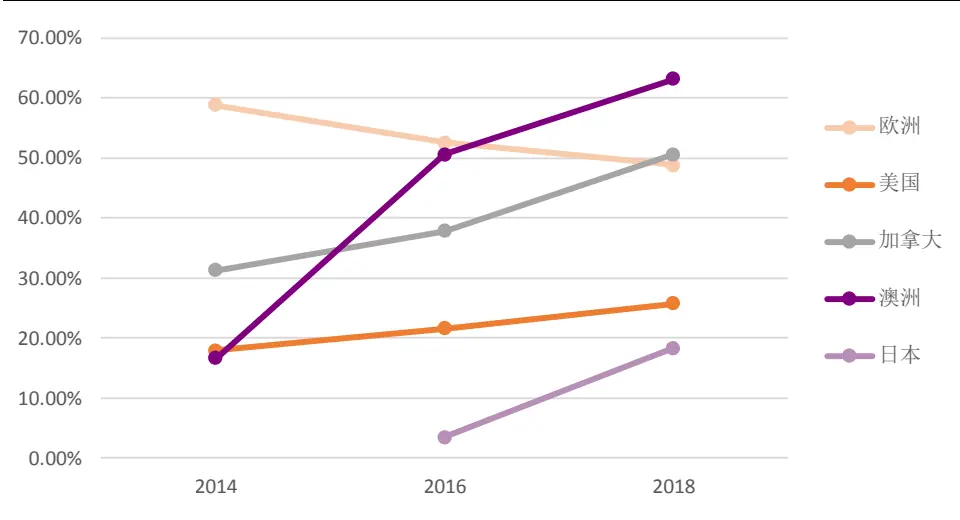
资料来源：GISA

就全球范围内 ESG 投资资产规模而言，欧洲占比最高，几乎占全球可持续投资资产的一半。日本自 2016 年以来，在全球可持续投资资产中所占比例增长了三倍，取得了令人瞩目的增长。而美国，加拿大和澳洲/新西兰，全球可持续投资资产的比例在过去两年中基本保持不变。

图2：2018年全球可持续投资资产占比
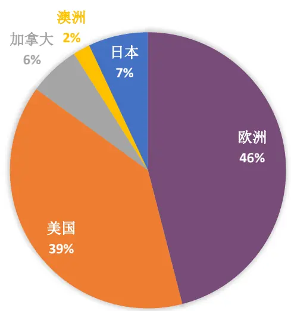
资料来源：GISA

## ESG 在海外资管行业的具体应用：以高盛资管为例

高盛 2005 年发布《高盛环境政策框架》，建立相对完整的“环境政策框架”。2015 年，高盛资管收购了专注于 ESG 研究的 Imprint Capital。

高盛资管认为 ESG 因素在投资策略中变得越来越重要，同时高盛资管的客户对 ESG 和影响力投资策略越来越关注。截至 2018 年 12 月 31 日，高盛资管通过 ESG 和影响力投资策略管理的资产规模达到 173 亿美元，另外还有641 亿美元的资产投资于加入ESG考量的资产标的。

高盛资管各个团队均将ESG整合进了投资流程中，ESG对于各个团队的贡献与影响也是多方面的。

表 2：高盛资管各投资团队对 ESG 因素的整合

| 投资团队 | ESG 整合 | ESG 贡献与影响 |
| --- | --- | --- |
| 基本面权益团队（FE） | FE团队在基本面投资决策中考虑ESG因素，利用外部ESG 数据、内部定性研究和与管理团队的积极参与，以识别重要 的风险和回报驱动因素，并将其作为投资组合长期价值创造 的核心支柱。 | 美国权益类ESG 全球权益合伙人ESG 国际权益ESG 新兴市场 ESG ESG加强了中小企业的： |
| 固收团队（FI) | FI将ESG因素的分析整合到其基本的自下而上的投资过程 中，在这个过程中，他们寻求确定他们认为对决定债券/行 业表现是好是坏至关重要的因素。他们采用相同的方法来分 析ESG，致力于像对待其他信用因素一样重视ESG数据， 评估ESG对信贷质量和息差的潜在影响。 | 1. 企业信用贷 2. 新兴市场债券 3. 证券化信贷 4. 市政信贷 5. 短久期债务 |
| 量化投资团队（QIS） | QIS利用其全面的分析能力，从一系列专有和外部来源研究1. 标普环境与社会责任策略 各种ESG 数据。ESG数据用于识别潜在的阿尔法信号，如 果这些信号具有足够的增量财务价值，他们将被整合到阿尔 法策略中。ESG数据也被用于排除或调整股票池，以满足 客户的 ESG 需求。 | 2. 风险识别，低排放策略 3. 税务识别，ESG因子权益策略 4. 定制化 ESG 权益 5. ESG产品：高盛资管客户广泛暴露 |
| 私有房地产团队(PRE) | PRE旨在整合ESG考量因素，为投资者、租户和社区创造 价值。PRE还旨在监测管理环境和社会风险以及投资的经 济风险。寻求利用资源、关系和知识，以最高效的方式将 ESG理念融入整个投资决策流程。该小组持续改进其ESG 方法，以尽可能实现环境和社会影响，其重点是为投资者最 大限度地保持一致和持久的长期业绩。 | 混合和定制的ESG集成房地产资产 |

资料来源：GSAM

## 2、ESG 投资与 A 股融合度提升

A 股目前的 ESG 投资发展进程相对较为滞后，其中一项比较重要的原因就是信息披露制度的不完善，从而导致 ESG 评级的覆盖度较低。不过，伴随沪深港通陆续开通、MSCI等国际指数纳入A股，外资在A 股市场的比重逐步提升、话语权逐步提高，国内对ESG投资关注度明显提高。

根据Wind 数据，截至 2019 年底，以ESG为主题的公募基金共 11支，总规模达 153 亿元。

表 3：A 股现有 ESG 主题公募基金

| 代码 | 简称 | 成立日期 | 规模（亿） |
| --- | --- | --- | --- |
| 340007.OF | 兴全社会责任 | 2008-04-30 | 59.5080 |
| 510090.OF | 建信上证社会责任ETF | 2010-05-28 | 1.1913 |
| 530010.OF | 建信上证社会责任ETF联接 | 2010-05-28 | 1.2686 |
| 470028.OF | 汇添富社会责任 | 2011-03-29 | 27.4647 |
| 530019.OF | 建信社会责任 | 2012-08-14 | 0.2499 |
| 000042.OF | 财通中证 100 指数增强 A | 2013-03-22 | 10.5236 |
| 000017.OF | 财通可持续发展主题 | 2013-03-27 | 1.2791 |
| 161912.OF | 万家社会责任定开A | 2019-03-21 | 5.9488 |
| 501086.OF | 华宝 MSCI 中国 A 股国际通 ESG | 2019-08-21 | 3.1825 |
| 007548.OF | 易方达 ESG 责任投资 | 2019-09-02 | 14.8069 |
| 008264.OF | 南方 ESG 主题 A | 2019-12-19 | 27.9031 |

资料来源：Wind，截止 2019-12-31

## 2.1、政策端逐渐推进

我国当前还未针对 ESG 信息披露出台专门的法律法规，现有的披露政策与指引主要还是体现在社会责任报告上。

与海外由投资需求推动、国际组织主导的披露标准不同，中国的责任报告指引主要是由政府和监管部门为主导，自上而下地推动责任报告的披露。

表4：A股 ESG 信息披露政策梳理

| 时间 | 机构 | 文件 | 内容 |
| --- | --- | --- | --- |
| 2002.01 | 证监会 | 《上市公司治理准则》 | 对上市公司治理信息的披露范围做出了明确规定 |
| 2007.04 | 国家环境保护 总局 | 《环境信息公开办法（试行）》 | 鼓励企业自愿通过媒体、互联网或者企业年度环境报告的 方式公开相关环境信息 |
| 2007.12 | 国资委 | 《关于中央企业履行社会责任的指 导意见》 | 将建立社会责任报告制度纳入中央企业履行社会责任的 主要内容 |
| 2008.02 | 国家环境保护 总局 | 《关于加强上市公司环境保护监督 管理工作的指导意见》 | 环保总局与中国证监会建立和完善上市公司环境监管的 协调与信息通报机制，促进上市公司特别是重污染行业的 上市公司真实、准确、完整、及时地披露相关环境信息 |
| 2010.09 | 环境保护部 | 意见稿）》 | 《上市公司环境信息披露指南（征求规范了上市公司披露年度环境报告以及临时环境报告信 息披露的时间与范围 |
| 2017.12 | 证监会 | 《第17号公告》和《第18号公告》 | 鼓励公司结合行业特点，主动披露积极履行社会责任的工 作情况；属于环境保护部门公布的重点排污单位的公司或 其重要子公司，应当根据法律、法规及部门规章的规定披 露主要环境信息 |
| 2018.09 | 证监会 | 《上市公司治理准则》修订 | 增加了利益相关者、环境保护与社会责任章节，规定了上 市公司应当依照法律法规和有关部门要求披露环境信息 (E)、履行扶贫等社会责任(S)以及公司治理相关信 息（G) |

资料来源：证监会、国资委、环境保护部，光大证券研究所整理

2018 年9 月，证监会对《上市公司治理准则》进行了修订，增加了利益相关者、环境保护与社会责任章节，规定了上市公司应当依照法律法规和有关部门要求披露环境信息（E）、履行扶贫等社会责任（S）以及公司治理相关信息（G）。

## 2.2、投资端内外助力

我们认为伴随养老金入市和 MSCI 纳入因子扩大这两个因素的合力影响，ESG投资与 A股的融合度将逐渐提升。

## 1. 内部因素：

养老金入市的进程逐步推进。由于 ESG 投资理念和养老金投资目标的契合度较高，海外很多地区的养老金投资决策中都规定了 ESG的筛选标准。未来每年千亿级别养老金大规模入市，全球养老金投资纳入ESG的背景下，ESG投资与A 股的融合度也将提升。

同时，随着 2018 和 2019 年二级市场的商誉减值、违约、财务问题等的暴露，国内的投资者更加重视公司治理的能力，并且开始关注通过 ESG剔除此类风险股票。

## 2. 外部因素：

A 股扩大MSCI纳入因子，外资流入加速。扩大MSCI纳入因子对ESG投资A 股化具有重要促进意义：

1）外资加速流入强化 ESG 投资倾向：ESG 原则在海外投资中应用较为成熟，投资占比较高。外资加速流入A 股将改善当前A 股市场短视化、高波动的现状；

2）倒逼政策推进ESG信息披露：由于A股公司ESG相关信息披露不足，难以量化考量，导致大部分公司 ESG 评级较低，随着外资机构投资者占比升高，A股公司将强化 ESG信息披露，提高ESG评级以进一步吸引海外资金流入。

图 3：ESG 投资与 A 股的融合
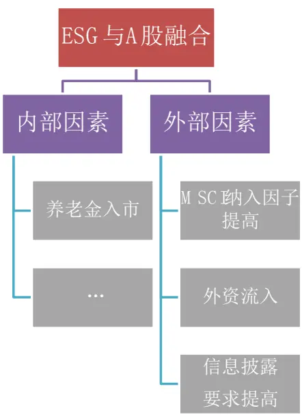
资料来源：光大证券研究所

## 2.3、商道融绿 ESG 评价体系

本篇报告中的A 股ESG相关数据将主要参考商道融绿的 ESG数据，商道融绿是国内领先的绿色金融及责任投资专业服务机构，专注于为客户提供责任投资与 ESG 评估及信息服务、绿色债券评估认证、绿色金融咨询与研究等专业服务。商道融绿还是中国责任投资论坛（ChinaSIF）的发起机构，同时还是国内首家联合国责任投资原则（UN-PRI）签署机构。

融绿 ESG 评估流程分为四个步骤：信息收集、分析评估、评估结果和报告呈现。

（1） 信息收集环节，信息来源主要为公司年报、责任报告、政府信息和媒体。

（2） 分析评估环节，融绿 ESG评估指标分为三级：一级指标为 E、S、G三大方面，二级指标细化为 13个方面，三级指标继续细化为 127个数据项。融绿ESG评估指标体系的特点在于重视负面事件的评价。在每个一级指标下的二级指标中，都包含了负面事件二级指标。三个负面事件指标形成了融绿ESG负面信息监控体系，有助于投资者进行负面剔除的选股方法。

（3） 评估结果环节，融绿 ESG评级分为A+到D共 10 个等级。根据不同行业ESG的实质性因子进行加权计算，并最终得到每个上市公司的ESG 综合得分。

（4） 报告呈现环节，评级报告将会呈现公司 ESG 的评分以及负面信息报告。

图4：商道融绿 A股上市公司ESG评估指标体系

| 一级指标 | 二级指标 | 三级指标 |
| --- | --- | --- |
| E环境 | E1 环境管理 | 环境管理体系、管理管理目标，员工环境意识，节能和节水政策，绿色采购政策等 |
|  | E2 环境披露 | 能源消耗，节能，耗水，温室气体排放等 |
|  | E3 环境负面事件 | 水污染，大气污染，固废污染等 |
| S社会 | S1 员工管理 | 劳动政策，反强迫劳动，反歧视，女性员工，员工培训等 |
|  | S2 供应链管理 | 供应链责任管理，监督体系等 |
|  | S3 客户管理 | 客户信息保密等 |
|  | S4 社区管理 | 社区沟通等 |
|  | S5产品管理 | 公平贸易产品等 |
|  | S6 公益及捐赠 | 企业基金会，捐赠及公益活动等 |
|  | S7 社会负面事件 | 员工，供应链，客户，社会及产品负面事件 |
| G 公司治理 | G1 商业道德 | 反腐败和贿赂，举报制度，纳税透明度等 |
|  | G2 公司治理 | 信息披露，董事会独立性，高管薪酬，董事会多样性等 |
|  | G3 公司治理负面事件 | 商业道德、公司治理负面事件 |

资料来源：商道融绿

目前A 股的社会责任报告披露制度不完善，数据的完整性和及时性仍然较为欠缺，ESG评级所需的数据依然有较大程度的缺失，尤其是E 和S的数据缺口仍然较大。ESG 报告披露的覆盖度在全市场仍然较低，在沪深 300成份内的覆盖度相对较高：

图 5：A 股 ESG 报告披露情况（单位：份）
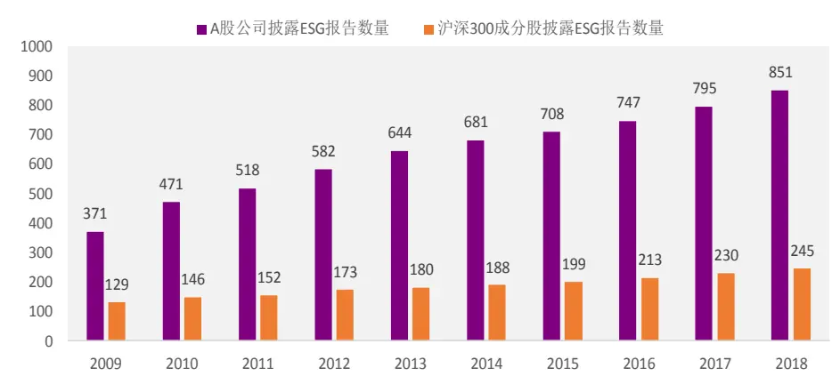
资料来源：商道融绿，光大证券研究所

不过从我们前文的分析和近年来的监管趋势可以看出，上市公司社会责任报告的披露将逐渐规范，ESG评价所需的数据披露情况也将日渐完善。

从沪深300 成分股的 ESG总得分的变化情况也可看出，沪深 300 成分股的公司在社会责任方面的表现正在逐年提升，也一定程度上反映出A 股上市公司对ESG的重视程度的提升。

图 6：沪深 300 成分股 ESG 总分
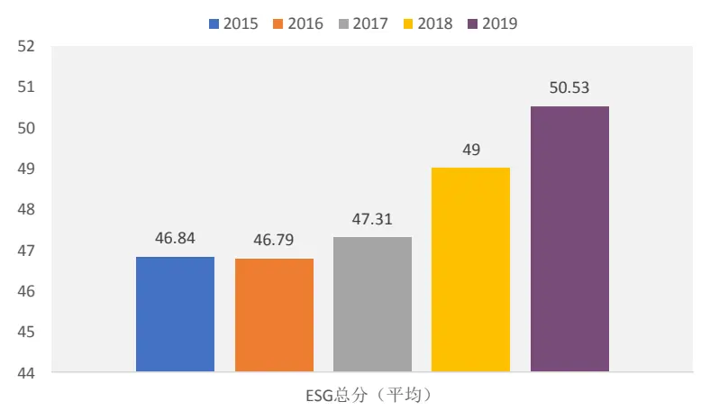
资料来源：商道融绿，光大证券研究所

## 3、ESG 因子选股表现

我们分别从环境 E、社会 S 和公司治理 G 的明细得分数据，以及 ESG总得分数据，测试 ESG 各项指标在不同选股样本（沪深 300 和中证 500）内的多头和空头选股效果。

多头收益主要考察指标的选股超额收益能力，而空头收益则是考察指标用来作为尾部剔除时的“排雷”能力。多头组合为 ESG 得分最高的 20%的股票，相应的，空头组合为 ESG得分最低的20%的股票。

由于我们采用的 ESG 数据来源于商道融绿提供的明细得分数据，沪深300成分股的起始时间为2015年6 月，中证500成分股的起始时间为 2018年6月，本章的测试起始时间与数据起始时间相同，测试截止时间均为2019年 12 月 31 日。

## 3.1、环境 E：沪深 300 内负面组合效果较好

由于环境E 和社会责任S的评级和得分数据历史较短，仅 2015 年以后开始有一部分公司规范性的披露此类数据，因此在测试此类指标的表现时，我们将主要从指标的多头和空头选股收益表现出发，观察其是否有显著的超额收益，以及收益的稳定性。

目前A 股上市公司在环境方面的数据披露的覆盖度比较一般，平均披露概率约为 40.4%。

表5：环境相关数据披露情况

| 类型 | 议题 | 使用频率 |
| --- | --- | --- |
| 环境管理 平均披露率 44.6% | 环境管理体系认证 | 49.00% |
|  | 环境管理目标 | 81.60% |
|  | 节能政策与可再生能源应用 | 77.70% |
| 环境数据 平均披露率 35.2% | 能源消耗量与节能量 | 39.40% |
|  | 废气排放量与减排量 | 38.90% |
|  | 废水排放量与减排量 | 46.40% |
|  | 危险废物排放量与减排量 | 36.30% |
|  | 废弃物的循环利用率 | 39.90% |

资料来源：商道融绿

目前 A 股上市公司的环境 E 得分在沪深 300 内和中证 500 内的多头和空头表现分别如下所示，此处多头和空头的持仓数量均为成分股数量的20%。

图7：沪深300内环境（E）多头收益表现
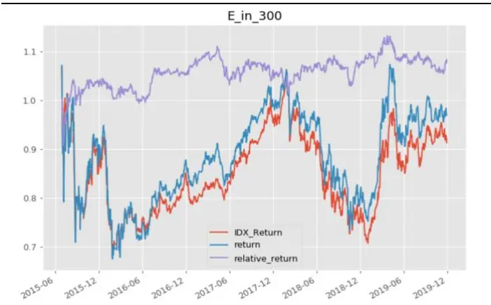
资料来源：光大证券研究所

图 8：沪深 300 内环境（E）空头收益表现
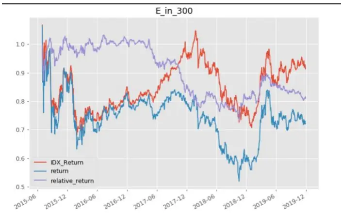
资料来源：光大证券研究所

图 9：中证 500 内环境（E）多头收益表现
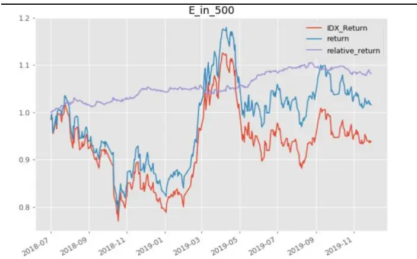
资料来源：光大证券研究所

图 10：中证 500 内环境（E）空头收益表现
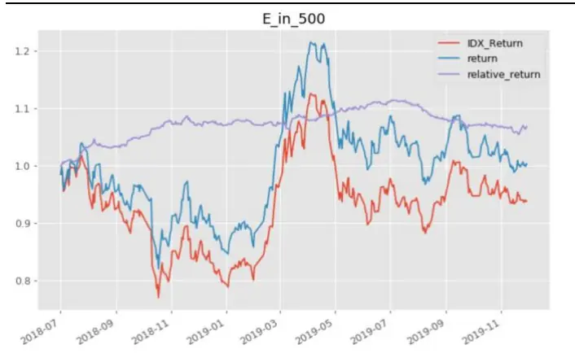
资料来源：光大证券研究所

环境 E 的得分在沪深 300 内多头超额收益并不显著，空头表现较好，指标的尾部“排雷”效果相对较高。在中证500 内基本没有区分能力，这也与中证500成分股在环境方面的数据披露率较低有关。

因此，环境E得分的适用场合主要是沪深300 内的负面剔除。

## 3.2、社会责任 S：效果一般

目前A 股上市公司在社会方面的数据披露的覆盖度较低，平均披露率约为 28.9%。

表6：社会相关数据披露情况

| 类型 | 议题 | 使用频率 |
| --- | --- | --- |
| 社会 平均披露率 28.9% | 每年接受职工培训的员工数量和时长 | 66.10% |
|  | 捐赠 | 88.70% |
|  | 反强迫劳动 | 32.60% |
|  | 禁止雇佣童工 | 32.30% |
|  | 反歧视 | 41.70% |
|  | 女性员工数量 | 35.50% |
|  | 职业健康和安全 | 85.40% |
|  | 因公死亡人数 | 54.70% |
|  | 事故损失工时比例 | 38.00% |

资料来源：商道融绿

目前 A 股上市公司的社会 S 得分在沪深 300 内和中证 500 内的多头和空头表现分别如下所示，此处多头和空头的持仓数量均为成分股数量的20%。

图 11：沪深 300 内社会（S）多头收益表现
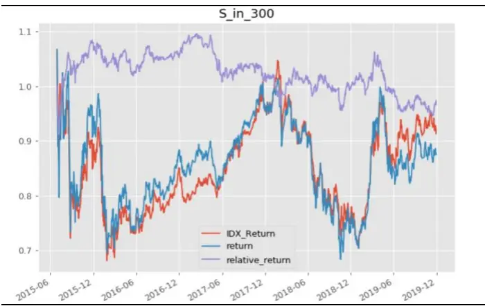
资料来源：光大证券研究所

图 12：沪深 300 内社会（S）空头收益表现
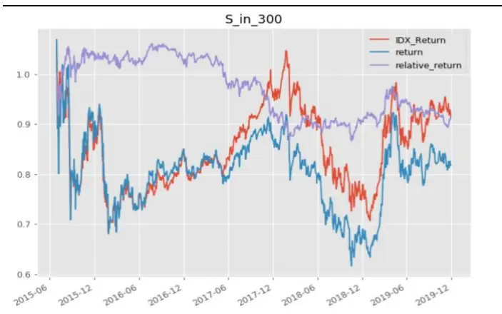
资料来源：光大证券研究所

图 13：中证 500 内社会（S）多头收益表现
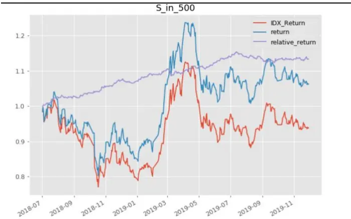
资料来源：光大证券研究所

图 14：中证 500 内社会（S）空头收益表现
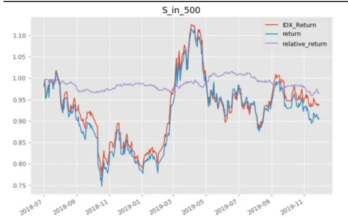
资料来源：光大证券研究所

社会S 的得分在沪深 300内多头超额收益并不显著，空头组合有一定的负向超额收益，指标在尾部有一定的“排雷”能力。在中证 500内多头收益相对较好，而中证500内的空头表现较差。

因此，社会S 得分的适用场合主要是中证 500 内的多头选股和沪深 300内的尾部剔除。

## 3.3、公司治理 G：近年来因子表现较好

由于公司治理的相关明细指标数据可得性相对较强，这里我们分为两个部分来讨论公司治理指标（因子）的有效性：商道融绿公司治理得分 G，和我们前期报告中构造的公司治理因子（Comp_opt）。

## 3.3.1、商道融绿公司治理得分：沪深 300内负面组合效果较好

目前A 股上市公司在公司治理方面的数据披露的覆盖度相对较高，平均披露率约为66.3%。公司治理主要考察的是上市公司在董事会结构、薪酬结构、审计委员会等方面的情况。

表7：公司治理相关数据披露情况

| 类型 | 议题 使用频率 |  |  |  |
| --- | --- | --- | --- | --- |
|  | 董事薪酬 97.40% |  |  |  |
|  |  |  | CEO与员工平均薪酬比 97.70% |  |
| 公司治理平均披露率 66.3% |  |  |  |  |
|  |  |  |  | 董事会多样性 75.80% |
|  | 董事会独立性 97.20% |  |  |  |
|  | 独立薪酬委员会 82.90% |  |  |  |
|  | 独立审计委员会 88.40% |  |  |  |
|  |  | 独立提名委员会 86.40% |  |  |
|  | 专题委员会 80.50% |  |  |  |
|  | 无保留意见的审计报告 95.20% |  |  |  |

资料来源：商道融绿

图 15：沪深 300 内公司治理（G）多头收益表现
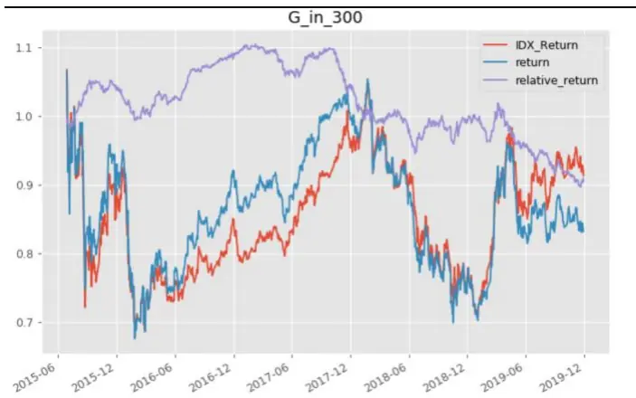
资料来源：光大证券研究所

图16：沪深 300内公司治理（G）空头收益表现
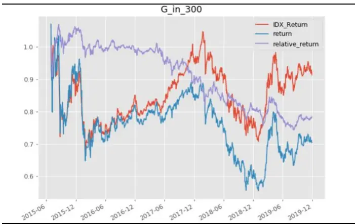
资料来源：光大证券研究所

图 17：中证 500 内公司治理（G）多头收益表现
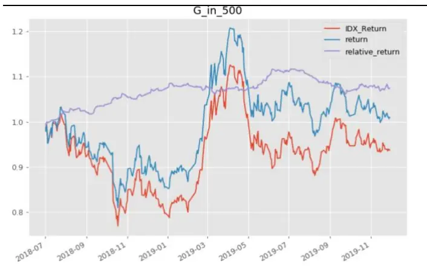
资料来源：光大证券研究所

图 18：中证 500 内公司治理（G）空头收益表现
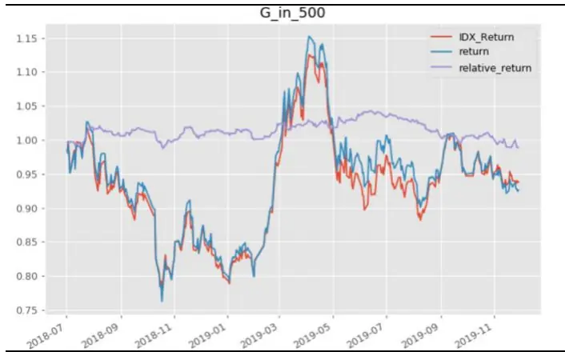
资料来源：光大证券研究所

根据商道融绿提供的公司治理 G 的得分在沪深 300 内多头超额收益并不显著，沪深 300 内空头组合的负向收益比较明显。在中证 500 内多头收益相对较好，而中证500内的空头表现较差。

## 3.3.2、光大金工公司治理因子（Comp_Opt）

公司治理方面的数据主要由公司的股权结构、公司员工结构、高管薪酬、公司股权激励等方面构成，数据的来源主要是年度报告和交易所公告。

我们在前期的报告《别开生面：公司治理因子详解》中，已经对公司治理的综合因子构造进行的尝试，采用股权结构与股东权利、董事会构成、管理层激励、信息披露与合规、激励约束机制等多维度衡量公司的治理水平。具体的指标筛选和构造细节请参考《别开生面：公司治理因子详解——多因子系列报告之四》报告正文。

表8：光大金工公司治理细分因子明细及权重

| 大类因子 | 细分类别 | 指标代码 | 因子描述 | 指标方向 | 权重 |
| --- | --- | --- | --- | --- | --- |
| 公司治理因子 | 股权结构与股东 | First_Percent | 第一大股东持股比例 | + | 1 |
|  |  | Two_Ten_Percent | 第二至十大股东持股比例 | - | -1 |
|  |  | Mc_percent | 流通股占比 | + | 2 |
|  |  | Shareholder_Number | 上市公司股东数量 | 一 | -1 |
|  | 董事与董事会 | Ind_director_num | 独立董事占比 | + | 1 |
|  |  | Director_num | 董事会委员数量 | + | 1 |
|  | 管理层薪酬及持股 | Mana_income | 管理层薪酬（前十） | + | 2 |
|  |  | Mana_share_num | 管理层持股数量 | + | 2 |
|  | 信息披露与合规 | Deal_Method | 受证监会、交易所等处罚情况 | -- | -5 |
|  | 激励机制 | Stock_Incentive | 是否实施股权激励 | ++ | 5 |

资料来源：光大证券研究所

我们最终在简单加权的方法下，将第一大股东持股比例、第二至十大股东持股比例、流通股占比、公司股东数量、独立董事占比、董事会委员数量、管理层薪酬、管理层持股数量、受证监会、交易所等处罚情况、是否实施股权激励这 10 大指标结合成为公司治理因子。

图 19：光大金工公司治理因子（Comp_Opt）月度 IC 序列
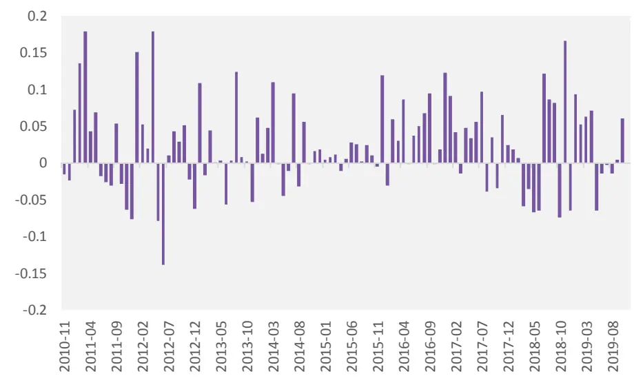
资料来源：光大证券研究所，2010-10-01 至 2019-12-31

表 9：光大金工公司治理因子测试结果

| Comp_Opt |  |
| --- | --- |
| IC mean | 平均IC 2.79% |
| IC std | IC 标准差 5.66% |
| IR | 信息比 0.49 |
| IC positive per | IC 胜率 70% |
| Long_Short_return | 多空年化收益 2.30% |
| Turnover | 换手率 9% |
| Mono_score | 单调性 0.31 |
| Long_Short_sharpe | 多空夏普 0.14 |
| Factor Return | 因子收益 0.23% |
| Factor Return tstat | 因子收益显著性 4.92 |

资料来源：光大证券研究所，2010-01-01 至 2019-12-31

公司治理因子的整体表现尚可，IC 均值为2.79%，IC_IR 达到0.49，因子收益均值为0.23%，而多空收益表现一般，单调性得分较低，因子的收益稳定性相对较弱。

我们也从多头和空头收益表现的角度，观察Comp_opt 公司治理因子的收益能力和“排雷”能力。

图 20：沪深 300 内 Comp_Opt 得分多头收益表现
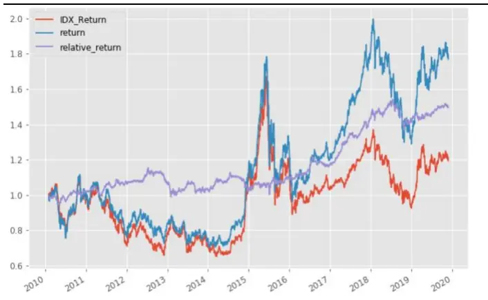
资料来源：光大证券研究所

图 21：沪深 300 内 Comp_Opt 得分空头收益表现
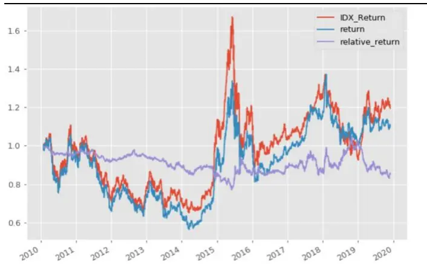
资料来源：光大证券研究所

图 22：中证 500 内 Comp_Opt 得分多头收益表现
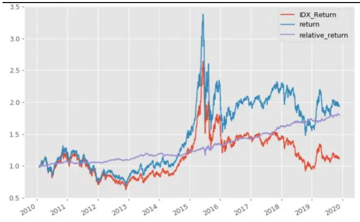
资料来源：光大证券研究所

图 23：中证 500 内 Comp_Opt 得分空头收益表现
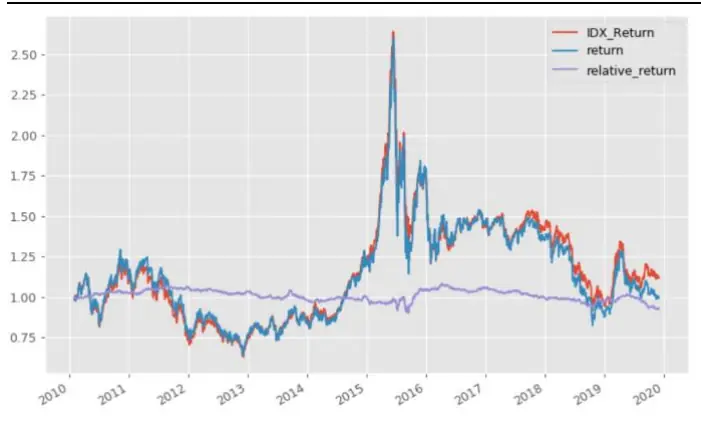
资料来源：光大证券研究所

与商道融绿提供的公司治理 G 得分相比，Comp_Opt 因子在沪深 300内的多头表现更好，空头表现弱于商道融绿公司治理指标。中证 500成分股内的表现比较类似，多头有一定的超额收益，而空头表现一般。

## 3.4、ESG 总分：300 内空头效果较好，500 内多头超额较高

上文我们分别测试了E、S、G三方面细分指标的选股效果，整体上看，三个细分指标的空头表现好于多头，细分指标的尾部剔除效果相对较好。

而海外和国内市场投资者更多关心的还是 ESG 的三方面汇总后表现，下文测试了目前A股上市公司的ESG总得分在沪深300内和中证500内的多头和空头表现，此处多头和空头的持仓数量均为成分股数量的 20%。

图 24：沪深 300 内 ESG 得分多头收益表现
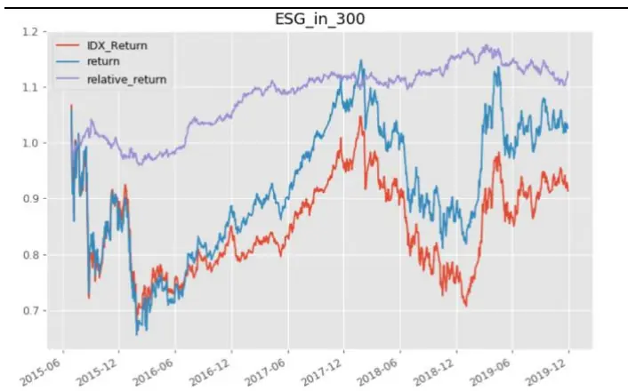
资料来源：光大证券研究所

图 25：沪深 300 内 ESG 得分空头收益表现
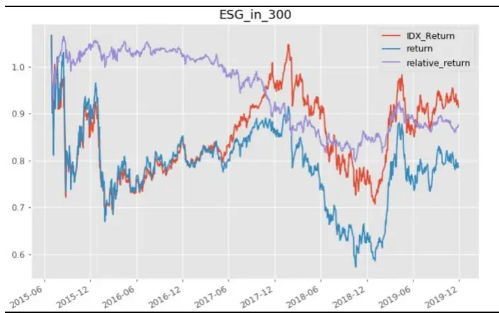
资料来源：光大证券研究所

图 26：中证 500 内 ESG 得分多头收益表现
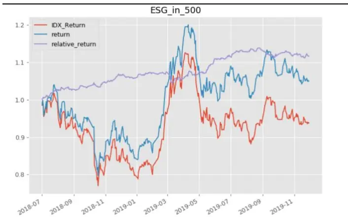
资料来源：光大证券研究所

图 27：中证 500 内 ESG 得分空头收益表现
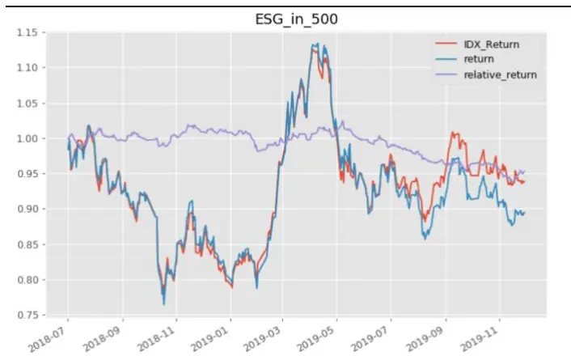
资料来源：光大证券研究所

## 整体上来看，ESG 总分在沪深 300 内的有效性较高，多头和空头均具有一定的选股能力。中证500成分股内的多头表现较好，但是空头的表现一般。

受限于 A 股 ESG 数据历史较短，分析结果的显著性和有效性一定程度上受到影响，因此我们需要更长时间的历史数据来进一步验证 ESG 在 A 股的选股效果。

但就目前已有的综合ESG得分结果来看，ESG至少在沪深 300 内具有比较稳定的选股能力和“排雷”能力。加上我们前文分析的外资流入对于 A股 ESG 投资带来的影响，同时随着越来越多的国内投资机构和投资者将ESG理念加入自己的投资框架，我们认为ESG指标的有效性会进一步提升，ESG得分较低的公司在资金端的偏好会降低，从而导致其收益下降。

## 4、ESG 得分与公司基本面

投资者关注 ESG 得分的其中一个关键目标是改善投资组合的风险收益特征，希望 ESG 能够从非财务信息中鉴别好公司，能够提供 Alpha 收益，能够帮助我们排除“雷股”并控制组合的风险。那么 ESG 与 A 股上市公司基本面指标之间是否真的具有相关性？或者 ESG 对于公司财务质量是否有一定影响能力呢？

本章我们将尝试分析 ESG 得分与公司财务风险及业绩表现之间的相关性，受限于 A 股 ESG 数据的历史较短、覆盖度较低，我们不做过多的相关性上的数据挖掘，而是通过行业中性后的分组统计数据做一些验证。

## 4.1、ESG 与公司盈利能力正相关

Gregory，Tharyan 和 Whittaker（2014）认为 ESG 与公司盈利能力之间存在正向传导机制：

1．ESG 评级较高的公司比同行更具竞争力。这种竞争优势可能源于其对资源更有效的利用、更好的人力资本运用或者更好的创新管理。除此之外，ESG评级较高的公司通常更擅长制定长期的业务计划和对高管的激励计划。

2．ESG 评级较高的公司利用其竞争优势产生更高的盈利。

图28：ESG五分位组合的营收增速中位数
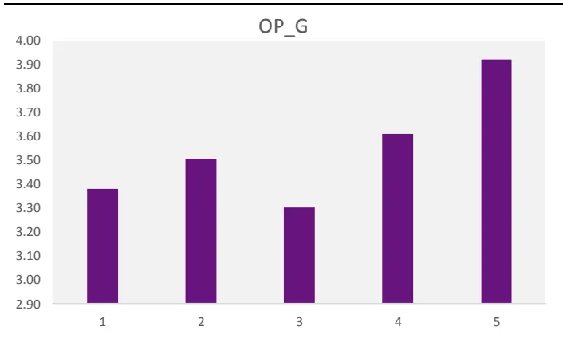
资料来源：光大证券研究所

图 29：ESG 五分位组合的 ROE 中位数
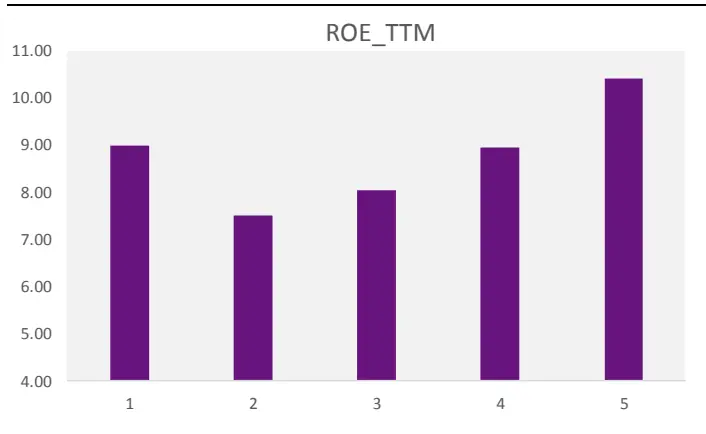
资料来源：光大证券研究所

实证表明 ESG 评级高的公司盈利能力更强，成长能力也更高。行业中性后按照ESG总分从低到高分五组，第五组的营收增速指标（OP_G）最高，第四组次之，其余三组的单调性一般。行业中性后按照 ESG 总分从低到高分五组，第五组的净资产收益率（ROE）最高，除了最低组第一组外其余组别的单调性均比较明显。

## 4.2、ESG 与股息率正相关

上一节中可知 ESG 与公司盈利能力基本呈现正相关，而进一步的，高盈利能力的公司，支付的股息也应该较高。同时考虑到关注 ESG 的投资者往往是关注基本面的长期投资者，其对于股息率的诉求也应较高。

图 30：ESG 五分位组合的股息率指标中位数
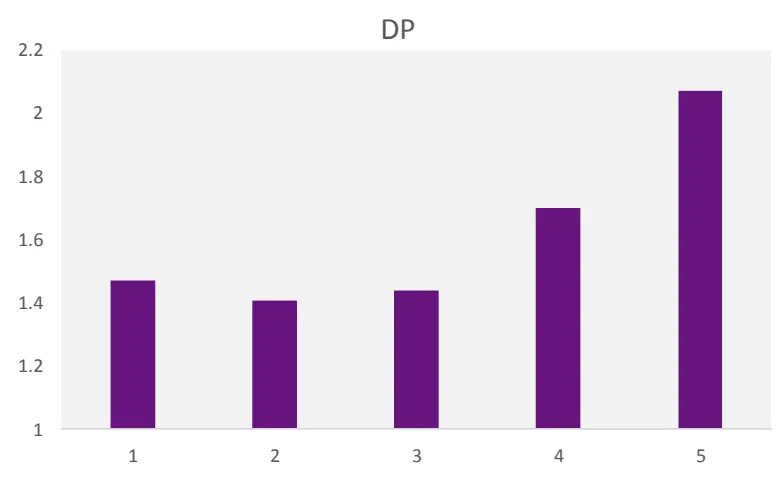
资料来源：光大证券研究所

分组结果可见，ESG得分最高组的股息率显著高于其他组别，且各组的单调性较好。说明 ESG 与公司盈利能力之间的正向传导机制可能的确是存在的，且可进一步地传导到股息支付上。因此，高 ESG 策略对高股息公司的倾斜有助于提高策略的中长期表现。

## 4.3、高 ESG 对应较低的残差风险

从控制风险的角度来看，同样有很多研究证明 ESG 高评级可以传导至较低的个股尾部风险。

例如 Oikonomou、Brooks 和 Pavelin（2012 年）分析的传导机制的原理如下：

1.具有较高 ESG 的公司通常在公司管理中具有高于平均水平的风险控制能力与合规标准。

2.由于更高的风险控制能力，ESG高评级的公司遭受欺诈、贪污、腐败或诉讼案件等负面事件的影响会更小。这些负面事件可能会严重影响公司的价值，进而影响公司的股价。

3.风险事件的减少最终降低了公司股价的下行风险，或尾部风险。

图31：ESG五分位组合的残差波动率中位数
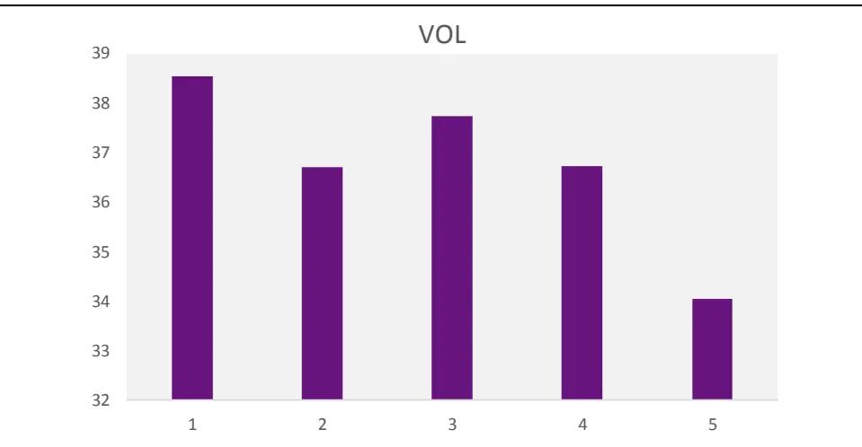
资料来源：光大证券研究所

上图表明，ESG 得分高的公司具有较低的尾部风险。我们用 CAPM 模型的残差波动率来衡量个股的尾部风险。行业中性后按照 ESG 总分从低到高分五组，第五组的残差波动率（Res_Vol）最低，且显著低于其它组别。

## 5、ESG投资展望：完善披露制度，有效性提升

目前国内 ESG 信息披露环节主要的不足主要在于：1.上市公司的 ESG信息披露缺乏统一的框架。由于企业缺乏 ESG 信息披露的统一框架和健全的指标体系，导致目前国内上市公司已披露的ESG报告信息价值较低。2. 目前已披露的社会责任报告以描述性披露为主，对负面指标披露较少。信息披露的不足导致评级机构缺乏有效的评级依据，造成评级结果缺乏有效性。

因此，ESG 信息披露机制的完善是推动中国 ESG 投资发展的第一要务。

根据中国经营报报道（2019 年6 月8 日），上交所的《ESG指引》或将出台，该指引将以强制性原则为基础，要求上市公司披露 ESG 信息。这一措施一方面可以强制上市公司披露具有 ESG 投资针对性的信息，还可以促进社会责任报告脱虚入实，统一披露指标。

加上我们前文分析的外资流入对于 A 股 ESG 投资带来的影响，同时随着越来越多的国内投资机构和投资者将 ESG 理念结合进自己的投资框架，我们认为随着信息披露制度的完善，A 股 ESG 指标的正向选股和负向剔除的有效性都会进一步提升。

## 6、风险提示

报告结论均基于历史数据与模型，模型存在失效的可能，历史数据存在不被重复验证的可能。

## 行业及公司评级体系

| 评级 说明 |
| --- |
| 行 买入 未来6-12个月的投资收益率领先市场基准指数15%以上； |
| 增持 未来6-12个月的投资收益率领先市场基准指数5%至15%； |
| 中性 未来6-12个月的投资收益率与市场基准指数的变动幅度相差-5%至5%； |
| 减持 未来6-12个月的投资收益率落后市场基准指数5%至15%； |
| 卖出 未来6-12个月的投资收益率落后市场基准指数15%以上； |
| 因无法获取必要的资料，或者公司面临无法预见结果的重大不确定性事件，或者其他原因，致使无法给出明确的无评级投资评级。 |
| 基准指数说明：A股主板基准为沪深300指数；中小盘基准为中小板指；创业板基准为创业板指；新三板基准为新三板指数；港股基准指数为恒生指数。 |

## 分析、估值方法的局限性说明

本报告所包含的分析基于各种假设，不同假设可能导致分析结果出现重大不同。本报告采用的各种估值方法及模型均有其局限性，估值结果不保证所涉及证券能够在该价格交易。

## 分析师声明

本报告署名分析师具有中国证券业协会授予的证券投资咨询执业资格并注册为证券分析师，以勤勉的职业态度、专业审慎的研究方法，使用合法合规的信息，独立、客观地出具本报告，并对本报告的内容和观点负责。负责准备以及撰写本报告的所有研究人员在此保证，本研究报告中任何关于发行商或证券所发表的观点均如实反映研究人员的个人观点。研究人员获取报酬的评判因素包括研究的质量和准确性、客户反馈、竞争性因素以及光大证券股份有限公司的整体收益。所有研究人员保证他们报酬的任何一部分不曾与，不与，也将不会与本报告中具体的推荐意见或观点有直接或间接的联系。

## 特别声明

光大证券股份有限公司（以下简称“本公司”）创建于 1996 年，系由中国光大（集团）总公司投资控股的全国性综合类股份制证券公司，是中国证监会批准的首批三家创新试点公司之一。根据中国证监会核发的经营证券期货业务许可，本公司的经营范围包括证券投资咨询业务。

本公司经营范围：证券经纪；证券投资咨询；与证券交易、证券投资活动有关的财务顾问；证券承销与保荐；证券自营；为期货公司提供中间介绍业务；证券投资基金代销；融资融券业务；中国证监会批准的其他业务。此外，本公司还通过全资或控股子公司开展资产管理、直接投资、期货、基金管理以及香港证券业务。

本报告由光大证券股份有限公司研究所（以下简称“光大证券研究所”）编写，以合法获得的我们相信为可靠、准确、完整的信息为基础，但不保证我们所获得的原始信息以及报告所载信息之准确性和完整性。光大证券研究所可能将不时补充、修订或更新有关信息，但不保证及时发布该等更新。

本报告中的资料、意见、预测均反映报告初次发布时光大证券研究所的判断，可能需随时进行调整且不予通知。在任何情况下，本报告中的信息或所表述的意见并不构成对任何人的投资建议。客户应自主作出投资决策并自行承担投资风险。本报告中的信息或所表述的意见并未考虑到个别投资者的具体投资目的、财务状况以及特定需求。投资者应当充分考虑自身特定状况，并完整理解和使用本报告内容，不应视本报告为做出投资决策的唯一因素。对依据或者使用本报告所造成的一切后果，本公司及作者均不承担任何法律责任。

不同时期，本公司可能会撰写并发布与本报告所载信息、建议及预测不一致的报告。本公司的销售人员、交易人员和其他专业人员可能会向客户提供与本报告中观点不同的口头或书面评论或交易策略。本公司的资产管理子公司、自营部门以及其他投资业务板块可能会独立做出与本报告的意见或建议不相一致的投资决策。本公司提醒投资者注意并理解投资证券及投资产品存在的风险，在做出投资决策前，建议投资者务必向专业人士咨询并谨慎抉择。

在法律允许的情况下，本公司及其附属机构可能持有报告中提及的公司所发行证券的头寸并进行交易，也可能为这些公司提供或正在争取提供投资银行、财务顾问或金融产品等相关服务。投资者应当充分考虑本公司及本公司附属机构就报告内容可能存在的利益冲突，勿将本报告作为投资决策的唯一信赖依据。

本报告根据中华人民共和国法律在中华人民共和国境内分发，仅向特定客户传送。本报告的版权仅归本公司所有，未经书面许可，任何机构和个人不得以任何形式、任何目的进行翻版、复制、转载、刊登、发表、篡改或引用。如因侵权行为给本公司造成任何直接或间接的损失，本公司保留追究一切法律责任的权利。所有本报告中使用的商标、服务标记及标记均为本公司的商标、服务标记及标记。

光大证券股份有限公司版权所有。保留一切权利。

## 联系我们

| 上海 | 北京 | 深圳 |
| --- | --- | --- |
| 静安区南京西路1266号恒隆广场1号 写字楼48层 | 西城区月坛北街2号月坛大厦东配楼2层 复兴门外大街6号光大大厦17层 | 福田区深南大道 6011号 NEO 绿景纪元大 厦 A 座 17 楼 |