## 规模调整的盈利因子：从盈余公积谈起——多因子系列报告之二十八

此前，我们在《创新基本面因子：财务数据全扫描——多因子系列报告之二十六》报告中，发现经盈余公积调整的盈利因子有效性较强。为了探索该因子的含义，本篇报告从盈余公积数据的计提规则、特点出发，剖析了盈余公积与盈利因子之间的关系，并创新性构建了规模调整的盈利因子，供投资者参考。

- 盈余公积可看作企业留存收益，绝大部分企业按法定比例计提盈余公积。盈余公积是权益的一个科目，是企业从每年净利润中提取出来的，用途受到一定限制，故很多企业不愿过多计提。从数据层面来看，成熟型企业盈余公积占注册资本比例较高，尤其是银行业；而绝大部分企业（超过 60%）每年按法定比例计提盈余公积。因此，盈余公积数据在时间维度上就两个特点：一是规模累积；二是不均匀变化，每年仅在年度利润分配时计提一次。

企业规模的变化影响其盈利能力。我们统计了企业规模与其盈利能力在时间序列上的相关性，A股市场上，超过70%的上市公司，规模与盈利能力的相关系数绝对值达到了 0.4以上，其中，约42%的上市公司，其规模与盈利能力成正相关关系；约29%的上市公司，其规模与盈利能力成负相关关系。这也说明，企业盈利能力的变化一部分是由于规模变化引起的，而这一部分增长并不可持续。基于这一特点，我们在构建选股因子时，可以考虑利用企业规模指标对盈利能力指标进行调整，以期获取可以反映企业真正内生增长的因子。

- 盈利能力在年报的变化幅度相对较大。我们统计了在不同财报期上市公司盈利能力的变化幅度，为剔除不同年份之间企业盈利差异的影响，用当年年报的变化幅度进行了标准化。并发现一季报、半年报、三季报盈利能力的变化幅度有约 70%的概率是低于年报变化幅度的。这与盈余公积每年仅计提一次的规律相契合。

- 经规模调整后的盈利因子，有效性有所提升。我们尝试用不同方式构建了规模调整的盈利因子，并发现调整后的盈利因子的稳定性明显提升，全市场范围内，其 ICIR可从0.53提升至0.66。从分组表现来看，调整后的因子分组单调性较好，多空夏普达 2.05，月度胜率也达 66%。

- 应用：规模调整盈利因子在中证 500指数增强模型中，年化可增强 1%的收益。我们尝试在中证500指数增强模型中应用规模调整的盈利因子，应用新因子后，测试期内（2011-07-01 至 2019-12-31）组合年化超额收益从 17.4%提升至18.5%，信息比率从3.02提升至3.24。分年度收益表现来看，2018年以来，新因子对组合的增强效果尤为显著。

- 风险提示：本篇报告研究基于现阶段会计准则下的财务数据进行，财务准则的变更、上市公司财务数据失真、市场短期波动，均有可能影响模型的有效性。

## 金融工程深度

## 分析师

古 翔（执业证书编号：S0930519070003）

021-52523686

guxiang@ebscn.com

周萧潇 (执业证书编号：S0930518010005)

021-52523680

zhouxiaoxiao@ebscn.com

刘均伟 (执业证书编号：S0930517040001)

021-52523679

liujunwei@ebscn.com

## 相关研究

《创新基本面因子：财务数据全扫描——多因子系列报告之二十六》

············2019-10-18

《光大 Alpha3.0：基本面优选多因子组合多因子系列报告之十九》

············2019-04-04

《组合优化算法探析及指数增强实证——多因子系列报告之十三》

············2018-08-05

《成长因子重构与优化：稳健加速为王——多因子系列报告之十二》

············2018-05-27

《因子正交与择时：基于分类模型的动态权重配置——多因子系列报告之十》

·······2018-03-10

此前，我们在《创新基本面因子：财务数据全扫描——多因子系列报告之二十六》报告中，利用时间序列回归的方法遍历了各个财务指标，并筛选出了可构造出有效因子的配对方式，进行了展示。如表1 所示，为盈利类型指标作为因变量的筛选结果。不难发现，当盈利类型指标作为因变量时，自变量取盈余公积金或每股盈余公积金，构造出来的因子有效性较强。

那么，为什么盈余公积金对于盈利类型指标有较好的提纯效果呢？本篇报告将基于盈余公积金数据的含义和特点，对该类因子的 alpha 来源进行剖析，供投资者参考。

表1：盈利类型因变量因子效果示例节选（行业、市值中性化后）

| 因变量 | 自变量 | IC 均值 | IR |
| --- | --- | --- | --- |
| 营业总成本/营业总收入 | 盈余公积金 | -3.10% | -0.79 |
| 营业利润/营业总收入 | 盈余公积金 | 3.28% | 0.78 |
| 年化净资产收益率 | 盈余公积金 | 3.74% | 0.77 |
| 年化净资产收益率 | 每股盈余公积 | 3.64% | 0.77 |
| 营业利润/营业总收入 | 每股盈余公积 | 3.21% | 0.77 |
| 年化净资产收益率 | 相对年初增长率-归属母公司的股东权益(%) | 3.06% | 0.77 |
| 营业总成本/营业总收入 | 每股盈余公积 | -3.08% | -0.76 |
| 营业利润/营业总收入 | 权益乘数(用于杜邦分析) | 2.74% | 0.76 |
| 销售成本率 | 每股盈余公积 | -2.62% | -0.75 |
| 销售毛利率 | 每股盈余公积 | 2.62% | 0.75 |
| 销售净利率 | 每股盈余公积 | 3.16% | 0.75 |
| 净利润/营业总收入 | 每股盈余公积 | 3.16% | 0.75 |
| 利润总额/营业收入 | 每股盈余公积 | 3.18% | 0.75 |
| 利润总额/营业收入 | 盈余公积金 | 3.28% | 0.74 |
| 息税前利润/营业总收入 | 盈余公积金 | 3.16% | 0.74 |
| 营业总成本/营业总收入 | 资产负债率 | -2.67% | -0.73 |
| 年化总资产报酬率 | 盈余公积金 | 3.52% | 0.73 |
| 销售净利率 | 盈余公积金 | 3.22% | 0.73 |
| 息税前利润/营业总收入 | 每股盈余公积 | 3.05% | 0.73 |
| 利润总额/营业收入 | 股东权益合计(不含少数股东权益) | 2.56% | 0.73 |
| 净利润/营业总收入 | 盈余公积金 | 3.22% | 0.73 |
| 年化总资产报酬率 | 每股盈余公积 | 3.36% | 0.72 |
| 年化总资产净利率 | 经营活动产生的现金流量净额/营业利润 | 2.83% | 0.71 |
| 销售成本率 | 盈余公积金 | -2.57% | -0.71 |
| 销售毛利率 | 盈余公积金 | 2.57% | 0.71 |
| 息税前利润/营业总收入 | 股东权益合计(不含少数股东权益) | 2.39% | 0.71 |
| 年化总资产报酬率 | 股东权益合计(含少数股东权益) | 2.88% | 0.70 |
| 年化总资产净利率 | 经营活动产生的现金流量净额/经营活动净收益 | 2.86% | 0.69 |

资料来源：Wind，光大证券研究所（注：样本计算区间为 2009 年2 月至 2018 年9 月1）

## 1、盈余公积：企业的留存收益

本部分将从财务报表中的盈余公积金（下称：盈余公积）科目作为切入点，梳理其财务意义、计提规则，统计上市公司对于盈余公积的计提特点，以反映盈余公积的变化对于上市公司的真实意义，为盈余公积数据的量化应用奠定基础。

## 1.1、盈余公积计提规则

上市公司资产负债表中的权益部分，主要包括股本、资本公积、盈余公积、未分配利润等项目。依据《中华人民共和国公司法》（下称《公司法》），这些科目的含义可理解如下：

- 股本可理解为注册资本，体现了企业所有者对企业的产权关系；

- 资本公积则为投资者实际出资中超出注册资本的部分，或可理解为股本溢价、增值部分；

盈余公积为企业的留存收益，从净利润中提取，可分为法定盈余公积和任意盈余公积，二者的差异在于法定盈余公积是法律强制计提的，任意盈余公积为股东大会决议计提的，主要用于弥补亏损、扩大经营、转增资本；

- 未分配利润是企业留待以后年度分配或待分配的利润，未指明特定用途，企业具有较大自主权。

虽然法定盈余公积和任意盈余公积在计提的强制性方面具有一定差异，但其资金来源和用途是相同的，且财务报表中通常只有盈余公积科目（包括法定盈余公积和任意盈余公积），只有年报和半年报在财务附注中有具体的法定盈余公积和任意盈余公积的分项。

表2：资本公积、盈余公积的相关规定

|  | 资本公积 | 法定盈余公积 | 任意盈余公积 |
| --- | --- | --- | --- |
| 资金来源 | 接受捐赠、股本溢价以及 法定财产重估增值等 | 企业盈利 | 企业盈利 |
| 计提数量 |  | 税后利润10%（当累 计额达注册资本50% 时，可以不计提) | 股东大会决议 |
| 用途 | 不能用于弥补亏损 | 转增资本 | 弥补亏损、扩大经营、弥补亏损、扩大经营、 转增资本 |

资料来源：光大证券研究所整理

盈余公积的计提是企业净利润分配过程中的一部分，在弥补往年亏损之后、向投资者分配利润之前进行，大部分上市公司是在年末进行计提的。在如下几种情况下，可以不计提法定盈余公积：

- 盈余公积达到注册资本的 50%可不再计提；

- 当年净利润弥补以前年度亏算后为负数，可以不计提；

- 当年净利润为负数，可以不计提。

图1：上市公司净利润的分配顺序

1. 弥补以前年度的亏损

2. 提取法定盈余公积

3. 提取任意盈余公积

4. 向投资者分配利润

资料来源：光大证券研究所整理

综上所述，盈余公积和未分配利润是企业历年结存的利润，其中，盈余公积可理解为公司留存的利润，用途具有一定限制；而未分配利润是未指明特定用途的利润，既可在未来分配给股东，也可用于公司经营，企业具有较大的自主权。因此，很多公司并不愿过多计提盈余公积，未达到法律要求的基本金额限度（注册资本的50%）时，按法律要求的净利润10%计提；在达到法律要求的基本金额后，可能不再计提。

## 1.2、成熟企业盈余公积占注册资本比例较高

我们计算了 2006 年以来上市公司盈余公积累计额占注册资本的比例，并统计了各报告期该比例的中位数以及高于50%（法律要求的基本比例）的公司数量占比；同时，依据 2019 年三季报的情况，统计了不同市值分组、不同行业内，盈余公积占注册资本比例的特点，如下图所示。

时间维度上，盈余公积占注册资本的比例呈现明显的周期变化。这是由于盈余公积仅在全年利润分配过程中计提一次。近年，仅10%左右的上市公司达到了法律要求的基本比例（50%），说明绝大部分上市公司目前仍须按公司利润的10%计提盈余公积。

大市值公司盈余公积占注册资本比例较高。我们依据上市公司的总市值将全市场公司分为 10 组，其中，1 组为市值最小一组，10 组为市值最大一组。不难发现，第 10 组上市公司的盈余公积占注册资本比例的中位数以及该比例高于 50%的公司数量占比均显著高于其他各组。

成熟型行业盈余公积占注册资本的比例较高，而 TMT 板块该比例整体较低。传统的金融、周期板块上市公司盈余公积占比整体较高，其中，银行业该比例最高，有近80%的上市公司超过50%；而TMT 板块上市公司该比例整体较低，主要是因为该板块小市值公司数量较多。

图2：盈余公积占注册资本的比例变化趋势
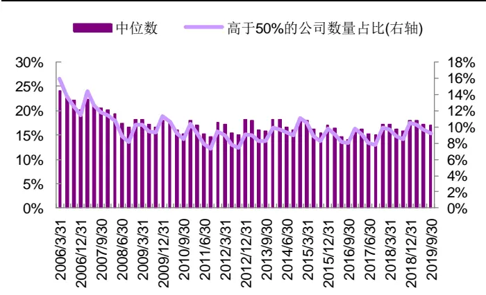
资料来源：Wind，光大证券研究所

图3：盈余公积占注册资本的比例（依据市值分组统计）
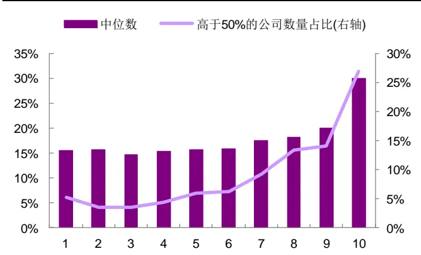
资料来源：Wind，光大证券研究所（注：统计期为 2019 年前三季度；依据上市公司总市值将全市场公司均分为 10 组，1 为市值最小一组，10 为市值最大一组）

图4：盈余公积占注册资本的比例（依据中信一级行业分组统计）
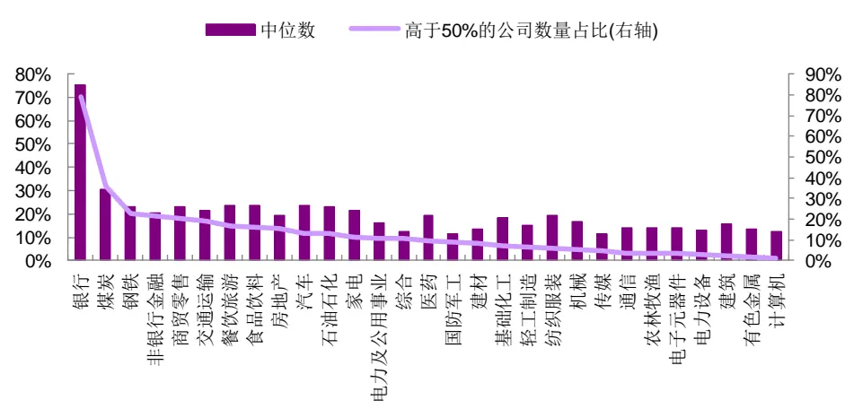
资料来源：Wind，光大证券研究所（注：统计期为 2019 年前三季度）

## 1.3、绝大部分上市公司每年依据法定比例计提盈余公积

由于盈余公积每年仅在年度利润分配时计提一次，我们可通过当年年报盈余公积与上年年报盈余公积之差，观察上市公司每年计提盈余公积的数量。依据《公司法》的相关规定，上市公司每年计提盈余公积金的数量可能与税后净利润（母公司报表层面）成一定比例，因此，本节统计了上市公司每年计提的盈余公积占当年税后净利润的比例，以分析其中特点。

大部分上市公司按法定比例（税后净利润 10%）计提盈余公积。如下图所示，2010 年以来，每年均有超过 60%的上市公司按法定比例（税后净利润10%）计提盈余公积。

不同市值分组的上市公司，计提盈余公积的规律无显著差异。我们依据上市公司的总市值将全市场公司分为 10 组，其中，1 组为市值最小一组，10 组为市值最大一组。但不同市值分组下，2018 年按法定比例计提盈余公积的公司数量占比均在 60%左右，仅第 1 组和第 10 组占比相对较低，其中，第 1 组可能由于部分上市公司的税后利润为负数，而第 10组则是由于盈余公积累计额达注册资本的比例达50%的公司数量较多。

金融、周期行业按法定比例计提盈余公积的公司数量占比相对较低。分行业来看，按法定比例计提盈余公积的公司数量占比与盈余公积累计额达注册资本50%的公司数量占比呈现出一定的负相关关系，即：累计额达注册资本50%的公司数量占比越高，按法定比例计提盈余公积的公司数量占比较低。

图5：上市公司每年计提的盈余公积占当年税后净利润的比例
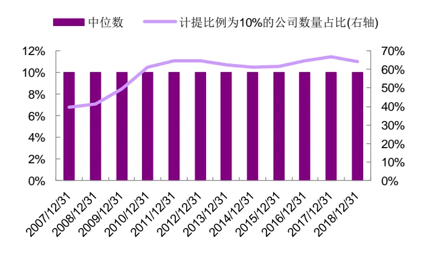
资料来源：Wind，光大证券研究所

图6：上市公司计提的盈余公积占当年税后净利润的比例（按市值分组统计，2018年）
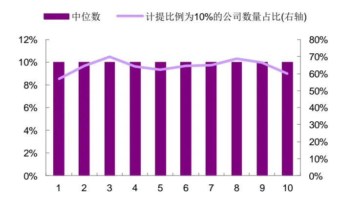
资料来源：Wind,光大证券研究所（注：依据上市公司总市值将全市场公司均分为 10 组，1 为市值最小一组，10 为市值最大一组）

图7：上市公司计提的盈余公积占当年税后净利润的比例（依据中信一级行业分组统计，2018年）
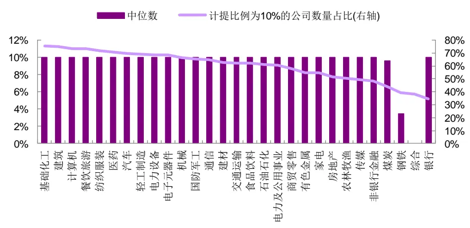
资料来源：Wind，光大证券研究所

根据以上分析，盈余公积实际可看作上市公司按一定法定比例留存的盈利。该科目数据在时间序列上主要有两方面特点：

- 规模累积：绝大部分有盈利的上市公司，盈余公积将按一定比例提升；出现亏损时，上市公司也可提取盈余公积弥补亏损。

- 时间维度上不均匀变化：每年仅在年度利润分配过程中计提一次。

那么，为何盈余公积对盈利类指标具有较好的提纯效果呢？后面章节，我们将从盈余公积数据的两大特点出发，对盈余公积与盈利指标在时间序列上的关系进行分析。

## 2、为何盈余公积对盈利类指标具有提纯效果

盈余公积科目的数据主要有两方面特点，一方面是规模累积；另一方面的是时间维度上不均匀变化。因此，本部分将从盈利指标与企业规模的关系、盈利能力指标在时间维度上的变化规律这两个角度进行讨论。

## 2.1、企业规模的变化影响企业盈利能力

理论上，由于不同上市公司处于不同的生命周期，其的规模变化对其盈利能力的影响方向是不尽相同的，如下图所示，我们取 ROE 为盈利能力的代理变量，净资产为企业规模的代理变量，对比了苏宁易购（002024）和中国银行（601988）在 2016 年中报至 2018 年年报期间，企业规模和盈利能力的变化方向。

成长型企业（行业），规模与盈利能力成正相关关系。成长型企业具有显著的边际成本递减效应，以苏宁易购为例，统计期内，企业规模与盈利能力同步提升，一定程度就是得益于边际成本递减的规模效应。

成熟型企业（行业），规模与盈利能力成负相关关系。对于成熟型企业，其盈利能力往往趋于饱和，边际成本递减效应已基本收敛。此时规模扩张，盈利能力不再提升，甚至出现一定程度的下滑。

图8：苏宁易购（002024）ROE和净资产历史变化对比
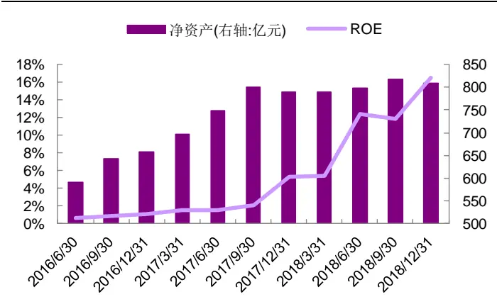
资料来源：Wind，光大证券研究所

图9：中国银行（601988）ROE和净资产历史变化对比
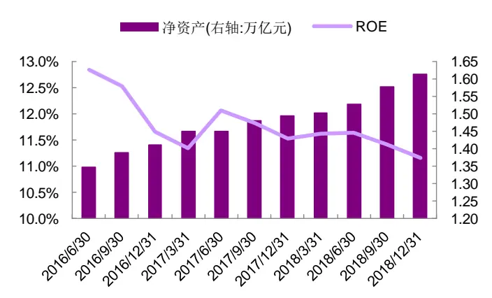
资料来源：Wind，光大证券研究所

从数据统计角度来看，A 股上市公司中，企业规模与盈利能力在时间维度上的相关性是正向还是反向呢？我们分别以ROE、毛利率作为盈利能力的代理变量，净资产作为规模的代理变量，滚动八个季度的数据计算每一年度盈利能力与规模的spearman相关系数，并统计各期相关系数在不同区间的分布情况，如下图所示。

绝大部分上市公司的规模与盈利能力具有较强的相关关系。通常情况下，我们认为相关系数绝对值在 0.4 到 0.7 区间时，认为二者具有弱相关性；相关系数绝对值超过 0.7 时，认为二者具有较强的相关性。如下图所示，A 股市场上，超过 70%的上市公司，其规模与盈利能力的相关系数绝对值达到了0.4 以上，其中，约45%的上市公司，其规模与盈利能力的相关系数绝对值达0.7 以上。

规模与盈利能力具有正相关关系的上市公司数量相对较多。如下图所示，A股市场上，约42%的上市公司，其规模与盈利能力成正相关关系，即相关系数达到0.4以上；约29%的上市公司，其规模与盈利能力成负相关关系，即相关系数低于-0.4。

图 10：ROE 与净资产 spearman 相关系数统计（滚动八个季度计算）
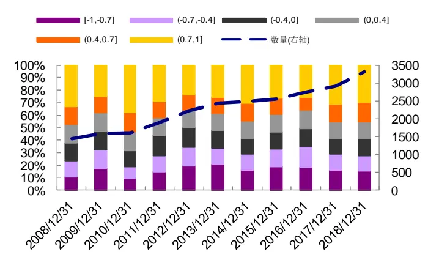
资料来源：Wind，光大证券研究所

图 11：毛利率与净资产的 spearman 相关系数统计（滚动八个季度计算）
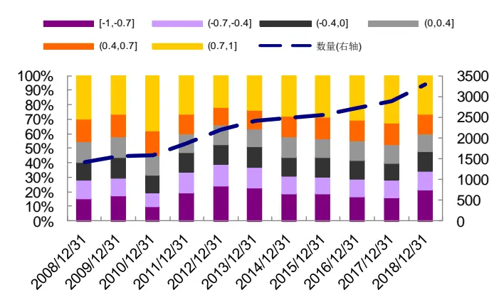
资料来源：Wind，光大证券研究所

那么，是否大市值的公司盈利能力与规模更偏负相关的关系；而小市值的公司盈利能力与规模更偏正相关呢？我们取常用的规模指数沪深 300 和中证500，分别统计了其成分股内相关系数高于 0.4（或低于-0.4）的比例，并与全市场进行了对比，如下图所示。

大市值企业盈利能力与规模更偏负相关；而小市值企业盈利能力与规模更偏正相关。沪深300成分股相关系数高于0.4 的比例在大部分时间内均低于中证500 成分股和全市场；而沪深300 成分股相关系数低于-0.4的比例在大部分时间内均高于中证500成分股和全市场。

图 12：ROE 与净资产 spearman 相关系数高于 0.4 的比例
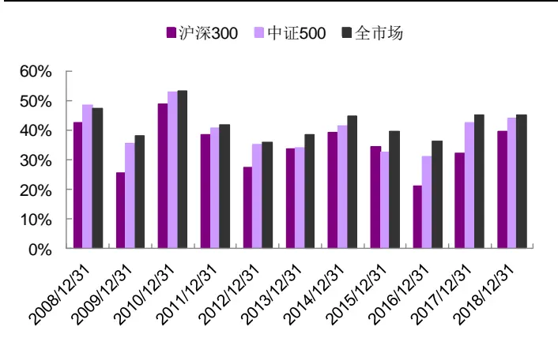
资料来源：Wind，光大证券研究所

图 13：ROE 与净资产 spearman 相关系数低于-0.4 的比例
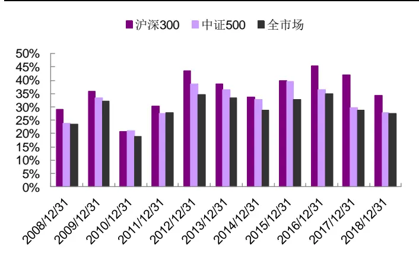
资料来源：Wind，光大证券研究所

## 2.2、盈利能力在年报中变化幅度较大

盈余公积的另一特点是在时间维度上的不均匀变化，因为它每年仅在年度利润分配时计提一次，体现在数据上就是年报盈余公积相对三季报会有较大调整，但一季报、半年报、三季报的盈余公积数据往往同上年年报一致。这便使人产生猜想：是否企业盈利能力也存在类似特点（即：年报调整幅度相对较大），才使得盈余公积对盈利能力具有较好的提纯效果呢？

基于上述猜想，我们统计了不同财报期，上市公司盈利能力（ROE、毛利率）的变化幅度。为剔除不同年份之间企业盈利差异的影响，我们用当年年报的变化幅度进行了标准化。

在大部分情况下，年报中盈利能力变化幅度较大。如下图所示，可清晰观察到，一季报、半年报、三季报盈利能力的变化幅度有约 70%的概率是低于年报变化幅度的。从中位数角度来看，一季报、半年报、三季报盈利能力变化幅度大致是年报变化幅度的一半。说明上市公司盈利的“释放”存在一定的季节效应，时间维度上并非均匀变化，这一特点恰好与盈余公积的计提规则相契合。

图14：不同财报期ROE变化幅度统计
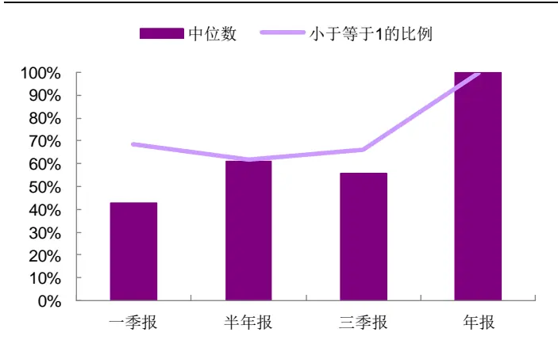
资料来源：Wind，光大证券研究所（依据年报的变化幅度进行标准化；统计期：2017 年一季报至 2018 年年报）

图 15：不同财报期毛利率变化幅度统计
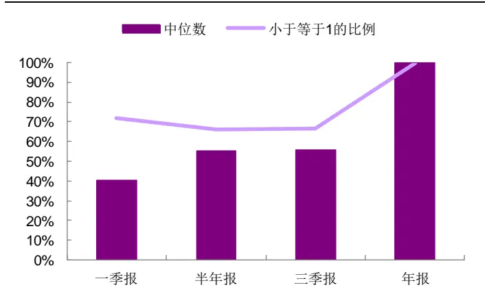
资料来源：Wind，光大证券研究所（依据年报的变化幅度进行标准化；统计期：2017 年一季报至 2018 年年报）
敬请参阅最后一页特别声明

根据以上分析，我们认为企业规模的变化对企业的盈利能力具有较为显著的影响，但不同企业的影响方向可能存在差异。这也说明，企业盈利能力的变化一部分是由于规模变化引起的，而这一部分增长并不可持续。基于这一特点，我们在构建选股因子时，可以考虑利用企业规模指标对盈利能力指标进行调整，以期获取可以反映企业真正内生增长的因子。

另一方面，我们也可尝试仿照盈余公积数据的变化规律，将规模数据处理成仅年报进行调整，而一季报、半年报、三季报沿用上年年报的形式，观察这种处理方式能否进一步提升因子有效性。

## 3、经规模调整的盈利因子测试

本部分我们将尝试将前文的分析结论应用于因子构造方面，并测试这些构造方式能否提升因子的有效性。

## 3.1、因子构造：由简入繁

如前文所述，本篇报告构造因子的创新思路是用规模指标对盈利能力指标进行调整，以期获取可以反映企业真正内生增长的因子。盈利能力指标方面，本篇报告以净资产收益率、毛利率作为代表；规模方面，主要考虑以净资产、总资产、盈余公积进行衡量。我们尝试了以下三种方式对盈利能力指标进行调整：

Z-score 调整：首先考虑最简单的构造方式，直接比较盈利能力与规模指标，但二者量级存在明显差异，故而考虑用过去8 个季度的数据进行标准化处理，以提高二者的可比性，即：以标准化后的盈利能力指标值与标准化后的规模指标值之差作为选股因子。

变化率调整：其次，比较二者的变化率，即：分别计算盈利能力指标和规模指标的变化率，以二者之差作为选股因子。其中，由于盈利能力指标的变化率，是用 TTM 指标的环比变化计算的，实际反映了当前季度与上年同期的差异，为与之对应，规模指标使用同比变化率。

回归调整：参考《创新基本面因子：财务数据全扫描——多因子系列报告之二十六》报告中的处理方式，以盈利能力指标的时间序列为因变量，以规模指标的时间序列为自变量，进行 OLS 回归（回归前分别对因变量、自变量序列进行标准化处理），并取最新一期的残差作为选股因子。这种处理方式的好处是可以综合考虑一段时间内因变量和自变量之间的相关关系，尤其对于因变量、自变量之间存在负相关关系时，处理效果应更佳。

考虑到数据可比性问题，因子构造时，均在财务报告披露截止日后才使用最新一期的报告数据。此外，我们尝试模仿盈余公积数据在时间维度的规律，对规模指标进行调整，即：仅取年报数据，一季报、半年报、三季报均沿用上年年报的指标值。

由于尝试的指标类型、因子构造方式的组合情况较多，为方便展示，我们设计了一套因子简称命名规则，如下表所示。

表 3：因子简称释义

| 名称 | 简称 | 具体含义 |
| --- | --- | --- |
| 净资产收益率 | ROE | ttm 净利润 / 期末净资产 |
| 毛利率 | GPR | (ttm 营业收入-ttm 营业成本) / ttm 营业收入 |
| 净资产 | Equity | 资产负债表数据-权益合计（不含少数股东） |
| 总资产 | TA(Total Assets) | 资产负债表数据-资产总计 |
| 盈余公积 | SR (Surplus Reserves) | 资产负债表数据-盈余公积金 |
| 因子构造方式1 | A_qoq | (当期 A -上期 A) / abs(上期 A) |
| 因子构造方式2 | A_Z | (当期 A-过去 8 个季度 A 的均值)/过去 8 个季度 A 的标准差 |
| 因子构造方式3 | A_B_qoq | A_qoq - B_qoq |
| 因子构造方式4 | A_B_Z | A_Z-B_Z |
| 因子构造方式5 | A_B_reg | 连续8个季度的 A 指标序列对 B 指标序列回归，取 最新一期残差作为因子值 |
| 规模调整 | A(adj) | A指标仅年报进行调整，一季报、半年报、三季报 沿用上年年报数据 |

资料来源：光大证券研究所（注：盈利指标用构造方式 1 时，上期为上一季度；规模指标用构造方式 1 时，上期为上年同期）

## 3.2、经规模调整后，盈利因子有效性有所提升

我们运用前文所述的方式，构造了若干月度因子，并测试了 2010 年 1 月 1日至2019 年12月31日期间的因子表现，主要从IC 均值、IC 标准差、ICIR、IC 大于 0.02 比例的角度进行观察，具体情况如下表所示。（为简化正文图表内容，我们将规模调整的毛利率因子测试情况置于附录部分）

全市场范围内来看，用盈利能力的变化率与规模指标变化率之差作为选股因子，有效性最佳，且此时不宜用前文所述的方式对规模指标进行调整。实际上，直接以盈利能力指标的变化率作为选股因子，其月度IC均值可达0.032，ICIR 可达 0.531，已具有较好的选股效果了；经净资产调整后，虽 IC 均值变化不大，但ICIR 提升至 0.664，IC大于0.02的概率也从 57.5%提升到了62.5%，因子稳定性变得更好了。这也一定程度上验证了前文所论证的逻辑：经规模调整后的盈利因子，更能反映企业真正的内生增长性。

图 16：ROE_equity_qoq 因子在全市场的 IC 序列
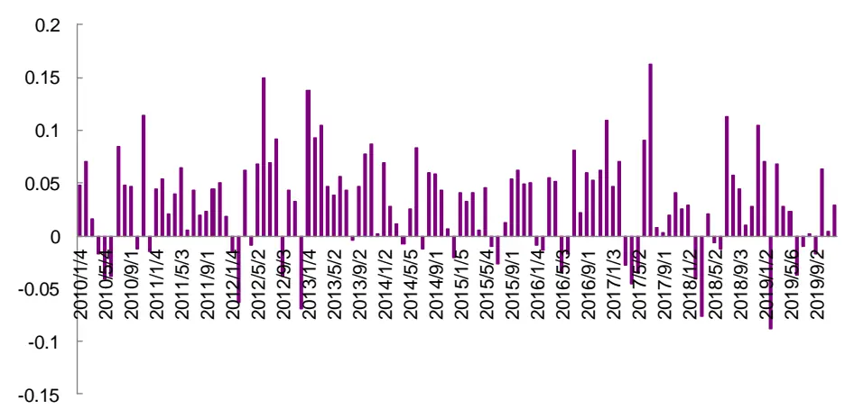
资料来源：Wind，光大证券研究所（统计期：2010-01-01 至 2019-12-31）
敬请参阅最后一页特别声明

表4：规模调整的ROE因子有效性测试（全市场）

| IC>0.02 比例IC>0 比例 ICIR IC 均值 IC 标准差 |
| --- |
| ROE_qoq 57.5% 72.5% 0.531 0.032 0.060 |
| ROE_Z 56.7% 68.3% 0.377 0.024 0.063 |
| ROE_equity_Z 40.8% 65.0% 0.274 0.014 0.050 |
| ROE_equity(adj)_Z 50.8% 65.0% 0.368 0.020 0.054 |
| ROE_equity_qoq 62.5% 74.2% 0.664 0.031 0.046 |
| ROE_equity(adj)_qoq 57.5% 70.8% 0.550 0.028 0.052 |
| ROE_equity_reg 55.0% 71.7% 0.528 0.025 0.047 |
| ROE_equity(adj)_reg 60.0% 72.5% 0.480 0.029 0.059 |
| ROE_SR_Z 48.3% 67.5% 0.374 0.021 0.057 |
| ROE_SR_qoq 46.7% 65.0% 0.375 0.019 0.050 |
| ROE_SR_reg 60.8% 75.8% 0.505 0.032 0.063 |
| ROE_TA_Z 45.0% 63.3% 0.282 0.014 0.050 |
| ROE_TA(adj)_Z 48.3% 68.3% 0.363 0.019 0.053 |
| ROE_TA_qoq 55.0% 70.8% 0.461 0.024 0.052 |
| ROE_TA(adj)_qoq 50.8% 69.2% 0.425 0.025 0.058 |
| ROE_TA_reg 52.5% 69.2% 0.470 0.024 0.050 |
| ROE_TA(adj)_reg 54.2% 73.3% 0.479 0.028 0.059 |

资料来源：Wind，光大证券研究所（统计期：2010-01-01 至 2019-12-31）

沪深300内，回归方法构造的因子有效性较强，并且规模指标只取年报数据可显著提升因子有效性。从 ICIR 角度来看，回归方法构造的因子优于简单标准化或取变化率的因子，这可能是由于沪深 300 内的企业盈利能力与规模成负相关关系的比例相对较高，用回归的方法可以更好地处理这种情况。

同时，我们也发现净资产、总资产按只取年报数据的方法进行调整后，相应因子ICIR从 0.35 左右提升至 0.42 以上，可逼近ROE 对盈余公积回归所构造因子的表现。这一方面可能跟盈利能力指标的变化规律有关；另一方面也可能是因为年报信息披露比其他季报更加完整、质量更高。

图 17：ROE_equity(adj)_reg 因子在沪深 300 内的 IC 序列
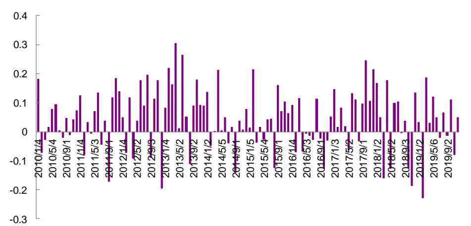
资料来源：Wind，光大证券研究所（统计期：2010-01-01 至 2019-12-31）

表5：规模调整的ROE因子有效性测试（沪深 300内）

| IC>0.02 比例IC>0 比例 ICIR IC 均值 IC 标准差 |
| --- |
| ROE_qoq 60.0% 65.0% 0.374 0.042 0.114 |
| ROE_Z 53.3% 62.5% 0.324 0.037 0.113 |
| ROE_equity_Z 46.7% 56.7% 0.190 0.016 0.082 |
| ROE_equity(adj)_Z 49.2% 59.2% 0.311 0.030 0.096 |
| ROE_equity_qoq 48.3% 58.3% 0.276 0.025 0.092 |
| ROE_equity(adj)_qoq 53.3% 64.2% 0.330 0.034 0.103 |
| ROE_equity_reg 58.3% 63.3% 0.361 0.038 0.104 |
| ROE_equity(adj)_reg 59.2% 68.3% 0.425 0.044 0.103 |
| ROE_SR_Z 53.3% 61.7% 0.303 0.032 0.105 |
| ROE_SR_qoq 53.3% 60.0% 0.222 0.022 0.098 |
| ROE_SR_reg 64.2% 72.5% 0.450 0.046 0.102 |
| ROE_TA_Z 46.7% 52.5% 0.179 0.017 0.096 |
| ROE_TA(adj)_Z 50.8% 57.5% 0.309 0.030 0.098 |
| ROE_TA_qoq 46.7% 54.2% 0.172 0.020 0.116 |
| ROE_TA(adj)_qoq 50.8% 60.0% 0.257 0.032 0.125 |
| ROE_TA_reg 60.0% 65.8% 0.344 0.034 0.098 |
| ROE_TA(adj)_reg 60.0% 69.2% 0.441 0.046 0.104 |

资料来源：Wind，光大证券研究所（统计期：2010-01-01 至 2019-12-31）

中证 500 内，比较推荐 ROE 变化率与净资产变化率之差所构造的因子。中证500 范围内测试的情况与全市场的情况类似，盈利能力指标的变化率因子已有较好的 IC、ICIR 表现，经净资产调整后因子稳定性有明显提升，最终因子的 ICIR 为 0.482。

图 18：ROE_equity_qoq 因子在中证 500 内的 IC 序列
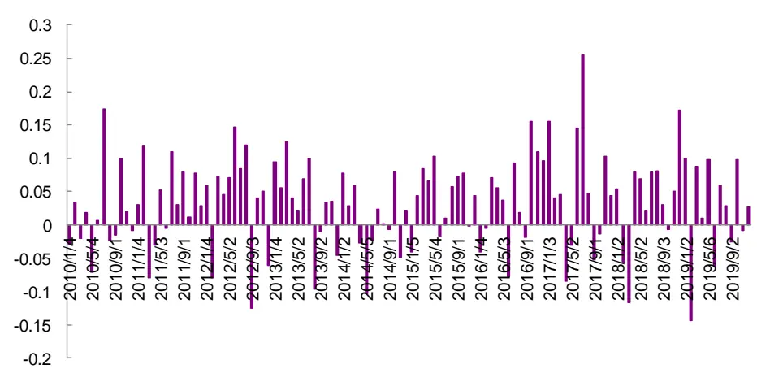
资料来源：Wind，光大证券研究所（统计期：2010-01-01 至 2019-12-31）

表6：规模调整的ROE因子有效性测试（中证 500内）

| IC>0.02 比例 IC>0 比例 ICIR IC 均值 IC 标准差 |  |  |  |
| --- | --- | --- | --- |
| ROE_qoq | 58.3% 68.3% | 0.480 0.042 | 0.087 |
| ROE_Z | 50.0% 63.3% | 0.330 0.029 | 0.087 |
| ROE_equity_Z | 46.7% 60.8% | 0.218 0.013 | 0.060 |
| ROE_equity(adj)_Z | 52.5% 65.0% | 0.276 0.021 | 0.078 |
| ROE_equity_qoq | 62.5% 68.3% | 0.482 0.033 | 0.068 |
| ROE_equity(adj)_qoq | 54.2% 65.0% | 0.353 0.027 | 0.077 |
| ROE_equity_reg | 54.2% 65.0% | 0.415 0.028 | 0.068 |
| ROE_equity(adj)_reg | 54.2% 65.8% | 0.378 0.030 | 0.079 |
| ROE_SR_Z | 51.7% 62.5% | 0.305 0.025 | 0.083 |
| ROE_SR_qoq | 53.3% 68.3% | 0.398 0.027 | 0.068 |
| ROE_SR_reg | 55.8% 66.7% | 0.372 0.031 | 0.083 |
| ROE_TA_Z | 46.7% 59.2% | 0.185 0.012 | 0.067 |
| ROE_TA(adj)_Z | 49.2% 60.0% | 0.269 0.020 | 0.076 |
| ROE_TA_qoq | 55.8% 67.5% | 0.365 0.028 | 0.076 |
| ROE_TA(adj)_qoq | 54.2% 70.8% | 0.346 0.029 | 0.083 |
| ROE_TA_reg | 55.0% 67.5% | 0.390 0.028 | 0.071 |
| ROE_TA(adj)_reg | 59.2% 65.0% | 0.373 0.031 | 0.083 |

资料来源：Wind，光大证券研究所（统计期：2010-01-01 至 2019-12-31）

## 3.3、不同构造方式的因子相关性较低

在前述测试中，我们发现 ROE_equity_qoq、GPR_equity_qoq 因子在全市场、中证 500 范围内，有效性较强，ICIR 均超过 0.6；ROE_equity(adj)_reg、ROE_TA(adj)_reg、ROE_SR_reg 因子在沪深 300 成分股范围内，表现较好，ICIR 超过 0.42。这些因子均为规模调整的盈利因子，只是所用数据、构造方式上存在差异。那么，这些因子之间有什么区别呢？本节我们从因子覆盖度、因子之间的相关性角度进行分析。

由盈余公积计算的因子覆盖度相对较低，其他因子覆盖度的变化与新股发行节奏相关性较高。如下图所示，由盈余公积数据构造的因子覆盖度整体低于其他因子，主要是因为一些公司由于亏损等原因，在部分年度未计提盈余公积，此时，盈余公积数据可能连续八期保持不变，无法回归计算因子。其他因子的缺失，主要都是由于数据的不足，ROE_equity_qoq 需要至少 5 个季度的数据，ROE_equity(adj)_reg 则需要8 个季度的数据，故新上市股票无法计算相应因子。

图 19：因子覆盖度统计
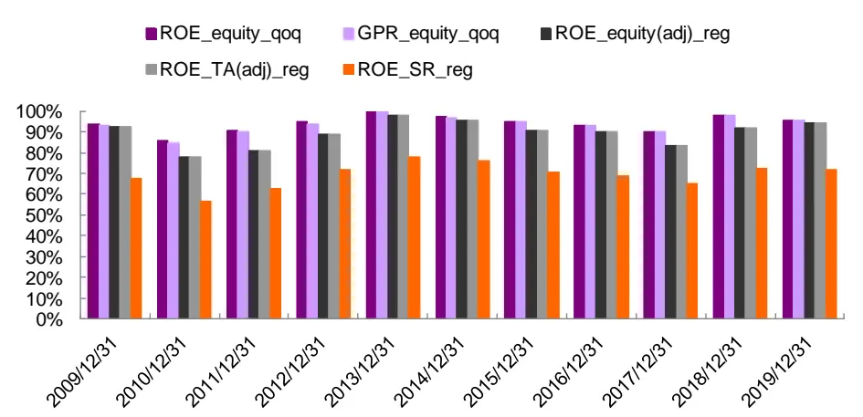
资料来源：Wind，光大证券研究所（注：为方便展示，仅取年末因子值）

- 相同构造方式的因子反映的信息较为一致。ROE_equity_qoq 和GPR_equity_qoq 因子以及 ROE_equity(adj)_reg、ROE_TA(adj)_reg和 ROE_SR_reg 因子之间的相关系数都达到 0.9 以上；而不同构造方式的因子之间，相关系数在 0.5以下。

表7：不同构造方式下，规模调整的盈利因子 IC序列的相关系数

|  | ROE_equity_qoq | GPR_equity_qoq | ROE_equity(adj)_reg | ROE_TA(adj)_reg | ROE_SR_reg |
| --- | --- | --- | --- | --- | --- |
| ROE_equity_qoq | 1.00 | 0.90 | 0.49 | 0.49 | 0.44 |
| GPR_equity_qoq | 0.90 | 1.00 | 0.36 | 0.36 | 0.28 |
| ROE_equity(adj)_reg | 0.49 | 0.36 | 1.00 | 0.98 | 0.94 |
| ROE_TA(adj)_reg | 0.49 | 0.36 | 0.98 | 1.00 | 0.96 |
| ROE_SR_reg | 0.44 | 0.28 | 0.94 | 0.96 | 1.00 |

资料来源：Wind，光大证券研究所（统计期：2010-01-01 至 2019-12-31）

因此，本篇报告主要推荐 ROE_equity_qoq 和 ROE_TA(adj)_reg 两个因子，前者在全市场和中证 500 成分股范围内 ICIR 表现较好；后者在沪深300 成分股内有效性相对更佳。

## 4、应用：可提升增强组合收益表现

如 前 文 所 述 ， 我 们 主 要 推 荐 两 个 因 子 ： ROE_equity_qoq 和ROE_TA(adj)_reg，本部分内容将重点分析这两个因子的选股组合表现、信息来源以及应用方式。

## 4.1、因子分组单调性较好，多空收益稳定

我们依据如下表所示的分组回测框架，从分组选股效果角度来看因子的单调性，并观察多头组合的收益表现。

表 8：因子分组回测框架

|  | 因子分组回测框架 |
| --- | --- |
| 时间区间 | 2009 年 1月1日至2019 年 12 月 31日 |
| 股票池 | 全部 A 股(剔除选股日ST/PT股票；剔除上市不满一年的股票；剔除选股日由于停牌等因素无法买入的股票) |
| 调仓频率 | 月度调仓 |
| 分组调仓方式 | 每月初第一个交易日调仓，根据本月所有未被剔除的股票数据计算因子值，根据因子值从小到大排序将股票等分为10组(指数内分5组)，其中，Group1为因子值最小一组 |
| 股票权重 | 等权配置 |
| 交易费率 | 暂未考虑手续费 |

资料来源：光大证券研究所

## 4.1.1、ROE_equity_qoq：多空夏普比率达 2.05

全市场范围内，ROE_equity_qoq 因子分组单调性较好，多空夏普比率达2.05，月度胜率为 66.2%，最大回撤仅 9.0%。

测试期内，多头组合年化收益为 22.3%，相对于全市场等权指数的年化超额收益率为 4.9%，月度胜率达 60.9%。从换手率来看，多头组合月均换手率约为 22%，财报截止时间换手率会相对高一些，超过 50%，其他月份换手率在10%以下。从分年度表现来看，仅2013 年超额收益为负，其余年份均有正的超额收益。

图 20：ROE_equity_qoq 全市场分组表现
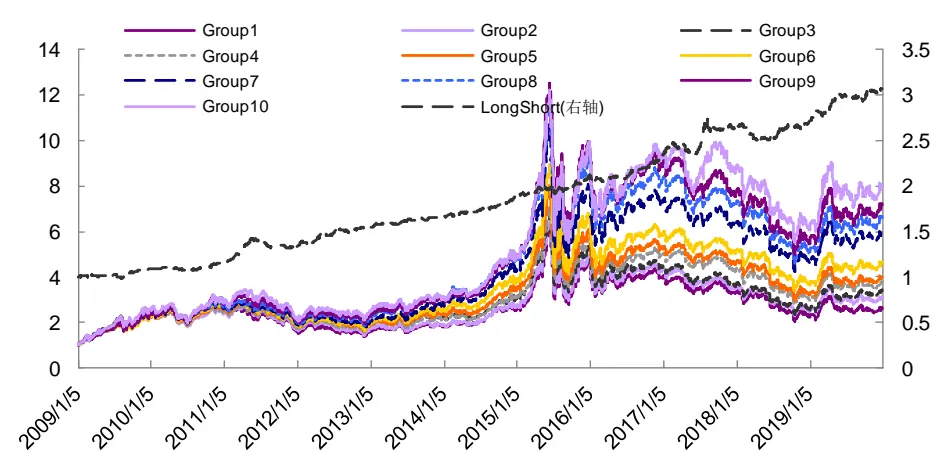
资料来源：Wind，光大证券研究所（截止于 2019 年 12 月 31 日）

图 21：ROE_equity_qoq 因子多头组合（全市场）
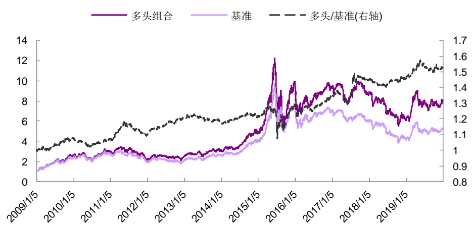
资料来源：Wind，光大证券研究所（截止于 2019 年 12 月 31 日，基准为全市场等权指数）

表 9：ROE_equity_qoq 因子多头组合历年收益表现统计（全市场）

|  | 2009 | 2010 | 2011 | 2012 | 2013 | 2014 | 2015 | 2016 | 2017 | 2018 | 2019 | 总体 | 多空 |
| --- | --- | --- | --- | --- | --- | --- | --- | --- | --- | --- | --- | --- | --- |
| 收益率 | 168.0% | 14.7% | -26.9% | 15.2% | 26.5% | 56.5% | 107.1% | -5.3% | -6.5% | -31.1% | 34.6% | 22.3% | 11.1% |
| 波动率 | 36.0% | 28.9% | 26.5% | 25.5% | 22.6% | 20.9% | 54.6% | 35.3% | 18.7% | 25.6% | 26.1% | 30.7% | 5.4% |
| 超额收益 | 8.5% | 0.2% | 3.1% | 9.6% | -1.5% | 3.2% | 10.8% | 5.5% | 8.9% | 0.8% | 5.4% | 4.9% |  |
| 相对波动 | 4.6% | 3.8% | 5.0% | 3.3% | 3.6% | 3.3% | 11.2% | 5.5% | 6.2% | 3.2% | 4.4% | 5.4% |  |
| 信息比率 | 1.85 | 0.05 | 0.62 | 2.88 | -0.43 | 0.97 | 0.96 | 1.00 | 1.43 | 0.26 | 1.24 | 0.91 | 2.05 |
| 相对最大回撤 | -2.3% | -5.2% | -7.2% | -1.5% | -4.6% | -2.3% | -15.9% | -4.9% | -6.4% | -3.6% | -4.7% | -15.9% | -9.0% |
| 月度胜率 | 83.3% | 58.3% | 50.0% | 75.0% | 33.3% | 66.7% | 58.3% | 75.0% | 50.0% | 58.3% | 58.3% | 60.9% | 66.2% |

资料来源：Wind，光大证券研究所（注：数据截止于 2019 年 12 月 31 日；基准为全市场等权指数）

## 4.1.2、ROE_TA(adj)_reg：沪深 300 内多头组合表现优异

从因子 IC 表现来看，ROE_TA(adj)_reg 因子主要在沪深 300 内相对较好，因而分组测试时，重点关注该因子在沪深 300 范围内的表现。

分组单调性较好，多空夏普比率为1.18，多头组合贡献较多收益。该因子在沪深300内分组单调性较好，Group 5显著跑赢其他各组。测试期内，多空年化收益达11.5%，夏普比率达1.18，月度胜率达 65.9%。

2018 年下半年，多头组合出现明显回撤。分年度表现来看，该因子多头组合在 2018 年下半年度出现明显回撤，与传统盈利因子回撤时间一致。换手率方面，该组合月均换手率仅19%左右，同样在财务报告截止时间换手率相对高一些，其他月份换手率低于10%。

图 22：ROE_TA(adj)_reg 沪深 300 内分组表现
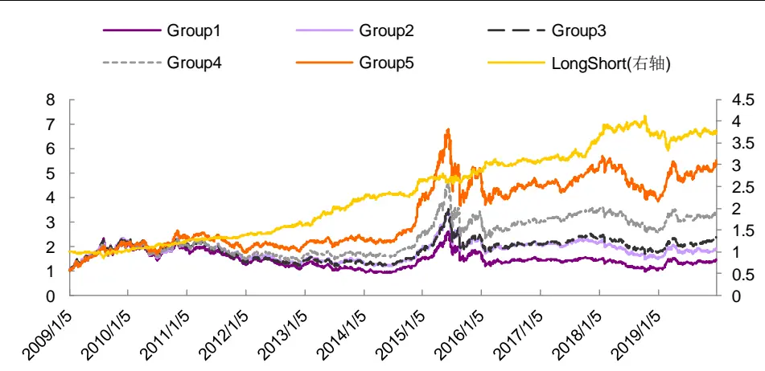
资料来源：Wind，光大证券研究所（截止于 2019 年 12 月 31 日）

图 23：ROE_TA(adj)_reg 因子多头组合（沪深 300 内）
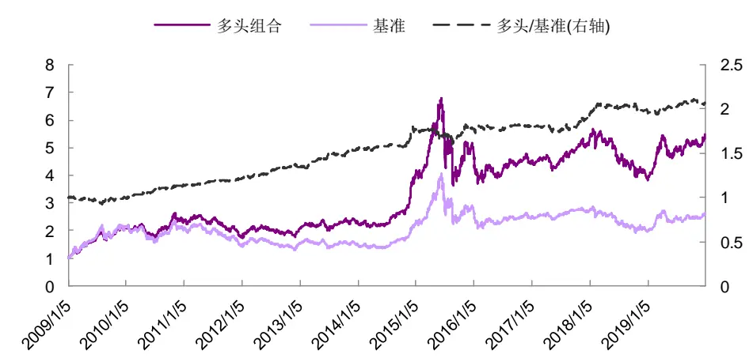
资料来源：Wind，光大证券研究所（截止于 2019年 12 月 31 日；基准为 300 等权指数）

表 10：ROE_TA(adj)_reg 因子多头组合历年收益表现统计（300 内）

|  | 2009 | 2010 | 2011 | 2012 | 2013 | 2014 | 2015 | 2016 | 2017 | 2018 | 2019 | 总体 | 多空 |
| --- | --- | --- | --- | --- | --- | --- | --- | --- | --- | --- | --- | --- | --- |
| 收益率 | 127.4% | 11.0% | -24.8% | 16.1% | 13.4% | 72.8% | 25.8% | -11.2% | 17.3% | -24.7% | 41.3% | 19.6% | 11.5% |
| 波动率 | 32.5% | 26.5% | 21.2% | 21.7% | 20.2% | 20.4% | 47.2% | 27.4% | 13.4% | 23.0% | 21.1% | 26.9% | 9.8% |
| 超额收益 | -1.5% | 14.2% | 6.5% | 10.7% | 16.1% | 15.3% | 1.5% | 1.9% | 7.3% | 3.9% | 4.2% | 6.8% |  |
| 相对波动 | 7.2% | 5.2% | 3.5% | 5.1% | 6.1% | 5.9% | 9.8% | 4.5% | 5.6% | 5.5% | 4.8% | 6.0% |  |
| 信息比率 | -0.21 | 2.72 | 1.84 | 2.10 | 2.63 | 2.58 | 0.15 | 0.42 | 1.32 | 0.71 | 0.89 | 1.15 | 1.18 |
| 相对最大回撤 | -8.4% | -1.9% | -2.0% | -2.8% | -3.2% | -3.0% | -8.9% | -3.9% | -4.1% | -4.5% | -3.7% | -9.8% | -19.8% |
| 月度胜率 | 41.7% | 83.3% | 75.0% | 66.7% | 75.0% | 58.3% | 50.0% | 50.0% | 66.7% | 58.3% | 66.7% | 62.2% | 65.9% |

资料来源：Wind，光大证券研究所（注：数据截止于 2019 年 12 月 31 日；基准为 300 等权指数）

## 4.2、ROE_equity_qoq 因子与传统成长、盈利因子相关 性较低

我们计算了 ROE_equity_qoq、ROE_TA(adj)_reg 因子与其他常用盈利、成长因子 IC 序列之间的相关性，参考的因子为光大证券多因子系列研究报告曾探讨过的，具体计算方式可参考光大证券报告《光大Alpha3.0：基本面优选多因子组合——多因子系列报告之十九》，其中，OP_Q_YoY、NP_Z、ROED 为成长类型因子，CFOA、ROE_TTM 因子更偏盈利属性，Ln_MC 为市值因子。

ROE_equity_qoq 因子与成长、盈利因子的相关性较低。如下图所示，该因子与市值、成长、盈利因子的相关系数均低于 0.3，相关性较低，信息相对独立。

- ROE_TA(adj)_reg 因子与成长因子具有较高的相关性，偏大市值。该因子与成长因子的相关系数超过 0.7，相关性较高，运用该因子时，推荐直接替代原成长因子。

图24：规模调整的盈利因子与其他因子的相关系数
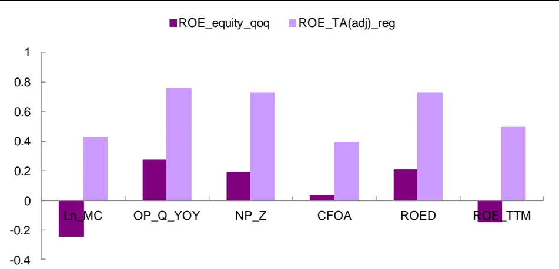
资料来源：Wind，光大证券研究所 （统计时间：2010-01-01 至 2019-12-31）

## 4.3、因子运用效果：增强组合信息比率有所提升

我们在《组合优化算法探析及直属增强实证——多因子系列报告之十三》报告中，已运用组合优化算法构建了中证500指数增强模型，本节，我们尝试用 ROE_equity_qoq 替代模型中 ROED 因子，观察规模调整后的盈利因子能否给组合带来增益。

中证 500 增强组合构建过程如下：

- 对所选因子进行截面正交化处理（采用对称正交方法）

- 滚动 30 个月最优化复合因子 ICIR 确定因子权重；

- 组合优化：

- 行业权重偏离度不超过 3%

- 市值因子暴露度不超过 3%

- 个股权重上限为 1.5%

表 11：测试因子明细

| 因子简称 因子描述 |  |
| --- | --- |
| BP_LR | 账面市值比（最近报告期） |
| Ln_MC | 市值对数 |
| Momentum_1M | 动量（1个月） |
| Momentum_24M | 动量（24个月） |
| STD_3M | 波动（3个月） |
| VA_FC_1M | 换手率（1个月） |
| VSTD_1M | 成交额/收益波动（3个月） |
| DP | 股息率 |
| EEP | 一致预期EP |
| EEChange_3M | 一致预期净利润调整（3个月） |
| OP_Q_YOY | 单季度营业利润同比 |
| CFOA | 经营性净现金流 / 总资产 |
| ATD | 当期总资产周转率 － 上期总资产周转率 |
| ROED | 当期 Roe - 上期 Roe |

资料来源：光大证券研究所

测试期为 2011 年 7 月 1 日至 2019 年 12 月31 日，在手续费按单边千三计算，测试结果如下：

- 应用规模调整的盈利因子后，组合收益表现有所提升。年化超额收益从17.4%提升至 18.5%，总体信息比率从 3.02 提升至 3.24。

- 2018年以来，组合表现增强显著。分年度来看，新因子对 2017年的组合表现没有明显改善，但2018、2019年，组合年度信息比率从 1.34、1.60 提升至 1.88、1.92。

图25：应用新因子的增强组合与原始增强组合对比
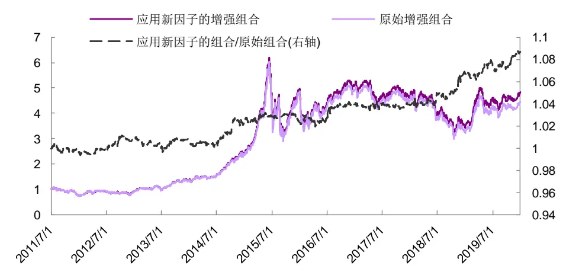
资料来源：Wind，光大证券研究所（截止于 2019 年 12 月 31 日）

表12：原始中证 500指数增强组合历年收益表现统计

|  | 2011 | 2012 | 2013 | 2014 | 2015 | 2016 | 2017 | 2018 | 2019 | 总体 |
| --- | --- | --- | --- | --- | --- | --- | --- | --- | --- | --- |
| 收益率 | -40.3% | 22.4% | 49.0% | 69.0% | 94.5% | 12.2% | -9.5% | -28.6% | 38.2% | 18.8% |
| 波动率 | 25.9% | 24.7% | 21.9% | 19.2% | 48.5% | 31.8% | 17.0% | 24.7% | 21.5% | 27.9% |
| 超额收益 | 15.6% | 19.5% | 26.3% | 22.9% | 41.8% | 26.0% | -8.3% | 8.0% | 8.4% | 17.4% |
| 相对波动 | 4.5% | 4.3% | 4.8% | 4.7% | 8.6% | 5.2% | 6.1% | 6.0% | 5.2% | 5.7% |
| 信息比率 | 3.48 | 4.49 | 5.52 | 4.88 | 4.86 | 4.97 | -1.35 | 1.34 | 1.60 | 3.02 |
| 相对最大回撤 | -2.1% | -1.4% | -2.1% | -3.3% | -5.9% | -2.4% | -9.8% | -4.0% | -4.5% | -9.8% |
| 月度胜率 | 100.0% | 91.7% | 83.3% | 83.3% | 83.3% | 100.0% | 25.0% | 58.3% | 75.0% | 77.5% |

资料来源：Wind，光大证券研究所（注：数据截止于 2019年 12 月31 日；基准为中证500 指数）

表13：应用新因子的中证500指数增强组合历年收益表现统计

|  | 2011 | 2012 | 2013 | 2014 | 2015 | 2016 | 2017 | 2018 | 2019 | 总体 |
| --- | --- | --- | --- | --- | --- | --- | --- | --- | --- | --- |
| 收益率 | -40.7% | 23.8% | 49.1% | 71.9% | 93.9% | 14.1% | -9.6% | -26.6% | 40.7% | 20.0% |
| 波动率 | 25.8% | 24.6% | 22.0% | 19.2% | 48.4% | 31.8% | 17.0% | 24.8% | 21.5% | 27.9% |
| 超额收益 | 14.7% | 20.8% | 26.4% | 25.0% | 41.2% | 28.1% | -8.4% | 11.1% | 10.3% | 18.5% |
| 相对波动 | 4.5% | 4.2% | 4.6% | 4.7% | 8.5% | 5.2% | 6.1% | 5.9% | 5.4% | 5.7% |
| 信息比率 | 3.30 | 4.96 | 5.69 | 5.30 | 4.87 | 5.44 | -1.37 | 1.88 | 1.92 | 3.24 |
| 相对最大回撤 | -2.2% | -1.1% | -2.3% | -3.2% | -5.7% | -2.4% | -10.0% | -3.7% | -4.4% | -10.0% |
| 月度胜率 | 66.7% | 100.0% | 83.3% | 91.7% | 83.3% | 100.0% | 25.0% | 66.7% | 75.0% | 77.5% |

资料来源：Wind，光大证券研究所（注：数据截止于 2019年 12 月31 日；基准为中证500 指数）

## 5、风险提示

本篇报告从财务数据的含义和特点出发，旨在充分挖掘财务数据之间勾稽关系的前提下，尝试构造对基本面因子进行创新性构造，加深对基本面因子逻辑的理解，随着市场的发展和环境的变化，可能存在如下风险：

- 首先，本篇报告基于现阶段会计准则下的财务数据进行研究，当会计准则存在变化时，财务数据含义可能发生变化，亦影响报告逻辑推演；

- 其次，上市公司若出现财务数据失真，会影响模型有效性；

- 最后，本篇报告推荐因子为偏长期的基本面因子，须警惕市场短期波动带来的风险。

## 6、附录

表14：规模调整的毛利率因子有效性测试（全市场）

| IC>0.02 比例IC>0 比例 ICIR IC 均值 IC 标准差 |
| --- |
| GPR_qoq 57.5% 75.8% 0.556 0.031 0.055 |
| GPR_Z 45.0% 59.2% 0.354 0.021 0.059 |
| GPR_equity_Z 39.2% 57.5% 0.192 0.010 0.051 |
| GPR_equity_Z_adj 44.2% 56.7% 0.308 0.017 0.055 |
| GPR_equity_qoq 58.3% 78.3% 0.630 0.030 0.047 |
| GPR_equity_qoq_adj 53.3% 72.5% 0.529 0.028 0.054 |
| GPR_equity_reg 50.8% 66.7% 0.563 0.025 0.044 |
| GPR_equity_reg_adj 55.0% 70.0% 0.511 0.026 0.052 |
| GPR_SR_Z 50.0% 60.0% 0.311 0.018 0.056 |
| GPR_SR_qoq 50.8% 65.8% 0.363 0.020 0.055 |
| GPR_SR_reg 61.7% 70.8% 0.557 0.031 0.055 |
| GPR_TA_Z 40.8% 58.3% 0.215 0.011 0.052 |
| GPR_TA_Z_adj 42.5% 58.3% 0.289 0.016 0.055 |
| GPR_TA_qoq 49.2% 70.0% 0.430 0.023 0.054 |
| GPR_TA_qoq_adj 48.3% 65.8% 0.407 0.025 0.061 |
| GPR_TA_reg 50.0% 68.3% 0.497 0.024 0.048 |
| GPR_TA_reg_adj 53.3% 70.0% 0.501 0.027 0.053 |

资料来源：Wind，光大证券研究所（统计期：2010-01-01 至 2019-12-31）

表 15：规模调整的毛利率因子有效性测试（沪深 300 内）

| IC>0.02 比例IC>0 比例 ICIR IC 均值 IC 标准差 |
| --- |
| GPR_qoq 59.2% 64.2% 0.311 0.035 0.113 |
| GPR_Z 56.7% 64.2% 0.311 0.035 0.112 |
| GPR_equity_Z 48.3% 59.2% 0.187 0.015 0.078 |
| GPR_equity_Z_adj 52.5% 66.7% 0.299 0.029 0.097 |
| GPR_equity_qoq 51.7% 57.5% 0.214 0.020 0.096 |
| GPR_equity_qoq_adj 56.7% 65.0% 0.311 0.032 0.103 |
| GPR_equity_reg 54.2% 61.7% 0.296 0.029 0.097 |
| GPR_equity_reg_adj 54.2% 67.5% 0.331 0.034 0.104 |
| GPR_SR_Z 54.2% 65.0% 0.294 0.030 0.102 |
| GPR_SR_qoq 53.3% 61.7% 0.209 0.021 0.102 |
| GPR_SR_reg 54.2% 60.8% 0.320 0.034 0.107 |
| GPR_TA_Z 50.0% 57.5% 0.179 0.016 0.091 |
| GPR_TA_Z_adj 52.5% 60.8% 0.305 0.029 0.096 |
| GPR_TA_qoq 49.2% 56.7% 0.132 0.015 0.117 |
| GPR_TA_qoq_adj 51.7% 57.5% 0.243 0.030 0.124 |
| GPR_TA_reg 50.8% 62.5% 0.286 0.029 0.102 |
| GPR_TA_reg_adj 55.8% 63.3% 0.348 0.036 0.105 |

资料来源：Wind，光大证券研究所（统计期：2010-01-01 至 2019-12-31）

表16：规模调整的毛利率因子有效性测试（中证500内）

| IC>0.02 比例 IC>0 比例 ICIR IC 均值 IC 标准差 |  |  |  |
| --- | --- | --- | --- |
| GPR_qoq | 60.0% 68.3% | 0.467 0.041 | 0.089 |
| GPR_Z | 52.5% 61.7% | 0.359 0.031 | 0.087 |
| GPR_equity_Z | 45.0% 58.3% | 0.223 0.014 | 0.062 |
| GPR_equity_Z_adj | 50.8% 60.8% | 0.293 0.023 | 0.078 |
| GPR_equity_qoq | 57.5% 76.7% | 0.473 0.033 | 0.071 |
| GPR_equity_qoq_adj | 55.0% 70.0% | 0.360 0.028 | 0.078 |
| GPR_equity_reg | 53.3% 67.5% | 0.407 0.028 | 0.068 |
| GPR_equity_reg_adj | 57.5% 67.5% | 0.459 0.036 | 0.078 |
| GPR_SR_Z | 51.7% 64.2% | 0.322 0.026 | 0.080 |
| GPR_SR_qoq | 54.2% 66.7% | 0.374 0.027 | 0.071 |
| GPR_SR_reg | 59.2% 65.8% | 0.455 0.036 | 0.080 |
| GPR_TA_Z | 45.0% 57.5% | 0.209 0.014 | 0.065 |
| GPR_TA_Z_adj | 48.3% 59.2% | 0.267 0.020 | 0.076 |
| GPR_TA_qoq | 56.7% 67.5% | 0.337 0.026 | 0.077 |
| GPR_TA_qoq_adj | 56.7% 65.8% | 0.321 0.027 | 0.084 |
| GPR_TA_reg | 54.2% 65.0% | 0.403 0.029 | 0.072 |
| GPR_TA_reg_adj | 55.8% 65.8% | 0.431 0.035 | 0.081 |

资料来源：Wind，光大证券研究所（统计期：2010-01-01 至 2019-12-31）

## 行业及公司评级体系

| 评级 说明 |
| --- |
| 行 买入 未来6-12个月的投资收益率领先市场基准指数15%以上； |
| 增持 未来6-12个月的投资收益率领先市场基准指数5%至15%； |
| 中性 未来6-12个月的投资收益率与市场基准指数的变动幅度相差-5%至5%； |
| 减持 未来6-12个月的投资收益率落后市场基准指数5%至15%； |
| 卖出 未来6-12个月的投资收益率落后市场基准指数15%以上； |
| 因无法获取必要的资料，或者公司面临无法预见结果的重大不确定性事件，或者其他原因，致使无法给出明确的无评级投资评级。 |
| 基准指数说明：A股主板基准为沪深300指数；中小盘基准为中小板指；创业板基准为创业板指；新三板基准为新三板指数；港股基准指数为恒生指数。 |

## 分析、估值方法的局限性说明

本报告所包含的分析基于各种假设，不同假设可能导致分析结果出现重大不同。本报告采用的各种估值方法及模型均有其局限性，估值结果不保证所涉及证券能够在该价格交易。

## 分析师声明

本报告署名分析师具有中国证券业协会授予的证券投资咨询执业资格并注册为证券分析师，以勤勉的职业态度、专业审慎的研究方法，使用合法合规的信息，独立、客观地出具本报告，并对本报告的内容和观点负责。负责准备以及撰写本报告的所有研究人员在此保证，本研究报告中任何关于发行商或证券所发表的观点均如实反映研究人员的个人观点。研究人员获取报酬的评判因素包括研究的质量和准确性、客户反馈、竞争性因素以及光大证券股份有限公司的整体收益。所有研究人员保证他们报酬的任何一部分不曾与，不与，也将不会与本报告中具体的推荐意见或观点有直接或间接的联系。

## 特别声明

光大证券股份有限公司（以下简称“本公司”）创建于 1996 年，系由中国光大（集团）总公司投资控股的全国性综合类股份制证券公司，是中国证监会批准的首批三家创新试点公司之一。根据中国证监会核发的经营证券期货业务许可，本公司的经营范围包括证券投资咨询业务。

本公司经营范围：证券经纪；证券投资咨询；与证券交易、证券投资活动有关的财务顾问；证券承销与保荐；证券自营；为期货公司提供中间介绍业务；证券投资基金代销；融资融券业务；中国证监会批准的其他业务。此外，本公司还通过全资或控股子公司开展资产管理、直接投资、期货、基金管理以及香港证券业务。

本报告由光大证券股份有限公司研究所（以下简称“光大证券研究所”）编写，以合法获得的我们相信为可靠、准确、完整的信息为基础，但不保证我们所获得的原始信息以及报告所载信息之准确性和完整性。光大证券研究所可能将不时补充、修订或更新有关信息，但不保证及时发布该等更新。

本报告中的资料、意见、预测均反映报告初次发布时光大证券研究所的判断，可能需随时进行调整且不予通知。在任何情况下，本报告中的信息或所表述的意见并不构成对任何人的投资建议。客户应自主作出投资决策并自行承担投资风险。本报告中的信息或所表述的意见并未考虑到个别投资者的具体投资目的、财务状况以及特定需求。投资者应当充分考虑自身特定状况，并完整理解和使用本报告内容，不应视本报告为做出投资决策的唯一因素。对依据或者使用本报告所造成的一切后果，本公司及作者均不承担任何法律责任。

不同时期，本公司可能会撰写并发布与本报告所载信息、建议及预测不一致的报告。本公司的销售人员、交易人员和其他专业人员可能会向客户提供与本报告中观点不同的口头或书面评论或交易策略。本公司的资产管理子公司、自营部门以及其他投资业务板块可能会独立做出与本报告的意见或建议不相一致的投资决策。本公司提醒投资者注意并理解投资证券及投资产品存在的风险，在做出投资决策前，建议投资者务必向专业人士咨询并谨慎抉择。

在法律允许的情况下，本公司及其附属机构可能持有报告中提及的公司所发行证券的头寸并进行交易，也可能为这些公司提供或正在争取提供投资银行、财务顾问或金融产品等相关服务。投资者应当充分考虑本公司及本公司附属机构就报告内容可能存在的利益冲突，勿将本报告作为投资决策的唯一信赖依据。

本报告根据中华人民共和国法律在中华人民共和国境内分发，仅向特定客户传送。本报告的版权仅归本公司所有，未经书面许可，任何机构和个人不得以任何形式、任何目的进行翻版、复制、转载、刊登、发表、篡改或引用。如因侵权行为给本公司造成任何直接或间接的损失，本公司保留追究一切法律责任的权利。所有本报告中使用的商标、服务标记及标记均为本公司的商标、服务标记及标记。

光大证券股份有限公司版权所有。保留一切权利。

## 联系我们

| 上海 | 北京 | 深圳 |
| --- | --- | --- |
| 静安区南京西路1266号恒隆广场1号 写字楼48 层 | 西城区月坛北街2号月坛大厦东配楼2层 复兴门外大街6号光大大厦17层 | 福田区深南大道 6011号 NEO 绿景纪元大 厦 A 座 17 楼 |