# 再论估值因子：因子重构 or收益预判？——多因子系列报告之二十九

估值因子收益在 2019年出现了较大幅度和较长时间的回撤，导致很多经典的量化多因子模型表现受到影响。那如何应对估值因子的失效呢？我们尝试从两个方面寻找解决方法：一是从估值因子本身的构造入手，寻找更为合理和有效的估值因子构造方式或者改进的可能；二是对估值因子收益做预判：从估值因子失效的原因入手，寻找逻辑上合理且与估值因子收益相关性较高的外部变量，对估值因子收益做预判。

## 基于基本面估值的量化估值因子改造

从基本面的角度出发衡量一只股票的相对估值水平，常用的有横向比较和纵向比较两种方法。横向比较方法与量化多因子的因子测试方法是匹配的。而纵向比较，则并没有常用的相对应的因子可以作为参照。

在测试区间（2005-01-01至2020-01-31），采用历史分位数和时序z_score两种方法改造后的 BP 因子预测能力相对于原始 BP 因子均有所提升。其中BP_Z_120 因子的 IC、IC_IR 均表现最为出色。BP_Z_120 因子 IC_IR 相对BP 原始因子提升了 0.16，多空年化收益上升了 1.10 个百分点，多空收益的最大回撤也下降了6个百分点。

## 估值因子的有效性预判

因子估值差（Value_Spread）指标对估值因子收益具有较强的正向预测能力。包括 TIPS_1Y、Bond_yield_1Y、Bond_yield_10Y 在内的利率指标，与估值因子收益呈现较为显著的负向相关性。反映货币政策的 M2-M1指标，也与估值因子收益具有较高的相关性。

从基本面角度看近期的估值因子失效原因：估值的持续扩张，与估值因子的持续回撤之间有着一定的联系。尤其是优质公司的估值不断抬升，导致从量化估值因子角度选取低估值个股的模型很难选到这些优质公司，或者模型最终对这些优质公司的降低配置权重，从而影响到组合表现。

外资流入影响估值因子表现：北上资金流入增速与VALUE因子（BP）有较强的负相关，可见在外资加速投入 A 股时，估值因子受到了较大的冲击。北上资金流入金额与估值因子几乎不相关，因此其并不偏好低估值股票，同时北上资金的加速流入，导致估值因子的收益受到一定影响。

## 当前估值因子中期判断较为乐观

我们从市场风险偏好、资金面、利率、货币政策和市场状态各个大类指标中，整理了具有基本面逻辑且预测能力较强的指标，构造估值因子中期收益预判打分模型。

当前（截止2020年2 月1日）除了 ERP 反映的风险偏好指标值较低，北上资金、国债收益率、货币政策和市场状态端的指标值具有较好的表现，因此目前我们对估值因子的中期收益持较为乐观的观点。

- 风险提示：结果均基于模型和历史数据，模型存在失效的风险。

## 金融工程深度

## 分析师

周萧潇 （执业证书编号：S0930518010005）

021-52523680

zhouxiaoxiao@ebscn.com

刘均伟 （执业证书编号：S0930517040001）

021-52523679

liujunwei@ebscn.com

## 相关研究

《因子正交与择时：基于分类模型的动态权重配置——多因子系列报告之十》《爬罗剔抉：一致预期因子分类与精选——多因子系列报告之十一》

《成长因子重构与优化：稳健加速为王——多因子系列报告之十二》

《组合优化算法探析及指数增强实证——多因子系列报告之十三 》

《以质取胜：EBQC 综合质量因子详解——多因子系列报告之十七》

《光大 Alpha3.0：基本面优选多因子组合——多因子系列报告之十九》

《沪深 300 指数增强模型构建与测试——多因子系列报告之二十三》

《短周期因子的挖掘与组合构建——多因子系列报告之二十四》

估值因子收益在 2019 年出现了较大幅度和较长时间的回撤，导致很多经典的量化多因子模型表现受到影响。那如何应对估值因子的失效呢？我们尝试从两个方面寻找解决方法：一是从估值因子本身的构造入手，寻找更为合理和有效的估值因子构造方式，或者改进的可能；二是对估值因子收益做预判：从估值因子失效的原因入手，寻找逻辑上合理且与估值因子收益相关性较高的外部变量，来对估值因子收益做预判。

## 1、近期估值因子收益出现较大回撤

估值因子收益在 2019 年出现了较大幅度和较长时间的回撤，导致很多经典的量化多因子模型表现受到影响。由于估值因子是一个历史上较为有效的大类因子，因此在大部分量化多因子体系中都占有一定比例的权重。同时，从基本面研究的角度来看，估值也是主动投资者常用来衡量一个公司投资价值的标准。然而基本面估值在 2019 年出现了失效。

我们首先简单回顾一下近年尤其是2019 年估值因子失效的情况：

图 1：BP 因子 2019 年以来 IC 下滑明显
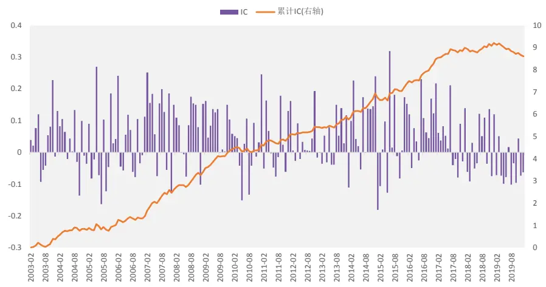
资料来源：光大证券研究所，注：2003-01-31 至 2020-01-31

BP 因子在历史上长期具有比较稳定的预测能力，从累计 IC 来看，BP因子在2018年上半年开始出现了几个月的回撤，2018下半年，因子表现有所回升。但2019年全年来看，BP因子在12个月中仅4个月获得正向的IC，胜率下滑明显，累计IC曲线也出现了较大的回撤。

从另一个角度来看估值因子的失效，我们选择沪深 300 指数和沪深300价值指数，来观察是否采用估值指标选股的 300 价值指数也在 2019 年出现相对回撤。

图2：沪深300相对价值指数与沪深300指数近期走势
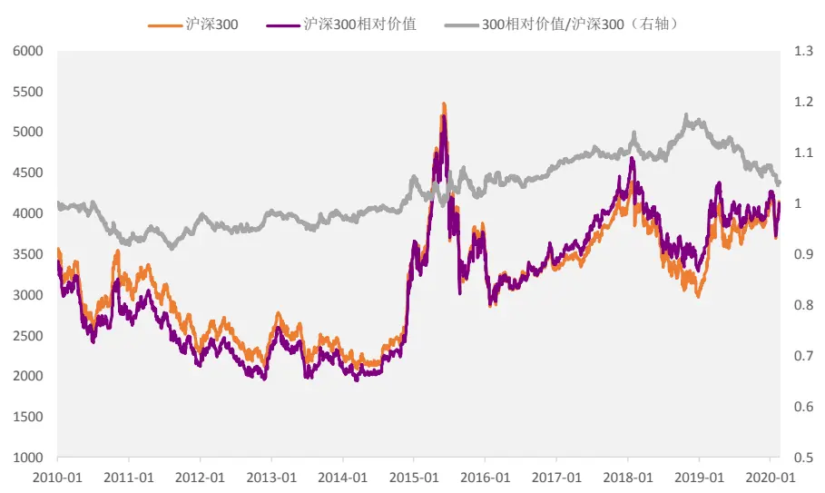
资料来源：Wind，光大证券研究所，注：2010-01-01 至 2020-01-31

上图中我们可以得到类似的结论：沪深 300 价值指数也在 2019 年大幅跑输沪深300指数，证明估值指标在沪深300 内选股时也出现了明显的失效的情况。

怎么应对估值因子的失效呢？我们尝试从两个方面寻找解决方法：

（1） 从估值因子本身的构造入手：

是否有更为合理和有效的估值因子构造方式，或者估值因子是否存在改进的可能。

（2） 对估值因子收益做预判：

从估值因子失效的原因入手，寻找逻辑上合理且与估值因子收益相关性较高的外部变量，来对估值因子收益做预判。

## 2、基于基本面估值的量化估值因子改造

量化多因子中，估值因子是历史上长期效果较为出色的一大类因子。同时，基本面研究中我们也常用到估值指标作为选股的参考依据。那么此估值和彼估值是否完全相同，又或者是否存在一些差异呢？

## 2.1、量化估值因子

量化多因子模型中常用的估值大类因子中包括了常见的账面市值比、盈利市值比、股息率等指标。而由于估值因子在不同行业和不同市值分组中的差异较大，测试该类因子时需要对行业和市值做中性处理。

具体的中性处理方法则是以 29 个中信一级行业作为行业哑变量、市值作为市值因子变量加入到每一期的回归方程中。

下表中列出了具体的估值因子及因子描述：

表1：估值因子明细表

| 因子代码 因子名称 |  |
| --- | --- |
| BP | 净资产（最新财报）/总市值 |
| BP_TTM | 净资产_TTM/总市值 |
| B2P_TTM | 归属母公司股东权益/总市值 |
| DP_TTM | 分红_TTM/总市值 |
| EP_LYR | 净利润（最新年报）/总市值 |
| EP_TTM | 净利润（TTM)/总市值 |
| EV2EBITDA | 企业价值倍数 |
| FCFP_TTM | 自由现金流_TTM/总市值 |
| NCFP_TTM | 净现金流_TTM/总市值 |
| OCFP_TTM | 经营性现金流_TTM/总市值 |
| PEG_TTM 市盈率相对盈利增长率 |  |
| SP_TTM 营业收入_TTM/总市值 |  |

资料来源：光大证券研究所

估值因子中的BP因子正是Fama-French三因子模型中的一个重要组成部分，因此也很容易理解 BP 和 BP_TTM 因子的历史收益表现和 IC 值均强于其他同类型的估值因子。下表给出了根据因子测试框架得到的动量因子的因子收益，IC值等测试结果：

表2：估值因子测试结果（因子收益&IC_IR）

|  | Factor Mean Return | Factor Return tstat | abs(t_value) mean | Factor t_value positive per | IC mean | IC positive per | IC std | IC > 0.02 per | IR |
| --- | --- | --- | --- | --- | --- | --- | --- | --- | --- |
| BP | 0.5% | 4.32 | 4.47 | 63.7% | 4.6% | 63.7% | 9.8% | 60.0% | 0.47 |
| BP_TTM | 0.3% | 2.58 | 3.97 | 57.8% | 3.0% | 60.0% | 9.8% | 53.3% | 0.30 |
| DP_TTM | 0.3% | 4.14 | 2.24 | 60.7% | 2.1% | 60.0% | 6.9% | 51.9% | 0.31 |
| B2P_TTM | 0.5% | 4.43 | 4.39 | 61.9% | 5.0% | 65.7% | 11.0% | 56.7% | 0.46 |
| EP_LYR | 0.2% | 1.93 | 2.52 | 54.8% | 2.0% | 55.6% | 8.5% | 49.6% | 0.24 |
| EP_TTM | 0.2% | 2.00 | 3.07 | 49.6% | 2.0% | 50.4% | 9.9% | 46.7% | 0.21 |
| EV2EBITDA | -0.4% | -4.47 | 3.16 | 34.3% | -3.2% | 33.6% | 9.5% | 26.9% | -0.33 |
| FCFP_TTM | 0.0% | -0.42 | 1.03 | 47.4% | -0.1% | 48.9% | 3.3% | 27.4% | -0.03 |
| NCFP_TTM | 0.0% | -0.51 | 1.59 | 46.7% | -0.8% | 39.3% | 4.5% | 25.9% | -0.19 |
| OCFP_TTM | 0.1% | 3.10 | 1.30 | 57.0% | 1.5% | 62.2% | 4.6% | 45.2% | 0.33 |
| PEG_TTM | 0.0% | -1.18 | 0.96 | 45.0% | -0.9% | 42.7% | 5.8% | 25.2% | -0.15 |
| SP_TTM | 0.2% | 3.03 | 2.81 | 61.9% | 2.7% | 61.2% | 8.5% | 56.0% | 0.31 |

资料来源：Wind，光大证券研究所，注：2005-01-01 至 2020-01-31

由于估值因子的构造方法不同，不同估值因子的分行业表现也有一定的差异。我们统计了三个常用估值因子 BP、EP 和 SP 在中信一级行业内的IC_IR:

表 3：主要估值因子分行业表现

|  | BP | EP_TTM | SP_TTM |
| --- | --- | --- | --- |
| 石油石化 | 0.17 | 0.09 | 0.15 |
| 煤炭 | 0.21 | 0.25 | 0.11 |
| 有色金属 | 0.23 | 0.26 | 0.29 |
| 电力及公用事业 | 0.25 | 0.37 | 0.15 |
| 钢铁 | 0.31 | 0.25 | 0.27 |
| 基础化工 | 0.31 | 0.29 | 0.32 |
| 建筑 | 0.37 | 0.26 | 0.24 |
| 建材 | 0.30 | 0.26 | 0.33 |
| 轻工制造 | 0.40 | 0.41 | 0.40 |
| 机械 | 0.26 | 0.32 | 0.31 |
| 电力设备 | 0.26 | 0.30 | 0.28 |
| 国防军工 | 0.22 | 0.18 | 0.12 |
| 汽车 | 0.32 | 0.40 | 0.35 |
| 商贸零售 | 0.34 | 0.38 | 0.38 |
| 餐饮旅游 | 0.23 | 0.15 | 0.17 |
| 家电 | 0.22 | 0.30 | 0.12 |
| 纺织服装 | 0.35 | 0.28 | 0.23 |
| 医药 | 0.13 | 0.31 | 0.09 |
| 食品饮料 | 0.21 | 0.18 | 0.06 |
| 农林牧渔 | 0.32 | 0.28 | 0.35 |
| 银行 | 0.10 | 0.13 | 0.05 |
| 非银行金融 | 0.15 | 0.06 | 0.09 |
| 房地产 | 0.33 | 0.35 | 0.29 |
| 交通运输 | 0.38 | 0.37 | 0.16 |
| 电子元器件 | 0.31 | 0.29 | 0.36 |
| 通信 | 0.28 | 0.24 | 0.22 |
| 计算机 | 0.11 | 0.14 | 0.07 |
| 传媒 | 0.14 | 0.10 | 0.12 |
| 综合 | 0.34 | 0.14 | 0.22 |

资料来源：光大证券研究所，注：2005-01-01 至 2020-01-31

BP 因子在全市场表现较好，且有效行业数量最多，因此本文后续的估值因子均以BP 为代表。

## 2.2、基本面研究中的绝对估值和相对估值

## （1） 绝对估值：

股利贴现模型DDM、自由现金流贴现模型 DCF 等模型是常用的股票绝对估值模型。以DDM模型为例，DDM模型是一种资产定价模型，其核心观点是股票现在的价格应当是未来股息的贴现值。通俗点就是，未来能分多少钱，换算到现在值多少钱，那么股票的价格就应该是多少：

$$
Value=\sum_{t=1}^{\infty}\frac{D_{0}*\prod_{i=1}^{t}(1+g_{i})}{(1+r_{f}+r_{m})^{t}}
$$

其中：分子项 $\begin{array}{r}{D_{0}*\prod_{i=1}^{t}(1+g_{i})}\end{array}$ 代表企业的盈利能力（或盈利预期）， $r_{f}$ 代表无风险收益率， $r_{m}$ 则代表市场的风险溢价（或风险偏好）。

因此，影响股票绝对估值的三大因素分别为：利率、盈利预期和风险偏好。后文中对估值因子的收益预测模型也将围绕这三个方面展开，寻找相应的有效指标来对估值因子的收益能力做出预判。

## （2） 相对估值：

在基本面研究中，相对估值也是常用的估值方法，这里的估值也包括使用市盈率、市净率、市售率、市现率等指标。

## 衡量一只股票的相对估值水平是否较高，常用的方法有两种：

一种是将它的估值与其它多只可比公司（例如同行业内的其他公司）进行对比，如果低于可比公司的相应的指标值的平均值，则认为股票价格被低估，股价将很有希望上涨，使得指标回归对比系的平均值。

另一种方法则是将指标值与该公司的历史数据做对比，例如某只股票的当前PB 值低于历史20%分位数，在基本面没有发生大的改变时，我们认为该股票被低估，后期有希望上涨。

图 3：基本面中相对估值的评价方法
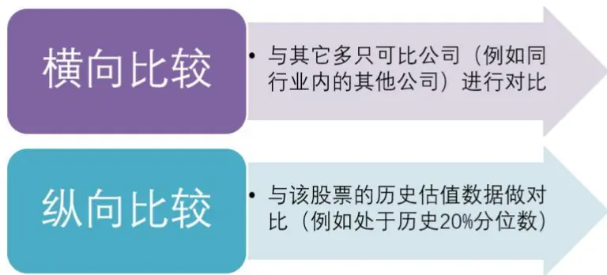
资料来源：光大证券研究所

因此，基本面研究中评价一个上市公司的估值时，存在上面提到的横向和纵向两种比较方法。两种基于基本面的估值判断方法，其中横向比较方法与量化多因子的因子测试方法是匹配的。

例如我们在测试因子BP的有效性时，也是采用行业中性化之后的截面因子值序列与滞后一期收益率的相关系数IC来衡量因子的预测能力。这里的行业中性化是不可或缺的一个步骤，目的就是为了使得因子的测试结果不受行业影响，也就是说，因子测试结果反映的是同类可比公司（同一行业）内的估值因子的预测能力。

而另一种估值比较方法，纵向比较，则并没有常用的相对应的因子可以作为参照。

因此，我们尝试从纵向比较的思路出发，构造一些衍生的估值因子，并观察他们的预测能力与选股效果是否与常用的原始估值因子有所差异。

## 2.3、估值历史分位数

基本面研究中时常会提及某某股票的估值跌破 20%历史分位数这样的说法，用以表示目前这只股票的估值比较便宜，具有一定的投资机会。因此我们很自然的想到历史分位数这种方式，来改造原始估值因子。

基于多因子体系中的 BP 因子，构造以下不同参数下的历史分位数估值因子：

表 4：历史分位数 BP 衍生因子

| CODE | NAME |
| --- | --- |
| BP_quantile_60 | 当前BP所处百分位（过去 60日） |
| BP_quantile_120 | 当前BP所处百分位（过去120日） |
| BP_quantile_240 | 当前BP所处百分位（过去240日） |
| BP_quantile_360 | 当前BP所处百分位（过去360日） |

资料来源：光大证券研究所

上述因子经过行业中性处理后的因子 IC、IR 表现如下图所示。可见使用分位数方法改造的估值因子BP_quantile在回溯时长为120个交易日时具有较高的 IC_IR（接近 0.60），时间区间拉长后因子有效性出现逐步下降。

图 4：历史分位数 BP 衍生因子 IC、IC_IR
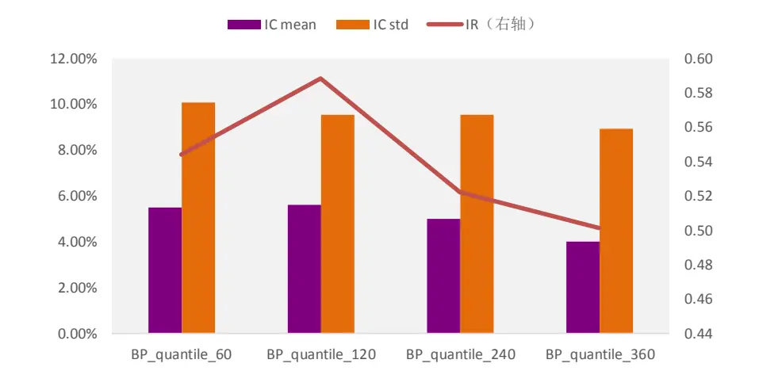
资料来源：光大证券研究所，注：2005-01-01 至 2020-01-31

## 2.4、估值时序 z_score

另一种比较常用的用来衡量数据在时间序列上的相对位置的方法，则是时间序列 z_score。

时序 z_score方法与分位数方法在逻辑上是类似的，不同点则在于分位数仅仅考虑了数据的排序分布情况，而 z_score考虑到了数据的实际分布情况。

类似的，我们基于多因子体系中的 BP 因子，构造以下不同参数下的时序 z_score 估值因子：

表 5：BP 的时序 z_score 衍生因子

| CODE | NAME |
| --- | --- |
| BP_Z_60 | 当前 BP 的 z_score（过去 60 日） |
| BP_Z_120 | 当前 BP 的 z_score（过去 120 日） |
| BP_Z_240 | 当前 BP 的 z_score（过去 240 日） |
| BP_Z_360 | 当前 BP 的 z_score（过去 360 日） |

资料来源：光大证券研究所

上述因子经过行业中性处理后的因子 IC、IR 表现如下图所示：

图 5：BP 的时序 z_score 衍生因子 IC、IC_IR
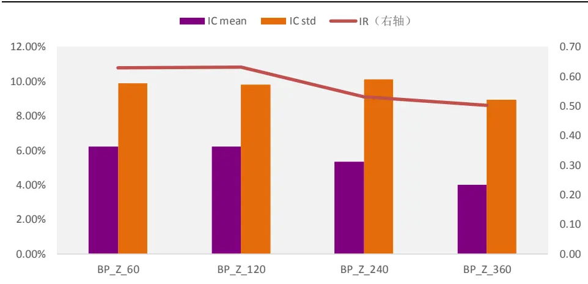
资料来源：光大证券研究所，注：2005-01-01 至 2020-01-31

其中，BP_Z_120 因子 IC_IR 最高，达到 0.63。而同样的随着时间区间的拉长，因子有效性逐渐下降。

## 2.5、改造估值因子 v.s.原始估值因子

上面两节中改造后的 BP 因子都相对于原始 BP 因子有所提升。其中，BP_Z_120 因子的 IC、IC_IR 均表现最为出色。

这一节我们将主要分析BP_Z_120因子与原始BP因子在预测能力、多空收益等方面表现的差异，并尝试分析其差异产生的原因。

表 6：BP_Z_120 与 BP 因子预测能力对比

|  | BP | BP_Z_120 |
| --- | --- | --- |
| IC mean | 4.62% | 6.21% |
| IC std | 9.82% | 9.82% |
| IR | 0.47 | 0.63 |
| IC positive per | 63.73% | 74.02% |
| long_short_return | 8.80% | 9.90% |
| long_short_sharpe | 0.72 | 0.86 |
| long_short_maxdrawdown | -29% | -23% |

资料来源：光大证券研究所

从因子预测能力上看，改造后的 BP_Z_120 因子具有显著高于原始 BP因子的 IC 和 IC_IR。多空年化收益上升了 1.10 个百分点，多空收益的最大回撤也下降了6 个百分点。

图 6：BP_Z_120 与 BP 因子多空收益对比
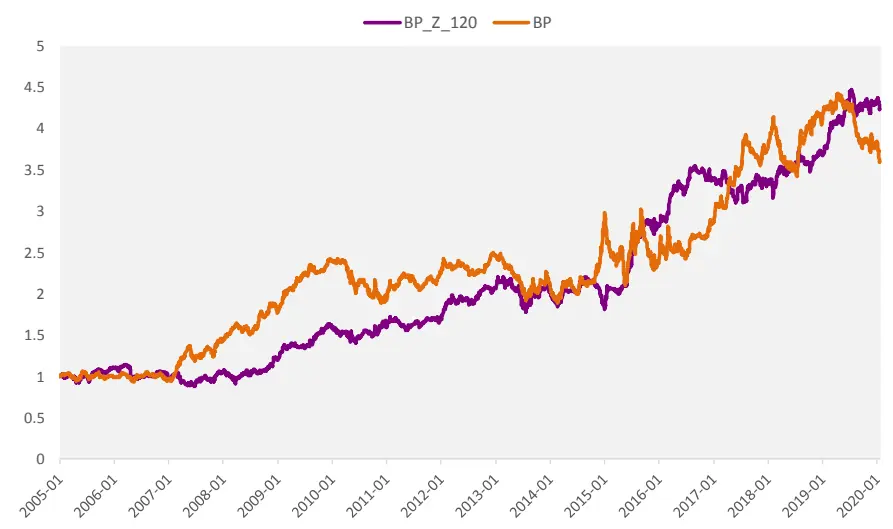
资料来源：光大证券研究所，注：2005-01-01 至 2020-01-31

从多空收益的净值曲线上看，原始 BP 因子的收益波动较大，且 2019年以来的多空收益出现了大幅回撤。而改造后的BP_Z_120因子多空收益的稳定性有了显著的改善，并且在2019年并没有出现大幅的回撤。

表 7：BP_Z_120 与 BP 因子的分行业表现

|  | BP | BP_Z_120 |
| --- | --- | --- |
| 石油石化 | 0.17 | 0.26 |
| 煤炭 | 0.21 | 0.12 |
| 有色金属 | 0.23 | 0.22 |
| 电力及公用事业 | 0.25 | 0.33 |
| 钢铁 | 0.31 | 0.22 |
| 基础化工 | 0.31 | 0.29 |
| 建筑 | 0.37 | 0.23 |
| 建材 | 0.30 | 0.24 |
| 轻工制造 | 0.40 | 0.23 |
| 机械 | 0.26 | 0.28 |
| 电力设备 | 0.26 | 0.25 |
| 国防军工 | 0.22 | 0.10 |
| 汽车 | 0.32 | 0.25 |
| 商贸零售 | 0.34 | 0.40 |
| 餐饮旅游 0.23 |  | 0.13 |
| 家电 | 0.22 | 0.22 |
| 纺织服装 | 0.35 | 0.26 |
| 医药 | 0.13 | 0.18 |
| 食品饮料 | 0.21 | 0.05 |
| 农林牧渔 | 0.32 | 0.27 |
| 银行 | 0.10 | -0.02 |
| 非银行金融 | 0.15 | 0.03 |
| 房地产 | 0.33 | 0.33 |
| 交通运输 | 0.38 | 0.23 |
| 电子元器件 | 0.31 | 0.27 |
| 通信 | 0.28 | 0.30 |
| 计算机 | 0.11 | 0.22 |
| 传媒 | 0.14 | 0.17 |
| 综合 | 0.34 | 0.28 |

资料来源：光大证券研究所，注：2005-01-01 至 2020-01-31

分行业来看，原始 BP 因子在各个行业的有效性相对来说更为均衡，时序z_score的BP因子在银行非银行业的表现出现了比较大幅的下滑。

与其他大类因子相关性上看，BP_Z_120 因子与一个月动量因子有较强的相关性。这也与衍生因子的构造方式存在必然的联系，由于BP_Z_120 是采用过去120个交易日计算 z_score的方式得到的，而BP中的B（净资产）并不会频繁的大幅变化，因此 P（价格）的变动是导致因子值变化的主要因素，从而因子与股票价格动量会存在较高的相关性。

图 7：BP_Z_120 与其他大类因子相关性
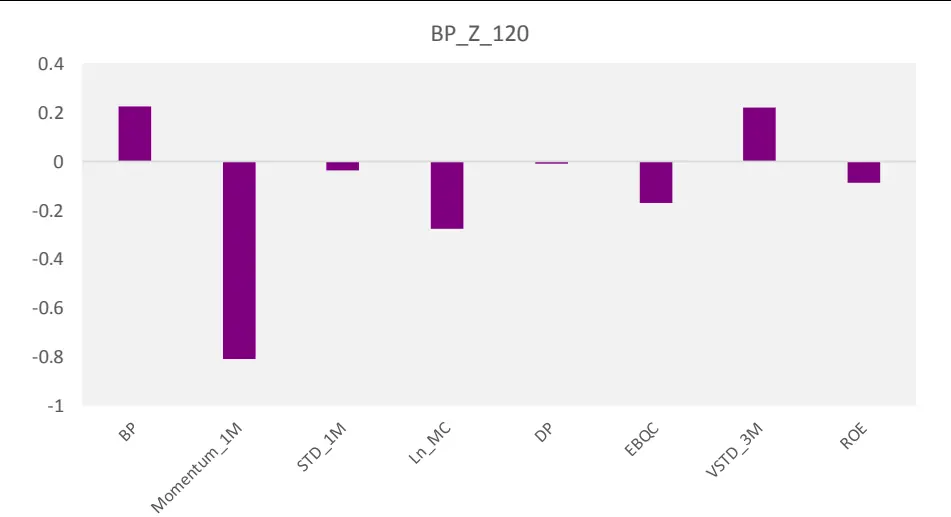
资料来源：光大证券研究所，注：2005-01-01 至 2020-01-31

由于改造后的BP_Z_120因子，与股票价格动量之间存在较强的相关性，且BP_Z_120在银行非银行业中的预测能力有所下滑。因此尽管BP_Z_120具有更高的IC_IR和多空收益，我们认为它仍然不足以被视为一个有效的改进估值因子。

那么，应对估值因子失效的第二种角度，对估值因子收益做预判，就是我们主要的攻克方向了。

## 3、估值因子的有效性预判

刚刚过去的 2019 年，是估值因子的“小年”，估值因子收益出现了连续的大幅回撤，很多量化多因子模型也因为估值因子的回撤导致组合收益受到影响。因此我们希望可以寻找一些可靠的外部变量，来对估值因子未来阶段的表现做出一定程度的预判。

## 3.1、估值因子择时测试回顾

在 2019 年初的报告《因子择时的“是”与“非”》中，我们讨论了通过一些外部宏观变量、经济变量、市场变量、市场情绪指标，来对因子收益做预测。

我们首先简单回顾一下这些外部变量对估值因子收益的预测能力：

考虑到宏观经济变量的发布滞后性，具体操作时我们对于 CPI同比增长率，规模以上工业增加值同比增长率，M1 同比增长率等等宏观变量做滞后一期处理：

## （1） 货币政策变量

货币政策变量主要有三个衡量指标，国家的货币政策立场（宽松或紧缩），短期利率，货币供应量。我们选择 3 个月国债到期收益率，M1 货币供应量同比增长率、M2 货币供应量同比增长率及其衍生指标M2、M1 增速差等指标作为货币政策变量。

## （2） 经济环境变量

经济环境变量直接衡量了经济是否健康或是否具有通货膨胀风险。我们选择 GDP 同比增长率、CPI 同比增长率，PPI 同比增长率，规模以上工业增加值同比增长率，消费者信心指数、投资者信心指数、PMI、社消总额、社会融资规模增速等指标。

## （3） 市场状态变量

这个类别中的变量衡量股票或债券市场的状态。Fama 和French（1989）使用期限利差，信用利差和股息收益率解释了股票和债券收益的可预测性。Kao和Shumaker（1999）同时应用了期限利差和信用利差两个因素来预测股票市场的价值-成长风格收益。

我们选择信用利差，期限利差，沪深 300、中证 1000 月度收益率及收益率差值，沪深 300、中证 1000 月度波动率及波动率差值作为市场状态变量，其中信用利差定义为1 年中债中短期票据到期收益率减去1年国债到期收益率，期限利差定义为10 年国债到期收益率减去1 年国债到期收益率。

表8：因子择时的外部变量汇总

|  | 指标代码 | 指标名称 | 备注 |
| --- | --- | --- | --- |
| 因子衍生变量 | VS | 因子估值差（Value_Spread） |  |
|  | VS_zscore | 因子估值差标准分 | - |
|  | Crowding_Score | 因子拥挤度得分 | - |
| 货币政策变量 | Tbill_3M | 3个月国债收益率 | - |
|  | M1 | M1货币供应量同比增长率 | 1 |
|  | M1_D | M1 同比增速一阶差分 | - |
|  | M2 | M2货币供应量同比增长率 | - |
|  | M2_D | M2 同比增速一阶差分 | - |
|  | M2-M1 | M2、M1 增速差 | - |
|  | CPI | CPI 同比增长率 | - |
| 经济环境变量 | PPI | PPI 同比增长率 | - |
|  | GDP | GDP 同比增长率 | - |
|  | IND | 规模以上工业增加值同比增长率 | 滞后2个月 |
|  | C_Confidence | 消费者信心指数（月） | - |
|  | PMI | 采购经理人指数(PMI) | - |
|  | PMI_N | PMI:新订单 | - |
|  | PMI_V | PMI:采购量 | - |
|  | Retail_Sale | 社消总额：实际当月同比 | 1 |
| 市场状态变量 | Econ_Fin | 社会融资规模：当月值 | - |
|  | TS | 期限利差 | 10年国债到期收益率-1年国债 到期收益率 |
|  | CS | 信用利差 | 1年中债中短期票据到期收益率- 1年国债到期收益率 |
|  | 300_RET | 沪深 300 收益率 | 月度 |
|  | 1000_RET | 中证 1000 收益率 | 月度 |
|  | 300_STD | 沪深 300 波动率 | 月度 |
|  | 1000_STD | 中证 1000 波动率 | 月度 |
|  | RET_Spread | 大小盘收益差值 | 300_RET - 1000_RET |
| STD_Spread |  | 大小盘波动差值 | 300_STD - 1000_STD |

资料来源：光大证券研究所

我们统计了各变量对不同期限的估值因子收益的预测能力，计算外部变量与不同期限因子收益之间的滚动相关系数：

表9：择时变量与不同期限因子收益相关性

| 估值因子 |  |  |  |  |  |  |  |  |  |  |  |
| --- | --- | --- | --- | --- | --- | --- | --- | --- | --- | --- | --- |
|  |  |  |  |  |  |  | 1个月 | 3个月 | 6个月 12个月 | 24个月 | 36个月 |
| CPI | -3% | -7% | -6% | 4% | -10% | -12% |  |  |  |  |  |
| PPI | -2% | -5% | -7% | -6% | -25% | -31% |  |  |  |  |  |
| Bond_yield_3MGDP | -6% | -12% | -27% | -15% | -3% | 26% |  |  |  |  |  |
|  | 1% | -1% | -4% | -5% | -7% | -14% |  |  |  |  |  |
| PMI | -3% | 1% | -9% | -16% | -5% | -9% |  |  |  |  |  |
| PMI_N | -1% | 4% | -4% | -10% | 2% | -2% |  |  |  |  |  |
| PMI_VRetail_SaleEcon_Fin | -3% | 1% | -8% | -12% | -5% | -11% |  |  |  |  |  |
|  | -2% | 0% | -1% | -10% | -28% | -36% |  |  |  |  |  |
|  | -19% | -20% | -9% | -8% |  |  |  |  |  |  |  |
|  |  |  |  |  | -9% | -14% |  |  |  |  |  |

敬请参阅最后一页特别声明

| Ind_GC_Confidence | -5% | -9% | -19% | -23% | -26% | -30% |
| --- | --- | --- | --- | --- | --- | --- |
|  | -1% | 1% | 4% | 11% | 34% | 27% |
| M1 | 9% | 17% | 23% | 24% | 4% | -27% |
| M2 | 0% | -1% | -4% | -13% | -26% | -33% |
| Bond_yield_10Y | -4% | -15% | -34% | -36% | -16% | 23% |
| Bond_yield_1Y | -7% | -11% | -26% | -17% | -6% | 24% |
| TIPS_1Y | -10% | -18% | -35% | -30% | -19% | 17% |
| STD_1000 | 4% | 8% | 25% | 38% | 39% | 22% |
| STD_300 | 0% | 0% | 19% | 32% | 38% | 27% |
| RET_1000 | 15% | 16% | 9% | 9% | 18% | 23% |
| RET_300 | 7% | 9% | 4% | 0% | 10% | 15% |
| TS | 6% | 3% | 7% | -7% | -6% | -17% |
| CS | -13% | -26% | -39% | -45% | -38% | -2% |
| STD_Spread | 10% | 22% | 18% | 23% | 12% | -8% |
| RET_Spread | 17% | 15% | 10% | 16% | 16% | 16% |
| M2-M1 | -12% | -22% | -32% | -39% | -25% | 15% |
| M1_D | 8% | 0% | 8% | 11% | 11% | 10% |
| M2_D | 3% | 4% | 13% | 6% | 9% | 12% |
| VS_zscore | 14% | 20% | 14% | 25% | 40% | 48% |
| VS | 14% | 14% | 12% | 24% | 41% | 46% |
| Crowding_Score | -11% -10% |  | -5% | -1% | 9% | 4% |

资料来源：光大证券研究所，注：2005-01-01 至 2020-01-31

上述测试结果表明：

1) 因子估值差（Value_Spread）指标对估值因子收益具有较强的正向预测能力。

## 2) 包括 TIPS_1Y、Bond_yield_1Y、Bond_yield_10Y 在内的利率指标，与估值因子收益呈现较为显著的负向相关性。

一方面，利率下行时股票市场的交易活跃度和参与度会有所提升，更有利于低估值股票的价值被发现，从而对估值因子的表现有提振作用。另一方面，如果利率下行由货币需求（融资需求）回落导致，那么会抑制风险偏好，市场整体估值下行，对于估值因子的表现也相对有利。

3) 反映货币政策的 M2-M1 指标，也与估值因子收益具有较高的相关性。

在货币供应的各个层次中，狭义货币供应量M1是流通中的现金加上各单位在银行的活期存款；广义货币供应量 M2，是指 M1 加上各单位在银行的定期存款、居民在银行的储蓄存款、证券客户保证金。在一般情况下，M1 和 M2 增速应当保持平衡，也就是在收入增加、货币供应量扩大的环境下，企业的活期存款和定期存款是同步增加的。

如果 M1 增速大于 M2，意味着企业的活期存款增速大于定期存款增速，企业和居民交易活跃，微观主体盈利能力较强，经济景气度上升。如果 M1 增速小于 M2，表明企业和居民选择将资金以定期的形式存在银行，微观个体盈利能力下降，经济运行回落。因此M2-M1 指标一定程度上反映了经济景气度和市场情绪，对估值因子的后期收益表现具有一定预测能力。

同时，我们可以很容易观察到一个现象，即因子收益的计算滚动时间越长，外部变量与因子收益的相关性往往越高。产生这一现象的原因我们认为主要有两点：1、计算因子收益的时间区间越长（例如 24 个月或者 36 个月的收益），样本区间越短相关系数的显著性越低，从而可靠性越低；2、在计算相关系数时我们采用的是滚动计算方法，例如在计算 24 个月收益相关性时，计算 t 期相关系数时的因子收益与 t+1 期相关系数时的因子收益之间有 23 个月的重叠，因此相关系数的自相关性极高，其显著性和可靠性并不高。因此，预测长期收益比预测短期收益的有效性并非更强。

采用估值差（Value_Spread）指标来判断估值因子收益则存在逻辑上的矛盾，由于估值差指标来进行因子择时的本质上就是在使用估值指标来评价一个因子是比较“贵”还是比较“便宜”。而当估值因子失效时，这个逻辑也是失效的，那么通过估值差来对估值因子的表现做判断就失去了逻辑。

## 3.2、从基本面角度看近期的估值因子失效原因

2019年估值因子的多空收益出现的很大幅度的回撤，这一结果与2019年市场整体的估值扩张存在一定的联系。尤其是优质公司的估值不断抬升，导致从量化估值因子角度选取低估值个股的模型很难选到这些优质公司，或者模型最终对这些优质公司降低配置权重，从而影响到组合表现。

从市场整体来看 2019 年全年市场走势由估值主导，估值扩张可以说是市场上涨的核心因素。从A 股板块整体到大多数领涨行业，估值扩张幅度远胜过股价涨幅，估值变动对于股价上涨起到显著贡献。

表10：2019年板块收益大多由估值贡献

| 收益率 | PE变化率 | 净利润变化率 |
| --- | --- | --- |
| 全部A 股 | 33.02% 33.14% | 4.17% |
| 沪深 300 | 36.07% 21.92% | 8.10% |

资料来源：Wind，光大证券研究所

前文中通过对 DDM 绝对估值模型的拆解分析，我们看到估值的三个决定因素分别是：利率、盈利预期、风险偏好，而2019年“金融供给侧改革”引导这三个因素同时超预期，共同带来了A股估值显著扩张。金融供给侧改革对企业盈利的驱动力有限，但“让市场发挥资源配置更大的作用”引导企业融资成本回落、市场风险偏好上升。

我们采用沪深300的 10年平均收益与10年期国债到期收益率的差值，计算市场的股权风险溢价指标ERP：

图8：基于沪深300指数的股权风险溢价 ERP
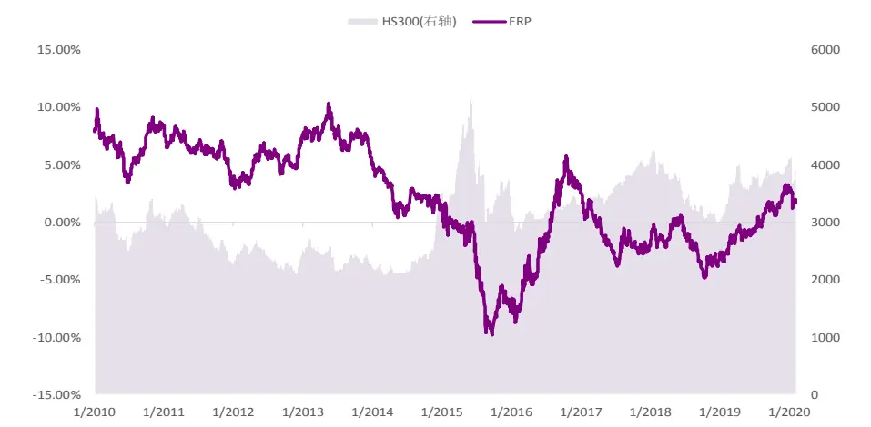
资料来源：Wind，光大证券研究所，注：2010-01-01 至 2020-01-31

上图可见，2019 年初以来，A股整体风险偏好处于稳步上升中，且目前已经逐渐接近长期均值 2%附近。结合市场盈利预期的抬升，形成了 2019年全年的由估值主导的市场行情。

## 3.3、资金面、情绪面指标与估值因子的相关性

上一节中我们提到 2019 年的估值扩张，与估值因子的大幅回撤之间存在一定的联系。估值扩张的另一个解读也可以理解为，市场对优质资产的估值容忍度不断提升。我们尝试从资金面和情绪面，寻找可以反映市场对估值容忍度的一些方向。

## 3.3.1、外资流入影响估值因子表现

资金面上来看，近年来外资的进入是对A股持有者结构影响较大的因素。从目前 A 股的外资流入趋势来看，19 年底外资持有 A 股规模约 1.9 万亿元，与A股公募基金、保险公司形成三足鼎立之势。

考虑到MSCI权重上升等因素带来的外资长期加速流入的趋势，预计再过1至 2年外资将超越保险及公募基金，成为A股最重要的机构投资者。

图 9：A 股持有者结构（2019-12-31）
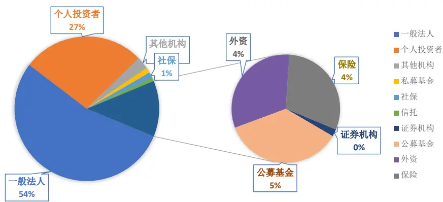
资料来源：Wind，光大证券研究所，截止 2019-12-31

从 2014 年陆港通开通以来，陆港通资金流入逐渐加速，截止 2020 年 2月12日，累计净买入的金额已经达到10600亿元。

图 10：北上资金净流入（月度，单位：亿元 CNY）
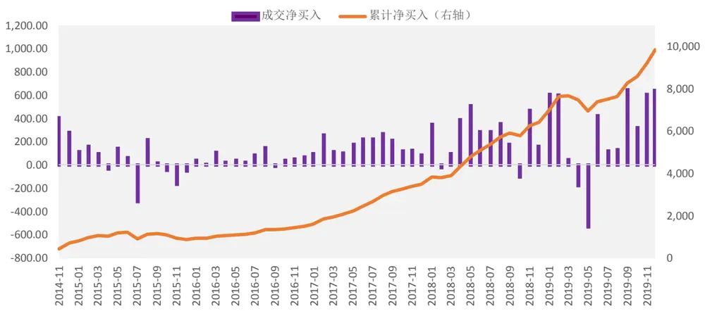
资料来源：光大证券研究所，注：2014-11-01 至 2019-12-31

同时 19 年年初，MSCI 公布了 A 股纳入 MSCI 比例提升方案，分别在19 年 5 月、8 月、11 月逐步提高 A 股纳入比例并调整纳入成分股范围。19年5 月，A 股大盘股纳入比例从5%提升至10%并将创业板调整入可纳入股票范围，创业板大盘股按10%比例首次纳入。8 月，A股大盘股纳入比例提升至15%。11 月，将A股大盘股纳入比例进一步提升至 20%，同时中盘股首次纳入，纳入比例为20%。

图 11：MSCI 权重调整时间线
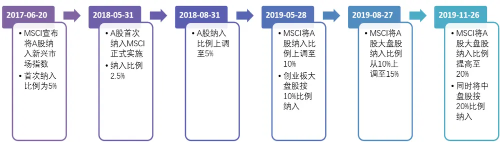
资料来源：光大证券研究所绘制，注：此处大盘股和中盘股的定义均基于 MSCI 的标准

考虑到 MSCI 权重提升带来的资金流入情况的明细数据比较难以获取，我们这里将主要参考陆股通的北上资金流入数据，观察北上资金流入及其增速与A 股主要的风格因子6 个月累计收益率之间的相关性。

图12：北上资金净流入金额与风格因子收益相关性
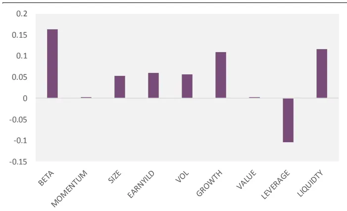
资料来源：Wind，光大证券研究所，注：2005-01-01 至 2019-12-31

图13：北上资金净流入金额增速与风格因子收益相关性
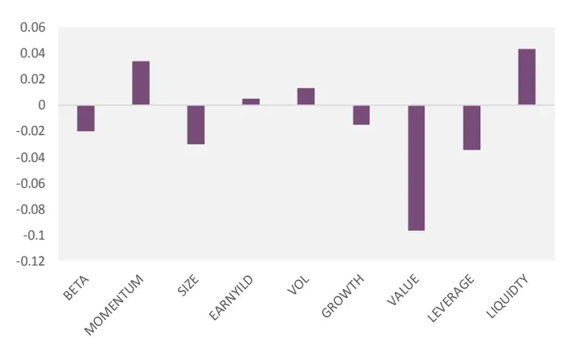
资料来源：Wind，光大证券研究所，注：2005-01-01 至 2019-12-31

北上资金流入增速与VALUE因子（BP）有较强的负相关，可见在外资加速投入A 股时，估值因子受到了较大的冲击。两图结合起来看，北上资金流入金额与估值因子几乎不相关，因此其并不偏好低估值股票，同时北上资金的加速流入，导致估值因子的收益受到一定影响。

图14：北上资金持仓股票估值水平偏高
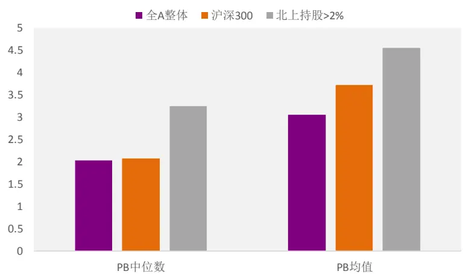
资料来源：Wind，光大证券研究所，截止 2020-01-31

我们从北上资金持仓情况中，可以更加直观的看到截止 2020-01-31 日北上资金持仓占比大于 2%的股票（共 379 只）整体估值水平是偏高的。因此，北上资金的流入对于估值因子表现的负面影响是较为显著的。

## 3.3.2、市场情绪与估值因子表现

面对 2019 年的市场对优质资产的估值容忍度不断提升的情况，我们也尝试从市场情绪上寻找原因。

在前期的报告《构建情绪体系，寻找涨跌信号》中我们筛选了 10 个指标并等权重相加后得到光大金工市场情绪指数。通过情绪指标筛选、数据处理和权重分配，我们可以构建市场情绪指数来表征市场情绪走势，并对择时等进行辅助判断。

表 11：市场情绪指数样本指标

| 序号 | 指标名称 | 序号 | 指标名称 |
| --- | --- | --- | --- |
| 1 | A 股投资者增速 | 6 | 50ETF 期权 PCR |
| 2 | A 股换手率 | 7 | 股东净减持率 |
| 3 | ETF 净赎回力度 | 8 | HS300 40 日强势股占比 |
| 4 | HS300期指当月溢价率 | 9 | HS300 上涨家数占比 |
| 5 | 融资余额增速 | 10 | HS300相对强弱指标 |

资料来源：光大证券研究所

图15：光大市场情绪指数与 BP多空净值表现
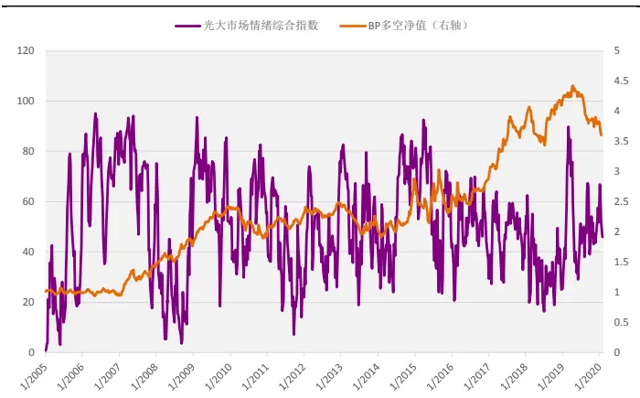
资料来源：光大证券研究所，注：2005-01-01 至 2020-01-31

图16：光大市场情绪指数与滚动 6个月BP多空收益表现
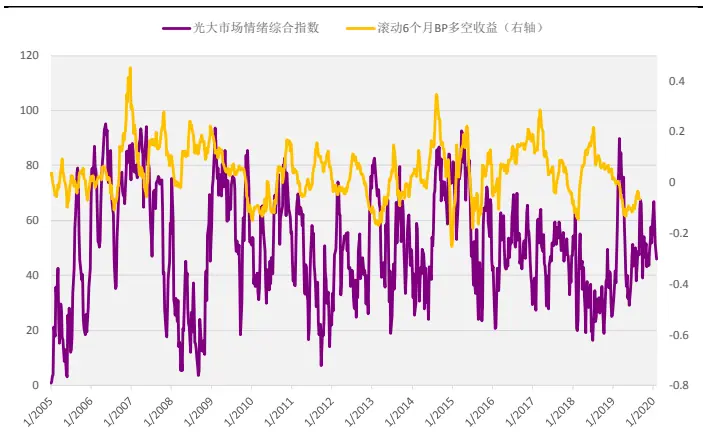
资料来源：光大证券研究所，注：2005-01-01 至 2020-01-31

由上图观察，市场情绪指数与估值因子收益率直接的相关性不甚明显，通过统计市场情绪指数与估值因子之间的相关性，我们发现市场情绪提升时，估值因子未来一段时间的收益是更高的。市场情绪指数与估值因子未来6个月收益的相关性在正的0.08 左右。

图17：情绪指标与不同期限的 BP因子收益相关性
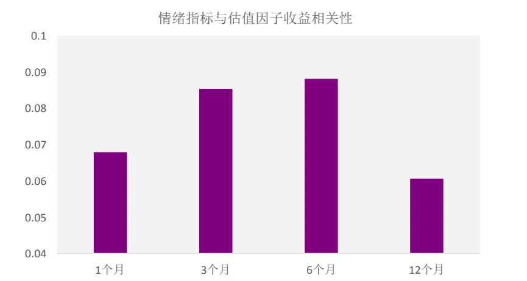
资料来源：光大证券研究所，注：2005-01-01 至 2020-01-31

市场情绪提升，对于估值因子未来收益的影响方向为正，可以理解为市场情绪较高时，交易活跃换手充分，投资者更为理性的对待处于较低估值水平的股票，因而对估值因子的表现有一点正向推动作用。

## 4、当前估值因子中期判断较为乐观

最后我们综合上述各个章节中梳理得到的对于估值因子收益具有预测能力的指标，构建一个较直观的估值因子打分体系，用以对估值因子（BP）未来因子收益情况做预判。

首先，从前文可见，无论是货币政策、市场环境变量，还是北上资金流入增速数据，都是与6个月左右的估值因子收益具有较高的相关性。同时从实际操作的层面上看，对于估值因子这类风格因子上的判断也比较适合放在半年度这样的区间上。太短的区间会造成模型频繁地调整因子权重，调整权重带来的Alpha很可能被调整带来的换手率上升所损耗。太长的预判区间例如两到三年的因子收益判断是十分困难的，从指标相关性上也可以看出，超过1年的时间后，相关性往往出现大幅的下滑甚至反转。

因此本文我们将重点对估值因子的6 个月因子收益方向做预测，首先我们从市场风险偏好、资金面、利率、货币和市场状态各个大类指标中，整理了下述具有基本面逻辑且预测能力较强的指标：

表 12：初选指标名单与 6 个月估值因子收益的相关性

| 指标名称 |  | 相关性 |
| --- | --- | --- |
| ERP | 股权风险溢价 | -10.15% |
| HKSHSZ | 北上资金增速 | -15.72% |
| Bond_yield_1Y | 1年期国债到期收益率 | -18.65% |
| M2-M1 | M2 与 M1 差值 | -15.96% |
| STD_1000 | 中证1000月度收益波动 | -29.25% |

资料来源：光大证券研究所，注：2005-01-01 至 2020-01-31

在 2019 年初的报告《因子择时的“是”与“非”》中，我们最终推荐的是基于机器学习中SVM支持向量机模型的月度因子择时体系，但SVM模型对于估值因子的预测能力较为一般，并且由于采用的是机器学习的方法，模型的透明度较低，内部细分指标的具体变化情况、指标权重都是无法获取的。

因此在构造针对估值因子未来收益情况的预测模型时，更倾向于使用逻辑较为清晰，且框架较为简单明了的打分模型。

具体构造方式如下：

1) 数据处理：

对于入选的预测变量，均使用过去240个交易日的数据做时间序列上的标准化处理，也就是采用过去一年的数据计算当前指标值的z_score。上表中所展示的相关性指标，均为标准化处理后的指标与因子收益的相关系数。

2) 指标选择：

上表中列出的，从市场风险偏好、资金面、利率、货币和市场状态中整理的5 个指标。

3) 打分方法：根据 z_score 指标得分，大于等于零的得分为 1，小于零得分为-1，乘以指标的方向系数后等权相加得到总分。

4) 打分频率：月度

图18：估值因子收益预测方向与因子收益表现
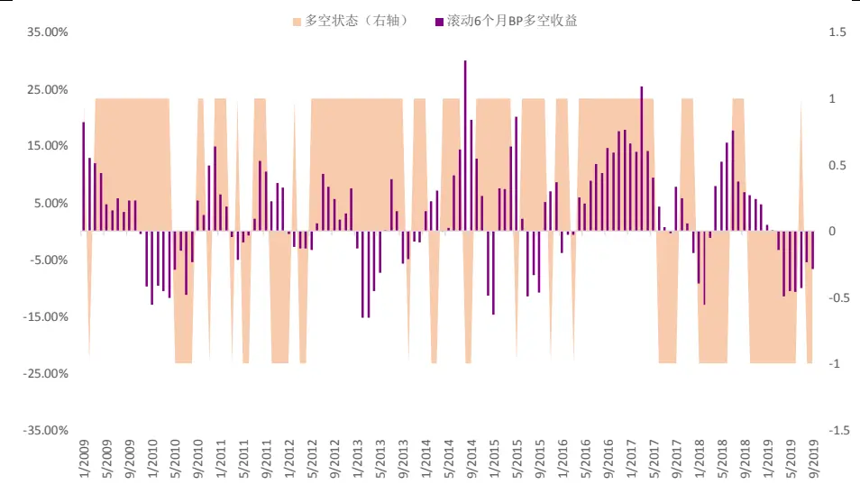
资料来源：光大证券研究所，注：2009-01-01 至 2019-08-01

模型的判断胜率为62.05%，且从 2018年 10 月以来，模型给出的估值因子收益预测方向基本上均为负（除 2019 年 7 月）。从结果上看，模型对于近期的估值因子回撤状态，有较好的预警作用。

当前模型的指标状态有所变化，截止 2020 年 1 月底，模型总分上升至3 分，对估值因子的收益预判已经连续两个月为正。

表 13：当前总分及细分指标状态

|  | ERP | HKSHSZ | Bond_yield_1Y | M2-M1 | STD_1000 | 总分 | 多空状态 |
| --- | --- | --- | --- | --- | --- | --- | --- |
| 10/01/2019 | -1 | -1 | 1 | -1 | 1 | -1 | -1 |
| 11/01/2019 | -1 | 1 | 1 | -1 | 1 | 1 | 1 |
| 12/01/2019 | -1 | -1 | 1 | -1 | 1 | -1 | -1 |
| 01/01/2020 | -1 | 1 | 1 | -1 | 1 | 1 | 1 |
| 02/01/2020 | -1 | 1 | 1 | 1 | 1 | 3 | 1 |

资料来源：光大证券研究所

当前（2020 年 2 月 1 日）除了 ERP 反映的风险偏好指标值较低，北上资金、国债收益率、货币政策和市场状态端的指标值具有较好的表现，因此目前我们对估值因子的中期收益持较为乐观的观点。

## 5、风险提示

报告结论均基于历史数据与模型，模型存在失效的可能，历史数据存在不被重复验证的可能。

## 6、附录

## 风格因子构造方式：

在 Barra 的针对中国市场的风险因子构建中，通常将公共因子分为行业因子和风格因子两大类。行业因子是股票所属行业的哑变量，本文均一致选用中信一级行业分类。风格因子是影响股票投资组合收益的重要系统性因素，其涵盖了基本面因子、技术面因子和预期因子等多方面影响。

九大类风格因子（Size、Beta、Momentum、Volatility、Value、Liquidity、Earnings、Growth、Leverage）共由 20 个细分因子复合而成，遵循 Barra的赋权方式，具体构造方式及含义见下表。

表 14：风格因子分类及构造方式

| 风格大类 | 细分因子 | 因子计算方式 |  |
| --- | --- | --- | --- |
| Size（规模） | LNCAP | 对数总市值 |  |
| Beta(CAPM 模型 Beta) | BETA | 该因子用以衡量市场性风险: $u_{i}=\alpha+\beta r_{m}+e_{i}$ |  |
|  |  | 按照 CAPM 理论使用沪深 300 指数收益率对个股收益率进行半衰期为 60 个交易日的指 数加权滚动回归，取回归模型斜率即为beta；其中滚动回归的序列长度为240个交易日。 |  |
| Momentum（动量） | RSTR | 该因子衡量股票前期业绩持续能力：过去一段时间T个股累积收益率 |  |
|  |  | $RSTR=\sum_{t=L}^{T+L}w_{t}\ln(1+r_{t})$ |  |
|  |  | $\mathsf{T}=500,\mathsf{L}=20,w_{t}$ 为半衰期指数，半衰期为120个交易日。 |  |
| Residual Volatility（波动） | $\mathsf{Volatility}=0.74^{\star}\mathsf{DASTD}+0.16^{\star}\mathsf{CMRA}+0.10^{\star}\mathsf{HSIGMA}$ |  |  |
|  | DASTD | $DASTD=({\sum}^{T}w_{t}(r_{t}-u(r))^{2})^{0.5}$ |  |
|  |  | $r_{t}$ 表示个股t日的收益率，u(r)表示过去250个交易日个股收益率均值，指数加权半衰期 |  |
|  |  | 为 40 个交易日。 |  |
|  | CMRA | $CMRA=ln(1+\operatorname*{max}\{Z(T)\})-ln(1+\operatorname*{min}\{Z(T)\})$ |  |
|  |  | $Z(T)=\sum_{t=1}^{T}\ln(1+r_{t})$ $r_{\tau^{\prime}}$ 表示个股月收益率， ${\mathsf{T}}{\mathsf{=}}1,2,\ldots,12.$ |  |
|  | HSIGMA | $HSIGMA=std(e_{t})$ |  |
| 计算 beta 所得残差标准差 |  |  |  |
|  | BTOP | 市净率倒数=股东权益/总市值 |  |
| Liquidity（流动性） | $\mathsf{Liquidity}=0.35^{\star}\mathsf{STOM}+0.35^{\star}\mathsf{STOQ}+0.30^{\star}\mathsf{STOA}$ |  |  |
|  | $\overline{{STOM}}=\ln({\sum}^{20}\frac{V_{t}}{S_{t}})$ STOM |  |  |
|  | Vt为t日的成交量，St为t日流通股本 $STOQ=\ln(\frac{1}{T}{\sum}^{T}\exp(STOM_{t})),\qquad T=3$ |  |  |
|  | STOQ STOM表示一个月（20日）换手率 |  |  |
|  | $STOQ=\ln(\frac{1}{T}{\sum}^{T}\exp(STOM_{t})),\qquad T=12$ STOA |  |  |
|  | Earnings Yield（盈利） |  | Earnings = 0.68 * EPFWD + 0.21 * CETOP + 0.11 * ETOP |
| EPFWD |  | EPFWD =est_eps(TTM) / close_price，未来12 个月一致预期每股收益/收盘价 |  |
| CETOP |  | CETOP=过去12个月每股现金收益/当前收盘价 |  |
| ETOP |  | ETOP=过去12个月净利润/当前总市值 |  |
| Growth（成长） |  | Growth = 0.18 * EGRLF+0.11 * EGRSF + 0.24 * EGRO + 0.47 * SGRO |  |
|  | EGRLF | 未来1年净利润增长率 |  |
|  | EGRSF | 未来2年净利润复合增长率 |  |
|  | EGRO | 过去5年企业营业总收入复合增长率 |  |
|  | SGRO | 过去5年企业归属母公司净利润复合增长率 |  |
| Leverage（杠杆） |  | Leverage = 0.38 * MLEV + 0.35 * DTOA + 0.27 * BLEV |  |
|  | MLEV | MLEV =（ME+LD）/ME，ME总市值，LD 非流动性负债 |  |
|  | DTOA | DTOA=TD/TA，TD 总负债，TA 总资产 |  |
|  | BLEV | BLEV =（BE+LD)/BE，BE账面权益，LD 非流动性负债 |  |

资料来源：BarraCNE5，光大证券研究所

## 行业及公司评级体系

| 评级 说明 |  |  |
| --- | --- | --- |
| 行 | 买入 | 未来6-12个月的投资收益率领先市场基准指数15%以上； |
|  | 增持 | 未来6-12个月的投资收益率领先市场基准指数5%至15%； |
|  | 中性 | 未来6-12个月的投资收益率与市场基准指数的变动幅度相差-5%至5%; |
|  | 减持 | 未来6-12个月的投资收益率落后市场基准指数5%至15%； |
|  | 卖出 | 未来6-12个月的投资收益率落后市场基准指数15%以上； |
| 业及公司评级 | 无评级 投资评级。 | 因无法获取必要的资料，或者公司面临无法预见结果的重大不确定性事件，或者其他原因，致使无法给出明确的 |
| 基准指数说明：A股主板基准为沪深300指数；中小盘基准为中小板指；创业板基准为创业板指；新三板基准为新三板指数；港 股基准指数为恒生指数。 |  |  |

## 分析、估值方法的局限性说明

本报告所包含的分析基于各种假设，不同假设可能导致分析结果出现重大不同。本报告采用的各种估值方法及模型均有其局限性，估值结果不保证所涉及证券能够在该价格交易。

## 分析师声明

本报告署名分析师具有中国证券业协会授予的证券投资咨询执业资格并注册为证券分析师，以勤勉的职业态度、专业审慎的研究方法，使用合法合规的信息，独立、客观地出具本报告，并对本报告的内容和观点负责。负责准备以及撰写本报告的所有研究人员在此保证，本研究报告中任何关于发行商或证券所发表的观点均如实反映研究人员的个人观点。研究人员获取报酬的评判因素包括研究的质量和准确性、客户反馈、竞争性因素以及光大证券股份有限公司的整体收益。所有研究人员保证他们报酬的任何一部分不曾与，不与，也将不会与本报告中具体的推荐意见或观点有直接或间接的联系。

## 特别声明

光大证券股份有限公司（以下简称“本公司”）创建于 1996 年，系由中国光大（集团）总公司投资控股的全国性综合类股份制证券公司，是中国证监会批准的首批三家创新试点公司之一。根据中国证监会核发的经营证券期货业务许可，本公司的经营范围包括证券投资咨询业务。

本公司经营范围：证券经纪；证券投资咨询；与证券交易、证券投资活动有关的财务顾问；证券承销与保荐；证券自营；为期货公司提供中间介绍业务；证券投资基金代销；融资融券业务；中国证监会批准的其他业务。此外，本公司还通过全资或控股子公司开展资产管理、直接投资、期货、基金管理以及香港证券业务。

本报告由光大证券股份有限公司研究所（以下简称“光大证券研究所”）编写，以合法获得的我们相信为可靠、准确、完整的信息为基础，但不保证我们所获得的原始信息以及报告所载信息之准确性和完整性。光大证券研究所可能将不时补充、修订或更新有关信息，但不保证及时发布该等更新。

本报告中的资料、意见、预测均反映报告初次发布时光大证券研究所的判断，可能需随时进行调整且不予通知。在任何情况下，本报告中的信息或所表述的意见并不构成对任何人的投资建议。客户应自主作出投资决策并自行承担投资风险。本报告中的信息或所表述的意见并未考虑到个别投资者的具体投资目的、财务状况以及特定需求。投资者应当充分考虑自身特定状况，并完整理解和使用本报告内容，不应视本报告为做出投资决策的唯一因素。对依据或者使用本报告所造成的一切后果，本公司及作者均不承担任何法律责任。

不同时期，本公司可能会撰写并发布与本报告所载信息、建议及预测不一致的报告。本公司的销售人员、交易人员和其他专业人员可能会向客户提供与本报告中观点不同的口头或书面评论或交易策略。本公司的资产管理子公司、自营部门以及其他投资业务板块可能会独立做出与本报告的意见或建议不相一致的投资决策。本公司提醒投资者注意并理解投资证券及投资产品存在的风险，在做出投资决策前，建议投资者务必向专业人士咨询并谨慎抉择。

在法律允许的情况下，本公司及其附属机构可能持有报告中提及的公司所发行证券的头寸并进行交易，也可能为这些公司提供或正在争取提供投资银行、财务顾问或金融产品等相关服务。投资者应当充分考虑本公司及本公司附属机构就报告内容可能存在的利益冲突，勿将本报告作为投资决策的唯一信赖依据。

本报告根据中华人民共和国法律在中华人民共和国境内分发，仅向特定客户传送。本报告的版权仅归本公司所有，未经书面许可，任何机构和个人不得以任何形式、任何目的进行翻版、复制、转载、刊登、发表、篡改或引用。如因侵权行为给本公司造成任何直接或间接的损失，本公司保留追究一切法律责任的权利。所有本报告中使用的商标、服务标记及标记均为本公司的商标、服务标记及标记。

光大证券股份有限公司版权所有。保留一切权利。。

## 联系我们

| 上海 | 北京 | 深圳 |
| --- | --- | --- |
| 静安区南京西路1266号恒隆广场1号 写字楼48层 | 西城区月坛北街2号月坛大厦东配楼2层 复兴门外大街6号光大大厦17层 | 福田区深南大道 6011 号 NEO 绿景纪元大 厦 A 座 17 楼 |