## 有息负债：解读企业杠杆的选股信息——多因子系列报告之三十

有息负债是企业通过借贷、发行债券等方式融资所形成的，又称金融负债，需要支付利息。企业有息负债的提升，可能成就好的投资机会，也可能给企业的未来现金流带来较大压力。本篇报告尝试从量化角度，对上市公司有息负债方面的科目进行分析，加深对相关科目的量化理解，提供关于有息负债在选股或“排雷”方面应用的建议，供投资者参考。

上市公司有息负债率通常较为稳定，资本密集型行业有息负债率相对较高。上市公司有息负债包括短期借款、长期借款、应付债券，其中，大部分企业短期借款占比最高。上市公司有息负债率（有息负债/总资产，下同）与行业特征、企业资源禀赋有较大关系，通常相对稳定，绝大部分公司每年有息负债率变化幅度低于2 个百分点。

- 高有息负债率企业业绩波动较大，不同企业的估值差异显著。高有息负债率企业运用了较高的金融杠杆，经济景气时，业绩弹性较大，业绩增速较高；而经济不景气时，高有息负债率企业面临较大的偿债压力，给企业的业绩带来更大的负担，业绩下滑更快。市场给予高有息负债率企业的估值差异较大，这也说明高有息负债率企业良莠不齐，通过量化方式在高有息负债率企业中进行筛选，易面临较大风险。

- 低有息负债率企业盈利能力较强，业绩稳定性相对较好。我们统计了在不同有息负债率区间企业的盈利能力，发现低有息负债率企业的盈利能力更强。这可能是由于盈利能力好的企业，现金流相对充沛，对于债务融资的需求相对较低。另一方面，由于金融杠杆应用较少，抵御经济“寒潮”的能力较强，业绩稳定性相对较好。

排雷应用：警惕有息负债率高且业绩下滑的公司。我们取有息负债率高于 50%且业绩下滑幅度超过5%的股票构建高风险组合，该组合在测试期内（2009-01-01 至 2020-02-21），年化收益率仅 1.3%，月度胜率（跑输基准的概率）近70%。该组合跑赢基准的时点多为趋势性行情的末期，或许高风险组合出现超额收益时，恰为趋势性行情结束的信号。

- 选股应用：有息负债率与业绩趋势模型结合，可提升业绩趋势模型收益表现。我们在业绩趋势模型的基础池中，筛选有息负债率为0 的股票作为持仓，该组合在测试期内（2012-01-01 至 2020-02-21），相比业绩趋势模型基础池，年化收益可提升了9 个百分点左右。从分年度表现来看，大部分年份的收益表现均有提升，2012-2015 年以及2018、2019年，该策略收益均可排在同期股票型基金收益的前十分之一。

- 风险提示：本篇报告研究基于现阶段会计准则下的财务数据进行，财务准则的变更、上市公司财务数据失真、市场短期波动，均有可能影响模型的有效性。

## 金融工程深度

## 分析师

古 翔（执业证书编号：S0930519070003）

021-52523686

guxiang@ebscn.com

周萧潇 (执业证书编号：S0930518010005)

021-52523680

zhouxiaoxiao@ebscn.com

刘均伟 (执业证书编号：S0930517040001)

021-52523679

liujunwei@ebscn.com

## 相关研究

《规模调整的盈利因子：从盈余公积谈起多因子系列报告之二十八》

··············2020-01-20

《多维度寻找高增长公司——业绩链选股策略报告》

·············2017-12-25

企业的负债是财务分析过程中不可忽视的部分。负债又分为有息负债和无息负债，其中，有息负债是企业通过借贷、发行债券等方式融资所形成的，又称金融负债，需要支付利息，如短期借款、长期借款、应付债券等；无息负债是企业在经营过程中由于赊账、预收等形式产生的，又称经营负债，如预收账款、应付账款等。

无息负债可以反映企业在产业链上的地位和重要性；而无息负债则体现企业的融资决策、偿债压力等方面的信息。企业有息负债的提升，可能成就好的投资机会，也可能给企业的未来现金流带来较大压力。本篇报告尝试从量化角度，对上市公司财务报表中，有息负债方面的科目进行分析，加深对相关科目的量化理解，提供关于有息负债在选股或“排雷”方面应用的建议，供投资者参考。

## 1、上市公司有息负债概述

有息负债的研究主要针对非金融行业。本部分将从财务报表中有息负债的科目、相关规则、负债结构等角度着手，分析上市公司有息负债的概况。

## 1.1、借款为上市公司有息负债的主要形式

上市公司资产负债表中，属于有息负债的科目主要包括：短期借款、长期借款、应付债券。部分投资者可能将一年内到期的非流动负债也归属于有息负债这一类，但我们认为，一年内到期的非流动负债既包括了即将到期的“长期借款”、“应付债券”，也包括了即将到期的“长期应付款”等需视情况进行区分的负债，直接从财务报表上是难以区分的，故本篇报告未将一年内到期的非流动负债纳入有息负债范畴。

其中，企业的借款形式较为丰富，包括：抵押贷款、质押贷款、担保贷款、委托贷款等，可根据是否有抵押物大体分为抵押贷款、信用贷款；债券则可根据其募集方式，大体分为公开发行债券和非公开发行债券。

表 1：有息负债相关科目

| 短期借款 |  | 长期借款 | 应付债券 |
| --- | --- | --- | --- |
| 期限 | 一年及一年以内 | 一年以上 | 一年以上 |
| 资金来源 | 向银行或非银金融机构 借贷 | 向银行或非银金融机构 借贷 | 发行债券 |
| 形式 | 抵押贷款、信用贷款 | 抵押贷款、信用贷款 | 公开发行、非公开发行 |

资料来源：光大证券研究所整理

我们统计了各个报告期中，短期借款、长期借款、应付债券大于0 的上市公司数量占比。如下图所示，短期借款覆盖度约为80%，长期借款覆盖度接近60%，应付债券覆盖度近年有所提升，2019年三季度约20%。

债券发行的门槛相对较高，覆盖率明显低于借款。依据《证券法》的规定，上市公司发行公司债券须满足股份有限公司的净资产不低于人民币三千万元，有限责任公司的净资产不低于人民币六千万元，并且最近三年平均可分配利润足以支付公司债券一年的利息。而企业借款的财务要求可由借款方自主限定。

借款为上市公司有息负债的主要形式。如下图所示，A股市场中，短期借款的覆盖率达 80%以上，长期借款的覆盖率也近 60%。借款的形式较为丰富，上市公司选择何种形式与其自身的资源禀赋有关，投资者可从年报和半年报的附注中了解上市公司借款的具体形式。

图1：有息负债相关科目数据的覆盖度
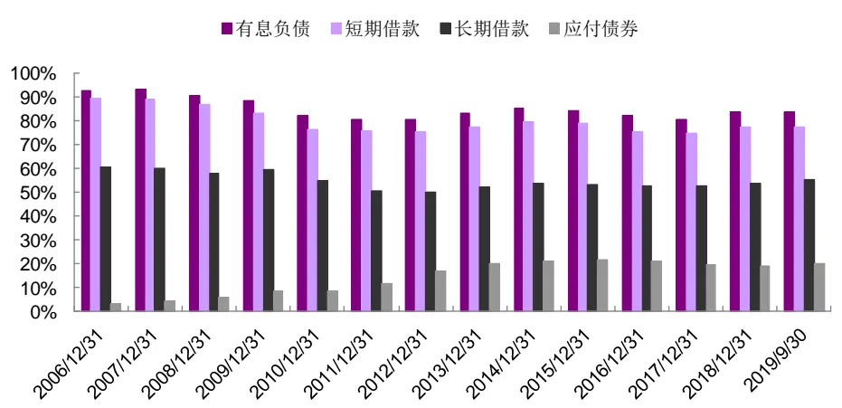
资料来源：Wind，光大证券研究所

## 1.2、资本密集型行业有息负债率相对较高

我们统计了 2006 年以来上市公司各报告期有息负债占总资产比例（有息负债率，下同）的中位数，以及无有息负债的公司数量占比；同时，依据2019 年三季报的情况，统计了不同市值分组、不同行业内，上市公司有息负债率的特点，如下图所示。

约 15%-20%上市公司无有息负债。如下图所示，2010 年以来，上市公司有息负债率（有息负债/总资产）的中位数在10-15%范围内波动；有息负债为0 的上市公司数量占比则在15%-20%范围内波动。

大市值企业、资本密集型行业有息负债率相对较高。我们依据上市公司总市值将全市场上市公司分成 10 组，统计各组上市公司的有息负债率。从中位数来看，市值越大，有息负债率越高，有息负债为 0的上市公司数量占比越低。从分行业统计结果来看，资本密集型行业的有息负债率相对较高，如：电力及公用事业、有色金属、房地产、交通运输等。这些行业都具有投资量大，资金周转较慢的特点。

消费、TMT行业有息负债率较低。有息负债率较低的行业主要集中于消费、TMT行业。消费品行业是由于部分上市公司品牌效应较好，具有低成本、高利润的特点，企业盈利便可满足公司运营和发展需要，故无需通过债务融资补充资金；而 TMT 行业则通常是因为可抵押品较少，债务融资相对困难。

图 2：有息负债占总资产的比例变化趋势
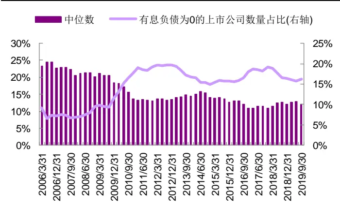
资料来源：Wind，光大证券研究所

图3：有息负债占总资产的比例（依据市值分组统计）
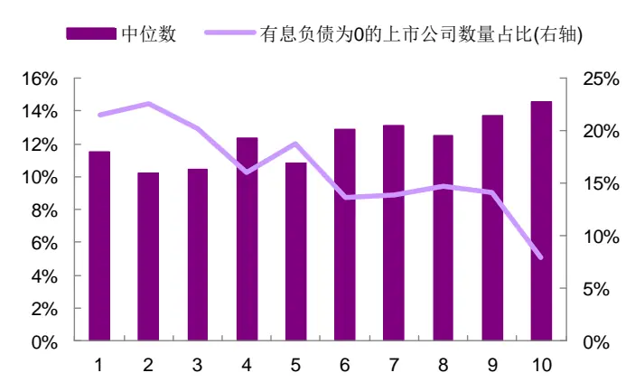
资料来源：Wind，光大证券研究所（注：统计期为 2019 年前三季度；依据上市公司总市值将全市场公司均分为 10 组，1 为市值最小一组，10 为市值最大一组）

图4：有息负债占总资产的比例（依据中信一级行业分组统计）
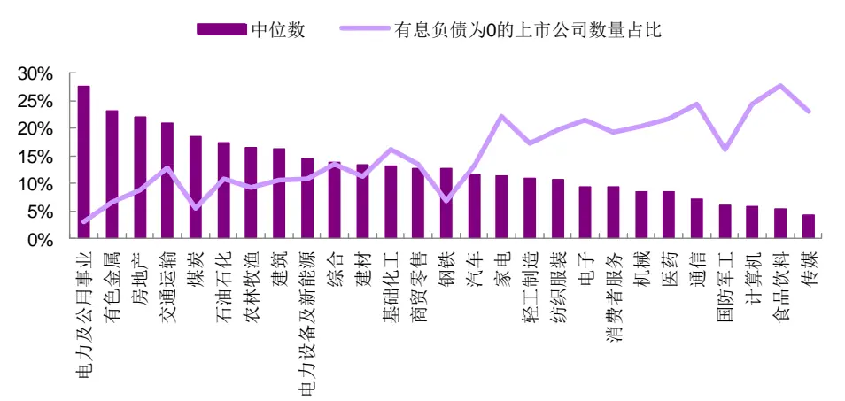
资料来源：Wind，光大证券研究所（注：统计期为 2019 年前三季度）

进一步，我们统计了 2007 年以来上市公司有息负债率每年度的变化情况（中位数），以及有息负债率变化幅度（绝对值）超过 2%的公司数量占比。

上市公司有息负债率变化幅度较小，说明其债务融资决策相对稳定。如下图所示，上市公司年度有息负债率变化的中位数在-1.2%至 0.3%范围内，变化幅度较小。2012年以来，变化幅度超过2%的公司数量占比均在 4%以下；并且近年来该比例逐渐降低，2018 年仅 2%的上市公司有息负债率变化幅度超过2个百分点。

图5：有息负债占总资产比例每年变化幅度统计
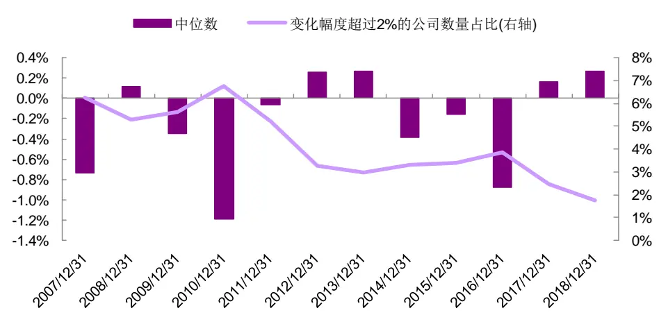
资料来源：Wind，光大证券研究所

## 1.3、有息负债结构：短期借款占比较高

本节主要关注上市公司有息负债的结构，即不同类型的负债所占比例。我们统计了上市公司中，短期借款占有息负债的比例分布，观察上市公司有息负债的期限结构特点；以及应付债券占有息负债的比例分布，观察上市公司有息负债类型结构特点。

期限结构：短期借款占比高，是大部分上市公司主要借贷需求。如下图所示，在有息负债大于0的上市公司中，近70%的企业短期借款占有息负债比例超过 0.6，其中，超过 30%的企业，有息负债均为短期借款。这是因为借款期限的选择与资金的用途相关，短期借款主要用于运营，大部分上市公司均有这方面的需求；长期借款更多用于固定资产投资等较长期的投资行为，资本密集型行业的需求可能更大。

图6：上市公司短期借款与有息负债的比例分布（包含有息负债大于 0的企业）
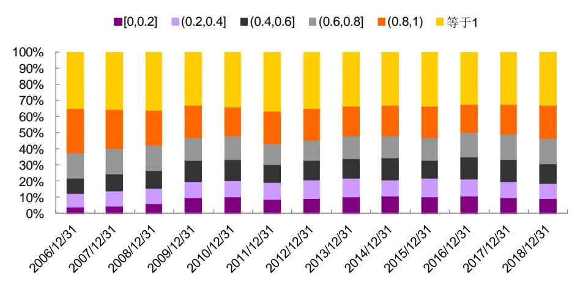
资料来源：Wind，光大证券研究所

类型结构：大部分上市公司应付债券占比低于40%。如下图所示，即使在发行了债券的上市公司中，应付债券占有息负债比例大多低于40%。主要是因为债券发行门槛较高，对于发行主体的盈利、规模均有一定要求，质地良好，因而往往可发行债券的企业恰也是银行等金融企业的优质客户，借款体量也较大。

图7：上市公司应付债券与有息负债的比例分布（包含应付债券大于 0的企业）
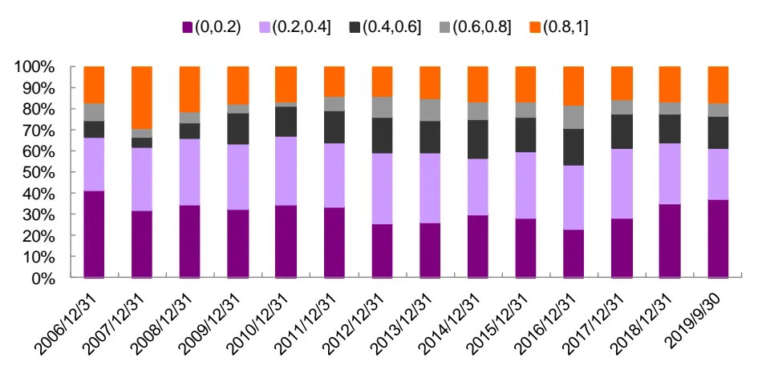
资料来源：Wind，光大证券研究所

综上所述，上市公司有息负债主要包括短期借款、长期借款、应付债券，其中，大部分企业短期借款占比较高；有息负债率通常情况下相对稳定，年度变化幅度不大，有息负债率的高低一方面体现企业的融资决策，另一方面也与其产业性质具有一定的相关性。

## 2、有息负债率高的企业风险较大

如前文所述，有息负债率反映的是企业融资决策以及自身的产业性质，如依据有息负债率对企业进行分组，不同负债率的企业有什么特点呢？本部分将从借贷成本、业绩、估值角度进行分析，总结不同有息负债率企业的特点。

## 2.1、低有息负债率的企业借贷成本较高

上市公司年报和半年报的附注中，会披露相应报告期的利息支出，我们可用利息支出与有息借款的比例，衡量企业借贷成本的高低。进而统计不同有息借款率区间的上市公司的借款成本。

近年，有息负债率在40%以上的公司数量逐年减少，大部分上市公司的有息借款率在30%以下。如下图所示，我们统计了不同有息负债率区间的上市公司数量，其中，有息负债率高于 40%的企业数量较少，且近年来有下降趋势。2014 年以来，超过八成的上市公司的有息负债率在 30%以下。

低有息负债率企业的借贷成本较高。我们统计了各年份不同有息负债率区间的上市公司借贷成本的中位数，如下图所示。基本满足有息负债率越低，企业借贷成本越高的规律。但近年来看，借贷成本的差异正逐步缩小。

图 8：不同有息负债率区间上市公司数量分布
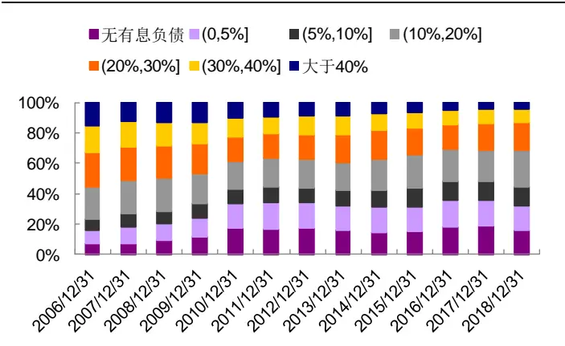
资料来源：Wind，光大证券研究所

图 9：不同有息负债率区间上市公司借贷成本（中位数）
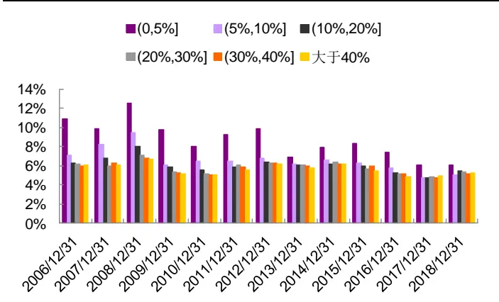
资料来源：Wind，光大证券研究所

## 2.2、高有息负债率企业的业绩波动较大

我们以上市公司 TTM 归母净利润环比增速作为业绩增速的代理变量，统计了不同有息负债率区间上市公司的平均业绩表现（需对异常值进行极值处理）以及相应区间上市公司业绩增速在横截面上的标准差。

时间维度上，高有息负债率企业的业绩波动较大。从时间维度来看，经济环境景气时，高有息负债率企业的业绩弹性较大，业绩增速较高；而经济不景气时，高有息负债率企业的业绩下滑又较快。这是因为有息负债率越高，说明企业动用的金融杠杆也越高，经济景气时可获得更高的收益；但经济衰退时，较高的偿债压力也会给企业带来更大的负担。

横截面上，高有息负债率企业的业绩增速差异显著。从横截面来看，高有息负债率企业的业绩增速的标准差较大，这也是有息负债的杠杆性的体现。在相同报告期内，部分企业通过放大杠杆获得了更好的收益；而部分企业放大杠杆后，承受了更高的偿债压力，业绩增速也受到了更大的负面影响。

图10：不同有息负债率区间上市公司 TTM归母净利润环比增速统计（平均数）
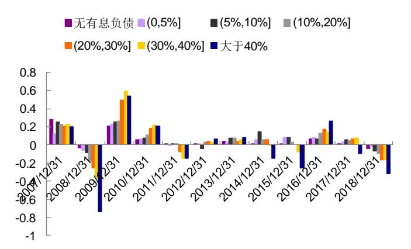
资料来源：Wind，光大证券研究所

图11：不同有息负债率区间上市公司 TTM归母净利润环比增速统计（标准差）
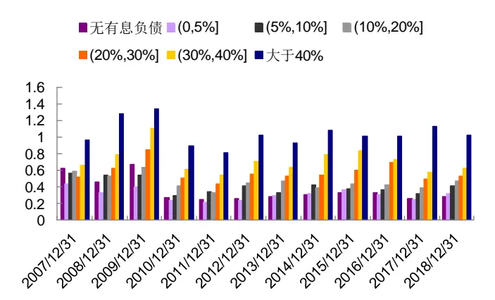
资料来源：Wind，光大证券研究所

## 2.3、低有息负债率企业更具投资价值

再从不同有息负债率区间上市公司的盈利能力和估值进行观察，我们统计了不同有息负债率区间上市公司的 ROE 和估值，其中，估值方面主要观察市盈率倒数（EP），EP越高，反映上市公司估值越低，越具有投资价值。

低有息负债率企业盈利能力较好。如下图所示，从中位数角度来看，低有息负债率企业的 ROE 指标较高，盈利能力较好。这主要是因为盈利能力较好的企业，通常资金相对充沛，无需通过高负债进行融资，如：贵州茅台等。

图 12：不同有息负债率区间上市公司 ROE 统计（中位数）
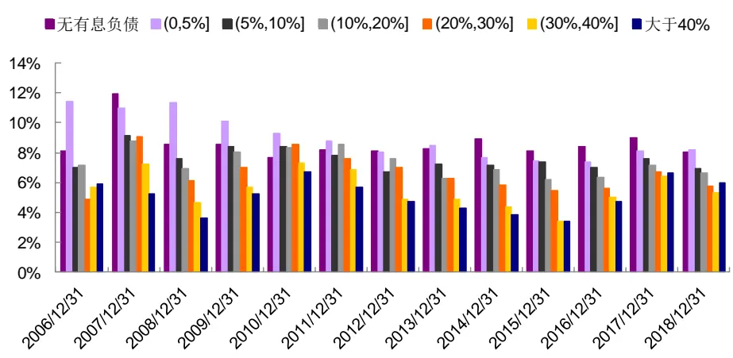
资料来源：Wind，光大证券研究所

高有息负债率企业估值较高，低有息负债率企业更具投资价值。从估值角度来看，有息负债率超过40%的企业估值较高，甚至容易出现估值为负的情况；而有息负债率较低的企业，往往估值相对较低，更具投资价值。

高有息负债率企业估值标准差较大。从估值的标准差来看，有息负债率越高，企业估值的标准差越大，这也说明高有息负债率企业良莠不齐，市场给予的估值差异较大，通过量化方式在高有息负债率企业中进行筛选，易面临较大风险。

图 13：不同有息负债率区间上市公司 EP 统计（平均数）
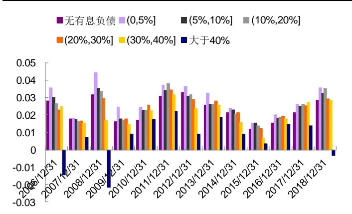
资料来源：Wind，光大证券研究所

图 14：不同有息负债率区间上市公司 EP 统计（标准差）
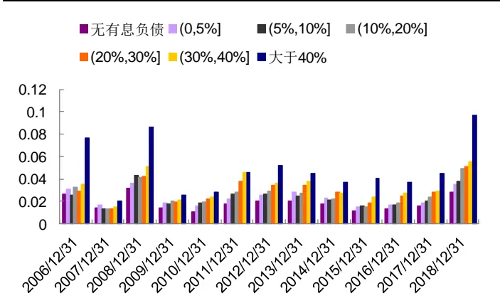
资料来源：Wind，光大证券研究所

因此，如果依据企业有息负债率的高低构建指数，则低有息负债率指数具有高盈利能力、低估值的特点，更具投资价值；而高有息负债率指数的业绩波动较大，具有较大风险。

## 3、应用：有息负债率在“排雷”和选股中均有效果

如前文所述，有息负债率低的企业更具投资价值。本部分我们尝试从因子、“排雷”、多头选股的角度应用有息负债方面的信息，测试有息负债率指标的选股效果。

## 3.1、因子：有息负债率因子有效性较弱

首先，我们从传统的因子角度考虑，测试了 2010 年 1 月 1 日以来有息负债率因子的 IC 表现。经统计，有息负债率因子在测试期内（2010-01-01至 2020-01-31）IC 均值为-0.99%，IR 为-0.11，整体有效性较弱。

图 15：有息负债率因子 IC 序列历史表现（全市场）
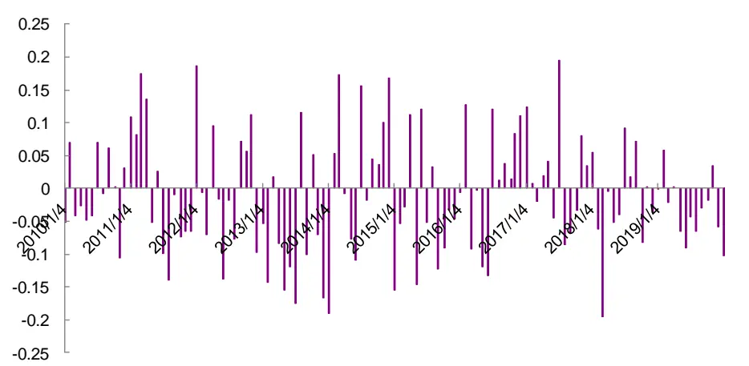
资料来源：Wind，光大证券研究所（注：截止于 2020 年 1月 31 日）

有息负债率因子在钢铁、电力及公用事业行业内的有效性略优于其他行业。如下图所示，分行业来看，钢铁、电力及公用事业行业内，有息负债率因子的 IC 均值分别为-2.9%、-1.7%，IR 分别为-0.14、-0.09 略优于其他行业。

图 16：有息负债率因子各行业 IC 表现统计
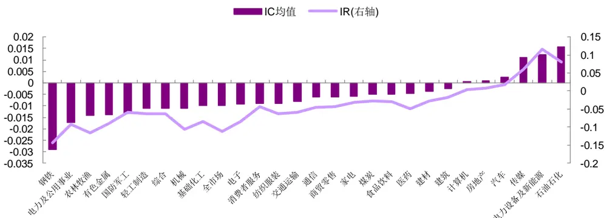
资料来源：Wind，光大证券研究所（注：统计时间为 2010-01-01 至 2020-01-31）

基于以上分析，有息负债率指标作为单一因子，有效性较弱，不推荐以因子的方式应用有息负债率指标。如前文所述，高有息负债率企业风险较大，可尝试从“排雷”角度进行应用；低有息负债率企业盈利能力较强，估值相对合理，可在多头选股领域进行应用。

## 3.2、“排雷”：警惕有息负债率高且业绩下滑的企业

高有息负债率企业业绩波动较大，当经济景气程度较高时，企业依靠较高的杠杆率可获得更好的收益；而经济不景气或公司运营出现一定问题时，较大的偿债压力将进一步拖累其业绩表现。

基于上述理解，我们取有息负债率高于 50%的股票作为高有息负债率股票池，依据业绩增速指标（TTM 归母净利润环比增速，下同）均分为三组，并在以下回测框架下，测试各组的收益表现。其中，Group1 为业绩增速最低一组；Group3为业绩增速指标最高一组。

表 2：高有息负债率企业分组回测框架

|  | 分组回测框架 |
| --- | --- |
| 时间区间 | 2009年1月1日至2020年2月21日 |
| 股票池 | 有息负债率高于50%的股票（剔除选股日ST/PT股票；剔除上市不满一年的股票；剔除选股日由于停牌等因素无法买入的股票；剔除金融类企业) |
| 调仓频率 | 季报截止日的下一交易日调仓 |
| 股票权重 | 等权配置 |
| 交易费率 | 单边千分之三 |

资料来源：光大证券研究所

高有息负债率企业，业绩增速分组单调性较好。如下图所示，高有息负债率股票池中，业绩增速指标分组单调性较好，业绩增速最低一组收益表现最差，以全市场等权指数为基准，年化跑输基准 12个百分点。

高有息负债率企业在业绩下滑超过 5%时，有较大风险。我们统计了各调仓期 Group1 业绩增速的最大值，发现大部分时间内，Group1 的股票业绩下滑超过了5%。

图17：各调仓期Group1业绩增速最大值统计
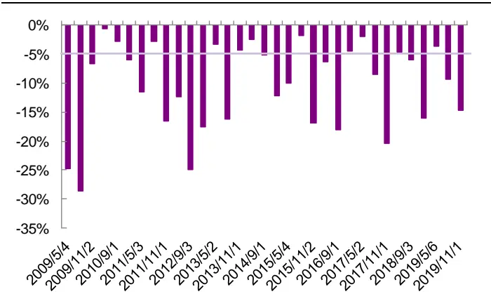
资料来源：Wind，光大证券研究所

图18：高有息负债率企业业绩增速分组收益统计
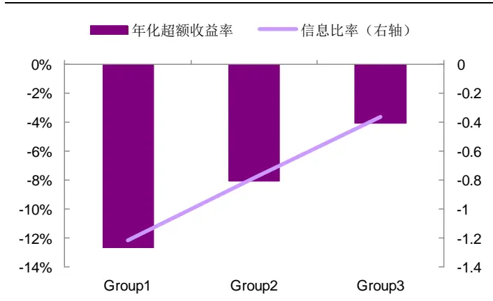
资料来源：Wind，光大证券研究所（统计期：2009-01-01 至2020-02-22，基准为全市场等权指数；Group1 为业绩增速最低一组，Group3 为业绩增速最高一组）

基于以上分析，我们认为有息负债率高于50%且业绩增速低于-5%的股票有较大风险，需及时规避。若我们以有息负债率高于 50%且业绩增速低于-5%的股票构建高风险组合，在季报截止日的下一交易日调仓，则组合收益表现如下：

该组合在大部分年份均稳定跑输基准。该组合 2009 年以来，年化收益率仅 1.3%，月度胜率（跑输基准的概率）近 70%。仅个别时间段相对基准有一定超额收益。

该组合跑赢基准的时点多为趋势性行情的末端。如：2011 年上半年、2016年下半年、2018年下半年，该组合均不同程度地跑赢基准指数，而这些时间点恰为之前一波趋势性行情的末端。这一定程度说明，高风险组合出现超额收益时，可能为趋势性行情即将结束的信号。

图19：有息负债率高于50%，业绩增速低于-5%的组合收益表现
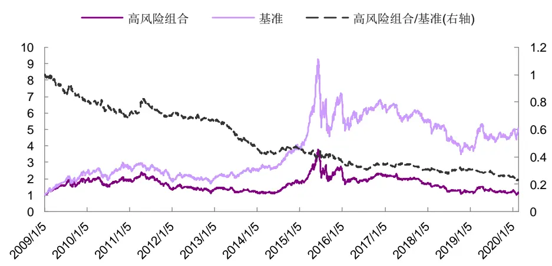
资料来源：Wind，光大证券研究所（注：回测时间截止于 2020 年2 月 21 日）

表3：有息负债率高于 50%，业绩增速低于-5%的组合历年收益表现统计

| 2009 | 2010 | 2011 | 2012 | 2013 | 2014 2015 | 2016 | 2017 | 2018 | 2019 | 2020 | 总体 |
| --- | --- | --- | --- | --- | --- | --- | --- | --- | --- | --- | --- |
| 收益率 | 95.2% -0.6% | -28.7% | -1.9% | -11.7% | 49.2% | 49.1% | -16.4% | -23.4% 16.3% | -31.2% 5.0% | -6.0% | 1.3% |
| 波动率 36.6% | 26.6% | 24.8% | 24.7% | 22.2% | 20.2% | 50.6% | 31.6% | 23.9% | 25.0% | 37.9% | 29.1% |
| 超额收益 -20.2% | -13.5% | 0.0% | -5.8% | -31.7% | -1.8% | -19.0% | -7.3% | -10.9% 0.7% | -17.8% | -12.5% | -12.9% |
| 相对波动 8.8% | 9.8% | 8.8% | 7.4% | 9.2% | 9.1% | 16.3% | 10.3% | 8.6% 10.6% | 9.9% | 10.3% | 10.2% |
| 信息比率 -2.31 相对最大 | -1.37 | 0.00 | -0.78 | -3.44 | -0.20 | -1.17 | -0.71 | -1.27 | 0.07 -1.79 | -6.15 | -1.27 |
| -19.7% 回撤 | -16.1% | -16.5% | -10.9% | -31.6% | -10.4% | -19.0% | -16.7% | -14.9% | -12.2% -19.6% | -12.0% | -77.4% |
| 月度胜率 | 83.3% 66.7% | 50.0% | 83.3% | 91.7% | 50.0% | 75.0% | 66.7% | 66.7% | 50.0% 75.0% | 100.0% | 69.4% |

资料来源：Wind，光大证券研究所（注：数据截止于 2020年 2 月 21 日；基准为全市场等权指数；月度胜率为组合跑输基准的概率）

## 3.3、选股：可提升业绩趋势模型组合表现

如前文所述，有息负债率低的企业，业绩波动性相对较小，这样的特点恰好与我们在《多维度寻找高增长公司——业绩链选股策略报告》中提出的业绩趋势模型相契合：业绩趋势模型的核心思路是从业绩成长动量角度筛选未来业绩大概率延续高增长的公司，如与有息负债率指标结合，可进一步筛选出业绩动量强，且业绩风险较小的公司。

业绩趋势模型具体涉及到的指标如下：

- 业绩增速：TTM归母净利润相对于上一季度TTM归母净利润增长率，即：TTM归母净利润环比增速。

业绩增长加速度：利用连续N 个季度的单季度归母净利润，对期数的二次方程进行回归，取二次项系数作为业绩增长加速度的代理变量。回归公式如下：

$$
{\mathrm{NetProfit}}_{t}=\alpha\times t^{2}+\beta\times t+c\tag{1}
$$

其中，NetProfit为单季度归母净利润，t 为季度数， 为上市公司业绩增长加速度的代理变量， 越高，表示业绩增长的加速度越高。

业绩趋势结合有息负债率选股组合具体构建方式：

- 首先，利用业绩增长速度指标将上市公司分成3组，取业绩增速最高一组作为初筛股票池；

- 其次，在初筛股票池中，依据业绩增长加速度指标再均分 3组，取加速度最高一组作为业绩趋势模型基础股票池；

- 最后，在业绩趋势模型基础股票池中，选取有息负债为0 的公司作为最终持仓。

由于 2012 年以前业绩趋势模型筛选出来的股票数量较少，再从中筛选有息负债为0的企业，数量过少。因此，我们的测试期从 2012 年 1月 1 日开始，截止至2020年 2月 21日，每期等权持有所筛选出来的股票，在手续费按单边千三的假设下进行测算。

收益分析时，我们将策略年度收益率与同期股票型基金的收益表现比较，按收益表现从高到低排序，观察策略历年收益在股票型基金中的排名。

持有股票池中有息负债率为 0 的企业，组合收益提升显著。2012 年以来，业绩趋势结合有息负债率选股组合相比业绩趋势模型基础池年化收益从 29.4%提升至 38.4%，提升了9个百分点左右；信息比率有所下滑，主要是因为持仓数量下降，带来组合收益波动提高。

持有股票池中有息负债率为 0 的企业，大部分年份收益表现均有提升，组合收益可排名股票型基金前列。分年度来看，只持仓有息负债为 0的企业时，大部分年份组合收益表现均有提升，2012-2015年以及2018、2019 年度，该策略收益表现均可排名股票型基金前十分之一。但对于业绩趋势模型表现不佳的 2017 年度，有息负债率指标也难以改善组合表现。

图20：业绩趋势结合有息负债率选股组合与业绩趋势模型收益对比
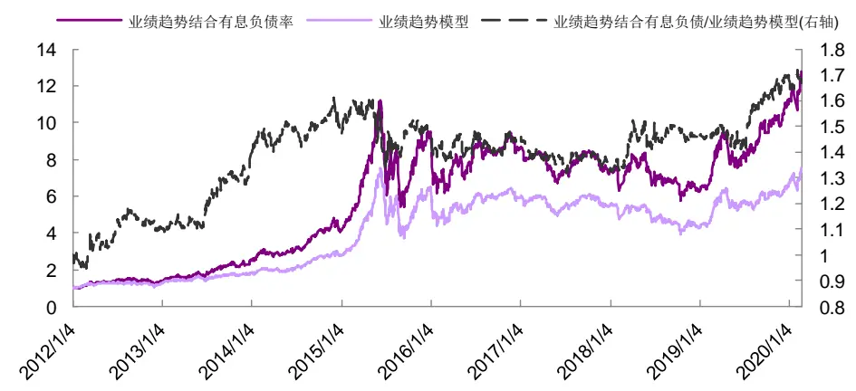
资料来源：Wind，光大证券研究所（注：截止于 2020 年 2月 21 日）

表4：业绩趋势模型历年收益表现统计

|  | 2012 | 2013 | 2014 | 2015 | 2016 | 2017 | 2018 | 2019 | 2020 | 总体 |
| --- | --- | --- | --- | --- | --- | --- | --- | --- | --- | --- |
| 收益率 | 25.1% | 41.7% | 52.9% | 130.6% | -8.0% | -7.3% | -21.3% | 52.7% | 15.4% | 29.4% |
| 波动率 | 24.9% | 24.6% | 21.9% | 50.5% | 33.9% | 16.9% | 26.0% | 25.9% | 37.3% | 29.8% |
| 超额收益 | 19.9% | 17.9% | 2.6% | 49.0% | 1.5% | 5.9% | 9.9% | 26.1% | 9.3% | 15.1% |
| 相对波动 | 5.9% | 6.5% | 5.3% | 11.0% | 6.2% | 3.7% | 5.0% | 5.3% | 7.5% | 6.5% |
| 信息比率 | 3.11 | 2.31 | 0.45 | 2.49 | 0.43 | 1.89 | 2.86 | 3.74 | 9.19 | 2.32 |
| 相对最大回撤 | -3.6% | -4.5% | -5.4% | -9.1% | -7.3% | -2.5% | -2.1% | -2.0% | -1.0% | -9.2% |
| 月度胜率 | 75.0% | 91.7% | 41.7% | 83.3% | 50.0% | 50.0% | 91.7% | 91.7% | 100.0% | 72.4% |
| 年度收益排名 | 6 | 29 | 31 | 2 | 163 | 549 | 190 | 310 | 312 | 1 |
| 股票型基金数 | 329 | 376 | 397 | 441 | 537 | 590 | 671 | 734 | 792 | 277 |

资料来源：Wind，光大证券研究所（注：数据截止于 2020年 2 月 21 日；基准为全市场等权指数；月度胜率为组合跑赢基准的概率，股票型基金数是同期股票型基金数量，年度收益排名为该组合收益在同期股票型基金中的排名）

表5：业绩趋势结合有息负债率选股组合历年收益表现统计

|  | 2012 | 2013 | 2014 | 2015 | 2016 | 2017 | 2018 | 2019 | 2020 | 总体 |
| --- | --- | --- | --- | --- | --- | --- | --- | --- | --- | --- |
| 收益率 | 32.1% | 78.4% | 62.7% | 128.0% | -8.3% | -15.1% | -14.2% | 78.5% | 14.5% | 38.4% |
| 波动率 | 28.2% | 30.8% | 26.1% | 57.8% | 38.7% | 20.1% | 31.6% | 30.5% | 36.8% | 34.6% |
| 超额收益 | 26.8% | 54.6% | 12.5% | 46.4% | 1.2% | -2.0% | 17.0% | 51.9% | 8.3% | 23.8% |
| 相对波动 | 15.5% | 15.7% | 12.7% | 22.0% | 14.0% | 8.8% | 14.3% | 13.5% | 15.9% | 14.9% |
| 信息比率 | 1.59 | 2.62 | 0.77 | 1.38 | 0.29 | -0.17 | 1.74 | 2.76 | 3.90 | 1.60 |
| 相对最大回撤 | -9.1% | -7.0% | -10.7% | -18.3% | -10.1% | -9.3% | -7.4% | -5.3% | -3.3% | -18.3% |
| 月度胜率 | 58.3% | 83.3% | 66.7% | 66.7% | 50.0% | 33.3% | 58.3% | 75.0% | 100.0% | 62.2% |
| 年度收益排名 | 2 | 2 | 12 | 3 | 169 | 578 | 46 | 45 | 337 | 1 |
| 股票型基金数 | 329 | 376 | 397 | 441 | 537 | 590 | 671 | 734 | 792 | 277 |

资料来源：Wind，光大证券研究所（注：数据截止于 2020年 2 月 21 日；基准为全市场等权指数；月度胜率为组合跑赢基准的概率，股票型基金数是同期股票型基金数量，年度收益排名为该组合收益在同期股票型基金中的排名）

表6：业绩趋势结合有息负债率选股组合最新一期持仓名单（2020-02-04）

| STOCK_CODE | NAME | STOCK_CODE | NAME |
| --- | --- | --- | --- |
| 000635 | 英力特 | 300229 | 拓尔思 |
| 000705 | 浙江震元 | 300314 | 戴维医疗 |
| 002107 | 沃华医药 | 300360 | 炬华科技 |
| 002467 | 二六三 | 300468 | 四方精创 |
| 002469 | 三维工程 | 300507 | 苏奥传感 |
| 002750 | 龙津药业 | 300606 | 金太阳 |
| 002869 | 金溢科技 | 300659 | 中孚信息 |
| 002890 | 弘宇股份 | 600218 | 全柴动力 |
| 300016 | 北陆药业 | 600814 | 杭州解百 |
| 300066 | 三川智慧 | 603005 | 晶方科技 |
| 300076 | GQY 视讯 | 603106 | 恒银金融 |
| 300171 | 东富龙 | 603988 | 中电电机 |

资料来源：Wind，光大证券研究所

## 4、风险提示

本篇报告从财务数据的含义和特点出发，旨在充分挖掘财务数据之间勾稽关系的前提下，尝试构造对基本面因子进行创新性构造，加深对基本面因子逻辑的理解，随着市场的发展和环境的变化，可能存在如下风险：

- 首先，本篇报告基于现阶段会计准则下的财务数据进行研究，当会计准则存在变化时，财务数据含义可能发生变化，亦影响报告逻辑推演；

- 其次，上市公司若出现财务数据失真，会影响模型有效性；

- 最后，本篇报告推荐因子为偏长期的基本面因子，须警惕市场短期波动带来的风险。

## 行业及公司评级体系

| 评级 说明 |
| --- |
| 行 买入 未来6-12个月的投资收益率领先市场基准指数15%以上； |
| 增持 未来6-12个月的投资收益率领先市场基准指数5%至15%； |
| 中性 未来6-12个月的投资收益率与市场基准指数的变动幅度相差-5%至5%； |
| 减持 未来6-12个月的投资收益率落后市场基准指数5%至15%； |
| 卖出 未来6-12个月的投资收益率落后市场基准指数15%以上； |
| 因无法获取必要的资料，或者公司面临无法预见结果的重大不确定性事件，或者其他原因，致使无法给出明确的无评级投资评级。 |
| 基准指数说明：A股主板基准为沪深300指数；中小盘基准为中小板指；创业板基准为创业板指；新三板基准为新三板指数；港股基准指数为恒生指数。 |

## 分析、估值方法的局限性说明

本报告所包含的分析基于各种假设，不同假设可能导致分析结果出现重大不同。本报告采用的各种估值方法及模型均有其局限性，估值结果不保证所涉及证券能够在该价格交易。

## 分析师声明

本报告署名分析师具有中国证券业协会授予的证券投资咨询执业资格并注册为证券分析师，以勤勉的职业态度、专业审慎的研究方法，使用合法合规的信息，独立、客观地出具本报告，并对本报告的内容和观点负责。负责准备以及撰写本报告的所有研究人员在此保证，本研究报告中任何关于发行商或证券所发表的观点均如实反映研究人员的个人观点。研究人员获取报酬的评判因素包括研究的质量和准确性、客户反馈、竞争性因素以及光大证券股份有限公司的整体收益。所有研究人员保证他们报酬的任何一部分不曾与，不与，也将不会与本报告中具体的推荐意见或观点有直接或间接的联系。

## 特别声明

光大证券股份有限公司（以下简称“本公司”）创建于 1996 年，系由中国光大（集团）总公司投资控股的全国性综合类股份制证券公司，是中国证监会批准的首批三家创新试点公司之一。根据中国证监会核发的经营证券期货业务许可，本公司的经营范围包括证券投资咨询业务。

本公司经营范围：证券经纪；证券投资咨询；与证券交易、证券投资活动有关的财务顾问；证券承销与保荐；证券自营；为期货公司提供中间介绍业务；证券投资基金代销；融资融券业务；中国证监会批准的其他业务。此外，本公司还通过全资或控股子公司开展资产管理、直接投资、期货、基金管理以及香港证券业务。

本报告由光大证券股份有限公司研究所（以下简称“光大证券研究所”）编写，以合法获得的我们相信为可靠、准确、完整的信息为基础，但不保证我们所获得的原始信息以及报告所载信息之准确性和完整性。光大证券研究所可能将不时补充、修订或更新有关信息，但不保证及时发布该等更新。

本报告中的资料、意见、预测均反映报告初次发布时光大证券研究所的判断，可能需随时进行调整且不予通知。在任何情况下，本报告中的信息或所表述的意见并不构成对任何人的投资建议。客户应自主作出投资决策并自行承担投资风险。本报告中的信息或所表述的意见并未考虑到个别投资者的具体投资目的、财务状况以及特定需求。投资者应当充分考虑自身特定状况，并完整理解和使用本报告内容，不应视本报告为做出投资决策的唯一因素。对依据或者使用本报告所造成的一切后果，本公司及作者均不承担任何法律责任。

不同时期，本公司可能会撰写并发布与本报告所载信息、建议及预测不一致的报告。本公司的销售人员、交易人员和其他专业人员可能会向客户提供与本报告中观点不同的口头或书面评论或交易策略。本公司的资产管理子公司、自营部门以及其他投资业务板块可能会独立做出与本报告的意见或建议不相一致的投资决策。本公司提醒投资者注意并理解投资证券及投资产品存在的风险，在做出投资决策前，建议投资者务必向专业人士咨询并谨慎抉择。

在法律允许的情况下，本公司及其附属机构可能持有报告中提及的公司所发行证券的头寸并进行交易，也可能为这些公司提供或正在争取提供投资银行、财务顾问或金融产品等相关服务。投资者应当充分考虑本公司及本公司附属机构就报告内容可能存在的利益冲突，勿将本报告作为投资决策的唯一信赖依据。

本报告根据中华人民共和国法律在中华人民共和国境内分发，仅向特定客户传送。本报告的版权仅归本公司所有，未经书面许可，任何机构和个人不得以任何形式、任何目的进行翻版、复制、转载、刊登、发表、篡改或引用。如因侵权行为给本公司造成任何直接或间接的损失，本公司保留追究一切法律责任的权利。所有本报告中使用的商标、服务标记及标记均为本公司的商标、服务标记及标记。

光大证券股份有限公司版权所有。保留一切权利。

## 联系我们

| 上海 | 北京 | 深圳 |
| --- | --- | --- |
| 静安区南京西路1266号恒隆广场1号 写字楼48 层 | 西城区月坛北街2号月坛大厦东配楼2层 复兴门外大街6号光大大厦17层 | 福田区深南大道 6011号NEO 绿景纪元大 厦 A 座 17 楼 |