## 专利数据中有哪些 Alpha？——多因子系列报告之三十一

企业的研发能力是衡量一个公司“硬实力”的重要指标，尤其是针对一些特定行业的公司，具有一定的自主研发能力是其生存的根本之道。本篇报告为专利数据研究系列的第一篇报告，利用专利数量、专利类型及其他相关数据，构建各类专利因子，验证专利因子在相关股票池内的预测能力和选股能力。

## 专利数据类型：发明专利、实用新型专利和外观设计专利

不同类型的专利的“含金量”有所区别，发明专利中的发明授权专利是指通过了国家知识产权局的审查后，认为其技术符合专利的授权要求，给予的具有法律效力的授权证书，是含金量最高的专利类型。

## 专利数据覆盖度：制造业、TMT等板块覆盖度较高

按照中信一级行业分类，机械、通信、电子、轻工制造、电力设备及新能源、汽车、家电、计算机、基础化工行业的专利覆盖度高于 70%。制造业和 TMT 板块内的行业专利覆盖度较高。

## 基于发明授权专利数据构造的专利因子有效性较强

发明授权专利的数量越多，证明该公司的获得批准的具有法律效力的发明专利数量越多，企业研发成果转化为实际利润的可能性也就越大。基于发明授权专利构造的因子，比其他类型专利数量构造的因子具有更好的预测能力和选股效果。

1 年期发明授权专利数量因子（Factor_fmsq_1Y_num）回测期 IC 均值 3.39%，IC_IR 为 0.29，且多头超额收益较为稳定，年化超额 9.84%，信 息 比 1.13 。 1 年 期 发 明 授 权 专 利 关 联 人 总 数 因 子（Factor_fmsq_1Y_relatedCompanies）回测期 IC 均值 3.50%，IC_IR 为0.29，超额收益稳定性相对较弱，年化超额 12.7%，信息比1.08。

## 结合研发费用构造研发效率因子：稳定性较弱

1 年 期 研 发 效 率 因 子 （ 研 发 费 用 / 发 明 授 权 专 利 数 ）（Factor_RD_fmsq_1Y）的预测能力稳定性相对较弱，IC 绝对值为 0.20，2017 年初至今出现了较为明显的回撤。

## 应用于中证 500增强：年化增强 4.20%

在成分股专利数据覆盖度达到62%的前提下，1年期发明授权专利数量因子（Factor_fmsq_1Y_num）直接应用于中证500增强可以取得一定的增强效果。基于 Factor_fmsq_1Y_num 单因子的中证500 增强组合可以较为稳定的跑赢基准，年化超额收益4.20%，相对波动5.08%，信息比0.83。

- 风险提示：结果均基于模型和历史数据，模型存在失效的风险。

## 金融工程深度

## 分析师

周萧潇 （执业证书编号：S0930518010005）

021-52523680

zhouxiaoxiao@ebscn.com

刘均伟 （执业证书编号：S0930517040001）

021-52523679

liujunwei@ebscn.com

## 相关研究

《因子正交与择时：基于分类模型的动

态权重配置——多因子系列报告之十》《爬罗剔抉：一致预期因子分类与精选——多因子系列报告之十一》

《成长因子重构与优化：稳健加速为王——多因子系列报告之十二》

《组合优化算法探析及指数增强实证

——多因子系列报告之十三 》

《以质取胜：EBQC 综合质量因子详解——多因子系列报告之十七》

《创新基本面因子：财务数据全扫描

——多因子系列报告之二十六》

《ESG 投资与 ESG 因子策略

——多因子系列报告之二十七》

《再论估值因子：因子重构 or 收益预判？

——多因子系列报告之二十九》

《有息负债：解读企业杠杆的选股信息——多因子系列报告之三十》

企业的研发能力是衡量一个公司“硬实力”的重要指标，尤其是针对一些特定行业的公司，具有一定的自主研发能力是其生存的根本之道。本篇报告为专利数据研究系列的第一篇报告，利用专利数量、专利类型及其他相关数据，构建各类专利因子，验证专利因子在相关股票池内的预测能力和选股能力。

## 1、专利研究背景介绍

21 世纪是以科技创新为主导的世纪，而科教兴国、科技立国更是世人的共识。2001 年以来，不少国家和地区出台了许多新的举措，以加快科技创新步伐，这也促使当今国际竞争的实质逐渐转变为以经济科技实力为基础的综合国力的较量。

华为等中国企业加强内部研发、寻求向全球市场扩张，反映出近年来中国科技发展模式的稳步转变，中国企业正在投入巨大的热情开发属于自己的技术。近年来，随着国家重视程度的提升，中国已经成为了专利数量大国，虽然还不是专利技术强国，但可以反映出拥有自主专利的企业在中国能够获得更大的关注。

2020 年3 月 31 日，中国国家知识产权局通过官网发布的 2019 年法治政府建设情况报告中表明，国家知识产权局在去年全面加强知识产权事业发展顶层设计，专利代理行业秩序得到有效规范。在推进知识产权系统社会信用体系建设工作上，已初步建成知识产权领域信用信息共享平台并上线试运行。2020 年，国家知识产权局将继续提高知识产权治理能力和治理水平，为中国知识产权事业改革发展营造更好的法治环境。

图1：全市场 A股每年公布的专利数量及在年报中发布研发费用的公司数
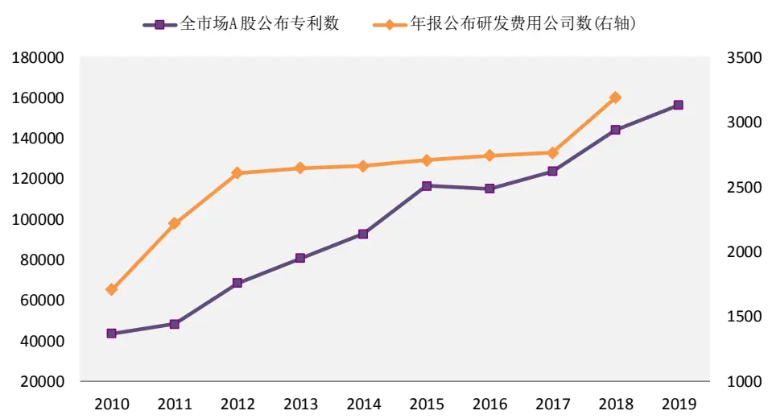
资料来源：通联数据，光大证券研究所，注：2010-01-01 至 2019-12-31 单位：例/家

一般而言衡量一个企业创新能力的标志为研发费用的投入和专利的产出，前者是企业创新方面的投入，后者是最终的成果。

如图 1 所示，2010 年以来全市场 A 股公布的专利数量在逐年上升，从2010年的43495例上升到了2019年的156261例，增量超过了两倍。同时，2010年底只有1704 家公司在年报中公布了公司全年的研发费用，这一数字在 2018 年底上升到了 3188 家公司。专利数量的飞速增长，以及越来越多的上市公司在财务报告中公布研发费用，反映了中国上市企业正越来越注重自身的研发能力和创新能力，希望能够用这一能力获得更多的市场关注度。

## 2、专利数据库介绍

## 2.1、专利数据类型

本篇报告使用的专利数据，由通联数据库提供。专利数据中提供的专利类型，主要有发明专利，实用新型专利，和外观设计专利：

图 2：专利数据主要类型
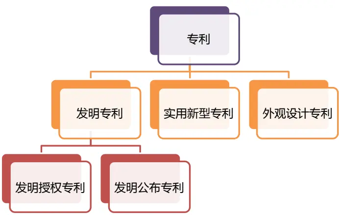
资料来源：通联数据

## 1) 发明专利：

专利法所称发明是指对产品、方法或者其改进所提出的新的技术方案，是全新的创造，发明分为产品发明和方法发明两大类型，而方法发明又可以分成制造方法和操作使用方法两种类型。

在通联数据库中，发明专利又分为发明授权和发明公布，它们的区别在于，发明授权是指通过了国家知识产权局的审查后，认为其技术等符合专利的授权要求，给予的具有法律效力的授权证书。而发明专利其实是一种发明设计方案，也就是说，发明专利只是提交给知识产权部门的技术方案，还没有获得批准授权的技术方案。

## 2) 实用新型专利：

指对产品的形状、构造或者其结合所提出的适于实用的新的技术方案。实用新型与发明的不同之处在于，第一，实用新型只限于具有一定形状的产品，不能是一种方法，也不能是没有固定形状的产品；第二，实用新型的创造性要求不太高，而实用性较强。

## 3) 外观设计专利：

指工业品的外观设计，也就是工业品的式样。它与发明或实用新型完全不同，即外观设计不是技术方案。外观设计，是指对产品的形状、图案或者其结合以及色彩与形状、图案的结合所做出的富有美感并适于工业应用的新设计。

## 2.2、制造业、TMT等板块内专利数据覆盖度较高

各行业2010年以来在各类型专利上的个数统计如图 2 所示，不同的行业发布的专利侧重种类也有所不同，家电、汽车和机械行业在实用新型专利上相比于其他行业有更多的专利个数，电子、家电和石油石化行业在发明专利上有更多的侧重，而家电、汽车和轻工制造行业在外观设计专利上明显多于其他行业。总体而且，家电、汽车、电子、石油石化、机械等行业有明显的专利优势，金融行业则很少发布自己的专利。

图3：各中信一级行业2010年以来专利个数及专利覆盖度
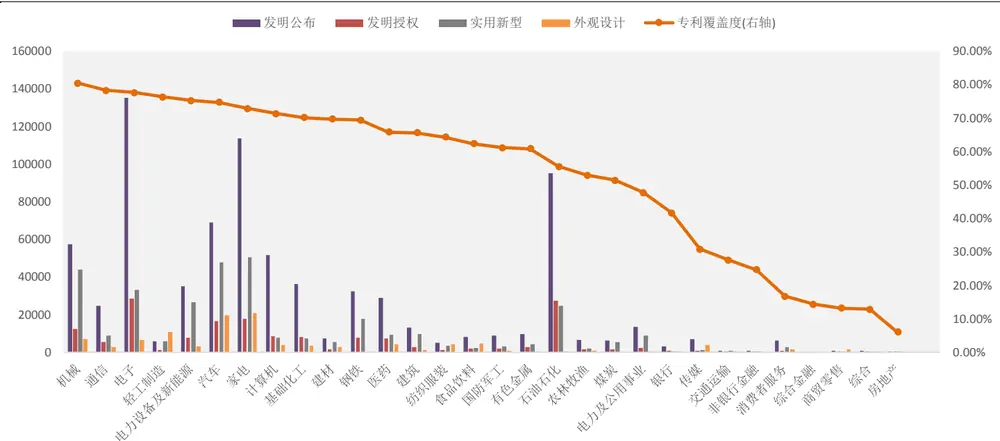
资料来源：通联数据，光大证券研究所，注：2010-01-01 至2019-12-31
左轴单位：例

按照中信一级行业分类，机械、通信、电子、轻工制造、电力设备及新能源、汽车、家电、计算机、基础化工行业的专利覆盖度高于 70%。制造业和TMT 板块内的行业专利覆盖度较高。

如上图所示，专利总数较多的行业整体会有较高的专利覆盖度，轻工制 造、纺织服装、建材等行业虽然专利个数较少，但也有比较高的专利覆盖度。

各行业截止到 2019 年在不同类别专利上的覆盖度如表 1 所示。

表1：各行业在不同类别专利上的覆盖度统计（截止2019年）

|  | 发明公布 | 发明授权 | 实用新型 | 外观设计 |
| --- | --- | --- | --- | --- |
| 机械 | 73.16% | 63.84% | 75.71% | 33.62% |
| 电子 | 70.95% | 63.49% | 67.63% | 24.90% |
| 电力设备及新能源 | 67.65% | 63.03% | 71.01% | 24.37% |
| 通信 | 70.43% | 59.13% | 62.61% | 35.65% |
| 基础化工 | 63.35% | 58.70% | 42.55% | 9.32% |
| 家电 | 65.71% 57.14% |  | 71.43% | 58.57% |
| 钢铁 | 67.35% 57.14% |  | 63.27% | 0.00% |
| 计算机 | 65.81% | 53.42% | 38.89% | 27.35% |
| 汽车 | 65.82% | 53.16% | 69.62% | 30.38% |
| 建材 | 59.21% | 52.63% | 51.32% | 22.37% |
| 医药 | 56.45% | 51.61% | 32.58% | 21.29% |
| 建筑 | 59.20% 49.60% |  | 60.80% | 12.00% |
| 有色金属 53.92% |  | 49.02% | 42.16% | 7.84% |
| 轻工制造 | 57.02% 47.37% |  | 64.04% | 41.23% |
| 国防军工 | 55.22% 43.28% |  | 52.24% | 20.90% |
| 石油石化 48.89% 40.00% 40.00% 15.56% |  |  |  |  |
| 纺织服装 | 48.81% 38.10% |  | 52.38% | 29.76% |
| 煤炭 | 40.54% | 37.84% | 43.24% | 5.41% |
| 食品饮料 | 47.52% | 34.65% | 28.71% | 42.57% |
| 农林牧渔 | 48.24% | 34.12% | 27.06% | 12.94% |
| 银行 | 36.11% | 27.78% | 13.89% | 16.67% |
| 电力及公用事业 | 40.00% | 27.74% | 34.19% | 5.16% |
| 传媒 | 20.28% | 17.48% | 11.89% | 9.09% |
| 交通运输 | 17.24% | 10.34% | 16.38% | 3.45% |
| 综合 | 12.77% | 8.51% | 12.77% | 6.38% |
| 消费者服务 | 12.50% | 8.33% | 6.25% | 8.33% |
| 非银行金融 | 23.08% | 6.15% | 4.62% | 0.00% |
| 商贸零售 | 5.61% | 3.74% | 6.54% | 9.35% |
| 房地产 | 3.70% | 2.22% | 4.44% | 0.00% |
| 综合金融 | 0.00% 0.00% |  | 14.29% | 0.00% |

资料来源：通联数据，光大证券研究所
注：2010-01-01 至 2019-12-31，按照中信一级行业分类

2.1 节中我们讨论了不同类型专利的内在含义，其中，发明专利（发明授权和发明公布）相比于实用新型和外观设计专利可以更好的反映一个公司的创新能力和研发能力。因此我们在后文的测试中，将首先把测试范围集中在发明授权和发明公布两类专利覆盖度均超过40%的行业中。具体的，包括机械、电子、电力设备及新能源、通信、基础化工、家电、钢铁、计算机、汽车、建材、医药、建筑、有色金属、轻工制造、国防军工、石油石化这16个一级行业。

按照上市公司所在省份统计 2010 年以来在各类专利上的个数，结果如图 3 所示，从图中可以看到，广东省和北京不论在各种类专利还是在专利总数上都远超其他省份，中、西部省份的专利个数较少。在省份专利覆盖度上，河北省、河南省、贵州省虽然专利数量较少，但也有着较高的专利覆盖度。

图4：各省份2010年以来专利个数及专利覆盖度
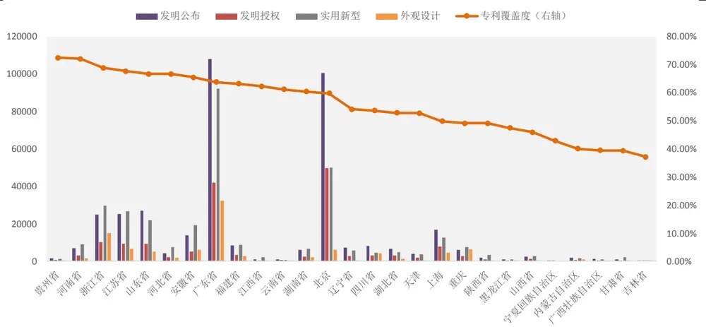
资料来源：通联数据，光大证券研究所，注：2010-01-01 至2019-12-31
左轴单位：例

截止 2019 年，累计专利数量最多的 40 家上市公司的名单如下。中国石化、格力电器、美的集团、京东方等公司排名前列。

表 2：累计专利数量最多的 40 家上市公司（截止 2019 年底）

| 公司代码 | 公司简称 | 专利数量 | 行业 | 公司代码 | 公司简称 | 专利数量 | 行业 |
| --- | --- | --- | --- | --- | --- | --- | --- |
| 600028.SH | 中国石化 | 62971 | 石油石化 | 000338.SZ | 潍柴动力 | 5805 | 汽车 |
| 000651.SZ | 格力电器 | 57008 | 家电 | 600060.SH | 海信视像 | 5416 | 家电 |
| 000333.SZ | 美的集团 | 46312 | 家电 | 600104.SH | 上汽集团 | 5130 | 汽车 |
| 000725.SZ | 京东方A | 43893 | 电子 | 002008.SZ | 大族激光 | 4832 | 电子 |
| 601857.SH | 中国石油 | 30626 | 石油石化 | 000100.SZ | TCL科技 | 4442 | 电子 |
| 600418.SH | 江淮汽车 | 19274 | 汽车 | 601238.SH | 广汽集团 | 4274 | 汽车 |
| 002594.SZ | 比亚迪 | 18006 | 汽车 | 000039.SZ | 中集集团 | 4165 | 机械 |
| 002724.SZ | 海洋王 | 12664 | 电子 | 002292.SZ | 奥飞娱乐 | 3933 | 传媒 |
| 600166.SH | 福田汽车 | 10043 | 汽车 | 000050.SZ | 深天马A | 3907 | 电子 |
| 600839.SH | 四川长虹 | 9651 | 家电 | 000825.SZ | 太钢不锈 | 3807 | 钢铁 |
| 000625.SZ | 长安汽车 | 9370 | 汽车 | 600498.SH | 烽火通信 | 3703 | 通信 |
| 600019.SH | 宝钢股份 | 9189 | 钢铁 | 003816.SZ | 中国广核 | 3586 | 电力及公用事业 |
| 601633.SH | 长城汽车 | 9023 | 汽车 | 000016.SZ | 深康佳A | 3484 | 家电 |
| 000898.SZ | 鞍钢股份 | 7704 | 钢铁 | 600066.SH | 宇通客车 | 3482 | 汽车 |
| 002241.SZ | 歌尔股份 | 7447 | 电子 | 600022.SH | 山东钢铁 | 3387 | 钢铁 |
| 600690.SH | 海尔智家 | 7386 | 家电 | 002179.SZ | 中航光电 | 3362 | 国防军工 |
| 601777.SH | 力帆股份 | 6877 | 汽车 | 300750.SZ | 宁德时代 | 3307 | 电力设备及新能源 |
| 002841.SZ | 视源股份 | 6854 | 消费者服务 | 600808.SH | 马钢股份 | 2969 | 钢铁 |
| 601088.SH | 中国神华 | 6462 | 煤炭 | 600968.SH | 海油发展 | 2944 | 石油石化 |
| 000977.SZ | 浪潮信息 | 6221 | 计算机 | 600031.SH | 三一重工 | 2869 | 机械 |

资料来源：通联数据，光大证券研究所，注：2010-01-01 至2019-12-31
单位：例

## 2.3、基于专利数据的因子构造方法

我们采用的通联专利数据库提供企业专利数据的申请和授予情况，数据维度包括企业名称、专利类型、专利名称、申请号、专利摘要、专利分类号、申请日、公布日、关联人等，数据每日更新。

我们将主要从以下几个维度来构造专利因子：

## 1) 专利总数：

专利总数表示一个上市企业在过去一段时间内专利总个数；

## 2) 专利摘要总字数：

每个专利都有自己的摘要信息，摘要字数越多表示专利实用性更强，涉及的应用层面更广，上市企业在过去一段时间内的专利摘要总字数，可以表示企业专利的整体应用性和涉及面；

## 3) 专利 IPC 号总数：

IPC号（国际专利分类号）是唯一国际通用的专利文献分类和检索工具，得到国际认证的专利将获得 IPC 号，一个专利的技术内容，往往涉及好几个分类的内容，因而可能有多个分类号，上市企业在过去一段时间内总共获得的IPC 号，可以更加明确的表示企业获得国际标准认可专利的多面性和应用性；

## 4) 专利关联人总数：

一个专利可能与除本公司以外的其他科研部门，公司，或个人成为关联人，关联人数越多表示一个专利投入的成本和人力越多，一个上市企业在过去一段时间内所有专利的关联人数（除去企业本身）能够反映出企业对专利的总投入。总投入越多的公司，说明其对研发和创新的重视程度越高。

## 5) 专利审查期总长度：

审查期长度为专利公布日期与申请日期之间的等待日期，审查期越长表示专利越复杂，需要通过的审核步骤更多，特别是有更高学术性的专利需要更多的时间来进行审查，一个上市企业在过去一段时间内的专利审查期越长表明这一公司在专利设计上的复杂性和学术性更强；

## 6) 独权专利总数：

专利可能能够被多个企业或个人使用，一个企业在过去一段时间内的独权专利个数越多，表明公司自身在专利上投入更多的研发财力。

构造因子时也会考虑不同的统计时间长度，统计时间太长将引入过多的不利于预测股票价格走势的专利，时间太短又将缺失目前对公司价值仍有贡献的专利。本篇报告利用 1 年、2 年和 3 年三个时长来统计各个因子的数值，通过回测结果来选取在各个因子上有最好表现的统计时长。

通过不同的专利类别，不同的统计时长，以及不同的统计维度，本文共构造了 90 个从专利数据库数据得到的因子，各因子的命名方式为Patent_xx_yy_zz：

1) xx 表示专利类型：all 表示所有专利类型，fmgb表示发明公布，fmsq表示发明授权，syxx 表示实用新型，wgsj 表示外观设计；

2) yy 表示统计时长：1Y 表示一年，2Y 表示两年，3Y 表示三年；

3) zz 表示不同维度的因子：num 表示专利个数，briefnum 表示摘要字数，IPCnum 表示 IPC 号总数，relatedCompanies 表示关联人总数，reviewDate 表示审查期总长度，ownPatent 表示独权总数。

因子名与其所对应的因子含义如下表所示：

表 3：专利因子命名方法

| 命名项 | 代码 | 含义 | 命名项 | 代码 | 含义 | 命名项 | 代码 | 含义 |
| --- | --- | --- | --- | --- | --- | --- | --- | --- |
| XX | all | 所有专利 |  | 1Y | 一年 |  | num | 专利数量 |
|  | fmgb | 发明公布 |  | 2Y | 两年 |  | briefnum | 摘要字数 |
|  | fmsq | 发明授权 | yy | 3Y | 三年 | ZZ | IPCnum | IPC号总数 |
|  | syxx | 实用新型 |  |  |  |  | relatedCompanies | 关联人总数 |
|  | wgsj | 外观设计 |  |  |  |  | reviewDate | 审查期时长 |
|  |  |  |  |  |  |  | ownPatent | 独权总数 |

资料来源：光大证券研究所

后文中我们就上述方法下构造的 90 个因子在相关行业内的预测能力和选股表现做进一步的分析。

## 3、基于发明授权专利数据的因子有效性较强

首先，我们测试上述不同构造方法下的专利因子的预测能力及其稳定性（IC和 IC_IR 等指标），因子测试流程和方法如下表所示：

表 4：专利因子回测框架

|  | 专利因子回测框架 |
| --- | --- |
| 回测时间区间 | 2011年1月1日至2020年3月31日 |
| 回测股票池 | 属于机械、电子、电力设备及新能源、通信、基础化工、家电、钢铁、计算机、汽车、建材、医药、建筑、有色金属、轻工制造、国防军工、石油石化16个一级行业的股票（剔除选股日ST/PT股票；剔除上市不满一年的股票；剔除选股日由于停牌等因素无法买入的股票) |
| 调仓频率 | 月度调仓 |
| IC 指标 | IC为行业和市值中性化后，与下一期股票收益率的秩相关系数 |
| 分组方式 | 每月最后一个交易日收盘后，根据本月所有未被剔除的股票数据计算因子值，行业内根据因子值从小到大排序将股票等分为5组，分别计算每组股票的历史回测收益及多空组合收益。 |
| 多头超额收益 | 多头超额收益为行业内分组后，因子值最高的第五组的收益（等权加权）相对基准的超额收益，基准为因子测试股票池的等权组合。 |
| 交易费率 | 因子测试阶段暂不考虑交易费用 |

资料来源：光大证券研究所

考虑到专利因子仅在部分制造业、TMT、消费板块中具有较高的覆盖度，我们将专利数据构造的因子的测试股票池范围限定在了机械、电子、电力设备及新能源、通信、基础化工、家电、钢铁、计算机、汽车、建材、医药、建筑、有色金属、轻工制造、国防军工、石油石化 16 个中信一级行业。

由于专利数量本身与公司规模和公司所属行业都具有较高的相关性，因子测试时我们默认对行业和市值做中性化处理。

在上述测试框架下，我们发现从专利数据本身出发，包括基于发明授权专利数量、发明授权专利关联人总数、专利审查期长度构造的部分专利因子具有较高的IC和IC_IR，在样本池内的选股表现也相对较好。

## 3.1、发明授权专利数量因子有效性较高

在发明公布类型的专利中，发明授权是指通过了国家知识产权局的审查后，认为其技术等符合专利的授权要求，给予的具有法律效力的授权证书。而发明专利其实是一种发明设计方案，也就是说，发明专利只是提交给知识产权部门的技术方案，还没有获得批准授权的技术方案。

因此，发明授权专利的数量越多，证明该公司的获得批准的具有法律效力的发明专利数量越多，企业研发成果转化为实际利润的可能性也就越大。

表 5：不同专利类型下专利数量因子预测能力（滚动一年）
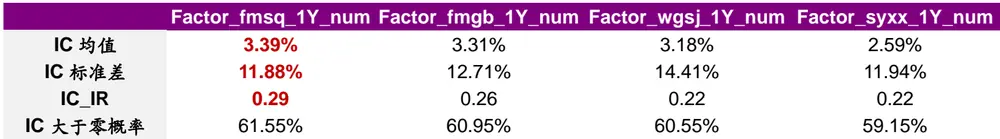
资料来源：通联数据，光大证券研究所

从测试的结果上看，基于发明授权（fmsq）专利数量的因子，的确比其他类型专利数量构造的因子具有更好的预测能力和选股效果。实用新型（syxx）类型的专利数量虽然较多，但此类专利对于公司的研发能力要求相对较低，在因子层面也表现出较弱的预测能力。

表6：不同滚动时间区间的发明授权专利数量因子预测能力

| Factor_fmsq_1Y_num |  | Factor_fmsq_2Y_num | Factor_fmsq_3Y_num |
| --- | --- | --- | --- |
| IC 均值 | 3.39% | 3.31% | 3.24% |
| IC 标准差 | 11.88% | 11.71% | 11.99% |
| IC_IR | 0.29 | 0.28 | 0.27 |
| IC 大于零概率 | 61.55% | 60.66% | 60.35% |

资料来源：通联数据，光大证券研究所

不同滚动时间区间下的发明授权专利数量因子中，1 年期的因子表现略微好于2年期和3年期的因子表现。说明投资者更为看重公司近期的专利研发情况，过于久远的专利信息对公司的估计影响能力相对较弱。

具 体 分 析 上 面 表 现 较 好 的 1 年 期 发 明 授权 专 利 数 量 因 子（Factor_fmsq_1Y）的预测能力和多头收益能力。从 IC 序列来看，因子从2011 年至 2016 年底具有很高的胜率，2017 年初至 2018 年中 IC 序列出现了一定幅度的回撤，2018 年下半年至今的表现相对较为稳定。

图 5：Factor_fmsq_1Y_num 因子 IC 序列
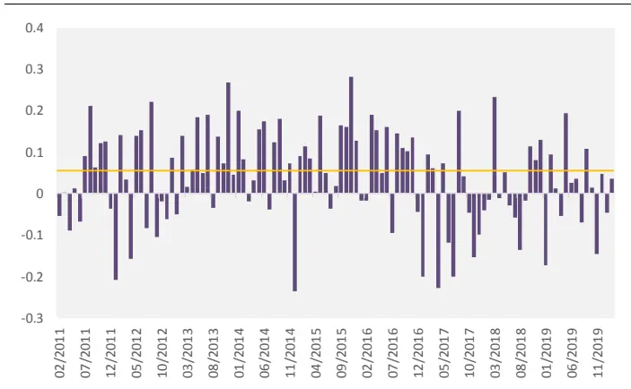
资料来源：光大证券研究所

图 6：Factor_fmsq_1Y_num 因子多头超额收益（第五组）
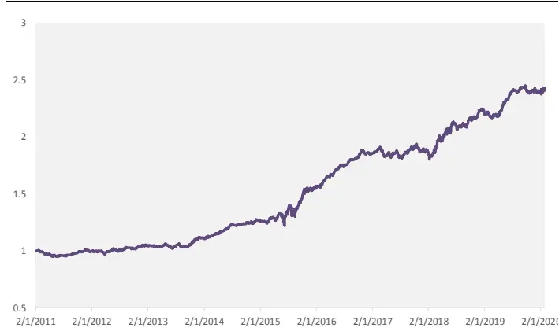
资料来源：光大证券研究所，注：基准为股票池等权（详见表 4）

1 年期发明授权因子（Factor_fmsq_1Y_num）的多头超额收益较为稳定，年化超额收益率9.84%，信息比 1.13。同时因子换手率极低，月度平均单边换手率为6.87%。

表 7：Factor_fmsq_1Y_num 因子分行业表现

|  | IC_IR |
| --- | --- |
| 基础化工 | 0.39 |
| 机械 | 0.35 |
| 电子 | 0.32 |
| 汽车 | 0.31 |
| 钢铁 | 0.26 |
| 通信 | 0.25 |
| 有色金属 | 0.25 |
| 建材 | 0.22 |
| 电力设备及新能源 | 0.22 |
| 家电 | 0.21 |
| 计算机 | 0.19 |
| 轻工制造 | 0.18 |
| 医药 | 0.15 |
| 建筑 | 0.10 |
| 国防军工 | -0.02 |

资料来源：通联数据，光大证券研究所

分行业来看，1 年期发明授权专利数量因子（Factor_fmsq_1Y_num）在基础化工、机械、电子、汽车行业内有较强的选股能力，行业内 IC_IR大于0.3。钢铁、通信、有色金属行业内也具有较好的选股能力。

## 3.2、发明授权专利关联人总数因子

基于专利数据的因子构造方式，除了简单的采用专利数量来统计以外，摘要字数、IPC 号总数、关联人总数、审查期时长、独权总数这些指标都可以一定程度上反映专利中包含的其他有效信息。

根据前面的测试我们发现发明授权类型的专利信息有效性更高，因此我们测试了基于发明授权专利的各类衍生因子，其中，发明授权专利的关联人总数因子 Factor_fmsq_1Y_relatedCompanies，也具有较为显著的预测能力和选股效果。

表8：发明授权专利类型下不同类型专利因子预测能力（滚动一年）

|  | _1Y_num | Factor_fmsq Factor_fmsq_1Y Factor_fmsq_1Y _briefnum | _IPCnum | Factor_fmsq_1Y _relatedCompanies | Factor_fmsq_1Y Factor_fmsq_1Y |  |
| --- | --- | --- | --- | --- | --- | --- |
|  |  |  |  |  | ownPatent | _reviewDate |
| IC 均值 | 3.39% | 3.27% | 3.30% | 3.50% | 3.32% | 3.47% |
| IC 标准差 | 11.88% | 11.91% | 11.82% | 12.18% | 12.18% | 12.42% |
| IC_IR | 0.29 | 0.27 | 0.28 | 0.29 | 0.27 | 0.28 |
| IC 大于零概率 | 61.55% | 58.57% | 60.21% | 62.63% | 59.63% | 61.87% |

资料来源：通联数据，光大证券研究所

专利可能与除本公司以外的其他科研部门、公司或个人成为关联人，关联人数越多表示公司对专利投入的成本和人力越多，公司在过去一段时间内所 有 专 利 的 关 联 人 数 能 够 反 映 出 企 业 对 专 利 的 总 投 入 。Factor_fmsq_1Y_relatedCompanies 因子反映的是公司对于发明授权专利的总投入，此类总投入越多的公司，说明其对研发和创新的重视程度越高。

具 体 分 析 1 年 期 发 明 授 权 关 联 人 总 数 因 子（Factor_fmsq_1Y_relatedCompanies）的预测能力和多头收益能力。从 IC序列来看，因子从2011 年至 2016年底具有很高的胜率，2017年初至2018年中IC 序列出现了一定幅度的回撤。

图 7：Factor_fmsq_1Y_relatedCompanies 因子 IC序列
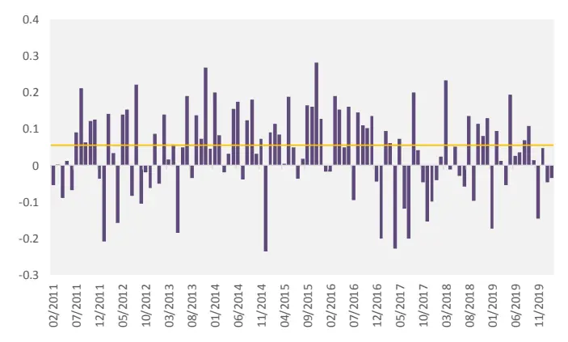
资料来源：光大证券研究所

图 8：Factor_fmsq_1Y_relatedCompanies 因子多头超额收益（第五组）
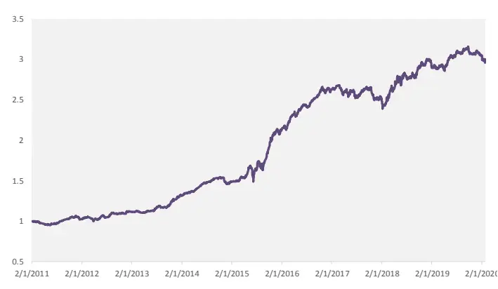
资料来源：光大证券研究所，注：基准为股票池等权（详见表 4）

1 年期发明授权关联人总数因子（Factor_fmsq_1Y_relatedCompanies）的多头超额收益较高，超额收益稳定性相对较弱，年化超额收益率 12.7%，信息比1.08。同时因子换手率极低，月度平均单边换手率为 6.74%。

表 9：Factor_fmsq_1Y_relatedCompanies 因子分行业表现

|  | IC_IR |
| --- | --- |
| 基础化工 | 0.39 |
| 机械 | 0.35 |
| 电子 | 0.33 |
| 汽车有色金属 | 0.32 |
|  | 0.29 |
| 通信 | 0.28 |
| 医药建材钢铁轻工制造计算机电力设备及新能源家电建筑国防军工 | 0.27 |
|  | 0.25 |
|  | 0.24 |
|  | 0.20 |
|  | 0.18 |
|  | 0.14 |
|  | 0.14 |
|  | 0.09 |
|  | -0.03 |

资料来源：通联数据，光大证券研究所

分 行 业 来 看 ， 1 年 期 发 明 授 权 关 联 人 总 数 因 子（Factor_fmsq_1Y_relatedCompanies）在基础化工、机械、电子、汽车行业内有较强的选股能力，行业内 IC_IR 大于 0.3。有色金属、通信、医药、建材行业内也具有较好的选股能力。

## 4、结合研发费用构造研发效率因子

研发费用是指公司在研究与开发各种技术和产品上投入的费用。而在前文的测试中，我们只考虑了一个公司在过去一段时间内的专利数量和不同类型专利数量相关指标构造的因子的选股效果。这里我们将尝试把专利数量和研发费用相结合，构造反映公司研发效率的指标，并测试其选股效果。

使用研发费用除以专利数量，考察研发单个专利所需要花费的研发费用，从逻辑上理解，开发单个专利需要花费的研发费用越少，可以表明公司在研发效率较高，或者也可以理解为专利研发上的投入产出比较高。因此此种构造方式下的研发效率因子应该是一个具有负向预测能力的因子。

## 4.1、研发效率因子构造方法

因子的构造上，将主要使用一段时间内的研发授权、研发公布、实用新型和外观设计这四类专利数量与公司在相应时间段内的研发费用数据，构造研发效率因子。

$$
Factor\_RD\_xx\_yy\ =RD\_yy/Factor\_xx\_yy\_num
$$

其中：

RD_yy代表 yy 时间内滚动计算得到的研发费用；

Factor_xx_yy_num代表不同 xx 和 yy 组合下的专利数量因子（xx 和 yy 的定义与表 3 一致）。

由于研发费用的数据为年报和中报数据，我们对RD_yy的计算方式做了如下设置，以滚动一年的研发费用RD_1Y为例：

1) 当年 5、6、7、8 月回看过去一年的研发成本：

去年的年报数据

2) 当年 9、10、11、12 月回看过去一年的研发成本：

当年的半年报数据/2×3+(去年的年报数据-去年的半年报数据)/2

3) 次年 1、2、3、4 月回看过去一年的研发成本：

去年的半年报数据/2×3+前年的年报数据/4

由图 1 可知，上市公司公布的研发费用数据的覆盖度高于专利数据的覆盖度，因此研发效率因子的覆盖度与专利数量因子的覆盖度相匹配。我们的因子测试框架则沿用了专利数据因子的测试框架：

表10：研发效率因子回测框架

|  | 专利因子回测框架 |
| --- | --- |
| 回测时间区间 | 2011年1月1日至2020年3月31日 |
| 回测股票池 | 属于机械、电子、电力设备及新能源、通信、基础化工、家电、钢铁、计算机、汽车、建材、医药、建筑、有色金属、轻工制造、国防军工、石油石化16个一级行业的股票（剔除选股日ST/PT股票；剔除上市不满一年的股票；剔除选股日由于停牌等因素无法买入的股票) |
| 调仓频率 | 月度调仓 |
| IC 指标 | IC为行业和市值中性化后，与下一期股票收益率的秩相关系数 |
| 分组方式 | 每月最后一个交易日收盘后，根据本月所有未被剔除的股票数据计算因子值，行业内根据因子值从小到大排序将股票等分为5组，分别计算每组股票的历史回测收益及多空组合收益。 |
| 多头超额收益 | 多头超额收益为行业内分组后，因子值最低的第一组的收益（等权加权）相对基准的超额收益，基准为因子测试股票池的等权组合。 |
| 交易费率 | 因子测试阶段暂不考虑交易费用 |

资料来源：光大证券研究所

## 4.2、研发费用/发明授权专利数：近期稳定性下降

根据前面的测试我们发现发明授权类型的专利信息有效性更高，在研发效率因子的测试中也得到了类似的结论。基于发明授权专利数量构造的研发效率因子，其IC 和 IC_IR均更为显著：

表11：研发费用/发明授权专利数因子预测能力（滚动一年）

|  | Factor_RD_fmgb_1Y | Factor_RD_fmsq_1Y | Factor_RD_syxx_1Y | Factor_RD_wgsj_1Y |
| --- | --- | --- | --- | --- |
| IC 均值 | -0.70% | -1.23% | -0.91% | -0.24% |
| IC 标准差 | 6.15% | 6.06% | 6.07% | 12.12% |
| IC_IR | -0.11 | -0.20 | -0.15 | -0.02 |
| IC 大于零概率 | 44.95% | 44.95% | 44.04% | 46.79% |

资料来源：通联数据，光大证券研究所

具体分析 1 年期研发效率因子（研发费用/发明授权专利数）（Factor_RD_fmsq_1Y）的预测能力和多头收益能力。因子的预测能力稳定性相对较弱，从 IC 序列来看，因子从 2011 年至 2016 年底具有很高的负向胜率，2017 年初至今的IC 表现不佳，出现了较为明显的回撤。

图 9：Factor_RD_fmsq_1Y 因子 IC 序列
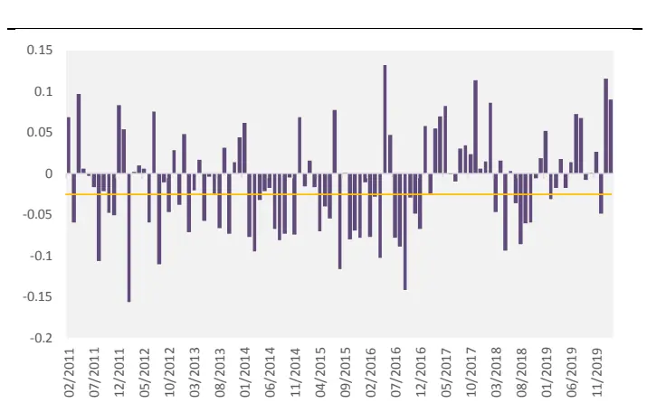
资料来源：光大证券研究所

图 10：Factor_RD_fmsq_1Y 因子多头超额收益（第一组）
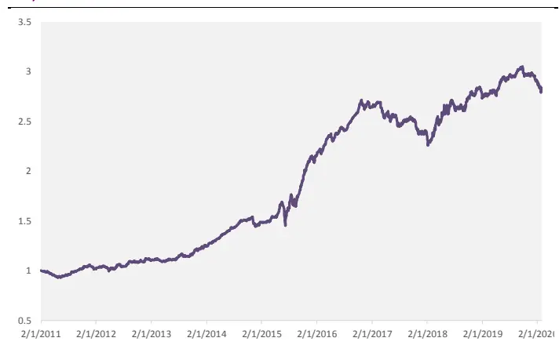
资料来源：光大证券研究所，注：基准为股票池等权（详见表 4）

1 年期研发效率因子（研发费用/发明授权专利数）（Factor_RD_fmsq_1Y）的多头超额收益较高，超额收益稳定性相对较弱，年化超额收益率 12.0%，超额收益的年化波动为6.8%，信息比0.71。

表 12：Factor_RD_fmsq_1Y 因子分行业表现

|  | IC_IR |
| --- | --- |
| 医药 | -0.50 |
| 机械 | -0.46 |
| 建筑 | -0.32 |
| 基础化工 | -0.23 |
| 建材 | -0.23 |
| 家电 | -0.14 |
| 计算机 | -0.06 |
| 轻工制造 | -0.03 |
| 电子 | -0.03 |
| 通信 | 0.00 |
| 有色金属 | 0.07 |
| 汽车 | 0.08 |
| 钢铁 | 0.08 |

电力设备及新能源

资料来源：通联数据，光大证券研究所

分行业来看，1 年期研发效率因子（研发费用/发明授权专利数）（Factor_RD_fmsq_1Y）在医药、机械、建筑等行业内有较强的选股能力，行业内 IC_IR 小于-0.2。而在电力设备及新能源、钢铁、汽车、有色金属、通信内表现不佳。

研发费用/专利数量构造的研发效率因子的预测能力和选股表现的稳定性较为一般，因子IC_IR的绝对值显著小于前文提到的1 年期发明授权专利数量因子（Factor_fmsq_1Y_num）和 1 年期发明授权关联人总数因子（Factor_fmsq_1Y_relatedCompanies）。

## 5、应用于中证 500 增强：年化增强 4.20%，信息比 0.83

由于专利类型的数据在行业上的覆盖度偏离度较大，也正是因为这个原因，前文中我们的因子测试大部分是集中在 16 个专利数据覆盖度较高的行业中的。此类行业大部分属于制造业、TMT、可选消费板块中，而金融板块、必需消费等板块内的专利数据覆盖率极低。因此，在尝试将专利数据构造的因子应用于相应策略中时，我们首先尝试在中证500增强中使用专利类型的因子。

截止 2019 年底，中证 500 成分股中，专利数据可以覆盖 310 个公司，覆盖度约为 62%，而在中证 500 成分股的各个行业上，专利数据的覆盖度如下表所示：

表13：中证500成分股各行业（按中信一级行业分类）专利数据覆盖度

| 2010 |  | 2011 | 2012 | 2013 | 2014 | 2015 | 2016 | 2017 | 2018 | 2019 |
| --- | --- | --- | --- | --- | --- | --- | --- | --- | --- | --- |
| 计算机 | 57.14% | 60.71% | 57.14% | 60.71% | 60.71% | 67.86% | 71.43% | 78.57% | 75.00% | 82.14% |
| 电子 | 66.67% | 72.73% | 75.76% | 84.85% | 81.82% | 81.82% | 81.82% | 81.82% | 81.82% | 78.79% |
| 通信 | 64.29% | 64.29% | 64.29% | 64.29% | 71.43% | 85.71% | 78.57% | 85.71% | 78.57% | 78.57% |
| 建筑 | 50.00% | 50.00% | 50.00% | 64.29% | 64.29% | 71.43% | 64.29% | 64.29% | 78.57% | 78.57% |
| 轻工制造汽车 | 55.56% | 55.56% | 55.56% | 66.67% | 66.67% | 66.67% | 55.56% | 77.78% | 77.78% | 77.78% |
|  | 70.59% | 70.59% | 70.59% | 70.59% | 70.59% | 70.59% | 70.59% | 76.47% | 76.47% | 70.59% |
| 钢铁 | 55.00% | 60.00% | 60.00% | 60.00% | 60.00% | 65.00% | 65.00% | 65.00% | 65.00% | 70.00% |
| 基础化工 | 63.33% | 56.67% | 60.00% | 63.33% | 60.00% | 53.33% | 56.67% | 66.67% | 63.33% | 66.67% |
| 机械 | 57.14% | 71.43% | 66.67% | 66.67% | 66.67% | 66.67% | 71.43% | 66.67% | 66.67% | 66.67% |
| 家电 | 50.00% | 50.00% | 50.00% | 66.67% | 66.67% | 66.67% | 66.67% | 66.67% | 66.67% | 66.67% |
| 食品饮料 | 71.43% | 64.29% | 64.29% | 71.43% | 64.29% | 64.29% | 50.00% | 64.29% | 64.29% | 64.29% |
| 电力设备及新能源 | 53.33% | 63.33% | 56.67% | 63.33% | 56.67% | 63.33% | 56.67% | 63.33% | 56.67% | 63.33% |
| 农林牧渔 | 30.00% | 40.00% | 50.00% | 60.00% | 60.00% | 50.00% | 50.00% | 60.00% | 60.00% | 60.00% |
| 建材 | 57.14% | 57.14% | 57.14% | 71.43% | 57.14% | 57.14% | 57.14% | 42.86% | 57.14% | 57.14% |
| 电力及公用事业医药有色金属 | 30.77% | 38.46% | 38.46% | 30.77% | 34.62% | 42.31% | 34.62% | 46.15% | 42.31% | 53.85% |
|  | 36.96% | 41.30% | 45.65% | 47.83% | 50.00% | 50.00% | 54.35% | 47.83% | 50.00% | 50.00% |
|  | 35.29% | 35.29% | 47.06% | 47.06% | 47.06% | 52.94% | 58.82% | 58.82% | 52.94% | 47.06% |
| 国防军工石油石化交通运输煤炭传媒纺织服装银行商贸零售非银行金融房地产综合 | 46.15% 46.15% |  | 46.15% | 46.15% | 38.46% | 46.15% | 38.46% | 30.77% | 46.15% | 46.15% |
|  | 22.22% | 11.11% | 33.33% | 22.22% | 22.22% | 22.22% | 22.22% | 22.22% | 33.33% | 44.44% |
|  | 8.70% | 4.35% | 17.39% | 21.74% | 17.39% | 26.09% | 17.39% | 26.09% | 26.09% | 39.13% |
|  | 25.00% | 25.00% | 37.50% | 25.00% | 25.00% | 37.50% | 50.00% | 25.00% | 25.00% | 37.50% |
|  | 11.11% | 14.81% | 25.93% | 25.93% | 22.22% | 37.04% | 22.22% | 33.33% | 25.93% | 37.04% |
|  | 0.00% | 0.00% | 0.00% | 0.00% | 0.00% | 0.00% | 0.00% | 0.00% | 0.00% | 33.33% |
|  | 0.00% | 0.00% | 0.00% | 0.00% | 14.29% | 14.29% | 0.00% | 14.29% | 14.29% | 28.57% |
|  | 6.25% | 6.25% | 6.25% | 12.50% | 12.50% | 12.50% | 12.50% | 18.75% | 25.00% | 12.50% |
|  | 0.00% | 0.00% | 0.00% | 0.00% | 6.25% | 0.00% | 0.00% | 6.25% | 6.25% | 12.50% |
|  | 8.00% | 8.00% | 0.00% | 0.00% | 4.00% | 4.00% | 4.00% | 4.00% | 4.00% | 4.00% |
|  | 0.00% | 0.00% | 0.00% | 0.00% | 0.00% | 0.00% | 0.00% | 0.00% | 0.00% | 0.00% |
| 综合金融消费者服务 | 0.00% | 0.00% | 0.00% | 0.00% | 0.00% | 0.00% | 0.00% | 0.00% | 0.00% | 0.00% |
|  | 0.00% | 0.00% | 0.00% | 0.00% | 0.00% | 0.00% | 0.00% | 0.00% | 0.00% | 0.00% |

资料来源：通联数据，光大证券研究所，注：2010-01-01 至2019-12-31

## 5.1、发明授权专利数量单因子增强

使用1 年期发明授权专利数量因子（Factor_fmsq_1Y_num），测试其在中证500 指数增强上的应用效果，模型上我们沿用之前系列报告中的指数增强测试框架和优化框架，简单回顾测试的框架和流程如下（对于缺失的因子数据，我们采用0 填充）：

组合优化模型及参数设置：

$$
\operatorname{Max}F(w)=w^{T}\mu
$$

s.t.

$$
\begin{aligned}0&\leq w\leq l\\\sum w&=1\\x_{lower}\leq X(w-w_{bech})&\leq x_{upper}\\i_{lower}\leq I(w-w_{bech})&\leq i_{upper}\\D_{bech}&w\geq b\end{aligned}
$$

其中：

μ为个股因子得分向量；

l为个股权重上限；

X为风格因子暴露矩阵， $x_{lower}和x_{upper}$ 分别为上下限；

I为行业哑变量矩阵， $i_{lower}$ 和 $\imath i_{upper}$ 分别为上下限；

$D_{bench}$ 为成分股哑变量，属于成分股则为 1；

b为成分股权重占比下限。

模型相关参数：

1、调仓周期：月度

2、成交价格：次日收盘价

3、手续费：双边0.3%

表14：专利因子增强模型优化参数设置

| 参数名 | 参数含义 | 参数值 |
| --- | --- | --- |
| l | 个股权重上限 | 1.5% |
| b | 成分股权重占比下限 | 0.8 |
| i_upper | 行业暴露度下限 | 0.8 |
| i_lower | 行业暴露度上限 | 1.2 |
| x_upper | 风格因子暴露度下限 | 0.95 |
| x_upper | 风格因子暴露度上限 | 1.05 |

资料来源：光大证券研究所

在 上 述 参 数 设 置 下 ， 基 于 1 年 期 发 明 授 权 专 利 数 量 因 子（Factor_fmsq_1Y_num）单因子的500增强组合可以较为稳定的跑赢基准，年化超额收益4.20%，相对波动 5.08%，信息比0.83。

图 11：Factor_fmsq_1Y 因子中证 500 增强组合表现
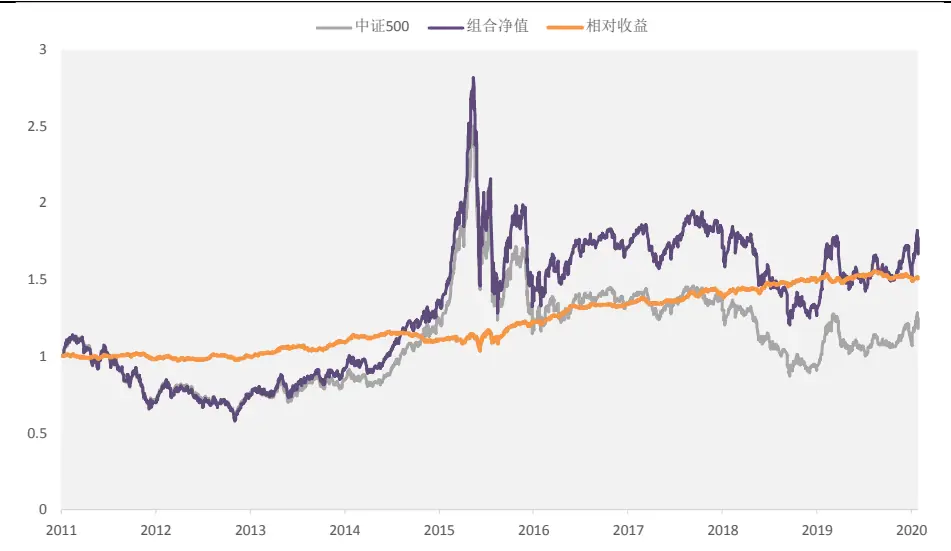
资料来源：光大证券研究所，注：2011-01-01 至 2019-12-31

表 15：Factor_fmsq_1Y_num 因子中证 500 增强组合分年度表现

|  | 月度胜 | 年化收益 | 年化波动 | 年化超额收益 | 相对收益波动 | 信息比 | 最大回撤 | 相对最大回撤 |
| --- | --- | --- | --- | --- | --- | --- | --- | --- |
| 2011 | 54.55% | -31.50% | 24.21% | -3.09% | 3.85% | -0.80 | -39.31% | -5.04% |
| 2012 | 50.00% | 0.90% | 25.78% | -1.06% | 3.99% | -0.26 | -31.67% | -4.13% |
| 2013 | 75.00% | 30.02% | 24.21% | 11.01% | 5.04% | 2.19 | -17.06% | -5.36% |
| 2014 | 50.00% | 37.75% | 20.27% | -0.48% | 3.89% | -0.12 | -12.15% | -6.53% |
| 2015 | 66.67% | 50.96% | 51.97% | 8.50% | 9.43% | 0.90 | -54.47% | -9.84% |
| 2016 | 58.33% | -3.08% | 31.40% | 5.10% | 4.21% | 1.21 | -25.63% | -2.52% |
| 2017 | 75.00% | 7.01% | 16.88% | 12.03% | 3.73% | 3.22 | -15.58% | -2.54% |
| 2018 | 58.33% | -32.00% | 26.25% | 2.63% | 4.60% | 0.57 | -36.40% | -3.89% |
| 2019 | 58.33% | 28.63% | 23.92% | 2.72% | 4.29% | 0.63 | -20.09% | -4.05% |
| Summary | 61.47% | 5.66% | 29.14% | 4.20% | 5.08% | 0.83 | -54.47% | -9.84% |

资料来源：通联数据，光大证券研究所，注：2011-01-01 至 2019-12-31，基准为中证 500 指数

分年度来看，策略在大部分年份均可以获得一定的超额收益，仅仅在2011、2012和2014年出现小幅跑输基准的现象。

在成分股专利数据覆盖度达到62%的前提下，将1年期发明授权专利数量因子（Factor_fmsq_1Y_num）直接应用于中证 500 增强可以取得一定的增强效果，证明专利数据所反映的信息是可以有效应用于此类策略中并且提供稳定的Alpha 来源的。

## 6、风险提示

报告结论均基于模型和历史数据，模型存在失效的可能，历史数据存在不被重复验证的可能。

## 7、附录

## 7.1、专利因子测试结果明细

下表中给出了 90 个专利因子的 IC、IC_IR 等指标明细。

表 16：90 个专利因子测试结果明细

|  | IC 均值 | IC 标准差 | IC_IR | IC 大于零概率 |
| --- | --- | --- | --- | --- |
| Factor_all_1Y_num | 2.98% | 12.11% | 0.25 | 60.55% |
| Factor_all_1Y_briefnum | 2.92% | 12.04% | 0.24 | 59.63% |
| Factor_all_1Y_IPCnum | 3.00% | 12.02% | 0.25 | 60.55% |
| Factor_all_1Y_ownPatent | 2.94% | 12.11% | 0.24 | 59.63% |
| Factor_wgsj_1Y_relatedCompanies | 3.32% | 12.13% | 0.27 | 60.71% |
| Factor_all_1Y_reviewDate | 3.15% | 12.28% | 0.26 | 59.63% |
| Factor_all_2Y_num | 3.23% | 12.16% | 0.27 | 61.46% |
| Factor_all_2Y_briefnum | 3.15% | 12.10% | 0.26 | 60.42% |
| Factor_all_2Y_IPCnum | 3.29% | 12.03% | 0.27 | 60.42% |
| Factor_all_2Y_ownPatent | 3.15% | 12.15% | 0.26 | 61.46% |
| Factor_wgsj_2Y_relatedCompanies | 3.14% | 12.11% | 0.26 | 59.63% |
| Factor_all_2Y_reviewDate | 3.22% | 12.09% | 0.27 | 60.42% |
| Factor_all_3Y_num | 3.31% | 12.86% | 0.26 | 61.90% |
| Factor_all_3Y_briefnum | 3.28% | 12.79% | 0.26 | 60.71% |
| Factor_all_3Y_IPCnum | 3.36% | 12.57% | 0.27 | 61.90% |
| Factor_all_3Y_ownPatent | 3.30% | 12.12% | 0.27 | 61.90% |
| Factor_wgsj_3Y_relatedCompanies Factor_all_3Y_reviewDate | 3.09% | 12.11% | 0.26 | 59.63% |
|  | 3.32% | 12.13% | 0.27 | 60.71% |
| Factor_fmgb_1Y_num | 3.31% | 12.71% | 0.26 | 60.95% |
| Factor_fmgb_1Y_briefnum | 3.09% | 12.69% | 0.24 | 59.63% |
| Factor_fmgb_1Y_IPCnum | 3.14% | 12.52% | 0.25 | 59.63% |
| Factor_fmgb_1Y_ownPatent | 3.08% | 12.51% | 0.25 | 57.80% |
| Factor_fmgb_1Y_relatedCompanies | 3.29% | 14.54% | 0.23 | 63.43% |
| Factor_fmgb_1Y_reviewDate | 3.40% | 13.43% | 0.25 | 60.55% |
| Factor_fmgb_2Y_num | 3.34% | 12.76% | 0.26 | 61.46% |
| Factor_fmgb_2Y_briefnum | 3.29% | 12.76% | 0.26 | 60.42% |
| Factor_fmgb_2Y_IPCnum | 3.37% | 12.53% | 0.27 | 61.46% |
| Factor_fmgb_2Y_ownPatent | 3.29% | 12.66% | 0.26 | 60.42% |
| Factor_fmgb_2Y_relatedCompanies | 3.50% | 13.76% | 0.25 | 61.46% |
| Factor_fmgb_2Y_reviewDate | 3.58% | 13.28% | 0.27 | 60.42% |
| Factor_fmgb_3Y_num | 3.42% | 12.80% | 0.27 | 61.90% |
| Factor_fmgb_3Y_briefnum | 3.41% | 12.83% | 0.27 | 60.71% |
| Factor_fmgb_3Y_IPCnum | 3.45% | 12.55% | 0.27 | 61.90% |
| Factor_fmgb_3Y_ownPatent | 3.40% | 12.71% | 0.27 | 58.33% |
| Factor_fmgb_3Y_relatedCompanies | 3.38% | 12.92% | 0.26 | 58.33% |
| Factor_fmgb_3Y_reviewDate | 3.65% | 13.20% | 0.28 | 61.90% |
| Factor_fmsq_1Y_num | 3.39% | 11.88% | 0.29 | 61.55% |
| Factor_fmsq_1Y_briefnum | 3.27% | 11.91% | 0.27 | 58.57% |
| Factor_fmsq_1Y_IPCnum | 3.30% | 11.82% | 0.28 | 60.21% |
| Factor_fmsq_1Y_ownPatent Factor_fmsq_1Y_relatedCompanies | 3.32% | 12.18% | 0.27 | 59.63% |
| Factor_fmsq_1Y_reviewDate | 3.50% | 12.18% | 0.29 | 62.63% |
| Factor_fmsq_2Y_num | 3.47% | 12.42% | 0.28 | 61.87% |
| Factor_fmsq_2Y_briefnum | 3.31% | 11.71% | 0.28 | 60.66% |
| Factor_fmsq_2Y_IPCnum | 3.15% | 11.87% | 0.27 | 60.42% |
| Factor_fmsq_2Y_ownPatent | 3.26% | 11.68% | 0.28 | 60.42% |
| Factor_fmsq_2Y_relatedCompanies | 3.25% | 12.17% | 0.27 | 60.42% |
| Factor_fmsq_2Y_reviewDate | 3.26% | 12.53% | 0.26 | 61.90% |
| Factor_fmsq_3Y_num | 3.38% | 12.35% | 0.27 | 61.46% |
| Factor_fmsq_3Y_briefnum | 3.24% | 11.99% | 0.27 | 60.35% |
| Factor_fmsq_3Y_IPCnum | 3.28% | 11.69% | 0.28 | 61.90% |
| Factor_fmsq_3Y_ownPatent | 3.33% | 12.43% | 0.27 | 61.90% |
| Factor_fmsq_3Y_relatedCompanies | 3.36% | 12.01% | 0.28 | 60.71% |
| Factor_fmsq_3Y_reviewDate | 3.29% | 12.66% | 0.26 | 61.90% |
| Factor_syxx_1Y_num | 3.49% | 12.88% | 0.27 | 63.10% |
| Factor_syxx_1Y_briefnum | 2.59% | 11.94% | 0.22 | 59.15% |
| Factor_syxx_1Y_IPCnum | 2.40% | 11.89% | 0.20 | 60.55% |
|  | 2.41% | 12.04% | 0.20 | 60.55% |
| Factor_syxx_1Y_ownPatent Factor_syxx_1Y_relatedCompanies | 2.35% | 11.86% | 0.20 | 58.72% |
| Factor_syxx_1Y_reviewDate | 2.56% | 12.01% | 0.21 | 60.42% |
| Factor_syxx_2Y_num | 2.39% | 11.90% | 0.20 | 60.55% |
|  | 2.57% | 12.04% | 0.21 | 60.42% |
| Factor_syxx_2Y_briefnum | 2.55% | 11.98% | 0.21 | 60.42% |
| Factor_syxx_2Y_IPCnum | 2.60% | 12.15% | 0.21 | 60.42% |
| Factor_syxx_2Y_ownPatent | 2.55% | 11.88% | 0.21 | 60.42% |
| Factor_syxx_2Y_relatedCompanies | 2.28% | 11.98% | 0.19 | 63.10% |
| Factor_syxx_2Y_reviewDate | 2.57% | 12.01% | 0.21 | 61.46% |
| Factor_syxx_3Y_num | 2.71% | 12.04% | 0.23 | 61.90% |
| Factor_syxx_3Y_briefnum | 2.70% | 12.02% | 0.22 | 61.90% |
| Factor_syxx_3Y_IPCnum | 2.74% | 12.15% | 0.23 | 63.10% |
| Factor_syxx_3Y_ownPatent | 2.73% | 11.93% | 0.23 | 61.90% |
| Factor_syxx_3Y_relatedCompanies | 2.70% | 11.09% | 0.24 | 63.10% |
| Factor_syxx_3Y_reviewDate | 2.70% | 12.02% | 0.22 | 61.90% |
| Factor_wgsj_1Y_num | 3.18% | 14.41% | 0.22 | 60.55% |
| Factor_wgsj_1Y_briefnum | 3.16% | 14.43% | 0.22 | 61.47% |
| Factor_wgsj_1Y_IPCnum | 3.19% | 14.43% | 0.22 | 60.55% |
| Factor_wgsj_1Y_ownPatent | 3.11% | 14.43% | 0.22 | 61.47% |
| Factor_wgsj_1Y_relatedCompanies | 3.22% | 14.62% | 0.22 | 62.39% |
| Factor_wgsj_1Y_reviewDate | 3.12% | 14.34% | 0.22 | 60.55% |
| Factor_wgsj_2Y_num | 3.11% | 14.23% | 0.22 | 62.50% |
| Factor_wgsj_2Y_briefnum | 3.15% | 14.21% | 0.22 | 62.50% |
| Factor_wgsj_2Y_IPCnum | 3.02% | 14.25% | 0.21 | 60.42% |
| Factor_wgsj_2Y_ownPatent | 3.09% | 14.22% | 0.22 | 63.54% |
| Factor_wgsj_2Y_relatedCompanies | 3.18% | 14.51% | 0.22 | 61.46% |
| Factor_wgsj_2Y_reviewDate | 3.20% | 14.17% | 0.23 | 62.50% |
| Factor_wgsj_3Y_num | 3.30% | 14.12% | 0.23 | 61.90% |
| Factor_wgsj_3Y_briefnum | 3.28% | 14.09% | 0.23 | 61.90% |
| Factor_wgsj_3Y_IPCnum | 3.31% | 14.16% | 0.23 | 61.90% |
| Factor_wgsj_3Y_ownPatent | 3.35% | 14.14% | 0.24 | 63.10% |
| Factor_wgsj_3Y_relatedCompanies | 3.30% | 14.54% | 0.23 | 63.10% |
| Factor_wgsj_3Y_reviewDate | 3.34% | 14.09% | 0.24 | 61.90% |

资料来源：通联数据，光大证券研究所，注：2011-01-01 至2019-12-31

## 行业及公司评级体系

| 评级 说明 |  |  |
| --- | --- | --- |
| 行 | 买入 | 未来6-12个月的投资收益率领先市场基准指数15%以上； |
|  | 增持 | 未来6-12个月的投资收益率领先市场基准指数5%至15%； |
|  | 中性 | 未来6-12个月的投资收益率与市场基准指数的变动幅度相差-5%至5%; |
|  | 减持 | 未来6-12个月的投资收益率落后市场基准指数5%至15%； |
|  | 卖出 | 未来6-12个月的投资收益率落后市场基准指数15%以上； |
| 业及公司评级 | 无评级 投资评级。 | 因无法获取必要的资料，或者公司面临无法预见结果的重大不确定性事件，或者其他原因，致使无法给出明确的 |
| 基准指数说明：A股主板基准为沪深300指数；中小盘基准为中小板指；创业板基准为创业板指；新三板基准为新三板指数；港 股基准指数为恒生指数。 |  |  |

## 分析、估值方法的局限性说明

本报告所包含的分析基于各种假设，不同假设可能导致分析结果出现重大不同。本报告采用的各种估值方法及模型均有其局限性，估值结果不保证所涉及证券能够在该价格交易。

## 分析师声明

本报告署名分析师具有中国证券业协会授予的证券投资咨询执业资格并注册为证券分析师，以勤勉的职业态度、专业审慎的研究方法，使用合法合规的信息，独立、客观地出具本报告，并对本报告的内容和观点负责。负责准备以及撰写本报告的所有研究人员在此保证，本研究报告中任何关于发行商或证券所发表的观点均如实反映研究人员的个人观点。研究人员获取报酬的评判因素包括研究的质量和准确性、客户反馈、竞争性因素以及光大证券股份有限公司的整体收益。所有研究人员保证他们报酬的任何一部分不曾与，不与，也将不会与本报告中具体的推荐意见或观点有直接或间接的联系。

## 特别声明

光大证券股份有限公司（以下简称“本公司”）创建于 1996 年，系由中国光大（集团）总公司投资控股的全国性综合类股份制证券公司，是中国证监会批准的首批三家创新试点公司之一。根据中国证监会核发的经营证券期货业务许可，本公司的经营范围包括证券投资咨询业务。

本公司经营范围：证券经纪；证券投资咨询；与证券交易、证券投资活动有关的财务顾问；证券承销与保荐；证券自营；为期货公司提供中间介绍业务；证券投资基金代销；融资融券业务；中国证监会批准的其他业务。此外，本公司还通过全资或控股子公司开展资产管理、直接投资、期货、基金管理以及香港证券业务。

本报告由光大证券股份有限公司研究所（以下简称“光大证券研究所”）编写，以合法获得的我们相信为可靠、准确、完整的信息为基础，但不保证我们所获得的原始信息以及报告所载信息之准确性和完整性。光大证券研究所可能将不时补充、修订或更新有关信息，但不保证及时发布该等更新。

本报告中的资料、意见、预测均反映报告初次发布时光大证券研究所的判断，可能需随时进行调整且不予通知。在任何情况下，本报告中的信息或所表述的意见并不构成对任何人的投资建议。客户应自主作出投资决策并自行承担投资风险。本报告中的信息或所表述的意见并未考虑到个别投资者的具体投资目的、财务状况以及特定需求。投资者应当充分考虑自身特定状况，并完整理解和使用本报告内容，不应视本报告为做出投资决策的唯一因素。对依据或者使用本报告所造成的一切后果，本公司及作者均不承担任何法律责任。

不同时期，本公司可能会撰写并发布与本报告所载信息、建议及预测不一致的报告。本公司的销售人员、交易人员和其他专业人员可能会向客户提供与本报告中观点不同的口头或书面评论或交易策略。本公司的资产管理子公司、自营部门以及其他投资业务板块可能会独立做出与本报告的意见或建议不相一致的投资决策。本公司提醒投资者注意并理解投资证券及投资产品存在的风险，在做出投资决策前，建议投资者务必向专业人士咨询并谨慎抉择。

在法律允许的情况下，本公司及其附属机构可能持有报告中提及的公司所发行证券的头寸并进行交易，也可能为这些公司提供或正在争取提供投资银行、财务顾问或金融产品等相关服务。投资者应当充分考虑本公司及本公司附属机构就报告内容可能存在的利益冲突，勿将本报告作为投资决策的唯一信赖依据。

本报告根据中华人民共和国法律在中华人民共和国境内分发，仅向特定客户传送。本报告的版权仅归本公司所有，未经书面许可，任何机构和个人不得以任何形式、任何目的进行翻版、复制、转载、刊登、发表、篡改或引用。如因侵权行为给本公司造成任何直接或间接的损失，本公司保留追究一切法律责任的权利。所有本报告中使用的商标、服务标记及标记均为本公司的商标、服务标记及标记。

光大证券股份有限公司版权所有。保留一切权利。

## 联系我们

| 上海 | 北京 | 深圳 |
| --- | --- | --- |
| 写字楼48层 | 静安区南京西路1266号恒隆广场1号 西城区月坛北街2号月坛大厦东配楼2层 复兴门外大街6号光大大厦17层 | 福田区深南大道 6011 号 NEO 绿景纪元大 厦 A 座 17 楼 |