## 现金偿债因子：规避企业潜在财务风险——多因子系列报告之三十二

2020年年初，受新冠疫情影响，国内企业经历了不同程度的停工停产，企业的订单、现金流等也受到较大冲击，带来较大的经营压力的同时，偿债能力问题也日益受到市场的关注。本篇报告结合企业的现金资产、经营性现金流、短期有息负债数据，尝试通过量化手段寻找可以合理描述企业偿债能力指标，构造企业短期偿债能力因子，提供在行业轮动或“排雷”方面应用的建议，供投资者参考。

一年内到期的有息负债是企业短期债务压力的主要来源，多数企业现金类资产可覆盖短期有息负债。我们通过比较企业可用于偿债的现金和一年内需要偿还债务的相对大小来衡量企业的短期偿债能力，其中，可用于偿债的现金包括企业当前持有的现金、现金等价物以及经营活动带来的现金流净额；需要偿还的债务可以一年内到期的有息负债作为代理变量。

- 因子有效性：偿债能力稳定性因子表现较好，回测期内 IC均值为 1.3%，IR为 0.26。我们在现金偿债能力指标的基础上，进一步构建了描述偿债能力稳定性的因子。经过测试，偿债能力因子在回测期内（2010-01-01 至 2019-12-31）表现较为一般，主要是因为偿债能力在牛市行情或货币政策宽松阶段并非市场的主要矛盾，有效性较弱；相对而言，偿债能力稳定性因子表现较好，建材行业内运用有效性更佳。

- 行业轮动：现金偿债能力稳定的行业长期来看可贡献稳定的超额收益。我们依据中信一级行业分类，将行业内所有成分股的现金偿债能力稳定性因子按流通市值加权的方式构造行业的偿债能力稳定性指标。经过测试，每月持仓该指标由大到小排名前10%的行业，测试期内（2010-02-01 至 2019-12-31）收益率达 13.59%，超额行业等权收益78%，显著优于其他行业。

个股排雷：现金偿债能力较弱的企业大部分时间跑输市场。根据测算，行业中性条件下现金偿债能力较弱的股票在大部分年份跑输市场，2016年以来，偿债因子排名居后个股构建的组合年均跑输市场指数4个百分点以上。因此我们认为，除非市场处于牛市行情或货币政策宽松阶段，均应及时规避偿债能力较弱的企业。

- 风险提示：本篇报告研究基于现阶段会计准则下的财务数据进行，财务准则的变更、上市公司财务数据失真、市场短期波动，均有可能影响模型的有效性。

## 金融工程深度

## 分析师

古 翔（执业证书编号：S0930519070003）

021-52523686

guxiang@ebscn.com

周萧潇 (执业证书编号：S0930518010005)

021-52523680

zhouxiaoxiao@ebscn.com

刘均伟 (执业证书编号：S0930517040001)

021-52523679

liujunwei@ebscn.com

## 相关研究

《规模调整的盈利因子：从盈余公积谈起——多因子系列报告之二十八》

·······················2020-01-20

《有息负债：解读企业杠杆的选股信息多因子系列报告之三十》

············2020-02-25

2020年年初，受新冠疫情影响，国内企业经历了不同程度的停工停产，企业的订单、现金流等也受到较大冲击，带来较大的经营压力的同时，偿债能力问题也日益受到市场的关注。本篇报告结合企业的现金资产、经营性现金流、短期有息负债数据，尝试通过量化手段寻找可以合理描述企业偿债能力指标，构造企业现金偿债能力因子，提供在选股或“排雷”方面应用的建议，供投资者参考。

## 1、企业现金偿债能力指标构建

从逻辑上讲，企业现金偿债能力可以通过比较企业可用于偿债的现金和需要偿还债务的相对大小进行衡量，其中，可用于偿债的现金包括企业当前持有的现金及现金等价物以及经营活动带来的现金流净额；需要偿还的债务可以一年内到期的有息负债作为代理变量。

本部分我们先阐述相关科目的概念，尝试构造衡量企业现金偿债能力的指标，并对指标的分布进行相应的描述性统计及分析。

## 1.1、一年内到期的有息负债是企业债务压力的主要来源

在财务分析中，通常将企业的负债分为向金融企业借贷的行为带来的有息负债和经营活动带来的无息负债，而有息负债有可进一步分为一年内到期的有息负债和长期的有息负债。其中，无息负债是上下游的预收或赊销带来的，通常还款时间相对灵活；而有息负债则有较为严格的还款期限，一年内到期的有息负债（短期有息负债）成为企业债务压力的主要来源。

可用于偿债的现金主要有两方面的来源，一方面是企业已持有的现金及现金等价物，另一方面是企业在未来的经营过程中可以获得的现金流入净额。当然，对未来的现金流进行准确预测是较为困难的，量化角度考虑可以通过过去经营性现金流情况进行外推。

短期有息负债涉及的相关会计科目主要包括：短期借款、短期应付债券、一年内到期的非流动负债。其中，一年内到期的非流动负债是通过核算一年内即将到期的非流动负债得出，包括一年内即将到期的长期借款、应付债券和长期应付款。

现金及现金等价物涉及的会计科目主要包括：货币资金、交易性金融资产。货币资金指的是企业拥有的现金、银行存款等；交易性金融资产是指企业计划通过积极管理和交易以获取利润的证券资产，通常变现能力较强。

- 经营性现金流涉及的会计科目主要包括：经营性现金流净额。可通过历史上经营性现金流的情况进行外推。

表1：现金偿债能力指标构建相关科目

|  | 现金及现金等价物 | 经营性现金流 | 短期有息负债 |
| --- | --- | --- | --- |
| 报表类型 | 资产负债表 | 现金流量表 | 资产负债表 |
| 会计科目 | 货币资金、 交易性金融资产 | 经营性现金流量净额 | 短期借款、短期应付债 券、一年内到期的非流动 负债 |
| 特点 | 现金或变现能力较强的 资产 | 企业经营活动带来的 现金 | 一年内需要偿还的 金融负债 |

资料来源：光大证券研究所整理

我们统计了2008年-2018年各年年报中，短期有息负债、经营现金流、现金及现金等价物数据的覆盖度，如下图所示，经营现金流净额和现金及现金等价物覆盖度几乎为 100%，短期有息负债覆盖度也均在 90%以上。

图1：相关科目数据的覆盖度
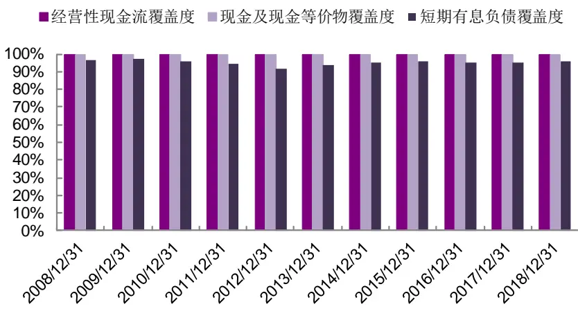
资料来源：Wind，光大证券研究所

## 1.2、三种方式构建现金偿债能力指标

如前文所述，我们尝试通过对比企业可用于偿债的现金和短期内需要偿还债务的相对大小衡量企业的短期偿债能力。主要考虑以下三种构建方式：

## 方式一：（现金及现金等价物+TTM 经营性现金流）/短期有息负债

我们用过去一年企业的经营性现金流净额去外推其未来的现金流情况，通过可用于偿债的现金与短期有息负债的比值，衡量企业短期偿债能力的高低。该比值越大，代表企业短期偿债能力越强；比值越小（存在负数情况），代表企业短期偿债承压，公司经营或有较大压力。

## 方式二：（现金及现金等价物+TTM 经营性现金流-短期有息负债）/总资产

当企业的短期有息负债为0 或极少时，通过方式一构建的偿债能力指标容易产生异常值。为减少异常值出现的概率，我们可将现金及现金等价物加上经营性现金流，再与短期有息负债做差后，除以总资产。用该方式构建的指标与方式一类似，同样在比值越大的时候，表示企业短期偿债能力越强。

## 方式三：（现金及现金等价物-短期有息负债）/总资产

部分投资者可能认为，通过过去一年的现金流外推未来现金流的方式不够准确，那我们也可尝试不考虑现金流的影响，假设企业只动用现金及现金等价物进行偿债，测试该指标的效果。

通过上述方式构建的指标，是否能准确衡量企业的短期偿债能力，能否帮助我们在二级市场上实现“排雷”呢？我们可取几家上述指标表现较差上市公司，观察这些企业后续的股价表现和偿债情况。具体案例如下，我们依据 2019 年一季报的数据，取了三个上述偿债指标排名靠后的企业作为案例样本，并观察其在2019 年一季报公告后 100 个交易日（近半年）的股价走势。

## 案例一：海航控股（600221）

海航控股2019 年4 月30日发布了2019 年一季度财务报告，依据上述方式构建的偿债指标分别为：66.7%、-11.9%、-17.9%，全市场指标由大到小排序分位数分别为81%、90%、93%，反映该企业即便考虑了未来现金流的情况下，依然难以完全覆盖即将到期的有息负债，偿债能力在全市场范围内是相对较差的。再从股价表现来看，该企业在 2019 年一季报公告后的一段时间内持续跑输市场。

图2：海航控股2019年一季报公告后股价走势
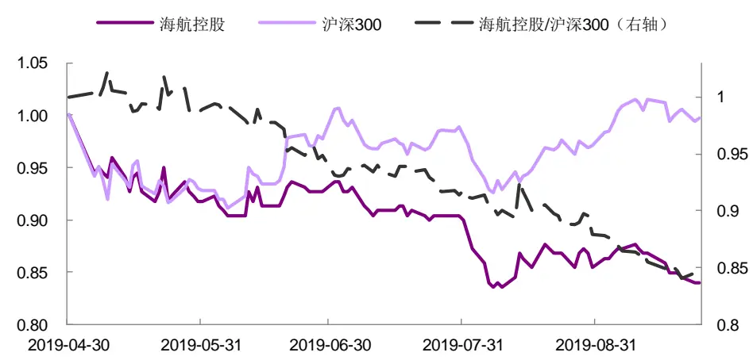
资料来源：Wind，光大证券研究所（截止于 2019 年 9月 24日）

## 案例二：紫鑫药业（002118）

紫鑫药业同样在 2019年4 月 30 日发布了2019年一季度财务报告，依据上述方式构建的偿债指标分别为：-31.4%、-43.9%、-31.6%，全市场指标由大到小排序分位数均在95%以后，反映该企业偿债能力是比较弱的。再从股价走势来看，2019年一季报公告之后的 100 个交易日内，紫鑫药业显著跑输中证 500 指数。

图 3：紫鑫药业 2019 年一季报公告后股价走势
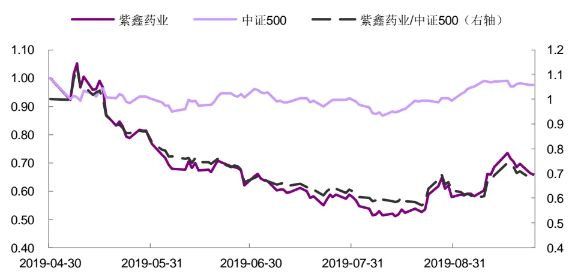
资料来源：Wind，光大证券研究所（截止于 2019 年 9月 24日）

## 案例三：长城动漫（000835）

长城动漫在 2019年 4月 30 日发布2019 年一季度财务报告，如果从归母净利润同比增速角度来看，该企业业绩同比增速达 60%，但依据上述偿债指标来看，其偿债能力均排在全市场的95%分位数之后，说明其偿债能力未得到明显改善。并且在发布季报当天，公司同时发出《关于部分债务到期未获清偿的公告》，显示公司偿债能力确实出现较大问题。再从股价走势来看，该企业在之后的100 个交易日内，显著跑输市场。

图 4：长城动漫 2019 年一季报公告后股价走势
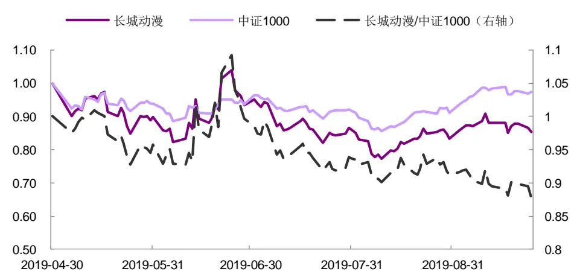
资料来源：Wind，光大证券研究所（截止于 2019 年 9月 24日）

因此，依据上述方式构建的偿债能力指标，指标表现较差的企业很可能具有较高的偿债压力和财务风险，二级市场价格在未来一段时间内亦很有可能持续跑输市场，须及时规避。

## 1.3、多数企业现金类资产可覆盖一年内到期的有息负债

本节我们对上述三种方式构建的偿债能力指标和指标变化率的分布进行描述性统计，取每年年报的指标值，观察上市公司偿债能力指标的主要区间和指标变化幅度，如下图所示。

多数企业现金类资产可覆盖一年内到期的有息负债。如下图所示，各年度大部分企业现金偿债能力指标大于 0，说明大部分企业可用于偿还债务的现金可完全覆盖一年内到期的有息负债。从构建方式三的偿债能力指标来看，大部分企业的现金类资产（货币资金及交易性金融资产）就可覆盖短期有息负债。

多数企业偿债能力逐渐改善。在三种构造方式下，各年度偿债能力指标的变化率箱体大部分位于0 以上，即大部分上市公司偿债指标每年均有所改善，变化趋势总体向好。

第一种构造方式的现金偿债能力指标区间相对较广。对比不同构造方式的偿债能力指标的分布，不难发现，第一种构造方式下，现金偿债能力指标区间较广。这主要是因为其分母为短期有息负债，对于有息负债率较低的企业，该指标的得分会更高。

图5：现金偿债能力指标分布（构建方式一）
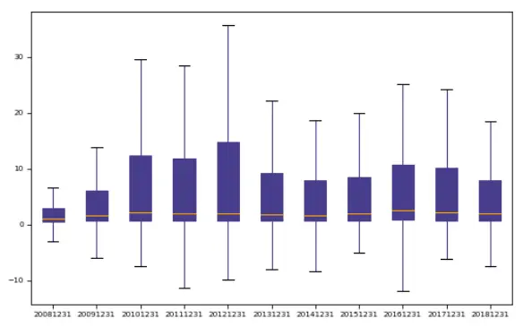
资料来源：Wind，光大证券研究所

图6：现金偿债能力指标变化率分布（构建方式一）
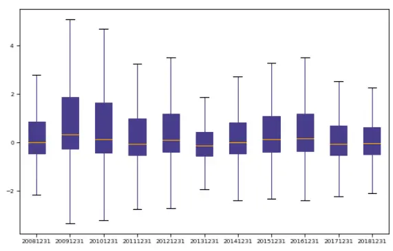
资料来源：Wind，光大证券研究所

图 7：现金偿债能力指标分布（构建方式二）
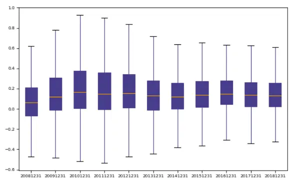
资料来源：Wind，光大证券研究所

图 8：现金偿债能力指标变化率分布（构建方式二）
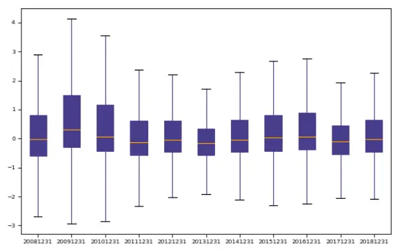
资料来源：Wind，光大证券研究所
敬请参阅最后一页特别声明

图 9：现金偿债能力指标分布（构建方式三）
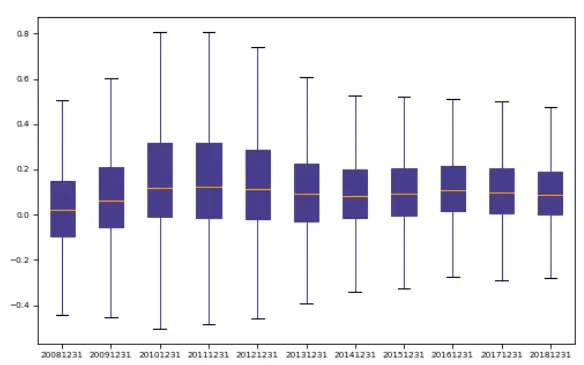
资料来源：Wind，光大证券研究所

图10：现金偿债能力指标变化率分布（构建方式三）
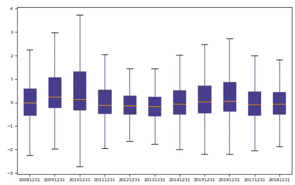
资料来源：Wind，光大证券研究所

综上所述，上述方式构造的现金偿债能力指标可较好地衡量企业的短期偿债压力，大部分企业现金资产可覆盖一年内到期的有息负债，并且偿债能力也是总体向好的。现金偿债能力指标表现较差的企业，具有较高的偿债压力和财务风险，须及时规避。

## 2、现金偿债能力因子测试：推荐稳定性因子

本篇报告尝试针对上述三种构造方式，分别以现金偿债能力指标本身、指标变化率、指标变化率的绝对值以及指标时间序列的标准差作为因子进行测试，一共测试了 12 个因子，测试框架及结果如下。

## 2.1、因子测试框架

在测试因子有效性及构建多空组合之前，我们会先对因子数据进行一定程度的清洗。对于因子数据的清洗和有效性检验在此前的多因子系列报告中已有详细阐述，这里仅作简单回顾。

绝对中位数法去极值：在因子测试阶段，由于因子本身的分布是否为正态分布无法确定，我们采用稳健的 MAD（绝对中位数法）去除极值更加合适。

截面标准化处理：通过横截面 z-score方法，以每个时间截面 t上的所有股票的为样本，分别计算其均值和标准差得到，如下式所示。此标准化方式属于因子的线性变换，并不会改变原始因子的分布特征。

$$
\mathrm{standard}(factor)_{jt}=\frac{factor_{jt}-\overline{factor_{t}}}{std(factor)_{t}}\tag{1}
$$

有效性及预测能力检验：我们计算行业中性与市值中性处理后的RankIC（因子值与股票次月收益率的秩相关系数），通过以下几个与IC 值相关的指标来判断因子的有效性和预测能力：IC 值的均值、IC值的标准差、IC 大于 0 的比例、IC 绝对值大于 0.02 的比例、IR。

表 2：分组回测框架

|  | 分组回测框架 |
| --- | --- |
| 时间区间 | 2010年1月1日至2019年12月31日 |
| 股票池 | 全市场股票(剔除选股日ST/PT股票；剔除上市不满一年的股票；剔除选股日由于停牌等因素无法买入的股票) |
| 调仓频率 | 每月第一个交易日调仓 |
| 股票权重 | 等权配置 |
| 交易费率 | 单边千分之三 |

资料来源：光大证券研究所

由于每个报告期的财务报表会延后发出，故对于财务数据的使用时间进行如下处理：

- 当计算因子日期月份小于4 月时，则采用前一年三季报的财务数据；

- 当计算因子日期月份大于等于4 月、小于8 月时，则采用今年一季报的财务数据；

- 当计算因子日期月份大于等于 8 月，小于 10 月时，则采用今年半年报的财务数据；

- 当计算因子日期月份大于等于 10 月时，则采用今年三季报的财务数据。

对于上述三种构造方式下的偿债能力指标，我们均用如下方法分别构建偿债能力因子、变化率因子、稳定性因子等。其中，偿债能力变化率因子较大，说明该企业偿债能力指标相比上个报告期有明显提升；偿债能力稳定性因子较大，则说明企业偿债能力指标在过去的报告期中，存在较大变化。

表 3：偿债能力类因子构造方式

| 因子名称 | 因子简称 | 构造方式 |
| --- | --- | --- |
| 偿债能力因子 | CFPA | 当期现金偿债能力指标 |
| 偿债能力变化率 | CFPA_qoq | (当期指标值-上期指标值）/abs（上期指标值) |
| 偿债能力稳定性1 | CFPA_qoq_abs | -Abs（偿债能力变化率） |
| 偿债能力稳定性 2 | CFPA_std | 过去8个季度偿债能力指标的标准差取负 |

资料来源：光大证券研究所

## 2.2、因子测试：偿债能力稳定性因子有效性相对较好

我们在上述框架下测试了偿债能力类因子的有效性，有如下结论：

现金偿债能力因子具有一定的选股效果，但稳定性相对较弱。从因子表现来看，偿债能力因子的 IC 均值表现相对较好，而 IR 表现不佳，说明该因子稳定性较弱。对比不同构造方式的因子表现，不难发现构造方式一、二的偿债能力因子略优于构造方式三，说明通过过去一年经营性现金流净额外推未来的现金流，是具有一定参考价值的。

偿债能力变化率因子表现不佳。偿债能力的变化率因子 IC、IR 表现均不佳，说明偿债能力大幅提升对于企业并不一定是利好信号，如现金资产大幅增加，也有可能造成资源的浪费和资源利用效率的降低。

较为推荐偿债能力稳定性因子。从因子表现来看，偿债能力稳定性因子相比偿债能力因子在因子稳定性方面有比较明显的提升，其 IC、IR 为负数，说明偿债能力较为稳定的企业，未来收益表现较好。其中构造方式二的偿债能力稳定性因子 2（采用标准差衡量稳定性）表现最好，IC均值达到 1.27%，IR 达到 0.26。

表 4：偿债能力类因子 IC-IR 统计

| 因子 | 构造方式 | IC 均值 | IR |
| --- | --- | --- | --- |
| 偿债能力因子 | 方式一 | 1.20% | 0.16 |
|  | 方式二 | 1.43% | 0.14 |
|  | 方式三 | 1.02% | 0.10 |
| 偿债能力变化率因子 | 方式一 | 0.12% | 0.04 |
|  | 方式二 | 0.45% | 0.14 |
|  | 方式三 | 0.04% | 0.01 |
| 偿债能力稳定性因子1 | 方式一 | 0.76% | 0.18 |
|  | 方式二 | 0.88% | 0.21 |
|  | 方式三 | 0.48% | 0.14 |
| 偿债能力稳定性因子2 | 方式一 | 0.43% | 0.08 |
|  | 方式二 | 1.27% | 0.26 |
|  | 方式三 | 0.91% | 0.23 |

资料来源：光大证券研究所（统计时间：2010年 1 月1 日至 2019 年 12 月 31 日）

- 建筑、电力及公用事业、建材、钢铁、食品饮料、医药等行业可关注偿债能力因子。偿债能力因子（方式二）分行业的 IC、IR 表现如下图所示，不难发现，建筑、电力及公用事业、建材、钢铁、食品饮料等行业内，偿债能力因子的 IC、IR 均优于其他行业，其中，建筑、电力及公用事业、建材、钢铁行业均为资本密集型行业，有息负债率相对较高1，可重点关注其偿债能力因子。

图11：偿债能力因子（方式二）分行业 IC、IR表现
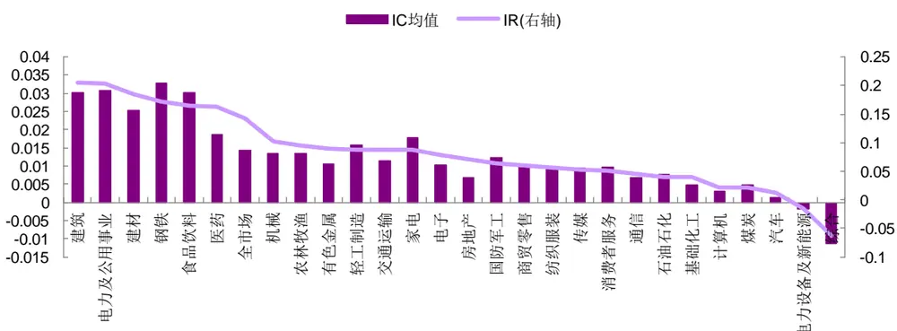
资料来源：Wind，光大证券研究所（统计时间：2010年 1月 1 日至 2019年 12月 31 日）

## 2.3、偿债能力稳定性因子在建材行业内有效性更佳

由上述结果可以看出，用标准差构建的偿债能力稳定性因子（方式二）有效性最高，本部分我们将针对该因子进行更详细的分析展示（以下均称为偿债能力稳定性因子）。

偿债能力稳定性因子在行业市值中性化后，稳定性有所提升。行业、市值中性化处理后，偿债能力稳定性因子IC 均值表现有所下滑，但 IR 从0.26 变为 0.30，因子稳定性提升明显。

- 偿债能力稳定性因子在宽基指数内表现不佳。如下表所示，我们测试了中证 500、中证1000 成分股内，偿债能力稳定性因子的有效性，从IC、IR 来看，表现均不佳。

图12：偿债能力稳定性因子的IC序列历史表现（全市场）
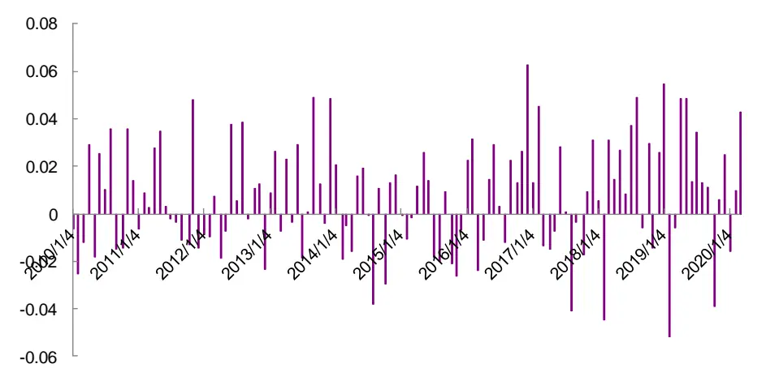
资料来源：Wind，光大证券研究所（截止于 2020 年 3 月 31 日）

表 5：偿债能力稳定性因子 IC、IR 统计

| 非行业中性 |  |  |
| --- | --- | --- |
|  | 全市场 中证500 中证1000 | 行业中性 全市场 中证500 中证1000 |
| IC 均值 1.3% | 1.0% 1.1% | 0.7% 0.3% 0.6% |
| IC 标准差 5.0% | 6.8% 6.1% | 2.3% 5.1% 3.7% |
| ICIR 0.256 | 0.146 0.173 | 0.300 0.065 0.175 |
| IC>0 比例 58.5% | 55.3% 49.2% | 57.7% 55.3% 55.4% |
| IC>0.02 比例 46.3% | 41.5% 36.9% | 30.1% 38.2% 32.3% |

资料来源：Wind，光大证券研究所（统计时间：2010 年1 月1 日至 2019 年12 月31 日）

建材、交运等行业可关注偿债能力稳定性因子。如下图所示，不同行业间，偿债能力稳定性因子差异明显，这也是偿债能力稳定性因子 IC 均值表现较弱的原因。其中，建材行业偿债能力稳定性因子 IC 均值为3.6%，IR 为 0.28；交运行业该因子 IC 均值为 2.5%，IR 为 0.22，有效性较强。

图 13：偿债能力稳定性因子分行业 IC、IR 表现
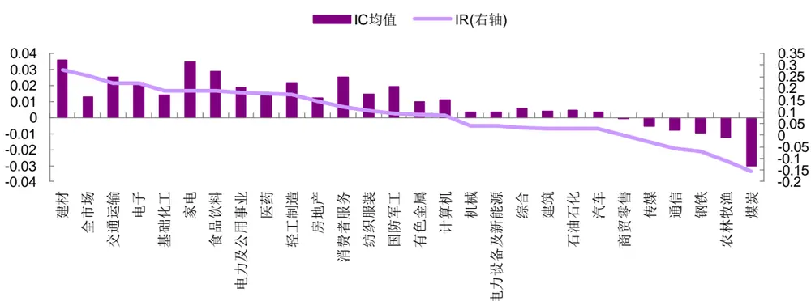
资料来源：Wind，光大证券研究所（统计时间：2010年 1月 1 日至 2019年 12月 31 日）

依据偿债能力稳定性因子进行分组测试，Group1 为因子值最高一组，Group5 为因子值最低一组，分别在全市场范围内（行业中性）、建材行业内的分组净值表现如下图所示。

2017 年以来，偿债能力稳定性因子分组表现较好。从不同时段的分组表现来看，偿债能力稳定性因子在 2012 年以前，分组无明显区分度，但2017年以后，因子值最高一组（Group1）收益表现较好，具有稳定的超额收益。其缺点在于Group3-5组的单调性较差。

- 建材行业内，偿债能力稳定性因子具有较强的选股能力。建材行业内，偿债能力稳定性因子的分组单调性亦不完美，但 Group1 收益显著优于其他各组，且具有较好的稳定性。

图14：偿债能力稳定性因子分组净值（行业中性）
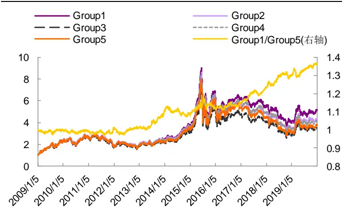
资料来源：Wind，光大证券研究所（截止于 2019 年 12 月31 日）

图 15：偿债能力稳定性因子分组净值（建材）
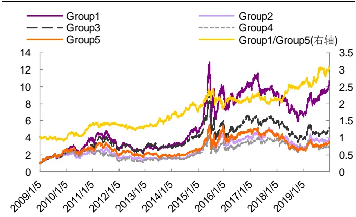
资料来源：Wind，光大证券研究所（截止于 2019 年 12 月31 日）

行业、市值中性化后，偿债能力稳定性因子与传统因子相关性较低。我们通过因子 IC 序列相关系数的角度观察偿债能力稳定性因子与传统因子之间的相关性，如下图所示。不难看出，该因子与反转、价值、成长、盈利等传统因子的相关性均较低。

图16：偿债能力稳定性因子与传统因子的IC序列相关性系数
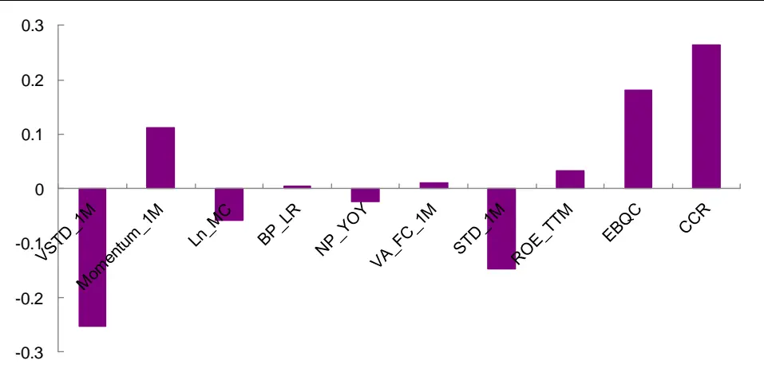
资料来源：Wind，光大证券研究所（统计时间：2010 年1 月1 日至 2019 年12 月31 日）

综上所述，偿债能力类的因子在全市场范围内表现较为一般，主要是因为不同行业间差异较大。资本密集型的行业，如建筑、公用事业等，推荐关注现金偿债能力因子；建材、交运等行业则建议关注现金偿债能力稳定性因子。

## 3、应用：行业筛选和个股排雷均有参考价值

本部分我们尝试将偿债能力类的指标进行应用，测试了两个层面下，该类指标的有效性：1）行业层面，依据行业整体偿债能力的强弱，构建行业轮动模型；2）选股层面，在行业中性条件下，观察偿债能力较弱的个股是否相对市场有明显的负向超额收益。

## 3.1、行业轮动：现金偿债能力稳定的行业长期来看可跑赢市场

我们依据中信一级行业分类，将行业内所有成分股的现金偿债能力类因子按流通市值加权的方式构造行业的偿债能力类指标。每月依据行业的偿债能力指标将所有行业均分为五组，在如下框架下测试各组行业的收益表现，其中，由于本篇报告构建的偿债类因子不适用于金融类行业，故测试过程中，均将金融类行业剔除。

表 6：行业分组回测框架

|  | 因子行业分组回测框架 |
| --- | --- |
| 时间区间 | 2010年2月1日至2019年12月31日 |
| 基础池 | 中信一级行业（剔除银行、非银金融、综合金融) |
| 调仓频率 | 月度调仓 |
| 分组调仓方式 | 每月初第一个交易日调仓，根据因子值从大到小排序将股票等分为10组，其中，Group1为因子值最大一组 |
| 行业权重 | 等权配置 |
| 交易费率 | 暂未考虑手续费 |

资料来源：光大证券研究所

由于偿债能力因子在不同行业之间差异较大，如果依据偿债能力因子筛选行业，会出现多头组合持续持有一小部分行业，几乎不换手的情况。因此，在后面的测试中，我们重点分析偿债能力稳定性因子 1（即用环比变化率的绝对值构建的）的测试结果。

多头收益较好，年化收益达 13.59%。如下图所示，偿债能力稳定性因子多头行业组合收益表现显著优于其他各组，年化收益达 13.59%，夏普比率达0.49。我们认为，该因子体现较多的可能为现金和现金流的稳定性，即现金和现金流较为稳定的行业长期来看可以贡献超额收益。

大部分年度均有超额收益。从分年度统计来看，除2010、2014年小幅跑输基准外（以中信一级行业等权指数为基准），其余大部分年份均有超额收益。

图17：偿债能力稳定性因子行业分组收益统计（中信一级行业）
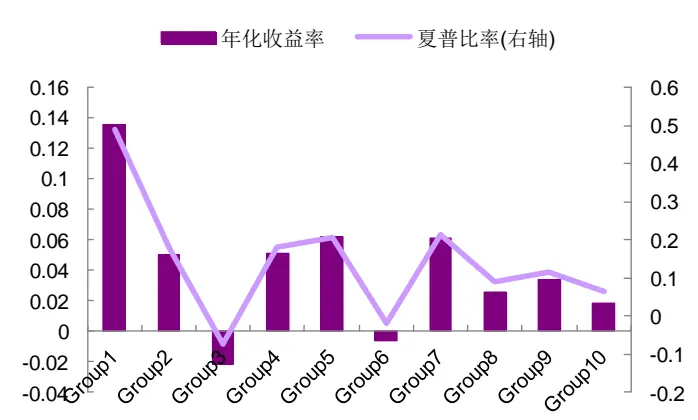
资料来源：Wind，光大证券研究所（注：截止于 2019 年 12月31 日，Group1 为因子值最大一组）

图 18：偿债能力稳定性因子行业分组 Group1 收益表现（中信一级行业）
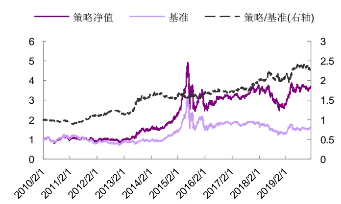
资料来源：Wind，光大证券研究所（注：截止于 2019 年 12月31 日；以行业等权指数为基准）
敬请参阅最后一页特别声明

表7：偿债能力稳定性因子行业分组 Group1收益统计

|  | 2010 | 2011 | 2012 | 2013 | 2014 | 2015 | 2016 | 2017 | 2018 | 2019 | 总体 |
| --- | --- | --- | --- | --- | --- | --- | --- | --- | --- | --- | --- |
| 收益率 | 11.7% | -18.9% | 6.2% | 60.8% | 41.4% | 67.5% | -9.4% | 14.0% | -25.5% | 41.3% | 13.6% |
| 波动率 | 27.7% | 22.2% | 22.9% | 26.6% | 21.2% | 50.6% | 28.0% | 12.9% | 25.9% | 21.3% | 27.7% |
| 超额收益 | -4.6% | 15.4% | 4.2% | 38.6% | -2.8% | 4.5% | 4.3% | 13.8% | 7.5% | 9.1% | 7.8% |
| 相对波动 | 8.9% | 7.8% | 7.4% | 14.8% | 8.2% | 12.4% | 8.1% | 7.5% | 12.1% | 11.9% | 10.4% |
| 信息比率 | -0.52 | 1.97 | 0.57 | 2.61 | -0.34 | 0.37 | 0.53 | 1.83 | 0.62 | 0.77 | 0.75 |
| 相对最大回撤 | -7.5% | -7.2% | -7.7% | -5.9% | -9.8% | -9.5% | -5.2% | -5.6% | -12.4% | -10.4% | -13.9% |
| 月度胜率 | 27.3% | 75.0% | 58.3% | 66.7% | 41.7% | 50.0% | 58.3% | 66.7% | 66.7% | 58.3% | 56.9% |

资料来源：Wind，光大证券研究所（注：数据截止于 2019年 12 月31 日；以行业等权指数为基准）

多头组合（Group1）长期持有食品饮料行业，部分持仓期数少的行业，在特定时段对组合超额收益亦有显著贡献。我们统计了 Group1 行业组合的具体持仓情况，发现该组合测试期内，绝大部分时间里均持有食品饮料行业。但具体看不同时段组合超额收益表现时，会发现部分持仓期数较少的行业，特定时段对组合的超额收益也有比较显著的贡献，如2013 年 5 月至 7 月期间，组合的超额收益主要来自于医药、计算机、传媒行业。

图19：测试期内各行业的持仓期数
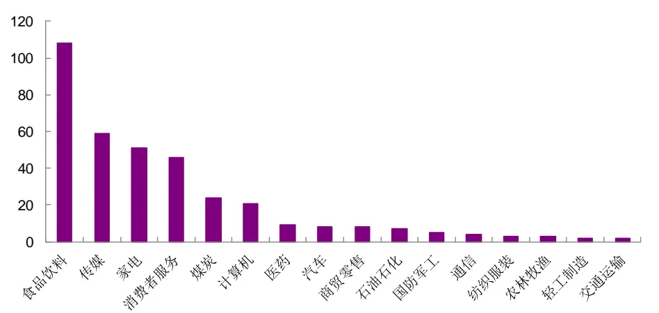
资料来源：Wind，光大证券研究所（统计期：2010年 2 月1日至 2019 年 12 月 31 日）

## 3.2、股票“排雷”：现金偿债压力较大的企业大部分时间跑输市场

投资者对于偿债能力指标的关注往往源于对企业财务风险的担忧，因此，本部分重点测试了偿债能力因子的“排雷”效果，包括通过方式一、方式二构建的因子，以下分别称为偿债能力因子 1 和偿债能力因子 2。

表 8：空头组合回测框架

|  | 因子空头组合测试框架 |
| --- | --- |
| 时间区间 | 2009年 1月1日至2019 年 12月31日 |
| 股票池 | 全部 A 股(剔除选股日ST/PT股票；剔除上市不满一年的股票；剔除选股日由于停牌等因素无法买入的股票；剔除金融行业) |
| 调仓频率 | 月度调仓 |
| 空头组合筛选方式 | 每月初第一个交易日调仓，根据本月未被剔除的股票数据计算相应因子值，依据中信一级行业分类，分别取每个行业内因子由大到小排序在后10%的股票，构建为空头组合 |
| 股票权重 | 等权配置 |
| 交易费率 | 暂未考虑手续费 |

资料来源：光大证券研究所

大部分年份内，现金偿债能力较弱的企业显著跑输市场。如下图所示，除2009、2010、2014、2015 年度，其余年份现金偿债能力弱的企业均稳定跑输市场；2016 年以来年均跑输市场4个百分点以上。

图20：现金偿债能力因子1空头组合净值表现（行业中性）
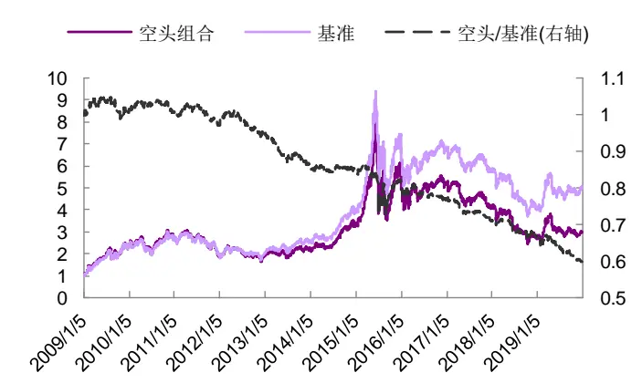
资料来源：Wind，光大证券研究所（注：截止于 2020 年 4 月 10日；基准为全市场等权指数）

图21：现金偿债能力因子2空头组合净值表现（行业中性）
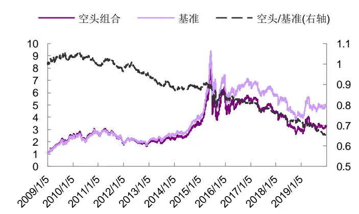
资料来源：Wind，光大证券研究所（注：截止于 2020 年 4 月 10日；基准为全市场等权指数）

表 9：现金偿债因子 1 空头组合历年收益表现统计（行业中性）

|  | 2009 | 2010 | 2011 | 2012 | 2013 | 2014 | 2015 | 2016 | 2017 | 2018 | 2019 | 总体 |
| --- | --- | --- | --- | --- | --- | --- | --- | --- | --- | --- | --- | --- |
| 收益率 | 153.9% | 15.9% | -30.2% | 3.2% | 17.2% | 51.5% | 89.9% | -13.0% | -20.0% | -35.4% | 15.7% | 12.0% |
| 波动率 | 36.6% | 27.9% | 24.9% | 25.8% | 22.1% | 20.7% | 54.3% | 35.2% | 17.0% | 26.6% | 26.2% | 30.6% |
| 超额收益 | 2.8% | 0.5% | -1.7% | -1.4% | -9.4% | 0.8% | 1.3% | -3.5% | -6.7% | -4.8% | -9.0% | -3.2% |
| 相对波动 | 4.8% | 3.4% | 3.1% | 3.5% | 3.6% | 3.1% | 10.8% | 4.9% | 2.6% | 3.5% | 4.4% | 4.9% |
| 信息比率 | 0.58 | 0.15 | -0.54 | -0.39 | -2.62 | 0.26 | 0.12 | -0.72 | -2.57 | -1.37 | -2.06 | -0.66 |
| 相对最大回撤 | -5.1% | -3.1% | -4.7% | -6.0% | -9.4% | -1.8% | -14.9% | -4.0% | -7.3% | -6.4% | -10.4% | -34.1% |
| 月度胜率 | 58.3% | 33.3% | 58.3% | 58.3% | 83.3% | 58.3% | 50.0% | 58.3% | 58.3% | 50.0% | 91.7% | 60.3% |

资料来源：Wind，光大证券研究所（注：数据截止于 2019 年 12 月 31 日；基准为全市场等权指数，月度胜率指跑输基准的概率）

表 10：现金偿债因子 2 空头组合历年收益表现统计（行业中性）

|  | 2009 | 2010 | 2011 | 2012 | 2013 | 2014 | 2015 | 2016 | 2017 | 2018 | 2019 | 总体 |
| --- | --- | --- | --- | --- | --- | --- | --- | --- | --- | --- | --- | --- |
| 收益率 | 160.1% | 12.1% | -30.2% | 2.9% | 20.9% | 52.6% | 93.7% | -13.4% | -19.1% | -35.4% | 17.6% | 12.8% |
| 波动率 | 36.5% | 28.0% | 25.0% | 25.9% | 22.3% | 20.8% | 54.1% | 35.1% | 17.1% | 26.4% | 26.0% | 30.6% |
| 超额收益 | 5.3% | -2.8% | -1.7% | -1.6% | -6.5% | 1.6% | 3.2% | -4.0% | -5.7% | -4.9% | -7.5% | -2.5% |
| 相对波动 | 4.8% | 3.2% | 3.0% | 3.2% | 3.3% | 3.2% | 10.2% | 4.9% | 2.8% | 3.4% | 4.1% | 4.6% |
| 信息比率 | 1.11 | -0.86 | -0.56 | -0.51 | -2.00 | 0.50 | 0.32 | -0.82 | -2.01 | -1.47 | -1.85 | -0.53 |
| 相对最大回撤 | -3.4% | -4.9% | -5.5% | -5.7% | -6.5% | -1.9% | -12.0% | -4.2% | -7.2% | -5.9% | -8.9% | -29.8% |
| 月度胜率 | 58.3% | 50.0% | 50.0% | 58.3% | 91.7% | 41.7% | 33.3% | 58.3% | 58.3% | 66.7% | 83.3% | 59.6% |

资料来源：Wind，光大证券研究所（注：数据截止于 2019年 12 月31 日；基准为全市场等权指数，月度胜率指跑输基准的概率）

在牛市或货币宽松政策下，现金偿债指标“排雷”可能失效。当市场处于牛市阶段时，投资者情绪高涨的状态下，市场情绪可能成为主要矛盾；而在货币政策宽松的时间段，企业的偿债压力容易通过展期等手段进行缓解，此时，企业的偿债能力可能也不是市场的关注点。这也正是前面测试发现偿债能力因子有效性不稳定的原因。

图22：M1同比与空头相对基准的对比走势
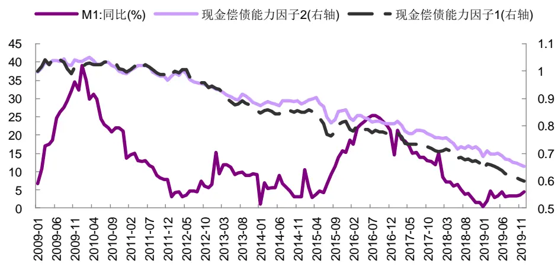
资料来源：Wind，光大证券研究所（注：截止于 2019 年 12 月 31 日）

我们统计了各个中信一级行业内，空头组合现金偿债因子最大值的平均数，作为风险预警值，如下图所示。

轻资产行业在可用于偿还债务的现金，只能覆盖40%以下的短期有息负债时，或者可用于偿还债务的现金相对短期有息负债的缺口占总资产比例达到10%以上时，企业将面临较大财务风险。

重资产行业在可用于偿还债务的现金只能覆盖 30%以下的短期有息负债时，或者可用于偿还债务的现金相对短期有息负债的缺口占总资产比例达到20%以上时，企业将面临较大的财务风险。

图23：现金偿债能力因子1空头组合各期因子最大值的平均数
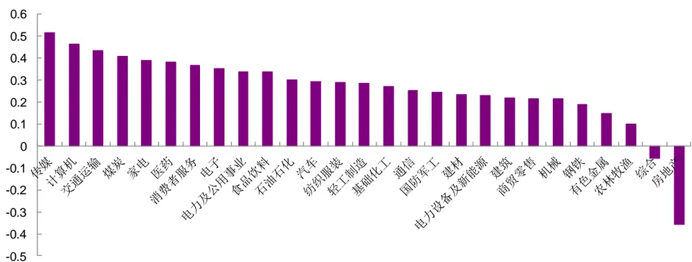
资料来源：Wind，光大证券研究所（统计时间：2009年 1月 1 日至 2019年 12月 31 日）

图24：现金偿债能力因子2空头组合各期因子最大值的平均数
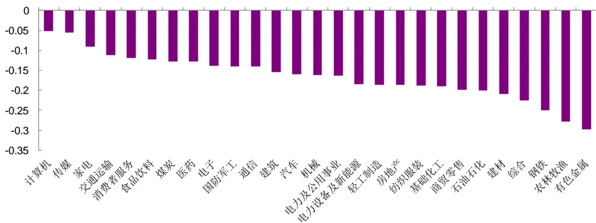
资料来源：Wind，光大证券研究所（统计时间：2009年 1月 1 日至 2019年 12月 31 日）

## 4、风险提示

本篇报告从财务数据的含义和特点出发，旨在充分挖掘财务数据之间勾稽关系的前提下，尝试构造对基本面因子进行创新性构造，加深对基本面因子逻辑的理解，随着市场的发展和环境的变化，可能存在如下风险：

- 首先，本篇报告基于现阶段会计准则下的财务数据进行研究，当会计准则存在变化时，财务数据含义可能发生变化，亦影响报告逻辑推演；

- 其次，上市公司若出现财务数据失真，会影响模型有效性；

- 最后，本篇报告推荐因子为偏长期的基本面因子，须警惕市场短期波动带来的风险。

## 行业及公司评级体系

| 评级 说明 |
| --- |
| 行 买入 未来6-12个月的投资收益率领先市场基准指数15%以上； |
| 增持 未来6-12个月的投资收益率领先市场基准指数5%至15%； |
| 中性 未来6-12个月的投资收益率与市场基准指数的变动幅度相差-5%至5%； |
| 减持 未来6-12个月的投资收益率落后市场基准指数5%至15%； |
| 卖出 未来6-12个月的投资收益率落后市场基准指数15%以上； |
| 因无法获取必要的资料，或者公司面临无法预见结果的重大不确定性事件，或者其他原因，致使无法给出明确的无评级投资评级。 |
| 基准指数说明：A股主板基准为沪深300指数；中小盘基准为中小板指；创业板基准为创业板指；新三板基准为新三板指数；港股基准指数为恒生指数。 |

## 分析、估值方法的局限性说明

本报告所包含的分析基于各种假设，不同假设可能导致分析结果出现重大不同。本报告采用的各种估值方法及模型均有其局限性，估值结果不保证所涉及证券能够在该价格交易。

## 分析师声明

本报告署名分析师具有中国证券业协会授予的证券投资咨询执业资格并注册为证券分析师，以勤勉的职业态度、专业审慎的研究方法，使用合法合规的信息，独立、客观地出具本报告，并对本报告的内容和观点负责。负责准备以及撰写本报告的所有研究人员在此保证，本研究报告中任何关于发行商或证券所发表的观点均如实反映研究人员的个人观点。研究人员获取报酬的评判因素包括研究的质量和准确性、客户反馈、竞争性因素以及光大证券股份有限公司的整体收益。所有研究人员保证他们报酬的任何一部分不曾与，不与，也将不会与本报告中具体的推荐意见或观点有直接或间接的联系。

## 特别声明

光大证券股份有限公司（以下简称“本公司”）创建于 1996 年，系由中国光大（集团）总公司投资控股的全国性综合类股份制证券公司，是中国证监会批准的首批三家创新试点公司之一。根据中国证监会核发的经营证券期货业务许可，本公司的经营范围包括证券投资咨询业务。

本公司经营范围：证券经纪；证券投资咨询；与证券交易、证券投资活动有关的财务顾问；证券承销与保荐；证券自营；为期货公司提供中间介绍业务；证券投资基金代销；融资融券业务；中国证监会批准的其他业务。此外，本公司还通过全资或控股子公司开展资产管理、直接投资、期货、基金管理以及香港证券业务。

本报告由光大证券股份有限公司研究所（以下简称“光大证券研究所”）编写，以合法获得的我们相信为可靠、准确、完整的信息为基础，但不保证我们所获得的原始信息以及报告所载信息之准确性和完整性。光大证券研究所可能将不时补充、修订或更新有关信息，但不保证及时发布该等更新。

本报告中的资料、意见、预测均反映报告初次发布时光大证券研究所的判断，可能需随时进行调整且不予通知。在任何情况下，本报告中的信息或所表述的意见并不构成对任何人的投资建议。客户应自主作出投资决策并自行承担投资风险。本报告中的信息或所表述的意见并未考虑到个别投资者的具体投资目的、财务状况以及特定需求。投资者应当充分考虑自身特定状况，并完整理解和使用本报告内容，不应视本报告为做出投资决策的唯一因素。对依据或者使用本报告所造成的一切后果，本公司及作者均不承担任何法律责任。

不同时期，本公司可能会撰写并发布与本报告所载信息、建议及预测不一致的报告。本公司的销售人员、交易人员和其他专业人员可能会向客户提供与本报告中观点不同的口头或书面评论或交易策略。本公司的资产管理子公司、自营部门以及其他投资业务板块可能会独立做出与本报告的意见或建议不相一致的投资决策。本公司提醒投资者注意并理解投资证券及投资产品存在的风险，在做出投资决策前，建议投资者务必向专业人士咨询并谨慎抉择。

在法律允许的情况下，本公司及其附属机构可能持有报告中提及的公司所发行证券的头寸并进行交易，也可能为这些公司提供或正在争取提供投资银行、财务顾问或金融产品等相关服务。投资者应当充分考虑本公司及本公司附属机构就报告内容可能存在的利益冲突，勿将本报告作为投资决策的唯一信赖依据。

本报告根据中华人民共和国法律在中华人民共和国境内分发，仅向特定客户传送。本报告的版权仅归本公司所有，未经书面许可，任何机构和个人不得以任何形式、任何目的进行翻版、复制、转载、刊登、发表、篡改或引用。如因侵权行为给本公司造成任何直接或间接的损失，本公司保留追究一切法律责任的权利。所有本报告中使用的商标、服务标记及标记均为本公司的商标、服务标记及标记。

光大证券股份有限公司版权所有。保留一切权利。

## 联系我们

| 上海 | 北京 | 深圳 |
| --- | --- | --- |
| 静安区南京西路1266号恒隆广场1号 写字楼48 层 | 西城区月坛北街2号月坛大厦东配楼2层 复兴门外大街6号光大大厦17层 | 福田区深南大道 6011 号 NEO 绿景纪元大 厦 A 座 17 楼 |