## 科技关联因子：专利数据再挖掘——多因子系列报告之三十三

在报告《专利数据中有哪些 Alpha？——多因子系列报告之三十一》中，我们利用从专利数据库中直接提取的专利信息，构造了有效的专利因子。然而不同公司的科研成果并不是独立的，一项科技进步的溢出效应将会影响科技关联度较高的一系列公司，这种效应将影响相关公司的基本面，并最终反应在股价中。本篇报告继续在专利数据基础上，考虑相同专利属性公司间的股价联动关系，以及不同分类专利带来的不同收益溢出效应，从更多的角度构造和挖掘专利数据中包含的具有选股能力的因子。

## 科技动量因子：利用专利数据中包含的科技关联度信息

Lee et al. (2019)提出具有一定研发实力和专利实力的上市公司的股票回报，相对于与其拥有类似专利水平公司的股价回报，会表现出可预期的滞后性。一个核心技术公司的同类公司获得了更高(更低)的回报，那么它在接下来的几个月里也会获得更高(更低)的回报。可利用IPC 分类号构造公司之间的科技关联度指标，来研究公司之间是否拥有类似的专利水平。科技关联度可以找出被行业以及上下游产业链忽视的公司之间的关联性。

结合动量指标和科技关联度构造的科技动量因子，整体预测能力表现一般，测试期内（2011-01-01 至 2020-03-31），基于 5 年期发明公布专利的科技动量因子 Tech_Momemtum_fmgb_5Y 的 IC 均值为 1.84%，IC_IR为 0.18。

## 科技动量领先因子：利用均值回复特征，因子预测能力提升

得到公司间的科技关联度后，除了可以从“动量”的角度来构建因子，也同样可以考虑从“收益领先性“的角度来构造因子。Tech_Mean_Rev_fmgb_5Y因子的IC均值为2.41%，IC_IR为0.25；多空年化收益为6.00%，多空收益夏普比为 1.41，多头年化超额收益为 8.50%，多头收益的信息比为 1.64，相较于原始的科技动量因子 Tech_Momemtum_fmgb_5Y 各项表现均有显著提升。

## 科技动量因子的改进：结合专利关联度可有效提高稳定性

在构建科技关联度时，默认的假设是不同分类的专利之间是相互独立的，但实际上不同的专利类别之间也存在着一定的关联性。我们在构建科技关联度时将不同专利类别间的关联度信息一同纳入考虑，改造后的，结合专利关联度的 5年期发明公布科技动量领先因子（Improved_Tech_Mean_Rev_fmgb_5Y）IC 均值达到 2.55%，IC_IR 为 0.23；多空年化收益为7.50%，多空收益夏普比为 1.67，同时因子多头组合年化超额收益为10.61%，多头组合信息比 2.11。

剥离常见风格因子（盈利、成长、估值、动量、波动、流动性等因子）后，该因子稳定性仍有提升，IC 均值提高至2.62%，IC_IR 提高至 0.24。

- 风险提示：结果均基于模型和历史数据，模型存在失效的风险。

## 金融工程深度

## 分析师

周萧潇 （执业证书编号：S0930518010005）

021-52523680

zhouxiaoxiao@ebscn.com

刘均伟 （执业证书编号：S0930517040001）

021-52523679

liujunwei@ebscn.com

## 相关研究

《因子正交与择时：基于分类模型的动

态权重配置——多因子系列报告之十》《爬罗剔抉：一致预期因子分类与精选——多因子系列报告之十一》

《成长因子重构与优化：稳健加速为王——多因子系列报告之十二》

《组合优化算法探析及指数增强实证——多因子系列报告之十三 》

《以质取胜：EBQC 综合质量因子详解

——多因子系列报告之十七》

《创新基本面因子：财务数据全扫描

——多因子系列报告之二十六》

《ESG 投资与 ESG 因子策略

——多因子系列报告之二十七》

《再论估值因子：因子重构 or 收益预判？

——多因子系列报告之二十九》

《有息负债：解读企业杠杆的选股信息多因子系列报告之三十》
《专利数据中有哪些 Alpha？多因子系列报告之三十一》

在报告《专利数据中有哪些 Alpha？——多因子系列报告之三十一》中，我们利用从专利数据库中直接提取的专利信息，构造了有效的专利因子。但报告构造的专利因子只停留在每个公司自身的专利水平和研发水平，没有考虑到相同研发水平公司间存在的股价关联性，以及不同分类的专利产生的收益溢出效应。

不同公司的科研成果并不是独立的，一项科技进步的溢出效应将会影响科技关联度较高的一系列公司，这种效应将影响相关公司的基本面，并最终反应在股价中。本篇报告将继续在专利数据基础上，考虑相同专利属性公司间的股价联动关系，以及不同分类专利带来的不同收益溢出效应，从更多的角度构造和挖掘专利数据中包含的具有选股能力的因子。

## 1、从专利数据到科技动量

## 1.1、专利 IPC 分类情况概述

在报告《专利数据中有哪些 Alpha？——多因子系列报告之三十一》中，我们通过每个公司在过去一段时间的专利 IPC 号（国际专利分类号）总数，构建了专利IPC 号总数专利因子，相比于其他专利因子，专利 IPC号总数专利因子的 IC、IC_IR 等指标也有较好的表现，说明专利数据中的 IPC 号能够为投资者提供一个较为有效的角度对专利数据进行分析。

IPC号是唯一国际通用的专利文献分类和检索工具，得到国际认证的专利将获得 IPC 号，一个专利的技术内容，往往涉及好几个分类的内容，因而可能有多个分类号。

国际专利分类系统按照技术主题设立类目，把整个技术领域分为5 个不同等级，在第一等级中一共有8 种不同的分类部：A（人类必需品）、B（作业、运输）、C（化学、冶金）、D（纺织、造纸）、E（固定建筑物）、F（机械工程、照明、加热、武器、爆破）、G（物理）、H（电学）。在每个一级分类部下，又对应着不同的二级分类大类，一共有 145 个二级分类大类。以A 分类部下的二级分类大类为例，下表给出了A分类部下的二级分类大类情况。

表 1：A 分类部专利详细二级大类含义表

| IPC 二级分类号 | 含义 |
| --- | --- |
| A01 | 农业；林业；畜牧业；狩猎；诱捕；捕鱼 |
| A21 | 焙烤；制作或处理面团的设备；焙烤用面团 |
| A22 | 屠宰；肉品处理；家禽或鱼的加工 |
| A23 | 其他类不包含的食品或食料；及其处理 |
| A24 | 烟草；雪茄烟；纸烟；吸烟者用品 |
| A41 | 服装 |
| A42 | 帽类制品 |
| A43 | 鞋类 |
| A44 | 服饰缝纫用品；珠宝 |
| A45 | 手携物品或旅行品 |
| A46 | 刷类制品 |
| A47 | 家具；家庭用的物品或设备；咖啡磨；香料磨；一般吸尘器 |

| A61 | 医学或兽医学；卫生学 |
| --- | --- |
| A62 | 救生；消防 |
| A99 | 本部其他类目中不包括的技术主题 |

资料来源：国家知识产权局，光大证券研究所

图1给出了2010年以来，所有A 股上市公司每一年 IPC 一级分类部的专利数量统计情况，每一个一级分类部的专利数量都在逐年递增，其中 B分类部和 F 分类部的专利数量多于其他分类部，而 A 分类部、D 分类部和 E分类部的专利数量较少。

图 1：A 股上市公司分年度 IPC 一级分类部数量统计图
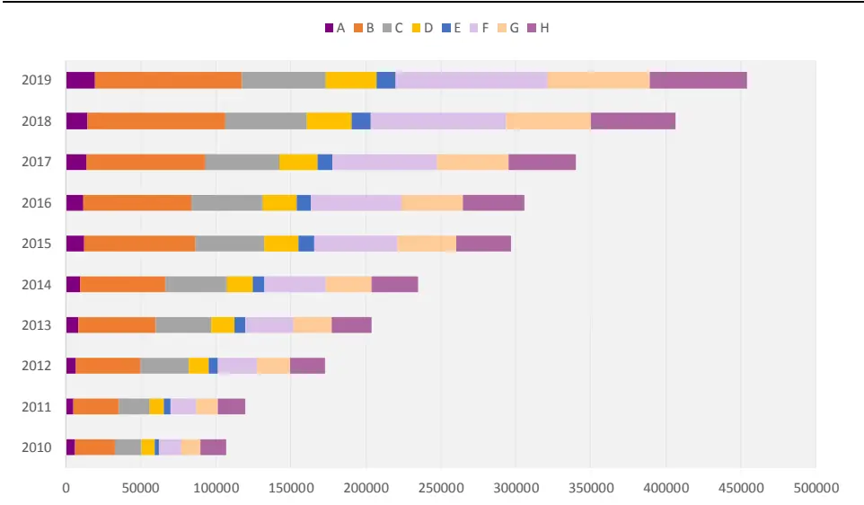
资料来源：通联数据，光大证券研究所，注：截至 2019 年 12 月 31 日 单位：例

图 2 给出了 2010 年以来，A 股各行业 IPC 一级分类部的专利数量统计情况，每一行业在不同类别的专利上都有所侧重，但专利总量较多的几个行业在每一个专利类别上都有所涉猎。

图 2：A 股各中信一级行业 IPC 一级分类部数量堆积柱状图
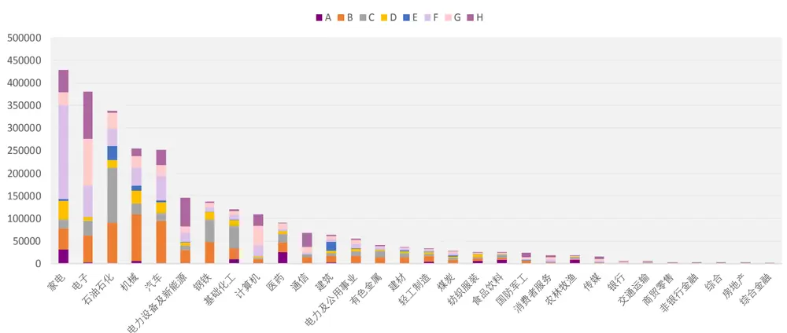
资料来源：通联数据，光大证券研究所，注：截至 2019 年 12 月 31 日
左轴单位：例

敬请参阅最后一页特别声明

一个专利可以映射到同一个 IPC 类别下的多个维度，一个专利的技术内容，往往涉及好几个分类的内容，因而可能有多个分类号，图3给出了单个专利二级分类大类的平均数量变化情况，可以看到，单个专利拥有的二级分类大类的平均数量在 1.4 到 1.9 之间波动，近年来，单个专利的平均二级分类大类数量有所增加，这表明中国A 股上市公司的专利质量在逐年增加，专利的实用性逐渐提高。

图3：A股上市公司单个专利平均二级分类大类平均数量
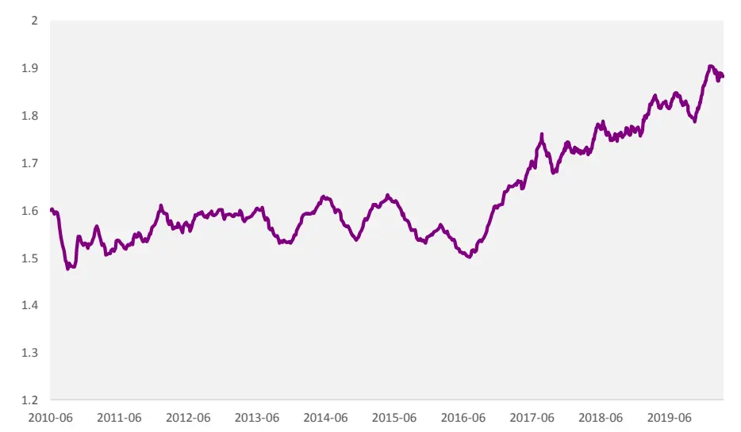
资料来源：通联数据，光大证券研究所，注：2010-01-01 至2019-12-31

## 1.2、科技动量因子

现如今，公司业务线非常复杂，很多时候两家公司的主营业务收入来源的区别，导致公司股价的关联性难以被发掘。从产品研发和创新领域来看，两个致力于科技研发和创新的公司有着更深层次的关联，Lee et al. (2019)给出了拥有强技术关联性的公司回报具有可预测性的证据。

具体来说，一个具有一定研发实力和专利实力的上市公司的股票回报，相对于与其拥有类似专利水平公司的股价回报，表现出了可预期的滞后性。一个核心技术公司的同类公司获得了更高(更低)的回报，那么它在接下来的几个月里也会获得更高(更低)的回报。

科技关联度可以找出被行业以及上下游产业链忽视的公司之间的关系。为了研究公司之间是否拥有类似的专利水平，我们首先需要构造公司之间的科技关联度。从本篇报告的上一部分可以看出，IPC 分类号的数量和分布，能够用来表现一个公司专利覆盖度和专利研发实力。我们利用 IPC 二级分类大类来构建公司之间的科技关联度，参照相关系数的计算方法，科技关联度的定义如下：

$$
Tech_{ij,t}=\frac{T_{i,t}T_{j,t}^{\prime}}{\left(T_{i,t}T_{i,t}^{\prime}\right)^{1/2}\left(T_{j,t}T_{j,t}^{\prime}\right)^{1/2}}
$$

其中：

$T_{i,t}$ 表示公司i在t时刻统计得到的，在过去一段时间各个分类上的专利个数，是一个维数为1×145的向量

$Tech_{ij,t}$ 表示公司i和公司j在t时刻的科技关联度

上述公式表示了两个公司在不同专利类别上的关联度，两个公司的科技关联度越高，表示它们拥有类似的专利研发水平，它们股价的相关性也将更为显著。基于此，我们利用科技关联度和公司股价的收益率构建了科技动量因子：

$$
Tech\_Momentum_{i,t}=\frac{\sum_{j\neq i}Tech_{ij,t}\cdot Ret_{j,t}}{\sum_{j\neq i}Tech_{ij,t}}
$$

其中:

$Ret_{j,t}$ 表示公司j在t时刻过去一个月的股票收益率.

简单来说，我们赋予除公司i以外的每个A股的股价收益率不同的权重，与公司i拥有更高科技关联度的公司被赋予更高的权重，并求和，得到了公司i在t时刻的科技动量因子。

通过对专利数据库的观察，我们发现，外观设计类别的专利不具有和其他类别专利相同的IPC分类号，这是因为外观设计在国外属于设计（design）范畴，因此采用另外的分类方式。所以，和我们第一篇报告中专利因子的构造方式相同，我们通过滚动统计不同时间长度上的专利数量来构建科技关联度，分别在不同的专利类别上构造科技动量因子。各因子的命名方式为Tech_Momentum_xx_yy：

1) xx 表示专利类型：all 表示所有专利类型，fmgb 表示发明公布，fmsq表示发明授权，wgsj 表示外观设计；

## 1.2.1、科技动量因子：收益显著性较弱

在测试科技动量因子的预测能力等有效性指标时，考虑到因子的覆盖度和行业偏离度等因素，本文后续所有的因子测试的测试框架将沿用报告《专利数据中有哪些Alpha？——多因子系列报告之三十一》中相同的测试框架：

表 2：因子回测框架

|  | 专利因子回测框架 |
| --- | --- |
| 回测时间区间 | 2011年1月1日至2020年3月31日 |
| 回测股票池 | 属于机械、电子、电力设备及新能源、通信、基础化工、家电、钢铁、计算机、汽车、建材、医药、建筑、有色金属、轻工制造、国防军工、石油石化16个一级行业的股票（剔除选股日ST/PT股票；剔除上市不满一年的股票；剔除选股日由于停牌等因素无法买入的股票) |
| 调仓频率 | 月度调仓 |
| IC 指标 | IC为行业和市值中性化后，与下一期股票收益率的秩相关系数 |
| 分组方式 | 每月最后一个交易日收盘后，根据本月所有未被剔除的股票数据计算因子值，行业内根据因子值从小到大排序将股票等分为5组，分别计算每组股票的历史回测收益及多空组合收益。 |
| 多头超额收益 | 多头超额收益为行业内分组后，因子值最低的第一组的收益（等权加权）相对基准的超额收益，基准为因子测试股票池的等权组合。 |
| 交易费率 | 因子测试阶段暂不考虑交易费用 |

资料来源：光大证券研究所

由下表可见，本节构建的科技动量Tech_Momentum因子在收益预测能力和稳定性上的表现均较为一般。

值得关注的一点是，科技动量因子有两个特征与前一报告中的结论略有差异：

（1） 基于发明公布类型专利的科技动量因子表现相对较好；

（2） 时间维度上，基于滚动5年的专利数据的因子表现较好，且时间维度上的单调性较好。

由于科技动量因子中，关键指标是科技关联度指标Tecℎ ，需要较为完整和专利数据覆盖才能更精确的衡量不同公司之间的专利关联度，因此时间维度上需要更久的数据，同时发明公布类型的专利数量也是显著高于其他类型专利的。

表 3：科技动量因子测试结果

|  | IC mean | IC positive per | IC std | IR |
| --- | --- | --- | --- | --- |
| Tech_Momemtum_all_1Y | 1.49% | 55% | 10.13% | 0.15 |
| Tech_Momemtum_all_3Y | 1.66% | 56% | 10.83% | 0.15 |
| Tech_Momemtum_all_5Y | 1.71% | 58% | 11.25% | 0.15 |
| Tech_Momemtum_fmgb_1Y | 1.17% | 50% | 9.92% | 0.12 |
| Tech_Momemtum_fmgb_3Y | 1.79% | 58% | 10.20% | 0.18 |
| Tech_Momemtum_fmgb_5Y | 1.84% | 58% | 10.34% | 0.18 |
| Tech_Momemtum_fmsq_1Y | 0.90% | 50% | 9.15% | 0.10 |
| Tech_Momemtum_fmsq_3Y | 1.11% | 59% | 9.49% | 0.12 |
| Tech_Momemtum_fmsq_5Y | 1.44% | 57% | 9.74% | 0.15 |
| Tech_Momemtum_syxx_1Y | 0.46% | 55% | 8.33% | 0.06 |
| Tech_Momemtum_syxx_3Y | 1.23% | 55% | 9.57% | 0.13 |
| Tech_Momemtum_syxx_5Y | 1.45% | 56% | 9.80% | 0.15 |

资料来源：通联数据，光大证券研究所，注：2011-01-01 至 2020-03-31

我 们 以 IC_IR 最 高 的 5 年 期 发 明 公 布 科 技 动 量 因 子Tech_Momemtum_fmgb_5Y 为例，其历史 IC 时间序列上的稳定性相对较弱。

图 4：Tech_Momemtum_fmgb_5Y 因子 IC 序列
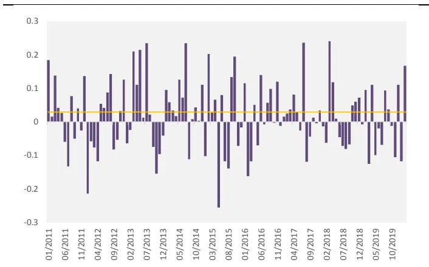
资料来源：光大证券研究所

图 5：Tech_Momemtum_fmgb_5Y 因子多头超额收益（第一组）
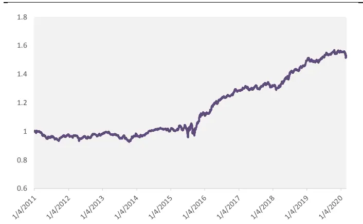
资料来源：光大证券研究所，注：基准为股票池等权（详见表 2）

Tech_Momemtum_fmgb_5Y 因子的多空年化收益为 4.80%，多空收益夏普比为1.02，多头年化超额收益为 4.70%。因子选股收益稳定性较为一般。

表 4：Tech_Momemtum_fmgb_5Y 因子收益表现

|  | Tech_Momemtum_fmgb_5Y |
| --- | --- |
| 多空年化收益 | 4.80% |
| 多空收益夏普比 | 1.02 |
| 多空收益最大回撤 | -8.3% |
| 多头年化超额收益 | 4.70% |
| 多头收益信息比 | 0.87 |
| 多头收益最大回撤 | -37% |

资料来源：通联数据，光大证券研究所，注：2011-01-01 至2020-03-31

考虑到Tech_Momemtum_fmgb_5Y因子中使用到了相关股票过去一个月的收益率，我们这里考察该因子与包括动量因子在内的主要大类因子之间IC 序列的相关性。由下图可见 Tech_Momemtum_fmgb_5Y 因子与大部分因子的相关性极低，仅与1个月动量因子有微弱的相关性，相关性为 0.21。

图 6：Tech_Momemtum_fmgb_5Y 与主要大类因子相关性
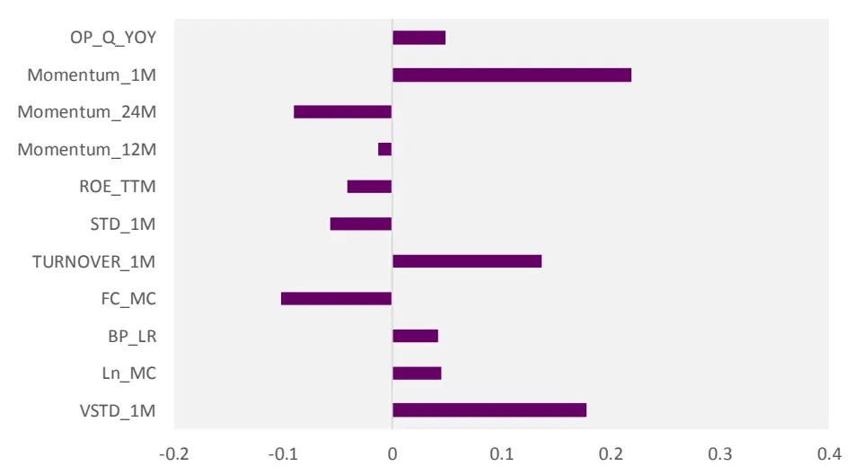
资料来源：通联数据，光大证券研究所，注：2011-01-01 至2020-03-31

## 1.3、科技动量领先因子

在得到公司间的科技关联度后，除了可以从“动量”的角度来构建因子，我们也同样考虑从“收益领先性” 或者也可以理解为“均值回复” 的角度来构造因子。

科技动量领先因子的构造方式有两种，分别为：

$$
Tech\_Mean\_Rev\_V1_{i,t}=\frac{\sum_{j\neq i}Tech_{ij,t}\cdot Ret_{j,t}}{\sum_{j\neq i}Tech_{ij,t}}-Ret_{i,t}
$$

$$
Tech_{-}Mean_{-}Rev_{-}V2_{i,t}=\frac{\sum_{j\neq i}\left(Tech_{ij,t}\cdot Ret_{j,t}-Ret_{i,t}\right)}{\sum_{j\neq i}Tech_{ij,t}}
$$

第一种构造方法中，我们在科技动量因子的基础上，直接减去公司i自身的股票收益率，差值大小表示公司i股价与全市场相似股票之间是否存在明显的滞后关系。

第二种构造方法中，在加权时每次都减去公司i本身在t时刻过去一个月的股票收益率，使得每一次加权时都比较公司i股价是否与专利水平相似公司j存在明显的滞后关系。

这两种构造方法的原理都是，若差值越大，表示专利水平相似公司的股价收益率高于公司i，公司i股价仍然具有上涨空间，若这一差值越小甚至为负，表示公司i的收益已经高于相似公司，股价不再具有上涨空间。

但第一种方法存在明显弊端，这一构造方法可能会导致构造的科技动量领先因子与传统动量因子存在明显的负相关关系，我们将通过具体的回测结果来对两种构造方法进行比对。

我们同样通过滚动统计不同时间长度上的专利数量来构建科技关联度，分别在不同的专利类别上构造科技动量领先因子。各因子的命名方式为Tech_Mean_Rev_V1_ xx_yy 和 Tech_Mean_Rev_V2_ xx_yy：

1) xx 表示专利类型：all 表示所有专利类型，fmgb 表示发明公布，fmsq表示发明授权，wgsj 表示外观设计；

## 1.3.1、两种构造方式因子表现差异明显

1.2 节中我们发现当涉及到科技关联度指标时，使用滚动 5 年的发明公布专利数量所构造的因子的表现相对较好，因此后文中我们将主要展示该类因子的相关改进因子的测试结果。

表 5：两种构造下的科技动量领先因子测试结果

|  | IC mean | IC positive per | IC std | IR |
| --- | --- | --- | --- | --- |
| Tech_Mean_Rev_V1_fmgb_5Y | 4.10% | 64% | 9.77% | 0.42 |
| Tech_Mean_Rev_V2_fmgb_5Y | 2.41% | 61% | 9.64% | 0.25 |

资料来源：通联数据，光大证券研究所，注：2011-01-01 至2020-03-31

仅从因子 IC 和 IC_IR 指标来看，Tech_Mean_Rev_V1_fmgb_5Y 因子的预测能力表现更出色，但下图因子相关性测试的结果中表明，该因子与一个月动量因子（Momentum_1M）之间存在极高的相关性，相关性达到-0.68。

图 7：Tech_Mean_Rev_V1_fmgb_5Y 因子相关性
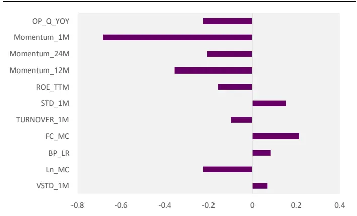
资料来源：通联数据，光大证券研究所，注：2011-01-01 至2020-03-31

图 8：Tech_Mean_Rev_V2_fmgb_5Y 因子相关性
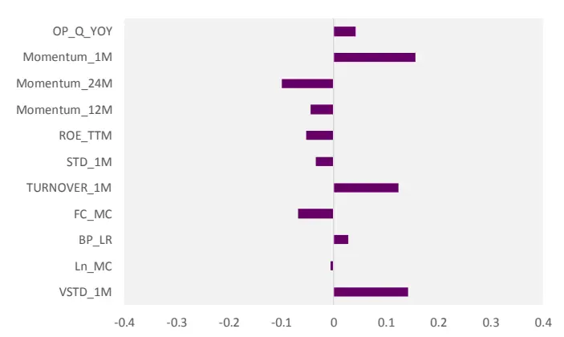
资料来源：通联数据，光大证券研究所，注：2011-01-01 至2020-03-31

与1个月动量因子之间的高相关性表明Tech_Mean_Rev_V1_fmgb_5Y因子的收益大部分是由因子计算公式：

$$
Tech\_Mean\_Rev\_V1_{i,t}=\frac{\sum_{j\neq i}Tech_{ij,t}\cdot Ret_{j,t}}{\sum_{j\neq i}Tech_{ij,t}}-Ret_{i,t}
$$

中减号右边的 $Ret_{i,t}]$ 贡献的，因子收益大部分由股票的反转效应提供，并无法很好的体现科技动量领先指标所希望体现的信息。

图 9：Tech_Momemtum_fmgb_5Y、Tech_Mean_Rev_V1_fmgb_5Y 和 Tech_Mean_Rev_V2_fmgb_5Y 因子值分布比较
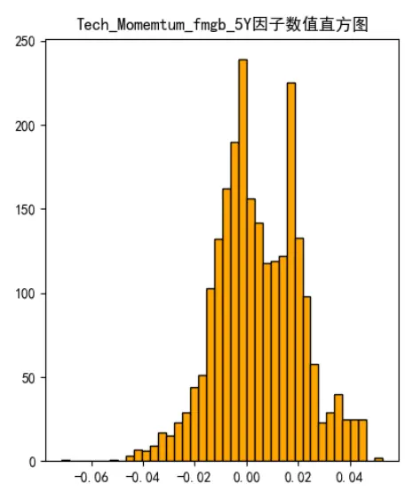
资料来源：通联数据，光大证券研究所，注：2020-02-28

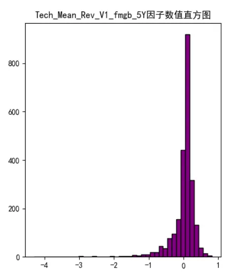

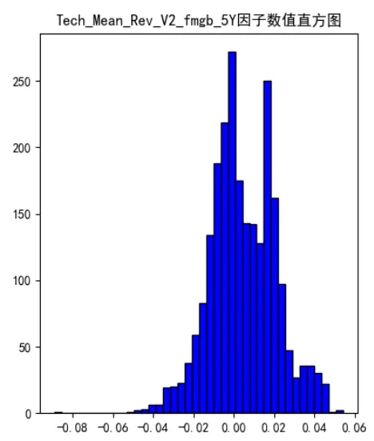

从上图中可以看出，Tech_Mean_Rev_V1_fmgb_5Y 的构造方式明显改变了 Tech_Momemtum_fmgb_5Y 因子的量级，使得因子值更加接近于 1 个月动量因子的量级，因子的分布情况也与科技动量因子有很大差异。而Tech_Mean_Rev_V2_fmgb_5Y 在保持因子量级不变的前提下结合均值回复效应，因子的分布情况和科技动量因子更加接近。

我 们 以 IC_IR 最 高 的 5 年 期 发 明 公 布 科 技 动 量 因 子Tech_Mean_Rev_V2_fmgb_5Y 为例，其历史 IC 时间序列上的稳定性相对较好，月度胜率由 Tech_Momemtum_fmgb_5Y 的 58%提高至了 61%。

图 10：Tech_Mean_Rev_V2_fmgb_5Y 因子 IC 序列
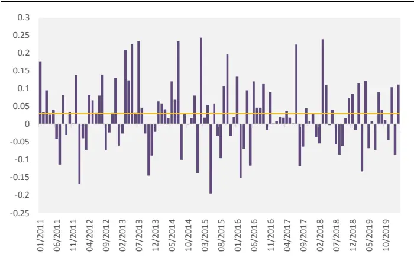
资料来源：光大证券研究所

图 11：Tech_Mean_Rev_V2_fmgb_5Y 因子多头超额收益（第一组）
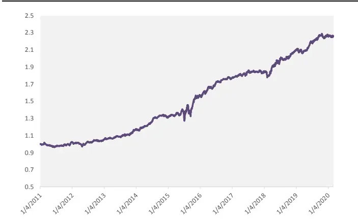
资料来源：光大证券研究所，注：基准为股票池等权（详见表 2）

Tech_Mean_Rev_V2_fmgb_5Y 因子的多空年化收益为 6.00%，多空收益夏普比为1.41，多头年化超额收益为 8.50%，多头收益的信息比为 1.64，相较于原始的科技动量因子Tech_Momemtum_fmgb_5Y各项表现均有显著提升。

表 6：Tech_Mean_Rev_V2_fmgb_5Y 因子收益表现

| Tech_Momemtum_fmgb_5Y Tech_Mean_Rev_V2_fmgb_5Y |  |  |
| --- | --- | --- |
| 多空年化收益 | 4.80% | 6.00% |
| 多空收益夏普比 | 1.02 | 1.41 |
| 多空收益最大回撤 | -8.3% | -3.90% |
| 多头年化超额收益 | 4.70% | 8.50% |
| 多头收益信息比 | 0.87 | 1.64 |
| 多头收益最大回撤 | -37% | -9.22% |

资料来源：通联数据，光大证券研究所，注：2011-01-01 至2020-03-31

综合上述结论，Tech_Mean_Rev_V2_fmgb_5Y 因子在构造上更为合理，且相比原始科技动量因子有了较为显著的改善效果，因此，我们将科技动量领先因子的定义方式确定为 Tech_Mean_Rev_V2的定义方式。

后 文 中 的 科 技 动 量 领 先 因 子 Tech_Mean_Rev 均 默 认 为Tech_Mean_Rev_V2 的构造方式。

## 2、科技动量因子的改进

## 2.1、利用技术行业集中度：改进效果一般

在科技动量因子和科技动量领先因子的构造过程中，我们默认每个公司的股价变化相比于同类型的公司是滞后的，但在实际中这一滞后现象并不会在每个公司的股票上完全出现，这会给我们构造的因子带来一定误差。虽然通过均值回复的方式我们减小了这一误差，但从回测结果中可以看出，因子的稳定性依然有待提升。

我们将从技术行业集中度（technology-specificity）的角度，对每个公司的信息滞后水平进行评价打分，构建基于技术行业集中度的科技动量因子和科技动量领先因子。

Lee et al. (2019)给出了技术行业集中度影响股价滞后水平的两个解释：

一种解释是，当核心公司的技术行业集中度更高时，科技公司的回报只是包含了更多关于公司估值的信息。

另一种解释是，因为重点科技公司的行业集中度很高，投资者更有可能低估同类科技公司回报率的全部价值含意。所以高技术行业集中度会导致较慢的或不太完整的信息传递，使得公司更有可能发生收益的滞后性，使得科技动量因子更具有可信度。

在构建技术行业集中度时，我们首先构建不同专利类别的行业集中度。我们统计得到不同二级分类专利号过去一年在不同行业上的分布情况，如图12给出了在时间点2020年3月31日，回滚过去一年统计得到的分类号A47和A61在各行业上的专利个数分布情况，纵坐标轴采用对数刻度。从图中可以看出，由于这两个分类的专利都属于人类必需品专利分类部，所以在各行业上的分布情况相近，但依然有所区别，更多的行业拥有分类号为 A61 的专利。

图12：回滚过去一年分类号 A47和 A61在 A股各中信一级行业上的专利个数分布
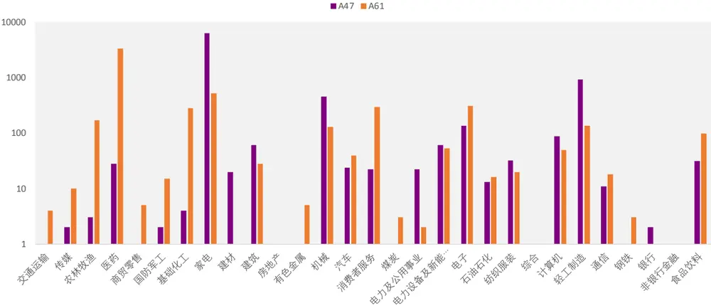
资料来源：通联数据，光大证券研究所，注：2020-03-31

定义每个分类号的专利在各个行业上的专利个数的标准差，为全市场每个类别专利的专利集中度。

对于每一个公司，我们分别计算公司在过去一年的所有类型专利的数量，并与专利集中度进行加权求和，就可以计算出一个公司在过去一年的技术行业集中度Tecℎ $\_Spec_{i,t}$ 。

公司的技术行业集中度越高，表明这一公司越有可能发生信息滞后现象，为了使得不同公司的技术行业集中度权重加和为 1，我们对技术行业集中度进行单位化，定义公司i在t时刻的技术行业集中度权重为：

$$
Weight\_Tech\_Spec_{i,t}=\frac{Tech\_Spec_{i,t}}{\sum_{i}reach\_Spec_{i,t}}
$$

我们分别通过以下方式，构造基于技术行业集中度的科技动量因子和科技动量领先因子：

$$
\begin{aligned}Tech\_Spec\_Momentum_{i}=\frac{\sum_{j\neq i}Tech_{ij,t}\cdot Ret_{j,t}}{\sum_{j\neq i}Tech_{ij,t}}\cdot Weight\_Tech\_Spec_{i,t}\\Tech\_type\_Mean\_Rev_{i,t}\\=\frac{\sum_{j\neq i}\left(Tech_{ij,t}\cdot Ret_{j,t}-Ret_{i,t}\right)}{\sum_{j\neq i}Tech_{ij,t}}\cdot Weight\_Tech\_Spec_{i,t}\end{aligned}
$$

基于技术行业集中度的各因子的命名方式，如下表：

表 7：改进的各科技动量因子命名表

| 因子含义 | 命名方式 |
| --- | --- |
| 基于技术行业集中度的科技动量因子 | Tech_Spec_Momentum_Factor_xx_yy |
| 基于技术行业集中度的科技动量领先因子 | Tech_Spec_Mean_Rev_Factor_xx_yy |

资料来源：光大证券研究所

1) xx 表示专利类型：all 表示所有专利类型，fmgb 表示发明公布，fmsq表示发明授权，wgsj 表示外观设计；

仍然以5年期发明公布专利数据构造的因子为例，改造后的基于技术行业集中度的科技动量因子和科技动量领先因子测试结果如下：

表8：改造后的科技动量因子与科技动量领先因子测试结果

|  | IC mean | IC positive per | IC std | IR |
| --- | --- | --- | --- | --- |
| Tech_Momentum_fmgb_5Y | 1.84% | 58% | 10.34% | 0.18 |
| Tech_Spec_Momentum_fmgb_5Y | 1.31% | 59% | 9.92% | 0.13 |
| Tech_Mean_Rev_fmgb_5Y | 2.41% | 61% | 9.64% | 0.25 |
| Tech_Spec_Mean_Rev_fmgb_5Y | 2.02% | 62% | 9.12% | 0.22 |

资料来源：通联数据，光大证券研究所，注：2011-01-01 至2020-03-31

结合技术行业集中度的科技动量因子和科技动量领先因子在IC和IC_IR的表现上出现下滑，因子胜率和稳定性上则有一定程度的提高。整体上看，Tech_spec因子的改进效果较为一般。

## 2.2、结合专利关联度的改进方法

在构建科技关联度时，我们认为不同分类的专利之间是独立的，但实际上不同的专利类别，特别是同一分类部下的专利类别之间有可能也存在着关联。为了在构建科技关联度时考虑不同专利类别间的关联，Nguyen et al.(2020)提供了一种新的构建科技关联度的方法。

在每个时刻t，除了可以构造科技关联度，我们还可以用相同的方法构建专利关联度：

$$
Pat_{\tau\xi,t}=\frac{\Omega_{\tau,t}\Omega_{\xi,t}^{\prime}}{\left(\Omega_{\tau,t}\Omega_{\tau,t}^{\prime}\right)^{1/2}\left(\Omega_{\xi,t}\Omega_{\xi,t}^{\prime}\right)^{1/2}}
$$

其中， $\mathit{\Omega}_{\tau,t}$ 表示分类号τ在t时刻统计得到的，在过去一段时间各个 A 股上的专利个数，是一个维数为1×上市公司数量的向量。 $Pat_{\tau\xi,t}$ 表示分类号τ和分类号ξ在t时刻的专利关联度。

在得到专利关联度后，我们通过以下的公式来构建改进的科技关联度：

$$
Tech\_Pat_{ij,t}=\frac{T_{i,t}\cdot Pat_{t}\cdot T_{j,t}^{\prime}}{\left(T_{i,t}T_{i,t}^{\prime}\right)^{1/2}\left(T_{j,t}T_{j,t}^{\prime}\right)^{1/2}}
$$

其中:

$Pat_{t}$ 是由 $Pat_{\tau\xi,t}$ 构成的维数为145 × 145的专利关联度矩阵.

Tecℎ $\_Pat_{ij,t}$ 为基于专利关联度计算得到的公司i和公司j在t时刻的科技关联度。

上述公式的直观解释是，在计算两个不同公司之间的科技关联时，我们考虑不同类别的专利之间也有相互影响的可能。上述公式可以改写为:

$$
Tech\_Pat_{ij,t}=\frac{\left(T_{i,t}\cdot Pat_{t}^{1/2}\right)\cdot\left(Pat_{t}^{1/2}\cdot T_{j,t}^{\prime}\right)}{\left(T_{i,t}T_{i,t}^{\prime}\right)^{1/2}\left(T_{j,t}T_{j,t}^{\prime}\right)^{1/2}}
$$

其中， $T_{i,t}\cdot Pat_{t}^{1/2}$ 同样为一个维数为1×145的向量，每一个位置上的元素除了公司i本身的专利数量，还加上了由公司i其他专利类型数量带来的影响。

图13：中国石化各专利分类数量占比柱状图
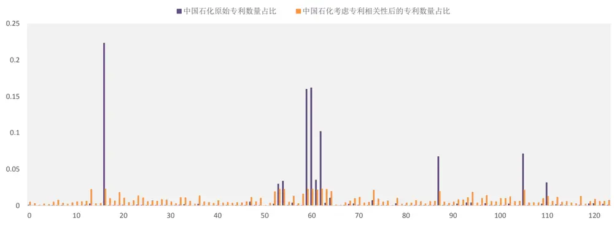
资料来源：通联数据，光大证券研究所，注：2020-03-31，横轴为不同专利二级分类

上图给出了在 2020 年 3 月 31 日统计得到的，中国石化过去 5 年各二级分类专利单位化数量情况。可以看到，原始的专利数量更为集中，考虑专利分类间的相关性之后，专利数量更加分散，与原始数量较多专利相关性比较大的几个分类专利，数量有所提升。

需要说明的是，如果不同类别的专利之间相互独立，那么 $Pat_{t}$ 是一个单位矩阵，Tecℎ $\_Pat_{ij,t}$ 便等于 $Tech_{ij,t}$ t。

在计算得到基于专利关联度的科技关联度后，我们便可以对本篇报告第一部分和第二部分构造的因子进行改进，具体的计算公式如下：

$$
\begin{aligned}Improved_{\_Tech\_Momentum_{i,t}}=\frac{\sum_{j\neq i}Tech_{\_}Pat_{ij,t}\cdot Ret_{j,t}}{\sum_{j\neq i}Tech_{\_}Pat_{ij,t}}\\Improved_{\_Tech\_Mean\_Rev_{i,t}}=\frac{\sum_{j\neq i}(Tech_{\_}Ta_{ij,t}\cdot Ret_{j,t}-Ret_{i,t})}{\sum_{j\neq i}Tech_{\_}Pat_{ij,t}}\\Improved_{\_}Tech\_Spec\_Momentum_{i,t}\\=\frac{\sum_{j\neq i}Tech\_Pat_{ij,t}\cdot Ret_{j,t}}{\sum_{j\neq i}Tech\_Pat_{ij,t}}\cdot Weight_{\_}Tech\_Spec_{i,t}\\Improved_{\_}Tech\_Spec\_Mean\_Rev_{i,t}\\=\frac{\sum_{j\neq i}(Tech\_Pat_{ij,t}\cdot Ret_{j,t}-Ret_{i,t})}{\sum_{j\neq i}Tech\_Pat_{ij,t}}\cdot Weight_{\_}Tech\_Spec_{i,t}\end{aligned}
$$

改进的各科技动量因子的命名方式如下表：

表 9：改进的各科技动量因子命名表

| 因子含义 | 命名方式 |
| --- | --- |
| 改进的科技动量因子 | Improved_Tech_Momentum_Factor_xx_yy |
| 改进的科技动量领先因子 | Improved_Tech_Mean_Rev_Factor_xx_yy |
| 改进的基于技术行业集中度的 科技动量因子 | Improved_Tech_Spec_Momentum_Factor_xx_yy |
| 改进的基于技术行业集中度的 科技动量领先因子 | Improved_Tech_Spec_Mean_Rev_Factor_xx_yy |

资料来源：光大证券研究所

1) xx 表示专利类型：all 表示所有专利类型，fmgb 表示发明公布，fmsq表示发明授权，wgsj 表示外观设计；

2) yy表示统计时长：1Y表示一年，3Y表示三年，5Y表示五年。

## 2.3、结合专利关联度的科技动量因子：有显著改善

仍然以5年期发明公布专利数据构造的因子为例，结合专利关联度的科技动量因子和科技动量领先因子测试结果如下：

表10：结合专利关联度的科技动量因子与科技动量领先因子测试结果

|  | IC mean | IC positive per | IC std | IR |
| --- | --- | --- | --- | --- |
| Tech_Momentum_fmgb_5Y | 1.84% | 58% | 10.34% | 0.18 |
| Improved_Tech_Momentum_fmgb_5Y | 2.12% | 57% | 11.92% | 0.18 |
| Tech_Spec_Momentum_fmgb_5Y | 1.31% | 59% | 9.92% | 0.13 |
| Improved_Tech_Spec_Momentum_fmgb_5Y | 1.72% | 60% | 12.42% | 0.13 |
| Tech_Mean_Rev_fmgb_5Y | 2.41% | 61% | 9.64% | 0.25 |
| Improved_Tech_Mean_Rev_fmgb_5Y | 2.55% | 59% | 11.22% | 0.23 |
| Tech_Spec_Mean_Rev_fmgb_5Y | 2.02% | 62% | 9.12% | 0.22 |
| Improved_Tech_Spec_Mean_Rev_fmgb_5Y | 3.18% | 61% | 12.12% | 0.26 |

资料来源：通联数据，光大证券研究所，注：2011-01-01 至2020-03-31

Improved_Tech_Spec_Mean_Rev_fmgb_5Y 因子 IC 均值达到 3.18%，IC_IR 为 0.26，是上述几种改造方式中表现最佳的。同时上述几种改造方式下的因子的多空收益和多头收益表现如下表所示：

表11：结合专利关联度的科技动量因子与科技动量领先因子收益表现
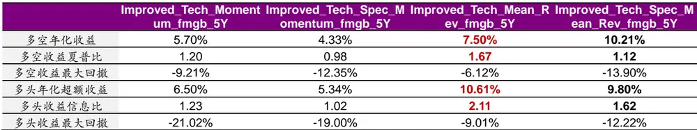
资料来源：通联数据，光大证券研究所，注：2011-01-01 至2020-03-31

Improved_Tech_Mean_Rev_fmgb_5Y 因子分组表现优异，其多空年化收益为7.50%，多空收益夏普比为 1.67，同时因子多头组合年化超额收益为

10.61%，多头组合信息比 2.11，因子收益稳定性较强，是上述几种改造方式中收益表现最为出色的因子。

因此下文我们主要展开分析 Improved_Tech_Mean_Rev_fmgb_5Y 因子的各方面表现以及与其他大类因子相关性上的表现：

具体分析结合专利关联度的 5 年期发明公布科技动量领先因子（Improved_Tech_Mean_Rev_fmgb_5Y）的预测能力和多头收益能力。因子的预测能力较为稳定，从 IC 序列来看，因子 2014 年至今的 IC 表现较为稳定。

图 14：Improved_Tech_Mean_Rev_fmgb_5Y 因子 IC序列
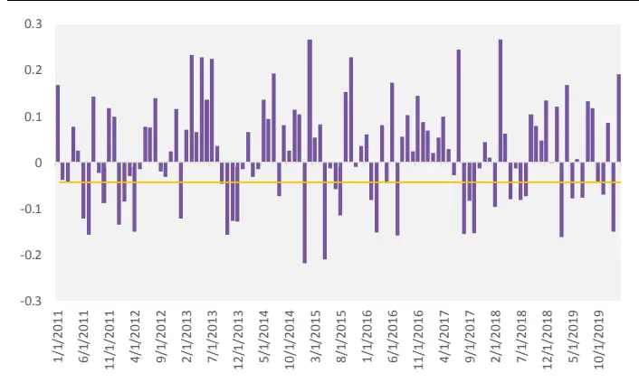
资料来源：光大证券研究所

图 15：Improved_Tech_Mean_Rev_fmgb_5Y 因子多空收益与多头超额收益（第一组）
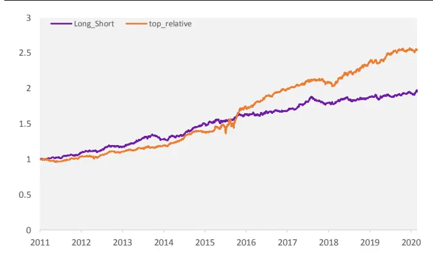
资料来源：光大证券研究所，注：基准为股票池等权（详见表 2）

结 合 专 利 关 联 度 的 5 年 期 发 明 公 布 科 技 动 量 领 先 因 子（Improved_Tech_Mean_Rev_fmgb_5Y）的多空收益较为稳定，多空收益的夏普比高达 1.67。

图 16：Improved_Tech_Mean_Rev_fmgb_5Y 与主要大类因子相关性
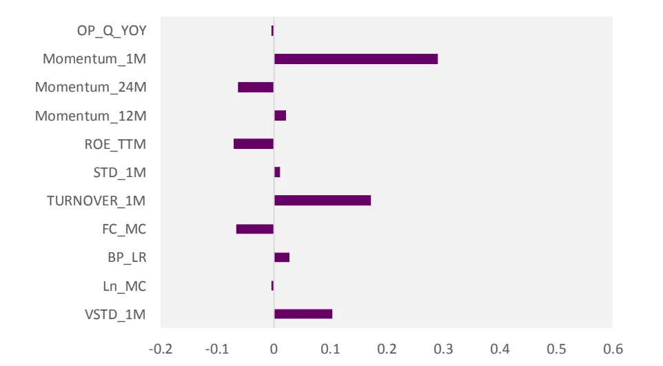
资料来源：通联数据，光大证券研究所，注：2011-01-01 至2020-03-31

考察该因子与包括动量因子在内的一些主要大类因子之间 IC 序列的相关性。可见 Improved_Tech_Mean_Rev_fmgb_5Y 因子与大部分因子的相关性极低，仅与1 个月动量因子有微弱的正向相关性，相关性为 0.29。

## 2.4、剥离常见风格因子后：稳定性提升

将 Improved_Tech_Mean_Rev_fmgb_5Y 因子与几个常用风格因子做截面回归中性化的处理，验证该因子是否的确可以提供稳定的超额 alpha 来源。

通过中性化处理剥离的因子包括盈利、成长、动量、波动、换手等常用因子，采用截面回归取残差的方式，将残差值作为中心化后的因子值。

表 12：中性化的因子列表

| 因子代码 因子含义 |  |
| --- | --- |
| ROE_TTM | ROE_TTM |
| OP_Q_YOY | 营业利润单季度同比 |
| Momentum_1M | 1个月动量 |
| STD_1M | 1 个月波动率 |
| TURNOVER_1M | 1 个月换手率 |
| BP_LR | 市净率 |

资料来源：光大证券研究所

中性化后，Neu_Improved_Tech_Mean_Rev_fmgb_5Y 因子的预测能力和稳定性未受到影响，反而得到一定程度的提升，IC 均值提高至 2.62%，IC_IR 提高至 0.24：

表13：中性化后结合专利关联度的科技动量因子与科技动量领先因子测试结果

|  | IC mean | IC positive per | IC std | IR |
| --- | --- | --- | --- | --- |
| Improved_Tech_Mean_Rev_fmgb_5Y | 2.55% | 59% | 11.22% | 0.23 |
| Neu_Improved_Tech_Mean_Rev_fmgb_5Y | 2.62% | 59% | 10.78% | 0.24 |

资料来源：通联数据，光大证券研究所，注：2011-01-01 至2020-03-31

中性化后，Neu_Improved_Tech_Mean_Rev_fmgb_5Y 因子的多空收益与多头超额收益表现有略微下降，但整体的稳定性表现仍然比较出色。

表14：中性化后结合专利关联度的科技动量因子与科技动量领先因子收益表现

| Improved_Tech_Mean_Rev_fmgb_5Y Neu_Improved_Tech_Mean_Rev_fmgb_5Y |  |  |
| --- | --- | --- |
| 多空年化收益 | 7.50% | 7.10% |
| 多空收益夏普比 | 1.67 | 1.62 |
| 多空收益最大回撤 | -6.12% | -6.30% |
| 多头年化超额收益 | 10.61% | 9.86% |
| 多头收益信息比 | 2.11 | 1.92 |
| 多头收益最大回撤 | -9.01% | -8.70% |

资料来源：通联数据，光大证券研究所，注：2011-01-01 至2020-03-31

由此可见结合专利关联度的 5 年期发明公布科技动量领先因子（Improved_Tech_Mean_Rev_fmgb_5Y）的具有比较稳定的与现有常用风格因子低相关的 alpha 信息。

## 3、风险提示

报告结论均基于模型和历史数据，模型存在失效的可能，历史数据存在不被重复验证的可能。

## 4、参考文献

[1] Charles M.C. Lee, Stephen Teng Sun, Rongfei Wang, Ran Zhang, Technological Links and Predictable Returns[J], Journal of Financial Economics, 132(2019): 76–96.

[2] Phuong-Anh Nguyen, Ambrus Kecskés, Do Technology Spillovers Affect the Corporate Information Environment[J], Journal of Corporate Finance, 62(2020): 101581.

## 行业及公司评级体系

| 评级 说明 |  |  |
| --- | --- | --- |
| 行 | 买入 | 未来6-12个月的投资收益率领先市场基准指数15%以上； |
|  | 增持 | 未来6-12个月的投资收益率领先市场基准指数5%至15%； |
|  | 中性 | 未来6-12个月的投资收益率与市场基准指数的变动幅度相差-5%至5%; |
|  | 减持 | 未来6-12个月的投资收益率落后市场基准指数5%至15%； |
|  | 卖出 | 未来6-12个月的投资收益率落后市场基准指数15%以上； |
| 业及公司评级 | 无评级 投资评级。 | 因无法获取必要的资料，或者公司面临无法预见结果的重大不确定性事件，或者其他原因，致使无法给出明确的 |
| 基准指数说明：A股主板基准为沪深300指数；中小盘基准为中小板指；创业板基准为创业板指；新三板基准为新三板指数；港 股基准指数为恒生指数。 |  |  |

## 分析、估值方法的局限性说明

本报告所包含的分析基于各种假设，不同假设可能导致分析结果出现重大不同。本报告采用的各种估值方法及模型均有其局限性，估值结果不保证所涉及证券能够在该价格交易。

## 分析师声明

本报告署名分析师具有中国证券业协会授予的证券投资咨询执业资格并注册为证券分析师，以勤勉的职业态度、专业审慎的研究方法，使用合法合规的信息，独立、客观地出具本报告，并对本报告的内容和观点负责。负责准备以及撰写本报告的所有研究人员在此保证，本研究报告中任何关于发行商或证券所发表的观点均如实反映研究人员的个人观点。研究人员获取报酬的评判因素包括研究的质量和准确性、客户反馈、竞争性因素以及光大证券股份有限公司的整体收益。所有研究人员保证他们报酬的任何一部分不曾与，不与，也将不会与本报告中具体的推荐意见或观点有直接或间接的联系。

## 特别声明

光大证券股份有限公司（以下简称“本公司”）创建于 1996 年，系由中国光大（集团）总公司投资控股的全国性综合类股份制证券公司，是中国证监会批准的首批三家创新试点公司之一。根据中国证监会核发的经营证券期货业务许可，本公司的经营范围包括证券投资咨询业务。

本公司经营范围：证券经纪；证券投资咨询；与证券交易、证券投资活动有关的财务顾问；证券承销与保荐；证券自营；为期货公司提供中间介绍业务；证券投资基金代销；融资融券业务；中国证监会批准的其他业务。此外，本公司还通过全资或控股子公司开展资产管理、直接投资、期货、基金管理以及香港证券业务。

本报告由光大证券股份有限公司研究所（以下简称“光大证券研究所”）编写，以合法获得的我们相信为可靠、准确、完整的信息为基础，但不保证我们所获得的原始信息以及报告所载信息之准确性和完整性。光大证券研究所可能将不时补充、修订或更新有关信息，但不保证及时发布该等更新。

本报告中的资料、意见、预测均反映报告初次发布时光大证券研究所的判断，可能需随时进行调整且不予通知。在任何情况下，本报告中的信息或所表述的意见并不构成对任何人的投资建议。客户应自主作出投资决策并自行承担投资风险。本报告中的信息或所表述的意见并未考虑到个别投资者的具体投资目的、财务状况以及特定需求。投资者应当充分考虑自身特定状况，并完整理解和使用本报告内容，不应视本报告为做出投资决策的唯一因素。对依据或者使用本报告所造成的一切后果，本公司及作者均不承担任何法律责任。

不同时期，本公司可能会撰写并发布与本报告所载信息、建议及预测不一致的报告。本公司的销售人员、交易人员和其他专业人员可能会向客户提供与本报告中观点不同的口头或书面评论或交易策略。本公司的资产管理子公司、自营部门以及其他投资业务板块可能会独立做出与本报告的意见或建议不相一致的投资决策。本公司提醒投资者注意并理解投资证券及投资产品存在的风险，在做出投资决策前，建议投资者务必向专业人士咨询并谨慎抉择。

在法律允许的情况下，本公司及其附属机构可能持有报告中提及的公司所发行证券的头寸并进行交易，也可能为这些公司提供或正在争取提供投资银行、财务顾问或金融产品等相关服务。投资者应当充分考虑本公司及本公司附属机构就报告内容可能存在的利益冲突，勿将本报告作为投资决策的唯一信赖依据。

本报告根据中华人民共和国法律在中华人民共和国境内分发，仅向特定客户传送。本报告的版权仅归本公司所有，未经书面许可，任何机构和个人不得以任何形式、任何目的进行翻版、复制、转载、刊登、发表、篡改或引用。如因侵权行为给本公司造成任何直接或间接的损失，本公司保留追究一切法律责任的权利。所有本报告中使用的商标、服务标记及标记均为本公司的商标、服务标记及标记。

光大证券股份有限公司版权所有。保留一切权利。

## 联系我们

| 上海 | 北京 | 深圳 |
| --- | --- | --- |
| 写字楼48层 | 静安区南京西路1266号恒隆广场1号 西城区月坛北街2号月坛大厦东配楼2层 复兴门外大街6号光大大厦17层 | 福田区深南大道 6011 号 NEO 绿景纪元大 厦 A 座 17 楼 |