## 层层递进：基于卖方分析师推荐的选股策略——多因子系列报告之三十四

卖方分析师对行业研究通常比较深入，与其覆盖的行业的上市公司有着较为紧密的联系，对上市公司相关信息的获取较普通投资者来讲更为及时，因此分析师预期数据已经成为了各类投资者关注的重要的信息来源。随着卖方研究行业的日趋成熟，卖方分析师的研究报告总数已经稳定在年均4万篇以上。怎样运用量化的手段更好的筛选和利用卖方分析师发布的研究报告中的信息，构建具有优秀收益表现的投资组合，是我们这篇报告将重点讨论的内容。

## 哪些分析师的推荐更有效？

新财富分析师在大幅上调预期时推票效果显著；分析师的从业年限与其推票能力并不是线性相关的，并非从业年限越长的分析师推票效果越好。

行业内个股同质化越低，分析师推票越有效：对于个股同质化程度较高的行业例如银行、非银金融行业，分析师推荐效果一般；对于概念差异较大，主题变换频繁的行业例如通信、传媒行业，分析师推票效果显著。

分析师在最近半年内重点推荐的股票表现较好时，其未来一段时间内的推票胜率也会具有相对的优势。

## 分析师推荐行为中的有效信号

低位首次覆盖：当前股价处于滚动 3 个月历史股价分位数 50%以下，且24个月未有卖方分析师覆盖的个股，近期发布的第一篇“买入”评级深度报告后的累计 20天超额收益率可以达到 7.8%。

主动上调盈利预期：当报告净利润上调幅度超过 20%，且报告预测净利润高于最近 3 个月内该股票的所有预测净利润的 20%分位数时，对应的超额收益为 5.74%，胜率为 66.11%

主动下调盈利预期：当报告净利润下调幅度超过 30%，且预测净利润低于最近 3 个月内该股票的所有预测净利润的 70%分位数时，其对应的超额收益为-0.86%，胜率为 38.39%。

## 分析师推荐选股策略

沪深 300内的综合策略年化超额为6.5%，由于组合存在一定程度的行业偏离，组合在 2015年初出现了较大幅度的回撤，且持仓风格稳定性相对较弱，策略相对波动为6.6%，信息比 0.99；中证500 内的综合策略年化超额中证 500 指数达 16.6%，相对波动为 8.7%，信息比 1.90。可见分析师推票的效果在中证 500 内更为显著，由于沪深300 成分股具有更高的市场关注度的覆盖度，高关注度和高覆盖度也使得分析师从中挖掘独有信息的难度加大。

## 风险提示：

结果均基于模型和历史数据，模型存在失效的风险。本文使用的底层数据均基于朝阳永续提供的分析师研报明细数据，底层数据存在覆盖度不全或录入不及时的风险。

## 金融工程深度

## 分析师

周萧潇 （执业证书编号：S0930518010005）

021-52523680

zhouxiaoxiao@ebscn.com

刘均伟 （执业证书编号：S0930517040001）

021-52523679

liujunwei@ebscn.com

## 相关研究

《因子正交与择时：基于分类模型的动态权重配置——多因子系列报告之十》
《爬罗剔抉：一致预期因子分类与精选多因子系列报告之十一》
《成长因子重构与优化：稳健加速为王
——多因子系列报告之十二》
《组合优化算法探析及指数增强实证
——多因子系列报告之十三 》
《以质取胜：EBQC 综合质量因子详解
——多因子系列报告之十七》
《创新基本面因子：财务数据全扫描
——多因子系列报告之二十六》
《ESG投资与 ESG 因子策略
——多因子系列报告之二十七》
《再论估值因子：因子重构 or收益预判？
——多因子系列报告之二十九》
《有息负债：解读企业杠杆的选股信息
——多因子系列报告之三十》
《专利数据中有哪些 Alpha？
——多因子系列报告之三十一》

卖方分析师对行业研究通常比较深入，与其覆盖的行业的上市公司有着较为紧密的联系，对上市公司相关信息的获取较普通投资者来讲更为及时，因此分析师预期数据已经成为了各类投资者关注的重要的信息来源。

随着卖方研究行业的日趋成熟，卖方分析师的研究报告总数已经稳定在年均 4 万篇以上。在报告《爬罗剔抉：一致预期因子——多因子系列报告之》中我们已经全面的测试了基于朝阳永续提供的一致预期数据构造的因子的表现。本篇报告则将更深入地从底层数据出发，探讨怎样运用量化的手段更好地筛选和利用卖方分析师发布的研究报告中的信息，构建具有优秀收益表现的选股组合。

## 1、分析师推荐有什么偏好？

## 1.1、分析师报告数据概况

在尝试构建具体策略之前，我们首先需要对卖方分析师发布的研究报告概况做简要分析。根据朝阳永续对卖方分析师报告的分类，我们统计了各个年度的深度报告、调研报告、点评报告总数。

近年来调研报告的数量出现了显著的下滑。一方面由于研究报告的合规性日趋严格，调研所得信息很多不能以研究报告的形式对外发布；一方面也因为微信公众号等自媒体的兴起，投资者更倾向于通过自媒体快速获取调研获得的第一手资料，而对于滞后的调研报告需求下降。

表 1：深度报告逐年增加，调研报告几近消失（单位：篇）

| 深度报告 |  | 点评报告 调研报告 |
| --- | --- | --- |
| 2006 | 650 5310 | 1753 |
| 2007 | 945 7837 | 2216 |
| 2008 | 928 15243 | 2623 |
| 2009 | 1245 18191 | 3755 |
| 2010 | 1804 19680 | 4405 |
| 2011 | 1764 27536 | 5080 |
| 2012 | 1748 35684 | 4495 |
| 2013 | 1600 33117 | 3382 |
| 2014 | 1476 31362 | 2474 |
| 2015 | 1849 29426 | 1976 |
| 2016 | 2720 38275 | 1689 |
| 2017 | 3763 47477 | 1313 |
| 2018 | 3583 42329 | 760 |
| 2019 | 3505 43170 | 447 |
| 2020年前5个月 | 1544 20806 | 45 |

资料来源：朝阳永续，光大证券研究所

深度报告数量逐年上升，且已稳定在年均3500篇以上，一方面由于2014年后新上市股票数量大幅增加，且次新股表现十分抢眼，部分分析师开始注重次新股的深度研究，另一方面因为卖方竞争加剧，标签式营销导致分析师尽可能以深度报告方式发布。

图 1：深度报告、调研报告发展趋势（单位：篇）
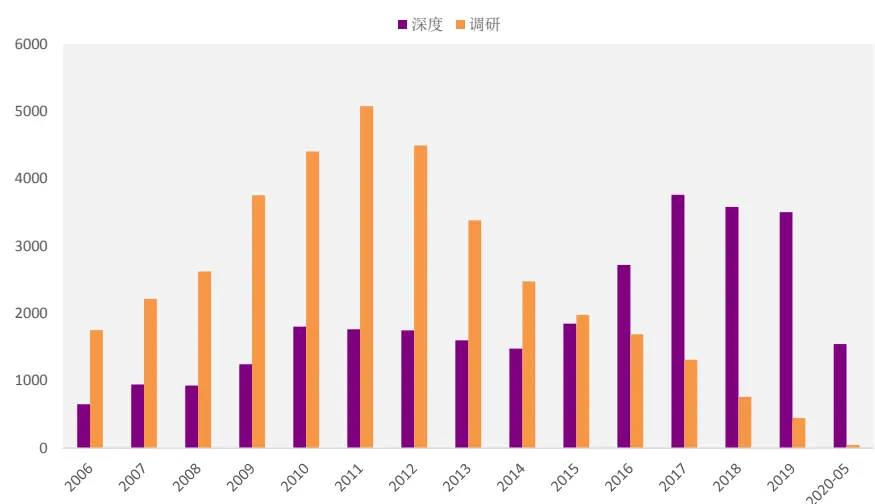
资料来源：朝阳永续，光大证券研究所

图 2：报告评级的发展趋势
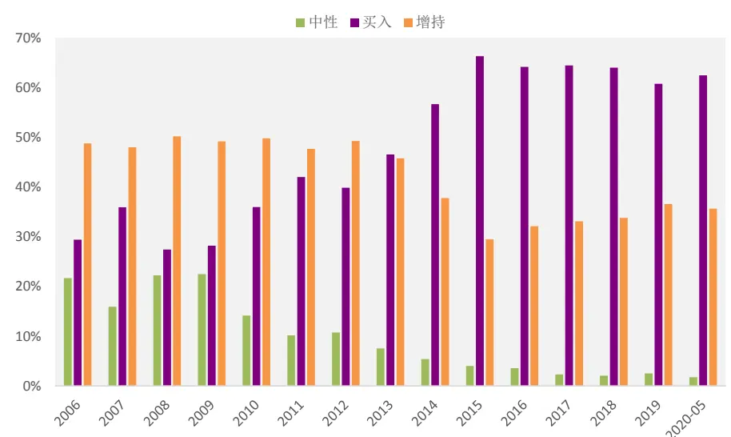
资料来源：朝阳永续，光大证券研究所

“中性”、“增持”评级数量下降明显，“买入”评级报告占比超60%。由于“卖出”、“减持”评级自2007年以来占比持续低于1%，图中未包含其信息。其主要原因是A 股市场做空限制较大，绝大多数机构投资者只能做多股票，看空评级的报告市场需求极小，即使分析师认为某公司的股价严重高估，一般也以路演沟通为主，而极少出具“卖出”或“减持”评级。由图 3 可知，“中性”与“增持”的评级近年来占比也极度缩水，“中性”评级从2010年的12.05%下降至 2020 年 5 月的 1.79%，“增持”评级从 2010 年的 47.80%下降至2020年5月的34.82%，这可能与卖方市场的过度竞争有关：只有评级为“买入”的报告才能吸引眼球，评级为“中性”、“增持”的报告鲜少有人关注，因此分析撰写报告时尽量给予“买入”评级。

同时，从内容上来讲一篇典型的个股深度报告通常都会包含如下几个方面的内容：

## （1） 盈利预测：

指分析师对公司在未来N个年度的经营指标（如净利润、营业收入等）做出预测，其中对当年情况进行预测标注为FY1，对次年情况进行预测标注为FY2。此处的“当年”是指研究报告中预测年份的最早年份，其以个股的年报实际披露日为界。例如，某公司在 2020 年 3 月 4 日披露年报，那么在3 月 4 日之前，FY1 为 2019 年，FY2 为 2020 年；在 3 月 4 日之后，FY1为2020年 FY2为2021年。（本文所选用的盈利预期数据均为FY1）

## （2） 分析师评级：

指分析师在研究报告发布之时对个股的具体评级情况，按照情绪从负面到正面的强度大小进行排序分别为：卖出、减持、中性、增持、买入

## （3） 目标价：

是指分析师在研究报告发布之时对个股在未来一段时间预期的目标价格。

## 1.2、分析师偏好覆盖股票的特征：高ROE、低估值

随着 A 股上市公司数量的不断上升，卖方分析师研报覆盖率从 2009 年到达高点后，出现了逐渐下降的趋势。值得注意的是，沪深 300 成分股的覆盖率始终维持在较高的水平，且从 2019 年以来再次出现上升的趋势；而除了沪深300 与中证500成分以外的个股，分析师覆盖率 2017 年以来呈下降趋势。

可以预见以沪深 300为代表的大盘蓝筹仍将是分析师的重点覆盖对象，而随着个股数量不断增长，一些市值较小流动性一般的股票将很难得到分析师的关注。

图 3：各样本空间内分析师报告覆盖率
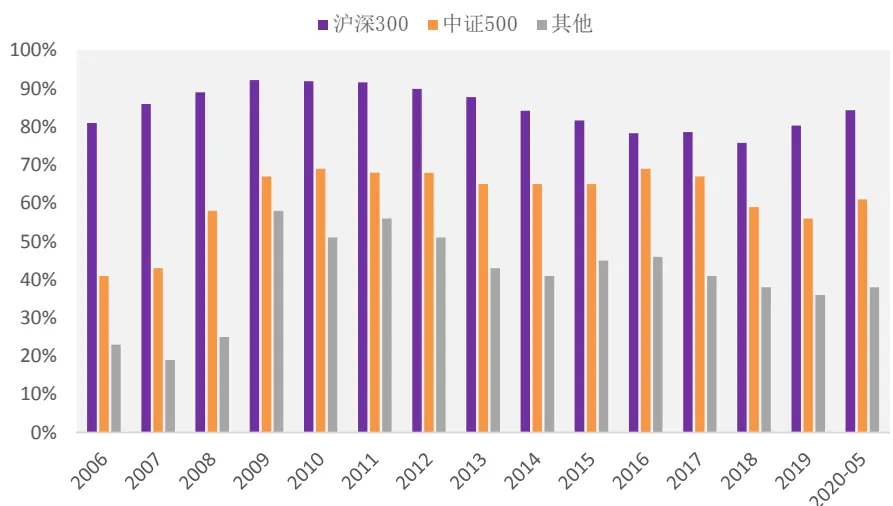
资料来源：朝阳永续，光大证券研究所

那么分析师偏好覆盖具有哪些特征的股票呢？我们统计了分析师覆盖个股的基本面指标，来分析卖方分析师的覆盖偏好。

表2：卖方分析师的覆盖个股的基本面指标所处分位数

|  | 名称 | 20%-30% 30%-40% 40%-50% 50%-60% 60%-70% 70%-80% 80%-90% 90%-100% |
| --- | --- | --- |
| APR_TTM | 应计利润占比 |  |
| AT | 总资产周转率 |  |
| BP_LR | BP |  |
| EP_TTM | EP |  |
| NP_SD | 净利润稳健加速度 |  |
| OP_Q_YOY | 营业利润同比增速 |  |
| ROE_TTM ROA_TTM | ROE ROA |  |

资料来源：朝阳永续，Wind，光大证券研究所，统计区间：2007-01-01至 2020-05-30

图4：卖方分析师的覆盖个股的基本面指标所处分位数
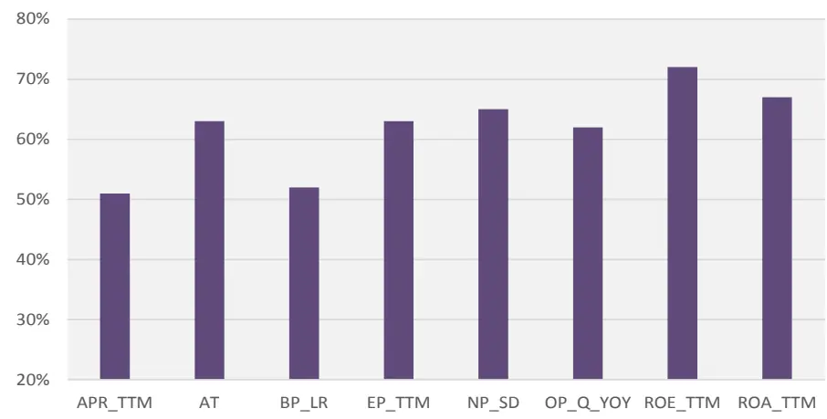
资料来源：朝阳永续，Wind，光大证券研究所，统计区间：2006-01-01至 2020-05-30

通过统计分析师覆盖的个股的盈利能力、成长能力、周转能力、估值等指标的中位数处在全市场股票指标值的分位数区间，可以发现，卖方分析师偏好覆盖的个股整体上具有以下特征：

## （1） 高 ROE：

所有指标中，分析师覆盖个股的 ROE 指标值所处的分位数区间最高，处于全市场个股的 70%-80%区间，证明卖方分析师覆盖个股时对于盈利能力ROE的偏好较为明显。

## （2） 低估值：

从BP_LR和EP_TTM的估值指标来看，分析师覆盖个股的中位数均高于全市场个股的 50%分位数。分析师对于市净率指标的偏好不显著，对于市盈率指标的偏好则较为明显，明显偏好 EP 值较高，也就是市盈率较低的个股。

## （3） 成长能力强：

从 NP_SD 和 OP_Q_YOY 两个成长指标来看，分析师覆盖个股的中位数均处于 60%-70%分位数之间，表明卖方分析师对高成长能力的股票也具有一定的偏好。

## 1.3、覆盖度与个股收益

从上一节中我们得知，分析师在覆盖个股时往往是偏好基本面质地较好（高ROE、高成长、低估值等等）的个股的。进一步的，我们想了解分析师覆盖的个股是否相对市场具有更好的收益表现，又或者被单一分析师覆盖的个股和被多个分析师覆盖的个股，在收益上是否会体现出显著的差异呢？

## 卖方分析师覆盖的个股相对市场表现：无显著超额收益

总体上看，被卖方分析师覆盖的个股样本池的收益率与市场整体表现差异不大。

图5展示了全市场样本内，过去一年至少有1 家卖方通过深度报告方式覆盖的股票的组合收益（流通市值加权）与中证全指的表现对比。分析师覆盖个股的累计收益与市场表现差异不大，2016 年之前分析师覆盖个股表现较弱，2016 年之后则表现出了一定的超额收益。

图5：全市场卖方覆盖个股收益表现
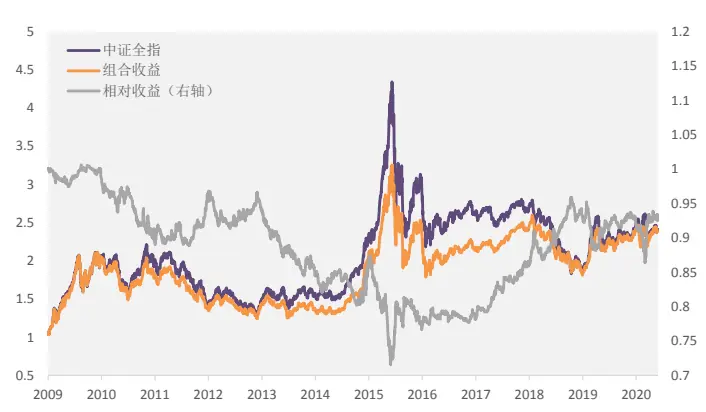
资料来源：朝阳永续，Wind，光大证券研究所，统计区间：2009-01-01 至 2020-05-30

图6：沪深 300内卖方覆盖个股收益表现
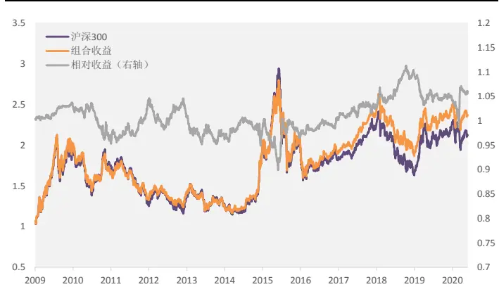
资料来源：朝阳永续，Wind，光大证券研究所，统计区间：2009-01-01 至 2020-05-30

图6展示了沪深300 样本内，过去一年至少有1 家卖方通过深度报告覆盖的股票的组合收益（流通市值加权）与中证全指的表现对比。由于沪深 300成分股内分析师的覆盖率本身已经接近 90%，因此分析师覆盖个股与沪深300 走势差异较小，但在 2016 到 2018 年也体现出了一定的超额收益能力。

## 个股被覆盖数量与个股收益：

一只股票如果在一段时间内被多家卖方机构同时覆盖，可能代表着公司的基本面受认可的程度较高或者近期出现了对公司较为利好的外部因素，但另一方面，被覆盖次数较多的个股的市场预期很可能已经提前兑现，后期股价表现很可能并不突出。

我们考察被多家机构同时覆盖的个股，与市场收益的表现对比。这里统计了过去半年内，被n家机构覆盖（有深度报告覆盖）的个股的收益表现，调仓频率为半年度调仓。

图7：不同机构覆盖程度下的个股收益表现
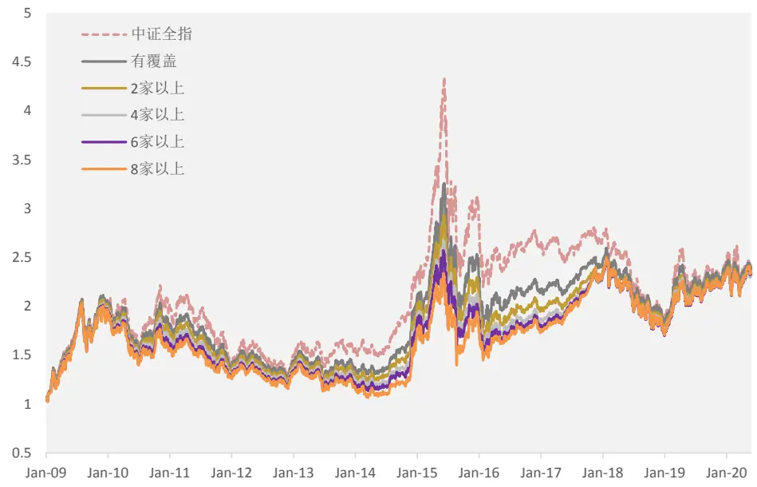
资料来源：朝阳永续，Wind，光大证券研究所，统计区间：2009-01-01至 2020-05-30

表3：半年内8家以上机构覆盖个股的分年度收益表现

|  | 月度胜 | 年化收益 | 年化波动 | 年化超额收益 | 相对收益波动 | 信息比 | 最大回撤 | 相对最大回撤 |
| --- | --- | --- | --- | --- | --- | --- | --- | --- |
| 2009 | 42% | 87% | 30% | -6% | 7% | -0.81 | -24% | -7% |
| 2010 | 17% | -19% | 22% | -18% | 11% | -1.70 | -28% | -18% |
| 2011 | 58% | -19% | 17% | 13% | 8% | 1.56 | -24% | -7% |
| 2012 | 50% | 5% | 16% | -3% | 8% | -0.38 | -18% | -9% |
| 2013 | 25% | -11% | 17% | -16% | 8% | -1.99 | -20% | -16% |
| 2014 | 42% | 43% | 19% | -1% | 11% | -0.14 | -10% | -15% |
| 2015 | 42% | 5% | 38% | -21% | 20% | -1.04 | -40% | -31% |
| 2016 | 50% | 0% | 20% | 5% | 10% | 0.57 | -18% | -5% |
| 2017 | 83% | 30% | 10% | 27% | 9% | 3.04 | -6% | -4% |
| 2018 | 58% | -24% | 22% | 9% | 9% | 1.00 | -30% | -8% |
| 2019 | 67% | 35% | 17% | 1% | 8% | 0.18 | -11% | -11% |
| 2020-05 | 40% | -1% | 22% | 5% | 10% | 0.47 | -12% | -7% |
| Summary | 48% | 7% | 22% | -1% | 10% | -0.13 | -47% | -50% |

资料来源：朝阳永续，Wind，光大证券研究所，统计区间：2009-01-01至 2020-05-30

图 7 可见，被覆盖的程度较高的股票在 2016 年以前整体收益较弱，而2016 年以后的收益表现显著提升。表 3 中展示了半年内 8 家以上机构覆盖个股的分年度收益表现，相对中证全指的基准来看，覆盖机构数量超过 8家的个股在 2016年以后每年均可以跑赢市场基准，2017 和2018年的表现尤为出色。

## 2、哪些分析师的推荐更有效？

由于分析师覆盖的个股整体表现相对市场来讲，超额收益并不是特别显著，而且不同分析师的研究能力、影响能力都是存在差异的，因此如果能够从分析师的历史推荐数据中寻找出可以用来判断分析师推荐有效性的方法，将是提高卖方分析师推荐数据效用的一大助力。

下文中在对分析师推荐个股的有效性进行评估时，我们统一采用报告发出后20 个交易日、60个交易日和 120个交易日的相对行业指数累计超额收益以及胜率等指标，作为评价分析师此次推荐的有效性指标。

## 2.1、明星分析师 or 资深分析师？

新财富分析师往往具有更高的市场影响力，因此很多投资者会选择性的对新财富上榜分析师的建议给与更高的重视程度，在构建一致预期指标时，新财富上榜分析师的权重也会相应提高。

## 新财富分析师推票能力：大幅上调预期时推票效果显著

首先，我们从数据上来验证一下新财富分析师的推荐效果是否真的比较显著。将新财富上榜后第二年所发布的报告定义为新财富分析师报告。白金分析师的影响力更为持续，因此评上白金分析师后五年内的研报也属于新财富分析师研报。

首先，统计不同类型分析师深度报告发布后，累计 60 个交易日的个股相对行业基准超额收益率。从统计结果看，如果仅从深度报告发布后的所推荐个股的表现来看，是否是新财富分析师对能否获得超额收益并不具有显著影响。

表 4：深度报告发布后累计 60 个交易日超额收益率

| 均值 中位数 |  |  |  |
| --- | --- | --- | --- |
|  | 新财富 | 非新财富 | 新财富 非新财富 |
| 2009 | -1.7% | -1.3% | -1.7% -1.5% |
| 2010 | -0.9% | -1.6% | -1.2% -1.7% |
| 2011 | -0.9% | -0.7% | -1.0% -0.8% |
| 2012 | 0.0% | 0.2% | 0.0% -0.2% |
| 2013 | -0.4% | 0.3% | -1.0% -0.7% |
| 2014 | -3.2% | -3.0% | -3.1% -3.1% |
| 2015 | -1.8% | 1.1% | -1.7% -0.8% |
| 2016 | -1.3% | -1.5% | -1.5% -1.5% |
| 2017 | 0.2% | 0.2% | -0.1% -0.2% |
| 2018 | 0.4% | 0.6% | 0.3% 0.4% |
| 2019 | 0.6% | 1.0% | 0.5% 0.5% |
| 2020 | 1.2% | 1.5% | -0.1% -0.5% |
| 均值 | -0.6% | -0.3% | -0.9% -0.9% |

资料来源：朝阳永续，Wind，光大证券研究所，统计区间：2009-01-01至 2020-05-30

考虑到分析师的推荐程度也是影响推票效果的重要因素，是否新财富分析师的优势更多的体现在他们比较强烈看好而且重点推荐的股票上呢？采用报告盈利预期上调幅度来表征分析师的看好程度，统计不同类型分析师通过深度报告发布且给予“买入”评级且盈利预期上调幅度超过 20%后，累计60 个交易日的个股相对行业基准超额收益率：

表5：盈利预期上调幅度超 20%的“买入”评级深度报告发布后累计 60个 交易日超额收益率

| 均值 |  |  | 中位数 |  |
| --- | --- | --- | --- | --- |
|  | 新财富 | 非新财富 | 新财富 | 非新财富 |
| 2009 | 3.0% | 2.9% | 1.9% | 0.6% |
| 2010 | 7.2% | 3.6% | 2.9% | 1.2% |
| 2011 | 0.7% | 2.3% | 0.5% | 1.3% |
| 2012 | 5.9% | 6.7% | 3.3% | 4.4% |
| 2013 | 6.5% | 4.6% | 3.0% | 0.8% |
| 2014 | -2.0% | 0.0% | -2.6% | -2.3% |
| 2015 | 5.8% | 5.5% | 4.3% | 1.8% |
| 2016 | 1.1% | 0.4% | -0.9% | -1.7% |
| 2017 | 4.5% | 3.1% | 2.5% | 1.8% |
| 2018 | 2.8% | 3.4% | 1.6% | 1.5% |
| 2019 | 4.4% | 5.4% | 4.1% | 3.4% |
| 2020 | 16.1% | 7.6% | 10.0% | 3.4% |
| 均值 | 4.7% | 3.8% | 2.6% | 1.4% |

资料来源：朝阳永续，Wind，光大证券研究所，统计区间：2009-01-01至 2020-05-30

结果表明，新财富分析师在给予盈利预测较大幅度上调时发布的“买入”评级报告，其收益表现显著的优于非新财富分析师，且 2009 年至今，只有2014 年发布后累计 60 日超额收益为负，其余年份均有超额，且 2020 年以来的超额收益十分显著。

## 分析师从业年限与推票能力：非线性相关

从业年限越高的分析师，是否就拥有更强的研究能力和更好的推票效果呢？答案是不一定的。

从下面的统计中可以看出，从业年限高于9年的分析师的推票效果相对较强，不过，从业 0-1 年的分析师的推票后 60 个交易日超额收益表现是最为显著的。因此分析师的从业年限与其推票能力并不是线性相关的。

表 6：不同行业内不同从业年限的分析师推票后 60 个交易日超额收益表现（中信一级行业）

| 行业 | 1年内 | 1-2年 | 2-3年 | 3-4年 | 4-5年 | 5-6年 | 6-7年 | 7-8年 | 8-9年 | 9-10年10-11年11-12年12年以上 |  |  |  |
| --- | --- | --- | --- | --- | --- | --- | --- | --- | --- | --- | --- | --- | --- |
| 交通运输 | 1.9% | 0.9% | 0.9% | 0.3% | 0.4% | 0.6% | 0.4% | 0.8% | 2.6% | 1.0% | 1.8% | 0.6% | 3.0% |
| 传媒 | 3.3% | 5.2% | 2.4% | 2.2% | 3.4% | 2.2% | 3.7% | 3.0% | 2.1% | 10.5% | 1.5% | 1.4% | 4.0% |
| 农林牧渔 | 2.1% | 1.2% | 0.4% | 1.2% | 1.8% | 1.8% | 0.3% | -0.2% | -0.4% | 2.3% | 1.9% | 2.4% | 3.1% |
| 医药 | 2.3% | 1.8% | 1.9% | 1.7% | 1.6% | 1.6% | 2.0% | 1.4% | 0.0% | 2.5% | 0.3% | 1.9% | 0.9% |
| 商贸零售 | 2.3% | 0.3% | 1.2% | 0.3% | 1.0% | 0.0% | 0.5% | 0.1% | 1.0% | 3.2% | 1.3% | 3.7% | 3.3% |
| 国防军工 | 1.5% | 1.3% | 1.6% | 0.5% | 1.6% | 1.3% | 2.0% | 1.6% | 2.4% | 3.1% | 0.3% | 2.0% | 1.8% |
| 基础化工 | 4.6% | 1.5% | 1.4% | 1.6% | 1.5% | 1.4% | 1.8% | 2.7% | 2.0% | 3.6% | 3.2% | 3.4% | 4.8% |
| 家电 | 1.5% | 0.7% | -0.1% | 0.6% | -0.2% | -0.5% | -1.2% | 0.6% | -1.4% | -0.5% | -1.2% | -0.2% | 2.2% |
| 建材 | 3.7% | 1.3% | 2.9% | 0.8% | 0.8% | 1.5% | 1.0% | 1.2% | 2.6% | 4.1% | 1.2% | 4.5% | -2.0% |
| 建筑 | 2.0% | -0.3% | 1.2% | 1.6% | 1.5% | 1.8% | -1.0% | 0.7% | 0.1% | 0.2% | -0.7% | -1.1% | 0.2% |
| 房地产 | 1.1% | 0.4% | 0.4% | 0.4% | 0.6% | 0.1% | 0.5% | -0.2% | 1.8% | 0.4% | 0.7% | 1.3% | 0.4% |
| 有色金属 | 3.5% | 1.4% | 1.5% | 1.7% | 1.0% | 0.4% | 2.0% | 1.0% | 1.2% | 3.4% | 2.3% | 3.8% | 0.8% |
| 机械 | 3.4% | 2.0% | 1.7% | 1.2% | 1.1% | 2.1% | 2.5% | 2.8% | 2.1% | 3.8% | 1.5% | 2.9% | 5.0% |
| 汽车 | 2.1% | 0.3% | 0.8% | 0.9% | 0.8% | -0.1% | 0.3% | 0.4% | -0.3% | 0.4% | 1.2% | -0.3% | 1.5% |
| 煤炭 | 1.6% | 1.8% | 1.1% | 1.1% | 0.6% | -0.4% | -0.8% | -0.9% | 1.9% | -0.6% | -1.9% | 1.8% | 0.1% |
| 电力公用事业 | 1.5% | 1.1% | 1.0% | 1.4% | 1.1% | 1.5% | -0.5% | 0.4% | 0.8% | 3.3% | 0.4% | -1.4% | -0.2% |
| 电力设备及新能源 | 1.9% | 0.1% | 1.8% | 1.4% | 1.2% | 1.9% | 1.4% | 1.1% | -0.5% | 1.0% | 2.0% | 1.4% | 2.5% |
| 电子 | 2.0% | 1.4% | 1.5% | 1.5% | 2.0% | 1.8% | 1.1% | 1.2% | 1.6% | 2.2% | -0.9% | -0.7% | 3.2% |
| 石油石化 | 3.9% | 3.1% | 1.7% | 0.4% | 1.4% | 1.4% | 2.0% | 3.3% | -1.0% | 0.2% | 0.7% | 4.0% | 2.1% |
| 纺织服装 | 1.3% | -0.8% | -0.4% | 1.4% | 1.3% | 0.3% | 0.3% | -1.0% | -0.7% | -0.9% | 1.7% | 1.9% | 2.6% |
| 综合 | 0.1% | -0.1% | 1.1% | -1.0% | -0.2% | -0.8% | 0.6% | -1.3% | -2.0% | 2.5% | 3.8% | 12.7% | 10.9% |
| 计算机 | 2.4% | 1.8% | 2.7% | 2.4% | 1.6% | 1.7% | 2.3% | 2.6% | 2.4% | 5.3% | 0.0% | 3.1% | 2.0% |
| 轻工制造 | 1.6% | 1.1% | 0.8% | 2.0% | 0.2% | 2.0% | 1.7% | 2.4% | 0.6% | 1.2% | 1.7% | 4.3% | 1.7% |
| 通信 | 2.4% | 2.0% | 2.6% | 1.9% | 1.7% | 0.4% | 1.6% | 2.4% | 2.2% | 2.8% | 2.5% | 2.4% | 6.8% |
| 钢铁 | 2.7% | 1.3% | 0.9% | 1.0% | 0.1% | 0.7% | 1.3% | 3.4% | 3.9% | 2.6% | 2.8% | 1.7% | 1.7% |
| 银行 | 0.8% | 0.2% | 0.3% | 0.0% | 0.0% | -0.2% | -0.2% | 0.3% | -0.2% | -0.3% | -0.2% | -0.5% | 0.1% |
| 非银行金融 | 0.2% | -0.2% | -0.2% | 0.1% | 0.6% | 0.4% | 0.4% | -1.3% | -0.4% | 0.9% | -2.0% | -2.1% | -1.6% |
| 食品饮料 | 1.3% | 0.9% | 1.0% | 0.8% | 0.8% | 0.2% | 0.8% | 0.8% | 1.6% | 0.5% | 0.4% | -0.6% | 0.8% |
| 消费者服务 | 0.9% | -0.7% | -1.3% | -0.7% | 0.5% | -1.0% | -1.0% | -1.2% | -2.0% | -1.4% | -2.1% | 0.2% | -3.0% |
| 均值 | 2.1% | 1.1% | 1.1% | 1.0% | 1.0% | 0.8% | 0.9% | 1.0% | 0.8% | 2.0% | 0.8% | 1.9% | 2.0% |

资料来源：朝阳永续，Wind，光大证券研究所，统计区间：2009-01-01至 2020-05-30

## 2.2、不同行业分析师推荐有效性

考虑到不同行业的基本面逻辑往往存在一定差异，不同行业的分析师在推荐不同行业的股票时的有效性也理应是存在差异的。

表7：分年度分行业卖方分析师给予“买入”评级后 60个交易日超额收益均值（中信一级行业）

|  | 2007 | 2008 | 2009 | 2010 | 2011 | 2012 | 2013 | 2014 | 2015 | 2016 | 2017 | 2018 | 2019 | 2020 均值 |  |
| --- | --- | --- | --- | --- | --- | --- | --- | --- | --- | --- | --- | --- | --- | --- | --- |
| 交通运输 | 0.4% | 1.5% | -0.8% | 1.6% | 0.0% | 0.0% | -0.3% | -0.9% | 3.9% | 1.3% | 1.7% | 1.2% | 1.1% | 7.1% | 1.3% |
| 传媒 | 3.6% | 1.3% | 1.2% | 0.8% | 1.9% | 3.7% | 5.7% | -1.7% | 16.4% | 0.5% | 1.4% | 1.8% | 4.6% | 1.5% | 3.0% |
| 农林牧渔 | 0.7% | -0.3% | 0.3% | 2.3% | 2.3% | 1.2% | -1.7% | -1.5% | 3.8% | -0.3% | 2.6% | 2.2% | 0.8% | 8.7% | 1.5% |
| 医药 | 3.0% | 2.7% | 0.8% | 1.0% | 0.5% | 3.1% | 3.1% | -1.9% | 2.5% | -0.7% | 1.7% | 2.0% | 3.7% | 4.9% | 1.9% |
| 商贸零售 | -3.8% | 1.1% | 1.1% | 1.5% | 0.7% | -0.6% | -2.1% | -0.9% | 2.1% | 1.4% | 3.9% | 2.1% | 3.9% | 2.3% | 0.9% |
| 国防军工 | 2.5% | 3.4% | 0.3% | 2.2% | 2.2% | 0.8% | 1.9% | -0.3% | 3.2% | 1.9% | 0.7% | 1.5% | 1.0% | 0.0% | 1.5% |
| 基础化工 | -3.0% | 5.0% | 1.9% | 0.6% | -0.8% | 1.0% | 4.4% | -1.4% | 3.9% | 0.8% | 2.8% | 3.8% | 3.6% | 7.6% | 2.2% |
| 家电 | 5.3% | 1.2% | 2.3% | 0.8% | -1.2%- | 0.8% | 3.3% | -2.5% | 0.3% | -2.2% | -2.7% | 0.8% | 0.1% | 4.3% | 0.6% |
| 建材 | 2.2% | 6.0% | -0.8% | 1.0% | 0.0% | 1.1% | 2.2% | 0.8% | 0.2% | 0.3% | 5.6% | 1.3% | 3.7% | 7.2% | 2.2% |
| 建筑 | -5.2% | 0.0% | 4.1% | 7.6% | 0.8% | 2.5% | 0.8% | -7.7% | 6.1% | -1.8% | -0.8% | -1.0% | 1.3% | 9.8% | 1.2% |
| 房地产 | -0.7% | 0.0% | 0.2%- | 0.1% | 0.2% | 0.6% | -0.8% | 1.3% | 0.6% | 0.1% | 2.9% | 0.8% | 1.1% | -0.6% | 0.4% |
| 有色金属 | 0.6% | 2.0% | 2.0% | 1.2% | -0.2% | -0.1% | 4.3% | -1.8% | 7.5% | 1.9% | 3.0% | -0.8% | 3.1% | 3.0% | 1.8% |
| 机械 | -0.1% | 1.4% | 0.1% | 1.0% | 0.1% | 1.2% | 5.8% | -2.4% | 4.7% | 0.0% | 3.0% | 2.9% | 6.0% | 5.6% | 2.1% |
| 汽车 | -2.3% | -0.1% | 0.8% | 1.4% | -0.2% | 1.4% | 0.4% | -0.4% | 0.4% | -0.1% | -1.0% | -0.3% | 4.7% | 2.1% | 0.5% |
| 煤炭 | 4.8% | 3.5% | 2.9% | 1.7% | -0.3% | -0.4% | -1.8% | 1.6% | -1.3%- | 0.4% | 0.7% | -0.5% | 1.8% | 0.2% | 0.9% |
| 电力及公用事业 | 0.0% | 2.6% | -0.4% | 1.2% | -1.1% | 2.7% | 3.7% | -3.7% | 6.8% | -0.6% | -0.9% | -0.1% | 1.9% | 8.7% | 1.5% |
| 电力设备及新能源原 | -1.5% | 3.5% | -0.5% | 1.3% | 0.1% | 0.7% | 6.6% | -1.4% | 1.9% | 0.9% | 1.0% | 1.8% | 1.3% | -0.3% | 1.1% |
| 电子石油石化纺织服装综合计算机 | 3.0% | 0.4% | -2.6% | 2.1% | 1.9% | 1.8% | 3.0% | 0.1% | 2.9% | -0.6% | -0.8% | 2.6% | 4.0% | 4.1% | 1.6% |
|  | 11.6% | 0.0% | -0.4% | 1.0% | 0.5% | 2.2% | 5.2% | -4.3% | 4.3% | 1.9% | 2.6% | -0.2% | 2.9% | -1.7% | 1.8% |
|  | -5.5% | 1.2% | 1.6% | 3.0% | 1.9% | 0.3% | -1.5% | -2.8% | -1.6%- | 1.2% | 2.3% | 3.2% | 0.3% | 8.0% | 0.7% |
|  | -3.6% | -2.0% | -3.2% | -5.6% | 1.5% | -2.2% | 1.0% | -5.9% | -0.7% | -0.1% | 1.8% | 1.6% | 7.5% | 7.2% | -0.2% |
|  | -8.4% | 5.8% | 2.1% | 0.1% | 1.4% | 4.3% | 3.3% | -2.3% | 5.6% | -0.6% | 2.1% | 3.1% | 2.5% | 10.4% | 2.1% |
| 轻工制造通信钢铁 | -0.8% | -1.4% | -0.4%- | 0.2%- | 0.3% | 1.7% | 6.5% | -1.3% | 2.1% | -1.8% | 3.8% | 0.4% | 3.4% | 4.0% | 1.1% |
|  | 1.1% | 8.1% | 4.9% | 2.9% | -0.8% | -0.1% | 3.8% | -1.6% | 1.6% | 0.0% | 1.5% | 2.0% | 5.2% | 13.2% | 3.0% |
|  | 1.0% | 1.2% | 1.2% | -1.1% | -0.2% | 0.4% | 3.7% | 0.0% | 3.9% | 2.5% | 5.0% | -0.3% | 3.4% | 0.6% | 1.5% |
| 银行非银行金融食品饮料消费者服务 | -0.4% | 1.2% | 0.4% | 0.3%- | 0.2% | -1.2% | 1.0% | 0.0% | -0.5% | 0.7% | -0.1% | 0.0% | 0.3% | -4.9% | -0.2% |
|  | -1.6% | -0.8% | 1.3% | -0.2% | 0.6% | 0.6% | 0.0% | 1.0% | 1.7% | -0.3% | -4.7% | -0.4% | 0.1% | 0.7% | -0.1% |
|  | 1.1% | 0.6% | 1.0% | 1.5% | -0.3% | 2.4% | 2.8% | -0.1% | 1.5% | 0.2% | -3.6% | 2.6% | 0.4% | 4.0% | 1.0% |
|  | -2.8% | 0.6% | -0.8% | 1.6% | -0.6% | -2.0% | -0.5% | -1.5% | -0.8% | -0.3%- | 0.6% | -2.8%- | 2.3% | 1.7% | -0.8% |
| 均值 | 0.0% | 1.7%0.7%1.1% |  |  | 0.4%0.9% |  | 2.2% | -1.5% | 2.9%0.1%1.2%1.1% |  |  |  | 2.5%4.1% |  | 1.2% |

资料来源：朝阳永续，Wind，光大证券研究所，统计区间：2007-01-01至 2020-05-30

## 行业内个股同质化越低，分析师推票越有效

对于个股同质化程度较高的行业例如银行、非银金融行业，分析师在推荐时的难度较大，长期来看推荐后无显著超额收益；

对于概念差异较大，主题变换频繁的行业例如 TMT 中的通信、传媒行业来说，分析师的挖掘能力和研究能力就更容易体现出来，通信和传媒行业的推票后 60 个交易日平均超额收益可以达到3 个百分点。

图8：TMT行业分析师推票有效性较高
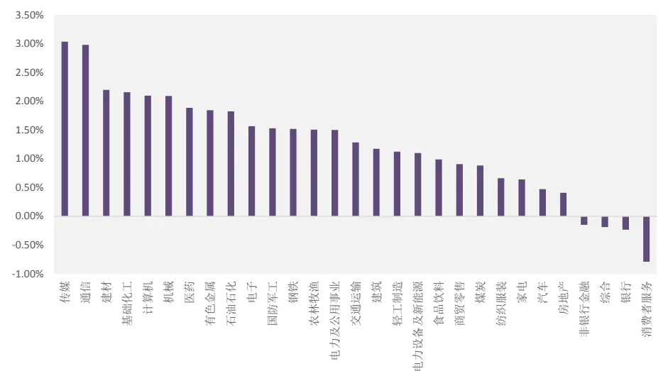
资料来源：朝阳永续，Wind，光大证券研究所，统计区间：2007-01-01至 2020-05-30

## 近三年分析师推票效果有显著提升

分年度来看，2017 年以来分析师推票的效果是在逐年提升的，且 2020年以来（截止 2020-06-01）的平均推票后 60 个交易日超额收益已经超过 4%，为历史最高水平。

我们认为背后的原因主要有两个：一是与市场整体风格的变化有关，2017 年以来市场风格整体上都更加偏向于基本面质地优良的个股，而分析师偏好覆盖的这是此类股票；另一个原因则来自于监管趋严和卖方研究报告的规范性要求提升，分析师更多地以深度报告的形式进行推票，以往的调研报告推票的形式逐渐消失，使得深度报告推票后的超额更显著。

2020 年 5 月发布的《发布证券研究报告职业规范（修订稿）》中对卖方研究报告的职业规范要求做了较大程度的改进，职业规范要求进一步提升，而随着针对卖方研究服务行为的监管的进一步提升，我们认为未来A股卖方分析师通过深度报告推荐个股的有效性也有望进一步得到增强。

图 9：分年度分析师推票后 60 个交易日超额收益
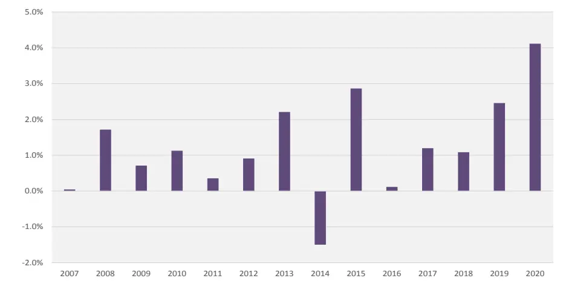
资料来源：朝阳永续，Wind，光大证券研究所，统计区间：2007-01-01至 2020-05-30

## 2.3、根据历史推荐效果筛选分析师

从分析师发布研究报告的行为中，我们也可以发掘一些有效的信息。

例如某个分析师在过去一段时间内连续多次大幅上调了某只股票的盈利预期，有可能代表其对该只股票的看好程度十分坚定；又或者某个分析师在一段时间内连续上调多个股票的盈利预期，可能可以反映其对所跟踪行业的乐观观点。那是否这些推票行为真的可以反应出这位分析师的研究能力，又或者怎样的历史推票行为往往能对应着未来一段时间的较强的推票胜率和超额收益？

从整体上看，分析师不同盈利预期上调幅度的推票胜率和超额收益的确是有所差异的。下表中的alpha_xx 代表的是报告发布后 xx 个交易日个股相对所属行业指数基准的累计超额收益。

表8：不同盈利预期上调幅度的“买入”评级深度报告对应未来超额收益的胜率

| 上调幅度 | 均值 |  |  | 中位数 |  |  | 胜率 |
| --- | --- | --- | --- | --- | --- | --- | --- |
|  | alpha_20 | alpha_60 | alpha_120 | alpha_20 | alpha_60 | alpha_120 | alpha_20 胜率 |
| 大于 0% | 2.90% | 3.62% | 5.63% | 1.24% | 1.11% | 1.54% | 54.4% |
| 大于10% | 3.21% | 3.85% | 6.00% | 1.51% | 0.79% | 1.45% | 55.7% |
| 大于 20% | 3.82% | 4.74% | 6.28% | 1.63% | 0.83% | 0.69% | 55.8% |
| 大于 30% | 4.29% | 5.33% | 6.89% | 2.15% | 1.12% | 0.63% | 56.3% |
| 大于 40% | 4.59% | 5.69% | 7.72% | 2.07% | 0.94% | 0.01% | 55.7% |

资料来源：朝阳永续，Wind，光大证券研究所，统计区间：2007-01-01至 2020-05-30

值得注意的是，从均值来看，上调幅度越高的“买入”评级深度报告对应的未来超额收益越高；从中位数来看，报告发布后 20 天内上调幅度越高的个股超额越显著，但报告发布后 120天内上调幅度越高的个股的收益反而是下降的。中位数统计值的分布变化的很可能是由于时间区间拉长之后，仅少量的效果较好的推票带来收益持续上升，其余报告带来的超额收益持续性较弱。因此，后文的测试中我们选择alpha_20 作为衡量推荐效果的标准。

一个优秀的卖方分析师对个股的跟踪往往是比较持续的，对个股的推荐和报告覆盖也往往是一个持续的过程，因此我们认为如果一个分析师在过去一段时间内的推票效果较为出色，说明其对这个行业内自己所覆盖的公司的情况把握比较准确，同时投资者也由于他前期的推荐效果较好而对他进行持续的关注，那么很可能未来一段时间内该分析师的推荐效果仍将保持一定的水平。

我们尝试从以下几个角度入手，寻找不同阶段下各个行业中的推票胜率和超额收益表现优秀的分析师：

## 考察过去一段时间内，不同程度“推票”的胜率和超额收益

这里的“推票”定义为：深度报告覆盖且给予“买入”评级，且同时上调盈利预期。

1) 程度的定义即预期净利润上调幅度：10%，20%，30%，40%以上

2) 时间段参数选取范围为：6 个月，12 个月，18 个月，24 个月

3) 胜率选取范围：50%，60%，70%，80%以上

4) 超额收益：统一采用发布后 20 个交易日相对行业基准的超额收益

考察满足上述条件的分析师，在未来一个季度的推票后的平均超额收益表现：

表9：基于过去6个月内分析师推票表现，统计分析师在未来一个季度的推荐效果

| 胜率 50%以上 60%以上 70%以上 80%以上 |  |  |  |  |  |  |  |  |
| --- | --- | --- | --- | --- | --- | --- | --- | --- |
| 上调幅度 | alpha_20 alpha_20 胜率 |  | alpha_20alpha_20 胜率 |  | alpha_20 alpha_20 胜率 |  | alpha_20alpha_20 胜率 |  |
| 大于0% | 2.21% 53.44% |  | 3.10% | 54.20% | 2.90% | 55.01% | 3.12% | 54.23% |
| 大于10% | 2.91% | 55.01% | 3.42% | 55.82% | 3.21% | 55.23% | 3.42% | 53.43% |
| 大于 20% | 3.21% | 55.23% | 4.35% | 56.99% | 3.82% | 54.67% | 3.94% | 54.65% |
| 大于30% | 3.90% | 55.25% | 4.79% | 56.90% | 4.12% | 54.26% | 4.52% | 56.32% |
| 大于40% | 4.32% 56.02% |  | 4.15% | 56.63% | 4.05% | 54.05% | 4.23% | 56.78% |

资料来源：朝阳永续，Wind，光大证券研究所，统计区间：2007-01-01至 2020-05-30

由上表可见，当胜率的标准设置为 60%以上时，alpha_20 的均值和胜率表现较好。

表 10：不同时间段内分析师推票胜率高于 60%时，统计分析师在未来一个季度的推荐效果

| 时间 6个月 12个月 |  |  |  |  | 18个月 |  | 24个月 |
| --- | --- | --- | --- | --- | --- | --- | --- |
| 上调幅度 | alpha_20 alpha_20 胜率 |  | alpha_20 alpha_20 胜率 |  | alpha_20 alpha_20 胜率 |  | alpha_20 alpha_20 胜率 |
| 大于 0% | 3.10% | 54.20% | 3.01% | 52.57% | 2.95% | 51.49% | 2.76% 49.24% |

| 大于 10% | 3.42% | 55.82% | 3.32% | 54.15% | 3.25% | 53.03% | 4.04% | 49.68% |
| --- | --- | --- | --- | --- | --- | --- | --- | --- |
| 大于 20% | 4.35% | 56.99% | 4.22% | 55.28% | 4.11% | 53.86% | 3.87% | 50.72% |
| 大于 30% | 4.79% | 56.90% | 4.65% | 55.19% | 4.33% | 53.77% | 4.56% | 53.78% |
| 大于 40% | 4.15% | 56.63% | 4.03% | 54.93% | 3.92% | 53.52% | 6.78% | 52.53% |

资料来源：朝阳永续，Wind，光大证券研究所，统计区间：2007-01-01至 2020-05-30

由表 10 可见，回溯历史推票成功率时，并不是时间越长越好。尽管 24个月时，上调40%以上的情况下alpha_20 最高可达到 6.78%，但胜率表现比较一般；时间区间参数选取为 6个月时的表现更稳定，胜率更高。

也就是说，分析师在最近半年内重点推荐的股票表现较好时，其未来一段时间内的推票胜率也会具有相对的优势。

图10：过去 6个月内不同盈利预测上调幅度且胜率达60%以上的分析师年均个数与未来一个季度的推票效果
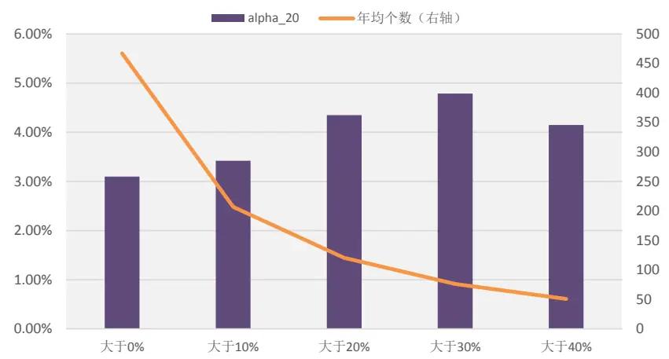
资料来源：朝阳永续，Wind，光大证券研究所，统计区间：2007-01-01至 2020-05-30

在考虑分析师推票胜率和超额收益的同时，也需要关注我们采用此类标准平均每年会筛选出多少个分析师，如果入选分析师数量太少，也会影响最终策略的稳定性。结合上图的数据，我们选择过去6 个月内通过深度报告给予“买入”评级且上调盈利预期 20%以上的报告胜率超过 60%的分析师，数量上来看，平均每年会有 130 个分析师入选。

## 3、分析师推荐行为中的有效信号

前文中我们发现，明星分析师（新财富上榜分析师）在通过深度报告给予“买入”评级且上调盈利预期超过 20%时的推票效果相对较好；同时，过去6个月内通过深度报告给予“买入”评级且上调盈利预期 20%以上的报告胜率超过 60%的分析师，在未来一个季度推票的效果也相对更有优势。在挑选出能力较强的分析师同时，我们也希望可以从一些具有较强超额收益的分析师推荐行为中再做进一步的挖掘。

## 3.1、正向信号

## 3.1.1、低位首次覆盖

当一只股票长期未被关注时，分析师首次覆盖的意义是比较显著的。在我们前期的报告《卖方深度乘势起，多次点评占先机——卖方推票事件驱动策略研究》中，已经验证过首次推荐作为事件的有效性，首次推荐后的短期内超额收益是比较显著的。

不过原报告中在定义首次推荐时采用的是历史上所有券商发布的首份“买入”评级报告，此类报告从总数上来看比较少的，且大概率出现在个股上市初期。

考虑到如果一只个股长时间没有被分析师关注和覆盖，此时一篇新的“买入”评级报告的意义也是十分重大的。本节中我们给出一个“首次覆盖”的新的定义：过去 n个月未有卖方分析师覆盖的个股，近期发布的第一篇“买入”评级的深度报告。

同时，在覆盖时间点附近股价的高低也会对推票结果有所影响：股价处于相对低位时，股票推荐的逻辑点在于券商分析师“占坑”，先别人一步推荐牛股，获得市场价值，而当股价已经处于高位、涨幅较多时，此时部分行业分析师会跟随股价上涨而进行推荐，并不一定有比较深入独到的见解。因此，可以考虑通过股价目前所处历史分位数来判断推票时机是否属于“低位”。

下表中，alpha_20_xxM 代表当前股价处于滚动 3 个月历史股价分位数50%以下，且 xx 个月未有卖方分析师覆盖的个股，近期发布的第一篇“买入”评级的深度报告后的累计 20 天超额收益率。

表11：低位首次推荐报告的超额收益和胜率

| 超额收益均值 |  | 胜率 |
| --- | --- | --- |
| alpha_20_6M | 6.1% | 60.5% |
| alpha_20_12M | 5.6% | 58.8% |
| alpha_20_18M | 7.0% | 61.0% |
| alpha_20_24M | 7.8% | 59.8% |

资料来源：朝阳永续，Wind，光大证券研究所，统计区间：2007-01-01至 2020-05-30

由上表可见，低位首次推荐的效果的确较为出色，我们以 24 个月内首次推荐为例，其 20 个交易日的平均超额收益可以达到 7.8%，胜率也接近60%。

## 3.1.2、主动上调盈利预期

根据前文的结果，无论是新财富上榜的明星分析师，还是前期推票效果出色的一般分析师，他们的推票如果是在上调盈利预期幅度较大时（例如上调20%），对应的推票胜率和超额收益都有一定程度的提升。但是，从胜率上来看，此类上调预期的推荐胜率并没有显著的改进。

因此，我们在这里纳入一个“主动上调盈利预期”的概念，尝试通过对上调盈利预期的行为的区分，进一步提高超额收益。在市场环境或公司基本面出现变化是，最先发现机会的分析师或者最先上调盈利预期的分析师，往往能更好的捕捉到后期信息传到到市场后的股价上涨，而那些跟风上调盈利预期的分析师发布报告后股价很可能已经有所反应，导致后期收益表现不佳。

## “主动上调盈利预期”定义为：

报告净利润上调幅度超过 a%，且报告预测净利润高于最近 3 个月内该股票的所有预测净利润的 b%分位数。

表12：不同参数下主动上调盈利预期后20个交易日超额收益

| 上调幅度a 10% 20% 30% 40% |  |  |  |  |  |  |  |  |
| --- | --- | --- | --- | --- | --- | --- | --- | --- |
| 分位数b | alpha_20alpha_20 胜率 |  | alpha_20alpha_20 胜率 |  | alpha_20alpha_20 胜率 |  | alpha_20alpha_20 胜率 |  |
| 10% | 4.65% | 63.81% | 6.32% | 64.75% | 4.24% | 64.07% | 5.83% | 61.98% |
| 20% | 4.24% | 64.07% | 5.74% | 66.11% | 5.92% | 63.42% | 5.20% | 63.39% |
| 30% | 5.15% | 64.09% | 5.43% | 63.23% | 6.43% | 64.64% | 5.97% | 65.33% |
| 40% | 3.42% | 60.23% | 4.56% | 59.32% | 5.35% | 62.70% | 4.99% | 58.34% |

资料来源：朝阳永续，Wind，光大证券研究所，统计区间：2007-01-01至 2020-05-30

图11：不同分位数下主动上调盈利预期超过 20%的报告超额收益与数量
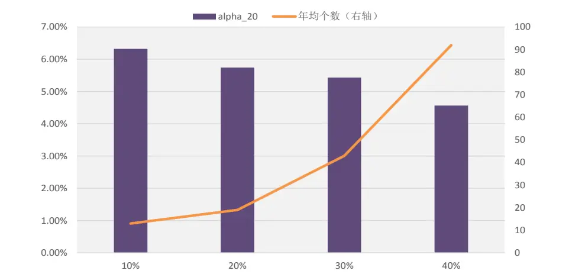
资料来源：朝阳永续，Wind，光大证券研究所，统计区间：2007-01-01至 2020-05-30

当报告净利润上调幅度超过 20%，且报告预测净利润高于最近3个月内该股票的所有预测净利润的 20%分位数时，推票效果和推票胜率表现比较出色，其对应的超额收益为5.74%，胜率为66.11%，年均个数为 23个。

## 3.2、反向信号

A 股市场做空限制较大，绝大多数机构投资者只能做多股票，看空评级的报告市场需求极小，即使分析师认为某公司的股价严重高估，一般也以路演沟通为主，而极少出具“卖出”或“减持”评级。因此仅仅通过“减持”评级报告来判断是否卖出股票并不是一个可行的方法，我们需要从分析师的推票行为中挖掘更多有效的反向信号。

在我们前期的报告《卖方深度乘势起，多次点评占先机——卖方推票事件驱动策略研究》中，已经验证过股票评级的下调可作为卖空信号。股票评级下调后，持有20个交易日的平均超额收益为-1.58%，胜率只有 39.54%，并且在信号发出后的半年内，平均超额收益持续为负。

但同时我们也发现，分析师下调评级的次数是比较少的，考虑到A 股的特殊性，分析师在表达负面观点时更多的其实是采用保持评级不变的同时下调盈利预期这样的方法。

## 3.2.1、主动下调盈利预期

与前文类似的，引入“主动下调盈利预期”的概念，尝试通过对下调盈利预期的行为的区分，进一步提高超额收益。在市场环境或公司基本面出现变化是，最先发现机会的分析师或者最先上调盈利预期的分析师，往往能更好的捕捉到后期信息传到到市场后的股价上涨，而那些跟风上调盈利预期的分析师发布报告后股价很可能已经有所反应，导致后期收益表现不佳。

## “主动下调盈利预期”定义为：

报告净利润下调幅度超过 a%，且报告预测净利润低于最近 3 个月内该股票的所有预测净利润的b%分位数。

表13：不同参数下主动下调盈利预期后20个交易日超额收益

| 下调幅度a | 10% |  | 20% |  | 30% |  | 40% |  |
| --- | --- | --- | --- | --- | --- | --- | --- | --- |
| 分位数b | alpha_20 | alpha_20 胜率 | alpha_20 | alpha_20 胜率 | alpha_20 | alpha_20 胜率 | alpha_20 | alpha_20 胜率 |
| 60% | -0.32% | 43.75% | -0.33% | 42.07% | -0.25% | 41.45% | -0.56% | 38.89% |
| 70% | -0.83% | 42.01% | -0.86% | 38.39% | -0.99% | 38.84% | -0.93% | 41.35% |
| 80% | -1.02% | 42.23% | -1.16% | 38.61% | -1.30% | 37.04% | -1.15% | 37.54% |
| 90% | -1.52% | 40.82% | -1.08% | 39.25% | -1.54% | 37.74% | -1.71% | 39.99% |

资料来源：朝阳永续，Wind，光大证券研究所，统计区间：2007-01-01至 2020-05-30

图12：不同分位数下主动下调盈利预期超过30%的报告超额收益与数量
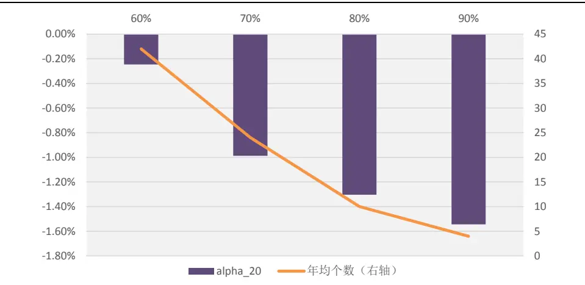
资料来源：朝阳永续，Wind，光大证券研究所，统计区间：2007-01-01至 2020-05-30

考虑到发生次数过少的情形对策略应用效果提升帮助不明显，我们选择当报告净利润下调幅度超过 30%，且报告预测净利润低于最近3个月内该股票的所有预测净利润的 70%分位数的策略，其对应的超额收益为-0.86%，胜率为 38.39%，年均个数为 24 个。

## 4、分析师推荐选股策略

在第二章和第三章中，我们分别构建了筛选优秀分析师，和挑选有效推票行为的两类策略。落实到最终的选股组合的构建时，就需要通过一定的规则，将两层次的筛选策略结合起来。

## 4.1、两个维度筛选相结合

首先，我们将前文的分析师筛选和推票行为筛选的策略效果汇总如下：

## 1、分析师筛选：

(a) 新财富分析师：

盈利预期上调幅度大于 20%时，对应未来60个交易日超额收益为 4.7%

(b) 不同行业分析师：

传媒、通信、建材、基础化工、计算机、机械、医药、有色金属、石油石化、电子等行业，分析师推票效果更显著；消费者服务、银行、综合、非银金融等行业，分析师推票后平均超额收益为负。

## (c) 历史推票有效性：

过去 6 个月内通过深度报告给予“买入”评级且上调盈利预期20%以上的报告胜率超过 60%的分析师，其未来一个季度推票效果较好，推票后 20 个交易日超额收益为 4.35%。

## 2、分析师推荐行为：

## (a) 低位首次覆盖：

当前股价处于滚动3 个月历史股价分位数50%以下，且24 个月未有卖方分析师覆盖的个股，近期发布的第一篇“买入”评级的深度报告后的累计 20 天超额收益率可以达到 7.8%。

## (b) 主动上调盈利预期：

当报告净利润上调幅度超过20%，且报告预测净利润高于最近3个月内该股票的所有预测净利润的 20%分位数时，对应的超额收益为 5.74%，胜率为 66.11%

## (c) 主动下调盈利预期：

当报告净利润下调幅度超过30%，且报告预测净利润低于最近3个月内该股票的所有预测净利润的 70%分位数时，其对应的超额收益为-0.86%，胜率为 38.39%。

## 4.2、综合选股策略：结合信号强度打分

在将分析师维度和推票行为维度这两个不同维度的筛选标准结合时，我们采用分别给与各个指标权重的方式来进行。首先，根据是否满足前一节中给出的标准，将每个指标变换为 0-1的哑变量，指标的权重则根据测试得到的超额收益和胜率，给予绝对值介于 1到3分之间的信号强度得分，具体的权重设置如下：

表14：综合信号强度打分框架及权重设置

| 维度 | 类型 | 标准 | 权重/操作 |
| --- | --- | --- | --- |
| 分析师维度 | 新财富分析师 | 深度买入报告，预期上调幅度大于 20% 传媒、通信、建材、基础化工、计算 | 1 |
|  | 特定行业分析师 | 机、机械、医药、有色金属、石油石 化、电子行业分析师给予“买入”评级 过去6个月内通过深度报告给予“买 | 1 |
|  | 历史推票有效性 | 入”评级且上调盈利预期20%以上 的报告胜率超过 60% 当前股价处于滚动3个月历史股价 | 2 |
| 推票行为维度 | 低位首次覆盖 | 分位数50%以下，且24个月未有卖 方分析师覆盖的个股，近期发布的第 一篇“买入”评级报告 | 2 |
|  | 主动上调预期 | 报告净利润上调幅度超过20%，且 报告预测净利润高于最近3个月内 该股票的所有预测净利润的20%分 位数 | 2 |
|  | 主动下调预期 | 报告净利润下调幅度超过30%，且 报告预测净利润低于最近3个月内 该股票的所有预测净利润的70%分 位数 | 卖出 |
|  | 评级下调 | 有分析师下调评级 | 卖出 |

资料来源：光大证券研究所

得到个股的日度交易信号后，我们采用下面的策略构建框架，并进行回测：

1、得分更新频率：日度

2、持仓数量上限：N 只

3、回测起始时间：2010年 1月1日

4、信号定义：

- 买入信号：得分大于 0

- 卖出信号：出现卖出信号或个股持仓超过 M 天

5、调仓方式：

- 起始日起，买入触发买入信号（得分大于 0）的个股

- 持仓达到N 只上限后，每日跟踪买入和卖出信号，有个股出现卖出信号则以第二天收盘价调出，同时按得分排序调入触发买入信号的股票，以第二天收盘价买入（若涨停则延后一天买入）

## 4.2.1、沪深 300 内策略：年化超额沪深 300 指数 6.5%，2016 年以来收益显著

当 N 取 50 时，M 取 60 时，在沪深 300 内的综合策略回测效果如下，组合从 2016 年开始表现出色，2016、2017、2018、2020 的年化超额收益均超过10个百分点。

表 15：沪深 300 内的综合策略分年度表现

|  | 月度胜率 | 年化收益率 | 年化波动率 | 年化超额收益 | 相对收益波动 | 信息比 | 最大回撤 | 相对最大回撤 |
| --- | --- | --- | --- | --- | --- | --- | --- | --- |
| 2010 | 41.7% | -14.9% | 22.5% | -4.6% | 6.1% | -0.75 | -27.6% | -9.4% |
| 2011 | 75.0% | -11.8% | 17.1% | 18.5% | 5.7% | 3.23 | -20.8% | -4.1% |
| 2012 | 58.3% | 11.4% | 16.0% | 0.7% | 5.9% | 0.12 | -14.5% | -8.1% |
| 2013 | 41.7% | -8.4% | 18.0% | -1.6% | 6.5% | -0.25 | -20.9% | -6.2% |
| 2014 | 58.3% | 54.3% | 19.9% | 2.2% | 7.2% | 0.31 | -10.9% | -7.4% |
| 2015 | 50.0% | 2.8% | 37.9% | -0.6% | 12.1% | -0.05 | -38.6% | -18.6% |
| 2016 | 91.7% | 11.4% | 19.5% | 16.3% | 4.8% | 3.42 | -17.3% | -1.4% |
| 2017 | 91.7% | 43.2% | 10.4% | 19.0% | 4.6% | 4.12 | -5.8% | -1.4% |
| 2018 | 75.0% | -17.6% | 21.7% | 11.6% | 4.6% | 2.49 | -25.9% | -3.3% |
| 2019 | 66.7% | 38.8% | 18.1% | 0.8% | 3.6% | 0.23 | -12.0% | -6.6% |
| 2020 | 60.0% | -3.1% | 21.4% | 14.2% | 7.6% | 1.86 | -13.3% | -4.7% |
| Summary | 64.8% | 7.9% | 21.3% | 6.5% | 6.6% | 0.99 | -38.6% | -18.6% |

资料来源：光大证券研究所，2010-01-01 至 2020-05-29

图13：沪深 300内的综合策略净值表现
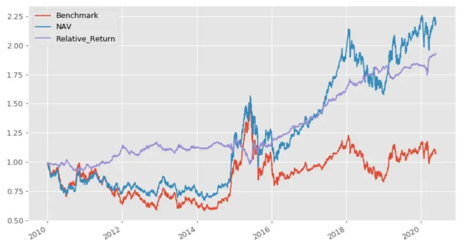
资料来源：光大证券研究所，2010-01-01 至 2020-05-29

策略年化超额沪深 300 指数为 6.5%，不过由于组合存在一定程度的行业偏离，组合在 2015 年初出现了较大幅度的回撤，且持仓风格稳定性相对较弱，组合相对波动为 6.6%，信息比0.99。

## 4.2.2、中证 500 内策略：年化超额中证 500 指数 16.6%

同样设置持仓数量上限为 50 时，M 取 60 时，在中证 500 内的综合策略回测效果如下，组合从 2016年开始表现出色，2016 年以来的各年的年化超额收益均超过 10个百分点。

表 16：中证 500 内的综合策略分年度表现

|  | 月度胜率 | 年化收益率 | 年化波动率 | 年化超额收益 | 相对收益波动 | 信息比 | 最大回撤 | 相对最大回撤 |
| --- | --- | --- | --- | --- | --- | --- | --- | --- |
| 2010 | 66.7% | 47.9% | 28.2% | 34.7% | 9.7% | 3.56 | -16.6% | -5.2% |
| 2011 | 66.7% | -26.5% | 24.3% | 11.8% | 7.7% | 1.53 | -31.3% | -7.0% |
| 2012 | 58.3% | 8.9% | 24.6% | 6.0% | 7.9% | 0.77 | -24.2% | -6.7% |
| 2013 | 75.0% | 34.0% | 23.4% | 13.8% | 7.4% | 1.86 | -15.5% | -5.1% |
| 2014 | 58.3% | 31.2% | 19.9% | -4.7% | 7.4% | -0.63 | -14.8% | -9.3% |
| 2015 | 58.3% | 51.7% | 49.0% | 10.3% | 13.3% | 0.77 | -48.8% | -14.0% |
| 2016 | 75.0% | 7.7% | 28.9% | 19.6% | 7.7% | 2.56 | -23.8% | -3.2% |
| 2017 | 91.7% | 33.4% | 15.8% | 34.8% | 7.0% | 4.97 | -8.8% | -2.1% |
| 2018 | 66.7% | -26.7% | 27.6% | 11.5% | 8.5% | 1.36 | -30.4% | -6.4% |
| 2019 | 83.3% | 57.9% | 21.5% | 23.6% | 8.2% | 2.86 | -15.7% | -7.4% |
| 2020 | 100.0% | 53.6% | 29.6% | 50.0% | 10.1% | 4.93 | -13.6% | -4.0% |
| Summary | 70.4% | 18.6% | 27.8% | 16.6% | 8.7% | 1.90 | -48.8% | -14.9% |

资料来源：光大证券研究所，2010-01-01 至 2020-05-29

图14：中证 500内的综合策略净值表现
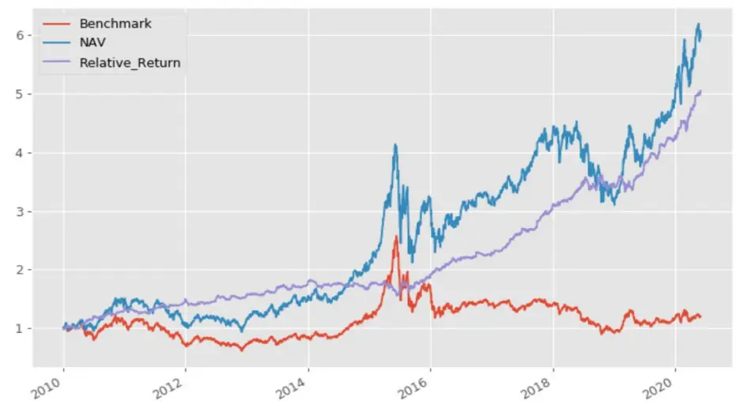
资料来源：光大证券研究所，2010-01-01 至 2020-05-29

策略年化超额中证 500指数达16.6%，相对波动为 8.7%，信息比1.90。可见分析师推票的效果在中证 500内更为显著，由于沪深 300 成分股具有更高的市场关注度的覆盖度，高关注度和高覆盖度也使得分析师从中挖掘独有信息的难度加大，分析师推票的效果不如中证 500这类风格更偏中小和成长的股票池。

## 5、风险提示

结果均基于模型和历史数据，模型存在失效的风险。本文使用的底层数据均基于朝阳永续提供的分析师研报明细数据，底层数据存在覆盖度不全或录入不及时的风险。

## 6、参考文献

[1] Narasimhan Jegadeesh, Joonghyuk Kim, Analyzing the Analysts: When Do Recommendations Add Value?[J], The Journal of Finance, (2004).

## 行业及公司评级体系

| 评级 说明 |  |  |
| --- | --- | --- |
| 行 | 买入 | 未来6-12个月的投资收益率领先市场基准指数15%以上； |
|  | 增持 | 未来6-12个月的投资收益率领先市场基准指数5%至15%； |
|  | 中性 | 未来6-12个月的投资收益率与市场基准指数的变动幅度相差-5%至5%; |
|  | 减持 | 未来6-12个月的投资收益率落后市场基准指数5%至15%； |
|  | 卖出 | 未来6-12个月的投资收益率落后市场基准指数15%以上； |
| 业及公司评级 | 无评级 投资评级。 | 因无法获取必要的资料，或者公司面临无法预见结果的重大不确定性事件，或者其他原因，致使无法给出明确的 |
| 基准指数说明：A股主板基准为沪深300指数；中小盘基准为中小板指；创业板基准为创业板指；新三板基准为新三板指数；港 股基准指数为恒生指数。 |  |  |

## 分析、估值方法的局限性说明

本报告所包含的分析基于各种假设，不同假设可能导致分析结果出现重大不同。本报告采用的各种估值方法及模型均有其局限性，估值结果不保证所涉及证券能够在该价格交易。

## 分析师声明

本报告署名分析师具有中国证券业协会授予的证券投资咨询执业资格并注册为证券分析师，以勤勉的职业态度、专业审慎的研究方法，使用合法合规的信息，独立、客观地出具本报告，并对本报告的内容和观点负责。负责准备以及撰写本报告的所有研究人员在此保证，本研究报告中任何关于发行商或证券所发表的观点均如实反映研究人员的个人观点。研究人员获取报酬的评判因素包括研究的质量和准确性、客户反馈、竞争性因素以及光大证券股份有限公司的整体收益。所有研究人员保证他们报酬的任何一部分不曾与，不与，也将不会与本报告中具体的推荐意见或观点有直接或间接的联系。

## 特别声明

光大证券股份有限公司（以下简称“本公司”）创建于 1996 年，系由中国光大（集团）总公司投资控股的全国性综合类股份制证券公司，是中国证监会批准的首批三家创新试点公司之一。根据中国证监会核发的经营证券期货业务许可，本公司的经营范围包括证券投资咨询业务。

本公司经营范围：证券经纪；证券投资咨询；与证券交易、证券投资活动有关的财务顾问；证券承销与保荐；证券自营；为期货公司提供中间介绍业务；证券投资基金代销；融资融券业务；中国证监会批准的其他业务。此外，本公司还通过全资或控股子公司开展资产管理、直接投资、期货、基金管理以及香港证券业务。

本报告由光大证券股份有限公司研究所（以下简称“光大证券研究所”）编写，以合法获得的我们相信为可靠、准确、完整的信息为基础，但不保证我们所获得的原始信息以及报告所载信息之准确性和完整性。光大证券研究所可能将不时补充、修订或更新有关信息，但不保证及时发布该等更新。

本报告中的资料、意见、预测均反映报告初次发布时光大证券研究所的判断，可能需随时进行调整且不予通知。在任何情况下，本报告中的信息或所表述的意见并不构成对任何人的投资建议。客户应自主作出投资决策并自行承担投资风险。本报告中的信息或所表述的意见并未考虑到个别投资者的具体投资目的、财务状况以及特定需求。投资者应当充分考虑自身特定状况，并完整理解和使用本报告内容，不应视本报告为做出投资决策的唯一因素。对依据或者使用本报告所造成的一切后果，本公司及作者均不承担任何法律责任。

不同时期，本公司可能会撰写并发布与本报告所载信息、建议及预测不一致的报告。本公司的销售人员、交易人员和其他专业人员可能会向客户提供与本报告中观点不同的口头或书面评论或交易策略。本公司的资产管理子公司、自营部门以及其他投资业务板块可能会独立做出与本报告的意见或建议不相一致的投资决策。本公司提醒投资者注意并理解投资证券及投资产品存在的风险，在做出投资决策前，建议投资者务必向专业人士咨询并谨慎抉择。

在法律允许的情况下，本公司及其附属机构可能持有报告中提及的公司所发行证券的头寸并进行交易，也可能为这些公司提供或正在争取提供投资银行、财务顾问或金融产品等相关服务。投资者应当充分考虑本公司及本公司附属机构就报告内容可能存在的利益冲突，勿将本报告作为投资决策的唯一信赖依据。

本报告根据中华人民共和国法律在中华人民共和国境内分发，仅向特定客户传送。本报告的版权仅归本公司所有，未经书面许可，任何机构和个人不得以任何形式、任何目的进行翻版、复制、转载、刊登、发表、篡改或引用。如因侵权行为给本公司造成任何直接或间接的损失，本公司保留追究一切法律责任的权利。所有本报告中使用的商标、服务标记及标记均为本公司的商标、服务标记及标记。

光大证券股份有限公司版权所有。保留一切权利。

## 联系我们

| 上海 | 北京 | 深圳 |
| --- | --- | --- |
| 写字楼48层 | 静安区南京西路1266号恒隆广场1号 西城区月坛北街2号月坛大厦东配楼2层 复兴门外大街6号光大大厦17层 | 福田区深南大道 6011 号 NEO 绿景纪元大 厦 A 座 17 楼 |