## 分层优化体系：融合行业轮动的指数增强模型——多因子系列报告之三十五

指数增强一直是量化投资中受关注度最高的产品类型之一，目前较为主流的方法是基于多因子的（且控制行业暴露度）组合优化体系。在此体系基础上，本篇报告将更进一步，深入研究在指数增强中能否融入行业轮动模型的信息，并搭建出具有普适性的指数增强体系，最终构造出效果更为突出且稳定的指数增强组合。

## 构建分层优化体系：同时注重信息融入与模块独立。

不同于直接以指数本身的风格、行业作为基准进行多因子组合优化构建增强组合，分层优化体系搭建了两层逐步优化的步骤：（1）先基于行业轮动模型的观点在指数原始行业配置的基础上进行超/低配调整，并相应缩放调整相应成分股的权重，为后续的选股优化提供行业暴露及个股暴露的参照基准。（2）再根据调整后的行业与成分股权重基准，运用多因子选股信息进行组合优化，构建出最终的指数增强组合。该体系在尽量运用行业与选股信息的同时，也保持了行业指标与选股因子的模块独立性。

## 分层优化体系显著提高沪深 300 增强组合的增强幅度：超额收益提高3个百分点，信息比率提高0.5。

在 EBQC 综合质量因子的基础上，运用分层优化体系分别尝试结合SAMI 行业轮动信息及 ADC_Revise 行业轮动信息。在分层优化沪深300 增强（SAMI+EBQC）中，组合在 2010/1-2020/5 期间年化超额收益 7.4%，信息比率1.84。相比纯多因子沪深 300增强，超额收益提升3个百分点，信息比率提升0.5。而分层优化沪深300增强（ADC_Revise+EBQC）在 2016/6-2020/5 期间相比纯多因子沪深 300 增强组合，在超额收益上亦有 3个百分点以上提升，信息比率提升幅度也接近0.5。

- 行业信息在指数成分股上的预测能力显著影响分层优化体系实际效果：推荐利用在指数内效果更好的行业轮动指标。

由于指数内行业成分股与行业指数的走势存在一定差异，SAMI轮动指标与在中证500指数内的行业轮动效果有限。受此影响分层优化在中证500增强中的提升效果较小。分层优化中证 500 增强（SAMI+中证 500 复合因子）在 2010/1-2020/5 期间年化超额收益 12.7%，信息比率 1.98。相比纯多因子中证 500 增强组合，在超额收益上提升 1 个百分点，信息比率提升 0.2。

风险提示：结果均基于模型和历史数据，模型存在失效的风险。

## 金融工程深度

## 分析师

胡骥聪 (执业证书编号：S0930519060002)

021-52523683

hujicong@ebscn.com

刘均伟 （执业证书编号：S0930517040001）

021-52523679

liujunwei@ebscn.com

## 相关研究

《以质取胜：EBQC 综合质量因子详解——多因子系列报告之十七》

《基于股票因子映射的行业轮动方法行业轮动系列研究之微观篇》

《三位一体：自适应（ADC）行业轮动模型——行业轮动系列报告之综合篇》

指数增强一直是量化投资中受关注度最高的产品类型之一。最主流的增强方法，是从选股的角度入手通过组合优化来实现对基准指数的稳定超额表现，利用的是多因子的截面预测信息。同时，在之前的行业轮动系列报告里，我们亦初步探索了将行业轮动信息运用在指数增强上的可行性。测试结果显示整体增强幅度较低，但仍有较稳定的超额效果。鉴于该结果，我们在本篇报告中将更进一步，深入研究如何同时利用选股因子与行业轮动的信息，构造出效果更为突出且稳定的指数增强组合。

## 1、分层优化：融合轮动与选股信息

在主流多因子的指数增强体系中，为了更好地控制组合的跟踪误差，往往会控制其在各种风格以及行业上的暴露程度。在这过程中，所谓风格或行业暴露都是默认以指数本身实际的风格或行业情况作为基准。这样处理的一个优势在于能够使多因子的信息仅在我们希望体现的维度上进行，而摒弃掉其它风格与行业可能带来的不确定性影响。

然而，如果我们不仅有多因子作为股票截面的预测信息，同时还有对行业的截面观点。一个自然衍生出来的需求即为：是否可以在尽量不影响多因子选股信息的同时，将行业截面信息融合进指数增强体系，从而进一步提升增强效果？这样的需求暗含两个要求：信息的独立性（模块化）、效果的叠加性（可增强）。针对这样的需求，我们在传统多因子增强体系基础上进行改进，构造了分层优化指数增强体系。其主要逻辑是：

1. 先基于行业截面信息对指数的行业权重进行优化调整；

2. 将该优化后的行业权重替换掉指数原始行业权重，作为之后多因子组合优化时的行业暴露控制基准；

3. 再基于多因子（或复合因子）进行传统的因子组合优化，得到该截面上各股票权重。

该章节将沿着上述逻辑展开，细述分层优化增强体系的构造方式。为后续阐述方便，我们以 IS（Industry Score）指代行业轮动截面得分；以 AS（Alpha Score）指代个股复合因子得分。

## 1.1、基于行业轮动信息优化指数内行业配置

第一层优化是基于行业轮动模型的观点在指数原始行业配置的基础上进行超低配调整，并相应缩放调整相应成分股的权重；从而为后续的选股优化提供行业暴露及个股暴露的参照基准。具体优化分两步，方式如下：

1. 确定超/低配调整后的指数内行业权重：通过组合优化，得到指数优化后的行业权重配比。复合指标信息将同时通过参与目标函数及约束条件，来达到信息传递。具体优化模型及参数设置为：

$$
Minimize_{w}\quad\frac{1}{2}w^{T}\Sigma w-w^{T}\mu
$$

s.t.

$$
0\leq w\leq1
$$

$$
\begin{aligned}\sum w&=1\\x_{lower\_fix}\leq w-w_{bench}&\leq x_{upper\_fix}\\x_{lower\_dynamic}\leq w-w_{bench}&\leq x_{upper\_dynamic}\end{aligned}
$$

其中，

w：行业权重向量；

$w_{bench}$ ：指数原始行业权重向量基准；

μ：量级调整后的行业指标得分向量（一般默认缩小两个数量级，即μ = IS/100）；

Σ：行业指数协方差矩阵；

xlower_fix 和 xupper_fix 分别为行业相对基准的固定偏离约束；

xlower_dynamic 和 xupper_dynamic 分别为行业相对基准基于行业截面指标值动态调整的偏离约束。

2. 按超/低配调整后的行业权重，调整成分股权重：对于每个指数成分股，其权重等于原始权重乘以调整后的行业权重与原始权重的比值。即不改变指数内同一行业的成分股之间的权重比例：

$$
调整后成分股权重=成分股原始权重\times\frac{调整后所属行业权重}{所属行业原始权重}
$$

## 1.2、基于复合选股因子优化成分股权重

第二层优化运用个股的复合因子得分通过优化器来确定个股持仓权重。这跟目前主流的因子组合优化的操作方式基本相同，唯一不同的地方在于约束条件中行业约束与个股约束中，对应的基准不再是指数原本的配置，而是经过上一节优化后的配置。具体优方式如下：

$$
Minimize_{w}w^{T}\mu
$$

s.t.

$$
\begin{aligned}0\leq w&\leq1\\\sum w&=1\\X_{lower}\leq X(w-w_{bench\_opt})&\leq X_{upper}\\I_{lower}\leq I(w-w_{bench\_opt})&\leq I_{upper}\\x_{lower\_fix}\leq w-w_{bench\_opt}&\leq x_{upper\_fix}\end{aligned}
$$

其中，

w：个股权重向量；

wbencℎ_opt：经过行业优化后的个股权重向量基准；

$\mu;$ 个股复合因子向量 AS；

X为风格因子暴露矩阵， $X_{lower}$ 和 $X_{upper}$ 分别为上下限；

I为行业哑变量矩阵， $I_{lower}$ 和 $\imath I_{upper}$ 分别为上下限;

xlower_fix 和 xupper_fix 分别为个股权重相对基准的偏离约束.

## 2、实证测试：有效提升组合增强幅度

在描述完分层优化指数增强体系的具体构建方式后，本章节将分别测试分层优化体系在沪深300及中证 500 上运用的增强效果。以及对比仅仅运用多因子选股信息的主流多因子增强体系，测试分层优化体系能够带来多大改善空间。

在测试中，我们尝试 2 个不同的行业轮动指标：SAMI 轮动指标及ADC_Revise 轮动指标；因子选择上，在沪深 300 增强上运用 EBQC 综合质量因子，而在中证 500 增强上运用中证 500 增强复合因子。以上提及的轮动指标及选股因子具体构造方式及逻辑均可参见文末附录部分。

表1：分层优化指数增强测试框架

|  | 增强组合测试框架 |
| --- | --- |
| 增强指数 | 沪深 300、中证500 |
| 选股样本 | 100%指数成分股 |
| 行业轮动指标 | SAMI 轮动指标、ADC_Revise 轮动指标 |
| 选股复合因子 | EBQC综合质量因子、中证500 增强复合因子 |
| 回测起始时间 | 2010 年1月1日（SAMI 轮动指标+EBQC 综合质量因子）2012年7月1日（SAMI 轮动指标+中证500 复合因子）2016 年 6 月1日(ADC_Revise 轮动指标） |
| 回测结束时间 | 2020年5月31日 |
| 调仓频率 | 月度调仓 |
| 交易费率 | 单边 0.3% |

资料来源：光大证券研究所

## 2.1、沪深 300 增强：分层优化提升幅度显著

对于沪深 300 增强，我们之前的多因子增强体系，主要是基于 EBQC综合质量因子的选股信息。从 2010 年 1 月到 2020 年 5 月其增强效果年化超额收益4.4%，信息比1.33。

## 2.1.1、SAMI 轮动指标 + EBQC 综合质量因子

我们先测试如果利用SAMI轮动指标的行业信息，在不改变之前多因子增强体系优化参数的基础上，运用分层优化体系构建增强组合的效果。具体参数如下表：

表2：沪深300增强在行业层面优化模型参数设置

| 参数名 | 参数含义 | 参数值 |
| --- | --- | --- |
| x_lower_fix | 相对基准固定偏离下限 | -2% |
| x_upper_fix | 相对基准固定偏离上限 | 2% |
| x_lower_dynamic | 相对基准动态偏离下限 | Min(IS / 100, 0) |
| x_upper_dynamic | 相对基动态准偏离上限 | Max(IS / 100, 0) |

资料来源：光大证券研究所

表3：沪深300增强在选股层面优化模型参数设置

| 参数名 参数含义 参数值 |  |
| --- | --- |
| x_lower_fix | 相对基准固定偏离下限 -1% |
| x_upper_fix | 相对基准固定偏离上限 1% |
| I_lower | 行业暴露度下限 0.85 |
| I_upper | 行业暴露度上限 1.15 |
| X_lower | 市值风格因子暴露度下限 0.95 |
| X_upper | 市值风格因子暴露度上限 1.05 |

资料来源：光大证券研究所

在融入 SAMI 轮动信息后，分层优化增强组合年化收益率 9.4%，相对沪深 300 指数年化超额收益率 7.4%，相比对照组（主流多因子体系增强组合）在年化超额收益上提高了 3 个百分点。同时信息比率上也有较大提升，从之前的1.33 上升到 1.84；而跟踪误差变化不大，仍在 4%以内；相对最大回撤也控制在6%以下。

表4：沪深300分层优化（SAMI+EBQC）增强组合统计数据

|  | 沪深300指数基准 | 绝对净值 |  | 相对基准超额净值 |  |
| --- | --- | --- | --- | --- | --- |
|  |  | 纯多因子增强分 | 层优化增强 | 纯多因子增强分 | 层优化增强 |
| 年化收益 | 2.0% | 6.3% | 9.4% | 4.4% | 7.4% |
| 年化波动 | 22.7% | 23.5% | 23.3% | 3.3% | 3.9% |
| 夏普比率 | 0.20 | 0.38 | 0.50 | 1.33 | 1.84 |
| 最大回撤 | 46.7% | 43.0% | 42.7% | 5.1% | 5.6% |
| 月度胜率 | 52.0% | 56.9% | 58.5% | 64.2% | 69.9% |

资料来源：WIND，光大证券研究所； 注：测试区间 2010/01/01 - 2020/5/31

图 1：沪深 300 分层优化（SAMI+EBQC）增强组合净值
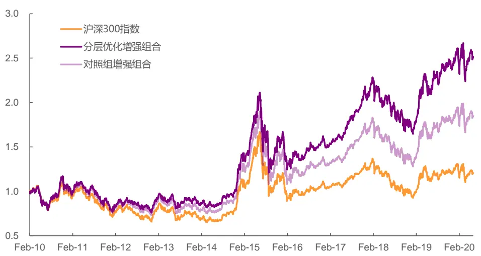
资料来源：WIND，光大证券研究所； 注：测试区间 2010/01/01 - 2020/5/31

图 2：沪深 300 分层优化（SAMI+EBQC）增强组合超额净值
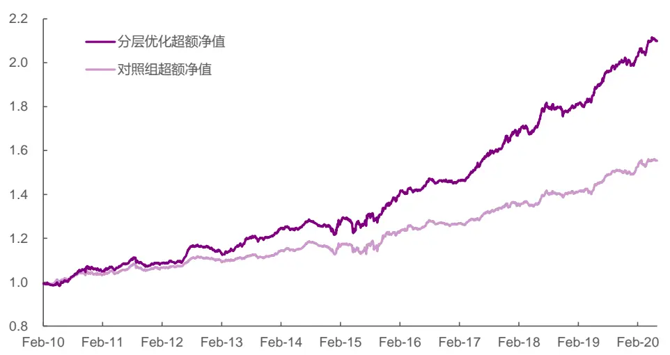
资料来源：WIND，光大证券研究所； 注：测试区间 2010/01/01 - 2020/5/31

观察超额净值的分年度数据，在2010到2020 年这11 年里，分层优化增强组合有 9 年跑赢纯多因子增强组合，仅在 2011 年及 2014 年小幅跑输不到 0.5%。可见在行业轮动信息较有效的前提下，分层优化体系能较稳定地体现行业信息，提升增强组合的增强幅度。

表 5：沪深 300 分层优化（SAMI+EBQC）增强组合分年度统计数据

| 年份 | 年化超额收益 |  | 跟踪误差 |  | 信息比率 |  | 相对最大回撤 |  |
| --- | --- | --- | --- | --- | --- | --- | --- | --- |
|  | 纯多因子增强分 | 层优化增强 | 纯多因子增强分 | 层优化增强 | 纯多因子增强 | 分层优化增强 | 纯多因子增强 | 分层优化增强 |
| 2010 | 5.2% | 7.3% | 3.0% | 3.7% | 1.71 | 1.98 | 1.5% | 1.7% |
| 2011 | 2.5% | 2.3% | 2.8% | 3.3% | 0.89 | 0.70 | 3.0% | 3.8% |
| 2012 | 3.4% 5.0% |  | 2.2% 2.7% |  | 1.57 | 1.86 | 1.9% | 2.8% |
| 2013 | 2.2% 6.8% |  | 2.4% 3.3% |  | 0.92 | 2.08 | 1.6% | 2.2% |
| 2014 | 0.0% -0.4% |  | 2.4% 3.2% |  | -0.01 | -0.11 | 5.1% | 5.5% |
| 2015 | 8.3% 12.7% |  | 6.4% 7.1% |  | 1.30 | 1.79 | 4.2% | 5.6% |
| 2016 | 3.2% | 5.1% | 2.9% | 3.0% | 1.10 | 1.72 | 2.2% | 1.6% |
| 2017 | 7.3% | 14.0% | 2.7% | 3.8% | 2.69 | 3.65 | 1.4% | 1.8% |
| 2018 | 3.6% | 7.2% | 2.9% | 4.1% | 1.22 | 1.76 | 2.3% | 3.5% |
| 2019 | 5.4% | 10.0% | 2.7% 3.5% |  | 2.03 | 2.86 | 1.8% | 1.8% |
| 2020 | 10.1% | 12.5% | 3.2% | 3.3% | 3.19 | 3.74 | 2.0% | 1.5% |

资料来源：WIND，光大证券研究所； 注：2020 年度区间截至 2020/5/31

以上测试验证了在构建原始 EBQC 沪深 300 组合优化的参数（行业暴露15%、市值暴露5%）下，分层优化体系能显著提升增强组合的收益与信息比。为了确定这样的效果提升是否具有普适性，有没有明显的参数依赖现象，我们继续对行业暴露与市值暴露这两个参数做敏感性测试。两个暴露程度参数分别遍历 [0.05, 0.10, 0.15, 0.20]。

从[市值暴露, 行业暴露]参数敏感性测试可以看出，分层优化对增强组合带来的提升效果受优化参数影响较小。在测试的参数样本内，分层优化增强相比对照组（纯多因子优化增强）在年化超额收益上平均提升 3 个百分点，在信息比率上平均提升0.5。

图3：不同参数对下分层优化增强组合年化超额收益
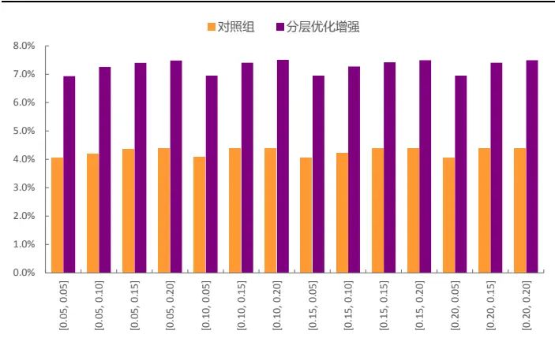
资料来源：WIND，光大证券研究所； 注：测试区间 2010/01/01- 2020/5/31

图4：不同参数对下分层优化增强组合信息比率
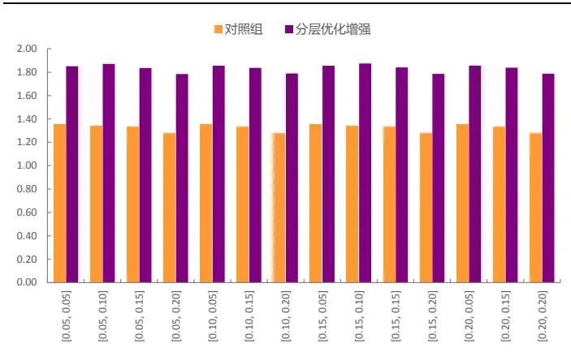
资料来源：WIND，光大证券研究所； 注：测试区间 2010/01/01- 2020/5/31

## 2.1.2、ADC_Revise 轮动指标 + EBQC 综合质量因子

除了可以运用 SAMI 行业轮动指标配合 EBQC 因子来构成沪深 300 分层优化指数增强，我们还可以尝试将光大 ADC 行业轮动模型的信息作为分层优化中行业配置的指导基础。由于 ADC 模型的信号本身不是一个完整的截面数值指标，因此在此先需要将其指标化。具体指标化的操作过程可详见报告文末附录部分，为方便起见，我们称调整后的 ADC 模型指标为ADC_Revise 轮动指标。

通过简单的 IC 统计，看出在最近 4 年（2016/06 – 2020/05）ADC_Revise轮动指标的行业截面预测能力稍强于SAMI轮动指标。

表 6：ADC_Revise 轮动指标对行业的截面预测能力统计

| SAMI 轮动指标 | ADC_Revise 轮动指标 |
| --- | --- |
| 样本数量 | 48 |
| IC 均值 | 13.7% 15.5% |
| IC 标准差 | 23.8% 23.3% |
| ICIR | 0.58 0.67 |
| IC>0 比例 | 72.9% 77.1% |

资料来源：WIND，光大证券研究所； 注：测试区间 2016/06/01 - 2020/5/31

测试在默认参数（行业暴露15%、市值暴露5%）下，ADC_Reivse+EBQC分层优化增强的表现。在 2016 年 6 月到 2020 年 5 月间，分层优化增强组合年化收益率 14.4%，相对沪深 300 指数年化超额 8.9%，相比对照组（纯多因子体系增强组合）在年化超额收益上提高了 3.2 个百分点。信息比率则从 2.06 上升到 2.53。

可以看出在将行业指标从SAMI替换成预测能力更强的ADC_Revise后，虽然分层优化体系仍能较好地提升组合的增强效果，但相比于分层优化（SAMI+EBQC）组合带来的提升幅度并没有显著差异。

表 7：沪深 300 分层优化（ADC_Revise+EBQC）增强组合统计数据

|  | 沪深300指数基准 | 绝对净值 |  | 相对基准超额净值 |  |
| --- | --- | --- | --- | --- | --- |
|  |  | 纯多因子增强分 | 层优化增强纯 | 多因子增强分 | 层优化增强 |
| 年化收益 | 5.1% | 11.0% | 14.4% | 5.7% | 8.9% |
| 年化波动 | 17.7% | 18.3% 18.6% |  | 2.7% | 3.4% |
| 夏普比率 | 0.37 | 0.66 | 0.82 | 2.06 | 2.53 |
| 最大回撤 | 32.5% | 30.1% 28.3% |  | 2.3% | 2.8% |
| 月度胜率 | 61.7% | 63.8% 66.0% |  | 66.0% | 72.3% |

资料来源：WIND，光大证券研究所； 注：测试区间 2016/06/01 - 2020/5/31

图 5：沪深 300 分层优化（ADC_Revise+EBQC）增强组合净值
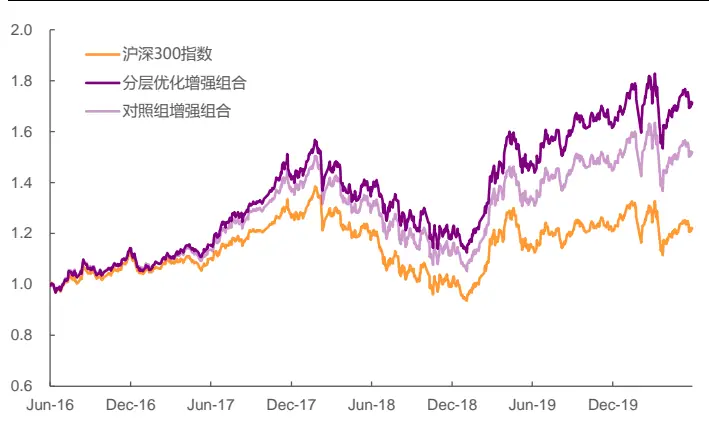
资料来源：WIND，光大证券研究所； 注：测试区间2016/06/01- 2020/5/31

图 6：沪深 300 分层优化（ADC_Revise+EBQC）增强组合超额净值
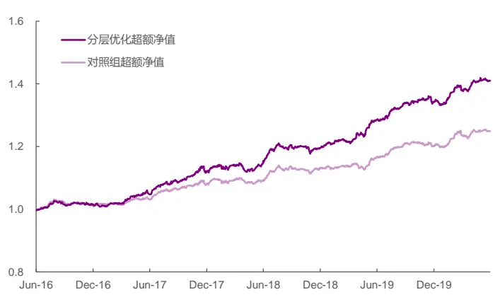
资料来源：WIND，光大证券研究所； 注：测试区间2016/06/01- 2020/5/31

## 2.2、中证 500增强：分层优化提升幅度不明显

对于中证500增强，在我们纯多因子增强体系中，主要是基于我们优选出的14个单因子通过滚动历史2年组合ICIR最优化的方式构建的复合因子来进行增强组合搭建。从 2012 年 7 月到 2020 年 5 月其增强效果年化超额收益 11.7%，信息比 1.79。

## 2.2.1、SAMI 轮动指标 + 中证 500 增强复合因子

与之前在300增强组合的测试类似，我们先测试在不改变纯多因子增强体系优化参数的基础上，加入SAMI轮动指标行业信息的分层优化体系，能对最终构建出增强组合带来怎样的效果提升。具体参数如下表：

表8：中证500增强在行业层面优化模型参数设置

| 参数名 | 参数含义 | 参数值 |
| --- | --- | --- |
| x_lower_fix | 相对基准固定偏离下限 | -2% |
| x_upper_fix | 相对基准固定偏离上限 | 2% |
| x_lower_dynamic | 相对基准动态偏离下限 | Min(IS / 100, 0) |
| x_upper_dynamic | 相对基动态准偏离上限 | Max(IS / 100, 0) |

资料来源：光大证券研究所

表9：中证500增强在选股层面优化模型参数设置

| 参数名 参数含义 参数值 |  |
| --- | --- |
| x_lower_fix | 相对基准固定偏离下限 -2% |
| x_upper_fix | 相对基准固定偏离上限 2% |
| I_lower | 行业暴露度下限 0.90 |
| I_upper | 行业暴露度上限 1.10 |
| X_lower | 市值风格因子暴露度下限 0.90 |
| X_upper | 市值风格因子暴露度上限 1.10 |

资料来源：光大证券研究所

在融入 SAMI 轮动信息后，分层优化中证 500 增强组合年化收益率18.8%，相对中证500指数年化超额收益率 12.7%。分层优化组合相比于对照组（纯多因子体系增强组合）在年化超额收益上提高了1个百分点，信息比率则是从 1.79 上升到 1.98；而跟踪误差与相对最大回撤基本变化不大，分别控制在6.5%与 7.5%以下。

表10：中证 500分层优化（SAMI+中证 500复合因子）增强组合统计数据

|  | 中证500指数基准 | 绝对净值 |  | 相对基准超额净值 |  |
| --- | --- | --- | --- | --- | --- |
|  |  | 纯多因子增强分 | 层优化增强 | 纯多因子增强分 | 层优化增强 |
| 年化收益 | 5.5% | 17.7% | 18.8% | 11.7% | 12.7% |
| 年化波动 | 26.5% | 28.0% | 27.8% | 6.3% | 6.2% |
| 夏普比率 | 0.34 | 0.72 | 0.76 | 1.79 | 1.98 |
| 最大回撤 | 65.2% | 50.9% | 48.6% | 7.2% | 7.3% |
| 月度胜率 | 53.2% | 57.4% | 59.6% | 69.1% | 72.3% |

资料来源：WIND，光大证券研究所； 注：测试区间 2012/07/01 - 2020/5/31

图 7：中证 500 分层优化（SAMI+中证 500 复合因子）增强组合净值
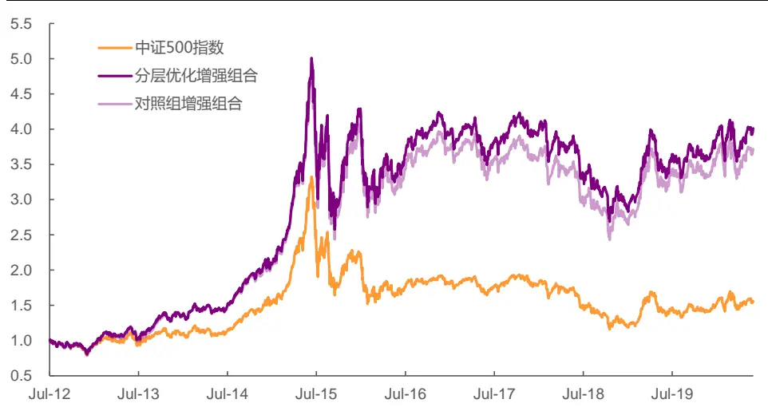
资料来源：WIND，光大证券研究所； 注：测试区间 2012/07/01 - 2020/5/31

图8：中证500分层优化（SAMI+中证 500复合因子）增强组合超额净值
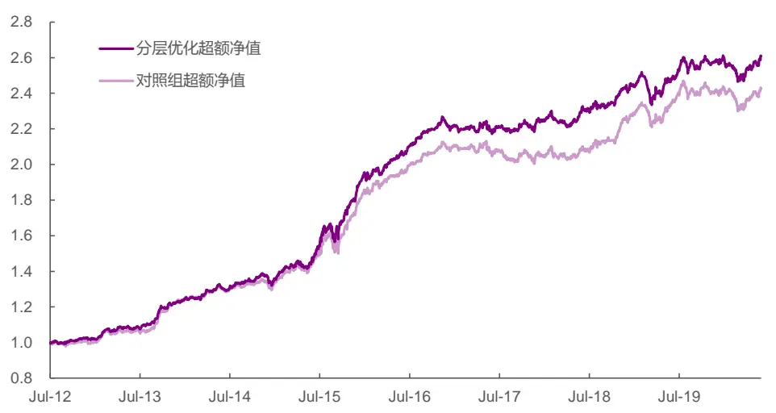
资料来源：WIND，光大证券研究所； 注：测试区间 2012/07/01 - 2020/5/31

观察分层优化体系及对照组在中证500增强组合超额净值的分年度数据，在 2012 到 2020 年这 9 年里，分层优化增强组合有 6 年跑赢纯多因子增强组合。同时可以看出，在加入行业信息后，分层优化体系增强组合受益于信息维度分散化的优势，在逐年稳定性上也有一定提高。

表11：中证 500分层优化（SAMI+中证500复合因子）增强组合分年度统计数据

| 年份 | 年化超额收益 |  | 跟踪误差 |  | 信息比率 |  | 相对最大回撤 |  |
| --- | --- | --- | --- | --- | --- | --- | --- | --- |
|  | 纯多因子增强 | 分层优化增强 | 纯多因子增强分 | 层优化增强 | 纯多因子增强 | 分层优化增强 | 纯多因子增强分 | 层优化增强 |
| 2012 | 1.4% | 4.2% | 4.5% | 4.2% | 0.32 | 0.99 | 2.8% | 1.9% |
| 2013 | 22.3% | 20.1% | 5.4% | 5.1% | 4.14 | 3.96 | 2.1% | 1.7% |
| 2014 | 6.6% | 8.5% | 5.1% 5.2% |  | 1.28 | 1.64 | 4.5% | 5.0% |
| 2015 | 33.2% | 36.7% | 10.9% 10.4% |  | 3.04 | 3.54 | 7.2% | 6.2% |
| 2016 | 12.5% | 12.7% | 4.9% 5.2% |  | 2.54 | 2.41 | 2.5% | 3.4% |
| 2017 | -2.6% | 1.5% | 5.3% 5.0% |  | -0.49 | 0.31 | 5.9% | 3.2% |
| 2018 | 11.0% | 8.4% | 5.3% | 5.0% | 2.06 | 1.67 | 3.7% | 4.0% |
| 2019 | 6.1% | 6.0% | 5.4% | 5.6% | 1.12 | 1.07 | 5.8% | 7.3% |
| 2020 | 0.0% | 1.5% | 6.9% | 7.0% | 0.00 | 0.21 | 5.4% | 5.1% |

资料来源：WIND，光大证券研究所； 注：2012 年度区间始于 2012/07/01，2020 年度区间截至 2020/05/31

在测试了默认参数（行业暴露 10%、市值暴露 10%）下分层优化指数增强（SAMI+中证 500复合因子）的效果后，可以看出分层优化体系在中证500 上相比传统纯多因子体系在超额收益及信息比上所带来的改善幅度，远不及在沪深300 上那么明显。一个很重要的原因是SAMI轮动指标本身是对于行业整体的截面预测判断，而指数中的行业成分股与行业指数走势本身有一定差异性。权重股占比更高的沪深 300，其内部行业成分股与行业指数的走势更为接近，因而能够更好地利用指数内行业权重优化带来的益处。

在本小节最后，针对中证 500 增强的构建，我们对行业暴露与市值暴露这两个参数也做敏感性测试。两参数分别遍历 [0.05, 0.10, 0.15, 0.20]。

从[市值暴露, 行业暴露]参数敏感性测试结果可以看出，在中证 500 上分层优化对增强组合带来的提升效果亦较稳定，参数敏感性低。在测试的参数样本内，分层优化增强相比对照组（纯多因子优化增强）在年化超额收益上平均提升1个百分点，在信息比率上平均提升 0.18。

图9：不同参数对下分层优化增强组合年化超额收益
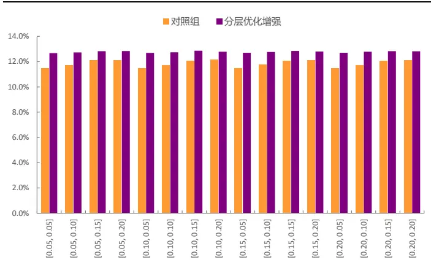
资料来源：WIND，光大证券研究所； 注：测试区间 2012/07/01- 2020/5/31

图10：不同参数对下分层优化增强组合信息比率
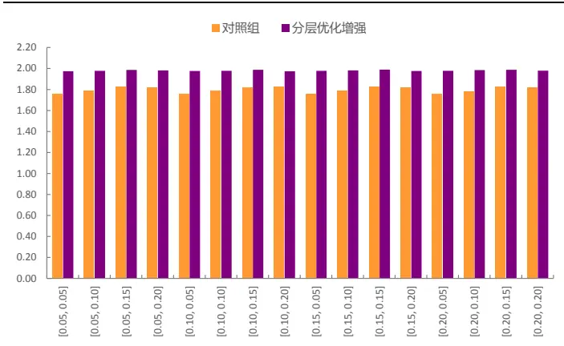
资料来源：WIND，光大证券研究所； 注：测试区间 2012/07/01- 2020/5/31

## 2.2.2、ADC_Revise 轮动指标 + 中证 500 增强复合因子

与沪深 300 中的测试一样，我们最后观察在默认参数（行业暴露 10%、市值暴露 10%）下，中证 500（ADC_Reivse+EBQC）分层优化增强的表现。在2016年6月到2020年5月间，分层优化增强组合年化超额收益率5.4%，信息比率1.02；这个数据与纯多因子增强组合5.5%的超额年化、1.03的信息比率几乎一样，并未产生提升作用。

表12：中证500分层优化（ADC_Revise+中证 500复合因子）增强组合统计数据

|  | 中证500指数基准 | 绝对净值 |  | 相对基准超额净值 |  |
| --- | --- | --- | --- | --- | --- |
|  |  | 纯多因子增强分 | 层优化增强纯 | 多因子增强分 | 层优化增强 |
| 年化收益 | -2.4% | 3.1% | 3.0% | 5.5% | 5.4% |
| 年化波动 | 21.2% | 20.9% | 20.8% | 5.3% | 5.3% |
| 夏普比率 | -0.01 | 0.25 | 0.25 | 1.03 | 1.02 |
| 最大回撤 | 40.1% | 38.8% 39.5% |  | 6.9% | 8.1% |
| 月度胜率 | 44.7% | 51.1% 55.3% |  | 63.8% | 63.8% |

资料来源：WIND，光大证券研究所； 注：测试区间 2016/06/01 - 2020/5/31

图 11：中证 500 分层优化（ADC_Revise+中证 500 复合因子）增强组合净值
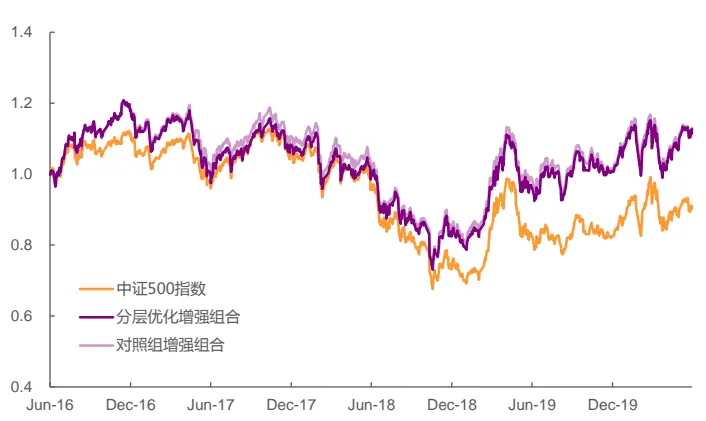
资料来源：WIND，光大证券研究所； 注：测试区间 2016/06/01- 2020/5/31

图 12：中证 500 分层优化（ADC_Revise+中证 500 复合因子）增强组合超额净值
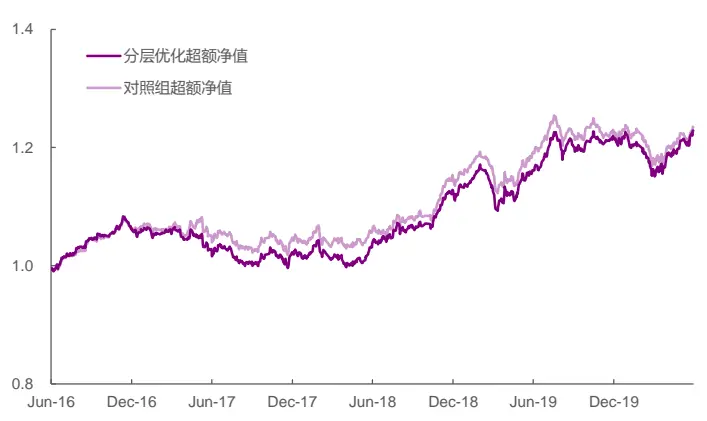
资料来源：WIND，光大证券研究所； 注：测试区间 2016/06/01- 2020/5/31

## 3、总结

针对当前指数增强的纯多因子体系，本文构造并重点阐述了将行业截面信息与因子选股信息综合利用的分层优化体系。并基于不同的行业指标与选股因子分别测试其在沪深300与中证500指数上的应用效果。具体结论如下：

## 构建分层优化体系：同时注重信息融入与模块独立

不同于直接以指数本身的风格、行业作为基准进行多因子组合优化构建增强组合，分层优化体系搭建了两层逐步优化的步骤：（1）先基于行业轮动模型的观点在指数原始行业配置的基础上进行超/低配调整，并相应缩放调整相应成分股的权重，为后续的选股优化提供行业暴露及个股暴露所参照的基准。（2）再根据调整后的行业与成分股权重基准，运用多因子选股信息进行组合优化，构建出最终的指数增强组合。该体系在尽量运用行业与选股信息的同时，也保持了行业指标与选股因子的模块独立性。

## 分层优化体系显著提高沪深300增强组合的增强幅度：超额收益提高3个百分点，信息比率提高 0.5

在 EBQC 综合质量因子的基础上，运用分层优化体系分别尝试结合SAMI行业轮动信息及ADC_Revise 行业轮动信息。在分层优化沪深 300 增强（SAMI+EBQC）中，组合在 2010/1-2020/5 期间年化超额收益 7.4%，信息比率1.84。相比纯多因子沪深 300 增强，超额收益提升 3个百分点，信息比率提升 0.5。而分层优化沪深 300 增强（ADC_Revise +EBQC）在2016/6-2020/5 期间相比纯多因子沪深 300 增强组合，在超额收益上亦有 3个百分点以上提升，信息比率提升幅度也接近0.5。

## 行业信息在指数成分股上的预测能力显著影响分层优化体系实际效果

由于指数内行业成分股与行业指数的走势存在一定差异，SAMI轮动指标与在中证500指数内的行业轮动效果有限。受此影响分层优化在中证500增强中的提升效果较小。分层优化中证 500 增强（SAMI+中证 500 复合因子）在2010/1-2020/5 期间年化超额收益 12.7%，信息比率 1.98。相比纯多因子中证500 增强组合，在超额收益上提升1个百分点，信息比率提升 0.2。

## 4、风险提示

报告结论均基于历史数据与模型，模型存在失效的可能，历史数据存在不被重复验证的可能。

## 5、附录

## A、选股因子构造简介

在沪深300 指数增强组合及中证 500 指数增强组合的构建中，我们分别使用了不同的复合因子，该节将对其分别使用的EBQC 综合质量因子与中证500多因子做简单介绍。

## A.1、EBQC 综合质量因子

EBQC 综合质量因子是一个能体现出公司综合质量的复合因子。在构建方法上，它涵盖了 6 大类不同维度的质量因素：盈利能力、成长能力、盈余质量、营运效率、安全性、公司治理，如下图所示：

图 13：质量因子细分类别（6 大类）
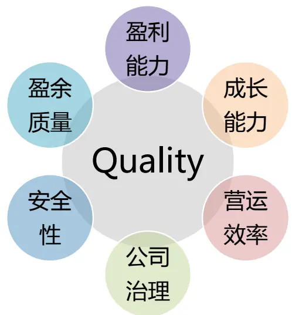
资料来源：光大证券研究所

构建过程中，每个质量因素维度上均分别由一个或多个单因子等权加总表征；再将6大类质量因子等权相加，就得到我们最终的 EBQC 因子值。有关EBQC 因子的详细测试及构建细节，可参见报告《以质取胜：EBQC 综合质量因子详解——多因子系列报告之十七》。

## A.2、中证 500 增强复合因子

中证 500增强复合因子采用的是较为主流的多因子复合体系，其每个单因子的权重由滚动历史 2 年组合 ICIR 最优化的方式进行配置。具体因子池如下表：

表 13：中证 500 增强组合底层多因子池

| 因子代码 | 因子指标示意 |
| --- | --- |
| Momentum_1M | 1个月动量 |
| Momentum_24M | 24 个月动量 |
| STD_3M | 3个月波动率 |
| TargetReturn | 目标收益率 |
| VA_FC_1M | 1 个月换手率 |
| VSTD_3M | 3个月流动性 |
| DP | 股息率 |
| EEChange_3M | 一致预期净利润调整 |
| OP_Q_YOY | 营业利润单季度同比 |
| CFOA | 经营现金流/总资产 |
| ATD | 总资产周转率变动 |
| CCR | 经营现金流/流动负债 |
| ROE_TTM | ROE |
| NP_SD | 净利润稳健加速度 |

资料来源：光大证券研究所

## B、行业指标构造简介

该节简单介绍我们在分层优化中对指数行业权重基准进行超低配调整时运用的行业轮动指标。

## B.1、SAMI 行业轮动指标

SAMI 行业轮动指标是个复合指标，由多个 SAMI 单指标构成。而对于每个SAMI单指标，其构建逻辑较为简单，即通过将相应成分股因子按照自由流通市值加权的方式映射成行业指标即可。

$$
SAMI_{t}(sector,alpha)=\sum_{i\in sector}w_{it}*alpha_{it}\#
$$

其中，

下标 t 表示时期，i 表示个股；

参数 sector 表示行业，alpℎa 表示个股因子；

w 表示权重，对任意 t 与 sector，满足 $\textstyle\sum_{i\in sector}w_{it}=1$ C

最终的SAMI行业轮动指标是由 6个不同因子映射出的单指标，通过简单等权相加的方式构建而成，具体细分单指标如下表：

表 14：SAMI 行业轮动指标底层单指标池

| 底层因子代码 | 指标示意 |
| --- | --- |
| ATD | 资产周转：变动 |
| DAD | 资产负债率：变动 |
| EBQC | EBQC 综合质量 |
| OCFA | 营运效率提升 |
| RPP_75D | 近75 日报告覆盖数量 |
| EEPSChange_3M | 一致预期EPS：3个月变动 |

资料来源：光大证券研究所

有关SAMI轮动指标的详细测试及构建细节，可参见报告《基于股票因子映射的行业轮动方法——行业轮动系列研究之微观篇》。

## B.2、ADC_Revise 轮动指标

ADC_Revise 轮动指标是在 ADC 轮动模型的基础上针对分层优化体系做的改动版本。其原因是在分层优化体系中我们需要数值化的行业观点，而原始的 ADC 轮动模型的观点并非完全是基于打分体系给出。为了能利用ADC轮动模型的信息，我们对其模型构建做了相应调整。

原始 ADC 轮动模型的逻辑是：先基于宏观观点做初次筛选，挑选出看好的板块对应行业；再通过中观与微观观点的综合打分再优选出看好的行业。（具体的 ADC 行业轮动模型构建细节可参考《三位一体：自适应（ADC）行业轮动模型——行业轮动系列报告之综合篇》）在这个过程中，中观与微观综合打分本身就是数值观点，因此这一部分我们在ADC_Revise 指标调整的过程中会完整不变地保留下来；而宏观观点的运用将会进行较大调整。

宏观模型在原始 ADC 模型中，基于主动逻辑的宏观周期模型与纯量化的“宏观情景”聚类模型分别会推荐3个强势板块，最终基于其重合部分作为初筛标准。我们现对其做如下调整动作：

1. 每个板块在经过周期模型及聚类模型判断后都会落入以下 3 个宏观结果类别中的一个：同时被两个模型推荐；仅被一个模型推荐；不被任何一个模型推荐。

2. 每个宏观结果类别，所属其中的板块及行业，其中观微观综合打分将分别对应一种数值变换：

- 同时被两个模型推荐：

$$
Score_{adjust}=\left\{\begin{matrix}0,&\quad x<0\\Score_{origin},&\quad x\geq0\end{matrix}\right.
$$

- 仅被一个模型推荐：

$$
Score_{adjust}=\frac{1}{2}\;Score_{origin}
$$

- 不被任何一个模型推荐：

$$
Score_{adjust}=\left\{\begin{aligned}Score_{origin},\quad&\quad x<0\\0,\quad&\quad x\geq0\end{aligned}\right.
$$

其中：

$Score_{origin}$ ：原始中观微观综合得分；

$Score_{adJust}$ ：变换后的中观微观综合得分。

每个行业基于上述变换后的打分数值，即为ADC_Revise 轮动指标值。

## 行业及公司评级体系

| 评级 说明 |  |  |
| --- | --- | --- |
| 行 | 买入 | 未来6-12个月的投资收益率领先市场基准指数15%以上； |
|  | 增持 | 未来6-12个月的投资收益率领先市场基准指数5%至15%； |
|  | 中性 | 未来6-12个月的投资收益率与市场基准指数的变动幅度相差-5%至5%； |
|  | 减持 | 未来6-12个月的投资收益率落后市场基准指数5%至15%； |
|  | 卖出 | 未来6-12个月的投资收益率落后市场基准指数15%以上； |
| 业及公司评级 | 无评级 | 因无法获取必要的资料，或者公司面临无法预见结果的重大不确定性事件，或者其他原因，致使无法给出明确的 投资评级。 |
| 基准指数说明：A股主板基准为沪深300指数；中小盘基准为中小板指；创业板基准为创业板指；新三板基准为新三板指数；港 股基准指数为恒生指数。 |  |  |

## 分析、估值方法的局限性说明

本报告所包含的分析基于各种假设，不同假设可能导致分析结果出现重大不同。本报告采用的各种估值方法及模型均有其局限性，估值结果不保证所涉及证券能够在该价格交易。

## 分析师声明

本报告署名分析师具有中国证券业协会授予的证券投资咨询执业资格并注册为证券分析师，以勤勉的职业态度、专业审慎的研究方法，使用合法合规的信息，独立、客观地出具本报告，并对本报告的内容和观点负责。负责准备以及撰写本报告的所有研究人员在此保证，本研究报告中任何关于发行商或证券所发表的观点均如实反映研究人员的个人观点。研究人员获取报酬的评判因素包括研究的质量和准确性、客户反馈、竞争性因素以及光大证券股份有限公司的整体收益。所有研究人员保证他们报酬的任何一部分不曾与，不与，也将不会与本报告中具体的推荐意见或观点有直接或间接的联系。

## 特别声明

光大证券股份有限公司（以下简称“本公司”）创建于 1996 年，系由中国光大（集团）总公司投资控股的全国性综合类股份制证券公司，是中国证监会批准的首批三家创新试点公司之一。根据中国证监会核发的经营证券期货业务许可，本公司的经营范围包括证券投资咨询业务。

本公司经营范围：证券经纪；证券投资咨询；与证券交易、证券投资活动有关的财务顾问；证券承销与保荐；证券自营；为期货公司提供中间介绍业务；证券投资基金代销；融资融券业务；中国证监会批准的其他业务。此外，本公司还通过全资或控股子公司开展资产管理、直接投资、期货、基金管理以及香港证券业务。

本报告由光大证券股份有限公司研究所（以下简称“光大证券研究所”）编写，以合法获得的我们相信为可靠、准确、完整的信息为基础，但不保证我们所获得的原始信息以及报告所载信息之准确性和完整性。光大证券研究所可能将不时补充、修订或更新有关信息，但不保证及时发布该等更新。

本报告中的资料、意见、预测均反映报告初次发布时光大证券研究所的判断，可能需随时进行调整且不予通知。在任何情况下，本报告中的信息或所表述的意见并不构成对任何人的投资建议。客户应自主作出投资决策并自行承担投资风险。本报告中的信息或所表述的意见并未考虑到个别投资者的具体投资目的、财务状况以及特定需求。投资者应当充分考虑自身特定状况，并完整理解和使用本报告内容，不应视本报告为做出投资决策的唯一因素。对依据或者使用本报告所造成的一切后果，本公司及作者均不承担任何法律责任。

不同时期，本公司可能会撰写并发布与本报告所载信息、建议及预测不一致的报告。本公司的销售人员、交易人员和其他专业人员可能会向客户提供与本报告中观点不同的口头或书面评论或交易策略。本公司的资产管理子公司、自营部门以及其他投资业务板块可能会独立做出与本报告的意见或建议不相一致的投资决策。本公司提醒投资者注意并理解投资证券及投资产品存在的风险，在做出投资决策前，建议投资者务必向专业人士咨询并谨慎抉择。

在法律允许的情况下，本公司及其附属机构可能持有报告中提及的公司所发行证券的头寸并进行交易，也可能为这些公司提供或正在争取提供投资银行、财务顾问或金融产品等相关服务。投资者应当充分考虑本公司及本公司附属机构就报告内容可能存在的利益冲突，勿将本报告作为投资决策的唯一信赖依据。

本报告根据中华人民共和国法律在中华人民共和国境内分发，仅向特定客户传送。本报告的版权仅归本公司所有，未经书面许可，任何机构和个人不得以任何形式、任何目的进行翻版、复制、转载、刊登、发表、篡改或引用。如因侵权行为给本公司造成任何直接或间接的损失，本公司保留追究一切法律责任的权利。所有本报告中使用的商标、服务标记及标记均为本公司的商标、服务标记及标记。

光大证券股份有限公司版权所有。保留一切权利。

## 联系我们

| 上海 | 北京 | 深圳 |
| --- | --- | --- |
| 静安区南京西路1266号恒隆广场1号 写字楼48层 | 西城区月坛北街2号月坛大厦东配楼2层 复兴门外大街6号光大大厦17层 | 福田区深南大道 6011号 NEO 绿景纪元大 厦 A 座 17 楼 |