## 成长企业新视角：税收科目全解析——多因子系列报告之三十六

纳税是企业生产经营过程中不可回避的一部分，它通常跟企业的利润情况具有较高的相关性，但由于税收优惠政策、税务口径与会计口径不一致等原因，税收不是净利润的单变量函数，它可能还包含了企业利润以外的信息。本篇报告尝试对税收相关科目进行解析，通过量化手段寻找税收数据与企业经营或盈利之间的规律，并构造相关选股因子，合理运用于量化选股策略中，供投资者参考。

- 税收科目解析：税务口径vs 会计口径。三大报表中均有与税收相关的会计科目，其中，税务口径核算的税费可参考资产负债表中的应交税费科目；会计口径核算的税费可参考利润表中的所得税费用和税金及附加；税务口径与会计口径不一致导致的暂时性差异形成资产负债表中的递延所得税资产（负债）。现金流量表中，支付的各项税费为当期实际缴纳税费的现金流。

- 企业通过调节折旧、摊销方式影响当期税费核算，大多情况下更可能是出于现金流方面的考量。我们统计了各项税收指标的占比，其中，所得税、税金及附加占利润总额比例大多在 20%以内，调整税费核算对于会计利润影响相对较小；而当期缴纳税费的现金流占经营性净现金流的比例达 50%左右。因而企业通过调整折旧、摊销方式影响税费核算的主要目的更有可能是合理调节纳税现金流的分布，而这一调整将反映于递延所得税资产（负债）中。

- 税收因子：推荐关注税金及附加变化率因子。应交税费占比因子、支付的各项税费变化率因子、税金及附加变化率因子在截面分布方面，均与传统成长因子存在较大差异。其中，税金及附加变化率因子在行业、市值中性化处理后，与传统成长、盈利因子 IC 序列相关性较低，IC 均值为 1.29%，IC_IR 达 0.48（统计期：2010-01-01 至 2020-06-30），可提供企业经营活动方面的增量信息。

优质成长选股策略：与偏股型基金的同期收益率相比较，绝大部分年份的收益率排名前30%，今年以来收益率达 93.2%（截止于 2020年7月 31日）。我们围绕“高成长+健康现金流”的理念构建了优质成长选股策略，该策略2009年以来，年化收益率达 35.0% ，除2017年外，相对偏股型基金等权指数均有超额收益。即使按9成仓位计算策略年度收益，大部分年度均可排名偏股型基金的前30%。

- 风险提示：本篇报告研究基于现阶段会计准则下的财务数据进行，财务准则的变更、上市公司财务数据失真、市场短期波动，均有可能影响模型的有效性。

## 金融工程深度

## 分析师

古 翔（执业证书编号：S0930519070003）

021-52523686

guxiang@ebscn.com

周萧潇 (执业证书编号：S0930518010005)

021-52523680

zhouxiaoxiao@ebscn.com

刘均伟 (执业证书编号：S0930517040001)

021-52523679

liujunwei@ebscn.com

## 相关研究

《现金偿债因子：规避企业潜在财务风险——多因子系列报告三十二》

················2020-04-23

《有息负债：解读企业杠杆的选股信息——多因子系列报告之三十》

···············2020-02-25

《规模调整的盈利因子：从盈余公积谈起——多因子系列报告之二十八》

············2020-01-20

《业绩“爆雷”公司特征探析——量化排雷系列报告之一》

············2019-10-20

《多因子系列报告之一：因子测试框架》·····2017-04-10

纳税是企业生产经营过程中不可回避的一部分，它通常跟企业的利润情况具有较高的相关性，但由于税收优惠政策、税务口径与会计口径不一致等原因，税收不是净利润的单变量函数，它可能还包含了企业利润以外的信息。

然而，目前市场上对税收数据所反映的信息的解读依然较少，本篇报告尝试对税收相关的会计科目进行解析，通过量化手段寻找税收数据与企业经营或盈利之间的规律，并构造相关选股因子，合理运用于量化选股策略中，供投资者参考。

## 1、税收科目解析：税务口径 vs 会计口径

定期财务报告中，资产负债表、利润表、现金流量表内均有税收相关的科目，具体科目如表 1所示。其中，资产负债表内的相关科目反映未来须缴纳的税费或可抵减税的金额；利润表内相关科目反映当期核算的税费；现金流量表的相关科目则反映当期与税收相关的现金流情况。

递延所得税资产/负债：主要来源于税务口径与会计口径的不一致所导致的暂时性差异，未来可抵减/应纳税的金额，即：当期实际缴纳的税费高于会计核算的税费时，可计入递延所得税资产，未来可抵减所得税金额；反之亦然。

- 应交税费：类似于应付账款，是按权责发生制原则确认计提但尚未缴纳的部分，可能包括应交增值税、应交企业所得税、应交城市维护建设税等，一定程度可近似理解为税务口径下计算的企业税负。

- 税金及附加：在营业利润内计量，包括除企业所得税外的大部分税种，如：城市维护建设税，教育费附加，印花税，房产税，土地使用税等。

所得税费用：即为会计核算的所得税费用。企业所得税率一般是25%，符合条件的小型微利企业，所得税的税率一般为20%。国家重点扶持的高新技术企业，所得税的税率一般为15%。

- 支付的各项税费：归属于经营活动产生的现金流，是企业当期通过现金缴付的税费。

收到的税收返还：指的是政府按照国家有关规定采取先征后返、即征即退等办法向企业返还的税款，属于以税收优惠形式给予的一种政府补助。

表 1：税收相关的会计科目

| 资产负债表 | 利润表 | 现金流量表 |
| --- | --- | --- |
| 1 递延所得税资产 | 税金及附加 | 支付的各项税费 |
| 2 | 递延所得税负债 所得税费用 | 收到的税收返还 |
| 3 | 应交税费 | 1 |

资料来源：光大证券研究所整理

## 1.1、递延所得税资产占比逐年提升

如下图所示，我们统计了全市场股票递延所得税资产（或负债）、应交税费占净资产比例的中位数以及递延所得税资产（或负债）、应交税费的覆盖度情况，观察该类资产对于上市公司的重要性及变化趋势。

递延所得税资产占净资产比例仅 1%左右。无论从覆盖度，还是从占净资产的比例观察，递延所得税资产均高于递延所得税负债。但从整体占比来看，递延所得税资产占净资产比例仍较低，仅1%左右。

递延所得税资产占比呈逐年提升的趋势。我们统计了不同指数范围内上市公司递延所得税资产占比的情况，不难看出，大市值、成熟度较高的企业，递延所得税资产占比相对较高。随着企业的成长发展，递延所得税资产亦呈逐年提升的趋势。

图1：不同时段内，递延所得税资产占比统计（中位数）
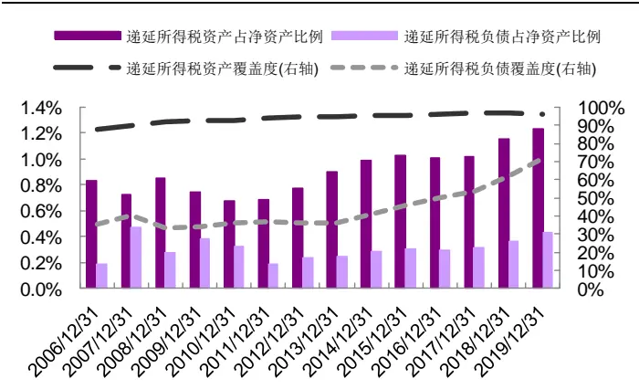
资料来源：Wind，光大证券研究所

图2：不同宽基指数内，递延所得税资产占比统计（中位数）
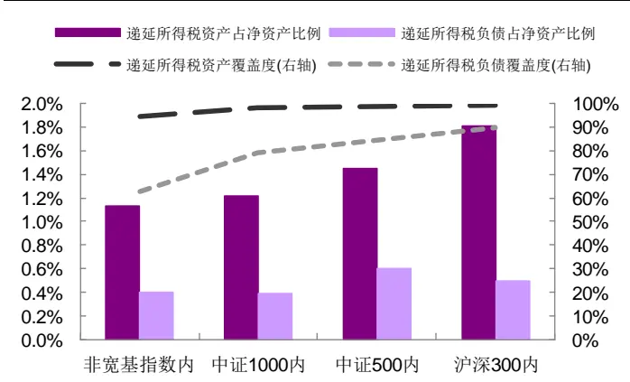
资料来源：Wind，光大证券研究所（注：2019 年年报）

- 应交税费占净资产比例在1.5%-3%范围内，呈逐年下降的趋势。由于纳税是上市公司经营过程中不可回避的部分，应交税费数据的覆盖度较高。从资产占比角度来看，应交税费占净资产比例在 3%以内，并呈逐年下降的趋势，反映出企业税负有所减轻。

图3：不同时段内，应交税费占比统计（中位数）
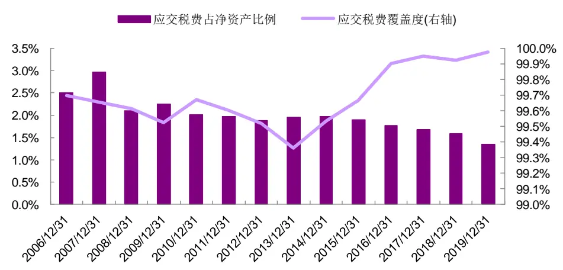
资料来源：Wind，光大证券研究所

敬请参阅最后一页特别声明

## 1.2、税收占比具有明显的行业特征

企业的所得税费用与企业当期利润总额直接相关，而税金及附加则囊括了除所得税外的其他与经营相关的多项税种。

所得税费用显著高于税金及附加。所得税费用、税金及附加数据的覆盖度均较高，超过95%。从占利润总额的比例来看，所得税费用占比显著高于税金及附加，说明各项税种中，企业所得税对于企业净利润影响最大。

所得税费用占比呈逐年下降趋势，税金及附加占利润总额比例则保持相对稳定的状态。从变化趋势来看，税金及附加占比在 6%-8%范围浮动；而所得税费用占比则逐年递减，从 17%下降至 14%。这一变化趋势可能是受行业结构演变以及税收优惠政策的影响。

图4：不同时段内，所得税费用、税金及附加占利润总额比例统计（中位数）
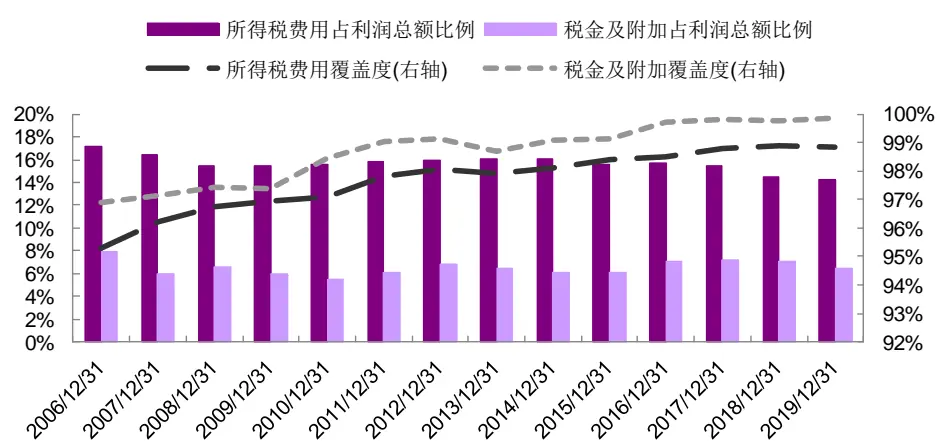
资料来源：Wind，光大证券研究所

税收占比在行业层面的差异较大。对比不同行业的税收占比，所得税费用占比和税金及附加占比均有较明显的行业特征：TMT、医药等易认定为高新技术企业的行业，所得税费用占比和税金及附加占比均较低；房地产、煤炭、有色金属等资本开支较大的传统行业所得税费用占比和税金及附加占比均较高；金融等服务型行业所得税费用较高，税金及附加占比较低。

图 5：不同行业内，所得税费用、税金及附加占利润总额比例统计（中位数，中信一级分类）
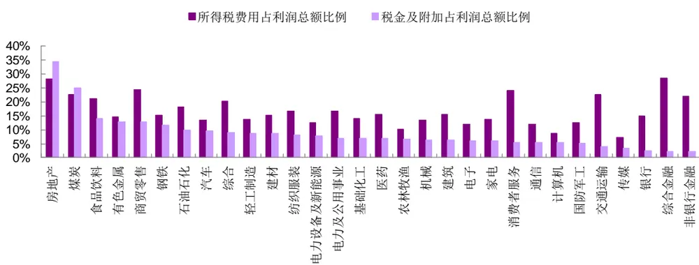
资料来源：Wind，光大证券研究所（注：2019 年年报）

## 1.3、支付的各项税费对于企业现金流影响较大

本节关注现金流量表中与税收相关的指标，即：支付的各项税费、收到的税收返还。这两个科目均属于经营活动带来的现金流，可通过占经营性净现金流的比例，刻画它们对企业现金流的影响。

约 70%的企业可以获得一定的税收返还。从覆盖率角度来看，2006 年以来，收到的税收返还数据的覆盖率在65%-75%范围内浮动，近年呈现逐年提升趋势；支付的各项税费的覆盖率则近 100%，反映企业实际缴纳税费的现金流额度。

支付的各项税费对于企业现金流影响较大。从占经营性净现金流的比例来看，支付的各项税费占比在50%上下浮动，对企业现金流具有较大影响；而收到的税收返还占比则在8%以内，对企业现金流影响较小。

图6：不同时段内，支付的各项税费、收到的税收返还占经营性净现金流比例统计（中位数）
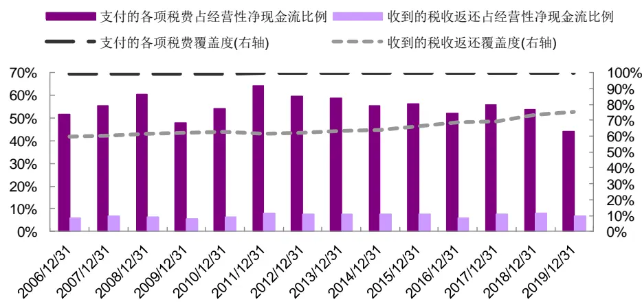
资料来源：Wind，光大证券研究所

家电、电子、机械、通信等行业收到的税收返还占比相对较高。如下图所示，我们统计了不同中信一级行业内上市公司收到的税收返还占比，不难看出，不同行业收到的税收返还占比差异较大，家电、电子、机械、通信等税收优惠政策较多的行业，收到的税收返还占比相对较高，但最多也只能达到18%左右。

图 7：不同行业内，收到的税收返还占经营性净现金流比例统计（中位数，中信一级分类）
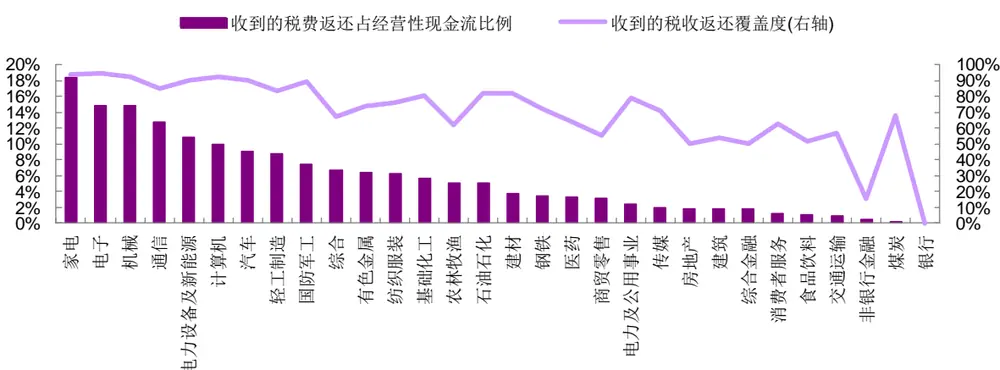
资料来源：Wind，光大证券研究所（注：2019 年年报）

综上所述，应交税费可一定程度理解为税务口径核算的税费；所得税费用、税金及附加为会计口径核算的税费；二者的差异将体现于递延所得税资产、递延所得税负债科目内。支付的各项税费占企业经营性净现金流比例较高，因而，企业通过调节折旧、摊销方式影响税费核算，大多情况下更可能是出于现金流方面的考量。

## 2、税收因子：推荐关注税金及附加变化率因子

本章我们基于税收相关科目的数据，运用常见的因子构造方式构建选股因子并在因子测试框架内测试其有效性，目的在于检验税收相关科目的数据能否提供增量信息。

## 2.1、因子构造及测试框架

基础数据：我们主要尝试运用前文整理的税收相关科目的数据构造选股因子，其中，递延所得税资产与递延所得税负债实际含义相似，均反映的是税务口径和会计口径核算出来税费的暂时性差异，因而可直接应用递延所得税资产与递延所得税负债之差构造选股因子；另一方面，收到的税收返还数据覆盖度较低，我们以支付的各项税费与收到的税收返还之差，刻画支付税费的净现金流数据。此外，净利润、净资产、经营性净现金流主要用于税收占比指标计算，以及作为税收变化率因子的对照组。

表2：因子构造所用基础数据含义

| 简称 | 缩写 | 含义 |  |  |
| --- | --- | --- | --- | --- |
| 递延所得税 | DT | 递延所得税资产-递延所得税负债 |  |  |
| 应交税费 | PT | 可理解为税务口径下核算的税费 |  |  |
| 税金及附加 OT |  | 经营过程中产生的税费(车船税、印花税等) |  |  |
| 所得税 | IT | 企业所得税 |  |  |
| 支付的各项税费 | PTCF | 企业缴纳各项税费的现金流 |  |  |
| 支付税费的净现金流 | NTCF |  |  | 支付的各项税费- 收到的税收返还 |
| 净利润 | NP |  |  | - |
| 净资产 | NA |  | 1 |  |
| 经营性净现金流 | OCF |  | - |  |

资料来源：光大证券研究所

构造方式：选股因子的构造方式方面，主要考虑以下角度：1）税收相关指标本身的变化情况；2）税收相关指标占比及其变化情况。由于测试的因子数量较多，我们定义了如下算子符号，以便于行文描述。如：DT2NA_qoq因子，即为递延所得税与净资产之比的环比变化率；DT2NA_qoq_Z 因子则在DT2NA_qoq因子的基础上，应用“_Z”算子。

表 3：因子构造方式算子符号说明

| 算子符号 | 含义 |
| --- | --- |
| A2B | 指标 A/ 指标 B |
| A_qoq | (当期指标 A- 上期指标 A) /ABS(上期指标 A) |
| A_Z | (当期指标 A-过去 8 期指标 A 的均值) /过去 8 期指标 A 标准差 |

资料来源：光大证券研究所（注：流量数据均取TTM，存量数据均取当期值）

在测试因子有效性之前，先对因子数据进行一定程度的清洗。对于因子数据的清洗和有效性检验在此前的多因子系列报告中已有详细阐述1，这里仅作简单回顾。

绝对中位数法去极值：在因子测试阶段，由于因子本身的分布是否为正态分布无法确定，我们采用稳健的 MAD（绝对中位数法）去除极值更加合适。

截面标准化处理：通过横截面 z-score方法，以每个时间截面 t上的所有股票的为样本，分别计算其均值和标准差得到，如下式所示。此标准化方式属于因子的线性变换，并不会改变原始因子的分布特征。

$$
{\mathrm{stand}}(factor)_{jt}={\frac{factor_{jt}-{\overline{{factor_{t}}}}}{std(factor)_{t}}}\tag{1}
$$

有效性及预测能力检验：我们计算行业中性与市值中性处理后的RankIC（因子值与股票次月收益率的秩相关系数），通过以下几个与IC 值相关的指标来判断因子的有效性和预测能力：IC 值的均值、IC值的标准差、IC 大于 0 的比例、IR。

## 2.2、部分税收因子与传统成长因子的分布存在明显差异

我们在上述框架下测试了税收因子的有效性，筛选其中 IC、IR 表现最佳的因子，如下表所示。

多类税收指标的变化趋势，均有一定的选股效果。如下表所示，所得税、税金及附加、缴税现金流、应交税费占比等指标的变化趋势，选股有效性均较为显著，其中 IC_IR 表现最佳的是 IT_qoq_Z，达 0.687。

缴税现金流构造的因子有效性优于经营性现金流。PTCF_qoq_Z因子的IC 均值为 1.68%，IC_IR 达 0.526，而经营性现金流变化率因子（OCF_qoq）IC_IR 仅 0.317。

表 4：税收因子测试结果

|  | IC>0 比例 IC_IR | IC 均值 | IC 标准差 |
| --- | --- | --- | --- |
| IT_qoq_Z | 72.4% | 0.687 2.61% | 3.80% |
| PTCF_qoq_Z | 72.4% | 0.526 1.68% | 3.20% |
| OT_qoq_Z | 63.8% | 0.331 1.18% | 3.56% |
| OT2NP_qoq_Z | 33.9% | -0.469 -1.61% | 3.44% |
| PT2NA_Z | 70.1% | 0.427 1.68% | 3.94% |
| NA_qoq_Z | 66.9% | 0.431 2.42% | 5.62% |
| NP_qoq_Z | 84.3% | 0.808 3.37% | 4.17% |
| OCF_qoq | 59.8% | 0.317 0.78% | 2.48% |

资料来源：Wind，光大证券研究所（测试期：2010-01-01 至 2020-06-30）

除税收因子本身的表现以外，同时也关心这些因子跟传统因子之间的相关性，尤其是成长因子，因为从指标关联性考虑，税收的变化与企业盈利的成长息息相关。因此，我们通过统计各因子 IC 序列相关系数、因子截面相关系数，对因子间的相关性进行检验。

IT_qoq_Z、OT2NP_qoq_Z 因子与成长因子相关性较高。无论从 IC 序列相关系数，还是截面相关系数来看，IT_qoq_Z、OT2NP_qoq_Z 因子均与成长因子具有较高的相关性，难以提供增量信息。从因子逻辑来看，这一结果反映所得税（IT）与净利润（NP）相关性较高，所得税变化趋势与净利润的变化趋势较为一致；同时也说明了净利润（NP）的变化幅度高于税金及附加（OT），使得 OT2NP_qoq_Z 因子的有效性更多来源于净利润变化趋势。

PTCF_qoq_Z、OT_qoq_Z、PT2NA_Z 因子与成长因子分布存在明显差异。虽然从 IC 序列相关系数来看，PTCF_qoq、OT_qoq_Z、PT2NA_Z因子与成长因子均具有一定的相关性，但从截面spearman相关系数来看，这三个因子与成长因子相关系数较低，均在 0.2 以内，说明这三个因子与传统成长因子的分布存在差异。从数据逻辑理解，也一定程度说明税务口径核算的税费（应交税费）、缴纳税费现金流、税金及附加的变化，与会计利润的变化不完全一致。

表 5：因子 IC 序列相关系数统计
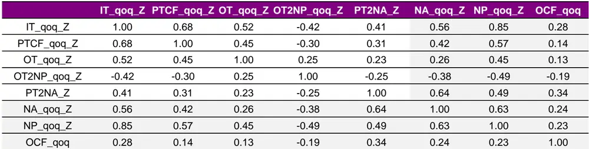
资料来源：Wind，光大证券研究所（测试期：2010-01-01 至 2020-06-30）

表 6：因子截面 spearman 相关系数统计（均值）
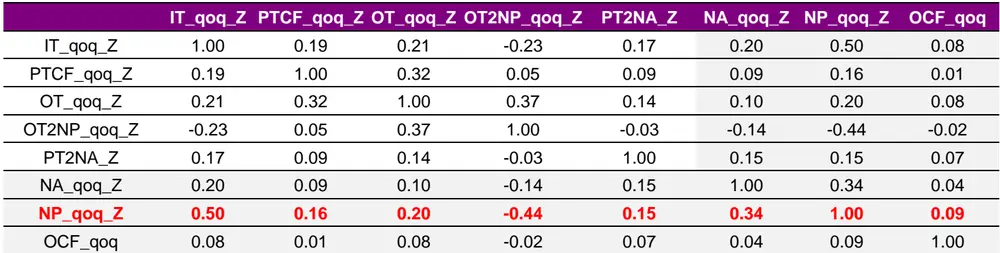
资料来源：Wind，光大证券研究所（测试期：2010-01-01 至 2020-06-30）

## 2.3、税金及附加变化率因子具有较高的增量信息

依据上述测试结果，我们认为 PTCF_qoq_Z、OT_qoq_Z、PT2NA_Z因子可提供一定的增量信息。本节我们将对这三个税收因子的有效性进行更深入的测试。

## 1、缴纳税费现金流因子：PTCF_qoq_Z

缴纳税费现金流因子刻画企业缴纳税费现金流的变化趋势，纳税现金流增速呈上升趋势时，因子值较高。该因子在行业、市值中性化处理后，IC_IR表现有所下降，因子 IC 均值为 1.26%，IC_IR 达0.46，2019年以来表现较好。从跟主流因子的相关性统计来看，该因子与成长因子的相关性较高，相关系数为0.40，说明因子收益可能有成长风格的贡献。

从不同股票池（行业、宽基）范围内因子表现来看，建材、钢铁、食品饮料、有色金属等行业内PTCF_qoq_Z 因子有效性较强，而银行、房地产、纺织服装、交通运输等行业内，该因子有效性较弱。宽基指数中，沪深 300范围内，该因子表现较好，IC_IR为0.32，IC均值为2.66%。

图 8：PTCF_qoq_Z 因子 IC 序列（行业、市值中性化）
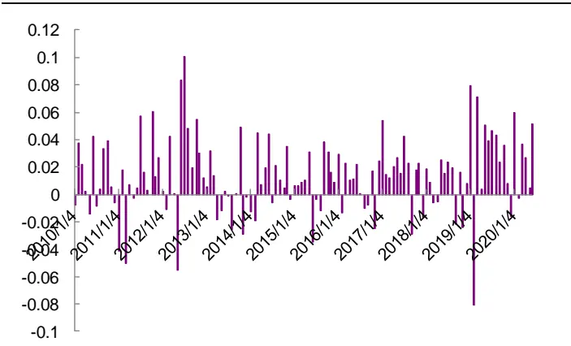
资料来源：Wind，光大证券研究所（测试期：2010-01-01 至2020-06-30）

图 9：PTCF_qoq_Z 因子与主流因子 IC 序列相关系数（行业、市值中性化）
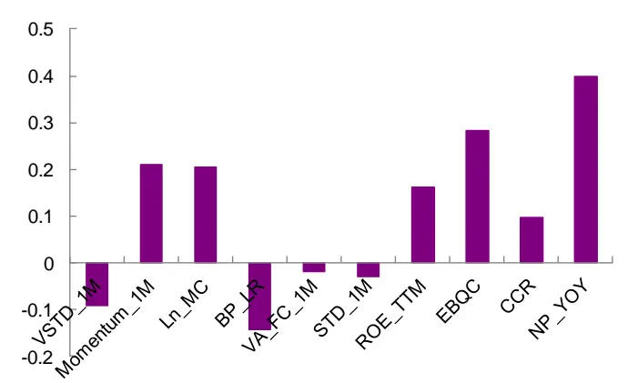
资料来源：Wind，光大证券研究所（测试期：2010-01-01 至2020-06-30）

图 10：PTCF_qoq_Z 因子在不同股票池范围内因子表现
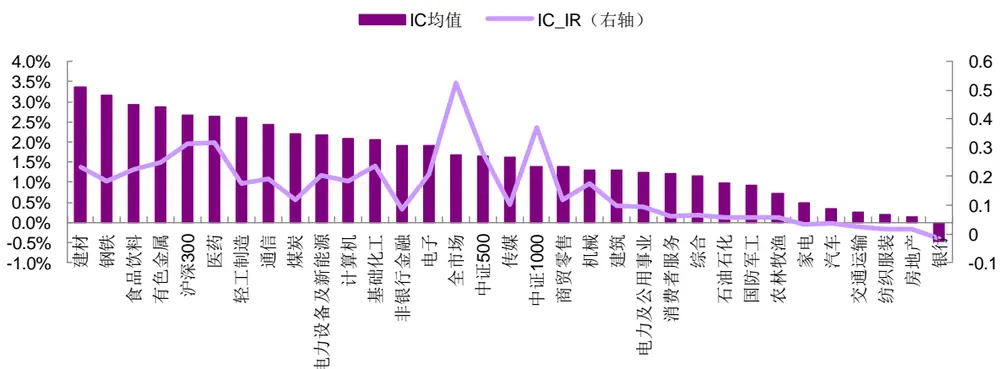
资料来源：Wind，光大证券研究所（测试期：2010-01-01 至 2020-06-30）

## 2、税金及附加变化率因子：OT_qoq_Z

税金及附加变化率因子刻画企业经营活动的活跃程度，活跃程度提升时，税收金额相应提升，因子值较高。该因子在行业、市值中性化处理后，因子稳定性有明显提升，因子IC 均值为1.29%，IC_IR达0.48，2018年以来表现较好。从跟主流因子的相关性统计来看，该因子与主流因子的相关系数均较小，绝对值均在0.3 以内，说明因子信息相对独立，具有较高的信息增量。

从不同股票池（行业、宽基）范围内因子表现来看，食品饮料、煤炭、电新、建筑建材等行业内OT_qoq_Z 因子有效性较强，而国防军工、纺织服装、农林牧渔、银行等行业内，该因子有效性较弱。

图 11：OT_qoq_Z 因子 IC 序列（行业、市值中性化）
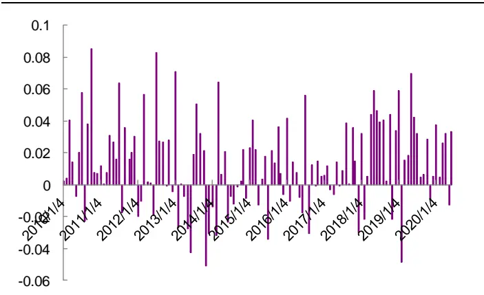
资料来源：Wind，光大证券研究所（测试期：2010-01-01 至2020-06-30）

图 12：OT_qoq_Z 因子与主流因子 IC 序列相关系数（行业、市值中性化）
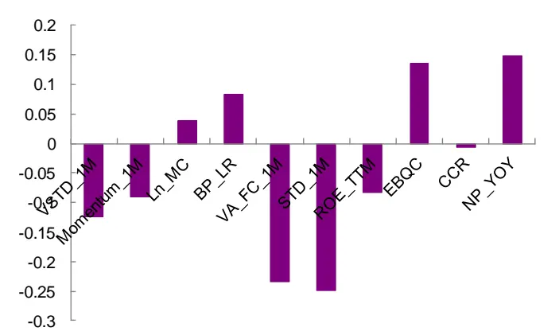
资料来源：Wind，光大证券研究所（测试期：2010-01-01 至2020-06-30）

图 13：OT_qoq_Z 因子在不同股票池范围内因子表现
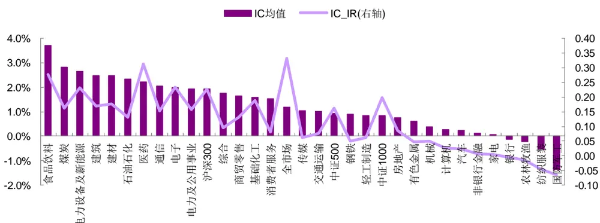
资料来源：Wind，光大证券研究所（测试期：2010-01-01 至 2020-06-30）

## 3、应交税费占比因子：PT2NA_Z

应交税费占比因子刻画税务口径核算的税费情况，若当期税费在过去两年中相对较高，则因子值较高。该因子在行业、市值中性化处理后，IC_IR稳定性有所提升，因子 IC 均值为 1.46%，IC_IR 达 0.48。从跟主流因子的相关性统计来看，该因子与成长因子的相关性较高，相关系数为 0.36，说明因子收益可能有成长风格的贡献。

从不同股票池（行业、宽基）范围内因子表现来看，煤炭、非银、银行、通信等行业内 PT2NA_Z 因子有效性较强，而商贸零售、纺织服装、军工、农林牧渔等行业内，该因子有效性较弱。宽基指数中，沪深 300范围内，该因子表现较好，IC_IR 为 0.37，IC 均值为 3.15%。

图 14：PT2NA_Z 因子 IC 序列（行业、市值中性化）
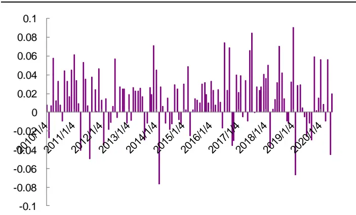
资料来源：Wind，光大证券研究所（测试期：2010-01-01 至2020-06-30）

图15：PT2NA_Z 因子与主流因子 IC序列相关系数（行业、市值中性化）
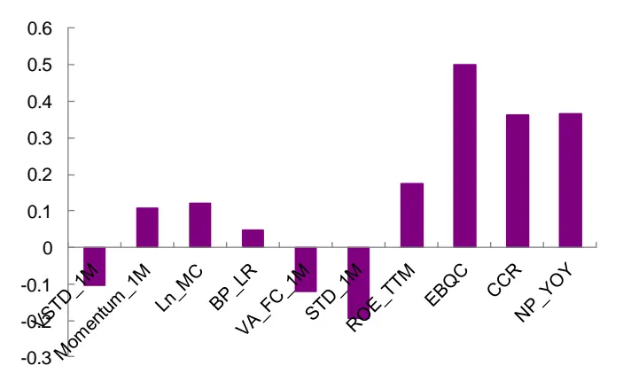
资料来源：Wind，光大证券研究所（测试期：2010-01-01 至2020-06-30）

图 16：PT2NA_Z 因子在不同股票池范围内因子表现
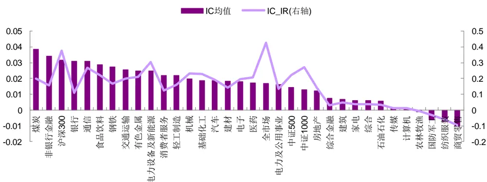
资料来源：Wind，光大证券研究所（测试期：2010-01-01 至 2020-06-30）

综上所述，大部分税收因子与成长因子相关性较高，但PTCF_qoq_Z、OT_qoq_Z、PT2NA_Z 因子与成长因子分布存在明显差异，其中，营业税金及附加的变化率因子（OT_qoq_Z）在行业、市值中性化后，与成长因子 IC序列相关性较低，具有较高的增量信息。

## 3、选股应用：高成长组合可关注递延所得税的变 化趋势

前文我们对税收相关指标在因子层面的表现进行了分析，本章将着眼于在多头选股策略方面的应用，即关注税收相关指标在“头部”区域内的选股效果。

## 3.1、策略思路：高成长+健康的现金流

企业的成长性、盈利能力、现金流的状态是投资者在筛选标的时，会比较关注的几个角度。其中，企业的成长性可以通过过去的成长或分析师预期的成长来刻画；盈利能力也可以通过 ROE 等指标进行衡量；但现金流的前瞻性尚未有较为恰当的指标进行刻画。

结合前文的分析，我们认为递延所得税资产（负债）的变化，可以一定程度反映企业本身对当前现金流的观点：递延所得税资产（负债）是税务口径和会计口径核算税费的差异带来的，企业可以通过调整折旧、摊销的方式，合理调节缴纳税费的现金流分布，而这一调节方式将反映在递延所得税资产（负债）科目上面。

换言之，存在这样的逻辑关系：企业认为当前现金流较为宽松，选择在当期缴纳更多的税，带来递延所得税资产增加或递延所得税负债减少；相反，如果企业当前现金流相对紧张，可能会选择尽量延后缴纳税负的时间，带来递延所得税负债增加或递延所得税资产减少。

基于上述理解，我们围绕“高成长+健康现金流”的理念构建了优质成长选股策略，具体实施步骤如下：

- 首先，依据 TTM 归母净利润环比增速，筛选成长性前 10%的企业作为备选股票池；

- 其次，结合我们在《业绩“爆雷”公司特征探析》、《现金偿债因子：规避企业潜在财务风险》报告的研究成果，通过现金偿债能力指标2、业绩增速的变化方向3、盈利能力指标，剔除业绩风险较大的公司；

最后，筛选递延所得税（递延所得税资产-递延所得税负债）占净资产比重超过 0.1%的企业，持有其中递延所得税增长率排名前 30 的股票作为最终持仓。

其中，筛选递延所得税占比较高的企业，主要考虑到在递延所得税的金额足够大时，比较其增长率更有实际意义。

## 3.2、策略表现：今年以来策略收益达 93%

策略回测框架如下表所示，测试期从 2009 年 1 月 1 日至 2020 年 7 月31 日，每年仅在财报截止时间进行调仓，即4、8、10 月底的下一交易日。该策略为主动量化选股策略，比较基准选择偏股型基金等权收益指数，即：取 Wind 定义的股票型基金、偏股混合型基金，计算日度基金等权收益构造基准指数。计算年度收益排名时，考虑到基金运行过程中，仓位不能持续保持满仓，因而我们按 9成仓位计算策略收益，再与基金收益进行比较。

表7：多头选股策略回测框架

|  | 策略回测框架 |
| --- | --- |
| 时间区间 | 2009年1月1日至2020年7月31日 |
| 基础池 | 全市场A股，剔除ST、换仓日停牌或“一字板”的个股 |
| 调仓时间 | 每年4、8、10月底的下一交易日 |
| 比较基准 | 偏股型基金等权收益指数 |
| 权重 | 等权配置 |
| 交易费率 | 单边千分之三 |

资料来源：光大证券研究所

该策略收益 2009 年以来年化收益达 35.0%，与偏股型基金的同期收益率相比较，绝大部分年份的收益率排名前30%。如下图所示，该策略在绝大部分年份相对偏股型基金等权指数均有超额收益，仅 2017 年表现不佳。我们认为主要是因为 2017年投资者结构发生变化，市场“二八”分化明显，仅少数盈利能力较强的权重股持续上涨，是一个估值重构的过程。

截至 2020年 7月 31日，该策略今年以来的收益达93.2%。2019年以来，该策略表现较好，2019 年度收益率达 56.2%；截至 2020 年 7 月31 日，2020 年度收益率达 93.2%，即使按9成仓位计算策略收益，在偏股型基金中亦可排名前30%。

图17：优质成长选股策略
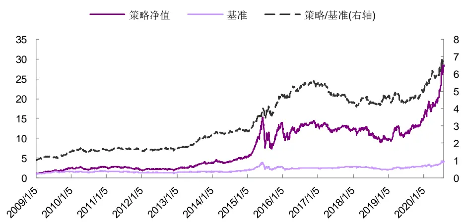
资料来源：Wind，光大证券研究所（注：截止于 2020 年 7 月 31 日，基准为偏股型基金等权收益指数）

表8：优质成长选股策略历年收益统计

|  | 2009 | 2010 | 2011 | 2012 | 2013 | 2014 | 2015 | 2016 | 2017 2018 |  | 2019 2020 |
| --- | --- | --- | --- | --- | --- | --- | --- | --- | --- | --- | --- |
| 收益率 | 155.4% | 10.6% | -24.9% | 11.7% | 73.8% | 38.8% 165.9% | -4.0% | -8.2% | -21.8% | 56.2% | 93.2% |
| 波动率 | 34.8% | 30.1% | 24.9% | 26.4% | 26.5% | 22.2% 54.0% | 34.2% | 17.8% | 27.1% | 25.5% | 31.8% |
| 超额收益 | 55.1% | 8.0% | 1.1% | 7.4% | 50.3% | 12.3% 88.4% | 14.6% | -19.8% | 3.0% | 7.4% | 52.3% |
| 相对波动 | 15.1% | 14.7% | 10.8% | 12.2% | 11.4% | 9.4% 17.7% | 11.2% | 10.4% | 12.3% | 12.7% | 15.0% |
| 月度胜率 | 83.3% | 50.0% | 50.0% | 50.0% | 91.7% | 66.7% 83.3% | 58.3% | 25.0% | 58.3% | 66.7% | 85.7% |
| 年度排名 | 1 | 75 | 114 | 85 | 7 | 115 2 | 109 | 642 | 186 | 384 | 24 |
| 基金总数 | 234 | 279 | 330 | 386 | 442 | 467 506 | 624 | 686 | 783 | 923 | 1132 |

资料来源：Wind，光大证券研究所（注：数据截止于 2020 年 7 月 31 日；以偏股型基金等权收益指数为基准；年度排名时按 9 成仓位计算收益，依据收益由高到低排名）

表 9：优质成长选股策略最新持仓明细（2020.04.30）

| 代码 | 简称 | 行业 | 代码 | 简称 | 行业 |
| --- | --- | --- | --- | --- | --- |
| 000014 | 沙河股份 | 房地产 | 600153 | 建发股份 | 交通运输 |
| 000534 | 万泽股份 | 房地产 | 600760 | 中航沈飞 | 国防军工 |
| 000778 | 新兴铸管 | 钢铁 | 600882 | 妙可蓝多 | 食品饮料 |
| 002019 | 亿帆医药 | 医药 | 601012 | 隆基股份 | 电力设备及新能源 |
| 002049 | 紫光国微 | 电子 | 601038 | 一拖股份 | 机械 |
| 002223 | 鱼跃医疗 | 医药 | 601601 | 中国太保 | 非银行金融 |
| 002270 | 华明装备 | 电力设备及新能源 | 601808 | 中海油服 | 石油石化 |
| 002603 | 以岭药业 | 医药 | 603029 | 天鹅股份 | 机械 |
| 002605 | 姚记科技 | 轻工制造 | 603238 | 诺邦股份 | 纺织服装 |
| 002705 | 新宝股份 | 家电 | 603258 | 电魂网络 | 传媒 |
| 300206 | 理邦仪器 | 医药 | 603301 | 振德医疗 | 医药 |
| 300246 | 宝莱特 | 医药 | 603444 | 吉比特 | 传媒 |
| 300676 | 华大基因 | 医药 | 603808 | 歌力思 | 纺织服装 |
| 300758 | 七彩化学 | 基础化工 | 603810 | 丰山集团 | 基础化工 |
| 600051 | 宁波联合 | 综合 | 603889 | 新澳股份 | 纺织服装 |

资料来源：Wind，光大证券研究所

## 4、风险提示

本篇报告从财务数据的含义和特点出发，旨在充分挖掘财务数据之间勾稽关系的前提下，尝试对基本面因子进行创新性构造，加深对基本面因子逻辑的理解，随着市场的发展和环境的变化，可能存在如下风险：

- 首先，本篇报告基于现阶段会计准则下的财务数据进行研究，当会计准则存在变化时，财务数据含义可能发生变化，亦影响报告逻辑推演；

- 其次，上市公司若出现财务数据失真，会影响模型有效性；

- 最后，本篇报告推荐因子为偏长期的基本面因子，须警惕市场短期波动带来的风险。

## 行业及公司评级体系

| 评级 说明 |
| --- |
| 行 买入 未来6-12个月的投资收益率领先市场基准指数15%以上； |
| 增持 未来6-12个月的投资收益率领先市场基准指数5%至15%； |
| 中性 未来6-12个月的投资收益率与市场基准指数的变动幅度相差-5%至5%； |
| 减持 未来6-12个月的投资收益率落后市场基准指数5%至15%； |
| 卖出 未来6-12个月的投资收益率落后市场基准指数15%以上； |
| 因无法获取必要的资料，或者公司面临无法预见结果的重大不确定性事件，或者其他原因，致使无法给出明确的无评级投资评级。 |
| 基准指数说明：A股主板基准为沪深300指数；中小盘基准为中小板指；创业板基准为创业板指；新三板基准为新三板指数；港股基准指数为恒生指数。 |

## 分析、估值方法的局限性说明

本报告所包含的分析基于各种假设，不同假设可能导致分析结果出现重大不同。本报告采用的各种估值方法及模型均有其局限性，估值结果不保证所涉及证券能够在该价格交易。

## 分析师声明

本报告署名分析师具有中国证券业协会授予的证券投资咨询执业资格并注册为证券分析师，以勤勉的职业态度、专业审慎的研究方法，使用合法合规的信息，独立、客观地出具本报告，并对本报告的内容和观点负责。负责准备以及撰写本报告的所有研究人员在此保证，本研究报告中任何关于发行商或证券所发表的观点均如实反映研究人员的个人观点。研究人员获取报酬的评判因素包括研究的质量和准确性、客户反馈、竞争性因素以及光大证券股份有限公司的整体收益。所有研究人员保证他们报酬的任何一部分不曾与，不与，也将不会与本报告中具体的推荐意见或观点有直接或间接的联系。

## 特别声明

光大证券股份有限公司（以下简称“本公司”）创建于 1996 年，系由中国光大（集团）总公司投资控股的全国性综合类股份制证券公司，是中国证监会批准的首批三家创新试点公司之一。根据中国证监会核发的经营证券期货业务许可，本公司的经营范围包括证券投资咨询业务。

本公司经营范围：证券经纪；证券投资咨询；与证券交易、证券投资活动有关的财务顾问；证券承销与保荐；证券自营；为期货公司提供中间介绍业务；证券投资基金代销；融资融券业务；中国证监会批准的其他业务。此外，本公司还通过全资或控股子公司开展资产管理、直接投资、期货、基金管理以及香港证券业务。

本报告由光大证券股份有限公司研究所（以下简称“光大证券研究所”）编写，以合法获得的我们相信为可靠、准确、完整的信息为基础，但不保证我们所获得的原始信息以及报告所载信息之准确性和完整性。光大证券研究所可能将不时补充、修订或更新有关信息，但不保证及时发布该等更新。

本报告中的资料、意见、预测均反映报告初次发布时光大证券研究所的判断，可能需随时进行调整且不予通知。在任何情况下，本报告中的信息或所表述的意见并不构成对任何人的投资建议。客户应自主作出投资决策并自行承担投资风险。本报告中的信息或所表述的意见并未考虑到个别投资者的具体投资目的、财务状况以及特定需求。投资者应当充分考虑自身特定状况，并完整理解和使用本报告内容，不应视本报告为做出投资决策的唯一因素。对依据或者使用本报告所造成的一切后果，本公司及作者均不承担任何法律责任。

不同时期，本公司可能会撰写并发布与本报告所载信息、建议及预测不一致的报告。本公司的销售人员、交易人员和其他专业人员可能会向客户提供与本报告中观点不同的口头或书面评论或交易策略。本公司的资产管理子公司、自营部门以及其他投资业务板块可能会独立做出与本报告的意见或建议不相一致的投资决策。本公司提醒投资者注意并理解投资证券及投资产品存在的风险，在做出投资决策前，建议投资者务必向专业人士咨询并谨慎抉择。

在法律允许的情况下，本公司及其附属机构可能持有报告中提及的公司所发行证券的头寸并进行交易，也可能为这些公司提供或正在争取提供投资银行、财务顾问或金融产品等相关服务。投资者应当充分考虑本公司及本公司附属机构就报告内容可能存在的利益冲突，勿将本报告作为投资决策的唯一信赖依据。

本报告根据中华人民共和国法律在中华人民共和国境内分发，仅向特定客户传送。本报告的版权仅归本公司所有，未经书面许可，任何机构和个人不得以任何形式、任何目的进行翻版、复制、转载、刊登、发表、篡改或引用。如因侵权行为给本公司造成任何直接或间接的损失，本公司保留追究一切法律责任的权利。所有本报告中使用的商标、服务标记及标记均为本公司的商标、服务标记及标记。

光大证券股份有限公司版权所有。保留一切权利。

## 联系我们

| 上海 | 北京 | 深圳 |
| --- | --- | --- |
| 静安区南京西路1266号恒隆广场1号 写字楼48 层 | 西城区月坛北街2号月坛大厦东配楼2层 复兴门外大街6号光大大厦17层 | 福田区深南大道 6011号NEO 绿景纪元大 厦 A 座 17 楼 |