## 股东大类因子：拆解股东数据中的多元信息——多因子系列报告之三十七

交易者与交易标的是交易市场中最基础的两类元素，如果对应到二级权益市场，这两类元素的名称可以是股票与投资者（股东）。而股东作为市场的重要基础构成元素，一个值得关心的问题是：A 股的股东样本及其结构本身是否具备信息价值？本篇报告将对股东类型数据进行梳理，从个股层面上尝试理清其背后可能存在的选股逻辑，并构建有效选股因子，以供投资者参考。

## 股东类数据：更新频率低但维度较为丰富。

股东数据可分为多个类别，包括股票的股东户数、股票前十大股东、股票机构股东、股票重要股东增减持等。其中除了增减持数据过于稀疏更适合作为事件研究外，股东数量、十大股东、机构股东数据基本都是季度频率，研究方式一定程度上可借鉴财报基本面数据的研究方法。

## 股东数据整体：能对市场整体变化特征有所体现与印证。

将全市场股票的股东数据汇总，不同维度上的信息一定程度上能对市场整体变化特征进行体现与印证。十大股东持仓数据中，总占比上升但各自占比离散度不断下降，表明大股东之间的股权分配越来越均衡。机构股东数据中，不同股票持仓机构个数的离散度越来越大，则印证了近几年来愈加增强的机构抱团现象。

## 股东细分因子：各维度均具有不同逻辑特征的有效因子。

从股东户数、十大股东、机构股东三个类别中分别挖掘有明显增量信息的因子。股东户数数据中，股东户数时序标准分（HN_z）因子具有显著负向预测能力；十大股东数据中，十大股东占比离散度（LHRD）因子具有显著正向预测能力；机构股东数据中，持仓机构个数（IHN）因子具有显著正向预测能力，持仓机构个数变化（IHN_diff）因子则具有显著负向预测能力。另一方面，机构持仓占比因子虽然也有显著的截面预测能力，但其信息基本上都能被其它主流因子解释，并不具备明显增量信息。

## 股东大类因子：具有显著且稳定的截面预测能力。

将4 个股东数据细分因子分别处理后再等权相加，构建股东大类因子。该因子在全市场内的预测能力非常稳定。以 2010/04/01-2020/06/30作为测试区间，因子 IC 均值为 5.03%，ICIR 高达 0.84。具有良好的分组单调性与区分度。基于股东大类因子构建的多空组合，年化收益19.0%，夏普比率2.93，最大回撤 8.7%；而多头组合相对于全市场等权基准的超额净值年化收益为 7.4%，信息比率2.17，最大回撤 5.0%。在中证 500 及沪深300 样本内股东大类因子的预测能力及选股能力也很显著。

- 风险提示：结果均基于模型和历史数据，模型存在失效的风险。

## 金融工程深度

## 分析师

胡骥聪 (执业证书编号：S0930519060002)

021-52523683

hujicong@ebscn.com

刘均伟 （执业证书编号：S0930517040001）

021-52523679

liujunwei@ebscn.com

## 相关研究

《多因子系列报告之一：因子测试框架》

交易者与交易标的是交易市场中最基础的两类元素，如果对应到二级权益市场，这两类元素的名称可以是股票与投资者（股东）。而股东作为市场的重要基础构成元素，这让我们不由产生思考，这些投资股票的股东样本及其结构本身是否会影响市场呢？本篇报告将对股东类型数据进行梳理，从个股层面上尝试理清其背后可能存在的选股逻辑，并构建有效选股因子，以供投资者参考。

## 1、股东数据频率较低

目前股东数据可分为以下几大类：股票股东户数量、股票前十大股东、股票机构持仓、股票重要股东增减持等。

- 股票股东户数：持有该股票的股东数量。该数据更新的频率较低，但略高于大部分财务报表数据。除了会在每期财报公布数据，偶尔会有日常公告更新该数据。

- 股票前十大股东：持有该股票比例最大的十个股东相关数据，关键条目包括其股东类型、持股数量、持股比例等。该数据随财报公布，更新频率低。

股票机构持仓：持有该股票的机构相关数据，关键条目包括机构名称、机构类型、机构持股占流通股比例等。该数据随基金季报公布，更新频率低。同时，不同季度数据披露程度不同：基金年报与半年报披露完整持仓，一季报与三季报仅披露十大重仓股的持仓数据。

- 股票重要股东增减持：该股票重要股东增减持数据，进一步可分为重要股东实际增减持，与重要股东拟增减持两类数据。该数据偏向事件数据，没有固定的更新频率，同时整体数据量也较稀疏。由于本篇报告主要研究股东数据在股票截面上预测能力与因子效果，因此股票重要股东增减持数据在后文将不再过多展开。

## 1.1、不同股票的股东户数差异在缩小

股票股东户数的数据结构及表征意义比较简单，即体现当前市场中有多少投资者持有该股票。它的多少一定程度上反映了市场中有多少投资者对其有明显关注或偏好；但需注意的是，这个数据并没有区分不同类型的投资者。

我们统计不同年份全市场股票的股东户数数据。整体来看，大部分股票股东户数在 3 万左右，且近十年并无明显变化趋势。同时，通过计算同一时期不同股票股东户数的标准差来体现股东户数离散程度，可以看出除了2015年，不同股票的股东户数差异在逐年缩小。

如果按照不同指数范围样本统计，明显大市值上市公司的股东数量更多，小市值公司股东数较少。同样，股东户数离散程度也基本与公司市值大小呈现正比例关系。

图1：不同时期股东户数统计
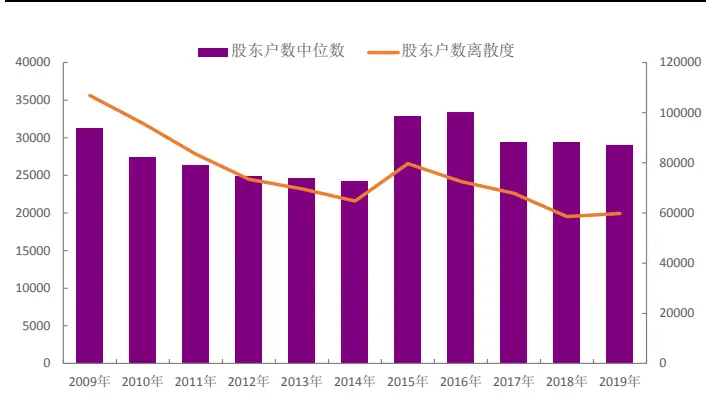
资料来源：WIND，光大证券研究所

图2：不同样本池内股东户数统计
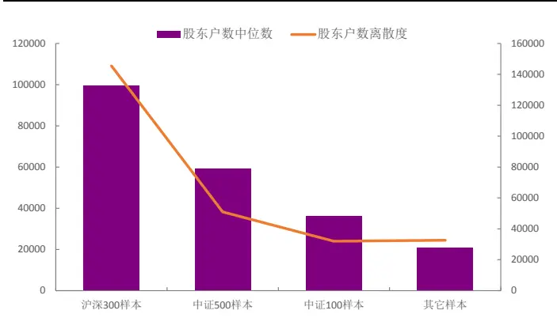
资料来源：WIND，光大证券研究所； 注：2019 年年报

## 1.2、前十大股东占比离散度减小

由于前十大股东持仓大多由上市公司高管与重仓机构构成，因此它一方面体现了公司高管对公司的掌握与治理能力预期；另一方面也体现了重仓机构对其的偏好态度。

我们同样统计了不同年份全市场股票的前十大股东占比数据。整体上，A股上市公司的前十大股东占比总和在缓慢上升，其中位数2016-2019年基本都处于60%以上的水平；而逐年趋势更为明显的现象则是不同股票十大股东占比离散度不断下降。

按照不同指数范围样本统计，沪深 300 成分股公司的十大股东占比接近70%，显著高于市场其它样本内公司的数据。而十大股东占比离散度数据在不同样本里差异不大。

图 3：不同时期十大股东持仓占比统计
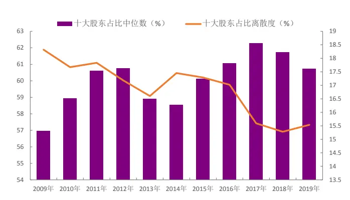
资料来源：WIND，光大证券研究所

图4：不同样本池内十大股东持仓占比统计
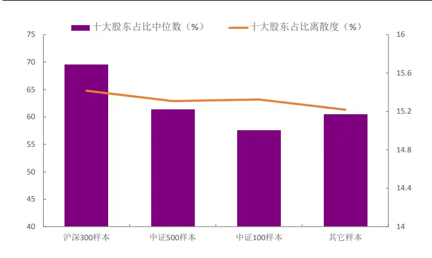
资料来源：WIND，光大证券研究所； 注：2019 年年报

## 1.3、机构持股抱团特征增强

机构持股数据条目较多，从整个市场的角度我们比较关心机构抱团的现象在机构持股数据中怎么体现。我们统计A股市场上股票的机构持仓占比与持仓机构数目这两个数据。

从逐年数据来看，机构持仓占比整体较为平稳，基本维持在 35%到 40%区间内。观察不同样本，机构资金更偏爱大市值公司，沪深 300 成分股在2019 年末的机构持仓中位数高达 65%，而同期中证 1000 成分股机构持仓占比中位数不到40%。

图 5：不同时期机构持仓占比统计
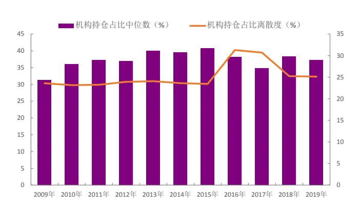
资料来源：WIND，光大证券研究所

图 6：不同样本池内机构持仓占比统计
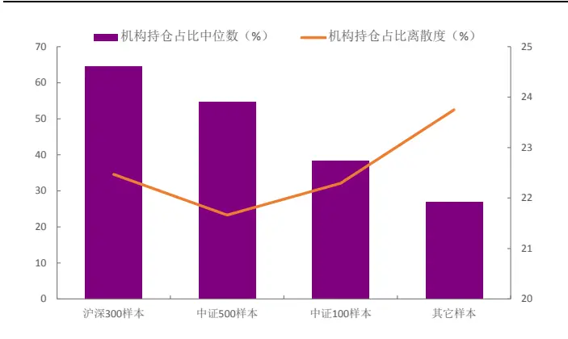
资料来源：WIND，光大证券研究所； 注：2019 年年报

另一方面，如果我们看股票持仓机构数目的离散度，会发现在最近几年该数据显著放大，2019 年末达到 2015年以来的最高点；但同时持仓机构数目中位数则是在 2016 年达到峰值后，最近三年反而在逐年下降。这两个数据结合在一起，反映出机构持仓的选择越来越多的集中在更少的股票上，反映了越来越强的机构抱团现象。

图 7：不同时期股票持仓机构数目统计
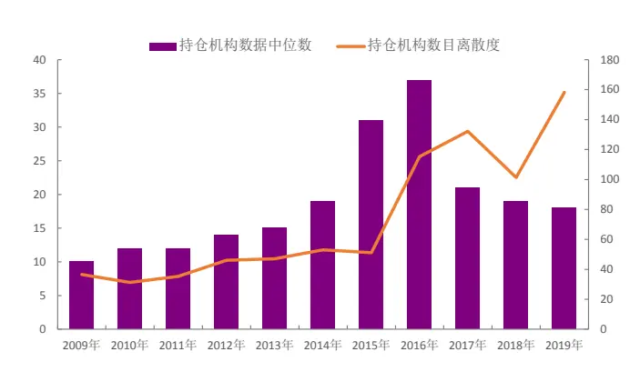
资料来源：WIND，光大证券研究所

图8：不同样本池内股票持仓机构数目统计
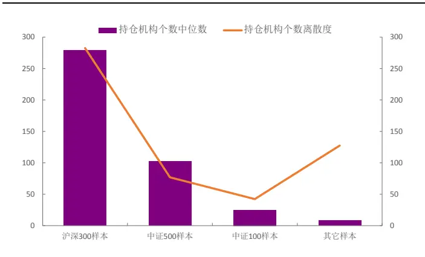
资料来源：WIND，光大证券研究所； 注：2019 年年报

## 2、多维度探究各类股东数据下的有效信息

上一章节对各类股东数据从整体上作了简单的梳理介绍。本章节将从选股的角度，探索具有截面预测能力的信息，构建相应股东因子，并在因子测试框架内测试其有效性。

## 2.1、因子构造及初步测试

我们将上一章节梳理过的各类股东数据作为基础数据进行测试，具体参与测试的数据可见下表。同时考虑基础数据在时间序列上的变化可能也会具有截面收益预测能力，我们根据基础数据本身的逻辑与特征，会相应对其采用差值、比率、标准分中的一种或多种数据变换处理。

表1：因子构造所用基础数据含义

| 简称 | 缩写 | 含义 |
| --- | --- | --- |
| 股东数目 | HN | 持股股东个数 |
| 十大股东占比 | LHR | 十大股东持仓占比总和 |
| 十大股东占比分散度 | LHRD | 十大股东各自持仓不均衡的程度： (以十大股东各自持仓占比为样本计算标准差) |
| 机构持股占比 | IHR | 机构股东持仓占比总和 |
| 持仓机构数目 | IHN | 持仓机构的个数 |
| 机构持仓占比分散度 | IHRD | 持股机构各自持仓不均衡的程度： (以机构股东持仓占比为样本计算标准差) |

资料来源：光大证券研究所

表 2：因子构造方式算子符号说明

| 算子符号 | 含义 |
| --- | --- |
| A | 指标A 本身 |
| A_diff | 当期指标A-上期指标 A |
| A_rate | 当期指标 A / 上期指标A- 1 |
| A_z | (当期指标 A-过去 8 期指标 A 的均值)/过去 8 期指标 A 标准差 |

资料来源：光大证券研究所

在测试因子有效性之前，先对因子数据进行一定程度的清洗。对于因子数据的清洗和有效性检验在此前的多因子系列报告中已有详细阐述1，这里仅作简单回顾。

- 绝对中位数法去极值：在因子测试阶段，由于因子本身的分布是否为正态分布无法确定，我们采用稳健的 MAD（绝对中位数法）去除极值更加合适。

- 截面标准化处理：通过横截面 z-score方法，以每个时间截面 t上的所有股票的为样本，分别计算其均值和标准差得到如下所示的

stand(factor)。此标准化方式属于因子的线性变换，并不会改变原始因子的分布特征。

$$
\mathrm{standard}(factor)_{jt}=\frac{factor_{jt}-\overline{factor_{t}}}{std(factor)_{t}}
$$

- 有效性及预测能力检验：我们计算行业中性与市值中性处理后的RankIC（因子值与股票次月收益率的秩相关系数），通过以下几个与 IC 值相关的指标来判断因子的有效性和预测能力：IC值的均值、IC 值的标准差、IC大于0 的比例、IR。

从下表初步测算的结果可以看出，股东数目时序标准分、十大股东占比变化、十大股东占比时序标准分、十大股东占比分散度、机构持股占比、持仓机构个数、持仓机构个数变化这7 个因子有一定截面收益预测能力。

表 3：股东因子测试结果

| 因子名称 | IC 均值 | IC 标准差 | ICIR 绝对值 IC>0 比例 |
| --- | --- | --- | --- |
| 股东数目 | -1.44% | 13.0% | 0.11 40.2% |
| 股东数目变化率 | -1.12% | 5.3% 0.21 | 36.4% |
| 股东数目时序标准分 | -3.57% | 6.6% 0.54 | 30.1% |
| 十大股东占比 | 1.64% | 8.5% 0.19 | 57.4% |
| 十大股东占比变化 | 1.39% | 3.2% 0.43 | 65.3% |
| 十大股东占比时序标准分 | 1.74% | 4.2% 0.41 | 67.0% |
| 十大股东占比分散度 | 1.50% | 4.1% 0.36 | 68.0% |
| 十大股东占比分散度变化 | -0.43% | 2.6% 0.16 | 40.7% |
| 十大股东占比分散度时序标准分 | -0.13% | 3.7% 0.03 | 52.6% |
| 机构持股占比 | 1.98% | 6.5% 0.30 | 62.8% |
| 机构持股占比变化 | -1.04% | 4.7% 0.22 | 43.3% |
| 机构持股占比时序标准分 | 1.25% | 4.2% 0.29 | 60.8% |
| 持仓机构个数 | 4.04% | 5.5% 0.74 | 76.9% |
| 持仓机构个数变化 | -2.56% | 5.7% 0.45 | 28.3% |
| 持仓机构个数时序标准分 | 0.34% | 4.8% 0.07 | 53.9% |
| 机构持股占比分散度 | 0.14% | 8.0% 0.02 | 44.6% |
| 机构持股占比分散度变化 | 0.65% | 5.9% 0.11 | 50.0% |
| 机构持股占比分散度时序标准分 | 0.11% | 4.5% 0.03 | 47.1% |

资料来源：Wind，光大证券研究所（测试区间：2010-04-01 至 2020-06-30）

## 2.2、深挖具有显著增量信息的股东细分因子

通过初步测试我们筛选出一部分具有一定预测能力的因子，在进一步细致研究其表现与逻辑之前，我们先对它们进行相关性测试。在调整过因子方向后，分别计算它们的IC相关系数与截面相关系数。

综合 IC 相关性与截面相关系统计结果，可以推断以下三个因子：股东数目时序标准分、十大股东占比变化、十大股东占比时序标准分，体现的信息基本一致。因此这三个因子中我们仅留下IC 均值与ICIR 更为显著的股东数目时序标准分因子进一步研究。

表4：因子 IC序列相关系数统计
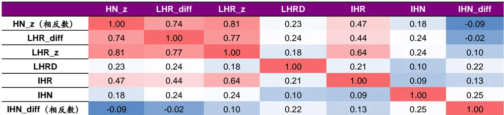
资料来源：Wind，光大证券研究所； 注：测试区间为 2010-04-01至 2020-06-30，HZ_z与 IHN_diff 因子取相反数以调整符号方向

表5：因子截面相关系数统计（均值）

| HN_z |  | LHR_diff LHR_z |  | LHRD | IHR IHN |  | IHN_diff |
| --- | --- | --- | --- | --- | --- | --- | --- |
| HN_z（相反数） | 1.00 | 0.27 | 0.30 | 0.04 | 0.07 | 0.03 | -0.06 |
| LHR_diff | 0.27 | 1.00 | 0.59 | 0.05 | 0.06 | 0.01 | -0.04 |
| LHR_z | 0.30 | 0.59 | 1.00 | 0.05 | 0.09 | -0.01 | -0.06 |
| LHRD | 0.04 | 0.05 | 0.05 | 1.00 | 0.25 | -0.12 | -0.05 |
| IHR | 0.07 | 0.06 | 0.09 | 0.25 | 1.00 | 0.23 | 0.01 |
| IHN | 0.03 | 0.01 | -0.01 | -0.12 | 0.23 | 1.00 | 0.03 |
| IHN_diff（相反数） | -0.06 | -0.04 | -0.06 | -0.05 | 0.01 | 0.03 | 1.00 |

资料来源：Wind，光大证券研究所； 注：测试区间为 2010-04-01至 2020-06-30，HZ_z与 IHN_diff 因子取相反数以调整符号方向

## 2.2.1、股东数目：股东数目时序标准分（HN_z）预测能力突出

股东数目类数据中，股东数目时序标准分因子（后以简称 HN_z 指代）刻画的是股票当前股东数量在近期历史中所处水平。HN_z 因子有显著的负向预测能力，表明股东数量处于减少趋势中的股票后期相对表现会更好。为后续操作方便，我们对其因子值进行取相反数操作处理。

其背后逻辑是当更有信息优势的投资者（例如机构、游资等）认为某个股票更有投资价值，或者认为其价格远低于其真实价值。他们会倾向于从其它股东手上低位吸筹，造成持有股票的股东数量不断下降的现象；同理，当有信息优势的投资者认为手中持股已经过分高估，则会将手中持股出手，这些股票可能被更多散户投资者买入，造成持有股票的股东数量超过其历史水平的现象。同时，虽然股东数目数据本身并不能区分不同投资者类型，但综合考虑到十大股东持仓占比变化因子与十大股东持仓占比时序标准分因子均为正向因子的信息，可以进一步印证在股票股东减少的过程中，股票大概率是从持股数量相对较少的散户手中流向持仓较大的大股东（例如十大股东等）。

HN_z 因子（处理因子方向后）IC 序列表现一直较为稳定，因子 IC 均值为 3.57%，ICIR 达 0.54。从跟主流因子的相关性统计来看，该因子与换手、波动、估值、股息率因子的 IC 相关性较高；同时与换手因子截面相关性也较高，可见该因子与换手因子信息有一定重合。将HN_z因子与与换手、波动、估值、股息率因子作中性化后，其因子预测能力有一定程度下降，IC均值为2.40%，ICIR为0.42。仍具有显著的截面预测能力。

各主流宽基指数中，该因子在中证500范围内表现较好，IC均值3.78%，ICIR 为 0.53；沪深 300 内该因子 IC 均值 2.62%， ICIR 为 0.30。从不同行业范围内因子表现来看，建材、食品饮料、商贸零售等行业内 HN_z因子有效性较强，而银行、钢铁、家电等行业内，该因子没有预测能力。

图9：HN_z因子 IC序列与累计IC序列
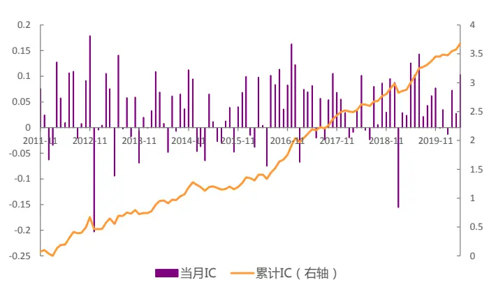
资料来源：Wind，光大证券研究所； 注：测试区间为 2010-04-01至 2020-06-30

图 10：HN_z 因子与主流因子相关性
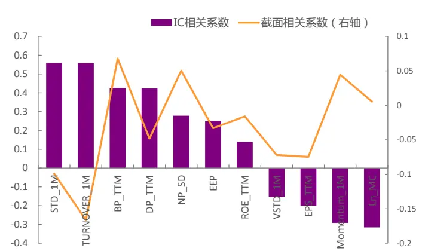
资料来源：Wind，光大证券研究所； 注：测试区间为 2010-04-01至 2020-06-30

图11：HN_z因子在不同股票池范围内 IC表现（行业按中信一级行业分类）
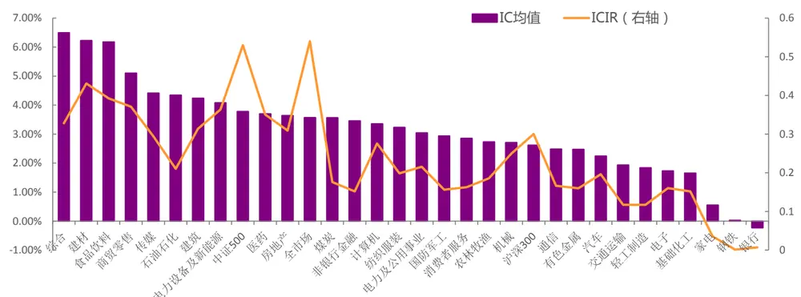
资料来源：Wind，光大证券研究所； 注：测试区间为 2010-04-01 至 2020-06-30

对 HN_z 因子进行分组测试（按因子大小等分 10 组），十分组组合年化收益数据显示该因子单调性强，区分度较明显，整体上空头方向信息更为显著。基于 HN_z 因子构建的多空组合，年化收益 10.5%，夏普比率 1.82，最大回撤 8.6%；而多头组合相对于全市场等权基准的超额净值年化收益3.9%，夏普比率1.26，最大回撤5.2%，月均双边换手 68.8%。

表6：HN_z因子相关组合统计数据

|  | 多头组合 | 空头组合 等权基准 | 多空组合 | 多头超额基准 |
| --- | --- | --- | --- | --- |
| 年化收益 | 13.5% | 2.8% 9.3% | 10.5% | 3.9% |
| 年化波动 | 28.0% | 30.5% 28.8% | 5.5% | 3.1% |
| 夏普比率 | 0.59 | 0.24 0.45 | 1.82 | 1.26 |
| 最大回撤 | 57.8% | 68.7% 62.7% | 8.6% | 5.2% |
| 月度胜率 | 56.3% | 51.5% 52.4% | 71.8% | 64.1% |

资料来源：资料来源：Wind，光大证券研究所；注：测试区间为2010-04-01至2020-06-30，等权基准为全市场等权

图 12：HN_z 因子分组年化收益率
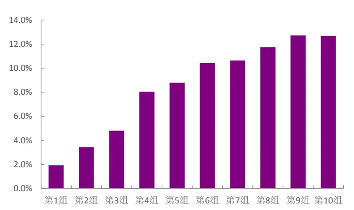
资料来源：Wind，光大证券研究所；注：测试区间为 2010-04-01至 2020-06-30

图 13：HN_z 因子多空净值及多头相对超额净值
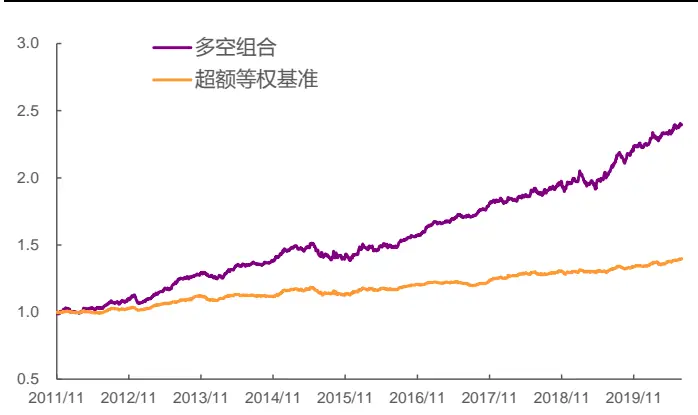
资料来源：Wind，光大证券研究所；注：测试区间为 2010-04-01至 2020-06-30，等权基准为全市场等权

## 2.2.2、十大股东：关注十大股东占比离散度（LHRD）

十大股东类数据中，除了与HN_z信息高相关的十大股东占比变化因子与十大股东占比时序标准分因子外，更值得关注的是相关性较低的十大股东占比离散度因子（后以简称 LHRD指代）。LHRD因子刻画了该股票十大股东各自持仓的不均衡程度，该因子为正向因子，说明十大股东持股越不均衡、股票越集中在前几位大股东手中，该股票后续相对走势会更好。

LHRD 因子 IC 序列表现整体较稳定，因子 IC 均值为 1.50%，ICIR 达0.36。从跟主流因子的相关性统计来看，该因子与股息率与换手因子的 IC相关性较高；同时与股息率因子也有一定截面相关性，估计该因子与股息率因子信息有小幅重合。将LHRD 因子与股息率因子作中性化后，其因子预测能力仅小幅下降，IC 均值为 1.35%，ICIR 为 0.34。

各主流宽基指数中，该因子在中证500范围内表现一般，IC均值1.16%，ICIR 为 0.21；在沪深 300 内基本没有预测能力，IC 均值 0.28%， ICIR 为0.04。可见该因子的预测能力主要体现在小市值股票池内。从不同行业范围内因子表现来看，建材、电子、轻工制造等行业内 LHRD 因子有效性较强，而煤炭、公用事业、国防军工、石油石化、钢铁等偏周期上游行业内，该因子基本没有预测能力。

图 14：LHRD 因子 IC 序列与累计 IC 序列
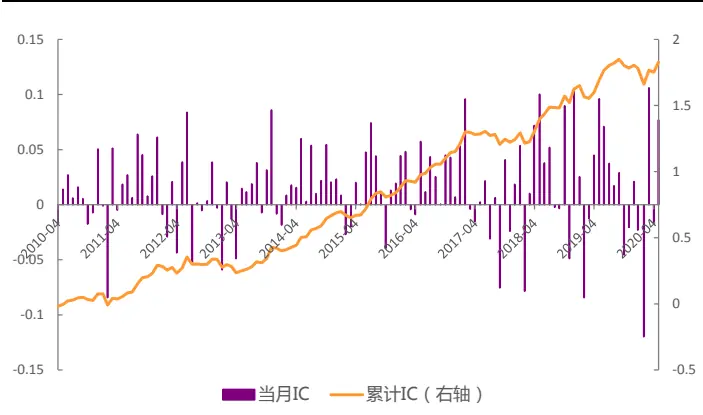
资料来源：Wind，光大证券研究所；注：测试区间为 2010-04-01至 2020-06-30

图 15：LHRD 因子与主流因子相关性
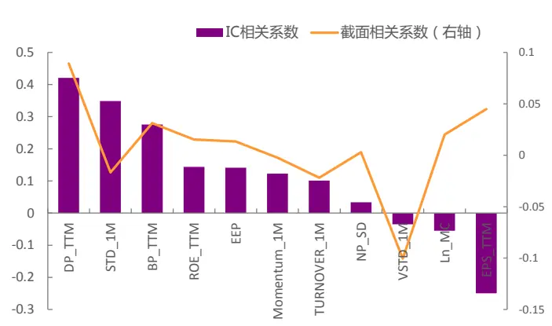
资料来源：Wind，光大证券研究所；注：测试区间为 2010-04-01至 2020-06-30

图16：LHRD因子在不同股票池范围内 IC表现（行业按中信一级行业分类）
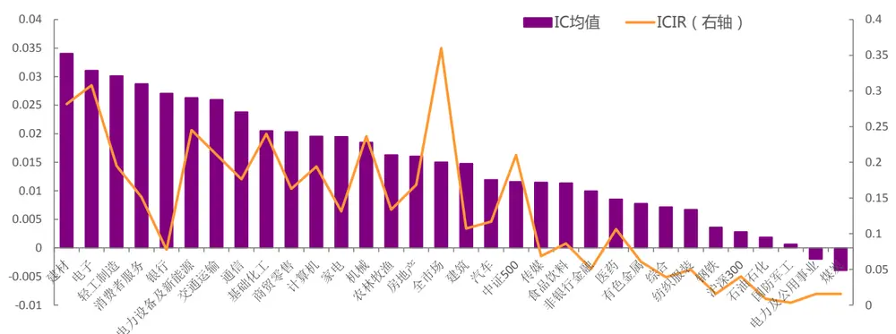
资料来源：Wind，光大证券研究所； 注：测试区间为 2010-04-01 至 2020-06-30

对 LHRD 因子进行分组测试（按因子大小等分 10 组），十分组组合年化收益数据显示该因子单调性较强，区分度明显，多头与空头方向信息较为均衡。基于 LHRD 因子构建的多空组合，年化收益 7.8%，夏普比率 1.78，最大回撤 7.3%；而多头组合相对于全市场等权基准的超额净值年化收益3.5%，夏普比率1.28，最大回撤4.5%，月均双边换手 23.5%。

表7：LHDR因子相关组合统计数据

| 多头组合 |  | 空头组合 等权基准 | 多空组合 | 多头超额基准 |
| --- | --- | --- | --- | --- |
| 年化收益 | 10.3% | 2.4% | 6.6% 7.8% | 3.5% |
| 年化波动 | 27.8% | 28.5% | 28.4% 4.3% | 2.7% |
| 夏普比率 | 0.49 | 0.23 | 0.37 1.78 | 1.28 |
| 最大回撤 | 55.6% | 67.8% | 62.9% 7.3% | 4.5% |
| 月度胜率 | 52.5% | 50.0% | 50.0% 73.0% | 64.8% |

资料来源：资料来源：Wind，光大证券研究所；注：测试区间为2010-04-01至2020-06-30，等权基准为全市场等权

图 17：LHRD 因子分组年化收益率
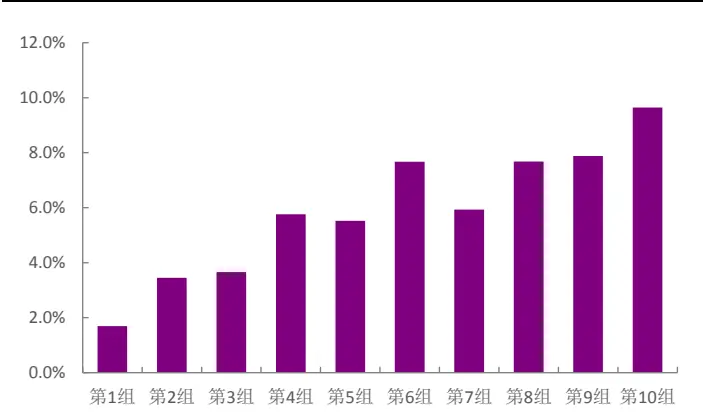
资料来源：Wind，光大证券研究所；注：测试区间为 2010-04-01至 2020-06-30

图 18：LHRD 因子多空净值及多头相对超额净值
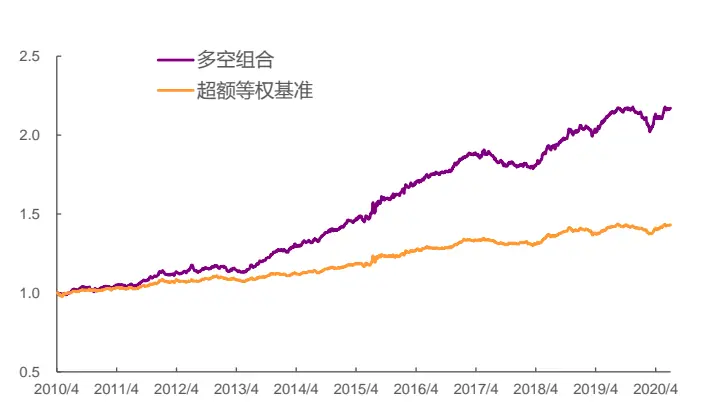
资料来源：Wind，光大证券研究所；注：测试区间为 2010-04-01至 2020-06-30，等权基准为全市场等权

## 2.2.3、机构股东：机构持仓占比鲜有独有信息

机构股东类数据中，持仓占比因子在测试中体现出一定正向截面预测能力。其逻辑也较为直观：机构投资者选股能力更强，因此机构投资者持仓占比越高的股票表明其更受机构投资者青睐，其后期走势大概率会更好。

但从相关性测试结果来看，它与很多主流因子均有非常高的相关性。与换手因子 IC 相关系数高达 0.75，与估值及波动因子 IC 相关系数也均超过0.65。我们将机构持仓占比因子进行换手与估值的中性化操作，发现在剥离了换手与估值的信息后，因子不再有显著预测能力，IC 的符号甚至发生变换，由正转负。IC 均值由中性化前的 1.97%变成-0.69%。实际上中性化后的机构占比因子在 2017 年之前是非常显著的负向因子，在 2017 年之后才转变成正向。

鉴于机构持仓占比因子的信息基本可由其它主流因子解释，后文不再对该因子继续展开讨论。

图19：机构持仓占比因子与主流因子相关性极高
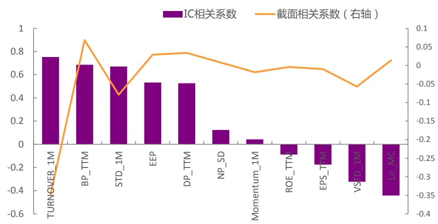
资料来源：Wind，光大证券研究所； 注：测试区间为 2010-04-01 至 2020-06-30

表8：机构持仓占比因子与主流因子中性化前后测试对比

| 因子中性化操作 | IC 均值 | IC 标准差 | ICIR 绝对值 | IC>0 比例 |
| --- | --- | --- | --- | --- |
| 仅市值、行业中性 | 1.97% | 6.51% | 0.30 | 63.1% |
| 市值、估值、换手、行业中性 | -0.69% | 4.27% | 0.16 | 41.8% |

资料来源：Wind，光大证券研究所（测试区间：2010-04-01 至 2020-06-30）

## 2.2.4、机构股东：持仓机构个数因子（IHN）增量信息大

与机构持仓占比的逻辑有些类似，持仓机构个数因子（后以简称IHN 指代）也从一个方面刻画了机构投资者对该股票的偏好态度。与机构持仓占比不同的是，持仓机构个数因子更看重市场上多少机构在该股票上下注，而非下注的多少。该因子逻辑直观，方向为正向，表明有越多机构持仓的股票，未来收益会更强。

IHN 因子 IC 序列表现整体非常稳定，因子 IC 均值为 4.06%，ICIR 达0.74。从跟主流因子的相关性统计来看，该因子除了与 EPS 盈利因子有较高的负 IC 相关系数以外，与其它主流因子的相关性均较小。将 IHN 因子与EPS因子作中性化后，其因子预测能力变化不大，IC 均值仍有3.86%，ICIR也高达 0.73。

各主流宽基指数中，IHN因子在中证500及沪深300范围内虽有一定选股能力，但显著低于全市场样本内的表现。中证500内该因子 IC均值2.79%，ICIR 为 0.28；在沪深 300 内该因子 IC 均值 3.46%，ICIR 为 0.29。可见该因子的预测能力主要也是体现在小市值股票池内。从不同行业范围内因子表现来看，轻工制造、交通运输、电子等行业内IHN 因子有效性较强，而煤炭、农林牧渔、钢铁、纺织服装等行业内，该因子基本没有预测能力。

图20：IHN因子IC序列与累计IC序列
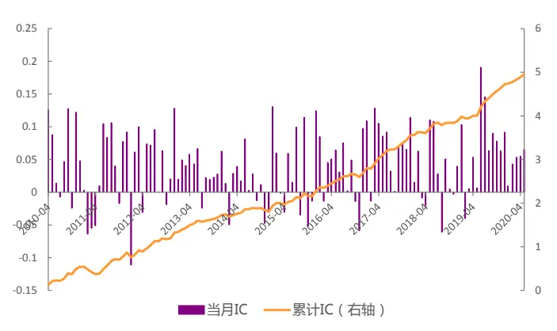
资料来源：Wind，光大证券研究所； 注：测试区间为 2010-04-01至 2020-06-30

图 21：IHN 因子与主流因子相关性
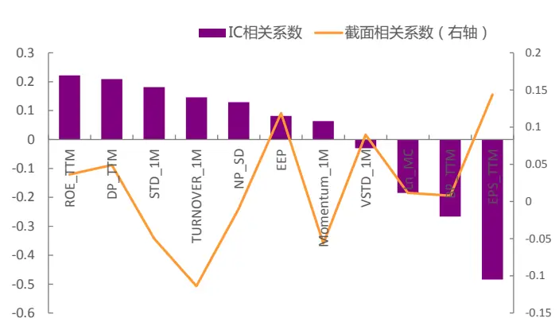
资料来源：Wind，光大证券研究所； 注：测试区间为 2010-04-01至 2020-06-30

图22：IHN因子在不同股票池范围内 IC表现（行业按中信一级行业分类）
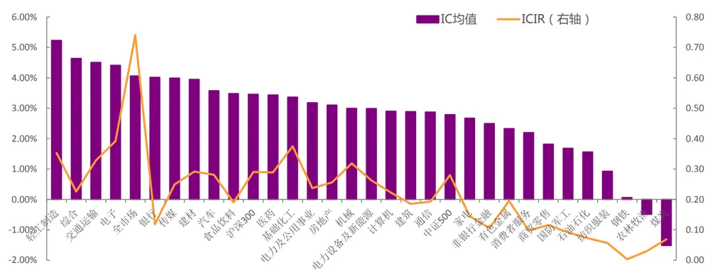
资料来源：Wind，光大证券研究所； 注：测试区间为 2010-04-01 至 2020-06-30

对 IHN 因子进行分组测试（按因子大小等分 10 组），该因子的分组单调性较差，因子主要信息源于空头部分的高区分度，而多头基本没有区分能力。基于 IHN 因子构建的多空组合，年化收益 11.8%，夏普比率 1.87，最大回撤 9.6%；而多头组合的表现并不好，相对于全市场等权基准的超额净值年化收益仅2.2%，夏普比率0.53，最大回撤15.8%。月均双边换手67.1%。

表 9：IHN 因子相关组合统计数据

|  | 多头组合 | 空头组合 等权基准 | 多空组合 | 多头超额基准 |
| --- | --- | --- | --- | --- |
| 年化收益 | 8.8% | -2.7% 6.5% | 11.8% | 2.2% |
| 年化波动 | 27.7% | 27.9% | 28.4% 6.1% | 4.3% |
| 夏普比率 | 0.45 | 0.04 | 0.37 1.87 | 0.53 |
| 最大回撤 | 59.3% | 72.2% | 63.0% 9.6% | 15.8% |
| 月度胜率 | 53.3% | 45.1% | 50.0% 64.8% | 54.1% |

资料来源：资料来源：Wind，光大证券研究所；注：测试区间为2010-04-01至2020-06-30，等权基准为全市场等权

图 23：IHN 因子分组年化收益率
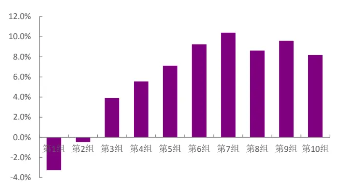
资料来源：Wind，光大证券研究所；注：测试区间为 2010-04-01至 2020-06-30

图 24：IHN 因子多空净值及多头相对超额净值
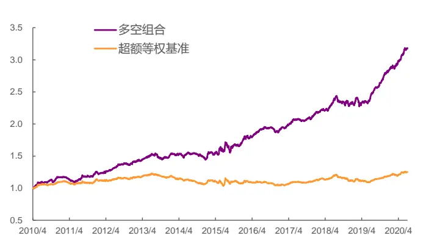
资料来源：Wind，光大证券研究所；注：测试区间为 2010-04-01至 2020-06-30，等权基准为全市场等权

## 2.2.5、机构股东：关注持仓机构个数减少的公司

仍然是机构股东类数据，持仓机构个数变化因子（后以简称 IHN_diff指代）刻画了持有股票的机构数目的变化。跟直观想法相反，IHN_diff 因子呈现出较为显著的负向预测能力，表明最近机构股东数量减少的股票后期相对表现反而会更好。为后续操作方便，我们对其因子值进行取相反数操作处理，使其因子方向变为正向。

IHN_diff 因子与 HN_z 因子都是表明股东数量在减少的股票会更好，差别在于HN_z对应的是全部股东，而 IHN_diff对应的是机构股东。容易怀疑这两个因子的信息是否会有重叠，但它们之间的相关性却不大，无论是 IC相关系数还是因子截面相关系数都不高。IHN_diff因子本身 IC 均值为2.52%，ICIR 为 0.44。在剥离掉 HN_z 因子信息后，IHN_diff 因子 IC 均值基本没变，为 2.65%，ICIR 为 0.46。说明 IHN_diff 因子的有效性并非与 HN_z 因子同样的逻辑。

从跟主流因子的相关性统计来看，该因子与大部分主流因子的相关性较小，与股息率因子稍显正相关、与 EPS 盈利因子稍显负相关。将 IHN_diff因子与股息率与 EPS 因子作中性化后，其因子预测能力变化很小，IC 均值仍有 2.32%，ICIR 为 0.43。

各主流宽基指数中，IHN_diff因子在中证500内该因子 IC均值2.30%，ICIR 为 0.27；在沪深 300 内该因子 IC 均值 2.00%，ICIR 为 0.19。从不同行业范围内因子表现来看，消费者服务、商贸零售、农林牧渔等行业内IHN_diff 因子有效性较强，而在有色金属、石油石化、交通运输等行业内，该因子基本没有预测能力。

图 25：IHN_diff 因子 IC 序列与累计 IC 序列
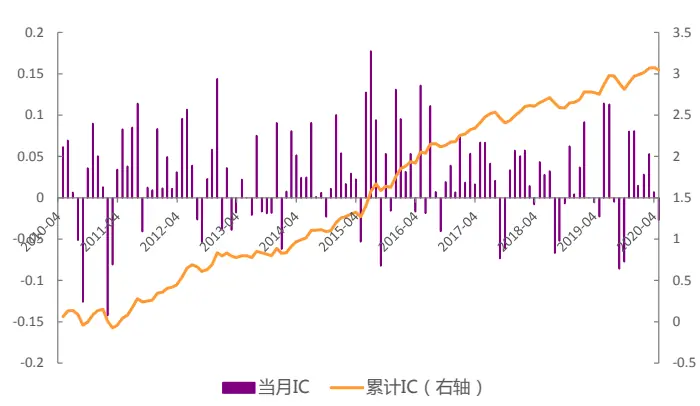
资料来源：Wind，光大证券研究所；注：测试区间为 2010-04-01至 2020-06-30

图26：IHN_diff因子与主流因子相关性
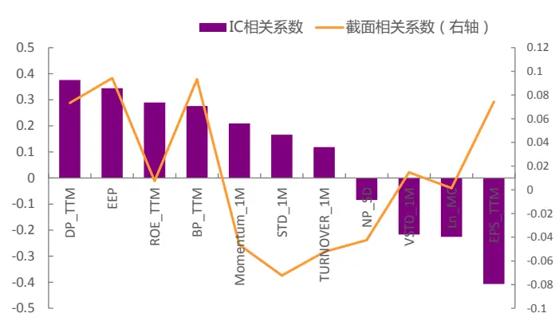
资料来源：Wind，光大证券研究所； 注：测试区间为 2010-04-01至 2020-06-30

图27：IHN_diff因子在不同股票池范围内 IC表现（行业按中信一级行业分类）
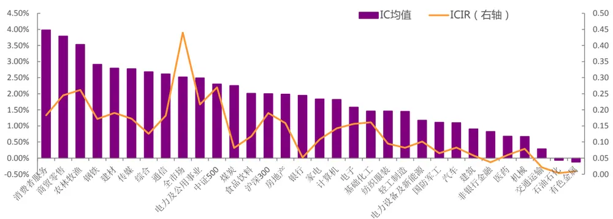
资料来源：Wind，光大证券研究所； 注：测试区间为 2010-04-01 至 2020-06-30

对 IHN_diff 因子进行分组测试（按因子大小等分 10 组），十分组下该因子的分组单调性差，与IHN 因子类似，其主要信息也仅是源于空头部分的高区分度。基于 IHN_diff 因子构建的多空组合，年化收益 6.1%，夏普比率0.98，最大回撤 8.6%；而多头组合相对于全市场等权基准的超额净值年化收益为-0.5%，夏普比率-0.09，最大回撤15.2%。月均双边换手 75.1%。

表 10：IHN_diff 因子相关组合统计数据

|  | 多头组合 | 空头组合 等权基准 | 多空组合 | 多头超额基准 |
| --- | --- | --- | --- | --- |
| 年化收益 | 7.0% | 0.9% 7.5% | 6.1% | -0.5% |
| 年化波动 | 28.0% | 28.0% | 28.4% 6.2% | 4.0% |
| 夏普比率 | 0.38 | 0.17 | 0.40 0.98 | -0.09 |
| 最大回撤 | 60.9% | 70.3% | 63.0% 8.6% | 15.2% |
| 月度胜率 | 52.1% | 48.8% | 51.2% 60.3% | 47.1% |

资料来源：资料来源：Wind，光大证券研究所；注：测试区间为2010-04-01至2020-06-30，等权基准为全市场等权

图28：IHN_diff因子分组年化收益率
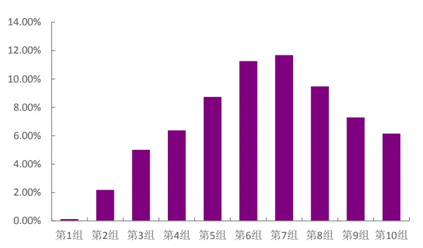
资料来源：Wind，光大证券研究所；注：测试区间为 2010-04-01至 2020-06-30

图 29：IHN_diff 因子多空净值及多头相对超额净值
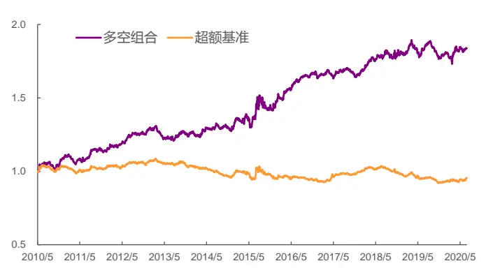
资料来源：Wind，光大证券研究所；注：测试区间为 2010-04-01至 2020-06-30，等权基准为全市场等权

## 3、股东大类因子：预测能力强劲

通过上一章节的测试与分析，我们对各个维度的股东细分因子的表现与逻辑有了较为详实的认识。在这章节我们将利用这些因子构建股东大类因子。

## 3.1、构建股东大类因子

基于因子截面预测能力、与主流因子相关性、以及因子间两两相关性的筛选，我们最终挑选出 4 个基于股东数据构造的细分因子。具体 IC 预测能力可见下表。由于这4个细分因子之前的相关性很低，我们考虑较为简单的等权相加的合成方式。

表11：有效股东细分因子预测能力

| 因子名称 | IC 均值 | IC 标准差 | ICIR 绝对值 | IC>0 比例 |
| --- | --- | --- | --- | --- |
| 股东数目时序标准分（取负） | 3.57% | 6.6% | 0.54 | 69.9% |
| 十大股东占比离散度 | 1.50% | 4.1% | 0.36 | 68.0% |
| 持股机构个数 | 4.04% | 5.5% | 0.74 | 76.9% |
| 持股机构个数变化（取负） | 2.56% | 5.7% | 0.45 | 71.7% |

资料来源：Wind，光大证券研究所（测试区间：2010-04-01 至 2020-06-30）

同时，为了避免细分因子自身单调性问题在合成过程中影响到股东大类因子的单调性，我们对与之前测试中单调性较差的IHN 因子与 IHN_diff 因子分别作如下变换处理：

## IHN 因子

股票的持仓机构个数本身是一个正整数（除非完全没有任何机构持有该股票）。考虑到该因子在较低的数值区间内时区分度显著，但在较高数值时没有区分度，我们可以尝试将持仓机构个数取对数后，即log(持仓机构个数)，再进行 IHN 因子构建。从结果上来说，取对数后构建的IHN因子，相比原来的 IHN 因子，在IC数据上会有所削弱，IC均值降到3.57%，ICIR 变为0.66。但是单调性与区分程度有显著提升。

## IHN_diff 因子

与IHN因子同样的思路，我们希望在构建IHN_diff之前对其基础数据持仓机构数目变化作取对数处理。但由于数目变化很可能是一个负值，因此不能直接取对数。我们对其绝对值取对数再乘以原始数据的符号，即sign(持仓机构个数变化) × log(|持仓机构个数变化|)，再进行 IHN_diff因子构建。从结果上来看，数据变换后构建的 IHN_diff 因子与原来的IHN_diff 因子在预测能力上差异不大，IC 均值为 2.20%，ICIR 为 0.40。但在单调性与区分程度上有了明显改善。

在对各细分因子进行数据变换操作处理后，基于简单等权相加的构造方式对四个股东细分因子进行合成，最终构建出了股东大类因子。

图30：对数处理后构建的IHN因子分组年化收益率
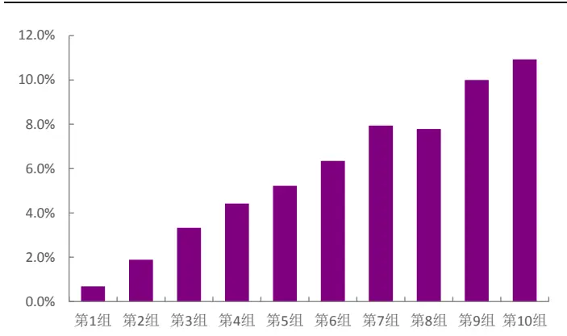
资料来源：Wind，光大证券研究所；注：测试区间为 2010-04-01至 2020-06-30

图31：数据变换后的IHN_diff因子分组年化收益率
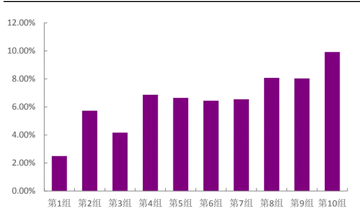
资料来源：Wind，光大证券研究所；注：测试区间为 2010-04-01至 2020-06-30

## 3.2、大类因子效果佳

股东大类因子在全市场内的预测能力非常稳定，因子IC均值为5.03%，ICIR高达0.84。在中证500 内股东大类因子的 IC均值仍较高，有4.72%，但其稳定性有所下降， ICIR 降至 0.66。而在沪深 300 内股东大类因子的预测能力有显著下滑，IC均值下滑至3.26%，ICIR 为0.51。

图 32：股东大类因子 IC 序列与累计 IC 序列
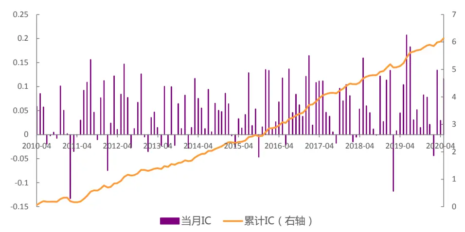
资料来源：Wind，光大证券研究所； 注：测试区间为 2010-04-01 至 2020-06-30

表12：股东大类因子 IC序列测试统计

| 样本池范围 | IC 均值 | IC 标准差 | ICIR 绝对值 | IC>0 比例 |
| --- | --- | --- | --- | --- |
| 全市场 | 5.03% | 6.01% | 0.84 | 79.5% |
| 中证500 | 4.72% | 7.20% | 0.66 | 76.2% |
| 沪深300 | 3.26% | 6.40% | 0.51 | 67.2% |

资料来源：Wind，光大证券研究所； 注：测试区间为 2010-04-01 至 2020-06-30

股东大类因子的分组单调性很好，区分度亦显著。整体上空头信息比多空信息更为显著。在2010年 4月 1日至2020 年6月30日区间内，基于股东大类因子构建的多空组合，年化收益 19.0%，夏普比率 2.93，最大回撤8.7%；而多头组合相对于全市场等权基准的超额净值年化收益为 7.4%，信息比率 2.17，最大回撤 5.0%。多头组合本身年化收益率 14.4%，最大回撤52.0%，月均双边换手 62.1%。

表13：股东大类因子相关组合统计数据

|  | 多头组合 | 空头组合 等权基准 | 多空组合 | 多头超额基准 |
| --- | --- | --- | --- | --- |
| 年化收益 | 14.4% | -3.9% 6.5% | 19.0% | 7.4% |
| 年化波动 | 27.3% | 29.7% 28.4% | 6.0% | 3.3% |
| 夏普比率 | 0.63 | 0.02 0.37 | 2.93 | 2.17 |
| 最大回撤 | 52.0% | 75.8% 62.9% | 8.7% | 5.0% |
| 月度胜率 | 54.9% | 46.7% 50.0% | 77.0% | 72.1% |

资料来源：资料来源：Wind，光大证券研究所；注：测试区间为2010-04-01至2020-06-30，等权基准为全市场等权

图33：股东大类因子多头组合及超额等权基准净值
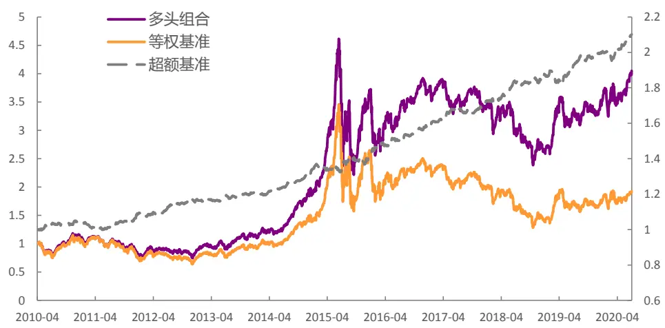
资料来源：Wind，光大证券研究所； 注：测试区间为 2010-04-01至 2020-06-30，等权基准为全市场等权

观察分年度数据，2010至2020年股东大类因子组合在全部年份都能跑赢全市场等权指数，年胜率 100%。从 2016 年开始组合在多方面的表现都更为出色，每年的超额收益率均在6.5%以上，相对最大回撤最大不超过 4%，月度胜率稳定保持不低于75%，信息比率也都处于2 以上水平。

表14：股东大类因子组合分年度表现统计

|  | 年化收益 | 年化波动 | 夏普比率 | 最大回撤 | 年化 超额收益 | 相对 年化波动 | 信息比率 | 相对 最大回撤 | 月度胜率 |
| --- | --- | --- | --- | --- | --- | --- | --- | --- | --- |
| 2010 | 16.1% | 27.5% | 0.59 | 24.4% | 5.6% | 3.6% | 1.58 | 1.4% | 62.5% |
| 2011 | -27.6% | 21.7% | -1.27 | 29.8% | 4.6% | 3.5% | 1.31 | 4.3% | 66.7% |
| 2012 | 12.6% | 23.1% | 0.54 | 21.8% | 7.0% | 3.2% | 2.21 | 2.0% | 75.0% |
| 2013 | 28.0% | 22.2% | 1.26 | 14.7% | 2.8% | 2.7% | 1.03 | 1.8% | 66.7% |
| 2014 | 50.4% | 19.4% | 2.60 | 8.9% | 10.7% | 2.6% | 4.18 | 1.4% | 83.3% |
| 2015 | 78.1% | 50.3% | 1.55 | 52.0% | 5.3% | 4.7% | 1.14 | 3.4% | 50.0% |
| 2016 | 5.5% | 31.1% | 0.18 | 30.3% | 11.4% | 3.8% | 2.99 | 1.3% | 75.0% |
| 2017 | -5.9% | 16.0% | -0.37 | 15.7% | 8.2% | 2.8% | 2.98 | 1.8% | 75.0% |
| 2018 | -23.8% | 25.1% | -0.95 | 32.0% | 8.3% | 2.9% | 2.84 | 1.9% | 83.3% |
| 2019 | 32.8% | 21.8% | 1.51 | 14.8% | 6.5% | 3.2% | 2.01 | 3.8% | 75.0% |
| 2020 | 30.0% | 25.8% | 1.16 | 13.4% | 9.9% | 3.2% | 3.14 | 2.8% | 83.3% |
| Summary | 14.4% | 27.3% | 0.63 | 52.0% | 7.4% | 3.3% | 2.17 | 5.0% | 72.1% |

资料来源：光大证券研究所，Wind； 注：测试区间为 2010-04-01 至 2020-06-30，等权基准为全市场等权

在同样的测试区间内，我们在中证500内、及沪深300内也分别进行测试。整体上在这两个样本内股东大类因子都有明显选股效果。相对而言，在中证500内的效果更为显著。

中证 500 内的多空组合，年化收益 18.6%，夏普比率 2.07，最大回撤12.4%；而多头组合相对于 500 等权基准的超额净值年化收益为 7.8%，信息比率 1.49，最大回撤 7.3%。沪深 300 内股票样本不大，分组及组合测试以五分组进行，构建出的多空组合，年化收益 8.2%，夏普比率 1.29，最大回撤 6.3%；而多头组合相对于 300 等权基准的超额净值年化收益为 4.3%，信息比率1.13，最大回撤5.0%。

表 15：股东大类因子在中证 500 及沪深 300 内相关组合统计数据

| 统计项 | 中证500 |  |  |  | 沪深300 |  |  |  |
| --- | --- | --- | --- | --- | --- | --- | --- | --- |
|  | 多头组合 | 等权基准 | 多空组合 | 多头超额基准 | 多头组合 | 等权基准 | 多空组合 | 多头超额基准 |
| 年化收益 | 11.8% | 3.7% | 18.6% | 7.8% | 6.4% | 2.0% | 8.2% | 4.3% |
| 年化波动 | 27.5% | 28.0% | 8.4% | 5.1% | 24.1% | 24.7% | 6.3% | 3.8% |
| 夏普比率 | 0.54 | 0.27 | 2.07 | 1.49 | 0.38 | 0.20 | 1.29 | 1.13 |
| 最大回撤 | 52.1% | 62.6% | 12.4% | 7.3% | 46.5% | 53.9% | 6.3% | 5.0% |
| 月度胜率 | 57.4% | 52.5% | 71.3% | 64.8% | 53.3% | 52.5% | 65.6% | 63.9% |

资料来源：光大证券研究所，Wind； 注：测试区间为 2010-04-01 至 2020-06-30

图34：中证 500内股东大类因子多头组合及超额等权基准净值
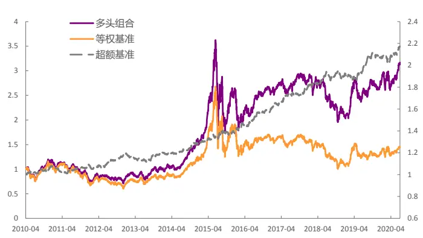
资料来源：Wind，光大证券研究所；注：测试区间为 2010-04-01至 2020-06-30，等权基准为中证 500 成分股等权

图35：沪深 300内股东大类因子多头组合及超额等权 基准净值
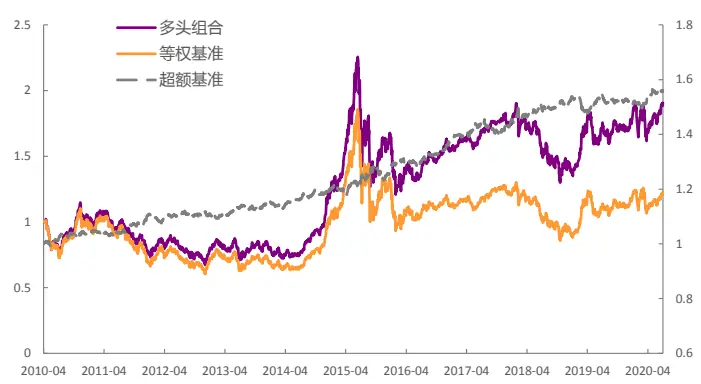
资料来源：Wind，光大证券研究所；注：测试区间为 2010-04-01至 2020-06-30，等权基准为沪深 300 成分股等权

综上，股东大类因子具有显著且稳定的截面预测能力，并且其信息主要是当前主流因子无法完全解释的增量信息。值得投资者关注。

## 4、总结

本文将A股股东数据作为主要研究对象。通过对不同类型股东数据的梳理，以及细分数据的研究，尝试挖掘出与当前主流因子有差异化信息的股东因子，并最终构建出预测能力稳健的股东大类因子。具体结论如下：

## 股东类数据：更新频率低但维度较为丰富

股东数据可分为多个类别，包括股票的股东户数、股票前十大股东、股票机构股东、股票重要股东增减持等。其中除了增减持数据过于稀疏更适合作为事件研究外，股东数量、十大股东、机构股东数据基本都是季度频率，研究方式一定程度上可借鉴财报基本面数据的研究方法。

## 股东数据整体：能对市场整体变化特征有所体现与印证

将全市场股票的股东数据汇总，不同维度上的信息一定程度上能对市场整体变化特征进行体现与印证。十大股东持仓数据中，总占比上升但各自占比离散度不断下降，表明大股东之间的股权分配越来越均衡。机构股东数据中，不同股票持仓机构个数的离散度越来越大，则印证了近几年来愈加增强的机构抱团现象。

## 股东细分因子：各维度均具有不同逻辑特征的有效因子

从股东户数、十大股东、机构股东三个类别中分别挖掘有明显增量信息的因子。股东户数数据中，股东户数时序标准分（HN_z）因子具有显著负向预测能力；十大股东数据中，十大股东占比离散度（LHRD）因子具有显著正向预测能力；机构股东数据中，持仓机构个数（IHN）因子具有显著正向预测能力，持仓机构个数变化（IHN_diff）因子则具有显著负向预测能力。另一方面，机构持仓占比因子虽然也有显著的截面预测能力，但其信息基本上都能被其它主流因子解释，并不具备明显增量信息。

## 股东大类因子：具有显著且稳定的截面预测能力

将4 个股东数据细分因子分别处理后再等权相加，构建股东大类因子。该因子在全市场内的预测能力非常稳定。以 2010/04/01-2020/06/30 作为测试区间，因子 IC均值为5.03%，ICIR高达0.84。具有良好的分组单调性与区分度。基于股东大类因子构建的多空组合，年化收益19.0%，夏普比率2.93，最大回撤 8.7%；而多头组合相对于全市场等权基准的超额净值年化收益为7.4%，信息比率2.17，最大回撤5.0%。在中证500及沪深 300 样本内股东大类因子的预测能力及选股能力也很显著。

## 5、风险提示

报告结论均基于历史数据与模型，模型存在失效的可能，历史数据存在不被重复验证的可能。

## 行业及公司评级体系

| 评级 说明 |  |  |
| --- | --- | --- |
| 行 | 买入 | 未来6-12个月的投资收益率领先市场基准指数15%以上； |
|  | 增持 | 未来6-12个月的投资收益率领先市场基准指数5%至15%； |
|  | 中性 | 未来6-12个月的投资收益率与市场基准指数的变动幅度相差-5%至5%； |
|  | 减持 | 未来6-12个月的投资收益率落后市场基准指数5%至15%； |
|  | 卖出 | 未来6-12个月的投资收益率落后市场基准指数15%以上； |
| 业及公司评级 | 无评级 | 因无法获取必要的资料，或者公司面临无法预见结果的重大不确定性事件，或者其他原因，致使无法给出明确的 投资评级。 |
| 基准指数说明：A股主板基准为沪深300指数；中小盘基准为中小板指；创业板基准为创业板指；新三板基准为新三板指数；港 股基准指数为恒生指数。 |  |  |

## 分析、估值方法的局限性说明

本报告所包含的分析基于各种假设，不同假设可能导致分析结果出现重大不同。本报告采用的各种估值方法及模型均有其局限性，估值结果不保证所涉及证券能够在该价格交易。

## 分析师声明

本报告署名分析师具有中国证券业协会授予的证券投资咨询执业资格并注册为证券分析师，以勤勉的职业态度、专业审慎的研究方法，使用合法合规的信息，独立、客观地出具本报告，并对本报告的内容和观点负责。负责准备以及撰写本报告的所有研究人员在此保证，本研究报告中任何关于发行商或证券所发表的观点均如实反映研究人员的个人观点。研究人员获取报酬的评判因素包括研究的质量和准确性、客户反馈、竞争性因素以及光大证券股份有限公司的整体收益。所有研究人员保证他们报酬的任何一部分不曾与，不与，也将不会与本报告中具体的推荐意见或观点有直接或间接的联系。

## 特别声明

光大证券股份有限公司（以下简称“本公司”）创建于 1996 年，系由中国光大（集团）总公司投资控股的全国性综合类股份制证券公司，是中国证监会批准的首批三家创新试点公司之一。根据中国证监会核发的经营证券期货业务许可，本公司的经营范围包括证券投资咨询业务。

本公司经营范围：证券经纪；证券投资咨询；与证券交易、证券投资活动有关的财务顾问；证券承销与保荐；证券自营；为期货公司提供中间介绍业务；证券投资基金代销；融资融券业务；中国证监会批准的其他业务。此外，本公司还通过全资或控股子公司开展资产管理、直接投资、期货、基金管理以及香港证券业务。

本报告由光大证券股份有限公司研究所（以下简称“光大证券研究所”）编写，以合法获得的我们相信为可靠、准确、完整的信息为基础，但不保证我们所获得的原始信息以及报告所载信息之准确性和完整性。光大证券研究所可能将不时补充、修订或更新有关信息，但不保证及时发布该等更新。

本报告中的资料、意见、预测均反映报告初次发布时光大证券研究所的判断，可能需随时进行调整且不予通知。在任何情况下，本报告中的信息或所表述的意见并不构成对任何人的投资建议。客户应自主作出投资决策并自行承担投资风险。本报告中的信息或所表述的意见并未考虑到个别投资者的具体投资目的、财务状况以及特定需求。投资者应当充分考虑自身特定状况，并完整理解和使用本报告内容，不应视本报告为做出投资决策的唯一因素。对依据或者使用本报告所造成的一切后果，本公司及作者均不承担任何法律责任。

不同时期，本公司可能会撰写并发布与本报告所载信息、建议及预测不一致的报告。本公司的销售人员、交易人员和其他专业人员可能会向客户提供与本报告中观点不同的口头或书面评论或交易策略。本公司的资产管理子公司、自营部门以及其他投资业务板块可能会独立做出与本报告的意见或建议不相一致的投资决策。本公司提醒投资者注意并理解投资证券及投资产品存在的风险，在做出投资决策前，建议投资者务必向专业人士咨询并谨慎抉择。

在法律允许的情况下，本公司及其附属机构可能持有报告中提及的公司所发行证券的头寸并进行交易，也可能为这些公司提供或正在争取提供投资银行、财务顾问或金融产品等相关服务。投资者应当充分考虑本公司及本公司附属机构就报告内容可能存在的利益冲突，勿将本报告作为投资决策的唯一信赖依据。

本报告根据中华人民共和国法律在中华人民共和国境内分发，仅向特定客户传送。本报告的版权仅归本公司所有，未经书面许可，任何机构和个人不得以任何形式、任何目的进行翻版、复制、转载、刊登、发表、篡改或引用。如因侵权行为给本公司造成任何直接或间接的损失，本公司保留追究一切法律责任的权利。所有本报告中使用的商标、服务标记及标记均为本公司的商标、服务标记及标记。

光大证券股份有限公司版权所有。保留一切权利。

## 联系我们

| 上海 | 北京 | 深圳 |
| --- | --- | --- |
| 静安区南京西路1266号恒隆广场1号 写字楼48层 | 西城区月坛北街2号月坛大厦东配楼2层 复兴门外大街6号光大大厦17层 | 福田区深南大道 6011号NEO 绿景纪元大 厦 A 座 17 楼 |