# 基金持仓集中度怎样影响板块和风格？——多因子系列报告之三十八

随着基金半年报的披露，公募基金持仓的高集中度现象再度引发投资者的关注。本篇报告将首先从基金持仓集中度提升的现象出发，分析集中持仓行为对板块和个股的影响，并且尝试采用不同方式构建量化指标对基金持仓集中度进行刻画，测试持仓集中度对于市场风格的预测能力和对于板块轮动的应用效果。

## 何为基金集中持仓行为？

在不同的时间阶段，公募重仓股的板块分布有着明显的不同：2003年到2006年，重仓周期下游，占比在 30%~35%。2006 年到 2010年，重仓金融板块，最高时占比接近45%。最新2020Q2的格局是消费+科技+医药占据了 70%左右的权重。基金集中持仓现象背后的原因可能包括：（1）市场政策或宏观环境的变化（2）行业间估值性价比的差距（3）市场热点主题的变更等等。

## 量化刻画基金持仓集中度：当前持仓集中度接近高点

基金角度：从基金重仓股及净值占比出发。将市场上的偏股型基金作为一个整体，观察市场上的所有偏股型基金整体更偏好哪些个股，并将他们偏好个股的程度作为度量基金集中持仓的指标。从各个板块的历史集中持仓指数可见，科技板块、消费板块（一般消费和可选消费）和周期中游板块近年来的集中持仓趋势上升明显。2020年 2季度的最新数据显示，科技板块、周期中游板块的持仓集中度在加速上升。

个股角度：基金持仓基尼系数。基尼系数是经济学中衡量贫富差距的重要指标。在 A 股市场上，基尼系数可以有效衡量基金在个股中持仓的不平等情况。2016 年底至 2017 年底，基金集中持仓的基尼系数迅速攀升。2018年至今，基金集中持仓基尼系数仍然维持高位，且仍呈现上升趋势。

## 集中持仓指数应用于风格判断和板块轮动

板块轮动：重仓股基尼系数多头表现出色，公告滞后性影响效果。集中持仓行为在板块轮动上的动量效应较明显，加速集中持仓的板块具有显著超额收益。

因子收益：（1）持仓集中度越高，估值因子表现越差。重仓集中持仓指数绝对值对估值因子未来一个季度的表现具有较强的预测能力。尤其是最近 10 年（2010 年以来），重仓集中持仓指数与估值因子收益的相关系数为-0.39，胜率超过 75%。（2）持仓集中度越高，动量因子表现越好。当重仓集中持仓指数处于高位时，动量因子（Momentum_24M-1M）的收益表现较好，当集中持仓指数高于0.3 时胜率为100%。

由于当前集中持仓指数仍处于高位，最新一期（2020 年 7 月 31 日）我们对于估值因子的观点仍较为悲观，对动量因子的观点较为乐观。

## 风险提示：

结果均基于模型和历史数据，模型存在失效的风险。

## 金融工程深度

## 分析师

周萧潇 （执业证书编号：S0930518010005）

021-52523680

zhouxiaoxiao@ebscn.com

刘均伟 （执业证书编号：S0930517040001）

021-52523679

liujunwei@ebscn.com

## 相关研究

《因子正交与择时：基于分类模型的动态权重配置——多因子系列报告之十》《爬罗剔抉：一致预期因子分类与精选——多因子系列报告之十一》

《成长因子重构与优化：稳健加速为王——多因子系列报告之十二》

《组合优化算法探析及指数增强实证——多因子系列报告之十三》

《以质取胜：EBQC 综合质量因子详解——多因子系列报告之十七》

《创新基本面因子：财务数据全扫描

——多因子系列报告之二十六》

《ESG 投资与 ESG 因子策略

——多因子系列报告之二十七》

《再论估值因子：因子重构 or 收益预判？——多因子系列报告之二十九》

《有息负债：解读企业杠杆的选股信息多因子系列报告之三十》
《专利数据中有哪些 Alpha？多因子系列报告之三十一》

随着基金半年报的披露，公募基金集中持仓的现象再度引发投资者的关注。一些观点认为集中持仓现象会引导A 股市场的风格偏好和走势，且一定程度上导致了部分个股的估值泡沫。而也有观点认为集中持仓本质上是一个结果，因为公募基金作为专业的投资者，将筹码集中在优质标的上是很自然的选择，机构的集中持仓本质上其实是对优秀公司的认可。

本篇报告将首先从基金集中持仓的现象出发，分析基金集中持仓行为对板块和个股的影响，并且尝试采用不同方式构建量化指标对基金持仓集中度进行刻画，测试基金集中持仓指数对于市场风格的预测能力和对于板块轮动的应用效果。

## 1、何为基金集中持仓行为？

## 1.1、基于基金重仓股看历史上的几次板块集中持仓

从集中持仓周期的2004年，到集中持仓消费、医药的2020年，公募基金重仓股的板块分布特征究竟是怎么样的？

我们采用中信一级行业进行板块划分，按照前期报告的划分标准，将全市场分为：金融，可选消费，一般消费，科技板块，周期上游，周期中游，周期下游这7个板块。

表1：光大金工板块划分标准（基于中信行业分类）

| 金融 | 可选消费 | 一般消费 | 科技板块 | 周期上游 | 周期中游 | 周期下游 |
| --- | --- | --- | --- | --- | --- | --- |
| 银行 | 汽车 | 农林牧渔 | 电子 | 石油石化 | 基础化工 | 建筑 |
| 非银行金融 | 家电 | 纺织服装 | 通信 | 煤炭 | 钢铁 | 房地产 |
| 综合金融 | 白酒(II) | 医药 | 计算机 | 有色金属 | 建材 | 电力及公用事业 |
|  |  | 商贸零售 | 传媒 |  | 机械 | 交通运输 |
|  |  | 消费者服务 |  |  | 电力设备及新能源 |  |
|  |  | 轻工制造 |  |  | 国防军工 |  |
|  |  | 其他饮料(II) |  |  |  |  |
|  |  | 食品(II) |  |  |  |  |

资料来源：光大证券研究所

将公募基金季度的重仓股按上述板块分类，观察在不同时期，公募基金的季度重仓的板块占比分布情况 。

我们发现在不同的时间阶段，公募重仓股的板块分布有着明显的不同：

（1）2003 年到 2006 年，重仓周期下游，占比在 30%~35%。

（2）2006年到2010年，重仓金融板块，最高时占比接近45%。

（3）2011 年到 2012 年，一般消费、周期下游占比较高。

（4）2013 年至 2016 年，科技板块配置占比迅速提升，可选消费板块占比下滑。

（5）2017 年以来一般消费占比快速增加。

（6）最新 2020Q2 的格局是消费+科技+医药占据了 70%左右的权重。

图1：公募基金重仓股板块分布情况（2003Q4 -2020Q2）
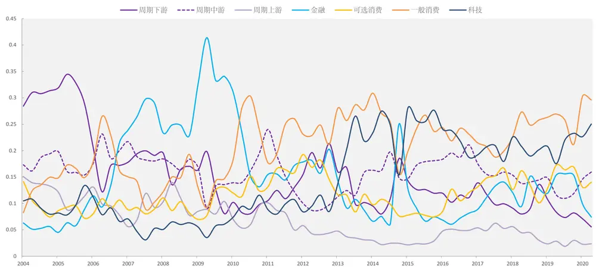
资料来源：Wind，光大证券研究所

对于基金集中持仓现象背后的原因，较难寻找到一个统一的解释。我们考虑其中可能的影响因素包括：（1）市场政策或宏观环境的变化，（2）行业间估值性价比的差距，（3）市场热点主题的变更等等。

2003 年主导市场的是“五朵金花”行情，即以金融、地产、煤炭、钢铁、有色为主线的蓝筹股、周期股行情，站在当时的时点来看“五朵金花”行情背后的原因也是来自于行业景气度的改善。板块分类中的周期股（周期上游+周期中游+周期下游）占比之和也同样在当时达到了很高的水平，最高时占比接近65%。

2006 年之后出现了金融板块集中持仓，2005 年起工中建交等国有大行相继上市，券商行业进行市场化重组，金融地产龙头公司进入了快速成长期。到2009年二季度，金融板块的持仓占比达到峰值。

2009年之后，经济脉冲式恢复性上涨后开始逐步下行，消费由于其弱周期属性而具有一定的避险属性，并且整体消费板块的盈利在逐步回升，机构开始逐步加仓消费。2009 年到 2012 年，消费板块（可选消费+一般消费）占比稳定在了 35%~45%之间。而金融板块由于社融下滑，盈利增速下降，占比逐步下滑至了15%~20%。

2012年，政策事件对可选消费产生了较大的影响，2012年12月中共中央政治局召开会议通过了“八项规定”，对白酒行业的需求形成较大的冲击，可选消费的集中持仓的格局开始瓦解。

2013年，在消费电子，智能手机等主题的带动下，科技板块占比由之前的不到10%迅速上升到了20%~30%的水平。

2018年以来，科技兴国和发展高兴技术产业的浪潮自上而下的推进，成长与消费并行，同时医药板块中，医疗服务等泛消费，医疗器械，创新药等范成长赛道也在持续向好。

目前（2020Q2）公募基金整体上呈现出集中持仓科技+消费+医药的格局。同时可以观察到，截止目前（2020Q2）科技板块在基金重仓股中的配置权重还没有达到2015年的高点。

## 1.2、个股集中持仓情况同样显著

基金集中持仓的行为其实不仅仅体现在板块和风格上，个股的集中持仓情况同样随着时间推移出现了较大的变化，并且，特定市场阶段中我们会发现板块的集中度所不能解释的风格偏离，此时往往个股收益差异的变化会对相关投资组合的表现造成较大的影响。

以 2017 年为例，从图 1 中机构的板块配置情况上看，板块之间的占比并没有表现出显著的偏离，但经历过 2017 年市场的投资者都会深刻的感受到 2017 年的强势和弱势股票收益之间的巨大差异。以具有市场代表性的几个宽基指数为例，我们会发现2017 年这几个指数之间的收益表现差异极大，上证50 指数与沪深300指数均大幅的跑赢中证 500 和中证 1000，

图2：2017年主要宽基指数走势
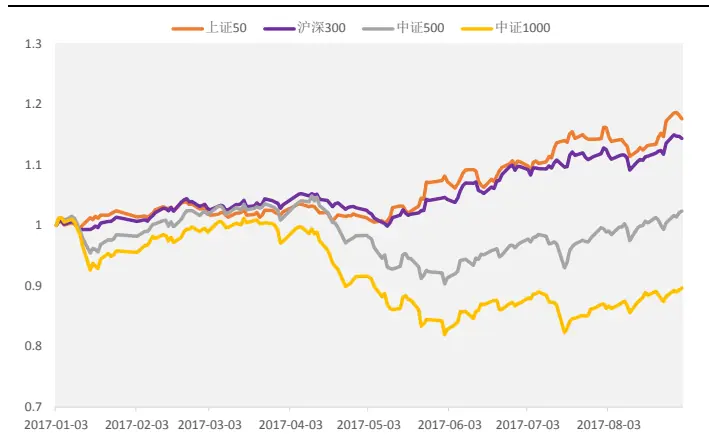
资料来源：光大证券研究所，注：2017-01-01 至 2017-12-31

图3：沪深 300权重股与沪深300指数走势
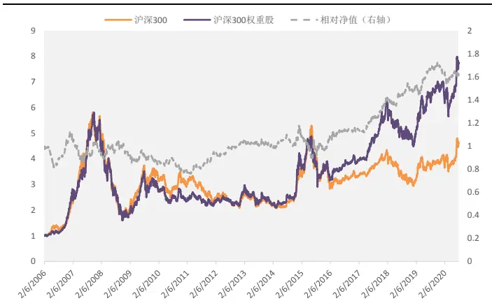
资料来源：光大证券研究所，注：2006-01-01 至 2020-07-31注：权重股定义为指数内权重占比大于等于 1%的个股

2017 年沪深 300 内的权重股表现远远好于沪深 300 指数。这里我们对权重股的定义是，指数内权重占比大于等于1%的个股。由图3 可见，2017年之前沪深300内的权重股收益表现与沪深300指数本身并未表现出显著的差异，但2017 年之后，权重股显著的大幅跑赢指数本身。

表2：持仓基金占比（偏股型基金数量占总基金数量比例）前十的股票名单

| 排名 2015Q4 2016Q4 2017Q4 2018Q4 |  |  |  |  |  |  |  |  |
| --- | --- | --- | --- | --- | --- | --- | --- | --- |
| 12 | 股票 持仓基金占比 |  | 股票 持仓基金占比 |  | 股票 持仓基金占比 |  | 股票 持仓基金占比 |  |
|  | 思维列控 | 11% | 贵州茅台 | 13% | 中国平安 | 32% | 中国平安 | 25% |
|  | 中科创达 | 9% | 中国平安 | 10% | 贵州茅台 | 25% | 贵州茅台 | 18% |
| 3 | 兴业银行 | 8% | 工商银行 | 10% | 伊利股份 | 22% | 万科A | 16% |
| 4 | 奇信股份 | 8% | 上汽集团 | 10% | 工商银行 | 19% | 保利地产 | 15% |
| 5 | 中国平安 | 7% | 平安银行 | 10% | 五粮液 | 18% | 招商银行 | 15% |
| 6 | 万科A | 6% | 五粮液 | 10% | 招商银行 | 18% | 格力电器 | 14% |
| 78 | 格力电器读者传媒 | 6% | 美的集团 | 9% | 格力电器 | 18% | 伊利股份 | 12% |
|  |  | 5% | 格力电器 | 9% | 农业银行 | 14% | 工商银行 | 11% |
| 910 | 奥飞娱乐平安银行 | 5%5% | 兴业银行中国石化 | 8% | 兴业银行 |  | 12%建设银行 12% | 中信证券 11%兴业银行 10% |
|  |  |  |  | 7% |  |  |  |  |
| 均值 |  | 7% |  | 10% | 19% |  |  | 15% |

资料来源：光大证券研究所，Wind

由上表可见，2017 年底全市场的偏股型基金中，有 32%的基金持有了中国平安，前十的股票的平均持仓基金占比为 19%，显著的高于其他年份。因此图 3 中 2017 年的收益极端偏离的原因，一定程度上可以由个股的集中持仓情况解释。也就是说，如果想要做到准确的刻画基金的持仓集中程度，我们不仅仅要看基金持仓在板块上的分布情况，更需要深入个股层面，挖掘有效的衡量基金持仓集中度的指标。

下文中，我们将从不同的角度入手，尝试构造一个量化的刻画基金持仓集中度的方法。同时，尝试挖掘基金持仓集中度与市场走势、市场风格之间的关联度。

## 2、集中持仓指数：量化刻画基金持仓集中度

在进行集中持仓指数的研究前，我们首先梳理了相关数据的可获得性和公布时间。

## （1） 基金公告数据：

从数据披露的完整性来看，仅有基金中报和年报会披露完整的基金持仓明细；从公告的滞后时长来看，基金的四个季度的季报均是在季度结束 15个工作日后公布，滞后为 20 天左右，滞后时长较年报和半年报来说缩短了很多。

表3：基金相关报告披露时间表

| 数据来源 | 公布时间 | 备注 |
| --- | --- | --- |
| 基金季度报告 | 季度结束15个工作日后 | 前十大重仓股 |
| 基金中期报告 | 8月底 | 所有持仓明细 |
| 基金年报 | 次年3月底 | 所有持仓明细 |

资料来源：Wind，光大证券研究所

## （2） 基金类型筛选：

为了更好的刻画基金在个股上的选择和偏好，我们选择股票型基金中的普通股票型基金和混合型基金中的偏股混合型基金、平衡混合型基金。同时，为了表述方便，下文中将上述基金统称为“偏股型基金”。

我们后文的分析中将从上述相关数据入手，从基金角度和个股角度两个不同的角度出发，构造刻画基金持仓集中度的集中持仓指数。

## 2.1、基金角度：从基金重仓股及净值占比出发

首先，我们从基金的角度出发，根据基金不同时期的重仓股的分布情况、重仓股集中度等数据，将市场上的相关基金作为研究对象。

## 2.1.1、构造方法：“整体法”看基金投票

为了较好的反应市场上的偏股型基金重仓股的重合程度，这里我们采用的方法是，将市场上的偏股型基金作为一个整体，观察市场上的所有偏股型基金整体更偏好哪些个股，并将他们偏好个股的程度作为一个度量基金集中持仓的指标。

考虑到季报中的前十大重仓股发布时间频率高，发布时间滞后相对较短，且市场上所有偏股型基金的十大重仓股的并集本身已经具有一定的体量，在刻画基金集中持仓的情况时，采用基金前十大重仓股的数据已经比较充分。因此，这里我们将采用前十大重仓股的数据进行测试。

具体的来讲，基金角度出发的持仓集中度指数的构建过程如下：

（1）获取基金前十大重仓股及其占基金净值的比例

（2）将所有偏股型基金前十大重仓股合成为一个整体基金（基金A），个股占比按前一条中的占净值比例求和

（3）计算集中持仓指数：

集中持仓指数 = 基金 A 前 n 只个股持仓比例之和 / 重仓股样本数

步骤（2）中对所有偏股型基金重仓股合并的过程中，可采用的加权方式为按照基金规模加权或者各个基金等权。两种方法经过测试，对最终的基金集中持仓指数结果没有显著影响。

“整体法”看基金投票：我们最终选用等权的方式进行整合，原因则是等权的方法下各个基金背后的基金经理的观点被同等的对待，更加类似于给了每只基金一个“投票权”，且投票的重要性是一样的。这样可以更好的反映市场上大多数基金经理的观点和偏好，而不是个别产品规模极大的基金经理的观点，同时也更加符合基金集中持仓研究的出发点。

步骤（3）中在对前 n 只个股持仓占比求和之后，将指数除以重仓股样本数做了调整，这一调整的目的是一定程度消除股票总数上升导致的集中持仓指数下降。因为当可投资的标的越多，基金的持仓会天然的偏向于分散，因此时间序列上如果不做调整会造成不可比的问题。

按照上述逻辑构建的集中持仓指数基本可以反映市场的持仓集中度，各基金重仓股结构如果越相似，那么该值越大。

图 4：“整体法”基金集中持仓指数（n=10）
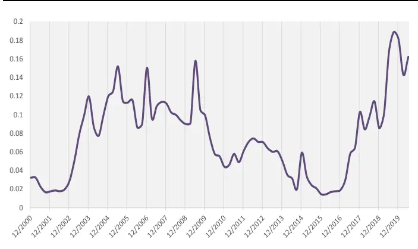
资料来源：光大证券研究所，注：2000-01-01 至 2020-06-30

图 5：“整体法”基金集中持仓指数（n=50）
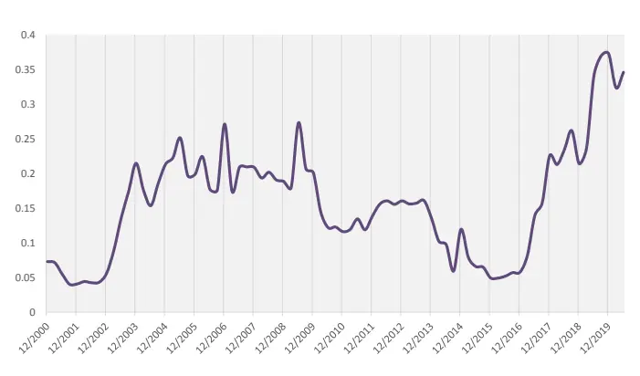
资料来源：光大证券研究所，注：2000-01-01 至 2020-06-30

在 n=10 和 n=50 两个不同参数取值下，集中持仓指数的整体走势差异不大，两种情形下，集中持仓指数均在2019年四季度达到峰值，2020年 1季度略有下降但2020年2季度再度回升。

考虑到当前市场 A 股总数不断上升，仅取前 10 只个股可能会对指标未来的代表性造成影响，在后文考察A 股整体集中持仓的程度时我们将参数 n设定为50，在考察单个板块或行业的集中持仓情况时取n=10。

## 2.1.2、各板块持仓集中度：2季度科技板块、周期中游集中持仓加速

采用上述方法，我们统计了各个板块内的重仓股持仓集中度。分板块统计集中持仓指数可以让我们观察到市场上的偏股型基金在不同板块内的配置偏离程度（例如是否在某板块内集中的配置个别股票），同时，也可以通过比较不同板块的集中持仓指数的差异来判断当前基金在不同板块上的配置偏离。

图6：可选消费板块集中持仓指数
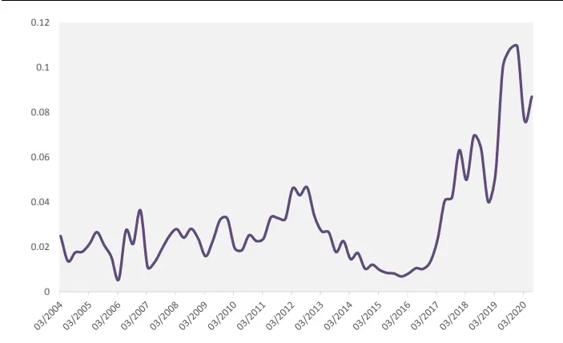
资料来源：光大证券研究所，注：2004-01-01 至 2020-06-30

图 7：科技板块集中持仓指数
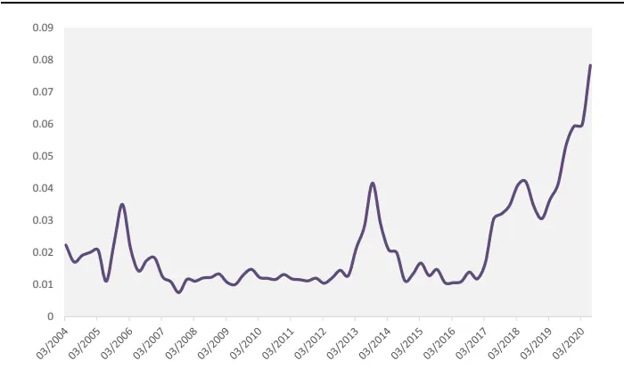
资料来源：光大证券研究所，注：2004-01-01 至 2020-06-30

图8：一般消费板块集中持仓指数
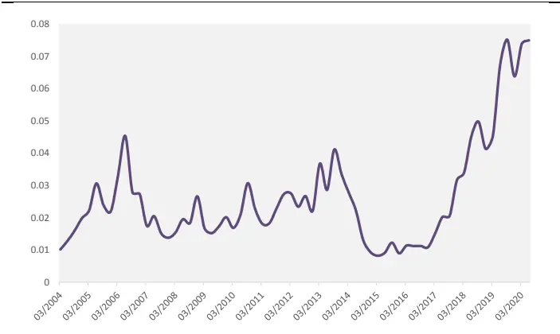
资料来源：光大证券研究所，注：2004-01-01 至 2020-06-30

图 9：金融板块集中持仓指数
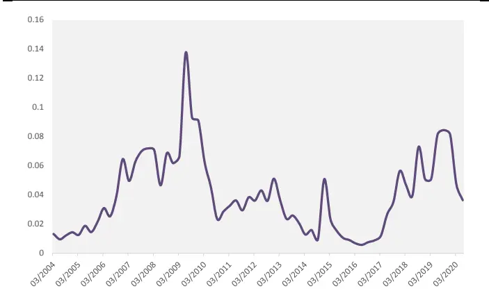
资料来源：光大证券研究所，注：2004-01-01 至 2020-06-30

图 10：周期上游板块集中持仓指数
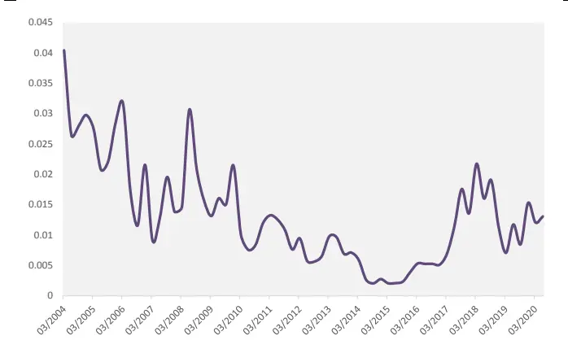
资料来源：光大证券研究所，注：2004-01-01 至 2020-06-30

图 11：周期下游板块集中持仓指数
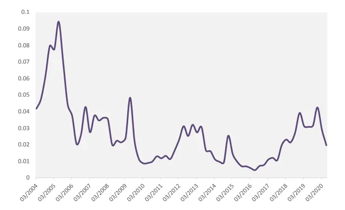
资料来源：光大证券研究所，注：2004-01-01 至 2020-06-30

图 12：周期中游板块集中持仓指数
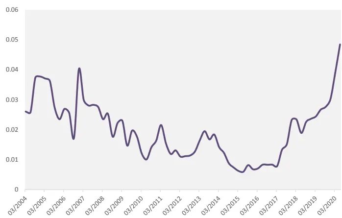
资料来源：光大证券研究所，注：2004-01-01 至 2020-06-30

从各个板块的历史集中持仓指数可见，科技板块、消费板块（一般消费和可选消费）和周期中游板块近年来的集中持仓趋势上升明显。

2020 年 2 季度的最新数据显示，科技板块、周期中游板块的持仓集中度在加速上升。

## 2.2、个股角度：从个股的基金持仓“贫富差距”出发

本节我们尝试从另一个角度入手，从个股的层面上，采用覆盖度更高的数据，从个股的基金持仓“贫富差距”出发，构建基金持仓的基尼系数指标。

基尼系数是经济学中衡量贫富差距的重要指标，通过衡量实际洛伦兹曲线与理论洛伦兹曲线的累计差异，可以有效反映当前财富分配相较于完全平等社会的偏离。

基尼系数最大为“1”，最小等于“0”。基尼系数越接近0 表明收入分配越是趋向平等。国际惯例把0.2 以下视为收入绝对平均，0.2-0.3视为收入比较平均；0.3-0.4 视为收入相对合理；0.4-0.5 视为收入差距较大，当基尼系数达到0.5 以上时，则表示收入悬殊。

相似的，在A股市场上，基尼系数可以有效衡量基金在个股中持仓的不平等情况。如果不存在基金集中持仓行为，基金随机在A 股市场投资，那么在理想状况下各股票中基金的持仓占流通股比例应该是相等的。

我们将基金持仓比例（占流通股）从小到大排序，并计算前 X%股票的基金持仓占全A 股基金持仓的比例，由此绘制出洛伦兹曲线。

图13中的曲线为2019年底基金持仓的洛伦兹曲线，洛伦兹曲线与45%斜线区域占下三角形的比例即是当期基尼系数。洛伦兹曲线越弯曲，说明机构持仓更加集中于少数股票，基尼系数越高。2019年，A 股市场中基金持仓同样符合帕累托二八法则，头部20%的股票占据了总持仓比的 80%。

图 13：2019Q4 基金持仓洛伦兹曲线
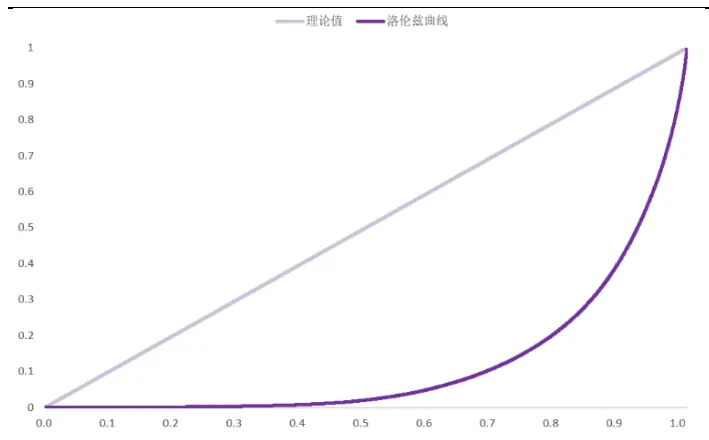
资料来源：Wind，光大证券研究所

图14：基金持仓基尼系数历史走势
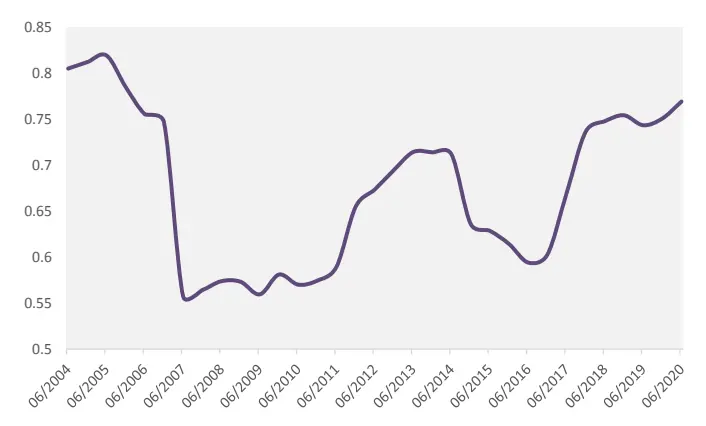
资料来源：Wind，光大证券研究所，注：2004-01-01 至 2020-06-30

由于基金持仓明细只在基金中报及年报中披露，我们只能计算每年年中及年底两期基尼系数。可以看出，04-06 年机构持仓集中度较高；07-10 年基金集中持仓有所缓和，基尼系数处于低点；11 年后机构持仓集中度再度上升，直至2014 年有所减弱。

2016 年底至 2017 年底，基金集中持仓的基尼系数迅速攀升。2018 年至今，基金集中持仓基尼系数仍然维持高位，且仍呈现上升趋势。

最新一期的数据（2020 年中报）显示，当前 A 股整体的基金持仓基尼系数已经高达0.78，已经非常接近2005 年历史高点的 0.81。

## 2.3、当前持仓集中度或接近高点

前文我们分别从基金角度和个股角度两个角度入手，分别采用时效性更高的季报数据和覆盖度更高的半年报数据，构建了基金重仓集中持仓指数和基金持仓基尼系数。

图 15：基金重仓集中持仓指数
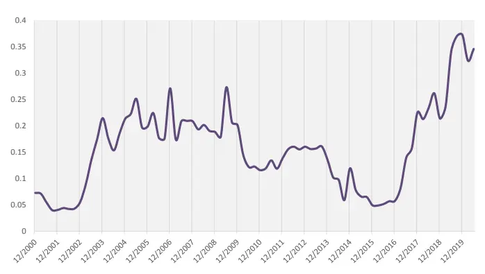
资料来源：光大证券研究所，注：2000-01-01 至 2020-06-30

图16：基金持仓基尼系数
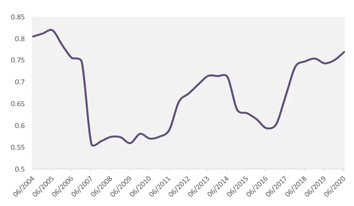
资料来源：光大证券研究所，注：2004-01-01 至 2020-06-30

上述两个指数给出的结论是比较类似的，整体来看当前持仓集中度都在较高的水平，尤其是 2017 年初以来，基金集中持仓的程度都出现的急剧的上升，至今仍维持在较高的水平。

我们认为基金集中持仓是一个结果，而不是原因。基金的集中持仓反映了基金经理对优秀公司的认可和对行业景气的判断。因此尽管目前集中持仓指数已经处于历史高位，后续集中持仓的程度会继续上升还是有所下降，需要结合更多外部因素来分析。

后文我们将更多地尝试从应用的角度，寻找基金集中持仓现象中可能隐含的对于市场风格或者板块轮动有预测能力的信息。

## 3、集中持仓指数应用于风格判断

前文中我们构造了两种刻画基金持仓集中度的指标，并且我们发现基于基金角度的重仓集中持仓指数在不同板块上表现出了很大的差异，那么很自然的我们会希望检验一下将其应用在板块轮动上的效果。

同时，我们观察到当前的基金集中持仓行为一定程度上使得那些优质公司的估值水平不断抬升，结合 2019 年以来的低估值因子失效的现状，集中持仓指数是否可以解释当前的估值因子失效情况，也是我们希望得以验证的内容。

## 3.1、板块轮动：重仓股基尼系数多头表现出色，滞后性影响效果

在应用集中持仓指数构造板块轮动的策略时，考虑到时效性对于轮动类策略的重要性，基于季报的重仓集中持仓指数相比基于半年报的基金基尼系数更具有优势。因此，我们会首先测试重仓集中持仓指数的轮动效果，同时，也将基于季报的重仓股数据改造基金基尼系数的计算方法并进行轮动的测试。

## （1）重仓集中持仓指数板块轮动：

在进行板块轮动的测试时，对于各个板块的重仓集中持仓指数有下述几种不同的处理方式:

表4：板块轮动中集中持仓指数数据处理方式

|  | 计算方法 |
| --- | --- |
| 集中持仓指数 | 绝对值 |
| 集中持仓指数变动 | 本期值-上期值 |
| 集中持仓指数变化率 | 本期值/上期值-1 |

资料来源：光大证券研究所

其中，采用绝对值的方法其本质是通过衡量目前市场上基金的板块集中持仓偏好，选择持仓集中度最高的板块持有。变动指标和变化率指标则都是从持仓集中度的变化情况出发，选择当前市场上基金整体偏好的，且持仓集中度提升的板块持有。

集中持仓行为的动量效应较强。从结果上看，上述三种处理方式下，都是持仓集中度更高，或者持仓集中度上升更快的板块具有更高的收益。同时，加速集中持仓的板块具有显著超额收益。

假设以季度末作为调仓时间，不考虑公告滞后的因素。由下图可见，每个季度选择重仓集中持仓指数变化率最高的板块作为持有，其相对板块等权基准的超额表现是比较显著的。

如果将调仓周期调整为实际公告后（即季度末之后 15 个交易日）的时间，则轮动效果下降显著。每期持仓选取得分最高的板块持有，季度末调整的策略的超额收益为年化4.10%，公告截止日调整策略的年化超额收益则下降至 3.01%。

图17：重仓股集中持仓指数板块轮动效果（季度末调仓）
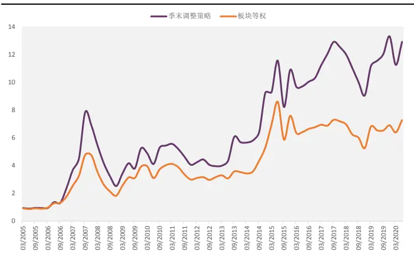
资料来源：光大证券研究所，注：2005-01-01 至 2020-06-30

图18：重仓股集中持仓指数板块轮动效果（公告截止日调仓）
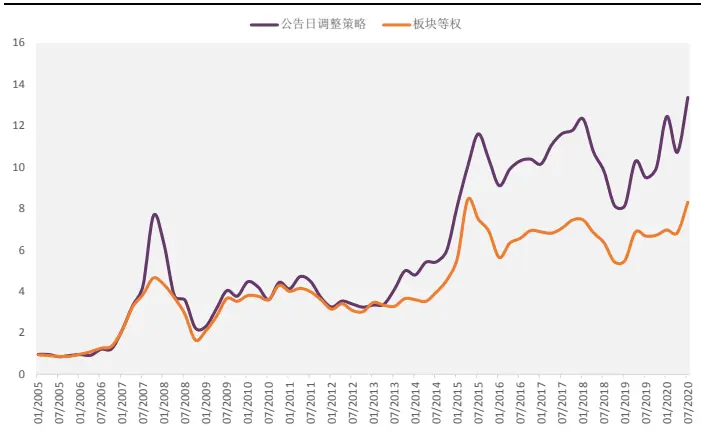
资料来源：光大证券研究所，注：2005-01-01 至 2020-06-30
最新一期（2020-07-31）该策略建议配置的板块为：周期中游板块。

## （2）重仓基尼系数板块轮动：

上面的测试中可见，每个季度选择重仓集中持仓指数变化率最高的板块，其收益表现较好。也就是说，板块持仓集中度上升越快，其未来一个季度的收益更高。

基于个股的基金持仓基尼系数可以较好的反映板块内部的个股持仓均衡程度，这种构造方式下得到的板块内基尼系数不会受到市场整体在板块上的偏离度的影响。因此，我们尝试利用季度的重仓股数据计算改造的板块内基尼系数，采用季度重仓股的总样本与板块成分股的交集作为计算基尼系数的样本池。这样的做法优势在于提高了计算频率和及时性，缺点则在于降低了个股的覆盖度。

经过测试，采用上述策略构造的重仓基尼系数的板块轮动策略多头表现比较出色，但同时波动较大。每期持仓选取得分最高的板块持有，公告截止日调整策略的年化超额收益为 8.16%。

图19：重仓基尼系数板块轮动效果（公告截止日调仓）
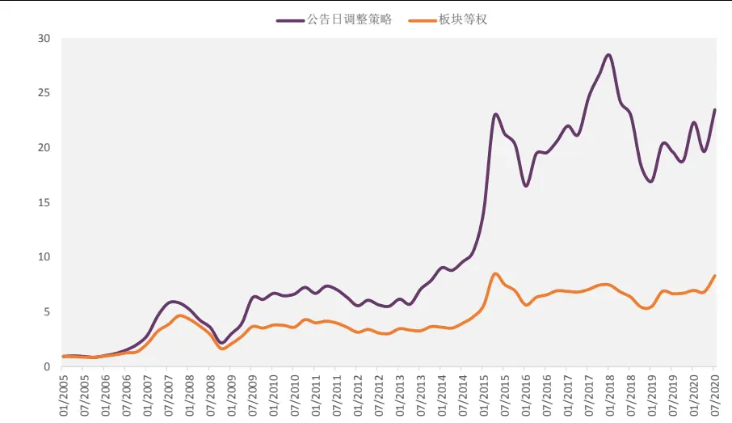
资料来源：光大证券研究所，注：2005-01-01 至 2020-06-30

最新一期（2020-07-31）该策略建议配置的板块为：科技板块。

## 3.2、因子收益：估值因子与动量因子收益均与集中持仓指数有一定相关性

当前的基金集中持仓行为一定程度上使得优质公司的估值水平不断抬升，同时我们可以观察到 2019 年以来的低估值因子失效的现状，那么集中持仓指数是否可以解释当前的估值因子失效情况呢？基金集中持仓指数与与其他风格因子例如动量因子是否存在一定的相关性呢？

## 3.2.1、估值因子：与基金集中持仓指数负相关

参照Barra中对于估值因子的定义，我们以BP_LR（最近报告期市净率）因子作为估值因子的代表，由图 20 所示，在基金重仓集中持仓指数大幅上升的 2017 和 2019 年，估值因子的多头超额收益（分 5 组后第 5 组收益相对全市场等权基准的超额收益）均出现了回撤。

图 20：估值因子多头超额收益与基金重仓集中持仓指数走势
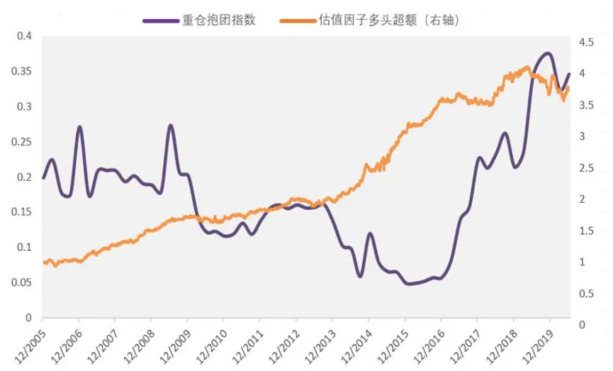
资料来源：光大证券研究所，注：2005-01-01 至 2020-06-30

图 21：估值因子季度 IC 与基金重仓集中持仓指数走势
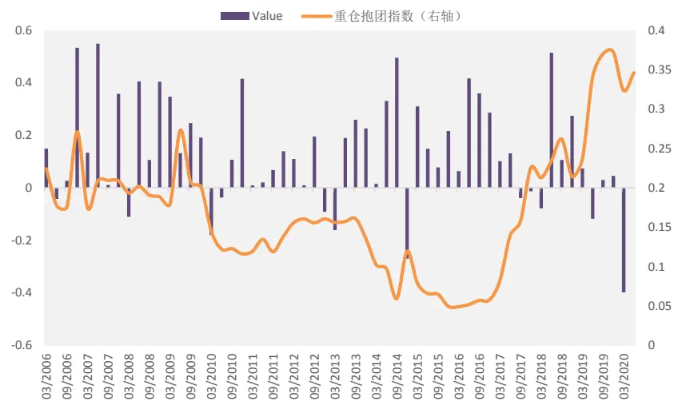
资料来源：光大证券研究所，注：2006-01-01 至 2020-06-30

由于集中持仓指数为季度频率，我们将因子 IC 合成为季度累计 IC，来观察集中持仓指数与因子表现之间的相关性：

表5：重仓集中持仓指数与估值因子季度收益相关性

|  | 数据类型 相关系数 | 胜率 |
| --- | --- | --- |
| 2006 年至今 | 绝对值 -0.19 | 77% |
|  | 变化率 -0.11 | 53% |
| 2010 年至今 | 绝对值 -0.39 | 76% |
|  | 变化率 -0.28 | 56% |

资料来源：光大证券研究所，注：2006-01-01 至 2020-06-30

重仓集中持仓指数绝对值对估值因子未来一个季度的表现具有较强的预测能力。尤其是最近10年（2010 年以来），重仓集中持仓指数与估值因子收益的相关系数为-0.39，胜率超过 75%。

表6：集中持仓指数不同区间对应估值因子季度收益表现

| 指数区间 | 发生次数 | 大于0概率 | 大于 0.1 概率 |
| --- | --- | --- | --- |
| 0-0.1 | 11 | 100% | 82% |
| 0.1-0.2 | 27 | 70% | 48% |
| 0.2-0.3 | 15 | 87% | 73% |
| 0.3-0.4 | 5 | 40% | 0% |
| 0.4-0.5 | 0 | – |  |

资料来源：光大证券研究所，注：2006-01-01 至 2020-06-30

综合上面的分析，当重仓集中持仓指数处于高位时，估值因子的收益表现往往不尽如人意。而当集中持仓指数低于 0.1 时，估值因子的季度胜率为100%；当集中持仓指数高于 0.3时，估值因子的胜率下降至 40%。

因此，当偏股型基金整体集中持仓状况较弱时估值因子的表现往往较好，当偏股型基金持仓集中度较严重时估值因子的表现往往较差，这一结论也与我们的直观逻辑相匹配。

由于当前集中持仓指数仍处于高位，最新一期（2020 年 7 月 31 日）我们对于估值因子的观点仍较为悲观。

## 3.2.2、动量因子：与基金集中持仓指数正相关

我 们 以 最 近 24 个 月 收 益 率 减 去 最 近 1 个 月 收 益 率 的 指 标（Momentum_24M-1M）作为动量因子的代表，由图所示，在基金重仓集中持仓指数大幅上升的 2017 和 2019 年，动量因子的 IC 均出现了大幅上升。

图 22：动量因子季度 IC 与基金重仓集中持仓指数走势
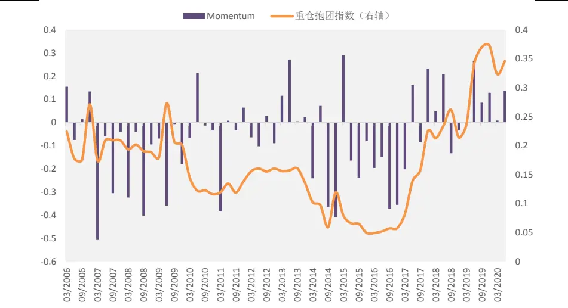
资料来源：光大证券研究所，注：2006-01-01 至 2020-06-30

由于集中持仓指数为季度频率，我们将因子 IC 合成为季度累计 IC，来观察集中持仓指数与动量因子表现之间的相关性：

表7：重仓集中持仓指数与动量因子季度收益相关性

|  | 数据类型 相关系数 | 胜率 |
| --- | --- | --- |
| 2006 年至今 | 绝对值 0.3 | 42% |
|  | 变化率 0.17 | 57% |
| 2010年至今 | 绝对值 | 0.48 50% |
|  | 变化率 | 0.33 61% |

资料来源：光大证券研究所，注：2006-01-01 至 2020-06-30

重仓集中持仓指数绝对值与动量因子未来一个季度的表现具有较强的正向相关性。尤其是最近10 年（2010年以来），重仓集中持仓指数与动量因子收益的相关系数为 0.48。

表8：集中持仓指数不同区间对应动量因子季度收益表现

| 指数区间 | 发生次数 | 大于0概率 | 大于 0.1 概率 |
| --- | --- | --- | --- |
| 0-0.1 | 11 | 10% | 10% |
| 0.1-0.2 | 27 | 47% | 32% |
| 0.2-0.3 | 15 | 34% | 29% |
| 0.3-0.4 | 5 | 100% | 80% |
| 0.4-0.5 | 0 |  |  |

资料来源：光大证券研究所，注：2006-01-01 至 2020-06-30

综合上面的分析，当重仓集中持仓指数处于高位时， 动量因子（Momentum_24M-1M）的收益表现较好。当集中持仓指数高于0.3 时，动量因子的季度胜率为 100%，反之当集中持仓指数低于 0.1 时，动量因子的季度胜率仅为10%。

因此，当偏股型基金整体持仓集中度较高时动量因子的表现往往较好，当持仓集中度较低时动量因子的表现往往较差，市场风格更偏向反转。

由于当前集中持仓指数仍处于高位，最新一期（2020年 7月 31日）我们对于动量因子的观点较为乐观。

## 4、风险提示

结果均基于模型和历史数据，模型存在失效的风险。

## 行业及公司评级体系

| 评级 说明 |  |  |
| --- | --- | --- |
| 行 | 买入 | 未来6-12个月的投资收益率领先市场基准指数15%以上； |
|  | 增持 | 未来6-12个月的投资收益率领先市场基准指数5%至15%； |
|  | 中性 | 未来6-12个月的投资收益率与市场基准指数的变动幅度相差-5%至5%； |
|  | 减持 | 未来6-12个月的投资收益率落后市场基准指数5%至15%； |
|  | 卖出 | 未来6-12个月的投资收益率落后市场基准指数15%以上； |
| 业及公司评级 | 无评级 投资评级。 | 因无法获取必要的资料，或者公司面临无法预见结果的重大不确定性事件，或者其他原因，致使无法给出明确的 |
| 基准指数说明：A股主板基准为沪深300指数；中小盘基准为中小板指；创业板基准为创业板指；新三板基准为新三板指数；港 股基准指数为恒生指数。 |  |  |

## 分析、估值方法的局限性说明

本报告所包含的分析基于各种假设，不同假设可能导致分析结果出现重大不同。本报告采用的各种估值方法及模型均有其局限性，估值结果不保证所涉及证券能够在该价格交易。

## 分析师声明

本报告署名分析师具有中国证券业协会授予的证券投资咨询执业资格并注册为证券分析师，以勤勉的职业态度、专业审慎的研究方法，使用合法合规的信息，独立、客观地出具本报告，并对本报告的内容和观点负责。负责准备以及撰写本报告的所有研究人员在此保证，本研究报告中任何关于发行商或证券所发表的观点均如实反映研究人员的个人观点。研究人员获取报酬的评判因素包括研究的质量和准确性、客户反馈、竞争性因素以及光大证券股份有限公司的整体收益。所有研究人员保证他们报酬的任何一部分不曾与，不与，也将不会与本报告中具体的推荐意见或观点有直接或间接的联系。

## 特别声明

光大证券股份有限公司（以下简称“本公司”）创建于 1996 年，系由中国光大（集团）总公司投资控股的全国性综合类股份制证券公司，是中国证监会批准的首批三家创新试点公司之一。根据中国证监会核发的经营证券期货业务许可，本公司的经营范围包括证券投资咨询业务。

本公司经营范围：证券经纪；证券投资咨询；与证券交易、证券投资活动有关的财务顾问；证券承销与保荐；证券自营；为期货公司提供中间介绍业务；证券投资基金代销；融资融券业务；中国证监会批准的其他业务。此外，本公司还通过全资或控股子公司开展资产管理、直接投资、期货、基金管理以及香港证券业务。

本报告由光大证券股份有限公司研究所（以下简称“光大证券研究所”）编写，以合法获得的我们相信为可靠、准确、完整的信息为基础，但不保证我们所获得的原始信息以及报告所载信息之准确性和完整性。光大证券研究所可能将不时补充、修订或更新有关信息，但不保证及时发布该等更新。

本报告中的资料、意见、预测均反映报告初次发布时光大证券研究所的判断，可能需随时进行调整且不予通知。在任何情况下，本报告中的信息或所表述的意见并不构成对任何人的投资建议。客户应自主作出投资决策并自行承担投资风险。本报告中的信息或所表述的意见并未考虑到个别投资者的具体投资目的、财务状况以及特定需求。投资者应当充分考虑自身特定状况，并完整理解和使用本报告内容，不应视本报告为做出投资决策的唯一因素。对依据或者使用本报告所造成的一切后果，本公司及作者均不承担任何法律责任。

不同时期，本公司可能会撰写并发布与本报告所载信息、建议及预测不一致的报告。本公司的销售人员、交易人员和其他专业人员可能会向客户提供与本报告中观点不同的口头或书面评论或交易策略。本公司的资产管理子公司、自营部门以及其他投资业务板块可能会独立做出与本报告的意见或建议不相一致的投资决策。本公司提醒投资者注意并理解投资证券及投资产品存在的风险，在做出投资决策前，建议投资者务必向专业人士咨询并谨慎抉择。

在法律允许的情况下，本公司及其附属机构可能持有报告中提及的公司所发行证券的头寸并进行交易，也可能为这些公司提供或正在争取提供投资银行、财务顾问或金融产品等相关服务。投资者应当充分考虑本公司及本公司附属机构就报告内容可能存在的利益冲突，勿将本报告作为投资决策的唯一信赖依据。

本报告根据中华人民共和国法律在中华人民共和国境内分发，仅向特定客户传送。本报告的版权仅归本公司所有，未经书面许可，任何机构和个人不得以任何形式、任何目的进行翻版、复制、转载、刊登、发表、篡改或引用。如因侵权行为给本公司造成任何直接或间接的损失，本公司保留追究一切法律责任的权利。所有本报告中使用的商标、服务标记及标记均为本公司的商标、服务标记及标记。

光大证券股份有限公司版权所有。保留一切权利。

## 联系我们

| 上海 | 北京 | 深圳 |
| --- | --- | --- |
| 写字楼48层 | 静安区南京西路1266号恒隆广场1号 西城区月坛北街2号月坛大厦东配楼2层 复兴门外大街6号光大大厦17层 | 福田区深南大道 6011 号 NEO 绿景纪元大 厦 A 座 17 楼 |