## 总量研究

# 单因子组合优化在指数增强策略中的应用——量化选股系列报告之一

## 要点

因子评价方法从多角度影响多因子策略：因子评价体系在多因子策略中有筛选有效因子的作用，筛选的功能体现在两个方面。首先是选择哪些因子纳入到收益模型中，其次是收益模型中的因子权重该如何分配。本文着重探讨了因子评价方法对因子权重分配的影响。

组合优化视角进行单因子研究：因子投资的本质是通过构造投资组合的方法实现对目标因子的投资，获取因子的超额收益。因此，从因子投资的本质出发，低成本、可复制是因子评价有意义的前提。以此为出发点来看，传统的因子评价方法均存在一定缺陷。综合考虑传统因子评价方法的优缺点后，我们认为，本着收益可复制的原则，在单因子测试的过程中控制风险暴露能够更好的监测因子在实际投资的表现。

情绪类因子受约束影响较大，盈利、成长类因子贡献稳定收益：我们从估值、情绪、成长、盈利等维度出发，构造了若干常见因子，并且从每个维度中挑选出具有代表性的因子进行组合优化回测。结果显示，情绪类因子受约束影响较大，成长、盈利及估值维度在增加了各种约束条件后依然表现稳定。

逐步放开约束条件研究因子性质：为了进一步研究因子表现的变化具体来自于哪些约束，我们通过逐步放开约束条件的方式对因子进行研究。对于刚性约束来说，从业绩基准角度来看，中证 500 受约束影响更大；从因子类别来看，情绪类因子由于收益大多来自于空头，因此约束影响更大；成长、盈利以及估值类因子受影响较小。对于行业约束来说，从业绩基准角度来看，沪深 300 受约束影响更大，行业暴露与市值暴露完全不做约束的情况下，组合绩效相关性较低；按因子类别来看，盈利能力类因子受约束影响更大，成长与估值类因子受影响相对较小。

单因子组合优化下的指数增强实证：构建多因子收益模型时，我们通常根据多个因子的线性加权来为个股进行综合打分。比较常用的打分方式包括等权重、IC加权、ICIR 加权等。我们将单因子组合优化评价结果纳入收益模型中，探究了该方法是否能为指数增强策略带来增量，并且与传统 ICIR 加权法进行了对比。

结果表明，在 2017 年之后，两种策略表现出现了明显的差异。单因子组合优化方法在 2017 年之后对于 IC 较大但是多头端已经失效的因子降低了权重。以沪深 300 为业绩基准的组合优化策略中，情绪类因子在 2017 年之后失效明显，因此单因子组合优化策略相比于传统策略的提升更大。

风险分析：报告结果均基于模型及历史数据，模型存在失效的风险，历史数据存在不被重复验证的可能。

## 作者

分析师：祁嫣然

执业证书编号：S0930521070001

010-56513031

qiyanran@ebscn.com

## 1、因子评价方法对多因子策略的影响

因子评价体系在多因子策略中有筛选有效因子的作用，筛选的功能体现在两个方面：首先是选择哪些因子纳入到收益模型中，其次是收益模型中的因子权重该如何分配。本文将着重探讨因子评价方法对因子权重分配的影响。

## 1.1、 常用的因子评价方法

因子投资的本质是通过构造投资组合的方式实现对目标因子的投资，从而获取因子的超额收益。因此，从因子投资的本质出发，“低成本、可复制”是因子评价有意义的前提——以此为出发点，传统的因子评价方法均存在一定缺陷。

较为常见的因子评价方法包括信息系数法、分组测试法以及截面回归法。信息系数法只能反映因子的线性预测能力，无法展示因子与收益率的非线性关系；而且对于使用 ICIR 加权方法构造的收益模型来说，信息系数评价方法会高估空头效应强的因子。分组回测法难以完全剥离其它因子的影响，而且相对于基准容易产生较大的风格偏离。截面回归法在数学上更加严谨，但是得到的组合不具备可投资性，因子收益在实际投资中无法复制。

表 1：因子评价方法对比

| 评价方法 观测指标 优点 缺点 |  |  |  |
| --- | --- | --- | --- |
| 信息系数法 | ICRank-ICICIR | 计算简单，含义清晰 | 只反映了因子的线性预测能力；没有考虑到做空限制。 |
| 分组回测法 | 多空组合收益多头组合相对基准超额收益 | 直观的观测因子预测能力以及时序稳定性 | 难以完全剥离其它因子的影响;相对于基准容易产生较大风格偏离。 |
| 截面回归法 | Barra 纯因子组合收益FM 检验显著性水平 | 严格控制风险因子的暴露 | 可投资性差，复现困难。 |

资料来源：光大证券研究所

## 1.2、 投资约束限制因子有效性

通过对比各评价方法的优缺点可以看到，因子评价与现实表现不符都是由实际的投资约束导致的。实际投资中投资组合受到规则和主观偏好等影响，存在一定程度的投资约束——具体来看，可以划分成刚性约束和柔性约束两类。其中刚性约束主要来源于交易规则限制、产品风格限制等因素，例如 A股市场中的卖空限制、基金持仓个股权重上限限制等；柔性约束则是来源于策略本身的风格偏好，例如对行业的主动偏离、对某些风格因子的主动偏离等。

图 1：投资约束
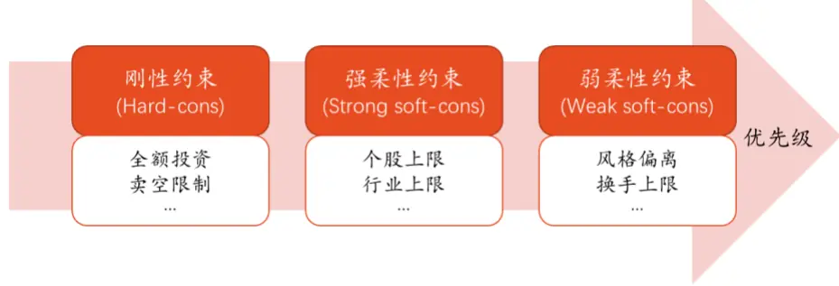
资料来源：光大证券研究所

## 1.3、 组合优化视角的单因子研究

综合考虑传统因子评价方法的优缺点后，我们认为，本着收益可复制的原则，在单因子测试的过程中控制风险暴露能够更好的监测因子在实际投资的表现。我们使用组合优化的方法对因子组合进行调整，目标函数设置为最大化因子暴露。除此之外，我们还可以通过添加约束条件的方式使因子组合尽可能接近实际投资。

具体来说，我们对因子进行去极值、标准化和中性化等预处理操作之后，还进一步对股票权重进行如下优化：

$$
\begin{array}{c}{{\mathrm{max}f^{T}w}}\\{{s.t.\quad s_{l}\le X(w-w_{b})\le s_{h}}}\\{{h_{l}\le H(w-w_{b})\le h_{h}}}\\{{w_{l}\le w-w_{b}\le w_{h}}}\\{{b_{l}\le I_{b}w\le b_{h}}}\\{{\le\infty\le w\le l}}\\{{1^{T}w=1}}\end{array}
$$

其中， $f$ 为因子暴露， 为待优化的投资组合权重，优化目标为最大化投资组合因子暴露。如果因子暴露能够有效的预测个股 Alpha，优化目标等价于最大化投资组合中的 Alpha。

约束条件 1： 为个股的风格因子暴露矩阵， $w_{b}$ 为基准指数的成分股权重，该条件约束了组合相对基准指数的风格偏离幅度。

约束条件 2： $H_{\mathrm{\ell}}$ 为个股的行业暴露矩阵，该条件约束了组合相对基准指数的行业偏离幅度。我们将约束组合的行业权重与基准指数一致。也即 、 $h_{h}$ 均为 $0_{\circ}$

约束条件 3：约束组合相对基准指数成分股权重的最大偏离幅度，我们将偏离幅度设置为 2%，也即 $w_{l}=-2\%,\ w_{h}=2\%$

约束条件 4： $I_{b}$ 为个股是否属于基准指数成分股的示性函数，约束组合在基准指数成分股权重的上下限。我们将约束组合在基准指数成分股权重的下限为 80%，也即 $b_{l}=80\%,\ b_{h}=100\%$

约束条件 5：约束组合的权重上限与下限，下限大于零可以限制卖空。

约束条件 6：约束组合中个股权重和为 $1_{\circ}$

在后续的测试中，回测区间为 2010 年 1 月 4 日——2020 年 12 月 31 日；股票池选择中证 800，基准指数选择沪深 300 指数和中证 500 指数；风格暴露偏离约束选择市值和行业风格与基准指数一致，其中行业基准选择中信一级行业分类。

## 1.4、 传统评价方法的“纸面收益”

使用组合优化的方法能够刻画因子在严格控制风险暴露之后对多因子模型的收益贡献。相比于传统评价方法更加严苛。举例来看，情绪类因子通常在空头端有较高收益，因此我们选择换手率相对波动率因子为例进行对比，具体计算方法为股票近 20 个交易日换手率的标准差：

$$
TurnoverVolatility=std(turnover_{i})
$$

下图展示了因子的信息系数法、分组回测法以及组合优化回测几种方法的统计结果。由于情绪类因子的收益能力更多的来自于空头端，因此，几种传统评价方法得到结果均为持续有效——多空收益持续稳定，RankIC 为 5.98%。组合优化方法加入了多个限制条件，因子的有效性明显下降，而且在 2016 年之后开始失效。

为了对比优化前后的因子有效性差异，我们还计算了经过组合优化后的投资权重与下一期股票收益率的秩相关系数，命名为权重 IC。约束条件对因子影响越大，权重 IC 相比于因子值 IC 下降幅度越大。

图 2：换手率相对波动率因子多空净值曲线
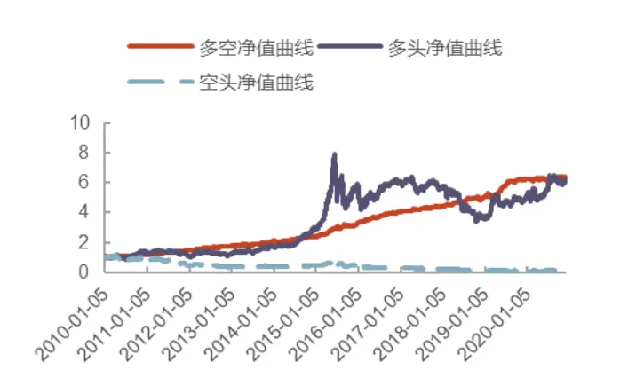
资料来源：Wind，光大证券研究所
注：回测区间为 2010.01.04-2020.12.30，下同

图 3：换手率相对波动率因子月度 RankIC
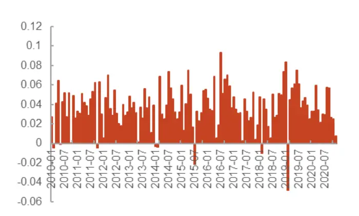
资料来源：Wind，光大证券研究所

图 4：换手率相对波动率因子多头净值曲线
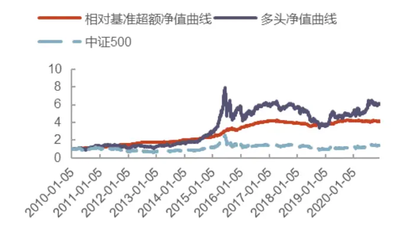
资料来源：Wind，光大证券研究所

图 5：换手率相对波动率因子组合优化净值曲线
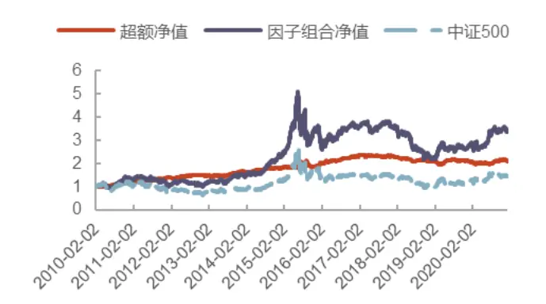
资料来源：Wind，光大证券研究所

我们对比了换手率相对波动率因子多空收益、多头超额收益以及组合优化收益。通过对比多空组合与多头相对基准组合可以看到，该因子在 2017 年之后，多头端收益下滑明显，虽然多空组合依然可以获得稳定收益，但是多头相对于基准已经无法获得正向收益。

进一步对比组合优化收益与多头相对基准收益可以看到，控制了与基准指数的行业、市值和权重的偏离之后，因子表现进一步下降，日度胜率为 51.43%，且 2017年之后持续低于 50%，处于失效状态，超额夏普比率仅为 0.49。因子值 RankIC为 3.04%，为有效因子，但是控制了风格暴露之后，权重 IC 下降为 1.33%。可以预想，该因子很难为收益模型提供增量信息。

图 6：换手率相对波动率因子净值曲线对比
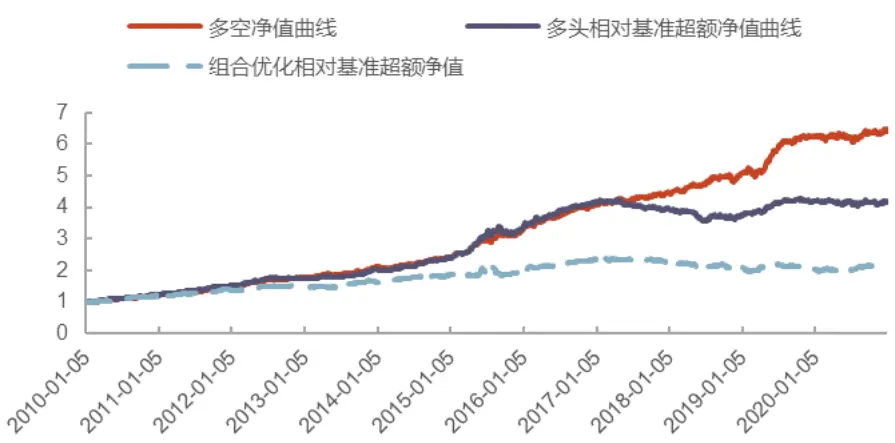
资料来源：Wind，光大证券研究所

表 2：换手率相对波动率因子组合优化业绩指标

| 年份 | 日度 胜率 | 年化超额收益 | 年化超额波动 | 超额 夏普比率 | 平均 换手率 | 平均 权重IC | 平均 因子值IC | 超额 最大回撤 | 最大回撤 起始日期 | 最大回撤 结束日期 |
| --- | --- | --- | --- | --- | --- | --- | --- | --- | --- | --- |
| 2010 | 52.94% | 18.22% | 6.74% | 2.11 | 8.69% | 1.40% | 2.12% | 2.82% | 2010/5/12 | 2010/5/25 |
| 2011 | 56.97% | 20.05% | 5.55% | 2.89 | 9.00% | 1.35% | 3.39% | 3.37% | 2011/1/25 | 2011/3/28 |
| 2012 | 52.67% | 6.84% | 5.12% | 0.55 | 7.92% | 0.66% | 2.85% | 3.82% | 2012/1/16 | 2012/3/9 |
| 2013 | 55.46% | 13.35% | 6.58% | 1.42 | 8.67% | 2.01% | 2.51% | 3.44% | 2013/4/10 | 2013/7/3 |
| 2014 | 51.02% | 7.72% | 5.68% | 0.65 | 8.36% | 1.48% | 3.01% | 4.42% | 2014/1/2 | 2014/2/10 |
| 2015 | 48.36% | 7.09% | 10.39% | 0.30 | 9.64% | 2.07% | 2.60% | 14.15% | 2015/9/2 | 2015/10/23 |
| 2016 | 57.38% | 22.00% | 6.08% | 2.96 | 8.37% | 2.01% | 4.40% | 3.07% | 2016/3/11 | 2016/3/30 |
| 2017 | 45.90% | -1.08% | 5.92% | -0.86 | 8.11% | 0.82% | 2.83% | 4.43% | 2017/4/24 | 2017/9/13 |
| 2018 | 46.91% | -9.23% | 6.40% | -2.07 | 7.63% | 0.52% | 3.10% | 10.46% | 2018/1/2 | 2018/7/17 |
| 2019 | 47.54% | 0.27% | 6.65% | -0.56 | 7.57% | 1.04% | 3.53% | 7.74% | 2019/1/3 | 2019/3/11 |
| 2020 | 50.83% | 1.14% | 8.04% | -0.36 | 7.95% | 1.31% | 3.03% | 7.65% | 2020/1/2 | 2020/2/25 |
| 总计 | 51.43% | 7.35% | 6.80% | 0.49 | 8.35% | 1.33% | 3.04% | 18.51% | 2017/4/24 | 2020/2/25 |

资料来源：Wind，光大证券研究所；注：无风险收益率为固定值 4%。回测区间为 2010.01.04-2020.12.30，调仓频率为日度，股票池为中证 800 成分股。

## 2、因子测试结果

我们从估值、情绪、成长、盈利等维度出发，构造了常见因子，具体明细在附录中展示。本章节我们从每个维度中挑选出具有代表性的因子进行展示。结果显示，情绪类因子受约束影响较大，成长、盈利及估值维度在增加了各种约束条件后依然表现稳定。考虑到不同类型因子的衰减周期差异，技术类因子回测周期为日度，基本面因子为周度。

## 2.1、 情绪类因子：空头贡献明显，受约束影响较大

情绪类是一个较为粗糙的分类，还可以进一步划分为动量、流动性、波动率等类别。我们在各细分类别中分别选择了市场上常用的 1 月反转因子、换手率相对波动率因子、非流动性因子以及 20 日平均换手率因子。

从回测结果中可以看到，单因子组合优化方法得到的结果与传统方法差异较大，组合优化后依然有效的因子有 1 月反转因子、换手率相对波动率因子，但是收益下降明显，年化超额收益率仅 7%左右。非流动性因子与 20 日平均换手率因子完全失效，日度胜率低于 50%。

图 7：1 月反转因子组合优化净值曲线
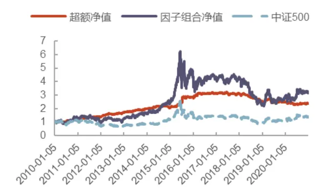
资料来源：Wind，光大证券研究所

图 8：换手率相对波动率因子组合优化净值曲线
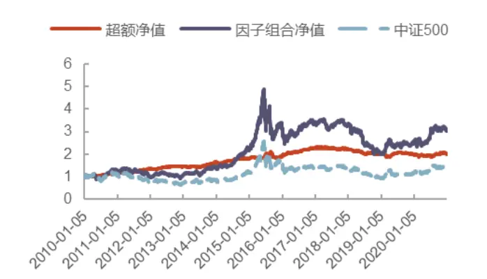
资料来源：Wind，光大证券研究所

图 9：非流动性因子组合优化净值曲线
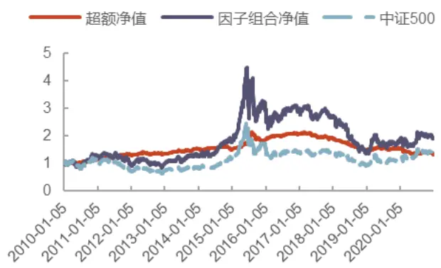
资料来源：Wind，光大证券研究所

图 10：20 日平均换手率因子组合优化净值曲线
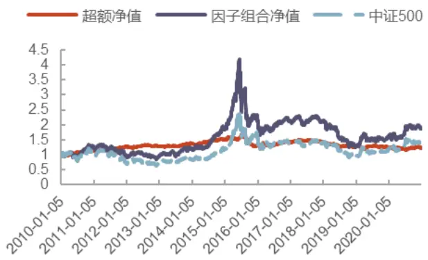
资料来源：Wind，光大证券研究所

表 3：情绪类因子业绩指标对比

| 因子名称 | 日度胜率 | 年化 超额收益 | 年化 超额波动 | 超额 夏普比率 | 平均换手率 | 平均 权重IC | 平均 因子值IC | 超额 最大回撤 |
| --- | --- | --- | --- | --- | --- | --- | --- | --- |
| 1月反转 | 54.83% | 7.76% | 16.48% | 0.23 | 16.92% | 0.91% | 3.50% | 59.32% |
| 换手率相对波动率 | 55.37% | 7.13% | 12.40% | 0.25 | 8.41% | 1.26% | 2.99% | 48.24% |
| 非流动性 | 50.34% | 2.75% | 7.92% | -0.16 | 17.15% | 0.99% | 1.99% | 43.20% |
| 20 日平均换手率 | 49.16% | 1.84% | 7.12% | -0.30 | 5.89% | 0.66% | 2.05% | 31.30% |

资料来源：Wind，光大证券研究所；注：无风险收益率为固定值 4%。回测区间为 2010.01.04-2020.12.30，调仓频率为日度。

## 2.2、 基本面因子：超额收益稳健

经过组合优化测试我们发现，盈利能力、成长性以及估值三个类别的因子均表现稳定，中低频量化投资中，投资者更倾向于选择与主动投资逻辑相符合的基本面因子。

## 2.2.1、盈利能力

盈利能力类因子我们选择了单季度 GPOA、单季度 ROE、季度 ROE 稳定性和综合 ROIC 四个因子，其中综合 ROIC 因子是 ROIC 的成长性、稳定性和持续性的合成因子。四个因子在传统评价方法中均为有效因子。经过组合优化测试后，盈利能力类因子表现依然稳健，单季度 GPOA、单季度 ROE、以及综合 ROIC 三个因子年化超额收益率均超过 10%。

图 11：单季度 GPOA 因子组合优化净值曲线
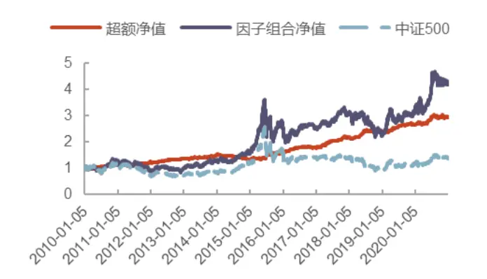
资料来源：Wind，光大证券研究所

图 12：单季度 ROE 因子组合优化净值曲线
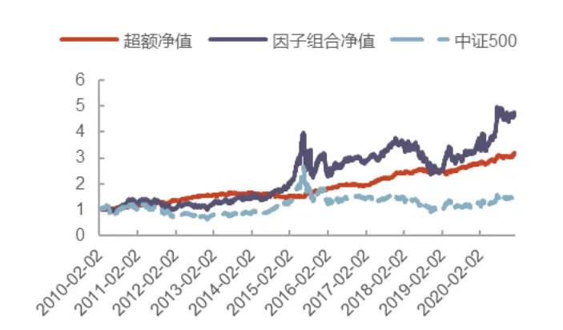
资料来源：Wind，光大证券研究所

图 13：ROICenchance 因子组合优化净值曲线
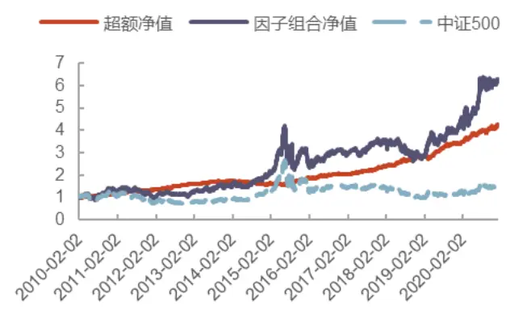
资料来源：Wind，光大证券研究所

图 14：季度 ROE 稳定性因子组合优化净值曲线
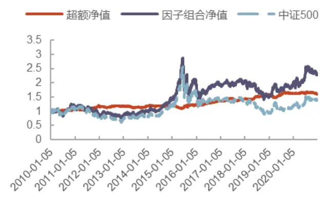
资料来源：Wind，光大证券研究所

表 4：盈利类因子业绩指标对比

| 因子名称 | 日度胜率 | 年化 超额收益 | 年化 超额波动 | 超额 夏普比率 | 平均换手率 | 平均 权重IC | 平均 因子值IC | 超额 最大回撤 |
| --- | --- | --- | --- | --- | --- | --- | --- | --- |
| 单季度 GPOA | 54.04% | 11.16% | 6.08% | 1.18 | 1.29% | 1.04% | 2.14% | 14.59% |
| 单季度 ROE | 53.02% | 11.49% | 5.90% | 1.27 | 1.48% | 1.20% | 2.39% | 12.95% |
| ROIC-enchance | 55.81% | 14.64% | 5.58% | 1.91 | 1.50% | 1.49% | 2.99% | 11.89% |
| 季度 ROE 稳定性 | 50.52% | 4.03% | 5.63% | 0.01 | 0.81% | 0.83% | 1.70% | 9.00% |

资料来源：Wind，光大证券研究所；注：无风险收益率为固定值 4%。回测区间为 2010.01.04-2020.12.30，调仓频率为周度。

## 2.2.2、成长类

成长类因子我们挑选了 ROE 同比、SUE 因子进行测试，传统方法下上述两个因子均为有效因子。经过组合优化测试后，成长类因子整体表现依然稳健，超额年化收益率均超过 10%。其中 SUE 因子超额夏普比率为 1.97。

图 15：ROE 同比因子组合优化净值曲线
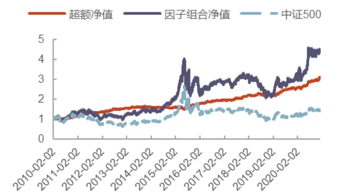
资料来源：Wind，光大证券研究所

图 16：SUE 因子组合优化净值曲线
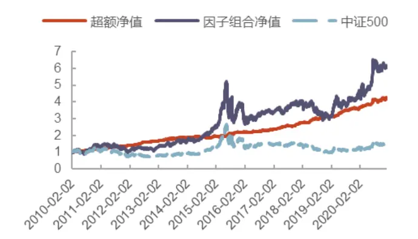
资料来源：Wind，光大证券研究所

表 5：成长类因子业绩指标对比

| 因子名称 | 日度胜率 | 年化 超额收益 | 年化 超额波动 | 超额 夏普比率 | 平均换手率 | 平均 权重IC | 平均 因子值IC | 超额 最大回撤 |
| --- | --- | --- | --- | --- | --- | --- | --- | --- |
| ROE 同比 | 55.88% | 10.19% | 13.62% | 0.45 | 1.50% | 0.76% | 2.64% | 26.68% |
| SUE | 55.66% | 14.61% | 5.38% | 1.97 | 1.57% | 1.33% | 2.86% | 5.20% |

资料来源：Wind，光大证券研究所；注：无风险收益率为固定值 4%。回测区间为 2010.01.04-2020.12.30，调仓频率为周度。

## 2.2.3、估值类

估值类因子我们选择了 PEG、市净率、经营市盈率以及 PBROE 四个因子进行测试，传统方法下估值类因子在 2019 年之前有效，之后处于反向失效状态。经过组合优化测试后，2019 年之后依然反向失效，但是整体表现有所提升。

图 17：PEG 因子组合优化净值曲线
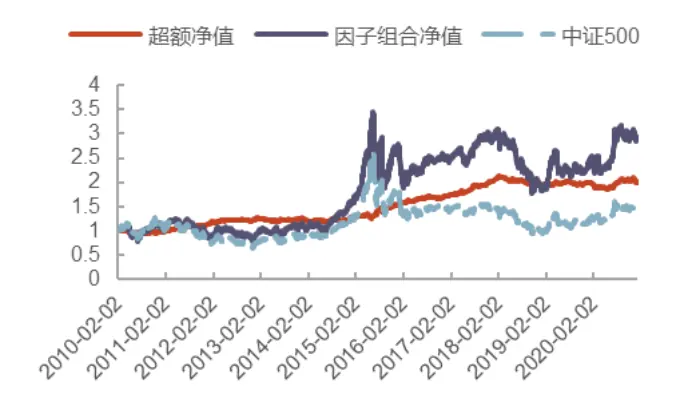
资料来源：Wind，光大证券研究所

图 18：市净率倒数因子组合优化净值曲线
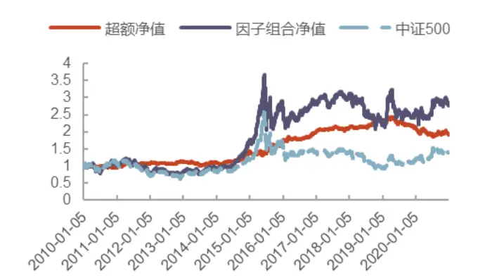
资料来源：Wind，光大证券研究所

图 19：经营市盈率因子组合优化净值曲线
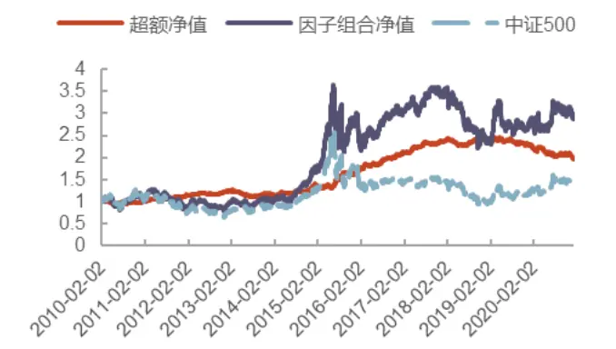
资料来源：Wind，光大证券研究所

图 20：PB-ROE 因子组合优化净值曲线
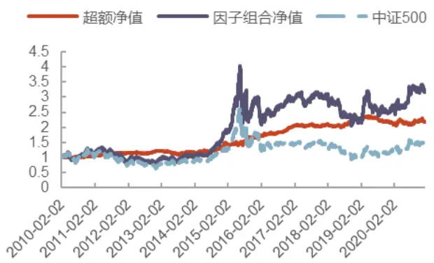
资料来源：Wind，光大证券研究所

表 6：盈利类因子业绩指标对比

| 因子名称 | 日度 胜率 | 年化 超额收益 | 年化 超额波动 | 超额 夏普比率 | 平均换手率 | 平均 权重IC | 平均 因子值IC | 超额 最大回撤 |
| --- | --- | --- | --- | --- | --- | --- | --- | --- |
| 市净率 | 50.27% | 6.02% | 8.46% | 0.24 | 1.59% | 1.29% | 1.86% | 28.65% |
| PEG | 51.55% | 6.78% | 5.74% | 0.48 | 1.70% | 0.78% | 1.94% | 13.05% |
| 经营市盈率 | 51.17% | 6.66% | 7.00% | 0.38 | 1.80% | 1.19% | 1.96% | 19.49% |
| PBROE | 51.55% | 7.56% | 6.98% | 0.51 | 2.07% | 1.25% | 2.19% | 13.15% |

资料来源：Wind，光大证券研究所；注：无风险收益率为固定值 4%。回测区间为 2010.01.04-2020.12.30，调仓频率为周度。

## 3、逐步放开约束条件研究因子性质

上一章节我们挑选了一些典型的因子进行组合优化测试，情绪类因子受约束条件影响较大，盈利、成长和估值类因子表现稳定。但是我们依然无法知晓因子表现的变化具体来自于哪些约束。本章节我们将采用逐步放开约束的方法研究因子性质。

在单因子研究过程中，我们通常会对因子的风格特征进行分析。例如目标因子与市值因子的相关性，目标因子的行业特征等。组合优化研究框架下，我们可以通过对目标函数施加软约束，并将约束结果与原始组合结果进行对比，从而研究因子特性对因子实际效果的影响。我们可以用下面两种方法衡量因子受约束条件的影响程度。

## 1.原始组合绩效与目标约束组合绩效的相关性

## 2.原始组合股票权重与目标约束优化权重的相关性

需要说明的是，我们所使用的目标函数为最大化因子暴露，如果完全不施加约束，最终得到的结果为因子值最大的股票权重为 1，与实际需求不符。因此需要对股票数量加以约束，一般做法为构造哑变量, 并添加约束条件:

$$
\delta_{i}=\left\{{1,\qquad\omega_{i}>0}\right.
$$

$$
N^{l}\le\sum_{i=1}^{N}\delta_{i}\le N^{u}
$$

添加了股票数量约束的优化问题变成了混合布尔型凸优化，求解效率低，难度较大，因此我们并不建议直接添加股票数量约束，而是通过其它凸约束间接控制股票数量。在添加了上一章节提到的全部约束后，股票数量可以维持在 40—70 只，较为合理。因此我们令添加了全部约束的组合为原始组合，逐个放开约束研究因子性质。若放开约束后，股票数量变动较大，我们采用手动剔除的方法将股票数量维持一致。

放开个股权重上下限约束后，以中证 500 指数为业绩基准的测试股票数量上升至 400 只，下图为 1 月反转因子的权重分布图，大多数股票的权重集中在±0.2%左右。而原始组合在以沪深 300 指数为业绩基准的测试中的股票数量为 50 只左右，在以中证 500 指数为业绩基准的测试中股票数量为 60 只左右。因此，我们对放开个股权重上下限约束组合的股票数量进行手动剔除，保留因子值大的股票，使之与标准组数量匹配，被剔除股票的权重按比例分配到被留存股票中。

图 21：放开个股权重上下限约束后，股票权重分布图
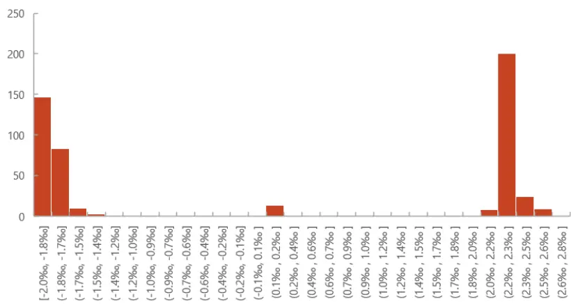
资料来源：Wind，光大证券研究所

标准组由于施加了全部约束条件，相比于传统测试结果，有效性大大降低。情绪类因子受影响最大，以沪深 300 指数为业绩基准的测试超额夏普比率为负，以中证 500 指数为业绩基准的测试超额夏普比率小于 1。盈利能力和成长性因子受约束影响不大，但是在不同股票池中表现差异较大。估值类因子在约束前后以及不同股票池中均表现相近。

表 7：标准组因子表现（业绩基准：沪深 300）

| 因子类别 | 因子名称 | 日度 胜率 | 年化 超额收益 | 年化 超额波动 | 超额 夏普比率 | 信息比率 | 平均 股票数量 |
| --- | --- | --- | --- | --- | --- | --- | --- |
| 情绪 | 1月反转 | 51.58% | 4.22% | 6.63% | 0.03 | 1.23% | 59.33 |
|  | 换手率相对波动率 | 50.26% | 2.30% | 4.36% | -0.39 | 1.15% | 58.08 |
|  | 非流动性 | 50.83% | -1.40% | 5.71% | -0.95 | 0.94% | 59 |
|  | 20 日平均换手率 | 49.51% | 0.33% | 4.55% | -0.81 | 0.76% | 57.37 |
| 盈利能力 | 单季度 GPOA | 54.19% | 5.75% | 4.27% | 0.41 | 0.87% | 74.3 |
|  | 单季度 ROE | 55.54% | 7.26% | 4.10% | 0.80 | 0.97% | 54.91 |
|  | ROIC-enchance | 57.28% | 9.42% | 3.78% | 1.43 | 1.31% | 56.79 |
|  | 季度 ROE 稳定性 | 51.62% | 2.94% | 4.15% | -0.26 | 0.64% | 51.64 |
| 成长 | ROE 同比 | 56.26% | 8.12% | 4.82% | 0.85 | 0.98% | 52.58 |
|  | SUE | 56.26% | 8.16% | 4.24% | 0.98 | 0.99% | 50.92 |
| 估值 | 市净率 | 50.79% | 3.44% | 5.63% | -0.10 | 1.10% | 52.19 |
|  | PEG | 53.92% | 6.29% | 4.59% | 0.50 | 0.99% | 52.14 |
|  | 经营市盈率 | 51.96% | 5.42% | 4.85% | 0.29 | 1.05% | 55.35 |
|  | PBROE | 51.89% | 4.93% | 4.77% | 0.20 | 1.19% | 57.85 |

资料来源：Wind，光大证券研究所；注：无风险收益率为固定值 4%。回测区间为 2010.01.04-2020.12.30，调仓频率技术类因子为日度，基本面因子为周度。

表 8：标准组因子表现（业绩基准：中证 500）

| 因子类别 | 因子名称 | 日度 胜率 | 年化 超额收益 | 年化 超额波动 | 超额 夏普比率 | 信息比率 | 平均 股票数量 |
| --- | --- | --- | --- | --- | --- | --- | --- |
| 情绪 | 1月反转 | 52.07% | 6.43% | 7.85% | 0.31 | 1.22% | 55.57 |
|  | 换手率相对波动率 | 53.21% | 9.27% | 5.93% | 0.89 | 1.59% | 58.45 |
|  | 非流动性 | 52.30% | 5.67% | 6.75% | 0.25 | 1.36% | 61.18 |
|  | 20 日平均换手率 | 51.32% | 5.88% | 6.38% | 0.29 | 0.97% | 58.86 |
| 盈利能力 | 单季度 GPOA | 53.88% | 9.49% | 5.28% | 1.04 | 0.70% | 61.79 |
|  | 单季度 ROE | 55.47% | 13.35% | 5.14% | 1.82 | 0.90% | 59.55 |
|  | ROIC-enchance | 57.92% | 15.88% | 5.00% | 2.38 | 1.16% | 59.79 |
|  | 季度 ROE 稳定性 | 51.77% | 6.15% | 4.96% | 0.43 | 0.77% | 59.74 |
| 成长 | ROE 同比 | 56.71% | 13.51% | 4.96% | 1.92 | 0.69% | 54.63 |
|  | SUE | 56.79% | 14.24% | 4.93% | 2.08 | 0.89% | 59.89 |
| 估值 | 市净率 | 51.09% | 3.99% | 6.50% | 0.00 | 0.87% | 59.63 |
|  | PEG | 52.60% | 7.15% | 5.43% | 0.58 | 0.78% | 59.8 |
|  | 经营市盈率 | 53.09% | 7.53% | 6.22% | 0.57 | 0.97% | 60.22 |
|  | PBROE | 51.47% | 5.66% | 5.96% | 0.28 | 0.78% | 59.36 |

资料来源：Wind，光大证券研究所；注：无风险收益率为固定值 4%。回测区间为 2010.01.04-2020.12.30，调仓频率技术类因子为日度，基本面因子为周度。

## 3.1、 刚性约束

刚性约束是因子测试的最基本约束，如果施加刚性约束之后，因子的收益大幅下滑，那么该因子不满足最基本的投资要求。在 A股市场中刚性约束包括卖空限制、单只股票权重上限等。我们可以借助因子的多空贡献度来考察因子收益来源于多空两端的比例。多空贡献度也是出于对卖空限制的考量，若因子的多数收益来源于空头，那么其实用性将大打折扣。此外，如果因子空头端贡献较强，但是多头端收益一般，使用信息系数 IC 依然会判定该因子有效，进而在收益模型中给予较高的因子权重。

在组合优化回测的框架下，我们可以通过对比卖空限制约束前后的因子表现来展示多空贡献度信息。

- 原始组合：施加全部约束，约束条件[1,2,3,4,5,6]。

- 对比组合：权重上下限约束设置为[-1,1]，放开基准指数成分股权重偏离约束，约束条件[1,2,4,6]。

观察优化后的股票权重我们发现，若放开刚性约束，其优化结果将与分组测试法相近。下图为原始组合与对比组合的股票权重，放开了刚性约束后的组合优化，股票权重跟随因子值的方向优化至上限与下限。为了维持股票数量具有可比性，对比组合我们使用多空组合法进行代替。

图 22：原始组合股票权重
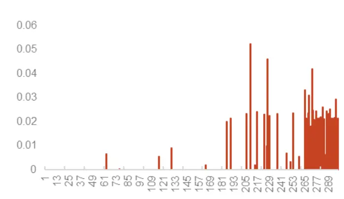
资料来源：Wind，光大证券研究所

图 23：对比组合股票权重
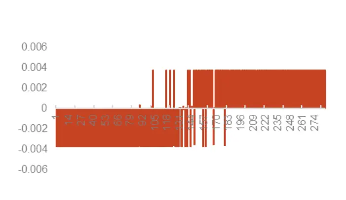
资料来源：Wind，光大证券研究所

从业绩基准角度来看，以中证 500 作为基准时受刚性约束影响更大，因子信息比率相比于标准组上升明显。因子类别来看，情绪类因子由于收益大多来自于空头，受刚性约束影响更大；成长、盈利以及估值类因子受刚性约束影响较小。

表 9：放开刚性约束因子表现（业绩基准：沪深 300）

| 因子类别 | 因子名称 | 日度 胜率 | 年化 超额收益 | 年化 超额波动 | 超额 夏普比率 | 信息比率 | 标准组 信息比率 | 组合绩效 相关性 | 平均 股票数量 |
| --- | --- | --- | --- | --- | --- | --- | --- | --- | --- |
| 情绪 | 1月反转 | 53.92% | 2.42% | 7.67% | -0.21 | 2.47% | 1.23% | 69.63% | 50 |
|  | 换手率相对波动率 | 53.85% | 1.78% | 5.58% | -0.40 | 1.89% | 1.15% | 67.92% | 50 |
|  | 非流动性 | 53.02% | -1.02% | 7.16% | -0.70 | 1.35% | 0.94% | 70.82% | 50 |
|  | 20 日平均换手率 | 52.45% | 0.96% | 5.68% | -0.54 | 1.33% | 0.76% | 74.47% | 50 |
| 盈利能力 | 单季度 GPOA | 53.70% | 3.79% | 6.50% | -0.03 | 0.94% | 0.87% | 53.47% | 50 |
|  | 单季度 ROE | 53.58% | 3.01% | 5.68% | -0.17 | 1.08% | 0.97% | 82.30% | 50 |
|  | ROIC-enchance | 55.20% | 3.62% | 5.96% | -0.06 | 1.45% | 1.31% | 68.61% | 50 |
|  | 季度 ROE 稳定性 | 52.94% | 1.41% | 5.80% | -0.45 | 0.76% | 0.64% | 59.39% | 50 |
| 成长 | ROE同比 | 54.15% | 4.07% | 6.15% | 0.01 | 1.43% | 0.98% | 64.13% | 50 |
|  | SUE | 54.52% | 2.71% | 6.28% | -0.21 | 1.19% | 0.99% | 64.03% | 50 |
| 估值 | 市净率 | 53.32% | 1.09% | 6.26% | -0.47 | 1.28% | 1.10% | 77.04% | 50 |
|  | PEG | 53.85% | 2.31% | 5.50% | -0.31 | 1.20% | 0.99% | 69.57% | 50 |
|  | 经营市盈率 | 52.90% | 1.62% | 5.73% | -0.42 | 1.01% | 1.05% | 72.56% | 50 |
|  | PBROE | 53.66% | 2.11% | 6.10% | -0.31 | 1.31% | 1.19% | 66.49% | 50 |

资料来源： Wind，光大证券研究所；注：无风险收益率为固定值 4%。回测区间为 2010.01.04-2020.12.30，调仓频率技术类因子为日度，基本面因子为周度。

表 10：放开刚性约束因子表现（业绩基准：中证 500）

| 因子类别 | 因子名称 | 日度 胜率 | 年化 超额收益 | 年化 超额波动 | 超额 夏普比率 | 信息比率 | 标准组 信息比率 | 组合绩效 相关性 | 平均 股票数量 |
| --- | --- | --- | --- | --- | --- | --- | --- | --- | --- |
| 情绪 | 1月反转 | 55.05% | 8.41% | 4.61% | 0.96 | 4.04% | 1.22% | 78.07% | 60 |
|  | 换手率相对波动率 | 55.28% | 8.48% | 3.92% | 1.14 | 3.60% | 1.59% | 77.75% | 60 |
|  | 非流动性 | 54.30% | 4.80% | 4.03% | 0.20 | 2.83% | 1.36% | 75.54% | 60 |
|  | 20 日平均换手率 | 53.73% | 6.11% | 4.07% | 0.52 | 2.44% | 0.97% | 74.24% | 60 |
| 盈利能力 | 单季度 GPOA | 57.20% | 6.37% | 2.72% | 0.87 | 1.44% | 0.70% | 74.41% | 60 |
|  | 单季度 ROE | 57.73% | 7.47% | 2.78% | 1.25 | 2.07% | 0.90% | 74.87% | 60 |
|  | ROIC-enchance | 59.24% | 7.86% | 2.50% | 1.54 | 1.98% | 1.16% | 76.60% | 60 |
|  | 季度 ROE 稳定性 | 55.32% | 4.05% | 2.84% | 0.02 | 1.40% | 0.77% | 77.96% | 60 |
| 成长 | ROE同比 | 59.92% | 8.60% | 2.63% | 1.75 | 1.83% | 0.69% | 69.87% | 60 |
|  | SUE | 57.13% | 6.72% | 2.62% | 1.04 | 1.47% | 0.89% | 71.05% | 60 |
| 估值 | 市净率 | 51.06% | 3.42% | 4.10% | -0.14 | 1.49% | 0.87% | 85.01% | 60 |
|  | PEG | 54.37% | 5.81% | 3.21% | 0.56 | 1.54% | 0.78% | 69.99% | 60 |
|  | 经营市盈率 | 55.13% | 5.44% | 3.56% | 0.40 | 1.68% | 0.97% | 72.79% | 60 |
|  | PBROE | 53.28% | 4.95% | 3.79% | 0.25 | 1.72% | 0.78% | 81.05% | 60 |

资料来源： Wind，光大证券研究所；注：无风险收益率为固定值 4%。回测区间为 2010.01.04-2020.12.30，调仓频率技术类因子为日度，基本面因子为周度。

## 3.2、 行业与市值约束

在实际组合优化中，为了增强风险控制，还会对风格因子暴露进行控制，一般会控制组合的行业和市值因子暴露与基准指数偏差在一个较小的范围内。此外，金融类企业由于业务构成等特殊性，一般需要单独进行建模。因此，我们构造了两个对比组合进行研究：

- 原始组合：施加全部约束，约束条件 $[1,2,3,4,5,6]_{\mathfrak{c}}$

- 对比组合 1：银行、非银行金融完全中性，其它行业暴露与行业市值暴露偏离不超过 2%，约束条件[1 $^{.,2,3,4,5,6],}$ o

- 对比组合 2：行业暴露与行业市值暴露不做约束，约束条件[3,4,5,6]。

从业绩基准角度来看，以沪深 300 作为基准时受行业影响更大，行业暴露与市值暴露完全不做约束的情况下，组合绩效相关性较低。按因子类别角度来看，盈利能力类因子受约束影响更大，其中单季度 GPOA因子的组合绩效相关性仅39.44%；成长与估值类因子受影响相对较小。

表 11：银行、非银行金融完全中性，其它行业暴露与行业市值暴露偏离不超过 2%（业绩基准：沪深 300）

| 因子类别 | 因子名称 | 日度 胜率 | 年化 超额收益 | 年化 超额波动 | 超额 夏普比率 | 信息比率 | 标准组 信息比率 | 组合绩效 相关性 | 平均 股票数量 |
| --- | --- | --- | --- | --- | --- | --- | --- | --- | --- |
| 情绪 | 1月反转 | 51.43% | 4.90% | 7.09% | 0.13 | 1.11% | 1.23% | 92.01% | 50.46 |
|  | 换手率相对波动率 | 50.98% | 2.38% | 4.45% | -0.36 | 0.91% | 1.15% | 92.96% | 51.04 |
|  | 非流动性 | 50.68% | -1.97% | 6.47% | -0.92 | 0.79% | 0.94% | 93.22% | 51.16 |
|  | 20 日平均换手率 | 50.11% | -0.30% | 4.74% | -0.91 | 0.60% | 0.76% | 93.90% | 50.39 |
| 盈利能力 | 单季度 GPOA | 55.02% | 6.59% | 5.11% | 0.51 | 0.88% | 0.87% | 92.78% | 66.39 |
|  | 单季度 ROE | 54.49% | 7.92% | 4.55% | 0.86 | 0.91% | 0.97% | 93.76% | 45.54 |
|  | ROIC-enchance | 55.62% | 8.71% | 4.28% | 1.10 | 1.18% | 1.31% | 92.59% | 48.26 |
|  | 季度 ROE 稳定性 | 51.17% | 3.29% | 4.14% | -0.17 | 0.76% | 0.64% | 91.72% | 47.18 |
| 成长 | ROE 同比 | 55.66% | 8.21% | 4.66% | 0.90 | 1.00% | 0.98% | 95.58% | 49.24 |
|  | SUE | 55.73% | 8.60% | 4.21% | 1.09 | 1.02% | 0.99% | 94.66% | 47.16 |
| 估值 | 市净率 | 50.38% | 3.73% | 5.76% | -0.05 | 1.19% | 1.10% | 95.88% | 49.14 |
|  | PEG | 54.15% | 5.99% | 4.49% | 0.44 | 0.93% | 0.99% | 93.01% | 48.18 |

“慧博资讯”专业的投资研究大数据分享平台“慧博资讯”专业的投资研究大数据分享平台进一步对比沪深 300 指数和中证 500 指数的行业分布可发现，前者相对较为集中，金融行业占比高——截至 2021 年 6 月，银行与非银行金融行业占比达24.21%。因此，对于沪深 300 股票池中的行业及风格暴露约束，银行与非银行金融行业的影响较大。对于沪深 300 指数增强策略来说，金融类企业的单独建模尤其重要。

| 经营市盈率 | 51.32% | 4.92% | 4.92% | 0.19 | 1.18% | 1.05% | 90.62% | 65.28 |
| --- | --- | --- | --- | --- | --- | --- | --- | --- |
| PBROE | 52.83% | 4.66% | 5.08% | 0.13 | 1.12% | 1.19% | 92.92% | 49.42 |

资料来源： Wind，光大证券研究所；注：无风险收益率为固定值 4%。回测区间为 2010.01.04-2020.12.30，调仓频率技术类因子为日度，基本面因子为周度。

表 12：行业暴露与行业市值暴露不做约束（业绩基准：沪深 300）

| 因子类别 | 因子名称 | 日度 胜率 | 年化 超额收益 | 年化 超额波动 | 超额 夏普比率 | 信息比率 | 标准组 信息比率 | 组合绩效 相关性 | 平均 股票数量 |
| --- | --- | --- | --- | --- | --- | --- | --- | --- | --- |
| 情绪 | 1月反转 | 52.30% | 6.13% | 9.59% | 0.22 | 1.01% | 1.23% | 76.56% | 48.05 |
|  | 换手率相对波动率 | 51.28% | 0.48% | 6.34% | -0.56 | 0.65% | 1.15% | 55.93% | 47.51 |
|  | 非流动性 | 49.96% | -3.33% | 9.60% | -0.76 | 0.50% | 0.94% | 68.23% | 49.43 |
|  | 20 日平均换手率 | 49.89% | -2.33% | 6.18% | -1.02 | 0.36% | 0.76% | 70.87% | 46.72 |
| 盈利能力 | 单季度 GPOA | 53.81% | 7.24% | 9.48% | 0.34 | 0.75% | 0.87% | 39.44% | 47.17 |
|  | 单季度 ROE | 52.98% | 7.91% | 7.89% | 0.50 | 0.81% | 0.97% | 79.62% | 45.74 |
|  | ROIC-enchance | 55.88% | 9.81% | 7.49% | 0.78 | 1.08% | 1.31% | 69.69% | 46.34 |
|  | 季度 ROE 稳定性 | 52.53% | 2.55% | 6.92% | -0.21 | 0.61% | 0.64% | 69.08% | 45.28 |
| 成长 | ROE 同比 | 55.43% | 8.59% | 7.88% | 0.58 | 0.84% | 0.98% | 83.50% | 47 |
|  | SUE | 56.52% | 10.32% | 6.64% | 0.95 | 1.03% | 0.99% | 83.58% | 45.23 |
| 估值 | 市净率 | 50.83% | 2.41% | 7.51% | -0.21 | 1.10% | 1.10% | 90.06% | 47.18 |
|  | PEG | 51.17% | 4.18% | 7.20% | 0.03 | 0.74% | 0.99% | 80.71% | 46.19 |
|  | 经营市盈率 | 50.19% | 5.04% | 7.04% | 0.15 | 0.96% | 1.05% | 80.93% | 44.59 |
|  | PBROE | 52.56% | 3.90% | 7.47% | -0.01 | 0.86% | 1.19% | 72.61% | 47.65 |

资料来源：Wind，光大证券研究所；注：无风险收益率为固定值 4%。回测区间为 2010.01.04-2020.12.30，调仓频率技术类因子为日度，基本面因子为周度。

表 13：银行、非银行金融完全中性，其它行业暴露与行业市值暴露偏离不超过 2%（业绩基准：中证 500）

| 因子类别 | 因子名称 | 日度 胜率 | 年化 超额收益 | 年化 超额波动 | 超额 夏普比率 | 信息比率 | 标准组 信息比率 | 组合绩效 相关性 | 平均 股票数量 |
| --- | --- | --- | --- | --- | --- | --- | --- | --- | --- |
| 情绪 | 1月反转 | 52.00% | 6.60% | 7.94% | 0.33 | 1.10% | 1.22% | 97.60% | 52.6 |
|  | 换手率相对波动率 | 53.70% | 8.95% | 5.81% | 0.85 | 1.50% | 1.59% | 91.58% | 56.77 |
|  | 非流动性 | 51.40% | 4.38% | 6.74% | 0.06 | 1.09% | 1.36% | 89.73% | 53.58 |
|  | 20 日平均换手率 | 51.92% | 5.47% | 6.18% | 0.24 | 0.92% | 0.97% | 89.00% | 53.75 |
| 盈利能力 | 单季度 GPOA | 53.09% | 8.88% | 5.71% | 0.85 | 0.62% | 0.70% | 80.70% | 55.63 |
|  | 单季度 ROE | 55.92% | 13.17% | 5.58% | 1.64 | 0.86% | 0.90% | 91.32% | 51.61 |
|  | ROIC-enchance | 56.26% | 14.40% | 5.30% | 1.96 | 0.95% | 1.16% | 88.77% | 51.98 |
|  | 季度 ROE 稳定性 | 52.87% | 5.33% | 5.36% | 0.25 | 0.64% | 0.77% | 91.98% | 52.27 |
| 成长 | ROE 同比 | 56.07% | 13.33% | 5.11% | 1.83 | 0.62% | 0.69% | 92.83% | 52.17 |
|  | SUE | 57.84% | 16.35% | 5.08% | 2.43 | 0.89% | 0.89% | 89.38% | 51.56 |
| 估值 | 市净率 | 49.47% | 3.15% | 7.05% | -0.12 | 0.77% | 0.87% | 92.68% | 53.73 |
|  | PEG | 51.51% | 5.17% | 5.60% | 0.21 | 0.52% | 0.78% | 85.57% | 52.47 |
|  | 经营市盈率 | 50.49% | 5.63% | 6.73% | 0.24 | 0.68% | 0.97% | 84.72% | 56.42 |
|  | PBROE | 50.90% | 5.38% | 6.03% | 0.23 | 0.75% | 0.78% | 90.09% | 52.29 |

资料来源：Wind，光大证券研究所；注：无风险收益率为固定值 4%。回测区间为 2010.01.04-2020.12.30，调仓频率技术类因子为日度，基本面因子为周度。

表 14：行业暴露与行业市值暴露不做约束（业绩基准：中证 500）

| 因子类别 | 因子名称 | 日度 胜率 | 年化 超额收益 | 年化 超额波动 | 超额 夏普比率 | 信息比率 | 标准组 信息比率 | 组合绩效 相关性 | 平均 股票数量 |
| --- | --- | --- | --- | --- | --- | --- | --- | --- | --- |
| 情绪 | 1月反转 | 52.07% | 6.65% | 8.07% | 0.33 | 0.99% | 1.22% | 93.88% | 46.05 |
|  | 换手率相对波动率 | 52.64% | 9.73% | 5.89% | 0.97 | 1.32% | 1.59% | 78.69% | 47.3 |
|  | 非流动性 | 54.19% | 5.56% | 15.45% | 0.10 | 1.34% | 1.36% | 83.07% | 47.24 |
|  | 20 日平均换手率 | 51.66% | 6.28% | 6.18% | 0.37 | 0.77% | 0.97% | 74.49% | 45.38 |
| 盈利能力 | 单季度 GPOA | 51.81% | 7.56% | 6.20% | 0.57 | 0.49% | 0.70% | 78.79% | 46.08 |
|  | 单季度 ROE | 54.41% | 13.55% | 5.91% | 1.62 | 0.85% | 0.90% | 84.04% | 45.5 |
|  | ROIC-enchance | 57.32% | 14.71% | 5.51% | 1.94 | 1.00% | 1.16% | 83.42% | 46.04 |

| 成长 | 季度 ROE 稳定性 | 53.02% | 6.61% | 5.72% | 0.46 | 0.73% | 0.77% | 86.87% | 46.06 |
| --- | --- | --- | --- | --- | --- | --- | --- | --- | --- |
|  | ROE 同比 | 54.75% | 14.10% | 5.56% | 1.82 | 0.61% | 0.69% | 84.26% | 45.77 |
|  | SUE | 57.24% | 18.16% | 5.36% | 2.64 | 0.99% | 0.89% | 82.65% | 45.3 |
| 估值 | 市净率 | 49.96% | 5.14% | 8.74% | 0.13 | 0.96% | 0.87% | 86.65% | 46.03 |
|  | PEG | 51.92% | 6.48% | 6.41% | 0.39 | 0.59% | 0.78% | 80.14% | 46 |
|  | 经营市盈率 | 50.94% | 6.32% | 8.74% | 0.27 | 0.85% | 0.97% | 80.19% | 46.36 |
|  | PBROE | 51.51% | 6.02% | 6.61% | 0.31 | 0.76% | 0.78% | 83.70% | 45.93 |

资料来源：Wind，光大证券研究所；注：无风险收益率为固定值 4%。回测区间为 2010.01.04-2020.12.30，调仓频率技术类因子为日度，基本面因子为周度。

图 24：沪深 300 指数成分股行业占比
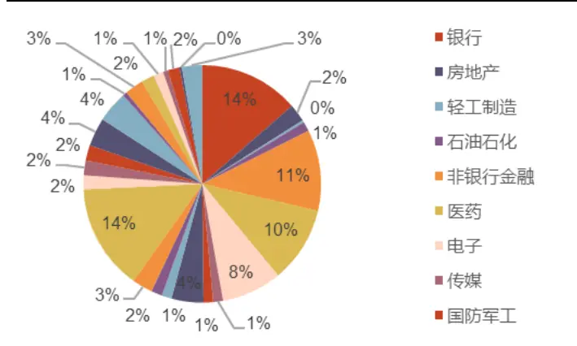
资料来源：Wind，光大证券研究所；注：采用中信一级行业分类，截至 2021 年 6 月

图 25：中证 500 指数成分股行业占比
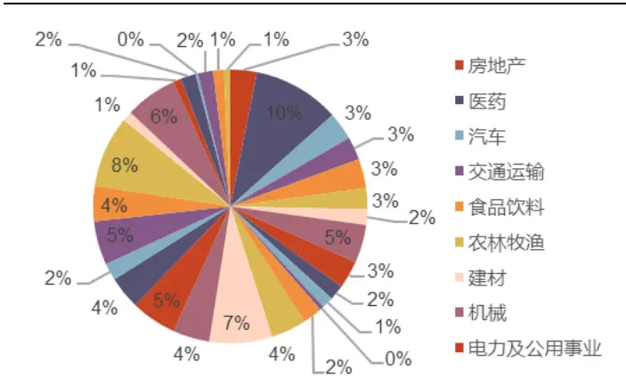
资料来源：Wind，光大证券研究所；注：采用中信一级行业分类，截至 2021 年 6 月

个股数量与权重的不匹配，也是导致两个股票池对于行业中性约束敏感程度不同的一个重要原因。对于沪深 300 指数，行业个股数量占比与行业权重占比偏离较大，对于行业中性约束更为敏感。而对于中证 500 指数，行业个股数量占比与行业权重占比一致性较好，行业中性对组合的约束相对较小。

图 26：沪深 300 指数成分股行业占比与个股数占比
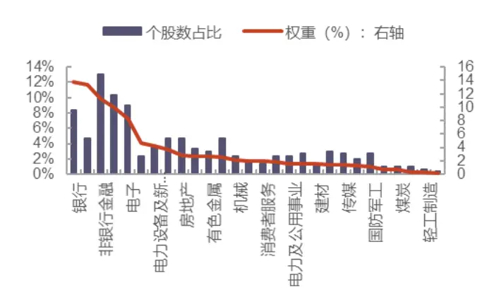
资料来源：Wind，光大证券研究所；注：采用中信一级行业分类，截至 2021 年 6 月

图 27：中证 500 指数成分股行业占比与个股数占比
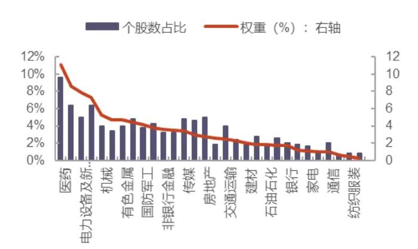
资料来源：Wind，光大证券研究所；注：采用中信一级行业分类，截至 2021 年 6 月

## 4、单因子组合优化指数增强实证

单因子测试除了可以筛选有效因子，在因子合成中也提供重要信息。构建多因子收益模型时，我们通常根据多个因子的线性加权来为个股进行综合打分。比较常用的打分方式包括等权重、IC 加权、ICIR 加权等。本章节我们将尝试把单因子组合优化评价结果纳入收益模型中，探究该方法是否能为指数增强策略带来增量。

## 4.1、 基于单因子组合优化结果的收益模型

由前文的因子测试部分我们知道，风格暴露约束对于情绪类因子的影响更大。下图展示了成长类因子 SUE 和情绪类因子换手率相对波动率的优化前后信息系数对比情况——由于约束条件的存在，两个因子的权重 IC 均小于因子值 IC，但是SUE 因子的两种信息系数走势基本一致，IC 差值稳定。换手率相对波动率因子的因子值 IC 与权重 IC 差值不稳定，在 2017 年之后，因子值 IC 依然较高，但是权重 IC 整体处于较低水平，这与该因子 2017 年之后开始失效相互印证。

图 28：SUE 因子 IC 对比
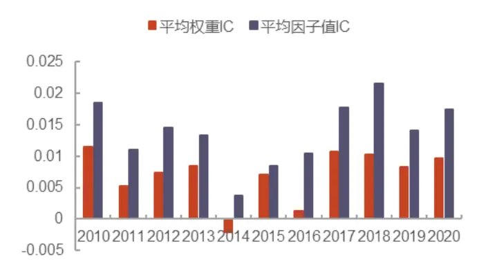
资料来源：Wind，光大证券研究所；注：截至 2020 年 12 月

图 29：换手率相对波动率因子 IC 对比
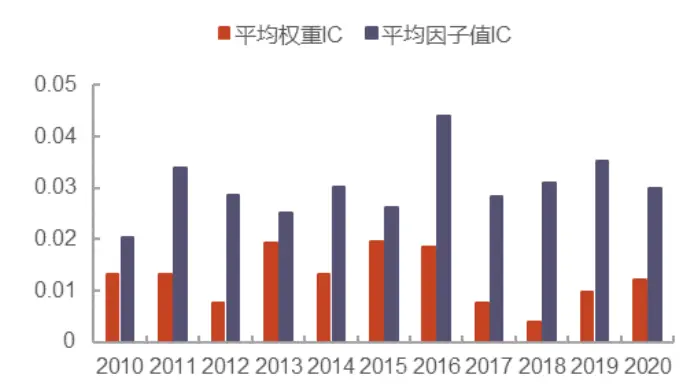
资料来源：Wind，光大证券研究所；注：截至 2020 年 12 月

由于换手率相对波动率因子的因子值 IC 持续维持较高且比较稳定，因此传统的ICIR 加权方法会给与该因子持续较高的权重，而我们通过单因子组合优化测试可知该因子在 2017 年之后失效，很难为组合贡献增量信息。

下图展示了传统ICIR加权和单因子组合优化ICIR加权法中该因子历史权重的变化，与上文的猜测一致：传统方法下，换手率相对波动率因子在 2017 年之后依然有正向权重，而在单因子组合优化方法下，因子权重得到了负向修正，其中2019 年权重均值几乎为 0。

图 30：换手率相对波动率因子权重对比
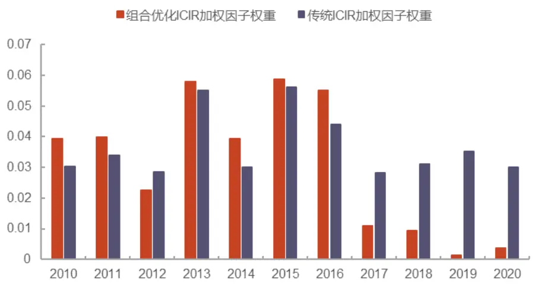
资料来源：Wind，光大证券研究所；注：权重为年度平均值

## 4.2、 指数增强实证

下面我们进行多因子指数增强测试，其中风险控制模型中的约束与前文单因子组合优化的约束相同。股票池为中证 800 指数成分股，并约束组合在基准指数成分股权重的下限为 80%。

收益模型分别选择 ICIR 加权与单因子组合优化 ICIR 加权两种方式。回测区间选择 2010 年 1 月—2020 年 12 月，调仓周期为周度，交易费用设置双边千分之三。

$$
\begin{array}{c}{{\mathrm{max}f^{T}w}}\\{{s.t.}}\\{{h_{l}\leq H(w-w_{b})\leq s_{h}}}\\{{h_{l}\leq H(w-w_{b})\leq h_{h}}}\\{{w_{l}\leq w-w_{b}\leq w_{h}}}\\{{b_{l}\leq I_{b}w\leq b_{h}}}\\{{\mathbf{0}\leq w\leq l}}\\{{\mathbf{1}^{T}w=1}}\end{array}
$$

两种 ICIR 加权多因子策略的构建步骤如下：

- 对所有因子进行 MAD 去极值、行业市值中性化、Z-Score 标准化处理。

- 筛选过去 250 个交易日 ICIR 值最高的 m 个因子，并且要求 m 个因子之间的相关性小于阈值 c。

- 根据因子的 ICIR 值计算因子权重，并计算出综合得分作为最终的因子值。

其中，因子数量 m 为不低于 20；因子间的相关性 c 为不高于 0.3。此外，使用ICIR 加权法本质上是超配过去一段时间表现好的因子，当因子失效甚至反向时，ICIR 容易给出负向权重。但是多因子策略中的因子通常具有投资逻辑，不应该反向使用，因此我们对反向因子的权重进行归零处理。

## 4.2.1、ICIR 加权多因子策略

我们选择 ICIR 加权法作为基准模型，ICIR 加权是目前多因子收益预测模型中最常用的方法之一，不但考虑了因子的预测能力，还考虑了因子的稳定性，是相对较为稳健的预测方法。

回测结果如下，以沪深 300 指数为基准的策略平均超额年化收益率 11.56%，超额夏普比率 1.32，最大回撤为 8.38%；以中证 500 指数为基准的策略平均超额年化收益率为 21.27%，超额夏普比率 2.57，最大回撤为 8.58%。

图 31：ICIR 加权多因子策略（业绩基准：沪深 300）
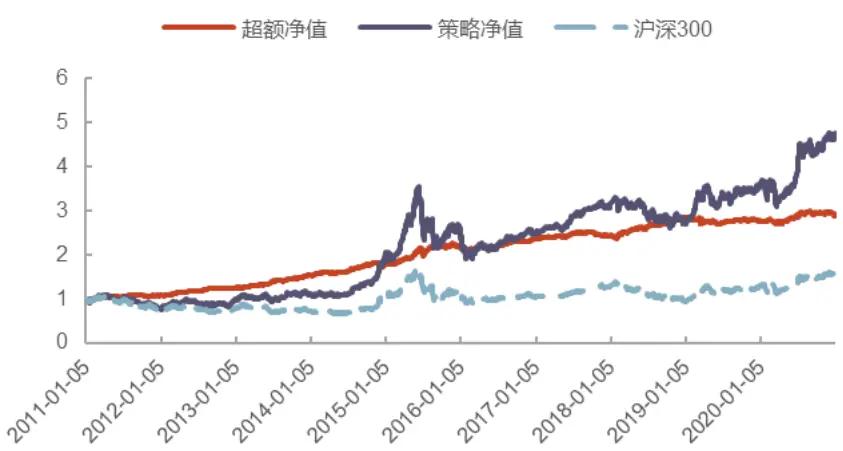
资料来源：Wind，光大证券研究所

表 15：ICIR 加权多因子策略业绩指标（业绩基准：沪深 300）

| 年份 | 日度 胜率 | 年化超额收益 年化超额波动 超额夏普比率 |  |  | 平均 权重IC | 平均 因子值IC | 超额 最大回撤 | 最大回撤 起始日期 | 最大回撤 结束日期 |
| --- | --- | --- | --- | --- | --- | --- | --- | --- | --- |
| 2011 | 56.38% | 7.12% | 3.82% | 0.82 | 1.79% | 4.92% | 3.28% | 2011/8/11 | 2011/11/8 |
| 2012 | 59.67% | 16.46% | 3.62% | 3.44 | 2.26% | 4.11% | 2.04% | 2012/11/2 | 2012/12/3 |
| 2013 | 62.61% | 24.67% | 4.77% | 4.33 | 0.87% | 4.24% | 1.75% | 2013/8/8 | 2013/8/19 |
| 2014 | 60.82% | 14.51% | 5.47% | 1.92 | 1.93% | 4.62% | 5.42% | 2014/11/19 | 2014/12/10 |
| 2015 | 59.02% | 26.08% | 10.41% | 2.12 | 0.19% | 3.30% | 8.38% | 2015/6/19 | 2015/7/7 |
| 2016 | 63.11% | 8.43% | 4.50% | 0.98 | 2.10% | 6.20% | 4.11% | 2016/1/4 | 2016/1/28 |
| 2017 | 57.79% | 2.53% | 4.16% | -0.35 | 2.08% | 4.90% | 4.42% | 2017/9/20 | 2017/11/22 |
| 2018 | 59.26% | 17.51% | 5.52% | 2.45 | 1.96% | 3.52% | 2.67% | 2018/1/5 | 2018/2/2 |
| 2019 | 51.64% | -2.66% | 5.18% | -1.29 | 1.56% | 3.63% | 5.29% | 2019/1/8 | 2019/6/6 |
| 2020 | 52.26% | 4.10% | 5.27% | 0.02 | 1.59% | 3.82% | 3.74% | 2020/9/1 | 2020/12/28 |
| 总计 | 57.97% | 11.56% | 5.75% | 1.32 | 1.63% | 4.26% | 8.38% | 2015/6/19 | 2015/7/7 |

资料来源：Wind，光大证券研究所；注：无风险收益率为固定值 4%。回测区间为 2010.01.04-2020.12.30，调仓频率为周度。

图 32：ICIR 加权多因子策略（业绩基准：中证 500）
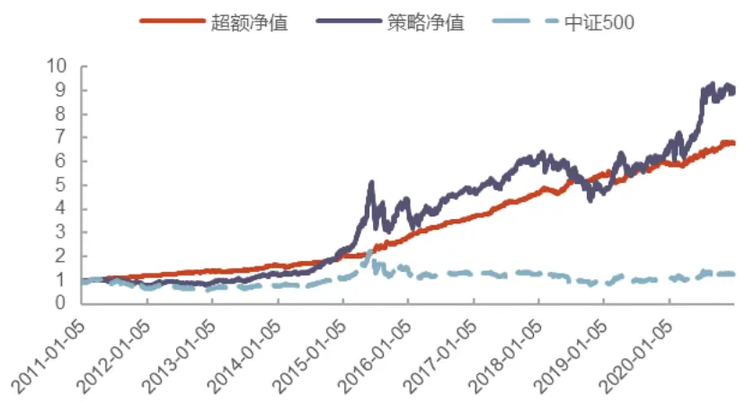
资料来源：Wind，光大证券研究所

表 16：ICIR 加权多因子策略业绩指标（业绩基准：中证 500）

| 年份 | 日度 胜率 | 年化超额收益 | 年化超额波动 | 超额夏普比率 | 平均 权重IC | 平均 因子值IC | 超额 最大回撤 | 最大回撤 起始日期 | 最大回撤 结束日期 |
| --- | --- | --- | --- | --- | --- | --- | --- | --- | --- |
| 2011 | 55.56% | 20.18% | 5.01% | 3.23 | 1.87% | 4.47% | 1.74% | 2011/9/30 | 2011/11/15 |
| 2012 | 53.91% | 15.73% | 4.96% | 2.36 | 1.66% | 4.07% | 2.59% | 2012/1/16 | 2012/2/15 |
| 2013 | 56.30% | 19.22% | 5.89% | 2.58 | 2.47% | 4.57% | 2.62% | 2013/1/11 | 2013/3/4 |
| 2014 | 54.69% | 26.57% | 6.23% | 3.62 | 2.93% | 5.83% | 4.57% | 2014/1/2 | 2014/3/4 |
| 2015 | 54.92% | 37.76% | 11.93% | 2.83 | 3.64% | 5.06% | 5.13% | 2015/1/5 | 2015/3/3 |
| 2016 | 66.80% | 31.36% | 5.04% | 5.43 | 3.43% | 6.87% | 1.89% | 2016/3/16 | 2016/3/22 |
| 2017 | 58.61% | 28.37% | 4.97% | 4.91 | 2.67% | 4.95% | 1.78% | 2017/7/24 | 2017/8/28 |
| 2018 | 56.79% | 17.97% | 5.67% | 2.46 | 1.90% | 4.02% | 4.75% | 2018/2/5 | 2018/4/18 |
| 2019 | 54.51% | 9.04% | 6.36% | 0.79 | 1.84% | 4.40% | 8.58% | 2019/1/31 | 2019/3/11 |
| 2020 | 54.73% | 13.99% | 7.43% | 1.34 | 1.84% | 4.12% | 3.18% | 2020/1/2 | 2020/3/17 |
| 总计 | 56.58% | 21.27% | 6.71% | 2.57 | 2.38% | 4.74% | 8.58% | 2019/1/31 | 2019/3/11 |

资料来源：Wind，光大证券研究所；注：无风险收益率为固定值 4%。回测区间为 2010.01.04-2020.12.30，调仓频率为周度。

## 4.2.2、单因子组合优化 ICIR 加权多因子策略

我们首先计算所有因子的单因子组合优化结果，记录因子的日度权重 IC 值。在构造多因子策略时，使用组合优化后的 IC 计算相应的 ICIR，进而计算因子权重。其余步骤均保持一致。

回测结果如下，以沪深300指数为业绩基准的策略平均超额年化收益率14.75%，超额夏普比率 1.88，最大回撤为 6.04%。以中证 500 指数为业绩基准的策略平均超额年化收益率为 19.23%，超额夏普比率 2.77，最大回撤为 6.52%。

图 33：单因子组合优化 ICIR加权多因子策略（业绩基准：沪深 300）
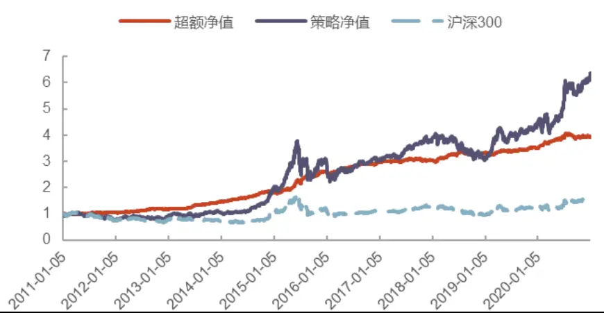
资料来源：Wind，光大证券研究所

表 17：单因子组合优化 ICIR加权多因子策略业绩指标（业绩基准：沪深 300）

| 年份 | 日度 胜率 | 年化超额收益 | 年化超额波动 | 超额夏普比率 | 平均 权重iC | 平均 因子值IC | 超额 最大回撤 | 最大回撤 起始日期 | 最大回撤 结束日期 |
| --- | --- | --- | --- | --- | --- | --- | --- | --- | --- |
| 2011 | 51.85% | 4.19% | 4.31% | 0.04 | 1.76% | 5.45% | 2.85% | 2011/1/5 | 2011/2/10 |
| 2012 | 59.67% | 12.86% | 3.99% | 2.22 | 2.42% | 6.60% | 2.02% | 2012/11/2 | 2012/12/3 |
| 2013 | 65.13% | 25.83% | 4.85% | 4.50 | 1.81% | 7.06% | 2.58% | 2013/9/3 | 2013/9/12 |
| 2014 | 64.08% | 22.74% | 5.64% | 3.32 | 3.16% | 8.19% | 5.36% | 2014/11/21 | 2014/12/10 |
| 2015 | 63.11% | 47.87% | 9.63% | 4.56 | 1.68% | 8.03% | 6.04% | 2015/6/18 | 2015/7/7 |
| 2016 | 59.84% | 14.08% | 5.62% | 1.79 | 2.98% | 8.79% | 4.63% | 2016/1/4 | 2016/1/13 |
| 2017 | 52.05% | 2.38% | 4.26% | -0.38 | 2.68% | 6.65% | 3.01% | 2017/7/31 | 2017/10/30 |
| 2018 | 55.97% | 9.46% | 5.56% | 0.98 | 1.98% | 5.90% | 4.71% | 2018/7/18 | 2018/10/15 |
| 2019 | 49.18% | 5.25% | 4.48% | 0.28 | 2.15% | 5.74% | 3.23% | 2019/1/8 | 2019/2/21 |
| 2020 | 56.79% | 13.75% | 6.04% | 1.61 | 2.41% | 5.48% | 5.36% | 2020/7/16 | 2020/9/18 |
| 总计 | 57.33% | 14.75% | 5.72% | 1.88 | 2.29% | 6.67% | 6.04% | 2015/6/18 | 2015/7/7 |

资料来源：Wind，光大证券研究所；注：无风险收益率为固定值 4%。回测区间为 2010.01.04-2020.12.30，调仓频率为周度。

图 34：单因子组合优化 ICIR加权多因子策略（业绩基准：中证 500）
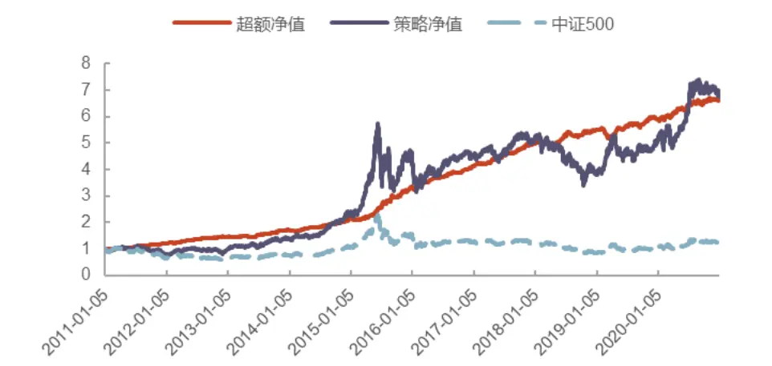
资料来源：Wind，光大证券研究所

表 18：单因子组合优化 ICIR加权多因子策略业绩指标（业绩基准：中证 500）

| 年份 | 日度 胜率 | 年化超额收益 | 年化超额波动 | 超额夏普比率 | 平均 权重IC | 平均 因子值IC | 超额 最大回撤 | 最大回撤 起始日期 | 最大回撤 结束日期 |
| --- | --- | --- | --- | --- | --- | --- | --- | --- | --- |
| 2011 | 60.08% | 22.90% | 4.47% | 4.22 | 2.33% | 5.20% | 2.27% | 2011/1/25 | 2011/2/28 |
| 2012 | 62.96% | 23.78% | 4.20% | 4.71 | 3.71% | 7.36% | 1.77% | 2012/10/18 | 2012/11/12 |
| 2013 | 60.50% | 22.80% | 5.57% | 3.38 | 3.83% | 7.29% | 2.49% | 2013/4/3 | 2013/4/24 |
| 2014 | 62.86% | 18.78% | 5.09% | 2.90 | 3.92% | 7.49% | 1.39% | 2014/1/3 | 2014/1/8 |
| 2015 | 61.07% | 41.11% | 8.72% | 4.26 | 4.05% | 6.16% | 4.95% | 2015/1/7 | 2015/2/16 |
| 2016 | 61.48% | 20.62% | 4.61% | 3.60 | 3.58% | 7.77% | 2.67% | 2016/1/4 | 2016/1/11 |
| 2017 | 60.66% | 14.03% | 4.22% | 2.38 | 3.91% | 6.33% | 1.26% | 2017/10/11 | 2017/10/18 |
| 2018 | 55.56% | 13.26% | 5.45% | 1.70 | 3.14% | 5.62% | 4.61% | 2018/2/12 | 2018/4/20 |
| 2019 | 51.64% | 5.74% | 4.74% | 0.37 | 3.26% | 6.24% | 6.52% | 2019/1/16 | 2019/3/12 |
| 2020 | 58.92% | 12.56% | 6.25% | 1.37 | 3.01% | 5.66% | 3.82% | 2020/11/2 | 2020/12/28 |
| 总计 | 59.57% | 19.23% | 5.49% | 2.77 | 3.47% | 6.51% | 6.52% | 2019/1/16 | 2019/3/12 |

资料来源：Wind，光大证券研究所；注：无风险收益率为固定值 4%。回测区间为 2010.01.04-2020.12.30，调仓频率为周度。

## 4.2.3、单因子组合优化 ICIR 加权的权重修正功能

对比两种加权方法的结果可以发现，在 2017 年之后，两种策略表现出现了明显的差异。单因子组合优化方法在 2017 年之后对一些 IC 值较高但是多头端已经失效的因子降低了权重。下图为 5 日反转因子两种加权方式的因子权重对比，单因子组合优化 ICIR 加权方法起到了权重修正作用。

对比两个业绩基准的组合优化结果来看，以沪深 300 指数为业绩基准时情绪类因子在 2017 年之后失效明显，因此单因子组合优化策略相比于传统策略的提升作用更为显著。以中证 500 指数为业绩基准的策略虽然在收益上略有下降，但是其波动率和最大回撤均得到了更好的控制。

图 35：5 日反转因子权重对比
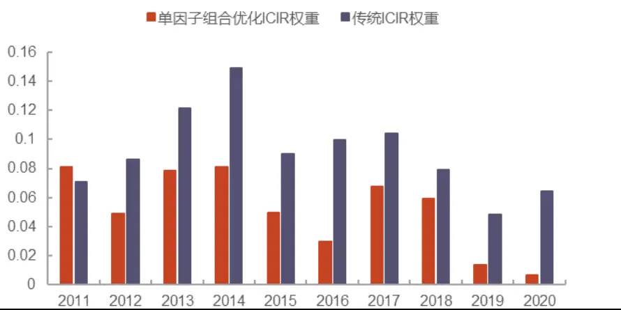
资料来源：Wind，光大证券研究所；注：权重为年度平均值

图 36：两种 ICIR 加权方式结果对比（业绩基准：沪深 300）
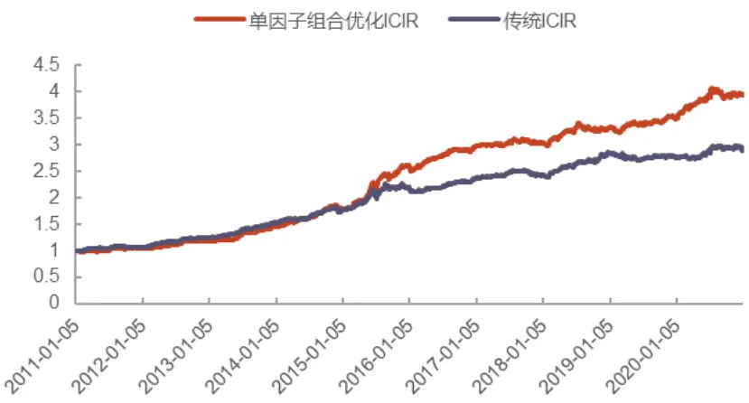
资料来源：Wind，光大证券研究所

图 37：两种 ICIR 加权方式结果对比（业绩基准：中证 500）
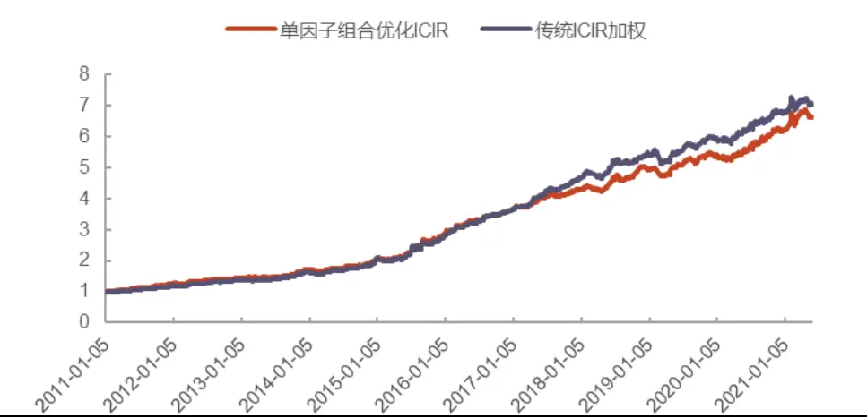
资料来源：Wind，光大证券研究所

## 5、总结与展望

本篇报告我们利用对单因子进行组合优化的方式进行因子测试，并尝试逐步放开约束条件对因子性质进行研究。

由测试结果可知，情绪类因子由于来自于空头端的收益占比较大，因此受刚性约束影响更大，基本面类因子在控制了各种风险暴露的情况下依然有稳定的表现。

沪深 300 指数金融行业占比偏高，对沪深 300 股票池施加行业中性约束影响较大。由于金融行业的业务逻辑不同，构建沪深 300 指数增强策略时对金融行业单独建模尤为关键。此外，由于沪深 300 指数成分股中行业个股数量占比与行业市值占比偏离较大，因此受到行业市值中性约束的影响也更大。

最后，我们基于单因子组合优化的结果进行了指数增强实证，对比了传统 ICIR加权与单因子组合优化后的 ICIR 加权两种方法，单因子组合优化 ICIR 加权能够根据实际投资情景对因子权重进行修正，在2017年后及时降低失效因子的权重。

## 6、风险提示

报告结果均基于模型及历史数据，模型存在失效的风险，历史数据存在不被重复验证的可能。

## 7、 附录

因子对照表如下表所示。

表 19：因子库明细表

| 因子类别 | 因子名称 | 因子释义 | 计算方式 | 因子方向 |
| --- | --- | --- | --- | --- |
| 估值 | BP | 市净率倒数 | 净资产/总市值 | 正 |
| 估值 | EP | 单季度市盈率倒数 | 单季度归母净利润/总市值 | 正 |
| 估值 | EPTTM | 市盈率 TTM 倒数 | 归母净利润 TTM/总市值 | 正 |
| 估值 | SPTTM | 市销率 TTM 倒数 | 营业收入 TTM/总市值 | 正 |
| 成长 | ROEyoy | 单季度 ROE 同比 | 单季度净资产收益率-去年同期 单季度净资产收益率 | 正 |
| 成长 | ROAyoy | 单季度 ROA 同比 | 单季度总资产收益率-去年同期 单季度总资产收益率 | 正 |
| 成长 | RevenueYOY | 单季度营业收入同比增长率 | 单季度营业收入同比增长率 | 正 |
| 成长 | OPERProfitYOY | 单季度营业利润同比增长率 | 单季度营业利润同比增长率 | 正 |
| 成长 | ProfitYOY | 单季度净利润同比增长率 | 单季度净利润同比增长率 | 正 |
| 成长 | SUE | 标准化预期外盈利 | (单季度净利润-过去8 个季度 净利润均值)/过去8个季度净 | 正 |
| 成长 | SUR | 标准化预期外收入 | 利润标准差 (单季度营业收入-过去 8 个季 度营业收入均值)/过去8个季 | 正 |
| 盈利 | GPOA | 单季度总资产毛利率 | 度营业收入标准差 (单季度营业收入-单季度营业成 | 正 |
| 盈利 | ROA | 单季度 ROA | 本）/总资产 单季度净利润/总资产 |  |
| 盈利 | ROE | 单季度 ROE | 单季度净利润/净资产 | 正 |
| 盈利 | GPMTTM | 毛利率 TTM | (营业收入 TTM - 营业成本 | 正 |
| 盈利 |  |  | TTM)/营业总收入TTM | 正 |
|  | OPMTTM | 营业利润率 TTM | 营业利润 TTM/营业总收入 TTM (营业收入 TTM-营业成本 | 正 |
| 盈利 盈利 | GPOATTM CFOATTM | 总资产毛利率 TTM 经营现金流比率 | TTM)/总资产 净经营现金流 TTM/总资产 | 正 |

| 盈利 | NPMTTM | 净利润率 TTM | 净利润 TTM/营业总收入 TTM | 正 |
| --- | --- | --- | --- | --- |
| 盈利 | ROESTABLE14 | ROE 稳定性 | 过去 14 个季度 ROE 均值/过去 14 个季度 ROE 标准差 | 正 |
| 盈利 | ROASTABLE14 | ROA 稳定性 | 过去 14 个季度 ROA 均值/过去 14 个季度 ROA 标准差 | 正 |
| 盈利 | ROICenchance | ROIC 增强因子 | ROIC因子稳定性、成长性与持 续性等权合成 | 正 |
| 情绪 | VOL5 | 5 日平均换手率 | 5 日换手率的均值 | 负 |
| 情绪 | VOL20 | 20 日平均换手率 | 20 日换手率的均值 | 负 |
| 情绪 | VOL60 | 60 日平均换手率 | 60日换手率的均值 | 负 |
| 情绪 | DAVOL5 | 手率之比 | 5 日平均换手率与 120 日平均换5 日平均换手率 /120 日平均换 手率 | 负 |
| 情绪 | DAVOL10 | 换手率之比 | 10日平均换手率与120日平均 10日平均换手率/120日平均 换手率 | 负 |
| 情绪 | DAVOL20 | 20 日平均换手率与 120 日平均 20 日平均换手率 /120 日平均 换手率之比 | 换手率 | 负 |
| 情绪 | ILLIQ20 | 20 日非流动性 | 过去20个交易日的日涨跌幅绝 对值/成交额的均值 | 负 |
| 情绪 | ILLIQ60 | 60 日非流动性 | 过去60 个交易日的日涨跌幅绝 对值/成交额的均值 | 负 |
| 情绪 | AR | 人气指标 | N 日内（当日最高价-当日开市 价）之和/N日内（当日开市价 -当日最低价）之和 | 负 |
| 情绪 | BR | 意愿指标 | N 日内（当日最高价-昨日收盘 价）之和 /N日内(昨日收盘价 -当日最低价）之和 | 负 |
| 情绪 | VEMA5 | 成交量的 5 日指数移动平均 | 成交量的 5 日指数移动平均 | 负 |
| 情绪 | VEMA20 | 成交量的 20 日指数移动平均 | 成交量的 20 日指数移动平均 | 负 |
| 情绪 | TVRVOL | 换手率相对波动率 | 20个交易日个股换手率的标准 差 | 负 |
| 情绪 | TVMA20 | 20 日成交金额的移动平均值 | 20 日成交金额的移动平均值 | 负 |
| 情绪 | TVMA6 | 6 日成交金额的移动平均值 | 6 日成交金额的移动平均值 | 负 |
| 情绪 | TVSTD20 | 20 日成交金额的标准差 | 20 日成交金额的标准差 | 负 |
| 情绪 | TVSTD6 | 6 日成交金额的标准差 | 6 日成交金额的标准差 | 负 |
| 情绪 | VEMA20 | 成交量的 20 日指数移动平均 | 成交量的 20 日指数移动平均 | 负 |
| 每股指标 | EPS | 单季度 EPS | 归母净利润/总股本 | 正 |
| 每股指标 | EPSTTM | 每股收益 TTM | 归母净利润 ttm/总股本 | 正 |
| 每股指标 | NAPS | 每股净资产 | 归母所有者权益/总股本 | 正 |
| 每股指标 | NOPCFPS | 每股经营活动产生的现金流量 净额 | 经营净现金流/总股本 | 正 |
| 每股指标 | OPPS | 每股营业利润 | 营业利润/总股本 | 正 |
| 每股指标 | OPPSTTM | 每股营业利润 TTM | 营业利润 ttm/总股本 | 正 |
| 每股指标 | ORPS | 每股营业收入 | 营业收入/总股本 | 正 |
| 每股指标 | ORPSTTM | 每股营业收入 TTM | 营业收入 ttm/总股本 | 正 |
| 每股指标 | RPPS | 每股未分配利润 | 未分配利润/总股本 | 正 |
| 每股指标 | SRFPS | 每股盈余公积金 | 盈余公积金/总股本 | 正 |
| 每股指标 | TORPS | 每股营业总收入 | 营业总收入/总股本 | 正 |
| 每股指标 | TORPSTTM | 每股营业总收入 TTM | 营业总收入 ttm/总股本 | 正 |
| 质量 | ACCA | 差 | 现金流资产比和资产回报率之经营净现金流/总资产-资产回报 率 | 负 |
| 质量 | APTURND | 应付账款周转天数 | 360/应付账款周转率 | 负 |
| 质量 | APTURNR | 应付账款周转率 | 营业成本/(应付账款+应付票据+ 预付账款) | 正 |
| 质量 | ARTURND | 应收账款周转天数 | 360/应收资产周转率 | 正 |
| 质量 | ARTURNR | 应收账款周转率 | 营业收入/(应收账款+应收票据+ 预收账款) | 负 |

| 质量 | CROS | 经营活动产生的现金流量净额 与营业收入之比 | 经营净现金流/营业收入 | 正 |
| --- | --- | --- | --- | --- |
| 质量 | CASH | 现金比率 | (货币资金+交易性金融资产)/ 流动负债 | 正 |
| 质量 | CURRENT | 流动比率 | 流动资产/流动负债 | 正 |
| 质量 | QUICK | 速动比率 | (流动资产-存货) / 流动负债 | 正 |
| 质量 | INVAST | 存货资产比 | 存货/资产 | 负 |
| 质量 | ACCAST | 应收资产比 | 应收/资产 | 负 |
| 质量 | ACCPDT | 应付负债比 | 应付/负债 | 正 |
| 质量 | PRPAYDT | 预付资产比 | 预付/负债 | 负 |
| 质量 | ADDT | 预收负债比 | 预收/负债 | 正 |
| 质量 | TANGDT | 有形资产负债比 | (总资产-无形资产-商誉)/总 负债 | 正 |
| 质量 | OPTP | 营业利润占利润总额比 | 营业利润 ttm/利润总额 ttm | 正 |
| 质量 | ORTOR | 营业收入占营业总收入比 | 营业收入 ttm/营业总收入 ttm | 正 |
| 质量 | OCFOR | 经营现金流入占营业收入比 | 经营现金流入 ttm/营业收入 ttm | 正 |
| 质量 | NCFOP | 经营净现金流占营业利润比 | 经营现金净流入 ttm/营业利润 ttm | 正 |
| 质量 | BOOKLEV | 账面杠杆 | (所有者权益+非流动负债)/ 非流动负债 | 负 |
| 质量 | ASTLIAB | 资产负债比 | 总负债/总资产 | 负 |
| 质量 | EBITCOVIT | ebit 利息保障倍数 | ebitttm/利息支出 ttm | 正 |
| 质量 | OCFCOVIT | 经营净现金流利息保障倍数 | 经营净现金流 ttm/利息支出 ttm | 正 |

资料来源：光大证券研究所；注：因子持续更新中。

## 行业及公司评级体系

| 评级 说明 |  |  |
| --- | --- | --- |
|  | 买入 | 未来6-12个月的投资收益率领先市场基准指数15%以上 |
| 行业及公司评级 | 增持 | 未来 6-12 个月的投资收益率领先市场基准指数 5%至 15%； |
|  | 中性 | 未来6-12 个月的投资收益率与市场基准指数的变动幅度相差-5%至5%； |
|  | 减持 | 未来 6-12 个月的投资收益率落后市场基准指数 5%至 15%; |
|  | 卖出 | 未来6-12个月的投资收益率落后市场基准指数15%以上； |
|  | 无评级 | 因无法获取必要的资料，或者公司面临无法预见结果的重大不确定性事件，或者其他原因，致使无法给出明确的投资评级。 |
| 基准指数说明： |  | A股主板基准为沪深300指数；中小盘基准为中小板指；创业板基准为创业板指；新三板基准为新三板指数；港股基准指数为恒生 指数。 |

## 分析、估值方法的局限性说明

本报告所包含的分析基于各种假设，不同假设可能导致分析结果出现重大不同。本报告采用的各种估值方法及模型均有其局限性，估值结果不保证所涉及证券能够在该价格交易。

## 分析师声明

本报告署名分析师具有中国证券业协会授予的证券投资咨询执业资格并注册为证券分析师，以勤勉的职业态度、专业审慎的研究方法，使用合法合规的信息，独立、客观地出具本报告，并对本报告的内容和观点负责。负责准备以及撰写本报告的所有研究人员在此保证，本研究报告中任何关于发行商或证券所发表的观点均如实反映研究人员的个人观点。研究人员获取报酬的评判因素包括研究的质量和准确性、客户反馈、竞争性因素以及光大证券股份有限公司的整体收益。所有研究人员保证他们报酬的任何一部分不曾与，不与，也将不会与本报告中具体的推荐意见或观点有直接或间接的联系。

## 法律主体声明

本报告由光大证券股份有限公司制作，光大证券股份有限公司具有中国证监会许可的证券投资咨询业务资格，负责本报告在中华人民共和国境内（仅为本报告目的，不包括港澳台）的分销。本报告署名分析师所持中国证券业协会授予的证券投资咨询执业资格编号已披露在报告首页。

光大新鸿基有限公司和 Everbright Sun Hung Kai (UK) Company Limited 是光大证券股份有限公司的关联机构。

## 特别声明

光大证券股份有限公司（以下简称“本公司”）创建于 1996 年，系由中国光大（集团）总公司投资控股的全国性综合类股份制证券公司，是中国证监会批准的首批三家创新试点公司之一。根据中国证监会核发的经营证券期货业务许可，本公司的经营范围包括证券投资咨询业务。

本公司经营范围：证券经纪；证券投资咨询；与证券交易、证券投资活动有关的财务顾问；证券承销与保荐；证券自营；为期货公司提供中间介绍业务；证券投资基金代销；融资融券业务；中国证监会批准的其他业务。此外，本公司还通过全资或控股子公司开展资产管理、直接投资、期货、基金管理以及香港证券业务。

本报告由光大证券股份有限公司研究所（以下简称“光大证券研究所”）编写，以合法获得的我们相信为可靠、准确、完整的信息为基础，但不保证我们所获得的原始信息以及报告所载信息之准确性和完整性。光大证券研究所可能将不时补充、修订或更新有关信息，但不保证及时发布该等更新。

本报告中的资料、意见、预测均反映报告初次发布时光大证券研究所的判断，可能需随时进行调整且不予通知。在任何情况下，本报告中的信息或所表述的意见并不构成对任何人的投资建议。客户应自主作出投资决策并自行承担投资风险。本报告中的信息或所表述的意见并未考虑到个别投资者的具体投资目的、财务状况以及特定需求。投资者应当充分考虑自身特定状况，并完整理解和使用本报告内容，不应视本报告为做出投资决策的唯一因素。对依据或者使用本报告所造成的一切后果，本公司及作者均不承担任何法律责任。

不同时期，本公司可能会撰写并发布与本报告所载信息、建议及预测不一致的报告。本公司的销售人员、交易人员和其他专业人员可能会向客户提供与本报告中观点不同的口头或书面评论或交易策略。本公司的资产管理子公司、自营部门以及其他投资业务板块可能会独立做出与本报告的意见或建议不相一致的投资决策。本公司提醒投资者注意并理解投资证券及投资产品存在的风险，在做出投资决策前，建议投资者务必向专业人士咨询并谨慎抉择。

在法律允许的情况下，本公司及其附属机构可能持有报告中提及的公司所发行证券的头寸并进行交易，也可能为这些公司提供或正在争取提供投资银行、财务顾问或金融产品等相关服务。投资者应当充分考虑本公司及本公司附属机构就报告内容可能存在的利益冲突，勿将本报告作为投资决策的唯一信赖依据。

本报告根据中华人民共和国法律在中华人民共和国境内分发，仅向特定客户传送。本报告的版权仅归本公司所有，未经书面许可，任何机构和个人不得以任何形式、任何目的进行翻版、复制、转载、刊登、发表、篡改或引用。如因侵权行为给本公司造成任何直接或间接的损失，本公司保留追究一切法律责任的权利。所有本报告中使用的商标、服务标记及标记均为本公司的商标、服务标记及标记。

光大证券股份有限公司版权所有。保留一切权利。

光大证券研究所

上海

北京

深圳

静安区南京西路 1266 号

西城区武定侯街 2 号

福田区深南大道 6011 号

恒隆广场 1 期办公楼 48 层

泰康国际大厦 7 层

NEO 绿景纪元大厦 A 座 17 楼

光大证券股份有限公司关联机构

香港

英国

光大新鸿基有限公司

香港铜锣湾希慎道 33 号利园一期 28 楼

Everbright Sun Hung Kai (UK) Company Limited

64 Cannon Street，London，United Kingdom EC4N 6AE