## 金融工程

# 哪些股票将迎来高股息？——量化选股系列报告之四

## 要点

分红是股票投资的重要收益来源之一，长期稳定的分红是衡量企业投资价值的重要指标，企业分红水平和分红意愿也是衡量一个市场是否成熟的标志。随着我国资本市场逐渐机构化和成熟化，具有稳定分红的股票也逐渐受到专业投资者关注。

本文以分红率作为切入点，结合一致预期净利润数据计算了预期股息率，能够动态捕捉上市公司未来的分红变化，以便于投资者提前布局。该指标可以理解为：未来高派息的股票以当前价格购买的性价比。

## 高股息股票具有投资价值：

历史表现来看，红利指数在市场大幅下跌的期间表现出了明显的避险效果。今年以来中证红利指数表现远超其它宽基指数。红利指数的收益包括确定性的股息收益和资本利得收益，使其更具备投资价值。

## 高股息股票风格画像：

我们以中证红利指数成分股作为高股息股票组合进行探究。行业分布来看，高股息股票集中在煤炭、房地产、银行、汽车、交通运输及钢铁等行业，处于成熟期的行业更倾向于进行高分红。

市值分布来看，市值呈现 U 形分布，该统计结果与传统经验有所不同，大盘蓝筹股只是高股息股票的一部分，更多的高股息企业集中在中小盘股票。

## 哪些因素影响分红率：

我们认为分红率相比于股息率更具备可预测性，因此我们以分红率作为切入点。对于高分红的公司，提出了两个问题：

## 1.什么样的公司愿意进行高分红？

## 2.哪些公司有能力维持高分红？

我们对 A 股公司按分红率高低分组，通过对相关财务指标进行研究，最终发现高分红的企业多集中在产业生命周期的成熟期，表现出低盈利能力、低投资回报率、低外部筹资依赖度以及较好的财务质量等特点。

## 预期股息率测算：

我们通过对分红率进行建模预测，使用预测分红率与一致预期净利润对股息率进行了测算。预期股息率可以理解为，未来高派息的股票以当前价格购买的性价比。分红率预测选取了营业收入增长率、资本开支增速、资产负债率、上一会计年度分红率、分红率同比增长、分红率稳定性 6 个指标。结果显示，预测模型具备一定预测能力，且相比于基准有较明显的提升。

风险分析：报告结果均基于历史数据，历史数据存在不被重复验证的可能。

## 作者

分析师：祁嫣然

执业证书编号：S0930521070001

010-56513031

qiyanran@ebscn.com

联系人：曲虹宇

010-56513042

quhongyu@ebscn.com

## 1、高股息投资价值

分红是股票投资的重要收益来源之一，长期稳定的分红是衡量企业投资价值的重要指标，企业分红水平和分红意愿也是衡量一个市场是否成熟的标志。随着我国资本市场逐渐机构化和成熟化，具有稳定分红的股票也逐渐受到专业投资者关注。

本篇报告分析了高股息股票的投资价值及风格特征，总结出了一个相对全面的高股息股票画像。此外，我们还对分红率进行建模预测，计算出了预期股息率。投资者可以根据预期股息率数据以更低的成本提前布局高股息股票。

## 1.1、 红利指数表现

我们对比了主要宽基指数和红利指数的历史表现。其中，中证红利指数

(000922.CSI)以沪深 A股中现金股息率高、分红比较稳定、具有一定规模及流动性的 100 只股票为成分股，采用股息率作为权重分配依据，反映了 A股市场高红利股票的整体表现。

红利指数在市场大幅下跌的期间表现出了明显的避险效果。今年以来中证红利指数表现远超其它宽基指数。

图 1：宽基指数表现对比
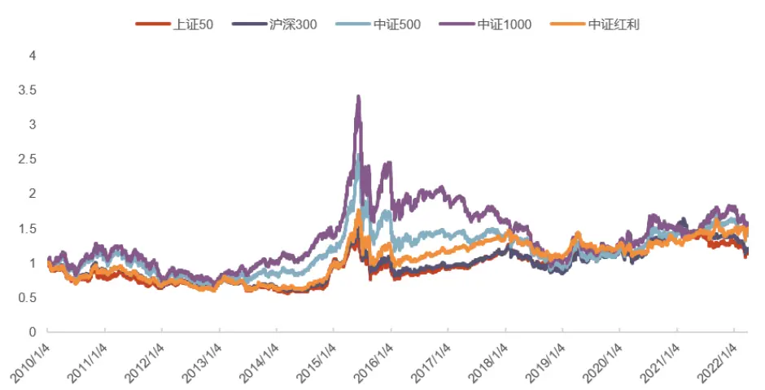
资料来源：Wind，光大证券研究所。注：数据区间为 2010 年 1 月 4 日—2022 年 3月 31 日

表 1：历史下跌区间指数表现对比

| 起始时间 | 结束时间 | 上证50 | 沪深300 | 中证500 | 中证1000 | 中证红利 |
| --- | --- | --- | --- | --- | --- | --- |
| 2011.04.18 | 2012.12.04 | -29.76% | -36.54% | -46.08% | -46.71% | -37.28% |
| 2015.06.15 | 2016.03.01 | -41.10% | -45.07% | -52.59% | -51.05% | -44.40% |
| 2018.01.29 | 2019.01.03 | -28.48% | -32.33% | -35.57% | -37.97% | -27.62% |
| 2021.12.13 | 2022.03.16 | -15.68% | -17.78% | -15.74% | -15.80% | -6.00% |

资料来源：Wind，光大证券研究所

图 2：今年以来各宽基指数收益率对比
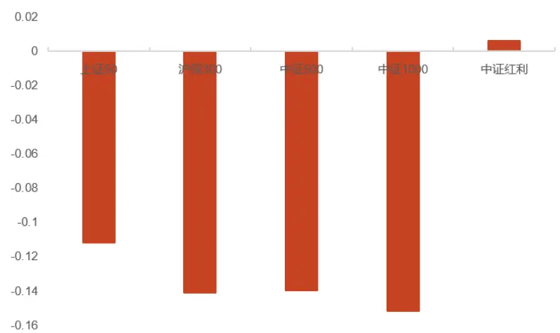
资料来源：Wind，光大证券研究所。注：数据区间为 2022 年 1 月 4 日—2022 年 3月 31 日

## 1.2、 高股息收益来源拆解

## 确定性红利收益叠加资本利得是高股息组合的收益来源。

我们对主要宽基指数的收益做了收益拆解，将收益分解成红利收益和资本利得收益。其中红利收益用全收益指数相对于标的指数的 Alpha，资本利得收益使用标的指数相对于 wind全 A指数的 Alpha 来测算。

测算指数包括上证 50、沪深 300、中证 500、中证 1000、中证红利。

收益拆解来看，由于中证红利指数中均为高分红股票，其分红收益远高于其它宽基指数。此外，大盘宽基指数的分红收益明显高于小盘宽基指数。

图 3：宽基指数 2010 年—2021 年收益拆解
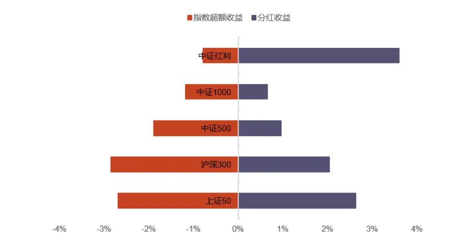
资料来源：Wind，光大证券研究所。注：数据区间：2010 年—2021 年

图 4：2010 年—2021 年指数红利收益对比
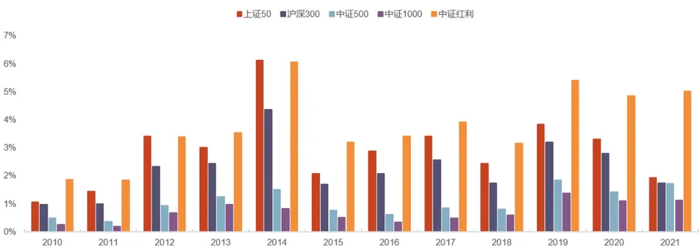
资料来源：Wind，光大证券研究所。注：数据区间：2010 年—2021 年

表 2：分年度股息收益测算

|  | 上证50 | 沪深300 | 中证500 中证1000 | 中证红利 |
| --- | --- | --- | --- | --- |
| 2010 | 1.06% | 0.96% 0.48% | 0.25% | 1.86% |
| 2011 | 1.43% | 0.98% | 0.35% 0.18% | 1.83% |
| 2012 | 3.40% | 2.33% | 0.93% 0.68% | 3.39% |
| 2013 | 3.01% | 2.42% 1.25% | 0.98% | 3.53% |
| 2014 | 6.11% | 4.35% | 1.49% 0.83% | 6.05% |
| 2015 | 2.07% | 1.68% | 0.76% 0.51% | 3.19% |
| 2016 | 2.87% | 2.06% | 0.61% 0.33% | 3.40% |
| 2017 | 3.39% | 2.55% | 0.84% 0.48% | 3.90% |
| 2018 | 2.42% | 1.72% 0.79% | 0.60% | 3.15% |
| 2019 | 3.83% | 3.20% | 1.84% 1.36% | 5.39% |
| 2020 | 3.29% | 2.79% | 1.09% | 4.84% |
| 2021 | 1.93% | 1.73% | 1.42% 1.71% 1.12% | 5.02% |

资料来源：Wind，光大证券研究所

## 1.3、 高股息指数画像

## 1.3.1、市场分红意愿抬升

近年来 A 股分红企业数量逐年增多，股票分红率稳步提升。分红企业占比近 10年均维持在 70%以上，这是 A股逐渐走向成熟的表现。然而从分红率来看，目前我国上市公司分红率大约在 30%左右，相比于成熟市场的 40%—50%还有提升的空间。

图 5：2015 年以来分红比例稳定在 30%左右
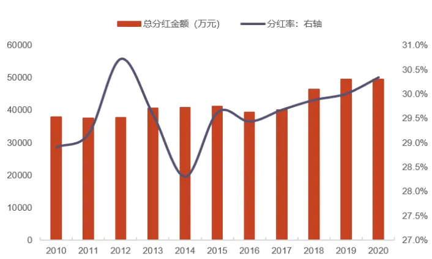
资料来源：Wind，光大证券研究所。注：数据区间：2010 年—2020 年。横坐标轴为会计年度。

图 6：分红企业数量占比维持 70%以上
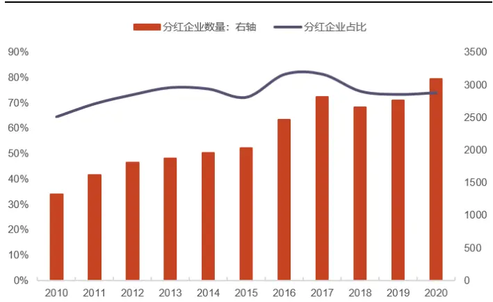
资料来源：Wind，光大证券研究所。注：数据区间：2010 年—2020 年。横坐标轴为会计年度。

## 1.3.2、高股息股票的特征

我们以中证红利指数成分股作为高股息股票组合进行探究。

行业分布来看，高股息股票集中在煤炭、房地产、银行、汽车、交通运输及钢铁等行业。从产业生命周期角度来说，处于成熟期的行业更倾向于进行高分红。

图 7：中证红利指数(000922.CSI)行业分布变迁
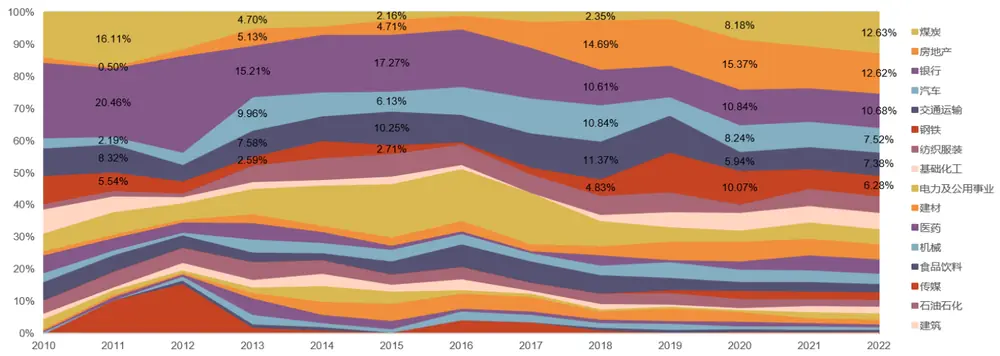
资料来源：Wind，光大证券研究所。注：数据区间：2010 年 1 月—2022 年 3 月

市值分布来看，统计结果与传统结论有所不同。一般认为高股息股票集中在大盘蓝筹股，然而从中证红利指数的统计结果来看，市值呈现 U 形分布，大盘蓝筹股只是高股息股票的一部分，更多的高股息企业集中在中小盘股票。

将中证红利指数的加权方式修改为市值加权后可以看到，大盘蓝筹股中的高股息企业主要为银行和房地产行业。

图 8：中证红利指数流通市值加权行业占比
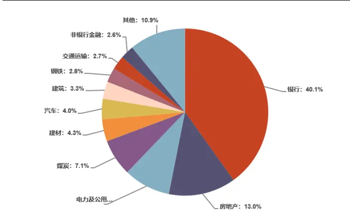
资料来源：Wind，光大证券研究所。注：数据截至 2022 年 3 月 31 日

图 9：中证红利指数市值分布
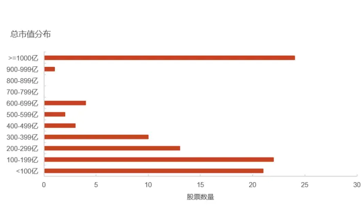
资料来源：Wind，光大证券研究所。注：数据截至 2022 年 3 月 31 日

## 1.4、 股息率的可预测性

相比于股息率来说，我们认为分红率更具备预测性。

股息率的构成一共分为三部分，分别为分红率、净利润和股票市值。其中净利润和市值无法由企业自主决定，而分红率与企业的经营情况、行业分布情况和股东股权分配情况均相关，因此具备可预测性。

此外，企业分红的来源应当是公司当年利润，一般分红率可以保持稳定。然而股息率指标引入了价格因素，使得预测难度大幅增加。

$$
\frac{\mathbb{A}\mathbb{\underline{{s}}}\mathbb{\underline{{s}}}\mathbb{\underline{{s}}}}{\mathbb{A}\mathbb{\underline{{s}}}\mathbb{\underline{{s}}}\mathbb{\underline{{s}}}}=\frac{\mathbb{\underline{{s}}}\mathbb{\underline{{s}}}\mathbb{I}\mathbb{\underline{{s}}}\mathbb{\underline{{s}}}\mathbb{\underline{{s}}}\mathbb{\underline{{s}}}\mathbb{\underline{{s}}}\mathbb{\underline{{s}}}\mathbb{\underline{{s}}}\mathbb{\underline{{s}}}\mathbb{\underline{{s}}}}{\mathbb{\underline{{s}}}\mathbb{\underline{{s}}}\mathbb{\underline{{s}}}\mathbb{\underline{{s}}}}
$$

## 2、哪些因素影响着分红率

分红率相比于股息率更具备可预测性，因此我们从分红率入手进行分析。对于高分红的公司，我们提出两个问题：

1. 什么样的公司愿意进行高分红？

2.哪些公司有能力维持高分红？

我们对 A 股上市公司按分红率高低分组，通过对相关财务指标进行研究，找到企业分红率的影响因素。

## 2.1、 高分红意愿

从产业生命周期角度来说，处于成熟期的行业更倾向于进行高分红。这是因为企业进入成熟期之后，投资回报率降低，因此资本开支意愿较低。分红成为更合理的利润分配选择。因此，高分红意愿的企业大多表现出低盈利能力、低投资回报率、低资本开支和低增长等特征。

我们选择 ROE、ROIC、资本开支增速以及营收增长几个指标来代表分红意愿。

分组统计来看，营收增长与分红率的负相关关系最为明显，资本开支和盈利能力等指标虽然单调性一般，但是分红率最高组均显著低于其它组。

图 10：ROE 分组统计结果
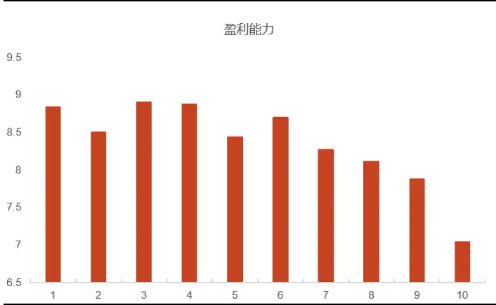
资料来源：Wind，光大证券研究所。注：数据区间为 2010 年—2020 年；单位：%组 1—组 10 为按照分红率从低到高等量分组，指标值为组内个股指标值的均值，下同

图 11：ROIC 分组统计结果
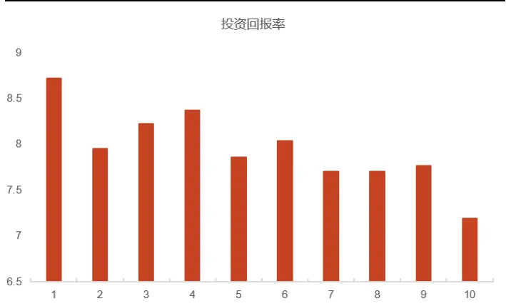
资料来源：Wind，光大证券研究所。注：数据区间为 2010 年—2020 年；单位：%

图 12：资本开支增速分组统计结果
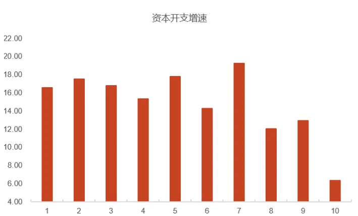
资料来源：Wind，光大证券研究所。注：数据区间为 2010 年—2020 年；单位：%

图 13：营收增长分组统计结果
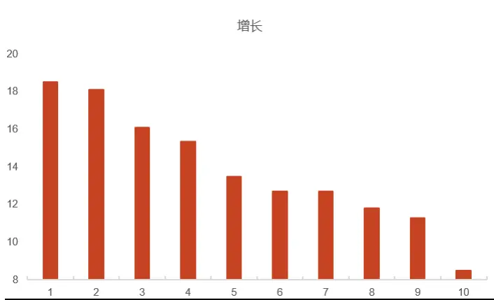
资料来源：Wind，光大证券研究所。注：数据区间为 2010 年—2020 年；单位：%

表 3：高分红意愿分组明细

| 分组 | ROE(%) | ROIC(%) 资本开支增速(%) | 营业收入增速(%) |
| --- | --- | --- | --- |
| 1 | 8.83 8.72 | 16.56 | 18.48 |
| 2 | 8.50 7.95 | 17.52 | 18.07 |
| 3 | 8.90 8.22 | 16.78 | 16.07 |
| 4 | 8.87 8.37 | 15.35 | 15.34 |
| 5 | 8.43 7.86 | 17.75 | 13.44 |
| 6 | 8.69 8.03 | 14.26 | 12.69 |
| 7 | 8.27 7.70 | 19.25 | 12.66 |
| 8 | 8.10 7.70 | 12.02 | 11.77 |
| 9 | 7.87 7.76 | 12.93 | 11.27 |
| 10 | 7.03 7.18 | 6.35 | 8.47 |

资料来源：Wind，光大证券研究所。

## 2.2、 高分红能力

企业除了有分红意愿，还应当有分红能力。一般认为高分红企业的财务质量较好，具体可以表现为：低外部筹资依赖、低负债、充裕的现金流。

我们选择了资产负债率、有息负债率、现金流利息保障倍数、外部筹资依赖度几个指标来代表高分红能力。

其中外部筹资依赖度的计算方式为营业收入与筹资活动净现金流入的比。

分组统计来看，各指标与分红率均为负相关。也即高分红的企业拥有较低的负债率水平，且不依赖外部筹资。

图 14：资产负债率分组统计
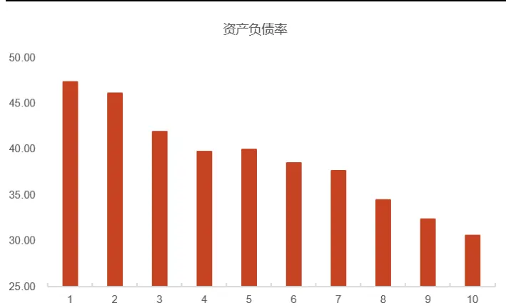
资料来源：Wind，光大证券研究所。注：数据区间为 2010 年—2020 年；单位：%

图 15：有息负债率分组统计
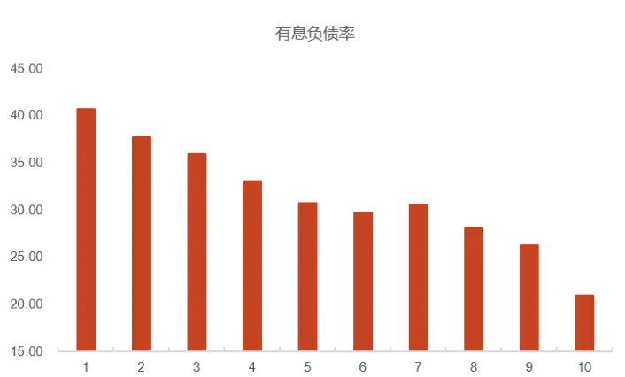
资料来源：Wind，光大证券研究所。注：数据区间为 2010 年—2020 年；单位：%

图 16：现金流利息保障倍数分组统计
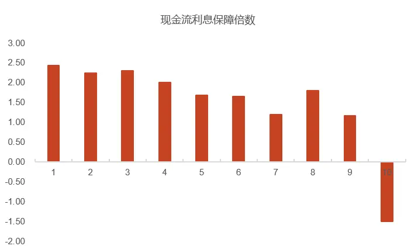
资料来源：Wind，光大证券研究所。注：数据区间为 2010 年—2020 年；单位：倍

图 17：外部筹资依赖度分组统计
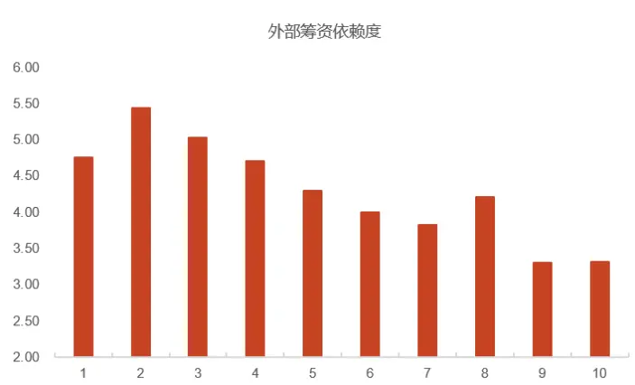
资料来源：Wind，光大证券研究所。注：数据区间为 2010 年—2020 年；单位：倍

表 4：高分红能力分组明细

| 分组 | 资产负债率(%) | 有息负债率(%) | 现金流利息 保障倍数 | 外部筹资 依赖度 |
| --- | --- | --- | --- | --- |
| 1 | 47.31 | 40.66 | 2.43 | 4.75 |
| 2 | 46.07 | 37.64 | 2.24 | 5.43 |
| 3 | 41.87 | 35.89 | 2.30 | 5.02 |
| 4 | 39.69 | 33.07 | 2.00 | 4.70 |
| 5 | 39.97 | 30.69 | 1.68 | 4.29 |
| 6 | 38.51 | 29.70 | 1.65 | 3.99 |
| 7 | 37.60 | 30.48 | 1.20 | 3.82 |
| 8 | 34.45 | 28.10 | 1.79 | 4.21 |
| 9 | 32.38 | 26.21 | 1.16 | 3.30 |
| 10 | 30.60 | 20.93 | -1.50 | 3.31 |

资料来源：Wind，光大证券研究所。注：数据区间为 2010 年—2020 年

## 2.3、 高分红企业的风格特征

除了从企业的财务质量角度分析，我们还可以从企业分红行为角度入手。从分红率历史变动情况来看，大多数公司的分红率倾向于保持稳定，前期高分红的企业有能力也有意愿维持高分红。

我们选取了上一会计年度的分红率、分红率同比增长、分红率稳定性三个指标来表示分红质量。

分组来看，上一会计年度的分红率有较强的单调性，说明企业的分红一般会延续之前的比例。分红率同比增长、分红率稳定性均与分红率正相关，说明分红率会出现持续增长现象。此外，市值与分红率的关系是负相关，这与传统经验相悖，但是与前文的统计结论一致：虽然大盘蓝筹股的分红比例较高，但从全市场来看，小盘股同样愿意进行分红。

按行业来看，银行、建筑、交通运输等行业的分红率最为稳定，煤炭、钢铁、纺织服装以及综合行业的分红率波动较大。

图 18：中信一级行业股票分红率标准差箱型图
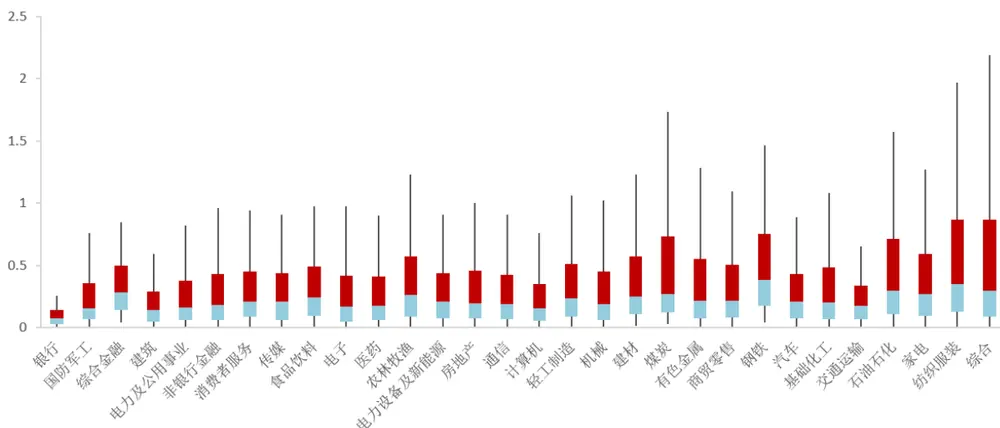
资料来源：资料来源：Wind，光大证券研究所。注：数据区间为 2007 年—2020 年，行业采用中信一级行业分类，计算方式为行业内股票分红率时间序列波动率。

图 19：上一会计年度分红率分组统计
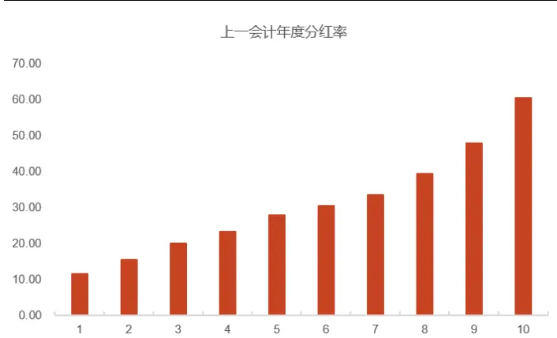
资料来源：Wind，光大证券研究所。注：数据区间为 2010 年—2020 年；单位：%

图 20：分红率同比增长分组统计
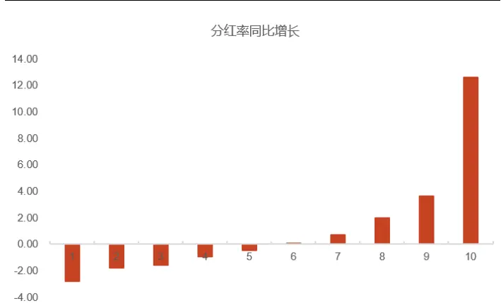
资料来源：Wind，光大证券研究所。注：数据区间为 2010 年—2020 年；单位：%

图 21：分红率稳定性分组统计
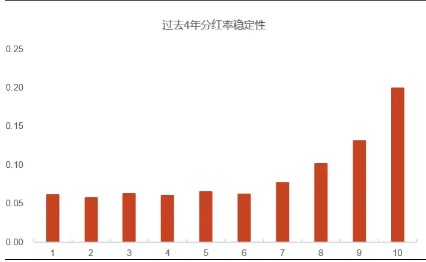
资料来源：Wind，光大证券研究所。注：数据区间为 2010 年—2020 年

图 22：市值分组统计
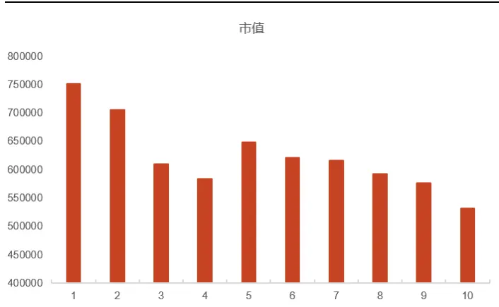
资料来源：Wind，光大证券研究所。注：数据区间为 2010 年—2020 年；单位：万元

表 5：高分红企业风格特征分组明细

| 分组 | 上一会计年度 分红率(%) | 分红率 同比增长(%) | 分红率稳定性 | 市值(万元) |
| --- | --- | --- | --- | --- |
| 1 | 11.51 | -2.78 | 0.06 | 750828.09 |
| 2 | 15.39 | -1.79 | 0.06 | 704352.97 |
| 3 | 19.94 | -1.59 | 0.06 | 609852.21 |
| 4 | 23.27 | -0.93 | 0.06 | 582881.84 |
| 5 | 27.82 | -0.46 | 0.06 | 647294.64 |
| 6 | 30.35 | 0.08 | 0.06 | 620902.69 |
| 7 | 33.37 | 0.72 | 0.08 | 615534.89 |
| 8 | 39.25 | 1.98 | 0.10 | 591385.95 |
| 9 | 47.68 | 3.63 | 0.13 | 575914.53 |
| 10 | 60.34 | 12.60 | 0.20 | 531382.37 |

资料来源：Wind，光大证券研究所。注：数据区间为 2010 年—2020 年

## 3、高分红股票预测

我们最终的投资目标是具有高股息率的股票，通过上述章节的分析我们认为，分红率更具有预测价值。因此我们通过对分红率进行建模预测，使用预测分红率与一致预期净利润可以对股息率进行预测。

## 3.1、 数据预处理

在建模之前，我们对分红数据进行了预处理操作，剔除了不具备持续性分红和大概率不进行分红的股票。

1.非常规时间分红：分红预案一般与财务报告同时期发布，但是有部分原因也会导致非财报期的分红产生。例如融捷股份（002192.SZ）在 2018 年 4 月 24日宣布每股派息 0.207 元，这是因其重大资产重组标的资产在 2017 年度业绩承诺未达目标而进行的补偿。

2.分红率过高：我们统计发现，有部分企业的分红率高于 1。此种情况不具有持续性。

3.历史上没有过分红行为：虽然分红企业已经占市场的 70%以上，但依然有部分企业不参与分红，我们认为此类企业在未来分红的概率较小。

此外，对于一年内多次分红的公司，我们进行加总计算，以年为单位做后续分析。具体操作为：分红比例乘以基准股本得到分红金额，将年内分红金额相加得到分红总金额，最后除以当年归母净利润得到分红率。

经统计，2020 年 93%的公司一年只分红一次。

图 23：各年度分红企业中仅分红一次的占比
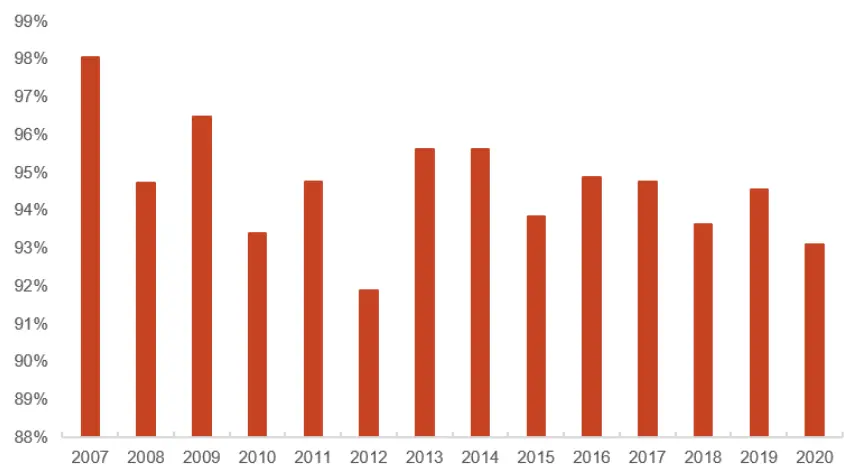
资料来源：Wind，光大证券研究所。注：数据区间为 2007 年—2020 年

## 3.2、 分红率预测模型构建

模型构建过程中我们考虑到了银行业的特殊性，在特征筛选上做了剔除处理，尽可能保证指标在所有行业均有效；此外，为了捕捉到上市公司分红行为的历史变化，我们对每个年份都使用历史数据进行建模预测。

自变量：营业收入增长率、资本开支增速、资产负债率、上一会计年度分红率、分红率同比增长、分红率稳定性。

因变量：下一个会计年度的分红率。

股票池：历史上有过分红行为的所有股票。

预测模型：我们选择随机森林模型进行建模预测，由于高分红率并不一定代表高股息率，只有计算出分红率的值才能估算出每股派息，进而得到股息率。因此我们采用回归模型进行建模。

训练集与测试集：假设当前时间为 t，t-1 与 t-2 两年的数据作为训练集，t年数据作为测试集。

评价指标：拟合优度 ${\mathsf{R}}^{2}$ 、预测分红率前 100 名准确率。

$$
R^{2}=\frac{\sum(y-y^{pred})^{2}}{\sum(y-y^{mean})^{2}}
$$

比较基准，我们参考红利指数的构造方式，设置了两种比较基准。

（1）基准一：滞后一期的分红率作为当期分红率的预测值。传统高股息组合使用的是历史股息率，本质上是假设分红率不变。

（2）基准二：一致预测每股股利反推计算的分红率。

## 3.3、 模型准确率评估

我们使用上述模型对 2015 年—2020 年的分红率进行建模预测。结果显示，预测模型具备一定预测能力，且相比于两个基准均有较明显的提升。

预测模型的分红率前100名预测准确率相比于基准模型平均提升10个百分点左右，且近两年提升效果尤为明显。对于筛选高股息股票来说，模型具备较好的预测能力。

图 24：分红率预测前 100 准确率
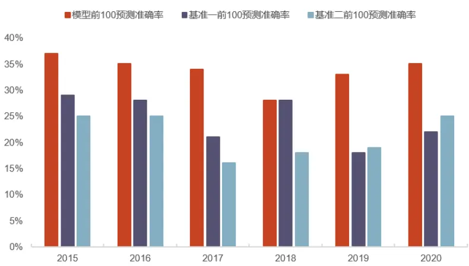
资料来源：Wind，光大证券研究所。注：数据区间：2015 年—2020 年

表 6：预测效果评价指标

| 年份 | 拟合优度 | 模型 前 100 预测准确率 | 基准一 前 100预测准确率 | 基准二 前 100 预测准确率 |
| --- | --- | --- | --- | --- |
| 2015 | 35.27% | 37% | 29% | 25% |
| 2016 | 35.93% | 33% | 28% | 25% |
| 2017 | 33.98% | 34% | 21% | 16% |
| 2018 | 35.15% | 27% | 28% | 18% |
| 2019 | 39.74% | 33% | 18% | 19% |
| 2020 | 34.59% | 35% | 22% | 25% |

资料来源：Wind，光大证券研究所。注：数据区间：2015 年—2020 年。

## 4、2021 年度预期高股息率组合

得到预测分红率之后，我们可以结合一致预测净利润计算股票当年的分红金额，进而计算股息率。

$$
\sin\angle ABR\overset{\triangledown}{\underset{}{\sum}}\stackrel{\triangledown}{\underset{}{\sum}}\stackrel{\triangledown}{\underset{}{\sum}}\stackrel{\triangledown}{=}\frac{\sharp\mathbb{R}(\frac{\sharp}{\sin\big(\frac{\angle}{\theta}\big)}\frac{\xi}{\sin\big(\frac{\angle}{\theta}\big)}\times\frac{\xi}{\big(\frac{\sin\big(\frac{\angle}{\theta}\big)}{\big(\sin\big(\frac{\angle}{\theta}\big)}\big)})}{\underline{{\operatorname\ in}}!\mathbb{R}(\frac{\dot{\ z}}{\big)}}\stackrel{\triangledown}{\big\vert\frac{\dot{\ z}}{\big\vert\big(\frac{\dot{\ z}}{\big)}}\big\vert}\dot{\theta}
$$

预期股息率可以理解为：未来高派息的股票以当前价格购买的性价比。

由于分红率和净利润均为预测数据，二者相乘后可能会产生较大误差。为了保证预测数值的相对准确，我们剔除了近 180 个交易日没有分析师覆盖的股票，一致预测净利润采用最近 90 天分析师一致预期净利润均值。

## 4.1、 预期高股息率 Top100

我们以 2020 年数据为基础预测了 2021 年的分红率，结合 2021 年一致预测净利润计算了 2021 年的每股派息比例。最后以 2022 年 3 月 31 日的收盘价为基准计算了预期高股息率，该指标衡量的是未来高派息的股票以当前价格购买的性价比。下表为预期高股息率组合前 100 名。

表 7：2021 年高股息率预测前 100 名

| 序号 | 股票代码 | 股票简称 | 序号 | 股票代码 | 股票简称 序号 | 股票代码 | 股票简称 | 序号 | 股票代码 | 股票简称 |
| --- | --- | --- | --- | --- | --- | --- | --- | --- | --- | --- |
| 1 | 002382.SZ | 蓝帆医疗 | 26 | 002110.SZ | 三钢闽光 | 51 600064.SH | 南京高科 | 76 | 000719.SZ | 中原传媒 |
| 2 | 000671.SZ | 阳光城 | 27 | 601077.SH | 渝农商行 | 52 601838.SH | 成都银行 | 77 | 600548.SH | 深高速 |
| 3 | 000717.SZ | 韶钢松山 | 28 | 601166.SH | 兴业银行 53 | 600720.SH | 祁连山 | 78 | 002798.SZ | 帝欧家居 |
| 4 | 300677.SZ | 英科医疗 | 29 | 601939.SH | 建设银行 54 | 600908.SH | 无锡银行 | 79 | 600528.SH | 中铁工业 |
| 5 | 600782.SH | 新钢股份 | 30 | 600919.SH | 江苏银行 55 | 601009.SH | 南京银行 | 80 | 601800.SH | 中国交建 |
| 6 | 000932.SZ | 华菱钢铁 | 31 | 000961.SZ | 中南建设 56 | 600048.SH | 保利发展 | 81 | 002948.SZ | 青岛银行 |
| 7 | 600015.SH | 华夏银行 | 32 | 000656.SZ 金科股份 | 57 | 002064.SZ | 华峰化学 | 82 | 601101.SH | 昊华能源 |
| 8 | 601229.SH | 上海银行 | 33 | 600603.SH 广汇物流 | 58 | 000100.SZ | TCL 科技 | 83 | 002128.SZ | 电投能源 |
| 9 | 600808.SH | 马钢股份 | 34 | 601658.SH 邮储银行 | 59 | 601328.SH | 交通银行 | 84 | 601636.SH | 旗滨集团 |
| 10 | 601186.SH | 中国铁建 | 35 | 601390.SH 中国中铁 | 60 | 600170.SH | 上海建工 | 85 | 603018.SH | 华设集团 |
| 11 | 600606.SH | 绿地控股 | 36 | 002146.SZ 荣盛发展 | 61 | 688298.SH | 东方生物 | 86 | 000937.SZ | 冀中能源 |
| 12 | 601003.SH | 柳钢股份 | 37 | 601997.SH 贵阳银行 | 62 | 600500.SH | 中化国际 | 87 | 000923.SZ | 河钢资源 |
| 13 | 601818.SH | 光大银行 | 38 | 600383.SH 金地集团 | 63 | 002966.SZ | 苏州银行 | 88 | 000001.SZ | 平安银行 |
| 14 | 601155.SH | 新城控股 | 39 | 600928.SH 西安银行 | 64 | 603225.SH | 新凤鸣 | 89 | 002244.SZ | 滨江集团 |
| 15 | 601998.SH | 中信银行 | 40 | 600585.SH 海螺水泥 | 65 | 600295.SH | 鄂尔多斯 | 90 | 000039.SZ | 中集集团 |
| 16 | 601988.SH | 中国银行 | 41 | 002958.SZ 青农商行 | 66 | 601233.SH | 桐昆股份 | 91 | 601601.SH | 中国太保 |
| 17 | 601398.SH | 工商银行 | 42 | 000789.SZ 万年青 | 67 | 601598.SH | 中国外运 | 92 | 600586.SH | 金晶科技 |
| 18 | 601577.SH | 长沙银行 | 43 | 600742.SH 一汽富维 | 68 | 601916.SH | 浙商银行 | 93 | 002274.SZ | 华昌化工 |
| 19 | 600282.SH | 南钢股份 | 44 | 601169.SH 北京银行 | 69 | 600502.SH | 安徽建工 | 94 | 600461.SH | 洪城环境 |
| 20 | 600325.SH | 华发股份 | 45 | 000002.SZ 万科A | 70 | 601678.SH | 滨化股份 | 95 | 000401.SZ | 冀东水泥 |
| 21 | 000825.SZ | 太钢不锈 | 46 | 600810.SH 神马股份 | 71 | 601898.SH | 中煤能源 | 96 | 600823.SH | 世茂股份 |
| 22 | 601288.SH | 农业银行 | 47 | 600000.SH 浦发银行 | 72 | 603686.SH | 福龙马 | 97 | 600475.SH | 华光环能 |
| 23 | 600248.SH | 陕西建工 | 48 | 600901.SH 江苏租赁 | 73 | 601225.SH | 陕西煤业 | 98 | 601811.SH | 新华文轩 |
| 24 | 601668.SH | 中国建筑 | 49 | 000498.SZ | 山东路桥 | 74 | 601298.SH 青岛港 | 99 | 600820.SH | 隧道股份 |
| 25 | 600016.SH | 民生银行 | 50 | 000090.SZ | 天健集团 | 75 | 000060.SZ | 中金岭南 | 100 002233.SZ | 塔牌集团 |

资料来源：Wind，光大证券研究所测算

## 5、风险提示

报告结果均基于历史数据，历史数据存在不被重复验证的可能。

## 行业及公司评级体系

| 评级 | 说明 |
| --- | --- |
| 买入 | 未来6-12个月的投资收益率领先市场基准指数15%以上 |
| 增持 | 未来 6-12 个月的投资收益率领先市场基准指数 5%至 15%； |
| 行业及公司评级 中性 | 未来6-12个月的投资收益率与市场基准指数的变动幅度相差-5%至5%； |
| 减持 | 未来 6-12 个月的投资收益率落后市场基准指数 5%至 15%； |
| 卖出 | 未来6-12个月的投资收益率落后市场基准指数15%以上； |
| 无评级 | 因无法获取必要的资料，或者公司面临无法预见结果的重大不确定性事件，或者其他原因，致使无法给出明确的投资评级。 |
| 基准指数说明： | A股主板基准为沪深300指数；中小盘基准为中小板指；创业板基准为创业板指；新三板基准为新三板指数；港股基准指数为恒生 指数。 |

## 分析、估值方法的局限性说明

本报告所包含的分析基于各种假设，不同假设可能导致分析结果出现重大不同。本报告采用的各种估值方法及模型均有其局限性，估值结果不保证所涉及证券能够在该价格交易。

## 分析师声明

本报告署名分析师具有中国证券业协会授予的证券投资咨询执业资格并注册为证券分析师，以勤勉的职业态度、专业审慎的研究方法，使用合法合规的信息，独立、客观地出具本报告，并对本报告的内容和观点负责。负责准备以及撰写本报告的所有研究人员在此保证，本研究报告中任何关于发行商或证券所发表的观点均如实反映研究人员的个人观点。研究人员获取报酬的评判因素包括研究的质量和准确性、客户反馈、竞争性因素以及光大证券股份有限公司的整体收益。所有研究人员保证他们报酬的任何一部分不曾与，不与，也将不会与本报告中具体的推荐意见或观点有直接或间接的联系。

## 法律主体声明

本报告由光大证券股份有限公司制作，光大证券股份有限公司具有中国证监会许可的证券投资咨询业务资格，负责本报告在中华人民共和国境内（仅为本报告目的，不包括港澳台）的分销。本报告署名分析师所持中国证券业协会授予的证券投资咨询执业资格编号已披露在报告首页。

中国光大证券国际有限公司和 Everbright Securities(UK) Company Limited 是光大证券股份有限公司的关联机构。

## 特别声明

光大证券股份有限公司（以下简称“本公司”）创建于 1996 年，系由中国光大（集团）总公司投资控股的全国性综合类股份制证券公司，是中国证监会批准的首批三家创新试点公司之一。根据中国证监会核发的经营证券期货业务许可，本公司的经营范围包括证券投资咨询业务。

本公司经营范围：证券经纪；证券投资咨询；与证券交易、证券投资活动有关的财务顾问；证券承销与保荐；证券自营；为期货公司提供中间介绍业务；证券投资基金代销；融资融券业务；中国证监会批准的其他业务。此外，本公司还通过全资或控股子公司开展资产管理、直接投资、期货、基金管理以及香港证券业务。

本报告由光大证券股份有限公司研究所（以下简称“光大证券研究所”）编写，以合法获得的我们相信为可靠、准确、完整的信息为基础，但不保证我们所获得的原始信息以及报告所载信息之准确性和完整性。光大证券研究所可能将不时补充、修订或更新有关信息，但不保证及时发布该等更新。

本报告中的资料、意见、预测均反映报告初次发布时光大证券研究所的判断，可能需随时进行调整且不予通知。在任何情况下，本报告中的信息或所表述的意见并不构成对任何人的投资建议。客户应自主作出投资决策并自行承担投资风险。本报告中的信息或所表述的意见并未考虑到个别投资者的具体投资目的、财务状况以及特定需求。投资者应当充分考虑自身特定状况，并完整理解和使用本报告内容，不应视本报告为做出投资决策的唯一因素。对依据或者使用本报告所造成的一切后果，本公司及作者均不承担任何法律责任。

不同时期，本公司可能会撰写并发布与本报告所载信息、建议及预测不一致的报告。本公司的销售人员、交易人员和其他专业人员可能会向客户提供与本报告中观点不同的口头或书面评论或交易策略。本公司的资产管理子公司、自营部门以及其他投资业务板块可能会独立做出与本报告的意见或建议不相一致的投资决策。本公司提醒投资者注意并理解投资证券及投资产品存在的风险，在做出投资决策前，建议投资者务必向专业人士咨询并谨慎抉择。

在法律允许的情况下，本公司及其附属机构可能持有报告中提及的公司所发行证券的头寸并进行交易，也可能为这些公司提供或正在争取提供投资银行、财务顾问或金融产品等相关服务。投资者应当充分考虑本公司及本公司附属机构就报告内容可能存在的利益冲突，勿将本报告作为投资决策的唯一信赖依据。

本报告根据中华人民共和国法律在中华人民共和国境内分发，仅向特定客户传送。本报告的版权仅归本公司所有，未经书面许可，任何机构和个人不得以任何形式、任何目的进行翻版、复制、转载、刊登、发表、篡改或引用。如因侵权行为给本公司造成任何直接或间接的损失，本公司保留追究一切法律责任的权利。所有本报告中使用的商标、服务标记及标记均为本公司的商标、服务标记及标记。

光大证券股份有限公司版权所有。保留一切权利。

光大证券研究所

上海

北京

深圳

静安区南京西路 1266 号

西城区武定侯街 2 号

福田区深南大道 6011 号

恒隆广场 1 期办公楼 48 层

泰康国际大厦 7 层

NEO 绿景纪元大厦 A 座 17 楼

## 光大证券股份有限公司关联机构

香港

英国

中国光大证券国际有限公司

香港铜锣湾希慎道 33 号利园一期 28 楼

Everbright Securities(UK) Company Limited

64 Cannon Street，London，United Kingdom EC4N 6AE