## 金融工程

## 高质量股票池构造体系

## ——量化选股系列报告之五

## 要点

高质量股票池构造思路：构建多因子模型的第一步是确定投资范围，包括确定原始股票池和优化股票池两步。原始股票池限定了最原始的投资范围，指明了可供选择的股票有哪些。确定了原始股票池后还需要对其进行优化，在初始投资范围的基础上，为了防止踩雷，通常会进一步剔除掉有缺陷的股票，得到更加匹配投资目标的股票池。

本文将针对股票池构造这一步骤展开研究，从更为宏观的视角审视了股票池优化存在的问题，并从实证角度进行了测试。最终我们提出了两层优化框架，并且重构了负向因子筛选流程，精选了负向因子库，并构造了高质量股票池。

两层优化构造框架：股票池优化的目标是保证可交易性的同时提升质量。据此，我们构造了两层优化：

第一层为刚性优化，目的是保证股票可交易。优化的目标包括风险警示股票（ST/*ST）、次新股、低流动性、极小市值以及净资产为负等，其中风险警示股票多为公募基金公司风控制度中禁止投资的标的；次新股股价波动较大；低流动性、极小市值的股票对于机构投资者来说难以交易；年报中净资产为负的股票会被风险警示。

第二层为柔性优化，目的是提升股票池质量。我们对列入基本面负面清单、量价因子空头组合、有可能财务造假以及发生过负面事件的股票进行剔除，可以保证股票池相对“干净”。

刚性优化：我们剔除了影响股票可交易性的因素，例如风险警示股票（ST/*ST）、次新股、低流动性、极小市值以及净资产为负等股票。同时我们参考了中证指数编制方案中的缓冲区规则，引入“粘性剔除”机制降低了股票池周转率。最终构造了流动性 1500 股票池代替全市场股票池。回测对比发现，流动性 1500 股票池在保证了因子有效性的前提下提升了股票的可交易性。

柔性优化：我们认为多空均可贡献收益的单调因子并不属于负向因子，只有因子在多头收益不强，但是空头预测能力强时才可算作负向因子。据此，我们构建了负向因子筛选流程，并且从多个财务分析维度筛选了 11 个负向因子。

负向因子合成方法：我们对负向因子组合使用的方式进行了较为全面的测试，分别从合成方式、剔除范围以及敏感性分析几个角度进行了实证研究。结果发现对于合成方法来说，对空头单调的因子进行 ICIR 加权效果最好，对空头尾部有效的因子使用组合复合法效果最好。对于剔除范围来说，对流动性 1500 中非指数成分股进行剔除效果最好。对于剔除阈值来说，选择剔除 4%-6%对策略提升最为明显。

风险分析：报告结果均基于历史数据，历史数据存在不被重复验证的可能。

## 作者

分析师：祁嫣然

执业证书编号：S0930521070001

010-56513031

qiyanran@ebscn.com

联系人：曲虹宇

010-56513042

quhongyu@ebscn.com

## 相关研报

单因子组合优化在指数增强策略中的应用——

量化选股系列报告之一（2021-07-22）

## 1、高质量股票池构造框架

构建多因子模型的第一步是确定投资范围，包括确定原始股票池和优化股票池两步。原始股票池限定了最原始的投资范围，指明了可供选择的股票有哪些。确定了原始股票池后还需要对其进行优化，在初始投资范围的基础上，为了防止踩雷，通常会进一步剔除掉有缺陷的股票，得到更加匹配投资目标的股票池。

目前大多数的股票池优化研究聚焦于财务造假预测——将财务造假概率高的股票从原始股票池中剔除。该方法的确可以切实有效的提升股票池质量，但是从优化角度来说并不全面。本篇报告从更为宏观的视角审视了股票池优化存在的问题，并从实证角度进行了测试。

## 1.1、 权衡可交易性与超额收益

股票的最低要求是可交易，但是股票可交易性与未来收益在一定程度上存在矛盾，造成了因子的“纸面收益”现象。

以“流动性溢价”问题为例：从超额收益角度来看，市场会给予流动性较差的股票更高的溢价。流动性因子在全市场股票池能获得稳定的超额收益。然而从可交易性角度来说，如果一只股票的流动性较差，那么其交易成本也较高，甚至无法满足交易要求。回测显示，流动性因子的多头组平均成交金额不足 1 亿元（数据统计区间为 2010 年 1 月—2021 年 9 月，下同）。

图 1：流动性因子净值曲线（全市场）
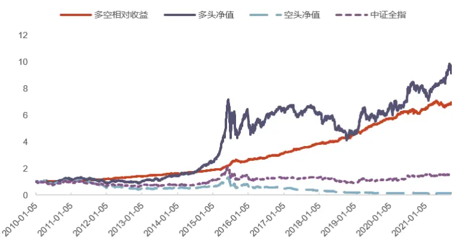
资料来源：Wind，光大证券研究所；注：数据统计区间为 2010 年 1 月—2021 年 9 月

图 2：流动性因子多头组与空头组平均成交金额（亿元）
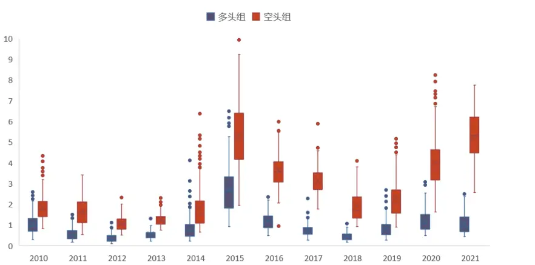
资料来源：wind，光大证券研究所；注：数据统计区间为 2010 年 1 月—2021 年 9 月

此外，从分域角度来看，因子在小市值分域内有效性更强——同样选择流动性因子分别在沪深 300 和中证 500 指数成分股内进行测试，中证 500 股票池中超额收益更为明显。然而，小市值股票较多会降低策略容量上限。

图 3：流动性因子在沪深 300和中证 500 指数成分股内多空净值
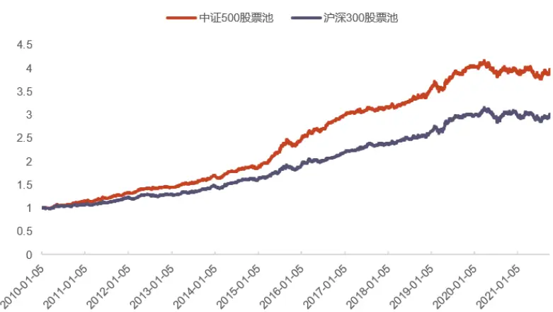
资料来源：Wind，光大证券研究所；注：数据统计区间为 2010 年 1 月—2021 年 9 月

## 1.1、 股票池构造框架

因此，我们在优化股票池的过程中需要对二者做出权衡。也即，股票池优化的目标是保证可交易性的同时提升质量。据此，我们构造了两层优化：

第一层为刚性优化，目的是保证股票可交易。优化的目标包括风险警示股票（ST/*ST）、次新股、低流动性、极小市值以及净资产为负等。其中风险警示股票多为公募基金公司风控制度中禁止投资的标的；次新股股价波动较大；低流动性、极小市值的股票对于机构投资者来说难以交易；年报中净资产为负的股票会被风险警示。

第二层为柔性优化，目的是提升股票池质量。我们对列入基本面负面清单、量价因子空头组合、有可能财务造假以及发生过负面事件的股票进行剔除，可以保证股票池相对“干净”。

图 4：高质量股票池构造流程
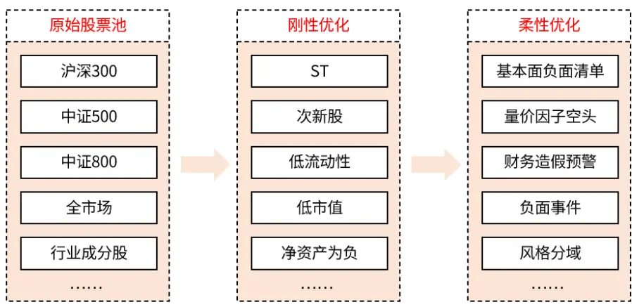
资料来源：光大证券研究所

## 2、刚性优化

刚性优化的目标是保证股票可交易，我们可以对现实交易中存在的限制条件进行分析。下表总结了部分存在交易限制的情况。

表 1：刚性优化目标

| 优化目标 | 风险说明 优化方式 |
| --- | --- |
| 次新股 | 股价波动较大 剔除 |
| 风险警示(ST/*ST) | 公募基金公司风控制度多要求禁投 剔除 |
| 净资产为负 | 未来有被风险警示的风险 剔除 |
| 低流动性 | 冲击成本高、无法交易 低于阈值部分剔除 |
| 极小市值 | 容量低，超额收益无法获得 低于阈值部分剔除 |
| 长期停牌 | 无法交易 停牌时间超过阈值剔除 |

资料来源：光大证券研究所

根据刚性优化的目标，我们首先剔除上市不足 1 年、风险警示（ST/*ST）、净资产为负的股票，然后计算股票过去 60 个交易日的平均成交金额，取前 1500只股票作为刚性优化后的股票池。

进行刚性优化后我们发现，有部分沪深 300 和中证 500 指数成分股也被剔除。且随着市场中股票数量增加，流动性排名在 1500 之外的沪深 300 及中证 500指数成分股上升到 200 只左右。这会导致相应指数增强策略组合优化无法求解。

一般认为指数成分股的可交易性较好，因此我们将被剔除的沪深 300 和中证500 指数成分股重新纳入流动性最好的 1500 只股票中。

刚性优化流程说明：

1.剔除上市不足 1 年、停牌时间超过 15 个交易日、ST/*ST、净资产为负的股票。

2.计算股票过去 60 个交易日的平均成交金额，取前 1500 只股票作为初选股票池。

3.将被剔除的沪深 300 及中证 500 指数成分股与初选股票池合并，命名为TOP1500 股票池。

图 5：TOP1500 中被剔除的 800 成分股个数
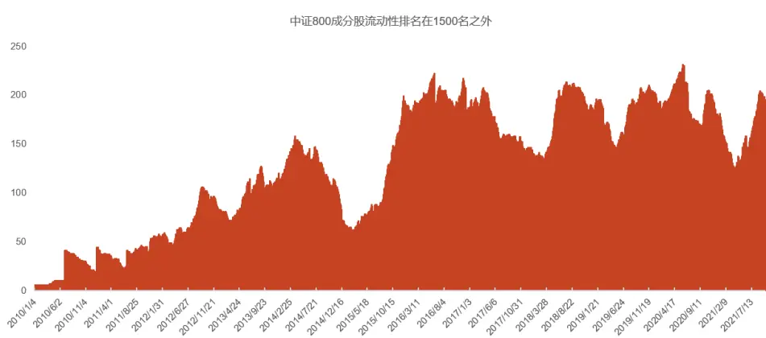
资料来源：Wind，光大证券研究所；注：数据统计区间为 2010 年 1 月—2021 年 9 月

## 2.1、 黏性剔除机制——缓冲区规则

以上规则构造的 TOP1500 股票池周转率较高，容易产生较多由股票池成分股变动而导致的无效交易成本。为了保证样本内股票个数稳定，我们参考了中证指数公司指数编制方案中的“缓冲区规则”，对股票的纳入与剔除采用“宽进严出”的准则。

图 6：TOP1500 股票池日度周转率
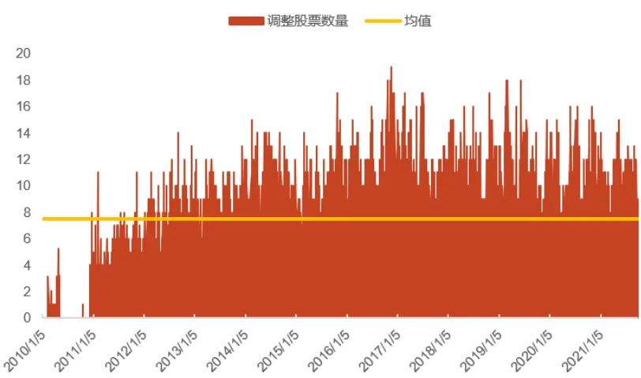
资料来源：Wind，光大证券研究所；注：数据统计区间为 2010 年 1 月—2021 年 9 月

下表为中证指数公司沪深 300 指数编制方案的调整说明。其样本调整规则遵循样本稳定性和动态跟踪相结合的原则。

表 2：中证指数编制规则

| 说明 |  |
| --- | --- |
| 样本调整数量 | 定期调整指数样本时，每次调整数量比例一般不超过10%。 |
| 老样本成交金额缓冲区规则 | 如果沪深300指数老样本日均成交金额在样本空间中排名前 60%，则参与下一步日均总市值的排名。 |
| 缓冲区规则 | 为有效降低指数样本周转率，沪深300指数样本定期调整时采用 缓冲区规则，排名在前240名的候选新样本优先进入指数，排名 在前360名的老样本优先保留。 |
| 备选名单 | 对沪深300指数进行定期审核时，设置备选名单用以定期调整之 间的临时调整。 |

资料来源：中证指数有限公司，光大证券研究所

参考中证指数编制规则，我们设置了“剔除缓冲区”和“纳入缓冲区”。当股票的流动性不满足排名要求，但是还没达到剔除规则时，进入“剔除缓冲区”。当股票满足流动性排名要求，但是股票池中没有股票被剔除时，进入“纳入缓冲区”。

1） 剔除规则：过去 N 个交易日中有 K 个交易日不满足排名要求（K<N）；连续 M个交易日不满足排名要求（M<K）。

2） 纳入规则：股票池内股票数量不满足要求；过去 N 个交易日中有 N-K 个交易日满足排名要求（N>K）；连续 N-M 个交易日满足排名要求（N>K>M）。按照最近一个交易日的流动性排名纳入相应数量股票。

参数分别取 N=40，K=30，M=20。

引入“缓冲区规则”之后的股票池成分股数量保持稳定，周转率大幅降低。我们将经过上述处理之后的股票池称为流动性 1500 股票池，将其作为全市场股票池的代替。

图 7：TOP1500 股票池日周转数量 20 日移动平均
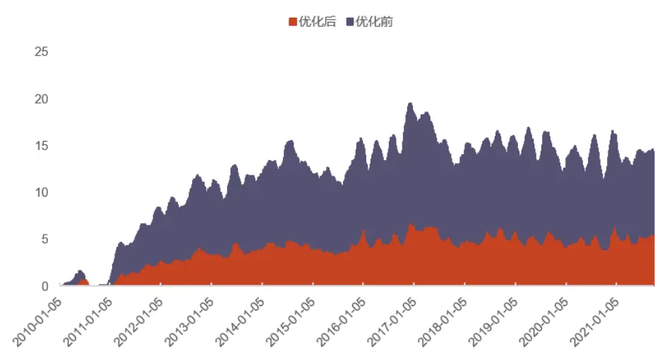
资料来源：Wind，光大证券研究所；注：数据统计区间为 2010 年 1 月—2021 年 9 月

## 2.2、刚性剔除效果对比

同样以流动性因子为例，我们对比了因子在沪深 300、中证 500、流动性 1500以及全市场四个股票池内的表现。

收益表现来看，因子在流动性 1500 股票池中的表现相比于全市场有所下降，但是幅度并不大，净值走势与全市场一致。相比于沪深 300 和中证 500 股票池，因子在流动性 1500 股票池表现更好。

图 8：流动性因子在不同股票池中多空净值对比
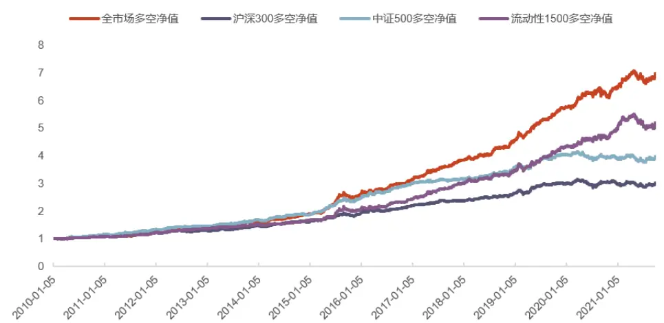
资料来源：Wind，光大证券研究所；注：数据统计区间为 2010 年 1 月—2021 年 9 月，调仓周期：周度。

表 3：流动性因子不同股票池测试业绩指标

| 年化 年化 最大回撤 最大回撤日度胜率 总收益率 夏普比率RankIC最大回撤收益率波动率 起始日期 结束日期 |
| --- |
| 沪深300 53.13%197.48% 10.02%6.15% 0.98 2.43% 10.00%2020-03-242020-07-13 |
| 中证 500 53.59%292.78%12.73%6.25% 1.40 5.94% 9.55% 2020-03-242021-07-21 |
| 流动性 150053.20%413.11% 15.40%6.80% 1.68 5.95% 10.23%2021-04-292021-07-22 |
| 全市场 55.17%591.47% 18.45%6.09% 2.37 6.45% 7.66% 2015-09-022015-10-23 |

资料来源：Wind，光大证券研究所；注：数据统计区间为 2010 年 1 月—2021 年 9 月，调仓周期：周度。

对于可交易性来说，我们对比了流动性因子在全市场与流动性 1500 股票池中多头组股票的平均成交金额。可以看到随着市场中股票数量的增多，二者差距逐渐拉大。2014 年之后，因子在流动性 1500 股票池的多头组成交额均值基本保持在 1 亿元以上，可交易性保持稳定。

图 9：流动性因子在全市场与流动性 1500 股票池多头组成交金额对比（亿元）
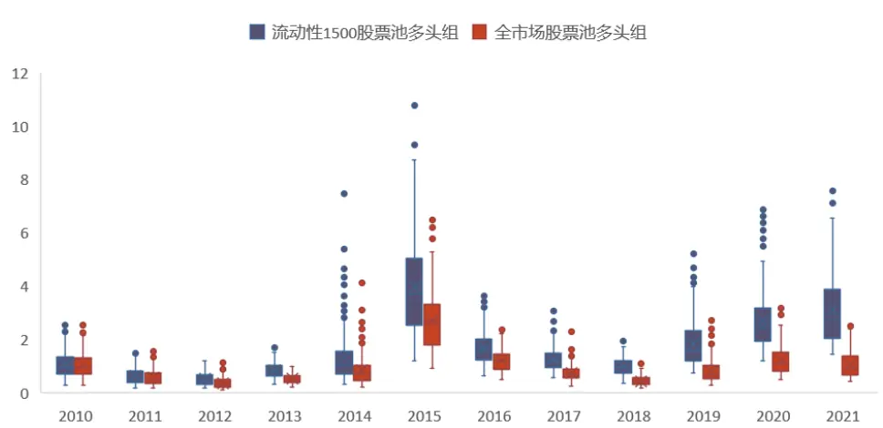
资料来源：Wind，光大证券研究所；注：数据统计区间为 2010 年 1 月—2021 年 9 月

表 4：流动性因子多头组在不同股票池成交金额均值（亿元）

| 2012 | 2013 | 2014 | 2015 |  | 2016 | 2017 | 2018 | 2019 | 2020 | 2021 |
| --- | --- | --- | --- | --- | --- | --- | --- | --- | --- | --- |
| 全市场 | 0.37 | 0.53 | 0.83 | 2.71 | 1.21 | 0.73 | 0.43 | 0.82 | 1.24 | 1.05 |
| 流动性 1500 0.51 | 0.84 |  | 1.32 | 3.96 | 1.69 | 1.26 | 0.98 | 1.84 | 2.72 | 3.08 |

资料来源：wind，光大证券研究所；注：数据统计区间为 2010 年 1 月—2021 年 9 月

## 3、 柔性优化

柔性优化目的是提升股票池质量，我们在本系列的第一篇报告《单因子组合优化在指数增强策略中的应用——量化选股系列报告之一》中使用组合优化的方法对市场中常用单因子进行了测试，发现部分因子在多头端正向 Alpha 较弱，但是空头端负向 Alpha 较强。我们认为在当前的市场环境下此类因子纳入收益模型中很难提供增量信息，但是其空头端的负向预测能力可以加以利用。

柔性剔除的标准可以分成三种类型，分别需要使用不同方式建模分析：

1.负向事件预测剔除：主要为财务造假预测，部分财务指标对于股票收益的预测能力较差，但是对于财务造假事件有预测能力。因此可以通过对财务造假事件进行建模预测，进而规避财务造假概率较高的股票。

2.负向事件发生后剔除：部分负向事件发生后，股价会出现持续性下跌，如果在事件发生后及时将其剔除，也可以及时规避风险。

3.负向因子剔除：因子型剔除的逻辑较为直接，寻找有负向预测能力的因子，剔除期望收益率最低的部分股票。

图 10：柔性剔除分类
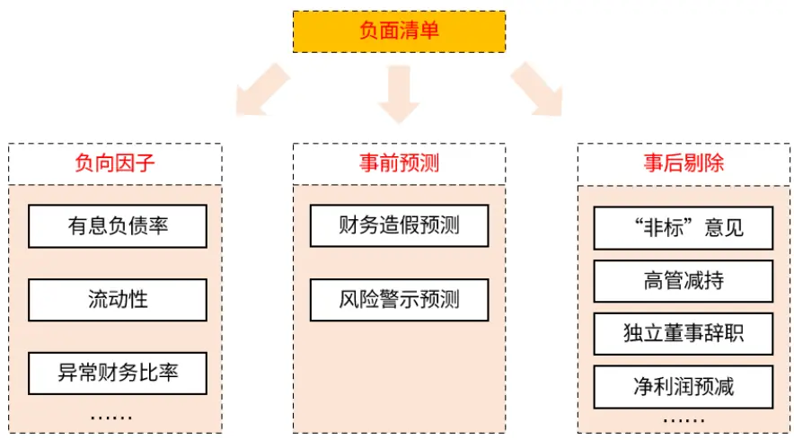
资料来源：光大证券研究所

## 3.1、 因子型优化框架

本篇报告主要针对负向因子进行优化，负向因子的逻辑较为直接，属于因子与收益率的直接映射。相比于传统多因子模型，负向因子在使用方式上存在不同，因此筛选负向因子的逻辑也有不同。

因此，我们本篇报告因子型优化的框架包括负向因子筛选使用逻辑分析、负向因子筛选框架、负向因子测试、负向因子剔除效果测试。

图 11：因子型优化框架
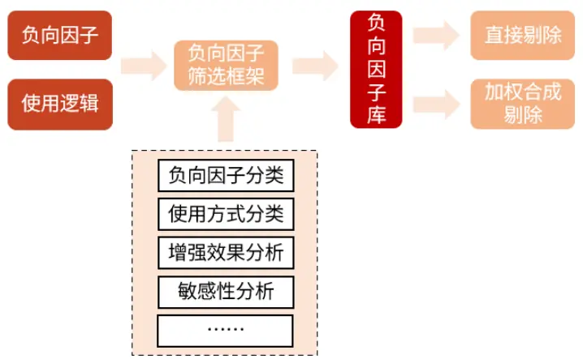
资料来源：光大证券研究所

## 3.2、 事件驱动型优化框架

事件驱动型包括财务造假、高管减持等特殊风险事件，均为离散变量。如果上市公司发生此类特殊风险事件，公司的基本面或股权等将发生变动。如高管减持，发生此类事件后，需要分析事件是否会驱动股价变动，进而决定剔除该股票与否。下图展示了基于事件驱动型的事后剔除型优化框架。

图 12：事后剔除型优化框架
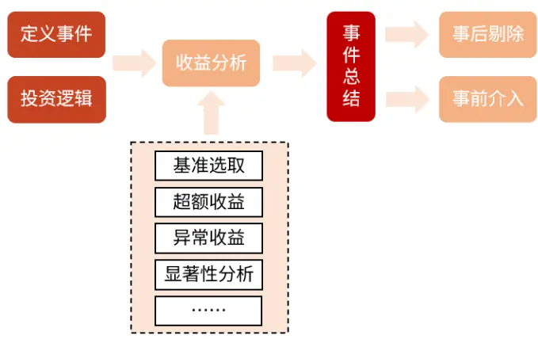
资料来源：光大证券研究所

## 3.2.1、事前剔除

由于事件的不可预知性，所以需要以历史负面事件为样本进行分析，寻找在事件发生前具备显著异常收益的事件，然后通过各种统计模型对此类事件进行预测，进而在事件发生前将股票剔除。

通常来说，可预测性较强的事件大概率会在事前形成预期，推动股价变化。此类事件的预计发生时间和频率一般比较有规律，而且可以利用市场公开信息加以预测，例如企业财务造假、企业被风险警示以及股票被剔除出指数成分股事件等。

## 3.2.2、事后剔除

以高管减持为例，高管减持说明高管对公司的后续发展并不乐观或者认为市场对公司估值过高，此类事件的发生可能推动股价的下跌。通过分析事件发生前后在剔除行业及风格因素后的累计异常收益（CAR）可知：若事件发生后具备显著的负向异常收益，说明股价在事件发生后出现回调，进而剔除发生此类事件的股票。

## 4、负向因子的使用逻辑

本章节主要对因子型的负面清单进行梳理与回测。负向因子在使用上存在几个问题：首先，传统因子评价方法多注重于其收益预测能力，直接用于筛选负向因子并不合适。其次，负向因子如何使用才能充分发挥其空头端的预测能力。

我们在本章节首先讨论了负向因子的最佳使用方式，并据此重构了负向因子筛选流程。

## 4.1、 因子空头端信息的最佳使用方式

一般来说，因子的空头端信息有两种使用方式：

1.将负向因子纳入收益模型中，其空头端预测能力以打分形式展现。

2.多个负向因子合成，剔除期望收益率最低的部分股票，其空头端预测能力以尾部截断的形式展现。

据此我们可以将负向因子分成三类：

1.多头端有效，空头端有效：因子整体单调。

2.多头端无效，空头端有效：因子仅在空头端单调。

3.多头端无效，空头端尾部有效：因子在多空两端均不单调，但是空头端尾部可贡献负向收益。

接下来的任务有二：首先，将因子按照上述划分方式分成三类；其次，判断各类因子的空头端分别以哪种方式使用效果最佳。

图 13：因子分类示意图
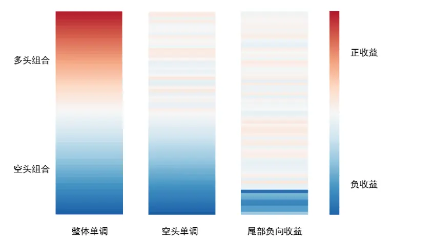
资料来源：光大证券研究所

我们从估值、盈利、成长、技术等几个维度挑选了常用的因子作为因子池进行后续研究。具体因子构造方式如下表所示：

表 5：业绩基准使用因子明细

| 因子类别 | 因子简称 | 因子名称 | 因子计算方式 |
| --- | --- | --- | --- |
| 估值 | BP | 市净率倒数 | 净资产/总市值 |
|  | EP_TTM | 市盈率倒数 TTM | 归母净利润TTM/总市值 |
|  | EPTTM_Quantile | 市盈率倒数 TTM 分位点 | EPTTM 过去 252 个交易日的分位点 |
|  | DP | 派息率倒数 | 过去一年分红/总市值，以分红实施公告日为准 |
|  | SP_TTM | 市销率倒数 TTM | 营业收入TTM/总市值 |
| 盈利 | ROE_S_Q | 单季度净资产收益率 | 单季度归母净利润/(期初净资产+期末净资产) |
|  | ROA_S_Q | 单季度总资产收益率 | 单季度归母净利润/(起初总资产+期末总资产) |
|  | GPOA_S_Q | 单季度总资产毛利率 | (单季度营业收入-单季度营业成本)/总资产 |
|  | ROIC_S_Q | 单季度投入资产收益率 | 息税前利润*(1-有效税率)*2/(期初全部投入资本+期末全部投入资本) |
|  | ROE_YOY | 单季度净资产收益率同比 | 单季度净资产收益率-上年同期单季度净资产收益率 |
| 成长 | ROA_YOY | 单季度总资产收益率同比 | 单季度总资产收益率-上年同期单季度总资产收益率 |
|  | GPOA_YOY | 单季度总资产毛利率同比 | 单季度总资产毛利率-上年同期单季度总资产毛利率 |
|  | PROFIT_YOY | 单季度归母净利润同比 | (单季度归属于母公司的净利润-上年同期单季度归属于母公司的净利润) /ABS(上年同期单季度归属于母公司的净利润) |
|  | SALES_YOY | 单季度营业收入同比 | (单季度营业收入-上年同期单季度营业收入)/ABS(上年同期单季度营业收入) |
|  | OP_YOY | 单季度营业利润同比 | (单季度营业利润-上年同期单季度营业利润)/ABS(上年同期单季度营业利润) |
|  | SUE_S_Q | 单季度标准化预期外盈利 | (单季度实际净利润-预期净利润)/历史净利润标准差 |
|  | SUR_S_Q | 单季度标准化预期外收入 | (单季度实际营业收入-预期营业收入)/历史营业收入标准差 |
| 技术 | 5DR | 5 日反转 | 过去5个交易日的累计收益率 |
|  | 20DR | 20 日反转 | 过去20个交易日的累计收益率 |
|  | TVSTD5 | 5 日成交金额标准差 | 过去5个交易日成交金额的标准差 |
|  | TVSTD20 | 20 日成交金额标准差 | 过去20个交易日成交金额的标准差 |
|  | TVMA5 | 5 日成交金额移动平均值 | 过去5 个交易日成交金额的平均值 |
|  | TVMA20 | 20日成交金额移动平均值 | 过去20个交易日成交金额的平均值 |
|  | VOL5 | 5 日平均换手率 | 过去5个交易日换手率的平均值 |
|  | VOL20 | 20 日平均换手率 | 过去20个交易日换手率的平均值 |
|  | VEMA5 | 成交量的 5 日指数移动平均 | 过去5个交易日成交量的指数移动平均 |
|  | VEMA20 | 成交量的 20 日指数移动平均 | 过去20个交易日成交量的指数移动平均 |
| MONEYFLOW | 20 日资金流量 |  | MEAN(收盘价,最高价,最低价)*成交量 |

资料来源：光大证券研究所

## 4.2、 因子多头端与空头端有效性评价方式

接下来我们还需要对因子进行分类，挑选三种类别因子分别以加权法和尾部截断法纳入到多因子组合中，进而研究因子类别和因子使用方式的关系。

若因子以打分形式使用，则其空头端应具有明显单调性，此时使用 RankIC 评价较为合理；若因子以尾部截断方式使用，则其空头端相对于基准应有持续的负向超额收益，此时考察空头组的超额收益更为合理。因此我们构造了两种多头端与空头端的评价方式。

1.RankIC 评价方式：RankIC 能较好的捕捉因子的线性预测能力，将股票根据因子值等分成两组，分别计算多头组与空头组的 RankIC 可以分别度量因子的多头与空头的线性预测能力。为了避免数据过少导致的 IC 值异常，我们取因子值 50%分位点作为分组标准。

$$
RankIC=Corr(Rank(Factor_{t}),Rank(Return_{t+1}))
$$

$$
RankIC_{long/short}=Corr(Rank(Factor_{t}^{long/short}),Rank(Return_{t+1}^{long/short})))
$$

2.组合收益评价方式：将股票根据因子值分组，分别取空头端的 5%，10%，20%构建组合，计算组合相对于基准的信息比。

我们从估值、盈利、成长、技术几个维度挑选了常用的因子构建多因子组合作为业绩基准。挑选按上节标准分类的三种类别的因子分别以加权法和尾部截断法纳入到多因子组合中，进而研究因子类别和因子使用方式的关系。

首先对因子池中的因子进行上述方式分类。可以看到，A股市场中由于做空限制的存在，技术类因子的空头端有效性普遍强于多头端。此外，因子在不同股票池中的表现也不同，因此我们对沪深 300 和中证 500 业绩基准组合分别选择不同因子进行构造。

对于沪深 300 业绩基准组合，我们选择的因子要求：全区间年化 ICIR 大于 1，多头年化 ICIR 大于 1。

对于中证 500 业绩基准组合，我们选择的因子要求：全区间年化 ICIR 大于 2，多头年化 ICIR 大于 2。

表 6：基础因子分类

| 因子简称 | 中证500 全区间年化ICIR | 中证500 多头年化ICIR | 中证500 空头年化ICIR | 中证500 空头5%相对基准 信息比 | 沪深300 全区间年化ICIR | 沪深300 多头年化ICIR | 沪深300 沪深300 空头5%相对基准 空头年化ICIR |
| --- | --- | --- | --- | --- | --- | --- | --- |
| BP | 1.52 | 1.03 | 1.72 | -1.22 | 0.89 | 0.56 1.05 | 信息比 -0.56 |
| EP_TTM | 2.47 | 2.12 | 2.18 | -1.34 | 1.51 0.79 | 1.73 | -0.94 |
| EPTTM_Quantile | 3.88 | 3.05 | 3.40 | -1.94 | 1.91 | 0.82 2.21 | -0.82 |
| DP | 2.23 | 1.71 | 1.80 | -0.52 | 1.25 | 0.53 1.42 | -0.82 |
| SP_TTM | 1.17 | 0.78 | 1.30 | -1.20 | 0.35 | 0.10 0.49 | -0.21 |
| ROE_S_Q | 2.66 | 2.40 | 2.29 | -1.54 | 1.35 | 0.90 1.41 | -0.60 |
| ROA_S_Q | 2.43 | 2.29 | 2.07 | -1.36 | 1.33 | 0.86 1.34 | -0.72 |
| GPOA_S_Q | 2.03 | 2.17 | 1.35 | -1.26 | 1.37 | 0.94 1.40 | -0.45 |
| ROIC_S_Q | 1.99 | 1.85 | 1.67 | -1.22 | 1.09 | 0.57 1.31 | -0.53 |
| ROE_YOY | 4.02 | 3.55 | 2.81 | -1.75 | 2.07 1.49 | 1.62 | -1.14 |
| ROA_YOY | 3.96 | 3.39 | 2.71 | -1.88 | 1.89 1.51 | 1.36 | -1.03 |
| GPOA_YOY | 3.44 | 3.08 | 1.89 | -1.47 | 2.05 1.67 | 1.48 | -1.16 |
| PROFIT_YOY | 3.52 | 2.96 | 2.70 | -1.46 | 2.04 1.44 | 1.79 | -0.86 |
| SALES_YOY | 2.62 | 2.21 | 1.87 | -1.47 | 1.67 1.28 | 1.46 | -1.17 |
| OP_YOY | 3.51 | 2.89 | 2.76 | -1.47 | 1.92 1.30 | 1.66 | -0.97 |
| SUE_S_Q | 3.52 | 2.78 | 2.68 | -1.41 | 1.99 1.66 | 1.32 | -0.71 |
| SUR_S_Q | 2.52 | 2.08 | 1.65 | -1.14 | 1.85 1.69 | 1.13 | -0.78 |
| 5DR | 3.63 | 3.23 | 3.50 | -1.39 | 2.82 2.11 | 2.72 | -0.82 |
| 20DR | 3.16 | 2.53 | 3.36 | -1.17 | 1.81 1.15 | 1.99 | -0.70 |
| TVSTD5 | 4.66 | 3.79 | 4.44 | -2.00 | 1.51 0.90 | 1.52 | -0.83 |
| TVSTD20 | 4.25 | 3.60 | 4.05 | -2.15 | 1.58 1.05 | 1.57 | -1.01 |
| TVMA5 | 3.54 | 2.98 | 3.46 | -1.74 | 1.00 0.67 | 1.01 | -0.65 |
| TVMA20 | 2.74 | 2.38 | 2.68 | -1.51 | 0.82 0.62 | 0.79 | -0.45 |
| VOL5 | 3.66 | 3.15 | 3.46 | -1.61 | 1.71 1.26 | 1.81 | -0.95 |
| VOL20 | 3.39 | 2.97 | 3.21 | -1.63 | 1.46 | 1.17 1.54 | -0.96 |
| VEMA5 | 4.03 | 3.38 | 3.97 | -1.88 | 1.57 | 0.93 1.58 | -0.70 |
| VEMA20 | 3.12 | 2.69 | 3.04 | -1.77 | 1.54 | 0.94 1.54 | -0.68 |
| MONEYFLOW | 2.44 | 2.00 | 2.22 | -1.06 | 0.07 | 0.27 -0.13 | -0.77 |

资料来源：Wind，光大证券研究所；注：数据统计区间为 2010 年 1 月—2021 年 9 月，调仓周期：周度。

## 4.3、 业绩基准构造与测试说明

基准策略的构造使用传统的多因子策略标准化处理流程：

首先对因子进行缺失值填充、MAD 去极值、Z-score 标准化、市值和行业中性化、二次标准化。

其次，对因子进行对称正交处理，剔除因子间的相关性。

最后，计算正交后因子过去 252 个交易日的周度 ICIR，并依此计算因子权重。
此外，我们对因子权重方向与其逻辑不符的做了归零处理。

基准指数：沪深 300、中证 500

股票池：流动性 1500

调仓周期：周度调仓

回测区间：2011 年 1 月—2021 年 9 月

风险控制：组合行业、市值暴露与基准指数保持一致；个股权重相对于指数成分股权重偏离不超过 2%；组合在成分股内权重下限 90%；限制卖空；总权重和为 1。

指数增强基准策略表现如下所示，中证 500 指数增强基准组合年化收益16.91%，夏普比率 2.28。沪深 300 指数增强基准组合年化收益 13.74%，夏普比率 1.66。

图 14：沪深 300 指数增强基准组合净值
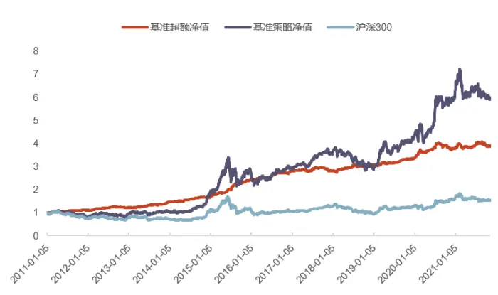
资料来源：Wind，光大证券研究所

图 15：中证 500 指数增强基准组合净值
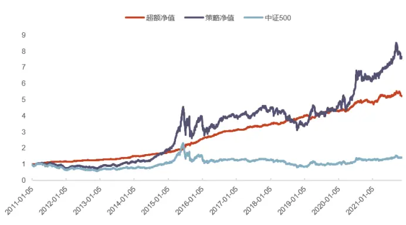
资料来源：Wind，光大证券研究所

表 7：基准策略业绩指标

|  | 日度胜率 | 总收益率 | 年化 收益率 | 年化 波动率 | 夏普比率 | 换手率 | 最大回撤最大回撤结 最大回撤 起始日期 |
| --- | --- | --- | --- | --- | --- | --- | --- |
| 沪深300 | 57.86% | 289.12% | 13.74% | 5.87% | 1.66 | 6.08% 7.55% | 束日期 2020/8/5 2020/11/27 |
| 中证500 | 56.76% | 420.08% | 16.91% | 5.65% | 2.28 | 6.95% 6.06% | 2019/1/31 2019/3/8 |

资料来源：Wind，光大证券研究所；注：数据统计区间为 2011 年 1 月—2021 年 9 月，调仓周期：周度。

## 4.4、 不同因子在不同使用方法下对组合的影响

上文我们将因子分成了三个类别，本章节我们将使用三类因子分别以加权法和尾部剔除法纳入到指数增强基准组合中。

根据有效性分类，每类因子我们都挑选了 3 个单因子进行测试，具体因子构造在后文均有详细描述，部分未涉及到的因子补充说明如下表所示：

表 8：分类研究因子构造补充说明

| 因子简称 | 因子名称 | 因子计算方式 |
| --- | --- | --- |
| ROICenchance | ROIC 增强因子 | 计算ROIC的成长性、稳定性、持续性进行等权合成。其中，成长性为ROIC的上一年 同期变化；稳定性为 ROIC 过去n 个季度的标准差，持续性为ROIC 的二阶同比变化。 |
| NP_YOY_Quantile | 单季度归母净利润同比行业分位数 | 单季度归母净利润同比在中信一级行业中的分位数 |
| NP_YOY2 | 单季度归母净利润加速度 | 单季度归母净利润二阶同比/过去8个单季度归母净利润标准差 |
| 5DR | 5 日反转 | 过去5 个交易日的累计收益率 |
| IVR | 特异度 | 1-过去 20 个交易日 Fama-French 三因子回归拟合优度 |
| MONEYFLOW | 资金流量 | 用收盘价、最高价及最低价的均值乘以当日成交量即可得到该交易日的资金流量 |

资料来源：光大证券研究所

由于不同指数增强基准组合内因子表现不同，因此我们对沪深 300 和中证 500指数增强基准组合分开研究，因子回测情况如下表所示。其中 ROICenhance、NP_YOY_Quantile、NP_YOY2 三个因子在沪深 300 和中证 500 指数增强基准组合中均为多空有效的单调因子；对于多头端无效、空头端有效的因子，沪深300 指数增强基准组合选择 EPTTM_Quantile、DP、ROIC_S_Q，中证 500 指数增强基准组合选择 EPTTM_Quantile、TVMA5、DAVOL；对于多头端无效、空头端尾部有效的因子，沪深 300 指数增强基准组合选择 MONEYFLOW、有息负债率、IVR，中证 500 指数增强基准组合选择 SP_TTM、ABINV、有息负债率。

表 9：因子分类研究回测结果——沪深 300

| 因子分类 | 因子简称 | 沪深300 全区间 年化ICIR | 沪深300 多头年化ICIR | 沪深300 空头年化ICIR | 沪深300 空头5%相对基 准信息比 |
| --- | --- | --- | --- | --- | --- |
| 多头端有效 空头端有效 | ROICenhance | 2.15 | 1.64 | 1.71 | -1.08 |
|  | NP_YOY_Quantile | 1.6 | 1.21 | 1.09 | -0.8 |
|  | NP_YOY2 | 1.73 | 1.34 | 1.25 | -0.88 |
| 多头端无效 空头端有效 | EPTTM_Quantile | 1.91 | 0.82 | 2.21 | -0.82 |
|  | DP | 1.25 | 0.53 | 1.42 | -0.82 |
|  | ROIC_S_Q | 1.09 | 0.57 | 1.31 | -0.53 |
| 多头端无效 空头端尾部有效 | MONEYFLOW | 0.07 | 0.27 | -0.13 | -0.77 |
|  | 有息负债率 | 0.14 | 0.26 | 0.18 | -0.89 |
|  | IVR | 0.49 | 0.35 | 0.54 | -1.13 |

资料来源：Wind，光大证券研究所；注：数据统计区间为 2011 年 1 月—2021 年 9 月，调仓周期：周度。

表 10：因子分类研究回测结果——中证 500

| 因子分类 | 因子简称 | 中证500 全区间 年化ICIR | 中证500 多头年化ICIR | 中证500 空头年化ICIR | 中证500 空头5%相对基 准信息比 |
| --- | --- | --- | --- | --- | --- |
| 多头端有效 空头端有效 | ROICenhance | 2.15 | 1.64 | 1.71 | -1.08 |
|  | NP_YOY_Quantile | 1.6 | 1.21 | 1.09 | -0.8 |
|  | NP_YOY2 | 1.73 | 1.34 | 1.25 | -0.88 |
| 多头端无效 空头端有效 | EPTTM_Quantile | 1.91 | 0.82 | 2.21 | -0.82 |
|  | TVMA5 | 3.54 | 2.98 | 3.46 | -1.74 |
|  | DAVOL | 2.88 | 1.75 | 3.21 | -1.66 |
| 多头端无效 空头端尾部有效 | SP_TTM | 1.17 | 0.78 | 1.30 | -1.20 |
|  | ABINV | 0.23 | 0.16 | -0.32 | -0.97 |
|  | 有息负债率 | 0.28 | 0.11 | 0.41 | -1.14 |

资料来源：Wind，光大证券研究所；注：数据统计区间为 2011 年 1 月—2021 年 9 月，调仓周期：周度。

## 4.4.1、多头端有效、空头端有效的因子

将 ROICenchance、NP_YOY_Quantile 以及 NP_YOY2 因子以加权方式和尾部剔除方式纳入多因子模型中，组合表现对比如下所示。

回测结果可以发现，多空均有效的单调因子不管以哪种方式纳入模型中均能为模型带来增量信息。方法对比来看，加权方式的提升效果明显优于尾部剔除方式。因此，我们在进行负面剔除优化时应当尽量避免将多空均有效的单调因子当作负向因子使用。

表 11： 多头端有效、空头端有效的因子以不同方式纳入多因子组合效果对比——沪深 300

|  | 日度胜率 | 总收益率 | 年化 收益率 | 年化 波动率 | 夏普比率 | 换手率 | 最大回撤 | 最大回撤 起始日期 | 最大回撤 结束日期 |
| --- | --- | --- | --- | --- | --- | --- | --- | --- | --- |
| 沪深 300 基准组合 | 57.86% | 289.12% | 13.74% | 5.87% | 1.66 | 6.08% | 7.55% | 2020/8/5 | 2020/11/27 |
| ROICenhance 加权 | 58.36% | 307.05% | 14.22% | 5.76% | 1.78 | 5.78% | 7.68% | 2020/8/5 | 2020/11/27 |
| ROICenhance 尾部剔除 | 58.28% | 297.37% | 13.96% | 5.87% | 1.7 | 5.67% | 8.29% | 2020/7/14 | 2020/11/27 |
| NP_YOY_Quantile 加权 | 58.17% | 304.34% | 14.15% | 5.82% | 1.74 | 5.74% | 7.17% | 2020/8/5 | 2020/12/1 |
| NP_YOY_Quantile 尾部剔除 | 58.09% | 296.37% | 13.94% | 5.77% | 1.72 | 5.79% | 7.72% | 2017/7/31 | 2018/2/6 |
| NP_YOY2 加权 | 58.24% | 301.28% | 14.07% | 5.91% | 1.7 | 5.75% | 7.44% | 2017/8/4 | 2018/2/6 |
| NP_YOY2 尾部剔除 | 58.17% | 295.35% | 13.91% | 5.89% | 1.68 | 5.77% | 7.04% | 2017/9/29 | 2018/2/1 |

资料来源：Wind，光大证券研究所；注：数据统计区间为 2011 年 1 月—2021 年 9 月

表 12： 多头端有效、空头端有效的因子以不同方式纳入多因子组合效果对比——中证 500

|  | 日度胜率 | 总收益率 | 年化 收益率 | 年化 波动率 | 夏普比率 | 换手率 | 最大回撤 | 最大回撤 起始日期 | 最大回撤 结束日期 |
| --- | --- | --- | --- | --- | --- | --- | --- | --- | --- |
| 中证 500 基准组合 | 56.76% | 420.08% | 16.91% | 5.65% | 2.28 | 6.95% | 6.06% | 2019/1/31 | 2019/3/8 |
| ROICenhance 加权 | 56.57% | 423.41% | 16.98% | 5.60% | 2.32 | 6.91% | 6.35% | 2020/10/28 | 2021/1/13 |
| ROICenhance 尾部剔除 | 56.27% | 398.07% | 16.43% | 5.66% | 2.19 | 6.88% | 7.35% | 2019/1/31 | 2019/3/8 |
| NP_YOY_Quantile 加权 | 57.07% | 445.76% | 17.44% | 5.72% | 2.35 | 6.92% | 6.58% | 2019/1/31 | 2019/3/8 |
| NP_YOY_Quantile 尾部剔除 | 55.97% | 409.82% | 16.69% | 5.71% | 2.22 | 6.91% | 6.68% | 2020/10/28 | 2021/1/12 |
| NP_YOY2 加权 | 56.16% | 417.96% | 16.86% | 5.58% | 2.30 | 6.89% | 6.74% | 2021/9/16 | 2021/11/12 |
| NP_YOY2 尾部剔除 | 56.31% | 400.39% | 16.48% | 5.72% | 2.18 | 6.88% | 6.14% | 2020/10/28 | 2021/1/12 |

资料来源：Wind，光大证券研究所

## 4.4.2、多头端无效、空头端有效的因子

将多头端无效、空头端有效的因子以加权方式和尾部剔除方式纳入多因子模型中，组合表现对比如下所示：

回测结果可以发现，由于因子多头端信噪比较低，直接纳入模型后，组合收益提升名不明显，甚至不升反降；但是由于因子的空头端有稳定负向收益，因此尾部剔除法对策略有明显提升。

表 13： 多头端无效、空头端有效的因子以不同方式纳入多因子组合效果对比——沪深 300

|  | 日度胜率 | 总收益率 | 年化 收益率 | 年化 波动率 | 夏普比率 | 换手率 | 最大回撤 | 最大回撤 起始日期 | 最大回撤 结束日期 |
| --- | --- | --- | --- | --- | --- | --- | --- | --- | --- |
| 沪深 300 基准组合 | 57.86% | 289.12% | 13.74% | 5.87% | 1.66 | 6.08% | 7.55% | 2020/8/5 | 2020/11/27 |
| EPTTM_Q 加权 | 58.01% | 292.60% | 13.83% | 5.83% | 1.69 | 6.31% | 6.33% | 2017/8/7 | 2018/2/6 |
| EPTTM_Q 尾部剔除 | 57.45% | 321.19% | 14.59% | 6.09% | 1.74 | 7.75% | 7.91% | 2020/8/5 | 2020/11/27 |
| DP 加权 | 57.86% | 296.56% | 13.94% | 5.91% | 1.68 | 6.35% | 8.00% | 2017/9/29 | 2018/2/1 |
| DP 尾部剔除 | 58.62% | 343.03% | 15.14% | 5.90% | 1.89 | 6.00% | 7.94% | 2020/7/14 | 2020/11/27 |
| ROIC_S_Q 加权 | 57.26% | 307.76% | 14.24% | 5.87% | 1.74 | 6.23% | 8.69% | 2020/8/5 | 2020/11/27 |
| ROIC_S_Q 尾部剔除 | 58.17% | 307.21% | 14.23% | 5.86% | 1.75 | 6.00% | 7.78% | 2020/8/5 | 2020/11/27 |

资料来源：Wind，光大证券研究所

表 14： 多头端无效、空头端有效的因子以不同方式纳入多因子组合效果对比——中证 500

|  | 日度胜率 | 总收益率 | 年化 收益率 | 年化 波动率 | 夏普比率 | 换手率 | 最大回撤 | 最大回撤 起始日期 | 最大回撤 结束日期 |
| --- | --- | --- | --- | --- | --- | --- | --- | --- | --- |
| 中证 500 基准组合 | 56.76% | 420.08% | 16.91% | 5.65% | 2.28 | 6.95% | 6.06% | 2019/1/31 | 2019/3/8 |
| EPTTM_Q 加权 | 56.16% | 390.83% | 16.27% | 5.67% | 2.16 | 7.48% | 7.08% | 2019/1/31 | 2019/3/8 |
| EPTTM_Q 尾部剔除 | 56.57% | 423.11% | 16.95% | 5.60% | 2.31 | 6.91% | 6.35% | 2020/10/28 | 2021/1/13 |
| TVMA5 加权 | 56.47% | 421.99% | 16.96% | 5.61% | 2.31 | 7.48% | 7.08% | 2019/1/31 | 2019/3/8 |
| TVMA5 尾部剔除 | 56.57% | 426.20% | 17.05% | 5.59% | 2.33 | 6.91% | 6.35% | 2020/10/28 | 2021/1/13 |
| DAVOL5 加权 | 56.31% | 400.39% | 16.48% | 5.72% | 2.18 | 6.88% | 6.14% | 2020/10/28 | 2021/1/12 |
| DAVOL5 尾部剔除 | 56.85% | 429.88% | 17.13% | 5.66% | 2.32 | 7.25% | 6.90% | 2019/1/31 | 2019/3/8 |

资料来源：Wind，光大证券研究所；注：数据统计区间为 2011 年 1 月—2021 年 9 月

## 4.4.3、多头端无效、空头端尾部有效的因子

将多头端无效、空头端尾部有效的因子以加权方式和尾部剔除方式纳入多因子模型中，组合表现对比如下所示：

回测结果可以发现，由于因子仅在空头尾部持续跑输基准，其它部分均表现为噪音，所以因子以加权方式纳入模型会降低模型表现；使用尾部剔除法纳入模型对组合有提升作用。

表 15： 多头端无效、空头端尾部有效的因子以不同方式纳入多因子组合效果对比——沪深 300

|  | 日度胜率 | 总收益率 | 年化 收益率 | 年化 波动率 | 夏普比率 | 换手率 | 最大回撤 | 最大回撤 起始日期 | 最大回撤 结束日期 |
| --- | --- | --- | --- | --- | --- | --- | --- | --- | --- |
| 沪深 300 基准组合 | 57.86% | 289.12% | 13.74% | 5.87% | 1.66 | 6.08% | 7.55% | 2020/8/5 | 2020/11/27 |
| MONEYFLOW 加权 | 52.31% | 207.01% | 11.22% | 6.68% | 1.08 | 5.78% | 9.68% | 2020/8/5 | 2020/11/27 |
| MONEYFLOW 尾部剔除 | 58.21% | 297.37% | 13.96% | 5.87% | 1.7 | 5.67% | 7.29% | 2020/7/14 | 2020/11/27 |
| 有息负债率加权 | 53.17% | 234.34% | 12.12% | 6.21% | 1.31 | 5.74% | 817% | 2020/8/5 | 2020/12/1 |
| 有息负债率尾部剔除 | 58.09% | 296.37% | 13.94% | 5.77% | 1.72 | 5.79% | 7.72% | 2017/7/31 | 2018/2/6 |
| IVR 加权 | 58.17% | 295.35% | 13.91% | 5.89% | 1.68 | 5.77% | 7.04% | 2017/9/29 | 2018/2/1 |
| IVR 尾部剔除 | 58.24% | 301.28% | 14.07% | 5.91% | 1.7 | 5.75% | 7.44% | 2017/8/4 | 2018/2/6 |

资料来源：Wind，光大证券研究所；注：数据统计区间为 2011 年 1 月—2021 年 9 月

表 16： 多头端无效、空头端尾部有效的因子以不同方式纳入多因子组合效果对比——中证 500

|  | 日度胜率 | 总收益率 | 年化 收益率 | 年化 波动率 | 夏普比率 | 换手率 | 最大回撤 | 最大回撤 起始日期 | 最大回撤 结束日期 |
| --- | --- | --- | --- | --- | --- | --- | --- | --- | --- |
| 中证 500 基准组合 | 56.76% | 420.08% | 16.91% | 5.65% | 2.28 | 6.95% | 6.06% | 2019/1/31 | 2019/3/8 |
| SP_TTM 加权 | 56.57% | 412.41% | 16.75% | 5.92% | 2.15 | 6.91% | 6.35% | 2020/10/28 | 2021/1/13 |
| SP_TTM 尾部剔除 | 57.07% | 445.76% | 17.44% | 5.72% | 2.35 | 6.92% | 6.58% | 2019/1/31 | 2019/3/8 |
| ABINV 加权 | 56.27% | 398.07% | 16.43% | 5.64% | 2.19 | 6.88% | 7.35% | 2019/1/31 | 2019/3/8 |
| ABINV 尾部剔除 | 55.97% | 409.82% | 16.69% | 5.71% | 2.22 | 6.91% | 6.68% | 2020/10/28 | 2021/1/12 |
| 有息负债率加权 | 56.16% | 417.96% | 16.86% | 5.67% | 2.27 | 6.89% | 6.74% | 2021/9/16 | 2021/11/12 |
| 有息负债率尾部剔除 | 56.31% | 431.39% | 17.16% | 5.72% | 2.30 | 6.88% | 6.14% | 2020/10/28 | 2021/1/12 |

资料来源：Wind，光大证券研究所；注：数据统计区间为 2011 年 1 月—2021 年 9 月

## 4.5、 负向因子筛选框架

根据上一节的实证结果我们可以得出一个结论，负向因子筛选的一个关键点是尽可能保留具备 Alpha 预测能力的因子。因此，我们认为：多空均可贡献收益的单调因子并不属于负向因子，只有因子在多头收益不强，但是空头预测能力强时才可算作负向因子。此外，部分因子虽然不具备单调性，但是尾部有较强负向预测能力。

基于上述观点，我们构建了三层筛选框架：

1.正向因子识别：为了不将有 Alpha 预测能力的因子“误诊”为负向因子，我们首先要进行的是正向因子识别。对于多头端 ICIR 超过阈值的因子，我们直接将其划分为 Alpha 因子，不进入负向因子库。

2.负向因子筛选：因子的多头端 ICIR 小于阈值时，若多头端 ICIR 小于空头端ICIR 且空头端 ICIR 大于阈值，我们将其划分为负向因子。

3.尾部风险测试：因子的多头端与空头端 ICIR 均小于阈值，也即整体单调性不佳时，我们进一步对其进行尾部风险测试。计算因子尾部 5%股票相对于基准的超额信息比，若信息比大于阈值，我们依然将其纳入负向因子中。

图 16：负向因子筛选流程图
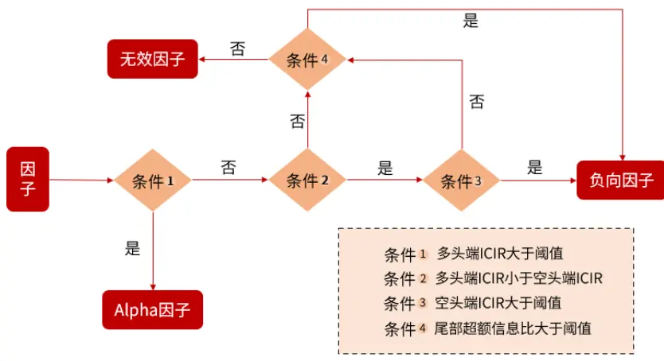
资料来源：光大证券研究所

## 5、负向因子筛选

上一章节中我们通过实证的方式测试了不同类型的负向因子的使用逻辑，并构造了负向因子筛选框架。本章节我们将从企业财务信息质量和企业盈余质量等角度入手，筛选出符合条件的负向因子。

## 5.1、 财务报表粉饰带来的盈余调节风险

对于财务粉饰风险，需要关注的是企业财报的真实性。通过财务中的应收款项、存货等科目，我们希望找到企业进行财报粉饰的蛛丝马迹，以便筛选出存在财务粉饰风险的企业。

企业财务粉饰的主要目的之一是虚增利润，而对利润进行粉饰的手段之一是虚增应收账款。如果企业的应收账款账龄过长，意味着企业面临资金收不回的风险。应收账款相对于同期营业收入的比例增长过快，通常有着提前确认收入的嫌疑。

此外，企业存货增长过快也值得注意。一些行业的存货存在易于贬值的特征，如食品行业等，一旦食品滞销过期，这些存货的价值可能归零，由此让企业遭受巨额损失。如果企业存货相对营业成本增长过快，我们有理由怀疑企业有通过加大生产从而降低单位成本，进而提升毛利率来进行财务粉饰的可能。

表 17：财务粉饰风险因子明细

| 因子简称 | 因子名称 | 因子计算方式 |
| --- | --- | --- |
| ASSETSTURN | 总资产周转率 | 销售收入/总资产平均净值 |
| ASSETSTURN_INDEX | 总资产周转率指数 | 总资产周转率同比变化 |
| INVENTORIES_OPER | 存货周转率 | 存货/营业收入 |
| INVENTORIES_INDEX | 存货周转率指数 | 本期存货占营业收入比例-上年同期存货占营业收入比例 |
| ACCT_INDEX | 应收账款指数 | 本期应收账款占营业收入比例-上年同期应收账款占营业收入比例 |
| NETCASHPROFIT_INDEX | 净现率指数 | 本期净现率-上年同期净现率,净现率=本期经营现金流量净额占净利润比例 |
| ASSETSQUALITY_INDEX | 资产质量指数 | 本期的非实物资产比例-上年同期的非实物资产比例，非实物资产比例=1-(固定资产+流通 资产）/总资产 |
| ACCRUED_PROFIT | 应计利润 | (营业利润-经营性现金流)/上一期总资产 |
| ACCRUED_INDEX | 应计利润指数 | 本期应计利润-上年同期应计利润 |
| OTH_ACCT | 其他应收账款占比应收款 | 其他应收账款/(其他应收账款+应收账款) |
| PREPAY_OPER | 预付账款比营收 | 预付款项/营业收入 TTM |
| PREPAY_CURASSETS | 预付账款占比流动资产 | 预付款项/流动资产合计 |
| NONOPER_OPER | 非营业收入占比 | 营业外收入/营业收入 |
| OPER_CASHFLOWS | 营收比筹资活动现金流量净额 | 营业收入/筹资活动产生的现金流量净额 |
| PROFITTOGR | 营业总收入比净利润 | 营业总收入/净利润 |
| BADDEBT_ACCT | 应收账款坏账占比 | 坏账准备/应收账款 |
| ACCT_AGING | 应收账款账龄 | 全部应收账款与其对应账龄的乘积/全部应收账款 |
| OTH_AGING | 其他应收款账龄 | 计算方式同应收账款账龄 |
| BADDEBT_OTH | 其他应收款坏账占比 | 计算方式同应收账款账龄 |

资料来源：光大证券研究所

## 5.2、 财务异常风险

企业的财务异常风险，主要关注公司销售的增长情况。汪荣飞和张然(2018)1认为现金流量表中的销售商品、提供劳务收到的现金预期比营业收入更真实地反映公司的销售增长状况。于是使用此指标的季度同比变动作为企业的正常增长乘数，进而构建了基于存货等 6 个基本面异常指标。

如果公司与生产经营相关的基本面指标与预期正常增长偏离过大，即定义为异常变动。我们在此基础上对指标进行拓展。

表 18：财表务异常风险因子明细

| 因子简称 | 因子名称 | 因子计算方式 |
| --- | --- | --- |
| AB_INV | 异常存货 | -(当期存货-上年同期存货*正常增长乘数)/当期总资产 |
| AB_ACCT | 异常应收款 | -(当期应收账款-上年同期应收账款*正常增长乘数)/当期总资产 |
| AB_OTH | 异常其他应收款 | -(当期其他应收账款-上年同期其他应收账款*正常增长乘数)/当期总资产 |
| AB_ADV | 异常预收款 | (当期预收款项-上年同期预收款项*正常增长乘数)/当期总资产 |
| AB_SGA | 异常销售管理费用 | -(当期(减:销售费用+减:管理费用)-上年同期(减:销售费用+减:管理费用)*正常增长乘数)/当 期总资产 |
| AB_GPOA | 异常毛利润 | (当期毛利-上年同期毛利*正常增长乘数)/当期总资产 |
| AB_OPERPROFIT | 异常营业利润 | (当期营业利润-上年同期营业利润*正常增长乘数)/当期总资产 |
| AB_OPERCOST | 异常营业成本 | -(当期营业总成本-上年同期营业总成本*正常增长乘数)/当期总资产 |
| AB_TAX | 异常所得税 | -(当期所得税-上年同期所得税*正常增长乘数)/当期总资产 |

资料来源：光大证券研究所；注：正常增长乘数=当期销售商品、提供劳务收到的现金除以上年同期销售商品、提供劳务收到的现金

## 5.3、 激进扩张带来的经营风险

高成长企业一般能够获得更高的估值溢价，如果企业的成长性无法维持，可能面临着估值和业绩双重风险。短期营收增速过快、商誉占净资产比例过高的企业，更有可能采取了非常激进的发展模式。因此，此类企业更有可能面临成长风险。

表 19：成长风险因子明细

| 因子简称 | 因子名称 | 因子计算方式 |
| --- | --- | --- |
| ASSETS_YOY | 总资产增长率 | 资产总计相对年初增长率 |
| GOODWILL_NETASSETS | 商誉净资产比例 | 商誉/净资产 |
| OPER_GROWTHRATE | 3年营收增长率 | 3年营业收入增长率 |
| TOTASSETS_GROWTHRATE | 3年资产增长率 | 3年资产总计增长率 |
| FREE_OPER_CASH | 自由现金流比经营现金流 | 企业自由现金流/经营活动产生的现金流量净额 |
| GOODWILL_NETASSETS_ABS | 商誉净资产比例绝对值 | 商誉/净资产绝对值 |
| INTANG_TOT_ASSETS | 无形资产占比总资产 | 无形资产/总资产 |

资料来源：光大证券研究所

## 5.4、 现金流风险

企业的现金流较不乐观直接体现出企业的现金流风险。企业经营活动产生的现金流过低可能存在两个方面的问题：一是应收账款过多导致现金流转不畅；二是企业将现金用于生产经营，但是由于存货滞销等因素导致现金流不乐观。

如果企业的经营活动现金流净额过低，企业很难购建新的固定资产和无形资产来扩大经营。此外，企业现金流过低也会导致其面临偿债风险。

表 20：现金流风险因子明细

| 因子简称 | 因子名称 | 因子计算方式 |
| --- | --- | --- |
| CURRENT | 流动比率 | 流动资产/流动负债 |
| QUICK | 速动比率 | 速动资产/流动负债 |
| EBITTOINTEREST | 利息保障倍数 | 税前利润总额/利息费用 |
| DEBTTOASSETS | 资产负债率 | 总负债/总资产 |
| DEBTTOEQUITY | 产权比率 | 总负债/股东权益 |
| WithInterestDebtRate | 传统有息负债率 | (短期借款+长期借款+应付债券)/总资产 |
| WithInterestDebtRate1 | 宽松有息负债率 | (短期借款+应付利息+交易性金融负债+应付短期债券+租赁负债+长期借款+应付债券+ 长期应付款+其他流动负债+划分为持有待售的负债+一年内到期的非流动负债)/总资产 |
| WithInterestDebtRate2 | 严苛有息负债率 | (短期借款+应付利息+交易性金融负债+应付短期债券+租赁负债+长期借款+应付债券+ 长期应付款)/总资产 |

资料来源：光大证券研究所

## 5.5、 管理风险

对于公司管理方面，虽然管理薄弱的企业在短期上并不一定体现出风险，但是长期管理能力不佳的企业更有可能存在风险。如管理费用率，如果企业的管理费用率同比增长过高，说明企业的管理费用逐年提高，企业的利润被管理费用消耗过多，企业必须加强管理控制才能提高盈利水平。

表 21：管理风险因子明细

| 因子简称 | 因子名称 | 因子计算方式 |
| --- | --- | --- |
| NO1HOLDER_PCT | 第一大股东股权集中度 | 第一大股东持股比例 |
| GERL_OPER_YOY | 管理费用率同比增长率 | 季度管理费用率同比增长率;季度管理费用率=管理费用/营业收入 |
| RELATRADING_NETASSETS | 关联进货销货占比净资产 | (向关联方采购产品金额合计+向关联方销售产品金额合计)/净资产绝对值 |
| RELAMA_TOTASSTES_3Y | 3年关联并购占比总资产 | 3年内关联并购总金额/过去3年平均总资产 |
| RELATRADING_COUNT_Q | 关联交易次数 | 1季度内公司关联交易记录次数 |

资料来源：光大证券研究所

## 5.6、 负向因子库精选

我们对上述因子计算了多头 ICIR、空头 ICIR 以及尾部 5%相对基准信息比，按照上一章节构造的负向因子筛选框架进行分析，最终选出了以下 11 个变量作为负向因子精选库。

表 22：负向因子精选库

| 因子类别 | 因子简称 | 因子名称 | 负向因子分类 |
| --- | --- | --- | --- |
| 筹资风险 | EBITTOINTEREST | 利息保障倍数 | 多头无效、空头有效 |
| 经营风险 | ASSETSTURN | 总资产周转率 | 多头无效、空头有效 |
|  | ASSETSTURN_YOY | 总资产周转率变动 | 多头无效、空头有效 |
|  | INVENTORIES_INDEX | 存货指数 | 多头无效、空头有效 |
|  | NETCASHPROFIT_INDEX | 净现率指数 | 多头无效、空头有效 |
|  | PROFITTOGR | 营业总收入比净利润 | 多头无效、空头有效 |
| 财务异常风险 | ABINV | 异常存货 | 尾部有效 |
|  | ABREC | 异常应收账款 | 尾部有效 |
|  | ABOPREC | 异常其他应收款 | 尾部有效 |
| 现金流风险 | WithInterestDebtRate | 传统有息负债率 | 尾部有效 |
| 投资风险 | ASSETS_YOY | 总资产增长率 | 多头无效、空头有效 |

资料来源：光大证券研究所

## 6、负向因子合成方法测试

按照上文的分类，我们实际上有两种负向因子，一类是多头端无效但空头端有效因子，还有一类是多头端无效但是空头端尾部有效的因子。对于单因子来说，每个负向因子剔除其空头 5%的股票均可提升基准策略表现，那么负向因子采用什么样的方法合成能够尽可能提升基准组合表现呢？本章节将对不同合成方法进行测试。

为了使测试更为完整，我们引入了几个额外的影响因素。

1.剔除的股票范围：在构建指数增强策略时我们一般会选择全市场作为股票池，同时增加约束条件使组合中一定比例的权重来自于基准指数成分股，以此来达到降低波动的效果。在进行负向剔除时，若包含较多的基准指数成分股，那么将加剧组合的波动，甚至在组合优化环节无法求解。因此，我们需要考虑被剔除的股票是否包括基准指数成分股。对于该问题我们设置了三种选股范围。

- 以指数成分股作为选股范围，剔除选股范围内负向因子组合排名靠前的股票。

- 以流动性 1500 股票池作为选股范围，剔除选股范围内负向因子组合排名靠前的股票。

- 以流动性 1500 股票池作为选股范围，剔除选股范围内非基准指数成分股中负向因子组合排名靠前的股票。

2.剔除阈值敏感性分析：剔除的股票数量也是影响策略表现的关键，在负向因子组合有效的情况下，剔除数量与策略表现应当满足先上升后下降的二次函数关系。被剔除的股票数量过多会降低 Alpha 因子的选股效果，进而降低策略表现。因此我们需要对剔除数量进行敏感性分析，选出最佳剔除数量。

针对该问题我们选择剔除尾部 1%—10%的股票来进行敏感性测试。

3.滚动因子分类：上文中的单因子测试均为全局测试，如果直接使用其测试结果对因子分类会引入未来信息。此外，根据过往研究发现，部分因子（如量价类因子）在 2016 年之前属于正向因子，而在之后其预测能力更多为空头所贡献。因此我们应该动态对因子进行分类。

后续的研究中我们主要测试负向因子的合成方法，并且在测试过程中将上述三个影响因素考虑进来。

## 6.1、 全部负向因子ICIR加权

第一种合成方法我们选择与 Alpha 因子一样的使用方式，对全部负向因子进行历史 ICIR 加权，合成为一个综合负向因子，最后剔除股票池中复合因子得分最低的股票。具体构造流程如下：

1.在选股范围内将因子进行 zscore 标准化，剔除因子量纲。

2.计算因子过去 252 个交易日的 ICIR，并根据 ICIR 加权构建综合负向因子。

3.选取综合负向因子排名最低的股票作为空头组合。

4.剔除选股范围内的空头组合。

该方法存在一个问题，对于空头端单调的因子来说，合成法或许可以提升表现，但是对于仅尾部有效的负向因子来说，加权合成法可能会引入噪音从而降低综合负向因子表现。

## 6.1.1、剔除范围测试

测试结果显示，只在流动性 1500 的非指数成分股中进行剔除操作，对策略的表现提升最为明显。沪深 300 增强策略年化收益从 13.74%提升到了 15.16%，中证 500 增强策略年化收益率从 16.91%提升至 18.10%。

表 23：全部负向因子 ICIR 加权剔除效果对——沪深 300

| 年化 年化 夏普 最大 最大回撤 最大回撤胜率 总收益率 换手率收益率波动率比率 回撤 起始日期 结束日期 |
| --- |
| 沪深 300 基准组合57.86%289.12%13.74%5.87%1.666.08%7.55%2020/8/52020/11/27 |
| 指数成分股剔除60.13%311.05%14.34%5.61%1.846.17%6.03% 2020/7/14 2020/11/27 |
| 流动性 1500 剔除61.10%320.01%14.57%5.88%1.805.89%5.78%2020/8/52020/11/27 |
| 流动性 150065.33% 343.15% 15.16% 5.76%1.946.13%5.34% 2020/7/14 2020/11/27非指数成分股剔除 |

资料来源：Wind，光大证券研究所；注：数据统计区间为 2011 年 1 月—2021 年 9 月，剔除阈值为 5%。

表 24：全部负向因子 ICIR 加权剔除效果对——中证 500

| 胜率 | 总收益率 | 年化 年化 收益率 波动率 |
| --- | --- | --- |
|  | 夏普 换手率 比率 16.91% 5.65% 2.28 |  |
| 6.95% 6.06% 2019/1/31 2019/3/8 | 中证 500 基准组合 56.76% 420.08% |  |
| 指数成分股剔除 流动性1500 剔除 | 58.15% 433.12% 17.19% 5.51% 2.39 |  |
| 60.08% 430.10% 17.13% 5.68% | 6.77% 5.02% 2019/1/31 2019/3/8 2.31 7.12% 6.01% 2019/2/3 2019/3/8 |  |

资料来源：Wind，光大证券研究所；注：数据统计区间为 2011 年 1 月—2021 年 9 月，剔除阈值为 5%。

## 6.1.2、剔除阈值敏感性分析

如下两图分别为不同空头个股剔除阈值下，沪深300 增强策略和中证 500 增强策略的年化超额收益。结果可以看出，策略收益的提升与剔除百分比呈先上升后下降的关系。当剔除的股票数量过多时，会降低模型的稳定性。根据回测结果可发现，剔除的个股比例在4%-6%之间时，增强策略的超额收益提升幅度较大。

图 17：负向因子 ICIR 加权在不同阈值下的表现（沪深 300）
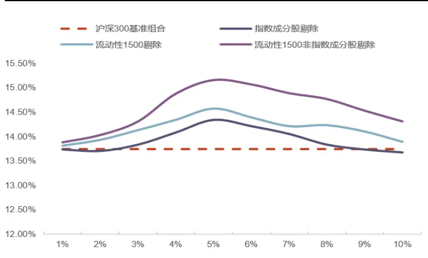
资料来源：Wind，光大证券研究所

图 18：负向因子 ICIR 加权在不同阈值下的表现（中证 500）
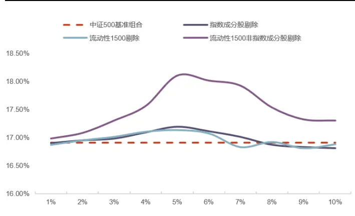
资料来源：Wind，光大证券研究所

## 6.2、 全部负向单因子组合复合

由于单个负向因子的空头端均对组合有提升作用，那么我们可以基于单个负向因子构建空头组合，然后将多个负向单因子的空头组合取交集或并集构建多因子空头组合。具体构造方式如下：

1.在选股范围内对每一个负向因子计算其空头组合。

2.对每一个负向单因子的空头组合求交集和并集，构造负向因子复合组合。

3.剔除选股范围内的负向因子复合组合。

这种方式构建的组合集成了所有单因子的负向预测能力，排除了 ICIR 加权法会引入噪音的问题。

## 6.2.1、剔除范围测试

测试结果显示，所有因子采用组合复合的方式进行剔除的效果一般，同样是只在流动性 1500 的非指数成分股中进行剔除操作，对策略的表现提升最为明显。

表 25：全部负向单因子组合复合剔除效果对比——沪深 300

| 胜率 | 总收益率 收益率 | 年化 年化 波动率 | 夏普 换手率 比率 | 最大 回撤 | 最大回撤 起始日期 |
| --- | --- | --- | --- | --- | --- |
| 沪深 300 基准组合 57.86% | 289.12% | 13.74% 5.87% | 1.66 6.08% | 7.55% 2020/8/5 | 结束日期 2020/11/27 |
| 指数成分股剔除 57.31% | 259.87% 12.91% | 5.93% 1.50 | 6.10% 6.01% | 2020/8/5 | 2020/11/27 |
| 流动性 1500 剔除 59.10% | 280.41% | 13.50% 5.88% 1.62 | 6.32% 7.71% | 2020/8/5 | 2020/11/27 |
| 流动性 1500 非指数成分股剔除 | 61.20% 298.58% 14.01% 5.91% | 1.69 | 6.21% | 7.54% 2020/8/5 2020/11/27 |  |

资料来源：Wind，光大证券研究所；注：数据统计区间为 2011 年 1 月—2021 年 9 月，剔除阈值为 5%。

表 26：全部负向单因子组合复合剔除效果对比——中证 500

|  | 胜率 | 总收益率 | 年化 年化 收益率 波动率 | 夏普 比率 | 最大 最大回撤 换手率 回撤 |
| --- | --- | --- | --- | --- | --- |
| 中证 500 基准组合 | 56.76% | 420.08% | 16.91% 5.65% | 2.28 6.95% | 起始日期 结束日期 6.06% 2019/1/31 2019/3/8 |
| 指数成分股剔除 | 56.31% | 417.12% 16.86% | 5.68% 2.26 | 6.77% | 6.13% 2019/1/31 2019/3/8 |
| 流动性 1500 剔除 |  | 423.10% 16.98% | 5.75% 2.26 | 6.34% 2019/1/31 | 2019/3/8 |
| 流动性 1500 | 56.89% 58.13% |  | 431.52% 17.16%5.61% 2.35 | 6.59% 6.78% | 6.78% 2019/1/31 2019/3/8 |

资料来源：Wind，光大证券研究所；注：数据统计区间为 2011 年 1 月—2021 年 9 月，剔除阈值为 5%。

## 6.2.2、剔除阈值敏感性分析

通过敏感性测试可以看出，随着剔除的股票数量增多，模型的表现逐渐降低。
剔除的个股比例超过 5%时，增强策略的超额收益下降明显加快。

图 19：负向因子 ICIR 加权在不同阈值下的表现（沪深 300）
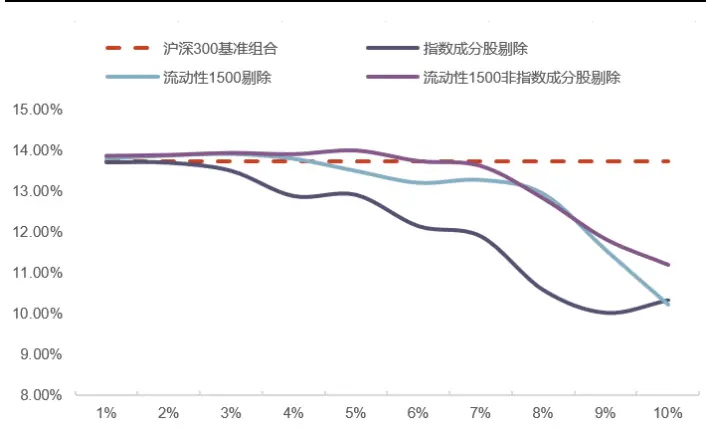
资料来源：Wind，光大证券研究所

图 20：负向因子 ICIR 加权在不同阈值下的表现（中证 500）
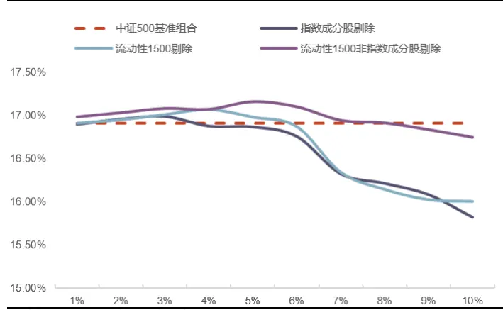

资料来源：Wind，光大证券研究所

## 6.3、 ICIR加权与组合复合相结合

对于多头无效，空头有效的因子来说，其空头端具有单调性，因此使用 ICIR 加权合成方法更能发挥其空头预测能力。而对于多空均无效，但是空头端尾部有效的因子来说，使用加权法会引入较多的噪音，从而降低其它负向因子的预测能力，因此使用组合复合法更有效。

由此，我们考虑对空头单调的因子使用 ICIR 加权法合成，对空头尾部有效的因子进行组合复合法合成，最后再将二者筛选出的空头组合取交集或并集构造负向因子组合。具体构造方式如下：

1.对于多头无效，空头有效的因子，先对单因子进行 zscore 标准化，然后计算其历史 252 个交易日的 ICIR 加权合成。将合成因子排名最低的 5%股票作为空头因子组合。

2.对于空头尾部有效的因子，分别计算其单因子的空头组合，然后取所有空头组合的交集作为空头复合组合。

3.将空头因子组合与空头复合组合取交集作为最终的空头组合。

4.剔除选股范围内的空头组合。

## 6.3.1、剔除范围测试

测试结果显示，ICIR 加权与组合复合法结合效果明显。不同股票池方面来看，在流动性 1500 的非指数成分股中进行剔除操作，对策略的表现提升最为明显。沪深 300 指数增强策略年化收益率从 13.74%提升至 14.95%。中证 500指数增强策略的超额收益率从 16.91%提升至 17.57%。

表 27：ICIR 加权与组合复合相结合剔除效果对比——沪深 300

| 年化 年化 夏普 胜率 总收益率 换手率 |
| --- |
| 最大 最大回撤 最大回撤 收益率 波动率 比率 回撤 起始日期 沪深 300 基准组合 57.86% 289.12% 13.74% 5.87% 1.66 6.08% 7.55% 2020/8/5 |
| 结束日期 2020/11/27 2020/11/27 |
| 指数成分股剔除 60.17% 305.85% 14.20% 5.62% 1.81 6.11% 7.13% 2020/8/5 |
| 流动性 1500 剔除 61.31% 310.43% 14.32% 5.51% 1.87 6.98% 7.59% 2020/8/5 2020/11/27 流动性 1500 |
| 66.89% 334.97% 14.95% 5.53% 1.98 6.88% 7.64% 2020/8/5 2020/11/27 |

资料来源：Wind，光大证券研究所；注：数据统计区间为 2011 年 1 月—2021 年 9 月，剔除阈值为 5%。

表 28：ICIR 加权与组合复合相结合剔除效果对比——中证 500

|  | 胜率 总收益率 | 年化 年化 夏普 收益率 波动率 |
| --- | --- | --- |
| 中证 500 基准组合 56.76% 420.08% 16.91% | 换手率 比率 5.65% 2.28 |  |
| 6.95% 6.06% 2019/1/31 |  |  |
| 指数成分股剔除 流动性1500 剔除 58.10% | 58.31% 422.45% 16.97% 5.58% 2.32 |  |
| 443.45% 17.41% | 6.47% 6.10% 2019/1/31 2019/3/8 5.51% 2.43 6.31% 5.79% 2019/1/31 2019/3/8 |  |

资料来源：Wind，光大证券研究所；注：数据统计区间为 2011 年 1 月—2021 年 9 月，剔除阈值为 5%。

## 6.3.2、剔除阈值敏感性分析

通过敏感性测试可知，剔除阈值在 4%-6%时提升效果最为明显，当剔除数量超过 6%时，策略表现加速下滑。

图 21：负向因子 ICIR 加权在不同阈值下的表现（沪深 300）
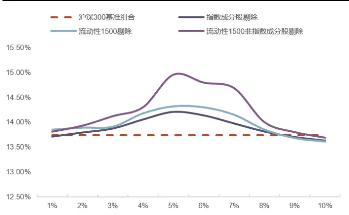
资料来源：Wind，光大证券研究所

图 22：负向因子 ICIR 加权在不同阈值下的表现（中证 500）
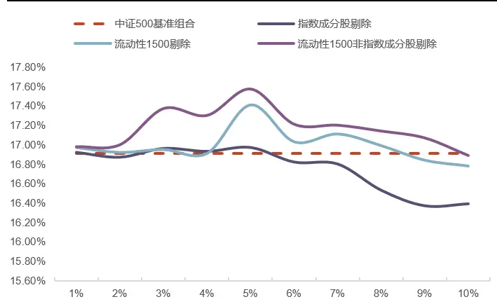
资料来源：Wind，光大证券研究所

## 7、总结与展望

本文通过实证的方式对股票池优化过程进行了全面分析。我们认为，股票池优化的目标是保证可交易性的同时提升质量。据此，我们构造了两层优化：第一层为刚性优化，目的是保证股票可交易；第二层为柔性优化，目的是提升股票池质量。

刚性优化方面，我们剔除了影响股票可交易性的因素，例如风险警示股票（ST/*ST）、次新股、低流动性、极小市值以及净资产为负等股票。同时我们参考了中证指数编制方案中的缓冲区规则，引入“粘性剔除”机制降低了股票池周转率。最终构造了流动性 1500 股票池代替全市场股票池。回测对比发现，流动性 1500 股票池在保证了因子有效性的前提下提升了股票的可交易性。

柔性优化方面，我们认为多空均可贡献收益的单调因子并不属于负向因子，只有因子在多头收益不强，但是空头预测能力强时才可算作负向因子。据此，我们构建了负向因子筛选流程，并且从多个财务分析维度筛选了 11 个负向因子。

最后，我们对负向因子组合使用的方式进行了较为全面的测试，分别从合成方式、剔除范围以及敏感性分析几个角度进行了实证研究。结果发现对于合成方法来说，对空头单调的因子进行 ICIR 加权效果最好，对空头尾部有效的因子使用组合复合法效果最好。对于剔除范围来说，对流动性 1500 中非指数成分股进行剔除效果最好。对于剔除阈值来说，选择剔除 4%-6%对策略提升最为明显。

在后续的报告中我们将继续完成股票池优化框架，对事件驱动型负面清单进行研究，最终将为各位投资者呈现一个更为完善的股票池优化方案。

## 8、 风险提示

报告结果均基于历史数据，历史数据存在不被重复验证的可能。

## 行业及公司评级体系

| 评级 说明 |  |  |
| --- | --- | --- |
|  | 买入 | 未来6-12个月的投资收益率领先市场基准指数15%以上 |
| 行业及公司评级 | 增持 | 未来 6-12 个月的投资收益率领先市场基准指数 5%至 15%； |
|  | 中性 | 未来6-12个月的投资收益率与市场基准指数的变动幅度相差-5%至5%； |
|  | 减持 | 未来 6-12 个月的投资收益率落后市场基准指数 5%至15%; |
|  | 卖出 | 未来6-12个月的投资收益率落后市场基准指数15%以上； |
|  | 无评级 | 因无法获取必要的资料，或者公司面临无法预见结果的重大不确定性事件，或者其他原因，致使无法给出明确的投资评级。 |
| 基准指数说明： |  | A股主板基准为沪深300指数；中小盘基准为中小板指；创业板基准为创业板指；新三板基准为新三板指数；港股基准指数为恒 生指数。 |

## 分析、估值方法的局限性说明

本报告所包含的分析基于各种假设，不同假设可能导致分析结果出现重大不同。本报告采用的各种估值方法及模型均有其局限性，估值结果不保证所涉及证券能够在该价格交易。

## 分析师声明

本报告署名分析师具有中国证券业协会授予的证券投资咨询执业资格并注册为证券分析师，以勤勉的职业态度、专业审慎的研究方法，使用合法合规的信息，独立、客观地出具本报告，并对本报告的内容和观点负责。负责准备以及撰写本报告的所有研究人员在此保证，本研究报告中任何关于发行商或证券所发表的观点均如实反映研究人员的个人观点。研究人员获取报酬的评判因素包括研究的质量和准确性、客户反馈、竞争性因素以及光大证券股份有限公司的整体收益。所有研究人员保证他们报酬的任何一部分不曾与，不与，也将不会与本报告中具体的推荐意见或观点有直接或间接的联系。

## 法律主体声明

本报告由光大证券股份有限公司制作，光大证券股份有限公司具有中国证监会许可的证券投资咨询业务资格，负责本报告在中华人民共和国境内（仅为本报告目的，不包括港澳台）的分销。本报告署名分析师所持中国证券业协会授予的证券投资咨询执业资格编号已披露在报告首页。

中国光大证券国际有限公司和 Everbright Securities(UK) Company Limited 是光大证券股份有限公司的关联机构。

## 特别声明

光大证券股份有限公司（以下简称“本公司”）创建于 1996 年，系由中国光大（集团）总公司投资控股的全国性综合类股份制证券公司，是中国证监会批准的首批三家创新试点公司之一。根据中国证监会核发的经营证券期货业务许可，本公司的经营范围包括证券投资咨询业务。

本公司经营范围：证券经纪；证券投资咨询；与证券交易、证券投资活动有关的财务顾问；证券承销与保荐；证券自营；为期货公司提供中间介绍业务；证券投资基金代销；融资融券业务；中国证监会批准的其他业务。此外，本公司还通过全资或控股子公司开展资产管理、直接投资、期货、基金管理以及香港证券业务。

本报告由光大证券股份有限公司研究所（以下简称“光大证券研究所”）编写，以合法获得的我们相信为可靠、准确、完整的信息为基础，但不保证我们所获得的原始信息以及报告所载信息之准确性和完整性。光大证券研究所可能将不时补充、修订或更新有关信息，但不保证及时发布该等更新。

本报告中的资料、意见、预测均反映报告初次发布时光大证券研究所的判断，可能需随时进行调整且不予通知。在任何情况下，本报告中的信息或所表述的意见并不构成对任何人的投资建议。客户应自主作出投资决策并自行承担投资风险。本报告中的信息或所表述的意见并未考虑到个别投资者的具体投资目的、财务状况以及特定需求。投资者应当充分考虑自身特定状况，并完整理解和使用本报告内容，不应视本报告为做出投资决策的唯一因素。对依据或者使用本报告所造成的一切后果，本公司及作者均不承担任何法律责任。

不同时期，本公司可能会撰写并发布与本报告所载信息、建议及预测不一致的报告。本公司的销售人员、交易人员和其他专业人员可能会向客户提供与本报告中观点不同的口头或书面评论或交易策略。本公司的资产管理子公司、自营部门以及其他投资业务板块可能会独立做出与本报告的意见或建议不相一致的投资决策。本公司提醒投资者注意并理解投资证券及投资产品存在的风险，在做出投资决策前，建议投资者务必向专业人士咨询并谨慎抉择。

在法律允许的情况下，本公司及其附属机构可能持有报告中提及的公司所发行证券的头寸并进行交易，也可能为这些公司提供或正在争取提供投资银行、财务顾问或金融产品等相关服务。投资者应当充分考虑本公司及本公司附属机构就报告内容可能存在的利益冲突，勿将本报告作为投资决策的唯一信赖依据。

本报告根据中华人民共和国法律在中华人民共和国境内分发，仅向特定客户传送。本报告的版权仅归本公司所有，未经书面许可，任何机构和个人不得以任何形式、任何目的进行翻版、复制、转载、刊登、发表、篡改或引用。如因侵权行为给本公司造成任何直接或间接的损失，本公司保留追究一切法律责任的权利。所有本报告中使用的商标、服务标记及标记均为本公司的商标、服务标记及标记。

光大证券股份有限公司版权所有。保留一切权利。

光大证券研究所

上海

北京

深圳

静安区南京西路 1266 号

西城区武定侯街 2 号

福田区深南大道 6011 号

恒隆广场 1 期办公楼 48 层

泰康国际大厦 7 层

NEO 绿景纪元大厦 A 座 17 楼

光大证券股份有限公司关联机构

香港

英国

中国光大证券国际有限公司

Everbright Securities(UK) Company Limited

香港铜锣湾希慎道 33 号利园一期 28 楼

64 Cannon Street，London，United Kingdom EC4N 6AE