## 金融工程

# 高质量股票池构造体系Ⅱ：事件型风险研究——量化选股系列之六

## 要点

高质量股票池构造框架：在前篇报告《高质量股票池构造体系——量化选股系列报告之五》中，我们从真实交易环境出发，提出了一个三层股票池构造框架，包括原始股票池、刚性优化股票池以及柔性优化股票池。刚性优化保证了股票可交易，柔性优化提升了股票池质量。本文延续之前的优化框架，在柔性优化部分进行了进一步研究。对负向事件进行了梳理研究，将其划分成可预测和不可预测两部分。

## 不可预测负向事件研究

事件是否具备可预测性一般需要主观分析判断，对于不可预测事件来说，若负向收益发生在事件发生后，可以通过及时监测并剔除涉事股票的方式避免损失扩大。

我们从两个维度选取了若干不可预测负向事件进行测试。具体来说，包括基本面和经营层面共 8 个事件，测试时间区间为 2010 年 1 月 4 日至 2021 年 12 月 31日。经测试，跟踪并剔除涉及负向事件的股票能够有效的提升组合表现，月度平均胜率可以达到 77.08%。

## 可预测负向事件研究

我们认为公司陷入财务危机是一个逐步的过程，反映在财务报表上的信息是可预测的。本文以财务报表为线索，参考了风控模型中常用的分箱思想构建了财务质量打分模型。

## 财务质量打分模型构建

我们首先整理了上市公司问题报表，根据是否由财务质量引起的问题对报表进行了提纯。此外，我们使用分箱法对财务指标和财务危机风险发生概率之间的关系进行刻画，引入 IV（Information Value）和 WOE（Weight of Evidence）指标对分箱效果进行评价。最终筛选出了 45 个有效财务指标对企业财务报告质量进行评分。

我们构建的财务质量打分模型能够有效的筛选出质量存疑的财务报告，构建的预警组合能够显著提升股票池质量。经测试，2016 年 3 月 1 日至 2022 年 4 月 29日期间，预警组合在沪深 300 和中证 500 股票池内均有显著负向收益。剔除预警组合后的剩余股票相对于预警组合超额收益明显，沪深 300 股票池中年化超额收益 12.50%，中证 500 股票池中年化超额收益 13.62%。

风险分析：报告结果均基于历史数据，历史数据存在不被重复验证的可能。

## 作者

分析师：祁嫣然

执业证书编号：S0930521070001

010-56513031

qiyanran@ebscn.com

## 联系人：曲虹宇

010-56513042

quhongyu@ebscn.com

## 相关研报

单因子组合优化在指数增强策略中的应用——

量化选股系列报告之一（2021-07-22）

高质量股票池构造体系——量化选股系列报告之五（2022-05-24）

## 1、高质量股票池构造框架回顾

在我们于 2022 年 5 月 24 日发布的前篇报告《高质量股票池构造体系——量化选股系列报告之五》中，我们从真实交易环境出发，提出了一个三层股票池构造框架，包括原始股票池、刚性优化股票池以及柔性优化股票池。刚性优化保证了股票可交易，柔性优化提升了股票池质量。

在柔性优化部分，我们仅针对负向因子进行了剔除，本文将延续之前的优化框架，对负向事件进行梳理研究。

图 1：高质量股票池构造流程
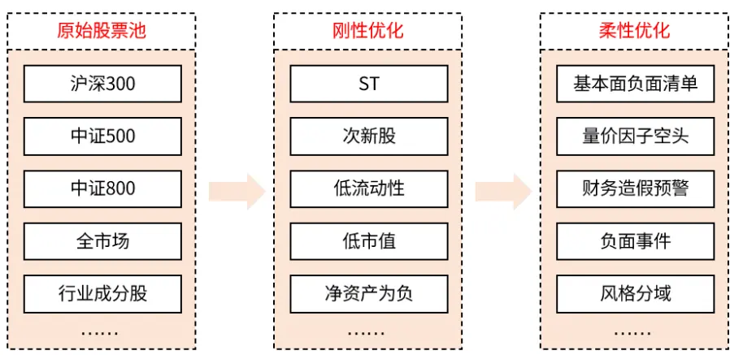
资料来源：光大证券研究所

## 1.1、 柔性优化回顾

柔性优化目的是提升股票池质量，我们在本系列的第一篇报告《单因子组合优化在指数增强策略中的应用——量化选股系列报告之一》中使用组合优化的方法对市场中常用单因子进行了测试，发现部分因子在多头端正向 Alpha 较弱，但是空头端负向 Alpha 较强。我们认为在当前的市场环境下此类因子纳入收益模型中很难提供增量信息，但是其空头端的负向预测能力可以加以利用。

柔性剔除的标准可以分成三种类型，分别需要使用不同方式建模分析：

1. 负向事件预测剔除：主要为财务造假预测，部分财务指标对于股票收益的预测能力较差，但是对于财务造假事件有预测能力。因此可以通过对财务造假事件进行建模预测，进而规避财务造假概率较高的股票。

2. 负向事件发生后剔除：部分负向事件发生后，股价会出现持续性下跌，如果在事件发生后及时将涉事股票剔除，也可以及时规避风险。

3. 负向因子剔除：因子型剔除的逻辑较为直接，寻找有负向预测能力的因子，剔除期望收益率最低的部分股票。

图 2：柔性剔除分类
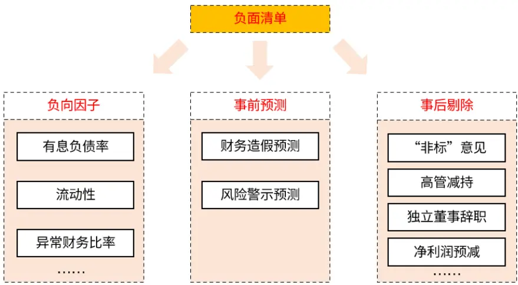
资料来源：光大证券研究所

## 1.2、 事件驱动型优化框架

事件驱动型包括财务造假、高管减持等特殊风险事件，均为离散变量。如果上市公司发生此类特殊风险事件，公司的基本面或股权等将发生变动。发生此类事件后，需要分析事件是否会驱动股价变动，进而决定剔除该股票与否。

对于有明显负向收益的事件，我们需要对该事件进行主观分析，判断其是否具有预测可能性。

1.对于不可预测的事件，若负向超额收益集中在事件发生后，那么我们可以对事件进行跟踪并及时将涉事股票剔除出股票池。

2.对于可预测事件，无论其负向超额收益发生在何时，我们均可构建模型进行预测，提前将涉事股票剔除。

下图展示了基于事件驱动的事后剔除型优化框架。

图 3：事件驱动型优化框架
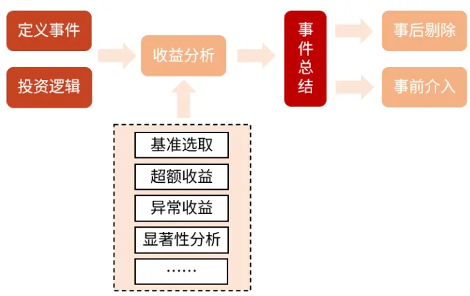
资料来源：光大证券研究所

## 1.3、 事件驱动测试流程

本文采用典型的事件研究法来考察上市公司在事件发生并发布公告后的市场反应。我们采用市场模型来估计预期收益率，并在此基础上计算出每日超额收益率AR 和累计超额收益率 ACAR。以 T+0 为事件发生日，选用[T-120,T-30]为模型的估计期，对下列模型进行估计：

$$
R_{i}^{t}=\alpha_{i}+\beta_{i}R_{m}^{t}+\varepsilon_{i}^{t}
$$

然后根据估计参数 $\alpha_{i}$ 和 $\beta_{i}$ ，计算事件窗口期[T-30,T+30]中第t日的超额收益和截至t日的平均累计超额收益，如下所示：

$$
\begin{array}{c}{{\displaystyle{\cal A}R_{i}^{t}=R_{i}^{t}-(\widehat\alpha_{\imath}+\widehat\beta_{\imath}R_{m}^{t})}}\\{{\displaystyle{\cal A}C{\cal A}R_{\imath}=\displaystyle\frac{1}{n}\sum_{i=1}^{n}\sum_{\tau=-30}^{t}{\cal A}R_{i}^{\tau}}}\end{array}
$$

其中， $R_{m}$ 为市场指数基准收益率，本文采用中证全指作为基准； $R_{i}$ 表示第i只股票的收益率。

图 4：事件驱动测试示意图
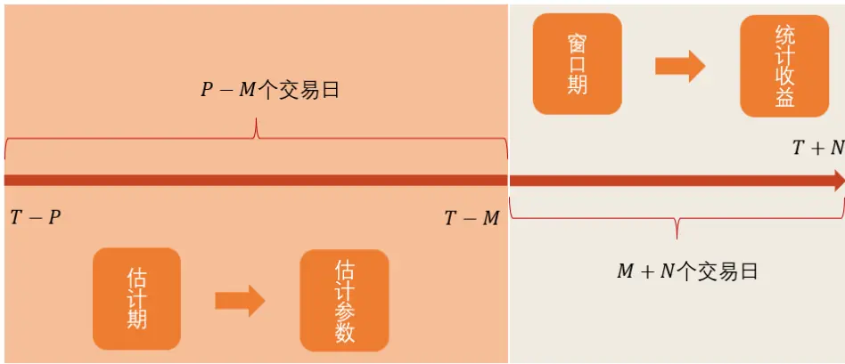
资料来源：光大证券研究所

## 2、不可预测负向事件跟踪

事件是否具备可预测性一般需要主观分析判断，对于不可预测事件来说，若负向收益发生在事件发生后，可以通过及时监测并剔除的方式避免损失扩大。本章节从两个维度选取了若干不可预测负向事件进行测试。具体来说包括基本面和经营层面。回测区间我们选取 2010 年 1 月至 2021 年 12 月。

## 2.1、 基本面负向事件

基本面维度负向事件的信息来源主要涉及业绩预告，我们将季报、半年报及年报的业绩预告均纳入研究范围中。报告类型共有 8 种，其中负向事件包括续亏、略减、预减和首亏。其具体含义如下表所示。

表 1：业绩预告负向事件含义

| 类型 | 含义 |
| --- | --- |
| 续亏 | 上年同期亏损，预告期亏损。不确定业绩相比于上年同期变化 |
| 略减 | 业绩相比上年同期下降幅度介于0%—50%之间 |
| 预减 | 业绩相比于上年同期下降幅度超过50% |
| 首亏 | 上年同期盈利，预告期亏损 |

资料来源：光大证券研究所

从事件发生数量上看，四种报告类型在各年度发生频率较为均匀，事件总数在各年度维持在 2000 左右。

回测结果上来看，四种类型报告均有显著负向超额收益。其中续亏类型的报告负向收益强度最大，在事件发生后 7 个交易日，平均累计超额收益达到-7.14%。

负向收益区间来看，在四种类型报告发布前对应股票均已经开始出现负向收益，市场反应在一定程度上会先于业绩公告数据，说明市场中存在“抢跑者”。负向收益大幅兑现则是集中于事件发生后 7 个交易日左右，及时跟踪并剔除涉及此类事件的股票可以避免回撤扩大。

图 5：业绩预告-续亏事件驱动回测
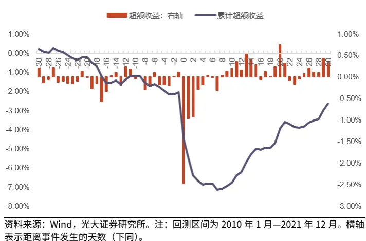

图 6：业绩预告-略减事件驱动回测
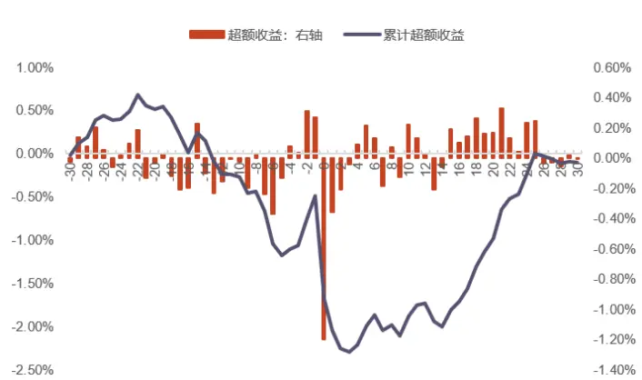
资料来源：Wind，光大证券研究所。注：回测区间为 2010 年 1 月—2021 年 12 月。

图 7：业绩预告-预减事件驱动回测
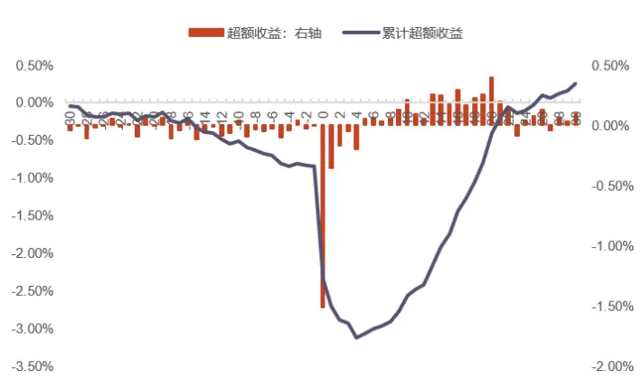
资料来源：Wind，光大证券研究所。注：回测区间为 2010 年 1 月—2021 年 12 月。

图 8：业绩预告-首亏事件驱动回测
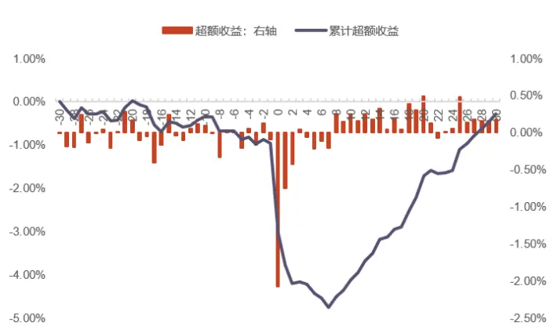
资料来源：Wind，光大证券研究所。注：回测区间为 2010 年 1 月—2021 年 12 月。

表 2：业绩预告负向事件发生次数统计

| 会计年度 | 业绩预告-略减 | 业绩预告-续亏 | 业绩预告-预减 | 业绩预告-首亏 |
| --- | --- | --- | --- | --- |
| 2010 | 60 | 151 | 190 | 156 |
| 2011 | 138 | 149 | 242 | 175 |
| 2012 | 602 | 191 | 715 | 428 |
| 2013 | 710 | 343 | 700 | 450 |
| 2014 | 605 | 409 | 563 | 521 |
| 2015 | 572 | 478 | 649 | 676 |
| 2016 | 560 | 523 | 608 | 524 |
| 2017 | 569 | 438 | 517 | 393 |
| 2018 | 712 | 378 | 780 | 558 |
| 2019 | 624 | 415 | 898 | 752 |
| 2020 | 482 | 488 | 942 | 1119 |
| 2021 | 129 | 531 | 500 | 553 |

资料来源：Wind，光大证券研究所。注：数据区间为 2010 年—2021 年。

## 2.2、 经营层面负向事件

经营层面负向事件主要涉及公司经营活动相关事件，例如违规、立案调查、高管离职等。部分事件对股价的负向冲击明显，但是预测难度较高。我们测试了其中的四类事件分别为：公司改名、立案调查、董事长离职以及高管减持超过 10%。

回测结果上来看，四种事件均有显著负向超额收益。其中立案调查事件的负向收益强度最大，在事件发生后 7 个交易日，平均累计超额收益达到-13%。

负向收益区间来看，涉及四种事件的个股在事件发生后均有持续的负向收益，其中公司改名事件负向收益延续长达 30 个交易日。及时跟踪并剔除涉及此类事件的股票可以避免回撤扩大。

图 9：公司改名事件驱动回测
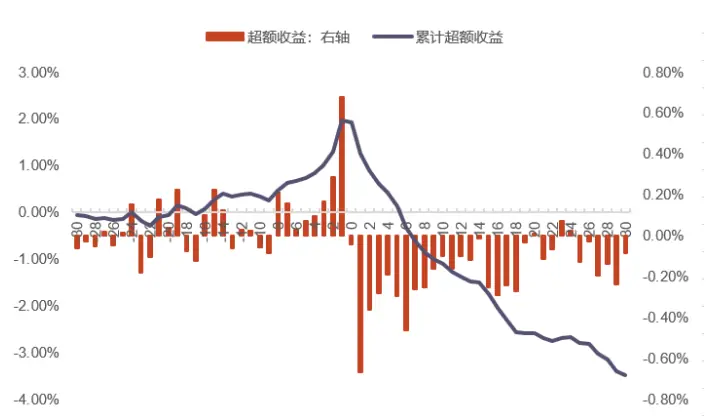
资料来源：Wind，光大证券研究所。注：回测区间为 2010 年 1 月—2021 年 12 月。

图 10：高管减持超过 10%事件驱动回测
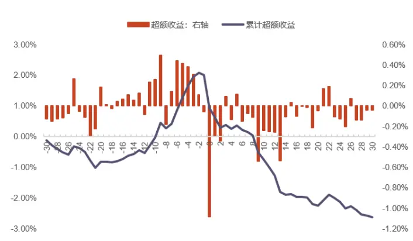
资料来源：Wind，光大证券研究所。注：回测区间为 2010 年 1 月—2021 年 12 月。

图 11：立案调查事件驱动回测
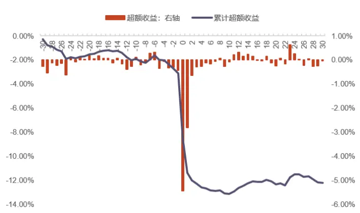
资料来源：Wind，光大证券研究所。注：回测区间为 2010 年 1 月—2021 年 12 月。

图 12：董事长离职事件驱动回测
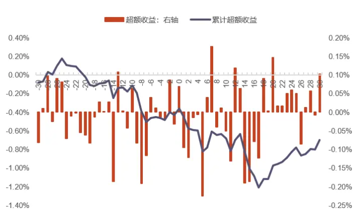
资料来源：Wind，光大证券研究所。注：回测区间为 2010 年 1 月—2021 年 12 月。

表 3：经营层面负向事件发生次数统计

| 会计年度 | 公司改名 | 立案调查 | 董事长离职 | 高管减持比例超过 10% |
| --- | --- | --- | --- | --- |
| 2010 | 33 | 10 |  |  |
| 2011 | 43 | 7 |  |  |
| 2012 | 40 | 5 | 173 | 1 |
| 2013 | 43 | 15 | 193 |  |
| 2014 | 91 | 18 | 235 | 1 |
| 2015 | 137 | 45 | 272 | 1 |
| 2016 | 141 | 35 | 323 | 1 |
| 2017 | 97 | 45 | 328 | 316 |
| 2018 | 90 | 51 | 348 | 1219 |
| 2019 | 75 | 73 | 364 | 2501 |
| 2020 | 88 | 68 | 414 | 3086 |
| 2021 | 88 | 62 | 438 | 2470 |

资料来源：Wind，光大证券研究所。注：数据区间为 2010 年—2021 年。其中“-”表示未收集到相关数据。

## 2.3、 不可预测负向事件跟踪剔除测试

根据上述负向事件的测试结果，我们构建负向事件跟踪剔除策略来测试剔除负向股票后的收益情况。具体做法为：

1.每个交易日在全市场中挑选出涉及上述负向事件的股票，并将其纳入负向股票池。

2.每个交易日在全市场股票池中剔除负向股票池中的股票，剩余股票等权买入。
等权买入全市场股票，作为比较基准。

3. 测试区间选择 2010 年 1 月 4 日至 2021 年 12 月 31 日。

测试结果如下图所示，负向事件剔除组合相对于基准组合超额收益稳健，及时剔除负向事件能够避免损失扩大。

图 13：不可预测负向事件跟踪剔除组合相对等权重组合净值表现
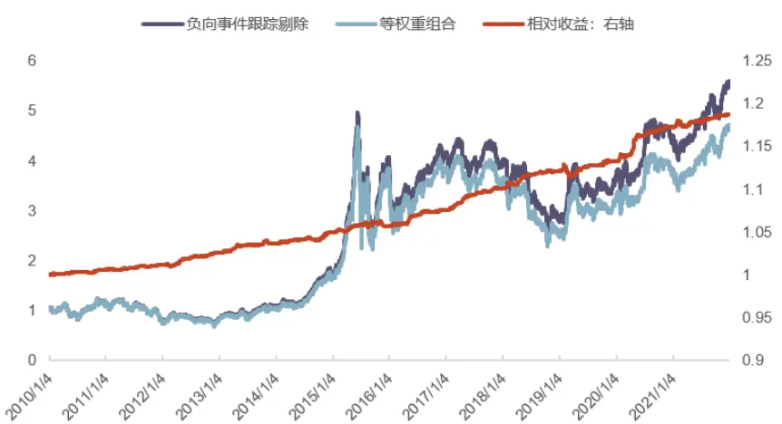
资料来源：Wind，光大证券研究所。注：数据区间为 2010.01.04—2021.12.31

表 4：不可预测负向事件跟踪剔除组合业绩表现
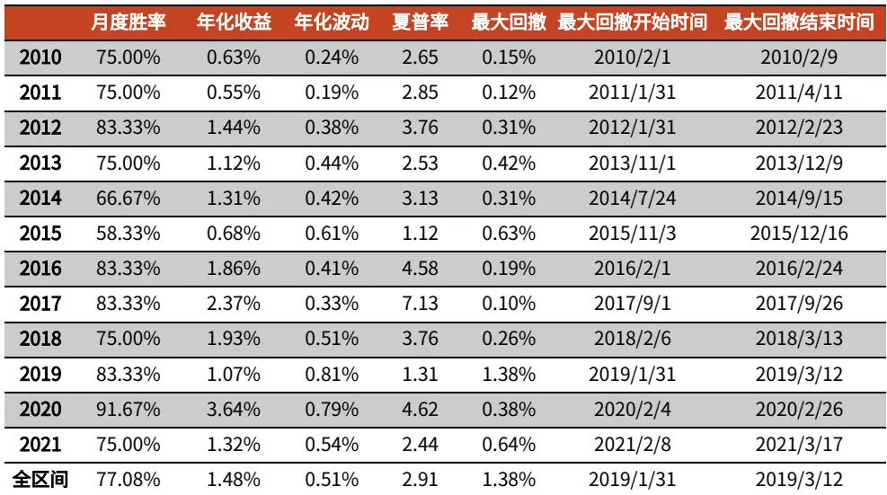
资料来源：Wind，光大证券研究所。注：数据区间为 2010.01.04—2021.12.31

## 3、可预测负向事件研究

学术界对于上市公司业绩“暴雷”做过大量研究，对于财务危机风险的预测已经有了成果。公司陷入财务危机是一个逐步的过程，通常由财务状况正常开始逐渐恶化，最终导致财务危机或破产。因此，公司的财务危机不但具有先兆，而且是可预测的。

本文将参考已有学术研究成果进行实证测试，以财务报表为线索，筛选出由财务问题导致的财务危机风险事件，并构造财务指标进行预测。希望能构造出一套可供投资者使用的财务危机风险预测模型。

## 3.1、 财务危机风险探究

对于财务危机风险，学术界有不同的定义方式。大体包括：

（1）股票被特别处理（ST/*ST）。

（2）公司受到监管处罚。

我们认为，与公司财务状况相关的财务危机是投资者需要关注的重点，而且公司财务恶化是一个过程，具备可预测性。因此我们将对上述两类事件进行提纯，只保留与公司财务状况相关的风险事件。

## 3.1.1、特别处理（ST/*ST）

特别处理（ST/*ST）与上市公司的财务危机风险有着紧密联系。我们对 2005 年至 2021 年之间特别处理的原因进行了统计，发现由于连续两年亏损的特别处理次数占总次数的 80.5%，显然这是特别处理最主要的原因。也即最近两个会计年度的净利润均为负数时，将发生财务危机风险。

数量上来看，随着近些年处罚力度的增强，2018 年以来被特别处理的企业总数增多，由亏损导致的被特别处理事件占比下降。

事件驱动测试结果来看，股票被特别处理前 30 个交易日至后 12 个交易日负向超额收益尤为明显，预测价值较高。

图 14：历年特别处理事件发生数量
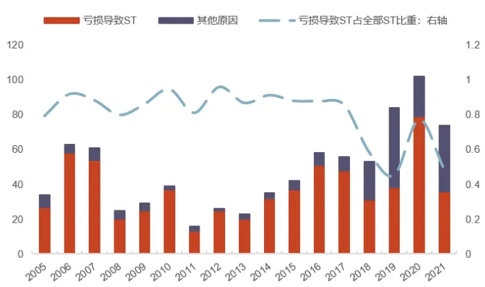
资料来源：Wind，光大证券研究所。注：数据区间为 2005.01.01—2021.12.31

图 15：特别处理事件驱动回测
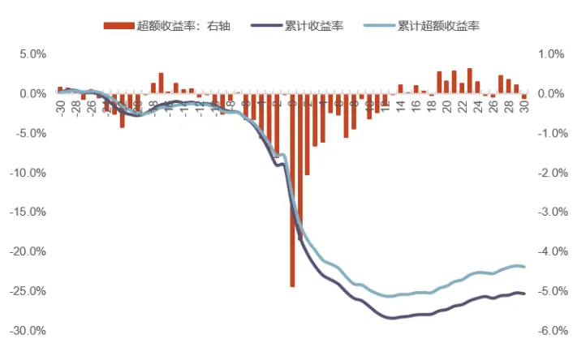
资料来源：Wind，光大证券研究所。注：数据区间为 2005.01.01—2021.12.31

综上，我们将特别处理事件作为财务危机风险的样本。此外，由于特别处理有多种原因，我们还对特别处理事件数据做了提纯处理，具体规则如下：

1.仅使用由于亏损导致的特别处理事件。

2.剔除由 ST 转为*ST 的特别处理事件。

3.剔除由 ST/*ST 转为退市的特别处理事件。

## 3.1.2、监管处罚

监管处罚相关数据均来自于 wind数据库的 AShareIllegality 数据表。我们从其中的两个维度作为切入点：

首先是被处罚标的与公司关系，包括公司本身、公司股东、公司高管等 7 种关系，根据需求，我们希望提取出能代表企业发生财务危机的报表，因此仅使用处罚标的为公司本身的样本。

其次是监管机构公布的处罚类型，共有五大类，包括（1）未按时披露定期报告（2）未及时披露公司重大事项（3）信息披露虚假或严重误导性陈述（4）业绩预测结果不准确或不及时（5）未依法履行其他职责。公司的处罚类型可包括一种或多种，我们剔除了上述类别中违规原因不明确的第五类。

从数量上来看，随着近些年监管力度加大，上市公司违规的数量有明显的上升。其中主要处罚原因为“未及时披露公司重大事项”和“信息披露虚假或严重误导性陈述”。

回测结果来看，2005 年-2021 年期间，未及时披露公司重大事项的负向超额收益更为持续和明显，在事件发生前后 30 个交易日均有显著负向收益。

最终我们将使用“未及时披露公司重大事项”和“信息披露虚假或严重误导性陈述”两种违规类型作为财务危机样本。

图 16：违规类型数量统计图
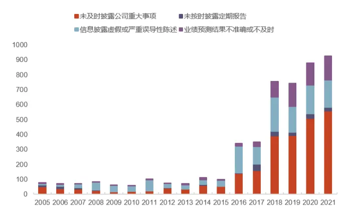
资料来源：Wind，光大证券研究所。注：数据区间为 2005.01.01—2021.12.31

图 17：监管处罚事件驱动回测
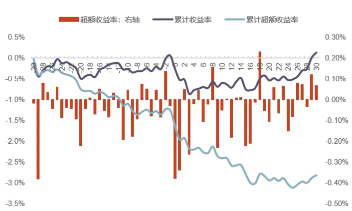
资料来源：Wind，光大证券研究所。注：数据区间为 2005.01.01—2021.12.31。监管处罚选取“未及时披露公司重大事项”和“信息披露虚假或严重误导性陈述”两种类型。

表 5：违规类型数量统计表

| 年份 | 未按时披露 定期报告 | 重大事项 | 未及时披露公司 信息披露虚假或业绩预测结果不 严重误导性陈述 | 准确或不及时 | 未依法履行 其他职责 |
| --- | --- | --- | --- | --- | --- |
| 2005 | 11 | 51 | 11 | 5 | 31 |
| 2006 | 17 | 37 | 12 | 5 | 32 |
| 2007 | 10 | 34 | 26 | 1 | 44 |
| 2008 | 3 | 24 | 53 | 2 | 72 |
| 2009 | 1 | 15 | 42 | 2 | 81 |
| 2010 | 0 | 20 | 37 | 3 | 125 |
| 2011 | 1 | 22 | 74 | 6 | 76 |
| 2012 | 4 | 41 | 26 | 3 | 88 |
| 2013 | 0 | 36 | 27 | 9 | 80 |
| 2014 | 5 | 59 | 33 | 14 | 83 |
| 2015 | 1 | 52 | 39 | 6 | 334 |
| 2016 | 3 | 140 | 179 | 18 | 2399 |
| 2017 | 43 | 159 | 116 | 31 | 1170 |
| 2018 | 30 | 390 | 231 | 104 | 1571 |
| 2019 | 24 | 392 | 173 | 154 | 1491 |
| 2020 | 29 | 509 | 193 | 149 | 1353 |
| 2021 | 25 | 556 | 183 | 160 | 1751 |

资料来源：Wind，光大证券研究所。注：数据区间为 2005 年—2021 年

## 3.1.3、问题报表确认

上述两类负向事件均可以作为财务危机风险样本，为了保证负例样本的数量足够，我们将特别处理和监管处罚事件合并，作为财务危机风险样本集合。

财务危机风险的发生一般要经历积年累月的经营情况恶化，问题发生前的财务报告已经存在了问题，因此可以将其纳入到负例样本中。具体来说，我们以财务危机风险样本为基础，将事件发生前 2 个会计年度的财务报表均定义为问题报表。

以康美药业为例，在 2020 年 5 月 13 日中国证监会对康美药业出具的《行政处罚决定书》中判定该公司的 2016—2018 年年度报告均存在违规问题。

此外，我们从年报数据中也能发现端倪。康美药业属于“存贷双高”型财务造假，通过其年报数据中我们不难发现，“存贷双高”现象在 2016 年就开始显现。

图 18：康美药业“存贷双高”现象从 2016 年开始出现
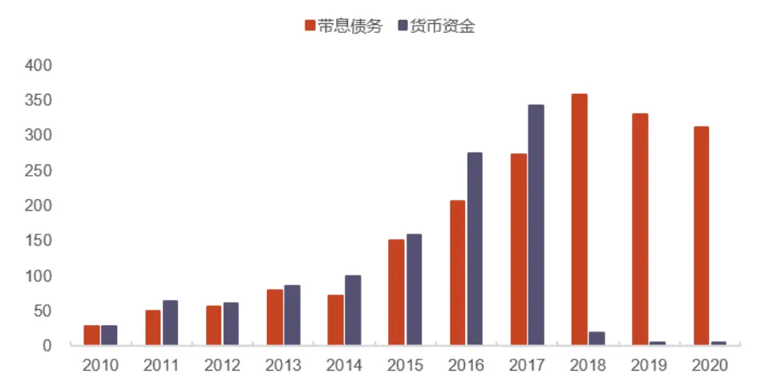
资料来源：Wind，光大证券研究所；注：数据区间为 2010 年年报—2020 年年报。单位：亿元

经过筛选，我们总共提取了 7192 份上市公司年报作为负例样本，总共涉及到1714 家公司。从时间序列分布来看，2013 年开始问题报表出现数量及占比均快速上升，这与 A 股市场监管趋严相吻合。

图 19：历年问题报表数量及占比
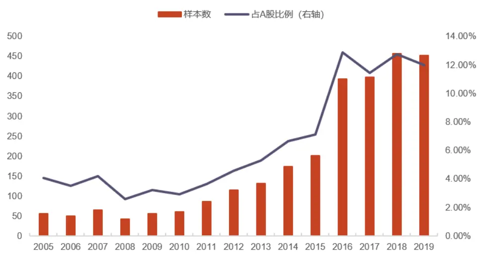
资料来源：Wind，光大证券研究所。注：数据区间为 2005 年年报—2019 年年报

从行业分布来看，问题报表多存在于化工、机械、医药和房地产等行业。国防军工、消费者服务等行业问题报表出现次数不多。但是我们所选取的时间跨度为15 年，平均来看问题报表在行业分布中相对较为平均。

图 20：问题报表行业分布情况
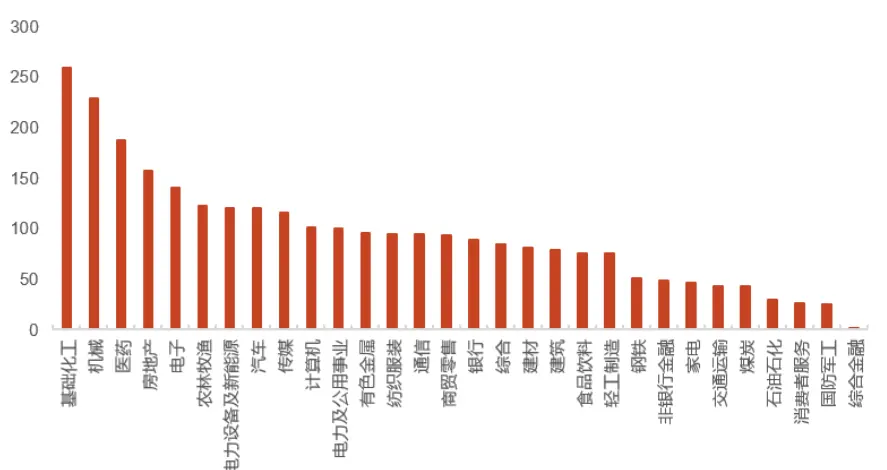
资料来源：Wind，光大证券研究所。注：数据区间为 2005 年年报—2019 年年报

此外，我们还对比了不同宽基指数中问题报表占比。可以看到问题报表大多集中于市值较小的指数中，沪深 300 指数成分股出现问题报表的概率并不高。

图 21：问题报表在宽基指数中分布情况
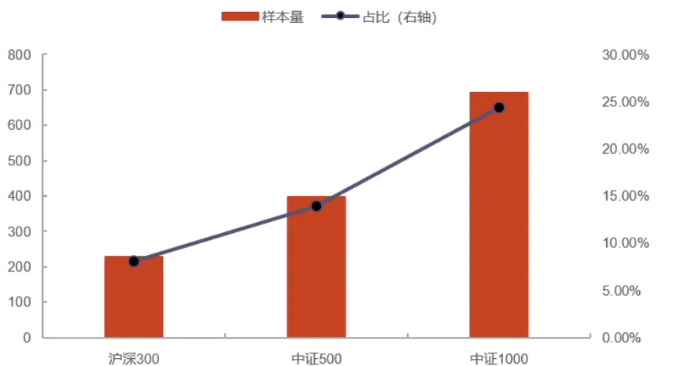
资料来源：Wind，光大证券研究所。注：数据区间为 2005 年年报—2019 年年报

## 3.2、 分箱法探究财务指标与财务危机关系

在银行借贷场景中，评分卡是一种常用的用来衡量客户信用风险的手段。通过给各个特征进行分档，能够快速对新客户给出信用评分。我们将参考银行系统中常用的评分卡风控模型，使用其中的分箱思想为财务报表构建一套财务质量打分体系。

分箱的本质是将连续变量离散化，使拥有不同属性的样本被分成不同的类别，最终达到类似于聚类的效果。具体来说，分箱操作有以下三种优势：

1.将缺失值变成可用数据：财务指标中难免存在缺失值，在传统多因子体系中，需要对缺失值进行填充或剔除，这种操作可能会使数据失真。而分箱可以将缺失值单独分成一组，即使数据的覆盖率很低也可以被我们使用。

2.异常值处理：传统的异常值处理方法多为边界值替换或剔除，同样会导致数据失真的问题。而分箱操作需要将变量离散化，天然具备处理缺失值的功能。例如，资产增长率数据若出现 2000%的极端值，可将其分入(100%，＋∞)这个分箱内，从而排除影响。

3.发现非线性关系：财务指标与财务危机风险的关系并非简单的单调关系。例如资产负债率指标，一般认为该指标值处于 0.4 至 0.8 之间较为良好。然而此类非单调关系的指标一般需凭借主观经验，无法进行批量筛选，甚至无法保证该经验的正确性。分箱操作能够刻画出非线性关系。

## 3.2.1、分箱评价指标 IV 与 WOE

分箱是对连续数据的离散化，必然会导致信息的损失。若分箱数量过多，则没有达到离散化的目标；若分箱数量过少，则会使信息损失过大。因此分箱的过程中比较重要的问题是如何确定箱子的个数。

为了平衡信息量和财务指标的预测能力，我们使用 IV（InformationValue）和WOE（Weight of Evidence）指标来辅助判断分箱个数。

$$
\begin{array}{c}{{IV=\displaystyle{\sum_{i=1}^{N}}(\frac{Good_{i}}{Good_{T}}-\frac{Bad_{i}}{Bad_{T}})\times WOE_{i}}}\\{{WOE_{i}=\displaystyle{\ln\bigg(\frac{Good_{i}}{Good_{T}}\bigg/\frac{Bad_{i}}{Bad_{T}}\bigg)}=\ln\bigg(\frac{Good_{i}}{Bad_{i}}\bigg)-\ln\big(\frac{Good_{T}}{Bad_{T}}\big)}}\end{array}
$$

其中 N 为分箱个数，i 表示第 i 个箱子， 表示第 i 个箱内正常财务报表的数量， $Good_{T}$ 表示全样本中正常财务报表的数量。 $Good_{i}/Good_{T}$ 表示第 i 个箱子中正常样本占全部正常样本的比例，负样本同理。

$WOE_{i}$ 表示正常财务报表与异常财务报表比例的对数，也即对数财务危机风险概率。其本质是对比分箱内识别财务危机的概率和全样本中财务危机概率之间的差异。 $WOE_{i}$ 为负，说明该箱子相比于全样本更能够识别出负例样本。

一般认为 IV 与指标有效性的关系如下表所示。从该表中我们可知，IV 值有两个重要功能，（1）评价指标有效性（2）确定合适的分箱个数。

IV 和 WOE 是我们后续研究中的重要参考，IV 值用来评价财务指标，WOE 值是财务指标分箱后的打分标准。

表 6：业绩预告负向事件发生次数统计

| IV | 特征对预测函数的贡献度 |
| --- | --- |
| 0.03 以下 | 特征几乎不带有效信息，对模型没有贡献 |
| 0.03至0.09 | 有效信息很少，对模型的贡献度较低 |
| 0.1 至 0.29 | 有效信息一般，对模型的贡献度中等 |
| 0.3 至 0.49 | 有效信息较多，对模型的贡献度较高 |
| 0.5 及以上 | 有效信息非常多，对模型的贡献度非常高，但是此类特征较为可疑 |

资料来源：光大证券研究所

## 3.2.2、有效指标筛选

建模过程中若模型训练数据中存在较多无关数据，会影响模型最终的精度与泛化能力。因此在建模之前需要对指标有效性进行检验。对指标进行了初步筛选之后，再对每一个指标进行建模，寻找对于公司是否存在对违规现象具有解释能力的指标。

上一小节提到，IV 可以用来评价指标的预测能力。当 IV 小于 0.1 时，指标的有效信息含量较少，对模型的贡献度较低。根据 IV 的计算公式我们可知，IV 值与分箱数量是正向单调关系。而根据后续的研究我们发现，分箱数量较多时，IV值的提升有限。

因此，最终的筛选标准设定为：分箱数量为 30 时 IV 值大于 0.1 的指标。我们从指标库中的 89 个指标中最终筛选出了 45 个有效指标。（详见附录）

## 3.2.3、分箱流程概述

最终构建评分模型时，会给予不同箱子中的财务报告不同的分数，较好的分箱结果是同一个箱子中的样本属性尽可能保持相同，不同箱子中的样本属性尽可能差异明显。也即达到“组间差异大，组内差异小”的效果。

我们通过卡方检验的方式来比较相邻两个箱子之间的相似性，若相邻两个箱子的卡方检验 pvalue 较大，则说明两个箱子非常相似，需要将其合并为一个箱子。具体步骤如下：

1. 设定目标分箱值 K。

2.对财务指标进行等频率分箱，初始分箱数量默认为 30。

3.计算每个箱子的财务危机风险概率（负例样本占总样本的比例）和 WOE 值。

4.对相邻两个箱子进行卡方检验，特征相似的箱子进行合并，直到箱数小于设定的目标值 K 为止。

5.遍历分箱数量 K 重复上述过程，观察不同分箱数量下的 IV 值变化情况，找出最合适的分箱个数。

分箱过程如下图所示：

图 22：分箱生成过程示意图
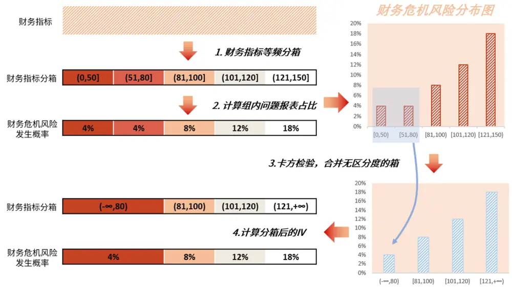
资料来源：光大证券研究所

## 3.2.4、分箱法流程小结

本章节介绍了分箱法的优势、目的以及整体流程。其中最核心的是两个评价指标：IV 和 WOE，IV 值可以评价分箱后数据的信息含量，以此可以选择合适的分箱数量；WOE 值用来评价每个箱子的负例样本识别能力，当 WOE 小于 0 时，说明该箱的负例占比要高于全样本的负例占比。

接下来我们将使用上述流程对财务指标进行分箱操作，并给出每个财务指标的分箱结果。

## 3.3、 财务指标分箱测试

经过 IV 值初步筛选出显著指标后，接下来我们要通过分箱构建指标数值与财务危机发生概率之间的关系，并计算出分箱后的 WOE 值作为评分标准。

## 3.3.1、财务指标分箱测试

根据上一章节设定的分箱步骤，首先要对所选财务指标进行排序操作，然后对排序后的财务指标进行等频率分箱，我们先对数据进行了 30 等分，每组样本数量相同，约包含 2200 个样本点。最后计算各组内财务危机风险样本的比例作为财务指标在该区间内发生财务危机风险的概率，同时计算 WOE 值作为该组的打分标准。分箱操作能够为我们提供两个重要信息：

（1）财务指标与财务危机风险发生概率的关系是怎样的。

（2）财务指标处于哪些区间时财务危机风险发生概率最高。

以现金比率指标为例，通过财务危机风险概率分布图可以清晰的看到，现金比率与财务危机风险发生概率为负相关，也即现金比率越低财务危机风险越高，该结论与经验较为符合。此外，从分布图中还可以获得更具体的信息，当现金比率指标低于 5%时，财务危机发生概率开始升高。当指标值低于-20%时，财务危机风险发生概率为 32.18%。

图 23：现金比率指标与财务危机风险概率关系图
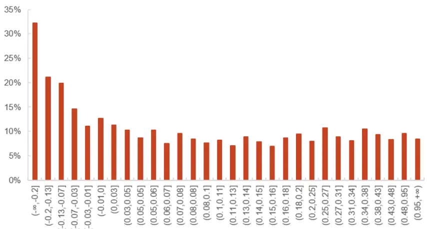
资料来源：Wind，光大证券研究所。注：数据区间为 2005 年年报—2019 年年报。横轴：指标分箱结果；纵轴：财务危机风险概率（下同）。

## 3.3.2、卡方检验合并箱体

从现金比率与财务危机风险的关系来看，指标值在高于 5%之后就已经没有显著区分度了。分箱操作只会为模型引入噪音，因此我们使用卡方检验对属性相似的箱体进行合并。

图 24：现金比率指标分箱结果示意图
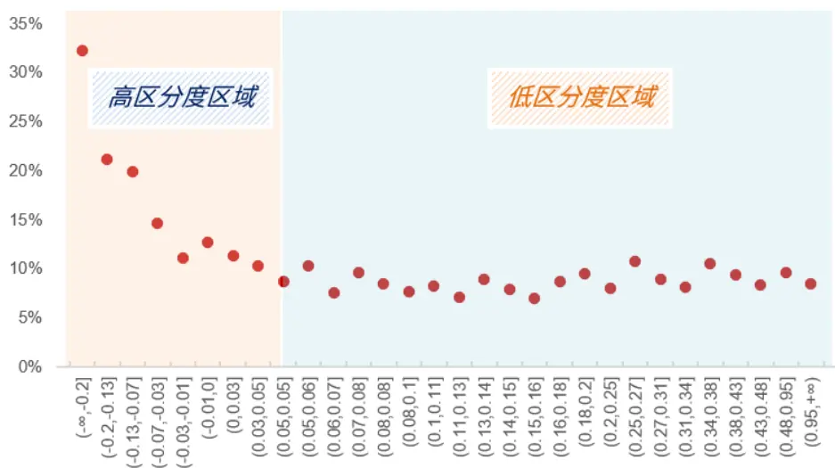
资料来源：Wind，光大证券研究所。注：数据区间为 2005 年年报—2019 年年报

具体来说，我们设定一个目标分箱数量 K，对所有相邻的两个箱体进行卡方检验，合并 pvalue 最高的两个箱子后重复上述操作，直到箱子数目为 K 时停止检验。我们对现金比率指标执行上述操作，并设定分箱数量为 7（如何确定分箱数量见下一小节）。结果如下图所示，合并箱体之后的结果在各个箱体之间均有较好的区分度，数据在离散化的同时尽可能保留了足够多的有效信息。

图 25：现金比率指标卡方检验合并箱体之后财务危机概率分布
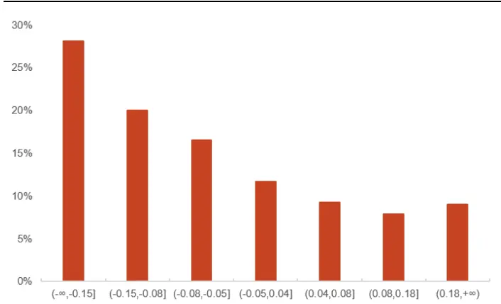
资料来源：Wind，光大证券研究所。注：数据区间为 2005 年年报—2019 年年报

图 26：现金比率指标卡方检验合并箱体后 WOE 分布
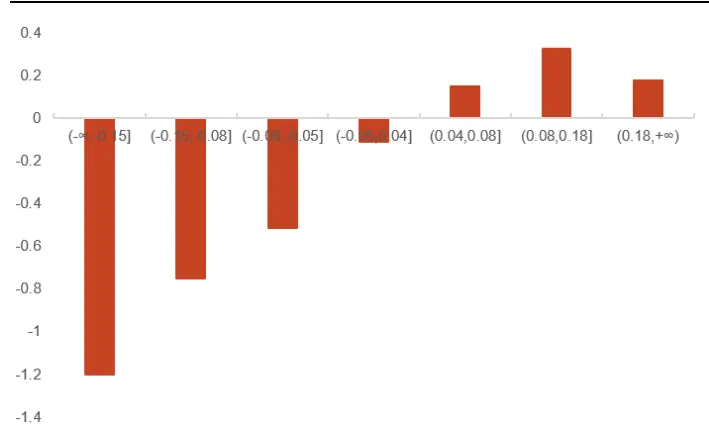
资料来源：Wind，光大证券研究所。注：数据区间为 2005 年年报—2019 年年报

表 7：现金比率指标分箱结果明细

| 分箱 | 正常样本量 | 异常样本量 | 财务危机发生概率 | WOE |
| --- | --- | --- | --- | --- |
| (-∞,-0.15] | 864 | 338 | 28.12% | -120.07% |
| (-0.15,-0.08] | 961 | 240 | 19.98% | -75.19% |
| (-0.08,-0.05] | 1003 | 198 | 16.49% | -51.67% |
| (-0.05,0.04] | 6367 | 839 | 11.64% | -11.25% |
| (0.04,0.08] | 3272 | 332 | 9.21% | 14.88% |
| (0.08,0.18] | 7746 | 661 | 7.86% | 32.20% |
| (0.18,+∞) | 12025 | 1188 | 8.99% | 17.55% |

资料来源：Wind，光大证券研究所。注：数据区间为 2005 年年报—2019 年年报

## 3.3.3、确定合适的分箱数量

确定分箱数量是分箱操作中较为关键的步骤，从对现金比率指标的分箱过程我们也能够发现，分箱数量过多会导致没有区分度，从而引入噪音。IV 值可以用来判断分箱效果的好坏，确定合适的分箱数量。

具体来说，对财务指标的分箱数量进行 2 到 30 的遍历操作，观察分箱数量与 IV值之间的关系。

同样以现金比率指标为例，下图为分箱数量与 IV 值关系图。随着分箱数量的增多，IV 值呈现单调上升状态，且增速逐渐降低。当分箱数量大于 7 时，IV 值的增速显著下降，继续增加分箱数量无法为指标带来更多的信息提升。因此我们以此来确定指标合适的分箱数量。

图 27：现金比率指标不同分箱数量下的 IV 值
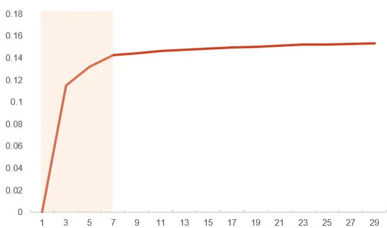
资料来源：Wind，光大证券研究所。注：横轴为分箱数量，纵轴为 IV 值。

## 3.3.4、分箱结果展示

我们按照上述流程对 45 个指标均进行了分箱操作，按照指标影响方向可以分成三类，下面展示了三种类型的部分财务指标，在我们测试的全部财务指标中，其测试结果与经济含义基本一致。

1.正向指标：指标值越大，发生财务危机风险的概率越低。我们挑选了两个经济意义较为明确，结果符合逻辑的指标，应收款周转率和总资产同比增长率。

应收款周转率指标一般用来表示企业的营运能力，指标值越低表示企业应收款周转速度越低，形成坏账的可能性越大。从拟合结果上来看，当指标值低于 0.37 时财务危机风险发生概率达到 25%以上。

总资产同比增长率可以用来表示企业的规模增速。从拟合结果上来看，当增速为负时财务危机风险发生概率开始升高。

图 28：应收款周转率指标财务危机概率分布
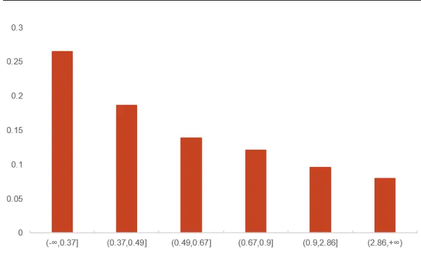
资料来源：Wind，光大证券研究所。注：数据区间为 2005 年年报—2019 年年报

图 29：应收款周转率指标 WOE 分布
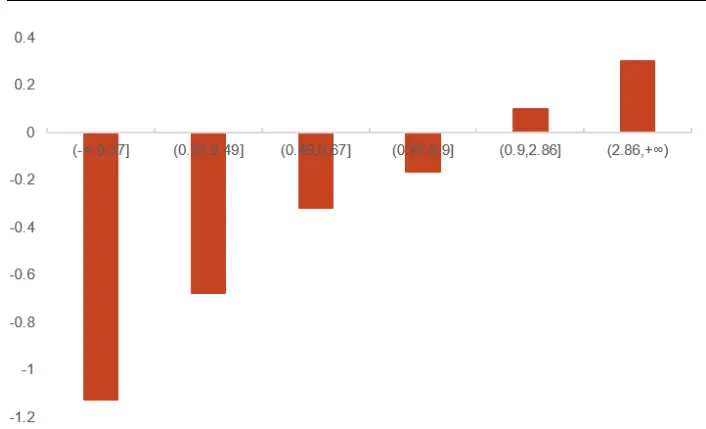
资料来源：Wind，光大证券研究所。注：数据区间为 2005 年年报—2019 年年报

图 30：总资产同比增长率指标财务危机概率分布
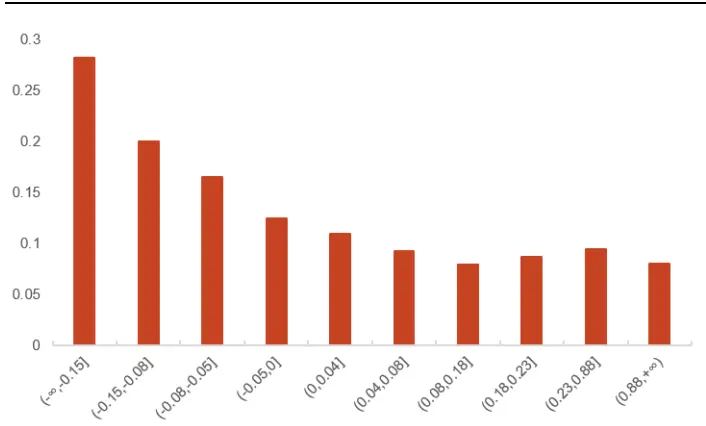
资料来源：Wind，光大证券研究所。注：数据区间为 2005 年年报—2019 年年报

图 31：总资产同比增长率指标 WOE 分布
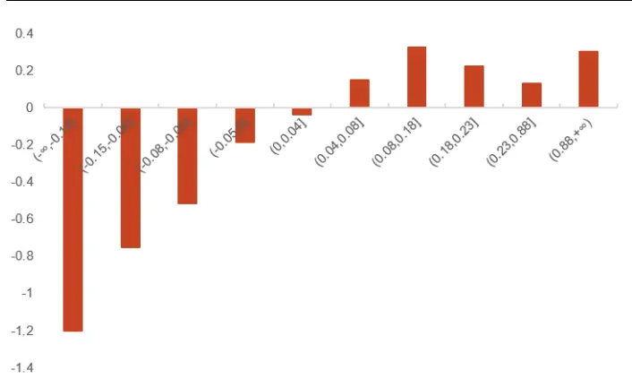
资料来源：Wind，光大证券研究所。注：数据区间为 2005 年年报—2019 年年报

## 2.负向指标：指标值越大，发生财务危机风险的概率越高。我们挑选了金融负债占比和应收款资金比两个指标。

金融负债占权益比表示企业的负债水平，根据企业的管理不同，其负债率水平也会不同。一般经验认为该指标存在一个合理区间，根据结合结果可以看到，当金融负债占权益比高于 70%时财务危机风险发生概率开始升高，该值与传统经验中的警戒线基本一致。

应收账款是获取利润的一种营销手段，一般可以表示企业在供应链中的低位，应收款资金占比过高会存在较大风险。从拟合结果上来看，指标值超过 1.5倍时财务危机风险发生概率开始升高。

图 32：金融负债占权益比财务危机概率分布
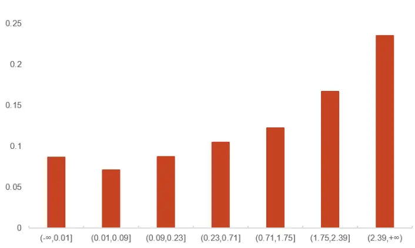
资料来源：Wind，光大证券研究所。注：数据区间为 2005 年年报—2019 年年报

图 33：金融负债占权益比指标 WOE 分布
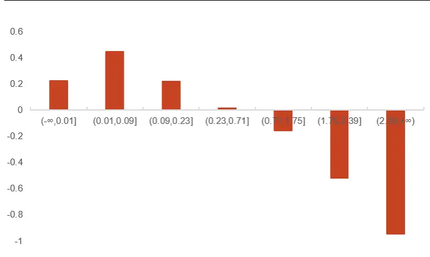
资料来源：Wind，光大证券研究所。注：数据区间为 2005 年年报—2019 年年报

图 34：应收款资金占比财务危机概率分布
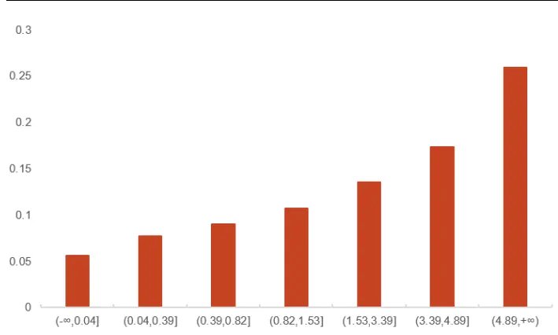
资料来源：Wind，光大证券研究所。注：数据区间为 2005 年年报—2019 年年报

图 35：应收款资金占比指标 WOE 分布
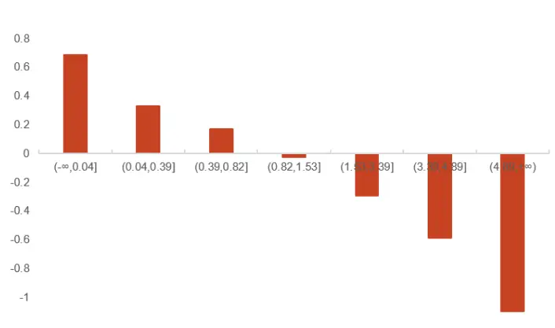
资料来源：Wind，光大证券研究所。注：数据区间为 2005 年年报—2019 年年报

3.区间指标：指标值过高或过低时财务危机风险发生的概率越高。我们挑选了毛利率同比和商誉规模同比增长率两个指标。

毛利率同比可以看成是企业的盈利增速，根据我们的拟合结果可以看到，盈利增速过高或过低均会抬升财务危机风险发生的概率。当指标值低于-63%或高于 44%时发生财务危机风险的概率均较高。

商誉规模同比指标为企业商誉的变动情况，商誉发生变动的企业一般是进行了合并或收购等行为。从拟合结果上来看，商誉规模同比小于 0%或高于 2.4%时发生财务危机风险的概率开始升高。

图 36：毛利率同比指标财务危机概率分布
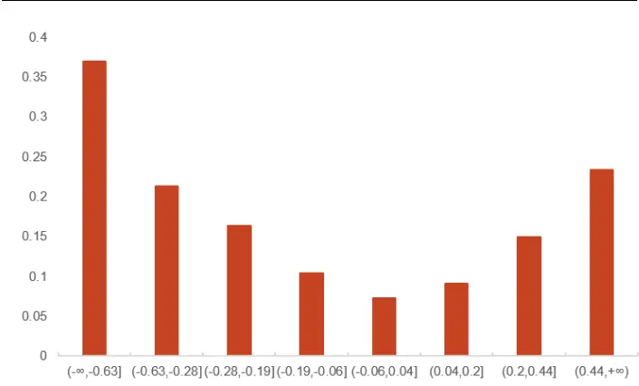
资料来源：Wind，光大证券研究所。注：数据区间为 2005 年年报—2019 年年报

图 37：毛利率同比指标 WOE分布
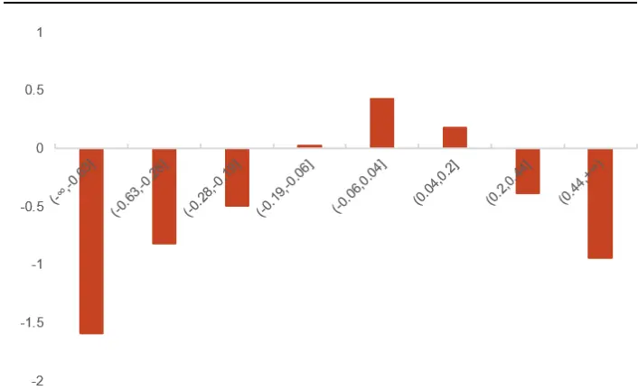
资料来源：Wind，光大证券研究所。注：数据区间为 2005 年年报—2019 年年报

图 38：商誉规模同比指标财务危机概率分布
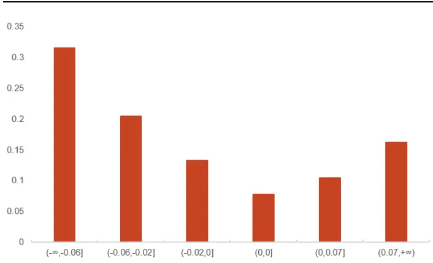
资料来源：Wind，光大证券研究所。注：数据区间为 2005 年年报—2019 年年报

图 39：商誉规模同比指标 WOE 分布
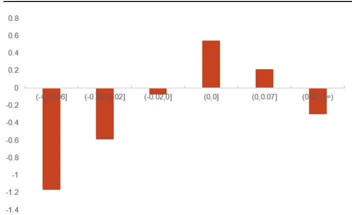
资料来源：Wind，光大证券研究所。注：数据区间为 2005 年年报—2019 年年报

## 3.3.5、分箱结果小结

本章节使用前文给出的分箱流程对指标库中的 45 个财务指标均进行了分箱操作，并计算出分箱后对应的 WOE 分布。根据指标的影响方向来看，大体可以分成正向、负向以及区间三类指标。

指标的分箱本质上也是对指标进行单独建模，接下来我们要将全部单独建模的指标结合在一起，构建财务报告质量评分模型。

## 3.4、 财务报告质量评分卡模型构建

筛选出有效的财务指标并进行分箱操作之后，我们就得到了财务指标与财务危机风险概率之间的数量关系。接下来我们使分箱后的 WOE 值对财务报告进行分类打分，构建财务危机风险预测打分模型。

1.有效指标筛选：对于指标的有效性我们使用 IV 值进行过初步筛选，挑选出了IV 高于 0.1 的指标。然而在分箱过程中依然会存在分箱结果与实际意义不符、财务危机发生概率不具备显著区分度等问题。因此我们还需要对指标进行手动二次筛选。

2.同类指标合成：财务指标之间可能有较高的相关性，接下来还需要对相关性较高的财务指标进行合并。具体来说，首先挑选一个 IV 值最大的指标作为基础，然后在剩下的指标中挑选出与其相关性在 0.6 以上的指标作为一组。重复上述操作直到所有指标均被分类。

3.指标打分：我们使用分组后的指标对股票进行打分。

a)对于打分标准来说，以各箱子对应的 WOE 值作为该箱的分数，分数越低说明发生风险的概率越大。

b)财务指标存在安全区域和风险区域，我们认为只有当指标值处于风险区域时，股票的打分才有意义。因此仅保留 WOE 为负值的部分。

c) 最后我们对同一类别财务指标的得分进行合成，其平均值作为该类别指标的综合得分。所有类别的综合得分相加为最终得分。

图 40：财务危机风险预测打分模型
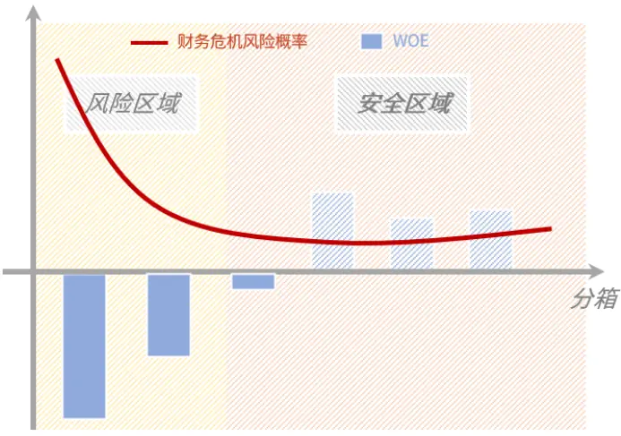
资料来源：Wind，光大证券研究所。

## 3.5、 财务危机风险预测结果展示

我们对所有公司的年度报告均以上述打分模型进行评价打分，其得分越高代表企业发生财务危机风险的概率越大。

以康得新为例：根据打分模型来看，康得新从 2016 年开始财务质量评分大幅降低，且连续处于低位。此时股价依然处于上涨趋势，市场并没有对康得新的财务质量下滑有所反应。在 2018 年，康得新被质疑财务造假，股价大幅下滑。财务危机风险预测模型提前 2 年发出了预警。

图 41：康得新财报历年得分
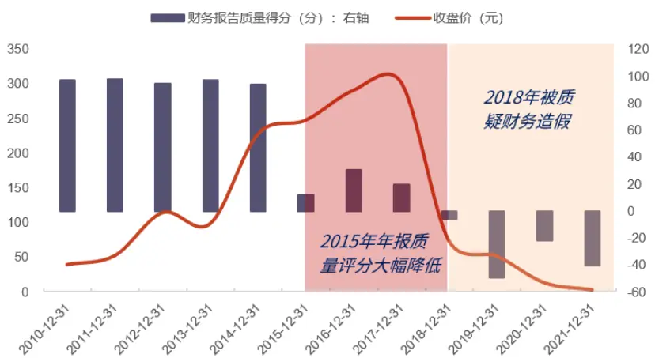
资料来源：Wind，光大证券研究所。注：数据区间为 2010 年报—2021 年报

## 3.5.1、财务报告质量评分的优化效果

构建财务报告质量评分模型的初衷是为了优化股票池质量。因此我们使用财报质量评分在全市场中进行选股测试。具体回测参数设置如下：

股票池：全市场股票剔除银行及 ST/*ST。

调仓日期：每年年报发布截止日，也即每年的 4 月 30 日。

回测区间：2006 年 9 月 21 日—2022 年 4 月 29 日。

分组方式：根据财务报告质量评分将股票从低到高分成 5 组。

加权方式：等权重。

回测结果来看，财务质量评分的分层效果较好，评分高的组合能够跑赢评分低的组合。此外，我们发现低分组合在 2016 年之后表现明显弱于高分组合，而在此之前并没有明显的区分度。这是因为注册制的推进使得低质量股票的“壳价值”降低，市场不再热衷于炒作小市值股票，财务报告的质量对股价的正向影响变得越来越明显。

图 42：2006 年—2022 年回测净值曲线
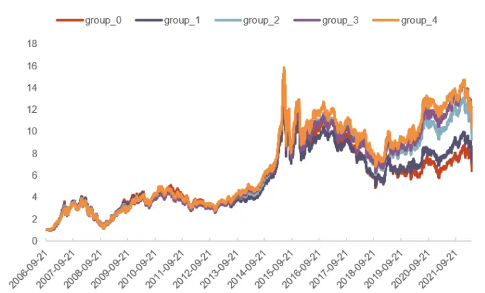
资料来源：Wind，光大证券研究所。注：数据区间为 2006.9.21—2022.4.29

图 43：2016 年—2022 年回测净值曲线
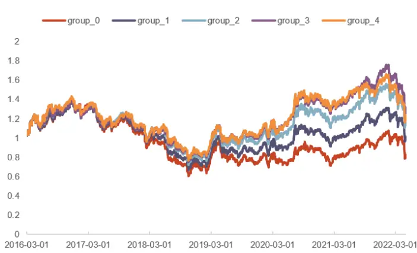
资料来源：Wind，光大证券研究所。注：数据区间为 2016.3.1—2022.4.29

表 8：财务报告质量评分选股测试业绩指标

| 分组 | 年化收益率 | 年化波动率 | 夏普率 最大回撤 |
| --- | --- | --- | --- |
| Group_0 | -3.53% | 23.18% -0.32 | 57.04% |
| Group_1 | -0.13% | 22.21% -0.19 | 51.70% |
| Group_2 | 2.43% | 22.55% | -0.07 48.21% |
| Group_3 | 4.27% | 22.44% 0.01 | 46.03% |
| Group_4 | 3.12% | 22.18% | -0.04 46.50% |

资料来源：Wind，光大证券研究所。注：数据区间为 2016 年 3 月 1 日—2022 年 4月 29 日

## 3.5.2、财务危机预警组合构建

接下来我们测试财报质量评分对于沪深 300 和中证 500 股票池的提升效果。具体回测参数如下：

回测区间：2016 年 3 月 1 日—2022 年 4 月 29 日。

调仓日期：每年年报发布截止日，也即每年的 4 月 30 日。

分组方式：股票池内财报质量评分最低的 10%作为预警组合，剩余股票作为对照组合。

加权方式：等权重。

回测结果来看，回测期内预警组合在沪深 300 和中证 500 股票池内均有显著负向收益。剔除预警组合的剩余股票相对于预警组合超额收益明显，沪深 300 股票池中年化超额收益 12.50%，中证 500 股票池中年化超额收益 13.62%，剔除预警组合对股票池的优化效果显著。

图 44：沪深 300 预警组合剔除测试
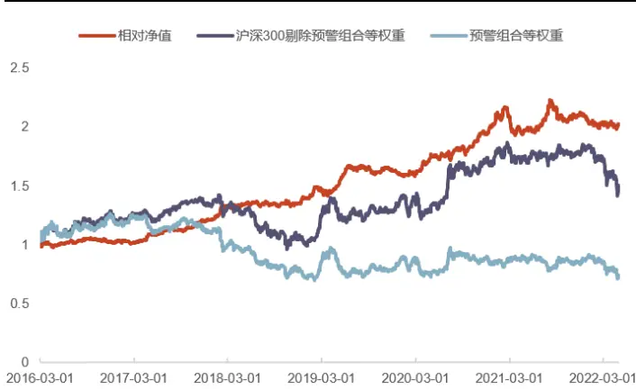
资料来源：Wind，光大证券研究所。注：数据区间为 2016.3.1—2022.4.29

图 45：中证 500 预警组合剔除测试
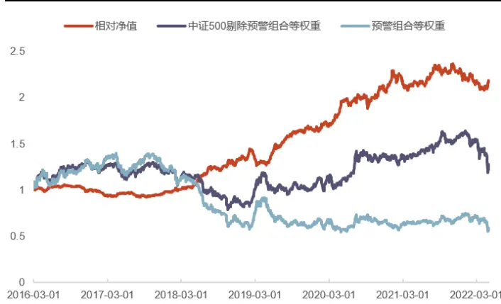
资料来源：Wind，光大证券研究所。注：数据区间为 2016.3.1—2022.4.29

表 9：沪深 300 预警组合剔除测试业绩表现
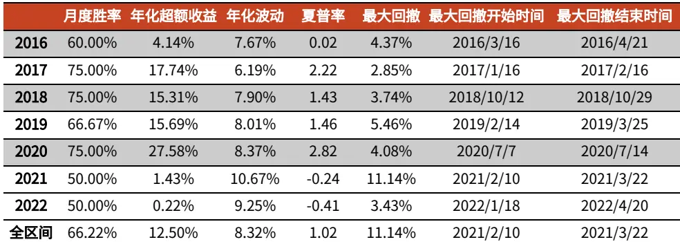
资料来源：Wind，光大证券研究所。注：数据区间为 2016.3.1—2022.4.29。超额收益为“剔除预警组合等权重”与“预警组合等权重”的相对收益。

表 10：中证 500 预警组合剔除测试业绩表现
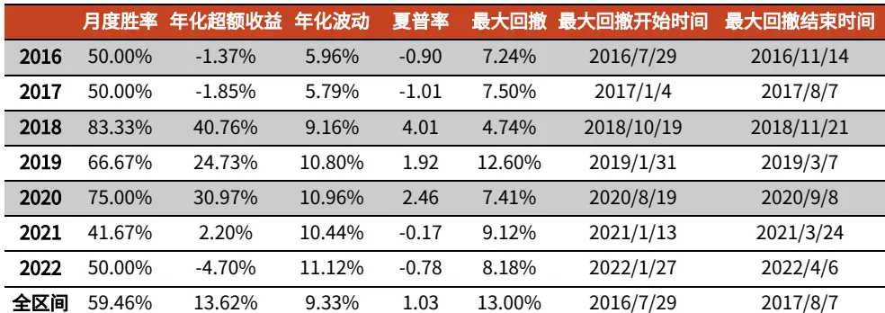
资料来源：Wind，光大证券研究所。注：数据区间为 2016.3.1—2022.4.29。超额收益为“剔除预警组合等权重”与“预警组合等权重”的相对收益。

## 4、总结与展望

本文延续了上一篇报告《高质量股票池构造体系——量化选股系列报告之五》中提出的三层股票池构造框架，在柔性优化部分做了进一步研究。对负向事件进行了梳理研究，将其划分成可预测和不可预测两部分。

对于不可预测事件来说，我们从两个维度选取了若干事件进行测试。具体来说包括基本面和经营层面共 8 个指标。每个指标在事件发生后 30 个交易日内均有持续显著的负向收益，我们对上述事件进行了跟踪剔除回测，结果显示跟踪并剔除涉事股票可以有效避免负向收益的扩大，为投资者降低损失。

对于可预测负向事件来说，我们参考风控领域中的分箱思想构造了一个财务质量打分模型对财务危机风险进行预测。该模型主要有三个核心步骤：

（1） 样本筛选：我们对 ST 事件和违规事件进行了提纯，将事件中与财务报表相关的部分提取出作为负例样本。

（2） 财务指标显著性检验：我们挑选了分箱数量为30时IV值大于0.1的指标。对指标库中的 89 个指标均进行了 IV 值计算，最终筛选出了 45 个有效指标。

（3） 财务指标筛选：该步骤中我们对每一个财务指标进行了分箱操作，构建出了财务指标与财务危机风险发生概率之间的关系，并且计算 WOE 值作为打分标准。

经测试，我们构建的财务质量打分模型能够有效的筛选出财务质量存疑的财务报告，能够为投资者提前预警。

## 5、风险提示

报告结果均基于历史数据，历史数据存在不被重复验证的可能。

## 6、 附录

本文筛选出的有效财务指标明细如下表所示。

表 11：本文筛选的有效财务指标明细

| 指标名称 | 计算公式 | 指标范围 | 分箱数量 | IV值 | 财务风险最大发生概率 |
| --- | --- | --- | --- | --- | --- |
| 扣非净利率 | 净利润 / 营业收入 | 正向指标 | 5 | 45.21% | 62.09% |
| 现金利润比 | 净利润 /货币资金 | 正向指标 | 5 | 38.44% | 67.48% |
| 毛利率 | (营业收入 - 营业成本) / 营业收入 | 正向指标 | 5 | 38.05% | 60.18% |
| 净利率 | 净利润 /营业收入 | 正向指标 | 6 | 37.53% | 61.85% |
| 应付职工薪酬覆盖倍数 | 净利润 / 应付职工薪酬 | 区间指标 | 8 | 36.80% | 57.40% |
| 净利率同比 | 净利率同比 | 区间指标 | 7 | 35.78% | 58.24% |
| 应收账款利润率 | 净利润 / 应收账款 | 正向指标 | 5 | 33.65% | 40.46% |
| 管理费用利润率 | 净利润 / 管理费用 | 负向指标 | 5 | 33.30% | 44.28% |
| 存货利润率 | 净利润/存货 | 正向指标 | 5 | 33.14% | 48.43% |
| 研发费用利润率 | 净利润 /研发费用 | 区间指标 | 5 | 32.98% | 46.38% |
| 毛利率同比 | 毛利率同比 | 区间指标 | 5 | 32.63% | 58.45% |
| 期间费用利润率 | 净利润 /期间费用 | 负向指标 | 5 | 32.59% | 43.95% |
| 其他应付款覆盖倍数 | 利润总额 / 其他应付款 | 正向指标 | 5 | 31.60% | 34.24% |
| 资产减值占资产比 | 资产减值损失 /总资产 | 区间指标 | 5 | 29.51% | 56.87% |
| 商誉占营收比 | 商誉 / 营业收入 | 负向指标 | 6 | 28.25% | 40.00% |
| 在建工程利润率 | 在建工程 / 利润总计 | 正向指标 | 5 | 27.86% | 31.50% |
| 销售费用利润率 | 净利润 / 销售费用 | 负向指标 | 4 | 26.50% | 42.71% |
| 扣非净利率同比 | 扣非净利率同比 | 区间指标 | 8 | 25.33% | 37.89% |
| 商誉规模同比增长率 | 商誉规模同比增长率 | 区间指标 | 7 | 22.05% | 45.83% |
| 商誉规模 | 商誉/总资产 | 负向指标 | 6 | 21.48% | 38.88% |
| 资产减值占利润比 | 资产减值损失 / 利润总额 | 区间指标 | 5 | 19.76% | 21.67% |
| 财务费用率 | 财务费用 / 营业收入 | 负向指标 | 6 | 19.09% | 36.59% |
| 现金财务费用率 | 财务费用 / 货币资金 | 区间指标 | 5 | 15.60% | 32.90% |
| 总资产同比增长率 | 总资产同比增长率 | 正向指标 | 4 | 15.45% | 39.12% |
| 短期借款偿还比率 | 货币资金 / 短期借款 | 正向指标 | 4 | 14.98% | 31.08% |
| 单季度营业收入增速 | 单季度营业收入同比增长率 | 区间指标 | 5 | 14.92% | 25.71% |
| 应收款资金比 | (其他应收款 + 应收账款) /货币资金 | 负向指标 | 5 | 14.36% | 35.04% |
| 财务费用率 | 财务费用 / 总资产 | 负向指标 | 5 | 14.28% | 37.17% |
| 应收账款周转率 | 营业收入/应收账款 | 正向指标 | 5 | 13.27% | 35.94% |
| 金融负债偿还比例 | 货币资金/金融负债 | 正向指标 | 5 | 13.25% | 25.08% |
| 总资产周转率 | 营业收入/总资产 | 正向指标 | 4 | 13.07% | 31.36% |
| 现金比率 | (货币资金 + 可供出售金融资产 + 交易性金融 资产）/流动负债 | 正向指标 | 7 | 12.41% | 32.59% |
| 应付金额收入比 | (应付票据+应付账款) / 营业收入 | 区间指标 | 5 | 12.06% | 35.60% |
| 期间费用率 | 期间费用 / 营业收入 | 正向指标 | 6 | 10.66% | 34.09% |
| 研发费用资本率 | 研发费用 / 总资产 | 正向指标 | 4 | 10.57% | 12.80% |
| 存货周转率 | 营业成本/存货 | 正向指标 | 6 | 10.54% | 27.61% |
| 流动资产同比增长率 | 流动资产同比增长率 | 正向指标 | 5 | 10.40% | 27.90% |
| 非流动资产同比增长率 | 非流动资产同比增长率 | 正向指标 | 5 | 10.23% | 31.98% |
| 产权比率 | 总负债 / 所有者权益 (短期借款+长期借款+一年内到期的非流动负债+ | 负向指标 负向指标 | 4 5 | 10.16% 10.15% | 27.81% 30.66% |
| 金融负债占权益比 | 应付票据+应付利息+应付债券）/所有者权益 |  |  |  |  |
| 收入现金保障倍数 | 经营活动产生的现金流量净额 / 营业收入 | 区间指标 | 5 | 10.14% | 30.57% |
| 流动资产周转率 | 营业收入/流动资产 | 正向指标 | 5 | 10.12% | 32.48% |
| 营业外收入占比 | 营业外收入/营业收入 | 区间指标 | 5 | 10.04% | 24.14% |
| 资产负债率环比增量 | 资产负债率环比增量 | 负向指标 | 5 | 10.02% | 30.14% |
| 现金流动负债比率 | 经营活动产生的现金流量净额 /流动负债 | 正向指标 | 6 | 10.02% | 17.13% |

资料来源：Wind，光大证券研究所

## 行业及公司评级体系

| 评级 说明 |  |  |
| --- | --- | --- |
|  | 买入 | 未来6-12个月的投资收益率领先市场基准指数15%以上 |
| 行业及公司评级 | 增持 | 未来 6-12 个月的投资收益率领先市场基准指数 5%至 15%； |
|  | 中性 | 未来6-12 个月的投资收益率与市场基准指数的变动幅度相差-5%至5%； |
|  | 减持 | 未来 6-12 个月的投资收益率落后市场基准指数 5%至15%; |
|  | 卖出 | 未来6-12个月的投资收益率落后市场基准指数15%以上； |
|  | 无评级 | 因无法获取必要的资料，或者公司面临无法预见结果的重大不确定性事件，或者其他原因，致使无法给出明确的投资评级。 |
|  | 基准指数说明： | A股主板基准为沪深300指数；中小盘基准为中小板指；创业板基准为创业板指；新三板基准为新三板指数；港股基准指数为恒生 指数。 |

## 分析、估值方法的局限性说明

本报告所包含的分析基于各种假设，不同假设可能导致分析结果出现重大不同。本报告采用的各种估值方法及模型均有其局限性，估值结果不保证所涉及证券能够在该价格交易。

## 分析师声明

本报告署名分析师具有中国证券业协会授予的证券投资咨询执业资格并注册为证券分析师，以勤勉的职业态度、专业审慎的研究方法，使用合法合规的信息，独立、客观地出具本报告，并对本报告的内容和观点负责。负责准备以及撰写本报告的所有研究人员在此保证，本研究报告中任何关于发行商或证券所发表的观点均如实反映研究人员的个人观点。研究人员获取报酬的评判因素包括研究的质量和准确性、客户反馈、竞争性因素以及光大证券股份有限公司的整体收益。所有研究人员保证他们报酬的任何一部分不曾与，不与，也将不会与本报告中具体的推荐意见或观点有直接或间接的联系。

## 法律主体声明

本报告由光大证券股份有限公司制作，光大证券股份有限公司具有中国证监会许可的证券投资咨询业务资格，负责本报告在中华人民共和国境内（仅为本报告目的，不包括港澳台）的分销。本报告署名分析师所持中国证券业协会授予的证券投资咨询执业资格编号已披露在报告首页。

中国光大证券国际有限公司和 Everbright Securities(UK) Company Limited 是光大证券股份有限公司的关联机构。

## 特别声明

光大证券股份有限公司（以下简称“本公司”）创建于 1996 年，系由中国光大（集团）总公司投资控股的全国性综合类股份制证券公司，是中国证监会批准的首批三家创新试点公司之一。根据中国证监会核发的经营证券期货业务许可，本公司的经营范围包括证券投资咨询业务。

本公司经营范围：证券经纪；证券投资咨询；与证券交易、证券投资活动有关的财务顾问；证券承销与保荐；证券自营；为期货公司提供中间介绍业务；证券投资基金代销；融资融券业务；中国证监会批准的其他业务。此外，本公司还通过全资或控股子公司开展资产管理、直接投资、期货、基金管理以及香港证券业务。

本报告由光大证券股份有限公司研究所（以下简称“光大证券研究所”）编写，以合法获得的我们相信为可靠、准确、完整的信息为基础，但不保证我们所获得的原始信息以及报告所载信息之准确性和完整性。光大证券研究所可能将不时补充、修订或更新有关信息，但不保证及时发布该等更新。

本报告中的资料、意见、预测均反映报告初次发布时光大证券研究所的判断，可能需随时进行调整且不予通知。在任何情况下，本报告中的信息或所表述的意见并不构成对任何人的投资建议。客户应自主作出投资决策并自行承担投资风险。本报告中的信息或所表述的意见并未考虑到个别投资者的具体投资目的、财务状况以及特定需求。投资者应当充分考虑自身特定状况，并完整理解和使用本报告内容，不应视本报告为做出投资决策的唯一因素。对依据或者使用本报告所造成的一切后果，本公司及作者均不承担任何法律责任。

不同时期，本公司可能会撰写并发布与本报告所载信息、建议及预测不一致的报告。本公司的销售人员、交易人员和其他专业人员可能会向客户提供与本报告中观点不同的口头或书面评论或交易策略。本公司的资产管理子公司、自营部门以及其他投资业务板块可能会独立做出与本报告的意见或建议不相一致的投资决策。本公司提醒投资者注意并理解投资证券及投资产品存在的风险，在做出投资决策前，建议投资者务必向专业人士咨询并谨慎抉择。

在法律允许的情况下，本公司及其附属机构可能持有报告中提及的公司所发行证券的头寸并进行交易，也可能为这些公司提供或正在争取提供投资银行、财务顾问或金融产品等相关服务。投资者应当充分考虑本公司及本公司附属机构就报告内容可能存在的利益冲突，勿将本报告作为投资决策的唯一信赖依据。

本报告根据中华人民共和国法律在中华人民共和国境内分发，仅向特定客户传送。本报告的版权仅归本公司所有，未经书面许可，任何机构和个人不得以任何形式、任何目的进行翻版、复制、转载、刊登、发表、篡改或引用。如因侵权行为给本公司造成任何直接或间接的损失，本公司保留追究一切法律责任的权利。所有本报告中使用的商标、服务标记及标记均为本公司的商标、服务标记及标记。

光大证券股份有限公司版权所有。保留一切权利。

光大证券研究所

上海

北京

深圳

静安区南京西路 1266 号

西城区武定侯街 2 号

恒隆广场 1 期办公楼 48 层

福田区深南大道 6011 号

泰康国际大厦 7 层

NEO 绿景纪元大厦 A 座 17 楼

光大证券股份有限公司关联机构

香港

中国光大证券国际有限公司

英国

香港铜锣湾希慎道 33 号利园一期 28 楼

Everbright Securities(UK) Company Limited

64 Cannon Street，London，United Kingdom EC4N 6AE