## 金融工程

# 如何准确测算预期股息率？

## ——量化选股系列之七

## 要点

传统股息率计算方式存在弊端：股息率指标是一个内涵信息丰富的价值因子，一个高股息率的公司需要至少满足（1）高盈利（2）高盈利预期（3）低估值等多种条件。因此，正确的计算股息率是一项重要且复杂的任务，传统的动态股息率和静态股息率计算方式存在较大改进空间。本篇报告从现金股利政策角度入手，全方位拆解了股息率组成部分中的可预测部分，并且构造了完整的预期股息率计算框架。

预期股息率计算框架：股息率的构成一共分为三部分，分别为分红率、净利润和股票市值。其预测难度由高到低为：市值>净利润>分红率。

净利润的影响因素主要包括企业经营状况、外部市场环境等，使用量化的方式对业绩进行预测的难度较高，因此我们结合分析师一致预期数据进行辅助预测。

分红率主要与企业当年的经营情况、行业以及所属生命周期等因素有关，具备较高的预测性。

对于市值来说，我们不进行预测，而是通过预期分红率和预期净利润来构建预期股息率指标，该指标可以理解为：未来高派息的股票以当前价格购买的性价比。

基于稳定股利政策的分红率预测：一般来说，上市公司现金股利政策有如下几种：（1）固定每股股利或稳定增长股利（2）固定股利支付率（3）正常股利叠加超额股利（4）投资剩余额股利。这些股利政策可以分成两种。一种是红利不随业绩变动，我们将其定义为固定每股派息政策；另一种是红利随业绩变动，我们将其定义为固定分红比例政策。我们通过对企业进行股利政策类别划分来分别预测分红率。

分析师一致预期结合业绩线性外推的净利润预测：在净利润预测方面，分析师能获得更丰富且准确的数据，尽管整体来看分析师一致预期偏向高估，但相比于用历史数据进行外推还是更具优势。因此我们在利润预测时以分析师一致预期数据为主。对于分析师覆盖度低的股票，采用历史业绩外推测算。

预期股息率预测效果优于中证红利：为了展示预期股息率的预测能力，我们构造了实际股息率指标：使用股票未来一个会计年度的分红数据和股票池调整当天的市值数据。经测试，预期高股息组合的真实股息率整体高于中证红利指数成分股，仅在 2015 年和 2016 年低于中证红利，胜率 77.8%，提升效果明显。

预期红利 SmartBeta 组合构造：我们基于预期股息率指标构造了红利类SmartBeta 组合，每个组合均能战胜沪深 300 全收益和中证红利全收益。

风险分析：报告结果均基于历史数据，历史数据存在不被重复验证的可能。

## 作者

分析师：祁嫣然

执业证书编号：S0930521070001

010-56513031

qiyanran@ebscn.com

分析师：曲虹宇

执业证书编号：S0930522080002

010-56513042

quhongyu@ebscn.com

## 相关研报

哪些股票将迎来高股息？——量化选股系列报告之四（2022-04-10）

## 1、股息率内涵信息丰富

股息率指标是一个内涵信息丰富的价值因子，一个高股息率的公司需要至少满足以下条件：

1） 高盈利：公司分红的前提是有足够的盈利。

2） 高盈利预期：若公司处于一个悲观预期环境下，其分红政策也会受到影响。

3） 低估值：股息率指标衡量的是每股派息与股价的比值，对于股价过高的股票，即使有足够的分红，股息率也可能较低。

此外，根据我们于 2022 年 4 月 10 日发布的报告《哪些股票将迎来高股息？——量化选股系列报告之四》中的统计结论可知，分红政策受到多种因素影响，大体上包括四大财务要素，（1）现金充裕程度及其变化趋势（2）盈利能力及其变化趋势（3）投资机会或成长性（4）负债比例和偿债能力及其变化趋势。

因此，正确的计算股息率是一项重要且复杂的任务，而传统的计算方式或多或少都存在一些不足之处。本文将从股息率的计算方式出发层层拆解，最终构建出一套完整的股息率预测方案。

## 1.1、 传统股息率计算缺陷

同其它估值指标类似，Wind 为投资者提供了静态和动态两种股息率计算方式。
但我们认为这二者均存在较大的改进空间。

## 1.1.1、静态股息率缺陷

静态股息率=Σ最近分红年度股利（税前）/ 指定日股票市值×100%

静态股息率隐含了历史分红可延续的假设，但是正如前文所述，分红率会受到公司盈利水平、企业生命周期以及所处行业等多种因素影响。因此仅使用静态股息率会产生较大偏差。

以兖矿能源（600188.SH）为例，其历史分红金额在近些年波动剧烈，使用历史分红作为预测值会有明显偏差。

图 1：兖矿能源（600188.SH）历年分红金额（亿元）
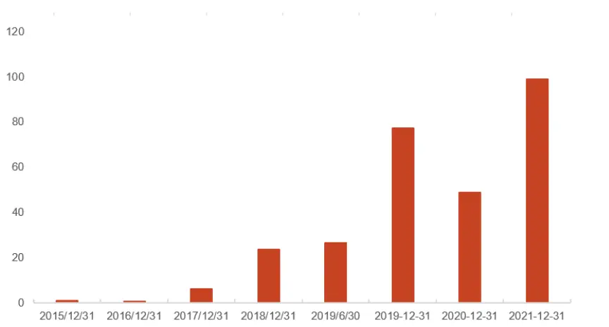
资料来源：Wind，光大证券研究所；注：坐标轴日期为报告期

表 1：兖矿能源（600188.SH）历年分红数据

| 年份 | 预案公告日 | 除权除息日 | 报告期 | 分红金额（亿元） |
| --- | --- | --- | --- | --- |
| 2015 | 2016-03-30 | 2016-06-30 | 2015-12-31 | 0.98 |
| 2016 | 2017-04-01 | 2017-07-14 | 2016-12-31 | 0.49 |
| 2017 | 2018-03-24 | 2018-06-11 | 2017-12-31 | 5.89 |
| 2018 | 2019-03-30 | 2019-06-11 | 2018-12-31 | 23.58 |
| 2019 | 2019-08-31 | 2019-11-19 | 2019-06-30 | 26.52 |
| 2020 | 2020-04-23 | 2020-07-07 | 2019-12-31 | 77.31 |
| 2021 | 2021-03-27 | 2021-07-23 | 2020-12-31 | 48.74 |
| 2022 | 2022-03-31 | 2022-07-14 | 2021-12-31 | 98.97 |

资料来源：Wind，光大证券研究所

## 1.1.2、动态股息率缺陷

动态股息率=Σ近 12 个月现金股利（税前）/ 指定日股票市值×100%

对于动态股息率来说，由于分红时点在各年度存在差异，会导致滚动 12 个月统计分红时出现数据空缺或重复统计的情况。但该现象仅仅是由统计误差带来的，公司的分红行为并没有出现变动。

以中国神华（601088.SH）为例，下图为该股票动态股息率。可以看到在 2016年度、2017 年度以及 2021 年度的除权除息日之前，股息率均出现了短暂为 0的现象。此类股息率波动仅由统计误差导致，并没有体现股票的真实股息率波动。

图 2：中国神华（601088.SH）动态股息率
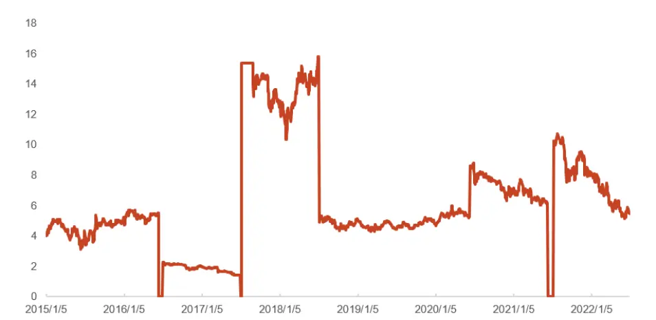
资料来源：Wind，光大证券研究所；注：统计区间为 2015 年 1 月 1 日——2022 年7 月 1 日

表 2：中国神华（601088.SH）历年分红数据

| 年份 | 预案公告日 | 除权除息日 | 报告期 | 税前每股股利（元） |
| --- | --- | --- | --- | --- |
| 2015 | 2015-03-21 | 2015-06-15 | 2014-12-31 | 0.74 |
| 2016 | 2016-03-25 | 2016-07-04 | 2015-12-31 | 0.32 |
| 2017 | 2017-03-18 | 2017-07-10 | 2016-12-31 | 2.97 |
| 2018 | 2018-03-24 | 2018-07-09 | 2017-12-31 | 0.91 |
| 2019 | 2019-03-23 | 2019-07-08 | 2018-12-31 | 0.88 |
| 2020 | 2020-03-28 | 2020-06-15 | 2019-12-31 | 1.26 |
| 2021 | 2021-03-27 | 2021-07-12 | 2020-12-31 | 1.81 |
| 2022 | 2022-03-26 | 2022-07-11 | 2021-12-31 | 2.54 |

资料来源：Wind，光大证券研究所

## 1.2、 股息率预测方法概述

基于股息率指标的重要性以及传统股息率计算方式存在的问题，我们对如何正确计算股息率指标展开了研究。

股息率的构成一共分为三部分，分别为分红率、净利润和股票市值。其预测难度由高到低为：市值>净利润>分红率。

净利润的影响因素主要包括企业经营状况、外部市场环境等，使用量化的方式对业绩进行预测的难度较高，因此我们结合分析师一致预期数据进行辅助预测。

分红率主要与企业当年的经营情况、行业以及所属生命周期等因素有关，具备较高的预测性。我们将在此部分构造完备的预测框架。

对于市值来说，我们不进行预测，而是通过预期分红率和预期净利润来构建预期股息率指标，该指标可以理解为：未来高派息的股票以当前价格购买的性价比。

$$
\sin\angle ABP\sin\angle C=\frac{\sin\angle BABD\angle I\sin\angle B}{\underline{{\theta}}\equiv\displaystyle{\frac{1}{\cos\angle B}}\tan\angle BAB}
$$

图 3：股息率预测方法概述

$$
\begin{array}{rl}&{\frac{\partial\theta(f(\theta),\theta)\partial\theta(f(\theta),\theta)\partial\theta(f(\theta),\theta)}{\partial\theta(f(\theta),\theta)\partial\theta(f(\theta),\theta)}=\frac{\partial\theta(f(\theta),\theta)\partial\theta(f(\theta),\theta)}{\partial\theta(f(\theta),\theta)}=\frac{\partial\theta(f(\theta),\theta)}{\partial\theta(f(\theta),\theta)}}\\&{\frac{\partial\theta(f(\theta),\theta)\partial\theta(f(\theta),\theta)}{\partial\theta(f(\theta),\theta)}=\frac{\partial\theta(f(\theta),\theta)}{\partial\theta(f(\theta),\theta)}=\frac{\partial\theta(f(\theta),\theta)}{\partial\theta(f(\theta),\theta)}}\\&{\frac{\partial\theta(f(\theta),\theta)\partial\theta(f(\theta),\theta)}{\partial\theta(f(\theta),\theta)}=\frac{\partial\theta(f(\theta),\theta)}{\partial\theta(f(\theta),\theta)}=\frac{\partial\theta(f(\theta),\theta)}{\partial\theta(f(\theta),\theta)}}\\&{\frac{\partial\theta(f(\theta),\theta)}{\partial\theta(f(\theta),\theta)}=\frac{\partial\theta(f(\theta),\theta)}{\partial\theta(f(\theta),\theta)}=\frac{\partial\theta(f(\theta),\theta)\partial\theta(f(\theta),\theta)}{\partial\theta(f(\theta),\theta)}}\\&{\frac{\partial\theta(f(\theta),\theta)}{\partial\theta(f(\theta),\theta)}=\frac{\partial\theta(f(\theta),\theta)}{\partial\theta(f(\theta),\theta)}=\frac{\partial\theta(f(\theta),\theta)\partial\theta(f(\theta),\theta)}{\partial\theta(f(\theta),\theta)}}\end{array}
$$

资料来源：光大证券研究所

## 2、如何准确计算预期股息率？

上一章节我们提到，股息率预测有两个重要步骤，分红率预测和净利润预测。本章节我们针对这两个步骤展开研究。

本章节是全文的重点部分，涉及到的内容和细节较多，因此我们在章节开篇处给出研究流程图如下。我们将是否分红与分红多少两个环节拆分。首先研究分不分红的问题，对大概率不进行分红的股票予以剔除。第二部分是在经过剔除后的股票池内解决分多少的问题，具体拆解成股利政策的预测和年度净利润的预测。

图 4：预期股息率研究流程图
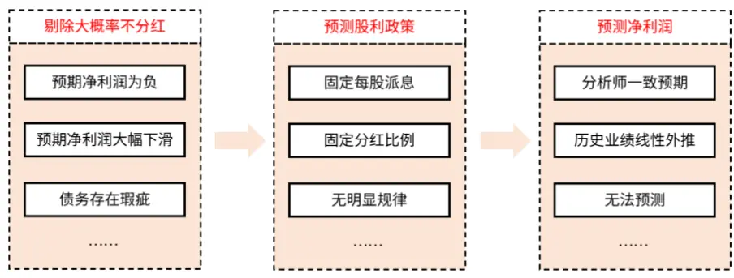
资料来源：光大证券研究所

## 2.1、 哪些股票大概率不分红？

近些年一系列鼓励与引导上市公司分红的政策相继出台，以改善 A股市场的分红环境，促进上市公司分红以回报股东。在政策引导下，A 股的平均分红率稳定在 30%左右。然而由于企业自身的发展状况不同，依然有部分企业无法进行分红。因此，我们可以在预测分红率之前将预测范围缩小，以此来提升预测准确率。

## 2.1.1、净利润为负的股票如何分红

一般来说，企业的分红来自于当年的净利润。但我们研究发现，部分当年净利润为负的企业也分派了现金股利。只要是公司的未分配利润为正，公司分配股息就是可能的。因此，我们还需要研究企业年净利润为负时如何分红。

从红利来源上看，亏损企业的分红来自于未分配利润。因此，企业可能的分红准则有两个：

（1）按未分配利润的某个比例分红。

（2）以某个较低固定的金额分红。

我们统计了 2005 年至 2021 年年报的分红数据，其中多次净利润为负且分红的股票共有 16 只，分红金额出现明显变化的股票共有 5 只，占比较低。且多数股票仅进行了较少金额的分红，每股派息大于 0.1 元的仅有 5 只。

因此，我们认为企业在亏损的情况下更倾向于以某个较低的固定金额分红。当预期净利润为负时，我们采用该公司过去亏损情况下的每股派息作为预测值。若企业没有相关历史样本，那么我们认为该公司当年不分红。

表 3：净利润为负的企业分红情况

|  | 广州 浪奇 | 青岛 双星 | 美锦 能源 | 美达 股份 | 中信 国安 | 国光 电器 | 石基 信息 | 粤传媒 | 康得新 | 万邦达 | 潜能 恒信 | 浙江 富润 | 易见 股份 | 风神 股份 | 航天 通信 | 惠而浦 |
| --- | --- | --- | --- | --- | --- | --- | --- | --- | --- | --- | --- | --- | --- | --- | --- | --- |
| 分红年度 | 2018 | 2019 | 2009 | 2009 | 2012 | 2012 | 2020 | 2009 | 2015 | 2018 | 2015 | 2014 | 2016 | 2008 | 2016 | 2017 |
| 每股派息 | 0.02 | 0.01 | 0.11 | 0.02 | 0.1 | 0.08 | 0.04 | 0.02 | 0.09 | 0.015 | 0.01 | 0.05 | 0.27 | 0.1 | 0.02 | 0.05 |
| 分红年度 | 2019 | 2020 | 2012 | 2016 | 2013 | 2018 | 2021 | 2014 | 2016 | 2020 | 2017 | 2020 | 2017 | 2021 | 2017 | 2019 |
| 每股派息 | 0.02 | 0.01 | 0.2 | 0.02 | 0.1 | 0.08 | 0.03 | 0.03 | 0.057 | 0.015 | 0.01 | 0.049 | 0.363 | 0.02 | 0.07 | 0.05 |
| 分红年度 |  | 2021 |  |  |  |  |  |  | 2017 |  |  |  |  |  | 2018 | 2020 |
| 每股派息 |  | 0.01 |  |  |  |  |  |  | 0.07 |  |  |  |  |  | 0.12 | 0.15 |

资料来源：Wind，光大证券研究所；每股派息单位：元

## 2.1.2、净利润大幅下滑的股票如何分红

分红一般跟随当年利润的变动而调整，但是当利润大幅下滑时，企业很可能不分红或以较少的金额分红。我们定义净利润同比下滑 50%以上为净利润大幅下滑，税前每股派息小于 0.1 元的认为是象征性分红。

经统计，2010 年以来净利润大幅下滑且非象征性分红的上市公司数量占比低于10%。净利润大幅下滑时企业倾向于较少分红或不分红。

图 5：不同净利润下滑幅度的公司分红趋势
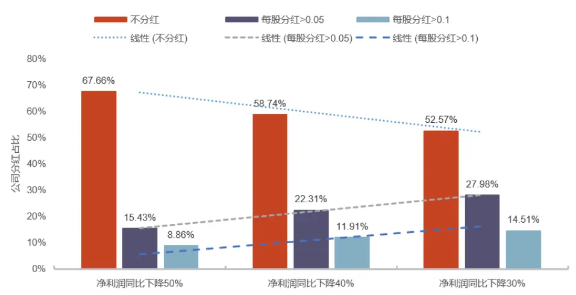
资料来源：Wind，光大证券研究所；注：数据区间为 2010 年—2021 年；每股分红单位：元

表 4：净利润为负的企业分红情况

| 净利润下降程度 | 不分红 | 每股分红>0.05元 | 每股分红>0.1元 | 样本总数(2010-2021)（个） |
| --- | --- | --- | --- | --- |
| 净利润同比下降 50% | 67.66% | 15.43% | 8.86% | 7379 |
| 净利润同比下降 40% | 58.74% | 22.31% | 11.91% | 9251 |
| 净利润同比下降 30% | 52.57% | 27.98% | 14.51% | 11150 |

资料来源：Wind，光大证券研究所

## 2.1.3、债务存在瑕疵的股票如何分红

从偿付优先级来看，债务的清偿要排在红利之前。因此，对于债务存在瑕疵的企业来说，分红的可能性较低。我们统计了展期、提前到期未兑付以及未按时兑付本息等违约类型的债券作为债务存在瑕疵的样本。

2014 年以来，上市公司债务瑕疵共发生过 334 起，涉及公司 64 家。所有发生债务违约的公司在未来三年均未分红。

因此，我们认为企业在债务存在问题的情况下没有分红能力，当企业发生债务违约事件后，我们预测该公司在未来三年不进行分红。

表 5：债务存在瑕疵企业分红行为统计

| 年度 | 数量（个） | 未来3年分红家数 |
| --- | --- | --- |
| 2014 | 1 | 0 |
| 2015 | 3 | 0 |
| 2016 | 0 | 0 |
| 2017 | 4 | 0 |
| 2018 | 57 | 0 |
| 2019 | 82 | 0 |
| 2020 | 47 | 0 |
| 2021 | 102 | 0 |
| 2022 | 38 | 0 |

资料来源：Wind，光大证券研究所；注：数据区间为 2014 年 1 月 1 日—2022 年 8月 1 日。

## 2.1.4、大概率不分红股票小结

综上所述，有三种类型的企业大概率不会进行分红，具体包括有预期净利润为负、预期净利润大幅下滑以及债务存在瑕疵。我们在开始预测之前首先对上述股票进行了剔除，进而在经过剔除后的股票池内进行分红预测研究。

## 2.2、 基于稳定股利政策的分红率预测

对上述大概率不分红的股票进行剔除后，我们在剩余的股票中对分红率进行预测。企业的现金股利政策是预测的切入点，我们以此对公司进行分类，进而分别预测不同股利政策下的分红率。一般而言，上市公司现金股利政策有如下几种：

1)固定每股股利或稳定增长股利：在未来一段时间内每年发放的每股股利保持不变；在未来收益可维持新的更高股利时，增加每股股利额。

2)固定股利支付率：固定每年股利占当年收益的比重。

3)正常股利叠加超额股利：在固定每股股利政策的基础上，根据公司当年的收入情况支付超额股利。

4)投资剩余额股利：上市公司从未分配利润中扣除筹资需求部分，将剩余的未分配利润作为现金红利分配给股东。

以上的几种股利政策可以分成两种。一种是红利不随业绩变动，我们将其定义为固定每股派息政策；另一种是红利随业绩变动，我们将其定义为固定分红比例政策。通过对企业的股利政策进行建模，可以对股票进行分类，进而在不同类别中预测分红率。

## 2.2.1、固定每股派息政策

固定每股派息政策的每股股利不随其经营情况变动而变动，其每股股利与每股派息如图 6 所示。

以杭州银行（600926.SH）为例，其基本每股收益从 2016 年以来经历了先下降后上升的过程，然而税前每股派息稳定在 0.3 元左右。

图 6：固定每股派息政策示意图
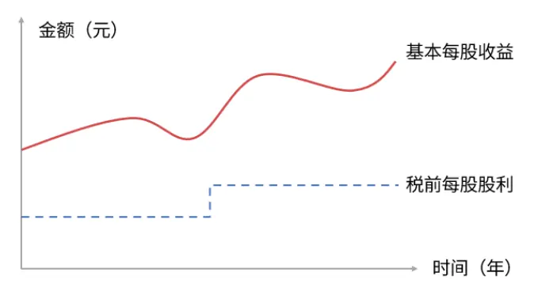
资料来源：光大证券研究所

图 7：杭州银行(600926.SH)历史分红情况
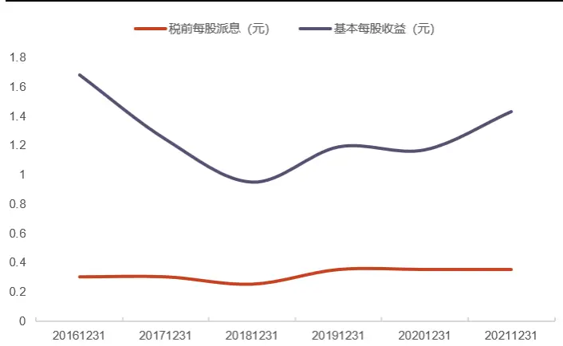
资料来源：Wind，光大证券研究所；注：坐标轴日期为报告期

表 6：杭州银行（600926.SH）税前每股派息及基本每股收益

| 分红会计年度 | 税前每股派息（元） 基本每股收益（元） |
| --- | --- |
| 20161231 | 0.3 1.68 |
| 20171231 | 0.3 1.24 |
| 20181231 | 0.25 0.95 |
| 20191231 | 0.35 1.19 |
| 20201231 | 0.35 1.17 |
| 20211231 | 0.35 1.43 |

资料来源：Wind，光大证券研究所

## 2.2.2、固定分红比例政策

固定分红比例政策是大多数企业采用的股利政策，企业从每年的盈利中拿出一部分回报投资者也符合价值投资逻辑。如图 8 所示，该政策表现出来的特征是每股股利与每股收益显著正相关。

以中国人寿为例，其每股股利与每股收益变动方向基本一致，是标准的固定分红比例政策。

此外，我们还发现分红比例存在低 Beta 现象：当净利润同比上涨时，分红比例的上涨幅度低于净利润的上涨幅度，当净利润同比下滑时，分红比例的下降幅度小于净利润的下降幅度。

图 8：固定分红比例政策示意图
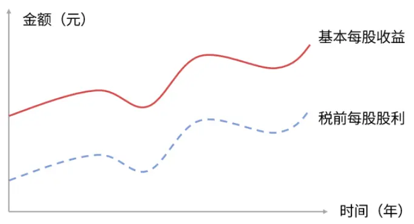
资料来源：光大证券研究所

图 9：中国人寿(601628.SH)历史分红情况
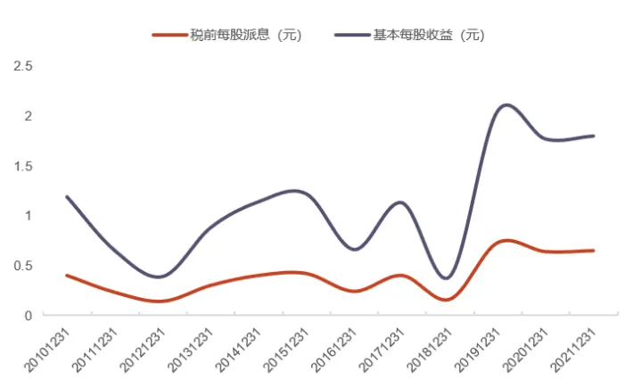
资料来源：Wind，光大证券研究所；注：坐标轴日期为报告期

表 7：中国人寿（601628.SH）税前每股派息及基本每股收益

| 分红会计年度 | 税前每股派息（元） | 基本每股收益（元） |
| --- | --- | --- |
| 20101231 | 0.4 | 1.19 |
| 20111231 | 0.23 | 0.65 |
| 20121231 | 0.14 | 0.39 |
| 20131231 | 0.3 | 0.88 |
| 20141231 | 0.4 | 1.14 |
| 20151231 | 0.42 | 1.22 |
| 20161231 | 0.24 | 0.66 |
| 20171231 | 0.4 | 1.13 |
| 20181231 | 0.16 | 0.39 |
| 20191231 | 0.73 | 2.05 |
| 20201231 | 0.64 | 1.77 |
| 20211231 | 0.65 | 1.8 |

资料来源：Wind，光大证券研究所

## 2.2.3、异常分红的处理

上述两种现金股利政策是较为理想的状态，我们挑选出的股票也都是分红行为比较规范的企业。但有部分公司的分红率会存在“异常”情况，比如分红金额是当年净利润的 1 倍以上。

我们认为此类“异常”分红行为不可持续，而且将这部分数据点纳入回归模型中会严重影响到模型的预测能力，因此我们对分红比例为 100%以上的数据点进行剔除处理。

以南玻 A（000012.SZ）为例，该公司在历史上共发生过 4 次分红率高于 1 的情况。图 10 为全部历史分红数据，可以看到每股收益与每股红利的关系受极端值影响明显。图 11 剔除了分红比例大于 1 的四次分红数据，此时该公司为标准的固定分红比例型企业。

图 10：南玻 A（000012.SZ）历史分红情况
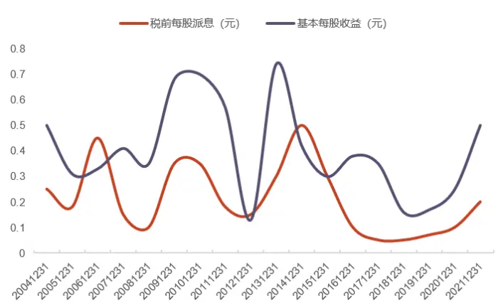
资料来源：Wind，光大证券研究所；注：坐标轴日期为报告期

图 11：南玻 A（000012.SZ）剔除异常值后的分红情况
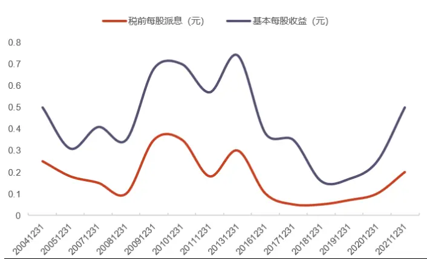
资料来源：Wind，光大证券研究所；注：坐标轴日期为报告期

表 8：南玻 A（000012.SZ）历史分红明细

| 分红会计年度 | 2004 | 2005 | 2006 | 2007 | 2008 | 2009 | 2010 | 2011 | 2012 | 2013 | 2014 | 2015 | 2016 | 2017 | 2018 2019 | 2020 |  | 2021 |
| --- | --- | --- | --- | --- | --- | --- | --- | --- | --- | --- | --- | --- | --- | --- | --- | --- | --- | --- |
| 税前每股派息 | 0.25 | 0.18 | 0.45 | 0.15 | 0.1 | 0.35 | 0.35 | 0.18 | 0.15 | 0.3 | 0.5 | 0.3 | 0.1 | 0.05 | 0.05 | 0.07 | 0.1 | 0.2 |
| 基本每股收益 | 0.5 | 0.31 | 0.33 | 0.41 | 0.35 | 0.68 | 0.7 | 0.57 | 0.13 | 0.74 | 0.42 | 0.3 | 0.38 | 0.35 | 0.16 | 0.17 | 0.25 | 0.5 |

资料来源：Wind，光大证券研究所；单位：元

## 2.2.4、时序建模预测分红率

根据上述统计分析可知，企业分红比例在时间序列上存在着很明显的规律，因此我们考虑对每一只股票进行时间序列建模，筛选出使用不同股利政策的企业。预测模型分为两个阶段：

## 1） 固定分红比例

首先，通过对全市场中每只股票进行时间序列建模，筛选出税前每股派息与基本每股收益相关，且回归 大于 0.8 的股票作为固定分红比例公司。为了保证足够的历史数据，我们以 2012 年作为回归的起始年份，历史分红数据选择 2008 年至回归年份的全部数据。

由于分红政策可能会随着公司的发展而变化，因此近期的数据信息含量更高。为了捕捉近期更有效的信息，我们使用 WLS 进行回归，其中权重为时间序列上由近及远的指数衰减加权。

回归模型如下：

$$
\begin{array}{r}{DPS_{i,t}=\beta_{0}\times EPS_{i,t}+\beta_{1}\times D_{i,t}}\end{array}
$$

其中 $\boldsymbol{DPS}_{i,t}$ 表示股票 i 在 t年的税前每股派息， $EPS_{i,t}$ 表示股票 i 在 t年的基本每股收益， $D_{i,t}$ 为业绩增长哑变量，表示股票 i 在 t年净利润是否同比增长。

从回归 的描述性统计来看，市场中大多数公司采用的是固定分红比例政策， $R^{2}$ 的 50%分位点维持在 88%左右。

表 9：时间序列回归拟合优度统计

|  | 2015 | 2016 | 2017 | 2018 | 2019 | 2020 | 2021 |
| --- | --- | --- | --- | --- | --- | --- | --- |
| 样本数量 | 888 | 1322 | 1620 | 1764 | 1955 | 2151 | 2467 |
| 25% | 73.51% | 72.03% | 73.76% | 74.44% | 74.06% | 73.70% | 72.62% |
| 50% | 88.30% | 88.58% | 89.00% | 87.96% | 87.77% | 87.54% | 87.15% |
| 75% | 96.44% | 95.86% | 95.53% | 95.25% | 95.09% | 94.89% | 94.91% |
| 最大值 | 100.00% | 100.00% | 100.00% | 99.99% | 99.98% | 99.98% | 99.99% |

资料来源：Wind，光大证券研究所

## 2）固定每股派息

筛选完固定分红比例的公司之后，检验剩余公司的每股派息是否稳定。具体来说，计算公司历史 5 年每股红利的最大偏离幅度，如果该幅度小于 50%，我们认为该公司采用固定每股派息政策。

偏离幅度的计算如下：

$$
BIAS_{i,t}=\operatorname*{max}\left\{\left|\frac{DPS_{i,t}-\overline{{DPS_{i}}}}{\overline{{DPS_{i}}}}\right|\right\}\quad t=1,2,\ldots n
$$

其中 $\overline{{DPS}}_{\imath}$ 表示股票 i 过去 n 年的平均税前每股派息。

从每股派息最大偏离幅度的分布来看，大部分的股票都不满足固定每股派息政策，25%分位点的偏离幅度在 50%以下。

表 10：每股派息最大偏离幅度统计

|  | 2015 | 2016 | 2017 | 2018 | 2019 | 2020 | 2021 |
| --- | --- | --- | --- | --- | --- | --- | --- |
| 样本数量 | 288 | 441 | 536 | 578 | 644 | 725 | 867 |
| 25% | 39.02% | 42.86% | 44.44% | 47.06% | 48.69% | 48.39% | 46.27% |
| 50% | 61.38% | 64.71% | 66.67% | 73.93% | 72.42% | 71.67% | 72.22% |
| 75% | 87.50% | 100.00% | 105.16% | 108.33% | 109.11% | 110.97% | 109.22% |
| 最大值 | 233.78% | 325.12% | 343.79% | 343.05% | 332.43% | 362.96% | 362.96% |

资料来源：Wind，光大证券研究所

## 3）分红政策不固定

完成上述两种公司的筛选之后，依然有一部分样本无法被划分，我们认为这类公司的分红政策并不具备预测性，因此仅使用上一期的分红比例作为其下一期的预测值。

我们统计了沪深 300 和中证 500 成分股中不同股利政策的占比情况，没有被划分的部分包括分红政策不固定和历史分红次数不满足基本要求的股票。对比来看，大部分企业采取固定分红比例政策。

图 12：沪深 300 指数成分股不同分红政策占比
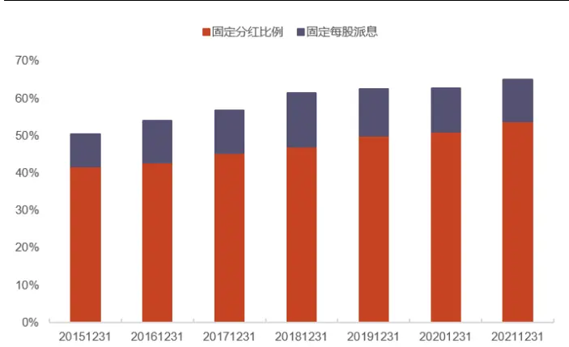
资料来源：Wind，光大证券研究所；注：坐标轴日期为报告期

图 13：中证 500 指数成分股不同分红政策占比
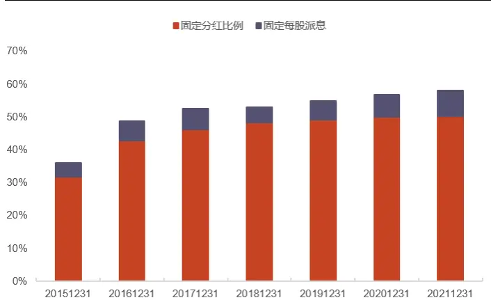
资料来源：Wind，光大证券研究所；注：坐标轴日期为报告期

## 2.3、 净利润预测

上一小结我们通过对股息率进行时序建模，拟合出了公司的现金股利政策。对于固定每股红利的企业来说，其分红金额不随盈利状况变化，因此可以用历史每股红利对未来分红进行预测。然而对于固定分红比例的企业来说，要想准确预测分红率还需要预测净利润。

从预测时间来看，我们更倾向于在每年的年底进行计算，此时上市公司的三季报已经基本披露完成，以此对当年年报的净利润进行预测误差会比较小。同时，红利类指数的成分股调整一般也在每年的 12 月，二者具有可比性。

我们考虑了两种预测方式，具体预测流程如下：

（1）确定预测股票池：将时序建模得到的固定分红比例的股票作为股票池。

（2）预测方法一，基于历史业绩预测：将股票按照业绩是否稳定进行分类，对于业绩稳定的股票进行线性外推预测。

预测方法二，基于分析师一致预期数据预测：使用三季报披露完成之后的分析师一致预测净利润。

我们使用平均绝对偏差（MAE）作为预测结果的评价指标。指标的构造如下所示，用来表征预测值与真实值的平均偏离幅度。

$$
MAE=\frac{\sum_{i=1}^{n}\left|\frac{predicted_{i}-actual_{i}}{actual_{i}}\right|}{n}
$$

## 2.3.1、基于历史业绩线性外推预测

在仅已知企业历史业绩的情况下对未来业绩进行预测难度较大，只有当企业盈利存在一定规律时预测才有价值。因此我们将股票按照业绩是否稳定进行了划分。对于业绩稳定型公司，使用其历史业绩线性外推预测。对于业绩不稳定的企业，我们不做预测，使用其上一年度的同期业绩作为该年度预测值。

判断公司业绩是否稳定时，我们使用前三季度利润占全年总利润的比例来进行区分。对于业绩稳定的公司来说，各年度的前三季度利润占全年的比重应波动较小。

我们同样计算占比的最大偏离幅度来区分稳定型和波动型企业，指标构造方式如下：

$$
PROFIT~BIAS_{i,t}=\operatorname*{max}\left\{\left|\frac{Profitratio_{i,t}^{q3}-\overline{{Prof_{l}trat{o}_{l}^{q3}}}}{\overline{{Prof_{l}trat{o}_{l}^{q3}}}}\right|\right\}~t=1,2,...n
$$

其 $\ncong Profitratio_{i,t}^{q3}$ 表示股票 i 在第 t 年前三季度净利润占全年的比重，

$\overline{{Profutrat{}_{l}o_{l}^{q3}}}$ 表示股票 i 过去 n 年前三季度净利润占全年比重的均值。我们将该指标小于 10%的股票作为业绩稳定型股票。

下图展示了全样本股票池和业绩稳定股票池的预测结果对比。业绩稳定公司预测值的最大偏离幅度在各年度均小于全样本，预测值的平均偏离幅度在 10%-20%之间。

图 14：历史业绩线性外推预测效果
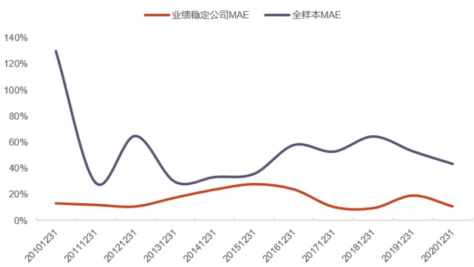
资料来源：Wind，光大证券研究所；注：坐标轴日期为报告期

此外，股票的除权除息日一般处于二季报发布阶段。因此在进行业绩外推时最早可以使用二季报数据来进行预测。但是由于使用二季度数据预测的误差过大，我们并未采用该方案，而是等到三季报发布时再进行预测。

图 15：二季报与三季报预测 MAE 对比图
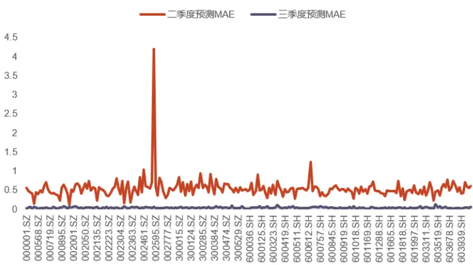
资料来源：Wind，光大证券研究所；注：样本选取为二季报和三季报的 PROFITBIAS 指标均小于 10%的股票。

## 2.3.2、分析师一致预期为主，历史业绩外推为辅

在净利润预测方面，分析师能获得更丰富且准确的数据，尽管整体来看分析师一致预期倾向于高估，但相比于用历史数据进行外推还是更具优势。因此我们在利润预测时以分析师一致预期数据为主。对于分析师覆盖度低的股票，采用历史业绩外推测算。

为了确保分析师一致预期数据的准确，我们剔除了分析师覆盖人数小于 5 的股票，并且选取的数据为公司发布三季报之后到当年 12 月 31 日之间的业绩预测。

下图为分析师一致预期和历史业绩预测两种方法的对比结果，在相同的股票池内，分析师一致预测的效果要显著优于历史业绩线性外推，预测值的平均偏离幅度同样在 10%-20%之间。

图 16：分析师一致预期与历史业绩线性外推预测效果对比
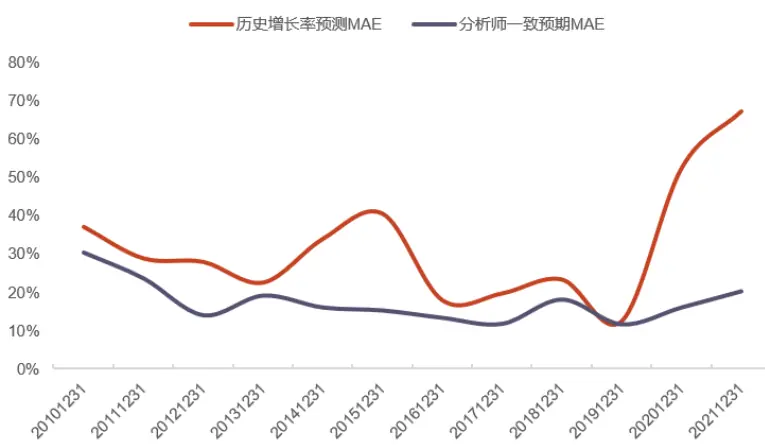
资料来源：Wind，光大证券研究所；注：坐标轴日期为报告期

## 2.4、 预期股息率指标构造

至此，我们已经完成了分红预测的研究。再来回顾一下整个研究流程，首先对公司是否分红进行探究，对于净利润为负、净利润大幅下滑以及债务存在瑕疵的股票进行剔除。提纯股票池之后，再进行分红预测研究。其中包括股利政策划分和净利润预测。

图 17：预期股息率研究流程回顾
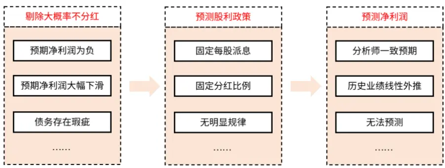
资料来源：光大证券研究所

有了上述分析之后，我们接下来构建预期股息率指标。指标构造有两个关键环节，一个是指标更新时点，另一个是指标构造的流程。

公司分红流程中有两个重要日期，分别是预案公告日和除权除息日。投资者在此期间持有股票即可获得现金股利，因此，可以将时间划分成三段：

（1） 预案公告日之前：采用上一年度的数据对当年的分红进行预测。

（2） 在预案公告日之后，除权除息日之前：使用当年真实的分红数据。

（3） 完成除权除息之后且三季报披露完成：对下一年的分红进行预测。

图 18：预期股息率更新示意图
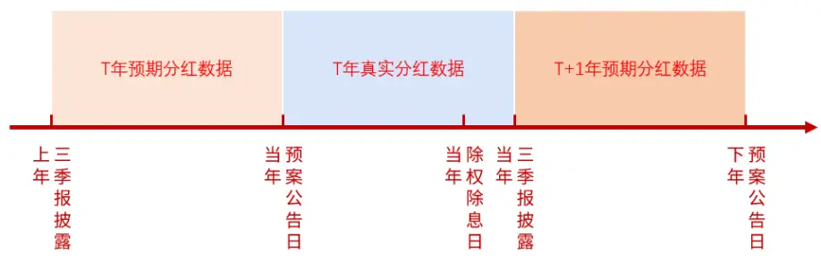
资料来源：光大证券研究所

预期股息率指标的计算流程以前序章节的研究结果为基础，从股利政策、分析师覆盖度以及业绩稳定性等几个角度进行建模预测，具体的指标构建流程如下图所示：

1)指标的构建从股利政策出发，首先将股票分成固定分红比例政策和固定每股派息政策两种类型，对于固定每股派息型来说，可使用历史每股派息直接计算出预期分红金额。对于固定分红比例的公司来说，我们还需要对净利润进行预测。

2)净利润预测方面，根据分析师是否覆盖将固定分红比例的股票进一步分类，对于分析师覆盖人数大于 5 的股票，直接使用分析师一致预测净利润。对于分析师覆盖度低的股票，通过历史业绩进行测算。

3)在使用历史业绩测算时，为了提高预测准确率，以公司业绩是否稳定进一步将分析师覆盖度低的股票进行分类。对于业绩稳定的公司，采用线性外推方式预测净利润。对于业绩不稳定的公司来说，不做预测，而是使用上年同期净利润。

图 19：预期股息率计算流程图
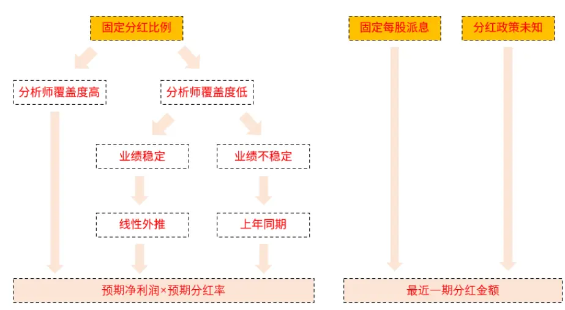
资料来源：光大证券研究所

## 2.5、 预测能力对比

中证红利指数（000922.CSI）是红利类 ETF 常用的跟踪标的。其筛选的是现金股息率高、分红比较稳定、具有一定规模及流动性的 100 只股票为成分股，以反映 A股市场高红利股票的整体表现。我们以中证红利指数作为比较基准，对比预期股息率的预测能力。具体比较方法构造如下：

1) 每年的最后一个交易日调整股票池成分股；

2)筛选过去两年连续现金分红且每年的税后现金股息率均大于 0 的股票；

3)筛选过去一年内日均总市值和日均成交金额排名均在前 80%的股票；

4)在上述样本空间内筛选预期股息率排名前 100 的股票作为预期高股息组合；

5)使用股票对应会计年度的实际分红数据和股票池调整当天的市值数据，计算“实际股息率”；

6)对比预期高股息组合和中证红利指数的“实际股息率”。

下图为中证红利指数和预期高股息组合的实际股息率对情况，超额股息率为预期高股息组合与中证红利成分股的真实股息率之差。

对比来看，预期高股息组合的真实股息率整体高于中证红利指数成分股，仅在2015 年和 2016 年低于中证红利，胜率 77.8%，提升效果明显。

图 20：中证红利指数与预期高股息组合预测能力对比
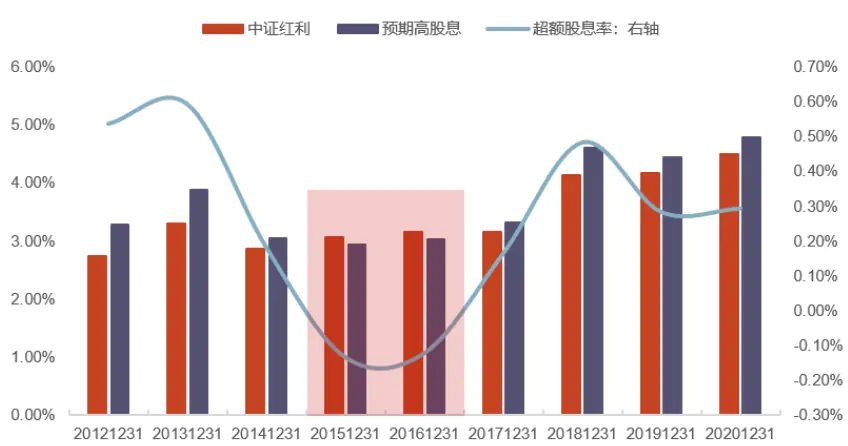
资料来源：Wind，光大证券研究所

表 11：中证红利指数与预期高股息组合真实股息率

|  | 2012 | 2013 | 2014 | 2015 | 2016 | 2017 | 2018 | 2019 | 2020 |
| --- | --- | --- | --- | --- | --- | --- | --- | --- | --- |
| 中证红利 | 2.74% | 3.29% | 2.86% | 3.07% | 3.14% | 3.16% | 4.13% | 4.17% | 4.50% |
| 预期高股息 | 3.27% | 3.88% | 3.04% | 2.93% | 3.02% | 3.32% | 4.61% | 4.45% | 4.79% |
| 超额股息率 | 0.54% | 0.59% | 0.18% | -0.13% | -0.12% | 0.16% | 0.48% | 0.28% | 0.29% |

资料来源：Wind，光大证券研究所。注：超额股息率为预期高股息组合与中证红利成分股的真实股息率之差。

## 3、 红利 SmartBeta 指数构建

SmartBeta 的本质是构造出最能够代表特定风格的股票组合，红利 SmartBeta最核心的就是筛选出真正高股息的股票。本文将股息率进行了多维度拆解，构造出了预测能力更强的预期股息率因子。接下来我们将利用预期股息率构造红利SmartBeta 指数。

在市场中各类红利相关的指数中，更具代表性的是“红利+”类指数，也即高股息叠加其它风格来提升组合的表现。

从 SmartBeta 的内涵来看，中证红利等仅使用股息率构造的指数更能够表征红利风格，此类指数对于资产配置投资者来说是更为纯净的风格指数。从收益角度来看，由于叠加了其它具备 Alpha 属性的因子，“红利+质量”的表现要明显优于其它指数。

表 12：红利类指数构造

| 指数代码 | 指数名称 | 选股指标 | 选股范围 | 选股数量 |
| --- | --- | --- | --- | --- |
| 000922.CSI | 中证红利指数 | 历史股息率 | 沪深 300 的样本空间 | 100 |
| 000015.SH | 上证红利指数 | 历史股息率 | 上证180的样本空间 | 50 |
| 930740.CSI | 沪深 300 红利低波动指数 | 历史股息率+波动率 | 沪深 300 成分股 | 50 |
| 931373.CSI | 中证高股息龙头指数 | 历史股息率 | 中证全指 | 不固定 |
| 930838.CSI | 中证高股息精选指数 | 股息率+质量因子(ROA、 Growth、ACCRUAL、OPCFD) | 中证全指 | 100 |
| 931468.CSI | 中证红利质量指数 | 股息率+质量因子（每股净利 润、每股未分配利润、盈利质 量、毛利率、ROE均值-标准 差、ROE变化) | 中证全指 | 50 |
| H30269.CSI | 中证红利低波动指数 | 股息率+波动率 | 中证全指 | 50 |

资料来源：Wind，光大证券研究所整理。

图 21：红利类指数净值对比
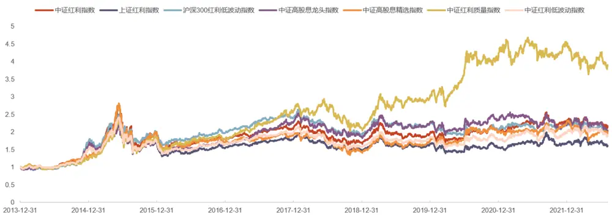
资料来源：Wind，光大证券研究所。注：数据区间为 2013 年 12 月 31 日—2022 年8 月 8 日。

## 3.1、 预期红利组合构建

我们首先仅使用预期股息率数据构建更为单纯的红利 SmartBeta 组合，该组合对标中证红利以及上证红利等指数。差异主要在于预期红利组合使用预期股息率构建，而中证红利和上证红利指数使用历史股息率构建。具体构造流程如下：

## 2) 选样方法

对样本空间内证券，按照预期股息率由高到低排名，选取排名靠前的 50 只证券以股息率加权构建组合。

从收益情况来看，预期红利组合的表现明显优于中证红利全收益与沪深 300 全收益。

图 22：预期红利组合净值表现
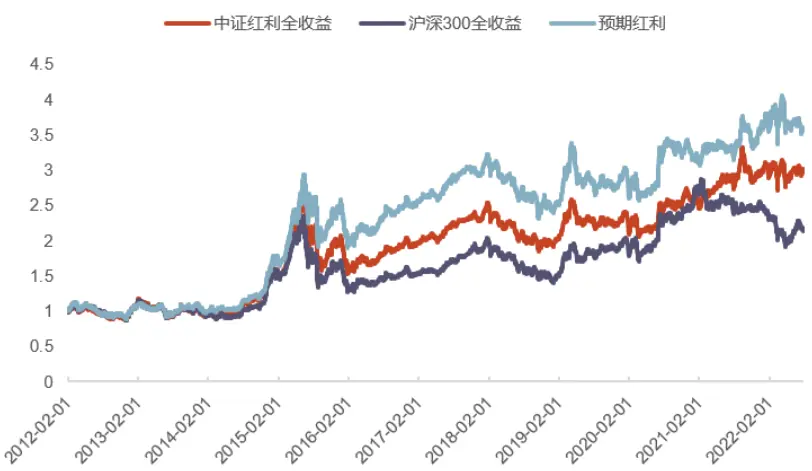
资料来源：Wind，光大证券研究所。注：数据区间为 2012 年 2 月 1 日—2022 年 7月 29 日。

表 13：预期红利组合各年度收益

| 年度 | 预期红利组合 | 沪深 300 全收益 | 中证红利全收益 | 相对沪深300全收相对中证红利全收 益超额 | 益超额 |
| --- | --- | --- | --- | --- | --- |
| 2012 | 5.87% | 6.04% | 6.06% | -0.17% | -0.19% |
| 2013 | -0.51% | -5.39% | -6.86% | 4.88% | 6.36% |
| 2014 | 63.14% | 56.39% | 57.84% | 6.76% | 5.31% |
| 2015 | 40.66% | 4.04% | 25.05% | 36.62% | 15.62% |
| 2016 | 7.64% | -2.41% | 2.99% | 10.05% | 4.66% |
| 2017 | 18.59% | 23.06% | 20.12% | -4.46% | -1.53% |
| 2018 | -20.24% | -24.69% | -17.63% | 4.45% | -2.61% |
| 2019 | 23.03% | 41.11% | 22.72% | -18.08% | 0.31% |
| 2020 | 6.30% | 28.15% | 6.68% | -21.85% | -0.38% |
| 2021 | 12.90% | -4.55% | 17.79% | 17.45% | -4.89% |
| 2022 | -2.39% | -13.71% | -1.92% | 11.32% | -0.47% |
| 全样本 | 258.78% | 116.37% | 202.41% | 142.41% | 56.37% |

资料来源：Wind，光大证券研究所；注：数据区间为 2012 年 2 月 1 日—2022 年 7月 29 日。

## 3.2、“红利+”组合构建

预期红利 SmartBeta 组合虽然更能够表征红利风格，但若想增强组合的收益，还需要增加组合在其它风格上的暴露。

在保证投资逻辑的前提下，我们引入了质量和低波动两个风格来进行“红利+”组合构建。

## 3.2.1、“预期红利+高质量”组合

高质量风格具备一定的收益能力，预期高股息叠加高质量能够在获得红利收益的情况下提升资本利得收益。具体构造方式如下：

（3） 按照预期股息率排名，选取排名前 300 的股票作为样本空间。

## 2) 选样方法

对样本空间内证券，计算 ROICenhance 因子由高到低排名，选取排名前 50 只股票以股息率加权构建组合。其中 ROICenhance 的计算方式为使用 ROIC 数据计算下述三个因子，并将因子值的排名进行等权重合成：

（1） 成长性： $factor_{yoy}=factor_{q}-factor_{q-4}$

（2） 稳定性： $factor_{std}=std(factor_{q_{t,t-1,.....,t-13}})$

（3） 持续性： $factor_{growth}=factor_{yoy_{t}}-factor_{yoy_{t-}}$ 4

“预期红利+高质量”组合的表现明显优于沪深 300 全收益和中证红利全收益，高质量对于红利组合的提升明显。

图 23：“预期红利+高质量”组合净值表现
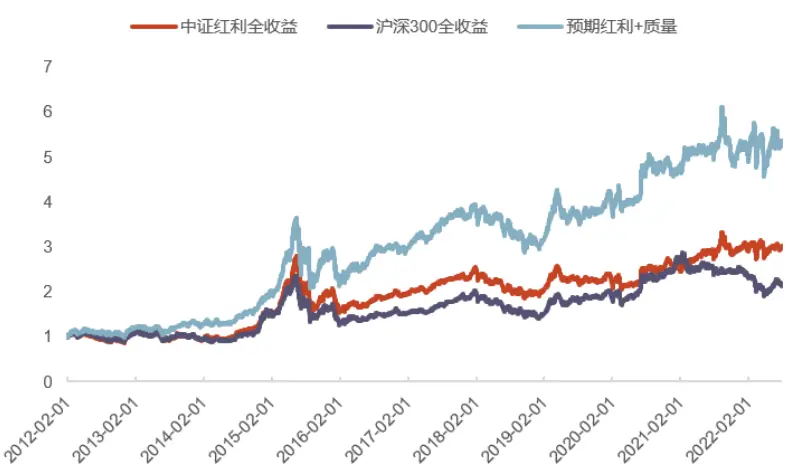
资料来源：Wind，光大证券研究所。注：数据区间为 2012 年 2 月 1 日—2022 年 7月 29 日。

表 14：“预期红利+高质量”组合各年度收益

| 年度 | 预期红利+高质量 组合 | 沪深 300 全收益 | 中证红利全收益 | 相对沪深300全收相对中证红利全收 益超额 | 益超额 |
| --- | --- | --- | --- | --- | --- |
| 2012 | 16.93% | 6.04% | 6.06% | 10.90% | 10.88% |
| 2013 | 13.78% | -5.39% | -6.86% | 19.16% | 20.64% |
| 2014 | 41.03% | 56.39% | 57.84% | -15.36% | -16.80% |
| 2015 | 53.44% | 4.04% | 25.05% | 49.40% | 28.40% |
| 2016 | 9.38% | -2.41% | 2.99% | 11.79% | 6.39% |
| 2017 | 25.67% | 23.06% | 20.12% | 2.61% | 5.55% |
| 2018 | -20.31% | -24.69% | -17.63% | 4.38% | -2.68% |
| 2019 | 34.77% | 41.11% | 22.72% | -6.34% | 12.05% |
| 2020 | 14.18% | 28.15% | 6.68% | -13.97% | 7.50% |
| 2021 | 9.89% | -4.55% | 17.79% | 14.44% |  |
| 2022 | 0.85% | -13.71% | -1.92% | 14.56% | -7.90% |
| 全样本 | 435.71% | 116.37% | 202.41% | 319.34% | 2.77% 233.30% |

资料来源：Wind，光大证券研究所；注：数据区间为 2012 年 2 月 1 日—2022 年 7月 29 日。

## 3.2.2、“预期红利+低波动”组合

预期高股息叠加低波动能够在组合保持较低风险的情况下获得较高的股息收益。具体构造方式如下：

（3） 按照预期股息率排名，选取排名前 300 的股票作为样本空间。

## 2)选样方法

对样本空间内证券，计算其过去一年波动率（日均收益率的标准差）由低到高进行排名。选取排名前 50 只股票以股息率加权构建组合。

“预期红利+低波动”组合的表现同样优于沪深 300 全收益和中证红利全收益，组合能够在较低波动的情况下获取稳定红利收益。

图 24：“预期红利+低波动”组合净值表现
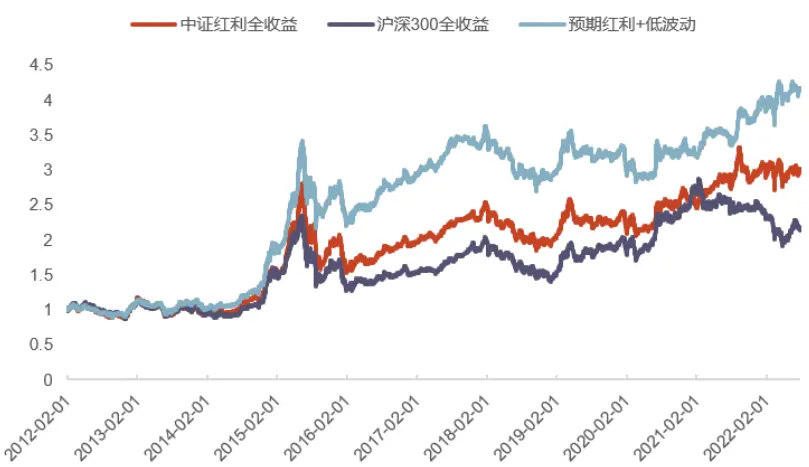
资料来源：Wind，光大证券研究所；注：数据区间为 2012 年 2 月 1 日—2022 年 7月 29 日。

表 15：“预期红利+低波动”组合各年度收益

| 年度 | 预期红利+低波动 | 沪深 300 全收益 | 中证红利全收益 | 相对沪深 300全收 相对中证红利全收 | 益超额 |
| --- | --- | --- | --- | --- | --- |
| 2012 | 组合 5.75% | 6.04% | 6.06% | 益超额 -0.29% | -0.31% |
| 2013 | 2.38% | -5.39% | -6.86% | 7.76% | 9.24% |
| 2014 | 73.64% | 56.39% | 57.84% | 17.25% | 15.80% |
| 2015 | 41.85% | 4.04% | 25.05% | 37.81% | 16.81% |
| 2016 | 9.34% | -2.41% | 2.99% | 11.75% | 6.36% |
| 2017 |  | 23.06% | 20.12% | -6.80% |  |
| 2018 | 16.26% |  |  |  | -3.86% |
| 2019 | -14.63% | -24.69% | -17.63% | 10.07% | 3.00% |
|  | 15.58% | 41.11% | 22.72% | -25.54% | -7.14% |
| 2020 | -2.23% | 28.15% | 6.68% | -30.38% | -8.91% |
| 2021 | 20.62% | -4.55% | 17.79% | 25.17% | 2.83% |
| 2022 全样本 | 4.43% 316.41% | -13.71% 116.37% | -1.92% 202.41% | 18.14% 200.04% | 6.35% 114.00% |

资料来源：Wind，光大证券研究所；注：数据区间为 2012 年 2 月 1 日—2022 年 7月 29 日。

## 4、总结与展望

红利收益是投资收益的重要组成部分，也是投资者关注的重点。本文从企业现金股利政策入手进行分析，从是否分红、分红多少、如何分红以及如何预测分红等多个维度全方位地构建了股息率预测模型。

稳定现金股利政策假设是本篇报告的创新点，我们通过对每个股票的现金股利政策进行时序建模，区分了不同分红政策的公司。并且分别针对不同类别的公司进行了股息率预测。相比于传统的截面预测准确率大幅提升。

为了说明预期股息率的有效性，我们构造了预期高股息组合，并将其与中证红利指数进行对比。从未来一年真实股息率的角度来看，预期高股息组合的真实股息率整体高于中证红利指数成分股，仅在 2015 年和 2016 年略低于中证红利，胜率 77.8%，提升效果明显。

最后，我们使用预期股息率构建了 3 个 SmartBeta 组合，包括了最能够代表红利风格的预期红利 SmartBeta 组合，以及兼顾红利与其它风格的“红利+”组合。经回测，每个组合均能战胜沪深 300 全收益和中证红利全收益。

## 5、 风险提示

报告结果均基于历史数据，历史数据存在不被重复验证的可能。

## 行业及公司评级体系

| 评级 说明 |  |  |
| --- | --- | --- |
|  | 买入 | 未来6-12个月的投资收益率领先市场基准指数15%以上 |
| 行业及公司评级 | 增持 | 未来 6-12 个月的投资收益率领先市场基准指数 5%至 15%; |
|  | 中性 | 未来6-12个月的投资收益率与市场基准指数的变动幅度相差-5%至5%; |
|  | 减持 | 未来 6-12 个月的投资收益率落后市场基准指数 5%至 15%； |
|  | 卖出 | 未来6-12个月的投资收益率落后市场基准指数15%以上； |
|  | 无评级 | 因无法获取必要的资料，或者公司面临无法预见结果的重大不确定性事件，或者其他原因，致使无法给出明确的投资评级。 |
| 基准指数说明： |  | A股主板基准为沪深300指数；中小盘基准为中小板指；创业板基准为创业板指；新三板基准为新三板指数；港股基准指数为恒生 指数。 |

## 分析、估值方法的局限性说明

本报告所包含的分析基于各种假设，不同假设可能导致分析结果出现重大不同。本报告采用的各种估值方法及模型均有其局限性，估值结果不保证所涉及证券能够在该价格交易。

## 分析师声明

本报告署名分析师具有中国证券业协会授予的证券投资咨询执业资格并注册为证券分析师，以勤勉的职业态度、专业审慎的研究方法，使用合法合规的信息，独立、客观地出具本报告，并对本报告的内容和观点负责。负责准备以及撰写本报告的所有研究人员在此保证，本研究报告中任何关于发行商或证券所发表的观点均如实反映研究人员的个人观点。研究人员获取报酬的评判因素包括研究的质量和准确性、客户反馈、竞争性因素以及光大证券股份有限公司的整体收益。所有研究人员保证他们报酬的任何一部分不曾与，不与，也将不会与本报告中具体的推荐意见或观点有直接或间接的联系。

## 法律主体声明

本报告由光大证券股份有限公司制作，光大证券股份有限公司具有中国证监会许可的证券投资咨询业务资格，负责本报告在中华人民共和国境内（仅为本报告目的，不包括港澳台）的分销。本报告署名分析师所持中国证券业协会授予的证券投资咨询执业资格编号已披露在报告首页。

中国光大证券国际有限公司和 Everbright Securities(UK) Company Limited 是光大证券股份有限公司的关联机构。

## 特别声明

光大证券股份有限公司（以下简称“本公司”）创建于 1996 年，系由中国光大（集团）总公司投资控股的全国性综合类股份制证券公司，是中国证监会批准的首批三家创新试点公司之一。根据中国证监会核发的经营证券期货业务许可，本公司的经营范围包括证券投资咨询业务。

本公司经营范围：证券经纪；证券投资咨询；与证券交易、证券投资活动有关的财务顾问；证券承销与保荐；证券自营；为期货公司提供中间介绍业务；证券投资基金代销；融资融券业务；中国证监会批准的其他业务。此外，本公司还通过全资或控股子公司开展资产管理、直接投资、期货、基金管理以及香港证券业务。

本报告由光大证券股份有限公司研究所（以下简称“光大证券研究所”）编写，以合法获得的我们相信为可靠、准确、完整的信息为基础，但不保证我们所获得的原始信息以及报告所载信息之准确性和完整性。光大证券研究所可能将不时补充、修订或更新有关信息，但不保证及时发布该等更新。

本报告中的资料、意见、预测均反映报告初次发布时光大证券研究所的判断，可能需随时进行调整且不予通知。在任何情况下，本报告中的信息或所表述的意见并不构成对任何人的投资建议。客户应自主作出投资决策并自行承担投资风险。本报告中的信息或所表述的意见并未考虑到个别投资者的具体投资目的、财务状况以及特定需求。投资者应当充分考虑自身特定状况，并完整理解和使用本报告内容，不应视本报告为做出投资决策的唯一因素。对依据或者使用本报告所造成的一切后果，本公司及作者均不承担任何法律责任。

不同时期，本公司可能会撰写并发布与本报告所载信息、建议及预测不一致的报告。本公司的销售人员、交易人员和其他专业人员可能会向客户提供与本报告中观点不同的口头或书面评论或交易策略。本公司的资产管理子公司、自营部门以及其他投资业务板块可能会独立做出与本报告的意见或建议不相一致的投资决策。本公司提醒投资者注意并理解投资证券及投资产品存在的风险，在做出投资决策前，建议投资者务必向专业人士咨询并谨慎抉择。

在法律允许的情况下，本公司及其附属机构可能持有报告中提及的公司所发行证券的头寸并进行交易，也可能为这些公司提供或正在争取提供投资银行、财务顾问或金融产品等相关服务。投资者应当充分考虑本公司及本公司附属机构就报告内容可能存在的利益冲突，勿将本报告作为投资决策的唯一信赖依据。

本报告根据中华人民共和国法律在中华人民共和国境内分发，仅向特定客户传送。本报告的版权仅归本公司所有，未经书面许可，任何机构和个人不得以任何形式、任何目的进行翻版、复制、转载、刊登、发表、篡改或引用。如因侵权行为给本公司造成任何直接或间接的损失，本公司保留追究一切法律责任的权利。所有本报告中使用的商标、服务标记及标记均为本公司的商标、服务标记及标记。

光大证券股份有限公司版权所有。保留一切权利。

光大证券研究所

上海

北京

深圳

静安区南京西路 1266 号

西城区武定侯街 2 号

恒隆广场 1 期办公楼 48 层

福田区深南大道 6011 号

泰康国际大厦 7 层

NEO 绿景纪元大厦 A 座 17 楼

光大证券股份有限公司关联机构

香港

中国光大证券国际有限公司

英国

香港铜锣湾希慎道 33 号利园一期 28 楼

Everbright Securities(UK) Company Limited

64 Cannon Street，London，United Kingdom EC4N 6AE