## 金融工程

# 机构调研火热，如何提炼超额收益？

# ——量化选股系列报告之八

## 要点

## 机构调研逐渐受到广大投资者关注，热度不断提升

2021 年和 2022 年 1-9 月，机构调研次数大幅增加，远超往年平均调研次数，显示出机构调研热度攀升。机构投资者的动向可以从机构调研偏好中体现——如果上市公司受到机构的频繁调研，机构投资者就越有可能买入。基于此，本文对机构调研进行了较为全面的分析。

机构调研频发于上市公司披露定期报告后，体现在 5 月、9 月和 11 月的调研数量最多。从调研类型看，特定对象调研为调研的主要类型。从机构类型看，投资公司、基金公司和证券公司为调研的三大主力。

从被调研股票特征来看，机构热衷于调研中小盘股票，小盘股被调研次数最多。机构调研多集中于医药、基础化工、机械、汽车、电力设备及新能源、电子和计算机行业，近两年来银行、医药、机械、电子、电力设备及新能源行业受到的关注上升。机构调研的个股多集中于深市，且深市公告日期与调研日期间隔较短，而沪市间隔较长。

## 机构偏好于调研涨幅较高的股票，配置上规避高涨幅股票为较优选择

股票在被调研前后的业绩表现不一，股票在被调研前 60 个交易日平均累计超额净值较高，而被调研后 60 个交易日平均累计超额净值较低。按照被调研前相对中证 800 的涨跌幅，我们将股票分为低涨幅、中涨幅和高涨幅组，统计各组被调研后 60 个交易日平均累计超额净值。结果显示，高涨幅组表现较差。

## 被调研次数越多，股票获取更多超额收益的可能性越大

上市公司被调研次数相对集中，我们将股票按照过去 3 个月的被调研次数小于等于 2 次、2 次至 5 次、5 次至 10 次和大于 10 次分为了 4 组，各组股票数区分度明显。按照月频调仓，高调研次数组表现优异，而低调研次数组表现一般。

## 被公募调研和知名私募调研的股票表现更佳

分机构类型看，有公募参与调研的股票，在被调研后 60 个交易日平均累计超额净值较其余机构类型高。通过指定私募投资公司，将调研机构样本划分为知名私募和其他私募，知名私募调研后 60 个交易日平均累计超额净值更高；按照月频调仓方式，知名私募调研表现优异，相对基准净值稳定上升。

## 公募调研选股策略和私募调研跟踪策略表现优异

根据机构调研数据，剔除次新股、ST 股和停牌股，限定公告日期与调研日期间隔 10 日及以内，调研类型限定为特定对象调研、其他、分析师会议和现场参观，以公募基金或知名私募参与的调研为样本，结合被调研次数和被调研前相对中证800 涨跌幅进行选股，构建出公募调研选股策略和私募调研跟踪策略。

公募调研选股策略和私募调研跟踪策略表现均稳定。2013 年 1 月至 2022 年 9月，公募调研选股策略年化收益率 21.80%，超额年化收益率 16.23%。私募调研跟踪策略年化收益率 27.35%，超额年化收益率 21.53%。

风险分析：报告结果均基于历史数据，历史数据存在不被重复验证的可能。

## 作者

分析师：祁嫣然

执业证书编号：S0930521070001

010-56513031

qiyanran@ebscn.com

联系人：张威

010-56513039

zhangw@ebscn.com

## 1、 本文导读

近年来，机构投资者对上市公司的调研越来越频繁。由于市场中股票数量众多，机构投资者难以覆盖到所有股票，机构投资者需要将其有限的精力投入到更具投资价值的标的上。机构投资者在市场上的占比不断攀升，其对市场的影响力也在不断增大。因此，对于机构投资者的关注和跟踪，始终是经久不衰的热门话题。

机构投资者通过现场会议、网络会议等方式参与上市公司举行的各类投资者关系活动。上市公司受到机构的广泛关注意味着其越有可能获得机构投资者买入。因此，若能获悉机构投资者的动向，我们也能从中发掘潜在的投资机会。

图 1：机构调研活动示意图
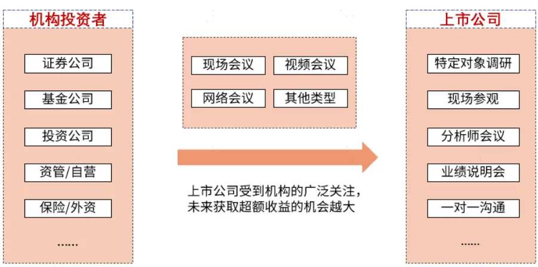
资料来源：光大证券研究所绘制

本文以机构投资者的调研信息为出发点，研究机构调研活动是否存在股票配置机会。具体从以下三个方面开展研究：

1. 机构调研特征分析。对机构调研信息进行介绍及数据预处理，分析调研信息在时序、类型、市值及行业等方面的特征。

2. 机构调研收益分析。对机构调研事件发生前后，股票的收益进行分析。从调研人数、调研次数、公募调研和私募调研等多方面考察股票被机构调研前后的市场表现。

3. 量化选股策略构建。根据前述研究结果分别构建公募调研选股策略和私募调研跟踪策略。

图 2：本文研究路径
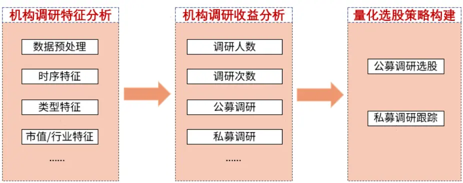
资料来源：光大证券研究所绘制

## 2、机构调研特征

## 2.1、 机构调研数据简介及数据预处理

本研究采用的数据取自 Wind 数据库中的中国 A 股机构调研活动（AshareISActivity）和中国 A 股机构调研参与主体（AShareISParticipant）两项数据表，两表分别记录了 2012 年以来的机构调研活动和 2013 年以来的调研参与者信息。

图 3：机构调研数据示意图
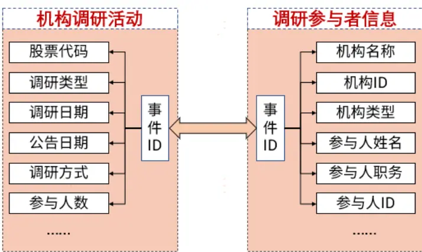
资料来源：Wind，光大证券研究所

两表通过事件 ID 关联，调研类型分为 10 类，机构类型分为 8 类，机构调研的方式分为现场会议、视频会议、网络会议和其他方式。调研参与人数记录了除上市公司自身外的参与调研的投资者总人数。

图 4：机构调研类型
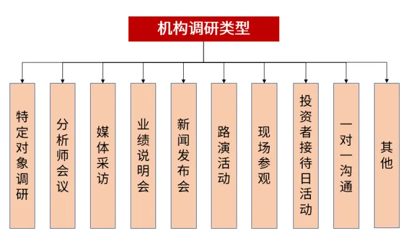
资料来源：Wind，光大证券研究所

图 5：机构类型
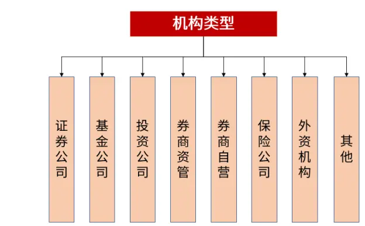
资料来源：Wind，光大证券研究所

我们获取了 2012 年 1 月至 2022 年 9 月的机构调研数据。通过梳理发现，部分数据质量不佳，主要表现为：

1.调研日期缺失或不明确。我们直接剔除掉调研日期缺失的数据，调研日期不明确表现为上市公司只披露了调研年月，对于此类数据，我们采用当月中旬日期进行补充。

2.调研人数缺失。对于部分调研，并没有具体的机构投资者名单，这类调研在AShareISParticipant 表中无相应机构信息与之匹配。因此，我们将调研人数缺失的数据进行剔除。

通过对原始调研数据进行处理，我们最终获取到 9 万余条调研记录和 130 余万条机构信息，且以此为基础，对机构调研的特征进行分析。

## 2.2、 机构调研热度攀升，财报披露后调研火热

从历年机构调研活动的数量来看，2012 年机构调研次数相对较少，2013 年以后机构调研活动次数明显增加，2018 年和 2019 年有所下滑，历年平均调研次数维持在 8 千次左右。近两年机构调研次数远超平均值，机构调研热度攀升。

根据《深圳证券交易所主板上市公司规范运作指引（2010）》中 8.16 条：上市公司应当尽量避免在年报、半年报披露前三十日内接受投资者现场调研、媒体采访等。从机构调研活动所处的月份来看，在上市公司披露定期报告之后的 5 月、9 月和 11 月，调研次数明显增加。

图 6：机构调研活动频次（年）
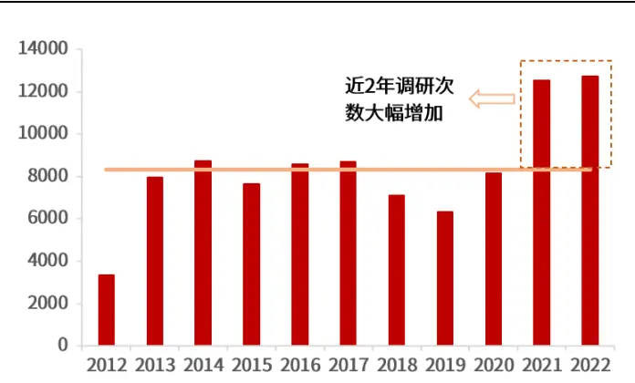
资料来源：Wind，光大证券研究所；注：数据起止日期为 2012.01-2022.09；2022 年以1-9 月计

图 7：机构调研活动频次（月）
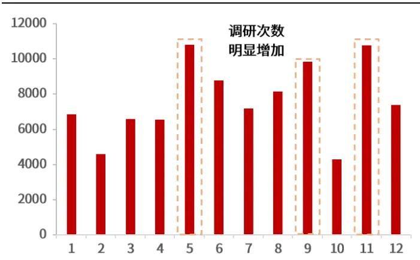
资料来源：Wind，光大证券研究所；注：数据起止日期为 2012.01-2022.09

## 2.3、 特定对象调研为主要调研类型，私募、公募与券商为调研主力

从调研活动的类型来看，特定对象调研为主要的调研形式。特定对象是指更具有信息优势、可能利用未公开重大信息进行证券交易的机构和个人。

特定对象包括但不限于：（1）从事证券分析、咨询及其他证券服务业的机构、个人及其关联人；（2）从事证券投资的机构、个人及其关联人；（3）持有公司总股本 5%以上股份的股东及其关联人；（4）新闻媒体和新闻从业人员及其关联人；（5）证监会及交易所认定的其他机构和个人。

截至 2022 年 9 月，特定对象调研在所有调研活动中占比高达 80%。分年度来看，其他调研类型的占比有所上升，特定对象调研占比有所下降，但仍为主要的调研活动类型。

从参与调研的机构投资者类型来看，投资公司、基金公司和证券公司是机构调研活动的主力，三种类型机构调研次数占比超 80%。从时间序列来看，投资公司的调研次数占比有所增加，2020 年开始，基金公司和投资公司的调研次数占比相对增加，而证券公司的调研次数占比有所下滑。

图 8：各类型调研活动占比
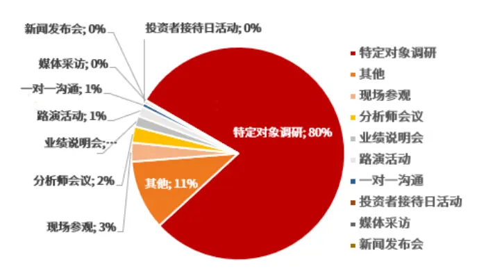
资料来源：Wind，光大证券研究所；注：数据起止日期为 2012.01-2022.09

图 9：各类型调研活动占比（年）
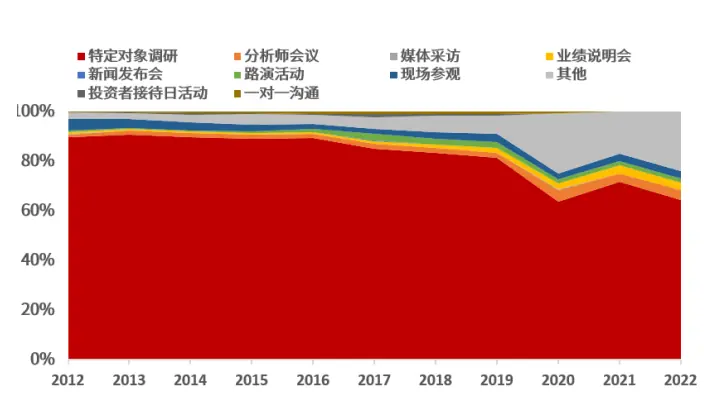
资料来源：Wind，光大证券研究所；注：数据起止日期为 2012.01-2022.09；2022 年以1-9 月计

图 10：各类型机构投资者调研次数占比
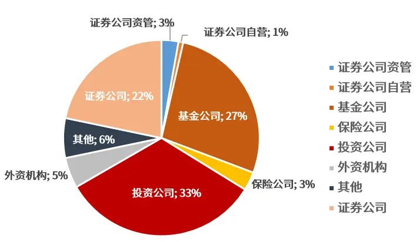
资料来源：Wind，光大证券研究所；注：数据起止日期为 2013.01-2022.09

图 11：每月各类型机构投资者调研次数占比
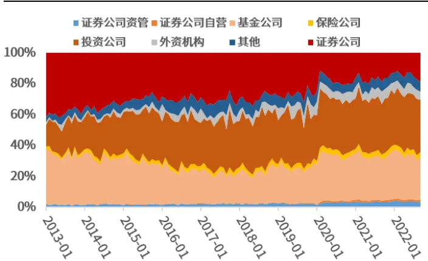
资料来源：Wind，光大证券研究所；注：数据起止日期为 2013.01-2022.09

## 2.4、 中小盘股和热门行业获机构密集调研

从被调研股票的市值分布来看，机构热衷于调研中小盘股票。我们按照被调研股票市值小于等于 100 亿、100 亿~200 亿、200 亿~500 亿和大于 500 亿，将调研数据分为 4 组，分别统计各组的调研次数。

结果显示，市值小于等于 100 亿的小盘股被调研次数最多，而市值超过 500 亿的股票被调研次数较少。从时间序列上看，小盘股在 2013-2014 年被调研次数占比较多，2015 年开始占比下降，并保持平稳。

从被调研股票所处行业来看，热门行业获机构密集调研。我们根据中信一级行业统计了各行业历年的被调研次数和平均被调研次数1。从被调研次数来看，机构调研主要集中于医药、基础化工、机械、汽车、电力设备及新能源、电子、计算机，近两年来这些行业的被调研次数明显增加。

从平均被调研次数来看，2017 年及以前，机构热衷于调研家电、建筑、汽车、电子、计算机和通信行业。近两年调研风格切换，医药、机械、电力设备及新能源、电子和银行获机构密集调研。

图 12：不同市值范围股票被调研次数
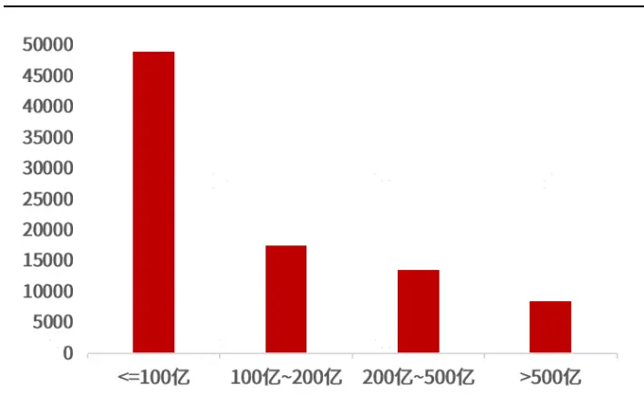
资料来源：Wind，光大证券研究所；注：数据起止日期为 2013.01-2022.09

图 13：不同市值范围股票被调研次数占比（年）
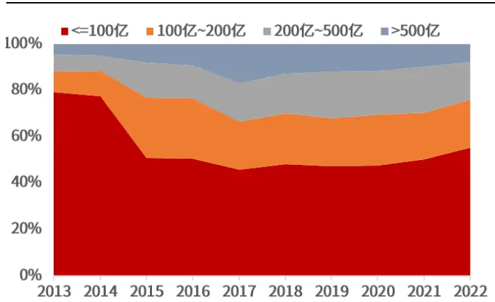
资料来源：Wind，光大证券研究所；注：数据起止日期为 2013.01-2022.09

图 14：历年各行业被调研次数

|  | 2013 | 2014 | 2015 | 2016 | 2017 | 2018 | 2019 | 2020 | 2021 | 2022 |
| --- | --- | --- | --- | --- | --- | --- | --- | --- | --- | --- |
| 交通运输 | 67 | 126 | 116 | 112 | 117 | 111 | 84 | 116 | 168 | 132 |
| 传媒 | 131 | 144 | 182 | 167 | 224 | 205 | 172 | 185 | 177 | 164 |
| 农林牧渔 | 166 | 185 | 138 | 186 | 191 | 187 | 158 | 171 | 229 | 275 |
| 医药 | 670 | 650 | 584 | 614 | 584 | 499 | 473 | 827 | 1318 | 1628 |
| 商贸零售 | 248 | 227 | 158 | 159 | 172 | 187 | 162 | 134 | 160 | 171 |
| 国防军工 | 52 | 133 | 117 | 156 | 140 | 138 | 82 | 194 | 327 | 246 |
| 基础化工 | 575 | 650 | 629 | 625 | 648 | 590 | 429 | 626 | 1094 | 1005 |
| 家电 | 293 | 299 | 208 | 249 | 274 | 261 | 218 | 144 | 277 | 223 |
| 建材 | 207 | 257 | 222 | 194 | 234 | 175 | 187 | 226 | 262 | 236 |
| 建筑 | 325 | 289 | 248 | 338 | 349 | 233 | 194 | 225 | 290 | 354 |
| 房地产 | 239 | 176 | 237 | 223 | 184 | 139 | 60 | 81 | 92 | 98 |
| 有色金属 | 131 | 183 | 161 | 233 | 186 | 136 | 147 | 178 | 283 | 297 |
| 机械 | 763 | 950 | 878 | 977 | 879 | 667 | 603 | 695 | 1870 | 1866 |
| 汽车 | 522 | 607 | 439 | 559 | 903 | 431 | 432 | 488 | 500 | 592 |
| 消费者服务 | 70 | 84 | 90 | 98 | 73 | 36 | 19 | 27 | 43 | 23 |
| 煤炭 | 25 | 19 | 5 | 20 | 27 | 11 | 10 | 12 | 27 | 22 |
| 电力及公用事业 | 195 | 213 | 259 | 241 | 207 | 214 | 182 | 168 | 156 | 266 |
| 电力设备及新能源 | 395 | 470 | 393 | 421 | 328 | 269 | 297 | 440 | 943 | 907 |
| 电子 | 877 | 900 | 794 | 913 | 1012 | 940 | 820 | 1035 | 1774 | 1461 |
| 石油石化 | 185 | 135 | 124 | 118 | 130 | 94 | 61 | 72 | 82 | 70 |
| 纺织服装 | 228 | 225 | 156 | 156 | 127 | 127 | 111 | 144 | 215 | 239 |
| 综合 | 8 | 29 | 25 | 28 | 46 | 38 | 32 | 12 | 21 | 15 |
| 计算机 | 768 | 776 | 665 | 575 | 461 | 462 | 460 | 715 | 836 | 810 |
| 轻工制造 | 216 | 289 | 189 | 266 | 305 | 300 | 210 | 366 | 347 | 382 |
| 通信 | 304 | 382 | 287 | 402 | 330 | 249 | 238 | 174 | 227 | 231 |
| 钢铁 | 77 | 95 | 63 | 109 | 117 | 88 | 63 | 103 | 156 | 126 |
| 银行 | 16 | 15 | 14 | 17 | 37 | 62 | 108 | 96 | 187 | 413 |
| 非银行金融 | 20 | 32 | 54 | 80 | 89 | 47 | 64 | 64 | 66 | 89 |
| 食品饮料 | 177 | 169 | 201 | 279 | 246 | 188 | 219 | 366 | 393 | 372 |
| 综合金融 |  |  |  |  |  |  | 4 | 15 | 18 | 4 |

资料来源：Wind，光大证券研究所；注：数据起止日期为 2013.01-2022.09

图 15：历年各行业平均被调研次数

|  | 2013 | 2014 | 2015 | 2016 | 2017 | 2018 | 2019 | 2020 | 2021 | 2022 |
| --- | --- | --- | --- | --- | --- | --- | --- | --- | --- | --- |
| 交通运输 | 0.74 | 1.38 | 1.2 | 1.13 | 1.07 | 0.98 | 0.7 | 0.96 | 1.33 | 1.03 |
| 传媒 | 2.67 | 2.48 | 2.56 | 2.09 | 1.85 | 1.52 | 1.19 | 1.23 | 1.12 | 1.02 |
| 农林牧渔 | 2.08 | 2.28 | 1.64 | 2.14 | 2.15 | 2.12 | 1.82 | 1.88 | 2.39 | 2.72 |
| 医药 | 3.58 | 3.37 | 2.7 | 2.78 | 2.14 | 1.76 | 1.54 | 2.28 | 3.14 | 3.56 |
| 商贸零售 | 2.56 | 2.44 | 1.7 | 1.69 | 1.72 | 1.91 | 1.5 | 1.19 | 1.36 | 1.45 |
| 国防军工 | 2 | 3.41 | 2.44 | 3.18 | 2.64 | 2.26 | 1.26 | 2.26 | 3.37 | 2.24 |
| 基础化工 | 2.75 | 3.1 | 2.8 | 2.66 | 2.23 | 2.01 | 1.35 | 1.72 | 2.56 | 2.23 |
| 家电 | 5.33 | 5.44 | 3.53 | 4.15 | 3.86 | 3.53 | 3.11 | 1.87 | 3.42 | 2.62 |
| 建材 | 2.88 | 3.38 | 2.71 | 2.31 | 2.63 | 2.03 | 2.4 | 2.72 | 2.94 | 2.65 |
| 建筑 | 4.85 | 4.07 | 3.06 | 3.71 | 2.98 | 1.86 | 1.53 | 1.65 | 1.79 | 2.15 |
| 房地产 | 1.54 | 1.21 | 1.6 | 1.46 | 1.19 | 0.94 | 0.44 | 0.62 | 0.7 | 0.75 |
| 有色金属 | 1.6 | 2.01 | 1.64 | 2.33 | 1.69 | 1.25 | 1.37 | 1.51 | 2.3 | 2.38 |
| 机械 | 3.47 | 4.01 | 3.2 | 3.58 | 2.58 | 1.92 | 1.74 | 1.67 | 3.65 | 3.31 |
| 汽车 | 4.66 | 5.19 | 3.35 | 4.05 | 5.31 | 2.36 | 2.72 | 2.73 | 2.42 | 2.73 |
| 消费者服务 | 2.41 | 2.71 | 2.73 | 2.97 | 2.09 | 1.12 | 0.37 | 0.52 | 0.77 | 0.41 |
| 煤炭 | 0.64 | 0.48 | 0.14 | 0.54 | 0.73 | 0.31 | 0.27 | 0.33 | 0.75 | 0.61 |
| 电力及公用事业 | 2.17 | 2.11 | 2.16 | 1.88 | 1.34 | 1.33 | 1.2 | 0.97 | 0.78 | 1.27 |
| 电力设备及新能源 | 3.24 | 3.59 | 3.05 | 3.14 | 2.1 | 1.68 | 1.24 | 1.69 | 3.26 | 2.95 |
| 电子 | 6.05 | 5.88 | 4.9 | 5.34 | 4.77 | 4.33 | 3.5 | 3.58 | 5.11 | 3.56 |
| 石油石化 | 3.7 | 2.81 | 2.76 | 2.46 | 2.36 | 1.81 | 1.17 | 1.36 | 1.52 | 1.23 |
| 纺织服装 | 2.89 | 2.92 | 1.97 | 2.26 | 1.46 | 1.44 | 1.32 | 1.62 | 2.09 | 2.37 |
| 综合 | 0.23 | 0.81 | 0.64 | 0.67 | 1.02 | 0.73 | 0.63 | 0.2 | 0.34 | 0.25 |
| 计算机 | 7.05 | 6.75 | 4.93 | 4.05 | 2.55 | 2.32 | 2.04 | 2.68 | 2.8 | 2.48 |
| 轻工制造 | 3.48 | 4.74 | 2.74 | 3.59 | 3.08 | 2.88 | 1.86 | 2.82 | 2.34 | 2.42 |
| 通信 | 3.85 | 4.72 | 3.63 | 4.96 | 2.82 | 1.93 | 2.09 | 1.43 | 1.75 | 1.71 |
| 钢铁 | 1.35 | 1.58 | 1.09 | 1.85 | 1.98 | 1.69 | 1.19 | 1.78 | 2.64 | 2.07 |
| 银行 | 1 | 0.94 | 0.88 | 1.06 | 1.48 | 2.21 | 3.09 | 2.59 | 4.45 | 9.83 |
| 非银行金融 | 0.77 | 1.14 | 1.54 | 2.11 | 1.82 | 0.73 | 0.97 | 0.91 | 0.92 | 1.22 |
| 食品饮料 | 2.81 | 2.38 | 2.54 | 3.44 | 2.65 | 1.88 | 2.21 | 3.27 | 3.14 | 2.82 |
| 综合金融 |  |  |  |  |  |  | 0.29 | 0.94 | 1.12 | 0.25 |

资料来源：Wind，光大证券研究所；注：数据起止日期为 2013.01-2022.09；平均被调研次数=当年被调研次数/年末行业股票数（2022 年以 9 月末计）

## 2.5、 深市公告日期与调研日期间隔较短，沪市相对较长

从两市调研次数来看，机构调研多集中于深市。2020 年以来，机构对沪市上市公司调研逐渐增加。分两市板块来看，深市主板上市公司被调研次数相对稳定，而创业板上市公司被调研次数近两年增多；随着科创板的开市，机构对沪市上市公司的调研热度也开始高涨。

根据《深圳证券交易所主板上市公司规范运作指引（2015 年修订）》中 9.18 条：上市公司在业绩说明会、分析师会议、路演等投资者关系活动结束后二个交易日内，应当编制投资者关系活动记录表，并将该表及活动过程所使用的演示文稿、提供的文档等附件及时在本所互动易刊载，同时在公司网站刊载。

机构调研事件有两个重要日期：“调研日期”和“公告日期”，如果两者间隔日期过长，那么机构调研事件的价值将会大打折扣。我们测算了 2013 年 1 月至2022 年 9 月期间，两市机构调研和上市公司发布公告间隔 10 日及以上的调研次数占比，发现深市占比远低于沪市，平均来看，深市占比不超过 3%，而沪市高达 58%。因此，我们在后续研究时，采用间隔 10 日内（含）的数据。

图 16：沪市与深市上市公司每月被调研次数
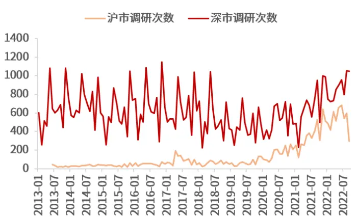
资料来源：Wind，光大证券研究所；注：数据起止日期为 2013.01-2022.09

图 17：深市主板和创业板上市公司每月被调研次数
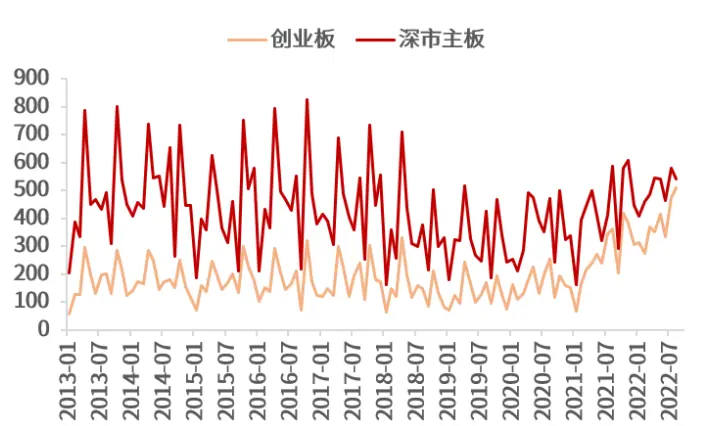
资料来源：Wind，光大证券研究所；注：数据起止日期为 2013.01-2022.09

图 18：沪市主板和科创板上市公司每月被调研次数
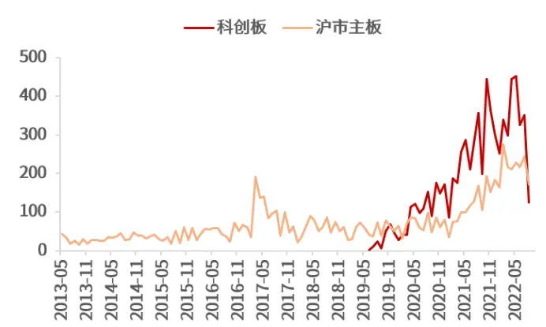
资料来源：Wind，光大证券研究所；注：数据起止日期为 2013.05-2022.09

图 19：两市上市公司每月被调研日期和公告日期间隔 10 日及以上占比
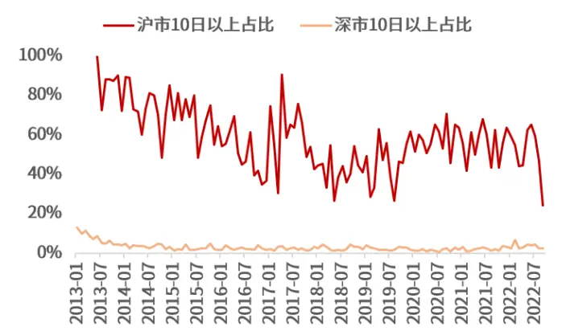
资料来源：Wind，光大证券研究所；注：数据起止日期为 2013.01-2022.09

## 3、机构调研股票收益分析

本章，我们从机构调研数据出发，探究上市公司在发布机构调研公告前后股票的市场表现。通过前文的分析，调研日期和公告日期间隔 10 日及以上的调研中，深市占比极低，而沪市较高，而间隔日期较短能保证调研信息的有效性。因此，我们采用间隔 10 日（含）以内的数据。此外，我们还剔除了上市不足 1 年、ST和停牌的股票。

## 3.1、 机构偏好调研前期涨幅较高股票，公募调研收益更为可观

我们以中证 800 为比较基准，统计了上市公司在发布机构调研公告前后（以下均简称“调研前”、“调研后”）60 个交易日的超额收益，并分别计算了公告前 60 个交易日平均累计超额净值和公告后 60 个交易日平均累计超额净值。

结果显示，股票在被调研前 60 个交易日的平均累计超额净值较高，而在被调研后表现一般，平均累计超额净值较低。因此，机构热衷于调研前期相对基准涨幅较高的股票。

我们将调研数据划分为公募、券商、私募和其他四种类型，并分别计算调研前后60 个交易日的平均累计超额净值。分机构类型看，结论与全样本一致，但有公募基金参与的调研，股票在被调研前后表现最佳。

图 20：调研前后平均累计超额净值表现区别明显（按全样本、机构类型）
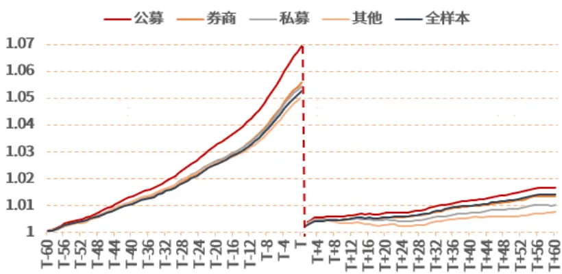
资料来源：Wind，光大证券研究所；注：数据起止日期为 2012.10-2022.09

为了验证机构调研后 60 个交易日平均累计超额净值是否显著，我们以平均累计超额净值为 1 作为原假设，备择假设为平均累计超额大于 1，通过单侧 T 检验检验了各类型机构调研后 60 个交易日累计超额净值的分布情况。

结果显示，各类型调研和全样本均具有显著的正向超额净值。全样本在调研后60 个交易日内，平均累计超额收益达 1.42%，而公募基金公司调研平均累计超额收益最高，达 1.68%。

表 1：全样本及各类型机构调研统计结果

| 类型 60 日平均累计超额（%） | T值 P值 |
| --- | --- |
| 公募 1.68 | 35.30 0.00*** |
| 券商 1.35 | 39.09 0.00*** |
| 私募 1.03 | 28.87 0.00*** |
| 其他 0.76 | 24.31 |
| 全样本 1.42 | 0.00*** 44.61 0.00*** |

资料来源：Wind，光大证券研究所；注：数据起止日期为 2013.01-2022.09；***表示在 0.01 置信水平下拒绝原假设

从各类型调研活动看，特定对象调研、其他、分析师会议和现场参观表现最佳，而一对一沟通和新闻发布会表现较差，由于这些类型调研样本量较少，参考意义不大。因此，选择特定对象调研、其他、分析师会议和现场参观作为研究对象为较优选择。

图 21：调研后平均累计超额净值（按调研类型）
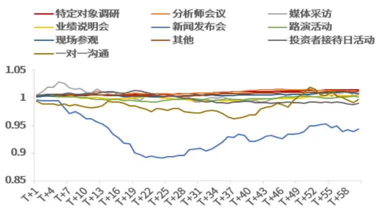
资料来源：Wind，光大证券研究所；注：数据起止日期为 2013.01-2022.09

## 3.2、 规避调研前相对涨幅过高的股票或为最佳选择

通过前一节的测试，我们发现机构偏好于调研前期相对于基准涨幅较高的股票，由于其股价处于高位，如果投资此类股票，投资风险也相应增加。因此，规避前期涨幅过高的股票尤为重要。

本节我们以调研前 20（或 60）个交易日股票相对于中证 800 的涨跌幅，按照分位数将调研股票均分为低涨幅、中涨幅和高涨幅组，然后测试各组在调研后的平均累计超额净值情况。

结果显示，无论是按照调研前 20 日还是 60 日，调研后低涨幅组股票的平均累计超额净值均明显高于高涨幅组，且三组的平均累计超额净值单调性明显。

图 22：调研后，低涨幅组表现最佳（按前 20 个交易日相对涨幅分组）
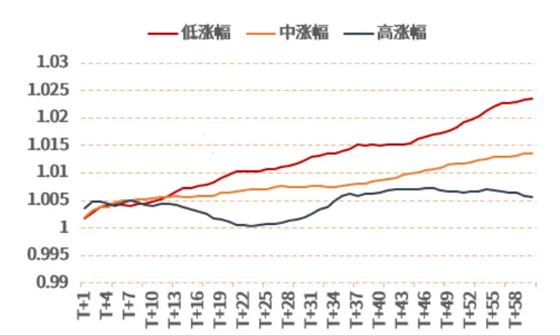
资料来源：Wind，光大证券研究所；注：数据起止日期为 2013.01-2022.09

图 23：调研后，低涨幅组表现最佳（按前 60 个交易日相对涨幅分组）
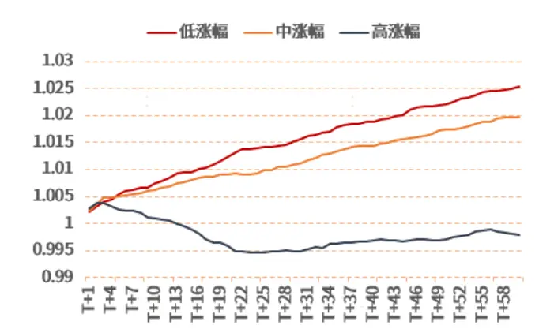
资料来源：Wind，光大证券研究所；注：数据起止日期为 2013.01-2022.09

此外，我们按照月频调仓的方式，测试了不同涨幅组的表现。具体做法为：每月末以当月调研股票为股票池，统计每只股票在被调研前 20（或 60）个交易日相对于中证 800 的涨跌幅，然后将股票均分为 3 组，下月初等权买入各组股票。

在不考虑交易费用的情况下，高涨幅组的表现较低涨幅和中涨幅组差。综合上述研究结论，我们认为，配置上规避调研前相对基准涨幅过高的股票或为较佳选择。

图 24：按月频调仓，低涨幅组净值最高（按前 20 个交易日相对涨幅分组）
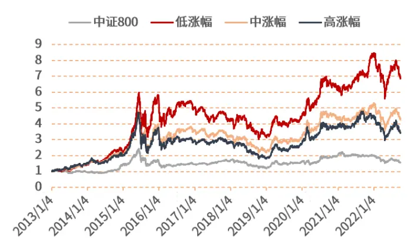
资料来源：Wind，光大证券研究所；注：数据起止日期为 2013.01-2022.09

图 25：按月频调仓，高涨幅组净值最低（按前 60 个交易日相对涨幅分组）
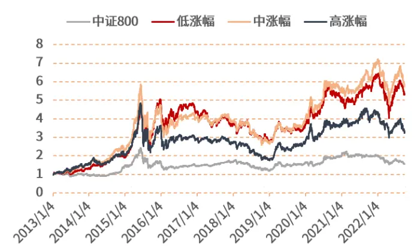
资料来源：Wind，光大证券研究所；注：数据起止日期为 2013.01-2022.09

## 3.3、 机构扎堆调研的股票无法带来更多超额收益

如果一家公司受到机构投资者的扎堆调研，这只股票必然受到广大投资者的关注，进而有推动其股价升高的可能。机构投资者人数和机构数可以用来衡量上市公司被机构投资者关注的程度，下表列举了部分被机构扎堆调研的上市公司在调研后的市场表现。

表 2：受到机构扎堆调研股票示例

| 股票代码 | 股票简称 | 调研日期 | 公告日期 | 调研人数 | 调研机构数 | 被调研后60日 超额收益 |
| --- | --- | --- | --- | --- | --- | --- |
| 300003.SZ | 乐普医疗 | 2018/12/6 | 2018/12/8 | 1422 | 804 | -13.41% |
| 002415.SZ | 海康威视 | 2019/7/20 | 2019/7/21 | 660 | 444 | 7.86% |
| 300760.SZ | 迈瑞医疗 | 2020/2/7 | 2020/2/9 | 869 | 466 | 16.98% |
| 002241.SZ | 歌尔股份 | 2021/10/27 | 2021/10/27 | 673 | 422 | 21.02% |
| 300012.SZ | 华测检测 | 2022/4/25 | 2022/4/28 | 664 | 447 | -8.61% |

资料来源：Wind，光大证券研究所

可以看到，部分股票的调研人数多达几百人甚至上千人，调研机构数也高达数百家，但是在被调研后 60 个交易日的超额收益却不尽相同。为了探究是否调研人数或者调研机构数越多，超额收益就越高，我们按照 33%、66%和 95%分位数将调研股票划分为 4 组，以此探究不同调研人数或调研机构数的超额情况。

图 26：低调研人数组平均累计超额净值最高
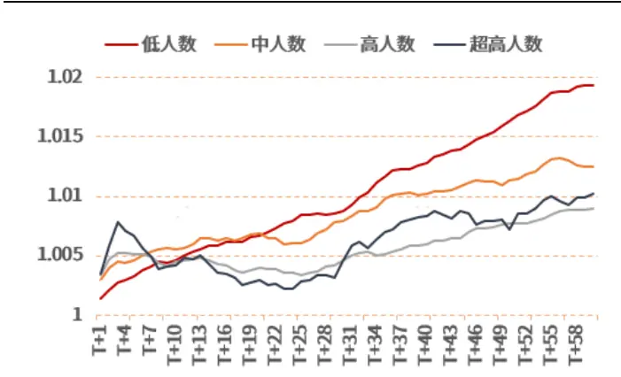
资料来源：Wind，光大证券研究所；注：数据起止日期为 2013.01-2022.09

图 27：低调研机构数组平均累计超额净值最高
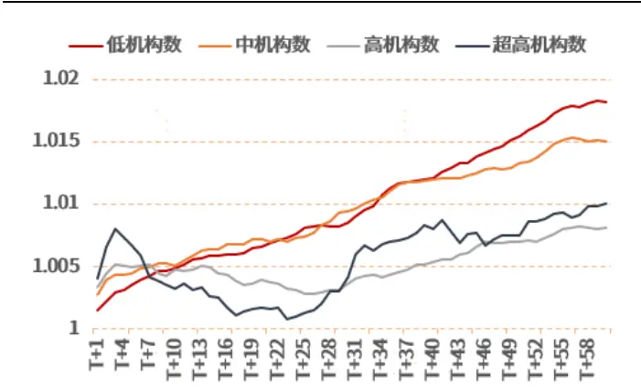
资料来源：Wind，光大证券研究所；注：数据起止日期为 2013.01-2022.09

图 28：按照调研人数分组回测无明显区别
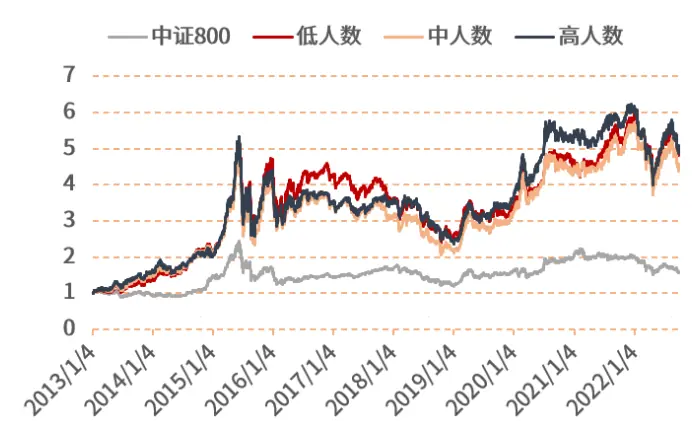
资料来源：Wind，光大证券研究所；注：数据起止日期为 2013.01-2022.09

图 29：按照调研机构数分组回测无明显区别
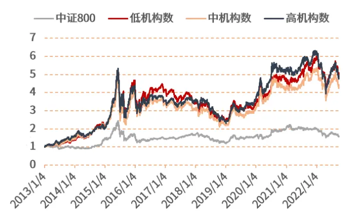
资料来源：Wind，光大证券研究所；注：数据起止日期为 2013.01-2022.09

结果显示，调研人数较多的股票在被调研后 60 个交易日平均累计超额净值相对较低，尽管超高人数组或超高机构数组的净值在调研后有所提升，但是仍然不如低人数组或低机构数组。

同样，我们将被调研股票按照调研人数或机构数均分为 3 组，按照月频调仓的方式，每月等权买入各组股票，探究不同调研人数或调研机构数组的表现。结果显示，不同组之间几乎无差距。因此，我们认为，受到机构扎堆调研的股票，无法带来更为可观的超额收益。

## 3.4、 被调研次数越多，个股获超额收益可能性越大

上市公司受到机构的关注程度可以从时序上体现。如果上市公司频繁受到机构的调研，是否超额收益更为可观？由于上市公司被调研次数相对集中，因此，我们将股票按照过去 3 个月的被调研次数小于等于 2 次、2 次至 5 次、5 次至 10 次和大于 10 次分为了 4 组（依次为第 1 组至第 4 组）。

我们通过月频调仓的方式，等权买入各组股票。结果显示，大于 10 次组的表现远超其余组。从相对基准净值来看，大于 10 次组的相对净值也持续上升。因此，按照被调研次数来选股能够获取更为可观的超额收益。

图 30：上市公司不同被调研次数组样本量
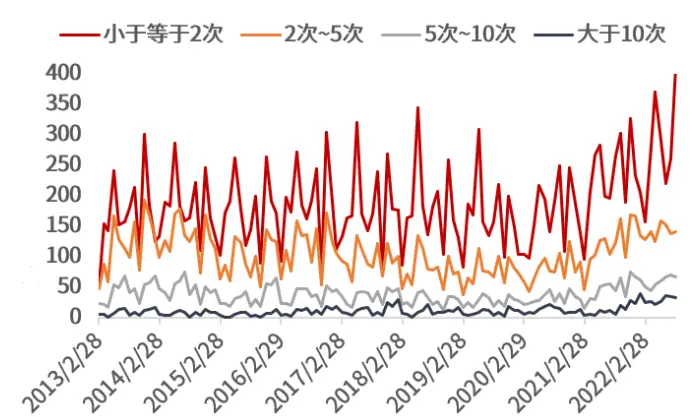
资料来源：Wind，光大证券研究所；注：数据起止日期为 2013.02-2022.08

图 31：按照上市公司被调研次数分组净值曲线
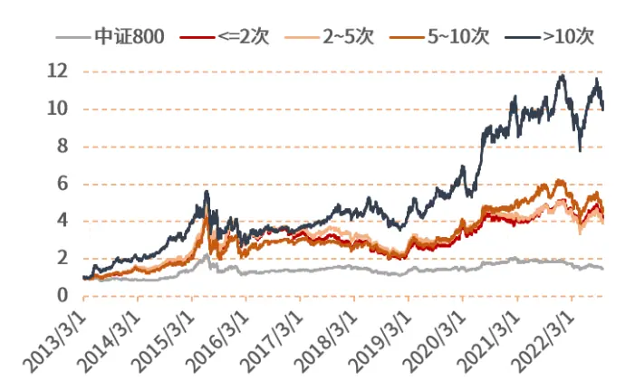
资料来源：Wind，光大证券研究所；注：数据起止日期为 2013.03-2022.09

图 32：按照上市公司被调研次数分组相对基准净值
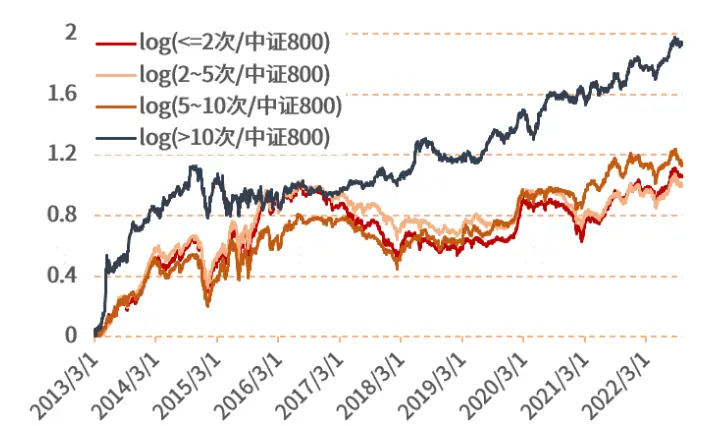
资料来源：Wind，光大证券研究所；注：数据起止日期为 2013.03-2022.09

图 33：按照上市公司被调研次数分组随机抽样总收益
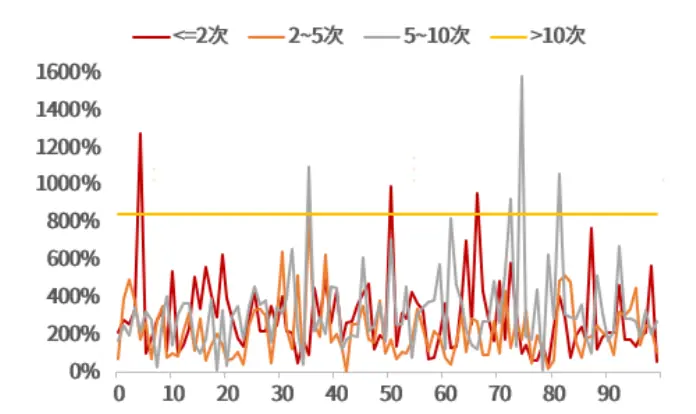
资料来源：Wind，光大证券研究所；注：数据起止日期为 2013.01-2022.09；横轴为模拟次数，纵轴为该次模拟总收益

不同组每一期的股票池数量不同，大部分股票过去 3 个月的被调研次数集中在 5次以内，而大于 10 次组的股票数较少，甚至出现无股票的情况。为了消除不同组股票数不均衡的影响，我们对前 3 组的股票数量进行了再平衡。

具体做法是进行随机抽样，每一期前 3 组抽取和第 4 组相同数量的股票等权买入，然后统计各组的总收益，以此方式模拟 100 次。结果显示，只有极少数次模拟表现超过第 4 组。因此，我们认为，个股被调研次数越高，获取更为可观的超额收益可能性越大。

## 3.5、 公募基金调研能否带来更多超额收益？

通过前面的分析，受到公募基金调研后，个股获取的超额收益更为显著，那么是否可以对公募基金调研进行深入探究，以挖掘更为显著的超额收益呢？我们对于公募基金的关注点有两个方面：（1）基金经理调研与否；（2）公募基金公司权益类资产的管理规模。

## 3.5.1、基金经理调研与否，超额收益无明显区别

通过匹配基金经理姓名，我们将公募调研股票划分为基金经理调研和非基金经理调研。通过两者每月样本量可知，在 2020 年以前，公募基金经理调研的样本相对较少，而 2020 年以后，基金经理调研的样本逐渐增加。

图 34：公募基金经理和非基金经理调研样本量
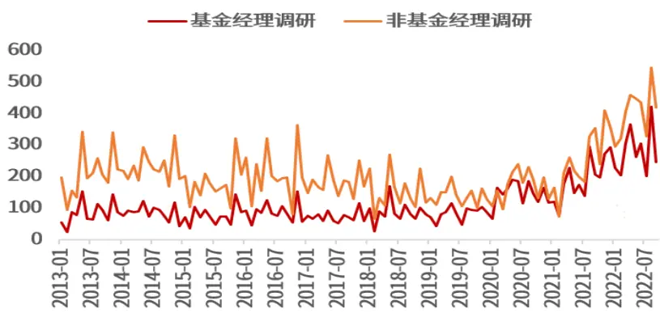
资料来源：Wind，光大证券研究所；注：数据起止日期为 2013.01-2022.09

我们统计了上市公司接受基金经理调研和非基金经理调研后60个交易日的平均累计超额净值，结果显示两者几乎无明显差距。按照月频调仓来看，两者亦无明显区别。因此，我们认为，无法通过跟踪基金经理的动向来选择股票，提取更多超额收益。

图 35：公募基金经理和非基金经理调研平均累计超额净值无区别
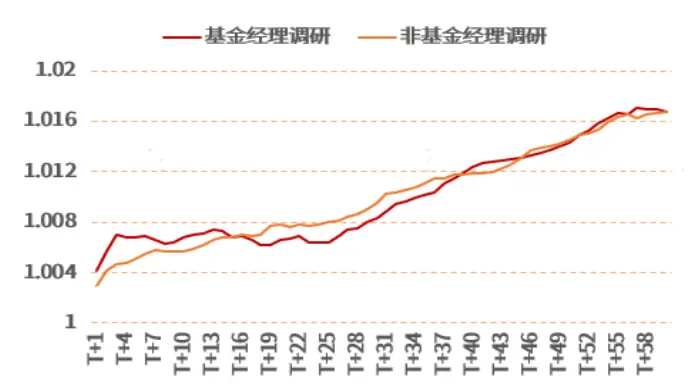
资料来源：Wind，光大证券研究所；注：数据起止日期为 2013.01-2022.09

图 36：公募基金经理和非基金经理调研回测净值无区别
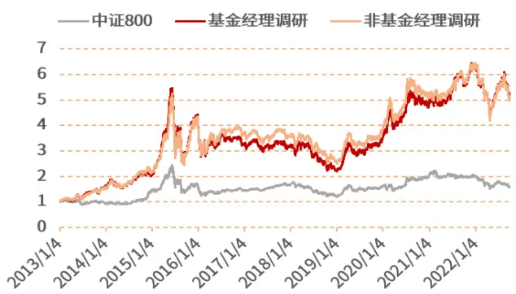
资料来源：Wind，光大证券研究所；注：数据起止日期为 2013.01-2022.09

## 3.5.2、不同权益规模的基金公司调研，超额收益无区别

从公募基金公司的规模来看，是否规模越大的公司，其调研的股票表现更好呢？基于此，我们按照月频调仓的方式，计算每只被调研股票对应公募基金公司的平均权益规模，按照权益规模从低到高将股票池均分为低权益规模、中权益规模和高权益规模三组，每月等权买入各组股票。

结果显示，不同权益规模组的表现无明显区别。因此，我们认为，无法通过公募基金公司的权益类资产管理规模来筛选出表现更优的股票。

图 37：不同公募基金公司权益类资产管理规模组回测净值曲线
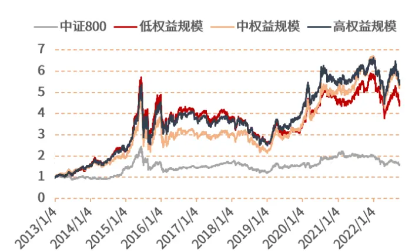
资料来源：Wind，光大证券研究所；注：数据起止日期为 2013.01-2022.09

图 38：不同公募基金公司权益类资产管理规模组相对基准净值曲线
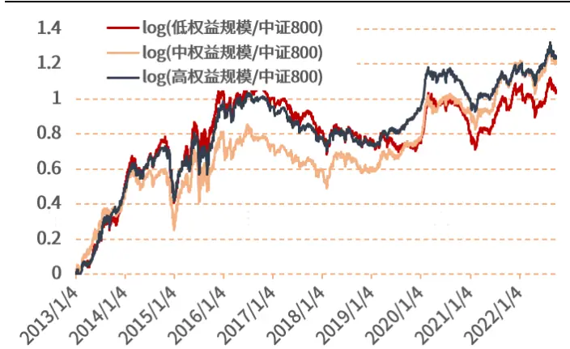
资料来源：Wind，光大证券研究所；注：数据起止日期为 2013.01-2022.09

## 3.6、 跟踪知名私募投资公司，超额收益更为可观

根据前文研究，投资公司调研次数占比最高，投资公司主要以私募类公司为主。截至 2022 年 9 月，在基金业协会登记的私募类基金公司多达 2 万余家，其中从事证券类投资的基金公司也多达 9 千余家。私募类基金公司众多，而非常知名的私募却并不多。因此，被知名私募调研的股票是否表现更佳呢？

以高瓴资本为例，下表展示了部分被高瓴资本调研的股票。通过统计这些股票在被调研后 60 个交易日相对于中证 800 的超额情况，可以发现，部分被高瓴资本调研的公司，未来 60 个交易日超额收益非常可观。

表 3：被高瓴资本调研股票示例

| 股票代码 | 股票简称 | 调研日期 | 公告日期 | 被调研后60日超额 收益 |
| --- | --- | --- | --- | --- |
| 000156.SZ | 华数传媒 | 2013/4/18 | 2013/4/19 | 101.40% |
| 002791.SZ | 坚朗五金 | 2020/3/10 | 2020/3/12 | 62.74% |
| 300763.SZ | 锦浪科技 | 2021/4/25 | 2021/4/26 | 133.18% |
| 300428.SZ | 立中集团 | 2022/4/24 | 2022/4/25 | 113.84% |
| 002068.SZ | 黑猫股份 | 2022/5/17 | 2022/5/18 | 83.11% |

资料来源：Wind，光大证券研究所

我们统计了被高瓴资本调研的股票在调研前后 60 个交易日的平均累计超额净值。结果显示，在被调研后的平均累计超额比调研前更为可观。按照月频调仓来看，早期被高瓴调研的股票较少，但从净值曲线来看，这些股票的表现十分优异。

我们从基金业协会获取了百亿私募清单，为了回测时尽量避免使用未来信息，我们挑选了部分老牌私募，如高瓴、红杉、高毅、景林和银叶等，将调研样本划分为知名私募和其他私募两组，然后测试两组的超额情况。

图 39：被高瓴资本调研股票平均累计超额净值
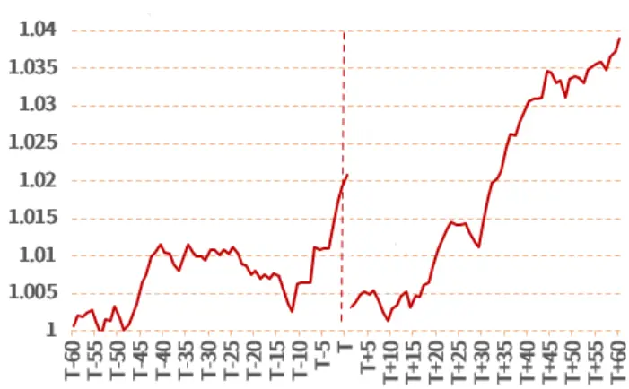
资料来源：Wind，光大证券研究所；注：数据起止日期为 2012.10-2022.06

图 40：被高瓴资本调研股票数量
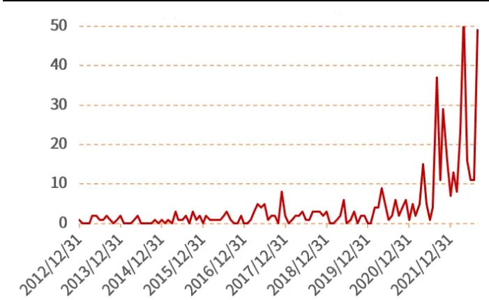
资料来源：Wind，光大证券研究所；注：数据起止日期为 2012.12-2022.08

图 41：跟踪高瓴调研策略回测情况
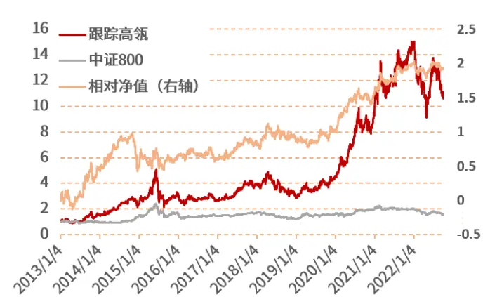
资料来源：Wind，光大证券研究所；注：数据起止日期为 2013.01-2022.09

图 42：知名私募和其他私募平均累计超额净值差距明显
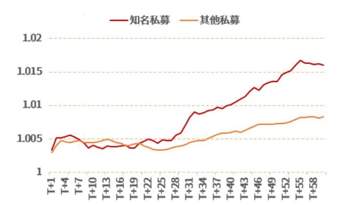
资料来源：Wind，光大证券研究所；注：数据起止日期为 2013.01-2022.06

图 43：知名私募和其他私募调研样本量
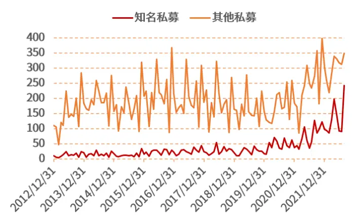
资料来源：Wind，光大证券研究所；注：数据起止日期为 2012.12-2022.08

图 44：知名私募和其他私募回测净值曲线差距明显
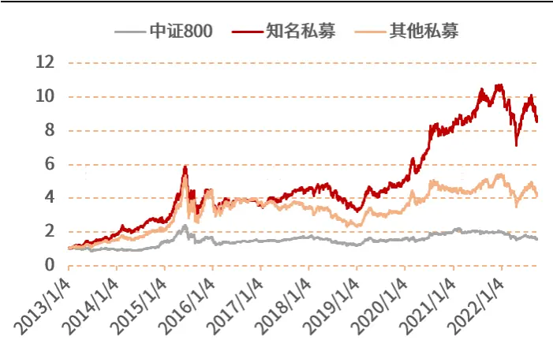
资料来源：Wind，光大证券研究所；注：数据起止日期为 2013.01-2022.09

图 45：知名私募和其他私募相对基准净值曲线差距明显
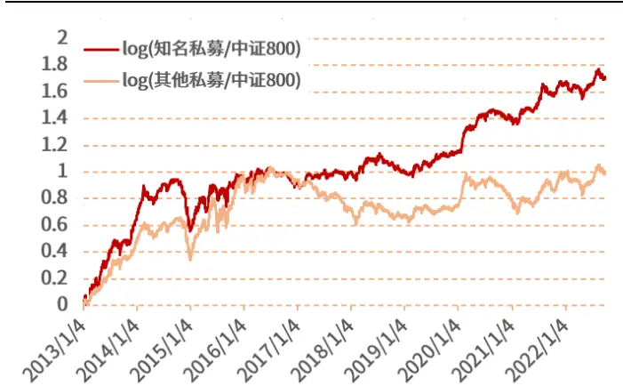
资料来源：Wind，光大证券研究所；注：数据起止日期为 2013.01-2022.09

结果显示，被知名私募调研的股票，在调研后 60 个交易日平均累计超额净值较其他私募更高。按照月频调仓的方式，被知名私募调研的股票的表现也占优。因此，我们认为，通过跟踪知名私募，也能获取更为可观的超额收益。

## 4、机构调研投资策略

根据前文的测试，公告日期和调研日期间隔 10 日（含）以内为佳；调研类型中特定对象调研、分析师会议、其他类型和现场参观表现较优；前期涨幅相对基准涨幅过高的股票表现较差；被调研次数越多，个股获取更高超额收益的可能性越大；公募调研以及知名私募调研超额收益更为显著。

本章，我们根据以上研究结论，通过公募调研样本和知名私募调研样本分别构建公募调研选股策略和私募调研跟踪策略，策略构建流程如下图所示。

图 46：投资策略构建流程示意图
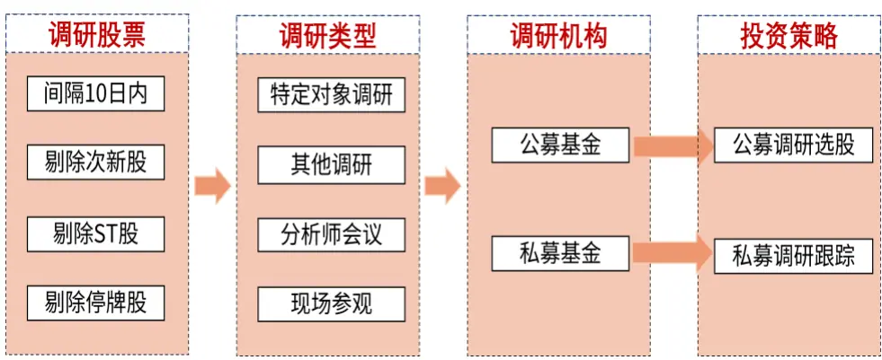
资料来源：光大证券研究所绘制

## 4.1、 公募调研选股策略

根据前文对机构调研的研究，我们构建了公募调研选股策略，具体如下：

1.基础股票池：被机构调研股票；公告日期与调研日期间隔 10 日（含）以内；剔除次新股、ST 股和停牌股；调研类型为特定对象调研、其他调研、分析师会议和现场参观；有公募基金参与的调研。

2.选股方式：每个月底回看当月被调研股票在过去 3 个月内的被调研次数，按照被调研次数从高到低选择股票，直至股票数大于 20 只（若不足，则全部入选）；然后按照股票调研前 60 个交易日相对于中证 800 的最大涨跌幅，剔除涨跌幅最高的 40%股票。次月第一个交易日以开盘价买入。

3.回测环境：回测区间为 2013 年 1 月 4 日——2022 年 9 月 30 日；调仓频率为月频；比较基准为中证 800；手续费设置为双边千分之三；加权方式为等权。

图 47：公募调研选股策略每月持仓股票数
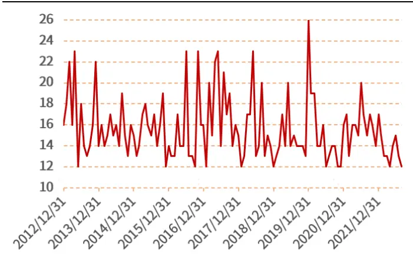
资料来源：Wind，光大证券研究所；注：数据起止日期为 2012.12-2022.08

图 48：公募调研选股策略净值
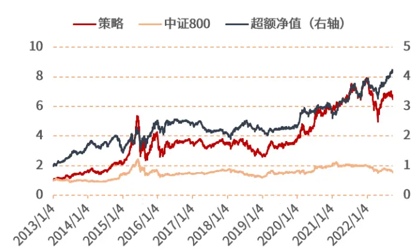
资料来源：Wind，光大证券研究所；注：数据起止日期为 2013.01-2022.09

表 4：公募调研选股策略评价指标

| 策略 | 中证800 超额 |
| --- | --- |
| 总收益 548.48% | 55.79% 316.24% |
| 年化收益率 21.80% | 4.79% 16.23% |
| 年化波动率 30.82% | 22.74% 18.71% |
| 夏普比率 0.58 0.03 | 0.65 |
| 最大回撤 56.07% | 50.91% 31.29% |
| 最大回撤开始日期 2015/6/3 | 2015/6/3 2015/6/3 |
| 最大回撤截止日期 2015/9/2 | 2019/1/3 2015/7/10 |
| 月度胜率 60.68% | 56.41% 56.41% |

资料来源：Wind，光大证券研究所；注：数据起止日期为 2013.01-2022.09

表 5：公募调研选股策略评价指标（年度）

| 年份 | 收益 | 基准收益 | 超额收益 | 夏普比率 | 基准夏普比率 | 超额夏普比率 | 最大回撤 | 基准最大回撤 | 超额最大回撤 |
| --- | --- | --- | --- | --- | --- | --- | --- | --- | --- |
| 2013 | 64.05% | -2.14% | 67.63% | 237.11% | -28.75% | 398.36% | 15.49% | 19.41% | 9.26% |
| 2014 | 28.04% | 48.28% | -13.65% | 97.99% | 250.79% | -93.38% | 20.93% | 9.49% | 28.06% |
| 2015 | 100.21% | 14.91% | 74.22% | 178.33% | 28.63% | 213.79% | 56.07% | 44.13% | 31.29% |
| 2016 | -16.07% | -13.27% | -3.22% | -54.97% | -72.98% | -40.07% | 33.15% | 21.19% | 18.11% |
| 2017 | -1.41% | 15.16% | -14.39% | -34.13% | 112.28% | -167.03% | 17.68% | 6.93% | 17.15% |
| 2018 | -23.15% | -27.38% | 5.83% | -93.86% | -150.05% | 12.20% | 30.22% | 32.61% | 14.28% |
| 2019 | 39.42% | 33.71% | 4.27% | 158.65% | 152.61% | 3.25% | 14.54% | 14.96% | 8.42% |
| 2020 | 52.71% | 25.79% | 21.40% | 181.35% | 98.43% | 103.40% | 14.42% | 15.52% | 10.29% |
| 2021 | 39.31% | -0.76% | 40.37% | 181.98% | -28.12% | 231.20% | 14.44% | 14.18% | 13.37% |
| 2022（1至9 月） | -18.23% | -22.83% | 5.95% | -106.26% | -165.82% | 30.13% | 37.14% | 24.44% | 17.13% |
| 全部 | 548.48% | 55.79% | 316.24% | 0.58 | 0.03 | 0.65 | 56.07% | 50.91% | 31.29% |

资料来源：Wind，光大证券研究所；注：数据起止日期为 2013.01-2022.09

从回测结果来看，策略获取超额能力较强。每月股票数量平均在 16 只左右，策略总收益 548.48%，年化收益率 21.80%，超额年化收益率 16.23%，月度胜率60.68%。分年度来看，策略除 2014、2016 和 2017 年跑输基准外，其余年份均跑赢基准。

## 4.2、 私募调研跟踪策略

根据前文对机构调研的研究，我们构建了私募调研跟踪策略，具体如下：

1.基础股票池：被机构调研股票；公告日期与调研日期间隔 10 日（含）以内；剔除次新股、ST 股和停牌股；调研类型为特定对象调研、其他调研、分析师会议和现场参观；被知名私募调研（高瓴、红杉、高毅、景林、银叶、盈峰、映雪、乐瑞、淡水泉、歌斐诺宝）。

2.选股方式：每个月底回看当月被调研股票在过去 3 个月内的被调研次数，按照被调研次数从高到低选择股票，直至股票数大于 20 只（若不足，则全部入选）；如果股票数较少（少于 10 只），则全部持有。否则，按照股票调研前 60 个交易日相对于中证 800 的最大涨跌幅，剔除涨跌幅最高的 20%股票。次月第一个交易日以开盘价买入。

3.回测环境：回测区间为 2013 年 1 月 4 日——2022 年 9 月 30 日；调仓频率为月频；比较基准为中证 800；手续费设置为双边千分之三；加权方式为等权。

图 49：私募调研跟踪策略每月持仓股票数
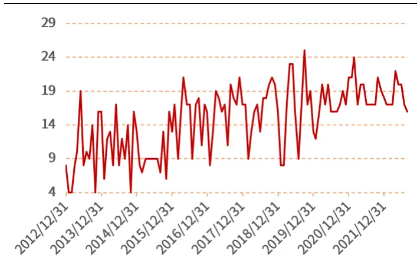
资料来源：Wind，光大证券研究所；注：数据起止日期为 2012.12-2022.08

图 50：私募调研选股策略净值
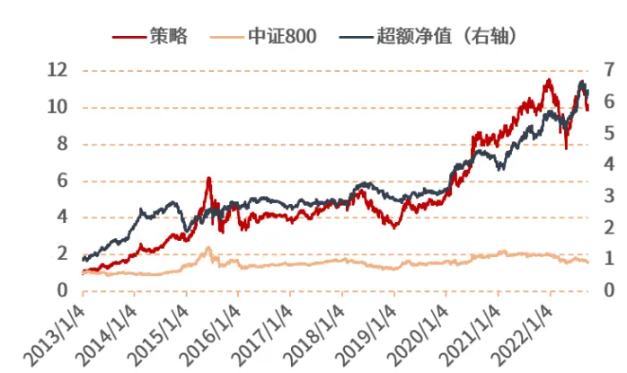
资料来源：Wind，光大证券研究所；注：数据起止日期为 2013.01-2022.09

表 6：私募调研跟踪策略评价指标

|  | 策略 中证800 | 超额 |
| --- | --- | --- |
| 总收益 | 889.65% 55.79% | 535.24% |
| 年化收益率 | 27.35% | 4.79% 21.53% |
| 年化波动率 | 29.58% | 22.74% 17.53% |
| 夏普比率 | 0.79 | 0.03 1.00 |
| 最大回撤 | 48.30% | 50.91% 33.72% |
| 最大回撤开始日期 | 2015/6/12 | 2015/6/12 2014/9/30 |
| 最大回撤截止日期 | 2015/9/15 | 2019/1/3 2015/1/5 |
| 月度胜率 | 62.39% | 56.41% 59.83% |

资料来源：Wind，光大证券研究所；注：数据起止日期为 2013.01-2022.09

表 7：私募调研跟踪策略评价指标（年度）

| 年份 | 收益 | 基准收益 | 超额收益 | 夏普比率 | 基准夏普比率 | 超额夏普比率 | 最大回撤 | 基准最大回撤 | 超额最大回撤 |
| --- | --- | --- | --- | --- | --- | --- | --- | --- | --- |
| 2013 | 99.54% | -2.14% | 103.89% | 340.47% | -28.75% | 500.44% | 16.26% | 19.41% | 10.72% |
| 2014 | 40.03% | 48.28% | -5.56% | 144.10% | 250.79% | -49.05% | 18.59% | 9.49% | 32.36% |
| 2015 | 65.71% | 14.91% | 44.20% | 122.39% | 28.63% | 146.99% | 48.30% | 44.13% | 15.29% |
| 2016 | -14.96% | -13.27% | -1.94% | -59.22% | -72.98% | -44.25% | 22.23% | 21.19% | 12.08% |
| 2017 | 22.71% | 15.16% | 6.56% | 120.25% | 112.28% | 24.22% | 10.23% | 6.93% | 7.37% |
| 2018 | -25.33% | -27.38% | 2.83% | -106.70% | -150.05% | -7.66% | 35.03% | 32.61% | 14.85% |
| 2019 | 44.41% | 33.71% | 8.01% | 177.90% | 152.61% | 34.45% | 14.00% | 14.96% | 6.57% |
| 2020 | 56.61% | 25.79% | 24.50% | 208.15% | 98.43% | 125.39% | 13.41% | 15.52% | 11.11% |
| 2021 | 41.83% | -0.76% | 42.91% | 211.79% | -28.12% | 270.86% | 8.78% | 14.18% | 7.89% |
| 2022（1至9 月） | -14.49% | -22.83% | 10.80% | -86.72% | -165.82% | 74.41% | 32.35% | 24.44% | 11.11% |
| 全部 | 889.65% | 55.79% | 535.24% | 0.79 | 0.03 | 1.00 | 48.30% | 50.91% | 33.72% |

资料来源：Wind，光大证券研究所；注：数据起止日期为 2013.01-2022.09

从回测结果来看，策略获取超额能力较强。每月股票数量平均在 15 只左右，策略总收益 889.65%，年化收益率 27.35%，超额年化收益率 21.53%，月度胜率62.39%。分年度来看，策略除 2014 年和 2016 年稍逊基准外，其余年份均跑赢基准。

## 4.3、 参数敏感性分析

我们在构建公募调研选股策略和私募调研跟踪策略时，通过回看过去 3 个月的方式，计算了股票被调研次数；使用到调研前 60 个交易日相对于中证 800 的最大涨跌幅；剔除了相对中证 800 涨幅过高的 40%或 20%股票。有以下参数需要讨论：

2)剔除股票比例 M：按照 M 取 5%至 55%，间隔 5%进行测试。

3)回看过去 P月股票被调研次数：按照 P取 1 月、2 月、3 月和 6 月进行测试。

4)调仓频率 Q：按照 Q 取周频、月频、季频和半年频进行测试。

图 51：公募调研选股策略各参数下年化收益率（M，N）

| 剔除比例 | 10日 | 20日 | 40日 | 60日 | 120日 |
| --- | --- | --- | --- | --- | --- |
| 55% | 16.88% | 16.70% | 17.85% | 20.92% | 15.39% |
| 50% | 16.27% | 19.04% | 19.47% | 21.37% | 16.29% |
| 45% | 16.77% | 16.87% | 21.06% | 22.03% | 15.56% |
| 40% | 15.22% | 17.17% | 21.09% | 21.80% | 17.98% |
| 35% | 16.05% | 15.25% | 20.93% | 21.00% | 17.09% |
| 30% | 15.31% | 14.99% | 21.31% | 19.69% | 17.07% |
| 25% | 16.85% | 16.63% | 18.25% | 20.95% | 17.02% |
| 20% | 17.19% | 16.33% | 17.03% | 19.70% | 17.08% |
| 15% | 17.27% | 17.52% | 18.29% | 19.95% | 16.33% |
| 10% | 17.72% | 18.25% | 17.79% | 18.98% | 17.24% |
| 5% | 17.92% | 18.18% | 18.49% | 18.42% | 18.64% |

资料来源：Wind，光大证券研究所；注：数据起止日期为 2013.01-2022.09

图 52：私募调研跟踪策略各参数下年化收益率（M，N）

| 剔除比例 | 10日 | 20日 | 40日 | 60日 | 120日 |
| --- | --- | --- | --- | --- | --- |
| 55% | 22.85% | 19.39% | 24.13% | 23.26% | 21.16% |
| 50% | 22.61% | 19.84% | 22.43% | 21.66% | 24.36% |
| 45% | 25.24% | 18.29% | 21.81% | 24.59% | 24.09% |
| 40% | 22.97% | 20.65% | 21.91% | 25.31% | 22.92% |
| 35% | 24.19% | 21.01% | 23.18% | 25.29% | 22.57% |
| 30% | 23.61% | 22.92% | 23.74% | 25.99% | 24.33% |
| 25% | 22.66% | 23.75% | 23.65% | 27.25% | 25.58% |
| 20% | 25.03% | 23.92% | 24.74% | 27.35% | 26.59% |
| 15% | 25.79% | 23.65% | 25.13% | 26.69% | 25.06% |
| 10% | 24.99% | 25.03% | 24.60% | 25.39% | 23.92% |
| 5% | 24.80% | 25.38% | 23.22% | 24.78% | 24.21% |

资料来源：Wind，光大证券研究所；注：数据起止日期为 2013.01-2022.09

图 53：公募调研选股策略各参数下年化收益率（P，Q）

| 回看月份 | 周频 | 月频 | 季频 | 半年频 |
| --- | --- | --- | --- | --- |
| 1月 | 16.13% | 23.59% | 20.35% | 17.18% |
| 2月 | 13.90% | 19.66% | 18.64% | 14.22% |
| 3月 | 14.19% | 21.80% | 14.21% | 14.23% |
| 6月 | 11.51% | 17.63% | 12.66% | 9.92% |

资料来源：Wind，光大证券研究所；注：数据起止日期为 2013.01-2022.09

图 54：私募调研跟踪策略各参数下年化收益率（P，Q）

| 回看月份 | 周频 | 月频 | 季频 | 半年频 |
| --- | --- | --- | --- | --- |
| 1月 | 6.78% | 26.89% | 17.82% | 16.81% |
| 2月 | 6.45% | 26.80% | 20.44% | 17.73% |
| 3月 | 6.13% | 27.35% | 21.61% | 14.37% |
| 6月 | 6.97% | 27.30% | 19.25% | 15.04% |

资料来源：Wind，光大证券研究所；注：数据起止日期为 2013.01-2022.09

从计算前 N 个交易日相对于中证 800 的涨跌幅来看，N 取 60 时，无论是公募调研选股还是私募调研跟踪，策略的表现较好；从剔除股票的比例来看，公募调研选股策略剔除比例在 30%-50%时表现最佳，私募调研跟踪策略剔除比例相对较低，在 20%时表现最好，私募调研样本较少，这也与预期相符。

从调仓频率来看，两策略均在月频调仓时表现最佳；从回看月份来看，公募调研选股策略回看月份在 3 月内为佳，而私募调研跟踪策略对于回看月份不敏感，在回看 3 月时表现最佳。

## 5、 总结

机构投资者的动向可以从机构调研中体现，如果上市公司受到机构的频繁调研，机构投资者就越有可能买入。本文对机构调研进行了比较全面的分析，经过对调研股票进行多方面的测试，得出以下结论：

2021 年和 2022 年 1-9 月，机构调研次数大幅增加，远超历年平均调研次数，机构调研热度攀升。机构调研频发于上市公司披露定期报告后，体现在 5 月、9月和 11 月调研数量最多。特定对象调研为调研的主要类型，投资公司、基金公司和证券公司为调研的三大主力。

机构热衷于调研中小盘股票，小盘股被调研次数最多。机构调研多集中于医药、基础化工、机械、汽车、电力设备及新能源、电子和计算机行业，近两年来银行、医药、机械、电子、电力设备及新能源行业受到的关注上升。机构调研多集中于深市，且深市上市公司公告日期与调研日期间隔较短，而沪市间隔较长。

平均看，股票被调研前超额显著，被调研后超额一般。分机构类型看，被公募基金调研的股票表现更佳。分调研类型看，调研类型为特定对象调研、其他、分析师会议和现场参观的股票表现更佳。调研前相对于基准涨幅过高的股票，在调研后表现一般。

股票受机构关注程度可以从调研人数、调研机构数、被调研次数三个方面考虑，但高调研人数和调研机构数并不能带来更高超额，而被调研次数越多，获取更多超额收益的可能性也越大。

公募基金经理参与调研并不能带来更多超额，按照公募基金权益类规模划分股票，超额收益也无明显区别。跟踪部分知名私募，超额收益显著。

将公告日期与调研日期间隔限定在 10 日及以内，同时剔除次新股、ST 股和停牌股，限定调研类型为特定对象调研、其他、分析师会议和现场参观，以有公募基金或知名私募参与的调研为基础股票池。通过选取高被调研次数股票，并在剔除高相对涨幅股票后，构建的公募调研选股策略和私募调研跟踪策略，表现稳定。

公募调研选股策略从 2013 年 1 月至 2022 年 9 月，年化收益率 21.80%，超额中证 800 年化收益率 16.23%。私募调研跟踪策略从 2013 年至 2022 年 9 月，年化收益率 27.35%，超额中证 800 年化收益率 21.53%。

## 6、风险分析

报告结果均基于历史数据，历史数据存在不被重复验证的可能。

## 行业及公司评级体系

| 评级 说明 |  |  |
| --- | --- | --- |
|  | 买入 | 未来6-12个月的投资收益率领先市场基准指数15%以上 |
| 行业及公司评级 | 增持 | 未来 6-12 个月的投资收益率领先市场基准指数 5%至 15%； |
|  | 中性 | 未来6-12个月的投资收益率与市场基准指数的变动幅度相差-5%至5%; |
|  | 减持 | 未来 6-12 个月的投资收益率落后市场基准指数 5%至15%; |
|  | 卖出 | 未来6-12个月的投资收益率落后市场基准指数15%以上； |
|  | 无评级 | 因无法获取必要的资料，或者公司面临无法预见结果的重大不确定性事件，或者其他原因，致使无法给出明确的投资评级。 |
| 基准指数说明： |  | A股主板基准为沪深300指数；中小盘基准为中小板指；创业板基准为创业板指；新三板基准为新三板指数；港股基准指数为恒生 指数。 |

## 分析、估值方法的局限性说明

本报告所包含的分析基于各种假设，不同假设可能导致分析结果出现重大不同。本报告采用的各种估值方法及模型均有其局限性，估值结果不保证所涉及证券能够在该价格交易。

## 分析师声明

本报告署名分析师具有中国证券业协会授予的证券投资咨询执业资格并注册为证券分析师，以勤勉的职业态度、专业审慎的研究方法，使用合法合规的信息，独立、客观地出具本报告，并对本报告的内容和观点负责。负责准备以及撰写本报告的所有研究人员在此保证，本研究报告中任何关于发行商或证券所发表的观点均如实反映研究人员的个人观点。研究人员获取报酬的评判因素包括研究的质量和准确性、客户反馈、竞争性因素以及光大证券股份有限公司的整体收益。所有研究人员保证他们报酬的任何一部分不曾与，不与，也将不会与本报告中具体的推荐意见或观点有直接或间接的联系。

## 法律主体声明

本报告由光大证券股份有限公司制作，光大证券股份有限公司具有中国证监会许可的证券投资咨询业务资格，负责本报告在中华人民共和国境内（仅为本报告目的，不包括港澳台）的分销。本报告署名分析师所持中国证券业协会授予的证券投资咨询执业资格编号已披露在报告首页。

中国光大证券国际有限公司和 Everbright Securities(UK) Company Limited 是光大证券股份有限公司的关联机构。

## 特别声明

光大证券股份有限公司（以下简称“本公司”）创建于 1996 年，系由中国光大（集团）总公司投资控股的全国性综合类股份制证券公司，是中国证监会批准的首批三家创新试点公司之一。根据中国证监会核发的经营证券期货业务许可，本公司的经营范围包括证券投资咨询业务。

本公司经营范围：证券经纪；证券投资咨询；与证券交易、证券投资活动有关的财务顾问；证券承销与保荐；证券自营；为期货公司提供中间介绍业务；证券投资基金代销；融资融券业务；中国证监会批准的其他业务。此外，本公司还通过全资或控股子公司开展资产管理、直接投资、期货、基金管理以及香港证券业务。

本报告由光大证券股份有限公司研究所（以下简称“光大证券研究所”）编写，以合法获得的我们相信为可靠、准确、完整的信息为基础，但不保证我们所获得的原始信息以及报告所载信息之准确性和完整性。光大证券研究所可能将不时补充、修订或更新有关信息，但不保证及时发布该等更新。

本报告中的资料、意见、预测均反映报告初次发布时光大证券研究所的判断，可能需随时进行调整且不予通知。在任何情况下，本报告中的信息或所表述的意见并不构成对任何人的投资建议。客户应自主作出投资决策并自行承担投资风险。本报告中的信息或所表述的意见并未考虑到个别投资者的具体投资目的、财务状况以及特定需求。投资者应当充分考虑自身特定状况，并完整理解和使用本报告内容，不应视本报告为做出投资决策的唯一因素。对依据或者使用本报告所造成的一切后果，本公司及作者均不承担任何法律责任。

不同时期，本公司可能会撰写并发布与本报告所载信息、建议及预测不一致的报告。本公司的销售人员、交易人员和其他专业人员可能会向客户提供与本报告中观点不同的口头或书面评论或交易策略。本公司的资产管理子公司、自营部门以及其他投资业务板块可能会独立做出与本报告的意见或建议不相一致的投资决策。本公司提醒投资者注意并理解投资证券及投资产品存在的风险，在做出投资决策前，建议投资者务必向专业人士咨询并谨慎抉择。

在法律允许的情况下，本公司及其附属机构可能持有报告中提及的公司所发行证券的头寸并进行交易，也可能为这些公司提供或正在争取提供投资银行、财务顾问或金融产品等相关服务。投资者应当充分考虑本公司及本公司附属机构就报告内容可能存在的利益冲突，勿将本报告作为投资决策的唯一信赖依据。

本报告根据中华人民共和国法律在中华人民共和国境内分发，仅向特定客户传送。本报告的版权仅归本公司所有，未经书面许可，任何机构和个人不得以任何形式、任何目的进行翻版、复制、转载、刊登、发表、篡改或引用。如因侵权行为给本公司造成任何直接或间接的损失，本公司保留追究一切法律责任的权利。所有本报告中使用的商标、服务标记及标记均为本公司的商标、服务标记及标记。

光大证券股份有限公司版权所有。保留一切权利。

光大证券研究所

上海

北京

深圳

静安区南京西路 1266 号

西城区武定侯街 2 号

恒隆广场 1 期办公楼 48 层

福田区深南大道 6011 号

泰康国际大厦 7 层

NEO 绿景纪元大厦 A 座 17 楼

光大证券股份有限公司关联机构

香港

中国光大证券国际有限公司

英国

香港铜锣湾希慎道 33 号利园一期 28 楼

Everbright Securities(UK) Company Limited

64 Cannon Street，London，United Kingdom EC4N 6AE