## 金融工程

# 再探机构调研：机构调研的精细切分

## ——量化选股系列报告之九

## 要点

## 前篇报告中构造的机构调研选股组合超额收益显著，但仍存瑕疵

在光大金工前期研究《机构调研火热，如何提炼超额收益？——量化选股系列报告之八》中，我们初步探索了机构投资者对上市公司的调研活动情况，对机构调研信息进行了刻画，并构建了相应选股策略。

根据上篇报告的研究结论，我们构造了公募调研选股策略和私募调研跟踪策略，两策略超额收益显著，但是仍然存在一些瑕疵。例如股票池中个股数量不稳定、策略同质化、幸存者偏差较大。在本篇报告中，我们更为深入且精细地对机构调研开展了相关研究，以获取更为出色且稳定的 alpha。

## 机构调研信息不宜通过日频事件驱动的方式进行调仓

在本篇报告中，我们对机构调研事件驱动策略进行了探究。也即对机构调研信息进行每日跟踪，日频调仓。经过测试，我们认为机构调研信息不宜采用日频事件驱动的形式进行调仓，原因在于每日调仓相比月频调仓并无明显优势，原有获取超额收益的手段在日频下不再适用，且机构调研信息及时性无法保证。

## 机构调研叠加业绩预告、券商金股和突然被调研，超额收益显著

我们从上市公司层面和机构层面，归纳了一些可能引发机构开展调研的因素，并对部分因素进行了详细分析，以描述机构调研活动特征和挖掘超额收益。

我们首先从上市公司估值层面，探究了机构的调研行为特征，发现机构主要偏好于覆盖低估值和高估值股票。其次，我们分别从上市公司业绩预告、券商金股以及突然被调研出发，探究机构调研特征。通过研究，我们发现机构调研在叠加业绩预告、券商金股和突然被调研这三类情形下，能够获取明显 alpha。

## 机构调研打分体系稳健，选股组合表现稳定，超额收益显著

根据前篇报告的研究结论，调研活动次数和调研前涨幅是获取超额收益的重要因素。为了避免前篇报告中存在的不足，并利用其重要结论，我们根据本篇报告的研究结果，构造了机构调研打分体系。经测试，分值月度平均 RankIC 为 3.09%，Rank ICIR 为 0.44。

我们以持有 20 只股票为准，构建了“光大金工——机构调研精选组合”。截至2023.02.28，组合表现稳定，超额收益显著。组合总收益率 1682.21%，年化收益率 33.91%，夏普比率 0.92。超额收益率 858.07%，超额年化收益率 25.75%，超额夏普比率 1.25。组合单日平均资金容量约 1.1 亿元。

风险分析：报告结果均基于历史数据，历史数据存在不被重复验证的可能。

## 作者

分析师：祁嫣然

执业证书编号：S0930521070001

010-56513031

qiyanran@ebscn.com

联系人：张威

010-56513039

zhangw@ebscn.com

## 相关研报

机构调研火热，如何提炼超额收益？——量化选股系列报告之八（2022-10-22）

## 1、机构调研回顾

在光大金工前期研究《机构调研火热，如何提炼超额收益？——量化选股系列报告之八》（发布于 2022.10.22，以下简称“上篇报告”）中，我们初步探索了机构投资者对上市公司的调研活动情况，对机构调研信息进行了刻画，并构建了相应选股策略，研究流程如下图所示。

图 1：上篇报告对于机构调研研究流程
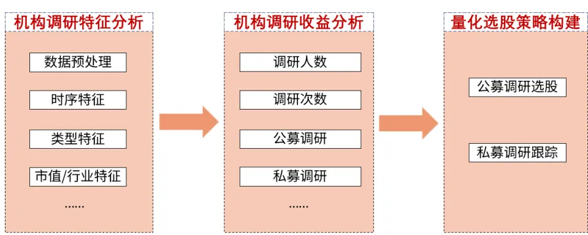
资料来源：光大证券研究所绘制

我们将上篇报告关于机构调研的重要经验以及结论总结如下：

1.机构调研主要覆盖中小盘股票。由于沪市和深市监管规定存在差异，导致所披露的股票主要为深市股票，近几年沪市机构调研披露增多，但仍以中小盘股票为主，如下图所示。

2.机构热衷覆盖高涨幅股票。我们通过事件研究方法，以公告日为事件发生日，测算了事件发生前后 60 个交易日，股票相对基准的超额收益情况，发现在公告前股票超额收益非常突出，而公告后明显下滑。

3.较多调研次数能带来可观超额收益。我们按照过去 3 个月内的调研活动次数分组，发现调研活动次数最多的组中，股票表现优异。进而我们基于调研活动次数构造了选股组合，该组合获取显著超额收益。

4.有公募和部分私募覆盖的股票表现更好。我们按照机构类型进行分组统计，发现有公募基金或知名私募参与的调研，股票整体表现更为出色。

图 2：不同市场股票被调研次数占比
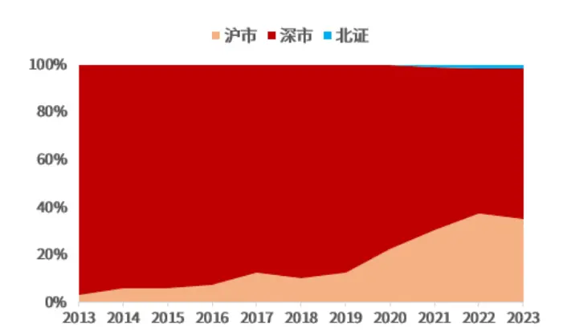
资料来源：Wind；光大证券研究所；注：数据起止日期为：2013.01.01-2023.02.28；图中 2023 年截至 2 月底

图 3：不同市值范围股票被调研次数占比
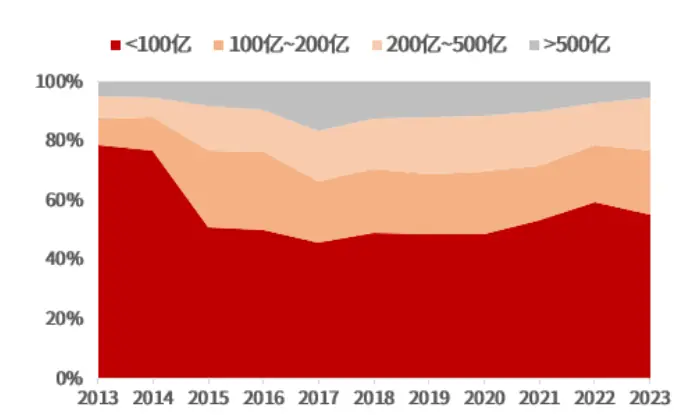
资料来源：Wind；光大证券研究所；注：数据起止日期为：2013.01.01-2023.02.28；图中 2023 年截至 2 月底

图 4：机构调研全市场覆盖度
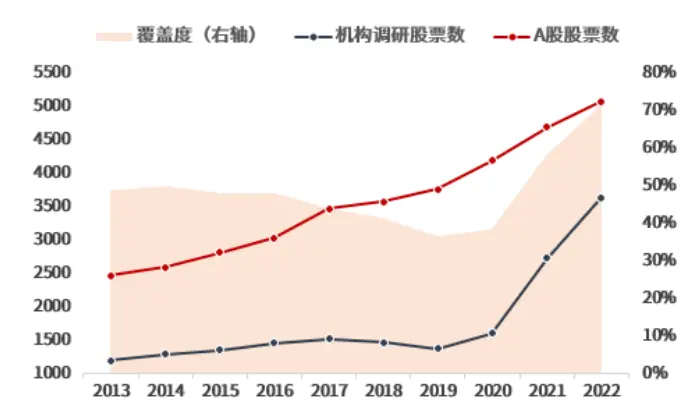
资料来源：Wind；光大证券研究所；注：数据起止日期为：2013.01.01-2022.12.31；左轴单位为家

图 5：机构调研对各宽基指数成分股占比

| 年份 | 沪深300 | 中证500 | 中证1000 | 其他 |
| --- | --- | --- | --- | --- |
| 2013 | 9.09% | 18.99% | 0.00% | 71.92% |
| 2014 | 6.88% | 14.06% | 23.80% | 55.25% |
| 201520162017201820192020202120222023 | 8.21% | 16.28% | 41.79% | 33.72% |
|  | 8.30% | 16.29% | 38.20% | 37.20% |
|  | 8.69% | 15.48% | 34.03% | 41.80% |
|  | 8.42% | 15.94% | 31.31% | 44.32%44.31% |
|  | 7.93% | 16.06% | 31.70% |  |
|  | 7.53% | 14.53% | 28.94% | 49.00% |
|  | 5.64% | 10.82% | 24.48% | 59.05% |
|  | 5.90% | 10.33% | 21.65% | 62.12% |
|  | 6.09% | 11.16% | 24.03% | 58.71% |

资料来源：Wind；光大证券研究所；注：数据起止日期为：2013.01.01-2023.02.28；图中 2023 年截至 2 月底；占比=截面上各宽基指数成分股数量/截面上股票总数量

最近 2 年以来，机构所关注的上市公司急剧增多。从机构调研对各宽基指数成分股的占比来看，机构调研所覆盖的股票与沪深 300、中证 500 成分股的重合度较低。我们在上篇报告中较为粗略地以中证 800 作为比较基准，根据上述统计结果，我们在后续研究中采用中证全指作为比较基准。

根据上篇报告的研究结论，我们构造了公募调研选股策略和私募调研跟踪策略。
截至 2023.02.28，两策略表现稳定，超额收益显著，如下图所示。

图 6：公募调研选股和私募调研跟踪累计净值
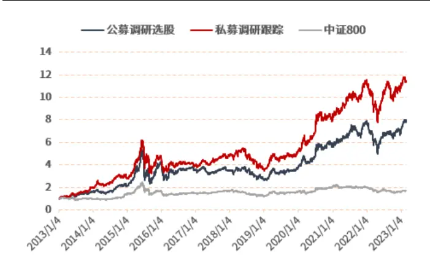
资料来源：Wind；光大证券研究所；注：数据起止日期为：2013.01.04-2023.02.28

图 7：公募调研选股和私募调研跟踪超额净值
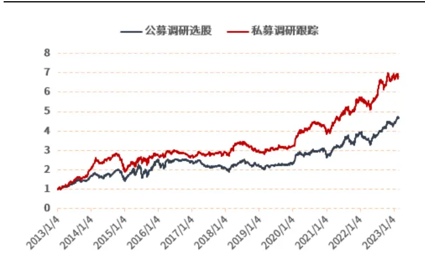
资料来源：Wind；光大证券研究所；注：数据起止日期为：2013.01.04-2023.02.28

虽然两策略超额收益显著，但是仍然存在一些瑕疵。例如股票池中的个股数量不稳定、策略同质化、幸存者偏差较大。我们在本篇报告中，从机构调研动机出发，深入且精细地对机构调研开展了相关研究，以获取更为出色且稳定的 alpha，同时避免了上篇报告存在的问题。

在本篇报告中，我们重点探讨了有哪些因素诱发机构开展调研，并对一些因素进行了探究。我们根据两篇报告的研究结论构建了机构调研打分体系，并以此为基础，构建了“光大金工——机构调研精选组合”。经测试，该组合表现稳定，超额收益显著。本篇报告主要涉及以下内容：

1.机构调研后每日调仓效果如何？机构调研作为典型的事件型活动，不少投资者较为关注，在上市公司发布调研公告后，立即买入并持有一段时间，是否有明显超额收益？对此我们进行了相应测算与解答。

2.有何因素引发机构开展调研？我们归纳了一些可能引发机构开展调研的因素，并对部分因素进行了详细分析，以描述机构调研活动特征和挖掘超额收益。

3.如何构建机构调研选股组合？我们根据上篇报告的重要结论，结合本篇报告的研究成果，构造了机构调研打分体系，并构造了相应选股组合。相比上篇报告，本篇报告选股组合股票数量更稳定，资金容量相对更大，稳定性更佳。

## 2、机构调研后立即买入效果如何？

机构调研作为典型的事件型活动，不少投资者较为关注，基于机构调研信息构建事件驱动策略效果如何？也即对机构调研信息进行每日跟踪，当上市公司在披露机构调研公告后，立即买入并持有一段时间，是否能够及时地捕捉到 alpha？

在上篇报告中，我们根据月频调仓测试，得出“调研活动次数越多，获取更多超额收益可能性越大”和“调研人数或机构数越多，并不能带来更多超额收益”的结论。在日频调仓情况下，我们对调研活动次数和调研机构数进行测试，以验证是否能够挖掘出 alpha。具体测试环境如下所示：

- 基础股票池：机构调研股票池；限定公告日期与调研日期在 10 日及以内、剔除次新股、特别处理股（如 ST/*ST 等）和停牌股；限定 4 种调研类型（特定对象调研、其他调研、分析师会议和现场参观）；有机构参与。

- 分组方式：将基础股票池按照当日调研机构数或近 3 个月调研活动次数的33%、66%分位数分组（从低到高依次为 group1-group3）。

- 调仓方式：日频调仓，持有 5 个交易日，以收盘价进行买卖；涨停不买入，跌停不卖出；各组内股票加权方式为等权。

- 其他设置：交易费率为双边千分之二；回测区间为 2013.01.04-2023.02.28；比较基准为中证全指。

测试结果如下图所示：

图 8：日频调仓净值-按照调研机构数分组
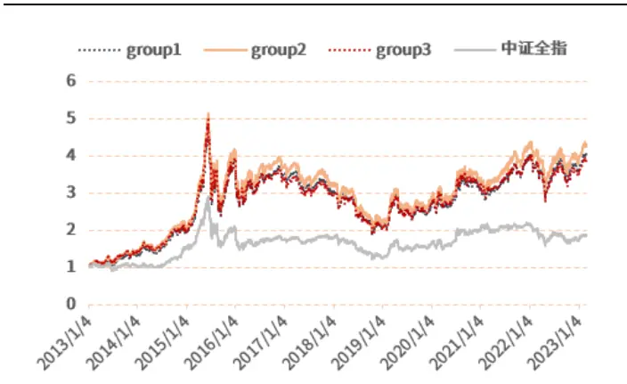
资料来源：Wind；光大证券研究所；注：数据起止日期为：2013.01.04-2023.02.28

图 9：日频调仓净值-按照调研活动次数分组
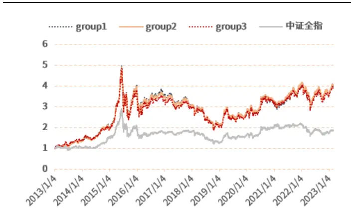
资料来源：Wind；光大证券研究所；注：数据起止日期为：2013.01.04-2023.02.28

根据上述测试结果，从净值曲线来看，无论是调研机构数，还是调研活动次数，在三等分情况下均没有明显差距。说明在日频调仓的情况下，调研机构数和调研活动次数并不能带来更多 alpha。

综合上述研究结果，结合我们对机构调研的日常跟踪，我们认为机构调研事发后，不宜采用日频事件驱动的方式进行调仓，主要有两点原因：

1.日频事件驱动调仓效果不佳。根据测试结果，相较于月频调仓，日频事件驱动调仓组合获取超额收益的能力并不突出，原有获取超额收益的手段在日频下不再适用，且日频下频繁换手造成交易成本偏高。

2.机构调研信息及时性无法保证。我们在对机构调研信息进行日常跟踪时发现，机构调研信息存在一定延迟现象。具体地，当日调研信息在次日并不一定能及时获取，若采取事件驱动策略，则会造成统计结果偏误。

## 3、机构开展调研的因素有哪些？

本章，我们主要分析有哪些因素诱发机构对上市公司开展调研，以探究机构在调研行为上的特征。我们归纳了 2 大类以及细分 6 小类的因素：

1.公司层面。由于上市公司自身的一些因素，公司曝光度得到提高，进而机构有调研该公司的意愿和倾向。例如公司估值或股价异常变动（超涨或超跌）；公司突发诸如股东和高管增减持事件；公司披露业绩情况。

2.机构层面。机构由于投资或研究的需求，进而有对上市公司开展调研的诉求。
例如机构意识到获取上市公司的信息不足；分析师推荐股票、覆盖股票等因素。

此外，长期未被机构关注的上市公司，突然被机构关注，这类调研信息同样值得我们关注。由于这类调研的动机是多方面、不明确的，因此我们将其归为“其他”类型。

图 10：机构调研因素
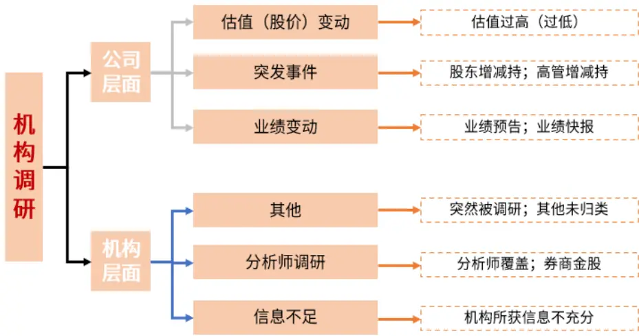
资料来源：光大证券研究所绘制

## 3.1、 公司层面

本节，我们首先从公司层面上探究机构调研行为的特征。我们主要从上市公司股票估值变动以及业绩变动两方面来探究。

## 3.1.1、估值变动

估值变动是引起机构关注上市公司的诱因。当上市公司股票估值（如动态市盈率、市净率）处于历史低位时，如果上市公司经营情况等方面良好，容易受到机构投资者青睐，进而该公司获得机构买入或增持。上市公司股票估值上升，市场关注度进一步提升，则会获得更多机构关注和调研。

图 11：上市公司从估值层面受机构关注
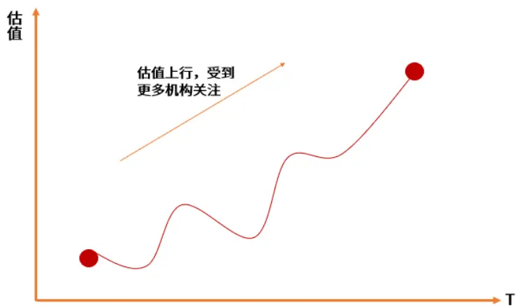
资料来源：光大证券研究所绘制

根据上述理论，总体来看，被机构所关注的上市公司，其估值分布图形体现为“下凸型”。下图分别展示了机构调研样本股票 PE_TTM 和 PB 近 1 季度平均值占近 2 年分位的总体分布情况和历年分布情况。

从总体分布来看，PE_TTM 和 PB 分布情况均为“下凸型”，即大部分机构热衷于调研估值偏低和偏高的上市公司，这与我们上述预期相符。当股价持续上行，上市公司必然受到众多机构的关注。

估值分布会随着市场环境不同而有所区别。分年度来看，不同市场环境下，分布情况不同，在市场环境较好的年度（2014 年、2015 年、2020 年和 2021 年），机构所关注的上市公司估值普遍偏高，而环境较差的年份，机构所关注的上市公司估值普遍偏低。

图 12：样本近 1 季度估值平均值占近 2 年分位分布情况
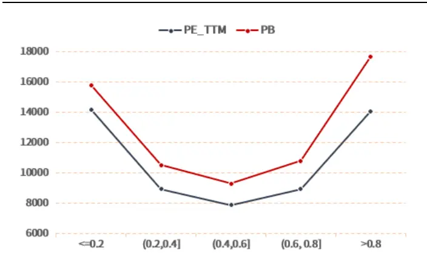
资料来源：Wind；光大证券研究所；注：数据起止日期为：2013.01-2023.02；横轴为分位数区间，纵轴为样本量（单位为家）

图 13：样本 PB近 1 季度平均值占近 2 年分位分布情况-按年度
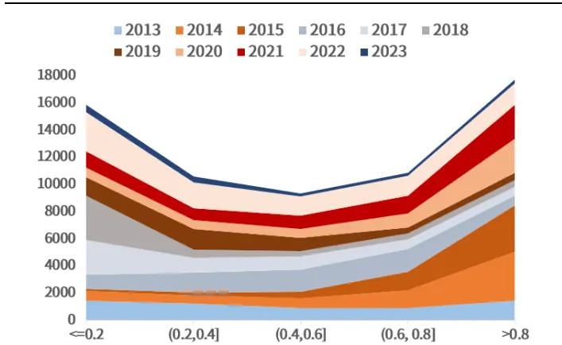
资料来源：Wind；光大证券研究所；注：数据起止日期为：2013.01-2023.02；横轴为分位数区间，纵轴为样本量（单位为家）；2023 年数据截至 2 月底

我们在上篇报告中，按照调研公告前，上市公司股票相对于基准的涨跌幅，将股票池划分为三组，分别测试三组股票池的股票在公告后的表现。结果表明，前期涨幅高的股票，公告后表现反而下降。事实上，从股票估值的角度来看，上述结论仍然成立。

我们根据 PB 近 1 季度平均值占近 2 年分位数，将样本平均划分为 5 组，测试了各组上市公司在公告前后，其股票的市场表现。结果表明，在公告前，估值过高的上市公司，其股票在公告后表现整体不佳；而估值较低的上市公司，其股票在公告后表现一般；估值适中的上市公司，其股票在公告后表现良好。

图 14：按 PB近 1 季度平均值占近 2 年分位数分组测试
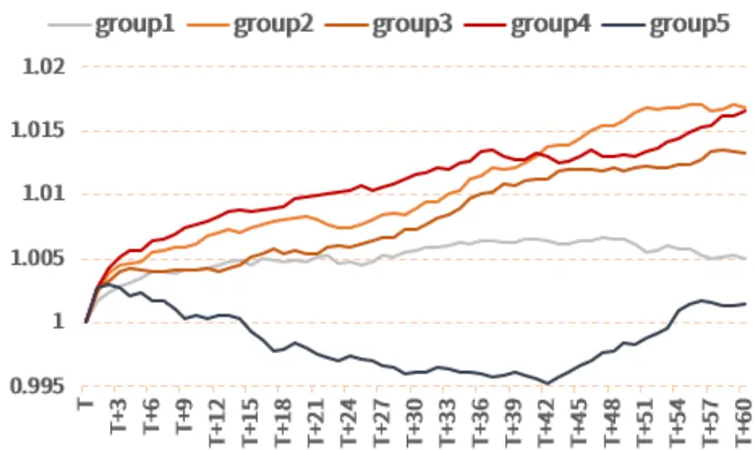
资料来源：Wind；光大证券研究所；注：数据起止日期为：2013.01-2023.02；group1 至 group5 为按照估值从低到高分组；T 日为调研公告日

我们对机构从估值层面的调研行为进行了简要的验证。具体地，当两次调研时间间隔在 1 个月以内，我们认为两次调研属于同一调研周期。将所有样本的调研周期识别后，我们提取出每个调研周期的首次调研和末尾调研，调研周期内的其余样本归为其他类型。

图 15：调研周期识别示意图
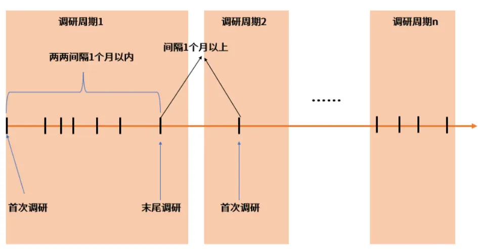
资料来源：光大证券研究所绘制

我们对三组数据进行了测试，三组样本量和测试结果如下图所示。首次调研相对于末尾调研，在调研后股票表现较好，这说明从首次调研至末尾调研这段时间，股价迎来上行，而上行后，在达到末尾调研阶段后，股价迎来下行。而其他调研不管是调研前还是调研后，表现都较好，说明调研开始后，调研所体现的增量信息并不能迅速反映在股价上。

图 16：各情形样本量
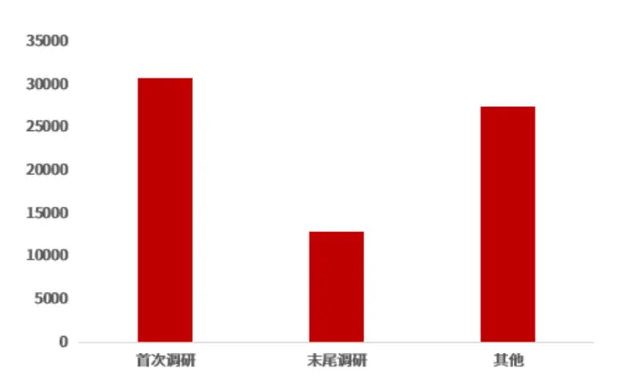
资料来源：Wind；光大证券研究所；注：数据起止日期为：2013.01-2023.02；单位为家

图 17：首次调研和末尾调研测试结果
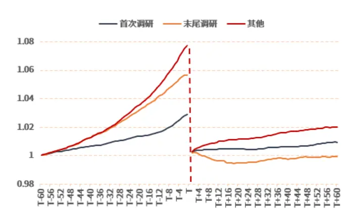
资料来源：Wind；光大证券研究所；注：数据起止日期为：2013.01-2023.02；T 日为调研公告日，以 T 日为界限，分别统计 T 日前和 T 日后超额净值曲线

## 3.1.2、业绩变动

在公布正式财务报表之前，根据上交所和深交所的相关规定，部分上市公司会提前发布业绩预告。业绩预告内容主要说明公司当期净利润状况的预测、同比的变动情况，部分还会说明业绩变动的原因。业绩预告、业绩快报和定期报告是上市公司披露业绩的主要方式，而业绩预告时间最早，其重要性不言而喻。

业绩是体现公司经营情况的重要指标。上市公司在披露业绩预告后，会促使机构对其开展调研。本节，我们从上市公司披露业绩预告角度来探究，上市公司的业绩变动，结合机构调研有何特征？

业绩预告类型一共分为 9 类，如下表所示。我们利用事件研究法，对不同预告类型事件发生前后的市场表现进行探究，结果如下图所示。从测试结果可以看到，在公告前，略减、首亏和预减这三类负面事件，其股价已提前反应，而预增、扭亏和略增这三类正面事件持续向好。

尽管个股在不同事件公告前的表现不一，但是可以发现，在正面事件公告后，个股多有不同程度的上涨，而尤其以扭亏、预增和略增表现较好。

表 1：业绩预告类型

| 预告类型 说明 |
| --- |
| 预增 1.增幅上限>50%,下限>=0；2.“大幅度增长”；3.增幅50%左右 |
| 略增 1.0<=增幅<=50%；2.“较大幅度增长”或“一定幅度增长’ |
| 续盈 无重大变化，增幅上限>0,下限<0 |
| 略减 1.-50%<=降幅<=0；2.“较大幅度下降”或“一定幅度下降” |
| 预减 1.降幅上限<=-50%，上限<=0；2.“大幅度下降” |
| 首亏 上年同期盈利，预告期亏损 |
| 续亏 上年同期亏损，预告期亏损 |
| 扭亏 上年同期亏损，预告期盈利 |
| 不确定 预告期盈亏不定 |

资料来源：Wind；光大证券研究所

图 18：业绩预告样本量
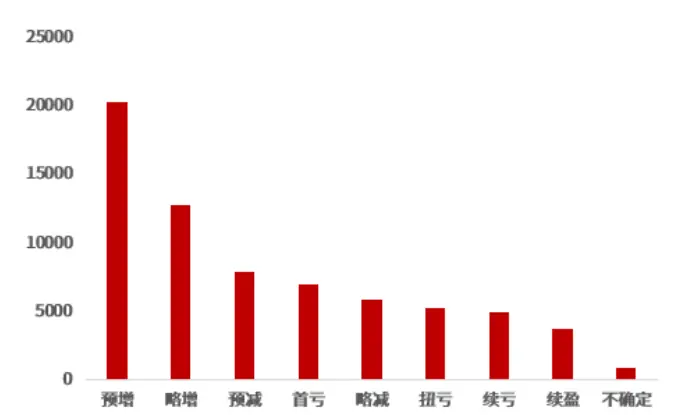
资料来源：Wind；光大证券研究所；注：数据起止日期为：2013.01-2023.02；剔除业绩变脸、次新股、特别处理股；单位为家

图 19：业绩预告事件驱动测试结果
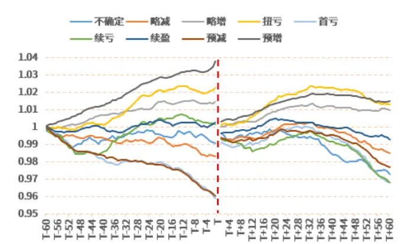
资料来源：Wind；光大证券研究所；注：数据起止日期为：2013.01-2023.02；剔除业绩变脸、次新股、特别处理股；T 日为公告日，以 T 日为界限，分别统计 T 日前和 T 日后超额净值曲线

对于业绩预告的测试情况，我们由此引发了思考：如果上市公司在发布业绩预告后，机构随之对其开展调研，那么通过两者叠加，股票是否有超额表现呢？因此，我们对机构调研，叠加业绩预告进行测试。具体测试环境如下所示：

- 基础股票池：机构调研股票池；限定公告日期与调研日期在 10 日及以内、剔除次新股、特别处理股（如 ST/*ST 等）和停牌股；限定 4 种调研类型（特定对象调研、其他调研、分析师会议和现场参观）；有机构参与。

- 选股方式：每月底，从基础股票池中，筛选出在当月披露业绩预告（不含业绩变脸）的上市公司。

- 调仓方式：以收盘价进行买卖；每年 2 月、4 月、5 月、8 月、9 月和 11 月月初调仓。涨停不买入，跌停不卖出；加权方式为等权。

- 其他设置：交易费率为双边千分之二；回测区间为 2013.02.01-2023.02.28。测试结果如下图所示：

图 20：机构调研叠加业绩预告回测结果（超额净值曲线）
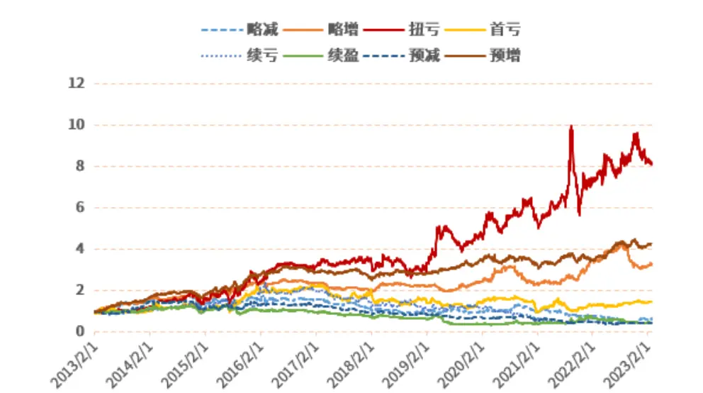
资料来源：Wind；光大证券研究所；注：数据起止日期为：2013.02.01-2023.02.28

从测试结果来看，机构调研叠加扭亏和预增两类型后表现最佳，但是可以发现扭亏类型的测试结果的波动和回撤幅度较大。这是因为受样本量的影响，导致部分调仓日时，所持有的股票数量较少。我们将测试结果表现较佳的两类业绩预告类型：扭亏和预增进行合并测试，结果如下。在二者叠加后，效果明显提升。

图 21：机构调研叠加扭亏、预增样本量
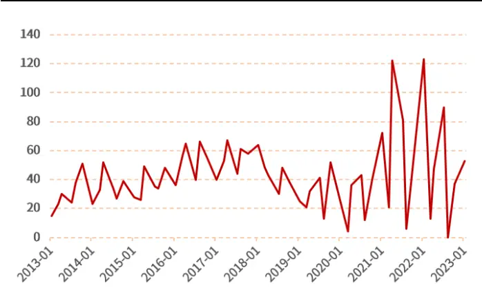
资料来源：Wind；光大证券研究所；注：数据起止日期为：2013.01-2023.01；单位为家

图 22：机构调研叠加扭亏、预增回测结果（超额净值曲线）
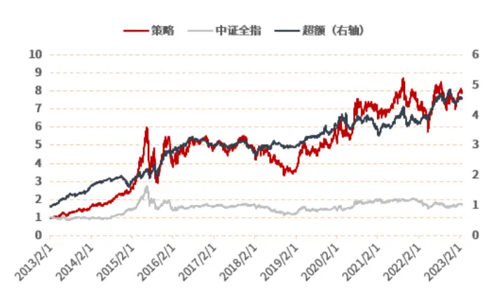
资料来源：Wind；光大证券研究所；注：数据起止日期为：2013.02.01-2023.02.28

表 2：机构调研叠加业绩预告（扭亏、预增）业绩评价指标

| 指标名称 策略 | 中证全指 | 超额 |
| --- | --- | --- |
| 总收益 697.93% | 74.76% | 356.58% |
| 年化收益 23.65% | 5.87% | 16.79% |
| 30.48% 年化波动 | 23.06% | 14.33% |
| 0.64 夏普比率 | 0.08 | 0.89 |
| 最大回撤 51.52% | 57.85% | 19.57% |
| 月度胜率 | 57.02% 56.20% | 60.33% |

资料来源：Wind；光大证券研究所；注：数据起止日期为：2013.02.01-2023.02.28

## 3.2、 机构层面

从机构层面来看，机构由于投资或研究的需求，进而有对上市公司开展调研的诉求。机构对上市公司开展调研的原因是多方面的，例如机构意识到获取上市公司的信息不足；分析师推荐股票、覆盖股票等因素。我们在本节对券商金股和上市公司突然被调研开展研究。

## 3.2.1、券商金股

券商金股通常指各家券商研究所每月推荐的股票组合。首先，各行业分析师推荐1-2 只股票。其次，由策略团队结合市场研判、行业比较，对股票进行二次筛选，推出最终的金股组合。券商金股由于更新频率高、时效性强，因此，能够更及时反映出机构投资者对当前市场的偏好和判断。

券商金股自 2017 年逐步发展，截至 2023 年 2 月，每月各券商推出的金股已覆盖超过 300 只股票。各家券商公布下月金股的时间不一，我们统计了推荐日期距离推荐月份月初首日的分布情况。可以发现，大部分金股集中于次月第三日（T+2，T 为月初首日）以前，如下图所示。

图 23：券商金股样本量
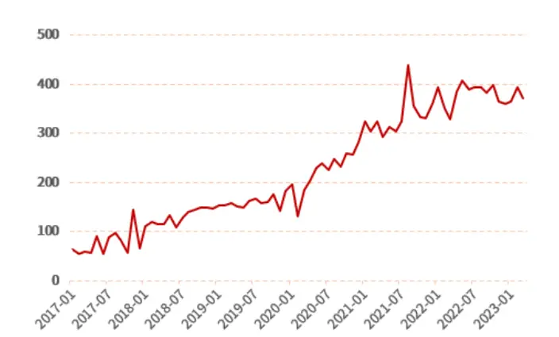
资料来源：朝阳永续；光大证券研究所；注：数据起止日期为：2017.01-2023.02；单位为家

图 24：券商金股发布日期距离推荐月份天数分布情况
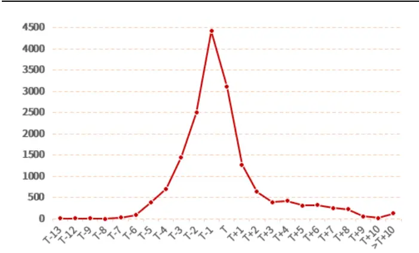
资料来源：朝阳永续；光大证券研究所；注：数据起止日期为：2017.01-2023.02；纵轴为股票数量，单位为家

券商金股作为券商研究所每月观点的“精华”，广受市场关注，那么券商金股收益表现如何呢？我们对券商金股进行月频测试。具体地，我们每月底获取券商下月金股名单，等权持有 1 个月，手续费双边千分之二，涨停不买入，跌停不卖出。测试结果如下图所示。可以发现，券商金股明显跑赢大盘。

图 25：券商金股回测结果
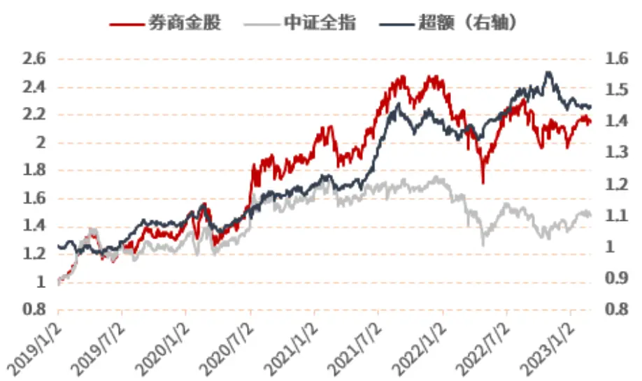
资料来源：Wind；朝阳永续；注：数据起止日期为：2019.01.02-2023.02.28

通常行业分析师所覆盖的股票有限，因此，其有限的精力将会用来关注部分股票，这要求分析师对上市公司的了解更深，那么对上市公司开展调研就成为了必不可少的环节。由此我们引发了思考：如果卖方分析师对上市公司开展调研后，在次月将其推荐为券商金股，那么此类上市公司的股票表现如何？

因此，我们对机构调研信息，在叠加券商金股的情况下作了测试，具体测试环境如下所示：

- 基础股票池：机构调研股票池；限定公告日期与调研日期在 10 日及以内、剔除次新股、特别处理股（如 ST/*ST 等）和停牌股；限定 4 种调研类型（特定对象调研、其他调研、分析师会议和现场参观）；有机构参与。

- 选股方式：每个月底，从基础股票池中，筛选出在当月月底前券商披露的下月金股。

- 调仓方式：月频调仓，以收盘价进行买卖。涨停不买入，跌停不卖出。加权方式为等权。

- 其他设置：交易费率为双边千分之二；回测区间为 2019.01.02-2023.02.28。

图 26：机构调研叠加券商金股样本量
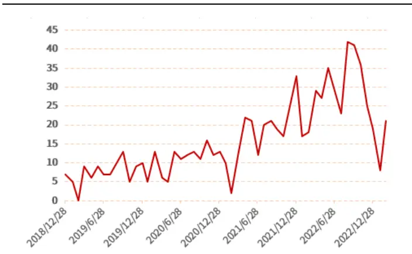
资料来源：Wind；朝阳永续；光大证券研究所；
注：数据起止日期为：2018.12.28-2023.02.28；单位为家

图 27：机构调研叠加券商金股净值曲线
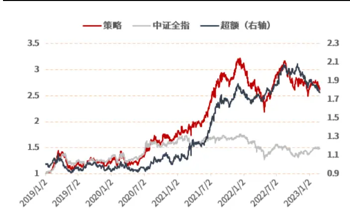
资料来源：Wind；朝阳永续；光大证券研究所；注：数据起止日期为：2019.01.02-2023.02.28

表 3：机构调研叠加券商金股业绩评价指标

| 指标名称 | 策略 中证全指 | 超额 |
| --- | --- | --- |
| 总收益 | 164.32% 49.03% | 77.36% |
| 年化收益 | 27.26% 10.40% | 15.27% |
| 年化波动 | 28.99% 20.29% | 17.51% |
| 夏普比率 | 0.80 0.32 | 0.64 |
| 最大回撤 | 32.14% 28.00% | 18.51% |
| 月度胜率 | 60.00% | 60.00% 56.00% |

资料来源：Wind；朝阳永续；光大证券研究所；注：数据起止日期为：2019.01.02-2023.02.28

测试结果如上所示。可以发现，机构调研叠加券商金股的情况下，策略表现稳定，年化收益率达 27%，超额收益明显。

## 3.2.2、突然被调研

长期未被机构关注的上市公司，突然被机构关注，这类调研信息同样值得我们关注。由于这类调研的动机是不明确、多方面的，因此我们将其归为“其他”类型。一方面由于股票超涨，曝光度提高，机构想要了解该上市公司的情况。另一方面，机构投资者所获该上市公司信息有限，需要调研，以深度挖掘优质的上市公司。

如何界定“突然被调研”呢？我们按照过去 N 日作为阈值，如果本次调研距离上次调研天数超过该阈值，则认为是突然被调研。具体地，如下图所示。

图 28：突然受到机构调研图示
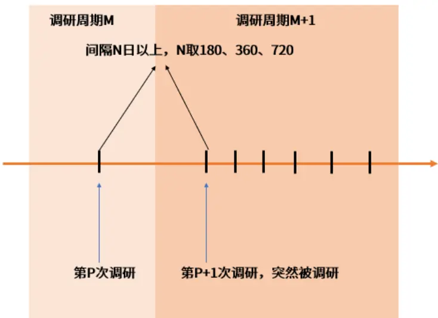
资料来源：光大证券研究所绘制

我们按照 N 取不同阈值（180 日、360 日和 720 日，简称最近半年、最近 1 年和最近 2 年），统计了历年和各月的样本量，如下图所示。可以发现，当阈值设为 720 日时，样本量大幅下降，近年来每月的样本量维持在 20 只股票左右。

图 29：突然被机构调研样本量（年度）
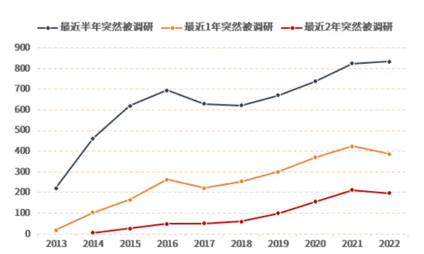
资料来源：Wind；光大证券研究所；注：数据起止日期为：2013.01.01-2022.12.31；单位为家

图 30：突然被机构调研样本量（月度）
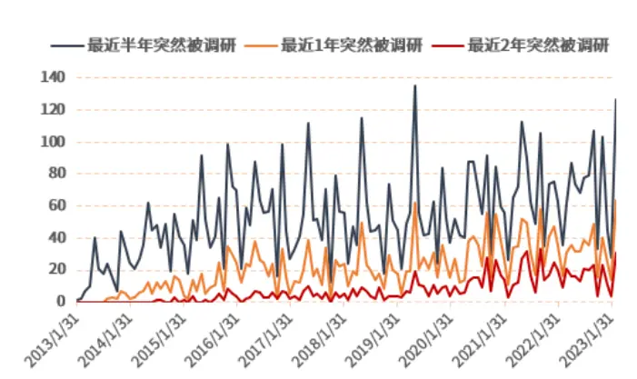
资料来源：Wind；光大证券研究所；注：数据起止日期为：2013.01.31-2023.02.28；单位为家

我们对突然被调研的上市公司，其股票进行了测试，具体测试环境如下所示：

- 基础股票池：机构调研股票池；限定公告日期与调研日期在 10 日及以内、剔除次新股、特别处理股（如 ST/*ST 等）和停牌股；限定 4 种调研类型（特定对象调研、其他调研、分析师会议和现场参观）；有机构参与。

- 选股方式：每个月底，从基础股票池中，筛选出突然被机构调研的上市公司，阈值分别取 180 日、360 日和 720 日。

- 调仓方式：月频调仓，以收盘价进行买卖。涨停不买入，跌停不卖出。加权方式为等权。

- 其他设置：交易费率为双边千分之二；回测区间为 2015.02.02-2023.02.28。

图 31：各阈值下突然被调研累计净值曲线
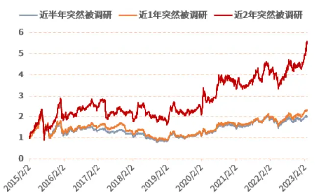
资料来源：Wind；光大证券研究所；注：数据起止日期为：2015.02.02-2023.02.28

图 32：各阈值下突然被调研超额净值曲线
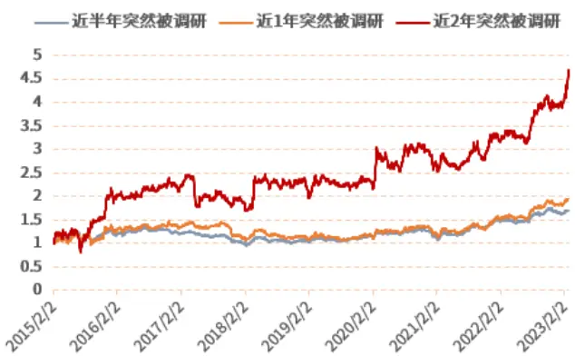
资料来源：Wind；光大证券研究所；注：数据起止日期为：2015.02.02-2023.02.28

表 4：近 2 年突然被调研业绩评价指标

| 指标名称 策略 | 中证全指 超额 |
| --- | --- |
| 总收益 460.50% | 19.30% 369.84% |
| 年化收益 24.55% | 2.27% 21.78% |
| 年化波动 37.39% | 23.74% 25.03% |
| 0.55 夏普比率 | -0.07 0.71 |
| 61.47% 最大回撤 | 57.85% 39.11% |
| 57.73% 月度胜率 | 53.61% 55.67% |

资料来源：Wind；光大证券研究所；注：数据起止日期为：2015.02.02-2023.02.28

从上述结果不难看出，当阈值取 180 日和 360 日时，两者表现基本一致。当阈值取 720 日时，超额收益相对突出。由于三者样本量不同，当阈值取 720 日时，样本量较少，导致曲线波动较大。综合上述研究结果，我们认为，最近 2 年突然被调研的股票，存在超额收益。

## 4、机构调研选股策略

我们在上篇报告中构造了公募调研选股策略和私募调研跟踪策略。截至 2023 年2 月 28 日，两策略表现稳定，超额收益显著。虽然两策略表现良好，但是仍然存在一些瑕疵。例如股票池中个股数量不稳定、策略同质化、幸存者偏差较大。

根据本篇报告的研究结果，我们认为机构调研叠加业绩预告中的业绩预增和业绩扭亏、叠加券商金股和突然被调研这三类情形能够带来超额收益。

根据前篇报告的研究结论，调研活动次数和调研前涨幅是获取超额收益的重要因素。为了避免前篇报告中存在的不足，并利用其重要结论，我们根据本篇报告的研究结果，构建了机构调研打分体系（以下均简称“打分”），具体打分流程如下图所示。

图 33：机构调研打分体系图示
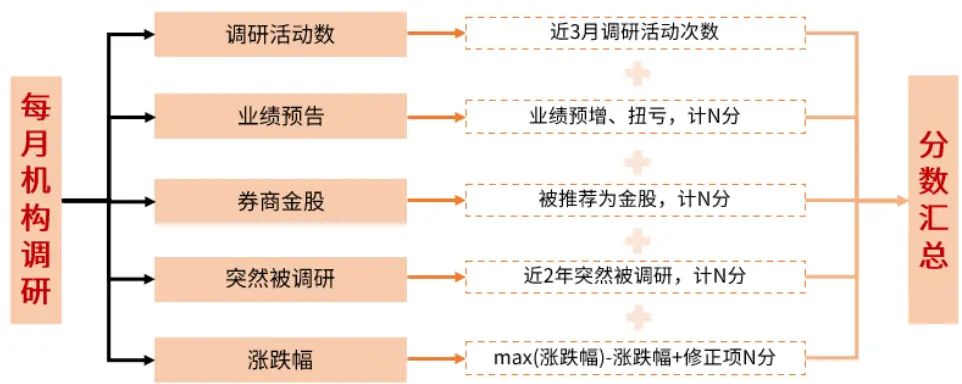
资料来源：光大证券研究所绘制

在以最近 3 月调研活动次数为前提下，我们叠加了业绩预告、券商金股和突然被调研，并对这三类情况进行了赋分，计 N 分。我们对参数进行了测试，以确定最佳的分值，我们以 N 从 1-10 进行测试，结果如下所示。从测试结果可知，当N 取 6 或 7 时，打分效果最佳。

图 34：机构调研打分参数测试结果
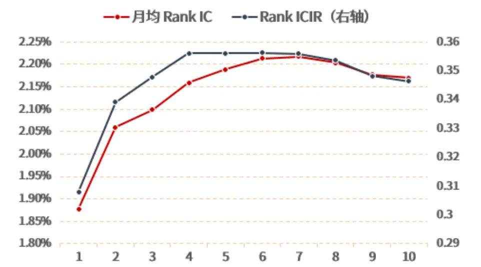
资料来源：Wind；朝阳永续；光大证券研究所

我们以参数N=6为准，展示了对股票打分后的测试结果。我们对分值进行了MAD去极值、Z-Score 标准化、市值行业中性化处理，并根据分值从小到大，将样本均分为 5 组（依次为 group1-group5）进行测试。调仓频率为月频。测试结果如下图所示。

从测试结果可以发现，分值月度平均 Rank IC 为 2.2%，月度 Rank IC 在 2019年和 2020 年发生过较大回撤。近年来，表现较好。从分组测试来看，第 1 组表现最差，第 5 组表现最佳，5 组不满足严格单调性，但线性趋势明显。

图 35：机构调研打分—Rank IC 序列
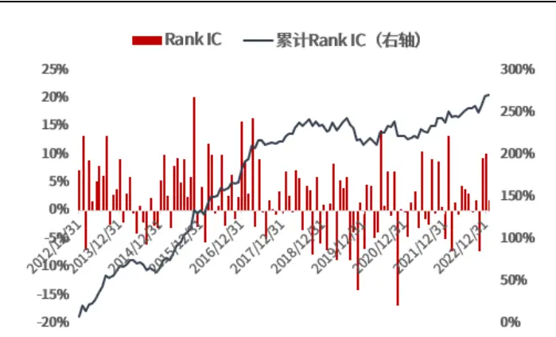
资料来源：Wind；朝阳永续；光大证券研究所；注：数据起止日期为：2012.12.31-2023.02.28

图 36：机构调研打分后分组测试—月度平均收益
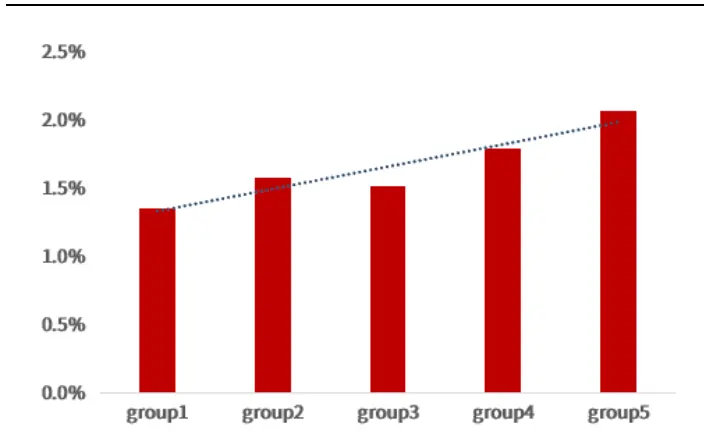
资料来源：Wind；朝阳永续；光大证券研究所；注：数据起止日期为：2012.12.31-2023.02.28；图中虚线为线性趋势线

上图展示的是打分后，分值在经过处理（MAD 去极值、Z-Score 标准化、市值行业中性化）后的测试结果。事实上，由于机构调研样本偏向于中小市值，行业具有偏离性。因此，我们认为，机构调研超额收益的一部分可能源自于行业的偏离，说明在一定程度上，机构调研具备行业择时能力。

我们对分值在各种处理（无处理、去极值和标准化、市值中性化、行业中性化、市值行业中性化）情况下，作了详细测算，测算结果如下表所示。从测算结果可以发现，当对市值进行中性化而不对行业进行中性化时，表现最佳，分值月度平均 Rank IC 为 3.09%，Rank ICIR 为 0.44，这与我们预期相符，机构调研超额收益的一部分源自于行业的偏离。

表 5：机构调研打分值在各种处理情形下 Rank IC 和 Rank ICIR

| 处理情形 Rank IC | Rank ICIR |
| --- | --- |
| 无处理 2.56% | 0.34 |
| 去极值、标准化 | 2.40% 0.33 |
| 3.09% 市值中性化 | 0.44 |
| 行业中性化 1.66% | 0.24 |
| 2.21% 市值、行业中性化 | 0.36 |

资料来源：Wind；朝阳永续；光大证券研究所；注：数据起止日期为：2013.01.04-2023.02.28；市值或行业中性化前，均进行 MAD 去极值和 Z-Score 标准化处理

图 37：机构调研打分后分组超额净值
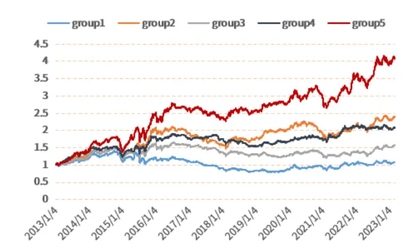
资料来源：Wind；朝阳永续；光大证券研究所；注：数据起止日期为：2013.01.04-2023.02.28

图 38：机构调研打分后相对强弱
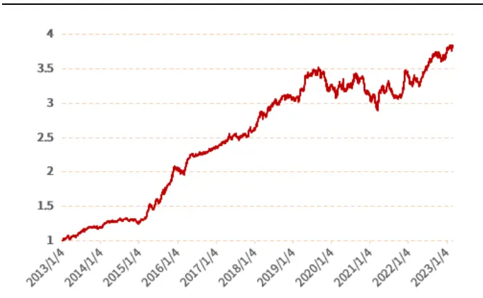
资料来源：Wind；朝阳永续；光大证券研究所；注：数据起止日期为：2013.01.04-2023.02.28；相对强弱为 group5 超额净值/group1 超额净值

我们对分值进行 MAD 去极值、Z-Score 标准化和市值中性化处理，然后按照分值从小到大，将样本均分成 5 组（依次为 group1-group5），然后统计各组的超额净值情况，各组情况如上图所示。从图可知，打分后的效果较好，group5相对 group1 的表现也较好，但 5 个组仍然不满足单调性。

我们按照上述处理后的分值，进行选股，具体选股流程如下所示：

- 基础股票池：机构调研股票池；限定公告日期与调研日期在 10 日及以内、剔除次新股、特别处理股（如 ST/*ST 等）和停牌股；限定 4 种调研类型（特定对象调研、其他调研、分析师会议和现场参观）；有机构参与。

- 选股方式：每个月底，对基础股票池进行打分，按照处理后的分值从大到小依次选择 M（M=20，30，40 和 50）只股票。

- 调仓方式：月频调仓，以收盘价进行买卖。涨停不买入，跌停不卖出。加权方式为等权。

- 其他设置：交易费率为双边千分之二；回测区间为 2013.01.04-2023.02.28。

测试结果如下图和表所示。从测试结果可以发现，持有不同数量的股票，均有明显的超额收益，除了 2017 年均跑输基准，以及持有 50 只股票在 2014 年基本与基准持平外，其余年份均明显跑赢基准。

图 39：持有不同数量股票下累计净值
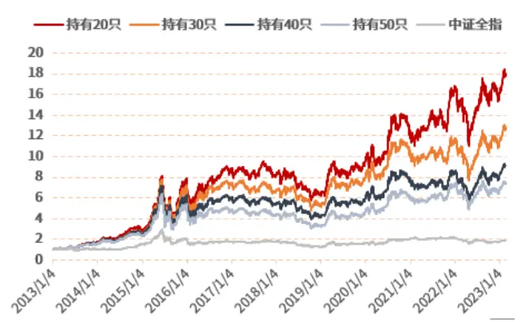
资料来源：Wind；朝阳永续；光大证券研究所；注：数据起止日期为：2013.01.04-2023.02.28

图 40：持有不同数量股票下累计超额净值
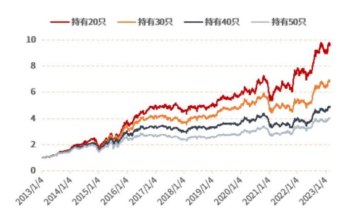
资料来源：Wind；朝阳永续；光大证券研究所；注：数据起止日期为：2013.01.04-2023.02.28

表 6：机构调研选股策略业绩评价指标

| 指标名称 | 绝对收益 |  |  |  |  | 超额收益 |  |  |
| --- | --- | --- | --- | --- | --- | --- | --- | --- |
|  | 持有20只 | 持有 30 只 | 持有40只 | 持有 50 只 | 中证全指 | 持有20只 持有 30 只 | 持有40 只 | 持有 50 只 |
| 总收益 | 1682.21% | 1173.89% | 809.56% | 643.04% | 86.02% | 858.07% 584.81% | 388.96% | 299.44% |
| 年化收益 | 33.91% | 29.43% | 25.08% | 22.55% | 6.49% | 25.75% 21.54% | 17.46% | 15.07% |
| 年化波动 | 32.40% | 31.92% | 31.41% | 30.96% | 23.05% | 17.36% 16.35% | 15.44% | 14.73% |
| 夏普比率 | 0.92 | 0.80 | 0.67 | 0.60 | 0.11 | 1.25 1.07 | 0.87 | 0.75 |
| 最大回撤 | 52.60% | 53.47% | 54.35% | 54.56% | 57.85% | 28.50% 27.26% | 26.76% | 27.09% |
| 月度胜率 | 59.84% | 59.02% | 59.02% | 60.66% | 56.56% | 66.39% 63.93% | 61.48% | 60.66% |
| 月均换手 | 75.52% | 73.20% | 71.49% | 69.90% |  |  |  |  |

资料来源：Wind；朝阳永续；光大证券研究所；注：数据起止日期为：2013.01.04-2023.02.28

表 7：机构调研选股策略业绩评价指标（年度）

| 年份 | 绝对收益 |  |  |  |  | 超额收益 |  |  |  |
| --- | --- | --- | --- | --- | --- | --- | --- | --- | --- |
|  | 持有20 只 | 持有30只 | 持有40只 | 持有50只 | 中证全指 | 持有20只 | 持有30只 | 持有40只 | 持有50只 |
| 2013 | 71.82% | 65.30% | 63.92% | 58.00% | 5.21% | 63.31% | 57.11% | 55.80% | 50.17% |
| 2014 | 64.37% | 52.87% | 50.51% | 44.49% | 45.82% | 12.72% | 4.83% | 3.21% | -0.92% |
| 2015 | 174.47% | 178.74% | 150.17% | 134.10% | 32.56% | 107.06% | 110.27% | 88.72% | 76.60% |
| 2016 | 12.01% | 3.82% | -4.07% | -10.78% | -14.41% | 30.86% | 21.30% | 12.07% | 4.24% |
| 2017 | -6.09% | -9.21% | -8.91% | -8.64% | 2.34% | -8.24% | -11.29% | -10.99% | -10.73% |
| 2018 | -23.35% | -21.27% | -22.82% | -25.62% | -29.94% | 9.40% | 12.36% | 10.15% | 6.16% |
| 2019 | 50.86% | 50.42% | 41.14% | 40.85% | 31.11% | 15.07% | 14.73% | 7.65% | 7.43% |
| 2020 | 29.59% | 31.70% | 30.74% | 33.06% | 24.92% | 3.74% | 5.42% | 4.65% | 6.51% |
| 2021 | 36.08% | 12.10% | 10.92% | 20.24% | 6.19% | 28.15% | 5.57% | 4.45% | 13.23% |
| 2022 | -6.58% | -5.41% | -7.75% | -11.17% | -20.32% | 17.25% | 18.72% | 15.78% | 11.49% |
| 2023 | 14.73% | 16.02% | 15.73% | 14.56% | 7.54% | 6.69% | 7.89% | 7.62% | 6.53% |

资料来源：Wind；朝阳永续；光大证券研究所；注：数据起止日期为：2013.01.04-2023.02.28；2023 年截至 2 月底

我们以持有 20 只股票为准，构建“光大金工——机构调研精选组合”。该组合从 2013.01.04-2023.02.28，总收益率 1682.21%，年化收益率 33.91%，夏普比率 0.92。超额收益率 858.07%，超额年化收益率 25.75%，超额夏普比率 1.25。

我们测算了组合的资金容量，即每次调仓时可买入的金额。具体地，每一期，我们以每只股票在调仓前（含调仓日）10 个交易日的日均成交金额的 10%，作为每只股票调仓日最大买入金额，然后计算每只股票最大买入金额/该股票权重，取所有股票该数值的 25%分位数值作为组合当日最大买入金额。

组合资金容量历史时序图如下图所示。从历史来看，“持有 20 只股票”组合的单日平均资金容量在 1.1 亿元左右。

图 41：“光大金工——机构调研精选组合”单日资金容量（亿元）
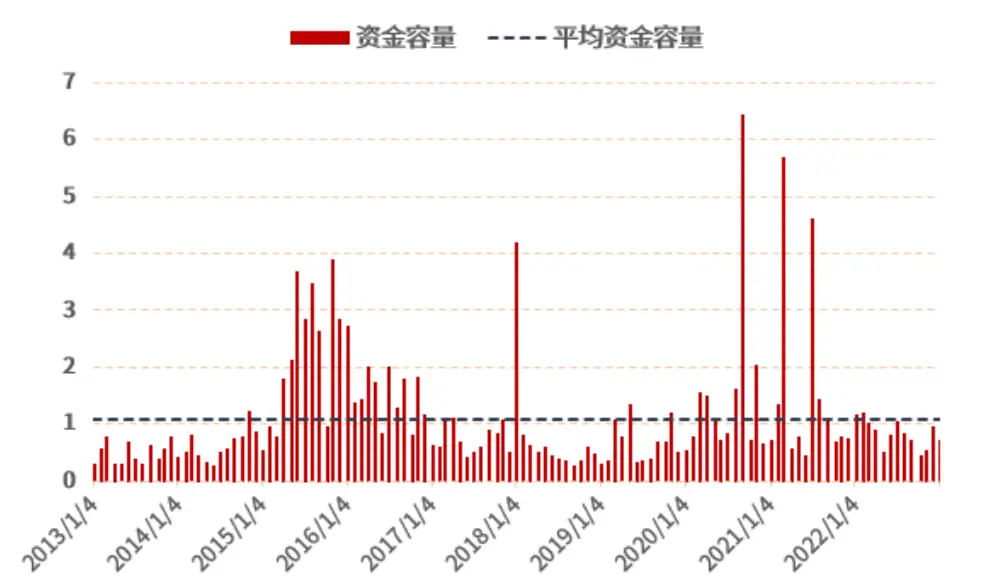
资料来源：Wind；朝阳永续；光大证券研究所；注：数据起止日期为：2013.01.04-2023.02.01

## 5、 总结

在光大金工前期研究《机构调研火热，如何提炼超额收益？——量化选股系列报告之八》中，我们初步探索了机构投资者对上市公司的调研活动情况，对机构调研信息进行了刻画，并构建了公募调研选股策略和私募调研跟踪策略。

上篇报告两策略超额收益显著，但是仍然存在一些瑕疵。例如股票池中个股数量不稳定、策略同质化、幸存者偏差较大。我们在本篇报告中，更为深入且精细地对机构调研开展了相关研究，以获取更为出色且稳定的 alpha，同时避免了上篇报告存在的问题。

在本篇报告中，我们对机构调研事件驱动策略进行了探究。也即对机构调研信息进行每日跟踪，日频调仓。经过测试，我们认为机构调研信息不宜采用日频事件驱动的方式进行调仓，原因在于每日调仓相比月频调仓并无明显优势，原有获取超额收益的手段在日频下不再适用，且机构调研信息及时性无法保证。

我们从上市公司层面和机构层面，归纳了一些可能引发机构开展调研的因素，并对部分因素进行了详细分析，以描述机构调研活动特征和挖掘超额收益。

我们首先从上市公司估值层面，探究了机构的调研行为特征，发现机构主要偏好于覆盖低估值和高估值股票。其次，我们分别从上市公司业绩预告、券商金股以及突然被调研出发，探究机构调研特征。通过研究，我们发现机构调研在叠加业绩预告、券商金股和突然被调研这三类情形下，能够获取明显 alpha。

根据前篇报告的研究结论，调研活动次数和调研前涨幅是获取超额收益的重要因素。为了避免前篇报告中存在的不足，并利用其重要结论，我们根据本篇报告的研究结果，构造了机构调研打分体系。经测试，分值月度平均 RankIC 为 3.09%，Rank ICIR 为 0.44。

我们以持有 20 只股票为准，构建了“光大金工——机构调研精选组合”。截至2023.02.28，组合表现稳定，超额收益显著。组合总收益率 1682.21%，年化收益率 33.91%，夏普比率 0.92。超额收益率 858.07%，超额年化收益率 25.75%，超额夏普比率 1.25。组合单日平均资金容量约 1.1 亿元。

## 6、风险分析

报告结果均基于历史数据，历史数据存在不被重复验证的可能。

## 行业及公司评级体系

| 评级 说明 |  |  |
| --- | --- | --- |
|  | 买入 | 未来6-12个月的投资收益率领先市场基准指数15%以上 |
| 行业及公司评级 | 增持 | 未来 6-12 个月的投资收益率领先市场基准指数 5%至 15%; |
|  | 中性 | 未来6-12个月的投资收益率与市场基准指数的变动幅度相差-5%至5%； |
|  | 减持 | 未来 6-12 个月的投资收益率落后市场基准指数 5%至 15%; |
|  | 卖出 | 未来6-12个月的投资收益率落后市场基准指数15%以上； |
|  | 无评级 | 因无法获取必要的资料，或者公司面临无法预见结果的重大不确定性事件，或者其他原因，致使无法给出明确的投资评级。 |
| 基准指数说明： |  | A股主板基准为沪深300指数；中小盘基准为中小板指；创业板基准为创业板指；新三板基准为新三板指数；港股基准指数为恒生 指数。 |

## 分析、估值方法的局限性说明

本报告所包含的分析基于各种假设，不同假设可能导致分析结果出现重大不同。本报告采用的各种估值方法及模型均有其局限性，估值结果不保证所涉及证券能够在该价格交易。

## 分析师声明

本报告署名分析师具有中国证券业协会授予的证券投资咨询执业资格并注册为证券分析师，以勤勉的职业态度、专业审慎的研究方法，使用合法合规的信息，独立、客观地出具本报告，并对本报告的内容和观点负责。负责准备以及撰写本报告的所有研究人员在此保证，本研究报告中任何关于发行商或证券所发表的观点均如实反映研究人员的个人观点。研究人员获取报酬的评判因素包括研究的质量和准确性、客户反馈、竞争性因素以及光大证券股份有限公司的整体收益。所有研究人员保证他们报酬的任何一部分不曾与，不与，也将不会与本报告中具体的推荐意见或观点有直接或间接的联系。

## 法律主体声明

本报告由光大证券股份有限公司制作，光大证券股份有限公司具有中国证监会许可的证券投资咨询业务资格，负责本报告在中华人民共和国境内（仅为本报告目的，不包括港澳台）的分销。本报告署名分析师所持中国证券业协会授予的证券投资咨询执业资格编号已披露在报告首页。

中国光大证券国际有限公司和 Everbright Securities(UK) Company Limited 是光大证券股份有限公司的关联机构。

## 特别声明

光大证券股份有限公司（以下简称“本公司”）创建于 1996 年，系由中国光大（集团）总公司投资控股的全国性综合类股份制证券公司，是中国证监会批准的首批三家创新试点公司之一。根据中国证监会核发的经营证券期货业务许可，本公司的经营范围包括证券投资咨询业务。

本公司经营范围：证券经纪；证券投资咨询；与证券交易、证券投资活动有关的财务顾问；证券承销与保荐；证券自营；为期货公司提供中间介绍业务；证券投资基金代销；融资融券业务；中国证监会批准的其他业务。此外，本公司还通过全资或控股子公司开展资产管理、直接投资、期货、基金管理以及香港证券业务。

本报告由光大证券股份有限公司研究所（以下简称“光大证券研究所”）编写，以合法获得的我们相信为可靠、准确、完整的信息为基础，但不保证我们所获得的原始信息以及报告所载信息之准确性和完整性。光大证券研究所可能将不时补充、修订或更新有关信息，但不保证及时发布该等更新。

本报告中的资料、意见、预测均反映报告初次发布时光大证券研究所的判断，可能需随时进行调整且不予通知。在任何情况下，本报告中的信息或所表述的意见并不构成对任何人的投资建议。客户应自主作出投资决策并自行承担投资风险。本报告中的信息或所表述的意见并未考虑到个别投资者的具体投资目的、财务状况以及特定需求。投资者应当充分考虑自身特定状况，并完整理解和使用本报告内容，不应视本报告为做出投资决策的唯一因素。对依据或者使用本报告所造成的一切后果，本公司及作者均不承担任何法律责任。

不同时期，本公司可能会撰写并发布与本报告所载信息、建议及预测不一致的报告。本公司的销售人员、交易人员和其他专业人员可能会向客户提供与本报告中观点不同的口头或书面评论或交易策略。本公司的资产管理子公司、自营部门以及其他投资业务板块可能会独立做出与本报告的意见或建议不相一致的投资决策。本公司提醒投资者注意并理解投资证券及投资产品存在的风险，在做出投资决策前，建议投资者务必向专业人士咨询并谨慎抉择。

在法律允许的情况下，本公司及其附属机构可能持有报告中提及的公司所发行证券的头寸并进行交易，也可能为这些公司提供或正在争取提供投资银行、财务顾问或金融产品等相关服务。投资者应当充分考虑本公司及本公司附属机构就报告内容可能存在的利益冲突，勿将本报告作为投资决策的唯一信赖依据。

本报告根据中华人民共和国法律在中华人民共和国境内分发，仅向特定客户传送。本报告的版权仅归本公司所有，未经书面许可，任何机构和个人不得以任何形式、任何目的进行翻版、复制、转载、刊登、发表、篡改或引用。如因侵权行为给本公司造成任何直接或间接的损失，本公司保留追究一切法律责任的权利。所有本报告中使用的商标、服务标记及标记均为本公司的商标、服务标记及标记。

光大证券股份有限公司版权所有。保留一切权利。

光大证券研究所

上海

北京

深圳

静安区南京西路 1266 号

西城区武定侯街 2 号

福田区深南大道 6011 号

恒隆广场 1 期办公楼 48 层

泰康国际大厦 7 层

NEO 绿景纪元大厦 A 座 17 楼

光大证券股份有限公司关联机构

香港

英国

中国光大证券国际有限公司

Everbright Securities(UK) Company Limited

香港铜锣湾希慎道 33 号利园一期 28 楼

64 Cannon Street，London，United Kingdom EC4N 6AE