## 金融工程

# 捕捉个人投资者中的“聪明钱”

# ——量化选股系列报告之九

## 要点

个人投资者中的“聪明钱”：“聪明钱”一直以来是市场中关注的焦点，以此为出发点而构建的跟踪“聪明钱”策略的确能为投资者提供丰厚收益。一般认为，“聪明钱”的来源是机构投资者和外资，然而本文将从另一个容易被市场忽略的角度出发，对个人投资者进行深入剖析，为大家提供新的观测角度。

怎样跟踪个人投资者交易行为：一般来说，跟踪交易行为首先想到的是交易席位数据，通过龙虎榜信息以及公开披露的大额交易信息可以推测出一些投资者对应的交易席位，然而我们认为该数据与投资者并非精确对应，存在较大的不确定性。综合考虑到数据的可得性和质量，我们的研究对象是进入上市公司十大流通股股东的个人投资者。

如何界定“投资者”：我们将企业披露的十大流通股股东划分成了三类：企业经营者、长期投资者、短期交易者。三类股东的持股目的和交易逻辑均有较大差异，因此需要对他们加以区分。我们根据三类投资者不同的交易特征，定量化的区分了三类投资者，其中长期投资者和短期交易者更具备跟踪价值。

如何界定“聪明”：“聪明钱”之所以被大家关注就是因为其获取超额收益的能力。对于上述三类投资者来说，获取超额收益的方式也是不同的。长期投资者倾向于价值投资，一般会在少数的几只股票上波段操作。短期交易者倾向于炒作市场热门股票，获取短线收益。因此，我们对两种投资者的“聪明”程度分别制定了衡量标准。对于长期投资者，尽可能准确的计算持有收益；对于短期交易者，我们以“赔率”的视角统计其成功率。

优秀个人投资者是否具备 Alpha：对“投资者”和“优秀”进行了定量表达之后，我们根据不同的投资者类型设计了两种优秀投资者跟踪策略。在每年的最后一个交易日滚动筛选“聪明投资者”，形成“聪明投资者”数据库。每日监测数据库中投资者的交易行为，对新进股票进行跟踪并构建组合。

优秀短期交易者跟踪组合：回测表现上来看，优秀短期交易者的确具有 Alpha信息，策略的超额年化收益率为 16.39%，月度胜率为 66.94%。

优秀长期投资者跟踪组合：长期来看，优秀投资者的持仓能够跑赢基准指数，2020 年以后的组合表现显著优于指数。策略超额年化收益率为 10.30%，月度胜率为 58.68%。

风险分析：报告结果均基于历史数据，历史数据存在不被重复验证的可能。

## 作者

分析师：祁嫣然

执业证书编号：S0930521070001

010-56513031

qiyanran@ebscn.com

## 分析师：曲虹宇

执业证书编号：S0930522080002

021-52523830

quhongyu@ebscn.com

## 相关研报

逐层画像，多维度拆解北向资金——量化策略研究系列之一（2021-08-27）

机构调研火热，如何提炼超额收益？——量化选股系列报告之八（2022-10-22）

基金经理的投资能力圈暨主动偏股基金标签体系研究框架——主动偏股基金评价于研究系列之四（2022-11-11）

## 1、个人投资者中的“聪明钱”

“聪明钱”一直以来是市场中关注的焦点，以此为出发点而构建的跟踪“聪明钱”策略的确能为投资者提供丰厚收益。我们在《逐层画像，多维度拆解北向资金——量化策略研究系列之一（2021-08-27）》报告中跟踪了北向资金，在报告《基金经理的投资能力圈暨主动偏股基金标签体系研究框架——主动偏股基金评价于研究系列之四（2022-11-11）》中我们对基金经理进行了全方位打分评价，在《机构调研火热，如何提炼超额收益？——量化选股系列报告之八（2022-10-22）》报告中我们监测了机构投资者的调研行为。

上述研究的出发点均是对市场中优秀的投资者进行研究，进而跟踪或推测其交易动向。一般认为，“聪明钱”的来源是机构投资者和外资，然而本文将从另一个容易被市场忽略的角度出发，对个人投资者进行深入剖析，为大家提供新的观测角度。

## 1.1、 个人投资者举足轻重的市场地位

一般来说，跟踪交易行为首先想到的是交易席位数据，通过龙虎榜信息以及公开披露的大额交易信息可以推测出一些投资者对应的交易席位，然而我们认为该数据与投资者并非精确对应，存在较大的不确定性。

综合考虑到数据的可得性和质量，我们的研究对象是进入 A股上市公司十大流通股股东的个人投资者。数据来源于 Wind数据库 AShareFloatHolder 表。我们认为该数据一定程度上也能够跟踪特定投资人的交易动向。

或许读者会有疑问，个人投资者能够进入 A 股市场上市公司十大流通股股东的名单应该具备很大的资金量，样本数量会不会太少？根据我们的统计发现，2005年至今，进入十大流通股东的个人投资者数量在逐年递增。截止到 2022 年三季报，这样的个人投资者多达 21555 人。在其中寻找优秀的个人投资者是本篇报告的核心目的。

图 1：A 股市场上市公司十大流通股股东中个人投资者的数量
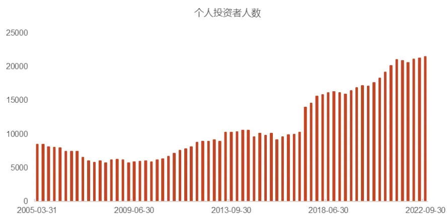
资料来源：Wind，光大证券研究所；注：统计区间为 2005 年一季报—2022 年三季报；单位：人

## 1.2、 优秀个人投资者战绩亮眼

本篇报告所定义的优秀个人投资者与市场中经常提到的“牛散”非常类似，“牛散”在以散户为主体的 A股市场中经常被视为一股特殊的投资力量被人津津乐道。主要原因除了“牛散”的资金体量在散户群体中较大以外，还经常能创造出色的业绩。

下表统计了 2022 年三季度持股数量大于 5 的个人投资者持仓金额排名，限制持股数量之后一定程度上可以排除企业管理层。表中的个人投资者持仓金额均达到了 20 亿元以上，在散户群体中资金体量相对雄厚。

表 1：持股数量大于等于 5 的个人投资者持股金额排名

| 排名 | 投资者名称 | 持有金额（亿元） | 持股数量 |
| --- | --- | --- | --- |
| 1 | 陈** | 124.82 | 7 |
| 2 | 张* | 77.57 | 7 |
| 3 | 王* | 59.65 | 13 |
| 4 | 钟** | 49.45 | 7 |
| 5 | 张* | 45.34 | 5 |
| 6 | 葛** | 43.36 | 8 |
| 7 | 王** | 31.29 | 7 |
| 8 | 高** | 22.26 | 11 |
| 9 | 李* | 21.60 | 8 |
| 10 | 杨* | 21.42 | 8 |

资料来源：Wind，光大证券研究所；注：数据截至 2022 年三季报；持有金额和持股数量的统计口径为企业披露的十大流通股股东名单，因此是投资者的最低持有金额和最低持股数量。（下同）

此外，我们还发现“牛散”在资金体量大的同时还能获得超额回报。下面列举了两个经典投资案例。图 2 为陈**在股票 A 上的投资情况，从 2018 年三季报披露至今一直持有，累计创造了超 10 倍的收益。图 3 为张**在 2022 年三季度购入的股票 B，在其入场之后的一个季度内创造了翻倍收益。上述两则案例也对应了我们下文将要研究的长期和短期两类投资者。

图 2：股票 A 月度走势图
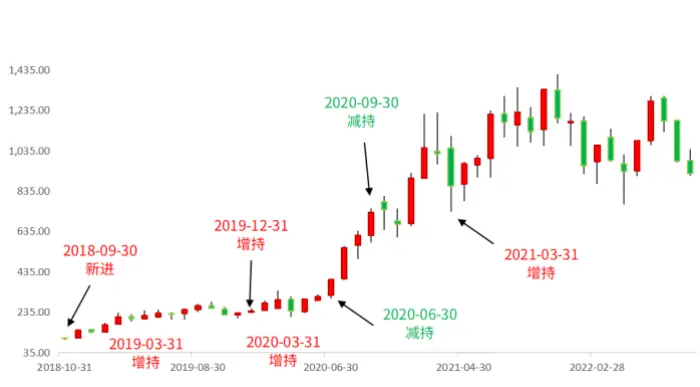
资料来源：Wind，光大证券研究所；注：统计区间为 2018.09.30—2022.09.30；单位：元

图 3：股票 B日度走势图
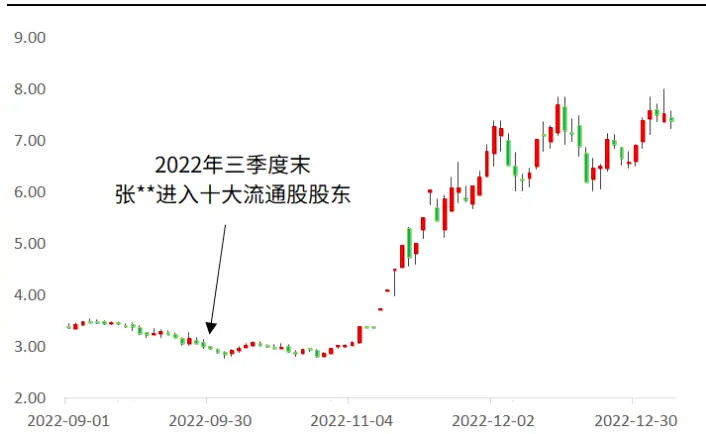
资料来源：Wind，光大证券研究所；注：统计区间为 2022.09.01—2023.01.09；单位：元

我们认为，优秀个人投资者相比其它散户具有更多的信息获取渠道，相比于机构投资者有更少的投资限制，在股票市场中能更加灵活的获取收益。本文将以优秀的个人投资者（“牛散”）为线索，深入分析其跟踪价值，并以此为基础构造“聪明钱”跟踪策略。

## 2、如何界定“投资者”

在开始分析之前我们需要对“优秀个人投资者”的定义加以明确。不难发现，研究对象一共包含了三层限定：（1）“优秀”；（2）“个人”；（3）“投资者”。

其中“个人”的限定最为简单，Wind已经将股东类型划分成了个人和机构。对于“优秀”和“投资者”的定义我们还需要做进一步说明。

## 2.1、 投资者的划分

对于企业披露的十大流通股股东，我们将其划分成三类：企业经营者、长期投资者、短期交易者。三类股东的持股目的和交易逻辑均有较大差异，因此需要对他们加以区分。

## （1）企业经营者

股东中占比最大的是企业的经营者和管理者，其持股目的更多的是出于对企业经营管理权的掌控。下表统计了 2022 年三季报持股金额最高的前 10 位个人股东，其中有 9 位在管理层任职。

从投资角度来看，企业经营者的持股情况多表现为数量少且变动不明显的特征，而且其持股目的并非单纯的获取股票超额收益，因此跟踪价值并不大，后续的研究中我们不对其做过多分析。

表 2：全部个人投资者持股金额排名

| 排名 | 投资者名称 | 持有金额 (亿元) | 持股数量 | 董、监、高任职情况 |
| --- | --- | --- | --- | --- |
| 1 | 李** | 513.44 | 2 | 董事,总经理 |
| 2 | 姚** | 458.08 | 1 | 董事长,总经理 |
| 3 | 庞* | 367.25 | 1 | 董事长,总裁 |
| 4 | 王** | 323.60 | 1 | 董事长,总裁 |
| 5 | 龚** | 292.79 | 1 | 无 |
| 6 | 虞** | 287.24 | 1 | 董事长 |
| 7 | 秦** | 284.36 | 1 | 董事长,总经理 |
| 8 | 洪* | 220.97 | 1 | 董事长,总经理 |
| 9 | 梁* | 204.54 | 1 | 董事长 |
| 10 | 杨** | 190.88 | 1 | 董事长 |

资料来源：Wind，光大证券研究所；注：数据截至 2022 年三季报。

## （2）长期投资者

市场比较知名的个人优秀投资者都具备业绩好且规模大的特征，此外，这些投资者还具备一个共同点就是持有周期长、持股数量少，属于“重仓押注型”投资者。下表为葛**对股票 C 的持有情况，持仓周期长达 3 年之久。

表 3：葛**对股票 C 的持仓情况

| 报告期 | 持有股数 (百万股) | 股数变动 (百万股) | 持股占流通股比例 持股比例变动 | 股数变动方向 |
| --- | --- | --- | --- | --- |
| 2013-06-30 | 155.26 | 155.26 | 3.12% 3.12% | 新进 |
| 2013-09-30 | 155.26 | 0.00 | 3.12% 0.00% | 不变 |
| 2013-12-31 | 168.94 | 13.68 | 3.03% -0.10% | 增持 |
| 2014-03-31 | 108.00 | -60.94 | 1.94% -1.09% | 减持 |
| 2014-06-30 | 143.22 | 35.22 | 2.14% 0.20% | 增持 |
| 2014-09-30 | 143.22 | 0.00 | 1.46% -0.68% | 不变 |
| 2014-12-31 | 274.24 | 131.02 | 2.79% 1.33% | 增持 |
| 2015-03-31 | 274.69 | 0.45 | 2.33% -0.46% | 增持 |
| 2015-06-30 | 248.24 | -26.45 | 2.10% -0.22% | 减持 |
| 2015-09-30 | 235.67 | -12.57 | 2.00% -0.11% | 减持 |
| 2015-12-31 | 186.66 | -49.01 | 1.58% -0.42% | 减持 |
| 2016-03-31 | 129.71 | -56.96 | 1.10% -0.48% | 减持 |
| 2016-06-30 | 128.28 | -1.43 | 0.88% -0.22% | 减持 |

| 2016-09-30 128.28 0.00 0.88% |
| --- |

资料来源：Wind，光大证券研究所

## （3）短期交易者

除了企业管理者和长期投资者以外，更多的投资者还是表现出“广撒网”、“炒短线”等散户化特征。下表为 2022 年三季报持股数量最多的 10 位个人投资者，其中仅徐**、李*和周**的平均持仓周期在 4 个季度以上。投资者吕*的持仓数量为 24 只股票，平均仅持仓 1.66 个季度。

表 4：个人投资者持股数量排名

| 排名 | 投资者名称 | 持股数量 | 持有金额 (亿元) | 历史平均持仓周期 (季度) |
| --- | --- | --- | --- | --- |
| 1 | 徐** | 39 | 8.21 | 7.75 |
| 2 | 吕* | 24 | 10.98 | 1.66 |
| 3 | 赵** | 17 | 8.39 | 3.05 |
| 4 | 李* | 17 | 8.24 | 4.81 |
| 5 | 张** | 17 | 6.29 | 3.31 |
| 6 | 赵* | 16 | 8.52 | 2.96 |
| 7 | 陈* | 16 | 1.24 | 2.66 |
| 8 | 周** | 15 | 9.08 | 5.50 |
| 9 | 夏** | 15 | 5.23 | 2.81 |
| 10 | 张* | 14 | 2.75 | 1.88 |

资料来源：Wind，光大证券研究所；注：数据截至 2022 年三季报；历史平均持仓周期的统计区间为 2005 年一季报—2022年三季报。

我们认为，长期投资者和短期交易者更具备跟踪价值，在后续研究中我们主要对这两类投资者深入分析。需要说明的是，三种投资者并不是互斥关系，有的企业经营者同样在二级市场上有非常优异的投资业绩。

## 2.2、 投资者的定量筛选

不同类型投资者的持仓周期和投资逻辑均有较大差别，因此在后续分析时需要用不同的方式构建模型。本小节我们将定量的对长期投资者和短期交易者进行筛选。

## （1）企业经营者

对于企业经营者来说，比较明显的特征包括持股数量少、持仓周期极长、在上市公司任职等，其中持股数量是较为容易的筛选指标。具体筛选标准如下：

## 近 3 年持股数量少于 3

2017 年以来，随着市场逐步扩容，企业经营者人数逐年增多，但占个人股东的比例稳定在 70%以上。

图 4：企业经营者的人数和占比
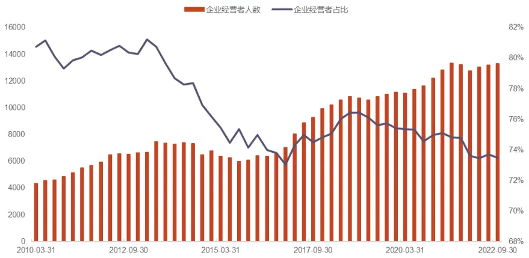
资料来源：Wind，光大证券研究所

## （2）长期投资者

长期投资者的主要特征是持仓周期较长，持股较为集中，具体筛选标准如下：

近三年持股数量大于等于 5

历史平均持仓周期大于 4 个季度

从人数上来看，按照上述标准筛选的长期投资者人数从2017年之后有显著增加。持有规模来看，2015 年之后长期投资者的平均持仓金额在 4 亿元以上。截止到2022 年三季度，长期投资者人数达到了 263 人。

图 5：长期投资者的人数和平均持仓规模
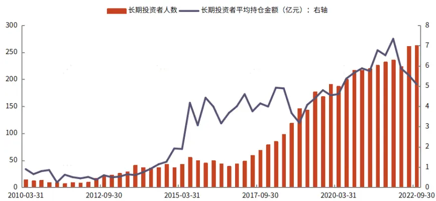
资料来源：Wind，光大证券研究所

## （3）短期交易者

短期交易者的持仓周期较短，且交易频繁。具体筛选标准如下：

历史平均持仓周期小于 4 个季度

过去 1 年持仓大于等于 5 只股票

过去 3 年交易次数大于等于 5 次

短期交易者的数量介于企业管理者和长期投资者之间，且规模相较于长期投资者更小。持仓规模略小于长期投资者，且受市场走势影响非常明显。

图 6：短期交易者的人数和平均持仓规模
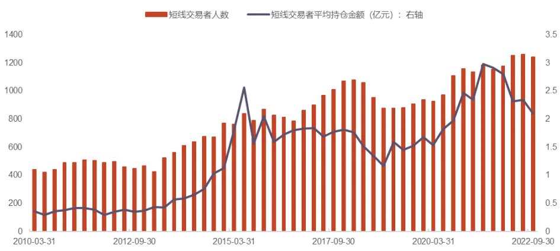
资料来源：Wind，光大证券研究所

## 3、如何界定“聪明”

“聪明钱”之所以被大家关注就是因为其获取超额收益的能力。然而对于不同的投资者来说，获取超额收益的方式也是不同的。长期投资者倾向于价值投资，一般会在少数的几只股票上波段操作。短期交易者倾向于炒作市场热门股票，获取短线收益。

基于上述原因，我们需要对两种投资者的“聪明”程度分别制定衡量标准。对于长期投资者，尽可能准确的计算持有收益；对于短期交易者，我们需要以“赔率”的视角统计其成功率。

## 3.1、 长期投资者的业绩统计

长期投资者经常在同一只股票上做出增持减持的波段操作，在测算其持有收益时我们需要将买入卖出行为纳入考虑。我们设定了如下测算方式：

持有期 i 的收益率如下所示：

$$
\begin{aligned}&R_{i}=\left\{\begin{aligned}\\&\frac{期末持股市值}{期初持股市值+(增持股数\times 报告期股票均价)}-1,1增持\\&\frac{期末持股市值+(减持股数\times 报告期股票均价)}{期初持股市值}-1,2减持\\&\frac{期末持股市值}{期初持股市值}-1,3不变\\&\end{aligned}\right.\\\end{aligned}
$$

对于持有了多期的股票来说，累计收益率为：

$$
R=(1+R_{1})(1+R_{2})\ldots(1+R_{n})-1
$$

以葛**在股票 C 的持仓为例，通过下图可以看到，葛**在 2013 年—2015 年进行了多次增持操作，在 2015 年—2016 年逐步卖出。通过上面的公式我们很容易计算出他在该股票上的投资收益为 25.74%。

图 7：葛**在股票 C 的增减持情况
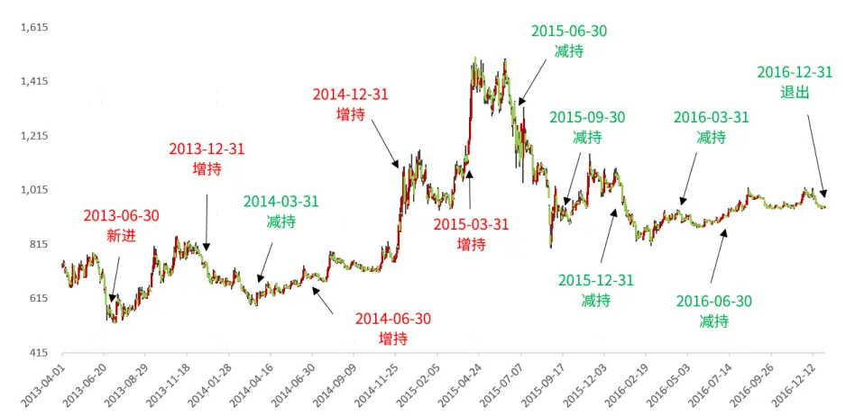
资料来源：Wind，光大证券研究所；注：数据截至 2022 年三季报；价格采用后复权数据。

表 5：葛**在股票 C 的收益率估计

| 报告期 | 持有股数 (百万股) | 股数变动 (百万股) | 均价（元) | 报告期后复权 报告期后复权收盘 价(元) | 收益率估计 |
| --- | --- | --- | --- | --- | --- |
| 2013-06-30 | 155.26 | 155.26 | 692.33 | 582.12 | -15.92% |
| 2013-09-30 | 155.26 | 0.00 | 635.79 | 693.64 | 19.16% |
| 2013-12-31 | 168.94 | 13.68 | 767.36 | 715.24 | 2.23% |
| 2014-03-31 | 108.00 | -60.94 | 659.83 | 628.83 | -10.52% |
| 2014-06-30 | 143.22 | 35.22 | 667.83 | 704.14 | 10.29% |
| 2014-09-30 | 143.22 | 0.00 | 733.84 | 720.48 | 2.32% |
| 2014-12-31 | 274.24 | 131.02 | 912.62 | 1125.49 | 38.56% |
| 2015-03-31 | 274.69 | 0.45 | 1046.08 | 1119.10 | -0.56% |
| 2015-06-30 | 248.24 | -26.45 | 1365.98 | 1250.35 | 12.72% |
| 2015-09-30 | 235.67 | -12.57 | 1091.98 | 902.08 | -27.09% |
| 2015-12-31 | 186.66 | -49.01 | 1033.71 | 1031.07 | 14.36% |
| 2016-03-31 | 129.71 | -56.96 | 893.82 | 914.98 | -11.89% |
| 2016-06-30 | 128.28 | -1.43 | 905.16 | 911.40 | -0.40% |
| 2016-09-30 | 128.28 | 0.00 | 965.33 | 950.16 | 4.25% |
| 2016-12-31 | 0 | -128.28 | 974.70 | 953.30 | 2.58% |

资料来源：Wind，光大证券研究所

## 3.2、“赔率”视角衡量短期交易者业绩

短期交易者风格偏向游资，进场和离场比较灵活，且离场时经常伴随着股价的大跌。对于仅持有一到两个季度的投资者来说，如果完全按照季度报告披露的数据进行跟踪，滞后会非常明显。

## 3.2.1、数据滞后性

举例来说，下图为股票 D2021 年的行情图。根据公司 2021 年披露的数据来看，李*在一季报时进入十大流通股股东名单，中报披露时不在名单中。如果严格按照季报发布的时间来统计收益，那么该投资者仅能获取较低收益。但从行情走势图来看，股票经历了大涨大跌的极端行情，投资者若在大跌前离场依然可以获得丰厚收益。

图 8：股票 D2021 年行情图
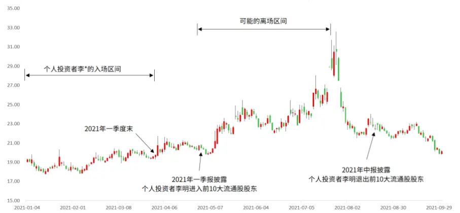
资料来源：Wind，光大证券研究所；注：数据区间为 2021 年 1 月 4 日—2021 年 9月 30 日；单位：元

## 3.2.2、优秀短期交易者的定量筛选

我们引入“赔率”视角对其业绩进行考量。也即，投资者买入后收益率超过一定阈值的概率。对于买入后大涨概率高的投资者定义为“优秀投资者”。

具体来说，我们以投资者买入后的最高涨幅作为统计口径设定收益率阈值，计算投资者买入后最高涨幅超过阈值的概率作为投资者的成功率。详细的计算步骤如下：

（1）计算持仓成本：新进报告期的季度平均成交价格。例如投资者在二季报进入十大流通股股东名单，那么持仓成本为3月31日—6月30日的平均成交价格。

（2）计算统计窗口：

① 若下一个报告期没有进入名单，那么统计窗口为上一个报告期初到下一个报告期末。比如二季报进入名单，三季报未在名单中，那么窗口期是 6 月 30 日—9 月 30 日。

② 若下一个报告期依然在名单中，那么窗口期向后延续。例如二季报、三季报在名单中，年报未在名单中。那么窗口期是 6 月 30 日—12 月31 日。

③若连续四个报告期都在名单中，那么窗口期为四个报告期。例如二季报、三季报、年报、次年一季报均在名单中。那么窗口期是 6 月 30 日—次年 6 月 30 日。

④若信息披露在非报告期，那么窗口期的起始日期为信息披露日。例如信息披露日期为 8 月 10 日，且三季报不在名单中，那么考察期为 8 月10 日—9 月 30 日。

（3）计算成功率：窗口期内，计算最高价格相对于持仓成本的涨幅，高于阈值的为成功样本。

## 3.3、“聪明”投资者的定量筛选

计算出投资收益后，我们就可以根据历史业绩来筛选出聪明投资者了。我们设定筛选时间为每年的年初，使用上一章节构建的两种评价方法分别对两类投资者进行筛选。

对于长期投资者来说，我们统计其长期持股收益。截至目前，收益率最高的前10 大个人投资者如下表所示。

表 6：长期投资者平均累计收益率排名

| 排名 | 投资者名称 | 平均累计收益率 | 进入时间 | 退出时间 | 持有收益估算 |
| --- | --- | --- | --- | --- | --- |
| 1 | 郑** | 169.32% | 2011Q4 | 2019Q1 | 1948.80% |
| 2 | 陈** | 121.67% | 2018Q3 | - | 1847.83% |
| 3 | 吴** | 69.71% | 2013Q1 | 2020Q3 | 233.48% |
| 4 | 冯* | 42.71% | 2012Q2 | 2014Q2 | 521.29% |
| 5 | 杨** | 40.78% | 2017Q3 | 2020Q4 | 334.69% |
| 6 | 郭** | 39.67% | 2013Q1 | 2014Q3 | 317.09% |
| 7 | 葛** | 33.95% | 2020Q3 | 2021Q4 | 399.94% |
| 8 | 方* | 27.21% | 2011Q1 | 2022Q2 | 496.42% |
| 9 | 王** | 26.35% | 2012Q4 | 2017Q2 | 158.73% |
| 10 | 曹** | 23.43% | 2014Q4 | 2021Q2 | 106.14% |

资料来源：Wind，光大证券研究所；注：统计区间为 2010 年一季报—2022 年三季报。注：平均累计收益率为统计区间内所有持股的平均累计收益

对于短期交易者来说，我们计算其近 8 年的成功率均值作为筛选标准，若投资者在当年不满足短期交易者的要求，我们令其成功率为 0。选择一个较长的回看周期可以一定程度上避免跟踪名单频繁变动，也可以降低极端值的影响。

下表为截至 2022 年三季度，成功率排名最高的 15 位短期交易者，最高的成功率均值达到 40.72%，也即在买入股票后上涨的概率较大。同时，这些投资者当前的持仓数量也满足对短期交易的要求，有丰富的可追踪标的。

表 7：短期交易者历史成功率排名

| 排名 | 投资者名称 | 近8年成功率均值 | 当前持有股数 |
| --- | --- | --- | --- |
| 1 | 王* | 40.72% | 5 |
| 2 | 李* | 34.37% | 7 |
| 3 | 袁** | 33.29% | 3 |
| 4 | 张** | 32.89% | 17 |
| 5 | 阮** | 32.81% | 7 |
| 6 | 周* | 32.72% | 5 |
| 7 | 林** | 32.61% | 0 |
| 8 | 何** | 32.46% | 6 |
| 9 | 杨** | 32.43% | 8 |
| 10 | 周* | 32.38% | 8 |
| 11 | 王* | 31.11% | 7 |
| 12 | 李* | 30.39% | 3 |
| 13 | 李* | 30.39% | 7 |
| 14 | 夏** | 29.97% |  |
| 15 | 王* | 29.79% | 15 6 |

资料来源：Wind，光大证券研究所；注：统计区间为 2010 年一季报—2022 年三季报。

## 4、 个人投资者的持股风格

A股市场一直存在经营业绩较差的小盘股具有较好市场表现的异象。该异象主要来自于散户投资者“炒小”、“炒差”的投资习惯，随着退市新规发布以来，资本市场的不良投资风气得到遏制，市场逐渐更偏好于价值投资。我们对短期交易者和长期投资者两类个人投资者进行了统计，以其首次进入十大流通股股东名单的时间为统计时点，分别观察其持仓是否也有“炒小炒差”的倾向。

## 4.1、 偏好小市值？

我们按年统计了两种投资者的平均持股市值。对比来看，长期投资者与短期交易者并无明显差别，持股平均市值都在 100 亿元以下。相比于市场来看，个人投资者倾向于购买小市值股票。当然，个人投资者资金规模也较为有限。

图 9：两类个人投资者持股平均市值（单位：亿元）
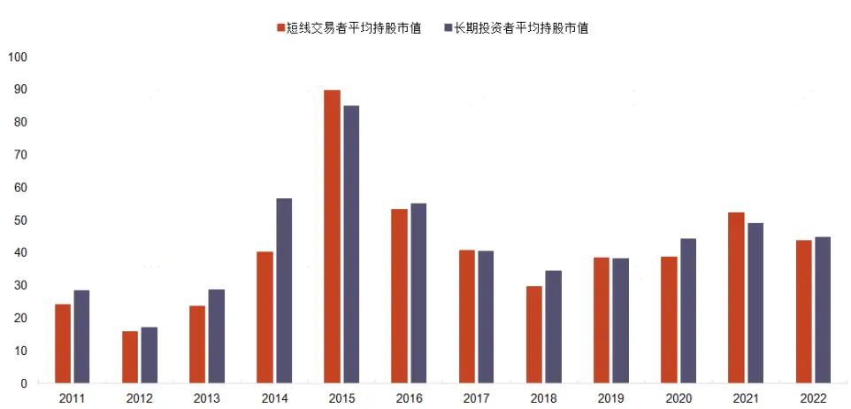
资料来源：Wind，光大证券研究所；注：统计区间为 2011—2022

## 4.2、 偏好次新股？

我们以统计时点股票上市时间是否超过 1 年来表征股东对次新股的偏好情况。经统计，两类投资者都热衷于购买次新股，截止 2022 年，短期交易者的持仓中有26%左右的股票为次新股，长期投资者的比例为 23%左右。可见打新收益是个人投资者重要收益来源。

不过随着注册制的全面推行，单只股票的打新收益或将下降。个人投资者对次新股的投资热情也会降低。

图 10：短期交易者持有次新股数量及比例
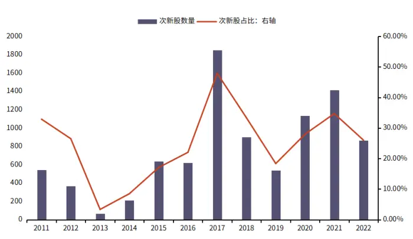
资料来源：Wind，光大证券研究所；注：统计区间为 2011—2022

图 11：长期投资者持有次新股数量及比例
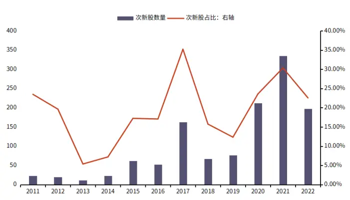
资料来源：Wind，光大证券研究所；注：统计区间为 2011—2022

## 4.3、 偏好“垃圾股”？

我们以统计时点该股票是否为 ST 来表征股东对“垃圾股”的偏好情况。经统计，两类投资者均会持有 ST 股票，但持有比例不足 10%，说明个人投资者并没有热衷于“炒差”。此外，两类投资者购买 ST 股票的比例相当。

图 12：短期交易者持有 ST 数量及比例
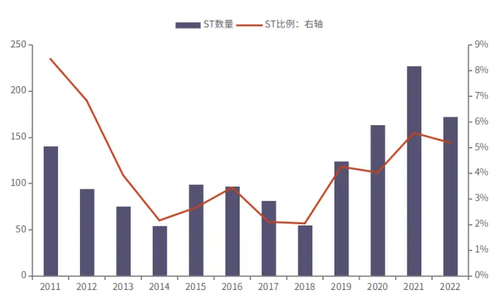
资料来源：Wind，光大证券研究所；注：统计区间为 2011—2022

图 13：长期投资者持有 ST 数量及比例
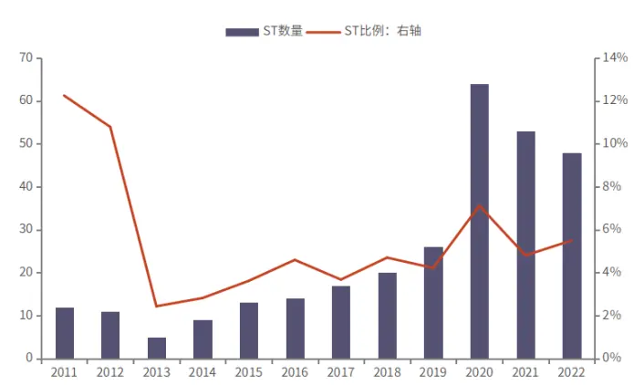
资料来源：Wind，光大证券研究所；注：统计区间为 2011—2022

综上可知，无论是长期投资者还是短期交易者，均具有炒作“小差新”的特征，因此在后续组合跟踪时，我们会统一剔除次新股和 ST 股票。

## 5、优秀个人投资者持仓跟踪组合构建

前文我们花费了大量篇幅对“投资者”和“优秀”进行了定量化的表达，接下来我们根据不同的投资者类型设计两种优秀投资者跟踪策略。具体的，我们在每年年末滚动计算并得出“聪明投资者”，形成“聪明投资者”数据库。每日监测数据库中投资者的交易行为，对新进股票进行跟踪并构建组合。

## 5.1、 优秀短期交易者跟踪组合

由于市场中短期交易的手法纷繁复杂，并非每个短期交易都有跟踪价值，还需要对股票进行二次筛选。我们根据可跟踪性整理出了两种交易类型。一类是超短线型交易，这类交易手法往往在股东数据披露时已经完成了一次交易；另一类是埋伏型交易，这类交易手法的入场阶段往往不会在 K 线形态上留下明显痕迹，股价拉升阶段往往在持仓后期。

## 5.1.1、超短线型交易

超短线型交易的最大特点是在季度中就完成了一次拉升和出货，当持仓数据披露时依然留有部分筹码，但后期持续出货的可能性较大。

下图为短期交易者周*在股票 E 上的一次交易。2020 年二季度末，周*首次进入该股票的前十大流通股股东名单，也即在二季度时大幅购入了该股票。K 线走势来看，从 2020 年 5 月 20 日至 2020 年 6 月 30 日，该投资者可能已经完成了拉升和出货两个步骤，后续继续出货的可能性较高。

因此，我们认为超短线型交易并不具备跟踪价值，而且需要尽可能规避相关股票。

图 14：股票 E 2020 年行情图
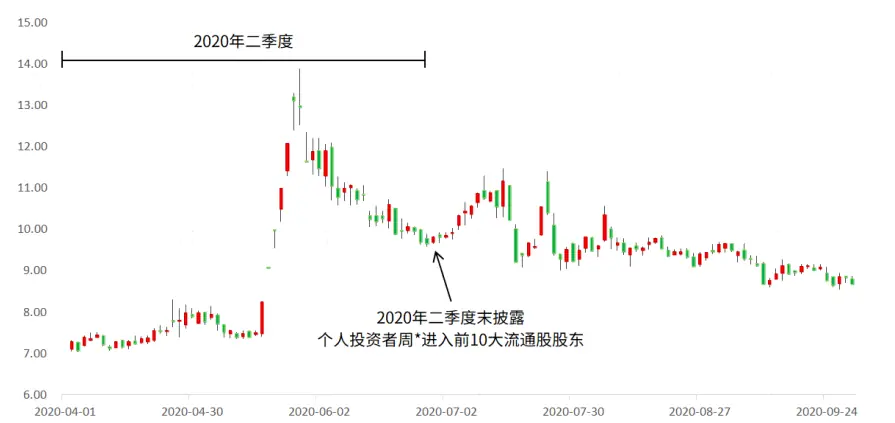
资料来源：Wind，光大证券研究所；注：数据区间为 2020 年 4 月 1 日—2020 年 9月 30 日；单位：元

## 5.1.2、埋伏型交易

不同于超短线型交易的快进快出，埋伏型交易在入场时通常较为隐秘，我们很难从 K 线走势上发现痕迹。相关股票在后期出现拉升的可能性较大。

上文提到的个人投资者张**在购买股票 B 时就是一个典型的埋伏交易。张**在2022 年三季度末首次进入该股票的前十大流通股股东名单，也即在三季度大幅买入该股票。然而该股票在三季度的涨幅为-40.07%，且股价未出现明显波动，后续上涨的可能性较高。因此，我们认为埋伏型交易具备跟踪价值。

图 15：股票 B 2022-2023 年行情图
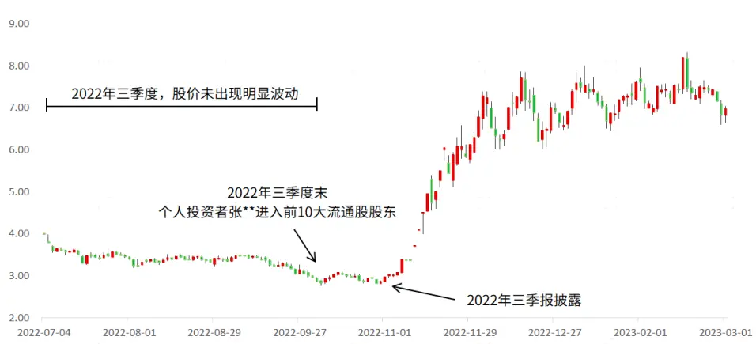
资料来源：Wind，光大证券研究所；注：数据区间为 2022 年 7 月 4 日—2023 年 3月 1 日；单位：元

## 5.1.3、优秀短期交易者跟踪策略

根据上文的研究我们发现，对于前期已经出现了大涨的股票，继续跟踪的风险会较高。对于尚未有明显收益的股票则有较大的跟踪价值。基于此，我们构造优秀短期交易者跟踪策略如下：

1. 每年的年初，根据历史业绩梳理出优秀短期交易者跟踪名单，持续跟踪名单中投资者的新进股票。

2. 当跟踪到投资者有新进股票时，判断该股票当季首个交易日至季报披露日的最大涨幅和最大跌幅，如果出现过涨幅或跌幅超出阈值，股票不纳入持仓。反之则纳入组合持仓。

3. 出现以下三种情形中的一种时，将股票剔除出组合。

（1） 投资者不再持仓。

（2） 股票进入组合后收益率相比于中证 1000 指数收益率大于 20%，且股票 5 日均线处于 10 日均线下方。

（3） 股票在组合中超过 1 年。

上述操作一定程度上可以规避短期行情已经结束的股票，埋伏被炒作可能性高的股票。其中卖出操作可根据是否触发止盈条件来判断本次交易是否成功。

## 5.1.4、优秀短期交易者组合历史业绩

在筛选优秀投资者时，我们以历史 8 年的平均成功率作为每年的筛选标准，要求的历史数据较长，因此我们从 2013 年开始回测。从回测表现上来看，优秀短期交易者的确具有 Alpha 信息，策略的超额年化收益率为 16.39%，月度胜率为66.94%。

图 16：优秀短期交易者跟踪组合净值表现
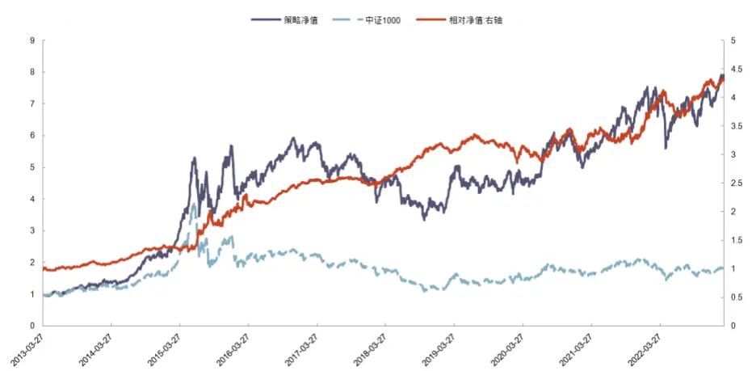
资料来源：Wind，光大证券研究所；注：数据截至 2023 年 3 月 1 日

表 8：优秀短期交易者跟踪组合业绩指标
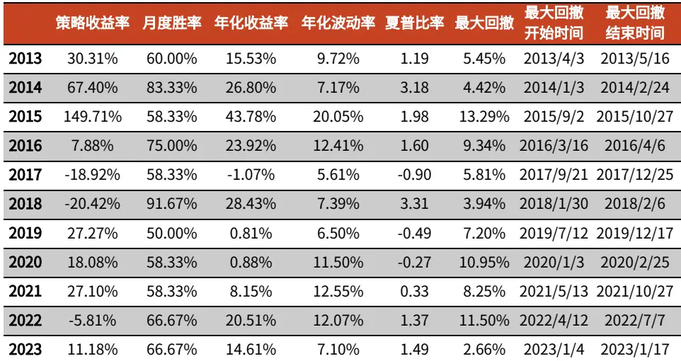

| 总计 692.00% 66.94% | 16.39% | 11.28% | 1.10 | 15.08% 2019/7/12 2020/2/25 |
| --- | --- | --- | --- | --- |

资料来源：Wind，光大证券研究所；注：数据截至 2023 年 3 月 1 日

## 5.2、 优秀长期投资者跟踪组合构建

相较于短期交易者来说，长期投资者的跟踪较为简单，由于持仓周期较长，股票选择时的数据滞后性可以忽略不计。然而长期投资者一般会在同一只股票上阶段性增减仓位，此时数据滞后性的影响较大。因此，我们仅考察长期投资者的选股能力而不考察择时能力。也即，监测到有新的持仓时跟踪买入，持有过程中的增减持不做调整。

## 5.2.1、优秀长期投资者跟踪策略

基于上述研究，我们构造优秀长期投资者跟踪策略如下：

1. 每年的年初，根据历史业绩梳理出优秀长期投资者跟踪名单，持续跟踪名单中投资者的新进股票。

2. 当跟踪到投资者有新进或增持股票时，立即将股票纳入持仓。

3. 当投资者退出前十大流通股股东名单时将对应股票剔除出组合。

## 5.2.2、组合历史业绩

下图为优秀长期投资者跟踪的历史业绩表现。长期来看，优秀投资者的持仓能够跑赢基准指数，2020 年以后的组合表现显著优于指数。策略超额年化收益率为10.30%，月度胜率为 58.68%。

图 17：优秀长期投资者跟踪组合净值表现
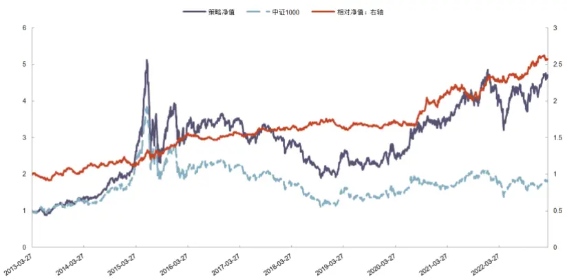
资料来源：Wind，光大证券研究所；注：数据截至 2023 年 3 月 1 日

表 9：优秀长期投资者跟踪组合业绩指标
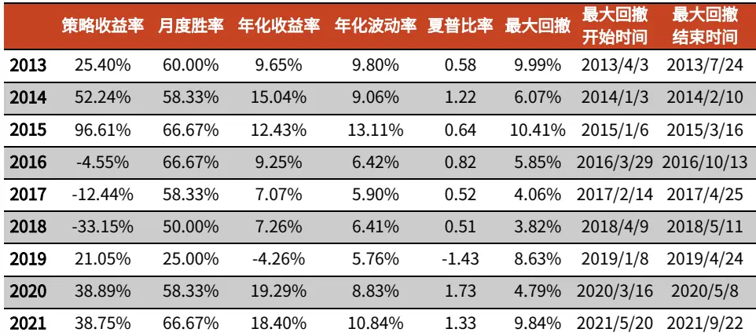

| 2022 | -11.93% | 75.00% | 12.39% | 8.18% | 1.03 | 4.14% | 2022/1/13 | 2022/5/9 |
| --- | --- | --- | --- | --- | --- | --- | --- | --- |
| 2023 | 7.69% | 66.67% | -8.12% | 6.38% | -1.90 | 2.64% | 2023/2/6 | 2023/2/17 |
| 总计 | 371.64% | 58.68% | 10.30% | 8.70% | 0.72 | 10.41% | 2015/1/5 | 2015/3/16 |

资料来源：Wind，光大证券研究所；注：数据截至 2023 年 3 月 1 日

## 5.2.3、组合持仓分析

截至目前，仍然处于跟踪状态的优秀长期投资者持仓如下：

表 10：优秀长期投资者组合跟踪

| 股票代码 | 股票名称 | 进入时间 | 截至目前收益（%） |
| --- | --- | --- | --- |
| 1 002139.SZ | 拓邦股份 | 2018/10/9 | 208.11 |
| 2 300259.SZ | 新天科技 | 2019/7/2 | 1.70 |
| 3 002230.SZ | 科大讯飞 | 2019/7/2 | 42.76 |
| 4 002264.SZ | 新华都 | 2019/10/8 | 18.22 |
| 5 300380.SZ | 安硕信息 | 2020/4/24 | 8.08 |
| 6 601012.SH | 隆基绿能 | 2020/7/1 | 103.73 |
| 7 601888.SH | 中国中免 | 2020/7/1 | 23.06 |
| 8 002706.SZ | 良信股份 | 2020/7/1 | 4.20 |
| 9 002117.SZ | 东港股份 | 2021/1/4 | 21.22 |
| 10 300790.SZ | 宇瞳光学 | 2021/5/7 | -6.46 |
| 11 300258.SZ | 精锻科技 | 2021/7/1 | -18.86 |
| 12 688023.SH | 安恒信息 | 2021/8/27 | -39.38 |
| 13 603766.SH | 隆鑫通用 | 2021/8/31 | 43.79 |
| 14 002458.SZ | 益生股份 | 2021/10/8 | 41.04 |
| 15 002192.SZ | 融捷股份 | 2022/1/4 | -29.04 |
| 16 000799.SZ | 酒鬼酒 | 2022/4/1 | -3.62 |
| 17 002518.SZ | 科士达 | 2022/4/1 | 148.87 |
| 18 600516.SH | 方大炭素 | 2022/4/14 | -17.13 |
| 19 600679.SH | 上海凤凰 | 2022/4/29 | -0.24 |
| 20 601882.SH | 海天精工 | 2022/5/5 | 100.38 |
| 21 002601.SZ | 龙佰集团 | 2022/7/1 | 4.63 |
| 22 300730.SZ | 科创信息 | 2022/8/12 | 36.98 |
| 23 300688.SZ | 创业黑马 | 2022/8/19 | 22.38 |
| 24 002449.SZ | 国星光电 | 2022/8/22 | -10.45 |
| 25 600521.SH | 华海药业 | 2022/8/30 | -0.10 |
| 26 601595.SH | 上海电影 | 2022/8/30 | 32.61 |
| 27 002810.SZ | 山东赫达 | 2022/10/10 | -17.60 |
| 28 002840.SZ | 华统股份 | 2022/10/10 | -12.87 |
| 29 300354.SZ | 东华测试 | 2022/10/10 | 50.33 |
| 30 603339.SH | 四方科技 | 2022/11/1 | 3.99 |

资料来源：Wind，光大证券研究所；注：数据截至 2023 年 3 月 13 日

## 6、总结与展望

本篇报告以跟踪“聪明钱”为出发点，对个人投资者进行了深入剖析。我们以企业财报披露的十大流通股股东中的个人投资者为研究对象，将其划分成了企业经营者、长期投资者、短期交易者三类。并且根据三类投资者不同的交易特征，定量化做出了筛选，其中长期投资者和短期交易者更具备跟踪价值。在此基础上，我们对长期投资者和短期交易者分别制定了两种“聪明”程度的评价标准，构建了优秀个人投资者名单。

最后，我们构建了两个“聪明钱”跟踪组合，两个组合均能稳定跑赢基准指数，其中优秀短期交易者跟踪组合超额年化收益为 16.39%，优秀长期投资者跟踪组合超额年化收益为 10.30%。

本篇报告依然存在一些研究不足。投资者划分类型上来看，除了可以按照持有时间来划分，还可以根据动机进行划分。在研究过程中我们发现，部分长期投资者更偏好于价值投资，买入股票后公司经营绩效有明显的改善，可以将此类投资者划分成价值型投资者；部分投资者经常通过参与定增的方式购买股票，受限于数据可得性，我们也未对此进行分析。此外，研究中我们还发现，投资者的交易风格较为丰富，有的喜欢交易 ST 股票，有的热衷于“打新”，对此我们也未做进一步研究。

## 7、风险分析

报告结果均基于历史数据，历史数据存在不被重复验证的可能。

## 行业及公司评级体系

| 评级 说明 |  |  |
| --- | --- | --- |
|  | 买入 | 未来6-12个月的投资收益率领先市场基准指数15%以上 |
| 行业及公司评级 | 增持 | 未来 6-12 个月的投资收益率领先市场基准指数 5%至 15%; |
|  | 中性 | 未来6-12个月的投资收益率与市场基准指数的变动幅度相差-5%至5%； |
|  | 减持 | 未来 6-12 个月的投资收益率落后市场基准指数 5%至 15%; |
|  | 卖出 | 未来6-12个月的投资收益率落后市场基准指数15%以上； |
|  | 无评级 | 因无法获取必要的资料，或者公司面临无法预见结果的重大不确定性事件，或者其他原因，致使无法给出明确的投资评级。 |
| 基准指数说明： |  | A股主板基准为沪深300指数；中小盘基准为中小板指；创业板基准为创业板指；新三板基准为新三板指数；港股基准指数为恒生 指数。 |

## 分析、估值方法的局限性说明

本报告所包含的分析基于各种假设，不同假设可能导致分析结果出现重大不同。本报告采用的各种估值方法及模型均有其局限性，估值结果不保证所涉及证券能够在该价格交易。

## 分析师声明

本报告署名分析师具有中国证券业协会授予的证券投资咨询执业资格并注册为证券分析师，以勤勉的职业态度、专业审慎的研究方法，使用合法合规的信息，独立、客观地出具本报告，并对本报告的内容和观点负责。负责准备以及撰写本报告的所有研究人员在此保证，本研究报告中任何关于发行商或证券所发表的观点均如实反映研究人员的个人观点。研究人员获取报酬的评判因素包括研究的质量和准确性、客户反馈、竞争性因素以及光大证券股份有限公司的整体收益。所有研究人员保证他们报酬的任何一部分不曾与，不与，也将不会与本报告中具体的推荐意见或观点有直接或间接的联系。

## 法律主体声明

本报告由光大证券股份有限公司制作，光大证券股份有限公司具有中国证监会许可的证券投资咨询业务资格，负责本报告在中华人民共和国境内（仅为本报告目的，不包括港澳台）的分销。本报告署名分析师所持中国证券业协会授予的证券投资咨询执业资格编号已披露在报告首页。

中国光大证券国际有限公司和 Everbright Securities(UK) Company Limited 是光大证券股份有限公司的关联机构。

## 特别声明

光大证券股份有限公司（以下简称“本公司”）创建于 1996 年，系由中国光大（集团）总公司投资控股的全国性综合类股份制证券公司，是中国证监会批准的首批三家创新试点公司之一。根据中国证监会核发的经营证券期货业务许可，本公司的经营范围包括证券投资咨询业务。

本公司经营范围：证券经纪；证券投资咨询；与证券交易、证券投资活动有关的财务顾问；证券承销与保荐；证券自营；为期货公司提供中间介绍业务；证券投资基金代销；融资融券业务；中国证监会批准的其他业务。此外，本公司还通过全资或控股子公司开展资产管理、直接投资、期货、基金管理以及香港证券业务。

本报告由光大证券股份有限公司研究所（以下简称“光大证券研究所”）编写，以合法获得的我们相信为可靠、准确、完整的信息为基础，但不保证我们所获得的原始信息以及报告所载信息之准确性和完整性。光大证券研究所可能将不时补充、修订或更新有关信息，但不保证及时发布该等更新。

本报告中的资料、意见、预测均反映报告初次发布时光大证券研究所的判断，可能需随时进行调整且不予通知。在任何情况下，本报告中的信息或所表述的意见并不构成对任何人的投资建议。客户应自主作出投资决策并自行承担投资风险。本报告中的信息或所表述的意见并未考虑到个别投资者的具体投资目的、财务状况以及特定需求。投资者应当充分考虑自身特定状况，并完整理解和使用本报告内容，不应视本报告为做出投资决策的唯一因素。对依据或者使用本报告所造成的一切后果，本公司及作者均不承担任何法律责任。

不同时期，本公司可能会撰写并发布与本报告所载信息、建议及预测不一致的报告。本公司的销售人员、交易人员和其他专业人员可能会向客户提供与本报告中观点不同的口头或书面评论或交易策略。本公司的资产管理子公司、自营部门以及其他投资业务板块可能会独立做出与本报告的意见或建议不相一致的投资决策。本公司提醒投资者注意并理解投资证券及投资产品存在的风险，在做出投资决策前，建议投资者务必向专业人士咨询并谨慎抉择。

在法律允许的情况下，本公司及其附属机构可能持有报告中提及的公司所发行证券的头寸并进行交易，也可能为这些公司提供或正在争取提供投资银行、财务顾问或金融产品等相关服务。投资者应当充分考虑本公司及本公司附属机构就报告内容可能存在的利益冲突，勿将本报告作为投资决策的唯一信赖依据。

本报告根据中华人民共和国法律在中华人民共和国境内分发，仅向特定客户传送。本报告的版权仅归本公司所有，未经书面许可，任何机构和个人不得以任何形式、任何目的进行翻版、复制、转载、刊登、发表、篡改或引用。如因侵权行为给本公司造成任何直接或间接的损失，本公司保留追究一切法律责任的权利。所有本报告中使用的商标、服务标记及标记均为本公司的商标、服务标记及标记。

光大证券股份有限公司版权所有。保留一切权利。

光大证券研究所

上海

北京

深圳

静安区南京西路 1266 号

西城区武定侯街 2 号

恒隆广场 1 期办公楼 48 层

福田区深南大道 6011 号

泰康国际大厦 7 层

NEO 绿景纪元大厦 A 座 17 楼

光大证券股份有限公司关联机构

香港

中国光大证券国际有限公司

英国

香港铜锣湾希慎道 33 号利园一期 28 楼

Everbright Securities(UK) Company Limited

64 Cannon Street，London，United Kingdom EC4N 6AE