## 金融工程

# 提炼大宗交易背后蕴含的超额信息——量化选股系列报告之十一

## 要点

## 大宗交易频繁，覆盖股票面广，蕴含增量价值不容忽视

大宗交易近年来持续火热，发生大宗交易的股票在市场中的数量占比较高，大宗交易由于其保护隐私的特性，买卖双方进行大宗交易的细节不得而知。但是，我们可以通过统计分析，探究其背后蕴含的信息。

我们按照市值高低对样本进行划分，发现整体上，大宗交易主要以中小市值股票为主。从行业角度来看，大宗交易次数最多的前 5 大中信一级行业依次为医药、电子、机械、基础化工和计算机；次数最少的前 5 大中信一级行业依次为综合金融、煤炭、综合、消费者服务和钢铁。

## 大宗交易席位以“营业部席位”为主，且大多以折价成交

根据交易所公布的买卖双方的信息，我们从买卖双方名称中提取关键词，进而将买卖双方席位划分为：营业部席位、机构席位以及自营席位。从三种席位的样本量来看，买方席位和卖方席位均以“营业部席位”为主，其次为“机构席位”，而“自营席位”占比较低。

根据大宗交易的成交价格，我们计算了对应股票的大宗交易成交价格相对于竞价交易收盘价的折溢价情况。从折溢价来看，大宗交易主要以折价交易为主，且折价率多集中在 15%以内。

## 多个指标对大宗交易后股价走势起到正向影响作用

通过事件研究方法，我们对大宗交易折溢价率、买卖双方席位、股票大宗交易时价格分位、大宗交易成交金额比率、股票 6 日成交金额波动率这 5 个指标进行探讨。经统计，我们发现这些指标均对大宗交易后股价走势起到不同程度的正向影响。

从时序上对上述指标进行回溯测试，以上 5 个指标中“大宗交易成交金额比率”和“股票 6 日成交金额波动率”两指标能够获取较为可观的超额收益，其余指标对提升超额收益作用有限。

## 建议关注“高成交金额比率、低成交金额波动率”大宗交易组合

经过测算，“大宗交易成交金额比率”越高、“6 日成交金额波动率”越低的股票，其后续表现更佳。因此，我们根据“高成交、低波动”原则，通过月频调仓方式构造大宗交易组合。从 2010.02.01 至 2023.07.31，该组合获取较为可观的超额收益——组合总收益率 938.30%，年化收益率 19.54%，相对中证全指年化超额收益率 16.41%。

风险分析：报告结果均基于历史数据，历史数据存在不被重复验证的可能。

## 作者

分析师：祁嫣然

执业证书编号：S0930521070001

010-56513031

qiyanran@ebscn.com

联系人：张威

010-56513039

zhangw@ebscn.com

当前我国股票市场的交易制度包含竞价交易、信用交易以及大宗交易三种制度。其中的大宗交易是针对单笔证券交易所需要的买卖数量或者金额过大、难以通过竞价交易进行买卖而推出的。

考虑到我国股票市场机构投资者的快速增长和大额股权转让的需求日益增多，沪深两市交易所分别于 2003 年和 2002 年推出了大宗交易制度，2021 年成立的北京证券交易所在证券交易规则中亦有关于大宗交易的相关表述。

近年来，大宗交易的规模逐渐呈现扩张的态势，通过大宗交易进行证券买卖的方式逐渐被广大投资者接纳，大宗交易也愈发受到众多投资者关注。那么，大宗交易对股票价格走势是否有影响？其中的规律如何？带着这些疑问，本文对股票大宗交易信息进行探讨，试图探究大宗交易背后蕴含的投资规律与逻辑。

## 1、 大宗交易简介

## 1.1、 大宗交易规则与流程

根据《上海证券交易所交易规则（2023 年修订）》、《深圳证券交易所交易规则（2023 年修订）》以及《北京证券交易所交易规则（试行）》中关于大宗交易的相关规定，我们梳理了大宗交易现行交易规则，如下表所示。

表 1：三地交易所关于大宗交易的相关规定

| 类型 | 上交所 | 深交所 | 北交所 |
| --- | --- | --- | --- |
| 交易门槛 | 1. A 股单笔买卖申报数量应当不低于 30 万股，或 1. A 股单笔交易数量不低于 30 万股，或者交易 者交易金额不低于200万元人民币 | 金额不低于200万元人民币 | 易金额不低于100万元人民币 |
|  | 2. B 股单笔买卖申报数量应当不低于 30 万股，或 2. B 股单笔交易数量不低于3 万股，或者交易金股票交易单笔申报数量不低于10 万股，或者交 者交易金额不低于20万元美元 | 额不低于20万元港币 |  |
|  | 3. 基金单笔买卖申报数量应当不低于200万份，或3. 基金单笔交易数量不低于200万份，或者交易 者交易金额不低于200 万元 | 金额不低于200万元人民币 |  |
| 申报类型 | 意向申报、成交申报、固定价格申报、其他申报 1. 意向申报：9:30 至11:30、13:00至15:30 | 协议大宗交易、盘后定价大宗交易 | 成交确认委托 |
| 申报时间 | 2. 成交申报：9:30至11:30、13:00至15:30、16:002. 盘后定价大宗交易：15:05至15:30 | 1. 协议大宗交易：9:15 至11:30、13:00 至15:30 | 9:15至11:30、13:00至15:30 |
|  | 至17:00 | 3. 当天全天停牌、处于临时停牌期间或停牌至收 |  |
|  | 3. 固定价格申报：15:00 至15:30 | 市的证券，不再接受其协议大宗交易申报 |  |
|  | 再接受申报 | 4. 交易日的15:00仍处于停牌状态的证券，当日不4. 当天全天停牌或停牌至收市的证券，不再接受 其盘后定价大宗交易申报 |  |
| 确认时间 | 15:00 至 15:30 | 15:00 至 15:30 | 15:00 至 15:30 |
| 成交价格 | 1. 提出固定价格申报的，可按当日竞价交易市场收 盘价格或者当日全天成交量加权平均价格 2. 有价格涨跌幅限制证券：价格限制在当日证券价 | 1. 协议大宗交易（若有价格涨跌幅限制)：价格 限制在该证券当日涨跌幅限制价格范围内 2. 协议大宗交易(若无价格涨跌幅限制)：价格 | 1. 若有涨跌幅限制：价格限制在该证券当日涨 跌幅限制价格范围内 |
|  | 格涨跌幅限制范围内 | 不得高于该证券当日竞价交易实时成交均价的 120%和已成交最高价的孰低值，且不得低于该 | 2. 若无价格涨跌幅限制：价格应当不高于前收 盘价的130%或当日已成交的最高价格中的较 高者，且不低于前收盘价的70%或当日已成交 的最低价格中的较低者 |
|  | 3. 无价格涨跌幅限制证券：不得高于该证券当日竞 价交易实时成交均价的120%和已成交最高价的孰 | 证券当日竞价交易实时成交均价的80%和已成 交最低价的孰高值 |  |
|  | 低值，且不得低于该证券当日竞价交易实时成交均 价的80%和已成交最低价的孰高值 | 3. 盘后定价大宗交易：以证券当日收盘价格或当 日成交量加权平均价格 |  |

资料来源：上海证券交易所，深圳证券交易所，北京证券交易所，光大证券研究所整理

大宗交易的操作步骤为交易双方在场外达成初步意向（也可在系统内发布交易信息），然后在系统内进行意向申报。当意向申报被会员接受时，申报方应当至少与一个接受意向申报的会员进行成交申报。双方就大宗交易达成一致后，委托会员通过交易业务单元向交易所交易系统提出成交申报，交易所在每个交易日结束后通过交易所网站公布交易信息。大宗交易的流程如下图所示。

图 1：大宗交易操作流程示意图
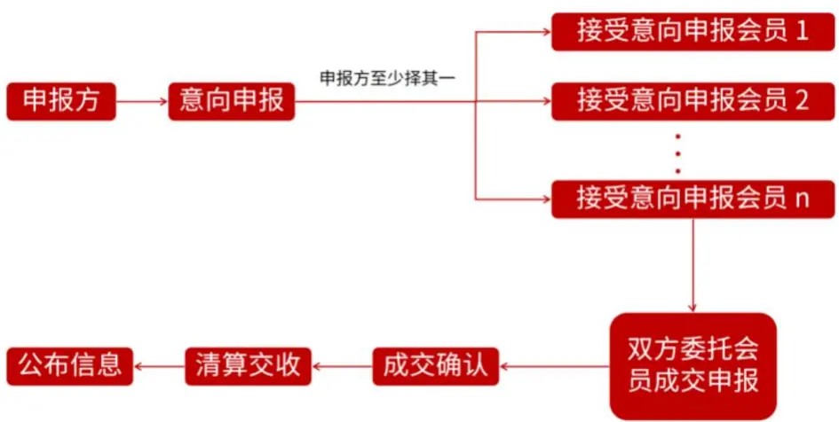
资料来源：上海证券交易所，深圳证券交易所，北京证券交易所，光大证券研究所绘制

## 1.2、 大宗交易的特点与优势

随着大宗交易的交易制度日渐完善，投资者慢慢认识到了通过大宗交易来减持股份的便捷之处，大宗交易的特点与优势主要体现在 6 个方面：高效性、灵活性、低成本、高额交易量、降低价格波动以及保护隐私。

(1) 高效性。大宗交易是以私下协商的方式进行的，不需要经过交易所的公开竞价过程，可以快速达成交易。这有助于减少交易的执行时间，并提高参与者的交易效率。

(2) 灵活性。参与大宗交易的买方和卖方可以根据交易条件协商、自由地确定交易的价格、数量和其他交易条件。相比于公开市场交易，大宗交易更能满足交易双方特定的需求和目标。

(3) 低成本。相比于竞价交易，大宗交易的成本更低。大宗交易有一定的政策 优惠，手续费低于二级市场竞价交易近 30%，税率上也有所优惠。

(4) 高额交易量。大宗交易涉及较大的交易量。买方可以一次性获得较大规模的股票，而卖方也可以快速出售大量股票。这对于机构投资者、大股东或基金公司等需要进行大规模交易的参与者来说非常有吸引力。大宗交易可以提高个股在特定需求下的流动性，减少市场对特定交易的冲击。

(5) 降低价格波动。大宗交易是在交易所的公开竞价之外进行的，可以避免交易过程中价格的剧烈波动。这有助于减少市场的不确定性，并提供更稳定的交易环境。

(6) 保护隐私。相比于公开市场交易，大宗交易的交易细节和交易方身份不会被公开披露。这对于那些希望保持交易机密性和避免市场猜测的参与者来说是一个优势。

## 2、大宗交易数据特征分析

## 2.1、 大宗交易数据简介

大宗交易数据取自 wind数据库：中国 A股大宗交易数据（AShareBlockTrade），数据最早可追溯至 2002 年，截至 2023.07.31，数据量 22 万余条。涉及到的重要字段包含股票代码、交易日期、成交价（元）、成交量（万股）、成交额（万元）、买方营业部名称、卖方营业部名称、笔数。

通过对大宗交易数据进行梳理，我们发现大宗交易数据中，买卖方营业部名称存在以下问题：

（1）字段中包含某券商交易单元，例如：“XX 交易单元”。不同券商交易单元名称不统一，有些券商交易单元后带编号，有些不带。针对这一情形，我们对该字段提取关键词“交易单元”。

（2）字段中除包含“总部”、“分公司”、“营业部”、“交易单元”、“机构专用”、“自营”等常见关键词外，还会出现如“某证券北京新中街部”、“某证券有限责任公司”、“某证券投资部”、“某证券交易部”等披露格式不规范的情形，针对这类个例，本文根据其字段信息，逐个将其归于“营业部”、“总部”等类型中。

## 2.2、 近年来参与大宗交易的股票数逐渐增多

按照年度来看，截至 2023.07.31，A 股大宗交易数量近年来呈现增长态势。从大宗交易在 A股的覆盖度来看，从 2008 年至 2016 年，大宗交易在 A 股的覆盖度从 15%逐渐增长至 60%左右，随后有所回落，近三年维持在 50%-60%左右。

由于上市公司定期报告公告前 30 日内，董监高不得减持所持股份。因而按照月度来看，4 月、8 月以及 10 月样本量相对较少，这些月份处于定期报告公布的窗口期，大宗交易次数相对较少。

图 2：大宗交易数量逐渐增多，在全 A 覆盖度趋于稳定
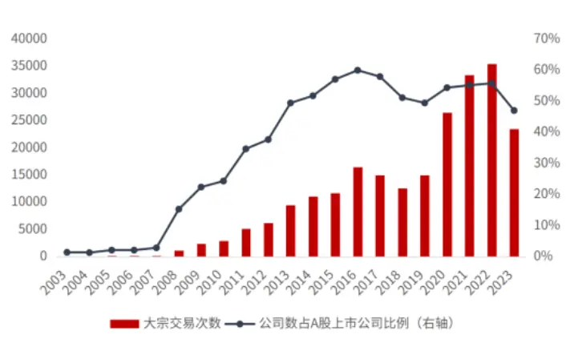
资料来源：Wind，光大证券研究所；注：数据起止日期为：2003.01.01-2023.07.31

图 3：定期报告披露窗口期间，大宗交易次数有所放缓
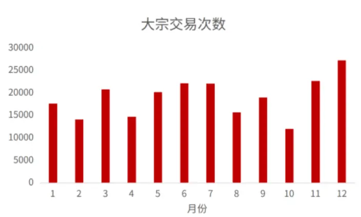
资料来源：Wind，光大证券研究所；注：数据起止日期为：2003.01.01-2023.07.31

从逐月统计的进行大宗交易股票数量来看，整体呈现逐步递增的趋势，近几年月度进行过大宗交易的股票数量趋于稳定，维持在 600 到 900 只左右。

随着股权分置改革的推进，证监会于 2008 年发布《上市公司解除限售存量股份转让指导意见》，该文件中规定“持有解除限售存量股份的股东预计未来一个月内公开出售解除限售存量股份的数量超过该公司股份总数 1%的，应当通过证券交易所大宗交易系统转让所持股份”，这个政策使得持有大量股份的股东通过大宗交易来减持股份。之后，大宗交易成交量和成交金额逐年上升，在 2016 年达到顶峰，随后有所下滑，近年来保持相对稳定。

图 4：大宗交易股票数呈递增趋势
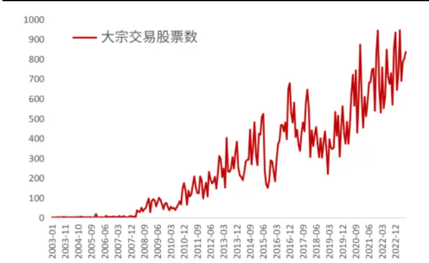
资料来源：Wind，光大证券研究所；注：数据起止日期为：2003.01.01-2023.07.31

图 5：大宗交易规模趋于稳定
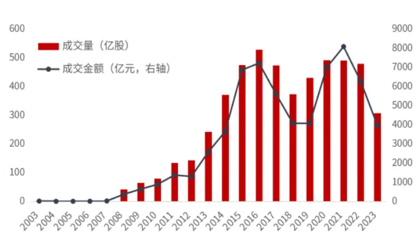
资料来源：Wind，光大证券研究所；注：数据起止日期为：2003.01.01-2023.07.31

## 2.3、 大宗交易股票在沪深两市占比均衡，且以主板为主

按照不同市场占比来看，大宗交易数量在深交所的占比较大，自 2013 年后，大宗交易数量在上交所的占比有所回升，目前沪深两市大宗交易占比基本持平。按照不同板块来看，大宗交易主要集中在主板股票中，随着创业板和科创板的成立，大宗交易在上述两板块中也时有发生。

图 6：沪深两市大宗交易占比基本持平
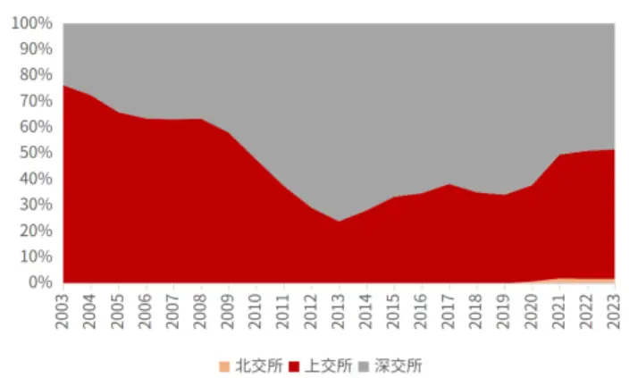
资料来源：Wind，光大证券研究所；注：数据起止日期为：2003.01.01-2023.07.31；按大宗交易次数占比统计

图 7：大宗交易主要集中在主板股票中
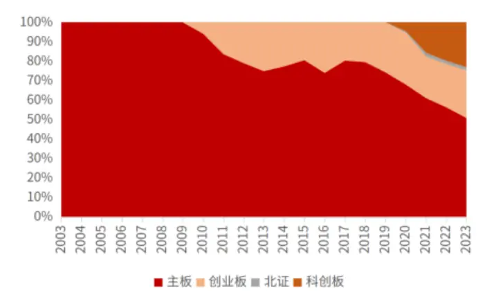
资料来源：Wind，光大证券研究所；注：数据起止日期为：2003.01.01-2023.07.31；按大宗交易次数占比统计

## 2.4、 大宗交易以中小市值股票为主，在各宽基指数分布较为均衡

根据前述统计，早年间大宗交易样本量、股票数较少。因此，我们在后文中截取2010 年及之后的数据进行统计。

我们按照市值“小于等于 100 亿”、“100 亿至 200 亿”、“200 亿至 500 亿”以及“大于 500 亿”将样本进行划分。从统计结果来看，早年间市值在 100 亿元以内的股票居多，随后有所下滑。2020 年以来，市值在各区间的占比基本保持稳定。

按照宽基指数成分股来看，发生大宗交易的股票中，约 20%左右股票为沪深 300指数成分股，10%左右为中证 500 指数成分股，20%左右为中证 1000 指数成分股，50%左右为中证 800 和中证 1000 以外的股票。

图 8：大宗交易股票以中小市值股票为主
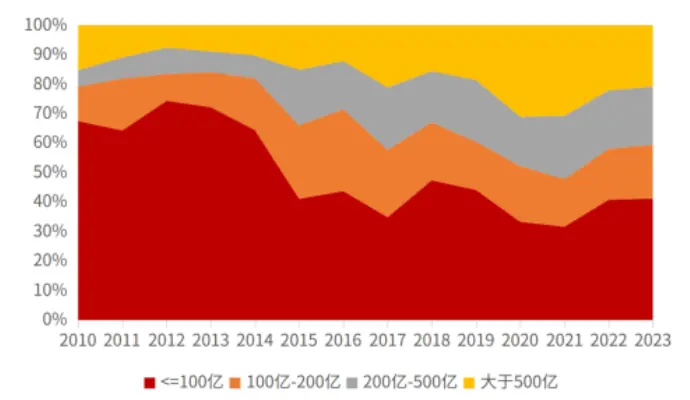
资料来源：Wind，光大证券研究所；注：数据起止日期为：2010.01.01-2023.07.31；按大宗交易次数占比统计

图 9：大宗交易股票在各宽基指数的分布较为均衡
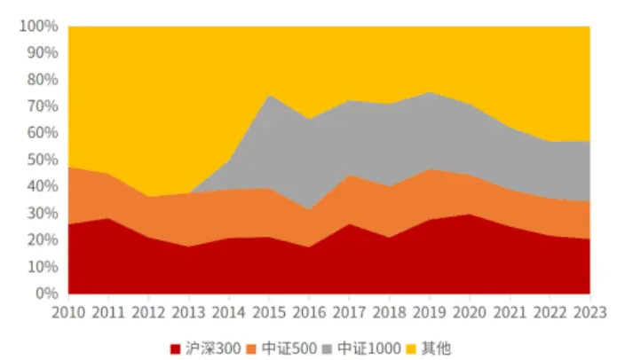
资料来源：Wind，光大证券研究所；注：数据起止日期为：2010.01.01-2023.07.31；按大宗交易次数占比统计

按照行业来看，大宗交易次数最多的前 5 大中信一级行业依次为医药、电子、机械、基础化工和计算机；次数最少的前 5 大中信一级行业依次为综合金融、煤炭、综合、消费者服务和钢铁。

图 10：中信一级行业大宗交易次数
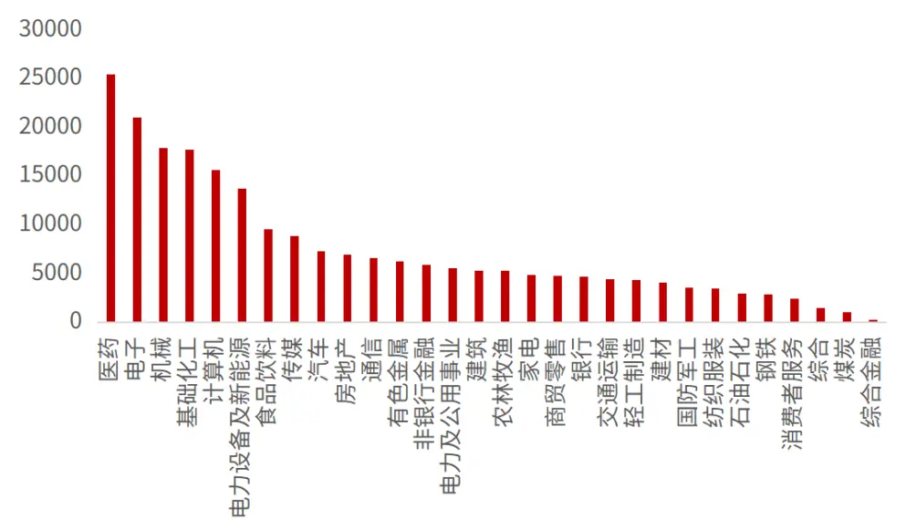
资料来源：Wind，光大证券研究所；注：数据起止日期为：2010.01.01-2023.07.31

从历年行业分布来看，大宗交易在各中信一级行业的历年分布与总体分布较为一致。大宗交易主要发生在医药、基础化工、机械、计算机、电力设备及新能源、电子行业。

图 11：历年中信一级行业大宗交易分布

| 中信一级行业 | 2010 | 2011 | 2012 | 2013 | 2014 | 2015 | 2016 | 2017 | 2018 | 2019 | 2020 | 2021 | 2022 | 2023 |
| --- | --- | --- | --- | --- | --- | --- | --- | --- | --- | --- | --- | --- | --- | --- |
| 交通运输 | 2.78% | 1.00% | 1.02% | 1.29% | 2.15% | 2.10% | 2.48% | 2.41% | 2.12% | 3.12% | 2.18% | 1.52% | 2.00% | 1.31% |
| 传媒 | 1.07% | 1.96% | 1.93% | 3.70% | 2.09% | 3.89% | 4.12% | 6.47% | 5.03% | 6.25% | 4.93% | 2.47% | 3.07% | 4.72% |
| 农林牧渔 | 4.43% | 3.70% | 4.24% | 2.38% | 2.98% | 2.44% | 3.23% | 3.24% | 2.77% | 3.32% | 2.32% | 1.85% | 1.10% | 1.75% |
| 医药 | 5.12% | 4.91% | 7.97% | 6.73% | 7.86% | 7.67% | 9.44% | 8.44% | 10.39% | 12.54% | 13.24% | 14.17% | 12.34% | 15.11% |
| 商贸零售 | 5.71% | 2.21% | 4.11% | 2.41% | 2.74% | 2.65% | 2.13% | 2.13% | 2.24% | 1.59% | 1.43% | 2.19% | 1.75% | 1.89% |
| 国防军工 | 0.17% | 0.12% | 0.44% | 1.75% | 1.64% | 0.53% | 1.28% | 1.66% | 1.46% | 1.23% | 2.03% | 2.21% | 2.14% | 1.22% |
| 基础化工 | 5.81% | 6.87% | 6.88% | 9.46% | 9.42% | 6.73% | 7.62% | 5.68% | 5.73% | 6.94% | 6.85% | 8.26% | 11.33% | 6.87% |
| 家电 | 0.79% | 2.83% | 1.67% | 2.05% | 2.54% | 2.70% | 3.77% | 2.97% | 3.38% | 1.92% | 1.93% | 1.77% | 1.61% | 1.43% |
| 建材 | 8.56% | 3.21% | 2.19% | 1.65% | 1.84% | 2.21% | 1.66% | 2.31% | 1.87% | 2.26% | 1.35% | 1.54% | 1.78% | 0.87% |
| 建筑 | 1.58% | 1.54% | 3.32% | 2.94% | 2.09% | 2.59% | 3.53% | 3.52% | 3.63% | 2.75% | 1.99% | 1.61% | 1.96% | 1.94% |
| 房地产 | 6.60% | 5.62% | 4.84% | 3.57% | 3.99% | 4.63% | 4.40% | 5.38% | 5.12% | 2.88% | 1.82% | 1.70% | 2.49% | 1.27% |
| 有色金属 | 5.60% | 2.81% | 1.64% | 2.24% | 3.99% | 4.06% | 2.13% | 2.70% | 2.35% | 1.91% | 2.47% | 3.16% | 3.18% | 2.14% |
| 机械 | 5.40% | 10.39% | 11.12% | 8.05% | 9.48% | 9.53% | 8.59% | 6.27% | 8.10% | 6.10% | 6.47% | 8.25% | 8.10% | 8.40% |
| 汽车 | 5.12% | 1.85% | 4.03% | 4.06% | 3.63% | 5.17% | 4.87% | 4.29% | 3.01% | 2.76% | 1.88% | 2.90% | 2.93% | 2.87% |
| 消费者服务 | 0.58% | 0.44% | 1.18% | 0.66% | 0.70% | 0.74% | 1.73% | 1.50% | 1.33% | 0.91% | 1.07% | 1.05% | 1.06% | 1.31% |
| 煤炭 | 1.31% | 0.87% | 0.92% | 0.73% | 0.78% | 0.35% | 0.36% | 0.77% | 1.07% | 0.29% | 0.28% | 0.25% | 0.49% | 0.19% |
| 电力及公用事业 | 1.24% | 2.83% | 1.93% | 2.81% | 2.47% | 2.49% | 3.02% | 3.89% | 3.08% | 2.03% | 1.73% | 1.88% | 2.61% | 2.59% |
| 电力设备及新能源 | 6.05% | 8.24% | 7.45% | 7.24% | 6.92% | 6.16% | 4.84% | 3.67% | 4.80% | 4.21% | 5.46% | 6.08% | 7.85% | 6.95% |
| 电子 | 4.33% | 7.82% | 5.05% | 7.72% | 5.96% | 6.64% | 7.39% | 6.64% | 7.00% | 8.55% | 10.46% | 11.73% | 10.06% | 14.55% |
| 石油石化 | 1.17% | 1.56% | 2.32% | 1.17% | 1.71% | 1.32% | 0.47% | 1.91% | 2.44% | 1.16% | 0.99% | 1.26% | 1.27% | 1.04% |
| 纺织服装 | 2.51% | 2.08% | 2.90% | 2.10% | 2.09% | 2.80% | 2.20% | 1.24% | 2.14% | 1.55% | 1.07% | 0.99% | 1.21% | 1.04% |
| 综合 | 1.48% | 0.35% | 0.84% | 0.39% | 0.46% | 0.66% | 0.46% | 0.99% | 1.15% | 0.99% | 0.44% | 0.64% | 0.67% | 0.63% |
| 综合金融 |  |  |  |  |  |  |  |  |  | 0.06% | 0.58% | 0.07% | 0.16% | 0.03% |
| 计算机 | 3.78% | 9.93% | 7.21% | 6.88% | 4.88% | 5.26% | 6.77% | 5.47% | 5.27% | 7.55% | 10.04% | 7.56% | 5.79% | 7.60% |
| 轻工制造 | 3.16% | 1.42% | 1.80% | 2.44% | 2.90% | 1.75% | 2.13% | 1.95% | 1.88% | 2.04% | 2.42% | 1.73% | 1.49% | 1.63% |
| 通信 | 6.91% | 4.35% | 2.48% | 4.70% | 2.88% | 3.32% | 3.11% | 3.23% | 3.40% | 3.77% | 2.78% | 2.22% | 2.41% | 2.37% |
| 钢铁 | 1.03% | 1.08% | 0.62% | 0.99% | 2.57% | 2.70% | 0.87% | 1.29% | 2.25% | 0.66% | 1.49% | 1.43% | 0.95% | 0.66% |
| 银行 | 2.96% | 2.75% | 2.04% | 2.34% | 3.20% | 2.93% | 1.51% | 1.97% | 1.34% | 3.04% | 2.10% | 2.39% | 1.62% | 1.42% |
| 非银行金融 | 2.34% | 5.70% | 4.68% | 4.35% | 3.47% | 2.98% | 2.90% | 3.97% | 2.82% | 3.30% | 2.04% | 1.71% | 2.03% | 1.38% |
| 食品饮料 | 2.41% | 1.56% | 3.21% | 3.20% | 2.59% | 2.99% | 2.97% | 4.02% | 2.84% | 4.33% | 6.19% | 5.40% | 4.55% | 4.81% |

资料来源：Wind，光大证券研究所；注：数据起止日期为：2010.01.01-2023.07.31

## 2.5、 大宗交易席位主要为营业部席位，其次为机构席位

参与大宗交易的投资者有保险、公募、私募、券商、QFII 以及个人，由于大宗交易具备保护隐私的特点，根据交易所披露的大宗交易信息，我们很难判断参与大宗交易的投资者类型。根据交易所公布的买卖双方的信息，我们可以将投资者交易席位大致分为三种类型：机构席位、自营席位以及营业部席位。

通过提取买卖方名称中的关键词，我们对三种席位进行划分，具体划分准则如下表所示。当名称中出现“分公司”、“营业部”、“大街”等词时，将其划分为营业部席位；当名称中出现“机构专用”、“交易单元”等词时，将其划分为机构席位；当名称中出现“自营”、“总部”等词时，将其划分为自营席位。

表 2：买卖方席位划分

| 席位 | 包含关键词 |
| --- | --- |
| 营业部席位 | 分公司、营业部、经纪业务、证券业务、大街、街等 |
| 机构席位 | 机构业务、机构专用、交易单元、机构部、资产管理等 |
| 自营席位 | 自营、总部、交易部、国际部、证投部、投资部等 |

资料来源：光大证券研究所整理

下图展示了不同席位买卖双方的样本量，可以发现，大宗交易主要集中在营业部席位中，其次是机构席位，而自营席位数量较少。

图 12：买卖方席位均以营业部席位为主
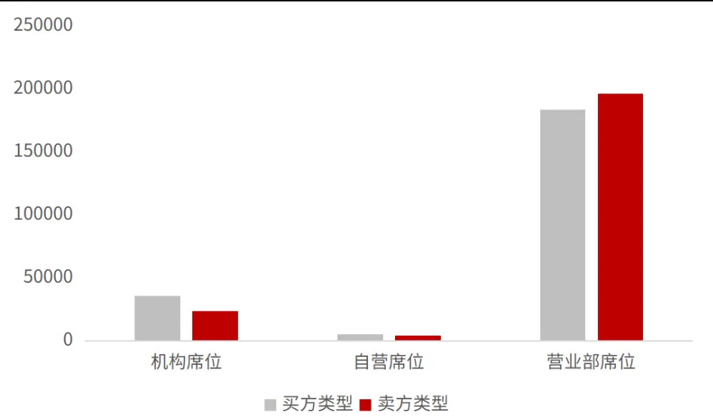
资料来源：Wind，光大证券研究所；注：数据起止日期为：2010.01.01-2023.07.31；纵轴为样本量，单位为次数

按照历年分布来看，不管是买方还是卖方，均以营业部席位为主，其次为机构席位。从时序来看，近年来，买方机构席位保持稳定。

图 13：买方席位历年均以营业部席位为主
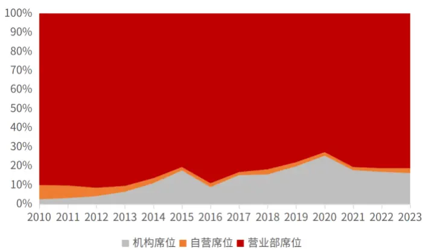
资料来源：Wind，光大证券研究所；注：数据起止日期为：2010.01.01-2023.07.31；按大宗交易次数占比统计

图 14：卖方席位历年均以营业部席位为主
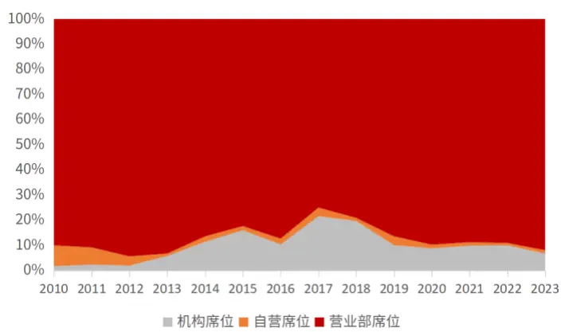
资料来源：Wind，光大证券研究所；注：数据起止日期为：2010.01.01-2023.07.31；按大宗交易次数占比统计

## 2.6、 大宗交易以折价交易为主，成交金额比率总体偏低

大宗交易另一个重要的指标为成交价格，当证券价格有涨跌幅限制时，成交价格的上下限是依据前一交易日收盘价或者当日收盘价来决定的。因此，衍生出一个重要指标：折溢价率，即以大宗交易成交价格/当日收盘价格，当大于 0 时，为溢价成交，等于 0 时为平价成交，小于 0 时为折价成交。

我们首先统计了不同折溢价区间的样本量，从统计结果来看，大宗交易大多以折价成交，且多数样本折价幅度集中在 15%以内，溢价成交样本较少，而超过 5%溢价幅度的成交样本极少。

按照年度来看，自 2017 年开始，平价成交的样本增多，随后几年均保持稳定，而溢价成交的样本近几年占比有所下滑。

图 15：大宗交易股票多以折价成交
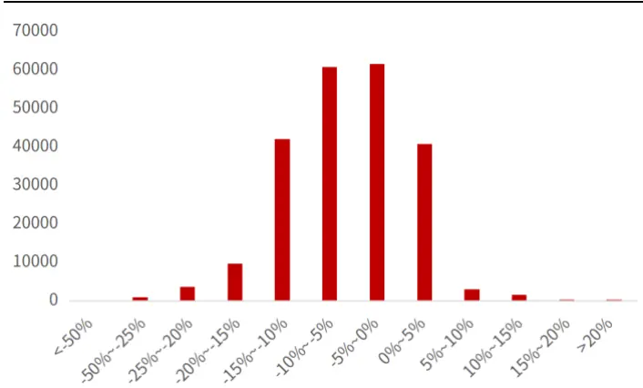
资料来源：Wind，光大证券研究所；注：数据起止日期为：2010.01.01-2023.07.31；横轴为折溢价率区间，纵轴为样本量，单位为次数

图 16：大宗交易股票历年均以折价成交为主
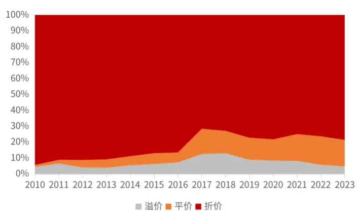
资料来源：Wind，光大证券研究所；注：数据起止日期为：2010.01.01-2023.07.31；按大宗交易次数占比统计

大宗交易披露的信息包含成交金额，由此衍生出一个重要指标：成交金额比率。即大宗交易成交金额/当日非大宗交易成交金额。按照成交金额比率来看，大部分样本集中在 10%以内，10%以内样本占 59%。

图 17：多数大宗交易成交金额比率偏低
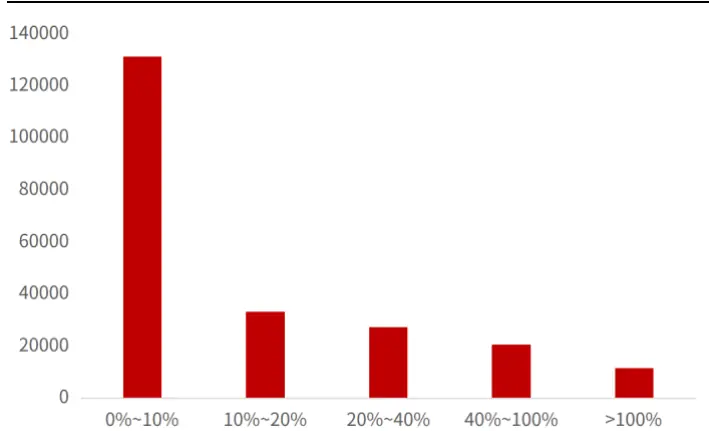
资料来源：Wind，光大证券研究所；注：数据起止日期为：2010.01.01-2023.07.31，横轴为成交金额比率区间，纵轴为样本量，单位为次数

图 18：大宗交易成交金额比率总体偏低
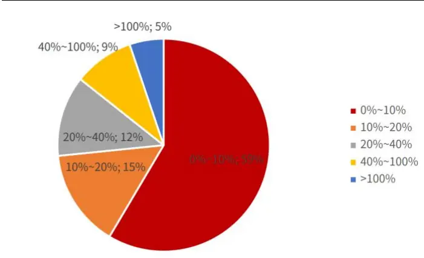
资料来源：Wind，光大证券研究所；注：数据起止日期为：2010.01.01-2023.07.31；按大宗交易次数占比统计

## 3、大宗交易事件收益分析

本章主要研究大宗交易发生后，股票表现如何？本章采用的研究方法为事件研究法，针对大宗交易折溢价率、买卖双方席位、股票价格所处分位以及成交金额比率、大宗交易时股票资金面 5 个方面开展探讨，试图探究这些指标对股价是否存在明显的影响。

## 3.1、 单个指标测算

本文首先对以上 5 个指标单独进行测算。在测试收益前，对原始数据进行了一定筛选。具体地，剔除掉在大宗交易时处于特别处理（ST/*ST）的股票和上市未满 1 年的股票（次新股）。测算所用比较基准为中证全指。

首先从折溢价率情况来看。按照折溢价率将样本划分为折价、平价以及溢价三组，分别统计各组股票在大宗交易发生后绝对净值以及超额净值。

从测算结果可以发现，大宗交易后短时间内，折价交易对股价的影响是负面的，溢价交易对股价影响是正面的，而平价交易对股价几乎无影响，长期来看无论是折价、平价还是溢价，三组股票均取得正向超额。

图 19：折价、平价、溢价绝对净值
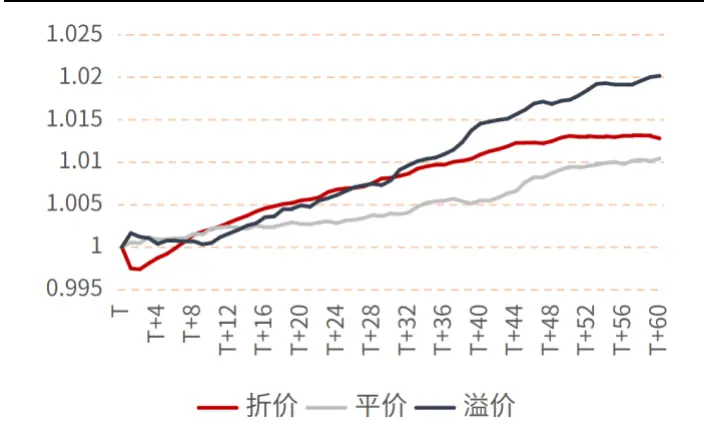
资料来源：Wind，光大证券研究所；注：数据起止日期为：2010.01.01-2023.07.31

图 20：折价、平价、溢价超额净值
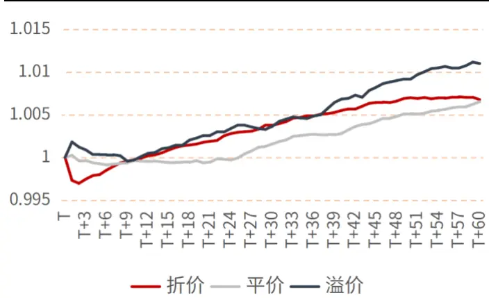
资料来源：Wind，光大证券研究所；注：数据起止日期为：2010.01.01-2023.07.31

不同折溢价区间内样本量有所不同，我们按照折溢价率“<-15%”、“-15%~-10%”、“-10%~-5%”、“-5%~0%”和“>0%”将样本划分为 5组，依次为 group1-group5，分别对 5 组样本进行测算。

从测算结果来看，当折价过高时（group1），大宗交易发生后对股价的影响是正向的，但长期来看效果不佳；长期来看，其余各组对股价均起到一定程度的正向影响。

图 21：折溢价率分 5 组绝对净值
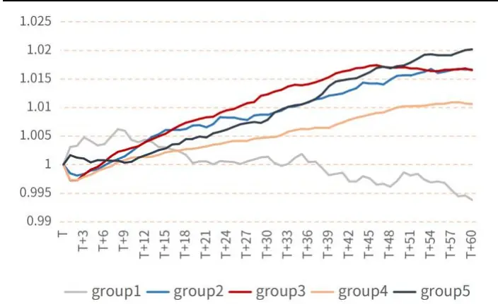
资料来源：Wind，光大证券研究所；注：数据起止日期为：2010.01.01-2023.07.31

图 22：折溢价率分 5 组超额净值
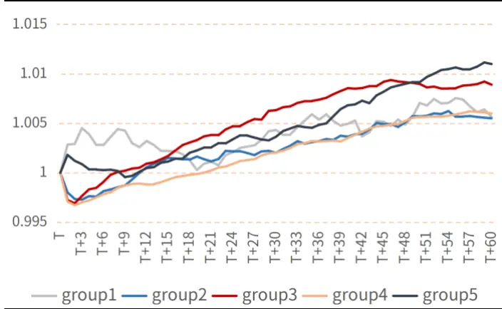
资料来源：Wind，光大证券研究所；注：数据起止日期为：2010.01.01-2023.07.31

我们在第二章中，根据披露的买卖双方名称，将买卖双方交易席位划分为“机构席位”、“自营席位”以及“营业部席位”。根据这三类样本进行测算，当买方席位为“机构席位”时，对股价的正向影响要强于“营业部席位”；而当卖方席位为“自营席位”时，对股价的正向影响效果最强，而当卖方席位为“机构席位”或“营业部席位”时两者差距不大。

图 23：买方席位分组超额收益
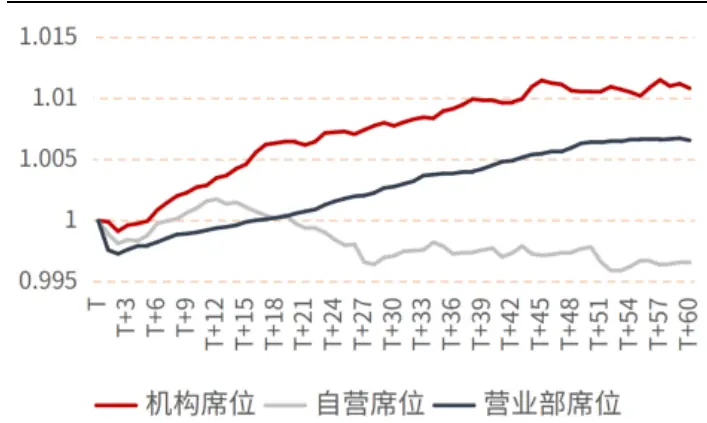
资料来源：Wind，光大证券研究所；注：数据起止日期为：2010.01.01-2023.07.31

图 24：卖方席位分组超额收益
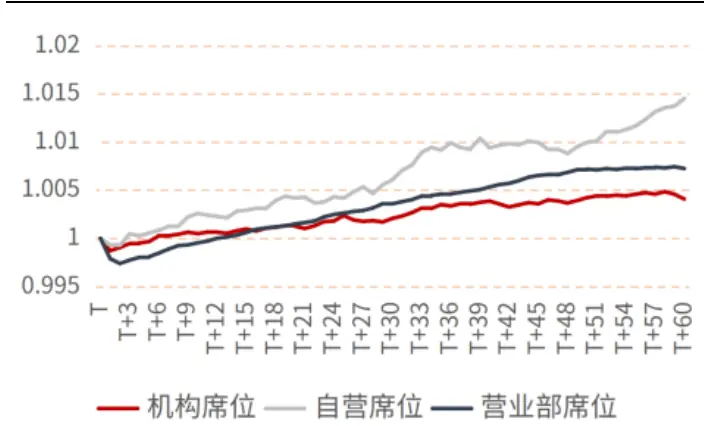
资料来源：Wind，光大证券研究所；注：数据起止日期为：2010.01.01-2023.07.31

大宗交易时，股价所处的历史分位情况，也是我们重点考察的指标之一。当事发时，若股价处于历史低位，这样的股票后续股价走势能否迎来反转？还是继续下跌？我们通过每只股票在大宗交易时，最近 1 个月收盘价均值处于最近 1 年的分位（简称“股价分位”）情况，按照股价分位从低到高将样本进行分组，对各组进行测算。

首先从分 5 组（从低到高依次为 group1-group5）的情况来看，当股价处于历史较高分位时，这样的股票在后续表现较好。但是我们可以发现，5 组样本并不单调，且最高分位组表现并非最佳。

我们更为详细地，将样本划分为了 10 组（从低到高依次为 group1-group10），可以发现第 10 组样本表现反而大幅下滑，说明股价处于历史高位，这样的股票在后续下跌的风险过高；而股价分位适中的样本（group7-group9），后续表现较好。

图 25：股价分位分 5 组超额收益
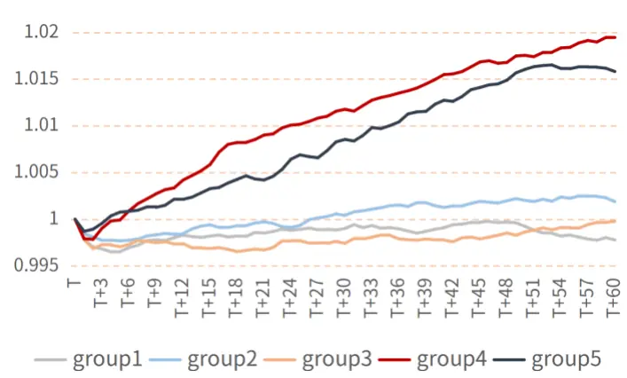
资料来源：Wind，光大证券研究所；注：数据起止日期为：2010.01.01-2023.07.31

图 26：股价分位分 10 组超额收益
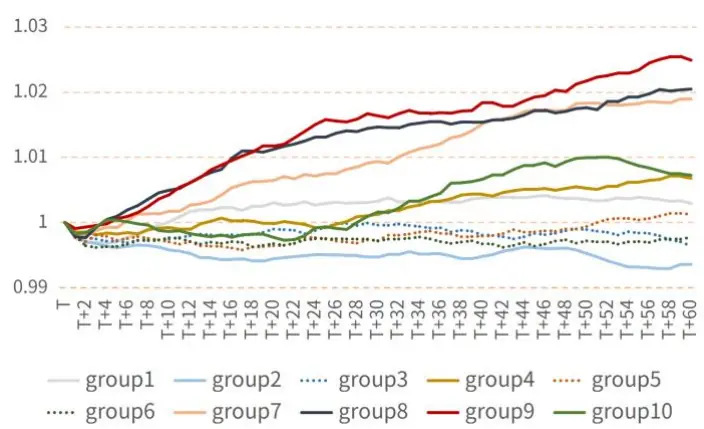
资料来源：Wind，光大证券研究所；注：数据起止日期为：2010.01.01-2023.07.31

从大宗交易成交金额比率来看，我们按照大宗交易成交金额比率从低到高将样本均分为 5 组（group1-group5）。测算结果如下图所示。可以发现，成交金额比率对股价的影响是正面的，即 5 组单调，成交金额比率越高，股票表现越好。

图 27：成交金额比率分 5 组绝对收益
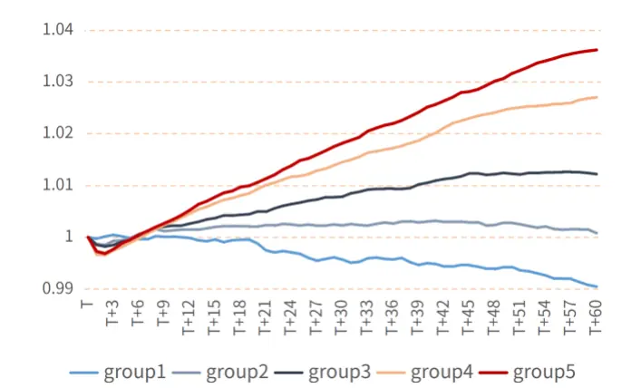
资料来源：Wind，光大证券研究所；注：数据起止日期为：2010.01.01-2023.07.31

图 28：成交金额比率分 5 组超额收益
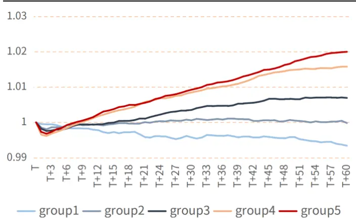
资料来源：Wind，光大证券研究所；注：数据起止日期为：2010.01.01-2023.07.31

最后，我们从大宗交易时股票的资金面来考虑。股票在大宗交易时以及大宗交易前资金面的情况反映出投资者的情绪，但是不同股票之间成交金额存在较大差异，无法直接用于比较。因此，我们考虑使用成交金额波动率（本文用“6 日成交金额波动率”作为代理指标，即大宗交易日及之前共计 6 个交易日竞价交易成交金额波动率）进行比较。当成交金额波动率较大时，说明该股最近受到较多关注。

我们按照成交金额波动率从高到低将样本均分为 5 组（依次为 group1-group5），从测算结果可以发现，成交金额波动率最高的组，表现最差，而成交金额波动率最低的组，表现最佳，且指标单调性较好。

图 29：成交金额波动率分 5 组测试绝对收益
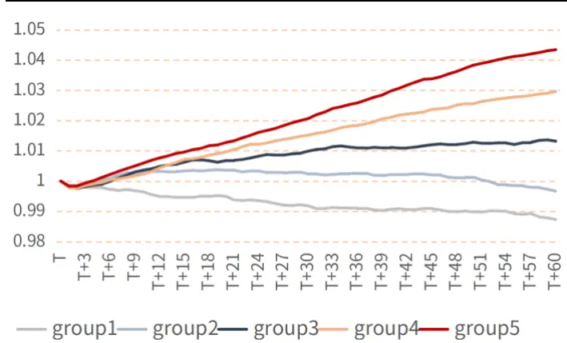
资料来源：Wind，光大证券研究所；注：数据起止日期为：2010.01.01-2023.07.31

图 30：成交金额波动率分 5 组测试超额收益
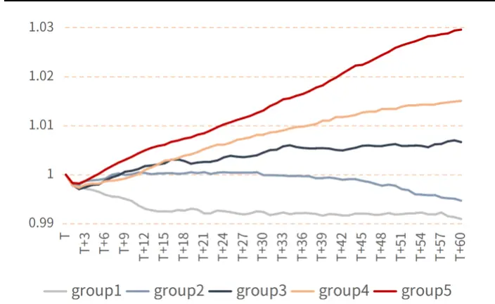
资料来源：Wind，光大证券研究所；注：数据起止日期为：2010.01.01-2023.07.31

## 3.2、 多个指标测算

根据前述单个指标测算结果，我们发现对股价影响较强的指标为成交金额比率和成交金额波动率。本节，我们以成交金额比率为基础，针对多个指标进行叠加测算，以探究多指标叠加后是否能明显提升超额收益。

首先从成交金额比率叠加折溢价率来看（即按照两个指标进行分组测算），图31 展示了按照折溢价率和成交金额比率分组（从低到高依次为 group1-group5）情况下，股票在第 20 个交易日、第 40 个交易日以及第 60 个交易日的超额收益情况。可以发现，当大宗交易折价率高于 15%时，结合大额成交量，这样的股票表现最佳。

图 32 展示了在成交金额比率较高时，根据折溢价率分组测试超额净值。可以发现，在成交金额比率较高的情况下，按照折溢价率分组，结果单调，且高折价高成交额组表现始终最佳。

图 31：成交金额比率叠加折溢价率分组超额收益

| 事发后 | 成交金额比率折溢价率 | groupl | group2 | group3 | group4 | group5 |
| --- | --- | --- | --- | --- | --- | --- |
| 第20日 | <-15% | -2.36% | -0.84% | 0.78% | 1.41% | 3.51% |
|  | -15%~-10% | -0.78% | -0.26% | 0.04% | 0.72% | 1.27% |
|  | -10%~-5% | 0.05% | 0.36% | 0.41% | 0.37% | 0.59% |
|  | -5%~0% | -0.35% | -0.16% | -0.23% | 0.43% | 0.17% |
|  | >0% | 0.15% | 0.11% | 0.04% | 0.36% | -0.41% |
| 第40日 | <-15% | -3.13% | -1.13% | 1.96% | 2.81% | 4.98% |
|  | -15%~-10% | -1.49% | -0.28% | 0.52% | 1.51% | 2.07% |
|  | -10%~-5% | 0.38% | 0.69% | 0.82% | 0.81% | 1.44% |
|  | -5%~0% | -0.71% | -0.30% | 0.01% | 1.07% | 1.12% |
|  | >0% | 0.51% | 0.52% | 0.47% | 0.86% | -0.22% |
| 第60日 | <-15% | -4.04% | -1.49% | 2.47% | 3.87% | 5.83% |
|  | -15%~-10% | -2.35% | -0.24% | 0.98% | 2.13% | 3.00% |
|  | -10%~-5% | 0.02% | 0.41% | 0.92% | 0.86% | 2.02% |
|  | -5%~0% | -0.88% | -0.62% | -0.04% | 1.61% | 1.76% |
|  | >0% | 0.80% | 0.88% | 0.63% | 1.36% | 0.51% |

资料来源：Wind，光大证券研究所；注：数据起止日期为：2010.01.01-2023.07.31

图 32：成交金额比率（第 5 组）叠加折溢价率分组超额净值
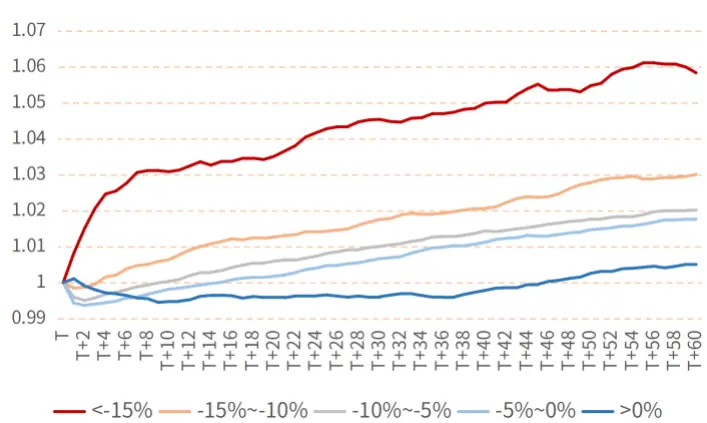
资料来源：Wind，光大证券研究所；注：数据起止日期为：2010.01.01-2023.07.31

其次，从成交金额比率叠加买卖方席位来看（买卖方席位仅考虑“机构席位”和“营业部席位”），成交金额比率分组原理同上。

从测算结果可以发现，无论买卖方席位如何，高成交金额比率的股票表现最佳，当买方为机构席位或卖方为营业部席位时，股票表现较佳。在同为高成交金额比率情形下，当限制买方为机构席位，同时卖方为营业部席位时，股票表现有所提升，但提升空间不大。

图 33：成交金额比率叠加买卖方类型分组超额收益

| 事发后 | 成交金额比率买方类型 | groupl | group2 | group3 | group4 | group5 |
| --- | --- | --- | --- | --- | --- | --- |
| 第20日 | 机构席位 | -0.05% | 0.57% | 0.68% | 0.96% | 1.43% |
|  | 营业部席位 | -0.43% | -0.16% | 0.01% | 0.43% | 0.38% |
| 第40日 | 机构席位 | -0.11% | 0.95% | 1.11% | 1.49% | 2.04% |
|  | 营业部席位 | -0.48% | -0.08% | 0.44% | 1.09% | 1.21% |
| 第60日 | 机构席位 | -0.65% | 0.76% | 1.54% | 2.06% | 2.69% |
|  | 营业部席位 | -0.69% | -0.16% | 0.57% | 1.51% | 1.92% |
| 事发后 | 成交金额占比卖方类型 | group1 | group2 | group3 | group4 | group5 |
| 第20日 | 机构席位 | -0.13% | -0.32% | 0.15% | 0.36% | 0.69% |
|  | 营业部席位 | -0.42% | 0.00% | 0.10% | 0.52% | 0.50% |
| 第40日 | 机构席位 | -0.38% | -0.03% | 0.85% | 0.90% | 1.00% |
|  | 营业部席位 | -0.49% | 0.08% | 0.51% | 1.17% | 1.34% |
| 第60日 | 机构席位 | -0.29% | -0.32% | 0.72% | 1.09% | 1.23% |
|  | 营业部席位 | -0.85% | -0.02% | 0.70% | 1.63% | 2.10% |

资料来源：Wind，光大证券研究所；注：数据起止日期为：2010.01.01-2023.07.31

图 34：成交金额比率（第 5 组）叠加买卖方席位分组超额净值
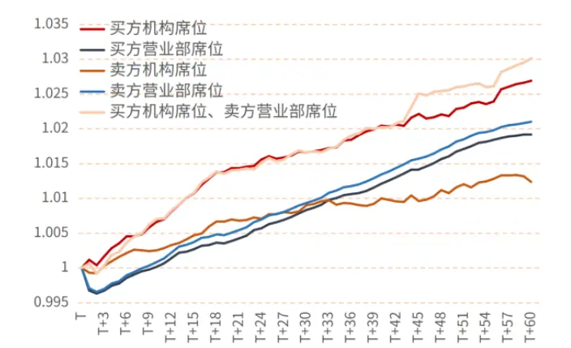
资料来源：Wind，光大证券研究所；注：数据起止日期为：2010.01.01-2023.07.31

从成交金额比率叠加股价分位来看，高成交金额比率的股票，其表现较好；而从股价分位来看，当股价处于历史中高分位时，这样的股票表现较佳。

图 35：成交金额比率叠加股价分位分组超额收益

| 事发后 | 成交金额比率 股价分位 | groupl | group2 | group3 | group4 | group5 |
| --- | --- | --- | --- | --- | --- | --- |
| 第20日 | groupl | 0.17% | -0.25% | 0.04% | 0.25% | -0.61% |
|  | group2 | -0.70% | -0.65% | -0.01% | 0.46% | 0.38% |
|  | group3 | -1.73% | -0.65% | -0.27% | 0.25% | 0.76% |
|  | group4 | 0.74% | 0.83% | 0.53% | 1.10% | 1.33% |
|  | group5 | -0.22% | 0.32% | 0.27% | 0.60% | 1.74% |
| 第40日 | groupl | -0.94% | -0.53% | 0.06% | 0.68% | -0.07% |
|  | group2 | -1.20% | -0.71% | 0.18% | 1.04% | 0.90% |
|  | group3 | -2.00% | -1.41% | -0.16% | 0.68% | 1.72% |
|  | group4 | 0.84% | 1.29% | 1.29% | 1.96% | 2.63% |
|  | group5 | 0.34% | 1.32% | 1.27% | 1.40% | 2.36% |
| 第60日 | group1 | -2.02% | -0.82% | -0.07% | 0.65% | 0.38% |
|  | group2 | -1.55% | -1.01% | 0.13% | 1.45% | 1.26% |
|  | group3 | -2.10% | -1.50% | -0.07% | 1.00% | 2.64% |
|  | group4 | 0.27% | 1.45% | 1.97% | 3.08% | 3.92% |
|  | group5 | 0.68% | 1.27% | 1.51% | 1.99% | 3.08% |

资料来源：Wind，光大证券研究所；注：数据起止日期为：2010.01.01-2023.07.31

图 36：成交金额比率（第 5 组）叠加股价分位分组超额净值
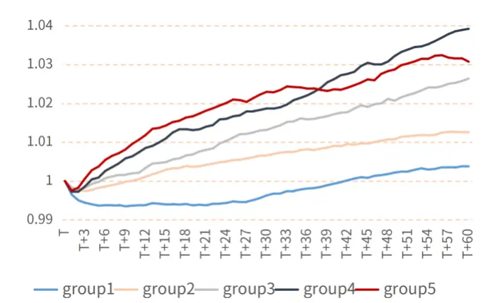
资料来源：Wind，光大证券研究所；注：数据起止日期为：2010.01.01-2023.07.31

最后，从成交金额比率叠加成交金额波动率来看。可以发现，在两维度下，股票呈现出单调性，即满足高成交金额比率、同时满足低成交金额波动率的股票，表现最佳。

图 37：成交金额比率叠加成交金额波动率分组超额收益

| 事发后 | 成交金额比率成交金额波动率 | group1 | group2 | group3 | group4 | group5 |
| --- | --- | --- | --- | --- | --- | --- |
| 第20日 | groupl | -0.48% | -0.96% | -1.36% | -0.87% | -0.36% |
|  | group2 | 0.19% | 0.23% | -0.32% | 0.01% | -0.19% |
|  | group3 | 0.04% | 0.31% | 0.26% | 0.24% | 0.29% |
|  | group4 | -0.60% | 0.21% | 0.73% | 0.69% | 0.32% |
|  | group5 | -1.37% | 0.43% | 0.75% | 1.07% | 0.76% |
| 第40日 | group1 | -0.52% | -1.04% | -1.67% | -0.97% | -0.50% |
|  | group2 | -0.09% | 0.27% | -0.28% | -0.17% | -0.30% |
|  | group3 | 0.31% | 0.30% | 0.57% | 0.81% | 0.63% |
|  | group4 | -0.83% | 0.47% | 1.49% | 1.43% | 1.14% |
|  | group5 | -1.22% | 1.42% | 1.91% | 2.15% | 1.86% |
| 第60日 | groupl | -0.56% | -1.07% | -1.99% | -1.57% | -0.53% |
|  | group2 | -0.69% | -0.32% | -0.70% | -0.50% | -0.37% |
|  | group3 | -0.16% | 0.35% | 0.75% | 1.20% | 0.92% |
|  | group4 | -1.49% | 0.52% | 2.08% | 1.99% | 1.61% |
|  | group5 | 1.22% | 2.58% | 2.58% | 3.20% | 3.01% |

资料来源：Wind，光大证券研究所；注：数据起止日期为：2010.01.01-2023.07.31

图 38：成交金额比率（第 5 组）叠加成交金额波动率超额净值
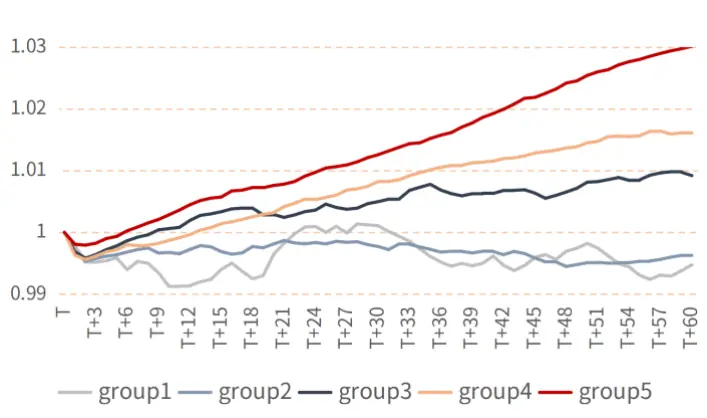
资料来源：Wind，光大证券研究所；注：数据起止日期为：2010.01.01-2023.07.31

## 4、基于大宗交易的量化选股组合

本章，我们将构造选股组合。根据前述结论，成交金额比率以及成交金额波动率对大宗交易股票价格影响具备较强影响，因此，我们以这两个指标为准，构建选股组合。

根据事件数据构建投资策略的难点在于事件发生时间不固定，解决方式之一便为固定频率调仓。根据前述研究结论，大宗交易发生后 60 个交易日内能产生超额收益，因此可以固定频率调仓。我们使用月频调仓方式，即在每个月底，筛选出当月大宗交易股票，构建股票池，在次月初进行调仓。

## 4.1、 大宗交易股票池回溯测试

根据前文研究结论，成交金额比率越高的股票或者成交金额波动率越低的股票，其未来获取更为显著的超额收益，那么将大宗交易数据扩展到时序上，效果如何？对此，我们进行了测算，回测设置如下所示。

- 基础股票池：大宗交易股票池，剔除特别处理股（如 ST/*ST）、上市未满 1年的股票。

- 选股方式：每月底，从基础股票池中，按照大宗交易成交金额比率（大宗交易金额/非大宗交易金额）或者成交金额波动率，将股票池的股票均分为 3 组。

- 调仓方式：以收盘价进行买卖，涨停不买入，跌停不卖出。

- 其他设置：交易费率为双边千分之二；回测区间为 2010.02.01-2023.07.31。

从回测结果来看，仅按照成交金额比率分组，3 组存在明显区分度，第三组与第一组区别明显。但是可以发现，第三组超额收益并不稳定，在 2017 年和 2021年经历了较大回撤。

图 39：成交金额比率分 3 组超额净值
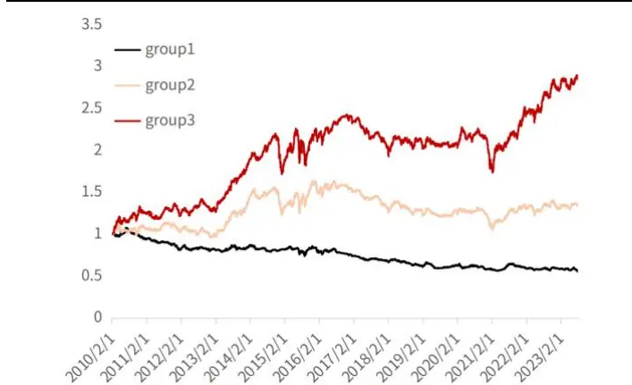
资料来源：Wind，光大证券研究所；注：数据起止日期为：2010.02.01-2023.07.31

图 40：成交金额比率第三组超额净值相对第一组超额净值
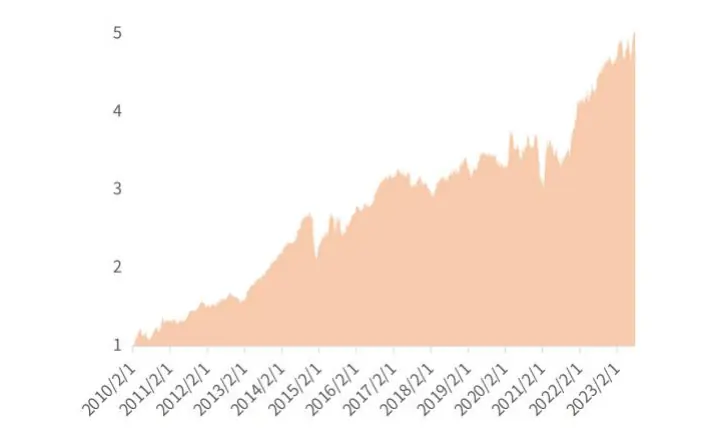
资料来源：Wind，光大证券研究所；注：数据起止日期为：2010.02.01-2023.07.31

按照成交金额波动率来看，三组区分度明显，相对于成交金额比率，根据成交金额波动率来选股能获取更为可观的超额收益。

图 41：成交金额波动率分 3 组超额净值
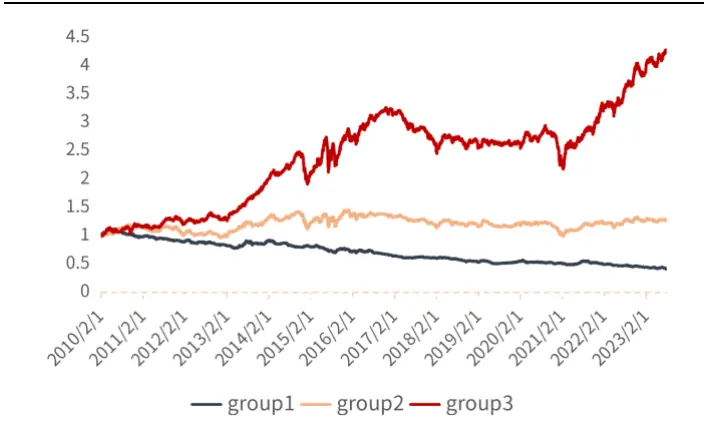
资料来源：Wind，光大证券研究所；注：数据起止日期为：2010.02.01-2023.07.31

图 42：成交金额波动率第三组超额净值相对第一组超额净值
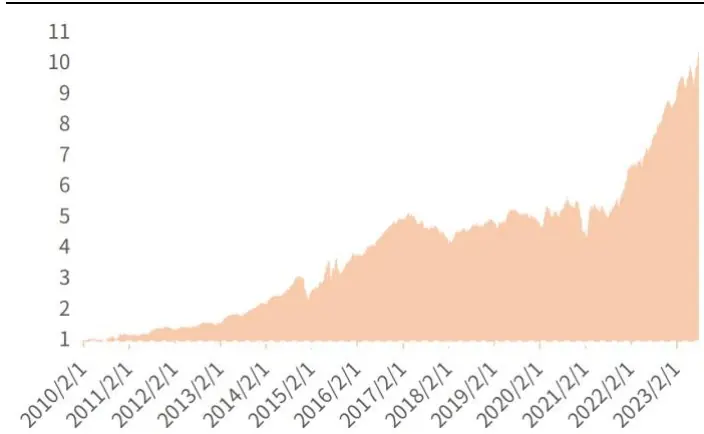
资料来源：Wind，光大证券研究所；注：数据起止日期为：2010.02.01-2023.07.31

按照前述思路，我们将两个指标进行叠加，将样本分为 9 组，测试结果如下所示。
从测试结果可知，在两指标叠加后，股票组合获取更为可观的超额收益。

图 43：成交金额比率叠加成交金额波动率分组年化收益率

| 成交金额占比成交金额波动率 | group1 | group2 | group3 |
| --- | --- | --- | --- |
| group1 | -8.02% | -7.11% | -1.66% |
| group2 | -2.49% | 1.56% | 4.80% |
| group3 | 6.38% | 9.78% | 12.81% |

资料来源：Wind，光大证券研究所；注：数据起止日期为：2010.02.01-2023.07.31

图 44：成交金额比率（第 3 组）叠加成交金额波动率超额净值
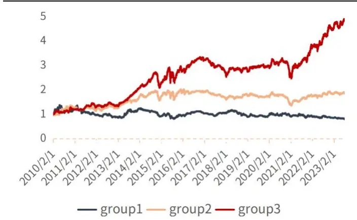
资料来源：Wind，光大证券研究所；注：数据起止日期为：2010.02.01-2023.07.31

此外，根据前文的研究结论，在成交金额比率较高的情况下，若满足“买方为机构席位”、“股价处于较高分位”、“折价率过高”时，这样的股票能够获取更为可观的超额收益。在时序上，这样的股票，表现如何呢？对此，我们也做了相应测算。回测设置如下所示。

- 基础股票池：大宗交易股票池，剔除特别处理股（如 ST/*ST）、上市未满 1年的股票。

- 选股方式：每月底，从基础股票池中，按照大宗交易成交金额比率（大宗交易金额/非大宗交易金额），从低到高将样本均分为 5 组，从第 5 组中进行二次筛选：按照折溢价率从低到高分为 5 组（取第 1 组），或按照股价分位从低到高分为 5 组（取第 4 组），或限定买方席位为机构席位。

- 调仓方式：以收盘价进行买卖；涨停不买入，跌停不卖出；等权持有。

- 其他设置：交易费率为双边千分之二；回测区间为 2011.02.01-2023.07.31。

从测试结果可以看出，在成交金额比率叠加了这三个指标后，对超额收益回撤起到了一定平抑效果，但从收益层面来看，叠加指标对收益提升较为有限。

图 45：成交金额比率叠加其余指标绝对净值
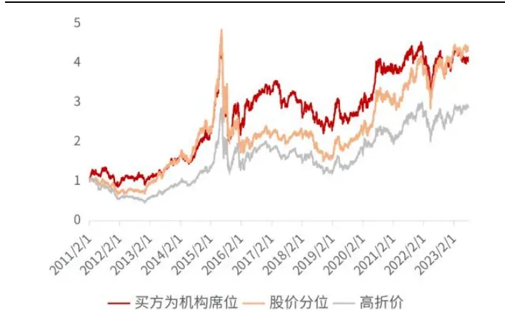
资料来源：Wind；注：数据起止日期为：2011.02.01-2023.07.31

图 46：成交金额比率叠加其余指标超额净值
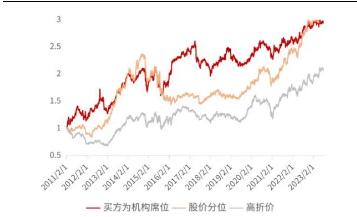
资料来源：Wind；注：数据起止日期为：2011.02.01-2023.07.31

## 4.2、 推荐“高成交金额比率、低成交金额波动率”组合

大宗交易本身具备保护隐私的特性，对于投资者来说，并不完全清楚大宗交易的细节，但是可以从市场本身出发，从股票情绪方面观察大宗交易对股票的影响，成交金额波动率即可反映投资者情绪。

根据前文研究结论，成交金额比率和成交金额波动率两个指标对选股具备指示作用。因此，我们推荐“高成交金额比率、低成交金额波动率”的股票组合。策略设置如下所示。

- 基础股票池：大宗交易股票池，剔除特别处理股（如 ST/*ST）、上市未满 1年的股票。

- 选股方式：每月底，从基础股票池中，按照大宗交易成交金额比率（大宗交易金额/非大宗交易金额）和成交金额波动率，两者联立，将样本分为 9 组，取第9 组（高成交、低波动），若股票数量大于 20 只，按照成交金额波动率从低到高将样本数限制在 20 只股票。

- 调仓方式：以收盘价进行买卖；涨停不买入，跌停不卖出；等权持有。

- 其他设置：交易费率为双边千分之二；回测区间为 2010.02.01-2023.07.31。

从测算结果可知，在两指标下选股，能够获取较为可观的超额收益。持有 20 只股票的总收益率为 938.30%，年化收益率为 19.54%，相对中证全指年化超额收益率 16.41%，组合月均换手率约为 90%。

图 47：策略净值曲线
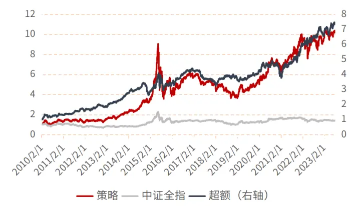
资料来源：Wind；注：数据起止日期为：2010.02.01-2023.07.31

图 48：组合月均换手率约为 90%
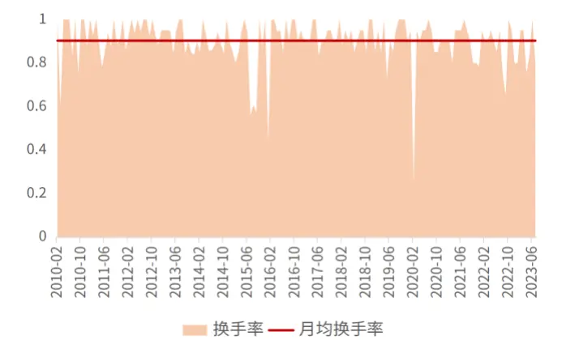
资料来源：Wind；注：数据起止日期为：2010.02.01-2023.07.31

表 3：策略评价指标

| 类型 | 策略 | 中证全指 超额 |
| --- | --- | --- |
| 总收益 | 938.30% 41.53% | 633.64% |
| 年化收益率 | 19.54% | 2.68% 16.41% |
| 年化波动率 | 27.19% | 22.72% 15.05% |
| 夏普比率 | 0.57 | -0.06 0.83 |
| 最大回撤 | 60.64% | 57.85% 28.20% |
| 最大回撤开始日期 | 2015/6/12 | 2015/6/12 2015/6/19 |
| 最大回撤截止日期 | 2015/9/15 2018/10/18 | 2015/9/15 |
| 月度胜率 | 59.88% 53.09% | 56.17% |

资料来源：Wind，光大证券研究所；注：数据起止日期为：2010.02.01-2023.07.31

按照年度来看，策略除在 2014 年以及 2017 年跑输基准外，其余年份均跑赢基准。

表 4：策略评价指标（年度）

| 年份 | 收益 | 基准收益 | 超额收益 | 夏普比率 | 基准夏普比率 | 超额夏普比率 | 最大回撤 | 基准最大回撤 | 超额最大回撤 |
| --- | --- | --- | --- | --- | --- | --- | --- | --- | --- |
| 2010 | 36.87% | 4.21% | 31.34% | 1.20 | 0.03 | 1.54 | 35.93% | 26.88% | 15.79% |
| 2011 | -7.22% | -28.01% | 28.88% | -0.48 | -1.52 | 2.36 | 19.96% | 33.51% | 3.67% |
| 2012 | 13.24% | 4.58% | 8.28% | 0.36 | 0.03 | 0.35 | 18.97% | 24.39% | 9.68% |
| 2013 | 54.75% | 5.21% | 47.08% | 2.43 | 0.07 | 4.22 | 18.37% | 16.86% | 4.46% |
| 2014 | 44.21% | 45.82% | -1.11% | 2.04 | 2.43 | -0.41 | 11.68% | 10.18% | 22.71% |
| 2015 | 71.90% | 32.56% | 29.68% | 1.27 | 0.74 | 0.95 | 60.64% | 46.83% | 28.20% |
| 2016 | 8.49% | -14.41% | 26.75% | 0.14 | -0.70 | 2.09 | 23.44% | 23.12% | 9.04% |
| 2017 | -17.15% | 2.34% | -19.05% | -1.41 | -0.14 | -2.53 | 19.78% | 9.39% | 19.87% |
| 2018 | -25.16% | -29.94% | 6.82% | -1.32 | -1.61 | 0.25 | 29.40% | 34.52% | 9.33% |
| 2019 | 38.76% | 31.11% | 5.84% | 1.67 | 1.34 | 0.18 | 15.28% | 16.50% | 9.99% |
| 2020 | 37.56% | 24.92% | 10.12% | 1.61 | 0.92 | 0.50 | 9.71% | 14.90% | 10.57% |
| 2021 | 35.92% | 6.19% | 27.99% | 1.73 | 0.15 | 1.30 | 11.55% | 11.05% | 13.24% |
| 2022 | -5.19% | -20.32% | 18.99% | -0.39 | -1.20 | 1.01 | 24.13% | 26.98% | 8.01% |
| 2023 | 13.75% | 4.27% | 9.09% | 1.63 | 0.30 | 1.09 | 9.55% | 8.12% | 7.90% |

资料来源：Wind，光大证券研究所；注：数据起止日期为：2010.02.01-2023.07.31

我们统计组合的平均市值，结果如图 49 所示。从历史平均来看，持仓股票市值多数为中小盘股票，平均市值在 50 亿元左右。

此外，我们测算了组合的资金容量，即每次调仓时可买入的金额。具体地，每一期，我们以每只股票在调仓前（含调仓日）10 个交易日的日均成交金额的 10%，作为每只股票调仓日最大买入金额，然后计算每只股票最大买入金额/该股票持仓权重，取所有股票该数值的 25%分位数值作为组合当日最大买入金额。

组合资金容量历史时序图如图 50 所示。从历史来看，“持有 20 只股票”组合的单次调仓平均资金容量在 3500 万元左右。

图 49：月度平均市值（亿元）
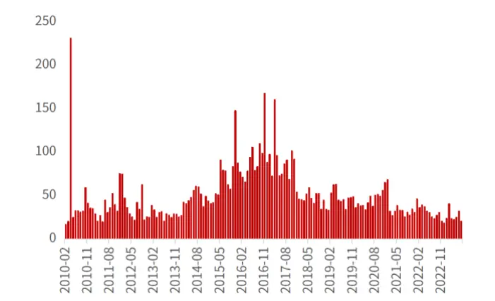
资料来源：Wind，光大证券研究所；注：数据起止日期为：2010.02.01-2023.07.31

图 50：月度资金容量（亿元）
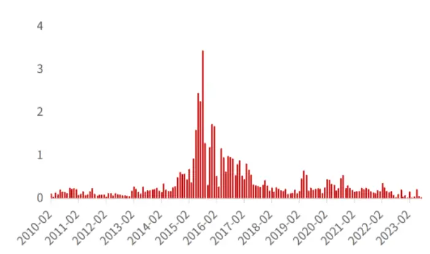
资料来源：Wind，光大证券研究所；注：数据起止日期为：2010.02.01-2023.07.31

## 5、 总结

大宗交易近年来持续火热，发生大宗交易的股票在市场中的数量占比较高，大宗交易由于其保护隐私的特性，买卖双方进行大宗交易的细节不得而知。但是，我们可以通过统计分析，探究其背后蕴含的信息。

按照市值将样本进行划分。可以发现，大宗交易股票整体在各市值区间分布较为均匀。从行业角度来看，大宗交易次数最多的前 5 大中信一级行业依次为医药、电子、机械、基础化工和计算机；次数最少的前 5 大中信一级行业依次为综合金融、煤炭、综合、消费者服务和钢铁。

根据交易所公布的买卖双方的信息，我们从买卖双方名称中提取关键词，进而将买卖双方席位划分为：营业部席位、机构席位以及自营席位。从三种席位的样本量来看，买方席位和卖方席位均以“营业部席位”为主，其次为“机构席位”，而“自营席位”占比较低。

根据大宗交易的成交价格，我们计算了对应股票大宗交易的成交价格相对于竞价交易收盘价的折溢价情况。从折溢价来看，大宗交易主要以折价交易为主，且折价率多集中在 15%以内。

通过事件研究方法，我们对大宗交易折溢价率、买卖双方席位、股票大宗交易时价格分位、大宗交易成交金额比率、股票 6 日成交金额波动率这 5 个指标进行探讨，发现这些指标均对股价后续走势起到不同程度的正向影响。

从时序上对上述指标进行回溯测试，以上 5 个指标中“大宗交易成交金额比率”和“股票 6 日成交金额波动率”两指标能够获取较为可观的超额收益，其余指标对提升超额收益作用有限。

经过测算，“大宗交易成交金额比率”越高、“6 日成交金额波动率”越低的股票，其后续表现更佳。因此，我们根据“高成交、低波动”原则，通过月频调仓方式构造大宗交易组合。从 2010.02.01 至 2023.07.31，该组合获取较为可观的超额收益——组合总收益率 938.30%，年化收益率 19.54%，相对中证全指年化超额收益率 16.41%。

## 6、 风险分析

报告结果均基于历史数据，历史数据存在不被重复验证的可能。

## 行业及公司评级体系

| 评级 说明 |  |  |
| --- | --- | --- |
|  | 买入 | 未来6-12个月的投资收益率领先市场基准指数15%以上 |
|  | 增持 | 未来 6-12 个月的投资收益率领先市场基准指数 5%至 15%; |
|  | 中性 | 未来6-12个月的投资收益率与市场基准指数的变动幅度相差-5%至5%； |
|  | 减持 | 未来 6-12 个月的投资收益率落后市场基准指数 5%至 15%; |
| 行业及公司评级 | 卖出 | 未来6-12个月的投资收益率落后市场基准指数15%以上； |
|  | 无评级 | 因无法获取必要的资料，或者公司面临无法预见结果的重大不确定性事件，或者其他原因，致使无法给出明确的投资评级。 |
|  | 基准指数说明： | A股市场基准为沪深300指数；香港市场基准为恒生指数；美国市场基准为纳斯达克综合指数或标普500指数。 |

## 分析、估值方法的局限性说明

本报告所包含的分析基于各种假设，不同假设可能导致分析结果出现重大不同。本报告采用的各种估值方法及模型均有其局限性，估值结果不保证所涉及证券能够在该价格交易。

## 分析师声明

本报告署名分析师具有中国证券业协会授予的证券投资咨询执业资格并注册为证券分析师，以勤勉的职业态度、专业审慎的研究方法，使用合法合规的信息，独立、客观地出具本报告，并对本报告的内容和观点负责。负责准备以及撰写本报告的所有研究人员在此保证，本研究报告中任何关于发行商或证券所发表的观点均如实反映研究人员的个人观点。研究人员获取报酬的评判因素包括研究的质量和准确性、客户反馈、竞争性因素以及光大证券股份有限公司的整体收益。所有研究人员保证他们报酬的任何一部分不曾与，不与，也将不会与本报告中具体的推荐意见或观点有直接或间接的联系。

## 法律主体声明

本报告由光大证券股份有限公司制作，光大证券股份有限公司具有中国证监会许可的证券投资咨询业务资格，负责本报告在中华人民共和国境内（仅为本报告目的，不包括港澳台）的分销。本报告署名分析师所持中国证券业协会授予的证券投资咨询执业资格编号已披露在报告首页。

中国光大证券国际有限公司和 Everbright Securities(UK) Company Limited 是光大证券股份有限公司的关联机构。

## 特别声明

光大证券股份有限公司（以下简称“本公司”）成立于 1996 年，是中国证监会批准的首批三家创新试点证券公司之一，也是世界 500 强企业——中国光大集团股份公司的核心金融服务平台之一。根据中国证监会核发的经营证券期货业务许可，本公司的经营范围包括证券投资咨询业务。

本公司经营范围：证券经纪；证券投资咨询；与证券交易、证券投资活动有关的财务顾问；证券承销与保荐；证券自营；为期货公司提供中间介绍业务；证券投资基金代销；融资融券业务；中国证监会批准的其他业务。此外，本公司还通过全资或控股子公司开展资产管理、直接投资、期货、基金管理以及香港证券业务。

本报告由光大证券股份有限公司研究所（以下简称“光大证券研究所”）编写，以合法获得的我们相信为可靠、准确、完整的信息为基础，但不保证我们所获得的原始信息以及报告所载信息之准确性和完整性。光大证券研究所可能将不时补充、修订或更新有关信息，但不保证及时发布该等更新。

本报告中的资料、意见、预测均反映报告初次发布时光大证券研究所的判断，可能需随时进行调整且不予通知。在任何情况下，本报告中的信息或所表述的意见并不构成对任何人的投资建议。客户应自主作出投资决策并自行承担投资风险。本报告中的信息或所表述的意见并未考虑到个别投资者的具体投资目的、财务状况以及特定需求。投资者应当充分考虑自身特定状况，并完整理解和使用本报告内容，不应视本报告为做出投资决策的唯一因素。对依据或者使用本报告所造成的一切后果，本公司及作者均不承担任何法律责任。

不同时期，本公司可能会撰写并发布与本报告所载信息、建议及预测不一致的报告。本公司的销售人员、交易人员和其他专业人员可能会向客户提供与本报告中观点不同的口头或书面评论或交易策略。本公司的资产管理子公司、自营部门以及其他投资业务板块可能会独立做出与本报告的意见或建议不相一致的投资决策。本公司提醒投资者注意并理解投资证券及投资产品存在的风险，在做出投资决策前，建议投资者务必向专业人士咨询并谨慎抉择。

在法律允许的情况下，本公司及其附属机构可能持有报告中提及的公司所发行证券的头寸并进行交易，也可能为这些公司提供或正在争取提供投资银行、财务顾问或金融产品等相关服务。投资者应当充分考虑本公司及本公司附属机构就报告内容可能存在的利益冲突，勿将本报告作为投资决策的唯一信赖依据。

本报告根据中华人民共和国法律在中华人民共和国境内分发，仅向特定客户传送。本报告的版权仅归本公司所有，未经书面许可，任何机构和个人不得以任何形式、任何目的进行翻版、复制、转载、刊登、发表、篡改或引用。如因侵权行为给本公司造成任何直接或间接的损失，本公司保留追究一切法律责任的权利。所有本报告中使用的商标、服务标记及标记均为本公司的商标、服务标记及标记。

光大证券股份有限公司版权所有。保留一切权利。

光大证券研究所

上海

北京

深圳

静安区南京西路 1266 号

西城区武定侯街 2 号

福田区深南大道 6011 号

恒隆广场 1 期办公楼 48 层

泰康国际大厦 7 层

NEO 绿景纪元大厦 A 座 17 楼

光大证券股份有限公司关联机构

香港

中国光大证券国际有限公司

香港铜锣湾希慎道 33 号利园一期 28 楼

英国

Everbright Securities(UK) Company Limited

6th Floor, 9 Appold Street, London, United Kingdom, EC2A 2AP