## 金融工程

# 多角度解析定向增发中的投资机会——量化选股系列报告之十二

## 要点

## 再融资政策再次收紧

2023 年 8 月，再融资政策自 2020 年宽松后，再次收紧。定增市场的现状也引发众多投资者关注，定向增发事件效应是否还能有效？涉及定向增发的股票是否还具备投资价值？带着这些疑问，本文对定向增发的事件效应进行了细致的分析，从中挖掘潜在的投资机会。

我们对最新再融资优化措施中提及的破净、经营业绩持续亏损、财务性投资比例偏高的样本进行统计。从结果来看，破净样本总体偏少，近年来经营业绩持续亏损的样本占比逐年增加，财务性投资比例偏高的样本占比较高。结合再融资收紧的新形势，我们预计定增数量和规模会进一步下滑，破净、经营业绩持续亏损、财务性投资比例偏高的定增项目数量会持续收缩。

## 定增规模自 2022 年起开始下滑

从成功发行的定增项目来看，定增规模自 2022 年起开始下滑。从上市公司定增目的来看，多数定增目的为项目融资、融资收购其他资产和配套融资。从行业来看，定增项目多集中于机械、基础化工、电子、医药、电力设备及新能源。从定增参与方来看，定增参与方以机构投资者、境内自然人和大股东为主。

除重大资产重组外，定增定价基准日可以从本次发行股票的董事会决议公告日、股东大会决议公告日以及发行期首日中选择。从统计结果来看，定价基准日主要为董事会决议公告日。从定价方式来看，基准日为董事会决议公告日时，多以“定价”为主，而若基准日为发行期首日，定价方式多为“竞价”。

## 定增各流程节点后，长期持有股票，均能获取正向超额收益

我们对定增各流程节点前后的事件效应进行了分析。从测算结果来看，在各流程节点后，长期持有股票，均能获取正向超额收益，在股东大会公告后买入，效果最佳。此外，满足“大股东以现金参与”、“定价基准日为董事会决议公告日”和“定增目的为壳资源重组等”时，能够获取可观的超额收益，但从时序上来看，超额收益并不持续。

## 基于定增样本构造事件驱动策略，策略表现良好

定增样本多数为小盘股，市值因素在定增股票池中区分度非常明显。因此，我们认为，市值是重要的参考因素。综合事件测算结果，我们以股东大会公告日为时间节点，综合考虑市值因素、调仓周期以及对仓位的控制，我们构造了定向增发事件驱动选股组合，该组合自 2006.06.22-2023.10.31，总收益率 1546.33%，年化收益率 18.04%，超额年化收益率 9.86%。

风险分析：报告结果均基于历史数据，历史数据存在不被重复验证的可能；政策存在变化的可能。

## 作者

分析师：祁嫣然

执业证书编号：S0930521070001

010-56513031

qiyanran@ebscn.com

联系人：张威

010-56513039

zhangw@ebscn.com

2023 年 8 月，证监会根据当前市场形势，对上市公司再融资节奏作出适当安排。对于存在破发、破净、经营业绩持续亏损、财务性投资比例偏高等情形的上市公司再融资，适当限制其融资间隔、融资规模。2023 年 11 月，沪深交易所发布了优化再融资的具体措施，明确了优化再融资监管安排的具体举措。

本次再融资收紧，是继 2020 年再融资宽松后，政策的再一次变革。定增市场的现状也引发众多投资者关注，定向增发事件效应是否还能有效？涉及定向增发的股票是否还具备投资价值？带着这些疑问，本文对定向增发的事件效应进行了细致的分析，从中挖掘潜在的投资机会。

## 1、 定向增发简介

上市公司向符合条件的特定投资者，通过非公开发行股票的方式发行股票，称为定向增发。定向增发募集的资金通常用来补充流动资金、资产收购、项目融资、引入战略投资者等。

定向增发的相关政策最早可追溯至 2006 年。2006 年 5 月 6 日，中国证监会发布《上市公司证券发行管理办法》，该文件对发行对象、发行价格、锁定期限等作了明确的规定。

2007 年 9 月 17 日，证监会发布《上市公司非公开发行股票细则》。该文件对非公开发行股票中的定价基准日期、发行对象、锁定期限等再次作了详细的说明。

2008 年 4 月 16 日，证监会发布《上市公司重大资产重组管理办法》，该文件同样对发行价格、锁定期限等作了明确的规定。

上市公司非公开发行股票，依据上述三则文件进行。经过 10 多年的发展，上述三则文件经过多次修订，定向增发的监管也日趋完善。此外，证监会先后针对创业板、科创板和北交所的上市公司发布相关文件。

图 1：定增现行政策
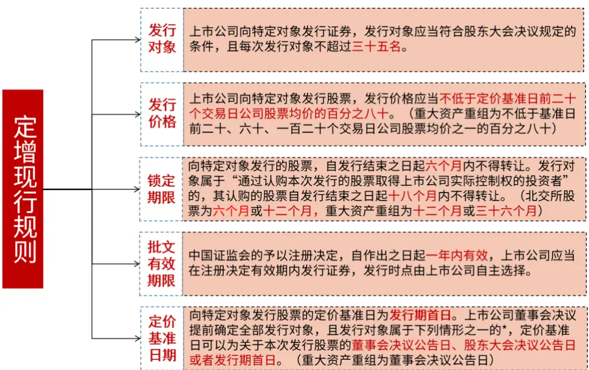
资料来源：中国证监会，光大证券研究所绘制；图中定价基准日中所表述的“下列情形”为：（一）上市公司的控股股东、实际控制人或者其控制的关联人；（二）通过认购本次发行的股票取得上市公司实际控制权的投资者；（三）董事会拟引入的境内外战略投资者。

依据《上市公司证券发行注册管理办法》（20230217）、《上市公司重大资产重组管理办法》（20230217）、《创业板上市公司证券发行注册管理办法（试行）》（20200612）、《科创板上市公司证券发行注册管理办法（试行）》（20200703）和《北京证券交易所上市公司证券发行注册管理办法》（20230217），我们梳理了现行定增政策的条款细则。

定向增发的一般流程为：首先，由上市公司董事会提起预案；然后经由股东大会表决；表决通过后报送发审委/上市委审核；审核通过后报送证监会审批；证监会批准后，即可开启定增股份上市流程。

定增各流程之间的时长并不固定，我们统计了主要流程之间的日期间隔情况。从董事会提起预案到股东大会表决，用时约 21 日；股东大会表决到发审委/上市委审核，用时约 119 日；发审委/上市委审核完毕，到证监会审批结束，用时约 38日；证监会审批结束至公布定增公告，用时约 51 日。

图 2：定增流程示意图
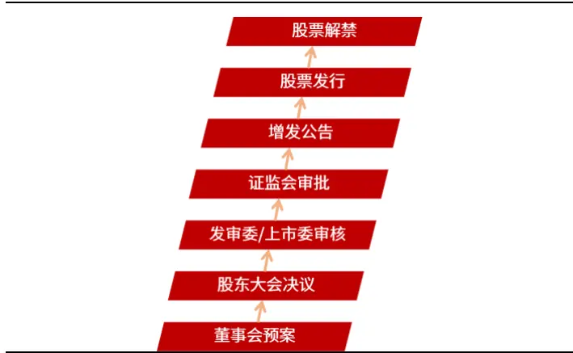
资料来源：Wind，光大证券研究所绘制

图 3：定增流程间隔天数
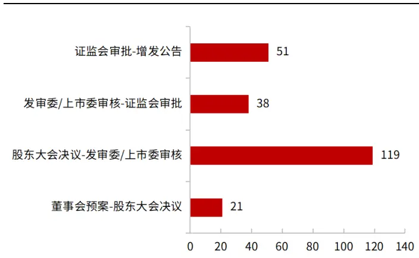
资料来源：Wind，光大证券研究所；注：图中间隔天数为中位数；统计区间为：2006.01.01-2023.10.31

## 2、定向增发数据特征

## 2.1、 数据简介及预处理

定向增发数据取自 Wind数据库 AShareSEO（中国 A 股增发），数据起止日期为：2006 年 1 月 1 日至 2023 年 10 月 31 日；样本量约 1 万余条。通过对数据梳理，我们发现数据存在以下问题：

- 初始预案日期晚于预案日期：或因数据商记录日期错位造成，对此，我们进行了修正。

- 存在重复样本：重复样本是普遍存在的情况。例如：上市公司在融资收购其他资产时，会进行配套融资，因此数据商会进行两次记录。针对这类重复样本，在具体分析时，若无特别说明，则默认去重。

- 初始预案日期远早于预案公告日期：这是由于上市公司在进行首次预案后，由于各种原因，对预案进行了修订。数据商在记录时，会不停更新原有信息，进而遗漏定增流程中的部分信息。

下图展示了福鞍股份（603315.SH）一次真实定增流程过程中的信息和数据商记录的信息。从图中可以发现，福鞍股份在 2022 年 5 月 19 日公布董事会初始预案后，截至 2023 年 6 月 29 日终止发行，中间有多个流程节点，但是数据商不断更新原有信息，造成我们仅仅能够获取真实流程中的部分信息。

我们对定向增发流程中初始预案日期与预案日期是否异同进行了相应统计。若两者一致，则说明在定向增发流程中，上市公司未对预案进行修订；若不一致，则说明进行了修订。

由统计结果可知，早年间进行过修订的样本极少、甚至没有出现过修订的情况，在 2016-2018 年，修订过的样本占比较高，之后的年份也均存在有进行过修订的样本的情况。

图 4：福鞍股份（603315.SH）一次完整定增流程

| 时间节点 | 真实流程 | Wind记录 |
| --- | --- | --- |
| 2022-05-19 | 董事会初始预案公告 | 初始预案公告 |
| 2022-06-16 | 修改预案 |  |
| 2022-08-09 | 股东大会公告 |  |
| 2022-10-20 | 董事会修改预案 |  |
| 2022-11-04 | 发审委/上市委未通过 |  |
| 2022-11-17 | 证监会未通过 |  |
| 2023-01-31 | 董事会预案 | 预案公告 |
| 2023-03-10 | 董事会修改预案公告 |  |
| 2023-03-28 | 股东大会公告 | 股东大会公告 |
| 2023-04-28 | 上交所终止审核 |  |
| 2023-06-29 | 终止发行 | 终止发行 |

资料来源：Wind，光大证券研究所

图 5：修改预案与否的情况
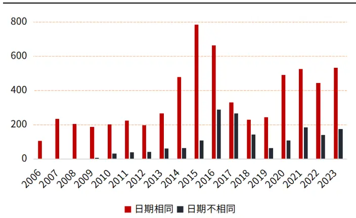
资料来源：Wind，光大证券研究所；注：统计区间为：2006.01.01-2023.10.31；单位：家；按照增发年度统计

## 2.2、 定增总体规模变化趋势

我们统计了历年定增的规模和数量。剔除同一定增事件后，定增的上市公司数量在 2016 年达到顶峰，随后回落；从 2020 年再融资新规发布后，定增数量开始提升；从成功发行的定增规模来看，自 2022 年起开始下滑。结合再融资收紧的新形势，我们预计定增数量和规模会进一步下滑。

图 6：历年定增数量
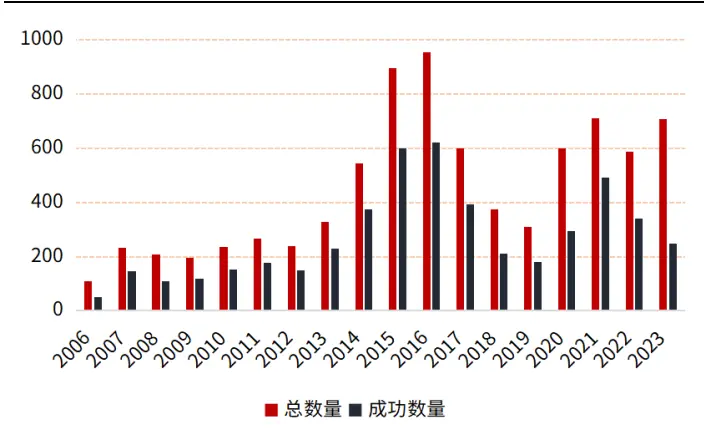
资料来源：Wind，光大证券研究所；注：统计区间为 2006.01.01-2023.10.31；单位：家

图 7：历年定增规模（成功样本）
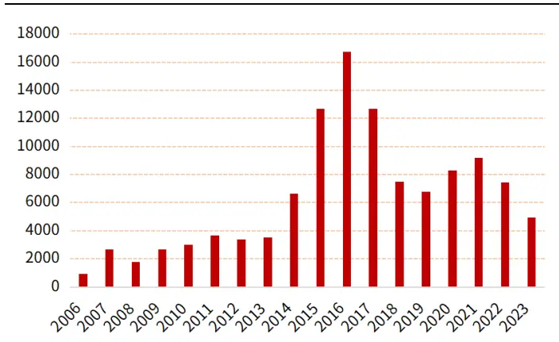
资料来源：Wind，光大证券研究所；注：统计区间为 2006.01.01-2023.10.31；单位：亿元

## 2.3、 项目融资、融资收购其他资产为定增的主要目的

上市公司开展定增的目的共分为 9 类：项目融资、融资收购其他资产、配套融资、补充流动资金、集团公司整体上市、壳资源重组、实际控制人资产注入、引入战略投资者、公司间资产置换重组。

从全样本来看，定增目的中占比最高的前四类依次为：项目融资（41.12%）、融资收购其他资产（22.44%）、配套融资（17.72%）和补充流动资金（9.56%）。

图 8：定增目的分布
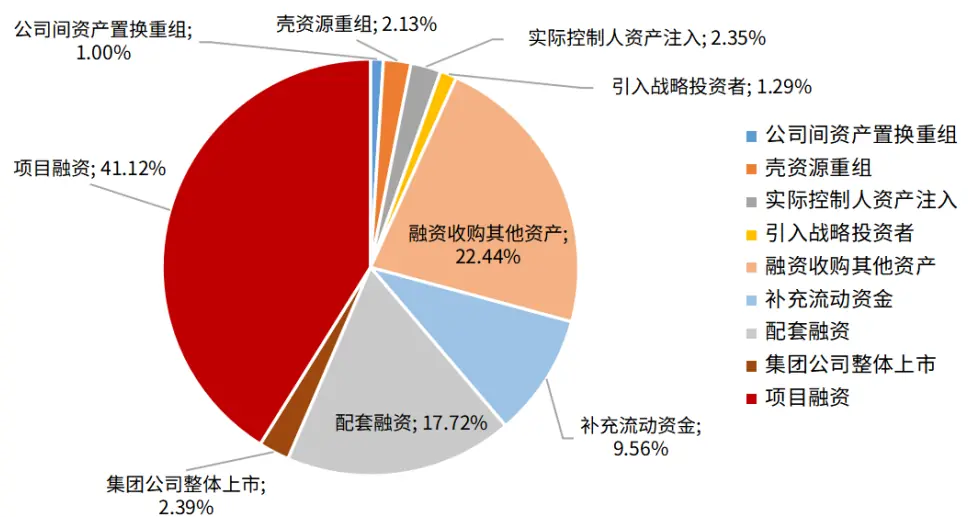
资料来源：Wind，光大证券研究所；注：统计区间为 2006.01.01-2023.10.31；按照定增项目数（未剔除重复样本）统计

## 2.4、 机械、基础化工、电子和医药行业定增项目较多

按照中信一级行业分类来看，定增数量排名靠前的 5 个行业依次为机械、基础化工、电子、医药、电力设备及新能源，排名靠后的 5 个行业依次为非银行金融、石油石化、煤炭、银行和综合金融。

图 9：各行业定增样本量
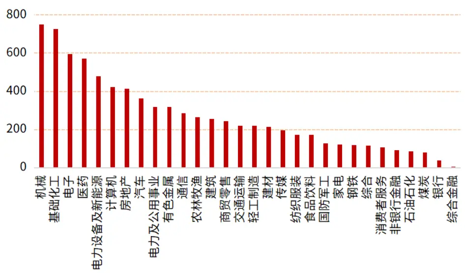
资料来源：Wind，光大证券研究所；注：统计区间为 2006.01.01-2023.10.31；单位：家

细分年度来看，近年来，机械、基础化工、医药、电力设备及新能源、电力及公用事业、电子和计算机行业定增数量较多。

图 10：各行业定增样本量（年度）

| 中信一级行业 | 2006 | 2007 | 2008 | 2009 | 2010 | 2011 | 2012 | 2013 | 2014 | 2015 2016 |  | 2017 | 2018 | 2019 | 2020 | 2021 2022 |  | 2023 |  |
| --- | --- | --- | --- | --- | --- | --- | --- | --- | --- | --- | --- | --- | --- | --- | --- | --- | --- | --- | --- |
| 交通运输传媒农林牧渔医药商贸零售国防军工基础化工家电建材建筑房地产有色金属机械汽车消费者服务煤炭电力及公用事业电力设备及新能源电子石油石化纺织服装综合综合金融计算机轻工制造通信钢铁银行非银行金融食品饮料 | 6 | 9 | 9 | 12 | 7 | 8 | 8 | 8 | 9 | 18 | 22 | 10 | 18 | 10 | 10 | 24 17 |  | 15 |  |
|  | 2 |  | 2 |  | 2 |  | 6 | 10 | 19 | 24 | 25 | 20 | 13 | 6 | 21 | 20 11 |  | 13 |  |
|  | 3 | 7 | 14 | 5 | 11 | 12 | 5 | 13 | 22 | 29 | 33 | 18 | 11 | 9 | 19 | 14 20 |  | 19 |  |
|  | 2 | 21 | 11 | 6 | 16 | 14 | 17 | 22 | 36 | 74 | 72 | 34 | 30 | 14 | 51 | 46 | 50 | 55 |  |
|  | 8 | 9 | 8 | 12 | 10 | 13 | 14 | 14 | 17 | 22 | 28 | 12 | 14 | 7 | 17 | 14 | 9 | 15 |  |
|  | 1 | 3 | 5 | 3 | 5 | 1 | 6 | 6 | 2 | 1 | 12 | 8 | 10 | 5 | 9 | 15 | 11 | 19 |  |
|  | 10 | 19 | 11 | 16 | 12 | 25 | 29 | 31 | 33 | 71 | 90 | 46 | 35 | 29 | 55 | 66 | 76 | 73 |  |
|  | 3 | 6 |  | 2 | 7 | 7 | 5 | 3 | 12 | 14 | 23 | 8 | 3 | 2 | 7 | 8 | 6 | 6 |  |
|  | 3 | 8 | 5 | 4 | 9 | 17 | 9 | 9 | 20 | 22 | 24 | 18 | 6 | 5 | 11 | 18 | 12 | 14 |  |
|  | 2 | 4 | 2 | 7 | 6 | 4 | 4 | 8 | 16 | 29 | 30 | 23 | 14 | 11 | 35 | 18 | 20 | 23 |  |
|  | 10 | 34 | 20 | 39 | 28 | 10 | 7 | 21 | 33 | 51 | 58 | 20 | 14 | 14 | 20 | 2 | 11 | 20 |  |
|  | 10 | 15 | 20 | 8 | 8 | 15 | 2 | 17 | 23 | 32 | 33 | 22 | 16 | 12 | 18 | 17 | 24 | 26 |  |
|  | 4 | 14 | 10 | 12 | 17 | 20 | 10 | 25 | 49 | 75 | 82 | 75 | 32 | 31 | 59 | 78 | 71 | 85 |  |
|  | 11 | 12 | 12 | 6 | 15 | 10 | 8 | 10 | 32 | 33 | 37 | 31 | 16 | 15 | 22 | 34 | 22 | 37 |  |
|  |  | 3 | 5 | 2 | 5 | 7 | 7 | 4 | 7 | 13 | 11 | 8 | 1 | 4 | 4 | 13 | 8 | 4 |  |
|  | 2 | 6 | 4 | 3 | 3 | 7 | 6 | 5 | 4 | 10 | 8 | 5 | 1 | 3 | 1 | 2 | 5 | 4 |  |
|  | 4 | 9 | 7 | 6 | 15 | 14 | 12 | 15 | 16 | 29 | 37 | 25 | 15 | 16 | 21 | 24 | 29 | 25 |  |
|  | 4 | 8 | 6 | 8 | 10 | 10 | 13 | 19 | 27 | 55 | 48 | 36 | 16 | 15 | 35 | 62 | 44 | 63 |  |
|  | 3 | 6 | 11 | 8 | 14 | 14 | 17 | 24 | 39 | 75 | 60 | 40 | 27 | 29 | 53 | 73 | 47 | 56 |  |
|  | 2 | 4 | 4 |  |  | 3 | 4 | 2 | 9 | 10 | 10 | 6 | 8 | 2 | 6 | 2 | 4 | 9 |  |
|  | 3 | 5 | 4 | 8 | 7 | 3 | 7 | 3 | 16 | 21 | 26 | 19 | 10 | 6 | 11 | 11 | 4 | 8 |  |
|  |  |  | 3 | 7 | 2 | 3 | 5 | 6 | 5 | 12 | 9 | 15 | 7 | 5 | 7 | 6 | 9 | 7 | 8 |
|  |  |  |  |  |  |  |  |  |  |  |  |  |  |  | 1 | 3 | 1 |  |  |
|  |  | 3 | 5 | 5 | 4 | 5 | 6 | 12 | 31 | 54 | 60 | 36 | 19 | 20 | 41 | 50 | 26 | 45 |  |
|  | 3 | 7 | 5 | 5 | 6 | 9 | 3 | 8 | 12 | 30 | 30 | 16 | 10 | 9 | 11 | 21 | 16 | 19 |  |
|  | 3 | 2 | 5 | 3 | 5 | 9 | 7 | 16 | 18 | 45 | 38 | 28 | 8 | 12 | 23 | 30 | 13 | 19 |  |
|  | 6 | 4 | 6 | 7 | 1 | 6 | 8 | 11 | 10 | 13 | 12 | 11 | 3 | 5 | 5 | 5 | 3 | 2 |  |
|  |  | 2 | 1 |  | 3 | 3 | 3 | 1 | 3 | 3 | 2 | 3 | 2 | 1 | 4 | 3 | 1 | 3 |  |
|  | 2 | 2 | 4 |  | 1 | 3 | 6 | 3 | 6 | 9 | 12 | 4 | 5 | 2 | 10 | 8 | 7 | 8 |  |
|  | 1 | 5 | 5 | 6 | 3 | 9 | 4 | 4 | 12 | 18 | 17 | 9 | 10 | 8 | 15 | 21 | 9 | 15 |  |

资料来源：Wind，光大证券研究所；注：统计区间为 2006.01.01-2023.10.31；单位：家；图中无值表示无定增项目，按照年度绘制颜色深浅

## 2.5、 定增样本主要为小盘股

我们按照市值“小于等于 100 亿”、“100 亿~200 亿”、“200 亿~500 亿”和“大于 500 亿”将样本分为 4 组。按照年度来看，定增样本主要为小盘股，市值在 100 亿以内的样本，历年平均占比约 76%。

我们统计定增样本股票在沪深 300、中证 500 以及中证 1000 成分股中的情况。从历史来看，定增样本中，历年平均 12%的股票为沪深 300 指数成分股、18%的股票为中证 500 指数成分股、15%的股票为中证 1000 指数成分股、56%的股票为前述 1800 只指数成分股以外的小盘股。

图 11：定增样本市值分布（年度）
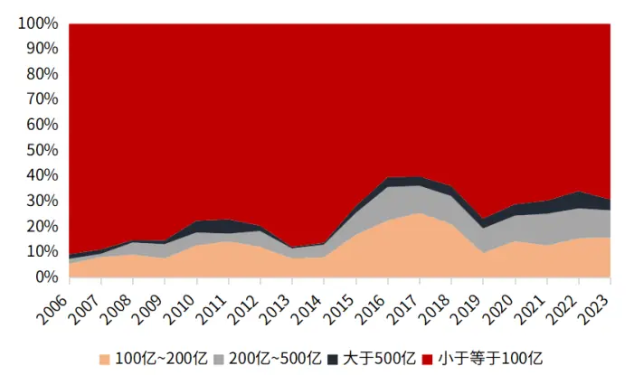
资料来源：Wind，光大证券研究所；注：统计区间为 2006.01.01-2023.10.31

图 12：定增样本在宽基指数的分布（年度）
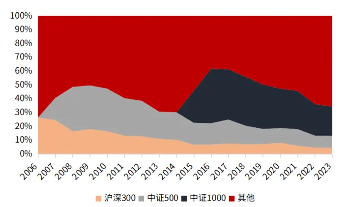
资料来源：Wind，光大证券研究所；注：统计区间为 2006.01.01-2023.10.31

## 2.6、 定增参与方多为机构投资者、境内自然人和大股东

定向增发的发行对象通常为：大股东、大股东关联方、境内自然人、境外自然人、境内机构投资者、境外机构投资者。

我们统计了定增参与方类型数量的分布和各类型的占比。从结果来看，多数定增项目的参与方类型在 3 种以内（占比高达 99%）；从参与方占比来看，发行对象以机构投资者、境内自然人和大股东为主，三者累计占比达 88.89%。

图 13：定增参与方类型数量分布
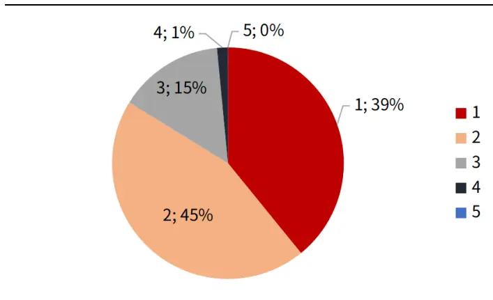
资料来源：Wind，光大证券研究所；注：统计区间为 2006.01.01-2023.10.31

图 14：定增参与方分布
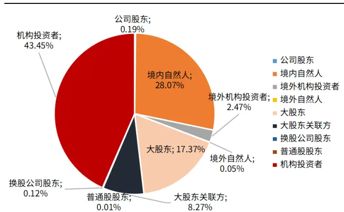
资料来源：Wind，光大证券研究所；注：统计区间为 2006.01.01-2023.10.31

## 2.7、 定价基准日多以董事会决议公告日为准

定向增发股票价格的定价方式分为“定价”和“竞价”，我们对两类情形的占比情况进行统计。从时序上来看，两者差距总体并不明显，“竞价”方式历年平均占比为 53%，“定价”方式历年平均占比为 47%。

定价方式的不同还与定价基准日有关。从定价基准日类型和定价方式两个维度来看，定价基准日主要为董事会决议公告日、发行期首日；从定价方式来看，董事会决议公告日多以“定价”为主，而若基准日为发行期首日，定价方式多为“竞价”。

图 15：定增定价方式分布（年度）
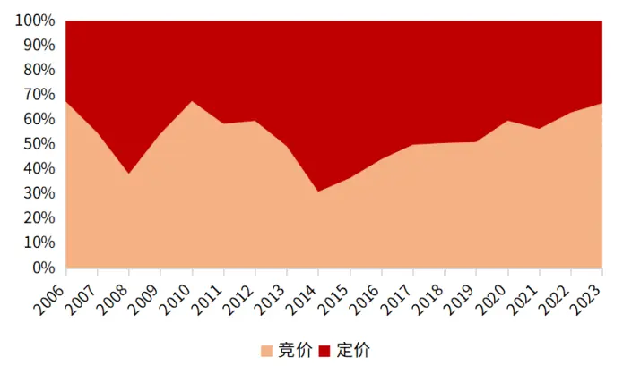
资料来源：Wind，光大证券研究所；注：统计区间为 2006.01.01-2023.10.31；未剔除重复样本

图 16：定增基准日类型与定价方式分布
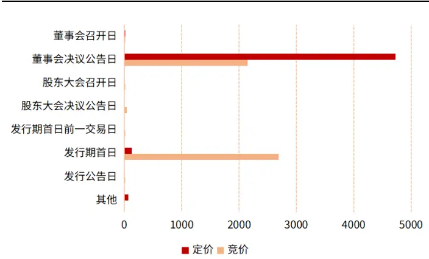
资料来源：Wind，光大证券研究所；注：统计区间为 2006.01.01-2023.10.31；单位：家；未剔除重复样本

## 2.8、 破净样本总体偏少，财务性投资比例偏高样本较多

2023 年 8 月，证监会根据当前市场形势，对上市公司再融资节奏作出适当安排。对于存在破发、破净、经营业绩持续亏损、财务性投资比例偏高等情形的上市公司再融资，适当限制其融资间隔、融资规模。2023 年 11 月，沪深交易所发布了优化再融资的具体措施，明确了优化再融资监管安排的具体举措。

我们对本次再融资收紧下提及的破净、经营业绩持续亏损、财务性投资比例偏高的情形进行统计。从破净与否来看，近年来破净样本有所增加。2023 年以来，约 5%左右的上市公司存在破净的情形。

优化再融资监管安排要求：“上市公司最近两个会计年度归属于母公司净利润（扣除非经常性损益前后孰低）连续亏损的，本次再融资预案董事会决议日距离前次募集资金到位日不得低于十八个月。”从最近两年连续亏损与否来看，近年来满足“最近两年连续亏损”的样本比例持续增加。

图 17：破净与否样本分布（年度）
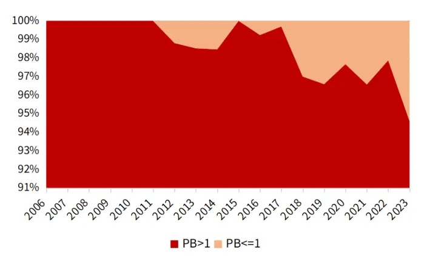
资料来源：Wind，光大证券研究所；注：统计区间为 2006.01.01-2023.10.31

图 18：最近两年连续亏损与否样本分布（年度）
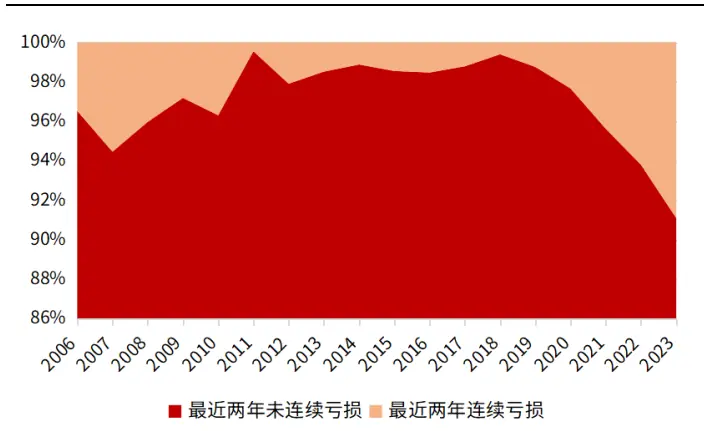
资料来源：Wind，光大证券研究所；注：统计区间为 2006.01.01-2023.10.31

对于财务性投资比例，我们以最近财务年度报告中的“交易性金融资产”、“长期股权投资”两科目作为财务性投资的指标，用两者之和除以当期总资产，用于衡量财务性投资比例的情况。我们以 5%为临界点，统计历年的情况。从结果来看，财务性投资比例较高的样本，历年平均占比约 17%。

图 19：财务性投资比例偏高与否分布（年度）
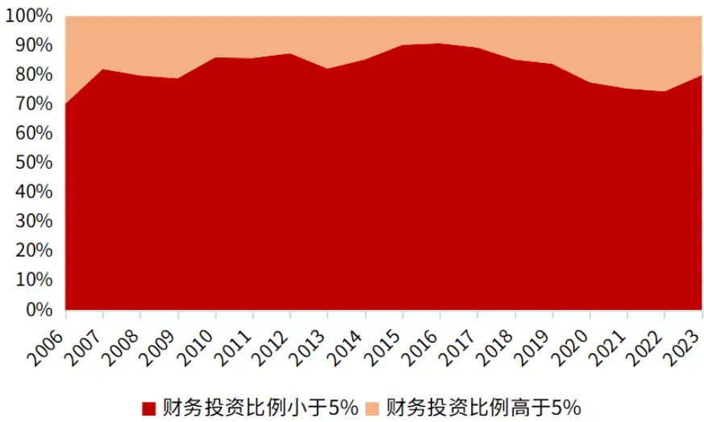
资料来源：Wind，光大证券研究所；注：统计区间为 2006.01.01-2023.10.31

## 3、定向增发收益全解析

本章，我们从多个角度对定向增发事件公告后，股票的市场表现进行统计。由于定向增发初始预案公告后，会存在部分股票涨停或者停牌等不可交易的情况。因此，在统计收益时，需要剔除掉不可交易样本。比较基准选取为中证全指；此外，剔除在定增初始预案时处于特别处理的股票和上市未满 1 年的股票。

## 3.1、 定增各流程节点后的情况

在初始预案公告后，部分股票会存在一字涨停或停牌的情形，这类股票无法买入。因此，我们统计了初始预案公告后，次日可交易样本和不可交易样本的情况。从统计结果来看，2013-2015 年，定向增发中不可交易的样本占比较多，不可交易样本在历年的平均占比约为 18%。

图 20：初始预案公告后次日可交易样本与不可交易样本的数量分布（年度）
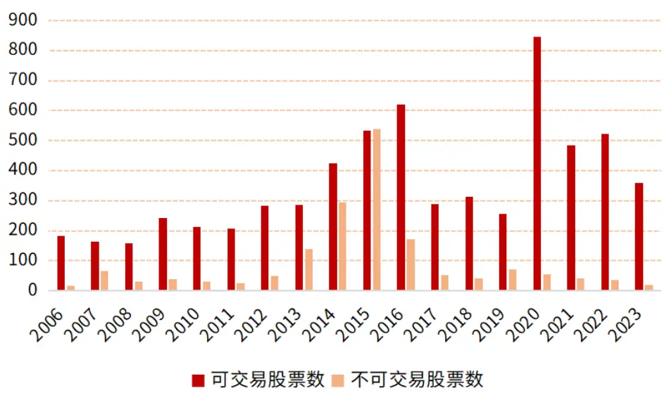
资料来源：Wind，光大证券研究所；注：统计区间为 2006.01.01-2023.10.31；单位：家

在不考虑可交易性的情况下，我们首先统计全样本的收益情况。在初始预案公告日附近时，正向超额收益明显，随后 120 个交易日内，能获取约 8%左右的超额收益。如果统计收益时，将一字涨停股票纳入统计，则会造成实际收益虚高。

因此，我们考虑直接剔除不可交易样本或者在涨停打开以及复牌后买入。从结果来看，无论哪种情形，超额收益均明显下滑。但可以发现，仍然有短暂的正向超额收益，这说明在开板和复牌的情形下，由于定增情绪的酝酿，股价会存在短暂的动量效应，随后开始反转。在经过约 10 个交易日后，股价开始回升。

对两种情形进行对比可以发现，在涨停打开以及复牌后买入，持有 120 个交易日的情形下，股票表现要略优于直接剔除。因此，在下文中对各流程节点的收益进行统计时，我们均采取涨停打开以及复牌后买入的方式。

图 21：初始预案公告日（全样本）
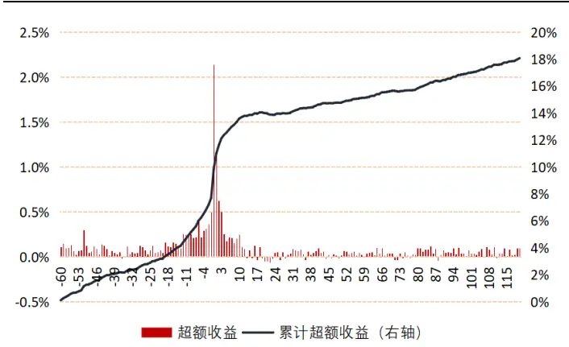
资料来源：Wind，光大证券研究所；注：统计区间为 2006.01.01-2023.10.31

图 22：初始预案公告日-累计超额收益
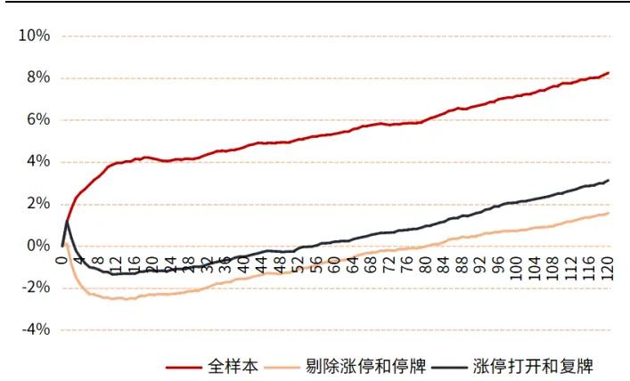
资料来源：Wind，光大证券研究所；注：统计区间为 2006.01.01-2023.10.31

由于市场环境的变化，上市公司可能对预案进行修改。那么修改过预案和未修改过预案的情形，股票表现是否一致呢？通过统计，未修改过预案的股票，在短时间内超额收益明显，随后超额收益回落。持有 120 个交易日来看，修改过预案的样本表现略优于未修改过预案的样本，但两者差距不大。

从股东大会来看，股东大会公告日前，正向超额收益明显。公告后短期内，存在短期的负向超额收益；长期持有，正向超额收益明显，从公告后持有 120 个交易日，平均能够获取 6.89%的超额收益。

图 23：修改过预案和未修改过预案
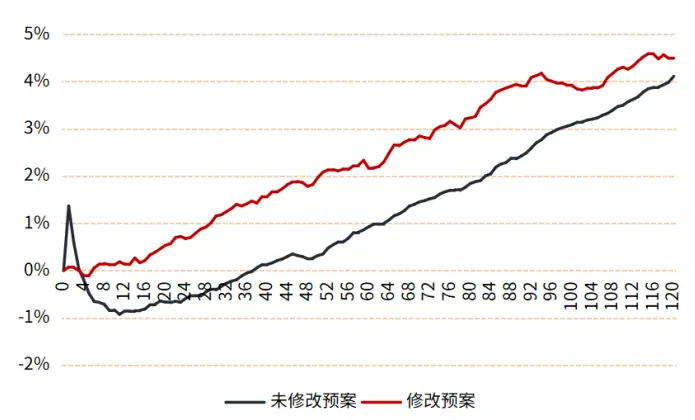
资料来源：Wind，光大证券研究所；注：统计区间为 2006.01.01-2023.10.31

图 24：股东大会公告后
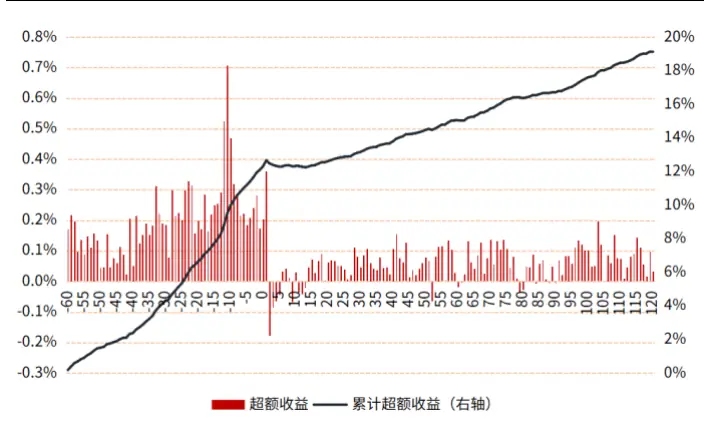
资料来源：Wind，光大证券研究所；注：统计区间为 2006.01.01-2023.10.31

如果发审委/上市委通过审核、证监会通过审批，说明定增项目受到监管层面认可，反映出正向的信号。我们对“发审委/上市委通过”、“证监会通过”这两个时间节点进行统计。

统计结论同股东大会公告后一致，公告前超额收益明显，公告后短期负向超额收益明显，长期持有能够获取明显的超额收益。在发审委/上市委通过后买入和证监会通过审批后买入，持有 120 个交易日情形下，分别能获取 5.07%、4.94%的超额收益。

图 25：发审委/上市委通过
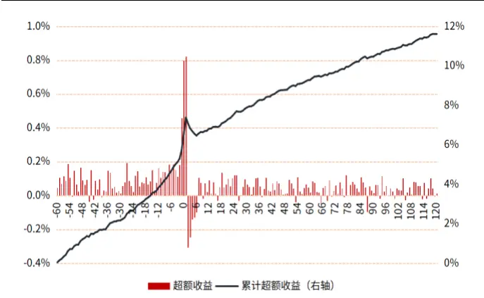
资料来源：Wind，光大证券研究所；注：统计区间为 2006.01.01-2023.10.31

图 26：证监会批准
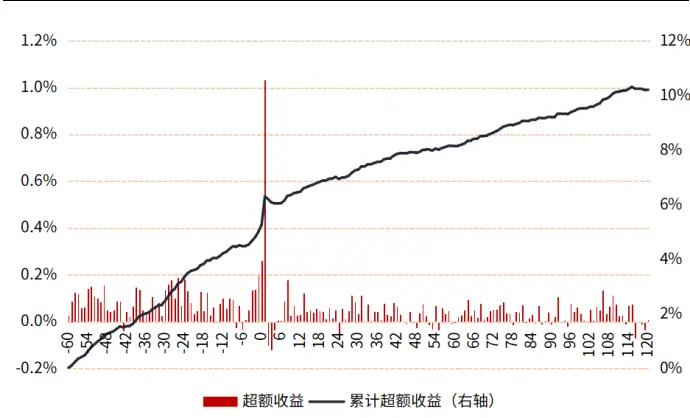
资料来源：Wind，光大证券研究所；注：统计区间为 2006.01.01-2023.10.31

定增项目通过证监会审批后，进入发行流程，成功发行后，在经过锁定期限后，股票解禁。我们对增发公告、股票解禁两个时间节点进行统计。

从增发公告的统计结果来看，结论与前文测算结论保持一致，持有 120 个交易日能够获取 2.73%的超额收益。从股票解禁日来看，解禁前负向超额收益明显，在解禁后，正向超额收益明显。

图 27：增发公告
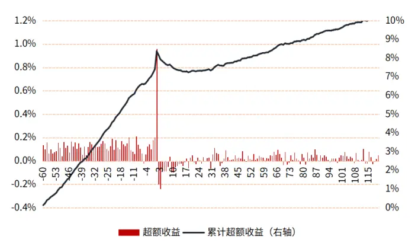
资料来源：Wind，光大证券研究所；注：统计区间为 2006.01.01-2023.10.31

图 28：解禁
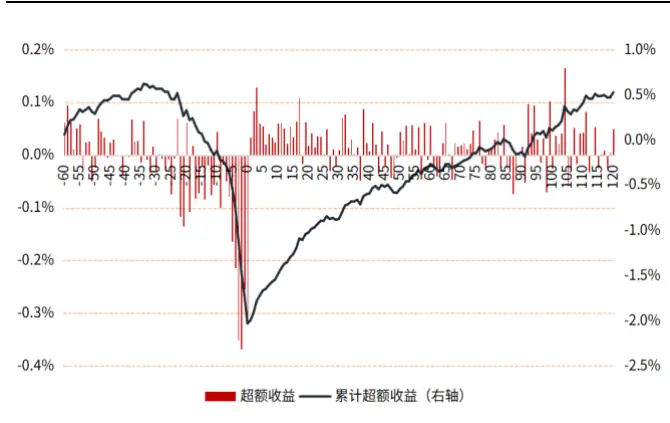
资料来源：Wind，光大证券研究所；注：统计区间为 2006.01.01-2023.10.31

综合上述测算结果，在股票涨停打开和复牌的前提下，从初始预案公告后、股东大会通过后、发审委/上市委通过后、证监会通过后、增发公告后、股票解禁后，分别买入股票，并持有 120 个交易日，分别能获取约 3.12%、6.89%、5.07%、4.94%、2.73%、2.56%的超额收益。

## 3.2、 定增失败的案例，公告前负向超额收益明显

定增项目会存在失败的情形，在定增各流程中，定增项目均可能失败。我们统计了定向增发失败的案例情况。定增失败的数量与总体样本量有关，2016 年定增失败的样本最多。

我们统计这些失败的案例，其股票在定增失败公告前后的表现。失败的案例在公告前负向超额收益明显；在公告后短期内存在负向超额收益，在约 10 个交易日后，股价开始修复。从公告后 120 个交易日内，可获取约 2.36%左右的超额收益。

图 29：失败案例数
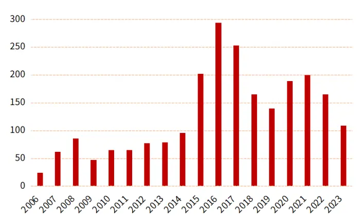
资料来源：Wind，光大证券研究所；注：统计区间为 2006.01.01-2023.10.31；单位：家

图 30：失败案例定增失败公告前后
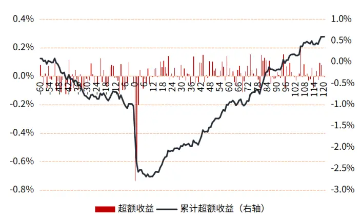
资料来源：Wind，光大证券研究所；注：统计区间为 2006.01.01-2023.10.31

## 3.3、 大股东参与的定增项目表现较好

定增项目的发行对象包含大股东，大股东参与定增的方式分为“现金参与”和“资产参与”。通常认为大股东参与定增项目，以及大股东愿意以现金参与定增项目，是大股东看好公司未来的发展前景，具有积极且正面的信号。

我们对大股东参与定增与否，以及大股东认购方式进行分组统计，买入时间点为初始预案公告日后，同样考虑涨停打开以及复牌。持有 120 个交易日来看，大股东参与定增项目以及大股东使用现金参与，股票表现均有明显提升。

图 31：大股东参与与否-累计超额收益
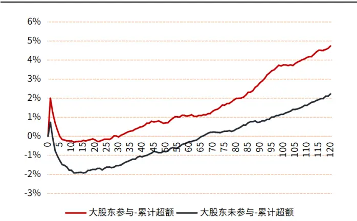
资料来源：Wind，光大证券研究所；注：统计区间为 2006.01.01-2023.10.31

图 32：大股东认购方式-累计超额收益
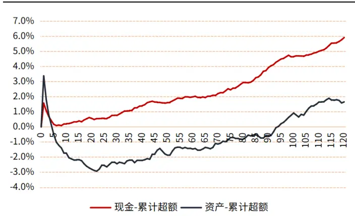
资料来源：Wind，光大证券研究所；注：统计区间为 2006.01.01-2023.10.31

## 3.4、 壳资源重组、董事会决议日为定价基准日的样本表现较好

我们按照定增目的分组测算，测算节点选择为初始预案公告日。按照定增目的分类来看，定增目的为壳资源重组的股票，表现最佳，在持有 120 个交易日后，可获取约 25%的超额收益。

通常，定增发行价格不能低于定价基准日前20个交易日公司股票均价的80%（不含重大资产重组）。从上市公司层面来看，发行底价越高越好，但是过高的发行底价也会损害定增参与方的利益。

从定增预案发布到定增发行日，周期较长。如果定价基准日为发行期首日，未来股价走势不得而知。但公司召开董事会的时间灵活，若在股价有一定涨幅，且定增参与方仍然存在一定投资收益空间的时候召开董事会，将定价基准日设置为董事会决议公告日，此时定增发行底价更为可控。

基于上述逻辑，我们认为以董事会决议公告日作为定价基准日的定增项目，比以发行期首日作为定价基准日的定增项目，其股票表现更好。从测算结果来看，从初始预案公告后买入，持有 120 个交易日，定价基准日为“董事会决议公告日”和“发行期首日”分别获取 4.66%、-2.17%的超额收益。

图 33：定增目的-累计超额收益
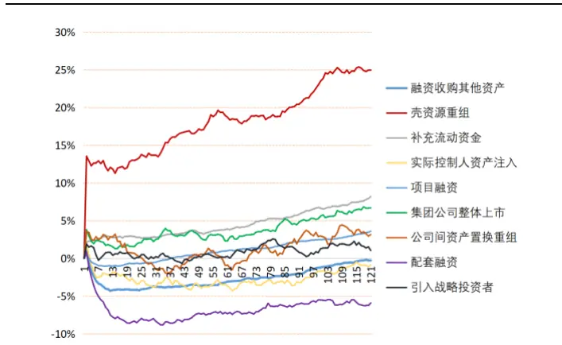
资料来源：Wind，光大证券研究所；注：统计区间为 2006.01.01-2023.10.31

图 34：定价基准日类型-累计超额收益
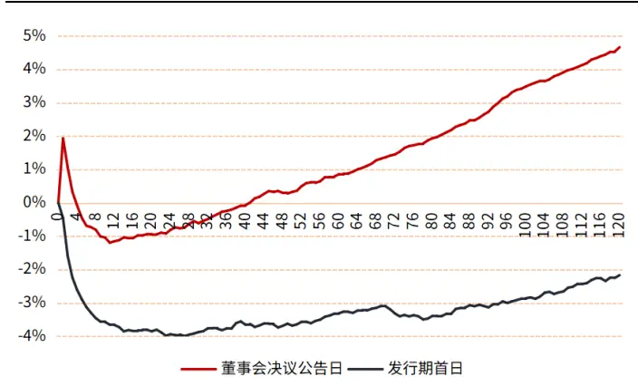
资料来源：Wind，光大证券研究所；注：统计区间为 2006.01.01-2023.10.31

## 3.5、 小市值效应在定增股票池中明显

根据第二章的统计结果，定增样本主要为小市值股票。小市值效应在定增股票池中是否仍然存在呢？我们进行了相应测算。我们按照市值从小到大，将样本均分为 5 组（依次为 group1-group5)，分别统计全样本和历年的情况。

从全样本来看，5 组单调性明显。从历年来看，除 2017 年外，其余年份，小市值效应均存在。

图 35：市值分组测试-累计超额收益
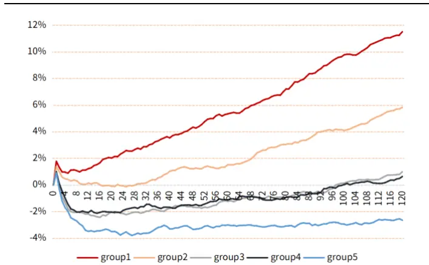
资料来源：Wind，光大证券研究所；注：统计区间为 2006.01.01-2023.10.31

图 36：市值分组测试（年度，持有 120 日累计超额收益）
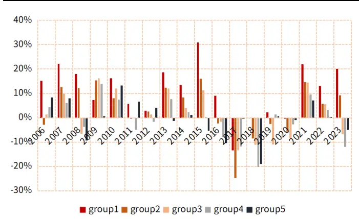
资料来源：Wind，光大证券研究所；注：统计区间为 2006.01.01-2023.10.31

## 3.6、 再融资收缩下，受限制的样本历史表现如何？

我们对本次再融资收紧下提及的破净、经营业绩持续亏损、财务性投资比例偏高的情形进行统计。

首先，按照 BP 因子从小到大将定增样本均分为 5 组（依次为 group1-group5)，从统计结果来看，5 组并未呈现明显单调性。

其次，按照连续两年亏损与否来看，短期内，满足“连续两年亏损”的样本表现更好。但其持有 120 个交易日后，累计超额收益较低。

最后，我们按照财务性投资比例从低到高将定增样本均分为 5 组（依次为group1-group5)，从统计结果来看，5 组未呈现明显单调性。

综合上述测算结果，从历史来看，破净样本、连续两年亏损、财务性投资比例偏高的样本，对定增股票池并未呈现负向的影响。因此，我们认为，此次再融资收缩，对定向增发股票池获取超额收益，不会造成明显的影响。

图 37：BP分组测试-累计超额收益
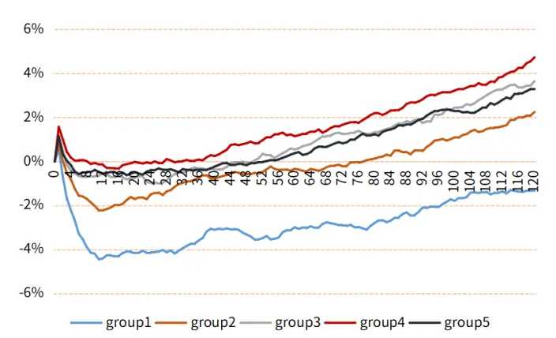
资料来源：Wind，光大证券研究所；注：统计区间为 2006.01.01-2023.10.31

图 38：连续两年亏损-累计超额收益
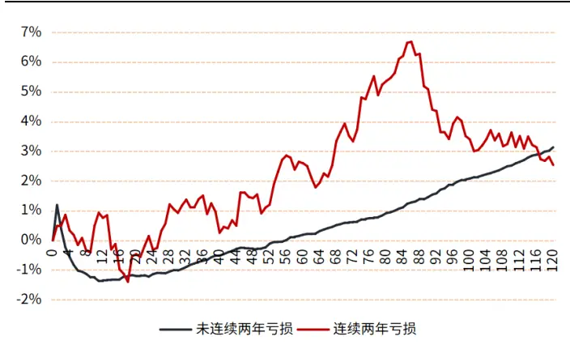
资料来源：Wind，光大证券研究所；注：统计区间为 2006.01.01-2023.10.31

图 39：财务性投资比例分组测试-累计超额收益
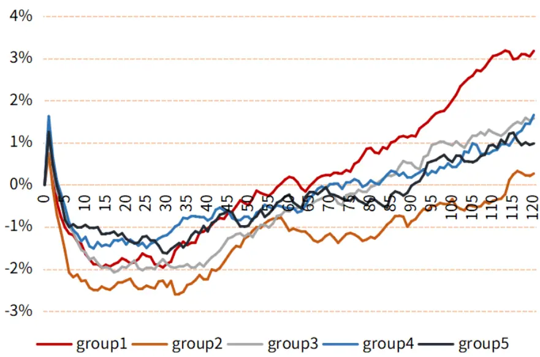
资料来源：Wind，光大证券研究所；注：统计区间为 2006.01.01-2023.10.31

## 4、定向增发选股策略

本章，我们根据前文的测算，通过定增股票池，构建定向增发事件驱动选股策略，以探讨定增样本在时序上能否获取显著的超额收益。

根据前文的测算，定增各流程节点后，均能获取超额收益。我们以各流程节点为基础，构建基础定向增发事件驱动选股策略。

策略设置如下：

- 选股逻辑：检测到定增各流程节点后，将对应股票纳入股票池；

- 买卖方式：在涨停打开以及复牌后，以收盘价买入；卖出时若跌停，则跌停打开后卖出；

- 调仓方式：买入后持有 N 个交易日卖出，若新进股票，则动态调整现有股票仓位，等权持有；

- 回测区间：2006.03.21-2023.10.31；

图 40：定增各流程节点-绝对净值
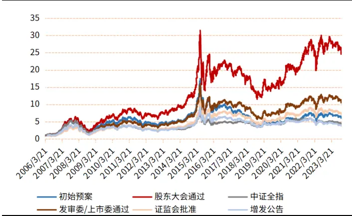
资料来源：Wind，光大证券研究所；注：统计区间为 2006.03.21-2023.10.31；不同策略的回测起始日期不一致

图 41：定增各流程节点-超额净值
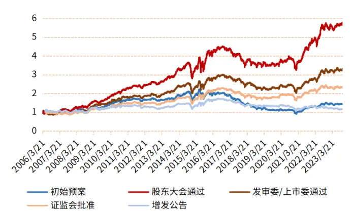
资料来源：Wind，光大证券研究所；注：统计区间为 2006.03.21-2023.10.31；不同策略的回测起始日期不一致

表 1：定增各流程节点后买入策略评价指标

| 类型 | 类型 | 总收益率 | 年化收益率 | 夏普比率 | 最大回撤 |
| --- | --- | --- | --- | --- | --- |
| 绝对 | 初始预案 | 549.34% | 11.55% | 0.24 | 77.88% |
|  | 股东大会通过 | 2515.15% | 20.98% | 0.54 | 70.23% |
|  | 发审委/上市委通过 | 1028.80% | 15.42% | 0.38 | 70.73% |
|  | 证监会批准 | 656.27% | 12.69% | 0.29 | 71.27% |
|  | 增发公告 | 307.25% | 8.62% | 0.15 | 72.51% |
| 超额 | 初始预案 | 45.49% | 2.21% | -0.16 | 59.14% |
|  | 股东大会通过 | 475.69% | 10.75% | 0.62 | 28.14% |
|  | 发审委/上市委通过 | 230.51% | 7.33% | 0.33 | 32.85% |
|  | 证监会批准 | 136.38% | 5.21% | 0.12 | 30.06% |
|  | 增发公告 | 17.67% | 0.96% | -0.30 | 36.14% |

资料来源：Wind，光大证券研究所；注：统计区间为 2006.03.21-2023.10.31

我们以持有日期 N=120 个交易日为例，展示回测结果。根据第三章测算结果，在股东大会通过后买入，相对于其他节点买入，能获取更为可观的超额收益。从事件驱动策略的回测结果来看，结论同前保持一致。在股东大会通过后买入，年化绝对收益 20.98%，年化超额收益 10.75%。

持有日期的长短，也是我们需要考虑的因素。我们分别对 N 取 120、60、40、30、20 个交易日进行测算，以股东大会通过公告日为例，可以发现，持有较长周期，能够获取更为明显的超额收益。

图 42：股东大会通过公告后不同持有期下的策略组合-绝对净值
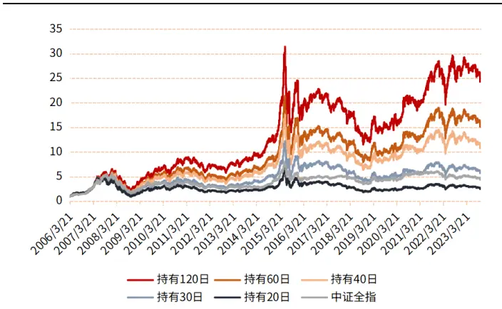
资料来源：Wind，光大证券研究所；注：统计区间为 2006.03.21-2023.10.31

图 43：股东大会通过公告后不同持有期下的策略组合-超额净值
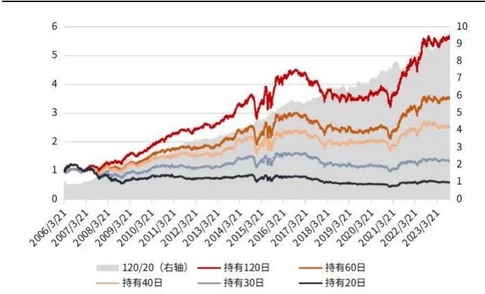
资料来源：Wind，光大证券研究所；注：统计区间为 2006.03.21-2023.10.31

根据第三章的测算，定增股票通常在公告后会持续短暂时间的负向超额收益，随后 10 个交易日左右超额收益转正。因此，如果将调仓日期往后延迟 10 个交易日，是否能提升策略表现呢？我们进行了相应测算。从测算结果来看，股东大会通过公告后，延迟 10 个交易日买入，相较于不延迟买入，效果有一定提升。

图 44：股东大会通过公告后买入与延迟 10 个交易日买入-绝对净值
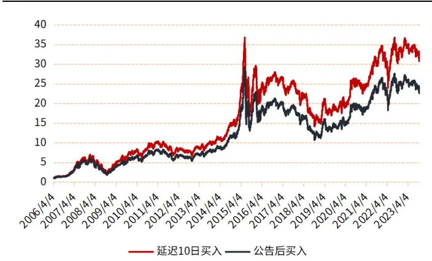
资料来源：Wind，光大证券研究所；注：统计区间为 2006.04.04-2023.10.31；股东大会通过公告后买入的日期与延迟 10 日买入的日期对齐

图 45：股东大会通过公告后买入与延迟 10 个交易日买入-超额净值
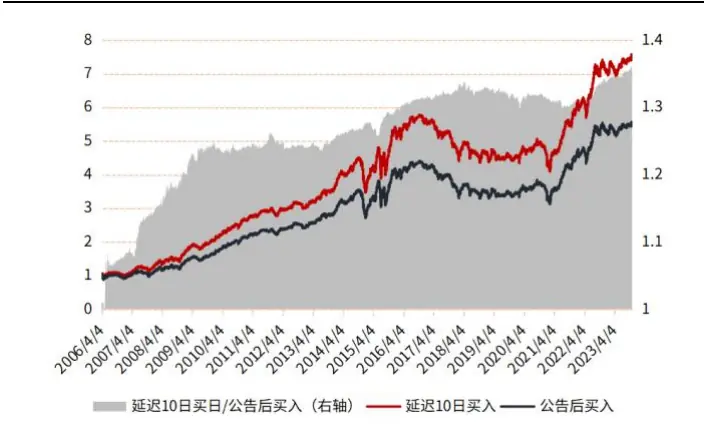
资料来源：Wind，光大证券研究所；注：统计区间为 2006.04.04-2023.10.31；股东大会通过公告后买入的日期与延迟 10 日买入的日期对齐

除了各个定增流程节点外，“大股东以现金参与”、“定价基准日为董事会决议公告日”、“定增目的为壳资源重组等”也能够带来收益。因此，我们以股东大会公告日为节点，叠加这三类定增类型，进行相应测算。

## 策略设置如下：

- 选股逻辑：检测到股东大会通过公告后，将满足以下定增类型（只需满足其一）的样本纳入股票池：

- 大股东参与，且以现金的方式参与；

- 定价基准日：董事会决议公告日；

- 定增目的：壳资源重组、集团公司整体上市、补充流动资金、公司间资产置换重组。

- 买卖方式：在涨停打开以及复牌后，以收盘价买入；卖出时若跌停，则跌停打开后卖出；

- 调仓方式：买入后持有 120 个交易日卖出，若新进股票，则动态调整现有股票仓位，等权持有；

- 回测区间：2006.03.21-2023.10.31；

从测算结果可以发现，在股东大会通过公告后买入，在进一步满足上述三种类型的情形下，相较于直接在股东大会通过公告后买入，策略表现并未有明显的提升。

图 46：股东大会通过公告叠加三类定增类型之一的组合-绝对净值
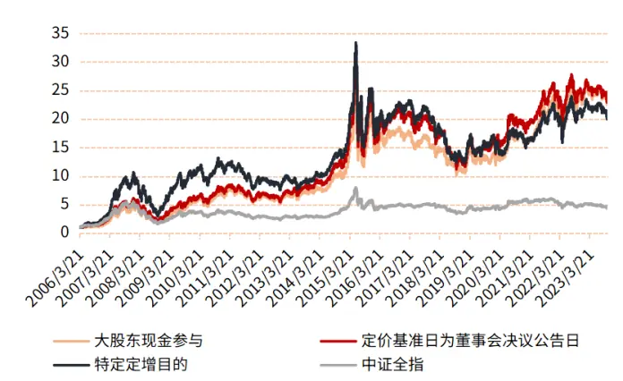
资料来源：Wind，光大证券研究所；注：统计区间为 2006.03.21-2023.10.31；不同策略的回测起始日期不一致

图 47：股东大会通过公告叠加三类定增类型之一的组合-超额净值
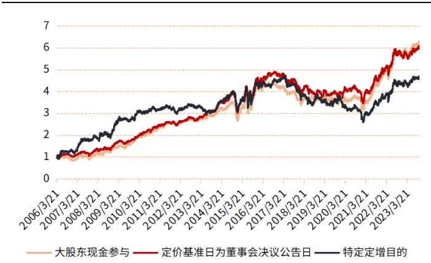
资料来源：Wind，光大证券研究所；注：统计区间为 2006.03.21-2023.10.31；不同策略的回测起始日期不一致

定增样本整体偏向于小市值股票。根据第三章的测算，市值因素在定增股票池中区分度非常明显。因此，我们认为，市值是重要的影响因素。我们将市值因素纳入策略中，考虑到事件驱动型策略持仓股票数量的不稳定性，我们对仓位加以限制，策略设置如下：

- 选股逻辑：检测到股东大会通过公告后，将对应股票纳入股票池；

- 二次筛选：样本股纳入股票池当天，以全市场股票市值 25%分位数为临界点，若样本股市值低于该值，则纳入持仓；

- 买卖方式：在涨停打开以及复牌后，以收盘价买入；卖出时若跌停，则跌停打开后卖出；

- 调仓方式：

- 纳入股票池后，延迟 10 个交易日买入；

- 买入后持有 120 个交易日卖出，若新进股票，则动态调整现有股票仓位，等权持有；

- 当持仓股票数大于等于 40 只时，全仓买入；当介于 20-40 只时，半仓买入；当介于 0-20 只时，1/4 仓买入；

- 回测区间：2006.06.22-2023.10.31；

从回测结果来看，策略取得可观收益。从 2006 年至今，策略总收益率 1546.33%，年化收益率 18.04%，超额年化收益率 9.86%。

图 48：定向增发事件驱动选股策略净值曲线
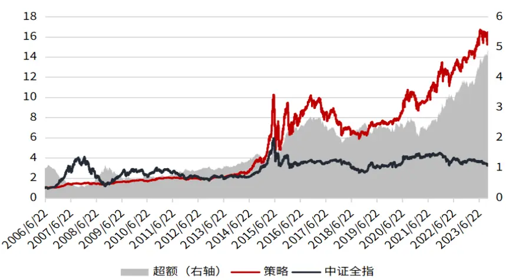
资料来源：Wind，光大证券研究所；注：统计区间为 2006.06.22-2023.10.31

表 2：定向增发事件驱动选股策略评价指标

| 类型 | 策略 | 中证全指 | 超额 |
| --- | --- | --- | --- |
| 总收益 | 1546.33% | 236.24% | 389.63% |
| 年化收益率 | 18.04% | 7.44% | 9.86% |
| 年化波动率 | 20.58% | 26.61% | 18.88% |
| 夏普比率 | 0.68 | 0.13 | 0.31 |
| 最大回撤 | 53.31% | 71.48% | 67.69% |
| 最大回撤开始日期 | 2015/6/12 | 2008/1/14 | 2006/8/7 |
| 最大回撤截止日期 | 2015/9/15 | 2008/11/4 | 2007/10/16 |
| 月度胜率 | 66.03% | 55.98% | 55.98% |

资料来源：Wind，光大证券研究所；注：统计区间为 2006.06.22-2023.10.31

表 3：定向增发事件驱动选股策略评价指标（年度）

| 年份 | 收益 | 基准收益 | 超额收益 | 夏普比率 | 基准夏普比率 | 超额夏普比率 | 最大回撤 | 基准最大回撤 | 超额最大回撤 |
| --- | --- | --- | --- | --- | --- | --- | --- | --- | --- |
| 2006 | 7.23% | 40.63% | -23.75% | 1.22 | 3.89 | -2.59 | 3.64% | 14.34% | 31.40% |
| 2007 | 37.23% | 170.88% | -49.34% | 2.97 | 4.74 | -1.94 | 10.34% | 21.34% | 52.51% |
| 2008 | -4.70% | -64.06% | 165.19% | -0.63 | -1.40 | 4.50 | 16.92% | 71.48% | 16.89% |
| 2009 | 23.51% | 106.46% | -40.18% | 2.06 | 3.26 | -1.84 | 5.61% | 23.30% | 41.36% |
| 2010 | 13.77% | -3.77% | 18.23% | 1.02 | -0.31 | 0.83 | 8.50% | 27.20% | 19.46% |
| 2011 | -5.83% | -28.01% | 30.81% | -1.52 | -1.52 | 1.72 | 9.54% | 33.51% | 9.17% |
| 2012 | 4.43% | 4.58% | -0.15% | 0.05 | 0.03 | -0.31 | 10.75% | 24.39% | 9.60% |
| 2013 | 21.62% | 5.21% | 15.60% | 1.58 | 0.07 | 1.03 | 9.23% | 16.86% | 6.49% |
| 2014 | 50.01% | 45.82% | 2.87% | 2.34 | 2.43 | -0.08 | 13.51% | 10.18% | 23.85% |
| 2015 | 162.68% | 32.56% | 98.16% | 3.10 | 0.74 | 4.09 | 53.31% | 46.83% | 25.22% |
| 2016 | 2.20% | -14.41% | 19.40% | -0.05 | -0.70 | 1.46 | 26.29% | 23.12% | 7.61% |
| 2017 | -21.62% | 2.34% | -23.41% | -1.29 | -0.14 | -2.23 | 27.13% | 9.39% | 26.06% |
| 2018 | -15.43% | -29.94% | 20.71% | -1.19 | -1.61 | 1.40 | 22.58% | 34.52% | 11.71% |
| 2019 | 20.15% | 31.11% | -8.36% | 1.52 | 1.34 | -0.94 | 5.81% | 16.50% | 15.52% |
| 2020 | 29.97% | 24.92% | 4.04% | 1.35 | 0.92 | 0.01 | 10.66% | 14.90% | 12.03% |
| 2021 | 28.68% | 6.19% | 21.18% | 1.37 | 0.15 | 1.00 | 12.41% | 11.05% | 13.09% |
| 2022 | 7.25% | -20.32% | 34.61% | 0.19 | -1.20 | 1.96 | 17.59% | 26.98% | 8.52% |
| 2023 | 21.42% | -5.08% | 27.91% | 1.64 | -0.79 | 2.95 | 8.93% | 16.66% | 4.94% |

资料来源：Wind，光大证券研究所；注：统计区间为 2006.06.22-2023.10.31

## 5、 总结

2023 年 8 月，再融资政策自 2020 年宽松后，再次收紧。定增市场当前的现状也引发众多投资者关注，定向增发事件效应是否还能有效？涉及定向增发股票是否还具备投资价值？带着这些疑问，本文对定向增发的事件效应进行了细致的分析，从中挖掘潜在的投资机会。

我们对最新再融资优化措施中提及的破净、经营业绩持续亏损、财务性投资比例偏高的样本进行统计。从结果来看，破净样本总体偏少，近年来经营业绩持续亏损的样本占比逐年增加，财务性投资比例偏高的样本占比较高。结合再融资收紧的新形势，我们预计定增数量和规模会进一步下滑，破净、经营业绩持续亏损、财务性投资比例偏高的定增项目数量会持续收缩。

从成功发行的定增项目来看，定增规模自 2022 年起开始下滑。从上市公司定增目的来看，多数定增目的为项目融资、融资收购其他资产和配套融资。从行业来看，定增项目多集中于机械、基础化工、电子、医药、电力设备及新能源。从定增参与方来看，定增参与方以机构投资者、境内自然人和大股东为主。

除重大资产重组外，定增定价基准日可以从本次发行股票的董事会决议公告日、股东大会决议公告日以及发行期首日中选择。从统计结果来看，定价基准日主要为董事会决议公告日。从定价方式来看，基准日为董事会决议公告日时，多以“定价”为主，而若基准日为发行期首日，定价方式多为“竞价”。

我们对定增各流程节点前后的事件效应进行了分析。从测算结果来看，在各流程节点后，长期持有股票，均能获取正向超额收益，在股东大会公告后买入，效果最佳。此外，满足“大股东以现金参与”、“定价基准日为董事会决议公告日”和“定增类型为壳资源重组等”时，能够获取可观的超额收益，但从时序上来看，超额收益并不持续。

定增样本多数为小盘股，市值因素在定增股票池中区分度非常明显。因此，我们认为，市值是重要的参考因素。综合事件测算结果，我们以股东大会公告日为时间节点，综合考虑市值因素、调仓周期以及对仓位的控制，我们构造了定向增发事件驱动选股组合，该组合自 2006.06.22-2023.10.31，总收益率 1546.33%，年化收益率 18.04%，超额年化收益率 9.86%。

## 6、风险分析

报告结果均基于历史数据，历史数据存在不被重复验证的可能；政策存在变化的可能。

## 行业及公司评级体系

| 评级 说明 |  |  |
| --- | --- | --- |
|  | 买入 | 未来6-12个月的投资收益率领先市场基准指数15%以上 |
|  | 增持 | 未来6-12个月的投资收益率领先市场基准指数5%至15%; |
|  | 中性 | 未来6-12个月的投资收益率与市场基准指数的变动幅度相差-5%至5%； |
|  | 减持 | 未来 6-12 个月的投资收益率落后市场基准指数5%至15%; |
| 行业及公司评级 | 卖出 | 未来6-12个月的投资收益率落后市场基准指数15%以上； |
|  | 无评级 | 因无法获取必要的资料，或者公司面临无法预见结果的重大不确定性事件，或者其他原因，致使无法给出明确的投资评级。 |
|  | 基准指数说明： | A股市场基准为沪深300指数；香港市场基准为恒生指数；美国市场基准为纳斯达克综合指数或标普500指数。 |

## 分析、估值方法的局限性说明

本报告所包含的分析基于各种假设，不同假设可能导致分析结果出现重大不同。本报告采用的各种估值方法及模型均有其局限性，估值结果不保证所涉及证券能够在该价格交易。

## 分析师声明

本报告署名分析师具有中国证券业协会授予的证券投资咨询执业资格并注册为证券分析师，以勤勉的职业态度、专业审慎的研究方法，使用合法合规的信息，独立、客观地出具本报告，并对本报告的内容和观点负责。负责准备以及撰写本报告的所有研究人员在此保证，本研究报告中任何关于发行商或证券所发表的观点均如实反映研究人员的个人观点。研究人员获取报酬的评判因素包括研究的质量和准确性、客户反馈、竞争性因素以及光大证券股份有限公司的整体收益。所有研究人员保证他们报酬的任何一部分不曾与，不与，也将不会与本报告中具体的推荐意见或观点有直接或间接的联系。

## 法律主体声明

本报告由光大证券股份有限公司制作，光大证券股份有限公司具有中国证监会许可的证券投资咨询业务资格，负责本报告在中华人民共和国境内（仅为本报告目的，不包括港澳台）的分销。本报告署名分析师所持中国证券业协会授予的证券投资咨询执业资格编号已披露在报告首页。

中国光大证券国际有限公司和 Everbright Securities(UK) Company Limited 是光大证券股份有限公司的关联机构。

## 特别声明

光大证券股份有限公司（以下简称“本公司”）成立于 1996 年，是中国证监会批准的首批三家创新试点证券公司之一，也是世界 500 强企业——中国光大集团股份公司的核心金融服务平台之一。根据中国证监会核发的经营证券期货业务许可，本公司的经营范围包括证券投资咨询业务。

本公司经营范围：证券经纪；证券投资咨询；与证券交易、证券投资活动有关的财务顾问；证券承销与保荐；证券自营；为期货公司提供中间介绍业务；证券投资基金代销；融资融券业务；中国证监会批准的其他业务。此外，本公司还通过全资或控股子公司开展资产管理、直接投资、期货、基金管理以及香港证券业务。

本报告由光大证券股份有限公司研究所（以下简称“光大证券研究所”）编写，以合法获得的我们相信为可靠、准确、完整的信息为基础，但不保证我们所获得的原始信息以及报告所载信息之准确性和完整性。光大证券研究所可能将不时补充、修订或更新有关信息，但不保证及时发布该等更新。

本报告中的资料、意见、预测均反映报告初次发布时光大证券研究所的判断，可能需随时进行调整且不予通知。在任何情况下，本报告中的信息或所表述的意见并不构成对任何人的投资建议。客户应自主作出投资决策并自行承担投资风险。本报告中的信息或所表述的意见并未考虑到个别投资者的具体投资目的、财务状况以及特定需求。投资者应当充分考虑自身特定状况，并完整理解和使用本报告内容，不应视本报告为做出投资决策的唯一因素。对依据或者使用本报告所造成的一切后果，本公司及作者均不承担任何法律责任。

不同时期，本公司可能会撰写并发布与本报告所载信息、建议及预测不一致的报告。本公司的销售人员、交易人员和其他专业人员可能会向客户提供与本报告中观点不同的口头或书面评论或交易策略。本公司的资产管理子公司、自营部门以及其他投资业务板块可能会独立做出与本报告的意见或建议不相一致的投资决策。本公司提醒投资者注意并理解投资证券及投资产品存在的风险，在做出投资决策前，建议投资者务必向专业人士咨询并谨慎抉择。

在法律允许的情况下，本公司及其附属机构可能持有报告中提及的公司所发行证券的头寸并进行交易，也可能为这些公司提供或正在争取提供投资银行、财务顾问或金融产品等相关服务。投资者应当充分考虑本公司及本公司附属机构就报告内容可能存在的利益冲突，勿将本报告作为投资决策的唯一信赖依据。

本报告根据中华人民共和国法律在中华人民共和国境内分发，仅向特定客户传送。本报告的版权仅归本公司所有，未经书面许可，任何机构和个人不得以任何形式、任何目的进行翻版、复制、转载、刊登、发表、篡改或引用。如因侵权行为给本公司造成任何直接或间接的损失，本公司保留追究一切法律责任的权利。所有本报告中使用的商标、服务标记及标记均为本公司的商标、服务标记及标记。

光大证券股份有限公司版权所有。保留一切权利。

光大证券研究所

上海

北京

深圳

静安区南京西路 1266 号

西城区武定侯街 2 号

福田区深南大道 6011 号

恒隆广场 1 期办公楼 48 层

泰康国际大厦 7 层

NEO 绿景纪元大厦 A 座 17 楼

光大证券股份有限公司关联机构

香港

中国光大证券国际有限公司

英国

香港铜锣湾希慎道 33 号利园一期 28 楼

Everbright Securities(UK) Company Limited 6th Floor, 9 Appold Street, London, United Kingdom, EC2A 2AP