## 总量研究

# 探秘股份回购策略，挖掘高收益潜力——量化选股系列报告之十三

## 要点

2024 年以来，市值管理考核主线与高股息策略均展现出较高的市场关注度和相对一致的预期。股份回购作为市值管理工具、类似分红的股东回报方式，价值不容忽视。

回购如何影响个股表现甚至市场走势？若实施公开市场回购，那么流通股数量下降，二级市场供给下降，将直接影响股价；其次，回购后，总股本（注销式）、净资产下降，EPS（注销式）、ROE 等财务指标将提升，进而驱动股价；此外，回购事件可以影响短期和长期的投资者情绪。上升到市场整体，以美股为鉴，回购或非影响市场走势的核心力量，美股快速上涨的主要贡献项是盈利增长，并且美股回购呈现顺盈利周期的特性。目前国内回购更多地发挥逆周期调节作用，若以沪深 300 指数来构建回购率指标，可以发现回购率和企业盈利相关性不强。

## 回购事件收益分析

1）重要公告节点的短期超额收益表现可以反映最直接的投资者情绪。董事会预案、开始实施回购、回购完成公告均对股价具有显著积极的影响；回购停止实施和未通过股东大会 2 类公告对股价没有显著正向的影响。

2）除短期积极信号外，回购往往蕴含着特定的经济意图，对股价形成长期支撑。对回购类型进行区分后，主动式回购的效果更好，员工激励、市值管理类表现最佳；触发式回购中盈利补偿类基本不能获得超额收益。

4）从回购筹码来看，目前 A股绝大多数回购是利用自有资金进行的，利用自有资金进行的回购事件发生后具有稳定的超额表现。

5）回购时财务表现是否会影响事件收益？回购与成长类因子的结合效果更佳。ROEyoy、ROAyoy、标准化预期外盈利因子与回购事件的相关性较强，分组测试后效果良好且呈单调性。高 ROE 的公司业绩相对稳定，回购带来的催化效果有限，高成长性的公司通过回购更能提振投资者对未来业绩的信心。

## 策略构建

基础回购策略：通过构建回购事件因子来描述事件特征，首先建立仅包含事件特征的基础回购策略。对不同参数进行测试，在定期调仓+因子加权+持有250d+持仓 50 只的处理方式下，基础回购策略超额净值表现最佳。在测试区间内（2019.02.01-2024.04.30，下同），策略总收益 116.77%，年化收益16.46%，年化超额 12.16%。

回购质量策略：由于回购和成长类因子搭配效果较好，利用成长因子在基础回购策略的基础上进行增强，构建回购质量策略。相较基础回购策略，回购质量策略效果能得到可观提升，采用将标准化后的成长因子和回购事件因子加总的方式，回购质量策略效果更佳。在测试区间内，策略总收益 179.84%，年化收益 22.47%，年化超额 17.95%。

风险分析：报告结果均基于历史数据，存在不被重复验证的可能；根据事件原始数据统计，可能与其他三方数据存在差异；政策变化、极端行情在内的其他因素可能影响事件效果。

## 作者

分析师：祁嫣然

执业证书编号：S0930521070001

021-52523678

qiyanran@ebscn.com

联系人：马元心

021-52523678

mayuanxin@ebscn.com

## 重要指数走势图

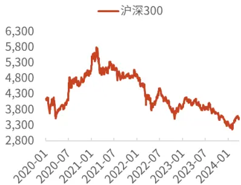
资料来源：Wind，光大证券研究所，数据截至：2024 年4 月 30 日

## 相关研报

多角度解析定向增发中的投资机会——量化选股系列报告之十二

提炼大宗交易背后蕴含的超额信息——量化选股系列报告之十一

再探机构调研：机构调研的精细切分——量化选股系列报告之十

回购系列指数发布在即，创新型浮动费率产品陆续揭开面纱——基金市场周报 20230922

2024 年以来，高股息策略、市值管理考核主线均展现出较高的市场关注度和相对一致的预期。2024 年 4 月 12 日，新“国九条”中再提“加大对分红优质公司的激励力度”、“制定上市公司市值管理指引”、“引导上市公司回购股份后依法注销”、“鼓励综合运用并购重组、股权激励等方式提高发展质量”等鼓励分红和回购的措施。股份回购作为市值管理的关键工具、扮演着类似分红的股东回报角色，价值不容忽视。

## 1、股份回购事件简介

本文股份回购数据均来自 WindAshareStockRepo 表。通常来说，顺利进行的股份回购事件流程记录将包括董事会预案、股东大会通过、实施（大规模回购会多次实施）、完成。

在大量回购预案中存在未顺利实施的方案。部分预案由于股东对财务状况、资金压力、战略优先级等考虑而持谨慎态度，未获得股东大会通过；由于股价显著上涨、市场转暖等因素，触发预设的终止回购条件，部分公司会在中途发布公告终止回购，更换资本运作策略；早年监管相对宽松，还有部分预案至期限届满仍未实施、最终不了了之的情形。

图 1：股份回购事件流程
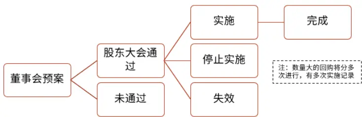
资料来源：Wind，光大证券研究所整理

从回购实施的不同阶段来看，《上市公司股份回购规则》要求回购实施前需经过董事会和股东大会决议。由享有提案权的提议人向董事会提议回购，董事会尽快做出股份回购决议，并提交股东大会审议，表决通过则可以实施；如果公司章程有规定，或已经提前获得股东大会授权，那么董事会可以直接做出决议。

实施期限方面，上市公司大规模收购本公司股份的行为是连续进行的，最长期限不超过 1 年。因市值管理目的而回购股份的，回购期限通常自回购方案通过起不超过 3 个月；其他情形下，回购期限自回购方案通过起不超过 12 个月。

被回购的股票通常以两种方式处理，注销或留做库存股以待后续处理。如果是减少注册资本而进行的回购，那么股份应该在自回购之日起 10 日内注销；其他情形下，持有本公司股份不得超过已发行股份总额的 10%，并且应该在披露回购结果后 3 年内转让或注销。以市值管理为目的的回购可以按回购方案约定、通过集中竞价交易方式、在披露回购结果后 12 个月后出售部分股份。

## 2、回购如何影响股价？

## 2.1 上市公司实施回购如何传导到个股股价？

从个股来看，上市公司实施回购如何传导到股价？首先，若实施公开市场回购，那么公司流通股数量下降，二级市场供给下降，将直接影响股价。其次，回购后，总股本（注销式）、净资产下降，EPS（注销式）、ROE 等财务指标将提升，进而驱动股价。此外，回购事件本身存在短期公告效应，对倾向关注价格升跌的投机者具有一定吸引力。更长期地，回购后股权结构会更稳定，会增强投资者信心。

图 2：上市公司实施回购如何传导到个股股价？
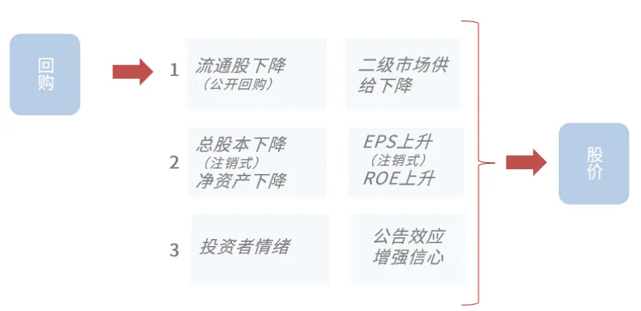
资料来源：光大证券研究所整理

需要注意的是，回购股份类型和处理方式不同，反映在股价表现上可能会存在差异。若对流通股实施回购，二级市场中的流通股供给会减少，对股价有直接影响；若回购股份不进行注销，先纳入库存股等待转让或出售，虽然对净资产、ROE 的影响跟注销式是相同的，但对总股本和 EPS 没有影响，因此投资者可能会认为注销式回购更有诚意。

因此，理论上来说，回购流通股并且注销对股价的影响可能大于回购流通股不注销，或是回购限售股并且注销的情况，进而大于回购限售股且不注销的情况。

## 2.2 相较分红，回购在提振股价、股东回报方面存在显著优势

分红和回购都是实现股东财富最大化的重要方式。如果一家公司想保持 ROE，而不进行分红回购，就需要将全部利润留存再投资，次年在更高的净资产基础上实现相同的 ROE，但其实新增投资项目回报率很难维持高位，因此需要进行分红或回购从而维持 ROE。

二者相似之处在于，现金分红和回购后公司的净资产都会下降，带来 ROE 的非盈利性变动。股票分红并不影响股东财富和公司价值，此处不多做探讨。根据杜邦公式，ROE 可拆解为净利润率、总资产周转率、权益乘数，权益乘数反映杠杆率，分红回购后净资产减少、杠杆率加大，从而带来 ROE 的变动。二者不同的是，对净资产的影响方式不同，现金分红是留存利润的重新分配，回购则是纳入库存股这一备抵科目致使的净资产下降。

相较分红，回购对股价的提振更显著，也是更划算的股东回报方式。一方面，现金分红既不影响公司流通股数量，不会造成股票供给下降，也不影响总股本和净利润，对 EPS 没有提升作用，而在公开市场开展回购后，流通股数量下降，并且注销式回购还会带来总股本的下降、EPS 的上升；另一方面，回购具有税收优势，回购后带来的股价变化只需考虑印花税，发放现金股利后股东则需缴纳红利税。目前红利税根据股份持有时长递进式征收，20%（持有<=1m）、10%（1y>=持有>1m）、0（持有>1y）。

表 1：回购 vs 现金分红后财务指标变化

| 指标 | 回购 | 现金分红 |
| --- | --- | --- |
| 总股本 | (注销式) | 一 |
| 流通股本 | ↓ | 一 |
| 净资产 | ↓ | ↓ |
| EPS | （注销式） | 一 |
| ROE | ↑ | ↑ |
| 股价 | ↑ | 除息↓ |

资料来源：光大证券研究所整理

## 2.3 以美股为鉴，回购或非影响市场走势的核心力量

上升到市场整体，回购对市场走势影响几何？以美股为鉴，从标普 500 指数成分股的回购和股利规模来看，股份回购已逐步取代现金股利，成为最主要的股东回报方式。从 2010 年起，标普 500 指数成分股每年的股份回购规模超过现金股利支付规模，2021 和 2022 年，股份回购规模约是现金股利的 1.7 倍。从回购率看，2005 年起，标普 500 指数成分股回购比例基本保持在 1.5%以上。

图 3：标普 500 指数股份回购和现金股利规模
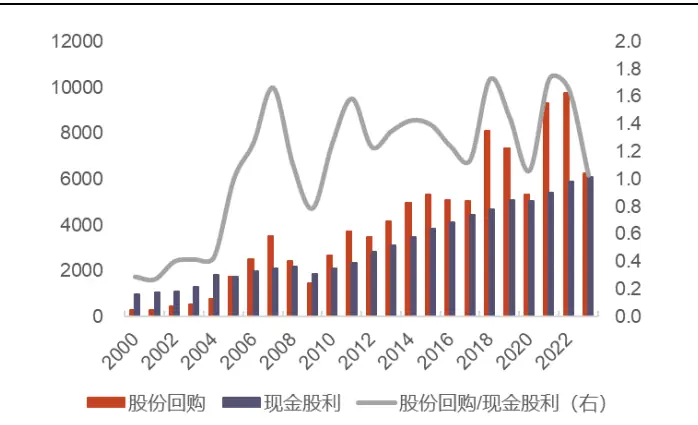
资料来源：bloomberg，光大证券研究所；截至 2023.12.31；注：左轴单位：亿美元

图 4：标普 500 指数回购率
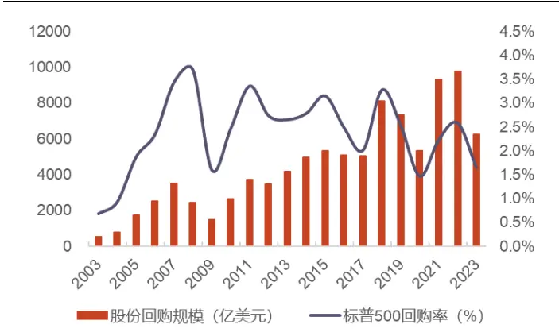
资料来源：bloomberg，光大证券研究所；截至 2023.12.31；注：回购率指标普 500 指数成分股回购规模/总市值规模

从标普 500 指数回购率和指数涨跌的关系来看，回购可能并非指数上涨的核心力量。比如在 2020、2021 年，标普 500 指数快速上涨，但回购率却并未同步攀升，反而出现了回落的现象。回购率的提升往往发生在指数已经上涨一段时间之后，可能意味着回购更多地是对市场走势的响应，而非其主要驱动力量。

图 5：标普 500 指数季度回购率（TTM）和指数走势
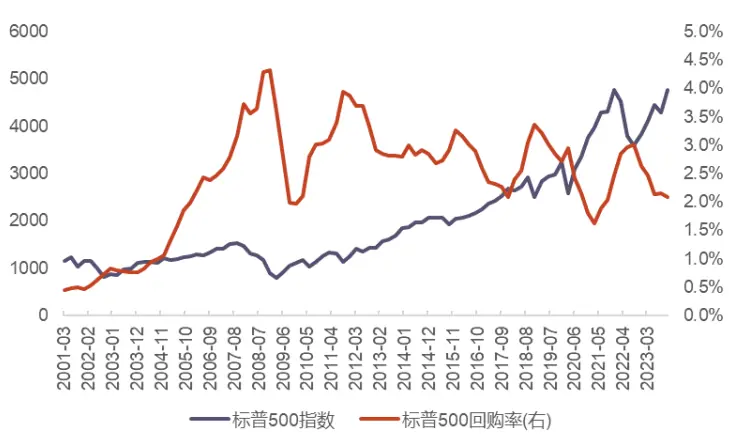
资料来源：bloomberg，光大证券研究所；截至 2023.12.31

若对指数涨跌进行拆分，理想状态下指数涨跌的贡献项包括盈利、估值和回购率。其他贡献项不变的情况下，若指数回购率为 b，那么回购对指数涨跌的贡献为 1/(1-b)。以标普 500 指数来看，在 2010-2021 年美股的牛市中，标普500 指数上涨 327%，盈利贡献项的增长率为 212%，估值贡献项的增长率为25%，回购贡献项的增长率为 43%，支撑美股快速上涨的贡献项是盈利增长。

图 6：拆分指数涨跌
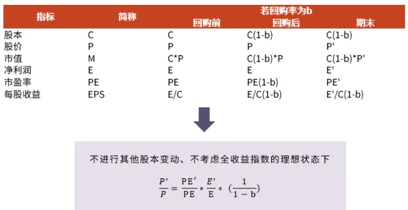
资料来源：Wind，光大证券研究所；注：不考虑全收益指数

表 2：美股几轮快速上涨主要驱动因素是盈利增长

| 区间 指数涨跌幅 回购贡献项增长率 |  |  | 盈利增长率 估值增长率 |  |
| --- | --- | --- | --- | --- |
| 2012-2014 | 63.72% | 9.52% | 23.67% | 30.02% |
| 2015-2017 | 29.86% | 8.53% | 13.64% | 22.93% |
| 2020-2021 | 47.52% | 4.70% | 33.54% | 21.64% |
| 2010-2021 | 327.42% | 42.58% | 212.31% | 24.89% |

资料来源：bloomberg，光大证券研究所；注：回购贡献项增长率为∏(1/(1-b))-1、盈利增长率为净利润增长率、估值增长率为 PE(TTM)增长率

## 2.4 顺盈利周期vs 逆周期调节

美股公司近年来将回购视为与分红媲美的利润分配方式，因此美股回购具备顺盈利周期的特性。在业绩呈上升趋势且现金流充盈的情况下，企业能够实施更大规模的回购计划。此时往往也是权益市场表现较为出色的时期，回购计划一定程度上可以推动股价上涨，从而形成良性循环。

目前国内回购更多地是起到逆周期调节作用。回购预案数量与权益市场表现密不可分，且回购潮多出现在市场底。回购更多地作为重要的市值管理工具，密集发生往往代表对个股、市场见底的预期。若以沪深 300 指数来构建回购率指标，可以发现回购率和企业盈利相关性不强。

图 7：标普 500 回购率和 EPS 增长率
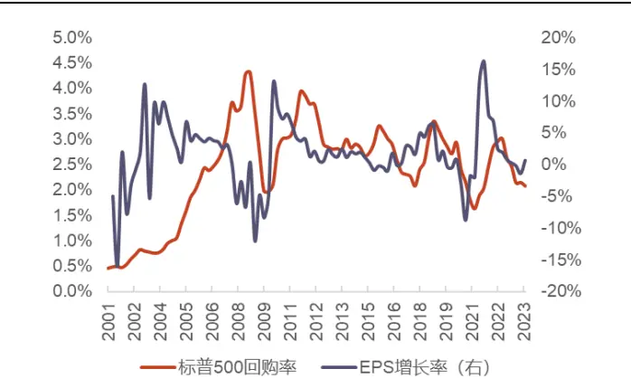
资料来源：bloomberg，光大证券研究所；截至 2023.12.31

图 8：标普 500 回购率和 ROE-TTM
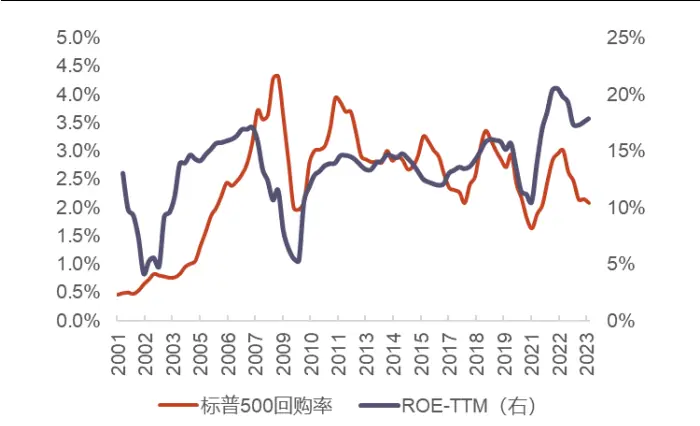
资料来源：bloomberg，光大证券研究所；截至 2023.12.31

图 9：沪深 300 回购率和 EPS 增长率
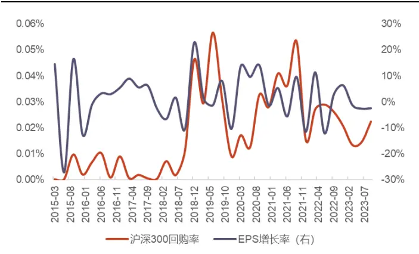
资料来源：Wind，光大证券研究所；截至 2023.12.31

图 10：沪深 300 回购率和 ROE-TTM
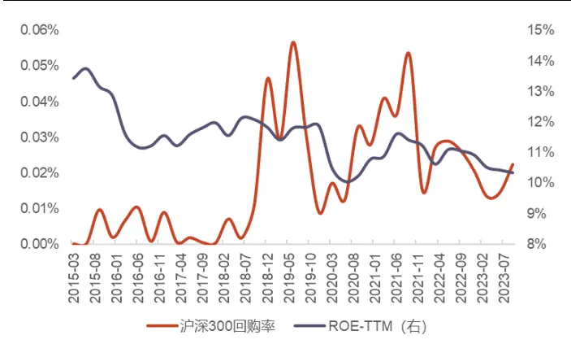
资料来源：Wind，光大证券研究所；截至 2023.12.31

## 3、国内市场股份回购特征

## 3.1 复盘A股回购变迁，与制度、市场密切相关

对 A股回购的变化进行复盘，可以发现，上市公司参与股份回购的积极性越来越高，回购预案数量不断上涨。国内回购最早出现于 20 世纪 90 年代，2005年以前仅有极少数公司进行回购，2005 年以后进入公开市场回购阶段。截至2024 年 3 月，A 股公告过回购预案的上市公司已超 3100 家，股份回购预案数量超 11000 份。

计划中途告罄的现象比较罕见。截至 2024 年 3 月，未通过、停止实施、失效状态的事件共 86 件，数量占比较低，并且从近三年来看，年发生量已在个位数。

图 11：2005 年以来回购预案数量
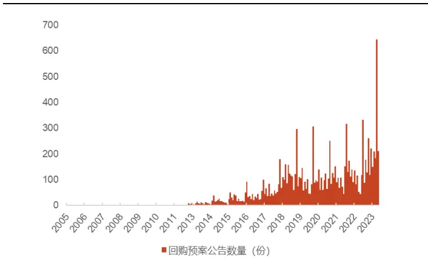
资料来源：Wind，光大证券研究所；注：统计区间为 2005.1.1-2024.3.31

图 12：计划中途告罄的回购预案
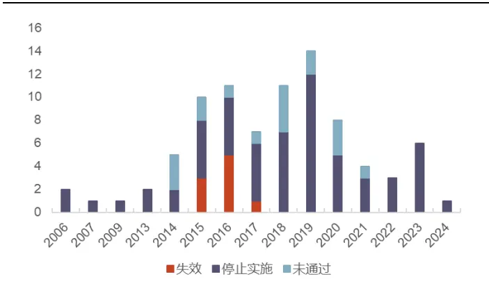
资料来源：Wind，光大证券研究所；注：统计区间为 2006.1.1-2024.3.31；单位：份

截至 2024 年 3 月，2024 年以来实施回购的上市公司数量（1313 家）已逼近2023 年全年水平，占 A 股成分数量的 24%。以回购事件对主要宽基指数成分股覆盖度来看，2023 年，沪深 300、中证 500、中证 800、中证 1000 指数分别有 42%、38%、39%、34%的成分股开展回购。

图 13：A 股每年实施回购的上市公司数量占比
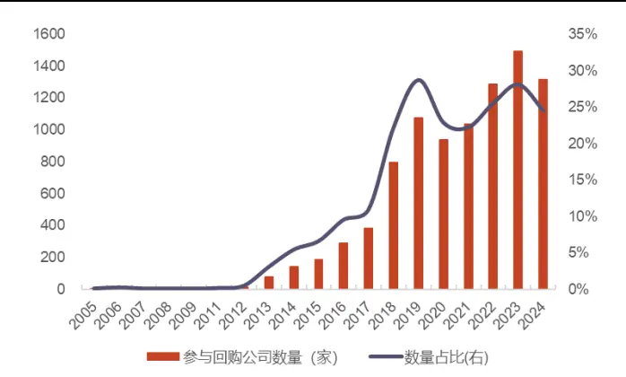
资料来源：Wind，光大证券研究所；注：统计区间为 2005.1.1-2024.3.31，A 股公司数量取当年年末值

图 14：回购事件对主要宽基指数成分股覆盖度
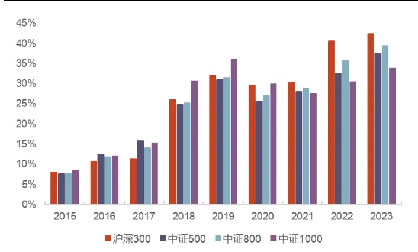
资料来源：Wind，光大证券研究所

2018 年以来，A 股整体回购规模和每家上市公司的平均回购规模明显抬升。2018 年之前 A股每年实际回购规模不足百亿元，2018 年，回购整体规模和参与公司的平均实施规模都出现大幅增长。以 2023 年情况来看，A股整体回购规模约 916 亿元，每家参与回购的公司平均回购约 6100 万元；沪深 300、中证500、中证 800、中证 1000 指数成分股参与公司的平均回购规模约 3.5 亿元、1 亿元、2 亿元、4300 万元左右。

图 15：A 股实际回购规模及参与公司的平均实施规模
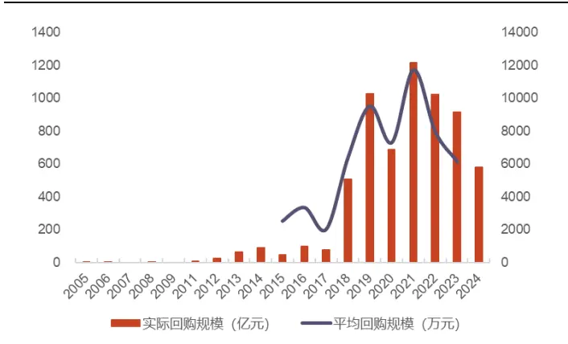
资料来源：Wind，光大证券研究所；注：统计区间为 2005.1.1-2024.3.31

图 16：主要宽基指数成分股参与公司的平均回购规模
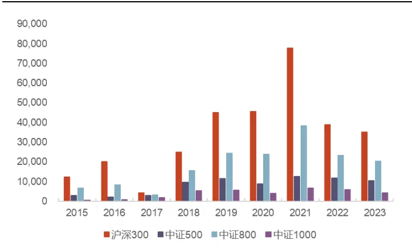
资料来源：Wind，光大证券研究所；注：单位：万元

活跃度和规模抬升的背后，政策变化发挥着重要的支撑作用，主要体现在回购流程、回购情形、融资渠道的逐步优化。2005 年以前，极少数公司进行回购，多是以国有股减资、调整股本结构为目的；政策秉持“原则禁止”态度，回购需向监管申报。2005 年起，开始步入公开市场回购阶段，《上市公司回购社会公众股份管理办法（试行）》首次允许通过集中竞价交易回购，但是谨慎地增设行政审核关卡；同年,《公司法》增加股权激励、异议股东要求回购两种情形。2005-2014 年，股份回购的频率和规模明显偏低，监管和上市公司对回购持谨慎态度，并且缺乏资金扶持政策，回购需要使用自有资金，对回购规模形成一定限制。2015 年，权益市场跌宕起伏，股份回购比例显著增加，“护盘式回购”首次出现在政策表述。随着市场环境的变化，回购需求日渐多样，开始受到明显鼓励，2018 年我国修订《公司法》，奠定回购作为基础性制度安排的地位，此后 A股的回购规模持续稳定在高位。

表 3：回购重要支持政策

| 时间 主要内容 |  |
| --- | --- |
| 1993 | 《公司法》首次设立股份回购制度，限定除减少注册资本或者与持有本公司股份的其他公司合并两种情形外，公司不得回购股份。 |
| 2005 | 《上市公司回购社会公众股份管理办法（试行)》首次允许通过集中竞价交易方式进行回购，但是增设行政审核关卡，要求回购应在收到证监会无异议函后实施。 |
|  | 《公司法》修订，增加股权激励、异议股东请求回购两种情形。 |
| 2008 | 证监会在《关于上市公司以集中竞价交易方式回购股份的补充规定》中对回购程序做出更具体的规定，取消先前关于无异议函的表述。 |
| 2015 | 《证监会、财政部、国资委、银监会关于鼓励上市公司兼并重组、现金分红及回购股份的通知》首次明确“上市公司股票价格低于每股净资产，或者市盈率或市净率低于同行业上市公司平均水平达到预设幅度的情形，可以主动回购本公司股份”，并且支持公司通过发行优先股、债券等方式，为回购筹集资金。 |
| 2018 | 《公司法》增加转换可转债、维护价值及股东权益两种新的回购情形，建立库存股制度，简化部分回购决策程序，不需经股东大会决议。 |
|  | 《关于支持上市公司回购股份的意见》鼓励运用其他市场工具为股份回购提供融资，支持实施回购的上市公司进行再融资。 |
| 2019 | 上交所首次发布《上市公司回购股份实施细则》，对减少注册资本、用于员工持股或股权激励、用于转换可转债、维护价值及股东权益四类回购提供系统性的程序和披露指引。 |

资料来源：中国政府网、证监会官网、沪深交易所官网，光大证券研究所整理

2022-2023 年，《上市公司股份回购规则》二次修订，回购便利性再度提升，参与回购的公司数量稳定增长，回购规模基本持平。一方面，规则修订尽可能促进回购积极性，放宽“护盘式回购”条件、放宽上市公司回购基本条件、取消禁止回购窗口期的规定、优化回购交易申报的禁止性规定；另一方面，健全约束机制，增加“鼓励上市公司在章程或其他治理文件中完善股份回购机制，明确股份回购的触发条件、回购流程等具体安排”的规定。

图 17：2022、2023 年股份回购规则主要修订内容
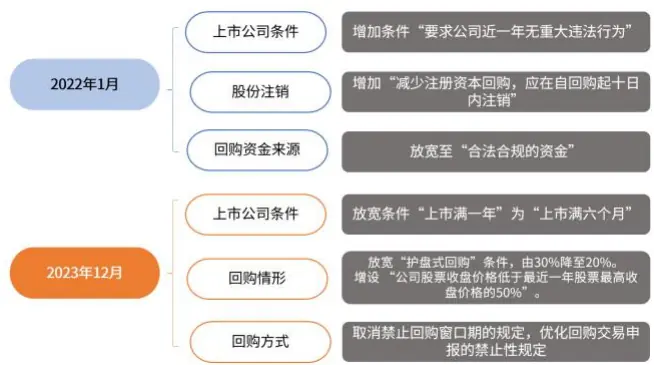
资料来源：沪深交易所官网，光大证券研究所整理

回购预案数量与权益市场表现密不可分，回购潮多出现在市场底。从 2018 年以来的情况来看，2018 年权益市场连续震荡下行，核心资产估值明显偏低，股份回购预案数量显著增加，2018 年内单月回购数量首次过 100 件，Q4 每月超百家回购；2019Q1 市场转暖后又现颓势，当年 4 月 A 股公布的预案数量突破200 件；而在 2020-21 年的牛市中，参与回购的公司数量、回购的股份数量都不及 2019 年。

图 18：2018 年以来沪深 300走势及月度回购预案数量
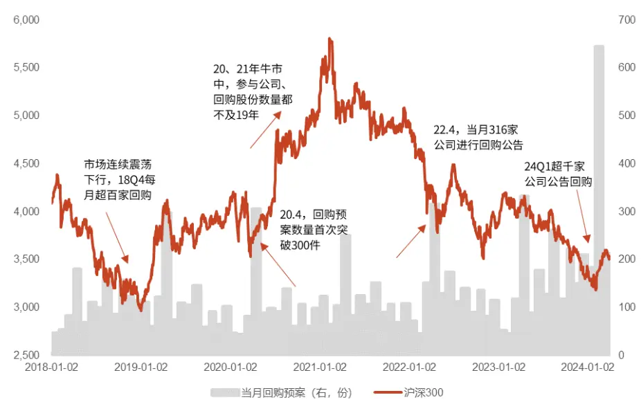
资料来源：Wind，光大证券研究所；截至 2024.03.31

## 3.2 哪些板块回购率更高？

发展处于成熟阶段、成长性相对较弱的板块更擅长利用回购工具。分行业来看，回购规模较大的行业包括家用电器、医药生物、电子、计算机、电力设备等核心行业；从回购率来看，家用电器、纺织服装、房地产、综合、商贸零售等行业回购规模占总市值比重较高。一般而言，上市公司业务发展成熟、成长性相对较低，资金冗余的情况下会较频繁地利用回购进行资本运作。

图 19：各申万一级行业回购规模和回购率

| 回购规模 (亿元) |  |  |  |  |  |  | 平均回购规模（亿元） | 回购率（%） | 参与公司数量 (家) |
| --- | --- | --- | --- | --- | --- | --- | --- | --- | --- |
|  | 2019年 | 2020年 | 2021年 | 2022年 | 2023年 | 总计 |  |  |  |
| 家用电器 | 54 | 87 | 394 | 60 | 58 | 653 | 131 | 4.29 | 54 |
| 医药生物 | 85 | 65 | 81 | 125 | 94 | 450 | 90 | 0.65 | 267 |
| 电子 | 48 | 29 | 80 | 93 | 88 | 338 | 68 | 0.47 | 243 |
| 计算机 | 36 | 20 | 73 | 98 | 67 | 294 | 59 | 0.77 | 215 |
| 电力设备 | 43 | 11 | 22 | 60 | 114 | 249 | 50 | 0.46 | 194 |
| 基础化工 | 58 | 24 | 31 | 55 | 70 | 237 | 47 | 0.73 | 207 |
| 机械设备 | 60 | 22 | 28 | 53 | 64 | 228 | 46 | 0.59 | 257 |
| 汽车 | 46 | 32 | 28 | 70 | 46 | 223 | 45 | 0.63 | 135 |
| 非银金融 | 78 | 37 | 57 | 16 | 32 | 220 | 44 | 0.39 | 27 |
| 石油石化 | 18 | 10 | 4 | 103 | 45 | 181 | 36 | 0.49 | 20 |
| 食品饮料 | 71 | 16 | 31 | 25 | 29 | 172 | 34 | 0.32 | 78 |
| 房地产 | 78 | 33 | 18 | 37 | 4 | 171 | 34 | 1.40 | 43 |
| 传媒 | 62 | 10 | 29 | 18 | 12 | 131 | 26 | 0.93 | 75 |
| 商贸零售 | 20 | 33 | 38 | 14 | 14 | 120 | 24 | 1.30 | 50 |
| 有色金属 | 30 | 8 | 20 | 33 | 28 | 119 | 24 | 0.47 | 68 |
| 农林牧渔 | 25 | 8 | 33 | 12 | 41 | 119 | 24 | 0.88 | 47 |
| 纺织服饰 | 44 | 35 | 24 | 7 | 7 | 117 | 23 | 1.84 | 61 |
| 轻工制造 | 21 | 19 | 19 | 36 | 21 | 117 | 23 | 1.27 | 96 |
| 公用事业 | 7 | 34 | 35 | 14 | 16 | 107 | 21 | 0.35 | 44 |
| 钢铁 | 7 13 | 15 | 38 | 6 | 36 | 103 | 21 | 1.26 | 25 |
| 交通运输 建筑装饰 | 17 | 9 | 9 | 37 | 26 | 95 | 19 | 0.34 | 49 |
| 通信 | 15 | 52 | 7 | 10 | 5 | 91 | 18 | 0.53 | 80 |
| 建筑材料 | 12 | 5 15 | 38 12 | 18 | 13 | 89 | 18 | 0.22 | 71 |
| 环保 | 7 | 4 | 24 | 23 7 | 10 | 72 47 | 14 | 0.92 | 37 |
| 国防军工 | 16 | 3 | 6 | 10 | 5 3 | 39 | 9 | 0.69 | 61 |
| 煤炭 | 19 | 2 | 4 | 1 | 3 | 29 | 8 | 0.18 | 65 |
| 美容护理 | 4 | 0 | 9 | 6 | 8 | 27 | 6 5 | 0.17 0.76 | 10 |
| 社会服务 | 5 | 5 | 5 | 2 | 3 | 20 | 4 | 0.44 | 17 35 |
|  | 9 |  |  | 1 | 3 | 15 | 3 |  |  |
| 综合 |  | 2 | 0 |  |  |  |  | 1.31 | 6 |

资料来源：Wind，光大证券研究所；注：平均回购规模指该申万行业 2019-2023 年平均每年回购规模

## 4、回购事件收益分析

前文探讨了回购事件流程、A股回购特征、传导机制等，本章开始对事件收益进行提炼。研究方法上，我们采用事件研究对公告前后的股价表现进行测试，将公告日作为 T+0 日，若公告日并非交易日，那么选取公告日后第一个交易日作为样本点；如果公告日和首个交易日间隔超过 7 日，认为事件效应会受到影响，进行剔除。关于样本选择，由于 2018 年下旬《公司法》改革，新老回购标准差别较大，选择对 2019.1.1-2024.3.31 区间内 A 股发生的回购事件进行测试，样本数量共 8109 个，占所有回购事件比例约 70%，代表性较好。

## 4.1 重要公告节点是否存在短期超额收益？

作为公告事件，回购的重要公告节点的短期超额收益表现可以反映最直接的投资者情绪。我们对董事会预案、单次回购-实施/完成、连续回购-首次实施、连续回购-完成、停止实施、未通过股东大会、期满失效 7 类公告节点前后的股价表现进行测试。

测试区间上，选择测试公告前后 20 个交易日。在交易所回购时限要求下，上述 7 类公告节点的时间较为接近，比如因市值管理回购股份的要求是回购期限通常自回购方案通过之日起不超过 3 个月。为避免测试区间高度重叠无法区分差异度，对于短期公告效应的测试时间选择公告前后 20 个交易日。

表 4：某次回购的公告节点时间线

| 节点 | 公告时间 | 累计回购规模（万元） |
| --- | --- | --- |
| 董事会预案 | 2022/8/19 | 20000 |
| 股东大会通过 | 2022/9/14 | —- |
| 首次实施 | 2022/9/21 | 1869 |
| 第二次实施 | 2022/10/11 | 1999 |
| 第三次实施 | 2023/3/7 | 4755 |
| 回购完成 | 2023/3/16 | 12097 |

资料来源：Wind，光大证券研究所

样本量上，经筛选后，测试区间内董事会预案、单次回购-实施/完成、连续回购-首次实施、连续回购-完成、停止实施、未通过股东大会、期满失效 7 类公告节点的样本数量分别为 8109、4325、2806、1762、30、6、0 个，2019 年起不存在公告期满仍未实施的现象，所以无测试结果。

图 20：各公告节点样本数量
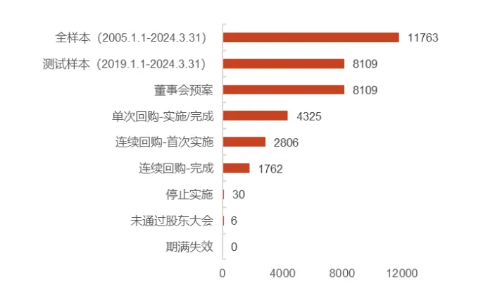
资料来源：Wind，光大证券研究所；单位：件

图 21：重要公告节点前后超额净值
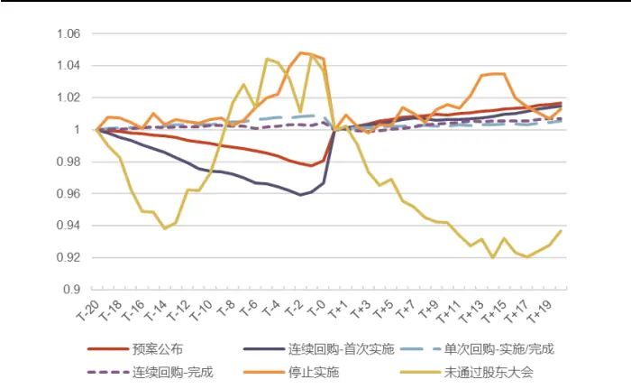
资料来源：Wind，光大证券研究所；注：基准为中证全指，下同

董事会预案、开始实施回购、回购完成公告均对股价具有显著积极的影响。相较中证全指，董事会预案、单次回购-实施/完成、连续回购-首次实施、连续回购-完成 4 类公告的 T+20 超额净值分别为 1.0167、1.0147、1.0057、1.0069，均通过检验，显著大于 1。

回购停止实施和未通过股东大会 2 类公告对股价没有显著正向的影响。停止实施通常是由于股价或其他财务指标转暖而触发停止回购的标准，因此公告后没有明显的股价下降；未通过股东大会往往象征着股东对财务状况、资金压力、战略优先级等方面的谨慎态度，公告后存在负向的超额净值。

表 5：T+20 日超额净值和显著性检验

| 公告类型 | 超额净值 | T值 显著性水平 |
| --- | --- | --- |
| 董事会预案 | 1.0167 | 0.0000 |
| 单次回购-实施/完成 | 1.0147 | 6.38 0.0000 |
| 连续回购-首次实施 | 1.0057 2.98 | 0.0015 |
| 连续回购-完成 | 1.0069 2.32 | 0.0101 |
| 停止实施 | 1.0130 0.57 | 0.2879 |
| 未通过股东大会 | 0.9369 | -3.53 0.9878 |

资料来源：Wind，光大证券研究所

从样本超额净值分布来看，预案公布 T+20 日超额净值没有明显的偏态分布，存在超额净值的样本占比 50.1%。短期公告效应很大程度上反映的是投资者情绪，回购预案公布后投资者并没有过度反应，对于回购持中性态度，一方面，随着制度环境的更迭，不同年份的公告反应存在差异，早年间“伪回购”情况的出现可能会导致谨慎的态度；另一方面其他事件特征、财务因素会对事件效应产生稀释。

随着资本市场变迁和回购制度逐步完善，投资者对于上市公司回购公告的态度是否在不断转变？对不同年份的回购事件分别进行测试，2019、2020 年回购预案公告不存在明显的短期超额净值，2021 年起投资者反应更为积极，2021、2022、2023、2024 年以来回购预案公告 T+20 日超额净值分别为1.0195、1.0078、1.0164、1.0776。从 2024 年以来预案公布后收益分布来看，70%的上市公司发布公告后短期股价上涨。

图 22：全样本预案公布 T+20日超额净值分布
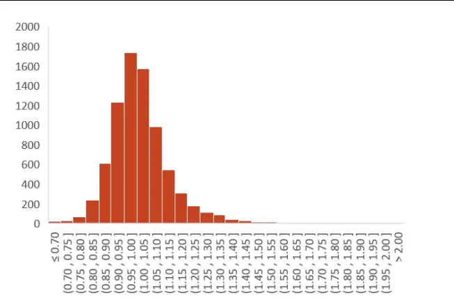
资料来源：Wind，光大证券研究所；纵轴单位：件

图 23：不同年份董事会预案样本数量
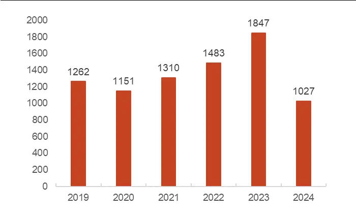
资料来源：Wind，光大证券研究所；纵轴单位：件；截至 20240331

图 24：不同年份预案公布超额净值
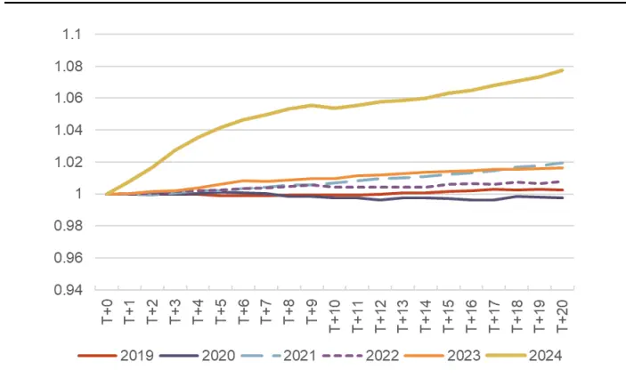
资料来源：Wind，光大证券研究所；截至 20240331

图 25：2024 年以来预案公布T+20 日超额净值分布
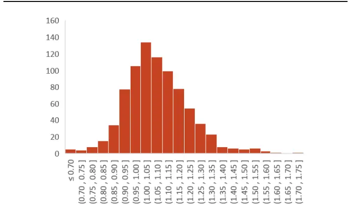
资料来源：Wind，光大证券研究所；纵轴单位：件；截至 20240331

## 4.2 事件特征测试

除短期积极信号外，更重要的是回购往往蕴含着特定的经济意图，对股价形成长期支撑作用。需要对事件特征，即回购类型、资金来源等因素进行拆解，才能更好地认识回购、并识别回购的真正效果。

## 4.2.1 回购类型

回购主要包括两大类，主动式回购更能反映公司的市值管理意图。主动式回购是公司出于特定意图主动开展的，在公开市场针对流通股集中交易，比如员工激励、市值管理等；而触发式回购是触发特定事项后被动进行的，主要采取定向回购的方式，回购股份一般为限售股，包括盈利补偿、激励注销。目前国内以触发式回购为主，数量占比最高的两类回购为激励注销（占比 59%）、员工激励（占比 22%）。

回购是否注销可以反映在事件类型中，主动式回购中仅减资回购被要求注销，触发式回购都会进行注销。主动式回购中，减资回购得来的股份需要在 10 天内注销，而减资类回购的占比很小，其他主动式回购并没有注销股份的要求。触发式回购中，激励注销回购是因为激励对象失去股权激励计划资格，公司就要收回此前授予的股票并进行注销；盈利补偿回购是上市公司在收购资产后，收购资产的业绩不达标，业绩承诺方会以股份补偿上市公司，上市公司会按照约定回购并注销相应股份。根据各类事件占比来看，目前 A股约三分之二的回购会进行注销。

图 26：回购的主要类型、目的和方式

| 类型 | 回购目的 | 回购方式 | 股份类型 |
| --- | --- | --- | --- |
| 主动式 | 员工激励 | 集中竞价 | 非股权激励流通股 |
|  | 市值管理 | 集中竞价 | 非股权激励流通股 |
|  | 其他（减资、转债） | 集中竞价 | 非股权激励流通股 |
| 触发式 | 盈利补偿 | 定向回购 | 非股权激励限售股 |
|  | 激励注销 | 定向回购 | 股权激励限售股 |

资料来源：Wind，光大证券研究所

图 27：不同回购目的样本数量分布
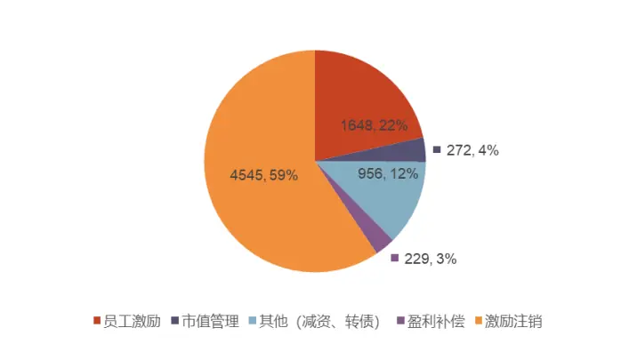
资料来源：Wind，光大证券研究所；数量单位：件

但实际上是否注销对股价的影响似乎没有明显反映在股价中。虽然底层数据中缺乏回购股份是否注销这一字段，但可以根据回购类型来推测，一定进行注销的激励注销或是盈利补偿回购并没有特别显著的超额收益。

经测试，主动式回购的效果更好，其中员工激励、市值管理类回购表现最佳；
被动进行的回购中，盈利补偿类回购基本不能获得超额收益。

图 28：回购类型分组超额净值
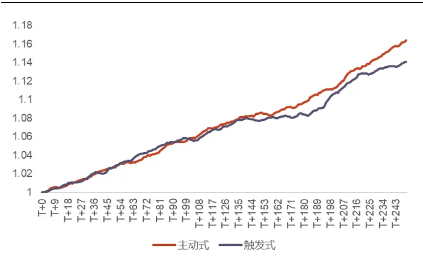
资料来源：Wind，光大证券研究所

图 29：回购目的分组超额净值
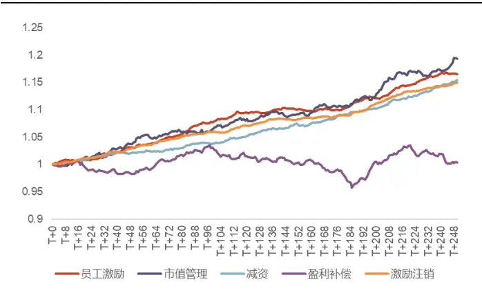
资料来源：Wind，光大证券研究所

## 4.2.2 回购比例

主动式回购的平均回购比例较高。通常回购预案中会公布回购比例——本次回购股份数量占总股本比例，但是对于主动式回购来说，如果流通股占总股本比例较低，回购股份数量占总股本比例虽然较低，但是对股价的影响可能反而更高，因此我们对主动式回购的回购比例进行修正，通过预案中披露的回购股份数量和当期流通股本数量来计算回购比例。这其实只影响到个别样本的计算，大部分公司股本还是以流通股为主。

针对公开市场流通股开展的主动式回购数量占比较小，但平均回购比例较高，平均回购比例为 2.19%；针对限售股开展的触发式回购数量占比较高，但平均回购比例较低，平均回购比例为 0.3%。

表 6：回购比例描述统计

| 回购比例（%） | 主动式回购（针对流通股） | 触发式回购（针对限售股） |
| --- | --- | --- |
| mean | 2.19 | 0.30 |
| std | 2.23 | 1.60 |
| min | 0.01 | 0.00 |
| 25%分位数 | 0.80 | 0.01 |
| 50%分位数 | 1.50 | 0.03 |
| 75%分位数 | 2.80 | 0.16 |
| max | 22.85 | 49.09 |

资料来源：Wind，光大证券研究所

经测试，不同回购比例事件短期表现没有明显差异，更长期的看，回购比例低于 0.1%以下的事件表现相对一般，而回购比例在 1%以上的事件具有相对优势。通常来说，大规模回购的实施次数较多、期限更长，持有期长的情况下收益会更好。

图 30：回购比例分组样本数量
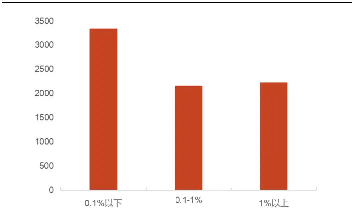
资料来源：Wind，光大证券研究所；纵轴单位：件

图 31：回购比例分组超额净值
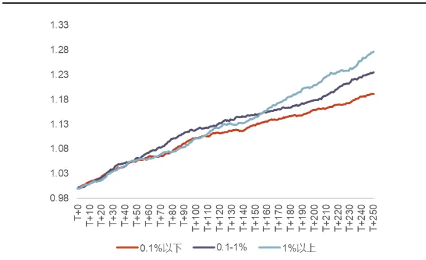
资料来源：Wind，光大证券研究所

## 4.2.3 资金来源

从回购筹码来看，目前 A股绝大多数回购是利用自有资金进行的，利用自有资金进行的回购事件发生后具有稳定的超额表现。分组测试后，利用自有资金开展的回购超额表现比较稳定；自筹资金的回购基本不存在超额收益；自有+自筹资金的回购事件表现居中；向第三方融资的回购基本是利用 IPO 取得的超募资金来开展的，是 2022 年回购资金来源放宽至合理合法资金后才出现的，样本数量较少，并且回购后股价表现不稳定。

图 32：回购资金来源分组样本数量
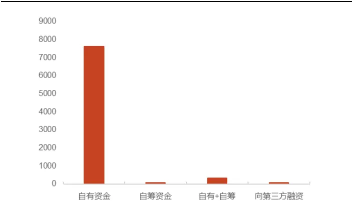
资料来源：Wind，光大证券研究所；纵轴单位：件

图 33：回购资金来源分组超额净值
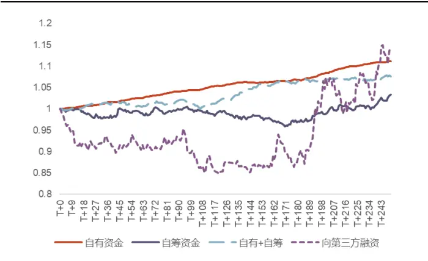
资料来源：Wind，光大证券研究所

## 4.3 财务因素测试

仅考虑事件特征对不同事件的区分度是有限的，除事件层面的因素外，回购时财务因素是否会影响回购事件收益？我们通过相关性初步筛选到与事件后超额表现相对较强的因子进行分组测试。

成长因子中，ROEyoy、ROAyoy、标准化预期外盈利因子与回购事件相关性较强，分组测试后效果较好，呈现单调性。盈利因子中，ROE、ROA、营业利润率 TTM、净利润率 TTM 与事件收益也呈现一定的相关性，但分组测试的结果并未有明显的单调性。风险因子中，市净率因子分组测试后效果同样较好、呈现一定的单调性。

如何解释回购事件与成长因子结合较好？原因可能在于高 ROE 的公司业绩原本就更稳定，回购带来的催化效果，无论是 ROE 提升、还是投资者情绪增强，都比较有限；而高成长的公司业绩则面临更多不确定性，若开展回购，更能体现对未来业绩的信心，因此成长类因子可以对回购后的超额净值形成区分。

图 34：财务因子分组超额净值
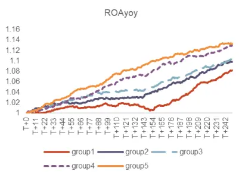

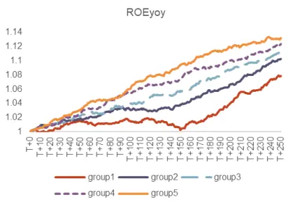

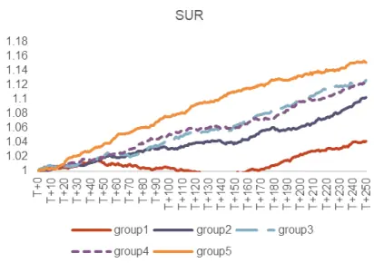

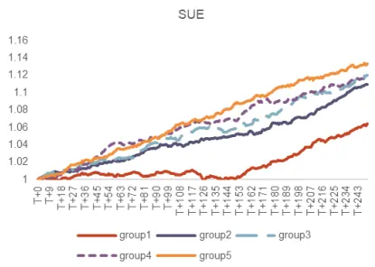

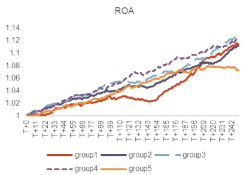

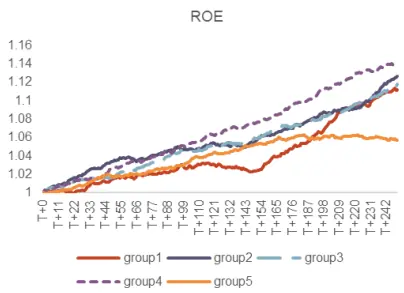

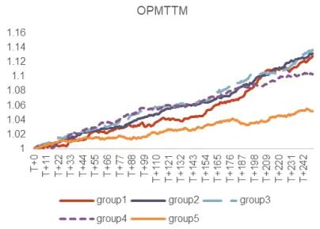

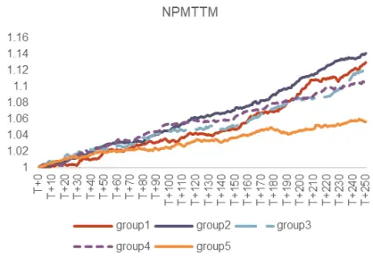

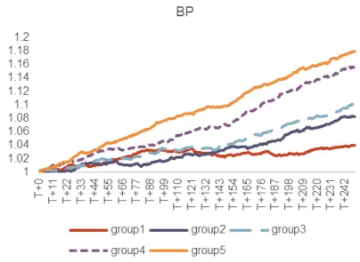
资料来源：Wind，光大证券研究所；SUE 是标准化预期外盈利、SUR 是标准化预期外盈利、OPMTTM 是营业利润率 TTM、NPMTTM 是净利润率 TTM、BP 是市净率因子

## 5、策略构建

## 5.1 基础回购策略

## 5.1.1 构建事件因子

基于前述对事件收益的拆解，我们首先建立仅包含事件特征的基础回购策略。通过构建回购事件因子来描述事件特征：回购事件因子取三个维度，其一，对回购类型的处理，将员工激励和市值管理类型记 1、其他主动式回购和激励注销类型记 0.5、盈利补偿类型的回购事件进行排除；其二，对回购比例的处理，取回购股份占股本比例在过去一年样本中的百分比排名；其三，对资金来源的处理，将自有资金记 1、自有+自筹资金记 0.5、其他资金来源的回购事件进行排除。

表 7：构建回购事件因子

| 特征 | 处理方式 |
| --- | --- |
| 回购类型 | 员工激励和市值管理类型记1、 其他主动式回购和激励注销类型记0.5、 盈利补偿类型的回购事件进行排除 |
| 回购比例 | 取回购股份占总股本比例在过去一年样本中的百分比排名，无有效值记0 |
| 资金来源 | 自有资金记1、 |
|  | 自有+自筹资金记0.5、 其他资金来源的回购事件进行排除 |

资料来源：光大证券研究所

## 5.1.2 参数测试

调仓和加权上，主要考虑两种方式：

1）动态调整+等权持有：预案公告次日买入，买入后持有 n 交易日，若新进股票，则动态调整现有股票仓位，等权持有。

2）定期调仓+因子加权：月度频率调仓，检查持有时长和回购事件因子值，调仓时对当月新公告的回购事件买入，对持有 n 交易日以上的事件卖出，以因子值加权。

动态调整的情况下可以更好的捕捉短期公告效应，定期调仓的方式下可能会丢失一些短期效应，但更关注事件特征和长期对股价的支撑，而且可以节省调仓成本和操作难度。

因此在构建基础组合时，需要对调仓频率、加权方式、滚动持有时长进行测试，由于参数组合数量较多，此处仅进行部分展示。

对不同参数搭配进行测试后，发现在定期调仓+因子加权+持有 250d的处理方式下，基础回购策略超额净值表现最佳。业绩表现方面，在 2019.02.01-2024.04.30 区间内，策略总收益 97.21%，年化收益 14.31%，年化超额10.09%。

这在一定程度上可以说明回购事件适合长期持有，并且回购事件因子具有解释力，虽然定期调仓的方式下会忽略一些短期公告效应，但是通过因子加权，策略效果没有下降，反而有所提升。

图 35：动态调整+等权持有超额净值
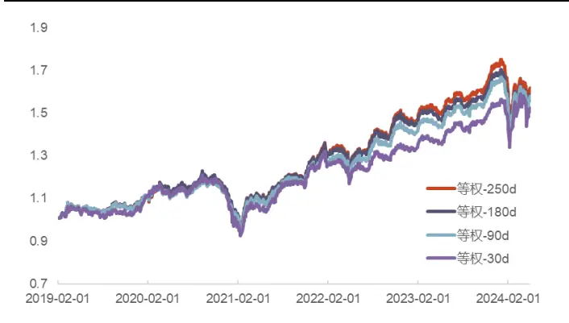
资料来源：Wind，光大证券研究所；注：数据起止日期为：2019.02.01-2024.04.30

图 36：定期调仓+因子加权超额净值
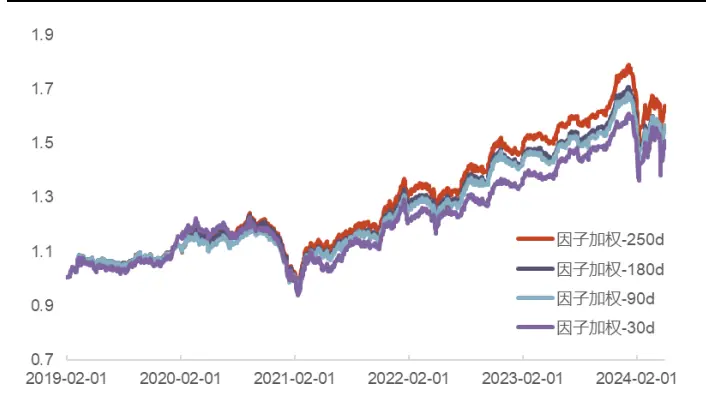
资料来源：Wind，光大证券研究所；注：数据起止日期为：2019.02.01-2024.04.30

表 8：定期调仓+因子加权+250d 超额净值评价指标

| 类型 | 策略 | 中证全指 | 超额 |
| --- | --- | --- | --- |
| 总收益 | 97.21% | 21.07% | 62.88% |
| 年化收益率 | 14.31% | 3.84% | 10.09% |
| 年化波动率 | 23.11% | 19.60% | 9.98% |
| 夏普比率 | 0.45 | -0.01 | 0.61 |
| 最大回撤 | 30.85% | 39.33% | 22.10% |
| 最大回撤开始日期 | 2022-01-17 | 2021-12-13 | 2020-09-08 |
| 最大回撤截止日期 | 2022-04-26 | 2024-02-05 | 2021-02-10 |
| 月度胜率 | 63.49% | 55.56% | 65.08% |

资料来源：Wind，光大证券研究所；注：数据起止日期为：2019.02.01-2024.04.30

组合容量上，随着上市公司回购频繁发生，如果不进行限制，在最新一次调仓中样本数量将超 1600 只，一定程度上会影响策略灵活性和管理难度。经测试，限制组合样本数量将提升策略表现，选取 50 只回购事件因子表现最佳的股票，可以较好地提升组合表现。综上，构建基础回购策略，参数为定期调仓、利用回购事件因子加权、滚动持有 250 天、组合容量限制 50 只因子表现最佳的股票。业绩表现方面，在 2019.02.01-2024.04.30 区间内，策略总收益116.77%，年化收益 16.46%，年化超额 12.16%。

图 37：不做限制情况下的组合容量
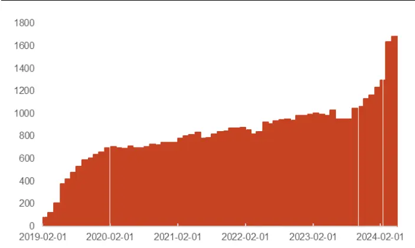
资料来源：Wind，光大证券研究所；注：数据起止日期为：2019.02.01-2024.04.30；纵轴单位：件

图 38：不同组合容量下基础回购策略超额净值
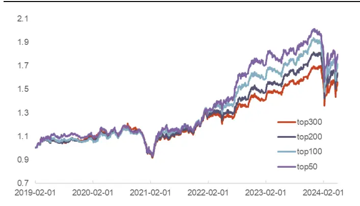
资料来源：Wind，光大证券研究所；注：数据起止日期为：2019.02.01-2024.04.30

表 9：基础回购策略评价指标

| 类型 | 策略 | 中证全指 超额 |
| --- | --- | --- |
| 总收益 116.77% |  | 21.07% 79.04% |
| 年化收益率 | 16.46% | 3.84% 12.16% |
| 年化波动率 | 22.78% | 19.60% 12.45% |
| 夏普比率 | 0.55 | -0.01 0.66 |
| 最大回撤 | 36.35% | 39.33% 22.24% |
| 最大回撤开始日期 | 2023-02-15 | 2021-12-13 2023-12-05 |
| 最大回撤截止日期 | 2024-02-05 | 2024-02-05 2024-02-07 |
| 月度胜率 | 60.32% | 55.56% 60.32% |

资料来源：Wind，光大证券研究所；注：数据起止日期为：2019.02.01-2024.04.30

从持仓股票的市值特征来看，回购基础组合的平均市值以往通常在百亿以上，近两年有所下沉；行业分布方面，以 2024 年 4 月持仓股票来看，覆盖 20 个申万一级行业，其中机械设备、医药生物、基础化工行业个股数量占比最高。

图 39：基础回购策略加权平均市值
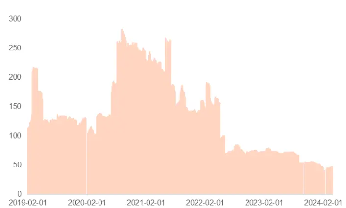
资料来源：Wind，光大证券研究所；注：数据起止日期为：2019.02.01-2024.04.30单位：亿元

图 40：2024 年4 月基础回购策略行业分布
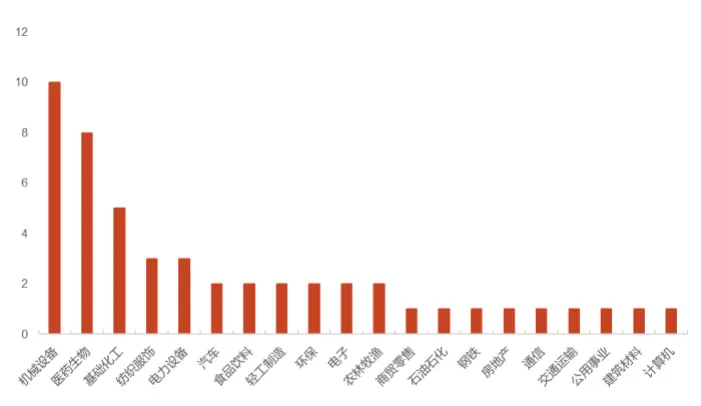
资料来源：Wind，光大证券研究所；注：数据截至 2024.04.30；单位：只；按申万一级行业分类

## 5.2 回购增强策略

## 5.2.1 筛选财务因子

仅考虑事件特征对策略效果的提升是非常有限的，经过利用盈利、成长、估值类因子对回购事件因子进行分组测试，我们试图筛选对回购事件具有区分度的财务因子。

我们利用财务因子对回购事件进行分组，从不同组别表现来看，回购和成长类因子搭配效果较好。叠加成长类因子的情况下，根据因子值分组后的第一组相对最后一组在不同的时间段都能获取稳定的超额收益；利用盈利类因子分组后，盈利性较好情况下的回购事件在 2021 年以来表现比较乏力；和估值类因子的搭配下，低估值企业的回购事件不存在稳定的超额净值。

图 41：成长类因子分组 group1 超额净值
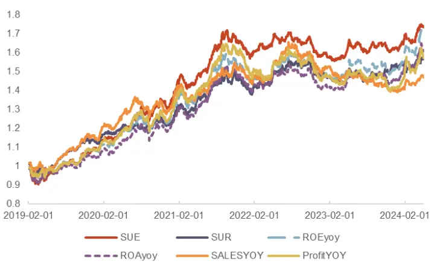
资料来源：Wind，光大证券研究所；注：数据起止日期为：2019.02.01-2024.04.30；ProfitYOY：单季度净利润同比增长率、SALESYOY：单季度营业收入同比增长率

图 42：盈利类因子分组 group1 超额净值
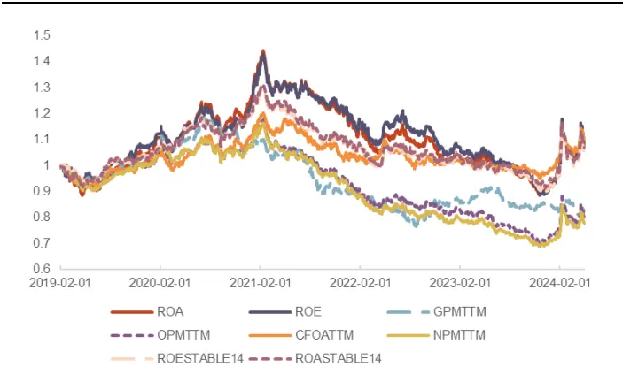
资料来源：Wind，光大证券研究所；注：数据起止日期为：2019.02.01-2024.04.30；GPMTTM：毛利率 TTM、GPOATTM：总资产毛利率 TTM、CFOATTM：经营现金流比率、ROESTABLE14：ROE 稳定性、ROASTABLE14：ROA 稳定性

图 43：估值类因子分组 group1 超额净值
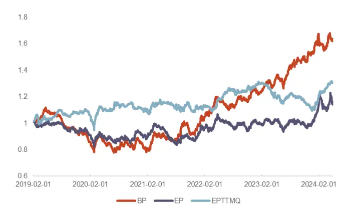
资料来源：Wind，光大证券研究所；注：数据起止日期为：2019.02.01-2024.04.30；EP：市盈率因子、EPTTMQ：EPTTM 在过去 1 年的分位点

## 5.2.2 回购质量策略

由于回购和成长类因子搭配效果较好，利用成长因子在基础回购策略的基础上进行增强，构建回购质量策略。为避免共线性影响，我们仅选取超额净值表现最稳定的成长因子与回购事件进行叠加，并且对比两种叠加方式的效果：1）方式 1：将标准化后的成长因子和回购事件因子加总；2）方式 2：在基础事件池中，利用成长因子值筛选回购事件因子。

相较基础回购策略，回购质量策略效果能得到可观提升，采用将标准化后的成长因子和回购事件因子加总的方式，回购质量策略效果更佳。业绩表现方面，在 2019.02.01-2024.04.30 区间内，策略总收益 179.84%，年化收益22.47%，年化超额 17.95%。

图 44：回购质量策略净值表现
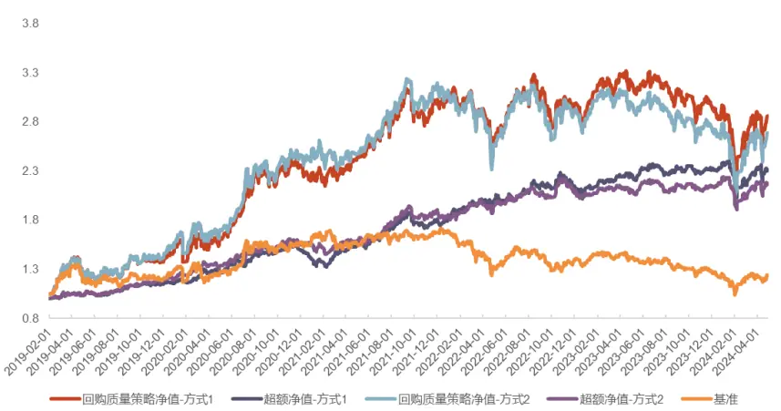
资料来源：Wind，光大证券研究所；注：数据起止日期为：2019.02.01-2024.04.30

表 10：回购质量策略评价指标

| 类型 | 策略 | 中证全指 | 超额 |
| --- | --- | --- | --- |
| 总收益 | 179.84% | 21.07% | 131.14% |
| 年化收益率 | 22.47% | 3.84% | 17.95% |
| 年化波动率 | 23.85% | 19.60% | 11.58% |
| 夏普比率 | 0.77 | -0.01 | 1.20 |
| 最大回撤 | 34.63% | 39.33% | 15.41% |
| 最大回撤开始日期 | 2023-04-19 | 2021-12-13 | 2024-01-17 |
| 最大回撤截止日期 | 2024-02-05 | 2024-02-05 | 2024-02-07 |
| 月度胜率 | 65.08% | 55.56% | 73.02% |

资料来源：Wind，光大证券研究所；注：数据起止日期为：2019.02.01-2024.04.30

图 45：回购质量策略加权平均市值
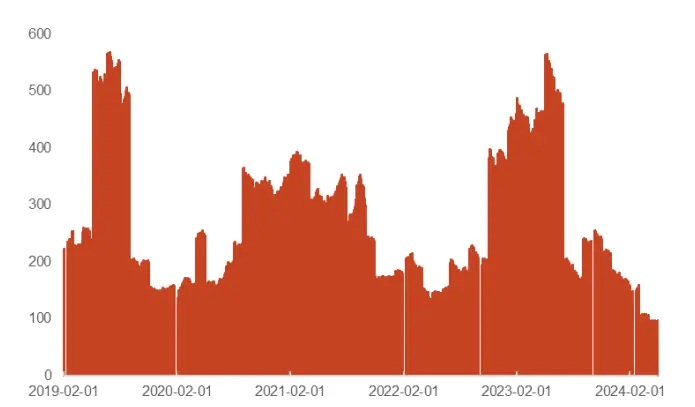
资料来源：Wind，光大证券研究所；注：数据起止日期为：2019.02.01-2024.04.30单位：亿元

图 46：2024 年4 月回购质量策略行业分布
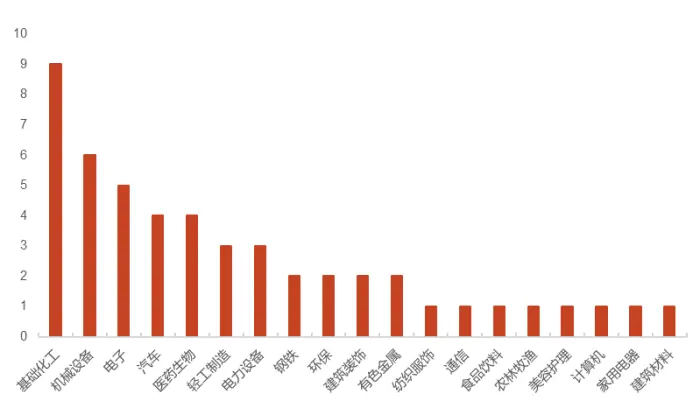
资料来源：Wind，光大证券研究所；注：数据截至 2024.04.30；单位：只；按申万一级行业分类

表 11：2024 年4 月回购质量策略持仓

| 证券代码 | 证券名称 | 权重 | 申万行业 | 自由流通市值 (亿元) | 证券代码 | 证券名称 | 权重 | 申万行业 | 自由流通市值 (亿元) |
| --- | --- | --- | --- | --- | --- | --- | --- | --- | --- |
| 300985.SZ | 致远新能 | 3.69% | 机械设备 | 9.58 | 002083.SZ | 孚日股份 | 1.62% | 纺织服饰 | 23.52 |
| 300902.SZ | 国安达 | 3.63% | 机械设备 | 18.31 | 002588.SZ | 史丹利 | 1.61% | 基础化工 | 38.38 |
| 300217.SZ | 东方电热 | 3.63% | 家用电器 | 44.16 | 600212.SH | 绿能慧充 | 1.60% | 电力设备 | 27.59 |
| 003000.SZ | 劲仔食品 | 3.49% | 食品饮料 | 33.49 | 002637.SZ | 赞宇科技 | 1.60% | 基础化工 | 25.95 |
| 000534.SZ | 万泽股份 | 3.39% | 医药生物 | 31.09 | 603530.SH | 神马电力 | 1.58% | 电力设备 | 15.41 |
| 601058.SH | 赛轮轮胎 | 3.35% | 汽车 | 383.00 | 002241.SZ | 歌尔股份 | 1.52% | 电子 | 371.56 |
| 688100.SH | 威胜信息 | 3.21% | 通信 | 45.31 | 603725.SH | 天安新材 | 1.44% | 基础化工 | 11.60 |
| 300102.SZ | 乾照光电 | 3.19% | 电子 | 40.05 | 300441.SZ | 鲍斯股份 | 1.43% | 机械设备 | 22.49 |
| 300119.SZ | 瑞普生物 | 3.11% | 农林牧渔 | 44.04 | 300888.SZ | 稳健医疗 | 1.40% | 美容护理 | 56.84 |
| 688109.SH | 品茗科技 | 3.11% | 计算机 | 9.78 | 605167.SH | 利柏特 | 1.39% | 建筑装饰 | 14.30 |
| 300562.SZ | 乐心医疗 | 3.03% | 医药生物 | 13.42 | 603995.SH | 甬金股份 | 1.30% | 钢铁 | 35.54 |
| 301127.SZ | 天源环保 | 2.98% | 环保 | 17.12 | 601969.SH | 海南矿业 | 1.23% | 钢铁 | 34.57 |
| 301019.SZ | 宁波色母 | 2.77% | 基础化工 | 11.14 | 688625.SH | 呈和科技 | 1.13% | 基础化工 | 16.43 |
| 300995.SZ | 奇德新材 | 2.63% | 基础化工 | 4.83 | 002984.SZ | 森麒麟 | 1.11% | 汽车 | 137.32 |
| 603617.SH | 君禾股份 | 2.59% | 机械设备 | 13.44 | 603956.SH | 威派格 | 1.11% | 机械设备 | 15.81 |
| 002753.SZ | 永东股份 | 2.51% | 基础化工 | 11.18 | 002228.SZ | 合兴包装 | 1.11% | 轻工制造 | 17.53 |
| 603048.SH | 浙江黎明 | 2.32% | 汽车 | 5.77 | 605299.SH | 舒华体育 | 1.10% | 轻工制造 | 11.12 |
| 603283.SH | 赛腾股份 | 2.31% | 机械设备 | 69.83 | 688018.SH | 乐鑫科技 | 1.08% | 电子 | 48.87 |
| 600222.SH | 太龙药业 | 2.18% | 医药生物 | 22.47 | 688049.SH | 炬芯科技 | 1.08% | 电子 | 25.00 |
| 001211.SZ | 双枪科技 | 2.04% | 轻工制造 | 5.84 | 002998.SZ | 优彩资源 | 1.03% | 基础化工 | 10.25 |
| 600219.SH | 南山铝业 | 1.98% | 有色金属 | 213.14 | 688223.SH | 晶科能源 | 1.03% | 电力设备 | 235.32 |
| 603332.SH | 苏州龙杰 | 1.94% | 基础化工 | 6.89 | 301065.SZ | 本立科技 | 1.01% | 医药生物 | 8.77 |
| 300566.SZ | 激智科技 | 1.88% | 电子 | 29.25 | 002671.SZ | 龙泉股份 | 1.01% | 建筑材料 | 13.74 |
| 002811.SZ | 郑中设计 | 1.78% | 建筑装饰 | 6.44 | 300816.SZ | 艾可蓝 | 1.00% | 汽车 | 8.13 |
| 600988.SH | 赤峰黄金 | 1.74% | 有色金属 | 254.82 | 300779.SZ | 惠城环保 | 1.00% | 环保 | 43.81 |

资料来源：Wind，光大证券研究所；截至 2024.04.30

## 5.3 小结

综上，首先构建基础回购策略，参数为定期调仓、利用回购事件因子加权、每个事件滚动持有 250 天、组合容量限制 50 只因子表现最佳的股票。基础回购策略在 2019.02.01-2024.04.30 区间内，策略总收益 116.77%，年化收益16.46%，年化超额 12.16%。

仅考虑事件特征对策略效果的提升是非常有限的，通过考虑财务因子来增强策略效果。叠加盈利、价值因子并不能有效提升组合表现，因此不做推荐。基于回购叠加成长类因子，构建回购质量策略，在 2019.02.01-2024.04.30 区间内，策略总收益 179.84%，年化收益 22.47%，年化超额 17.95%，相较基础回购策略，回购质量策略效果得到可观提升。

图 47：两种策略净值表现
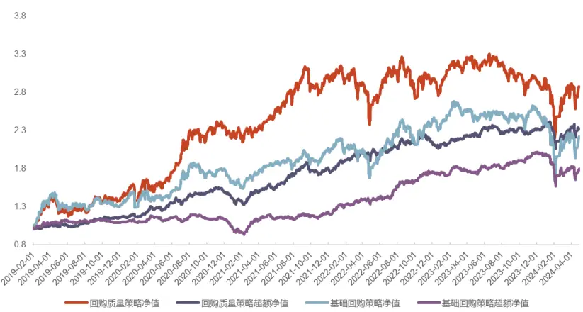
资料来源：Wind，光大证券研究所；注：数据起止日期为：2019.02.01-2024.04.30

表 12：两种策略评价指标

| 类型 | 基础回购策略 | 基础回购策略-超额 | 回购质量策略 | 回购质量策略-超额 |
| --- | --- | --- | --- | --- |
| 总收益 | 116.77% | 79.04% | 179.84% | 131.14% |
| 年化收益率 | 16.46% | 12.16% | 22.47% | 17.95% |
| 年化波动率 | 22.78% | 12.45% | 23.85% | 11.58% |
| 夏普比率 | 0.55 | 0.66 | 0.77 | 1.20 |
| 最大回撤 | 36.35% | 22.24% | 34.63% | 15.41% |
| 最大回撤开始日期 | 2023-02-15 | 2023-12-05 | 2023-04-19 | 2024-01-17 |
| 最大回撤截止日期 | 2024-02-05 | 2024-02-07 | 2024-02-05 | 2024-02-07 |
| 月度胜率 | 60.32% | 60.32% | 65.08% | 73.02% |

资料来源：Wind，光大证券研究所；注：数据起止日期为：2019.02.01-2024.04.30

## 6、 总结

2024 年以来，市值管理考核主线与高股息策略两大方向均展现出较高的市场关注度和相对一致的预期。股份回购作为市值管理工具、类似于分红的股东回报方式，价值不容忽视。

回购如何影响个股表现甚至市场走势？若实施公开市场回购，那么流通股数量下降，二级市场供给下降，将直接影响股价；其次，回购后，总股本（注销式）、净资产下降，EPS（注销式）、ROE 等财务指标将提升，进而驱动股价；此外，回购事件可以影响短期和长期的投资者情绪。上升到市场整体，以美股为鉴，回购或非影响市场走势的核心力量，美股快速上涨的主要贡献项是盈利增长，并且回购呈现顺盈利周期的特性。目前国内回购更多地发挥逆周期调节作用，若以沪深 300 指数来构建回购率指标，可以发现回购率和企业盈利相关性不强。

通过拆解回购事件收益，我们发现：1）重要公告节点的短期超额收益表现可以反映最直接的投资者情绪。董事会预案、开始实施回购、回购完成公告均对股价具有显著积极的影响；回购停止实施和未通过股东大会 2 类公告对股价没有显著正向的影响。

2）除短期积极信号外，回购往往蕴含着特定的经济意图，对股价形成长期支撑。主动式回购的效果更好，员工激励、市值管理类表现最佳；被动进行的回购中，盈利补偿类基本不能获得超额收益。

4）从回购筹码来看，目前 A 股绝大多数回购是利用自有资金进行的，利用自有资金进行的回购事件发生后具有稳定的超额表现。

5）回购时财务表现是否会影响事件收益？回购与成长类因子的结合效果更佳。ROEyoy、ROAyoy、标准化预期外盈利因子与回购事件的相关性较强，分组测试后效果良好且呈单调性。高 ROE 的公司业绩相对稳定，回购带来的催化效果有限，高成长性的公司通过回购更能提振投资者对未来业绩的信心。

基于上述分析，我们构建两类策略。

基础回购策略：通过构建回购事件因子来描述事件特征，首先建立仅包含事件特征的基础回购策略。对不同参数进行测试，在定期调仓+因子加权+持有250d+持仓 50 只的处理方式下，基础回购策略超额净值表现最佳。在测试区间内，策略总收益 116.77%，年化收益 16.46%，年化超额 12.16%。

回购质量策略：由于回购和成长类因子搭配效果较好，利用成长因子在基础回购策略的基础上进行增强，构建回购质量策略。相较基础回购策略，回购质量策略效果能得到可观提升，采用将标准化后的成长因子和回购事件因子加总的方式，回购质量策略效果更佳。在测试区间内，策略总收益 179.84%，年化收益 22.47%，年化超额 17.95%。

## 7、风险提示

报告结果均基于历史数据，存在不被重复验证的可能；根据事件原始数据统计，可能与其他三方数据存在差异；政策变化、极端行情在内的其他因素可能影响事件效果。

## 行业及公司评级体系

| 评级 说明 |  |  |
| --- | --- | --- |
|  | 买入 | 未来6-12个月的投资收益率领先市场基准指数15%以上 |
|  | 增持 | 未来 6-12 个月的投资收益率领先市场基准指数 5%至 15%; |
|  | 中性 | 未来6-12个月的投资收益率与市场基准指数的变动幅度相差-5%至5%； |
|  | 减持 | 未来 6-12 个月的投资收益率落后市场基准指数 5%至 15%; |
| 行业及公司评级 | 卖出 | 未来6-12个月的投资收益率落后市场基准指数15%以上； |
|  | 无评级 | 因无法获取必要的资料，或者公司面临无法预见结果的重大不确定性事件，或者其他原因，致使无法给出明确的投资评级。 |
|  | 基准指数说明： | A股市场基准为沪深300指数；香港市场基准为恒生指数；美国市场基准为纳斯达克综合指数或标普500指数。 |

## 分析、估值方法的局限性说明

本报告所包含的分析基于各种假设，不同假设可能导致分析结果出现重大不同。本报告采用的各种估值方法及模型均有其局限性，估值结果不保证所涉及证券能够在该价格交易。

## 分析师声明

本报告署名分析师具有中国证券业协会授予的证券投资咨询执业资格并注册为证券分析师，以勤勉的职业态度、专业审慎的研究方法，使用合法合规的信息，独立、客观地出具本报告，并对本报告的内容和观点负责。负责准备以及撰写本报告的所有研究人员在此保证，本研究报告中任何关于发行商或证券所发表的观点均如实反映研究人员的个人观点。研究人员获取报酬的评判因素包括研究的质量和准确性、客户反馈、竞争性因素以及光大证券股份有限公司的整体收益。所有研究人员保证他们报酬的任何一部分不曾与，不与，也将不会与本报告中具体的推荐意见或观点有直接或间接的联系。

## 法律主体声明

本报告由光大证券股份有限公司制作，光大证券股份有限公司具有中国证监会许可的证券投资咨询业务资格，负责本报告在中华人民共和国境内（仅为本报告目的，不包括港澳台）的分销。本报告署名分析师所持中国证券业协会授予的证券投资咨询执业资格编号已披露在报告首页。

中国光大证券国际有限公司和 Everbright Securities(UK) Company Limited 是光大证券股份有限公司的关联机构。

## 特别声明

光大证券股份有限公司（以下简称“本公司”）成立于 1996 年，是中国证监会批准的首批三家创新试点证券公司之一，也是世界 500 强企业——中国光大集团股份公司的核心金融服务平台之一。根据中国证监会核发的经营证券期货业务许可，本公司的经营范围包括证券投资咨询业务。

本公司经营范围：证券经纪；证券投资咨询；与证券交易、证券投资活动有关的财务顾问；证券承销与保荐；证券自营；为期货公司提供中间介绍业务；证券投资基金代销；融资融券业务；中国证监会批准的其他业务。此外，本公司还通过全资或控股子公司开展资产管理、直接投资、期货、基金管理以及香港证券业务。

本报告由光大证券股份有限公司研究所（以下简称“光大证券研究所”）编写，以合法获得的我们相信为可靠、准确、完整的信息为基础，但不保证我们所获得的原始信息以及报告所载信息之准确性和完整性。光大证券研究所可能将不时补充、修订或更新有关信息，但不保证及时发布该等更新。

本报告中的资料、意见、预测均反映报告初次发布时光大证券研究所的判断，可能需随时进行调整且不予通知。在任何情况下，本报告中的信息或所表述的意见并不构成对任何人的投资建议。客户应自主作出投资决策并自行承担投资风险。本报告中的信息或所表述的意见并未考虑到个别投资者的具体投资目的、财务状况以及特定需求。投资者应当充分考虑自身特定状况，并完整理解和使用本报告内容，不应视本报告为做出投资决策的唯一因素。对依据或者使用本报告所造成的一切后果，本公司及作者均不承担任何法律责任。

不同时期，本公司可能会撰写并发布与本报告所载信息、建议及预测不一致的报告。本公司的销售人员、交易人员和其他专业人员可能会向客户提供与本报告中观点不同的口头或书面评论或交易策略。本公司的资产管理子公司、自营部门以及其他投资业务板块可能会独立做出与本报告的意见或建议不相一致的投资决策。本公司提醒投资者注意并理解投资证券及投资产品存在的风险，在做出投资决策前，建议投资者务必向专业人士咨询并谨慎抉择。

在法律允许的情况下，本公司及其附属机构可能持有报告中提及的公司所发行证券的头寸并进行交易，也可能为这些公司提供或正在争取提供投资银行、财务顾问或金融产品等相关服务。投资者应当充分考虑本公司及本公司附属机构就报告内容可能存在的利益冲突，勿将本报告作为投资决策的唯一信赖依据。

本报告根据中华人民共和国法律在中华人民共和国境内分发，仅向特定客户传送。本报告的版权仅归本公司所有，未经书面许可，任何机构和个人不得以任何形式、任何目的进行翻版、复制、转载、刊登、发表、篡改或引用。如因侵权行为给本公司造成任何直接或间接的损失，本公司保留追究一切法律责任的权利。所有本报告中使用的商标、服务标记及标记均为本公司的商标、服务标记及标记。

光大证券股份有限公司版权所有。保留一切权利。

光大证券研究所

上海

北京

深圳

静安区新闸路 1508 号

西城区武定侯街 2 号

福田区深南大道 6011 号

静安国际广场 3 楼

泰康国际大厦 7 层

NEO 绿景纪元大厦 A 座 17 楼

光大证券股份有限公司关联机构

香港

中国光大证券国际有限公司

香港铜锣湾希慎道 33 号利园一期 28 楼

英国

Everbright Securities(UK) Company Limited

6th Floor, 9 Appold Street, London, United Kingdom, EC2A 2AP