## 金融工程

# 因子分域初探：确定分域方式

## ——量化选股系列报告之十四

## 要点

## 因子分域建模尤为重要

传统多因子模型，是按照股票因子值在全市场对其进行排序，然后打分——这种方式将所有股票同等看待。通常，不同股票的基本面、量价等属性存在较大区别。低估值、规模较大、持续支付股息的蓝筹股，和高估值、规模较小、股息支付不稳定的成长股，可比性较差。因此，对股票分域建模显得尤为重要。

## 因子分域研究主要应用在因子计算和因子合成

我们尝试探究因子分域的应用，而因子分域方式多种多样，本篇报告主要介绍因子分域的研究框架，即解决因子如何分域的问题。因子分域研究主要分为两部分：因子计算和因子合成。

分域法应用于因子计算较为常见，首先选定一个特征将股票划分成多个域，再对不同分域内的股票差异化计算因子。常见的因子计算分域方式有很多，比如按照行业划分，将因子不适用的行业因子值设置为市场中位数；再比如按照风格因子划分，探究不同市值、估值等风格下，因子的不同表现。除了应用于因子计算以外，因子合成阶段也可以使用分域法，市场中已有研究如动态情景模型等就是如此。

## 因子分域后，相较于原始因子，表现提升明显

因子计算分为截面分域和时间序列分域，截面分域又细分为离散型分域和连续型分域，我们以估值因子、早盘收益因子以及反转因子为案例，详细介绍了各类分域方式的原理。从分域结果来看，分域后因子表现相较于原始因子均具有不同程度提升。

在因子合成阶段，不同因子具备不同的表达，因子可分为线性和非线性因子，可使用不同学习模型去拟合不同类型的因子，再进行合成，我们称之为多模型拟合。此外，当因子计算阶段的单个因子拓展到多个因子时，也需要合成。我们以同花顺量化因子为例，回测结果表明分域后因子表现显著提升。

风险分析：报告结果均基于历史数据，历史数据存在不被重复验证的可能。

## 作者

分析师：祁嫣然

执业证书编号：S0930521070001

010-57378031

qiyanran@ebscn.com

分析师：张威

执业证书编号：S0930524070004

010-57378050

zhangw@ebscn.com

## 相关研报

日内收益的精细切分：提炼动量与反转效应——量化选股系列报告之二（2021-10-22）

## 1、因子分域建模的逻辑

传统多因子模型，是按照股票因子值在全市场对其进行排序，然后打分——这种方式将所有股票同等看待。通常，不同股票的基本面、量价等属性存在较大区别。低估值、规模较大、持续支付股息的蓝筹股，和高估值、规模较小、股息支付不稳定的成长股，可比性较差。因此，对股票分域建模显得尤为重要。

传统分域建模的逻辑是基于不同股票池下因子的表现不同，进而对因子的权重进行重新调整，增厚收益。最常见的是对不同行业使用不同的因子。

按照行业建模的通常做法是不同行业内差异化计算因子，将因子不适用的行业中的股票因子值设置为全市场股票因子值的中位数，然后再进行多因子合成；另一种方式是根据行业内显著有效的因子，对股票单独打分，再汇总所有行业，得到全市场股票的综合得分。

此外，还可以按照盈利等风格特征，将股票划分到不同域。例如 60 日反转因子（本章下文简称为“反转因子”），利用“单季度 ROE 同比”将其分域，可以发现分域前后因子表现区别明显。这样分域的逻辑在于前期超跌的股票，其基本面并没发生明显恶化，其股价后续大概率能反弹回合理的价格区间。

我们按照“单季度 ROE 同比”从大到小将全市场股票分为 2 组，分别为 Big 组和 Small 组，反转因子在两组股票池中的表现区别明显。可以发现，反转因子多空组合在 Small 组中表现更佳。详细拆解多空组合收益可以发现，Small 组中的空头组，贡献了较多负收益。

图 1：反转因子-净值曲线
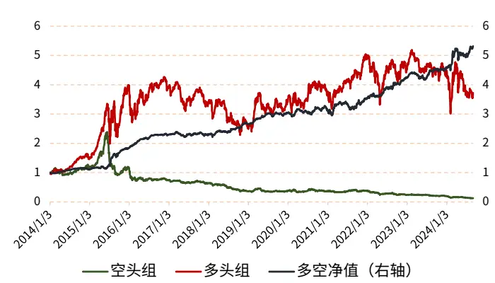
资料来源：Wind，光大证券研究所；统计区间：2014.01.03-2024.08.30

图 2：反转因子分域多空组合净值对比
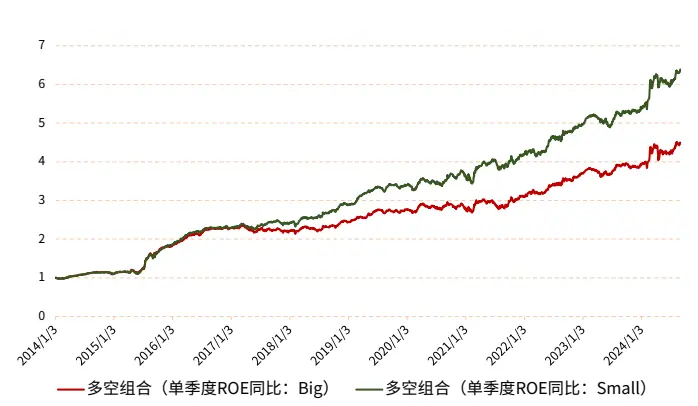
资料来源：Wind，光大证券研究所；统计区间：2014.01.03-2024.08.30

从绝对收益角度来看，多头组（Big）>多头组(Small)，空头组（Big）>空头组(Small)。反转因子在结合单季度 ROE 同比因子后，多头组绝对收益有所提升，但空头组股票，贡献了较多负收益。

由于 A 股市场做空的限制，采用单季度 ROE 同比因子对反转因子进行分域的方式，能够提供一定的增量信息，我们认为单季度 ROE 同比因子明显区分了反转因子。因此，可以按照单季度 ROE 同比因子将股票分域，然后在单季度 ROE 同比较高的股票池中提高反转因子权重，单季度 ROE 同比较低的股票池中降低反转因子权重。

图 3：反转因子分域多头组净值对比
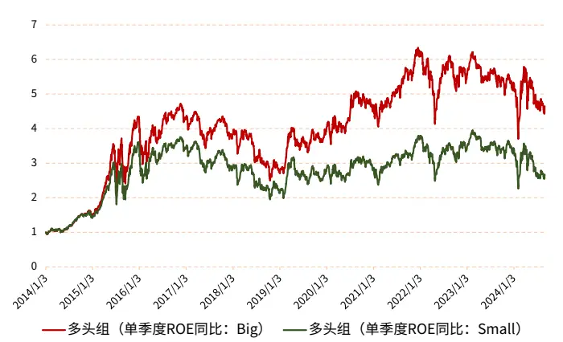
资料来源：Wind，光大证券研究所；统计区间：2014.01.03-2024.08.30

图 4：反转因子分域空头组净值对比
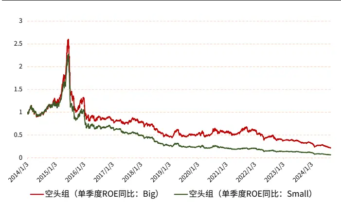
资料来源：Wind，光大证券研究所；统计区间：2014.01.03-2024.08.30

基于上述发现，我们尝试探究因子分域的应用，而因子分域方式多种多样，本篇报告作为系列第一篇，主要介绍因子分域的研究框架，即解决因子如何分域的问题。本文的因子分域研究框架如下，主要分为两部分：因子计算和因子合成。

- 因子计算：因子计算细分为截面分域和时间序列分域，截面分域又细分为离散型分域和连续型分域，在后文中我们将详细介绍其原理。

- 因子合成：不同因子具备不同的表达，因子可分为线性和非线性因子，可使用不同学习模型去拟合不同类型的因子，再进行合成，本文称之为多模型拟合。此外，因子计算阶段中的分域，拓展到多个因子层面，即是因子合成。

图 5：因子分域框架
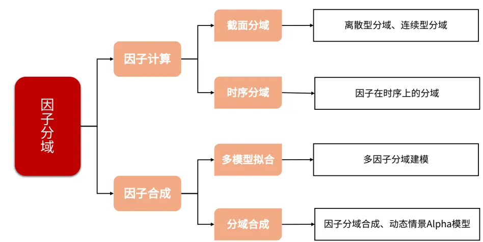
资料来源：光大证券研究所绘制

## 2、因子分域建模应用场景综述

因子分域的研究在市场中由来已久，在多因子框架下，分域一般会应用在两个步骤：因子计算和因子合成。

分域法应用于因子计算较为常见——首先选定一个特征将股票划分成多个域，再对不同分域内的股票差异化计算因子。常见的因子计算分域方式有很多，比如按照行业划分，将因子不适用的行业因子值设置为市场中位数；再比如按照风格因子划分，探究不同市值、估值等风格下，因子的不同表现。除了应用于因子计算以外，因子合成阶段也可以使用分域法，市场中已有研究如动态情景模型等就是如此。

## 2.1 因子计算

## 2.1.1 截面分域

截面分域，又分为离散型分域和连续型分域。我们在上一章中，使用单季度 ROE同比对股票进行分域的方式，即是离散型分域。

离散型分域的案例较多，以估值因子为例，估值因子无论在学术界还是投资界都是关注度较高的价值类因子。如果按照市值将股票划分为大市值和小市值两个域，我们发现估值因子在小市值域内存在稳健的收益，而在大市值域内的表现与全市场的表现较为一致——对于估值因子来说，市值风格就是一个有效的分域。

图 6：估值因子-净值曲线
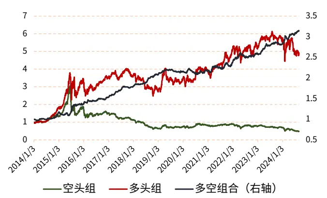
资料来源：Wind，光大证券研究所；统计区间：2014.01.03-2024.08.30

图 7：估值因子分域多空组合净值对比
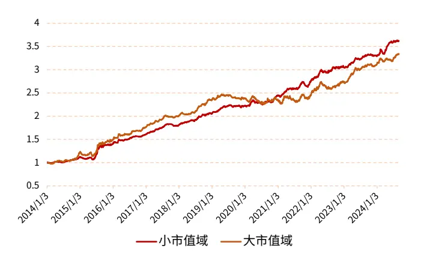
资料来源：Wind，光大证券研究所；统计区间：2014.01.03-2024.08.30

表 1：估值因子业绩指标对比

|  | 总收 益率 | 年化 收益率 | 年化 波动率 | 夏普 比率 | 最大 回撤 | 最大回撤 最大回撤 起始日期 | 月度 周频 截止日期 胜率 Rank IC |
| --- | --- | --- | --- | --- | --- | --- | --- |
| 全域 | 213.74% | 11.64% | 5.23% | 1.65 | 7.80% | 2015/1/5 | 2015/5/21 65.63% 3.85% |
| 大市值 分域 | 233.37% | 12.30% | 6.07% | 1.53 |  | 8.56% 2019/4/19 2020/7/10 66.41% | 3.60% |
| 小市值 分域 | 261.41% | 13.18% | 4.60% | 2.21 | 5.36% 2015/1/5 | 2015/6/2 75.00% | 4.94% |

资料来源：Wind，光大证券研究所；统计区间：2014.01.03-2024.08.30

与离散型分域不同的是，连续型分域使用分域因子对目标因子进行连续分域。以上述估值因子和市值因子为例，除了在截面上根据市值大小将股票池分为大小市值两组外，我们还可以对估值因子进行简单的市值加权，提升小市值股票的估值因子权重，即可实现连续型分域。

$$
weightfactor=\frac{x}{|x|}\times|x|^{n}
$$

$$
weight={\frac{weightfactor}{\sum weightfactor}}
$$

上述公式中，x 为对数市值的倒数。参数 n 越大，权重越向 x正方向集中。

下图展示了 n=4 时，市值因子加权估值因子的回测结果。从回测表现来看，提升了小市值股票的因子值权重之后，估值因子的表现提升明显。因子总收益率从213.74%提升至 346.36%，周频 Rank IC 从 3.85%提升至了 4.69%；月度胜率从 65.63%提升至了 74.22%。

图 8：市值加权估值因子多空组合净值对比
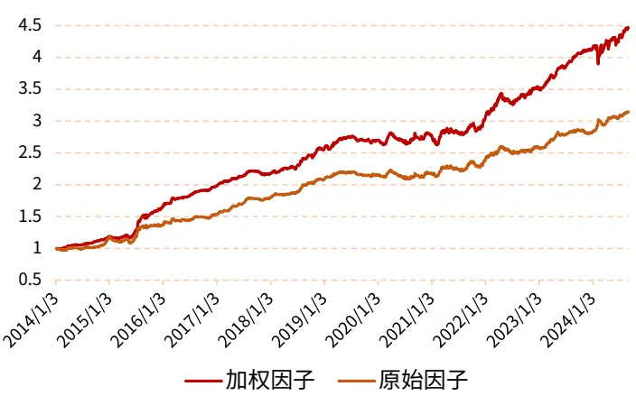
资料来源：Wind，光大证券研究所；统计区间：2014.01.03-2024.08.30

表 2：市值加权估值因子业绩指标对比

| 总收 益率 | 年化 收益率 | 年化 波动率 | 夏普 比率 | 最大 回撤 | 最大回撤 起始日期 | 最大回撤 截止日期 | 月度 周频 胜率 |
| --- | --- | --- | --- | --- | --- | --- | --- |
| 原始因子213.74% | 11.64% | 5.23% | 1.65 | 7.80% | 2015/1/5 | 2015/5/21 65.63% | Rank IC 3.85% |
| 加权因子346.36% | 15.50% | 5.78% | 2.16 | 6.93% | 2024/1/17 | 2024/2/7 74.22% | 4.69% |

资料来源：Wind，光大证券研究所；统计区间：2014.01.03-2024.08.30

## 2.1.2 时序分域

时间序列分域，简称时序分域，指在时序上对因子进行分域。我们在报告《日内收益的精细切分：提炼动量与反转效应——量化选股系列之二》（20211023）中使用到了时序分域的方式修复早盘收益因子。早盘收益因子计算方式如下：

$$
\begin{aligned}morning_{-}wmap&=\frac{\sum money_{open-morning_{-}cut}}{\sum volume_{open-morning_{-}cut}}\\\vdots\\mnorming_{-}ret&=\frac{morning_{-}wmap}{pre_{-}close}-\frac{open_{-}price}{pre_{-}close}\\factor&=\sum_{i=T-1}^{T-window}morning_{-}ret_{i}\end{aligned}
$$

我们先以 vwap（成交量加权价格）方式计算早盘涨幅，open-morning_cut 表示早盘量价数据的时间范围为 9:30 至 10:30；然后，定义早盘收益率为早盘vwap 涨幅与开盘价涨幅之差，这种计算方式使得一字涨停板并不计入早盘收益；最后，用过去一段天数(window)的早盘收益率之和作为因子。

截面上对因子值进行 MAD 去极值、市值和行业中性化处理。回测结果表明，早盘收益因子多空组合呈现反转特征。

图 9：早盘收益因子-分组净值曲线
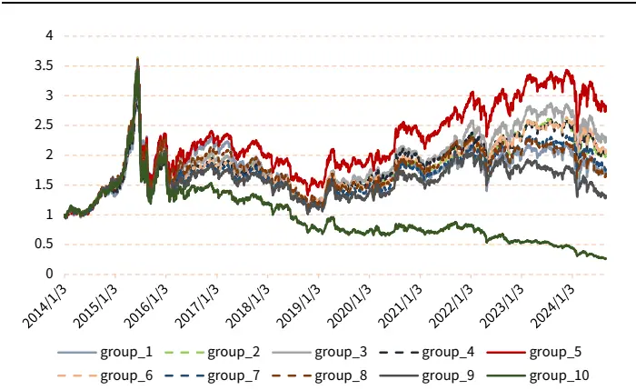
资料来源：Wind，光大证券研究所；统计区间：2014.01.03-2024.08.30；按照因子值从小到大将股票分为 10 组，依次为 group1-group10,后文同理。

图 10：早盘收益因子多空组合净值曲线
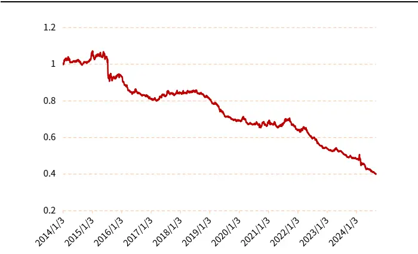
资料来源：Wind，光大证券研究所；统计区间：2014.01.03-2024.08.30

通过观察图中展示的回测结果，我们发现原始的早盘收益因子没有如期呈现出稳定的动量效果。在前述报告中，我们认为早盘收益需要“温和”才能呈现动量效果。因此，我们对早盘收益因子进行了改进，改进方式如下：

$$
\begin{aligned}&factor=\sum_{i=T-1}^{T-window}moving\_ret_{i}\\&\ \ \ \ \ \ \ \ \ \ \ \ \ \ \ \ \ \ \ \ \ \ \ \ \ \ \ \ \ \ \ \ \ \ \ \ \ \ \ \ \ \ \ \ \ \ \ \ \ \ \ \ \ \ \ \ \ \ \ \ \ \ \ \ \ \ \ \ \ \ \ \ \ \ \ \ \ \ \ \ \ \ \ \ \ \ \ \ \ \ \ \ \ \ \ \ \ \ \ \ \ \ \ \ \ \ \ \ \ \ \ \ \ \ \ \ \ \ \ \ \ \ \ \ \ \ \ \ \ \ \ \ \ \ \ \ \ \ \ \ \ \ \ \ \ \ \ \ \ \ \ \ \ \ \ \ \ \ \ \ \ \ \ \ \ \ \ \ \ \\\\\\\ \\\ \\\ \\\ \\\ \\\ \\\\\ \ \\\\\ \\\ \ \\\ \\\ \ \ \\\ \\\ \ \ \ \ \ \ \ \ \ \ \ \ \ \ \ \ \ \ \ \ \ \ \ \ \ \ \ \ \ \ \ \ \ \ \ \ \ \ \ \ \ \ \ \ \ \ \ \ \ \ \ \ \ \ \ \ \ \ \ \ \ \ \ \ \ \ \ \ \ \ \ \ \ \ \ \ \ \ \ \ \ \ \ \ \ \ \ \ \ \ \ \ \ \ \ \ \ \ \ \ \ \ \ \ \ \ \ \ \ \ \ \ \ \ \ \ \ \ \ \ \ \ \ \ \ \ \ \ \ \ \ \ \ \ \ \ \ \ \ \ \ \ \ \ \ \ \ \ \ \ \ \ \ \ \ \ \ \ \ \ \ \ \ \ \ \ \ \ \ \ \ \ \ \ \ \ \ \ \ \ \ \ \ \ \ \ \ \ \ \ \ \ \ \ \ \ \ \ \ \ \ \ \ \ \ \ \ \ \ \ \ \ \ \ \ \ \ \ \ \ \ \ \ \ \ \ \ \ \ \ \ \ \ \ \ \ \ \ \ \ \ \ \ \ \ \ \ \ \ \ \ \ \ \ \ \ \ \ \ \ \ \ \ \ \ \ \ \ \ \ \ \ \ \ \ \ \ \ \ \ \ \ \ \ \ \ \ \ \ \ \ \ \ \ \ \ \ \ \ \ \ \ \ \ \ \ \ \ \ \ \ \ \ \ \ \ \ \ \ \ \ \ \ \ \ \ \ \ \ \ \ \ \ \ \ \ \ \ \ \ \ \ \ \ \ \ \ \ \ \ \ \ \ \ \ \ \ \ \ \ \ \ \ \ \ \ \ \ \ \ \ \ \ \ \ \ \ \ \ \ \ \ \ \ \ \ \ \ \ \ \ \ \ \ \ \ \ \ \ \ \ \ \ \ \ \ \ \ \ \ \ \ \ \ \ \ \ \ \ \ \ \ \ \ \ \ \ \ \ \ \ \ \ \ \ \ \ \ \ \ \ \ \ \ \ \ \ \ \ \ \ \ \ \ \ \ \ \ \ \ \ \ \ \ \ \ \ \ \ \ \ \ \ \ \ \ \ \ \ \ \ \ \ \ \ \ \ \ \ \ \ \ \ \ \ \ \ \ \ \ \ \ \ \ \ \ \ \ \ \ \ \ \ \ \ \ \ \ \ \ \ \ \ \ \ \ \ \ \ \ \ \ \ \ \ \end{aligned}
$$

我们在时序上对早盘收益进行了极值调整，这类方式就是时序分域。我们以 2%为阈值，将股票池进行分域。改进后的早盘收益因子回测结果如下，从回测结果可以发现，改进后的因子呈现了单调的特征，且呈现了稳定的动量特征。

图 11：改进早盘收益因子-分组净值曲线
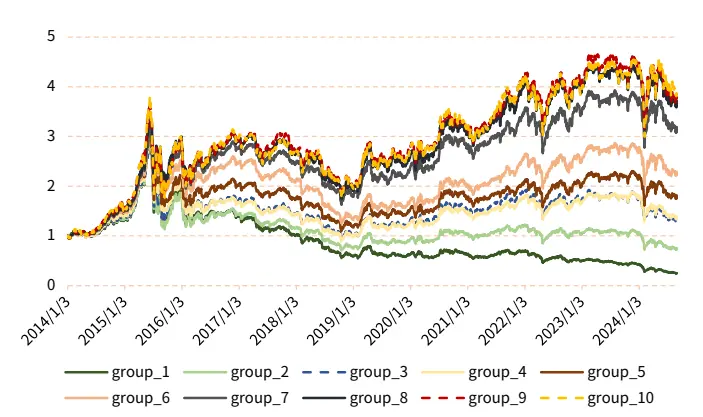
资料来源：Wind，光大证券研究所；统计区间：2014.01.03-2024.08.30

图 12：改进早盘收益因子多空组合净值曲线
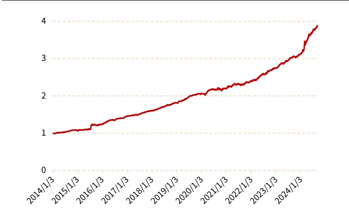
资料来源：Wind，光大证券研究所；统计区间：2014.01.03-2024.08.30

表 3：早盘收益因子业绩指标对比

| 总收 益率 | 年化 收益率 |  | 年化 波动率 | 夏普 比率 | 最大 回撤 | 最大回撤 最大回撤 起始日期 |
| --- | --- | --- | --- | --- | --- | --- |
|  | -8.43% | 6.26% | -1.83 | 62.75% | 2015/1/5 | 截止日期 胜率 Rank IC 2024/8/29 32.03% -3.12% |
| 原始因子-59.90% | 改进因子285.80% 13.89% | 4.01% | 2.71 | 3.57% | 2020/9/3 | 2020/10/2082.81% 4.08% |

资料来源：Wind，光大证券研究所；统计区间：2014.01.03-2024.08.30

上述我们用 2%作为阈值，将股票池进行分域。更一般的，我们可以使用其他指标，在时序上对因子进行分域。以反转因子为例，传统的 1 月反转因子（下文简称为“反转因子”）为当前股价除以过去 20 个交易日股价均值再减 1。回测结果显示反转因子按因子值划分的 10 个组合并未呈现单调特征。

我们尝试使用成交量和成交笔数，对反转因子进行分域，得到改进反转因子。具体分域方式为：对每只股票，在过去 20 个交易日中，首先计算“成交量/成交笔数”，得到平均每笔成交量；然后，计算平均每笔成交量最大的 10 个交易日的收益率之和，减去平均每笔成交量最小的 10 个交易日的收益率之和，得到改进反转因子。

从回测结果来看，改进后的反转因子在 10 分组下，表现出了稳定的单调特征。

图 13：反转因子-分组净值曲线
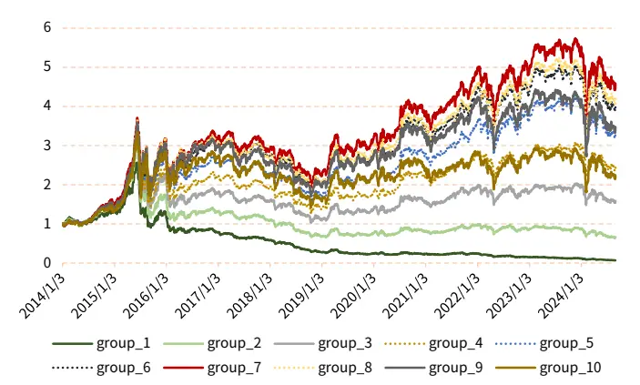
资料来源：Wind，光大证券研究所；统计区间：2014.01.03-2024.08.30

图 14：改进反转因子-分组净值曲线
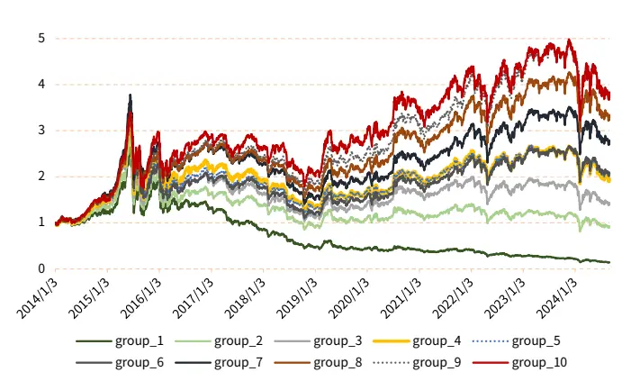
资料来源：Wind，光大证券研究所；统计区间：2014.01.03-2024.08.30

从多空组合来看，改进反转因子收益率较原始因子略差，但更为稳健。改进反转因子拥有更高的月度胜率和夏普比率。从多头组（group_10,后文同理）来看，改进反转因子相对原始因子表现更佳。

图 15：反转因子和改进反转因子多空组合净值曲线
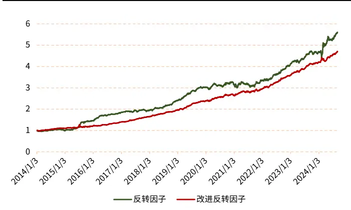
资料来源：Wind，光大证券研究所；统计区间：2014.01.03-2024.08.30

图 16：反转因子和改进反转因子多头组净值对比
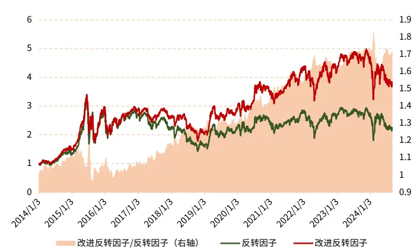
资料来源：Wind，光大证券研究所；统计区间：2014.01.03-2024.08.30

表 4：反转因子业绩指标对比（多空组合）

| 总收 益率 | 年化 收益率 | 年化 波动率 | 夏普 比率 | 最大 回撤 | 最大回撤 起始日期 | 最大回撤 截止日期 | 月度 胜率 | 周频 Rank IC |
| --- | --- | --- | --- | --- | --- | --- | --- | --- |
| 原始因子460.84% | 18.07% |  | 7.69% 1.96 | 8.69% | 2020/12/3 | 2021/2/9 | 75.78% | 5.23% |
| 改进因子369.92% | 16.08% | 5.04% | 2.60 | 9.99% | 2015/7/8 | 2015/8/14 87.50% |  | 4.57% |

资料来源：Wind，光大证券研究所；统计区间：2014.01.03-2024.08.30

表 5：反转因子业绩指标对比（多头组）

| 总收 益率 | 年化 收益率 | 年化 波动率 | 夏普 比率 | 最大 回撤 | 最大回撤 起始日期 | 最大回撤 月度 截止日期 胜率 | 周频 Rank IC |
| --- | --- | --- | --- | --- | --- | --- | --- |
| 原始因子124.52% | 8.10% |  | 29.93% | 0.17 |  | 57.30% 2015/6/12 2018/10/1852.34% | 5.23% |
| 改进因子283.45% | 13.82% | 26.66% | 0.41 |  | 48.31% 2015/6/12 2015/9/15 57.03% |  | 4.57% |

资料来源：Wind，光大证券研究所；统计区间：2014.01.03-2024.08.30

## 2.2 因子合成

## 2.2.1 多模型拟合

在多因子模型中，因子合成是其中一个重要的步骤。常见的多因子模型采用直接等权合成的方式对因子池进行组合，但是不同类型的因子具备不同的表达，如果将不同类型因子直接等权合成，势必会丢失部分信息。

我们将部分基本面因子和量价因子进行组合作为案例来说明。我们选取的因子如下表所示，从回测结果来看，单一的因子表现均不如多因子，且基本面加权量价因子后的表现，在一定时期内，比所有因子直接等权合成的效果更佳。

表 6：因子说明

| 因子符号 | 因子名称 | 因子大类 | 细分类型 | 因子方向 |
| --- | --- | --- | --- | --- |
| 20DR | 1月反转 | 量价因子 | 动量类 | 负向 |
| VSTD6 | 5 日成交量的标准差 | 量价因子 | 情绪类 | 负向 |
| MorningRetFix | 改进早盘收益 | 量价因子 | 情绪类 | 负向 |
| SUE | 标准化预期外盈利 | 基本面因子 | 成长类 | 正向 |

资料来源：光大证券研究所

我们发现，在 2022 年后，基本面加权表现落后于等权，原因在于当一个有效的选股因子被越来越多地使用，因子就会趋于失效。这里我们选取的基本面因子为SUE 因子。2022 年前，SUE 因子是较为有效的因子，当行情演绎到极致后，该因子呈现反转特征，超预期的股票无法再带来超额收益，而是贡献负向超额收益。

图 17：因子多头组净值
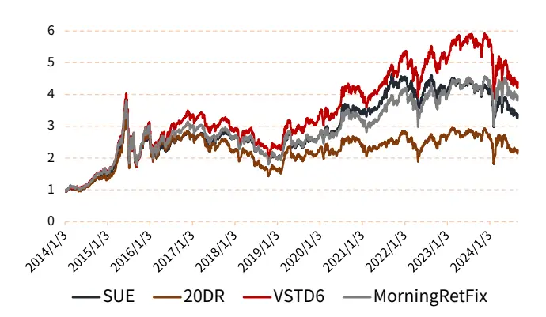
资料来源：Wind，光大证券研究所；统计区间：2014.01.03-2024.08.30

图 18：等权因子和加权因子多头组净值对比
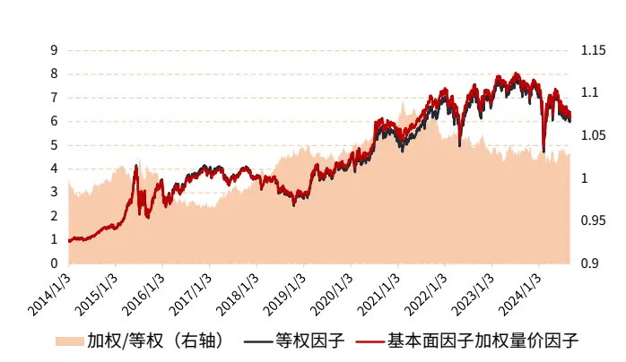
资料来源：Wind，光大证券研究所；统计区间：2014.01.03-2024.08.30

上述案例，我们仅加入了 1 个基本面因子和 3 个量价因子，而在实际运用过程中，往往需要添加多个因子，用于构造多因子选股模型。传统的因子模型多采用线性回归的方式对因子池进行组合，但随着因子数目的增长，尤其是加入了部分非线性因子后，线性模型就无法有效的处理因子之间的关系。

多个因子之间主要存在如下问题：1）模型的多重共线性如何解决；2）非线性因子如何进行线性变换；3）因子间隐藏关系如何深度挖掘。这些问题可以通过机器学习或深度学习模型解决。

图 19：非线性因子转换为线性因子图示
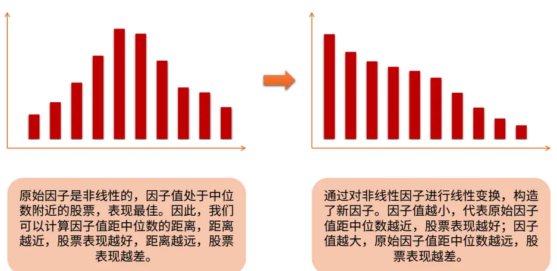
资料来源：光大证券研究所绘制

在 A股市场，不同股票类型、不同时间周期下存在不同的交易主线，或者说定价逻辑，即适用于不同的选股因子。同样的，不同类型的因子也适用于不同长度的窗口期，以及不同的预测任务。因此在模型训练方面，可以采用分域建模的方式，细化学习颗粒度，训练多个低相关的模型，关注不同维度的 Alpha 信息。

量价因子表征短期内个股交易层面的信息，而基本面因子表征个股长期以来公司经营层面的信息，即使采用 TTM进行计算的基本面因子，同样是季度频率的数据，这就使得量价因子和基本面因子的频率存在较大区别。

当因子数量过多时，难免会存在非线性因子，这时候就无法使用单个基本面因子进行加权，而需要建立模型，捕捉因子的非线性信息，将其转换为线性关系，进而进行加权。所以我们认为，应该对量价因子和基本面因子分开建模，再进行汇总。即先得到每一个子模型，再汇总得到总的信息。

图 20：因子分域建模图示
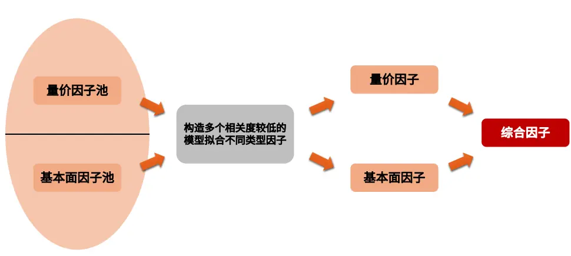
资料来源：光大证券研究所绘制

## 2.2.2 分域合成

在前文截面分域中，我们仅按照市值将估值因子分到了大市值和小市值两个域中。当存在多个选股因子和分域因子时，因子该如何整合呢？本节，我们将选股因子和分域因子拓展到多维，进行分域合成。

当只有一个分域因子时，一个简单的做法是使用分域因子分别对选股因子进行离散型分域，或者使用连续型分域对选股因子进行加权，最后整合得到综合选股因子。当分域因子不只一个时，学术界提出了动态情景 Alpha 模型（DynamicContextual Alpha）来解决存在多个分域因子的情形。

本节，我们使用的 Alpha 因子取自同花顺量化因子库。该因子库具有多种优势：

- 类型多样：包含了多频段量价数据，如日线、分钟级、Tick 快照、逐笔成交、逐笔委托数据。此外，因子库中还包含了基本面数据以及另类数据，如新闻舆情、个股热度数据等；

- 数据处理优势：尖端硬件设施以快速处理大规模细颗粒度数据；

- 人工智能：结合多种算法，如神经网络 LSTM 模型、注意力机制 Transformer模型等，以帮助寻找有预测收益能力的特征；

- 可解释性：入库因子经过人工审核，符合经济学逻辑。

图 21：同花顺量化因子数据库
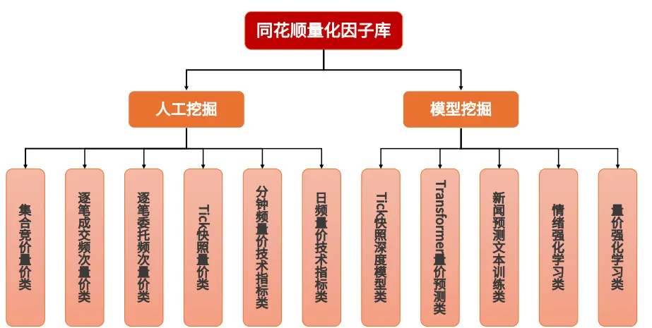
资料来源：iFinD，光大证券研究所绘制

我们测算了库中 11 个大类、约 600 个因子，根据因子 IC 信息，从中挑选了 5个因子用于分域合成的测算。我们挑选的因子信息如下：

表 7：同花顺量化因子说明

| 因子大类 | 因子小类 | 因子符号 | 因子方向 |
| --- | --- | --- | --- |
| 量价强化学习类 | 量价强化学习日频资金流类 | RL_DAY_MF_ALPHA1 | 负向 |
| 量价强化学习类 | 量价强化学习日频类 | RL_DAY_ALPHA17 | 正向 |
| 集合竞价量价类 | 集合竞价切片快照收益率 | SS_RD_OR | 正向 |
| 集合竞价量价类 | 集合竞价切片快照收益率 | SS_RD_TS | 正向 |
| 情绪强化学习类 | 情绪业绩修正类 | RL_TSSJ_ALPHA4 | 正向 |

资料来源：iFinD，光大证券研究所；注：RL_DAY_MF_ALPHA1 因子在后文中调整方向为正向

图 22：同花顺量化因子多空组合净值曲线
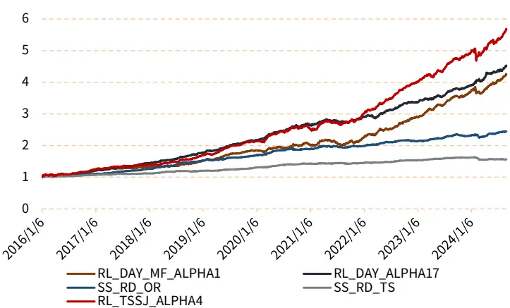
资料来源：Wind，iFinD，光大证券研究所；统计区间：2016.01.06-2024.08.30

表 8：同花顺量化因子业绩指标对比

| 因子符号 | 总收 益率 | 年化 收益率 | 年化 波动率 | 夏普 比率 | 最大 回撤 | 月度 胜率 | 周频 Rank IC |
| --- | --- | --- | --- | --- | --- | --- | --- |
| RL_DAY_MF_ALPHA1 | 323.69% | 18.71% | 6.97% | 2.25 | 8.52% | 78.85% | 6.78% |
| RL_DAY_ALPHA17 | 351.04% | 19.59% | 5.26% | 3.15 | 5.53% | 89.42% | 7.09% |
| SS_RD_OR | 144.70% | 11.21% | 3.85% | 2.14 | 4.72% | 78.85% | 11.50% |
| SS_RD_TS | 56.50% | 5.46% | 2.58% | 0.96 | 5.57% | 73.08% | 8.64% |
| RL_TSSJ_ALPHA4 | 466.90% | 22.88% | 6.36% | 3.12 | 7.68% | 85.58% | 7% |

资料来源：Wind，iFinD，光大证券研究所；统计区间：2016.01.06-2024.08.30

我们以风格因子（市值、价值、成长、盈利、流动性）对挑选的同花顺量化因子进行分域测算，下图展示了分大小域下，各因子的周频 Rank IC。从分域结果来看，我们发现，成长、盈利和流动性因子对各选股因子均具有较为明显的分域效果。

图 23：风格因子分域结果展示（Rank IC）

| 因子符号 大/小域 |  | 市值 | 价值 | 成长 | 盈利 | 流动性 | 全域 |
| --- | --- | --- | --- | --- | --- | --- | --- |
| RL_DAY_MF_ALPHA1 | big | 5.02% | 5.93% | 5.71% | 5.48% | 3.76% | 6.78% |
|  | small | 8.16% | 6.43% | 7.68% | 8.09% | 7.80% |  |
| RL_DAY_ALPHA17 | big | 5.79% | 6.61% | 6.14% | 5.91% | 4.72% | 7.09% |
|  | small | 8.20% | 6.74% | 7.91% | 8.12% | 7.75% |  |
| SS_RD_OR | big | 11.49% | 11.15% | 10.89% | 10.77% | 9.99% | 11.50% |
|  | small | 11.60% | 11.65% | 11.98% | 12.04% | 12.18% |  |
| SS_RD_TS | big | 8.50% | 8.09% | 8.21% | 8.11% | 7.55% | 8.64% |
|  | small | 8.61% | 8.87% | 8.80% | 8.88% | 9.18% |  |
| RL_TSSJ_ALPHA4 | big | 5.25% | 6.68% | 6.23% | 5.75% | 4.49% | 7.00% |
|  | small | 8.04% | 7.09% | 7.67% | 8.03% | 8.10% |  |

资料来源：Wind，iFinD，光大证券研究所；统计区间：2016.01.06-2024.08.30；注：按照每个同花顺量化因子标注红蓝色块，从红色到蓝色颜色的深浅，表示 RankIC 从大到小

我们以流动性因子为例，测算同花顺量化因子在低流动性域下，相较于原始因子，是否有提升？比较基准为各因子等权，回测结果如下。从回测结果不难看出，分域后，因子提升非常明显，收益率从 670.37%提升至 954.99%，年化收益率从27.44%提升至 32.29%，周频 Rank IC 从 12.05%提升至 13.25%。

图 24：同花顺量化因子-分域多空组合净值曲线对比
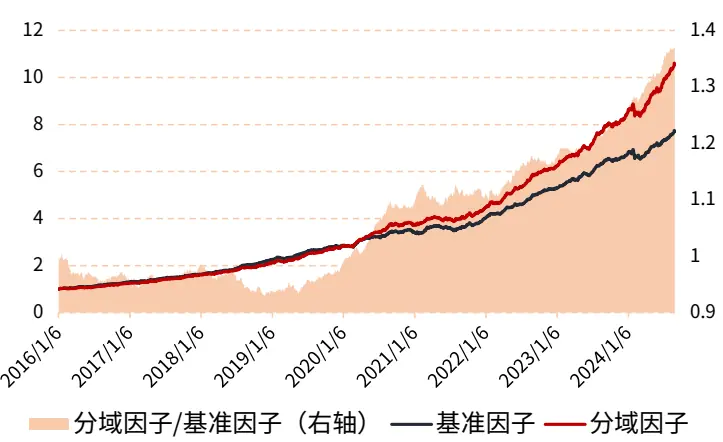
资料来源：Wind，iFinD，光大证券研究所；统计区间：2016.01.06-2024.08.30

表 9：流动性因子分域同花顺因子业绩对比

|  | 总收 益率 | 年化 收益率 | 年化 波动率 | 夏普 比率 | 最大 回撤 | 最大回撤 最大回撤 起始日期 |
| --- | --- | --- | --- | --- | --- | --- |
| 基准因子 670.37% |  | 27.44% | 6.03% | 4.05 6.12% | 2021/4/16 | 截止日期 胜率 Rank IC 2021/7/29 88.46% |
| 分域因子 | 954.99% | 32.29% | 6.61% 4.43 | 6.00% | 2024/1/30 2024/3/6 | 12.05% 88.46% 13.25% |

资料来源：Wind，iFinD，光大证券研究所；统计区间：2016.01.06-2024.08.30

## 3、 总结

传统多因子 Alpha 模型，是按照股票因子值在全市场对其进行排序，然后打分，这种方式将所有股票同等看待。通常，不同股票的基本面、量价等属性存在较大区别。低估值、规模较大、持续股息支付的蓝筹股，和高估值、规模较小、股息支付不稳定的成长股，可比性较差。因此，对股票分域建模显得尤为重要。

我们尝试探究因子分域的应用，而因子分域方式多种多样，本篇报告主要介绍因子分域的研究框架，即解决因子如何分域的问题。因子分域研究主要分为两部分：因子计算和因子合成。

分域法应用于因子计算较为常见，首先选定一个特征将股票划分成多个域，再对不同分域内的股票差异化计算因子。常见的因子计算分域方式有很多，比如按照行业划分，将因子不适用的行业因子值设置为市场中位数；再比如按照风格因子划分，探究不同市值、估值等风格下，因子的不同表现。除了应用于因子计算以外，因子合成阶段也可以使用分域法，市场中已有研究如动态情景模型等就是如此。

因子计算分为截面分域和时间序列分域，截面分域又细分为离散型分域和连续型分域。我们以估值因子、早盘收益因子以及反转因子为案例，详细介绍了各类分域方式的原理。从分域结果来看，分域后因子表现相较于原始因子均具有不同程度提升。

在因子合成阶段，不同因子具备不同的表达，因子可分为线性和非线性因子，可使用不同学习模型去拟合不同类型的因子，再进行合成，我们称之为多模型拟合。此外，当因子计算阶段的单个因子拓展到多个因子时，也需要合成。我们以同花顺量化因子为例，回测结果表明分域后因子表现显著提升。

## 4、 风险提示

报告结果均基于历史数据，历史数据存在不被重复验证的可能。

## 行业及公司评级体系

| 评级 说明 |  |  |
| --- | --- | --- |
|  | 买入 | 未来6-12个月的投资收益率领先市场基准指数15%以上 |
|  | 增持 | 未来 6-12 个月的投资收益率领先市场基准指数 5%至 15%; |
|  | 中性 | 未来6-12个月的投资收益率与市场基准指数的变动幅度相差-5%至5%； |
|  | 减持 | 未来 6-12 个月的投资收益率落后市场基准指数 5%至 15%; |
| 行业及公司评级 | 卖出 | 未来6-12个月的投资收益率落后市场基准指数15%以上； |
|  | 无评级 | 因无法获取必要的资料，或者公司面临无法预见结果的重大不确定性事件，或者其他原因，致使无法给出明确的投资评级。 |
|  | 基准指数说明： | A股市场基准为沪深300指数；香港市场基准为恒生指数；美国市场基准为纳斯达克综合指数或标普500指数。 |

## 分析、估值方法的局限性说明

本报告所包含的分析基于各种假设，不同假设可能导致分析结果出现重大不同。本报告采用的各种估值方法及模型均有其局限性，估值结果不保证所涉及证券能够在该价格交易。

## 分析师声明

本报告署名分析师具有中国证券业协会授予的证券投资咨询执业资格并注册为证券分析师，以勤勉的职业态度、专业审慎的研究方法，使用合法合规的信息，独立、客观地出具本报告，并对本报告的内容和观点负责。负责准备以及撰写本报告的所有研究人员在此保证，本研究报告中任何关于发行商或证券所发表的观点均如实反映研究人员的个人观点。研究人员获取报酬的评判因素包括研究的质量和准确性、客户反馈、竞争性因素以及光大证券股份有限公司的整体收益。所有研究人员保证他们报酬的任何一部分不曾与，不与，也将不会与本报告中具体的推荐意见或观点有直接或间接的联系。

## 法律主体声明

本报告由光大证券股份有限公司制作，光大证券股份有限公司具有中国证监会许可的证券投资咨询业务资格，负责本报告在中华人民共和国境内（仅为本报告目的，不包括港澳台）的分销。本报告署名分析师所持中国证券业协会授予的证券投资咨询执业资格编号已披露在报告首页。

中国光大证券国际有限公司和 Everbright Securities(UK) Company Limited 是光大证券股份有限公司的关联机构。

## 特别声明

光大证券股份有限公司（以下简称“本公司”）成立于 1996 年，是中国证监会批准的首批三家创新试点证券公司之一，也是世界 500 强企业——中国光大集团股份公司的核心金融服务平台之一。根据中国证监会核发的经营证券期货业务许可，本公司的经营范围包括证券投资咨询业务。

本公司经营范围：证券经纪；证券投资咨询；与证券交易、证券投资活动有关的财务顾问；证券承销与保荐；证券自营；为期货公司提供中间介绍业务；证券投资基金代销；融资融券业务；中国证监会批准的其他业务。此外，本公司还通过全资或控股子公司开展资产管理、直接投资、期货、基金管理以及香港证券业务。

本报告由光大证券股份有限公司研究所（以下简称“光大证券研究所”）编写，以合法获得的我们相信为可靠、准确、完整的信息为基础，但不保证我们所获得的原始信息以及报告所载信息之准确性和完整性。光大证券研究所可能将不时补充、修订或更新有关信息，但不保证及时发布该等更新。

本报告中的资料、意见、预测均反映报告初次发布时光大证券研究所的判断，可能需随时进行调整且不予通知。在任何情况下，本报告中的信息或所表述的意见并不构成对任何人的投资建议。客户应自主作出投资决策并自行承担投资风险。本报告中的信息或所表述的意见并未考虑到个别投资者的具体投资目的、财务状况以及特定需求。投资者应当充分考虑自身特定状况，并完整理解和使用本报告内容，不应视本报告为做出投资决策的唯一因素。对依据或者使用本报告所造成的一切后果，本公司及作者均不承担任何法律责任。

不同时期，本公司可能会撰写并发布与本报告所载信息、建议及预测不一致的报告。本公司的销售人员、交易人员和其他专业人员可能会向客户提供与本报告中观点不同的口头或书面评论或交易策略。本公司的资产管理子公司、自营部门以及其他投资业务板块可能会独立做出与本报告的意见或建议不相一致的投资决策。本公司提醒投资者注意并理解投资证券及投资产品存在的风险，在做出投资决策前，建议投资者务必向专业人士咨询并谨慎抉择。

在法律允许的情况下，本公司及其附属机构可能持有报告中提及的公司所发行证券的头寸并进行交易，也可能为这些公司提供或正在争取提供投资银行、财务顾问或金融产品等相关服务。投资者应当充分考虑本公司及本公司附属机构就报告内容可能存在的利益冲突，勿将本报告作为投资决策的唯一信赖依据。

本报告根据中华人民共和国法律在中华人民共和国境内分发，仅向特定客户传送。本报告的版权仅归本公司所有，未经书面许可，任何机构和个人不得以任何形式、任何目的进行翻版、复制、转载、刊登、发表、篡改或引用。如因侵权行为给本公司造成任何直接或间接的损失，本公司保留追究一切法律责任的权利。所有本报告中使用的商标、服务标记及标记均为本公司的商标、服务标记及标记。

光大证券股份有限公司版权所有。保留一切权利。

光大证券研究所

上海

北京

静安区新闸路 1508 号

深圳

西城区武定侯街 2 号

福田区深南大道 6011 号

静安国际广场 3 楼

泰康国际大厦 7 层

NEO 绿景纪元大厦 A 座 17 楼

光大证券股份有限公司关联机构

香港

中国光大证券国际有限公司

香港铜锣湾希慎道 33 号利园一期 28 楼

英国

Everbright Securities(UK) Company Limited

6th Floor, 9 Appold Street, London, United Kingdom, EC2A 2AP