## 金融工程

# 分域法改进因子的新尝试

## ——量化选股系列报告之十五

## 要点

## 因子分域研究前景广阔

因子分域的研究在市场中由来已久，因子分域研究被广泛应用于选股、资产配置等方面。通过对股票进行因子分域，可以识别出不同分域内股票的独特性和优势。分域思想的本质是基于不同市场环境中，数据表达的信息不同，采用差异化的方式处理因子来更有效的表达因子信息。

在实证研究中，不少案例证明了因子分域研究的有效性。例如对于估值因子来说，市值风格就是一个有效的分域。在前期报告中，我们介绍了因子分域研究框架。在多因子框架下，分域一般会应用在两个步骤中：因子计算和因子合成。本篇报告将聚焦于因子计算中分域法的应用。

## 基于遗传算法的分域尝试

一般提到分域研究，普遍的做法是在不同行业内对因子做不同处理，这种方式属于截面分域。我们认为在时间序列上也存在分域效应。我们以估值因子和早盘收益因子为案例，讨论了两种分域方式——截面分域和时序分域，并给出了两种分域方式的逻辑。

以上两种分域方式中，除了人工挖掘因子外，我们同样可以借助算法来挖掘潜在的因子。本文借助遗传规划算法来进行分域尝试。首先基于遗传规划算法进行分域因子生成，并基于成熟的遗传规划库做出深度改进。最后，我们测试了基于遗传规划算法生成的分域因子，结果表明，因子分域后的提升效果显著。

## 实证方式论证了因子分域的有效性

我们从时序分域和截面分域两个维度入手，借助遗传规划算法批量挖掘了未知的分域因子，并从中挑选了部分结果作为代表，进行展示。

在截面分域部分，对营收同比因子、净利润同比因子和反转因子改进后，因子提升效果明显，平均周频 Rank IC 分别从 0.8%、1.25%和 3.77%，提升到了 6.68%、8.31%和 8.03%。

在时序分域部分，对反转因子、尾盘收益因子和振幅因子改进后，因子提升效果明显，平均周频 Rank IC 分别从 4.96%、4.89%和 6.12%，提升到了 8.45%、7.85%和 6.92%。

风险分析：报告结果均基于模型及历史数据，模型存在失效的风险，历史数据存在不被重复验证的可能。

## 作者

分析师：祁嫣然

执业证书编号：S0930521070001

010-57378031

qiyanran@ebscn.com

分析师：张威

执业证书编号：S0930524070004

010-57378050

zhangw@ebscn.com

## 相关研报

日内收益的精细切分：提炼动量与反转效应—量化选股系列报告之二（2021-10-22）

因子分域初探：确定分域方式——量化选股系列报告之十四（2024-09-27）

## 1、因子分域建模的逻辑

因子分域的研究在市场中由来已久，在多因子框架下，分域一般会应用在两个步骤中：因子计算和因子合成。

分域法应用于因子计算较为常见，首先选定一个特征将股票划分成多个域，再对不同分域内的股票差异化计算因子。常见的因子计算有多种分域方式，比如按照行业划分，将因子不适用的行业中的股票因子值设置为全市场股票因子值的中位数；再比如按照风格因子划分，探究不同市值、估值等风格下，因子的不同表现。

除了应用于因子计算以外，因子合成阶段也可以使用分域法，市场中已有研究如动态情景模型等就是如此。

在前期报告《因子分域初探：确定分域方式——量化选股系列报告之十四》（2024.09.28）中，我们介绍了因子分域的研究框架，本篇报告将聚焦于因子计算中分域法的应用。

首先，我们讨论了两种分域方式——截面分域和时序分域，并给出了两种分域的底层逻辑。其次，我们还使用了遗传规划算法进行分域因子生成，并基于成熟的遗传规划库做出深度改进。最后，我们测试了基于遗传规划算法生成的分域因子，通过实证方式论证了分域法改进因子的有效性。

## 1.1 分域法对估值因子的修复

估值因子无论在学术界还是投资界都是关注度较高的价值类因子，在 A股市场，该因子多空组合在 2019 年—2021 年间出现了较大回撤，AQR 对冲基金的创始人 Cliff Asness 在 2020 年写了一篇《Is (Systematic) Value Investing Dead?》的文章来讨论价值因子失效问题。

如果按照市值将股票分成大市值和小市值两个分域，我们发现估值因子在小市值股票池内依然有稳健的超额收益，而在大市值股票池内的表现与全市场的表现一致。对于估值因子来说，市值风格就是一个有效的分域。

图 1：估值因子净值曲线
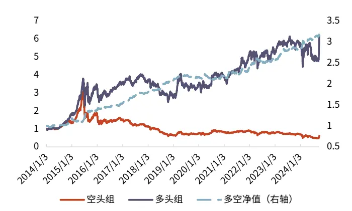
资料来源：Wind，光大证券研究所；统计区间：2014.01.03-2024.09.30

图 2：估值因子在大市值和小市值分域内的净值表现
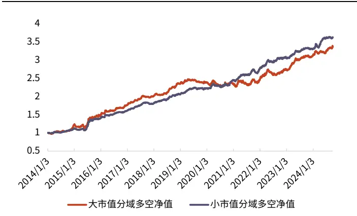
资料来源：Wind，光大证券研究所；统计区间：2014.01.03-2024.09.30

表 1：估值因子业绩指标对比

|  | 总收 益率 | 年化 收益率 | 年化 波动率 | 夏普 比率 | 最大 回撤 | 最大回撤 最大回撤 起始日期 截止日期 | 月度 周频 胜率 Rank IC |
| --- | --- | --- | --- | --- | --- | --- | --- |
| 全域 | 214.97% | 11.60% | 5.22% | 1.65 | 7.80% | 2015/1/5 2015/5/21 65.89% | 3.84% |
| 大市值 分域 | 235.74% | 12.28% | 6.06% | 1.53 |  | 8.56% 2019/4/19 2020/7/10 66.67% | 3.60% |
| 小市值 分域 | 261.90% | 13.09% | 4.59% | 2.20 | 5.36% 2015/1/5 | 2015/6/2 75.19% | 4.92% |

资料来源：Wind，光大证券研究所；统计区间：2014.01.03-2024.09.30

除了上述在截面上根据市值大小将股票池分为大小市值两组外，我们可以对估值因子做一个简单的市值加权，提升小市值股票的估值因子权重。权重的构造方式如下：

$$
weightfactor=\frac{x}{|x|}\times|x|^{n}
$$

$$
weight={\frac{weightfactor}{\sum weightfactor}}
$$

其中，x 为对数市值的倒数。参数 n 越大，权重越向 x 正方向集中。

从回测表现来看，提升了小市值股票的因子值权重之后，估值因子的表现提升明显，且提升效果随着 n 的增大而变强。n 由 0 增大到 4 后，因子的周频 RankIC从 3.84%提升至了 4.67%；月度胜率从 65.89%提升至了 74.42%。

图 3：市值加权估值因子净值对比
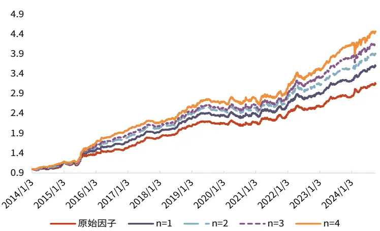
资料来源：Wind，光大证券研究所；统计区间：2014.01.03-2024.09.30

表 2：市值加权估值因子业绩指标对比

|  | 总收 益率 | 年化 收益率 | 年化 波动率 | 夏普 比率 | 最大 回撤 | 最大回撤 起始日期 | 最大回撤 月度 截止日期 胜率 | 周频 Rank IC |
| --- | --- | --- | --- | --- | --- | --- | --- | --- |
| 原始 | 214.97% | 11.60% | 5.22% | 1.65 | 7.80% | 2015/1/5 | 2015/5/21 65.89% | 3.84% |
| 一次方 | 260.47% | 13.05% | 5.25% | 1.91 | 6.48% | 2020/3/30 | 2020/7/10 6 69.77% | 4.13% |
| 二次方 | 291.08% | 13.93% | 5.40% | 2.03 | 6.62% | 2020/3/30 | 2020/7/10 73.64% | 4.37% |
| 三次方 | 316.91% | 14.63% | 5.55% | 2.10 | 6.56% | 2020/3/30 | 2020/7/10 72.87% | 4.55% |
| 四次方 | 347.33% | 15.41% | 5.77% | 2.15 | 6.93% | 2024/1/17 | 2024/2/7 74.42% | 4.67% |

资料来源：Wind，光大证券研究所；统计区间：2014.01.03-2024.09.30

## 1.2 分域法对动量因子的修复

我们在报告《日内收益的精细切分：提炼动量与反转效应——量化选股系列之二》（2021.10.23）中也使用到了时序分域的方式修复早盘收益因子。早盘收益因子计算方式如下：

$$
\begin{aligned}morning\_vwap&=\frac{\sum money_{open-morning\_cut}}{\sum volume_{open-morning\_cut}}\\\vdots\\mnorming\_ret&=\frac{morning\_vwap}{pre\_close}-\frac{open\_price}{pre\_close}\\factor&=\sum_{i=T-1}^{T-window}morning\_ret_{i}\end{aligned}
$$

我们先以 vwap（成交量加权价格）方式计算早盘涨幅，open-morning_cut 表示早盘量价数据的时间范围为 9:30 至 10:30；然后，定义早盘收益率为早盘vwap 涨幅与开盘价涨幅之差，这种计算方式使得一字涨停板并不计入早盘收益；最后，用过去一段天数(window)的早盘收益率之和作为因子。

图 4：早盘收益因子-分组净值曲线
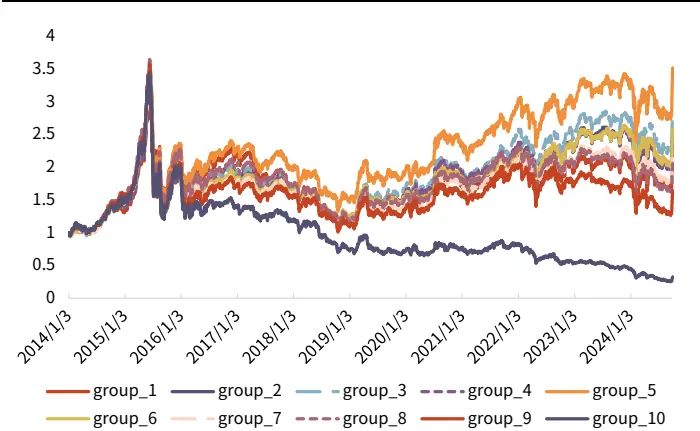
资料来源：Wind，光大证券研究所；统计区间：2014.01.03-2024.09.30；按照因子值从小到大将股票分为 10 组，依次为 group1-group10,后文同理。

图 5：早盘收益因子多空组合净值曲线
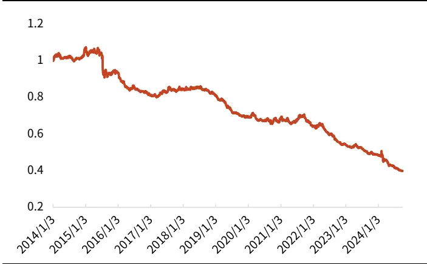
资料来源：Wind，光大证券研究所；统计区间：2014.01.03-2024.09.30

通过观察图中展示的回测结果，我们发现原始的早盘收益因子没有如期呈现出稳定的动量效果。在前述报告中，我们认为早盘收益需要“温和”才能呈现动量效果。因此，我们对早盘收益因子进行了改进，改进方式如下：

$$
\begin{aligned}&morning_{-}ret_{i}=-morning_{-}ret_{i}\textit{ i f }abs(morning_{-}ret_{i})>2\%\\&\quad factor=\sum_{i=T-1}^{T-window}morning_{-}ret_{i}\\\end{aligned}
$$

我们在时序上对早盘收益进行了极值调整，我们以 2%为阈值，将股票池进行分域。改进后的早盘收益因子回测结果如下。从回测结果可以发现，改进后的因子呈现了单调的特征，且呈现了稳定的动量特征。

图 6：改进早盘收益因子-分组净值曲线
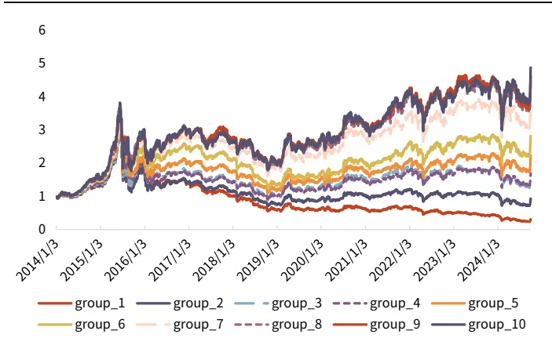
资料来源：Wind，光大证券研究所；统计区间：2014.01.03-2024.09.30

图 7：改进早盘收益因子多空组合净值曲线
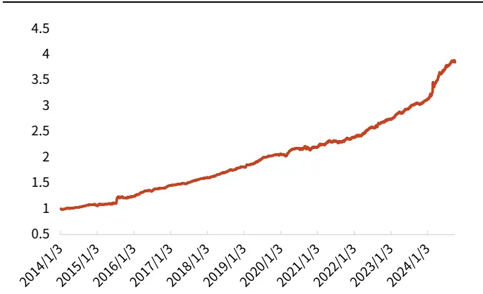
资料来源：Wind，光大证券研究所；统计区间：2014.01.03-2024.09.30

表 3：早盘收益因子业绩指标对比

| 总收 益率 | 年化 收益率 | 年化 波动率 | 夏普 比率 | 最大 回撤 | 最大回撤 起始日期 | 最大回撤 截止日期 | 月度 周频 胜率 Rank IC |
| --- | --- | --- | --- | --- | --- | --- | --- |
| 原始因子-60.20% | -8.43% | 6.24% | -1.83 | 62.99% | 2015/1/5 | 2024/9/26 31.78% | -3.12% |
| 改进因子284.80% | 13.76% | 4.01% | 2.68 | 3.57% |  | 2020/9/3 2020/10/2082.17% | 4.04% |

资料来源：Wind，光大证券研究所；统计区间：2014.01.03-2024.09.30

## 2、分域法因子改进研究框架

上述两个案例都是分域法在因子计算阶段的应用，分别对应了截面分域和时间序列分域。从结果来看，该方法的确能够有效提升因子表现。

分域思想的本质是基于不同市场环境中，数据表达的信息不同，采用差异化的方式处理因子来更有效的表达因子信息。

一般提到分域研究，普遍的做法是在不同行业内对因子做不同处理，这种方式属于截面分域。我们认为，在时间序列上也存在分域效应。正如上一章节中所展示的，估值因子相对于市值的分域就属于截面分域，早盘收益因子的极值调整就属于时间序列分域。

## 2.1 截面分域概述

按照行业、板块或宽基将因子进行分域的方式，属于截面分域。一般地，我们还可以使用分域因子对目标因子进行截面分域，截面分域又可细分为离散型分域和连续型分域。

离散型分域即表示利用分域因子，按照一定准则，将目标因子划分为有限个数的域。例如：按照分域因子 Y 从小到大，将目标因子 X 平均划分为 2 组，然后测试因子 X 在各组的表现。

图 8：离散型分域示意图

| 股票 | 因子X | 因子Y |
| --- | --- | --- |
| Stock1 | x1 | y1 |
| … | … | … |
| Stockn | xn | yn |

| 分域因子Y排序，将目标因子X均分为2组2k = n | 股票 | 因子X | 因子Y |
| --- | --- | --- | --- |
|  | Stock1,1 | x1,1 | y1,1 |
|  | …. | .. | …. |
|  | Stock1,k | x1,k | y1,k |

| 股票 | 因子X | 因子Y |
| --- | --- | --- |
| Stock2,1 | X2,1 | y2,1 |
| …. | …… | …. |
| Stock2,k | X2,k | y2,k |

资料来源：光大证券研究所绘制

利用分域因子，直接将目标因子进行改进，而并未将其划分到具体个数的域中，这种分域方式即是连续型分域。上一章中展示的使用市值因子对估值因子进行加权的方式，即为连续型分域。

图 9：连续型分域示意图

| 股票 | 因子X | 因子Y |
| --- | --- | --- |
| Stock1 | X1 | y1 |
|  | … | .… |
| Stockn | Xn | yn |

根据分域因子Y计算权重，对目标因子X分域,得到因子Z

| 股票 | 因子X | 因子Y | 权重 | 因子z |
| --- | --- | --- | --- | --- |
| Stock1 | X1 | y1 | W1 | x1W1 |
| •• | … | … | … |  |
| Stockn | xn | yn | Wn | xnWn |

资料来源：光大证券研究所绘制

## 2.2 时序分域概述

上一章中，我们对早盘收益因子在时序上进行了极值调整，即以 2%为阈值，当日早盘收益的绝对值超过 2%，则取相反数，这种方式即是时序分域。更一般地，我们可以使用分域因子对目标因子在时序上进行分域。

时序因子常见方式为在时序上根据算子（如 sum、mean、median、std 等）来构造目标因子，在构造过程中，我们即可使用分域因子来对目标因子进行改进，达到时序分域的目的。

例如，对股票 i，分域因子 Y 对目标因子 X 进行时序分域，目标因子 X 为过去 d个交易日某指标之和，分域目标为计算 Y 最大的 e 个交易日对应的 X 的均值，我们定义这样的分域算子为：ts_max_mean(X,Y,e,d)。

图 10：时序分域示意图
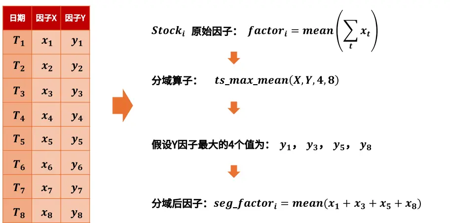
资料来源：光大证券研究所绘制

## 2.3 分域法因子改进研究框架

本文将从时序分域和截面分域两个维度入手，借助遗传规划算法寻找未知的分域。

首先需要验证方法的有效性，可以采用固定计算公式，遍历目标因子和分域因子的方式来验证。对于目标因子来说，最好设置为一些已经失效的因子，这样改进的效果才更明显，比如动量因子、估值因子、市值因子等。对于分域因子来说，最好设置为一些有交易逻辑的因子，比如收益率、换手率、交易量等。

除了人工挖掘因子外，我们同样可以借助算法来挖掘潜在的因子。例如采用遗传算法，模仿生物学种群演化进程，从复杂的原始数据和原始算子中，筛选出潜在有效的目标因子和分域因子以及分域方式。

我们需要设定分域是否有效的标准，通过计算原始因子的 Rank IC（RawIC）和分域之后新因子的 Rank IC（NewIC），如果 NewIC 大于 RawIC，我们就认为分域操作有效。

图 11：分域法因子改进研究框架
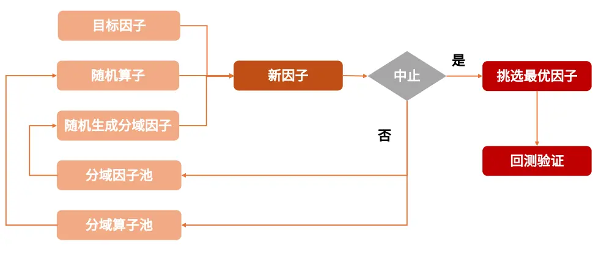
资料来源：光大证券研究所绘制

## 3、遗传规划的分域尝试

遗传规划算法在因子挖掘领域已经不是什么新方法，但该方法仍存在许多弊端，如因子的可解释性差、计算成本高等。本文的研究框架仅在因子挖掘的局部使用到遗传规划，本质上还是通过分域算法对因子的改进，也即在原始因子可解释且有效的情况下，对因子进一步细化挖掘。一定程度上可以解决传统算法存在的弊端。

## 3.1 遗传规划算法概览

遗传规划是因子挖掘的常用工具，为了保证内容的完整性，我们简单对遗传规划的流程进行介绍，若投资者已经熟悉可跳过本小节。

遗传规划是遗传算法的一个分支，是一种监督学习方法。它通过模拟自然界中生物进化的过程，来寻找最适合目标群体繁衍特征的模型及参数。遗传规划能够寻找到原始数据中的一些隐藏特征，利用这些隐藏特征，模型可以更好地预测目标群体。

传统的监督学习算法主要运用于特征与标签之间关系的拟合，而遗传规划则更多运用于特征工程。以往的因子研究都是“先有逻辑，后有公式”，是一种“演绎法”。但遗传规划的形式是“先有公式，后有逻辑”，属于“归纳法”。它的优势在于可以充分利用计算机的强大算力进行启发式搜索，同时突破人类的思维局限，挖掘出某些隐藏的、难以通过人脑构建的因子，为因子研究提供更多的可能性。

遗传规划的基本流程如下：

图 12：遗传规划流程图
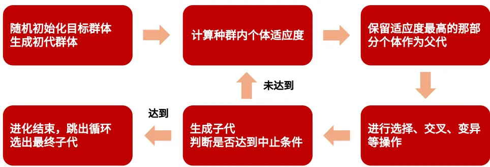
资料来源：光大证券研究所绘制

类比于自然界中个体对其生存环境的适应程度，在遗传规划中，每个公式也有自己的适应度，适应度衡量了公式运算结果与给定目标的相符程度，是公式进化的重要参考指标。在不同的应用中，可以定义不同的适应度，对于回归问题，可以使用公式结果和目标值之间的均方误差为适应度，对于使用遗传规划生成的因子来说，可以使用因子在回测区间内的平均 IC 或因子收益率来作为适应度。

## 3.1.1 遗传规划的数学表达

遗传规划用二叉树的方式表达需要进化的公式。假设有特征 $X_{1}$ ， $X_{2}$ ， $X_{3}$ ，需要

预测目标 $y_{\circ}$ 初代公式为：

$$
y=\:3X_{1}+X_{2}^{2}-0.6
$$

在遗传规划中用 S-表达式表示：

$$
y=\bigl(-\bigl(+(\times3X_{1})(\times X_{2}X_{2})\bigr)0.6\bigr)
$$

我们可以把公式表示为一个二叉树，如下表所示：

图 13：二叉树图示
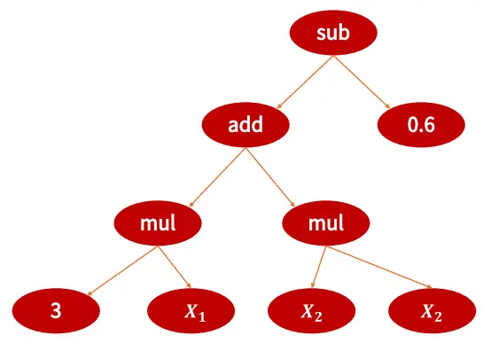
资料来源：光大证券研究所绘制

## 3.1.2 交叉

交叉是在两个已有公式树之间生成子树的方法，是最常用也最有效的进化方式。交叉首先需要在种群中选择适应度最高的公式树 A 作为父代，并从 A中随机选择子树 $A_{1}$ 作为被替换对象；然后在剩余种群中选择适应度最高的公式树 B 作为捐赠者，从中随机选择子树 $B_{1}$ ，替换 $A_{1}$ 生成后代。

图 14：交叉图示
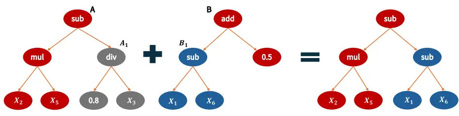
资料来源：光大证券研究所绘制

## 3.1.3 子树变异

子树变异是一种较为激进的变异操作，父代的子树可以被随机生成的子树完全替代，这样做的好处是将已经被淘汰的公式重新引入公式种群，保持了公式的多样性。如图，首先选择适应度最高的公式树 A 作为父代，然后随机选择子树 $A_{1}$ 作为被替换的子树，接着随机生成子树 $B_{1}$ 将 $A_{1}$ 替代。

图 15：子树变异图示
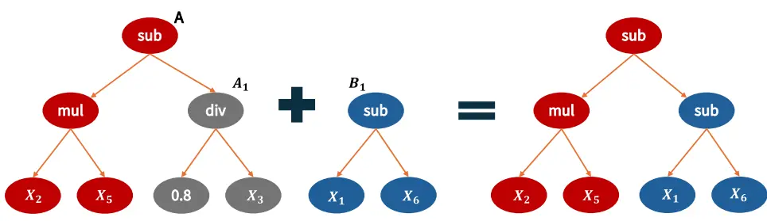
资料来源：光大证券研究所绘制

## 3.1.4 点变异

点变异也是一种常用的变异操作。点变异也可以将已经被淘汰的公式重新引入种群，从而保持种群的多样性。如图，首先选择适应度最高的父代公式树 A，然后随机选择子树 $A_{1}$ 和子叶 $A_{2}$ 被替换。子树 $A_{1}$ 被含有相同参数个数的公式所替换，子叶 $A_{2}$ 被其他子叶替换。

图 16：点变异图示
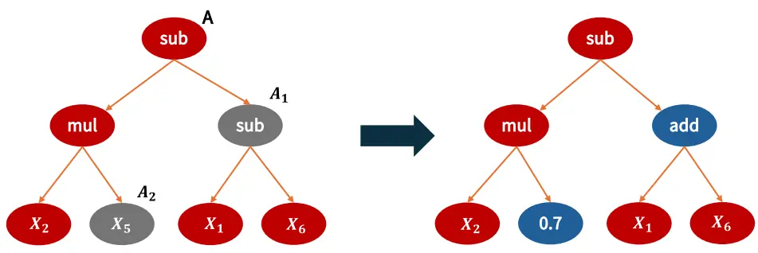
资料来源：光大证券研究所绘制

## 3.1.5 Hoist 变异

Hoist 变异是一种较为复杂的变异方法。这种方法的目的是移除公式树中的部分节点或子叶，以达到简化公式树的目的。如图，首先选择适应度最高的父代公式树 A，然后随机选择子树 $A_{1}$ 的子叶 $A_{3}$ ，将子叶 $A_{3}$ 提升到节点 $A_{1}$ 处的位置，删除其他子叶，生成新的后代。

图 17：Hoist 变异图示
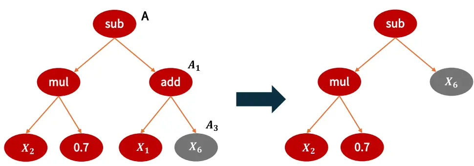
资料来源：光大证券研究所绘制

## 3.2 算法改进：构建分域方程

前一节介绍的 S-表达式是一种人类可读的文本形式表达半结构化数据的数学标记语言，其本质是一个树状的结构，这使得其非常适合表示复杂的数据结构和算法。

本文聚焦因子分域的研究，因此需要构建分域方程以生成因子。传统的时间序列算子都是对数据本身做操作。无法达到分域的效果。比如 ts_mean(X, window)，表示的是对数据 X，计算历史 window 个交易日的均值。

时序分域的算子可以构建为：

$$
\mathsf{ts\_max\_mean(X,Y,window1,window2)}
$$

该算子表示的是对数据 X，计算历史 window2 个交易日中，Y 数据最大的window1 个交易日对应的 X 的均值。

在截面分域部分，根据上文中对因子进行连续分域的方式，截面分域算子可以构建为：

$$
\mathsf{multiply(X,sigmoid(standardize(winsorize(Y))))}
$$

该算子表示，使用因子 Y 对因子 X 进行连续分域：通过 winsorize 函数对因子 Y进行 MAD 去极值、standardize 函数对因子 Y 标准化、sigmoid 激活函数对因子 Y 进行非线性变换，将其映射到区间（0,1）内，最后与因子 X 相乘。

我们引入的时序分域算子如下表所示。

表 4：时序分域算子

| 序号 | 算子(X,Y,window1,window2) | 说明 |
| --- | --- | --- |
| 1 | ts_max_mean | 对数据X，计算历史window2 个交易日中，Y数据最大的 window1 个交易日对应的 X 的均值 |
| 2 | ts_min_mean | 对数据X，计算历史 window2 个交易日中，￥数据最小的 window1 个交易日对应的X的均值 |
| 3 | ts_max_mean_minus_min_mean | ts_max_mean- ts_min_mean |
| 4 | ts_max_std | 对数据X，计算历史window2 个交易日中，Y数据最大的 window1 个交易日对应的X 的标准差 |
| 5 | ts_min_std | 对数据X，计算历史window2个交易日中，Y数据最小的 window1 个交易日对应的 X 的标准差 |
| 6 | ts_max_std_minus_min_std | ts_max_std - ts_min_std |

资料来源：光大证券研究所

为了保证分域因子 Y 的多样性，我们引入时序算子和一般算子，用以在遗传算法生成子代的过程中，生成多种多样的个体 Y。时序算子和一般算子如下表所示。

表 5：时序算子

| 序号 | 算子(X,window) | 说明 |
| --- | --- | --- |
| 1 | ts_delta | 滚动计算window个交易日中，数据 X的变化率 |
| 2 | ts_max | 滚动计算 window 个交易日中，数据 X 的最大值 |
| 3 | ts_min | 滚动计算 window 个交易日中，数据 X 的最小值 |
| 4 | ts_mean | 滚动计算window 个交易日中，数据X的平均值 |
| 5 | ts_std | 滚动计算 window 个交易日中，数据 X的标准差 |
| 6 | ts_sum | 滚动计算 window 个交易日中，数据 X 的和 |
| 7 | ts_prod | 滚动计算 window 个交易日中，数据 X的累积 |
| 8 | ts_rank | 滚动计算 window 个交易日中，数据X 的秩 |

资料来源：光大证券研究所

表 6：一般算子

| 序号 | 算子 说明 |
| --- | --- |
| 1 | add(X,Y) X+Y |
| 2 subtract(X,Y) | X-Y |
| 3 | multiply(X,Y) X*Y |
| 4 protected_divide(X,Y) | X/Y；Y=0 时，取 0 |
| 5 | sign_sqrt(X) 对X开方；X为负数时，取绝对值开方，再取相反数 |
| 6 | 对X取对数；X为负数时，对绝对值取对数，再取相反数；X sign_log(X) 为0时，取0 |
| 7 protected_inv(X) | 对X求倒数；X为0时，取0 |

资料来源：光大证券研究所

有了上述算子后，我们便可构建因子分域方程，例如时序分域方程：

$$
\mathsf{ts\_max\_std(X,subtract(Y1,Y2),5,15)}
$$

表示过去 15 个交易日中，Y1 减去 Y2 最大的 5 个交易日，对应 X 的标准差；截面分域方程：

$$
\mathsf{mutitply(X,}\mathsf{sigmoid(standardize(winsorize(add(ts\_mean(Y1,}5\mathsf{),}\mathsf{Y2)))))}
$$

表示过去 5 个交易日中，求 Y1 的均值，再加上 Y2，经过去极值、标准化、非线性变换后，与 X 相乘。

## 3.3 模型参数

在截面分域阶段，我们的原始因子取自光大金工因子数据库（因子信息见光大金工系列量化周报），我们采用下表中的原始数据对因子进行分域。在时序分域阶段，我们均采用下表所列数据。

表 7：原始数据列表

| 序号 | 数据简称 | 数据名称 定义 |
| --- | --- | --- |
| 1 | RETURN | 收益率 日度收益率 |
| 2 | OPEN | 开盘价 开盘价 |
| 3 | CLOSE | 收盘价 收盘价 |
| 4 | HIGH | 最高价 最高价 |
| 5 | LOW | 最低价 最低价 |
| 6 | VOLUME | 成交量 成交量 |
| 7 | AMOUNT | 成交金额 成交金额 |
| 8 | TRUN | 换手率 换手率 |
| 9 | TRADES_COUNT | 成交笔数 成交笔数 |
| 10 | SWING | 振幅 HIGH/LOW |
| 11 | MIN_SKEW_5M | 5 分钟日内偏度 日内 5 分钟收益率的偏度 |
| 12 | MORNING_RET | 早盘收益率 早盘均价/开盘价-1 |
| 13 | TAIL_RET | 尾盘收益率 收盘价/尾盘均价-1 |

资料来源：Wind，光大证券研究所；注：9:30-10:30 定义为早盘，14:30-15:00 定义为尾盘
在模型参数方面，模型参数设置如下表所示。

表 8：遗传算法参数

| 序号 | 参数 说明 |
| --- | --- |
| 1 | 种群大小 500 |
| 2 | 迭代次数 2 |
| 3 | 交叉概率 0.5 |
| 4 5 | 变异概率 0.2 |
| 6 | window 5-20 随机整数 |
|  | window1 5或10 |
| 7 | window2 15或 20 |
| 8 | 树结构最小深度 0 |
| 9 | 树结构最大深度(时序分域) 2 |
| 10 11 | 树结构最大深度(截面分域) 4 样本内区间 2016.01.04-2018.12.28 |

资料来源：光大证券研究所

## 4、截面分域改进因子展示

## 4.1 营收同比因子改进

原始因子为单季度营业收入同比增长率（SalesYOY），该因子近几年失效明显。通过分域算法挖掘出的改进因子提升明显。分域因子为股票过去 8 个交易日最高价的标准差，减去当天的成交笔数。

$$
\mathsf{Y}\mathop{\mathsf{=}}\mathsf{subtract}(\mathsf{ts\_std}(\mathsf{HIGH},8),\mathsf{TRADES\_COUNT})
$$

$$
\mathsf{multiply(SalesYOY,sigmoid(standardize(winsorize(Y))))}
$$

因子回测区间为 2014.01.03-2024.09.30，其中 2016.01.04-2018.12.28 为样本内区间，其余为样本外区间。若无特别说明，下文所称的样本外区间，均指2019.01.02-2024.09.30。

从回测结果来看，改进因子相对于原始因子提升明显。样本外区间内，改进因子的多空组合大幅领先于原始因子。从多头组来看，改进因子的多头组相对于原始因子的多头组，具有明显优势。

图 18：因子分域前后多空组合对比（SalesYOY）
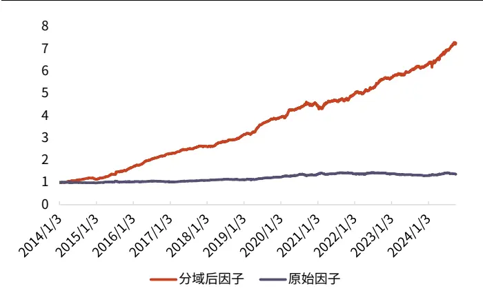
资料来源：Wind，光大证券研究所；统计区间：2014.01.03-2024.09.30

图 19：因子分域前后多头组对比（SalesYOY）
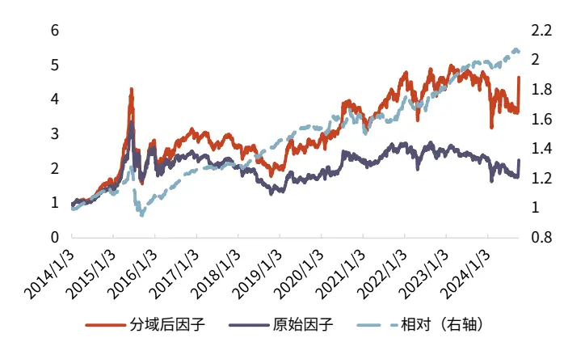
资料来源：Wind，光大证券研究所；统计区间：2014.01.03-2024.09.30

从因子 Rank IC 来看，原始因子在 2022 年-2023 年失效明显，改进因子 Rank IC在时序上提升明显，平均周频 Rank IC 从 0.8%提升至 6.68%。

图 20：原始因子 Rank IC（SalesYOY）
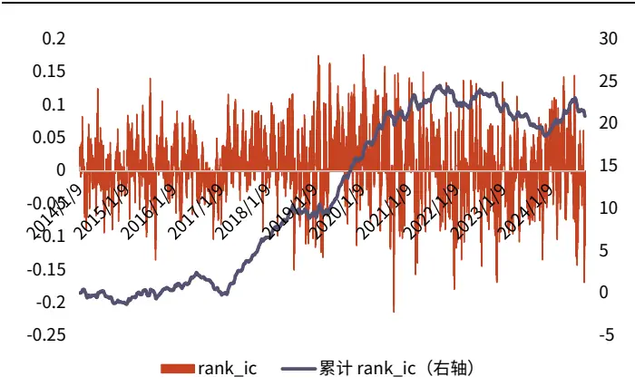
资料来源：Wind，光大证券研究所；统计区间：2014.01.09-2024.09.30

图 21：改进因子 Rank IC（SalesYOY）
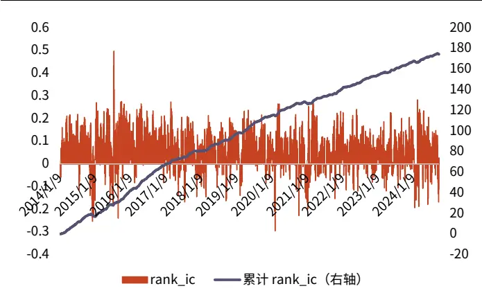
资料来源：Wind，光大证券研究所；统计区间：2014.01.09-2024.09.30

表 9：因子多空组合业绩指标对比（SalesYOY）

| 总收 益率 | 年化 收益率 |  | 年化 波动率 | 夏普 比率 | 最大 回撤 | 最大回撤 最大回撤 起始日期 截止日期 |
| --- | --- | --- | --- | --- | --- | --- |
|  | 3.07% | 3.28% | 0.02 | 10.19% | 2022/7/6 2023/11/2258.91% | 胜率 Rank IC 0.80% |
| 原始因子37.23% | 改进因子627.23% 20.90% | 5.04% | 3.55 | 7.14% | 2020/9/10 2021/1/13 85.27% | 6.68% |

资料来源：Wind，光大证券研究所；统计区间：2014.01.03-2024.09.30

## 4.2 净利润同比因子改进

原始因子为单季度净利润同比增长率（ProfitYOY），该因子近几年失效明显。通过分域算法挖掘出的改进因子提升明显。分域因子为股票当日成交笔数加上换手率。

Y = add(TRADES_COUNT, TURN)

multiply(ProfitYOY, sigmoid(standardize(winsorize(Y))))

从回测结果来看，改进因子相对于原始因子提升明显。样本外区间内，改进因子的多空组合大幅领先于原始因子。从多头组来看，改进因子的多头组相对原始因子的多头组，提升效果较为明显，但近期改进因子多头组出现了较大回撤。

图 22：因子分域前后多空组合对比（ProfitYOY）
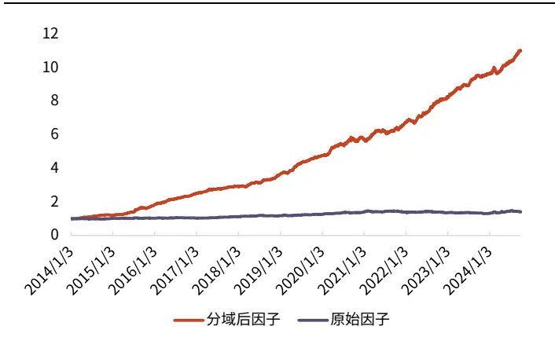
资料来源：Wind，光大证券研究所；统计区间：2014.01.03-2024.09.30

图 23：因子分域前后多头组对比（ProfitYOY）
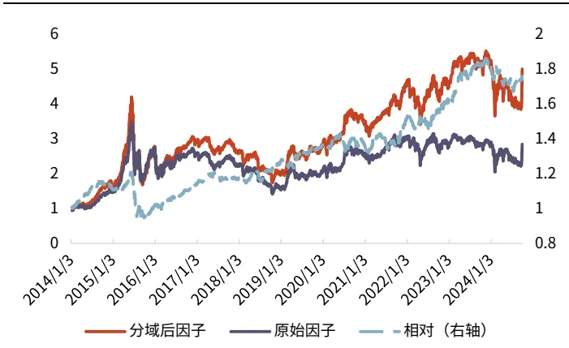
资料来源：Wind，光大证券研究所；统计区间：2014.01.03-2024.09.30

从因子 Rank IC 来看，原始因子在 2022 年-2023 年失效明显，改进因子 Rank IC在时序上提升明显，平均周频 Rank IC 从 1.25%提升至 8.31%。

图 24：原始因子 Rank IC（ProfitYOY）
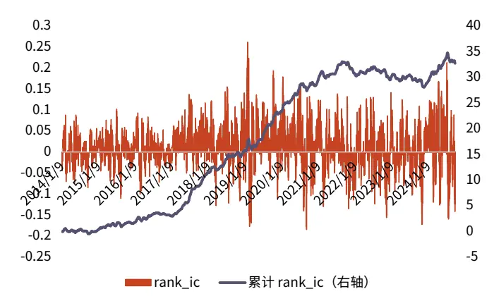
资料来源：Wind，光大证券研究所；统计区间：2014.01.09-2024.09.30

图 25：改进因子 Rank IC（ProfitYOY）
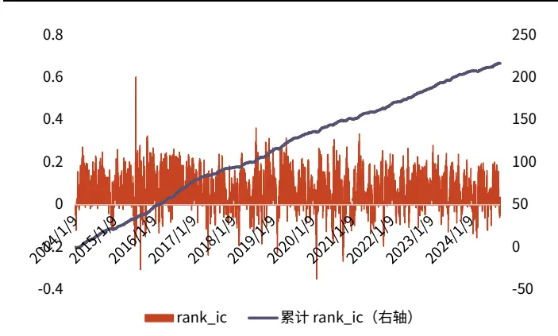
资料来源：Wind，光大证券研究所；统计区间：2014.01.09-2024.09.30

表 10：因子多空组合业绩指标对比（ProfitYOY）

| 总收 益率 | 年化 收益率 | 年化 波动率 | 夏普 比率 | 最大 回撤 | 最大回撤 最大回撤 起始日期 截止日期 |
| --- | --- | --- | --- | --- | --- |
| 原始因子40.26% | 3.29% | 3.28% | 0.09 | 11.15% | 胜率 Rank IC 2021/2/4 2023/11/2054.26% |
| 改进因子1001.05% | 25.79% | 5.78% | 3.94 |  | 1.25% 4.69% 2020/9/10 2020/11/5 85.27% 8.31% |

资料来源：Wind，光大证券研究所；统计区间：2014.01.03-2024.09.30

## 4.3 反转因子改进

原始因子为 5 日反转（5DR，当前股价除以过去 5 个交易日股价均值再减 1），该因子历史表现较好。通过分域算法挖掘出的改进因子仍然具有明显的提升效果。分域因子为股票过去 14 个交易日开盘价的最小值，求过去 5 天的变化率，再减去当天的成交笔数。

$$
\mathsf{Y}\mathop{\mathsf{=}}\mathsf{subtract}(\mathsf{ts\_delta}(\mathsf{ts\_min}(\mathsf{OPEN},\mathsf{14}),\mathsf{5}),\mathsf{TRADES\_COUNT})
$$

$$
\mathsf{multiply(5DR,sigmoid(standardize(winsorize(Y))))}
$$

从回测结果来看，改进因子相对于原始因子提升明显。样本外区间内，改进因子的多空组合仍然大幅领先原始因子。从多头组来看，改进因子的多头组相对原始因子的多头组，提升效果明显。

图 26：因子分域前后多空组合对比（5DR）
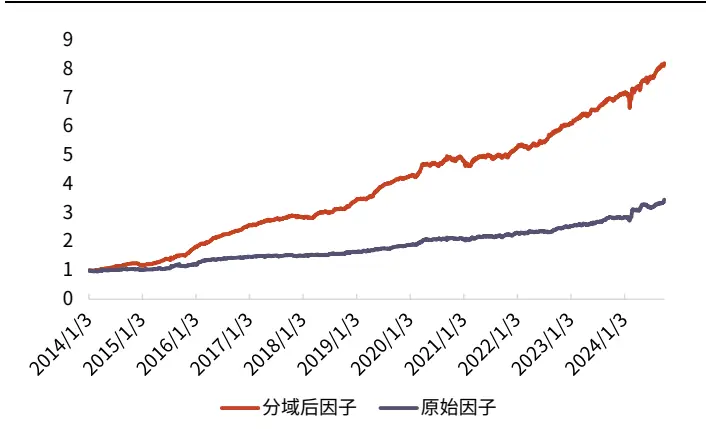
资料来源：Wind，光大证券研究所；统计区间：2014.01.03-2024.09.30

图 27：因子分域前后多头组对比（5DR）
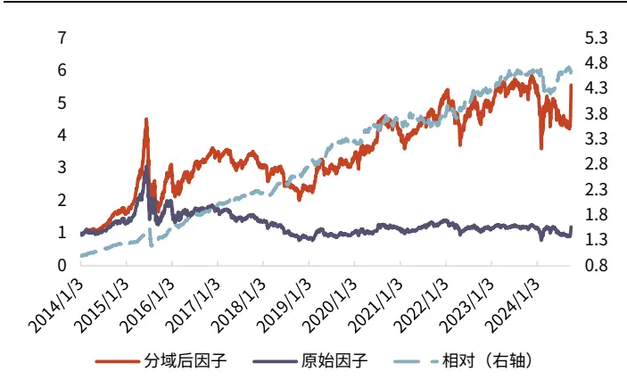
资料来源：Wind，光大证券研究所；统计区间：2014.01.03-2024.09.30

从 Rank IC 来看，平均周频 Rank IC 从 3.77%提升至 8.03%。

图 28：原始因子 Rank IC（5DR）
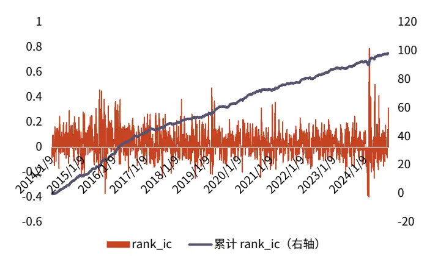
资料来源：Wind，光大证券研究所；统计区间：2014.01.09-2024.09.30

图 29：改进因子 Rank IC（5DR）
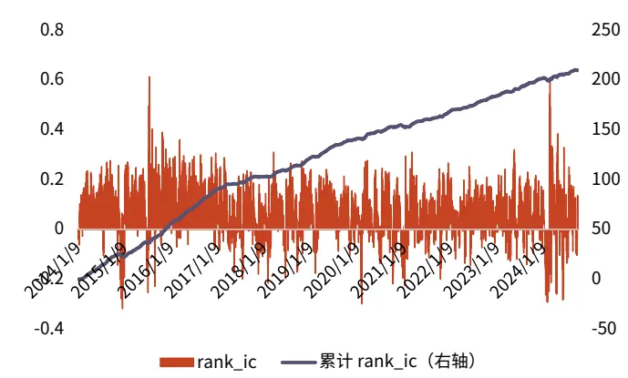
资料来源：Wind，光大证券研究所；统计区间：2014.01.09-2024.09.30

表 11：因子多空组合业绩指标对比（5DR）

| 总收 益率 | 年化 收益率 | 年化 波动率 | 夏普 比率 | 最大 回撤 | 最大回撤 起始日期 | 最大回撤 截止日期 | 月度 周频 胜率 Rank IC |
| --- | --- | --- | --- | --- | --- | --- | --- |
| 原始因子246.37% | 12.62% | 6.52% | 1.48 | 7.91% |  | 2015/9/112015/10/2367.44% | 3.77% |
| 改进因子722.04% | 22.32% | 5.66% | 3.41 | 7.72% | 2024/1/12 | 2024/2/7 85.27% | 8.03% |

资料来源：Wind，光大证券研究所；统计区间：2014.01.03-2024.09.30

## 5、时序分域改进因子展示

## 5.1 反转因子改进

原始因子为过去 15 个交易日的 RETURN 均值（15 日反转因子），该因子历史表现较好。通过分域算法挖掘出的改进因子具有明显的提升效果。分域因子为股票过去 15 个交易日中，股票收益率最大的 5 个交易日的平均收益率，减去股票收益率最小的 5 个交易日的平均收益率。

## ts_mean(RETURN, 15)

$$
\mathsf{ts\_max\_mean\_minus\_min\_mean(RETURN,RETURN,5,15)}
$$

从回测结果来看，改进因子相对于原始因子提升明显。样本外区间内，改进因子的多空组合大幅领先原始因子。从多头组来看，改进因子的多头组相对原始因子的多头组，提升效果十分显著。

图 30：因子分域前后多空组合对比（RETURN）
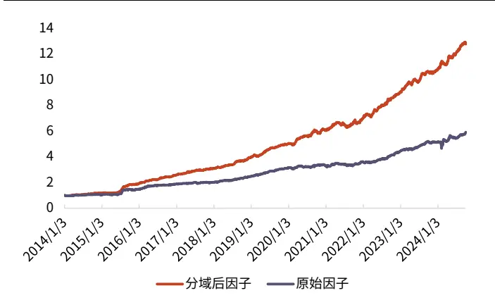
资料来源：Wind，光大证券研究所；统计区间：2014.01.03-2024.09.30

图 31：因子分域前后多头组对比（RETURN）
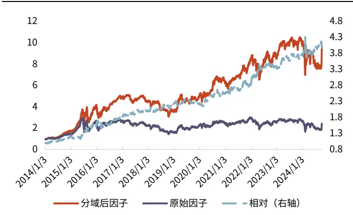
资料来源：Wind，光大证券研究所；统计区间：2014.01.03-2024.09.30

从 Rank IC 来看，平均周频 Rank IC 从 4.96%提升至 8.45%。

图 32：原始因子 Rank IC（RETURN）
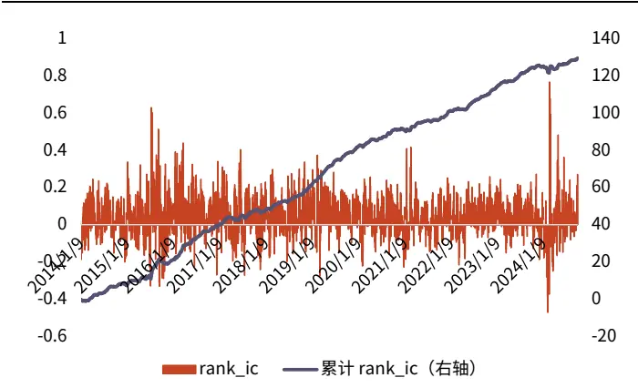
资料来源：Wind，光大证券研究所；统计区间：2014.01.09-2024.09.30

图 33：改进因子 Rank IC（RETURN）
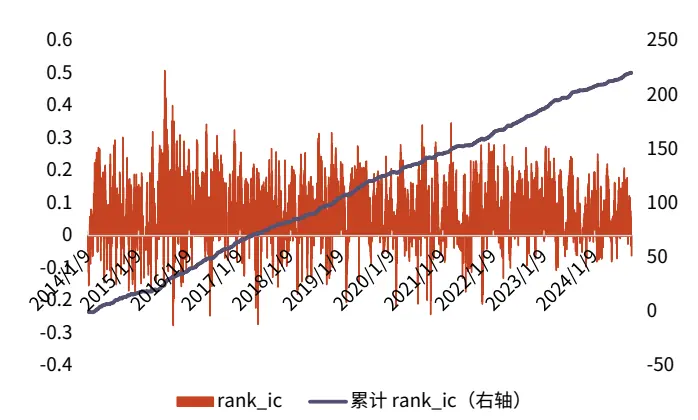
资料来源：Wind，光大证券研究所；统计区间：2014.01.09-2024.09.30

表 12：因子多空组合业绩指标对比（RETURN）

| 总收 益率 | 年化 收益率 | 年化 波动率 | 夏普 比率 | 最大 回撤 | 最大回撤 起始日期 | 最大回撤 月度 周频 截止日期 胜率 |
| --- | --- | --- | --- | --- | --- | --- |
| 原始因子 492.59% | 18.55% | 8.20% | 1.90 | 10.79% 2023/9/27 | 2024/2/7 | Rank IC 75.97% 4.96% |
| 改进因子1178.69% | 27.60% | 7.06% | 3.48 |  | 6.05% 2021/4/15 2021/7/22 82.95% | 8.45% |

资料来源：Wind，光大证券研究所；统计区间：2014.01.03-2024.09.30

## 5.2 尾盘收益因子改进

原始因子为过去 15 个交易日的 TAIL_RET 均值，该因子历史表现较好。通过分域算法挖掘出的改进因子具有一定的提升效果。分域因子为股票过去 15 个交易日中，股票尾盘收益率最大的 5 个交易日的平均尾盘收益率。

$$
\mathsf{ts\_mean(TAIL\_RET,15)}
$$

$$
\mathsf{ts\_max\_mean}\left(\mathsf{TAIL\_RET},\mathsf{TAIL\_RET},5,15\right)
$$

从回测结果来看，改进因子相对于原始因子有一定提升效果。样本外区间内，改进因子的多空组合在 2022 年至今领先原始因子。从多头组来看，改进因子的多头组相对原始因子的多头组，在样本外区间内，具有较为稳定的提升效果。

图 34：因子分域前后多空组合对比（TAIL_RET）
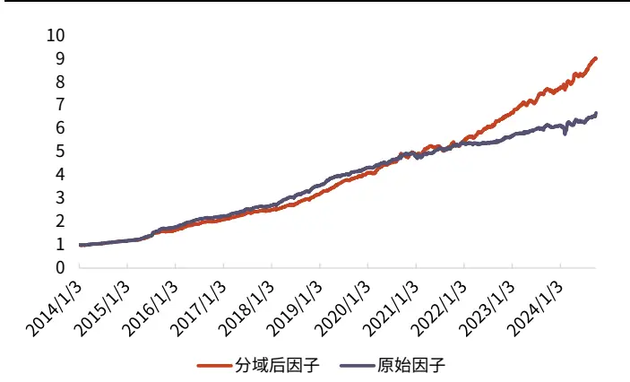
资料来源：Wind，光大证券研究所；统计区间：2014.01.03-2024.09.30

图 35：因子分域前后多头组对比（TAIL_RET）
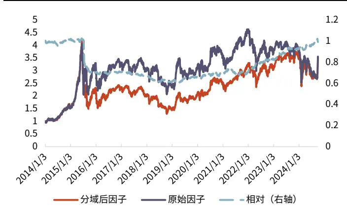
资料来源：Wind，光大证券研究所；统计区间：2014.01.03-2024.09.30

从 Rank IC 来看，平均周频 Rank IC 从 4.89%提升至 7.85%。

图 36：原始因子 Rank IC（TAIL_RET）
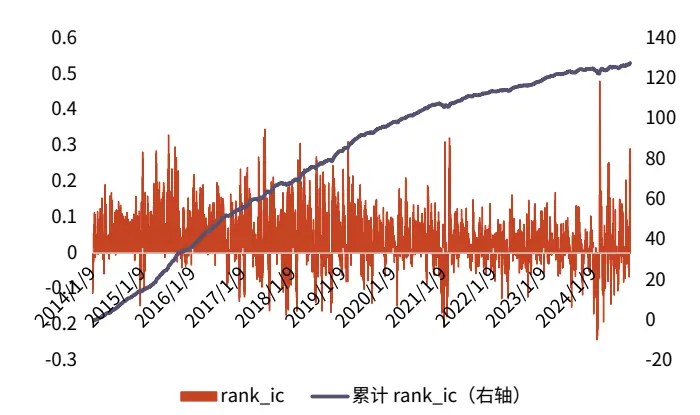
资料来源：Wind，光大证券研究所；统计区间：2014.01.09-2024.09.30

图 37：改进因子 Rank IC（TAIL_RET）
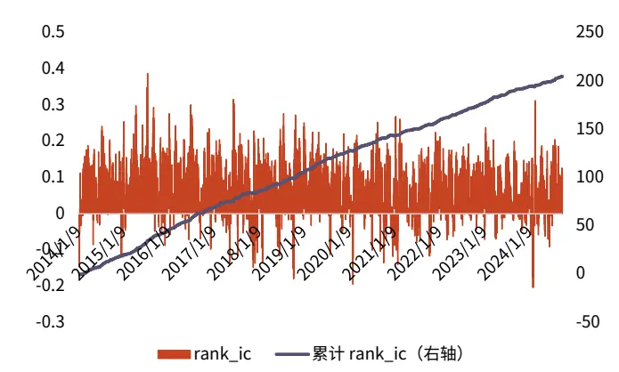
资料来源：Wind，光大证券研究所；统计区间：2014.01.09-2024.09.30

表 13：因子多空组合业绩指标对比（TAIL_RET）

| 总收 益率 | 年化 收益率 | 年化 波动率 | 夏普 比率 | 最大 回撤 | 最大回撤 起始日期 | 最大回撤 截止日期 | 月度 胜率 | 周频 Rank IC |
| --- | --- | --- | --- | --- | --- | --- | --- | --- |
| 原始因子568.91% | 19.93% |  | 4.71% | 3.59 | 6.78% | 2023/9/27 | 2024/2/7 86.05% | 4.89% |
| 改进因子802.26% | 23.41% | 5.16% | 3.96 | 4.30% |  | 2021/4/26 2021/7/29 | 85.27% | 7.85% |

资料来源：Wind，光大证券研究所；统计区间：2014.01.03-2024.09.30

## 5.3 振幅因子改进

原始因子为过去 15 个交易日的 SWING 均值，该因子历史表现较好。通过分域算法挖掘出的改进因子具有明显的提升效果。分域因子为股票过去 15 个交易日中，最高价开方后最大的 5 个交易日的振幅均值，减去最高价开方后最小的 5个交易日的振幅均值。

$$
\mathsf{ts\_mean(SWING,15)}
$$

$$
\mathsf{ts\_max\_mean\_minus\_min\_mean}\left(\mathsf{SWING},\mathsf{sign\_sqrt}(\mathsf{HIGH}),\mathsf{5},\mathsf{15}\right)
$$

从回测结果来看，改进因子相对于原始因子提升明显。样本外区间内，改进因子的多空组合大幅领先原始因子。从多头组来看，改进因子的多头组相对原始因子的多头组，提升效果较为明显，但去年底、今年初，改进因子多头组出现了较大回撤。

图 38：因子分域前后多空组合对比（SWING）
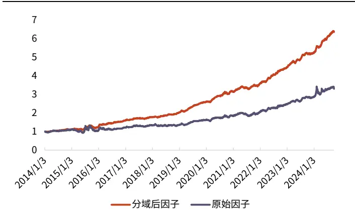
资料来源：Wind，光大证券研究所；统计区间：2014.01.03-2024.09.30

图 39：因子分域前后多头组对比（SWING）
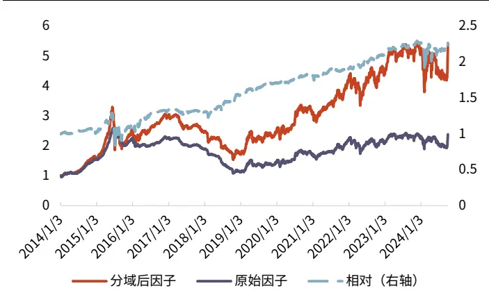
资料来源：Wind，光大证券研究所；统计区间：2014.01.03-2024.09.30

从 Rank IC 来看，平均周频 Rank IC 从 6.12%提升至 6.92%。

图 40：原始因子 Rank IC（SWING）
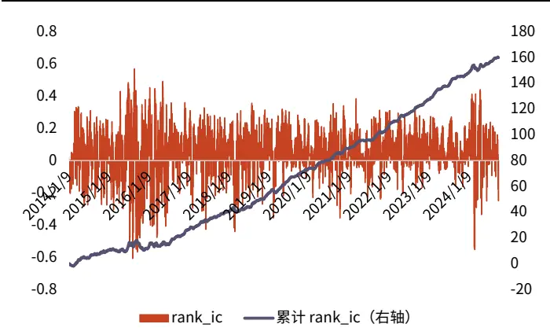
资料来源：Wind，光大证券研究所；统计区间：2014.01.09-2024.09.30

图 41：改进因子 Rank IC（SWING）
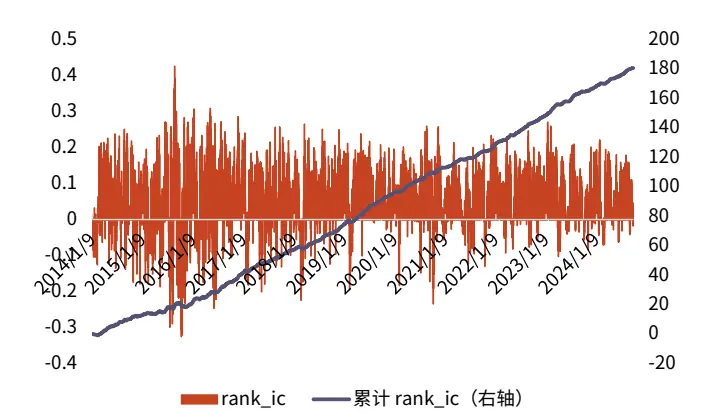
资料来源：Wind，光大证券研究所；统计区间：2014.01.09-2024.09.30

表 14：因子多空组合业绩指标对比（SWING）

| 总收 益率 | 年化 收益率 | 年化 波动率 | 夏普 比率 | 最大 回撤 | 最大回撤 起始日期 | 最大回撤 截止日期 | 月度 周频 胜率 Rank IC |
| --- | --- | --- | --- | --- | --- | --- | --- |
| 原始因子231.12% | 12.13% | 12.49% | 0.73 | 23.26% |  | 2015/9/2 2015/11/2563.57% | 6.12% |
| 改进因子538.05% | 19.39% | 6.81% | 2.41 |  |  | 11.63% 2015/9/2 2015/11/2577.52% | 6.92% |

资料来源：Wind，光大证券研究所；统计区间：2014.01.03-2024.09.30

## 6、 总结

因子分域的研究在市场中由来已久，因子分域研究被广泛应用于选股、资产配置等方面。通过对股票进行因子分域，可以识别出不同分域内股票的独特性和优势。分域思想的本质是基于不同市场环境中，数据表达的信息不同，采用差异化的方式处理因子来更有效的表达因子信息。

在实证研究中，不少案例证明了因子分域研究的有效性。例如对于估值因子来说，市值风格就是一个有效的分域。在前期报告中，我们介绍了因子分域研究框架。在多因子框架下，分域一般会应用在两个步骤中：因子计算和因子合成。本篇报告将聚焦于因子计算中分域法的应用。

一般提到分域研究，普遍的做法是在不同行业内对因子做不同处理，这种方式属于截面分域。我们认为在时间序列上也存在分域效应。我们以估值因子和早盘收益因子为案例，讨论了两种分域方式——截面分域和时序分域，并给出了两种分域方式的逻辑。

以上两种分域方式中，除了人工挖掘因子外，我们同样可以借助算法来挖掘潜在的因子。本文借助遗传规划算法来进行分域尝试。首先基于遗传规划算法进行分域因子生成，并基于成熟的遗传规划库做出深度改进。最后，我们测试了基于遗传规划算法生成的分域因子，结果表明，因子分域后的提升效果显著。

我们从时序分域和截面分域两个维度入手，借助遗传规划算法批量挖掘了未知的分域因子，并从中挑选了部分结果作为代表，进行展示。

在截面分域部分，对营收同比因子、净利润同比因子和反转因子改进后，因子提升效果明显，平均周频 Rank IC 分别从0.8%、1.25%和3.77%，提升到了 6.68%、8.31%和 8.03%。

在时序分域部分，对反转因子、尾盘收益因子和振幅因子改进后，因子提升效果明显，平均周频 Rank IC 分别从 4.96%、4.89%和 6.12%，提升到了 8.45%、7.85%和 6.92%。

## 7、 风险提示

报告结果均基于模型及历史数据，模型存在失效的风险，历史数据存在不被重复验证的可能。

## 行业及公司评级体系

| 评级 说明 |  |  |
| --- | --- | --- |
|  | 买入 | 未来6-12个月的投资收益率领先市场基准指数15%以上 |
|  | 增持 | 未来 6-12 个月的投资收益率领先市场基准指数 5%至 15%; |
|  | 中性 | 未来6-12个月的投资收益率与市场基准指数的变动幅度相差-5%至5%； |
|  | 减持 | 未来 6-12 个月的投资收益率落后市场基准指数 5%至 15%; |
| 行业及公司评级 | 卖出 | 未来6-12个月的投资收益率落后市场基准指数15%以上； |
|  | 无评级 | 因无法获取必要的资料，或者公司面临无法预见结果的重大不确定性事件，或者其他原因，致使无法给出明确的投资评级。 |
|  | 基准指数说明： | A股市场基准为沪深300指数；香港市场基准为恒生指数；美国市场基准为纳斯达克综合指数或标普500指数。 |

## 分析、估值方法的局限性说明

本报告所包含的分析基于各种假设，不同假设可能导致分析结果出现重大不同。本报告采用的各种估值方法及模型均有其局限性，估值结果不保证所涉及证券能够在该价格交易。

## 分析师声明

本报告署名分析师具有中国证券业协会授予的证券投资咨询执业资格并注册为证券分析师，以勤勉的职业态度、专业审慎的研究方法，使用合法合规的信息，独立、客观地出具本报告，并对本报告的内容和观点负责。负责准备以及撰写本报告的所有研究人员在此保证，本研究报告中任何关于发行商或证券所发表的观点均如实反映研究人员的个人观点。研究人员获取报酬的评判因素包括研究的质量和准确性、客户反馈、竞争性因素以及光大证券股份有限公司的整体收益。所有研究人员保证他们报酬的任何一部分不曾与，不与，也将不会与本报告中具体的推荐意见或观点有直接或间接的联系。

## 法律主体声明

本报告由光大证券股份有限公司制作，光大证券股份有限公司具有中国证监会许可的证券投资咨询业务资格，负责本报告在中华人民共和国境内（仅为本报告目的，不包括港澳台）的分销。本报告署名分析师所持中国证券业协会授予的证券投资咨询执业资格编号已披露在报告首页。

中国光大证券国际有限公司和 Everbright Securities(UK) Company Limited 是光大证券股份有限公司的关联机构。

## 特别声明

光大证券股份有限公司（以下简称“本公司”）成立于 1996 年，是中国证监会批准的首批三家创新试点证券公司之一，也是世界 500 强企业——中国光大集团股份公司的核心金融服务平台之一。根据中国证监会核发的经营证券期货业务许可，本公司的经营范围包括证券投资咨询业务。

本公司经营范围：证券经纪；证券投资咨询；与证券交易、证券投资活动有关的财务顾问；证券承销与保荐；证券自营；为期货公司提供中间介绍业务；证券投资基金代销；融资融券业务；中国证监会批准的其他业务。此外，本公司还通过全资或控股子公司开展资产管理、直接投资、期货、基金管理以及香港证券业务。

本报告由光大证券股份有限公司研究所（以下简称“光大证券研究所”）编写，以合法获得的我们相信为可靠、准确、完整的信息为基础，但不保证我们所获得的原始信息以及报告所载信息之准确性和完整性。光大证券研究所可能将不时补充、修订或更新有关信息，但不保证及时发布该等更新。

本报告中的资料、意见、预测均反映报告初次发布时光大证券研究所的判断，可能需随时进行调整且不予通知。在任何情况下，本报告中的信息或所表述的意见并不构成对任何人的投资建议。客户应自主作出投资决策并自行承担投资风险。本报告中的信息或所表述的意见并未考虑到个别投资者的具体投资目的、财务状况以及特定需求。投资者应当充分考虑自身特定状况，并完整理解和使用本报告内容，不应视本报告为做出投资决策的唯一因素。对依据或者使用本报告所造成的一切后果，本公司及作者均不承担任何法律责任。

不同时期，本公司可能会撰写并发布与本报告所载信息、建议及预测不一致的报告。本公司的销售人员、交易人员和其他专业人员可能会向客户提供与本报告中观点不同的口头或书面评论或交易策略。本公司的资产管理子公司、自营部门以及其他投资业务板块可能会独立做出与本报告的意见或建议不相一致的投资决策。本公司提醒投资者注意并理解投资证券及投资产品存在的风险，在做出投资决策前，建议投资者务必向专业人士咨询并谨慎抉择。

在法律允许的情况下，本公司及其附属机构可能持有报告中提及的公司所发行证券的头寸并进行交易，也可能为这些公司提供或正在争取提供投资银行、财务顾问或金融产品等相关服务。投资者应当充分考虑本公司及本公司附属机构就报告内容可能存在的利益冲突，勿将本报告作为投资决策的唯一信赖依据。

本报告根据中华人民共和国法律在中华人民共和国境内分发，仅向特定客户传送。本报告的版权仅归本公司所有，未经书面许可，任何机构和个人不得以任何形式、任何目的进行翻版、复制、转载、刊登、发表、篡改或引用。如因侵权行为给本公司造成任何直接或间接的损失，本公司保留追究一切法律责任的权利。所有本报告中使用的商标、服务标记及标记均为本公司的商标、服务标记及标记。

光大证券股份有限公司版权所有。保留一切权利。

光大证券研究所

上海

北京

深圳

静安区新闸路 1508 号

西城区武定侯街 2 号

福田区深南大道 6011 号

静安国际广场 3 楼

泰康国际大厦 7 层

NEO 绿景纪元大厦 A 座 17 楼

光大证券股份有限公司关联机构

香港

中国光大证券国际有限公司

香港铜锣湾希慎道 33 号利园一期 28 楼

英国

Everbright Securities(UK) Company Limited 6th Floor, 9 Appold Street, London, United Kingdom, EC2A 2AP