分析师：
徐寅
xuyinsh@xyzq.com.cn
S0190514070004
联系人：
郑兆磊
zhengzhaolei@xyzq.com.cn

## 报告关键点

本文聚焦于在大健康板块内搭建量化选股策略。我们以中信医药+申万医药行业+其他从事大健康相关业务的上述公司作为初始股票池。通过挖掘行业背后的逻辑，因地制宜，展开大健康板块的量化选股研究化选股研究。综合多个维度的有效信息，我们在大健康板块内搭建了量化股票精选策略：2011 年 1 月-2020 年 6月份期间策略年化绝对收益率 37.5%，相对中信医药行业年化超额收益达到 23.4%，每年均实现正超额收益，且绝大部分年超额收益均在 10%以上。

## ＃相关报告 related

《基于误差修正模型的估值趋势偏离度因子研究》2020-03-20

《股东盈余视角下的估值因子研究》2020-06-08

团队成员：

# 基本面量化视角下的大健康板块选股研究

2020 年 07 月 22 日

## 投资要点

本文聚焦于在大健康板块内搭建量化选股策略。我们以中信医药+申万医药+其他从事大健康相关业务上市公司作为初始股票池，并进一步根据公司对研发创新重视程度的差异，将大健康板块拆分成“医药服务”、“医药制造与高科技”两个领域。

- 我们分别在“医药服务”和“医药制造与高科技”这两个子行业中筛选有效选股因子。利用一部分特有信息指标（如：研发费用、专利、时序估值因子等）以及传统选股因子，我们在医药服务行业内构建了Service_Sig，在医药制造与高科技行业内构建了Tech_Sig。两个因子在相应行业内的选股能力非常强：Service_Sig 的 IC 均值达到 0.08，T 值达到 5.57，分位数多头年化收益高达34.1%，月胜率高达71.1%；Tech_Sig 因子在医药制造与高科技领域IC 均值达到 0.062，T 值达到6.19，分位数多头年化收益率达到 28.1%，月胜率达到 76.3%。

为了应对医药行业政策敏感性强、新产品审批以及新技术对行业及股价影响较大的特点，我们以分析师个股研报标题作为数据源，通过判断标题是否包含正面或者负面词汇并加以汇总，最终形成了负面/正面情绪选股指标。该因子可以用来筛选股票池，从而达到进一步优化策略的目的。

综合前面的多个维度的有效信息，我们在大健康板块内搭建了量化股票精选策略：2011年1 月-2020年 6月份期间策略年化绝对收益率 37.5%，相对中信医药行业年化超额收益 23.4%，且每年均实现了正超额收益！

风险提示：本报告模型及结论全部基于对历史数据的分析，当市场环境变化时，存在模型失效风险。

## 报告正文

## 1、引言

近些年来，大科技、大消费、大健康这三大行业板块轮流引领着 A 股的市场行情。从每个板块具体包含的子行业来看，大科技主要覆盖了通信、电子、计算机等领域；大消费则包括了食品饮料、家用电器等方向；而大健康主要是指医疗保健行业，同时也包括了向该行业提供 IT系统及其他硬件支持的其他行业的上市公司。从本篇专题报告开始，我们兴证金融工程团队将分别在这三大板块内构建相应的量化精选策略：从不同行业的基本面特征出发，挖掘行业背后的投资逻辑，因地制宜，构建相应的基本面量化选股策略。作为本系列的第一篇报告，我们首先聚焦大健康。

实际上，关于大健康的定义，有狭义和广义之分。狭义的大健康主要指经济体系中直接向人群提供预防、治疗、康复等服务部门的总和，接近于国民经济体系中的的医疗卫生服务业，从国内二级市场的行业划分来看，直接对标于中信一级医药行业或者申万一级医药生物行业；而广义的大健康则是在狭义大健康的基础上，进一步包含了向人群提供保健产品和服务活动的其他经济领域。我们的研究从广义大健康概念出发，以中信&申万医药行业分类为基础，囊括了其他从事和大健康产业有关的上市公司，进而构成我们的基本股票池，并在此基础上构建了最终大健康板块量化精选组合。报告主要由以下五个部分构成：

1、大健康板块行业重构；

2、板块内 Alpha 因子构建；

3、分析师研报中的增量信息；

4、量化精选策略构建；

5、策略持仓与绩效分析；

如无特别说明，本文的研究时间窗口为 2011 年 1 月底-2020 年 6 月底。

## 2、大健康板块下的行业重构

## 2.1、大健康板块股票池确定

前面提及我们以广义大健康板块作为考察重点，以中信&申万医药行业分类为基础，并进一步补充了从事和大健康产业有关的上市公司，这里需要注意：

1. 截面上来看，中信一级行业的“医药”与申万一级行业中的“医药生物”所包含的股票数目并不完全相同。以 2020年 6 月 30 日两个医药行业为例：申万一级医药生物行业包含 326 个公司，中信一级医药行业包含 320 个公司，其中交集公司311家，另外24家公司的行业分类在上述两个体系下则有所分歧（在中信或申万分类下，可能被划分到了食品饮料、农林牧渔、非银行金融、基础化工、轻工制造等行业），但从这些公司营业收入贡献来看，确实有相当部分的收入来自于医药行业。因此，历史上中信和申万行业分类下医药行业成分股的并集构成了我们大健康板块的主要股票池，其子行业的划分则主要参考中信医药三级行业分类来确定；

2. 我们研究的是大健康板块，所以不仅仅要考察中信/申万医药行业的公司，还要将营业收入中有大健康业务的公司纳入进来，实现流程如下：

- 我们首先从刨除中信/申万医药行业中的上市公司信息中提取 “公司简介”的文本，并判断其中是否包含“医药”、“生物”、“健康”等关键字样，保留包含关键字样的公司作为潜在标的；

- 进一步通读潜在标的“公司简介”，以确定其是否有真正从事大健康领域的业务，从而缩小目标范围；

- 针对考察目标，一一观察其营业收入的构成，将真正有大健康营业收入贡献的公司作为新添加的标的。从结果来看，我们新添加了 67个公司（公司明细参见附录 1）。

我们将申万医药+中信医药+新拓展的公司作为最终的大健康板块股票池，构成了后续测试的起点。

图表 1、中信医药行业与申万医药行业股票数目统计
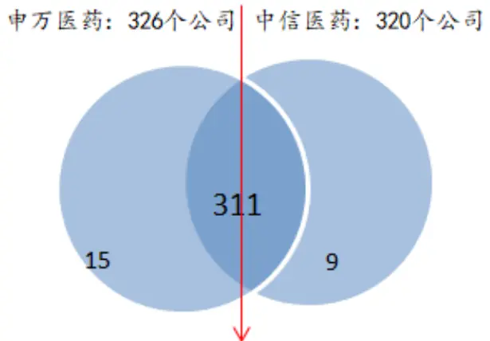
资料来源：聚源、Wind、兴业证券经济与金融研究院整理

## 2.2、大健康板块Vs中信医药 Vs 申万医药生物

新构建的大健康板块股票池和中信/申万医药行业板块在股票数量和二级市场表现方面有哪些异同呢？我们着重考察大健康、中信医药、申万医药三个板块截面股票数目以及三个股票池等权合成的指数净值走势差异。 从结果来看，虽然大健康板块相较于中信医药以及申万医药行业股票数目有所提升，但基于三个板块合成的指数净值差异很小，这意味着大健康板块和医药行业整体走势极为接近，并没有改变其二级市场的收益规律和走势特征。

图表 2、大健康、中信医药、申万医药板块的股票数目差异
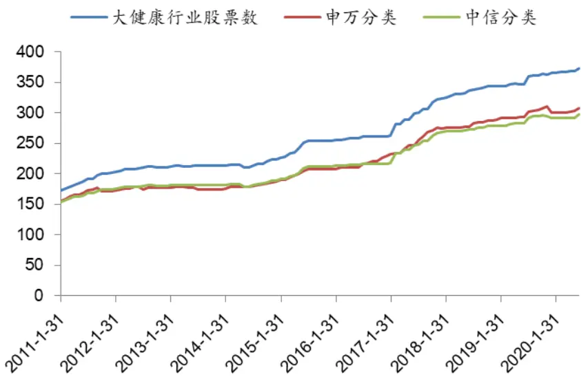
资料来源：Wind、聚源、兴业证券经济与金融研究院整理

图表 3、大健康、中信医药、申万医药板块等权合成指数净值
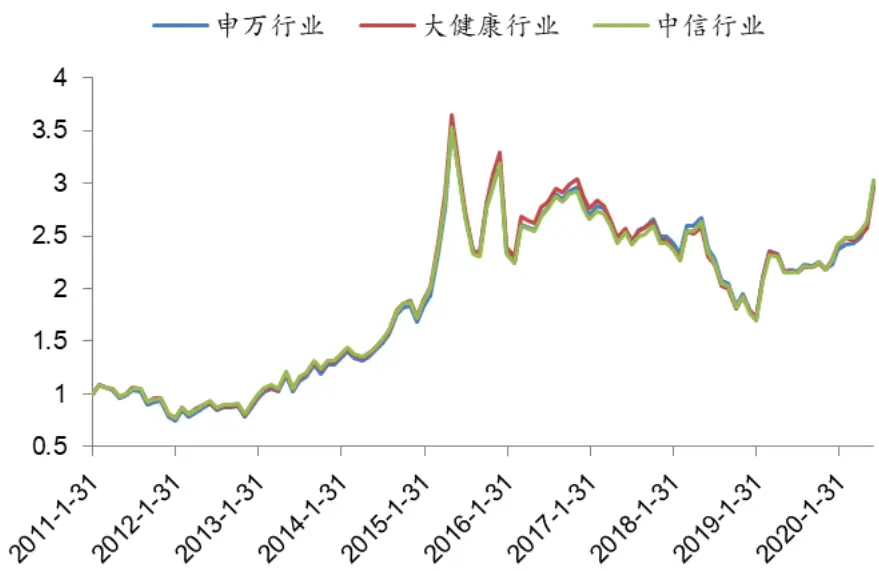
资料来源：Wind、聚源、兴业证券经济与金融研究院整理

图表 4、大健康、中信医药、申万医药三个板块指数统计指标

|  | 年化收益率 | 波动率 | 风险收益比 | 最大回撤 |
| --- | --- | --- | --- | --- |
| 大健康板块 | 12.2% | 29.0% | 0.42 | 52.9% |
| 中信医药行业 | 12.49% | 28.5% | 0.44 | 51.9% |
| 申万医药行业 | 12.47% | 29.0% | 0.43 | 51.6% |

资料来源：Wind、聚源、兴业证券经济与金融研究院整理

## 2.3、大健康板块行业特征

虽然我们重构了大健康板块，但传统医药行业依然是该板块中的绝对主力。因而后续如无特殊强调，我们将会不加区分地对医药板块和大健康板块混合使用。这里我们对医药行业的特点进行简单的总结和介绍：

1) 行业庞杂。医药行业从来都不是一个行业，而是多个投资逻辑差异较大的子行业的集合。正是由于这个特点，使得医药行业极为复杂、研究差异化大，研究难度也随之提升（具体可参见图表 5）。比如做医药流通的上海医药和做制药的恒瑞医药势必有不同的商业逻辑和发展战略，两者的估值也有着天壤之别。所以对于医药行业的研究必须进行一定程度的下沉，不能一概而论（在本节后续部分我们将重点介绍医药不同行业的特点）；

2) 重视创新和研发。研发是大部分医药行业赖以生存的根本。脱离了创新，医药行业的生命线就无以为续。6月12日，美国《制药经理人（Pharm Exec）》杂志公布了 2020 年全球制药企业 50 强排行榜。罗氏以 2019 年 482.47亿元的处方药销售额，首次夺得榜首，结束了辉瑞连续四年的霸主地位。背后有很多原因，但一个不争的事实是罗氏 2019 年研发投入为 102.93亿元，位居榜单首位，同时该公司有效专利占比非常高（还未到期的专利），而辉瑞目前即将到期的专利占比较高，对后续影响较大；

3) 销售费用居高不下。A 股市场医药行业的销售费用率（销售费用占营业收入之比）为所有行业最高，早已是不争的事实。2019 年医药行业年报显示上市公司年均销售费用高达 8.82亿元，再创历史新高。以恒瑞医药为例，2019 年全年恒瑞医药销售费用高达 85.24 亿元，市值体量接近其十倍的万科，2019年全年销售费用也只有90.44亿元；

4) 估值相对较为困难。传统的估值模型并不适用于所有的药企，甚至没办法对医药行业进行估值。对于一些药企而言，一个产品，一个技术可能就是企业发展的根本，一旦取得成功，企业的估值就打开了想象空间。所以医药行业经常采用管线估值的方式进行研究；

5) 对政策的高度敏感性。医药关乎民生大计，甚为敏感，国家对医药行业的改革也是慎之又慎。从早期的“双信封”推出，到“4+7”试点推行，再到如今扩大至全国的“带量采购”模式，都是一次又一次从药品采购端以保质控费为初衷的大规模探索与实践。每次新政的推出都会影响到整个行业的生态。

图表 5、医药行业子行业特征梳理
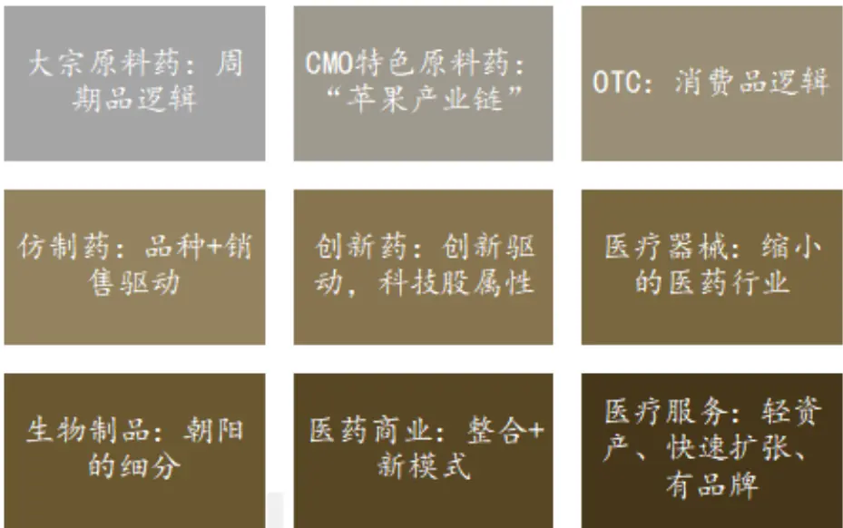
资料来源：兴业证券经济与金融研究院整理
注：本图片内容由兴业证券经济与金融研究院医药团队整理，在此表示特别感谢。

前面提及医药行业的繁杂性，这里对不同的细分行业进行剖析，希望能化繁就简，从中抽离出有效的研究框架和体系。从细分行业来看，整个医药板块（我们将新添加的公司归属到不同的中信三级医药子行业中，同时将中信三级行业下的中药饮片合并到中成药行业分类中）共计分成化学原料药、化学制剂、医疗服务、医疗器械、医药流通、生物医药、中成药七个子板块。我们对这七个行业的特点和投资逻辑进行了详细的梳理，具体参见图表 6（这里要特别感谢兴证医药团队在行业特征与投资逻辑方面的分享和帮助）。

图表 6、大健康板块细分子行业特点与投资逻辑梳理

| 行业 | 特点 | 重点指标 |
| --- | --- | --- |
| 化学原料药 | 细分成大宗原料药、特色原料药；1、大宗原料药技术含量相对较低，属于周期性行业，毛利相对较低；2、特色原料药技术含量相对较高，毛利相对较高；整体概括：转型是大部分企业面临的问题；市场行情相对较少，属于成熟行业，赛道相对一般； | 毛利率和净利率 |
| 化学制剂 | 细分成仿制药、创新药：1、仿制药国内医药的主要板块，一致性评价非常关键；赛道相对尚可、品种线是关键(单一容易死掉)；政策高度敏感2、创新药难以估值（科创板尤为明显）具有一定的政策免疫性。 | 1、仿制药：提取指标：专利、研发费用，销售收入/专利数、或者其他收入/专利数2、创新药：研发投入、研发效率(研发人员效率或者研发效率)、销售效率 |
| 生物医药 | 细分成疫苗、血液制品：1、疫苗：关键看重磅品种驱动。其中一类苗（传统疫苗）竞争激烈，安全性是更重要的维度；二类苗重磅品种是主要利润来源，新型疫苗具消费升级属性；整体看重销售能力、研发能力。2、血液制品行业的政策敏感性和行业不稳定性很高，关键看浆站数量和产品结构。行业具备资源属性，壁垒较高，盈利能力良好是关键。 | 疫苗看研发及效率，销售效率、产品线；血液制品属于成熟行业，可用传统指标进行优质公司筛选 |
| 医疗器械 | 不言而喻，该领域的创新和研发投入效应较为明显，且比较依赖电子、计算机、机械等行业的发展。同时品牌黏性较重，更换成本较高。综合来看，研发创新能力、品牌价值较为重要。 | 研发、销售能力、市占率、品牌(商誉等) |
| 医药流通 | 主要包括连锁店和医药分销体系。板块创新要求相对较低，和其他医药板块差异较大，品牌效应较为重要。 | 龙头效应（销售规模、毛利率，高毛利率的附加价值高)，传统指标即可 |
| 医疗服务 | 包括医院、CXO、ICL等：1、医院属于重资产投资，医改以及医院管理带来的溢价较高；2、CXO以及ICL高度重视研发和创新，和前者差异较大。 | 传统的盈利指标效果较差，医院方面：公司品牌、龙头等较为重要；CXO 以及 ICL 看重研发 |
| 中成药 | 中成药市场在经历过去行业红利期快速放量后，面对医保控费的大环境，开始逐渐承压，转型势在必行，龙头企业已经开始布局创新药/仿创药等。 | 龙头企业、研发投入、研发效率等 |

资料来源：兴业证券经济与金融研究院整理
注：CXO 指 CDMO（Contract Development and Manufacturing Organization，合同定制研发生产外包）以及CRO（ Contract Research Organization，合同定制研发外包）；ICL 指 Independent Clinical Laboratory（独立医学实验室）

在充分了解了医药行业的特点以及各细分子行业的投资逻辑后，我们针对投资所面临的实际问题给出了相应的解决方案，具体参见图表 7。（实际上，针对于医药行业销售费用较高的特点所构建的销售费用/销售收入因子选股效果较为一般，并未纳入最终选股体系）在本章接下来的内容中，我们首先完成大健康板块的行业重构。

图表 7、针对医药行业特点给出的解决方案

| 行业特点 | 解决方案 |
| --- | --- |
| 行业千差万别 | 对医药板块进行行业重构 |
| 重视研发和创新 | 从对创新要求的程度出发，对行业进行重构；选择专利、研 发费用指标作为选股因子 |
| 销售费用较高 | 构建销售费用/营业收入指标作为选股因子 |
| 估值较为困难 | 另辟蹊径，运用时序估值因子，增加了估值信息的有效性 |
| 政策敏感性较强 | 运用分析师研报文本，及时把控市场的风吹草动 |

资料来源：兴业证券经济与金融研究院整理

## 2.4、大健康板块行业重构

从以上的对比分析中，我们发现医药细分子行业千差万别，这意味着在不同行业内的有效选股因子可能有所差异，因而对整个医药板块选股策略的开发必须下沉到更细致的行业分类上。但如果最终的行业分类过于细致（比如下沉到中信三级行业），也可能适得其反：一方面子行业内的股票数量可能偏少，使得统计规律的稳定性大打折扣，另一方面很多子行业的有效因子也是比较相似的，划分过细没有必要。

有鉴于此，我们以对创新的要求和重视程度的差异为根本出发点，对上述各板块进行重构：具体来说，我们将医药板块切分成“医药服务”以及“医药制造与高科技”两个领域，切分的结果如下：

1) 医药服务：包括化学原料药、医疗服务、医药流通。需要注意的是，我们将医疗服务中主做 CXO、ICL等类别业务的公司划入了医药制造与高科技板块，这主要包括药明康德、金域医学、成都先导等 8家公司；

2) 医药制造与高科技：包括化学制剂、医疗器械、生物医药、中成药等板块，同时包括从医疗服务中纳入的CXO、ICL类别的公司。

图表 8 展示了新构建的行业时序维度下的股票数目，从中我们可以发现医药制造与高科技板块股票数目相对较多。我们后续将在两个不同的行业上展开差异化的分析和策略构建。

图表 8、医药服务Vs. 医药制造与高科技板块历史股票数目
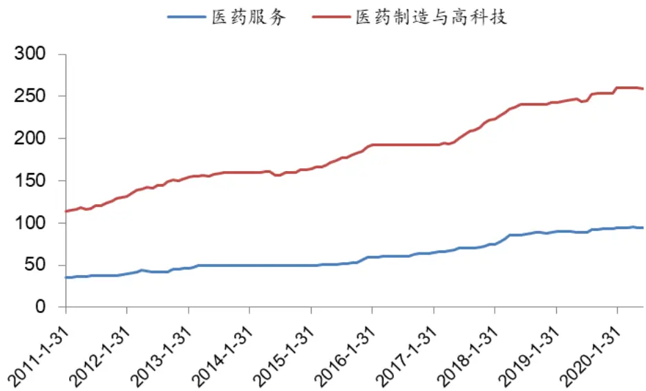
资料来源：Wind、聚源、兴业证券经济与金融研究院整理

## 3、Alpha 因子构建

## 3.1、特异性因子构建

前文中我们根据医药板块的公司对创新能力要求的高低，将其划分成了“医药服务”和“医药制造与高科技”两个板块。而在这两个板块中，医药制造与高科技板块应该说对创新能力更为看重。上市公司对创新的重视程度一般可以从研发的投入、研发产出（即专利）等维度得以体现，因此在下文中我们将重点从研发费用、专利数据等维度构建相应的行业特异性选股因子。

## 研发费用

研发费用数据来自于上市公司财务报表，由于历史上半年报披露研发费用的公司极少，所以我们主要利用年报披露的研发费用进行研究。而从结果来看，医药行业的研发费用覆盖度整体高于全市场同期的覆盖度。同时自 2011年开始，医药行业的研发费用覆盖度达到 70%以上，可以支持后续的研究。为了剔除市值的影响，我们用研发费用/市值作为表征公司对研发创新重视程度的指标。

图表 9、研发费用在医药行业以及全市场历史覆盖度
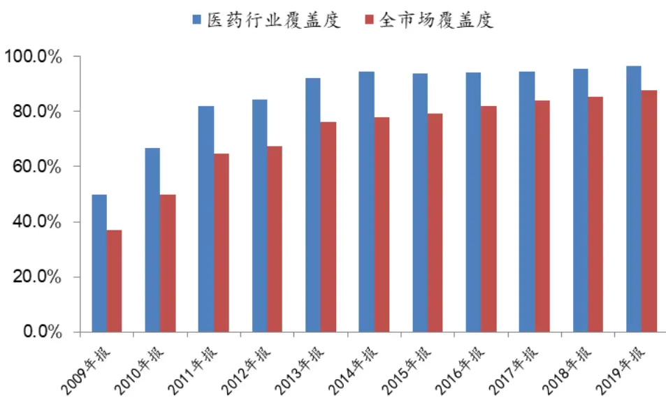
资料来源：Wind、聚源、兴业证券经济与金融研究院整理

## 专利

研发费用只能衡量一个公司的在创新维度的投入，是管理层致力于公司未来发展的意志体现，但其没办法衡量研发效率。这里我们引入专利来近似表征公司的创新产出，可以与表征投入类的因子形成互补。

在 2018 年-2019 年初，我们团队利用深圳德高行知识产权数据技术有限公司提供的专利数据（公司官网：http://www.tek-glory.com/）对专利类数据进行过系统性的研究（参见深度报告《从中国心到中国芯_由贸易战引发的专利选股有效研究》、《基于专利分类的科技动量因子研究》）。在相关报告中我们详细介绍了专利的学术研究进展、专利领域基础知识以及如何基于专利数据构建选股因子。这里我们对此做一个简要的回顾。

专利的研究可从专利分类、专利所处的状态、专利的具体衡量指标维度展开：1) 专利分类：从类别上来看，专利共计分成三类：

a) 发明专利•是指对产品、方法或者其改进所提出的新的技术方案；

b) 实用新型专利•是指对产品的形状、构造或者其结合所提出的适于实用的新的技术方案；

c) 外观设计专利•是指对产品的形状、图案或者其结合以及色彩与形状、图案的结合所作出的富有美感并适于工业应用的新设计。

2) 专利状态：一个发明专利的产生大致要经历专利申请、专利公开、实质审查、专利授权几个流程（注意新型和外观专利没有实质审查仅有形式审查）。

3) 具体指标：落脚到专利数据信息的具体维度，包括：数量、说明书总字数、权利要求总项数、独权总项数、附图总数、摘要总字数、IPC 分类号总数、寿命加总、专利审查期加总、前引、后引、非专利方面引用、同族专利共计13种指标。

上面各个维度的组合就形成了我们开发的专利领域选股因子，比如我们可以研究一个公司处于授权阶段的发明专利数目，或者一个公司处于公开阶段的实用新型专利数目。针对于这些因子，我们就不再此处进行详细介绍了，具体可参见往期专题报告。这里我们最终选择公司过去三年授权的发明专利数作为创新产出的代表。同时为了更好的衡量研发效率并剔除公司规模的影响，我们用公司过去三年授权的发明专利数/营业收入作为选股因子，展开后续的研究。

## 其他特异性因子介绍

前面对医药行业的特点进行了详细的介绍，里面提到药企估值困难的特点。针对于估值问题，我们在《基于误差修正模型的估值趋势偏离度因子研究》给出了新的估值因子构建方式。传统的估值因子更多从截面维度进行研究。但截面比较的前提是截面股票具有可比性，否则这种方式就丧失了意义。时序视角给我们提供了一个新的维度，我们可以研究时序维度的估值高低：比如一些公司的估值水平虽然在截面上处于低位，但是在时间序列上不断提升，这种公司依然值得买入。医药行业颇为庞杂，这就使得截面比较的可行性降低，而时序维度的研究则可能更有意义。从时序角度来看，将其拆分成估值趋势项与短期偏离项，运用误差修正模型进行建模，并进一步定义估值趋势偏离度因子。估值趋势偏离度越大，意味着未来有更大的空间。最终在医药行业我们利用市销率、市净率倒数构建了SP_DR、BP_DR 作为估值维度的代表。

我们对所有的行业特异性选股因子进行了汇总，参见图表 10。

图表 10、特异性因子汇总

| 因子名称 | 定义 | 衡量维度 |
| --- | --- | --- |
| RD_FItVal | 研发费用/市值 | 单位市值的研发支出 |
| IE_Sale | 过去三年授权发明专利数/营业收入_TTM | 单位营业收入的研发产出 |
| BP_DR | 运用误差修正模型构建的基于市净率倒 数的估值因子 | 衡量估值高低 |
| SP_DR | 运用误差修正模型构建的基于市销率倒 数的估值因子 | 衡量估值高低 |

资料来源：德高行、Wind、聚源、兴业证券经济与金融研究院整理

## 3.2、传统因子选择

除行业特异性因子外，传统选股因子也不应被忽视。兴业证券金融工程团队选股因子库拥有共计 165 个因子，细分为价值、成长、质量、分析师情绪、动量反转、另类这六大类指标，其中另类进一步分为：规模、风险、流动性、技术这四个子类，刨除动量反转以及另类风格后共计93个选股因子。我们将在后文中针对非纯价量的这 93个因子在不同的子行业板块内进行测试，以选择合适的传统选股指标。

图表 11、兴业量化选股因子分类数量统计

| 价值 | 成长 | 质量 | 分析师情绪 | 动量反转 | 另类 |
| --- | --- | --- | --- | --- | --- |
| 因子数 19 | 33 | 39 | 13 | 9 | 52 |

资料来源：Wind、聚源、兴业证券经济与金融研究院整理

## 3.3、基于大健康不同板块的选股模型构建

我们共计选择了 97个因子（4 个特异性因子、93个传统选股因子）作为备选因子池。针对于这 97个因子，我们展开因子选股有效性分析，这里综合考虑IC、分位数组合测试（尤其是多头以及多头超额的表现），在满足条件后再考虑相关性以进一步剔除。需要注意的是所有的测试需在“医药服务”、“医药制造与高科技”两个板块分别展开。

经过筛选，我们在医药服务板块中选择了 7 个选股因子，在医药制造与高科技板块选择了 6个选股因子，两个行业重合的因子为4个，具体参见图表 12，不同行业内的因子表现及因子间相关性，请参见图表13-17。

图表 12、有效选股因子汇总

| 因子名称 | 适用行业 | 衡量 维度 | 定义 |
| --- | --- | --- | --- |
| Revenue_SQ_YoY | 两行业 | 成长 | 单季度营业收入同比增长率 |
| NetProfitDeducted_S | 两行业 | 成长 | 单季度扣非利润同比增长率 |
| Q_YoY EPS_FYO_R1M | 两行业 | 情绪 | 一致预期 EPS FYO 过去 20 天的变化率 |
| EPS_Fwd12M_R1M | 两行业 | 情绪 | 一致预期 EPS 未来12个月预测值过去 |
| OCF_LYR_YoY | 医药服务 | 成长 | 20 天的变化率 经营活动产生的现金流量净额_最新年 |
| BP_DR | 医药服务 | 估值 | 报的同比增长率 运用误差修正模型构建的基于市净率 |
| SP_DR | 医药服务 | 估值 | 倒数的估值因子 运用误差修正模型构建的基于市销率 |
| RD_FItVal | 医药制造与高 |  | 倒数的估值因子 |
| IE_Sale | 科技 | 研发 | 研发费用/市值 |

资料来源：德高行、Wind、聚源、兴业证券经济与金融研究院整理

图表 13、医药服务板块内因子相关性

| HetProfitDeducted_SQ_YoEPS_FYO_R1I |  |  | EPS_Fτd12_R1 OCF_LIR_YoY BP_DR |  |  |  |
| --- | --- | --- | --- | --- | --- | --- |
| Revenue_SQ_YoY | 0.44 | 0.02 | 0.04 | 0.01 | SP_DR -0.06 | 0.08 |
| NetProfitDeducted_SQ_YoY |  | 0.16 | 0.17 | 0.09 | -0.11 | -0.09 |
| EPS_FY0_R1M |  |  | 0.57 | 0.03 | -0.05 | -0.04 |
| EPS_Fwd12M_R1M |  |  |  | 0.01 | -0.14 | -0.10 |
| OCF_LYR_YoY |  |  |  |  | 0.06 | -0.00 |
| BP_DR |  |  |  |  |  | 0.42 |

资料来源：德高行、Wind、聚源、兴业证券经济与金融研究院整理

图表 14、医药制造与高科技板块内因子相关性
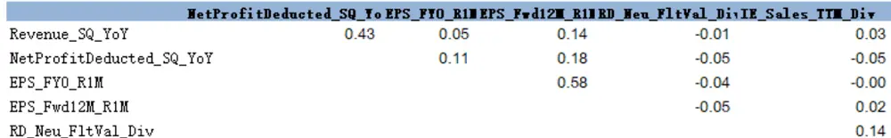
资料来源：德高行、Wind、聚源、兴业证券经济与金融研究院整理

图表 15、不同子行业有效因子IC 表现汇总

| 医药服务 |  |  |  | 医药制造与高科技 |  |  |  |
| --- | --- | --- | --- | --- | --- | --- | --- |
| 因子 | 平均值 | IC IR | t统计量 | 因子 | 平均值 | IC IR | t统计量 |
| Revenue_SQ_YoY | 0.055 | 0.32 | 3.4 | Revenue_SQ_YoY | 0.038 | 0.33 | 3.5 |
| NetProfitDeducted_SQ_YoY | 0.058 | 0.35 | 3.7 | NetProfitDeducted_SQ_YoY | 0.053 | 0.47 | 5.0 |
| EPS_FY0_R1M | 0.044 | 0.26 | 2.7 | EPS_FY0_R1M | 0.023 | 0.24 | 2.5 |
| EPS_Fwd12M_R1M | 0.036 | 0.22 | 2.3 | EPS_Fwd12M_R1M | 0.045 | 0.43 | 4.6 |
| OCF_LYR_YoY | 0.031 | 0.23 | 2.5 | RD_FltVal | 0.029 | 0.26 | 2.7 |
| BP_DR | 0.026 | 0.16 | 1.7 | IE_Sale | 0.021 | 0.17 | 2.1 |
| SP_DR | 0.047 | 0.31 | 3.3 |  |  |  |  |

资料来源：德高行、Wind、聚源、兴业证券经济与金融研究院整理

图表 16、医药服务行业内选中因子分位数测试结果

| 因子 | 组别 | 年化收益率 Sharpe比率 |  | 因子 | 组别 | 年化收益率 Sharpe比率 |  |
| --- | --- | --- | --- | --- | --- | --- | --- |
| Revenue_SQ_YoY | Top | 18.4% | 0.61 | OCF_LYR_YoY | Top | 17.1% | 0.54 |
| Revenue_SQ_YoY | 1 | 19.2% | 0.65 | OCF_LYR_YoY | 1 | 12.3% | 0.37 |
| Revenue_SQ_YoY | 2 | 10.2% | 0.34 | OCF_LYR_YoY | 2 | 16.0% | 0.56 |
| Revenue_SQ_YoY | 3 | 5.3% | 0.16 | OCF_LYR_YoY | 3 | 7.2% | 0.24 |
| Revenue_SQ_YoY | Bottom | 3.0% | 0.09 | OCF_LYR_YoY | Bottom | 3.4% | 0.11 |
| Revenue_SQ_YoY | 市场 | 11.7% | 0.40 | OCF_LYR_YoY | 市场 | 11.7% | 0.40 |
| Revenue_SQ_YoY | L-S | 12.2% | 0.71 | OCF_LYR_YoY | L-S | 11.8% | 0.72 |
| NetProfitDeducted_SQ_YoY | Top | 24.2% | 0.76 | BP_DR | Top | 16.9% | 0.57 |
| NetProfitDeducted_SQ_YoY | 1 | 185% | 0.58 | BP_DR | 1 | 15.3% | 0.50 |
| NetProfitDeducted_SQ_YoY | 2 | 10.4% | 0.38 | BP_DR | 2 | 6.3% | 0.22 |
| NetProfitDeducted_SQ_YoY | 3 | 1.4% | 0.05 | BP_DR | 3 | 133% | 0.42 |
| NetProfitDeducted_SQ_YoY | Bottom | 4.9% | 0.15 | BP_DR | Bottom | 4.5% | 0.14 |
| NetProfitDeducted_SQ_YoY | 市场 | 11.7% | 0.40 | BP_DR | 市场 | 11.7% | 0.40 |
| NetProfitDeducted_SQ_YoY | L-S | 16.1% | 0.95 | BP_DR | L-S | 9.2% | 0.53 |
| EPS_FY0_R1M | Top | 26.6% | 0.78 | SP_DR | Top | 18.5% | 0.58 |
| EPS_FY0_R1M | 1 | 11.3% | 0.37 | SP_DR | 1 | 18.3% | 0.61 |
| EPS_FY0_R1M | 2 | 13.0% | 0.44 | SP_DR | 2 | 8.1% | 0.28 |
| EPS_FY0_R1M | 3 | 9.5% | 0.34 | SP_DR | 3 | 8.8% | 0.30 |
| EPS_FY0_R1M | Bottom | 5.9% | 0.17 | SP_DR | Bottom | 2.9% | 0.09 |
| EPS_FY0_R1M | 市场 | 11.7% | 0.40 | SP_DR | 市场 | 11.7% | 0.40 |
| EPS_FY0_R1M | L-S | 17.4% | 0.89 | SP_DR | L-S | 12.5% | 0.68 |
| EPS_Fwd12M_R1M | Top | 28.0% | 0.80 |  |  |  |  |
| EPS_Fwd12M_R1M | 1 | 9.8% | 0.31 |  |  |  |  |
| EPS_Fwd12M_R1M | 2 | 13.9% | 0.50 |  |  |  |  |
| EPS_Fwd12M_R1M | 3 | 13.8% | 0.48 |  |  |  |  |
| EPS_Fwd12M_R1M | Bottom | 1.6% | 0.05 |  |  |  |  |
| EPS_Fwd12M_R1M | 市场 | 11.7% | 0.40 |  |  |  |  |
| EPS_Fwd12M_R1M | L-S | 24.7% | 1.23 |  |  |  |  |

资料来源：德高行、Wind、聚源、兴业证券经济与金融研究院整理

图表 17、医药制造与高科技行业内选中因子分位数测试结果

| 因子 | 组别 | 年化收益率 Sharpe比率 |  | 因子 | 组别 | 年化收益率 Sharpe比率 |  |
| --- | --- | --- | --- | --- | --- | --- | --- |
| Revenue_SQ_YoY | Top | 17.6% | 0.58 | EPS_Fwd12M_R1M | Top | 28.2% | 0.91 |
| Revenue_SQ_YoY | 1 | 17.0% | 0.60 | EPS_Fwd12M_R1M | 1 | 16.7% | 0.56 |
| Revenue_SQ_YoY | 2 | 13.2% | 0.46 | EPS_Fwd12M_R1M | 2 | 10.7% | 0.38 |
| Revenue_SQ_YoY | 3 | 8.6% | 0.29 | EPS_Fwd12M_R1M | 3 | 8.7% | 0.31 |
| Revenue_SQ_YoY | Bottom | 3.7% | 0.12 | EPS_Fwd12M_R1M | Bottom | 8.4% | 0.28 |
| Revenue_SQ_YoY | 市场 | 12.1% | 0.42 | EPS_Fwd12M_R1M | 市场 | 12.1% | 0.42 |
| Revenue_SQ_YoY | L-S | 12.7% | 1.14 | EPS_Fwd12M_R1M | L-S | 17.9% | 1.57 |
| NetProfitDeducted_SQ_YoY | Top | 19.8% | 0.67 | RD_FItVal | Top | 18.7% | 0.54 |
| NetProfitDeducted_SQ_YoY | 1 | 19.5% | 0.69 | RD_FItVal | 1 | 16.7% | 0.37 |
| NetProfitDeducted_SQ_YoY | 2 | ]11.7% | 0.42 | RD_FItVal | 2 | 9.7% | 0.43 |
| NetProfitDeducted_SQ_YoY | 3 | 4.5% | 0.15 | RD_FItVal | 3 | 7.2% | 0.37 |
| NetProfitDeducted_SQ_YoY | Bottom | 4.7% | 0.15 | RD_FItVal | Bottom | 9.8% | 0.26 |
| NetProfitDeducted_SQ_YoY | 市场 | 12.1% | 0.42 | RD_FItVal | 市场 | 12.1% | 0.42 |
| NetProfitDeducted_SQ_YoY | L-S | 13.1% | 1.04 | RD_FItVal | L-S | 8.6% | 0.84 |
| EPS_FY0_R1M | Top | 24.1% | 0.79 | IE_Sale | Top | 17.1% | 0.58 |
| EPS_FY0_R1M | 1 | 35.2% | 0.53 | IE_Sale | 1 | 10.5% | 0.61 |
| EPS_FY0_R1M | 2 | 8.7% | 0.31 | IE_Sale | 2 | 12.5% | 0.28 |
| EPS_FY0_R1M | 3 | 13.0% | 0.43 | IE_Sale | 3 | 10.3% | 0.30 |
| EPS_FY0_R1M | Bottom | 11.3% | 0.38 | IE_Sale | Bottom | 7.5% | 0.09 |
| EPS_FY0_R1M | 市场 | 12.1% | 0.42 | IE_Sale | 市场 | 12.1% | 0.40 |
| EPS_FY0_R1M | L-S | 11.3% | 1.16 | IE_Sale | L-S | 9.3% | 0.68 |

资料来源：德高行、Wind、聚源、兴业证券经济与金融研究院整理

针对每个子行业所选的因子我们采用等权的方式进行合成，在医药服务行业内合成的因子称之为 Service_Sig，在医药制造与高科技行业内合成的选股因子称之为 Tech_Sig。两个复合因子在相应行业有着非常强的选股能力：Service_Sig因子 IC均值达到0.08，T值达到 5.57，分位数多头年化收益高达 34.1%，月胜率高达 71.1%；而 Tech_Sig 因子 IC 均值达到 0.062，T 值达到 6.19，分位数多头年化收益率达到 28.1%，月胜率达到 76.3%。

图表 18、Service_Sig 以及 Tech_Sig 在相应行业 IC 测试结果

|  | 测试行业 | 平均值 | 标准差 | IC_IR | T统计量 |
| --- | --- | --- | --- | --- | --- |
| Service_Sig | 医药服务 | 0.081 | 0.16 | 0.52 | 5.57 |
| Tech_Sig | 医药制造与高科技 | 0.062 | 0.11 | 0.58 | 6.19 |

资料来源：德高行、Wind、聚源、兴业证券经济与金融研究院整理

图表 19、Service_Sig 因子在医药服务板块分位数表现

|  |  | 年化收益率 Sharpe比率 平均换手率 |  | 最大回撤率 | 年化超额收益率胜率 |  |
| --- | --- | --- | --- | --- | --- | --- |
| Top | 34.1% | 1.06 | 91.4% | 32.7% | 20.4% | 71.1% |
| 1 | 10.7% | 0.37 | 129.1% | 52.5% | -1.3% | 43.9% |
| 2 | 11.5% | 0.37 | 126.5% | 47.6% | 0.0% | 46.5% |
| 3 | 6.4% | 0.23 | 122.0% | 55.6% | -5.4% | 44.7% |
| Bottom | 1 -4.3% | -0.13 | 92.2% | 80.4% | -13.9% | 33.3% |
| 市场 | 11.7% | 0.40 |  | 52.9% |  |  |
| L-S | 37.1% | 2.05 |  | 15.8% |  |  |

资料来源：德高行、Wind、聚源、兴业证券经济与金融研究院整理

图表 20、Tech_Sig因子在医药制造与高科技板块分位数表现

|  | 年化收益率 Sharpe比率 |  | 平均换手率 | 最大回撒率 | 年化超额收益率胜率 |  |
| --- | --- | --- | --- | --- | --- | --- |
| Top | 28.1% | 0.91 | 77.1% | 39.2% | 14.8% | 76.3% |
| 1 | 14.0% | 0.48 | 104.8% | 51.7% | 1.7% | 47.4% |
| 2 | 10.3% | 0.34 | 108.2% | 56.3% | -1.5% | 50.0% |
| 3 | 5.0% | 0.18 | 102.8% | 56.1% | -6.8% | 32.5% |
| Bottom | 3.8% | 0.13 | 73.5% | 62.9% | -7.6% | 38.6% |
| 市场 | 12.1% | 0.42 |  | 53.6% |  |  |
| L-S | 23.3% | 1.95 |  | 10.3% |  |  |

资料来源：德高行、Wind、聚源、兴业证券经济与金融研究院整理

图表 21、Service_Sig 因子在医药服务板块净值曲线
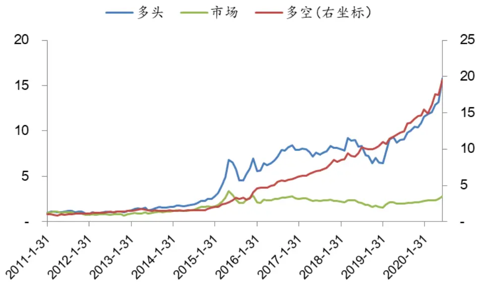
资料来源：德高行、Wind、聚源、兴业证券经济与金融研究院整理

图表 22、Tech_Sig因子在医药制造与高科技板块净值曲线
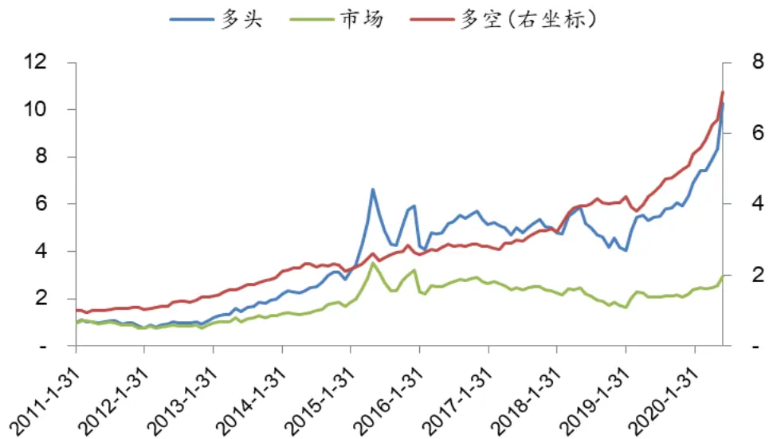
资料来源：德高行、Wind、聚源、兴业证券经济与金融研究院整理

为了进一步研究Service_Sig与Tech_Sig的差异，我们可以反过来展开测试:以 Service_Sig 为例，我们测试其在医药制造与高科技板块的有效性。分位数组合测试显示虽然其在医药制造与高科技有一定的选股效果，但其多头选股能力远弱于 Tech_Sig在医药制造与高科技领域的表现（图表20），更弱于其在医药服务行业的表现（图表 19）。这从侧面论证了我们前面构建子行业差异化复合选股因子的合理性。

图表 23、Service_Sig 因子在医药制造与高科技领域的分位数表现

|  |  | 年化收益率Sharpe比率 |  | 平均换手率最大回撒率 | 年化超额收益率胜率 |  |
| --- | --- | --- | --- | --- | --- | --- |
| Top | 23.4% | 0.82 | 85.7% | 35.4% | 9.8% | 66.7% |
| 1 | 13.9% | 0.48 | 122.0% | 53.3% | 1.4% | 49.1% |
| 2 | 13.1% | 0.44 | 125.4% | 49.8% | 1.1% | 53.5% |
| 3 | 8.2% | 0.27 | 121.3% | 55.7% | -3.4% | 45.6% |
| Bottom | 1 2.1% | 0.07 | 85.0% | 71.2% | -8.8% | 37.7% |
| 市场 | 12.1% | 0.42 |  | 53.6% |  |  |
| L-S | 19.8% | 2.27 |  | 7.9% |  |  |

资料来源：德高行、Wind、聚源、兴业证券经济与金融研究院整理

## 4、分析师研报中的增量信息

## 4.1、分析师研报标题研究

前面在介绍医药行业特点时，我们提到医药行业是一个政策敏感性非常强的行业，同时医药行业的估值非常困难，一个新的产品或者新技术就能让企业立于不败之地。所以如果能将政策反馈、新药获批或者新技术进展更加及时地体现在策略中，那么理论上来讲，对于选股策略的表现一定有利的（如果政策向好，新药获批或者新技术进展顺利，则是利好，否则是利空）。但现实中我们并没有找到适合量化投资的这方面的专业数据库。有些提供商，如医药魔方、FDA（Food & DrugAdimistration）等会提供一些新药获批进展的数据，但获取和整理成本均较高。那么有没有其他方式能够在一定程度上解决上述问题呢？

一般而言，一旦行业出现新政或者某个上市公司新药获批取得重大进展，卖方分析师都会及时跟进，解读相应政策或者新产品进展等事件带来的影响。信息的重点则往往都会体现在分析师研报的标题当中，具有很强的及时性（分析师一般都是连夜点评）。我们尝试通过文本分析的方式来挖掘并利用这类信息，具体步骤如下：

1) 阅读5,000 篇医药行业研报的标题，通过人工的方式提取里面的关键词，形成有关政策或者新产品的正面词汇集合以及负面词汇集合。由于通常情况下，分析师一般报喜不报忧，所以如果仅仅考虑新产品获批或者新技术进展等信息，负面词汇集合可能相对较少。为了扩大覆盖度，在负面词汇方面我们不仅考虑新产品审批、新技术进展，亦考虑业绩等方面。最终形成的部分正面词汇以及负面词汇参见图表24。

图表 24、部分悲观&乐观词汇

| 词汇情绪 集合 |  |
| --- | --- |
| 正面词汇 | 获批，审批，获准，通过，批准，获得，批复，通过检测，认证，授权，许可， 又添，首个 |
| 负面词汇 | 下滑，低于预期，趋弱，低预期，短期下滑，下降，瓶颈，不乐观，风险增 加，过虑，不实，搁浅，受制于 |

资料来源：兴业证券经济与金融研究院整理

2) 从事件驱动的角度来考察该信息的有效性：针对于考察标的，在考察时点观察其标题是否包含正面或者负面关键词，对于包含关键词的股票统计未来T日内收益，这里我们设置 T 为隔日、5 日、10日、20 日。测试结果显示，当日分析师评价越负面，股票接下里的收益表现越差；当日分析师评价越正面，股票接下来的收益表现越好。

从上述正面与负面词汇的提取，到事件分析下所得到的相关结论，我们可以说分析师研报标题确实能够为选股策略提供进一步的信息量。接下来我们将进一步对正面与负面信息的形成期和持有期进行参数研究，已确定这类信息因子化的具体形式。

图表25、出现负面词汇股票不同时段表现(T=1,T=5)
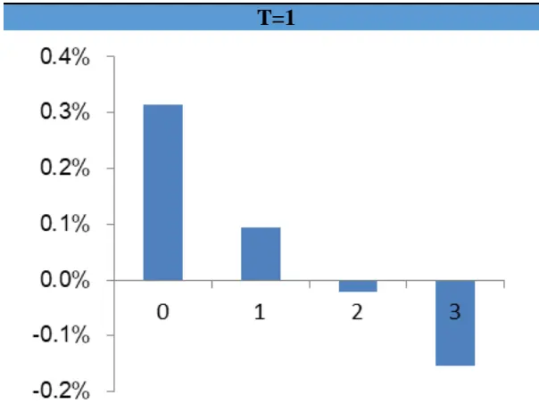

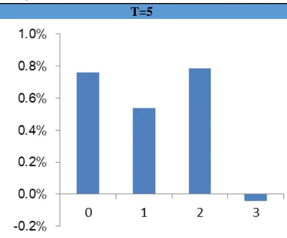
资料来源：德高行、Wind、聚源、兴业证券经济与金融研究院整理

注：这里横坐标表示考察日该股票有几篇报告涉及到负面词汇，如 T=1时横坐标为 2表示：考察时点包含出现负面词汇的报告数为 2的股票隔日（即 T=1）收益率均值

图表26、出现负面词汇股票不同时段表现(T=10,T=20)
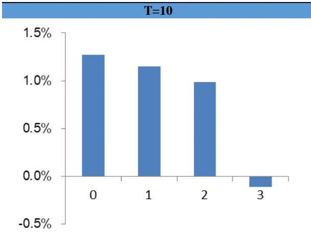

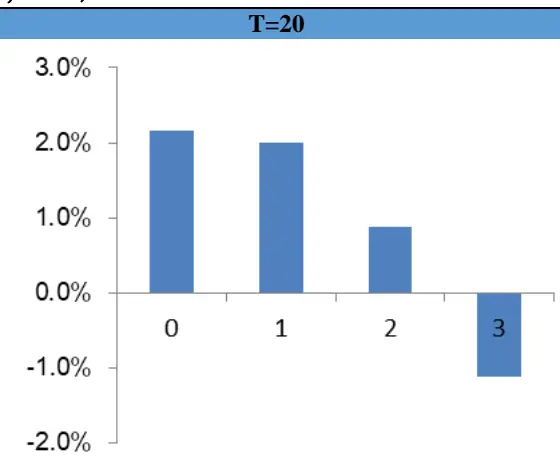
资料来源：德高行、Wind、聚源、兴业证券经济与金融研究院整理

图表27、出现正面词汇股票不同时段表现(T=1,T=5)
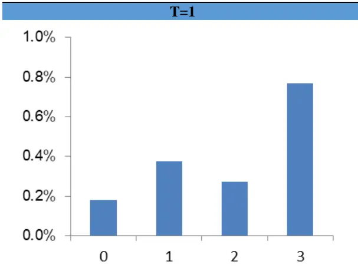

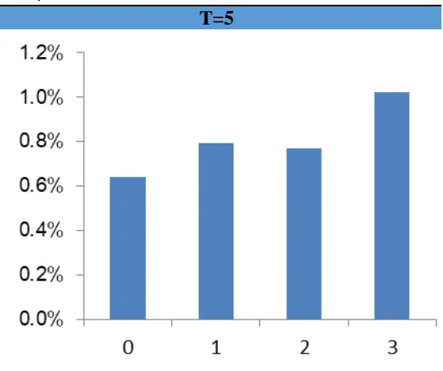
资料来源：德高行、Wind、聚源、兴业证券经济与金融研究院整理

图表28、出现正面词汇股票不同时段表现(T=10,T=20)
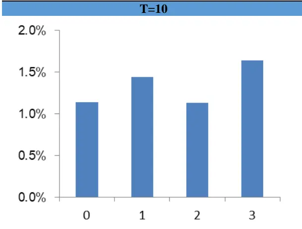

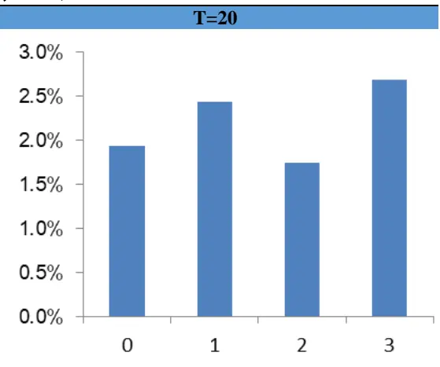
资料来源：德高行、Wind、聚源、兴业证券经济与金融研究院整理

## 4.2、正面&负面信息的因子化

前面通过事件分析的方式研究了正面文本与负面文本的作用，为了将该部分的信息因子化，我们研究不同形成期和持有期下因子的表现。以负面情绪为例，同时将形成期、持有期设置为10 天，因子构建的方式如下：

在考察时点回望过去 10天，共计有 M个研报涉及到该股票，其中有K篇研报包含了负面情绪词汇，那么因子值大小即为 K/M，对该因子四舍五入，保留一位小数，然后统计汇总不同情绪水平下未来股票收益的平均表现。结果与预期较为一致：无论形成期为 10 天亦或是 20 天，正面情绪越高的股票未来的收益越高，负面情绪越高的股票未来的收益越低，具体参见图表29-30。

图表29、正面文本因子表现
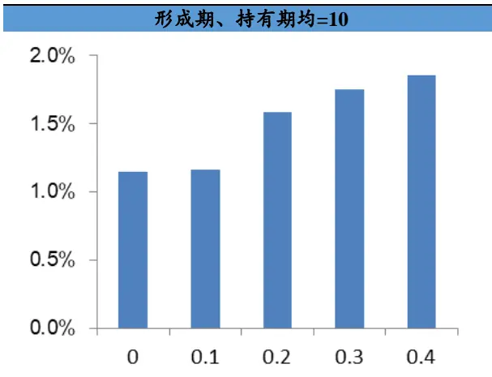

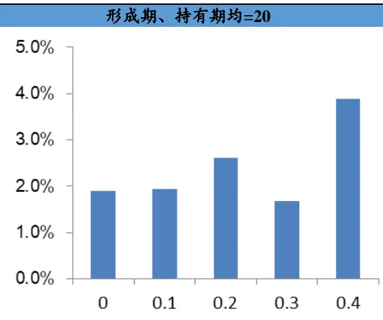
资料来源：德高行、Wind、聚源、兴业证券经济与金融研究院整理

图表30、负面文本因子表现
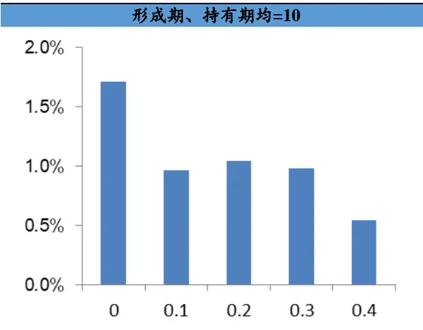

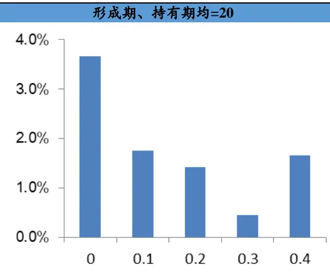
资料来源：德高行、Wind、聚源、兴业证券经济与金融研究院整理

通过前面的分析，我们了解到负面情绪和正面情绪因子具有较好的选股作用。那么我们可以考虑将该信息叠加到选股策略中，比如可以对股票池进行初选，在考察时点剔除过去一段时间包含负面文本的股票，起到优化策略的作用。但需要注意的是该因子覆盖度相对较低，以过去20日有正面/负面报告的股票数目为例，平均来看有正面或者负面文本覆盖的股票数目在22只左右，且有一定的波动。

图表 31、过去 20天有正面或者负面研报的公司数的移动平均趋势
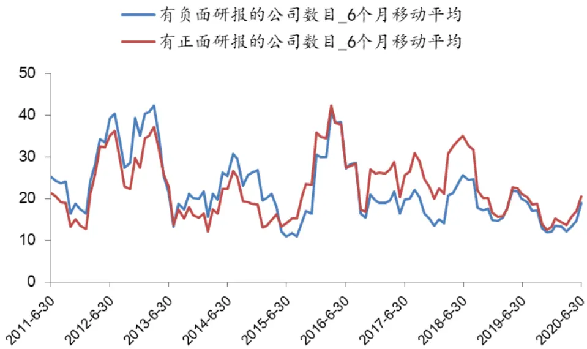
资料来源：德高行、Wind、聚源、兴业证券经济与金融研究院整理

## 5、大健康板块选股策略构建

在对医药板块有了较为深入的理解并构建了相对有效的选股因子后，我们进一步构建大健康板块量化股票精选策略，相关细节设定如下：

1. 股票池：重构的医药板块；

2. 时间窗口：2011 年 1 月 31 日-2020 年 6 月 30 日；

3. 筛选条件：

a) 调仓时点股票非ST、非涨跌停、上市天数>180天；

b) 负面/正面文本因子具有一定的选股作用，但该因子覆盖度较低，很难作为选股因子使用。以负面文本为例，为了利用该信息，我们将其作为筛选条件使用，在调仓日确保股票不会出现在负面文本因子中（负面文本因子构建的方式：考察时点回望过去20天，有研报标题包含负面情绪的股票集合）。为了对比该维度信息的有效性，在其他条件相同的情况下，我们可以对比加入筛选条件 b)与不加入的策略表现差异；

4. 调仓成本：双边0.3%；换仓频率：月度调仓；

5. 加权方式：如无特别强调，将进行等权加权；

6. 对比基准：由于申万医药指数与中信医药指数走势较为接近，且与我们新构建的大健康板块走势一致（参见图表 3），我们选择中信医药指数作为对比基准；

7. 策略构建：可以根据股票池的大小精选个股或者选择一定比例的股票持有建仓，后面我们将逐一介绍。

## 5.1、定比选股策略构建

首先我们从医药服务、医药制造与高科技两个行业中根据相应的 Service_Sig以及 Tech_Sig选择因子最大的20%的股票建仓，并对比加入文本筛选与不加入的区别。

从测试结果来看，两者较为接近，表现均非常出色：加入文本筛选后的策略年化超额收益达到 13.9%，信息比达到 1.49；不加入文本筛选的策略超额收益达到 13.5%，风险收益比达到1.61。分年度来看，除了2017年以外，其他年份两个策略均稳定的战胜基准，两个策略今年以来超额收益达到 8%左右。

图表 32、定比筛选策略的综合表现

| 因子 | 年化收益率 | 波动率 | 风险收益比 | 日度胜率 | 最大回撤率 |
| --- | --- | --- | --- | --- | --- |
| 基准表现 | 12.1% | 27.1% | 0.45 | 53.2% | 54.8% |
| 文本_多头 | 25.1% | 27.2% | 0.92 | 56.3% | 47.4% |
| 文本_超额 | 13.9% | 9.3% 27.0% | 1.49 0.91 | 56.1% 56.1% | 16.4% |
| 无文本_多头 | 24.7% |  |  |  | 48.1% |
| 无文本_超额 | 13.5% | 8.4% | 1.61 | 55.5% | 14.9% |

资料来源：德高行、Wind、聚源、兴业证券经济与金融研究院整理

图表 33、定比筛选策略多头表现
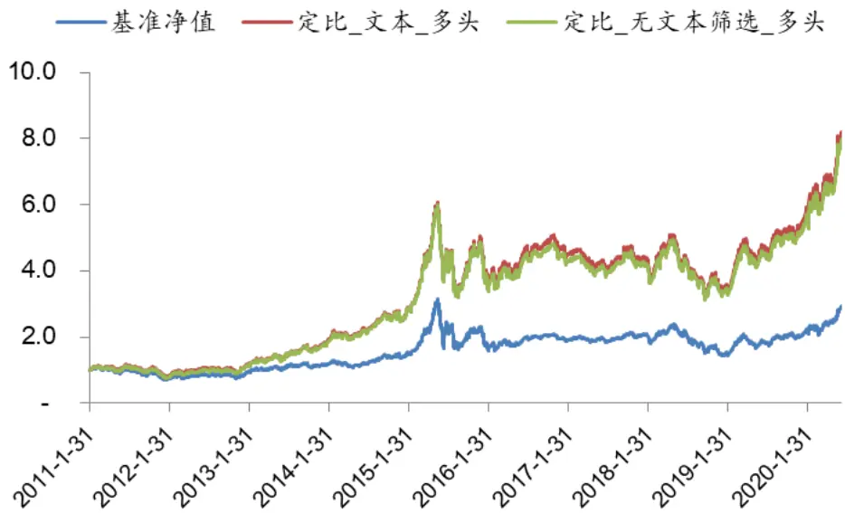
资料来源：德高行、Wind、聚源、兴业证券经济与金融研究院整理

从换手率的角度来看，加入文本筛选的策略月度单边换手率 44.3%，不加入文本筛选的策略月度单边换手率为 39.2%。而观察两个策略持仓，我们发现加入文本筛选的股票平均每期比不加入文本筛选的策略会少5只左右，具体参见图表36。

图表 34、定比筛选策略超额表现
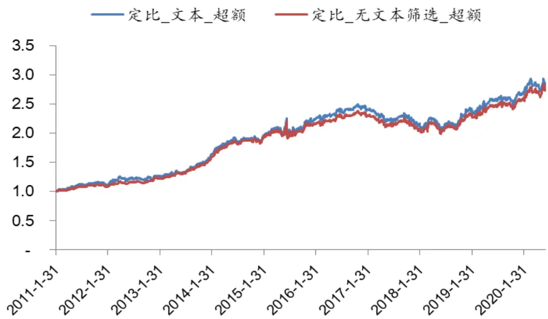
资料来源：德高行、Wind、聚源、兴业证券经济与金融研究院整理

图表 35、定比策略分年度表现

| 年份 | 基准净值 | 文本_多头 | 无文本筛选_多头 | 文本_超额 | 无文本筛选_超额 |
| --- | --- | --- | --- | --- | --- |
| 2011年 | -23.1% | -11.7% | -14.3% | 14.8% | 11.3% |
| 2012年 | 10.3% | 19.4% | 20.9% | 9.3% | 10.3% |
| 2013年 | 37.8% | 68.2% | 67.1% | 22.6% | 22.0% |
| 2014年 | 18.0% | 41.6% | 44.1% | 20.9% | 22.8% |
| 2015年 | 64.7% | 93.7% | 90.2% | 18.3% | 16.0% |
| 2016年 | -14.2% | -4.5% | -6.5% | 10.7% | 9.0% |
| 2017年 | 4.5% | -6.4% | -5.5% | -10.6% | -9.7% |
| 2018年 | -26.6% | -19.9% | -19.8% | 8.8% | 8.8% |
| 2019年 | 38.2% | 55.5% | 54.7% | 12.2% | 11.5% |
| 2020 年至今 | 41.5% | 51.5% | 53.2% | 7.8% | 9.0% |

数据来源：德高行、Wind、聚源、兴业证券经济与金融研究院整理

图表 36、定比筛选策略持仓数目统计
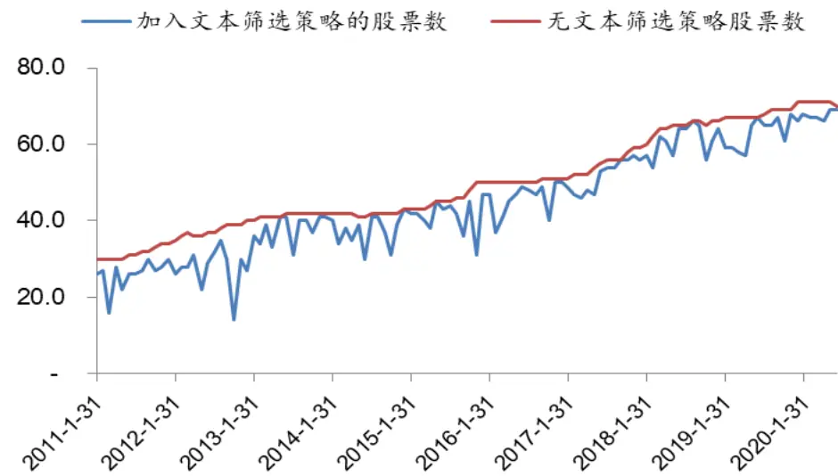
资料来源：德高行、Wind、聚源、兴业证券经济与金融研究院整理

## 5.2、精选个股策略构建

## 精选 10 只股票策略

考虑到组合股票数量的稳定性要求，我们在医药服务、医药制造与高科技两个行业精选一定数量的个股。在满足相应的调仓要求后分别从两个行业各自选择5 只股票构成最终的策略持仓。从结果来看：

1）基于文本筛选的策略整体优于非文本的策略表现；

2）以文本筛选的策略为例，策略年化收益高达 37.5%，风险收益比达到1.29，年化超额收益 23.4%，风险收益比达到 1.61。分年度来看该策略每年超越基准 10 个点以上（2017 年、2018 年超越基准 8.7%、8.8%），表现非常优异。另外策略月度单边换手率为 59.5%，在选股数目较少的情况下换手率已经相对较低。

图表 37、精选10只策略的综合表现

| 因子 | 年化收益率 | 波动率 | 风险收益比 | 日度胜率 | 最大回撤率 |
| --- | --- | --- | --- | --- | --- |
| 基准表现 | 12.1% | 27.1% | 0.45 | 53.2% | 54.8% |
| 文本_多头 | 37.5% | 29.0% | 1.29 | 56.1% | 47.6% |
| 文本_超额 | 23.4% | 14.6% | 1.61 | 54.0% | 17.9% |
| 无文本多头 | 35.3% | 28.8% | 1.23 | 56.0% | 48.4% |
| 无文本_超额 | 21.6% | 14.3% | 1.50 | 52.9% | 17.1% |

资料来源：德高行、Wind、聚源、兴业证券经济与金融研究院整理

图表 38、精选 10只策略多头表现
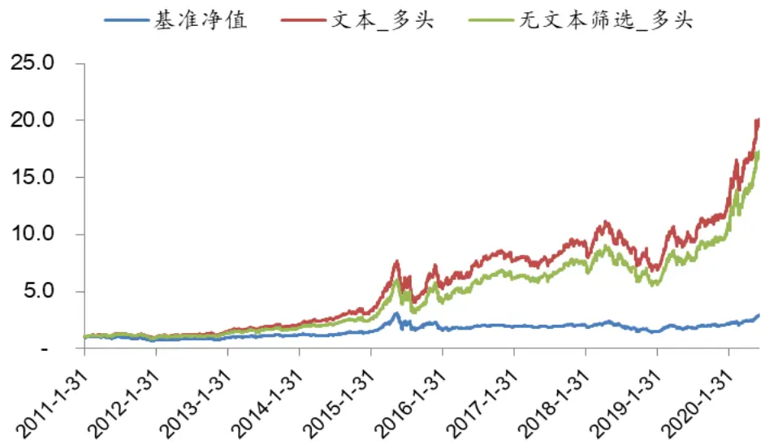
资料来源：德高行、Wind、聚源、兴业证券经济与金融研究院整理

图表 39、精选 10只策略超额表现
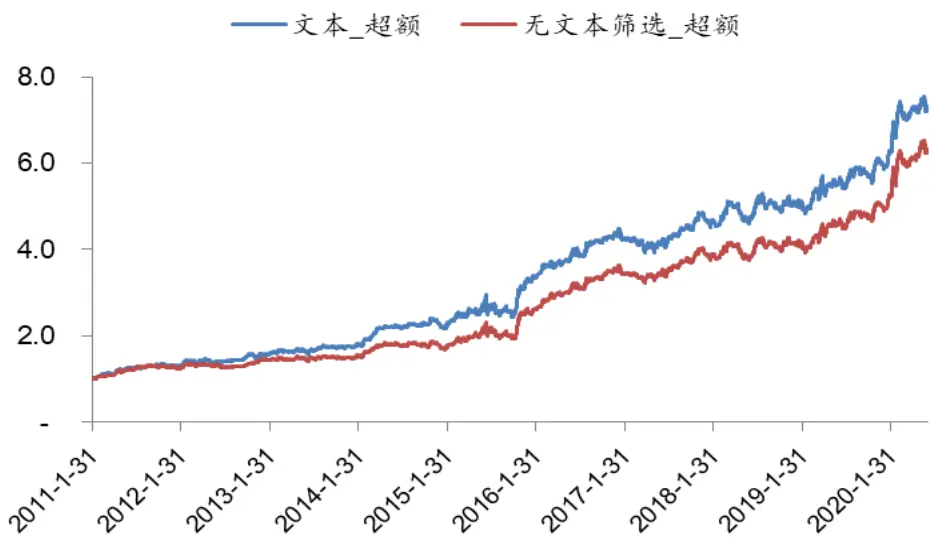
资料来源：德高行、Wind、聚源、兴业证券经济与金融研究院整理

图表 40、精选10只策略分年度表现

| 年份 | 基准净值 | 文本_多头 | 无文本筛选_多头 | 文本_超额 | 无文本筛选_超额 |
| --- | --- | --- | --- | --- | --- |
| 2011年 | -23.1% | 1.8% | -0.9% | 31.9% | 28.1% |
| 2012年 | 10.3% | 29.1% | 22.4% | 18.3% | 12.4% |
| 2013年 | 37.8% | 54.2% | 43.5% | 12.3% | 4.1% |
| 2014年 | 18.0% | 50.5% | 37.5% | 28.3% | 16.8% |
| 2015年 | 64.7% | 129.5% | 126.9% | 44.1% | 44.6% |
| 2016年 | -14.2% | 14.9% | 18.3% | 32.6% | 37.7% |
| 2017年 | 4.5% | 14.5% | 17.3% | 8.8% | 11.4% |
| 2018年 | -26.6% | -20.8% | -21.8% | 8.7% | 7.0% |
| 2019年 | 38.2% | 58.7% | 62.9% | 15.2% | 17.8% |
| 2020年至今 | 41.5% | 73.9% | 79.6% | 24.0% | 28.3% |

数据来源：德高行、Wind、聚源、兴业证券经济与金融研究院整理

## 精选 20 只股票策略

为了降低持股集中度，在满足相应的调仓要求后分别从两个行业各自选择 10只股票构成持仓。从结果来看：

1）基于文本筛选的策略与非文本筛选策略较为接近。实际上文本筛选是否能起到效果和选择股票的多少（参见图表 41）、加权的方式有较大的关系。这主要是由于文本因子覆盖度相对较低所致。为了精简篇幅，后续我们将主要以非文本筛选的结果为主进行展示；

图表 41、是否文本筛选在不同持股数量下的收益敏感性
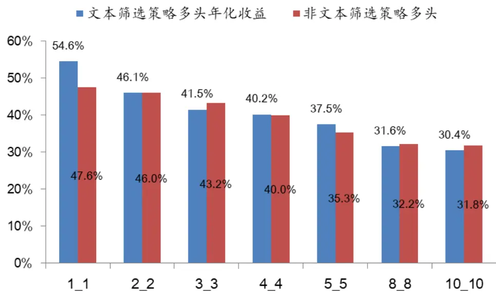
资料来源：德高行、Wind、聚源、兴业证券经济与金融研究院整理

注：横坐标为“1_1”表示分别从医药服务板块以及医药制造与高科技中各选择一只股票

2）以非文本筛选策略为例，策略年化收益高达 31.8%，超额收益 18.3%，风险收益比达到1.70。分年度来看该策略每年稳定超越基准，表现非常优异。

图表 42、精选20只策略综合表现

| 因子 | 年化收益率 | 波动率 | 风险收益比 | 日度胜率 | 最大回撤率 |
| --- | --- | --- | --- | --- | --- |
| 基准表现 | 12.1% | 27.1% | 0.45 | 53.2% | 54.8% |
| 文本_多头 | 30.4% | 27.8% | 1.09 | 55.4% | 47.9% |
| 文本_超额 | 16.8% | 11.1% | 1.51 | 55.1% | 12.5% |
| 无文本_多头 | 31.8% | 28.1% | 1.13 | 55.6% | 48.0% |
| 无文本_超额 | 18.3% | 10.8% | 1.70 | 54.5% | 12.6% |

资料来源：德高行、Wind、聚源、兴业证券经济与金融研究院整理

图表 43、精选 20只策略多头表现
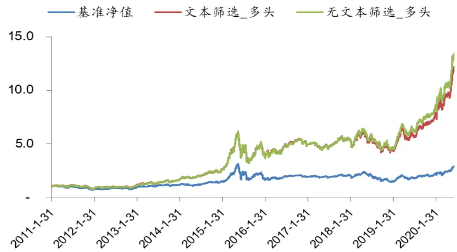
资料来源：德高行、Wind、聚源、兴业证券经济与金融研究院整理

图表 44、精选 20只策略超额表现
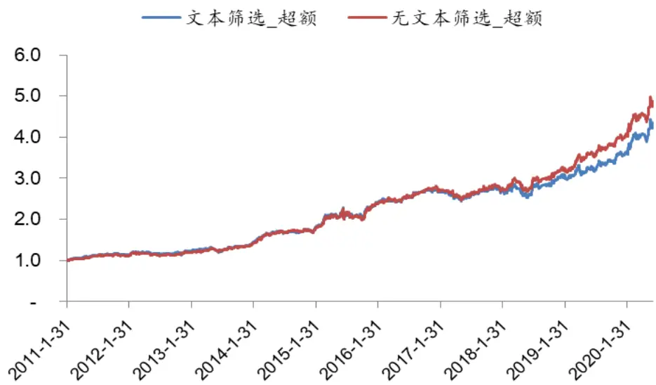
资料来源：德高行、Wind、聚源、兴业证券经济与金融研究院整理

图表 45、精选20只策略分年度表现

| 年份 | 基准净值 | 文本_多头 | 无文本筛选_多头 | 文本_超额 | 无文本筛选_超额 |
| --- | --- | --- | --- | --- | --- |
| 2011年 | -23.1% | -11.6% | -14.0% | 14.9% | 11.8% |
| 2012年 | 10.3% | 15.6% | 17.8% | 5.9% | 7.4% |
| 2013年 | 37.8% | 53.8% | 54.2% | 12.1% | 12.6% |
| 2014年 | 18.0% | 48.8% | 48.6% | 26.7% | 26.5% |
| 2015年 | 64.7% | 113.3% | 116.2% | 33.3% | 35.7% |
| 2016年 | -14.2% | 2.0% | 1.4% | 17.2% | 17.8% |
| 2017年 | 4.5% | 6.7% | 7.7% | 1.7% | 2.7% |
| 2018年 | -26.6% | -18.9% | -16.6% | 9.6% | 13.0% |
| 2019年 | 38.2% | 62.5% | 70.5% | 17.7% | 24.0% |
| 2020 年至今 | 41.5% | 70.4% | 72.0% | 22.2% | 23.4% |

数据来源：德高行、Wind、聚源、兴业证券经济与金融研究院整理

为了研究权重对策略的影响，在（10,10）持仓策略中，我们在两个大行业根据 Service_Sig，Tech_Sig 进行排序，每个行业选择的前 5 只个股权重均为 7%，后 5 只权重均为 3%，这样使得持仓前十的个股权重达到 70%。以非文本筛选的策略为例，策略年化收益达到 33.3%，超额收益达到19.7%，风险收益比达到 1.71，均优于等权策略表现。

图表 46、不同加权方式下精选 20 只股票策略综合表现

| 因子 | 年化收益率 | 波动率 | 风险收益比 | 日度胜率 | 最大回撤率 |
| --- | --- | --- | --- | --- | --- |
| 基准表现 | 12.1% | 27.1% | 0.45 | 53.2% | 54.8% |
| 权重73多头 | 33.3% | 28.1% | 1.19 | 56.1% | 48.1% |
| 权重73_超额 | 19.7% | 11.5% | 1.71 | 53.8% | 14.4% |
| 等权_多头 | 31.8% | 28.1% | 1.13 | 55.6% | 48.0% |
| 等权_超额 | 18.3% | 10.8% | 1.70 | 54.5% | 12.6% |

资料来源：德高行、Wind、聚源、兴业证券经济与金融研究院整理

图表 47、不同加权方式下精选20 只筛选策略多头表现
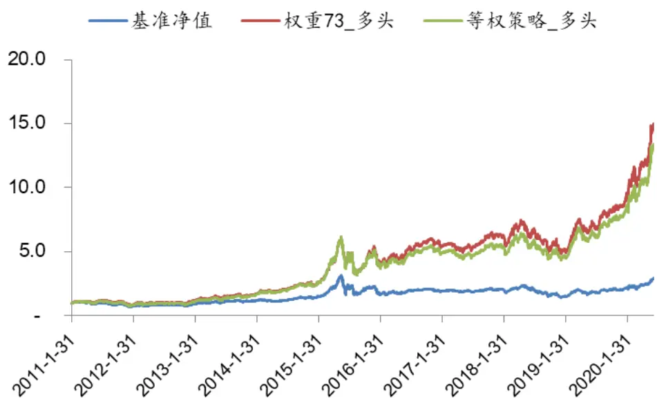
资料来源：德高行、Wind、聚源、兴业证券经济与金融研究院整理

图表 48、不同加权方式下精选20 只股票策略超额表现
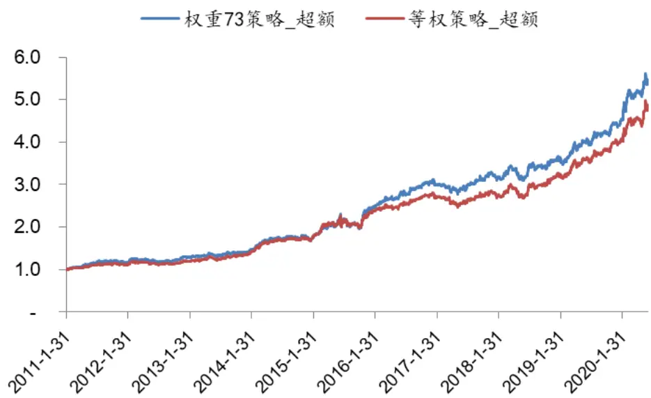
资料来源：德高行、Wind、聚源、兴业证券经济与金融研究院整理

图表 49、权重73下精选 20只策略分年度表现

| 年份 | 基准净值 | 文本_多头 | 无文本筛选_多头 | 文本超额 | 无文本筛选_超额 |
| --- | --- | --- | --- | --- | --- |
| 2011年 | -23.1% | -8.9% | -14.0% | 18.2% | 11.8% |
| 2012年 | 10.3% | 19.7% | 17.8% | 9.5% | 7.4% |
| 2013年 | 37.8% | 49.9% | 54.2% | 9.2% | 12.6% |
| 2014年 | 18.0% | 43.9% | 48.6% | 22.4% | 26.5% |
| 2015年 | 64.7% | 121.0% | 116.2% | 39.5% | 35.7% |
| 2016年 | -14.2% | 8.2% | 1.4% | 25.7% | 17.8% |
| 2017年 | 4.5% | 11.6% | 7.7% | 6.2% | 2.7% |
| 2018年 | -26.6% | -18.5% | -16.6% | 10.8% | 13.0% |
| 2019年 | 38.2% | 67.5% | 70.5% | 21.6% | 24.0% |
| 2020 年至今 | 41.5% | 75.2% | 72.0% | 25.4% | 23.4% |

数据来源：德高行、Wind、聚源、兴业证券经济与金融研究院整理

进一步，我们针对精选数目进行敏感性分析。我们分别从医药服务、医药制造与高科技两个行业精选（1,1）、（2,2）、（3,3）、（4,4）、（8,8）、（5,10）、（10,20）形成相应的策略（由于医药制造与高科技行业股票数目更多，所以当策略持仓数目变多时，会相应倾斜到该行业）。结果显示：随着选择股票数目减少，收益不断提升。这意味着基于不同板块的选股因子的 Alpha 信息并没有因为股票池变窄而出现衰减，反而效果愈加增强，具体参见图表50-51。

图表 50、持股数目敏感性分析之多头年化收益
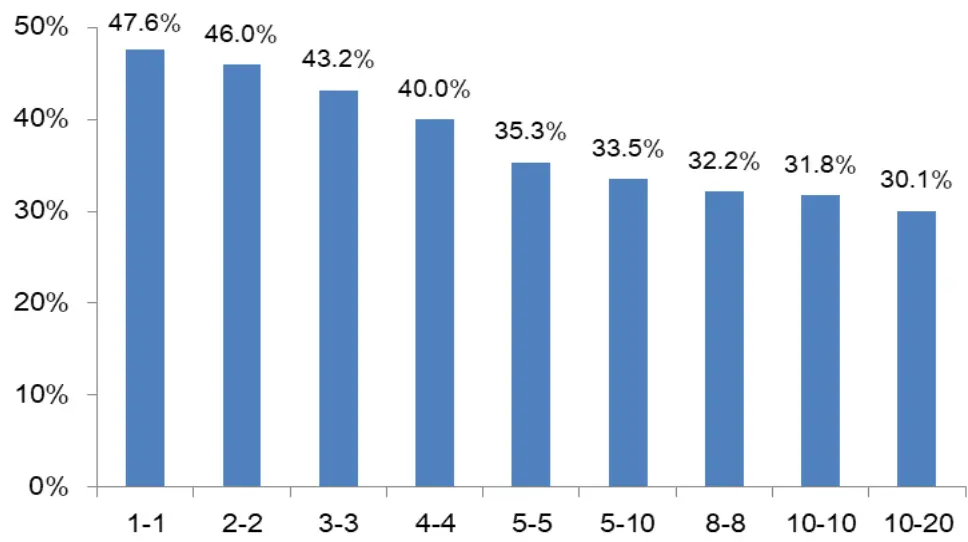
资料来源：德高行、Wind、聚源、兴业证券经济与金融研究院整理

图表 51、持股数目敏感性分析之多头风险收益比
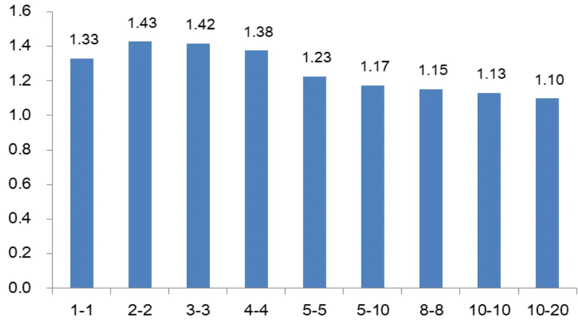
资料来源：德高行、Wind、聚源、兴业证券经济与金融研究院整理

上述的权重敏感性分析实际上是让持仓偏向因子排名靠前的股票，而选股数目的敏感性分析则是针对因子打分最高的一部分头部公司展开测试。两者的实证结果均说明即便考察头部股票，策略仍然具有非常强的选股能力，也进一步论证了策略的有效性。

## 5.3、策略持仓行业分析

对策略持仓的行业分布进行分析，我们以非文本筛选下两行业分别精选10只股票，同时配权按照头部70%，尾部 30%的策略作为持仓行业分析的对象（后续的Barra业绩归因&Brinson业绩归因均用该策略作为分析对象），从持仓所属三级行业来看：

1）虽然策略是在医药服务、医药制造与高科技两个大的板块进行选股，但每期选择的股票较为分散的分布到各中信三级子行业中；

2）策略持仓在大部分行业相对较为均匀，但在医疗器械领域占比不断提升（图表52 中黑色线条），在中成药领域的占比不断下降（图表52种红色线条），这也契合两个行业基本面情况和二级市场的整体走势。

图表 52、策略持仓在中信三级行业分布的 6 个月移动平均
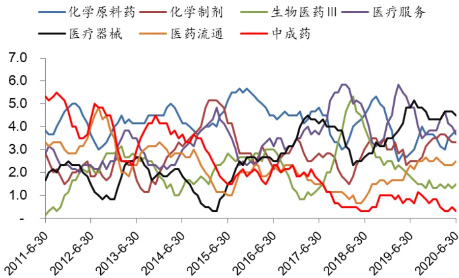
资料来源：Wind、聚源、兴业证券经济与金融研究院整理

图表 53、中信医药三级行业净值表现
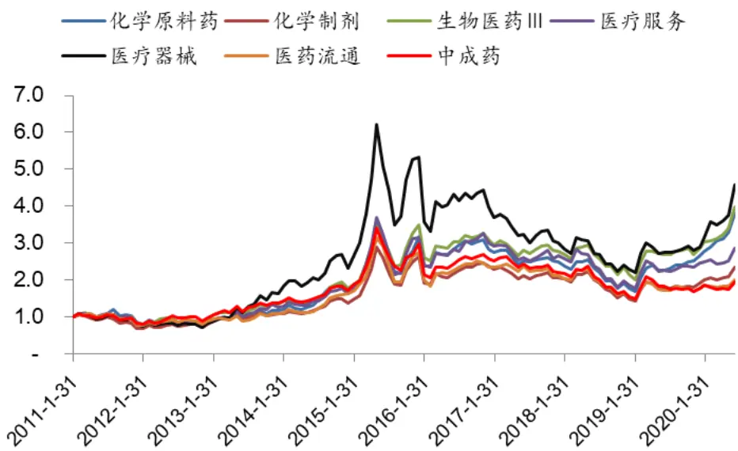
资料来源：Wind、聚源、兴业证券经济与金融研究院整理

## 5.4、策略绩效归因分析

## 基于持仓的Barra 业绩归因分析

根据策略持仓，基于 Barra 风格因子对策略超额收益进行分解来捕捉策略的收益率来源。图表54显示了总超额收益的分解情况。从结果来看，在 Barra十个风格中，市值（Size）、动量效应（Momentum）贡献相对较多的正收益，残差波动率（ResidualVolatility）、流动性（Liquidity）贡献一定的负超额收益，但整体来看残差项（表示不能被风格因子解释的部分）的贡献占绝对优势，这表明绝大部分收益来自于我们的大健康板块 Alpha 选股模型，时序维度的收益归因参见图表 55。

图表 54、基于持仓的Barra业绩归因整体展示
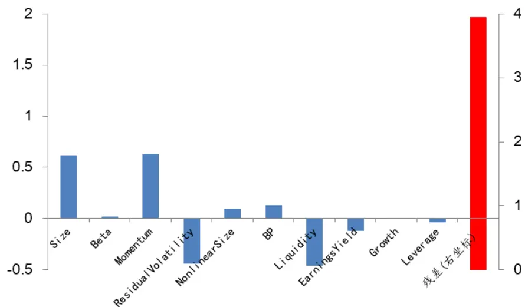
资料来源：德高行、Wind、聚源、兴业证券经济与金融研究院整理

图表 55、基于持仓的Barra业绩归因时序展示
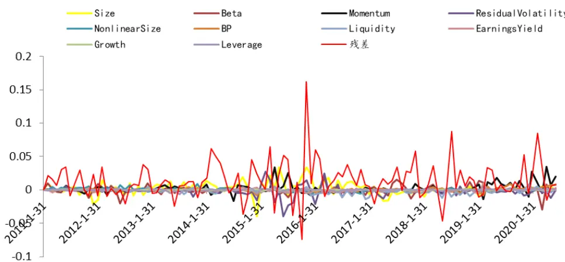
资料来源：德高行、Wind、聚源、兴业证券经济与金融研究院整理

## 策略 Brinson 绩效归因分析

进一步我们基于策略持仓，通过 Brinson 模型对其收益进行分解。这里需要注意的是我们假设策略一直是满仓运作（除开无法成交的少数情况），所以我们主要通过 Brinson 模型来评价策略的行业配置能力和股票选择能力。从统计结果来看，策略有一定的行业配置能力，但整体上个股选择能力非常突出，占据绝对优势。

图表 56、2019 年以来策略Brinson 绩效归因分析结果
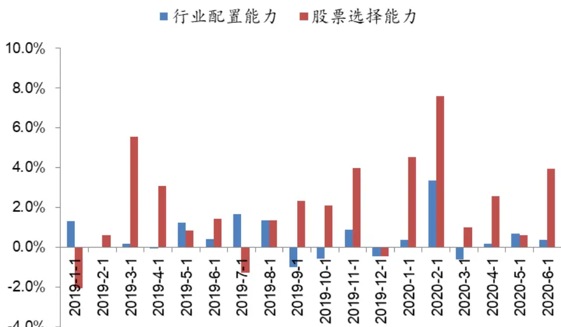
资料来源：德高行、Wind、聚源、兴业证券经济与金融研究院整理

图表 57、Brinson绩效归因分析-6个月移动平均
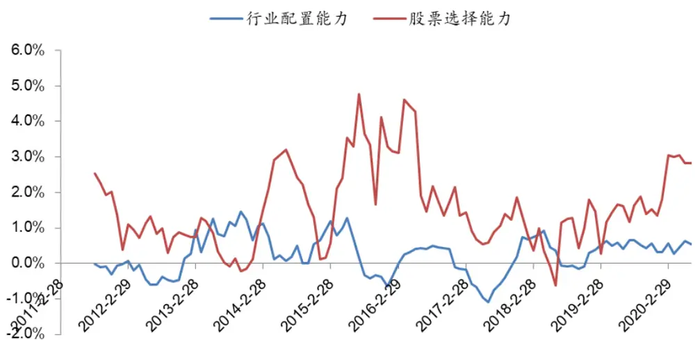
资料来源：德高行、Wind、聚源、兴业证券经济与金融研究院整理

## 6、总结

医药行业在 A 股整个板块占绝对重要地位，今年以来的表现尤为亮眼。我们在医药行业的基础上，构建大健康板块。从创新维度出发，将大健康板块的公司划分成医药服务以及医药制造与高科技行业。基于我们团队之前在因子选股领域的研究积累，在不同的板块中选择有效的选股因子，构建复合阿尔法选股因子（医药服务领域构建的因子称之为 Service_Sig，医药制造与高科技板块构建的因子称之为 Tech_Sig），复合因子在相应行业选股能力突出。在此基础上，我们构建了大健康板块内的股票量化精选策略，无论是整体亦或是分年度表现都颇为优秀。同时绩效归因分析也进一步表明了我们开发的模型在选股能力上的优异表现和稳定性。

本文是我们聚焦于大健康、大科技、大消费三大行业板块，构建基本面量化选股策略的第一篇报告，后续我们将陆续推出其他行业的相关研究，希望能从量化投资的角度继续为大家提供贴近实战的投研服务。

## 7、附录

图表 58、新添加公司明细

| 股票代码 | 公司名称 | 中信三级行业分类 | 大健康板块的行业分类 |
| --- | --- | --- | --- |
| 000009.SZ | 中国宝安 | 综合Ⅱ | 生物医药Ⅲ |
| 000409.SZ | ST 地矿 | 综合Ⅱ | 生物医药Ⅲ |
| 000532.SZ | 华金资本 | 元件Ⅱ | 医疗服务 |
| 000806.SZ | *ST 银河 | 高低压设备 | 生物医药Ⅲ |
| 000990.SZ | 诚志股份 | 化学制品 | 医疗服务 |
| 002286.SZ | 保龄宝 | 农产品加工 | 医疗服务 |
| 002341.SZ | 新纶科技 | 化学制品 | 医疗服务 |
| 002584.SZ | 西陇科学 | 化学制品 | 医疗服务 |
| 002642.SZ | 荣之联 | 计算机应用 | 医疗服务 |
| 002799.SZ | 环球印务 | 包装印刷Ⅱ | 医疗器械 |
| 300260.SZ | 新莱应材 | 通用机械 | 医疗器械 |
| 300261.SZ | 雅本化学 | 化学制品 | 化学制剂 |
| 300285.SZ | 国瓷材料 | 化学原料 | 医疗器械 |
| 300306.SZ | 远方信息 | 仪器仪表Ⅱ | 医疗服务 |
| 300328.SZ | 宜安科技 | 工业金属 | 医疗器械 |
| 300335.SZ | 迪森股份 | 环保工程及服务Ⅱ | 医疗服务 |
| 300430.SZ | 诚益通 | 通用机械 | 医疗器械 |
| 300645.SZ | 正元智慧 | 计算机应用 | 医疗服务 |
| 300813.SZ | 泰林生物 | 专用设备 | 医疗器械 |
| 600206.SH | 有研新材 | 金属非金属新材料 | 医疗器械 |
| 600228.SH | ST 昌九 | 化学制品 | 化学制剂 |
| 600466.SH | 蓝光发展 | 房地产开发Ⅱ | 生物医药Ⅲ |
| 600624.SH | 复旦复华 | 综合Ⅱ | 生物医药Ⅲ |
| 600881.SH | 亚泰集团 | 水泥制造Ⅱ | 生物医药Ⅲ |
| 603690.SH | 至纯科技 | 专用设备 | 医疗器械 |
| 603929.SH | 亚翔集成 | 专业工程 | 医疗服务 |
| 603968.SH | 醋化股份 | 化学制品 | 化学制剂 |
| 688089.SH | 嘉必优 | 食品加工 | 医疗服务 |
| 688101.SH | 三达膜 | 环保工程及服务Ⅱ | 医疗服务 |
| 000502.SZ | 绿景控股 | 房地产开发Ⅱ | 医疗服务 |
| 000627.SZ | 天茂集团 | 保险Ⅱ | 化学制剂 |
| 000722.SZ | 湖南发展 | 电力 | 医疗服务 |
| 000725.SZ | 京东方A | 光学光电子 | 医疗服务 |
| 000955.SZ | 欣龙控股 | 纺织制造 | 医疗器械 |
| 002004.SZ | 华邦健康 | 化学制品 | 生物医药Ⅲ |
| 002172.SZ | 澳洋健康 | 化学纤维 | 医疗服务 |
| 002250.SZ | 联化科技 | 化学制品 | 化学制剂 |
| 300018.SZ | 中元股份 | 电气自动化设备 | 医疗器械 |
| 300096.SZ | 易联众 | 计算机应用 | 医疗服务 |
| 300216.SZ | 千山药机 | 专用设备 | 医疗器械 |
| 300249.SZ | 依米康 | 白色家电 | 医疗服务 |
| 300253.SZ | 卫宁健康 | 计算机应用 | 医疗服务 |
| 300288.SZ | 朗玛信息 | 计算机应用 | 医疗服务 |
| 300290.SZ | 荣科科技 | 计算机应用 | 医疗服务 |
| 300300.SZ | 汉鼎宇佑 | 计算机应用 | 医疗服务 |
| 300390.SZ | 天华超净 | 其他电子Ⅱ | 医疗器械 |
| 300405.SZ | 科隆股份 | 化学制品 | 化学制剂 |
| 300451.SZ | 创业慧康 | 计算机应用 | 医疗服务 |
| 300454.SZ | 深信服 | 计算机应用 | 医疗服务 |
| 300501.SZ | 海顺新材 | 包装印刷Ⅱ | 医疗服务 |
| 300550.SZ | 和仁科技 | 计算机应用 | 医疗服务 |
| 300579.SZ | 数字认证 | 计算机应用 | 医疗服务 |
| 300632.SZ | 光莆股份 | 光学光电子 | 医疗服务 |
| 300698.SZ | 万马科技 | 通信设备 | 医疗服务 |
| 300791.SZ | 仙乐健康 | 食品加工 | 医疗服务 |
| 600128.SH | 弘业股份 | 综合Ⅱ | 医疗器械 |
| 600668.SH | 尖峰集团 | 水泥制造Ⅱ | 生物医药Ⅲ |
| 600682.SH | 南京新百 | 一般零售 | 生物医药Ⅲ |
| 600855.SH | 航天长峰 | 计算机设备Ⅱ | 医疗器械 |
| 601886.SH | 江河集团 | 装修装饰Ⅱ | 医疗服务 |
| 603118.SH | 共进股份 | 通信设备 | 医疗服务 |
| 603583.SH | 捷昌驱动 | 电气自动化设备 | 医疗服务 |
| 603666.SH | 亿嘉和 | 通用机械 | 医疗服务 |
| 603990.SH | 麦迪科技 | 计算机应用 | 医疗服务 |
| 605288.SH | 凯迪股份 | 电气自动化设备 | 医疗服务 |
| 688022.SH | 瀚川智能 | 专用设备 | 医疗服务 |
| 688310.SH | 迈得医疗 | 专用设备 | 医疗器械 |

资料来源：Wind、聚源、兴业证券经济与金融研究院整理

风险提示：本报告模型及结论全部基于对历史数据的分析，当市场环境变化时，存在模型失效风险。

## 分析师声明

本人具有中国证券业协会授予的证券投资咨询执业资格并注册为证券分析师，以勤勉的职业态度，独立、客观地出具本报告。本报告清晰准确地反映了本人的研究观点。本人不曾因，不因，也将不会因本报告中的具体推荐意见或观点而直接或间接收到任何形式的补偿。

## 投资评级说明

| 投资建议的评级标准 | 类别 | 评级 | 说明 |
| --- | --- | --- | --- |
| 报告中投资建议所涉及的评级分为股票评级和行业评级(另有说明的除外)。评级标准为报告发布日后的12个月内公司股价（或行业指数)相对同期相关证券市场代表性指数的涨跌幅。其中：A股市场以上证综指或深圳成指为基 | 股票评级 | 买入 | 相对同期相关证券市场代表性指数涨幅大于15% |
|  |  | 审慎增持 | 相对同期相关证券市场代表性指数涨幅在5%～15%之间 |
|  |  | 中性 | 相对同期相关证券市场代表性指数涨幅在-5%～5%之间 |
|  |  | 减持 | 相对同期相关证券市场代表性指数涨幅小于-5% |
|  |  | 无评级 | 由于我们无法获取必要的资料，或者公司面临无法预见结果的重大不确定性事件，或者其他原因，致使我们无法给出明确的投资评级 |
| 准，香港市场以恒生指数为基准；美国市场以标普500或纳斯达克综合指数为基准。 | 行业评级 | 推荐 | 相对表现优于同期相关证券市场代表性指数 |
|  |  | 中性 | 相对表现与同期相关证券市场代表性指数持平 |
|  |  | 回避 | 相对表现弱于同期相关证券市场代表性指数 |

## 信息披露

本公司在知晓的范围内履行信息披露义务。客户可登录 www.xyzq.com.cn 内幕交易防控栏内查询静默期安排和关联公司持股情况。

## 使用本研究报告的风险提示及法律声明

兴业证券股份有限公司经中国证券监督管理委员会批准，已具备证券投资咨询业务资格。

本报告仅供兴业证券股份有限公司（以下简称“本公司”）的客户使用，本公司不会因接收人收到本报告而视其为客户。本报告中的信息、意见等均仅供客户参考，不构成所述证券买卖的出价或征价邀请或要约。该等信息、意见并未考虑到获取本报告人员的具体投资目的、财务状况以及特定需求，在任何时候均不构成对任何人的个人推荐。客户应当对本报告中的信息和意见进行独立评估，并应同时考量各自的投资目的、财务状况和特定需求，必要时就法律、商业、财务、税收等方面咨询专家的意见。对依据或者使用本报告所造成的一切后果，本公司及/或其关联人员均不承担任何法律责任。

本报告所载资料的来源被认为是可靠的，但本公司不保证其准确性或完整性，也不保证所包含的信息和建议不会发生任何变更。本公司并不对使用本报告所包含的材料产生的任何直接或间接损失或与此相关的其他任何损失承担任何责任。

本报告所载的资料、意见及推测仅反映本公司于发布本报告当日的判断，本报告所指的证券或投资标的的价格、价值及投资收入可升可跌，过往表现不应作为日后的表现依据；在不同时期，本公司可发出与本报告所载资料、意见及推测不一致的报告；本公司不保证本报告所含信息保持在最新状态。同时，本公司对本报告所含信息可在不发出通知的情形下做出修改，投资者应当自行关注相应的更新或修改。

除非另行说明，本报告中所引用的关于业绩的数据代表过往表现。过往的业绩表现亦不应作为日后回报的预示。我们不承诺也不保证，任何所预示的回报会得以实现。分析中所做的回报预测可能是基于相应的假设。任何假设的变化可能会显著地影响所预测的回报。

本公司的销售人员、交易人员以及其他专业人士可能会依据不同假设和标准、采用不同的分析方法而口头或书面发表与本报告意见及建议不一致的市场评论和/或交易观点。本公司没有将此意见及建议向报告所有接收者进行更新的义务。本公司的资产管理部门、自营部门以及其他投资业务部门可能独立做出与本报告中的意见或建议不一致的投资决策。

本报告并非针对或意图发送予或为任何就发送、发布、可得到或使用此报告而使兴业证券股份有限公司及其关联子公司等违反当地的法律或法规或可致使兴业证券股份有限公司受制于相关法律或法规的任何地区、国家或其他管辖区域的公民或居民，包括但不限于美国及美国公民（1934年美国《证券交易所》第 15a-6条例定义为本「主要美国机构投资者」除外）。

本报告的版权归本公司所有。本公司对本报告保留一切权利。除非另有书面显示，否则本报告中的所有材料的版权均属本公司。未经本公司事先书面授权，本报告的任何部分均不得以任何方式制作任何形式的拷贝、复印件或复制品，或再次分发给任何其他人，或以任何侵犯本公司版权的其他方式使用。未经授权的转载，本公司不承担任何转载责任。

## 特别声明

在法律许可的情况下，兴业证券股份有限公司可能会持有本报告中提及公司所发行的证券头寸并进行交易，也可能为这些公司提供或争取提供投资银行业务服务。因此，投资者应当考虑到兴业证券股份有限公司及/或其相关人员可能存在影响本报告观点客观性的潜在利益冲突。投资者请勿将本报告视为投资或其他决定的唯一信赖依据。

兴业证券研究

| 上海 | 北京 |  | 深圳 |
| --- | --- | --- | --- |
| 地址：上海浦东新区长柳路36号兴业证券大厦 |  | 地址：北京西城区锦什坊街35号北楼601-605 | 地址：深圳市福田区皇岗路5001号深业上城T2 |
| 15层 |  |  | 座52楼 |
| 邮编：200135 |  | 邮编：100033 | 邮编：518035 |
| 邮箱：research@xyzq.com.cn |  | 邮箱：research@xyzq.com.cn | 邮箱：research@xyzq.com.cn |