分析师：

徐寅

xuyinsh@xyzq.com.cn

S0190514070004

郑兆磊

zhengzhaolei@xyzq.com.cn

S0190520080006

## 报告关键点

我们耗时 4个月，通过阅读大量的基金经理调研访谈，并反复和相关行业卖方分析师进行沟通，梳理出了不同行业的投资逻辑，并利用我们在量化选股领域所积累的经验和优势，层层递进，步步为营，最终构建得到了表现稳定优异的科技板块精选策略。从 2011 年 1 月底-2020 年 9 月底，以精选 15 只个股的策略组合为例，年化收益率达 45.9%，相对于Wind信息技术指数的超额收益高达 31.5%，信息比率2.61，月胜率 71.8%。分年度来看，策略每年均能战胜基准 15%以上。

## ＃相关报告 related

《基于误差修正模型的估值趋势偏离度因子研究》2020-03-20

《股东盈余视角下的估值因子研究》2020-06-08

《基本面量化视角下的大健 康 板 块 选 股 研 究 》2020-07-22

团队成员：

# 基本面量化视角下的科技板块选股研究

2020 年 10 月 30 日

## 投资要点

- 继“基本面量化系列”--《基本面量化视角下的大健康板块选股研究》后，科技板块的深度剖析如约而至。我们耗时 4个月，通过阅读大量的基金经理调研访谈，并反复和相关行业卖方分析师进行沟通，梳理出了不同行业的投资逻辑，并利用我们在量化选股领域所积累的经验和优势，层层递进，步步为营，最终构建得到了表现稳定优异的科技板块精选策略。

科技概念较为宽泛。为了保证研究范围的纯粹性，我们以 Wind信息技术行业下的二级行业分类为基础，并将其中的“半导体与半导体生产设备”拆分成半导体制造、半导体设计，进而形成了四个细分子行业：技术硬件与设备、软件与服务、半导体制造、半导体设计。结合基本面行业逻辑和量化模型的分析方法，我们在四个行业内分别构建相应的基本面量化选股模型。从效果上来看，每个子行业选股模型都体现出了非常好的多头组合收益获取能力！

- 在每个子行业进行个股精选的基础上，我们最终完成了科技板块精选策略的构建。从 2011年1 月底-2020 年 9 月底，以精选 15 只个股的策略组合为例，年化收益率达 45.9%，相对于 Wind信息技术指数的超额收益高达31.5%，信息比率2.61，月胜率71.8%。分年度来看，策略每年均能战胜基准15%以上。即便与全市场主动偏股型基金进行对比，在进行年度收益的仓位折算后，除 2017 年外其每年收益均能排进前 30%！以今年以来表现为例：策略满仓收益 84.8%，折算后为 70.1%，在全部可比的主动偏股型基金（594只）中排名第 26位。

风险提示：本报告模型及结论全部基于对历史数据的分析，当市场环境变化时，存在模型失效风险。

## 报告正文

## 1、引言

迈克尔•波特在《国家竞争优势》一书中提到：一个国家的发展可以划分为生产要素驱动、投资驱动、创新驱动和财富驱动四个阶段。当前，在国家实施创新驱动发展战略、建设世界科技强国的背景下，科技创新成为引领我国发展的战略支撑和动力引擎。一方面，经过这几年的高投入叠加优秀人才不断回国，中国科技企业已建立了较好的发展基础，初步实现了自主可控,我们称之为中国的“IT底座重塑”；另一方面，国家信息安全角度的“整芯助魂”工程以及中美贸易摩擦带来的不确定影响更进一步坚定了全民发展科技的意志。当然除了国家层面战略定位外，产业层面的发展规律也不可忽视。目前正处于 5G 更替阶段，5G 将给整个科技行业带来全新的生态变化。这些因素均成为相关行业主题 A 股的引爆点，而科技板块近年来的表现也确实可称得上是一道亮丽的风景线。

基于以上考量，作为基本面量化视角下行业主题板块选股研究的第二篇报告，我们聚焦于科技板块内选股模型的搭建，通过深度分析板块内不同子行业的基本面特征，以给出个性化的选股思路，并最终形成了兴业定量科技精选策略组合。

与大健康这一概念类似，科技主题本身涵盖的行业类别是比较宽泛的。广义的科技板块，不仅包括 TMT，亦包括新能源汽车、创新原料、医疗器械、生物医药等行业（这一点从目前 A 股市场四个科技主题相关指数成分股所属的行业即可窥知一二，请参加图表1）。考虑到医药领域的选股问题已在上篇报告（请参见《基本面量化视角下的大健康板块选股研究》）中有过详细研究，而其他行业我们也将在后续报告中陆续展开讨论，因此本文将以Wind一级行业分类中的信息技术行业的为基础，同时将申万和中信行业分类中属于电子、通信以及计算机的相关公司一并纳入进来，共同作为我们的研究主体。

图表 1、主流科技主题指数行业覆盖情况

| 行业覆盖情况 |  |
| --- | --- |
| 中证科技50 | 中证一级信息技术与电信业务，中证四级航空航天与国防、新能源设备、 医疗器械、医疗保健技术、生物科技、化学药、制药与生物科技服务、其 他化学制品、塑料制品、涂料涂漆、纤维及树脂、橡胶制品、印染化学品 |
| 中证新兴科技100 | 中证一级行业分类为信息技术、电信行业，中证三级行业分类为航空航天 与国防Ⅲ、医疗器械Ⅲ和生物科技Ⅲ行业的股票 |
| 中证科技100 | 按照中证行业分类，选取化学制品、航空航天与国防、电气设备、机械制 造、汽车零配件、汽车、医疗器械、医疗保健技术、生物科技、化学药、 制药与生物科技服务、互联网服务、信息技术服务、软件开发、电脑与外 |
| 中证科技龙头 | 围设备、电子设备、半导体等行业 电子、计算机、通信、生物科技等科技领域的股票纳入待选空间 |

资料来源：中证指数官网、兴业证券经济与金融研究院整理

本文的后续内容主要由以下五个部分组成：

1、 科技板块股票池确定；

2、 基金经理眼中的科技板块核心特质；

3、 科技子行业选股模型构建；

4、 科技行业选股策略构建；

5、 策略持仓与绩效分析；

如无特别说明，本文的研究及回测时间窗口均为 2011 年 1 月底-2020 年 9 月底。

## 2、科技板块股票池确定

## 2.1、科技板块股票池确定

在第一章中，我们简单介绍了本文对科技板块股票池的定义——以Wind 中的信息技术下的二级行业分类为基础，同时将申万和中信的一级行业分类中属于电子、通信以及计算机的相关公司一并纳入进来，共同作为我们的研究主体。这里需要注意两点：

1. 之所以选择Wind行业分类下的信息技术行业，主要是我们希望通过借助该分类下的二级子行业划分方式——技术硬件与设备、软件与服务、半导体与半导体生产设备——来剖析科技主题下不同子行业选股逻辑的差异，并进一步构建更具针对性的选股模型；

2. 考虑到在中信和申万分类体系下存在着一些并不属于 Wind 信息技术行业的公司，我们根据相关基本面信息，建立了从中信和申万一级行业中的电子、通信以及计算机中的公司到 Wind 信息技术下的三个二级子行业之间的映射关系，从而使得我们的股票池与单一行业分类体系下的结果相比更加完备。具体映射规则，请参见附录中的图表67-68。

以最新一期（2020 年 9 月 30 日）为例，Wind 信息技术行业共计包含 645 只股票。经过上述拓展和相关映射后，我们的初始股票池共计包含 729 只股票，其中技术硬件与设备、软件与服务、半导体与半导体生产设备分别包含 402、238、89 只股票，历史上三个子行业股票数量的变动趋势请参见图表 3及图表 4左半部分。观察最新一期扩展后的Wind 信息技术行业与中信一级行业之间的关系，我们发现：

1) 技术硬件与设备主要指电子行业中的消费电子板块，其次包括通信板块中绝大部分公司；

2) 软件与服务主要包括计算机中的绝大多数公司；

技术硬件与设备

3) 半导体与半导体生产设备主要对应着电子行业中的半导体板块。

完整的映射关系结果，请参见图表 4。

图表2、技术硬件与设备、软件与服务行业扩充前后数量差异
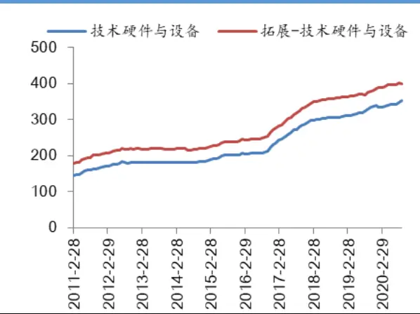

软件与服务
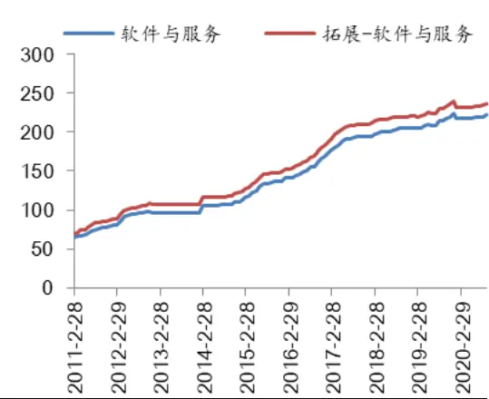
资料来源：Wind、聚源、兴业证券经济与金融研究院整理

图表3、半导体板块扩充前后数量差异
半导体 Vs.拓展-半导体
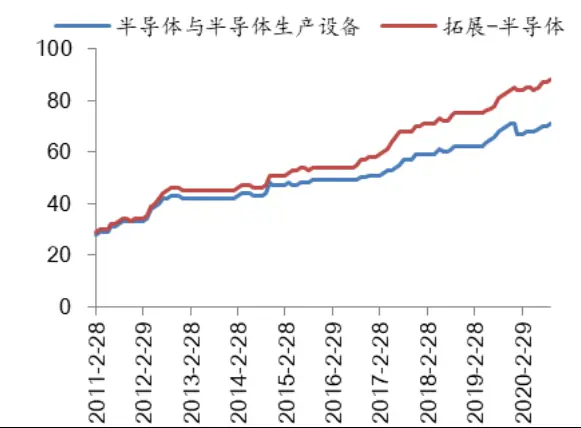

拓展后的半导体制造以及拓展后的半导体设计
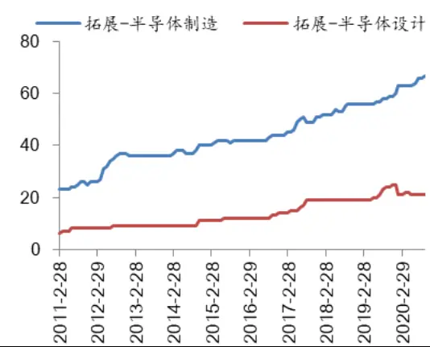
资料来源：Wind、聚源、兴业证券经济与金融研究院整理

图表 4、Wind 信息技术二级行业股票在中信一级行业上分布情况

|  | 半导体与半导体生产设备 | 技术硬件与设备 | 软件与服务 |
| --- | --- | --- | --- |
| 传媒 |  | 1 | 47 |
| 电力及公用事业 |  | 3 |  |
| 电力设备及新能源 | 17 | 7 | 2 |
| 电子 | 56 | 175 | 1 |
| 房地产 | 1 | 1 |  |
| 非银行金融 |  |  | 1 |
| 国防军工 |  | 13 | 1 |
| 机械 | 2 | 23 | 2 |
| 基础化工 |  | 4 | 1 |
| 计算机 | 1 | 60 | 159 |
| 家电 | 11 | 2 |  |
| 建材 |  | 2 | 1 |

| 建筑 | 2 |
| --- | --- |
| 汽车 | 1 1 |
| 轻工制造 | 2 |
| 商贸零售 | 2 2 |
| 通信 1 | 103 10 |
| 消费者服务 | 1 1 |
| 医药 |  |
| 有色金属 | 2 |
| 综合 | 2 |
| 综合金融 | 1 2 |
| 总计 89 | 1 1 402 238 |

资料来源：Wind、聚源、兴业证券经济与金融研究院整理

## 2.2、关于半导体行业的特殊处理

将基本面认知与量化方法相结合，是在本系列研究中我们始终坚持的做法，而这也体现在了我们对半导体相关子行业的处理上。根据与电子行业基本面研究员的沟通，我们发现在半导体与半导体生产设备这一二级子行业中，存在着从业务逻辑到市场表现都差异较大的两个细分领域——半导体设计与半导体制造。有鉴于此，我们在基本面研究员的建议下，进一步将整个半导体行业做了拆分（事后来看，这一分拆十分必要，大部分量化选股因子和策略在半导体设计和半导体制造这两个板块中的表现都差异巨大）。

由于我们对半导体行业的拆分是站在当前时点的一次性的、基于主观判断的行为，因此就涉及到量化策略进行历史回测时必然会面临的时点数据和生存偏差问题：即当下从事半导体制造/设计的上市公司，在历史上是否会出现业务变更。但在和一些买方投资经理以及卖方研究员进行充分沟通后，我们了解到半导体行业内的公司基本上不大可能出现业务上的明显变化。因此，我们依然对拓展后的Wind 半导体与半导体生产设备行业下的公司进行了一次性划分，将板块内公司分成了半导体制造和半导体设计两个子行业。从划分结果来看（两个子行业的成分股数量变动趋势，请参见图表 4 右半部分），历史上半导体设计公司数量相对较少，较窄的截面宽度可能会减弱统计规律的有效性，同时放大个别样本的影响，这是后续量化建模必然会面临的问题。但即便如此，我们依然认为对半导体行业的特殊处理是必要的。

最终，我们以扩充后的Wind 信息技术板块为初始股票池，并在其上划分出了四个细分行业：技术硬件与设备、软件与服务、半导体制造、半导体设计。在后续的研究中，我们将分行业建立有效的量化选股模型，并最终将其整合为一个完整的策略。

## 3、基本面研究视角下的科技板块核心特质

本文的研究目标，是通过基本面量化的思路在科技板块构建选股模型。量化投资的从业者有着丰富的定量分析手段和统计建模方法，但对行业基本面的认识却需要进一步提升。勤能补拙，为了弥补对科技行业基本面认知的不足，我们尝试通过多种途径来提升自身对相关领域二级市场投资逻辑的认识：

1) 基金经理访谈：兴证金工已经撰写了118期“基金经理揭秘”，其中有很多科技明星基金经理。我们回顾了相关系列并梳理他们对科技板块看法的共性；

2) 一些自媒体平台已发布了大量的基金经理访谈，我们通过深度阅读 30+科技板块的明星基金经理访谈，以期能对科技板块的投资逻辑窥知一二；

3) 与卖方的电子、通信、计算机等行业分析师进行深入交流，以增强对行业基本面的了解和认知；

4) 阅读并整理其他相关书籍和互联网上的有效信息。

在此基础上，我们归纳总结了与科技板块投资相关的一些重要特征（当然有些特征并不是科技板块独有），分类描述如下：

## 1、科技行业—“带刺的玫瑰”

全球的经济增长曲线在17世纪之前一直是非常平缓的，然而经过几次工业革命的加速，近一百多年来开始呈现出非线性增长的特征，而这其中科技革命应该说是功不可没。科技革命对实体经济增长的影响已经表明，科学技术本身的发展经常是高度不确定的，跳跃式的。而这一特点，也使得我们在从事科技板块的二级市场投资时，必然会面临股价波动性高、基本面预期波动大的情况。这种行业投资属性是一柄双刃剑：投资标的一旦命中，那么带来的收益将是巨大的；但错失目标或公司选择错误，其带来的损失也将不可估量。所以科技股一般也被称为“带刺的玫瑰”：

1) 科技行业的投资胜率相比于其他行业（如消费类）是比较低的；

2) 科技行业的投资难度是比较大的（技术不断更迭，赢家通吃是常态）；

3) 科技行业天然的不确定性和不连续性导致鲜有某种风格能横穿整个投资周期。

图表 5、信息技术指数 Vs.沪深 300 Vs. wind 全 A 净值
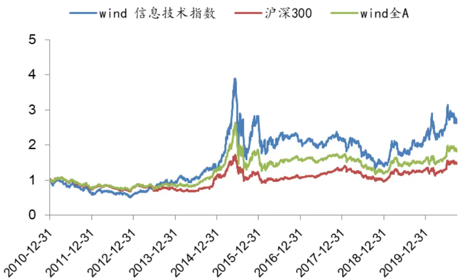
资料来源：Wind、兴业证券经济与金融研究院整理

图表 6、信息技术指数 Vs.沪深 300 Vs. wind 全 A 分年度收益
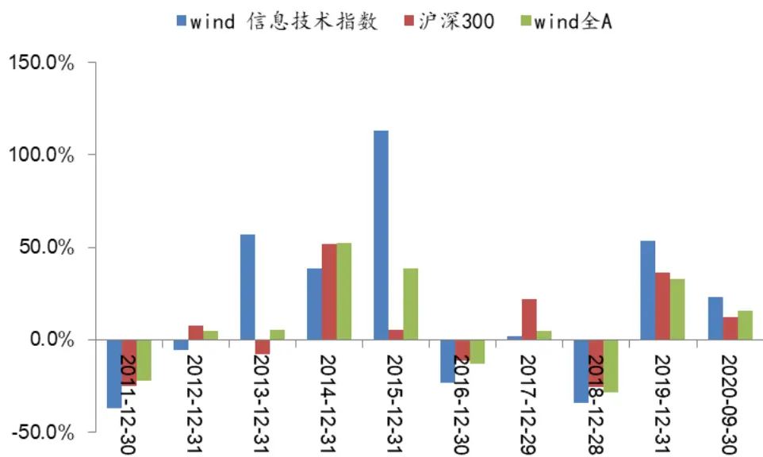
资料来源：Wind、兴业证券经济与金融研究院整理

我们需要对科技行业的投资有一个清晰的认知：从当下来看科技板块表现确实足够优秀，但三十年河东三十年河西，科技行业周期性成长的本质特征，决定了我们不可能每年都有很好的绝对收益甚至是相对收益。摆正心态，方能收获长周期下丰厚的回报。

## 2、商业模式与ROE

在我们重点整理和分析的30+科技明星基金经理访谈中，强调商业模式重要性的有 14 位基金经理，强调 ROE 重要性的有 16 位基金经理。这足以说明科技主题基金经理对以上两个维度的重视程度。

商业模式是一个由客户价值、企业资源和能力、盈利方式构成的三维立体模型。简单来说，商业模式告诉了我们公司在通过什么途径或方式赚钱。一般认为成功的商业模型往往具备以下三个方面的特征：提供独特价值，难以模仿和从公司实际经营情况出发。一个健康良好的商业模式不仅能让企业如鱼得水，更会形成非常好的护城河和竞争壁垒，从而为企业未来的进一步发展打下坚实的基础。

不同行业的商业模式可能不尽相同，但好的商业模式往往具有跨行业的共通性。由于商业模式很难量化，但其好坏最终将反映在企业的经营成果——财务报表上，因此我们可以通过使用以ROE（一般使用ROE_TTM）为代表的核心经营指标来体现投资策略对商业模式的关注和重视。

## 3、重视管理层能力

管理层能力主要体现在其专业素养、经营理念、对人才的重视程度、对新业务发展方向的把控能力等方面。管理层的好坏对于科技公司来讲尤为重要，因为科技公司的成长属性都相对较强，一旦在战略把控、新技术方向选择等方面稍有不慎，就可能会满盘皆输。因此充分掌握和了解管理层的能力水平，对于科技股的投资人来说是一项核心能力。

为了能够尽可能全面的反映管理层能力，我们利用文本分析等方式，从多个维度构建了一系列相关指标，包括管理层薪资、管理层变动频率、管理层简介（利用文本挖掘）、管理层学历等。但从最终实践（因子分析与策略构建）的效果来看，并没有达到我们预期的效果（对相关分析结果有兴趣的投资者，可以联系我们团队来获取相应的数据和结果）。因此后文在设计选股策略时，我们将不再考虑管理层维度的信息。

## 4、重视研发创新

科技行业对研发和创新的重视程度应该说非常高的。在当前中美贸易摩擦不断，科技创新日渐成为引领我国发展的战略支撑和动力引擎的大背景下，企业和政府对创新的支持力度必然会不断加大。企业对创新的重视，可以从研发费用的投入、专利的产出、研发人员的占比等维度得到定量的反馈。从实证分析的结果来看，研发费用以外的其他指标的选股有效性都相对较弱。有鉴于此，我们主要使用研发费用/市值（RD_Sig）指标来开发后续选股模型。

## 5、重视现金流

现金流是另一个多数基金经理都非常看重的指标，在我们进行过的多场基金经理调研中，不少人甚至将这一类指标视作是标的是否能入选最终组合的硬性要求。从某种意义上讲，持续产生稳定的自由现金流是企业拥有良好财务和盈利状况的表征，也是商业上所谓的“好生意”的最佳体现。考虑到投资逻辑以及实证效果，我们在后续构建模型时，用经营活动净现金流同比增长率（OCF_TTM_YoY）

来反映这一重要信息维度。

## 6、科技板块内子行业差异较大

即便覆盖范围已经是科技板块，但大部分基金经理对科技板块的子领域也是各有偏好的。比如部分基金经理认为半导体制造投入较大，瓶颈较多，难以突破，基本不会考虑该板块；部分基金经理认为通信设备行业属于国家意志属性较强的领域，且具有很强的周期性，市场空间比较确定，不予考虑；部分基金经理认为消费电子的盈利模式不具备相对优势，不予以考虑……这些认知差异从侧面反映了这个行业的多样性。子行业的选择问题确实是科技主题策略搭建时应该考虑的一个方向，但在本文中我们的观点是先不去探讨行业选择而是将主要精力集中于行业内选股。因此最终的考察范围仍然是科技板块内的所有子行业赛道。

通过以上分析，我们总结梳理了基本面研究视角下的科技板块的六大核心特质。这些特征将成为我们后续构建选股模型时的重要依据和支撑。

## 4、科技板块子行业选股模型构建

接下来我们将分别针对技术硬件与设备、软件与服务、半导体制造、半导体设计这四个子行业单独构建量化选股模型。我们构建模型的基本思路是：以子行业内的基本面投资逻辑为主体，综合考虑前述科技板块的六大核心特征，通过量化手段形成相应的多因子排序模型或者股票池筛选条件。在模型的搭建过程中，有以下几点需要注意：

1) 子行业内在构建的多因子排序模型时，因子权重的确定均采用类内等权、类间等权的方式。我们考察的初始备选因子池的因子数量在 140+，包括了估值、质量、成长、分析师情绪这四大类传统量化因子（本文不考虑量价衍生的技术指标），同时也在于基本面分析师充分沟通的基础上加入了一些行业特色指标（如研发创新类、管理层信息类等）；

2) 有些指标维度虽然不能直接作为多因子排序模型的一部分，但可以用来反向剔除股票池中的一些质量不佳的个股，以提升最终组合的表现；

3) 我们尝试的模型数量非常多，在确定最终模型版本时，主要是综合考虑了三个方面的因素：策略是否符合行业基本面逻辑，策略是否表现稳定优异，策略是否具有可操作性；

4) 在后续所有的实证测试中，均要求股票非ST、上市天数>180天、在调仓日非停牌且非涨跌停（该要求一般称之为初始过滤条件）；时间窗口均为 2011 年1月底-2020年9月底；子行业内模型测试阶段，暂不考虑交易成本的影响。

## 4.1、技术硬件与设备行业初始模型探索

## 4.1.1、多因子基础模型搭建

技术硬件与设备行业（后文中简称为硬件行业）包含了通信设备，电脑与外围设备，电子设备、仪器和元件，办公电子设备这四个细分领域。根据本章节开篇提到的原则，我们从初始备选因子池中选择在该行业内相对有效（综合考虑IC和分位数组合多头收益）且相关性较低的指标，形成了硬件行业内的多因子基础模型（模型所选因子详细情况请见图表 7）。不难发现，模型的因子中除了传统类别之外，研发创新类中的研发费用/流通市值也成功入选，充分反映了硬件行业的逻辑和特点。

图表 7、技术硬件与设备行业多因子基础模型入选因子列表

| 作用 | 类别 | 因子 | 释义 |
| --- | --- | --- | --- |
| 选股 因子 | 估值 | FCFP_LYR | 企业自由现金流量(FCFF_最新年报/总市值) |
|  | 估值 成长 | SP_DR Revenue_SQ_YoY | 时序维度的市净率偏离 单季度营业收入同比增长率 |
|  | 成长 | OperProfit_SQ_YoY | 单季度营业利润同比增长率 |
|  | 情绪 | EPS_Fwd12M_R3M | 一致预期 EPS未来12个月预测值过去60 天变化率 |
|  | 创新 | RD_Sig | 研发费用/流通市值 |

资料来源：Wind、聚源、兴业证券经济与金融研究院整理

备注：SP_DR具体构建逻辑参见《基于误差修正模型的估值趋势偏离度因子研究》

对于每个入选模型的因子的表现，我们分别从 IC、分位数组合以及相关性三个维度进行了测试。从结果来看，各因子相关性较低，同时选股有效性较强，具体参见图表 8-10。

图表 8、技术硬件与设备行业内细分因子值相关性

|  | FCFP_LYR SP_DR |  | Revenue_SQ_YoY | OperProfit_SQ_YoY | EPS_Fwd12_R3 | RD_Sig |
| --- | --- | --- | --- | --- | --- | --- |
| FCFP_LYR |  | 0.00 | -0.06 | -0.01 | 0.03 | -0.07 |
| SP_DR | 0.00 |  | 0.18 | -0.01 | -0.06 | 0.05 |
| Revenue_SQ_YoY | -0.06 | 0.18 |  | 0.45 | 0.15 | -0.03 |
| OperProfit_SQ_YoY | -0.01 | -0.01 | 0.45 |  | 0.22 | -0.08 |
| EPS_Fwd12M_R3M | 0.03 | -0.06 | 0.15 | 0.22 |  | -0.07 |
| RD_Sig | -0.07 | 0.05 | -0.03 | -0.08 | -0.07 |  |

资料来源：Wind、聚源、兴业证券经济与金融研究院整理

图表 9、技术硬件与设备行业细分因子 IC测试结果

| 因子 | IC | 波动率 | ICIR | T值 |
| --- | --- | --- | --- | --- |
| FCFP_LYR | 0.015 | 0.07 | 0.22 | 1.9 |
| SP_DR | 0.043 | 0.11 | 0.40 | 4.3 |
| Revenue_SQ_YoY | 0.043 | 0.12 | 0.35 | 3.8 |
| OperProfit_SQ_YoY | 0.048 | 0.10 | 0.48 | 5.2 |
| EPS_Fwd12M_R3M | 0.032 | 0.11 | 0.30 | 3.2 |
| RD_Sig | 0.051 | 0.09 | 0.56 | 6.0 |

资料来源：Wind、聚源、兴业证券经济与金融研究院整理

图表 10、技术硬件与设备行业细分因子分位数组合测试结果

| 因子 | 组别 | 年化收益率Sharpe比 平均换手 |  | 因子 | 组别 | 年化收益率Sharpe比 平均换手 |  |  |
| --- | --- | --- | --- | --- | --- | --- | --- | --- |
| FCFP_LYR | Top | 15.4% | 0.47 | 37.8% SP_DR | Top | 17.8% | 0.52 | 71.4% |
| FCFP_LYR | 1 | 8.2% | 0.25 | 51.8% SP_DR | 1 | 16.4% | 0.46 | 103.6% |
| FCFP_LYR | 2 | 5.9% | 0.17 | 51.7% SP_DR | 2 | 15.4% | 0.43 | 115.7% |
| FCFP_LYR | 3 | 6.7% | 0.20 | 46.8% SP_DR | 3 | 9.8% | 0.26 | 108.5% |
| FCFP_LYR | Bottom | 4.7% | 0.15 | 33.7% SP_DR | Bottom | 3.4% | 0.09 | 76.7% |
| FCFP_LYR | 市场 | 12.6% | 0.36 | SP_DR | 市场 | 12.6% | 0.36 |  |
| FCFP_LYR | L-S | 2.0% | 0.24 | SP_DR | L-S | 12.2% | 1.00 |  |
| Revenue_SQ_YoY | Top | 20.0% | 0.59 | 39.1% OperProfit_SQ_YoY | Top | 20.1% | 0.56 | 47.4% |
| Revenue_SQ_YoY | 1 | 17.3% | 0.49 | 51.6% OperProfit_SQ_YoY | 1 | 18.2% | 0.52 | 53.5% |
| Revenue_SQ_YoY | 2 | 12.8% | 0.36 | 53.9% [OperProfit_SQ_YoY | 2 | 13.4% | 0.39 | 54.0% |
| Revenue_SQ_YoY | 3 | 7.5% | 0.20 | 52.7% OperProfit_SQ_YoY | 3 | 8.7% | 0.24 | 52.8% |
| Revenue_SQ_YoY | Bottom | 5.1% | 0.13 | 40.1% OperProfit_SQ_YoY | Bottom | 2.7% | 0.07 | 43.3% |
| Revenue_SQ_YoY | 市场 | 12.6% | 0.36 | OperProfit_SQ_YoY | 市场 | 12.6% | 0.36 |  |
| Revenue_SQ_YoY | L-S | 11.7% | 0.89 | OperProfit_SQ_YoY | L-S | 15.5% | 1.60 |  |
| EPS_Fwd12M_R3M | Top | 18.4% | 0.51 | 76.5% RD_Sig | Top | 19.3% | 0.54 | 27.9% |
| EPS_Fwd12M_R3M | 1 | 14.9% | 0.42 | 107.4% RD_Sig | 1 | 16.8% | 0.45 | 47.9% |
| EPS_Fwd12M_R3M | 2 | 10.5% | 0.32 | 116.4% RD_Sig | 2 | 14.4% | 0.41 | 52.9% |
| EPS_Fwd12M_R3M | 3 | 9.9% | 0.27 | 113.5% RD_Sig | 3 | 10.6% | 0.29 | 46.4% |
| EPS_Fwd12M_R3M | Bottom | 5.9% | 0.15 | 80.2% RD_Sig | Bottom | 2.0% | 0.06 | 27.3% |
| EPS_Fwd12M_R3M | 市场 | 12.6% | 0.36 | RD_Sig | 市场 | 12.6% | 0.36 |  |
| EPS_Fwd12M_R3M | L-S | 10.0% | 0.78 | RD_Sig | L-S | 16.6% | 1.71 |  |

资料来源：Wind、聚源、兴业证券经济与金融研究院整理

通过类内等权、类间等权的方式，我们对图表 7 中的模型入选因子进行了合成，构建了 HardWare_Sig。我们测试了该复合因子的选股效果，同时对比了市值中性化前后模型的表现。

图表 11、HardWare_Sig IC 测试结果

| 因子 | IC | 波动率 | ICIR | T值 |
| --- | --- | --- | --- | --- |
| HardWare_Sig | 0.080 | 0.09 | 0.89 | 9.6 |
| HardWare_Sig 中性化 | 0.076 | 0.09 | 0.85 | 9.2 |

资料来源：Wind、聚源、兴业证券经济与金融研究院整理

图表 12、HardWare_Sig 分位数组合测试结果

| 因子 | 年化收益率 | 风险收益比 | 换手率 | 最大回撤 | 年化超额收益 |
| --- | --- | --- | --- | --- | --- |
| Top | 33.4% | 0.98 | 79.2% | 37.4% | 17.9% |
| 1 | 22.8% | 0.66 | 121.7% | 42.2% | 8.9% |
| 2 | 16.8% | 0.49 | 135.4% | 45.1% | 3.3% |
| 3 | 13.8% | 0.39 | 144.1% | 50.7% | 1.0% |
| 4 | 15.2% | 0.39 | 144.8% | 54.2% | 3.0% |
| 5 | 10.5% | 0.29 | 144.7% | 65.2% | -1.7% |
| 6 | 4.4% | 0.12 | 142.4% | 66.0% | -6.9% |
| 7 | 7.8% | 0.21 | 133.7% | 54.7% | -3.7% |
| 8 | 3.1% | 0.09 | 120.0% | 64.8% | -8.1% |
| Bottom | -3.4% | -0.09 | 74.6% | 73.1% | -13.7% |
| 市场 | 12.4% | 0.35 |  | 53.3% |  |
| L-S | 35.0% | 2.52 |  | 12.2% |  |

资料来源：Wind、聚源、兴业证券经济与金融研究院整理

从结果来看，市值中性化对因子的影响较小，所以后续我们主要讨论原始符合因子的表现。应该说HardWare_Sig的测试结果非常优秀：IC均值高达0.08，T值达到 9.6；分位数各组别收益率严格单调，多头年化收益率达到 33.4%，多空年化收益率达到 35.0%，风险收益比达到 2.52。即便在该行业内进行分组数更多的十五分位组合测试，各组别的收益率也依然保持了良好的单调性，多头表现非常出色（分组数更多的分位数测试如果依然能保持较好的表现，则能保证后续精选个股策略的有效性）！

图表 13、HardWare_Sig十分位组合多头及多空历史净值
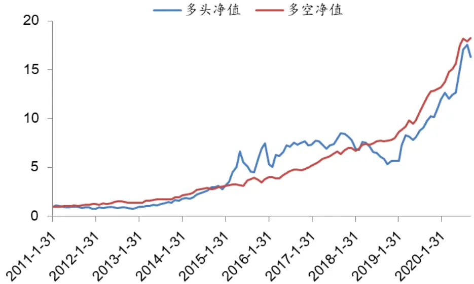
资料来源：Wind、聚源、兴业证券经济与金融研究院整理

图表 14、HardWare_Sig 十五分位测试结果

| 因子 | 年化收益率 | 风险收益比 | 换手率 | 最大回撤 | 年化超额收益 |
| --- | --- | --- | --- | --- | --- |
| Top | 37.7% | 1.08 | 88.5% | 35.1% | 21.7% |
| 1 | 24.1% | 0.68 | 129.2% | 42.3% | 9.9% |
| 2 | 22.5% | 0.65 | 142.6% | 40.9% | 8.5% |
| 3 | 15.9% | 0.45 | 156.0% | 52.1% | 2.6% |
| 4 | 16.8% | 0.47 | 156.7% | 50.1% | 3.5% |
| 5 | 12.7% | 0.36 | 162.1% | 52.1% | -0.2% |
| 6 | 15.2% | 0.37 | 161.1% | 58.0% | 3.4% |
| 7 | 9.2% | 0.26 | 156.9% | 56.7% | -3.2% |
| 8 | 13.0% | 0.36 | 159.1% | 63.4% | 0.5% |
| 9 | 3.2% | 0.09 | 156.4% | 65.8% | -7.8% |
| 10 | 8.8% | 0.23 | 156.0% | 64.2% | -2.6% |
| 11 | 6.0% | 0.16 | 148.8% | 52.1% | -5.7% |
| 12 | 3.0% | 0.08 | 142.1% | 63.4% | -8.1% |
| 13 | 1.0% | 0.03 | 119.9% | 67.2% | -9.9% |
| Bottom | -5.3% | -0.14 | 79.5% | 76.1% | -15.6% |
| 市场 | 12.4% | 0.35 |  | 53.3% |  |
| L-S | 41.5% | 2.41 |  | 10.1% |  |

资料来源：Wind、聚源、兴业证券经济与金融研究院整理

## 4.1.2、多因子基础模型改进

我们根据行业内的基本面逻辑对上一节搭建的基础模型做出了进一步的改进。具体来说，我们主要是利用资本支出和现金流这两个维度进行初始股票池过滤，以实现最终模型表现的提升。

## 1、资本支出

一般来说硬件行业的资本支出是比较大的，并且需要持续的投入。资本支出过低可能会降低企业的产能投放以及其未来在市场上的竞争力。经过测试，我们选择资本支出效率同比增长率作为筛选因子，从初始选股范围中剔除增长率过低的股票，进而达到优化硬件行业股票池的目的。

资本支出效率同比增长率的具体定义如下：

## 资本支出效率同比增长率=资本支出效率/去年同期资本支出效率-1 (1)

## 资本支出效率=资本支出_TTM_L1/营业收入_TTM (2)

其中，公式(2)中的资本支出_TTM_L1表示上一年度的资本支出_TTM。之所以这么处理是因为资本支出对营业收入的影响具有时滞效应。一般来说固定资产在投入半年到一年后基本达到满产，随着产能的爬坡，营收会有一个明显的增长。

## 2、现金流增长

在“基本面研究视角下的科技板块核心特质”一节中，我们提到很多基金经理都非常重视现金流相关指标在科技股投资中的作用。对于科技股这类不确定性较高、波动较大的投资品种，稳定的现金流获取能力是保证我们投资组合安全性的一个重要维度。考虑到很多科技企业在初始成长期由于研发投入、产能投放等因素，账面现金流也不会处于非常高的增长水平，因此我们更倾向于将现金流指标也作为一个筛选条件，剔除排名过低的公司。具体到硬件行业，我们选择的现金流指标为经营性净现金流同比增长率 OCF_TTM_YoY。

图表 15、叠加筛选条件后HardWare_Sig十分位测试之年化收益率

| 因子 | 初始十分位 | 加资本支出效率同比增长率 | 加 OCF_TTM_YoY | 全部加入 |
| --- | --- | --- | --- | --- |
| Top | 33.4% | 34.9% | 34.1% | 37.1% |
| 1 | 22.8% | 22.3% | 24.7% | 21.8% |
| 2 | 16.8% | 14.0% | 14.8% | 14.7% |
| 3 | 13.8% | 11.4% | 15.6% | 12.2% |
| 4 | 15.2% | 14.1% | 12.2% | 13.0% |
| 5 | 10.5% | 10.2% | 11.5% | 7.9% |
| 6 | 4.4% | 7.4% | 4.2% | 6.6% |
| 7 | 7.8% | 7.2% | 10.8% | 9.8% |
| 8 | 3.1% | 1.5% | 3.1% | 3.9% |
| Bottom | -3.4% | -4.4% | -3.5% | -4.6% |
| L-S | 35.0% | 37.4% | 35.8% | 39.7% |

资料来源：Wind、聚源、兴业证券经济与金融研究院整理

我们尝试将由资本支出和现金流这两个角度构建的筛选指标与硬件行业内的多因子基础模型进行结合。具体来说，我们在初始过滤条件的基础上将OCF_TTM_YoY 或者资本效率同比增长率排名在后10%的个股剔除，并考察后续模型的表现。

我们以叠加筛选条件前后的十分位数组合测试结果来说明改进效果。从图表15可以发现，单独叠加 OCF_TTM_YoY或者资本效率同比增长率进行筛选都能提升模型多头组合的收益率。若将两个条件同时使用，最终组合的表现则更加优秀：策略多头收益从 33.4%提升至 37.1%，多空年化收益率则从 35.0%提升至 39.7%，提升效果十分显著。

图表 16、叠加筛选条件后HardWare_Sig因子十分位测试之多头净值
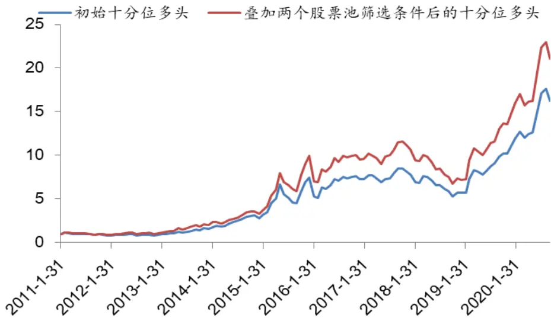
资料来源：Wind、聚源、兴业证券经济与金融研究院整理

图表 17、叠加筛选条件后HardWare_Sig因子十分位测试之多空净值
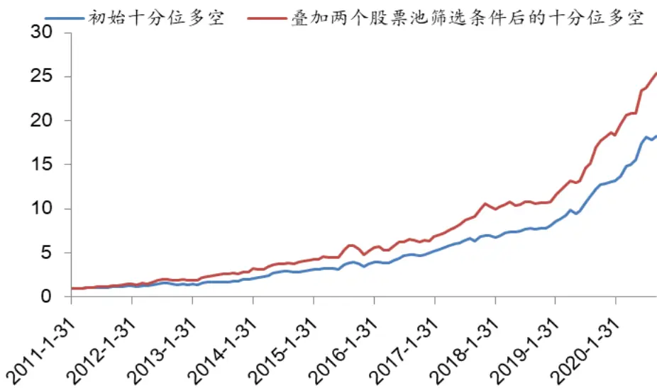
资料来源：Wind、聚源、兴业证券经济与金融研究院整理

## 4.2、软件与服务行业初始模型探索

## 4.2.1、多因子基础模型搭建

软件与服务行业（后文中简称软件行业）包含了互联网软件与服务、信息技术服务和软件这三个细分领域。根据本章节开篇提到的原则，我们从初始备选因子池中选择在该行业内相对有效（综合考虑IC和分位数组合多头收益）且相关性较低的指标，形成了软件行业内的多因子基础模型（模型所选因子详细情况请见图表 18）。与硬件行业一致，模型的因子中除了传统类别之外，研发创新类中的研发费用/流通市值也成功入选。

图表 18、软件与服务行业多因子基础模型入选因子列表

| 作用 | 类别 | 因子 | 释义 |
| --- | --- | --- | --- |
| 选股 因子 | 估值 | OCFP_LYR | 经营活动产生的现金流量净额_最新年报/总市值 |
|  | 成长 | NetProfit_SQ_YoY | 单季度净利润同比增长率 |
|  | 成长 | OperProfit_SQ_YoY | 单季度营业利润同比增长率 |
|  | 情绪 | EPS_Fwd12M_R3M | 一致预期 EPS_未来12个月预测值过去60天变化率 |
|  | 创新 | RD_Sig | 研发费用/流通市值 |

资料来源：Wind、聚源、兴业证券经济与金融研究院整理

对于每个入选模型的因子的表现，我们分别从 IC、分位数组合以及相关性三个维度进行了测试。从结果来看，各因子相关性较低，同时选股有效性较强，具体参见图表 19-21。

图表 19、软件与服务行业内细分因子值相关性

|  | OCFP_LYR | NetProfit_SQ_YoY | OperProfit_SQ_YoY | EPS_F▼d12I_R3 | RD_Sig |
| --- | --- | --- | --- | --- | --- |
| OCFP_LYR |  | 0.01 | 0.00 | -0.04 | 0.13 |
| NetProfit_SQ_YoY | 0.01 |  | 0.83 | 0.21 | -0.11 |
| OperProfit_SQ_YoY | 0.00 | 0.83 |  | 0.18 | -0.10 |
| EPS_Fwd12M_R3M | -0.04 | 0.21 | 0.18 |  | -0.09 |
| RD_Sig | 0.13 | -0.11 | -0.10 | -0.09 |  |

资料来源：Wind、聚源、兴业证券经济与金融研究院整理

图表 20、软件与服务行业细分因子 IC测试结果

| 因子 | IC | 波动率 | ICIR | T值 |
| --- | --- | --- | --- | --- |
| OCFP_LYR | 0.020 | 0.10 | 0.19 | 2.04 |
| NetProfit_SQ_YoY | 0.042 | 0.12 | 0.35 | 3.76 |
| OperProfit_SQ_YoY | 0.038 | 0.12 | 0.32 | 3.42 |
| EPS_Fwd12M_R3M | 0.043 | 0.12 | 0.36 | 3.90 |
| RD_Sig | 0.044 | 0.13 | 0.35 | 3.74 |

资料来源：Wind、聚源、兴业证券经济与金融研究院整理

图表 21、软件与服务行业细分因子分位数组合测试结果

| 因子 | 组别 | 年化收益 Sharpe比平均换手因子 |  |  | 组别 | 年化收益Sharpe比平均换手 |  |  |
| --- | --- | --- | --- | --- | --- | --- | --- | --- |
| OCFP_LYR | Top | 18.7% | 0.46 | 44.6% EPS_Fwd12M_R3M | Top | 25.4% | 0.59 | 85.2% |
| OCFP_LYR | 1 | 8.1% | 0.21 | 60.6% EPS_Fwd12M_R3M | 1 | 19.3% | 0.45 | 111.5% |
| OCFP_LYR | 2 | 7.8% | 0.19 | 62.1% EPS_Fwd12M_R3M | 2 | 12.5% | 0.30 | 121.0% |
| OCFP_LYR | 3 | 7.5% | 0.19 | 53.6% EPS_Fwd12M_R3M | 3 | 10.6% | 0.25 | 121.8% |
| OCFP_LYR | Bottom | 9.9% | 0.23 | 45.9% EPS_Fwd12M_R3M | Bottom | 12.0% | 0.30 | 88.8% |
| OCFP_LYR | 市场 | 10.3% | 0.27 | EPS_Fwd12M_R3M | 市场 | 14.8% | 0.36 |  |
| OCFP_LYR | L-S | 6.0% | 0.41 | EPS_Fwd12M_R3M | L-S | 11.9% | 0.88 |  |
| NetProfit_SQ_YoY | Top | 25.8% | 0.63 | 58.9% RD_Sig | Top | 22.3% | 0.51 | 40.5% |
| NetProfit_SQ_YoY | 1 | 18.9% | 0.44 | 62.5% RD_Sig | 1 | 18.1% | 0.44 | 59.4% |
| NetProfit_SQ_YoY | 2 | 15.1% | 0.37 | 64.4% RD_Sig | 2 | 16.5% | 0.39 | 64.4% |
| NetProfit_SQ_YoY | 3 | 5.1% | 0.12 | 67.2% RD_Sig | 3 | 9.3% | 0.22 | 58.6% |
| NetProfit_SQ_YoY | Bottom | 8.6% | 0.20 | 58.7% RD_Sig | Bottom | 5.6% | 0.14 | 39.2% |
| NetProfit_SQ_YoY | 市场 | 14.8% | 0.36 | RD_Sig | 市场 | 14.8% | 0.36 |  |
| NetProfit_SQ_YoY | L-S | 13.5% | 0.91 | RD_Sig | L-S | 16.2% | 1.14 |  |
| OperProfit_SQ_YoY | Top | 22.2% | 0.54 | 60.6% |  |  |  |  |
| OperProfit_SQ_YoY | 1 | 18.1% | 0.43 | 65.9% |  |  |  |  |
| OperProfit_SQ_YoY | 2 | 16.4% | 0.40 | 68.1% |  |  |  |  |
| OperProfit_SQ_YoY | 3 | 9.6% | 0.23 | 68.5% |  |  |  |  |
| OperProfit_SQ_YoY | Bottom | 6.7% | 0.15 | 58.5% |  |  |  |  |
| OperProfit_SQ_YoY | 市场 | 14.8% | 0.36 |  |  |  |  |  |
| OperProfit_SQ_YoY | L-S | 11.9% | 0.72 |  |  |  |  |  |

资料来源：Wind、聚源、兴业证券经济与金融研究院整理

通过类内等权、类间等权的方式，我们对图表 18 中的入选因子进行了合成，构建了 SoftWare_Sig。我们测试了该复合因子的选股效果，同时对比了市值中性化前后模型的表现。

图表 22、SoftWare_Sig IC 测试结果

| 因子 | IC | 波动率 | ICIR | T值 |
| --- | --- | --- | --- | --- |
| SoftWare_Sig | 0.060 | 0.11 | 0.57 | 6.15 |
| SoftWare_Sig 中性化 | 0.063 | 0.11 | 0.59 | 6.30 |

资料来源：Wind、聚源、兴业证券经济与金融研究院整理

图表 23、SoftWare _Sig 分位数组合测试结果

| 因子 | 年化收益率 | 风险收益比 | 换手率 | 最大回撤 | 年化超额收益 |
| --- | --- | --- | --- | --- | --- |
| Top | 36.8% | 0.86 | 80.1% | 50.2% | 18.9% |
| 1 | 22.2% | 0.52 | 115.9% | 57.9% | 6.4% |
| 2 | 20.4% | 0.49 | 127.3% | 64.8% | 4.8% |
| 3 | 16.9% | 0.40 | 131.4% | 64.6% | 1.6% |
| 4 | 5.4% | 0.13 | 135.2% | 75.8% | -8.9% |
| 5 | 16.8% | 0.40 | 134.9% | 71.4% | 1.8% |
| 6 | 10.7% | 0.25 | 134.1% | 78.5% | -3.6% |
| 7 | 4.9% | 0.11 | 127.9% | 79.7% | -7.9% |
| 8 | 13.1% | 0.28 | 105.3% | 76.7% | -0.1% |
| Bottom | -1.6% | -0.04 | 70.8% | 75.8% | -15.3% |
| 市场 | 14.8% | 0.36 |  | 69.7% |  |
| L-S | 37.5% | 2.00 |  | 11.3% |  |

资料来源：Wind、聚源、兴业证券经济与金融研究院整理

从结果来看，市值中性化对因子的影响较小，所以后续我们主要讨论原始复合因子的表现。从结果来看SoftWare_Sig的选股能力非常突出：IC均值高达0.06，

T 值达到 6.15；分位数各组别收益率严格单调，多头年化收益率达到 36.8%，多空年化收益率达到 37.5%，风险收益比达到 2.00。即便在该行业内进行分组数更多的十五分位组合测试，各组别的收益率也依然保持了良好的单调性，多头表现非常出色（分组数更多的分位数测试如果依然能保持较好的表现，则能保证后续精选个股策略的有效性）！

图表 24、SoftWare _Sig十分位组合多头及多空历史净值
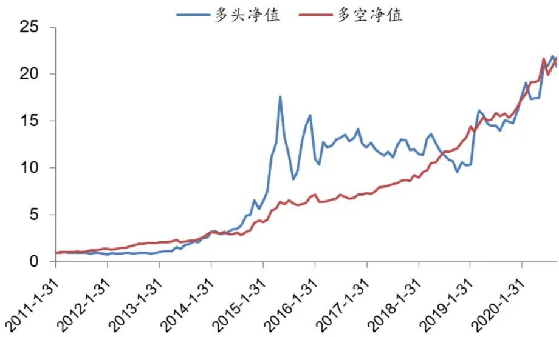
资料来源：Wind、聚源、兴业证券经济与金融研究院整理

图表 25、SoftWare _Sig 十五分位测试结果

| 因子 | 年化收益率 | 风险收益比 | 换手率 | 最大回撤 | 年化超额收益 |
| --- | --- | --- | --- | --- | --- |
| Top | 35.7% | 0.79 | 85.9% | 46.7% | 17.7% |
| 1 | 31.9% | 0.74 | 124.9% | 58.0% | 15.0% |
| 2 | 19.9% | 0.45 | 142.9% | 58.3% | 4.7% |
| 3 | 25.0% | 0.58 | 147.9% | 62.3% | 8.9% |
| 4 | 17.6% | 0.41 | 150.3% | 63.7% | 2.3% |
| 5 | 15.2% | 0.36 | 152.6% | 67.7% | 0.0% |
| 6 | 6.8% | 0.17 | 147.4% | 75.5% | -7.9% |
| 7 | 7.5% | 0.17 | 147.3% | 77.0% | -6.5% |
| 8 | 17.0% | 0.40 | 153.6% | 67.9% | 1.6% |
| 9 | 12.9% | 0.30 | 151.4% | 82.6% | -1.7% |
| 10 | 10.2% | 0.23 | 148.9% | 69.9% | -3.7% |
| 11 | 2.0% | 0.04 | 143.2% | 81.6% | -10.1% |
| 12 | 9.6% | 0.21 | 128.4% | 79.3% | -3.5% |
| 13 | 3.7% | 0.08 | 112.0% | 80.8% | -9.4% |
| Bottom | 0.5% | 0.01 | 74.6% | 70.0% | -14.0% |
| 市场 | 14.8% | 0.36 |  | 69.7% |  |
| L-S | 32.2% | 1.23 |  | 22.4% |  |

资料来源：Wind、聚源、兴业证券经济与金融研究院整理

## 4.2.2、多因子基础模型改进

我们根据行业内的基本面逻辑对前面搭建的基础模型做出了进一步的改进。具体来说，我们主要是利用流动资产占比和毛利率/营业收入这两个维度进行初始股票池过滤，以实现最终模型表现的提升。

## 1、流动资产占比

相比硬件领域，软件行业内的企业的固定资产占比一般都相对较低的，因此流动资产占比与其他行业相比会更高。如果某家软件行业内的公司的流动资产比例严重偏低，那么其经营活动很可能出现了问题，是需要适当回避的。有鉴于此，我们将流动资产占比作为筛选因子，剔除初始股票池中占比过低的个股（该因子不适合进入多因子排序模型，因为从对其所做的分位数组合测试来看，其分组单调性较差，但最后一组的表现明显弱于其他各组别）。

## 2、毛利率/营业收入

软件行业公司的另一个特征，是大多数企业的毛利率都可能伴随着营业收入的提升而得到进一步的改善。这主要是由于该行业内的公司所开发的产品的再生产或升级的成本很低（例如，微软公司所销售的 Office软件，一般情况下可以不断出售其拷贝，即便对软件进行升级，也不必从头开始研发，而是在一个较高的平台基础上进行进一步的改进），产品的边际成本会随着收入的增长而快速下降，营业收入的规模效应十分明显。因此，如果我们以毛利率/营业收入作为考察指标，该指标偏低的公司，其产品的竞争力就非常值得怀疑。而我们就同样可以利用该因子进行初始股票池过滤，进而对后续选股策略进行优化（毛利率/营业收入的因子测试结果也请参见图表26）。

图表 26、软件行业内部分因子五分位测试结果（降序排列）

| 组别 | 流动资产比率 |  |  |  | 毛利率加速度 |  |  |  |
| --- | --- | --- | --- | --- | --- | --- | --- | --- |
|  | 年化收益率 | Sharpe比 平均换手 |  |  | 最大回撤年化收益率 |  |  | Sharpe比 平均换手 最大回撤 |
| Top | 15.5% | 34.7% | 32.7% | 65.6% | 20.0% | 43.2% | 31.4% | 71.7% |
| 1 | 17.3% | 41.6% | 41.1% | 71.6% | 11.1% | 25.5% | 37.4% | 73.1% |
| 2 | 16.7% | 40.1% | 44.5% | 73.2% | 14.4% | 34.1% | 37.0% | 68.5% |
| 3 | 14.8% | 35.0% | 43.9% | 65.5% | 16.1% | 40.7% | 35.2% | 69.3% |
| Bottom | 8.0% | 20.4% | 33.8% | 73.2% | 10.6% | 27.8% | 26.5% | 67.4% |
| 市场 | 14.8% | 36.0% |  | 69.7% | 14.8% | 36.0% |  | 69.7% |
| L-S | 8.3% | 56.8% |  | 21.2% | 10.2% | 54.8% |  | 29.5% |

资料来源：Wind、兴业证券经济与金融研究院整理

我们尝试将由流动资产和毛利率这两个角度所构建的筛选指标与软件行业内的多因子基础模型进行结合。具体来说，我们在初始过滤条件的基础上将流动资产比率或者毛利率/营业收入排名在后 10%的个股剔除，并考察后续模型的表现。

我们以叠加筛选条件前后的十分位数组合测试结果来说明改进效果。从图表27 可以发现，单独叠加流动资产比率或者毛利率加速度进行筛选都能提升模型多头组合的收益率。若将两个条件同时使用，最终组合的表现则更加优秀：策略多头收益从 36.8%提升至 41.3%，多空年化收益率则从 37.5%提升至 44.8%，提升效果十分显著。

图表 27、叠加筛选条件后SoftWare _Sig十分位测试-年化收益率

| 因子 | 初始十分位 | 添加流动资产比率 | 添加毛利率加速度 | 全部加入 |
| --- | --- | --- | --- | --- |
| Top | 36.8% | 39.9% | 38.9% | 41.3% |
| 1 | 22.2% | 21.2% | 23.0% | 20.1% |
| 2 | 20.4% | 20.3% | 20.1% | 20.4% |
| 3 | 16.9% | 15.9% | 17.4% | 16.9% |
| 4 | 5.4% | 6.3% | 4.8% | 6.6% |
| 5 | 16.8% | 16.0% | 16.2% | 15.3% |
| 6 | 10.7% | 10.9% | 11.7% | 12.4% |
| 7 | 4.9% | 6.7% | 6.0% | 6.6% |
| 8 | 13.1% | 13.4% | 13.0% | 14.3% |
| Bottom | -1.6% | -1.0% | -3.6% | -4.1% |
| L-S | 37.5% | 39.7% | 41.7% | 44.8% |

资料来源：Wind、聚源、兴业证券经济与金融研究院整理

图表 28、叠加筛选条件后SoftWare _Sig十分位测试之多头净值
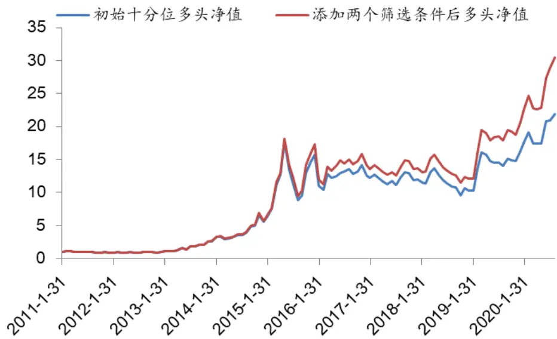
资料来源：Wind、聚源、兴业证券经济与金融研究院整理

图表 29、叠加筛选条件后SoftWare _Sig十分位测试之多空净值
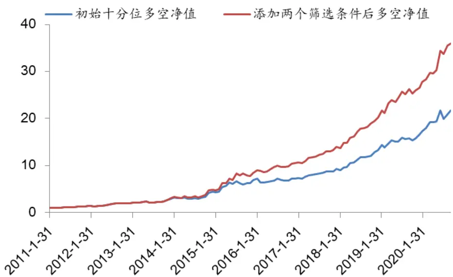
资料来源：Wind、聚源、兴业证券经济与金融研究院整理

## 4.3、半导体制造行业初始模型探索

## 4.3.1、多因子基础模型搭建

分类上来讲，半导体行业隶属于硬件门类。以半导体为基础而发展起来的整个产业链，是信息时代的基础。虽然国内半导体行业的发展依然处于早期或中期阶段，但如果放眼全球，该行业已经非常成熟，而当前国内主要投资的逻辑是国产替代。相比于其他行业，半导体的投资更加复杂和不确定：半导体本身可以给很高的估值，同时叠加本身的价格弹性，导致半导体的波动很大，用投资圈内的行话来说这是一个看“市梦率”，“讲情怀”的行业。从某种意义上来讲，这加大了半导体行业的量化选股的难度。

我们在开篇已经将半导体板块分成半导体制造以及半导体设计两个行业。拆分让行业截面变的更窄，降低了统计规律的有效性，放大了个例的影响，进而加大了量化投资的难度。所以和前面“技术硬件与设备”以及“软件与服务”行业不同，针对于整个半导体板块的建模我们的出发点是大道至简，以符合行业投资逻辑为准绳，构建相对精简的模型。我们首先以半导体制造作为切入点，展开研究。该板块所选择的基础因子参见图表 30。

图表 30、半导体制造行业多因子基础模型入选因子列表

| 作用 | 类别 | 因子 | 释义 |
| --- | --- | --- | --- |
| 多因子 体系 | 成长 | OCF_LYR_YoY | 经营活动产生的现金流量净额_最新年报的同比 增长率 |
|  | 情绪 | EPS_Fwd12M_R3M | 一致预期 EPS_未来12个月预测值过去60天变化 |
|  | 质量 | Debt_LR_Gr | 率 (负债合计_最新财报- 负债合计_去年同期) / |
|  |  |  | ABS(负债合计_去年同期) |

资料来源：Wind、聚源、兴业证券经济与金融研究院整理

这里需要注意的是负债同比增速指标。我们测试了与负债相关的多个因子在该行业内的表现，结果发现绝大部分指标和全市场的测试结果是相反的（图表 31展示了流动负债同比增速以及负债同比增速两个指标的五分位测试结果）。通常情况下，我们认为负债占比越低或者负债增速低的企业具有更强的自身造血能力和更高的安全性。但在半导体行业，我们需要换个视角看待这个问题：价格高昂的硬件设备和生产工艺的持续改进与提升，导致该行业需要持续的巨额投入，而这也就带来了融资上的巨大需求。特有的商业模式导致这个行业属于高负债类型，所以负债类指标越高，反而说明公司可能在技术升级和产能扩张方面越是积极主动，而这对股价来说则往往是利好的信息。我们最终选择了负债同比增速纳入了半导体制造行业的多因子基础模型。

图表 31、部分负债类因子在半导体制造行业内五分位组合表现

| 因子 | 组别 | 年化收益率 | Sharpe比率 | 因子 | 组别 | 年化收益率 | Sharpe比率 |
| --- | --- | --- | --- | --- | --- | --- | --- |
| 流动负债同比增速 | Top | 14.0% | 34.3% | 负债同比增速 | Top | 12.1% | 28.0% |
| 流动负债同比增速 | 1 | 18.8% | 50.4% | 负债同比增速 | 1 | 21.7% | 63.4% |
| 流动负债同比增速 | 2 | 1.2% | 3.4% | 负债同比增速 | 2 | 6.3% | 16.8% |
| 流动负债同比增速 | 3 | 1.0% | 2.9% | 负债同比增速 | 3 | 1.4% | 3.8% |
| 流动负债同比增速 | Bottom | 6.9% | 18.2% | 负债同比增速 | Bottom | -0.4% | -1.0% |
| 流动负债同比增速 | 市场 | 8.7% | 24.4% | 负债同比增速 | 市场 | 8.7% | 24.4% |
| 流动负债同比增速 | L-S | 5.8% | 31.3% | 负债同比增速 | L-S | 12.5% | 57.6% |

资料来源：Wind、聚源、兴业证券经济与金融研究院整理
注：这里的 Top组别指相关负债指标最高的一组，依次递减

对于每个入选模型的因子的表现，我们分别从 IC、分位数组合以及相关性三个维度进行了测试。从结果来看，各因子相关性较低，同时选股有效性较强，具体参见图表 32-34。

图表 32、半导体制造行业内细分因子值相关性

| EPS_Fwd12M_R3M Debt_LR_Gr OCF_LYR_YoY |  |  |
| --- | --- | --- |
| EPS_Fwd12M_R3M |  | 0.02 |
| Debt_LR_Gr | 0.02 | 0.02 0.04 |
| OCF_LYR_YoY | 0.02 | 0.04 |

资料来源：Wind、聚源、兴业证券经济与金融研究院整理

图表 33、半导体制造行业细分因子 IC测试结果

| 因子 | IC | 波动率 | ICIR | T值 |
| --- | --- | --- | --- | --- |
| EPS_Fwd12M_R3M | 0.059 | 0.24 | 0.25 | 2.66 |
| Debt_LR_Gr | 0.054 | 0.19 | 0.28 | 2.98 |
| OCF_LYR_YoY | 0.055 | 0.18 | 0.30 | 3.19 |

资料来源：Wind、聚源、兴业证券经济与金融研究院整理

图表 34、半导体制造行业细分因子分位数组合测试结果

| 因子 | 组别 | 年化收益 Sharpe比平均换手 |  |  | 因子 组别 |  | 年化收益 Sharpe比平均换手 |  |
| --- | --- | --- | --- | --- | --- | --- | --- | --- |
| EPS_Fwd12M | Top | 23.5% | 0.57 | 0.91 | OCF_LYR_YoY | Top | 12.0% 0.33 | 0.39 |
| EPS_Fwd12M | 1 | 17.9% | 0.42 | 1.22 | OCF_LYR_YoY | 1 | 11.9% 0.32 | 0.45 |
| EPS_Fwd12M | 2 | 8.0% | 0.20 | 1.22 | OCF_LYR_YoY | 2 11.8% | 0.31 | 0.42 |
| EPS_Fwd12M | 3 | 4.4% | 0.12 | 1.25 | OCF_LYR_YoY | 3 | 5.3% 0.14 | 0.46 |
| EPS_Fwd12M | Bottom | -3.7% | -0.09 | 0.99 | OCF_LYR_YoY | Bottom | -1.3% -0.04 | 0.40 |
| EPS_Fwd12M | 市场 | 8.7% | 0.24 |  | OCF_LYR_YoY | 市场 | 8.7% 0.24 |  |
| EPS_Fwd12M | L-S | 25.0% | 1.01 |  | OCF_LYR_YoY | L-S | 11.3% 0.60 |  |

资料来源：Wind、聚源、兴业证券经济与金融研究院整理
注：负债同比增速因子的分位数测试参见图表 31

通过类内等权、类间等权的方式，我们对图表 30中的模型入选因子进行了合成，构建了 SCM_Sig(Semi-Conductor Manufacturing)。我们测试了该复合因子的选股效果，同时对比了市值中性化前后模型的表现。

图表 35、SCM_Sig IC 测试结果

| 因子 | IC | 波动率 | ICIR | T值 |
| --- | --- | --- | --- | --- |
| SCM_Sig | 0.081 | 0.20 | 0.41 | 4.41 |
| SCM_Sig 中性化 | 0.080 | 0.19 | 0.43 | 4.58 |

资料来源：Wind、聚源、兴业证券经济与金融研究院整理

图表 36、SCM_Sig分位数组合测试结果

| 因子 | 年化收益率 | 风险收益比 | 换手率 | 最大回撤 | 年化超额收益 |
| --- | --- | --- | --- | --- | --- |
| Top | 24.2% | 0.60 | 66.9% | 54.5% | 15.1% |
| 1 | 12.6% | 0.34 | 93.0% | 65.8% | 3.3% |
| 2 | 4.1% | 0.11 | 96.4% | 57.6% | -4.7% |
| 3 | 4.2% | 0.11 | 97.1% | 66.8% | -4.4% |
| Bottom | -3.7% | -0.10 | 63.8% | 71.3% | -11.3% |
| 市场 | 8.7% | 0.24 |  | 61.6% |  |
| L-S | 26.8% | 1.22 |  | 19.8% |  |

资料来源：Wind、聚源、兴业证券经济与金融研究院整理

从结果来看，市值中性化对因子的影响较小，所以后续我们主要讨论原始符合因子的表现。应该说 SCM_Sig 的测试结果非常优秀：IC 均值高达 0.081，T 值达到 4.41；分位数各组别收益率严格单调，多头年化收益率达到 24.2%，多空年化收益率达到 26.8%，风险收益比达到 1.22。即便在该行业内进行分组数更多的十分位组合测试，各组别的收益率也依然保持了良好的单调性，多头表现非常出色（分组数更多的分位数测试如果依然能保持较好的表现，则能保证后续精选个股策略的有效性）！

图表 37、SCM_Sig五分位组合多头及多空历史净值
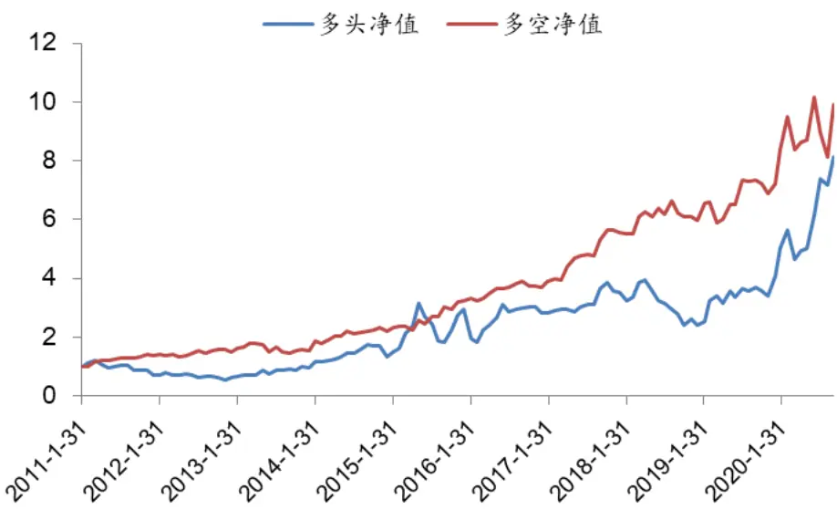
资料来源：Wind、聚源、兴业证券经济与金融研究院整理

图表 38、SCM_Sig十分位测试结果

| 因子 | 年化收益率 | 风险收益比 | 换手率 | 最大回撤 | 年化超额收益 |
| --- | --- | --- | --- | --- | --- |
| Top | 34.7% | 0.76 | 74.0% | 48.3% | 25.3% |
| 1 | 12.8% | 0.32 | 122.0% | 68.8% | 3.8% |
| 2 | 9.6% | 0.25 | 120.3% | 67.2% | 0.7% |
| 3 | 13.0% | 0.33 | 126.1% | 66.5% | 3.9% |
| 4 | 0.9% | 0.02 | 128.5% | 71.7% | -6.5% |
| 5 | 5.2% | 0.15 | 128.1% | 52.4% | -4.6% |
| 6 | 2.1% | 0.06 | 131.3% | 69.4% | -6.8% |
| 7 | 5.4% | 0.14 | 127.2% | 66.4% | -2.9% |
| 8 | -1.0% | -0.02 | 113.5% | 68.0% | -8.4% |
| Bottom | -8.4% | -0.22 | 68.9% | 78.5% | -16.2% |
| 市场 | 8.7% | 0.24 |  | 61.6% |  |
| L-S | 43.6% | 1.41 |  | 23.8% |  |

资料来源：Wind、聚源、兴业证券经济与金融研究院整理

## 4.3.2、多因子基础模型改进

我们根据行业内的基本面逻辑对上一节搭建的基础模型做出了进一步的改进。具体来说，我们主要是利用三项费用占比这个指标对股票池做进一步过滤，以实现最终模型表现的提升。

从半导体产业链来说，主要包括设计、制造、封测三大环节，其中制造环节对设备、技术和工艺的超高要求，使得一般企业极难进入该领域。上述情况造成了半导体制造行业的一个特殊现象：产业上下游的公司长期紧密合作，绝大多数生产是由预先给到的订单来驱动的。这种近似于包销的商业模式，使得相关企业的费用相对较少，而过高的成本则往往反映出企业竞争力的不足。我们通过运用三项费用率指标（三费/营业收入）来体现上述的逻辑。通过剔除三项费用率过高的公司来优化股票池的表现。

图表 39、半导体制造行业内三项费用率五分位表现（升序）

| 年化收益率 Sharpe比率 平均换手率 最大回撤年化超额收益率 |  |  |  |  |  |
| --- | --- | --- | --- | --- | --- |
| Top | 12.4% | 32.4% | 32.0% | 63.3% | 3.6% |
| 1 | 12.1% | 33.1% | 48.1% | 66.7% | 2.9% |
| 2 | 1.9% | 5.3% | 49.2% | 67.1% | -6.4% |
| 3 | 10.8% | 27.4% | 46.0% | 59.7% | 2.4% |
| Bottom | 3.9% | 10.8% | 32.7% | 64.5% | -4.8% |
| 市场 | 8.7% | 24.4% |  | 61.6% |  |
| L-S | 6.9% | 35.6% |  | 40.1% |  |

资料来源：Wind、聚源、兴业证券经济与金融研究院整理
注 1：虽然半导体截面较窄，但我们仍然使用较为细的五分位，主要观察多头的规律，以保证后续构建策略的有效性；

注 2：实际上我们也测试了销售费用率的表现，和三项费用率非常接近，具体参见附录图表 69；

我们将三项费用率与半导体制造行业内的多因子基础模型进行结合。具体来说，我们在初始过滤条件的基础上将三项费用率排名在后 10%的个股剔除，并考察后续模型的表现。

图表 40、叠加筛选条件前后SCM_Sig五分位表现

|  | SCM 原始五分位 |  |  | 叠加三费费用率筛选后五分位 |  |
| --- | --- | --- | --- | --- | --- |
|  | 年化收益率 | 风险收益比 | 换手率 | 年化收益率 | 风险收益比 换手率 |
| Top | 24.2% | 0.60 66.9% | 26.9% | 0.67 | 65.5% |
| 1 | 12.6% | 0.34 93.0% | 9.3% | 0.25 | 94.6% |
| 2 | 4.1% | 0.11 | 96.4% 3.7% | 0.10 | 98.2% |
| 3 | 4.2% | 0.11 | 97.1% 4.0% | 0.11 | 96.9% |
| Bottom | -3.7% | -0.10 | 63.8% -3.0% | -0.08 | 67.8% |
| 市场 | 8.7% | 0.24 | 8.7% | 0.24 |  |
| L-S | 26.8% | 1.22 | 28.6% | 1.28 |  |

资料来源：Wind、聚源、兴业证券经济与金融研究院整理
注：我们也测试了叠加销售费用率的表现，和三费费用率非常接近，具体参见附录图表 70；

图表 41、叠加筛选条件后SCM_Sig五分位测试之多头净值
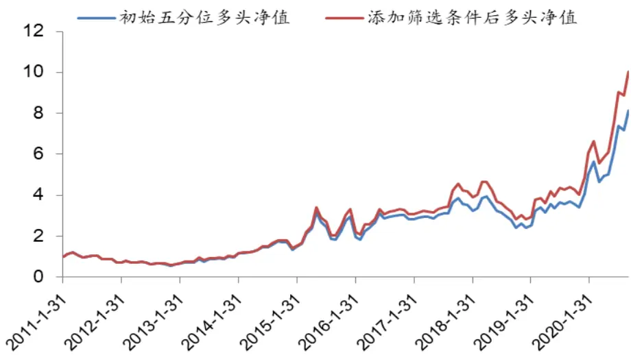
资料来源：Wind、聚源、兴业证券经济与金融研究院整理

我们以叠加筛选条件前后的十分位数组合测试结果来说明改进效果。从图表40 可以发现，叠加三费费用率后模型表现得到显著提升：策略多头收益从 24.2%提升至 26.9%，多空年化收益率则从 26.8%提升至28.6%。

图表 42、叠加筛选条件后SCM_Sig五分位测试之多空净值
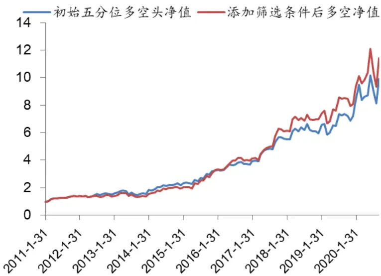
资料来源：Wind、聚源、兴业证券经济与金融研究院整理

## 4.4、半导体设计行业初始模型探索

## 4.4.1、多因子基础模型搭建

在介绍半导体制造板块时，我们对整个半导体领域进行了简单介绍。半导体设计是整个半导体产业三大环节之一，也是我国目前比较领先的领域。从目前来看，我国在该行业的领先优势有望进一步扩大：一方面工程师红利仍在，另一方面 5G的到来催生了大量物联网等的需求，进而促进了半导体设计行业的发展。

从某种意义上讲，无论该行业有怎样的基本面特征，股票过少的事实都决定了不适合在该行业内进行量化选股。以最新一期为例，半导体设计公司共计 21个（具体每期截面宽度请参见图表 2），很难获得稳定的统计规律。所以我们本着简单性原则进行模型搭建（不再叠加筛选模型）。最终入选的因子请参见图表43。

图表 43、半导体设计行业多因子基础模型入选因子列表

| 作用 | 类别 | 因子 | 释义 |
| --- | --- | --- | --- |
| 多因 | 成长 | Revenue_SQ_YoY | 单季度营业收入同比增长率 |
| 子体系 | 质量 | Revenue2Asset | 2 *营业收入 TTM /（资产总计 最新财报 + 资 产总计_去年同期) |

资料来源：Wind、聚源、兴业证券经济与金融研究院整理

从结果来看，选中的两个因子 Revenue_SQ_YoY 以及 Revenue2Asset 相关性为0.269，在IC及分位数组合测试中都有不错的表现，具体参见图表 44-45。

图表 44、半导体设计行业细分因子 IC测试结果

| 因子 | IC | 波动率 | ICIR | T值 |
| --- | --- | --- | --- | --- |
| Revenue2Asset | 0.041 | 0.34 | 0.12 | 1.30 |
| Revenue_SQ_YoY | 0.059 | 0.34 | 0.18 | 1.90 |

资料来源：Wind、聚源、兴业证券经济与金融研究院整理

图表 45、半导体设计行业细分因子分位数组合测试结果

| 因子 | 组别 | 年化收益Sharpe比平均换手因子 |  |  |  | 组别 | 年化收益 Sharpe比平均换手 |  |  |
| --- | --- | --- | --- | --- | --- | --- | --- | --- | --- |
| Revenue2Asset | Top | 25.2% | 0.54 | 0.36 | Revenue_SQ_YoY | Top | 27.6% | 0.60 | 0.59 |
| Revenue2Asset | Medium | 15.3% | 0.34 | 0.45 | Revenue_SQ_YoY | 1 | 13.1% | 0.29 | 0.62 |
| Revenue2Asset | Bottom | 11.0% | 0.23 | 0.36 | Revenue_SQ_YoY | Bottom | 10.9% | 0.25 | 0.56 |
| Revenue2Asset | 市场 | 18.5% | 0.44 |  | Revenue_SQ_YoY | 市场 | 18.5% | 0.44 |  |
| Revenue2Asset | L-S | 6.8% | 0.22 |  | Revenue_SQ_YoY | L-S | 10.2% | 0.34 |  |

资料来源：Wind、聚源、兴业证券经济与金融研究院整理
注：由于截面过窄，所以这里我们仅仅进行三分位测试

通过等权的方式，我们对半导体设计领域选中的两个因子进行合成，构建了SCD_Sig(Semi-Conductor Design)。我们测试了该复合因子的选股效果。

图表 46、SCD_Sig IC 测试结果

| 因子 | IC | 波动率 | ICIR | T值 |
| --- | --- | --- | --- | --- |
| SCD_Sig | 0.067 | 0.35 | 0.19 | 2.08 |

资料来源：Wind、聚源、兴业证券经济与金融研究院整理

图表 47、SCD_Sig因子分位数组合测试结果

| 因子 | 年化收益率 | 风险收益比 | 换手率 | 最大回撤 | 年化超额收益 |
| --- | --- | --- | --- | --- | --- |
| Top | 28.6% | 0.60 | 46.5% | 48.4% | 9.4% |
| Medium | 14.4% | 0.33 | 61.5% | 55.2% | -4.6% |
| Bottom | 7.0% | 0.15 | 50.3% | 67.6% | -9.6% |
| 市场 | 18.5% | 0.44 |  | 50.8% |  |

34.9%

资料来源：Wind、聚源、兴业证券经济与金融研究院整理

图表 48、SCD_Sig因子三分位组合多头及多空历史净值
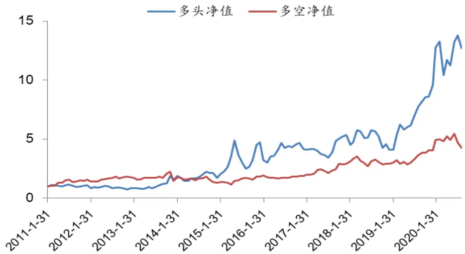
资料来源：Wind、聚源、兴业证券经济与金融研究院整理

总体来讲，SCD_Sig还是体现出了比较好的多头组合选择能力，第一组年化收益率 28.6%，相对基准获得了9.4%的年化超额收益。

## 4.5、科技板块基本面量化的其他探索

前面介绍的子行业选股模型，其实只是将我们研究工作中较为有效的一小部分展现给了大家。实际上除了以上的尝试之外，我们还进行了很多基于行业业务逻辑的探索。这里针对于其中部分的逻辑进行简单梳理，供各位投资者参考。至于全部测试维度，参见附录图表 71。

## 因子层面尝试

## 1）、政府补助

科技板块目前是国家层面重点支持板块，在当下中美贸易摩擦情况下，国家大力发展科技相关领域意志更加坚决。政府对科技行业相关公司的财政补助也非常高，我们利用该维度的信息构建了一系列选股指标，但总体来看并没有表现出相应的选股效果。

## 2、员工相关信息

大部分科技领域公司的核心资产是人才，如软件与服务行业、半导体设计行业等。我们构建了研发人员占比、研发人员薪酬占比等指标，但实证结果并没有明显效果。

## 3、管理层信息

在第三章中，我们着重强调了管理层在企业发展过程中的作用。我们通过管

理层薪酬、高管薪酬、管理层简介、管理层学历等信息构建了相关指标，但效果均不甚理想。

## 4、海外收入占比

海外收入占比体现了公司全球化的程度和实力，对于科技类公司更是如此。海外收入占比越高，我们认为企业的综合实力可能就越强。我们利用利润表中相关信息构建了海外收入占比指标：利润表会将营业收入按地域进行披露，从中可知公司收入的海外构成（这里需要注意，需要对所有的地区取并集并通过人为的方式判断那些地域是海外）。在不同行业内，该因子的实证结果均不甚理想。

## 5、商誉的研究

商誉一直是一枚双刃剑。科技类企业如果商誉过高，可能会带来较大的风险。我们测试了商誉占比指标在不同行业的选股作用，无论是作为因子亦或是作为股票池筛选都没能起到作用。

## 行业逻辑层面的其他尝试

除了前面提及的不同行业相对比较重要的业务逻辑外，我们也进行了很多其他的尝试，但不甚理想。我们这里举两例仅供参考。

## 1、技术硬件与设备行业的折旧边际效益指标

硬件行业的资本支出较大，带来的衍生问题即是折旧相对较为严重，这进一步影响到毛利率。一般来说公司在固定资产刚投下去的时候，折旧对应的固定资产没有充分发挥效率，因此毛利率会受到影响。所以我们可以从这个维度出发构建毛利率的边际效益指标，但因子实证效果一般。

折旧边际效益指标=毛利率/（营业收入_TTM/折旧_TTM）

## 2、半导体制造行业的应收预收平衡问题

前面提及半导体制造行业一般都是以销定产的商业模式，公司的预收账款高意味着公司在手订单较大，应收账款低意味着公司确认收账周期短。这种公司应该是资质非常好的。反过来如果公司的预收账款较低，应收账款高，则反映公司产品竞争力较弱，同时说明在与下游客户的议价中处于相对劣势。我们利用该维度的信息构建选股指标，但最终也并没有突出表现。

## 5、科技板块精选策略构建

## 5.1、策略构建说明

通过前第四章的努力，科技板块下的四个细分行业的选股模型（多因子排序模型+指标筛选模型）均以搭建完毕。在考虑如何将各个子模型有机地整合为最终策略之前，我们先对每个细分行业模型所选择的因子和指标进行了归纳整理，具体请参见图表49、50。

图表 49、不同子行业多因子排序模型所选因子汇总

| 因子 | 类别 | 技术硬件与设备 | 软件与服务 | 半导体制造 | 半导体设计 |
| --- | --- | --- | --- | --- | --- |
| OperProfit_SQ_YoY | 成长 | 1 | 1 |  |  |
| Revenue_SQ_YoY | 成长 | 1 |  |  | 1 |
| NetProfit_SQ_YoY | 成长 |  | 1 |  |  |
| OCF_LYR_YoY | 成长 |  |  | 1 |  |
| FCFP_LYR | 估值 | 1 |  |  |  |
| SP_DR | 估值 | 1 |  |  |  |
| OCFP_LYR | 估值 |  | 1 |  |  |
| EPS_Fwd12M_R3M | 情绪 | 1 | 1 | 1 |  |
| Debt_LR_Gr | 质量 |  |  | 1 |  |
| Revenue2Asset | 质量 |  |  |  | 1 |
| RD_Sig | 创新 | 1 | 1 |  |  |
| 因子数目总计 |  | 6 | 5 | 3 | 2 |

资料来源：兴业证券经济与金融研究院整理

图表 50、不同子行业股票池筛选条件所选因子汇总

| 行业 | 因子 | 释义 |
| --- | --- | --- |
| 硬件 | OCF_TTM_YoY | 经营活动现金流_TTM/去年经营活动现金流_TTM-1 |
| 硬件 | 资本支出效率同比增长率 | (资本支出 TTM L1/营业收入 TTM)/（资本支出 _TTM_L2/营业收入_TTM_L1）-1 |
| 软件 | 毛利率加速度 | 毛利率/营业收入_TTM |
| 半导体制造 | ThreeCosts2Revenue_TTM | 三费_TTM/营业收入_TTM |

资料来源：Wind、聚源、兴业证券经济与金融研究院整理

接下来我们将构建科技板块精选策略，具体思路是在每个细分行业内运用特定的选股模型精选一定数目的个股，然后拼接在一起形成最终的策略组合。在构建综合策略时，以下两点需要特别注意：

1) 在四个子行业原有的指标筛选模型的基础上，额外添加了对分析师覆盖人数及个股ROE_TTM 的要求。具体来说，我们要求所有进入行业内多因子排序模型的股票，除满足原有筛选条件外，还必须在过去 90 天内至少有一个卖方分析师对其进行覆盖，同时企业的 ROE_TTM必须位于行业内所有股票的前90%。加入分析师覆盖，主要是听取了我们在进行医药行业量化精选策略路演过程中，买方投资者所提出的意见；而ROE 的加入，则是考虑到该指标在多数科技基金经理投资理念中的重要地位。以上两个指标的叠加，有利于我们进一步规避“黑天鹅”事件的发生，降低投资组合的潜在风险。

2) 由于硬件行业与软件行业的截面相对较宽，而半导体制造和半导体设计行业则相对较窄（以最新一期为例，四个行业的股票数目分别是：402、238、68、21），所以后续在构建策略时，我们在不同行业内的选股数量会有一定的差异。

综合以上考量，最终策略的具体实现方法如下：

1. 股票池设定：扩展后的科技板块股票池；

2. 时间窗口：2011 年 1 月 31 日-2020 年 9 月 30 日；

3. 调仓成本：双边0.3%；换仓频率：月度调仓；

4. 筛选条件：首先对整个股票池运用初始过滤条件，即剔除 ST、涨跌停、停牌及上市天数小于等于 180天的股票；然后在各子行业内运用特定过滤条件：

## a) 技术硬件与设备行业

剔除90天没有分析师覆盖&剔除截面ROE_TTM末尾10%&剔除资本支出效率同比增长率末尾 10%&剔除经营活动现金流同比增长率末尾 10%；

## b) 软件与服务行业

剔除90天没有分析师覆盖&剔除截面ROE_TTM末尾10%&剔除流动资产比率末尾10%&剔除毛利率加速度末尾 10%；

## c) 半导体制造行业

剔除90天没有分析师覆盖&剔除截面ROE_TTM末尾10%&剔除三费费用率末尾10%；

## d) 半导体设计行业

剔除90天没有分析师覆盖&剔除截面ROE_TTM末尾10%；

5. 多因子排序模型：在每个子行业股票池经过第三步筛选过滤的基础上，使用各自的多因子排序模型，选择排名靠前的固定数量的股票；

6. 加权方式：各子行业所选个股等权加权；

7. 对比基准：wind 信息技术指数（882008.WI）；

根据各子行业所选股票数量的不同，我们构建了以下五个策略，以便于我们进一步进行比较和选择，具体情况参见图表51。

图表 51、科技板块精选策略名称释义

| 策略50 | 策略40 | 策略30 | 策略25 | 策略15 |
| --- | --- | --- | --- | --- |
| 技术硬件与设备 15 | 15 | 10 | 10 | 5 |
| 软件与服务 15 | 15 | 10 | 10 | 5 |
| 半导体制造 10 | 5 | 5 | 3 | 3 |
| 半导体设计 10 | 5 | 5 | 2 | 2 |

资料来源：Wind、聚源、兴业证券经济与金融研究院整理

备注：这里需要注意的是半导体设计由于一开始截面较窄可能不足十只，这个时候在策略 50可能无法保证在该行业内选择 10只股票。

图表 52、科技板块精选策略表现对比

| 年化收益率 年化波动率 收益风险比 月胜率 最大回撒率 |  |  |  |  |  |
| --- | --- | --- | --- | --- | --- |
| 基准表现 | 11.8% | 33.7% | 0.35 | 53.8% | 65.7% |
| 策略15多头 | 45.9% | 35.9% | 1.28 | 60.7% | 55.0% |
| 策略25多头 | 38.2% | 35.1% | 1.09 | 59.0% | 56.1% |
| 策略30多头 | 33.4% | 35.2% | 0.95 | 57.3% | 55.9% |
| 策略40多头 | 31.0% | 35.1% | 0.88 | 55.6% | 55.9% |
| 策略50多头 | 28.4% | 35.1% | 0.81 | 56.4% | 56.7% |
| 策略15超额 | 31.5% | 12.1% | 2.61 | 71.8% | 11.4% |
| 策略25超额 | 24.4% | 9.9% | 2.46 | 76.1% | 13.2% |
| 策略30超额 | 20.2% | 9.4% | 2.14 | 73.5% | 12.0% |
| 策略40超额 | 17.9% | 8.6% | 2.08 | 70.9% | 12.9% |
| 策略50超额 | 15.4% | 8.5% | 1.82 | 73.5% | 14.0% |

资料来源：Wind、聚源、兴业证券经济与金融研究院整理

我们对以上五个策略都进行了回测，实证结果显示随着组合股票数目越来越少，在风险变动不大的情况下，实现了收益的显著增长。这进一步说明我们构建的行业选股模型具备良好的收益单调性和多头收益的获取能力。此外，五个策略中有四个的信息比率在 2.0 以上，这也体现出了我们的组合策略在超额收益上的稳定性。

## 5.2、策略 25&15 表现详解

我们针对策略 25、策略 15的风险收益表现，进行了更为详细的展示。以策略15 为例：多头年化收益率45.9%，月胜率高达 60.7%，双边换手率达到 92.7%。策略超额收益率高达 31.5%，尤为难能可贵的是最大回撤仅为11.4%，风险收益比高达 2.61。即便分年度来看，每年也均能实现超越基准 15%以上的表现，效果非常突出。策略15最新一期持仓请参见附录图表72。

图表 53、策略25&策略 15综合表现

| 因子 | 年化收益率 | 波动率 | 风险收益比 | 月度胜率 | 最大回撤率 |
| --- | --- | --- | --- | --- | --- |
| 基准表现 | 11.8% | 33.7% | 0.35 | 53.8% | 65.7% |
| 策略 25 多头 | 38.2% | 35.1% | 1.09 | 59.0% | 56.1% |
| 策略 25 超额 | 24.4% | 9.9% | 2.46 | 76.1% | 13.2% |
| 策略15多头 | 45.9% | 35.9% | 1.28 | 60.7% | 55.0% |
| 策略 15 超额 | 31.5% | 12.1% | 2.61 | 71.8% | 11.4% |

资料来源：Wind、聚源、兴业证券经济与金融研究院整理

图表 54、策略25&策略 15分年度表现

| 年份 | 基准指数 | 策略25多头 | 策略15_多头 | 策略25 超额 | 策略15_超额 |
| --- | --- | --- | --- | --- | --- |
| 2011年 | -30.3% | -19.5% | -11.7% | 13.9% | 24.2% |
| 2012年 | -5.6% | 9.1% | 11.6% | 15.7% | 17.5% |
| 2013年 | 57.1% | 109.9% | 100.9% | 35.9% | 30.3% |
| 2014年 | 38.5% | 79.0% | 73.3% | 32.9% | 28.4% |
| 2015年 | 113.2% | 173.2% | 220.1% | 32.1% | 56.4% |
| 2016年 | -23.6% | -12.6% | -5.0% | 11.8% | 21.0% |
| 2017年 | 1.8% | 9.1% | 16.8% | 7.2% | 14.9% |
| 2018年 | -34.4% | -24.8% | -24.5% | 14.3% | 15.1% |
| 2019年 | 53.4% | 107.1% | 127.6% | 36.7% | 50.3% |
| 2020 年至今 | 23.1% | 70.3% | 84.8% | 40.5% | 54.1% |

数据来源：Wind、聚源、兴业证券经济与金融研究院整理

图表 55、策略 25历史净值走势-对数化
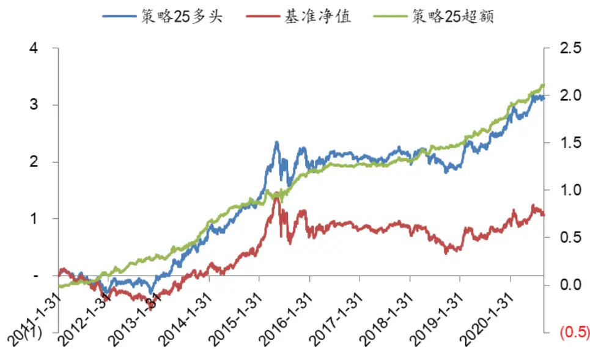
资料来源：Wind、聚源、兴业证券经济与金融研究院整理

图表 56、策略 15历史净值走势-对数化
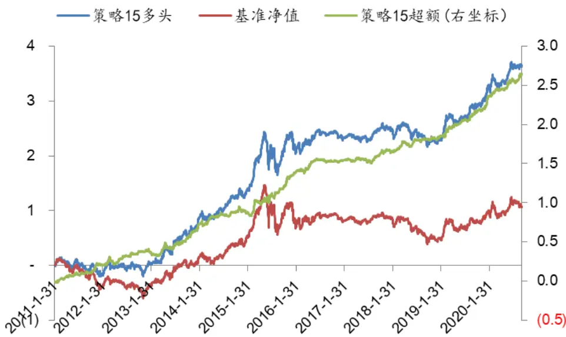
资料来源：Wind、聚源、兴业证券经济与金融研究院整理

为了进一步评价策略的效果，我们以策略 15为例，对该策略与 A股市场中高仓位主动偏股型基金（包括普通股票型以及偏股混合型基金）的分年度表现进行了对比。在对比的过程中需考虑两点：

1）分年度对比时，我们仅仅考虑上年年末规模大于5 亿元的基金；

2）策略15是满仓操作，而基金一般不太可能实现这一点。我们整理了历年高仓位主动偏股型基金的平均仓位，大致稳定在 80%左右（具体参见图表57 中的“折算比”列）。为了保证对比的一致性，我们用每年基金的平均仓位*策略 15的年度收益率作为我们策略的可比收益率，然后再与可比基金进行对比。

图表 57、策略15分年度表现及排名

| 年份 | 折算比 | 偏股型基金数 | 策略15原始收益 | 策略 15 可比收益 | 策略 15 排名 |
| --- | --- | --- | --- | --- | --- |
| 2011年 | 81.58% | 280 | -11.7% | -9.5% | 1.1% |
| 2012年 | 81.37% | 294 | 11.6% | 9.4% | 26.1% |
| 2013年 | 81.28% | 290 | 100.9% | 82.0% | 0.3% |
| 2014年 | 83.93% | 287 | 73.3% | 61.5% | 2.1% |
| 2015年 | 84.05% | 317 | 220.1% | 185.0% | 0.3% |
| 2016年 | 81.66% | 399 | -5.0% | -4.1% | 19.3% |
| 2017年 | 83.72% | 411 | 16.8% | 14.1% | 53.9% |
| 2018年 | 82.57% | 371 | -24.5% | -20.2% | 30.4% |
| 2019年 | 86.64% | 460 | 127.6% | 110.6% | 0.4% |
| 2020年 | 82.71% | 594 | 84.8% | 70.1% | 4.4% |

资料来源：Wind、聚源、兴业证券经济与金融研究院整理

图表 58、策略25分年度表现及排名

| 年份 | 折算比 | 偏股型基金数 | 策略 25 原始收益 | 策略 25 可比收益 | 策略25 排名 |
| --- | --- | --- | --- | --- | --- |
| 2011年 | 81.58% | 280 | -19.5% | -15.9% | 6.0% |
| 2012年 | 81.37% | 294 | 9.1% | 7.4% | 33.2% |
| 2013年 | 81.28% | 290 | 109.9% | 89.3% | 0.3% |
| 2014年 | 83.93% | 287 | 79.0% | 66.3% | 1.4% |
| 2015年 | 84.05% | 317 | 173.2% | 145.6% | 0.6% |
| 2016年 | 81.66% | 399 | -12.6% | -10.3% | 40.0% |
| 2017年 | 83.72% | 411 | 9.1% | 7.6% | 69.2% |
| 2018年 | 82.57% | 371 | -24.8% | -20.5% | 31.5% |
| 2019年 | 86.64% | 460 | 107.1% | 92.8% | 2.2% |
| 2020年 | 82.71% | 594 | 70.3% | 58.1% | 15.3% |

资料来源：Wind、聚源、兴业证券经济与金融研究院整理

相较于高仓位主动偏股型基金，考察时段内（2011年1月-2020年9月30日）的科技精选策略表现是非常优异的：除 2017年策略排名位居全市场中游水平以外，在其他年度该策略收益排名均能进入前30%！今年以来策略15可比收益率达70.1%，在高仓位主动偏股型基金中的相对排名为第26 名，表现非常抢眼。另外，我们也考察了策略25的排名情况，应该说整体表现也是十分优异的，具体数据请参见图表 58。

## 5.3、绩效归因分析

受限于篇幅，这里主要展示策略 15在Barra业绩归因体系下的表现情况。根据策略持仓，基于 Barra 风格因子对策略超额收益进行分解来捕捉策略的收益率来源。图表 59显示了总超额收益的分解情况。

从结果来看，在 Barra十个风格中，市值（Size）、动量效应（Momentum）贡献相对较多的正收益，残差波动率（ResidualVolatility）、流动性（Liquidity）贡献一定程度的负超额收益，但整体来看残差项（表示不能被风格因子解释的部分）的贡献占绝对优势，这表明绝大部分收益来自于我们的构建的 Alpha 选股模型。时序维度的收益归因情况请参见图表60。

图表 59、基于持仓的Barra业绩归因——整体展示
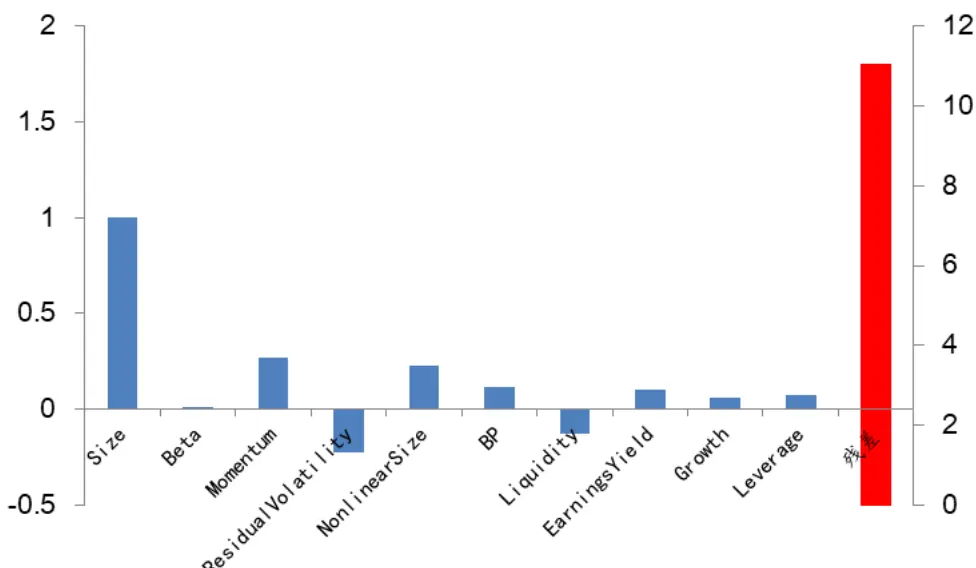
资料来源：Wind、聚源、兴业证券经济与金融研究院整理

图表 60、基于持仓的Barra业绩归因——时序展示
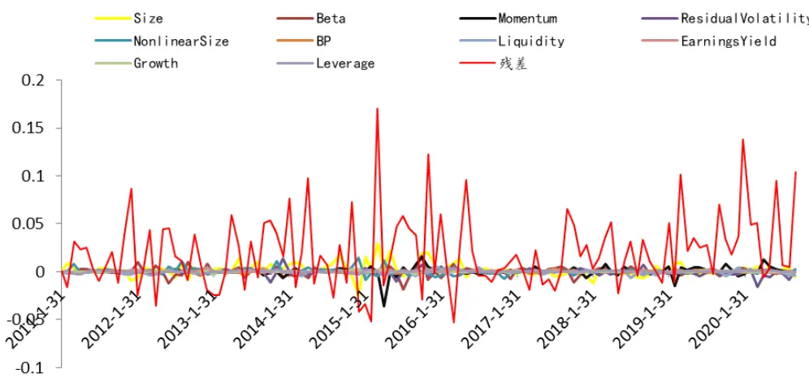
资料来源：Wind、聚源、兴业证券经济与金融研究院整理

## 5.4、科技板块精选策略的其他尝试

我们对上述精选策略的一些构成维度，也进行了一些其他角度的探索和尝试。具体来说，我们对降低调仓频率和进行小市值股票过滤这两个做法对策略的影响进行了具体的研究。为简单起见，我们以策略15为例进行阐述。

## 降低调仓频率

我们将策略15的调仓频率由月度降低为季度，然后观察策略的有效性。从测试结果来看，策略年化收益率高达 30.6%，超额收益高达18.3%，分年度来看非常稳定，每年均能战胜基准，依然体现出了良好的表现。

图表 61、季度调仓下策略15综合表现

| 因子 | 年化收益率 | 波动率 | 风险收益比 | 月度胜率 | 最大回撤率 |
| --- | --- | --- | --- | --- | --- |
| 基准表现 | 11.8% | 33.7% | 0.35 | 53.8% | 65.7% |
| 策略15 多头 | 30.6% | 35.2% | 0.87 | 59.8% | 53.6% |
| 策略 15 超额 | 18.3% | 13.2% | 1.39 | 64.9% | 28.0% |

资料来源：Wind、聚源、兴业证券经济与金融研究院整理

图表 62、季度调仓下策略15分年度表现

| 年份 | 基准净值 | 策略15多头 | 策略15_超额 |
| --- | --- | --- | --- |
| 2011年 | -30.3% | -22.4% | 15.6% |
| 2012年 | -5.6% | -1.0% | 4.5% |
| 2013年 | 57.1% | 85.7% | 19.3% |
| 2014年 | 38.5% | 52.7% | 15.2% |
| 2015年 | 113.2% | 146.4% | 12.4% |
| 2016年 | -23.6% | -12.7% | 11.7% |
| 2017年 | 1.8% | 8.9% | 6.5% |
| 2018年 | -34.4% | -24.4% | 14.2% |
| 2019年 | 53.4% | 114.5% | 50.1% |
| 2020 年至今 | 23.1% | 60.0% | 33.3% |

数据来源：Wind、聚源、兴业证券经济与金融研究院整理

图表 63、季度调仓下策略15历史净值走势-对数化
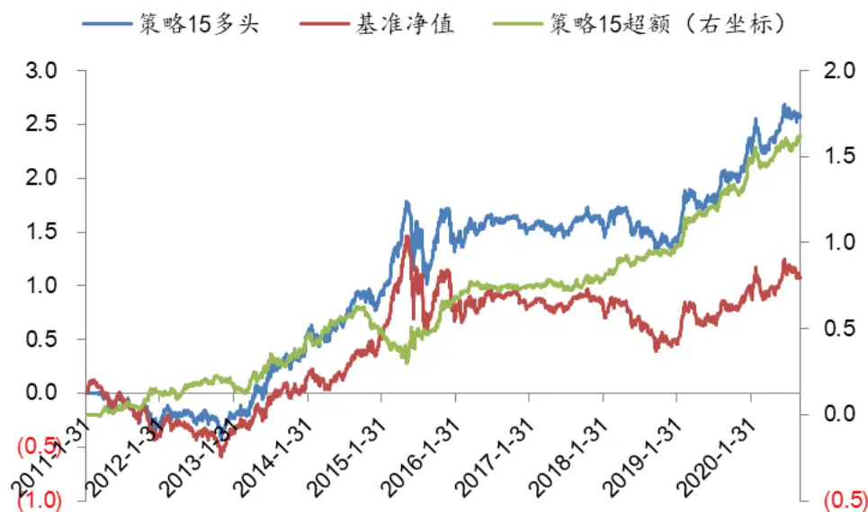
资料来源：Wind、聚源、兴业证券经济与金融研究院整理

## 进行小市值股票过滤

一般情况下大市值股票的流动性会更强。为了提升模型的可投资性，在原始的策略 15中，我们加入了小市值股票过滤条件，要求将每个子行业内市值排序在后 30%的股票剔除，其他条件不变，并进行月度调仓。

相比于原始的策略 15，即便加入市值限制，我们的精选策略表现依然非常优秀，多头收益高达 39.0%，超额收益 24.9%。分年度表现来看，策略在绝大多数年份均能战胜基准 10个点以上。相比于没有加入市值的约束原始策略，表现没有出现大幅衰减。鉴于该设定下策略的可投资性更强，我们也给出了其最新一期持仓（2020 年10月份），具体请参见附录 73。

图表 64、加入市值筛选后策略 15综合表现

| 因子 | 年化收益率 | 波动率 | 风险收益比 | 月度胜率 | 最大回撤率 |
| --- | --- | --- | --- | --- | --- |
| 基准表现 | 11.8% | 33.7% | 0.35 | 60.7% | 65.7% |
| 策略 15 多头 | 39.0% | 35.1% | 1.11 | 53.9% | 54.5% |
| 策略 15 超额 | 24.9% | 11.5% | 2.16 | 68.4% | 13.8% |

资料来源：Wind、聚源、兴业证券经济与金融研究院整理

图表 65、加入市值筛选后策略 15分年度表现

| 年份 | 基准净值 | 策略15多头 | 策略15_超额 |
| --- | --- | --- | --- |
| 2011年 | -30.3% | -22.6% | 10.1% |
| 2012年 | -5.6% | -2.3% | 3.8% |
| 2013年 | 57.1% | 118.2% | 41.2% |
| 2014年 | 38.5% | 76.9% | 29.7% |
| 2015年 | 113.2% | 166.7% | 24.6% |
| 2016年 | -23.6% | -9.6% | 15.6% |
| 2017年 | 1.8% | 13.6% | 11.7% |
| 2018年 | -34.4% | -26.0% | 13.6% |
| 2019年 | 53.4% | 120.7% | 44.8% |
| 2020 年至今 | 23.1% | 84.8% | 54.4% |

数据来源：Wind、聚源、兴业证券经济与金融研究院整理

图表 66、加入市值筛选后策略15历史净值走势-对数化
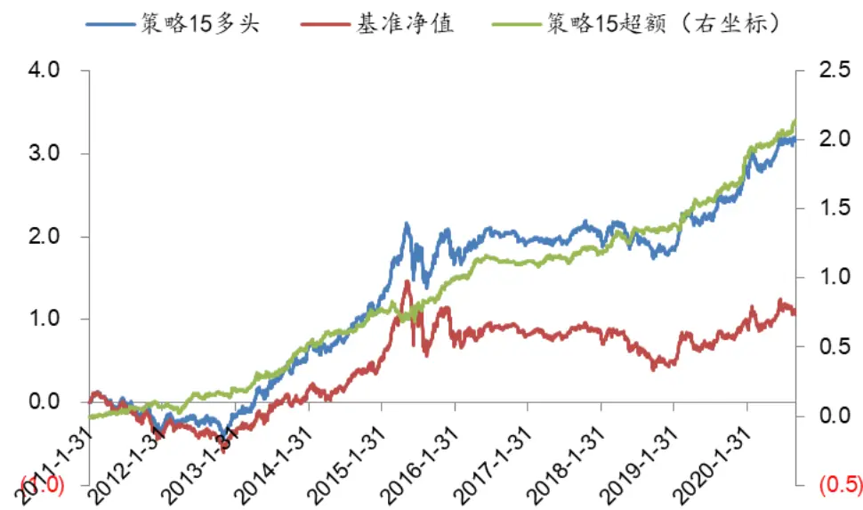
资料来源：Wind、聚源、兴业证券经济与金融研究院整理

## 6、总结

科技领域有个术语叫“惊讶周期”，大致上反应了科技的迭代速度：通俗一点说公元元年的人要穿梭到二十世纪初才会被彼时人的生活环境所吓倒，而二十世纪初的人突然来到二十世纪末年可能就会恍如隔世，而当下的人则很难想象 20年以后的生活方式和节奏。回到我们的金融市场，科技的发展速度如此之快也让科技板块的投资充满了不确定性和挑战，而这正是本文希望努力帮助大家应对的方向。

兴证金工团队耗时 4 个月，从所阅读的大量的基金经理调研访谈、相关行业卖方分析师的反复沟通中，梳理出不同行业的投资逻辑，并利用我们在量化选股领域所积累的经验和优势，层层递进，步步为营，最终构建得到了表现稳定优异的科技板块精选策略。过程虽然艰辛，但最终的结果依然是可喜的。若各位机构投资者能从中有所获益，料想这份坚持也是值得的。当然研究中还有很多不尽完善之处，恳请各位投资者多多批评指正。

## 7、附录

图表 67、中信电子、计算机、通信行业与wind信息技术二级行业间映射

| 中信一级行业分类 | 中信三级行业分类 | wind信息技术二级行业分类 |
| --- | --- | --- |
| 电子 | 面板 | 技术硬件与设备 |
| 电子 | 消费电子组件 | 技术硬件与设备 |
| 电子 | 显示零组 | 技术硬件与设备 |
| 电子 | 其他电子零组件Ⅲ | 技术硬件与设备 |
| 电子 | 被动元件 | 技术硬件与设备 |
| 电子 | 集成电路 | 半导体与半导体生产设备 |
| 电子 | LED | 半导体与半导体生产设备 |
| 电子 | PCB | 技术硬件与设备 |
| 电子 | 消费电子设备 | 技术硬件与设备 |
| 电子 | 分立器件 | 半导体与半导体生产设备 |
| 电子 | 半导体材料 | 半导体与半导体生产设备 |
| 电子 | 安防 | 技术硬件与设备 |
| 电子 | 半导体设备 | 半导体与半导体生产设备 |
| 计算机 | 咨询实施及其他服务 | 软件与服务 |
| 计算机 | 通用计算机设备 | 技术硬件与设备 |
| 计算机 | 行业应用软件 | 软件与服务 |
| 计算机 | 专用计算机设备 | 技术硬件与设备 |
| 计算机 | 云基础设施服务 | 软件与服务 |
| 计算机 | 产业互联网综合服务 | 软件与服务 |
| 计算机 | 新兴计算机软件 | 软件与服务 |
| 计算机 | 基础软件及管理办公软件 | 软件与服务 |
| 计算机 | 云软件服务 | 软件与服务 |
| 计算机 | 产业互联网信息服务 | 软件与服务 |
| 计算机 | 产业互联网平台服务 | 软件与服务 |
| 计算机 | 云平台服务 | 软件与服务 |
| 通信 | 通信终端及配件 | 技术硬件与设备 |
| 通信 | 系统设备 | 技术硬件与设备 |
| 通信 | 线缆 | 技术硬件与设备 |
| 通信 | 增值服务Ⅲ | 软件与服务 |
| 通信 | 网络接配及塔设 | 技术硬件与设备 |
| 通信 | 网络规划设计和工程施工 | 技术硬件与设备 |
| 通信 | 网络覆盖优化与运维 | 技术硬件与设备 |
| 通信 | 其他通信设备 | 技术硬件与设备 |

数据来源：Wind、兴业证券经济与金融研究院整理

注：在映射的过程之中，我们一方面和行业研究员进行沟通，另一方面采取“少数服从多数”的映射规则：比如假设中信计算机三级行业分类“云服务平台”共计有 5家公司，其中有四家发现属于软件与服务，那么我们就建立了“云服务平台”•“软件与服务”的映射。图表 68的申万行业映射规律也是如此。

图表 68、申万电子、计算机、通信行业与wind信息技术二级行业间映射

| 申万一级行业分类 | 申万三级行业分类 | wind 信息技术二级行业分类 |
| --- | --- | --- |
| 电子 | 电子系统组装 | 技术硬件与设备 |
| 电子 | 显示器件Ⅲ | 技术硬件与设备 |
| 电子 | 其他电子Ⅲ | 技术硬件与设备 |
| 电子 | 被动元件 | 技术硬件与设备 |
| 电子 | LED | 半导体与半导体生产设备 |
| 电子 | 集成电路 | 半导体与半导体生产设备 |
| 电子 | 印制电路板 | 技术硬件与设备 |
| 电子 | 电子零部件制造 | 技术硬件与设备 |
| 电子 | 分立器件 | 半导体与半导体生产设备 |
| 电子 | 半导体材料 | 半导体与半导体生产设备 |
| 电子 | 光学元件 | 技术硬件与设备 |
| 计算机 | IT服务 | 软件与服务 |
| 计算机 | 计算机设备Ⅲ | 技术硬件与设备 |
| 计算机 | 软件开发 | 软件与服务 |
| 通信 | 终端设备 | 技术硬件与设备 |
| 通信 | 通信传输设备 | 技术硬件与设备 |
| 通信 | 通信运营Ⅲ | 技术硬件与设备 |
| 通信 | 通信配套服务 | 技术硬件与设备 |

数据来源：Wind、兴业证券经济与金融研究院整理

图表 69、三费费用率 Vs.销售费用率在半导体制造行业五分位表现

| 组别 | 三费费用率 |  |  |  | 销售费用率 |  |  |  |
| --- | --- | --- | --- | --- | --- | --- | --- | --- |
|  |  | 年化收益率 Sharpe比 平均换手 |  | 最大回撤 | 年化收益率 | Sharpe比 | 平均换手 | 最大回撤 |
| Top | 12.4% | 0.32 | 32.0% | 63.3% | 14.9% | 0.39 | 27.0% | 61.3% |
| 1 | 12.1% | 0.33 | 48.1% | 66.7% | 6.2% | 0.17 | 37.2% | 62.2% |
| 2 | 1.9% | 0.05 | 49.2% | 67.1% | 6.2% | 0.17 | 38.4% | 66.8% |
| 3 | 10.8% | 0.27 | 46.0% | 59.7% | 8.7% | 0.23 | 39.5% | 70.1% |
| Bottom | 3.9% | 0.11 | 32.7% | 64.5% | 4.2% | 0.11 | 32.5% | 61.5% |
| 市场 | 8.7% | 0.24 |  | 61.6% | 8.7% | 0.24 |  | 61.6% |
| L-S | 6.9% | 0.36 |  | 40.1% | 8.3% | 0.40 |  | 31.2% |

数据来源：Wind、聚源、兴业证券经济与金融研究院整理

图表 70、三费费用率 Vs.销售费用率在半导体制造多因子过滤作用

| 组别 | 叠加三费费用率过滤 |  |  |  | 叠加销售费用率过滤 |  |  |  |
| --- | --- | --- | --- | --- | --- | --- | --- | --- |
|  |  | 年化收益率 Sharpe比 平均换手 |  | 最大回撤 | 年化收益率 | Sharpe比 | 平均换手 | 最大回撤 |
| Top | 26.9% | 0.67 | 65.5% | 51.6% | 26.2% | 0.65 | 67.2% | 53.6% |
| 1 | 9.3% | 0.25 | 94.6% | 66.7% | 11.4% | 0.30 | 92.5% | 64.5% |
| 2 | 3.7% | 0.10 | 98.2% | 62.2% | 4.8% | 0.13 | 94.8% | 59.1% |
| 3 | 4.0% | 0.11 | 96.9% | 65.8% | 5.6% | 0.15 | 96.2% | 65.6% |
| Bottom | -3.0% | -0.08 | 67.8% | 74.2% | -4.0% | -0.10 | 63.5% | 72.2% |
| 市场 | 8.7% | 0.24 |  | 61.1% | 9.2% | 0.25 |  | 61.6% |
| L-S | 28.6% | 1.28 |  | 22.7% | 29.3% | 1.33 |  | 20.9% |

数据来源：Wind、聚源、兴业证券经济与金融研究院整理

图表 71、在科技板块内尝试过的其他维度

| 聚焦问题 | 因子 | 定义 |
| --- | --- | --- |
| 资本支出 | CapexL1_Revenue | Capex_L1/ Sales_TTM(去年同期资本支出/营业收入 TTM) |
| 资本支出 | CapexL2_Revenue | (Capex_L1+Capex_L2)/ (2*Sales_TTM)-->(去年和前年同期资本 支出/营业收入 TTM) |
| 资本支出 | CapexL2_Revenue | (Capex L1+Capex L2+Capex L3) / (Sales TTM*3) |
| 资本支出 | Capex2Asset | 当下资本支出/总资产 |
| 资本支出 | Capex20E | 当下资本支出/股东盈余(股东盈余**) |
| 资本支出 | Capx_SQ_YoY | 单季度资本支出同比增长率 |
| 资本支出 | Capx_SQ_QoQ | 单季度资本支出环比增长率 |
| 资本支出 | cpx_sale_grw_yoy | 资本支出效率同比增长率 ((Capex_L1/Sales_TTM-Capex_L2/Sales_L1)/Capex_L2/Sales_L1), |
| 资本支出 | cpx_sale_grw_qoq | 具体参见报告解释 资本支出效率环比增长率（参见 cpx_sale_grw_yoy） |
| 折旧 | DA_SaleTTM | 折旧/营业收入 |
| 折旧 | Grossmaring_da | 毛利率/DA_SaleTTM(意即正文4.5.2 提到的折旧边际效益) |
| 销售费用问题 | SaleFee_Ratio | 销售费用/营业收入 |
| 应收预收问题 | Receivable_Sales | 应收/营业收入 |
| 应收预收问题 | Receivable_0E | 应收/股东盈余 |
| 应收预收问题 | Receivable_Asset | 应收/总资产 |
| 应收预收问题 | Payable_Reci | 预收/应收 |
| 应收预收问题 | Payable_Reci_L1 | (当下预收+去年预收)/(当下应收+去年应收) |
| 应收预收问题 | Payable_Reci_L2 | 过去三年预收/过去三年应收 |
| 商誉问题 | Goodwill_Ratio | 商誉/总资产 |
| 修正毛利率 | Grooss_Min_TreeCost_Ratio | (营业收入-营业成本-三费)/营业收入 |
| 流动资产问题 | CurAsset Total Asset | 流动资产/总资产 |
| 流动资产问题 | CurAsset2TotalAsset_YoY | 流动资产占比同比增速 |
| 海外收入 | Income_Foreign2Sale | 海外收入/营业收入 |
| 海外收入 | Income_Foreign2MktVal | 海外收入/流动市值 |
| 政府补助 | Gov_Fuzhu2Sale | 政府补助/营业收入 |
| 政府补助 | Gov_Fuzhu2MktVal | 政府补助/流通市值 |
| 创新问题 | RDemply_ratio | 研发人员占比 |
| 创新问题 | RDemply_num2Sale | 研发人员数量/营业收入 |
| 创新问题 | RDemply_num2MktVal | 研发人员数量/流动市值 |
| 创新问题 | RD2Asset | 研发费用/总资产 |
| 创新问题 | RD2MktVal | 研发费用/流动市值 |
| 创新问题 | RD2SaleTTM | 研发费用/营业收入 |
| 创新问题 | IE2Asset | 专利/总资产 |
| 创新问题 | IE2MktVal | 专利/流动市值 |
| 创新问题 | IE2Sales_TTM | 专利/营业收入 |
| 创新问题 | IE/RD | 专利/研发费用（效率产出问题） |
| 管理层问题 | Pay_3Rds2Sale | 高管收入排名前三/营业收入 |
| 管理层问题 | Pay_3Rds2MktVal | 高管收入排名前三/流动市值 |
| 管理层问题 | Pay_Board2Sale | 董事层收入排名前三/营业收入 |
| 管理层问题 | Pay_Board2MktVal | 董事层收入排名前三/流动市值 |
| 管理层问题 | Pay_Management2Sale | 管理层收入排名前三/营业收入 |
| 管理层问题 | Pay_Management2MktVal | 管理层收入排名前三/流动市值 |
| 管理层问题 | AlIPay2Sale | 员工收入/营业收入 |
| 管理层问题 | Management_Edu | 高管学历 |
| 管理层问题 | Management_Indtro | 高管简介长度 |
| 估值问题 | SP_DR | 时间序列的市销率估值大小 |

| 估值问题 | BP_DR | 时间序列的市净率估值大小 |
| --- | --- | --- |
| 估值问题 | EP_DR | 时间序列的市盈率估值大小 |
| 估值问题 | OEP_TTM | 股东盈余/市值 |

数据来源：兴业证券经济与金融研究院整理

注：表格中提及的时序估值因子（SP_DR、BP_DR、EP_DR）参见《基于误差修正模型的估值趋势偏离度因子研究》、股东盈余相关概念参见《股东盈余视角下的估值因子研究》

图表 72、策略15今年十月份持仓

| 股票代码 | 股票名称 | 权重 |
| --- | --- | --- |
| 000725.SZ | 京东方A | 6.67% |
| 002315.SZ | 焦点科技 | 6.67% |
| 002459.SZ | 晶澳科技 | 6.67% |
| 002845.SZ | 同兴达 | 6.67% |
| 002897.SZ | 意华股份 | 6.67% |
| 002902.SZ | 铭普光磁 | 6.67% |
| 002920.SZ | 德赛西威 | 6.67% |
| 300118.SZ | 东方日升 | 6.67% |
| 300532.SZ | 今天国际 | 6.67% |
| 300661.SZ | 圣邦股份 | 6.67% |
| 600718.SH | 东软集团 | 6.67% |
| 600855.SH | 航天长峰 | 6.67% |
| 601012.SH | 隆基股份 |  |
| 601138.SH | 工业富联 | 6.67% |
| 603501.SH | 韦尔股份 | 6.67% 6.67% |

数据来源：Wind、聚源、兴业证券经济与金融研究院整理

图表 73、增加市值筛选后策略15今年十月份持仓

| 股票代码 | 股票名称 | 权重 |
| --- | --- | --- |
| 000561.SZ | 烽火电子 | 7.14% |
| 000725.SZ | 京东方A | 7.14% |
| 002315.SZ | 焦点科技 | 7.14% |
| 002459.SZ | 晶澳科技 | 7.14% |
| 002845.SZ | 同兴达 | 7.14% |
| 002897.SZ | 意华股份 | 7.14% |
| 002920.SZ | 德赛西威 | 7.14% |
| 300118.SZ | 东方日升 | 7.14% |
| 300248.SZ | 新开普 | 7.14% |
| 300661.SZ | 圣邦股份 | 7.14% |
| 600718.SH | 东软集团 | 7.14% |
| 601012.SH | 隆基股份 | 7.14% |
| 601138.SH | 工业富联 | 7.14% |
| 603501.SH | 韦尔股份 | 7.14% |

数据来源：Wind、聚源、兴业证券经济与金融研究院整理

风险提示：本报告模型及结论全部基于对历史数据的分析，当市场环境变化时，存在模型失效风险。

## 分析师声明

本人具有中国证券业协会授予的证券投资咨询执业资格并注册为证券分析师，以勤勉的职业态度，独立、客观地出具本报告。本报告清晰准确地反映了本人的研究观点。本人不曾因，不因，也将不会因本报告中的具体推荐意见或观点而直接或间接收到任何形式的补偿。

## 投资评级说明

| 投资建议的评级标准 | 类别 | 评级 | 说明 |
| --- | --- | --- | --- |
| 报告中投资建议所涉及的评级分为股票评级和行业评级(另有说明的除外)。评级标准为报告发布日后的12个月内公司股价（或行业指数)相对同期相关证券市场代表性指数的涨跌幅。其中：A股市场以上证综指或深圳成指为基 | 股票评级 | 买入 | 相对同期相关证券市场代表性指数涨幅大于15% |
|  |  | 审慎增持 | 相对同期相关证券市场代表性指数涨幅在5%～15%之间 |
|  |  | 中性 | 相对同期相关证券市场代表性指数涨幅在-5%～5%之间 |
|  |  | 减持 | 相对同期相关证券市场代表性指数涨幅小于-5% |
|  |  | 无评级 | 由于我们无法获取必要的资料，或者公司面临无法预见结果的重大不确定性事件，或者其他原因，致使我们无法给出明确的投资评级 |
| 准，香港市场以恒生指数为基准；美国市场以标普500或纳斯达克综合指数为基准。 | 行业评级 | 推荐 | 相对表现优于同期相关证券市场代表性指数 |
|  |  | 中性 | 相对表现与同期相关证券市场代表性指数持平 |
|  |  | 回避 | 相对表现弱于同期相关证券市场代表性指数 |

## 信息披露

本公司在知晓的范围内履行信息披露义务。客户可登录 www.xyzq.com.cn 内幕交易防控栏内查询静默期安排和关联公司持股情况。

## 使用本研究报告的风险提示及法律声明

兴业证券股份有限公司经中国证券监督管理委员会批准，已具备证券投资咨询业务资格。

本报告仅供兴业证券股份有限公司（以下简称“本公司”）的客户使用，本公司不会因接收人收到本报告而视其为客户。本报告中的信息、意见等均仅供客户参考，不构成所述证券买卖的出价或征价邀请或要约。该等信息、意见并未考虑到获取本报告人员的具体投资目的、财务状况以及特定需求，在任何时候均不构成对任何人的个人推荐。客户应当对本报告中的信息和意见进行独立评估，并应同时考量各自的投资目的、财务状况和特定需求，必要时就法律、商业、财务、税收等方面咨询专家的意见。对依据或者使用本报告所造成的一切后果，本公司及/或其关联人员均不承担任何法律责任。

本报告所载资料的来源被认为是可靠的，但本公司不保证其准确性或完整性，也不保证所包含的信息和建议不会发生任何变更。本公司并不对使用本报告所包含的材料产生的任何直接或间接损失或与此相关的其他任何损失承担任何责任。

本报告所载的资料、意见及推测仅反映本公司于发布本报告当日的判断，本报告所指的证券或投资标的的价格、价值及投资收入可升可跌，过往表现不应作为日后的表现依据；在不同时期，本公司可发出与本报告所载资料、意见及推测不一致的报告；本公司不保证本报告所含信息保持在最新状态。同时，本公司对本报告所含信息可在不发出通知的情形下做出修改，投资者应当自行关注相应的更新或修改。

除非另行说明，本报告中所引用的关于业绩的数据代表过往表现。过往的业绩表现亦不应作为日后回报的预示。我们不承诺也不保证，任何所预示的回报会得以实现。分析中所做的回报预测可能是基于相应的假设。任何假设的变化可能会显著地影响所预测的回报。

本公司的销售人员、交易人员以及其他专业人士可能会依据不同假设和标准、采用不同的分析方法而口头或书面发表与本报告意见及建议不一致的市场评论和/或交易观点。本公司没有将此意见及建议向报告所有接收者进行更新的义务。本公司的资产管理部门、自营部门以及其他投资业务部门可能独立做出与本报告中的意见或建议不一致的投资决策。

本报告并非针对或意图发送予或为任何就发送、发布、可得到或使用此报告而使兴业证券股份有限公司及其关联子公司等违反当地的法律或法规或可致使兴业证券股份有限公司受制于相关法律或法规的任何地区、国家或其他管辖区域的公民或居民，包括但不限于美国及美国公民（1934年美国《证券交易所》第 15a-6条例定义为本「主要美国机构投资者」除外）。

本报告的版权归本公司所有。本公司对本报告保留一切权利。除非另有书面显示，否则本报告中的所有材料的版权均属本公司。未经本公司事先书面授权，本报告的任何部分均不得以任何方式制作任何形式的拷贝、复印件或复制品，或再次分发给任何其他人，或以任何侵犯本公司版权的其他方式使用。未经授权的转载，本公司不承担任何转载责任。

## 特别声明

在法律许可的情况下，兴业证券股份有限公司可能会持有本报告中提及公司所发行的证券头寸并进行交易，也可能为这些公司提供或争取提供投资银行业务服务。因此，投资者应当考虑到兴业证券股份有限公司及/或其相关人员可能存在影响本报告观点客观性的潜在利益冲突。投资者请勿将本报告视为投资或其他决定的唯一信赖依据。

兴业证券研究

| 上海 | 北京 | 深圳 |
| --- | --- | --- |
| 地址：上海浦东新区长柳路36号兴业证券大厦 | 地址：北京西城区锦什坊街35号北楼601-605 | 地址：深圳市福田区皇岗路5001号深业上城T2 |
| 15层 | 邮编：100033 | 座52楼 邮编：518035 |
| 邮编：200135 邮箱：research@xyzq.com.cn | 邮箱：research@xyzq.com.cn | 邮箱：research@xyzq.com.cn |