分析师：

郑兆磊

zhengzhaolei@xyzq.com.cn

S0190520080006

＃研究助理：assAuth

占康萍

zhankangping@xyzq.com.cn

## 报告关键点

本文从财务造假和财务危机两个方面对公司财务风险进行度量，并介绍如何利用这两方面信息帮助投资者避免极端损失。

## ＃相关报告 related

《基本面量化研究系列之二：基本面量化视角下的大健康板块选股研究》

《基本面量化研究系列之一：基本面量化视角下的科技板块选股研究》

《基于北向资金持仓信息的 A股配置全攻略》

《基金优选下的重仓股信息研究》

# 基本面量化研究系列之三：未雨绸缪——个股财务风险监控雷达搭建

2021 年 11 月 04 日

## 投资要点

除获取超额收益之外，如何避免遭受极端风险也备受投资者关注。本文我们从财务危机和财务造假两方面对公司的财务风险进行度量，并介绍如何利用这两方面信息帮助投资者避免极端损失。

## ⚫ 如何评判公司财务危机风险？

1）预警指标体系：本文从筹资活动、投资活动、经营活动和收益分配四个企业财务活动出发构建财务危机预警指标体系，并基于 t 检验对单指标有效性进行测试，最终构建财务危机精选指标库。

2）构建财务危机预警指数：为解决变量赋权和相关性问题，本文引入突变级数法构建财务危机预警指数，并构建“财务危机预警”组合。

3）财务危机预警组合评价：预警组合每年持有个股数量在 120 到 200 之间，财务危机平均命中率高达 55.80%。同时 17 年之后，预警组合每年均有稳定的负超额收益，相对 wind 全 A 负超额达-9.68%（2016.05.06-2021.09.30）。

⚫ 如何识别公司财务造假风险？

2）构建财务造假准则：我们基于财务造假压力、财务造假空间、财务造假借口、财务造假迹象四维度结合行业因素构建 37 个财务造假识别准则。通过测试，我们发现复合准则（三准则结合）的识别效果更佳，最终通过复合准则构建“财务异常组合”。

3）财务异常组合评价：财务异常组合的财务造假命中率从全样本的 1.11%增加至 13.39%，有明显提升。组合每年平均持有个股为 17 只，同时持有财务异常组合也有较为显著的负超额收益率，达-6.16%。

## ⚫ 实践应用初探

本文基于财务危机预警和财务异常组合进行了多维度应用。以沪深 300 财务风险避雷策略为例，其年化超额收益达 2.46%，信息比率为 1.78，且 2017 年以来每年均有稳定超额。同时加入财务风险信息后，原始北向资金精选 50 策略、基金重仓股优选策略表现均有明显提升。

风险提示：报告中的结果均通过历史数据统计、建模和测算完成，在政策、市场环境发生变化时模型存在失效的风险。

## 报告正文

## 1、引言

近年来，A 股市场蓬勃发展，上市公司数量持续增加。截止2021年 10月 15日，A 股上市公司数量已达4527 家。众多的上市公司不仅拓宽了投资者的可选范围，也大幅增加了投资者的研究负担。

图表 1、A股历年上市公司数量变化
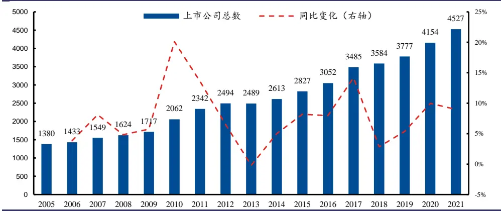
资料来源：Wind，兴业证券经济与金融研究院整理
注：2021 年截止 10 月 15 日

根据投资目的，我们将投资者研究需求分为两个维度：

1、收益需求：如何选择基本面好、能够带来超额收益的个股；

2、避险需求：如何避免购买“雷股”，即股价暴跌，带来极端损失的个股。

图表 2、投资者研究需求
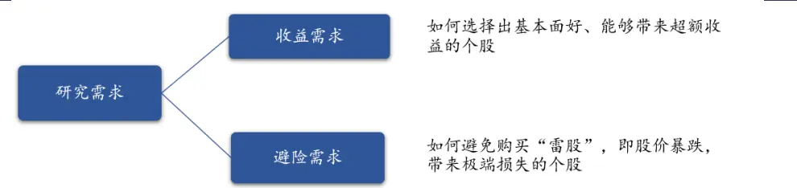
资料来源：兴业证券经济与金融研究院

在团队前期的报告中，我们主要帮助投资者解决第一个维度的问题。例如在报告《基本面量化视角下的大健康板块选股研究》、《基本面量化视角下的科技板块选股研究》中，我们通过梳理不同行业的投资逻辑，基于量化选股的经验和优势，构建了大健康板块精选策略、科技板块精选策略。在报告《基于北向资金持仓信息的 A股配置全攻略》、《基金优选下的重仓股信息研究》中我们基于外资和内资机构投资者的持仓信息构建了北向资金精选50选股策略、基金重仓股优选策略。

但随着市场波动不断加剧，投资者的避险需求也在不断上升。对部分投资者来说，避免极端损失有时候可能比获取收益更为重要。因此，我们展开风险相关研究，希望帮助投资者进行个股风险的预警。

大体上，我们认为个股风险可分为：

1、市场整体风险：宏观经济、市场政策变化所带来的风险；

2、个股特异性风险：公司本身风险，包括基本面风险、情绪风险等。基本面风险即公司经营管理等带来的风险，影响较为长期，往往很难消失；情绪风险即市场短期情绪变化而导致的公司股价波动，持续时间较短，随着投资者情绪变化，可能会消失。

图表 3、个股风险划分

资料来源：兴业证券经济与金融研究院

在本报告中，我们专注于研究个股的基本面风险，即公司本身经营管理所带来的风险。常用的基本面风险信号，根据数据披露方式，大体上可分为以下两种：

1、不定期风险信号：一般来说，上市公司收到证监会监管函、分析师评级下调都会被认为公司经营管理可能出现问题；

2、定期风险信号：基于定期财务报表计算的财务指标出现异常，例如公司毛利率过低等可能会被认为公司经营管理出现问题。

财务报表是进行上市公司投资价值分析的重要基石。主动或量化投资者都力求从公司定期财务报表中挖掘出有效信息。在报告《猎金系列之三十二：财报季的财务效应研究和因子构建》中，我们便从公司财务能力的四大衡量维度入手（偿债能力、营运能力、盈利能力、企业发展能力），分别选取有代表性的指标作为公司财务能力的衡量维度，进一步引入计算公司财务能力相似度的方式，相似度高的公司股价应具有一定的协同效应。在此基础上，我们构建了财务动量因子（简称为 F-Momentum）去衡量这种协同效应，并研究该因子的选股有效性。

本文我们希望对企业的财务报表信息进行分析，基于量化手段，将企业已面临的危险情况预先告知投资人，以便提前进行防范。具体的，我们从财务危机和财务造假两个方面对公司的财务风险进行度量，并介绍如何利用这两方面信息帮助投资者避免极端损失。

1、财务危机风险：公司因内部经营或外部因素而发生财务危机，公司可能会破产而使得投资者遭受巨大的损失。某种意义上，这是一种公司被动/被迫行为的投资风险。

2、财务造假风险：公司通过各种方式伪装自己的财务报表，使得投资者错误估计公司实际情况，从而造成投资者的巨额损失。某种意义上，这是一种公司主动行为所带来的投资风险。

图表 4、财务风险分类

资料来源：兴业证券经济与金融研究院

## 本文主要框架如下：

## 1、评判公司的财务危机风险

1）财务危机预警指标体系：本文围绕企业财务活动从筹资、投资、经营、收益分配四个维度构建财务危机预警指标体系，并基于t检验进行变量精选；

2）构建财务危机预警指数：我们基于突变级数法进行指标结合，构建财务危机预警指数；

3）财务危机预警组合评价：最终我们从财务危机预警指数得到财务危机预警组合，并从财务危机公司命中率、预警组合股价表现等维度对组合进行评价；

## 2、识别公司财务造假风险

1）构建财务造假数据库：本文基于聚源数据库构建兴证财务造假数据库，并对历史发现的财务造假公司进行分析；

2）财务造假识别准则库构建：我们从财务造假压力、财务造假空间、财务造假借口、财务造假迹象四个维度结合行业因素构建了财务造假准则库，并构建识别效率指标对准则进行筛选；

3）财务异常预警组合评价：最终我们基于财务造假准则库构建财务异常组合，并进行评价。

## 3、实践应用

基于财务危机预警、财务异常组合开展多维度的实践应用。

通过上述过程，我们最终得到了一批财务风险较大的公司样本。在实践投资中，可考虑对这些样本进行避雷，从而降低组合可能出现的极端风险。

## 2、如何评判公司的财务危机风险？

财务危机与财务造假风险往往相伴而行，当公司因外部经营和内部因素而发生财务危机时，管理层会有非常强的动机进行财务造假。同时当财务危机风险不断积累，公司可能会破产，而使得投资者遭受巨大损失。因而，投资者有必要关注财务危机这一风险。本章我们希望构建公司财务危机预警体系，在公司还未破产前，通过模型预测公司的财务危机风险，从而帮助投资者规避公司陷入财务危机乃至破产的风险。

关于财务危机定义，学界有不同的观点：

Beaver(1966)所认定的 78 家财务危机公司包括 59 家破产公司、16 家拖欠优先股股利公司和 3家拖欠债务公司。换言之，Beaver（1966）把破产、拖欠优先股股利、拖欠债务界定为财务危机。

Altman(1968)定义的财务危机是指进入破产、无力偿债或为债权人利益而已经进行清算的公司。

Carmichael（1972）认为财务危机是指企业在履行义务时受阻，具体表现为流动性不足、权益不足、债务拖欠及资金不足四种方式。

Levine等人（2000）则认为可以从四个方面定义企业的财务困境：1）企业失败，即企业清算后仍无力偿还债权人的债务；2)法定破产，即企业和债权人向法院申请企业破产；3）技术破产，即企业无法按期履行债务合约付息还本；4）会计破产，即企业的账目净资产出现负数，资不抵债。财务危机是指企业处于经营性现金流不足以抵偿现有到期债务的状态，即技术破产。

由此可以看出，财务危机与公司破产是紧密相关的两个概念，而公司破产往往是更为严重的结果。

而在实证研究中，往往需要客观的、可以观察的标志来确定研究样本。

由于国内财务危机预测的研究对象主要针对上市公司，故大部分学者出于我国资本市场发展实际和样本研究需求提出可将财务危机界定为财务状况异常而被“特殊处理”（1998年沪、深交易所正式启用了当上市公司出现“异常状况”时，对上市公司进行“特殊处理”的条款。“异常状况”包括：“财务状况异常”和“其他状况异常”）。

考虑到样本数量和财务危机往往为递进行为，本文用未来三年内被特殊处理作为公司财务危机的代理变量。

## 2.1、财务危机预警指标体系

## 2.1.1、指标选取

本文希望构建财务危机预警指数，从而对企业可能或将要面对的财务危机进行预测和分析。首先，我们需要设置并观察一些敏感性财务指标的变化。这里，我们主要从企业的财务活动出发搜集指标。

企业的财务活动可分为筹资活动、投资活动、经营活动和收益分配四个方面：

1）筹资活动：筹资活动是指企业为了满足自身投资和用资的需求，筹措和集中所需资金的过程。筹资过程中，企业一方面要确定筹资的总规模，以保证投资所需要的资金；另一方面要通过筹资渠道、筹资方式或工具的选择，合理确定筹资结构，以降低筹资成本和风险，提高企业价值。

2）投资活动：企业投资可以分为广义的投资和狭义的投资两种。广义的投资是指企业将筹集的资金投入使用的过程，包括企业内部使用资金的过程(如购置流动资产、固定资产、无形资产等)和对外投放资金的过程(如投资购买其他企业的股票、债券或与其他企业联营等)。狭义的投资仅指对外投资。无论企业购买内部所需资产，还是购买各种证券，都需要支付资金。

3）营运活动：因企业日常生产经营而引起的财务活动，称为资金营运活动。企业的营运资金主要是为满足企业日常营业活动的需要而垫支的资金。在一定时期内，营运资金周转越快，资金的利用效率就越高，就可能生产出更多的产品，获得更多的收入。

4）收益分配活动：企业通过投资或资金营运活动可以取得相应的收入，并实现资金的增值。从广义上说，收益分配是指对企业各种收入进行分割和分派的过程；而狭义的收益分配仅指对企业净利润的分配。

图表 5、企业财务活动
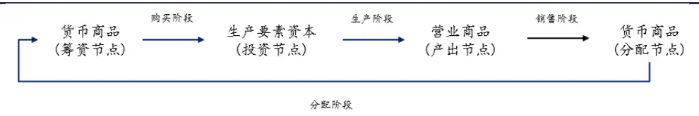
资料来源：兴业证券经济与金融研究院

相应的，企业各项财务活动中都可能衍生出相应的风险，即：

筹资风险：因借入资金而增加丧失偿债能力的可能；

投资风险：由于不确定因素使得投资报酬率达不到预期目标而发生的风险、；

营运风险：无法卖出商品和收回销售贷款的可能性；

收益分配风险：由于收益分配可能给企业今后的生产经常活动产生不利影响而带来的风险。

图表 6、企业财务活动衍生风险
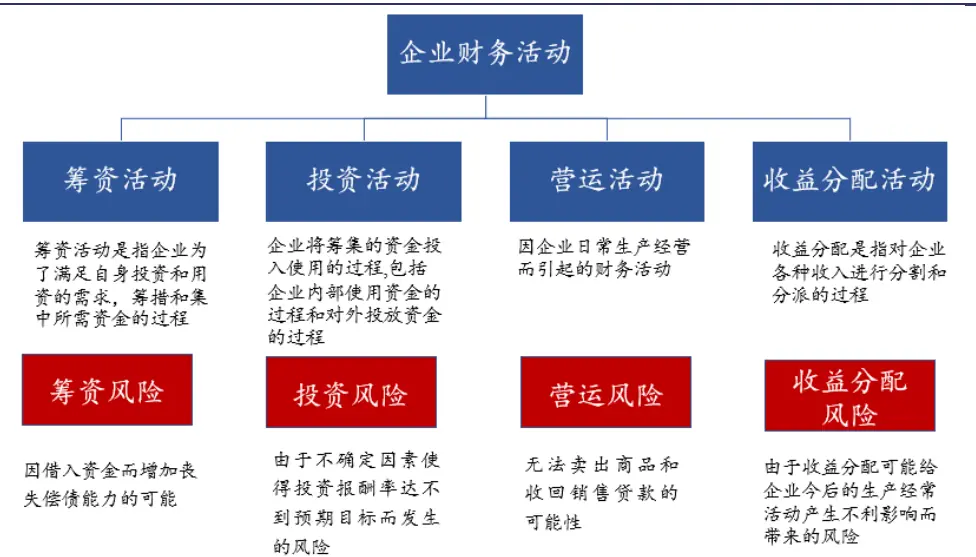
资料来源：兴业证券经济与金融研究院

我们按照以下标准进行指标选取：

1、广泛性：在相关研究中采用次数较多；

2、代表性：能够较好的对相关维度进行代表。

最终梳理出图表7所示的财务危机预警指标库。

图表 7、财务危机预警指标库

| 一级 指标 | 二级指标 | 三级指标 | 计算方式 | 指标范围 |
| --- | --- | --- | --- | --- |
| 筹资 风险 | 短期偿债 | 流动比率 | 流动资产/流动负债 | 正向指标，越大越好 |
|  | 能力 | 速动比率 | 速动资产/流动负债 | 正向指标，越大越好 |
|  | 长期偿债 | 利息保障倍数 | 税前利润总额/利息费用 | 正向指标，越大越好 |
|  | 能力 | 现金债务总额比 | 经营活动产生现金流量净额/负债合计 | 正向指标，越大越好 |
|  | 资本结构 | 资产负债率 | 总负债/总资产 | 区间型指标，在0.4到0.8之间较好 |
| 产权比率 |  | 总负债/股东权益 | 区间型指标，在1左右较好 |  |
| 投资 风险 | 投资能力 | 总资产增长率 | 资产总计相对年初增长率(%) | 正向指标，越大越好 |
|  |  | 现金再投资比率 | (经营现金净流量-现金股利)/(总资产 -流动负债） | 正向指标，越大越好 |
|  |  | 商誉占净资产比率 | 商誉/净资产 | 反向指标，越小越好 |
|  | 投资结构 | 存货占净资产比率 | 存货/净资产 | 反向指标，越小越好 |
|  | 资产利用 效率 | 可用于投资分配的 股利现金比率 | (本期经营活动现金+投资活动现金收 入）/（偿还债务等现金支出+经营活动 现金支出） | 正向指标，越大越好 |
| 营运 风险 | 资金收回 能力 | 销售回款率 | (销售收入+应收账款期初数-应收账款 期末数）/销售收入 | 正向指标，越大越好 |
|  |  | 销售现金比率 | 经营现金净流量/营业收入 | 正向指标，越大越好 |
|  | 盈利能力 | 净资产收益率 | 净利润/净资产 | 正向指标，越大越好 |
|  |  | 营业利润率 | 营业利润/全部业务收入 | 正向指标，越大越好 |
|  | 营运能力 | 应收账款周转率 | 营业收入*2/（期初应收账款+期末应收 账款） | 正向指标，越大越好 |
|  |  | 存货周转率 | 营业成本*2/（期初存货+期末存货） | 正向指标，越大越好 |
| 分红保障 | 总资产周转率 | 营业总收入*2/（期初资产合计+期末资 产合计） | 正向指标，越大越好 |  |
|  | 现金股利保障倍数 | 经营活动现金净流量/现金股利 | 正向指标，越大越好 |  |
| 收益 分配 风险 | 能力 | 派息率波动率 | 过去五年派息率方差/过去五年派息率均 值 | 反向指标，越小越好 |
|  | 资金增长 能力 | 资本积累率 | (所有者权益年末数-所有者权益年初 数）/所有者权益年初数 | 正向指标，越大越好 |
|  |  | 盈余公积增长率 | (盈余公积年末数-盈余公积年初数)/盈 余公积权益年初数 | 正向指标，越大越好 |

资料来源：兴业证券经济与金融研究院

本文对指标进行无量纲化处理，相应计算公式如下：

1）若指标为正向指标（即指标值越大越好）：

$$
x_{i}=\frac{x_{i}-\min(x_{i})}{\max(x_{i})-\min(x_{i})}
$$

2）若指标为反向指标（即指标值越小越好）：

$$
x_{i}=\frac{\max(x_{i})-x_{i}}{\max(x_{i})-\min(x_{i})}
$$

3）若指标为区间型指标（即指标在某区间内最好）

$$
x_{i}=\left\{\begin{array}{cc}1-\frac{a-x_{i}}{\max\left(a-\min\left(x_{i}\right),\max\left(x_{i}\right)-b\right)},&x_{i}<a\\1,&a<x_{i}<b\\1-\frac{x_{i}-b}{\max\left(a-\min\left(x_{i}\right),\max\left(x_{i}\right)-b\right)},&b<x_{i}\end{array}\right.
$$

通过上述方式，我们将指标都转换为 0-1 之间的正向指标，即越接近 1 表示公司风险越小，越接近 0 表示公司风险越大。同时，为了剔除行业因素的影响，我们在中信行业中进行无量纲化处理。

## 2.1.2、指标筛选

上文已提到，本文用未来三年内被特殊处理作为公司财务危机的代理变量。下面我们计算每年指标前 5%与后 5%的财务危机公司比例，并通过 t 检验评估指标是否具有区分能力（指标前5%和后5%的财务危机公司比例是否有显著区别），其中 t统计量的计算方式为：

$$
t=\frac{\overline{X_1}-\overline{X_2}}{\sqrt{\frac{\sum x_1^2-\sum x_2^2}{n_1+n_2-2}\times\frac{n_1+n_2}{n_1\times n_2}}}
$$

图表 8、各指标财务危机判别能力评价

| 级指标 | 二级指标 | 三级指标 | 指标后 5%财务危机公 司比例均值 | 指标前 5%财务危机 公司比例均值 | t值 |  |
| --- | --- | --- | --- | --- | --- | --- |
| 筹资风 险 | 短期偿债能力 | 流动比率 | 45.62% | 10.90% | 2.82 |  |
|  |  | 速动比率 | 44.49% | 10.74% | 2.80 |  |
|  | 长期偿债能力 | 利息保障倍数 | 39.48% | 14.57% | 2.14 |  |
|  |  | 现金债务总额比 | 25.72% | 16.97% | 1.05 |  |
|  | 资本结构 |  | 资产负债率 | 39.21% | 11.21% | 2.62 |
| 产权比率 |  |  | 38.54% | 11.07% | 2.60 |  |
| 投资风险 | 投资能力 | 总资产增长率 | 38.64% | 15.28% | 2.08 |  |
|  |  | 现金再投资比率 | 23.64% | 22.06% | 0.18 |  |
|  |  | 商誉占净资产比率 | 26.20% | 20.62% | 0.60 |  |
|  | 投资结构 资产利用效率 | 存货占净资产比率 | 28.43% | 30.69% | -0.20 |  |
|  |  | 可用于投资分配的股利 现金比率 | 25.78% | 18.49% | 0.87 |  |
|  | 经 营 风 险 | 资金收回能力 | 销售回款率 | 15.98% | 19.89% | -0.53 |
| 销售现金比率 |  |  | 28.69% | 20.21% | 0.92 |  |
| 盈利能力 |  | 净资产收益率 | 33.49% | 19.29% | 1.37 |  |
|  |  | 营业利润率 | 39.82% | 13.54% | 2.31 |  |
|  |  | 应收账款周转率 | 31.93% | 16.17% | 1.67 |  |
| 营运能力 |  | 存货周转率 | 23.01% | 21.07% | 0.23 |  |
|  | 总资产周转率 | 42.77% |  | 12.43% 2.56 |  |  |
|  | 分红保障能力 | 现金股利保障倍数 | 7.32% | 9.20% | -0.46 |  |
| 益分配 |  | 派息率波动率 | 19.64% | 8.51% | 1.29 |  |
|  |  | 资本积累率 | 35.24% | 23.17% | 1.05 |  |
| 风 险 | 资金增长能力 |  |  |  |  |  |
|  |  | 盈余公积增长率 | 27.79% | 15.14% | 1.44 |  |

资料来源：Wind，聚源，兴业证券经济与金融研究院整理

我们选择t值大于 1.96的变量构建精选指标库，最终保留以下八个变量。可以看到收益分配风险相关变量并不能很好的识别A股的财务危机。我们猜测这可能与A股市场的分红政策有关：为促进上市公司树立回报股东的意识，国内将分红比例与上市公司再融资进行挂钩。2006 年提出“分红（现金分红或股票分红）比率大于 20%”成为上市公司再融资的条件之一。2008 年提出“现金分红比率大于 30%”成为上市公司再融资的条件之一。因此上市公司分红可能成为半强制行为，并未完全体现公司的基本面变化。

综上，我们认为公司的财务危机风险主要来自于筹资、投资、经营行为，我们基于这三个维度、八个变量构建财务危机预警精选指标库。

图表 9、财务危机预警精选指标库

| 一级指标 | 二级指标 | 三级指标 | 计算方式 | 指标范围 |
| --- | --- | --- | --- | --- |
| 筹资风险 | 短期偿债能力 | 流动比率 | 流动资产/流动负债 | 正向指标，越大越好 |
|  | 长期偿债能力 | 速动比率 | 速动资产/流动负债 | 正向指标，越大越好 |
|  |  | 利息保障倍数 资产负债率 | 税前利润总额/利息费用 | 正向指标，越大越好 |
|  | 资本结构 | 产权比率 | 总负债/总资产 总负债/股东权益 | 区间型指标，在 0.4到0.8之间较好 区间型指标，在1左右较好 |
| 投资风险 | 投资能力 | 总资产增长率 | 本年总资产增长率/年初总资 产 | 正向指标，越大越好 |
| 经营风险 | 盈利能力 | 营业利润率 | 营业利润/全部业务收入 | 正向指标，越大越好 |
|  | 营运能力 | 总资产周转率 | 销售收入/总资产平均净值 | 正向指标，越大越好 |

资料来源：兴业证券经济与金融研究院

## 2.2、构建财务危机预警指数

我们已经确定了财务危机预警精选指标库，接下来我们希望构建财务危机预警指数，综合多维度因素对公司的财务危机风险进行评价。

## 2.2.1、方法简介

在构建评价指标时，需要解决两个问题：

1、变量赋权问题：即如何基于指标的相对重要性给予权重；

2、变量相关性问题：即如何处理不同变量的相关性，相关性较高的变量应当如何选择？

为了更好的解决以上问题，本文引入突变级数法进行综合指数的构建。突变级数法是一种对评价目标进行多层次矛盾分解，然后利用突变理论和模糊数学相结合测试突变隶属函数，再由归一公式进行综合量化运算，最后归一为一个参数，即求出总的隶属函数，从而对评价目标进行排序分析的一种综合评价方法。该方法的特点是没有对指标采用权重，但它综合考虑了各评价指标的相对重要性，从而减少了主观性又不失科学性、合理性，同时计算信息准确，其应用范围广泛。

突变级数法评价的基本步骤如下：

## 第一步：对评价总指标进行多层次矛盾分解

根据评价目的，对评价总指标进行多层次矛盾分解，排列成倒状树形目标层次结构，从评价总指标到下层指标再到下层子指标，原始数据只需要知道最下层子指标的数据即可。将一个指标进行分解是为能获得更具体的指标从而便于量化，当分解到对某个子指标可以量化时，分解就可停止。由于一般突变系统的控制变量不超过4个，所以相应的各层指标不要超过4 个。

## 第二步：确定突变级数法评价指标体系的突变系统类型

考虑一个形态通常是光滑的，但有时也呈现出不连续的系统。一般假定系统在任何时刻的状态都可完全由给定 n 个变量 $(x_{1},x_{2},\ldots,x_{n})$ 的值确定，n 是有限的，但可以很大。也可以假定系统受到 m个独立变量 $(u_{1},u_{2},\ldots,u_{m})$ 的控制，这些变量的值决定了 $x_{i}$ 的值。我们把 $ix_{i}$ 称为状态变量或内部变量， $u_{i}$ 称为控制变量或外部变量。

常见的突变类型有三种，具体参见图表 10。

图表 10、突变级数各系统模型势函数

| 类型 | 尖点突变系统 | 燕尾突变系统 | 蝴蝶突变系统 |
| --- | --- | --- | --- |
| 控制变量 | 2 | 3 | 4 |
| 势函数 | $\begin{array}{c}{f(x)=}\\{x^{4}+ax^{2}+bx}\end{array}$ | $f(x)=$ | $f(x)=$ |
|  |  | ${\cfrac{x^{5}}{5}}+a{\cfrac{x^{3}}{3}}+b{\cfrac{x}{2}}+cx$ | $\frac{x^{6}}{6}+a\frac{x^{4}}{4}+b\frac{x^{2}}{3}+c\frac{x^{2}}{2}+dx$ |

资料来源：兴业证券经济与金融研究院

## 第三步：由突变系统的分歧方程导出归一公式

突变系统的势函数f(x)其所有临界点集合成平衡曲面M，方程可通过对（f x）求一阶导得到，即 $f^{\prime}(x)=0$ ，它的奇点集通过对（f x）求二阶导数得到，即 $f^{\prime\prime}(x){=}0$ 由 $f^{\prime}(x)=0和f^{\prime\prime}(x)=0$ 消去 x，则得到突变系统的分歧点集方程，分歧点集方程表明诸控制变量满足此方程时，系统就会发生突变。通过分解形式的分歧点集导出归一公式，由归一公式将系统内诸控制变量不同质态转换为同一质态，即化为状态变量表示的质态。

图表 11、突变级数法各系统模型归一公式

| 类型 | 尖点突变系统 | 燕尾突变系统 | 蝴蝶突变系统 |
| --- | --- | --- | --- |
| 控制变量 | 2 | 3 | 4 |
|  | f(x) = | $f(x)=$ | $f(x)=$ |
| 势函数 | $x^{4}+ax^{2}+bx$ | ${\cfrac{x^{5}}{5}}+a{\cfrac{x^{3}}{3}}+b{\cfrac{x}{2}}+cx$ | $\frac{x^{6}}{6}+a\frac{x^{4}}{4}+b\frac{x^{2}}{3}+c\frac{x^{2}}{2}+dx$ |
|  | $x_{a}=a^{\frac{1}{2}},$ | $x_{a}=a^{\frac{1}{2}},\quad x_{b}=b^{\frac{1}{3}},$ | $x_{a}=a^{\frac{1}{2}},\quad x_{b}=b^{\frac{1}{3}},$ |
| 归一公式 | $x_{b}=b^{\frac{2}{3}}$ | $x_{c}=c^{\frac{1}{4}}$ | $x_{c}=c^{\frac{1}{4}},\quad x_{d}=d^{\frac{1}{5}}$ |

资料来源：兴业证券经济与金融研究院

## 第四步：利用归一公式进行综合评价

根据模糊理论，在多目标的情况下，若设 $A_{1},A_{2},\ldots,A_{n}$ 为模糊目标集，则要满足以上目标的理想策略为 $\mathrm{C}{=}A_{1}|A_{2}|\ldots\ldots|A_{n}$ 。设 $u_{A_{1}},u_{A_{2}},\ldots,u_{A_{n}}$ 分别为$A_{1},A_{2},\ldots,A_{n}$ 的隶属函数， $\mathcal{u}_{c(x)}$ 为C的隶属函数，则 $u_{c(x)}=\min[u_{A_1},u_{A_2},u_{A_n}]$ 即采用“大中取小”的原则，因此在利用归一公式对同一对象计算出的 x 值也应采用“大中取小”原则，但互补性的指标通常采用其平均值代理。在综合评价的最后一步，按评价对象的总评价指标值从大到小的顺序排序。

图表 12、突变级数法步骤
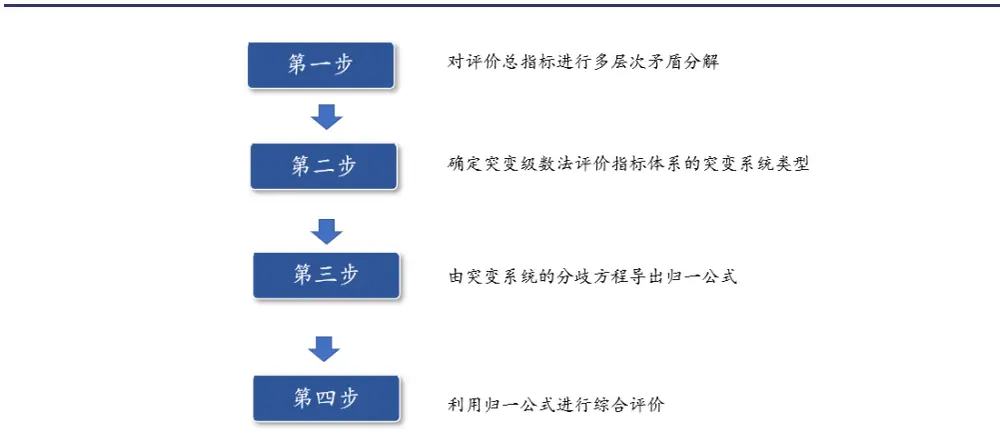
资料来源：兴业证券经济与金融研究院

## 2.2.2、指数构建

上文我们构建财务危机风险预警精选指标库，可以看出公司的财务危机风险可如图表 13所示进行分解。同时基于变量间的相关系数（大于 0.3则认为是互补型、小于 0.3认为是非互补型），综合变量个数，我们确定了指标体系的突变系统类型，最后根据归一公式得到最终的财务危机预警指数。财务危机预警指数越小说明陷入财务危机的概率越大。

图表 13、公司财务危机预警指标构建细节
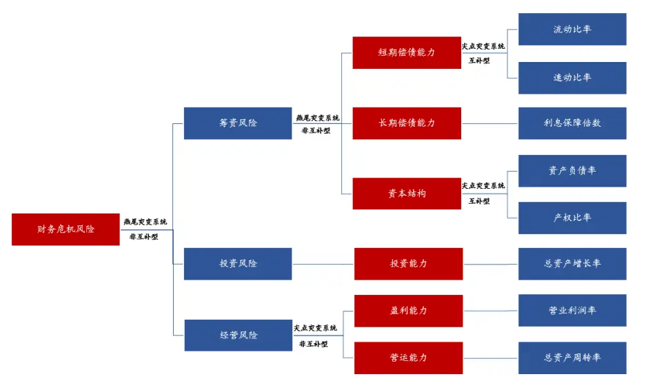
资料来源：兴业证券经济与金融研究院

图表 14、变量相关系数：三级指标

|  | 短期偿债能力 |  | 资本结构 |  |
| --- | --- | --- | --- | --- |
|  | 流动比率 | 速动比率 | 资产负债率 | 产权比率 |
| 流动比率 | 100.00% | 95.84% | 19.10% | 21.44% |
| 速动比率 | 95.84% | 100.00% | 17.59% | 20.23% |
| 资产负债率 | 19.10% | 17.59% | 100.00% | 90.07% |
| 产权比率 | 21.44% | 20.23% | 90.07% | 100.00% |

资料来源：Wind，聚源，兴业证券经济与金融研究院整理

图表 15、变量相关系数：二级指标

|  | 筹资风险 |  |  | 经营风险 |  | 投资风险 |
| --- | --- | --- | --- | --- | --- | --- |
|  | 短期偿债能力 | 资本结构 | 长期偿债能力 | 营运能力 | 盈利能力 | 投资能力 |
| 短期偿债能力 | 100.00% | 22.30% | 14.84% | -2.66% | 13.74% | 18.31% |
| 资本结构 | 22.30% | 100.00% | 4.73% | -8.51% | 16.99% | -1.47% |
| 长期偿债能力 | 14.84% | 4.73% | 100.00% | 1.88% | 10.48% | 10.70% |
| 营运能力 | -2.66% | -8.51% | 1.88% | 100.00% | 0.74% | 7.11% |
| 盈利能力 | 13.74% | 16.99% | 10.48% | 0.74% | 100.00% | 5.80% |
| 投资能力 | 18.31% | -1.47% | 10.70% | 7.11% | 5.80% | 100.00% |

资料来源：Wind，聚源，兴业证券经济与金融研究院整理

图表 16、变量相关系数：一级指标

|  | 财务危机风险 |  |  |
| --- | --- | --- | --- |
|  | 投资能力 | 筹资风险 | 经营风险 |
| 投资能力 | 100.00% | 17.57% | 7.48% |
| 筹资风险 | 17.57% | 100.00% | 4.72% |
| 经营风险 | 7.48% | 4.72% | 100.00% |

资料来源：Wind，聚源，兴业证券经济与金融研究院整理

## 2.3、财务危机预警组合评价

通过上文方式我们得到了财务危机预警指数。下面我们基于预警指数后 5%的公司（财务危机概率较大的公司）构建“财务危机预警组合”，下文简称“预警组合”。

## 1)预警组合特征

预警组合个股数量维持在120 到200之间，占A股比例长期在5%左右。

图表 17、财务危机预警公司个数
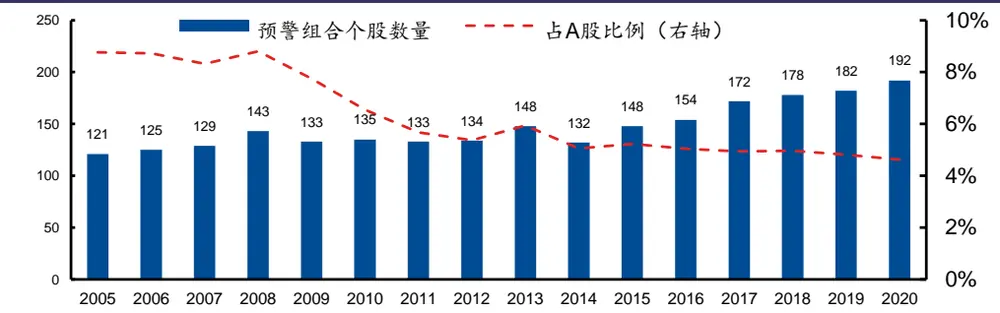
资料来源：Wind，聚源，兴业证券经济与金融研究院整理

预警组合个数占主流宽基指数比例有所降低。近年来，沪深 300、中证 500成分股中预警组合个股比例有所降低。以沪深300为例，从最初的 20%降低至目前的 3%。

图表 18、预警组合内沪深300成分股个数
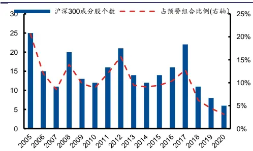

图表 19、预警组合内中证500成分股个数
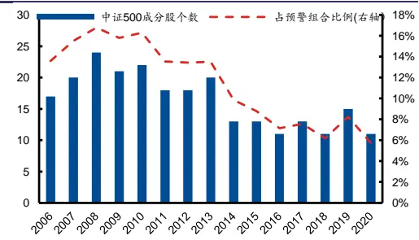
资料来源：Wind，聚源，兴业证券经济与金融研究院整理

预警组合流通市值相对较小。从流动市值来看，预警组合中位数基本上小于全市场中位数。

图表 20、流通市值中位数：预警组合VS全市场（亿元）
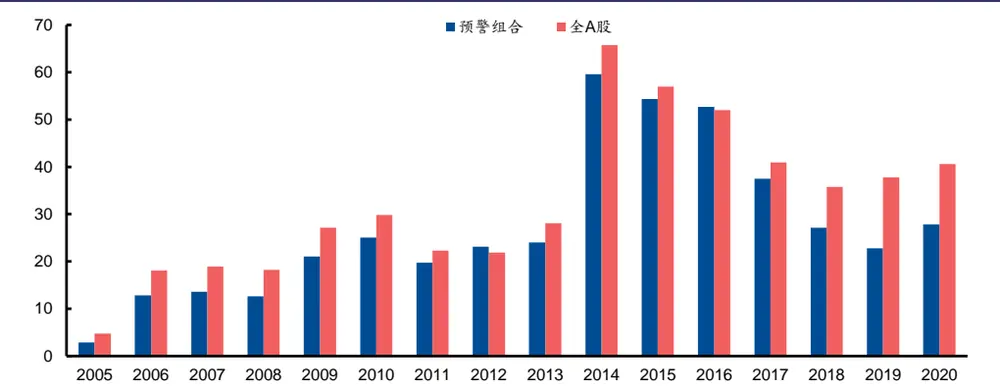
资料来源：Wind，聚源，兴业证券经济与金融研究院整理

## 2)预警组合命中率

我们将预警组合财务危机公司占比定义为预警组合命中率。

可以看出预警组合平均命中率较高，达 55.80%。预警组合2005年至 2020年16年中仅有4个年份命中率小于50%。同时头部组合（预警指数前5%构建组合）、全A 股命中率均显著低于预警组合。

图表 21、预警组合命中率
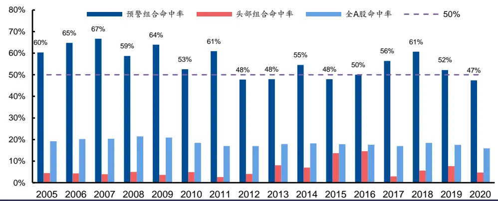
资料来源：Wind，聚源，兴业证券经济与金融研究院整理

同时预警组合财务危机个股数量占全市场财务危机个股比例维持在 10%以上。

图表 22、预警组合财务危机个股数量占全市场财务危机个股比例
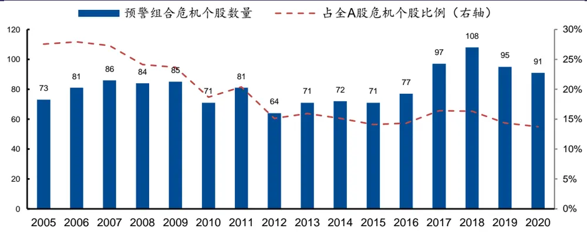
资料来源：Wind，聚源，兴业证券经济与金融研究院整理

## 3)预警组合股票收益率

下面我们假设在每年 5 月第一个交易日（所有公司年报披露完成）后等权持有财务危机预警组合个股。

图表23、25为 2006年 5月来策略的收益表现、分年度收益。我们知道，2016年以前，A股具有显著的壳资源效应，即亏损、ST的个股被认为是潜在的壳资源标的，一旦被借壳，股价可能会大幅度上涨。从图表 25 也可以看出预警组合 16年以前存在一定的超额收益。然而随着市场规范化程度不断提升，大盘蓝筹股受到市场青睐。可以看出组合具有较为显著的负超额，且每年都维持着稳定的负超额。我们认为，未来市场规范化程度有望进一步提升，预警组合在股价上的指导意义将持续。

图表 23、预警组合收益率（2006.05-2021.9.30）

|  | 年化收益率 | 年化波动率 | 收益风险比 | 最大回撤 |
| --- | --- | --- | --- | --- |
| 预警组合 | 18.91% | 23.38% | 0.81 | 62.63% |
| Wind 全 A | 12.62% | 27.68% | 0.46 | 70.59% |
| 相对收益 | 6.98% | 15.51% | 0.45 | 57.86% |

资料来源：Wind，聚源，兴业证券经济与金融研究院整理

图表 24、预警组合历史净值（2006.05-2021.09.30）
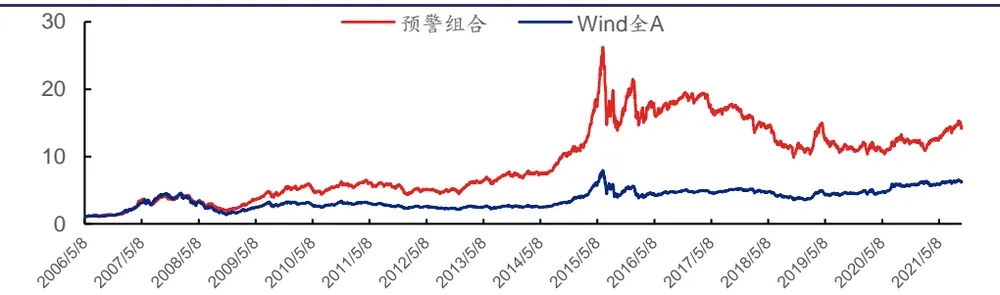
资料来源：Wind，聚源，兴业证券经济与金融研究院整理

图表 25、预警组合分年度收益

| 预警组合 | Wind 全 A |  | 超额收益 |
| --- | --- | --- | --- |
| 2007.05 | 257.00% | 214.25% | 42.75% |
| 2008.05 | -5.15% | 5.97% | -11.13% |
| 2009.05 | 7.23% | -27.20% | 34.43% |
| 2010.05 | 45.17% | 18.10% | 27.07% |
| 2011.05 | 15.75% | 8.45% | 7.30% |
| 2012.05 | -17.83% | -16.27% | -1.56% |
| 2013.05 | 24.43% | -6.71% | 31.14% |
| 2014.05 | 19.31% | 3.04% | 16.27% |
| 2015.05 | 148.55% | 143.60% | 4.95% |
| 2016.05 | -3.40% | -25.82% | 22.41% |
| 2017.05 | -1.07% | 4.41% | -5.48% |
| 2018.05 | -19.76% | -1.51% | -18.26% |
| 2019.05 | -11.98% | -7.24% | -4.74% |
| 2020.05 | -12.22% | 9.74% | -21.96% |
| 2021.05 | 13.31% | 24.37% | -11.06% |
| 2021.09.30 | 16.16% | 6.20% | 9.96% |

资料来源：Wind，聚源，兴业证券经济与金融研究院整理

图表 26、预警组合分年度超额收益
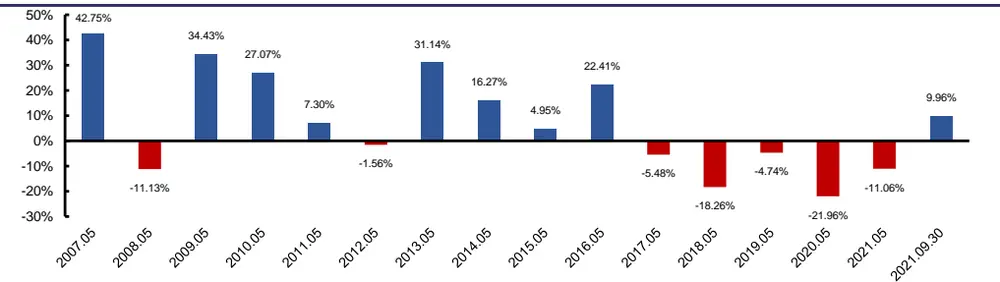
资料来源：Wind，聚源，兴业证券经济与金融研究院整理

图表 27、预警组合收益率（2016.05.06-2021.09.30）

|  | 年化收益率 | 年化波动率 | 收益风险比 | 最大回撤 |
| --- | --- | --- | --- | --- |
| 预警组合 | -3.95% | 18.92% | -0.21 | 49.75% |
| Wind 全 A | 6.17% | 18.90% | 0.33 | 33.34% |
| 相对收益 | -9.68% | 10.92% | -0.89 | 57.78% |

资料来源：Wind，聚源，兴业证券经济与金融研究院整理

图表 28、预警组合历史净值（2016.05-2021.10.22）
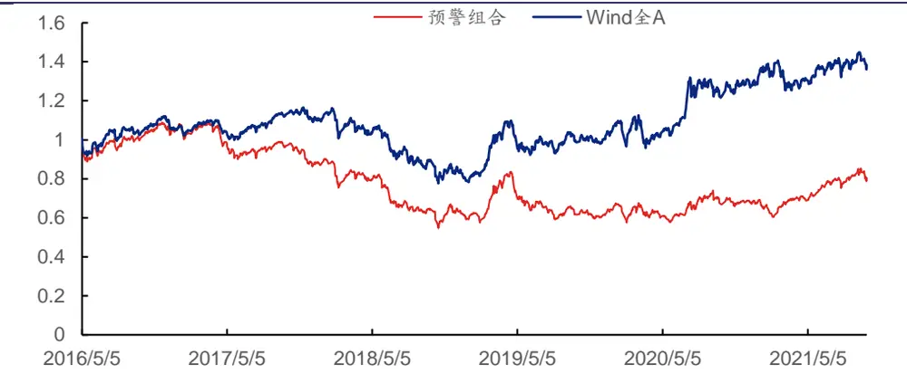
资料来源：Wind，聚源，兴业证券经济与金融研究院整理

## 3、如何识别公司财务造假风险？

财务造假是公司管理层组织的，在财务报告中蓄意错报、漏报财务数据，以虚构利润为目的的系统性造假。相较盈余管理，财务造假往往情节更加恶劣，违反相应会计准则设定。

图表 29、财务造假 vs盈余管理
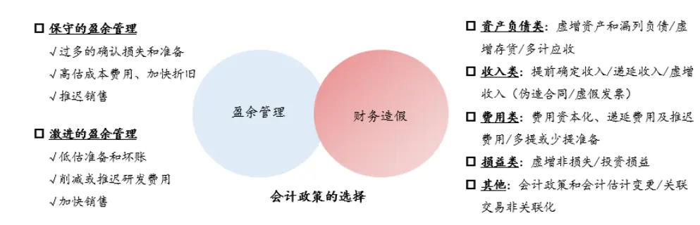
资料来源：兴业证券经济与金融研究院

如何通过各种信息判断出可能进行财务造假的公司，从而在投资前避开这些雷区，是投资者重点关注的问题。目前已有众多学者针对财务造假这一问题进行了深入的研究，主要可分为：

## 1、 公司财务造假的动因

G.Jack.Bologana（1993）首次提出的 GONE 理论，也被称为四因素论，是企业财务造假方面的著名理论之一。GONE 是指贪婪、机会，需要、暴露，代表了公司财务造假的四个必要条件，共同决定了公司财务造假可能产生的风险程度。Albrecht（1995）提出了舞弊三角形理论，也被称为三因素论，该理论认为财务造假行为的成因有三：压力、机会以及粉饰性理由。在此三大要素并存的前提下，才可能会导致财务造假。风险因子理论是 G.Jack.Bologana 等人在 GONE 理论的基础上发展形成的，是目前在财务造假方面最为完善的风险因子学说。该理论将风险因子区分为个别风险因子和一般风险因子，个别风险因子包括企业道德品质和财务造假的动机，一般风险因子包括机会因素，被发现的可能性以及被发现后受到的惩罚的性质和程度。当两种风险因子结合在一起，并且被造假之人认为有利时，就会导致造假行为的发生。

## 2、 公司财务造假的方法

Worthy(1984)提出企业通常运用三种手段粉饰业绩，第一，不正确的确认收入和成本；第二，改变损益类科目确认期间；第三，随意更改会计方法。Beasley(1996)认为上市公司财务造假更倾向于采用高估利润和虚增公司资产等手段。Carcello(2000)发现通常企业制度不完善，管理层过分强调利润等现象也预示着可能发生财务造假行为。肖丽芬(2008)提出企业财务造假手段主要包含：资产重组转移利润、滥用会计政策和估计、关联方交易虚增收入、政府补助粉饰盈亏等。刘元(2015)等学者通过研究近几年证监会处罚公告认为上市公司主要通过调节利润、调节资产负债和财务报表附注舞弊等手段进行财务造假。

## 3、 公司财务造假识别

在研究财务造假识别模型的相关文献资料中，运用机器学习模型和统计分析的文献数量相对较多。Pearson(1995)首次将逻辑回归模型应用于财务造假的识别，从反映上市公司各个方面财务状况的诸多指标中，筛选得到 4 个与这些公司造假行为密切相关的评价指标：资本周转率、财务杠杆系数、企业规模和流动资产比率。Fanning和 Cogger(1998)采用了神经网络技术，基于 20 个具有良好鉴别能力的指标来设计财务造假识别模型。作者在文章中指出该方法的不足之处在于，其“黑箱”式的体系结构，解释能力较弱。Kotsiantis等 (2007)对BP神经网络、贝叶斯网络以及决策树识别财务造假的效果进行对比，研究发现贝叶斯网络识别效果优于传统 BP 神经网络和决策树，判断精度达到90%以上。Sean L.Humpherys等(2011)研究发现分析财报文本的措辞也能有效识别出财务造假行为，作者是运用决策树和贝叶斯网络这两种方法构建的财务造假识别模型。Goel(2016) 使用自然语言处理技术研究发现，造假财务报告与非造假财务报告相比，会使用更多表达情绪的词语。

## 3.1、构建财务造假数据库

目前，关于A股财务造假未有较为完善的规范数据。所谓“巧妇难为无米之炊”，特别对于量化研究，数据可谓是基石。因此为了能够对A股财务造假公司进行识别，本文首先花费了大量时间对A 股历史造假样本进行梳理，构建兴证金工财务造假数据库。

我们从聚源的上市公司重大事项违规处罚（LC_Deregulation）表中得到企业历史违规受处罚的明细数据，包括违规企业、违规原因、涉及关联企业、处罚金额、处分措施等指标。

图表 30、聚源上市公司重大事项违规处罚表主要指标整理

| 列名 | 指标名 | 指标含义 |
| --- | --- | --- |
| Subject | 事项主体 | 本次处罚事项主体，包括：上市公司、中介机构、子公 司、公司股东。 |
| CompanyCode | 公司代码 | 公司代码 |
| InfoPublDate | 信息发布日期 | 违规事项处罚时间 |
| InfoSource | 信息来源 | 违规处罚信息披露来源，包括公司临时公告等 |
| EventContent | 事项内容 | 文本数据，为具体违规处罚的细节 |
| AdminObject | 处理对象 | 包括信息披露虚假、信息披露不及时、股票交易违法行 为、人员管理违规、税务管理违规等共87种违规行为。 |

资料来源：聚源，兴业证券经济与金融研究院整理

下面我们基于以下三个流程对上市公司重大事项违规处罚表进行处理：

第一步：基于事项主体进行筛选。首先为了筛选出以上市公司为处罚主体的样本，我们保留事项主体为上市公司的数据。

第二步：基于处理对象进行筛选。其次，我们筛选出处理对象为财务数据虚假、信息披露虚假的数据。

第三步：基于事项内容进行人工筛选。最后，我们基于事项内容进一步进行数据整理。

图表 31、财务造假数据处理流程
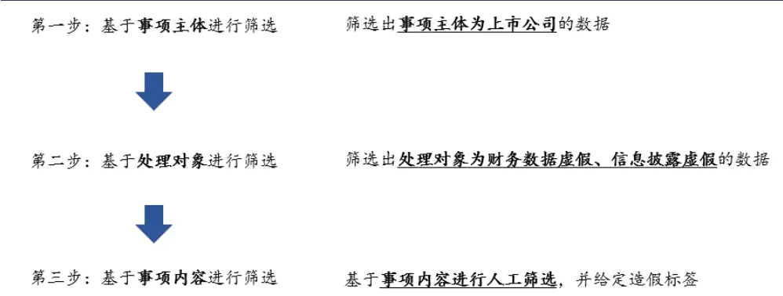
资料来源：兴业证券经济与金融研究院

具体的，在基于事项内容进行筛选时，我们主要基于以下原则：

1、样本保证宁缺毋滥：为了进行更准确分析，我们希望精选出真的财务造假的公司。具体操作上，我们剔除仅收到了问询函的样本、仅因披露不及时或业绩预报与真实财报数据差距较大而受到处罚的公司。

2、发挥一定的主观能动：公司造假的方式多样，且文本数据格式并不统一。以图表32为例，中兵红箭公司于2019年3月26日收到监管函，指出2014、2015、2016财务报告有虚增利润的行为，其造假相关的关键信息隐藏在文本之中，因此我们需要进行人工梳理，提炼关键信息。我们对保留的 2 千多条数据进行了逐一分析，提取造假处罚时间、造假年度、造假方式等信息。同时根据造假科目类别为造假数据打上标签，包括：资产负债类、收入类、费用类、损益类、其他。

图表 32、事项内容数据示例
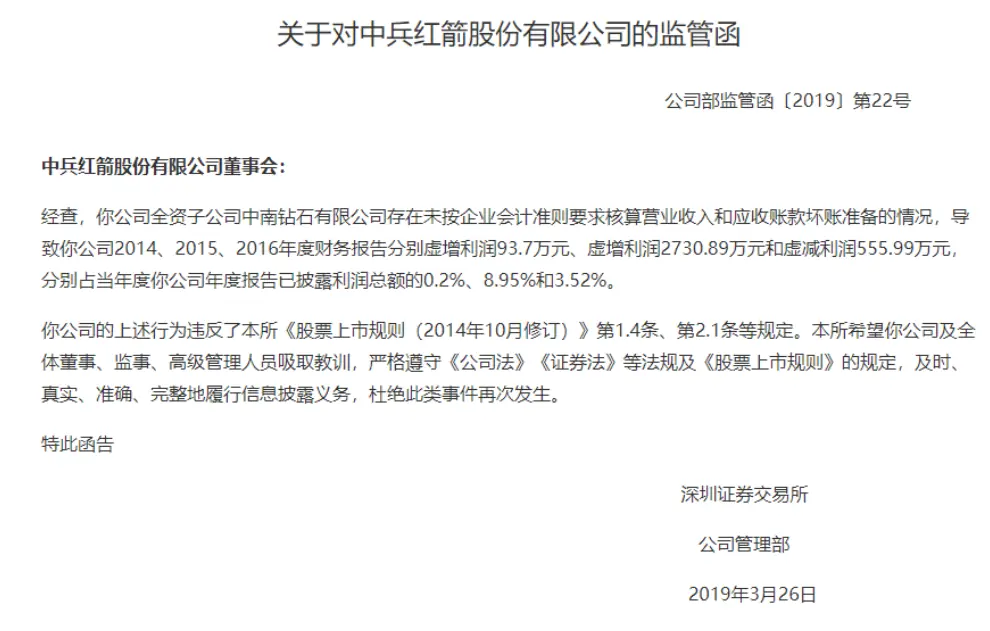
资料来源：聚源、兴业证券经济与金融研究院整理

最终我们得到兴证金工财务造假数据库，共包括三大类、11个指标。

图表 33、兴证金工财务造假数据库结构
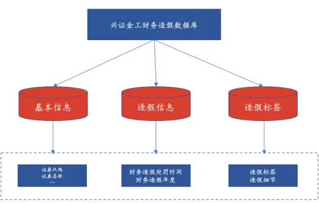
资料来源：兴业证券经济与金融研究院

图表 34、兴证金工财务造假数据库指标细节

| 分类 | 指标名 | 指标含义 |
| --- | --- | --- |
| 基本信息 | 证券代码 证券代码 |  |
|  | 证券名称 | 证券名称 |
|  | 上市时间 | 公司上市时间 |
|  | 退市时间 | 公司退市时间，若公司仍在市则为空值 |
|  | 是否借壳上市 | 公司是否借壳上市 |
|  | 借壳上市时间 | 若借壳上市则列出借壳上市时间，若无则为空 |
| 造假信息 | 财务造假处罚时间 | 公司造假被处罚时间 |
|  | 财务造假年度 | 公司造假报表年度 |
|  | 造假报告 | 公司造假的报告，包括一季报、中报、三季报、年报 |
| 造假标签 | 财务造假标签 | 资产负债类、收入类、费用类、损益类、其他 |
|  | 财务造假细节 财务造假细节概述 |  |

资料来源：兴业证券经济与金融研究院

## 3.2、深剖 A股历史造假公司

截止2021 年9 月 30日，数据库中共有 586条数据，涉及上市公司 246 家。其中 22家已退市，24 家被借壳后存续，200家目前仍处于上市状态。

图表 35、A股历史造假公司目前状态（截至 2021 年 9 月 30 日）
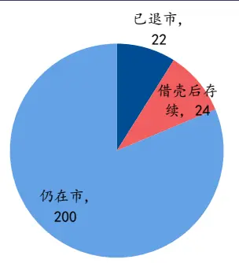

图表 36、A 股历史造假公司属性（截至 2021 年 9 月 30 日）
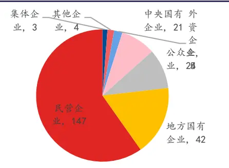
资料来源：聚源，wind，兴业证券经济与金融研究院整理

行业分布上，基础化工行业为财务造假高发行业，同时银行行业目前未有被认定为财务造假的公司。从行业来看，基础化工、医药、通信行业出现财务造假公司最多，分别为 25、23、15家；钢铁、煤炭、石油石化公司出现较少，而银行业目前未有财务造假的公司。

图表 37、历史财务造假公司中信一级行业分布
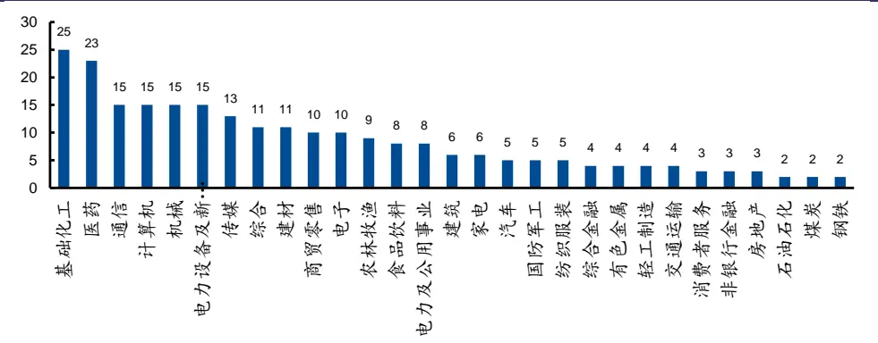
资料来源：Wind，聚源，兴业证券经济与金融研究院整理

2000 至 2016 年，财务造假样本数量不断增加。我们认为这可能与近年来监管不断趋严有关。同时 2017年以来造假样本被发现的较少，特别是 2020年以来，我们推测可能是由于目前一部分造假样本还未被发现，从图表 39可以看出大部分公司的造假在一年后被发现，同时 2-5年被发现的公司也都在 40个以上，这也说明财务造假具有一定的隐蔽性，被发现需要一定的时间。

图表 38、历史财务造假报告年度分布
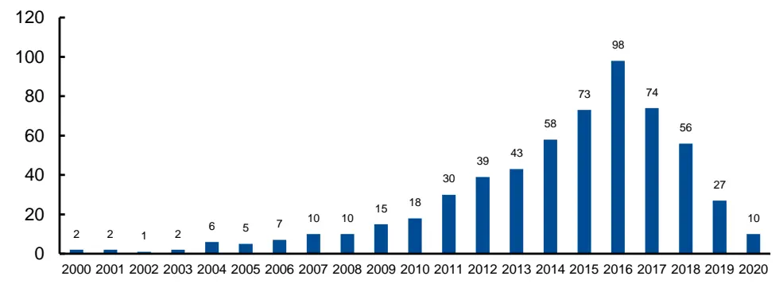
资料来源：Wind，聚源，兴业证券经济与金融研究院整理

图表 39、历史财务造假报告发现年度分布
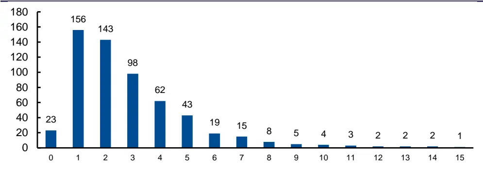
资料来源：Wind，聚源，兴业证券经济与金融研究院整理

财务造假后一年内个股相对万得全 A 指数平均超额收益为-11.87%。我们统计自财务造假开始一年内，年报造假个股相对万得全A 指数超额收益（从2005年开始），可以看出大部分个股在造假后超额收益为负数，而少部分个股（约占1/3）会获得超额收益。我们认为可能原因是财务造假的公司在造假之前基本面便出现了恶化的迹象，因此股价也有所下降。但同时也有部分个股造假隐蔽，获得了超额收益，这部分样本值得我们警惕。

图表 40、上市公司财务造假报告一年后超额收益
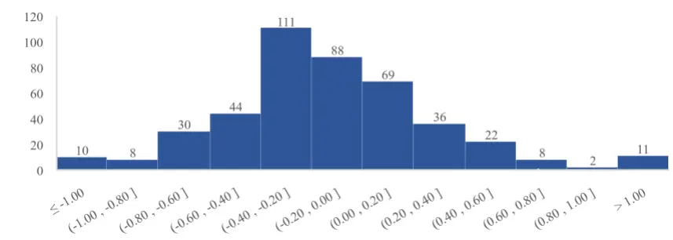
资料来源：Wind，聚源，兴业证券经济与金融研究院整理
这里我们仅统计2005年以后的报造假样本，年度统计周期为5月第一个交易日至次年第5 月第一个交易日

## 3.3、构建财务造假识别准则

财务造假通常有着较好的隐蔽性，被发现频率极低。本文研究 2005年后的年报造假样本。从图表41 可以看出，年报造假样本共出现过450次，占财务报告样本的 1.11%。

图表 41、原始造假样本分布概率

| 指标 | 造假样本 | 财务报告样本 | 比例 |
| --- | --- | --- | --- |
| 原始数据 | 450 | 40262 | 1.11% |

资料来源：Wind，聚源，兴业证券经济与金融研究院整理

同时公司造假方式多样，对财务造假进行预测困难重重。传统的财务造假识别模型可分为以下两类：

1、打分法：打分法有着计算简单、易于理解等优点。传统的 M-Score 模型，便是将多个指标进行合成打分。但由于结果是连续数值，无法很好的确定阈值，即究竟打分大于多少才认为是财务造假。是否评为造假对公司影响较大，但打分法可能会误判阈值附近的个股。

2、模型预测法：采用数学模型（神经网络、逻辑回归等模型）进行预测。此方法在财务造假识别中被广泛使用，模型准确率可达到较高水平。但模型预测方法也有着一些缺点：1）一部分复杂模型(机器学习)效果可能较好，但解释较为困难；2）历史上财务造假出现频率极低，因此造假样本有着严重的不均衡问题；同时即使判断为并未造假的个股也可能只是造假并未被发现，并不意味着样本无造假，这样构建的模型也就有失偏驳。

图表 42、常用财务造假识别模型
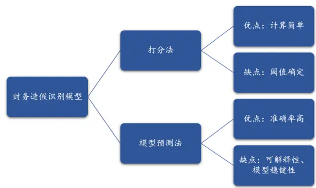
资料来源：兴业证券经济与金融研究院

在实践中，人们往往会提出一些进行财务造假筛选的准则来确定财务造假样本。例如“存贷双高”的公司可能会被认为财务报告存在异常；毛利率过高的公司也被打上造假的嫌疑。本文从此角度出发，提出准则筛选法来选取财务造假概率较大的公司，具体步骤如下：

1、构建财务造假识别准则库：首先我们需要构建财务造假识别准则库，即根据业界经验和相关研究整理出现哪些情况的个股通常会被认为造假概率较高；

2、进行准则的量化验证：我们构建识别效率指标对单准则进行量化验证。例如历史上“存贷双高”的个股究竟有多少只被发现进行了财务造假；

3、综合得到最终的异常股票池：最后我们选取识别效率较高的准则构建最终的异常股票池。

图表 43、准则筛选法流程
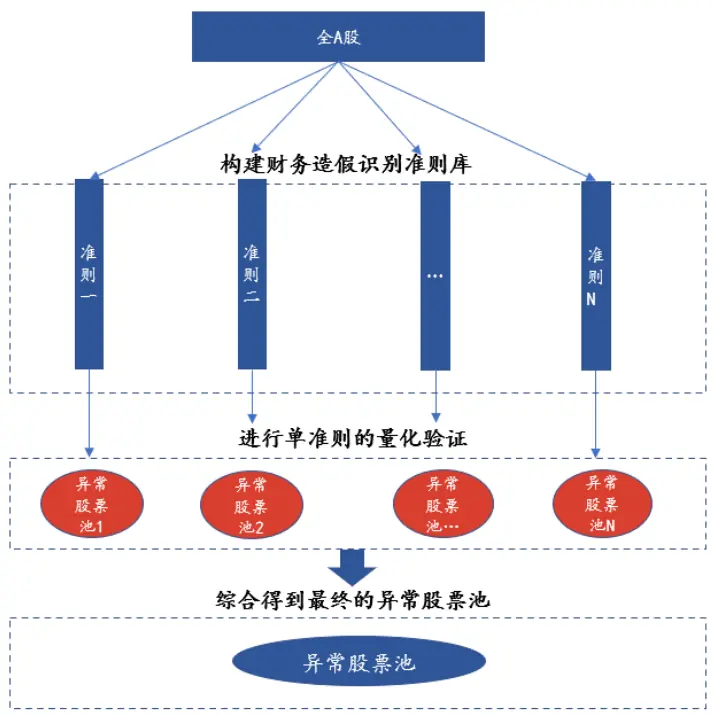
资料来源：兴业证券经济与金融研究院

## 3.3.1、财务造假识别准则库

下面，我们首先基于相关文献和业界经验从以下四个维度构建了财务造假识别准则库：

## 1、财务造假压力

Albrecht（1995）认为压力是财务造假产生的根源，也是直接的利益驱动因素。因此我们主要从财务业绩角度筛选财务造假压力方面的准则。

## 毛利率指数

若销售毛利率指数小于 0，则说明公司的盈利能力有所下降，可能进一步导致公司的前景变差，公司可能有财务造假的倾向。

## 前 N 年亏损情况

A 股存在 ST 制度，对财务状况或其他状况出现异常的公司进行特别处理，这类股票被称为 ST 股，其中经营两年亏损会为 ST 股，经营三年亏损会标记为*ST，公司为防止被特殊处理可能会有财务造假的倾向。

## 特殊处理

特殊处理的公司经营管理往往出现了问题，因此可能会有财务造假的倾向。

图表 44、财务造假压力相关指标

| 指标 | 指标名称 | 计算公式 |
| --- | --- | --- |
| GMI | 毛利率指数 | 本期毛利率-上期毛利率 |
| LossY_2 | 前两年是否亏损 | 虚拟变量，如果前两年亏损，则指标为1；否则指标为0 |
| LossY_1 | 前一年是否亏损 | 虚拟变量，如果前一年亏损，则指标为1；否则指标为0 |
| LossY_0 | 本年是否亏损 | 虚拟变量，如果本年亏损，则指标为1；否则指标为0 |
| ST | 特殊处理 | 公司是否 ST |

资料来源：兴业证券经济与金融研究院

## 2、财务造假空间

企业进行造假之后如果能够将造假行为掩盖，使其不被发现，则会加大财务造假的可能性。从历史样本来看，应收账款、存货等科目为财务造假提供了较大的空间，帮助企业进行财务造假的隐藏，因此下面我们对财务造假空间准则进行梳理。

## 折旧率指数

## DEPI=本年折旧率-上年折旧率

其中折旧率为折旧费用/固定资产原值。此指数小于0时则说明企业的折旧率下降，公司可能修改了资产的可用年限或采用其他方法低估了折旧费用，从而提高盈余。

## 应收账款指数

## DSRI=本年应收账款占营收比例-上年应收账款占营收比例

一般来说，正常经营的公司的应收账款占营收比例会维持相对稳定。该比例的上升通常预示着公司所处的环境恶化，使得公司被迫修改销售-信用政策以促进销售，反映出过于激进的收入政策。

## 净现率指数

## DSCI=本年净现率-上年净现率

净现率是指企业本期经营活动产生的现金净流量占净利润比例。在一般情况下，

此比率越大，企业盈利质量越高。如果净利润高，而经营活动产生现金流量很低，说明本期净利润中存在尚未实现现金的流入，企业净收益质量很差，即使盈利，也可能发生现金短缺，严重时会导致企业破产。

## 资产质量指数

## AQI =本年非实物资产比例-上年非实物资产比例

其中非实物资产比例=1-(固定资产+流通资产)/总资产。若这个指数大于 0，表明公司的资产质量出现了下降，企业可能会通过异常费用的资本化来进行费用的递延以虚增利润。

## 应计系数指数

## TATAI = 本年应计系数-上年应计系数

其中应计系数为应计项目（净利润-经营现金流净额）除以总资产。此指标依照Sloan 在 1996 年的文献中设计的方法所构造的，应计利润被认为是财务造假的一个重要参考变量，此指标越大，则认为公司发生财务造假的概率越大。

## 存货指数

## InvI = 本年存货占营收比例-本年存货占营收比例

一般来说，正常经营的公司的存货指数会维持相对稳定。该指数的上升通常预示着公司所处的环境恶化。

图表 45、财务造假空间相关指标

| 指标 | 指标名称 | 计算公式 |
| --- | --- | --- |
| DEPI | 折旧率指数 | 本年折旧率-上年折旧率（折旧率=折旧费用/固定资产原值） |
| DSRI | 应收账款指数 | 本年应收账款占营业收入比例-上年应收账款占营业收入比例 |
| DSCI | 净现率指数 | 本年净现率-上年净现率(净现率=经营现金流量净额占净利润比例） |
| AQI | 资产质量指数 | 本年的非实物资产比例-上年的非实物资产比例 |
| TATAI | 应计系数指数 | 本年应计项目占总资产比例-上年的总资产指数 |
| InvI | 存货指数 | 本年存货占营业收入比例-上年存货占营业收入比例 |

资料来源：兴业证券经济与金融研究院

## 3、财务造假借口

财务造假借口是财务造假者为自己的所作所为并没有违反职业道德和社会公德所寻找的理由，常用借口如下：

## 关联交易

关联交易，是指发生在关联企业或者自然人之间的有关移转资源或设定权利、义务等事项安排的行为。根据历史财务造假数据可以看出，关联交易是财务造假的重灾区，造假公司可能会通过隐藏关联交易来虚增利润。

## 毛利率

毛利率是企业核心竞争力的财务反映，亦是IPO审核中重点关注的财务指标。除非经济环境发生重大改变，毛利率一般是比较稳定的，不会有大的波动，并且也很少会出现远远高于同行业的平均水平。但同样的，公司可能会通过较高的毛利率来隐藏财务造假，增加自己对于投资者的吸引力。

## 商誉

商誉是在企业收购过程中，购买方对合并成本大于合并中取得的被购买方可辨认净资产公允价值份额的差额。从形成机制看，商誉主要取决于收购方的收购定价，当事人如果有意虚增被收购方资产，对收购定价操控空间很大，因而商誉虚增金额的操纵空间也比较大。

图表 46、财务造假借口相关指标

| 指标 | 指标名称 | 计算公式 |
| --- | --- | --- |
| NRPI | 关联企业数量 | 关联企业的数量 |
| GRM | 毛利率 | 毛利率 |
| BRI | 商誉净资产比例 | 商誉占净资产比例 |

资料来源：兴业证券经济与金融研究院

## 4、财务造假迹象

财务报表互相之间并不独立，当财务报告被进行修饰后，一些项目可能会出现逻辑漏洞，因此我们构建财务造假迹象准则。

## 审计意见

在财务报表审计中，审计意见是对财务报表是否已按照适用的会计准则编制，以及财务报表是否在所有重大方面的公允，反映了被审计者的财务状况、经营成果和现金流量发表的意见。当审计人员根据获取的审计证据，得出财务报表整体存在重大错报的结论，或是在审计中无法获取充分适当的审计证据，不能得出财务报表整体不存在重大错报的结论时，应当出具非无保留意见。换言之，被出具非保留意见的财务报告通常存在很大的财务造假迹象。聚源数据库中审计意见类型分为：1-无保留，2-无保留带解释性说明，3-保留意见，4-拒绝/无法表示意见，5-否定意见，6-未经审计，7-保留带解释性说明，10-经审计（不确定具体意见类型）。我们将类型大于 4的情况作为造假概率较大的情况。

## 存贷双高

存贷双高是指企业的报表中存款和贷款均较高的情况。

存款是指企业的货币现金以及可以快速变现的现金等价物，如有保证的承兑汇票即应付票据。

贷款是指企业的有息负债，包括短期借款、长期借款、一年内到期的长期借款、应付票据以及应付债券等。

为更好的度量存贷双高，我们构建货币资金占比、有息负债占比两个指标表示企业存款、贷款情况。本文将货币资金占比、有息负债占比同时大于 30%的情况认定为造假概率较大：

$$
货币资金占比=广义货币资金/总资产
$$

$$
\begin{aligned}其中,\ 广义货币资金=&货币资金+应收票据+其他流动资产\\&有息负债占比=有息负债/总资产\end{aligned}
$$

其中，有息负债 = 短期借款 + 应付票据 + 一年内到期的非流动负债 + 应付短期债券 + 长期借款 + 应付债券

图表 47、财务造假迹象相关指标

| 指标 | 指标名称 | 计算公式 |
| --- | --- | --- |
| Opinion | 审计意见 | 审计机构给出的财务报表意见 |
| HDL | 存贷双高 | 货币资金和贷款占净资产比例大于30% |

资料来源：兴业证券经济与金融研究院

上文我们从财务造假压力、财务造假空间、财务造假借口与财务造假迹象四个维度构建了财务造假识别准则库。

图表 48、财务造假识别准则库
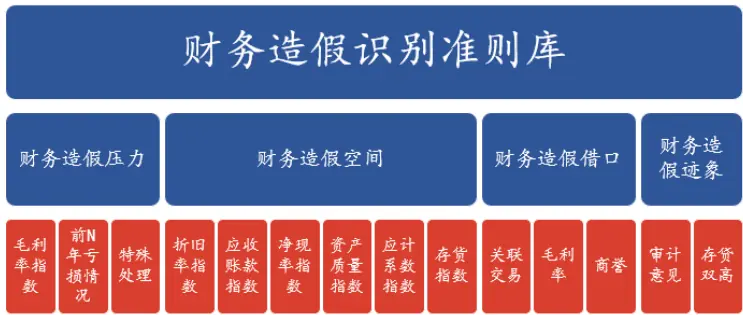
资料来源：兴业证券经济与金融研究院

同时考虑到不同行业内指标变动可能有所差异，我们也构建了行业内部比较的指标，最终我们从以下逻辑构建指标：

1、指标本身变动表现：如毛利率小于去年毛利率

2、指标变动相对行业表现：例如毛利率变动低于行业两倍标准差

3、指标本身相对行业：例如毛利率低于行业两倍标准差。

图表 49、单指标准则集

| 指标 |  | 指标代码 | 指标含义 |
| --- | --- | --- | --- |
| 财务 造假 动力 | 毛利率 | GMI | 本年毛利率小于去年毛利率 |
|  |  | GMI_ind | 本年毛利率变动低于行业两倍标准差 |
|  |  | GM_ind | 本年毛利率低于行业两倍标准差 |
|  | 前N年亏 损情况 | NetProfit Y2 | 前两年是否亏损 |
|  |  | NetProfit_Y1 | 前一年是否亏损 |
|  |  | NetProfit Y0 | 本年是否亏损 |
|  | 特殊处理 | 特殊处理 | 特殊处理 |
| 财务 造假 | 折旧率 | DEPI | 本期折旧率小于上期折旧率 |
|  |  | DEPI ind | 本年折旧率减去去年折旧率低于行业两倍标准差 |
|  |  | DEP_ind | 本年折旧率低于行业两倍标准差 |
|  | 应收账款 营收比 | DSRI | 本年应收账款占营业收入比例大于去年应收账款 |
|  |  | DSRI ind | 本年应收账款占营业收入比例变动高于行业两倍标准差 |
|  |  | DSR_ind | 本年应收账款占营业收入比例高于行业两倍标准差 |
|  | 净现率 | DSCI | 本年净现率小于去年净现率 |
|  |  | DSCI ind | 本年净现率减去去年折旧率低于行业两倍标准差 |
|  |  | DSC_ind | 本年净现率低于行业两倍标准差 |
|  | 空间 资产指标 指数 | AQI | 本年资产质量指数大于去年资产质量指数 |
| AQI_ind |  | 本年资产质量指数变动高于行业两倍标准差 |  |
| 应计系数 | AQ_ind TATAI | 本年资产质量指数高于行业两倍标准差 本年应计系数大于去年应计系数 |  |
|  | TATAI ind |  |  |
|  | TATA_ind | 本年应计系数变动高于行业两倍标准差 |  |
|  | InvI | 本年应计系数高于行业两倍标准差 本年存货占营收比例大于去年存货占应收比例 |  |
|  | 存货占营 收比例 |  |  |
|  |  | InvI_ind | 本年存货占营收比例变动高于行业两倍标准差 |
| Inv_ind |  | 本年存货占营收比例高于行业两倍标准差 |  |
| 财务 造假 借口 | 关联企业 数量 | NRPI | 本年关联企业数量大于去年关联企业数量 |
|  |  | NRPI_ind | 本年关联企业数量变动大于行业两倍标准差 |
|  |  | NRP_ind | 本年关联企业数量大于行业两倍标准差 |
|  | 毛利率 | GMRI | 本年毛利率大于去年毛利率 |
|  |  | GMRI_ind | 本年毛利率变动高于行业两倍标准差 |
|  |  | GMR_ind | 本年毛利率高于行业两倍标准差 |
| 商誉净资 产比例 | BRI | 本年商誉净资产比例大于去年商誉净资产比例 |  |
|  | BRI_ind | 本年商誉净资产比例变动大于行业两倍标准差 |  |
|  | BR_ind | 本年商誉净资产比例大于行业两倍标准差 |  |
| 财务 造假 | 审计意见 opinion | 审计意见 |  |
| 迹象 | 存贷双高 HDL | 存款占比大于30%同时贷款比例大于 30% |  |

资料来源：兴业证券经济与金融研究院

## 3.3.2、财务造假准则量化验证

我们首先给出以下定义：

1、异常股票池：根据准则筛选出的股票池范围；

2、准则识别效率：异常股票池的财务造假样本数量/异常股票池数量。

其中识别效率为我们主要的评价指标。图表50展示了基于单准则构建异常股票池的结果，可以得到以下结论：

1、表现最好的为个股审计意见准则：当审计师出具非标准意见时，公司报告财务造假概率较高，历史上有 439 只个股被出具了非标意见，其中18只个股历史上为财务造假个股。

2、财务指标行业比较后的异常结果更有意义：可以看出前十准则大多都是行业内比较指标，即在判断财务是否出现异常时，考虑行业因素有着重要意义。

图表 50、识别效率前十单准则

|  | 指标代码 | 变量名称 | 财务造假 样本 票池 | 异常股 | 识别效率 |
| --- | --- | --- | --- | --- | --- |
| 1 | opinion | 审计意见 | 18 | 439 | 4.10% |
| 2 | HDL | 存贷双高 | 23 | 779 | 2.95% |
| 3 | DSC_ind | 本年净现率低于行业两倍标准差 | 24 | 854 | 2.81% |
| 4 | TATA ind | 本年应计系数高于行业两倍标准差 本年净现率减去去年折旧率低于行 | 20 | 759 | 2.64% |
| 5 | DSCI ind | 业两倍标准差 | 24 | 927 | 2.59% |
| 6 | BRI_ind | 本年商誉净资产比例变动大于行业 两倍标准差 | 11 | 435 | 2.53% |
| 7 | DSRI ind | 本年应收账款占营业收入比例变动 高于行业两倍标准差 | 23 | 932 | 2.47% |
| 8 | DSR_ind | 本年应收账款占营业收入比例高于 行业两倍标准差 | 37 | 1573 | 2.35% |
| 9 | TATAI_ind | 本年应计系数变动高于行业两倍标 准差 | 18 | 771 | 2.33% |
| 10 | GM ind | 本年毛利率低于行业两倍标准差 | 10 | 447 | 2.24% |

资料来源：Wind，聚源，兴业证券经济与金融研究院整理

但总得来看，单准则的识别效率较低。因此下面探讨复合准则的判别结果。复合准则即主要探讨个股满足多个信号后是否造假概率会较高。下面我们测试了双准则、三准则复合的结果，可以看出三准则效果较好。

图表 51、识别效率前二十复合准则（双准则复合）

| 指标 | 财务造假样本 | 异常股票池 | 识别效率 |
| --- | --- | --- | --- |
| 指标1 | 指标2 |  |  |
| BRI ind | GM ind 2 | 10 | 20.00% |
| DSRI ind | Hdl 2 | 11 | 18.18% |
| DEPI_ind | opinion 2 | 13 | 15.38% |
| BRI ind | GMR ind 1 | 7 | 14.29% |
| BR ind | DSC ind 3 | 22 | 13.64% |
| Hdl | TATA ind 3 | 23 | 13.04% |
| BRI_ind | DSC ind 1 | 8 | 12.50% |
| DSC ind | NRP ind 2 | 16 | 12.50% |
| BR ind | DSCI ind 3 | 26 | 11.54% |
| BR_ind | GM_ind 2 | 18 | 11.11% |
| DSCI ind | GMR ind 1 | 9 | 11.11% |
| BRI | TATA ind 5 | 48 | 10.42% |
| AQI ind | GM ind 2 | 20 | 10.00% |
| DSCI ind | GMRI ind 3 | 30 | 10.00% |
| DSCI ind | Hdl 3 | 31 | 9.68% |
| BRI ind | DSCI ind 1 | 11 | 9.09% |
| DSC ind | GMRI ind 2 | 22 | 9.09% |
| DEPI | opinion 11 | 128 | 8.59% |
| BR ind DEPI_ind | NRP ind 2 NRP ind 1 | 24 12 | 8.33% 8.33% |

资料来源：Wind，聚源，兴业证券经济与金融研究院整理

图表 52、识别效率前二十复合准则（三准则复合）

| 指标 |  |  | 财务造假样本 | 异常股票池 | 识别效率 |
| --- | --- | --- | --- | --- | --- |
| 指标1 | 指标2 | 指标3 |  |  |  |
| AQI ind | InvI ind | NetProfit Y1 3 |  | 10 | 30.00% |
| BRI | DSC ind | NRP ind 2 |  | 7 | 28.57% |
| AQI ind | GMRI ind | InvI ind 2 |  | 8 | 25.00% |
| BR ind | DSCI ind | TATAI 3 |  | 13 | 23.08% |
| BRI ind | BR_ind | GM ind 2 |  | 9 | 22.22% |
| AQI ind | Inv ind | NetProfit Y1 | 3 | 14 | 21.43% |
| BRI | BRI ind | GM ind | 2 | 10 | 20.00% |
| AQI | BR ind | DSC ind | 3 | 16 | 18.75% |
| AQI | DSC_ind | NRP_ind | 2 | 11 | 18.18% |
| AQI ind | GM ind | NetProfit Y0 | 2 | 12 | 16.67% |
| AQI | BRI ind | DSC ind | 1 | 6 | 16.67% |
| DSCI ind | DSRI | Hd1 | 3 | 19 | 15.79% |
| BRI | GMRI | opinion | 4 | 26 | 15.38% |
| AQI | GMR ind | TATAI ind | 2 | 13 | 15.38% |
| Hdl | TATAI | TATA ind | 3 | 20 | 15.00% |
| BRI | InvI | TATA ind | 4 | 28 | 14.29% |
| AQI | BRI ind | GMR ind | 1 | 7 | 14.29% |
| DSCI ind | GMI | 特殊处理 | 3 | 21 | 14.29% |
| AQI | DSC ind | GMRI ind | 2 | 14 | 14.29% |
| DEPI | NRPI | opinion | 4 | 29 | 13.79% |

资料来源：Wind，聚源，兴业证券经济与金融研究院整理

## 3.4、财务异常组合评价

我们基于上述识别效率前 20 的复合准则（三准则）构建“财务异常组合”，简称为“财务异常组合”，即取排名前 20 准则的并集，我们认为此组合大概率有财务造假的风险。

## 3.4.1、财务异常组合特征

可以看出财务异常组合股票个数较少，每期平均仅17 只。从之前的统计结果我们也可以看出财务造假本身就是小概率事件，因此数量较少符合预期。

图表 53、财务异常组合公司个数
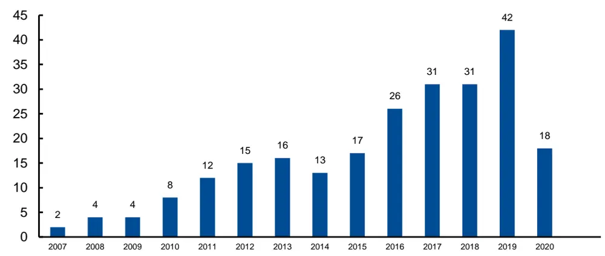
资料来源：Wind，聚源，兴业证券经济与金融研究院整理

图表 54、异常组合沪深300 成分股个数
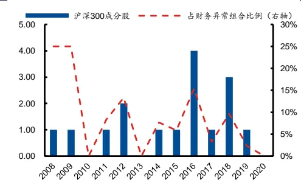

图表 55、异常组合中证 500成分股个数
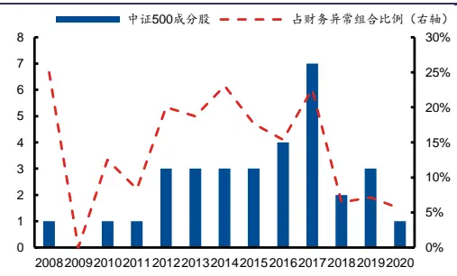
资料来源：Wind，聚源，兴业证券经济与金融研究院整理

从流动市值来看，异常组合相较预警组合流通市值更大。在部分年份出现了流动市值中位数大于全市场中位数的情况。

图表 56、流通市值中位数：异常组合VS全市场（亿元）
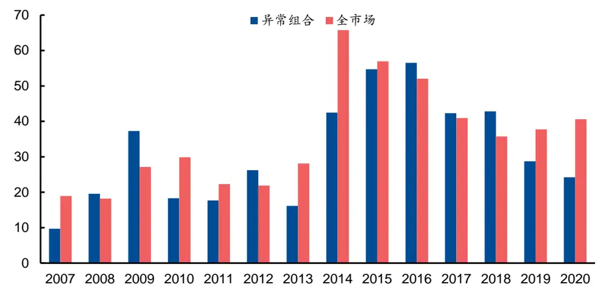
资料来源：Wind，聚源，兴业证券经济与金融研究院整理

## 3.4.2、财务异常组合命中率

我们将组合财务造假个股比例定义为组合命中率。可以看出，财务异常组合命中率为 13.39%，分年度命中率均值为 11.94%，较全样本的 1.11%有明显提升。

图表 57、异常组合命中率
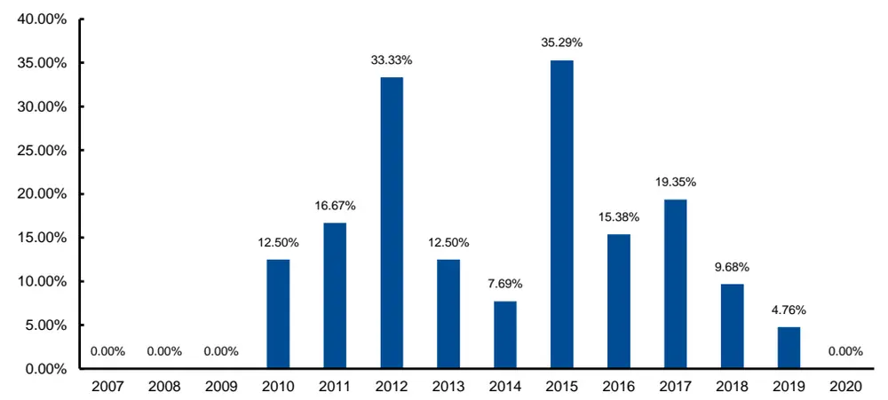
资料来源：Wind，聚源，兴业证券经济与金融研究院整理

## 3.4.3、财务异常组合股票收益率

下面我们假设在每年 5 月第一个交易日（年报披露完成）等权持有财务异常组合个股，可以看出异常组合也带来了较为显著的负超额。

图表 58、异常组合收益率（2009.05.04-2021.09.30）

|  | 年化收益率 | 年化波动率 | 收益风险比 | 最大回撤 |
| --- | --- | --- | --- | --- |
| 预警组合 | 1.46% | 26.53% | 0.05 | 79.54% |
| Wind 全 A | 7.92% | 24.25% | 0.33 | 55.99% |
| 相对收益 | -6.16% | 17.03% | -0.36 | 75.03% |

资料来源：Wind，聚源，兴业证券经济与金融研究院整理

图表 59、异常组合分年度收益

|  | 异常组合 | Wind 全 A | 超额收益 |
| --- | --- | --- | --- |
| 2010.05 | 36.47% | 18.10% | 18.37% |
| 2011.05 | -5.10% | 8.45% | -13.55% |
| 2012.05 | -30.81% | -16.27% | -14.54% |
| 2013.05 | 24.17% | -6.71% | 30.87% |
| 2014.05 | 15.13% | 3.04% | 12.10% |
| 2015.05 | 135.38% | 143.60% | -8.22% |
| 2016.05 | -22.20% | -25.82% | 3.61% |
| 2017.05 | -10.14% | 4.41% | -14.55% |
| 2018.05 | -18.07% | -1.51% | -16.57% |
| 2019.05 | -24.86% | -7.24% | -17.62% |
| 2020.05 | -29.72% | 9.74% | -39.46% |
| 2021.05 | 11.74% | 24.37% | -12.63% |
| 2021.09 | 17.41% | 6.20% | 11.21% |

资料来源：Wind，聚源，兴业证券经济与金融研究院整理

## 4、实践应用初探

本节我们基于财务危机预警、财务异常组合进行实践应用，主要分为：

1、指数避雷策略；

## 2、主动选股策略。

下面我们进行详细说明。（同时考虑到人们对于历史上财务风险较高的个股可能会持续持有悲观情绪，我们在附录中将历史上曾纳入过财务危机预警、财务异常组合个股都标记为高财务风险个股，测试策略结果）

## 4.1、指数避雷策略

我们根据下述规则构建指数避雷策略，即在指数成分股中剔除预警组合、异常组合成分股，观察策略表现，具体设定如下：

1、 回测周期：2017-01-01 至 2021-09-30；

2、个股选择：每个月末在指数成分股中剔除财务危机预警、财务异常组合成分股；

3、权重分配：基于指数原始权重进行重新加权分配。

下面我们对沪深300、中证 500、中证1000分别构建财务风险避雷策略：

## 4.1.1、沪深 300 避雷策略

截至 2021 年 9 月 30 日，沪深 300 指数年化收益率为 8.24%，收益风险比为0.43；同时沪深300财务风险避雷策略年化收益率为10.82%，收益风险比为 0.57。

图表 60、沪深300财务风险避雷策略收益率

|  | 年化收益率 | 年化波动率 | 收益风险比 | 最大回撤 |
| --- | --- | --- | --- | --- |
| 沪深300 财务风险避雷策略 | 10.82% | 19.13% | 0.57 | 31.87% |
| 沪深300 | 8.24% | 19.04% | 0.43 | 43.29% |

资料来源：Wind，聚源，兴业证券经济与金融研究院整理

图表 61、沪深 300财务风险避雷策略净值
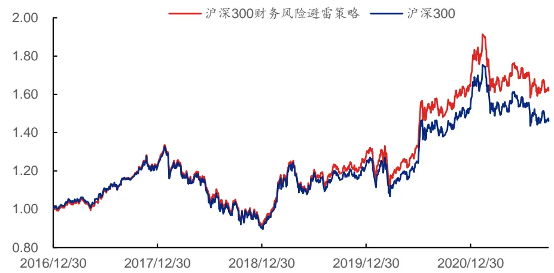
资料来源：Wind，聚源，兴业证券经济与金融研究院整理

沪深 300 财务风险避雷策略年化超额收益达 2.25%，信息比率高达 1.78，最大回撤仅为 1.94%。

图表 62、沪深300财务风险避雷策略相对收益率

|  | 年化收益率 | 年化波动率 | 信息比率 | 最大回撤 |
| --- | --- | --- | --- | --- |
| 沪深 300财务风险避雷策略 | 2.25% | 1.26% | 1.78 | 1.94% |

资料来源：Wind，聚源，兴业证券经济与金融研究院整理

图表 63、沪深 300财务风险避雷策略相对净值
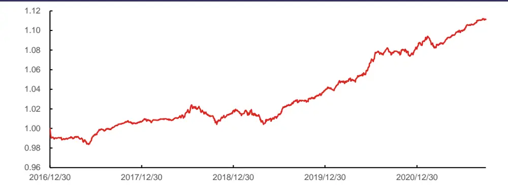
资料来源：Wind，聚源，兴业证券经济与金融研究院整理

图表 64、沪深300财务风险避雷策略分年度收益

| 雷策略 | 沪深 300 财务风险避 沪深300 | 超额收益 |
| --- | --- | --- |
| 2017 22.54% | 21.78% | 0.67% |
| 2018 | -24.49% -25.31% | 1.09% |
| 2019 | 38.97% 36.07% | 2.15% |
| 2020 | 32.27% 27.21% | 4.19% |
| 2021.9.30 | -4.17% -6.62% | 2.62% |

资料来源：Wind，聚源，兴业证券经济与金融研究院整理

图表 65、沪深 300财务风险避雷策略分年度超额收益率
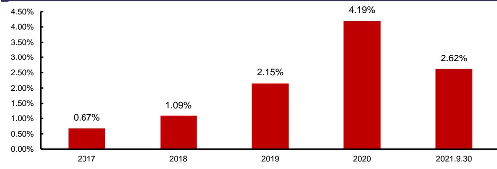
资料来源：Wind，聚源，兴业证券经济与金融研究院整理

## 4.1.2、中证 500 避雷策略

截至 2021 年 9 月 30 日，中证 500 指数年化收益率为 2.68%，收益风险比为0.13；同时中证 500财务风险避雷策略年化收益率为3.90%，收益风险比为 0.18。

图表 66、中证500财务风险避雷策略收益率

|  | 年化收益率 | 年化波动率 | 收益风险比 | 最大回撤 |
| --- | --- | --- | --- | --- |
| 中证 500 财务风险避雷策略 | 3.90% | 21.23% | 0.18 | 39.50% |
| 中证500 | 2.68% | 21.20% | 0.13 | 40.11% |

资料来源：Wind，聚源，兴业证券经济与金融研究院整理

图表 67、中证 500财务风险避雷策略净值
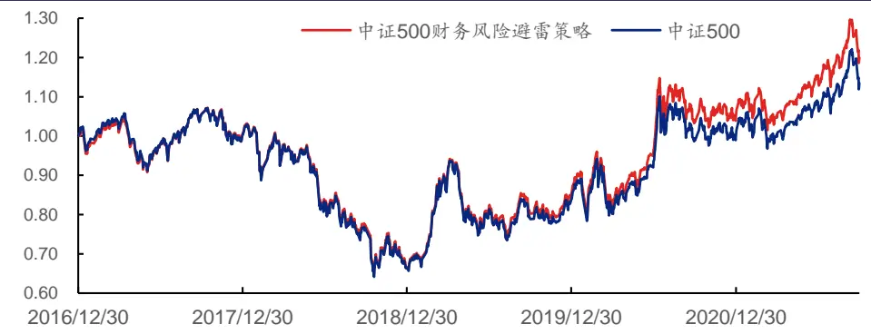
资料来源：Wind，聚源，兴业证券经济与金融研究院整理

中证 500 财务风险避雷策略年化超额收益达 1.22%，信息比率达 1.19，最大回撤为 1.09%。

图表 68、中证500财务风险避雷策略相对收益率

|  | 年化收益率 | 年化波动率 | 信息比率 | 最大回撤 |
| --- | --- | --- | --- | --- |
| 中证 500 财务风险避雷策略 | 1.22% | 1.03% | 1.19 | 1.09% |

资料来源：Wind，聚源，兴业证券经济与金融研究院整理

图表 69、中证 500财务风险避雷策略相对净值
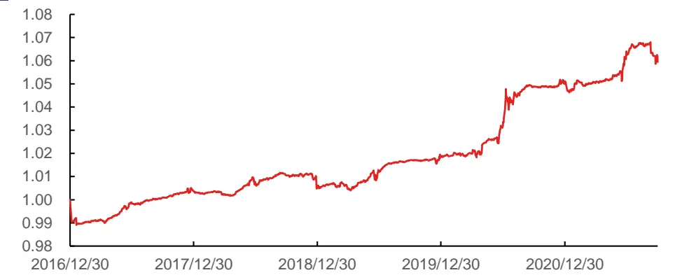
资料来源：Wind，聚源，兴业证券经济与金融研究院整理

图表 70、中证500财务风险避雷策略分年度收益

|  | 中证500 财务风险避雷策略 | 中证500 | 超额收益 |
| --- | --- | --- | --- |
| 2017 | 0.18% | -0.20% | 0.39% |
| 2018 | -33.26% | -33.32% | 0.09% |
| 2019 | 28.18% | 26.38% | 1.39% |
| 2020 | 24.50% | 20.87% | 3.19% |
| 2021.9.30 | 12.41% | 11.57% | 0.79% |

资料来源：Wind，聚源，兴业证券经济与金融研究院整理

图表 71、中证 500财务风险避雷策略分年度超额收益率
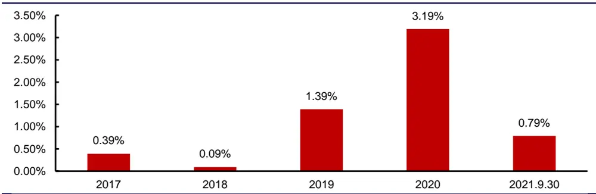
资料来源：Wind，聚源，兴业证券经济与金融研究院整理

## 4.1.3、中证 1000 避雷策略

截至2021年9月 30日，中证 1000指数年化收益率为-2.84%，收益风险比为-0.12；同时中证1000 财务风险避雷策略年化收益率为-2.09%，收益风险比为-0.09。

图表 72、中证1000财务风险避雷策略收益率

|  | 年化收益率 | 年化波动率 | 收益风险比 | 最大回撤 |
| --- | --- | --- | --- | --- |
| 中证 1000 财务风险避雷策略 | -2.09% | 22.70% | -0.09 | 51.51% |
| 中证 1000 | -2.84% | 22.84% | -0.12 | 52.14% |

资料来源：Wind，聚源，兴业证券经济与金融研究院整理

图表 73、中证 1000财务风险避雷策略净值
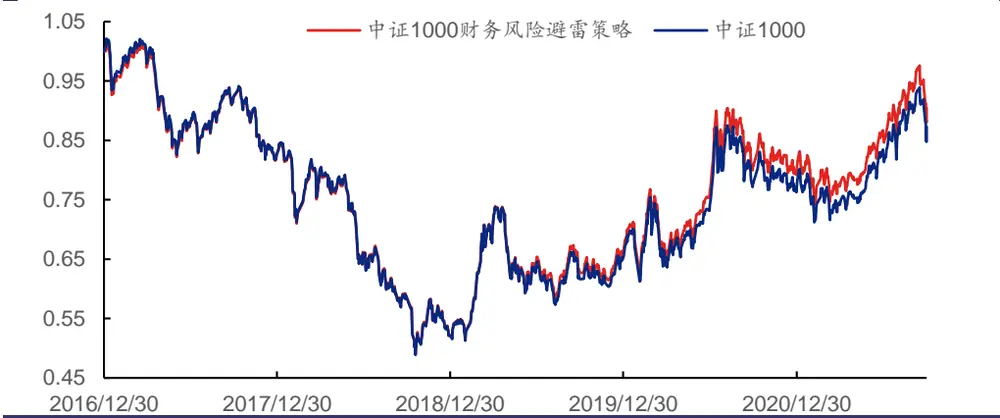
资料来源：Wind，聚源，兴业证券经济与金融研究院整理

中证1000财务风险避雷策略年化超额收益达0.76%，信息比率为0.92，最大回撤为 0.94%。

图表 74、中证1000财务风险避雷策略相对收益率

|  | 年化收益率 年化波动率 | 信息比率 | 最大回撤 |
| --- | --- | --- | --- |
| 中证 1000 财务风险避雷策略 | 0.76% 0.82% | 0.92 | 0.94% |

资料来源：Wind，聚源，兴业证券经济与金融研究院整理

图表 75、中证 1000财务风险避雷策略相对净值
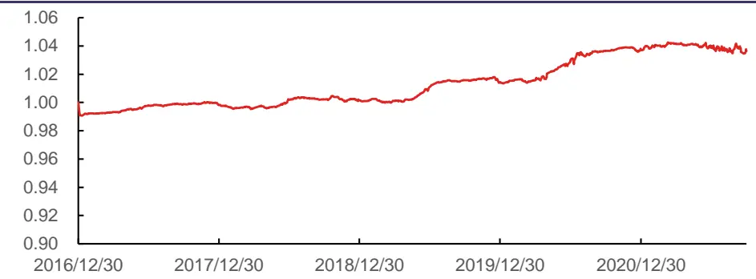
资料来源：Wind，聚源，兴业证券经济与金融研究院整理

图表 76、中证1000财务风险避雷策略分年度收益

| 避雷策略 | 中证 1000 财务风险 中证1000 | 超额收益 |
| --- | --- | --- |
| 2017 -17.51% | -17.35% | -0.17% |
| 2018 -36.60% | -36.87% | 0.34% |
| 2019 27.38% | 25.67% | 1.28% |
| 2020 21.91% | 19.39% | 2.22% |
| 2021.9.30 11.39% | 11.42% | -0.05% |

资料来源：Wind，聚源，兴业证券经济与金融研究院整理

图表 77、中证 1000财务风险避雷策略分年度超额收益率
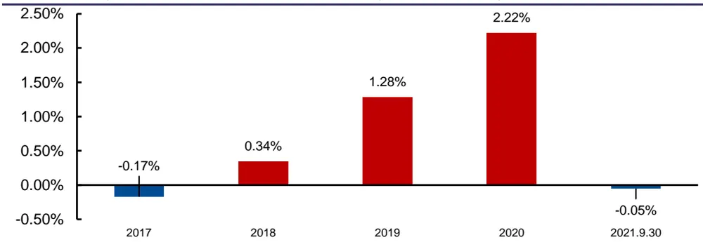
资料来源：Wind，聚源，兴业证券经济与金融研究院整理

## 4.2、主动选股策略

## 4.2.1、北向资金精选50策略

在报告《基于北向资金持仓信息的 A 股配置全攻略》中，我们构建了北向资金静态持仓（重仓、主动权重）、北向资金动态持仓（持仓变动、资金净流入）两大类因子，并最终得到了北向资金持仓大类因子。利用该因子作为主要阿尔法来源，同时叠加对调仓频率和加权方式的调整，我们最终构建的北向资金精选50策略。

下面我们测试在北向资金精选 50 策略中剔除财务危机预警组合、财务异常组合个股后的策略表现。可以看出在剔除财务风险较高个股后，北向资金精选50 策略年化收益率为 32.17%，较原始策略的 31.73%有所提升。同时分年度来看，除2018年外，剔除预警组合、异常组合成分股后策略较原始策略均有超额收益。

图表 78、北向资金精选 50 策略表现（2017.01.01-2021.09.30）

| 策略 |  | 年化收益率 | 年化波动率 | 收益风险比 | 最大回撤 |
| --- | --- | --- | --- | --- | --- |
| 北向资金精 选 50 策略 | 原始 | 31.73% | 24.29% | 1.31 | 34.05% |
|  | 财务风险 | 32.17% | 24.72% | 1.30 | 35.47% |
| 沪深300 |  | 8.24% | 19.04% | 0.43 | 43.29% |

资料来源：Wind，聚源，兴业证券经济与金融研究院整理

图表 79、北向资金精选 50 策略（财务风险）净值
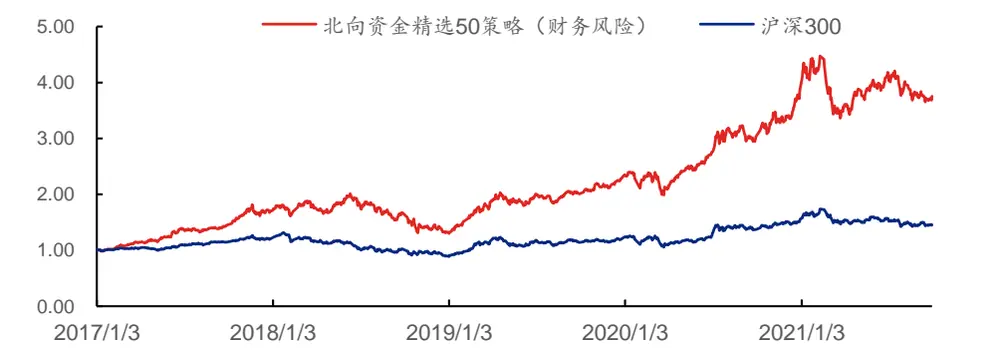
资料来源：Wind，聚源，兴业证券经济与金融研究院整理

图表 80、北向资金精选 50 策略相对收益表现（2017.01.01-2021.09.30）

| 策略 |  | 年化收益率 | 年化波动率 | 信息比率 | 最大回撤 |
| --- | --- | --- | --- | --- | --- |
| 北向资金精 | 原始 | 23.31% | 12.93% | 1.80 | 18.53% |
| 选 50 策略 | 财务风险 | 23.84% | 13.58% | 1.75 | 20.48% |

资料来源：Wind，聚源，兴业证券经济与金融研究院整理

图表 81、北向资金精选50策略分年度表现

| 原始 | 财务风险 | 沪深300 |
| --- | --- | --- |
| 北向资金精选50 | 北向资金精选50 |  |
| 2017 69.53% | 69.91% | 20.60% |
| 2018 -19.48% | -21.62% | -25.31% |
| 2019 74.58% | 75.43% | 36.07% |
| 2020 63.49% | 67.59% | 27.21% |
| 2021.9.30 -5.16% | -4.11% | -6.62% |

资料来源：Wind，聚源，兴业证券经济与金融研究院整理

## 4.2.2、基金重仓股优选策略

在报告《基金优选下的重仓股信息研究》中，我们选取了选股 alpha、最大回撤、基金份额、机构持有比例、从业人员持有比例 5 个因子对基金进行优选，而后基于优选基金的重仓股，从存量&增量两个角度出发共同构建了重仓股优选策略。

下面我们测试在基金重仓股优选策略中剔除财务风险较大个股，观察策略表现。可以看出在剔除相应个股后，基金重仓股优选策略年化收益率为 25.73%，较原始策略的 24.61%有所提升。同时分年度来看，除 2021 年外，剔除预警组合、异常组合成分股后策略较原始策略均有超额收益。

图表 82、基金重仓股优选策略表现（2017.01.01-2021.09.30）

| 策略 |  | 年化收益率 | 年化波动率 | 收益风险比 | 最大回撤 |
| --- | --- | --- | --- | --- | --- |
| 基金重仓股 | 原始 | 24.61% | 27.83% | 0.88 | 31.58% |
| 优选策略 | 财务风险 | 25.73% | 28.23% | 0.91 | 31.24% |
| 沪深300 |  | 8.24% | 19.04% | 0.43 | 43.29% |

资料来源：Wind，聚源，兴业证券经济与金融研究院整理

图表 83、基金重仓股优选策略（财务风险）净值
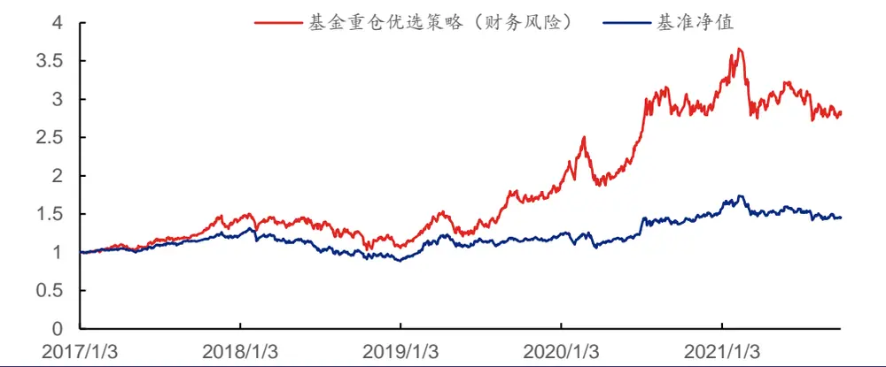
资料来源：Wind，聚源，兴业证券经济与金融研究院整理

图表 84、基金重仓股优选策略相对收益表现（2017.01.01-2021.09.30）

| 策略 |  | 年化收益率 | 年化波动率 | 信息比率 | 最大回撤 |
| --- | --- | --- | --- | --- | --- |
| 基金重仓股 | 原始 | 17.44% | 17.95% | 0.97 | 18.55% |
| 优选策略 | 财务风险 | 18.77% | 18.58% | 1.01 | 19.07% |

资料来源：Wind，聚源，兴业证券经济与金融研究院整理

图表 85、基金重仓股优选策略分年度表现

| 原始 | 财务风险 | 沪深300 |
| --- | --- | --- |
| 基金重仓股优选策略 | 基金重仓股优选策略 |  |
| 2017 41.41% | 42.92% |  |
| 2018 -22.69% | -22.59% | 20.60% -25.31% |
| 2019 67.19% | 67.19% | 36.07% |
| 2020 75.50% | 81.38% | 27.21% |
| 2021.9.30 -11.51% | -11.71% | -6.62% |

资料来源：Wind，聚源，兴业证券经济与金融研究院整理

## 5、总结

本文从财务危机、财务造假两个维度对个股财务风险进行捕捉，并分别构建财务危机预警组合、财务异常组合，主要结论如下：

## 1、如何评判公司财务危机风险？

1）预警指标体系：本文从筹资活动、投资活动、经营活动和收益分配四个企业财务活动出发构建财务危机预警指标体系，并基于 t 检验对单指标有效性进行测试，最终构建财务危机精选指标库。

2）构建财务危机预警指数：为解决变量赋权和相关性问题，本文引入突变级数法构建财务危机预警指数，并构建“财务危机预警”组合。

3）财务危机预警组合评价：预警组合每年持有个股 120 到 200 之间，财务危机命中率平均达 55.80%。同时 17 年之后，预警组合每年有稳定的负超额收益，相对wind 全 A 超额达-9.68%（2016.05.06-2021.09.30）。

## 2、如何识别公司财务造假风险？

1）深剖 A 股历史造假公司：本文构建兴证金工财务造假数据库，并对历史 586条造假样本的行业分布、造假发现时间、造假后个股收益率进行分析。

2）构建财务造假准则：我们从财务造假压力、财务造假空间、财务造假借口、财务造假迹象四维度结合行业因素构建 37 个财务造假识别准则。通过测试，我们发现复合（三个准则结合）准则的识别效果更佳，最终我们通过复合准则构建“财务异常组合”。

3）财务异常组合评价：财务异常组合的财务造假命中率从全样本的 1.11%增加至 13.39%，有明显提升。组合每年平均持有个股为 17 只，同时持有财务异常组合也有较为显著的负超额收益率，达-6.16%。

## 3、实践应用初探

本文基于预警和危机组合进行了多维度应用。以沪深300财务风险避雷策略为例，其年化超额收益达 2.46%，信息比率为 1.78，且 2017年以来每年均有稳定超额。同时加入财务风险信息后，原始北向资金精选 50 策略、基金重仓股优选策略表现均有明显提升。

之后我们希望能够继续耕耘此系列，实现更有价值、更有深度的研究。

## 6、附录

考虑到人们对于历史上财务风险较高的个股可能会持续持有悲观情绪，我们将历史上曾纳入过财务危机预警、财务异常组合个股都标记为高财务风险个股，测试策略结果。

## 6.1、指数避雷策略

我们根据下述规则构建指数财务危机避雷（历史）策略，即在指数成分股中剔除曾被纳入财务危机预警、财务异常组合的成分股，观察策略表现，具体设定如下：

1、 回测周期：2017-01-01 至 2021-09-30；

2、个股选择：每个月末在指数成分股中剔除历史上曾纳入过财务危机预警、财务异常组合成分股；

3、权重分配：基于指数原始权重进行重新加权分配。

下面我们对沪深 300、中证 500、中证 1000 分别构建财务风险避雷（历史）策略。

## 6.1.1、沪深 300 避雷策略

截至 2021 年 9 月 30 日，沪深 300 指数年化收益率为 8.24%，收益风险比为0.43；同时沪深 300财务风险避雷（历史）策略年化收益率为 12.42%，收益风险比分别为 0.63。

图表 86、沪深300财务风险避雷（历史）策略收益率

|  | 年化收益率 | 年化波动率 | 收益风险比 | 最大回撤 |
| --- | --- | --- | --- | --- |
| 沪深300财务风险避雷（历史） | 12.42% | 19.71% | 0.63 | 31.63% |
| 沪深300 | 8.24% | 19.04% | 0.43 | 43.29% |

资料来源：Wind，聚源，兴业证券经济与金融研究院整理

图表 87、沪深 300财务风险避雷（历史）策略净值
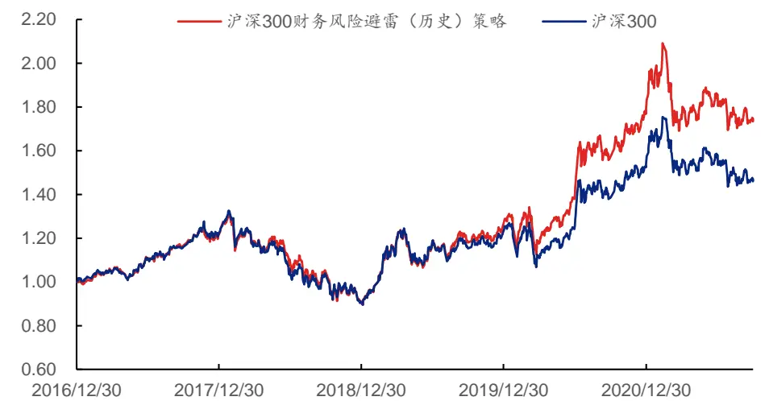
资料来源：Wind，聚源，兴业证券经济与金融研究院整理

沪深300财务风险避雷（历史）策略年化超额收益达3.79%，信息比率为0.97，最大回撤为 5.93%。

图表 88、沪深 300 财务风险避雷（历史）策略相对收益率

| 年化收益率 | 年化波动率 | 信息比率 | 最大回撤 |
| --- | --- | --- | --- |
| 沪深 300 财务风险避雷 3.79% (历史)策略 | 3.89% | 0.97 | 5.83% |

资料来源：Wind，聚源，兴业证券经济与金融研究院整理

图表 89、沪深 300财务风险避雷（历史）相对净值
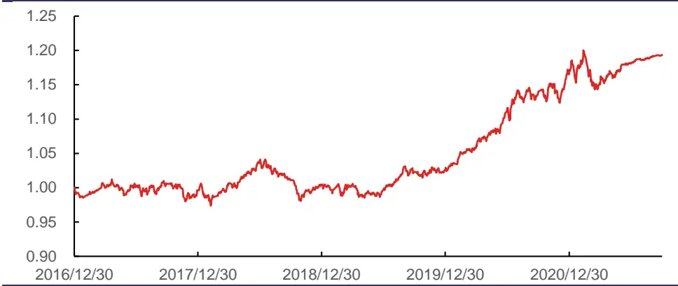
资料来源：Wind，聚源，兴业证券经济与金融研究院整理

图表 90、沪深300财务风险避雷（历史）策略分年度收益

|  | 沪深300财务风险避雷（历史） | 沪深300 | 超额收益 |
| --- | --- | --- | --- |
| 2017 | 21.36% | 21.78% | -0.36% |
| 2018 | -24.73% | -25.31% | 0.79% |
| 2019 | 39.47% | 36.07% | 2.47% |
| 2020 | 43.72% | 27.21% | 13.61% |
| 2021.9.30 | -4.72% | -6.62% | 2.08% |

资料来源：Wind，聚源，兴业证券经济与金融研究院整理

图表 91、沪深 300财务风险避雷（历史）策略分年度超额收益率
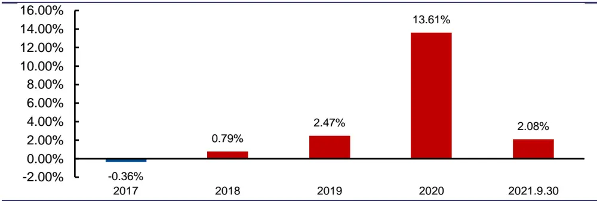
资料来源：Wind，聚源，兴业证券经济与金融研究院整理

## 6.1.2、中证 500 避雷策略

截至 2021 年 9 月 30 日，中证 500 指数年化收益率为 2.68%，收益风险比为0.13；同时中证 500财务风险避雷（历史）策略年化收益率为 4.88%，收益风险比分别为 0.23。

图表 92、中证500财务风险避雷（历史）策略收益率

|  | 年化收益 | 年化波动 | 收益风险比 最大回撤 |
| --- | --- | --- | --- |
| 中证500财务风险避雷（历史）策略 | 4.88% | 21.29% | 0.23 38.64% |
| 中证 500 | 2.68% | 21.20% | 0.13 40.11% |

资料来源：Wind，聚源，兴业证券经济与金融研究院整理

图表 93、中证 500财务风险避雷（历史）策略净值
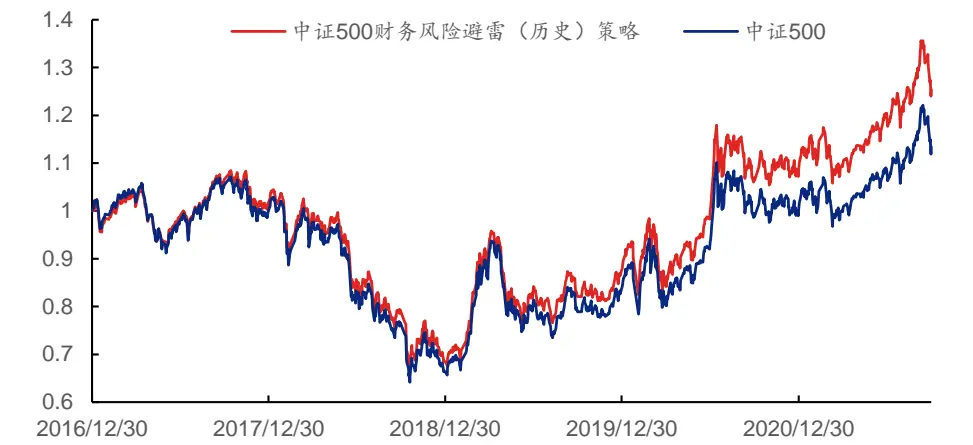
资料来源：Wind，聚源，兴业证券经济与金融研究院整理

中证500财务风险避雷（历史）策略年化超额收益达2.15%，信息比率达1.37，最大回撤仅为 1.93%。

图表 94、中证 500 财务风险避雷（历史）策略相对收益率

|  | 年化收益 | 年化波动 | 信息比率 最大回撤 |
| --- | --- | --- | --- |
| 中证500财务风险避雷（历史）策略 | 2.15% | 1.57% 1.37 | 1.93% |

资料来源：Wind，聚源，兴业证券经济与金融研究院整理

图表 95、中证 500财务风险避雷（历史）策略相对净值
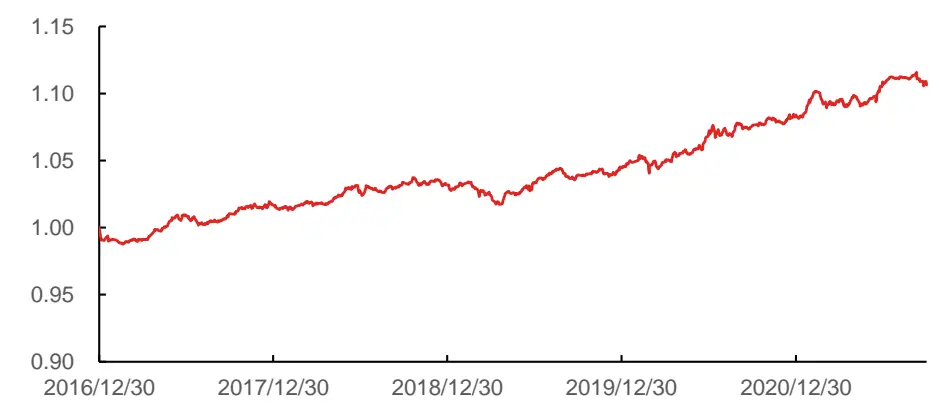
资料来源：Wind，聚源，兴业证券经济与金融研究院整理

图表 96、中证500财务风险避雷（历史）策略分年度收益

| 中证 500 财务风险避雷 | (历史)策略 中证500 | 超额收益 |
| --- | --- | --- |
| 2017 | 1.54% -0.20% | 1.70% |
| 2018 | -32.37% -33.32% | 1.46% |
| 2019 | 28.03% 26.38% | 1.23% |
| 2020 | 25.21% 20.87% | 3.72% |
| 2021.9.30 | 13.91% 11.57% | 2.13% |

资料来源：Wind，聚源，兴业证券经济与金融研究院整理

图表 97、中证 500财务风险避雷（历史）策略分年度超额收益率
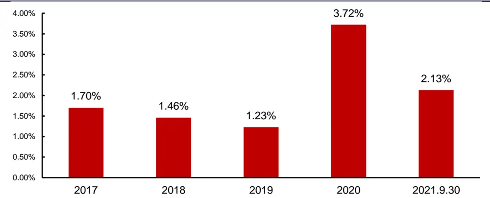
资料来源：Wind，聚源，兴业证券经济与金融研究院整理

## 6.1.3、中证 1000 避雷策略

截至2021年9月 30日，中证 1000指数年化收益率为-2.84%，收益风险比为-0.12；同时中证1000财务风险避雷（历史）策略年化收益率为-1.35%，收益风险比分别为-0.06。

图表 98、中证 1000 财务风险避雷（历史）策略收益率

|  | 年化收益 | 年化波动 | 收益风险比 | 最大回撤 |
| --- | --- | --- | --- | --- |
| 中证1000财务风险避雷（历史）策略 | -1.35% | 22.79% | -0.06 | 50.95% |
| 中证 1000 | -2.84% | 22.84% | -0.12 | 52.14% |

资料来源：Wind，聚源，兴业证券经济与金融研究院整理

图表 99、中证 1000财务风险避雷（历史）策略净值
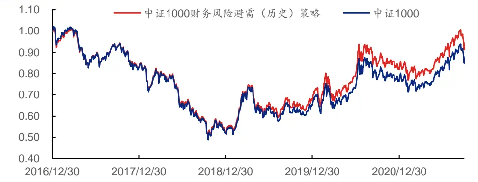
资料来源：Wind，聚源，兴业证券经济与金融研究院整理

中证 1000 财务风险避雷（历史）策略年化超额收益达 1.45%，信息比率为1.06，最大回撤为 1.41%。

图表 100、中证1000财务风险避雷（历史）策略相对收益率

|  | 年化收益 | 年化波动 | 信息比率 | 最大回撤 |
| --- | --- | --- | --- | --- |
| 中证1000财务风险避雷（历史） | 1.45% | 1.37% | 1.06 | 1.41% |

资料来源：Wind，聚源，兴业证券经济与金融研究院整理

图表 101、中证 1000财务风险避雷（历史）策略相对净值
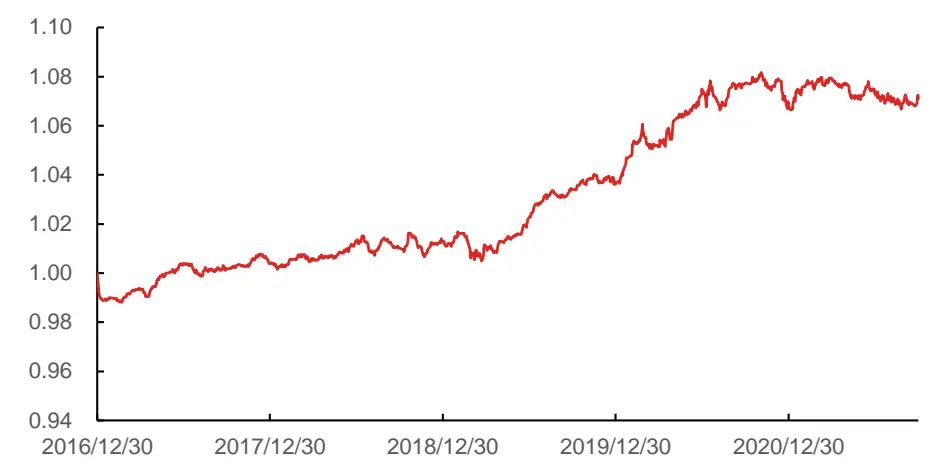
资料来源：Wind，聚源，兴业证券经济与金融研究院整理

图表 102、中证1000财务危机避雷（历史）策略分年度收益

|  | 中证 1000 财务风险 中证1000 避雷（历史）策略 | 超额收益 |
| --- | --- | --- |
| 2017 | -17.01% -17.35% | 0.39% |
| 2018 | -36.16% -36.87% | 0.92% |
| 2019 | 28.83% 25.67% | 2.35% |
| 2020 | 22.69% 19.39% | 2.90% |
| 2021.9.30 | 11.93% 11.42% | 0.37% |

资料来源：Wind，聚源，兴业证券经济与金融研究院整理

图表 103、中证 1000财务风险避雷（历史）策略分年度超额收益率
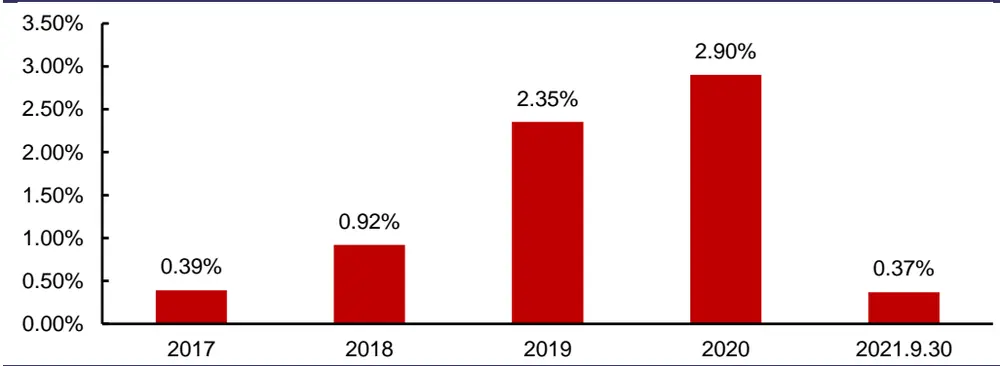
资料来源：Wind，聚源，兴业证券经济与金融研究院整理

## 6.2、主动选股策略

## 6.2.1、北向资金精选50策略

下面我们测试在北向资金精选 50 策略中剔除历史曾被纳入财务危机预警、财务异常组合的个股，观察策略表现。可以看出在剔除高财务风险个股后，北向资金精选 50策略年化收益率为33.90%，较原始策略的31.73%有所提升。同时分年度来看，除 2019年外，剔除高财务风险个股较原始策略均有超额收益。

图表 104、北向资金精选 50 策略表现（2017.01.01-2021.09.30）

| 策略 |  | 年化收益 | 年化波动 | 收益风险比 | 最大回撤 |
| --- | --- | --- | --- | --- | --- |
| 北向资 金精选 | 原始 | 31.73% | 24.29% | 1.31 | 34.05% |
| 50 策略 | 财务风险（历史） | 33.90% | 25.44% | 1.33 | 36.12% |
| 沪深300 |  | 8.24% | 19.04% | 0.43 | 43.29% |

资料来源：Wind，聚源，兴业证券经济与金融研究院整理

图表 105、北向资金精选50 策略（历史财务风险）净值
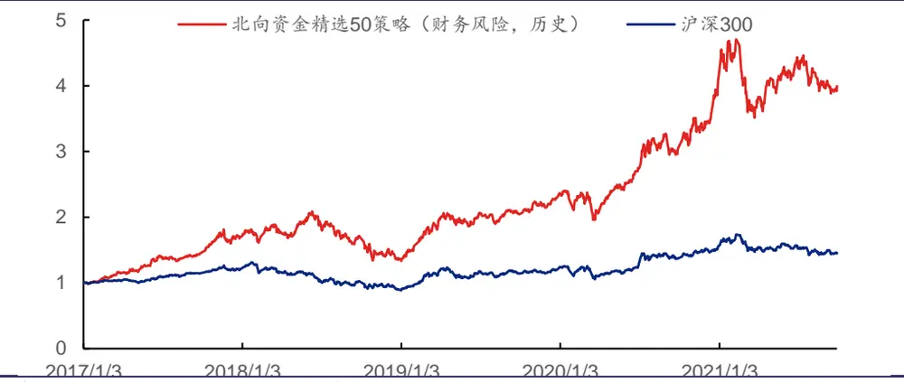
资料来源：Wind，聚源，兴业证券经济与金融研究院整理

图表 106、北向资金精选 50 策略相对收益表现（2017.01.01-2021.09.30）

| 策略 | 年化收益 | 年化波动 | 信息比率 | 最大回撤 |
| --- | --- | --- | --- | --- |
| 北向资 原始 | 23.31% | 12.93% | 1.80 | 18.53% |
| 金精选 财务风险（历史） 50 策略 | 25.79% | 15.03% | 1.72 | 22.16% |

资料来源：Wind，聚源，兴业证券经济与金融研究院整理

图表 107、北向资金精选 50策略分年度表现

| 原始 | 财务风险（历史） | 沪深300 |
| --- | --- | --- |
| 北向资金精选50 | 北向资金精选50 |  |
| 2017 69.53% | 69.92% |  |
| 2018 -19.48% | -19.15% | 20.60% -25.31% |
| 2019 74.58% | 71.06% | 36.07% |
| 2020 63.49% | 73.53% | 27.21% |
| 2021.9.30 -5.16% | -2.11% | -6.62% |

资料来源：Wind，聚源，兴业证券经济与金融研究院整理

## 6.2.2、基金重仓股优选策略

下面我们测试在基金重仓股优选策略中剔除历史曾被纳入财务危机预警、财务异常组合的个股，观察策略表现。可以看出在剔除高财务风险个股后，基金重仓股优选策略年化收益率为30.21%，较原始策略的24.61%有所提升。

图表 108、基金重仓股优选策略表现（2017.01.01-2021.09.30）

| 策略 |  | 年化收益 | 年化波动 | 收益风险比 | 最大回撤 |
| --- | --- | --- | --- | --- | --- |
| 基金重 仓股优 | 原始 | 24.61% | 27.83% | 0.88 | 31.58% |
| 选策略 | 财务风险（历史） | 30.21% | 29.24% | 1.03 | 31.22% |
| 沪深300 |  | 8.24% | 19.04% | 0.43 | 43.29% |

资料来源：Wind，聚源，兴业证券经济与金融研究院整理

图表 109、基金重仓股优选策略（财务风险，历史）净值
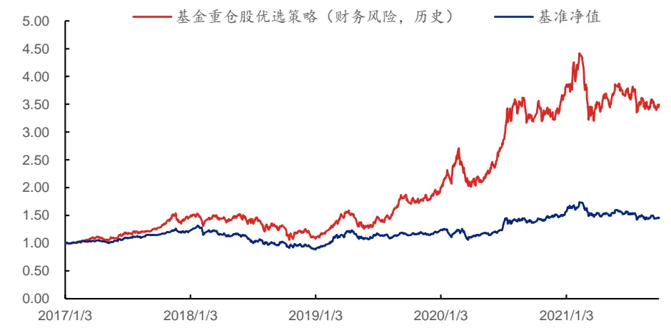
资料来源：Wind，聚源，兴业证券经济与金融研究院整理

图表 110、基金重仓股优选策略相对收益表现（2017.01.01-2021.09.30）

| 策略 | 年化收益 | 年化波动 | 信息比率 | 最大回撤 |
| --- | --- | --- | --- | --- |
| 基金重仓股 原始 | 17.44% | 17.95% | 0.97 | 18.55% |
| 优选策略 财务风险（历史） | 23.27% | 20.10% | 1.16 | 20.09% |

资料来源：Wind，聚源，兴业证券经济与金融研究院整理

图表 111、基金重仓股优选策略分年度表现

| 原始 | 财务风险（历史） | 沪深300 |
| --- | --- | --- |
| 基金重仓股优选策略 | 基金重仓股优选策略 |  |
| 2017 41.41% | 46.15% |  |
| 2018 -22.69% | -23.64% | 20.60% -25.31% |
| 2019 67.19% | 71.28% | 36.07% |
| 2020 75.50% | 98.40% | 27.21% |
| 2021.9.30 -11.51% | -7.80% | -6.62% |

资料来源：Wind，聚源，兴业证券经济与金融研究院整理

## 参考文献

【1】Charmichael.D.R.1972.The Auditor’s ReportingObligation :The Meaning and Implementation of the Fourth Standard of Reporting，New York，NY:AICPA

【2】Loayza R . Financial intermediation and growth: Causality and causes [Dataset][J]. Tilburg University， 2000.

【3】Beaver W H . Financial ratios as predictors of failure， empirical reseach in accounting: Selected studies[J]. Journal of Accounting Research， 1966:179-199.

【4】J Moscarola， B Roy. Financial ratios， discriminant analysis and the prediction of corporate bankrunptcy[J]. 1977

【5】Persons.O.S. Using Financial Statement Data to Identify Factors Associated with Fraudulent Financial Reporting[J] Journal of Applied Business Research，1995，11(3):38-46.

【6】Fanning M.K.，Cogger K O. Neural detection of management fraud using published financial data[J]. International Journal of Intelligent Systems in Accounting，Finance and Management，1998， 7(1):21-41.

【7】Kotsiantis，S，et al.，Forecasting fraudulent financial statements using data mining[J]. International Journal of Computational Intelligence，2006(2):104-110.

【8】Goel S，Uzuner O， Do Sentiments Matter in Fraud Detection? Estimating Semantic Orientation of Annual Reports[J]. Intelligent Systems in Accounting Finance & Management，2016， 23(3):215- 239.

【9】Albrecht， W. S， Romney， M. B.& Cherrington， D. J. et al. Red-flagging managementfraud: a validation[J]. Advances in Accounting， 1986， 3: 323-333

【10】Beasley， M. S. An empirical analysis of the relation between the board of director composition and financial statement fraud[J]. The Accounting Review October 1996， 443- 465

【11】 Carcello， N. L. Audit Committee composition and Auditor Reporting[J]. The AccountingReview， 2000， 75(10): 453-467

【 12 】 Worthy. The Impact of Insider Power on Fraudulent Financial Reporting[J]. Journal ofManagement， 1984， 6(30): 397-412

【13】肖丽芬.上市公司舞弊手段及审计策略[J].财会通讯(理财版)，2008(02):128.

【14】刘元，林爱梅和单雅迪.我国上市公司财务报告舞弊的特征和手段——基于 2008-2013 年证监会处罚公告[J].财会月刊，2015 (28) : 16-19.

风险提示：报告中的结果均由相应作者通过历史数据统计、建模和测算完成，在政策、市场环境发生变化时模型存在失效的风险

## 分析师声明

本人具有中国证券业协会授予的证券投资咨询执业资格并注册为证券分析师，以勤勉的职业态度，独立、客观地出具本报告。本报告清晰准确地反映了本人的研究观点。本人不曾因，不因，也将不会因本报告中的具体推荐意见或观点而直接或间接收到任何形式的补偿。

## 投资评级说明

| 投资建议的评级标准 | 类别 | 评级 | 说明 |
| --- | --- | --- | --- |
| 报告中投资建议所涉及的评级分为股票评级和行业评级（另有说明的除外)。评级标准为报告发布日后的12个月内公司股价（或行业指数）相对同期相关证券市场代表性指数的涨跌幅。其中：A股市场以上证综指或深 | 股票评级 | 买入 | 相对同期相关证券市场代表性指数涨幅大于15% |
|  |  | 审慎增持 | 相对同期相关证券市场代表性指数涨幅在5%～15%之间 |
|  |  | 中性 | 相对同期相关证券市场代表性指数涨幅在-5%～5%之间 |
|  |  | 减持 | 相对同期相关证券市场代表性指数涨幅小于-5% |
|  |  | 无评级 | 由于我们无法获取必要的资料，或者公司面临无法预见结果的重大不确定性事件，或者其他原因，致使我们无法给出明确的投资评级 |
| 圳成指为基准，香港市场以恒生指数为基准；美国市场以标普500或纳斯达克综合指数为基准。 | 行业评级 | 推荐 | 相对表现优于同期相关证券市场代表性指数 |
|  |  | 中性 | 相对表现与同期相关证券市场代表性指数持平 |
|  |  | 回避 | 相对表现弱于同期相关证券市场代表性指数 |

## 信息披露

本公司在知晓的范围内履行信息披露义务。客户可登录 www.xyzq.com.cn 内幕交易防控栏内查询静默期安排和关联公司持股情况。

## 使用本研究报告的风险提示及法律声明

兴业证券股份有限公司经中国证券监督管理委员会批准，已具备证券投资咨询业务资格。

，本公司不会因接收人收到本报告而视其为客户。本报

告中的信息、意见等均仅供客户参考，不构成所述证券买卖的出价或征价邀请或要约。该等信息、意见并未考虑到获取本报告人员的具体投资目的、财务状况以及特定需求，在任何时候均不构成对任何人的个人推荐。客户应当对本报告中的信息和意见进行独立评估，并应同时考量各自的投资目的、财务状况和特定需求，必要时就法律、商业、财务、税收等方面咨询专家的意见。对依据或者使用本报告所造成的一切后果，本公司及/或其关联人员均不承担任何法律责任。

本报告所载资料的来源被认为是可靠的，但本公司不保证其准确性或完整性，也不保证所包含的信息和建议不会发生任何变更。本公司并不对使用本报告所包含的材料产生的任何直接或间接损失或与此相关的其他任何损失承担任何责任。

本报告所载的资料、意见及推测仅反映本公司于发布本报告当日的判断，本报告所指的证券或投资标的的价格、价值及投资收入可升可跌，过往表现不应作为日后的表现依据；在不同时期，本公司可发出与本报告所载资料、意见及推测不一致的报告；本公司不保证本报告所含信息保持在最新状态。同时，本公司对本报告所含信息可在不发出通知的情形下做出修改，投资者应当自行关注相应的更新或修改。

除非另行说明，本报告中所引用的关于业绩的数据代表过往表现。过往的业绩表现亦不应作为日后回报的预示。我们不承诺也不保证，任何所预示的回报会得以实现。分析中所做的回报预测可能是基于相应的假设。任何假设的变化可能会显著地影响所预测的回报。

本公司的销售人员、交易人员以及其他专业人士可能会依据不同假设和标准、采用不同的分析方法而口头或书面发表与本报告意见及建议不一致的市场评论和/或交易观点。本公司没有将此意见及建议向报告所有接收者进行更新的义务。本公司的资产管理部门、自营部门以及其他投资业务部门可能独立做出与本报告中的意见或建议不一致的投资决策。

本报告并非针对或意图发送予或为任何就发送、发布、可得到或使用此报告而使兴业证券股份有限公司及其关联子公司等违反当地的法律或法规或可致使兴业证券股份有限公司受制于相关法律或法规的任何地区、国家或其他管辖区域的公民或居民，包括但不限于美国及美国公民（1934 年美国《证券交易所》第 15a-6 条例定义为本「主要美国机构投资者」除外）。

本报告的版权归本公司所有。本公司对本报告保留一切权利。除非另有书面显示，否则本报告中的所有材料的版权均属本公司。未经本公司事先书面授权，本报告的任何部分均不得以任何方式制作任何形式的拷贝、复印件或复制品，或再次分发给任何其他人，或以任何侵犯本公司版权的其他方式使用。未经授权的转载，本公司不承担任何转载责任。

## 特别声明

在法律许可的情况下，兴业证券股份有限公司可能会持有本报告中提及公司所发行的证券头寸并进行交易，也可能为这些公司提供或争取提供投资银行业务服务。因此，投资者应当考虑到兴业证券股份有限公司及/或其相关人员可能存在影响本报告观点客观性的潜在利益冲突。投资者请勿将本报告视为投资或其他决定的唯一信赖依据。

## 兴业证券研究

| 上海 | 北京 | 深圳 |
| --- | --- | --- |
| 地址：上海浦东新区长柳路36号兴业证券大厦 | 地址：北京西城区锦什坊街35号北楼601-605 | 地址：深圳市福田区皇岗路5001号深业上城T2 座52楼 |
| 15层 邮编：200135 | 邮编：100033 | 邮编：518035 |
| 邮箱：research@xyzq.com.cn | 邮箱：research@xyzq.com.cn | 邮箱：research@xyzq.com.cn |