分析师：

郑兆磊

zhengzhaolei@xyzq.com.cn

S0190520080006

## 报告关键点

传统的寻找隐匿专精特新小巨人公司的方法大多是从指标打分的角度出发，筛选一部分满足条件的公司作为隐匿的专精特新小巨人。但这种通过指标打分进行筛选在统计学中仅仅是必要不充分的，如专精特新的公司具有高成长属性，但大部分高成长股并不是专精特新。为了解决这个问题，我们以目前公布的专精特新小巨人公司作为蓝本，在市场上寻找与“小巨人”团体最为相似的股票。这里的相似即体现在“经济效益”、“专业化程度”、“创新能力”、“经营管理”这四个维度中。

## ＃相关报告 related

《猎金系列之三十二：财报季的财务效应研究和因子构建》2021-10-20

《基于专利分类的科技动量因子研究》2019-06-25

# 寻找隐匿的专精特新“小巨人”---基本面量化系列四

## 投资要点

2021 年 11 月 29 日

目前关于专精特新的研究专注于三点：“专精特新”以及专精特新“小巨人”的政策解读、专精特新“小巨人”的特点分析以及寻找隐匿的专精特新“小巨人”公司。其中，寻找隐匿的专精特新“小巨人”公司是整个专精特新“小巨人”相关研究的落脚点和核心，是投资者提前布局“专精特新”的关键。

传统的寻找隐匿专精特新小巨人公司的方法大多是从指标打分的角度出发，筛选一部分满足条件的公司作为隐匿的专精特新小巨人。但这种通过指标打分进行筛选在统计学中仅仅是必要不充分的，如专精特新的公司具有高成长属性，但大部分高成长股并不是专精特新。为了解决这个问题，我们以目前公布的专精特新小巨人公司作为蓝本，在市场上寻找与“小巨人”团体最为相似的股票。这里的相似即体现在“经济效益”、“专业化程度”、“创新能力”、“经营管理”这四个维度中。

面对工信部的四维度专项要求，我们利用多维度的财务因子、产业链数据库中的产品营收占比分布、专利数据库中的专利获得数量占比分布与 ESG 中的公司治理G指标，将工信部的要求分别对应至最为准确的特征向量或指标中。由此，我们通过量化的方式刻画出已上市的小巨人企业在财务、产品、专利和公司治理能力上的特性，对当下的小巨人股做出精准画像。

基于定量刻画的企业特征，我们进一步通过相似度计算得到与小巨人企业最相似的近 500 支股，作为类小巨人股票池。结果表明，无论是从行业、产品特性，还是从基本面特性上看，我们找出的类小巨人股十分符合现有的已上市小巨人股的整体特性。由此，我们从精准定量的方式找出潜匿的小巨人股，提供给投资者更丰富更准确的多维度信息，帮助投资者全面布局“专精特新”。

风险提示：文献中的结果均由相应作者通过历史数据统计、建模和测算完成，在政策、市场环境发生变化时模型存在失效的风险。

## 报告正文

## 1、引言

自2011年起，“专精特新”作为一种中小企业发展方向，开始逐步进入大众的视线。在 2013年7月，中华人民共和国工业和信息化部（以下简称工信部）在《关于促进中小企业 “专精特新”发展的指导意见》中，强调应引导中小企业开展技术创新、管理创新和商业模式创新，培育新的增长点，形成新的竞争优势。通过培育和扶持，不断提高“专精特新”中小企业的数量和比重。至此，“专精特新”企业的概念首次出现在政府文件中。

不同于“专精特新”，专精特新“小巨人”来自于2018年底工信部《工业和信息化部办公厅关于开展专精特新“小巨人”企业培育工作的通知》。在该通知中说明，专精特新“小巨人”企业是“专精特新”中小企业中的佼佼者，是专注于细分市场、创新能力强、市场占有率高、掌握关键核心技术、质量效益优的排头兵企业。具体来说，“小巨人”企业需首先属于各省级中小企业主管部门认定的（或重点培育）的“专精特新”中小企业或拥有被认定为“专精特新”产品的中小企业，以及创新能力强、市场竞争优势突出的中小企业。其次企业需满足工信部规定的在经济效益、专业化程度、创新能力和经营管理四个维度的专项指标。最后通过审核与动态管理，才能“晋升”成为“小巨人”。

而在今年7月30日的政治局会议中，中央提出“要强化科技创新和产业链供应链韧性，加强基础研究，推动应用研究，开展补链强链专项行动，加快解决“卡脖子”难题，发展专精特新中小企业”，这是首次在中央层面提出专精特新，并将之与“补链强链”“卡脖子”联系到一起。关于“专精特新”小巨人的研究也因此掀起浪潮，成为资本市场关注的焦点。从研究的视角来看，目前大家均聚焦于以下几个维度对专精特新小巨人进行剖析：

1、“专精特新”以及专精特新“小巨人”的政策解读；

2、专精特新“小巨人”的特点分析；

3、还有哪些隐匿的专精特新“小巨人”公司；

在这三点分析中尤以第二点和第三点居多，某种意义上第二点的分析也是为了更好的寻找隐匿的专精特新小巨人公司以提前布局。所以第三点是整个专精特新“小巨人”相关研究的落脚点和核心，这正如当下大家在寻找隐匿的新能源板块关联公司以提前布局，是同一个概念。但从实际来看，目前针对于专精特新筛选的方法存在两个问题：

1、方法相对较为单一且合理性值得商榷：现有的研究方法大多是从单一或多个财务指标出发，筛选出在该指标体系中达标的上市公司。然而，仅仅从指标上进行筛选只是一个必要不充分条件，并不能完整刻画小巨人企业在多个维度上的特性；

2、筛选结果的测试有待于进一步商榷：通过前面的体系构建专精特新小巨人策略后，会对该策略进行回测。但从某种意义上讲，市场在关注“专精特新小巨人”，更多的是投资这一块的超预期，历史回测并不能代表超预期。所以我们认为回测并不是也没必要成为“专精特新小巨人”研究的组成部分。

本报告同样聚焦于：除了工信部公布的专精特新小巨人公司之外，还有那些隐匿的公司会成为“幸运儿”？但与常规操作不同，我们严格按照工信部对“专精特新小巨人”的定义出发：工信部的定义中给出专精特新小巨人需在经济效益、专业化程度、创新能力和经营管理上达到一定的要求；之后，我们从四个专项指标所指的维度出发，从“量”的角度出发，刻画出已上市的小巨人企业在财务、专利、产业链与治理能力上的特性。最后，我们基于定量刻画的企业特征向量，通过相似度公式计算得到与小巨人企业最相似的近 500 只股票，作为类小巨人股票池，从量化的角度提供给投资者更丰富更准确的多维度信息，以供大家全面布局“专精特新”。

## 2、专精特新“小巨人”政策解读与表征分析

2013年7月，中华人民共和国工业和信息化部发布《关于促进中小企业 “专精特新”发展的指导意见》，强调应引导中小企业开展技术创新、管理创新和商业模式创新，通过培育和扶持，不断提高“专精特新”中小企业的数量和比重。

2018 年底，工信部在《工业和信息化部办公厅关于开展专精特新“小巨人”企业培育工作的通知》中提出培育专精特新“小巨人”企业。在该通知中说明，专精特新“小巨人”企业是“专精特新”中小企业中的佼佼者，是专注于细分市场、创新能力强、市场占有率高、掌握关键核心技术、质量效益优的排头兵企业。此后，工信部先后三次公布了“小巨人”名单。

自“专精特新”概念的首次提出，到第三批专精特新“小巨人”的公司名单披露，直至最近中央政治局提出“发展专精特新中小企业”，“专精特新”概念不仅是在为中小企业设定“专业、专注”，“精准管理”，“特色”与“创新”结合的发展目标，引导中小企业创新，提高中小企业素质，同时也是在完善我国中小企业的培育梯次，形成“中小企业—专精特新培育企业—省市级专精特新企业—专精特新小巨人企业—制造业单项冠军”这一套完整的中小企业培育梯次。此外，

“专精特新”概念也与我们坚定扶持中小企业国际化发展、坚定“补链强链”、解决“卡脖子”难题的工业发展目标相关联。可以说，“专精特新”政策以及培育小巨人企业与我国未来的工业发展密不可分。

截至 2021 年 11 月 19 日，工信部分别于 2019 年 6 月、2020 年 11 月以及 2021年 7 月，先后三次在通知文件中公告了获批的专精特新“小巨人”企业名单。每批的企业个数分别为248、1744和2930，共计4922家。其中在A 股（含北交所）上市的企业共计 340 家。从上市板块上看，大多数上市的“小巨人”企业集中在创业板和科创板。在中信一级行业分布上看，多数企业属于机械、基础化工、医药、电子、电力设备及新能源行业板块。

表 1、“专精特新”小巨人企业 A股上市公司统计（含北交所）

|  | 第一批 | 第二批 | 第三批 | 合计 |
| --- | --- | --- | --- | --- |
| 企业数量 | 248 | 1744 | 2930 | 4922 |
| A 股上市公司数量 | 37 | 165 | 138 | 340 |

资料来源：Wind，兴业证券经济与金融研究院整理数据日期：截至 2021年 11 月19 日

图 1、“专精特新”小巨人上市公司板块分布
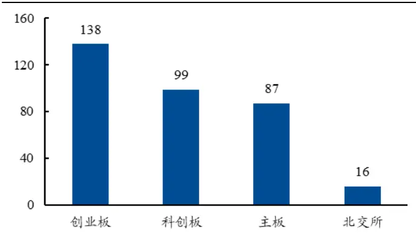
资料来源：Wind，兴业证券经济与金融研究院整理数据日期：截至 2021年 11 月19 日

图 2、“专精特新”小巨人上市公司行业分布（前10）
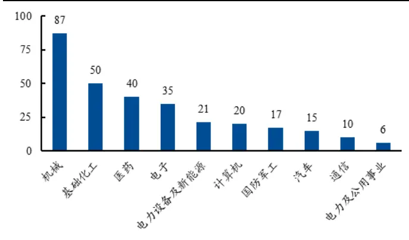
资料来源：Wind，兴业证券经济与金融研究院整理数据日期：截至 2021年 11 月19 日

专精特新“小巨人”上市企业主要分布在 100亿以下的小市值区间，共计 259家（76%）。具体来看，0-50 亿区间 158 家（46.47%），50-100 亿区间 101 家（29.71%），100-200 亿区间 54 家（15.88%），200-500 亿区间 24 家（7.06%），500 亿以上 3 家（0.88%）。

图 3、专精特新“小巨人”总市值分布统计
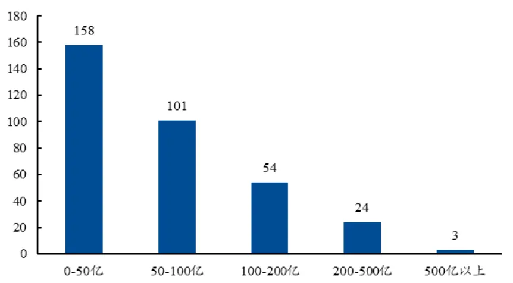
资料来源：Wind，兴业证券经济与金融研究院整理数据日期：截至 2021年 11 月19 日

此外，“专精特新”公司具备较强的成长性和盈利能力：根据公司三季报，我们对比了各板块“专精特新”公司与其它公司的营业收入同比增速和销售毛利率。从各板块两类公司相应数据的中位数来看，可以看到，在主板和创业板，“专精特新”的营业收入同比增速和销售毛利率明显优于同板块的其它公司；在科创板和北交所，两类公司的差异并不明显。整体来看，“专精特新”公司具备较高的景气度。

图 4、营业收入同比增速（%，中位数）
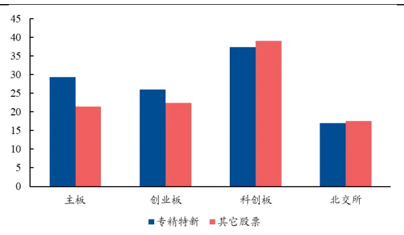
资料来源：Wind、工信部网站，兴业证券经济与金融研究院整理
数据日期：截至 2021年 9月 30 日

图 5、销售毛利率（%，中位数）
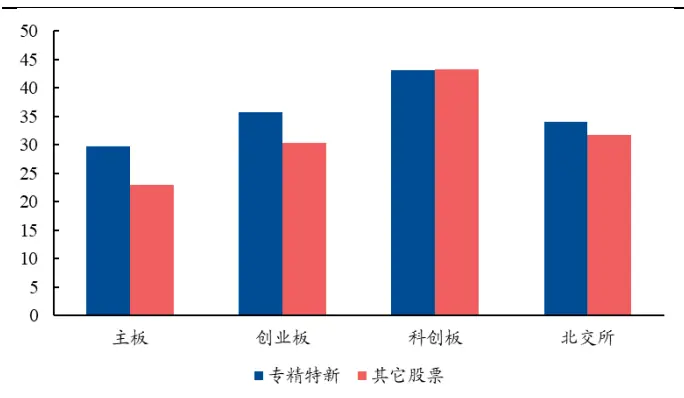
资料来源：Wind、工信部网站，兴业证券经济与金融研究院整理
数据日期：截至 2021年 9月 30 日

## 3、并驾齐驱 – 多维度量化刻画专精特新“小巨人”

在前文中我们主要针对“专精特新”政策以及已经上市了的专精特新“小巨人”企业进行了初步解读与分析。前文提及，为了寻找潜匿的“小巨人”企业，或类“小巨人”股，仅通过表征分析是远远不够的。在工信部 2018、2020和 2021年期间分别发布的《工业和信息化部办公厅关于开展专精特新“小巨人”企业培育工作的通知》，《工业和信息化部办公厅关于开展第二批专精特新“小巨人”企业培育工作的通知》和《工业和信息化部办公厅关于开展第三批专精特新“小巨人”企业培育工作的通知》（以下均简称为《通知》）中，给出了三批专精特新“小巨人”公司（以下简称小巨人公司）的基本条件、产品重点领域与专项指标，其中包含定性及定量的各项要求。在专项指标中，工信部定义了四大维度，以衡量“专精特新”公司是否符合成为小巨人的条件：经济效益、专业化程度、创新能力和经营管理。不同于“专精特新”企业，一家能够成为“小巨人”的专精特新企业必然是在保证自身优秀的自主创新能力、专业化程度和精细管理的基础上，同时具有业绩增速高，盈利能力强等属性。由此，这些“小巨人”企业才能被定义为“专精特新”中小企业中的佼佼者。

本报告正是从上述四个专项条件出发，寻找隐匿的专精特新小巨人公司。正如前文所说，如果仅仅从单一指标体系上进行筛选显然是一个必要不充分条件（如开篇所言）：假设仅基于营收、净利润等财务数据来抓住专精特新小巨人公司具有高成长属性的特点，并以此特点寻找类似企业的话，将是个以偏概全的方法。高成长属性的公司大部分并不是专精特新“小巨人”（即前面提到的必要不充分的体现）。那么该如何解决这个问题呢？

我们回归“专精特新”的定义本质：工信部在刻画专精特新“小巨人”企业时提及企业应在经济效益、专业化程度、创新能力和经营管理等方面满足一定的条件。这些是工信部给出的小巨人企业特性“指南针”，也是小巨人企业最为根本且最为显著的固有特性。为了解决“必要不充分”的研究问题，我们以目前公布的专精特新小巨人公司作为蓝本，在市场上寻找与“小巨人”团体最为相似的股票。这里的相似即体现在“经济效益”、“专业化程度”、“创新能力”、“经营管理”上。我们认为：这些相似的上市公司在财务、产品、创新方向和治理水平这四个维度上会展现出与小巨人公司类似的特性，即类专精特新“小巨人”上市公司（以下简称为类小巨人股）。不同于追求诸如高成长属性的“表象”寻找方式，这种“由内而外”的刻画方式更贴近工信部定义“小巨人”企业的方式，同时也避免出现以偏概全的问题。

由此，我们在本次研究中不设定额外的硬性指标（如市值，行业，营收等），而只是从这四个维度（“经济效益 ”、“专业化程度”、“创新能力”、“经营管理”）出发，首先通过量化的角度刻画小巨人公司及其他上市公司在四个维度上的特性，并进一步通过相似度计算得到类小巨人股。

## 3.1、经济效益 – 财务因子

在经济效益领域，《通知》中工信部给出了有关小巨人公司财务情况的硬性指标，包括上年度营业收入、近 2 年主营收入或净利润等要求。除此之外，小巨人企业应当在市场营销，细分市场占有率等方面具有竞争优势。简而言之，小巨人企业不能只是专注于研发的“学究型企业”，其需要能够将自身优势转化至公司的发展、盈利和营运等方面。因此，我们应当从多维度出发，刻画小巨人企业的财务特性，并进一步构建相似度。

在团队最近的深度研究《猎金系列之三十二：财报季的财务效应研究和因子构建》中，我们从公司财务能力的四大衡量维度入手，分别选取有代表性的指标作为公司财务能力的衡量维度。具体而言，我们将企业盈利能力、偿债能力、营运能力和发展能力等方面的分析纳入一个有机的整体，对企业的各个方面进行系统、全面、综合的分析，从而对企业的财务状况、经营成果和现金流量等作出整体的评价与判断。此外，我们选择的因子从两两相关性上看，均较低，具有信息差异性。基于这种方式构建的个股财务特征向量已被证实能够优秀地刻画公司的财务能力。因此，在本文中，我们沿用过往研报的构建方式，构建长度为 10 的财务特征向量 $\underline{{fin_{i}}}$ 。（部分因子定义参见表 2）

表 2、财务视角下不同维度的代表性因子（节选）

| 因子名称 | 代表能力 释义 |  |
| --- | --- | --- |
| CurrentRatio_LR | 偿债能力 | 流动资产合计最新财报/流动负债合计最新财报 |
| Revenue_SQ_YoY | 发展能力 | 单季度营业收入同比增长率 |
| ROE_TTM_YoY | 盈利能力 | ROE TTM / 去年同期的 ROE TTM - 1 |
| ReceivablesTurnover | 营运能力 | 2*销售收入_TTM/(应收账款_最新财报+应收账款_去年同期) |

资料来源：Wind，聚源，兴业证券经济与金融研究院整理

由此，在当期的全市场中，我们便能得到一个N×10的特征矩阵，代表每只股票的财务因子值，以表明其财务上的特性。

在计算得到特征向量后，我们进一步引入余弦相似度公式来刻画公司之间在财务维度上的相似性。具体而言，余弦相似度，是通过计算两个向量的夹角余弦值来评估他们的相似度，其主要用来衡量两个向量之间的差异。具体公式如下。

$$
\cos(\theta)=\frac{\sum_{i=1}^{n}A_{i}\cdot B_{i}}{\sqrt{\sum_{i=1}^{n}A_{i}^{2}}\cdot\sqrt{\sum_{i=1}^{n}B_{i}^{2}}}\tag{1}
$$

公 式 (1) 中 $A_{i}$ 及 $B_{i}$ 是 特 征 向 量 空 间 $\mathbf{A}(\mathbf{A}=[A_{1},A_{2},\ldots,A_{n}])$ 及 B(B =$[B_{1},B_{2},\ldots,B_{n}])$ 的细分维度。在财务动量因子中，我们便应用余弦相似度，刻画了两个股票之间在十个财务因子构建的高维空间下的余弦相似度，并定义为财务关联度fin-link：

$$
fin\text{-}link_{ijt}=\frac{\sum_{k=1}^{10}fin_{itk}\cdot fin_{jtk}}{\sqrt{\sum_{k=1}^{10}fin_{itk}^{2}}\cdot\sqrt{\sum_{k=1}^{10}fin_{jtk}^{2}}}\tag{2}
$$

其k代表因子（十个财务因子）、i、j均代表公司、t代表相应时点； $fin_{itk}$ 代表公司 i在 t时刻时k因子的值大小； $fin-link_{ijt}$ 代表公司i和j在 t时刻的财务关联度。该指标值越大，代表两个公司在财务特征上越相似，且在一个时点 t 上，我们便能够计算得到一个 N×N 的相似度矩阵。基于该维度的相关研究请参见团队于 2021年10月20日发布的研究报告《猎金系列之三十二：财报季的财务效应研究和因子构建》。

## 3.2、专业化程度 – 产业链数据

专业化程度是工信部对于小巨人公司最为看重的方向之一。在《通知》中表明，小巨人公司应当坚持专业化发展战略，长期专注并深耕于产业链中某个环节或某个产品，能为大企业、大项目提供关键零部件、元器件和配套产品，以及专业生产的成套产品。此外，小巨人公司的主导产品应符合《工业“四基”发展目录》所列重点领域，从事细分产品市场属于制造业核心基础零部件、先进基础工艺和关键基础材料；或符合制造强国战略明确的十大重点产业领域，属于重点领域技术路线图中有关产品；或属于国家和省份重点鼓励发展的支柱和优势产业。除了对于主营产品的严格限制之外，工信部还要求小巨人公司在主营产品上的营收占比需在 70%及以上，以表明其能够专注于单一产品的生产与销售。

面对产品专业化这一维度时，小巨人公司的特性体现在主营产品的品类规定（工业“四基”）与产品收入的集中性（主营产品收入占比）上，即产品类型和产品收入上的特性。因此，我们的类小巨人股需要在产品类型及其收入占比上与小巨人公司类似。然而，面对财报披露中繁杂的产品名称，如何量化地定义这些产品的属性和分类将变得尤为重要。

为了定量刻画公司的产品分布，我们创新性地引入了数库 SAM 产业链数据库。在产业链数据库中，数库通过对 GICS 行业分类与公司披露的主营业务收入（半年报与年报）进行标准化与本地化处理，将公司财报上数以万计的产品标准化为近 4000 个产品节点，并细分为 7个不同的层级。其中一级共有114个类别，二级有 489个类别。除了1级和7 级之外，每个产品节点均有其对应的父层级（上一层级）与子层级（下一层级）。下表展示了在数库 SAM 产业链数据库中，4 级产品半导体集成电路（SE002019）及其父层级的名称和定义。在标准化产品分类及层级后，数库根据个股每期报告披露的各产品名称和主营收入，将产品标准化后，计算出个股在每个标准产品上的收入。

表 3、半导体集成电路及其父层级统计

| 产品编码 | 产品名称 | 产品释义 | 层级 | 父层级产品编码 |
| --- | --- | --- | --- | --- |
| SE004 | 半导体产品与设备 | 主要指半导体产品的制造商及半导体设备 的制造商。 | 1 |  |
| SE002 | 半导体产品 | 包括了半导体组件产品、太阳能产品以及 LED应用产品的制造 | 2 | SE004 |
| SE002021 | 半导体器件 | 半导体器件分为半导体集成电路和半导体 分立器件。 | 3 | SE004>SE002 |
| SE002019 | 半导体集成电路 | 将有源元件和无源元件，按照一定的电路 互联，集成在一块半导体单晶片上的电路。 | 4 | SE004>SE002>SE002021 |

资料来源：数库，兴业证券经济与金融研究院整理

以第三批小巨人中的深圳市力合微电子股份有限公司（688589.SH）为例：在表 4 中，数库对力合微2020年报中原始披露的产品进行标准化之后，首先得到数库标准产品分类。其次，将数库中的标准产品对应到与之关联的一级产品分类，计算发现该公司在通信设备、半导体产品与设备、以及工业设备和产品贸易上均有收入。

表 4、力合微（688589.SH）2020年报主营产品收入

| 原始披露 | 数库标准产品 | 标准产品对应数库1级产品 | 营收占比 |
| --- | --- | --- | --- |
| 基于自主芯片的模块、整 机、软件与技术服务 | 无线模组（5级） | 通信设备 | 87.43% |
| 自主芯片 | 半导体集成电路（4级） | 半导体产品与设备 | 2.26% |
| 其他配套产品 | 电子设备及元器件经销（2级） | 工业设备和产品贸易 | 10.31% |

资料来源：Wind，数库，兴业证券经济与金融研究院整理
数据日期：截至 2020年 12 月31 日

以2020年年报为基础，我们首先展示基于数库数据库覆盖到的已上市小巨人公司（不含北交所，数据覆盖率达 95%）一、二级产品的公司个数分布情况，以此对已上市小巨人企业在产品上做出整体的分析与统计。下图中统计的是在该产品类别中有主营收入的公司个数前 15 的产品类别统计。可以明显看到，在一级产品分布中，工业机械、电子制造的公司个数较多，这十分符合“专精特新”在工信部的定义。除此之外，我们也可以将产品分类细化至 2 级。在二级产品分布中，电子设备如电子设备及仪器、电子元件个数较多。此外，生产工业机械下属的专用设备制造、通用机械制造等二级产品的公司个数也较多。因此，数库 SAM 数据库中的标准化产品十分准确地刻画了小巨人公司在产品分类上的集中性。

图 6、数库一级产品公司个数分布（前 15）
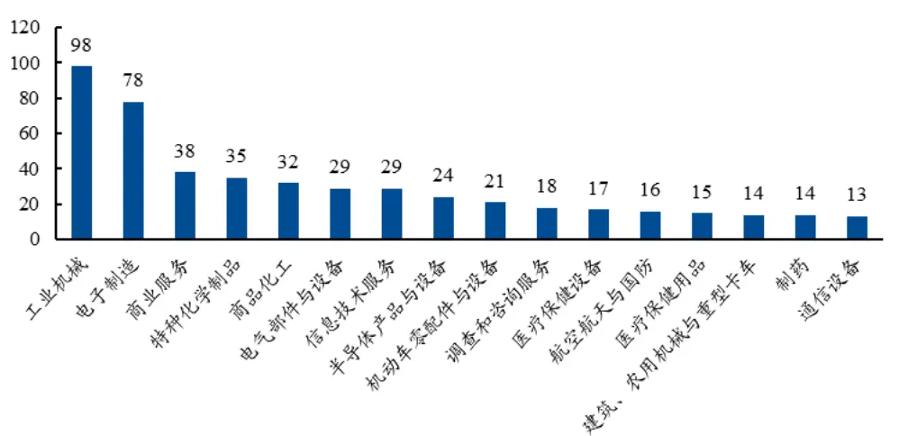
资料来源：Wind，数库，兴业证券经济与金融研究院整理数据日期：截至 2020年 12 月31 日

图 7、数库二级产品公司个数分布（前 15）
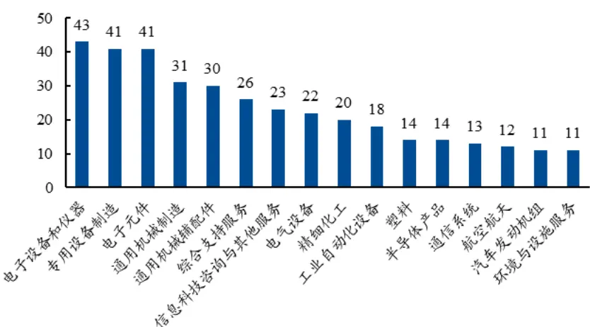
资料来源：Wind，数库，兴业证券经济与金融研究院整理数据日期：截至 2020年 12 月31 日

此外，我们统计了在“专精特新”股票池中，单一产品主营收入占比大于 75%的公司个数与“专精特新”总公司个数比值，并同时计算了非“专精特新”的上市公司中，单一产品主营收入占比大于 75%的公司个数比值。可以从图8中明显看到，2018年年报至今，“专精特新”公司该项的比值均大于60%，而非“专精特新”公司的比值则接近与 50%。这一现象可以明显地表明，无论是从工信部的定义，还是数库的数据统计均表明“专精特新”的大部分公司长期专注于单一产品。

图 8、单一主营产品公司占比对比图
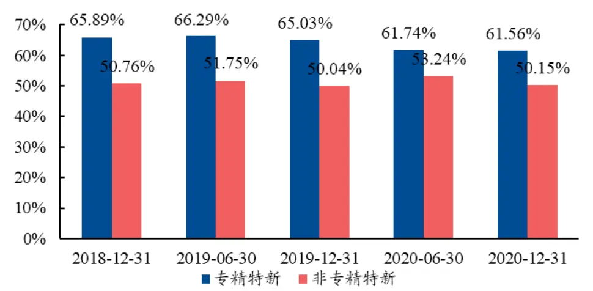
资料来源：Wind，数库，兴业证券经济与金融研究院整理
数据日期：截至 2020年 12 月31 日

综上，“专精特新”小巨人公司在公司产品上的结构相对单一且集中，这有利于其在所属产业链上的深耕细作。此外，“专精特新”小巨人公司的主导产品十分符合《工业“四基”发展目录》所列重点领域，即从事细分产品市场中属于制造业核心基础零部件、先进基础工艺和关键基础材料；或从事符合制造强国战略明确的十大重点产业领域，属于重点领域技术路线图中有关产品。相对于非“专精特新”小巨人企业，更多的“专精特新”公司长期专注于单一产品。

为了同时考虑产品类型和产品专一度两大特性，我们基于数库 1 级产品分类与每家企业在1级产品上的营收数据，构建产品特征向量sam 。该向量以数库1级 114个标准化产品为向量维度，每个产品上的当期营收占比作为该维度上数值，构建一个 1乘114的特征向量。以力合微的2020年报数据为例，该公司当期的特征向量为：

$$
sam_{i}=(0{,}0,\ldots{,}0.8743,\ldots{,}0.226,\ldots{,}0.1031,\ldots{,}0)
$$

由此，在当期的全市场中，我们便能得到一个N×114的特征矩阵，代表每只股票在不同产品上的营收占比，以表明其产品上的特性。

参照上一章节中对于财务相似度的刻画，我们基于产品特征向量，应用公式（1），计算产品关联度sam-link：

$$
sam-link_{ijt}=\frac{\sum_{k=1}^{114}sam_{itk}\cdot sam_{jtk}}{\sqrt{\sum_{k=1}^{114}sam_{itk}^{2}}\cdot\sqrt{\sum_{k=1}^{114}sam_{jtk}^{2}}}\tag{3}
$$

其k代表114类一级产品、i、j均代表公司、t代表相应时点； $sam_{itk}$ 代表公司 i 在 t 时刻在产品 k 上的主营收入占比； $sam-link_{ijt}$ 代表公司 i 和 j 在 t 时刻的余弦相似度，简称为产品关联度。该指标值越大，代表两个公司在产品布局和营收上越相似，产品链所处位置也越趋于一致。在一个时点 t 上，我们便能够计算得到一个N×N的产品相似度矩阵。

## 3.3、创新能力 – 专利数据

在“专精特新”这四字中，“新”，或新颖化的概念便对应着公司的创新能力。根据《通知》，小巨人企业需要具有持续创新能力和研发投入，在研发设计、生产制造等方面不断创新并取得比较显著的效益，具有一定的示范推广价值。此外，在创新能力的专项要求中，企业获得的发明专利被限定在特定范围内，如需要拥有有效发明专利（含集成电路布图设计专有权）2 项或实用新型专利、外观设计专利、软件著作权 5项及以上。

可以看出，这些要求无不在强调小巨人企业需要在专利种类和专利数目上有着显著特性。那么如果简单的用专利数进行衡量也面临同样的问题：必要不充分的问题。我们仍然从前序角度出发，寻找专利分布上和专精特新小巨人接近的公司。那么该如何衡量专利分布呢？

根据 1971 年签订的《国际专利分类斯特拉斯堡协定》，衍生了《国际专利分类表》（IPC 分类），这是目前国际通用的专利文献分类和检索工具。国际专利分类系统按照技术主题设立类目，把整个技术领域分为 5 个不同等级：部、大类、小类、大组、小组，分别对应着 8、145、670、3,000+、10,000+个类别。某种程度上 IPC分类可以理解为一种全新的行业分类（部分概念释义参见图 9）。从数据来源角度讲，一个专利的 IPC分类的原始数据是一个 JPG 格式的文件，从中进行解析即可得到 IPC分类相应的数据，具体参见图10。

图 9、第一部（农业）的部分分类展示

| 分部：农业... A01农业；林业；畜牧业；狩猎；诱捕；捕鱼.. A01B农业或林业的整地；一般农业机械或农具的部件、零件或附件（用于播种、种 |
| --- |
| 整地设备或能够整地的割草机入 A01D 42/04；与整地机具联合的割草机入 A01 43/12；工程目的的整地入E01，E02，E21） A01C种植；播种；施肥(与一般整地结合的入A01B49/04；农业机械或农具的部件 零件或附件一般入 A01B 51/00 至 A01B 75/00). |
| A01D收获；割草. A01F脱粒（联合收割机入A01D41/00）；禾秆、干草或类似物的打捆；将禾秆、干 |
| 或类似物形成捆或打捆的固定装置或手动工具；禾秆、干草或类似物的切碎；农业或 艺产品的储藏（与收割有关的制作或设置堆垛的设备入A01D85/00）.. A01G园艺；蔬菜、花卉、稻、果树、葡萄、啤酒花或海菜的栽培；林业；浇水（ 果、蔬菜、啤酒花等类植物的采摘入A01D46/00；通过组织培养技术的植物再生 |

资料来源：德高行，兴业证券经济与金融研究院整理

图 10、专利 IPC分类原始数据示意
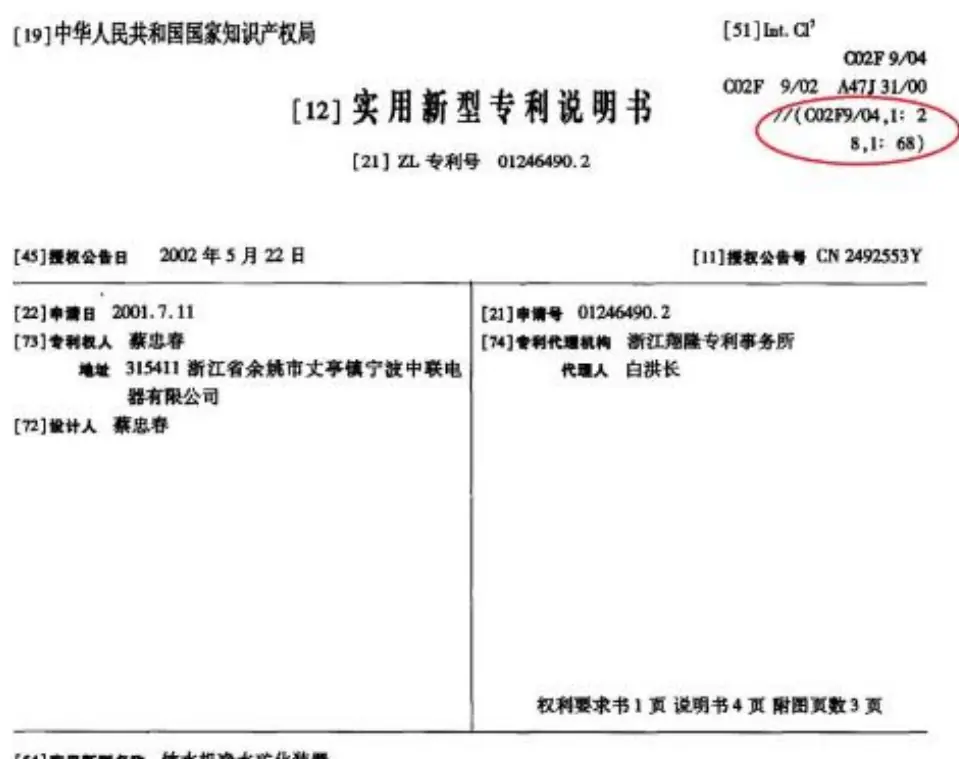
[54]实用新型名称 饮水机净水矿化装置
资料来源：德高行，兴业证券经济与金融研究院整理

在本篇研究中，我们将所有上市公司过去5年的有效授权发明专利映射到IPC二级分类（大类，共计 145 个）。以力合微（688589.SH）为例，我们统计该公司近 5 年来在二级专利分类上有效授权的发明专利细节，具体展示如下。截至 2021年 9 月 30 日，力合微近五年主要的有效授权发明专利共有 93个，集中在电通信技术（45 个，48.39%）与测量；测试（22 个，23.66%）上。若放在一级分类上看，其近五年的主要有效授权发明专利集中在电学（61.29%）与物理上（37.63%）。

图 11、力合微（688589.SH）近 5年来二级专利分类统计
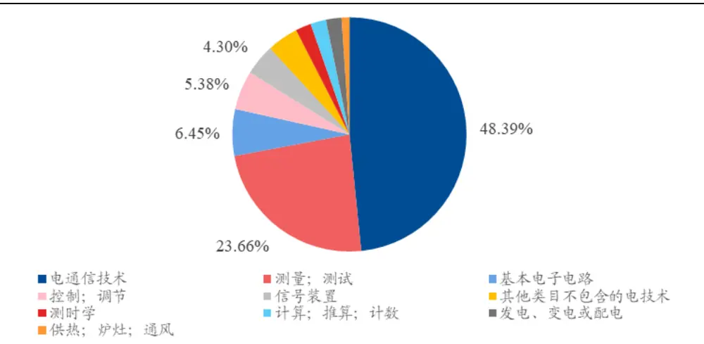
资料来源：德高行，兴业证券经济与金融研究院整理
数据日期：截至 2021 年 9 月 30 日

基于德高行的专利数据库，我们同样构建一个能够从专利种类和专利数量两个维度表达公司特性的专利特征向量 $\underline{{{{\mathfrak{r}}}ec{h}_{i}}}$ 。向量 $tech_{i}$ 长度为 145，其中每个维度表示的是该公司在该专利分类上的个数占比，以力合微为例，则

$$
tech_{i}=(0,\dots,0.4839,\dots,0.2366,\dots,0.645,\dots)
$$

由此，在当期的全市场中，我们便能得到一个N×145的特征矩阵，代表每只股票在不同专利种类上的有效授权个数占比，以表明其创新能力上的特性。

之后，我们计算任意两个公司的专利分布相似度，该指标本质上代表着两家公司的专利在类别上的相似程度。

$$
tech\cdot link_{ijt}=\frac{\sum_{k=1}^{145}tech_{itk}\cdot tech_{jtk}}{\sqrt{\sum_{k=1}^{145}tech_{itk}^{2}}\cdot\sqrt{\sum_{k=1}^{145}tech_{jtk}^{2}}}\tag{4}
$$

其k代表145类二级专利种类、i、j均代表公司、t代表相应时点； $tech_{itk^{\prime}}$ 代表公司 i 在 t 时刻在专利 k 上的获得个数占比； $tech\text{ - }link_{ijt}$ 代表公司 i 和j 在 t 时刻的余弦相似度，简称为专利关联度。该指标值越大，代表两个公司在申请的专利类别上布局越相似、创新研发方向也越趋于一致。这种相似性的衡量方式，已经跨域了传统财报以及行业分类所能提供的信息，在一定程度上反映了公司未来的发展战略方向（具体参见团队于 2019年 6 月 25 日发布的《基于专利分类的科技动量因子研究》）。

## 3.4、治理能力 – 公司治理 G指标

除此之外，在工信部的《通知》中，还表明了“小巨人”企业需要有卓越的经营管理能力。具体来说，工信部表明“小巨人”企业需要有完整的精细化管理方案，并取得相关质量管理体系认证。企业需要采用先进的企业管理方式，诸如 5S管理等。此外，近三年发生过安全、质量、环境污染事故；有偷漏税和其他违法违规、失信行为的企业不能成为“小巨人”。综上，“小巨人”企业需要保持着良好的经营和管理能力。

如何定量地衡量公司的管理和经营能力一直是个难题。在近几年，ESG（英文 Environmental（环境）、Social（社会）和 Governance（公司治理）的缩写）概念投资在国内外饱受关注。我们兴证金工团队也在《标普道指ESG评级体系研究笔记——ESG 巡礼之评级体系全攻略（二）》与《ESG 观察&双周动态早知道》等报告中对国内外ESG的投资与发展做出了详尽的介绍和研究。此外，我们也尝试对 ESG 这一概念进行定量分析。在引入的 ESG 指标数据库后，我们在本篇中使用公司治理指标，即 G指标对治理能力仍有欠缺的公司进行筛选和剔除。该指标主要由商业道德、风险管理、ESG 治理、公司治理信息四个维度，共计 37 个小项构成。小项中包括反腐败、风险管理体系、同时，根据公司所属的不同行业，数据库给三个维度设置了不同的权重，并最终计算得到一家企业当期的G指标（单一数值）。

## 4、多维度寻找类专精特新“小巨人”企业

在构建完四个维度的特征向量以及各个维度上的相似度之后，我们将四个维度进行结合，通过高维空间来对股票池进行筛选，计算得到类专精特新“小巨人”。在此我们先简单总结下上述介绍的特征向量或指标的定义，及其使用方式。

表 5、类小巨人公司计算方式所用数据汇总

| 工信部要求 | 选用特征指标 | 特征指标构成方式 | 使用方式 |
| --- | --- | --- | --- |
| 经济效益 | 财务相似度 | 基于多维度财务因子计算 | 正向：寻找相似公司 |
| 专业化程度 | 产品相似度 | 基于产业链数据中产品营收占比计算 | 正向：寻找相似公司 |
| 创新能力 | 专利相似度 | 基于专利数据中专利获得量占比计算 | 正向：寻找相似公司 |
| 治理能力 | 公司治理 G 指标 | 主要由商业道德、风险管理、ESG治理、公司治 理信息构成 | 反向：剔除尾部股票 |

资料来源：兴业证券经济与金融研究院整理

## 基于相似度计算类“小巨人”股

接下来，我们需要基于相似度，寻找与小巨人股类似的上市公司，即类小巨人股。我们致力于将量化与工信部对于小巨人的定性特征结合，考虑经济效益、专业化程度、创新能力与治理能力四个维度，找出类小巨人股。我们的计算方法如下：

1、对于单支非小巨人股i，我们首先统计其与所有小巨人股在三个维度上的相似度向量 $fin-link_{i\cdot t},\ sum-link_{i\cdot t},\ each-link_{i\cdot t}$ ，记为 $Sim_{it}$ 。这是一个$3\times N$ 的矩阵，N为小巨人股的个数；

2、我们基于欧式距离，计算得到其他小巨人股与公司i的相似得分，具体定义为：

$$
Sim-score_{ijt}=\sqrt{fin-lnk^2_{ijt}+same-lnk^2_{ijt}+techniques^2_{ijt}}\tag{5}
$$

相似得分越大，说明小巨人j公司与非小巨人 i公司越相似；

3、得到与 i 公司相关的所有相似得分后，我们统计相似得分最高的前 50%小巨人股的得分均值，记为 i公司最终的类小巨人得分 $\cdot Sim-score_{it}.$ 。类小巨人得分值越大，说明公司 i与小巨人股整体更相似；

4、对于所有的非小巨人股，我们均计算得到个股的类小巨人得分，并取得分最高的前500支股，最后再使用G指标进行筛选，剔除G指标排名后10%的公司，并最终得到类小巨人股。

总结而言，我们使用从经济效益、专业化程度与创新能力出发得到的三个相似度指标：财务相似度、产品相似度和专利相似度，计算得到非小巨人股与小巨人股整体的相似得分，进一步使用G指标剔除尾部股票，并最终得到类小巨人股股票池。

以非小巨人股国盛智科（688558.SH）为例，我们展示相似度得分排名最靠前的五个小巨人股。可以明显看到，与之类似的小巨人股不仅几乎与其属于同一中信三级行业，同时绝大多数与其类似的小巨人股属于科创板。可以说相似度很好地刻画出了它们的相似程度。此外，从产业链上看，国盛智科与其最相似的小巨人股浙海德曼同属于中高端数控机床企业，属于补链强链专项行动中被“卡脖子”的产品类型。根据兴证研究院机械设备行业研究组在2021年 11月 22日发布的研报《锂电产能投建多点开花，光伏技术升级百家争鸣》，国盛智科经营稳健、产能有序扩张且回款优异，属于机床板块推荐股票。可以说，无论是从行业、产品特性，还是基本面特性上看，我们找出的国盛智科十分符合小巨人的整体特性。

表 6、国盛智科与小巨人股的相似得分（前 5）

| 股票代码 | 股票简称 | 中信三级行业 | 相似度得分 |
| --- | --- | --- | --- |
| 688558.SH | 国盛智科 | 机床设备 | -- |
| 688577.SH | 浙海德曼 | 机床设备 | 1.71 |
| 688308.SH | 欧科亿 | 其他通用机械 | 1.69 |
| 300488.SZ | 恒锋工具 | 机床设备 | 1.66 |
| 688305.SH | 科德数控 | 机床设备 | 1.66 |
| 603203.SH | 快克股份 | 其他通用机械 | 1.65 |

资料来源：Wind，数库，德高行，兴业证券经济与金融研究院整理

我们基于最新的财务、专利和产业链数据，计算与已有的 324支小巨人股（不含北交所）最相似的500支股，并用G指标进行筛选后，得到452支股票（未被G 指标覆盖的公司不剔除），作为最新一期的类小巨人股。需要注意的是，我们在寻找类小巨人股时虽不限制股票总市值，但有超过37%的类小巨人股的总市值小于 50亿元，十分符合小巨人股的市值特性。从结果上看，类小巨人股既包含了诸如京东方A（000725.SZ）、宁德时代（300750.SZ）等行业龙头股，同时也包含了诸如国盛智科（688558.SH）等具备核心技术能力、成长潜力和投资价值设备厂商。

表 7、类小巨人股列表（节选）

| 股票代码 | 股票简称 | 上市板块 | 中信一级行业 |
| --- | --- | --- | --- |
| 002415.SZ | 海康威视 | 主板 | 电子 |
| 002475.SZ | 立讯精密 | 主板 | 电子 |
| 002597.SZ | 金禾实业 | 主板 | 基础化工 |
| 603901.SH | 永创智能 | 主板 | 机械 |
| 300037.SZ | 新宙邦 | 创业板 | 基础化工 |
| 300527.SZ | 中船应急 | 创业板 | 国防军工 |
| 300750.SZ | 宁德时代 | 创业板 | 电力设备及新能源 |
| 688558.SH | 国盛智科 | 科创板 | 机械 |

资料来源：Wind，数据，德高行，兴业证券经济与金融研究院整理

从行业分布上看，大多数的类小巨人股集中在机械、电子、电力设备及新能源等，这些行业也是小巨人股的主要行业。因此，从市值和行业分布上看，类小巨人股保持了与小巨人股类似的特性。而类小巨人股这样样本量更大、更丰富的优秀股票池能够给提供给投资者额外的“专精特新”信息。

图 12、类小巨人股行业分布
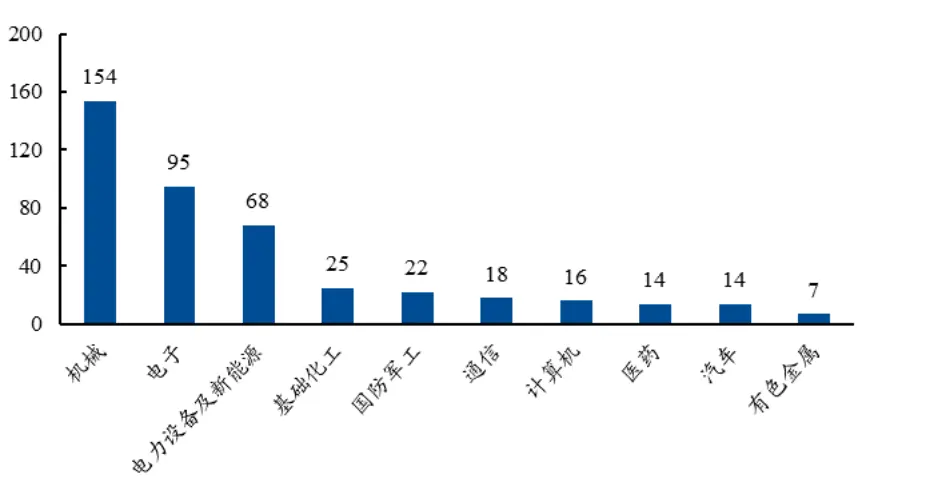
资料来源：Wind，数库，德高行，兴业证券经济与金融研究院整理

## 5、总结

如何筛选隐匿的专精特新小巨人是大家关注的焦点。但传统的研究仅仅从指标打分的角度进行筛选，该方法有明显的漏洞。本文另辟蹊径：以目前公布的专精特新小巨人公司作为蓝本，在市场上寻找与“小巨人”团体最为相似的股票。这里的相似即体现在“经济效益”、“专业化程度”、“创新能力”、“经营管理”这四个角度上。为此，我们引入财务因子、数库 SAM 产业链数据库、专利数据库与 ESG 中的公司治理 G 指标，将工信部的要求一一对应至量化指标中，并以此全方位、多维度地对小巨人股进行准确刻画。最后，我们基于相似度算法，找出了目前市场上近 500 支隐匿的类专精特新“小巨人”股。无论是从产业链位置、专利特性，亦或是基本面、财务维度上，我们找出的类小巨人股均十分贴合工信部对于小巨人企业的要求。

类小巨人股在准确贴合“专精特新”概念的基础上，给投资者提供了更加丰富，更多元的标的选择，便于投资者全面布局“专精特新”。我们将继续深耕该领域，发掘更多“专精特新”与量化有机结合的新颖角度，更好地为投资者提供思路与观点。

## 附录：类小巨人股列表（节选 100支）

表 8、类小巨人股列表（节选 100支）

| 股票代码 | 股票简称 | 所属板块 | 所属中信一级行业 | 总市值（亿元） |
| --- | --- | --- | --- | --- |
| 000100.SZ | TCL 科技 | 主板 | 电子 | 892.3 |
| 000547.SZ | 航天发展 | 主板 | 国防军工 | 275.5 |
| 000551.SZ | 创元科技 | 主板 | 电力设备及新能源 | 42.0 |
| 000931.SZ | 中关村 | 主板 | 综合 | 51.8 |
| 002021.SZ | ST 中捷 | 主板 | 机械 | 13.6 |
| 002026.SZ | 山东威达 | 主板 | 机械 | 80.0 |
| 002057.SZ | 中钢天源 | 主板 | 钢铁 | 64.0 |
| 002130.SZ | 沃尔核材 | 主板 | 电子 | 106.1 |
| 002145.SZ | 中核钛白 | 主板 | 基础化工 | 278.7 |
| 002151.SZ | 北斗星通 | 主板 | 国防军工 | 202.9 |
| 002194.SZ | 武汉凡谷 | 主板 | 通信 | 72.1 |
| 002196.SZ | 方正电机 | 主板 | 电力设备及新能源 | 50.1 |
| 002272.SZ | 川润股份 | 主板 | 机械 | 32.2 |
| 002276.SZ | 万马股份 | 主板 | 电力设备及新能源 | 96.3 |
| 002289.SZ | 宇顺电子 | 主板 | 电子 | 21.6 |
| 002328.SZ | 新朋股份 | 主板 | 汽车 | 46.5 |
| 002339.SZ | 积成电子 | 主板 | 电力设备及新能源 | 35.8 |
| 002553.SZ | 南方轴承 | 主板 | 汽车 | 39.7 |
| 002609.SZ | 捷顺科技 | 主板 | 计算机 | 57.9 |
| 002635.SZ | 安洁科技 | 主板 | 电子 | 115.3 |
| 002767.SZ | 先锋电子 | 主板 | 机械 | 19.5 |
| 002779.SZ | 中坚科技 | 主板 | 机械 | 22.8 |
| 002829.SZ | 星网宇达 | 主板 | 国防军工 | 55.9 |
| 002859.SZ | 洁美科技 | 主板 | 电子 | 131.4 |
| 002906.SZ | 华阳集团 | 主板 | 汽车 | 262.7 |
| 002929.SZ | 润建股份 | 主板 | 通信 | 88.1 |
| 003021.SZ | 兆威机电 | 主板 | 机械 | 120.0 |
| 300004.SZ | 南风股份 | 创业板 | 机械 | 29.7 |
| 300126.SZ | 锐奇股份 | 创业板 | 机械 | 20.7 |
| 300127.SZ | 银河磁体 | 创业板 | 电子 | 73.8 |
| 300258.SZ | 精锻科技 | 创业板 | 汽车 | 76.1 |
| 300341.SZ | 麦克奥迪 | 创业板 | 电力设备及新能源 | 54.3 |
| 300354.SZ | 东华测试 | 创业板 | 机械 | 60.0 |
| 300411.SZ | 金盾股份 | 创业板 | 机械 | 31.9 |
| 300412.SZ | 迦南科技 | 创业板 | 医药 | 22.5 |
| 300470.SZ | 中密控股 | 创业板 | 机械 | 89.8 |
| 300480.SZ | 光力科技 | 创业板 | 机械 | 90.9 |
| 300482.SZ | 万孚生物 | 创业板 | 医药 | 157.4 |
| 300527.SZ | 中船应急 | 创业板 | 国防军工 | 93.4 |
| 300568.SZ | 星源材质 | 创业板 | 基础化工 | 351.2 |
| 300572.SZ | 安车检测 | 创业板 | 机械 | 47.1 |
| 300580.SZ | 贝斯特 | 创业板 | 汽车 | 46.9 |
| 300689.SZ | 澄天伟业 | 创业板 | 通信 | 25.3 |
| 300699.SZ | 光威复材 | 创业板 | 国防军工 | 421.4 |
| 300720.SZ | 海川智能 | 创业板 | 机械 | 28.2 |
| 300828.SZ | 锐新科技 | 创业板 | 机械 | 30.0 |
| 300835.SZ | 龙磁科技 | 创业板 | 有色金属 | 55.9 |
| 300885.SZ | 海昌新材 | 创业板 | 机械 | 32.3 |
| 300897.SZ | 山科智能 | 创业板 | 机械 | 23.1 |
| 300933.SZ | 中辰股份 | 创业板 | 电力设备及新能源 | 58.9 |
| 600118.SH | 中国卫星 | 主板 | 国防军工 | 313.7 |
| 600343.SH | 航天动力 | 主板 | 国防军工 | 65.1 |
| 600363.SH | 联创光电 | 主板 | 电子 | 140.8 |
| 600468.SH | 百利电气 | 主板 | 电力设备及新能源 | 64.5 |
| 600552.SH | 凯盛科技 | 主板 | 电子 | 80.4 |
| 600579.SH | 克劳斯 | 主板 | 机械 | 55.4 |
| 600879.SH | 航天电子 | 主板 | 国防军工 | 228.1 |
| 601100.SH | 恒立液压 | 主板 | 机械 | 1,069.2 |
| 601208.SH | 东材科技 | 主板 | 基础化工 | 155.1 |
| 601369.SH | 陕鼓动力 | 主板 | 机械 | 244.2 |
| 603016.SH | 新宏泰 | 主板 | 电力设备及新能源 | 33.4 |
| 603045.SH | 福达合金 | 主板 | 有色金属 | 24.1 |
| 603066.SH | 音飞储存 | 主板 | 交通运输 | 24.7 |
| 603088.SH | 宁波精达 | 主板 | 机械 | 42.4 |
| 603095.SH | 越剑智能 | 主板 | 机械 | 35.2 |
| 603187.SH | 海容冷链 | 主板 | 机械 | 109.92 |
| 603228.SH | 景旺电子 | 主板 | 电子 | 247.0 |
| 603267.SH | 鸿远电子 | 主板 | 国防军工 | 370.2 |
| 603269.SH | 海鸥股份 | 主板 | 机械 | 14.1 |
| 603277.SH | 银都股份 | 主板 | 机械 | 81.9 |
| 603283.SH | 赛腾股份 | 主板 | 机械 | 53.9 |
| 603308.SH | 应流股份 | 主板 | 机械 | 148.9 |
| 603324.SH | 盛剑环境 | 主板 | 机械 | 81.8 |
| 603328.SH | 依顿电子 | 主板 | 电子 | 74.6 |
| 603617.SH | 君禾股份 | 主板 | 机械 | 24.8 |
| 603656.SH | 泰禾智能 | 主板 | 机械 | 19.2 |
| 603660.SH | 苏州科达 | 主板 | 计算机 | 31.1 |
| 603700.SH | 宁水集团 | 主板 | 机械 | 40.4 |
| 603722.SH | 阿科力 | 主板 | 基础化工 | 48.0 |
| 603767.SH | 中马传动 | 主板 | 汽车 | 22.9 |
| 603829.SH | 洛凯股份 | 主板 | 电力设备及新能源 | 18.6 |
| 603897.SH | 长城科技 | 主板 | 电力设备及新能源 | 99.6 |
| 603901.SH | 永创智能 | 主板 | 机械 | 78.5 |
| 603936.SH | 博敏电子 | 主板 | 电子 | 69.2 |
| 603948.SH | 建业股份 | 主板 | 基础化工 | 51.0 |
| 603982.SH | 泉峰汽车 | 主板 | 汽车 | 71.7 |
| 605066.SH | 天正电气 | 主板 | 电力设备及新能源 | 50.9 |
| 605218.SH | 伟时电子 | 主板 | 电子 | 36.8 |
| 605222.SH | 起帆电缆 | 主板 | 电力设备及新能源 | 124.6 |
| 605258.SH | 协和电子 | 主板 | 电子 | 26.2 |
| 688068.SH | 热景生物 | 科创板 | 医药 | 60.1 |
| 688116.SH | 天奈科技 | 科创板 | 基础化工 | 376.1 |
| 688148.SH | 芳源股份 | 科创板 | 基础化工 | 185.2 |
| 688208.SH | 道通科技 | 科创板 | 计算机 | 318.9 |
|  | 长阳科技 | 科创板 |  |  |
| 688299.SH |  |  | 电子 | 89.3 |
| 688338.SH | 赛科希德 | 科创板 | 医药 | 36.3 |
| 688558.SH | 国盛智科 | 科创板 | 机械 | 66.1 |
| 688611.SH | 杭州柯林 | 科创板 | 电力设备及新能源 | 52.6 |
| 688779.SH | 长远锂科 | 科创板 | 基础化工 | 517.0 |

资料来源：Wind，数库，德高行，兴业证券经济与金融研究院整理
数据日期：截至 2021年 11 月19 日

风险提示：文献中的结果均由相应作者通过历史数据统计、建模和测算完成，在政策、市场环境发生变化时模型存在失效的风险。

## 分析师声明

本人具有中国证券业协会授予的证券投资咨询执业资格并注册为证券分析师，以勤勉的职业态度，独立、客观地出具本报告。本报告清晰准确地反映了本人的研究观点。本人不曾因，不因，也将不会因本报告中的具体推荐意见或观点而直接或间接收到任何形式的补偿。

## 投资评级说明

| 投资建议的评级标准 | 类别 | 评级 | 说明 |
| --- | --- | --- | --- |
| 报告中投资建议所涉及的评级分为股票评级和行业评级(另有说明的除外)。评级标准为报告发布日后的12个月内公司股价(或行业指数)相对同期相关证券市场代表性指数的涨跌幅。其中：A股市场以上证综指或深圳成指为基准，香港市场以恒生指数为基准；美国市场以标普500或纳斯达克综合指数为基准。 | 股票评级 | 买入 | 相对同期相关证券市场代表性指数涨幅大于15% |
|  |  | 审慎增持 | 相对同期相关证券市场代表性指数涨幅在5%~15%之间 |
|  |  | 中性 | 相对同期相关证券市场代表性指数涨幅在-5%~5%之间 |
|  |  | 减持 | 相对同期相关证券市场代表性指数涨幅小于-5% |
|  |  | 无评级 | 由于我们无法获取必要的资料，或者公司面临无法预见结果的重大不确定性事件，或者其他原因，致使我们无法给出明确的投资评级 |
|  | 行业评级 | 推荐 | 相对表现优于同期相关证券市场代表性指数 |
|  |  | 中性 | 相对表现与同期相关证券市场代表性指数持平 |
|  |  | 回避 | 相对表现弱于同期相关证券市场代表性指数 |

## 信息披露

本公司在知晓的范围内履行信息披露义务。客户可登录 www.xyzq.com.cn 内幕交易防控栏内查询静默期安排和关联公司持股情况。

## 使用本研究报告的风险提示及法律声明

兴业证券股份有限公司经中国证券监督管理委员会批准，已具备证券投资咨询业务资格。

本报告仅供兴业证券股份有限公司（以下简称“本公司”）的客户使用，本公司不会因接收人收到本报告而视其为客户。本报告中的信息、意见等均仅供客户参考，不构成所述证券买卖的出价或征价邀请或要约。该等信息、意见并未考虑到获取本报告人员的具体投资目的、财务状况以及特定需求，在任何时候均不构成对任何人的个人推荐。客户应当对本报告中的信息和意见进行独立评估，并应同时考量各自的投资目的、财务状况和特定需求，必要时就法律、商业、财务、税收等方面咨询专家的意见。对依据或者使用本报告所造成的一切后果，本公司及/或其关联人员均不承担任何法律责任。

本报告所载资料的来源被认为是可靠的，但本公司不保证其准确性或完整性，也不保证所包含的信息和建议不会发生任何变更。本公司并不对使用本报告所包含的材料产生的任何直接或间接损失或与此相关的其他任何损失承担任何责任。

本报告所载的资料、意见及推测仅反映本公司于发布本报告当日的判断，本报告所指的证券或投资标的的价格、价值及投资收入可升可跌，过往表现不应作为日后的表现依据；在不同时期，本公司可发出与本报告所载资料、意见及推测不一致的报告；本公司不保证本报告所含信息保持在最新状态。同时，本公司对本报告所含信息可在不发出通知的情形下做出修改，投资者应当自行关注相应的更新或修改。

除非另行说明，本报告中所引用的关于业绩的数据代表过往表现。过往的业绩表现亦不应作为日后回报的预示。我们不承诺也不保证，任何所预示的回报会得以实现。分析中所做的回报预测可能是基于相应的假设。任何假设的变化可能会显著地影响所预测的回报。

本公司的销售人员、交易人员以及其他专业人士可能会依据不同假设和标准、采用不同的分析方法而口头或书面发表与本报告意见及建议不一致的市场评论和/或交易观点。本公司没有将此意见及建议向报告所有接收者进行更新的义务。本公司的资产管理部门、自营部门以及其他投资业务部门可能独立做出与本报告中的意见或建议不一致的投资决策。

本报告并非针对或意图发送予或为任何就发送、发布、可得到或使用此报告而使兴业证券股份有限公司及其关联子公司等违反当地的法律或法规或可致使兴业证券股份有限公司受制于相关法律或法规的任何地区、国家或其他管辖区域的公民或居民，包括但不限于美国及美国公民（1934 年美国《证券交易所》第 15a-6 条例定义为本「主要美国机构投资者」除外）。

本报告的版权归本公司所有。本公司对本报告保留一切权利。除非另有书面显示，否则本报告中的所有材料的版权均属本公司。未经本公司事先书面授权，本报告的任何部分均不得以任何方式制作任何形式的拷贝、复印件或复制品，或再次分发给任何其他人，或以任何侵犯本公司版权的其他方式使用。未经授权的转载，本公司不承担任何转载责任。

## 特别声明

在法律许可的情况下，兴业证券股份有限公司可能会利差本报告中提及公司所发行的证券头寸并进行交易，也可能为这些公司提供或争取提供投资银行业务服务。因此，投资者应当考虑到兴业证券股份有限公司及/或其相关人员可能存在影响本报告观点客观性的潜在利益冲突。投资者请勿将本报告视为投资或其他决定的唯一信赖依据。

## 兴业证券研究

| 上海 | 北京 | 深圳 |
| --- | --- | --- |
| 地址：上海浦东新区长柳路36号兴业证券大厦 | 地址：北京西城区锦什坊街35号北楼601-605 | 地址：深圳市福田区皇岗路5001号深业上城T2 |
| 15层 邮编：200135 | 邮编：100033 | 座52楼 邮编：518035 |
| 邮箱：research@xyzq.com.cn | 邮箱：research@xyzq.com.cn | 邮箱：research@xyzq.com.cn |