金融工程组分析师：

郑兆磊

zhengzhaolei@xyzq.com.cn

S0190520080006

银行组分析师：

陈绍兴

zhengzhaolei@xyzq.com.cn

S0190517070003

银行组分析师：

王尘

wangchen@xyzq.com.cn

S0190520060001

金融工程组研究助理：

占康萍

zhankangping@xyzq.com.cn

## 报告关键点

本文继续专注于板块基本面量化研究，选取大金融板块中的典型行业—银行行业进行深入分析，来进一步完善我们板块基本面研究框架。

## 相关报告

《基本面量化系列之一：基本面量化视角下的大健康板块选股研究》

《基本面量化系列之二：基本面量化视角下的科技板块选股研究》

《基本面量化研究系列之三：未雨绸缪——个股财务风险监控雷达搭建》

《基本面量化研究系列之四：寻找隐匿的专精特新“小巨人》《基本面量化系列之五：家电行业基本面量化模型构建》

# 基本面量化系列之六：银行行业基本面量化模型构建

2022年7月18日

## 投资要点

本文继续专注于板块基本面量化研究，选取大金融板块中的典型行业—银行行业进行深入分析，来进一步完善我们板块基本面量化研究框架。我们通过与兴证银行组通力合作，基于以下框架完成银行行业基本面量化模型的搭建：1）银行行业标的划分；2）银行行业逻辑梳理；3）银行行业逻辑量化表达；4）银行行业投资逻辑应用。

1、回溯历史，定性复盘银行行业历史表现：兴证银行团队对银行行业历史表现进行深入复盘，挖掘银行股每轮上涨底层驱动因素，提出银行行业历轮上涨行情多数是在“宽货币-宽信用-经济企稳”的过程中，在经济修复预期加强、或者持续得到验证的情况下，银行板块通常能有较好的表现，并对历史表现优异个股进行分析，帮助投资者深入把握银行股上涨逻辑。

2、自上而下，宏观+微观两维度构建银行投资体系：银行股受宏观经济影响较大，因此本文借鉴自上而下投资思路从宏观与微观两维度展开研究。在宏观维度，我们基于货币信用周期划分市场状态，并对银行股在不同市场环境下表现进行分析；在微观维度，我们拆解银行股净利润重要驱动因素，提取银行股核心选股指标。

3、深入结合，定性+定量构建银行业基本面量化模型：我们基于量化方式转换定性逻辑，如采用定量方式刻画货币信用周期，获取可预测货币信用周期结果，并在此基础上运用“紧货币紧信用银行股绝对收益较差”的理论周期结果构建择时策略。同时验证银行股重要驱动因素选股效果，构建银行行业选股因子，最终将两者进行结合，实证效果显著。

最终在投资实践维度，本文进行了多维度应用尝试，效果均较为显著：1）宏观视角下的银行配置策略：多头策略2006.12-2022.5月年化收益率达15.29%，较中信银行行业的6.03%明显提升，同时最大回撤下降明显；2）静态选股策略：基于银行行业有效选股因子合成综合选股因子，运用合成因子构建定比策略年化收益率为13.39%，较中信银行行业亦有明显提升；3）叠加景气度择时的选股策略：我们在静态选股策略的基础上叠加景气度择时。以定比策略为例，叠加景气度择时后年化收益率达22.75%，表现优异。

风险提示：报告中的结果均通过历史数据统计、建模和测算完成，在政策、市场环境发生变化时模型存在失效的风险。

## 报告正文

## 1、引言

基本面量化的本质在于将基本面投资者对于股票市场投资的逻辑与借助计算机技术建立的量化投资手段进行有机结合。整体而言，基本面量化作为典型的一种主动数量化投资，在股票投资上优势明显，近两年来也越来越受到国内公私募基金管理人的认可。兴证金工团队在基本面量化维度已展开了深入研究，主要包括板块基本面量化、个股基本面两个维度。

图表1、兴证金工基本面量化研究成果概览
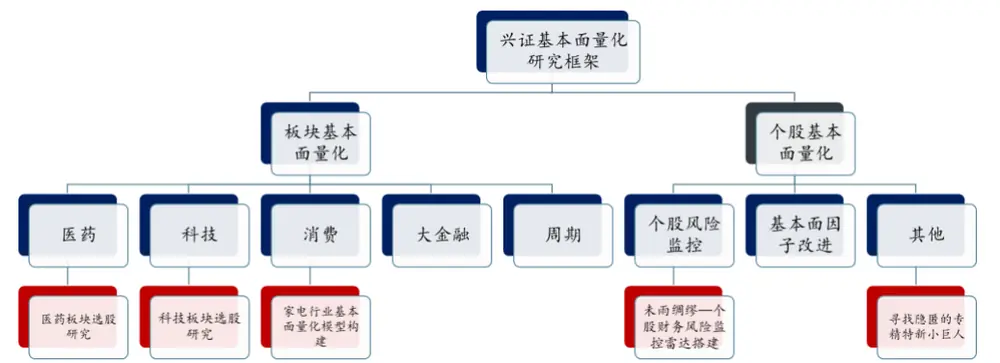
资料来源：兴业证券经济与金融研究院整理与绘制

下面我们对兴证金工团队历史基本面量化维度研究成果进行介绍，详细研究成果可参见相应报告。

## 1、板块基本面量化

兴证金工团队于2020年7月、2020年10月发布报告《基本面量化系列之一：基本面量化视角下的大健康板块选股研究》、《基本面量化系列之二：基本面量化视角下的科技板块选股研究》，报告通过梳理不同行业的投资逻辑，并利用我们在量化选股领域所积累的经验和优势，构建大健康板块、科技板块精选策略。目前策略样本外已跟踪2年左右，表现稳健，下面我们对策略构建逻辑与表现进行展示。

## 策略1：兴业定量大健康精选策略

医药行业是多个投资逻辑差异较大的子行业的集合，研究差异化大，研究难度也随之提升。所以对于医药行业的研究必须进行一定程度的下沉，不能一概而论。我们以对创新的要求和重视程度的差异为根本出发点，对医药板块进行重构：具体来说，我们将医药板块切分成“医药服务”以及“医药制造与高科技”两个领域，并在两个不同的行业上展开差异化的分析和策略构建，最终我们在医药制造和医药服务板块分别精选10只股票，构建月度调整策略。

我们观察策略2020年12月31日至2022年6月17日样本外的表现：策略区间收益率为24.2%（同期基准为-21.0%)，年化收益率为16.8%，相对于基准的年化超额高达36.1%，策略大幅战胜基准。此外，策略相对净值的夏普比率为2.27。

图表2、兴业定量大健康精选样本外表现（2020/12/31-2022/6/17）

|  | 区间收益率 | 年化收益率 | 年化波动率 | 夏普 | 最大回撤 | Calmar 比率 |
| --- | --- | --- | --- | --- | --- | --- |
| 策略 | 24.2% | 16.8% | 26.3% | 0.64 | 24.1% | 0.70 |
| 基准 | -21.0% | -15.5% | 27.4% | -0.57 | 40.0% | -0.39 |
| 相对超额 | 53.7% | 36.1% | 15.9% | 2.27 | 9.1% | 3.98 |

资料来源：Wind、聚源、兴业证券经济与金融研究院整理

## 策略2：兴业定量科技精选

作为基本面量化视角下板块主题板块选股研究的第二篇报告，我们聚焦于科技板块内选股模型的搭建，通过深度分析板块内不同子行业的基本面特征，以给出个性化的选股思路，并最终形成了兴业定量科技精选策略组合。

以Wind中的信息技术下的二级行业分类为基础，同时将申万和中信的一级行业分类中属于电子、通信以及计算机的相关公司一并纳入进来，共同作为我们的研究主体。我们在基本面研究员的建议下，进一步将整个半导体行业做了拆分。

最终，我们以扩充后的Wind信息技术板块为初始股票池，并在其上划分出了四个细分行业：技术硬件与设备、软件与服务、半导体制造、半导体设计。在后续的研究中，我们将分行业建立有效的量化选股模型，并最终将其整合为一个完整的策略。

该策略在样本外同样稳定战胜基准：样本外策略区间收益率为25.1%（同期基准为-11.1%)，年化收益率为17.4%，相对于基准的年化超额为27.7%，策略大幅战胜基准。此外，策略相对净值的夏普比率为2.04。

图表3、兴业定量科技精选样本外表现（2020/12/31-2022/6/17）

|  | 区间收益率 | 年化收益率 | 年化波动率 | 夏普 | 最大回撤 | Calmar 比率 |
| --- | --- | --- | --- | --- | --- | --- |
| 策略 | 25.1% | 17.4% | 28.8% | 0.60 | 40.2% | 0.43 |
| 基准 | -11.1% | -8.1% | 25.3% | -0.32 | 39.1% | -0.21 |
| 相对超额 | 40.7% | 27.7% | 13.6% | 2.04 | 9.1% | 3.03 |

资料来源：Wind、聚源、兴业证券经济与金融研究院整理

同时，在2022年3月我们发布的报告《基本面量化系列之五：家电行业基本面量化模型构建》中，通过与兴证家电团队通力合作，构建了系统化的家电行业基本面（景气度）投资体系。从结果来看，我们完成的模型有以下亮点：

1、在行业标的确定上，按照行业分析师的做法，采用更加灵活的方式构建兴证家电股票池。具体来说，我们在中信、申万两个主动行业分类指数的基础上结合公司主营业务收入来源、分析师覆盖情况对家电板块股票池进行动态调整，使得行业分类更贴合公司经营实况；

2、在行业逻辑梳理上，按照分析师的观点，提炼出家电行业的核心逻辑，并借助行业特色数据库搭建核心指标库;

3、在行业逻辑量化表达上，我们基于“点位状态、趋势状态、幅度变化”将各维度的行业景气度核心指标落地，进而形成景气度信号库；

4、在行业逻辑投资应用上，我们做了大量的论证以尽可能贴近真正的景气度模型，而非简单地根据指标和股价的表现进行筛选。同时除了板块择时策略，我们也下沉到个股，构建了板块龙头轮动策略，同样取得了优秀表现。

## 2、个股基本面量化维度研究

在个股基本面量化维度，我们也通过有机结合主动逻辑与量化手段展开了相应研究，其中部分研究成果颇受客户好评。

2021年11月，我们发布报告《基本面量化研究系列之三：未雨绸缪个股财务风险监控雷达搭建》，从财务造假和财务危机两个方面对公司财务风险进行度量，并介绍如何利用这两方面信息帮助投资者避免极端损失。

同时，于2021年11月，报告《基本面量化研究系列之四：寻找隐匿的专精特新“小巨人》的推出受到客户广泛关注。我们以目前公布的专精特新小巨人公司作为蓝本，在市场上寻找与“小巨人”团体最为相似的股票。这里的相似即体现在“经济效益”、“专业化程度”、“创新能力”、“经营管理”这四个维度中。

本文继续专注于板块基本面量化研究，选取大金融板块中的典型行业一银行行业进行深入分析，来进一步完善我们板块基本面量化研究框架。在前期报告《家电行业基本面模型构建》中，我们提出，板块基本面量化的重点在于如何更确切、合适的解决以下几个问题：

1、行业标的确定→赛道的切分以保证细分赛道的纯粹性；

2、行业逻辑梳理→赛道内基本面思路的提纯；

3、行业逻辑量化表达→如何将基本面的思路转化为一种相对可回测的结果；

4、行业逻辑投资应用→进一步构建体系化策略。

图表4、板块基本面量化研究思路
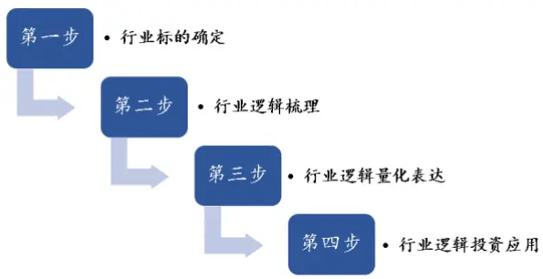
资料来源：兴业证券经济与金融研究院整理与绘制

我们通过与兴证银行组通力合作，基于上述框架完成银行行业基本面量化模型的搭建。从研究成果来看，本文亮点如下：

1、回溯历史，定性复盘银行行业历史表现：兴证银行团队对银行行业历史表现进行深入复盘，挖掘银行股每轮上涨底层驱动因素，并对表现优异个股进行分析，希望能够帮助投资者把握银行股上涨逻辑进行进一步把握。

2、自上而下，宏观+微观两维度构建银行投资体系：银行股受宏观经济影响较大，因此本文借鉴自上而下投资思路从宏观与微观两维度展开研究。在宏观维度，我们基于货币信用周期划分市场状态，并对银行股在不同市场环境下表现进行分析：在微观维度，我们拆解银行股净利润重要驱动因素，提取选股指标。

3、深入结合，定性+定量构建银行业基本面量化模型：我们基于量化方式转换定性逻辑，如采用定量方式刻画货币信用周期，同时验证银行股重要驱动因素选股效果，构建银行行业选股因子，最终将两者进行结合，实证效果显著。

## 2、银行行业标的确定

## 2.1、银行行业标的选取思路

银行是经营货币和信用业务的金融机构，通过发行信用货币、管理货币流通、调剂资金供求、办理货币存贷与结算，充当信用的中介人。

与前期研究中对家电行业股票池划分花费较多时间不同，各指数对银行行业标的划分结果接近。申万、中信为常用的主动行业分类体系，从图表5可以看出申万银行行业指数成分股数据从2014年开始，同时与中信银行指数个股梳理差距极小，因此本文我们选择以中信银行行业指数作为标的划分依据。

图表5、银行行业指数成分股数量（只）
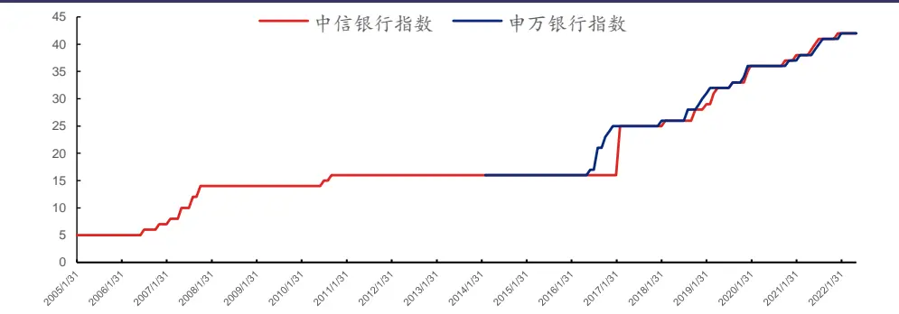
资料来源：Wind、兴业证券经济与金融研究院整理

依据中信银行行业指数，银行股占沪深300指数的流通市值比例长期在10%以上，同时银行股中沪深300成分股流通市值占比维持在90%以上。截至2022年5月31日，银行股共有42家，流通市值共计69595亿元。同时银行行业为沪深300中流通市值占比最高的行业，以7.33%的个数占比，占据了16.34%的流通市值比例。

图表6、沪深300中分中信一级行业个数占比（截止2022.05.31）
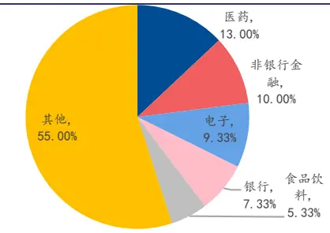
图表7、分中信一级行业流通市值占比(截止 2022.05.31)
资料来源：Wind、兴业证券经济与金融研究院整理

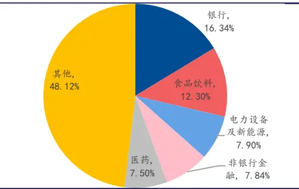

按银行属性，银行股又可分为国有大型银行、全国股份制银行、区域性银行三类。

1、国有大型银行：国有大型银行是指工商银行、农业银行、中国银行、建设银行、邮政储蓄银行、交通银行等综合性大型商业银行。一般来说，国有大型银行能够办理的业务相对较多，且拥有雄厚的资金。

2、全国股份制银行：股份制商业银行是商业银行的一种类型，经中国银行业监督管理委员会批准的股份制商业银行，可以在多个省份开设分支机构，如招商银行、浦发银行等。

3、区域性银行：区域性银行是主要在一国或地区的一个区域运作，仅依靠存款筹集资金且很少利用货币市场筹集资金的银行。

图表8、银行行业分类
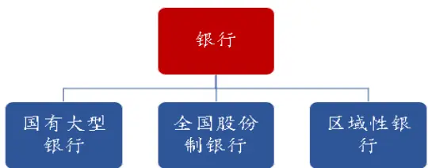
资料来源：兴业证券经济与金融研究院整理与绘制

## 2.2、银行行业历史表现

2006年12月至2022年5月，银行行业年化收益为6.03%，收益风险比0.21，最大回撤为71.16%，相对沪深300、中证800指数均有一定超额。分年度来看，银行业获得：1)明显绝对收益(10%以上)，2)并至少相对于沪深300/中证800（表征公募机构大致可投资池范围)2个基准中的1个获得相对收益的年份主要是2009、2012、2014和2017年。除此之外，在2011年、2016年和2018年，尽管绝对收益偏弱，但相对于上述2个基准均获得了15%以上的相对收益。负收益最高的年份是2010和2020年，对应的是资本监管的收紧和疫情的冲击。

图表9、银行指数历史表现（2006.12-2022.5.31）

|  | 年化收益率 | 年化波动率 | 收益风险比 | 最大回撤 |
| --- | --- | --- | --- | --- |
| 银行 | 6.03% | 28.66% | 0.21 | 71.16% |
| 沪深300 | 4.59% | 28.61% | 0.16 | 70.75% |
| 中证 800 | 5.41% | 28.74% | 0.19 | 70.05% |

资料来源：Wind，聚源，兴业证券经济与金融研究院整理

图表10、中信银行行业指数历史净值表现
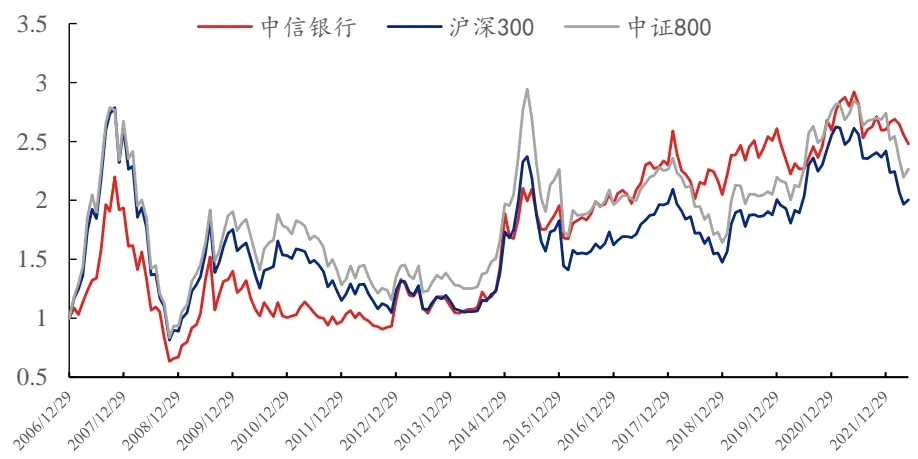
资料来源：Wind，聚源，兴业证券经济与金融研究院

图表11、银行指数历史表现（2006.12-2022.5.31）

|  | 银行 | 沪深300 | 超额 | 中证 800 | 超额 |
| --- | --- | --- | --- | --- | --- |
| 2007 | 93.58% | 161.55% | -67.96% | 167.11% | -73.53% |
| 2008 | -65.36% | -65.95% | 0.59% | -64.95% | -0.41% |
| 2009 | 108.58% | 96.71% | 11.87% | 103.65% | 4.93% |
| 2010 | -28.05% | -12.51% | -15.54% | -7.32% | -20.74% |
| 2011 | -3.57% | -25.01% | 21.44% | -27.38% | 23.81% |
| 2012 | 19.04% | 7.55% | 11.49% | 5.81% | 13.24% |
| 2013 | -4.84% | -7.65% | 2.81% | -2.14% | -2.70% |
| 2014 | 71.83% | 51.66% | 20.17% | 48.28% | 23.55% |
| 2015 | 3.57% | 5.58% | -2.02% | 14.91% | -11.35% |
| 2016 | 0.69% | -11.28% | 11.97% | -13.27% | 13.96% |
| 2017 | 16.88% | 21.78% | -4.90% | 15.16% | 1.72% |
| 2018 | -10.95% | -25.31% | 14.36% | -27.38% | 16.44% |
| 2019 | 27.28% | 36.07% | -8.79% | 33.71% | -6.43% |
| 2020 | -0.49% | 27.21% | -27.70% | 25.79% | -26.28% |
| 2021 | 0.20% | -5.20% | 5.40% | -0.76% | 0.96% |
| 2022 | -4.74% | -17.18% | 12.44% | -17.41% | 12.67% |

资料来源：Wind，聚源，兴业证券经济与金融研究院整理

图表12、中信银行行业指数分年度相对沪深300 超额收益
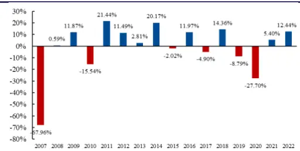
资料来源：Wind，聚源，兴业证券经济与金融研究院

图表13、中信银行行业指数分年度相对中证 800 超额收益
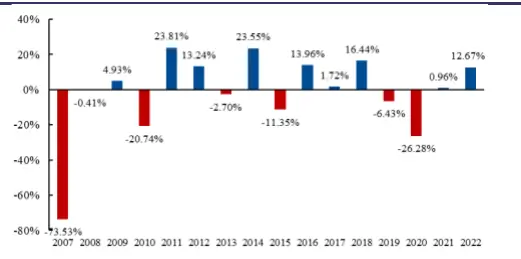

## 3、银行行业投资逻辑梳理

银行股股价波动的核心矛盾在于宏观经济。宏观经济一方面会影响企业资金需求与企业盈利状况，进而影响银行资产质量与规模增长，另一方面，经济形势会影响货币政策，进而通过存贷款利率/同业拆借利率/债券利率的调整来影响银行净息差。

图表14、宏观环境对银行股影响传导链条
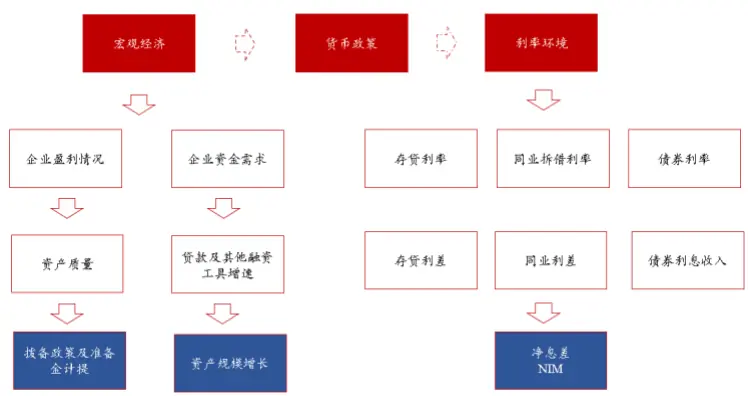
数据来源：兴业证券经济与金融研究院整理与绘制

因此，银行股投资一般采用自上而下的配置思路，即需要依次解决好以下问题：

1）行业配置思路：什么宏观环境下银行股是个好行业，值得配置？

2）个股选择思路：什么样的银行股相对更佳，优先选择？

## 3.1、行业配置思路

从历史复盘来看，银行板块历轮上涨行情多数是在“宽货币-宽信用-经济企稳”的过程中，在经济修复预期加强、或者持续得到验证的情况下，银行板块通常能有较好的表现。

1）2008年10月-2009年7月：金融危机后宽货币、宽信用政策托底经济，08年9月起央行陆续进行5次降息、3次降准操作，08年10月发改委批复千亿基建项目、08年11月四万亿投资计划出台，市场对系统性风险担忧缓解，随后PMI/发电量/工业增加值等主要经济数据边际改善，经济修复预期不断得到验证，银行股上涨行情启动。

2）2012年11月-2013年1月：在经济放缓以及欧债危机加剧出口压力的背景下，2011年末货币政策转向宽松，2011年12月到2012年7月央行多次实施降准和降息（其中2012年一季度经济不及预期后，央行在12年5-7月连续实施了1次降准和2次降息，刺激力度加大)，9月工业增加值、PPI、PMI、发电量等主要经济数据出现见底回升态势，银行股股价亦开始企稳回升，之后随着4季度经济数据持续改善，经济复苏预期被持续验证，银行股上涨行情启动，2012年11月-2013年1月银行板块涨幅超过40%，相对收益显著。

3）2014年11月-2014年末：14年全球经济步入下行周期，央行在2014年

11月超预期降息（也是近两年首次下调基准利率），12月的中央经济工作会议则重点强调了“努力保持经济稳增长”，对于货币政策和财政政策的表述也更为积极，市场对于经济复苏的预期大幅提升，二级市场开启牛市，银行板块上涨超过50%，跑出明显的绝对收益和相对收益。

4）2016年2月-2016年末：2016年2月后，房地产政策放松等宽信用托底政策加大了市场对于经济复苏的预期，PPI、PMI、房地产投资和发电量等主要经济数据在年中陆续好转，GDP增速在2016Q4开始企稳回升，在经济复苏预期逐步得到验证的背景下，银行板块在2016年2月到2016年末上涨超过15%，实现了绝对收益和相对收益。

5）2019年1月-4月：2018年我国经济环境受中美贸易摩擦、金融去杠杆后信用风险爆发等因素的负面影响，经济面临下行压力。2018年12月中央经济工作会议定对经济的定调为“外部环境复杂严峻，经济面临下行压力”，强调“逆周期调节”和“稳定总需求”，对于财政政策和货币政策的表态也更加积极。2019年1月，央行宣布降准1个百分点，社融增速触底回升，3月经济数据有所好转(但Q2经济增速下行幅度又低于预期)，并且中美贸易摩擦有所缓和，权益市场新一轮上涨行情启动，银行板块在2019年1-4月实现了超过20%的绝对收益，但并未实现相对收益。

银行板块的行情也和市场风格以及行业自身基本面的变化相关。较为典型的是2017年，从市场风格上看，当时的监管政策下跨界并购变难，而此前炒作的小票大多业绩无法承载较高的估值，长期业绩较好的白马蓝筹则成了市场抱团的方向。从银行自身的基本面看，银行不良率上行速度趋缓并于2016年9月见顶。16年4季度到17年末行业不良率保持稳定（其中大行和股份行不良率稳中有降)，叠加前期降息对息差的负面作用逐步消化，银行基本面进入上行周期。在此背景下，银行板块在2017年实现了17%的绝对收益，相对于中证800也实现了小幅的相对收益。此外，定期报告期业绩超预期产生的业绩推动行情也可能让银行板块在短期内实现超额收益，这类行情通常集中于3、4月和7、8月。

图表15、银行板块历史指数走势
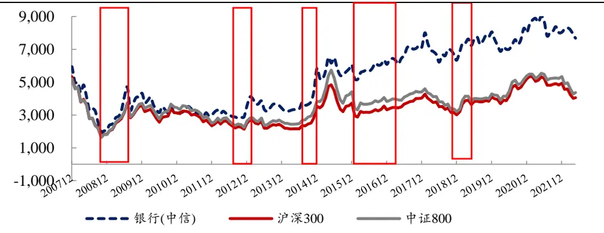
数据来源：wind，兴业证券经济与金融研究院整理

从上面的复盘可以看出货币信用周期为银行股行业景气度的重要驱动要素，宽货币往往为银行股行情来临的重要信号。一般来说，紧货币紧信用和宽货币宽信用是货币政策的两种目标状态，而宽货币紧信用和紧货币宽信用是由于货币和信用周期存在时滞而导致的中间状态，宽货币紧信用可以看作是紧货币紧信用状态下，货币由紧转松而信用延续收紧惯性所导致的过渡状态，紧货币宽信用亦然。宽货币并不立刻能够看到宽信用出现，是否能够宽信用，还要依赖于社会杠杆主体和商业银行的行为。

图表16、货币信贷周期
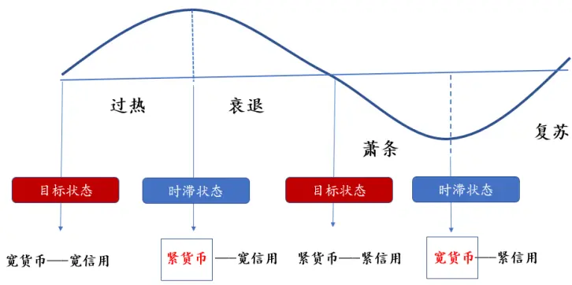
数据来源：兴业证券经济与金融研究院整理与绘制

而确定货币信贷周期首先需要解决货币周期与信用周期的划分问题，下面我们将就这两个问题分别进行研究。

## 如何划分宽货币 vs 紧货币状态？

对于货币周期的划分实质上是通过对货币流动性的度量来把握货币供应量扩张与收缩的交替演变进程。目前对于如何进行货币周期划分仍存在分歧，常用的货币周期划分指标有：1、银行间市场7天回购利率（R007）；2、国债十年期到期利率；3、货币政策相关指数；

我们在报告外尝试基于不同变量进行货币周期的划分，最终选择采用九鞅货币政策指数来划分货币周期，此指数划分结果与主观结果较为接近。九鞅货币政策指数由准备金率、存贷款基准利率、定向降准利率、央行操作利率等构成，采用-1—1指数制度，-1为货币政策紧缩，0为货币政策中性，1为货币政策宽松。计算原始指标月度变化值，并按不同规则记分，各变量记分加总，再根据上一期指数值和当期总记分的正负方向确定当期指数值。

图表17、货币周期划分核心变量

| Wind 代码 | 变量名称 | 频率 | 起始日期 | 披露滞后期数 |
| --- | --- | --- | --- | --- |
| M6641343 | 九鞅货币政策指数 | 月 | 1990.10 | 1 |

数据来源：wind，兴业证券经济与金融研究院整理

本文对变量进行以下处理：

1、时滞处理：为避免应用到未来数据，我们将指标进行滞后1阶处理，即2022年6月30日采用2022年6月2日披露的2022年5月的数据进行建模；

2、状态划分：若货币政策指数大于0且变动值大于等于0，则我们认为此时处于宽货币状态；若货币政策指数小于0且变动值小于等于0，则我们认为处于紧货币状态；

我们首先依据全样本数据，给定理论货币周期划分结果。从图表18可以看出历史上共有5段宽货币时期。

2008年10月至2010年1月：08年9月起央行陆续进行5次降息、3次降准操作，08年10月发改委批复千亿基建项目、08年11月四万亿投资计划出台；

2011年12月至2013年10月：2011年10月提出“稳增长”，2011年12月降准，释放明确的货币政策边际转松，2012年5月-7月连续实施降准、降息，货币宽松力度加大；

2014年5月至2017年2月：2014年3月提出“稳增长”，2014年6月定向降准，9月央行通过SLF工具投放5000亿资金，11月超预期降息，2015年宽松力度继续加大，2月到10月央行多次降准降息；

2018年5月至2020年6月：2018年10月降准、2019年1月均降准1个百分点，之后直到2019年9月降准前，并未出现降息或者连续降准的操作。

同时从2021年8月来，货币政策同样属于较为宽松状态。

图表 18、宽货币 VS 紧货币
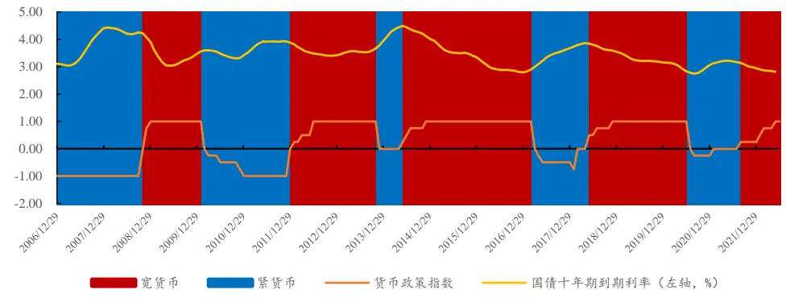
数据来源：wind，兴业证券经济与金融研究院整理

图表19、理论货币周期划分结果

| 起点 | 终点 | 状态 | 中信银行区 间绝对收益 | 中信银行相对沪 深 300 区间超额 收益 | 中信银行相对中 证 800 区间超额 收益 |
| --- | --- | --- | --- | --- | --- |
| 2006/12/29 | 2008/9/26 | 紧货币 | -16.10% | -26.03% | -28.97% |
| 2008/10/31 | 2010/1/29 | 宽货币 | 91.98% | -0.61% | -16.89% |
| 2010/2/26 | 2011/11/30 | 紧货币 | -23.96% | -0.79% | -2.19% |
| 2011/12/30 | 2013/10/31 | 宽货币 | 22.04% | 20.84% | 17.89% |
| 2013/11/29 | 2014/4/30 | 紧货币 | -7.36% | 4.13% | 2.35% |
| 2014/5/30 | 2017/2/28 | 宽货币 | 94.44% | 34.33% | 31.91% |
| 2017/3/31 | 2018/4/27 | 紧货币 | 8.46% | -0.24% | 4.84% |
| 2018/5/31 | 2020/6/30 | 宽货币 | 5.02% | -4.49% | -2.65% |
| 2020/7/31 | 2021/7/30 | 紧货币 | 7.25% | 4.77% | 4.79% |
| 2021/8/31 | 2022/5/31 | 宽货币 | -4.72% | 10.14% | 10.67% |

资料来源：wind，兴业证券经济与金融研究院整理

下面我们统计宽、紧货币时期的银行指数表现，可以看出银行宽货币相对紧货币时绝对收益显著，区间绝对收益率均值达41.75%。

图表20、不同货币状态下中信银行指数表现

| 状态 | 中信银行区间绝 对收益均值 | 中信银行相对沪深300区间超 额收益均值 | 中信银行相对中证800区间超 额收益均值 |
| --- | --- | --- | --- |
| 宽货币 | 41.75% | 12.04% | 8.19% |
| 紧货币 | -6.34% | -3.63% | -3.84% |

资料来源：wind，兴业证券经济与金融研究院整理

## 如何划分宽信用 vs 紧信用状态？

一般用社融存量同比数据来划分信用周期，但2016年之前的社融存量同比数据未披露月度数据，因此我们结合M1同比变量趋势进行回溯填充，定义为社融存量同比 FL 指标。

图表21、信用周期划分核心变量

| Wind 代码 | 变量名称 | 频率 | 起始日期 | 披露滞后期数 |
| --- | --- | --- | --- | --- |
| M0001383 | M1 同比 | 月 | 1986-12 | 1 |
| M5525763 | 社会融资存量同比 | 月 | 2016-01 | 1 |

数据来源：wind，兴业证券经济与金融研究院整理

图表 22、M1 同比 VS 社会融资存量同比趋势（%）
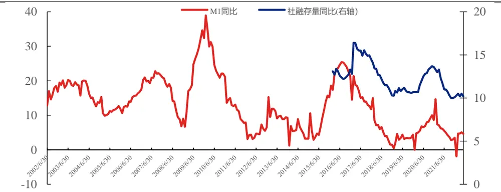
数据来源：wind，兴业证券经济与金融研究院整理

我们对社融存量同比FL数据进行以下处理：

1、平滑数据：取滚动6个月均值进行平滑波动；

2、时滞处理：为避免应用到未来数据，我们将指标进行滞后1阶处理，即2022年6月30日采用2022年6月10日披露的2022年5月的数据进行建模；

2、状态划分：若社融存量同比FL上行，则我们认为此时处于宽信用状态；若社融存量同比FL下行，则我们认为处于紧信用状态；

依据上述步骤，我们采用处理后的市场划分宽信用vs紧信用周期，可以看出历史上有五段较为明显的宽信用时期。

图表 23、宽信用 VS 紧信用
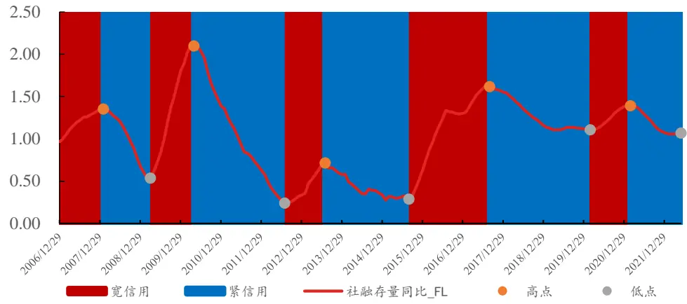
数据来源：wind，兴业证券经济与金融研究院整理

图表24、理论信用周期划分结果

| 起点 | 终点 | 状态 | 中信银行区 间绝对收益 | 中信银行相对 沪深300区间超 额收益 | 中信银行相对中 证 800 区间超额 收益 |
| --- | --- | --- | --- | --- | --- |
| 2006/12/29 | 2007/12/28 | 宽信用 | 93.58% | -67.96% | -73.53% |
| 2008/1/31 | 2009/2/27 | 紧信用 | -50.38% | 3.30% | 2.19% |
| 2009/3/31 | 2010/3/31 | 宽信用 | 44.08% | 10.67% | 4.26% |
| 2010/4/30 | 2012/6/29 | 紧信用 | -16.09% | 3.65% | 4.16% |
| 2012/7/31 | 2013/6/28 | 宽信用 | 15.75% | 21.42% | 19.54% |
| 2013/7/31 | 2015/7/31 | 紧信用 | 80.87% | 6.83% | -6.23% |
| 2015/8/31 | 2017/7/31 | 宽信用 | 31.25% | 20.22% | 24.91% |
| 2017/8/31 | 2020/1/23 | 紧信用 | 7.25% | 2.50% | 8.49% |
| 2020/2/28 | 2021/1/29 | 宽信用 | 17.88% | -17.96% | -13.19% |
| 2021/2/26 | 2022/5/31 | 紧信用 | -12.68% | 10.65% | 6.85% |

资料来源：wind，兴业证券经济与金融研究院整理

图表25、不同信用状态下中信银行指数表现

| 状态 | 中信银行区间绝对收 益均值 | 中信银行相对沪深300 区 间超额收益均值 | 中信银行相对中证800 区间超额收益均值 |
| --- | --- | --- | --- |
| 宽信用 | 40.51% | -6.72% | -7.60% |
| 紧信用 | 1.79% | 5.39% | 3.09% |

资料来源：兴业证券经济与金融研究院整理

## 货币信用周期下银行股动态配置表现如何？

若我们把“宽货币紧信用”到“宽货币宽信用”到“紧货币宽信用”到“紧货币紧信用”作为一轮完整的货币信用周期，可以看出2007年以来有几轮较为完整的周期。

图表26、理论货币信用周期划分结果
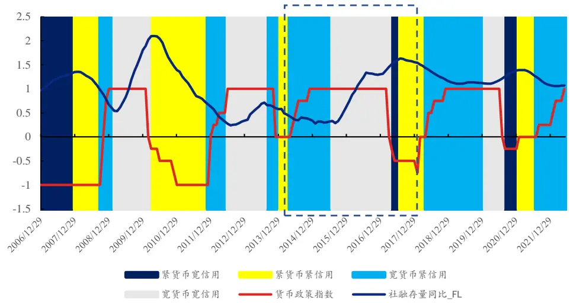
数据来源：wind，兴业证券经济与金融研究院整理

图表27、理论货币信用周期下银行表现
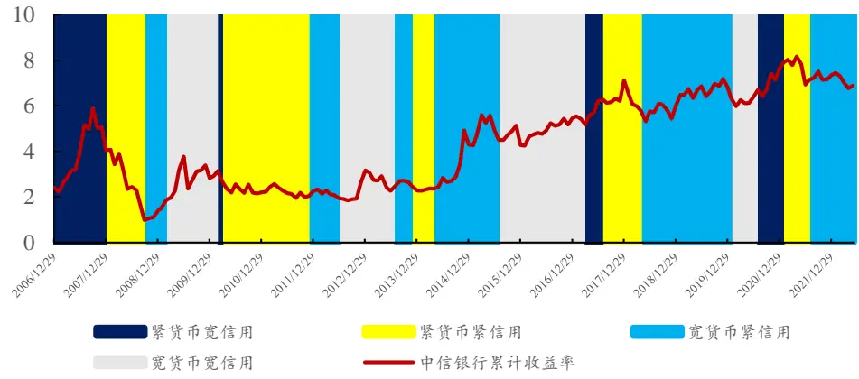
数据来源：wind，兴业证券经济与金融研究院整理

同时我们测试不同市场环境下的银行行业表现。

图表28、不同货币信用状态下中信银行指数表现

| 状态 | 中信银行绝对收益 | 中信银行相对沪深 300 超额收益 | 中信银行相对中证 800 超额收益 |
| --- | --- | --- | --- |
| 宽货币宽信用 | 16.10% | 8.51% | 7.07% |
| 宽货币紧信用 | 21.13% | 2.92% | 1.45% |
| 紧货币宽信用 | 32.12% | -14.29% | -13.91% |
| 紧货币紧信用 | -17.75% | 0.70% | 0.01% |

资料来源：wind，兴业证券经济与金融研究院整理

从上述结果可以看出主要结论如下：

## 1、紧货币紧信用时期银行股绝对收益表现极差

根据我们的测试，历史上市场处于紧货币紧信用时期，区间收益为负的概率为100%。

图表29、理论信用周期划分结果

| 起点 | 终点 | 状态 | 银行区间 绝对收益 | 中信银行相对 沪深300 区间超 额收益 | 中信银行相对中 证 800 区间超额 收益 |
| --- | --- | --- | --- | --- | --- |
| 2008/1/31 | 2008/9/26 | 紧货币紧信用 | -47.93% | 3.51% | 4.08% |
| 2010/4/30 | 2011/11/30 | 紧货币紧信用 | -18.33% | -0.53% | -1.51% |
| 2013/11/29 | 2014/4/30 | 紧货币紧信用 | -7.36% | 4.13% | 2.35% |
| 2017/8/31 | 2018/4/27 | 紧货币紧信用 | -4.24% | -2.54% | -0.38% |
| 2021/2/26 | 2021/7/30 | 紧货币紧信用 | -10.90% | -1.05% | -4.49% |

资料来源：wind，兴业证券经济与金融研究院整理

## 2、其他状态下大概率银行股上涨，但仍有一定概率下跌

从历史来看宽货币紧信用、宽货币宽信用、紧货币宽信用银行股上涨概率较大，但仍有一定概率下跌。以宽货币紧信用为例，最近一次的宽货币紧信用状态银行股为下跌状态。

因此，我们考虑以下方式来动态配置银行行业：1）紧货币紧信用下看空银行行业；2）其他市场状态下配置银行行业。可以看出策略表现较为优秀。以多头配置策略为例，中信银行指数年化收益为6.03%，策略年化收益达15.72%，且最大回撤从71.16%降低至29.50%，有明显好转。

图表30、不同货币信用状态下中信银行配置仓位

| 状态 | 多头 | 多空 |
| --- | --- | --- |
| 宽货币宽信用 | 100% | 100% |
| 宽货币紧信用 | 100% | 100% |
| 紧货币宽信用 | 100% | 100% |
| 紧货币紧信用 | 0 | -100% |

资料来源：兴业证券经济与金融研究院整理

图表31、理论货币信用周期下动态配置银行板块表现

|  | 年化收益 | 年化波动 | 夏普比率 | 最大回撤 |
| --- | --- | --- | --- | --- |
| 银行中信 | 6.03% | 29.87% | 0.20 | 71.16% |
| 配置策略（多头） | 15.72% | 24.48% | 0.64 | 29.50% |
| 配置策略（多空） | 23.71% | 27.87% | 0.85 | 29.50% |

数据来源：wind，兴业证券经济与金融研究院整理

图表32、理论货币信用周期下不同配置多头策略净值
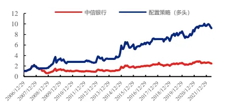
数据来源：wind，兴业证券经济与金融研究院整理

图表33、理论货币信用周期下不同配置多头策略相对净值
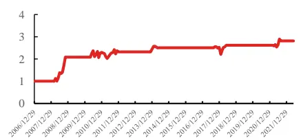

## 3.2、个股选择思路

整体看，近年来（除2020年受疫情影响外）银行业净利润基本保持稳健增长，各类型银行净利润占比保持稳定。商业银行近5年（2017-2021年）净利润年复合增速为5.8%，2021年净利润2.18万亿元，同比+12.6%，低基数下实现了近年来最高的增长。从不同银行2021年的利润分布看，大行、股份行、城商行、农商行和其他银行的利润占比分别为56.4%、21.3%、11.0%、9.8%和1.6%，该比例基本保持稳定。

图表34、商业银行净利润和同比增速（万亿元，%）
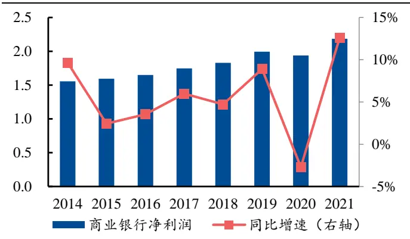
资料来源：公司公告，兴业证券经济与金融研究院整理

图表35、各类型银行净利润分布（%）
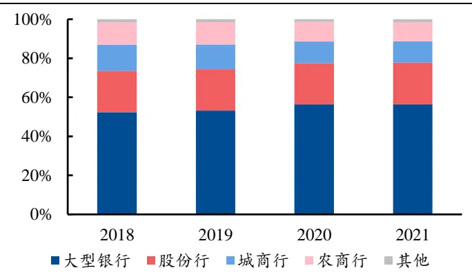
资料来源：公司公告，兴业证券经济与金融研究院整理

银行股的业绩主要由净利息收入、非利息收入、税金及附加、业务及管理费、资产减值费用以及所得税六大驱动因素构成。

图表36、银行股业绩驱动图谱
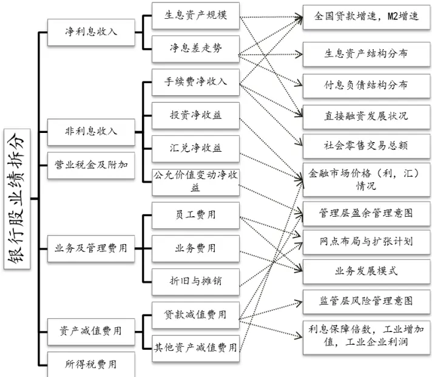
数据来源：兴业证券经济与金融研究院整理与绘制

净利息收入是银行营收最重要的来源，主要取决于资产规模和净息差的走势。1)资产规模。2008-2012年在积极的财政政策（四万亿经济刺激计划）下，整体经济高速发展，银行资产规模高速扩张；2013年后，银行资产规模增速随着经济增速放缓，尤其是2017年后宏观上供给侧结构改革推进，监管对影子银行、资管业务的监管力度趋严，银行规模增速继续下降，同时结构上持续回归本源；2020年和2021年，由于疫情后经济承压下的逆周期调节，银行资产增速有所回升，2021年末银行业金融机构总资产为338亿元，同比增速为8.0%。各类型银行总资产占比相对稳定。2021年末，大行、股份行、城商行、农村金融机构和其他金融机构的占比分别为39.3%、18.1%、13.3%、13.5%和15.7%，其中城商行和农商行资产增速快于大行和股份行（22年一季度该趋势持续)。

图表37、银行业金融机构总资产（万亿元）
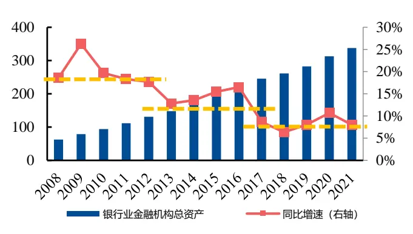
资料来源：公司公告，兴业证券经济与金融研究院整理

图表38、各类型银行业金融机构资产占比（%）
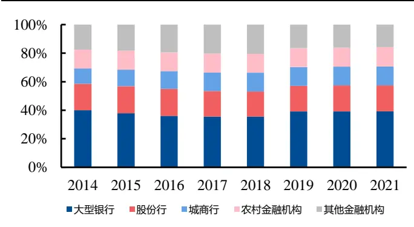
资料来源：公司公告，兴业证券经济与金融研究院整理

2）息差。商业银行的息差水平取决于各类资产负债定价与资产负债结构变化，整体上看银行业息差水平和贷款收益率相关性较高。银行业整体的净息差在14年-16年下台阶后波动下降，目前在2%左右。分不同类型银行看，2022年一季度末，大行、股份行、城商行和农商行息差分别为1.98%、2.03%、1.73%和2.06%。

图表39、贷款平均利率和商业银行净息差（%）
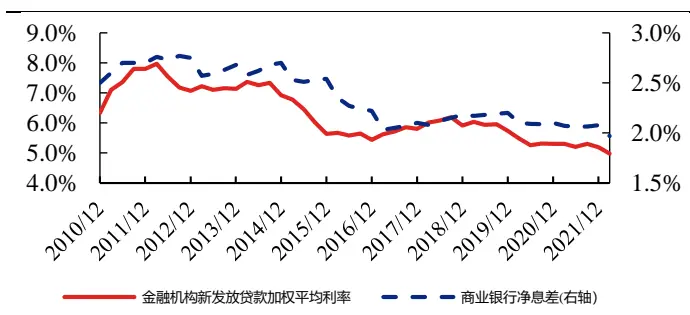
资料来源：公司公告，兴业证券经济与金融研究院整理

图表40、各类型银行净息差（%）
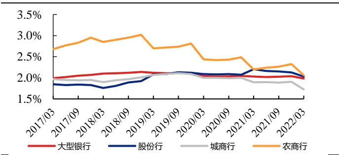
资料来源：公司公告，兴业证券经济与金融研究院整理

## 非利息收入主要包括手续费净收入和投资收益。

1）手续费净收入。手续费净收入属于非利息收入中发展最为稳定的一部分，根据业务属性，主要可分为三类：①银行卡、结算清算、代理/理财业务类手续费收入：这三类收入是银行最为原始的手续费收入构成，完全不占用银行资本，本质上是银行渠道网点和支付结算系统规模经济效应的体现。这一部分手续费收入增长与整个社会的交易发展形势密切相关，是银行各项收入中最贴近消费属性的部分。②托管受托类手续费收入：除了与银行渠道和支付系统相关外，也受到轻型银行和交易银行战略推进的影响，其增长主要与银行资产托管业务的规模以及财富管理业务的发展情况相关。③投资银行类手续费收入：反映了金融脱媒的方向，在商业银行对公投行化转型的背景下，这一非利息收入的增长将会成为差异化银行经营特色凸显的关键。上市银行整体手续费净收入保持稳健增长，2021年手续费净收入占营收比例为14.7%，其中大型银行、股份行、城商行和农商行的手续费净收入占比分别为13.2%、19.1%、11.7%和3.9%。展望未来，零售转型推进较为深入、财富管理业务蓄势待发的部分商业银行有望持续收获较高的营收成长性。

图表41、各类型银行手续费净收入在营收中占比（%）
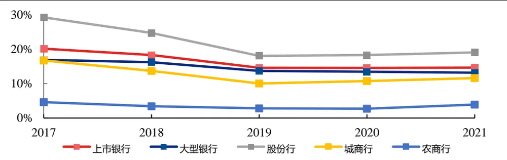
数据来源：wind，兴业证券经济与金融研究院整理

2）投资收益。投资净收益主要取决于商业银行金融市场的交易能力，核心决定因素是可供交易的资金数量、金融市场价格和管理层对投资盈余的分配态度。IFRS9实施后，使用摊余成本后续计量的资产范围变小，而使用FV-PL后续计量的资产范围变大。FV-PL规模越大，其公允价值变动引起的投资收益就越多，且金融资产公允价值变动直接计入损益，银行利润更易受到公允价值变动的影响。

业务及管理费分为三大子项，即员工费用、业务费用以及折旧和摊销费用。而这三大费用则由主要与公司经营发展战略和目前的网点渠道构成相关。

从上市银行整体来看，上述三项费用的占比相对稳定，2021年占比分别为56.0%、11.4%和32.6%。不同类别的银行三大费用占比并无显著区别，大行的员工费用占比相对较低。

员工费用主要由员工人数和员工薪酬综合决定。员工费用主要由员工人数和员工薪酬综合决定。其中，大型银行的员工数会在一定的时间内保持稳定，电子银行和手机银行对人工的替代使得近期商业银行的员工数量得以有效控制。中小型商业银行的人员增长率也会随着成本管理的日益重要而逐年下降，对于部分尚处于扩张周期的中小银行而言，较高的人力/科技投入驱动业务快速成长，必须给予一定的容忍期使之进入良性循环。

近年来金融机构（尤其是头部金融机构）普遍在加大科技投入，科技对于金融机构提升运营效率、风险控制能力和综合服务能力等方面均有重大意义，未来其重要性还会进一步提升。

2020年，受疫情影响，银行部分业务开展受限，相应的业务费用支出停滞，管理费用同比支出增长不足3%，成本收入比明显下降。2021年，随着疫情大幅缓解，银行业务恢复常态，成本收入比指标已回到往年正常水平。我们预计未来

2-3年银行成本收入比将维持稳定区间波动。

图表42、上市银行业务及管理费用结构（%）
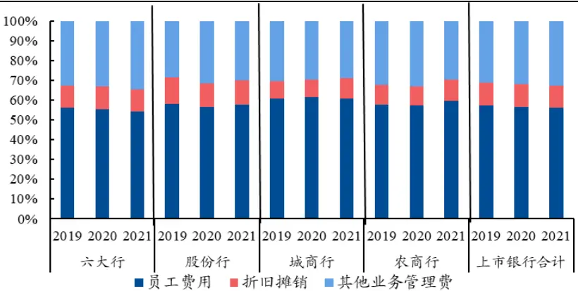
数据来源：wind，兴业证券经济与金融研究院整理

图表43、上市银行各类费用同比增速（%）
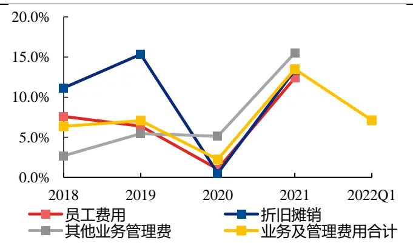
资料来源：公司公告，兴业证券经济与金融研究院整理

图表44、商业银行成本收入比趋势（%）
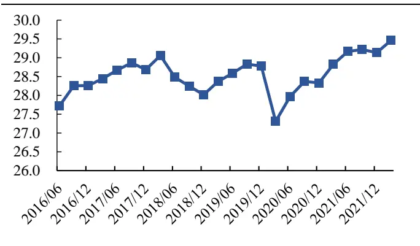
资料来源：公司公告，兴业证券经济与金融研究院整理

资产减值费用的可调节性强，资产减值费用的提取与银行的资产质量、审慎程度有关，也是银行进行盈余管理并体现监管指引的最重要科目之一，尤其是2020-2021年，减值的计提是影响银行业绩的最重要因素之一。

中国银行业过去十年中经历了一个相对完整的不良周期，不良发生率持续上升至 2015-2016 年的年化1.3%（对应当时的静态不良率1.6%-1.7%)，并在2016下半年随着全球经济的企稳改善和国内供给侧改革的成果显现而逐渐走低，带动信用成本下行。在周期末尾的2018-2020阶段，监管机构进一步指引银行以丰补欠，经过三年的严格化不良认定，全行业的不良资产认定的标准逐渐接近并超过全球主流金融机构。截至2021年末，上市银行逾期90天以上贷款与不良贷款之比为62.88%，表明上市银行资产质量的暴露更加前置、不良认定和确认更加审慎。

整体来看，上市银行资产质量有望保持平稳，预计未来一段时间不良生成率和信用成本之间的正差将继续存在并保持一定的安全垫厚度，上市银行名义不良率也将在加大核销处置的背景下保持平稳的态势。我们倾向于认为各家银行会用一个较长的周期平滑地实现信用成本的节约，减值计提的政策短期内将保持大体的稳健。

图表45、上市银行不良率（%）
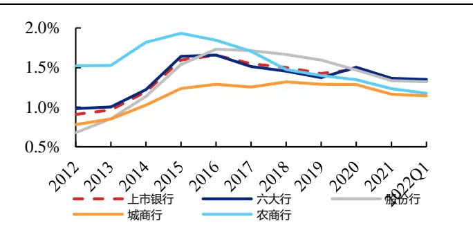
资料来源：wind，兴业证券经济与金融研究院整理

图表 46、上市银行90D 逾期/不良下降至 65%以下
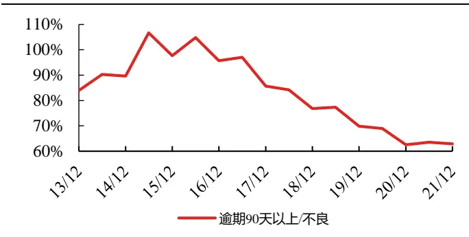
资料来源：wind，兴业证券经济与金融研究院整理

图表47、上市银行不良生成边际改善，带动信用成本下行（%）
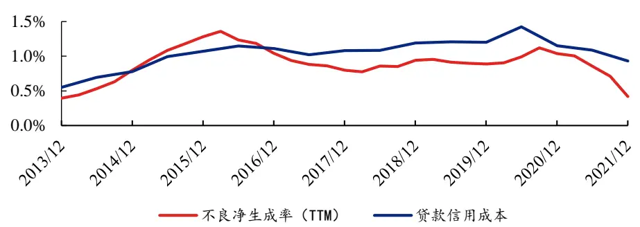
数据来源：wind，兴业证券经济与金融研究院整理

注：数据为2015年以前上市的16家银行口径（工商银行、农业银行、中国银行、建设银行、交通银行、招商银行、兴业银行、民生银行、浦发银行、宁波银行、南京银行、北京银行、中信银行、光大银行、华夏银行、平安银行）

税金及附加主要与营业收入相关，直接基于前两者的准确预测，随着营改增实施，这一部分占比大幅下降；

所得税的比例基本稳定，主要取决于公司非应税类固定收益类投资的比例，随着部分银行基金及利率债投资的增长，实际税率在各行间也出现了分化。

回顾几轮银行板块上涨行情中个股的表现，基本面稳健优异或边际改善幅度大，是银行个股跑出超额收益最普遍的来源，同时也需要结合宏观环境和市场背景，此外业务模式极具特色、能够形成自身标签的标的也可能更受市场青睐。

从基本面的角度，我们在前文的银行业绩拆分中已提到，决定银行利润增速的包括规模、息差、非息收入、资产质量（影响资产减值）、成本等核心指标，因此基本面优异的银行（较高的资产增速、较高的息差水平、营收保持较快的增长、不良率和拨备覆盖率等资产质量指标优于同业）或者基本面边际改善显著的银行（打开成长空间、息差显著改善、资产质量出现拐点等）更容易受到市场认可。

1）2012年11月-2013年1月期间，民生银行和兴业银行领涨，民生通过商贷通业务实现了规模的快速增长，“同业之王”兴业银行则是通过同业业务的发力实现资产规模的弯道超车，较好的成长性下受到市场资金追捧。

2）2016年2月-2016年末，领涨的宁波银行和南京银行在资产质量稳定的情况下实现了业绩的高增长。

3）2017年，市场风格偏好大蓝筹，同时行业监管趋严，基本面稳健、经营更为审慎的招行、宁波、以及大行中的建行和工行，均实现了40%以上的涨幅，其中招商涨幅超过70%。

4）2019年1月-4月，在市场风格偏向于核心资产的背景下，招商银行、宁波银行和平安银行等基本面较好的个股，其估值得以进一步提升。常熟银行的“信贷工厂”特色突出，在这一时间区间涨幅排名也相对靠前。

此外，在银行板块整体绝对收益和相对收益不突出的时间内，基本面较好或者边际改善显著的银行也可能走出相对独立行情，例如杭州银行在2020年估值大幅提升，主要是由于公司息差逆势上行，资产质量保持领先同业，同时转债发行使市场预期公司有动力释放更高的业绩；2022年一季度，在银行整体信贷需求不足、信贷区域分化的背景下，成都银行等有区域优势、信贷增长强劲的城农商行股价表现明显好于银行板块。

## 4、银行行业逻辑量化表达

## 4.1、宏观视角下的银行配置策略

依据上述投资逻辑梳理，我们构建以下银行货币信用周期投资时钟。

图表48、银行货币信用周期投资时钟
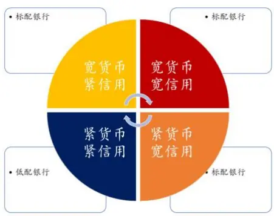
数据来源：兴业证券经济与金融研究院整理与绘制

同时为了实现货币信用状态的可预测性，我们设计以下算法。

## 1、货币周期状态判断

若在时间t，九鞅货币政策指数取值为 $I_{t}$ ，则

1）若 $I_{t}{>}0$ ，则t时刻为宽货币；

2）若 ${\cdot}I_{t}{<}0$ ，则t时刻为紧货币；

3）若 $\cdot I_{t}{=}0$ ，则计算离最近的一个非0的I_change:

a)若I_change 大于0 且小于1，t 时刻为紧货币；r 若I_change等于1，t时刻为宽货币；

b)若 I_change 大于-1 且小于0，t 时刻为宽货币；若I_change 等于-1，t时

刻为紧货币；

通过上述流程，我们在每个月末可以依据最新的九鞅货币政策指数给定目前的货币周期状态。

图表49、可预测货币周期结果
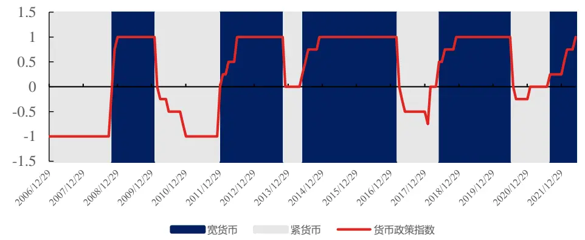
数据来源：wind，兴业证券经济与金融研究院整理

## 2、信用周期状态判断

针对社融存量同比FL指标，我们采用前期报告《基于宏观趋势状态下的ROE因子动态配置》中的方法，我们来进行变量拐点的判断，具体算法如下：

若在时间t，社融存量同比_FL的取值为 $I_{t}$ ，则前

1）若 $\cdot I_{t-3}$ 为过去6个月 $(I_{t-9}...I_{t-3})$ 的最大值，未来三个月 $(I_{t-3}...I_{t})$ 的最小值，则我们在t时认定 $.I_{t-3}$ 为高点，目前处于下降趋势中。

2）若 $\cdot I_{t-3}$ 为过去6个月 $(I_{t-9}...I_{t-3})$ 的最小值，未来三个月 $(I_{t-3}...I_{t})$ 的最大值，则我们在t时认定 $I_{t-3}$ 为低点，目前处于上升趋势中。

图表50、可预测信贷周期结果
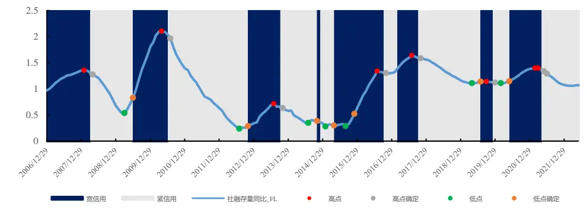
数据来源：wind，兴业证券经济与金融研究院整理

根据上述可预测的货币信用周期，我们进行银行行业动态配置，具体表现如下。可以看到策略分年度收益表现优秀，除2017年外，每次空仓均获得了明显的超额收益。

图表51、可预测货币信用周期下动态配置银行板块表现（2006.12.29-2022.05.31）

| 仓位 年化收益 | 年化波动 | 夏普比率 | 最大回撤 |
| --- | --- | --- | --- |

| 银行中信 |  | 6.03% | 29.87% | 0.20 | 71.16% |
| --- | --- | --- | --- | --- | --- |
| 配置策略（多头） | 理论 | 15.72% | 24.48% | 0.64 | 29.50% |
|  | 可预测 | 15.29% | 25.10% | 0.61 | 35.73% |
|  | 理论 可预测 | 23.71% | 27.87% | 0.85 | 29.50% |
| 配置策略（多空） |  | 23.26% | 27.82% | 0.84 | 35.73% |

数据来源：wind，兴业证券经济与金融研究院整理

图表52、可预测货币信用周期下不同配置多头策略净值
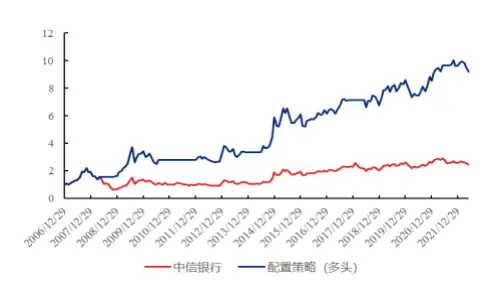

图表53、可预测货币信用周期下不同配置多空策略凈值
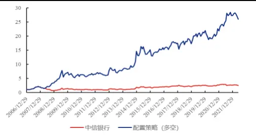
数据来源：wind，兴业证券经济与金融研究院整理

图表54、银行指数货币信用周期配置策略分年度（2006.12-2022.5.31）

|  | 银行 | 多头策略 | 相对银行超额 | 多空策略 | 相对银行超额 |
| --- | --- | --- | --- | --- | --- |
| 2007 | 93.58% | 93.58% | 0.00% | 93.58% | 0.00% |
| 2008 | -65.36% | -14.58% | 50.79% | 77.95% | 143.31% |
| 2009 | 108.58% | 108.58% | 0.00% | 108.58% | 0.00% |
| 2010 | -28.05% | -18.99% | 9.06% | -11.46% | 16.59% |
| 2011 | -3.57% | 0.00% | 3.57% | 1.11% | 4.68% |
| 2012 | 19.04% | 19.04% | 0.00% | 19.04% | 0.00% |
| 2013 | -4.84% | 0.69% | 5.52% | 6.21% | 11.05% |
| 2014 | 71.83% | 76.08% | 4.25% | 79.91% | 8.08% |
| 2015 | 3.57% | 3.57% | 0.00% | 3.57% | 0.00% |
| 2016 | 0.69% | 0.69% | 0.00% | 0.69% | 0.00% |
| 2017 | 16.88% | 15.96% | -0.92% | 14.97% | -1.91% |
| 2018 | -10.95% | -5.13% | 5.82% | -1.52% | 9.42% |
| 2019 | 27.28% | 27.28% | 0.00% | 27.28% | 0.00% |
| 2020 | -0.49% | -0.49% | 0.00% | -0.49% | 0.00% |
| 2021 | 0.20% | 12.54% | 12.34% | 24.82% | 24.62% |
| 2022 | -4.74% | -4.74% | 0.00% | -4.74% | 0.00% |

资料来源：Wind，聚源，兴业证券经济与金融研究院整理

图表55、银行指数货币信用周期配置信号表现（2006.12-2022.5.31）

| 交易次数 | 胜率 | 盈亏比 |
| --- | --- | --- |
| 可预测择时信号 187.00 | 62.57% | 2.07 |

资料来源：Wind，聚源，兴业证券经济与金融研究院整理

## 4.2、银行业有效选股因子测试

我们从以下维度搜集银行业有效的选股因子。

## 1、影响银行业净利润的核心要素

从上文分析可以看出“价”、“量”、“质”是影响银行业的重要因素，其中价为银行的盈利能力（息差等)，量为银行股的资产规模、质为银行股的资产质量。

## 2、影响银行个股股价的核心要素。

银行股核心变量（“价”、“量”、“质”）的边际变化会影响投资者情绪，进而影响股价；估值水平也是影响银行股的重要因素。

综上，我们从以下五个维度构建银行行业选股因子。

图表56、银行股选股因子维度
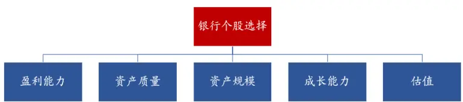
数据来源：兴业证券经济与金融研究院整理与绘制

同时，上述分析中，我们也可以看出不同银行类型的核心指标取值有一定差异，因此我们在选股因子测试时，采用回归的方式剔除行业因素的影响。具体的，对于T时刻的银行股截面取值 $.Y_{t},$ 我们采用银行股中信二级行业分类生成的虚拟变量D进行回归：

$$
Y_{t}=D_{t}+\varepsilon_{t}
$$

将回归的残差作为指标取值，进行选股有效性测试。

同时本文从以下两个维度来验证指标的有效性：

## 1、Rank IC 测试

如果一个因子对股票的预期收益具有预测作用，那么股票当期的因子值与下期股票的收益之间就会存在一定的相关性，我们可以用相关系数来刻画二者之间相关性，从而反映该因子对收益的预测效果。如果计算两者之间的Pearson线性相关系数，那么某些异常值可能会对结果产生很大影响。因此，在这里我们将采用更为稳健的Spearman秩相关系数来衡量因子的有效性。如下图所示，按照所有股票当期因子值大小进行排序，得到名次序列A，按照所有股票下期收益大小进行排序，得到名次序列B，计算序列A，B之间的相关系数，即为RankIC。RankIC的绝对值越大，表明该因子对股票收益的预测能力越强。一般地，我们会统计样本区间内RankIC的均值、标准差和T-统计量，从预测能力的显著性、稳定性等多个角度分析因子的表现。

图表 57、Rank IC 计算过程
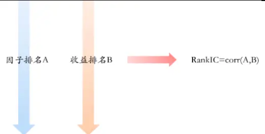
数据来源：兴业证券经济与金融研究院整理与绘制

## 2）分位数组合测试

分位数组合测试是一种较为常用的用来衡量因子有效性的方法，如图表58所示。首先，按照当期因子值的大小将股票分为多个等权的分位组合，组合下期的收益分别为R1，R2，..，Rn，我们根据多空组合的收益R1-Rn来判断因子的有效性，如果多空组合收益显著异于零则表明该因子是有效的，组合夏普比率越高，表明因子越有效。但是值得注意的是，由于分位数组合法只考虑了多空两个极端组合的收益，而忽略了中间各分位组合的相关信息，因此对因子有效性的刻画上可能存在一定的局限性。

图表 58、分位数组合法
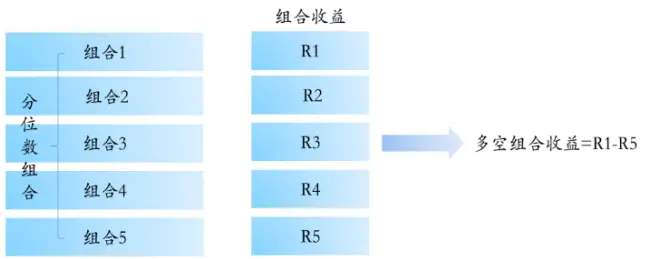
数据来源：兴业证券经济与金融研究院整理与绘制

综上，我们将从RankIC测试和分位数组合测试两个角度出发，对银行行业选股因子有效性进行测试。

## 3.2.1、银行盈利能力

在银行盈利维度，我们选择ROEFwd12M、净息差、成本收入比例三个指标进行捕捉，其中ROEFwd12M为盈利综合指标，净息差度量了银行行业的“价”、成本收入比例度量了银行的成本结构。

图表59、银行盈利能力相关指标

| 指标名称 | 指标定义 | 方向 |
| --- | --- | --- |
| ROE Fwd12M | 一致预期净利润未来12个月预测值/股东权益合 计最新财报 | 降序 |
| 净息差 | (银行全部利息收入-银行全部利息支出)/全部生息 资产 | 降序 |
| 成本收入比例 | 银行营业费用与营业收入的比率 | 升序 |

数据来源：wind，聚源，兴业证券经济与金融研究院整理

首先，从IC表现来看，ROE_Fwd12M指标总体表现最为优秀，IC均值达5.74%，ICIR为0.19。而净息差、成本收入比例未能展现出较好的选股能力。

图表60、银行盈利能力相关指标IC表现（2006.12-2022.05）

| 因子名称 | IC 均值 | IC标准差 | IC_IR | T值 |
| --- | --- | --- | --- | --- |
| ROE_Fwd12M | 5.74% | 30.93% | 0.19 | 2.52 |
| 凈息差 | 0.77% | 25.85% | 0.03 | 0.37 |
| 成本收入比例 | 1.73% | 23.35% | 0.07 | 0.93 |

数据来源：wind，聚源，兴业证券经济与金融研究院整理

图表 61、ROE_Fwd12M 因子三分位表现

|  | 年化收益率 |  | 波动率Sharpe | 比率 | 最大回撤率 |  |  |
| --- | --- | --- | --- | --- | --- | --- | --- |
| TopMid | 12.53% |  | 31.06% | 0.40 | 0.71 |  |  |
|  | Mid | 5 | 5.80%-2.47% |  | 27.96%28.88% | 0.21-0.09 | 0.650.69 |
| Bottom |  |  |  |  |  |  |  |
| 市场L-S | 5.69% 28.24% |  |  | 0.20 | 0.68 |  |  |
|  | 14.65% 15.79% |  |  | 0.93 | 0.21 |  |  |

图表 62、ROE_Fwd12M 因子三分位多头净值
数据来源：wind，聚源，兴业证券经济与金融研究院整理

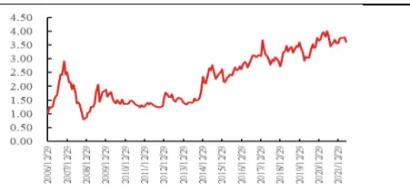

同时我们测试不同货币信用周期下的因子IC表现，可以看出净息差虽然全样本表现一般，但在紧货币状态下表现较为优秀。

图表63、银行盈利能力指标不同货币信用周期下表现（2006.12-2022.05)

| 货币信用周期 | ROE_Fwd12M |  | 净息差 | 成本收入比例 |  |  |
| --- | --- | --- | --- | --- | --- | --- |
|  | IC 均值 | IC_IR | IC 均值 | IC_IR | IC 均值 | IC_IR |
| 宽货币宽信用 | 7.96% | 0.27 | -1.47% | -0.06 | 2.30% | 0.09 |
| 宽货币紧信用 | 8.24% | 0.28 | -0.81% | -0.03 | 1.22% | 0.07 |
| 紧货币宽信用 | 9.52% | 0.28 | 5.51% | 0.27 | 5.67% | 0.18 |
| 紧货币紧信用 | -4.52% | -0.14 | 3.51% | 0.11 | -0.87% | -0.04 |
| 全样本 | 5.74% | 0.27 | 0.77% | 0.03 | 1.73% | 0.07 |

数据来源：wind，聚源，兴业证券经济与金融研究院整理

## 3.2.2、银行资产质量

我们采用拨备覆盖率、不良贷款率两个指标度量银行的资产质量。

拨备覆盖率是实际上银行贷款可能发生的呆、坏账准备金的使用比率，为衡量商业银行贷款损失准备金计提是否充足的一个重要指标。

金融机构不良贷款率是评价金融机构信贷资产安全状况的重要指标之一。不良贷款率高，可能无法收回的贷款占总贷款的比例越大；不良贷款率低，说明金融机构不能收回贷款占总贷款的比例越小。

图表64、银行资产质量相关指标

| 指标名称 | 指标定义 | 方向 |
| --- | --- | --- |
| 拨备覆盖率 | 银行贷款可能发生的呆、坏账准备金的使用比率。 | 降序 |
| 不良贷款率 | 金融机构不良贷款占总贷款余额的比重 | 升序 |

数据来源：wind，聚源，兴业证券经济与金融研究院整理

可以看出拨备覆盖率与不良贷款率相关性较高，均值达-55.88%。

图表65、资产质量因子相关系数均值

| 拨备覆盖率不良贷款率 | 拨备覆盖率 |  | 不良贷款率 |
| --- | --- | --- | --- |
|  |  | -55.88% |  |
|  | -55.88% | 1 |  |

数据来源：wind，聚源，兴业证券经济与金融研究院整理

同时两个因子 IC 均值均较高，其中拨备覆盖率的 IC 均值为 5.55%，IC_IR 为0.21，不良贷款率的 IC 均值为 4.75%，IC_IR 为 0.17。

图表 66、银行资产质量相关指标IC表现（2006.12-2022.05）

| 因子名称 | IC 均值 | IC 标准差 | IC_IR | T值 |
| --- | --- | --- | --- | --- |
| 拨备覆盖率 | 5.55% | 26.46% | 0.21 | 2.64 |
| 不良贷款率 | 4.75% | 28.56% | 0.17 | 2.09 |

数据来源：wind，聚源，兴业证券经济与金融研究院整理

图表67、拨备覆盖率因子三分位表现

|  | 年化收益率 | 波动率 | Sharpe | 最大回撤率比率 |
| --- | --- | --- | --- | --- |
| TopMid | 8.23%1.99% | 24.71%21.42% | 0.33 | 0.40 |
|  |  |  | 0.09 | 0.41 |
| Bottom | 3.11% | 23.97% | 0.13 | 0.40 |
| 市场L-S | 4.49% 22.69% |  | 0.20 | 0.38 |
|  | 4.61% 10.04% |  | 0.46 | 0.18 |

图表68、拨备覆盖率因子三分位多头净值
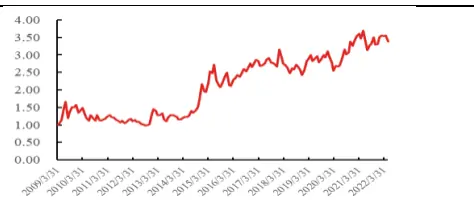
数据来源：wind，聚源，兴业证券经济与金融研究院整理

图表69、不良贷款率因子三分位表现

| 年化收益率 波动率 Sharpe比率 最大回撤率 |  |  |  |  |
| --- | --- | --- | --- | --- |
| Top Mid | 5.77% | 24.13% 22.48% | 0.24 | 0.43 |
|  | 4.86% |  | 0.22 | 0.31 |
| Bottom | 2.30% | 23.35% | 0.10 | 0.40 |
| 市场 | 4.49% | 22.69% | 0.20 | 0.38 |
| L-S | 3.13% | 10.32% | 0.30 | 0.30 |

图表70、不良贷款率因子三分位多头净值
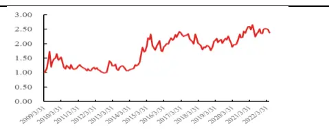
数据来源：wind，聚源，兴业证券经济与金融研究院整理

图表71、银行资产质量指标不同货币信用周期下表现（2006.12-2022.05）

| 货币信用周期 | 拨备覆盖率 不良贷款率 |  |  |  |
| --- | --- | --- | --- | --- |
|  | IC 均值 | IC_IR | IC 均值 | IC_IR |
| 宽货币宽信用 | 3.73% | 0.14 | 2.91% | 0.09 |
| 宽货币紧信用 | 9.61% | 0.35 | 11.32% | 0.40 |
| 紧货币宽信用 | 6.44% | 0.26 | -0.26% | -0.01 |
| 紧货币紧信用 | 0.84% | 0.03 | -0.16% | -0.01 |
| 全样本 | 5.55% | 0.21 | 4.75% | 0.17 |

数据来源：wind，聚源，兴业证券经济与金融研究院整理

## 3.2.3、银行资产规模

我们采用存款总额、贷款总额作为资产规模的核心指标。

图表72、银行资产规模相关指标

| 指标名称 | 指标定义 | 顺序 |
| --- | --- | --- |
| 存款总额 | 银行存款总额 | 降序 |
| 贷款总额 | 银行贷款总额 | 降序 |

数据来源：wind，聚源，兴业证券经济与金融研究院整理

可以看出存款总额与贷款总额相关性较高，均值达97.19%。

图表73、资产规模因子相关系数均值

|  | 存款总额 贷款总额 |
| --- | --- |
| 存款总额 | 97.19% |
| 贷款总额 | 97.19% |

数据来源：wind，兴业证券经济与金融研究院整理

图表74、银行资产规模相关指标IC表现（2006.12-2022.05）

| 因子名称 | IC 均值 | IC 标准差 | IC_IR | T值 |
| --- | --- | --- | --- | --- |
| 存款总额 | 4.10% | 31.06% | 0.13 | 1.66 |
| 贷款总额 | 3.82% | 30.77% | 0.12 | 1.56 |

数据来源：wind，聚源，兴业证券经济与金融研究院整理

图表75、存款总额因子三分位表现

| 年化收益率 波动率 Sharpe比率 最大回撤率 |  |  |  |  |
| --- | --- | --- | --- | --- |
| Top Mid | 8.46% | 23.06% | 0.37 | 0.33 |
|  | 3.92% | 23.00% | 0.17 | 0.37 |
|  | 0.72% | 24.60% | 0.03 | 0.53 |
| Bottom 市场 | 4.49% | 22.69% | 0.20 | 0.38 |
| L-S | 6.38% | 12.99% | 0.49 | 0.34 |

图表76、存款总额因子三分位多头净值
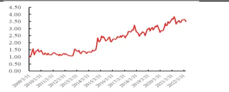
数据来源：wind，聚源，兴业证券经济与金融研究院整理

图表77、银行资产规模指标不同货币信用周期下表现（2006.12-2022.05）

| 货币信用周期 | 存款总额 |  | 贷款总额 |  |
| --- | --- | --- | --- | --- |
|  | IC 均值 | IC_IR | IC 均值 | IC_IR |
| 宽货币宽信用 | 0.86% | 0.02 | 1.05% | 0.03 |
| 宽货币紧信用 | 2.54% | 0.09 | 2.49% | 0.09 |
| 紧货币宽信用 | 18.32% | 0.59 | 17.42% | 0.56 |
| 紧货币紧信用 | 1.94% | 0.07 | 1.01% | 0.03 |
| 全样本 | 4.10% | 0.13 | 3.82% | 0.12 |

数据来源：wind，聚源，兴业证券经济与金融研究院整理

## 3.2.4、银行成长能力

下面计算核心指标边际变化要素的选股能力，即从银行股的成长能力对未来股价表现的作用。

图表78、银行成长能力相关指标

| 指标名称 | 指标定义 | 顺序 |
| --- | --- | --- |
| NetProfit_SQ_QoQ | 单季度净利润环比 | 降序 |
| 净息差环比 | 净息差环比 | 降序 |
| 成本收入比例环比 | 成本收入比例环比 | 升序 |
| 拨备覆盖率环比 | 拨备覆盖率环比 | 降序 |
| 不良贷款率环比 | 不良贷款率环比 | 升序 |
| 存款总额环比 | 存款总额环比 | 降序 |
| 贷款总额环比 | 贷款总额环比 | 降序 |

数据来源：wind，聚源，兴业证券经济与金融研究院整理

图表79、银行成长能力指标IC表现（2006.12-2022.05）

| 因子名称 | IC 均值 | IC标准差 | IC_IR | T值 |
| --- | --- | --- | --- | --- |
| NetProfit_SQ_QoQ | 0.80% | 24.84% | 0.03 | 0.44 |
| 成本收入比例环比 | 4.66% | 23.54% | 0.20 | 2.39 |
| 净息差环比 | 3.15% | 25.22% | 0.12 | 1.51 |
| 拨备覆盖率环比 | 6.44% | 24.36% | 0.26 | 3.19 |
| 不良贷款率环比 | 3.04% | 24.03% | 0.13 | 1.53 |
| 存款总额环比 | 2.04% | 22.36% | 0.09 | 1.10 |
| 贷款总额环比 | 0.24% | 25.57% | 0.01 | 0.12 |

数据来源：wind，聚源，兴业证券经济与金融研究院整理

图表80、拨备覆盖率环比因子三分位表现

| 年化收益率 |  | 波动率Sharpe比率 |  | 最大回撤率 |
| --- | --- | --- | --- | --- |
| TopMid | 6.33% | 20.68% | 0.31 | 0.29 |
|  | 4.10% | 18.88% | 0.22 | 0.28 |
| Bottom | 0.83% | 19.81% | 0.04 0.37 |  |
| 市场 3.84%L-S 5.30% |  | 19.29% | 0.20 | 0.30 |
|  |  | 8.55% | 0.62 | 0.11 |

图表81、拨备覆盖率环比因子三分位多头净值
数据来源：wind，聚源，兴业证券经济与金融研究院整理

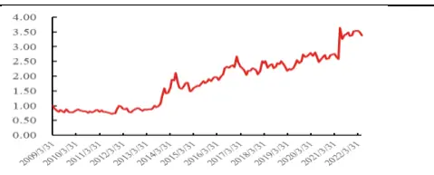

图表82、银行成长能力指标不同货币信用周期下表现（2006.12-2022.05）

| 货币信用周期 | 拨备覆盖率环比 |  |
| --- | --- | --- |
|  | IC 均值 | IC_IR |
| 宽货币宽信用 | 2.22% | 0.08 |
| 宽货币紧信用 | 6.18% | 0.25 |
| 紧货币宽信用 | 10.17% | 0.44 |
| 紧货币紧信用 | 9.59% | 0.46 |
| 全样本 | 6.44% | 0.26 |

数据来源：wind，聚源，兴业证券经济与金融研究院整理

## 3.2.5、银行估值水平

我们选取EP、BP等常用指标来度量银行股的估值水平，并测试估值指标对银行股股价的影响。

图表83、银行估值水平相关指标

| 指标名称 | 指标定义 |
| --- | --- |
| EP_Fwd12M | 每股收益未来12个月预测值/收盘价 |
| EP_TTM | 净利润(不含少数股东损益)_TTM/总市值 |
| BP_LR | 股东权益合计(不含少数股东权益)最新财报/总市值 |

数据来源：wind，聚源，兴业证券经济与金融研究院整理

图表 84、银行估值水平相关指标IC表现（2006.12-2022.05）

| 因子名称 | IC 均值 | IC 标准差 | IC_IR | T值 |
| --- | --- | --- | --- | --- |
| EP_Fwd12M | 11.57% | 32.03% | 0.36 | 4.91 |
| EP_TTM | 10.16% | 30.87% | 0.33 | 4.48 |
| BP_LR | 5.96% | 30.66% | 0.19 | 2.65 |

数据来源：wind，聚源，兴业证券经济与金融研究院整理

图表 85、EP_Fwd12M 因子三分位表现
图表 86、EP_Fwd12M 因子三分位多头净值

| 年化收益率 |  | 波动率Sharpe比率 |  | 最大回撤率 |
| --- | --- | --- | --- | --- |
| TopMid | 13.92%4.30% | 31.76% | 0.44 | 0.690.67 |
|  |  | 25.94% | 0.17 |  |
| Bottom | -1.12% | 30.64% | -0.04 | 0.71 |
| 市场L-S | 5.98% 28.23% 0.21 |  |  | 0.68 |
|  | 14.05% 16.08% 0.87 |  |  | 0.16 |

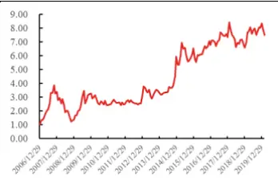
数据来：wind，聚源，兴业证券经济与金融研究院整理

图表87、银行估值水平相关指标（2006.12-2022.05）

| EP_Fwd12M |  |
| --- | --- |
| 货币信用周期 | IC 均值 IC_IR |
| 宽货币宽信用 | 13.12% 0.38 |
| 宽货币紧信用 | 13.41% 0.49 |
| 紧货币宽信用 | 12.14% 0.36 |
| 紧货币紧信用 | 6.26% 0.18 |
| 全样本 | 13.12% 0.38 |

数据来源：wind，聚源，兴业证券经济与金融研究院整理

## 3.2.6、银行行业合成因子

通过上述测试，我们在每个重要维度上选取核心指标进行选股，并将细分因子合成为最终的银行选股因子，Bank_factor。

图表88、银行选择指标IC 表现（2006.12-2022.05）

| 维度 | 因子名称 | IC 均值 | IC标准差 | IC_IR | T值 |
| --- | --- | --- | --- | --- | --- |
| 盈利能力 | ROE_Fwd12M | 5.74% | 30.93% | 0.19 | 2.52 |
| 资产质量 | 拨备覆盖率 | 5.55% | 26.46% | 0.21 | 2.64 |
| 资产规模 | 存款总额 | 4.10% | 31.06% | 0.13 | 1.66 |
| 成长能力 | 拨备覆盖率环比 | 6.44% | 24.00% | 0.26 | 3.19 |
| 估值水平 | EP_Fwd12M | 11.57% | 32.03% | 0.36 | 4.91 |

数据来源：wind，聚源，兴业证券经济与金融研究院整理

图表89、银行核心因子相关系数均值

|  | ROE Fwd12M | 拨备覆盖率 存款总额 拨备覆盖率环比 EP_Fwd12M |  |  |  |
| --- | --- | --- | --- | --- | --- |
| ROE_Fwd12M | 100.00% | 46.42% | 34.06% | -6.06% | 23.30% |
| 拨备覆盖率 | 46.42% | 100.00% | -3.16% | 14.98% | -1.40% |
| 存款总额 | 34.06% | -3.16% | 100.00% | -19.28% | 35.36% |
| 拨备覆盖率环比EP_Fwd12M | -6.06% | 14.98% | -19.28% | 100.00% | -16.48% |
|  | 23.30% | -1.40% | 35.36% | -16.48% | 100.00% |

数据来源：wind，聚源，兴业证券经济与金融研究院整理

图表90、银行合成因子IC表现（2006.12-2022.05）

| 因子名称 | IC 均值 | IC 标准差 | IC_IR | T值 |
| --- | --- | --- | --- | --- |
| Bank factor | 11.62% | 33.22% | 0.35 | 4.76 |

数据来源：wind，聚源，兴业证券经济与金融研究院整理

图表91、合成因子三分位组合表现

| 年化收益率 波动率 |  |  | Sharpe比率 最大回撤率 |  |
| --- | --- | --- | --- | --- |
| Top Mid | 12.53% | 31.06% | 0.40 | 0.71 |
|  | 5.80% | 27.96% | 0.21 | 0.65 |
|  | -2.47% | 28.88% | -0.09 | 0.69 |
| 市场 | 5.69% | 28.24% | 0.20 | 0.68 |
| L-S | 14.65% | 15.79% | 0.93 | 0.21 |

图表92、合成因子三分位组合多头净值
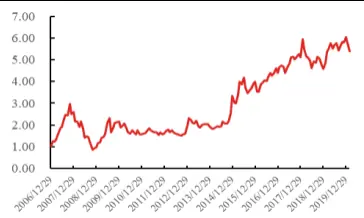
数据来源：wind，聚源，兴业证券经济与金融研究院整理

## 5、银行行业逻辑投资应用

## 5.1、银行行业静态选股策略

我们基于合成因子按照下述方式构建选股策略：

1、回测日期：2006.12-2022.05

2、调整频率：月度

3、选股池：非特殊处理的上市满180天银行股

4、加权方式：等权

下面我们分别依据定比、定量两种方式进行选股。

## 5.1.1、定比选股策略

图表93、银行行业定比选股策略表现（2006.12-2022.05）

| 因子名称 | 年化收益 | 年化波动 | 收益风险比 | 最大回撤 |
| --- | --- | --- | --- | --- |
| 定比选股（0.2） | 13.05% | 32.87% | 0.40 | 74.00% |
| 定比选股（0.3） | 13.39% | 31.45% | 0.43 | 70.50% |
| 定比选股（0.4） | 11.33% | 30.00% | 0.38 | 70.01% |
| 定比选股（0.5） | 10.75% | 29.70% | 0.36 | 70.87% |
| 银行行业 | 6.03% | 28.66% | 0.21 | 71.16% |
| 沪深300 | 4.59% | 28.61% | 0.16 | 70.75% |
| 中证 800 | 5.41% | 28.74% | 0.19 | 70.05% |

数据来源：wind，聚源，兴业证券经济与金融研究院整理

根据上述测试结果，我们选择前30%的银行股作为持仓，构建最终的定比选股策略。

图表94、定比选股策略净值
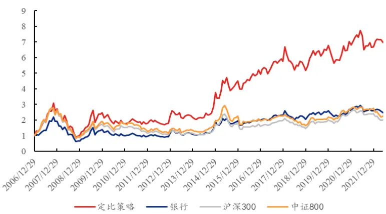
数据来源：wind，聚源，兴业证券经济与金融研究院整理

图表95、定比选股策略持股个数（个） 图表96、定比选股策略换手率
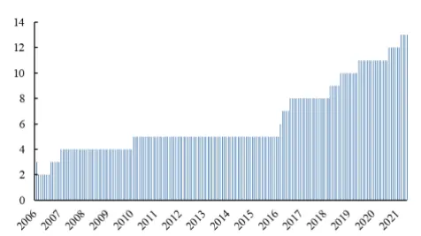

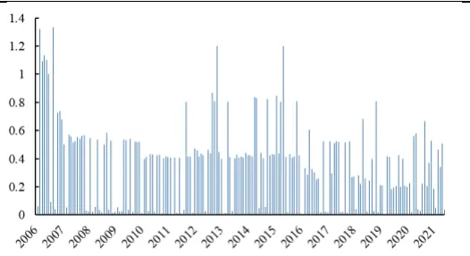
数据来源：wind，聚源，兴业证券经济与金融研究院整理

图表97、定比选股策略分年度表现（2006.12-2022.5.31）

| 策略 | 银行 | 超额 | 沪深300 | 超额 | 中证800 | 超额 |
| --- | --- | --- | --- | --- | --- | --- |
| 2007 170.68% | 93.58% | 77.10% | 161.55% | 9.13% | 167.11% | 3.57% |
| 2008 -62.13% | -65.36% | 3.23% | -65.95% | 3.82% | -64.95% | 2.82% |
| 2009 140.34% | 108.58% | 31.76% | 96.71% | 43.63% | 103.65% | 36.69% |
| 2010 -28.76% | -28.05% | -0.71% | -12.51% | -16.25% | -7.32% | -21.44% |
| 2011 2.71% | -3.57% | 6.28% | -25.01% | 27.72% | -27.38% | 30.09% |
| 2012 23.27% | 19.04% | 4.23% | 7.55% | 15.72% | 5.81% | 17.46% |
| 2013 -2.14% | -4.84% | 2.70% | -7.65% | 5.51% | -2.14% | 0.00% |
| 2014 73.52% | 71.83% | 1.69% | 51.66% | 21.86% | 48.28% | 25.24% |
| 2015 19.66% | 3.57% | 16.09% | 5.58% | 14.08% | 14.91% | 4.75% |
| 2016 9.53% | 0.69% | 8.84% | -11.28% | 20.81% | -13.27% | 22.80% |
| 2017 16.35% | 16.88% | -0.53% | 21.78% | -5.43% | 15.16% | 1.19% |
| 2018 -10.16% | -10.95% | 0.79% | -25.31% | 15.15% | -27.38% | 17.22% |
| 2019 30.98% | 27.28% | 3.70% | 36.07% | -5.09% | 33.71% | -2.73% |
| 2020 0.56% | -0.49% | 1.05% | 27.21% | -26.65% | 25.79% | -25.23% |
| 2021 -1.73% | 0.20% | -1.93% | -5.20% | 3.47% | -0.76% | -0.97% |
| 2022 3.92% | -4.74% | 8.66% | -17.18% | 21.10% | -17.41% | 21.33% |

数据来源：wind，聚源，兴业证券经济与金融研究院整理

图表98、银行行业定比选股策略持仓（2022.05）

| 证券代码 | 证券名称 | 持股比例 | 流通市值(亿元) |
| --- | --- | --- | --- |
| 601398.SH | 工商银行 | 7.69% | 12563.93 |
| 601288.SH | 农业银行 | 7.69% | 9673.10 |
| 600036.SH | 招商银行 | 7.69% | 8187.63 |
| 601166.SH | 兴业银行 | 7.69% | 4082.13 |
| 601818.SH | 光大银行 | 7.69% | 1290.22 |
| 601009.SH | 南京银行 | 7.69% | 1109.90 |
| 600919.SH | 江苏银行 | 7.69% | 948.21 |
| 601229.SH | 上海银行 | 7.69% | 910.65 |
| 600926.SH | 杭州银行 | 7.69% | 807.70 |
| 601825.SH | 沪农商行 | 7.69% | 626.89 |
| 601838.SH | 成都银行 | 7.69% | 552.31 |
| 601577.SH | 长沙银行 | 7.69% | 306.44 |
| 600908.SH | 无锡银行 | 7.69% | 102.76 |

数据来源：wind，兴业证券经济与金融研究院整理

## 5.1.2、定量选股策略

下面我们测试固定选择不同个股数目的策略表现。可以看出选择top5个股策略表现优秀，年化收益为为13.83%、收益风险比为0.44，较基准有明显提升。

图表99、银行行业定量选股策略表现（2006.12-2022.05）

| 因子名称 | 年化收益 | 年化波动 | 收益风险比 | 最大回撤 |
| --- | --- | --- | --- | --- |
| 定量选股（5） | 13.83% | 31.33% | 0.44 | 70.11% |
| 定量选股（10） | 10.02% | 28.59% | 0.35 | 68.82% |
| 银行行业 | 6.03% | 28.66% | 0.21 | 71.16% |
| 沪深300 | 4.59% | 28.61% | 0.16 | 70.75% |
| 中证 800 | 5.41% | 28.74% | 0.19 | 70.05% |

数据来源：wind，聚源，兴业证券经济与金融研究院整理

图表100、定量选股策略净值
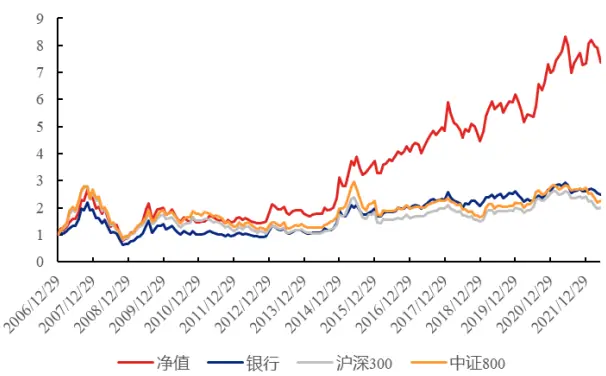
数据来源：wind，聚源，兴业证券经济与金融研究院整理

图表101、定量选股策略换手率
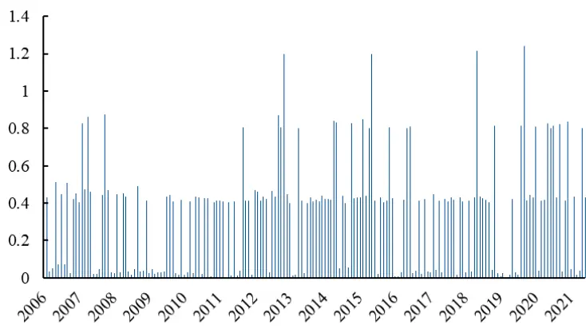
数据来源：wind，聚源，兴业证券经济与金融研究院整理

图表102、定量选股策略分年度表现（2006.12-2022.5.31）

| 策略 | 银行 | 超额 沪深300 |  | 超额 | 中证800 | 超额 |
| --- | --- | --- | --- | --- | --- | --- |
| 2007 137.76% | 93.58% | 44.18% | 161.55% | -23.79% | 167.11% | -29.35% |
| 2008 -62.45% | -65.36% | 2.91% | -65.95% | 3.50% | -64.95% | 2.50% |
| 2009 125.31% | 108.58% | 16.73% | 96.71% | 28.60% | 103.65% | 21.66% |
| 2010 -27.82% | -28.05% | 0.23% | -12.51% | -15.31% | -7.32% | -20.50% |
| 2011 2.15% | -3.57% | 5.72% | -25.01% | 27.16% | -27.38% | 29.53% |
| 2012 23.27% | 19.04% | 4.23% | 7.55% | 15.72% | 5.81% | 17.46% |
| 2013 -2.14% | -4.84% | 2.70% | -7.65% | 5.51% | -2.14% | 0.00% |
| 2014 73.52% | 71.83% | 1.69% | 51.66% | 21.86% | 48.28% | 25.24% |
| 2015 19.66% | 3.57% | 16.09% | 5.58% | 14.08% | 14.91% | 4.75% |
| 2016 9.53% | 0.69% | 8.84% | -11.28% | 20.81% | -13.27% | 22.80% |
| 2017 19.07% | 16.88% | 2.19% | 21.78% | -2.71% | 15.16% | 3.91% |
| 2018 -7.73% | -10.95% | 3.22% | -25.31% | 17.58% | -27.38% | 19.65% |
| 2019 38.58% | 27.28% | 11.30% | 36.07% | 2.51% | 33.71% | 4.87% |
| 2020 12.60% | -0.49% | 13.09% | 27.21% | -14.61% | 25.79% | -13.19% |
| 2021 4.94% | 0.20% | 4.74% | -5.20% | 10.14% | -0.76% | 5.70% |
| 2022 0.77% | -4.74% | 5.51% | -17.18% | 17.95% | -17.41% | 18.18% |

数据来源：wind，聚源，兴业证券经济与金融研究院整理

图表103、银行行业定量选股策略持仓（2022.05）

| 证券代码 | 证券名称 | 持股比例 | 流通市值（亿元） |
| --- | --- | --- | --- |
| 601166.SH | 兴业银行 | 20.00% | 4082.13 |
| 600919.SH | 江苏银行 | 20.00% | 948.21 |
| 600926.SH | 杭州银行 | 20.00% | 807.70 |
| 601825.SH | 沪农商行 | 20.00% | 626.89 |
| 601838.SH | 成都银行 | 20.00% | 552.31 |

数据来源：wind，聚源，兴业证券经济与金融研究院整理

## 5.2、叠加景气度择时构建动态选股策略

我们在动态选股策略的基础上叠加景气度择时进一步提升策略表现，具体的：1）若市场环境处于紧货币紧信用时期，我们进行空仓；

2）若市场环境不处于紧货币紧信用时期，我们采用合成因子以定比（0.3）定量（5）的方式选择个股。

可以看出两者叠加后策略表现有进一步提升。以定比策略为例，叠加景气度择时后，策略年化收益为22.75%，收益风险比高达0.82，相较基准提升明显。同时分年度来看，定比选股叠加、定量选股叠加策略均稳定跑赢中信银行指数，同时在大部分年份跑赢沪深300、中证800指数。

图表104、银行行业叠加景气度择时策略表现（2006.12-2022.05）

| 因子名称 | 年化收益 | 年化波动 | 收益风险比 | 最大回撤 |
| --- | --- | --- | --- | --- |
| 定比选股叠加 | 22.75% | 27.66% | 0.82 | 35.73% |
| 定量选股叠加 | 22.97% | 27.21% | 0.84 | 33.18% |
| 银行行业 | 6.03% | 28.66% | 0.21 | 71.16% |
| 沪深300 | 4.59% | 28.61% | 0.16 | 70.75% |
| 中证 800 | 5.41% | 28.74% | 0.19 | 70.05% |

数据来源：wind，聚源，兴业证券经济与金融研究院整理

图表105、定比选股叠加策略净值
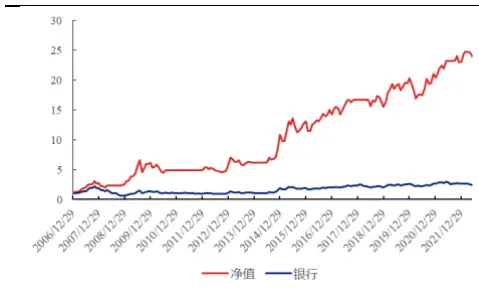

图表106、定量选股叠加策略净值
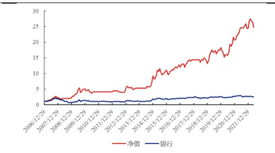
数据来源：wind，聚源，兴业证券经济与金融研究院整理

图表107、定比选股策略分年度表现（2006.12-2022.5.31）

| 策略 | 银行 超额 |  | 沪深300 | 超额 | 中证 800 | 超额 |
| --- | --- | --- | --- | --- | --- | --- |
| 2007 170.68% | 93.58% | 77.10% | 161.55% | 9.13% | 167.11% | 3.57% |
| 2008 -5.54% | -65.36% | 59.82% | -65.95% | 60.41% | -64.95% | 59.41% |
| 2009 140.34% | 108.58% | 31.76% | 96.71% | 43.63% | 103.65% | 36.69% |
| 2010 -21.01% | -28.05% | 7.04% | -12.51% | -8.50% | -7.32% | -13.69% |
| 2011 0.00% | -3.57% | 3.57% | -25.01% | 25.01% | -27.38% | 27.38% |
| 2012 23.27% | 19.04% | 4.23% | 7.55% | 15.72% | 5.81% | 17.46% |
| 2013 3.55% | -4.84% | 8.39% | -7.65% | 11.20% | -2.14% | 5.69% |
| 2014 75.80% | 71.83% | 3.97% | 51.66% | 24.14% | 48.28% | 27.52% |
| 2015 19.66% | 3.57% | 16.09% | 5.58% | 14.08% | 14.91% | 4.75% |
| 2016 9.53% | 0.69% | 8.84% | -11.28% | 20.81% | -13.27% | 22.80% |
| 2017 17.18% | 16.88% | 0.30% | 21.78% | -4.60% | 15.16% | 2.02% |
| 2018 -7.20% | -10.95% | 3.75% | -25.31% | 18.11% | -27.38% | 20.18% |
| 2019 30.98% | 27.28% | 3.70% | 36.07% | -5.09% | 33.71% | -2.73% |

| 2020 | 0.56% | -0.49% | 1.05% | 27.21% | -26.65% | 25.79% | -25.23% |
| --- | --- | --- | --- | --- | --- | --- | --- |
| 2021 | 12.82% | 0.20% | 12.62% | -5.20% | 18.02% | -0.76% | 13.58% |
| 2022 | 3.92% | -4.74% | 8.66% | -17.18% | 21.10% | -17.41% | 21.33% |

资料来源：Wind，聚源，兴业证券经济与金融研究院整理

图表 108、定量选股策略分年度表现（2006.12-2022.5.31）

| 策略 | 银行 | 超额 | 沪深300 | 超额 | 中证800 | 超额 |
| --- | --- | --- | --- | --- | --- | --- |
| 2007 137.76% | 93.58% | 44.18% | 161.55% | -23.79% | 167.11% | -29.35% |
| 2008 -5.75% | -65.36% | 59.61% | -65.95% | 60.20% | -64.95% | 59.20% |
| 2009 125.31% | 108.58% | 16.73% | 96.71% | 28.60% | 103.65% | 21.66% |
| 2010 -18.60% | -28.05% | 9.45% | -12.51% | -6.09% | -7.32% | -11.28% |
| 2011 0.00% | -3.57% | 3.57% | -25.01% | 25.01% | -27.38% | 27.38% |
| 2012 23.27% | 19.04% | 4.23% | 7.55% | 15.72% | 5.81% | 17.46% |
| 2013 3.55% | -4.84% | 8.39% | -7.65% | 11.20% | -2.14% | 5.69% |
| 2014 75.80% | 71.83% | 3.97% | 51.66% | 24.14% | 48.28% | 27.52% |
| 2015 19.66% | 3.57% | 16.09% | 5.58% | 14.08% | 14.91% | 4.75% |
| 2016 9.53% | 0.69% | 8.84% | -11.28% | 20.81% | -13.27% | 22.80% |
| 2017 18.95% | 16.88% | 2.07% | 21.78% | -2.83% | 15.16% | 3.79% |
| 2018 -8.26% | -10.95% | 2.69% | -25.31% | 17.05% | -27.38% | 19.12% |
| 2019 38.58% | 27.28% | 11.30% | 36.07% | 2.51% | 33.71% | 4.87% |
| 2020 12.60% | -0.49% | 13.09% | 27.21% | -14.61% | 25.79% | -13.19% |
| 2021 18.93% | 0.20% | 18.73% | -5.20% | 24.13% | -0.76% | 19.69% |
| 2022 0.77% | -4.74% | 5.51% | -17.18% | 17.95% | -17.41% | 18.18% |

资料来源：Wind，聚源，兴业证券经济与金融研究院整理

## 6、总结

本文继续专注于板块基本面量化研究，选取大金融板块中的典型行业—银行行业进行深入分析，来进一步完善我们板块基本面研究框架。我们通过与兴证银行组通力合作，基于以下框架完成银行行业基本面量化模型的搭建：1）银行行业标的划分：2）银行行业逻辑梳理：3）银行行业逻辑量化表达；4）银行行业投资逻辑应用。

最终在投资实践维度，本文进行了多维度应用尝试，效果均较为显著：1）宏观视角下的银行配置策略：多头策略2006.12-2022.5月年化收益率达15.29%，较中信银行行业的6.03%明显提升，同时最大回撤下降较为明显；2)静态选股策略：基于银行行业有效选股因子合成综合选股因子，运用合成因子构建定比策略年化收益率为13.39%，较中信银行行业亦有明显提升；3）叠加景气度择时的选股策略：我们在静态选股策略的基础上叠加景气度择时。以定比策略为例子，叠加景气度择时后年化收益率达22.75%，表现优异。

风险提示：报告中的结果均由相应作者通过历史数据统计、建模和测算完成，在政策、市场环境发生变化时模型存在失效的风险。

## 分析师声明

本人具有中国证券业协会授予的证券投资咨询执业资格并登记为证券分析师，以勤勉的职业态度，独立、客观地出具本报告。本报告清晰准确地反映了本人的研究观点。本人不曾因，不因，也将不会因本报告中的具体推荐意见或观点而直接或间接收到任何形式的补偿。

## 投资评级说明

| 投资建议的评级标准 | 类别 | 评级 | 说明 |
| --- | --- | --- | --- |
| 报告中投资建议所涉及的评级分为股票评级和行业评级(另有说明的除外)。评级标准为报告发布日后的12个月内公司股价（或行业指数）相对同期相关证券市场代表性指数的涨跌幅。其中：A股市场以上证综指或深圳成指为基准，香港市场以恒生指数为基准；美国市场以标普500或纳斯达克综合指数为基准。 | 股票评级 | 买入 | 相对同期相关证券市场代表性指数涨幅大于15% |
|  |  | 审慎增持 | 相对同期相关证券市场代表性指数涨幅在5%～15%之间 |
|  |  | 中性 | 相对同期相关证券市场代表性指数涨幅在-5%～5%之间 |
|  |  | 减持 | 相对同期相关证券市场代表性指数涨幅小于-5% |
|  |  | 无评级 | 由于我们无法获取必要的资料，或者公司面临无法预见结果的重大不确定性事件，或者其他原因，致使我们无法给出明确的投资评级 |
|  | 行业评级 | 推荐 | 相对表现优于同期相关证券市场代表性指数 |
|  |  | 中性 | 相对表现与同期相关证券市场代表性指数持平 |
|  |  | 回避 | 相对表现弱于同期相关证券市场代表性指数 |

## 信息披露

本公司在知晓的范围内履行信息披露义务。客户可登录www.xyzq.com.cn内幕交易防控栏内查询静默期安排和关联公司持股情况。

## 使用本研究报告的风险提示及法律声明

兴业证券股份有限公司经中国证券监督管理委员会批准，已具备证券投资咨询业务资格。

本报告仅供兴业证券股份有限公司（以下简称“本公司”）的客户使用，本公司不会因接收人收到本报告而视其为客户。本报告中的信息、意见等均仅供客户参考，不构成所述证券买卖的出价或征价邀请或要约，投资者自主作出投资决策并自行承担投资风险，任何形式的分享证券投资收益或者分担证券投资损失的书面或口头承诺均为无效，任何有关本报告的摘要或节选都不代表本报告正式完整的观点，一切须以本公司向客户发布的本报告完整版本为准。该等信息、意见并未考虑到获取本报告人员的具体投资目的、财务状况以及特定需求，在任何时候均不构成对任何人的个人推荐。客户应当对本报告中的信息和意见进行独立评估，并应同时考量各自的投资目的、财务状况和特定需求，必要时就法律、商业、财务、税收等方面咨询专家的意见。对依据或者使用本报告所造成的一切后果，本公司及/或其关联人员均不承担任何法律责任。

本报告所载资料的来源被认为是可靠的，但本公司不保证其准确性或完整性，也不保证所包含的信息和建议不会发生任何变更。本公司并不对使用本报告所包含的材料产生的任何直接或间接损失或与此相关的其他任何损失承担任何责任。

本报告所载的资料、意见及推测仅反映本公司于发布本报告当日的判断，本报告所指的证券或投资标的的价格、价值及投资收入可升可跌，过往表现不应作为日后的表现依据：在不同时期，本公司可发出与本报告所载资料、意见及推测不一致的报告；本公司不保证本报告所含信息保持在最新状态。同时，本公司对本报告所含信息可在不发出通知的情形下做出修改，投资者应当自行关注相应的更新或修改。

除非另行说明，本报告中所引用的关于业绩的数据代表过往表现。过往的业绩表现亦不应作为日后回报的预示。我们不承诺也不保证，任何所预示的回报会得以实现。分析中所做的回报预测可能是基于相应的假设。任何假设的变化可能会显著地影响所预测的回报。

本公司的销售人员、交易人员以及其他专业人士可能会依据不同假设和标准、采用不同的分析方法而口头或书面发表与本报告意见及建议不一致的市场评论和/或交易观点。本公司没有将此意见及建议向报告所有接收者进行更新的义务。本公司的资产管理部门、自营部门以及其他投资业务部门可能独立做出与本报告中的意见或建议不一致的投资决策。

本报告并非针对或意图发送予或为任何就发送、发布、可得到或使用此报告而使兴业证券股份有限公司及其关联子公司等违反当地的法律或法规或可致使兴业证券股份有限公司受制于相关法律或法规的任何地区、国家或其他管辖区域的公民或居民，包括但不限于美国及美国公民（1934年美国《证券交易所》第15a-6条例定义为本「主要美国机构投资者|除外)。

本报告的版权归本公司所有。本公司对本报告保留一切权利。除非另有书面显示，否则本报告中的所有材料的版权均属本公司。未经本公司事先书面授权，本报告的任何部分均不得以任何方式制作任何形式的拷贝、复印件或复制品，或再次分发给任何其他人，或以任何侵犯本公司版权的其他方式使用。未经授权的转载，本公司不承担任何转载责任。

## 特别声明

在法律许可的情况下，兴业证券股份有限公司可能会持有本报告中提及公司所发行的证券头寸并进行交易，也可能为这些公司提供或争取提供投资银行业务服务。因此，投资者应当考虑到兴业证券股份有限公司及/或其相关人员可能存在影响本报告观点客观性的潜在利益冲突。投资者请勿将本报告视为投资或其他决定的唯一信赖依据。

## 兴业证券研究

| 上海 | 北京 | 深圳 |
| --- | --- | --- |
| 地址：上海浦东新区长柳路36号兴业证券大厦 | 地址：北京市朝阳区建国门大街甲6号SK大厦32 | 地址：深圳市福田区皇岗路5001号深业上城T2 |
| 15层 | 层01-08单元 | 座52楼 |
| 邮编：200135 | 邮编：100020 | 邮编：518035 |
| 邮箱：research@xyzq.com.cn | 邮箱：research@xyzq.com.cn | 邮箱：research@xyzq.com.cn |