分析师：

王帅

wangshuai21@xyzq.com.cn

S0190521110001

郑兆磊

zhengzhaolei@xyzq.com.cn

S0190520080006

占康萍

zhankangping@xyzq.com.cn

S0190522070008

研究助理

杨森

yangsen@xyzq.com.cn

## 报告关键点

作为基本面量化系列的第七篇，兴证金工与兴证电新团队展开深入合作，将光伏产业链作为新能源板块基本面量化的细分研究对象，构建自上而下三维度的光伏产业链景气度模型。

## ＃相关报告 related

《基本面量化研究系列之一：基本面量化视角下的大健康板块选股研究》

《基本面量化研究系列之二：基本面量化视角下的科技板块选股研究》

《基本面量化研究系列之三：未雨绸缪—个股财务风险监控雷达搭建，较全环

寻找隐匿的专精特新小巨人》《基本面量化研究系列之五：家电行业景气度投资模型构建》

《基本面量化研究系列之六：银行行业基本面量化模型构建》

# 基本面量化系列之七：光伏产业链景气度模型构建

2022 年 12 月 3 日

## 投资要点

作为景气度系列的第七篇，兴证金工与电新团队展开深入合作，将光伏产业链作为新能源板块基本面量化的细分研究对象，构建自上而下三维度的光伏产业链景气度模型。

⚫ 光伏产业链景气度模型构建：根据光伏产业链的复盘，我们提取出光伏产业是行业决定性因素；2）价格是

板块的风向标；3）技术发展推进行业景气度。本文尝试采用量化的手段刻画定性逻辑，具体的，我们基于趋势状态（分位数水平、幅度变化、趋势变化、持续变动事件）将相应的连续变量转换为离散信号值进行跟踪，并通过测试获取了各维度的核心指标。我们最终应用量、价两维度核心指标构建复合信号，基于此信号构建的光伏设备指数多头择时策略 2017.1-2021.12 年化收益率为 61.18%，收益风险比为 2.01，较光伏设备指数的 39.63%，1.04 有明显提升。同时，我们在报告中进行多维度的参数敏感性测试，以保证策略稳健性。

利润分配，光伏行业细分环节轮动：本文采用 SAM 产业链数据将个股映射到光伏产业链各重要环节上，从而重构细分环节指数。接着，我们使用产业链价格数据估算 2021 年 1 月以来的周度硅料、硅片、组件、电池、胶膜、玻璃等环节的单位净利，并基于单位净利周变动作为产业链各环节利润分配代表变量构建细分环节轮动模型。以每周选择单位净利变动前二的环节等权持有为例，策略 2021.1.1-2022.10.28 区间的年化收益率为 71.84%，收益风有明显提升。

个股决策，光伏产业链金股推荐：我们在每周单位净利变动前二的赛道中选择市占率（产品的收入占比）居前的个股进行等权配置，可以看出，通过此方法构建的选股策略表现优秀。

⚫ 最后我们给出最新的三维度配置信息，具体包括：1）光伏板块最新景气度信号； 2）光伏细分环节选择；3）关注光伏产业链个股列表。

风险提示：报告中的结果均通过历史数据统计、建模和测算完成，在政策、市场环境发生变化时模型存在失效的风险。

## 报告正文

## 1、引言

基本面量化的本质在于将基本面投资者对于股票市场投资的逻辑与借助计算机技术建立的量化投资手段进行有机结合。兴证金工团队在基本面量化维度已进行了较为深入的研究，作为兴证基本面量化系列第七篇，兴证金工团队与兴证电新团队展开深入合作，推进光伏产业链基本面量化模型的构建。

图表 1、兴证金工团队基本面量化研究框架
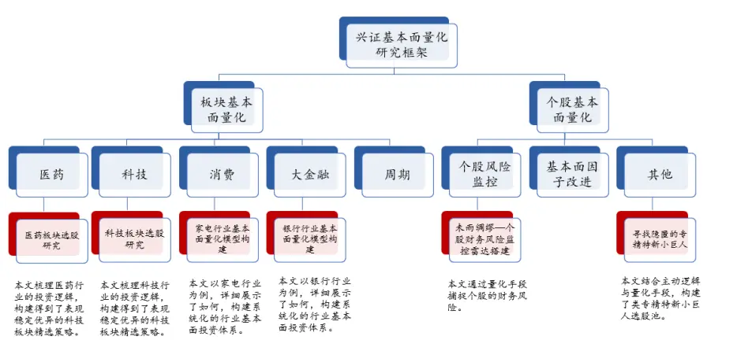
资料来源：兴业证券经济与金融研究院绘制与整理

目前，新能源相关政策密集出台，从各项政策中可以看出，新能源建设当前肩负三大重要使命：一是双碳目标下的清洁能源转型，二是国家能源安全保障，三是作为重要的新基建项目已经成为稳经济促增长的重要抓手。新能源战略地位日益凸显，密集出台的利好政策也充分显示出国家发展新能源的决心和信心，因此，我们希望对新能源板块展开研究。

新能源板块主要囊括光伏、锂电池、风电等细分赛道，其中光伏、锂电池为主要组成成分。以申万行业指数为例，光伏设备、锂电池行业截止 2022年 11月23 日流通市值分别为 25934.90、15065.65 亿元，占新能源板块的 57.72%，33.53%。同时锂电池赛道的个股集中度较高，宁德时代流通市值为 9269.83 亿元，占锂电的 61.53%，Top 3 个股流通市值占比高达 75.82%。单一个股对于锂电池为重要，而这也降低了对于赛道整

图表 2、新能源板块各主要子赛道流通市值分布

| 板块名称 | 流通市值(亿元) | 占比 | 分布 | 流通市值 (亿元) | 占比 |
| --- | --- | --- | --- | --- | --- |
| 光伏设备 | 25934.90 | 57.72% | Top1 个股 | 3608.11 | 13.91% |
|  |  |  | Top 3 个股 | 7349.83 | 28.34% |
|  |  |  | Top 5 个股 | 10488.87 | 40.44% |
| 锂电池 | 15065.65 | 33.53% | Top1 个股 | 9269.83 | 61.53% |
|  |  |  | Top 3 个股 | 11422.78 | 75.82% |
|  |  |  | Top 5 个股 | 12369.05 | 82.10% |
| 风电设备 3931.48 | 8.75% |  |  |  |  |
| 合计 | 44932.03 100% |  |  |  |  |

资料来源：Wind、兴业证券经济与金融研究院整理，截止 2022年 11月23日

从已发行的被动型产品来看，目前光伏相关 ETF 规模为 163.59 亿元，其中华泰柏瑞中证光伏产业 ETF 高达 128.90 亿元；电池相关 ETF 规模合计 50.91 亿元，规模最高的产品为广发国证新能源车电池 ETF为 20.09亿元。

图表 3、光伏行业ETF布局

| 光伏 | 产品代码 | 产品名称 | 上市时间 | 跟踪指数 | 产品规模（亿元） |
| --- | --- | --- | --- | --- | --- |
|  | 515790.SH | 华泰柏瑞中证光伏产业ETF | 2020-12-18 | 光伏产业 | 128.90 |
|  | 159857.SZ | 天弘中证光伏产业ETF | 2021-02-24 | 光伏产业 | 11.43 |
|  | 516880.SH | 银华光伏 50ETF | 2021-01-18 | 光伏产业 | 9.00 |
|  | 159864.SZ | 国泰中证光伏产业ETF | 2021-08-10 | 光伏产业 | 4.06 |
|  | 159863.SZ | 鹏华中证光伏产业ETF | 2021-03-11 | 光伏产业 | 2.64 |
|  | 516290.SH | 汇添富中证光伏产业ETF | 2021-08-23 | 光伏产业 | 2.57 |
|  | 159609.SZ | 浦银安盛中证光伏产业ETF | 2022-07-08 | 光伏产业 | 1.99 |
|  | 159618.SZ | 华安中证光伏产业ETF | 2022-04-22 | 光伏产业 | 1.98 |
|  | 516180.SH | 平安中证光伏产业ETF | 2021-03-03 | 光伏产业 | 1.02 |
|  |  |  |  | 合计 | 163.59 |

资料来源：Wind、兴业证券经济与金融研究院整理，截止 2022年 11月23日

图表 4、电池行业 ETF 布局

|  | 产品代码 | 产品名称 | 上市时间 | 跟踪指数 | 产品规模(亿元) |
| --- | --- | --- | --- | --- | --- |
| 电池 | 159755.SZ | 广发国证新能源车电池 |  |  |  |
|  | 159840.SZ | 工银瑞信国证新能源车电池ETF | 2021-08-20 | 新能电池 | 6.50 |
|  | 159796.SZ | 汇添富中证电池主题ETF | 2022-03-14 | CS 电池 | 6.45 |
|  | 561160.SH | 富国中证电池主题ETF | 2022-07-08 | CS 电池 | 6.16 |
|  | 159757.SZ | 景顺长城国证新能电池ETF | 2021-08-09 | 新能电池 | 5.73 |
|  | 561910.SH | 招商中证电池主题ETF | 2021-08-12 | CS 电池 | 2.47 |
|  | 562880.SH | 嘉实中证电池主题ETF | 2021-07-20 | CS 电池 | 1.92 |
|  | 159767.SZ | 兴银国证新能源车电池ETF | 2021-08-23 | 新能电池 | 1.12 |
|  | 159775.SZ | 建信国证新能源车电池ETF | 2022-01-24 | 新能电池 | 0.47 |
|  |  |  |  | 合计 | 50.91 |

资料来源：Wind、兴业证券经济与金融研究院整理，截止 2022年 11月23日

综合考虑本身赛道集中情况和目前被动型产品关注度，我们将光伏产业链作为新能源板块基本面量化的细分研究对象，构建自上而下三维度的光伏产业链基本面量化模型。从研究成果来看，本文模型具有以下特色：

1、行业+量化紧密合作，深入结合产业信息：通过量化与行业的思维碰撞，本文在构建系统化模型的过程中纳入了众多产业信息。例如，使用估算的光伏重要环节—硅料、硅片、组件、电池、胶膜、玻璃的单位净利信息，来对细分环节采用国内装机、组件出口等数据

构成了光伏产业链景气度重要的量维度指标。

2、基于 SAM 产业链等另类数据落地定性逻辑：在量化与行业合作中，确实也存在一些瓶颈，众多定性逻辑和定量的客观化、可跟踪化需求违背。但幸运的是，在多年的研究中，我们已布局了专利、SAM 产业链等另类数据，这些数据在之前的研究中发挥了重要作用，在基本面量化的研究中，它们同样可以帮助我们去解决一部分难题。例如，本文采用 SAM 产业链数据将个股映射到光伏产业链各重要环节上，从而能够重构细分环节指数，更好的应用行业跟踪的产业数据。

3、基于趋势状态转换连续变量，获取行业分析师核心关注点：事实上，在板块基本面量化的研究过程中，我们逐渐落实了一个核心思想：“对于行业研究，趋势变化的重要性大于绝对水平”。产品的销量、售价等维度的变化趋势更影响行业分析师对于行业的判断，这也是构成行业分析师对赛道景气度分析的重要因素。因此，本文延续了前期报告《家电行业景气度投资模型构建》提出的方法论，将连续的变量通过趋势状态转换为离散的趋势信号，此方法或许丢失了一部分变量的数值信息，但确实能够很好的解决变量极端值等问题，同时也放大了行业关注的趋势变动信息。

本文研究框架如下：

第一章：引言。叙述报告主要成果及特色，对相应方法论进行简单介绍。

第二章：行业复盘，光伏产业链底层趋势因素挖掘。对光伏行业进行复盘，帮助投资者把握光伏行业主要脉络。

第三章：光伏产业链景气度投资模型构建。对行业核心逻辑进行量化，主要包括：1）逻辑一：量的爆发是行业的决定性因素；2）逻辑二：价格是板块的风向标。

## 环节选择。第四章：利润分配，光伏产业链细分基于 SAM 数据库将个股映

射到光伏产业链核心环节，然后基于估算的各环节单位净利来进行子环节的轮动。

第五章：个股决策，光伏产业链金股推荐。依托于子环节选择，基于个股市占率（产品营业收入占比）进行个股推荐。

第六章：模型最新观点。基于模型给出相应的自上而下三维度推荐，确定本期光伏行业景气度、光伏行业子环节优势和相应金股推荐。

## 2、行业复盘，光伏产业链底层驱动因素挖掘

## 2.1、积基树本，认识光伏产业链

伴随着全球能源由求量向求质的改变，发展低密度清洁能源成为重要趋势，光伏等新能源持续发展有着坚实的核心驱动力。目前来看，我国发电仍以火电为主，2021 年，火电发电量占比达到 67.41%，但近年来太阳能发电占比不断提升，已达到 3.9%。同时大型光伏电站的中标电价不断降低，2021 年，沙特地区由于光照资源好，非系统成本低，其光伏电站中标价格已经低至 1.04 美分/kWh，中国最低中标电价为 2.3 美分/kWh，已于 2021 年实现全面平价上网，光伏发电已经全面摆脱补贴的限制，进入全面市场化发展阶段，光伏产业链重要性不断提升。

图表 5、太阳能发电趋势与占总发电量比例变化
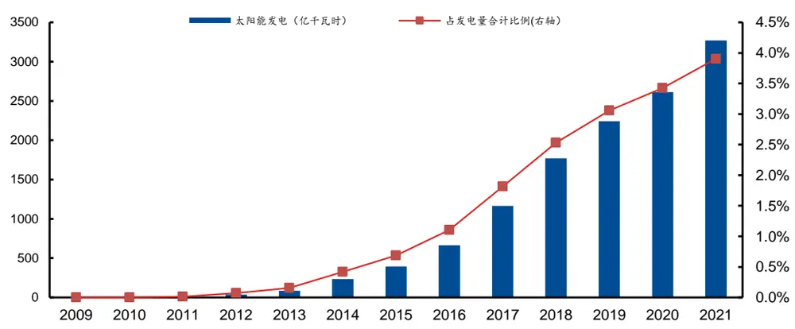
资料来源：中电联电力工业统计数据、兴业证券经济与金融研究院整理

光伏主产业链上游包括原料工业硅以及高纯度多晶硅材料的生产；中游包括硅片、光伏电池片，光伏组件；下游是光伏发电的应用端包括集中式电站和分布式发电。除了主产业链外，光伏亦涉及众多辅材产业链。根据不同生产环节分类，主要包括：1）硅片生产环节：热场材料、金刚线；2）电池片生产环节：银浆；3）组件封装环节：光伏玻璃、胶膜、背板、边框、接线盒等；4）电站发电环节：逆变器、支架、汇流箱、电缆等。

图表 6、光伏主产业链示意图
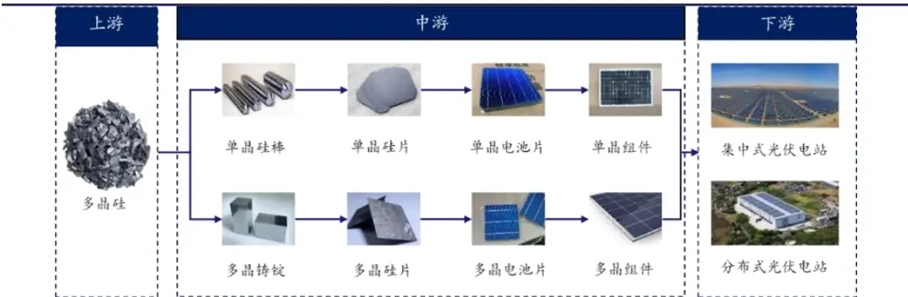
资料来源：晶科能源招股书、兴业证券经济与金融研究院整理

下面我们对光伏产业链重要环节进行介绍。

1、多晶硅：半导体材料的选择是决定光伏电池效率的主要因素。综合各种材料的电学性能，安全性，资源丰富性，无毒无害性等各种因素，硅材料成为目前光伏行业中普遍使用的电池材料；

2、硅片：是将多晶硅通过拉棒或铸锭技术加工成单晶硅棒或多晶硅锭，并在此基础上将单晶硅棒和多晶硅锭经过线切割机加工等步骤制成，是进一步生产电池片的主要原材料；

3、电池片：上游环节生产出来的硅片无法导电，因此需要将单/多晶硅片加工处理得到的可以将太阳的光能转化为电能的半导体薄片，即光伏电池片，经过加工处理得到的电池片决定了光伏组件的发电能力；

4、组件：光伏组件是能单独提供直流电输出且最小不可分割的，具有封装及内部联结的光伏电池组合装置，也是面向下游终端的直接载体。除了电池片这个核心部件外，组件还涉及电气连接装置、封装材料、封装辅材等辅材：1）电气连接装置—接线盒，接线盒能够将组件内产生的电流传输到外部线路；2）封装材料—光伏玻璃、背板：从功能来看，光伏玻璃是能够利用太阳辐射发电并引出电流的特种玻璃，同时也是组件最外层的透光封装面板，主要起透光和保护作用；背板是组件背部的封装材料，以有机高分子类材料为主，也有适用于双玻晶硅 组件的无机物类材料（玻璃背板等）；3）封装辅材——EVA 胶膜、边框：从功能来看，光伏胶膜具备优越的黏着力、耐久性和光学特性，主要将电池片与玻璃、背板粘接，起到保护电池片、隔绝空气的作用；

5、逆变器：逆变器为辅材产业链关注度较高的环节。光伏逆变器是连接太阳能电池板和电网之间的电力电子变换装置，主要功能是将太阳能电池板产生的直流电通过功率模块转换成可以并网的交流电。逆变器的可靠性和安全性直接关系到整个太阳能发电系统的平稳运行，在光伏发电并网整个过程中具有不可替代的重要性。

## 2.2、以史鉴今，回溯行业历史发展

从历史复盘来看，光伏行业的二级市场表现实际取决于需求。根据需求的驱动因素可将光伏发展阶段划分为补贴时代、平价时代两个阶段。在光伏平价之济性，因此随着补贴政策的变动，

光伏行业的需求也随之调整，映射到二级市场上，就是股价表现往往随补贴政策变动而波动。进入平价时代后，光伏发电的经济性不再依赖于政府补贴，并且由于补贴时代中产业链价格长期下行，光伏装机经济性凸显，需求呈现快速增长，驱动光伏行业指数不断上行。

图表7、光伏行业历史表现复盘
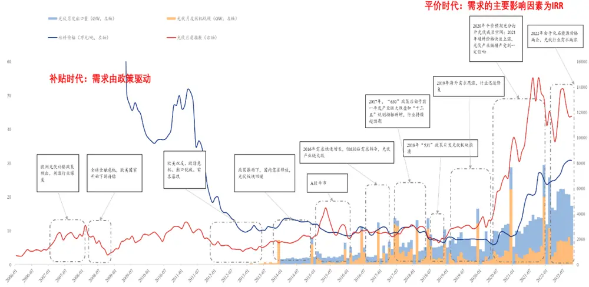
资料来源：Wind、中国能源局、兴业证券经济与金融研究院整理

## 补贴时代：需求由政策驱动

2019 年之前，光伏处于补贴时代，主要内在驱动力在于政策补贴。由于政策波动引发了行业周期，主要观测信号为政策分析与行业风向标跟踪，行业大机会来自于量的爆发。

## 平价时代：需求的主要影响因素为 IRR

2019 年后，发改委和能源局开始引导行业走上平价上网之路。2019 年 1 月两部联合发布《关于积极推进风电、光伏发电无补贴平价上网有关工作的通知》，2020年规定 4月 I～III类资源区新增集中式光伏电站指导价分别为每千瓦时 0.35元、0.4 元、0.49 元，价格已经接近了燃煤标杆上网电价，光伏电价补贴政策的彻底退出已经渐行渐近。有形的手退出，行业周期熨平，成长凸显。光伏逐步凭借自身竞争力赢得市场空间，但光伏行业渗透率仍有很大的提升空间。

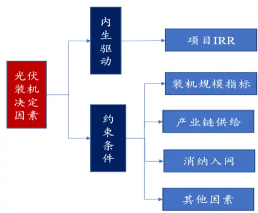
资料来源：兴业证券经济与金融研究院绘制与整理

## 2.3、概览全局，光伏行业分析框架

光伏行业兼具成长与周期属性：平价时代以前政策频繁波动，但行业展现出旺盛的生命力。同时行业也有很强的周期属性，主要体现为需求周期、产能周期和技术周期，补贴时代需求周期本质是政策周期，产能周期受到需求周期和企业盈利、技术革新的共同影响。平价时代，在满足消纳条件约束及电站 IRR 的同时，光伏需求长期向上，需求周期性趋弱，成长属性趋强，而产能周期以及技术周期对于行业的影响将逐渐加强。

图表 9、光伏行业分析框架
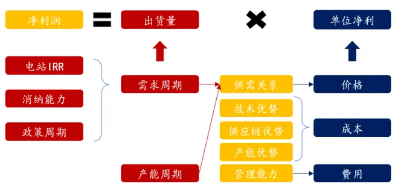
资料来源：兴业证券经济与金融研究院绘制与整理

## 3、光伏产业链景气度投资模型构建

根据光伏产业链复盘，我们提取出光伏产业链景气度判断的几条核心逻辑：1）量的爆发是行业决定性因素；2）价格是板块的风向标；3）技术发展推进行业景气度。

技术变革是光伏成本下降的最大驱动力，是决定电池光电转换效率的关键因素。过去十年间光伏效率提升显著，这与光伏全产业链各环节技术的共同进步是分不开的，其中包括硅料环节改良西门子法，单晶拉棒环节的 RCZ 法，硅片环节的金刚线切割法，电池环节的 PERC电池技术以及组件环节的多主珊技术等，而当前技术进步的脚步仍未停歇，颗粒硅、CCZ、新型电池等技术有望进一步推动行业降本增效。技术发展虽然是人们研究光伏赛道较为关注的要素，但相应的，定量刻画此维度存在较大难度，因此本文暂不将技术纳入我们的定量模型当中。

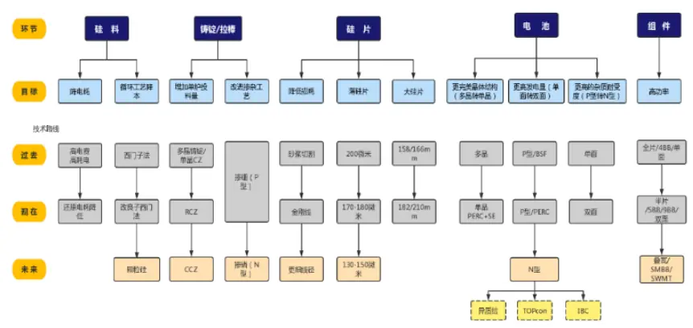
资料来源：北极星光伏网，兴业证券经济与金融研究院整理

下面我们致力于采用量化的手段刻画量、价维度的定性逻辑，并尝试将定性逻辑应用到相应投资策略构建当中。

## 3.1、光伏行业代表指数

光伏典型指数主要包括光伏概念（884045.WI）、光伏产业（931151.CSI）、光伏设备（801735.SI）等，考虑可回溯时间长度和指数表现，我们最终采用申万光伏设备指数作为行业整体表现代表。但在下文的稳健性测试中，可以看出我们构建的景气度信号对于各光伏指数—光伏概念、光伏产业指数亦有很好地效果。

图表 11、光伏典型指数
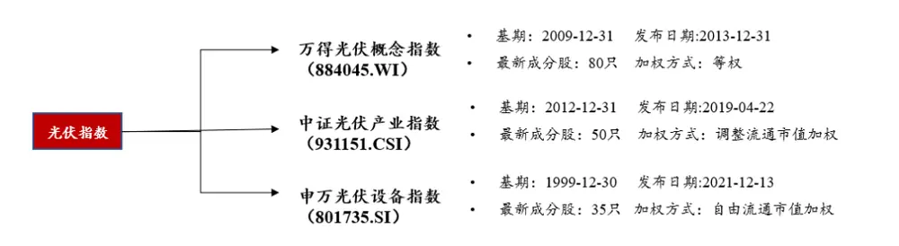
资料来源：Wind、兴业证券经济与金融研究院整理

图表 12、光伏典型指数历史表现（2012-12-31 至 2022-11-22）
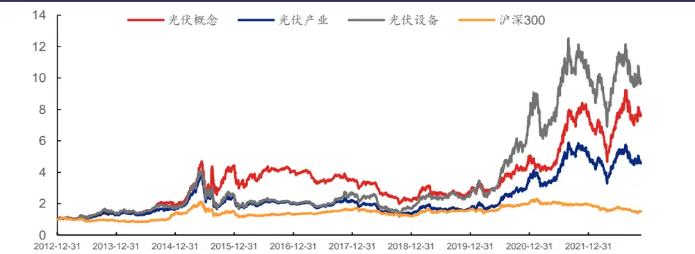
资料来源：Wind、兴业证券经济与金融研究院整理

图表 13、光伏典型指数分年度收益

| 光伏概念 | 光伏产业 | 光伏设备 | 沪深300 |
| --- | --- | --- | --- |
| 2013 33.31% | 31.70% | 42.26% | -7.65% |
| 2014 42.92% | 25.05% | 20.75% | 51.66% |
| 2015 129.15% | 45.39% | 45.07% | 5.58% |
| 2016 -7.39% | -16.70% | -17.41% | -11.28% |
| 2017 -13.74% | 7.96% | 26.27% | 21.78% |
| 2018 -37.72% | -36.96% | -35.81% | -25.31% |
| 2019 26.58% | 24.08% | 50.43% | 36.07% |
| 2020 76.03% | 110.94% | 190.96% | 27.21% |
| 2021 62.47% | 49.26% | 48.00% | -5.20% |
| 2022-11-22 -5.25% | -15.74% | -12.80% | -23.70% |

资料来源：Wind、兴业证券经济与金融研究院整理，注：其中红色为跑输沪深 300

年内光伏发电新增装机规模累计同比变量为例展示综合信号生成步骤。下面以

## 3.2、逻辑一：量的爆发是行业决定性因素

量与价是光伏行业利润的核心因素，但长周期来看，量价齐升的局面可遇而不可求，大多发生在行业产能尚不充沛的早期或技术切换过程中产业链瞬时供需紧张的个别环节。行业周期启动的决定性因素来源于量的超预期爆发。

目前行业重点跟踪量维度指标囊括四个方向：1）国内装机规模；2）组件出口；3）逆变器出口；4）光伏电池出口。

我们采用前期报告《家电行业景气度投资模型构建》中的方式将连续的指标按照趋势状态（分位数水平、趋势变化、幅度变化，持续变动事件）转换为离散的趋势信号值（具体方法详见附录），并基于胜率、盈亏比指标对相应趋势信号有效性进行判断。考虑到光伏的数据较短，为了保证相应信号的稳健性，我们对相应方法论进行一定调整：本文不再测试细分信号的表现，而以变量维度将细分信号转换为综合信号进行分析，同时若历史样本数量小于 12 期时，不计算分位数状态、幅度变化等需要基于历史一段时间的数据。由于样本数据过少，胜率受到单个样本影响较大，在判断相应信号有效性时，我们相对看重盈亏比指标。

## 我们首先提取此变量的趋势信号：

1）分位数水平：当分位数水平大于 60%，认为目前处于高位，趋势信号值为 1；当分位数水平小于 40%时，认为处于低位，趋势信号值为-1；而当分位数水平处于 40%至60%时，认为目前变量处于中枢附近，趋势信号值为 0；

2）趋势变化：本文通过计算变量的月变动值来度量目前变量的短期趋势：即当月变动值大于 0 时认为处在上升趋势，趋势信号为 1；当月变动小于 0 时认为是下跌，趋势信号值为-1；

3）幅度变化：我们计算月涨跌幅的幅度（绝对值）在历史涨跌幅的分位数水平。若大于 50%，我们认为本月变动属于大幅变化，趋势信号值为 1，反之，为小幅变化，趋势信号值为0；

4）持续变动：若信号持续三个月上涨（下跌），则趋势信号值为 1（-1），持续三个月下跌（上涨）后上涨（下跌），则趋势信号值为 1（-1）；

然后我们将各趋势信号等权加总得到取值（-5，5）的离散综合信号值。

图表 14、信号转换：年内光伏发电累计新增装机规模累计同比
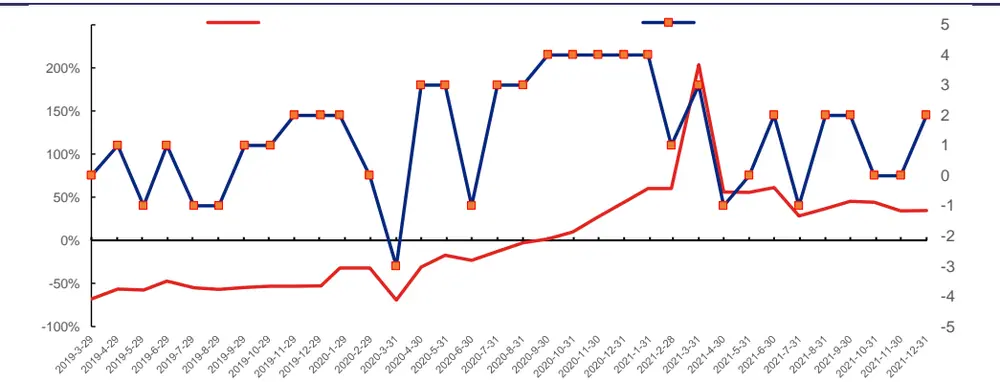
资料来源：中电联电力工业统计数据、兴业证券经济与金融研究院整理

## 3.2.1、国内装机规模

国内装机规模主要有年内光伏发电累计新增装机规模、国内单月光伏发电新增装机规模两类指标。

图表 15、光伏国内装机规模相关指标

| 类别 | 指标 | 开始时间 |
| --- | --- | --- |
| 年内光伏发电累计新增装机规模 | 年内光伏发电累计新增装机规模 | 2018年2月 |
|  | 年内光伏发电新增装机规模累计同比 | 2019年2月 |
|  | 年内光伏发电新增装机规模累计同比边际变化 | 2019年3月 |
| 国内单月光伏发电新增装机规模 | 国内单月光伏发电新增装机规模 | 2018年2月 |
|  | 国内单月光伏发电新增装机规模同比 | 2019年2月 |
|  | 国内单月光伏发电新增装机规模同比边际变化 | 2019年3月 |
|  | 国内单月光伏发电新增装机规模环比 | 2018年3月 |

资料来源：中电联电力工业统计数据、兴业证券经济与金融研究院整理

从下述的测试中，可以看出：1）国内装机规模相关指标的同比指标有效性高于环比指标。国内单月光伏发电新增装机规模同比、年内光伏发电新增装机规模累计同比的胜率都在 60%以上，且盈亏比大于 1，而环比相关指标有效性相对较弱；2）累计数据和单月数据的同比对监控行业都有比较明显的作用，有效性较强。我们选择年内光伏发电新增装机规模累计同比作为国内装机规模维度的核心变量。

图表 16、国内装机规模维度相关信号表现

| 指标 | 交易次数 | 胜率 | 盈亏比 |
| --- | --- | --- | --- |
| 年内光伏发电新增装机规模累计同比 | 33.00 | 60.61% | 1.46 |
| 年内光伏发电新增装机规模累计同比边际变化 | 32.00 | 50.00% | 0.64 |
| 国内单月光伏发电新增装机规模 | 45.00 | 37.78% | 0.61 |
| 国内单月光伏发电新增装机规模同比 | 33.00 | 60.61% | 1.41 |
| 国内单月光伏发电新增装机规模同比边际变化 | 32.00 | 46.88% | 0.63 |
| 国内单月光伏发电新增装机规模环比 | 44.00 | 38.64% | 0.69 |
| 国内单月光伏发电新增装机规模环比边际变化 | 43.00 | 39.53% | 0.59 |

资料来源：中电联电力工业统计数据、Wind、兴业证券经济与金融研究院整理测试信号时间范围为数据起点至 2021年12月，下同

## 3.2.2、光伏组件出口

口主要有组件出口规模、组件出口金额两类指标。

图表 17、光伏组件出口相关指标

| 类别 | 指标 | 开始时间 |
| --- | --- | --- |
| 组件出口规模 | 组件出口规模 | 2016年11月 |
|  | 组件出口规模同比 | 2017年11月 |
|  | 组件出口规模同比边际变化 | 2017年12月 |
|  | 组件出口规模环比 | 2016年12月 |
|  | 组件出口规模环比边际变化 | 2017年1月 |
|  | 组件出口规模累计出口规模 | 2017年2月 |
|  | 组件出口规模累计同比 | 2018年2月 |
| 组件出口金额 | 组件出口规模累计同比边际变化 | 2018年3月 |
|  | 组件出口金额 组件出口金额同比 2017年11月 | 2016年11月 |
|  | 组件出口金额同比边际变化 2017年12月 |  |
|  | 组件出口金额环比 2017年12月 |  |
|  | 组件出口金额环比边际变化 2018年1月 |  |
|  | 组件出口金额累计出口规模 2017年2月 |  |
|  | 组件出口金额累计出口规模边际变化 2017年3月 |  |
|  | 组件出口金额累计同比 2018年2月 |  |
|  | 组件出口金额累计同比边际变化 2018年3月 |  |

资料来源：中电联电力工业统计数据、兴业证券经济与金融研究院整理

从下述的测试中，可以看出：1）组件的出口规模、出口金额中，规模类指标相对有效性更为明显；2）组件的相关指标中，环比、同比的边际变化有效性相对更强，即人们对于组件边际的改变可能更为关注。我们选择组件出口规模累计同比边际变化作为组件出口维度的代理变量。

图表 18、组件出口相关指标表现

| 指标 | 交易次数 胜率 | 盈亏比 |
| --- | --- | --- |
| 组件出口规模 61.00 | 54.10% | 2.23 |
| 组件出口规模同比 49.00 | 55.10% | 1.91 |
| 组件出口规模同比边际变化 |  |  |
| 组件出口规模环比 60.00 | 55.00% | 1.28 |
| 组件出口规模环比边际变化 59.00 | 57.63% | 1.28 |
| 组件出口规模累计同比 46.00 | 56.52% | 1.72 |
| 组件出口规模累计同比边际变化 45.00 | 53.33% | 3.26 |
| 组件出口金额 61.00 | 55.74% | 1.88 |
| 组件出口金额同比 49.00 | 55.10% | 1.45 |
| 组件出口金额同比边际变化 48.00 | 52.08% | 1.70 |
| 组件出口金额环比 60.00 | 56.67% | 1.29 |
| 组件出口金额环比边际变化 59.00 | 55.93% | 1.22 |
| 组件出口金额累计同比 46.00 | 41.30% | 0.88 |
| 组件出口金额累计同比边际变化 45.00 | 55.56% | 2.35 |

资料来源：中电联电力工业统计数据、Wind、兴业证券经济与金融研究院整理

## 3.2.3、逆变器出口

逆变器出口主要有逆变器出口规模、逆变器出口金额两类指标。

图表 19、逆变器出口相关指标

| 类别 | 指标 | 开始时间 |
| --- | --- | --- |
| 逆变器出口规模 |  | 2017年1月 |
|  | 逆变器出口规模同比 | 2018年1月 |
|  | 逆变器出口规模同比边际变化 | 2018年2月 |
|  | 逆变器出口规模环比 | 2017年2月 |
|  | 逆变器出口规模环比边际变化 | 2017年3月 |
|  | 逆变器出口规模累计出口规模 | 2017年1月 |
| 逆变器出口规模累计同比 逆变器出口规模累计同比边际变化 | 2018年1月 |  |
| 逆变器出口金额 | 逆变器出口金额 | 2018年2月 2017年1月 |
|  | 逆变器出口金额同比 | 2018年1月 |
|  | 逆变器出口金额同比边际变化 | 2018年2月 |
|  | 逆变器出口金额环比 | 2017年2月 |
|  | 逆变器出口金额环比边际变化 | 2017年3月 |
|  | 逆变器出口金额累计出口规模 | 2017年1月 |

资料来源：中电联电力工业统计数据、兴业证券经济与金融研究院整理

从下述测试来看，逆变器的出口金额相对来说更能反应出相应的景气度信息，金额类指标有效性高于规模类指标，且指标的单月数值（出口规模、出口金额）的趋势变化更为重要。

图表 20、逆变器出口相关指标表现

| 指标 | 交易次数 胜率 | 盈亏比 |  |  |
| --- | --- | --- | --- | --- |
| 逆变器出口规模 | 58.00 56.90% | 1.72 |  |  |
| 逆变器出口规模同比 | 46.00 | 54.35% |  | 1.35 |
| 逆变器出口规模同比边际变化 | 45.00 | 53.33% |  | 1.38 |
| 逆变器出口规模环比 | 57.00 | 56.14% |  | 1.61 |
| 逆变器出口规模环比边际变化 | 56.00 | 58.93% | 1.57 |  |
| 逆变器出口规模累计同比 | 46.00 | 54.35% | 1.13 |  |
| 逆变器出口规模累计同比边际变化 | 45.00 | 51.11% | 0.99 |  |
| 逆变器出口金额 | 58.00 | 55.17% | 1.89 |  |
| 逆变器出口金额同比 | 46.00 | 58.70% | 1.40 |  |
| 逆变器出口金额同比边际变化 | 45.00 | 48.89% | 0.73 |  |
| 逆变器出口金额环比 |  |  |  |  |
| 逆变器出口金额环比边际变化 | 56.00 | 50.00% | 0.76 |  |
| 逆变器出口金额累计同比 | 46.00 | 54.35% |  |  |
| 逆变器出口金额累计同比边际变化 | 45.00 | 55.56% | 1.33 1.18 |  |

资料来源：中电联电力工业统计数据、Wind、兴业证券经济与金融研究院整理

## 3.2.4、光伏电池出口

光伏电池出口主要有光伏电池出口规模、光伏电池出口金额两类指标。

图表 21、光伏电池相关指标

| 类别 | 指标 | 开始时间 |
| --- | --- | --- |
| 光伏电池出口规模 | 光伏电池出口规模 | 2020年1月 |
|  | 光伏电池出口规模同比 | 2021年1月 |
|  | 光伏电池出口规模同比边际变化 | 2021年2月 |
|  | 光伏电池出口规模环比 | 2020年2月 |
|  | 光伏电池出口规模环比边际变化 | 2020年3月 |
|  | 光伏电池出口规模累计出口规模 | 2020年1月 |
|  | 光伏电池出口规模累计同比 | 2021年1月 |
|  | 光伏电池出口规模累计同比边际变化 | 2021年2月 |
|  | 光伏电池出口金额 | 2020年1月 |
|  | 光伏电池出口金额同比边际变化 | 2021年1月 2021年2月 |
| 光伏电池出口金额 | 光伏电池出口金额环比 | 2020年2月 |
|  | 光伏电池出口金额环比边际变化 | 2020年3月 |
|  | 光伏电池出口金额累计出口规模 | 2020年1月 |
|  | 光伏电池出口金额累计同比 |  |
|  | 光伏电池出口金额累计同比边际变化 | 2021年1月 2021年2月 |

资料来源：中电联电力工业统计数据、兴业证券经济与金融研究院整理

光伏电池的数据长度相对较短，但从信号测试结果来看，多信号展示出了较高的胜率与盈亏比。同时光伏电池出口规模和金额的同比边际变化、累计同比相对有效性较高。最终我们选取光伏电池出口规模累计同比作为光伏电池出口的核心变量。

图表 22、光伏电池出口相关指标表现

| 指标 | 交易次数 | 胜率 | 盈亏比 |
| --- | --- | --- | --- |
| 光伏电池出口规模 | 22.00 | 54.55% | 0.90 |
| 光伏电池出口规模同比 | 10.00 | 60.00% | 1.80 |
| 光伏电池出口规模同比边际变化 | 9.00 | 55.56% | 2.90 |
| 光伏电池出口规模环比 | 21.00 | 52.38% | 1.12 |
| 光伏电池出口规模环比边际变化 | 20.00 | 40.00% | 0.76 |
| 光伏电池出口规模累计同比 | 10.00 | 90.00% | 6.98 |
| 光伏电池出口规模累计同比边际变化 | 9.00 | 44.44% | 1.53 |
| 光伏电池出口金额 | 22.00 | 59.09% | 0.86 |
| 光伏电池出口金额同比 | 10.00 | 60.00% | 1.80 |
| 光伏电池出口金额同比边际变化 | 9.00 | 55.56% | 2.90 |
| 光伏电池出口金额环比 | 21.00 | 38.10% | 0.75 |
| 光伏电池出口金额环比边际变化 | 20.00 | 55.00% | 1.47 |
| 光伏电池出口金额累计同比 | 10.00 | 80.00% | 2.76 |
| 光伏电池出口金额累计同比边际变化 | 9.00 | 44.44% | 1.53 |

资料来源：中电联电力工业统计数据、Wind、兴业证券经济与金融研究院整理

## 3.2.5、基于量的维度构建复合信号分析

综上，我们基于趋势状态（分位数水平、幅度变化、趋势变化、持续变动事件）将相应的连续变量转换为离散信号值进行跟踪，并获取了量的维度的核心指标，具体如下所示。

图表 23、量的维度有效指标筛选

| 维度 指标 |  | 交易次数 胜率 | 盈亏比 |
| --- | --- | --- | --- |
| 国内装机 | 年内光伏发电累计新增装机规模累计同比 33.00 | 60.61% | 1.46 |
| 组件 | 组件出口规模累计同比边际变化 | 45.00 53.33% | 3.26 |
| 逆变器 | 逆变器出口金额 | 58.00 55.17% | 1.89 |
| 电池 | 光伏电池出口规模累计同比 | 10.00 90.00% | 6.98 |

资料来源：中电联电力工业统计数据、Wind、兴业证券经济与金融研究院整理

下面为不同维度核心指标之间的相关性，可以看出基于趋势状态进行转换之后的各维度信号的相关性有明显降低。在转换之前，逆变器与国内装机变量之间的相关性高达 59.75%，但在转换之后相关性仅有 16.25%。

原始连续变量值相关性

|  | 国内装机 | 电池出口 | 组件出口 | 逆变器出口 |
| --- | --- | --- | --- | --- |
| 国内装机 |  | -51.66% | 10.52% | 59.75% |
| 电池出口 | -51.66% |  | -16.96% | -50.00% |
| 组件出口 | 10.52% | -16.96% |  | 2.99% |
| 逆变器出口 | 59.75% | -50.00% | 2.99% |  |

离散趋势信号值相关性

|  | 国内装机 | 电池出口 | 组件出口 | 逆变器出口 |
| --- | --- | --- | --- | --- |
| 国内装机 |  | 26.42% | 7.07% | 16.25% |
| 电池出口 | 26.42% |  | -11.93% | -1.09% |
| 组件出口 | 7.07% | -11.93% |  | 17.19% |
| 逆变器出口 | 16.25% | -1.09% | 17.19% |  |

资料来源：中电联电力工业统计数据、Wind、兴业证券经济与金融研究院整理

有了各维度的信号值之后，下面需要解决的问题是如何将信号值进行合成，在此前的研究中我们简单尝试基于等权进行合成，此方法的好处是较为简单易懂。但等权方法无法展现各指标在不同时间段的重要性变化，因此本文也尝试了过去六个月滚动加权、观点边际变化加权等加权方式。

1、等权：基于等权方式将信号进行合成；

2、过去 6个月滚动胜率加权：基于信号过去6个月的胜率进行加权；

3、观点边际变化加权：基于观点较上月的变化值进行加权；

4、固定比例法：根据相应产品的重要性基于固定比例进行加权，具体的，给与国内装机：组件：逆变器：电池=1：0.6：0.3：0.1的比例进行加权。

从下述表现上来看，滚动胜率加权方式的胜率和盈亏比相对较强。因此，我们选择滚动胜率加权方式来进行加权。

图表 25、基于量的维度有效指标构建择时策略（2017.1-2021.12）

| 加权方式 | 交易次数 | 胜率 | 盈亏比 |
| --- | --- | --- | --- |
| 等权信号合成 | 59 | 66.10% | 2.84 |
| 滚动胜率加权 | 59 | 66.10% | 3.65 |
| 边际变化加权 | 59 | 54.24% | 1.94 |
| 规模边际增加加权 |  |  |  |

资料来源：中电联电力工业统计数据、Wind、兴业证券经济与金融研究院整理

图表 26、不同加权方式分年度多空收益

| 年份 | 光伏设备指数 | 等权信号合成 | 滚动胜率加权 | 边际变化加权 | 固定比例加权 |
| --- | --- | --- | --- | --- | --- |
| 2017 | 24.14% | -1.26% | 1.28% | -1.32% | -1.26% |
| 2018 | -35.81% | -33.77% | -5.23% | -28.13% | -26.44% |
| 2019 | 50.43% | 37.26% | 37.26% | 13.63% | 37.26% |
| 2020 | 190.96% | 210.83% | 210.83% | 61.18% | 210.83% |
| 2021 | 48.00% | 175.04% | 157.58% | 126.50% | 157.58% |

资料来源：中电联电力工业统计数据、Wind、兴业证券经济与金融研究院整理

滚动 6个月胜率加权可以将一些时间变动的信息纳入。如下所示，权重会随时相应胜率情况进行变化，如 2020 年国内装机维度的权重不断提升，而组件的相应重要性有所降低。在 2021 年组件的重要性有所提升，而国内装机、逆变器的重要性有所降低。

图表 27、各维度核心变量权重变化
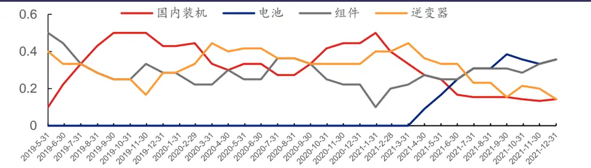
资料来源：中电联电力工业统计数据、Wind、兴业证券经济与金融研究院整理

下面为我们基于过去 6 个月信号的滚动胜率加权构建复合信号，信号平均延续月份为 2.19月（总月数/信号转换次数）。

图表 28、光伏量的维度复合信号走势
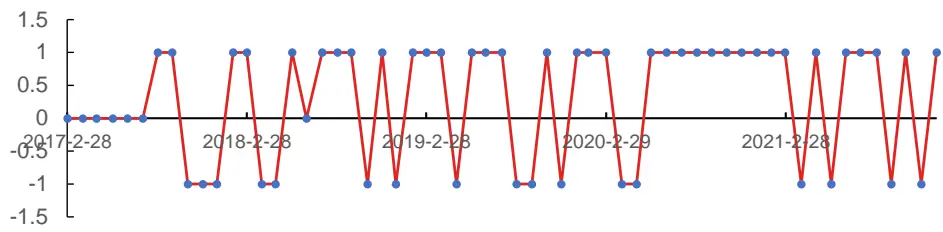
资料来源：中电联电力工业统计数据、Wind、兴业证券经济与金融研究院整理

我们从量的各维度选取核心指标，并通过滚动六个月胜率的方式构建了复合信号，此信号我们认为是行业未来景气度的有效代表变量，而在实践中，分析师一致预期净利润同比也常常被认为是行业景气度的代表变量。因此下文我们对两者进行了对比。可以看出，我们的复合信号在分析师预期出现较大变化（一致预期净利润同比出现明显拐点）时候，也能够出现一定变化，甚至在一些拐点处能够有预示作用。同时我们信号的优势在于能够捕捉更多细微的情绪变化。

净利润同比 图表 29
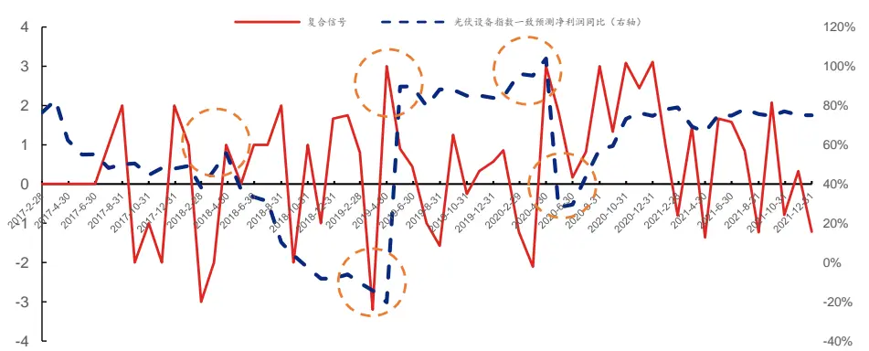
资料来源：中电联电力工业统计数据、Wind、兴业证券经济与金融研究院整理

## 3.2.6、基于量的维度构建光伏行业择时策略

下面我们按照上述复合信号构建光伏行业择时策略，具体方式如下。

1、若信号值大于0，则看多；

2、若信号值小于等于0，则空仓。

根据此方式构建的多头策略年化收益率为 57.10%，收益风险比为 1.86，较申万光伏行业指数的 39.63%有明细提升，同时最大回撤从 44.81%降低为 25.77%。

图表 30、基于量维度复合信号构建的择时策略表现（2017.1-2021.12）

| 年化收益 | 年化波动 | 收益风险比 最大回撤 |
| --- | --- | --- |
| 申万光伏行业指数 39.63% | 38.18% | 1.04 44.81% |
| 多头择时策略 57.10% | 30.72% | 1.86 25.77% |

资料来源：中电联电力工业统计数据、Wind、兴业证券经济与金融研究院整理

图表 31、基于滚动胜率方法加权的复合信号投资表现
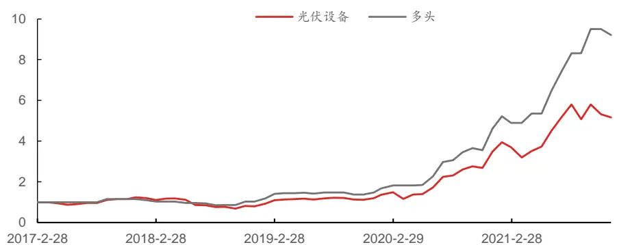
资料来源：中电联电力工业统计数据、Wind、兴业证券经济与金融研究院整理

分年度来看，多头策略大部分年份能够跑赢光伏设备指数， 2017、2019 虽略跑输基准，但绝对收益水平仍保持正值。同时从 2020 年进入平价时代以来，策略表现较为稳健。

图表 32、基于滚动胜率方法加权的复合信号分年度表现

| 2017 24.14% | 14.70% | -9.44% |
| --- | --- | --- |
| 2018 | -35.81% -10.74% | 25.07% |
| 2019 | 50.43% 43.84% | -6.60% |
| 2020 | 190.96% 213.48% | 22.52% |
| 2021 | 48.00% 99.66% | 51.66% |

资料来源：中电联电力工业统计数据、Wind、兴业证券经济与金融研究院整理

我们将 2022 年 1-10 月作为样本外进行回测，可以看出 2022 年信号表现依旧优秀，胜率为60%，多头策略年化收益率为-3.58%，较基准有明显提升。

图表 33、2022年1至10月基于滚动胜率方法加权的复合信号投资表现

|  | 总收益率 | 年化收益 | 年化波动 | 夏普比率 | 最大回撤 |
| --- | --- | --- | --- | --- | --- |
| 光伏设备指数 | -10.81% | -11.73% | 39.92% | -0.29 | 26.15% |
| 多头策略 | -3.29% | -3.58% | 27.11% | -0.13 | 15.60% |
| 多空策略 | 22.56% | 24.85% | 32.40% | 0.77 | 15.60% |

资料来源：中电联电力工业统计数据、Wind、兴业证券经济与金融研究院整理

图表 34、2022年1至10月复合信号各月度表现

| 光伏设备指数 | 信号 多头策略 |  | 超额收益 |
| --- | --- | --- | --- |
| 2022-2-28 10.18% | 1 | 10.18% | 0.00% |
| 2022-3-31 | -8.96% -1 | 0.00% | 8.96% |
| 2022-4-30 | -12.03% 1 | -12.03% | 0.00% |
| 2022-5-31 | 17.04% 1 | 17.04% | 0.00% |
| 2022-6-30 | 21.04% 0 | 0.00% | -21.04% |
| 2022-7-31 | 0.87% 1 | 0.87% | 0.00% |
| 2022-8-31 | -9.21% 1 | -9.21% | 0.00% |
| 2022-9-30 | -7.04% 1 | -7.04% | 0.00% |
| 2022-10-31 | 0.14% 1 | 0.14% | 0.00% |

资料来源：中电联电力工业统计数据、Wind、兴业证券经济与金融研究院整理

图表 35、基于滚动胜率方法加权的复合信号投资表现
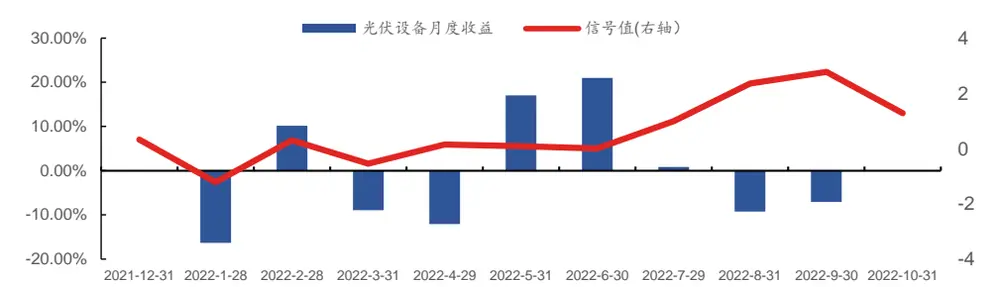
资料来源：中电联电力工业统计数据、Wind、兴业证券经济与金融研究院整理

## 3.2.7、稳健性检验

考虑到光伏行业的数据相对较短，我们进行多个维度稳健性检验，尽可能保证策略的稳定性。

## 1） 多头策略仓位变化

投资者也不会直接降低为空仓，因此我们测试实践中，即使出现悲观信号，

在负面信号（景气度信号小于 0）出现时，降低为不同仓位水平的策略表现。可以看出，即使投资者仅降低仓位到 80%，也能获取相对基准的超额收益，且降低最大回撤。

图表 36、基于复合信号构建的择时策略表现（2017.2-2021.12）

| 策略 |  | 年化收益 | 年化波动 | 收益风险比 | 最大回撤 |
| --- | --- | --- | --- | --- | --- |
| 申万光伏设备指数 |  | 39.63% | 38.18% | 1.04 | 44.81% |
| 基于负面信 号调整仓位 | 多头策略（0） | 57.10% | 30.72% | 1.86 | 25.77% |
|  | 多头策略（0.2） | 54.04% | 31.26% | 1.73 | 28.95% |
|  | 多头策略（0.4） | 50.76% | 32.33% | 1.57 | 32.97% |
|  | 多头策略（0.6） | 47.26% | 33.88% | 1.39 | 36.95% |
|  | 多头策略（0.8） | 43.55% | 35.85% | 1.21 | 40.90% |

资料来源：中电联电力工业统计数据、Wind、兴业证券经济与金融研究院整理注：括号中为景气度小于 0时的仓位水平

## 2） 加权方式参数

上面我们采用滚动六个月的胜率进行加权，下面我们测试计算不同月份的胜的效果，可以看出在 6个月附近的信号表现都较好，同时可以看出回

溯月份短一些相对效果会更优。

图表 37、不同滚动月份的信号胜率
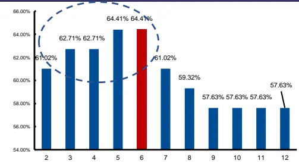

图表 38、不同滚动月份的信号盈亏比
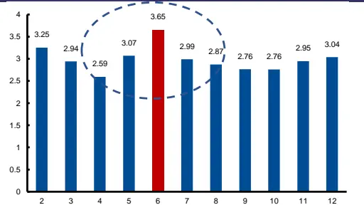
资料来源：中电联电力工业统计数据、Wind、兴业证券经济与金融研究院整理

## 3） 指标选取

我们测试随机从国内装机、组件出口、逆变器出口、电池出口满足基本要求（胜率大于 50%、盈亏比大于 1）的变量中选出二、三、四个变量，基于滚动六个月加权方式构建的综合信号表现，可以看出不管是胜率还是盈亏比都有比目前复合信号更优秀的组合。

图表 39、随机抽取信号胜率与盈亏比
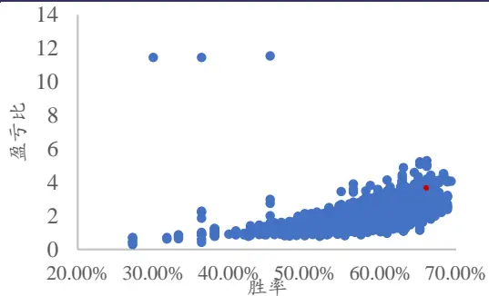
资料来源：中电联电力工业统计数据、Wind、兴业证券经济与金融研究院整理注：其中红色的点为我们上文最终选出的信号

同时上文选择了各维度有效性相对最优的变量做为各维度的核心变量，下面我们也测试若将变量替换为表现稍逊的变量的表现。

图表 40、不同维度次有效信号表现

| 指标 | 交易次数 | 胜率 | 盈亏比 |
| --- | --- | --- | --- |
| 国内单月光伏发电新增装机规模同比 | 33.00 | 60.61% | 1.41 |
| 组件出口金额累计同比边际变化 | 61.00 | 54.10% | 2.23 |
| 逆变器出口规模 | 58.00 | 56.90% | 1.72 |
| 光伏电池出口金额累计同比 | 10.00 | 80.00% | 2.76 |

资料来源：中电联电力工业统计数据、Wind、兴业证券经济与金融研究院整理

下图为替换变量后的信号表现，整体各信号与原始信号表现差距不大。

图表 41、基于量的维度有效指标构建择时策略（2017.1-2021.12）

| 指标 | 交易次数 | 胜率 | 盈亏比 |
| --- | --- | --- | --- |
| 原始 | 59 | 66.10% 3.65 |  |
| 替换国内装机 | 59 | 61.02% | 2.87 |
| 替换组件出口 | 59 | 61.02% | 2.79 |
| 替换光伏电池出口 | 59 | 64.41% | 3.65 |

资料来源：中电联电力工业统计数据、Wind、兴业证券经济与金融研究院整理

图表 42、基于复合信号构建的择时策略表现（2017.1-2021.12）

|  |  | 年化收益 | 年化波动 | 夏普比率 | 最大回撤 |
| --- | --- | --- | --- | --- | --- |
| 光伏设备指数 |  | 39.63% | 38.18% | 1.04 | 44.81% |
| 多头 策略 | 原始信号 | 57.10% | 30.72% | 1.86 | 25.77% |
|  | 替换国内装机 | 45.06% | 27.77% | 1.62 | 25.77% |
|  | 替换组件出口 | 50.41% | 30.47% | 1.65 | 18.91% |
|  | 替换逆变器出口 | 53.63% | 32.54% | 1.65 | 34.35% |
|  | 替换光伏电池出口 | 58.33% | 30.93% | 1.89 | 25.77% |

资料来源：中电联电力工业统计数据、Wind、兴业证券经济与金融研究院整理

## 4）目标指数变化

我们捕捉的是光伏产业链的景气度，因此我们希望此景气度代理指标对于不同的光伏相关指数都能有效，下面我们基于上述复合信号进行光伏概念指数、光伏产业指数的择时，可以看出都有较好的效果。

图表 43、量的维度复合信号对于不同光伏指数胜率及盈亏比（2017.1-2021.12）

| 指标 | 交易次数 | 胜率 | 盈亏比 |
| --- | --- | --- | --- |
| 光伏设备指数 | 59 | 66.10% | 3.65 |
| 光伏概念指数 | 59 | 61.02% | 3.28 |
| 光伏产业指数 | 59 | 67.80% | 3.98 |

资料来源：中电联电力工业统计数据、Wind、兴业证券经济与金融研究院整理

图表 44、基于复合信号构建的不同光伏指数择时策略表现（2017.1-2021.12）

|  | 年化收益 | 年化波动 | 夏普比率 | 最大回撤 |
| --- | --- | --- | --- | --- |
| 光伏设备指数 | 39.63% | 38.18% | 1.04 | 44.81% |
| 多头策略 | 57.10% | 30.72% | 1.86 | 25.77% |
| 光伏概念指数 | 14.55% | 27.72% | 0.52 | 47.58% |
| 多头策略 |  |  |  | 21.59% |
| 光伏产业指数 | 21.61% | 29.62% | 0.73 | 41.30% |
| 多头策略 | 37.48% | 24.29% | 1.54 | 20.83% |

资料来源：中电联电力工业统计数据、Wind、兴业证券经济与金融研究院整理

## 3.3、逻辑二：价格是板块风向标

在由政策驱动时代向平价时代转变过程中，行业从政策补贴刺激装机需求转变成光伏发电成本优势带来的需求，成本端对于需求的影响愈发显著。

图表 45、光伏主产业链价格

| 类别 | 指标 | 指标代码 | 开始时间 | 结束时间 |
| --- | --- | --- | --- | --- |
| 硅料 | 现货价(周平均价):光伏级多晶硅 | S5112463 | 2011-7-13 | - |
| 硅片 | 现货价（周平均价）：多晶硅片 | S5112469 | 2011-7-13 | ■ |
|  | 现货价（周平均价）：单晶硅片 | S5112475 | 2011-7-13 | 2020-12-2 |
| 电池片 (元/瓦) | 现货价（周平均价)：太阳能电池 | S5112481 | 2011-7-13 |  |
| 组件 | 现货价（周平均价)：晶硅光伏组件 | S5112496 | 2011-7-13 |  |

资料来源：Wind、兴业证券经济与金融研究院整理

从历史来看，只要行业需求超预期，短期的价格反弹或下跌并不影响大局（价格往往和产能、需求都有关系），例如 2017年下半年因产能大量投放，单晶硅片价格持续下跌，但隆基绿能股价连续创新高。价格止跌或上涨往往是产业链需求转暖的信号，这种情况往往能带来超额收益，但大的机会仍需要量的超预期爆发。（如 2017年下半年国内市场爆发和 2018年Q4-2019Q2海外市场爆发）。

图表 46、光伏主产业链价格数据历史走势
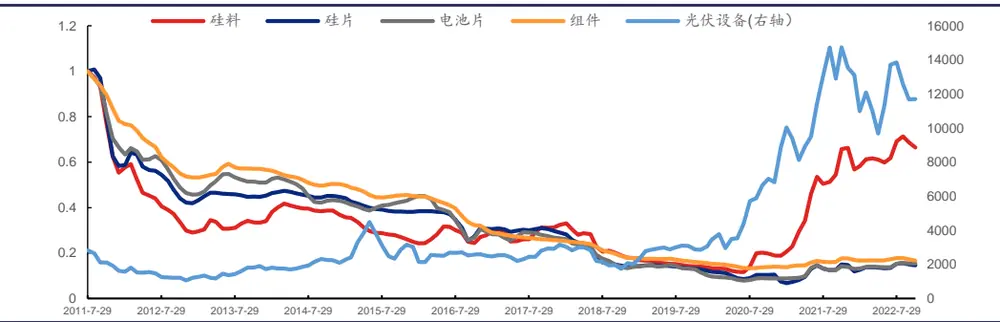
资料来源：Wind、兴业证券经济与金融研究院整理

图表 47、光伏主产业链价格相关系数

|  | 硅料 | 硅片 | 电池片 | 组件 |
| --- | --- | --- | --- | --- |
| 硅料 |  | 51.11% | 48.87% | 47.30% |
| 硅片 | 51.11% |  | 99.03% | 97.83% |
| 电池片 | 48.87% | 99.03% |  | 99.11% |
| 组件 | 47.30% | 97.83% | 99.11% |  |

资料来源：Wind、兴业证券经济与金融研究院整理

来看，硅料为核心制约环节。硅料属于大型化工产业，从行业扩产周期 扩产

周期长达 18 月，造成装机周期和硅料扩产周期的错配。而电池片、组件等环节扩产进程相对更快，时间错配较短。光伏装机、硅料扩张、硅料价格具有闭路反馈传导机制，构成光伏周期性。

图表 48、光伏主产业链扩产周期

|  | 硅料 | 硅片 | 电池 | 组件 |
| --- | --- | --- | --- | --- |
| CR5 | 85.8% | 75.0% | 49.8% | 52.0% |
| 2021年业务毛利率 | 65.56%-66.69% | 20.83%-27.55% | 2.63%-8.81% | 12.43%-17.06% (一体化) |
| 设备投资强度 (亿元/GW) | 2.68 左右 | 1.60-2.0 | 1.3 左右（PERC) 2.1 左右 (TOPCon) | 0.62 左右 |
| 扩产周期 | 18月 | 12月 | 9月 | 6月 |

资料来源：Wind、兴业证券经济与金融研究院整理

图表 49、装机周期与硅料扩产周期形成错配与反馈
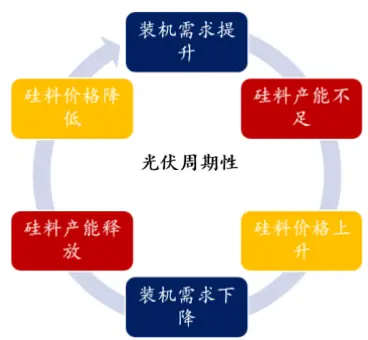
资料来源：兴业证券经济与金融研究院绘制与整理

## 综上，我们选择硅料价格指数作为产业链价格的核心监控因素。同时考虑

到价格的中枢随时间有较大变化，人们往往更为关注其短期的变化趋势，例如目前是否上涨、下跌，因此在构建价格综合信号时我们选择保留相应的趋势变化、持续变动的状态，而不考虑分分位数、幅度变化。

图表 50、光伏产业链价格指标有效性测试

| 指标 |  | 交易次数 | 胜率 盈亏比 |
| --- | --- | --- | --- |
| 硅料环节 | 硅料 125 | 50.40% | 0.95 |
|  | 硅料环比 | 124 | 51.61% 1.12 |
|  | 硅料环比边际变化 | 123 55.28% | 1.56 |
|  | 硅料同比 113 | 49.56% | 0.89 |
|  | 硅料同比边际变化 112 | 48.21% | 0.96 |

资料来源：Wind、兴业证券经济与金融研究院整理

图表 51、基于价维度构建的择时策略表现（2011.9-2021.12）

| 年化收益 | 年化波动 | 夏普比率 | 最大回撤 |
| --- | --- | --- | --- |
| 光伏设备指数 19.35% | 38.47% | 0.50 | 61.17% |
| 多头策略 20.48% | 31.69% | 0.65 | 44.15% |

资料来源：中电联电力工业统计数据、Wind、兴业证券经济与金融研究院整理

图表 52、基于价维度构建的择时策略分年度表现

| 2011.09 | -22.95% | -15.47% | 7.47% |
| --- | --- | --- | --- |
| 2012 | -25.33% | 23.19% | 48.51% |
| 2013 | 42.26% | 15.90% | -26.36% |
| 2014 | 20.75% | 18.03% | -2.72% |
| 2015 | 45.07% | 35.27% | -9.80% |
| 2016 | -17.41% | -18.27% | -0.86% |
| 2017 | 26.27% | 40.74% | 14.47% |
| 2018 | -35.81% | -3.67% | 32.14% |
| 2019 | 50.43% | 9.61% | -40.82% |
| 2020 | 190.96% | 108.92% | -82.04% |
| 2021 | 48.00% | 40.30% | -7.70% |
| 2022.10 | -10.81% | 34.53% | 45.34% |

资料来源：中电联电力工业统计数据、Wind、兴业证券经济与金融研究院整理
注：2011年自 9月开始计算、2022年截止 10月

## 3.4、行业景气度投资模型构建

## 3.4.1、模型表现

下面是我们测试得到的量、价两维度的核心信号，可以看出量的维度指标的有效性相对较强，而价单独构建择时策略效果相对一般。但从相关性来看，两维度囊括的信息有所差异，相关性仅有 12.59%。

图表 53、光伏景气度各维度代理变量

| 维度 指标 |  | 交易次数 | 胜率 | 盈亏比 |
| --- | --- | --- | --- | --- |
| 量 | 年内光伏发电累计新增装机规模累计同比 | 33.00 | 60.61% | 1.46 |
|  | 组件出口规模累计同比边际变化 | 45.00 | 53.33% | 3.26 |
|  | 逆变器出口金额 | 58.00 | 55.17% | 1.89 |
|  | 光伏电池出口规模累计同比 | 10.00 | 80.00% | 6.62 |
| 价 | 硅料环比边际变化 | 123 | 55.28% | 1.56 |

资料来源：中电联电力工业统计数据、Wind、兴业证券经济与金融研究院整理
注：测试区间从数据起点到 2021年12月31日

考虑到量、价两个维度对于判断光伏景气度重要性有明显差异，其中量的维度是大家最关注的核心维度，我们尝试调整价维度信号占比，最终选取量维度比例为 75%，价维度比例为25%构建最终的量、价两维度复合信号。

图表 54、基于量、价的两维度复合信号胜率及盈亏比（2017.1-2021.12）

| 加权方式 | 交易次数 | 胜率 | 盈亏比 |
| --- | --- | --- | --- |
| 量维度复合信号 | 59 | 66.10% 3.65 |  |
| 量、价两维度复合信号 | 59 | 67.80% | 4.20 |

资料来源：中电联电力工业统计数据、Wind、兴业证券经济与金融研究院整理

下面是为我们基于量：价=75%：25%构建复合信号走势，信号平均延续月份为 2.25月（总月数/信号转换次数）。

图表 55、量、价两维度复合信号走势
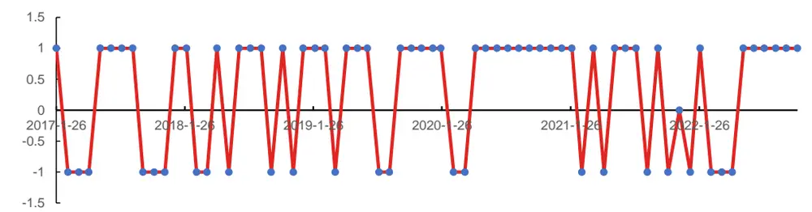
资料来源：中电联电力工业统计数据、Wind、兴业证券经济与金融研究院整理

图表 56、量、价两维度复合信号 vs分析师一致预期净利润同比
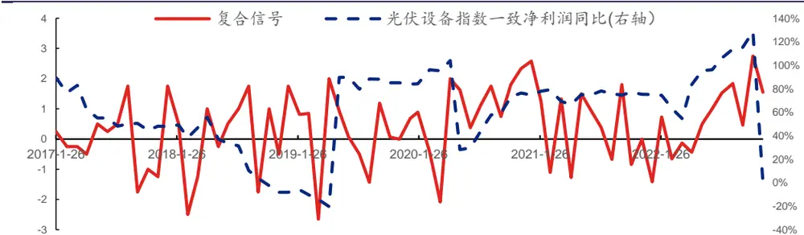
资料来源：中电联电力工业统计数据、Wind、兴业证券经济与金融研究院整理

下面我们按照上述两维度复合信号构建光伏行业择时策略，具体方式如下。

## 2、若信号值小于等于0，则空仓。

多头策略年化收益率为 61.18%，收益风险比为 2.01，较申万光伏行业指数的 39.63%有明细提升，同时最大回撤从 44.81%降低为 25.77%。相较于原始仅基于量维度构建的多头策略，表现亦有所提升。

图表 57、基于价、量二维度复合信号构建的择时策略表现（2017.1-2021.12）

| 年化收益 | 年化波动 | 夏普比率 | 最大回撤 |
| --- | --- | --- | --- |
| 光伏设备指数 39.63% | 38.18% | 1.04 | 44.81% |
| 多头策略（量） 57.10% | 30.72% | 1.86 | 25.77% |
| 多头策略（价、量） 61.18% | 30.46% | 2.01 | 25.77% |

资料来源：中电联电力工业统计数据、德高行、Wind、兴业证券经济与金融研究院整理

图表 58、基于价、量二维度复合信号构建择时策略净值走势
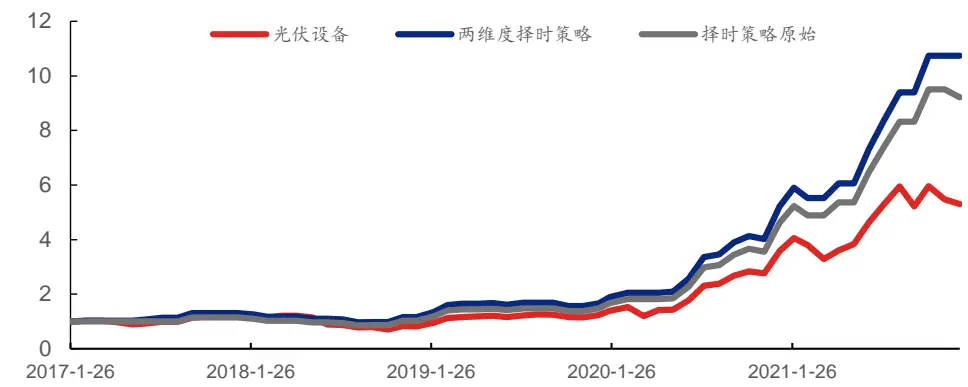
资料来源：中电联电力工业统计数据、德高行、Wind、兴业证券经济与金融研究院整理

从分年度收益来看，加入价之后的信号在 2017、2021、2022 年的表现有所提升。 特别的，在加入价维度后 2022年的表现明显提升，能够实现 13.70%的收益，较基准收益提升较为明显。

图表 59、基于价、量二维度复合信号构建择时策略分年度表现

|  |  | 多头策略 | 超额收益 | 多头策略 | 超额收益 |
| --- | --- | --- | --- | --- | --- |
| 2017 | 24.14% | 14.70% | -9.44% | 30.41% | 2.90% |
| 2018 | -35.81% | -10.74% | 25.07% | -10.74% | 25.07% |
| 2019 | 50.43% | 43.84% | -6.59% | 42.90% | -7.53% |
| 2020 | 190.96% | 213.48% | 22.52% | 213.48% | 22.52% |
| 2021 | 48.00% | 99.66% | 51.66% | 105.94% | 57.94% |
| 2022 | -10.81% | -3.29% | 7.52% | 13.70% | 24.51% |

资料来源：中电联电力工业统计数据、德高行、Wind、兴业证券经济与金融研究院整理

## 3.4.2、稳健性测试

下面我们同样对两维度的复合信号进行稳健性测试。

## 1）权重分配

上文最终选取 25%为最终的参数，下述测试不同权重比例下的复合信号构建择时策略表现，可以看出整体表现较为稳健。

图表 60、不同调整系数下策略表现

| 量维度比例 | 价维度比例 | 年化收益率 | 年化波动率 | 风险收益比 | 最大回撤 |
| --- | --- | --- | --- | --- | --- |
| % |  |  |  |  |  |
| 95.00% | 5.00% | 60.38% | 30.56% | 1.98 | 25.77% |
| 90.00% | 10.00% | 60.38% | 30.56% | 1.98 | 25.77% |
| 85.00% | 15.00% | 60.38% | 30.56% | 1.98 | 25.77% |
| 80.00% | 20.00% | 60.38% | 30.56% | 1.98 | 25.77% |
| 75.00% | 25.00% | 61.18% | 30.46% | 2.01 | 25.77% |
| 70.00% | 30.00% | 59.06% | 30.51% | 1.94 | 25.77% |
| 65.00% | 35.00% | 57.65% | 30.57% | 1.89 | 25.77% |
| 60.00% | 40.00% | 50.01% | 32.65% | 1.53 | 25.77% |
| 55.00% | 45.00% | 50.01% | 32.65% | 1.53 | 25.77% |
| 50.00% | 50.00% | 44.09% | 31.39% | 1.4 | 21.68% |
| 45.00% | 55.00% | 44.38% | 31.42% | 1.41 | 21.68% |
| 40.00% | 60.00% | 35.54% | 31.94% | 1.11 | 21.68% |
| 35.00% | 65.00% | 32.74% | 31.49% | 1.04 | 21.68% |
| 30.00% | 70.00% | 34.95% | 31.54% | 1.11 | 21.68% |
| 25.00% | 75.00% | 34.49% | 31.56% | 1.09 | 21.68% |
| 20.00% | 80.00% | 34.16% | 31.58% | 1.08 | 21.68% |
| 15.00% | 85.00% | 34.16% | 31.58% | 1.08 | 21.68% |
| 10.00% | 90.00% | 34.16% | 31.58% | 1.08 | 21.68% |
| 5.00% | 95.00% | 34.16% | 31.58% | 1.08 | 21.68% |
| 0.00% | 100.00% | 34.16% | 31.58% | 1.08 | 21.68% |

资料来源：中电联电力工业统计数据、Wind、兴业证券经济与金融研究院整理

## 2）变量替换

下面测试选择不同价代表指标的构建的两维度复合策略表现，可以看出选择硅料同比边际变化、硅料环比、硅料环比边际变化指标的策略表现都较好。

图表 61、不同价指标构建复合信号构建的不同光伏指数择时策略表现（2017.1-2021.12）

| 年化收益 | 年化波动 | 夏普比率 | 最大回撤 |
| --- | --- | --- | --- |
| 硅料 44.72% | 27.93% | 1.6 | 25.77% |
| 硅料同比 54.79% | 30.42% | 1.8 | 25.77% |
| 硅料同比边际变化 61.18% | 30.52% | 2.0 | 25.77% |
| 硅料环比 61.18% | 30.46% | 2.01 | 25.77% |
| 硅料环比边际变化 61.18% | 30.46% | 2.01 | 25.77% |

资料来源：中电联电力工业统计数据、Wind、兴业证券经济与金融研究院整理

## 3）目标指数替换

我们测试复合信号对于不同目标指数的效果，可以看出有效性依旧较强。

图表 62、两维度复合信号对于不同光伏指数胜率及盈亏比（2017.1-2021.12）

| 指标 |  |  |  |
| --- | --- | --- | --- |
| 光伏设备指数 | 59 | 66.10% | 3.65 |
| 光伏概念指数 | 59 | 64.41% | 3.79 |
| 光伏产业指数 | 59 | 67.80% | 4.46 |

资料来源：中电联电力工业统计数据、Wind、兴业证券经济与金融研究院整理

图表 63、基于量、价两维度复合信号构建的不同光伏指数择时策略表现

|  | 年化收益 | 年化波动 | 夏普比率 | 最大回撤 |
| --- | --- | --- | --- | --- |
| 光伏设备指数 | 39.63% | 38.18% | 1.04 | 44.81% |
| 多头策略 | 61.18% | 30.46% | 2.01 | 25.77% |
| 光伏概念指数 多头策略 | 14.55% | 27.72% | 0.52 | 47.58% 21.59% |
|  | 31.30% | 23.47% | 1.33 |  |
| 光伏产业指数 | 21.61% | 29.62% | 0.73 | 41.30% |
| 多头策略 | 41.37% | 24.09% | 1.72 | 20.83% |

资料来源：中电联电力工业统计数据、Wind、兴业证券经济与金融研究院整理

## 4、利润分配，光伏产业链细分环节轮动

## 4.1、光伏产业链细分环节划分方法

光伏产业链的研究中，往往基于公司主营产品将其对应到光伏产业链的关键环节中进行分析，例如下图的光伏行业细分环节的竞争格局概览便是按此方式给出。

图表 64、光伏行业细分环节竞争格局
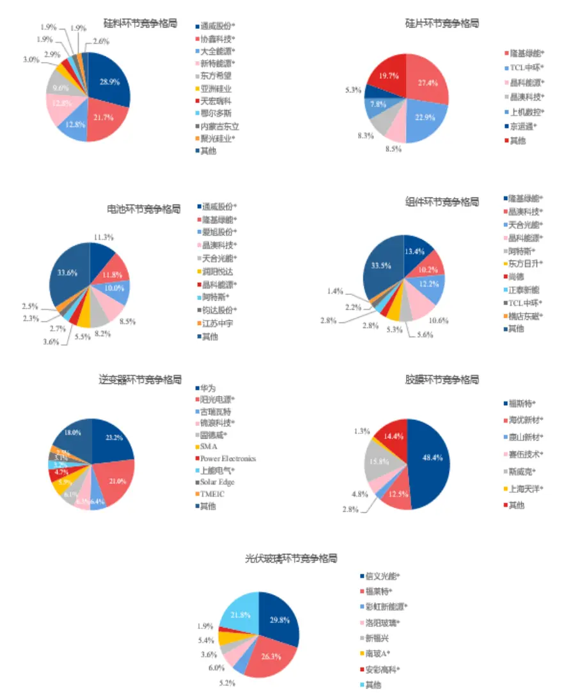
资料来源：资料来源：CPIA,公司公告，Wood Mackenzie，solarzoom、兴业证券经济与金融研究院整理
备注：胶膜、逆变器按出货量计算，其余按照产能计算，*表示公司已上市

为了贴合行业研究逻辑，我们基于 SAM 产业链数据来对光伏子环节进行划分。SAM 产业链数据给定了标准化的数库产品分类，同时还基于标准化的产品，构建了产业链上下游关系网。针对每一个产品节点（即标准化产品），数库均定义了与其在产业链上下游上相关联的产品节点。如下所示，我们可以将隆基绿能公司 2021年年报主营收入划分到不同的标准化产品上。

图表 65、隆基绿能 2021年年报主营收入来源

| 代码 | 报告期 | 产品名称 | 标准化产品 | 主营收入 (亿元) |
| --- | --- | --- | --- | --- |
| 601012 | 2021-12-31 | SE00201203 | 太阳能电池组件 | 584.54 |
| 601012 | 2021-12-31 | SE0020160301 | 单晶硅片 | 170.28 |
| 601012 | 2021-12-31 | FA00300104 | 电力工程 | 19.42 |
| 601012 | 2021-12-31 | PS00500503 | 委托加工 | 17.63 |
| 601012 | 2021-12-31 | UT0050080101 | 太阳能发电 | 5.62 |
| 601012 | 2021-12-31 | 0x0x | 其他 | 11.82 |

资料来源：SAM产业链数据、兴业证券经济与金融研究院整理

因此，通过将下述产品归为光伏相关概念产品，我们将个股划分到不同的光伏环节上，基于此方式可得到不同核心环节的光伏概念股（即主营业务收入中含有光伏概念产品的公司）。

图表 66、光伏相关概念产品

| 环节 | 代码 | 名称 | 说明 |
| --- | --- | --- | --- |
| 硅料 | SE00201608 | 硅材料 | 是重要的半导体材料，包括硅棒、硅锭、硅粉、硅片等。 |
| 硅片 | SE00201603 | 硅片 | 是主要的光伏材料，可以制成各种半导体器件。 |
|  | SE0020160301 | 单晶硅片 | 硅的单晶体，是一种具有基本完整的点阵结构的晶体。 |
|  | SE0020160302 | 多晶硅片 |  |
| 电池 | SE00201201 | 太阳能电池片 | 太阳能电池片的制造，主要是晶体硅电池和薄膜电池。 |
|  | SE00201206 | 太阳能电池板零部件 | 主要是构成太阳能电池组件的一系列零部件。 |
|  | SE0020120601 | 太阳能电池背板膜 | 又称为太阳能电池背板，对电池片起到保护和支撑作用的部件。 |
|  | SE0020120602 | 太阳能焊带 | 又称镀锡铜带或涂锡铜带，光伏组件焊接过程中的重要原材料 |
| 组件 | SE00201203 | 太阳能电池组件 | 又称为太阳能电池板，是由高效晶体硅太阳能电池片、超白布纹钢化玻璃、EVA、透明TPT背板以及铝合金边框组成。 |
|  | SE001002050901 | 太阳能光伏组件生产设备 | 指用于制造太阳能光伏组件的设备。 |
|  | SE001002050001 | 太阳能光伏组件封装设备 | 主要指生产太阳能光伏组件产品的自动化机械封装设备。 |
|  | SE0020120603 | 太阳能接线盒 | 是将太阳能电池产生的电力与外部线路连接的连接器。 |
| 逆变器 | FA0040010901 | 光伏逆变器 | 又称电源调整器，是指使用在太阳能发电系统中的逆变器。 |
| 玻璃 | CM00100302 | 光伏玻璃 | 一种将太阳能电池片通过胶片密封在一片低铁玻璃和一片背面玻璃的中间、从而有更多的光线透过率产生更多的电能的高科技玻璃产品。 |
| 胶膜 | CC001009040304 | 太阳能 EVA 胶膜 | 是一种热固性有粘性的胶膜，用于放在夹胶玻璃中间。 |

资料来源：SAM产业链数据、兴业证券经济与金融研究院整理

但上述直接基于数据库构建的概念股存在一定问题，部分个股与行业分析的光伏产业链概念股差距甚大。为了更好的贴合行业真实情况，我们在上述个股基

1、剔除半导体公司：硅材料、硅片的产品在半导体相关公司中也会出现，例如沪硅产业-U、立昂微虽在 SAM 数据库中标准化产品也为硅片，但实际与光伏产业链并无关系，属于半导体概念公司，因此我们结合申万行业分类将归属于半导体赛道的公司进行剔除；

图表 67、半导体概念公司示例

| 公司名称 | 公司标准化产品 | 申万二级行业 | 申万三级行业 |
| --- | --- | --- | --- |
| 沪硅产业-U | 硅片 | 半导体 | 半导体材料 |
| 立昂微 | 硅片 | 半导体 | 半导体材料 |

资料来源：SAM产业链数据、Wind、兴业证券经济与金融研究院整理

2、删除光伏产品占比过低公司：部分公司的光伏产品业务占比过低，实践中并不纳入光伏产业链进行考虑，因此我们剔除相应产品收入占公司营业收入比例低于 1%的公司；

图表 68、光伏产品占比过低公司示例（2021-12-31）

| 公司名称 | 标准化产品 | 产品收入 (亿元) | 营业收入 (亿元) | 占比 | 申万二级行 业 | 申万三级 级行业 |
| --- | --- | --- | --- | --- | --- | --- |
| 康跃科技 | 太阳能电池组件 | 0.06 | 23.62 | 0.24% | 中药Ⅱ | 中药Ⅲ |

资料来源：SAM产业链数据、Wind、兴业证券经济与金融研究院整理

3、硅材料环节再划分：硅材料产品中也囊括了硅片，硅棒，因此我们手动将 TCL中环、京运通等公司划分到硅片中，而非硅料。

通过以上调整后，我们得到各光伏环节的概念公司，如下表展示了硅料、硅片环节的最新一期公司，通过此方式将特变电工、京运通、恒星科技等不归属于申万光伏设备行业，但含有光伏相关产品的公司也能囊括进我们的考虑范围内。

图表 69、硅料环节概念公司（2021-12-31）

| 代码 | 公司简称 | 产品 收入 (亿元) | 占比 | 申万二级行业 | 申万三级行 业 |
| --- | --- | --- | --- | --- | --- |
| 600089.SH |  |  |  |  | 输变电设备 |
| 600438.SH | 通威股份 | 51.79 | 29.55% | 光伏设备 | 硅料硅片 |
| 688303.SH | 大全能源 | 23.91 | 99.61% | 光伏设备 | 硅料硅片 |

资料来源：SAM产业链数据、Wind、兴业证券经济与金融研究院整理

图表 70、硅片环节概念公司（2021-12-31）

| 代码 | 公司简称 | 产品 收入 (亿元) | 占比 | 申万二级行业 | 申万三级行业 |
| --- | --- | --- | --- | --- | --- |
| 002129.SZ | TCL 中环 | 149.21 | 88.36% | 光伏设备 | 硅料硅片 |
| 601012.SH | 隆基绿能 | 129.13 | 39.25% | 光伏设备 | 光伏电池组件 |
| 688223.SH | 晶科能源 | 7.92 | 2.68% | 光伏设备 | 光伏电池组件 |
| 601908.SH | 京运通 | 5.55 | 26.96% | 电力 | 光伏发电 |
| 603185.SH | 上机数控 | 2.52 | 31.29% | 光伏设备 | 光伏加工设备 |
| 002132.SZ | 恒星科技 | 1.50 | 4.42% | 通用设备 | 金属制品 |

资料来源：SAM产业链数据、Wind、兴业证券经济与金融研究院整理

从下图可以看出，目前组件概念公司相对最多，而硅料、胶膜、玻璃等环节的公司相对较少。

图表 71、子环节概念股个数
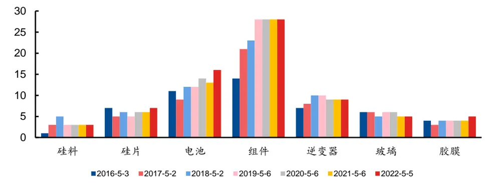
资料来源：SAM产业链数据、Wind、兴业证券经济与金融研究院整理

图表 72、光伏概念股个数数量
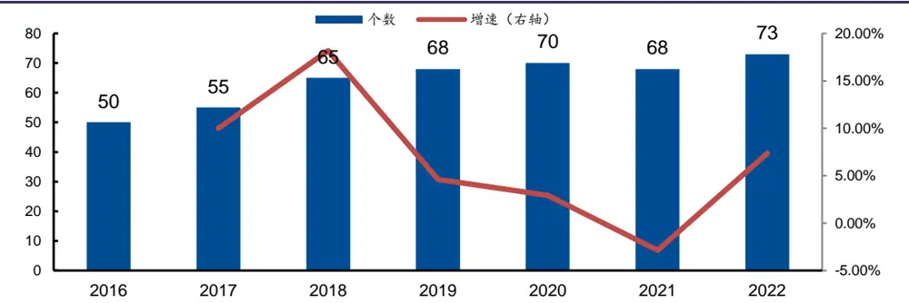
资料来源：SAM产业链数据、Wind、兴业证券经济与金融研究院整理

我们通过如下步骤构建各细分环节指数：

1、 测试时间段：2016.05.03—2022.10.30

2、调仓频率：每年五月的第一个交易日

3、 加权方式：等权

4、股票池：剔除上市不满 180天的各细分环节概念股

硅料、硅片、逆变器环节的弹性较大，从指数历史表现来看，长期表现优秀。

图表 73、各光伏环节公司等权净值表现
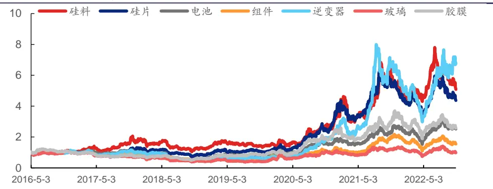
资料来源：SAM产业链数据、聚源、兴业证券经济与金融研究院整理

图表 74、各光伏环节收益相关性

|  | 硅料 | 硅片 | 电池 | 组件 | 逆变器 | 玻璃 | 胶膜 |
| --- | --- | --- | --- | --- | --- | --- | --- |
| 硅料 |  | 67.59% | 49.04% | 58.15% | 43.03% | 59.09% | 54.82% |
| 硅片 | 67.59% |  | 66.22% | 75.43% | 52.17% | 75.43% | 65.25% |
| 电池 | 49.04% | 66.22% |  | 85.59% | 54.88% | 72.98% | 84.77% |
| 组件 | 58.15% | 75.43% | 85.59% |  | 60.36% | 84.18% | 79.46% |
| 84% |  |  |  |  |  |  | 47.13% |
| 玻璃 | 59.09% | 75.43% | 72.98% | 84.18% | 46.84% |  | 72.60% |
| 胶膜 | 54.82% | 65.25% | 84.77% | 79.46% | 47.13% | 72.60% |  |

资料来源：SAM产业链数据、聚源、兴业证券经济与金融研究院整理

## 4.2、利润分配，各细分环节轮动模型构建

事实上，光伏产业链作为一个垂直的产业链，利润分配是进行细分环节投资较为重要的要素，部分环节在光伏整体景气度上行时更能收益，这也能够指导我们进行相应细分环节的选择。

细分环节利润可用出货量*单位净利估算，其中出货量较难得到数据，因此我们通过产业价格估算得到 2021 年 1 月以来周度的各细分环节的单位净利变动，具体包括硅料、硅片、组件、电池、胶膜、玻璃环节来捕捉利润分配信息。同时逆变器由于不同产品之间的规模差距较大，无法对单位净利进行估算，考虑到逆变器的行业指数走势与组件相关性较大，我们用组件环节信号决定了逆变器环节的配置。

图表 75、子环节单位净利走势：以硅料为例（万元/吨）
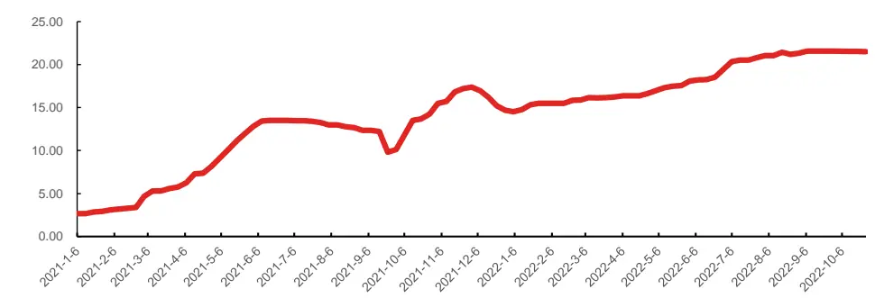
资料来源：百川盈孚、盖锡咨询、Wind、聚源、兴业证券经济与金融研究院整理

## 4.2.1、周度调仓策略

我们基于周度单位净利变动来构建子环节轮动，具体的，

1、方法一（选择单位净利变动大于 0）：计算每周单位净利变动大于 0 的子环节进行等权配置，若无则全子环节等权。

2、方法二（选择单位净利变动排名靠前环节）：计算每周单位净利变动排名靠前的子环节进行等权配置。

从下表可以看出，基于利润分配数据进行配置能够带来较好的收益表现，全环节等权年化收益率为 20.70%，收益风险比为 0.59，而若选择周度单位净利变动前二的行业年化收益率可达 71.84%，收益风险比为1.74。

图表 76、基于利润分配构建周度调仓子环节轮动策略（2021.1.6-2022.10.28）

|  |  | 年化收益 | 年化波动 | 收益风险比 | 最大回撤 |
| --- | --- | --- | --- | --- | --- |
| 等 权 | 全子环节等权 | 20.70% | 35.18% | 0.59 | 36.98% |
| 轮 动 | 选择单位净利变动大于0环节 | 51.29% | 37.39% | 1.37 | 27.91% |
|  | 选择单位净利变动前二环节 | 71.84% | 41.32% | 1.74 | 30.36% |
|  | 选择单位净利变动前三环节 | 49.24% | 38.38% | 1.28 | 30.22% |
|  | 选择单位净利变动前四环节 | 42.72% | 37.31% | 1.15 | 32.16% |
|  | 选择单位净利变动前六环节 | 27.01% | 35.64% | 0.76 | 35.88% |
| 指 数 | 光伏设备 | 10.82% | 40.74% | 0.27 | 38.11% |
|  | 光伏概念 | 24.55% | 32.57% | 0.75 | 36.62% |
|  | 光伏产业 | 11.10% | 34.93% | 0.32 | 38.57% |

资料来源：SAM产业链数据、百川盈孚、盖锡咨询、Wind、聚源、兴业证券经济与金融研究院整理

图表 77、基于利润分配构建周度调仓子环节轮动策略分年度收益（2021.1.8-2022.10.28）

| 等权 | 选择大于0 | 选择前二 |  |
| --- | --- | --- | --- |
| 2021 | 54.11% | 88.24% | 130.49% |
| 2022 | -8.18% | 14.05% | 17.82% |

资料来源：SAM产业链数据、百川盈孚、盖锡咨询、Wind、聚源、兴业证券经济与金融研究院整理

图表 78、基于利润分配构建周度调仓子环节轮动策略净值
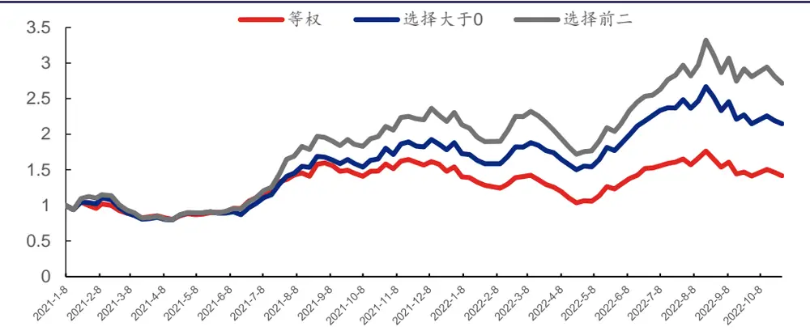
资料来源：SAM产业链数据、百川盈孚、盖锡咨询、Wind、聚源、兴业证券经济与金融研究院整理

## 4.2.2、月度调仓策略

下面我们基于周度单位净利变动来构建月度调仓的子环节轮动策略，具体的，法一（选择单位净利变动大于 0）：每月底选择最近一周1 单位净利变动

大于0的子环节进行等权配置，若无则全子环节等权。

2、方法二（选择单位净利变动排名靠前环节）：每月底选择最近一周单位净利变动居前的子环节进行等权配置。

从下表可以看出，基于利润分配数据进行配置能够带来较好的收益表现，全环节等权年化收益率为 20.70%，收益风险比为 0.59，而若选择周度单位净利变动前二的行业年化收益率可达 44.79%，收益风险比为0.90。

图表 79、基于利润分配构建月度调仓子环节轮动策略（2021.1.6-2022.10.30）

|  |  | 年化收益 | 年化波动 | 收益风险 比 | 最大回撤 |
| --- | --- | --- | --- | --- | --- |
| 等权 | 全子环节等权 | 20.29% | 42.44% | 0.48 | 34.78% |
| 轮动 | 选择单位净利变动大于0环节 | 34.75% | 44.30% | 0.78 | 22.12% |
|  | 选择单位净利变动前二环节 | 44.79% | 49.75% | 0.9 | 23.73% |
|  | 选择单位净利变动前三环节 | 35.43% | 44.88% | 0.79 | 26.18% |
|  | 选择单位净利变动前四环节 | 25.70% | 43.88% | 0.59 | 33.20% |
|  | 选择单位净利变动前五环节 | 24.88% | 45.22% | 0.55 | 33.25% |
|  | 选择单位净利变动前六环节 | 22.29% | 43.40% | 0.51 | 34.94% |
|  | 光伏设备 | 10.82% | 40.74% | 0.27 | 38.11% |
|  | 光伏产业 | 11.10% | 34.93% | 0.32 | 38.57% |

资料来源：SAM产业链数据、百川盈孚、盖锡咨询、Wind、聚源、兴业证券经济与金融研究院整理

图表 80、基于利润分配构建月度调仓子环节轮动策略分年度收益（2021.1.8-2022.10.28）

|  | 等权 | 选择大于0 | 选择前二 |
| --- | --- | --- | --- |
| 2021 | 54.56% | 55.87% | 80.71% |
| 2022 | -9.23% | 10.83% | 9.06% |

资料来源：SAM产业链数据、百川盈孚、盖锡咨询、Wind、聚源、兴业证券经济与金融研究院整理

图表 81、基于利润分配构建月度调仓子环节轮动策略净值
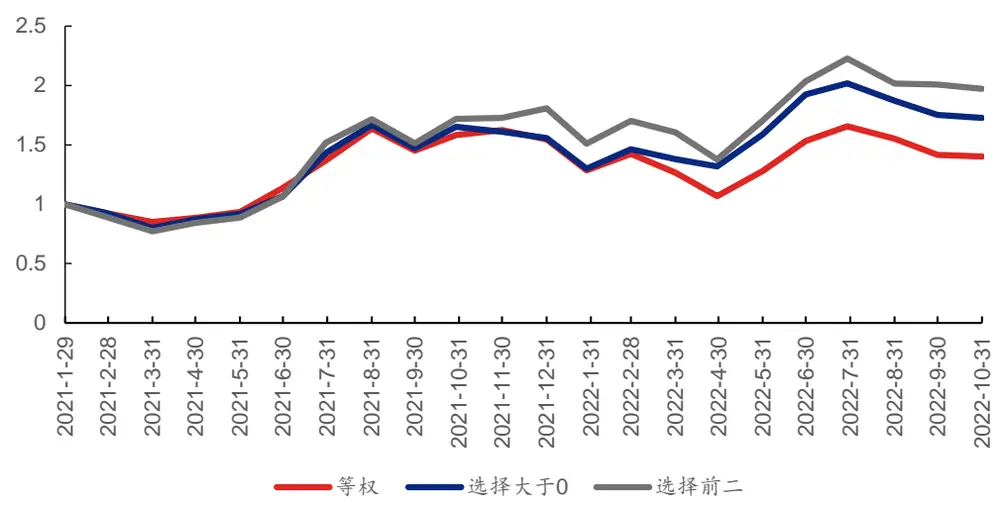
资料来源：SAM产业链数据、百川盈孚、盖锡咨询、Wind、聚源、兴业证券经济与金融研究院整理

## 环节4.3轮动策略、信号复合，叠加景气度择时后的子

## 4.3.1、周度调仓策略

下面我们将相应景气度信号与子环节轮动进行结合，即若最近的景气度信号大于 0，则进行子环节的轮动，若景气度信号小于 0，则空仓。可以看出两者叠加能够进一步提升策略表现。

图表 82、叠加景气度后的周度调仓子环节轮动策略表现（2021.1.6-2022.10.28）

|  | 年化收益 | 年化波动 | 收益风险比 | 最大回撤 |
| --- | --- | --- | --- | --- |
| 等权 | 20.70% | 35.18% | 0.59 | 36.98% |
| 选择单位净利变动大于0环节 | 51.29% | 37.39% | 1.37 | 27.91% |
| 叠加景气度 | 79.54% | 30.79% | 2.58 | 19.56% |
| 选择单位净利变动前二环节 | 71.84% | 41.32% | 1.74 | 30.36% |
| 叠加景气度 | 108.92% | 34.46% | 3.16 | 18.24% |
| 光伏设备 | 10.82% | 40.74% | 0.27 | 38.11% |
| 光伏概念 | 24.55% | 32.57% | 0.75 | 36.62% |
| 光伏产业 | 11.10% | 34.93% | 0.32 | 38.57% |

资料来源：SAM 产业链数据、百川盈孚、盖锡咨询、中电联电力工业统计数据、Wind、聚源、兴业证券经济与金融研究院整理

图表 83、叠加景气度后的周度调仓子环节轮动策略分年度收益（2021.1.6-2022.10.28）

| 等权 | 选择大于0 | 选择前二 |
| --- | --- | --- |
| 2021 54.11% | 129.89% | 171.76% |
| 2022 -8.18% | 32.35% | 49.95% |

资料来源：SAM产业链数据、百川盈孚、盖锡咨询、Wind、聚源、兴业证券经济与金融研究院整理

图表 84、叠加景气度后的周度调仓子环节轮动策略净值（2021.1.6-2022.10.28）
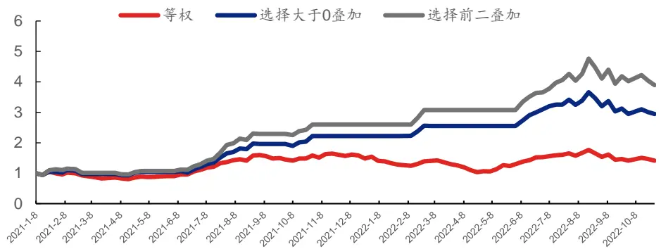
资料来源：SAM 产业链数据、百川盈孚、盖锡咨询、中电联电力工业统计数据、Wind、聚源、兴业证券经济与金融研究院整理

## 4.3.2、月度调仓策略

下面我们同样将相应景气度信号与子环节轮动进行结合，可以看出也能有明显的效果提升。

叠加景气度后的月度调仓子环节轮动策略表现图表 85（2021.1.6-2022.10.28）

|  | 年化收益 | 年化波动 | 收益风险比 | 最大回撤 |
| --- | --- | --- | --- | --- |
| 等权 | 20.29% | 42.44% | 0.48 | 34.78% |
| 选择单位净利变动大于0环节 | 34.75% | 44.30% | 0.78 | 22.12% |
| 叠加景气度 | 66.05% | 34.74% | 1.9 | 14.40% |
| 选择单位净利变动前二环节 | 44.79% | 49.75% | 0.9 | 23.73% |
| 叠加景气度 | 75.39% | 39.34% | 1.92 | 11.51% |
| 光伏设备 | 10.82% | 40.74% | 0.27 | 38.11% |
| 光伏概念 | 24.55% | 32.57% | 0.75 | 36.62% |
| 光伏产业 | 11.10% | 34.93% | 0.32 | 38.57% |

资料来源：SAM 产业链数据、百川盈孚、盖锡咨询、中电联电力工业统计数据、Wind、聚源、兴业证券经济与金融研究院整理

图表 86、叠加景气度后的月度调仓子环节轮动策略分年度收益（2021.1.6-2022.10.28）

|  | 等权 | 选择单位净利变动大于0环节 | 选择单位净利变动前二环节 |
| --- | --- | --- | --- |
| 2021 | 54.11% | 129.89% | 171.76% |
| 2022 | -8.18% | 32.35% | 49.95% |

资料来源：SAM产业链数据、百川盈孚、盖锡咨询、Wind、聚源、兴业证券经济与金融研究院整理

策略净值（2021.1.6-2022.10.28）
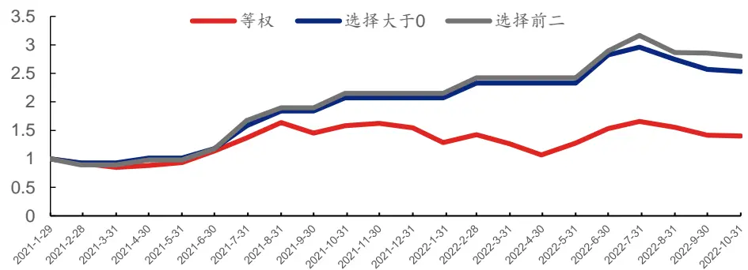
资料来源：SAM 产业链数据、百川盈孚、盖锡咨询、中电联电力工业统计数据、Wind、聚源、兴业证券经济与金融研究院整理

## 5、个股决策，光伏产业链金股推荐

本文采用产业信息进行个股推荐，具体的，我们在每周筛选单位净利变动前二的环节中选择市占率（产品的收入占比）居前的个股进行等权配置，可以看出，通过此方法能够有明显的相对基准的表现。

图表 88、基于市占率构建选股策略表现（2021.01 -2022.10）

|  |  | 年化收益 | 年化波动 | 夏普比率 | 最大回撤 |
| --- | --- | --- | --- | --- | --- |
| 周度定比 | 等权基准 | 27.63% | 33.54% | 0.82 | 44.41% |
|  | 定比策略前 10% | 40.23% | 46.60% | 0.86 | 35.70% |
|  | 定比策略前 20% | 49.68% | 46.70% | 1.06 | 36.79% |
|  | 定比策略前 30% | 73.06% | 45.48% | 1.61 | 31.78% |
|  | 定比策略前 40% | 71.00% | 44.06% | 1.61 | 39.11% |
|  | 定比策略前 50% | 72.82% | 42.98% | 1.69 | 38.49% |
| 周度定量 | 等权基准 | 28.87% | 32.97% | 0.88 | 44.55% |
|  | 定量策略（前10） | 90.02% | 44.29% | 2.03 | 37.71% |
|  | 定量策略（前20） | 73.25% | 38.68% | 1.89 | 38.76% |

资料来源：SAM 产业链数据、百川盈孚、盖锡咨询、中电联电力工业统计数据、德高行、Wind、聚源、兴业证券经济与金融研究院整理

图表 89、基于市占率构建选股策略表现净值
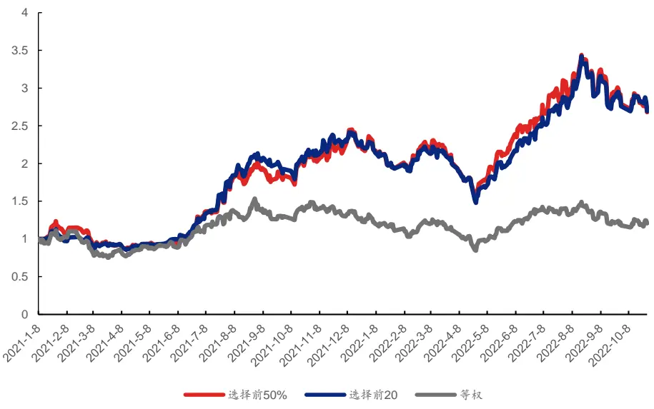
中电联电力工业统计数据、德高行、
Wind、聚源、兴业证券经济与金融研究院整理

图表 90、基于市占率构建选股策略分年度收益（2021.01.06-2022.10.30）

|  | 选择前 50%只个股 | 选择前 20 只个股 | 等权 |
| --- | --- | --- | --- |
| 2021-12-31 | 136.36% | 128.65% | 32.54% |
| 2022-10-28 | 13.44% | 17.78% | -8.81% |

资料来源：SAM 产业链数据、百川盈孚、盖锡咨询、中电联电力工业统计数据、德高行、Wind、聚源、兴业证券经济与金融研究院整理

## 6、最新模型观点

## 6.1、光伏板块景气度信号

目前量的维度中逆变器、电池两个细分环节的景气度较高，整体呈上涨趋势，从最终量维度信号值来看为 2.4，较上月的 3 有小许回落。同时硅料环比边际变化下降，整体价的维度信号值为-1。

综合来看，12 月的光伏整体信号值为 1.55，较上月 2.75 有一定回落，但整体还是处于景气度较高的状态。

图表 91、最新一期（2022.12）各维度信号概览

| 信号名称 | 量的维度 |  |  |  | 价的维度 |
| --- | --- | --- | --- | --- | --- |
|  | 装机规模 | 组件 | 逆变器 | 电池 | 硅料环比边际变化 |
| 分位数水平 | 1 | -1 | 1 | 0 |  |
| 趋势变化 | -1 | -1 | 1 | 1 | -1 |
| 大幅度变化 | 0 | 0 | 0 | 1 |  |
| 持续上涨 | 0 | 0 | 1 | 1 | 0 |
| 持续下跌 | 0 | 0 | 0 | 0 | 0 |
| 持续上涨后下跌 |  |  |  |  |  |
| 持续下跌后上涨 | 0 | 0 | 0 | 0 | 0 |
| 趋势综合信号 | 0 | -2 | 3 | 3 | -1 |
| 过去六个月胜率 | 16.67% | 0.00% | 50.00% | 16.67% |  |
| 信号权重 | 0.2 | 0 | 0.6 | 0.2 |  |
| 复合信号 | 2.4 |  |  |  | -1 |
| 权重 | 0.75 |  |  |  | 0.25 |

资料来源：SAM 产业链数据、百川盈孚、盖锡咨询、中电联电力工业统计数据、Wind、聚源、兴业证券经济与金融研究院整理

## 6.2、细分环节轮动

目前电池单位净利改善较为明显，较最近一周上升 0.175003，而硅片下降最为明显。综合来看，本周（2022-12-2）较为推荐电池、逆变器、组件环节。

图表 92、最新一期（2022.12.2）各细分环节利润分配变动

|  | 周度单位净利变动 | 排名 |
| --- | --- | --- |
| 硅料 | 0 | 5 |
| 硅片 | -3.05986 | 7 |
| 电池 | 0.175003 | 1 |
| 胶膜 | -0.64896 | 6 |
| 玻璃 | 0.012968 | 4 |
| 逆变器 | 0.045578 | 2.5 |

资料来源：百川盈孚、盖锡咨询、中电联电力工业统计数据、Wind、聚源、兴业证券经济与金融研究院整理

## 6.3、光伏产业链个股关注

下表为逆变器、电池环节概念股，其中阳光电源、爱旭股份相应市占率较高。

图表 93、最新一期（2022-12-2）个股关注（基于产业景气度）

| 证券代码 | 证券名称 | 所属细分环节 | 2021年年报产品营业收入（亿元） |
| --- | --- | --- | --- |
| 300274.SZ | 阳光电源 | 逆变器 | 90.51 |
| 300763.SZ | 锦浪科技 | 逆变器 | 30.19 |
| 688390.SH | 固德威 | 逆变器 | 24.33 |
| 300827.SZ | 上能电气 | 逆变器 | 8.83 |
| 002335.SZ | 科华数据 | 逆变器 | 6.63 |
| 688032.SH | 禾迈股份 | 逆变器 | 5.12 |
| 688348.SH | 昱能科技 | 逆变器 | 5.12 |
| 002518.SZ | 科士达 | 逆变器 | 3.25 |
| 300376.SZ | 易事特 | 逆变器 | 0.36 |
| 603628.SH | 清源股份 | 逆变器 | 0.14 |
| 600732.SH | 爱旭股份 | 电池 | 153.17 |
| 002056.SZ | 横店东磁 | 电池 | 64.99 |
| 300080.SZ | 易成新能 | 电池 | 43.01 |
| 300393.SZ | 中来股份 | 电池 | 18.51 |
| 002865.SZ | 钧达股份 | 电池 | 16.42 |
| 603212.SH | 赛伍技术 | 电池 | 14.60 |
| 002585.SZ | 双星新材 | 电池 | 12.48 |
| 301266.SZ | 宇邦新材 | 电池 | 12.23 |
| 600135.SH |  |  |  |
| 688560.SH | 明冠新材 | 电池 | 10.54 |
| 301168.SZ | 通灵股份 | 电池 | 9.57 |
| 301278.SZ | 快可电子 | 电池 | 7.32 |
| 603806.SH | 福斯特 | 电池 | 7.26 |
| 688223.SH | 晶科能源 | 电池 | 5.37 |
| 300566.SZ | 激智科技 | 电池 | 5.18 |
| 600537.SH | 亿晶光电 | 电池 | 1.12 |
| 002506.SZ | 协鑫集成 | 电池 | 0.71 |

资料来源：百川盈孚、盖锡咨询、中电联电力工业统计数据、Wind、聚源、兴业证券经济与金融研究院整理

## 7、总结

作为兴证基本面量化系列的第七篇，兴证金工与电新团队完成了自上而下三维度的光伏产业链的景气度模型构建。

本文首先对对光伏产业链进行复盘，帮助投资者把握光伏行业主要脉络，并心逻辑进行量化。具体的，我们将连续的变量通过趋势状态转换为离

散的趋势信号，并经由胜率、盈亏比进行有效性测试选取量、价维度的核心指标。
同时，为了尽可能保证模型的稳健性，我们进行了多维度的参数敏感性测试。

此外，本文还基于 SAM 数据库将个股映射到光伏产业链核心环节，然后基于估算的各环节单位净利来进行子环节的轮动。从实证效果来看，此方法表现较为优秀。依托于子环节选择，我们基于个股市占率（产品营业收入占比）也能够较好的进行个股推荐。

之后，我们将继续在基本面量化这个维度上深耕，力求为投资者提供更多有深度的研究成果。

## 8、附录：连续变量的离散走势状态提取方式

我们采用以下方式提取指标的走势状态，即点位状态、趋势状态、幅度变化，将指标转换为离散信号。

## 1）点位状态

本文通过计算每个变量目前的分位数水平来表征其点位状态：即当分位数水平大于 60%，认为目前处于高位；当分位数水平小于 40%时，认为处于低位；而当分位数水平处于 40%至 60%时，认为目前变量处于中枢附近。同时值得注意的是为了充分利用数据，我们针对每个变量按其最早披露时间进行计算分位数水平。

图表 94、点位状态信号

| 状态 | 事件信号 | 景气度信号 |
| --- | --- | --- |
| 处于历史较低位置 | 小于 40% | -1 |
| 处于历史中枢位置 | 40%-60% | 0 |
| 处于历史较高位置 | 大于 60% | 1 |

资料来源：兴业证券经济与金融研究院
注：这里的信号值假设变量值越高，景气度越好（下同）

## 2）趋势状态

目前指标处于上行还是下行趋势同样影响分析师观点。本文通过计算变量的月变动值来度量目前变量的短期趋势：即当月变动值大于 0 时认为处在上升趋势；当月变动小于 0时认为是下跌。

图表 95、短期趋势信号

| 趋势状态 | 事件信号 | 景气度信号 |
| --- | --- | --- |
| 上升 | 本月较上月变动大于0 | 1 |
| 震荡 | 本月较上月变动等于0 | 0 |
| 下降 | 本月较上月变动小于0 | -1 |

资料来源：兴业证券经济与金融研究院

当指标持续上涨、持续下跌时，行业分析师可能会认为一定中长期趋势已形成，从而改变或者形成一定的观点。因此我们用连续一段时间的指标变化捕捉中长期趋势。同时这里为了避免数据挖掘风险，我们设立三个月（季度）为一个时

图表 96、中长期趋势信号

| 状态 | 事件信号 | 景气度信号 |
| --- | --- | --- |
| 持续上涨 | 连续三个月上涨 | 1 |
| 持续下跌 | 连续三个月下跌 | -1 |
| 上涨出现拐点 | 连续三个月上涨后下跌 | -1 |
| 下跌出现拐点 | 连续三个月下跌后上涨 | 1 |

资料来源：兴业证券经济与金融研究院

## 3） 幅度变化

如果指标在月内出现显著上涨或者下跌，会引起分析师一定的注意。例如当产品销量突然在某个月出现大幅上涨时，可能会超出分析师的预期，而对行业形成一定观点。

我们计算月涨跌幅的幅度（绝对值）在历史涨跌幅的分位数水平。若大于50%，我们认为本月变动属于大幅变化，反之，为小幅变化。

图表 97、幅度变化

| 幅度变化 | 事件信号 | 景气度信号 |
| --- | --- | --- |
| 大幅变化 | 月涨跌幅处于历史50%以上 | 1 |
| 小幅变化 | 月涨跌幅处于历史50%以下 | 0 |

资料来源：兴业证券经济与金融研究院

风险提示：报告中的结果均由相应作者通过历史数据统计、建模和测算完成，在政策、市场环境发生变化时模型存在失效的风险

## 分析师声明

本人具有中国证券业协会授予的证券投资咨询执业资格并登记为证券分析师，以勤勉的职业态度，独立、客观地出具本报告。本报告清晰准确地反映了本人的研究观点。本人不曾因，不因，也将不会因本报告中的具体推荐意见或观点而直接或间接收到任何形式的补偿。

## 投资评级说明

| 投资建议的评级标准 | 类别 | 评级 | 说明 |
| --- | --- | --- | --- |
| 报告中投资建议所涉及的评级分为股票评级和行业评级（另有说明的除外)。评级标准为报告发布日后的12个月内公司股价（或行业指数）相对同期相关证券市场代表性指数的涨跌幅。其中：A股市场以上证综指或深圳成指为基准，香港市场以恒生指数为基准；美国市场以标普500或纳斯达克综合指数为基准。 | 股票评级 | 买入 | 相对同期相关证券市场代表性指数涨幅大于15% |
|  |  | 审慎增持 | 相对同期相关证券市场代表性指数涨幅在5%～15%之间 |
|  |  | 中性 | 相对同期相关证券市场代表性指数涨幅在-5%～5%之间 |
|  |  | 减持 | 相对同期相关证券市场代表性指数涨幅小于-5% |
|  |  | 无评级 | 由于我们无法获取必要的资料，或者公司面临无法预见结果的重大不确定性事件，或者其他原因，致使我们无法给出明确的投资评级 |
|  | 行业评级 | 推荐 | 相对表现优于同期相关证券市场代表性指数 |
|  |  | 中性 | 相对表现与同期相关证券市场代表性指数持平 |
|  |  | 回避 | 相对表现弱于同期相关证券市场代表性指数 |

## 信息披露

本公司在知晓的范围内履行信息披露义务。客户可登录 www.xyzq.com.cn内幕交易防控栏内查询静默期安排和关联公司持股情况。

## 使用本研究报告的风险提示及法律声明

兴业证券股份有限公司经中国证券监督管理委员会批准，已具备证券投资咨询业务资格。

本报告仅供兴业证券股份有限公司（以下简称“本公司”）的客户使用，本公司不会因接收人收到本报告而视其为客户。本报告中的信息、意见等均仅供客户参考，不构成所述证券买卖的出价或征价邀请或要约。该等信息、意见并未考虑到获取本报告人员的具体投资目的、财务状况以及特定需求，在任何时候均不构成对任何人的个人推荐。客户应当对本报告中的信息和意见进行独立评估，并应同时考量各自的投资目的、财务状况和特定需求，必要时就法律、商业、财务、税收等方面咨询专家的意见。对依据或者使用本报告所造成的一切后果，本公司及/或其关联人员均不承担任何法律责任。

本报告所载资料的来源被认为是可靠的，但本公司不保证其准确性或完整性，也不保证所包含的信息和建议不会发生任何变更。本公司并不对使用本报告所包含的材料产生的任何直接或间接损失或与此相关的其他任何损失承担任何责任。

本报告所载的资料、意见及推测仅反映本公司于发布本报告当日的判断，本报告所指的证券或投资标的的价格、价值及投资收入可升可跌，过往表现不应作为日后的表现依据；在不同时期，本公司可发出与本报告所载资料、意见及推测不一致的报告；本公司不保证本报告所含信息保持在最新状态。同时，本公司对本报告所含信息可在不发出通知的情形下做出修改，投资者应当自行关注相应的更新或修改。

除非另行说明，本报告中所引用的关于业绩的数据代表过往表现。过往的业绩表现亦不应作为日后回报的预示。我们不承诺也不保证，任何所预示的回报会得以实现。分析中所做的回报预测可能是基于相应的假设。任何假设的变化可能会显著地影响所预测的回报。

本公司的销售人员、交易人员以及其他专业人士可能会依据不同假设和标准、采用不同的分析方法而口头或书面发表与本报告意见及建议不一致的市场评论和/或交易观点。本公司没有将此意见及建议向报告所有接收者进行更新的义务。本公司的资产管理部门、自营部门以及其他投资业务部门可能独立做出与本报告中的意见或建议不一致的投资决策。

本报告并非针对或意图发送予或为任何就发送、发布、可得到或使用此报告而使兴业证券股份有限公司及其关联子公司
等违反当地的法律或法规或可致使兴业证券股份有限公司受制于相关法律或法规的任何地区、国家或其他管辖区域的公民或
居民，包括但不限于美国及美国公民（1934年美国《证券交易所》第 15a-6条例定义为本「主要美国机构投资者」除外）。不则大报生中的所在封料的此扫均屋

本公司。未经本公司事先书面授权，本报告的任何部分均不得以任何方式制作任何形式的拷贝、复印件或复制品，或再次分发给任何其他人，或以任何侵犯本公司版权的其他方式使用。未经授权的转载，本公司不承担任何转载责任。

## 特别声明

在法律许可的情况下，兴业证券股份有限公司可能会持有本报告中提及公司所发行的证券头寸并进行交易，也可能为这些公司提供或争取提供投资银行业务服务。因此，投资者应当考虑到兴业证券股份有限公司及/或其相关人员可能存在影响本报告观点客观性的潜在利益冲突。投资者请勿将本报告视为投资或其他决定的唯一信赖依据。

## 兴业证券研究

| 上海 | 北京 | 深圳 |
| --- | --- | --- |
| 地址：上海浦东新区长柳路36号兴业证券大厦 | 地址：北京市朝阳区建国门大街甲6号SK大厦 | 地址：深圳市福田区皇岗路5001号深业上城T2 |
| 15层 | 32层01-08单元 | 座52楼 |
| 邮编：200135 | 邮编：100020 | 邮编：518035 |
| 邮箱：research@xyzq.com.cn | 邮箱：research@xyzq.com.cn | 邮箱：research@xyzq.com.cn |