分析师：

郑兆磊

zhengzhaolei@xyzq.com.cn

S0190520080006

占康萍

zhankangping@xyzq.com.cn

S0190522070008

## 报告关键点

兴证金工团队通过在另类数据维度深度耕耘，目前已引入了专利、产业链、供应链、ESG等另类数据，本文从选股因子和发布效应两个维度进行财务附注应用尝试，进一步扩充兴证金工另类数据源。

# 基本面量化系列之八：财务附注中的 Alpha 研究

2024年5月22日

## 投资要点

基本面相关因子由于高策略容量、低换手率受到广泛关注，而基于基本面的另类数据研究也颇受重视。本文主要对财务附注这一另类数据源进行应用探索，扩充兴证金工另类数据源。

数据库构建：本文基于数库提供的财务附注数据进行研究。通过清洗，我们构建囊括表格—科目—指标三个层次的兴证金工财务附注数据库，并得到678个PIT信号。本文从选股因子和发布效应两维度进行应用尝试。

选股因子构建：我们首先从财务附注的结构信息出发，构建财务附注静态结构与动态结构因子，两因子有效性及特异性均较高，并基于两因子等权构建财务附注结构质量因子。财务附注结构质量因子在2015.12.31至2024.2.29区间IC均值达3.30%，t值为4.19，同时此因子与我们底层约170 个因子相关性最高不超过30%。我们在报告中进一步尝试其他财务附注选股因子构建，例如引入固定资产折旧构建折旧相关选股因子或计算资产负债率指标的变形—固定资产长期负债比。财务附注中囊括众多另类信息，我们亦引入资源税占比这一在煤炭行业中有效性较强的另类指标。

发布效应研究/事件驱动研究：部分个股可能会出于某些原因并不发布财务附注部分指标，我们测试相应财务附注指标发布事件的影响，并根据发布后表现提炼如应收款项融资等具有正面影响和其他应收款坏账准备、预付款项账面价值等具有负面影响的核心指标。以其他应收款坏账准备为例，发布此指标的公司在公告发布后5、10、20、60、120天具有明显的负向超额收益，且相对未发布此指标个股负向超额收益明显。

图表：财务附注结构质量因子与兴证金工底层因子相关性分布
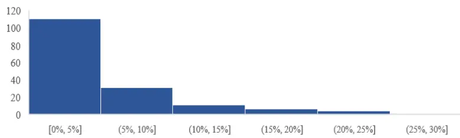
资料来源：资料来源：Wind、聚源、数库、兴业证券经济与金融研究院整理

风险提示：报告中的结果均通过历史数据统计、建模和测算完成，在政策、市场环境发生变化时模型存在失效的风险。

## 报告正文

## 1、引言

近年来，基本面相关因子出现明显回撤。2021年末以来质量和成长因子呈震荡下行走势。与此形成鲜明对比的是，小市值、低波等交易类风格崛起，在此区间获得了明显的超额收益。

图表1、近年来基本面因子持续回撤
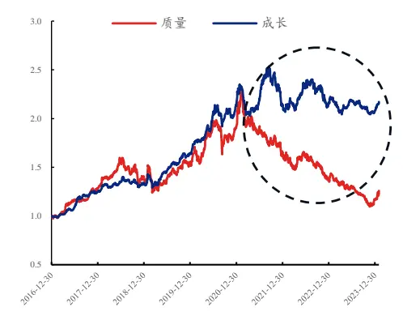
资料来源：Wind、聚源、兴业证券经济与金融研究院整理注：净值为相应大类因子全A十分位组合多空表现

图表2、交易类因子表现突出
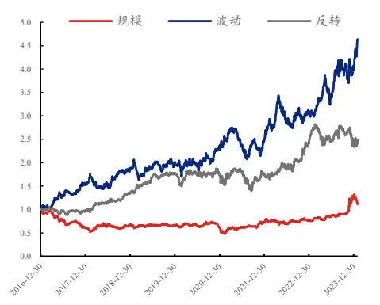

伴随着基本面因子失效，量价类因子关注度迅速提升，高频、机器学习逐渐成为量化投资中的热门词汇。我们分年度筛选含有“机器学习”字样的基金公告数目，可以看出从2019年的0个快速上升到了2023年的545个。

图表3、近年来含“机器学习”字样基金公告数目（个）
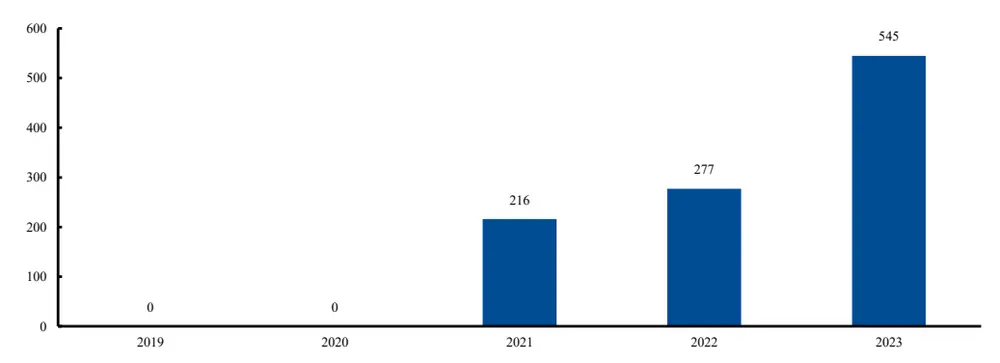
资料来源：Wind、兴业证券经济与金融研究院整理

然而，交易类策略往往会大幅增加策略的换手率，同时此类策略的广泛应用也促使交易类alpha快速衰减。基本面相关因子由于高策略容量、低换手率仍受到广泛关注，这也衍生出一个颇受关注的研究方向，即基本面alpha信息源的优化另类数据的研究。通过引入另类的数据源，挖掘出相对有效且不容易衰减的alpha，也是适应当前市场环境的一个可选方案。

然而，稳定更新且具备alpha的另类数据实践中可遇不可求，兴证金工团队通过在另类数据维度深度耕耘，目前积累了一些有效的另类数据。早在2018年我们便引入专利数据，并通过基于专利数据进行了多维度的alpha挖掘；其后，我们通过引入产业链和供应链等另类数据进一步扩充了数据源；同时我们也深入布局ESG相关另类数据，并进行了ESG量化实践。

图表4、兴证金工另类数据源

| 数据名称 | 数据来源 | 数据简介 |
| --- | --- | --- |
| 专利数据 | 德高行 | 包含每个公司不同类型专利的分布情况 |
| 产业链数据 | 数库 | 通过公司定期报告披露的主营业务产品梳理得到的上下 游产品产业链关系 |
| 供应链数据 | 秩鼎 | 基于公司披露的交易信息梳理得到的上下游供应链公司 |
| ESG 数据 | 妙盈、秩鼎等 | 公司 ESG相关数据指标 |

资料来源：Wind、聚源、秩鼎、德高行、数库、兴业证券经济与金融研究院整理

我们在多篇深度报告中引入了上述的另类数据，可以看出不仅在alpha因子的挖掘上，在行业轮动、热点挖掘等方向，另类数据均发挥了重要作用。

图表5、兴证金工另类数据应用深度报告汇总（部分）

| 报告名称 | 发布时间 | 另类数据源 | 另类数据应用 |
| --- | --- | --- | --- |
| 《从中国心到中国芯--由贸易战 引发的专利选股有效研究》 | 2018年12月20日 专利 |  | 从专利的分类、专利状态、专利具体指标三个维度 出发，我们构建了33个选股因子 以专利IPC分类数据为基础，通过引入科技关联度 |
| 《基于专利分类的科技动量因子 研究》 | 2019年6月25日 | 专利 | 这一重要概念，构建了科技动量因子，选股效果颇 佳 |
| 《专利全解析》 | 2022年2月27日 | 专利 | 对专利基础因子展开研究，基于更新后的专利数据 库，进一步扩充专利因子 |
| 《基本面量化视角下的大健康板 块选股研究》 | 2020年7月22日 | 专利 | 将专利作为特殊因子结合其他维度构建医药服务行 业内选股因子，效果颇优 |
| 《寻找隐匿的专精特新小巨人》 | 2021年11月29日 | 产业链、专利、 ESG | 我们利用多维度的财务因子、产业链数据库中的产 品营收占比分布、专利数据库中的专利获得数量占 比分布与ESG 中的公司治理G指标，将工信部的 |
| 《办公地为上海的企业产业链分 |  |  | 要求分别对应至最为准确的特征向量或指标中 近期上海企业的生产和经营情况受到广泛关注，在 |
| 析》 《光伏产业链景气度模型构建》 | 2022年4月16日 | 产业链 | 本文中我们对地处上海的上市公司的基本情况进行 介绍，并从产业链角度对其进行分析 基于产业链数据进行光伏概念股的赛道细分与重构 |
| 《基于产业链的行业重构研究》 | 2022年12月3日 2022年12月20日 产业链 | 产业链 | 基于产业链数据进行行业重构的研究，进一步构建 企业关联图与产品关联图，并从三个维度测试其带 |
| 《基于Alpha传导的行业轮动策 |  | 产业链、供应 | 来的增量信息 利用产业链、供应链、专利布局和分析师共同覆盖 等维度的数据刻画了行业的上下游或者相似关联关 |
| 略》 《专利研究系列五：绿色专利全 | 2023年4月12日 | 链、专利 | 系，并基于动量传导效应构建了申万二级行业轮动 策略 创新是企业获得高速成长和长期竞争优势的重要源 |
| 解析》 | 2023年5月24日 | ESG、专利 | 泉，专利则是衡量企业创新成果的重要指标。我们 创新性的引入绿色专利的研究 |
| 《产业链视角下的 Alpha传导研 究》 | 2023年3月20日产业链 |  | 我们基于产业链数据中的产品上下游关系和企业的 产品营收数据，构建了刻画产业链上下游传导效应 的传导动量因子，以及刻画企业所处产业链位置的 优势地位因子 |

资料来源：兴业证券经济与金融研究院整理

本文将进行财务附注这一另类数据源的应用探索，进一步扩充兴证金工另类数据源。

文章结构如下：

1、财务附注数据介绍及数据库搭建：对财务附注进行详细说明，并进一步

介绍兴证金工财务附注数据库细节；

2、财务附注选股因子构建：基于财务附注数据构建选股因子；

3、发布效应/事件驱动研究：研究财务附注指标发布前后股价表现；

4、结论与未来研究展望。

## 2、财务附注数据介绍及数据库搭建

## 2.1、何为财务附注？

财务报表附注是为了便于财务报表使用者理解财务报表的内容而对财务报表的编制基础、编制依据、编制原则和方法及主要项目等所作的解释，一般在年度报告和中期报告中披露。

财务附注是财务会计报告体系的重要组成部分。随着经济环境的复杂化以及人们对相关信息要求的提高，附注在整个报告体系中的地位日益突出。作为会计报表的重要组成部分，财务附注对会计报表本身无法或难以充分表达的内容和项目作出详细说明和解释。无论是会计政策，还是会计估计变更，我们都能从财务附注中获得想要的信息。

对于财务附注大家一般关注两个问题：

1) 财务附注的披露规定，是否能成为稳定的信息源？

2) 财务附注具体包括哪些信息，能否提炼出有效信息？

## 问题一：财务附注的披露规定

《企业会计准则第30号—财务报表列报》对附注的披露要求是对企业附注披露的最低要求，应当适用于所有类型的企业。准则指出附注相关信息应当与资产负债表，利润表，现金流量表和所有者权益变动表等报表中列示的项目相互参照，以有助于使用者联系相关联的信息，并由此从整体上更好地了解财务报表。同时企业在披露附注信息时，应当以定量、定性信息相结合，按照一定的结构对附注信息进行系统合理的排列和分类，以便于使用者理解和掌握。

图表6、财务附注披露总体要求

## 附注概述

附注是对在资产负债表、利润表、现金流量表和所有者权益表等报表中列示项的文字描述或明细资料，以及未能在报告中列示项目的说明

与财务报表中列示的项目相互参照，以有助于使用者联系相关联的信息，并由此从整体上更好的理解财务报表

资料来源：兴业证券经济与金融研究院绘制与整理

应当以定量、定性信息相结合，按照一定的结构对附注信息进行系统合理的排列和分类，以便使用者理解和掌握

随着资本市场改革不断深化，全面实行股票发行注册制正式实施，对公司财务信息披露提出更高要求。为进一步规范公开发行证券的公司财务报告的编制及信息披露行为，保护投资者合法权益，中国证监会结合监管实践，研究修订了《公开发行证券的公司信息披露编报规则第15号——财务报告的一般规定》，于2023年12月22日发布。

## 在最新规则，与附注相关的主要修订内容包括：

1）细化重要报表项目附注披露要求，便于投资者充分了解公司情况。主要包括：强化应收款项、存货、投资性房地产、长期股权投资相关信息披露要求，要求公司披露重要资产的减值情况、减值过程中使用的关键参数及确定依据等；要求公司充分披露收入分解信息，以及识别的履约义务、交易价格分摊等重要信息；优化现金流量表披露要求，要求公司披露不涉及当期现金收支、但影响财务状况的重大活动等；完善政府补助、股份支付、套期业务相关信息披露要求，充分反映公司经营情况。

2）增设专节明确研发支出附注信息披露要求，引导市场各方恰当评价公司科技创新能力。要求公司全面披露研发支出的归集范围、金额增减变动、资本化费用化判断标准及依据、减值测试情况等重要信息，引导市场各方恰当评价公司科技创新能力。

从上可以看出，随着相关政策的逐渐完善，财务附注的披露也日益常态化、规范化。在实践中，财务附注也有着一定的固定范式，其中重要项目如果有数字就上传，没有才忽略。因此我们认为财务附注有望成为一个稳定的另类数据源。

## 问题二：财务附注囊括的信息

按规定，附注应当按照如下顺序至少披露下列内容：

一）企业的基本情况

1、企业注册地、组织形式和总部地址。

2、企业的业务性质和主要经营活动。

3、母公司以及集团最终母公司的名称。

4、财务报告的批准报出者和财务报告批准报出日。

## 二）财务报告的编制基础

企业应当根据会计准则的规定判断企业是否持续经营，并披露财务报表是否以持续经营为基础编制。

## 三）遵循企业会计准则的声明

企业应当声明编制的财务报表符合企业会计准则的要求，真实、完整地反映了企业的财务状况、经营成果和现金流量等有关信息，以此明确企业编制财务报表所依据的制度基础。如果企业编制的财务报表只是部分地遵循了企业会计准则，附注中不得做出这种表述。

## 四）重要会计政策和会计估计

## 1、重要会计政策的说明

1）财务报表项目的计量基础。

2）会计政策的确定依据。

## 2、重要会计估计的说明

五）会计政策和会计估计变更以及差错更正的说明

企业应当按照《企业会计准则第28号—会计政策、会计估计变更和差错更正》的规定，披露会计政策和会计估计变更以及差错更正的情况。

## 六）重要报表项目的说明

七）其他需要说明的重要事项，如或有和承诺事项、资产负债表日后非调整事项，关联方关系及其交易等。

其中前五条一般为定性信息，叙述企业的所采用的会计政策等，或可通过文本分析等方法进行提炼有效信息，第六、七条囊括了大量的定量信息，也是我们本篇报告重点研究的内容。

## 2.2、财务附注数据库搭建

前面提到，本文重点关注附注中重要报表项目的说明或者其他需要说明的重要事项包含的定量信息。事实上，财务附注所囊括的定量信息可大体分为两类：1）细项分类信息：比如货币资金分类、存货分类、固定资产分类等；2）另类补充信息：研发明细、销售模式等。

我们以附注中应收账款相关信息为例展示附注披露细项情况。在财务主表中仅披露应收账款（企业因销售商品、提供劳务等经营活动应收取的款项）总额，但在附注中会对应收账款进行多维度的细节补充，能够帮助我们对于企业的应收账款情况有着更深入的了解，包括：1）应收账款按账龄、计提坏账方式分类信息：附注会从账龄、坏账计提方式对应收账款进行分类说明，以便进一步了解应收账款的构成；2）信用减值损失中的应收账款坏账损失：附注会披露信用减值损失，而中也可以看出应收账款的坏账损失；3）外币中的应收账款：附注一般会披露外币货币构成，其中也会包括应收账款的具体情况。

图表7、财务附注中的应收账款
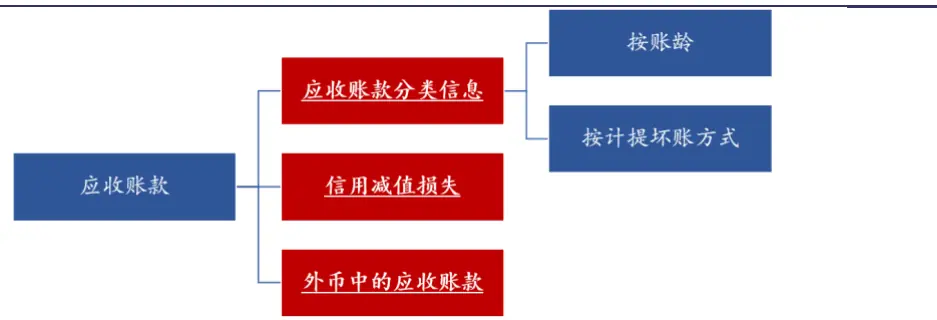
资料来源：数库、兴业证券经济与金融研究院绘制与整理

财务附注中也会包含部分主表中并不披露的另类事项，比如研发人员数量；主营业务模式等另类信息，帮助我们进一步了解公司的财务细节。

本文采用数库提供的财务附注数据表进行相关研究，其主要包括：1）资产负债相关财务附注表格；2）利润表相关财务附注表格；3）通用表，共计69张指标数据表。

通过清洗，我们构建囊括三个层次的兴证财务附注数据库。

## 1、表格层次

考虑到数库提供的财务附注表格中有14张为逐笔明细数据（例如使用权资产明细)，这些表格暂不纳入我们考虑，最终获取可使用的55张数据表；

## 2、科目层次

在每个表格中具有多个科目，例如表格《资产负债表货币资金按分类列示》中具有库存现金、银行存款、其他货币资金等科目，我们对每个表覆盖率相对较高的重要指标进行梳理，共得到121个科目。

## 3、指标层次

每个科目会披露不同指标，例如固定资产会披露账面余额（账面实际余额，不扣除作为该科目备抵的项目）、账面价值（账面余额减去相关备抵项目后的净额）、账面净值（账面余额扣除计提折旧或摊销后的折（摊）余价值）等指标，我们对于每个表格的科目会披露的指标进行汇总。

图表8、兴证金工财务附注数据库架构
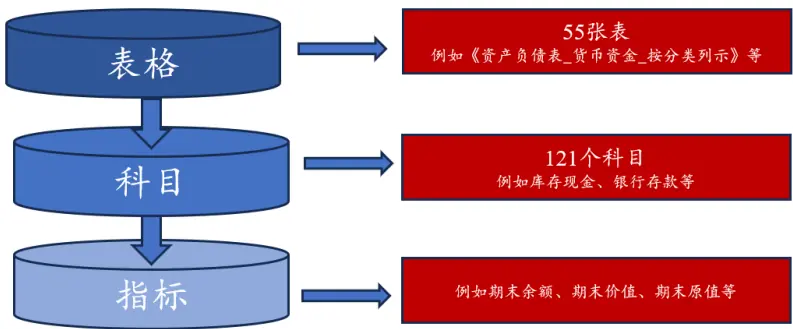
资料来源：兴业证券经济与金融研究院绘制与整理

同时，财务附注指标仅在年报和半年报中披露，因此我们按照下述方式构成最终的PIT 因子数据：

1、每年4月底之前，观察去年半年报和去年年报最新披露用哪个；

2、4月底到6月底，用去年年报数据；

3、7月到8月底之前，观察半年报和去年年报哪个最新披露用哪个；

4、8月底之后，用半年报数据。

最终基于上述方法我们得到了678个PIT因子，同时数库清洗完成的财务附注数据最早从2014年半年报开始，因此我们的PIT数据从2014年8月后开始。考虑到早期部分指标覆盖率不足、计算变动率指标所需数据长度等问题，我们最终测试时间均从2015年12月31日开始截至2024年2月29日。

## 3、财务附注选股因子构建

下面首先从财务附注的结构（各细分科目占比）信息出发，构建财务附注结构质量因子；后续我们也展示通过重要科目构建财务附注相关选股因子的样例。

## 3.1、财务附注结构质量因子

财务附注的一大重点是对主表项目（即总项数据）进行了详细的解释，因此我们首先尝试基于财务附注结构信息来构建相应因子。其中，我们按照计算方法将财务附注结构信息划分为动态结构和静态结构。

图表9、财务附注结构信息

资料来源：数库、兴业证券经济与金融研究院绘制与整理

同时财务附注结构信息具有以下特征：

1）信息繁杂：财务附注中指标数量较多，囊括企业多维度的补充信息，如存货、固定资产、货币资金、营业外收入等；

2）单指标信息含量相对有限：作为补充主表细节信息的附注，每一项单指标信息含量相对有限；

以静态结构为例，我们可以得到468个静态结构指标，其中有大部分指标有效性较为一般。因此我们通过批量化测试方式，筛选相对有效的指标（t值较大，覆盖率相对较高）等权合成构建相应选股因子。

图表10、财务附注结构质量因子构建思路
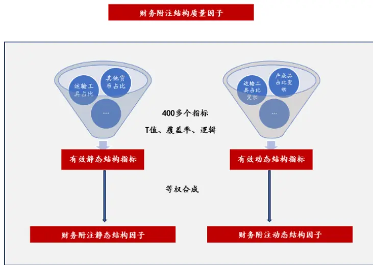
资料来源：数库、兴业证券经济与金融研究院绘制与整理

## 3.1.1、财务附注静态结构因子

通过筛选，我们获得了如图表11所示的有效财务附注静态结构指标。

图表11、有效静态财务附注结构指标

| 结构维度 | 细分结构指标 | 指标算法 | 顺序 |
| --- | --- | --- | --- |
| 货币资金 | 境外货币占货币资金比 | 存放在境外的款项现金占货币资金合计比 | 降序 |
| 固定资产 | 运输工具占固定资产比 | 运输工具占固定资产合计累计折旧期末余额比 | 升序 |
| 短期、长期借款 | 信用借款占短期借款比 | 信用借款占短期借款比 | 降序 |
|  | 信用借款占长期借款比 | 信用借款占长期借款比 | 降序 |
| 管理费用 | 折旧及摊销占管理费用比 | 折旧及摊销占管理费用合计期末余额比 | 降序 |
|  | 中介费用占管理费用比 | 中介费用占管理费用合计期余额比 | 升序 |
|  | 租赁水电物业费占管理费用比 | 租赁水电物业费占管理费用合计期末余额比 | 升序 |
| 财务费用 | 汇兑收益占财务费用比 | 汇兑收益占财务费用合计期末余额比 | 降序 |
| 薪酬福利 | 辞退福利占应付职工薪酬比 | 辞退福利占应付职工薪酬合计期末余额比 | 降序 |
| 营业外收入 | 政府补助占营业外收入比 | 政府补助占营业外收入合计计入当期非经常性损益的金额比 | 升序 |

资料来源：数库、兴业证券经济与金融研究院整理

下述我们首先对各维度指标细节及逻辑进行介绍。

## 货币资金

附注中将货币资金进一步细分为银行存款、库存现金、其他货币资金、货币资金合计存放在境外的款项总额、货币资金合计使用有限制的款项总额等。

图表12、资产负债表_货币资金_按分类列示主要科目展示

| 科目名称 | 含义 |
| --- | --- |
| 银行存款 | 通常是期限很短期的存款，比如活期存款、期限三个月以内的存款，这里的存款期限最长 |
| 库存现金 | 不会超过1年，主要特征就是可以随时拿来用于支付 公司及子公司保险柜里存放的现钞，包括人民币和外币 |
| 其他货币资金 | 其他货币资金是主要包括银行汇票存款、银行本票存款、信用卡存款、信用证保证金存 |
| 存放在境外的款项现金 | 款、存出投资款和外埠存款等 企业存放在境外账户的资金 |
| 使用“受限制”的资金 | 企业不能随时支取的资金 |

资料来源：数库、兴业证券经济与金融研究院整理

通过上述细项可以对企业的货币资金有着更深入的了解，例如一些企业虽然主表上的货币资金充裕，但可能有很大一部资金因抵押、质押或冻结等原因而并不能使用。

图表13、财务附注披露的货币资金细项信息样例

| 单位：元 |  |  |
| --- | --- | --- |
| 项目 | 期末余额 | 期初余额 |
| 库存现金 | 145,791.89 | 233,526.27 |
| 银行存款 | 496,609,631.85 | 725,254,809.04 |
| 其他货币资金 | 57,826,094.42 | 72,308,258.63 |
| 合计 | 554,581,518.16 | 797,796,593.94 |
| 其中：存放在境外的款项总额 | 337,441.49 | 110,167.18 |
| 因抵押、质押或冻结等对使用有限制的款项总额 | 55,506,215.73 | 69,906,278.16 |

资料来源：Wind、兴业证券经济与金融研究院整理

从覆盖率来看，库存现金、银行存款、其他货币资金等货币资金中主要科目来说覆盖率长期维持在80%以上，同时境外货币和受限货币作为补充说明科目覆盖率相对较低，但境外货币也在40%左右。

图表14、货币资金细分科目的覆盖率
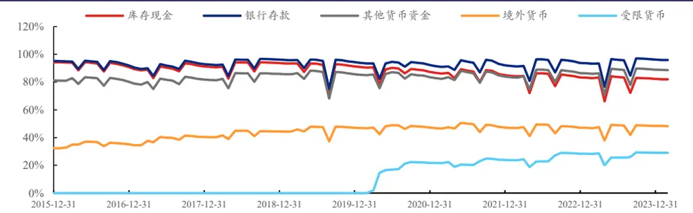
资料来源：数库、兴业证券经济与金融研究院整理

通过测试，我们得出：1、公司银行存款占比越多，库存现金占比越少，其他货币资金占比越少，个股未来表现越好：这可能因为库存现金多一定程度代表了公司的现金管理能力较低，同时其他货币可能包含了某种原因而被限制使用的资金，这两者越多为企业带来了负向影响；2、境外货币款项占比越多，个股未来表现越好：境外货币的占比一定程度代表了公司的海外业务覆盖程度，可以看出此指标越大公司未来上涨概率越大。

图表15、货币资金细分结构指标IC表现（2015.12-2024.02）

|  | 平均值 | 标准差 | IC_IR | t统计量 | 平均截面 宽度 | 有效期数 |
| --- | --- | --- | --- | --- | --- | --- |
| 银行存款占货币资金期末余额比 | 0.17% | 5.83% | 0.03 | 0.28 | 3513.14 | 98 |
| 库存现金占货币资金期末余额比 | -0.61% | 5.38% | -0.11 | -1.12 | 3303.35 | 98 |
| 其他货币资金占货币资金期末余额比 | -0.39% | 6.33% | -0.06 | -0.62 | 3199.74 | 98 |
| 存放在境外的款项总额占货币资金期末余额比 | 1.48% | 4.52% | 0.33 | 3.23 | 1703.90 | 98 |

资料来源：Wind、聚源、数库、兴业证券经济与金融研究院整理
注：我们测试细分指标均采用降序，以便能够看出指标的影响方向，下同

## 固定资产

附注中会将固定资产按用途进一步细分为房屋建筑物、运输工具、机器设备、办公及电子设备等；同时，附注会披露固定资产累计折旧期末余额、账面价值期末余额、账面原值期末余额、净值期末余额等指标。

图表16、资产负债表_固定资产_按分类列示主要科目展示

| 科目名称 | 含义 |
| --- | --- |
| 房屋建筑物 | 产权属于本企业的所有房屋和建筑物,包括办公室(楼)、会堂、宿舍、食堂、车库等设施； 附属企业如招待所、宾馆、车队、医院、幼儿园、商店等房屋和建筑物 |
| 运输工具 | 后勤部门使用的各种交通运输工具，包括轿车、吉普、摩托车、面包车、客车、轮船、运输 汽车、三轮卡车、人力拖车、板车、自行车和小轮车等 |
| 机器设备 | 企业后勤部门用于自身维修的机床、动力机、工具等和备用的发电机等，以及计仪器、检测 |
| 办公及电子设备 | 仪器和医院的医疗器械设备.有些附属生产性企业的机械、工具设备也应包括在内 企业常用的办公与事务方面的设备 |

资料来源：数库、兴业证券经济与金融研究院整理

可以看出在固定资产中与生产相对更直接相关的机器设备占比越多越好，而如办公及电子设备等则是越少越好，特别是运输工具。

图表17、固定资产细分结构指标IC表现（2015.12-2024.02）

|  | 平均值 | 标准差 | IC_IR | t统计量 | 平均截面 宽度 | 有效期数 |
| --- | --- | --- | --- | --- | --- | --- |
| 房屋建筑物占固定资产累计折旧期末余额比 | -0.16% | 6.25% | -0.03 | -0.26 | 3418.51 | 98 |
| 房屋建筑物占固定资产账面价值期末余额比 | -0.79% | 6.67% | -0.12 | -1.17 | 3418.09 | 98 |
| 房屋建筑物占固定资产账面原值期末余额比 | -0.74% | 6.22% | -0.12 | -1.18 | 3422.58 | 98 |
| 运输工具占固定资产累计折旧期末余额比 | -1.91% | 7.22% | -0.26 | -2.62 | 3337.12 | 98 |
| 运输工具占固定资产账面价值期末余额比 | -1.70% | 5.89% | -0.29 | -2.86 | 3335.43 | 98 |
| 运输工具占固定资产账面原值期末余额比 | -1.77% | 6.93% | -0.26 | -2.53 | 3339.06 | 98 |
| 机器设备占固定资产合计累计折旧期末余额比 |  |  |  |  |  |  |
| 机器设备占固定资产合计账面价值期末余额比 | 1.03% 0.89% | 7.15% | 0.14 | 1.42 | 2656.22 | 98 |
| 机器设备占固定资产合计账面原值期末余额比 |  | 8.02% | 0.11 | 1.09 | 2656.33 | 98 |
|  | 1.00% | 7.63% | 0.13 | 1.30 | 2657.27 | 98 |
| 办公及电子设备占固定资产累计折旧期末余额比 | -0.93% |  |  |  |  |  |
| 办公及电子设备占固定资产账面价值期末余额比 | -0.76% | 10.57% | -0.09 | -0.87 | 1659.54 | 98 |
| 办公及电子设备占固定资产账面原值期末余额比 | -0.79% | 10.26% | -0.07 | -0.74 | 1656.57 | 98 |
|  |  | 10.21% | -0.08 | -0.76 | 1660.27 | 98 |

资料来源：Wind、聚源、数库、兴业证券经济与金融研究院整理

## 短期、长期借款

短期借款（长期借款与短期借款细分科目类似，不再重复叙述）是指企业向银行或其他金融机构等借入的期限在1年以下（含1年）的各种借款，通常是为了满足正常生产经营的需要，如企业以应收债权取得质押借款等。附注会按借款类型披露短期借款细节，包括信用借款、保证借款、抵押借款、质押借款等。

图表18、资产负债表_短期借款_按分类列示主要科目展示

| 科目名称 | 含义 |
| --- | --- |
| 信用借款 | 以借款人的信誉发放的贷款，借款人不需要提供担保。 |
| 保证借款 | 担保人以其自有的资金和合法资产保证借款人按期归还贷款本息的一种贷款形式。 |
| 抵押借款 | 要求借款方提供一定的抵押品作为贷款的担保，以保证贷款的到期偿还。 |
| 质押借款 | 是指贷款人按《担保法》规定的质押方式以借款人或第三人的动产或权利为质押物发放的贷款。 |

资料来源：数库、兴业证券经济与金融研究院整理

信用借款的特征就是债务人无需提供抵押品或第三方担保仅凭自己的信誉就能取得贷款，也是短期借款中相对质量较高的部分，我们从下也可以看出在短期借款中信用借款的占比越多，未来个股表现越好。

图表19、短期借款细分结构指标IC表现（2015.12-2024.02）

|  | 平均值 | 标准差 | IC_IR | t统计量 | 平均截面 宽度 | 有效期数 |
| --- | --- | --- | --- | --- | --- | --- |
| 信用借款占短期借款期末余额比 | 1.46% | 5.31% | 0.28 | 2.73 | 1876.96 | 98 |
| 保证借款占短期借款期末余额比 | -0.90% | 4.89% | -0.18 | -1.82 | 1710.65 | 98 |
| 抵押借款占短期借款期末余额比 | -0.97% | 7.51% | -0.13 | -1.27 | 1035.18 | 98 |
| 质押借款占短期借款期末余额比 | -0.87% | 5.15% | -0.17 | -1.68 | 850.29 | 98 |

资料来源：Wind、聚源、数库、兴业证券经济与金融研究院整理

## 管理费用

管理费用是企业为组织和管理企业生产经营活动而发生的各种费用。这些费用包括员工工资、办公费、差旅费、折旧费、修理费、咨询费、诉讼费等。管理费用的高低直接影响企业的经济效益，因此，企业应采取措施降低管理费用，提高管理效率。

在管理费用中折旧与摊销、工资薪酬、维护修理费占比越高，对股价呈现正向作用，而办公差旅费、中介费用、租赁水电物业费、业务招待费占比越高个股未来表现越差。

图表20、管理费用细分结构指标IC表现（2015.12-2024.02）

|  | 平均值 | 标准差 | IC_IR | t统计量 | 平均截面 宽度 | 有效期数 |
| --- | --- | --- | --- | --- | --- | --- |
| 办公差旅费占管理费用期末余额比 | -0.85% | 5.94% | -0.14 | -1.41 | 3304.70 | 98 |
| 折旧及摊销占管理费用期末余额比 | 0.61% | 4.51% | 0.14 | 1.34 | 3456.07 | 98 |
| 工资薪酬占管理费用期末余额比 | 1.06% | 8.20% | 0.13 | 1.28 | 3505.22 | 98 |
| 中介费用占管理费用期末余额比 | -1.35% | 6.77% | -0.20 | -1.97 | 2821.77 | 98 |
| 租赁水电物业费占管理费用期末余额比 | -1.36% | 5.55% | -0.25 | -2.43 | 2191.04 | 98 |
| 业务招待费占管理费用期末余额比 | -1.03% | 6.51% | -0.16 | -1.57 | 2628.62 | 98 |
| 维护修理费占管理费用期末余额比 | 1.60% | 5.59% | 0.29 | 2.83 | 1256.40 | 98 |

资料来源：Wind、聚源、数库、兴业证券经济与金融研究院整理

## 财务费用

财务费用是企业为筹集生产经营所需资金等而发生的费用，包括利息支出、汇兑损益、金融机构手续费、企业发生的现金折扣或收到的现金折扣等，这些费用在企业运营过程中不可避免，需要进行合理的管理和控制以降低成本。

图表21、利润表_财务费用_按分类列示主要科目展示

| 科目名称 | 含义 |
| --- | --- |
| 利息收入 | 存款利息收入 |
| 利息支出 | 贷款利息支出及其他筹资方式下支付利息支出 |
| 汇兑净收益 | 外币兑换价差 |

资料来源：数库、兴业证券经济与金融研究院整理

企业的汇兑净损益越高，可能代表着企业的外汇管理能力越强，未来表现更优。

图表22、财务费用细分结构指标IC表现（2015.12-2024.02）

|  | 平均值 | 标准差 | IC_IR | t统计量 | 平均截面 宽度 | 有效期数 |
| --- | --- | --- | --- | --- | --- | --- |
| 利息支出占财务费用合计期末余额比 | -0.46% | 5.09% | -0.09 | -0.89 | 3164.58 | 98 |
| 利息收入占财务费用合计期末余额比 | 0.11% | 4.41% | 0.02 | 0.24 | 3428.92 | 98 |
| 汇兑净损益占财务费用合计期末余额比 | 1.15% | 4.18% | 0.27 | 2.71 | 2151.98 | 98 |

资料来源：Wind、聚源、数库、兴业证券经济与金融研究院整理

## 薪酬福利

应付职工薪酬是企业根据有关规定应付给职工的各种薪酬，包括职工工资、奖金、津贴和补贴，职工福利费，医疗、养老、失业、工伤、生育等社会保险费，住房公积金，工会经费，职工教育经费，非货币性福利等因职工提供服务而产生的义务。

其中辞退福利，是指企业在职工劳动合同到期之前解除与职工的劳动关系，或者为鼓励职工自愿接受裁减而给予职工的补偿，从我们的测试来看辞退福利占比越多则公司未来股价表现越好。

图表 23、薪酬福利细分结构指标IC表现（2015.12-2024.02）

|  | 平均值 | 标准差 | IC_IR | t统计量 | 平均截 面宽度 | 有效期 数 |
| --- | --- | --- | --- | --- | --- | --- |
| 短期薪酬占应付职工薪酬期末余额比 | -0.11% | 6.68% | -0.02 | -0.16 | 3528.73 | 98 |
| 离职后福利-设定提存计划占应付职工薪酬期末余额比 | -0.06% | 4.37% | -0.01 | -0.14 | 2802.17 | 98 |
| 辞退福利占应付职工薪酬合计期末余额比 | 1.07% | 6.76% | 0.16 | 1.57 | 924.14 | 98 |
| 一年内到期的其他福利占应付职工薪酬期末余额比 | 0.79% | 10.31% | 0.08 | 0.76 | 232.02 | 98 |

资料来源：Wind、聚源、数库、兴业证券经济与金融研究院整理

## 营业外收入

营业外收入是指与企业日常营业活动没有直接关系的各项利得，是企业财务成果的组成部分，包括政府步骤、非流动资产处置利得、罚款净收入等。同时营业外收入科目包括本期金额、计入当期非经常损益的金额等指标。

图表24、利润表营业外收入_按分类列示主要科目展示

| 科目名称 | 含义 |
| --- | --- |
| 政府补助 | 企业从政府无偿取得货币型资产或非货币型资产形成的利得 |
| 非流动资产处置 利得 | 企业出售非流动资产时扣除相关费用后的净收益，主要包括固定资产处置利得和无形资产出售利得 |
| 罚款赔款收入 | 指对方违反国家有关行政管理法规，按照规定支付给本企业的罚款，不包括银行的罚息 |
| 非货币性资产交 换利得 | 非货币性资产交换利得是指在非货币性资产交换中换出资产为固定资产、无形资产的，换入资产公 允价值大于换出资产账面价值的差额，扣除相关费用后计入营业外收入的金额 |
| 债务重组利得 | 债务重组利得是指重组债务的账面价值超过清偿债务的现金、非现金资产的公允价值、所转股份的 公允价值、或重组后债务账面价值之间的差额 |
| 捐赠利得 | 企业接受捐赠产生的利得 |

资料来源：Wind、聚源、数库、兴业证券经济与金融研究院整理

从测试结果来看，政府补助占比越少，个股未来表现越好。

图表 25、政府补助指标IC 表现（2015.12-2024.02）

|  | 平均值 | 标准差 | IC_IR | t统计量 | 平均截 面宽度 | 有效期 数 |
| --- | --- | --- | --- | --- | --- | --- |
| 政府补助占营业外收入本期金额比 | -1.06% | 8.03% | -0.13 | -1.30 | 1839.53 | 98 |
| 政府补助占营业外收入计入当期非经常性损益的金额比 | -1.20% | 8.16% | -0.15 | -1.46 | 1664.91 | 98 |

资料来源：Wind、聚源、数库、兴业证券经济与金融研究院整理

我们首先将上述指标按类内等权方式进行合成，可以看出各结构维度因子相关性较低，最高也不超过30%，说明各维度结构信息能够进行一定程度上互补，因此我们将各维度指标进行等权合成构建财务附注静态结构因子。

图表26、各维度静态结构指标相关性（2015.12-2024.02）

|  | 货币资金 | 固定资产 | 短期、长期借款 | 管理费用 | 财务费用 | 薪酬福利 | 营业外收入 |
| --- | --- | --- | --- | --- | --- | --- | --- |
| 货币资金 | 100.00% | 2.54% | 0.79% | -10.05% | 6.01% | 9.98% | 1.05% |
| 固定资产 | 2.54% | 100.00% | 3.10% | 16.79% | 0.33% | 11.02% | 7.34% |
| 短期、长期借款0 | .79% | 3.10% | 100.00% | 0.88% | 7.33% | 8.92% | -1.85% |
| 管理费用 | -10.05% | 16.79% | 0.88% | 100.00% | -3.18% | 4.13% | 3.99% |
| 财务费用 | 6.01% | 0.33% | 7.33% | -3.18% 1 | 00.00% | -0.90% | -2.08% |
| 薪酬福利 | 9.98% | 11.02% | 8.92% | 4.13% | -0.90% | 100.00% | 3.39% |
| 营业外收入 | 1.05% | 7.34% | -1.85% | 3.99% | -2.08% | 3.39% | 100.00% |

资料来源：数库、兴业证券经济与金融研究院整理

下面我们对财务附注静态结构因子进行回测，回测设置如下：

1、回测区间：2015年12月至2024年2月；

2、回测频率：月度；

3、股票池：剔除上市不满180天、特殊处理的A股。

财务附注静态结构因子2015年12月至2024年2月区间的IC均值为2.55%，大于2%，t值可达4.03。同时从五分位组合表现来看，有着较好的单调性。

图表 27、静态结构因子IC 表现（2015.12-2024.02）

|  | 平均值 | 标准差 | IC_IR | t统计量 | 平均截面宽度 | 有效期数 |
| --- | --- | --- | --- | --- | --- | --- |
| 因子表现 | 2.55% | 6.28% | 0.41 | 4.03 | 3547.57 | 98 |

资料来源：Wind、聚源、数库、兴业证券经济与金融研究院整理

图表28、静态结构因子五分位组合表现（2015.12-2024.02）

|  | 年化收益率 | 年化波动率 | Sharpe比率 | 最大回撤率 |
| --- | --- | --- | --- | --- |
| Top | 1.94% | 22.55% | 0.09 | 40.96% |
| 2 | 0.10% | 22.77% | 0.00 | 45.17% |
| 3 | -1.62% | 23.75% | -0.07 | 47.20% |
| 4 | 2.91% | 24.08% | -0.12 | 49.71% |
| Bottom | -5.68% | 24.56% | -0.23 | 54.46% |
| 市场 | -1.63% | 23.41% | -0.07 | 47.60% |
| L-S | 7.30% | 6.61% | 1.10 | 6.45% |

资料来源：Wind、聚源、数库、兴业证券经济与金融研究院整理

图表29、静态结构因子五分位组合净值表现(2015.12-2024.02)
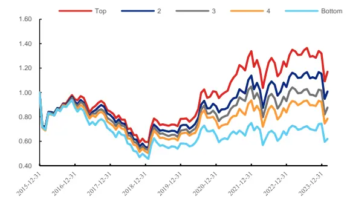
资料来源：Wind、聚源、数库、兴业证券经济与金融研究院整理

图表30、静态结构因子五分位多空组合净值表现(2015.12-2024.02)
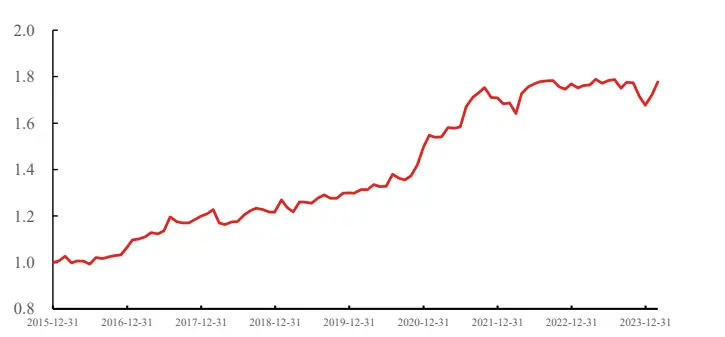

之前提到近年来基本面因子失效严重，我们也测试2019年12月至2024年2 月因子的因子表现，可以看出因子仍较为有效，IC均值为2.50%，t值为3.18。

图表31、静态结构因子IC表现（2019.12-2024.02）

|  | 平均值 | 标准差 | IC_IR | t统计量 | 平均截面宽度 | 有效期数 |
| --- | --- | --- | --- | --- | --- | --- |
| 因子表现 | 2.50% | 5.57% | 0.45 | 3.18 | 4072.44 | 50 |

资料来源：Wind、聚源、数库、兴业证券经济与金融研究院整理

我们对因子进行市值行业中性化处理，剔除市值和行业影响后因子IC均值依旧维持在2%以上，t统计量进一步提高至6.30。

图表32、市值行业中性化后静态结构因子IC表现（2015.12-2024.02）

| 平均值 | 标准差 | IC_IR | t统计量 | 平均截面宽度 | 有效期数 |
| --- | --- | --- | --- | --- | --- |
| 因子表现 2.07% | 3.25% | 0.64 | 6.30 | 3547.50 | 98 |

资料来源：Wind、聚源、数库、兴业证券经济与金融研究院整理

图表33、市值行业中性化后静态结构因子五分位组合表现（2015.12-2024.02）

|  | 年化收益率 | 年化波动率 | Sharpe比率 | 最大回撤率 |
| --- | --- | --- | --- | --- |
| Top | 1.05% | 23.23% | 0.05 | 43.96% |
| 2 | -0.15% | 23.20% | -0.01 | 44.88% |
| 3 | -1.24% | 23.46% | -0.05 | 47.96% |
| 4 | 2.73% | 23.55% | -0.12 | 47.85% |
| Bottom | -5.04% | 23.89% | -0.21 | 53.22% |
| 市场 | -1.63% | 23.41% | -0.07 | 47.60% |
| L-S | 6.16% | 3.36% | 1.83 | 2.28% |

资料来源：Wind、聚源、数库、兴业证券经济与金融研究院整理

图表34、静态结构因子市值行业中性化后五分位组合净值表现（2015.12-2024.02）
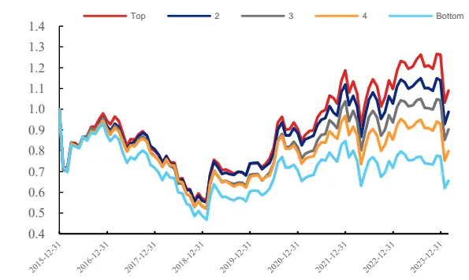
资料来源：Wind、聚源、数库、兴业证券经济与金融研究院整理

图表35、静态结构因子市值行业中性化后五分位多空组合净值表现（2015.12-2024.02）
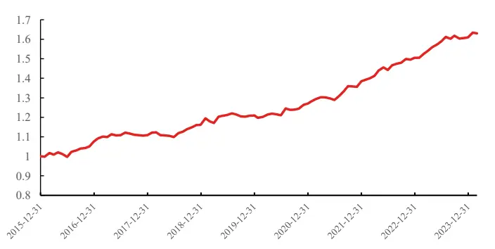

下面我们在不同股票池中测试因子表现。可以看出因子不管在沪深300、中证500还是中证1000中均维持着较好的有效性。

图表36、不同股票池中静态结构质量因子IC表现（2015.12-2024.02）

|  | 平均值 | 标准差 | IC_IR | t统计量 | 平均截面宽度 | 有效期数 |
| --- | --- | --- | --- | --- | --- | --- |
| 沪深300 | 2.42% | 9.38% | 0.26 | 2.56 | 284.65 | 98 |
| 中证500 | 3.83% | 7.84% | 0.49 | 4.83 | 470.50 | 98 |
| 中证 800 | 3.28% | 7.24% | 0.45 | 4.49 | 755.15 | 98 |
| 中证 1000 | 3.17% | 5.94% | 0.53 | 5.29 | 963.85 | 98 |

资料来源：Wind、聚源、数库、兴业证券经济与金融研究院整理

图表37、沪深300中静态结构质量因子五分位组合表现（2015.12-2024.02）

|  | 年化收益率 | 波动率 | Sharpe比率 | 最大回撤率 |
| --- | --- | --- | --- | --- |
| 0 | 2.39% | 19.79% | 0.12 | 31.95% |
| 1 | 1.29% | 19.24% | 0.07 | 30.79% |
| 2 | -0.68% | 20.37% | -0.03 | 32.24% |
| 3 | -1.21% | 20.42% | -0.06 | 35.74% |
| 4 | -7.32% | 20.53% | -0.36 | 51.05% |
| 市场 | -1.06% | 19.58% | -0.05 | 31.36% |
| L-S | 9.85% | 9.02% | 1.09 | 10.71% |

资料来源：Wind、聚源、数库、兴业证券经济与金融研究院整理

上述从多角度测试了因子的有效性，而随着因子数目逐渐变多，大家较关注因子的特异性。我们统计财务附注静态结构因子与我们底层约170个因子的相关性，可以看出最高不超过20%。同时我们计算因子与Barra十风格因子的相关性，亦处于较低水平，这也说明此因子有着较好的特异性。

图表38、财务附注静态结构质量因子与底层因子相关性分布（2015.12-2024.02)
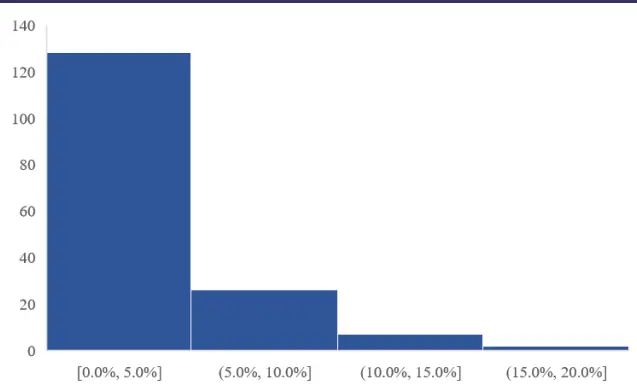
资料来源：Wind、聚源、数库、兴业证券经济与金融研究院整理

图表 39、财务附注静态结构质量因子与 Barra 因子相关性（2015.12-2024.02）
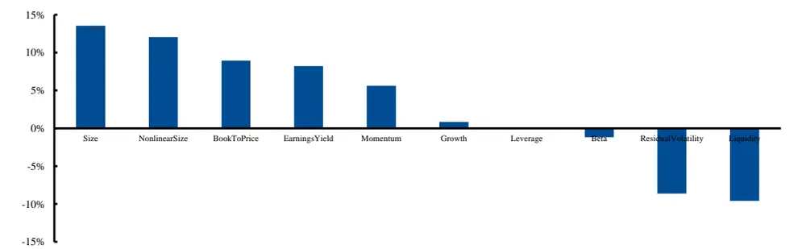
资料来源：Wind、聚源、数库、兴业证券经济与金融研究院整理

## 3.1.2、财务附注动态结构因子

上面我们基于静态结构信息构建了财务附注结构质量因子，下面我们通过相同理念，引入结构变动信息，构建财务附注结构变动质量因子。具体的，我们基于下述方法计算结构变动：

## (分子当期-分子去年同期）/(分母期初与期末的平均值)

其中分子为相应细分的结构科目指标，而分母为合计的结构科目指标。

通过筛选，我们获得了如图表40所示的有效财务附注动态结构指标。

图表40、有效财务附注动态结构指标

| 结构维度 | 细分结构指标 | 指标算法 | 顺序 |
| --- | --- | --- | --- |
| 存货 | 产成品期末跌价准备比变动 | 库存商品（产成品）占存货期末跌价准备比变动 | 升序 |
|  | 产成品期末余额比变动 | 库存商品（产成品）占存货期末余额比变动 | 升序 |
| 固定资产 | 运输工具占固定资产比变动 | 运输工具占固定资产合计累计折旧期末余额比变动 | 升序 |
|  | 政府补助占比变动 | 政府补助占营业外收入计入当期非经常性损益的金额比变动 | 升序 |
| 营业外收入 | 罚款赔款收入占比变动 | 罚款赔款收入占营业外收入计入当期非经常性损益的金额比变动 | 升序 |
|  | 4-5年应收账款占比变动 | 应收账款按账龄披露4-5年占应收账款分账龄小计期末账面余额比 变动 | 升序 |
|  | 5年以上应收账款占比变动 | 应收账款按账龄披露5年以上占应收账款分账龄小计期末账面余额 比变动 | 升序 |
|  | 1年内应收账款坏账占比变动 | 1年以内占按账龄计提的应收账款小计期末坏账准备金额比变动 | 升序 |
| 应收账款坏账 | 组合计提坏账准备占比变动 | 按组合计提坏账准备占按坏账分类的应收账款合计期末坏账准备金 | 升序 |
|  |  | 额比变动 |  |

资料来源：Wind、聚源、数库、兴业证券经济与金融研究院整理

下面我们对相应部分指标进行详细介绍。

## 存货

存货指企业在日常活动中持有以备出售的产品或商品、处在生产过程中的在产品、在生产过程或提供劳务过程中耗用的材料或物料等。在附注中会披露相应存货的具体细节，如产成品、在产品、原材料等，同时也会披露账面余额、账面价值、期末跌价准备等指标。

图表41、资产负债表_存货_按分类列示主要科目展示

| 科目名称 | 含义 |
| --- | --- |
|  | 企业已经完成全部生产过程并验收入库，可以按照合同规定的条件送交订货单位，或者可以作为商品对外销 |
| 库存商品（产成品） | 售的产品 |
| 在产品及半成品 | 企业正在制造尚未完工的生产物 |
| 原材料 | 原材料 |
| 低值易耗品及包装物 | 企业能够多次使用，逐渐转移其价值但仍保持原有形态不确认为固定资产的材料 |
| 发出商品 | 发出商品是托收承付结算方式下已发出尚未收到货款的产成品、自制半成品及包装物等 |

资料来源：Wind、聚源、数库、兴业证券经济与金融研究院整理

从测试结果来看，产成品在存货中的占比提升越多未来收益越差。产成品变多代表公司的存货可能有一定滞押，对公司可能有一定负面影响。

图表42、产成品细分结构变动指标IC表现（2015.12-2024.02）

|  | 平均值 | 标准差 | IC_IR | t统计量 | 平均截 面宽度 | 有效期 数 |
| --- | --- | --- | --- | --- | --- | --- |
| 库存商品（产成品）占存货期末账面余额比变动 | -1.47% | 6.69% | -0.22 | -2.17 | 3185.10 | 98 |
| 库存商品（产成品）占存货账面余额期末账面价值比变动 | -1.46% | 6.66% | -0.22 | -2.16 | 3179.32 | 98 |
| 库存商品（产成品） 占存货账面余额期末跌价准备比变动 | -1.62% | 5.18% | -0.31 | -3.10 | 2294.87 | 98 |

资料来源：Wind、聚源、数库、兴业证券经济与金融研究院整理

## 应收账款账龄

应收账款的账龄，是公司还没有收回的应收账款的时间长度。应收账款质量的高与低与账龄的长短密切相关。账龄越长，说明公司从客户收回货款的时间越晚，应收账款能回收的概率越低，应收账款的质量也越差；账龄越短，其能收回的概率越高，其质量也越好。目前数库将应收账款账龄规整为：1年以来、1-2年、2-3年、3年以上、3-4年、4-5年、5年以上，几个级别。我们重点关注账龄较长的应收账款的占比变动（包括4-5、5年以上)。

图表43、应收账款账龄细分结构变动指标IC表现（2015.12-2024.02）

|  | 平均值 | 标准差 | IC_IR | t统计量 | 平均截面 宽度 | 有效期数 |
| --- | --- | --- | --- | --- | --- | --- |
| 4-5年应收账款期末余额比变动 | -3.42% | 22.90% | -0.15 | -1.48 | 1259.41 | 98 |
| 5年以上应收账款期末余额比变动 | -4.24% | 23.29% | -0.18 | -1.80 | 1250.91 | 98 |

资料来源：Wind、聚源、数库、兴业证券经济与金融研究院整

## 应收账款坏账

企业对单项金额重大的应收账款应当单独进行减值测试，如有客观证据表明其已发生减值，应当计提坏账准备。根据计提方法可划分为：

1、按单项计提坏账：如果单项应收账款金额较大，对损益影响也大，有一定坏账风险，那么也可以单独对这项重大的应收账款计提坏账准备，这就是单项计提坏账准备；

2、按组合计提坏账：与在同一地区生产和销售的产品系列相关、具有相同或类似最终用途或目的，且难以与其他项目分开计量的应收账款，可以合并计提坏账准备，这就是组合计提。

从下可以看出应收账款坏账占比变多，个股表现均较差，同时以组合计提的应收账款坏账带来影响更大。

图表 44、应收账款坏账细分结构变动指标IC表现（2015.12-2024.02）

|  | 平均值 | 标准差 | IC_IR | t统计量 | 平均截面 宽度 | 有效期数 |
| --- | --- | --- | --- | --- | --- | --- |
| 组合计提应收账款余额占比 | -2.19% | 7.16% | -0.31 | -3.03 | 3372.14 | 98 |
| 单项计提应收账款余额占比 | -1.07% | 21.07% | -0.05 | -0.50 | 1321.36 | 98 |

资料来源：Wind、聚源、数库、兴业证券经济与金融研究院整理

同样的，我们通过类内等权构建各维度动态指标，可以看出各维度相关性较低，因此我们采用等权方式构建财务附注动态结构因子。

图表45、财务附注动态结构各维度指标相关性（2015.12-2024.02）

|  | 存货 | 固定资产 | 营业外收入 | 应收账款账龄 | 应收账款坏账 |
| --- | --- | --- | --- | --- | --- |
| 存货 1 | 00.00% | 21.96% 1 | 4.38% 4 | .69% | 22.34% |
| 困定资产 | 21.96% | 100.00% | 20.39% | 7.50% | 33.90% |
| 营业外收入 | 14.38% | 20.39% 1 | 00.00% 5 | .18% 2 | 1.17% |
| 应收账款账龄 | 4.69% | 7.50% | 5.18% 1 | 00.00% | 11.56% |
| 应收账款坏账 2 | 2.34% 3 | 3.90% 2 | 1.17% 1 | 1.56% 1 | 00.00% |

资料来源：Wind、聚源、数库、兴业证券经济与金融研究院整理

财务附注动态结构因子在 2015 年12 月至 2024 年 2 月区间的 IC 均值为2.61%，同时t值达到3.61。同时从五分位组合表现来看，有着较好的单调性。

图表46、动态结构因子IC表现（2015.12-2024.02）

|  | 平均值 | 标准差 | IC_IR | t统计量 | 平均截面宽度 | 有效期数 |
| --- | --- | --- | --- | --- | --- | --- |
| 因子表现 | 2.61% | 7.15% | 0.37 | 3.61 | 3531.30 | 98 |

资料来源：Wind、聚源、数库、兴业证券经济与金融研究院整理

图表47、动态结构因子五分位组合表现（2015.12-2024.02）

|  | 年化收益率 | 波动率 | Sharpe比率 | 最大回撤率 |
| --- | --- | --- | --- | --- |
| Top | 0.69% | 23.09% | 0.03 | 43.43% |
| 2 | -0.12% | 22.92% | -0.01 | 44.28% |
| 3 | -0.81% | 23.19% | -0.04 | 46.01% |
| 4 | -2.19% | 23.81% | -0.09 | 48.81% |
| Bottom | -6.00% | 25.23% | -0.24 | 55.72% |
| 市场 | -1.67% | 23.48% | -0.07 | 47.74% |
| L-S | 6.22% | 7.68% | 0.81 | 11.39% |

资料来源：Wind、聚源、数库、兴业证券经济与金融研究院整理

图表48、动态结构因子五分位组合净值表现(2015.12-2024.02)
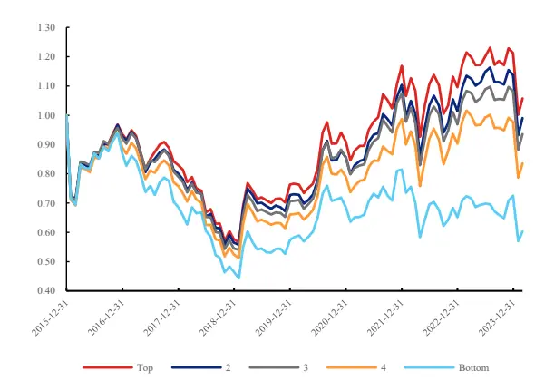
资料来源：Wind、聚源、数库、兴业证券经济与金融研究院整理

图表49、动态结构因子五分位多空组合净值表现(2015.12-2024.02)
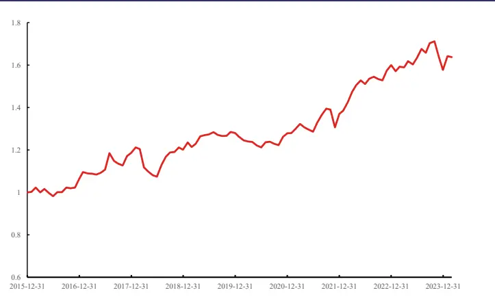

我们测试2019年12月至2024年2月因子的表现，可以看出因子IC均值为2.58%，t值为 3.22。

图表 50、动态结构 IC表现（2019.12-2024.02）

|  | 平均值 | 标准差 | IC_IR | t统计量 | 平均截面宽度 | 有效期数 |
| --- | --- | --- | --- | --- | --- | --- |
| 因子表现 | 2.58% | 5.67% | 0.46 | 3.22 | 4053.44 | 50 |

资料来源：Wind、聚源、数库、兴业证券经济与金融研究院整理

同时可以看到剔除市值和行业影响后，因子IC依旧维持在2%以上，t统计量进一步提高至4.38。

图表51、市值行业中性化后动态结构因子IC表现（2015.12-2024.02）

|  | 平均值 | 标准差 | IC_IR | t统计量 | 平均截面宽度 | 有效期数 |
| --- | --- | --- | --- | --- | --- | --- |
| 因子表现 | 2.52% | 5.70% | 0.44 | 4.38 | 3531.22 | 98 |

资料来源：Wind、聚源、数库、兴业证券经济与金融研究院整理

图表52、市值行业中性化后动态结构因子五分位组合表现（2015.12-2024.02）

|  | 年化收益率 | 波动率 | Sharpe比率 | 最大回撤率 |
| --- | --- | --- | --- | --- |
| Top | 0.57% | 23.96% | 0.02 | 45.17% |
| 2 | -0.07% | 23.35% | 0.00 | 45.21% |
| 3 | -0.45% | 23.39% | -0.02 | 46.60% |
| 4 | -2.31% | 23.33% | -0.10 | 47.41% |
| Bottom | -6.09% | 23.95% | -0.25 | 54.27% |
| 市场 | -1.67% | 23.48% | -0.07 | 47.74% |
| L-S | 6.88% | 5.90% | 1.17 | 8.95% |

资料来源：Wind、聚源、数库、兴业证券经济与金融研究院整理

图表53、市值行业中性化后动态结构因子五分位组合净值表现（2015.12-2024.02）
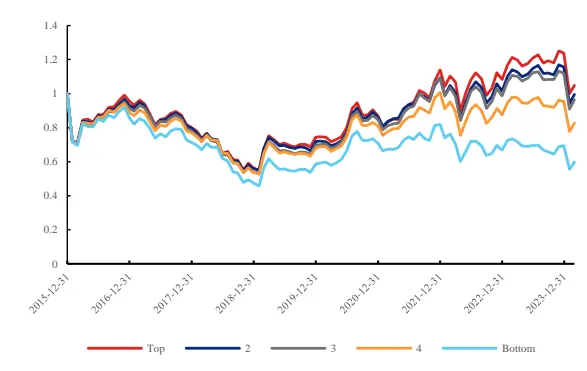
资料来源：Wind、聚源、数库、兴业证券经济与金融研究院整理

图表54、市值行业中性化后动态结构因子五分位多空组合净值表现（2015.12-2024.02）
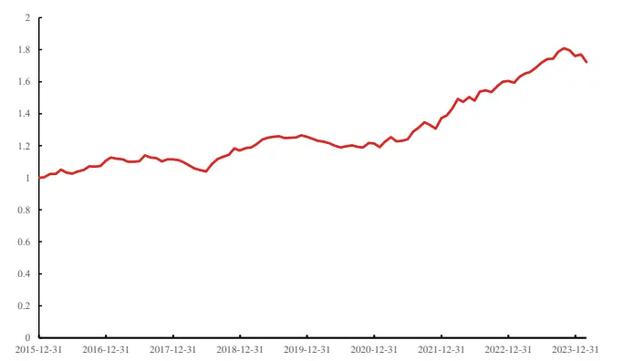

下面我们在不同股票池中测试因子表现，可以看出因子不管在沪深300、中证500还是中证1000中均维持着较好的有效性。

图表55、不同股票池中动态结构因子IC表现（2015.12-2024.02）

|  | 平均值 | 标准差 | IC_IR | t统计量 | 平均截面宽度 | 有效期数 |
| --- | --- | --- | --- | --- | --- | --- |
| 沪深300 | 2.97% | 7.98% | 0.37 | 3.68 | 272.82 | 98 |
| 中证500 | 2.56% | 7.15% | 0.36 | 3.54 | 468.58 | 98 |
| 中证 800 | 2.72% | 6.48% | 0.42 | 4.16 | 741.40 | 98 |
| 中证 1000 | 2.81% | 6.67% | 0.42 | 4.18 | 963.30 | 98 |

资料来源：Wind、聚源、数库、兴业证券经济与金融研究院整理

图表56、沪深300中动态结构因子五分位组合表现（2015.12-2024.02）

|  | 年化收益率 | 波动率 | Sharpe比率 | 最大回撤率 |
| --- | --- | --- | --- | --- |
| Top | 1.84% | 19.74% | 0.09 | 28.22% |
| 2 | 1.36% | 19.80% | 0.07 | 27.76% |
| 3 | -1.83% | 20.20% | -0.09 | 33.54% |
| 4 | -2.64% | 20.23% | -0.13 | 33.62% |
| Bottom | -5.45% | 21.88% | -0.25 | 49.93% |
| 市场 | -1.29% | 19.93% | -0.06 | 32.58% |
| L-S | 6.92% | 7.69% | 0.90 | 17.53% |

资料来源：Wind、聚源、数库、兴业证券经济与金融研究院整理

我们统计了财务附注动态结构因子与我们底层所有因子的相关性，可以看出最高为30.1%；同时因子与Barra十风格因子的相关性也处于较低水平。

图表57、动态结构因子与底层因子相关性分布（2015.12-2024.02）
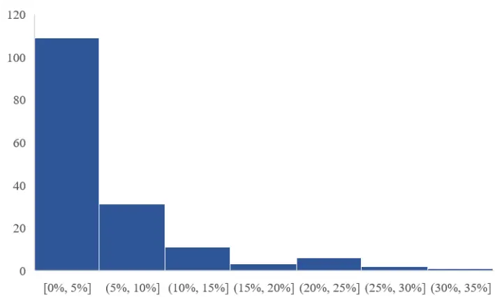
资料来源：Wind、聚源、数库、兴业证券经济与金融研究院整理

图表 58、财务附注结构变动质量因子与 Barra 因子相关性（2015.12-2024.02）
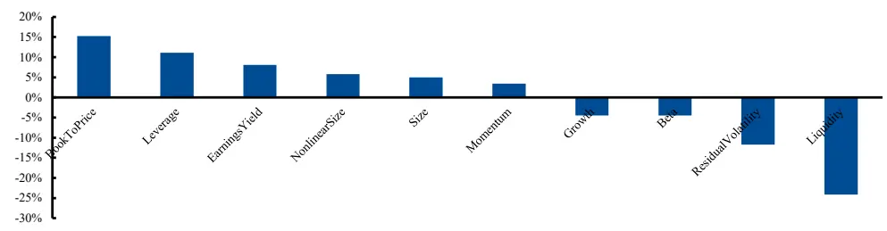
资料来源：Wind、聚源、数库、兴业证券经济与金融研究院整理

## 3.1.3、财务附注结构质量因子

上述我们通过财务附注中提炼出的有效静态和动态结构信息分别构建选股因子，两个因子在有效性和特异性层面均表现优秀。同时两个因子的相关性仅为23%，因此我们将两个因子等权合成为财务附注结构质量因子。

可以看出财务附注结构质量因子IC 均值提升至3.30%，t值为4.19，同时因子有着较好的单调性。

图表59、财务附注结构质量因子IC 表现（2015.12-2024.02）

| 平均值 |  | 标准差 | IC_IR | t统计量 | 平均截面宽度 | 有效期数 |
| --- | --- | --- | --- | --- | --- | --- |
| 因子表现 | 3.30% | 7.81% | 0.42 | 4.19 | 3547.94 | 98 |

资料来源：Wind、聚源、数库、兴业证券经济与金融研究院整理

图表60、财务附注结构质量因子五分位组合表现（2015.12-2024.02）

|  | 年化收益率 | 波动率 | Sharpe比率 | 最大回撤率 |
| --- | --- | --- | --- | --- |
| Top | 2.13% | 22.43% | 0.10 | 41.05% |
| 2 | 0.39% | 23.02% | 0.02 | 43.93% |
| 3 | -0.83% | 23.34% | -0.04 | 45.42% |
| 4 | -314% | 23.99% | 0.13 | 50.57% |
| Bottom | -6.72% | 25.23% | -0.27 | 56.55% |
| 市场 | -1.63% | 23.41% | -0.07 | 47.59% |
| L-S | 8.34% | 8.35% | 1.00 | 9.93% |

资料来源：Wind、聚源、数库、兴业证券经济与金融研究院整理

图表61、财务附注结构质量因子五分位组合净值表现（2015.12-2024.02）
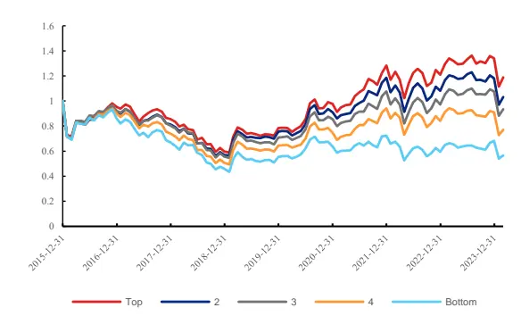
资料来源：Wind、聚源、数库、兴业证券经济与金融研究院整理

图表62、财务附注结构质量因子五分位多空组合净值表现（2015.12-2024.02）
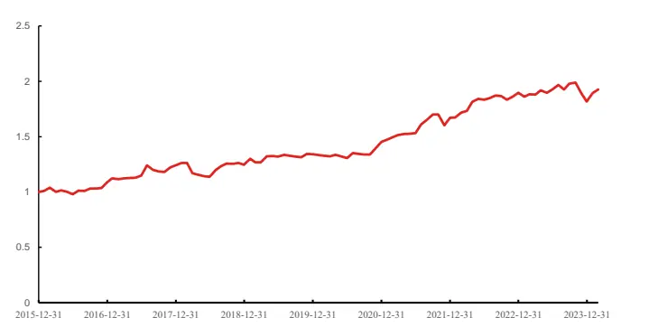

我们测试2019年12月至2024年2月因子的表现，可以看出因子IC均值为3.33%，t值为 3.78。同时剔除市值和行业影响后因子IC 均值为 3.04%，t统计量进一步提高至5.51。

图表63、财务附注结构质量因子IC 表现（2019.12-2024.02）

| 平均值 | 标准差 | IC_IR | t统计量 | 平均截面宽度 | 有效期数 |
| --- | --- | --- | --- | --- | --- |
| 因子表现 3.33% | 6.23% | 0.53 | 3.78 | 4072.96 | 50 |
| 资料来源：Wind、聚源、数库、兴业证券经济与金融研究院整理 |  |  |  |  |  |

图表 64、财务附注结构质量因子市值行业中性化后IC表现（2015.12-2024.02）

|  | 平均值 | 标准差 | IC_IR | t统计量 | 平均截面宽度 | 有效期数 |
| --- | --- | --- | --- | --- | --- | --- |
| 因子表现 | 3.04% | 5.46% | 0.56 | 5.51 | 3547.87 | 98 |

资料来源：Wind、聚源、数库、兴业证券经济与金融研究院整理

图表65、市值行业中性化后财务附注结构质量因子五分位组合表现（2015.12-2024.02)

|  | 年化收益率 | 波动率 | Sharpe比率 | 最大回撤率 |
| --- | --- | --- | --- | --- |
| Top | 1.77% | 23.51% | 0.08 | 43.83% |
| 2 | 0.50% | 23.34% | 0.02 | 44.81% |
| 3 | -0.59% | 23.28% | -0.03 | 44.97% |
| 4 | -314% | 23.65% | -0.13 | 49.76% |
| Bottom | -6.59% | 23.80% | -0.28 | 54.31% |
| 市场 | -1.63% | 23.41% | -0.07 | 47.59% |
| L-S | 8.66% | 5.53% | 1.57 | 9.98% |

资料来源：Wind、聚源、数库、兴业证券经济与金融研究院整理

图表66、市值行业中性化后财务附注结构质量因子五分位组合净值表现（2015.12-2024.02）
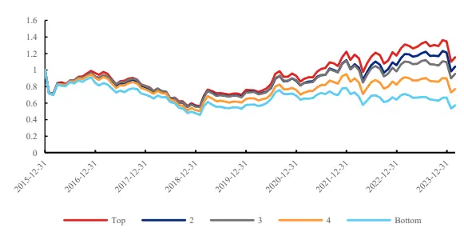
资料来源：Wind、聚源、数库、兴业证券经济与金融研究院整理

图表67、市值行业中性化后财务附注结构质量因子五分位多空组合净值表现（2015.12-2024.02）
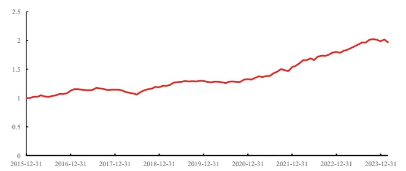

下面我们在不同股票池中测试因子表现，可以看出因子不管在沪深300、中证500还是中证1000中均维持着较好的有效性。

图表 68、不同股票池中财务附注结构综合质量因子IC 表现（2015.12-2024.02）

|  | 平均值 | 标准差 | IC_IR | t统计量 | 平均截面宽度 | 有效期数 |
| --- | --- | --- | --- | --- | --- | --- |
| 沪深300 | 3.15% | 8.44% | 0.37 | 3.69 | 284.65 | 98 |
| 中证500 | 4.07% | 8.08% | 0.50 | 4.99 | 470.50 | 98 |
| 中证 800 | 3.70% | 6.93% | 0.53 | 5.29 | 755.15 | 98 |
| 中证1000 | 3.97% | 7.13% | 0.56 | 5.51 | 963.85 | 98 |

资料来源：Wind、聚源、数库、兴业证券经济与金融研究院整理

图表69、沪深300中财务附注结构综合质量因子五分位组合表现（2015.12-2024.02)

|  | 年化收益率 | 波动率 | Sharpe比率 | 最大回撤率 |
| --- | --- | --- | --- | --- |
| Top | 2.93% | 19.27% | 0.15 | 29.21% |
| 2 | 2.92% | 20.10% | 0.15 | 29.39% |
| 3 | -2.05% | 20.02% | -0.10 | 35.33% |
| 4 | -2.42% | 19.25% | 0.13 | 34.10% |
| Bottom | -6.83% | 21.62% | -0.32 | 48.58% |
| 市场 | -1.06% | 19.58% | -0.05 | 31.36% |
| L-S | 9.53% | 8.40% | 1.14 | 11.60% |

资料来源：Wind、聚源、数库、兴业证券经济与金融研究院整理

财务附注结构综合质量因子与我们底层所有因子的相关性最高不超过30%，同时与Barra十风格因子的相关性，也处于较低水平。

图表70、财务附注结构质量因子与底层因子相关性（2015.12-2024.02）
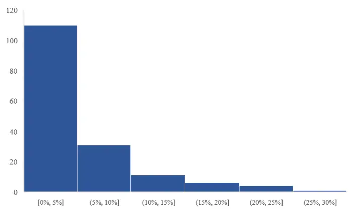
资料来源：Wind、聚源、数库、兴业证券经济与金融研究院整理

图表71、财务附注结构质量因子与 Barra 因子相关性（2015.12-2024.02）
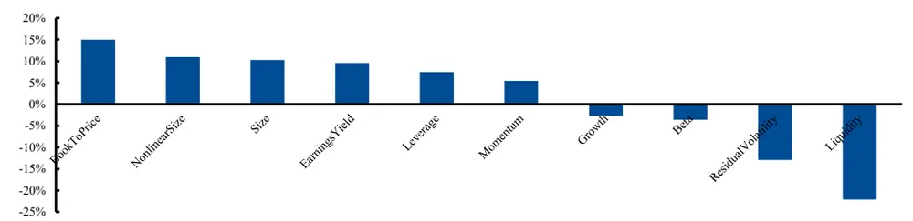
资料来源：Wind、聚源、数库、兴业证券经济与金融研究院整理

|  | 年化收益率 | Sharpe比率 | 最大回撤率 |  | 年化收益率 | Sharpe比率 | 最大回撤率 |
| --- | --- | --- | --- | --- | --- | --- | --- |
| 0 | 2.04% | 0.09 | 37.38% | 0 | 0.55% | 0.03 | 39.71% |
| 1 | 1.30% | 0.05 | 44.29% | 1 | 1.05% | 10.04 | 44.17% |
| 2 | -0.56% | -0.02 | 46.97% | 2 | -0.07% | 0.00 | 46.81% |
| 3 | -2.18% | -0.09 | 49.79% | 3 | -1.56% | -0.06 | 48.38% |
| 4 | -5.53% | -0.23 | 54.80% | 4 | -4.18% | -0.17 | 51.05% |
| 市场 | -0.93% | -0.04 | 46.80% | 市场 | -0.83% | -0.04 | 45.97% |
| L-S | 6.75% | 0.69 | 13.92% | L-S | 4.07% | 0.70 | 6.02% |

图表74、固定资产折旧除非流动资产五分位组合
图表75、固定资产折旧除以货币资金五分位组合

## 3.2、其他财务附注相关因子

## 3.2.1、比例因子

上文我们使用财务附注中的结构信息构建选股因子，综合来看表现优秀，同时财务附注所披露的补充指标仍有广泛的应用空间。

以固定资产折旧为例，在附注中才会展示折旧详细信息，而折旧蕴含了许多重要信息。折旧高的公司可能有多种优势：1、一种是折旧完成的资产，还可以使用很多年。这样企业的一些固定资产就在账面上反映不出来。例如水电企业等，折旧完成的固定资产还可以用几十年。这种类型的折旧就形成了企业的隐蔽资产。企业的账面净资产小于企业的真实净资产；2、折旧作为成本的重要组成部分，有着“税收挡板”的效用。按我国现行会计制度规定，企业常用的折旧方法有平均年限法、工作量法和年数总合法和双倍余额递减法，运用不同的折旧方法计算出的折旧额在量上是不相等的，因而分摊到各期生产成本中的固定资产成本也不同。因此，折旧的计算和提取必将影响到成本的大小，进而影响到企业的利润水平，最终影响企业的税负轻重。

上文我们测试了折旧的细分结构是一个较为有效的维度，同时我们基于折旧除以各总项构建选股因子，可以看出有效性较好。

图表72、折旧相关因子定义

|  | 因子定义 | 顺序 |
| --- | --- | --- |
| 固定资产折旧净利润比 | 固定资产折旧 TTM除以净利润 TTM | 降序 |
| 固定资产折旧非流动性资产比 | 固定资产折旧TTM除非流动资产 | 降序 |
| 固定资产折旧货币资金比 | 固定资产折旧TTM除以货币资金 | 降序 |

资料来源：Wind、聚源、数库、兴业证券经济与金融研究院整理

图表73、折旧相关因子IC表现（2015.12-2024.02）

|  | 平均值 | 标准差 | IC_IR | t统计量 | 平均截面宽度 | 有效期数 |
| --- | --- | --- | --- | --- | --- | --- |
| 固定资产折旧净利润比 | 1.90% | 9.18% | 0.21 | 2.05 | 3281.64 | 98 |
| 固定资产折旧非流动性资产比 | 2.55% | 9.48% | 0.27 | 2.66 | 3217.42 | 98 |
| 固定资产折旧货币资金比 | 2.02% | 5.57% | 0.36 | 3.58 | 2881.81 | 98 |

资料来源：Wind、聚源、数库、兴业证券经济与金融研究院整理
资料来源：Wind、聚源、数库、兴业证券经济与金融研究院整理

又比如，资产负债率是大家实践中经常使用的指标。资产负债率是企业负债总额与资产总额的比率，这一比率可以反映债权的保障程度，如果这个比率过高，说明股东所提供的资本与企业借入的资本相比，所占比重较小，这样，企业的经营风险就主要由债权人负担。因此，这个比率越高，说明企业偿还债务的能力越差；反之，偿还能力越强。

而通过相应附注中披露的细项目，例如固定资产的细节和负债类的细节，也可以构建这个指标的变形指标。例如我们用一年内到期的长期借款除以固定资产(或机器设备）来度量固定资产对长期借款的保障程度，可以看出此指标也有一定有效性。

图表76、长期负债资产比相关因子定义

| 因子定义 |  | 顺序 |
| --- | --- | --- |
| 固定资产长期负债比 | 一年内到期的长期借款除以固定资产余额比 | 升序 |
| 机器设备长期负债比 | 年内到期的长期借款除以机器设备余额比 | 升序 |

资料来源：Wind、聚源、数库、兴业证券经济与金融研究院整理

图表77、财务附注结构变动质量因子IC表现（2019.12-2024.02）

|  | 平均值 | 标准差 | IC_IR | t统计量 | 平均截面宽 度 | 有效期数 |
| --- | --- | --- | --- | --- | --- | --- |
| 固定资产长期负债比 | -2.07% | 5.70% | -0.36 | -3.60 | 1631.65 | 98 |
| 机器设备长期负债比 | -2.24% | 6.63% | -0.34 | -3.35 | 1274.28 | 98 |

资料来源：Wind、聚源、数库、兴业证券经济与金融研究院整理

图表78、固定资产长期负债比五分位组合

| 年化收益率 |  |  | Sharpe比率 最大回撤率 |  |
| --- | --- | --- | --- | --- |
| 0 | -6.08% |  | -0.26 | 50.53% |
| 1 | -1.54% | 1 | -0.07 | 45.64% |
| 2 | 0.59% |  | 0.03 | 43.81% |
| 3 | -0.78% |  | -0.03 | 43.90% |
| 4 | -0.44% C |  | -0.02 | 42.86% |
| 市场 | -1.62% |  | -0.07 | 45.37% |
| L-S | -5.79% |  | -0.89 | 38.96% |

图表79、机器设备长期负债比五分位组合

|  | 年化收益率 | Sharpe比率 最大回撤率 |
| --- | --- | --- |
| 0 | -6.40% | -0.28 52.64% |
| 1 | -2.53% | -0.11 46.31% |
| 2 | 0.58% | ■0.02 43.04% |
| 3 | 0.28% | 0.01 44.14% |
| 4 | 0.20% | 0.01 41.58% |
| 市场 | -1.55% | -0.07 45.62% |
| L-S | -6.85% | -0.92 47.11% |

资料来源：Wind、聚源、数库、兴业证券经济与金融研究院整理

## 3.2.2、另类因子

同时，财务附注中会披露一些另类项目，在主表中并无相应信息，对于部分行业(赛道)来说有着重要意义。我们以税金及附加中资源税为例，资源税是对在我国境内从事应税矿产品开采或生产盐的单位和个人征收的一种税。

图表80、资源税缴纳说明

| 项目 | 征稅范围 注意事项 |  |
| --- | --- | --- |
| 原油 | 天然原油 | 1）人造石油不征税 2）加热、修井的原油免税 |
| 天然气 | 专门开采或余原油 同时开采的 | 煤矿生产的天然气步征税 |
| 煤炭 | 原煤和以未税原煤 加工的洗选煤 | 已税原煤加工的洗选煤和其他煤炭不征税 |
| 其他非金属矿（含井矿盐、湖盐、提取地下卤水晒制的盐） |  |  |
| 金属矿 |  |  |
| 海水晒制造的盐 |  |  |

资料来源：Wind、聚源、数库、兴业证券经济与金融研究院整理

可以看出这个指标仅在一些特定行业中覆盖率较高，例如在煤炭行业中资源税指标覆盖率长期在80%以上。

图表81、煤炭行业资源税覆盖率
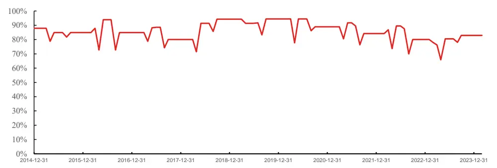
资料来源：Wind、聚源、数库、兴业证券经济与金融研究院整理

我们通过资源税除以税金及附加合计值计算资源税占比因子，可以看出此因子在煤炭行业中此指标有效性较强，即使进行了市值行业中性化依旧维持着优秀的表现。

图表 82、资源税占比 IC表现（2019.12-2024.02）

|  | 平均值 | 标准差 | IC_IR | t统计量 | 平均截面宽度 | 有效期数 |
| --- | --- | --- | --- | --- | --- | --- |
| 原始因子 | 7.14% | 25.91% | 0.28 | 2.73 | 29.40 | 98 |
| 市值行业中性化 | 6.27% | 24.81% | 0.25 | 2.50 | 29.40 | 98 |

资料来源：Wind、聚源、数库、兴业证券经济与金融研究院整理

图表83、煤炭行业中资源税占比分三组分位数表现

|  | 年化收益率 | Sharpe比率 | 最大回撤率 |
| --- | --- | --- | --- |
| 0 | 13.68% | 10.47 | 41.22% |
| 1 | 13.55% | 10.50 | 38.08% |
| 2 | b.40% | 0.01 | 57.34% |
| 市场 | 9.66% | 0.37 | 42.80% |
| L-S | 11.95% | 0.68 | 40.44% |

图表84、煤炭行业中市值行业中性化后资源税占比分三组分位数表现

| 年化收益率 |  | Sharpe比率 | 最大回撤率 |
| --- | --- | --- | --- |
| 0 | 12.94% | 10.45 | 39.52% |
| 1 | 11.77% | 0.43 | 41.45% |
| 2 | 2.95% | 0.11 | 51.32% |
| 市场 | 9.66% | 0.37 | 42.80% |
| L-S | 8.73% | 0.52 | 36.74% |

资料来源：Wind、数库、聚源、兴业证券经济与金融研究院绘制与整理

这里我们仅作一些示例。事实上，财务附注可谓是一个隐藏的宝库，其中还有受限制货币资金、研发支出、预收房款等较为重要的另类指标。在后续的研究中我们希望进一步对财务附注进行深挖，以便更好的应用这一数据源。

## 4、发布效应/事件驱动研究

上述主要从选股因子角度进行了财务附注数据应用尝试，下面我们对财务附注的发布效应进行研究。事实上，财务附注的发布要求为如果有数值应当披露，但作为附加解释项目，部分个股发布可能会出于某些原因并不发布相关指标，因此下面我们希望进一步测试相应财务附注指标发布事件的影响。

具体的，我们计算披露的相关指标的个股vs未发布相关指标的个股在对应财务报告前后一段时间相对万得全A指数的平均超额收益率。

我们对财务附注披露的所有指标均进行计算，并根据两个类型的个股（有发布vs无发布）的收益情况，划分为正面事件影响指标和负面指标影响指标。

1、正面事件影响指标：若指标发布后超额收益高于未发布此指标的个股；

2、负面事件影响指标：若指标发布后超额收益低于未发布此指标的个股；

图表85、财务附注指标发布效应研究
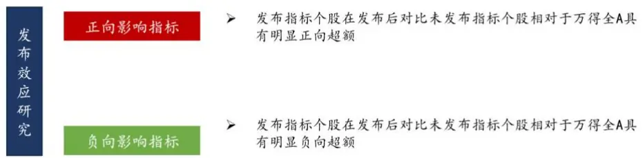
资料来源：兴业证券经济与金融研究院绘制与整理

## 4.1、正面影响指标

下面我们详细展示一部分正向事件影响指标情况。

## 应收款项融资

应收账款是指企业在正常的经营过程中因销售商品、产品、提供劳务等业务，应向购买单位收取的款项。但应收账款也会有一些成本，包括：1、机会成本。企业赊销意味着企业不能及时回收货款，而这部分资金本可用于其他投资；2、管理费用。客户信誉调查费、账户记录和保管费用、催收费用收账费用、收集信息等其他费用构成的管理费用；3、坏账成本。随规模而成正比例增长的坏账损失成为最大的风险。

应收款项融资，也称发票融资，是指企业将赊销而形成的应收账款有条件的转让给专门的融资机构，使企业得到所需资金加强资金的周转。应收账款抵借是企业的一项流动资产，能为企业带来预期经济利益，但若不能及时变现也会使企业面临资金短缺和产生坏账的隐患，目前在国际资本市场上应收账款证券化融资及应收账款转让是一种常见的理财行为，它不仅有利于加速应收账款变现，规避坏账风险也为企业提供了一个以低成本筹集资金的新的融资渠道。

应收账款融资的优点包括：1、改善资产负债率。企业即可获得资金又不增加负债从而获得资金来加快发展；2、具有非常高的弹性。当销货额增加可将大量的购物货发票直接自动转换为资金；3、成本相对较低。以应收账款作为担保品，良好的客户信用状况，能够降低的利率获得贷款；4、融资时间短、效率高。金融机构所提供的成本较低而效率较高的专业信用审核服务提高了效率；5、促使企业加强管理，决策科学化，必须从财务会计生产营销和人事等各个方面完善管理，以良好的信誉和资信为融资创造条件。

我们统计发布应收账款融资余额和未发布应收账款融资余额前后5、10、20、40、60、120天的超额收益，可以看出有发布应收账款融资余额的个股在发布财报之后获得了明显的正向超额收益。

图表86、应收账款融资余额指标发布前后平均超额收益
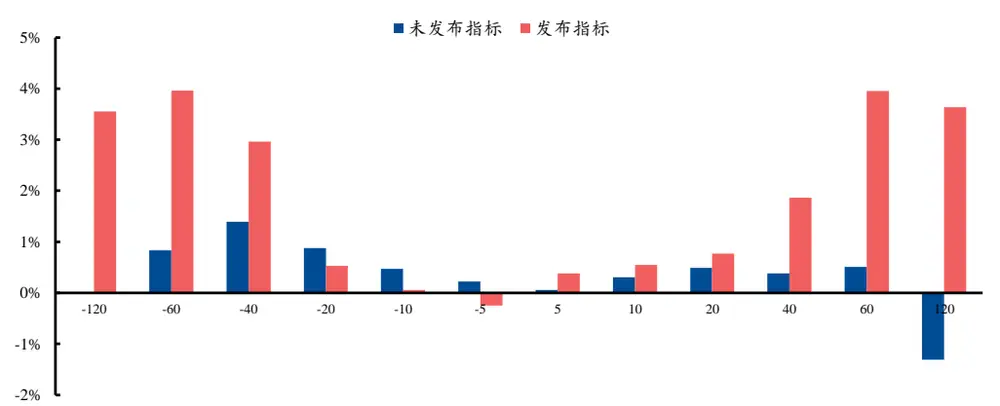
资料来源：Wind、聚源、数库、兴业证券经济与金融研究院整理

图表87、应收账款融资余额指标发布前后表现

| 平均超额收益 |  |  | T值 |  |
| --- | --- | --- | --- | --- |
|  | 未发布 | 发布 | 未发布 | 发布 |
| 120日前 | 0.00% | 3.55% | -0.01 | 13.71 |
| 60日前 | 0.83% | 3.96% | 7.39 | 20.95 |
| 40日前 | 1.40% | 2.96% | 15.31 | 19.60 |
| 20 日前 | 0.87% | 0.53% | 13.30 | 5.49 |
| 10日前 | 0.47% | 0.06% | 10.57 | 0.86 |
| 5日前 | 0.23% | -0.24% | 6.99 | -4.66 |
| 5 日后 | 0.06% | 0.38% | 1.79 | 7.20 |
| 10日后 | 0.30% | 0.55% | 6.77 | 7.86 |
| 20 日后 | 0.49% | 0.77% | 7.55 | 7.79 |
| 40日后 | 0.38% | 1.86% | 4.14 | 13.31 |
| 60 日后 | 0.51% | 3.96% | 4.52 | 21.58 |
| 120日后 | -1.31% | 3.64% | -8.72 | 14.22 |

资料来源：Wind、聚源、数库、兴业证券经济与金融研究院整理

根据我们的统计，样本内共有3533只个股发布过应收账款融资余额指标，同时应收款项融资为新金融准则下出现的报表科目，因此在2019年后才有，近年来有所增多。

图表88、应收账款融资逐年发布情况
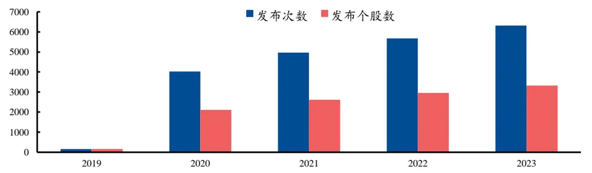
资料来源：Wind、聚源、数库、兴业证券经济与金融研究院整理

我们统计曾发布过应收账款融资余额指标个股申万一级行业分布，可以看出机械设备、基础化工、电子行业个股数目占比较多，银行、综合、非银行金融较少。

图表89、曾发布过应收账款融资指标的个股申万一级行业分布
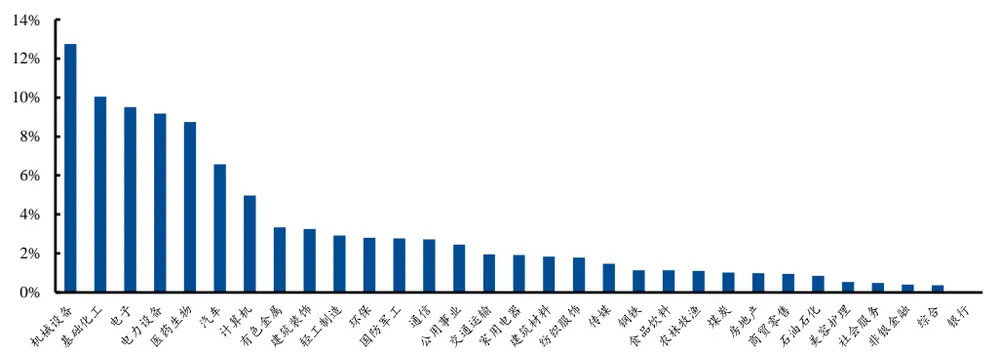
资料来源：Wind、聚源、数库、兴业证券经济与金融研究院整理

## 4.2、负面影响指标

## 其他应收款期末坏账准备

其他应收款是企业应收款项的另一重要组成部分，是企业除应收票据、应收账款和预付账款以外的各种应收暂付款项。其他应收款有迹象表明债务人很可能无法履行还款义务，则会计提坏账准备。

我们统计发布其他应收款坏账准备指标和未发布其他应收款坏账准备指标前后5、10、20、40、60、120天的超额收益，可以看出有发布其他应收款坏账准备指标的个股在发布财报之后获得了明显的负向超额收益。

图表90、其他应收款坏账准备指标发布前后平均超额收益
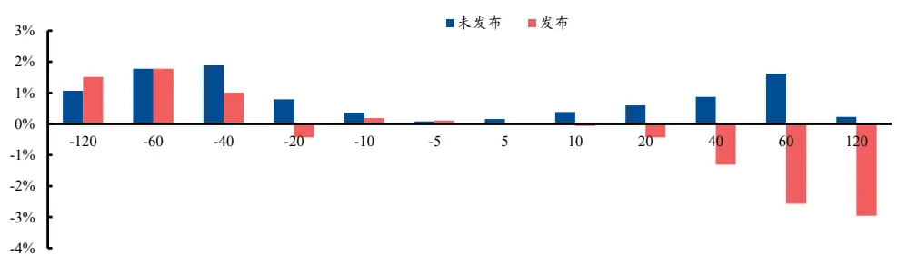
资料来源：Wind、聚源、数库、兴业证券经济与金融研究院整理

图表91、其他应收款坏账准备指标发布前后表现

| 平均超额收益 |  |  | T值 |  |
| --- | --- | --- | --- | --- |
|  | 未发布 | 发布 | 未发布 | 发布 |
| 120日前 | 1.06% | 1.51% | 7.68 | 1.95 |
| 60 日前 | 1.77% | 1.77% | 18.04 | 2.29 |
| 40日前 | 1.88% | 1.01% | 23.77 | 1.78 |
| 20 日前 | 0.79% | -0.43% | 14.43 | -1.31 |
| 10日前 | 0.35% | 0.19% | 9.27 | 0.82 |
| 5 日前 | 0.08% | 0.11% | 3.04 | 0.63 |
| 5 日后 | 0.16% | -0.03% | 5.61 | -0.15 |
| 10日后 | 0.38% | -0.06% | 10.09 | -0.25 |
| 20 日后 | 0.60% | -0.44% | 10.77 | -1.36 |
| 40 日后 | 0.87% | -1.31% | 11.05 | -2.86 |
| 60 日后 | 1.62% | -2.57% | 16.53 | -4.87 |
| 120日后 | 0.23% | -2.96% | 1.73 | -4.14 |

资料来源：Wind、聚源、数库、兴业证券经济与金融研究院整理

根据我们的统计，样本内共有749只个股发布过其他应收款坏账准备指标，同时2016、2017、2019年发布该指标的个股数目相对较多，其他年份维持较低位。

图表92、其他应收款坏账准备指标逐年发布情况
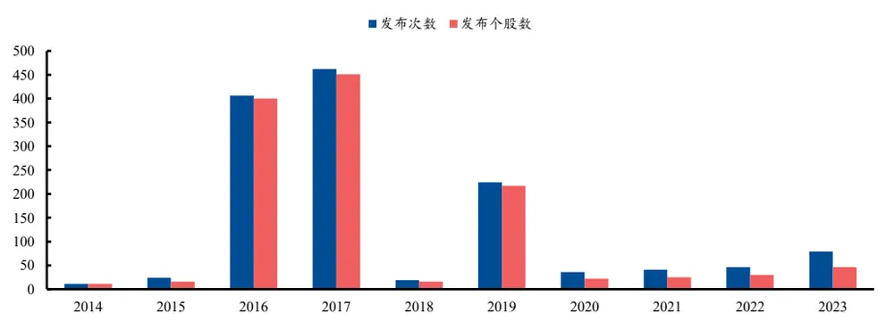
资料来源：Wind、聚源、数库、兴业证券经济与金融研究院整理

我们统计曾发布过其他应收款坏账准备指标个股申万一级行业分布，可以看出机械设备、医药生物、电子设备行业个股数目占比较多，美容护理、银行、综合、环保较少。

图表93、曾发布其他应收款坏账准备指标个股申万一级行业分布
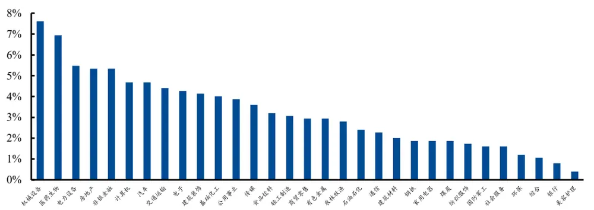
资料来源：Wind、聚源、数库、兴业证券经济与金融研究院整理

## 预付款项账面价值

预付款项是预付账款是指企业按照合同规定预付的款项。如预付的材料款、商品采购款、在建工程价款等。预付款项有迹象表明债务人很可能无法履行还款义务，则会计提坏账准备。

同时预付款项会披露期末余额、期末账面价值、期末坏账准备金额、期末余额坏账准备计提比例、期末账面余额比例等。其中期末余额为预付款项原值，而预付款项账面价值为预付款项账面余额减去相关备抵项目后的净额。

我们统计发布预付款项账面价值指标和未发布预付款项账面价值指标前后5、10、20、40、60、120天的超额收益，可以看出有发布预付款项账面价值指标的个股在发布财报之后获得了明显的负向超额收益。

图表94、预付款项账面价值指标发布前后平均超额收益
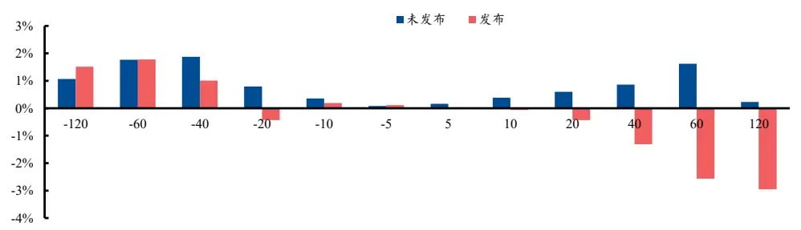
资料来源：Wind、聚源、数库、兴业证券经济与金融研究院整理

图表95、预付款项账面价值指标发布前后表现

| 平均超额收益 |  |  | T值 |  |
| --- | --- | --- | --- | --- |
|  | 未发布 | 发布 | 未发布 | 发布 |
| 120日前 | 1.08% | -0.11% | 7.86 | -0.07 |
| 60日前 | 1.77% | 2.52% | 18.07 | 2.25 |
| 40日前 | 1.87% | 1.19% | 23.75 | 1.44 |
| 20日前 | 0.77% | 1.26% | 14.10 | 1.91 |
| 10日前 | 0.35% | 0.78% | 9.22 | 1.52 |
| 5日前 | 0.08% | 0.84% | 2.94 | 2.32 |
| 5日后 | 0.16% | -0.05% | 5.58 | -0.14 |
| 10日后 | 0.38% | -0.32% | 10.05 | -0.68 |
| 20日后 | 0.59% | -1.32% | 10.71 | -2.07 |
| 40日后 | 0.84% | -2.32% | 10.86 | -2.58 |
| 60 日后 | 1.55% | -0.23% | 16.01 | -0.19 |
| 120 日后 | 0.18% | -0.66% | 1.34 | -0.41 |

资料来源：Wind、聚源、数库、兴业证券经济与金融研究院整理

根据我们的统计，样本内共有102只个股发布过预付款项账面价值指标指标，同时每年发布该指标的个股维持在30-40只左右。

图表96、预付款项账面价值指标逐年发布情况
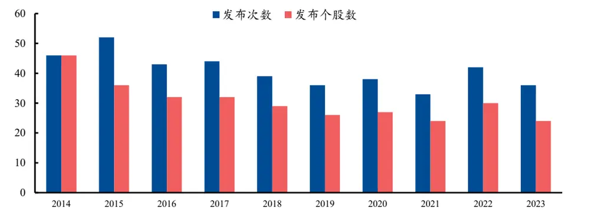
资料来源：Wind、聚源、数库、兴业证券经济与金融研究院整理

我们统计曾发布过预付款项账面价值指标个股申万一级行业分布，可以看出医药生物、非银金融、机械设备行业个股数目占比较多，通信、食品饮料、汽车、煤炭行业较少。

图表97、曾发布预付款项账面价值指标个股申万一级行业分布
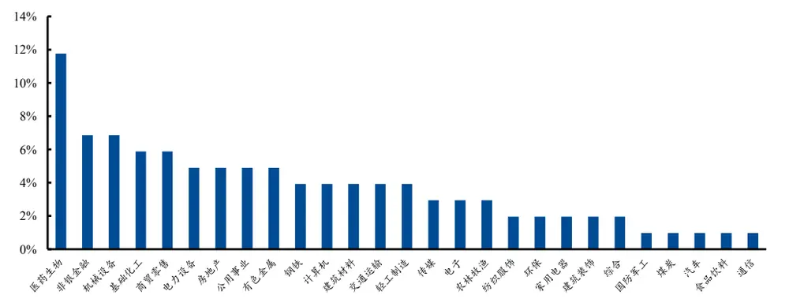
资料来源：Wind、聚源、数库、兴业证券经济与金融研究院整理

## 5、结论与未来研究展望

财务附注作为财务报表的补充说明项目，可以看出隐藏着大量的重要信息。本文从选股因子和发布效应两个维度进行财务附注应用尝试，均得到了不错的效果。以财务附注结构质量因子为例，此因子2015.12.31至2024年2月29日区间IC均值达到3.30%，t值为4.19，进行过市值行业中性化后因子IC依旧为 3.04%，t值为5.51，且此因子在沪深300、中证500、中证1000中有效性均较强；同时值得注意的是此因子与我们底层约170 个因子相关性最高不超过 30%，与Barra 十风格因子相关性也较低。同时我们测试相应财务附注指标发布事件的影响，并根据发布后表现提炼如应收款项融资等具有正面影响和其他应收款坏账准备、预付款项账面价值等具有负面影响的核心指标。

财务附注是一个隐藏的宝库，可待进一步挖掘，之后我们也将进一步基于此数据进行研究。

风险提示：报告中的结果均由相应作者通过历史数据统计、建模和测算完成，在政策、市场环境发生变化时模型存在失效的风险

## 分析师声明

本人具有中国证券业协会授予的证券投资咨询执业资格并登记为证券分析师，以勤勉的职业态度，独立、客观地出具本报告。本报告清晰准确地反映了本人的研究观点。本人不曾因，不因，也将不会因本报告中的具体推荐意见或观点而直接或间接收到任何形式的补偿。

## 投资评级说明

| 投资建议的评级标准 | 类别 | 评级 | 说明 |
| --- | --- | --- | --- |
| 报告中投资建议所涉及的评级分为股票评级和行业评级（另有说明的除外)。评级标准为报告发布日后的12个月内公司股价（或行业指数）相对同期相关证券市场代表性指数的涨跌幅。其中：A股市场以上证综指或深圳成指为基准，香港市场以恒生指数为基准；美国市场以标普500或纳斯达克综合指数为基准。 | 股票评级 | 买入 | 相对同期相关证券市场代表性指数涨幅大于15% |
|  |  | 审慎增持 | 相对同期相关证券市场代表性指数涨幅在5%～15%之间 |
|  |  | 中性 | 相对同期相关证券市场代表性指数涨幅在-5%～5%之间 |
|  |  | 减持 | 相对同期相关证券市场代表性指数涨幅小于-5% |
|  |  | 无评级 | 由于我们无法获取必要的资料，或者公司面临无法预见结果的重大不确定性事件，或者其他原因，致使我们无法给出明确的投资评级 |
|  | 行业评级 | 推荐 | 相对表现优于同期相关证券市场代表性指数 |
|  |  | 中性 | 相对表现与同期相关证券市场代表性指数持平 |
|  |  | 回避 | 相对表现弱于同期相关证券市场代表性指数 |

## 信息披露

本公司在知晓的范围内履行信息披露义务。客户可登录www.xyzq.com.cn内幕交易防控栏内查询静默期安排和关联公司持股情况。

## 使用本研究报告的风险提示及法律声明

兴业证券股份有限公司经中国证券监督管理委员会批准，已具备证券投资咨询业务资格。

，本公司不会因接收人收到本报告而视其为客户。本报

告中的信息、意见等均仅供客户参考，不构成所述证券买卖的出价或征价邀请或要约。该等信息、意见并未考虑到获取本报告人员的具体投资目的、财务状况以及特定需求，在任何时候均不构成对任何人的个人推荐。客户应当对本报告中的信息和意见进行独立评估，并应同时考量各自的投资目的、财务状况和特定需求，必要时就法律、商业、财务、税收等方面咨询专家的意见。对依据或者使用本报告所造成的一切后果，本公司及/或其关联人员均不承担任何法律责任。

本报告所载资料的来源被认为是可靠的，但本公司不保证其准确性或完整性，也不保证所包含的信息和建议不会发生任何变更。本公司并不对使用本报告所包含的材料产生的任何直接或间接损失或与此相关的其他任何损失承担任何责任。

本报告所载的资料、意见及推测仅反映本公司于发布本报告当日的判断，本报告所指的证券或投资标的的价格、价值及投资收入可升可跌，过往表现不应作为日后的表现依据：在不同时期，本公司可发出与本报告所载资料、意见及推测不一致的报告；本公司不保证本报告所含信息保持在最新状态。同时，本公司对本报告所含信息可在不发出通知的情形下做出修改，投资者应当自行关注相应的更新或修改。

除非另行说明，本报告中所引用的关于业绩的数据代表过往表现。过往的业绩表现亦不应作为日后回报的预示。我们不承诺也不保证，任何所预示的回报会得以实现。分析中所做的回报预测可能是基于相应的假设。任何假设的变化可能会显著地影响所预测的回报。

本公司的销售人员、交易人员以及其他专业人士可能会依据不同假设和标准、采用不同的分析方法而口头或书面发表与本报告意见及建议不一致的市场评论和/或交易观点。本公司没有将此意见及建议向报告所有接收者进行更新的义务。本公司的资产管理部门、自营部门以及其他投资业务部门可能独立做出与本报告中的意见或建议不一致的投资决策。

本报告并非针对或意图发送予或为任何就发送、发布、可得到或使用此报告而使兴业证券股份有限公司及其关联子公司等违反当地的法律或法规或可致使兴业证券股份有限公司受制于相关法律或法规的任何地区、国家或其他管辖区域的公民或居民，包括但不限于美国及美国公民（1934年美国《证券交易所》第15a-6条例定义为本|主要美国机构投资者」除外)。

本报告的版权归本公司所有。本公司对本报告保留一切权利。除非另有书面显示，否则本报告中的所有材料的版权均属本公司。未经本公司事先书面授权，本报告的任何部分均不得以任何方式制作任何形式的拷贝、复印件或复制品，或再次分发给任何其他人，或以任何侵犯本公司版权的其他方式使用。未经授权的转载，本公司不承担任何转载责任。

## 特别声明

在法律许可的情况下，兴业证券股份有限公司可能会持有本报告中提及公司所发行的证券头寸并进行交易，也可能为这些公司提供或争取提供投资银行业务服务。因此，投资者应当考虑到兴业证券股份有限公司及/或其相关人员可能存在影响本报告观点客观性的潜在利益冲突。投资者请勿将本报告视为投资或其他决定的唯一信赖依据。

## 兴业证券研究

| 上海 | 北京 | 深圳 |
| --- | --- | --- |
| 地址：上海浦东新区长柳路36号兴业证券大厦 | 地址：北京市朝阳区建国门大街甲6号SK大厦 | 地址：深圳市福田区皇岗路5001号深业上城T2 |
| 15层 | 32层01-08单元 | 座52楼 |
| 邮编：200135 | 邮编：100020 | 邮编：518035 |
| 邮箱：research@xyzq.com.cn | 邮箱：research@xyzq.com.cn | 邮箱：research@xyzq.com.cn |