报告日期2025 年 06 月 11 日

分析师：郑兆磊

S0190520080006

zhengzhaolei@xyzq.com.cn

分析师：占康萍

S0190522070008

zhankangping@xyzq.com.cn

【兴证金工】基本面量化系列之八：财务附注中的 Alpha 研究

【兴证金工】量化研究系列之七：光伏产业链景气度模型构建

【兴证金工】基本面量化研究系列之六：银行行业基本面量化模型构建基本面

【兴证金工】基本面量化研究系列之五：家电行业景气度投资模型构建

【兴证金工】基本面量化研究系列之四：寻找隐匿的专精特新小巨人

【兴证金工】基本面量化研究系列之三：未雨绸缪—个股财务风险监控雷达搭建【兴证金工】基本面量化研究系列之二：基本面量化视角下的科技板块选股研究【兴证金工】基本面量化研究系列之一：基本面量化视角下的大健康板块选股研究

## 基本面量化研究系列之九——事件驱动视角下的公司公告 Alpha 挖掘

## 投资要点：

- 研究背景：近年来 A 股波动剧烈，alpha 获取难度骤增，叠加指数复制愈发流行，在此背景下，事件驱动颇受投资者关注。本文专注于公告类事件的研究，尝试解决以下两个问题：基于公告的正向事件策略构建以及负向事件牟定。

- 公告事件数据库搭建：本文从目标导向和逻辑导向两维度构建公告事件库。

1）目标导向的另类公告事件库：本文从自下而上的目标导向视角构建另类公司公告事件库。具体的，我们从发布后有明显超额的公告出发，筛选触发哪些关键词的公告值得关注，从而建立另类公告事件数据库。此方法可将公告事件生成流程化、动态化，同时解决传统逻辑事件库更新缓慢、适应市场环境较难等问题，通过此方法构建的正向和负向公告事件效果均十分显著。

- 2）逻辑导向的公告事件库：进一步我们也尝试从传统逻辑角度扩充公告事件库。我们测试“股权激励”、“股东增持”等正向事件、“股权质押/冻结”、“股东被动减持”等负向事件的表现，并针对不同事件进行了逻辑角度细化。

- 以正向事件为例，我们将上述事件库合并得到兴证金工综合公告事件库，并统计事件发生前后个股相对于中证 500 指数的平均超额收益。可以看出，若我们在个股综合公告事件发生后买入，持有 60 个交易日平均能获得 8.82%的超额收益，超额胜率达 50.91%，超额盈亏比为 2.25。

图：综合公告事件发生前后 N 天相对中证 500 指数超额收益表现
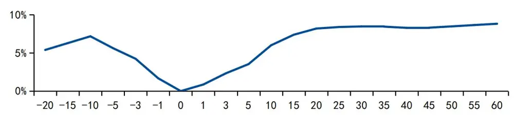
数据来源：Wind、聚源、兴业证券经济与金融研究院整理

- 多维度公告事件策略构建：我们基于综合公告事件构建多维度的选股策略。

- 1）正向事件驱动策略构建：本文基于上述综合公司公告事件库构建多种策略。以叠加多因子的定期离场公告事件策略为例，考虑双边千三费率后，此策略2014 至 2025 年 3 月期间的年化收益为 30.88%，相对中证 500 指数的超额收益率为 24.57%，超额收益风险比达 2.32；

- 2）负向事件驱动策略尝试：我们基于负面事件尝试构建指数负面剔除策略。以沪深 300 指数剔除 40 天策略为例，此策略年化收益率为 7.64%，相对沪深300 指数超额收益率为 2.54%，且分年度来看超额收益率相对稳定。

风险提示：报告中的结果均通过历史数据统计、建模和测算完成，在政策、市场环境发生变化时模型存在失效的风险。

## 一、引言

近年来，A 股波动剧烈，alpha 获取难度骤增，加之近几年被动指数复制需求激增，在被动指数复制的基础上叠加一定的事件驱动投资(Event DrivenStrategy, EDS)也是大家关注的焦点之一。事件驱动策略的核心思想是利用投资者对特定事件的反应不足或过度反应来获得超额投资回报，可作为传统多因子选股策略的一种重要补充。

在之前的报告《事件驱动角度下的个股质量监控体系搭建》中，我们初步探索了“收到监管函”、“立案调查”、“股权质押”、“股东拟减持”等事件对公司的影响，而本文希望进一步深入研究事件驱动策略的构建。

事件驱动策略的核心之一在于有效事件的定义，我们将常见事件类型归纳为以下五个方向：1）公告类事件；2）机构行为类事件；3）交易类事件；4）宏观/行业类事件；5）特殊类事件等。（之后我们也将进一步基于此框架完善兴证金工事件库）

图 1、公司事件分类
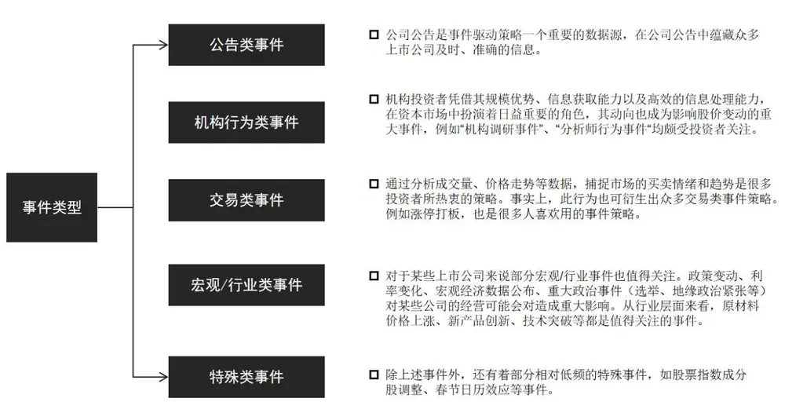
数据来源：兴业证券经济与金融研究院绘制与整理

本文从公告类事件的研究出发。一般来说，上市公司会通过公告及时向股东和公众公布其业务情况、财务状况、重大事项等信息，保障投资者的知情权，促进信息的公开透明。对于上市公司而言，信息披露不仅是一项法定义务，更是其与市场、与投资者建立互信的重要桥梁。信息披露的基本规则包括真实性、准确性、完整性、及时性和公平性。综上，可以看出公司公告囊括着公司较为及时、准确的信息，且部分临时性公告往往发布在公司有重大变化的时刻。

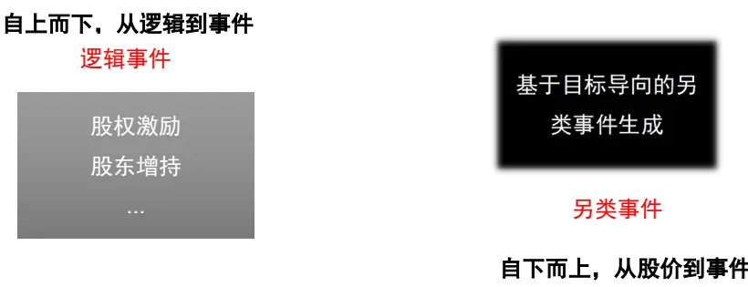
图 2、公司公告事件挖掘思路
数据来源：兴业证券经济与金融研究院绘制与整理

本文希望解决以下两个问题：1）如何从公司公告中挖掘重要事件信息；2）如何基于公告事件构建可落地的有效选股策略。

本文框架如下：

第二章——正向事件之目标导向的另类公告事件：本章主要借助对公司公告标题文本分析，从获取超额的目标导向构建另类公司公告事件库。

第三章——正向事件之逻辑导向的公告事件：本章从传统逻辑角度出发扩充公司公告事件库。

第四章——负向事件研究：本章从逻辑和另类文本两维度构建负向事件库。

第五章——多维度公告事件策略构建：本章基于正向综合公司公告事件库，构建：1、定期离场策略；2、定期调仓策略；3、指数成分股内选股策略，并通过叠加多因子进一步提升各策略表现。以叠加多因子的定期离场公告事件策略为例，此策略 2014 至 2025 年 3 月期间年化收益为 30.88%，相对中证 500 指数超额收益率为 24.57%，超额收益风险比达 2.32。其次我们尝试基于负面事件构建指数负面剔除策略。以沪深 300 指数剔除 40 天策略为例，策略年化收益率为7.64%，相对沪深 300 指数超额收益率为 2.54%，且分年度超额收益率稳定。

## 二、正向事件之目标导向的另类公告事件

## （一）研究思路

公司公告数据获取事件直接思路是从逻辑出发梳理公司公告披露的重大事件，例如股权激励、股东增持等。逻辑事件的优点是可解释性高，挣钱逻辑清晰，但其缺点也较明显：1）部分逻辑类事件随着套利行为的频繁，套利空间可能会迅速下降（与之前的超预期事件类似）；2）逻辑类事件库更新较慢，挖掘新的逻辑类事件较难；3）不同市场环境下事件有效性可能会有明显差异。因此，本文首先尝试通过基于自下而上的目标导向视角，引入文本分析视角的另类公司公告事件。

与逻辑类事件的先有事件概念，再进行事件有效性研究以及应用不同。我们从发布后有明显超额收益的公告出发，总结出触发哪些公告关键词的公告值得关注，从而建立另类公告事件数据库。此方法可将公告事件生成流程化、动态化，同时解决传统逻辑事件的事件库更新缓慢、适应市场环境较难等问题。

## （二）另类公司公告事件生成

另类公司公告事件生成步骤如下：1）数据预处理：我们提取公司公告标题数据，进行清洗；2）建立公告关键词库：提取公司公告的关键词；3）核心关键词库构建：测试触发待选关键词事件后个股表现，进一步筛选核心公告关键词库。

图 3、基于目标导向的另类公司公告事件生成流程
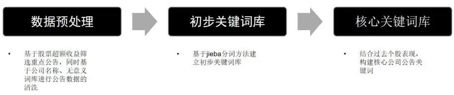
数据来源：兴业证券经济与金融研究院绘制与整理

## 1. 数据预处理

我们从聚源提取 2010年 1月1日至2025年3月31日的所有公司公告标题数据，文本的预处理流程如下：1）将公告发布后相对中证 500 未来五天超额收益率大于 15%的公告作为重点公告；2）剔除重点公告中的公司名称相关信息，包括上市公司简称、上市公司全称、上市公司英文名称等；3）剔除如“进展”、“公告”等无意义词汇。

表 1、公司公告标题预处理样例

| 原始标题 | 预处理后数据 |
| --- | --- |
| 宏辉果蔬关于募集资金2017年度存放与实际使用情况的专 项报告的公告 | 关于募集资金2017存放与实际使用情况的专项的 |
| 宏辉果蔬关于预计2018年度日常关联交易的公告 宏辉果蔬关于公司及其子公司使用闲置自有资金购买理财 | 关于预计2018日常关联交易的 |
| 产品的公告 | 关于及其子使用闲置自有资金购买理财产品的 |
| 宏辉果蔬关于公司2018年度授信贷款及担保总额相关事项 的公告 | 关于2018授信贷款及担保总额相关事项的 |
| 宏辉果蔬关于补选董事的公告 朗新科技：关于公司非经营性资金占用及其他关联资金往来 | 关于补选董事的 |
| 情况专项报告 | ：关于非经营性资金占用及其他关联资金往来情况专项 |
| 上海三毛关于股票交易异常波动核查结果的公告 | 关于股票交易异常波动核查结果的 |
| 上海三毛：控股股东关于问询函的回函 猛狮科技：关于持股5%以上股东所持公司股份被司法冻结 | ：关于问询函的回函 |
| 的公告 | ：关于持股5%以上所持被司法冻结的 |
| 猛狮科技：关于实际控制人所持公司股份被轮候冻结的公告：关于实际控制人所持被轮候冻结的 |  |
| 数据来源：wind，聚源，兴业证券经济与金融研究院整理 |  |

## 2. 初步关键词库建立

接下来我们对清洗后的公告进行关键词抽取。关键词提取是从文本中提取出能够表达文档中心内容的词语，常用于文本挖掘、信息检索、文档分类等领域。关键词提取方法主要分为无监督和有监督两类。

本文基于无监督学习算法——jieba 分词系统中 TextRank 关键词抽取算法，进行公司公告关键词的抽取。TextRank 算法是一种基于图的用于关键词抽取和文档摘要的排序算法，由谷歌的网页重要性排序算法 PageRank 算法改进而来，它利用一篇文档内部的词语间的共现信息(语义)便可以抽取关键词，它能够从一个给定的文本中抽取出该文本的关键词、关键词组，并使用抽取式的自动文摘方法抽取出该文本的关键句。

表 2、公司公告标题预处理数据关键词提取结果样例

| 清洗后公告标题 | 提取关键词结果 |  |  |  |  |
| --- | --- | --- | --- | --- | --- |
| 关于募集资金2017存放与实际使用情况的专项的 | 存放/v | 实际/n | 情况/n | 使用/v | 资金/n |
| 关于预计 2018 日常关联交易的 | 预计/vn | 关联/ns | 交易/n |  |  |
| 关于及其子使用闲置自有资金购买理财产品的 | 闲置/n | 资金/n | 购买/Vv | 自有/v | 使用/v |
| 关于2018授信贷款及担保总额相关事项的 | 担保/v | 总额/n | 贷款/n | 相关/v | 授信/v |
| 关于补选董事的 | 补选/v | 董事/n |  |  |  |
| ：关于非经营性资金占用及其他关联资金往来情况专项 | 资金/n | 关联/ns | 情况/n | 专项/n | 资金占用 /n |
| 关于股票交易异常波动核查结果的 | 股票交易/n | 结果/n | 波动/vn | 核查/vn |  |
| ：关于问询函的回函 | 问询/v | 回函/v |  |  |  |
| ：关于持股5%以上所持被司法冻结的 | 所持/v | 司法/n | 冻结/v | 持股/v |  |
| ：关于实际控制人所持被轮候冻结的 | 所持/v | 轮候/n | 控制/v | 冻结/v | 实际/n |

数据来源：wind，聚源，兴业证券经济与金融研究院整理

为了提升模型及时性和有效性，我们进行两个细节处理：

1）滚动训练模型：为了更好的适应市场变化以及及时更新事件库，我们在每年度 $Y_{T}$ ，采用 $Y_{T-3}$ 至 $Y_{T-1}$ 这三年的数据进行核心词组训练,将训练结果作为年度$Y_{T}$ 的关键词进行应用。

2）从单词关键词改为双词词组：考虑到基于单个词构建的模型噪音较多，为了更好的筛选公告，我们将每个公告的关键词通过 $C_{\mathrm{n}}^{2}$ 抽取的方式组成两个关键词组。

下图为历年滚动过去三年出现超过 10 次的关键词组数目，可以看出基本都维持在 1000 以上。

图 4、分年度初步关键词组数目
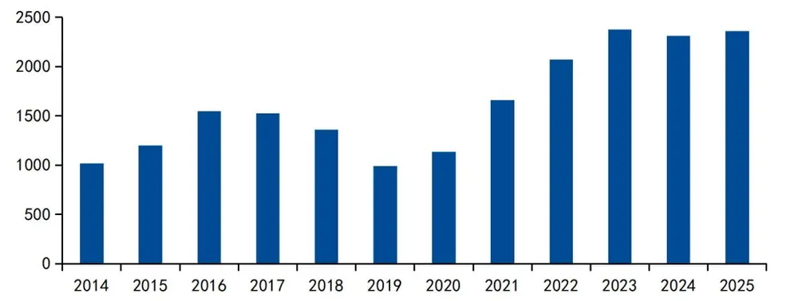
数据来源：wind，聚源，兴业证券经济与金融研究院整理

## 3. 核心关键词库筛选

下面我们计算过去三年所有触及双词词组关键词公告发布后相对中证500的未来 5 天出现次数、t 值、盈亏比、胜率、平均收益率等指标进行筛选核心关键词，即基于所有在过去三年触及关键词公告事件发生后的表现来确定哪些关键词值得关注。

经过参数敏感性测试，我们选择的正向事件参数如下：1、词组出现次数大于 30；2、t 值大于 1.96；3、盈亏比大于 1；4、如出现总次数小于 3000，胜率为 55%，若大于则提升为 60%。

下面我们展示部分出现次数较多的核心关键词组，可以看出关键词可筛选出部分带有逻辑的事件，例如“波动，风险”筛选个股股价异常的提示性公告；“资产重组,风险”筛选出公司发生重大资产重组事件。

表 3、核心关键词事件样例

| 核心关键词组样例 | 次数 | 出现年份 | 发布时间 | 公告标题样例 | 事件详情 |
| --- | --- | --- | --- | --- | --- |
| 波动,风险 | 4 | 2015、2016、2017、2018 | 2015年4月29日 | 金石东方股票交易异常波动及风险提示公告 | 股票连续两个交易日收盘价格涨幅偏离值累计超过 20% |
|  |  |  | 2015年4月29日 | 清水源股票交易异常波动及风险提示公告 | 股票连续三个交易日收盘价格涨幅偏离值累计超过 20% |
| 资产重组，风险 | 3 | 2014、2015、2016 | 2016年11月30日 | 金冠电气董事会关于重大资产重组的一般风险性提示公告 | 重大资产重组 |
|  |  |  | 2016年11月30日 | 广东甘化关于重大资产重组的一般风险提示性公告 | 重大资产重组 |
| 上市,法律 | 3 | 2014、2015、2016 | 2014年1月3日 | *ST 聚友申请股票恢复上市补充法律意见书(二) | 恢复上市 |
|  |  |  | 2014年3月13日 | 久立特材国浩律师(杭州)事务所关于公司公开发行可转换公司债券在深圳证券交易所上市的法律意见书 | 发行可转债 |
|  |  |  | 2015年4月1日 | 东方能源北京市中咨律师事务所关于公司非公开发行股票募集资金拟购买资产符合借壳上市条件的法律意见书 | 定增 |
| 持续,挂钩 | 2 | 2022、2023 | 2022年7月18日 | 华能国际电力股份有限公司 2022 年度第五期中期票据(可持续挂钩)发行方案(联主) | 中期票据 |
|  |  |  | 2023年4月12日 | 大唐国际发电股份有限公司2021 年度第一期中期票据(可持续挂钩)存续期验证报告 | 中期票据 |
| 软件,重点 | 2 | 2015、2016 | 2015年2月6日 | 超图软件关于获得国家重点新产品证书的公告 | 新产品 |
|  |  |  | 2015年12月26日 | 南威软件关于自主可控软件实验室被认定为福建省重点实验室的公告 | 重点实验室 |
|  |  |  | 2016年12月13日 | 盛天网络关于享受国家规划布局内重点软件企业所得税优惠政策的提示性公告 | 重点软件企业 |
| 资产,预案 | 2 | 2015、2016 | 2015年1月1日 | 洛阳玻璃重大资产置换及发行股份购买资产并募集配套资金暨关联交易预案 | 购买资产 |
|  |  |  | 2015年1月5日 | 万昌科技发行股份及支付现金购买资产暨关联交易报告书（草案）与预案差异情况对比表 | 购买资产 |

数据来源：wind，聚源，兴业证券经济与金融研究院整理

下面为 2025 年的关键词组样例，可以看出事件覆盖例如股份回购（“回报,回购”、“回购,行动”）等传统事件，但也覆盖了比如发布资产证券化等另类事件（证券化,资产）。

表 4、核心关键词组列表（部分）

| 词汇 | 平均收益 | T值 | 胜率 | 盈亏比 | 年份 |
| --- | --- | --- | --- | --- | --- |
| 向下,除权 | 12.71% | 7.23 | 90.00% | 62.27 | 2025 |
| 除权,风险 | 12.71% | 7.23 | 90.00% | 62.27 | 2025 |
| 向下,风险 | 11.48% | 6.89 | 88.24% | 50.33 | 2025 |
| 回报,集中 | 5.11% | 7.68 | 72.00% | 4.29 | 2025 |
| 回报,回购 | 4.28% | 7.58 | 66.82% | 2.84 | 2025 |
| 个人住房,贷款 | 1.34% | 39.17 | 64.47% | 2.43 | 2025 |
| 受托,机构 | 1.37% | 42.2 | 64.22% | 2.43 | 2025 |
| 证券化,贷款 | 1.43% | 30.67 | 64.13% | 2.34 | 2025 |
| 回报,董事长 | 5.26% | 4.63 | 63.85% | 3.32 | 2025 |
| 机构,证券化 | 1.41% | 34.36 | 63.60% | 2.39 | 2025 |
| 受托,证券化 | 1.39% | 34.39 | 63.36% | 2.37 | 2025 |
| 贷款,资产 | 1.08% | 29.15 | 62.44% | 2.12 | 2025 |
| 支持,证券 | 0.96% | 27.26 | 62.39% | 2.02 | 2025 |
| 回购,行动 | 3.50% | 5.98 | 62.25% | 2.42 | 2025 |
| 信托,证券化 | 1.28% | 33.06 | 62.17% | 2.15 | 2025 |
| 证券化,资产 | 1.13% | 22.73 | 60.14% | 1.98 | 2025 |

数据来源：wind，聚源，兴业证券经济与金融研究院整理

## 4. 另类公告事件股价分析

下面我们测试基于核心关键词组构建的另类公告事件次数。在 2014 年至2025 年 3 月 31 日区间，共触发另类公告事件 8005 次，涉及个股 2351 只。分年度来看，另类公告事件在 2015-2016 年发生次数相对较多，而后数目下降，但近年来又有回暖趋势。

图 5、分年度另类公告事件次数
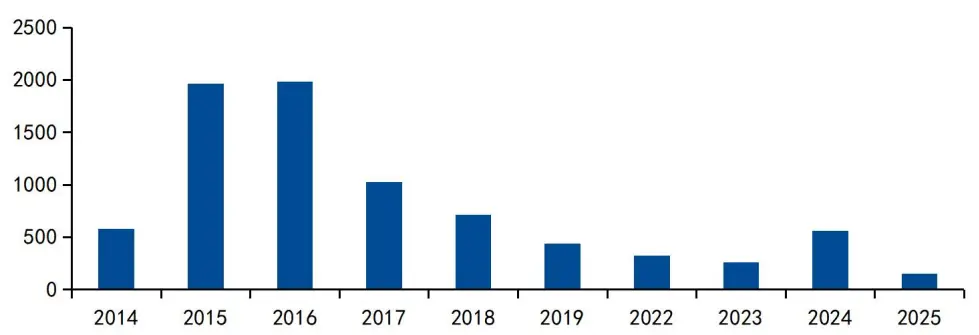
数据来源：wind，聚源，兴业证券经济与金融研究院整理

如果我们在上市公司发布另类公告事件后买入，平均超额收益率较高，持有20个交易日平均能够获得14.40%的相对中证500超额收益，超额胜率为49.28%。同时值得关注的是，事件的盈亏比较高，未来 20 天超额收益的盈亏比高达 3.24。

表 5、股票激励事件发生后收益

|  | 平均绝对 收益率 | 绝对收益率 胜率 | 绝对收益 率盈亏比 | 平均超额 收益率 | 超额收益 率胜率 | 超额收益 率盈亏比 |
| --- | --- | --- | --- | --- | --- | --- |
| 未来5天 | 6.76% | 45.14% | 2.83 | 6.42% | 50.26% | 2.62 |
| 未来 10 天 | 11.41% | 47.97% | 3.32 | 10.92% | 50.04% | 3.19 |
| 未来 20 天 | 14.92% | 49.50% | 3.17 | 14.40% | 49.28% | 3.24 |
| 未来 60 天 | 12.81% | 47.44% | 2.26 | 12.80% | 48.41% | 2.43 |

数据来源：wind，聚源，兴业证券经济与金融研究院整理

图 6、另类公告事件发生前后 T 天收益率
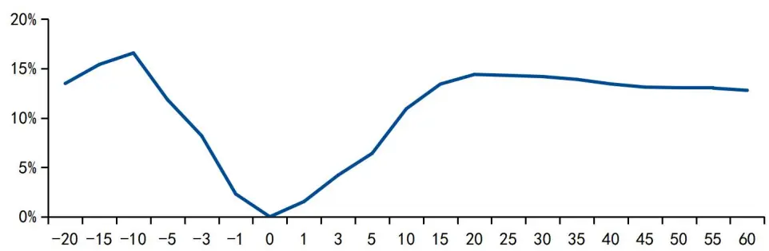
数据来源：wind，聚源，兴业证券经济与金融研究院整理

## 三、正向事件之逻辑导向的公司公告事件

上文我们基于另类文本研究构建了动态公告事件，本章我们进一步纳入逻辑类公告事件进行补充，同时本文暂以关注度较高且表现较好的股权变动类公告为主。

图 7、股权变动类逻辑公告事件
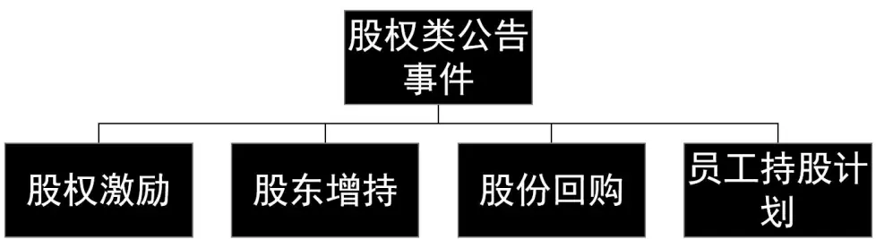
数据来源：兴业证券经济与金融研究院绘制

## （一）股权激励

股权激励是一种通过经营者获得公司股权形式给予企业经营者一定的经济权利，使他们能够以股东的身份参与企业决策、分享利润、承担风险，从而勤勉尽责地为公司的长期发展服务的一种激励方法。

我们基于聚源的激励计划（LC_IncentivePlans）表筛选 2014 年 1 月 1 日至2025年3月31日发布股权激励公告的公司（按照首次发布日期作为事件发生日），区间事件发生总次数为 4879 次，涉及个股 2932 只。

图 8、分年度股权激励事件发生次数
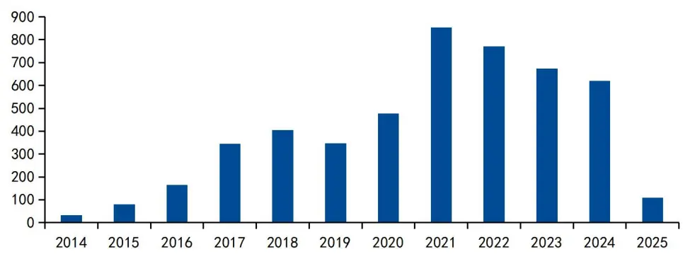
数据来源：Wind，聚源，兴业证券经济与金融研究院整理，注：2025年截至3 月 31日

我们统计事件发生前后股票相对于中证 500 指数的平均超额收益，其收益如下所示。如果我们在上市公司发布股权激励事件后买入，其往后的 60 个交易日中的超额收益较为稳定且持续，持有 60 个交易日平均能够获得 5.16%的超额收益，胜率达 51.38%，盈亏比为 1.92。

表 6、股票激励事件发生后收益统计（2014/1/1-2025/3/31）

|  | 平均绝对 收益率 | 绝对收益率 胜率 | 绝对收益 率盈亏比 | 平均超额 收益率 | 超额收益 率胜率 | 超额收益 率盈亏比 |
| --- | --- | --- | --- | --- | --- | --- |
| 未来5天 | 0.71% | 50.56% | 1.3 | 0.58% | 49.38% | 1.28 |
| 未来 10 天 | 1.19% | 50.70% | 1.36 | 1.05% | 49.36% | 1.38 |
| 未来 20 天 | 2.26% | 49.94% | 1.52 | 2.02% | 51.22% | 1.55 |
| 未来 60 天 | 5.47% | 49.85% | 1.8 | 5.16% | 51.38% | 1.92 |

数据来源：Wind，聚源，兴业证券经济与金融研究院整理，注：2025年截至3 月 31日

图 9、股权激励事件发生前后超额收益率（2014/1/1-2025/3/31）
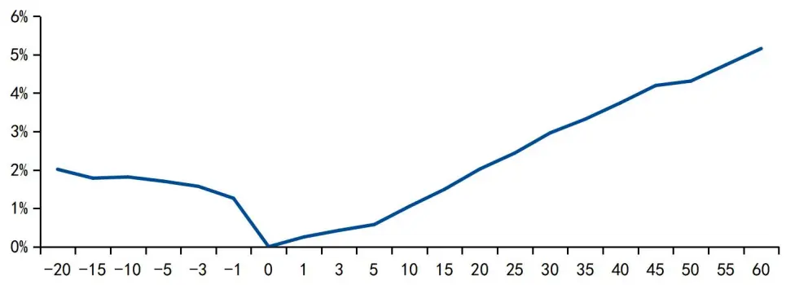
数据来源：Wind，聚源，兴业证券经济与金融研究院整理

我们提取股权激励的方式（包括股权期权、限制性股权、虚拟股权、股权增值权），进一步筛选以限制性股权为激励方式的事件。

图 10、筛选限制性股票激励后事件数目
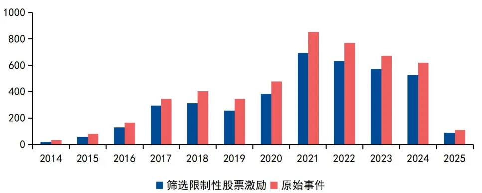
数据来源：Wind，聚源，兴业证券经济与金融研究院整理，注：2025年截至3 月 31日

可以看出纳入限制性股票的激励方式筛选后在收益率和胜率等指标上均有小许提升。

表 7、筛选限制性股票激励事件发生后收益（2014/1/1-2025/3/31）

|  | 平均绝对 收益率 | 绝对收益率 胜率 | 绝对收益 率盈亏比 | 平均超额 收益率 | 超额收益 率胜率 | 超额收益 率盈亏比 |
| --- | --- | --- | --- | --- | --- | --- |
| 未来5天 | 0.74% | 50.52% | 1.31 | 0.59% | 48.92% | 1.28 |
| 未来 10 天 | 1.25% | 50.48% | 1.37 | 1.11% | 49.13% | 1.39 |
| 未来 20 天 | 2.44% | 50.44% | 1.57 | 2.17% | 51.20% | 1.59 |
| 未来 60 天 | 5.45% | 50.03% | 1.80 | 5.22% | 51.82% | 1.93 |

数据来源：Wind，聚源，兴业证券经济与金融研究院整理

图 11、筛选限制性股票激励事件发生前后 N 天超额收益（2014/1/1-2025/3/31）
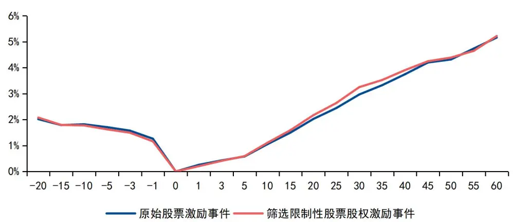
数据来源：Wind，聚源，兴业证券经济与金融研究院整理

## （二）股东增持

股东增持，是指上市公司的股东增加其所持有的该公司股票的数量。这通常反映了股东对公司未来发展的信心和看好。股份增持，特别是重要（主要）股东（也叫“关键少数”）的增持一般来说会给市场传递积极的信号，给股价带来正向的影响。

我们基于聚源的股东增减持计划表（LC_TransferPlan）表筛选 2013 年 1月1 日至 2025 年 3 月 31 日发布股权激励公告的公司。

图 12、分年度股东增持事件发生次数
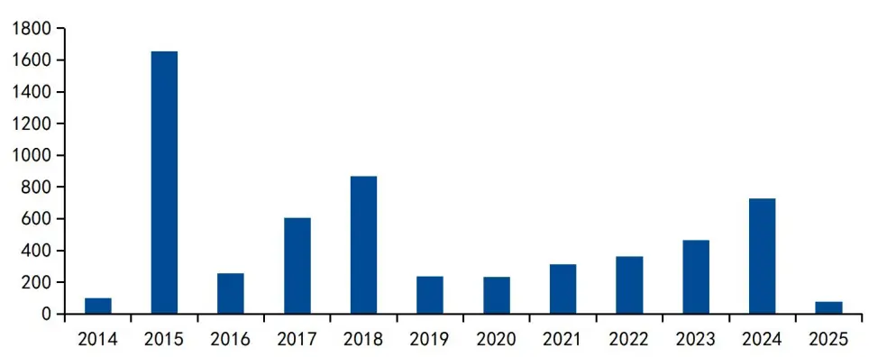
数据来源：Wind，聚源，兴业证券经济与金融研究院整理，注：2025年截至3 月 31日

我们统计事件发生前后股票相对于中证 500 指数的平均超额收益，其收益如下表所示。如果我们在上市公司发布股东增持事件后买入，其往后的 60 个交易日中的超额收益整体较高，但并非特别稳定，持有 60 个交易日平均能够获得5.21%的超额收益，胜率达 54.20%，盈亏比为 1.97。

表 8、股东增持事件发生后收益（2014/1/1-2025/3/31）

|  | 平均绝对 收益率 | 绝对收益率 胜率 | 绝对收益 率盈亏比 | 平均超额 收益率 | 超额收益 率胜率 | 超额收益 率盈亏比 |
| --- | --- | --- | --- | --- | --- | --- |
| 未来5 天 | 3.72% | 55.84% | 2.92 | 1.43% | 50.44% | 1.57 |
| 未来10 天 | 6.25% | 58.66% |  |  |  |  |
| 未来20 天 6.28% | 59.22% |  | 2.93 | 2.76% | 52.79% | 1.72 |
| 未来 60 天 | 4.38% | 50.49% | 1.66 | 5.21% | 54.20% | 1.97 |

数据来源：Wind，聚源，兴业证券经济与金融研究院整理，注：2025年截至3 月 31日

图 13、股东增持事件发生前后 N 天超额收益（2014/1/1-2025/3/31）
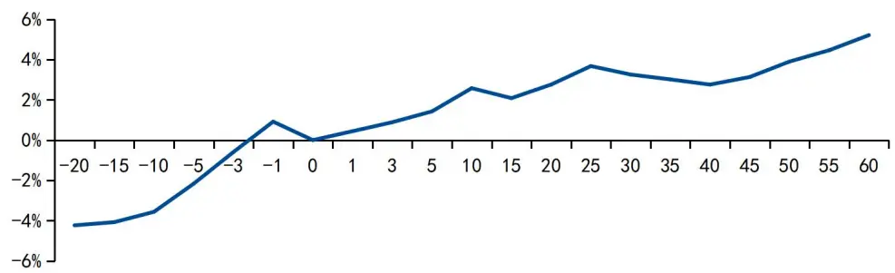
数据来源：Wind，聚源，兴业证券经济与金融研究院整理，注：2025年截至3 月 31日

进一步，我们按照增持对象筛选公司高管增持事件，事件数目有明显下降。但可以看出在筛选高管增持事件后在收益率和胜率上均得到了一定提升。

图 14、分年度高管增持事件发生次数
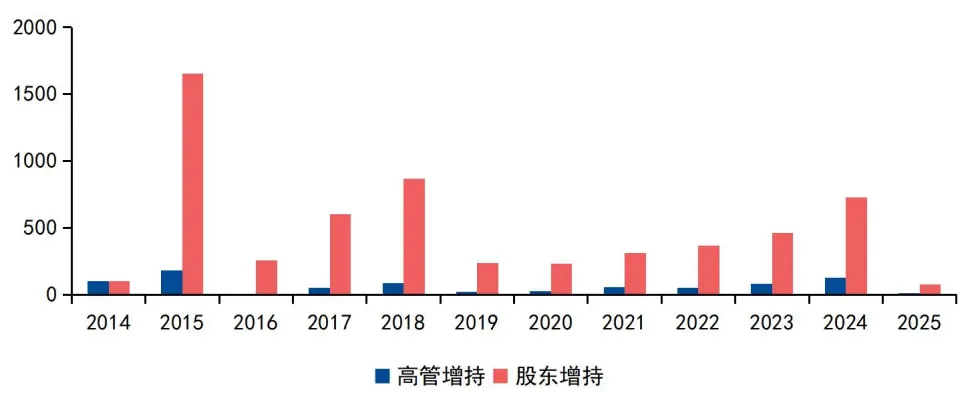
数据来源：Wind，聚源，兴业证券经济与金融研究院整理，注：2025年截至3 月 31日

表 9、高管增持事件发生后超额收益（2014/1/1-2025/3/31）

|  | 平均绝对 收益率 | 绝对收益率 胜率 | 绝对收益 率盈亏比 | 平均超额 收益率 | 超额收益 率胜率 | 超额收益 率盈亏比 |
| --- | --- | --- | --- | --- | --- | --- |
| 未来5天 | 4.33% | 58.58% | 3.26 | 2.10% | 53.49% | 1.85 |
| 未来 10 天 | 6.55% | 58.43% | 3.52 | 3.57% | 58.28% | 2.22 |
| 未来 20 天 | 7.90% | 61.57% | 3.42 | 4.46% | 59.53% | 2.20 |
| 未来 60 天 | 5.13% | 51.75% | 1.71 | 6.06% | 56.43% | 2.08 |

数据来源：Wind，聚源，兴业证券经济与金融研究院整理，注：2025年截至3 月 31日

图 15、高管增持事件发生前后 N 天超额收益（2014/1/1-2025/3/31）
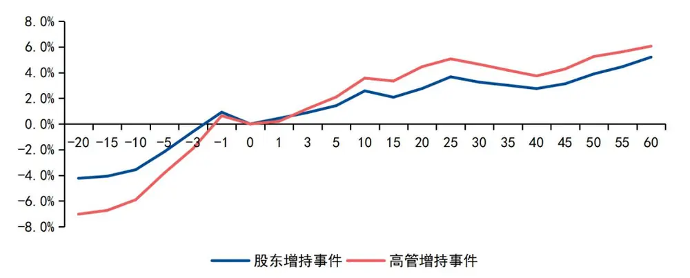
数据来源：Wind，聚源，兴业证券经济与金融研究院整理，注：2025年截至3 月 31日

## （三）股份回购

股份回购是指公司按一定的程序购回发行或流通在外的股份的行为；是通过大规模买回公司发行在外的股份来改变资本结构的防御方法；是目标公司或其董事、监事回购目标公司的股份。

我们基于聚源的股份回购计划表（LC_TransferPlan）表筛选 2013 年 1 月 1日至 2025 年 3月 31 日发布股权激励公告的公司。

图 16、分年度股东回购事件发生次数
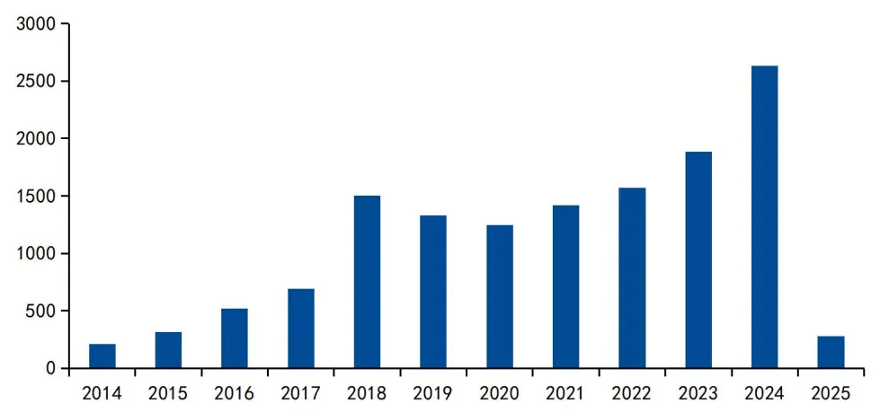
数据来源：Wind，聚源，兴业证券经济与金融研究院整理，注：2025年截至3 月 31日

我们统计事件发生前后股票相对于中证 500 指数的平均超额收益，其收益如下所示。如果我们在上市公司发布股权回购事件后买入，其往后的 60 个交易日中的超额收益表现相对一般，持有 60 个交易日平均能够获得 3.08%的超额收益，胜率达 49.13%，盈亏比为 1.53。

表 10、股票回购事件发生后超额收益（2014/1/1-2025/3/31）

|  | 平均绝对 收益率 | 绝对收益率 胜率 | 绝对收益 率盈亏比 | 平均超额 收益率 | 超额收益 率胜率 | 超额收益 率盈亏比 |
| --- | --- | --- | --- | --- | --- | --- |
| 未来5 天 | 1.11% | 51.97% | 1.52 | 0.58% | 48.72% | 1.30 |
| 未来 10 天 | 1.76% | 52.99% | 1.63 | 0.96% | 49.78% | 1.38 |
| 未来 20 天 | 2.57% | 51.73% | 1.67 | 1.65% | 50.51% | 1.48 |

数据来源：Wind，聚源，兴业证券经济与金融研究院整理，注：2025年截至3 月 31日

图 17、股份回购事件发生前后 N 天超额收益（2014/1/1-2025/3/31）
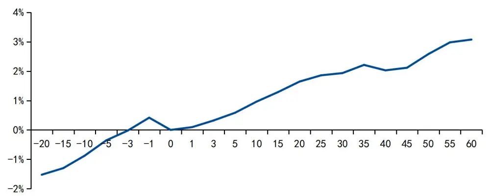
数据来源：Wind，聚源，兴业证券经济与金融研究院整理

同时，我们筛选以市值管理、吸收合并为回购目的的事件进行分析。

图 18、筛选回购目的前后事件次数
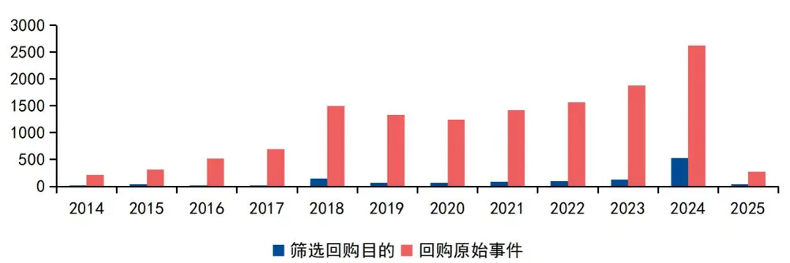
数据来源：Wind，聚源，兴业证券经济与金融研究院整理，注：2025年截至3 月 31日

如果我们按回购目的筛选事件后买入，其往后的 60 个交易日中的超额收益相对较为稳定且持续，持有 60 个交易日平均能够获得 6.15%的超额收益，胜率达 57.43%。

表 11、按回购目的筛选股票回购事件发生后超额收益（2014/1/1-2025/3/31）

|  | 平均绝对 收益率 | 绝对收益率 胜率 | 绝对收益 率盈亏比 | 平均超额 收益率 | 超额收益 率胜率 | 超额收益 率盈亏比 |
| --- | --- | --- | --- | --- | --- | --- |
| 未来5天 | 3.72% | 59.60% | 3.21 | 2.15% | 53.77% | 2.18 |
| 未来 10 天 | 5.07% | 62.80% | 3.47 | 3.02% | 57.54% | 2.43 |
| 未来 20 天 | 7.49% | 64.23% | 3.85 | 4.48% | 61.15% | 2.62 |
| 未来 60 天 | 10.26% | 61.24% | 3.34 | 6.15% | 57.43% | 2.34 |

数据来源：Wind，聚源，兴业证券经济与金融研究院整理

图 19、按 回 购 目 的 筛 选 股 份 回 购 事 件 前 后 T 天 超 额 收 益 率（2014/1/1-2025/3/31）
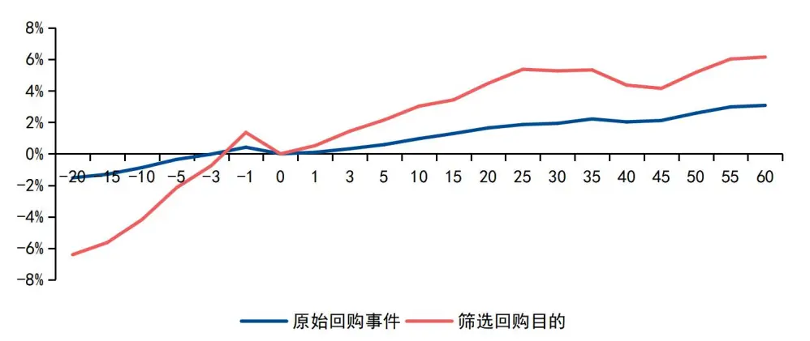
数据来源：Wind，聚源，兴业证券经济与金融研究院整理

## （四）员工持股计划

员工持股计划是指让激励对象持有一定数量的本公司的股票（股权），这些股票（股权）是公司无偿赠与激励对象的、或者是公司补贴激励对象购买的、或是激励对象自行出资购买，员工通过购买或被赠与公司部分股票（股权）而拥有公司的部分产权，并获得相应的管理权。

我们基于聚源的员工持股计划表筛选2013年1月1日至2025年 3月31日发布员工持股计划的公司。

图 20、分年度员工持股计划事件发生次数
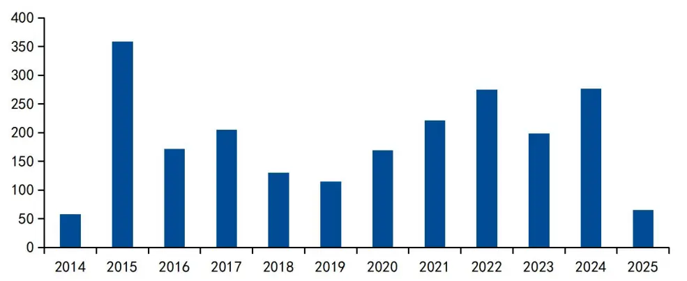
数据来源：Wind，聚源，兴业证券经济与金融研究院整理，注：2025年截至3 月 31日

我们统计事件发生前后股票相对于中证 500 指数的平均超额收益，其收益如下所示。如果我们在上市公司发布员工持股计划事件后买入，其往后的 60 个交易日中的超额收益相对稳定，持有 60 个交易日平均能够获得 4.91%的超额收益，胜率达 51.79%，盈亏比为 1.88。

表 12、员工持股事件发生后超额收益（2014/1/1-2025/3/31）

|  | 平均绝对 收益率 | 绝对收益率 胜率 | 绝对收益 率盈亏比 | 平均超额 收益率 | 超额收益 率胜率 | 超额收益 率盈亏比 |
| --- | --- | --- | --- | --- | --- | --- |
| 未来5 天 | 1.31% | 49.87% | 1.52 | 0.77% | 48.52% | 1.34 |
| 未来10 天 | 1.98% | 51.44% | 1.59 | 1.52% | 49.64% | 1.53 |
| 未来 20 天 3.02% |  | 52.51% | 1.64 | 2.46% | 50.34% | 1.66 |
| 未来 60 天 | 5.66% | 50.51% | 1.81 | 4.91% | 51.79% | 1.88 |

数据来源：Wind，聚源，兴业证券经济与金融研究院整理

图 21、员工持股事件发生前后 N 天超额收益（2014/1/1-2025/3/31）

数据来源：Wind，聚源，兴业证券经济与金融研究院整理

## 四、负向事件研究

上文我们主要测试了正向事件的实际应用，但事实上负面事件也颇受投资者关注。因此我们在之前研究的负面事件基础上（股东质押/冻结、股东拟减持）进一步叠加负面另类文本公告事件构建负向综合事件库。

## （一）股东质押/冻结

股权质押是股东主动将其股权作为质押物，以获取融资或其他利益的行为。质押后，股东仍然拥有对股权的处置权。股权冻结则是由于法律原因（如诉讼、执行等）导致股权被法院限制转让或提取的强制措施。在股权被冻结的情况下，股东将失去对该股权的处置权，包括转让和质押。即使股权已经质押，冻结期间质权人也无法行使质权。两者的主要区别在于，股权质押是主动行为，而股权冻结是被动行为，前者是为了融资，后者是为了保全债权。

我们基于聚源的股东质押表筛选2013年1月1日至2025年 3月31日发布股权质押/冻结公告，且质押/冻结比例超过 20%的公司。

图 22、股权质押/冻结事件次数（筛选质押/冻结比例大于 20%）
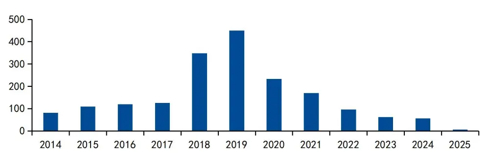
数据来源：wind，聚源，兴业证券经济与金融研究院整理，注：2025年截至 3月 31日

我们统计事件发生前后股票相对于中证 500 指数的平均超额收益，其收益如下图所示。如果我们在上市公司发布相应事件后买入，其往后的 60 个交易日中的负向超额收益相对稳定，持有 60 个交易日平均能够获得-3.37%的超额收益，胜率为 38.98%，盈亏比为 0.71。

表 13、股票质押/冻结事件发生后收益

|  | 平均绝对 收益率 | 绝对收益率 胜率 | 绝对收益 率盈亏比 | 平均超额 收益率 | 超额收益 率胜率 | 超额收益 率盈亏比 |
| --- | --- | --- | --- | --- | --- | --- |
| 未来5天 | -0.65% | 39.56% | 0.80 | -0.66% | 41.28% | 0.78 |
| 未来 10 天 | -0.93% | 41.41% | 0.80 | -1.01% | 43.52% | 0.77 |
| 未来 20 天 | -1.63% | 40.13% | 0.77 | -1.92% | 41.13% | 0.71 |
| 未来 60 天 | -1.97% | 40.60% | 0.84 | -3.37% | 38.98% | 0.71 |

数据来源：wind，聚源，兴业证券经济与金融研究院整理

图 23、股权质押/冻结事件次数（筛选质押/冻结比例大于 20%）发生前后 N 天收益（2014/1/1-2025/3/31）
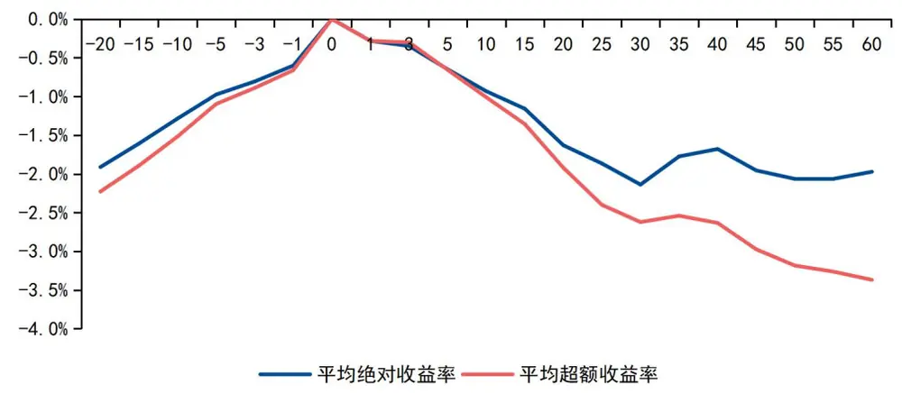
数据来源：wind，聚源，兴业证券经济与金融研究院整理

## （二）股东被动减持

我们基于聚源的股东增减持计划表（LC_TransferPlan）表筛选 2013 年 1月1 日至 2025 年 3 月 31 日发布股东被动减持公告的公司。

图 24、分年度股东被动减持事件发生次数
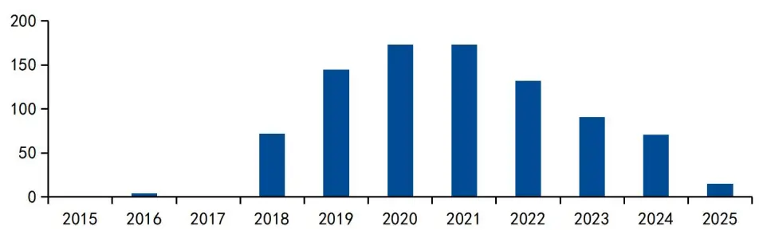
数据来源：wind，聚源，兴业证券经济与金融研究院整理，注：2025年截至 3月 31日

我们统计事件发生前后股票相对于中证 500 指数的平均超额收益，其收益如下图所示。如果我们在上市公司发布股东被动减持事件后买入，其往后的 60 个交易日中的负超额收益较为稳定，持有 60 个交易日平均能够获得-3.28%的超额收益，胜率为 39.44%。

表 14、股东被动减持事件

|  | 平均绝对 收益率 | 绝对收益率 胜率 | 绝对收益 率盈亏比 | 平均超额 收益率 | 超额收益 胜率 | 超额收益 率盈亏比 |
| --- | --- | --- | --- | --- | --- | --- |
| 未来5天 | -0.41% | 45.71% | 0.88 | -0.65% | 41.71% | 0.80 |
| 未来 10 天 | -0.82% | 43.76% | 0.83 | -1.02% | 42.73% | 0.78 |
| 未来 20 天 | -1.06% | 41.97% | 0.84 | -1.47% | 42.09% | 0.77 |
| 未来 60 天 | -2.27% | 40.37% | 0.81 | -3.28% | 39.44% | 0.72 |

数据来源：wind，聚源，兴业证券经济与金融研究院整理

图 25、股东被动减持事件前后 T 天收益率
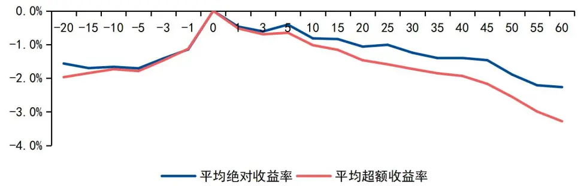
数据来源：wind，聚源，兴业证券经济与金融研究院整理

## （三）负向另类公告事件

我们按照上文同样的方法基于下述参数筛选负向另类公告事件：1、t 值小于－1.96；3、盈亏比小于 1；3、胜率小于 50%；4、平均超额收益率均值小于-0.02，筛选负向事件。

图 26、基于目标导向的负向另类公司公告事件比发生前后超额收益表现
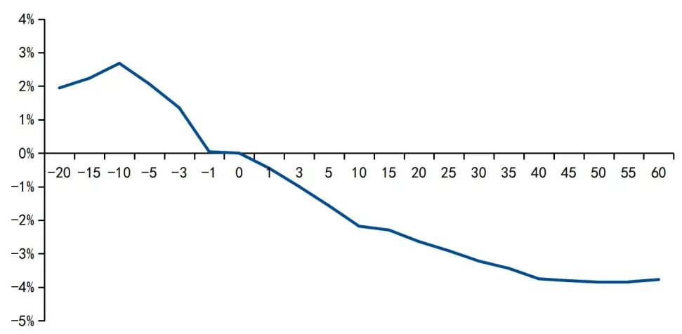
数据来源：wind，聚源，兴业证券经济与金融研究院整理

## 五、多维度公告事件策略构建

## （一）正向公告事件驱动策略构建

## 1. 正向公告事件效应测试以及策略构建思路

上文基于公司公告数据从另类文本和逻辑两个维度分别构建了公告事件库，下面我们将事件合并作为综合公告事件库。

图 27、综合公告事件发生次数
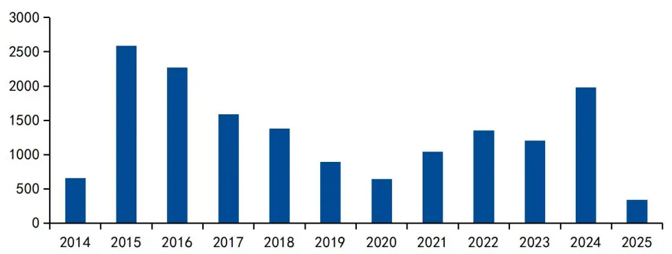
数据来源：Wind，聚源，兴业证券经济与金融研究院整理，注：2025年截至3 月 31日

我们统计综合事件发生前后股票相对于中证 500 指数的平均超额收益，其收益如下所示。如果我们在上市公司发布综合事件后买入，其往后的 60 个交易日中的超额收益相对稳定，持有 60 个交易日平均能够获得 8.82%的超额收益，胜率达 50.91%，盈亏比为 2.25。

表 15、综合公告事件发生后收益统计表现（2014/1/1-2025/3/31）

|  | 平均绝对 收益率 | 绝对收益率 胜率 | 绝对收益 率盈亏比 | 平均超额 收益率 | 超额收益 率胜率 | 超额收益 率盈亏比 |
| --- | --- | --- | --- | --- | --- | --- |
| 未来5 天 | 4.04% | 49.10% | 2.37 | 3.53% | 50.03% | 2.18 |
| 未来 10 天 | 6.65% | 50.80% | 2.68 | 6.00% | 50.71% | 2.59 |
| 未来 20 天 | 9.01% | 51.91% | 2.68 | 8.19% | 51.33% | 2.67 |
| 未来 60 天 | 9.30% | 49.85% | 2.13 | 8.82% | 50.91% | 2.25 |

数据来源：Wind，聚源，兴业证券经济与金融研究院整理

图 28、综合公告事件发生前后 N 天超额收益（2014/1/1-2025/3/31）
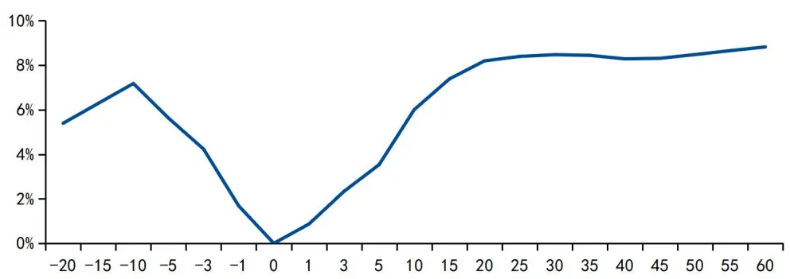
数据来源：Wind，聚源，兴业证券经济与金融研究院整理

图 29、分年度综合公告事件未来 20 个交易日超额收益表现
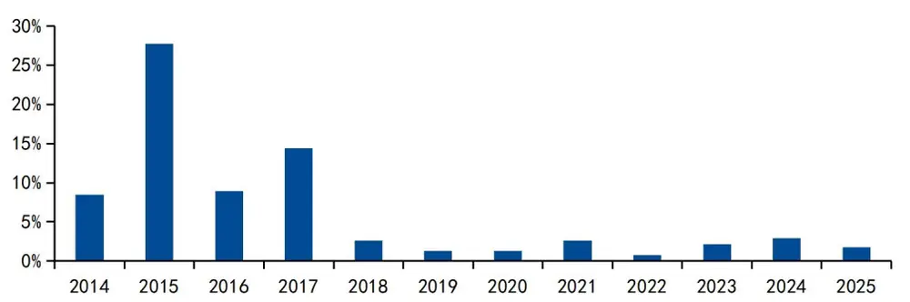
数据来源：Wind，聚源，兴业证券经济与金融研究院整理，注：2025年截至3 月 31日

从上可以看出综合公告事件表现优秀，接下来需要解决的是如何构建选股策略。具体的，我们基于综合公告事件构建以下三维度的选股策略：

1、定期离场策略：设计事件驱动策略，如何离场是非常重要的一环。本文采用固定天数离场方式构建定期离场策略。

2、定期调仓策略:事件驱动策略需要每日监控调仓，相对来说复杂程度较高，因此我们也尝试进行降频，选择每月调仓方式构建定期调仓策略。

3、成分股内选择策略：我们在定期离场策略基础上叠加指数成分股内限制构建策略。

同时我们在各策略基础上叠加多因子进行仓位管理，进一步提升策略表现。

图 30、多维度正向公告事件驱动策略概览
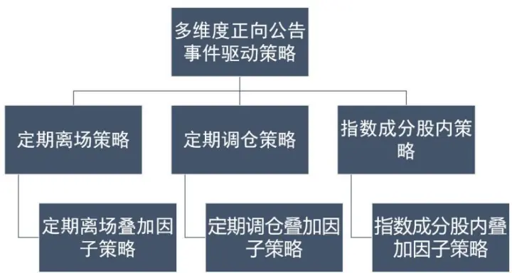
数据来源：兴业证券经济与金融研究院绘制与整理

## 2. 定期离场策略

我们按照下述设定构建定期离场策略：

1、事件发布后的下一交易日（如非交易日公布，则为最近的交易日）后判断满足个股下述条件后买入：1）个股非涨跌停；2）上市满 180 天；3）非特殊处理；

2、持有事件 N 个自然日后卖出；

## 3、双边千三费率；

下面我们测试不同离场日期的公告事件驱动策略表现。可以看出随着持有日期从 20 日上升到 60 日，年化收益率从 9.63%，提升至 16.53%。以 60 天持有期策略为例，策略年化收益率为 16.53%，相对中证 500 指数超额收益率为 12.04%，相对收益风险比为 1.14。

表 16、定期离场公告事件驱动策略表现

| 持有期间 | 年化收益率 | 年化波动率 | 收益风险比 | 最大回撤 | 收益回撤比 | 胜率 |
| --- | --- | --- | --- | --- | --- | --- |
| 持有期_20 | 9.63% | 26.83% | 0.36 | 67.73% | 0.14 | 54.32% |
| 持有期_20 相对基准表现 | 4.93% | 13.28% | 0.37 | 49.48% | 0.10 | 50.77% |
| 持有期_30 | 13.57% | 27.02% | 0.5 | 61.59% | 0.22 | 54.68% |
| 持有期_30 相对基准表现 | 8.94% | 11.95% | 0.75 | 37.05% | 0.24 | 51.68% |
| 持有期_40 | 15.55% | 27.15% | 0.57 | 56.30% | 0.28 | 54.54% |
| 持有期_40 相对基准表现 | 10.98% | 11.20% | 0.98 | 28.55% | 0.38 | 53.69% |
| 持有期_60 | 16.53% | 27.28% | 0.61 | 50.48% | 0.33 | 54.86% |
| 持有期_60 相对基准表现 | 12.04% | 10.56% | 1.14 | 25.31% | 0.48 | 54.24% |
| 中证 500 | 4.00% | 25.20% | 0.16 | 65.20% | 0.06 | 52.82% |

数据来源：Wind，聚源，兴业证券经济与金融研究院整理

分年度来看，策略除在 2014、2017 年表现稍差外，其他各年份均能跑赢基准。同时我们无论以中证 500 还是中证 1000 指数为基准表现均十分优秀（下文我们重点展示以中证 500 指数为基准的表现）

表 17、定期离场公告事件驱动策略分年度（以 T 为 60 为例）

|  | 收益率 | 中证 500 | 超额收益率 | 中证1000 | 超额收益率 |
| --- | --- | --- | --- | --- | --- |
| 2014-12-31 | 11.13% | 39.01% | -27.88% | 34.46% | -23.33% |
| 2015-12-31 | 201.20% | 43.12% | 158.08% | 76.10% | 125.10% |
| 2016-12-31 | -8.79% | -17.78% | 8.98% | -20.01% | 11.21% |
| 2017-12-31 | -17.04% | -0.20% | -16.84% | -17.35% | 0.31% |
| 2018-12-31 | -30.53% | -33.32% | 2.79% | -36.87% | 6.34% |
| 2019-12-31 | 32.35% | 26.38% | 5.96% | 25.67% | 6.68% |
| 2020-12-31 | 37.36% | 20.87% | 16.49% | 19.39% | 17.97% |
| 2021-12-31 | 32.88% | 15.58% | 17.29% | 20.52% | 12.36% |
| 2022-12-31 | -10.49% | -20.31% | 9.82% | -21.58% | 11.09% |
| 2023-12-31 | 12.97% | -7.42% | 20.39% | -6.28% | 19.25% |
| 2024-12-31 | 11.71% | 5.46% | 6.25% | 1.20% | 10.52% |
| 2025-03-31 | 9.51% | 2.31% | 7.20% | 4.51% | 4.99% |

数据来源：Wind，聚源，兴业证券经济与金融研究院整理

图 31、定期离场公告事件驱动策略净值（以 T 为 60 为例）
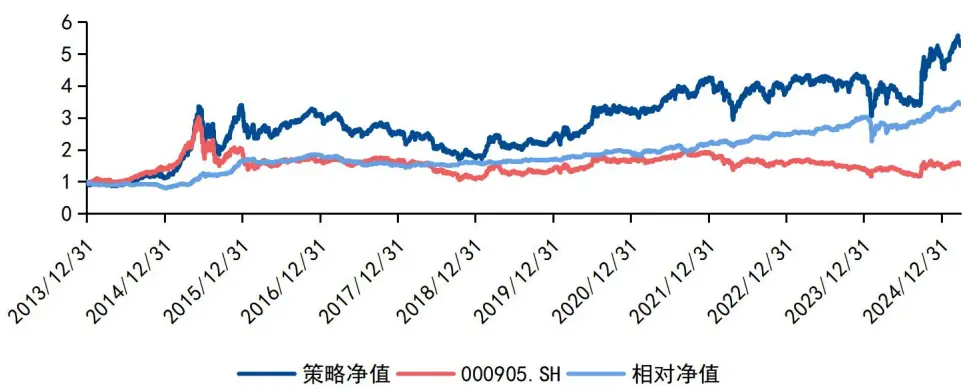
数据来源：Wind，聚源，兴业证券经济与金融研究院整理

图 32、定期离场公告事件驱动策略持有个股数目（以 T 为 60 为例）
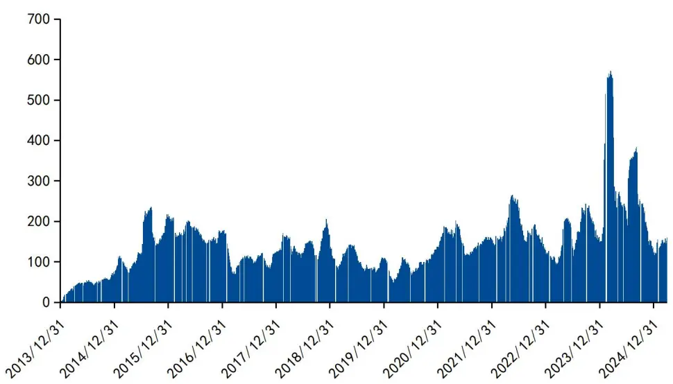
数据来源：Wind，聚源，兴业证券经济与金融研究院整理

## 3. 定期调仓事件驱动策略

考虑每天调仓策略的复杂性，我们也尝试构建每月定期调整策略，即在每个月底筛选过去一个月触发事件信号的个股进行等权持有。策略年化收益率为13.84%，相对基准超额收益率为 9.79%，超额收益风险比为 0.85。

表 18、月度调仓策略表现

|  | 年化收益率 | 年化波动率 | 收益风险比 | 胜率 | 最大回撤率 |
| --- | --- | --- | --- | --- | --- |
| 策略 | 13.84% | 27.40% | 0.51 | 58.09% | 48.19% |
| 相对基准 | 9.79% | 11.50% | 0.85 | 66.18% | 16.89% |

数据来源：wind，聚源，兴业证券经济与金融研究院整理，月度回测

表 19、月度调仓策略分年度表现

|  | 策略净值 | 基准净值 | 超额收益率 |
| --- | --- | --- | --- |
| 2014-12-31 | 29.41% | 39.01% | -7.13% |
| 2015-12-31 | 107.40% | 43.12% | 48.82% |
| 2016-12-31 | -9.63% | -17.78% | 9.37% |
| 2017-12-31 | -11.41% | -0.20% | -11.01% |
| 2018-12-31 | -29.69% | -33.32% | 5.63% |
| 2019-12-31 | 33.63% | 26.38% | 6.42% |
| 2020-12-31 | 31.37% | 20.87% | 7.69% |
| 2021-12-31 | 33.79% | 15.58% | 15.60% |
| 2022-12-31 | -12.50% | -20.31% | 10.39% |
| 2023-12-31 | 19.14% | -7.42% | 28.31% |
| 2024-12-31 | 7.39% | 5.46% | 1.34% |
| 2025-03-31 | 8.29% | 2.31% | 5.88% |

数据来源：wind，聚源，兴业证券经济与金融研究院整理

图 33、月度调仓策略净值
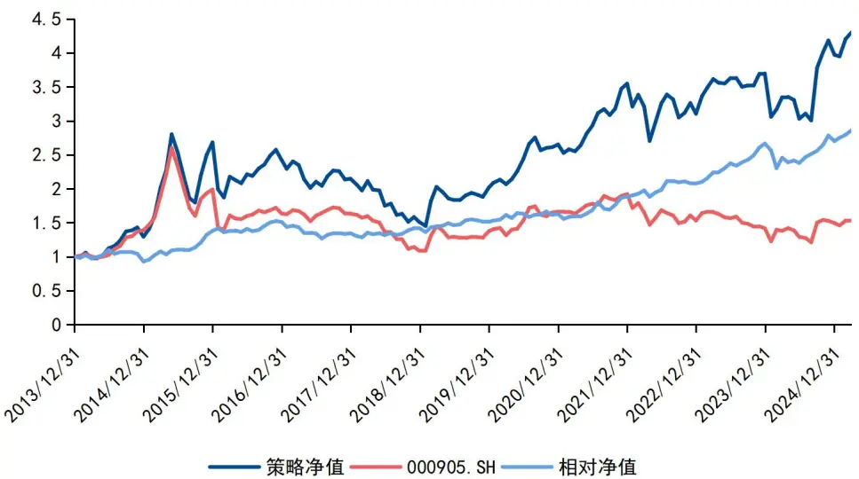
数据来源：Wind，聚源，兴业证券经济与金融研究院整理，基准展示中证 500（000905.SH）

图 34、月度调仓策略持有个股数目
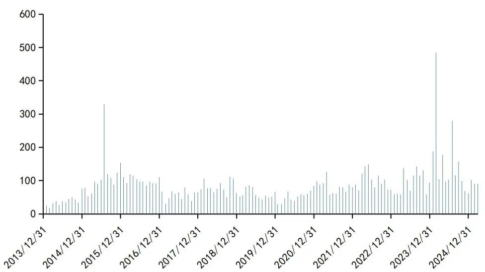
数据来源：兴业证券经济与金融研究院绘制与整理

## 4. 指数成分股内事件驱动策略

下面我们测试中证 1800 内策略的表现，具体设定如下：

1、事件发布后的下一交易日（如非交易日公布，则为最近的交易日）后判断满足个股下述条件后买入：1）个股非涨跌停；2）上市满 180 天；3）非特殊处理；4）中证 1800 成分股（中证 800+中证 1000）；

2、持有事件 60 个自然日后卖出；

3、双边千三费率；

可以看出即使只持有中证 1800 内发生的事件，策略依旧能获取超额收益率，年化收益率达 12.10%，相对基准超额收益率达 7.67%。

表 20、中证 1800 内选股策略表现（以持有 60 天为例）

|  | 年化收益率 | 年化波动率 | 收益风险比 | 最大回撤 | 收益回撤比 | 胜率 |
| --- | --- | --- | --- | --- | --- | --- |
| 策略表现 | 12.10% | 26.14% | 0.46 | 58.70% | 0.21 | 52.89% |
| 中证 500 | 4.00% | 25.20% | 0.16 | 65.20% | 0.06 | 52.82% |
| 相对基准 | 7.67% | 8.41% | 0.91 | 25.66% | 0.3 | 52.12% |

数据来源：wind，聚源，兴业证券经济与金融研究院整理

表 21、中证 1800 内选股策略分年度表现（以持有 60 天为例）

|  | 策略净值 | 基准净值 | 超额收益率 |
| --- | --- | --- | --- |
| 2014-12-31 | 9.43% | 39.01% | -29.58% |
| 2015-12-31 | 153.04% | 43.12% | 109.92% |
| 2016-12-31 | -21.81% | -17.78% | -4.04% |
| 2017-12-31 | -10.57% | -0.20% | -10.36% |
| 2018-12-31 | -26.17% | -33.32% | 7.15% |
| 2019-12-31 | 38.78% | 26.38% | 12.39% |
| 2020-12-31 | 44.26% | 20.87% | 23.39% |
| 2021-12-31 | 21.60% | 15.58% | 6.02% |
| 2022-12-31 | -11.95% | -20.31% | 8.36% |
| 2023-12-31 | -5.12% | -7.42% | 2.31% |
| 2024-12-31 | 14.46% | 5.46% | 9.00% |
| 2025-03-31 | 3.72% | 2.31% | 1.41% |

数据来源：wind，聚源，兴业证券经济与金融研究院整理

图 35、中证 1800 成分股内策略净值
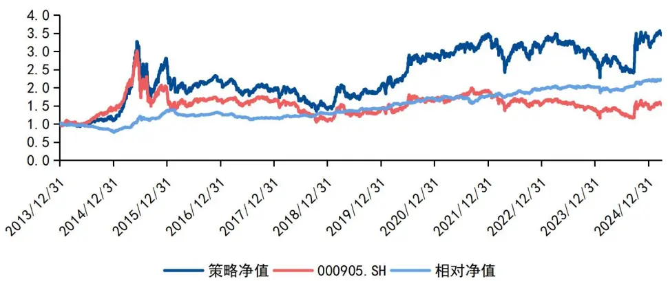
数据来源：兴业证券经济与金融研究院绘制与整理，基准展示中证 500（000905.SH）

图 36、中证 1800 成分股内策略持有个股数目
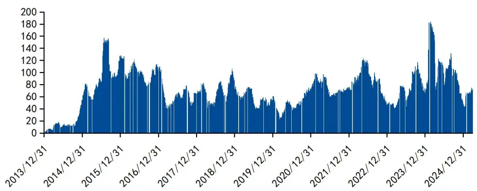
数据来源：兴业证券经济与金融研究院绘制与整理

同时事件驱动类策略的一个难点也在于仓位管理，上述策略均是考虑等权购买所有触发事件信号的个股，但在实践中可能很难满足。因此我们也尝试在上述策略的基础上叠加多因子进行仓位管理，下表为我们测试相对有效的细分因子列表，我们基于这些因子等权构建合成因子进行优选个股，完成策略的仓位管理。

表 22、所选因子列表

| 因子名称 | 大类风格 | 排序方向 | 因子定义 |
| --- | --- | --- | --- |
| BP_LR | 价值 | 降序 | 股东权益合计(不含少数股东权益)最新财报/总市值 |
| SUR0 | 成长 | 降序 | 业绩超预期-营业收入（有预期增长值） |
| CFROE_TTM | 质量 | 降序 | 2*经营活动产生的现金流量净额 TTM/(股东权益合计 最新财报+股东权益合计_去年同期) |
| Turnover_20D_Avg | 另类 | 升序 | 过去 20 天日均换手率 |

数据来源：wind，聚源，兴业证券经济与金融研究院整理

## 5. 定期离场策略叠加多因子

我们在定期离场策略中叠加多因子，即每天筛选满足纳入股票池的条件后，优选因子值最大的 N 只个股等权持有（若不满足 30 只个股时，我们将剩下的仓位留给现金），具体设定如下：

1、事件发布后的下一交易日（如非交易日公布，则为最近的交易日）后判断满足个股下述条件后买入：1）个股非涨跌停；2）上市满 180 天；3）非特殊处理；

2、如已持有事件数目小于 N 只，给与个股 1/N 的仓位后买入；若已持有事件数目大于等于 N 只，则基于上文所述合成因子排序，选择前 N 个个股持有。

3、持有事件 60 个自然日后卖出；

4、双边千三费率；

以持有 30 只个股的策略为例，此策略 2014 至 2025 年 3 月期间年化收益为30.88%，相对中证 500 指数的超额收益率为 24.57%，超额收益风险比达 2.32。

表 23、定期离场叠加多因子策略统计表

|  | 年化收益率 | 年化波动率 | 收益风险比 | 最大回撤 | 收益回撤比 | 月度胜率 |
| --- | --- | --- | --- | --- | --- | --- |
| 持有20 只个股 | 32.35% | 23.52% | 1.38 | 33.66% | 0.96 | 55.38% |
| 相对基准 | 25.82% | 12.10% | 2.13 | 14.24% | 1.81 | 53.80% |
| 持有30只个股 | 30.88% | 23.33% | 1.32 | 33.21% | 0.93 | 56.25% |
| 相对基准 | 24.57% | 10.61% | 2.32 | 14.32% | 1.72 | 54.02% |
| 持有 40 只个股 相对基准 | 28.36% | 23.30% | 1.22 | 32.43% | 0.87 | 56.07% |
|  | 22.26% | 9.86% | 2.26 | 18.12% | 1.23 | 54.06% |
| 持有 50 只个股 | 26.66% | 23.55% | 1.13 | 35.18% | 0.76 | 55.82% |
| 相对基准 | 20.74% | 9.64% | 2.15 | 18.84% | 1.1 | 55.16% |
| 基准收益 | 4.00% | 25.20% | 0.16 | 65.20% | 0.06 | 52.82% |

数据来源：wind，聚源，兴业证券经济与金融研究院整理

表 24、定期离场叠加多因子策略分年度表现（以持有 30 只个股为例）

| 年份 | 策略表现 | 基准表现 | 超额表现 |
| --- | --- | --- | --- |
| 2014-12-31 | 28.01% | 39.01% | -11.00% |
| 2015-12-31 | 266.98% | 43.12% | 223.87% |
| 2016-12-31 | 3.67% | -17.78% | 21.45% |
| 2017-12-31 | -1.14% | -0.20% | -0.93% |
| 2018-12-31 | -18.00% | -33.32% | 15.32% |
| 2019-12-31 | 45.01% | 26.38% | 18.63% |
| 2020-12-31 | 38.56% | 20.87% | 17.68% |
| 2021-12-31 | 57.96% | 15.58% | 42.37% |
| 2022-12-31 | 6.09% | -20.31% | 26.41% |
| 2023-12-31 2024-12-31 | 13.08% | -7.42% 5.46% | 20.50% |
|  | 21.55% | 2.31% | 16.09% -0.91% |
| 2025-03-31 | 1.39% |  |  |

数据来源：wind，聚源，兴业证券经济与金融研究院整理

图 37、定期离场叠加多因子策略净值（以持有 30 只个股为例）
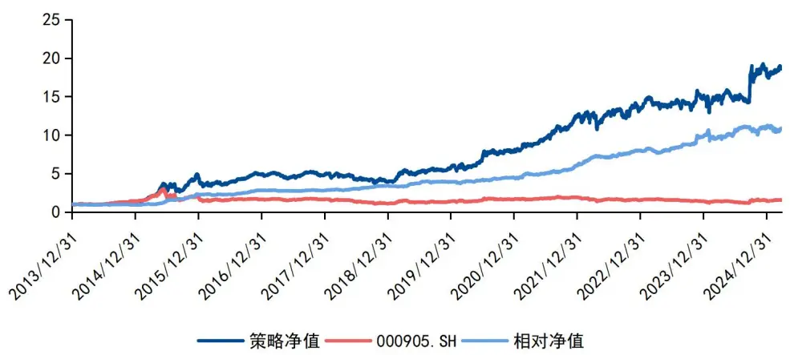
数据来源：wind，聚源，兴业证券经济与金融研究院整理

## 6. 定期调仓策略叠加多因子

同时我们月度调仓策略的基础上叠加因子定量筛选 30 只个股等权持有。具体的，策略每月末在上月触发事件信号的个股中基于合成因子选择前 30 只个股。可以看出此策略表现较原始定期调仓策略也有进一步提升。

表 25、定期调仓叠加多因子策略

|  | 年化收益率 | 年化波动率 | 收益风险比 | 胜率 | 最大回撤 |
| --- | --- | --- | --- | --- | --- |
| 策略表现 | 19.49% | 25.88% | 0.75 | 60.29% | 30.72% |
| 相对基准 | 14.66% | 12.70% | 1.15 | 64.71% | 16.57% |

数据来源：wind，兴业证券经济与金融研究院整理

表 26、定期调仓叠加多因子策略分年度表现（以持有 30 只个股为例）

| 年份 | 策略表现 | 基准表现 | 超额表现 |
| --- | --- | --- | --- |
| 2014-12-31 | 28.01% | 39.01% | -11.00% |
| 2015-12-31 | 266.98% | 43.12% | 223.87% |
| 2016-12-31 | 3.67% | -17.78% | 21.45% |
| 2017-12-31 | -1.14% | -0.20% | -0.93% |
| 2018-12-31 | -18.00% | -33.32% | 15.32% |
| 2019-12-31 | 45.01% | 26.38% | 18.63% |
| 2020-12-31 | 38.56% | 20.87% | 17.68% |
| 2021-12-31 | 57.96% | 15.58% | 42.37% |
| 2022-12-31 | 6.09% | -20.31% | 26.41% |
| 2023-12-31 | 13.08% | -7.42% | 20.50% |
| 2024-12-31 | 21.55% | 5.46% | 16.09% |
| 2025-03-31 | 1.39% | 2.31% | -0.91% |

数据来源：wind，聚源，兴业证券经济与金融研究院整理

图 38、定期调仓叠加多因子策略净值
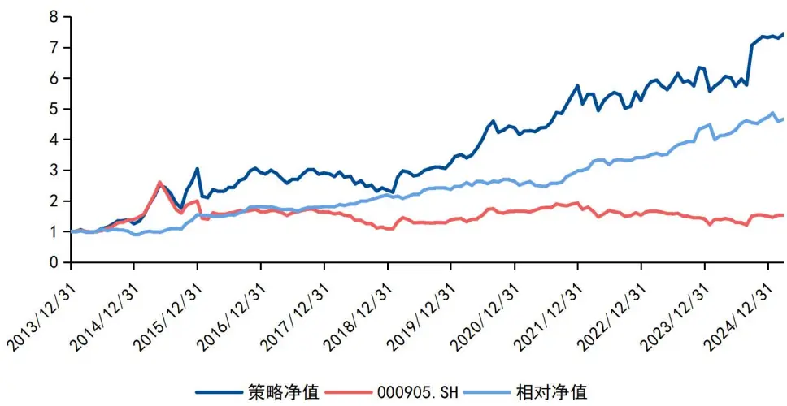
数据来源：wind，聚源，兴业证券经济与金融研究院整理

## 7. 指数成分股内策略叠加多因子

我们在指数成分股策略中叠加因子，具体的在定期离场叠加因子策略的基础上，加入成分股为中证 1800 指数成分股的限制。

可以看出，叠加因子后的策略年化收益率提升至 19.97%，超额收益率为14.11%，收益风险比为 1.39。

表 27、中证 1800 内选股叠加多因子策略

|  | 年化收益率 | 年化波动率 | 收益风险 比 | 最大回撤 | 收益回撤 比 | 胜率 |
| --- | --- | --- | --- | --- | --- | --- |
| 策略表现 | 19.97% | 22.82% | 0.88 | 40.35% | 0.49 | 53.77% |
| 基准收益 | 4.00% | 25.20% | 0.16 | 65.20% | 0.06 | 52.82% |
| 相对基准 | 14.11% | 10.14% | 1.39 | 30.11% | 0.47 | 52.30% |

数据来源：wind，聚源，兴业证券经济与金融研究院整理

表 28、中证 1800 内选股叠加多因子策略分年度表现

|  | 策略收益率 | 基准收益率 | 超额收益率 |
| --- | --- | --- | --- |
| 2014-12-31 | 6.87% | 39.01% | -32.14% |
| 2015-12-31 | 208.16% | 43.12% | 165.05% |
| 2016-12-31 | -9.60% | -17.78% | 8.18% |
| 2017-12-31 | 4.88% | -0.20% | 5.08% |
| 2018-12-31 | -17.97% | -33.32% | 15.35% |
| 2019-12-31 | 36.51% | 26.38% | 10.13% |
| 2020-12-31 | 34.40% | 20.87% | 13.53% |
| 2021-12-31 | 33.09% | 15.58% | 17.51% |
| 2022-12-31 | 0.62% | -20.31% | 20.93% |
| 2023-12-31 | -5.33% | -7.42% | 2.09% |
| 2024-12-31 | 21.86% | 5.46% | 16.40% |
| 2025-03-31 | -0.72% | 2.31% | -3.03% |

数据来源：wind，聚源，兴业证券经济与金融研究院整理

图 39、中证 1800 内选股叠加多因子策略净值
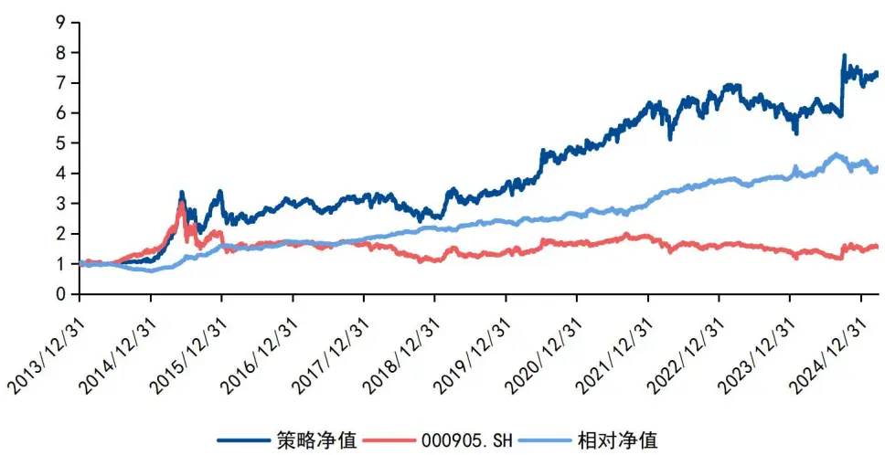
数据来源：wind，聚源，兴业证券经济与金融研究院整理

## （二）负面公告事件驱动策略尝试

我们将上述事件合并作为综合负向事件，可以看出在事件发生后能够提供一定的负向 alpha。

图 40、综合负向事件发生前后收益率
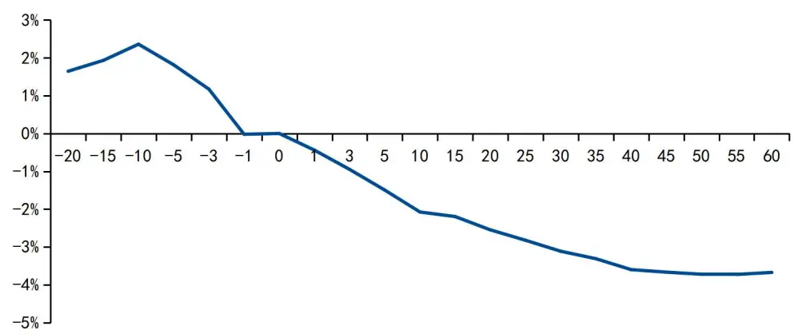
数据来源：wind，聚源，兴业证券经济与金融研究院整理

我们基于下述设置构建指数负面增强策略：

1、若指数成分股内发生了负面事件，则我们卖出此成分股 N 天（剩余仓位为现金）

## 2、双边千三费率

以沪深 300 为例，可以看出随着剔除天数的增多，跟踪误差也随之上升，这也符合逻辑。同时以剔除 40 天策略为例，策略年化收益率为 7.64%，相对沪深300 指数超额收益率为 2.54%，且分年度来看超额收益率相对稳定。

表 29、沪深 300 指数负向剔除策略表现

|  | 年化收益率 | 年化波动率 | 收益风险比 | 最大回撤 | 收益回撤比 | 月度胜率 |
| --- | --- | --- | --- | --- | --- | --- |
| 沪深 300 负面剔除策略-10 | 7.52% | 21.64% | 0.35 | 45.23% | 0.17 | 51.39% |
| 相对基准 | 2.53% | 0.92% | 2.74 | 0.93% | 2.7 | 57.90% |
| 沪深 300 负面剔除策略-20 相对基准 | 7.48% | 21.48% | 0.35 | 45.19% | 0.17 | 51.54% |
|  | 2.45% | 1.11% | 2.21 | 1.46% | 1.68 | 56.73% |
| 沪深 300 负面剔除策略-30 相对基准 | 7.57% 2.50% | 21.34% 1.31% | 0.35 | 45.16% | 0.17 | 51.43% |
| 沪深300 负面剔除策略--40 |  |  | 1.91 | 1.60% | 1.56 | 57.24% |
| 相对基准 | 7.64% 2.54% | 21.21% 1.47% | 0.36 | 44.94% | 0.17 | 51.50% |
|  |  |  | 1.73 | 1.86% | 1.37 | 57.28% |
| 沪深 300 负面剔除策略--50 相对基准 | 7.57% 2.44% | 21.09% | 0.36 | 44.76% | 0.17 | 51.50% |
|  |  | 1.64% | 1.49 | 2.41% | 1.01 | 56.95% |
| 沪深 300 负面剔除策略--60 相对基准 | 7.52% | 20.98% | 0.36 | 44.53% | 0.17 | 51.50% |
|  | 2.36% | 1.80% | 1.32 | 3.09% | 0.77 | 56.36% |
| 沪深300 | 4.83% | 21.82% | 0.22 | 46.70% | 0.1 | 51.21% |

数据来源：wind，聚源，兴业证券经济与金融研究院整理

表 30、沪深 300 负面剔除策略分年度表现

| 年度 | 策略收益率 | 基准收益率 | 超额收益率 |
| --- | --- | --- | --- |
| 2014-12-31 | 55.93% | 51.66% | 4.27% |
| 2015-12-31 | 8.26% | 5.58% | 2.68% |
| 2016-12-31 | -8.51% | -11.28% | 2.78% |

| 2017-12-31 | 24.17% | 21.78% 2.39% |
| --- | --- | --- |
| 2018-12-31 | -23.65% | -25.31% 1.66% |
| 2019-12-31 | 38.30% | 36.07% 2.23% |
| 2020-12-31 | 28.69% | 27.21% 1.48% |
| 2021-12-31 | -2.32% | -5.20% 2.88% |
| 2022-12-31 | -19.09% | -21.63% 2.54% |
| 2023-12-31 | -8.04% | -11.38% 3.34% |
| 2024-12-31 | 18.17% | 14.68% 3.49% |
| 2025-03-31 | -0.67% | -1.21% 0.54% |

数据来源：wind，聚源，兴业证券经济与金融研究院整理

图 41、沪深 300 负面剔除策略净值
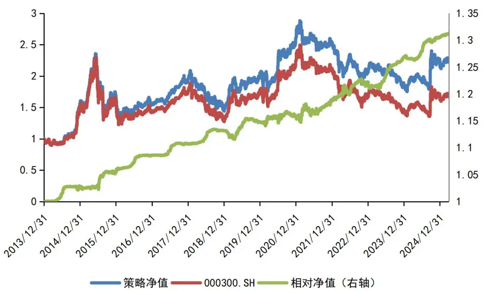
数据来源：wind，聚源，兴业证券经济与金融研究院整理

图 42、沪深 300 负面剔除策略持股数目
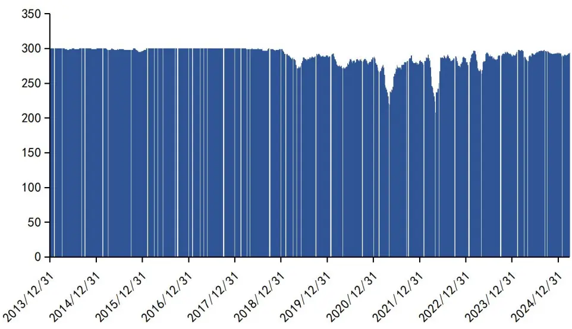
数据来源：wind，聚源，兴业证券经济与金融研究院整理

我们测试在其他指数内进行负向剔除的策略效果，可以看出均有一定效果。

表 31、各指数负向剔除策略表现

|  | 年化收益率 | 年化波动 率 | 收益风险比 | 最大回撤 | 收益回撤比 | 月度胜率 |
| --- | --- | --- | --- | --- | --- | --- |
| 沪深 300 负面剔除策略 | 7.64% | 21.21% | 0.36 | 44.94% | 0.17 | 51.50% |
| 沪深300 | 4.83% | 21.82% | 0.22 | 46.70% | 0.1 | 51.21% |
| 相对基准 | 2.54% | 1.47% | 1.73 | 1.86% | 1.37 | 57.28% |
| 中证 500 负面剔除策略 | 5.31% | 24.60% | 0.22 | 63.58% | 0.08 | 53.00% |
| 中证500 | 4.00% | 25.20% | 0.16 | 65.20% | 0.06 | 52.82% |
| 相对基准 | 1.10% | 1.63% | 0.67 | 2.97% | 0.37 | 53.47% |
| 中证 800 负面剔除策略 | 7.00% | 21.44% | 0.33 | 47.52% | 0.15 | 51.65% |
| 中证800 | 4.59% | 22.00% | 0.21 | 50.91% | 0.09 | 50.91% |
| 相对基准 | 2.17% | 1.44% | 1.51 | 1.93% | 1.12 | 56.40% |
| 中证 1000 负面剔除策略 | 0.89% | 27.37% | 0.03 | 71.85% | 0.01 | 53.69% |
| 中证1000 | -0.08% | 27.97% | 0 | 72.35% | 0 | 53.73% |
| 相对基准 | 0.79% | 1.59% | 0.5 | 3.73% | 0.21 | 51.76% |

数据来源：wind，聚源，兴业证券经济与金融研究院整理，注：中证1000指数从 2014年 10月开始回测

## 六、结论与未来研究展望

上述我们主要研究公告类事件，可以看出可构建较为有效的选股策略。同时事件驱动是一个值得关注的研究领域，未来有许多可进一步深入研究方向，包括：1、事件库的丰富：可以在公告类事件的基础上，进一步加入量价、机构行为等维度；2、事件有效性的定义：上文我们从相对指数的超额收益率来判断事件的有效性，可以结合异常收益率等概念进行进一步改进；3、事件的应用：1）包括事件提前预测：如何获取事件发生前的超额收益率；2）事件与已有因子框架做结合等。

风险提示：报告中的结果均通过历史数据统计、建模和测算完成，在政策、市场环境发生变化时模型存在失效的风险。

## 分析师声明

本人具有中国证券业协会授予的证券投资咨询执业资格并登记为证券分析师，以勤勉的职业态度，独立、客观地出具本报告。本报告清晰准确地反映了本人的研究观点。本人不曾因，不因，也将不会因本报告中的具体推荐意见或观点而直接或间接收到任何形式的补偿。

## 投资评级说明

| 投资建议的评级标准 | 类别 | 评级 | 说明 |
| --- | --- | --- | --- |
| 报告中投资建议所涉及的评级分为股票评级和行业评级（另有说明的除外）。评级标准为报告发布日后的12个月内公司股价（或行业指数）相对同期相关证券市场代表性指数的涨跌幅。其中：沪深两市以沪深300指数为基准；北交所市场以北证50指数为基准；新三板市场以三板成指为基准；香港市场以恒生指数为基准；美国市场以标普500或纳斯达克综合指数为基准。 | 股票评级 | 买入 | 相对同期相关证券市场代表性指数涨幅大于15% |
|  |  | 增持 | 相对同期相关证券市场代表性指数涨幅在5%～15%之间 |
|  |  | 中性 | 相对同期相关证券市场代表性指数涨幅在-5%～5%之间 |
|  |  | 减持 | 相对同期相关证券市场代表性指数涨幅小于-5% |
|  |  | 无评级 | 由于我们无法获取必要的资料，或者公司面临无法预见结果的重大不确定性事件，或者其他原因，致使我们无法给出明确的投资评级 |
|  | 行业评级 | 推荐 | 相对表现优于同期相关证券市场代表性指数 |
|  |  | 中性 | 相对表现与同期相关证券市场代表性指数持平 |
|  |  | 回避 | 相对表现弱于同期相关证券市场代表性指数 |

## 信息披露

本公司在知晓的范围内履行信息披露义务。客户可登录 www.xyzq.com.cn内幕交易防控栏内查询静默期安排和关联公司持股情况。

## 使用本研究报告的风险提示以及法律声明

兴业证券股份有限公司经中国证券监督管理委员会批准，已具备证券投资咨询业务资格。

，本公司不会因接收人收到本报告而视其为客户。本报告中的信息、意

见等均仅供客户参考，不构成所述证券买卖的出价或征价邀请或要约，投资者自主作出投资决策并自行承担投资风险，任何形式的分享证券投资收益或者分担证券投资损失的书面或口头承诺均为无效，任何有关本报告的摘要或节选都不代表本报告正式完整的观点，一切须以本公司向客户发布的本报告完整版本为准。该等信息、意见并未考虑到获取本报告人员的具体投资目的、财务状况以及特定需求，在任何时候均不构成对任何人的个人推荐。客户应当对本报告中的信息和意见进行独立评估，并应同时考量各自的投资目的、财务状况和特定需求，必要时就法律、商业、财务、税收等方面咨询专家的意见。对依据或者使用本报告所造成的一切后果，本公司及/或其关联人员均不承担任何法律责任。

本报告所载资料的来源被认为是可靠的，但本公司不保证其准确性或完整性，也不保证所包含的信息和建议不会发生任何变更。本公司并不对使用本报告所包含的材料产生的任何直接或间接损失或与此相关的其他任何损失承担任何责任。

本报告所载的资料、意见及推测仅反映本公司于发布本报告当日的判断，本报告所指的证券或投资标的的价格、价值及投资收入可升可跌，过往表现不应作为日后的表现依据；在不同时期，本公司可发出与本报告所载资料、意见及推测不一致的报告；本公司不保证本报告所含信息保持在最新状态。同时，本公司对本报告所含信息可在不发出通知的情形下做出修改，投资者应当自行关注相应的更新或修改。

除非另行说明，本报告中所引用的关于业绩的数据代表过往表现。过往的业绩表现亦不应作为日后回报的预示。我们不承诺也不保证，任何所预示的回报会得以实现。分析中所做的回报预测可能是基于相应的假设。任何假设的变化可能会显著地影响所预测的回报。

本公司的销售人员、交易人员以及其他专业人士可能会依据不同假设和标准、采用不同的分析方法而口头或书面发表与本报告意见及建议不一致的市场评论和/或交易观点。本公司没有将此意见及建议向报告所有接收者进行更新的义务。本公司的资产管理部门、自营部门以及其他投资业务部门可能独立做出与本报告中的意见或建议不一致的投资决策。

本报告并非针对或意图发送予或为任何就发送、发布、可得到或使用此报告而使兴业证券股份有限公司及其关联子公司等违反当地的法律或法规或可致使兴业证券股份有限公司受制于相关法律或法规的任何地区、国家或其他管辖区域的公民或居民，包括但不限于美国及美国公民（1934年美国《证券交易所》第15a-6条例定义为本「主要美国机构投资者」除外）。

本报告的版权归本公司所有。本公司对本报告保留一切权利。除非另有书面显示，否则本报告中的所有材料的版权均属本公司。未经本公司事先书面授权，本报告的任何部分均不得以任何方式制作任何形式的拷贝、复印件或复制品，或再次分发给任何其他人，或以任何侵犯本公司版权的其他方式使用。未经授权的转载，本公司不承担任何转载责任。

## 特别声明

在法律许可的情况下，兴业证券股份有限公司可能会持有本报告中提及公司所发行的证券头寸并进行交易，也可能为这些公司提供或争取提供投资银行业务服务。因此，投资者应当考虑到兴业证券股份有限公司及/或其相关人员可能存在影响本报告观点客观性的潜在利益冲突。投资者请勿将本报告视为投资或其他决定的唯一信赖依据。

## 兴业证券研究

| 上海 | 北京 | 深圳 |
| --- | --- | --- |
| 地址：上海浦东新区长柳路36号兴业证券大厦 | 地址：北京市朝阳区建国门大街甲6号世界财 | 地址：深圳市福田区皇岗路5001号深业上城 |
| 15层 邮编：200135 | 富大厦 32 层 01-08 单元 邮编：100020 | T2 座 52 楼 邮编：518035 |
| 邮箱：research@xyzq.com.cn | 邮箱：research@xyzq.com.cn | 邮箱：research@xyzq.com.cn |