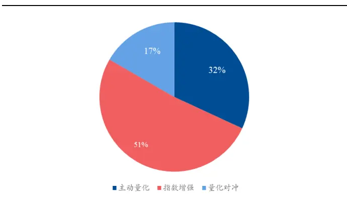
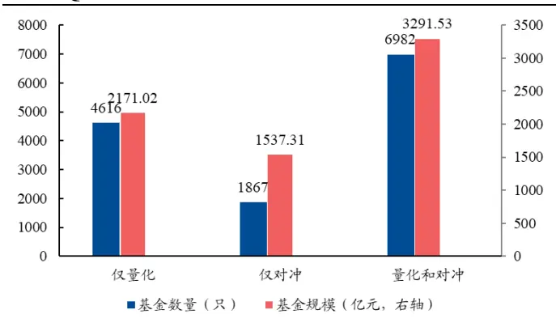
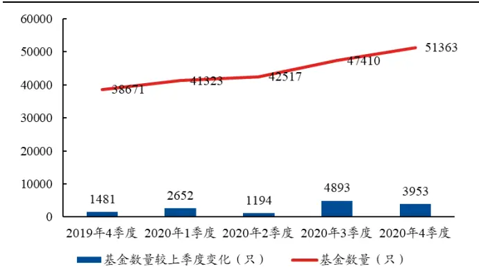
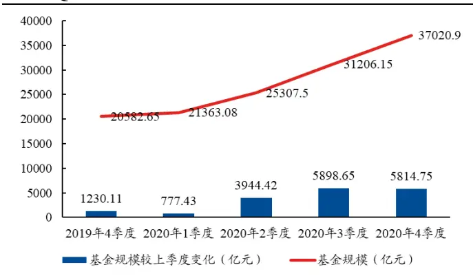
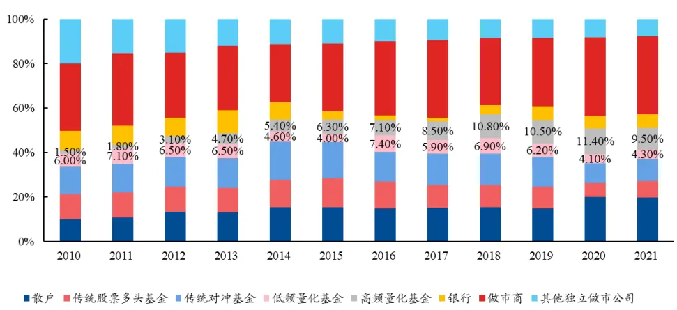
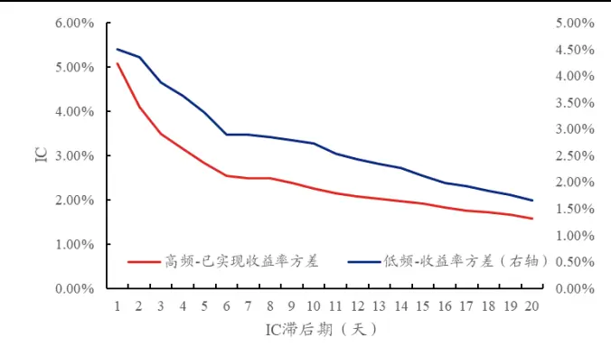
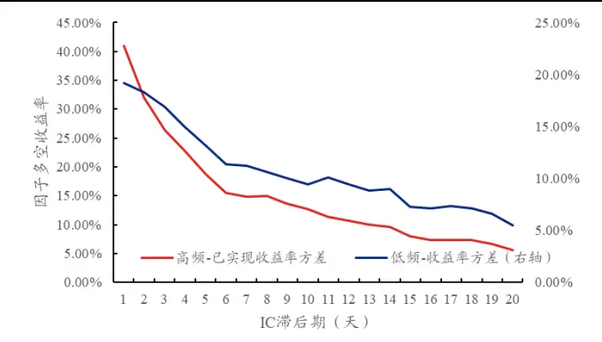
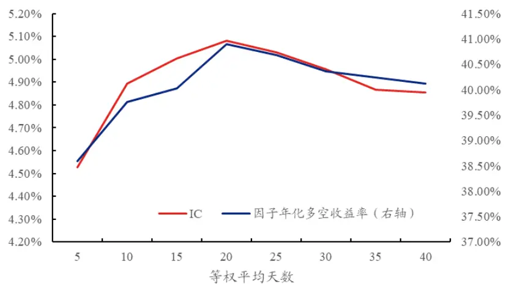
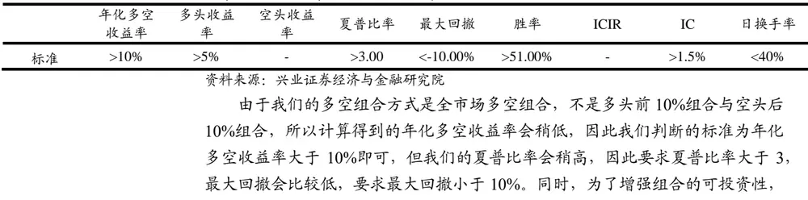

分析师：

郑兆磊

zhengzhaolei@xyzq.com.cn

S0190520080006

## 报告关键点

近一年以来，许多公募中证500指数增强型基金的超额收益表现十分优异，其中部分表现优异的基金呈现出高换手的特征。本文探究高频因子构造方法，基于高频因子 IC 半衰期短的特点，提出日频调仓与一系列基于 PnL 与因子值的高频因子有效性评估方法。通过比较截面相关性与时序相关性，我们研究识别高频风险的自上而下与自下而上混合的因子风险识别方法，期望通过组合优化方法获取跟更高的风险收益比。

# 高频漫谈

2022 年 1 月 4 日

## 投资要点

近一年以来，许多公募中证 500指数增强型基金的超额收益表现十分优异，其中部分表现优异的基金呈现出高换手的特征，这与采用高频因子的私募指数增强型基金的表现十分相似。许多基金业绩也证明，采用高换手取得高收益是可接受的，受此启发，我们认为高频因子是探寻基金业绩增长的一条可行路径。

高频因子一般基于 level2 数据构造，显著的特点是 IC 半衰期小于低频因子，因此需要更频繁的换手以捕捉高频信息，获得不同于低频因子的高额收益。我们认为高频因子构造的思路在于寻求独立同分布变量中不变的统计特征，基于数据所含信息角度，我们提出了 4种高频因子分类方法，希望在未来通过面向统计特征的机器学习方法自动化挖掘因子特征。

基于高频因子 IC 衰减快的特点，我们提出适用于高频因子的因子有效性分析框架，即使用日频调仓方法，因子时序上通过加权平均与标准差平滑换手率，基于因子值暴露的全市场多空组合方法，考察包括因子组合时序相关性在内的一系列基于PnL与因子值的指标，来判断因子是否有效。

最后，高频因子含有不同于 Barra 模型的独特风险，基于前文对因子时序相关性的理解，我们提出一种采用自上而下与自下而上混合的因子风险识别方法，期望识别出高频因子独有风险，并通过组合优化方法，对合意的风险进行主动暴露，对不合意的风险进行对冲，获取更高的风险收益比。

风险提示：模型结果基于历史数据的测算，在市场环境转变时模型存在失效的风险。

## 报告正文

## 高频因子漫谈

高频研究在私募和公募呈现两种境况：私募在这方面开展的如火如荼，而公募则呈现门庭若市的窘象。而今年以来，大部分公募中证 500 指数增强型基金的超额收益表现十分优异，其中部分表现优异的基金呈现出高换手的特征。我们猜测这些基金引入了高频数据，增强了基金风险收益表现，受此启发，我们希望建立适合于高频数据研究的因子框架，并将其与低频因子相结合，解析市场热点，以获取更高的风险调整后收益。

由于私募在这方面布局较多，作为高频的开篇，兴证金工团队就私募在高频的市场规模、高频因子的构造方法、高频因子的有效性和高频风险识别等领域展开介绍。

## 1、私募高频市场规模简介

引入股票高频数据的产品形式主要有两种：量化对冲和指数增强，实现方式可以通过高频因子、日内 T0 或者两者结合。由于监管限制，公募基金较少采用高频策略。根据Wind数据显示，截至 2021Q3，公募量化对冲产品与指数增强产品规模分别为 504.30亿和1558.10亿。公募量化基金规模合计 3028.60亿。

图表 1、量化公募各类型产品占比（截至 2021Q3）

资料来源：Wind，兴业证券经济与金融研究院整理

图表 2、私募证券投资基金量化对冲情况（截至2020Q4）

资料来源：中国基金业协会，兴业证券经济与金融研究院整理

在私募市场规模方面，根据中国证券投资基金业协会公布的数据显示，截至2020Q4，私募共有量化/对冲策略基金 13465 只（含 FOF），规模合计 6999.87亿元，分别占自主发行类私募证券投资基金总只数和总规模的 26.2%和 18.9%，较2019 年分别增长 26.2%和 66.5%。

图表 3、中国私募证券投资基金数量变化（截至2020Q4）

资料来源：中国基金业协会，兴业证券经济与金融研究院整理

图表 4、中国私募证券投资基金规模变化（截至2020Q4）

资料来源：中国基金业协会，兴业证券经济与金融研究院整理

以成熟的美股市场来看，2021年高频策略占美股市场交易结构约12%，国内高频策略发展仍然处于起步阶段，未来具有广阔前景。

图表 5、2010-2021年美股交易结构变迁（%，按投资者类型）

资料来源：Bloomberg，兴业证券经济与金融研究院整理

## 2、高频因子构造方法

## 2.1、高频因子特点

高频因子相比于低频因子其 IC 半衰期更短，需要更频繁地更新因子值以捕捉高频信息，带来的代价是换手率的增加。选取已实现收益率方差的 10 天平均作为高频因子，收益率 10 日方差作为低频因子，以日频调仓计算它们 2014 年 8月 30 日到 2021 年 8 月 31 日的平均 RankIC。

$$
高频-已实现收益率方差$\begin{array}{r}{=\frac{1}{T}{\sum_{t=1}^{T}}[{\sum_{i=1}^{\mathrm{N}}}\big(r_{M,i,t}\big)^{2}]}\end{array}$低频-收益率方差$=\;\frac{1}{T}{\sum_{\mathsf{t}=1}^{T}}\big(r_{D,t}-\overline{{r_{D,t}}}\big)^{2}$
$$

$r_{M,i,t}.$ 表示某支股票表示第 t 天第 i 分钟的分钟收益率， $r_{D,t}$ 表示某支股票第 t天的日收益率。在两个因子原始 IC 相近的情况下，高频因子已实现收益率方差比低频因子收益率方差快 10天到达 IC一半的位置。在年化多空收益率方面，已实现收益率方差也比收益率方差衰减得更快。

图表 6、高频因子与低频因子 IC衰减对比

资料来源：上交所、深交所行情数据，兴业证券经济与金融研究院整理

图表 7、高频因子与低频因子收益率衰减对比

资料来源：上交所、深交所行情数据，兴业证券经济与金融研究院整理

许多基金业绩表明，即使高频因子换手率更高，但高频因子带来的信息增益在合适的方法控制下会大于高频因子带来的高换手率成本，因此，我们希望建立合适的组合优化模型，让投资者能更便利的用换手率换取高收益。

我们模型建立的第一步是构建适合于高频因子的因子有效分析体系框架。由于高频因子的 IC 半衰期更短，我们采取日频调仓的方式评估高频因子的收益率。高频因子构造方法分为两步：（1）遵循高频数据低频化的思想构造高频指标；（2）通过时序上操作将高频指标变成高频因子。

## 2.2、高频指标构建

常见的高频数据，如level2行情数据包含个股分钟K 线、盘口快照、委托队列、成交明细等，是高频指标能够利用的最原始数据。高频指标构建逻辑一般是低频化，如将 tick数据重采样生成分钟数据，再把分钟数据聚合形成日频指标。

低频因子的构造逻辑往往是事前解释，但在高频数据领域，由于数据噪音大，自相关性高，指标对构造的统计量的数学性质要求比较严格，通过统计特征挖掘数据中的信息，然后再事后解释，效果与效率都会比较好。

大量挖掘量价因子常用的方法是遗传规划算法，但这种方法也面临两个问题：

第一，目标函数的选取。无论如何选取目标函数，总是有过拟合现象，定义挖掘有效性

$$
\eta=F_{effective}/F_{total}\tag{1}
$$

遗传规划算法η最终会随着模型检验通过的因子数量 $F_{total}$ 上升而下降，真实样本外有效的因子 $\cdot F_{effective},$ 在这个过程中可能增加得并不多。

第二，潜在因子覆盖范围。我们希望找到固定时间区间内的所有因子，但遗传规划算法中算子的选取是有限的，并且很多算子只是截面或时序上的加减乘除，我们并不知道这些算子的组合在深度有限的情况下是否搜索到了足够广的因子范围。

AttilioMeucci 在《Risk and Asset Allocation》中写到，应该面向市场中的不变量(Market invariants)进行建模。对于独立同分布的高频数据而言，我们认为它的不变量就是总体分布的统计特征，因此我们希望建立面向统计特征的机器学习方法挖掘高频量价因子。具体而言，不同的统计量构造方法能将总体分布的部分信息映射到实数层面上，只是不一定每个总体分布的信息都对股票价格有预测效果。根据总体分布的信息，我们将统计量构造方法分为4类，下面我们将一一介绍。1) 分布信息

$$
g=f(Reorder({\pmb data}))=f({\pmb data})
$$

指标 $\therefore g:$ 通过数据data构造而成，且对于时序重排序函数Reorder不敏感，如已实现方差： $E(Reorder([r_{1}^{2},r_{2}^{2},r_{3}^{2}]))=E([r_{2}^{2},r_{1}^{2},r_{3}^{2}])$ 。我们认为提取信息的函数具有不变的数学性质，输入不同的数据，能够提炼出对应部分的信息，如分钟收益率偏度、分钟收益率峰度、分钟成交占比标准差，分钟成交量占比信息熵等等，都是通过分布信息函数挖掘出数据所含的分布信息。构建高频指标本质就是从高频数据中提取对应的信息，在这个基础上，我们可以借鉴机器学习中的特征工程方法，学习分布信息函数的构造方法。

## 2) 时间信息

$$
g=f(Reorder({\pmb data}))\neq f({\pmb data})
$$

指标g对于时序重排序函数Reorder敏感，数据在时序上的变化会影响指标值，如收益率自相关性 $\rho(\boldsymbol{r}_{t},\boldsymbol{r}_{t-1})$ 依赖于收益率序列的排序，重新排列收益率序列后，指标值会发生变化。当然收益率自相关性在一定程度上也用到了收益率的分布信息，单独把时间信息列出来是因为许多时序方法能够提取出序列的时间信息，如DTW 能比较时间序列之间的相似性，LSTM 能提取时间序列的不变因素，时序异常值检验能发现时序上的异常值。这些函数本质上能提取数据的时间信息，我们希望对这些函数进行搜索以更有效率的方式生成因子。

## 3) 关联信息

$$
g=f{\big(}{\pmb{data}}_{x},Reorder({\pmb{data}}_{y}){\big)}\;\neq f{\big(}{\pmb{data}}_{x},{\pmb{data}}_{y}{\big)}
$$

指标g对于数据 $data_{x},data_{y}$ 的一一对应关系敏感，改变 $data_{x},data_{y}$ 的对应关系会改变指标g的取值。如量价相关性ρ(r,volume)，改变对应收益率水平下的成交量会极大地改变量价相关性的取值。本质上关联信息是利用了随机变量之间的联合分布关系，在某个随机变量取较大的值时，另一个随机变量也容易出现较大的值。许多因子都利用了关联信息，如大单对应收益率，每笔成交额，价差等。

## 4) 另类信息

$$
g=f(\boldsymbol{data},Information),Information\notin\boldsymbol{data}
$$

指标 $\cdot g$ 依赖于不属于数据data的其他信息，如研究人员事先规定的概念，尾盘、开盘、大单等等。如果参数是通过其他信息确定的，那么指标 $:g:$ 含有另类信息。

与传统的遗传规划算法不同，从信息角度出发搜索统计量这种构造方法不需

要拟合参数，因此减少了过拟合现象。并且搜索范围从简单的加减乘除扩展到了任意能保证η处在一定水平的函数，扩大了潜在的因子覆盖范围，能够找到更多的因子。

## 2.3、生成高频因子

高频指标通过时序操作生成高频因子能够提升因子表现，增强可投资性。一般而言，时序上对指标进行操作以形成因子其实与构造低频因子方法相同，包括加权平均，求标准差，求偏度，时序回归等等。但高频因子因为在高频维度上的复杂性，一般在时序上的操作会比低频因子简单，常见的有两种做法：加权平均和标准差的方式。我们后续将一一介绍。

## 1）加权平均

我们先考察权重相等的加权平均—等权平均，再考察权重不等的加权平均（如 IC 加权等）。许多研究观察到对高频指标取等权平均会提高高频因子的表现。以高频因子已实现收益率方差为例，我们计算了2014年8月30日到2021年8月31日不同等权平均天数下的因子 IC与年化因子多空收益率的变化。

图表 8、不同等权天数下已实现收益率方差的 IC与多空收益率

资料来源：上交所、深交所行情数据，兴业证券经济与金融研究院整理

可以看到，随着等权平均天数的增加，已收现收益率方差因子的多空收益率与 IC先上升后下降，存在一个最优等权平均天数n∗，在图中n∗ = 20。

这种因子表现随着等权天数而变化的现象并不少见，在许多情况下，因子都存在一个最优等权平均天数n∗。可以把因子在时序上的等权平均看作组合优化问题，对于因子 ${\boldsymbol{\cdot}}{\boldsymbol{G}}=[g_{1};g_{2};g_{3};\ldots;g_{n}]$ 而言，角标代表高频指标对应的天数，那么对于 $t=n+1$ 的截面收益率 $R_{t+1}$ （列向量）而言，n 天平均的因子收益率 $R_{G_{t+1}}$ 等于

$$
\begin{aligned}&R_{G_{n+1}}=mean(G^T)R_{t+1}\\&=(g_1+g_2+g_3+\cdots+g_n)^TR_{t+1}/n\\=&(g_1^TR_{t+1}+g_2^TR_{t+1}+g_3^TR_{t+1}+\cdots+g_n^TR_{t+1})/n.\\\end{aligned}\tag{2}
$$

括号里 $g_{i}^{T}R_{t+1}$ 可以看作是新的因子i的收益率，那么等权平均就等价于 n 个

因子的等权组合，这也能够解释为什么高频指标的 n 日平均因子表现往往会好于单独使用1天的指标：因为多因子组合的效果往往好于单因子。

下面来说明这一点，若因子截面值 $\mathbf{\nabla}\cdot\pmb{g}$ 与收益率截面值R都服从标准正态分布，Haldane(1942)指出，它们的皮尔逊相关系数 $\varphi$ （即 IC），前两阶中心距可以被 $\rho$ 表示：

$$
\mu=\rho,\sigma^{2}=1+\rho^{2}\tag{3}
$$

所以因子收益率与 IC 正相关，组合夏普比率 $sharpe=\frac{\mu}{\sigma}=\frac{\rho}{\sqrt{1+\rho^{2}}}$ 也与 IC 正相关，那么组合优化问题的目标函数就转化为最大化组合 IC（若 IC 小于 0，那么因子乘以-1）。

$$
max\frac{\mu}{\sigma}\sim max\rho\tag{4}
$$

对于等权组合，组合 $IC_{n}$ 等于

$$
IC_{n}=\frac{cov(g_{1},R_{t+1})+cov(g_{2},R_{t+1})+\cdots+cov(g_{n},R_{t+1})}{std(R_{t+1})std(g_{1}+g_{2}+\cdots+g_{n})}\tag{5}
$$

随着等权平均天数n的增加，式(5)的分子与分母都在变大。由于单因子的IC衰减规律， $cov(g_{n},R_{t+1})$ 会不断减小，表现为分子增长的速度逐渐变慢；但因子截面标准差一般是比较稳定的，因此std $(g_{1}+g_{2}+\cdots+g_{n})$ 增长速度一般变化不大，表现为分母增长的速度几乎不变。若一开始分子增加得比分母快，就会出现组合 $\cdot IC_{n}$ 先变大，后来逐渐变小的情况。具体来说，以 $\pmb{\Sigma}_{\pmb{n}}$ 表示 n 天因子值组成的协方差矩阵，I表示单位向量

$$
1+\frac{cov(g_{n},R_{t+1})}{\sum_{i=1}^{n-1}cov(g_{i},R_{t+1})}>\sqrt{1+\frac{cov(g_{n},g_{n})2\sum_{i=1}^{n-1}cov(g_{i},g_{n})}{I^{T}\Sigma_{n-1}I}}\tag{6}
$$

当式(6)在 n 比较小的时候成 $立$ ，那么组合 $IC_{n}$ 会递增，之后随着$cov(g_{n},R_{t+1})$ 逐渐衰减组合 $IC_{n}$ 递减。

因此在很多情况下会存在一个最优等权平均天数 $[n^{*}$ ，使得因子表现最好。这个最优等权天数 $n^{*}$ 使得多增加一天平均减少的分子与增加的分母对组合 $IC_{n}$ 的边际效应为 0，即式(6)两侧取等号时取得 $\cdot n^{*}$ 。实际显式计算 $-n^{*}$ 比较困难，我们采用一个近似算法，取两个时间段 $[0\mathbf{,}\mathbf{n}]$ ，[n,2n]，分别计算这两个时间段对应的$IC_{1},IC_{2}$ ，那么根据式(6)最优 $.n^{*}$ 应满足如下公式

$$
\cfrac{IC_{2}}{IC_{1}}=\sqrt{2+2\rho(g_{n},g_{2n})}-1.\tag{7}
$$

其中 $\rho(g_{n},g_{2n})$ 是时间段 $[0\mathbf{,}\mathbf{n}]$ ，[n,2n]的因子截面自相关性。但在实际操作过程中，如果 $.n^{*}$ 所在的区间能够被大致的确定，那么更方便的做法其实是遍历这个区间，比如[10,30]，搜索得到最优 $.n^{*}$ 。

接下来，我们考察权重不等的加权平均。对于加权平均，最大化 IC 等价于找到因子组合的最优权重 $w^{*}$ ，在每期因子值标准差相等的假设下，对于max ρ而言，最优 $\boldsymbol{\mathcal{w}}^{*}$ 存在显示解

$$
w_{i}^{*}=\frac{IC_{i}}{IC_{1}+IC_{2}+\cdots+IC_{n}}\tag{8}
$$

在 n 天平均的条件下最优加权平均方式为 IC 加权。再考虑到等权组合的结论，对 $w^{*}$ ， $n^{*}$ 进行交替求解能得到一组最优加权方法。

由于单因子 IC 递减的规律性较强，这种最优加权方法得到的结果一般很稳定，不容易出现过拟合现象。

## 2）标准差

原则上，我们认为连续天数内的因子值服从同一分布，根据中心极限定理，采用平均值计算因子在时序上的取值更接近总体分布的均值。但在实际的计算中，不管是从 IC 衰减角度，还是从因子时序表现上，都很容易发现：因子值在时序上的分布是不同的。

尽管因子在时序上的分布不同，但总有一些股票的因子值比另外一些在时序上更接近独立同分布。这时就需要因子时序标准差来衡量这种统计量服从独立同分布的程度，这种程度可能对股票在截面上的收益率有预测性。以动量因子为例，用分钟收益率的平均值来表示动量因子，那么第 t天的动量因子值为

$$
\mu_{t}=E[r_{t}]\tag{9}
$$

对动量因子求标准差

$$
\sigma_{t-j}=std\big(\big[\mu_{j},\mu_{j+1},\dots,\mu_{t}\big]\big)\tag{10}
$$

若动量因子在j到t天是独立同分布的，那么

$$
\sigma_{t-j}=\frac{\sigma(\mu_{t})}{\sqrt{t-j}}\tag{11}
$$

(11)式等于统计量 $\mu_{t}$ 的标准误，标准误衡量统计量与总体分布的参数值是否接近，标准误越小，样本对整体分布的代表性越好。事实上，动量因子的标准差就是波动率因子，波动率因子衡量了动量因子在时序上的差异，这种差异来自于动量因子在时序上分布的差异。波动率越大，股票含有的风险可能越大，因此需要更高的预期收益来补偿，所以波动率因子对股票截面收益率有预测能力。

在这个例子中，动量因子的时序标准差也是个因子，如果只对高频指标进行加权平均操作，那么我们可能漏掉了这个有效的因子。

## 3、高频因子有效性分析

## 3.1、高频因子多空组合构造方法

低频因子常用的方法是构造多头前10%等权组合与空头后10%等权组合算出因子的超额收益。这样算出的因子收益率会偏高，但多头前10%组合与空头后10%组合的风险不一定完全匹配，因此这种多空组合的波动率与最大回撤都会比较大，更不能代表因子整体的表现（在低频领域，IC 与分位数组合表现的差异某种意义上也可以认为反应了这种现象）。为了获取更纯粹的alpha收益，我们希望多空收益组合能够最大限度的实现风险匹配。若因子F是某期因子截面值，我们考虑单期优化问题：找到一组权重w，使得按照w配比股票能够获取最优的因子收益风险比，用λ表示因子单期收益率，即

$$
\begin{array}{c}{{max_{w}\displaystyle\frac{\lambda}{\sigma(\lambda)}}}\\{{s.t.w^{T}\mathbf{1}=0,w^{+}\mathbf{1}^{T}=1,w^{-}\mathbf{1}^{T}=-1}}\end{array}\tag{12}
$$

σ(λ)是多期值，我们用σ(w)替代，因为权重分配得越集中，那么因子收益率的风险就会越大，因子收益率的波动率也会变大；相反，若权重分配得约平均，$\begin{array}{r}{w_{i}=\frac{1}{N},}\end{array}$ ，N表示截面上股票个数，那么因子收益率对冲的风险会越多，因子收益率的波动率也会降低。若因子值 F与因子当期收益率是正相关（注意这是下面结论成立的假设），那么 $\lambda=\boldsymbol{w}^{T}\boldsymbol{F}$ ，最优 $.w^{*}\propto F,$ 。按照因子值中位数正负进行划分的F+，F−，那么w应满足

$$
w_{i}^{+}=\frac{F_{i}^{+}}{\sum F^{+}},w_{i}^{-}=\frac{F_{i}^{-}}{\sum F^{-}}\tag{13}
$$

因此，我们在中位数划分多空后，使用全市场的因子值分配多空组合权重。

## 3.2、高频因子有效性指标

与低频因子类似，我们考察基于因子权重，因子组合收益率PnL的一系列指标来判断因子的有效性。

## 1）因子值截面多空分布

理论上因子值是对因子暴露的无偏估计，但由于因子暴露的分布未知，所以因子值的分布也未知。不过从上文我们知道，如果因子值服从正态分布，那么在计算因子组合收益率时会有许多好的性质，因此我们要求因子截面分布近似正态分布。衡量因子值是否是正态分布，有一个简单的办法是计算不同分位数内因子值的占比：例如，考察因子多头前10%的权重加和与因子空头后10%的权重的加和。若因子值服从正态分布，那么两边权重加和应该近似相等，更进一步，如果因子值服从标准正态分布，那么多头前 10%权重加和应该等于 22.09%。以中位数划分多空组合，那么因子截面值的空头分位数占比与多头分位数占比应如下表图表 9、因子值截面分布多空占比

| 因子值截面分布 | shtq10 | shtq20 | shtq30 | shtq40 | shtq50 | lngq50 | lngq60 | lngq70 | lngq80 | lngq90* |
| --- | --- | --- | --- | --- | --- | --- | --- | --- | --- | --- |
| 标准正态分布 5% | -1.6449 | -1.2816 | -1.0364 | -0.8416 | -0.6745 | 0.6745 | 0.8416 | 1.0364 | 1.2816 | 1.6449 |
| 占比 | 22.09% | 14.90% | 11.84% | 10.16% | 9.12% | 9.12% | 10.16% | 11.84% | 14.90% | 22.09% |

资料来源：兴业证券经济与金融研究院

注：*lngq90 表示因子多头前 10%的权重和，对应于标准正态分布 95%分位数 1.6449 减去 90%分位数 1.2816，占多头 1.6449 的比例：(1.6449 − 1.2816)/1.6449 = 22.09%

由于因子极值常常会偏离标准正态分布 0.05(0.95)分位数，我们对因子极值占比放宽到标准正态分布的 0.01(0.99)分位数，即-2.3263(2.3263)，此时因子空头(多头)占比为 29.29%。

## 2）PnL有效性指标

在因子多空组合的PnL内，我们定义如下指标及对应标准来判断因子有效性。

图表 10、PnL有效性指标与标准

我们要求高频因子日均换手率小于 40%。

为了减少过拟合现象，我们还要求因子在样本内至少 7 年有效，样本外至少半年有效，并且样本内外表现差异不超过20%。

## 3.3、高频因子相关性

高频因子由于是日频调仓，因此在回测区间内有足够长的日收益率数据，能够较准确地计算因子时序相关性。在我们模型的构建中，时序相关性是评价因子特异性的最重要的指标，不过我们也会考虑因子截面相关性与因子交易相关性，把它们作为考察因子特异性的辅助指标。

## 1）时序相关性

我们定义时序相关性为

$$
\rho_{time-series}=\frac{cov\left(R_{F_{i}},R_{F_{j}}\right)}{\sigma\left(R_{F_{i}}\right)\sigma\left(R_{F_{j}}\right)}\tag{14}
$$

$R_{F_{i}},R_{F_{j}}.$ 表示因子 $F_{i},F_{j}$ 的多空收益率PnL向量。一般来说，常用的判断因子特异性的指标是因子截面相关性，因子在截面上进行对冲后（一般是回归取残差），就默认两个因子间不存在相关性。但其实截面相关性不等于时序相关性，可能存在因子截面上相关性很低，但时序上相关性很高的情况。

例如存在两个投资者，他们在每一期随机地购买股票，权重为 $F_{A},F_{B}$ ，假设$F_{A},F_{B}$ 独立同分布，且与股票收益率R相互独立，那么因子截面相关性$\rho_{cross-section}=0$ ，每一期投资者的收益期望也为 0，即 $E\left[\boldsymbol{F}_{A}\boldsymbol{R}\right]=0,E\left[\boldsymbol{F}_{B}\boldsymbol{R}\right]=0$ 但他们的时序相关性等于1

$$
\rho_{time-series}=\frac{E\left[\boldsymbol{F}_{A}\boldsymbol{R}\boldsymbol{F}_{B}\boldsymbol{R}\right]}{\sigma(\boldsymbol{F}_{A}\boldsymbol{R})\sigma(\boldsymbol{F}_{B}\boldsymbol{R})}=\frac{E\left[(\boldsymbol{F}\boldsymbol{R})^{2}\right]}{\sigma(\boldsymbol{F}\boldsymbol{R})\sigma(\boldsymbol{F}\boldsymbol{R})}=1\tag{15}
$$

时序相关性能够判断因子收益是否来自于同一种风险，使用时序相关性低的因子构造投资组合能够更好的分散风险。我们认为时序相关性在 0.3 以下是不同的因子；时序相关性在 0.3 到 0.5 之间，因子描述了共有风险的某部分特征，需要进一步分类处理。时序相关性在 0.5以上，这些因子是同一种因子。

## 2）因子截面相关性

我们考察两种基于因子截面值构造出的相关性指标。第一种是因子截面相关性。因子截面相关性衡量因子间的相似程度，因子 ${}^{\cdot}F_{i},F_{j}$ 第t天的截面相关性被定义为

$$
{\mathbf{p}^{(\mathrm{t})}}_{cross-section}=\frac{cov(F_{i},F_{j})}{\sigma_{F_{i}}\sigma_{F_{j}}}\tag{16}
$$

d天平均相关性为

$$
\rho_{cross-section}=\sum_{t=1}^{d}{\rho^{(t)}}_{cross-section}/d_{t}\tag{17}
$$

除了因子截面相关性之外，因子交易相关性也是基于因子截面值构造的。因子交易相关性被定义为因子截面换手相似性，因子截面换手 $Tor=F_{i}^{(t)}-F_{i}^{(t-1)}$ 那么

$$
\rho^{(t)}{}_{trading}=\frac{cov(Tor_{i},Tor_{j})}{\sigma_{Tor_{i}}\sigma_{Tor_{j}}}.\tag{18}
$$

d天平均相关性为

$$
\rho_{trading}=\sum_{t=1}^{d}{\rho^{(t)}}_{trading}/d\tag{19}
$$

根据经验，我们要求因子截面相关性小于0.5，因子交易相关性大于 0.1。

## 3.4、截面相关性与时序相关性思考

在 3.3 小节，我们考察了不同的因子相关性，它们是截面相关性和时序相关性。在我们的模型中，我们更看重时序相关性，因为时序相关性反应了因子资产组合的风险来源，传统的截面对冲其实只是消除了因子的截面相关性，没有完全消除因子时序相关性。

我们以下面的例子来说明这个现象。若因子F对动量因子MOM进行对冲，那么

$$
F_{H}=F-\frac{[F,MOM]}{[MOM,MOM]}MOM.\tag{20}
$$

对冲后得到的截面因子值为 $F_{H}$ ，因为因子值最终要处理成因子权重，不失一般性的，我们假设因子截面加和等于 1，即∑ $\textstyle F=\sum MOM=\sum F_{H}=1$ 。令 $\beta=$ $\frac{[F,MOM]}{[MOM,MOM]}$ ，上式两边截面上求和，因为 $F_{H}$ 需要乘以 $\frac{1}{1{-}\beta}$ 才能满足∑ $F_{H}=1$ ，所以我们调整式(20)为

$$
F_{H}=F+\frac{\beta}{1-\beta}(F-MOM)\tag{21}
$$

$$
R_{F_{t}^{H}}=F_{H}R_{t},R_{F^{H}}=[R_{F_{1}^{H}},R_{F_{2}^{H}},\ldots,R_{F_{t}^{H}}]
$$

$$
R_{F^{H}}=R_{F}+B(R_{F}-R_{MOM})\tag{22}
$$

$\boldsymbol{B}=diag\left(\frac{\beta_1}{1-\beta_1},\frac{\beta_2}{1-\beta_2},\ldots,\frac{\beta_t}{1-\beta_t}\right)$ ，可以看到截面对冲其实没有完全消除动量因子 MOM对因子 F收益率的影响。对冲后得到的因子 F收益率实际上是在原因子F 收益率附近移动，具体的取值取决于因子 F 收益率与动量因子收益率的差值。这样就可能造成一种现象，即动量因子收益较好时，对冲之后因子 F收益率反而降低，本来是想消除动量因子对 F的影响，但实际上动量因子的影响还存在。

若B不随着时间变化而变化，我们可以更清楚的推导出时序相关性 $与$ 截面相关性的关系，令B = b

$$
\begin{aligned}\rho(\boldsymbol{R}_{F^H},\boldsymbol{R}_{MOM})=\frac{(1+b)cov(\boldsymbol{R}_F,\boldsymbol{R}_{MOM})-cov(\boldsymbol{R}_{MOM},\boldsymbol{R}_{MOM})}{\sigma(\boldsymbol{R}_F+b(\boldsymbol{R}_F-\boldsymbol{R}_{MOM}))\sigma(\boldsymbol{R}_{MOM})}\\\rho(\boldsymbol{R}_F,\boldsymbol{R}_{MOM})=\frac{cov(\boldsymbol{R}_F,\boldsymbol{R}_{MOM})}{\sigma(\boldsymbol{R}_F)\sigma(\boldsymbol{R}_{MOM})}\end{aligned}\tag{23}
$$

整理可以得到

$$
\rho^{H}=(1+\mathrm{b})\frac{\sigma(\mathrm{R}_{\mathrm{F}})}{\sigma(\mathrm{R}_{\mathrm{F}^{H}})}\rho-\frac{\sigma(\mathrm{R}_{\mathrm{MOM}})}{\sigma(\mathrm{R}_{\mathrm{F}^{H}})}\tag{24}
$$

$\rho^{H}$ 是对冲后得到的时序相关性， $\rho$ 是对冲前的时序相关性，若 $\sigma(\mathbf{R_{F}})=$ $\sigma(\mathbf{R}_{F^{H}})=\sigma(\mathbf{R}_{\mathrm{MOM}})$ ，对于同类的因子，这种假设可能成立，那么

$$
\boxed{\rho^{H}\approx\frac{1}{1-\beta}\rho-1}\tag{25}
$$

注意到β是截面相关性的度量， $\rho^{H}$ 是对冲后得到的时序相关性，当截面相关性高的时候，对冲后得到的 $\rho^{H}$ 也比较高。这里我们代入一些点进行计算，具体参见图表11。

图表 11、截面相关性与时序相关性代入点计算结果

| $\beta$ | 1 $\frac{-}{1{-}\beta}$ | $\rho$ | $\rho^{H}$ |
| --- | --- | --- | --- |
| 0.5 | 2 | 0.6 | 0.2 |
| 0.55 | 2.2222222 | 0.65 | 0.4444444 |
| 0.6 | 2.5 | 0.7 | 0.75 |
| 0.65 | 2.8571429 | 0.75 | 1* |
| 0.7 | 3.3333333 | 0.8 | 1* |

资料来源：兴业证券经济与金融研究院

注：*计算结果来自于近似公式，由于相关系数最大值是 1， $\rho^{H}$ > 1时我们取 1

总体来说， $高$ 的截面相关性代表了高的时序相关性，截面对冲会降低因子时序相关性。但是在高截面相关性的情况下，截面对冲会对时序相关性的影响降低，。

因此，在进行截面对冲时不能任意选择对冲因子，不然因子仍然会在时序上暴露风险。基于目前的线性对冲方法，我们认为：（1）对冲的因子应该是风险因子，此时 $R_{MOM}$ 的取值相对较小，所以对原因子收益率的扭曲越小。（2）选取因子进行对冲操作时，应考虑截面相关性大小，选取截面相关性适中的两个因子进行对冲，这样可以使得因子时序相关性更接近 0。

## 4、风险识别与组合优化

我们模型的第二步是建立风险模型。一般来说，在计算投资组合风险暴露时，Barra模型是最为常用的选择。通过Barra模型识别投资组合的风险，我们可以在组合优化中增加限制条件来减少不想承担的风险。但高频因子具有特异性的收益特征与风险特征。高频因子暴露的高频风险可能没有在 Barra 模型中被很好的定义出来，因此在高频因子中使用 Barra 模型可能会出现风险模型与收益模型的错配。许多研究发现错配的风险会导致组合收益率的风险被低估，影响组合优化结果。为了解决这个问题，我们采用事后识别的方式，对高频因子的风险进行识别。

## 4.1、风险、风险因子、因子概念区分

由于市场上许多投资者对风险、风险因子、因子这些概念认知混淆，在识别风险之前，我们先对它们作区分。以λ表示因子时序收益率，λ由提供收益的 $\lambda_{p}$ 与提供波动率的 $\lambda_{r}$ 组成， $E[\lambda_{p}]>0,E[\lambda_{r}]=0,D[\lambda_{p}]<D[\lambda_{r}]$

$$
\lambda=\lambda_{p}+\lambda_{r}\tag{26}
$$

只看因子收益率 $E[\lambda]=E\big[\lambda_{p}\big]$ ，是发现不了因子内的 $\lambda_{r}$ ，但是考察因子波动率 $\cdot D[\lambda]=D\big[\lambda_{p}\big]+D[\lambda_{r}]+2cov\big(\lambda_{p},\lambda_{r}\big)$ 可以发现 $\lambda_{r}$ 为因子提供了额外的波动率，导致因子λ的风险收益比降低，如果能找到一种方法从因子λ中去掉 $\cdot\lambda_{r},$ ，那么因子λ表现会变好。在这个分析中，风险指D[λ]，若在多因子组合中分配w给因子λ，$D[\lambda]\propto w^{2}$ ,E[λ] ∝ w，那么承担越大的风险，能获得越高的收益。风险因子指 $\lambda_{r}$ ，即不提供收益率，而提供因子时序波动率的因子，去掉这一部分的风险能提高投资组合的风险收益比。

## 4.2、高频因子风险识别方法

$高$ 频因子风险识别的难点在于如何定义风险因子，有两种思路可以供大家参考。

## 1) 自上而下的风险识别

这种方法认为风险类别在高频、低频中是相同的，区别只是在于风险构造的数据源不同，如果用 $高$ 频数据重构 Barra 风险因子，那么可能识别出 $高$ 频因子内的共性风险。

从构造方法上：首先用因子建立若干个投资组合，由于特异性风险因子在构建投资组合时会被相互抵消，只需要找出这若干个投资组合中的共性风险。找出共性风险的办法是构建基于高频因子的 Barra 模型，举例来说，用高频数据构建Barra 模型中的量价风险因子，如波动率风险子、流动性风险因子、动量风险因子等等。

不过若高频因子中存在独立于 Barra 定义的风险类别之外的大类风险，那么这种自上而下的风险识别方法就无能为力了。

## 2) 自下而上的风险识别

另一种风险识别方式是自下而上，从单个因子存在的特异性风险出发来识别风险。在这个方法依赖于一个现象：含有相同风险因子的高频因子时序相关性会很高。

$$
\rho(\lambda_{1},\lambda_{2}+\lambda_{r})\approx w_{1}\rho(\lambda_{1},\lambda_{2})+w_{2}\rho(\lambda_{1},\lambda_{r})\tag{27}
$$

可以证明含有风险因子 $\lambda_{r}$ 时，计算因子 $\lambda_{1},\lambda_{2}+\lambda_{r}$ 的时序相关性约等于因子$\lambda_{1},\lambda_{2}$ 相关性与因子 $\lambda_{1},\lambda_{r}$ 的加权和。其中权重 $[w]$ 与因子收益率的标准差正相关，一般 $\left[而\right]$ 言，风险因子标准差大于因子标准差，所以风险因子对组合时序相关性影响较大。

从构造方法上：当某几个高频因子里含有共性的风险因子 $\lambda_{r}$ ，它们会出现时序相关性聚集现象。通过对因子库内时序相关性进行聚类，能够识别出共性的风险因子，然后在组内进行因子间的线性变换，构造出收益率较低，但波动性大，并且与组内所有因子相关性高的因子，这个因子就是风险因子。

自下而上的风险识别依赖于因子库的大小，若因子库较大，识别出的风险会比较全面；但如果某一类风险只存在几个因子，那么这类风险可能识别不出。

我们采用的方法是上述两种方法的结合：

第一步，根据已有知识构建适合于高频因子的大类风险因子，如高换手率水平下的动量因子，波动率因子，流动性因子。构造出的风险因子应该具有这样的特征：收益率水平较低，能够解释尽可能的解释其他因子的时序波动率，与大部分因子时序相关性高。

第二步，将所有因子按照其与大类风险因子的时序相关性进行聚类与风险对冲。如果因子库内仍有未识别风险的因子。按照风险因子的定义，具有同类型的风险的因子之间时序相关性会出现聚集现象，因此使用时间序列聚类方法对剩余因子进行分解。返回第一步，直到绝大部分因子都识别出其所属的风险类别，因子库内因子平均相关性下降到合适水平。

第三步，将所有属于同一大类的因子进行组间比较，以组内表现最好的因子作为主因子，将组内其余因子与主因子进行线性组合，组成底层因子库。

底层因子库应该有如下特点：1）组间因子时序相关性接近于 0。2）组内因子时序相关性出现聚集现象。3）因子表现远好于单个因子。

识别出风险后，我们可以利用风险因子做如下的事情：

（1） 估计投资组合的协方差矩阵，这是组合优化的重要参数。精准地估计收益模型的协方差矩阵能够让多因子规避更多的风险，从而表现更好。

（2） 降低因子间相关性。随着因子库的不断扩大，因子相关性也逐渐上升，有时候两个相关性高的因子并不是真正的相似，而是因为它们含有共同的风险，应该对风险对冲，而不是收益。使用风险因子就可以降低因子间相关性，并且识别出真正有差异的因子。

（3） 提升因子表现。单因子表现往往混杂了许多微小的风险进来，由于风险因子只贡献了因子时序上的波动率，而没有风险，识别出因子中含有的风险后，对风险进行对冲会提高单因子表现。

## 4.3、组合优化模型

我们的模型最后一步是构造组合优化模型。传统的组合优化模型以均值方差框架为主，在模型中加入约束条件，以获得满意的目标函数。以 MVO 优化模型为例，大量研究发现 MVO 优化结果对样本均值与协方差矩阵十分敏感，参数估计的一点点扰动对最优权重的影响十分明显。我们希望借鉴机器学习中的Bootstrapping 思想，构建一套面向随机变量优化的机器学习模型，为投资者提供便利的权衡工具，输入个性化的限制方法，能够给出超过经典模型的效果。

## 5、总结

我们希望系统化地研究高频数据，并最终将高频因子与低频因子组合成投资组合。在此基础上，我们提出了高频指标分类方法，希望从信息角度对因子进行系统性地挖掘。其次，根据高频数据高换手的特点，我们对高频因子的有效性分析做出了特异性的改变，用日频换仓代替常见的周频与月频。最后，基于第 3 节的因子相关性分析，我们提出识别高频因子风险的方法：采用自上而下与自下而上方法的结合，希望能在控制换手率的情况下，获得更高的风险收益比。

## 参考文献

[1] MeucciA . Risk and Asset Allocation[J]. springer finance, 2005.

风险提示：模型结果基于历史数据的测算，在市场环境转变时模型存在失效的风险。

## 分析师声明

本人具有中国证券业协会授予的证券投资咨询执业资格并注册为证券分析师，以勤勉的职业态度，独立、客观地出具本报告。本报告清晰准确地反映了本人的研究观点。本人不曾因，不因，也将不会因本报告中的具体推荐意见或观点而直接或间接收到任何形式的补偿。

## 投资评级说明

| 投资建议的评级标准 | 类别 | 评级 | 说明 |
| --- | --- | --- | --- |
| 报告中投资建议所涉及的评级分为股票评级和行业评级（另有说明的除外)。评级标准为报告发布日后的12个月内公司股价（或行业指数)相对同期相关证券市场代表性指数的涨跌幅。其中：A股市场以上证综指或深圳成指为基准，香港市场以恒生指数为基准；美国市场以标普500或纳斯达克综合指数为基准。 | 股票评级 | 买入 | 相对同期相关证券市场代表性指数涨幅大于15% |
|  |  | 审慎增持 | 相对同期相关证券市场代表性指数涨幅在5%~15%之间 |
|  |  | 中性 | 相对同期相关证券市场代表性指数涨幅在-5%~5%之间 |
|  |  | 减持 | 相对同期相关证券市场代表性指数涨幅小于-5% |
|  |  | 无评级 | 由于我们无法获取必要的资料，或者公司面临无法预见结果的重大不确定性事件，或者其他原因，致使我们无法给出明确的投资评级 |
|  | 行业评级 | 推荐 | 相对表现优于同期相关证券市场代表性指数 |
|  |  | 中性 | 相对表现与同期相关证券市场代表性指数持平 |
|  |  | 回避 | 相对表现弱于同期相关证券市场代表性指数 |

## 信息披露

本公司在知晓的范围内履行信息披露义务。客户可登录 www.xyzq.com.cn 内幕交易防控栏内查询静默期安排和关联公司持股情况。

## 使用本研究报告的风险提示及法律声明

兴 业 证 券 股 份 有 限 公 司 经 中 国 证 券 监 督 管 理 委 员 会 批 准 ， 已 具 备 证 券 投 资 咨 询 业 务 资 格 。本报告仅供兴业证券股份有限公司（以下简称“本公司”）的客户使用，本公司不会因接收人收到本报告而视其为客户。本报告中的信息、意见等均仅供客户参考，不构成所述证券买卖的出价或征价邀请或要约。该等信息、意见并未考虑到获取本报告人员的具体投资目的、财务状况以及特定需求，在任何时候均不构成对任何人的个人推荐。客户应当对本报告中的信息和意见进行独立评估，并应同时考量各自的投资目的、财务状况和特定需求，必要时就法律、商业、财务、税收等方面咨询专家的意见。对依据或者使用本报告所造成的一切后果，本公司及/或其关联人员均不承担任何法律责任。

本报告所载资料的来源被认为是可靠的，但本公司不保证其准确性或完整性，也不保证所包含的信息和建议不会发生任何变更。本公司并不对使用本报告所包含的材料产生的任何直接或间接损失或与此相关的其他任何损失承担任何责任。

本报告所载的资料、意见及推测仅反映本公司于发布本报告当日的判断，本报告所指的证券或投资标的的价格、价值及投资收入可升可跌，过往表现不应作为日后的表现依据；在不同时期，本公司可发出与本报告所载资料、意见及推测不一致的报告；本公司不保证本报告所含信息保持在最新状态。同时，本公司对本报告所含信息可在不发出通知的情形下做出修改，投资者应当自行关注相应的更新或修改。

除非另行说明，本报告中所引用的关于业绩的数据代表过往表现。过往的业绩表现亦不应作为日后回报的预示。我们不承诺也不保证，任何所预示的回报会得以实现。分析中所做的回报预测可能是基于相应的假设。任何假设的变化可能会显著地影响所预测的回报。

本公司的销售人员、交易人员以及其他专业人士可能会依据不同假设和标准、采用不同的分析方法而口头或书面发表与本报告意见及建议不一致的市场评论和/或交易观点。本公司没有将此意见及建议向报告所有接收者进行更新的义务。本公司的资产管理部门、自营部门以及其他投资业务部门可能独立做出与本报告中的意见或建议不一致的投资决策。

本报告并非针对或意图发送予或为任何就发送、发布、可得到或使用此报告而使兴业证券股份有限公司及其关联子公司等违反当地的法律或法规或可致使兴业证券股份有限公司受制于相关法律或法规的任何地区、国家或其他管辖区域的公民或居民，包括但不限于美国及美国公民（1934年美国《证券交易所》第 15a-6条例定义为本「主要美国机构投资者」除外）。

本报告的版权归本公司所有。本公司对本报告保留一切权利。除非另有书面显示，否则本报告中的所有材料的版权均属本公司。未经本公司事先书面授权，本报告的任何部分均不得以任何方式制作任何形式的拷贝、复印件或复制品，或再次分发给任何其他人，或以任何侵犯本公司版权的其他方式使用。未经授权的转载，本公司不承担任何转载责任。

## 特别声明

在法律许可的情况下，兴业证券股份有限公司可能会利差本报告中提及公司所发行的证券头寸并进行交易，也可能为这些公司提供或争取提供投资银行业务服务。因此，投资者应当考虑到兴业证券股份有限公司及/或其相关人员可能存在影响本报告观点客观性的潜在利益冲突。投资者请勿将本报告视为投资或其他决定的唯一信赖依据。

## 兴业证券研究

| 上海 | 北京 |  | 深圳 |
| --- | --- | --- | --- |
|  |  | 地址：上海浦东新区长柳路36号兴业证券大厦地址：北京西城区锦什坊街35号北楼601-605 | 地址：深圳市福田区皇岗路5001号深业上城T2 |
| 15层 |  | 邮编：100033 | 座52楼 邮编：518035 |
| 邮编：200135 邮箱：research@xyzq.com.cn |  | 邮箱：research@xyzq.com.cn | 邮箱：research@xyzq.com.cn |