分析师：

郑兆磊

zhengzhaolei@xyzq.com.cn

S0190520080006

## 报告关键点

股票日内收益率的分布含有丰富的信息。常见的收益率分布因子从日内收益率的高阶矩出发构造收益率分布因子，但收益率分布的特征不止于高阶矩。还有许多能使用的分布特征能够提取日内收益率的分布信息。本文介绍基于收益率噪音计算的 nos_gs，其多空年化收益率为61.10%，夏普比率9.50，IC均值5.12%，与常见收益率分布因子作正交化后表现同样优秀，具有特异性。此外，该因子在样本外近半年时间内多空年化收益率67.05%，夏普比率12.72。样本外延续其优秀的因子表现。

## 相关报告

《高频漫谈》2022-01-04

# 高频研究系列二—收益率分布因子构建

2022年1月23日

## 投资要点

- 在2022年1月4日发布的报告《高频漫谈》中，我们详细叙述了四类蕴含在高频数据中的信息，分别是分布信息、时间信息、关联信息与另类信息。针对于分布信息，本报告进行了详细的研究。

- 常见的收益率分布因子，如收益率的均值、标准差、偏度、峰度等等有着相对较好的选股效果。其中，收益率偏度因子的多空年化收益率为47.22%，年化多头为12.98%，夏普比率约为10。

进一步，本文构建了另类视角下的衡量收益率分布的高频选股因子。每支股票分钟收益率序列的形成依赖于分钟内所有投资者买卖单的撮合，对于流动性好的股票，分钟内的每位投资者对它的收益率的影响微乎其微。基于股票收益率序列中的测量误差可以看作是收益率的噪音（观测到的收益率偏离预期收益率的差值)。在每个投资者对收益率影响较小的前提下，样本的测量误差应该服从正态分布。一旦收益率噪音偏离正态分布，意味着可能有大额投资者，并对其产生了影响（流动性差的股票的收益率噪音也会偏离正态分布)。我们通过某种方式构建衡量这种偏离的指标nos，nos越大表明收益率噪音偏离正态分布越远。这支股票潜在的风险也就越大，市场参与者对股票的风险溢价要求也就越高。

噪音偏离因子 nos_gs多空年化收益率 61.10%，夏普比率 9.50，IC 均值 5.12%。周度及月度的测试也表明该因子具有较强的选股能力。同时因子具有较好的正态分布特征。另外该因子具有较好的特异性，与大多数常见的收益率分布因子的时序相关性低于0.5，仅与收益率峰度因子相关性达0.7。将nos_gs因子对收益率峰度因子做正交化处理后，因子表现依旧优秀，多空年化收益率44.87%，夏普比率7.37，IC均值3.99%。

最后，由于数据准备的原因，我们在构建前述因子时，仅使用了2014年8月至2021年8月的数据。最近将数据更新至最新后，我们测试nos_gs因子的样本外表现。该因子样本外多空年化收益率67.05%，夏普比率12.72。同时，多空组合与多头组合无明显回撤，多空组合最大回撤近1.33%。因子在样本外延续其优秀的表现。

风险提示：模型结果基于历史数据的测算，在市场环境转变时模型存在失效的风险。

## 报告正文

高频研究在私募和公募呈现两种境况：私募在这方面开展的如火如茶，而公募则呈现门可罗雀的窘像。而去年大部分公募中证500指数增强型基金的超额收益表现十分优异，其中部分表现优异的基金引入高频研究，收获颇丰。兴证金工就此开启高频研究。

## 1、前情回顾与高频数据介绍

## 1.1、前情回顾

作为高频的开篇，在2022年1月4日兴证金工团队推出《高频漫谈》，就高频因子的构造方法、高频因子的有效性和高频风险识别等领域展开介绍。

表1、《高频漫谈》内容回顾

| 内容 | 简介 |
| --- | --- |
| 高频因子构造方法 | 四类信息构造高频指标，两类时序操作生成高频因子，基于信号加权的多空构造方式 |
| 高频因子有效性分析 | 回测结果判断因子有效性，基于时序相关性的特异性判断标准 |
| 高频风险识别 | 基本面风险模型与统计风险模型结合 |

资料来源：兴业证券经济与金融研究院整理

## 1.1、高频数据介绍

Level-2行情数据是国内证券交易所提供的交易信息含量最丰富的行情数据产品，常用的 Level-2行情数据类型按照发布频率由低到高可分为分钟K线（60秒)，快照行情（3秒)，逐笔行情（又称tick行情，0.01秒)。其中，分钟K线是Level-2行情数据中频率最低，数据量最小的数据类型，能比较容易地发掘高频因子，兴证金工将在股票分钟数据中构建成规模的高频因子库，随后将继续探索粒度更细的高频数据应用场景。

本文的高频数据源基于上交所、深交所Level-2行情数据节选。

本文基于2022年1月4日发布的报告《高频漫谈》划分高频指标的方法，尝试发掘收益率分布数据中的因子：首先介绍收益率分布因子的定义，然后构造一些投资逻辑较为清晰、表现较好的低时序相关性因子。作为高频因子研究的第二篇，本文从收益率分布信息为出发点来构造高频因子。后续我们也将陆续推出其他类型数据的分布因子研究。

## 2、日内收益率分布

股票日内收益率分布刻画了日内收益率的大小与频率，含有丰富的信息。常见的日内收益率分布特征如收益率的均值、标准差、偏度、峰度等等都是实证发现有效的因子，但日内收益率的分布特征不止局限于收益率的高阶统计量，还有许多未被利用的分布特征可以被利用来预测股票横截面收益率。

在高频分钟数据中，每日的股票日内收益率有239个样本点，挖掘日内收益率分布中的因子基本上就是使用这239个样本点估计总体分布的特征1。

图1、某支股票日内分钟收盘价走势
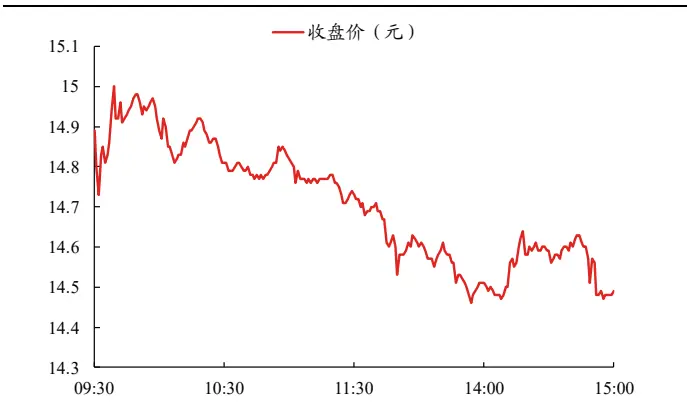
资料来源：上交所、深交所行情数据，兴业证券经济与金融研究院整理

图2、某支股票日内分钟收益率分布
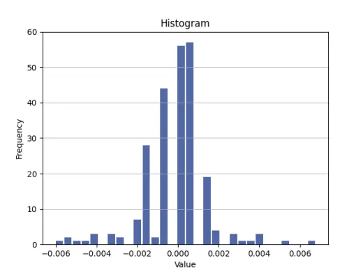
资料来源：上交所、深交所行情数据，兴业证券经济与金融研究院整理

估计日内收益率分布的特征会面临许多难题。首先是样本的稀疏性，投资者发起的买单和卖单在时间上随机地出现，对于流动性特别差的股票来说，并不是每一分钟都有买卖单的撮合，缺失的成交价会以前一个有成交的价格填补，成交价大部分落在0正负一个基点内（例如图3）。稀疏的样本具有更大的自相关性，对参数估计造成干扰（Hasbrouck(1991))。另一个估计日内收益率分布特征面临的难题是样本数据非独立同分布，尽管日内有二百多个样本点，但这些样本并不是全部来自于同一个分布。Barndor-Nielsen 和 Shephard (2010)发现已实现波动率可以依照收益率的正负分解为上行波动率(RV+)，下行波动率(RV-)，上下行波动率之差描述了跳跃的符号变化(signed jump variation)，表明正收益率与负收益率的总体分布是不同的（例如图4)。

图3、某支流动性差的股票分钟收盘价走势
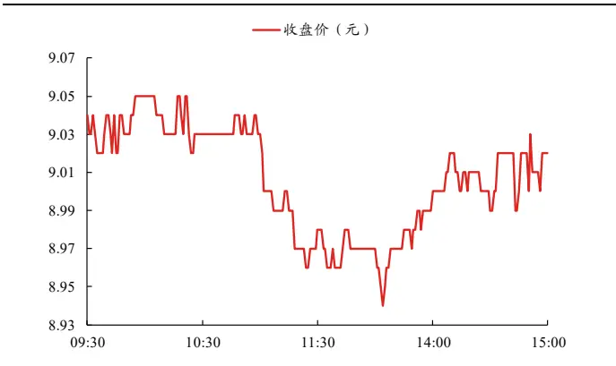
资料来源：上交所、深交所行情数据，兴业证券经济与金融研究院整理

图4、某支股票上下行波动率的日内分布
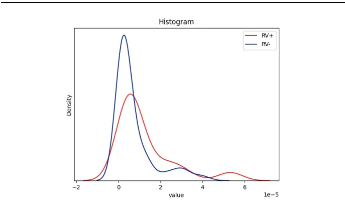
资料来源：上交所、深交所行情数据，兴业证券经济与金融研究院整理

由于高频数据中存在上述问题，在构造收益率分布因子时，我们采取异构数据加非参统计量的估计方法，即从原始收益率数据中构造出非稀疏的异构数据，然后采用非参统计量来描述异构数据的分布特征。

本文共分为六个部分，第一部分是前情回顾，第二部分是日内收益率分布介绍，第三部分阐述了收益率分布因子的定义，第四部分展示了一个收益率分布中的因子，第五部分跟踪该因子样本外的表现，第六部分是总结了全文。

## 3、收益率分布因子定义

## 3.1、分布信息定义

在2022年1月4日发布的报告《高频漫谈》中，我们提出聚合函数能构造出因子的原因是这些函数提取了数据的某种信息。在本文的研究中我们延续该逻辑，提取收益率数据的分布信息来构建因子。

$$
{\bf g}=f(Reorder({\bf r}))=f({\bf r})
$$

r表示分钟收益率时间序列向量，g表示基于方法f构造的指标。Reorder()函数表示对r重新排列，如Reorder $([r_{1},r_{2},r_{3}])=[r_{2},r_{1},r_{3}]$ ，我们要求含有分布信息的指标g对于r的时间位置不敏感。我们认为满足上述条件的指标 $:g\dag$ 构成的因子使用的是收益率的分布信息，而没有使用收益率的时间信息。在这篇文章中我们基于收益率分布数据构造的所有指标都满足以上的定义。

## 3.2、高频因子处理方法

生成高频因子分两步：首先在日内构造高频指标，然后在日间对高频指标进 行时序化操作生成高频因子。

## 3.2.1、因子值处理方法

对日内数据聚合得到的高频指标进行时序化操作得到因子值F，因子值F有正态性要求，有偏度因子值需要进行处理以得到相对无偏的因子值。偏度的处理原则是在不改变截面上因子值相对排序的情况下，降低数据的偏度。主要有以下两种偏度处理方法：

（1）排序变换：用因子在截面上的相对位置代替因子的绝对取值。一定能把数据处理成无偏。 $F_{i}$ 是因子在某天第i只股票上的取值，Rank()函数输出自变量在截面上的相对位置。 $F_{i}^{*}$ 是经过处理得到的无偏因子。

$$
F_{i}^{*}=Rank(F_{i})
$$

(2）Box-Cox变换：是一种广义幂变换方法（Box和Cox(1964))，通过引入参数λ改善原始数据的正态性。数据严重左偏（右偏）时，不能将数据处理成无偏。λ由极大似然法估计得到。

$$
F_{i}^{*}=\left\{\frac{(F_{i}-min(F)+1)^{\lambda}-1}{\lambda},\lambda\neq0\right.
$$

对于截面上有偏的因子值，我们首先采用Box-Cox变换处理它们，如果Box-Cox变换无效，我们进一步使用排序变换处理因子值，使其无偏。

因子值全部对对数市值、行业进行中性化，取回归得到的残差作为新的因子值。为了获得更稳定的因子收益率与夏普比率，按照2022年1月4日发布的报告《 $\frac{\dot{\pi}}{\vert\nabla\pmb{\vert\tau}\vert}$ 频漫谈》中的信号加权方式计算多空收益率。 $F_{i\cdot}$ 是因子在第 i 值股票上的权重， $F_{i}^{+}$ 表示股票多头， $F_{i}^{-}$ 表示股票空头2（具体处理方式参见《高频漫谈》）。

$$
\begin{array}{c}{{F_{i}^{+}=(F_{i}^{*}-median(F^{*}))/\sum_{\vphantom{\mathrm{1}}}F_{i}^{+}}}\\{{F_{i}^{-}=-(F_{i}^{*}-median(F^{*}))/\sum_{\vphantom{\mathrm{1}}}F_{i}^{-}}}\end{array}
$$

## 3.2.2、调仓规则

为了更好体现高频因子对于短期行情信息的把握优势，我们采取日频调仓的方式测量因子收益率。不过本文作为高频因子研究的开篇，我们也会检测因子在月频和周频的表现，用来比较调仓频率对因子表现的影响。

（1）月频调仓：考虑到距离调仓日越近的因子所含的信息有效性越强，采用时间加权的方式生成月频调仓因子。默认在每月最后一个交易日调仓， $F_{Mi}$ 是第i个月的月频调仓因子，n是调仓周期内的交易日天数， $F_{j}$ 是调仓周期内的第j个交易日的因子值：

$$
F_{Mi}=\frac{1}{\sum_{j=1}^{n}\frac{j}{n}\sum_{j=1}^{n}F_{j}\frac{j}{n}}
$$

(2）周频调仓：一周内的因子信息衰减速度没有一个月内的因子高，采用等权方式生成周频调仓因子。默认在每周最后一个交易日调仓， $F_{Wi}$ 是第i周的周频调仓因子，n是调仓周期内的交易日天数， $F_{j}$ 是调仓周期内的第j个交易日的因子值：

$$
F_{Wi}=\sum_{j=1}^{n}F_{\mathrm{j}}{\frac{1}{n}}
$$

（3）日频调仓：高频指标的时序化操作有很多，我们采取最简单的一种，等权平均，搜索合适窗口长度，以保证总体换手率合适。每日调仓， $F_{Di}$ 是第i天日频调仓因子， $n_{s}$ 是搜索得到的等权天数。为方便比较因子表现，本文 $\mathbf{\nabla}\cdot n_{s}\mathbf{\cdot}$ 一致取15:

$$
F_{Di}=\sum_{j=1}^{n_{s}}{F_{j}\frac{1}{n_{s}}}
$$

## 3.2.3、因子回测规则

因子回测区间：2014年8月31日-2021年8月31日。

在实际研究中我们发现：是否剔除涨跌停对于回测的结果、以及因子有效性衡量的准确性有着至关重要的影响。为此，我们在附录中详细测试了是否剔除涨跌停对于高频因子的影响。在正文中，我们则统一剔除涨跌停的个股价格。

胜率：日度调仓中胜率指日度多空收益率大于0的天数占回测期的比率；周度、月度调仓中胜率指周、月多空收益率大于0的天数占回测期的比率。

日换手率：计算单边换手，计算方式为前一期因子权重减去下一期因子权重的绝对值在截面上求和除以二，再在时序上求平均。

$$
tor=\frac{1}{T}\sum^{T}\sum|w_{t}-w_{t-1}|/2
$$

## 3.3、常见收益率分布因子

采用上述因子回测规则，我们构建了7个常见的收益率分布因子，它们的定义与表现如下。

表2、常见的收益率分布因子定义

| 因子名 | 因子构造方法 |
| --- | --- |
| rtn5_mean | 5分钟收益率的均值 |
| real_var | 已实现方差 |
| rtn_skew | 收益率偏度 |
| rtn_kurt | 收益率峰度 |
| rv_up | 上行收益率已实现方差 |
| rv_down | 下行收益率已实现方差 |
| rv_umd | 上下行已实现方差之差除以已实现方差 |

资料来源：兴业证券经济与金融研究院整理
注：收益率均是日内分钟收盘价变动百分比，如未特别标明，使用分钟收益率均是1分钟收益率；某些高频指标对股票样本稀疏性敏感，我们采用5分钟收益率代替分钟收益率，如 rtn5_mean 等

因子IC 都较显著，rtn5_mean的 IC 甚至达到了5.86%，各个因子的多空夏普比率几乎都在8以上。但从多头与空头收益率的对比上看，其因子的多空收益率绝大部分来自于空头效应。

表3、常见收益率分布因子表现

| 调仓频率 | 因子名称 | 年化多空 收益率 | 多头收 益率 | 空头收 益率 | 夏普比率 | 最大回撤 | 胜率 | ICIR | IC | 日换手率 |
| --- | --- | --- | --- | --- | --- | --- | --- | --- | --- | --- |
| 日度 ns = 15 | rtn5_mean | 70.21% | 12.89% | 44.04% | 7.79 | -9.24% | 67.64% | 0.5801 | 5.86% | 36.45% |
|  | real_var | 54.96% | 12.96% | 31.04% | 7.15 | -8.08% | 68.11% | 0.5471 | 5.03% | 9.84% |
|  | rtn_skew | 47.22% | 12.98% | 24.18% | 10.64 | -4.21% | 75.26% | 0.8782 | 4.45% | 27.95% |
|  | rtn_kurt | 46.46% | 11.09% | 25.86% | 8.70 | -4.95% | 71.40% | 0.6100 | 3.65% | 18.77% |
|  | rv_up | 91.46% | 13.80% | 60.96% | 9.81 | -7.17% | 71.57% | 0.6388 | 5.43% | 14.34% |
|  | rv_down | 46.83% | 7.48% | 30.41% | 6.15 | -10.08% | 64.13% | 0.4212 | 3.14% | 11.64% |
|  | rv_umd | 52.17% | 5.89% | 37.42% | 9.53 | -11.00% | 72.92% | 0.8689 | 4.75% | 29.66% |

资料来源：上交所、深交所行情数据，兴业证券经济与金融研究院整理

图5、常见收益率分布因子多空净值
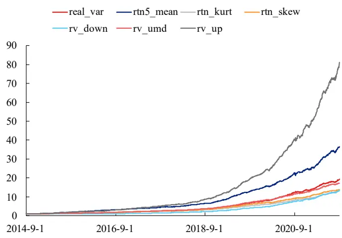
资料来源：上交所、深交所行情数据，兴业证券经济与金融研究院整理

计算因子的时序相关性，可以发现与已实现方差有关的因子具有较高的时序相关性，它们含有同样的波动率风险。例如，已实现方差与上行收益率已实现方差、下行收益率已实现方差的相关性在0.75以上，这也表明它们含有相同的波动率风险。

表4、常见收益率分布因子时序相关系数矩阵
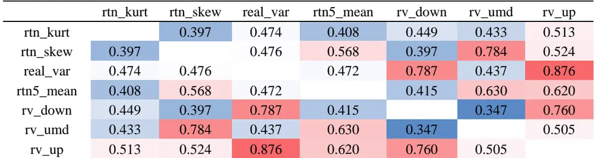
资料来源：上交所、深交所行情数据，兴业证券经济与金融研究院整理

## 4、基于收益率分布数据的因子

## 4.1、收益率噪音偏离因子（nos）投资逻辑

我们从收益率的噪音中构造第一个收益率分布因子—收益率噪音偏离因子，收益率噪音偏离因子（nos）事实上是流动性因子，它的投资逻辑如下。

每支股票分钟收益率序列的形成依赖于分钟内所有投资者买卖单的撮合，对于流动性好的股票，分钟内的每位投资者对它的收益率的影响微乎其微，Laplace(1810)指出若误差是由许多微小量的叠加，那么样本的测量误差应该服从正态分布。在股票收益率序列中的测量误差可以看作是收益率的噪音（观测到的收益率偏离预期收益率的差值)。对于流动性差的股票，正如前言所述，它们股票价格的变动往往落在0正负一个基点内，所以它们的收益率噪音自然会偏离正态分布。

收益率噪音还有另外一层含义，在真实的股票市场中，不论哪一种流动性的股票里，都有可能存在大额投资者，他们能影响甚至操纵股票价格。大额投资者对股票分钟收益率的影响远超过其他投资者，那么他们对收益率噪音的影响如何呢？首先，不论大额投资者是如何拆分资金，分批买进，只要他们没有办法完美地伪装成散户，他们对股票收益率的影响在统计上就会有一定的差异，表现为收益率噪音偏离正态分布。其次，大额投资者对某支股票收益率影响越大，收益率噪音就越偏离正态分布，这支股票潜在的风险也就越大，因此市场参与者对股票的风险溢价要求也就越高。nos越大表明收益率噪音偏离正态分布越远，我们以下表说明nos与大额投资者、流动性的关系，可以清晰地看到nos与风险溢价同向。

表5、大额投资者、流动性与nos因子风险溢价的关系

|  | 大额投资者有 | 大额投资者无 |
| --- | --- | --- |
| 流动性大 | nos 较大 | nos小 |
|  | 风险溢价较高 | 风险溢价低 |
| 流动性小 | nos 大 | nos 较大 |
|  | 风险溢价高 | 风险溢价较高 |

资料来源：兴业证券经济与金融研究院整理

## 4.2、nos 构造方法

下面我们来估计nos，从基础的股票收益率模型入手，假设股票价格 $P_{t}$ 遵循几何布朗运动，收益率均值 $\mathbf{\nabla}_{\cdot}\mu$ ，标准差 $\boldsymbol{\sigma}$ ， $W_{t}$ 是标准维纳过程

$$
dP_{t}/P_{t}=\mu dt+\sigma dW_{t}
$$

模型离散化后，分钟收益率 $R_{t}=\Delta P_{t}/P_{t}$ ，假设同一支股票在某天内的分钟收益率是独立同分布的，定义收益率噪音 $e_{t}$ 如下

$$
\begin{array}{c}{\Delta P_{t}/P_{t}=\mu\Delta t+\sigma\Delta W_{t}}\\{e_{t}=\displaystyle\frac{R_{t}-E[R_{t}]}{\sigma}\sim N(0,1)}\end{array}
$$

衡量随机变量与正态分布的偏离程度的统计方法有很多，我们选取2种方式估计nos，评估nos因子在统计上的稳健性。所有的估计方式中我们都用样本均值与样本标准差代替总体均值与总体标准差计算 $\cdot e_{t}$ ，得到的样本点记作 $x_{t}$ ，共有N个样本点。在计算方式上，我们引入了两种方法来估计nos，分别命名为nos_gs 和 nos_sw。

## 4.3、nos因子有效性分析

而实测结果来看，nos_gs和nos_sw的平均时序相关性为 0.906，表明收益率噪音的估计在统计上是稳健的，两种方式对于收益率噪音的估计的都是有效的。我们选取效果更好的nos_gs作为收益率噪音偏离因子，考察其因子表现。

nos_gs日度调仓多空收益率为61.10%，多头收益率12.91%，空头收益率-36.59%，夏普比率9.50，日换手率21.77%。多空净值最大回撤 9.80%，且出现在 2015年左右。IC均值 5.12%，IC累计图表明 nos_gs在样本时间窗口内预测效果十分稳定。

表6、nos因子回测表现

| 调仓频率 | 因子名称 | 年化多空 收益率 | 多头收 益率 | 空头收 益率 | 夏 比率 | 最大回撤 | 胜率 | ICIR | IC | 日换手 率 |
| --- | --- | --- | --- | --- | --- | --- | --- | --- | --- | --- |
| 日度 | nos-gs | 61.10% | 12.91% | 36.59% | 9.50 | -9.80% | 74.03% | 0.7781 | 5.12% | 21.77% |
| ns = 15 | nos-sw | 54.51% | 14.61% | 28.95% | 7.94 | -9.86% | 69.99% | 0.5798 | 4.41% | 19.74% |
| 周度 | nos-gs | 32.41% | 15.43% | 7.67% | 5.88 | -2.49% | 79.94% | 0.9422 | 5.33% | 22.93% |
|  | nos-sw | 32.29% | 17.86% | 6.17% | 5.46 | -2.91% | 77.99% | 0.7889 | 5.50% | 22.12% |
| 月度 | nos-gs | 16.47% | 9.67% | -0.42% | 3.07 | -4.01% | 83.33% | 1.0019 | 6.17% | 5.05% |
|  | nos-sw | 17.02% | 10.54% | 0.25% | 1.66 | -12.71% | 71.43% | 0.6266 | 4.93% | 5.86% |

资料来源：上交所、深交所行情数据，兴业证券经济与金融研究院整理

图 6、nos 因子多空净值
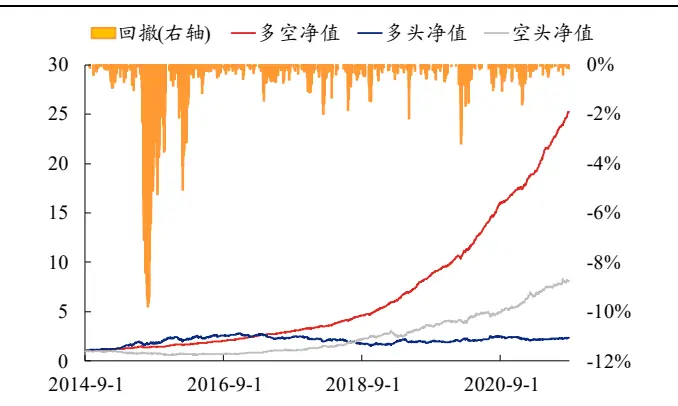
资料来源：上交所、深交所行情数据，兴业证券经济与金融研究院整理

图 7、nos 因子 IC 与累计 IC
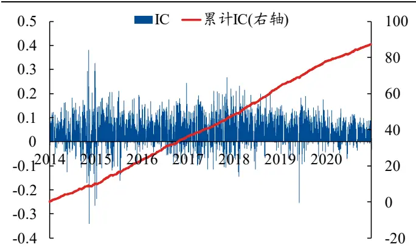
资料来源：上交所、深交所行情数据，兴业证券经济与金融研究院整理

从10分组来看，nos_gs分层十分明显，多空权重占比几乎完全对称，多头前10%占比平均为 25.80%，空头前10%占比平均为-29.82%。

图 8、nos 因子 10 分位等权组合净值
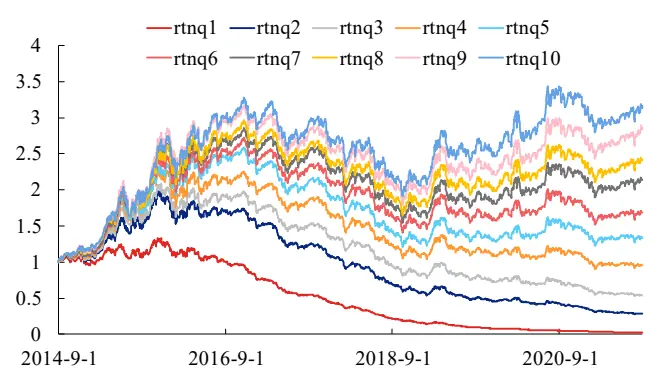
资料来源：上交所、深交所行情数据，兴业证券经济与金融研究院整理

图 9、nos因子多空权重分位占比
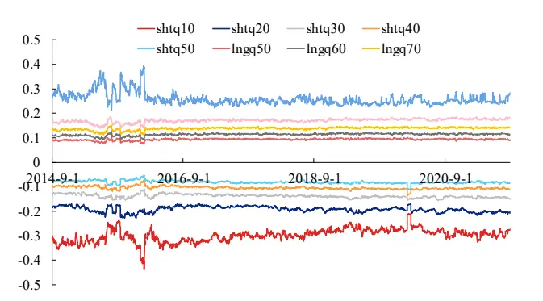
资料来源：上交所、深交所行情数据，兴业证券经济与金融研究院整理

## 4.4、nos因子特异性分析

nos_gs具有较好的特异性，与绝大多数的收益率分布因子的相关性在0.5以下，与rtn_kurt（日度IC均值为3.65%，在常见收益率分布因子中排名靠后）的时序相关性在0.7左右。我们认为相关性高的原因可能是因为：rtn_kurt与nos_gs对因子时序收益的波动较为敏感，二者风险特征可能相似所致，但只有nos_gs有较好的超额以及更高的多空夏普。

表7、nos_gs与常见收益率分布因子的时序相关性

|  | real_var | rtn5_mean | rtn_kurt | rtn_skew | rv_down | rv_umd | rv_up |
| --- | --- | --- | --- | --- | --- | --- | --- |
| nos_gs | 0.334 | 0.446 | 0.726 | 0.334 | 0.414 | 0.431 | 0.560 |

资料来源：上交所、深交所行情数据，兴业证券经济与金融研究院整理

进一步，我们将nos_gs与相关性最高的因子rtn_kurt做正交化处理，并再次测试其表现。从结果上看，与 rtn_kurt 正交化后得到的新因子 nos_gsn 表现依旧优秀，多空年化收益率44.87%，多头年化16.75%，优于原始因子。因子表现出优秀的特异性。

表8、nos因子正交化前后回测表现（日度调仓）

| 是否正交 化 | 因子名称 | 年化多空 收益率 | 多头收 益率 | 空头收 益率 | 夏 比率 | 最大回撤 | 胜率 | ICIR | IC | 日换手 率 |
| --- | --- | --- | --- | --- | --- | --- | --- | --- | --- | --- |
| 否 | nos_gs | 61.10% | 12.91% | 36.59% | 9.50 | -9.80% | 74.03% | 0.7781 | 5.12% | 21.77% |
| 是 | nos_gsn | 44.87% | 16.75% | 18.19% | 7.37 | -10.16% | 71.98% | 0.6722 | 3.99% | 34.14% |

资料来源：上交所、深交所行情数据，兴业证券经济与金融研究院整理

图 10、nos_gsn 因子多空净值
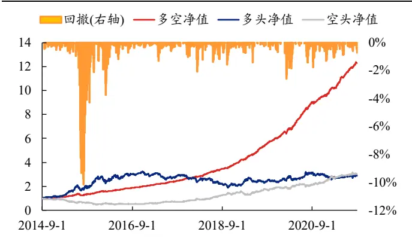
资料来源：上交所、深交所行情数据，兴业证券经济与金融研究院整理

图 11、nos_gsn IC 与累计 IC
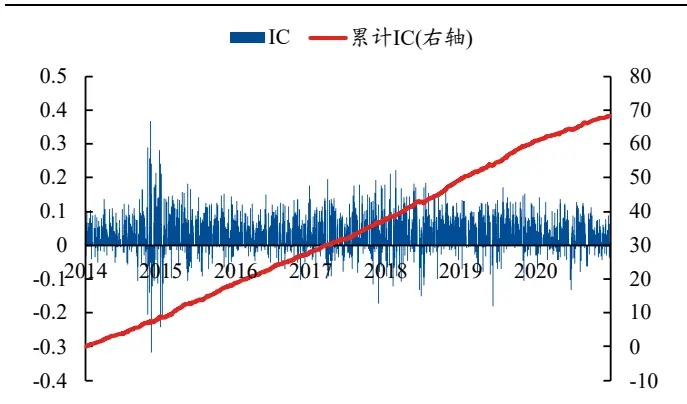
资料来源：上交所、深交所行情数据，兴业证券经济与金融研究院整理

## 4.5、nos 计算实例

我们选取某天 nos_gs值最大的股票与nos_gs 值最小的股票，观察其当天收益率表现3。

## （1）2021年8月31日nos_gs值最大股票-北巴传媒(600386.SH)

600386.SH当天换手率3.20%，收盘涨4.65%，从收益率直方图中可以看到600386.SH交易并不活跃，流动性较差。当天交易的第115到125分钟内股价上涨9.37%，当天绝大多数正收益是由短暂的10 分钟实现的，暗示600386.SH当天可能存在潜在的大额投资者在影响股票价格。由于600386.SH流动性差，并且可能含有大额资金，所以当天该股票计算得到的nos_gs值最大。

图 12、2021年 8月31日600386.SH分钟收盘价走势
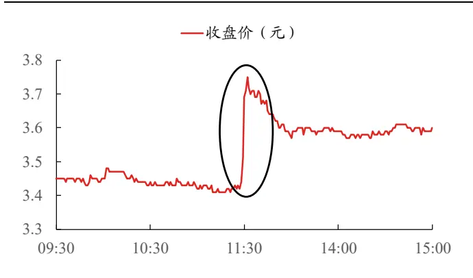
资料来源：上交所、深交所行情数据，兴业证券经济与金融研究院整理

图 13、2021年 8月31日600386.SH 分钟收益率分布
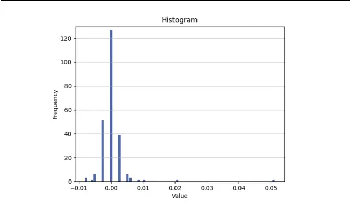
资料来源：上交所、深交所行情数据，兴业证券经济与金融研究院整理

（2）2021年8月31日全市场nos_gs值最小股票-长城科技(603897.SH)603897.SH当天换手率4.54%，收盘跌-8.35%，从直方图可以看到603897.SH的交易更活跃，直方图也接近正态分布。虽然当天交易的第1到第3分钟股价下跌-3.52%，但这种极端的股价变化只出现一次，其余时间收益率的变化比较服从正态分布，表明603897.SH股价受到大额投资者影响的可能性较低。对于603897.SH这种流动性好，且不太可能含有大额投资者的股票来说，当天计算得到的 nos_gs 值最小。

图 14、2021年 8月31日603897.SH 分钟收盘价走势
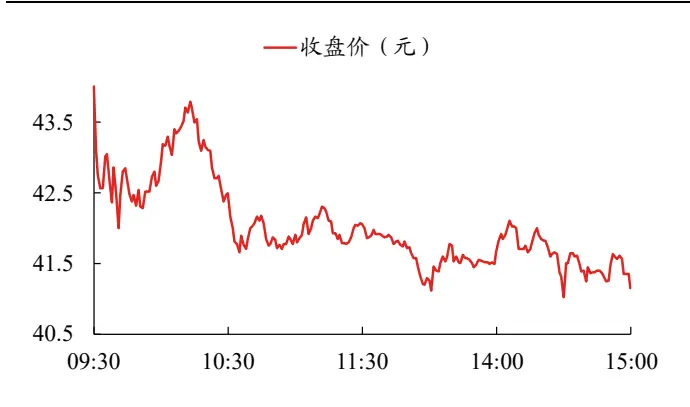
资料来源：上交所、深交所行情数据，兴业证券经济与金融研究院整理

图 15、2021年 8月31日603897.SH分钟收盘价分布
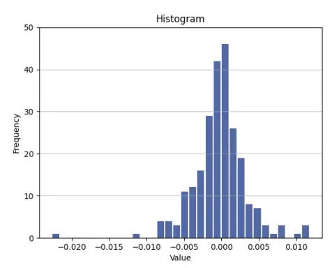
资料来源：上交所、深交所行情数据，兴业证券经济与金融研究院整理

## 5、nos因子有效性后续检验-样本外表现跟踪

## 5.1、高频因子的样本外跟踪

在上一章节中，我们展示了基于分钟级别数据构建的收益率噪音偏离因子。在具体回测中，nos_gs因子表现十分出色。

由于数据准备的原因，我们在构建前述8个因子时，仅使用了2014年8月至2021年8月底的数据，而最近刚将数据更新至最新。这也恰好给我们预留了对因子进行样本外检验的测试区间。此外，在去年（2021年）9月至12月期间，私募量化基金出现了相对较大的回撤，若nos_gs在此期间表现优异，那么可以证明其可以提供增量 Alpha。

## 5.2、nos因子样本外表现测试

我们将因子值更新至2022年1月14日，并测试其整体时间区间（2014年8月至2022年1月）以及纯样本外（2021年9月至2022年1月）的因子日频调仓结果。

在样本外（2021年9月至2022年1月14日）nos_gs因子的多空年化收益率高达67.05%，多空夏普比率为12.72，最大回撤仅1.33%。此外，多头以及多空组合没有出现明显的回撤，多空组合回撤近1.33%。从日度IC上看，累计IC整体没有下降趋势，因子在样本外有效性非常强。

对于全时段测试来说，nos_gs的夏普比率保持与样本内测试结果接近，为9.63，其IC均值也保持在5%以上，多头年化收益率12.73%。

表9、nos_gs因子回测表现（日度调仓）

| 测试区间 | 因子名称 | 年化多空 收益率 | 多头收 益率 | 空头收 益率 | 普夏 比率 | 最大回撤 | 胜率 | ICIR | IC | 日换手 率 |
| --- | --- | --- | --- | --- | --- | --- | --- | --- | --- | --- |
| 全时段 | nos-gs | 61.44% | 12.73% | 37.26% | 9.63 | -9.80% | 73.94% | 0.7829 | 5.08% | 21.76% |
| 样本外 | nos-gs | 67.05% | 9.21% | 49.91% | 12.72 | -1.33% | 71.43% | 0.9750 | 4.20% | 21.34% |

资料来源：上交所、深交所行情数据，兴业证券经济与金融研究院整理

图 16、nos_gs 因子多空净值（全时段）
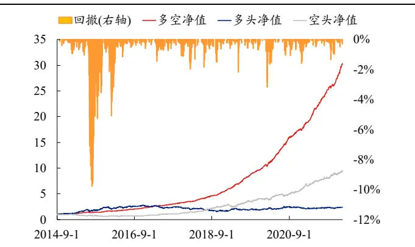
资料来源：上交所、深交所行情数据，兴业证券经济与金融研究院整理

图 17、nos_gs IC 与累计 IC（全时段）
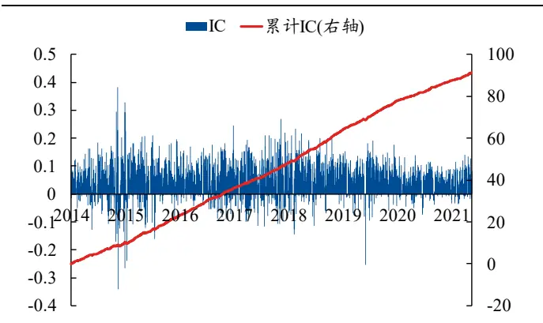
资料来源：上交所、深交所行情数据，兴业证券经济与金融研究院整理

图 18、nos_gs因子多空净值（样本外）
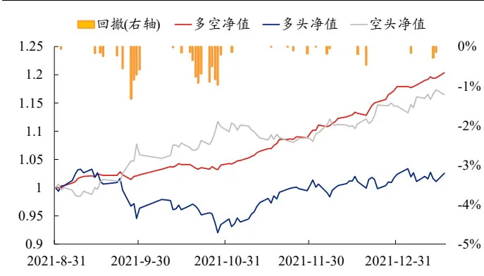
资料来源：上交所、深交所行情数据，兴业证券经济与金融研究院整理

图 19、nos_gs IC 与累计 IC（样本外）
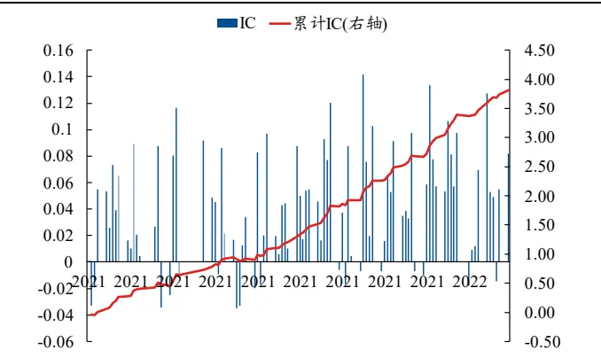
资料来源：上交所、深交所行情数据，兴业证券经济与金融研究院整理

## 6、总结

本文首先介绍了高频因子的构建方法和回测规则。之后我们介绍了基于分钟收益率分布信息的若干因子，包括常见的收益率分布因子，以及我们构建的基于分收益率噪音的噪音偏离因子nos。nos-gs因子在日、周、月度回测中表现较强的有效性，夏普比率较高。同时该因子与常见的收益率分布类因子相关性较低，样本外表现优秀，具有较强的特异性与实战性。

## 7、附录

## 7.1、涨跌停股对于高频因子的影响—日频回测实证

涨跌停对于高频因子日频回测的结果影响较大。在本节中我们构建了累计收益率计算偏度因子，并以此为例来说明来涨跌停限制对回测的影响。

## 7.1.1、累计收益率偏度因子（cpr_sw）

分钟收益率最原始的定义为分钟收盘价的变动百分比，记为 $R_{t}$ 。当在 $.R_{t}$ 含有的分布信息中构建了足够多的因子后，我们可以通过不同的收益率定义方法生成异构收益率数据，从而获取低相关性的因子，如日内的累计收益率：

$$
R_{t}^{cum}=\sum_{i=0}^{t}R_{i}
$$

累计收益率 $R_{t}^{cum}$ 是当前股价相对于开盘价的涨跌，等价于分钟收盘价相对当日开盘价的变动百分比。

累计收益率是投资者观测到的收益率。在股票累计收益率均值一定的情况下，如果累计收益率左偏，那么投资者更有可能看到股价落在高价区，收益率落在高累计收益率区；如果累计收益率右偏，那么投资者更有可能看到股价落在低价区，收益率落在低价区间。因此，投资者会认为左偏的股票相对于右偏的股票具有更高的收益，从而在短期内追捧左偏股票，提高左偏股票价格，左偏的股票相对于右偏的股票在短期内收益率会更高。然而，自相关性使得数据的波动率被系统性高估，但对于偏度来说自相关性的影响没有确定方向。为了减少自相关性对偏度估计量的影响，我们采用非参方法改进偏度估计量，计算改进后的偏度估计量cpr_sw。

图20、均值、方差一定时不同偏度的累计收益率分布
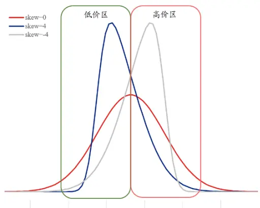
资料来源：兴业证券经济与金融研究院整理

## 7.1.2、cpr_sw剔除涨跌停前后因子表现对比

我们首先展示该因子在不剔除涨跌停的情况下因子回测的结果。基于改进方法的累计涨幅偏度因子cpr_sw年化日度调仓多空收益率为45.28%，多头收益率26.51%，空头收益率5.50%，夏普比率高达6.21，日换手率34.63%。

进一步，我们从日度回测表现与分位数组合上看该因子在剔除涨跌停股票后的表现。可以明显看到，在剔除了涨跌停股票后，该因子的日度回测效果明显变差，尤其是在多头收益上，由之前的超20%年化收益率降低至-0.31%。无论是从多空净值还是累计IC上看，2018年以来该因子基本失效。

表 10、cpr_sw因子回测表现（日度调仓）

| 是否剔除 涨跌停 | 因子名称 | 年化多空 收益率 | 多头收 益率 | 空头收 益率 | 普夏 比率 | 最大回撤 | 胜率 | ICIR | IC | 日换手 率 |
| --- | --- | --- | --- | --- | --- | --- | --- | --- | --- | --- |
| 不剔除 | cpr_sw | 45.28% | 26.51% | 5.50% | 6.21 | -13.87% | 71.22% | 0.4048 | 2.21% | 34.63% |
| 剔除 | cpr_sw | 13.04% | -0.31% | 8.36% | 2.57 | -7.69% | 59.61% | 0.3153 | 1.70% | 34.14% |

资料来源：上交所、深交所行情数据，兴业证券经济与金融研究院整理

图 21、cpr_sw 因子 10 分位等权组合净值（不剔除涨跌停）
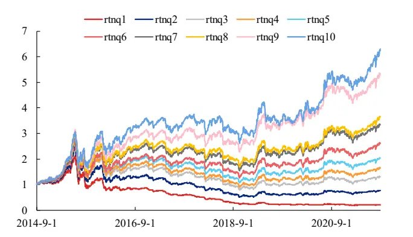
资料来源：上交所、深交所行情数据，兴业证券经济与金融研究院整理

图 22、cpr_sw因子 10 分位等权组合净值（剔除涨跌停）
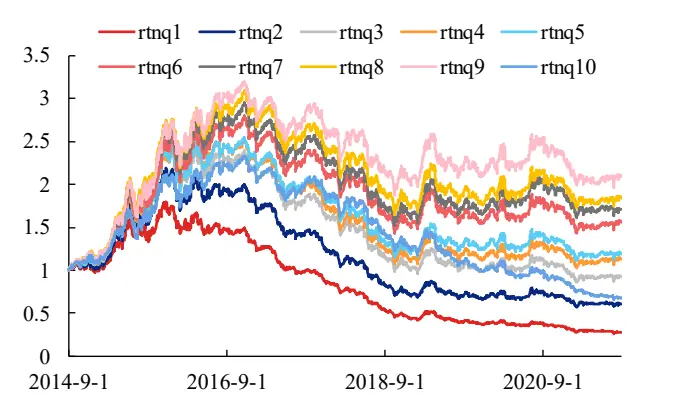
资料来源：上交所、深交所行情数据，兴业证券经济与金融研究院整理

## 参考文献

[1] Barndor-Nielsen, O.; S. Kinnebrock; and N. Shephard. Volatility and Time Series Econometrics: Essays in Honor of Robert F. Engle, Chapter Measuring Downside Risk-RealisedSemivariance." Oxford University Press, (2010).

[2] Box G, D.R. Cox. An Analysis ofTransformations[J]. Journal of the Royal Statistical Society. Series B: Methodological, 1964, 78(2).

[3] Engle, R. F. and Russell, J. R. Autoregressive conditional duration: A new model for irregularly spaced transaction data[J]. Econometrica, 1998, 66:1127–1162.

[4] Granger C W, Maasoumi E, Racine J. A Dependence Metric for Possibly Nonlinear Processes[J]. Journal of Time Series Analysis, 2004, 25(5):649-669.

[5] Hasbrouck, J. Measuring the information content of stock trades[J]. The Journal of Finance, 1991, 46:179–207.

[6] Marti G, Nielsen F, Bi'Nkowski M, et al. A review of two decades of correlations, hierarchies, networks and clustering in financial markets[J]. Papers, 2020.

[7] M. Lopez de Prado, Building diversified portfolios that outperform out-of-sample[J]. Journal of Portfolio Management, 2016.

[8] Novak M G, Veluek D. Prediction of stock price movement based on daily high prices[J]. Quantitative Finance, 2016, 16.

[9] R. N. Mantegna, H. E. Stanley, Introduction to econophysics: correlations and complexity in finance, Cambridge university press, 1999.

[10] R. N. Mantegna, Hierarchical structure in financial markets[J]. The European Physical Journal B-Condensed Matter and Complex Systems, 1999, 11:193–197.

风险提示：模型结果基于历史数据的测算，在市场环境转变时模型存在失效的风险。

## 分析师声明

本人具有中国证券业协会授予的证券投资咨询执业资格并注册为证券分析师，以勤勉的职业态度，独立、客观地出具本报告。本报告清晰准确地反映了本人的研究观点。本人不曾因，不因，也将不会因本报告中的具体推荐意见或观点而直接或间接收到任何形式的补偿。

## 投资评级说明

| 投资建议的评级标准 | 类别 | 评级 | 说明 |
| --- | --- | --- | --- |
| 报告中投资建议所涉及的评级分为股票评级和行业评级（另有说明的除外)。评级标准为报告发布日后的12个月内公司股价（或行业指数）相对同期相关证券市场代表性指数的涨跌幅。其中：A股市场以上证综指或深 | 股票评级 | 买入 | 相对同期相关证券市场代表性指数涨幅大于15% |
|  |  | 审慎增持 | 相对同期相关证券市场代表性指数涨幅在5%~15%之间 |
|  |  | 中性 | 相对同期相关证券市场代表性指数涨幅在-5%~5%之间 |
|  |  | 减持 | 相对同期相关证券市场代表性指数涨幅小于-5% |
|  |  | 无评级 | 由于我们无法获取必要的资料，或者公司面临无法预见结果的重大不确定性事件，或者其他原因，致使我们无法给出明确的投资评级 |
| 圳成指为基准，香港市场以恒生指数为基准；美国市场以标普500或纳斯达克综合指数为基准。 | 行业评级 | 推荐 | 相对表现优于同期相关证券市场代表性指数 |
|  |  | 中性 | 相对表现与同期相关证券市场代表性指数持平 |
|  |  | 回避 | 相对表现弱于同期相关证券市场代表性指数 |

## 信息披露

本公司在知晓的范围内履行信息披露义务。客户可登录www.xyzq.com.cn内幕交易防控栏内查询静默期安排和关联公司持股情况。

## 使用本研究报告的风险提示及法律声明

兴业证券股份有限公司经中国证券监督管理委员会批准，已具备证券投资咨询业务资格。本报告仅供兴业证券股份有限公司（以下简称“本公司”）的客户使用，本公司不会因接收人收到本报告而视其为客户。本报告中的信息、意见等均仅供客户参考，不构成所述证券买卖的出价或征价邀请或要约。该等信息、意见并未考虑到获取本报告人员的具体投资目的、财务状况以及特定需求，在任何时候均不构成对任何人的个人推荐。客户应当对本报告中的信息和意见进行独立评估，并应同时考量各自的投资目的、财务状况和特定需求，必要时就法律、商业、财务、税收等方面咨询专家的意见。对依据或者使用本报告所造成的一切后果，本公司及/或其关联人员均不承担任何法律责任。

本报告所载资料的来源被认为是可靠的，但本公司不保证其准确性或完整性，也不保证所包含的信息和建议不会发生任何变更。本公司并不对使用本报告所包含的材料产生的任何直接或间接损失或与此相关的其他任何损失承担任何责任。

本报告所载的资料、意见及推测仅反映本公司于发布本报告当日的判断，本报告所指的证券或投资标的的价格、价值及投资收入可升可跌，过往表现不应作为日后的表现依据；在不同时期，本公司可发出与本报告所载资料、意见及推测不一致的报告：本公司不保证本报告所含信息保持在最新状态。同时，本公司对本报告所含信息可在不发出通知的情形下做出修改投资者应当自行关注相应的更新或修改。

除非另行说明，本报告中所引用的关于业绩的数据代表过往表现。过往的业绩表现亦不应作为日后回报的预示。我们不承诺也不保证，任何所预示的回报会得以实现。分析中所做的回报预测可能是基于相应的假设。任何假设的变化可能会显著地影响所预测的回报。

本公司的销售人员、交易人员以及其他专业人士可能会依据不同假设和标准、采用不同的分析方法而口头或书面发表与本报告意见及建议不一致的市场评论和/或交易观点。本公司没有将此意见及建议向报告所有接收者进行更新的义务。本公司的资产管理部门、自营部门以及其他投资业务部门可能独立做出与本报告中的意见或建议不一致的投资决策。

本报告并非针对或意图发送予或为任何就发送、发布、可得到或使用此报告而使兴业证券股份有限公司及其关联子公司等违反当地的法律或法规或可致使兴业证券股份有限公司受制于相关法律或法规的任何地区、国家或其他管辖区域的公民或居民，包括但不限于美国及美国公民（1934年美国《证券交易所》第15a-6条例定义为本「主要美国机构投资者」除外）。

本报告的版权归本公司所有。本公司对本报告保留一切权利。除非另有书面显示，否则本报告中的所有材料的版权均属本公司。未经本公司事先书面授权，本报告的任何部分均不得以任何方式制作任何形式的拷贝、复印件或复制品，或再次分发给任何其他人，或以任何侵犯本公司版权的其他方式使用。未经授权的转载，本公司不承担任何转载责任。

## 特别声明

在法律许可的情况下，兴业证券股份有限公司可能会利差本报告中提及公司所发行的证券头寸并进行交易，也可能为这些公司提供或争取提供投资银行业务服务。因此，投资者应当考虑到兴业证券股份有限公司及/或其相关人员可能存在影响本报告观点客观性的潜在利益冲突。投资者请勿将本报告视为投资或其他决定的唯一信赖依据。

## 兴业证券研究

| 上海 | 北京 | 深圳 |
| --- | --- | --- |
|  | 地址：上海浦东新区长柳路36号兴业证券大厦地址：北京西城区锦什坊街35号北楼601-605 | 地址：深圳市福田区皇岗路5001号深业上城T2 座52楼 |
| 15层 邮编：200135 | 邮编：100033 | 邮编：518035 |
| 邮箱：research@xyzq.com.cn | 邮箱：research@xyzq.com.cn | 邮箱：research@xyzq.com.cn |