分析师：

郑兆磊

zhengzhaolei@xyzq.com.cn

S0190520080006

## 报告关键点

本文中，我们将继续聚焦于股票的日内收益率分布信息，并构建高频因子。我们以两个统计模型作为出发点，构建三类因子：根据投资者对极端上涨和极端下跌的心理承受能力不同构建极端上涨和极端下跌因子，从日内跳价的信息中刻画大额投资者对于股票的操作能力并进一步构建高频因子，从日内震荡期和跳价期的信息差异中刻画股票的日内价格弹性并进一步构建选股 Alpha因子。

## 相关报告

《高频漫谈》2022-01-04《高频研究系列二—收益率分布因子构建》2022-01-23

# 高频研究系列三—收益率分布中的 Alpha(2)

2022年5月4日

## 投资要点

- 在2022年1月，兴证金工团队先后推出了阐述高频研究方法论的《高频漫谈》与《收益率分布因子》的深度研究：我们首先针对高频因子构建方法、回测方法以及风险模型搭建进行深入分析。更进一步，我们构建了用于追踪大额投资者投资行为的收益率噪音偏离因子nos。

本文中，我们将继续聚焦于股票的日内收益率分布信息，并构建高频因子。我们以两个统计模型作为出发点，构建三类因子：根据投资者对极端上涨和极端下跌的心理承受能力不同构建极端上涨和极端下跌因子，从日内跳价的信息中刻画大额投资者对于股票的操作能力并进一步构建高频因子，从日内震荡期和跳价期的信息差异中刻画股票的日内价格弹性并进一步构建选股Alpha因子。

三类因子均展示出极强的选股能力：我们以exRtn maxVal（极端上涨幅度）为例进行阐述。该因子多空年化收益率44.40%，夏普比率8.73，IC均值4.30%。此外，三类因子特异性较强，与常见收益率因子做中性化处理后表现仍十分优秀。

核心表、高频因子回测结果展示

| 因子名称 | 多空年化收益率 | 多空夏普比率 | IC均值 | ICIR |
| --- | --- | --- | --- | --- |
| exRtn_maxVal | 44.40% | 8.73 | 4.30% | 0.85 |
| exRtn_minFre | 37.52% | 6.52 | 3.44% | 0.62 |
| gmm_mean | 48.88% | 7.53 | 5.44% | 0.90 |
| gmm_meandif | 52.80% | 8.05 | 5.16% | 0.87 |

资料来源：上交所、深交所行情数据，Wind，聚源，兴业证券经济与金融研究院整理
注：这里的多空是两分组，具体参见往期报告解释

最后，我们对因子进行多维分析：就因子在宽基范围内以及使用不同交易价格成交进行分析。1）因子在中证800股票池内有效性依然较强；2）我们于T日得到各个因子值后，尝试使用T日最后5分钟收盘价均价、T+1日开盘30分钟的收盘价均价以及T+1日的全天收盘价均价作为交易的买入价格。从测试结果来看，不同交易价格对于因子表现的影响较小，因子表现出较强的有效性与稳定性。

风险提示：模型结果基于历史数据的测算，在市场环境转变时模型存在失效的风险。

## 报告正文

## 1、兴证金工高频研究回顾

在2022年1月，兴证金工团队先后推出了阐述高频研究方法论的《高频漫谈》与《收益率分布因子》的深度研究。其中，在高频漫谈中，我们阐述了高频因子的构建逻辑、因子的回测方法以及高频风险的识别。在收益率分布因子中，我们构建了七个常见的收益率分布因子，以及用于追踪大额投资者投资行为的收益率噪音偏离因子 nos。

表1、兴证金工高频系列研究内容回顾

| 内容 | 简介 |
| --- | --- |
| 高频研究系列一：高 频漫谈 | 简述高频因子构建逻辑：基于四类信息构造高频指标，两类时序操作生成高频因子， 基于信号加权的多空构造方式；简述高频因子回测方法：通过回测结果判断因子有效 性，基于时序相关性的特异性判断标准，通过基本面风险模型与统计风险模型结合衡 |
| 高频研究系列二：收 益率分布因子构建 因子 | 量高频风险 基于收益率分布信息构建六个常见收益率分布因子，以及两个收益率噪音偏离因子nos |

资料来源：兴业证券经济与金融研究院整理

为了更好体现高频因子对于短期行情信息的把握优势，我们采取日频调仓的方式测量因子收益率。具体来说， $F_{Di}$ 是第i天日频调仓因子， $F_{j}$ 是第j天的高频指标， $n_{s}$ 取 201:

$$
F_{Di}=\sum_{j=1}^{n_{s}}{F_{j}\frac{1}{n_{s}}}
$$

在本文中如无额外说明，我们因子的回测规则设定如下：

因子回测区间：2014年9月1日-2022年1月28日；

回测规则：剔除当期不在市、涨跌停以及特殊处理的股票；

回测结果说明：本文中，回测表格中提及的年化波动率、夏普比率、最大回撤、胜率均为因子回测时的多空净值对应统计量。且我们这里的多空是两分组并按照因子进行加权（参见2022年1月4日发布的《高频漫谈》）。

本文中，我们将继续聚焦于股票的日内收益率分布信息，从更多维、更深入的角度刻画个股的日内收益率分布特征，以构建有效且具有特异性的高频因子。具体来说，根据投资者对极端上涨和极端下跌的心理承受能力不同构建极端上涨和极端下跌因子，从日内跳价的信息中刻画大额投资者对于股票的操作能力并进一步构建高频因子，从日内震荡期和跳价期的信息差异中刻画股票的日内价格弹性并进一步构建选股 Alpha 因子。

## 2、基于极值信息追踪市场投资者心理反应

## 2.1、拆分收益率偏度-收益率极值

在上一篇的高频因子研究报告《收益率分布因子》中，我们展示了一些常见的收益率分布因子，包括均值、偏度、峰度等基于分布统计量构建的高频因子。其中，收益率偏度因子的收益异象主要来自于投资者对于极端的分钟收益率（大幅上涨或下跌）的高度敏感性。然而，分钟收益率偏度因子计算的是日内收益率整体分布的统计量，该计算方式将大幅上涨和大幅下跌的股票放在了同一个维度（偏度）上进行衡量和区分。然而事实上，投资者面对极端的正向收益和负向收益时，其心理的反应并不完全等价。

基于展望理论²我们可以知道，每个人基于初始状况的不同，对风险会有着非常不同的态度和反应。具体来说，人们在盈利和亏损同样金额时，亏损带来的心理影响将远大于盈利带来的影响。这种影响也将直接影响投资者后续的投资行为：投资者在盈利时，会倾向于做出风险厌恶的投资行为；相反地，投资者在亏损时，却会选择愿意冒更大的风险，成为风险偏好的投资者。同时，盈利或损失相同金额时，投资者投资行为的变化也不尽相同：亏损对于投资者心理与投资行为的影响将大于盈利带来的影响。

图1、展望理论简单图解
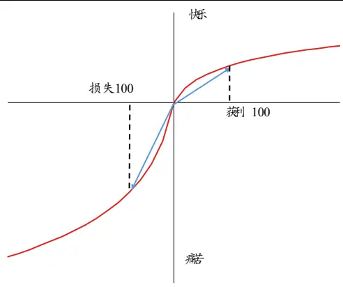
资料来源：兴业证券经济与金融研究院整理

将展望理论对应至收益率的偏度值时我们发现：投资者面对两支当期均出现极端上涨的股票时，其对于极端上涨中存在的差异相对不敏感；反之，投资者面对两支当期均出现极端下跌的股票时，其对于极端下跌中存在的差异相对更敏感。然而，偏度因子将负偏度（极端下跌）和正偏度（极端上涨）的股票放在了同一维度衡量。显然，这样的处理方式对于此类心理的刻画并非完全准确和全面，因此，为了细致刻画投资者面对大幅盈利和亏损时的不同投资行为，以及投资行为对于股价的短期影响，我们需要将偏度拆分为对于收益率极大值和极小值的特征刻画。

除投资逻辑之外，数理统计中偏度统计量与极值统计量也代表着对于该分布不同信息的刻画。具体而言，极值研究的是总体中部分分布的性质，而收益率偏度研究的是总体分布的部分性质。以下面的例子说明两者的区别。

图2、偏度与极大值区别图解
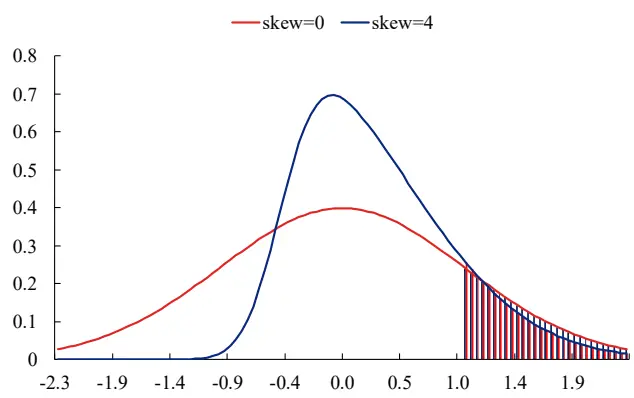
资料来源：兴业证券经济与金融研究院整理

图中两条收益率分布曲线的偏度不同，但极端值的阴影部分面积几乎相同。说明即使整体分布不同，极值的分布也可能有相同的性质3。对应到因子计算时我们便能发现：不同的收益率偏度因子可能具有相同的极值因子，这也从侧面说明极值因子相对于偏度因子具有特异性。

综上，收益率偏度因子的收益异象主要来自于投资者对于极端收益率（大幅上涨或下跌）的高度敏感性，但偏度对于此类敏感性的刻画并不完全精准。因此，我们将收益率偏度拆分为极值因子。无论是从投资逻辑还是从数理统计上看，极值因子均具有特异性。在后续的测试中，我们也将测试极值因子相对于偏度因子的特异性。

## 2.2、构建收益率极值 exRtn 因子

从上文可知，我们需要将偏度拆分出极端上涨（收益率极大值）和极端下跌（收益率极小值）两个角度。同时，由于极端收益率出现时，极端值的幅度和出现频率对于投资者的影响也不尽相同。此外，投资者不同的心理变化不一定能完全反应至股价变动上。因此，我们需要探究在极大值和极小值这两个角度下计算的幅度和出现频率因子是否同时有效，抑或者有效性是否存在差异。以收益率极大值的幅度 exRtn maxVal 和出现频率 exRtn maxFre 为例，若当期极端上涨幅度较大或极端上涨的次数较多时，基于展望理论，持有该股的投资者将倾向于做出风险厌恶的投资行为，在未来过度抛售此股，因此预期股价将出现下跌。反之，以收益率极小值的绝对幅度 exRtn minVal 和出现频率 exRtn minFre 为例，在该股极度亏损或极端下跌的次数较多后，持有该股的投资者将倾向于做出风险偏好的投资行为，继续持有该股、或继续投资以试图拟补亏损，此类行为往往会在未来推高股价。因此，极大值相关因子（极大值的幅度和频率）的因子值越大，预期收益越低，而极小值相关因子的因子值越大，预期收益越高。

表2、极值因子投资逻辑说明

|  | exRtn_maxVal 大 | exRtn_maxFre 大 | exRtn_minVal 大 | exRtn_minFre 大 |
| --- | --- | --- | --- | --- |
| 当期股价 | 高 | 高 | 低 | 低 |
| 未来预期股价 | 低 | 低 | 高 | 高 |

资料来源：兴业证券经济与金融研究院整理

在具体计算中，我们参考 VaR 与Expected Shortfall（ES）对于收益极端值的刻画思路，估计极值 exRtn因子值。

## 2.3、exRtn 因子计算实例

我们选取某一天 exRtn_maxVal 当日因子值排序与 real_skew 当日因子值排序差异较大，以及 exRtn_minFre 当日因子值排序与 real_skew 当日因子值排序差异较大的股票来说明这种差异。

（1）2022年1月28 日 exRtn_maxVal 与 real_skew 值排序差异较大股票—中广核科(000881.SZ)

000881.SZ当天收涨0.68%，从收益率分布图中可以看到000881.SZ交易相对不活跃，且五分钟滚动收益率十分集中，当日收益率均值约等于0，标准差约为0.003。因此，该股偏度因子排名处于中间位置（偏度0.22，排名偏中后)，区分度较小。然而，从分钟收盘价可以明显看到，该股在10:28左右出现了明显的短时间大幅上涨，五分钟收益率在1.2%左右。由此计算得到的极大值相对大小为0.704，截面因子值较大。所以极大值和偏度捕捉到的信息完全不同，可以进一步作为潜在的 Alpha 表征。

图 3、2022年1月28日000881.SZ分钟收盘价
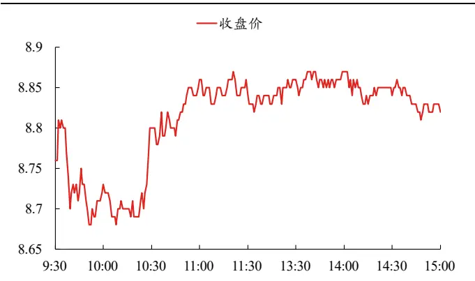
资料来源：上交所、深交所行情数据，Wind，聚源，兴业证券经济与金融研究院整理

图4、2022年1月28日000881.SZ收益率分布
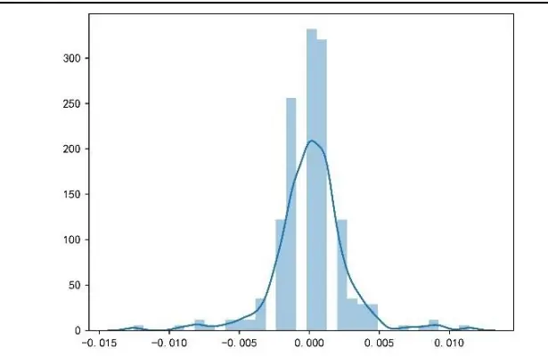
资料来源：上交所、深交所行情数据，Wind，聚源，兴业证券经济与金融研究院整理

(2）2022 年 1月 28 日 exRtn_minFre 与 real_skew 值排序差异较大股票—圣泉集团(605589.SH)

605589.SH 当天收跌 0.03%，从收益率分布图中可以看到 605589.SH 交易相对活跃，且五分钟滚动收益率十分集中，当日收益率均值约等于0，标准差约为0.007。因此，该股收益率偏度因子排名同样处于中间位置（偏度0.127，排名相对居中)，区分度较小。然而，从分钟收盘价可以明显看到，该股在13:30之后多次出现了明显的短时间大幅下跌，出现次数较多。由此计算得到的极小值出现频率为12，截面因子值较大。因而该因子得到的Alpha信息和偏度亦不一样。

图 5、2022年1月 28 日605589.SH 分钟收盘价
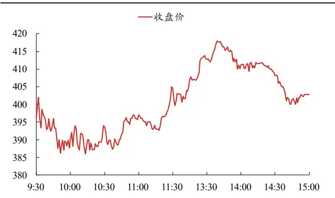
资料来源：上交所、深交所行情数据，Wind，聚源，兴业证券经济与金融研究院整理

图 6、2022年1月28日605589.SH收益率分布
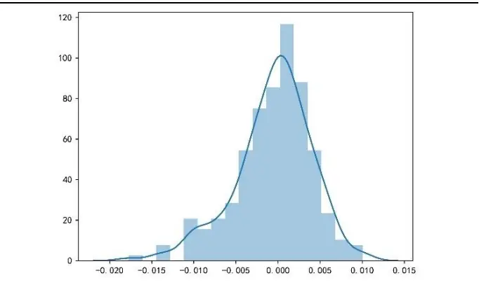
资料来源：上交所、深交所行情数据，Wind，聚源，兴业证券经济与金融研究院整理

## 2.4、因子表现

经过测试发现，极大值的相对大小（exRtn maxVal）与极小值出现频率（exRtn_minFre）相对有效：exRtn_maxVal因子多空年化收益率为44.40%，夏普比率高达 8.73；exRtn_minFre 因子多空年化收益率为 37.52%，夏普比率 6.52。

表3、exRtn因子日度回测结果

|  | 多空收益率 | 多头收益率 | 空头收益率 | 年化波动率 | 夏普比率 | 最大回撤 | 胜率 | 换手率 |
| --- | --- | --- | --- | --- | --- | --- | --- | --- |
| exRtn_maxVal | 44.40% | 20.89% | 8.75% | 5.09% | 8.73 | -4.09% | 70.04% | 28.32% |
| exRtn_maxFre | 9.50% | 7.33% | -6.89% | 5.53% | 1.72 | -5.02% | 55.48% | 31.95% |
| exRtn_minFre | 37.52% | 21.16% | 3.57% | 5.76% | 6.52 | -3.89% | 65.28% | 30.82% |
| exRtn_minVal | -9.35% | -1.60% | -16.11% | 4.77% | -1.96 | -50.62% | 43.80% | 29.86% |

资料来源：上交所、深交所行情数据，Wind，聚源，兴业证券经济与金融研究院整理

IC测试结果与之前类似，exRtn_maxVal因子IC均值为4.30%，ICIR为0.85。exRtn_minFre 因子 IC 均值为 3.44%，ICIR 为 0.62。

表 4、exRtn 因子日度IC 测试结果

|  | IC均值 | IC标准差 | ICIR | T统计量 |
| --- | --- | --- | --- | --- |
| exRtn_maxVal | 4.30% | 5.04% | 0.85 | 36.2 |
| exRtn_maxFre | 2.24% | 5.30% | 0.42 | 18.0 |
| exRtn_minFre | 3.44% | 5.56% | 0.62 | 26.3 |
| exRtn_minVal | -0.92% | 4.96% | -0.19 | -7.90 |

资料来源：上交所、深交所行情数据，Wind，聚源，兴业证券经济与金融研究院整理

图 7、exRtn_maxVal 因子 IC 与累计 IC
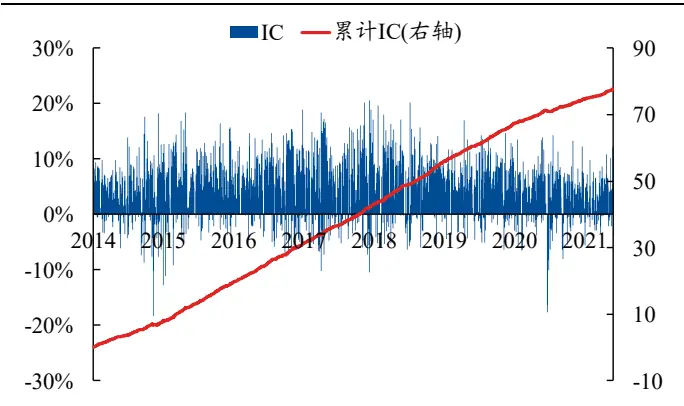
资料来源：上交所、深交所行情数据，Wind，聚源，兴业证券经济与金融研究院整理

图 8、exRtn_minFre 因子 IC 与累计 IC
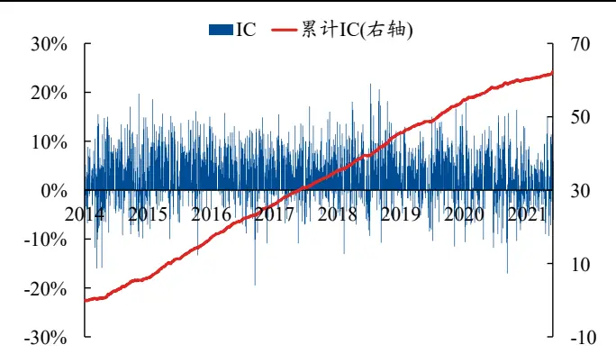
资料来源：上交所、深交所行情数据，Wind，聚源，兴业证券经济与金融研究院整理

从多空净值曲线以及分位数组合测试结果上看，两个有效的exRtn因子的多空净值长期呈现上升趋势，且最近几年无明显回撤，近几年表现十分稳定。

图 9、exRtn_maxVal 因子多空净值
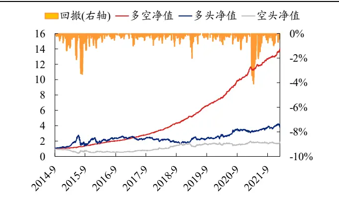
资料来源：上交所、深交所行情数据，Wind，聚源，兴业证券经济与金融研究院整理

图 10、exRtn_minFre 因子多空净值
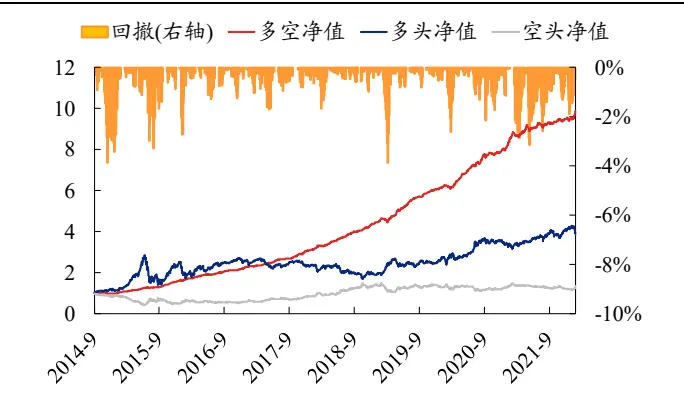
资料来源：上交所、深交所行情数据，Wind，聚源，兴业证券经济与金融研究院整理

exRtn maxVal 与 exRtn minFre 因子之间的时序相关性在 0.5 以下。与各个常见收益率因子、以及之前我们构建的nosgs（高频研究系列二构建的因子）测试时序相关性后发现：exRtn_maxVal与各个常见收益率因子相关性较低，几乎都在0.5 以下，与 nos gs 因子相关性较高；exRtn minFre 与各类收益率分布因子的相关性较低。

表5、exRtn 因子时序相关性测试结果

|  | nos_gs | rtn_mean | real_kurt | real_skew | real_var | rv_up | rv_down | rv_umd |
| --- | --- | --- | --- | --- | --- | --- | --- | --- |
| exRtn_maxVal | 0.76 | 0.27 | 0.47 | 0.39 | 0.41 | 0.56 | 0.51 | 0.24 |
| exRtn_maxFre | 0.19 | 0.50 | 0.55 | 0.44 | 0.55 | 0.40 | 0.40 | 0.11 |
| exRtn_minVal | 0.57 | -0.10 | 0.50 | -0.21 | 0.18 | 0.29 | 0.33 | -0.07 |
| exRtn_minFre | 0.30 | 0.44 | -0.14 | 0.53 | 0.32 | 0.39 | 0.29 | 0.38 |

资料来源：上交所、深交所行情数据，Wind，聚源，兴业证券经济与金融研究院整理

表6、exRtn 因子截面相关性测试结果

|  | nos_gs | rtn_mean | real_kurt | real_skew | real_var | rv_up | rv_down | rv_umd |
| --- | --- | --- | --- | --- | --- | --- | --- | --- |
| exRtn_maxVal | 0.58 | 0.13 | 0.45 | 0.40 | 0.28 | 0.34 | 0.24 | 0.35 |
| exRtn_maxFre | 0.00 | 0.25 | 0.18 | 0.21 | 0.16 | 0.08 | 0.03 | 0.16 |
| exRtn_minVal | -0.34 | 0.07 | -0.33 | 0.11 | -0.17 | -0.19 | -0.23 | 0.05 |
| exRtn_minFre | 0.19 | 0.27 | -0.03 | 0.27 | 0.13 | 0.15 | 0.06 | 0.27 |

资料来源：上交所、深交所行情数据，Wind，聚源，兴业证券经济与金融研究院整理

## 3、基于混合分布刻画大额投资者的股价操作能力

## 3.1、公允价格的震荡期与激进的“跳价”期

每支股票分钟收益率序列的形成依赖于分钟内所有投资者买卖单的撮合。在日内的股价变动中，通常存在两类情况：持续的震荡期和短时间的大幅上涨/下跌，俗称“跳价”过程。在震荡期中，股票价格处于相对合理的价位。此时，并没有额外的投资者通过过高或过低的买卖单来推动股价，分钟内每位投资者均通过相近的市价单完成交易。在这段时间内，分钟收益率大多集中在0左右，且难以出现极端收益率。而在短时间的大幅上涨/下跌，即“跳价”过程中，激进的大额投资者通过他们的大额买卖单，在日内（多次）推动价格上涨或下跌。此时其他投资者发现价格的短期上涨/下跌时，为了能够立刻构建自己的头寸/赚取收益，会在“跳价”过程中不断发出较高/较低价格的买卖单以匹配交易。这一行为进一步推动了价格的短期拉升/受挫，由此产生极端分钟收益率。

不难看出，一支股票的分钟收益率变动情况将被分为两种状态：1）在震荡期，分钟收益率通常集中在0左右，且难以出现极值，同时日内占比相对较大；2）在“跳价”期，分钟收益率极可能出现异于整体的极端值，且由于其他投资者的追随现象，大额投资者推动的“跳价”现象难以在极短的时间内结束，由此造成的极端收益率将反复出现，日内占比相对较小。事实上，研究者们早已将此类现象刻画为收益率分布的“尖峰”与“厚尾”现象4。当面对变化更加剧烈的日内股价而言，基于正态分布假设的收益率分布统计难以刻画这两类股价变动状态的区别。为了细致刻画日内的收益率特征，我们需要引入新的统计模型，即混合高斯分布。我们从这个角度出发进一步挖掘可行的高频选股Alpha。

## 3.2、日内收益率与混合高斯分布

早于1973年，Clark便引入混合高斯分布并将用其解释日度收益率的分布。我们将该理论应用于日内收益率，假设股票分钟收盘价服从以下随机过程：

$$
dP_{t}/P_{t}=\mu dt+\sigma g(t)dW_{t}
$$

其中μ和σ是方差，W是标准布朗运动。当g(t)是常数时，此模型变成标准的几何布朗运动。而当g(t)是一个从属随机的过程，它表明随着交易活动的变化，股价的随机变动幅度将会不同。由此推算出的对数收益率为：

$$
R_{t}=ln(\frac{P_{t}}{P_{t-\Delta t}})=\left(\mu-\frac{\left(\sigma g(t)\right)^{2}}{2}\right)\Delta t+\sigma g(t)w_{\Delta t}
$$

在不考虑时序关系的情况下，假设日内收益率服从混合高斯分布，且为两个正态分布混合而成5，其对数收益率的概率密度函数将表示为：

$$
f(R_{t}|\theta)=wN(u_{1},\sigma_{1}^{2})+(1-w)N(u_{2},\sigma_{2}^{2})
$$

其中， $u_{1},\sigma_{1}^{2},u_{2},\sigma_{2}^{2}$ 分别为两个正态分布的参数，w为两个分布在整体混合分布中的权重。由此，单一股票在某一日内存在长期震荡和短期跳价的情况时，其收益率通常服从一个由带有大权重、均值相对等于0的高斯分布，以及带有小权重，均值相对不等于0的高斯分布混合而成的混合高斯分布。在实际计算中，我们采用EM参数估计算法最大化似然函数，来估计模型的参数（共5个）6。EM算法常用于含有隐变量的概率模型参数的极大似然估计，或极大后验概率估计。

我们以603028.SH（赛福天）在2022年1月28日的分钟收盘价以及5分钟收益率分布图作为展示说明。该股在当日收涨约3%，基于分钟收盘价可以明显发现，该股在11点之间经历了明显的“跳价”现象，其在从开盘5分钟内上涨约2%，随后大幅下跌，下跌约2.9%，此后又经历了短时间的大幅上涨，最高5分钟内上涨1.4%，盘中前相对于低点最高上涨5%。随后在午后，其股价进入一个明显的震荡期，价格稳定在12.4元右。

图 11、2022年1月28日603028.SH分钟收盘价
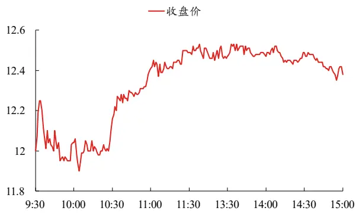
资料来源：上交所、深交所行情数据，Wind，聚源，兴业证券经济与金融研究院整理

从5分钟收益率的分布图上可以看到，该股呈现出明显的“尖峰”“厚尾”现象。若仅基于正态分布假设进行统计量分析时，该股日内分钟收益率样本均值接近于0，样本标准差较小，且偏度值较低（0.17)，难以区分两个股价变动期的区别。若以混合高斯分布进行分析时可以明显发现，该股的分钟收益率应当被分为代表震荡区域的大权重正态分布（橙色概率密度图，均值0.01%，权重0.73）和代表“跳价”现象的小权重正态分布（蓝色概率密度图，均值0.1%，权重0.27)。由此，我们便能刻画出个股在日内不同的股价变动期。

图 12、2022 年 1月 28 日603028.SH 分钟收益率分布
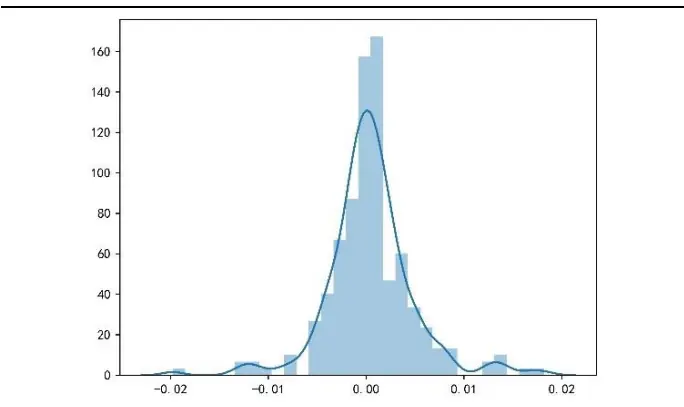
资料来源：上交所、深交所行情数据，Wind，聚源，兴业证券经济与金融研究院整理

图 13、2022 年 1 月 28 日 603028.SH 混合高斯分布拟合收益率分布
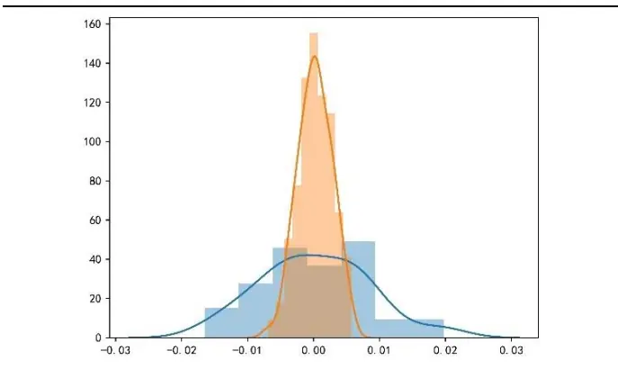
资料来源：上交所、深交所行情数据，Wind，聚源，兴业证券经济与金融研究院整理

## 3.3、从“跳价”期刻画大额投资者的操作能力 capacity因子

通过上述的假设与计算，我们可以基于收益率的样本数据，刻画出个股在日内的两种情况及其拟合的混合高斯分布：震荡期的正态分布 $N_{s}(\mu_{s},\sigma_{s}^{2})$ 和“跳价”期的正态分布 $N_{J}(\mu_{J},\sigma_{J}^{2})^{\scriptscriptstyle7}$ ，其收益率服从混合高斯分布：

$$
f(R_{t}|\theta)=w_{s}N_{s}(\mu_{s},\sigma_{s}^{2})+w_{J}N_{J}\big(\mu_{J},\sigma_{J}^{2}\big),\ w_{s}+w_{J}=1,w_{J}\epsilon[0,0.5)
$$

首先，对于非大额投资者来说，“跳价”期的收益率特征显然更受关注，因为他们可以借此追踪到大额交易者的交易动向。我们基于拟合后的正态分布 $N_{J}$ 以及权重 $\operatorname{i}w_{J}$ 构建高频指标。

如果大额投资者本次推动上涨，那么当期股价已高于公允价格，预计未来股价将下跌至原先的价格。反之，若大额投资者推动了下跌，则当期股价低于公允价格，预计未来股价将上涨至原先的价格。由于 $\dot{\mu}_{J}$ 本身代表着大额投资者推动股价的方向和幅度，我们直接基于该指标构建因子，记为gmm_mean，该因子值越大，未来预期股价下跌幅度越大。

$$
gmm\_mean=\mu_{J}
$$

同时幅度也有意义。若“跳价”期的持续时间较短或相互对抗较少时，大额投资者能够在短时间内通过大额买卖单推动股价，这表明他们对于该股的操作能力较强。反之，若“跳价”期的出现时间较长或存在较多反向“跳价”时，说明该股当期受关注度较高，大额投资者在推动股价时容易收到干扰，需要长时间、大量的买卖单才能推动股价。此现象表明大额投资者对于该股的操作能力较弱。由此我们计算用于刻画大额投资者对于个股上涨/下跌的操作能力的因子gmm_mean2wgt，具体计算方式为：

$$
gmm_{-}mean2wgt=\AA^{\mu_{J}}/w_{J}
$$

该因子值越大，说明大额投资者的操作能力越强，后续获的股价修复则越明显。同时由于均值存在正负（正即表示推动上涨)，因此因子值越大，未来预期股价下跌幅度越大。

## 3.4、因子表现

从日度测试结果上看，该类因子的表现十分优秀，两者的多空夏普均较高，无明显回撤，且多头收益率较高。具体来看，从多空组合测试上看，gmm_mean2wgt的多空收益率在36%左右，多头收益率16%，夏普比率在6左右。gmm_mean因子表现更为出色，多空收益率为48.88%，多头收益率为23.47%，夏普为 7.53。

表 7、capacity 因子日度回测结果

|  | 多空收益率 | 多头收益率 | 空头收益率 | 年化波动率 | 夏普比率 | 最大回撤 | 胜率 | 换手率 |
| --- | --- | --- | --- | --- | --- | --- | --- | --- |
| gmm_mean 2wgt | 36.17% | 16.64% | 6.56% | 5.67% | 6.37 | -7.58% | 68.55% | 29.70% |
| gmm_mean | 48.88% | 23.47% | 10.24% | 6.49% | 7.53 | -3.84% | 67.22% | 27.90% |

资料来源：上交所、深交所行情数据，Wind，聚源，兴业证券经济与金融研究院整理

从日度IC测试结果上看，该类因子IC均值均在 3.5%以上，且ICIR均大于0.8，表现出较好的股价预测能力。

表 8、capacity 因子日度 IC 测试结果

|  | IC均值 | IC标准差 | ICIR | T统计量 |
| --- | --- | --- | --- | --- |
| gmm_mean2wgt | 3.52% | 4.29% | 0.82 | 34.9 |
| gmm_mean | 5.44% | 6.04% | 0.90 | 38.3 |

资料来源：上交所、深交所行情数据，Wind，聚源，兴业证券经济与金融研究院整理

图 14、gmm_mean2wgt 因子 IC 与累计 IC
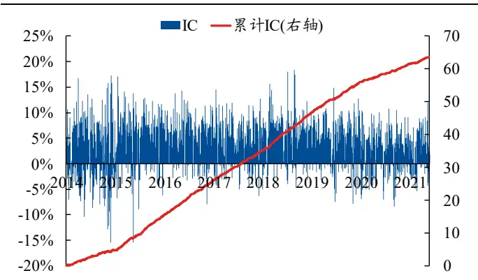
资料来源：上交所、深交所行情数据，Wind，聚源，兴业证券经济与金融研究院整理

图 15、gmm_mean 因子 IC 与累计 IC
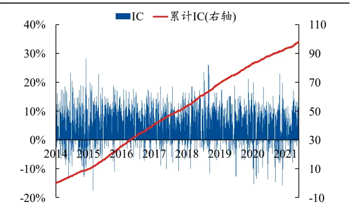
资料来源：上交所、深交所行情数据，Wind，聚源，兴业证券经济与金融研究院整理

从多空净值曲线以及分位数组合测试结果上看，capacity因子的多空净值长期呈现上升趋势，且最近几年无明显回撤，近几年表现十分稳定。

图 16、gmm_mean2wgt 因子多空净值
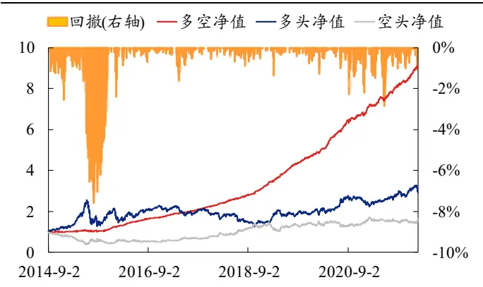
资料来源：上交所、深交所行情数据，Wind，聚源，兴业证券经济与金融研究院整理

图 17、gmm_mean 因子多空净值
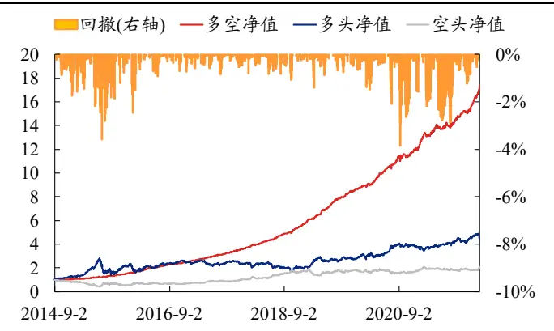
资料来源：上交所、深交所行情数据，Wind，聚源，兴业证券经济与金融研究院整理

## 3.5、因子特异性分析

gmm_mean2wgt 与gmm_mean 的时序相关性在 0.7 左右。测试两因子与各个常见收益率因子以及 nos_gs时序相关性，结果发现：1）gmm_mean2wgt 与各个常见收益率因子的时序与截面相关性均较低，几乎都在0.4以下；2）gmm_mean与收益率偏度因子的时序相关性较高。

表9、capacity因子时序相关性测试结果

|  | nos_gs | rtn5_mean | real_kurt | real_skew | real_var | rv_up | rv_down | rv_umd |
| --- | --- | --- | --- | --- | --- | --- | --- | --- |
| gmm_mean 2wgt | 0.26 | 0.36 | 0.13 | 0.48 | 0.23 | 0.28 | 0.24 | 0.30 |
| gmm_mean | 0.41 | 0.56 | 0.25 | 0.66 | 0.53 | 0.53 | 0.48 | 0.35 |

资料来源：Wind，兴业证券经济与金融研究院整理

表 10、capacity 因子截面相关性测试结果

|  | nos_gs | rtn_mean | real_kurt | real_skew | real_var | rv_up | rv_down | rv_umd |
| --- | --- | --- | --- | --- | --- | --- | --- | --- |
| gmm_mean 2wgt | 0.44 | 0.49 | 0.32 | 0.56 | 0.34 | 0.35 | 0.19 | 0.50 |
| gmm_mean | 0.41 | 0.40 | 0.30 | 0.52 | 0.36 | 0.35 | 0.21 | 0.45 |

资料来源：上交所、深交所行情数据，Wind，聚源，兴业证券经济与金融研究院整理

鉴于gmm_mean与收益率偏度因子的时序相关性较高，我们将gmm_mean与偏度因子进行中性化处理。经过中性化处理后的因子与常见收益率分布因子的时序与截面相关性明显降低。

表11、gmm_meanN 因子中性化前后时序相关性测试结果

|  | nos_gs | rtn_mean | real_kurt | real_skew | real_var | rv_up | rv_down | rv_umd |
| --- | --- | --- | --- | --- | --- | --- | --- | --- |
| gmm_mean | 0.41 | 0.56 | 0.25 | 0.66 | 0.53 | 0.53 | 0.48 | 0.35 |
| gmm_meanN | 0.36 | 0.51 | 0.13 | 0.49 | 0.44 | 0.47 | 0.45 | 0.26 |

资料来源：上交所、深交所行情数据，Wind，聚源，兴业证券经济与金融研究院整理

表 12、gmm_meanN 因子中性化前后截面相关性测试结果

|  | nos_gs | rtn_mean | real_kurt | real_skew | real_var | rv_up | rv_down | rv_umd |
| --- | --- | --- | --- | --- | --- | --- | --- | --- |
| gmm_mean | 0.44 | 0.49 | 0.32 | 0.56 | 0.34 | 0.35 | 0.19 | 0.50 |
| gmm_meanN | 0.33 | 0.41 | 0.09 | 0.03 | 0.28 | 0.26 | 0.24 | 0.13 |

资料来源：上交所、深交所行情数据，Wind，聚源，兴业证券经济与金融研究院整理

从结果上看，与 real_skew 正交化后得到的新因子gmm_meanN表现依旧优秀，多空年化收益率 32.47%，多头年化 19.14%。IC 均值为 3.93%，ICIR 为 0.77，因子表现出优秀的特异性。

表 13、gmm_mean 因子回测结果

|  | 多空收益率 | 多头收益率 | 空头收益率 | 年化波动率 | 夏普比率 | 最大回撤 | 胜率 | 换手率 |
| --- | --- | --- | --- | --- | --- | --- | --- | --- |
| gmm_mean | 48.88% | 23.47% | 10.24% | 6.49% | 7.53 | -3.84% | 67.22% | 27.90% |
| gmm_meanN | 32.47% | 19.14% | 1.72% | 5.60% | 5.80 | -3.78% | 64.17% | 31.19% |

资料来源：上交所、深交所行情数据，Wind，聚源，兴业证券经济与金融研究院整理

表 14、gmm_mean 因子 IC 测试结果

|  | IC均值 | IC标准差 | ICIR | T统计量 |
| --- | --- | --- | --- | --- |
| gmm_mean | 5.44% | 6.04% | 0.90 | 38.3 |
| gmm_meanN | 3.93% | 5.10% | 0.77 | 32.7 |

资料来源：上交所、深交所行情数据，Wind，聚源，兴业证券经济与金融研究院整理

从时序图上看，与 real_skew 正交化后得到的新因子gmm_meanN 的多空净值仍十分稳定，整体保持向上趋势，累计IC也没有下降趋势。

图 18、gmm_meanN 因子多空净值
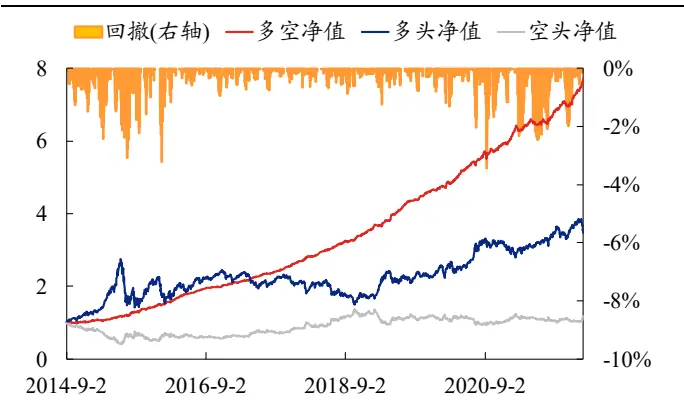
资料来源：上交所、深交所行情数据，Wind，聚源，兴业证券经济与金融研究院整理

图 19、gmm_meanN 因子 IC 与累计 IC
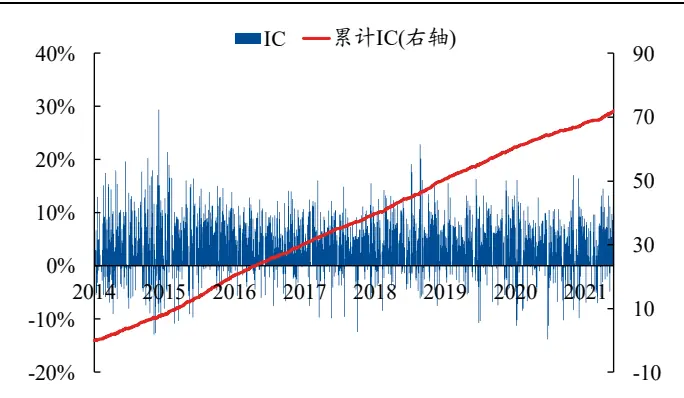
资料来源：上交所、深交所行情数据，Wind，聚源，兴业证券经济与金融研究院整理

## 4、基于混合分布刻画个股的日内弹性

## 4.1、从震荡期与“跳价”期的差异刻画个股的日内弹性flexibility因子

上一章节中我们介绍了如何应用混合高斯分布对个股的日内收益率分布进行拟合，并基于“跳价”期的分布特征构建了大额投资者操作能力因子capacity。在本章节中，我们结合震荡期与“跳价”期的拟合结果，尝试刻画个股在不同时期的收益率特征差异。

具体来说，若当期某一股票在震荡期和“跳价”期的收益率差异过大，说明该股在不同股价时期的价格特征差异较明显，股价有着更大的价格弹性。为了同时衡量比较震荡期和“跳价”期之间股价变动的方向与大小，我们计算两个收益率的均值差值作为价格弹性的代理变量。gmm_meandif因子的因子值越大，预期未来收益越高。

$$
gmm_{-}meandif=\mu_{S}-\mu_{J}
$$

此外，我们还可以计算两个高斯分布的权重差值，以表明该股当日两种股价变动时期的占比差异，并以此计算均值差与权重差的比值，即同时考虑日内两个时期的均值差异与权重差异。该因子值越大，预期未来收益越高。

$$
gmm_{-}meandif{2w}gtdif=\left.\left(\mu_{S}-\mu_{J}\right)\right/_{\left(w_{S}-w_{J}\right)}
$$

## 4.2、因子表现

从日度测试结果上看，flexibility因子的表现十分优秀，三者的多空夏普均较 高，无明显回撤，且多头收益率较高。具体来看，从多空组合测试上看， gmm_meandif和gmm_meandif2wgtdif的多空收益率在50%左右，多头收益率20% 左右，夏普比率在 6-8 左右。gmm_meandif2wgtdif 因子表现略逊于 gmm_meandif。

表 15、flexibility 因子回测结果

|  | 多空收益率 | 多头收益率 | 空头收益率 | 年化波动率 | 夏普比率 | 最大回撤 | 胜率 | 换手率 |
| --- | --- | --- | --- | --- | --- | --- | --- | --- |
| gmm_mean dif | 52.80% | 21.44% | 14.07% | 6.56% | 8.05 | -3.89% | 67.39% | 29.27% |
| gmm_mean dif2wgtdif | 46.60% | 21.84% | 9.04% | 7.06% | 6.60 | -5.02% | 64.51% | 28.85% |

资料来源：上交所、深交所行情数据，Wind，聚源，兴业证券经济与金融研究院整理

从日度IC测试结果上看，flexibility因子的 IC 均值均在 5%以上，且ICIR均大于0.8，表现出较好的股价预测能力。

表 16、flexibility 因子 IC 测试结果

|  | IC均值 | IC标准差 | ICIR | T统计量 |
| --- | --- | --- | --- | --- |
| gmm_meandif | 5.16% | 5.95% | 0.87 | 36.8 |
| gmm_meandif2wgtdif | 4.92% | 6.66% | 0.74 | 31.4 |

资料来源：上交所、深交所行情数据，Wind，聚源，兴业证券经济与金融研究院整理

从多空净值曲线以及分位数组合测试结果上看，flexibility因子的多空净值长期呈现上升趋势，且最近几年无明显回撤，近几年表现十分稳定。

图 20、gmm_meandif 因子 IC 与累计 IC
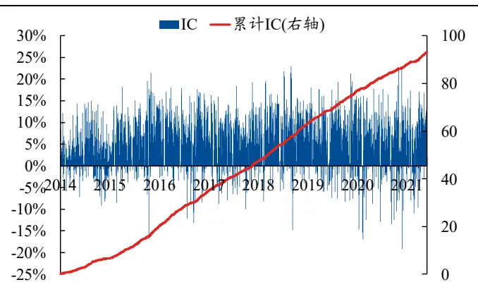
资料来源：上交所、深交所行情数据，Wind，聚源，兴业证券经济与金融研究院整理

图 21、gmm_meandif2wgtdif 因子 IC 与累计 IC
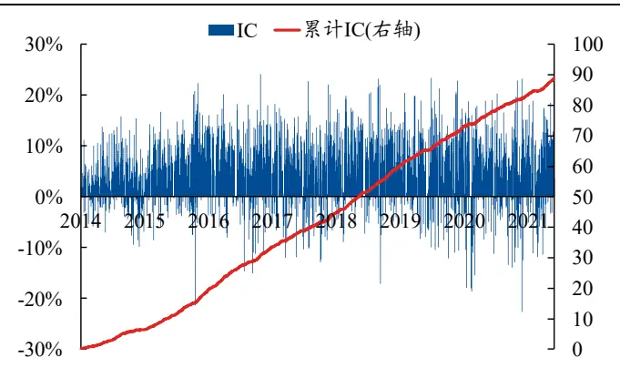
资料来源：上交所、深交所行情数据，Wind，聚源，兴业证券经济与金融研究院整理

图 22、gmm_meandif 因子多空净值
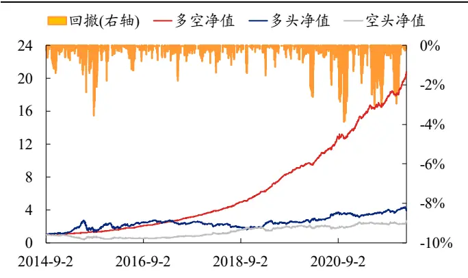
资料来源：上交所、深交所行情数据，Wind，聚源，兴业证券经济与金融研究院整理

图 23、gmm_meandif2wgtdif 因子多空净值
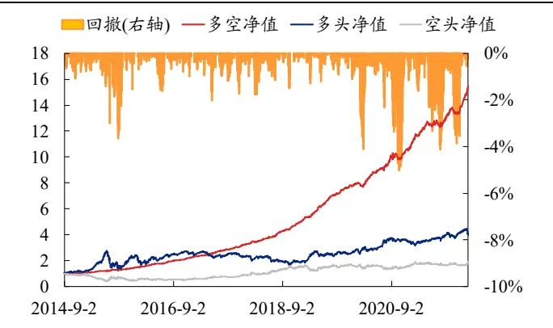
资料来源：上交所、深交所行情数据，Wind，聚源，兴业证券经济与金融研究院整理

## 4.3、因子特异性分析

gmm_meandif与 gmm_meandif2wgtdif的时序相关性在 0.9 左右。测试两因子与各个常见收益率因子以及 nos_gs时序相关性，结果发现： gmm_meandif 与收益率偏度因子的时序相关性较高；gmm_meandif2wgtdif 与收益率偏度因子的相关性略有降低。此外，两因子与之前仅利用跳价构建的因子相关性在0.6左右。

表 17、flexibility 因子时序相关性测试结果

|  | nos_gs | rtn_mean | real_kurt | real_skew | real_var | rv_up | rv_down | rv_umd |
| --- | --- | --- | --- | --- | --- | --- | --- | --- |
| gmm_mean dif | 0.33 | 0.54 | 0.34 | 0.76 | 0.67 | 0.64 | 0.55 | 0.43 |
| gmm_mean dif2wgtdif | 0.26 | 0.51 | 0.31 | 0.73 | 0.68 | 0.60 | 0.54 | 0.38 |

资料来源：上交所、深交所行情数据，Wind，聚源，兴业证券经济与金融研究院整理

表 18、flexibility 因子截面相关性测试结果

|  | nos_gs | rtn_mean | real_kurt | real_skew | real_var | rv_up | rv_down | rv_umd |
| --- | --- | --- | --- | --- | --- | --- | --- | --- |
| gmm_mean dif | 0.31 | 0.34 | 0.27 | 0.49 | 0.37 | 0.34 | 0.21 | 0.40 |
| gmm_mean dif2wgtdif | 0.23 | 0.34 | 0.22 | 0.47 | 0.36 | 0.30 | 0.18 | 0.38 |

资料来源：上交所、深交所行情数据，Wind，聚源，兴业证券经济与金融研究院整理

鉴于 gmm meandif和 gmm meandif2wgtdif 与收益率偏度和方差因子的时序相关性较高，我们将两个因子与收益率偏度和方差因子进行中性化处理。经过中性化处理后的因子与各个收益率分布因子的时序与截面相关性降低至0.5及以下，且表现仍相对稳定，多空夏普比率在4.4以上，IC均值在2.5%左右。

表19、flexibility因子正交化后时序相关性测试结果

|  | nos_gs | rtn_mean | real_kurt | real_skew | real_var | rv_up | rv_down | rv_umd |
| --- | --- | --- | --- | --- | --- | --- | --- | --- |
| gmm_meandifN | 0.22 | 0.43 | 0.18 | 0.44 | 0.29 | 0.31 | 0.23 | 0.31 |
| gmm_meandif2 wgtdifN | 0.10 | 0.42 | 0.19 | 0.49 | 0.46 | 0.35 | 0.31 | 0.28 |

资料来源：上交所、深交所行情数据，Wind，聚源，兴业证券经济与金融研究院整理

表 20、flexibility因子正交化后截面相关性测试结果

|  | nos_gs | rtn_mean | real_kurt | real_skew | real_var | rv_up | rv_down | rv_umd |
| --- | --- | --- | --- | --- | --- | --- | --- | --- |
| gmm_meandifN | 0.14 | 0.27 | 0.06 | 0.02 | 0.04 | 0.03 | -0.01 | 0.10 |
| gmm_meandif2 wgtdifN | 0.05 | 0.27 | 0.03 | 0.02 | 0.04 | 0.01 | -0.04 | 0.09 |

资料来源：上交所、深交所行情数据，Wind，聚源，兴业证券经济与金融研究院整理

表 21、gmm_meandifN 与 gmm_meandif2wgtdifN 因子回测结果

|  | 多空收益率 | 多头收益率 | 空头收益率 | 年化波动率 | 夏普比率 | 最大回撤 | 胜率 | 换手率 |
| --- | --- | --- | --- | --- | --- | --- | --- | --- |
| gmm_meandifN | 23.63% | 15.53% | -2.86% | 3.64% | 6.49 | -3.00% | 66.94% | 32.53% |
| gmm_meandif2 wgtdifN | 20.30% | 14.46% | -4.68% | 4.44% | 4.57 | -3.75% | 60.08% | 32.35% |

资料来源：上交所、深交所行情数据，Wind，聚源，兴业证券经济与金融研究院整理

表 22、gmm_meandifN 与 gmm_meandif2wgtdifN 因子 IC 测试结果

|  | IC均值 | IC标准差 | ICIR | T统计量 |
| --- | --- | --- | --- | --- |
| gmm_meandifN | 2.67% | 3.34% | 0.80 | 33.9 |
| gmm_meandif2wgtdifN | 2.45% | 4.26% | 0.58 | 24.5 |

资料来源：上交所、深交所行情数据，Wind，聚源，兴业证券经济与金融研究院整理

从时序图上看，中性化后的新因子多空净值仍十分稳定，整体保持向上趋势。

图 24、gmm_meandifN 因子多空净值
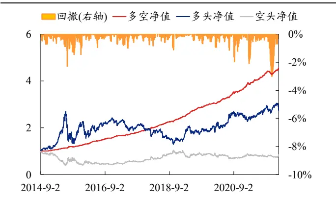
资料来源：上交所、深交所行情数据，Wind，聚源，兴业证券经济与金融研究院整理

图 25、gmm_meandifN 因子 IC 与累计 IC
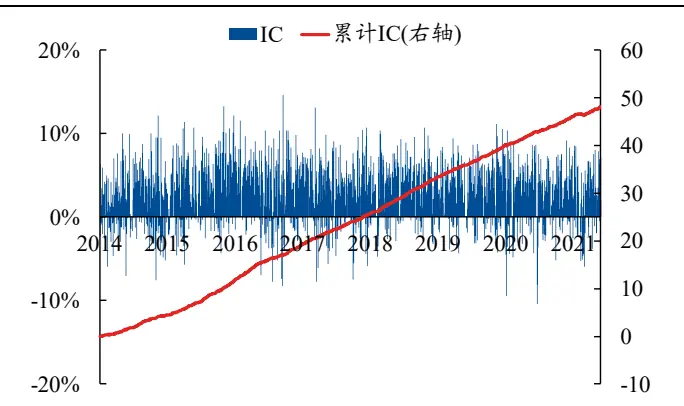
资料来源：上交所、深交所行情数据，Wind，聚源，兴业证券经济与金融研究院整理

图 26、gmm_meandif2wgtdifN 因子多空净值
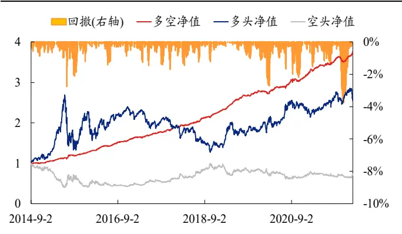
资料来源：上交所、深交所行情数据，Wind，聚源，兴业证券经济与金融研究院整理

图 27、gmm_meandif2wgtdifN 因子 IC 与累计 IC
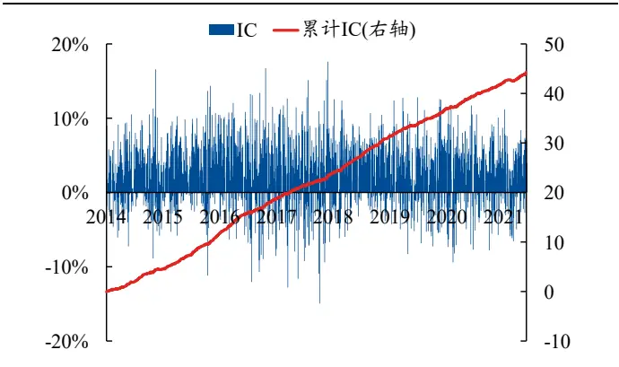
资料来源：上交所、深交所行情数据，Wind，聚源，兴业证券经济与金融研究院整理

## 5、股票池和成交价敏感性分析

## 5.1、宽基内因子有效性测试

本文中，我们基于收益率的分布信息，从更多维度的角度细致刻画收益率的日内分布特征，并基于分布特征构建了三大类新因子。在本章中我们额外测试个本篇中构建的6个因子在中证800股票池内的回测结果。

从测试结果来看：各个因子的多空夏普比率几乎都保持在3以上，且多头收益率保持较好。从IC测试结果上看，各个因子的IC均值也几乎在2.5%以上。以gmm_mean为例，该因子在中证800股票池中的多空收益率为30%，多头收益率为 19%，夏普比率为 4.31。

表 23、新因子在中证 800 股票池中回测结果

| 股票池 | 因子名称 | 多空收益 率 | 多头收益 率 | 空头收益 率 | 年化波动 率 | 夏普比 率 | 最大回 撤 | 胜率 | 换手率 |
| --- | --- | --- | --- | --- | --- | --- | --- | --- | --- |
| 中证 800 | exRtn_minFre | 18.55% | 16.06% | -5.18% | 6.25% | 2.97 | -7.54% | 57.53% | 28.04% |
|  | exRtn_maxVal | 20.75% | 14.39% | -2.18% | 5.66% | 3.67 | -7.33% | 58.69% | 26.80% |
|  | gmm_mean2wgt | 17.06% | 10.92% | -2.60% | 7.67% | 2.22 | -11.52% | 56.53% | 25.96% |
|  | gmm_mean | 29.89% | 19.23% | 0.99% | 6.93% | 4.31 | -3.80% | 59.58% | 26.73% |
|  | gmm_meandif | 25.68% | 15.32% | 0.61% | 6.78% | 3.79 | -6.77% | 58.25% | 28.18% |
|  | gmm_meandif2wgtdif | 22.21% | 15.48% | -2.41% | 7.37% | 3.01 | -7.99% | 56.37% | 27.95% |

资料来源：上交所、深交所行情数据，Wind，聚源，兴业证券经济与金融研究院整理

表 24、新因子在中证 800 股票池中的 IC 测试结果

| 股票池 | 因子名称 | IC均值 | IC标准差 | ICIR | T统计量 |
| --- | --- | --- | --- | --- | --- |
| 中证 800 | exRtn_minFre | 2.23% | 6.55% | 0.34 | 14.5 |
|  | exRtn_maxVal | 2.68% | 5.71% | 0.47 | 19.9 |
|  | gmm_mean2wgt | 1.95% | 5.60% | 0.35 | 14.8 |
|  | gmm_mean | 3.84% | 6.79% | 0.57 | 24.0 |
|  | gmm_meandif | 3.44% | 6.81% | 0.51 | 21.5 |
|  | gmm_meandif2wgtdif | 3.28% | 7.53% | 0.44 | 18.5 |

资料来源：上交所、深交所行情数据，Wind，聚源，兴业证券经济与金融研究院整理

综上，在中证800股票池中的测试中，exRtn、gmm_mean以及gmm_meandif因子表现相对出色。

## 5.2、不同交易价格的敏感性分析

除了针对不同股票池的测试之外，由于日频调仓的特殊性，我们还需要测试使用不同交易价格下因子的回测表现，以更加贴合实盘操作。具体来说，我们于T日得到各个因子值后，尝试使用T日最后5分钟收盘价均价、T+1日开盘30分钟的收盘价均价以及T+1日的全天收盘价均价作为交易的买入价格，并以后一交易日的同样区间的均价作为卖出价格，以测试不同交易冲击成本对因子表现带来的影响。

从结果上看，无论是组合回测还是IC测试结果，绝大部分因子在不同的交易价下的表现均十分优秀与稳定，其中开盘30分钟均价对于因子表现的影响相对较大，但对于多头端的收益影响均较小。其中，exRtn类因子在开盘30分钟均价的测试中夏普比率收到了较大的影响。

表25、以最后5分钟均价作为交易价格的多空测试结果

|  | 多空收益率 | 多头收益率 | 空头收益率 | 年化波动率 | 夏普比率 | 最大回撤 | 胜率 |
| --- | --- | --- | --- | --- | --- | --- | --- |
| exRtn_minFre | 32.96% | 11.21% | 9.21% | 5.86% | 5.62 | -4.67% | 63.62% |
| exRtn_maxVal | 40.15% | 11.21% | 14.86% | 5.19% | 7.73 | -4.11% | 68.72% |
| gmm_mean2wgt | 30.98% | 8.02% | 10.74% | 5.89% | 5.26 | -10.61% | 66.33% |
| gmm_mean | 44.80% | 15.49% | 14.70% | 6.53% | 6.86 | -4.07% | 66.33% |
| gmm_meandif | 50.39% | 12.50% | 21.31% | 6.67% | 7.55 | -4.92% | 66.61% |
| gmm_meandif2wgtdif | 44.84% | 12.90% | 16.39% | 7.14% | 6.28 | -5.12% | 63.79% |

资料来源：上交所、深交所行情数据，Wind，聚源，兴业证券经济与金融研究院整理

表26、以开盘30分钟均价作为交易价格的多空测试结果

|  | 多空收益率 | 多头收益率 | 空头收益率 | 年化波动率 | 夏普比率 | 最大回撤 | 胜率 |
| --- | --- | --- | --- | --- | --- | --- | --- |
| exRtn_minFre | 21.07% | 14.25% | -4.34% | 10.83% | 1.94 | -6.58% | 57.48% |
| exRtn_maxVal | 21.11% | 13.02% | -3.49% | 8.01% | 2.64 | -5.80% | 61.30% |
| gmm_mean2wgt | 16.86% | 9.65% | -3.13% | 5.40% | 3.12 | -10.15% | 60.13% |
| gmm_mean | 26.74% | 13.82% | 1.44% | 6.18% | 4.33 | -6.92% | 62.35% |
| gmm_meandif | 33.20% | 16.90% | 1.47% | 6.77% | 4.90 | -6.33% | 62.85% |
| gmm_meandif2wgtdif | 31.00% | 16.92% | -0.04% | 7.37% | 4.20 | -7.72% | 60.30% |

资料来源：上交所、深交所行情数据，Wind，聚源，兴业证券经济与金融研究院整理

表27、以全天均价作为交易价格的多空测试结果

|  | 多空收益率 | 多头收益率 | 空头收益率 | 年化波动率 | 夏普比率 | 最大回撤 | 胜率 |
| --- | --- | --- | --- | --- | --- | --- | --- |
| exRtn_minFre | 23.57% | 10.19% | 4.04% | 5.41% | 4.36 | -5.87% | 61.30% |
| exRtn_maxVal | 24.94% | 8.99% | 6.22% | 4.68% | 5.33 | -4.72% | 64.67% |
| gmm_mean2wgt | 19.89% | 6.96% | 4.16% | 5.25% | 3.79 | -9.00% | 62.74% |
| gmm_mean | 31.03% | 11.90% | 9.00% | 5.78% | 5.37 | -5.77% | 64.51% |
| gmm_meandif | 37.23% | 12.21% | 12.78% | 5.79% | 6.43 | -5.24% | 65.01% |
| gmm_meandif2wgtdif | 34.24% | 12.22% | 10.39% | 6.08% | 5.63 | -6.59% | 63.40% |

资料来源：上交所、深交所行情数据，Wind，聚源，兴业证券经济与金融研究院整理

表28、以不同时段均价作为交易价格的因子IC测试结果

|  | 因子名称 | IC均值 | IC标准差 | ICIR | T统计量 |
| --- | --- | --- | --- | --- | --- |
| 最后5分钟均价 | exRtn_minFre | 3.41% | 5.65% | 0.60 | 25.6 |
|  | exRtn_maxVal | 4.27% | 5.10% | 0.84 | 35.6 |
|  | gmm_mean2wgt | 3.51% | 4.30% | 0.82 | 34.7 |
|  | gmm_mean | 5.43% | 6.04% | 0.90 | 38.2 |
|  | gmm_meandif | 5.14% | 5.97% | 0.86 | 36.6 |
|  | gmm_meandif2wgtdif | 4.90% | 6.64% | 0.74 | 31.3 |
| 开盘30分钟均价 | exRtn_minFre | 2.64% | 10.08% | 0.26 | 11.1 |
|  | exRtn_maxVal | 3.26% | 6.93% | 0.47 | 20.0 |
|  | gmm_mean2wgt | 2.53% | 4.05% | 0.62 | 26.6 |
|  | gmm_mean | 4.13% 4.05% | 5.85% | 0.71 | 30.0 |
|  | gmm_meandif gmm_meandif2wgtdif | 3.92% | 6.15% | 0.66 | 28.0 |
|  |  |  | 6.96% | 0.56 | 23.9 |
| 全天均价 | exRtn_minFre | 3.15% | 5.71% | 0.55 | 23.4 |
|  | exRtn_maxVal | 3.73% | 4.92% | 0.76 | 32.2 |
|  | gmm_mean2wgt | 2.96% | 4.22% | 0.70 | 29.8 |
|  | gmm_mean gmm_meandif | 4.78% 4.67% | 5.91% 5.69% | 0.81 | 34.4 |
|  | gmm_meandif2wgtdif |  |  | 0.82 | 34.9 |
|  |  | 4.51% | 6.27% | 0.72 | 30.6 |

资料来源：上交所、深交所行情数据，Wind，聚源，兴业证券经济与金融研究院整理

综上，在针对不同交易价格的回测中，capacity与flexibility类因子表现相对更为出色，exRtn在开盘均价回测中受到了较大的冲击。

## 6、总结

本文中，我们基于收益率的分布信息，从更多维度的角度细致刻画收益率的日内分布特征，并基于分布特征构建了三大类新因子。整体来看，基于展望理论构建的极值因子表现优秀，同时与其具有相近逻辑基础的收益率偏度因子具有较低的相关性。之后，我们创新性地引入混合高斯分布，并基于此构建了两大类因子，以刻画大额投资者对于个股的日内操作能力，以及个股的日内价格弹性。构建出的因子表现同样优秀，同时具有优秀的特异性。

## 参考文献

[1] Clark P K. A subordinated stochastic process model with finite variance for speculative prices[J]. Econometrica, 1973, 41: 135-155.

[2] Kendall, M. G. (1953), The analysis of economic time-series—Part I: Prices, Journal of the Royal Statistical Society, Series A(General) 116(1), 11–25.

[3] Alan L. Tucker (1992) A Reexamination of Finite- and Infinite-Variance Distributions as Models of Daily Stock Returns, Journal of Business &amp; Economic Statistics, 10:1, 73-81, DOI: 10.1080/07350015.1992.10509888

风险提示：模型结果基于历史数据的测算，在市场环境转变时模型存在失效的风险。

## 分析师声明

本人具有中国证券业协会授予的证券投资咨询执业资格并注册为证券分析师，以勤勉的职业态度，独立、客观地出具本报告。本报告清晰准确地反映了本人的研究观点。本人不曾因，不因，也将不会因本报告中的具体推荐意见或观点而直接或间接收到任何形式的补偿。

## 投资评级说明

| 投资建议的评级标准 | 类别 | 评级 | 说明 |
| --- | --- | --- | --- |
| 报告中投资建议所涉及的评级分为股票评级和行业评级（另有说明的除外)。评级标准为报告发布日后的12个月内公司股价（或行业指数）相对同期相关证券市场代表性指数的涨跌幅。其中：A股市场以上证综指或深圳成指为基准，香港市场以恒生指数为基准；美国市场以标普500或纳斯达克综合指数为基准。 | 股票评级 | 买入 | 相对同期相关证券市场代表性指数涨幅大于15% |
|  |  | 审慎增持 | 相对同期相关证券市场代表性指数涨幅在5%~15%之间 |
|  |  | 中性 | 相对同期相关证券市场代表性指数涨幅在-5%~5%之间 |
|  |  | 减持 | 相对同期相关证券市场代表性指数涨幅小于-5% |
|  |  | 无评级 | 由于我们无法必要的资料，或者公司面临无法预见结果的重大不确定性事件，或者其他原因，致使我们无法给出明确的投资评级 |
|  | 行业评级 | 推荐 | 相对表现优于同期相关证券市场代表性指数 |
|  |  | 中性 | 相对表现与同期相关证券市场代表性指数持平 |
|  |  | 回避 | 相对表现弱于同期相关证券市场代表性指数 |

## 信息披露

本公司在知晓的范围内履行信息披露义务。客户可登录www.xyzq.com.cn内幕交易防控栏内查询静默期安排和关联公司持股情况。

## 使用本研究报告的风险提示及法律声明

兴业证券股份有限公司经中国证券监督管理委员会批准，已具备证券投资咨询业务资格。

本报告仅供兴业证券股份有限公司（以下简称“本公司”）的客户使用，本公司不会因接收人收到本报告而视其为客户。本报告中的信息、意见等均仅供客户参考，不构成所述证券买卖的出价或征价邀请或要约，投资者自主作出投资决策并自行承担投资风险，任何形式的分享证券投资收益或者分担证券投资损失的书面或口头承诺均为无效，任何有关本报告的摘要或节选都不代表本报告正式完整的观点，一切须以本公司向客户发布的本报告完整版本为准。该等信息、意见并未考虑到获本报告人员的具体投资目的、财务状况以及特定需求，在任何时候均不构成对任何人的个人推荐。客户应当对本报告中的信息和意见进行独立评估，并应同时考量各自的投资目的、财务状况和特定需求，必要时就法律、商业、财务、税收等方面咨询专家的意见。对依据或者使用本报告所造成的一切后果，本公司及/或其关联人员均不承担任何法律责任。

本报告所载资料的来源被认为是可靠的，但本公司不保证其准确性或完整性，也不保证所包含的信息和建议不会发生任何变更。本公司并不对使用本报告所包含的材料产生的任何直接或间接损失或与此相关的其他任何损失承担任何责任。

本报告所载的资料、意见及推测仅反映本公司于发布本报告当日的判断，本报告所指的证券或投资标的的价格、价值及投资收入可升可跌，过往表现不应作为日后的表现依据；在不同时期，本公司可发出与本报告所载资料、意见及推测不一致的报告：本公司不保证本报告所含信息保持在最新状态。同时，本公司对本报告所含信息可在不发出通知的情形下做出修改，投资者应当自行关注相应的更新或修改。

除非另行说明，本报告中所引用的关于业绩的数据代表过往表现。过往的业绩表现亦不应作为日后回报的预示。我们不承诺也不保证，任何所预示的回报会得以实现。分析中所做的回报预测可能是基于相应的假设。任何假设的变化可能会显著地影响所预测的回报。

本公司的销售人员、交易人员以及其他专业人士可能会依据不同假设和标准、采用不同的分析方法而口头或书面发表与本报告意见及建议不一致的市场评论和/或交易观点。本公司没有将此意见及建议向报告所有接收者进行更新的义务。本公司的资产管理部门、自营部门以及其他投资业务部门可能独立做出与本报告中的意见或建议不一致的投资决策。

本报告并非针对或意图发送予或为任何就发送、发布、可得到或使用此报告而使兴业证券股份有限公司及其关联子公司等违反当地的法律或法规或可致使兴业证券股份有限公司受制于相关法律或法规的任何地区、国家或其他管辖区域的公民或居民，包括但不限于美国及美国公民（1934年美国《证券交易所》第15a-6条例定义为本「主要美国机构投资者」除外）。

本报告的版权归本公司所有。本公司对本报告保留一切权利。除非另有书面显示，否则本报告中的所有材料的版权均属本公司。未经本公司事先书面授权，本报告的任何部分均不得以任何方式制作任何形式的拷贝、复印件或复制品，或再次分发给任何其他人，或以任何侵犯本公司版权的其他方式使用。未经授权的转载，本公司不承担任何转载责任。

## 特别声明

在法律许可的情况下，兴业证券股份有限公司可能会持有本报告中提及公司所发行的证券头寸并进行交易，也可能为这些公司提供或争取提供投资银行业务服务。因此，投资者应当考虑到兴业证券股份有限公司及/或其相关人员可能存在影响本报告观点客观性的潜在利益冲突。投资者请勿将本报告视为投资或其他决定的唯一信赖依据。

## 兴业证券研究

| 上海 |  |  | 深圳 |
| --- | --- | --- | --- |
|  | 地址：上海浦东新区长柳路36号兴业证券大厦 | 地址：北京市朝阳区建国门大街甲6号SK大厦 | 地址：深圳市福田区皇岗路5001号深业上城T2 |
| 15层 |  | 32层01-08单元 | 座52楼 |
| 邮编：200135 |  | 邮编：100020 | 邮编：518035 |
|  | 邮箱：research@xyzq.com.cn | 邮箱：research@xyzq.com.cn | 邮箱：research@xyzq.com.cn |