分析师：

郑兆磊

zhengzhaolei@xyzq.com.cn

S0190520080006

## 报告关键点

本文中，我们将聚焦于日内成交量数据，并基于数据特征构建了七个常见成交量分布因子与六个特异成交量分布因子。我们根据分钟成交量的不稳定性与成交量极值来构造日内成交量分桶熵和极大值分布因子。此外，我们将日内成交量按收盘价异构，得到同价成交量分布，以此将数据具象化。基于具象化之后的局部和全局特征，我们构建了三个同价成交量分布因子。

## ＃相关报告 related

《高频漫谈》2022-01-04

《高频研究系列二—收益率分布因子构建》2022-01-23

《高频研究系列三—收益率分布中的 Alpha(2)》2022-05-04

# 高频研究系列四—成交量分布中的 Alpha

2022 年 8 月 29 日

## 投资要点

2022 年以来，兴证金工团队先后推出了阐述高频研究方法论的《高频漫谈》，以及《收益率分布因子》、《收益率分布中的 Alpha(2)》高频因子深度研究。在高频因子相关研报中，我们构建了七个常见的收益率分布因子，以及七个极具新意的收益率分布因子，用于追踪大额投资者投资行为、刻画投资者对极端上涨和极端下跌的心理承受能力以及挖掘日内股价震荡期和跳价期的信息差异。

本文中，我们将聚焦于日内成交量数据，并基于数据特征构建了七个常见成交量分布因子与六个特异成交量分布因子。具体地，我们根据分钟成交量的不稳定性与成交量极值来构造日内成交量分桶熵和极大值分布因子。此外，我们将日内成交量按收盘价异构，得到同价成交量分布，以此将数据具象化。基于具象化之后的分布局部特征和全局特征，我们构建了三个同价成交量分布因子。

六个特异因子均展示出极强的选股能力：我们以 vol_maxmean（成交量极大值均值）为例进行阐述：该因子的多空收益率高达 50%，多头收益率高达约 24%，夏普比率在 6左右。截至本篇报告，兴证金工已发布的高频因子个数为 27个。

核心表、特异成交量分布高频因子回测结果展示

| 因子名称 | 多空年化收益率 多空夏普比率 | IC 均值 | ICIR |
| --- | --- | --- | --- |
| vol_entropy | 29.49% | 2.18% | 0.53 |
| vol_maxmean | 50.38% | 6.08 4.20% | 0.51 |
| vol_maxstd | 46.29% | 5.77 3.66% | 0.47 |
| vsa_ratio | 38.29% | 5.02 4.07% | 0.57 |
| vsa_high2min | 39.19% | 3.39 5.48% | 0.47 |
| vsa_low2max | 24.20% | 2.11 4.22% | 0.35 |

资料来源：上交所、深交所行情数据，Wind，聚源，兴业证券经济与金融研究院整理
注：这里的多空是两分组，具体参见往期报告解释

最后，我们对因子进行相关性分析与中性化处理：1）部分特异因子如成交量极大值均值具有较强的特异性；2）我们将选取了四个特异性较强且表现相对优秀的因子进行中性化处理。从测试结果来看，经过中性化处理后的因子表现依旧优秀，多空夏普比率几乎都大于 4，且保持了较高的多头收益率。

风险提示：模型结果基于历史数据的测算，在市场环境转变时模型存在失效的风险。 风险提示：模型结果基于历史数据的测算，在市场环境转变时模型存在失效的风险。

## 报告正文

## 1、推陈出新–高频研究回顾与成交量分布

2022 年以来，兴证金工团队先后推出了阐述高频研究方法论的《高频漫谈》，以及《收益率分布因子》、《收益率分布中的 Alpha(2)》高频因子深度研究。其中，在高频漫谈中，我们阐述了高频因子的构建逻辑、因子的回测方法以及高频风险的识别。在收益率分布因子的相关研报中，我们构建了 7个常见的收益率分布因子、用于追踪大额投资者投资行为的收益率噪音偏离因子 nos、用于刻画投资者对极端上涨和极端下跌的心理承受能力的 exRtn 因子，以及基于混合高斯分布对日内收益率分布进行重新解构的 gmm 因子。截至上篇报告，兴证金工高频因子库中共有 14个因子。

表 1、兴证金工高频系列研究内容回顾

| 内容 | 简介 |
| --- | --- |
| 高频研究系列一：高频 漫谈 | 简述高频因子构建逻辑：基于四类信息构造高频指标，两类时序操作生成高频因子， 基于信号加权的多空构造方式；简述高频因子回测方法：通过回测结果判断因子有效 性，基于时序相关性的特异性判断标准，通过基本面风险模型与统计风险模型结合衡 |
| 高频研究系列二：收益 率分布因子构建 | 量高频风险 基于收益率分布信息构建六个常见收益率分布因子，以及两个收益率噪音偏离因子 nos 因子 |
| 高频研究系列三：收益 率分布中的 Alpha(2) | 我们根据投资者对极端上涨和极端下跌的心理承受能力不同构建极端上涨和极端下跌 因子，从日内跳价的信息中刻画大额投资者对于股票的操作能力并进一步构建高频因 子，从日内震荡期和跳价期的信息差异中刻画股票的日内价格弹性并进一步构建选股 Alpha 因子。 |

资料来源：兴业证券经济与金融研究院整理

本文中，我们将聚焦于量价数据的第二类数据—日内成交量分布数据，从多维角度刻画个股的日内成交量分布特征，以构建有效且具有特异性的高频因子。

为了更好体现高频因子对于短期行情信息把握的优势，我们采取日频调仓的方式测量因子收益率。具体来说， $F_{Di}$ 是第i天日频调仓因子， $F_{j}.$ 是第j天的高频指标， $n_{s}$ 取 201：

$$
F_{-}Mean_{Di}=\frac{1}{n_{s}}\sum_{j=1}^{n_{s}}F_{j}\tag{1}
$$

除此之外，我们也可以在时序上取标准差的方式构建因子，以衡量个股在该指标上的离散程度。

$$
F_{-}STD_{Di}={\frac{1}{n_{s}}}\sum_{j=1}^{n_{s}}\left(F_{j}-{\frac{1}{n_{s}}}\sum_{j=1}^{n_{s}}F_{j}\right)^{2}\tag{2}
$$

在本文中如无额外说明，我们因子的回测规则设定如下：

因子回测区间：2014年 9月 1日–2022年7月 1日；

回测规则：剔除当期不在市、涨跌停以及特殊处理的股票；

回测结果说明：本文中，回测表格中提及的年化波动率、夏普比率、最大回撤、胜率均为因子回测时的多空净值对应统计量。且我们这里的多空是两分组并按照因子进行加权（参见《高频漫谈》）。

本文的结构如下，我们首先简析日内成交量数据的特征，并基于特征从三个角度构建常见的成交量分布因子。接下来，我们根据分钟成交量的重点特性：不稳定性与成交量极值来构造异构成交量分布，并以此刻画日内成交量分桶熵和极大值分布因子。最后，我们将日内成交量按收盘价异构，得到同价成交量分布，以此将数据具象化。基于具象化之后的分布特征以及图形特征，我们构建了三个同价成交量分布因子。

## 2、买卖博弈的图谱–常见成交量分布因子

## 2.1、分钟级别成交量数据简析

除日内收益率分布之外，股票的日内成交量分布蕴含着日内股票价格变动的源动力，同样含有丰富的信息。在已有的文献与研究中，成交量除了用来衡量市场或个股的流动性以外，其还经常被用来观察买卖双方之间的相互博弈。在高频交易中，成交量也常常被市场交易者当作可观察、可操作的数据指标（如VWAP 等），并通过指标进行交易，从而减少日内交易带来的冲击，或博取收益。然而，现有的因子化研究中，人们对于日内成交量的应用则相对简单，其操作细节上也相对粗放：要么将成交量简单地按照时区划分构建比值因子；要么作为辅助数据，与收盘价、收益率等数据进行结合计算以构建因子，其本质上并未将目光聚焦于成交量本身。与成交量自身而言，其分布的特征并不止局限于常规的分布信息统计。

图 1、某支股票日内分钟收盘价与成交量
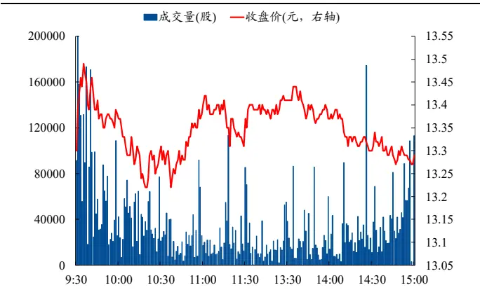
资料来源：上交所、深交所行情数据，兴业证券经济与金融研究院整理

图 2、某支股票日内成交量分布
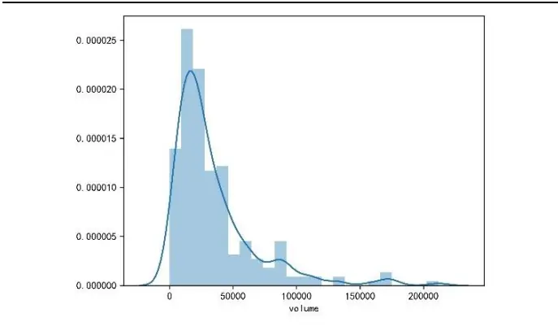
资料来源：上交所、深交所行情数据，兴业证券经济与金融研究院整理

估计日内成交量分布的特征会面临许多难题。首先是样本的稀疏性，对于分钟级别的切片数据而言，当股票的流动性相对较差时，并不是每一分钟都有买卖单的撮合。稀疏的样本除了具有更大的自相关性，对参数估计造成干扰之外（Hasbrouck, 1991），其时序上的非连续性将进一步导致有偏或错误的估计。另一个估计日内成交量分布特征面临的难题是日内数据的时序U型分布特征，这一特征进一步导致样本非独立同分布。早在1985年左右，Wood、McInish和Ord便首次记录了成交量的日内结构。此外，大量的学术研究也表明，日内的成交量在时序上大多成U型分布。目前一种相对成熟的解释认为这种交易模式的原因是由非知情交易日与知情交易日不同的投资策略导致的。非知情交易者通过聚集交易以增加与另一位非知情交易者进行交易的机会，从而最大限度地减少与知情交易者交易时所产生的逆向选择成本（Admati and Pfleiderer, 1988）。因此，对于日内的分钟成交量而言，开盘与收盘左右时间段的成交量会显著大于其他时段，不同时段的成交量分布情况有所不同。

图 3、某支流动性差的股票分钟成交量时序图
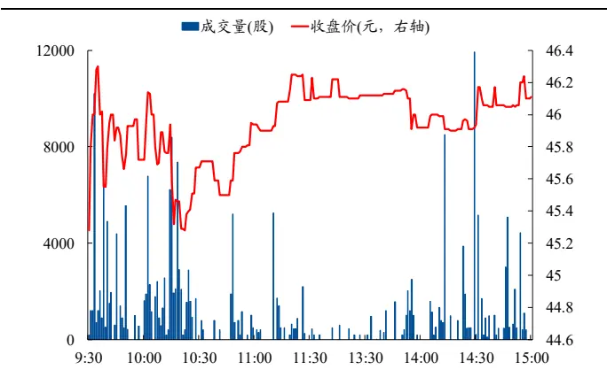
资料来源：上交所、深交所行情数据，兴业证券经济与金融研究院整理

图 4、某支股票日内分钟成交量时序上呈 U 型分布（单位：股）
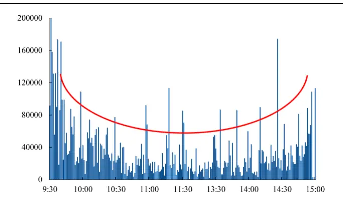
资料来源：上交所、深交所行情数据，兴业证券经济与金融研究院整理

由于分钟成交量数据中存在上述问题，在构造成交量分布因子时，我们采取异构数据加非参统计量的估计方法，即在原始成交量数据的基础上，通过直接异构或加入其他数据的方式构造出非稀疏的异构数据，然后在尽量避免分布假设的基础上，采用非参统计量来描述异构数据的分布特征。

## 2.2、三类常见成交量分布因子

在本章中，我们将首先基于成交量的分布特性，并且针对分钟成交量数据的问题，构造简单的异构成交量数据，并使用描述性的分布特征统计量（均值、标准差、分位数占比等）提取异构成交量的分布信息，由此构造因子。

$$
g=f\big(Reorder(vol_{New})\big)=f(vol_{New})\tag{3}
$$

其中 ${\boldsymbol{vol}}_{New}$ 表示分钟异构成交量时间序列向量，g表示基于方法f构造的指标。Reorder()函数表示对 ${\bf\nabla}\cdot{\bf\nabla}v{\bf o}l_{New}$ 重新排列，我们要求含有分布信息的指标g对于 ${\bf\nabla}\cdot{\bf\nabla}v{\bf o}l_{New}$ 的时间位置不敏感。

## 对数成交量

首先，我们基于成交量近似服从对数正态分布的特性2，挖掘其本身的分布信息，构造了3个有效的对数成交量分布因子。

$$
vol_{New}=logvol=\log(volume)\tag{4}
$$

表 2、对数成交量分布因子定义

| 因子名 | 因子构造方法 |
| --- | --- |
| logvol_skew | 对数成交量偏度 |
| logvol_90tail | 对数成交量厚尾：90%分位数以上占比 |
| logvol_10tail | 对数成交量厚尾：10%分位数以下占比 |

资料来源：兴业证券经济与金融研究院整理
注：成交量均是日内分钟成交量

## 成交量变化率

除此之外，先前提到过，对于流动性较差的股票，其分钟内可能不存在交易，由此导致分钟成交量数据的缺失，样本数据的稀疏性较高。对于稀疏性较高的样本，我们难以基于时间维度计算变化率以完成异构。因此，我们将分钟成交量进行重新切片以修正。在此基础上，我们构建了两个有效的成交量分布因子，以判断成交量的激增情况（偏度）或稳定情况（峰度）。

表 3、成交量变化率分布因子定义

| 因子名 | 因子构造方法 |
| --- | --- |
| volroc_skew | 15分钟成交量变化率偏度 |
| volroc_kurt | 15分钟成交量变化率峰度 |

资料来源：兴业证券经济与金融研究院整理

## 累计成交量占比

在分钟级的成交量中，周期效应，即日内成交量的U型分布是最为常见的特征之一。在实际构建因子时，由于无法剔除掉周期效应带来的影响，简单的分钟级成交量难以刻画出具有个股差异化的成交量日内特性。此外，过度保留周期效应也会导致因子间相关性较高。因此，我们需要从时间维度出发，对成交量进行异构，同时其异构的方式需要保留成交量的日内变化趋势，并尽量避免周期效应。

表 4、累计成交量分布因子定义

| 因子名 | 因子构造方法 |
| --- | --- |
| cumsumvol_mean | 累计成交量均值 |
| cumsumvol_std | 累计成交量标准差 |

资料来源：兴业证券经济与金融研究院整理

## 2.3、因子表现

我们首先测试上述 7 个因子的表现。首先从日度 IC 测试结果上看，成交量分布因子 IC均值几乎都在2%以上，表现出较好的股价预测能力。

表 5、常见成交量分布因子日度 IC测试结果

|  | IC 均值 | IC标准差 | ICIR | T统计量 |
| --- | --- | --- | --- | --- |
| logvol_skew | 3.03% | 6.68% | 0.45 | 19.80 |
| logvol_90tail | 2.90% | 5.01% | 0.58 | 25.26 |
| logvol_10tail | 2.20% | 5.73% | 0.38 | 16.74 |
| volroc_skew | 2.06% | 4.73% | 0.44 | 18.99 |
| volroc kurt | 1.98% | 4.50% | 0.44 | 19.19 |
| cumsumvol_mean | 3.04% | 8.20% | 0.37 | 16.18 |
| cumsumvol_std | 2.25% | 8.04% | 0.28 | 12.21 |

资料来源：上交所、深交所行情数据，Wind，聚源，兴业证券经济与金融研究院整理

从日度组合测试结果上看，我们构建的常见成交量分布因子的表现均相对优秀，大多数因子的多空夏普大于 3，部分因子的多空夏普大于 6，且多头收益率较高。具体来看，从多空组合测试上看，对数成交量偏度因子的多空收益率在42%左右，多头收益率高达 20%，夏普比率在 6 左右。此外，累计成交量均值因子的多空收益率在 36%左右，多头收益率大于 15%。

表 6、常见成交量分布因子日度回测结果

|  | 多空收益率 | 多头收益率 | 空头收益率 | 年化波动率 | 夏普比率 | 最大回撤 | 胜率 | 换手率 |
| --- | --- | --- | --- | --- | --- | --- | --- | --- |
| logvol_skew | 41.92% | 20.49% | -15.62% | 6.77% | 6.19 | -5.67% | 63.81% | 18.89% |
| logvol_90tail | 34.63% | 22.28% | -9.55% | 5.39% | 6.42 | -4.86% | 66.70% | 24.86% |
| logvol_10tail | 19.69% | 17.06% | -3.07% | 5.60% | 3.51 | -6.94% | 58.67% | 29.83% |
| volroc_skew | 22.40% | 14.70% | -6.24% | 4.48% | 5.00 | -5.50% | 63.71% | 31.59% |
| volroc_kurt | 21.79% | 14.44% | -6.04% | 4.28% | 5.09 | -5.41% | 64.71% | 28.48% |
| cumsumvol_mean cumsumvol std | 35.56% | 15.60% 13.06% | -16.12% -6.83% | 8.92% | 3.98 | -12.41% | 59.72% | 26.28% |
|  | 19.70% |  |  | 7.86% | 2.51 | -16.33% | 55.41% | 21.91% |

资料来源：上交所、深交所行情数据，Wind，聚源，兴业证券经济与金融研究院整理

从多空净值曲线上看，各个因子的多空净值长期呈现上升趋势，且最近几年无明显回撤，表现十分稳定。

图 5、常见成交量分布因子多空净值
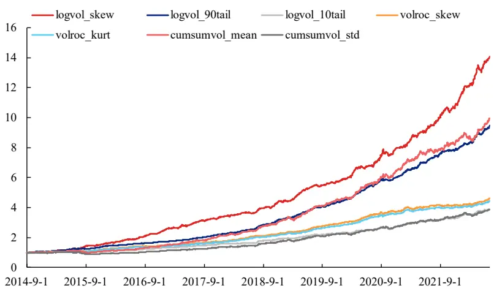
资料来源：上交所、深交所行情数据，Wind，聚源，兴业证券经济与金融研究院整理

我们进一步统计各个常见收益率因子的时序相关性，其中横 与纵 同 标签，在表中我们仅展示横 。从结果上看， 各个成交量分布因子的组间相关性较低，且除累计成交量分布因子外，各个因子的组内相关性同样较低。这表明即使使用的数据相同，通过异构或者通过不同分布函数计算得到的信息也不尽相同。以对数成交量偏度因子为例，该因子与所有常见成交量因子的相关性保持在 0.6 以下，且多空夏普比率大于6，具有极强的特异性和选股能力。

表 7、常见收益率因子时序相关性
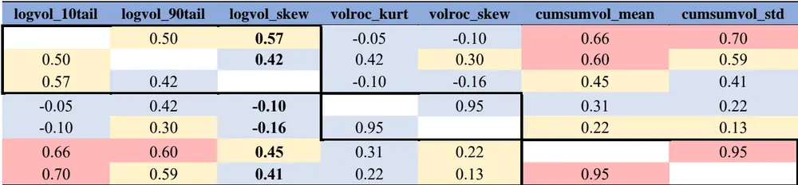
资料来源：上交所、深交所行情数据，Wind，聚源，兴业证券经济与金融研究院整理

除此之外，我们进一步统计各个常见成交量分布因子与此前我们已经构建并发布的 14 个收益率分布因子的时序相关性箱型图。总体而言，各个成交量因子与收益率因子的时序相关性较低，上四分位数均小于 0.6，时序相关性均值和中位数均小于0.4，最大值也几乎都在0.7以下。具体来说，对数成交量偏度因子的表现十分优秀，时序相关性均值约为 0.37，中位数约在 0.34，最大时序相关性为 0.62（与已实现方差因子）。常见成交量分布因子整体与收益率分布因子相关性较低，这表明使用不同数据能够带来额外的 Alpha信息。

图 6、常见成交量分布因子与收益率分布因子时序相关性箱型图
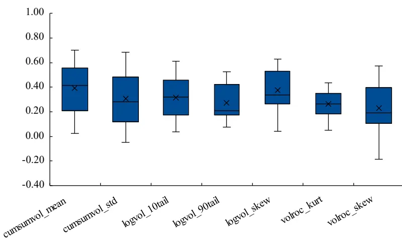
资料来源：上交所、深交所行情数据，Wind，聚源，兴业证券经济与金融研究院整理

在下文中，我们将以 14 个收益率分布因子，以及 7 个常见成交量分布因子为因子库，测试各个新成交量分布因子的相关性。

## 3、不稳定性与成交增量 –异构成交量分布因子

在前文中，我们介绍了日内分钟级成交量数据存在的问题：稀疏性与周期特征带来的非独立同分布问题，并根据其特性简单尝试了不同的异构方式与分布信息提取方式，由此构造因子。结果表明，各类成交量分布因子具有较好的选股能力，且具有一定的特异性。

上文的尝试大多从分布信息的数理逻辑出发。在本文中，我们重点从投资逻辑出发，以成交量高频因子为具体落地，构造出具有较强逻辑的成交量分布因子。具体来说，我们将从分桶熵、极值分布两种方式对成交量进行异构，并基于异构逻辑构建选股因子。

## 3.1、成交量分桶熵因子

我们首先从成交量的不稳定程度出发构造第一个异构因子—成交量分桶熵因子。在非强有效的市场环境假说下，对于一支个股而言，在有利好/利空消息到来之时，通常投资者对其的关注度将会大幅增大，随之而来的则是成交量的激增。由于信息传递的滞后性、知情交易者与非知情交易者的领先与“跟风”现象、大额投资者进行分散投资等等因素下，日内成交量的激增将会以近似随机的形式出现在日内的任一分钟上。事实上，此类现象可类比于学术界的信息不对称理论。在此理论基础下，大量信息不对称程度的代理变量，诸如知情交易概率PIN、VPIN等指标被广泛运用于选股中。

然而，目前信息不对称理论相关模型存在一定的操作门槛：如基于二叉树与贝叶斯概率模型构建的 PIN 指标计算量过大；基于正态分布假设的 VPIN 指标具有先验的分布假设，并且模型需要提前利用长期历史数据进行计算。在本章中，我们无需将成交量按买卖方进行拟合区分、也不使用订单簿数据，仅从成交量分布的统计量出发，描述日内成交量的不稳定性，进而反应个股日内信息的不对称程度。

为此，我们引入熵的定义。在信息论中，熵用于描述信息源各可能事件的不确定性，进而表述该系统的复杂程度。在计算方式上，我们从熵的定义出发，可以考虑把时间序列的值进行分桶操作，剔除时间维度的信息以衡量成交量数据的整体离散程度。

在此计算下，如果某股的成交量分桶熵因子值较大，说明该股的成交量相对均匀地分布在最大值与最小值之间；反之如果某股的成交量分桶熵因子值较小，说明该股的成交量相对集中地分布在某一桶中，具体表现即为成交量分布相对不均匀。

我们以两支个股展示分桶熵值较大和较小时个股日内成交量的情况。其中，002459.SZ 为当日分桶熵值较大的个股，可以看出该指股票流动性较好，且在每分钟均有较均衡的成交量。当日这支股票并未出现相对异常的成交量，股价相对稳定。反之，688551.SH 为当日分桶熵值较小的个股。该股流动性较差，同时在10 点前后存在着异于其他时间的成交量激增，伴随着价格的大幅变动，在近半小时内跌幅高达约10%。这或许是利空消息导致成交量出现不稳定。

图 7、2022 年 1 月 28 日 002459.SZ 成交量与收盘价
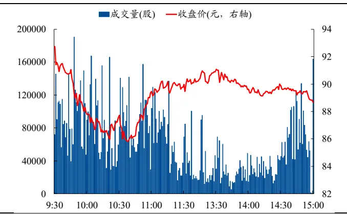
资料来源：上交所、深交所行情数据，Wind，聚源，兴业证券经济与金融研究院整理

图 8、2022 年 1 月 28 日 002459.SZ 分桶熵图解
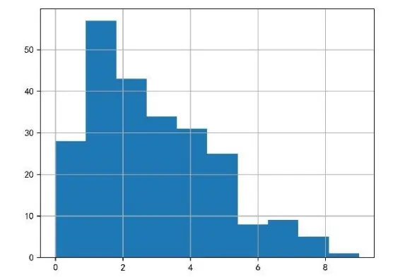
资料来源：上交所、深交所行情数据，Wind，聚源，兴业证券经济与金融研究院整理

图 9、2022 年 1 月 28 日 688551.SH 成交量与收盘价
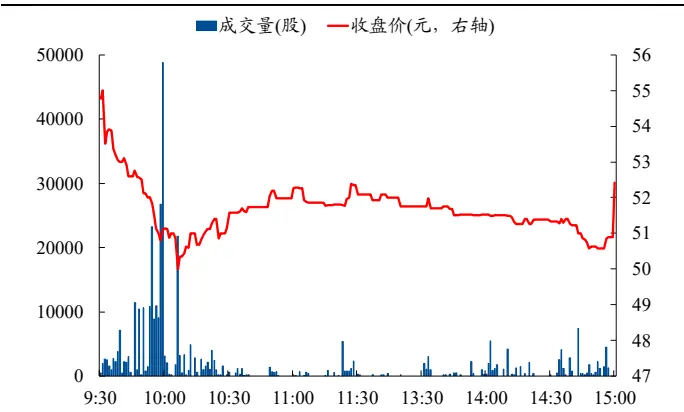
资料来源：上交所、深交所行情数据，Wind，聚源，兴业证券经济与金融研究院整理

图 10、2022 年 1 月 28 日 688551.SH 分桶熵图解
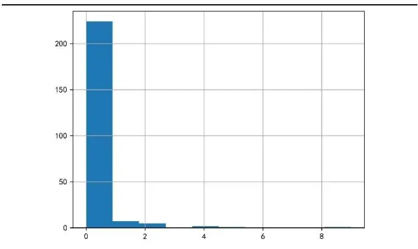
资料来源：上交所、深交所行情数据，Wind，聚源，兴业证券经济与金融研究院整理

在针对该高频指标的时序操作上，我们计算个股分桶熵数值近 20 日标准差以衡量个股分桶熵在时序上的离散程度，即表示在过去一段时间内，个股成交量不稳定性的分散程度。该因子值越大，说明该股在近一段时间内成交量不稳定性的分散程度较大，股价曾经或正在受到知情交易者的带动。此时个股不稳定性极高，整体下行风险较大。

## 3.2、因子表现

从日度IC测试结果上看，该类因子IC均值约为2%，ICIR大于0.5，表现出较好的股价预测能力。

表 8、成交量分桶熵因子日度 IC测试结果

|  | IC 均值 | IC标准差 | ICIR | T统计量 |
| --- | --- | --- | --- | --- |
| vol_entropy | 2.18% | 4.12% | 0.53 | 23.08 |

资料来源：上交所、深交所行情数据，Wind，聚源，兴业证券经济与金融研究院整理

从日度组合测试结果上看，vol_entropy 因子的表现十分优秀，多空夏普较高，且无明显回撤，多头收益率较高。具体来看，从多空组合测试上看，vol_entropy的多空收益率在 30%左右，多头收益率约为 15%，夏普比率在 6左右。

表 9、成交量分桶熵因子日度回测结果

|  | 多空收益率 | 多头收益率 | 空头收益率 | 年化波动率 | 夏普比率 | 最大回撤 | 胜率 | 换手率 |
| --- | --- | --- | --- | --- | --- | --- | --- | --- |
| vol_entropy | 29.49% | 15.12% | -11.58% | 4.89% | 6.03 | -7.81% | 63.76% | 29.93% |

资料来源：上交所、深交所行情数据，Wind，聚源，兴业证券经济与金融研究院整理

从多空净值曲线以及分位数组合测试结果上看，vol_entropy 因子的多空净值长期呈现上升趋势，且最近几年无明显回撤，表现十分稳定。

图 11、成交量分桶熵因子IC与累计IC
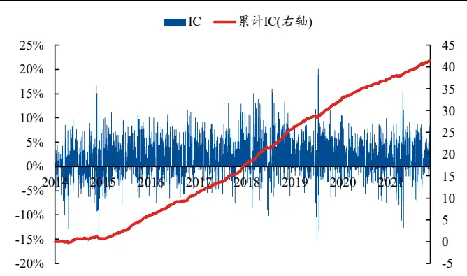
资料来源：上交所、深交所行情数据，Wind，聚源，兴业证券经济与金融研究院整理

图 12、成交量分桶熵因子多空净值
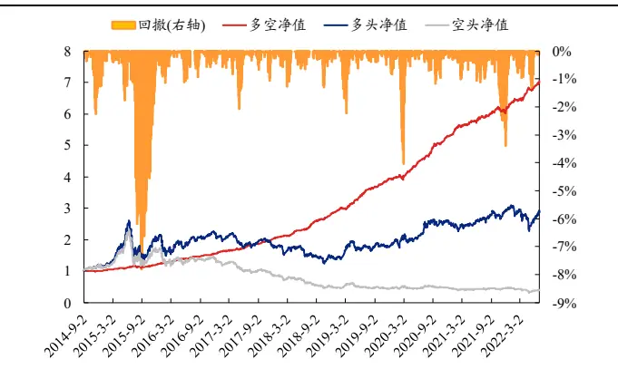
资料来源：上交所、深交所行情数据，Wind，聚源，兴业证券经济与金融研究院整理

## 3.3、成交量极大值分布因子

在本章中，我们引入极值理论来刻画成交量极大值的分布特征，挖掘其带来的投资信息。

具体来说，目前针对成交量分布的研究大多以日内样本数据为主体，并从均值等统计量的角度去挖掘其中的信息。然而日内成交量的极大值更令人感兴趣。在上一章节中，我们详细描述了日内分钟成交量骤增的主要原因及其内部可以挖掘的因素：成交量的激增通常预示信息的到来以及传递的滞后性、知情与非知情交易者博弈等。当面对包含额外信息的极大值成交量时，样本数据本身已出现了异于其他时间的变化趋势。由此，我们需要将极值成交量单独剥离出来。这一分析方式来源于极值理论（Extreme Value Theory, EVT）。该理论表明：极值的分布与原分布相互独立，所以对极值分布的研究可以独立于整体分布，从而剥离出极值本身的信息。

与原分布的非参数统计分析方式类似，我们首先需要得到极大值的样本数据。在具体计算上，我们采用“有放回的”重采样方式（Bootstrapping）得到极大值的样本数据。基于该算法得到极大值的样本数据后，该极大值的样本均值越大，说明该股成交量极值出现的次数相对较多，且骤增的量较大；该极大值的样本标准差越小，说明该股成交量极大值的量相对均衡，极值部分差异较小。在针对该高频指标的时序操作上，我们计算两类高频指标近 15 日的标准差以衡量极大值均值在时序上的离散程度3。与之前类似，因子值越大，说明该股在近一段时间内成交量极大值的分散程度较大，股价曾经或正在出现成交量多次过大，或极值差异明显。此时个股不稳定性极高，整体下行风险较大。

## 3.4、因子表现

从日度IC测试结果上看，该类因子IC均值在4%左右，ICIR也在0.5左右，表现出较好的股价预测能力。

表 10、成交量极大值分布因子日度 IC测试结果

|  | IC均值 | IC标准差 | ICIR | T统计量 |
| --- | --- | --- | --- | --- |
| vol_maxmean | 4.20% | 8.27% | 0.51 | 22.17 |
| vol_maxstd | 3.66% | 7.87% | 0.47 | 20.30 |

资料来源：上交所、深交所行情数据，Wind，聚源，兴业证券经济与金融研究院整理

从日度组合测试结果上看，两个成交量极大值因子的表现极佳，两者的多空夏普均较高，且多头收益率极高。具体来看，以vol_maxmean为例，该因子的多空收益率高达50%，多头收益率高达约24%，夏普比率在6左右，最大回撤小于10%，且换手率较低。

表 11、成交量极大值分布因子日度回测结果

|  | 多空收益率 | 多头收益率 | 空头收益率 | 年化波动率 | 夏普比率 | 最大回撤 | 胜率 | 换手率 |
| --- | --- | --- | --- | --- | --- | --- | --- | --- |
| vol_maxmean | 50.38% | 23.93% | -18.81% | 8.29% | 6.08 | -8.28% | 64.13% | 18.03% |
| vol maxstd | 46.29% | 21.46% | -18.12% | 8.03% | 5.77 | -9.14% | 64.60% | 18.86% |

资料来源：上交所、深交所行情数据，Wind，聚源，兴业证券经济与金融研究院整理

从多空净值曲线以及分位数组合测试结果上看，vol_maxmean 因子的多空净值长期呈现上升趋势，最近几年虽出现较明显回撤，但 2022 年以来表现十分优秀。

图 13、vol_maxmean 因子 IC 与累计 IC
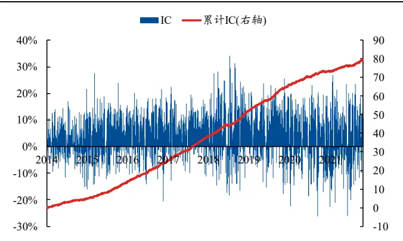
资料来源：上交所、深交所行情数据，Wind，聚源，兴业证券经济与金融研究院整理

图 14、vol_maxmean 因子多空净值
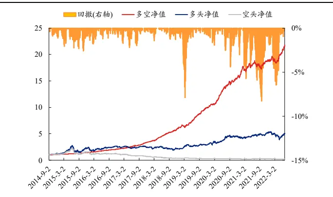
资料来源：上交所、深交所行情数据，Wind，聚源，兴业证券经济与金融研究院整理

## 4、从分析图到选股因子 –同价成交量分布因子

在上文中，我们从两个维度出发，对分钟级别的成交量进行基于自身的数据异构，并以此构建了多个具有特异性的成交量分布因子。在本章中，我们引入一个全新的视角，将价格与成交量结合进行异构，引出一种全新的成交量分布—同价成交量分布。

## 4.1、同价成交量图简析

同价成交量是将日内相同分钟收盘价的成交量累加至一起，得到在当前价格上的成交量总和。具体来说，下图展示了 2022年 1月 28日 000009.SZ的日内价格走势与同价成交量。该股在当日的收盘价价格区间为 12.65 至 13.08 ，且共有 42 个不同的分钟收盘价。我们将每个不同分钟收盘价对应的所有成交量累加，得到长度为 42 的成交量序列，并按价格排序。从直观上看，整体上成交量分布在该股日内的低价区域，大部分的成交量在 12.90 至 13.00 这一区间内累计，其次在 12.80 至 12.85 附近。该股日内虽有一定的跌幅，日内最低收盘价为 12.65 ，但低价区域的成交量较少，整体价格走势在 12.95 附近震荡，收于 12.83 。

图 15、2022 年 1 月 28 日 000009.SZ 同价成交量与收盘价
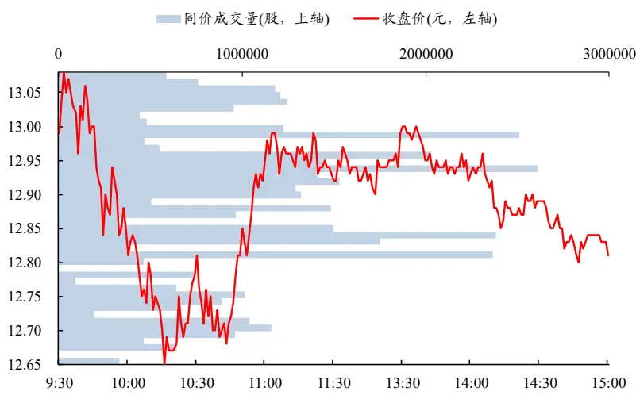
资料来源：上交所、深交所行情数据，Wind，聚源，兴业证券经济与金融研究院整理

由此，我们基于价格将日内成交量进行异构，得到每个日内价格的成交量累计，记为同价成交量。可以明显看出，日内不同价格上的成交量差异较大，同时局部和全局的同价成交量分布也将带有不同的特性。在部分高频交易中，同价成交量作为一种常见且十分重要的技术分析手段，常常被用来进行日内或日间买卖点判断、个股趋势分析等。在本章中，我们尝试模拟交易员面对同价成交量的分析方式，从局部（如价格支撑区域）或整体的同价成交量分布形状与特征出发，将直观的图像转换至高频指标，并以此构建选股因子。

在具体构建上，我们将根据上述同价成交量的局部或全局信息，这两个维度展开分析，并由此构建选股因子。

## 4.2、局部特征：探秘成交量支撑点、支撑区域与个股公允价格

我们首先聚焦于成交量累计最大的价格位置及其附近的区域，即聚焦于局部区域进行分析。在绝对稳定的日内股价波动中，价格通常会围绕某一中心位置，以对称的形式在其附近交易。此时，我们预期可以观察到带有最高成交量的价格出现在日内价格的中点附近，并且当日极高/低价区间附近仅有少量成交量。但在实际交易中，由于信息的不对称、个股风险与情绪等因素，价格通常会较短地出现在过高或过低的位置。此时，若没有大量的投资者在此价格上成交，即没有成交量的支撑时，日内价格难以在此位置维持，套利者将会迅速出击，发出不同于当前价格的买卖单以赚取收益。不难看出，成交量累计最大的价格及其区域是判断个股日内公允价格区域的重要依据，过高/过低于该区域的价格将难以维持。我们将成交量累计最大的价格定义为该股当日的成交量支撑点（Volume SupportPoint，VSP），包含该支撑点的附近区域定义为成交量支撑区域（Volume SupportArea，VSA）。

从定性的角度，我们可以很快地通过肉眼看出 000009.SZ的支撑点与支撑区域的大致位置。但是若将其转化至个股的高频指标时，我们需要一套严格的判断方式。以上图中的 000009.SZ 为例，该股当日最高同价成交量出现在 12.94上，累计成交量约为 261万股。因此该股日内的成交量支撑点 VSP为 12.94 。

在得到支撑点 VSP 后，我们以 VSP 为中心，向外扩展得到成交量支撑区域VSA。具体来说，我们逐步计算 VSP（价格由近及远，成交量由大及小）周围的成交量累计值，该累计值与全天成交量总和的比值超 50%的最小区域，即为成交量支撑区域 VSA4。以 000009.SZ 为例，我们基于支撑点（12.94 ），按照顺序不断累加成交量，直至累计值占比超 50%，即可找出了成交量支撑区域，为上限（VSA_High）12.85 至下限（VSA_Low）13.02 。

事实上，该股日内曾短暂地超跌并超出支撑区域（10点后最低价为12.65 ），但由于后续低价区域并没有成交量支撑，且距离支撑区域较远，该股迅速反弹，回归到支撑区域并在此区域上下震荡。最终收于12.81 ，仅略小于 VSA下界。

图 16、2022 年 1 月 28 日 000009.SZ 支撑点与区域
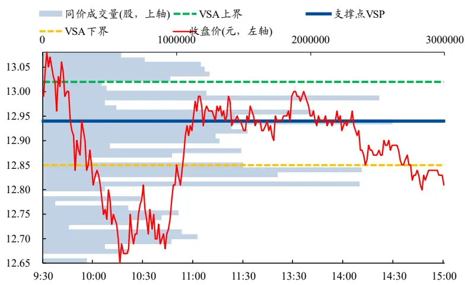
资料来源：上交所、深交所行情数据，Wind，聚源，兴业证券经济与金融研究院整理

综上所述，我们以交易员的逻辑角度出发，找出成交量支撑点与成交量支撑位置，并以此作为基础构造第一个同价成交量选股因子。具体来说，我们根据上述逻辑找出个股的成交量支撑点 VSP 与支撑区域 VSA。在上文中我们明确表明，成交量支撑区域是判断个股日内公允价格区域的重要依据，过高/过低于该区域的价格将难以维持。因此，我们计算成交量支撑区域 VSA 的下限与当日的收盘价之间的差异，并以此构建因子。若差异较大，说明该股收盘后处于异常推动状态，当日大幅跌穿公允价格区域，其未来预计会回到公允价格区域，出现回弹上涨，因此因子值为降序排序。

## 4.3、全局特征：探秘同价成交量在价格上的分布形态

除了针对 VSA 及其异动价格的局部刻画外，我们还可以通过判断成交量在价格上的分布图，即从全局分析角度出发，模仿日内交易的择时或选股方式，通过数理逻辑将整体图像转换为数值，从而构建因子。具体来说，同价成交量分布一般分为三种，形象地说是 D，P 和 b 型。我们首先介绍三种成交量分布类型的形式与特征。

## D 型

当该股的价格暂时处于平衡状态时，同价成交量将极可能以D型曲线出现。如下图所述，600007.SH 整体日内价格在 13.70 左右震荡，震幅较小。同价成交量分布的成交量支撑点位于日内价格区间的中部，整体以对称形式展开。此时，成交量的支撑区域 VSA 通常位于价格的中心，表明买家和卖家之间的平衡。这种情况便是我们此前提到的相对稳定的日内股价波动：价格通常会围绕某一中心位置，以对称的形式在其附近交易。在实际交易中，一些交易者可会将D形轮廓解释为缺乏明确方向的震荡或横盘整理，因为此时无论是买家还是卖家都没有更激进的买卖单。此外，耐心的订单流交易者可能会寻找D型成交量分布的个股，提前布下头寸以预期机构参与者建立头寸。总结而言，当个股的同价成交量分布出现 D型时，其整体处于相对平衡的状态，未来走势不明朗。

图 17、D 型同价成交量样例（2022 年 1 月 28 日 600007.SH）
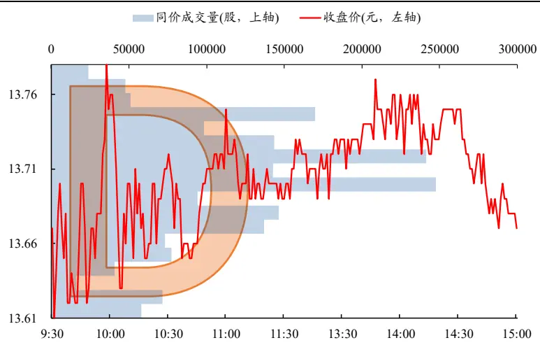
资料来源：上交所、深交所行情数据，Wind，聚源，兴业证券经济与金融研究院整理

## P 型

上述情况下，个股的交易分歧较小，整体趋势不明确。然而，当出现不对称交易，或个股的分歧较大时，成交量的支撑区域 VSA 将不会出现在日内价格的中点附近，从而造成个股价格的失衡。此时通常表明该股的价格开始出现一定的可寻趋势。

当个股价格出现急剧上涨然后盘整，或短期急剧下跌但日内整体处于高位时，通常会出现 P 型成交量曲线，如下图所示。从图形上看，P 型轮廓的下部长而薄，代表对于较低价格区域的低认可度；反之，较宽的上部代表着交易活动的增加，此时价格正逐步接近公允区域。由于价格出现较大浮动，市场对于该价格仍有一定分歧，极可能出现小幅震荡，但由于成交量的支撑，买卖双方之间力量会逐步达到平衡。对于机构投资者而言，他们可以在此价格积累头寸以进行后续的推动；对于其他交易者而言，他们可能会利用该股的不稳定性，寻找机会在公允价格区域 VSA 的底部附近买入以利用该趋势。因此，在 P 型建立后的每一天，交易者均可以在价格出现在 VSA 下界时买入以博取收益，或者随着趋势的继续，他们也可能会寻求突破 VSA的上界。

总结而言，P 型轮廓的成交量分布通常出现在上涨趋势中或下跌趋势结束时，个股预期上涨。

图 18、P 型同价成交量样例（2022 年 1 月 28 日 300129.SZ）
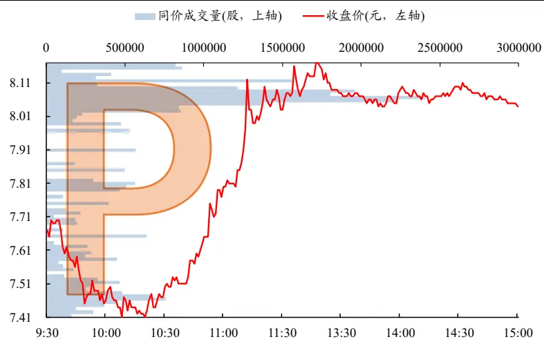
资料来源：上交所、深交所行情数据，Wind，聚源，兴业证券经济与金融研究院整理

## b 型

b 型成交量分布则是与 P 型相对应。具体来说，当个股价格出现急剧下跌然后盘整，或者短期急剧上涨但整体处于低位时，成交量分布将出现 b 型曲线，如下图所示。b 型分布的上半部分长而细，代表该区域成交量较低，以及对于该区域价格的低认可度；较宽的底部则代表着价格再次在买家和卖家之间正在逐步达到平衡。b 型分布同样表示该股在找到公允价格之前的一段抛售。与 P 型曲线相反，此时卖出行为极可能会出现 b型曲线的下部。一些交易者可能希望在成交量支撑区域VSA的上限附近卖出。

总结而言，b 型轮廓的成交量分布通常出现在下跌趋势中或上涨趋势结束时，个股预期下跌。

图 19、b 型同价成交量样例（2022 年 1 月 28 日 002302.SZ）
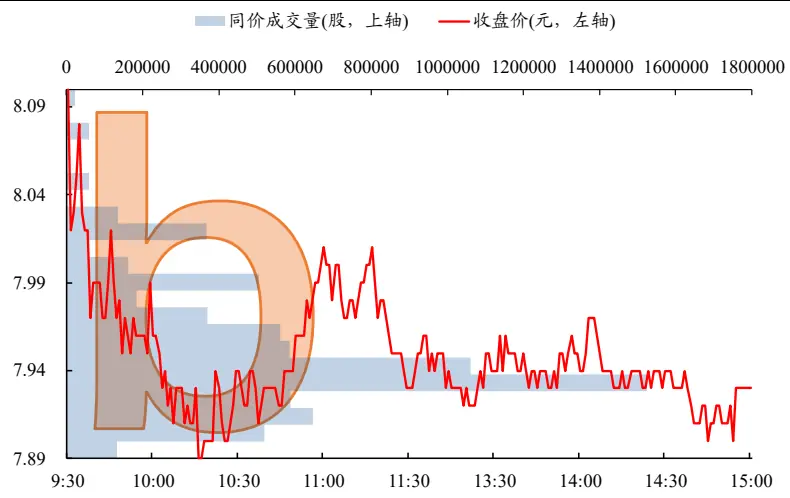
资料来源：上交所、深交所行情数据，Wind，聚源，兴业证券经济与金融研究院整理

综上，无论是 D、P 还是 b 型成交量分布，均是交易员们用来形象描述同价成交量分布图形的方式，以满足他们在实际交易中根据形状来定性判断买卖点，或对个股和市场进行趋势分析的方法。而在选股层面，我们需要与上一个因子的想法类似，通过构建一套严格的判断方式，将同价成交量在价格上的分布形态转化至具体数值，以构建高频因子，来判断当日个股的同价成交量分布属于哪种类型，并根据与各个类型的相似度大小以及类型的含义，对股票进行排序。

具体来说，为了避免成交量支撑点VSP一定的随机性，导致结果出现较大的偏差5，我们基于 VSA 的上下限来判断成交量分布的类型，并由此构造出两个因子。

两个因子均是判断成交量分布的形态，只是略有不同。以vsa_low2max为例，若该因子值越大，说明成交量支撑区域越接近日内的高价区域，则该股日内的成交量分布越接近于P型分布，该股预期上涨；以vsa_high2min为例，若该因子值越小，说明成交量支撑区域越接近日内的低价区域，则该股日内的成交量分布越接近于 b型分布，该股预期下跌。

综上，我们从同价成交量分布因子的局部特征与全局特征出发，构建了两类、共计三个因子，其逻辑如下。

表 12、同价成交量因子逻辑简析

| 分析角度 | 因子名称 | 逻辑说明 | 因子顺序 |
| --- | --- | --- | --- |
| 局部特征 | vsa_ratio | 是否存在异常推动 | 降序 |
| 全局特征 | vsa_low2max | 是否贴近P型（预期上涨） | 降序 |
|  | vsa_high2min | 是否贴近b型（预期下跌） | 升序 |

资料来源：兴业证券经济与金融研究院整理

## 4.4、因子表现

我们展示三种不同的同价成交量分布因子。从日度 IC 测试结果上看，这两类因子IC均值均在4%以上，表现出较好的股价预测能力。其中vsa_ratio因子相对稳定，ICIR大于 0.5。因子累计 IC整体向上，且无明显减弱。

表 13、同价成交量分布因子日度 IC 测试结果

| IC均值 | IC标准差 | ICIR | T统计量 |
| --- | --- | --- | --- |
| vsa_ratio 4.07% | 7.16% | 0.57 | 24.82 |
| vsa_low2max | 4.22% 11.93% | 0.35 | 15.43 |
| vsa_high2min | 5.48% 11.64% | 0.47 | 20.54 |

资料来源：上交所、深交所行情数据，Wind，聚源，兴业证券经济与金融研究院整理

从日度测试结果上看，无论是 vsa_ratio还是 vsa上下界比值类因子的表现均十分优秀，三者的多空夏普均较高，无明显回撤。具体来看，从多空组合测试上看，vsa_ratio的多空收益率在 39%左右，多头收益率约为 17%，夏普比率在 5左右。

表 14、同价成交量分布因子日度回测结果

|  | 多空收益率 | 多头收益率 | 空头收益率 | 年化波动率 | 夏普比率 | 最大回撤 | 胜率 | 换手率 |
| --- | --- | --- | --- | --- | --- | --- | --- | --- |
| vsa_ratio | 38.29% | 16.67% | -16.18% | 7.63% | 5.02 | -4.89% | 61.40% | 30.62% |
| vsa_low2max | 24.20% | 13.96% | -10.59% | 11.47% | 2.11 | -19.05% | 54.99% | 22.67% |
| vsa_high2min | 39.19% | 17.64% | -17.51% | 11.57% | 3.39 | -9.19% | 57.88% | 23.17% |

资料来源：上交所、深交所行情数据，Wind，聚源，兴业证券经济与金融研究院整理

从多空净值曲线以及分位数组合测试结果上看，vsa_ratio 和 vsa_high2min 因子的多空净值长期呈现上升趋势，且最近几年无明显回撤，表现相对稳定。

图 20、vsa_ratio 因子 IC 与累计 IC
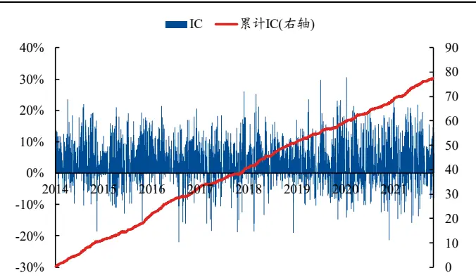
资料来源：上交所、深交所行情数据，Wind，聚源，兴业证券经济与金融研究院整理

图 21、vsa_ratio 因子多空净值
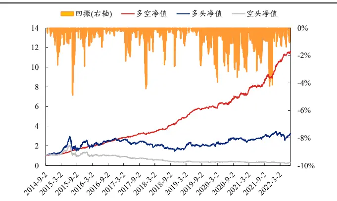
资料来源：上交所、深交所行情数据，Wind，聚源，兴业证券经济与金融研究院整理

图 22、vsa_high2min 因子 IC 与累计 IC
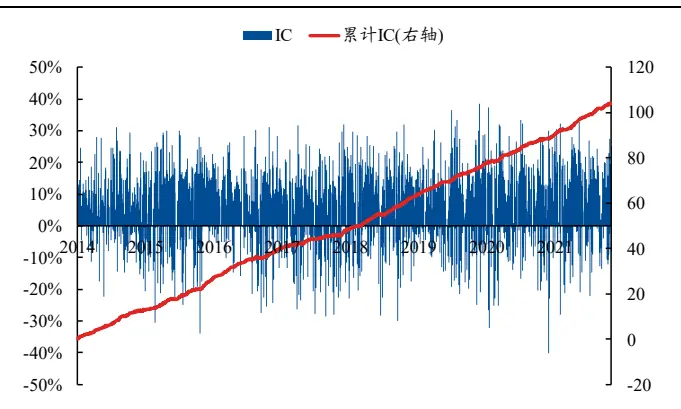
资料来源：上交所、深交所行情数据，Wind，聚源，兴业证券经济与金融研究院整理

图 23、vsa_high2min 因子多空净值
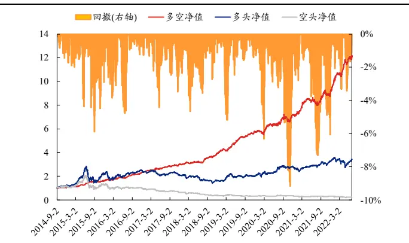
资料来源：上交所、深交所行情数据，Wind，聚源，兴业证券经济与金融研究院整理

## 5、从有效到特异–因子相关性分析和正交化处理

## 5.1、异构成交量因子相关性分析

在前面的章节中，我们首先通过简单的异构方式和分布信息函数构建了共 7个常见成交量分布因子（本篇报告第二章节），加上此前报告中我们提出与构建的 14个收益率分布因子，我们共计有 21个已经入库的有效高频选股因子，定义为基础高频因子库。在本篇报告的第三、四章节中，我们从分桶熵，极大值分布和同价成交量三个角度出发，构建了 6 个具备特定投资逻辑的异构成交量分布因子。接下来，我们具体分析这三大类异构成交量分布因子共计 6个因子与基础高频因子库的时序相关性。

我们首先统计各个因子与基础高频因子库中所有因子的时序相关性，并以箱型图的方式在下图展示。整体而言，除同价成交量中的 vsa_high2min 因子以外，各个因子的四分位数几乎均在 0.6 以下，特异性保持良好。具体来说，成交量分桶熵因子vol_entropy的时序相关性的均值与中位数均约为0.43，与累计成交量均值因子 cumsumvol_mean 的时序相关性较高（0.70）。同价成交量类因子 vsa_ratio的相关性整体亦较低，均值和中位数约为 0.32。其中该因子与已实现方差因子real_var的相关性最高，为0.68。vsa_high2min因子的特异性相对较弱，时序相关性的均值和中位数在 0.5 左右，其与已实现方差因子 real_var 的相关性较高，为0.69，这与该类因子引入收盘价进行异构有关。

图 24、异构成交量分布因子时序相关性
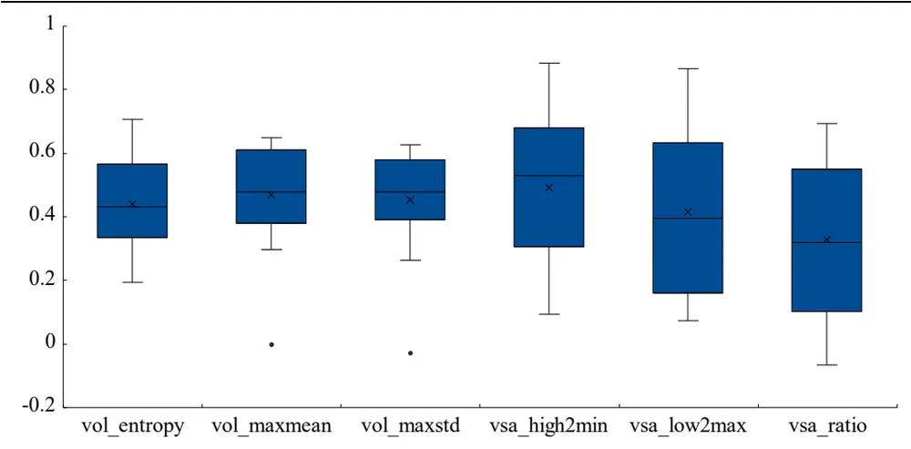
资料来源：上交所、深交所行情数据，Wind，聚源，兴业证券经济与金融研究院整理

表 15、异构成交量分布因子时序相关性统计

| 因子名称 | 均值 | 中位数 | 最大值 | 最小值 |
| --- | --- | --- | --- | --- |
| vol_entropy | 0.44 | 0.43 | 0.71 | 0.19 |
| vol_maxmean | 0.47 | 0.48 | 0.65 | -0.00 |
| vol_maxstd | 0.45 | 0.48 | 0.63 | -0.03 |
| vsa_high2min | 0.49 | 0.53 | 0.88 | 0.09 |
| vsa_low2max | 0.42 | 0.40 | 0.86 | 0.07 |
| vsa_ratio | 0.33 | 0.32 | 0.69 | -0.07 |

资料来源：上交所、深交所行情数据，Wind，聚源，兴业证券经济与金融研究院整理

除此之外，我们进一步分别统计这六个异构成交量分布因子与收益率分布高频因子，或成交量分布高频因子的相关性，同样以箱型图进行展示。需要注意的是，虽然在构建因子时，收益率分布与成交量分布因子所用的数据可能不一致，但由于量价数据本身蕴含的风险相近，收益率分布与成交量分布因子并非完全无关，在时序相关性上同样不必存在明显的分割。整体上看，成交量分桶熵因子与成交量分布相关因子的相关性明显大于与收益率分布因子的相关性；成交量极大值分布因子与收益率分布因子的相关性更高，但整体相关性较低；同价成交量分布因子中，引入了收盘价的同价成交量类因子与收益率分布因子相关。

图 25、异构成交量分布因子时序相关性（按因子种类统计）
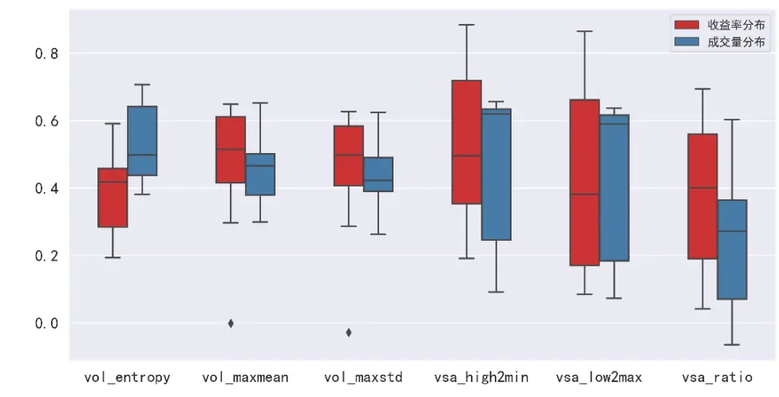
资料来源：上交所、深交所行情数据，Wind，聚源，兴业证券经济与金融研究院整理

总结而言：我们基于三个角度构建的异构成交量分布因子整体特异性保持相对较好，其中成交量分桶熵、两个极大值分布因子与 vsa_ratio 共计四个因子与基础高频因子库内的因子时序相关性较低，具有较高的特异性。

## 5.2、异构成交量因子正交化处理

基于上述的相关性分析，我们选取特异性较强且表现较好的成交量分桶熵、极大值均值、同价成交量因子中的 vsa_high2min和 vsa_ratio共计 4个因子，找出与之时序相关性最高的基础高频因子，进行正交化处理，并测试正交化后的因子表现。

表 16、4个异构成交量因子与其进行正交化处理的基础高频因子

| 异构成交量因子 | 基础高频因子 | 时序相关性 |
| --- | --- | --- |
| vsa_high2min | real_var | 0.88 |
| vol_entropy | cumsumvol_mean | 0.71 |
| vol_maxmean | rv_up | 0.65 |
| vsa_ratio | real_var | 0.69 |

资料来源：上交所、深交所行情数据，Wind，聚源，兴业证券经济与金融研究院整理

我们首先检测这四个因子在正交化后与基础高频因子库中因子的时序相关性。可 以 明显 看到 ，各 个因 子 与因 子库 中因 子的 相 关性 明显 降低 ，除vsa_high2min_Neu外，各个因子的相关性四分位数小等于0.4，最大值也几乎都小于 0.6。经过正交化后，异构因子的特异性得到了提升。

图 26、正交化后异构成交量分布因子时序相关性
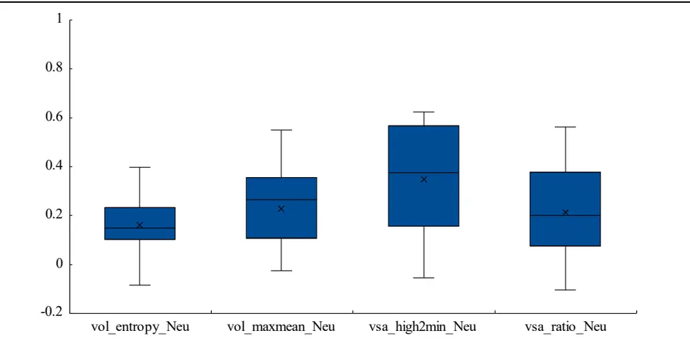
资料来源：上交所、深交所行情数据，Wind，聚源，兴业证券经济与金融研究院整理

我们对正交化后的因子进行日度测试，测试结果如下。整体上看，各个正交化后的因子表现依旧相对出色，多空夏普比率几乎都在 4以上。以对已实现方差因子进行正交化后的 vsa_ratio_Neu 因子为例，该因子的多空年化收益率为29.25%，多头年化为 15.27%，多空最大回撤仅 5%。此外，此前多头表现十分出色的成交量极大值均值因子在正交化后因子表现依旧优秀，多头年化收益率约为20%。此外，正交化后的因子IC测试表明这些因子几乎都保持了较好的选股能力。

表 17、正交化后异构成交量因子日度 IC测试结果

|  | IC均值 | IC标准差 | ICIR | T统计量 |
| --- | --- | --- | --- | --- |
| vsa_high2min_Neu | 3.29% | 9.25% | 0.36 | 15.5 |
| vol_entropy_Neu | 1.29% | 3.49% | 0.37 | 15.7 |
| vol_maxmean_Neu | 1.31% | 3.47% | 0.38 | 16.5 |
| vsa_ratio_Neu | 2.93% | 6.07% | 0.48 | 21.1 |

资料来源：上交所、深交所行情数据，Wind，聚源，兴业证券经济与金融研究院整理

表 18、正交化后异构成交量因子日度回测结果

|  | 多空收益率 | 多头收益率 | 空头收益率 | 年化波动率 | 夏普 | 最大回撤 | 胜率 | 换手率 |
| --- | --- | --- | --- | --- | --- | --- | --- | --- |
| vsa_high2min_Neu | 20.17% | 15.13% | -5.62% | 8.55% | 2.36 | -9.04% | 56.46% | 26.97% |
| vol_entropy_Neu | 16.96% | 12.33% | -3.90% | 3.56% | 4.76 | -5.01% | 63.87% | 31.84% |
| vol_maxmean_Neu | 31.45% | 19.81% | -9.89% | 7.76% | 4.05 | -12.07% | 61.03% | 20.81% |
| vsa_ratio_Neu | 29.25% | 15.27% | -10.98% | 5.98% | 4.89 | -4.98% | 61.03% | 31.52% |

资料来源：上交所、深交所行情数据，Wind，聚源，兴业证券经济与金融研究院整理

图 27、vsa_ratio_Neu 因子 IC 与累计 IC
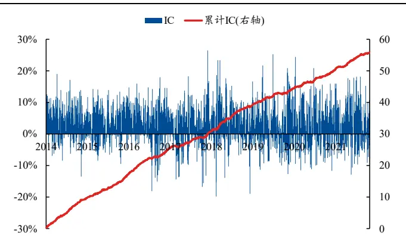
资料来源：上交所、深交所行情数据，Wind，聚源，兴业证券经济与金融研究院整理

图 28、vsa_ratio_Neu 多空净值
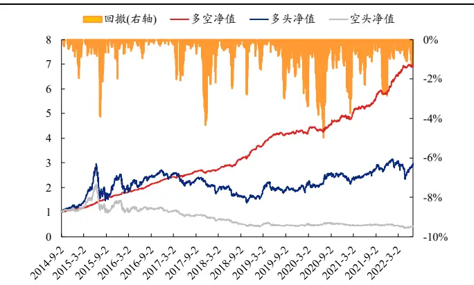
资料来源：上交所、深交所行情数据，Wind，聚源，兴业证券经济与金融研究院整理

总结而言：我们选出的四个因子在与自己相关性最高的高频因子进行正交化处理后，因子的特异性得到了明显提升，且均保持了较好的选股能力。其中成交量极大值均值因子与 vsa_ratio 这两个因子在正交化后选股效果仍十分出色，成交量极大值均值因子的多头表现依旧十分优秀。

## 6、总结

本文中，我们基于成交量的日内数据特征和分布信息，从常见分布信息出发，逐渐递进到异构成交量以及具象化的同价成交量分布，并构建了多类成交量分布因子。无论是根据数理基础出发构建的分布信息因子，还是根据投资逻辑构建的分桶熵、极大值分布以及同价成交量因子，因子均展示出优秀的选股能力。在与我们已有的 21 个基础高频因子库进行相关性测试与正交化处理后发现，部分异构或同价成交量分布因子具有较高的特异性，这进一步丰富了我们的高频因子库。

## 参考文献

[1] Hasbrouck, J. Measuring the information content of stock trades[J]. The Journal of Finance, 1991, 46 179–207.

[2] Wood, Robert A., Thomas H. McInish, and Keith Ord, 1985, An investigation of transactions data for NYSE stocks, Journal of Finance 40, 723-741

[3] Admati, R. Anat, and Paul Pfleiderer, 1988, A theory of intraday patterns Volume and price variability, The Review of Financial Studies 1, 3-40.

风险提示：模型结果基于历史数据的测算，在市场环境转变时模型存在失效的风险。

## 分析师声明

本人具有中国证券业协会授予的证券投资咨询执业资格并登记为证券分析师，以勤勉的职业态度，独立、客观地出具本报告。本报告清晰准确地反映了本人的研究观点。本人不曾因，不因，也将不会因本报告中的具体推荐意见或观点而直接或间接收到任何形式的补偿。

## 投资评级说明

| 投资建议的评级标准 | 类别 | 评级 | 说明 |
| --- | --- | --- | --- |
| 报告中投资建议所涉及的评级分为股票评级和行业评级（另有说明的除外)。评级标准为报告发布日后的12个月内公司股价（或行业指数）相对同期相关证券市场代表性指数的涨跌幅。其中：A股市场以上证综指或深圳成指为基准，香港市场以恒生指数为基准；美国市场以标普500或纳斯达克综合指数为基准。 | 股票评级 | 买入 | 相对同期相关证券市场代表性指数涨幅大于15% |
|  |  | 审慎增持 | 相对同期相关证券市场代表性指数涨幅在5%~15%之间 |
|  |  | 中性 | 相对同期相关证券市场代表性指数涨幅在-5%~5%之间 |
|  |  | 减持 | 相对同期相关证券市场代表性指数涨幅小于-5% |
|  |  | 无评级 | 由于我们无法获取必要的资料，或者公司面临无法预见结果的重大不确定性事件，或者其他原因，致使我们无法给出明确的投资评级 |
|  | 行业评级 | 推荐 | 相对表现优于同期相关证券市场代表性指数 |
|  |  | 中性 | 相对表现与同期相关证券市场代表性指数持平 |
|  |  | 回避 | 相对表现弱于同期相关证券市场代表性指数 |

## 信息披露

本公司在知晓的范围内履行信息披露义务。客户可登录 www.xyzq.com.cn 内幕交易防控栏内查询静默期安排和关联公司持股情况。

## 使用本研究报告的风险提示及法律声明

兴业证券股份有限公司经中国证券监督管理委员会批准，已具备证券投资咨询业务资格。

本报告仅供兴业证券股份有限公司（以下简称“本公司”）的客户使用，本公司不会因接收人收到本报告而视其为客户。本报告中的信息、意见等均仅供客户参考，不构成所述证券买卖的出价或征价邀请或要约，投资者自主作出投资决策并自行承担投资风险，任何形式的分享证券投资收益或者分担证券投资损失的书面或口头承诺均为无效，任何有关本报告的摘要或节选都不代表本报告正式完整的观点，一切须以本公司向客户发布的本报告完整版本为准。该等信息、意见并未考虑到获取本报告人员的具体投资目的、财务状况以及特定需求，在任何时候均不构成对任何人的个人推荐。客户应当对本报告中的信息和意见进行独立评估，并应同时考量各自的投资目的、财务状况和特定需求，必要时就法律、商业、财务、税收等方面咨询专家的意见。对依据或者使用本报告所造成的一切后果，本公司及/或其关联人员均不承担任何法律责任。

本报告所载资料的来源被认为是可靠的，但本公司不保证其准确性或完整性，也不保证所包含的信息和建议不会发生任何变更。本公司并不对使用本报告所包含的材料产生的任何直接或间接损失或与此相关的其他任何损失承担任何责任。

本报告所载的资料、意见及推测仅反映本公司于发布本报告当日的判断，本报告所指的证券或投资标的的价格、价值及投资收入可升可跌，过往表现不应作为日后的表现依据；在不同时期，本公司可发出与本报告所载资料、意见及推测不一致的报告；本公司不保证本报告所含信息保持在最新状态。同时，本公司对本报告所含信息可在不发出通知的情形下做出修改，投资者应当自行关注相应的更新或修改。

除非另行说明，本报告中所引用的关于业绩的数据代表过往表现。过往的业绩表现亦不应作为日后回报的预示。我们不承诺也不保证，任何所预示的回报会得以实现。分析中所做的回报预测可能是基于相应的假设。任何假设的变化可能会显著地影响所预测的回报。

本公司的销售人员、交易人员以及其他专业人士可能会依据不同假设和标准、采用不同的分析方法而口头或书面发表与本报告意见及建议不一致的市场评论和/或交易观点。本公司没有将此意见及建议向报告所有接收者进行更新的义务。本公司的资产管理部门、自营部门以及其他投资业务部门可能独立做出与本报告中的意见或建议不一致的投资决策。

本报告并非针对或意图发送予或为任何就发送、发布、可得到或使用此报告而使兴业证券股份有限公司及其关联子公司等违反当地的法律或法规或可致使兴业证券股份有限公司受制于相关法律或法规的任何地区、国家或其他管辖区域的公民或居民，包括但不限于美国及美国公民（1934年美国《证券交易所》第 15a-6条例定义为本「主要美国机构投资者」除外）。

本报告的版权归本公司所有。本公司对本报告保留一切权利。除非另有书面显示，否则本报告中的所有材料的版权均属本公司。未经本公司事先书面授权，本报告的任何部分均不得以任何方式制作任何形式的拷贝、复印件或复制品，或再次分发给任何其他人，或以任何侵犯本公司版权的其他方式使用。未经授权的转载，本公司不承担任何转载责任。

## 特别声明

在法律许可的情况下，兴业证券股份有限公司可能会持有本报告中提及公司所发行的证券头寸并进行交易，也可能为这些公司提供或争取提供投资银行业务服务。因此，投资者应当考虑到兴业证券股份有限公司及/或其相关人员可能存在影响本报告观点客观性的潜在利益冲突。投资者请勿将本报告视为投资或其他决定的唯一信赖依据。

## 兴业证券研究

| 上海 |  |  | 深圳 |
| --- | --- | --- | --- |
|  | 地址：上海浦东新区长柳路36号兴业证券大厦 | 地址：北京市朝阳区建国门大街甲6号SK大厦 | 地址：深圳市福田区皇岗路5001号深业上城T2 |
| 15层 |  | 32层01-08单元 | 座52楼 |
| 邮编：200135 |  | 邮编：100020 | 邮编：518035 |
|  | 邮箱：research@xyzq.com.cn | 邮箱：research@xyzq.com.cn | 邮箱：research@xyzq.com.cn |