分析师：

郑兆磊

zhengzhaolei@xyzq.com.cn

S0190520080006

## 报告关键点

本文中，我们基于高频数据对市场微观结构进行观察与剖析。我们从深度、紧密度和弹性三个维度共同衡量流动性，并确定了指标在趋势分析、奇异点判断、择时方面的应用。在趋势应用上，我们基于个股计算得到的流动性指标复合到行业、宽基乃至全市场，分析其相对自身变化趋势或相对其他板块的变化趋势。在奇异点应用上，我们基于个股数据构建了市场流动性警示信号，以提示当日某些流动性特性的异动。在择时应用上，我们将上述的定性分析与定量测试结果结合，构建了一套基于微观结构流动性的择时体系。

## ＃相关报告related

《高频漫谈》2022-01-04

《高频研究系列二—收益率分布因子构建》2022-01-23《高频研究系列三—收益率分布中的 Alpha(2)》2022-05-04《高频研究系列四—成交量分布中的 Alpha》2022-08-29

# 高频研究系列五—市场微观结构剖析

2022 年 11 月 9 日

## 投资要点

2022 年以来，兴证金工团队先后推出了阐述高频研究方法论的《高频漫谈》，以及高频因子系列深度研究。本文中，我们不再聚焦高频因子构建，而是基于高频数据对市场微观结构进行观察与剖析。

我们从深度、紧密度和弹性三个维度共同衡量流动性：深度对应着不影响报价的情况下购买或出售一定数量资产的能力、紧密度对应着同一时间内买入和卖出一项资产的价格差异、弹性对应着资产价格从冲击中恢复的能力。我们在三个维度内分别引入两个指标来衡量市场微观结构的流动性，共计六个指标。我们进一步确定了指标在趋势分析、奇异点判断、择时方面的整体应用。

⚫ 在趋势应用上，我们基于个股计算得到的流动性指标复合到行业、宽基乃至全市场，分析其相对自身变化趋势或相对其他板块的变化趋势。具体地，我们针对全市场、大小盘以及中信一级行业做出了趋势性分析。

⚫ 在奇异点应用上，我们基于个股数据构建了市场流动性警示信号，以提示当日某些流动性特性出现异常。结果表明，在流动性出现明显异常的日期下，市场均出现了不同程度的异动。

在择时应用上，我们将上述的定性分析与定量测试结果结合，构建了一套基于微观结构流动性的择时体系。截至2022年10月底，策略的多空年化收益率为34.9%，多头收益率为20.0%。此外，多空策略的收益风险比为1.34，收益回撤比为1.03，具有较好的风险控制能力。在针对不同宽基、不同参数的敏感性测试下，策略表现均明显战胜基准，具有较好的普适性。

核心图、基于万得全A指数的微观结构择时策略
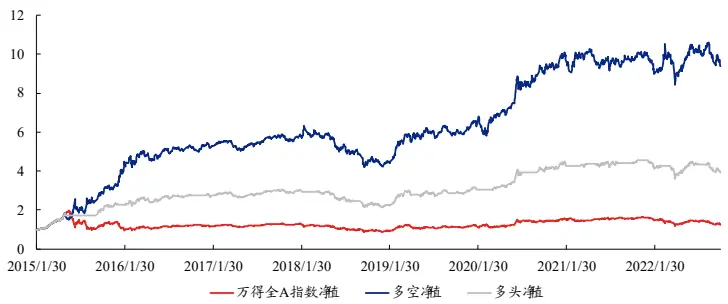
资料来源：Wind，上交所、深交所行情数据，兴业证券经济与金融研究院整理注：回测区间为 2015 年 1 月 30 日至 2022 年 10 月 31 日

风险提示：模型结果基于历史数据的测算，在市场环境转变时模型存在失效的风险。 风险提示：模型结果基于历史数据的测算，在市场环境转变时模型存在失效的风险。

## 报告正文

## 1、承前启后—高频研究回顾与微观结构研究之旅

2022 年以来，兴证金工团队先后推出了阐述高频研究方法论的《高频漫谈》，以及高频因子系列深度研究。其中，在高频漫谈中，我们阐述了高频因子的构建逻辑、因子的回测方法以及高频风险的识别。在高频因子的相关研报中，我们构建了多个各具特色的高频选股因子，其中包括收益率噪音偏离 nos 因子、极端上涨和极端下跌exRtn因子、基于混合高斯分布构建的gmm因子、基于同价成交量分布构建的vsa因子等。截至上篇报告，兴证金工高频因子库中共有2 个因子。

表 1、兴证金工高频系列研究内容回顾

| 内容 | 简介 |
| --- | --- |
| 高频研究系列一：高频 漫谈 | 简述高频因子四种构建逻辑、简述高频因子回测方法、通过经验风险模型与统计风险 模型衡量高频风险。 |
| 高频研究系列二：收益 率分布因子构建 | 基于收益率分布信息构建六个常见收益率分布因子，以及两个收益率噪音偏离因子 nos 因子。 |
| 高频研究系列三：收益 率分布中的 Alpha(2) | 根据投资者对极端上涨和极端下跌的心理承受能力不同构建极端上涨和极端下跌因 子；从日内跳价的信息中刻画大额投资者对于股票的操作能力，并进一步构建高频因 子；从日内震荡期和跳价期的信息差异中刻画股票的日内价格弹性并进一步构建选股 Alpha 因子。 |
| 高频研究系列四：成交 量分布中的 Alpha | 根据分钟成交量的不稳定性与成交量极值构造日内成交量分桶熵和极大值布因 子。此外，我们将日内成交量按收盘价异构，得到同价成交量分布，以此将数据具象 化。基于具象化的分布局部特征和全局特征，我们构建了三个同价成交量分布因子。 |

资料来源：兴业证券经济与金融研究院整理

本文中，我们不再聚焦高频因子构建，而是基于高频数据对市场微观结构进行观察与剖析。市场微观结构通常用于分析资产交易价格的形成过程、运作机制与交易情况。对于股票市场而言，日内资产交易价格的形成过程与交易情况通常由日内高频数据体现，并向外反映至行业、宽基乃至市场整体的价格走势与交易情况。因此，与宏观和中观的市场监控指标类似，市场微观结构指标同样是市场监测指标的一种。在文中，我们将引入多个指标来衡量市场微观结构的流动性。本文的结构如下：

1、首先简析市场微观流动性的三大维度：深度、紧密度与价格弹性，并从这三大维度出发，构建六个市场微观流动性指标；

2、之后，我们基于上述流动性指标，确定了三类针对全市场、宽基、行业以及个股的市场趋势分析与风险监控应用场景，包括时序上的趋势分析、截面上的相对比较以及异常点的监测；

3、最后，我们结合微观结构流动性指标与第三部分的应用场景，搭建了一套基于微观结构流动性的择时体系。

## 2、虑周藻密—市场微观流动性指标介绍

## 2.1、图解市场微观流动性

广义上的市场流动性通常包含宏观、中观和微观三个层面。在宏观层面，流动性主要指代货币供给，如 IPO规模、外资流入等；中观流动性主要是指金融市场整体的交易流动性、如市场成交量、换手率、杠杆等；而微观流动性则需要深入到日内的交易层面，通过日内行情数据，多维度地衡量交易流动性资产的难易程度或交易双方力量上的平衡程度。因此，微观流动性本质上是在衡量市场建立和 或解除头寸的时间成本，抑或是能否在短时间内建立和 或解除大量的头寸，而不造成价 上的重大损失 ，也就是价 成本 。在下文中，我们将从深度、紧密度和弹性三个维度共同衡量流动性，并基于某一流动资产的成交量-资产价格图展示不同维度所代表的特性。

图 1、图解市场微观流动性
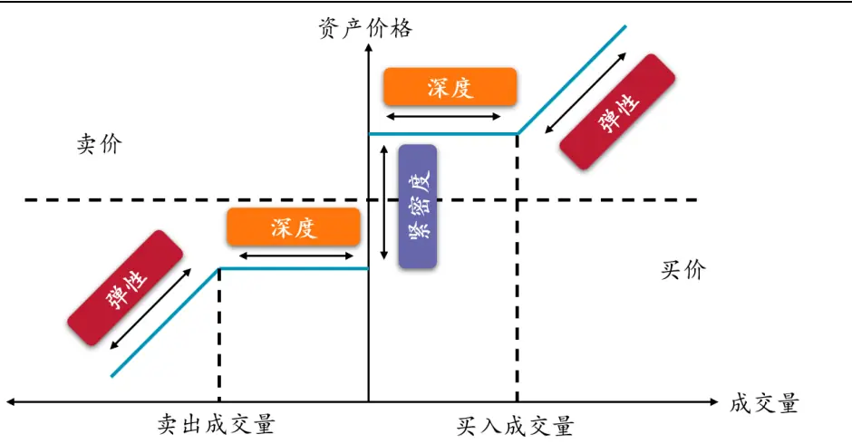
资料来源：兴业证券经济与金融研究院整理

上图形象地展示了某一流动性资产成交量与资产价格之间的关系。其中，横轴代表的是成交量，纵轴表示当前成交量下对应的资产成交价格，蓝线则代表着不同成交量对应的价格变化。纵轴的右侧代表着买入该流动资产对应的价格变动，左侧则代表着卖出。图中的各个矩形则是本张图的重点，其分别代表着不同的微观流动性维度：深度、紧密度与弹性。

1、深度：深度指在不影响报价的情况下购买或出售一定数量资产的能力，同时也指代多空双方在交易量上的平衡性。通常来说，大额交易会对资产价格产生影响，而如果某项流动资产的交易深度足够大，多空双方的交易量足够平衡，投资者便可以在不影响资产价格的情况下，买 卖较大单位的资产。对应至图中时，买卖成交量的差便代表着市场深度（橙色方块）。一旦超过该范围，交易将会对资产价格产生冲击；

2、紧密度：紧密度通常代表着在同一时间内买入和卖出一项资产的价格差异。抑或者，紧密度是投资者可以短时间内以近似接近的价格买卖同一个资产的能力。这与市场的交易成本有关：较紧密的市场代表着市场参与者在购买或出售资产时面临较小的交易成本，此时需求和供给存在着相对平衡的关系。对应至图中时，纵轴上买价和卖价之间的差额代表市场紧密度（蓝色方块）。较低的买卖价差意味着交易者能够以较小的成本在当前时刻买入 卖出流动资产，此时紧密度较高。更进一步，随着价差的减少，买入价和卖出价将逐步接近虚线，这意味着该资产趋近于“完美的”流动性水平；

3、弹性：价格弹性指的是股价受到冲击后的恢复速度。市场弹性涉及到流动资产吸收冲击和从冲击中恢复的能力。如果有很多订单来应对价格的变化，并纠正冲击带来的订单失衡，那么市场就是有弹性的。对应至图中时，买入成交量和卖出成交量外的价格变动斜率便代表着市场的价格弹性（红色方块）。在买入（卖出）的情况下，一个超过阈 的 额外单位交易量的边际影响增加（减少）对应着价格弹性的优劣。

不难看出，上述维度在性质上各有不同，但其同样存在相互关联的关系。举例来说，市场深度和价格弹性相互关联，因为这两个方面都依赖于均衡价格中的成交量阈 。 除上述流动性的三个维度之外，我们还知道：相比于日度或其他频率，日内的价格波动会更加剧烈，这种剧烈的扰动对于投资者的心理干扰极大。因此，我们在后续会进一步针对市场极端行情进行指标的刻画与预警信号的构建，比如针对“闪电崩盘”刻画和预警。接下来，我们将首先在三个流动性维度下，各引入两个指标以刻画各个维度的特性。

## 2.2、高频数据简析

在介绍指标之前，我们先简单介绍下文中将使用到的高频基础数据。具体来说，我们基于分钟级高频数据构建流动性指标，并主要使用分钟级别的行情数据（“高开低收”价格数据、成交量、成交额）以及盘口快照数据。其中需要注意的是，“高开低收”价格数据均是基于成交价格计算得到，快照数据是暂未成交的“挂单”价格。

表 2、分钟级别行情高频数据简析

| 数据名称 英文名称 数据意义 |  |  |
| --- | --- | --- |
| 开盘价最高价最低价收盘价 | openhighlowclose | 基于交易所交易明细，在分钟区间内（左开右闭）基于成交价格对应计算得到。 |
| 成交量成交额 | volumeamount | 基于交易所交易明细，在分钟区间内（左开右闭）基于成交量累计得到。基于交易所交易明细，在分钟区间内（左开右闭）基于成交额累计得到。 |
| 买一价卖一价 | bid(1)ask(1) | 为最后一笔快照数据中未成交的最高的买盘价。为最后一笔快照数据中未成交的最低的卖盘价。 |

资料来源：兴业证券经济与金融研究院整理

## 2.3、市场深度：订单比率与 shallowLIX

在上文中，我们提及市场深度是指在不影响报价的情况下购买或出售一定数量资产的能力。举例来说，由于大额交易会对资产价格带来冲击，若某一资产在相对较小交易量的冲击下便出现了价格波动，那么该流动资产的深度相对较小。反之则认为该资产的深度相对较大，可以以较小的成本容纳更多地交易行为。在本维度下，我们引入订单比率Order Ratio与shallowLIX指标衡量市场微观结构中的深度。

## ⚫ 订单比率 Order Ratio

订单比率（Order Ratio，以下简称 OR）通过计算买卖双方订单上的不平衡性以衡量资产的深度。其计算公式如下：

$$
OrderRatio=\frac{\left|\sum_{i=1}^{m}VBuy_{i}-\sum_{j=1}^{k}VSell_{j}\right|}{\sum_{n=1}^{N}V_{n}}\tag{1}
$$

其中 $\textstyle\sum_{i=1}^{m}VBuy_{i}$ 代表着一天中以买方驱动的分钟级别成交量之和、$\textstyle\sum_{j=1}^{k}VSell_{j}$ 代表着一天中以卖方驱动的分钟级别成交量之和、 $\textstyle\sum_{n=1}^{N}V_{n}$ 则为日内分钟级别成交量之和。不难看出，OR 指标反映了资产成交量上的不平衡性，因其随着分子的变大而上升。因此，较高的订单比率表示较低的资产深度，以及低流动性。在具体计算中，我们引入 LR 算法，将分钟级别的行情数据划分为买方驱动与卖方驱动，具体算法参见附录 1。该指标以分钟级别数据计算，并最终得到日度指标。

我们基于 2022 年 8 月 31 日的数据，计算截面上个股的订单比率 OR，按照当日流通市 降序分组（ Top组流通市 最大），统计各组内 OR指标的中位数。可以明显看出，OR 指标从左往右呈现出递增的趋势，这表明大市 股票的市场深度相对较大，而小市 股票则相对较小。

图 2、Order Ratio 流通市 分布情况
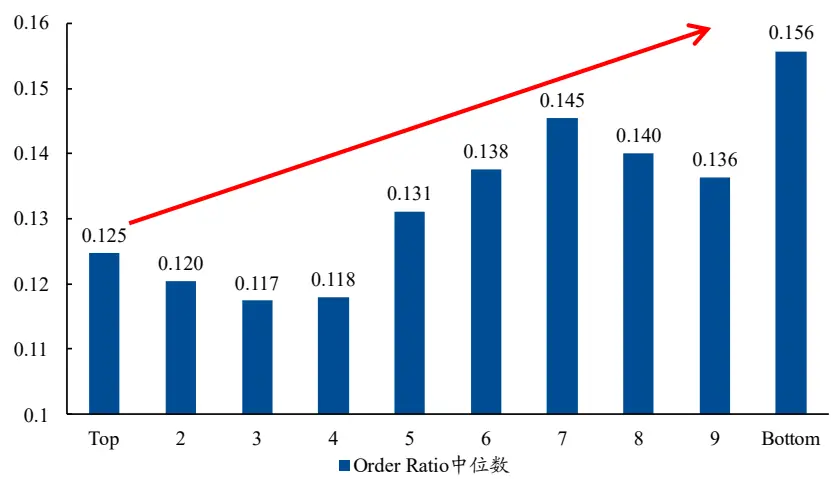

资料来源：Wind，上交所、深交所行情数据，兴业证券经济与金融研究院整理数据日期：2022年8月 31日

## ⚫ shallowLIX 指标

shallowLIX 本质上是描述一类问题：从交易员的角度来看，一位投资者可以买入或卖出多少钱而不改变当前流动资产的价格？抑或者说：一位投资者需要多少资金来创造流动资产一个单位的价格变动？由此，我们基于价格波动与成交金额，刻画 shallowLIX指标，具体公式如下：

$$
shallowLIX_{t}=\log_{10}\left(\frac{Amount_{t}}{P_{t}^{H}-P_{t}^{L}}\right)\tag{2}
$$

其中， $P_{t}^{H}$ 和 $P_{t}^{L}$ 分别代表分钟级别的最高价与最低价，分母则代表着两者的差异，即价格波动。分子为分钟级别的成交额，代表着金额对于价格波动的影响。我们将该指标以 10 为底取对数，以防止该指标的量级过大。在此基础上，对于股票来说，创造 1 个单位价格波动所需的资本量可以估计为10sℎallowLIXt个单位资金。因此，该指标越大，说明创造同样单位的价格波动所需要的资金量越大，该流动性资产的深度越大，流动性越好。该指标以分钟级别数据计算，并最终得到分钟级别的数 。在剔除日内异常 后（ 分位数去极 ），我们进一步取均得到最终的日度指标。

我们基于2022年8月 31日全市场个股，计算shallowLIX指标，并进一步统计个股截面中位数，以近似代表全市场日内shallowLIX指标变化，见下图。可以看出，在8月31日当日，市场整体深度呈现出相对明显的时序“U型”分布特征：即市场在开盘与收盘阶段的深度相对较高，流动性较好。这也与市场日内成交量时序分布和投资者目前的基本认知相符：日内的成交量在时序上大多呈“U 型”分布，且投资者倾向于在开盘与收盘阶段进行交易。

图 3、shallowLIX指标与中证全指日内走势
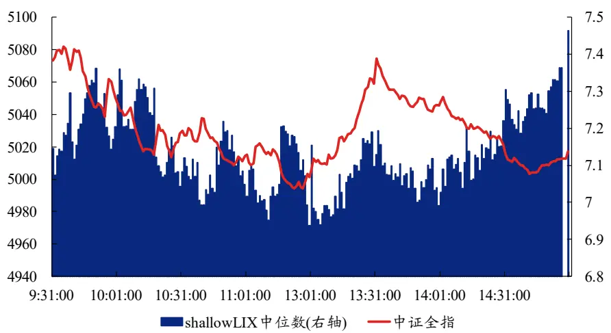
资料来源：天软，上交所、深交所行情数据，兴业证券经济与金融研究院整理数据日期：2022年8月 31日

## 2.4、市场紧密度：报价差与有效价差

紧密度通常代表着在同一时间以差不多相同的价格买入和卖出一项资产的能力或代价。本质上紧密度与交易成本息息相关：紧密度较高的市场是指订单簿上需求和供给价上的平衡，间接表明市场交易者在购买或出售资产时能够找出与自己目标相对匹配的报价单，从而具有较低的交易成本。与买卖价差有关的代理变量是衡量市场紧密度的最常用的指标之一。卖方出价和买方出价之间的差异约等于交易时产生的成本，同时决定买卖价差的主要因素是固定成本、逆向选择成本和库存成本。价差指标越小，市场的紧密度越高，流动性越好。

## ⚫ 报价差 quotedSpread

报价差（简称 QS）是用来衡量市场紧密度性的首选方法之一，其衡量的是流动性资产买卖价格之间的差异。该差异越大，说明流动资产的价格波动相对较大，使得特定头寸能够盈利。因此，价差越小，意味着市场紧密度越高。该指标的计算方法为买卖价差除以买一价和卖一价的简单平均 。

$$
QS_{j}=\frac{askprice_{j}^{(1)}-bidprice_{j}^{(1)}}{0.5\left(askprice_{j}^{(1)}+bidprice_{j}^{(1)}\right)}\tag{3}
$$

其中， $askprice_{j}^{(1)}$ 为第j分钟的卖一价、 $bidprice_{j}^{(1)}$ 为第j分钟的买一价。该指标以分钟级别数据计算，并最终得到分钟级别的指标。在剔除日内异常 后（分位数去极 ），我们进一步按分钟成交量加权得到最终的日度指标。

## ⚫ 有效价差 effectiveSpread

有效价差（简称 ES）在报价差的基础上考虑了最后的交易价，是用来衡量实际的交易成本。交易价格接近挂单价格中买一价与卖一价的中部时，意味着交易发生在合理价差内，此时交易成本较低；反之，交易价格大于两者的均 时说明特定头寸能够基于优势盈利，另一方的交易成本将较大。因此，有效价差指标越低，市场的紧密度越高，流动性越好。该指标的计算方法如下。

$$
ES_{j}=\frac{2\left|tradeprice_{j}-0.5\left(askprice_{j}^{(1)}+bidprice_{j}^{(1)}\right)\right|}{0.5\left(askprice_{j}^{(1)}+bidprice_{j}^{(1)}\right)}\tag{4}
$$

其中，tradeprice 为第 j 分钟的收盘价， $askprice_{j}^{(1)}$ 为第 j 分钟的卖一价、$bidprice_{j}^{(1)}$ 为第 j 分钟的买一价。该指标以分钟级别数据计算，并最终得到分钟级别的指标，我们进一步按分钟成交量加权得到最终的日度指标。

我们同样基于2022年8月31日全市场个股，计算QS和ES指标，并进一步统计个股截面中位数，以近似代表全市场日内两个指标的变化趋势，见下图。在8月31日当日，市场的紧密度在开盘阶段指标数 较高， 这一特征表明开盘阶段市场价格紧密度较低，反映出交易成本相对较大。这可能是由集合竞价期间未成交的委托单导致。除此之外，8月31日当日市场上午的价格走势波动较大，价差指标显示市场当时紧密度相对较差，这与我们对于指标的认知以及其自身的定义相一致。

图 4、市场紧密度指标与中证全指日内走势
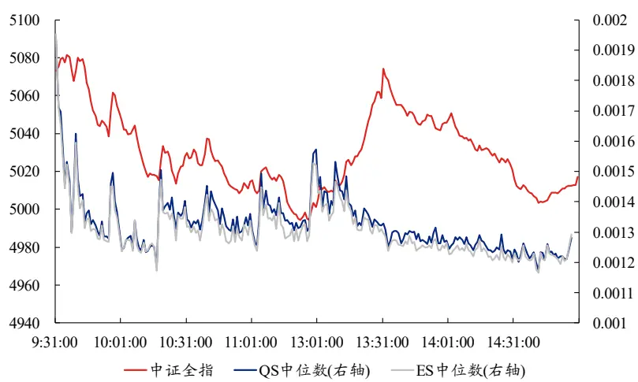
资料来源：天软，上交所、深交所行情数据，兴业证券经济与金融研究院整理数据日期：2022年8月 31日

## 2.5、市场价格弹性：交易弹性与 Roll指标

前文中提及，价格弹性通常是指流动性资产受到冲击后的恢复速度，抑或者说是交易者在对报价影响不大的情况下买入或卖出一定数量资产的能力。因此，弹性涉及到资产吸收冲击以及从冲击中恢复的能力。举例来说，如果有很多订单来应对价格的变化，并纠正冲击带来的订单失衡，那么市场就是有弹性的。在本维度下，我们引入交易弹性 elatricityTrading与修正后的 Roll指标衡量市场微观结构中的价格弹性。

## ⚫ 交易弹性 elatricityTrading

交易弹性通过计算股价与成交量的边际变化比 ，来描述价格相对于成交量的变化速度。交易弹性指标越大，说明交易的边际变化度越高，流动性资产的价格弹性越高。该指标的具体公式如下：

$$
eletricityTrading_{j}=\frac{\%\Delta T_{j}}{\%\Delta P_{j}}\tag{5}
$$

其中，%∆T为第j分钟成交量的变化率、%∆P为第j分钟收盘价的变化率。该指标以分钟级别数据计算，并最终得到分钟级别的指标，我们进一步计算均（分位数去极 ） 得到最终的日度指标。下图同样以 2022年 8月 31日为例进行展示，可以看出当日交易弹性变化不大，仅在开盘、尾盘以及午休后相对较好，这可能是因为市场当时整体的交易量较大（同样量级的成交量在开盘与中段对于价格的影响显然不同）。在实际计算中，我们剔除开盘与尾盘最后一项数据以避免其造成的估计误差。

图 5、elatricityTrading 指标与中证全指日内走势
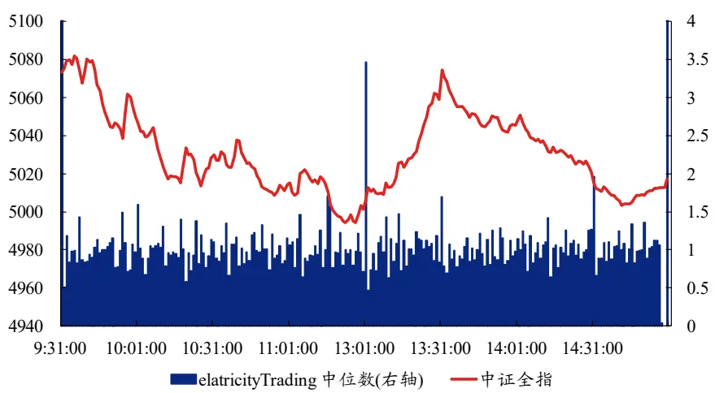
资料来源：天软，上交所、深交所行情数据，兴业证券经济与金融研究院整理数据日期：2022年8月 31日

## ⚫ 修正的 Roll指标

Roll 指标由 Roll 于 1984 年提出，并被学者们进行了多次修正改进。其核心思路在于：一项资产若缺乏流动性，会导致其价格中存在暂时性的价格变动成分（即前一时间段残留的价格变动）。由于暂时性的价格变动会导致资产价格变动出现负相关，因此可以用相对价格变动的自变量的负数作为非流动性的衡量标准。该指标越大，说明流动性越弱。其具体计算公式如下：

$$
\gamma_{j}=-cov\big(\Delta p_{j},\Delta p_{j+1}\big)\tag{6}
$$

其中， $\Delta p_{j}$ 为第j分钟收盘价相对于前一分钟的差 。 该指标以分钟级别数据计算，并最终得到日度级别的指标。我们同样基于 2022年 8月 31日的数据，计算截面上个股的Roll指标，按照当日流通市 降序分组（ Top组流通市 最大），统计各组内Roll指标的中位数。可以看出，Roll指标对于小盘股尤其敏感，当期流通市 越小， Roll指标相对越大，其资产价格弹性较差。

图 6、Roll指标流通市 分布情况
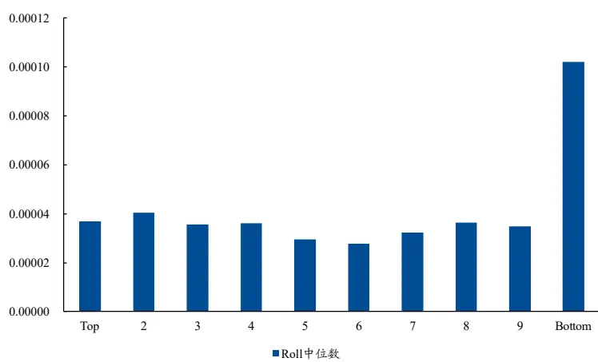
资料来源：Wind，上交所、深交所行情数据，兴业证券经济与金融研究院整理数据日期：2022年8月 31日

## 2.6、阶段性总结—市场微观结构流动性指标与历史分位数指标

至此，我们从深度、紧密度和弹性三个维度（以下统称为流动性一级指标）共同衡量流动性，并基于成交价、成交量、成交额、买卖单价等多个数据，计算得到 6个二级指标，每个二级指标都有其独有的特性。我们在此展示 6个指标的特性与分类。

表 3、微观结构流动性指标汇总

| 一级指标 | 二级指标 | 指标定义 | 顺序 |
| --- | --- | --- | --- |
| 深度 | 订单比率 Order Ratio | 买卖双方订单上的不平衡性 | 升序 |
|  | shallowLIX | 创造同样单位的价格波动所需要的资金量 | 降序 |
| 紧密度 | 报价差 QS | 流动性资产买卖价格之间的差异 | 升序 |
|  | 有效价差ES | 买卖价差与实际交易成本结合 | 升序 |
| 弹性 | 交易弹性 elatricityTrading | 价格相对于成交量的变化速度 | 降序 |
|  | 修正的 Roll 指标 | 暂时性的价格变动成分相对大小 | 升序 |

资料来源：兴业证券经济与金融研究院整理

需要注意的是，由于基于日内数据计算的指标变化较大，同时部分指标受市的影响较大，不利于指数或板块间的比较。 因此我们需要在时序进行平滑处理。我们引入下述方式合成深度、紧密度与价格弹性的历史分位数指标，以满足指标在时序上可比。具体计算方式如下：

1. 基于个股计算得到的日度二级指标（二级指标为一个T×N的矩阵，N为股票个数，T为日度日期长度），按照分析对象（如全市场、宽基或行业）的不同，首先在成份股股票池内剔除异常 （ 分位数去极 ），再进行加权（如按照流动市 加权、指数权重加权）得到二级指标；

2. 计算六个二级指标过去一年的历史分位数，并将二级指标的历史分位数按照顺序统一调整为降序，得到六个二级指标的历史分位数时序 。指标越大，对应的流动性属性越好；

3. 以深度为例，基于两个深度二级指标的历史分位数时序 ，求平均得到一级指标的历史分位数指标。至此可得到深度、紧密度与价格弹性的历史分位数指标。指标越大，流动性越好。

在此前的章节中，我们基于订单比率 OR 指标阐明：我们构造出的深度指标在大市 股票中更优，并随着市 的变化有着一定的趋势。这一点显然是由于大市 股票本身便带有较大的流动性。在具体分析时，我们需要减少市 对于趋势分析造成的干扰。我们同样以订单比率为例，展示经过历史分位数处理后，其指标中位数在不同流通市 分组内的情况。可以看出，经过历史分位数处理后，深度指标在市 内已经没有明显的趋势。 因此，历史分位数的处理方式能够较好地降低市 对于流动性分析带来的干扰。

图 7、订单比率历史分位数在流通市 分组下的分布情况
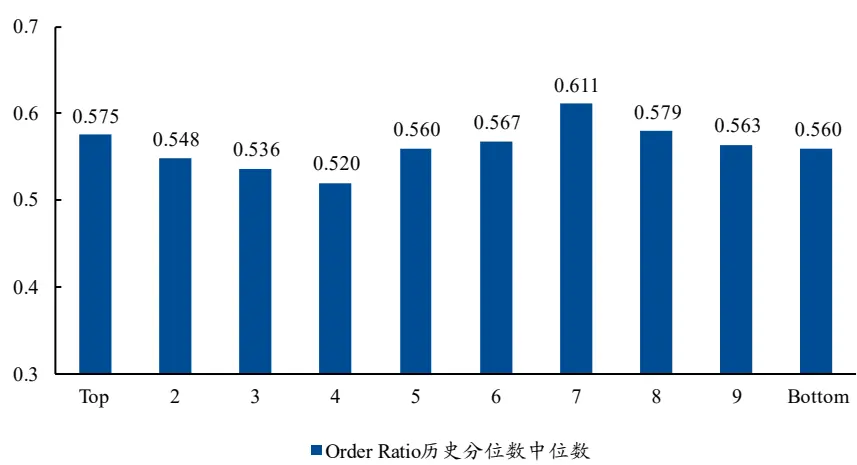
资料来源：Wind，上交所、深交所行情数据，兴业证券经济与金融研究院整理数据日期：2022年8月 31日

我们以全市场为例，计算得到上述 6个二级指标的历史分位数时序 ，并展示6个二级指标的时序相关性。可以看出，除了QS与ES两个价差指标之外，其他指标的历史分位数时序 相关性较低。由于 QS和ES的相关性较高，因此在计算紧密度时，我们直接使用 QS指标指代紧密度。

表 4、二级指标历史分位数时序相关性
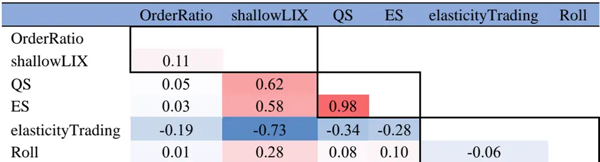
资料来源：上交所、深交所行情数据，兴业证券经济与金融研究院整理

在下文中，除额外说明外，我们均基于二级与一级指标的历史分位数进行趋势分析。

## 3、以微知著—基于市场微观结构的市场监控应用

在上文中，我们从深度、紧密度和弹性三个一级指标共同衡量流动性，并构建了 6个二级指标。在下文中，基于其中的 5个指标，我们首先会确定应用场景（如市场风险监控、宽基或行业间流动性比较等），再基于应用场景进行趋势判断或市场异动点的监控。

## 3.1、市场流动性趋势变化分析

在本章节中，我们首先基于上述计算出的指标，分析市场流动性的趋势性变化。具体来说，我们想要通过市场的微观结构，分析三类指标在市场、宽基与行业时序的趋势。

## 3.1.1、全市场流动性趋势性变化

我们引入上述方式合成深度、紧密度与价格弹性三个一级指标的历史分位数（计算公式见 2.6），以满足指标在时序上可比。为了较为直观地展示出指标的变化趋势，我们在下方表中展示指标的 20日移动均线。

我们首先观察弹性指标的历史分位数变化趋势。从下图中可以看出，在市场处于当期极高位置时（以图中 2015、2019、2021 年中下旬为例），市场微观结构深度处于历史高位；市场处于低位，且后续出现反弹的位置时（以 2016 年初、2018年末以及2022年 4月为例），通常市场深度较低。究其原因，在市场处于极高位置时，通常伴随着市场出现了较高的趋同性，且热度较高，多空双方均有大量交易；反之，在市场处于极低位置时，不仅市场交易热度降低，同时也是多空双方力量相对悬殊的位置。在市场低位的情景下，订单比率中买卖方的成交量差异较大，同时分钟级别的最高价和最低价差异较小。因此，微观结构深度指标同时表示着市场深度与多空双方的交易平衡性，能够结合市场走势与指标的历史分位数极端 ，对市场底部和顶部做出一定的预测。

图 8、市场深度历史分位数与万得全 A指数走势
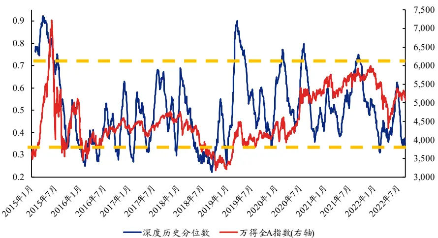
资料来源：Wind，上交所、深交所行情数据，兴业证券经济与金融研究院整理注：图中指标已取过去 20日均

我们进一步观察紧密度指标的历史分位数变化趋势。紧密度表述的是买卖双方在报价上的差异。整体上看，市场紧密度变化趋势与市场涨跌整体呈现正向变化趋势。在市场上行过程中，往往是交易相对活跃的阶段，因此多空双方均能够在市场上找到合适的对手方进行交易。反之，在市场处于下行状态时，市场整体交易热度相对较低，买卖双方难以找到合适的对手方，使得交易成本变大。下图橙色虚线圈出的时间段内，紧密度指标和市场走势几乎贴合，包括 2016 年起的市场熔断到慢慢均衡、2018年的市场缩量以及 2019年的春季行情。以2018年为例，该年为典型的“缩量熊市”，在“中美贸易战”与“去杠杆”的背景下，市场全年单边下行，成交额也降至近年来低位。在此环境下，A 股市场紧密度指标处于历史低位，市场活跃度较低，交易成本较大。此外，在 2020 年初，“新冠”疫情在中国爆发，此时市场不稳定情绪极高，市场波动率极大，紧密度短时间内大幅降低。2020年3月起，央行年内实施了三次降准，超预期地下调了超额存款准备金利率，以及 OMO 降息等政策，市场流动性与市场信心得到支持。从紧密度的角度分析，2020年3月起指标历史分位数逐步恢复至较高水平，整体走势与此前市场环境相比配。由此看出，紧密度指标侧面反映了市场的交易热度。

图 9、市场紧密度历史分位数与万得全 A指数走势
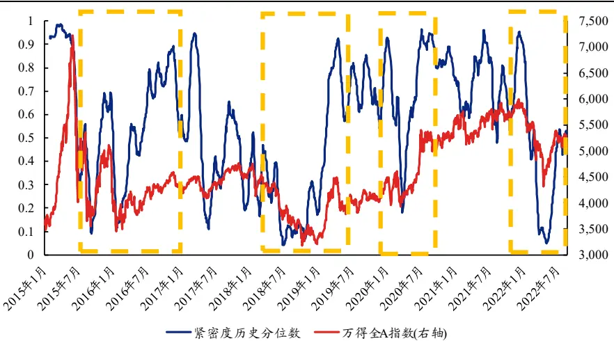
资料来源：Wind，上交所、深交所行情数据，兴业证券经济与金融研究院整理注：图中指标已取过去 20日均

最后我们观察市场价格弹性的历史分位数变化趋势。价格弹性指的是股价受到冲击后的恢复速度，对于市场而言，价格弹性侧面反映了当下市场的价格稳定性。在市场整体出现大幅或频繁的趋势性变动时，市场往往存在较强的动量效应，受到冲击后的价格难以出现快速的恢复。从图中虚线的趋势上看，在 2016年初市场经过一系列动荡后，年内中旬市场趋于平稳，市场进入相对稳定的“慢牛”趋势，此时市场弹性较大。除此之外，在 2019 年，市场经过快速上涨后，市场整体出现溢价，价格处于相对的虚高状态，此时弹性指标大幅下降，后期反应也趋于平淡，市场需要消化此前上涨带来的价格变动。因此，总体来说，市场价格弹性反映的更多是市场目前是否存在较强的趋势性行情。

图 10、弹性指标历史分位数与万得全 A指数趋势
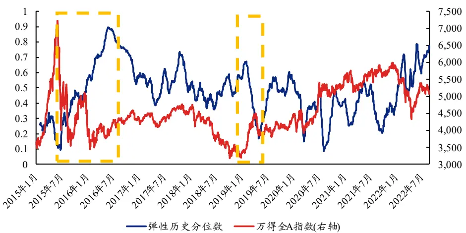
资料来源：Wind，上交所、深交所行情数据，兴业证券经济与金融研究院整理注：图中指标已取过去 20日均

## 3.1.2、宽基指数间流动性的相对趋势

接下来，我们以沪深 300和中证 500指数为例，展示大小盘之间指标的变化趋势。

首先针对深度指标进行分析。整体来看各个指标的历史分位数走势相对接近。在 2016年之前，小盘股的市场深度价格走势维持在历史高位，而在 201 年中，大盘股与小盘股的市场深度走势出现背离。回顾市场，在 2016 年底之前，小盘股走势整体好于大盘股，而在 201 年整体“去杠杆、紧信用”的背景下，投资者开始寻找资金量充足的好公司，市场向龙头集中，强者恒强的逻辑开始崛起。由此，市场整体呈现绩优股的牛市与绩差股的熊市，大小盘分化显著。在 2021 年中旬，大小盘的价格走势也出现的较大幅度的背离，中小盘股的深度走势也明显优于大盘股。因此，从趋势上看，在 2016年底至 2017年初，大小盘的市场深度走势开始出现背离，这侧面反映出当时市场大小盘风格切换的时刻。

图 11、不同宽基市场深度指标变化趋势
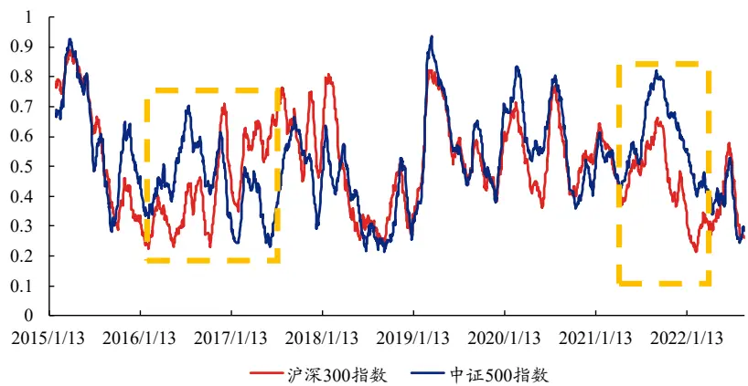
资料来源：Wind，上交所、深交所行情数据，兴业证券经济与金融研究院整理注：图中指标已取过去 20日均

接下来我们以紧密度指标作为分析指标。整体来看各个指标的历史分位数走势同样相接近。从趋势的背离角度上看，大小盘紧密度指标同样在 201 年中走势出现背离。此外，小盘指数在 2020 年底、2021 年初紧密度指标开始降低，而大盘指数仍处于高位。这或许与当时大盘走势较好、市场对“白马龙头股”的“抱团”投资行为有关。因此，从趋势上看，紧密度指标同样能够从侧面反映大小盘的相对优劣。

图 12、不同宽基市场紧密度指标变化趋势
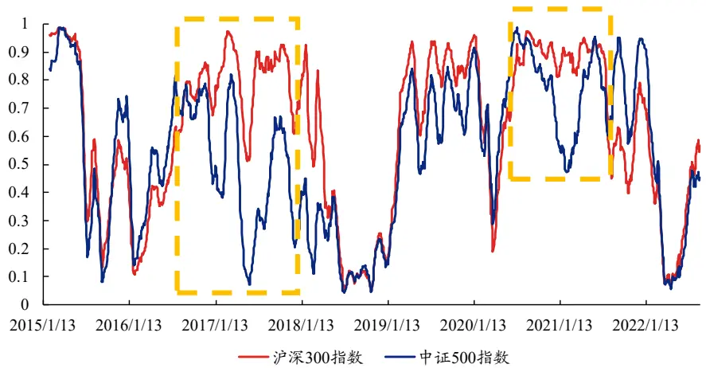
资料来源：Wind，上交所、深交所行情数据，兴业证券经济与金融研究院整理注：图中指标已取过去 20日均

最后我们以价格弹性度指标作为分析对象。整体来看各个指标的历史分位数走势同样相接近，并未出现明显的趋势背离现象，仅 2021 年中旬出现较大的差异。因此，从价格弹性的角度上看，各个宽基之间的走势差异较小。

图 13、不同宽基市场价格弹性指标变化趋势
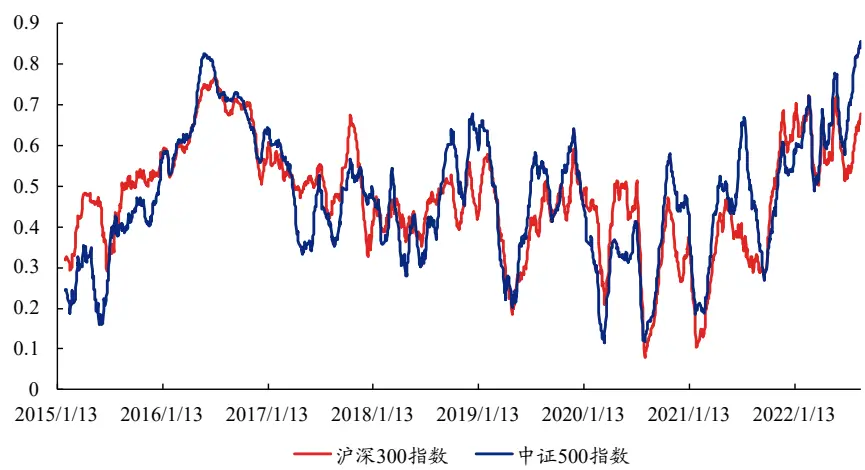
资料来源：Wind，上交所、深交所行情数据，兴业证券经济与金融研究院整理注：图中指标已取过去 20日均

## 3.2、行业流动性趋势变化与截面变化分析

在此前，我们从全市场或者宽基角度出发进行了探索。在本章中，我们将分析对象替换为行业，对行业时序上的趋势性，以及不同行业间的截面进行比较分析。我们以电力设备及新能源行业（以下简称电新）为例，分析其 2014 年以来的流动性趋势与价格走势。

整体上看，电新板块内流动性指标的趋势与针对此前市场的分析结论相似。在 201 年至 2020 年电新行业热度较低的时间段内（除去 2019 年 A 股市场的趋势性波动），价格紧密度（蓝线）相对较低，反映出当时该板块交易者活跃度较低，同时弹性指标（灰线）显示当前价格弹性较好，整体价格走势平稳。在年初以电新为代表的成长板块开始受到关注，无论是从深度还是紧密度上看，两者均相对向好，而此时价格弹性开始逐步回落至历史较低位置。这表明，该板块出现趋势性行情，价格的上涨趋势导致弹性降低，这与此前在全市场内的分析相似。至 2021 年中旬，板块指数开始出现极强的上涨趋势。市场深度和紧密度均达到历史较高位置，尤其是紧密度指标。这反映出当时电新行业的交易量、交易平衡性以及交易的活跃度极高。然而，伴随而来的是价格弹性处于历史极低位置，这反映出当期板块价格走势已经出现极强的趋势性，价格过多地受到了来自买方的冲击，已经处于相对虚高的位置。直至 2021 年底，电新板块热度过高，开始出现回调，价格弹性才有所恢复。综上，通过结合三者的相对大小，我们可以从交易深度、平衡性、交易热度以及价格弹性多个维度，判断当期板块价格走势是否过热，或是否已经处于历史低位。

图 14、流动性指标与电力设备及新能源行业指数价格走势
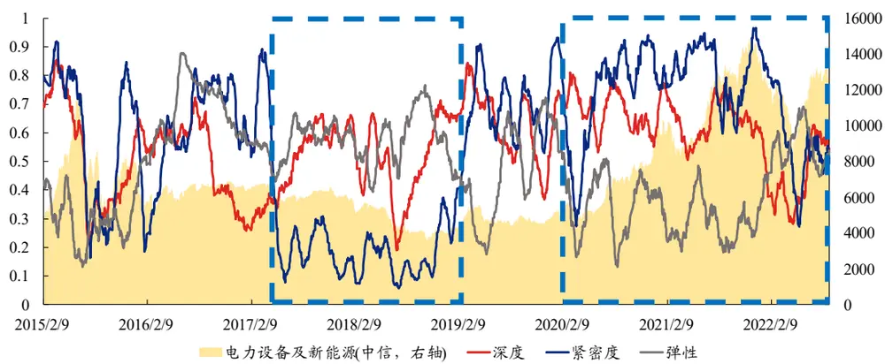
资料来源：Wind，上交所、深交所行情数据，兴业证券经济与金融研究院整理注：深度、紧密度与弹性指标已取过去 20日均

除了针对单个行业的时序趋势性分析，我们进一步选取几个近几年表现较好，或市场关注度较高的行业，观察其 2021 年以来的趋势变化。具体来说，我们选择了煤炭与食品饮料，观察这两个中信一级行业 2021 年以来三个指标的趋势变化，并重点观察行业在哪些时段内走势出现明显的背离。

我们分析这两个行业深度、弹性、紧密度的趋势变化，参见下列三个图。首先是深度，从整体性趋势上看，两个行业的市场深度都出现了一定的下滑，这与全市场出现较大幅度回调有关。其中，2021年6月末至 2021年10月，煤炭行业的深度指标出现“深V”走势，这与食品饮料行业的走势并不一致。在 2021年 6至 8 月，受供需博弈影响，煤炭处于震荡行情；反观食品饮料行业：经过 21 年初的回调后，2021 年 4 月起板块进入一段小“牛市”：自 2021 年 4 月以来市场深度持续攀升。2021 年中下旬开始，一方面受产能不足影响，另一方需求继续强劲，煤炭价格持续上涨，带动板块深度与指数走势走高。时间进入 2022 年，此时市场进入整体性回调区间，煤炭行业却在月度层面持续走高。从深度指标的走势上也可看出，2022 年以来煤炭行业整体深度分位点维持在历史中部。其次，从紧密度上看，近年来以来煤炭行业的市场紧密度相对最优，行业热度相对较好。食品饮料行业则在 2022 年以来紧密度出现较大幅度的降低，直至 5 月底达到历史相对低点，这与该板块的走势相接近。最后从弹性的变化趋势上看，两个行业整体的价格弹性走势相接近。受 21 年 6 月以来的趋势性上涨影响，煤炭行业的价格弹性开始下降，而食品饮料行业则长期维持在合理区间。

图 15、节选行业市场深度趋势变化
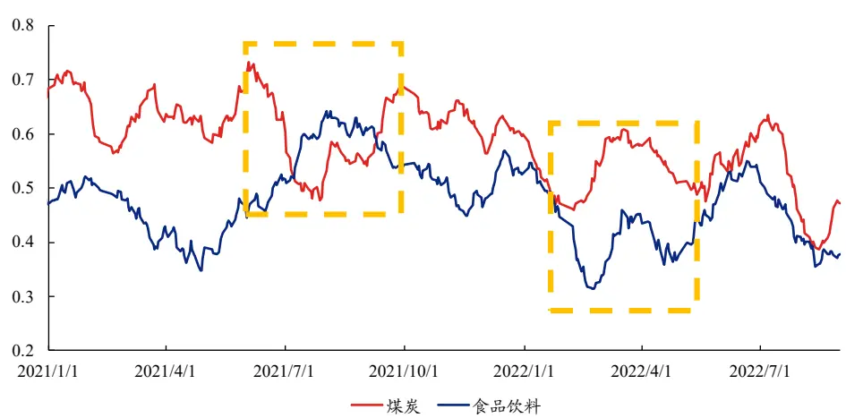
资料来源：Wind，上交所、深交所行情数据，兴业证券经济与金融研究院整理注：指标已取过于 20日均

图 16、节选行业市场紧密度趋势变化
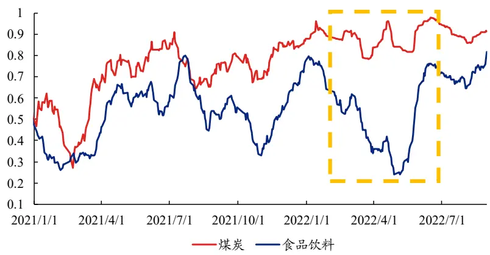
资料来源：Wind，上交所、深交所行情数据，兴业证券经济与金融研究院整理注：指标已取过于 20日均

图 17、节选行业市场价格弹性趋势变化
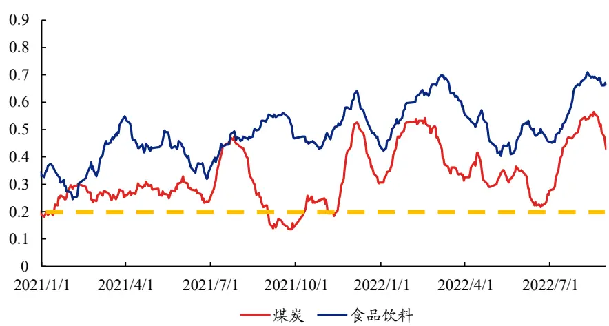
资料来源：Wind，上交所、深交所行情数据，兴业证券经济与金融研究院整理注：指标已取过于 20日均

整体而言，煤炭行业在深度、紧密度和价格弹性上均保持着较高的流动性，整体价格走势也较好。反观食品饮料行业则出现较大幅度的波动，市场的深度、交易双方在量和价上的博弈均在 2021 年中以来走弱，价格走势也相互印证其走势。

表 5、三个行业2021年以来流动性指标趋势总结

| 行业名称 | 深度 | 紧密度 | 弹性 |
| --- | --- | --- | --- |
| 煤炭 | “深V”走势，22年以来受市场 影响程度较小 | 整体稳定，尤其是22年以来紧 密度较高，市场热度高 | 整体处于合理区间，21年10 月时价格弹性较差 |
| 食品饮料 | 21年中旬以来持续走低，2022 年4月出现小幅恢复 | 21年中旬以来持续走低，2022 年4月起出现较大恢复 | 整体处于合理区间 |

资料来源：Wind，上交所、深交所行情数据，兴业证券经济与金融研究院整理

## 3.3、市场微观结构日度警示信号构建

在上述章节中，我们主要介绍了流动性在趋势分析上的应用。在本章中，我们引入另一种应用：市场日度警示信号。具体来说，我们试图在本章中合成一类指标，一旦该指标满足某个阈 ，即发出 警示信号，提示投资者市场在部分维度上发生了异变。因此，我们引入下述方式构建信号，具体如下：

1. 基于个股计算得到的日度二级指标（二级指标为一个T×N的矩阵，N为股票个数，T为日度日期长度），每支股票计算过去 20 日的历史分位数，得到一个二级指标的面板数据；

2. 统计各个二级指标中，个股历史分位数低于某一阈 （ 按照二级识别顺序进行调整，阈 设置为 5%）的占比；若大多数个股的某一流动性指标变差，则该占比将较大，由此发出信号并进行提示。

以报价差（弹性）为例。下图展示了报价差日度警示信号，以及警示信号较大的三个日期。可以看出，报价差在日度层面能够正确提示出日内的交易异常情况，包括2015年8月24的暴跌、2016年的熔断、2020年2月3日等。以2020年 2 月 3 日为例，A 股鼠年首个交易日迎来“至暗时刻”：沪指盘中跌逾 8％，日内 3000 多股票跌停。从报价差上看，当日买卖双方力量差异十分悬殊，空方力量过强，导致当日超 80%的个股紧密度指标出现异常。

图 18、报价差警示信号
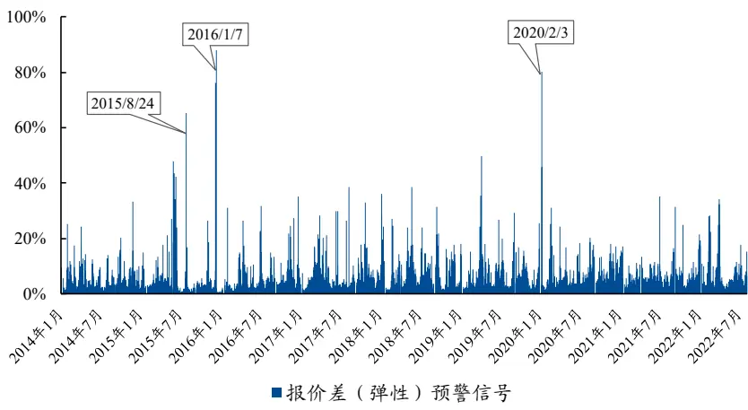
资料来源：Wind，上交所、深交所行情数据，兴业证券经济与金融研究院整理

除此之外，我们进一步展示部分二级指标 2022 年以来的警示信号。可以看出，在警示指标较大的日期下，市场均出现了较大幅度的下跌。我们以4月25日为例分析：当日沪指跌幅高达5.13%，深成指数跌幅达6.08%，市场4500多只股票下跌。从成交额上看，当日成交金额约为 8 00 亿元，与前几日的成交额相比属于放量下跌。从微观结构深度上看，当日深度警示指标并未出现明显高点，这反映出市场在交易量上未出现较大波动。然而，代表紧密度与价格弹性的报价差与Roll指标发出较明显的警示信号，这与当日价格持续走低，日内整体性下跌有着极大的关联：日内交易中空方驱动交易过多，导致报价单中卖价过低、超跌后多方力量并未能使价格在冲击后恢复，因此这两个指标的警示信号更加显著。综上，三类警示信号不仅能够提示日内的市场走势，同时也和市场的波动幅度、价格的一致性有着极大的关联性。

图 19、部分流动性二级指标 2022年以来的警示信号
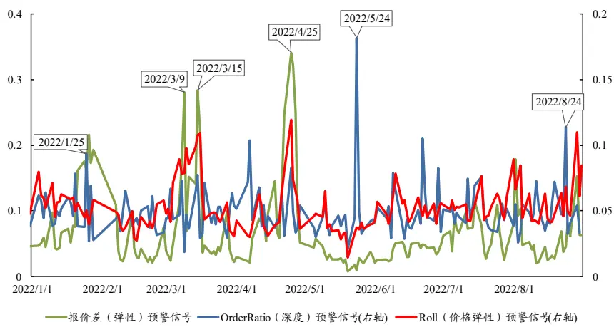
资料来源：Wind，上交所、深交所行情数据，兴业证券经济与金融研究院整理

## 4、落叶知秋—基于市场微观结构的择时策略

在上一章节中，我们基于三个一级指标的历史分位数或者警示信号进行了针对市场、宽基和行业的分析。在本章中，我们尝试基于三个一级指标的历史分位数，结合此前的分析，构建一套基于市场微观结构的择时策略。

在上文中，我们通过定性的观察发现：紧密度和深度指标与价格走势相接近，几乎同向；而在部分时间段内，弹性指标与价格走势相反。因此，在构建策略之前，我们首先测试指标当期走势与未来市场价格走势之间的相关性。具体的测试方式为：滚动统计过去 20 个交易日指标历史分位数变化率与市场日度收益率的 Pearson 相关性，并进一步统计相关性均 与标准差 。结果表明：紧密度指标对于价格走势的未来走势有着较强的预测性，其滚动计算的相关性均 为 4.75%。这表明紧密度当期出现上升，价格未来倾向于上涨。深度也有着类似的结论（相关性均 为 2.30%），弹性则与之相反，相关性均 为 -2.32%。结合三者相关性序列的标准差，我们发现，紧密度指标的预测稳定性最优。

基于针对三类流动性指标的方向性测试结果，以及我们此前对于指标的定性观察，我们选择两个指标，价格弹性与紧密度，并结合紧密度的趋势性变化以及弹性的分位点警示能力，构建择时策略。我们的择时策略以月度发出信号。

我们首先设置紧密度阈 等于-1，弹性阈 为 20%，测试基于万得全A指数的全市场择时表现。从截至2022年10月31日的回测结果上看，基于上述参数构建的微观流动性择时策略表现十分优秀，其策略多空年化收益率为 34.92%，多头收益率为20.02%。此外，多空策略的收益风险比为1.344，收益回撤比为1.034，具有较好的风险控制能力。

图 20、微观流动性择时策略
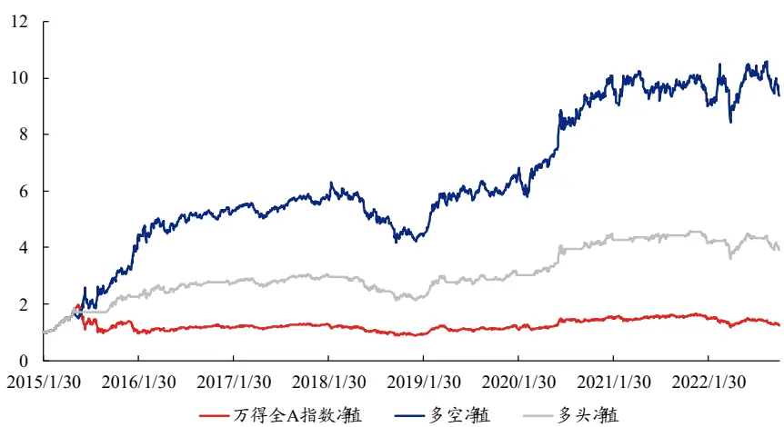
资料来源：Wind，上交所、深交所行情数据，兴业证券经济与金融研究院整理注：回测区间为 2015 年 1 月 30 日至 2022 年 10 月 31 日

表 6、微观流动性择时策略表现

|  | 年化收益率 | 年化波动率 | 收益风险比 | 最大回撤 | 收益回撤比 |
| --- | --- | --- | --- | --- | --- |
| 基准 | 3.05% | 26.05% | 0.117 | 56.0% | 0.054 |
| 多空 | 34.92% | 25.97% | 1.344 | 33.8% | 1.034 |
| 多头 | 20.02% | 17.96% | 1.115 | 30.8% | 0.650 |

资料来源：Wind，上交所、深交所行情数据，兴业证券经济与金融研究院整理注：回测区间为 2015 年 1 月 30 日至 2022 年 10 月 31 日

从分年度胜率上看，无论是多空还是多头，策略的分年度胜率均为 85. 2%，仅 2021 年未战胜基准，在时序上表现出较强的稳定性。此外，从分月度的绝对胜率1上看，策略多空月度绝对胜率约为59.8%，多头月度绝对胜率为 0. %。

表 7、微观流动性择时策略分年度表现

| 年度 | 基准 | 多空 | 多头 | 多头-基准 |
| --- | --- | --- | --- | --- |
| 2016年 | -12.9% | 65.0% | 22.2% | 35.1% |
| 2017年 | 4.9% | 4.9% | 4.9% | 0.0% |
| 2018年 | -28.3% | -23.5% | -25.5% | 2.7% |
| 2019年 | 33.0% | 47.9% | 40.9% | 7.9% |
| 2020年 | 25.6% | 52.3% | 40.2% | 14.6% |
| 2021年 | 9.2% | 3.2% | 6.8% | -2.3% |
| 2022年 | -23.0% | -5.5% | -14.2% | 8.7% |

资料来源：Wind，上交所、深交所行情数据，兴业证券经济与金融研究院整理注：2022 年截至 2022 年 10 月 31 日

我们进一步测试策略在不同宽基上的表现。可以看出，在同一参数设置下，微观流动性择时策略在不同宽基指数内的表现均明显战胜基准。不论是从代表收益能力的年化收益率，还是代表风险控制能力的收益风险比、收益回撤比上看，我们的微观流动性择时策略均优于基准，表现出较好的普适性。

表 8、微观流动性择时策略针对不同宽基指数的表现

| 指数 | 策略 | 年化收益率 | 年化波动率 | 收益风险比 | 最大回撤 | 收益回撤比 |
| --- | --- | --- | --- | --- | --- | --- |
| 沪深 300 | 基准 | 0.29% | 23.01% | 0.012 | 46.7% | 0.006 |
|  | 多空 | 15.53% | 22.99% | 0.676 | 30.9% | 0.502 |
|  | 多头 | 8.96% | 16.88% | 0.531 | 30.6% | 0.293 |
| 中证500 | 基准 | 0.41% | 26.79% | 0.015 | 65.2% | 0.006 |
|  | 多空 | 24.12% | 26.74% | 0.902 | 40.5% | 0.596 |
| 中证 1000 | 多头 | 12.93% | 22.06% | 0.586 | 44.1% | 0.293 |
|  | 基准 | -0.53% | 28.85% | -0.018 | 72.3% | -0.007 |
|  | 多空 | 31.97% | 28.78% | 1.111 | 38.7% | 0.827 |
| 万得全A | 多头 | 16.47% | 22.44% | 0.734 | 39.6% | 0.415 |
|  | 基准 | 3.05% | 26.05% | 0.117 | 56.0% | 0.054 |
|  | 多空 多头 | 34.92% 20.02% | 25.97% 17.96% | 1.344 1.115 | 33.8% 30.8% | 1.034 0.650 |

资料来源：Wind，上交所、深交所行情数据，兴业证券经济与金融研究院整理注：回测区间为 2015 年 1 月 30 日至 2022 年 10 月 31 日

最后，我们基于针对全市场的策略，对策略中用到的参数：紧密度阈 与弹性阈 进行遍历。 可以看出，无论是在不同的弹性阈 ，还是在不同的紧密度阈 下，微观流动性择时策略的表现均明显战胜基准，这体现出策略具有较好的稳定性。

表 9、不同弹性阈 下策略表现

| 弹性阈值 | 策略 | 年化收益率 | 年化波动率 | 收益风险比 | 最大回撤 | 收益回撤比 |
| --- | --- | --- | --- | --- | --- | --- |
| 10% | 基准 | 3.05% | 26.05% | 0.117 | 56.0% | 0.054 |
|  | 多空 | 25.93% | 26.00% | 0.997 | 33.8% | 0.768 |
|  | 多头 | 15.37% | 20.61% | 0.746 | 32.8% | 0.468 |
| 20% | 基准 多空 | 3.05% 34.92% | 26.05% 25.97% | 0.117 1.344 | 56.0% 33.8% | 0.054 1.034 |
| 30% | 多头 | 20.02% | 17.96% | 1.115 | 30.8% | 0.650 |
|  | 基准 | 3.05% | 26.05% | 0.117 | 56.0% | 0.054 |
|  | 多空 多头 | 31.43% 18.55% | 25.98% 17.54% | 1.210 1.058 | 33.8% 30.8% | 0.931 |

资料来源：Wind，上交所、深交所行情数据，兴业证券经济与金融研究院整理注：回测区间为 2015年1月30日至 2022年 10月31日，紧密度阈 设置为 -1

表 10、不同紧密度阈 测试下策略表现

| 紧密度阈值 | 策略 | 年化收益率 | 年化波动率 | 收益风险比 | 最大回撤 | 收益回撤比 |
| --- | --- | --- | --- | --- | --- | --- |
| -0.6 | 基准 | 3.05% | 26.05% | 0.117 | 55.99% | 0.054 |
|  | 多空 | 35.66% | 25.97% | 1.373 | 33.77% | 1.056 |
|  | 多头 | 20.46% | 17.45% | 1.172 | 32.03% | 0.639 |
| -0.8 | 基准 | 3.05% | 26.05% | 0.117 | 55.99% | 0.054 |
|  | 多空 | 34.48% | 25.97% | 1.328 | 33.77% | 1.021 |
| -1.0 | 多头 基准 | 19.86% | 17.83% | 1.113 | 32.03% | 0.620 |
|  | 多空 | 3.05% | 26.05% | 0.117 | 55.99% | 0.054 |
|  | 多头 | 34.92% | 25.97% | 1.344 | 33.77% | 1.034 |
|  | 基准 | 20.02% | 17.96% | 1.115 | 30.81% | 0.650 |
| -1.2 | 多空 | 3.05% | 26.05% | 0.117 | 55.99% | 0.054 |
|  | 多头 | 34.93% | 25.97% | 1.345 | 33.70% | 1.037 |
| -1.4 |  | 20.01% | 18.08% | 1.107 | 31.10% | 0.643 |
|  | 基准 | 3.05% | 26.05% | 0.117 | 55.99% | 0.054 |
|  | 多空 多头 | 23.89% 14.63% | 26.01% 19.72% | 0.919 0.742 | 33.70% 34.37% | 0.709 0.426 |

资料来源：Wind，上交所、深交所行情数据，兴业证券经济与金融研究院整理
注：回测区间为 2015年1月30日至 2022年 10月31日，弹性阈 为 20%

## 5、总结

本文中，我们基于高频数据对市场微观结构进行观察与剖析。我们从深度、紧密度和弹性三个维度共同衡量流动性：深度对应着不影响报价的情况下购买或出售一定数量资产的能力、紧密度对应着同一时间内买入和卖出一项资产的价格差异、弹性对应着资产价格从冲击中恢复的能力。我们进一步确定了指标在趋势分析、奇异点判断、择时方面的整体应用。在趋势应用上，我们基于个股计算得到的流动性指标复合到行业、宽基乃至全市场，分析其相对自身变化趋势或相对其他板块的变化趋势。在奇异点应用上，我们基于个股数据构建了市场流动性警示信号，以提示当日某些流动性特性的异动。在择时应用上，我们将上述的定性分析与定量测试结果结合，构建了一套基于微观结构流动性的择时体系。

在未来，我们会针对该体系做进一步补充，并从“闪电崩盘”等市场极端行情的维度出发构建指标和预警信号。后续我们也将深耕该方向，给投资者带来更多更有意义的研究。

## 附录

## 1、LR算法

如何区分成交量买卖方主导是衡量市场日内流动性或者市场日内规模的重要环节。LR 算法是其中最为常用的算法之一。该算法基于日内分钟级别的行情数据，将每一分钟区分为买方驱动或卖方驱动，具体步骤如下：

1、基于t时刻的最高价 $P_{t}^{H}$ 和最低价 $P_{t}^{H}$ ，计算t时刻中间价 $\begin{array}{r}{\mathbf{:}P_{t}^{mid}=\frac{P_{t}^{H}-P_{t}^{H}}{2};}\end{array}$

2、若 t时刻的收盘价 $P_{t}$ 大于 $P_{t}^{mid}$ ，则认为 t时刻的交易为买方驱动；若 $P_{t}$ 小于 $P_{t}^{mid}$ ，则认为 t 时刻的交易为卖方驱动；若 $P_{t}$ 等于 $P_{t}^{mid}$ ，则进入步骤三；

3、若 t 时刻的收盘价 $P_{t}$ 大于 $P_{t-1}$ ，则认为 t 时刻的交易为买方驱动；若 $P_{t}$ 小于 $P_{t-1}$ ，则认为 t时刻的交易为卖方驱动；若 $P_{t}$ 等于 $P_{t-1}$ ，则进入步骤四；

4、提取时间早于 t 时刻，且收盘价不等于 $P_{t}$ 的分钟收盘价 $P_{t-k}$ ，若 $P_{t}$ 大于$P_{t-k}$ ，则认为 t 时刻的交易为买方驱动；若 $P_{t}$ 小于 $P_{t-k}$ ，则认为 t 时刻的交易为卖方驱动。

风险提示：模型结果基于历史数据的测算，在市场环境转变时模型存在失效的风险。

## 分析师声明

本人具有中国证券业协会授予的证券投资咨询执业资格并登记为证券分析师，以勤勉的职业态度，独立、客观地出具本报告。本报告清晰准确地反映了本人的研究观点。本人不曾因，不因，也将不会因本报告中的具体推荐意见或观点而直接或间接收到任何形式的补偿。

## 投资评级说明

| 投资建议的评级标准 | 类别 | 评级 | 说明 |
| --- | --- | --- | --- |
| 报告中投资建议所涉及的评级分为股票评级和行业评级（另有说明的除外)。评级标准为报告发布日后的12个月内公司股价（或行业指数）相对同期相关证券市场代表性指数的涨跌幅。其中：A股市场以上证综指或深圳成指为基准，香港市场以恒生指数为基准；美国市场以标普500或纳斯达克综合指数为基准。 | 股票评级 | 买入 | 相对同期相关证券市场代表性指数涨幅大于15% |
|  |  | 审慎增持 | 相对同期相关证券市场代表性指数涨幅在5%~15%之间 |
|  |  | 中性 | 相对同期相关证券市场代表性指数涨幅在-5%~5%之间 |
|  |  | 减持 | 相对同期相关证券市场代表性指数涨幅小于-5% |
|  |  | 无评级 | 由于我们无法获取必要的资料，或者公司面临无法预见结果的重大不确定性事件，或者其他原因，致使我们无法给出明确的投资评级 |
|  | 行业评级 | 推荐 | 相对表现优于同期相关证券市场代表性指数 |
|  |  | 中性 | 相对表现与同期相关证券市场代表性指数持平 |
|  |  | 回避 | 相对表现弱于同期相关证券市场代表性指数 |

## 信息披露

本公司在知晓的范围内履行信息披露义务。客户可登录 www.xyzq.com.cn 内幕交易防控栏内查询静默期安排和关联公司持股情况。

## 使用本研究报告的风险提示及法律声明

兴业证券股份有限公司经中国证券监督管理委员会批准，已具备证券投资咨询业务资格。

，本公司不会因接收人收到本报告而视其为客户。

本报告中的信息、意见等均仅供客户参考，不构成所述证券买卖的出价或征价邀请或要约，投资者自主作出投资决策并自行承担投资风险，任何形式的分享证券投资收益或者分担证券投资损失的书面或口头承诺均为无效，任何有关本报告的摘要或节选都不代表本报告正式完整的观点，一切须以本公司向客户发布的本报告完整版本为准。该等信息、意见并未考虑到获取本报告人员的具体投资目的、财务状况以及特定需求，在任何时候均不构成对任何人的个人推荐。客户应当对本报告中的信息和意见进行独立评估，并应同时考量各自的投资目的、财务状况和特定需求，必要时就法律、商业、财务、税收等方面咨询专家的意见。对依据或者使用本报告所造成的一切后果，本公司及 或其关联人员均不承担任何法律责任。

本报告所载资料的来源被认为是可靠的，但本公司不保证其准确性或完整性，也不保证所包含的信息和建议不会发生任何变更。本公司并不对使用本报告所包含的材料产生的任何直接或间接损失或与此相关的其他任何损失承担任何责任。

本报告所载的资料、意见及推测仅反映本公司于发布本报告当日的判断，本报告所指的证券或投资标的的价格、价 及投资收入可升可跌，过往表现不应作为日后的表现依据；在不同时期，本公司可发出与本报告所载资料、意见及推测不一致的报告；本公司不保证本报告所含信息保持在最新状态。同时，本公司对本报告所含信息可在不发出通知的情形下做出修改，投资者应当自行关注相应的更新或修改。

除非另行说明，本报告中所引用的关于业绩的数据代表过往表现。过往的业绩表现亦不应作为日后回报的预示。我们不承诺也不保证，任何所预示的回报会得以实现。分析中所做的回报预测可能是基于相应的假设。任何假设的变化可能会显著地影响所预测的回报。

本公司的销售人员、交易人员以及其他专业人士可能会依据不同假设和标准、采用不同的分析方法而口头或书面发表与本报告意见及建议不一致的市场评论和 或交易观点。本公司没有将此意见及建议向报告所有接收者进行更新的义务。本公司的资产管理部门、自营部门以及其他投资业务部门可能独立做出与本报告中的意见或建议不一致的投资决策。

本报告并非针对或意图发送予或为任何就发送、发布、可得到或使用此报告而使兴业证券股份有限公司及其关联子公司等违反当地的法律或法规或可致使兴业证券股份有限公司受制于相关法律或法规的任何地区、国家或其他管辖区域的公民或居民，包括但不限于美国及美国公民（1934年美国《证券交易所》第 15a-6条例定义为本「主要美国机构投资者」除外）。

本报告的版权归本公司所有。本公司对本报告保留一切权利。除非另有书面显示，否则本报告中的所有材料的版权均属本公司。未经本公司事先书面授权，本报告的任何部分均不得以任何方式制作任何形式的拷贝、复印件或复制品，或再次分发给任何其他人，或以任何侵犯本公司版权的其他方式使用。未经授权的转载，本公司不承担任何转载责任。

## 特别声明

在法律许可的情况下，兴业证券股份有限公司可能会持有本报告中提及公司所发行的证券头寸并进行交易，也可能为这些公司提供或争取提供投资银行业务服务。因此，投资者应当考虑到兴业证券股份有限公司及 或其相关人员可能存在影响本报告观点客观性的潜在利益冲突。投资者请勿将本报告视为投资或其他决定的唯一信赖依据。

## 兴业证券研究

| 上海 |  |  | 深圳 |
| --- | --- | --- | --- |
|  | 地址：上海浦东新区长柳路36号兴业证券大厦 | 地址：北京市朝阳区建国门大街甲6号SK大厦 | 地址：深圳市福田区皇岗路5001号深业上城T2 |
| 15层 |  | 32层01-08单元 | 座52楼 |
| 邮编：200135 |  | 邮编：100020 | 邮编：518035 |
|  | 邮箱：research@xyzq.com.cn | 邮箱：research@xyzq.com.cn | 邮箱：research@xyzq.com.cn |