## 时序信息中的Alpha— 频研究系列六

2022年以来，兴证 团队先后推出了阐述 频研究 法论的《 频漫谈》，以及3篇在 频漫谈中，我们阐述了 频因 的构建逻辑、因 的回测 法以及频因 深度研究。频 险的识别。在后续三篇 频因 研究报告中，我们构建了约27个分布信息因 ，其中不乏多个思路新颖、具有较强特异性的分布信息因 。

本 中，我们将聚焦于时序信息，从 两个 度出发，构建了七类序列 相关性与条件分布在序列 相关性 度，我们基于 阶信息刻画基础 频因 ，并基于频时序信息因 。阶相关性刻画了个股的 同步交易程度因 。在条件分布中，我们以 波下 内收益率均值因 阐明该 法论的有效性， 进 步构建了股价 相关性下的VaR以及“闪电崩盘”概率因 。

以rtn_condVaR（股价 相关性下的VaR）为例进 阐七类因 均展 出极强的选股能 ：述：该因 度RankIC均值为4.01%，多空收益率约为44%，多头收益率约为21%，夏普率约为5.7。

我们以周度和 度换仓的形式，测试其在全市场进 步等权合成构建时序信息复合因 ：等多个股票池内的表现。复合因 在全市场内周度RankIC均值为6.64%，ICIR为0.98； 度子RankIC均值为8.07%，ICIR为1.32。周度测试下因 多头组合年化收益率为26.7%，同期基准为10.8%，多空夏普 率为4.91。因 在不同股票池内的表现同样优秀。

核心表、时序信息复合因子周度测试结果

| 股票池 | IC 均值 | ICIR | Top 组年化超额 | 多空夏普比率 |
| --- | --- | --- | --- | --- |
| 全市场 | 6.64% | 0.98 | 14.3% | 4.91 |
| 沪深300 | 2.80% | 0.23 | 3.6% | 0.91 |
| 中证500 | 5.21% | 0.55 | 6.5% | 1.92 |
| 中证800 | 4.10% | 0.41 | 5.3% | 1.44 |
| 中证 1000 | 6.30% | 0.88 | 11.4% | 4.18 |
| 国证 2000 | 7.18% | 1.06 | 14.0% | 5.35 |

资料来源：上交所、深交所行情数据，Wind，聚源，兴业证券经济与金融研究院整理

险提 ：模型结果基于历史数据的测算，在市场环境转变时模型存在失效的 险。

## 频研究回顾

2022年以来，兴证 团队先后推出了阐述 频研究 法论的《 频漫谈》，以及《收益率分布因 》、《收益率分布中的Alpha(2)》与《成交量分布中的Alpha》 频因 深度研究。在 频漫谈中，我们阐述了 频因的构建逻辑、因 的回测 法以及 频 险的识别。该篇也是我们整个 频系列的基础篇和框架篇，后续所有的研究均建 在此基础上。据此我们介绍了四类 频指标的信息：分布信息、时序信息、关联信息与另类信息。在后续三篇 频因 研究报告中，我们基于量价数据，构建了约27个分布信息因 ，其中不乏多个构建思路新颖、具有较强特异性的分布信息因 。 前所有因 均实现 度“T+0”更新，并上传 云端数据库供下载。本 中，我们将聚焦于第 类信息—时序信息。

表1、兴证金工高频系列研究内容回顾

| 内容 | 简介 |
| --- | --- |
| 高频研究系列一：高频 漫谈 | 简述高频因子构建逻辑：基于四类信息构造高频指标，两类时序操作生成高频因子， 基于信号加权的多空构造方式；简述高频因子回测方法：通过回测结果判断因子有效 性，基于时序相关性的特异性判断标准，通过基本面风险模型与统计风险模型结合衡 |
| 高频研究系列二：收益 率分布因子构建 | 量高频风险。 基于收益率分布信息构建六个常见收益率分布因子，以及两个收益率噪音偏离因子nos 因子。 |
| 高频研究系列三：收益 率分布中的 Alpha(2) | 我们根据投资者对极端上涨和极端下跌的心理承受能力不同构建极端上涨和极端下跌 因子，从日内跳价的信息中刻画大额投资者对于股票的操作能力并进一步构建高频因 子，从日内震荡期和跳价期的信息差异中刻画股票的日内价格弹性并进一步构建选股 Alpha 因子。 |
| 高频研究系列四：成交 量分布中的 Alpha | 我们聚焦于日内成交量数据，并基于数据特征构建了七个常见成交量分布因子。进一 步，我们根据分钟成交量的不稳定性与成交量极值来构造日内成交量分桶熵和极大值 分布因子。此外，我们将日内成交量按收盘价异构，得到同价成交量分布，以此构建 了三个同价成交量分布因子。 |
| 高频研究系列五：市场 微观结构剖析 | 本文基于高频数据对市场微观结构进行观察与剖析。具体来说，我们从深度、紧密度 和弹性三个维度共同衡量微观流动性。进一步，我们确定了指标在针对全市场、大小 盘以及中信一级行业上的趋势分析、奇异点判断以及择时方面的应用。 |

资料来源：兴业证券经济与金融研究院整理

## 时序信息简析与因 回测说明

有效市场假说（E cient Markets Hypothesis，EMH）是由美国著名经济学家尤 ·法玛（Eugene Fama）于1970年提出并深化的理论。在弱式有效市场中，市场价格已充分反映出证券价格的所有过去历史信息，包括股票的成交价、成交量、卖空 额、融资 额等。如果弱式有效市场假说成 ，则股票价格的技术分析失去作 ，基本分析也 法帮助投资者获得超额利润。然 ，对于A股市场 ， 前主流观点认为市场并未达到弱式有效市场。对于流动性资产（如股票） ，过去 段时间内的量价信息并不完全反映所有的过往信息。因此，该流动性资产前后信息的关联程度，以及在已知前序信息的基础上样本数据特征，则是衡量其是否近似为弱式有效市场的重要维度。

在 频漫谈中，我们详细阐述了提取 内数据总体分布信息的四种 法。其中，我们定义时序信息需要满意下述定义：

$$
g=f(Reorder(dat{\bf a}))\neq f(d{\bf a}t{\bf a})\tag{1}
$$

其中， 为 内的 情数据，如分钟级收盘价、成交量等。指标g对于时序重排序函数Reorder敏感，数据data在时序上的变化会影响指标值，如收益率 相关性 $\rho(\boldsymbol{r}_{t},\boldsymbol{r}_{t-1})$ 依赖于收益率序列的排序，重新排列收益率序列后，指标值会发 变化。在此基础之上，我们衍 出基于时序信息相关因 。在本 中，我们将时序信息因 分为两类构建 式：序列 相关性与条件分布。

图1、时序信息高频因子研究方法论
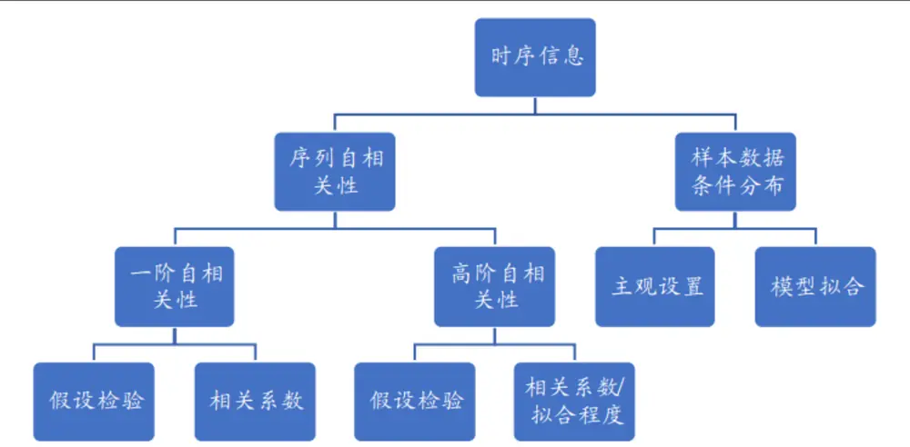
资料来源：兴业证券经济与金融研究院整理

具体来说，时序 相关性是指时间序列中某 个时刻的值和另 个时刻的值之间的相关性，通常作为最为直观在 融领域，学者们普遍认为资产收益率序列存在较强的 相关性与异 差性。为了同时考的时序信息统计量。虑收益率的线性 相关性与 差之间的相关性，常 的GARCH模型被 作时间序列模型。本 中，我们针对时序相关性，引 假设检验和相关系数/拟合程度两种统计量，以衡量 内时序数据 相关性的显著性与相关 。此外，在 弱式有效市场的背景下，市场和个股内外部条件的变化使得收益率的统计分布特征发 变化，如之前提及金的异 差性。对于 内收益率 ，其 的 独 同分布特征更加明显（具体可参 报告《 频研究系列 —收益率分布因 构建》）。因此，我们在本 中引 条件分布，通过 内过去 段时间的量价信息特性对样本数据进 筛选和重塑，进 步计算筛选之下的样本数据统计特征。

具体来为了更好体现 频因 对于短期 情信息把握的优势，我们采取 频调仓的 式测量因 收益率。说， $F_{Di}$ 是第i天 频调仓因 ， $F_{j}$ 是第j天的 频指标， $n_{s}$ 取15 ：

$$
F_{-}Mean_{Di}=\frac{1}{n_{s}}\sum_{j=1}^{n_{s}}F_{j}\tag{2}
$$

除此之外，我们也可以在时序上取标准差的 式构建因 ，以衡量个股在该指标上的离散程度。

$$
F_{-}STD_{Di}={\frac{1}{n_{s}}}\sum_{j=1}^{n_{s}}\left(F_{j}-{\frac{1}{n_{s}}}\sum_{j=1}^{n_{s}}F_{j}\right)^{2}\tag{3}
$$

在本 中如 额外说明，我们因 的回测规则设定如下：

1. 因 回测区间：2014年9 1 —2023年5 4 ；

2.回测规则：剔除当期不在市、涨跌停以及特殊处理的股票；

3.回测结果说明：本 中，回测表格中提及的年化波动率、夏普 率、最 回撤、胜率均为因 回测时的多空净值对应统计量，多头换 率为多头组的单边换 率，且我们这 的多空是两分组并按照因 值进 加权（参 《 频漫谈》）。

本 的结构如下：

1.我们 先聚焦于时序 相关性，从三个维度基于 内时序数据的 阶 相关性刻画因 ，进 步从 阶时序稳定性的 度刻画个股的 同步交易性，进 构建因 ；

2.其次，我们聚焦于条件分布， 先以 波动率下的收益率均值 度，引 条件分布的常 刻画 式，并表明该 法可以刻画出具有特异性的因 ；

3.进 步，我们从股价相关性VaR和“闪电崩盘”两个 度构建两类时序信息因 ；

4.最后，我们进 中性化与相关性检验，并进 步合成 频时序信息复合因 ，并在周度和 度层 测试其在不同股票池内的表现。

## 日角2、时序 相关性基础因

## 因 构建

前 提及， 融领域的时间序列通常存在着较强的 相关性。其中， 阶 相关性是最为基础和直观的统计量之 。在实际应 中，投资者或学者们通常通过计算相关系数和假设检验来判断时间序列的 阶 相关性是否显著。在本节中，我们同样以上述两个 度，衡量与构建 内数据的 阶相关性统计量。我们引 的数据分别是分钟级收益率与分钟级成交量占 。同时，由于个股在开盘和收盘阶段的量价信息波动较 ，因此，我们均剔除了开盘和收盘10分钟数据。此外，对于每 类因 ，我们均等权合成基于收益率和成交量占 构建的因 ，作为该类的复合因 。

## 阶 相关系数

先，我们基于量价两个维度的时序数据，计算分钟级时序数据的 阶 相关系数， 于判断时序数据的前后相关性。以分钟级收益率数据为例，我们计算个股 内收益率序列的 阶差分相关系数作为 频指标，并进 步计算个股过去15 指标的均值作为最终的因 值。因 排序为升序。

表2、一阶自相关系数因子定义

| 因子名 | 因子构造方法 |
| --- | --- |
| rtn_foc | 分钟收益率一阶自相关系数 |
| vol_foc foc_Comb | 分钟成交量占比一阶自相关系数 等权合成 rtn foc 和 vol foc 因子 |

资料来源：兴业证券经济与金融研究院整理

## D-W统计量

D-W检验是统计分析中常 的 种检验序列 阶 相关的 法。我们直接计算收益率与成交量占 时序数据的比D-W统计量，其统计量的绝对 可以判定时序数据是否存在 相关性，以及相关性的正负性。以分钟级收益率数子 子据为例，我们计算个股 内收益率序列的D-W统计量作为 频指标，并进 步计算个股过去15 指标的均值作为最终的因 值。因 排序为降序。

表3、D-W统计量因子定义

| 因子名 | 因子构造方法 |
| --- | --- |
| rtn_DW | 分钟收益率D-W统计量 |
| vol_DW | 分钟成交量占比D-W统计量 |
| DW_Comb | 等权合成 rtn DW 和 vol DW 因子 |

资料来源：兴业证券经济与金融研究院整理

## 残差 相关系数

上述分析中，我们仅检验 内时序数据的 阶 相关性。然 ，对于分钟级数据 ， 本 可能存在着阶相关性。在 阶 相关性存在的情况下，以AR(1)作为模型的残差将具有 相关性，使得线性回归模型相对失效。在此 度之下，我们尝试测试时序数据在AR(1)模型下的残差 阶 相关回归模型的系数。我们进 步计算个股过去15 指标的标准差作为最终因 值。因 排序为升序。

表4、残差自相关系数因子定义

| 因子名 | 因子构造方法 |
| --- | --- |
| rtn_rho | 分钟收益率残差自相关系数 |
| vol_rho | 分钟成交量残差自相关系数 |
| rho_Comb | 等权合成 rtn_rho 和 vol_rho 因子 |

资料来源：兴业证券经济与金融研究院整理

我们 先测试上述9个因 的表现。 先从 度IC测试结果上看，绝 多数的常 时序信息因 IC均值在4%以上，表现出较好的股价预测能 。此外，三类复合因 的表现更为优秀，以foc_Comb为例，该因 的 度RankIC均值为6.85%，ICIR为0.76，有效性较强。

表 5、常见时序自相关性因子 Rank IC 测试结果

| 因子名称 | IC 均值 IC 标准差 | ICIR | T统计量 |
| --- | --- | --- | --- |
| rtn_foc 6.19% | 11.75% | 0.53 | 24.19 |
| vol_foc 5.77% | 6.27% | 0.92 | 42.22 |
| rtn_DW 3.96% | 10.51% | 0.38 | 17.29 |
| vol_DW 4.02% | 11.45% | 0.35 | 16.11 |
| rtn_rho 4.62% | 7.29% | 0.63 | 29.11 |
| vol rho 1.87% | 7.16% | 0.26 | 11.99 |
| foc_Comb 6.85% | 9.00% | 0.76 | 34.94 |
| DW_Comb 4.35% | 11.55% | 0.38 | 17.28 |
| rho_Comb 4.02% | 6.80% | 0.59 | 27.16 |

资料来源：上交所、深交所行情数据，Wind，聚源，兴业证券经济与金融研究院整理

从 度组合测试结果上看，我们构建的常 时序信息因 的表现均相对优秀， 多数因 的多空夏普 于4，三类复合因 的表现更为为优秀。具体来看，从多空组合测试上看，vol_foc因 的多空收益率在67%左右，多头收益率 达29%，夏普 率在9.6左右。

表6、常见时序自相关性因子组合测试结果

| 因子名称 | 多空收益率 | 多头收益率 | 空头收益率 | 年化波动率 | 夏普比率 | 最大回撤 | 多头换手率 |
| --- | --- | --- | --- | --- | --- | --- | --- |
| rtn_foc | 47.8% | 22.0% | -19.5% | 11.9% | 4.03 | -8.8% | 7.1% |
| vol_foc | 67.0% | 29.0% | -23.1% | 7.0% | 9.56 | -5.4% | 12.1% |
| rtn_DW | 41.0% | 20.6% | -16.0% | 9.6% | 4.29 | -7.1% | 7.0% |
| vol_DW | 32.0% | 17.0% | -13.3% | 10.3% | 3.11 | -12.1% | 7.8% |
| rtn_rho | 55.3% | 21.2% | -23.0% | 9.1% | 6.12 | -7.2% | 9.0% |
| vol rho | 30.1% | 12.9% | -12.8% | 6.5% | 4.66 | -6.5% | 10.8% |
| foc_Comb | 67.4% | 28.3% | -24.7% | 9.9% | 6.80 | -7.8% | 9.7% |
| DW_Comb | 39.7% | 21.1% | -15.2% | 10.3% | 3.85 | -9.0% | 6.8% |
| rho_Comb | 51.9% | 21.7% | -20.2% | 7.4% | 7.02 | -4.7% | 10.5% |

资料来源：上交所、深交所行情数据，Wind，聚源，兴业证券经济与金融研究院整理

从多空净值曲线上看，各个因 的多空净值 期呈现上升趋势，且最近 年 明显回撤，表现 分稳定。

图2、常见时序自相关性因子多空组合净值
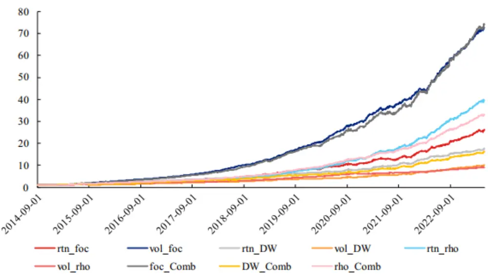
资料来源：上交所、深交所行情数据，Wind，聚源，兴业证券经济与金融研究院整理

## 3、个股的 同步交易性与 阶 相关性

在前 中，我们从 相关性的相关系数与假设检验的 度出发，构建了三类常 的时序信息因 ，其重点主要聚焦在对 内时序信息的 阶 相关性的分析上。结果表明，各类因 具有较好的选股能 。

上 更多是从数据统计的 度出发。在本章中，我们基于股票对于信息到来以及股价反应速度不 致导致的同步交易特性，从时序的 阶相关性 度出发，构建时序信息中， 相关性的特异性因 。

在有效的证券市场上，每 只证券的价格都应该迅速反映影响其 价格的信息（来 于市场、交易情绪等）。但现实中，市场总是存在着 定的交易摩擦、投资者的预期也往往有 定程度的刚性：信息到达市场中不同投资者的时间会存在不同程度的差异、知情交易者的参与程度等等原因。这些原因往往会导致有些证券对信息的反应出现时滞，且在任 分钟内，不同投资者做出的交易决策并不基于相似的信息，导致当前时刻下的交易信息混杂，最终导致股价波动较 。这 现象在学术界可以类 于 同步交易。

对于某 证券 ， 较多的知信息的透明程度与个股的流动性是两个决定证券 同步交易程度的重要因素。情交易者在获得了来 市场、公司和情绪 等多种信息后将做出异于 知情交易者的交易， 频次、不同信息来源的知情交易者导致股价波动较 ，提 了 同步交易的程度；此外，流动性较低的股票往往代表着股票 内的价格发现过程相对低效，股价波动的随机性较 。从时序相关性的 度上看，流动性差的股票吸收交易冲击和从冲击中恢复的能 较差，导致价格更加容易出现异于正常股价波动的趋势性 势，这进 步放 了 同步交易的程度。

## 同步交易程度与 阶时序稳定性

因此，本质上来说， 同步交易是在衡量股票 内的信息丰富度以及对于信息的消化速度：信息丰富度 的股票，其当期股价可能与过去较 段时间的信息均有关联，表现为在不同回望区间下， 阶相关性的显著性均较。此外，个股信息消化速度的快慢反映为在不同回望区间下，股票是否都具有较 的相关性。若消化速度较差，说明更 的时段内，股价的 阶相关性显著性将逐步提升。综上，我们可以从时间序列的 阶相关性为出发点，刻画个股的 同步交易程度。大

在具体计算层 ，我们类 于ACF检验，引 多次LB检验来衡量个股在不同时间区间内 阶相关性的显著性与稳定性。我们计算LB检验中Q统计量序列的标准差，若标准差较 ，说明不同回望区间下，Q统计量 差异较，通常表现为较短的回望区间内Q统计量远 于较 回望区间内的Q统计量。因此，该股的信息丰富度较 ，过去 段时间内的信息仍可以显著作 于当期的 情变动；此外，消化速度较差的股票其Q统计量数值的较 ，进步放 了 短回望区间下的Q统计量差异。因此，对于Q统计量序列标准差 ，其逻辑特征如下。

表7、Q统计量序列标准差与非同步交易逻辑说明

| 流动性好 |  | 流动性差 |
| --- | --- | --- |
| 证券透明度较低，知情交 易者较多 | 标准差偏大 非同步交易程度较大 | 标准差大 非同步交易程度大 |
| 证券透明度较高，知情交 易者较少 | 标准差小 非同步交易程度小 | 标准差偏小 非同步交易程度较小 |

资料来源：兴业证券经济与金融研究院整理

以上述逻辑为基础，我们找出在某 Q统计量序列标准差值较 与较 的股票，对 其股价 势。其中，左侧为当 标准差较 ，即 同步交易程度较 的股票，右侧则为 同步交易程度较低的股票。两者在当 的价格 势相近，都存在着先 幅下跌，再上涨后收盘的 势。对 后我们可以发现，左侧本 的流动性逊于右侧，其部分时间段股价并未波动。此外，右侧的股票在上涨阶段的波动较为剧烈，在短时间 幅上涨，左侧则近似于缓步上涨。我们推测：左侧由于 的关注度较低，且知情交易者占 偏 ，当 该股股价被多次少量的冲 ，其信息源可能来 于早期的某 时刻，多数投资者对于当 信息的解读与操作时间节点不 致，或者知情交易者通过多次少量交易隐藏 的交易 为，导致 同步交易程度较 ；右侧在当 出现 幅度的价格抬升，这或许是由于当 该股关注度较 ，知情交易者占 较 ，同时多数交易者在同 时间基于相近信息做出交易，导致价格波动较 。因此，我们认为Q统计量序列标准差可以从某 度刻画股票的 同步交易性。

图3、非同步交易程度较高的股票（000156.SZ）
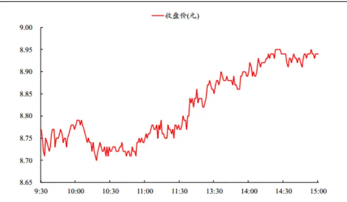
资料来源：上交所、深交所行情数据，兴业证券经济与金融研究院整理
数据日期：2023年3月31日

图4、非同步交易程度较低的股票（002368.SZ）
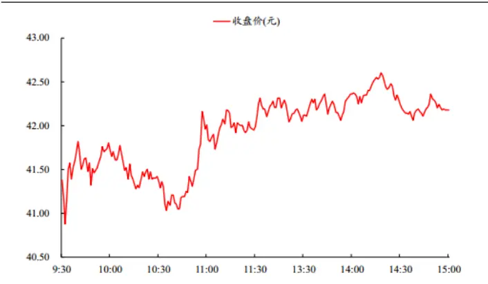
资料来源：上交所、深交所行情数据，兴业证券经济与金融研究院整理
数据日期：2023年3月31日

在具体计算维度，我们同时以分钟级收益率和分钟级成交量占 作为时间序列数据，统计其在量和价上的 阶稳定性，并最终取时序上15 均值作为最终因 ，分为叫做rtn_LBQ与vol_LBQ。均值越 ，说明该股的 同步交易程度越 ，个股在低流动性下股价被操纵的可能性较 ，下 险较 。此外，我们延续上 章节的想法，等权合成两个因 ，记为LBQ_Comb。

从 度IC测试结果上看， 同步交易性因 表现较好，其中以成交量占 构建的因 更为出 ，RankIC均值为5.28%，ICIR 于0.5，表现出较好的股价预测能 。

表8、非同步交易性因子 Rank IC 测试结果

| 因子名称 | IC 均值 | IC 标准差 | ICIR T统计量 |
| --- | --- | --- | --- |
| rtn_LBQ | 2.55% | 5.05% 0.51 | 23.19 |
| vol_LBQ | 5.28% | 10.35% 0.51 | 23.41 |
| LBQ_Comb | 4.86% | 8.16% 0.60 | 27.33 |

资料来源：上交所、深交所行情数据，Wind，聚源，兴业证券经济与金融研究院整理

从 度组合测试结果上看， 同步交易性因 的表现 分优秀，多空夏普均较 ，且 明显回撤，多头收益率较 ，基于成交量序列构建的LBQ因 优于基于收益率构建的因 。具体来看，从多空组合测试上看，LBQ_Comb的多空收益率在49%左右，多头收益率约为23%，夏普 率在6左右。

表9、非同步交易性因子组合测试结果

| 因子名称 | 多空收益率 | 多头收益率 | 空头收益率 | 年化波动率 | 夏普比率 | 最大回撤 | 多头换手率 |
| --- | --- | --- | --- | --- | --- | --- | --- |
| rtn_LBQ | 33.7% | 16.8% | -13.3% | 5.8% | 5.78 | -7.0% | 17.3% |
| vol LBQ | 43.3% | 23.8% | -15.4% | 9.7% | 4.45 | -8.5% | 9.8% |
| LBQ_Comb | 49.2% | 23.1% | -19.0% | 8.6% | 5.75 | -6.7% | 14.2% |

资料来源：上交所、深交所行情数据，Wind，聚源，兴业证券经济与金融研究院整理

从多空净值曲线以及分位数组合测试结果上看，LBQ_Comb因 的多空净值 期呈现上升趋势，且最近 年明显回撤，表现 分稳定。

图 5、LBQ_Comb 因子 Rank IC 和累计 IC
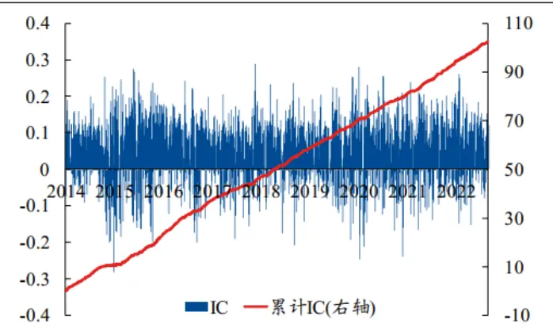
资料来源：上交所、深交所行情数据，Wind，聚源，兴业证券经济与金融研究院整理

图 6、LBQ_Comb 因子多空组合净值
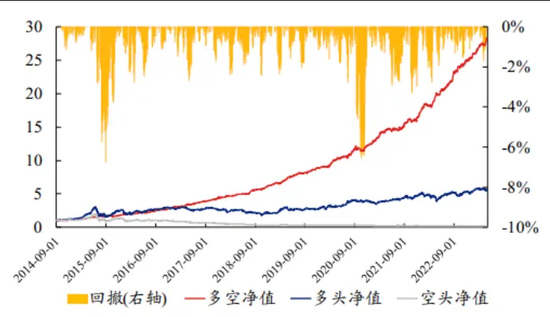
资料来源：上交所、深交所行情数据，Wind，聚源，兴业证券经济与金融研究院整理

## 条件分布 法简述—以 波收益率均值为例

在前序章节中，我们从时序 相关性的 度出发构建了多类因 。在之后的篇幅中，我们将从条件分布的 度出发，从基础因 逐步延伸 两个特异因 。

期以来，在 多数研究中，流动性资产的收益率分布均假设其服从正态分布。然 ，其假设 多建 在市场为有效市场的背景之下。在 弱式有效市场的背景之下，市场和个股内外部条件的变化使得收益率的统计分布特征发 变化。对于 内收益率 ，其 的 独 同分布特征更加明显（具体可参 报告《 频研究系列 —收益率分布因 构建》）。因此，我们在本章中引 条件分布，以此假设 内收益率在 定已知条件下服从某 分布。举例来说，我们可以假设收益率在 定条件下服从正态分布。

$$
rt{\pmb n}\mid Condition\sim N(\mu,\sigma^{2})\tag{4}
$$

因此，在条件分布的基础上，对于已知条件的刻画以及对于分布的假设便是提取时序信息构建相关因 的重要步骤。条件分布类因 本质上基于过去 段时间的数据特征，对 频样本数据进 分类、筛选或重构，并进 步刻画新构建的数据特征。在本章中，我们以已实现波动率作为条件，计算各个分钟节点过去30分钟的5分钟滚动收益率标准差，并筛选出标准差处于 内该股80%分位数以上的时间节点，并统计该时间节点中5分钟滚动收益率的均值，最终构建因 highStdRtn_mean。

## 波收益率均值因 表现与分析

细 的读者可能会发现，该因 与此前构建的常 收益率分布因 —5分钟滚动收益率rtn5_mean因 相近。两者在构建 式上 乎 致，仅是 波收益率均值因 在样本选择上有所筛选，这也是条件分布的重点。我们对在测试中，我们也将该因 与5发现，两者的相关性仅0.61，且与底层其他所有 频因 的相关性均低于0.6。分钟滚动收益率因 进 正交化处理，记为highStdRtn_meanN，并进 回测测试。经过正交化后的因 与底层所有 频因 的相关性最 仅0.35。

从 度IC测试结果上看，highStdRtn_mean因 表现较好，Rank IC均值为3.34%，ICIR为0.72，表现出较好的股价预测能 。经过rtn5_mean正交化后的因 保持着较好的选股能 ，ICIR为0.41。

表 10、高波收益率均值因子 Rank IC 测试结果

| 因子名称 | IC 均值 | IC 标准差 | ICIR | T统计量 |
| --- | --- | --- | --- | --- |
| highStdRtn_mean | 3.34% | 4.65% | 0.72 | 33.00 |
| highStdRtn_meanN | 1.76% | 4.27% | 0.41 | 18.84 |

资料来源：上交所、深交所行情数据，Wind，聚源，兴业证券经济与金融研究院整理

从 度组合测试结果上看，highStdRtn_mean因 的表现同样优秀。具体来看，从多空组合测试上看，该因的多空收益率在41%左右，多头收益率约为14%，夏普 率在7左右。此外，经过rtn5_mean正交化后的因 仍保持着较好的选股能 ，其多空的夏普 率约为4.8。因此，我们认为：只要选择有效且适合的条件进 筛选，同样的统计量也能提取 内 频数据不同的数据特征，进 构造出具有 定特异性的因 。

表11、高波收益率均值因子组合测试结果

| 因子名称 | 多空收益率 | 多头收益率 | 空头收益率 | 年化波动率 | 夏普比率 | 最大回撤 | 多头换手率 |
| --- | --- | --- | --- | --- | --- | --- | --- |
| highStdRtn_mean | 41.2% | 14.3% | -19.4% | 5.5% | 7.48 | -3.9% | 20.3% |
| highStdRtn_meanN | 20.7% | 10.3% | -9.1% | 4.4% | 4.76 | -4.2% | 19.7% |

资料来源：上交所、深交所行情数据，Wind，聚源，兴业证券经济与金融研究院整理

## 5、考虑股价 相关性的 险度量因

在上 章节中，我们简单介绍了条件分布下的因 构建逻辑，并以 波收益率均值因 作为样例，表明即使是相同的统计量，使 不同的筛选条件也能构造出具有 定特异性的因 。在本章中，我们引 股价的 相关性，通过考虑 相关来修正 前的 险度量指标VaR，并由此构造在股价 相关性显著的条件下的VaR因 。

## 股价 相关性和VaR推导

论是在学术界还是投资界，如何度量 险都是难以绕开的问题。VaR（ValueatRisk）便是其中 种最为常的度量 式。其通常指在 定的假设以及给定的置信区间内，投资组合在既定的时期内可能遭受的最 价值损失。其核 功能是针对流动性资产的 险度量。在往期的报告中，我们就曾参考VaR的定义，构建了极值收益率分布因，详 报告《 频研究系列三—收益率分布中的Alpha(2)》。

力自 目 风心然 ，对于基础的VaR定义 ，其假设流动性资产的收益率在某 时间段内服从正态分布，并进 步假设流日动性资产的价格波动是随机的，不存在 相关性。然 ，在此前的报告中我们也提及，收益率在不同的时间区间内，尤其是在 内极容易偏离正态分布。此外，在实际计算中我们也发现，对于 内股票价格序列 ，其价格的相关性相对显著。因此，若以VaR作为股票 内价格波动的 险度量可能并不准确。在本章中，我们将假设价格序列存在 相关性，即股价波动并不随机的情况下，通过 元正态分布刻画 内的个股VaR值，并最终构建因 。

具体来说，我们 先假设股票价格服从以下分布

$$
\ln P_{t+n}-\ln P_{t}\sim N\left[\left(\mu-\frac{\sigma^{2}}{2}\right)\cdot n,\sigma\cdot\sqrt{n}\right]\tag{5}
$$

其中， $P_{t+n}$ 为未来时刻的股票价格， $P_{t}$ 为当前时刻的股票价格。我们设置n=1，即价格时差为1分钟。由于需要考虑到分钟级股价存在 相关性，我们进 步假设其 $InP_{t+1}$ 与 $InP_{t}$ 之间的相关系数为 $|\rho_{\sf{c}}$

在此基础之上，我们假设 $InP_{t+1,}InP_{t)}$ 服从 元正态分布，且两者具有 样的均值和标准差。由此，我们可得

$$
(\ln P_{t+1},\ln P_{t})\sim\mathrm{N}(\mu,\mu,\sigma^{2},\sigma^{2},\rho)\tag{6}
$$

我们构建了前后对数价格的二元正态分布 $\pmb{X}=\binom{\ln P_{t+1}}{\ln P_{t}}$ ，其均值 $\pmb{\mu}={\binom{\mu}{\mu}}$ ${\pmb{\Sigma}}=$ $\sigma^{2}\left[\begin{array}{ll}{1}&{\rho}\\{\rho}&{1}\end{array}\right]$

进一步，我们计算对数收益率 $R_{t}=\ln P_{t+1}-\ln P_{t}$ ，由此得到

$$
Y={\binom{R_{t}}{\ln P_{t}}}={\binom{\ln P_{t+1}-\ln P_{t}}{\ln P_{t}}}={\binom{1}{\bf0}}\quad{\begin{array}{cc}{-{\bf1}}\\{{\bf1}}\end{array}}X=CX\tag{7}
$$

其中 $\pmb{C}=\bigl[\begin{array}{ll}{1}&{-1}\\{0}&{1}\end{array}\bigr]$ 。由此，我们得到Y的分布为 $N{\sim}(C\mu,C\Sigma C^{\prime})$ 。由此，我们在考虑了对数价格的前后自相关性后，得到了收益率与对数股票价格的二元正态分布。最后，在股票价格ln $P_{t}$ 已知的情况下，我们最终得到在考虑了股票价格自相关性下的 VaR。其中， $\rho_{\mathrm{-}}$ 为对数价格的前后分钟相关性， $\mu$ 为日内分钟级对数价格的均值， $\sigma$ 为日内分钟级对数价格的标准差，同时我们假设 $P_{t}$ 为当日收盘价， $Z_{\alpha}=$ 1.96。

基于上述推导，我们可以知道：假设 相关的绝对值相同的情况下， 相关为正（趋势性更强）且收盘价 于当 均价的股票可能处于下 通道， 险较 ； 相关为正（趋势性更强）但收盘价 于当 均价的股票可能处于上行通道， 风险较 小；反之， 相关为负（反转性更强）且收盘价 于当 均价的股票可能处于向上反弹通道，险 ； 相关为负（反转性更强）但收盘价 于当 均价的股票可能处于向下反弹通道， 险 。

表 12、股价相关性 VaR 公式解析

| ${\mathbf{\mu}}-{\mathbf{\mu}}{\mathbf{\rho}}_{t}>\mathbf{0}$ |  | ${\mu}-{\mathrm{In}}P_{t}<0$ |
| --- | --- | --- |
| ${\mathrm{\Omega}}\mathrm{\ p}>0,$ $\|\boldsymbol\rho\|=a$ | 风险偏大 | 风险偏小 |
| $\begin{array}{r}{\rho<0,}\end{array}$ $\|\boldsymbol\rho\|=a$ | 风险小 | 风险大 |

资料来源：兴业证券经济与金融研究院整理

计算得到个股每 的股价相关性VaR之后，我们取时序上15 标准差作为最终因 ，叫做rtn_condVaR。标准差越 ，说明该股过去 段时间内的 险不稳定性越 ，个股下 险较 。

从 度IC测试结果上看，股价相关性VaR因 表现较好，RankIC均值为4.01%，ICIR 于0.5，表现出较好的股价预测能 。

表 13、股价相关性 VaR 因子 Rank IC 测试结果

| 因子名称 | IC 均值 | IC 标准差 | ICIR | T统计量 |
| --- | --- | --- | --- | --- |
| rtn_condVaR | 4.01% | 7.71% | 0.52 | 23.87 |

资料来源：上交所、深交所行情数据，Wind，聚源，兴业证券经济与金融研究院整理

从 度组合测试结果上看，股价相关性VaR因 的表现 分优秀，因 的多空收益率在44%左右，多头收益率约为21%，夏普 率在5.7左右。

表14、股价相关性 VaR 因子组合测试结果

| 因子名称 | 多空收益率 | 多头收益率 | 空头收益率 | 年化波动率 | 夏普比率 | 最大回撤 | 多头换手率 |
| --- | --- | --- | --- | --- | --- | --- | --- |
| rtn_condVaR | 44.1% | 21.1% | -16.7% | 7.8% | 5.66 | -7.6% | 10.4% |

资料来源：上交所、深交所行情数据，Wind，聚源，兴业证券经济与金融研究院整理

从多空净值曲线以及分位数组合测试结果上看，股价相关性VaR因 的多空净值 期呈现上升趋势，且最近年 明显回撤，表现 分稳定。

图 7、股价相关性 VaR 因子 Rank IC 和累计 IC
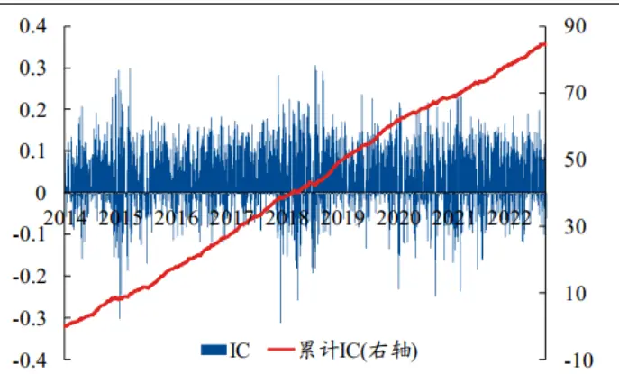
资料来源：上交所、深交所行情数据，Wind，聚源，兴业证券经济与金融研究院整理

图 8、股价相关性 VaR 因子多空组合净值
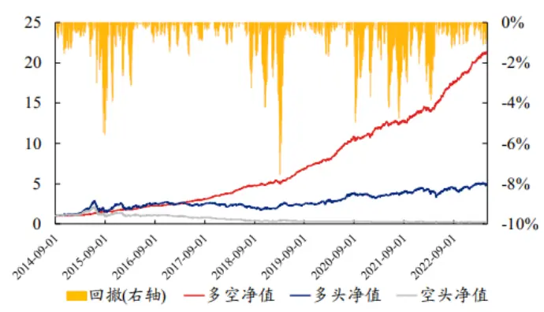
资料来源：上交所、深交所行情数据，Wind，聚源，兴业证券经济与金融研究院整理

## 6、“闪电崩盘”、连续下跌和“崩盘概率”因

前序 章中，我们简单介绍了条件分布下的因 构建逻辑，并以 波收益率均值因 作为样例，表明即使是相同的统计量，使 不同的筛选条件也能构造出具有 定特异性的因 。此外，我们引 股价的 相关性并构造在股价 相关性显著的条件下的VaR因 。在本章中，我们从“闪电崩盘”的 度出发，通过观察“闪电崩盘”的特征，设置前 时刻收益率的正负性异构得到个股 内连续上涨/下跌次数的样本数据，并进 步构建出“崩盘概率”因 。

## “闪电崩盘”现象简析

闪电崩盘的概念在2010年起开始逐步受到重点关注。最为著名的例 便是2010年5 6 美股的“千点 跌”事件。在当 下午2点42分 47分，道琼斯指数下跌约1000点。现如今，对于当时出现崩盘的原因众说纷纭，但不可否认的是，闪电崩盘对投资者 理和交易 为带来的负 影响是极 且深远的。 此，闪电崩盘开始迅速进 市场投资者的眼中。

如今，闪电崩盘通常指流动性资产的价格在 内短时间出现 幅超跌，同时后续允许价格出现恢复，即在 内在A股市场中同样存在着这样的价格 势，尤其是在2022年以来市场出现 幅回调的时出现深“V”的价格 势。期。以300659.SZ2023年3 31 的价格 势为例，当 该股开盘约32元，在10点半左右，该股收盘价跌 28.58元，相对于9点30分收盘价跌幅达8.63%。此后股价攀升并持续震荡，最终价格收于30.2元。不难看出，当 便是相对明显的价格深“V” 势，这便是接近于“闪电崩盘”的 个交易 样例。

图 9、300659.SZ 日内价格走势
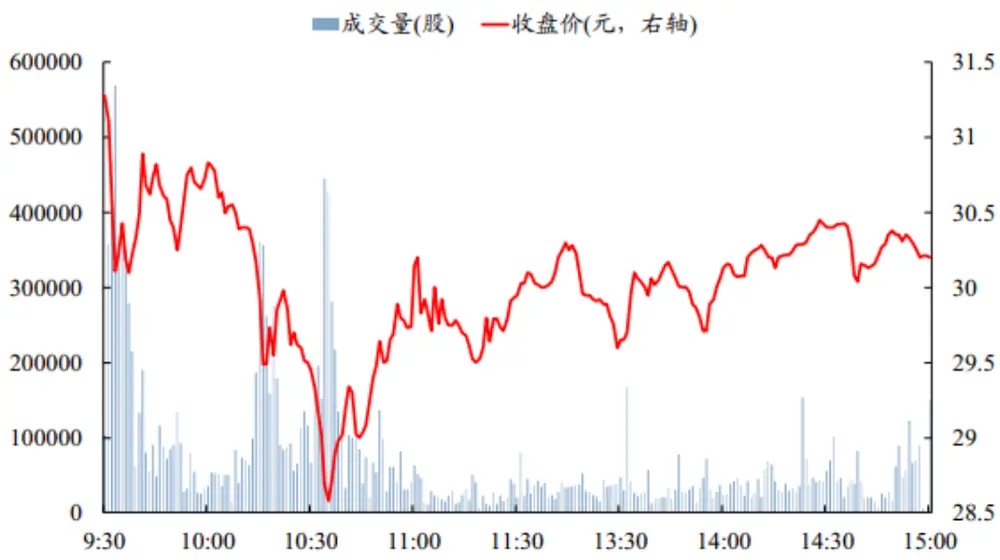
资料来源：上交所、深交所行情数据，兴业证券经济与金融研究院整理注：数据日期为2023年3月31日

虽说“闪电崩盘”通常伴随着价格后期的恢复，然 ，其出现时在 内造成的恐慌情绪则不可 觑。因此，本将通过对 内连续下 收益率进 特征刻画，来衡量个股“崩盘”的概率，进 构造因 。

## 连续下跌和泊松分布下的“崩盘”概率因

在上述对于闪电崩盘的刻画中我们发现：在 内出现闪电崩盘时， 内的分钟级别收益率 多会出现多次的连续负数。我们将该现象刻画为：分钟级别的连续下跌次数。以2022年3 9 的沪深300指数的价格 势为例，当沪深300指数在11:22 11:29的8个分钟内，分钟级别收益率连续为负，跌幅为-0.5%。同时， 内多次出现类似的情况，如9:53 9:57；10:35 10:39等。我们统计了当 连续下跌次数的样本值，具体计算 式为：

1.按照时间顺序逐个寻找：若 个分钟级收益率为负数，则开始统计连续分钟收益率为负数的个数，直 下个收益率 负，则停 计数，该个数则为 个连续下跌次数的样本点；

2.跳过之前被计数的分钟收益率样本点，继续寻找负数分钟收益率并按照步骤1计数，直 当 未统计的分钟收益率。

我们假设 内分钟级收益率连续上涨和下跌次数（连续上涨的统计 式与下跌类似，只是将负数收益率改为正，此外， 段时间内连续下跌趋势越明显，未来市场的波动率也越 。数收益率）出现的概率近似服从泊松分布因此，若当 连续下跌次数相对较多，则未来价格在 内 概率会出现连续下跌的次数较多、跌幅较 、且波动率较 的特性。因此，我们可以基于 内的收益率样本数据，来估计未来连续下跌次数相对于连续上涨次数的 ，若连续下跌与连续上涨的差异较 ，未来出现闪电崩盘的概率则较 。由此，我们的计算 式如下：

1.首先基于前一个交易日的分钟级收益率序列，计算得到的连续上涨/下跌次数的样本数据，并进一步计算得到对于连续下跌泊松分布中参数λ的估计；

2. 计算个股连续下跌和连续上涨的差异：x为全市场当日连续上涨 $\lambda_{t}^{pos}$ 中位 数，x+k为当日连续下跌 $\lambda_{t}^{neg}$ 前25%分位数;

3.最终引入泊松分布的累计分布函数，计算得到“崩盘”概率。

最终，我们计算个股过去15 “崩盘”概率的标准差，记为 ashCrashProb因 。标准差越 ，说明该股下险较 ，预期收益较低。

从 度IC测试结果上看，“崩盘”概率因 表现良好，RankIC均值为1.65%，ICIR约为0.3，表现出 定的股价预测能 。

表 15、“崩盘”概率因子Rank IC 测试结果

| 因子名称 | IC 均值 | IC 标准差 | ICIR | T统计量 |
| --- | --- | --- | --- | --- |
| flashCrashProb | 1.65% | 5.45% | 0.30 | 13.89 |

资料来源：上交所、深交所行情数据，Wind，聚源，兴业证券经济与金融研究院整理

从 度组合测试结果上看，“崩盘”概率因 的表现 分优秀，因 的多空收益率在25%左右，多头收益率约为13%，夏普 率在5.2左右。

表16、“崩盘”概率因子组合测试结果

| 因子名称 | 多空收益率 | 多头收益率 | 空头收益率 | 年化波动率 | 夏普比率 | 最大回撤 | 多头换手率 |
| --- | --- | --- | --- | --- | --- | --- | --- |
| flashCrashProb | 25.1% | 13.3% | -9.1% | 4.8% | 5.21 | -3.7% | 11.1% |

资料来源：上交所、深交所行情数据，Wind，聚源，兴业证券经济与金融研究院整理

从多空净值曲线以及分位数组合测试结果上看，“崩盘”概率因 的多空净值 期呈现上升趋势，且最近 年明显回撤，表现 分稳定。

图 10、“崩盘”概率因子 Rank IC 和累计 IC
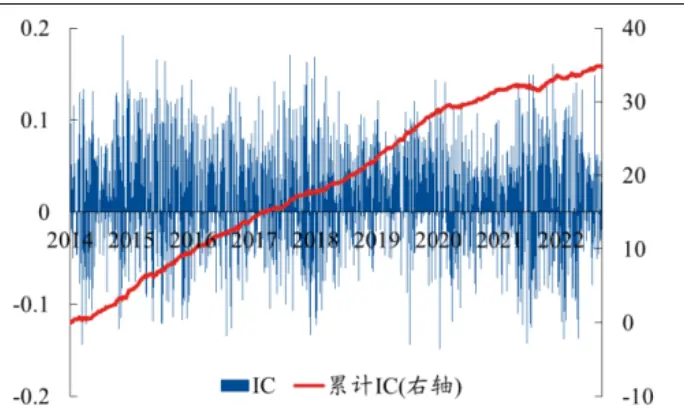
资料来源：上交所、深交所行情数据，Wind，聚源，兴业证券经济与金融研究院整理

图11、“崩盘”概率因子多空组合净值
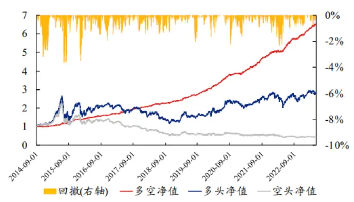
资料来源：上交所、深交所行情数据，Wind，聚源，兴业证券经济与金融研究院整理

## 7、相关性检验与时序信息复合因

## 时序信息因 正交化处理与相关性检验

由此，我们从时序相关性和条件分布两个 度，最终构建了7个时序信息因 ，具体定义如下。在本节中，我们 先测试下述7个因 与兴证 团队底层多个 频因 的时序相关性，并与底层相关性最 的因 进 正交化处理，保证正交化后的时序因 的最 相关性约在0.6以下。在测试中发现，“闪电崩盘”概率因 的相关性本 较低，最 相关性仅0.4，不需要进 正交化处理。

表17、时序信息因子定义

| 因子名称 | 因子定义 |
| --- | --- |
| foc_Comb | 收益率与成交量占比的一阶自相关系数 |
| DW_Comb | 收益率与成交量占比的D-W统计量 |
| rho_Comb | 收益率与成交量占比的残差自相关系数 |
| LBQ_Comb | 基于收益率与成交量占比刻画非同步交易程度 |
| highStdRtn_mean | 高波动率下的收益率均值 |
| rtn_condVaR | 存在股价相关性下的 VaR |
| flashCrashProb | “闪电崩盘”概率因子 |

资料来源：兴业证券经济与金融研究院整理

先我们展 各个因 正交化后，与底层 频因 的相关性。从结果上看，经过正交化后各个因 的时序相关首 子高性均降低 至0.6以下，其中残差 相关系数、 波收益率均值等因 的相关性较低，最 相关性在0.5以下。

图12、时序信息因子正交化后相关性箱型图
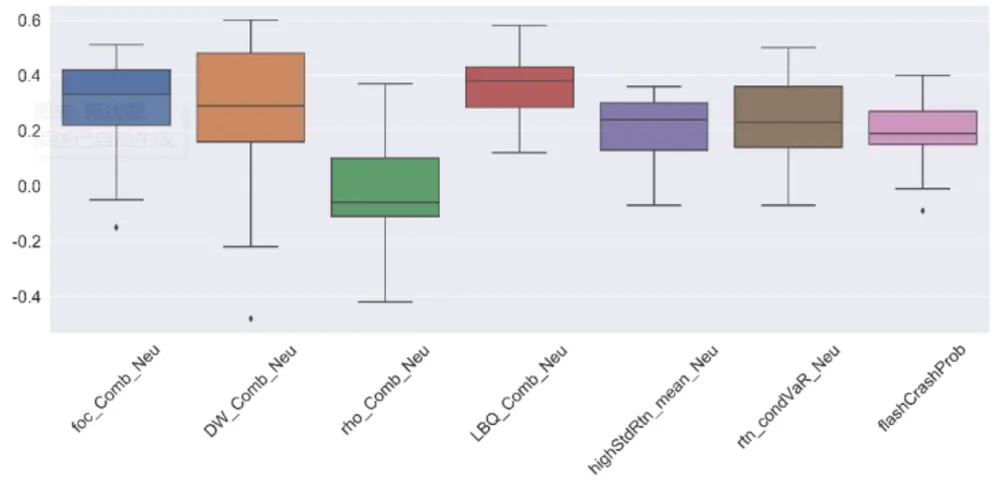
资料来源：上交所、深交所行情数据，Wind，聚源，兴业证券经济与金融研究院整理

从 度IC测试结果上看，经过正交化后各个因 仍保持着较好的选股能 。其中， 阶 相关系数、 同步交易程度与D-W统计量因 的RankIC均值较 ， 乎都在3%以上。

表 18、正交化后的时序信息因子 Rank IC 测试结果

| 因子名称 | IC 均值 | IC 标准差 | ICIR | T统计量 |
| --- | --- | --- | --- | --- |
| foc_CombN | 4.27% | 6.93% | 0.62 | 28.28 |
| DW_CombN | 2.98% | 10.07% | 0.30 | 13.59 |
| rho_CombN | 1.24% | 6.51% | 0.19 | 8.75 |
| LBQ_CombN | 3.04% | 4.53% | 0.67 | 30.79 |
| highStdRtn_meanN | 1.76% | 4.27% | 0.41 | 18.91 |
| rtn_condVaRN | 2.33% | 5.63% | 0.41 | 19.01 |
| flashCrashProb | 1.65% | 5.45% | 0.30 | 13.89 |

资料来源：上交所、深交所行情数据，Wind，聚源，兴业证券经济与金融研究院整理

从 度组合测试结果上看，“经过正交化后各个因 的组合测试结果优秀， 乎所有因 的多空夏普 率 于3。其中，部分因 在正交化后的夏普 率和多空年化收益率保持优秀。以 同步交易程度LBQ因 为例，该因的多空年化收益率为34%，多头年化收益率约为19%，多空夏普 率为6.4。此外， 阶序列相关系数因 的多头年化收益率约为27%。

表19、正交化后的时序信息因子组合测试结果

| 因子名称 | 多空收益率 | 多头收益率 | 空头收益率 | 年化波动率 | 夏普比率 | 最大回撤 | 多头换手率 |
| --- | --- | --- | --- | --- | --- | --- | --- |
| foc_CombN | 43.7% | 26.8% | -12.5% | 7.0% | 6.27 | -7.2% | 12.0% |
| DW_CombN | 21.8% | 17.1% | -5.8% | 9.0% | 2.42 | -9.1% | 8.9% |
| rho_CombN | 22.8% | 15.4% | -5.6% | 5.9% | 3.84 | -4.8% | 14.2% |
| LBQ_CombN | 34.2% | 18.6% | -12.0% | 5.3% | 6.40 | -6.2% | 17.4% |
| highStdRtn_meanN | 20.7% | 10.3% | -9.1% | 4.4% | 4.76 | -4.2% | 19.7% |
| rtn_condVaRN | 19.6% | 15.3% | -3.7% | 5.6% | 3.48 | -7.9% | 14.1% |
| flashCrashProb | 25.1% | 13.3% | -9.1% | 4.8% | 5.21 | -3.7% | 11.1% |

资料来源：上交所、深交所行情数据，Wind，聚源，兴业证券经济与金融研究院整理

## 时序信息复合因 构建与测试

最后，我们尝试基于本 最终推荐的七个 频时序因 ，构建时序信息复合因 ，并在多种股票池内进 周度和 度换仓的测试，以测试 频因 在中低频换仓和不同股票池内的表现。在合成之前，我们先测试这七个因 的相关性。从测试结果上看，各个因 的时序相关性较低，最 为0.5。这从侧 反映出我们构建的因 在不同的度提取了 频数据中的时序信息。

图13、正交化后的时序信息因子间相关性

|  | foc_ CombN | DW CombN | rho_CombN | LBQ CombN | highStdRtn_meanN | rtn_condVaRN flashCrashProb |  |
| --- | --- | --- | --- | --- | --- | --- | --- |
| foc_CombN |  | 0.50 | 0.16 | 0.37 | 0.36 | 0.14 | 0.10 |
| DW_CombN | 0.50 |  | -0.23 | 0.42 | 0.26 | -0.06 | -0.07 |
| rho_CombN | 0.16 | -0.23 |  | 0.04 | 0.15 | 0.37 | 0.33 |
| LBQ_CombN | 0.37 | 0.42 | 0.04 |  | 0.45 | 0.33 | 0.37 |
| highStdRtn_meanN | 0.36 | 0.26 | 0.15 | 0.45 |  | 0.25 | 0.34 |
| rtn_condVaRN | 0.14 | -0.06 | 0.37 | 0.33 | 0.25 |  | 0.23 |
| flashCrashProb | 0.10 | -0.07 | 0.33 | 0.37 | 0.34 | 0.23 |  |

资料来源：上交所、深交所行情数据，Wind，聚源，兴业证券经济与金融研究院整理

我们 先以周度换仓的形式，测试其在全市场、沪深我们等权合成上述七个因 ，记为时序信息复合因 。300、中证500、中证800、中证1000与国证2000 的表现。具体地，我们在各个股票池进 RankIC和分位数组合测试。其中，在沪深300、中证500与中证800中我们进 五分位组合测试，其余进 分位组合测试。

先展 时序信息复合因 周度调仓的RankIC测试结果。从测试结果上看，该因 表现 分优秀，尤其是在中 盘股票池内。具体来说，该因 在全市场内周度RankIC均值为6.64%，ICIR为0.98。此外，因 在中证1000与国证2000内的表现 分出 ，ICIR接近或超过1。

表 20、时序信息复合因子周度 Rank IC 测试结果

| 股票池 | IC 均值 | IC 标准差 | ICIR | T统计量 |
| --- | --- | --- | --- | --- |
| 全市场 | 6.64% | 6.75% | 0.98 | 20.72 |
| 沪深300 | 2.80% | 12.40% | 0.23 | 4.76 |
| 中证500 | 5.21% | 9.54% | 0.55 | 11.49 |
| 中证800 | 4.10% | 10.04% | 0.41 | 8.60 |
| 中证 1000 | 6.30% | 7.16% | 0.88 | 18.39 |
| 国证 2000 | 7.18% | 6.80% | 1.06 | 22.21 |

资料来源：上交所、深交所行情数据，Wind，聚源，兴业证券经济与金融研究院整理

从复合因 的周度分位数组合测试结果上看，该因 在不同的股票池内均呈现出明显的单调特征，且多头组合均明细战胜基准，除沪深300对应测试，其多空组合的夏普 率均 于1。具体来看，该因 在全市场 分位组合测试中，多头组合年化收益率为26.7%，同期基准为10.8%，多空夏普 率为4.91。此外，该因 在国证2000内的多空夏普 率为5.35，在中证1000内的多空夏普 率为4.18，因 在中 盘股票上的表现优秀。

图14、时序信息复合因子周度分位数组合测试结果

| 股票池 组合 | 年化收益率 | 波动率 Shaipe比率平均换手率 | 0.57 | 63.6% | 最大回撤率 34.6% |  | 年化超额收益率 3.6% | 股票池 组合 | 年化收益率 |  | 波动率 Sharpe比率 平均换手率 |  | 最大回撤率 年化超额收益率 |  |
| --- | --- | --- | --- | --- | --- | --- | --- | --- | --- | --- | --- | --- | --- | --- |
|  | Top 1 | 12.0% | 20.9% | 114.7% |  |  |  | Top 1 | 14.3% | 23.0% 23.6% | 0.62 | 65.2% | 37.7% | 5.3% |
|  |  | 10.4% | 21.5% |  | 37.3% |  |  | 2 3 | 14.3% 10.0% | 23.7% | 0.61 0.42 | 116.6% 122.9% | 36.6% 45.0% | 5.5% 1.6% |
|  | 2 | 7.7% | 22.3% | 121.2% | 44.8% | 0.1% |  |  |  |  |  |  |  |  |
|  | 3 | 8.9% | 23.6% | 112.5% | 48.2% | 1.5% | 中证800 |  | 6.4% | 24.7% | 0.26 | 113.0% | 51.9% | -1.6% |
|  | Bottom | -0.5% | 24.5% | 63.2% | 63.0% | -7.2% |  |  | Bottom | 26.1% | -0.09 | 65.3% | 69.9% | -9.4% |
|  | 市场 | 7.7% | -0.02 21.4% |  | 45.7% |  |  |  | -2.3% 8.5% | 22.9% | 0.37 |  | 49.1% | 0.0% 0.3% |
|  | L-S | 10.8% | 0.36 11.9% 0.91 |  |  |  |  | 市场 L-S | 15.4% | 10.7% 1.44 |  |  |  |  |
| 股票池 | 组合 | 年化收益率 |  | 波动率 Sharpe比率平均换手率 |  | 36.9% 最大回撤率 | 年化超额收益率股票池 | 组合 | 年化收益率 |  |  | 波动率 Sharpe比率平均换手率 | 25.0% 最大回撤率 | 年化超额收益率 |
|  | Top | 15.9% | 25.0% | 68.5% | 37.4% |  | 6.5% | Top 1 | 20.5% | 28.2% | 0.73 | 72.0% | 41.6% | 11.4% |
|  | 1 | 15.3% | 25.7% | 0.59 0.41 | 119.4% | 39.4% | 6.3% | 2 3 Bottom | 17.4% | 29.4% | 0.59 | 120.3% | 45.0% | 8.9% |
|  | 2 | 10.7% | 26.1% | 126.1% | 46.3% | 2.1% | 中证1000 |  | 12.7% | 29.6% | 0.43 | 126.7% | 50.4% | 4.6% |
|  | 3 | 7.7% | 27.0% | 117.0% | 53.8% |  | -0.6% |  |  | 30.2% | 0.12 | 118.1% | 67.3% | -3.6% |
|  | Bottom | -5.7% | 28.1% | 70.9% | 75.9% |  | -12.7% |  | 3.8% -12.0% | 30.6% | -0.39 | 73.7% | 84.6% | -18.3% |
|  | 市场 | 8.8% | 24.6% |  | 51.6% | 0.0% |  |  | 8.4% | 27.2% | 0.31 4.18 |  | 56.2% 5.4% |  |
|  | L-S 股票池 | 21.1% | 11.0% 1.92 |  |  |  | 4.2% |  | 35.5% |  |  |  |  |  |
|  | 组合 | 年化收益率 |  | 波动率 Shaipe比率平均换手率最大回撤率年化超额收益率股票池 |  |  |  | 组合 | 年化收益率 29.0% |  |  |  |  | 波动率 Sharpe比率平均换手率 最大回撤率 年化超额收益率 |
|  | Top | 26.7% | 26.1% | 1.02 | 85.7% | 35.9% | 14.3% | Top |  | 28.0% | 1.03 | 88.1% | 38.2% | 14.0% |
|  | 1 | 21 2.8% | 26.9% | 0.85 | 140.1% | 36.6% | 11.1% | 1 | 7.1% | 28.9% | 0.94 | 142.0% | 37.8% | 12.6% |
|  | 2 | 21 2.1% | 27.2% | 0.81 | 153.4% | 37.5% | 10.5% | 2 3 | 4.2% | 29.4% | 0.82 | 154.4% | 43.2% | 10.3% |
|  | 3 | 1 8.8% | 27.6% | 0.68 | 158.5% | 39.3% | 7.6% |  | 0.9% | 29.6% | 0.71 | 159.8% | 43.6% | 7.4% |
|  | 5 | i† 7.5% | 27.3% | 0.64 | 159.6% | 41.9% | 6.3% | 5 | 2 1.1% | 29.5% | 0.72 | 161.0% | 43.2% | 7.5% |
|  | 6 | 13.2% | 27.8% | 0.48 | 159.5% | 49.9% | 2.6% | 6 | 14.8% | 30.3% | 0.49 | 160.8% | 48.8% | 2.1% |
|  | 7 | 91% | 27.9% | 0.32 | 156.8% 150.3% | 56.5% | -1.1% | 7 | 9.9% | 29.8% | 0.33 | 157.9% | 59.4% | -2.3% |
|  | 8 | 24% 9% | 28.7% 28.7% | 0.08 -0.07 | 135.8% | 67.4% 69.1% | -7.0% -10.9% | 8 | 9% | 30.6% 30.8% | 0.13 -0.07 | 151.8% 137.5% | 66.5% 72.0% | -7.6% -13.0% |
|  | 9 |  | 29.3% | -0.60 | 86.2% | 90.2% | -25.1% | 9 Bottom | 2.2% | 30.4% | -0.57 | 88.9% | 90.2% | -26.6% |
| Bottom | -17.5% |  | 0.42 |  |  |  | 市场 | -17.4% |  |  |  |  |  |  |
| 市场 | 10.8% | 25.8% | 4.91 |  | 50.1% | 0.0% |  | 13.3% | 27.0% | 0.49 |  | 50.4% |  |  |
| L-S | 51.0% | 10.4% |  |  | 11.0% | 26.7% |  | 53.9% | 10.1% | 5.35 |  | 7.2% |  |  |

资料来源：上交所、深交所行情数据，Wind，聚源，兴业证券经济与金融研究院整理

我们进 步展 时序信息复合因 度调仓的RankIC测试结果。从测试结果上看，该因 表现同样优秀，尤其是在中 盘股票池内。具体来说，该因 在全市场内 度RankIC均值为8.07%，ICIR为1.32。此外，因 在中证十1000与国证2000内的表现 分出 ，ICIR均超过1。

表 21、时序信息复合因子月度 Rank IC 测试结果

| 股票池 | IC 均值 | IC 标准差 | ICIR | T统计量 |
| --- | --- | --- | --- | --- |
| 全市场 | 8.07% | 6.12% | 1.32 | 13.38 |
| 沪深300 | 4.26% | 11.38% | 0.37 | 3.80 |
| 中证500 | 6.13% | 9.32% | 0.66 | 6.67 |
| 中证 800 | 5.27% | 9.34% | 0.56 | 5.72 |
| 中证 1000 | 7.93% | 6.82% | 1.16 | 11.74 |
| 国证 2000 | 8.33% | 5.99% | 1.39 | 14.12 |

资料来源：上交所、深交所行情数据，Wind，聚源，兴业证券经济与金融研究院整理

从复合因 的 度分位数组合测试结果上看，该因 在不同的股票池内均呈现出明显的单调特征，且多头组合均明细战胜基准，除沪深300对应测试，其多空组合的夏普 率均 于1。具体来看，该因 在全市场 分位组合测试中，多头组合年化收益率为17.6%，同期基准为7.9%，多空夏普 率为3.28。此外，该因 在国证2000内的多空夏普 率为3.42，因 在中 盘股票上的表现优秀。

图15、时序信息复合因子月度分位数组合测试结果

| 股票池 波动率 Sharpe比率平均换手率 | 组合 年化收益率 |  | 0.48 | 114.3% | 最大回撤率 34.3% |  | 年化超额收益率 4.5% | 股票池 组合 | 年化收益率 | 波动率 Sharpe比率 平均换手率 |  |  | 最大回撤率 年化超额收益率 |  |
| --- | --- | --- | --- | --- | --- | --- | --- | --- | --- | --- | --- | --- | --- | --- |
|  | Top | 11.1% | 22.9% | 148.4% |  |  |  | Top 1 | 11.1% | 23.8% | 0.46 | 117.6% | 36.1% | 4.5% |
|  | 1 | 7.3% | 21.7% | 0.34 0.27 |  | 41.7% |  | 2 3 | 9.1% 8.2% | 23.7% 24.4% | 0.38 0.34 | 149.9% | 42.3% | 2.6% |
|  | 2 | 6.3% | 23.0% | 151.5% | 44.4% | 0.2% |  |  |  |  |  | 153.7% | 44.2% | 2.0% |
|  | 3 | 6.2% | 24.5% | 147.9% | 48.0% | 0.4% | 中证800 |  | 4.9% | 24.3% | 0.20 | 149.5% | 51.3% | -1.1% |
|  | Bottom | 0.7% | 25.8% | 114.7% | 59.6% | -4.7% |  |  | Bottom -1.6% | 25.7% | -0.06 | 119.3% | 66.7% | -7.1% |
|  | 市场 | 6.2% | 22.7% |  | 45.6% |  |  |  | 6.2% | 23.7% | 0.26 |  | 49.9% |  |
|  | L-S | 8.9% | 11.4% 0.78 |  |  |  |  | 市场 L-S 11.8% |  |  |  | 15.7% |  |  |
| 股票池 | 组合 | 年化收益率 | 波动率 | Sharpe比率平均换手率 0.43 | 122.3% | 41.2% | 最大回撤率年化超额收益率股票池 4.6% | 组合 | 年化收益率 |  |  |  |  | 波动率 Sharpe比率 平均换手率 最大回撤率 年化超额收益率 |
|  | Top | 10.9% | 25.7% |  |  |  |  | Top 1 | 12.2% | 29.8% | 0.41 | 130.0% | 45.4% | 6.6% |
|  | 1 | 9.8% | 25.8% | 0.38 0.29 | 153.0% | 39.0% | 3.5% | Bottom | 12.8% | 31.1% | 0.41 | 154.1% | 45.3% | 7.7% |
|  | 2 | 7.6% | 26.4% | 156.5% | 47.2% | 1.6% -1.1% | 中证1000 |  | 5.5% | 30.2% | 0.18 | 156.7% | 54.3% | 0.4% |
|  | 3 | 4.9% | 25.4% | 152.1% | 54.1% |  |  |  |  | 31.2% | 0.07 | 153.1% | 65.6% | -2.4% |
|  | Bottom | -2.7% | 26.6% | 128.3% | 72.1% |  | -8.1% |  | 22% 7.2% | 31.1% | -0.23 | 135.0% | 77.0% | -11.5% |
|  | 市场 | 6.1% | 25.1% |  | 52.7% 14.3% |  |  |  | 5.2% | 29.6% | 0.18 2.50 |  | 58.4% |  |
|  | L-S 股票池 组合 | 13.1% | 9.7% 1.35 |  |  |  |  |  | L-S 19.8% 组合 年化收益率 |  |  |  |  | 4.2% |
|  |  | 年化收益率 |  | 波动率Shaipe比率平均换手率 最大回撤率 年化超额收益率股票池 |  |  |  | Top | 19.0% | 29.7% | 0.64 | 149.4% | 36.1% | 波动率 Sharpe比率平均换手率 最大回撤率 年化超额收益率 8.2% |
|  | Top 1 | 17.6% | 28.1% 27.8% | 0.63 0.53 | 146.3% 170.9% | 34.4% 35.5% | 9.0% 6.4% |  | 15.9% | 30.7% | 0.52 | 172.7% | 38.7% | 5.8% |
|  | 2 | 14.8% |  |  |  |  |  | 1 2 |  | 30.7% | 0.57 | 176.1% | 39.8% | 7.2% |
|  | 3 | 15.2% 12.7% | 28.5% 28.9% | 0.53 | 174.6% 177.2% | 37.6% 41.7% | 6.9% | 3 | 17.4% | 31.2% | 0.46 | 177.9% | 43.2% | 4.6% |
|  | 5 | 10.3% | 28.6% | 0.44 | 177.1% | 46.8% | 4.8% | 5 | 14.4% |  | 0.36 | 178.0% | 45.8% |  |
|  |  | 9.1% | 28.6% | 0.36 0.32 | 177.5% | 47.9% | 2.4% | 6 | 11.1% | 31.1% 30.9% | 0.36 | 179.0% |  | 1.5% |
|  | 6 | 6.7% | 29.0% | 0.23 | 176.8% | 56.7% | 1.3% -0.8% | 7 | 11.2% | 31.5% | 0.24 | 178.3% | 46.2% | 1.6% |
|  | 7 8 | 1% | 28.6% | 0.14 | 174.7% | 61.0% | -3.3% | 8 | 7.5% | 30.8% | 0.18 | 176.5% | 55.0% 60.3% | -1.6% -3.7% |
|  | 9 | 1.7% | 29.1% | -0.06 | 171.1% | 71.0% | -8.6% | 9 | 5.5% | 31.1% | -0.01 | 173.5% | 68.1% | -8.9% |
|  |  | 9.7% | 29.4% | -0.33 | 154.0% | 79.3% | -16.1% | Bottom | 0.2% | 30.9% | -0.29 | 158.4% | 78.1% | -17.1% |
| Bottom | 7.9% | 27.8% | 0.28 |  | 51.9% | 0.0% | 市场 L-S | 9.1% |  |  |  |  |  |  |
| 市场 |  | 8.8% | 3.28 |  | 3.3% | 10.5% |  | 9.9% | 29.6% 8.6% | 0.33 3.42 |  | 48.4% |  |  |
| L-S | 28.9% |  |  |  |  |  |  | 29.5% |  |  |  | 3.7% |  |  |

资料来源：上交所、深交所行情数据，Wind，聚源，兴业证券经济与金融研究院整理

险提 ：模型结果基于历史数据的测算，在市场环境转变时模型存在失效的 险。

## 长按识别小程序码进入兴证研究小程序阅读全文

往

期

接

市场微观结构剖析— 频研究系列五

成交量分布中的Alpha— 频研究系列四

收益率分布中的Alpha(2)— 频研究系列三

收益率分布因 构建— 频研究系列

频漫谈

注： 中报告节选 兴业证券经济与 融研究院已公开发布研究报告，具体报告内容及相关 险提 等详 完整版报告。

证券研究报告：《 频研究系列六—时序信息中的Alpha》

对外发布时间：2023年6 29

报告发布机构：兴业证券股份有限公司（已获中国证监会许可的证券投资咨询业务资格）

分析师：郑兆磊

SAC执业证书编号：S0190520080006

E-mail: zhengzhaolei@xyzq.com.cn

更多量化最新资讯和研究成果，欢迎关注我们的微信公众平台（微信号：XYQuantResearch）！

# 媒体信息披露与重要声明

## 使用本研究报告的风险提示及法律声明

兴业证券股份有限公司经中国证券监督管理委员会批准，已具备证券投资咨询业务资格。

本报告仅供兴业证券股份有限公司（以下简称“本公司”）的客户使用，本公司不会因接收人收到本报告而视其为客户。本报告中的信息、意见等均仅供客户参考，不构成所述证券买卖的出价或征价邀请或要约，投资者自主作出投资决策并自行承担投资风险，任何形式的分享证券投资收益或者分担证券投资损失的书面或口头承诺均为无效，任何有关本报告的摘要或节选都不代表本报告正式完整的观点，一切须以本公司向客户发布的本报告完整版本为准。该等信息、意见并未考虑到获取本报告人员的具体投资目的、财务状况以及特定需求，在任何时候均不构成对任何人的个人推荐。客户应当对本报告中的信息和意见进行独立评估，并应同时考量各自的投资目的、财务状况和特定需求，必要时就法律、商业、财务、税收等方面咨询专家的意见。对依据或者使用本报告所造成的一切后果，本公司及/或其关联人员均不承担任何法律责任。

本报告所载资料的来源被认为是可靠的，但本公司不保证其准确性或完整性，也不保证所包含的信息和建议不会发生任何变更。本公司并不对使用本报告所包含的材料产生的任何直接或间接损失或与此相关的其他任何损失承担任何责任。

本报告所载的资料、意见及推测仅反映本公司于发布本报告当日的判断，本报告所指的证券或投资标的的价格、价值及投资收入可升可跌，过往表现不应作为日后的表现依据；在不同时期，本公司可发出与本报告所载资料、意见及推测不一致的报告；本公司不保证本报告所含信息保持在最新状态。同时，本公司对本报告所含信息可在不发出通知的情形下做出修改，投资者应当自行关注相应的更新或修改。

除非另行说明，本报告中所引用的关于业绩的数据代表过往表现。过往的业绩表现亦不应作为日后回报的预示。我们不承诺也不保证，任何所预示的回报会得以实现。分析中所做的回报预测可能是基于相应的假设。任何假设的变化可能会显著地影响所预测的回报。

本公司的销售人员、交易人员以及其他专业人十可能会依据不同假设和标准、采用不同的分析方法而口头或书面发表与本报告意见及建议不一致的市场评论和/或交易观点。本公司没有将此意见及建议向报告所有接收者进行更新的义务。本公司的资产管理部门、自营部门以及其他投资业务部门可能独立做出与本报告中的意见或建议不一致的投资决策。

本报告的版权归本公司所有。本公司对本报告保留一切权利。除非另有书面显示，否则本报告中的所有材料的版权均属本公司。未经本公司事先书面授权，本报告的任何部分均不得以任何方式制作任何形式的拷贝、复印件或复制品，或再次分发给任何其他人，或以任何侵犯本公司版权的其他方式使用。未经授权的转载，本公司不承担任何转载责任。

在法律许可的情况下，兴业证券股份有限公司可能会持有本报告中提及公司所发行的证券头寸并进行交易，也可能为这些公司提供或争取提供投资银行业务服务。因此，投资者应当考虑到兴业证券股份有限公司及/或其相关人员可能存在影响本报告观点客观性的潜在利益冲突。投资者请勿将本报告视为投资或其他决定的唯一信赖依据。

## 投资评级说明

报告中投资建议所涉及的评级分为股票评级和行业评级（另有说明的除外）。评级标准为报告发布日后的12个月内公司股价（或行业指数）相对同期相关证券市场代表性指数的涨跌幅，其中：A股市场以沪深300指数为基准；新三板市场以三板成指为基准；香港市场以恒生指数为基准；美国市场以标普500或纳斯达克综合指数为基准。

行业评级：推荐-相对表现优于同期相关证券市场代表性指数；中性-相对表现与同期相关证券市场代表性指数持平；回避-相对表现弱于同期相关证券市场代表性指数

股票评级：买入-相对同期相关证券市场代表性指数涨幅大于15%；增持-相对同期相关证券市场代表性指数涨幅在5%~15%之间；中性-相对同期相关证券市场代表性指数涨幅在5%~5%之间；减持-相对同期相关证券市场代表性指数涨幅小于-5%；无评级-由于我们无法获取必要的资料，或者公司面临无法预见结果的重大不确定性事件，或者其他原因，致使我们无法给出明确的投资评级。

## 免责声明

市场有风险，投资需谨慎。本平台所载内容和意见仅供参考，不构成对任何人的投资建议（专家、嘉宾或其他兴业证券股份有限公司以外的人士的演讲、交流或会议纪要等仅代表其本人或其所在机构之观点)，亦不构成任何保证，接收人不应单纯依靠本资料的信息而取代自身的独立判断，应自主做出投资决策并自行承担风险。根据《证券期货投资者适当性管理办法》，本平台内容仅供兴业证券股份有限公司客户中的专业投资者使用，若您并非专业投资者，为保证服务质量、控制投资风险，请勿订阅或转载本平台中的信息，本资料难以设置访问权限，若给您造成不便，还请见谅。在任何情况下，作者及作者所在团队、兴业证券股份有限公司不对任何人因使用本平台中的任何内容所引致的任何损失负任何责任。

本平台旨在沟通研究信息，交流研究经验，不是兴业证券股份有限公司研究报告的发布平台，所发布观点不代表兴业证券股份有限公司观点。任何完整的研究观点应以兴业证券股份有限公司正式发布的报告为准。本平台所载内容仅反映作者于发出完整报告当日或发布本平台内容当日的判断，可随时更改且不予通告。

本平台所载内容不构成对具体证券在具体价位、具体时点、具体市场表现的判断或投资建议，不能够等同于指导具体投资的操作性意见。