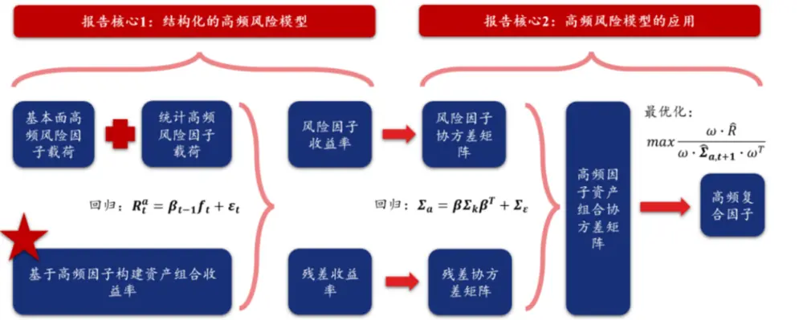
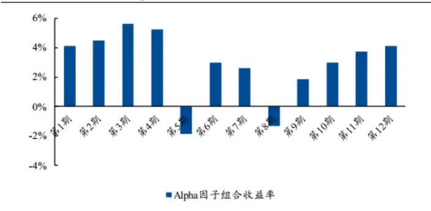
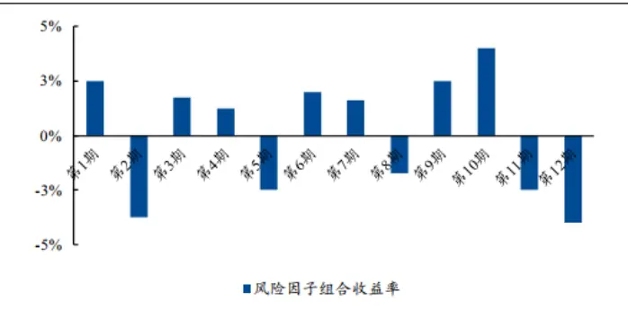
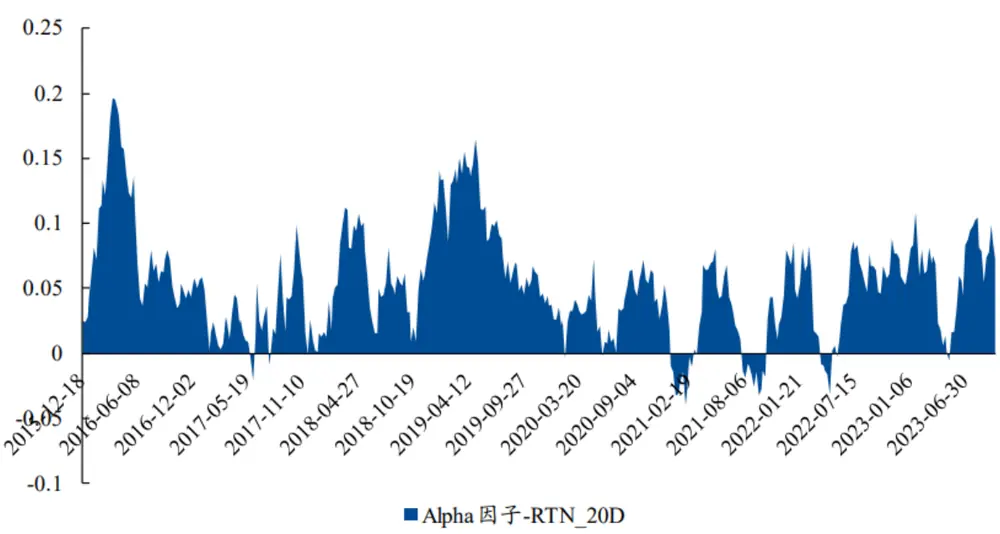
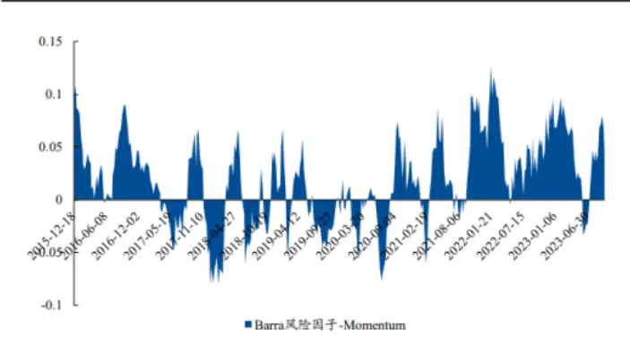
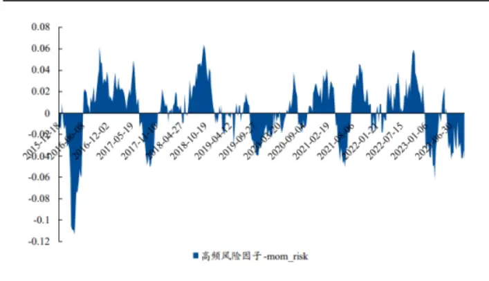
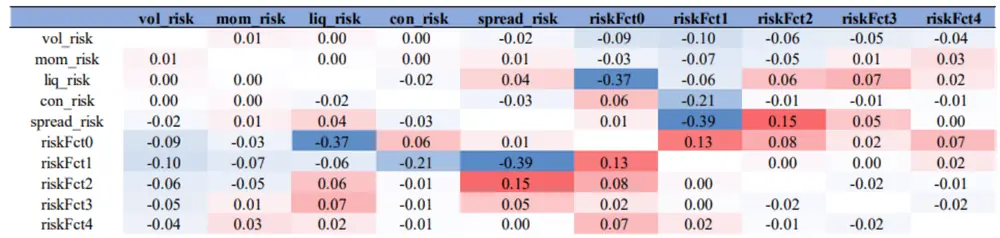
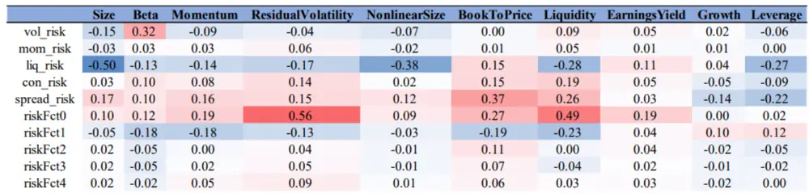
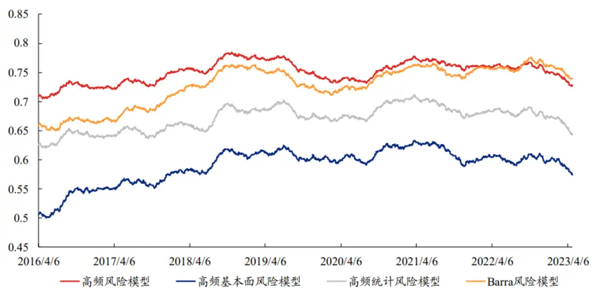
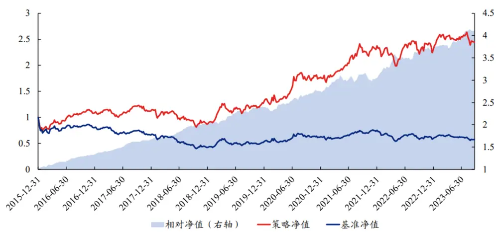

## 频 险模型构建与应 — 频研究系列七

现如今， 量投资组合均在其Alpha模型中加 由 内数据所构建的选股指标或信息。然，常 的 险模型 多以基本 指标作为主要的 险因 ，难以对加 频信息的资产组合 险进 衡量、分析与应 。本 的核 标是以加 频信息的资产作为对象构建险模型，并加以分析与应 。

我们以兴证 频因 作为资产，从 上 下和 下在结构化 频 险模型的构建上，上两个 度出发，构建了基本 频 险因 以及统计 险因 ，并由此构建结构化频 险模型： 频 险因 符合 险因 的基本特征，且与Barra 险因 的相关性较低，频 险模型的解释 度相对于Barra 险模型更强。

我们基于 频 险模型估计 频因 多头或多空组合的在结构化 频 险模型的应 上，协 差矩阵，进 通过最 化组合夏普的 式构建 频复合因 ：在与基于Barra构建的复合因 的 较上，基于 频 险模型构建的复合因 表现明显更为优秀，全市场Top组年化收益率接近50%，基准 法年化收益率为38.5%，因 多空组合夏普 率为8.08；因 在不同股票池内分位数均严格单调。

在常规中证1000指数增强最后，我们测试 频复合因 在中证1000指数增强上的应 ：策略加 频因 后，策略在不同约束条件上表现均得到明显提升；加 频后中证1000指数增强策略在扣费下年化超额收益率为20%，且近年来表现更为优秀。

核心表：加入高频因子后的中证1000指数增强策略表现统计

|  | 年化收益率 | 年化波动率 | 收益风险比 | 收益回撤比 |
| --- | --- | --- | --- | --- |
| 策略净值 | 12.48% | 21.55% | 0.58 | 0.37 |
| 基准净值 | -7.12% | 23.04% | -0.31 | -0.12 |
| 相对净值 | 20.43% | 6.10% | 3.35 | 3.46 |

资料来源：上交所、深交所行情数据，Wind，聚源，兴业证券经济与金融研究院整理注：回测时间为2015年底至2023年9月

险提 ：模型结果基于历史数据的测算，在市场环境转变时模型存在失效的 险。

1、 频 险模型：是什么，为什么，怎么做？

多因 模型 般定义为

$$
\pmb{R}_{t}^{a}=\pmb{\beta}_{t-1}\pmb{f}_{t}+\pmb{\varepsilon}_{t}\tag{1.1}
$$

其中 $\pmb{R}_{t}\pmb{\sigma}$ 表 类型资产在 期的收益率向量，设 类型资产共有 只，截 均值为0。 a t a N $f_{t}$ 是 期 个因 收t K益率组成的均值为0的向量， $\beta_{t-1}$ 是 期 为 的因 载荷矩阵，t-1 N×K $\mathcal{E}_{t}$ 是 期 类型资产的特异性收益率，假t a设 $\varepsilon_{t}$ 的协 差矩阵是对 阵， $\varepsilon_{t}$ 截 均值为 $10_{\circ}$ 。由于 期因 载荷能对未来 期的资产横截 收益率有预测能t-1 t，为了获取超额收益，学界与业界前仆后继地发现了成百上千个有效因 。

除了对超额收益的不断追求外，许多学者也发现因 对于资产收益率的协 差矩阵也有预测效 。根据（1.1）式，由 $\Sigma_{\;q}=R^{\;q}\;R^{\;qT}$ （此处省略时间下标，假设 $R^{\alpha}$ 截 均值为0），可以得到

$$
\Sigma_{a}=\beta\Sigma_{f}\beta^{T}+\Sigma_{\varepsilon}\tag{1.2}
$$

$\pmb{\Sigma}_{\pmb{a}}$ 表 类型资产收益率的协 差矩阵，a $\varepsilon_{f}$ ， $\pmb{\Sigma}_{\pmb{\varepsilon}}$ 表 对应因 收益率与特异性收益率的协 差矩阵。在（1.2）式中，除了因 暴露矩阵 $\beta$ 已知外，因 协 差矩阵 $\Sigma_{f}$ 和个股特质性收益率的协 差矩阵 $\pmb{\Sigma}_{\pmb{\varepsilon}}$ 均估计，且$\pmb{\Sigma}_{\pmb{a}}$ 估计的准确性取决于等式右侧估计的准确性。因此，存在特定因 ，能够解释资产收益率的协 差矩阵的运动，我们把这类对于资产协 差矩阵有解释效 的因 称为 险因 ，（1.2）式对应的多因 模型称为 险因模型。

结合（1.1）式与（1.2）式来看，似乎解释波动率的 险因 与解释收益的因 是 模 样的。但 险因 在预测作 上的 处与解释收益的Alpha因 不尽相同：

## 1）Alpha因 和 险因 对于协 差矩阵的解释 度不 致

存在某类特异性极强的Alpha因 ，它们能解释横截 资产收益率的差异，但不能解释资产收益率协 差的运动。这类因 的因 收益率协 差矩阵可能是对 阵

$$
\boldsymbol{\Sigma}_{alpha}=\begin{pmatrix}\sigma_{11}&\cdots&0\\\vdots&\ddots&\vdots\\0&\cdots&\sigma_{KK}\end{pmatrix}\tag{1.3}
$$

此时 $\sum_{\xi}$ 的 对 元素就不再严格为0，资产协 差矩阵的估计将出现较 误差。为了得到对资产协 差更精准用的解释，实践上可以采 结构化的 法重新刻画（1.2）式。结构化 险模型的本质是重新选取适合作为 险因纳 险模型，且 险因 的个数 于资产个数，以满 可解释性或普适性。

## 2）结构化 险模型可以提 对于资产协 差估计的准确性

在估计协方差矩阵时，我们通常需要回望过去一段时间T。当协方差矩阵的样本数为T时，若因子数量 $K>T$ ，那么样本协方差矩阵（SCM）是奇异矩阵

$$
SCM_{ij}=\frac{1}{T-1}{\sum_{t=1}^{T}X_{it}X_{jt}},\tag{1.4}
$$

$\begin{array}{r}{X_{it}=f_{it}-\overline{{f_{i}}},\overline{{f_{i}}}=\frac{1}{T}{\sum_{t=1}^{T}f_{it}}}\end{array}$ 。因为 $\textstyle\sum_{t=1}^{T}X_{it}=0$ ，所以X只有T－1列相互独立，那么

$$
r(XX^{T})\leq T-1<K\tag{1.5}
$$

所以SCM是奇异矩阵。当SCM是奇异矩阵时， $\widehat{\pmb{\Sigma}_{a}}^{-1}=\left(\pmb{\beta}\pmb{S}\pmb{C}\pmb{M}\pmb{\beta}^{T}+\widehat{\pmb{\Sigma}_{\varepsilon}}\right)^{-1}$ 不一定存在，基于 $\widehat{\pmb{\Sigma}_{\pmb{a}}}^{-1}$ 计算的均值-方差优化模型、最大夏普优化模型等无法求出可行解。当样本数T接近于因子数K时， $SCM^{T}$ 估计误差增大得非常快。因此，结构化的风险模型通常需要使用较少的因子个数K对资产组合的协方差矩阵进行更为精准地预测。

由此，为了区别于（1.1）式收益模型中的因 ，我们把 险因 记为，得到结构化的 险因 模型

$$
\pmb{\varSigma}_{a}=\pmb{\beta}\pmb{\varSigma}_{k}\pmb{\beta}^{T}+\pmb{\varSigma}_{\varepsilon}\tag{1.6}
$$

## 把K对应的多因 称为 险因 。

作为多因 投资体系不可或缺的重要 环， 险模型是与Alpha模型并 的、以投资组合 险预测和分解为主要 的的重要模块。主动投资的本质，某种意义上讲就是收益与 险的权衡，资产的权重往往与超额收益正相关，与 险负相关。在量化投资实践中， 险模型有着 泛的应 ，投资者使 险模型的情景主要有以下 种：

(1） 预测资产未来的波动性和相关性，进而配合Alpha模型构建最优投资组合：依照（1.6）式，只需要知道t－1因子暴露 $\beta$ ，通过统计方法计算出t期的$\widehat{\pmb{\Sigma}_{k}}$ 与 $\widehat{\Sigma_{\varepsilon}}$ ，那么就可以在t－1期预测t期的资产组合收益率的协方差矩阵 $\widehat{\pmb{\Sigma}_{\pmb{a}}}$ 这也是Barra模型常常采用的估计协方差矩阵的方法;

(2） 将资产的收益和风险分解到不同的维度下，从风险因子的角度去理解资产表现；

(3）将风险模型用于事后的业绩归因分析，对不必要承担或不擅长承担的风险进行对冲。

## 频 险模型：以 频因 组合作为分析对象

现如今， 量投资组合均在其Alpha模型中加 基于 内数据所构建的选股指标或信息。然 ，常 的 险模型 多以基本 指标作为主要的 险因 ，已有的量价 险因 的构建周期也较 ，难以对加 频信息的 换资产组合的 险进 衡量与分析。因此，本 的核 标是以加 频信息的资产作为对象构建结构化 险模型，并加以分析与应 。

读者可能发现：我们在前序章节的多因 模型中，引 了属性 表 资产收益率的类型。a 在本 中我们只讨论。 般来说， 险模型都是对个股收益率 进 建模，即 ，子 风两种资产类型：个股S与 频因 组合f HFS R ta a⊆S衡量 险模型解释效 的标准也是看个股收益率对 险因 回归的 。除了针对个股的 险模型之外，学术界还R2会针对因 组合的 险暴露进 分析。具体来说，在以因 组合作为对象进 统计 险模型构建时，其 的是衡量不同因 组合在其他 险上的共性暴露。此时， 险模型的 的往往变成了分析因 本 所暴露的对应 险，忽略个股的 险特征。

在 对本 核 标时，我们必然遇到 个问题：是选 个股 S 还是选 频因 f HFS组合作为分析对象。最终，本 中我们是对 频因 组合收益率进 分析，即回归模型（1）的左侧就变成了因 组合收益率，资产类型a 为 频因 组合 f HFS，此时我们是考察能对因 组合协 差组合估计最为准确的 险模型。其核 原因如下：

1. 频因 组合（多空或多头）往往是因 信息暴露较 的股票组合。个股与组合暴露的 频 险存在共性：然 频因 本 存在着较多难以解释的 险（因 信息不纯粹&量价 险难以解释），因此其资产组合必然也存在特定 险暴露；

2. 个股层 的 频 险往往变化较快，导致针对个股 频 险刻画的频因 组合暴露的 险可解释性更强：高文 高适 性与稳定性较低； 频因 包含的 险相对稳定：从 频因 组合暴露的 险出发，去理解因 的逻辑与表现，进 进 业绩归因更具实际意义；

3. 在以 频因 组合作为考察对象时，我们可以通过 险模以 频因 组合作为对象的 险模型应 性更强：型配合组合优化对因 组合进 复合，进 构建复合因 。此时，我们不需要关 个股 险，仅关 与因相关的 险。

## 频 险模型符号说明

在详细展开后续的 频 险模型构建以及应 之前，我们 先确定本 中使 到的变量符号：

a) 常规变量：t表示日期，k, k = 1,2,..,K表示风险因子；i,i = 1,2,...,N表示高频因子；

b)高频因子组合设定：在以高频因子组合作为分析对象时，我们需要考虑多头组合、空头组合以及多空组合三种类型： $ls_{i}.$ 表示高频因子i多空组合、 $l_{i}.$ 表示高频因子i多头组合、 $s_{i}$ 表示高频因子i空头组合;

c) 高频因子组合收益率列向量： $\pmb{R}_{t}=[\pmb{R}_{l,t},\pmb{R}_{s,t}]^{T}$ 表示高频因子多头和空头组合 的收益率列向量，其中 $r_{l_{i},t}$ 为时段[t-1,t]高频因子i多头组合收益率,rsit为时 $\boldsymbol{\cdot}\boldsymbol{r}_{s_{i},t}$ 段[t-1,t]高频因子s空头组合收益率;

d) 风险因子载荷矩阵： $\pmb{\beta}_{\pmb{t}}=\left\{\beta_{[l,s]k,t}\right\}_{N\times K}$ 是t时刻多头和多空组合的因子载荷矩阵，其中 $\beta_{l_{i}k,t}$ 是时刻t高频因子i多头组合i在风险因子k上的暴露； $\beta_{s_{i}k,t}$ 是时刻t高频因子i空头组合i在风险因子k上的暴露； $\pmb{\beta}_{t}^{ls}=\left\{\beta_{lsk,t}\right\}_{N\times K}$ 是多空组合的因子载荷矩阵，其中 $\beta_{ls_{i}k,t}$ 是时刻t高频因子i多空组合在风险因子k上暴露;

e) 风险因子收益率向量： $\boldsymbol{\mathbf{f}}_{t}=\left(f_{1,t},f_{2,t},\ldots,f_{K,t}\right)^{T}$ 表示回归得到风险因子的收益率列向量，其中 $f_{k,t}$ 为时段[t—1,t]风险因子k的收益率；

f)高频因子特质性收益率： $\pmb{\varepsilon}_{\pmb{t}}=[\pmb{\varepsilon}_{l,t},\pmb{\varepsilon}_{s,t}]^{T}$ 表示高频因子多头和空头组合特质性 收益率列向量，其中 $\varepsilon_{l_{i},t}$ 为时段[t-1,t]高频因子i多头组合的特质性收益 率， $\varepsilon_{s_{i},t}$ 为时段[t-1,t]高频因子s空头组合的特质性收益率； $\pmb{\varepsilon}_{\pmb{t}}^{ls}=$ $\left(\varepsilon_{ls_{1},t},\varepsilon_{ls_{2},t},\ldots,\varepsilon_{ls_{N},t}\right)^{T}$ 表示高频因子多空组合的特质性收益率列向量，其中 $\varepsilon_{ls_{i},t}$ 为时段[t-1,t]高频因子i多空的特质性组合收益率;

g)风险因子收益率协方差矩阵： $\boldsymbol{\varSigma}_{\boldsymbol{k},t}=\left\{F_{k_{1}k_{2},t}\right\}_{\boldsymbol{K}\times\boldsymbol{K}}$ 是风险因子收益率的协方差矩阵，其中 $F_{k_{1}k_{2},t}$ 是t时刻因子 $k_{1}$ 和因子 $k_{1}$ 收益率的协方差；

h)高频因子组合收益率协方差矩阵： $\Sigma_{i,t}^{ls}=\left\{A_{ls_{1}ls_{2},t}\right\}_{N\times N}$ 是高频因子多空组合的 收益率的协方差矩阵，其中 $A_{ls_{1}ls_{2},t}$ 是t时刻高频因子多空组合 $\cdot ls_{1}$ 和高频因子 多空组合 $\cdot ls_{2}$ 收益率的协方差；

i) 高频因子组合特质性收益率协方差矩阵： $\Sigma_{\varepsilon,t}^{ls}=\left\{\delta_{ls_{1}ls_{2},t}\right\}_{N\times N}$ 是高频因子多空 组合的特质性收益率的协方差矩阵，其中 $\delta_{ls_{1}ls_{2},t}$ 是t时刻高频因子多空组合 $ls_{1}$ 和高频因子多空组合 $\cdot ls_{2}$ 的特质性收益率的协方差

表1、本文中组合收益率设定说明

| 变量 | 多空组合 | 多头组合 | 空头组合 |
| --- | --- | --- | --- |
| 组合收益率列向量 | 单独使用 | 共同使用 | $R_{t}$ |
| 组合收益率协方差矩阵 | 单独使用Σ | 单独使用 | 不使用 |

资料来源：兴业证券经济与金融研究院整理

## 本 结构说明

此，我们已经确定好了本 的研究 的：构造出能够准确解释与预测 频因 组合协 差矩阵的结构化险模型，简称 频 险模型，并进 步探究其衍 应 。因此，本 的核 模型分为两个 部分：结构化 频险模型的搭建与 频 险模型的应 。本 结构如下：

1. 先针对结构化 频 险模型，我们从 上 下和 下 上两个 度出发，构建基本 频 险因 与统计频 险因 ，由此构建 频 险模型，并从 险因 本 与解释 度两个维度衡量其表现；

2.其次针对 频 险模型的应 ，我们基于 频 险模型对 频因 组合的协 差矩阵进 预测，并由此带最优化模型得到 频复合因 ；

3.最后，我们根据 频复合因 ，测试其相对于基准 法的IC和分位数组合测试，并进 步测试其在增强策略上的表现。

图1、本文研究框架

资料来源：兴业证券经济与金融研究院整理

## 2、 频 险模型的构建

## 频基本 险因 构建

基于兴证 已有的 频因 库，我们在本 中 先引 5类 频基本 险因 ，它们是：特质性波动率、动量、集中性、价差和流动性。需要指出的是 险模型与收益模型类似，也需要在截 上不断寻找有解释效 的因，因此也需要不断的维护与更新 险因 。

我们从两个维度构建基本 险因 ：（1）针对已有的Barra量价类 险因 进 改造；（2）结合 献、险因 的特征以及对于模型的解释性，加 刻画 内交易特征的 险因 。为了使各 频 险因 间相关性较低，我们采 逐次回归取残差的 式，保证 险因 相互正交。

表2、高频基本面风险因子

| 高频风险因子 | 命名 | 构造方法 |
| --- | --- | --- |
| 特质性波动率 | vol_risk | 日度残差收益率的标准差 |
| 动量 | mom_risk | 长短期收益率均值 |
| 集中性 | con_risk | 成交量占比偏度 |
| 价差 | spread_risk | 买卖价差除以买一价和卖一价的简单平均值 |
| 流动性 | liq_risk | 度量个股的高频流动性风险 |

资料来源：兴业证券经济与金融研究院整理

先，基于量价类因 构建的资产组合通常在波动率以及动量上有着较 的暴露。不同于Barra 险模型中的波动率以及动量类指标， 频因 的预测周期更短。因此，我们基于Barra 险因 进 调整，以适应 频因 构建的资产组合。

## 1）特质性波动率：基于Barra 险因 改造

对于 频 险中的特质性波动率，我们沿 Barra 险模型中ResidualVolatility 险因 的计算 式，并将其周期缩短。 先对于DASTD指标 ，我们基于全市场所有股票超额收益率，计算其过去20 超额收益率的加权标准差：

$$
DASTD^{t}=\sqrt{\sum_{s=t-T+1}^{t}w_{t-s}\cdot\left(r_{i,s}\right)^{2}}\tag{2.1}
$$

其中， $r_{i,s}$ 为股票i在超额收益率；T=20（一个月）； $w_{t-s}$ 是指数衰减权重，半衰期为 10日。其次是 CMRA累积幅度（Cumulative Range)，该指标为过去4周周收益率累积收益率的波动幅度。记时刻t股票回溯一周的周收益率为 $R^{t}=$ $\begin{array}{r}{\prod_{s=0}^{5}\bigl(1+r^{t-s}+r_{f}^{t-s}\bigr)-1}\end{array}$ ，无风险月收益率为 $\begin{array}{r}{R_{f}^{t}=\prod_{s=0}^{5}\bigl(1+r_{f}^{t-s}\bigr)-1}\end{array}$ ，定义：

$$
Z(K)=\sum_{k=0}^{K-1}\bigl[ln(1+R^{t-k*5})-ln\bigl(1+R_{f}^{t-k*5}\bigr)\bigr].\tag{2.2}
$$

$$
CMRA^{t}=ln(1+max\{Z(K)\})-ln(1+min\{Z(K)\})\tag{2.3}
$$

其中，回望周期K=4。最后是历史波动率HSIGMA 指标。该指标为过去20个交易日残差收益率的加权标准差，即：

$$
HSIGMA^{t}=\sqrt{\sum_{s=t-T+1}^{T}w_{t-s}\cdot\left(\varepsilon_{i,s}\right)^{2}}\tag{2.4}
$$

其中，T=20（一个月），ε是在股票超额收益率与市场超额收益率进行时间序 $\varepsilon_{i,s}$ 列加权回归后的残差， $w_{t-s}$ 是指数衰减权重，半衰期为10日，窗口长度为T。最后我们沿用 Barra 针对残差波动率的权重，计算：

$$
vol\_risk=0.74\times DASTD+0.16\times CMRA+0.10\times HSIGMA\tag{2.5}
$$

## 2）短期动量：基于Barra 险因 改造

Barra模型的Momentum因 的计算 法为 期动量减去短期动量，或者以跳过短期动量的 式进 构建。我们沿 此想法，但将时间周期调短。具体来说，我们假设 期动量为过去20 收益率的半衰加权；短期动量为过去5 的收益率半衰加权减去市场收益率半衰期加权；最后将 期动量减去短期动量，以此构建短期动量 险因

$$
mom\_risk=\sum_{s=t-T+1}^{t}w_{t-s}\big(ln\big(1+r_{i,s}\big)\big)-\sum_{s=t-T^{\prime}+1}^{t}w_{t-s}\big(ln\big(1+r_{alpha,s}\big)\big)\tag{2.6}
$$

其中 $r_{i,s}$ 是股票收益率， $r_{alpha,s}$ 为股票的超额收益率； $w_{t-s}$ 是指数衰减权重， $T{=}20$ $T^{\prime}{=}5$ 。为了使各高频风险因子间时序相关性较低，我们将动量风险因子对特质性波动率因子进行回归，取残差作为新的动量风险因子。

其次， 频量价类因 通常与 内交易情绪存在着较强的关联性。事实上， 频因 本质上是寻找 内交易模式异常处的套利机会， 交易模型的异常 为通常会体现在个股的 内流动性上。我们参考 献中针对个股 内交易特征的刻画，结合 险因 的波动特征以及模型增量，选择了 个具有代表性的指标，作为 频因 的对应 险。

## 3）交易流动性：价格波动与成交 额

我们基于价格波动与成交 额，刻画交易流动性liq_risk，代表着 额对于价格波动的影响。liq_risk也需要对特质性波动率与动量分别进 回归取残差（两次回归）作为新的流动性 险因 。

## 4）交易集中性：成交量偏度

内集中性 险因 被定义为分钟成交量占 的偏度。

$$
con\_risk=skew\left(\cfrac{volume_{t}}{sum(volume_{t})}\right)\tag{2.7}
$$

其中 为个股分钟级成交量。该指标 先计算得到各个分钟上成交量占全天交易量的 值，并进 步计volumet算得到当 成交量占 序列的偏度。当交易量均匀分布在 内每 分钟时， 内交易集中性低，该指标较 。 内集中性 险因 需要分别对特质性波动率、动量与流动性 险因 进 回归取残差作为新的集中性 险因 。

## 5）交易成本：报价差

是 来衡量市场紧密度性的 选 法之 ，其衡量的是流动性资产买卖价格之间的差异。该差异越 ，说明流动资产的价格波动相对较 ，使得特定头 能够盈利。

$$
spread\_risk=\frac{askprice_{t}^{(1)}-bidprice_{t}^{(1)}}{0.5\left(askprice_{t}^{(1)}+bidprice_{t}^{(1)}\right)}\tag{2.8}
$$

其中， 为第 分钟的卖 价、 为第 分钟的买 价。该指标以分钟级别数据计算，并最askpricet(1) t bidpricet(1) t终得到分钟级别的指标。在剔除 内异常值后（分位数去极值），我们进 步按分钟成交量加权得到最终的 度指标。价差 险因 需要分别对特质性波动率、动量、流动性与集中性 险因 进 回归取残差作为新的价差 险因。

在构建完 频基本 险因 之后，我们进 步构建 频统计 险因 。在此我们需要引 统计 险模型的相关定义。随着时代的发展，投资者发现可以在结构化 险模型领域引 机器学习 段解决上述的问题。 先，依然假设收益率是因 关于因 载荷的线性变换，并进 步引 结构化 险因 模型。

$$
\boldsymbol{\Sigma}_{i,t}^{ls}=\boldsymbol{\beta}_{t-1}^{ls}\boldsymbol{\Sigma}_{k,t}(\boldsymbol{\beta}_{t-1}^{ls})^{T}+\boldsymbol{\Sigma}_{\varepsilon,t}^{ls}\tag{2.9}
$$

$\pmb{\Sigma}_{i,\pmb{t}}^{ls}$ 是高频因子多空组合收益率的协方差矩阵。此时我们仅关注资产的协方差矩阵 $\cdot\pmb{\Sigma}_{i,t}^{ls}$ ，已知 $\lambda_{1}\geq\lambda_{2}\geq.$ ...为 $\Sigma_{i,t}^{ls}$ 的特征根， $u_{1},u_{2},$ ....为对应的标准化的特征向量，U为特征向量对应矩阵。根据矩阵特征根分解，此时结构化风险模型公式左侧变为

$$
\boldsymbol{\Sigma}_{i,t}^{ls}=U\begin{bmatrix}\sigma_{1}^{2}&\cdots&0\\\vdots&\ddots&\vdots\\0&\cdots&\sigma_{n}^{2}\end{bmatrix}U^{\prime}=\left[\sqrt{\lambda_{1}}u_{1},\sqrt{\lambda_{2}}u_{2},\ldots,\sqrt{\lambda_{n}}u_{n}\right]\begin{bmatrix}\sqrt{\lambda_{1}}u^{\prime}_{1}\\\sqrt{\lambda_{2}}u^{\prime}_{2}\\\ldots\\\sqrt{\lambda_{n}}u^{\prime}_{n}\end{bmatrix}\tag{2.10}
$$

上式给出的 $\pmb{\varSigma}_{i,\pmb{t}}^{ls}$ 的表达式是精确的，然而，它实际上是没有价值的，因为我们目的是寻求少数几个风险因子去解释。因此，我们基于PCA主成分分析的方式，选择解释力度排名靠前的k个主成分，此时公式变为

$$
\boldsymbol{\Sigma}_{i,t}^{ls}\approx\boldsymbol{\beta}_{t}^{ls}\boldsymbol{\Sigma}_{k,t}\boldsymbol{\beta}_{t}^{ls^{T}}+\boldsymbol{\Sigma}_{\varepsilon,t}^{ls}=\left[\sqrt{\lambda_{1}}u_{1},\sqrt{\lambda_{2}}u_{2},\ldots,\sqrt{\lambda_{k}}u_{k}\right]\begin{bmatrix}\sqrt{\lambda_{1}}u^{\prime}_{1}\\\sqrt{\lambda_{2}}u^{\prime}_{2}\\\ldots\\\sqrt{\lambda_{k}}u^{\prime}_{k}\end{bmatrix}+\boldsymbol{\Sigma}_{\varepsilon,t}^{ls}\tag{2.11}
$$

与前 保持 致，此时我们的 险模型仍然是针对 频因 的组合进 分析。因此在统计 险模型中，公式左$\scriptstyle\boldsymbol{\Sigma}_{i,t}^{\mathrm{~\it~Is~}}$ 为 频因 的多空组合收益率的协 差矩阵。模型的 标是找出能够对 频因 多空组合共同运动 向高 风准备预测的主成分,与 频 险因 的定义 致。不难看出，统计 险模型在最终 的上与基本 险模型类似，但也存在着较 区别：

1.在基本 险模型和统计 险模型中，我们均假设 个资产的收益率可以 个因 通过他们不同的载荷来N K预测和决定，为了稳健估计，我们需要假设 $K<<T$ ；

2.在基本 险模型中，我们从主观 度将资产的 板数据从 降维 个 险因 解释； 在统计 险模型N K中， （不 上 下主观定义，有利于应 于量价类因 ），此时唯 的 标这K个因 不作逻辑上的定义是在给定K的情况下，使得这K个因 能够尽量精准 偏地解释协 差矩阵Σ a。

最终在具体计算中，我们 先在t ，根据过去6个 的 频因 多空组合的 度收益率序列（经过标准化处理）进 PCA降维，取前5个主成分（按照特征值排序），并进 步计算各个因 在不同主成分上的权重；其次，每个主成分中，根据PCA的贡献度指标得到对应 频多空组合的权重，将各个 频因 值根据权重加和，得到该主成分当期在个股层 的因 载荷，即为 个统计 险因 。由此，我们得到五个统计 险因 ，记为riskFct0riskFct4。

## 3、 频 险模型有效性检验

综上，我们在基本 险模型中， 上 下地构建了五个 频基本 险因 ，进 步 下 上地基于PCA构建了五个 频统计 险因 。最终，我们将这 个 险因 共同考虑，作为针对 频资产组合的 频 险模型。

## 频 险因 有效性检验

在进 下 步之前，我们 先根据已有的 险因 进 测试，以判断当前构建的 险因 是否符合 险因 的相关特征。通常来说，对于截 上某 特征，即因 ，其虽然可以贡献超额收益，但是其 波动也带来了它对应的系统性 险。在此，我们假设两个理想化的Alpha因 和 险因 ，展 其在时序上对于收益预测的能 差异。

下 左侧图展 了 个理想化的Alpha因 的收益预测能 ：其中，该因 收益预测能 在 部分时间为正，且波动很 。这说明该因 不但可以稳定的贡献超额收益，其 的系统 险也 常低；下 右侧图则展 了 个理想化的 险因 ， 险因 的收益预测能 波动较 ，但存在着 定的周期性，在时序上上 法贡献稳定的 0超额收益。但是它可以显著的描述某种系统性 险。因此这个因 是 个优秀的 险因 。综上，对于 险因，其对于股票收益率的预测能 会出现波动较 、 法 期稳定获得超额收益的特征。

图 2、理想的 Alpha 因子的预测收益能力

资料来源：兴业证券经济与金融研究院整理注：数值根据因子特征模拟计算得到

图3、理想的风险因子的预测收益能力

资料来源：兴业证券经济与金融研究院整理注：数值根据因子特征模拟计算得到

基于上述表述，我们选择A股市场经常作为Alpha因 的20 动量因 （RTN_20D）、Barra模型中的Momentum 险因 以及我们在前 章节构建的mom_risk 险因 ， 周度调仓下的IC移动均线展 三个因 时序上收益预测能 的特征。我们 先展 RTN_20D因 周度调仓下IC移动均线。该因 IC均值为0.053，ICIR为0.385。可以明显看出，该因 在 时间段上看IC移动均值 期为正数，其 分符合Alpha因 的特征：预测收益的能 时间内稳定为正。

图 4、RTN_20D 因子周度调仓下 IC 移动均线（过去12 周）

资料来源：Wind，聚源，兴业证券经济与金融研究院整理

其次，我们展 BarraMomentum 险因 和mom_risk 频 险因 周度调仓下IC移动均线。这两个因 的IC均值分别是为0.020与-0.001，ICIR分别为0.137和-0.005。此时也可以明显看出，这两个因 在 时间段上看IC移动均线存在着明显的周期性，其 分符合 险因 的特征：预测收益的能 波动较 ，存在周期性。

图 5、Barra Momentum 风险因子周度调仓下 IC 移动均线（过去12周）

资料来源：Wind，聚源，兴业证券经济与金融研究院整理

图 6、mom risk 高频风险因子周度调仓下 IC 移动均线（过去12周）

资料来源：上交所、深交所行情数据，Wind，聚源，兴业证券经济与金融研究院整理

除此之外，我们还需要判断 频 险因 的正交性以及与已有的Barra 险因 的相关性。具体来说，频 险因 的正交性决定了后续横截 回归的稳健性。我们展 频 险因 的截 相关性均值，结果表明频 险因 内部相关性较低，可以进 后续横截 回归。

图7、高频风险因子自身相关性分析

资料来源：上交所、深交所行情数据，Wind，聚源，兴业证券经济与金融研究院整理

进 步，我们测试 频 险因 与Barra 险因 之间的相关性，并展 如下。结果表明：riskFct0与残差波动率以及流动性 险因 相关性偏 ，这表明 频因 组合 多在这两类 险上存在暴露，但与其他Barra 险因 相关性极低， 频 险因 与Barra 险因 存在差异。

图 8、高频风险因子与 Barra 风险因子相关性分析

资料来源：上交所、深交所行情数据，Wind，聚源，兴业证券经济与金融研究院整理

## 频 险模型解释 度测试

在确定好 险因 的特征与特异性之后，我们需要针对 险模型的解释 度进 测试。横截 回归的 $R^{2}$ 通常 来度量 险因 对股票收益的解释程度。在Barra Risk Model Handbook中提及， $R^{2}$ 通常 来描述投资组合（回归模型左侧）中与已知 险（回归右侧）相关的 例：

$$
R^{2}=1-\frac{未被模型解释的方差}{投资组合的总体方差}\tag{3.1}
$$

除 $R^{2}$ 之外， $AjustedR^{2}$ 在 险模型中参考意义更 ：通常来说，引 的 险因 越多， $R^{2}$ 越 ，但 险因 的个数不应该过多； $AjustedR^{2}$ 风针对引 的 变量个数对 $R^{2}$ 子 高进 调整，以判断模型是否在较少的 险因 之下，解释投资组合总体 差的 平更 ；

我们设置 频因 多头组合以及空头组合（70×1）作为因变量 （此处也可以 频因 多空组合），以BarraR t因 载荷以及 频 险因 载荷 $\beta_{t-1}$ 作为因变量进 线性回归，检验其过去250个交易 的移动平均 $AjustedR^{2}$ o

$$
\pmb{R}_{t}=\pmb{\beta}_{t-1}\pmb{f}_{t}+\pmb{\varepsilon}_{t}\tag{3.2}
$$

从结果上看，在以因 多头以及空头组合为收益率的回归模型中，基于 频复合 险模型（即 频基本 险模型+统计 险模型）的解释 度相对强于基于Barra的 险模型： $AjustedR^{2}$ 均值 致在75%左右，Barra解释 度略逊于 频 险模型，且在时间段早期差异较 。

图9、基于高频因子多头与空头组合的横截面回归Adjusted $R^{2};$ 移动均值

资料来源：上交所、深交所行情数据，Wind，聚源，兴业证券经济与金融研究院整理

## 4、 频 险模型应

综上，我们从 上 下和 下 上两个维度出发，构建了针对 频因 组合的 频 险模型，该模型在解释度上相对优于Barra 险模型。在得到 险模型之后，我们将进 步探究其应 场景：协 差矩阵的估计以及 频子因 复合。

## 频因 组合的协 差矩阵估计与最优化

上 中提及， 险模型最重要的应 场景之 便是协 差矩阵的估计。依然假设收益率是因 关于因 载荷的线性变换，并进 步引 结构化 险因 模型：

$$
\boldsymbol{\Sigma}_{i,t}^{ls}=\boldsymbol{\beta}_{t}^{ls}\boldsymbol{\Sigma}_{k,t}(\boldsymbol{\beta}_{t}^{ls})^{T}+\boldsymbol{\Sigma}_{\varepsilon,t}^{ls}\tag{4.1}
$$

需要注意的是，此时我们公式左侧的资产类型为基于高频因子构建的多空组合1。与之前不同的是，此时我们已经根据上文构建了风险因子，对应的因子载荷，并可以根据横截面回归得到风险因子收益率。在本章中，我们希望通过风险模型，估计高频因子组合的协方差矩阵 $\cdot\widehat{\Sigma}_{i,t+1}^{ls}$ ，并以此构建复合高频因子。我们的具体步骤主要分两大步：协方差矩阵的估计与最优化模型。我们首先介绍协方差矩阵的估计，具体如下：

（1）回归得到因子收益率与残差收益率：在每天横截面上，用当天的多空组合收益率对上一天的高频风险因子暴露(五个基本面风险因子和五个统计风险因子）做加权的稳健回归，由此得到风险因子当天的收益率 $.f_{t}$ ，和组合当天的残差收益率 $\varepsilon_{t}$

（2）风险因子收益率协方差矩阵&特质性收益率协方差估计：我们根据上一步得到的过去20日的风险因子收益率以及特质性收益率，计算当期风险因子收益率协方差矩阵 $\pmb{\mathscr{L}}_{\pmb{k},\pmb{t}}$ 以及特质性收益率协方差矩阵 $\cdot\Sigma_{\varepsilon,t}^{ls}$ 由于需要对下一期的高频因子组合协方差组合 $\cdot\widehat{\Sigma}_{i,t+1}^{ls}$ 进行估计，我们进一步使用Ledoit-Wolf方法估计风险因子收益率的协方差矩阵$\widehat{\pmb{\Sigma}}_{k,\pmb{t}+\mathbf{1}}$ 与特质性收益率协方差矩阵 $\mathbf{:}\widehat{\pmb{\Sigma}}_{\varepsilon,\pmb{t}+\mathbf{1}}^{ls}$

(3） 引入结构化风险模型估计多空组合下一期的协方差矩阵：根据结构化风险模型的公式：

$$
\widehat{\pmb{\Sigma}}_{i,t+1}^{ls}=\pmb{\beta}_{t}^{ls}\widehat{\pmb{\Sigma}}_{k,t+1}(\pmb{\beta}_{t}^{ls})^{T}+\widehat{\pmb{\Sigma}}_{\varepsilon,t+1}^{ls}\tag{3.2}
$$

其中 $\beta_{t}^{ls}$ 是t期N个高频因子多空组合在K个风险因子的上的因子暴露矩阵， $\widehat{\boldsymbol{\Sigma}}_{k,t+1}$ 是K个风险因子收益率的协方差矩阵， $\widehat{\pmb{\Sigma}}_{\pmb{\varepsilon},\pmb{t}+\mathbf{1}}^{ls}$ 是N个高频因子多空组合的特质性收益率方差矩阵， $\widehat{\Sigma}_{i,t+1}^{ls}$ 则是最终估计得到的高频因子组合的协方差矩阵。

在得到高频因子组合未来一期的协方差矩阵的估计之后，我们进一步将估计得到的协方差矩阵 $\hat{\Sigma}_{i,t+1}^{ls}$ 带入最大化夏普优化函数中，最优化后即为因子的权重：

$$
\max\quad\frac{\boldsymbol{\omega}\cdot\widehat{\boldsymbol{R}}}{\boldsymbol{\omega}\cdot\widehat{\boldsymbol{\Sigma}}_{i,t+1}^{ls}\cdot\boldsymbol{\omega}'}\tag{3.3}
$$

$$
s.t.\quad\omega_{i}\geq0,\sum\omega_{i}=1
$$

其中， $\widehat{R}$ 用过去20日所有因子组合收益率均值作为估计， $\widehat{\Sigma}_{i,t+1}^{ls}$ 为估计出的组合协方差矩阵， $\omega$ 为不同高频因子权重向量。

最终，我们在每个周末根据各个 频因 组合过去20 的数据，最优化后得到权重，并最终根据权重复合得到当周复合因 值。其中，协 差矩阵的估计步骤中存在因 多空与多头组合两种 式。若要使 多头组合进 复合，则最终是以最 化多头组合夏普 率作为 标。因此，我们可以得到两个复合因 ，分别记为最 化Top夏普复合除此之外，我们同样可以将 频 险因 替换为Barra 险因 ，重复上述步因 以及最 化多空夏普复合因 。骤构建基于Barra复合因 ，作为 较基准。若 险模型对于组合协 差的估计更精准，其复合因 的表现应当更为优秀。

## 频复合因 表现测试

子综上，我们基于Barra 险模型与 频 险模型得到了三个 频复合因 ，分别是基于Barra复合因 、最 化Top夏普复合因 与最 化多空夏普复合因 。在得到 频复合因 之后，我们 先针对复合因 进 周度调仓下的IC测试，回测区间为2015年底 2023年9 。具体地，我们在全市场以及不同股票池内测试三种复合因 的IC表现，并展 三个因 IC均值与ICIR指标。从结果上看， 论是全市场还是在不同成分股股票池内，基于 频 险因 构建的复合因 稳定战胜以Barra 险因 复合的因 ；最 化Top组复合的因 表现略优于最 化多空组合的因 ，以最 化Top夏普复合因 为例，该因 在全市场内IC均值为0.100，IC IR为1.364；该因 在中证1000与国证2000中的IC均值为0.092与0.106，表现 分优秀。

图10、高频复合因子周度IC 测试结果：IC 均值

|  | 基于Barra复合 | 最大化Top夏普复合 | 最大化多空夏普复合 |
| --- | --- | --- | --- |
| 全市场 | 0.089 | 0.100 | 0.102 |
| 沪深300 | 0.041 | 0.052 | 0.053 |
| 中证500 | 0.063 | 0.075 | 0.079 |
| 中证800 | 0.054 | 0.067 | 0.069 |
| 中证1000 | 0.081 | 0.092 | 0.092 |
| 国证2000 | 0.095 | 0.106 | 0.107 |

资料来源：上交所、深交所行情数据，Wind，聚源，兴业证券经济与金融研究院整理

图 11、高频复合因子周度IC 测试结果：IC IR

|  | 基于Barra复合最大化Top夏普复合 |  | 最大化多空夏普复合 |
| --- | --- | --- | --- |
| 全市场 | 1.170 | 1.364 | 1.272 |
| 沪深300 | 0.399 | 0.483 | 0.500 |
| 中证500 | 0.690 | 0.814 | 0.825 |
| 中证800 | 0.638 | 0.755 | 0.752 |
| 中证1000 | 0.988 | 1.140 | 1.071 |
| 国证2000 | 1.145 | 1.329 | 1.243 |

资料来源：上交所、深交所行情数据，Wind，聚源，兴业证券经济与金融研究院整理

更进 步，我们将三个因 进 针对全市场以及针对不同股票池的分位数组合测试。我们 先展 针对全市场的分位数组合测试，回测时间为2015年底 2023年9 底。测试结果表明： 论是在Top组还是多空组合上，基于以基于 频 险因 最 化Top组夏普频 险因 的复合因 同样稳定战胜基于Barra 险因 构建的复合因 。率复合因 为例，该因 全市场Top组年化收益率接近50%，基准 法年化收益率为38.51%。该因 Top年化超额收益率为38.32%，多空夏普 率为8.08，表现 分优秀。

图12、高频复合因子全市场周度十分位数组合测试结果

| 分位数 | 基于Barra复合 |  |  | 基于风险因子最大化Top夏普复合 |  |  | 基于风险因子最大化多空夏普复合 |  |  |
| --- | --- | --- | --- | --- | --- | --- | --- | --- | --- |
|  |  |  | 年化收益率 Sharpe比率 年化超额收益率 |  | 年化收益率 Sharpe比率 年化超额收益率 |  | 年化收益率 Sharpe比率 年化超额收益率 |  |  |
| Top | 38.51% | 1.68 | 27.94% | 49.82% | 2.19 | 38.32% | 47.76% | 2.12 | 36.29% |
| 1 | 19.28% | 0.85 | 10.24% | 23.92% | 1.03 | 14.67% | 25.12% | 1.09 | 15.70% |
| 2 | 18.14% | 0.80 | 9.22% | 20.86% | 0.91 | 11.74% | 21.41% | 0.93 | 12.30% |
| 3 | 15.88% | 0.70 | 7.11% | 16.68% | 0.72 | 7.96% | 17.87% | 0.77 | 9.06% |
| 4 | 15.73% | 0.69 | 7.00% | 13.80% | 0.59 | 5.31% | 15.82% | 0.68 | 7.16% |
| 5 | 12.97% | 0.56 | 4.49% | 10.29% | 0.44 | 2.07% | 1.32% | 0.48 | 3.05% |
| 6 | 730% | 0.31 | -0.68% | 618% | 0.26 | -1.62% | 532% | 0.22 | -2.39% |
| 7 8 | 2109% | 0.09 | -5.38% | -0.50% | -0.02 | -7.72% | -0.22% | -0.01 | -7.47% |
|  | .89% -22.59% | -0.16 | -10.74% | 3.75% | -0.36 | -15.34% | .72% | -0.39 | -16.17% |
| Bottom 市场 |  | -0.81 | -27.84% | -26.80% | -0.99 | -31.85% | -28.62% | -1.05 | -33.53% |
|  | 8.13% | 0.36 |  | 8.13% | 0.36 |  | 8.13% | 0.36 |  |
| L-S | 74.81% | 5.91 | 52.19% | 100.02% | 8.08 | 74.38% | 101.82% | 7.86 | 75.77% |

资料来源：上交所、深交所行情数据，Wind，聚源，兴业证券经济与金融研究院整理

我们进 步展 三个复合因 在不同股票池内的五分位数组合测试，回测时间同样是为2015年底 2023年9 底。测试结果表明：基于 频 险模型复合的因 在不同股票池均严格单调，基于Barra构建的因 则效果 般，尤其论是多头组合还是多空夏普 率， 频复合因 在不同股票池表现均相对优是在 盘以及中盘股股票池内。秀。以基于 频 险因 最 化Top组夏普 率复合因 为例，该因 在沪深300、中证500、中证800、中证1000和国证2000成分股股票池内均严格单调，多空夏普 率分别约为2.0、3.1、3.1、5.6和6.9。

图13、高频复合因子不同股票池内周度五分位数组合测试结果

| 因子名称 | 分位数组合 | 沪深300 |  | 中证500 |  | 中证800 |  | 中证1000 |  | 国证2000 |  |
| --- | --- | --- | --- | --- | --- | --- | --- | --- | --- | --- | --- |
|  |  | 年化收益率 Sharpe比率 |  | 年化收益率 | Sharpe比率 | 年化收益率 | Sharpe比率 | 年化收益率 Sharpe比率 |  | 年化收益率 Sharpe比率 |  |
| 基于Barra 复合 | Top | 4.53% | 0.24 | 6.71% | 0.32 | 5.51% | 0.28 | 13.70% | 0.57 | 20.96% | 0.87 |
|  | 1 | 5.16% | 0.28 | 9.88% | 0.46 | 8.44% | 0.42 | 13.02% | 0.54 | 18.81% | 0.76 |
|  | 2 | 7.62% | 0.39 | 10.27% | 0.48 | 9.45% | 0.47 | 9.53% | 0.39 | 14.08% | 0.58 |
|  | 3 | 2.28% | 0.11 | 2.03% | 0.09 | 2.59% | 0.13 | -0.99% | -0.04 | 2.81% | 0.11 |
|  | Bottom | 3.55% | -0.16 | -8.95% | -0.37 | -723% | -0.31 | -17.23% | -0.65 | -1865% | -0.69 |
|  | 市场 | 2.82% | 0.15 | 3.10% | 0.15 | 3.01% | 0.15 | 2.33% | 0.10 | 6.23% | 0.26 |
|  | L-S | 6.96% | 0.68 | 15.65% | 1.56 | 12.45% | 1.39 | 35.76% | 3.96 | 46.68% | 4.82 |
|  | Top | 10.96% | 0.60 | 14.07% | 0.66 | 13.23% | 0.67 | 21.43% | 0.89 | 2858% | 1.18 |
| 基于风险 | 1 | 7.34% | 0.39 | 10.91% | 0.50 | 9.05% | 0.45 | 12.98% | 0.53 | 1969% | 0.81 |
| 因子最大 | 2 | 4.61% | 0.23 | 6.54% | 0.30 | 7.19% | 0.35 | 7.66% | 0.31 | 1096% | 0.44 |
| 化Top夏 | 3 | 2.55% | 0.12 | 2.08% | 0.09 | 1.78% | 0.08 | -258% | -0.10 | 2.73% | 0.11 |
| 普复合 | Bottom | -9.17% | -0.41 | -13.62% | -0.56 | -1228% | -0.54 | -20.70% | -0.79 | -2252% | -0.86 |
|  | 市场 | 2.82% | 0.15 | 3.10% | 0.15 | 3.01% | 0.15 | 2.33% | 0.10 | 6.23% | 0.26 |
| 基于风险 因子最大 | L-S | 20.50% | 2.00 | 30.39% | 3.10 | 27.64% | 3.08 | 51.38% | 5.58 | 63.94% | 6.89 |
|  | Top | 10.02% | 0.56 | 14.11% | 0.67 | 12.52% | 0.64 | 19.30% | 0.81 | 27.46% | 1.14 |
|  | 1 | 10.87% | 0.55 | 13.28% | 0.61 | 12.16% | 0.61 | 14.63% | 0.60 | 20.15% | 0.83 |
|  | 2 | 4.3% | 0.21 | 7.75% | 0.35 | 7.09% | 0.34 | 8.67% | 0.35 | 13.59% | 0.55 |
|  | 3 | 0.94% | 0.05 | 1.36% | 0.06 | 1.21% | 0.06 | -1.37% | -0.05 | 1.27% | 0.05 |
|  | Bottom | -9.03% | -0.41 | -15.95% | -0.66 | -13.70% | -0.60 | -22.37% | -0.85 | -2301% | -0.86 |
|  | 市场 | 2.82% | 0.15 | 3.10% | 0.15 | 3.01% | 0.15 | 2.33% | 0.10 | 6.23% | 0.26 |
|  | L-S | 19.32% | 1.91 | 34.04% | 3.48 | 28.87% | 3.17 | 51.71% | 5.49 | 63.23% | 6.49 |

资料来源：上交所、深交所行情数据，Wind，聚源，兴业证券经济与金融研究院整理

## 子大频复合因 对中证1000增强策略的提升

上 中，我们针对三种 频复合因 进 了IC和分位数组合测试，测试结果表明基于 频 险模型复合的因 表现明显优于基于Barra构建的复合因 。这说明：在针对 频因 组合的协 差估计上， 频 险模型有着明显的优本章中，我们将基于上 章节中表现最为优秀的基于 频 险因 最 化Top组夏普 率复合因 ，测试其在势。中证1000指数增强策略上的提升。

具体来说，我们在常规的低频中证1000指数增强策略中加 频复合因 ，以测试其对于策略的提升程度。在常规的低频中证1000指数增强策略中，我们从估值、情绪、成 、质量和另类五 类因 中选择了共8个因 进 等权复合。在本章中，我们在这8个因 的基础之上，加 频复合因 后同样等权复合，以测试其在加 前后，不具体的增强策略约束条件与因 表如下：同约束条件下增强策略的表现。

1. 市值偏离，我们设置为±0.5/2.0/5.0%；

2. 业偏离，我们设置为±0.5/2.0/5.0%；

3.个股相对成分股权重偏离±0.1/0.5%；

4.成分股个数占 于80%；

5.调仓双边换 率 于60%；

6.周度调仓，回测区间为2015年底 2023年9 底；

7.样本空间：每期剔除当期不在市以及特殊处理的股票，并进 步剔除 频复合因 排名后20%的股票；

8.交易成本：买 千分之 ，卖出千分之 ，共计千分之三。

表3、中证1000指数增强因子列表

| 因子名称 | 类别 因子描述 |
| --- | --- |
| ROE_Fwd12M_R3M | 情绪 一致预期 ROE 未来 12 个月预测值过去 60 天的变化率 |
| EPS Fwd12M R3M | 情绪 一致预期 EPS 未来 12 个月预测值过去 60 天的变化率 |
| SUE0 成长 | 超预期 |
| SUR0 | 成长 超预期 |
| IVR_20D 另类 | 1 - Fama-French 回归的调整 r 方 |
| Turnover 20D Avg 另类 | 过去20天日均换手率 |
| PROC | 质量 过去8个季度营业收入相对营业成本的线性回归的残差（取最新一期） |
| BP_LR 价值 | 股东权益合计(不含少数股东权益)最新财报/总市值 |
| 高频复合因子 高频 | 基于高频风险因子最大化Top组夏普比率复合因子 |

资料来源：上交所、深交所行情数据，Wind，聚源，兴业证券经济与金融研究院整理

我们 先展 在不同约束条件下，周度调仓且扣费情况下加 频因 与不加 频因 中证1000指数增强策略的年化超额收益率。从测试结果上看：在不同的约束条件下，加 频因 后年化超额收益率均得到明显提升，均增加2-3个百分点。以个股权重约束±0.1%，市值 业约束±2.0%为例，加 频因 后，策略年化超额收益率提升约3个百分点。

图14、中证1000 指数增强策略年化超额收益率：个股权重约束±0.5%

| 市值约束 | 行业约束±0.5% 行业约束±2.0% |  |  |  |  |  |
| --- | --- | --- | --- | --- | --- | --- |
|  | 不加高频 加高频 |  | 不加高频 加高频 |  | 行业约束±5.0% 不加高频 | 加高频 |
| ±0.5% | 16.75% | 19.16% | 17.43% | 19.28% | 17.62% | 19.84% |
| ±2.0% | 17.04% | 19.18% | 17.54% | 19.58% | 17.52% | 20.01% |
| ±5.0% | 17.22% | 19.13% | 17.50% | 19.85% | 17.59% | 20.12% |

资料来源：上交所、深交所行情数据，Wind，聚源，兴业证券经济与金融研究院整理

图 15、中证1000 指数增强策略年化超额收益率：个股权重约束±0.1%

| 市值约束 | 行业约束±0.5% 行业约束±2.0% 行业约束±5.0% |  |  |  |  |  |
| --- | --- | --- | --- | --- | --- | --- |
|  | 不加高频 | 页加高频 | 不加高频 | 加高频 | 不加高频 加高频 |  |
| ±0.5% | 18.15% | 20.01% | 17.78% | 20.51% | 18.39% | 20.00% |
| ±2.0% | 18.13% | 20.00% | 17.71% | 20.43% | 18.27% | 19.98% |
| ±5.0% | 17.97% | 20.00% | 17.72% | 20.40% | 17.83% | 20.09% |

资料来源：上交所、深交所行情数据，Wind，聚源，兴业证券经济与金融研究院整理

我们进 步展 以个股权重约束±0.1%，市值 业约束±2.0%下，加 频复合因 后的中证1000增强策略表现。
该中证1000指数增强策略的年化超额收益率为20.43%，相对净值收益 险 为3.35，收益回撤 为3.46。

表4、加入高频因子后的中证1000指数增强策略表现统计

|  | 区间收益率 | 年化收益率 | 年化波动率 | 收益风险比 | 最大回撤 | 收益回撤比 |
| --- | --- | --- | --- | --- | --- | --- |
| 策略净值 | 144.40% | 12.48% | 21.55% | 0.58 | 33.87% | 0.37 |
| 基准净值 | -42.96% | -7.12% | 23.04% | -0.31 | 60.04% | -0.12 |
| 相对净值 | 310.56% | 20.43% | 6.10% | 3.35 | 5.91% | 3.46 |

资料来源：上交所、深交所行情数据，Wind，聚源，兴业证券经济与金融研究院整理

图16、加入高频因子后的中证1000 指数增强策略净值

资料来源：上交所、深交所行情数据，Wind，聚源，兴业证券经济与金融研究院整理

从分年度来看，策略每年都有超过10%的超额收益，绝 多数年份获得了超15%的超额收益。策略分年度胜率为100%，分 度胜率约为79%。其中策略近两年表现优秀，22年年化超额收益率为23.03%，今年以来策略获得约10%的超额收益。

图17、加入高频因子后的中证1000指数增强策略相对净值分年度表现

|  | 区间收益率 | 年化收益率 | 年化波动率 | 收益风险比 | 最大回撤 | 收益回撤比 |
| --- | --- | --- | --- | --- | --- | --- |
| 2016 | 33.74% | 34.50% | 5.86% | 5.89 | 1.04% | 33.07 |
| 2017 | 25.11% | 25.11% | 3.52% | 7.13 | 0.42% | 60.25 |
| 2018 | 21.30% | 21.30% | 4.92% | 4.33 | 1.49% | 14.28 |
| 2019 | 17.86% | 17.86% | 5.63% | 3.17 | 2.69% | 6.64 |
| 2020 | 14.83% | 14.53% | 6.55% | 2.22 | 4.49% | 3.23 |
| 2021 | 10.90% | 10.69% | 7.42% | 1.44 | 5.91% | 1.81 |
| 2022 | 22.54% | 23.03% | 8.04% | 2.86 | 3.59% | 6.41 |
| 2023 | 9.99% | 13.91% | 4.89% | 2.85 | 2.02% | 6.88 |

资料来源：上交所、深交所行情数据，Wind，聚源，兴业证券经济与金融研究院整理

## 5、总结

现如今，常 险模型对以 频量价因 构建的资产组合解释 度较弱。本 以兴证 频因 作为资产，从上 下和 下 上两个 度出发，构建了基本 频 险模型以及统计 险模型，并由此构建 频 险模型，其对于 频相关资产的解释 度更强；在应 层 ，我们基于 频 险模型估计资产的协 差矩阵，进 通过最 化组合夏普等 式构建 频复合因 ，复合因 在IC、分位数组合测试中表现优秀，且对于已有的增强策略有着相对明显的提升。

在未来，我们会基于扩充的 频因 库不断优化 频 险模型，以进 步提升 频复合因 的表现，并将其应 于更多的投资策略构建中。

## 参考 献

[1] Barigozzi, Matteo, and Haeran Cho. “Consistent Estimation of High-Dimensional Factor Models When the Factor Number Is Over-Estimated." Electronic Journal of Statistics, vol. 14, no. 2, 1 Jan. 2020, https://doi.org/10.1214/20-ejs1741. Accessed 10 May 2022.

[2] Jim, Kevin. “Barra Risk Model Handbook." www.msci.com, 2007, www.msci.com/www/researchreport/barra-risk-model-handbook/015929568. Accessed 24 Oct. 2023.

[3] Pukthuanthong, Kuntara, et al. “A Protocol for Factor Identification." The Review of Financial Studies, vol. 32, no. 4, 25 Aug. 2018, pp. 1573–1607, https://doi.org/10.1093/rfs/hhy093. Accessed 26 Oct. 2020.

[4] Zura Kakushadze, and Willie Yu. “Statistical Risk Models." RePEc: Research Papers in Economics, 1 Jan. 2017. Accessed 24 Oct. 2023.

险提 ：模型结果基于历史数据的测算，在市场环境转变时模型存在失效的 险。

注： 中报告节选 兴业证券经济与 融研究院已公开发布研究报告，具体报告内容及相关 险提 等详 完整版报告。

证券研究报告：《 频研究系列七— 频 险模型构建与应 》

对外发布时间：2023年10 25

报告发布机构：兴业证券股份有限公司（已获中国证监会许可的证券投资咨询业务资格）

分析师：郑兆磊

SAC执业证书编号：S0190520080006

E-mail: zhengzhaolei@xyzq.com.cn

更多量化最新资讯和研究成果，欢迎关注我们的微信公众平台（微信号：XYQuantResearch）！

## 长按识别小程序码进入兴证研究小程序阅读全文

时序信息中的Alpha— 频研究系列六

市场微观结构剖析— 频研究系列五

# 成交量分布中的Alpha— 频研究系列四

# 收益率分布中的Alpha(2)— 频研究系列三

收益率分布因 构建— 频研究系列

频漫谈

# 媒体信息披露与重要声明

## 使用本研究报告的风险提示及法律声明

兴业证券股份有限公司经中国证券监督管理委员会批准，已具备证券投资咨询业务资格。

本报告仅供兴业证券股份有限公司（以下简称“本公司”）的客户使用，本公司不会因接收人收到本报告而视其为客户。本报告中的信息、意见等均仅供客户参考，不构成所述证券买卖的出价或征价邀请或要约，投资者自主作出投资决策并自行承担投资风险，任何形式的分享证券投资收益或者分担证券投资损失的书面或口头承诺均为无效，任何有关本报告的摘要或节选都不代表本报告正式完整的观点，一切须以本公司向客户发布的本报告完整版本为准。该等信息、意见并未考虑到获取本报告人员的具体投资目的、财务状况以及特定需求，在任何时候均不构成对任何人的个人推荐。客户应当对本报告中的信息和意见进行独立评估，并应同时考量各自的投资目的、财务状况和特定需求，必要时就法律、商业、财务、税收等方面咨询专家的意见。对依据或者使用本报告所造成的一切后果，本公司及/或其关联人员均不承担任何法律责任。

本报告所载资料的来源被认为是可靠的，但本公司不保证其准确性或完整性，也不保证所包含的信息和建议不会发生任何变更。本公司并不对使用本报告所包含的材料产生的任何直接或间接损失或与此相关的其他任何损失承担任何责任。

本报告所载的资料、意见及推测仅反映本公司于发布本报告当日的判断，本报告所指的证券或投资标的的价格、价值及投资收入可升可跌，过往表现不应作为日后的表现依据；在不同时期，本公司可发出与本报告所载资料、意见及推测不一致的报告；本公司不保证本报告所含信息保持在最新状态。同时，本公司对本报告所含信息可在不发出通知的情形下做出修改，投资者应当自行关注相应的更新或修改。

除非另行说明，本报告中所引用的关于业绩的数据代表过往表现。过往的业绩表现亦不应作为日后回报的预示。我们不承诺也不保证，任何所预示的回报会得以实现。分析中所做的回报预测可能是基于相应的假设。任何假设的变化可能会显著地影响所预测的回报。

本公司的销售人员、交易人员以及其他专业人士可能会依据不同假设和标准、采用不同的分析方法而口头或书面发表与本报告意见及建议不一致的市场评论和/或交易观点。本公司没有将此意见及建议向报告所有接收者进行更新的义务。本公司的资产管理部门、自营部门以及其他投资业务部门可能独立做出与本报告中的意见或建议不一致的投资决策。

本报告的版权归本公司所有。本公司对本报告保留一切权利。除非另有书面显示，否则本报告中的所有材料的版权均属本公司。未经本公司事先书面授权，本报告的任何部分均不得以任何方式制作任何形式的拷贝、复印件或复制品，或再次分发给任何其他人，或以任何侵犯本公司版权的其他方式使用。未经授权的转载，本公司不承担任何转载责任。

在法律许可的情况下，兴业证券股份有限公司可能会持有本报告中提及公司所发行的证券头寸并进行交易，也可能为这些公司提供或争取提供投资银行业务服务。因此，投资者应当考虑到兴业证券股份有限公司及/或其相关人员可能存在影响本报告观点客观性的潜在利益冲突。投资者请勿将本报告视为投资或其他决定的唯一信赖依据。

## 投资评级说明

报告中投资建议所涉及的评级分为股票评级和行业评级（另有说明的除外)。评级标准为报告发布日后的12个月内公司股价（或行业指数）相对同期相关证券市场代表性指数的涨跌幅，其中：A股市场以沪深300指数为基准；新三板市场以三板成指为基准；香港市场以恒生指数为基准；美国市场以标普500或纳斯达克综合指数为基准。

行业评级：推荐-相对表现优于同期相关证券市场代表性指数：中性-相对表现与同期相关证券市场代表性指数持平：回避-相对表现弱于同期相关证券市场代表性指数

股票评级：买入-相对同期相关证券市场代表性指数涨幅大于15%；增持-相对同期相关证券市场代表性指数涨幅在5%~15%之间；中性-相对同期相关证券市场代表性指数涨幅在5%~5%之间；减持-相对同期相关证券市场代表性指数涨幅小于-5%；无评级-由于我们无法获取必要的资料，或者公司面临无法预见结果的重大不确定性事件，或者其他原因，致使我们无法给出明确的投资评级。

## 免责声明

市场有风险，投资需谨慎。本平台所载内容和意见仅供参考，不构成对任何人的投资建议（专家、嘉宾或其他兴业证券股份有限公司以外的人士的演讲、交流或会议纪要等仅代表其本人或其所在机构之观点)，亦不构成任何保证，接收人不应单纯依靠本资料的信息而取代自身的独立判断，应自主做出投资决策并自行承担风险。根据《证券期货投资者适当性管理办法》本平台内容仅供兴业证券股份有限公司客户中的专业投资者使用，若您并非专业投资者，为保证服务质量、控制投资风险，请勿订阅或转载本平台中的信息，本资料难以设置访问权限，若给您造成不便，还请见谅。在任何情况下，作者及作者所在团队、兴业证券股份有限公司不对任何人因使用本平台中的任何内容所引致的任何损失负任何责任。

本平台旨在沟通研究信息，交流研究经验，不是兴业证券股份有限公司研究报告的发布平台，所发布观点不代表兴业证券股份有限公司观点。任何完整的研究观点应以兴业证券股份有限公司正式发布的报告为准。本平台所载内容仅反映作者于发出完整报告当日或发布本平台内容当日的判断，可随时更改且不予通告。

本平台所载内容不构成对具体证券在具体价位、具体时点、具体市场表现的判断或投资建议，不能够等同于指导具体投资的操作性意见。