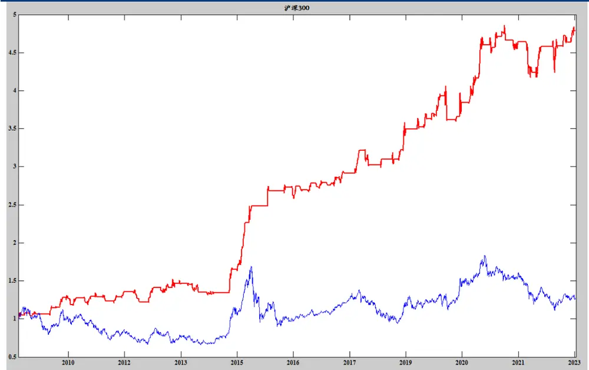
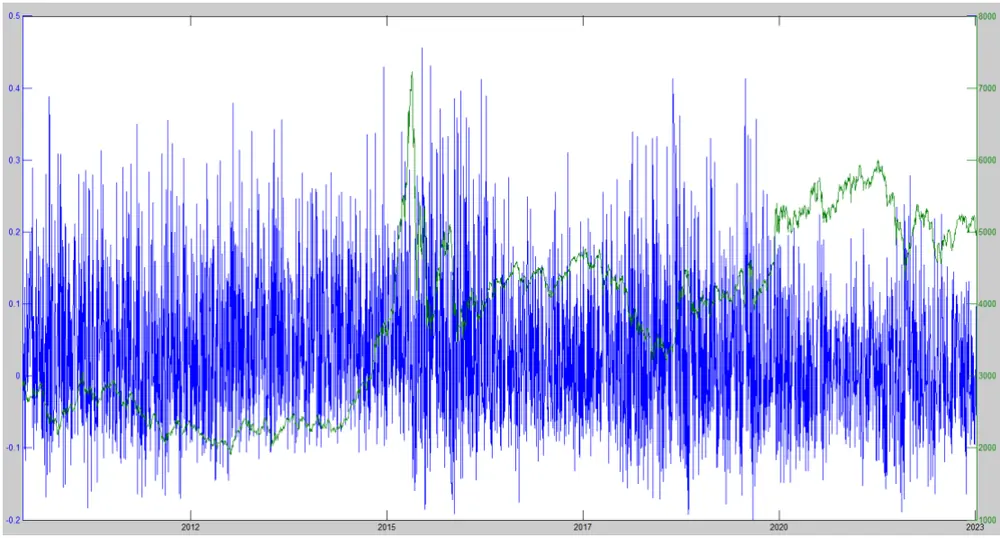
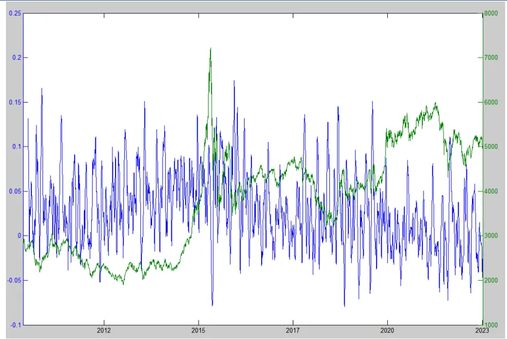
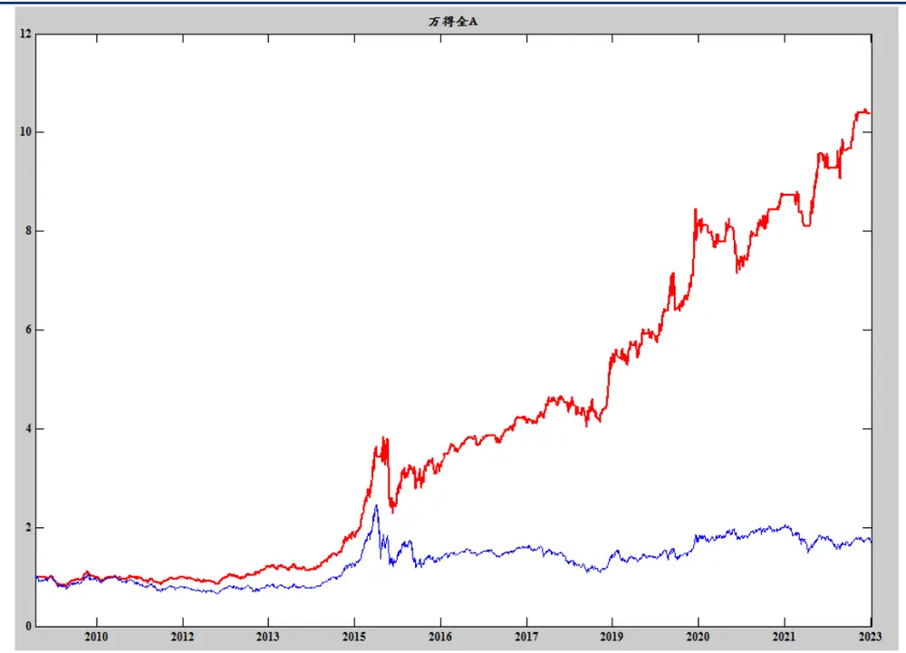

【专题报告】

# 形态学研究之二：如何利用形态信号进行市场择时

K 线的本质内涵是多空双方资金在争夺主导权而留下来的轨迹，通过研究 K线形态，我们能够深入地观察到市场的真正变化。不论是宏观环境变化，还是赛道格局改变亦或是个股基本面的变化，都可以反应在股票 K线形态图上。

华创形态学研究系统对资产的历史胜率统计时间为 5天，对市场短期的走势预测较准，但如果想做市场中期的预测，则不能仅使用指数本身形态信号，需要另辟蹊径，见微知著。

市场是由不同个股构成的，通过指数成分股对指数进行未来走势的建模，我们已经在《涨跌停剪刀差择时系列之一：推波助澜模型》、《涨跌停剪刀差择时系列之二：双剑合璧模型》、《涨跌停剪刀差择时系列之三：推波助澜 V2模型》、《涨跌停剪刀差择时系列之四：权衡利弊，推波助澜 V3》四篇报告进行了充分的挖掘，本篇报告沿用涨跌停模型的建模方式，继续尝试使用个股形态信号合成的方法对万得全 A指数进行择时研究。

基于个股形态信号，我们选择 Wind 全 A的成分股，计算每天从形态学角度看多的个股数量与看空的个股数量，除以当天的 Wind 全 A成分股数量，计算看多形态比例与看空形态比例。与涨跌停模型的推波助澜比率(涨停比率-跌停比率)类似，我们可以计算每天多空比率的剪刀差，即多空形态比率剪刀差。我们亦对多空形态比率剪刀差进行 30 日均线的 HMA 平滑，当多空形态比率剪刀差的 N 日 HMA 均线指标值大于 0 的时候，我们做多万得全 A 指数，第二天开盘做多，否则空仓。参数 N 等于 30，构建多空形态比率剪刀差择时模型。

多空形态比率剪刀差择时模型的万得全 A历史回溯表现。年化 20.05%，最大回撤 40.3%，平均每年交易次数为 7.5 次，夏普比率 0.876，胜率 53.1%，盈亏比 2.49，平均看多持有周期为 25 个交易日，相比涨跌停 V3 的中期模型，多空形态比率剪刀差择时模型的平均多头持有周期时间更长。且多空形态比率剪刀差择时模型历史回溯表现超越了基准本身，模型历史回溯表现非常优秀。

## 风险提示：

模型结果基于历史数据测算，不保证未来数据的有效性。

## 华创证券研究所

证券分析师：王小川

电话：021-20572528

邮箱：wangxiaochuan@hcyjs.com

执业编号：S0360517100001

## 相关研究报告

《华创金工事件研究系列——2023年6月指数样本股调整预测》

2023-05-04

《2023年一季报公募基金十大重仓股持仓分析》2023-04-24

《2023年 Q1 量化策略总结与未来市场展望》2023-04-05

《基于 canslim 与 FESC 的沪深 300 指数增强策略》

2023-03-07

《2022年四季报公募基金十大重仓股持仓分析》2023-01-24

## 投资主题

## 报告亮点

首次尝试使用个股形态学对指数进行择时，通过计算看多形态比例与看空形态比例剪刀差，使用 HMA 均线构建模型，获得年化 20.05%，最大回撤 37.9%的 Wind 全 A 择时模型。

## 投资逻辑

见微知著，先通过形态对指数成分股的未来走势做判断，通过个股的形态信号合并成指数的形态信号，进而对指数进行判断。该方法相对指数本身形态信号来说，持有期更长，交易次数更少。

## 一、K线形态学基础回顾

自从有了股票市场后，无数人对股票进行研究，目的是找出股票上涨与下跌的原因与规律，试图通过交易股票获取人生财富密码，股票形态学就是其中的一种。那么，什么是形态学？什么是K线？能否通过K线赚到钱？不同K线所代表的形态历史收益如何？我们在《K线形态研究开篇：形态学初识与应用》中介绍K线与常见形态概述，以及《华创金工形态学研究网站》的使用方法。华创金工在大盘择时获得的研究成果颇为丰富，能充分利用各类历史信息，构造量化择时模型。那么K线形态能否成为一个独特的角度，围绕K线形态并构建量化择时模型呢？因此，本篇报告将继续利用形态学信号，对市场未来的走势进行量化择时判断。

## （一）K线形态学投资原理回顾

K 线形态学研究的是股票价格在下跌、盘整、上升的过程中的价格轨迹的图形、形态及特征。

股票形态是将股票的一切交易信息进行合成，并最终以一定的形状展示。不论是宏观环境变化，还是赛道格局改变亦或是个股基本面的变化，都可以反应在股票 K线形态图上，这种说法基于以下判断：

1. “正确的投资人”会利用“正确的股票信息”：正确的信息会引导股票朝向一个正确的形态方向运行，不可否认，股票的一些错误信息可以暂时打乱股票价格的轨迹，但长期看，正确的信息会对暂时错误的信息进行修正。这样 K线形态就可以正确地反应股票的未来趋势。这里“正确的投资人”是指能利用各种宏观、行业、基本面信息的投资者，K线形态天然就会反应股票的交易情况，也就是“市场总是正确的”。

2. 背离公司基本面的形态一定事出有因：我们发现，很多股票的基本面非常好，是行业龙头股票，但经常处于震荡甚至是下跌状态。究其原因，就是我们说的股价与基本面偏离，一般这种情况是尚未出现看多该股票的合力效应，而这种优质基本面个股的震荡，也能真实反应在 K线图上，形成“当涨不涨、当跌不跌”的情况。

3. 在一切可以得到的股票信息中，仿制 K线形态是成本最高的。如果想仿制股票的K线形态，必须用钱“堆”出来，这比财务造假、发布一份造势公告来的成本高很多。所以K线形态更值得关注。

4. 股票后期的形态必然是先期形态的结果。万事有因必有果，股票也不能例外。没有前期的积累，便没有后面的拉升。相反，没有前期的抛售，也没有后期的下跌。从这个意义上说，股票的 K线形态与波浪理论、均线、箱体理论等其他形态学理论是暗合的。

## （二）个股 K线形态信号与市场的关系

市场是由不同个股构成的，通过指数成分股对指数进行未来走势的建模，我们已经在《涨跌停剪刀差择时系列之一：推波助澜模型》、《涨跌停剪刀差择时系列之二：双剑合璧模型》、《涨跌停剪刀差择时系列之三：推波助澜 V2 模型》、《涨跌停剪刀差择时系列之四：权衡利弊，推波助澜V3》四篇报告进行了充分的挖掘。

推波助澜 V1 模型：市场涨停个股较多的时候，市场人气旺盛，容易走出上涨行情；市场跌停个股较多的时候，市场人气冷淡，容易走出下跌行。基于经验设定涨跌停阈值为9.5%，即个股涨幅大于 9.5%为涨停，个股涨幅小于-9.5%为跌停。定义涨停比率：宽基指数单日涨幅大于 9.5%的成分股数量占其成分股总数的比率。定义跌停比率：宽基指数单日跌幅大于 9.5%(单日涨幅小于-9.5%)的成分股数量占其成分股总数的比率。推波助澜V1模型是基于涨停比率与跌停比率构建的择时模型。

推波助澜 V2 模型：定义连板比率，即连续涨停比率和连续跌停比率。类似涨跌停比率剪刀差的定义，因此我们定义连板比率剪刀差：即连续涨停比率-连续跌停比率。我们还定义了地天板比率和天地板比率的剪刀差：地天板比率-天地板比率。推波助澜 V2 模型是基于涨跌停比率剪刀差、连板比率剪刀差、地天与天地板比率剪刀差构建的择时模型。

推波助澜 模型： 股指数的行情主要依靠权重股来带动，纯粹使用涨跌停个股数量简单加减不一定能真实反映 股的整体情绪，因此推波助澜 模型与推波助澜 模型计算涨跌停比率剪刀差的方式可能有所弊端。因此定义了自由流通市值加权涨跌停比率剪刀差、自由流通市值加权连板比率剪刀差、自由流通市值加权地天与天地板比率剪刀差，最终得到推波助澜V3模型。推波助澜V3模型是涨跌停择时系列中最稳健的模型。

推波助澜模型样本外策略表现效果依旧较好(如图表1 和图表2)，因为涨跌停模型系列的建模方式是利用个股信号去合成指数信号，所以本篇报告沿用涨跌停模型的建模方式，继续尝试使用个股形态信号合成的方法对万得全 A指数进行择时研究。

图表 1 推波助澜 V3模型的沪深 300指数历史回溯表现

资料来源：wind，华创证券

图表 2 推波助澜 V3模型的沪深 300指数历史回溯表现

| 标的 | 年化 | 最大回撤 | 最大回撤开始 | 最大回撤结束 | 总交易次数 | 每年交易次数 | 夏普 | 胜率 | 盈亏比 | 月度胜率 | 周度胜率 | 多头周期 | 空头周期 |
| --- | --- | --- | --- | --- | --- | --- | --- | --- | --- | --- | --- | --- | --- |
| 沪深300 | 12.6 | 14.16 | 2021/08/10 | 2022/03/29 | 74 | 5.6 | 0.8311 | 62.20%\| | 2.01 | 62.61% | 60.32% | 15.1 日 | 29.2 日 |

资料来源：wind，华创证券

## （三）为什么不用指数本身的形态信号？

在《华创金工形态学研究网站》平台中，我们提供了各种指数的独立形态判断，不同指数判断的胜率不同，大部分指数都存在正面与负面的有效形态， 但形态学研究系统的历史胜率统计时间为 5 天，对市场短期的走势预测较准，但如果想做市场中期的预测，则不能仅使用指数本身形态信号，需要另辟蹊径，见微知著。

## 二、基于形态学的择时策略

择时策略从根本上说，是寻求能反应市场情绪指标的策略。从我们历史上基于价量、趋势、加速度、动量、涨跌停、VIX 等研报来看，如果一个指标能敏感反应市场情绪，那么这个指标经过一些变换就可以作为择时的参考指标。

随着资产形态学研究的深入，我们已经在《华创金工形态学研究网站》平台中提供了宽基指数、行业指数、概念指数、主题指数、ETF跟踪指数、可转债、个股等资产的形态学信号。基于这些信号，我们选择 Wind全A的成分股，计算每天从形态学角度看多的个股数量与看空的个股数量，除以当天的 Wind全 A成分股数量，计算看多形态比例与看空形态比例。与涨跌停模型的推波助澜比率(涨停比率-跌停比率)类似，我们可以计算每天多空比率的剪刀差，即多空形态比率剪刀差。

图表 3 多空形态比率剪刀差

资料来源：wind，华创证券

我们首先来看多空形态比率剪刀差，如图表 3，无均线平滑的多空形态比率剪刀差呈现出杂乱无章的走势。那我们又该如何去针对多空形态比率剪刀差去平滑呢？在《涨跌停剪刀差择时系列之一：推波助澜模型》一文中，涨跌停模型基于 HMA 的均线对涨跌停比率剪刀差进行平滑，其中短期参数为 30。

因此，我们亦对多空形态比率剪刀差进行 30 日均线的 HMA 平滑，如图表 4。多空形态比率剪刀差指标经过30日HMA 平滑后的平滑指标，相比图表3 的未经平滑的指标，我们在图表 4能发现，当万得全A上涨的时候，指标值较高，当万得全A下跌的时候，指标值较低，指标值围绕着0 附近摆动。

图表 4 多空形态比率剪刀差的30日 HMA均线

资料来源：wind，华创证券

图表 5 多空形态比率剪刀差择时模型的万得全 A历史回溯表现

资料来源：wind，华创证券

图表 6 多空形态比率剪刀差择时模型的万得全A历史回溯表现

| 标的 | 年化 | 最大回撤 | 最大回撤开始 | 最大回撤结束 | 总交易次数 | 每年交易次数 | 夏普 | 胜率 | 盈亏比 | 月度胜率 | 周度胜率 | 多头周期 | 空头周期 |
| --- | --- | --- | --- | --- | --- | --- | --- | --- | --- | --- | --- | --- | --- |
| 万得全A | 20.05 | 40.3 | 2015/07/23 | 2015/09/15 | 96 | 7.5 | 0.876 | 53.1% | 2.49 | 61.69% | 57.02% | 25.3日 | 8.3日 |

资料来源：wind，华创证券

类似涨跌停比率剪刀差择时模型的建模方式，我们定义多空形态比率剪刀差的择时模型，当多空形态比率剪刀差的 N 日 HMA 均线指标值大于 0 的时候(此时市场大概率上涨)，我们做多万得全A 指数，第二天开盘做多，否则空仓。参数N 等于 30，无论是涨跌停比率剪刀差、特征龙虎榜机构模型(《特征分布建模择时系列之一： 物极必反，龙虎榜机构模型》)，均使用HMA的30日均线进行短期平滑。

如图表 5 和图表 6，即多空形态比率剪刀差择时模型的万得全 A 历史回溯表现。年化20.05%，最大回撤 40.3%，平均每年交易次数为 7.5 次，夏普比率 0.876，胜率 53.1%，盈亏比 2.49，平均看多持有周期为 25 个交易日，相比涨跌停V3的中期模型，多空形态比率剪刀差择时模型的平均多头持有周期时间更长。且多空形态比率剪刀差择时模型历史回溯表现超越了基准本身，模型历史回溯表现非常优秀。

参数稳定性检验，如图表 7，HMA 的短期参数由20每隔5个单位遍历至 40，年化收益，最大回撤，胜率，夏普比率，回测结果受制于短期参数影响较低，平滑参数等于 30仅仅是次优参数。

图表 7 参数稳定性检验

| 指标 | 短期=20 | 短期=25 | 短期=30 | 短期=35 | 短期=40 |
| --- | --- | --- | --- | --- | --- |
| 年化 | 29.38 | 22.02 | 20.05 | 16.93 | 16.4 |
| 最大回撤 | 23.23 | 39.2 | 40.3 | 36.66 | 36.68 |
| 开始 | 2015/7/23 | 2015/7/23 | 2015/7/23 | 2015/6/12 | 2015/6/12 |
| 结束 | 2015/9/15 2 | 015/9/15 | 2015/9/15 | 2015/9/15 | 2015/9/15 |
| 总次数 | 144 | 106 | 96 | 73 | 73 |
| 每年次数 | 11.2 | 8.3 | 7.5 | 5.7 | 5.7 |
| 夏普 | 1.316 | 0.956 | 0.876 | 0.723 | 0.701 |
| 胜率 | 60.40% | 60.40% | 53.10% | 56.20% | 53.40% |
| 盈亏比 | 2.85 | 2.14 | 2.49 | 2.27 | 2.64 |
| 月胜率 | 69.62% | 65.16% | 61.69% | 56.95% | 58.00% |
| 周胜率 | 57.76% | 57.57% | 57.02% | 56.80% | 57.51% |
| 多头周期 | 16.1 日 | 22.8 日 | 25.3 日 | 34.0日 | 33.8 日 |
| 空头(仓)6.3周期 | 日 7.7 | 日 8.3 | 日 | 10.2 日 | 10.3 日 |

资料来源：wind，华创证券

## 三、风险提示

策略基于历史数据的回测，不保证策略未来的有效性。

## 金融工程组团队介绍

组长、首席分析师：王小川

同济大学管理学博士。2017年加入华创证券研究所。

高级分析师：秦玄晋

上海对外经贸大学硕士。2018年加入华创证券研究所。

助理研究员：杨宸祎

美国伊利诺伊大学香槟分校会计学、金融工程学硕士，CFA。2021年加入华创证券研究所。

## 华创证券机构销售通讯录

| 地区 | 姓名 | 职务 | 办公电话 | 企业邮箱 |
| --- | --- | --- | --- | --- |
| 北京机构销售部 | 张昱洁 | 副总经理、北京机构销售总监 | 010-63214682 | zhangyujie@hcyjs.com |
|  | 张菲菲 | 北京机构副总监 | 010-63214682 | zhangfeifei@hcyjs.com |
|  | 刘懿 | 副总监 | 010-63214682 | liuyi@hcyjs.com |
|  | 侯春钰 | 资深销售经理 | 010-63214682 | houchunyu@hcyjs.com |
|  | 侯斌 | 资深销售经理 | 010-63214682 | houbin@hcyjs.com |
|  | 过云龙 | 高级销售经理 | 010-63214682 | guoyunlong@hcyjs.com |
|  | 蔡依林 | 高级销售经理 | 010-66500808 | caiyilin@hcyjs.com |
|  | 刘颖 | 高级销售经理 | 010-66500821 | liuying5@hcyjs.com |
|  | 顾翎蓝 | 高级销售经理 | 010-63214682 | gulinglan@hcyjs.com |
|  | 车一哲 | 销售经理 |  | cheyizhe@hcyjs.com |
| 深圳机构销售部 | 张娟 | 副总经理、深圳机构销售总监 | 0755-82828570 | zhangjuan@hcyjs.com |
|  | 汪丽燕 | 高级销售经理 | 0755-83715428 | wangliyan@hcyjs.com |
|  | 张嘉慧 | 高级销售经理 | 0755-82756804 | zhangjiahui1@hcyjs.com |
|  | 董姝彤 | 销售经理 | 0755-82871425 | dongshutong@hcyjs.com |
|  | 巢莫雯 | 销售经理 | 0755-83024576 | chaomowen@hcyjs.com |
|  | 王春丽 | 销售经理 | 0755-82871425 | wangchunli@hcyjs.com |
| 上海机构销售部 | 许彩霞 | 总经理助理、上海机构销售总监0 | 21-20572536 | xucaixia@hcyjs.com |
|  | 官逸超 | 上海机构销售副总监 | 021-20572555 | guanyichao@hcyjs.com |
|  | 黄畅 | 上海机构销售副总监 | 021-20572257-2552 | huangchang@hcyjs.com |
|  | 吴俊 | 资深销售经理 | 021-20572506 | wujun1@hcyjs.com |
|  | 张佳妮 | 高级销售经理 | 021-20572585 | zhangjiani@hcyjs.com |
|  | 邵婧 | 高级销售经理 | 021-20572560 | shaojing@hcyjs.com |
|  | 蒋瑜 | 高级销售经理 | 021-20572509 | jiangyu@hcyjs.com |
|  | 施嘉玮 | 高级销售经理 | 021-20572548 | shijiawei@hcyjs.com |
|  | 朱涨雨 | 销售助理 | 021-20572573 | zhuzhangyu@hcyjs.com |
|  | 李凯月 | 销售助理 |  | likaiyue@hcyjs.com |
|  | 张玉恒 | 销售助理 |  | zhangyuheng@hcyjs.com |
| 广州机构销售部 | 段佳音 | 广州机构销售总监 | 0755-82756805 | duanjiayin@hcyjs.com |
|  | 周玮 | 销售经理 |  | zhouwei@hcyjs.com |
|  | 王世韬 | 销售经理 |  | wangshitao1@hcyjs.com |
| 私募销售组 | 潘亚琪 | 总监 | 021-20572559 | panyaqi@hcyjs.com |
|  | 汪子阳 | 副总监 | 021-20572559 | wangziyang@hcyjs.com |
|  | 江赛专 | 资深销售经理 | 0755-82756805 | jiangsaizhuan@hcyjs.com |
|  | 汪戈 | 高级销售经理 | 021-20572559 | wangge@hcyjs.com |
|  | 宋丹玙 | 销售经理 | 021-25072549 | songdanyu@hcyjs.com |

## 华创行业公司投资评级体系(基准指数沪深 300)

公司投资评级说明：

强推：预期未来 6个月内超越基准指数 20%以上；

推荐：预期未来 6个月内超越基准指数 10%－20%；

中性：预期未来 6个月内相对基准指数变动幅度在-10%－10%之间；

回避：预期未来 6个月内相对基准指数跌幅在 10%－20%之间。

## 行业投资评级说明：

推荐：预期未来 3-6个月内该行业指数涨幅超过基准指数 5%以上；

中性：预期未来 3-6个月内该行业指数变动幅度相对基准指数-5%－5%；

回避：预期未来 3-6个月内该行业指数跌幅超过基准指数 5%以上。

## 分析师声明

每位负责撰写本研究报告全部或部分内容的分析师在此作以下声明：

分析师在本报告中对所提及的证券或发行人发表的任何建议和观点均准确地反映了其个人对该证券或发行人的看法和判断；分析师对任何其他券商发布的所有可能存在雷同的研究报告不负有任何直接或者间接的可能责任。

## 免责声明

本报告仅供华创证券有限责任公司（以下简称“本公司”）的客户使用。本公司不会因接收人收到本报告而视其为客户。

本报告所载资料的来源被认为是可靠的，但本公司不保证其准确性或完整性。本报告所载的资料、意见及推测仅反映本公司于发布本报告当日的判断。在不同时期，本公司可发出与本报告所载资料、意见及推测不一致的报告。本公司在知晓范围内履行披露义务。

报告中的内容和意见仅供参考，并不构成本公司对具体证券买卖的出价或询价。本报告所载信息不构成对所涉及证券的个人投资建议，也未考虑到个别客户特殊的投资目标、财务状况或需求。客户应考虑本报告中的任何意见或建议是否符合其特定状况，自主作出投资决策并自行承担投资风险，任何形式的分享证券投资收益或者分担证券投资损失的书面或口头承诺均为无效。本报告中提及的投资价格和价值以及这些投资带来的预期收入可能会波动。

本报告版权仅为本公司所有，本公司对本报告保留一切权利。未经本公司事先书面许可，任何机构和个人不得以任何形式翻版、复制、发表、转发或引用本报告的任何部分。如征得本公司许可进行引用、刊发的，需在允许的范围内使用，并注明出处为“华创证券研究”，且不得对本报告进行任何有悖原意的引用、删节和修改。

证券市场是一个风险无时不在的市场，请您务必对盈亏风险有清醒的认识，认真考虑是否进行证券交易。市场有风险，投资需谨慎。

## 华创证券研究所

| 北京总部 | 广深分部 | 上海分部 |
| --- | --- | --- |
| 地址：北京市西城区锦什坊街26号 恒奥中心 C 座 3A | 地址：深圳市福田区香梅路1061号中投国际 商务中心 A 座 19 楼 | 地址：上海市浦东新区花园石桥路33号 花旗大厦 12 层 |
| 邮编：100033 传真：010-66500801 | 邮编：518034 | 邮编：200120 |
| 会议室：010-66500900 | 传真：0755-82027731 | 传真：021-20572500 |
|  | 会议室：0755-82828562 | 会议室：021-20572522 |