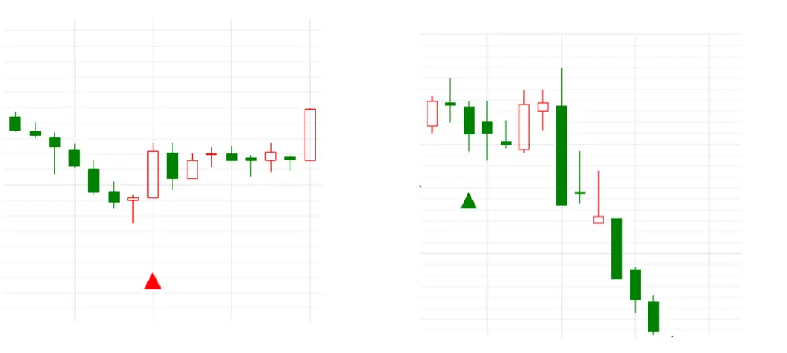
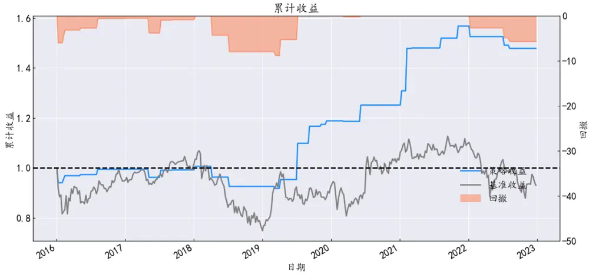
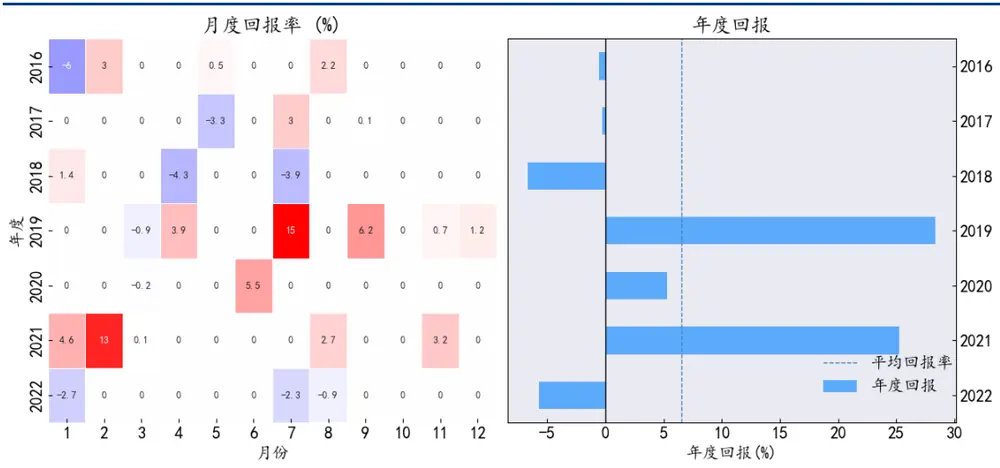
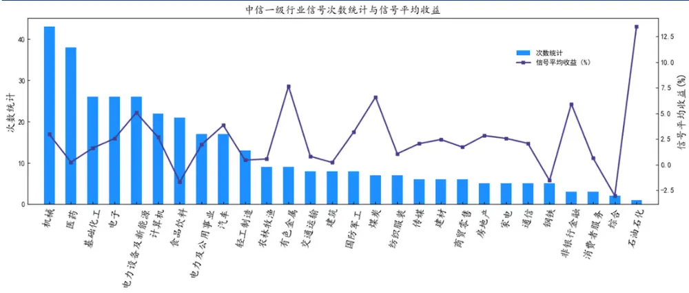
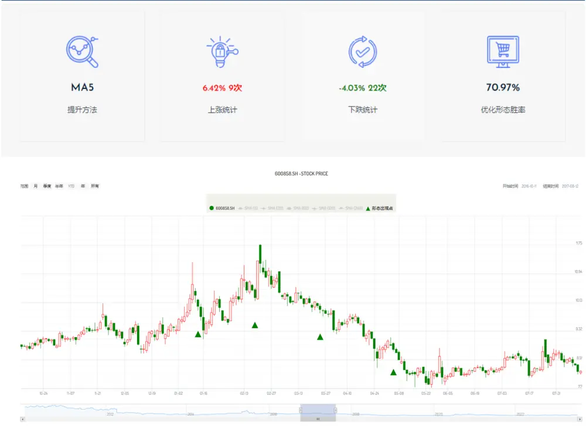

【专题报告】

# K 线形态研究之五：三内部上涨\下跌线

## 三内部上涨\下跌线介绍

三内部上涨下跌线为三日 K 线模式，当其出现时，表示一种反转信号。该形态的三根 K 线需要以特定的顺序形成，表明当前趋势已经失去动力，并可能正在开始向相反方向移动。三内部上涨形态是一种看涨反转形态，由一根大的下跌 K线、一根包含在前一根 K 线中的较小 K线，最后是另一根上涨 K 线，该 K 线在第二根 K线收盘价上方收盘。三内部下跌形态是一种看跌反转形态，由一根大的上涨 K 线、一根包含在前一根 K线中的较小 K 线，最后是另一根下跌蜡烛，该 K 线在第二根 K 线收盘价下方收盘。考虑 5 日的股价变化，在三内部看跌信号的胜率为 50.5%，平均收益为-0.1%，三内部看涨线信号胜率为 48.9%，平均收益为 0.28%。

## 三内部上涨\下跌线结合多种指标

三内部上涨下跌线应用一般是在顶部或者底部结构里面，具备反转信号，同时结合其他反转形态使用更好。我们统计了其与不同指标结合后的胜率和平均收益。

## 三内部上涨\下跌线在个股上的应用

K 线指标在某些特定个股上可以获得更好表现，具体详情可查询华创形态学专业版网站。

## 华创金工形态学研究平台

为了能更好的观察 A股全部个股出现的各种 K 线形态，我们将常见的 61种 K线形态进行了量化定义与特征归纳，实现了在全部 A股日线上标注 61种 K线形态的研究系统，该系统每日更新。网址为：http://mark.hcquant.com。

我们也提供了各种最新信号形态定制的方式。

后续我们会陆续针对高收益高胜率形态进行深度挖掘。

## 风险提示：

本报告中所有统计结果和模型方法均基于历史数据，不代表未来趋势。

## 华创证券研究所

证券分析师：王小川证

电话：021-20572528

邮箱：wangxiaochuan@hcyjs.com 邮

执业编号：S0360517100001执

## 证券分析师：秦玄晋

电话：021-20572522

邮箱：qinxuanjin@hcyjs.com

执业编号：S0360522080005

## 相关研究报告

《K线形态研究之四：母子线》

2023-07-06

《K线形态学研究系列之三：十字孕线

2023-06-08

《华创金工形态学研究之二：如何利用形态信号进行市场择时》

2023-05-12

《华创金工事件研究系列——2023年6月指数样本股调整预测》

《2023年一季报公募基金十大重仓股持仓分析》

2023-05-04

2023-04-24

## 投资主题

## 报告亮点

本篇报告作为 K线形态学研究的之五，系统性地说明了三内部上涨\下跌线在投资中的应用，并且指明了形态在投资过程中需要耦合其他指标才能提升胜率，加大投资收益。

## 投资逻辑

历史有一定概率是可以重复的，通过对单个资产三内部上涨\下跌线形态出现后的统计，可以对不同资产未来再次出现该形态的走势做出胜率较高的判断。正向形态对投资有增厚作用，负向形态可以规避个股风险。

## 一、三内部上涨\下跌线介绍

## （一）三内部上涨\下跌线的基本性质

三内部上涨\下跌线是由三根 K 线组合成的图形。三内部上涨线，是指第一根 K 线为实体阴线，第二根 K线的实体相对前一根 K线来说要短一些，最后一根 K线的收盘价在第二根 K 线的上方，预示着股票可能上涨。三内部下跌线，是指第一根 K 线为实体阳线，第二根 K 线的实体相对前一根 K 线来说要短一些，最后一根 K 线的收盘价在第二根 K线的下方，预示着股票可能下跌。

图表 1 三内部上涨和三内部下跌线

资料来源：wind，华创金工形态学网站

## （二）单独三内部上涨\下跌线出现时的历史统计

K线形态受到多种因素影响，一方面特定的 K线形态在一定程度上反映了股票多空的交易情况，另一方面股票的走势也具备一定的随机性，为了衡量单纯的 K线与后续股票走势的关联，我们统计了当三内部上涨线、三内部下跌线出现后股票在 5日，10日，20日和60日的股价变化和胜率。

图表 2 三内部上涨\下跌线统计

| 正面/负面 | 交易日间隔 | 股价平均变化率（%） | 胜率（%） |
| --- | --- | --- | --- |
| 正面 | 5 | 0.28 | 50.5 |
|  | 10 | 0.54 | 50.0 |
|  | 20 | 1.31 | 49.55 |
|  | 60 | 2.62 | 46.7 |
| 负面 | 5 | 0.1 | 49.7 |
|  | 10 | 0.23 | 51.3 |
|  | 20 | 0.43 | 52.7 |
|  | 60 | 1.83 | 54.66 |

资料来源：wind，华创证券

从历史统计角度，三内部上涨线的平均收益在一定期限大于三内部下跌线的平均收益。

## 二、三内部上涨\下跌线结合多种指标

（一）三内部上涨\下跌线结合多种指标的统计情况

单一的 K线形态结合多种形态技术指标或者股票特征指标产生的效果往往优于单一的K线指标。这里，耦合了多种常见的技术指标：

图表 3 指标说明

| 特征 | 参数 | 标记 | 值 |
| --- | --- | --- | --- |
| 技术指标 | 均线 | MA5\ MA30\ MA60 | -1、1 |
|  | 平滑异同移动平均线 | MACD | -1、1 |
| 成交特征 | 量能 | HMA | 1、2、3 |
|  | 集中度 | Concentration | 1、2、3 |
| 股票基本面 | F评分 | Fscore | 1、2、3 |
|  | 股东户数 | Ash | 1、2、3 |

资料来源：wind，华创证券

这里，均线类 MA 指标当股票收盘价超过 N 天均线则记为 1，小于记为-1。MACD 指标大于 0 记为 1，否则为-1。成交特征和基本面信号的标记方式为，当日股票特征值排序，前 1/3 记为 3，后 1/3 记为 1，其他记为 0。成交特征和基本面特征的计算方法见华创金工《双重筹码集中的基本面选股策略》。从 2010 年开始，我们统计了全部 A 股个股三内部上涨\下跌线出现的情况，其股价 5日变化情况和胜率结果展示在图表 4中。结果表明：

一、耦合不同指标下的三内部上涨\下跌线胜率不同。在不耦合指标的情况下，三内部上涨\下跌线 5 个交易日间隔股价预测负面胜率为 49.7%，正面信号胜率为 50.5%。在耦合MA5指标的情况下，负面信号胜率最高提升为 55.95%，正面信号胜率最高提升为 52%。

二、对于正面信号，股价在均线下方的胜率超过股价在均线上方，表明线提示了短期股价止跌回升。对于负面信号，股价在均线上方的胜率超过股价在均线下方，表明三内部上涨\下跌线提示了短期股价有下跌风险。例如股价在 MA5 下方，出现了三内部上涨线的胜率为 52%，而股价在MA5上方，出现三内部下跌线的胜率为 55.95%。

图表 4 三内部上涨\下跌线指标统计

| 特征 | 参数 | 标记 | 股价变化率 | 胜率 |
| --- | --- | --- | --- | --- |
| 正向信号 | MACD | -1 | 4.97% | 49% |
|  | MACD | 1 | 5.42% | 48% |
|  | MA5 | -1 | 4.66% | 52% |
|  | MA5 | 1 | 5.21% | 49% |
|  | MA30 | -1 | 6.98% | 49% |
|  | MA30 | 1 | 4.52% | 48% |
|  | MA60 | -1 | 4.45% | 50% |
|  | MA60 | 1 | 5.89% | 48% |
|  | HMA | 1 | 5.04% | 48% |
|  | HMA | 2 | 5.11% | 49% |
| 负向信号 | HMA | 3 | 5.41% | 48% |
|  | Fscore | 1 | 5.36% | 47% |
|  | Fscore | 2 | 5.22% | 50% |
|  | Fscore | 3 | 5.06% | 49% |
|  | Concentration | 1 | 4.46% | 48% |
|  | Concentration | 2 | 4.99% | 48% |
|  | Concentration | 3 | 5.43% | 49% |
|  | Ash | 1 | 5.31% | 49% |
|  | Ash | 2 | 4.96% | 49% |
|  | Ash | 3 | 5.29% | 48% |
|  | MACD | -1 | -5.41% | 50.87% |
|  | MACD | 1 | -4.95% | 49.66% |
|  | MA5 | -1 | -5.15% | 50.19% |
|  | MA5 | 1 | -4.71% | 55.95% |
|  | MA30 | -1 | -5.29% | 50.73% |
|  | MA30 | 1 | -4.97% | 49.64% |
|  | MA60 | -1 | -5.18% | 50.43% |
|  | MA60 | 1 | -5.11% | 50.04% |
|  | HMA | 1 | -4.89% | 49.35% |
|  | HMA | 2 | -5.14% | 49.46% |
|  | HMA | 3 | -5.29% | 51.42% |
|  | Fscore | 1 | -5.20% | 50.99% |
|  | Fscore | 2 | -5.26% | 49.14% |
|  | Fscore | 3 | -5.02% | 50.29% |
|  | Concentration | 1 | -3.80% | 50.39% |
|  | Concentration | 2 | -4.83% | 50.82% |
|  | Concentration | 3 | -5.50% | 49.88% |
|  | Ash | 1 | -5.15% | 49.80% |
|  | Ash | 2 | -4.94% | 49.43% |
|  | Ash | 3 | -5.30% | 51.16% |

资料来源：wind，华创证券

## （二）历史回测

回测区间为 2016 年 1 月 1 日至 2023 年 6 月 1 日，策略为三内部上涨线结合 Fscore，当股票的 Fscore 为 3，且出现三内部上涨线时提示做多。策略为周度调仓，每周一交易上周三、四、五发出信号的股票, 手续费为单边0.08%。

图表 5 策略回测表现

资料来源：wind，华创证券

策略获得了 5.86%的年化收益，0.64的夏普比例，9%的最大回撤。

图表 6 回测指标

| 指标 | 值 |
| --- | --- |
| 年化收益 | 5.86% |
| alpha | 0.06 |
| beta | 0.03 |
| 累计收益 | 0.48 |
| 年化波动 | 0.10 |
| 夏普比例 | 0.64 |
| 卡玛比率 | 0.67 |
| 最大回撤 | -0.09 |
| 欧米伽比例 | 2.73 |
| 索提诺比率 | 1.66 |

wind,
统计策略运行过程中的 5次最大回撤情况和收益情况如下图所示：

图表 7 回撤统计

| 回撤幅度（%） | 峰值日期 | 谷值日期 | 回水日期 | 回水时间跨度（天） |
| --- | --- | --- | --- | --- |
| 8.80 | 2018/4/2 | 2019/3/11 | 2019/7/8 | 331 |
| 5.98 | 2016/1/4 | 2016/1/11 | 2018/1/8 | 526 |
| 5.69 | 2022/1/4 | 2022/8/8 |  |  |
| 0.20 | 2020/3/2 | 2020/3/9 | 2020/6/8 | 71 |

资料来源：wind，华创证券

图表 8 策略回报情况

资料来源：wind，华创证券

策略的月度收益分布和年度收益分布如图表 8 所示。由于该信号出现的频率较低，因此很多月份空仓。年度收益分布显示其平均收益大于0（图中虚线为年度平均收益）。

图表 9 策略行业统计和平均收益

资料来源：wind，华创证券

从行业信号发生的行业和平均收益来看，信号较多发生在机械，医药等行业，较少发生在综合和石油化工行业。从平均收益来看，石油化工行业的平均收益最高。

## 三、三内部上涨\下跌线耦合多种信号在个股上的应用

从个股角度而言，三内部上涨\下跌线耦合多种指标在特定的股票上具有不同的表现。例如，根据历史数据回测，在 600858.SH 上耦合 MA5 的负向信号胜率超过 70%。更多三内部上涨\下跌线在个股上的应用见华创金工形态官网：mark.hcquant.com 点击专业版。

图表 10 三内部上涨\下跌线在个股上的结果展示

资料来源：wind，华创证券

## 四、总结

本文深入研究三内部上涨\下跌线信号出现后对个股的影响并结合多种指标的优化了三内部上涨\下跌线的风险提示效果。回测的结果表明，三内部上涨\下跌线具有较好的风险提示效果。在个股上，三内部上涨\下跌线结合多种指标可以获得更高的胜率。

## 金融工程组团队介绍

组长、首席分析师：王小川同济大学管理学博士。2017年加入华创证券研究所。

高级分析师：秦玄晋上海对外经贸大学硕士。2018年加入华创证券研究所。

助理研究员：杨宸祎美国伊利诺伊大学香槟分校会计学、金融工程学硕士，CFA。2021年加入华创证券研究所。

## 华创证券机构销售通讯录

| 地区 | 姓名 | 职务 | 办公电话 | 企业邮箱 |
| --- | --- | --- | --- | --- |
| 北京机构销售部 | 张昱洁 | 副总经理、北京机构销售总监 | 010-63214682 | zhangyujie@hcyjs.com |
|  | 张菲菲 | 北京机构副总监 | 010-63214682 | zhangfeifei@hcyjs.com |
|  | 刘懿 | 副总监 | 010-63214682 | liuyi@hcyjs.com |
|  | 侯春钰 | 资深销售经理 | 010-63214682 | houchunyu@hcyjs.com |
|  | 过云龙 | 高级销售经理 | 010-63214682 | guoyunlong@hcyjs.com |
|  | 蔡依林 | 高级销售经理 | 010-66500808 | caiyilin@hcyjs.com |
|  | 刘颖 | 高级销售经理 | 010-66500821 | liuying5@hcyjs.com |
|  | 顾翎蓝 | 高级销售经理 | 010-63214682 | gulinglan@hcyjs.com |
|  | 车一哲 | 销售经理 |  | cheyizhe@hcyjs.com |
| 深圳机构销售部 | 张娟 | 副总经理、深圳机构销售总监 | 0755-82828570 | zhangjuan@hcyjs.com |
|  | 汪丽燕 | 高级销售经理 | 0755-83715428 | wangliyan@hcyjs.com |
|  | 张嘉慧 | 高级销售经理 | 0755-82756804 | zhangjiahui1@hcyjs.com |
|  | 董姝彤 | 销售经理 | 0755-82871425 | dongshutong@hcyjs.com |
|  | 巢莫雯 | 销售经理 | 0755-83024576 | chaomowen@hcyjs.com |
|  | 王春丽 | 销售经理 | 0755-82871425 | wangchunli@hcyjs.com |
| 上海机构销售部 | 许彩霞 | 总经理助理、上海机构销售总监0 | 21-20572536 | xucaixia@hcyjs.com |
|  | 官逸超 | 上海机构销售副总监 | 021-20572555 | guanyichao@hcyjs.com |
|  | 黄畅 | 上海机构销售副总监 | 021-20572257-2552 | huangchang@hcyjs.com |
|  | 吴俊 | 资深销售经理 | 021-20572506 | wujun1@hcyjs.com |
|  | 张佳妮 | 高级销售经理 | 021-20572585 | zhangjiani@hcyjs.com |
|  | 蒋瑜 | 高级销售经理 | 021-20572509 | jiangyu@hcyjs.com |
|  | 施嘉玮 | 高级销售经理 | 021-20572548 | shijiawei@hcyjs.com |
|  | 朱涨雨 | 销售助理 | 021-20572573 | zhuzhangyu@hcyjs.com |
|  | 李凯月 | 销售助理 |  | likaiyue@hcyjs.com |
|  | 张玉恒 | 销售助理 |  | zhangyuheng@hcyjs.com |
| 广州机构销售部 | 段佳音 | 广州机构销售总监 | 0755-82756805 | duanjiayin@hcyjs.com |
|  | 周玮 | 销售经理 |  | zhouwei@hcyjs.com |
|  | 王世韬 | 销售经理 |  | wangshitao1@hcyjs.com |
| 私募销售组 | 潘亚琪 | 总监 | 021-20572559 | panyaqi@hcyjs.com |
|  | 汪子阳 | 副总监 | 021-20572559 | wangziyang@hcyjs.com |
|  | 江赛专 | 资深销售经理 | 0755-82756805 | jiangsaizhuan@hcyjs.com |
|  | 汪戈 | 高级销售经理 | 021-20572559 | wangge@hcyjs.com |
|  | 宋丹玙 | 销售经理 | 021-25072549 | songdanyu@hcyjs.com |

## 华创行业公司投资评级体系

基准指数说明：

A股市场基准为沪深 300指数，香港市场基准为恒生指数，美国市场基准为标普 500/纳斯达克指数。

公司投资评级说明：

强推：预期未来 6个月内超越基准指数 20%以上；

推荐：预期未来 6个月内超越基准指数 10%－20%；

中性：预期未来 6个月内相对基准指数变动幅度在-10%－10%之间；

回避：预期未来 6个月内相对基准指数跌幅在 10%－20%之间。

## 行业投资评级说明：

推荐：预期未来 3-6个月内该行业指数涨幅超过基准指数 5%以上；

中性：预期未来 3-6个月内该行业指数变动幅度相对基准指数-5%－5%；

回避：预期未来 3-6个月内该行业指数跌幅超过基准指数 5%以上。

## 分析师声明

每位负责撰写本研究报告全部或部分内容的分析师在此作以下声明：

分析师在本报告中对所提及的证券或发行人发表的任何建议和观点均准确地反映了其个人对该证券或发行人的看法和判断；分析师对任何其他券商发布的所有可能存在雷同的研究报告不负有任何直接或者间接的可能责任。

## 免责声明

。本公司不会因接收人收到本报告而视其为客户。

本报告所载资料的来源被认为是可靠的，但本公司不保证其准确性或完整性。本报告所载的资料、意见及推测仅反映本公司于发布本报告当日的判断。在不同时期，本公司可发出与本报告所载资料、意见及推测不一致的报告。本公司在知晓范围内履行披露义务。

报告中的内容和意见仅供参考，并不构成本公司对具体证券买卖的出价或询价。本报告所载信息不构成对所涉及证券的个人投资建议，也未考虑到个别客户特殊的投资目标、财务状况或需求。客户应考虑本报告中的任何意见或建议是否符合其特定状况，自主作出投资决策并自行承担投资风险，任何形式的分享证券投资收益或者分担证券投资损失的书面或口头承诺均为无效。本报告中提及的投资价格和价值以及这些投资带来的预期收入可能会波动。

本报告版权仅为本公司所有，本公司对本报告保留一切权利。未经本公司事先书面许可，任何机构和个人不得以任何形式翻版、复制、发表、转发或引用本报告的任何部分。如征得本公司许可进行引用、刊发的，需在允许的范围内使用，并注明出处为“华创证券研究”，且不得对本报告进行任何有悖原意的引用、删节和修改。

证券市场是一个风险无时不在的市场，请您务必对盈亏风险有清醒的认识，认真考虑是否进行证券交易。市场有风险，投资需谨慎。

## 华创证券研究所

| 北京总部 | 广深分部 | 上海分部 |
| --- | --- | --- |
| 地址：北京市西城区锦什坊街26号 恒奥中心 C 座 3A | 地址：深圳市福田区香梅路1061号中投国际 商务中心 A 座 19 楼 | 地址：上海市浦东新区花园石桥路33号 花旗大厦 12 层 |
| 邮编：100033 传真：010-66500801 | 邮编：518034 | 邮编：200120 |
| 会议室：010-66500900 | 传真：0755-82027731 会议室：0755-82828562 | 传真：021-20572500 会议室：021-20572522 |