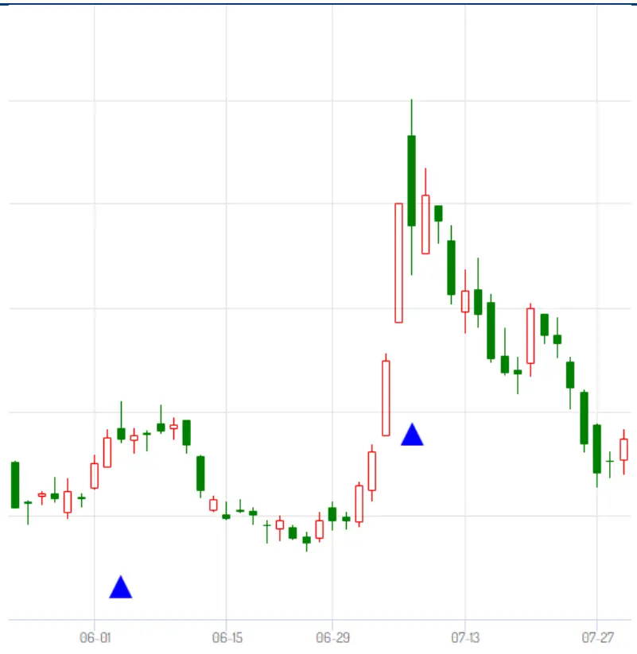
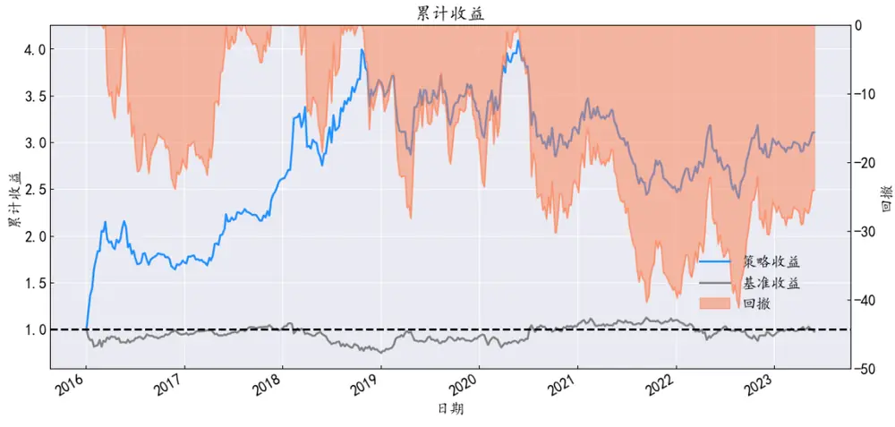
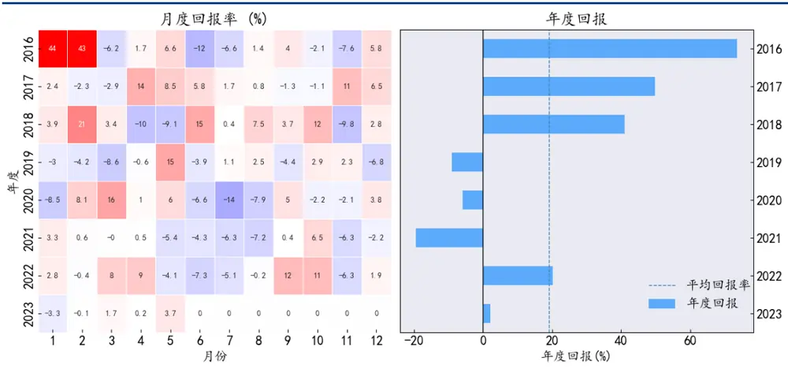
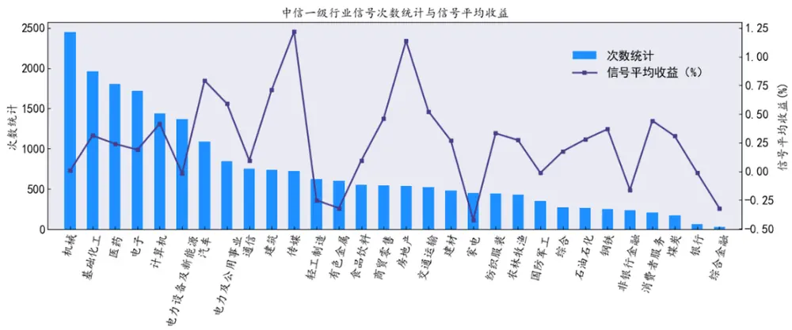
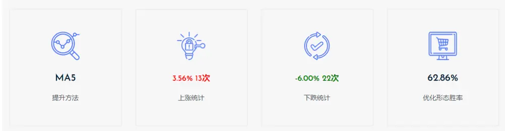
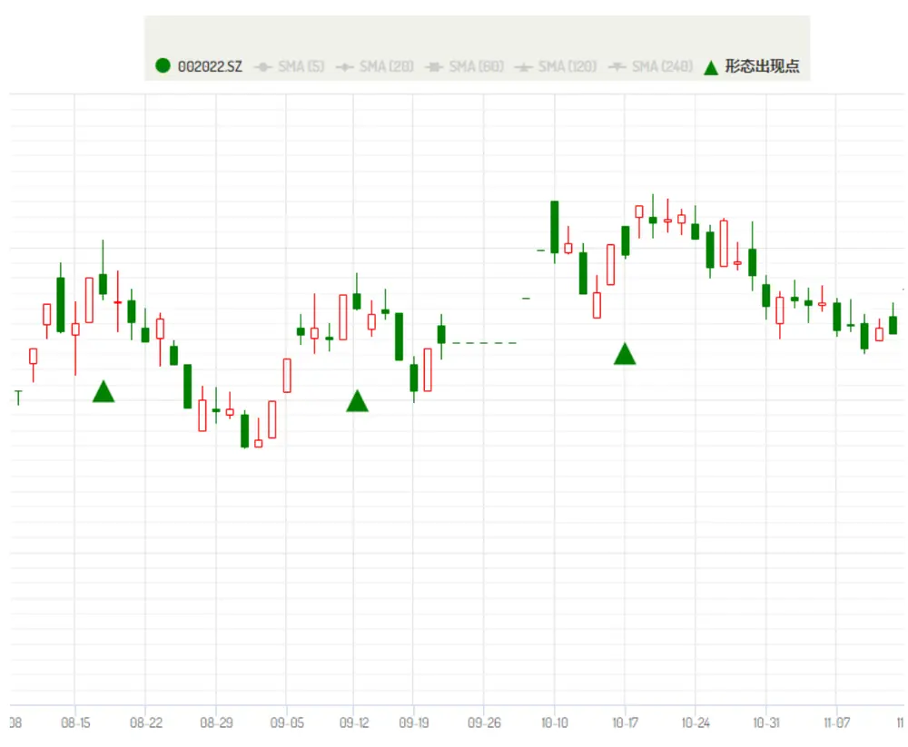

专题报告

# K 线形态研究之六：乌云压顶线

## 乌云压顶线介绍

二日 K线模式，第一根 K线为阳线，第二根 K 线跳空高开，但是收盘价收于第一根 K 线以内。这种形态出现在顶部意味着市场看多力量耗尽，后续股价可能下跌。考虑 5日股价变化情况，乌云压顶线出现后，股价平均跌幅-0.01%，跌幅中位数为-0.27%，胜率为 52.55%。

## 乌云压顶线结合多种指标

乌云压顶线应用一般是在顶部结构里面，表明股价可能下跌，同时结合其他反转形态使用更好。例如与 MA60 结合，胜率可以达到 53.8%。

## 乌云压顶线在个股上的应用

K 线指标在某些特定个股上可以获得更好表现，具体详情可查询华创形态学专业版网站。

## 华创金工形态学研究平台

为了能更好的观察 A股全部个股出现的各种 K 线形态，我们将常见的 61种 K线形态进行了量化定义与特征归纳，实现了在全部 A股日线上标注 61种 K线形态的研究系统，该系统每日更新。网址为：http://mark.hcquant.com。

我们也提供了各种最新信号形态定制的方式。

后续我们会陆续针对高收益高胜率形态进行深度挖掘。

## 风险提示：

本报告中所有统计结果和模型方法均基于历史数据，不代表未来趋势。

## 华创证券研究所

证券分析师：王小川

电话：021-20572528

邮箱：wangxiaochuan@hcyjs.com

执业编号：S0360517100001

证券分析师：秦玄晋

电话：021-20572522

邮箱：qinxuanjin@hcyjs.com

执业编号：S0360522080005

## 相关研究报告

《K线形态研究之五：三内部上涨\下跌线》

2023-07-14

《K线形态研究之四：母子线》

2023-07-06

《K线形态学研究系列之三：十字孕线》

2023-06-08

《华创金工形态学研究之二：如何利用形态信号进行市场择时》

2023-05-12

## 投资主题

## 报告亮点

本篇报告作为 K线形态学研究的之六，系统性地说明了乌云压顶线在投资中的应用，并且指明了形态在投资过程中需要耦合其他指标才能提升胜率，加大投资收益。

## 投资逻辑

历史有一定概率是可以重复的，通过对单个资产乌云压顶线形态出现后的统计，可以对不同资产未来再次出现该形态的走势做出胜率较高的判断。负向形态可以规避个股风险。

## 一、乌云压顶线介绍

## （一）乌云压顶线的基本性质

乌云压顶线，是 K线形态种较常出现的看空形态之一。这种形态由两根 K线构成，第一根K线为阳线，第二根 K线跳空高开，收盘在第一根 K线以内，表明多方力量的减弱。当该形态出现在顶部时，表明股价走势可能会发生反转。

图表 1 乌云压顶线

资料来源：wind，华创金工形态学网站

## （二）乌云压顶线出现时的历史统计

K线形态受到多种因素影响，一方面特定的 K线形态在一定程度上反映了股票多空的交易情况，另一方面股票的走势也具备一定的随机性，为了衡量单纯的 K线与后续股票走势的关联，我们统计了当乌云压顶线出现后股票在 5 日，10 日，20 日和 60 日的股价变化和胜率。

图表 2 乌云压顶线统计

| 正面/负面 | 交易日间隔 | 股价变化率中位数 | 胜率 |
| --- | --- | --- | --- |
| 负面 | 5 | -0.27% | 52.55% |
|  | 10 | -0.3% | 51.93% |
|  | 20 | -0.79% | 53.12% |
|  | 60 | -2.71% | 56.25% |

资料来源：wind，华创证券

## 二、乌云压顶线结合多种指标

## （一）乌云压顶线结合多种指标的统计情况

单一的 K线形态结合多种形态技术指标或者股票特征指标产生的效果往往优于单一的K线指标。这里，耦合了多种常见的技术指标：

图表 3 指标说明

| 特征 | 参数 | 标记 | 值 |
| --- | --- | --- | --- |
| 技术指标 | 均线 | MA5\ MA30\ MA60 | -1、1 |
|  | 平滑异同移动平均线 | MACD | -1、1 |
| 成交特征 | 量能 | HMA | 1、2、3 |
|  | 集中度 | Concentration | 1、2、3 |
| 股票基本面 | F评分 | Fscore | 1、2、3 |
|  | 股东户数 | Ash | 1、2、3 |

资料来源：wind，华创证券

这里，均线类 MA 指标当股票收盘价超过 N 天均线则记为 1，小于记为-1。MACD 指标大于 0 记为 1，否则为-1。成交特征和基本面信号的标记方式为，当日股票特征值排序，前 1/3 记为 3，后 1/3 记为 1，其他记为 0。成交特征和基本面特征的计算方法见华创金工《双重筹码集中的基本面选股策略》。从 2010 年开始，我们统计了全部 A 股个股乌云压顶线出现的情况，其股价 5日变化情况和胜率结果展示在图表 4中。结果表明：

1、耦合不同指标下的乌云压顶线胜率不同。在不耦合指标的情况下，乌云压顶线 5个交易日间隔股价预测负面胜率为 52.55%，在耦合其他指标的情况下，胜率最高提升为 54.3%。

2、对于乌云压顶线，股价在均线上方的胜率超过股价在均线下方，表明乌云压顶线提示了短期股价短期见顶，未来可能下跌。例如股价在MA5下方，出现了乌云压顶线胜率为49.4%，而股价在 MA5 上方，出现乌云压顶线胜率为 53.2%；股价在 MA30 下方，出现了乌云压顶线胜率为 50.5%，而股价在 MA30 上方，出现乌云压顶线胜率为 53.3%；股价在 MA60 下方，出现了乌云压顶线胜率为 50.1%，而股价在 MA60 上方，出现乌云压顶线胜率为 53.8%。

图表 4 乌云压顶线指标统计

| 特征 | 参数 | 标记 | 股价变化率 | 胜率 |
| --- | --- | --- | --- | --- |
| 负向信号 | MACD | -1 | -5.00% | 52.0% |
|  | MACD | 1 | -5.10% | 52.5% |
|  | MA5 | -1 | -5.24% | 49.4% |
|  | MA5 | 1 | -5.02% | 53.2% |
|  | MA30 | -1 | -4.55% | 50.5% |
|  | MA30 | 1 | -5.30% | 53.3% |
|  | MA60 | -1 | -4.47% | 50.1% |
|  | MA60 | 1 | -5.40% | 53.8% |
|  | HMA | 1 | -4.47% | 50.6% |
|  | HMA | 2 | -4.58% | 50.0% |
|  | HMA | 3 | -5.49% | 54.3% |
|  | Fscore | 1 | -5.27% | 53.0% |
|  | Fscore | 2 | -4.98% | 51.6% |
|  | Fscore | 3 | -4.95% | 52.4% |
|  | Concentration | 1 | -3.95% | 51.4% |
|  | Concentration | 2 | -4.63% | 52.2% |
|  | Concentration | 3 | -5.46% | 52.6% |
|  | Ash | 1 | -5.08% | 51.8% |
|  | Ash | 2 | -4.86% | 51.7% |
|  | Ash | 3 | -5.22% | 53.4% |

资料来源：wind，华创证券

## （二）历史回测

回测区间为 2016 年 1 月 1 日至 2023 年 6 月 1 日，策略为乌云压顶线结合 MA30，当股价超过 30日均线，且出现乌云压顶线信号时提示风险做空，比较基准为上证指数。策略为周度调仓，每周一交易上周三、四、五发出信号的股票, 手续费为单边 0.08%，该策略旨在提示风险。

图表 5 策略回测表现

资料来源：wind，华创证券

策略获得了 16.87%的年化收益，0.70的夏普比例，31%的最大回撤。由于策略是负面提示，其 beta 为-0.84，其 alpha 为 0.23。

图表 6 回测指标

| 指标 | 值 |
| --- | --- |
| 年化收益 | 16.87% |
| alpha | 0.23 |
| beta | -0.84 |
| 累计收益 | 2.11 |
| 年化波动 | 27.41% |
| 夏普比例 | 0.70 |
| 卡玛比率 | 0.41 |
| 最大回撤 | 0.31 |
| 欧米伽比例 | -0.41 |
| 索提诺比率 | 1.32 |

资料来源：wind，华创证券

统计策略运行过程中的 5次最大回撤情况和收益情况如下图所示：

图表 7 回撤统计

| 回撤幅度（%） | 峰值日期 | 谷值日期 | 回水日期 | 回水时间跨度（天） |
| --- | --- | --- | --- | --- |
| 41.17 | 2020/5/25 | 2022/8/22 |  |  |
| 28.15 | 2018/10/22 | 2019/4/22 | 2020/5/25 | 416 |
| 23.91 | 2016/5/23 | 2016/11/28 | 2017/6/5 | 271 |
| 18.50 | 2018/3/26 | 2018/5/28 | 2018/8/20 | 106 |
| 13.61 | 2016/3/14 | 2016/4/18 | 2016/5/23 | 51 |

资料来源：wind，华创证券

图表 8 乌云压顶线收益情况

资料来源：wind，华创证券

策略的月度收益分布和年度收益分布如图表 8 所示。在熊市和震荡市中可以获得较高的正收益。年度收益分布显示其平均收益大于 0（图中虚线为年度平均收益）。

图表 9 行业策略统计和行业平均收益

资料来源：wind，华创证券

从行业信号发生的行业和平均收益来看，乌云压顶线较多发生在机械，化工和医药等行业，较少发生在煤炭，银行和综合金融行业。从平均收益来看，传媒、房地产、汽车的平均收益最高。

## 三、乌云压顶线耦合多种信号在个股上的应用

从个股角度而言，乌云压顶线耦合多种指标在特定的股票上具有不同的表现。例如，根据历史数据回测，在002022.SZ上耦合 MA5的胜率超过60%。更多乌云压顶线在个股上的应用见华创金工形态官网：mark.hcquant.com 点击专业版)。

图表 10 乌云压顶线在个股上的结果展示

002022.SZ -STOCK PRICE

资料来源：wind，华创证券

## 四、总结

本文深入研究乌云压顶线信号出现后对个股的影响并结合多种指标的优化了乌云压顶线的风险提示效果。回测的结果表明，乌云压顶线具有较好的风险提示效果。在个股上，乌云压顶线结合多种指标可以获得更高的胜率。

## 金融工程组团队介绍

组长、首席分析师：王小川同济大学管理学博士。2017年加入华创证券研究所。

高级分析师：秦玄晋上海对外经贸大学硕士。2018年加入华创证券研究所。

助理研究员：杨宸祎美国伊利诺伊大学香槟分校会计学、金融工程学硕士，CFA。2021年加入华创证券研究所。

## 华创证券机构销售通讯录

| 地区 | 姓名 | 职务 | 办公电话 | 企业邮箱 |
| --- | --- | --- | --- | --- |
| 北京机构销售部 | 张昱洁 | 副总经理、北京机构销售总监 | 010-63214682 | zhangyujie@hcyjs.com |
|  | 张菲菲 | 北京机构副总监 | 010-63214682 | zhangfeifei@hcyjs.com |
|  | 刘懿 | 副总监 | 010-63214682 | liuyi@hcyjs.com |
|  | 侯春钰 | 资深销售经理 | 010-63214682 | houchunyu@hcyjs.com |
|  | 过云龙 | 高级销售经理 | 010-63214682 | guoyunlong@hcyjs.com |
|  | 蔡依林 | 高级销售经理 | 010-66500808 | caiyilin@hcyjs.com |
|  | 刘颖 | 高级销售经理 | 010-66500821 | liuying5@hcyjs.com |
|  | 顾翎蓝 | 高级销售经理 | 010-63214682 | gulinglan@hcyjs.com |
|  | 车一哲 | 销售经理 |  | cheyizhe@hcyjs.com |
| 深圳机构销售部 | 张娟 | 副总经理、深圳机构销售总监 | 0755-82828570 | zhangjuan@hcyjs.com |
|  | 汪丽燕 | 高级销售经理 | 0755-83715428 | wangliyan@hcyjs.com |
|  | 张嘉慧 | 高级销售经理 | 0755-82756804 | zhangjiahui1@hcyjs.com |
|  | 董姝彤 | 销售经理 | 0755-82871425 | dongshutong@hcyjs.com |
|  | 巢莫雯 | 销售经理 | 0755-83024576 | chaomowen@hcyjs.com |
|  | 王春丽 | 销售经理 | 0755-82871425 | wangchunli@hcyjs.com |
| 上海机构销售部 | 许彩霞 | 总经理助理、上海机构销售总监0 | 21-20572536 | xucaixia@hcyjs.com |
|  | 官逸超 | 上海机构销售副总监 | 021-20572555 | guanyichao@hcyjs.com |
|  | 黄畅 | 上海机构销售副总监 | 021-20572257-2552 | huangchang@hcyjs.com |
|  | 吴俊 | 资深销售经理 | 021-20572506 | wujun1@hcyjs.com |
|  | 张佳妮 | 高级销售经理 | 021-20572585 | zhangjiani@hcyjs.com |
|  | 蒋瑜 | 高级销售经理 | 021-20572509 | jiangyu@hcyjs.com |
|  | 施嘉玮 | 高级销售经理 | 021-20572548 | shijiawei@hcyjs.com |
|  | 朱涨雨 | 销售助理 | 021-20572573 | zhuzhangyu@hcyjs.com |
|  | 李凯月 | 销售助理 |  | likaiyue@hcyjs.com |
|  | 张玉恒 | 销售助理 |  | zhangyuheng@hcyjs.com |
| 广州机构销售部 | 段佳音 | 广州机构销售总监 | 0755-82756805 | duanjiayin@hcyjs.com |
|  | 周玮 | 销售经理 |  | zhouwei@hcyjs.com |
|  | 王世韬 | 销售经理 |  | wangshitao1@hcyjs.com |
| 私募销售组 | 潘亚琪 | 总监 | 021-20572559 | panyaqi@hcyjs.com |
|  | 汪子阳 | 副总监 | 021-20572559 | wangziyang@hcyjs.com |
|  | 江赛专 | 资深销售经理 | 0755-82756805 | jiangsaizhuan@hcyjs.com |
|  | 汪戈 | 高级销售经理 | 021-20572559 | wangge@hcyjs.com |
|  | 宋丹玙 | 销售经理 | 021-25072549 | songdanyu@hcyjs.com |

## 华创行业公司投资评级体系

基准指数说明：

A股市场基准为沪深 300指数，香港市场基准为恒生指数，美国市场基准为标普 500/纳斯达克指数。

公司投资评级说明：

强推：预期未来 6个月内超越基准指数 20%以上；

推荐：预期未来 6个月内超越基准指数 10%－20%；

中性：预期未来 6个月内相对基准指数变动幅度在-10%－10%之间；

回避：预期未来 6个月内相对基准指数跌幅在 10%－20%之间。

## 行业投资评级说明：

推荐：预期未来 3-6个月内该行业指数涨幅超过基准指数 5%以上；

中性：预期未来 3-6个月内该行业指数变动幅度相对基准指数-5%－5%；

回避：预期未来 3-6个月内该行业指数跌幅超过基准指数 5%以上。

## 分析师声明

每位负责撰写本研究报告全部或部分内容的分析师在此作以下声明：

分析师在本报告中对所提及的证券或发行人发表的任何建议和观点均准确地反映了其个人对该证券或发行人的看法和判断；分析师对任何其他券商发布的所有可能存在雷同的研究报告不负有任何直接或者间接的可能责任。

## 免责声明

本报告仅供华创证券有限责任公司（以下简称“本公司”）的客户使用。本公司不会因接收人收到本报告而视其为客户。

本报告所载资料的来源被认为是可靠的，但本公司不保证其准确性或完整性。本报告所载的资料、意见及推测仅反映本公司于发布本报告当日的判断。在不同时期，本公司可发出与本报告所载资料、意见及推测不一致的报告。本公司在知晓范围内履行披露义务。

报告中的内容和意见仅供参考，并不构成本公司对具体证券买卖的出价或询价。本报告所载信息不构成对所涉及证券的个人投资建议，也未考虑到个别客户特殊的投资目标、财务状况或需求。客户应考虑本报告中的任何意见或建议是否符合其特定状况，自主作出投资决策并自行承担投资风险，任何形式的分享证券投资收益或者分担证券投资损失的书面或口头承诺均为无效。本报告中提及的投资价格和价值以及这些投资带来的预期收入可能会波动。

本报告版权仅为本公司所有，本公司对本报告保留一切权利。未经本公司事先书面许可，任何机构和个人不得以任何形式翻版、复制、发表、转发或引用本报告的任何部分。如征得本公司许可进行引用、刊发的，需在允许的范围内使用，并注明出处为“华创证券研究”，且不得对本报告进行任何有悖原意的引用、删节和修改。

证券市场是一个风险无时不在的市场，请您务必对盈亏风险有清醒的认识，认真考虑是否进行证券交易。市场有风险，投资需谨慎。

## 华创证券研究所

| 北京总部 | 广深分部 | 上海分部 |
| --- | --- | --- |
| 地址：北京市西城区锦什坊街26号 恒奥中心 C 座 3A | 地址：深圳市福田区香梅路1061号中投国际 商务中心 A 座 19 楼 | 地址：上海市浦东新区花园石桥路33号 花旗大厦 12 层 |
| 邮编：100033 传真：010-66500801 | 邮编：518034 | 邮编：200120 |
| 会议室：010-66500900 | 传真：0755-82027731 会议室：0755-82828562 | 传真：021-20572500 会议室：021-20572522 |