【专题报告】

专题报告 2023 年 08 月 07 日

# 形态学研究之八：如何利用形态信号进行行业择时

K 线的本质内涵是多空双方资金在争夺主导权而留下来的轨迹，通过研究 K线形态，我们能够深入地观察到市场的真正变化。不论是宏观环境变化，还是赛道格局改变亦或是个股基本面的变化，都可以反应在股票 K线形态图上。

华创形态学研究系统对行业指数的历史胜率统计时间为 5 天，对市场短期的走势预测较准，但如果想做行业中期的预测，则不能仅使用指数本身形态信号，需要另辟蹊径，见微知著。

市场是由不同个股构成的，通过指数成分股对指数进行未来走势的建模，我们已经在《涨跌停剪刀差择时系列之一：推波助澜模型》、《涨跌停剪刀差择时系列之二：双剑合璧模型》、《涨跌停剪刀差择时系列之三：推波助澜 V2模型》、《涨跌停剪刀差择时系列之四：权衡利弊，推波助澜 V3》四篇报告进行了充分的挖掘，本篇报告沿用涨跌停模型的建模方式，继续尝试使用个股形态信号合成的方法对行业指数进行择时研究。

- 行业指数的成分股数量相比大盘宽基指数更少，尤其是成分股数量较少的行业，有可能某个交易日并不存在看多形态和看空形态的个股。因此我们在构建行业指数成分股多空比率剪刀差的时候，设定：如果当日没有看多形态的成分股，那么当日看多形态的成分股数量为 0。如果当日没有看空形态的成分股，那么当日看空形态的成分股数量为 0。如果当日看多形态的成分股数量和看空形态的成分股数量都为 0。那么当日多空形态剪刀差的数值即为 0，多空形态剪刀差比率亦为 0。

中信一级行业的回测结果：中信一级行业的多空形态剪刀差择时模型中，择时模型跑赢各自行业指数比率为 100%，模型均跑赢了各自的行业指数，模型的历史回溯表现非常优秀。

## 风险提示：

模型结果基于历史数据测算，不保证未来数据的有效性。

## 华创证券研究所

证券分析师：王小川

电话：021-20572528

邮箱：wangxiaochuan@hcyjs.com

执业编号：S0360517100001

## 相关研究报告

《K线形态研究之七：停顿线》

2023-07-31

《K线形态研究之六：乌云压顶线》

2023-07-31

《K 线形态研究之五：三内部上涨\下跌线》

2023-07-14

《K线形态研究之四：母子线》

2023-07-06

《K 线形态学研究系列之三：十字孕线》

2023-06-08

## 投资主题

## 报告亮点

首次尝试使用个股形态学对中信一级行业指数进行择时，通过计算看多形态比例与看空形态比例剪刀差，使用 HMA 均线构建模型，获得历史跑赢全部行业指数的择时模型。

## 投资逻辑

见微知著，先通过形态对行业指数成分股的未来走势做判断，通过个股的形态信号合并成行业指数的形态信号，进而对行业指数进行判断。该方法相对行业指数本身形态信号来说，持有期更长，交易次数更少。

## 一、前言

在量化择时的领域中，华创金工一直在持续深入研究与探索。价量共振模型，是华创金工在量化择时领域里面的第一个择时模型，将成交量与价格相结合，利用低滞后均线，得到价量共振指标，并最终在A股的宽基指数，获得了较为稳定的收益，该模型于2019年发布，样本外的表现依旧非常优秀。特征成交量模型，继成交量模型后的升级版本，由于量能指标的期望收益分布呈现出明显的右偏V型形状，采用了一类巧妙的建模方法，将价量共振的建模趋于完善。

华创金工短期模型之一的低波之刃模型，当市场处于一个缩量状态，缩量市场要么下跌，要么震荡，市场在震荡的时候，不断洗筹，成交量逐渐萎缩，市场波动在逐渐降低，直到市场冷冷清清，当市场成交量与成交额降至冰点，低波之刃模型就能捕捉到后续的反弹行情，该模型于2020年发布，样本外在熊市的表现非常优秀。

特征龙虎榜机构模型，股票龙虎榜作为投资者可以窥探顶级资金交易行为的主要渠道一直备受关注，基于龙虎榜中全部机构席位信息总和作为原料进行加工，透过不同机构席位释放的干扰信号，探究机构席位资金出现极端行为时，大盘宽基指数所呈现的规律，并构建相应择时策略。特征龙虎榜机构模型于2022年发布，样本外的表现净值继续稳定向上非常优秀。

智能沪深 300 模型与中证 500 模型，基于遗传规划算法，模拟生物进化过程中自然选择以及遗传过程中复制、交叉和变异等过程。与生物种群类似，算法由一个初始种群开始，利用指定算法选择配对交叉产生后代，并在遗传过程中模拟基因的变异进而获得包含新基因特征的种群，在遗传过程中计算每个个体的适应度，并通过适应度来寻求最优个体。智能沪深 300模型与中证500 模型于2021 年发布。

华创金工试图从个股成分去挖掘量化择时模型。大盘宽基指数是由其成分股构建而成，而成分股可获得的信息相比大盘宽基指数更为丰富，因此从逻辑上来讲，利用成分股构建的择时系统应该要比利用单个大盘宽基指数构建的择时系统效果要更好，持有期集中度也会更强。基于成分股构建的量化择时模型诸如长期动量摆动模型与中期涨跌停推波助澜模型。其中涨跌停推波助澜V3模型于2021年发布，该模型样本外的表现稳定优异。

华创金工在后续的量化择时研究中，依旧在围绕个股信息合成宽基指数的建模方式而展开，即多空形态剪刀差模型。《K 线形态研究开篇：形态学初识与应用》是华创金工在股票形态学研究的开篇之作，K 线的本质内涵是多空双方资金在争夺主导权而留下来的轨迹，通过研究 K线形态，我们能够深入地观察到市场的真正变化。不论是宏观环境变化，还是赛道格局改变亦或是个股基本面的变化，都可以反应在股票 K线形态图上。基于K线形态与涨跌停推波助澜模型的建模方式，得到了《华创金工形态学研究之二：如何利用形态信号进行市场择时》的多空形态剪刀差择时模型。

## （一）K 线形态学原理回顾

股票后期形态必然是先期形态的结果。万事有因必有果，股票也不能例外。没有前期的积累，便没有后面的拉升。相反，没有前期的抛售，也没有后期的下跌。从这个意义上说，股票的 K线形态与波浪理论、均线、箱体理论等其他形态学理论是暗合的。

不同K线组合可以表现出多重市场形态，从形态作用上来讲，主要作用为：

指示交易信号：看涨与看跌。K 线的颜色不同，实体大小不同，反映了多空双方实力对比的不同，同时也对下一交易日的走势具有一定的指示作用。例如，前一交易日 K线图走出了光头阳线（没有上影线的阳线），说明下一交易日高开的可能性非常大。 如果前一交易日 K线图走出了光脚阴线（没有下影线的阴线），则说明下一交易日低开的可能性非常大。当然，实战中还存在另外一种情况，即某一交易日收出一根大阳线或大阴线，但收盘后发现，这些大阳线或大阴线的出现，属于投资者短时间的情绪化反应，也就是说，投资者对市场上的某些消息反应过度，那么，下一个交易日也存在走势修复的可能，即K线收出与前一交易日相反的形态。若某日 K线只是以小阳线或小阴线等多空力量对比并不明显的K线报收，那么，这种K线形态对下一个交易日的指示作用就不那么强了。由于A股设有涨跌停限制，当做多力量还没有完全释放时，股价已经达到了规定的最高限制，这就迫使做多力量不得不在下一交易日开盘时段继续发力，这也是光头阳线次日股价多数高开的原因所在。

趋势引导信号：上行趋势与下行趋势。相对来说，单根K线发出的交易信号质量确实不佳，即使是收出大阳线或大阴线，下一交易日也存在走势修复的情况。将多个交易日的K线组合起来进行分析，特别是 K线组合构成某种特殊的K线形态时，无疑可以增强判断股价运行趋势的准确性。特别是一些经过实战反复验证的经典 K线形态，能够更准确地预测股价未来的运行方向。

买卖交易信号：买入与卖出。单独的 K线并不会发出买入或卖出信号，只是提示投资者当前市场是空方强势还是多方强势。如果能将 K线与其他角度工具结合起来分析，那么，K线就可以发出买卖交易的指示性信号。

## （二）个股 K线形态信号与市场的关系

市场是由不同个股构成的，通过指数成分股对指数进行未来走势的建模，我们已经在《涨跌停剪刀差择时系列之一：推波助澜模型》、《涨跌停剪刀差择时系列之二：双剑合璧模型》、《涨跌停剪刀差择时系列之三：推波助澜 V2 模型》、《涨跌停剪刀差择时系列之四：权衡利弊，推波助澜 V3》四篇报告进行了充分的挖掘。尤其是涨跌停择时 V3模型，样本内和样本外的表现都非常优秀。

涨跌停择时模型，市场涨停个股较多的时候，市场人气旺盛，容易走出上涨行情；市场跌停个股较多的时候，市场人气冷淡，容易走出下跌行。定义涨停比率：宽基指数单日涨幅大于 9.5%的成分股数量占其成分股总数的比率。定义跌停比率：宽基指数单日跌幅大于 9.5%(单日涨幅小于-9.5%)的成分股数量占其成分股总数的比率。推波助澜 V1 模型是基于涨停比率与跌停比率构建的剪刀差择时模型。涨跌停模型的本质即基于市场多头力量的个股数量占比减去市场空头力量的个股数量占比，即涨停比率与跌停比率的剪刀差模型。

受到涨跌停择时模型的启发，在形态学的择时上也是采用个股形态信号合成的方法对万得全 A 指数进行择时研究。我们选择 Wind全 A 的成分股，计算每天从形态学角度看多的个股数量与看空的个股数量，除以当天的 Wind 全 A 成分股数量，计算看多形态比例与看空形态比例。与涨跌停模型的推波助澜比率(涨停比率-跌停比率)类似，我们可以计算出每天多空比率的剪刀差，看多形态成分股的多头力量占比与看空形态成分股的空头力量占比构建的剪刀差，即多空形态比率剪刀差。

因为涨跌停模型是基于HMA的均线对涨跌停比率剪刀差进行平滑，其中短期参数为30。因此，类似涨跌停比率剪刀差择时模型的建模方式，我们定义多空形态比率剪刀差的择时模型，当多空形态比率剪刀差的 30日HMA 均线指标值大于 0的时候(此时市场大概率上涨)，我们做多万得全A指数，第二天开盘做多，否则空仓。多空形态比率剪刀差模型在万得全A上面的回溯结果如下：

图表 1 多空形态剪刀差模型在万得全 A上的历史回溯表现
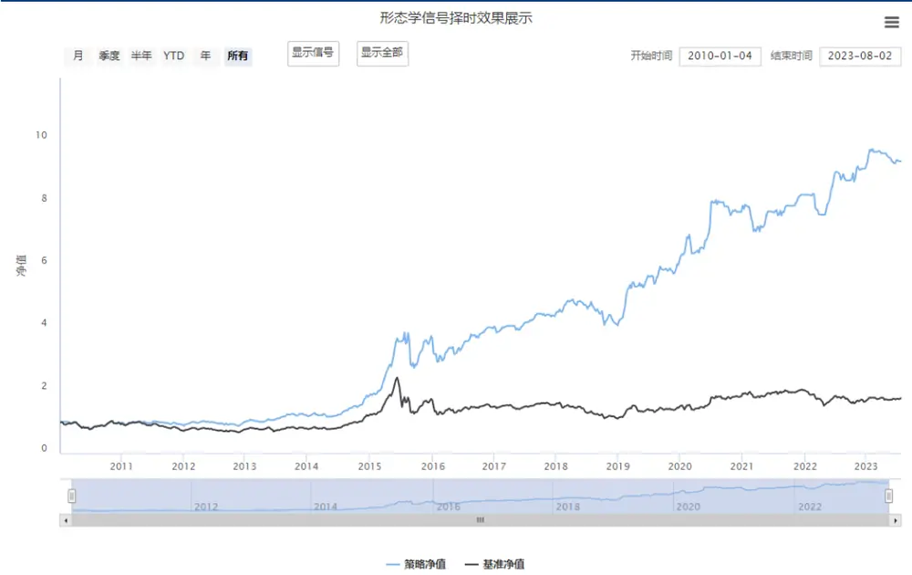
资料来源：wind，华创证券

图表 2 多空形态剪刀差模型在万得全 A上的历史回溯表现

| 标的 | 年化 | 最大回撤 | 最大回撤开始 | 最大回撤结束 | 总交易次数 | 每年交易次数 | 夏普 | 胜率 | 盈亏比 | 月度胜率 | 周度胜率 | 多头周期 | 空头周期 |
| --- | --- | --- | --- | --- | --- | --- | --- | --- | --- | --- | --- | --- | --- |
| 万得全A | 20.05 | 40.3 | 2015/07/23 | 2015/09/15 | 96 | 7.5 | 0.876 | 53.1% | 2.49 | 61.69% | 57.02% | 25.3 日 | 8.3 日 |

资料来源：wind，华创证券

多空形态比率剪刀差择时模型的万得全A历史回溯表现。年化20.05%，最大回撤40.3%，平均每年交易次数为 7.5次，夏普比率0.876，胜率 53.1%，盈亏比 2.49，平均看多持有周期为 25个交易日，模型历史回溯表现非常优秀。

## 二、基于形态学的行业指数择时

随着资产形态学研究的深入，我们已经在《华创金工形态学研究网站》

（https://www.hcquant.com）平台中提供了宽基指数、行业指数、概念指数、主题指数、ETF跟踪指数、可转债、个股等资产的形态学信号。从逻辑上讲，多空形态比率剪刀差择时模型应该不仅仅只能择大盘宽基指数，还能在各个行业指数上有所表现。多空形态比率剪刀差择时模型在万得全A指数上的历史回溯表现较为优秀，那么该模型在行业指数上的表现究竟如何？利用形态学择时行业指数又需要注意什么问题？

行业指数的成分股数量相比大盘宽基指数更少，尤其是成分股数量较少的行业，有可能某个交易日并不存在看多形态和看空形态的个股。因此我们在构建行业指数成分股多空比率剪刀差的时候，设定：如果当日没有看多形态的成分股，那么当日看多形态的成分股数量为 0。如果当日没有看空形态的成分股，那么当日看空形态的成分股数量为0。如果当日看多形态的成分股数量和看空形态的成分股数量都为 0。那么当日多空形态剪刀差的数值即为 0，多空形态剪刀差比率亦为0。

行业指数成分股的多空形态比率剪刀差指标计算完毕时，当多空形态比率剪刀差指标的30 日 HMA 均线值大于 0 做多，否则平仓。即成分股做多情绪力量较为强劲，做多对应的行业指数，否则平仓。

图表 3 多空形态比率剪刀差择时模型中信一级行业历史回溯表现

| 标的 | 年化 | 最大回撤 | 最大回撤开始 | 最大回撤结束 | 总交易次数 | 每年交易次数 | 夏普 | 胜率 | 盈亏比 | 月度胜率 | 周度胜率 | 多头周期 | 空头周期 |
| --- | --- | --- | --- | --- | --- | --- | --- | --- | --- | --- | --- | --- | --- |
| 石油石化(中信) | 15.753 | 7.42 | 2015/7/23 | 2015/9/15 | 121 | 9.3 | 0.706 | 54.50% | 1.91 | 58.75% | 55.08% | 18.0日 | 9.2 日 |
| 煤炭(中信) | 33.08 | 32 | 2018/2/5 | 2019/1/3 | 121 | 9.3 | 1.177 | 60.30% | 2.42 | 63.16% | 57.40% | 15.5 日 | 11.6 日 |
| 有色金属(中信) | 34.083 | 9.82 | 2015/8/17 | 2015/9/15 | 121 | 9.3 | 1.207 | 58.70% | 2.39 | 60.13% | 56.89% | 15.6 日 | 11.6 日 |
| 电力及公用事业(中信) | 14.574 | 2.86 | 2015/8/17 | 2016/1/28 | 95 | 7.3 | 0.608 | 52.60% | 2.27 | 61.15% | 55.56% | 27.1日 | 7.5日 |
| 钢铁(中信) | 19.843 | 7.56 | 2017/9/4 | 2019/1/2 | 107 | 8.2 | 0.795 | 46.70% | 2.85 | 55.77% | 56.11% | 20.3 日 | 10.5日 |
| 基础化工(中信) | 18.31 | 40.98 | 2015/8/17 | 2015/9/15 | 64 | 4.9 | 0.668 | 43.80% | 3.28 | 59.01% | 56.07% | 44.0日 | 7.4日 |
| 建筑(中信) | 13.643 | 9.22 | 2015/8/17 | 2015/9/15 | 105 | 8 | 0.556 | 46.70% | 2.4 | 58.11% | 53.20% | 20.3日 | 11.0日 |
| 建材(中信) | 20.744 | 1.95 | 2015/8/17 | 2015/9/15 | 112 | 8.6 | 0.769 | 57.10% | 1.67 | 56.05% | 58.40% | 21.0日 | 8.4 日 |
| 轻工制造(中信) | 28.844 | 2.78 | 2015/8/17 | 2015/9/15 | 107 | 8.2 | 1.138 | 57.00% | 2.86 | 65.82% | 58.99% | 20.4 日 | 10.3 日 |
| 机械(中信) | 18.374 | 6.44 | 2015/7/23 | 2015/9/15 | 89 | 6.8 | 0.701 | 49.40% | 2.39 | 59.24% | 57.12% | 28.1 日 | 8.9 日 |
| 电力设备及新能源(中信) | 27.794 | 4.5 | 2015/8/17 | 2015/9/15 | 79 | 6.1 | 0.943 | 54.40% | 2.86 | 60.26% | 59.63% | 32.1 日 | 9.5 日 |
| 国防军工(中信) | 33.814 | 8.76 | 2015/8/17 | 2016/2/29 | 89 | 6.8 | 1.001 | 60.70% | 1.99 | 58.75% | 55.79% | 28.5 日 | 8.4 日 |
| 汽车(中信) | 23.654 | 0.76 | 2015/6/12 | 2015/9/15 | 89 | 6.8 | 0.888 | 56.20% | 2.14 | 58.49% | 58.47% | 28.9 日8.1 | 日 |
| 商贸零售(中信) | 19.554 | 5.48 | 2015/8/17 | 2015/9/15 | 116 | 8.9 | 0.786 | 50.90% | 2.45 | 58.39% | 56.95% | 20.6 日 | 7.8日 |
| 消费者服务(中信) | 14.694 | 8.54 | 2021/2/10 | 2022/5/9 | 70 | 5.4 | 0.527 | \|47.10% | 2.06 | 53.42% | 53.31% | 40.0 日 | 6.9 日 |
| 家电(中信) | 13.74 | 45.6 | 2018/3/15 | 2019/1/3 | 70 | 5.4 | 0.515\| | 54.30% | 1.58 | 57.76% | 53.65% | 41.1 日 | 5.8 日 |
| 纺织服装(中信) | 13.464 | 6.25 | 2010/11/10 | 2012/12/3 | 75 | 5.8 | 0.524 | 48.00%2 | .33 | 56.52% | 57.27% | 37.1 日 | 6.7 日 |
| 医药(中信) | 20.194 | 3.03 | 2010/11/29 | 2012/1/16 | 64 | 4.9 | 0.753 | 56.30%\| | 2.12 | 61.15% | 57.47% | 41.1 日 | 10.2 日 |
| 食品饮料(中信) | 19.183 | 7.58 | 2012/7/13 | 2014/6/19 | 74 | 5.7 | 0.722 | 55.40% | 1.88 | 59.63% | 54.55% | 38.1 日 | 6.3日 |
| 农林牧渔(中信) | 17.524 | 7.47 | 2015/8/17 | 2015/9/15 | 100 | 7.7 | 0.642\| | 54.00% | 2.07 | 57.14% | 55.90% | 26.0 日 | 6.9 日 |
| 银行(中信) | 11.741 | 2.82 | 2011/5/31 | 2011/8/8 | 91 | 7 | 0.798 | 65.90% | 2.18 | 63.89% | 54.28% | 9.5 日 | 26.4 日 |
| 非银行金融(中信) | 9.25 | 24.75 | 2014/12/17 | 2016/2/29 | 76 | 5.9 | 0.48 | 57.90% | 2.05 | 57.83% | 49.74% | 7.5日 | 35.4 日 |
| 房地产(中信) | 16.463 | 6.62 | 2015/8/17 | 2015/9/15 | 105 | 8 | 0.822 | 60.00% | 1.92 | 62.10% | 56.96% | 9.8 日 | 21.4 日 |
| 交通运输(中信) | 20.03 | 39.42 | 2015/7/23 | 2015/9/15 | 122 | 9.4 | 0.891 | 59.80%1.82 |  | 58.23% | 55.93% | 17.0日 | 9.9 日 |
| 电子(中信) | 28.114 | 8.39 | 2010/11/24 | 2012/1/5 | 85 | 6.5 | 0.928 | 51.80% | 2.91 | 65.16% | 57.80% | 29.0日 | 9.7 日 |
| 通信(中信) | 21.12 | 42.73 | 2015/7/23 | 2015/9/15 | 109 | 8.4 | 0.738 | 51.40% | 2.06 | 60.38% | 55.34% | 20.8 日 | 9.4 日 |
| 计算机(中信) | 32.355 | 6.12 | 2015/7/23 | 2015/9/15 | 104 | 8 | 1.027 | 56.70% | 2.12 | 62.16% | 57.17% | 19.9 日 | 11.7 日 |
| 传媒(中信) | 24.845 | 0.78 | 2015/6/12 | 2015/9/15 | 117 | 9 | 0.907 | 54.70% | 2.13 | 55.94% | 57.27% | 14.1 日 | 13.9 日 |
| 综合(中信) | 17.3 | 52.7 | 2015/12/25 | 2018/10/19 | 83 | 6.4 | 0.618 | 49.40%2 | .35 | 55.90% | 55.38% | 32.7日 | 6.9日 |
| 综合金融(中信) | 7.14 | 27.52 | 2020/2/24 | 2021/3/10 | 26 | 7.7 | 0.301 | 50.00%1.36 |  | 55.88% | 50.50% | 13.9 日 | 19.6 日 |

资料来源：wind，华创证券

图表 4 多空形态剪刀差模型在石油石化(中信)上的历史回溯表现
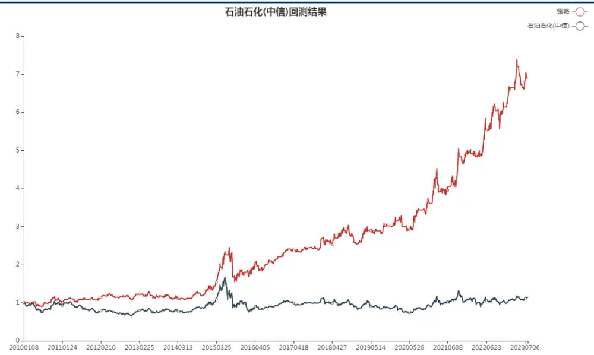
资料来源：wind，华创证券

多空形态剪刀差模型在石油石化(中信)上的历史回测年化收益可达 15.75%，最大回撤37.42%，最大回撤发生于 2015/07/23 到 2015/09/15，总交易次数为 121 次，平均每年交易次数 9.3次，夏普比率为0.706，胜率 54.5%，盈亏比1.91，月度胜率为 58.75%，周度胜率为 55.08%，平均多头持有周期为 18.0日。

图表 5 多空形态剪刀差模型在煤炭(中信)上的历史回溯表现
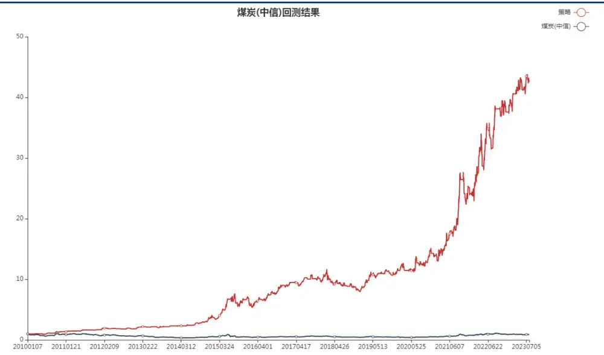
资料来源：wind，华创证券

多空形态剪刀差模型在煤炭(中信)上的历史回测年化收益可达33.08%，最大回撤32.00%，最大回撤发生于 2018/02/05 到 2019/01/03，总交易次数为 121 次，平均每年交易次数 9.3次，夏普比率为1.177，胜率60.3%，盈亏比2.42，月度胜率为63.16%，周度胜率为57.40%，平均多头持有周期为 15.5日。

图表 6 多空形态剪刀差模型在有色金属(中信)上的历史回溯表现
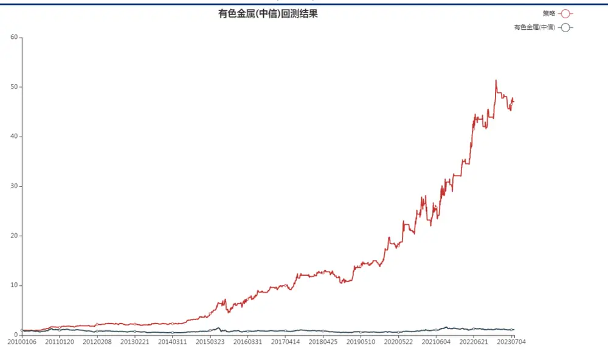
资料来源：wind，华创证券

多空形态剪刀差模型在有色金属(中信)上的历史回测年化收益可达 34.08%，最大回撤39.82%，最大回撤发生于 2015/08/17 到 2015/09/15，总交易次数为 121 次，平均每年交易次数 9.3次，夏普比率为1.207，胜率 58.7%，盈亏比2.39，月度胜率为 60.13%，周度胜率为 56.89%，平均多头持有周期为 15.6日。

图表 7 多空形态剪刀差模型在电力及公用事业(中信)上的历史回溯表现
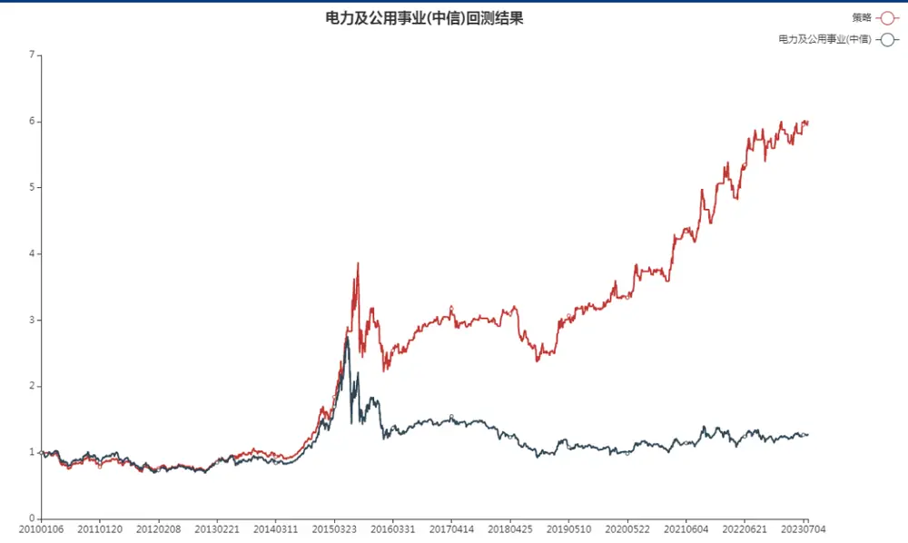
资料来源：wind，华创证券

多空形态剪刀差模型在电力及公用事业(中信)上的历史回测年化收益可达 14.57%，最大回撤 42.86%，最大回撤发生于 2015/08/17 到 2016/01/28，总交易次数为 95 次，平均每年交易次数 7.3次，夏普比率为0.608，胜率52.6%，盈亏比2.27，月度胜率为61.15%，周度胜率为 55.56%，平均多头持有周期为 27.1日。

图表 8 多空形态剪刀差模型在钢铁(中信)上的历史回溯表现
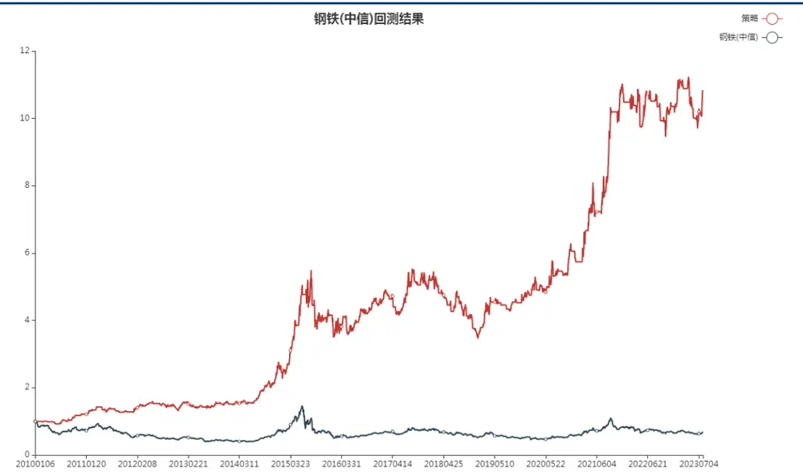
资料来源：wind，华创证券

多空形态剪刀差模型在钢铁(中信)上的历史回测年化收益可达19.84%，最大回撤37.56%，最大回撤发生于 2017/09/04 到 2019/01/02，总交易次数为 107 次，平均每年交易次数 8.2次，夏普比率为0.795，胜率46.7%，盈亏比2.85，月度胜率为55.77%，周度胜率为56.11%，平均多头持有周期为 20.3日。

图表 9 多空形态剪刀差模型在基础化工(中信)上的历史回溯表现
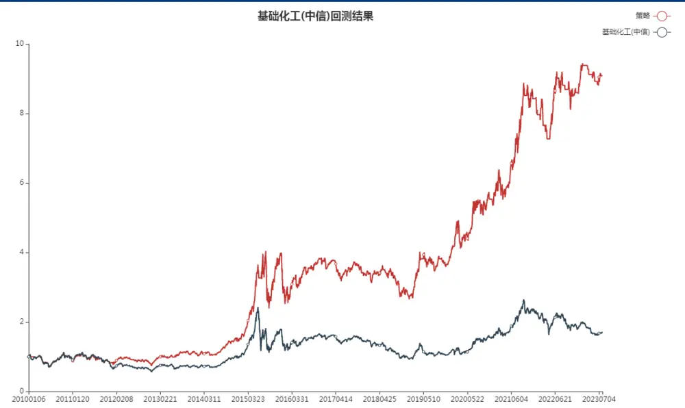
资料来源：wind，华创证券

多空形态剪刀差模型在基础化工(中信)上的历史回测年化收益可达 18.31%，最大回撤40.98%，最大回撤发生于 2015/08/17 到 2015/09/15，总交易次数为 64 次，平均每年交易次数4.9 次，夏普比率为0.668，胜率 43.8%，盈亏比3.28，月度胜率为 59.01%，周度胜率为56.07%，平均多头持有周期为 44.0日。

图表 10 多空形态剪刀差模型在建筑(中信)上的历史回溯表现
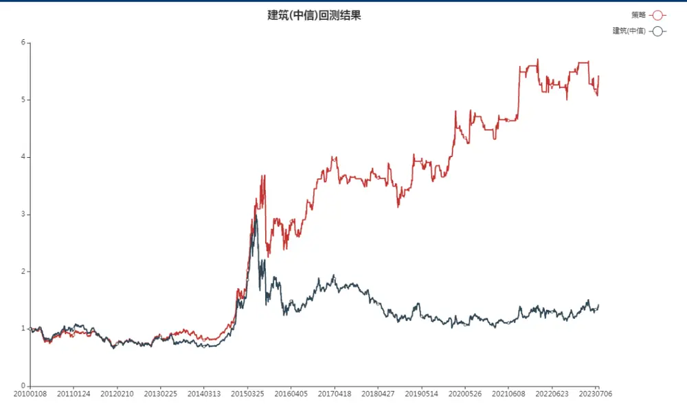
资料来源：wind，华创证券

多空形态剪刀差模型在建筑(中信)上的历史回测年化收益可达13.64%，最大回撤39.22%，最大回撤发生于 2015/08/17 到 2015/09/15，总交易次数为 105 次，平均每年交易次数 8.0次，夏普比率为0.556，胜率46.7%，盈亏比2.40，月度胜率为58.11%，周度胜率为53.20%，平均多头持有周期为 20.3日。

图表 11 多空形态剪刀差模型在建材(中信)上的历史回溯表现
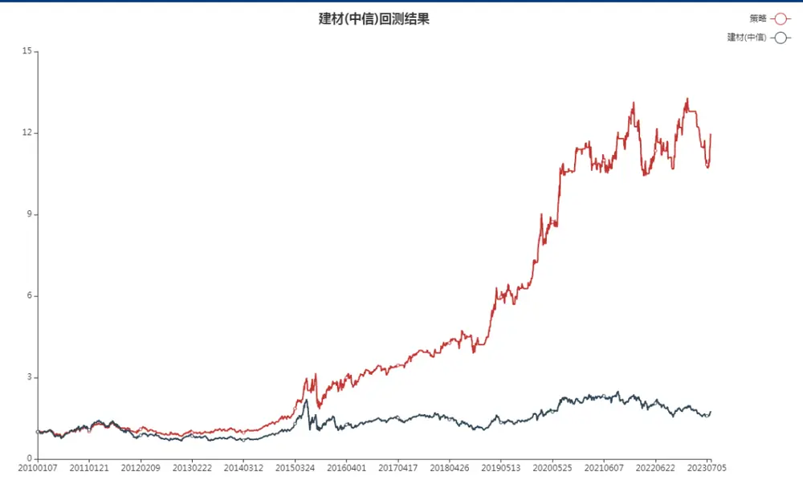
资料来源：wind，华创证券

多空形态剪刀差模型在建材(中信)上的历史回测年化收益可达20.74%，最大回撤41.95%，最大回撤发生于 2015/08/17 到 2015/09/15，总交易次数为 112 次，平均每年交易次数 8.6次，夏普比率为0.769，胜率57.1%，盈亏比1.67，月度胜率为56.05%，周度胜率为58.40%，平均多头持有周期为 21.0日。

图表 12 多空形态剪刀差模型在轻工制造(中信)上的历史回溯表现
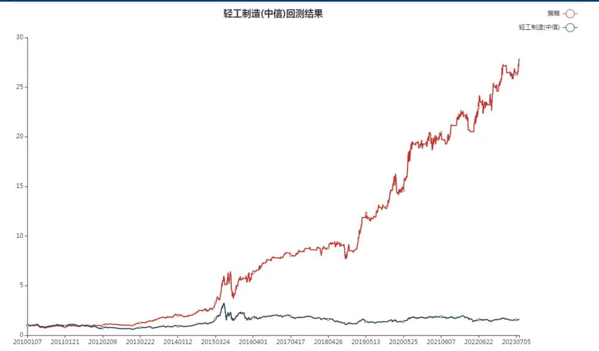
wind,

多空形态剪刀差模型在轻工制造(中信)上的历史回测年化收益可达 28.84%，最大回撤42.78%，最大回撤发生于 2015/08/17 到 2015/09/15，总交易次数为 107 次，平均每年交易次数 8.2次，夏普比率为1.138，胜率 57.0%，盈亏比2.86，月度胜率为 65.82%，周度胜率为 58.99%，平均多头持有周期为 20.4日。

图表 13 多空形态剪刀差模型在机械(中信)上的历史回溯表现
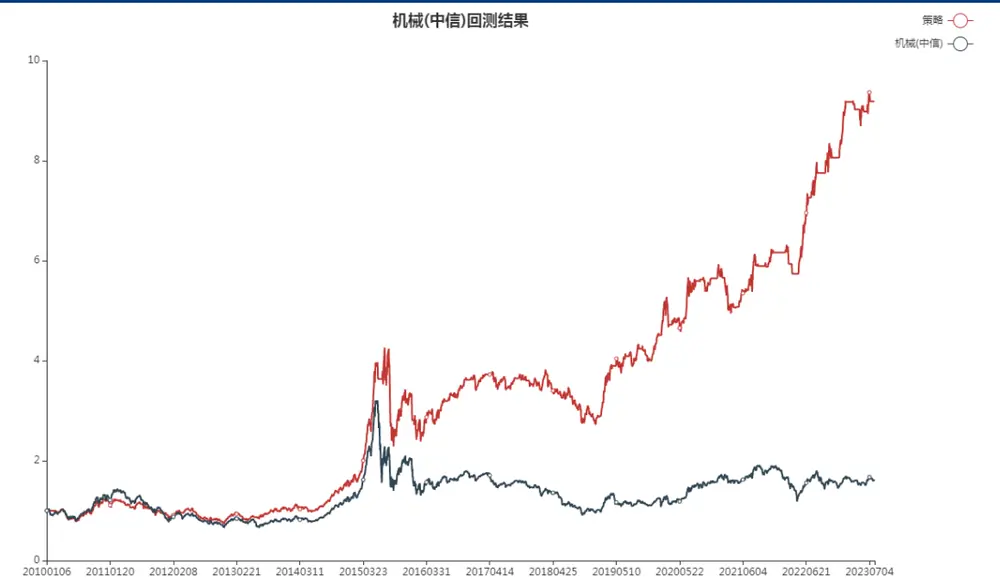
资料来源：wind，华创证券

多空形态剪刀差模型在机械(中信)上的历史回测年化收益可达18.37%，最大回撤46.44%，最大回撤发生于 2015/07/23 到 2015/09/15，总交易次数为 89 次，平均每年交易次数 6.8次，夏普比率为0.701，胜率49.4%，盈亏比2.39，月度胜率为59.24%，周度胜率为57.12%，平均多头持有周期为 28.1日。

图表 14 多空形态剪刀差模型在电力设备及新能源(中信)上的历史回溯表现
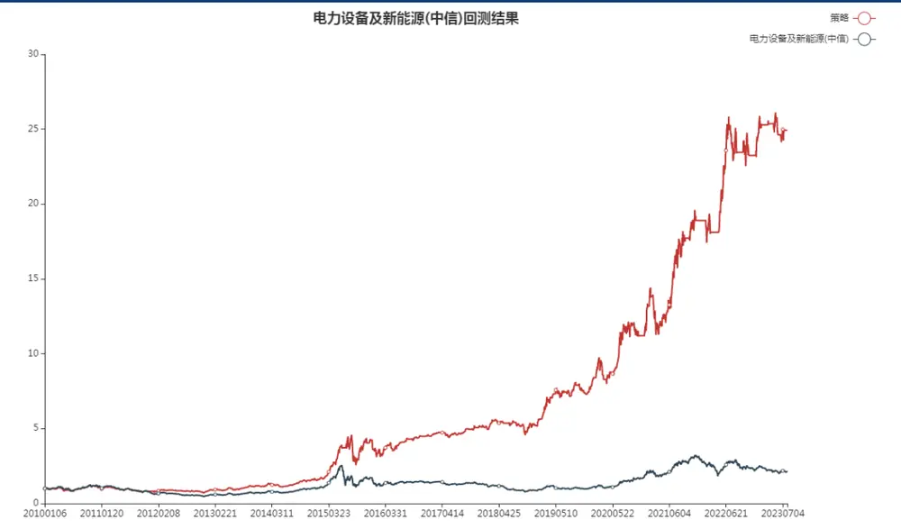
资料来源：wind，华创证券

多空形态剪刀差模型在电力设备及新能源(中信)上的历史回测年化收益可达 27.79%，最大回撤 44.50%，最大回撤发生于 2015/08/17 到 2015/09/15，总交易次数为 79 次，平均每年交易次数 6.1 次，夏普比率为 0.943，胜率 54.4%，盈亏比 2.86，月度胜率为 60.26%，周度胜率为 59.63%，平均多头持有周期为 32.1日。

图表 15 多空形态剪刀差模型在国防军工(中信)上的历史回溯表现
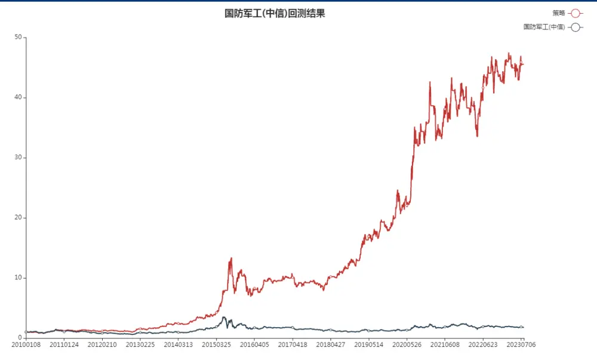
资料来源：wind，华创证券

多空形态剪刀差模型在国防军工(中信)上的历史回测年化收益可达 33.81%，最大回撤48.76%，最大回撤发生于 2015/08/17 到 2016/02/29，总交易次数为 89 次，平均每年交易次数6.8 次，夏普比率为1.001，胜率 60.7%，盈亏比1.99，月度胜率为 58.75%，周度胜率为55.79%，平均多头持有周期为 28.5日。

图表 16 多空形态剪刀差模型在汽车(中信)上的历史回溯表现
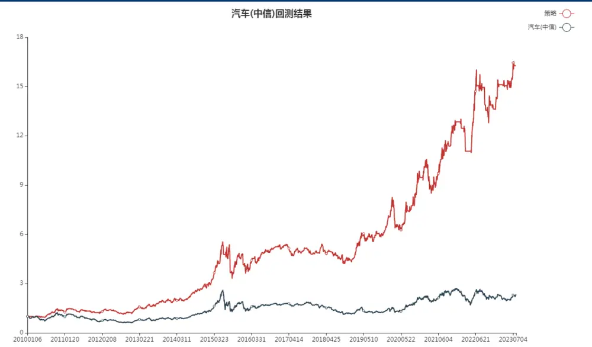
资料来源：wind，华创证券

多空形态剪刀差模型在汽车(中信)上的历史回测年化收益可达23.65%，最大回撤40.76%，最大回撤发生于 2015/06/12 到 2015/09/15，总交易次数为 89 次，平均每年交易次数 6.8次，夏普比率为0.888，胜率56.2%，盈亏比2.14，月度胜率为58.49%，周度胜率为58.47%，平均多头持有周期为 28.9日。

图表 17 多空形态剪刀差模型在商贸零售(中信)上的历史回溯表现
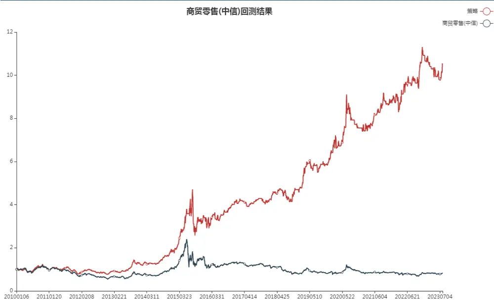
资料来源：wind，华创证券

多空形态剪刀差模型在商贸零售(中信)上的历史回测年化收益可达 19.55%，最大回撤45.48%，最大回撤发生于 2015/08/17 到 2015/09/15，总交易次数为 116 次，平均每年交易次数 8.9次，夏普比率为0.786，胜率 50.9%，盈亏比2.45，月度胜率为 58.39%，周度胜率为 56.95%，平均多头持有周期为 20.6日。

图表 18 多空形态剪刀差模型在消费者服务(中信)上的历史回溯表现
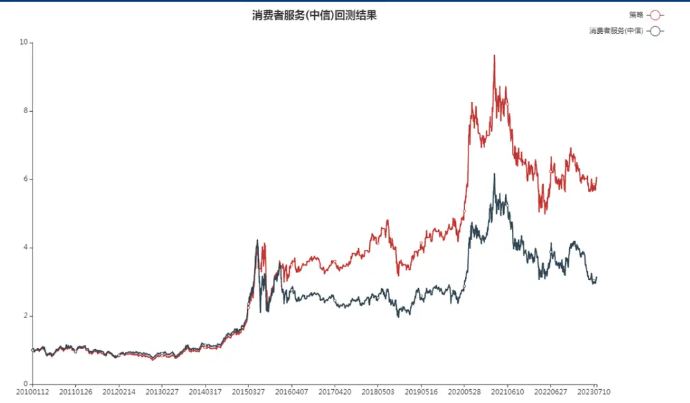
资料来源：wind，华创证券

多空形态剪刀差模型在消费者服务(中信)上的历史回测年化收益可达 14.69%，最大回撤48.54%，最大回撤发生于 2021/02/10 到 2022/05/09，总交易次数为 70 次，平均每年交易次数5.4 次，夏普比率为0.527，胜率 47.1%，盈亏比2.06，月度胜率为 53.42%，周度胜率为53.31%，平均多头持有周期为 40.0日。

图表 19 多空形态剪刀差模型在家电(中信)上的历史回溯表现
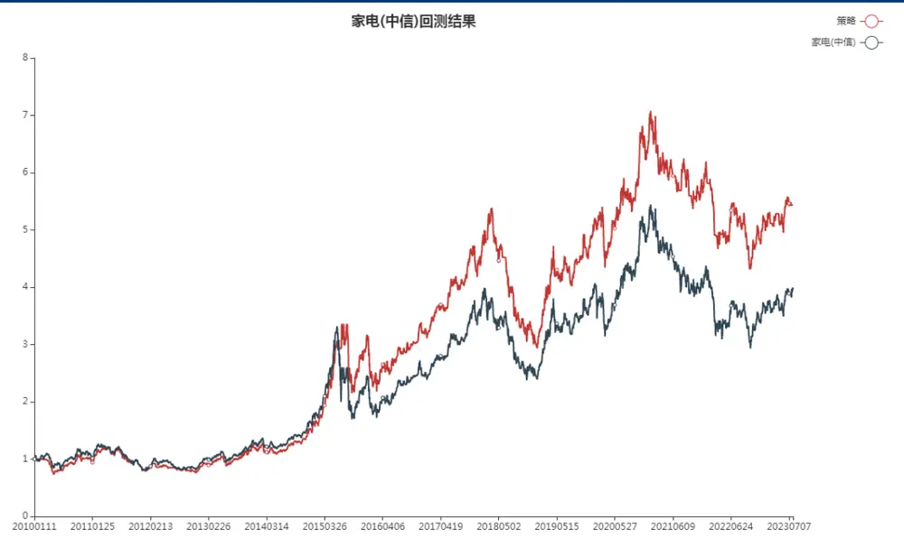
资料来源：wind，华创证券

多空形态剪刀差模型在家电(中信)上的历史回测年化收益可达13.74%，最大回撤45.60%，最大回撤发生于 2018/03/15 到 2019/01/03，总交易次数为 70 次，平均每年交易次数 5.4次，夏普比率为0.515，胜率54.3%，盈亏比1.58，月度胜率为57.76%，周度胜率为53.65%，平均多头持有周期为 41.1日。

图表 20 多空形态剪刀差模型在纺织服装(中信)上的历史回溯表现
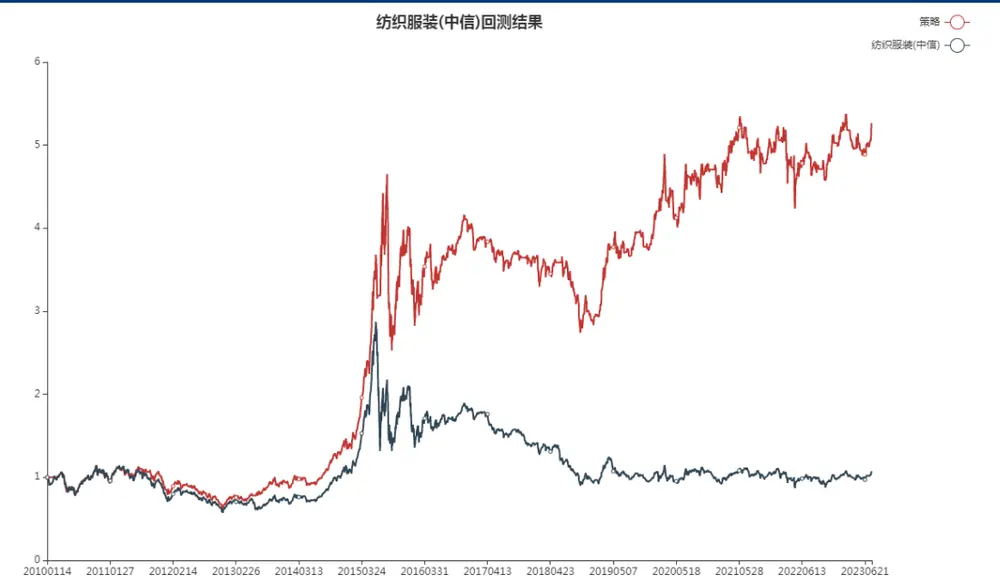
资料来源：wind，华创证券

多空形态剪刀差模型在纺织服装(中信)上的历史回测年化收益可达 13.46%，最大回撤46.25%，最大回撤发生于 2010/11/10 到 2012/12/03，总交易次数为 75 次，平均每年交易次数5.8 次，夏普比率为0.524，胜率 48.0%，盈亏比2.33，月度胜率为 56.52%，周度胜率为57.27%，平均多头持有周期为 37.1日。

图表 21 多空形态剪刀差模型在医药(中信)上的历史回溯表现
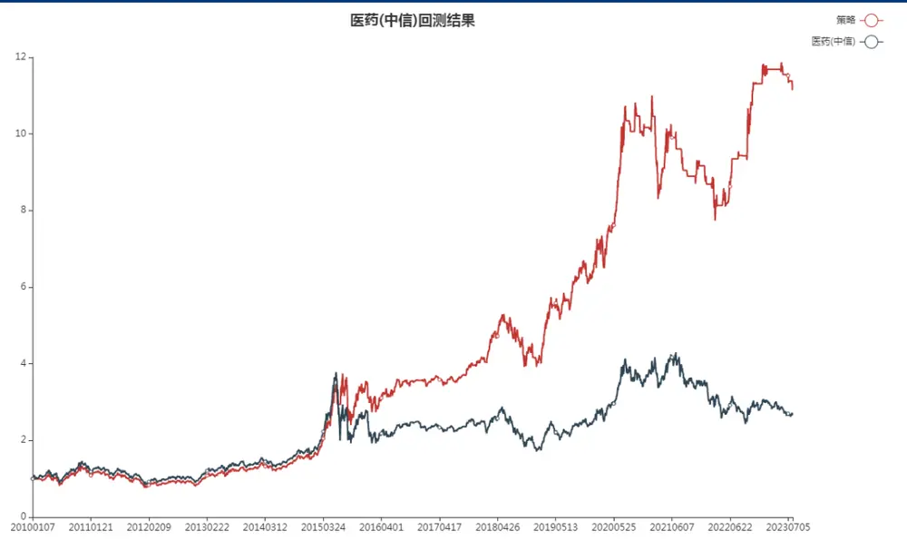
资料来源：wind，华创证券

多空形态剪刀差模型在医药(中信)上的历史回测年化收益可达20.19%，最大回撤43.03%，最大回撤发生于 2010/11/29 到 2012/01/16，总交易次数为 64 次，平均每年交易次数 4.9次，夏普比率为0.753，胜率56.3%，盈亏比2.12，月度胜率为61.15%，周度胜率为57.47%，平均多头持有周期为 41.1日。

图表 22 多空形态剪刀差模型在食品饮料(中信)上的历史回溯表现
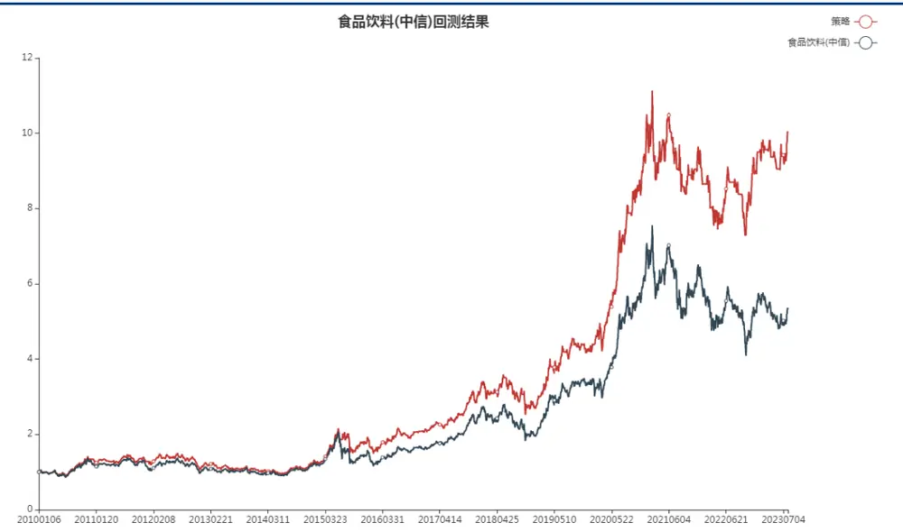
资料来源：wind，华创证券

多空形态剪刀差模型在食品饮料(中信)上的历史回测年化收益可达 19.18%，最大回撤37.58%，最大回撤发生于 2012/07/13 到 2014/06/19，总交易次数为 74 次，平均每年交易次数5.7 次，夏普比率为0.722，胜率 55.4%，盈亏比1.88，月度胜率为 59.63%，周度胜率为54.55%，平均多头持有周期为 38.1日。

图表 23 多空形态剪刀差模型在农林牧渔(中信)上的历史回溯表现
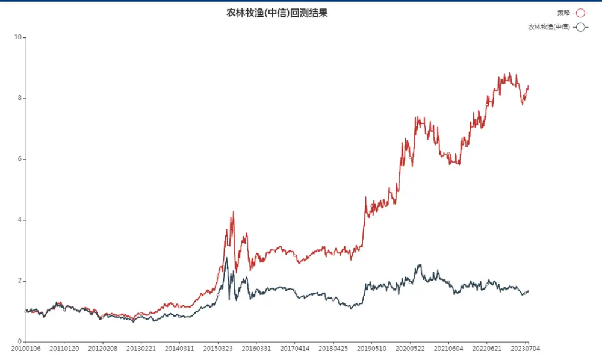
资料来源：wind，华创证券

多空形态剪刀差模型在农林牧渔(中信)上的历史回测年化收益可达 17.52%，最大回撤47.47%，最大回撤发生于 2015/08/17 到 2015/09/15，总交易次数为 100 次，平均每年交易次数 7.7次，夏普比率为0.642，胜率 54.0%，盈亏比2.07，月度胜率为 57.14%，周度胜率为 55.90%，平均多头持有周期为 26.0日.

图表 24 多空形态剪刀差模型在银行(中信)上的历史回溯表现
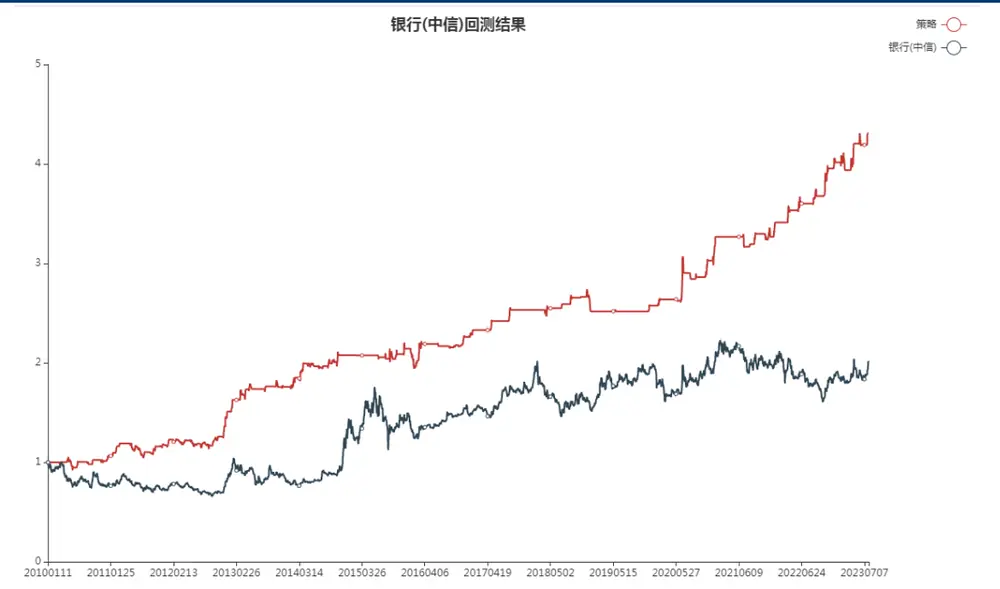
资料来源：wind，华创证券

多空形态剪刀差模型在银行(中信)上的历史回测年化收益可达11.74%，最大回撤12.82%，最大回撤发生于 2011/05/31 到 2011/08/08，总交易次数为 91 次，平均每年交易次数 7.0次，夏普比率为0.798，胜率65.9%，盈亏比2.18，月度胜率为63.89%，周度胜率为54.28%，平均多头持有周期为 9.5日。

图表 25 多空形态剪刀差模型在非银金融(中信)上的历史回溯表现
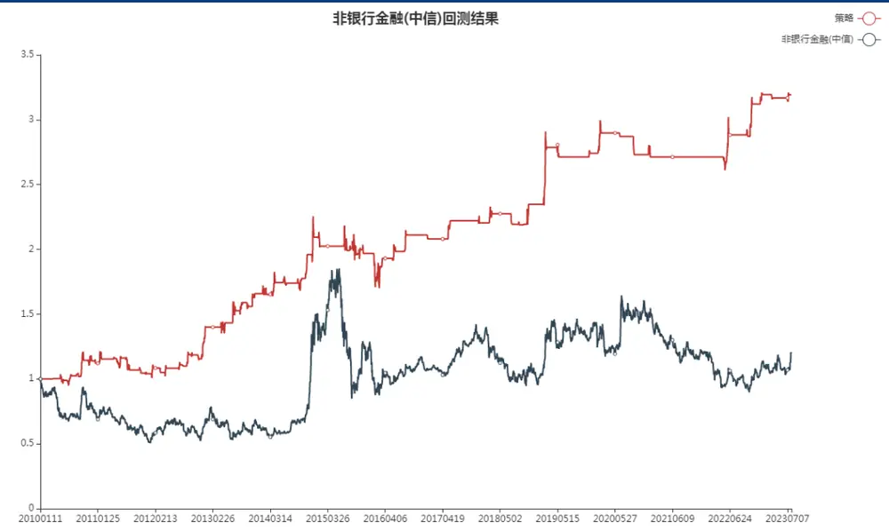
资料来源：wind，华创证券

多空形态剪刀差模型在非银行金融(中信)上的历史回测年化收益可达 9.25%，最大回撤24.75%，最大回撤发生于 2014/12/17 到 2016/02/29，总交易次数为 76 次，平均每年交易次数5.9 次，夏普比率为0.480，胜率 57.9%，盈亏比2.05，月度胜率为 57.83%，周度胜率为49.74%，平均多头持有周期为 7.5日。

图表 26 多空形态剪刀差模型在房地产(中信)上的历史回溯表现
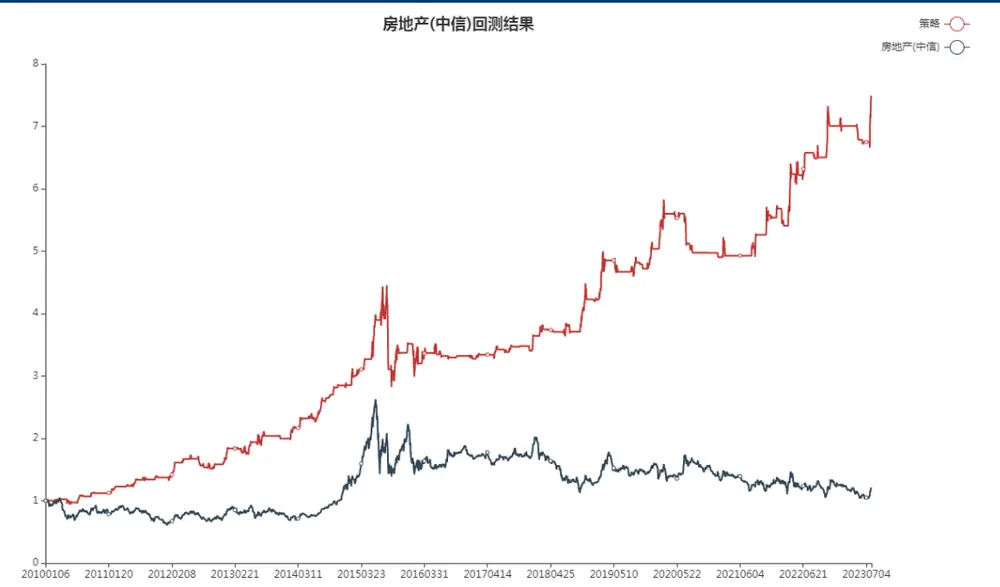
资料来源：wind，华创证券

多空形态剪刀差模型在房地产(中信)上的历史回测年化收益可达 16.46%，最大回撤36.62%，最大回撤发生于 2015/08/17 到 2015/09/15，总交易次数为 105 次，平均每年交易次数 8.0次，夏普比率为0.822，胜率 60.0%，盈亏比1.92，月度胜率为 62.10%，周度胜率为 56.96%，平均多头持有周期为 9.8日。

图表 27 多空形态剪刀差模型在交通运输(中信)上的历史回溯表现
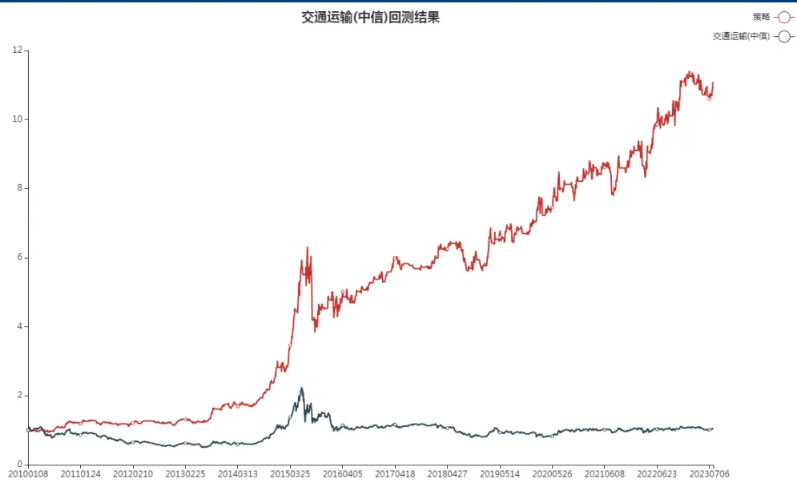
资料来源：wind，华创证券

多空形态剪刀差模型在交通运输(中信)上的历史回测年化收益可达 20.03%，最大回撤39.42%，最大回撤发生于 2015/07/23 到 2015/09/15，总交易次数为 122，平均每年交易次数9.4次，夏普比率为0.891，胜率 59.8%，盈亏比1.82，月度胜率为 58.23%，周度胜率为55.93%，平均多头持有周期为17.0 日。

图表 28 多空形态剪刀差模型在电子(中信)上的历史回溯表现
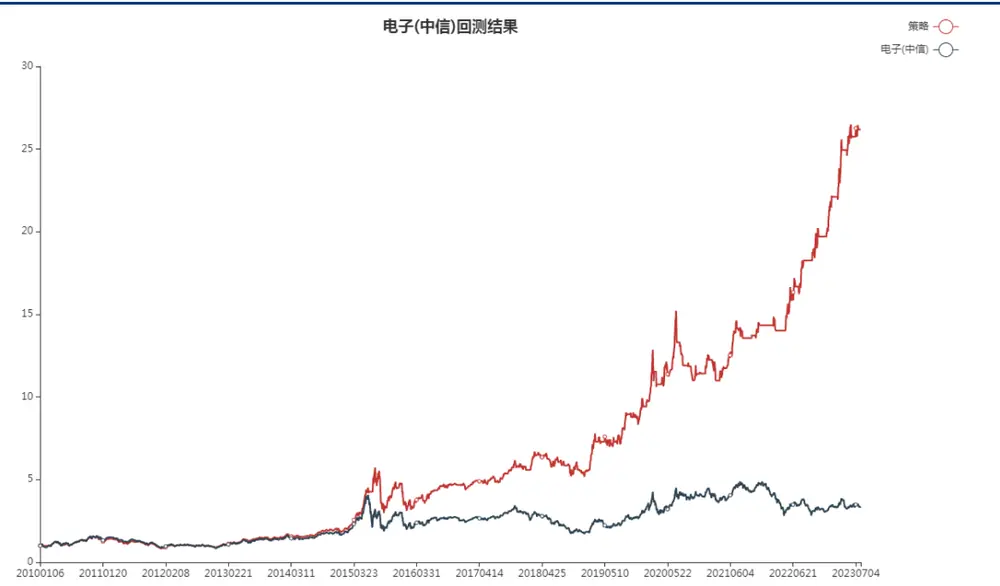
资料来源：wind，华创证券

多空形态剪刀差模型在电子(中信)上的历史回测年化收益可达28.27%，最大回撤48.39%，最大回撤发生于 2010/11/24到2012/01/05，总交易次数为84，平均每年交易次数 6.4次，夏普比率为 0.933，胜率 52.4%，盈亏比 2.85，月度胜率为 65.81%，周度胜率为 57.97%，平均多头持有周期为 29.3日。

图表 29 多空形态剪刀差模型在通信(中信)上的历史回溯表现
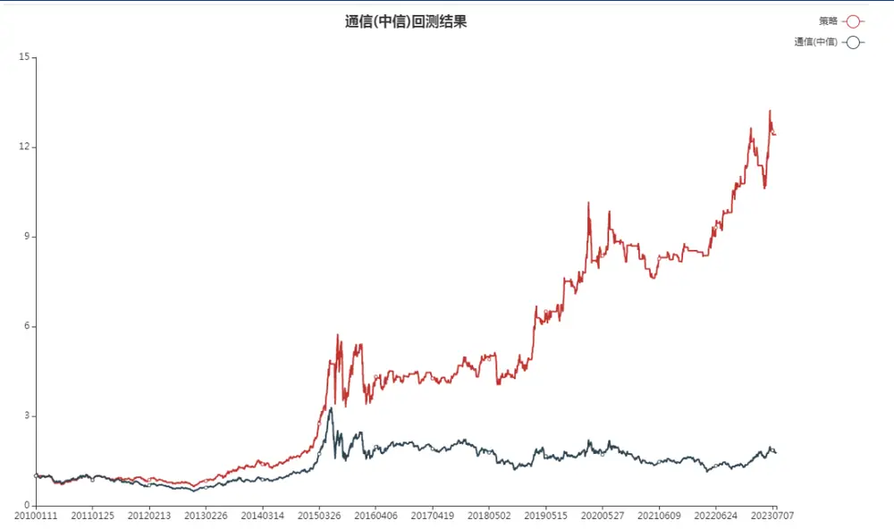
资料来源：wind，华创证券

多空形态剪刀差模型在通信(中信)上的历史回测年化收益可达21.12%，最大回撤42.73%，最大回撤发生于 2015/07/23 到 2015/09/15，总交易次数为 109 次，平均每年交易次数 8.4次，夏普比率为0.738，胜率51.4%，盈亏比2.06，月度胜率为60.38%，周度胜率为55.34%，平均多头持有周期为 20.8日。

图表 30 多空形态剪刀差模型在计算机(中信)上的历史回溯表现
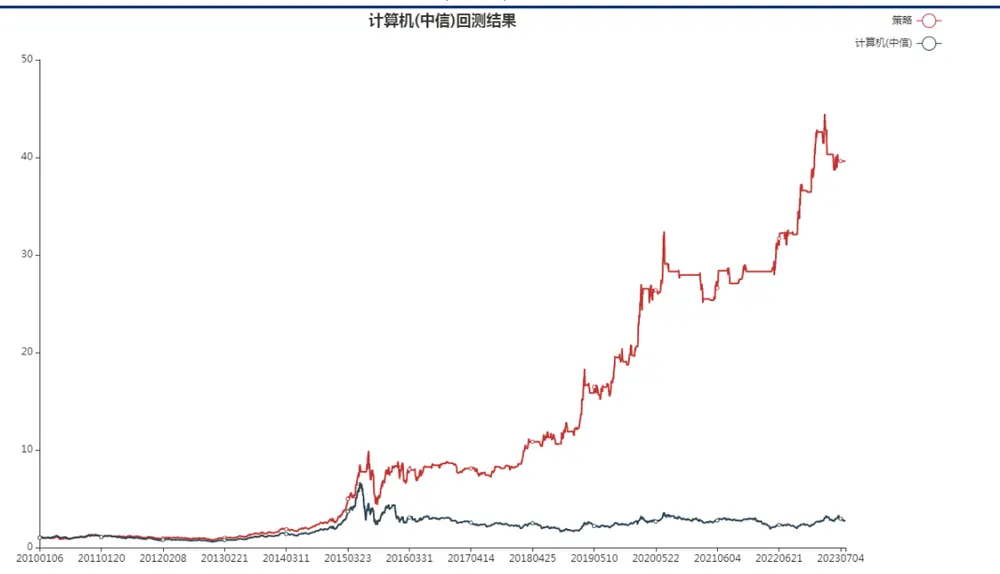
资料来源：wind，华创证券

多空形态剪刀差模型在计算机(中信)上的历史回测年化收益可达 32.35%，最大回撤56.12%，最大回撤发生于 2015/07/23 到 2015/09/15，总交易次数为 104 次，平均每年交易次数 8.0次，夏普比率为1.027，胜率 56.7%，盈亏比2.12，月度胜率为 62.16%，周度胜率为 57.17%，平均多头持有周期为 19.9日。

图表 31 多空形态剪刀差模型在传媒(中信)上的历史回溯表现
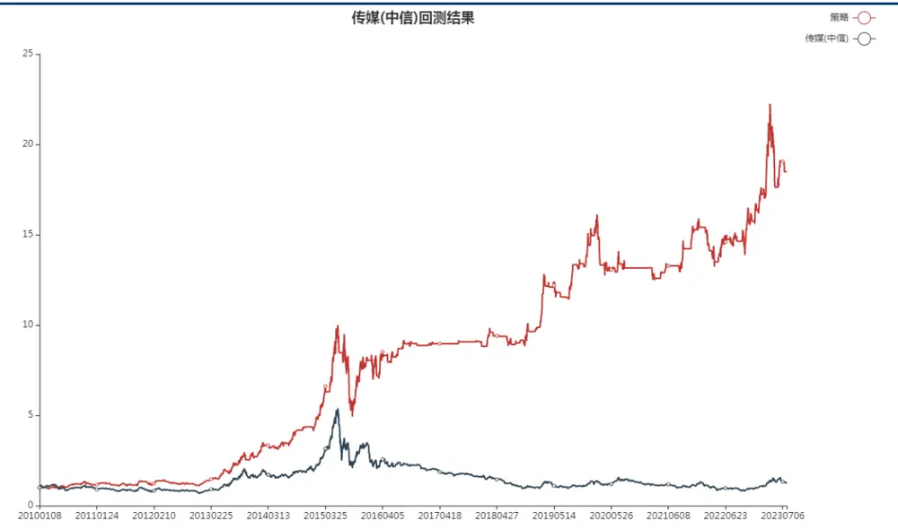
资料来源：wind，华创证券

多空形态剪刀差模型在传媒(中信)上的历史回测年化收益可达24.84%，最大回撤50.78%，最大回撤发生于 2015/06/12 到 2015/09/15，总交易次数为 117 次，平均每年交易次数 9.0次，夏普比率为0.907，胜率54.7%，盈亏比2.13，月度胜率为55.94%，周度胜率为57.27%，平均多头持有周期为 14.1日。

图表 32 多空形态剪刀差模型在综合(中信)上的历史回溯表现
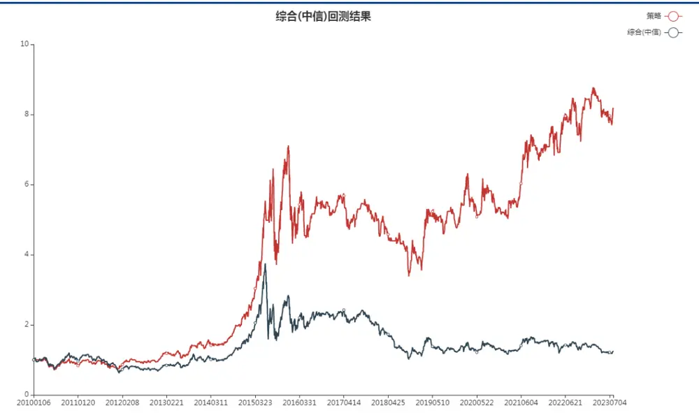
资料来源：wind，华创证券

多空形态剪刀差模型在综合(中信)上的历史回测年化收益可达17.30%，最大回撤52.70%，最大回撤发生于 2015/12/25到 2018/10/19，总交易次数为83，平均每年交易次数 6.4次，夏普比率为 0.618，胜率 49.4%，盈亏比 2.35，月度胜率为 55.90%，周度胜率为 55.38%，平均多头持有周期为 32.7日。

图表 33 多空形态剪刀差模型在综合金融(中信)上的历史回溯表现
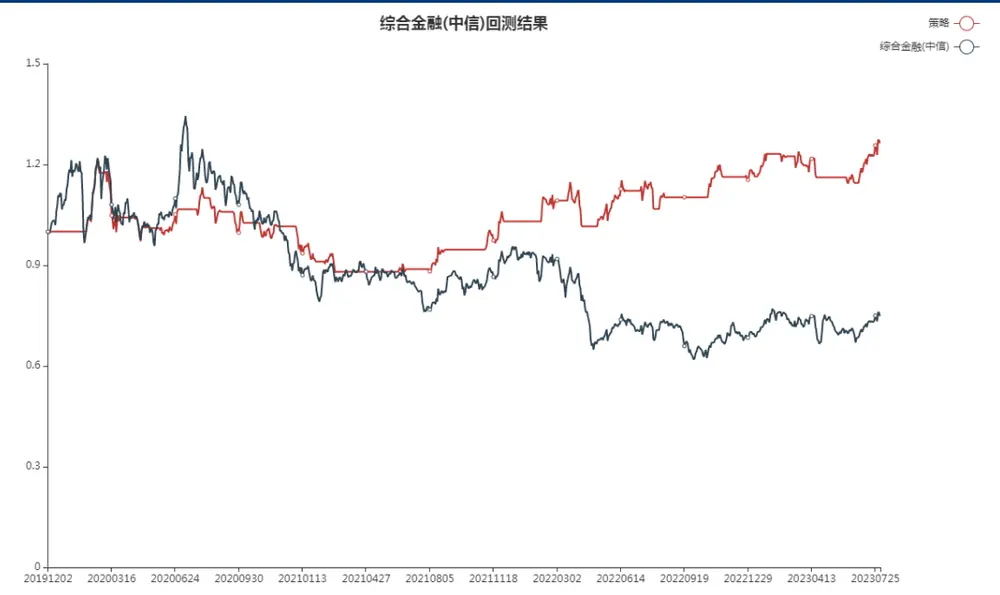
资料来源：wind，华创证券

多空形态剪刀差模型在综合金融(中信)上的历史回测年化收益可达 7.14%，最大回撤27.52%，最大回撤发生于 2020/02/24 到 2021/03/10，总交易次数为 26 次，平均每年交易次数7.7 次，夏普比率为0.301，胜率 50.0%，盈亏比1.36，月度胜率为 55.88%，周度胜率为50.50%，平均多头持有周期为 13.9日。

以上 29 个中信一级行业的回测结果如图表 3 至图表 31。中信一级行业的多空形态剪刀差择时模型中，择时模型跑赢各自行业指数比率为100%，剪刀差模型均跑赢了各自的行业指数，模型的历史回溯表现非常优秀。

## 三、风险提示

模型结果基于历史数据测算，不保证未来数据的有效性。

## 金融工程组团队介绍

组长、首席分析师：王小川同济大学管理学博士。2017年加入华创证券研究所。

高级分析师：秦玄晋上海对外经贸大学硕士。2018年加入华创证券研究所。

助理研究员：杨宸祎美国伊利诺伊大学香槟分校会计学、金融工程学硕士，CFA。2021年加入华创证券研究所。

## 华创证券机构销售通讯录

| 地区 | 姓名 | 职务 | 办公电话 | 企业邮箱 |
| --- | --- | --- | --- | --- |
| 北京机构销售部 | 张昱洁 | 副总经理、北京机构销售总监 | 010-63214682 | zhangyujie@hcyjs.com |
|  | 张菲菲 | 北京机构副总监 | 010-63214682 | zhangfeifei@hcyjs.com |
|  | 刘懿 | 副总监 | 010-63214682 | liuyi@hcyjs.com |
|  | 侯春钰 | 资深销售经理 | 010-63214682 | houchunyu@hcyjs.com |
|  | 过云龙 | 高级销售经理 | 010-63214682 | guoyunlong@hcyjs.com |
|  | 蔡依林 | 高级销售经理 | 010-66500808 | caiyilin@hcyjs.com |
|  | 刘颖 | 高级销售经理 | 010-66500821 | liuying5@hcyjs.com |
|  | 顾翎蓝 | 高级销售经理 | 010-63214682 | gulinglan@hcyjs.com |
|  | 车一哲 | 销售经理 |  | cheyizhe@hcyjs.com |
| 深圳机构销售部 | 张娟 | 副总经理、深圳机构销售总监 | 0755-82828570 | zhangjuan@hcyjs.com |
|  | 汪丽燕 | 高级销售经理 | 0755-83715428 | wangliyan@hcyjs.com |
|  | 张嘉慧 | 高级销售经理 | 0755-82756804 | zhangjiahui1@hcyjs.com |
|  | 董姝彤 | 销售经理 | 0755-82871425 | dongshutong@hcyjs.com |
|  | 巢莫雯 | 销售经理 | 0755-83024576 | chaomowen@hcyjs.com |
|  | 王春丽 | 销售经理 | 0755-82871425 | wangchunli@hcyjs.com |
| 上海机构销售部 | 许彩霞 | 总经理助理、上海机构销售总监0 | 21-20572536 | xucaixia@hcyjs.com |
|  | 官逸超 | 上海机构销售副总监 | 021-20572555 | guanyichao@hcyjs.com |
|  | 黄畅 | 上海机构销售副总监 | 021-20572257-2552 | huangchang@hcyjs.com |
|  | 吴俊 | 资深销售经理 | 021-20572506 | wujun1@hcyjs.com |
|  | 张佳妮 | 高级销售经理 | 021-20572585 | zhangjiani@hcyjs.com |
|  | 蒋瑜 | 高级销售经理 | 021-20572509 | jiangyu@hcyjs.com |
|  | 施嘉玮 | 高级销售经理 | 021-20572548 | shijiawei@hcyjs.com |
|  | 朱涨雨 | 销售助理 | 021-20572573 | zhuzhangyu@hcyjs.com |
|  | 李凯月 | 销售助理 |  | likaiyue@hcyjs.com |
|  | 张玉恒 | 销售助理 |  | zhangyuheng@hcyjs.com |
| 广州机构销售部 | 段佳音 | 广州机构销售总监 | 0755-82756805 | duanjiayin@hcyjs.com |
|  | 周玮 | 销售经理 |  | zhouwei@hcyjs.com |
|  | 王世韬 | 销售经理 |  | wangshitao1@hcyjs.com |
| 私募销售组 | 潘亚琪 | 总监 | 021-20572559 | panyaqi@hcyjs.com |
|  | 汪子阳 | 副总监 | 021-20572559 | wangziyang@hcyjs.com |
|  | 江赛专 | 资深销售经理 | 0755-82756805 | jiangsaizhuan@hcyjs.com |
|  | 汪戈 | 高级销售经理 | 021-20572559 | wangge@hcyjs.com |
|  | 宋丹玙 | 销售经理 | 021-25072549 | songdanyu@hcyjs.com |

## 华创行业公司投资评级体系

基准指数说明：

A股市场基准为沪深 300指数，香港市场基准为恒生指数，美国市场基准为标普 500/纳斯达克指数。

公司投资评级说明：

强推：预期未来 6个月内超越基准指数 20%以上；

推荐：预期未来 6个月内超越基准指数 10%－20%；

中性：预期未来 6个月内相对基准指数变动幅度在-10%－10%之间；

回避：预期未来 6个月内相对基准指数跌幅在 10%－20%之间。

## 行业投资评级说明：

推荐：预期未来 3-6个月内该行业指数涨幅超过基准指数 5%以上；

中性：预期未来 3-6个月内该行业指数变动幅度相对基准指数-5%－5%；

回避：预期未来 3-6个月内该行业指数跌幅超过基准指数 5%以上。

## 分析师声明

每位负责撰写本研究报告全部或部分内容的分析师在此作以下声明：

分析师在本报告中对所提及的证券或发行人发表的任何建议和观点均准确地反映了其个人对该证券或发行人的看法和判断；分析师对任何其他券商发布的所有可能存在雷同的研究报告不负有任何直接或者间接的可能责任。

## 免责声明

本报告仅供华创证券有限责任公司（以下简称“本公司”）的客户使用。本公司不会因接收人收到本报告而视其为客户。

本报告所载资料的来源被认为是可靠的，但本公司不保证其准确性或完整性。本报告所载的资料、意见及推测仅反映本公司于发布本报告当日的判断。在不同时期，本公司可发出与本报告所载资料、意见及推测不一致的报告。本公司在知晓范围内履行披露义务。

报告中的内容和意见仅供参考，并不构成本公司对具体证券买卖的出价或询价。本报告所载信息不构成对所涉及证券的个人投资建议，也未考虑到个别客户特殊的投资目标、财务状况或需求。客户应考虑本报告中的任何意见或建议是否符合其特定状况，自主作出投资决策并自行承担投资风险，任何形式的分享证券投资收益或者分担证券投资损失的书面或口头承诺均为无效。本报告中提及的投资价格和价值以及这些投资带来的预期收入可能会波动。

本报告版权仅为本公司所有，本公司对本报告保留一切权利。未经本公司事先书面许可，任何机构和个人不得以任何形式翻版、复制、发表、转发或引用本报告的任何部分。如征得本公司许可进行引用、刊发的，需在允许的范围内使用，并注明出处为“华创证券研究”，且不得对本报告进行任何有悖原意的引用、删节和修改。

证券市场是一个风险无时不在的市场，请您务必对盈亏风险有清醒的认识，认真考虑是否进行证券交易。市场有风险，投资需谨慎。

## 华创证券研究所

| 北京总部 | 广深分部 | 上海分部 |
| --- | --- | --- |
| 地址：北京市西城区锦什坊街26号 恒奥中心 C 座 3A | 地址：深圳市福田区香梅路1061号中投国际 商务中心 A 座 19 楼 | 地址：上海市浦东新区花园石桥路33号 花旗大厦 12 层 |
| 邮编：100033 传真：010-66500801 | 邮编：518034 | 邮编：200120 |
| 会议室：010-66500900 | 传真：0755-82027731 会议室：0755-82828562 | 传真：021-20572500 会议室：021-20572522 |