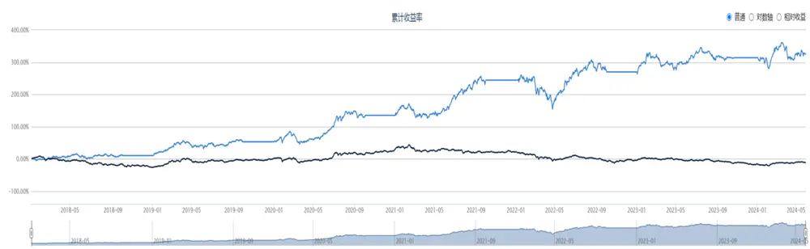
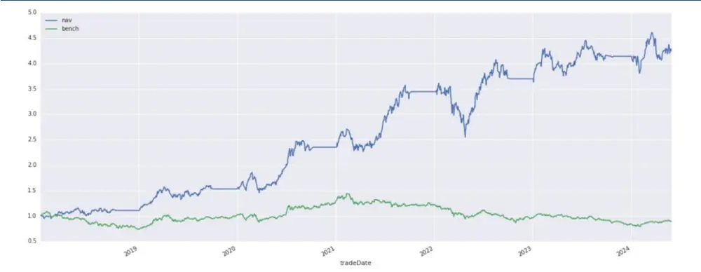
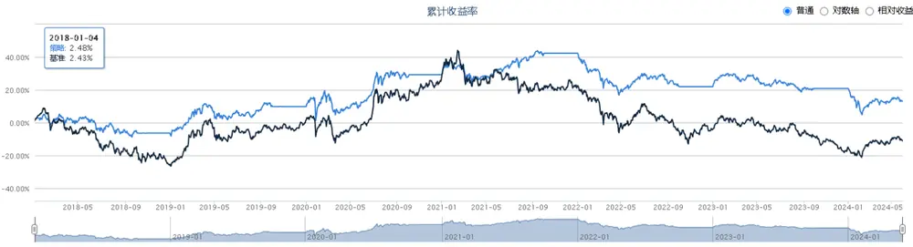
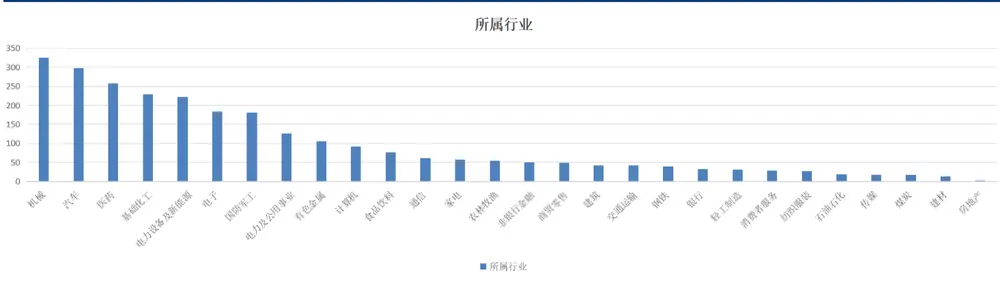
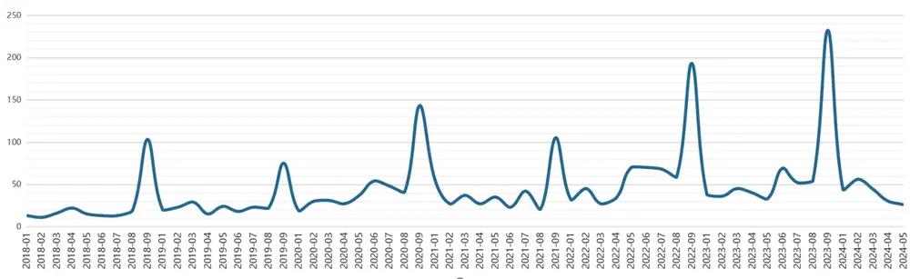

专题报告 2024 年 06 月 30 日

【专题报告】

# 形态学研究之九：如何结合金股构建投资组合

## 摘要标题。

K 线的本质内涵是多空双方资金在争夺主导权而留下来的轨迹，通过研究 K线形态，我们能够深入地观察到市场的真正变化。不论是宏观环境变化，还是赛道格局改变亦或是个股基本面的变化，都可以反应在股票 K线形态图上。

华创形态学研究系统对行业指数的历史胜率统计时间为 5 天，从历史数据来看，对市场短期的走势预测较好，但如果构建投资组合，出现资产较多的情况，亟需过滤资产，降低换手率。

按月度金股来计算，我们假设券商金股的基本面较好，观察券商推荐后，何时出现形态学买点，并于第二个交易日买入，构建组合持有到当月月底，探索组合的持仓特点。发现形态学可以明显提升金股组合的收益率，降低最大回撤。

构建的组合从 2018 年 1 月开始，截止到 2024 年 5 月底，可以获得年化 26.1%的收益率，最大回撤 26.5%，夏普比率可达 1.0。可以看到，出现正面形态的金股主要出现在机械、汽车、医药、基础化工等行业。

可以看到，月度持仓最少 11 只股票，最多持有 232 只股票。月度平均持有45 只股票。

## 风险提示：

模型结果基于历史数据测算，不保证未来数据的有效性。金股仅使用朝阳永续数据库，我们不对券商金股是否准确负责。

## 华创证券研究所

证券分析师：王小川

电话：021-20572528

邮箱：wangxiaochuan@hcyjs.com

执业编号：S0360517100001

## 相关研究报告

《CANSLIM4.0 策略：叠加企业生命周期》

2024-06-18

《2024 年6 月指数样本股调整预测》

2024-05-03

《偏股基金持仓穿透及其交易行为研究》

2024-04-24

《2024 年一季报公募基金十大重仓股持仓分析》2024-04-24

《AI+HI 系列（4）：CrossGRU：基于交叉注意力的时序+截面端到端模型》

2024-04-19

## 投资主题

## 报告亮点

我们已经做了形态学针对独立资产的判断系统，但是尚未形成组合，如何更好的利用形态学的信号构建组合，成为了研究的关键。

我们利用券商金股作为底仓，假设券商金股的基本面较好，观察券商推荐后，何时出现形态学买点，并于第二个交易日买入，构建组合持有到当月月底，探索组合的持仓特点。发现形态学可以明显提升金股组合的收益率，降低最大回撤。

## 投资逻辑

金股确保了基本面的优异，形态学把握资产买卖点，双管齐下，构建组合。

## 一、前言

我们在以前的《形态学》系列报告中为大家阐述了如何利用形态进行投资，包括形态学初识与应用、如何利用形态信号进行行业择时等。本篇报告开始基于形态学构建相应的投资组合。本篇报告仅为构建组合的一个思路，供各位参考。

## （一）K线形态学原理回顾

股票后期形态必然是先期形态的结果。万事有因必有果，股票也不能例外。没有前期的积累，便没有后面的拉升。相反，没有前期的抛售，也没有后期的下跌。从这个意义上说，股票的 K线形态与波浪理论、均线、箱体理论等其他形态学理论是暗合的。

不同K线组合可以表现出多重市场形态，从形态作用上来讲，主要作用为：

指示交易信号：看涨与看跌。K 线的颜色不同，实体大小不同，反映了多空双方实力对比的不同，同时也对下一交易日的走势具有一定的指示作用。例如，前一交易日K线图走出了光头阳线（没有上影线的阳线），说明下一交易日高开的可能性非常大。如果前一交易日K线图走出了光脚阴线（没有下影线的阴线），则说明下一交易日低开的可能性非常大。当然，实战中还存在另外一种情况，即某一交易日收出一根大阳线或大阴线，但收盘后发现，这些大阳线或大阴线的出现，属于投资者短时间的情绪化反应，也就是说，投资者对市场上的某些消息反应过度，那么，下一个交易日也存在走势修复的可能，即 线收出与前一交易日相反的形态。若某日 线只是以小阳线或小阴线等多空力量对比并不明显的K线报收，那么，这种K线形态对下一个交易日的指示作用就不那么强了。由于A股设有涨跌停限制，当做多力量还没有完全释放时，股价已经达到了规定的最高限制，这就迫使做多力量不得不在下一交易日开盘时段继续发力，这也是光头阳线次日股价多数高开的原因所在。

趋势引导信号：上行趋势与下行趋势。相对来说，单根K线发出的交易信号质量确实不佳，即使是收出大阳线或大阴线，下一交易日也存在走势修复的情况。将多个交易日的K线组合起来进行分析，特别是K线组合构成某种特殊的K线形态时，无疑可以增强判断股价运行趋势的准确性。特别是一些经过实战反复验证的经典K线形态，能够更准确地预测股价未来的运行方向。

买卖交易信号：买入与卖出。单独的 K线并不会发出买入或卖出信号，只是提示投资者当前市场是空方强势还是多方强势。如果能将K线与其他角度工具结合起来分析，那么，K线就可能发出买卖交易的指示性信号。

由于市场资产众多，虽然可能较为准确的把握单个资产的买卖点，但是仅基于形态构建的组合存在资产众多、信号繁杂等特点，不适合直接构建投资组合，亟需对资产进行过滤。需要券商金股加持。

## （二）券商金股

券商金股通常是指证券公司基于对市场的研究和分析，挑选出的认为具有较好投资价值的股票。这些股票被认为在短期内或者中长期内有望获得超越市场平均水平的回报。券商会根据行业趋势、公司基本面、市场情绪、宏观经济状况等多种因素来选择金股。投资者可以参考券商的金股名单来辅助自己的投资决策，但也需要结合自身的投资策略和风险偏好进行综合判断。

按月度金股来计算，我们假设券商金股的基本面较好，观察券商推荐后（数据来源：朝阳永续），如果出现形态学买点，并于出现形态后的第二个交易日买入，等权构建组合持有到当月月底，探索组合的持仓特点。

我们使用朝阳永续数据库中的 gs_rpt_goldstock 表，该表包含各大券商对于金股组合报告的基础信息、股票组合以及推荐理由等数据。覆盖度较广，包含了至少 70家券商的每月金股，由于 2018年前的数据比较少，我们组合直接从 2018年开始构建。

## 二、基于形态学的金股投资组合构建

标的选择：当月券商金股

买入时间：出现 70%胜率看多形态后的第二天

卖出时间：当月月底

权重：每次交易后确保组合等权，如第一只股票出现，全仓买入，第二只股票出现，卖出一半第一只股票，买入第二只股票，以此类推。

基准：沪深 300

回测开始时间：2018年1月 1日

回测结束时间：2024年5月 31日

## （一）回测效果

采用金股耦合形态后的组合构建净值如下：

图表 1 金股耦合形态组合累计收益率

资料来源：wind，华创证券

图表 2 金股耦合形态组合净值走势图

wind,

图表 3 金股耦合形态组合回测效果

| 年化收益率 | 基准(沪深 300)年化收益率 | Alpha | Beta | 夏普比例 | 最大回撤 |
| --- | --- | --- | --- | --- | --- |
| 26.1% | -1.9% | 26.5% | 0.73 | 1.00 | 26.5% |

资料来源：wind，华创证券

对比下，跟月初买入各家金股，持仓到月底的组合收益：

图表 4 单纯金股组合累计收益率

资料来源：wind，华创证券

单纯月初买入金股构建组合的回测结果：

图表 5 单纯金股组合回测效果

| 年化收益率 | 基准(沪深 300)年化收益率 | Alpha | Beta | 夏普比例 | 最大回撤 |
| --- | --- | --- | --- | --- | --- |
| 2.0% | -1.9% | 1.2% | 0.51 | -0.12 | 27.1% |

资料来源：wind，华创证券

可见，基于金股+形态构建的投资组合既体现了金股的基本面特征，又加入了形态的资产择时效应，具有“1+1>2”的特点。

## （二）持仓特色

从2018 年1月开始，共有3815只金股出现过 70%看多形态，形态分布如下图：

图表 6 持仓行业分布图

资料来源：wind，华创证券

可以看到，出现正面形态的金股主要出现在机械、汽车、医药、基础化工等行业。

图表 7 每月持股个数

资料来源：wind，华创证券

可以看到，月度持仓最少11只股票，最多持有 232只股票。月度平均持有 45只股票。

## 三、风险提示

策略基于历史数据的回测，不保证策略未来的有效性。

## 金融工程组团队介绍

组长、首席分析师：王小川

同济大学管理学博士。2017年加入华创证券研究所。

高级分析师：秦玄晋

上海对外经贸大学硕士。2018年加入华创证券研究所。

助理研究员：杨宸祎

美国伊利诺伊大学香槟分校会计学、金融工程学硕士，CFA。2021年加入华创证券研究所。

助理研究员：黄河

东华大学工学博士，FRM。2023年加入华创证券研究所。

助理研究员：洪远

华南理工大学金融硕士。2023年加入华创证券研究所。

## 华创证券机构销售通讯录

| 地区 | 姓名 | 职务 | 办公电话 | 企业邮箱 |
| --- | --- | --- | --- | --- |
| 北京机构销售部 | 张昱洁 | 副总经理、北京机构销售总监 010 | -63214682 | zhangyujie@hcyjs.com |
|  | 张菲菲 | 北京机构副总监 | 010-63214682 | zhangfeifei@hcyjs.com |
|  | 刘懿 | 副总监 | 010-63214682 | liuyi@hcyjs.com |
|  | 侯春钰 | 资深销售经理 | 010-63214682 | houchunyu@hcyjs.com |
|  | 过云龙 | 高级销售经理 | 010-63214682 | guoyunlong@hcyjs.com |
|  | 蔡依林 | 资深销售经理 | 010-66500808 | caiyilin@hcyjs.com |
|  | 刘颖 | 资深销售经理 | 010-66500821 | liuying5@hcyjs.com |
|  | 顾翎蓝 | 资深销售经理 | 010-63214682 | gulinglan@hcyjs.com |
|  | 车一哲 | 销售经理 |  | cheyizhe@hcyjs.com |
| 深圳机构销售部 | 张娟 | 副总经理、深圳机构销售总监 0755 | -82828570 | zhangjuan@hcyjs.com |
|  | 汪丽燕 | 高级销售经理 | 0755-83715428 | wangliyan@hcyjs.com |
|  | 张嘉慧 | 高级销售经理 | 0755-82756804 | zhangjiahui1@hcyjs.com |
|  | 王春丽 | 高级销售经理 | 0755-82871425 | wangchunli@hcyjs.com |
| 上海机构销售部 | 许彩霞 | 总经理助理、上海机构销售总监0 | 21-20572536 | xucaixia@hcyjs.com |
|  | 官逸超 | 上海机构销售副总监 | 021-20572555 | guanyichao@hcyjs.com |
|  | 黄畅 | 上海机构销售副总监 | 021-20572257-2552 | huangchang@hcyjs.com |
|  | 吴俊 | 资深销售经理 021 | -20572506 | wujun1@hcyjs.com |
|  | 张佳妮 | 资深销售经理 021 | -20572585 | zhangjiani@hcyjs.com |
|  | 蒋瑜 | 高级销售经理 021 | -20572509 | jiangyu@hcyjs.com |
|  | 施嘉玮 | 高级销售经理 021 | -20572548 | shijiawei@hcyjs.com |
|  | 朱涨雨 | 高级销售经理 021 | -20572573 | zhuzhangyu@hcyjs.com |
|  | 李凯月 | 高级销售经理 |  | likaiyue@hcyjs.com |
|  | 易星 | 销售经理 |  | yixing@hcyjs.com |
|  | 张玉恒 | 销售经理 |  | zhangyuheng@hcyjs.com |
| 广州机构销售部 | 段佳音 | 广州机构销售总监 0755 | -82756805 | duanjiayin@hcyjs.com |
|  | 周玮 | 销售经理 |  | zhouwei@hcyjs.com |
|  | 王世韬 | 销售经理 |  | wangshitao1@hcyjs.com |
| 私募销售组 | 潘亚琪 | 总监 021 | -20572559 | panyaqi@hcyjs.com |
|  | 汪子阳 | 副总监 021 | -20572559 | wangziyang@hcyjs.com |
|  | 江赛专 | 副总监 0755 | -82756805 | jiangsaizhuan@hcyjs.com |
|  | 汪戈 | 高级销售经理 021 | -20572559 w | angge@hcyjs.com |
|  | 宋丹玙 | 销售经理 021 | -25072549 | songdanyu@hcyjs.com |

## 华创行业公司投资评级体系

基准指数说明：

A 股市场基准为沪深 300 指数，香港市场基准为恒生指数，美国市场基准为标普 500/纳斯达克指数。

公司投资评级说明：

强推：预期未来 6 个月内超越基准指数 20%以上；

推荐：预期未来 6 个月内超越基准指数 10%－20%；

中性：预期未来 6 个月内相对基准指数变动幅度在-10%－10%之间；

回避：预期未来 6 个月内相对基准指数跌幅在 10%－20%之间。

## 行业投资评级说明：

推荐：预期未来 3-6 个月内该行业指数涨幅超过基准指数 5%以上；

中性：预期未来 3-6 个月内该行业指数变动幅度相对基准指数-5%－5%；

回避：预期未来 3-6 个月内该行业指数跌幅超过基准指数 5%以上。

## 分析师声明

每位负责撰写本研究报告全部或部分内容的分析师在此作以下声明：

分析师在本报告中对所提及的证券或发行人发表的任何建议和观点均准确地反映了其个人对该证券或发行人的看法和判断；分析师对任何其他券商发布的所有可能存在雷同的研究报告不负有任何直接或者间接的可能责任。

## 免责声明

本报告仅供华创证券有限责任公司（以下简称“本公司”）的客户使用。本公司不会因接收人收到本报告而视其为客户。

本报告所载资料的来源被认为是可靠的，但本公司不保证其准确性或完整性。本报告所载的资料、意见及推测仅反映本公司于发布本报告当日的判断。在不同时期，本公司可发出与本报告所载资料、意见及推测不一致的报告。本公司在知晓范围内履行披露义务。

报告中的内容和意见仅供参考，并不构成本公司对具体证券买卖的出价或询价。本报告所载信息不构成对所涉及证券的个人投资建议，也未考虑到个别客户特殊的投资目标、财务状况或需求。客户应考虑本报告中的任何意见或建议是否符合其特定状况，自主作出投资决策并自行承担投资风险，任何形式的分享证券投资收益或者分担证券投资损失的书面或口头承诺均为无效。本报告中提及的投资价格和价值以及这些投资带来的预期收入可能会波动。

本报告版权仅为本公司所有，本公司对本报告保留一切权利。未经本公司事先书面许可，任何机构和个人不得以任何形式翻版、复制、发表、转发或引用本报告的任何部分。如征得本公司许可进行引用、刊发的，需在允许的范围内使用，并注明出处为“华创证券研究”，且不得对本报告进行任何有悖原意的引用、删节和修改。

证券市场是一个风险无时不在的市场，请您务必对盈亏风险有清醒的认识，认真考虑是否进行证券交易。市场有风险，投资需谨慎。

## 华创证券研究所

| 北京总部 | 广深分部 | 上海分部 |
| --- | --- | --- |
| 地址：北京市西城区锦什坊街26号 恒奥中心 C 座 3A | 地址：深圳市福田区香梅路1061号中投国 际商务中心A 座19楼 | 地址：上海市浦东新区花园石桥路33号 花旗大厦 12 层 |
| 邮编：100033 | 邮编：518034 | 邮编：200120 |
| 传真：010-66500801 | 传真：0755-82027731 | 传真：021-20572500 |
| 会议室：010-66500900 | 会议室：0755-82828562 | 会议室：021-20572522 |