【专题报告】

# 形态学研究之十：6 种新 K 线形态

本文结合之前的研究工作和经验总结了六种股票技术形态及其历史收益表现，包括金针探底、火箭发射、满江红、上吊线、天堂线和乌云线。每种形态的定义和收益统计结果不同：正面形态有金针探底，火箭发射，满江红，负面形态有上吊线、天堂线和乌云线，其不同 K 线形态展现了不同的收益特点。金针探底、火箭发射、满江红有较好的正向提醒效果。上吊线和天堂线作为看空形态，在持有五天至二十天的时间段内，资产下跌概率较高，下跌风险需要注意。整体来看，这些形态在不同持有期内的收益表现各异，但胜率大部分超过50%，部分超过 60%，具有一定的参考价值。

金针探底形态出现在股票下跌趋势中，表现为一根长下影线的 K 线，振幅大于 5%，位于过去 20 个交易日的低位，下影线长度超过 80%，收盘价和开盘价相同。

火箭发射形态出现在股票的短期调整过程中，要求收阳线，当日振幅大于 5%，实体部分占比较小，位于阶段性底部。

满江红形态主要表现为股票逐渐上涨，要求最近 10 个交易日中至少有 7个交易日 K 线收红。每日股价变化在-2%到 3%之间，呈现出整体波动较小的上升趋势。

上吊线形态是一种看空信号，出现在股票的阶段性顶部，其当日收阴线，当日振幅大于 5%，实体部分占整个 K线长度的 30%以下，并处于 K 线的上方。

天堂线形态出现在股票走势的局部高点，当日振幅大于 5%，且上影线占据整个 K 线的 70%以上。这种形态明显暗示股票可能面临下跌风险。

乌云线形态包含两个连续交易日的 K 线，第一日为阳线，第二日高开低走，当日振幅大于 7%，阴线实体大于整个 K线长度的 90%。这种形态通常预示着股票可能从局部高点开始下跌。

## 投资建议：

形态在不同持有期内的收益表现各异，具有一定的参考价值。

## 风险提示：

根据历史规律统计，存在失效风险。形态指标反应的是交易者的交易行为在 K线上的反应，其提示效果具有不确定性。

## 华创证券研究所

证券分析师：王小川

电话：021-20572528

邮箱：wangxiaochuan@hcyjs.com

执业编号：S0360517100001

## 相关研究报告

《CANSLIM4.0 策略：叠加企业生命周期》

2024-06-18

《2024年 6月指数样本股调整预测》

2024-05-03

《偏股基金持仓穿透及其交易行为研究》

2024-04-24

《2024年一季报公募基金十大重仓股持仓分析》2024-04-24

《AI+HI 系列（4）：CrossGRU：基于交叉注意力的时序+截面端到端模型》

2024-04-19

## 投资主题

## 报告亮点

本文总结了六种股票技术形态及其历史收益表现，包括金针探底、火箭发射、满江红、上吊线、天堂线和乌云线。不同形态对股价接下来走势有一定预测作用。从投资层面而言，考虑交易层面的 K线形态有助于指导买入和卖出的时机，也是形态学网站长期形态的重要补充和投资依据。

## 投资逻辑

结果表明 K 线形态对投资有参考意义。不同 K线的出现往往意味着资产多空双方力量出现了变化，六种 K 线的提出，更是将形态学研究从仅关注形态出现后的五天胜率推广到更长的时间维度，为形态出现后的长线持有提供了理论依据。

## 一、6 种新的 K 线形态

在之前的研究中，我们针对单个资产做了有效 K线形态的识别，在本工作中，我们进行了全市场形态选股。总结出 6种有效形态，其包括3 种看多形态和3 种负面形态。此外，本报告中的形态对更长期的走势也有一定的识别作用。

在之前的系列工作中，我们主要研究了某种形态出现后市场的短期变化，例如 5 日股价变化。在本工作中，我们研究了更长时间的股价变化情况，比如 10 交易日和20交易日,对系统做了重要补充。

对更长时间的判断作用来源于我们对形态出现后前置条件的修改和限制，例如部分看空形态需要出现在一个短期的高点，意味着股价短期已经大幅增长，但大幅增长后股价可能会在高位盘整，并不会短期立马下跌，表征在股价上是短期股价变化不明显，而更长期的股价变化明显，该种看空形态的出现表征了交易者在当前价位已经出现了分歧。

我们统计不同形态出现后，不同持有期的股票收盘价变化情况，包括收益中位数和平均值。研究的结果表明，不同形态的作用时间可能不同。收益中位数定义为持有一定时间后（持有期）股价变化率的中位数，平均收益为持有一定时间后（持有期）股价变化率的均值，均值盈亏比定义为交易中获得的平均盈利股价变化率与平均亏损股价变化率之间的比率，中位数盈亏比定义为交易中获得的盈利股价变化率中位数与亏损股价变化率中位数之间的比率。对于看多信号，认为股价上涨获得了收益，股价下跌为损失，看空信号则反之。本文中的持有期均为交易日。

这六种形态是我们通过总结交易员的交易经验归纳总结出来的。

本报告中的形态已上线华创形态学网站 https://xingtai.pro。

## 二、金针探底

该种形态出现在股票的下跌趋势中，出现了一根有较长下影线的 K线，预示反转。为了更加明确这种形态的标准，我们可以定义如下条件：

振幅要求：该K线的振幅需要大于 5%。振幅是指当天股票最高价与最低价之间的差异，表明当天交易的波动性较大，交易层面出现了明显的博弈。

位置要求：该 K 线需要出现在过去 20 个交易日的低位。这意味着该 K 线形成时，股票的价格处于最近一段时间内的相对低点，显示出可能的底部区域。

下影线长度：K 线的下影线长度超过 80%。长下影线表示当天交易过程中，虽然股价一度下探较低，但最终收回了大部分跌幅，显示出买方力量的增强。

开盘价和收盘价：该 K 线的收盘价和开盘价相同。这种情况通常称为“十字星”，表示市场在当天交易结束时多空力量达到了平衡，进一步暗示可能的趋势反转。

图表 1 金针探底
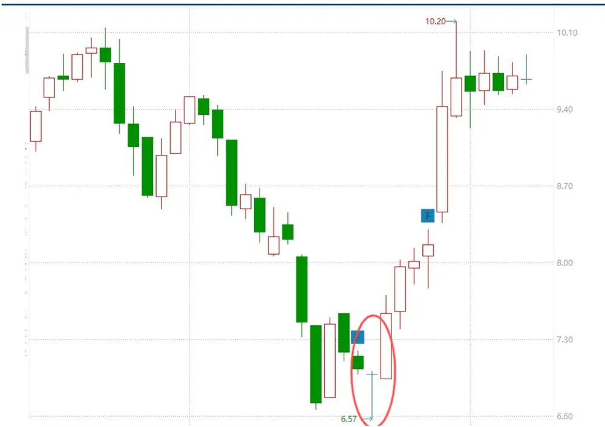
资料来源：wind，华创证券

从历史表现来看，该种形态在所有股票上自从 2010年的收益表现如下：

图表 2 金针探底持有期收益统计

| 持有期（交易日） | 收益中位数（%） | 平均收益（%） |
| --- | --- | --- |
| 1 | 0 | -0.04 |
| 2 | 0 | -0.05 |
| 3 | 0 | 0.32 |
| 4 | 0.08 | 0.57 |
| 5 | 0.43 | 1.02 |
| 6 | 0.69 | 1.3 |
| 7 | 0.7 | 1.48 |
| 8 | 0.6 | 1.17 |
| 9 | 0.09 | 1.01 |
| 10 | 0.75 | 1.49 |
| 11 | 0.99 | 1.66 |
| 12 | 1.72 | 2.37 |
| 13 | 1.57 | 2.67 |
| 14 | 2.25 | 2.9 |
| 15 | 2.75 | 3.21 |
| 16 | 2.4 | 3.15 |
| 17 | 2.35 | 3.42 |
| 18 | 2.01 | 3.21 |
| 19 | 2.31 | 3.47 |
| 20 | 2.45 | 3.95 |
| 21 | 2.92 | 4.54 |
| 22 | 3.39 | 4.54 |
| 23 | 2.8 | 4.81 |
| 24 | 2.91 | 4.89 |
| 25 | 3.11 | 5.23 |
| 26 | 3.3 | 5.28 |
| 27 | 3.41 | 4.82 |
| 28 | 3.56 | 5.32 |
| 29 | 3.8 | 5.25 |
| 30 | 3.73 | 5.37 |

资料来源：wind，华创证券

表格展示了股票在金针探底出现后的不同持有期内的收益表现。从统计来看，持有期越长，收益的中位数和平均收益都增加。从盈亏比和胜率角度，随着持有期增加，其胜率增加。从收益均值盈亏比和胜率综合来看，持有期在20-25 天较为合适。

图表 3 金针探底持有期与胜率和盈亏比的关系
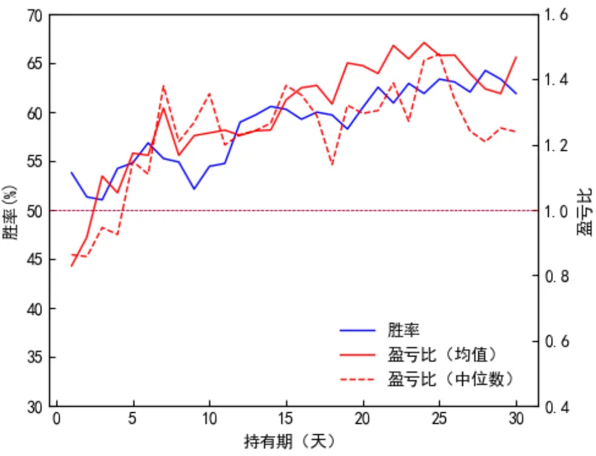
资料来源：wind，华创证券

## 三、火箭发射

这种形态被称为“火箭发射”，通常出现在股票的短期调整过程中，预示着即将出现快速上涨。其前提条件需要该种K线为“锤头线”（详细描述见形态学网站），为了更具体地描述这种形态，我们定义以下条件。

收阳线：当天的K线必须为阳线，即收盘价高于开盘价，表明多方力量强于空方。

当日振幅大于 5%：当天的股票价格波动幅度（最高价与最低价的差异）需大于5%，显示出显著的价格波动。

实体部分占比小：虽然收阳线，但 K线的实体部分（开盘价与收盘价之间的差异）占当天振幅的比例较小。这意味着虽然有上涨，但多空双方在当天的较量中相对平衡，主要表现在长长的上下影线上，影线长度大于 70%的当日K线长度。

阶段性底部：该形态出现在股票的阶段性底部，即股票在一段时间的下跌或调整后，价格达到了过去20交易日的相对低点，并且股票的实体部分不能超过前一日低点太多。

图表 4 火箭发射
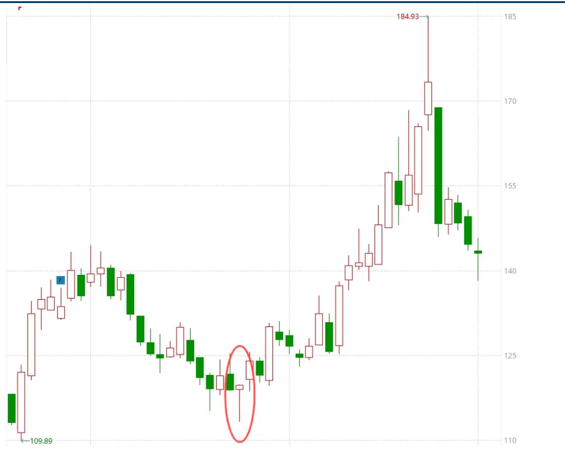
资料来源：wind，华创证券

从历史表现来看，该种形态收益表现如下：

图表 5 火箭发射持有期收益统计

| 持有期（交易日） | 收益中位数（%） | 平均收益（%） |
| --- | --- | --- |
| 1 | -0.1 | -0.28 |
| 2 | -0.48 | -0.73 |
| 3 | -0.6 | -1.06 |
| 4 | -0.26 | -1.02 |
| 5 | -0.35 | -0.7 |
| 6 | -0.35 | -0.93 |
| 7 | 0 | -0.97 |
| 8 | 0 | -1.13 |
| 9 | -0.15 | -1.02 |
| 10 | -0.14 | -1.14 |
| 11 | -0.22 | -1.12 |
| 12 | 0.14 | -0.64 |
| 13 | 0.37 | -0.19 |
| 14 | 0.51 | 0.28 |
| 15 | 1.17 | 0.8 |
| 16 | 0.4 | 0.29 |
| 17 | 0.6 | 0.44 |
| 18 | 0.16 | 0.5 |
| 19 | 0.24 | 0.81 |
| 20 | 0.67 | 1.27 |
| 21 | 0.67 | 1.34 |
| 22 | 0.74 | 1.41 |
| 23 | 0.64 | 1.47 |
| 24 | 0.22 | 1.24 |
| 25 | 0.4 | 1.21 |
| 26 | 0.54 | 1.75 |
| 27 | 1.1 | 1.74 |
| 28 | 1.37 | 2.08 |
| 29 | 0.88 | 1.79 |
| 30 | 0.69 | 1.64 |

资料来源：wind，华创证券

从统计来看，盈亏比来看，当持有期在 20 天以后，其胜率和盈亏比分别大于 50%和 1，显示出该种形态对中期良好的预判能力。

图表 6 火箭发射持有期与胜率和盈亏比的关系
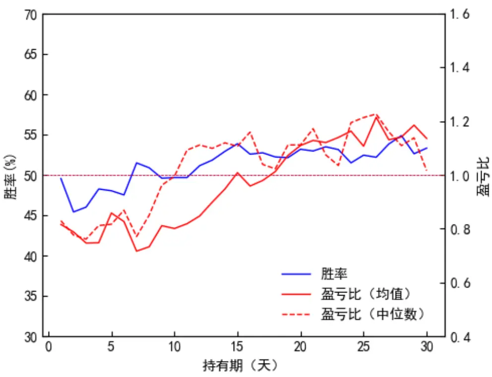
资料来源：wind，华创证券

## 四、满江红

该种形态主要是指，股票以较低的振幅逐渐上涨。要求最近 10 个交易日有7根或者7 根以上K线收红，并且每日的股价变化在-2%到 3%之间。我们定义：

低振幅上涨：股票以较低的振幅逐渐上涨，表明市场信心逐步增强但波动不大，每日的股价涨跌幅在-2%到3%之间。这表示每日波动幅度相对较小，市场趋于稳定。

连续红 K 线：在最近 10 个交易日中，至少有 7 根或 7 根以上的 K 线收红。这意味着在多数交易日内，收盘价高于开盘价，显示出持续的买入力量。

图表 7 满江红
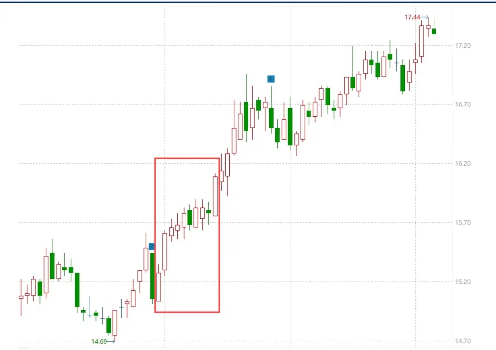
资料来源：wind，华创证券

从历史表现来看，该种形态收益表现如下：

图表 8 满江红持有期收益统计

| 持有期（交易日） | 收益中位数（%） | 平均收益（%） |
| --- | --- | --- |
| 1 | 0 | 0.05 |
| 2 | 0 | 0.14 |
| 3 | 0 | 0.25 |
| 4 | 0 | 0.36 |
| 5 | 0.12 | 0.5 |
| 6 | 0.22 | 0.63 |
| 7 | 0.31 | 0.76 |
| 8 | 0.4 | 0.86 |
| 9 | 0.49 | 0.97 |
| 10 | 0.55 | 1.05 |
| 11 | 0.59 | 1.15 |
| 12 | 0.69 | 1.24 |
| 13 | 0.69 | 1.27 |
| 14 | 0.71 | 1.32 |
| 15 | 0.76 | 1.39 |
| 16 | 0.78 | 1.46 |
| 17 | 0.76 | 1.5 |
| 18 | 0.78 | 1.56 |
| 19 | 0.78 | 1.61 |
| 20 | 0.71 | 1.64 |
| 21 | 0.66 | 1.66 |
| 22 | 0.6 | 1.68 |
| 23 | 0.55 | 1.71 |
| 24 | 0.47 | 1.76 |
| 25 | 0.45 | 1.8 |
| 26 | 0.45 | 1.82 |
| 27 | 0.41 | 1.85 |
| 28 | 0.37 | 1.87 |
| 29 | 0.31 | 1.93 |
| 30 | 0.28 | 1.97 |

资料来源：wind，华创证券

从统计来看，满江红的胜率和持有期不是单调关系，在持有期为12天达到最大，此后逐渐下降，其盈亏比随着持有期增加而逐渐增加。

图表 9 满江红持有期与胜率和盈亏比的关系
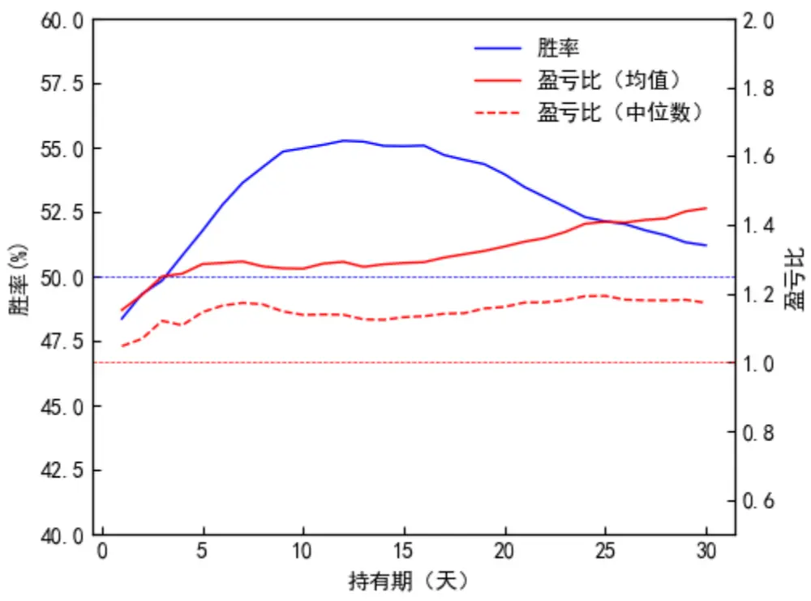
资料来源：wind，华创证券

## 五、上吊线

上吊线是一种看空形态，出现在股票的阶段性顶部，其当日收阴线，预示着可能的下跌。我们定义要求如下：

阶段性顶部：该形态出现在股票的阶段性顶部，即股票在一段时间的上涨或盘整后，价格达到了一个相对高点。

当日收阴线：当天的 K 线必须为阴线，即收盘价低于开盘价，表明空方力量强于多方。

当日振幅大于 5%：当天的股票价格波动幅度需大于5%，显示出显著的价格波动。

实体部分占比低且位于 K线的上方：K线的实体部分（开盘价与收盘价之间的差异）占整个K线长度的30%以下。这意味着虽然有一定的价格波动，但当日开盘后股价一度上涨，然后大幅下跌。

图表 10 上吊线
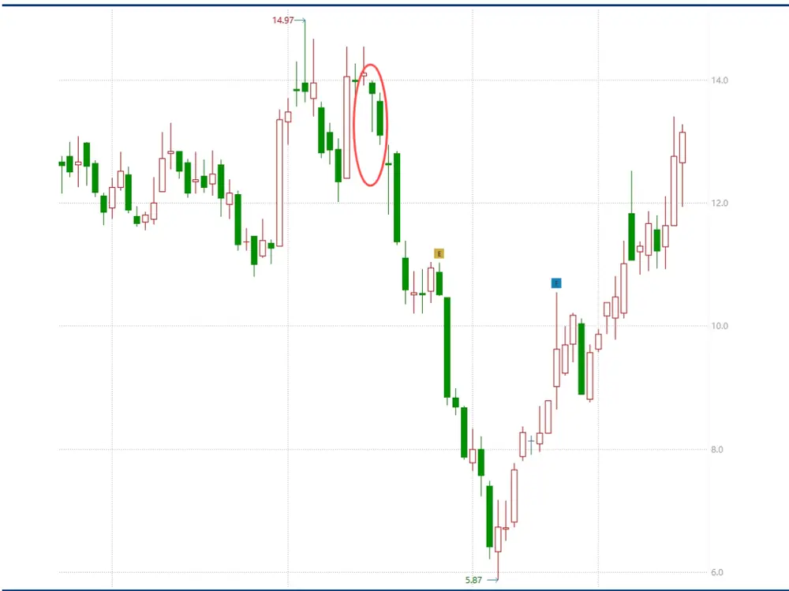
资料来源：wind，华创证券

图表 11 上吊线持有期收益统计

| 持有期（交易日） | 收益中位数（%） | 平均收益（%） |
| --- | --- | --- |
| 1 | -0.39 | -0.08 |
| 2 | -0.83 | 0.13 |
| 3 | -0.87 | -0.04 |
| 4 | -0.86 | 0.01 |
| 5 | -0.57 | 0.4 |
| 6 | 0.33 | 1.38 |
| 7 | 0.28 | 1.31 |
| 8 | 0.12 | 1.15 |
| 9 | 1.1 | 1.8 |
| 10 | 0.39 | 1.31 |
| 11 | -0.39 | 0.23 |
| 12 | -0.23 | 0.01 |
| 13 | -0.5 | -0.06 |
| 14 | -0.51 | 0.08 |
| 15 | -0.44 | -0.77 |
| 16 | -1.38 | -1.75 |
| 17 | -0.99 | -1.02 |
| 18 | -0.74 | -1.74 |
| 19 | -1.13 | -2.53 |
| 20 | -1.8 | -2.94 |
| 21 | -1.19 | -2.71 |
| 22 | -2.03 | -3.36 |
| 23 | -2.9 | -4.45 |
| 24 | -3.31 | -3.86 |
| 25 | -2.5 | -3.14 |
| 26 | -2.87 | -2.3 |
| 27 | -2.89 | -1.51 |
| 28 | -3.63 | -2.09 |
| 29 | -2.95 | -1.6 |
| 30 | -3.57 | -1.24 |

资料来源：wind，华创证券

从统计来看，上吊线的胜率和持有期不是单调关系，在持有期在 1-9天时逐渐下降，此后逐渐上升，其均值盈亏比和中位数盈亏比在 20天前后达到最大。

图表 12 上吊线持有期与胜率和盈亏比的关系
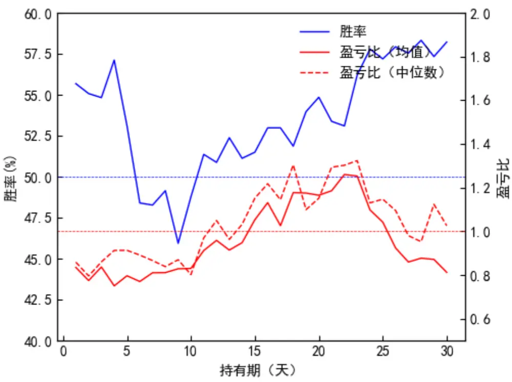
资料来源：wind，华创证券

## 六、天堂线

天堂线出现在股票走势的局部高点，其当日振幅大于 5%，且上影线占据整个K线的 70%以上，天堂线是一种明显的看空形态。我们定义：

局部高点：该形态出现在股票走势的局部高点，即股票在一段时间的上涨或盘整后，价格达到了一个相对高点，其位于过去 20交易日的80分位数以上。

当日振幅大于 5%：当天的股票价格波动幅度需大于5%，显示出显著的价格波动。

上影线占比高：K线的上影线占据整个 K线长度的70%以上。这意味着当天开盘后股价一度大幅上涨，但随后回落，收盘时价格接近最低点，形成长长的上影线。

图表 13 天堂线
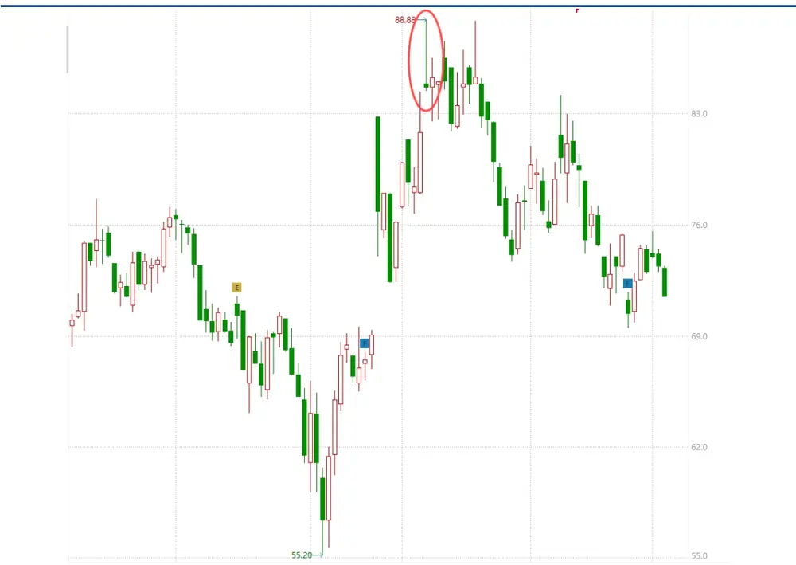
资料来源：wind，华创证券

图表 14 天堂线持有期收益统计

| 持有期（交易日） | 收益中位数（%） | 平均收益（%） |
| --- | --- | --- |
| 1 | 0.24 | 0.43 |
| 2 | 0 | 0.49 |
| 3 | -0.1 | 0.48 |
| 4 | -0.45 | 0.3 |
| 5 | -0.51 | 0.32 |
| 6 | -0.56 | 0.13 |
| 7 | -1 | -0.08 |
| 8 | -1.28 | -0.21 |
| 9 | -1.53 | -0.27 |
| 10 | -1.53 | -0.36 |
| 11 | -1.73 | -0.43 |
| 12 | -1.72 | -0.5 |
| 13 | -1.8 | -0.67 |
| 14 | -2 | -0.6 |
| 15 | -2.09 | -0.64 |
| 16 | -2.26 | -0.83 |
| 17 | -2.62 | -0.89 |
| 18 | -2.85 | -0.85 |
| 19 | -3.03 | -1.04 |
| 20 | -3.33 | -1.23 |
| 21 | -3.48 | -1.33 |
| 22 | -3.58 | -1.47 |
| 23 | -3.64 | -1.41 |
| 24 | -3.64 | -1.41 |
| 25 | -3.55 | -1.44 |
| 26 | -4 | -1.56 |
| 27 | -3.56 | -1.65 |
| 28 | -4.07 | -1.43 |
| 29 | -4.42 | -1.52 |
| 30 | -4.69 | -1.62 |

资料来源：wind，华创证券

从统计来看，天堂线的胜率随着持有期增加而增加，其中位数盈亏比在 1 附近波动，说明该种形态从中期而言是一种胜率较高而盈亏比平衡的形态。

图表 15 天堂线持有期与胜率和盈亏比的关系
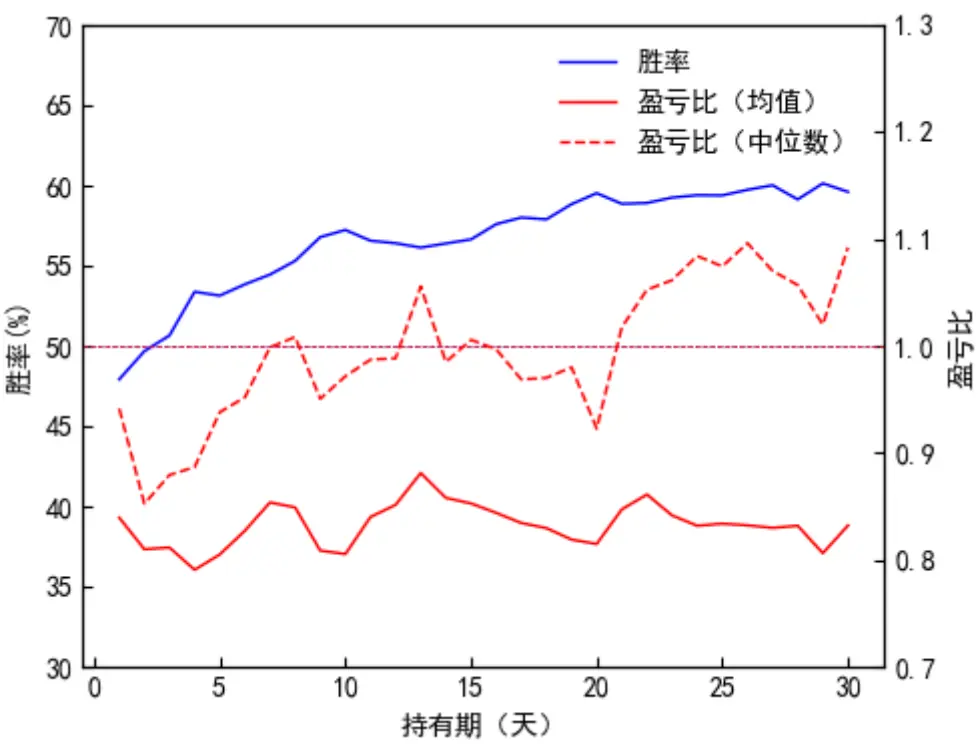
资料来源：wind，华创证券

## 七、乌云线

这种K线形态要求第一日的K线为阳线，出现在股票的局部高点，第二天的K线要求高开低走，当日的振幅大于7%，阴线实体大于整个 K线的 90%。我们定义：

第一日阳线第二天阴线：第一天的 K线为阳线，表示当天收盘价高于开盘价，显示出多方力量强劲。这根阳线出现在股票的局部高点，表明市场情绪较为乐观。第二天的K线要求高开低走，即开盘价高于前一天的收盘价，但收盘价低于开盘价，显示出多方力量减弱，空方力量增强。

当日振幅大于 7%：第二天的股票价格波动幅度（最高价与最低价之间的差异除以收盘价）需大于 7%，显示出显著的价格波动。

阴线实体占比高：第二天的阴线实体（开盘价与收盘价之间的差异）占整个K线长度的90%以上，形成长长的阴线，显示出强烈的卖压。

图表 16 乌云线
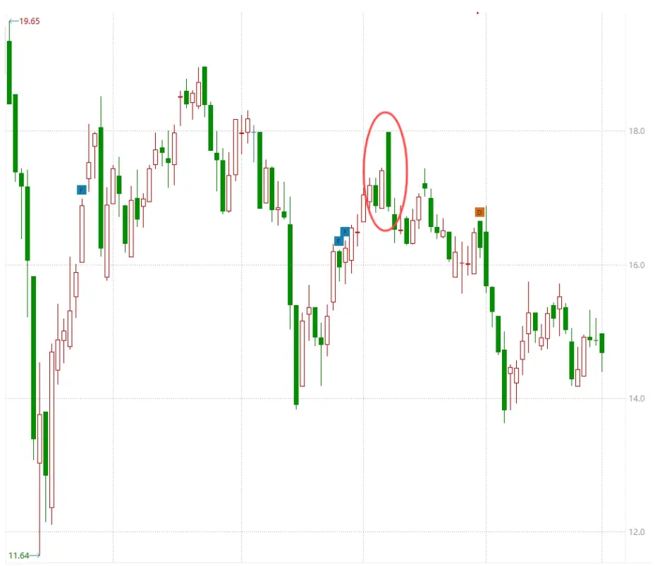
资料来源：wind，华创证券

图表 17 乌云线持有期收益统计

| 持有期（交易日） | 收益中位数（%） | 平均收益（%） |
| --- | --- | --- |
| 1 | -0.47 | -0.65 |
| 2 | -1.35 | -0.92 |
| 3 | -1.31 | -0.71 |
| 4 | -1.92 | -1.05 |
| 5 | -2.13 | -0.88 |
| 6 | -1.89 | -0.89 |
| 7 | -2.29 | -0.69 |
| 8 | -2.16 | -1.27 |
| 9 | -2.68 | -1.46 |
| 10 | -2.78 | -1.89 |
| 11 | -4.01 | -2.24 |
| 12 | -4.21 | -2.02 |
| 13 | -4.14 | -1.69 |
| 14 | -4.11 | -1.49 |
| 15 | -3.55 | -1.52 |
| 16 | -3.98 | -1.39 |
| 17 | -3.54 | -1.5 |
| 18 | -3.92 | -2.05 |
| 19 | -3.67 | -1.68 |
| 20 | -3.8 | -1.52 |
| 21 | -3.73 | -1.86 |
| 22 | -4.05 | -2.15 |
| 23 | -4.2 | -2.51 |
| 24 | -4.45 | -2.44 |
| 25 | -5.12 | -2.75 |
| 26 | -5.13 | -3.07 |
| 27 | -5.48 | -3.23 |
| 28 | -5.84 | -3.1 |
| 29 | -5.8 | -3.16 |
| 30 | -5.87 | -3.16 |

资料来源：wind，华创证券

从统计来看，在 5天以后，乌云线的胜率维持在60%上下。其中位数盈亏比有较大波动，其均值盈亏比较低。乌云线是一种较高胜率，而中位数盈亏比较为平衡的交易策略，从中位数盈亏比来看，其持有期在 25日达到最大。

图表 18 乌云线持有期与胜率和盈亏比的关系
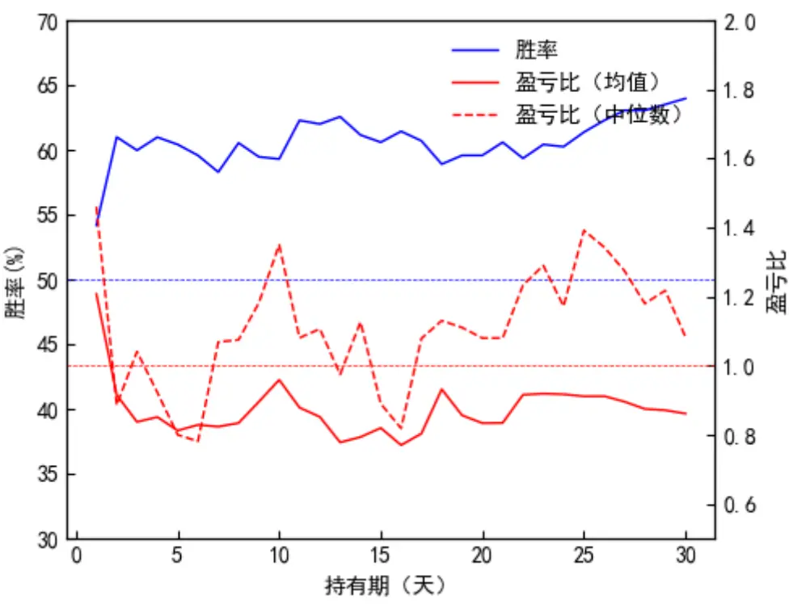
资料来源：wind，华创证券

## 八、风险提示

本文根据历史统计，形态存在失效风险。

形态指标反应的是交易者的交易行为在 K线上的反应，其提示效果具有不确定性。

## 金融工程组团队介绍

组长、首席分析师：王小川

同济大学管理学博士。2017年加入华创证券研究所。

高级分析师：秦玄晋

上海对外经贸大学硕士。2018年加入华创证券研究所。

助理研究员：杨宸祎

美国伊利诺伊大学香槟分校会计学、金融工程学硕士，CFA。2021年加入华创证券研究所。

助理研究员：黄河

东华大学工学博士，FRM。2023年加入华创证券研究所。

助理研究员：洪远

华南理工大学金融硕士。2023年加入华创证券研究所。

## 华创证券机构销售通讯录

| 地区 | 姓名 | 职务 | 办公电话 | 企业邮箱 |
| --- | --- | --- | --- | --- |
| 北京机构销售部 | 张昱洁 | 副总经理、北京机构销售总监 010 | -63214682 | zhangyujie@hcyjs.com |
|  | 张菲菲 | 北京机构副总监 | 010-63214682 | zhangfeifei@hcyjs.com |
|  | 刘懿 | 副总监 | 010-63214682 | liuyi@hcyjs.com |
|  | 侯春钰 | 资深销售经理 | 010-63214682 | houchunyu@hcyjs.com |
|  | 过云龙 | 高级销售经理 | 010-63214682 | guoyunlong@hcyjs.com |
|  | 蔡依林 | 资深销售经理 | 010-66500808 | caiyilin@hcyjs.com |
|  | 刘颖 | 资深销售经理 | 010-66500821 | liuying5@hcyjs.com |
|  | 顾翎蓝 | 资深销售经理 | 010-63214682 | gulinglan@hcyjs.com |
|  | 车一哲 | 销售经理 |  | cheyizhe@hcyjs.com |
| 深圳机构销售部 | 张娟 | 副总经理、深圳机构销售总监 0755 | -82828570 | zhangjuan@hcyjs.com |
|  | 汪丽燕 | 高级销售经理 | 0755-83715428 | wangliyan@hcyjs.com |
|  | 张嘉慧 | 高级销售经理 0755 | -82756804 | zhangjiahui1@hcyjs.com |
|  | 王春丽 | 高级销售经理 | 0755-82871425 | wangchunli@hcyjs.com |
| 上海机构销售部 | 许彩霞 | 总经理助理、上海机构销售总监0 | 21-20572536 | xucaixia@hcyjs.com |
|  | 官逸超 | 上海机构销售副总监 | 021-20572555 | guanyichao@hcyjs.com |
|  | 黄畅 | 上海机构销售副总监 | 021-20572257-2552 | huangchang@hcyjs.com |
|  | 吴俊 | 资深销售经理 021 | -20572506 | wujun1@hcyjs.com |
|  | 张佳妮 | 资深销售经理 021 | -20572585 | zhangjiani@hcyjs.com |
|  | 蒋瑜 | 高级销售经理 021 | -20572509 | jiangyu@hcyjs.com |
|  | 施嘉玮 | 高级销售经理 021 | -20572548 | shijiawei@hcyjs.com |
|  | 朱涨雨 | 高级销售经理 021 | -20572573 | zhuzhangyu@hcyjs.com |
|  | 李凯月 | 高级销售经理 |  | likaiyue@hcyjs.com |
|  | 易星 | 销售经理 |  | yixing@hcyjs.com |
|  | 张玉恒 | 销售经理 |  | zhangyuheng@hcyjs.com |
| 广州机构销售部 | 段佳音 | 广州机构销售总监 0755 | -82756805 | duanjiayin@hcyjs.com |
|  | 周玮 | 销售经理 |  | zhouwei@hcyjs.com |
|  | 王世韬 | 销售经理 |  | wangshitao1@hcyjs.com |
| 私募销售组 | 潘亚琪 | 总监 021 | -20572559 | panyaqi@hcyjs.com |
|  | 汪子阳 | 副总监 021 | -20572559 | wangziyang@hcyjs.com |
|  | 江赛专 | 副总监 0755 | -82756805 | jiangsaizhuan@hcyjs.com |
|  | 汪戈 | 高级销售经理 021 | -20572559 | wangge@hcyjs.com |
|  | 宋丹玙 | 销售经理 021 | -25072549 | songdanyu@hcyjs.com |

## 华创行业公司投资评级体系

基准指数说明：

A股市场基准为沪深 300指数，香港市场基准为恒生指数，美国市场基准为标普 500/纳斯达克指数。

公司投资评级说明：

强推：预期未来 6个月内超越基准指数 20%以上；

推荐：预期未来 6个月内超越基准指数 10%－20%；

中性：预期未来 6个月内相对基准指数变动幅度在-10%－10%之间；

回避：预期未来 6个月内相对基准指数跌幅在 10%－20%之间。

## 行业投资评级说明：

推荐：预期未来 3-6个月内该行业指数涨幅超过基准指数 5%以上；

中性：预期未来 3-6个月内该行业指数变动幅度相对基准指数-5%－5%；

回避：预期未来 3-6个月内该行业指数跌幅超过基准指数 5%以上。

## 分析师声明

每位负责撰写本研究报告全部或部分内容的分析师在此作以下声明：

分析师在本报告中对所提及的证券或发行人发表的任何建议和观点均准确地反映了其个人对该证券或发行人的看法和判断；分析师对任何其他券商发布的所有可能存在雷同的研究报告不负有任何直接或者间接的可能责任。

## 免责声明

本报告仅供华创证券有限责任公司（以下简称“本公司”）的客户使用。本公司不会因接收人收到本报告而视其为客户。

本报告所载资料的来源被认为是可靠的，但本公司不保证其准确性或完整性。本报告所载的资料、意见及推测仅反映本公司于发布本报告当日的判断。在不同时期，本公司可发出与本报告所载资料、意见及推测不一致的报告。本公司在知晓范围内履行披露义务。

报告中的内容和意见仅供参考，并不构成本公司对具体证券买卖的出价或询价。本报告所载信息不构成对所涉及证券的个人投资建议，也未考虑到个别客户特殊的投资目标、财务状况或需求。客户应考虑本报告中的任何意见或建议是否符合其特定状况，自主作出投资决策并自行承担投资风险，任何形式的分享证券投资收益或者分担证券投资损失的书面或口头承诺均为无效。本报告中提及的投资价格和价值以及这些投资带来的预期收入可能会波动。

本报告版权仅为本公司所有，本公司对本报告保留一切权利。未经本公司事先书面许可，任何机构和个人不得以任何形式翻版、复制、发表、转发或引用本报告的任何部分。如征得本公司许可进行引用、刊发的，需在允许的范围内使用，并注明出处为“华创证券研究”，且不得对本报告进行任何有悖原意的引用、删节和修改。

证券市场是一个风险无时不在的市场，请您务必对盈亏风险有清醒的认识，认真考虑是否进行证券交易。市场有风险，投资需谨慎。

## 华创证券研究所

| 北京总部 | 广深分部 | 上海分部 |
| --- | --- | --- |
| 地址：北京市西城区锦什坊街26号 恒奥中心 C 座 3A | 地址：深圳市福田区香梅路1061号中投国 际商务中心 A 座 19 楼 | 地址：上海市浦东新区花园石桥路33号 花旗大厦 12 层 |
| 邮编：100033 | 邮编：518034 | 邮编：200120 |
| 传真：010-66500801 会议室：010-66500900 | 传真：0755-82027731 | 传真：021-20572500 |
|  | 会议室：0755-82828562 | 会议室：021-20572522 |