【专题报告】

# 形态学研究之十一：基于形态研究做投资组合的几点思考

## 摘要

K 线的本质内涵是多空双方资金在争夺主导权而留下来的轨迹，通过研究 K线形态，我们能够深入地观察到市场的真正变化。不论是宏观环境变化，还是赛道格局改变亦或是个股基本面的变化，都可以反应在股票 K线形态图上。

华创形态学研究系统对行业指数的历史胜率统计时间为 5 天，从历史数据来看，对市场短期的走势预测较好，但如何应用构建投资组合并获取稳定收益，亟待研究。

首先，我们给出做指数增强组合的几种方法：我们根据正向与负向形态两种信号，以沪深 300、中证 500 与中证 1000 成分股为备选池，构建了正向形态组合与负向形态组合。以指数成分股作为选股池，正向组合开始为空仓，出现胜率 70%以上的正面信号资产买入，持有到月底。负向组合开始为满仓指数成分股，出现 65%以上的负面信号资产卖出，持有现金。两种方式都是月底全部清仓。经测试，正向与负向信号各个指数都可以明显跑赢指数本身，证明形态研究在指数增强上有效果。

其次，形态投资还可以做纯多策略，我们在全市场中找到 65%胜率的看多信号，第二天买入，持有 5 天，轮询交易，可以得到一个绝对收益组合。组合从2021 年 1 月 1 日至 2024 年 8 月 31 日，经测试，在单边千一手续费下依然可达到 34.41%的年化收益，夏普为 1.49。

通过上述测试，我们发现不仅仅形态对单独资产有重要指示作用，在组合层面也可以构建组合，不论是增强型策略抑或纯多头绝对收益策略上都大有作为。

## 风险提示：

模型结果基于历史数据测算，不保证未来数据的有效性。

## 华创证券研究所

证券分析师：王小川

电话：021-20572528

邮箱：wangxiaochuan@hcyjs.com

执业编号：S0360517100001

## 相关研究报告

《形态学研究之十：6 种新 K线形态》

2024-07-11

《形态学研究之九：如何结合金股构建投资组合》

2024-06-30

《形态学研究之八：如何利用形态信号进行行业择时》

2023-08-07

《K线形态研究之七：停顿线》

2023-07-31

《K线形态研究之六：乌云压顶线》

2023-07-31

## 投资主题

报告亮点

我们已经做了形态学针对独立资产的判断系统，如何更好的利用形态学的信号构建组合，成为了研究的关键。

我们给出了做指数增强策略与绝对收益策略的样例，通过历史数据回测，发现形态学明显提升组合的收益率，降低最大回撤。绝对收益策略亦十分优秀。

## 投资逻辑

形态学提示资产看多/看空信号，在组合上依然有效。

## 一、前言

我们在以前的《形态学》系列报告中为大家阐述了如何利用形态进行投资，包括形态学初识与应用、如何利用形态信号进行行业择时等。本篇报告开始基于形态学构建相应的指数增强投资组合。本篇报告仅为构建指数增强组合的一个思路，供各位参考。

## （一）K线形态学原理回顾

股票后期形态必然是先期形态的结果。万事有因必有果，股票也不能例外。没有前期的积累，便没有后面的拉升。相反，没有前期的抛售，也没有后期的下跌。从这个意义上说，股票的 K线形态与波浪理论、均线、箱体理论等其他形态学理论是暗合的。

不同K线组合可以表现出多重市场形态，从形态作用上来讲，主要作用为：

指示交易信号：看涨与看跌。K 线的颜色不同，实体大小不同，反映了多空双方实力对比的不同，同时也对下一交易日的走势具有一定的指示作用。例如，前一交易日K线图走出了光头阳线（没有上影线的阳线），说明下一交易日高开的可能性非常大。如果前一交易日K线图走出了光脚阴线（没有下影线的阴线），则说明下一交易日低开的可能性非常大。当然，实战中还存在另外一种情况，即某一交易日收出一根大阳线或大阴线，但收盘后发现，这些大阳线或大阴线的出现，属于投资者短时间的情绪化反应，也就是说，投资者对市场上的某些消息反应过度，那么，下一个交易日也存在走势修复的可能，即K 线收出与前一交易日相反的形态。若某日K线只是以小阳线或小阴线等多空力量对比并不明显的K线报收，那么，这种K线形态对下一个交易日的指示作用就不那么强了。由于A股设有涨跌停限制，当做多力量还没有完全释放时，股价已经达到了规定的最高限制，这就迫使做多力量不得不在下一交易日开盘时段继续发力，这也是光头阳线次日股价多数高开的原因所在。

趋势引导信号：上行趋势与下行趋势。相对来说，单根K线发出的交易信号质量确实不佳，即使是收出大阳线或大阴线，下一交易日也存在走势修复的情况。将多个交易日的K线组合起来进行分析，特别是K线组合构成某种特殊的K线形态时，无疑可以增强判断股价运行趋势的准确性。特别是一些经过实战反复验证的经典K线形态，能够更准确地预测股价未来的运行方向。

买卖交易信号：买入与卖出。单独的 K线并不会发出买入或卖出信号，只是提示投资者当前市场是空方强势还是多方强势。如果能将K线与其他角度工具结合起来分析，那么，K线就可能发出买卖交易的指示性信号。

由于市场资产众多，虽然可能较为准确的把握单个资产的交易信号，但是仅基于形态构建的组合存在资产众多、信号繁杂等特点，不适合直接构建投资组合，需要对资产进行过滤，例如需要券商金股过滤等。

## （二）指数增强策略

指数增强策略是一种在跟踪特定指数的基础上，通过各种方法和策略来实现超越该指数的投资收益的方法。这种策略在A 股市场尤其受到关注，尤其是基于中小盘宽基指数的增强策略，例如中证 500 指数的量化增强策略。量化指数增强策略依赖于数据驱动的模型和算法，使用大量历史和实时市场数据来识别潜在的市场模式和趋势。

指数增强基金通常使用大部分资产被动复制跟踪的指数，同时用少部分资产采用增强策略进行主动管理，以获得贝塔收益的同时谋求一定的阿尔法收益。增强策略包括基本面主动增强、量化增强、打新、转融通和使用金融衍生工具等。例如，基本面主动增强策略会根据市场估值错配的机会，增配优质股票；而量化增强策略则会利用多因子模型进行选股和持仓优化。

本文提出了一种基于形态研究的指数增强策略，为全市场首次，形态数据源于《华创金工形态学投研平台》，我们针对沪深 300、中证 500、中证 1000 三个指数分别进行指数增强策略构建，以期实现超越该指数。

## 二、基于形态学的投资组合构建

## （一）正向形态使用方法

形态信号可分为正向形态与负向形态，对应正向信号与负向信号，且每个信号都有胜率与盈亏比，当我们使用正向信号时，开始为空仓，当指数成分股出现正面信号时，第二天买入，持有到月底，每个月往复交易。策略规则如下：

标的选择：当月指数成分股

买入时间：出现 70%胜率看多形态后的第二天

卖出时间：当月月底

权重：每次交易后确保组合等权，如第一只股票出现，全仓买入，第二只股票出现，卖出一半第一只股票，买入第二只股票，以此类推。

基准：对标指数

回测结束时间：2024年8月 31日

## （二）正向形态各指数回测效果

采用正向形态后的沪深 300 增强组合构建净值如下：

图表 1 沪深 300正向形态组合净值
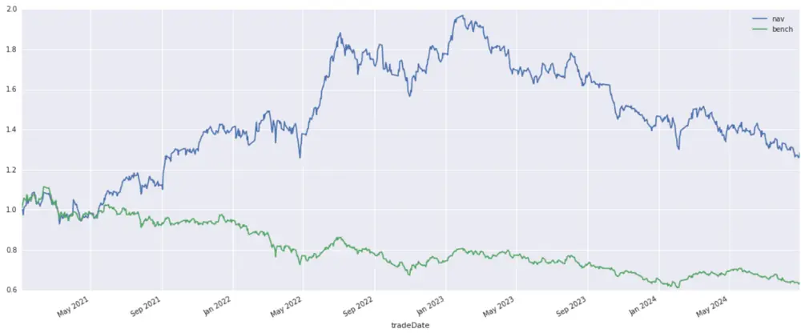
资料来源：wind，华创证券

图表 2 沪深 300正向形态组合回测效果

| 年化收益率 | 基准(沪深 300)年化收益率 | Alpha | Beta | 夏普比例 | 最大回撤 |
| --- | --- | --- | --- | --- | --- |
| 7.3% | -11.9% | 19.0% | 0.99 | 0.17 | 36.0% |

资料来源：wind，华创证券

沪深 300正向形态各年份收益如下：

图表 3 沪深 300正向形态组合各年份收益

| 年份 | 组合年度收益 | 基准年度收益 |
| --- | --- | --- |
| 2021 | 41.51% | -6.64% |
| 2022 | 25.47% | -20.94% |
| 2023 | 17.51% | -12.90% |
| 2024 | -12.26% | -1.92% |

资料来源：wind，华创证券

图表 4 沪深 300正向形态组合持仓个股变化
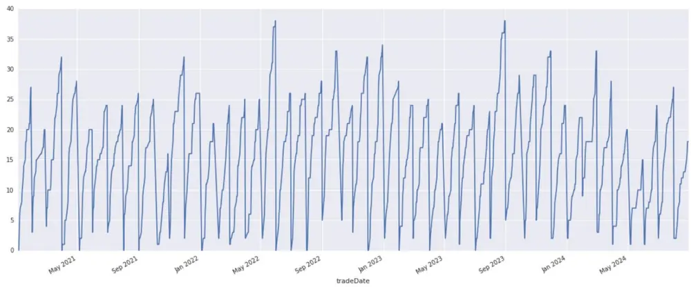
资料来源：wind，华创证券

最大持仓为 38只，最小持仓为0只，月度平均持仓为：16只。

采用正向形态后的中证500增强组合构建净值如下：

图表 5 中证 500正向形态组合净值
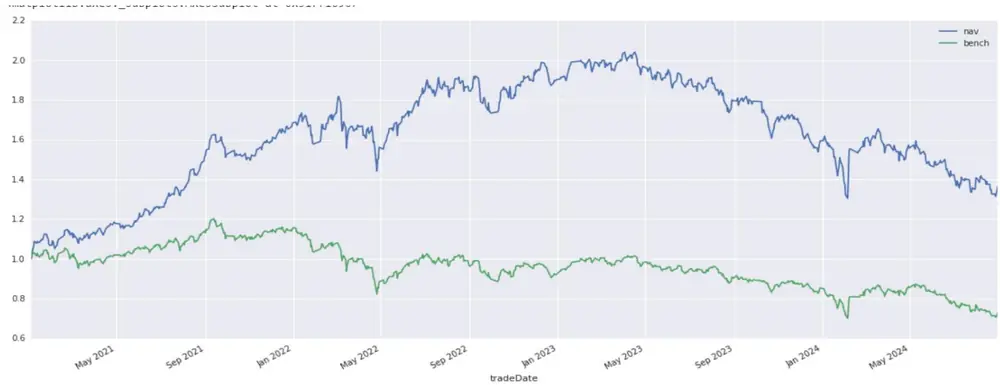
资料来源：wind，华创证券

图表 6 中证 500 正向形态组合回测效果

| 年化收益率 | 基准(中证 500)年化收益率 | Alpha | Beta | 夏普比例 | 最大回撤 |
| --- | --- | --- | --- | --- | --- |
| 9.1% | -8.5% | 17.1% | 0.96 | 0.28 | 26.1% |

资料来源：wind，华创证券

中证 500正向形态各年份收益如下：

图表 7 中证 500正向形态组合各年份收益

| 年份 | 组合年度收益 | 基准年度收益 |
| --- | --- | --- |
| 2021 | 68.79% | 13.46% |
| 2022 | 12.79% | -19.00% |
| 2023 | -1.633% | -9.17% |
| 2024 | -14.48% | -14.24% |

资料来源：wind，华创证券

图表 8 中证 500正向形态组合持仓个股变化
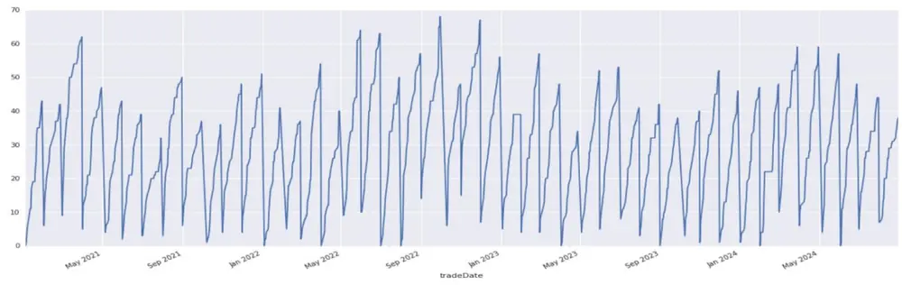
资料来源：wind，华创证券

最大持仓为 68只，最小持仓为0只，月度平均持仓为：29只。

采用正向形态后的中证 1000增强组合构建净值如下：

图表 9 中证 1000 正向形态组合净值
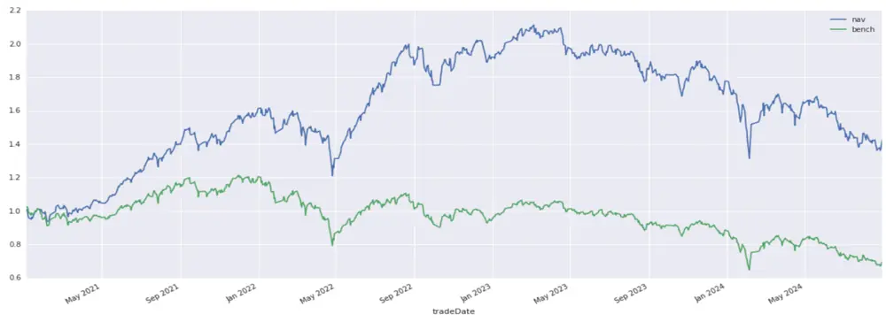
资料来源：wind，华创证券

图表 10 中证1000正向形态组合回测效果

| 年化收益率 | 基准(中证 1000 年化收益率 | Alpha | Beta | 夏普比例 | 最大回撤 |
| --- | --- | --- | --- | --- | --- |
| 10.4% | -9.7% | 19.2% | 0.93 | 0.32 | 37.8% |

资料来源：wind，华创证券

中证 1000正向形态各年份收益如下：

图表 11 中证 1000正向形态组合各年份收益

| 年份 | 组合年度收益 | 基准年度收益 |
| --- | --- | --- |
| 2021 | 61.53% | 17.42% |
| 2022 | 18.80% | -19.53% |
| 2023 | -7.50% | -8.86% |
| 2024 | -19.82% | -20.93% |

资料来源：wind，华创证券
持仓个股变化：

图表 12 中证1000正向形态组合持仓个股变化
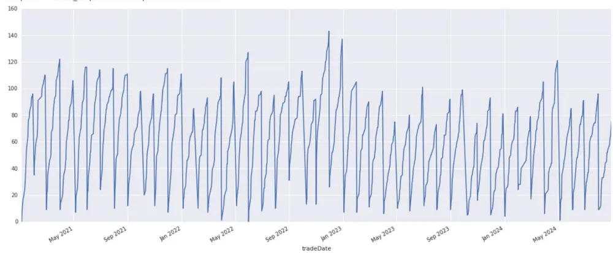
wind,

最大持仓为 143只，最小持仓为 0只，月度平均持仓为：62只。

可以看到，单纯使用正向形态可以对指数进行增强，但是组合开始是空仓的，出现看多信号才会买入，并且存在开始可能仅持有几只股票的情况，风险较大，为理想化情况，正向形态信号仅作为一次尝试，供大家参考。

## （三）负向形态使用方法

形态信号可分为正向形态与负向形态，对应正向信号与负向信号，且每个信号都有胜率与盈亏比，当我们使用负向信号时，开始为根据指数成分股构建的底仓，当指数成分股出现负面信号时，第二天卖出该股票，持有到月底，每个月往复交易。策略规则如下：

标的选择：当月指数成分股

买入时间：当月月初按指数成分股买入

卖出时间：成分股出现 65%负面形态的第二天卖出，持有cash

权重：月初与指数成分股等权，出现负面信号时候直接卖出该资产，不做权重调整

基准：对标指数

回测结束时间：2024年8月 31日

## （四）负向形态各指数回测效果

采用负向形态后的沪深 300 增强组合构建净值如下：

图表 13 沪深300负向形态组合净值
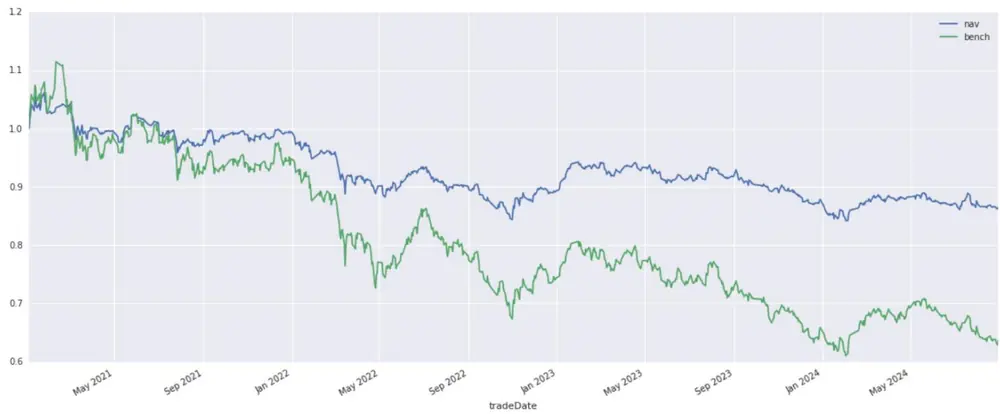
资料来源：wind，华创证券

图表 14 沪深300负向形态组合回测效果

| 年化收益率 | 基准(沪深 300)年化收益率 | Alpha | Beta | 夏普比例 | 最大回撤 |
| --- | --- | --- | --- | --- | --- |
| -3.8% | -11.9% | -0.5% | 0.44 | -0.89 | 20.7% |

资料来源：wind，华创证券

沪深 300负向形态各年份收益如下：

图表 15 沪深 300 负向形态组合各年份收益

| 年份 | 组合年度收益 | 基准年度收益 |
| --- | --- | --- |
| 2021 | -1.30% | -6.64% |
| 2022 | -9.34% | -20.94% |
| 2023 | -2.94% | -12.90% |
| 2024 | -0.46% | -1.92% |

资料来源：wind，华创证券

图表 16 沪深300负向形态组合持仓个股变化
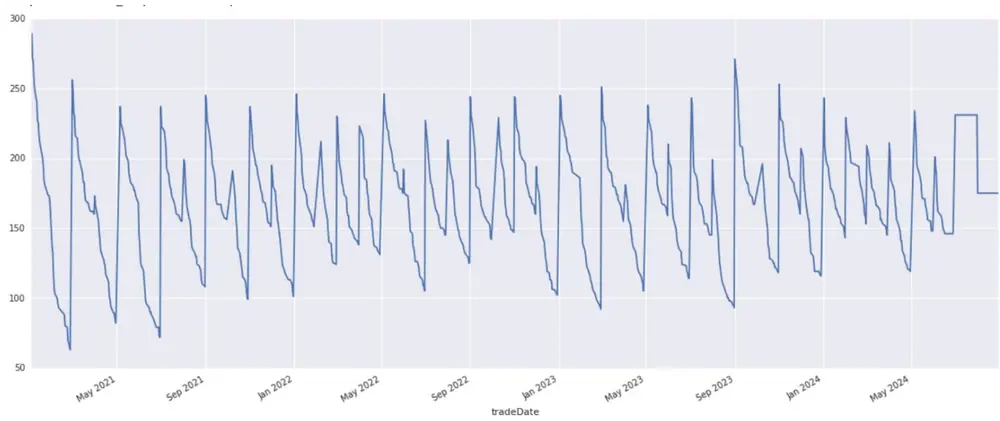
资料来源：wind，华创证券

最大持仓为 209只，最小持仓为 63只，月度平均持仓为：165只。

采用负向形态后的中证 500 增强组合构建净值如下：

图表 17 中证500负向形态组合净值
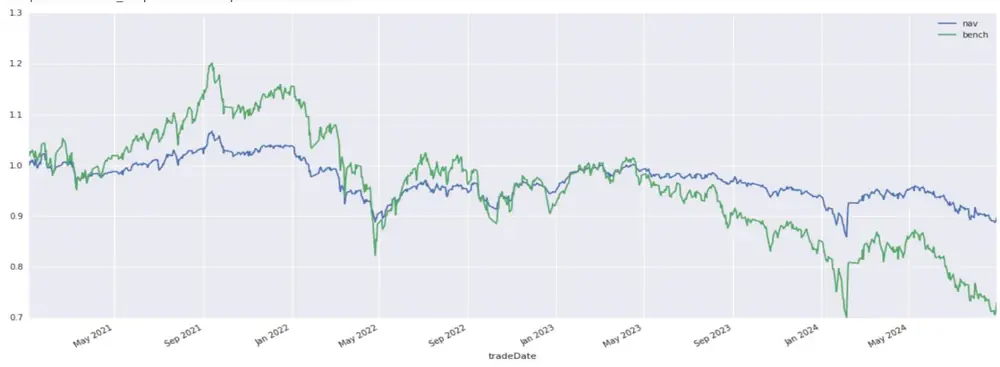
wind,

图表 18 中证500负向形态组合回测效果

| 年化收益率 | 基准(中证 500)年化收益率 | Alpha | Beta | 夏普比例 | 最大回撤 |
| --- | --- | --- | --- | --- | --- |
| -1.70% | -8.50% | -1.0% | 0.44 | -0.72 | 19.5% |

资料来源：wind，华创证券

中证 500负向形态各年份收益如下：

图表 19 中证500负向形态组合各年份收益

| 年份 | 组合年度收益 | 基准年度收益 |
| --- | --- | --- |
| 2021 | 3.57% | 13.45% |
| 2022 | -7.58% | -19.02% |
| 2023 | -2.09% | -9.17% |
| 2024 | -4.36% | -14.24% |

资料来源：wind，华创证券

图表 20 中证500负向形态组合持仓个股变化
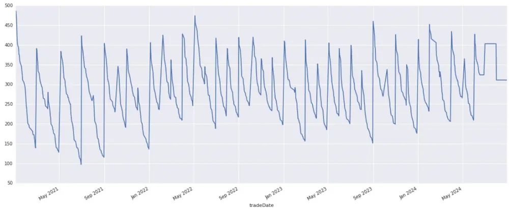
资料来源：wind，华创证券

最大持仓为 486只，最小持仓为 97只，月度平均持仓为：201只。

采用负向形态后的中证 1000增强组合构建净值如下：

图表 21 中证1000负向形态组合净值
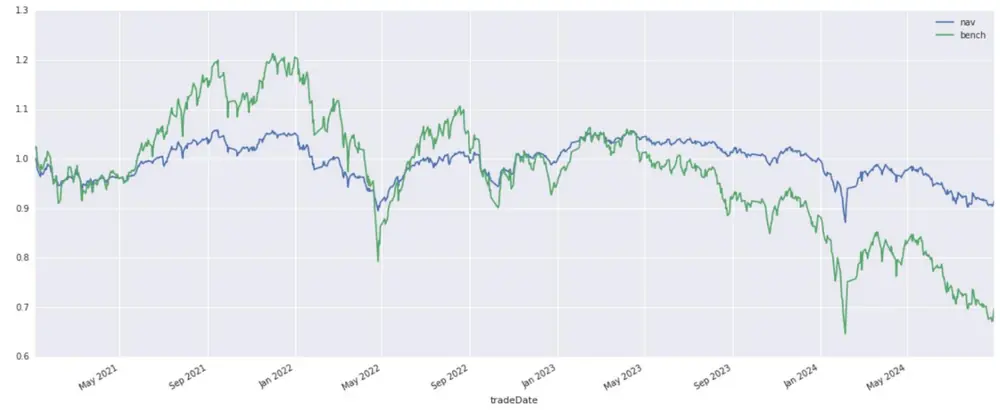
资料来源：wind，华创证券

图表 22 中证1000负向形态组合回测效果

| 年化收益率 | 基准(中证 1000)年化收益率 | Alpha | Beta | 夏普比例 | 最大回撤 |
| --- | --- | --- | --- | --- | --- |
| -2.1% | -9.7% | -0.4% | 0.39 | -0.61 | 17.6% |

资料来源：wind，华创证券

中证 1000负向形态组合各年份收益如下：

图表 23 中证1000负向形态组合各年份收益

| 年份 | 组合年度收益 | 基准年度收益 |
| --- | --- | --- |
| 2021 | 4.53% | 17.42% |
| 2022 | -3.75% | -19.53% |
| 2023 | -1.08% | -8.86% |
| 2024 | -8.18% | -20.93% |

资料来源：wind，华创证券

图表 24 中证1000负向形态组合持仓个股变化
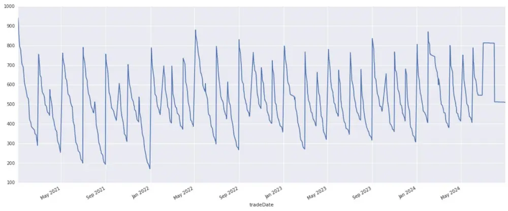
资料来源：wind，华创证券

## 最大持仓为 940只，最小持仓为 170只，月度平均持仓为：511只。

可以看到，单纯使用负向形态可以对指数进行增强，组合开始是跟指数等权的底仓，出现看空信号才会卖出，供大家参考。

## （五）绝对收益策略使用方法

此处仅使用正向信号。策略规则如下：

标的选择：当月全A 指数成分股

买入时间：成分股出现 70%正面信号后第二天开盘价买入

卖出时间：持有五个交易日

## 权重：出现信号时候直接买入该资产，重做 rebalance

基准：对标常见指数

回测结束时间：2024 年 8 月 31 日

图表 25 Wind全A绝对收益策略组合净值
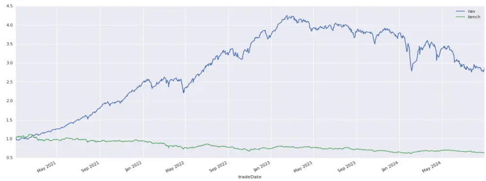
资料来源：wind，华创证券

图表 26 Wind全A绝对收益回测效果

| 年化收益率 | 基准(沪深 300)年化收益率 | Alpha | Beta | 夏普比例 | 最大回撤 |
| --- | --- | --- | --- | --- | --- |
| 34.41% | -11.89% | 41.77% | 0.701 | 1.492 | 38.10% |

资料来源：wind，华创证券

Wind全 A绝对收益各年份收益如下：

图表 27 Wind全 A绝对收益各年份收益

| 年份 | 组合年度收益 | 沪深 300 | 中证500 | 中证1000 | Wind 全 A |
| --- | --- | --- | --- | --- | --- |
| 2021 | 152.27% | -6.64% | 13.46% | 17.42% | 9.17% |
| 2022 | 50.14% | -20.94% | -19.00% | -19.53% | -18.66% |
| 2023 | -0.179% | -12.90% | -9.17% | -8.86% | -5.19% |
| 2024 | -24.57% | -1.92% | -14.24% | -20.93% | -14.2% |

资料来源：wind，华创证券

## （六）总结

通过上述测试，我们发现，不仅仅形态对单独资产有重要指示作用，在组合层面，也可以提升组合的收益率，证明了形态有 alpha。

## 三、形态学信号的获取

华创金工为了更方便大家使用形态信号，我们直接将形态信号API化，可以直接通过API获取形态信号。

可以通过 Python的接口直接获取形态学系统中全部的形态介绍、形态定义与每日出现的信号，可以获取历史的与最新的信号。

## 四、风险提示

策略基于历史数据的回测，不保证策略未来的有效性。

## 金融工程组团队介绍

组长、首席分析师：王小川

同济大学管理学博士。2017年加入华创证券研究所。

助理研究员：杨宸祎

美国伊利诺伊大学香槟分校会计学、金融工程学硕士，CFA。2021年加入华创证券研究所。

助理研究员：黄河

东华大学工学博士，FRM。2023年加入华创证券研究所。

助理研究员：洪远

华南理工大学金融硕士。2023年加入华创证券研究所。

助理研究员：刘依凡

上海财经大学金融统计博士。2024年加入华创证券研究所。

## 华创证券机构销售通讯录

| 地区 | 姓名 | 职务 | 办公电话 | 企业邮箱 |
| --- | --- | --- | --- | --- |
| 北京机构销售部 | 张昱洁 | 副总经理、北京机构销售总监 010 | -63214682 | zhangyujie@hcyjs.com |
|  | 张菲菲 | 北京机构副总监 | 010-63214682 | zhangfeifei@hcyjs.com |
|  | 刘懿 | 副总监 | 010-63214682 | liuyi@hcyjs.com |
|  | 侯春钰 | 资深销售经理 | 010-63214682 | houchunyu@hcyjs.com |
|  | 过云龙 | 高级销售经理 | 010-63214682 | guoyunlong@hcyjs.com |
|  | 蔡依林 | 资深销售经理 | 010-66500808 | caiyilin@hcyjs.com |
|  | 刘颖 | 资深销售经理 | 010-66500821 | liuying5@hcyjs.com |
|  | 顾翎蓝 | 资深销售经理 | 010-63214682 | gulinglan@hcyjs.com |
|  | 车一哲 | 销售经理 |  | cheyizhe@hcyjs.com |
| 深圳机构销售部 | 张娟 | 副总经理、深圳机构销售总监 0755 | -82828570 | zhangjuan@hcyjs.com |
|  | 汪丽燕 | 高级销售经理 | 0755-83715428 | wangliyan@hcyjs.com |
|  | 张嘉慧 | 高级销售经理 | 0755-82756804 | zhangjiahui1@hcyjs.com |
|  | 王春丽 | 高级销售经理 | 0755-82871425 | wangchunli@hcyjs.com |
| 上海机构销售部 | 许彩霞 | 总经理助理、上海机构销售总监0 | 21-20572536 | xucaixia@hcyjs.com |
|  | 官逸超 | 上海机构销售副总监 | 021-20572555 | guanyichao@hcyjs.com |
|  | 黄畅 | 上海机构销售副总监 | 021-20572257-2552 | huangchang@hcyjs.com |
|  | 吴俊 | 资深销售经理 021 | -20572506 | wujun1@hcyjs.com |
|  | 张佳妮 | 资深销售经理 021 | -20572585 | zhangjiani@hcyjs.com |
|  | 蒋瑜 | 高级销售经理 021 | -20572509 | jiangyu@hcyjs.com |
|  | 施嘉玮 | 高级销售经理 021 | -20572548 | shijiawei@hcyjs.com |
|  | 朱涨雨 | 高级销售经理 021 | -20572573 | zhuzhangyu@hcyjs.com |
|  | 李凯月 | 高级销售经理 |  | likaiyue@hcyjs.com |
|  | 易星 | 销售经理 |  | yixing@hcyjs.com |
|  | 张玉恒 | 销售经理 |  | zhangyuheng@hcyjs.com |
| 广州机构销售部 | 段佳音 | 广州机构销售总监 0755 | -82756805 | duanjiayin@hcyjs.com |
|  | 周玮 | 销售经理 |  | zhouwei@hcyjs.com |
|  | 王世韬 | 销售经理 |  | wangshitao1@hcyjs.com |
| 私募销售组 | 潘亚琪 | 总监 021 | -20572559 | panyaqi@hcyjs.com |
|  | 汪子阳 | 副总监 021 | -20572559 | wangziyang@hcyjs.com |
|  | 江赛专 | 副总监 0755 | -82756805 | jiangsaizhuan@hcyjs.com |
|  | 汪戈 | 高级销售经理 021 | -20572559 w | angge@hcyjs.com |
|  | 宋丹玙 | 销售经理 021 | -25072549 | songdanyu@hcyjs.com |

## 华创行业公司投资评级体系

基准指数说明：

A 股市场基准为沪深 300 指数，香港市场基准为恒生指数，美国市场基准为标普 500/纳斯达克指数。

公司投资评级说明：

强推：预期未来 6 个月内超越基准指数 20%以上；

推荐：预期未来 6 个月内超越基准指数 10%－20%；

中性：预期未来 6 个月内相对基准指数变动幅度在-10%－10%之间；

回避：预期未来 6 个月内相对基准指数跌幅在 10%－20%之间。

## 行业投资评级说明：

推荐：预期未来 3-6 个月内该行业指数涨幅超过基准指数 5%以上；

中性：预期未来 3-6 个月内该行业指数变动幅度相对基准指数-5%－5%；

回避：预期未来 3-6 个月内该行业指数跌幅超过基准指数 5%以上。

## 分析师声明

每位负责撰写本研究报告全部或部分内容的分析师在此作以下声明：

分析师在本报告中对所提及的证券或发行人发表的任何建议和观点均准确地反映了其个人对该证券或发行人的看法和判断；分析师对任何其他券商发布的所有可能存在雷同的研究报告不负有任何直接或者间接的可能责任。

## 免责声明

本报告仅供华创证券有限责任公司（以下简称“本公司”）的客户使用。本公司不会因接收人收到本报告而视其为客户。

本报告所载资料的来源被认为是可靠的，但本公司不保证其准确性或完整性。本报告所载的资料、意见及推测仅反映本公司于发布本报告当日的判断。在不同时期，本公司可发出与本报告所载资料、意见及推测不一致的报告。本公司在知晓范围内履行披露义务。

报告中的内容和意见仅供参考，并不构成本公司对具体证券买卖的出价或询价。本报告所载信息不构成对所涉及证券的个人投资建议，也未考虑到个别客户特殊的投资目标、财务状况或需求。客户应考虑本报告中的任何意见或建议是否符合其特定状况，自主作出投资决策并自行承担投资风险，任何形式的分享证券投资收益或者分担证券投资损失的书面或口头承诺均为无效。本报告中提及的投资价格和价值以及这些投资带来的预期收入可能会波动。

本报告版权仅为本公司所有，本公司对本报告保留一切权利。未经本公司事先书面许可，任何机构和个人不得以任何形式翻版、复制、发表、转发或引用本报告的任何部分。如征得本公司许可进行引用、刊发的，需在允许的范围内使用，并注明出处为“华创证券研究”，且不得对本报告进行任何有悖原意的引用、删节和修改。

证券市场是一个风险无时不在的市场，请您务必对盈亏风险有清醒的认识，认真考虑是否进行证券交易。市场有风险，投资需谨慎。

## 华创证券研究所

| 北京总部 | 广深分部 | 上海分部 |
| --- | --- | --- |
| 地址：北京市西城区锦什坊街26号 恒奥中心 C 座 3A | 地址：深圳市福田区香梅路1061号中投国 际商务中心A 座19楼 | 地址：上海市浦东新区花园石桥路33号 花旗大厦 12 层 |
| 邮编：100033 | 邮编：518034 | 邮编：200120 |
| 传真：010-66500801 | 传真：0755-82027731 | 传真：021-20572500 |
| 会议室：010-66500900 | 会议室：0755-82828562 | 会议室：021-20572522 |