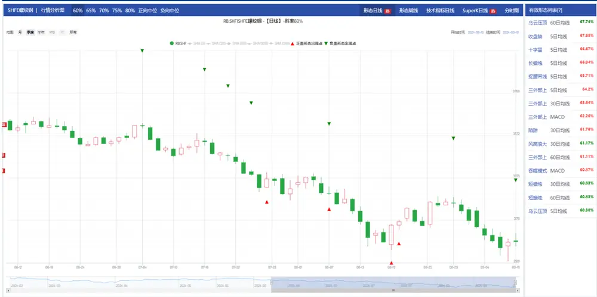
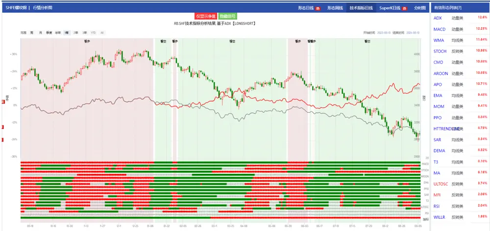
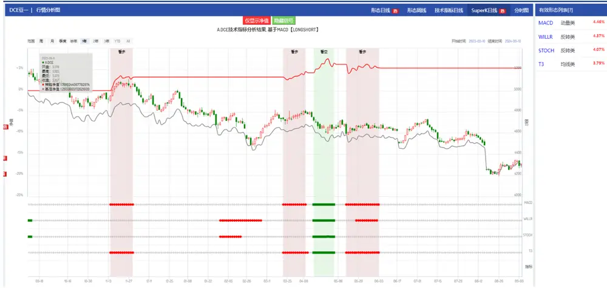

【金工点评】

# 形态学研究之十二：期货形态和技术分析

## 摘要

K 线的本质内涵是多空双方资金在争夺主导权而留下来的轨迹，通过研究 K线形态，我们能够深入地观察到市场的真正变化。不论是宏观环境变化，还是赛道格局改变亦或是个股基本面的变化，都可以反应在 K 线形态图上。我们将形态分析作用于期货标的上，统计了自 2010 年起不同形态出现后未来 5 天的价格变化，并计算其胜率表现，具体详情查看《K线形态研究开篇：形态学初识与应用》。以螺纹钢为例，通过历史数据回测，多种形态指标的短期择时胜率超过 60%。

市场短中期的变化不仅是资产基本面变化驱动的股价变化，更是市场参与者的交易心理和由此导致的行为所形成价格外化表现。我们将常见的技术指标作用于期货上，通过历史数据回测，取得了较好的收益，具体技术分析内容请查看《技术指标研究之一：重新认识技术指标》。以螺纹钢为例，自 2010 年至今（2024/9/11），利用 ADX 指标进行择时，可以获得 12.6%的年化收益，0.61 的夏普比例，相对单纯多头螺纹钢可以获得 12.7%的超额收益。

单纯使用技术指标，往往忽视了策略择时的胜率，我们将形态和技术指标信号进行结合，当技术指标发出看多信号同时形态信号也看多时买入并持有，当技术指标看空同时形态也看空卖出。通过统计历史单次交易的收益情况可以计算出胜率。以豆一为例，自 2010 年至今（2024/9/11），策略可以获得 4.37%的年化收益，单次交易胜率为 66%。

具体形态和策略表现欢迎访问注册与登录形态云 (xingtai.pro)。

## 投资建议：

将形态和技术指标应用于期货有望获得较好的择时收益。

## 风险提示：

策略基于历史数据的回测，不保证策略未来的有效性。

## 华创证券研究所

证券分析师：王小川

电话：021-20572528

邮箱：wangxiaochuan@hcyjs.com

执业编号：S0360517100001

联系人：黄河

邮箱：huanghe@hcyjs.com

## 相关研究报告

《形态学研究之十一：基于形态研究做投资组合的几点思考》

2024-09-12

《形态学研究之十：6 种新 K线形态》

2024-07-11

《形态学研究之九：如何结合金股构建投资组合》

2024-06-30

《形态学研究之八：如何利用形态信号进行行业择时》

《K线形态研究之七：停顿线》

2023-08-07

2023-07-31

## 一、期货形态分析

K 线的本质内涵是多空双方资金在争夺主导权而留下来的轨迹，通过研究 K线形态，我们能够深入地观察到市场的真正变化。不论是宏观环境变化，还是赛道格局改变亦或是个股基本面的变化，都可以反应在 K线形态图上。我们将形态分析作用于期货标的上，统计了自2010年起不同形态出现后未来 5天的价格变化，并计算其胜率表现，具体详情查看《K线形态研究开篇：形态学初识与应用》。

其中每个品种胜率最大的形态如下表所示：

图表 1 期货形态胜率

| 品种名称 | 品种代码 | 耦合条件 | 形态名称 | 信号方向 | 胜率 |
| --- | --- | --- | --- | --- | --- |
| DCE豆一 | A.DCE | 30 日均线 | 相同低价 | 正面 | 71.43% |
| SHFE 白银 | AG.SHF | 30 日均线 | 吞噬模式 | 负面 | 69.57% |
| SHFE 铝 | AL.SHF | 60 日均线 | 塔库里 | 正面 | 70.00% |
| CZCE 苹果 | AP.CZC | MACD | 陷阱 | 正面 | 65.85% |
| SHFE 黄金 | AU.SHF | MACD | 吞噬模式 | 正面 | 70.91% |
| DCE豆二 | B.DCE | 5日均线 | 十字星 | 正面 | 69.44% |
| DCE 胶合板 | BB.DCE | 5 日均线 | 短蜡烛 | 负面 | 71.43% |
| INE 国际铜 | BC.INE | 30 日均线 | 长脚十字 | 正面 | 71.43% |
| SHFE 沥青 | BU.SHF | 30日均线 | 三外部上涨和下跌 | 负面 | 69.70% |
| DCE 玉米 | C.DCE | MACD | 吞噬模式 | 正面 | 70.59% |
| CZCE 棉花 | CF.CZC | 60日均线 | 十字孕线 | 正面 | 70.97% |
| CZCE 红枣 | CJ.CZC | MACD | 陷阱 | 正面 | 67.65% |
| DCE 玉米淀粉 | CS.DCE | 5 日均线 | 光头光脚/缺影线 | 负面 | 61.90% |
| SHFE 铜 | CU.SHF | MACD | 十字孕线 | 负面 | 67.65% |
| CZCE棉纱 | CY.CZC | 60 日均线 | 陷阱 | 负面 | 78.00% |
| DCE苯乙烯 | EB.DCE | MACD | 收盘缺影线 | 正面 | 67.39% |
| DCE乙二醇 | EG.DCE | MACD | 捉腰带线 | 正面 | 63.64% |
| DCE 纤维板 | FB.DCE | 60日均线 | 收盘缺影线 | 正面 | 68.75% |
| CZCE 玻璃 | FG.CZC | 60日均线 | 母子线 | 正面 | 67.92% |
| SHFE 燃油 | FU.SHF | 60日均线 | 陷阱 | 正面 | 65.00% |
| SHFE 热轧卷板 | HC.SHF | 30 日均线 | 陷阱 | 正面 | 69.05% |
| DCE 铁矿石 | I.DCE | MACD | 光头光脚/缺影线 | 负面 | 66.67% |
| DCE焦炭 | J.DCE | MACD | 陷阱 | 负面 | 69.35% |
| DCE鸡蛋 | JD.DCE | 5 日均线 | 长蜡烛 | 负面 | 74.19% |
| DCE焦煤 | JM.DCE | MACD | 陷阱 | 正面 | 63.33% |
| DCE 塑料 | L.DCE | 5 日均线 | 长蜡烛 | 正面 | 65.91% |
| GFEX 碳酸锂 | LC.GFE | 5 日均线 | 长蜡烛 | 负面 | 66.67% |
| DCE 生猪 | LH.DCE | 5日均线 | 陷阱 | 负面 | 70.45% |
| CZCE 晚籼稻 | LR.CZC | MACD | 长蜡烛 | 负面 | 65.85% |
| INE 低硫燃料油 | LU.INE | 5日均线 | 纺锤 | 正面 | 74.36% |
| DCE 豆粕 | M.DCE | MACD | 陷阱 | 负面 | 75.00% |
| CZCE 甲醇 | MA.CZC | 5日均线 | 陷阱 | 正面 | 70.97% |
| CZCE 甲醇 | ME.CZC | MACD | 捉腰带线 | 负面 | 69.23% |
| SHFE 镍 | NI.SHF | 5日均线 | 光头光脚/缺影线 | 正面 | 68.57% |
| INE20 号胶 | NR.INE | 60 日均线 | 陷阱 | 正面 | 74.19% |
| CZCE 菜油 | OI.CZC | 5 日均线 | 收盘缺影线 | 正面 | 65.91% |
| DCE 棕榈油 | P.DCE | 5日均线 | 长蜡烛 | 正面 | 63.49% |
| SHFE 铅 | PB.SHF 60 | 日均线 | 母子线 | 负面 | 70.18% |
| CZCE 短纤 | PF.CZC | 60 日均线 | 纺锤 | 负面 | 72.13% |
| DCE LPG | PG.DCE | MACD | 收盘缺影线 | 正面 | 71.74% |
| CZCE普麦 | PM.CZC | 60 日均线 | 长脚十字 | 正面 | 64.86% |
| DCE聚丙烯 | PP.DCE | 30 日均线 | 母子线 | 正面 | 64.71% |
| SHFE 螺纹钢 | RB.SHF | 60 日均线 | 乌云压顶 | 负面 | 67.74% |
| CZCE 早籼稻 | RI.CZC | 30 日均线 | 陷阱 | 正面 | 66.67% |
| CZCE 菜粕 | RM.CZC | 60 日均线 | 母子线 | 负面 | 70.59% |
| CZCE菜油 | RO.CZC | 30 日均线 | 母子线 | 正面 | 72.97% |
| DCE 粳米 | RR.DCE | 60 日均线 | 风高浪大线 | 负面 | 63.89% |
| CZCE 菜籽 | RS.CZC | 30 日均线 | 纺锤 | 负面 | 71.43% |
| SHFE 橡胶 | RU.SHF 60 | 日均线 | 纺锤 | 正面 | 70.27% |
| CZCE 纯碱 | SA.CZC | 5日均线 | 纺锤 | 负面 | 68.75% |
| INE原油 | SC.INE | 30 日均线 | 短蜡烛 | 正面 | 74.00% |
| CZCE 硅铁 | SF.CZC | 60 日均线 | 短蜡烛 | 负面 | 64.10% |
| GFEX 工业硅 | SI.GFE | 30 日均线 | 长蜡烛 | 负面 | 69.23% |
| CZCE 锰硅 | SM.CZC | 60 日均线 | 母子线 | 负面 | 73.53% |
| SHFE 锡 | SN.SHF | MACD | 母子线 | 正面 | 71.43% |
| SHFE 纸浆 | SP.SHF | 30 日均线 | 风高浪大线 | 正面 | 64.41% |
| CZCE 白糖 | SR.CZC | MACD | 家鸽 | 正面 | 65.71% |
| SHFE 不锈钢 | SS.SHF | MACD | 风高浪大线 | 正面 | 75.93% |
| CFFEX10 年期国债期货 | T.CFE | 60 日均线 | 短蜡烛 | 正面 | 72.00% |
| CZCE PTA | TA.CZC | MACD | 风高浪大线 | 正面 | 65.03% |
| CZCE 动力煤 | TC.CZC | MACD | 纺锤 | 负面 | 82.35% |
| CFFEX5 年期国债期货 | TF.CFE | 5日均线 | 长蜡烛 | 正面 | 69.23% |
| CFFEX2 年期国债期货 | TS.CFE | MACD | 长蜡烛 | 正面 | 67.69% |
| CZCE 尿素 | UR.CZC | MACD | 短蜡烛 | 负面 | 76.92% |
| DCE PVC | V.DCE | 30 日均线 | 母子线 | 负面 | 70.83% |
| CZCE 强麦 | WH.CZC | 5日均线 | 陷阱 | 正面 | 87.88% |
| SHFE 线材 | WR.SHF | MACD | 吞噬模式 | 正面 | 69.44% |
| CZCE 强麦 | WS.CZC | MACD | 陷阱 | 负面 | 75.00% |
| CZCE硬麦 | WT.CZC | 30日均线 | 纺锤 | 正面 | 70.97% |
| DCE豆油 | Y.DCE | 60日均线 | 十字孕线 | 正面 | 69.70% |
| CZCE动力煤 | ZC.CZC | 60日均线 | 陷阱 | 负面 | 68.89% |
| SHFE 锌 | ZN.SHF | MACD | 母子线 | 正面 | 63.41% |

资料来源：wind，华创证券

以螺纹钢为例，通过历史数据回测，可以看到多种形态指标的短期择时胜率超过60%。

图表 2 螺纹钢形态择时表现

资料来源：华创证券

## 二、期货技术分析

市场短中期的变化不仅是资产基本面变化驱动的股价变化，更是市场参与者的交易心理和由此导致的行为所形成价格外化表现。我们将常见的技术指标作用于期货上，通过历史数据回测，取得了较好的收益，具体技术分析内容请查看《技术指标研究之一：重新认识技术指标》。

下表列举了不同品种在何种技术指标择时下可以获得的最佳收益：

图表 3 期货技术分析结果

| 品种代码 | 技术指标名 | 建仓方式 | 年化收益 | 夏普比例 | 择时最大回撤 | 超额收益 |
| --- | --- | --- | --- | --- | --- | --- |
| A.DCE | MACD | 多空 | 7.04% | 0.47 | -36.89% | 3.73% |
| AG.SHF | STOCH | 多空 | 17.51% | 0.82 | -46.48% | 14.48% |
| AL.SHF | MACD | 多空 | 10.52% | 0.66 | -31.83% | 8.97% |
| AO.SHF | MFI | 多空 | 47.38% | 1.67 | -14.28% | 9.36% |
| AP.CZC | ULTOSC | 多空 | 37.63% | 1.10 | -46.45% | 33.73% |
| AU.SHF | MACD | 单纯做多 | 7.69% | 0.81 | -10.96% | 0.84% |
| B.DCE | WMA | 多空 | 8.88% | 0.47 | -52.91% | 6.76% |
| BB.DCE | WILLR | 多空 | 25.95% | 0.72 | -59.81% | 17.42% |
| BC.INE | BBANDS | 多空 | 18.15% | 0.95 | -24.41% | 8.51% |
| BR.SHF | SAR | 多空 | 77.06% | 2.28 | -9.84% | 27.94% |
| BU.SHF | MFI | 多空 | 21.03% | 0.78 | -52.16% | 22.11% |
| C.DCE | PPO | 多空 | 7.80% | 0.61 | -23.31% | 4.28% |
| CF.CZC | PPO | 多空 | 12.04% | 0.68 | -39.12% | 11.99% |
| CJ.CZC | ULTOSC | 多空 | 37.73% | 1.14 | -26.89% | 29.61% |
| CS.DCE | DEMA | 多空 | 12.37% | 0.78 | -28.57% | 12.08% |
| CU.SHF | APO | 多空 | 14.01% | 0.69 | -38.30% | 6.95% |
| CY.CZC | STOCH | 多空 | 19.05% | 1.11 | -18.53% | 19.58% |
| EB.DCE | AROON | 多空 | 31.78% | 1.17 | -29.34% | 24.33% |
| EG.DCE | WILLR | 多空 | 28.62% | 1.02 | -42.00% | 28.84% |
| ER.CZC | MFI | 多空 | 15.83% | 1.16 | -17.44% | 8.44% |
| FB.DCE | CCI | 多空 | 57.47% | 0.37 | -63.45% | 17.71% |
| FG.CZC | ULTOSC | 多空 | 15.19% | 0.68 | -59.95% | 15.47% |
| FU.SHF | MACD | 多空 | 15.77% | 0.59 | -36.24% | 13.14% |
| HC.SHF | APO | 多空 | 23.48% | 0.94 | -29.18% | 21.39% |
| I.DCE | MACD | 多空 | 20.13% | 0.72 | -42.98% | 19.29% |
| J.DCE | MACD | 多空 | 22.18% | 0.77 | -49.98% | 21.76% |
| JD.DCE | ULTOSC | 多空 | 23.66% | 0.83 | -32.36% | 22.05% |
| JM.DCE | APO | 多空 | 20.45% | 0.69 | -48.75% | 18.77% |
| JR.CZC | ULTOSC | 多空 | 19.54% | 0.94 | -13.18% | 18.73% |
| L.DCE | T3 | 多空 | 10.11% | 0.56 | -48.07% | 11.81% |
| LH.DCE | ULTOSC | 多空 | 32.79% | 0.91 | -30.61% | 41.51% |
| LR.CZC | AROON | 多空 | 6.87% | 0.44 | -28.98% | 7.10% |
| LU.INE | ULTOSC | 多空 | 68.30% | 1.74 | -29.05% | 40.28% |
| M.DCE | SAR | 多空 | 11.56% | 0.64 | -63.74% | 8.86% |
| MA.CZC | ADX | 多空 | 10.65% | 0.52 | -42.87% | 12.15% |
| ME.CZC | STOCH | 多空 | 27.16% | 1.28 | -17.56% | 31.19% |
| NI.SHF | APO | 多空 | 29.72% | 0.96 | -30.15% | 23.76% |
| NR.INE | STOCH | 多空 | 38.63% | 1.34 | -23.37% | 27.26% |
| OI.CZC | CMO | 多空 | 10.01% | 0.57 | -35.72% | 10.26% |
| P.DCE | AROON | 多空 | 9.78% | 0.49 | -43.14% | 9.47% |
| PB.SHF | MFI | 多空 | 8.87% | 0.56 | -31.58% | 9.45% |
| PF.CZC | ULTOSC | 多空 | 34.21% | 1.51 | -24.88% | 24.46% |
| PG.DCE | ULTOSC | 多空 | 44.36% | 1.25 | -47.66% | 19.12% |
| PK.CZC | MFI | 多空 | 21.22% | 1.08 | -18.88% | 24.19% |
| PM.CZC | STOCH | 多空 | 8.70% | 0.50 | -28.38% | 5.89% |
| PP.DCE | ULTOSC | 多空 | 12.47% | 0.64 | -48.80% | 15.38% |
| RB.SHF | ADX | 多空 | 12.60% | 0.61 | -50.35% | 12.74% |
| RI.CZC | WILLR | 多空 | 6.86% | 0.47 | -20.81% | 5.28% |
| RM.CZC | ULTOSC | 多空 | 17.16% | 0.76 | -50.75% | 15.35% |
| RO.CZC | PPO | 多空 | 22.26% | 1.02 | -25.69% | 20.20% |
| RR.DCE | WILLR | 多空 | 10.22% | 1.19 | -7.57% | 10.15% |
| RS.CZC | WILLR | 多空 | 14.68% | 0.61 | -38.21% | 14.02% |
| RU.SHF | MACD | 多空 | 21.78% | 0.79 | -53.37% | 16.68% |
| SA.CZC | STOCH | 多空 | 46.43% | 1.14 | -53.74% | 39.58% |
| SC.INE | STOCH | 多空 | 26.12% | 0.88 | -49.29% | 18.31% |
| SF.CZC | MOM | 多空 | 22.73% | 0.81 | -51.49% | 19.98% |
| SI.GFE | PPO | 多空 | 44.31% | 1.85 | -11.57% | 78.20% |
| SM.CZC | MOM | 多空 | 21.22% | 0.82 | -38.93% | 18.69% |
| SN.SHF | APO | 多空 | 18.64% | 0.86 | -34.37% | 8.80% |
| SP.SHF | ULTOSC | 多空 | 18.08% | 0.92 | -28.08% | 15.97% |
| SR.CZC | ADX | 多空 | 6.17% | 0.41 | -52.80% | 4.98% |
| SS.SHF | MOM | 多空 | 21.79% | 0.94 | -23.56% | 22.66% |
| T.CFE | MACD | 多空 | 1.61% | 0.44 | -7.94% | 0.60% |
| TA.CZC | MACD | 多空 | 19.06% | 0.81 | -42.18% | 20.47% |
| TC.CZC | MOM | 多空 | 38.16% | 1.73 | -13.30% | 45.27% |
| TF.CFE | WMA | 单纯做多 | 1.17% | 0.63 | -2.97% | 0.13% |
| TS.CFE | ADX | 多空 | 0.59% | 0.57 | -1.29% | 0.12% |
| UR.CZC | WILLR | 多空 | 26.39% | 0.93 | -56.05% | 22.36% |
| V.DCE | MACD | 多空 | 11.79% | 0.64 | -32.05% | 12.48% |
| WH.CZC | WILLR | 多空 | 5.25% | 0.40 | -29.98% | 2.20% |
| WR.SHF | DEMA | 多空 | 17.70% | 0.72 | -35.41% | 16.66% |
| WS.CZC | WILLR | 多空 | 8.85% | 0.67 | -20.13% | 4.12% |
| WT.CZC | MFI | 多空 | 6.70% | 0.52 | -25.74% | 2.01% |
| Y.DCE | MOM | 多空 | 10.37% | 0.72 | -26.67% | 6.65% |
| ZC.CZc | STOCH | 多空 | 23.13% | 0.83 | -46.57% | 15.31% |
| ZN.SHF | PPO | 多空 | 14.67% | 0.69 | -39.71% | 14.82% |

资料来源：wind，华创证券
( 2010/1/1 2024/9/11)

以螺纹钢为例，自2010年至今（2024/9/11），利用ADX 指标进行择时，可以获得 12.6%的年化收益，0.61的夏普比例，相对单纯多头螺纹钢可以获得 12.7%的超额收益。

图表 4 螺纹钢技术指标择时表现

资料来源：wind，华创证券

## 三、形态与技术指标结合的表现

单纯使用技术指标，往往忽视了策略择时的胜率，我们将形态和技术指标的择时信号进行结合，当技术指标发出看多信号同时形态信号也看多时买入并持有，当技术指标看空同时形态也看空卖出。通过统计历史单次交易的收益情况可以计算出胜率，下表列出了不同品种择时胜率最高的表现情况。

图表 5 形态和技术结合的表现

| 标的代码 | 技术指标名称 | 年化收益 | 夏普比例 | 最大回撤 | 择时胜率 |
| --- | --- | --- | --- | --- | --- |
| A.DCE | WILLR | 4.37% 0 | .59 | -16.18% | 66.13% |
| AG.SHF | MA | 8.96% | 0.79 | -18.77% | 70.00% |
| AP.CZC | ULTOSC | 14.74% 0 | .68 | -25.64% | 66.67% |
| B.DCE | DEMA | 4.10% 0 | .36 | -26.34% | 61.04% |
| BU.SHF | ULTOSC | 7.17% 0 | .42 | -43.98% | 66.18% |
| CF.CZC | HTTRENDLINE | 6.01% | 0.65 | -16.84% | 65.57% |
| CJ.CZC | CCI | 3.57% | 0.29 | -57.05% | 70.59% |
| CS.DCE | MACD | 4.50% 0 | .48 | -19.12% | 63.16% |
| CU.SHF | MACD | 5.44% | 0.64 | -17.42% | 63.49% |
| CY.CZC | CCI | 5.61% | 0.45 | -23.61% | 64.58% |
| EB.DCE | WMA | 15.04% 0 | .76 | -24.28% | 69.70% |
| EG.DCE | T3 | 12.51% | 0.71 | -21.46% | 68.57% |
| FG.CZC | STOCH | 1.68% | 0.19 | -31.79% | 69.44% |
| FU.SHF | WILLR | 3.97% 0 | .31 | -37.10% | 66.10% |
| HC.SHF | CMO | 5.29% 0 | .47 - | 19.19% | 67.65% |
| I.DCE | STOCH | 11.98% | 0.54 | -48.30% | 63.01% |
| J.DCE | CMO | 4.89% | 0.39 | -46.22% | 63.16% |
| JD.DCE | CMO | 2.18% | 0.22 | -43.16% | 66.00% |
| JM.DCE | AROON | 8.62% | 0.54 - | 39.19% | 64.10% |
| L.DCE | ADX | 1.98% | 0.24 | -24.26% | 60.61% |
| M.DCE | MOM | 8.35% 0 | .67 - | 20.87% | 62.79% |
| MA.CZC | ADX | 15.38% 0 | .99 | -19.15% | 68.35% |
| NI.SHF | ULTOSC | 11.82% | 0.67 - | 29.61% | 68.18% |
| NR.INE | SAR | 4.79% | 0.32 | -33.09% | 64.71% |
| OI.CZC | MFI | 4.84% | 0.61 | -20.84% | 62.96% |
| P.DCE | T3 | 6.37% | 0.52 | -20.02% | 62.50% |
| PB.SHF | ULTOSC | 2.24% | 0.33 | -16.14% | 63.46% |
| PG.DCE | ULTOSC | 20.40% 0 | .80 - | 40.00% | 63.89% |
| PP.DCE | STOCH | 9.39% | 0.74 - | 14.80% | 72.92% |
| RI.CZC | MACD | 2.87% | 0.30 | -17.70% | 74.19% |
| RM.CZC | ULTOSC | 11.18% | 0.60 | -39.41% | 68.12% |
| RU.SHF | MA | 0.94% | 0.15 | -26.30% | 62.50% |
| SF.CZC | AROON | 18.47% | 0.95 | -37.38% | 74.42% |
| SM.CZC | AROON | 11.21% | 0.89 | -16.56% | 65.71% |
| SN.SHF | PPO | 25.37% | 1.22 | -38.72% | 68.85% |
| SP.SHF | MOM | 17.61% | 1.04 | -14.84% | 63.16% |
| SR.CZC | MFI | 2.04% 0 | .29 | -28.77% | 62.12% |
| UR.CZC | CCI | 10.42% | 0.60 | -26.69% | 67.65% |
| V.DCE | CCI | 4.15% | 0.53 | -15.60% | 70.27% |
| WH.CZC | CCI | 2.00% | 0.24 | -26.40% | 60.38% |
| zc.CZC | SAR | 8.71% | 0.45 - | 54.91% | 63.83% |
| ZN.SHF | T3 | 2.12% | 0.27 | -17.14% | 61.70% |

资料来源：wind，华创证券
( 2010/1/1 2024/9/11)

以豆一为例，自2010年至今（2024/9/11），策略可以获得4.37%的年化收益，单次交易胜率为 66%。

图表 6 豆一期货和形态结合表现

资料来源：wind，华创证券

## 四、形态学信号的获取

华创金工为了更方便大家使用形态信号，我们直接将形态信号API化，可以直接通过API获取形态信号。

可以通过 Python的接口直接获取形态学系统中全部的形态介绍、形态定义与每日出现的信号，可以获取历史的与最新的信号。

## 五、风险提示

策略基于历史数据的回测，不保证策略未来的有效性。

## 金融工程组团队介绍

组长、首席分析师：王小川

同济大学管理学博士。2017年加入华创证券研究所。

助理研究员：杨宸祎

美国伊利诺伊大学香槟分校会计学、金融工程学硕士，CFA。2021年加入华创证券研究所。

助理研究员：黄河

东华大学工学博士，FRM。2023年加入华创证券研究所。

助理研究员：洪远

华南理工大学金融硕士。2023年加入华创证券研究所。

助理研究员：刘依凡

上海财经大学金融统计博士。2024年加入华创证券研究所。

## 华创证券机构销售通讯录

| 地区 | 姓名 | 职务 | 办公电话 | 企业邮箱 |
| --- | --- | --- | --- | --- |
| 北京机构销售部 | 张昱洁 | 副总经理、北京机构销售总监 010 | -63214682 | zhangyujie@hcyjs.com |
|  | 张菲菲 | 北京机构副总监 | 010-63214682 | zhangfeifei@hcyjs.com |
|  | 刘懿 | 副总监 | 010-63214682 | liuyi@hcyjs.com |
|  | 侯春钰 | 资深销售经理 | 010-63214682 | houchunyu@hcyjs.com |
|  | 过云龙 | 高级销售经理 | 010-63214682 | guoyunlong@hcyjs.com |
|  | 蔡依林 | 资深销售经理 | 010-66500808 | caiyilin@hcyjs.com |
|  | 刘颖 | 资深销售经理 | 010-66500821 | liuying5@hcyjs.com |
|  | 顾翎蓝 | 资深销售经理 | 010-63214682 | gulinglan@hcyjs.com |
|  | 车一哲 | 销售经理 |  | cheyizhe@hcyjs.com |
| 深圳机构销售部 | 张娟 | 副总经理、深圳机构销售总监 0755 | -82828570 | zhangjuan@hcyjs.com |
|  | 汪丽燕 | 高级销售经理 | 0755-83715428 | wangliyan@hcyjs.com |
|  | 张嘉慧 | 高级销售经理 | 0755-82756804 | zhangjiahui1@hcyjs.com |
|  | 王春丽 | 高级销售经理 | 0755-82871425 | wangchunli@hcyjs.com |
| 上海机构销售部 | 许彩霞 | 总经理助理、上海机构销售总监0 | 21-20572536 | xucaixia@hcyjs.com |
|  | 官逸超 | 上海机构销售副总监 | 021-20572555 | guanyichao@hcyjs.com |
|  | 黄畅 | 上海机构销售副总监 | 021-20572257-2552 | huangchang@hcyjs.com |
|  | 吴俊 | 资深销售经理 021 | -20572506 | wujun1@hcyjs.com |
|  | 张佳妮 | 资深销售经理 021 | -20572585 | zhangjiani@hcyjs.com |
|  | 蒋瑜 | 高级销售经理 021 | -20572509 | jiangyu@hcyjs.com |
|  | 施嘉玮 | 高级销售经理 021 | -20572548 | shijiawei@hcyjs.com |
|  | 朱涨雨 | 高级销售经理 021 | -20572573 | zhuzhangyu@hcyjs.com |
|  | 李凯月 | 高级销售经理 |  | likaiyue@hcyjs.com |
|  | 易星 | 销售经理 |  | yixing@hcyjs.com |
|  | 张玉恒 | 销售经理 |  | zhangyuheng@hcyjs.com |
| 广州机构销售部 | 段佳音 | 广州机构销售总监 0755 | -82756805 | duanjiayin@hcyjs.com |
|  | 周玮 | 销售经理 |  | zhouwei@hcyjs.com |
|  | 王世韬 | 销售经理 |  | wangshitao1@hcyjs.com |
| 私募销售组 | 潘亚琪 | 总监 021 | -20572559 | panyaqi@hcyjs.com |
|  | 汪子阳 | 副总监 021 | -20572559 | wangziyang@hcyjs.com |
|  | 江赛专 | 副总监 0755 | -82756805 | jiangsaizhuan@hcyjs.com |
|  | 汪戈 | 高级销售经理 021 | -20572559 w | angge@hcyjs.com |
|  | 宋丹玙 | 销售经理 021 | -25072549 | songdanyu@hcyjs.com |

## 华创行业公司投资评级体系

基准指数说明：

A 股市场基准为沪深 300 指数，香港市场基准为恒生指数，美国市场基准为标普 500/纳斯达克指数。

公司投资评级说明：

强推：预期未来 6 个月内超越基准指数 20%以上；

推荐：预期未来 6 个月内超越基准指数 10%－20%；

中性：预期未来 6 个月内相对基准指数变动幅度在-10%－10%之间；

回避：预期未来 6 个月内相对基准指数跌幅在 10%－20%之间。

## 行业投资评级说明：

推荐：预期未来 3-6 个月内该行业指数涨幅超过基准指数 5%以上；

中性：预期未来 3-6 个月内该行业指数变动幅度相对基准指数-5%－5%；

回避：预期未来 3-6 个月内该行业指数跌幅超过基准指数 5%以上。

## 分析师声明

每位负责撰写本研究报告全部或部分内容的分析师在此作以下声明：

分析师在本报告中对所提及的证券或发行人发表的任何建议和观点均准确地反映了其个人对该证券或发行人的看法和判断；分析师对任何其他券商发布的所有可能存在雷同的研究报告不负有任何直接或者间接的可能责任。

## 免责声明

本报告仅供华创证券有限责任公司（以下简称“本公司”）的客户使用。本公司不会因接收人收到本报告而视其为客户。

本报告所载资料的来源被认为是可靠的，但本公司不保证其准确性或完整性。本报告所载的资料、意见及推测仅反映本公司于发布本报告当日的判断。在不同时期，本公司可发出与本报告所载资料、意见及推测不一致的报告。本公司在知晓范围内履行披露义务。

报告中的内容和意见仅供参考，并不构成本公司对具体证券买卖的出价或询价。本报告所载信息不构成对所涉及证券的个人投资建议，也未考虑到个别客户特殊的投资目标、财务状况或需求。客户应考虑本报告中的任何意见或建议是否符合其特定状况，自主作出投资决策并自行承担投资风险，任何形式的分享证券投资收益或者分担证券投资损失的书面或口头承诺均为无效。本报告中提及的投资价格和价值以及这些投资带来的预期收入可能会波动。

本报告版权仅为本公司所有，本公司对本报告保留一切权利。未经本公司事先书面许可，任何机构和个人不得以任何形式翻版、复制、发表、转发或引用本报告的任何部分。如征得本公司许可进行引用、刊发的，需在允许的范围内使用，并注明出处为“华创证券研究”，且不得对本报告进行任何有悖原意的引用、删节和修改。

证券市场是一个风险无时不在的市场，请您务必对盈亏风险有清醒的认识，认真考虑是否进行证券交易。市场有风险，投资需谨慎。

## 华创证券研究所

| 北京总部 | 广深分部 | 上海分部 |
| --- | --- | --- |
| 地址：北京市西城区锦什坊街26号 恒奥中心 C 座 3A | 地址：深圳市福田区香梅路1061号中投国 际商务中心A 座19楼 | 地址：上海市浦东新区花园石桥路33号 花旗大厦 12 层 |
| 邮编：100033 传真：010-66500801 | 邮编：518034 | 邮编：200120 |
|  | 传真：0755-82027731 | 传真：021-20572500 |
| 会议室：010-66500900 | 会议室：0755-82828562 | 会议室：021-20572522 |