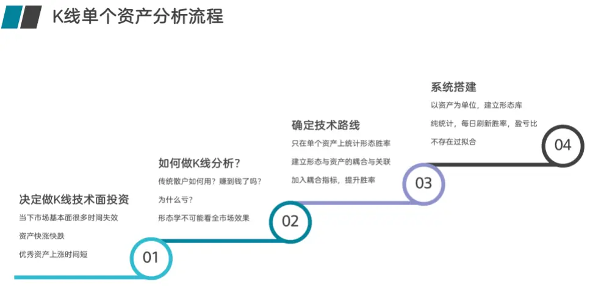
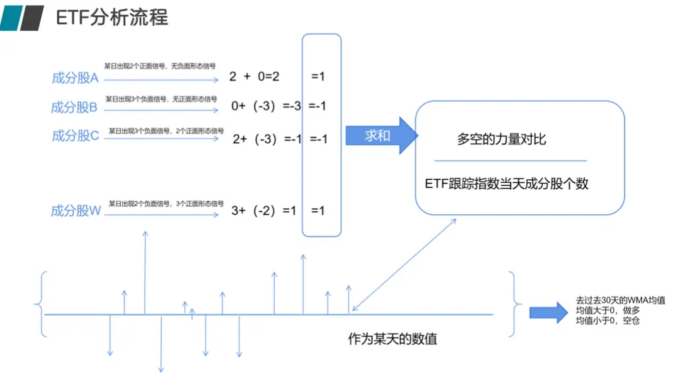
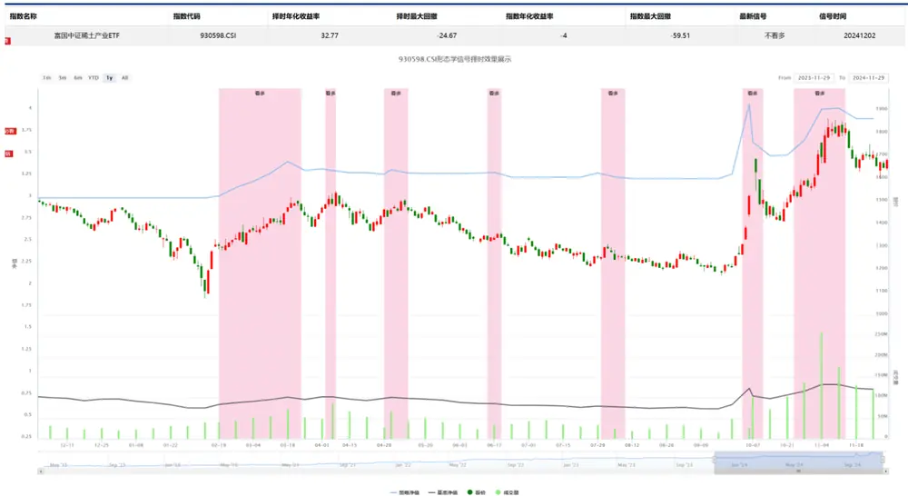

【点评报告】

# 形态学研究之十三：形态学在 ETF上的择时研究

## 摘要

ETF 是英文 Exchange Traded Fund 的缩写，中文全称为“交易型开放式指数基金”，又称“交易所交易基金”。是在交易所上市交易的开放式基金，集合了封闭式基金和开放式基金的优点。投资者既可以在场外（一级市场）向基金公司申购或赎回份额，又可以像封闭式基金和股票一样在场内（二级市场）按市场价格买卖基金份额。越来越多的人关注 ETF，吸引着资金不断的流入，全市场的 ETF 总份额持续增加。

如今，越来越多的投资人选择 ETF 来投资市场，但如何把握 ETF 的交易信号，做好 ETF 择时，将 ETF 像股票一样交易并获利，成为了困扰行业的重要问题。因为 ETF 的跟踪标的也是指数，因此我们在 ETF 上继续尝试使用跟踪指数成分股形态合成指数信号来对 ETF 进行择时。

在对富国基金的 36 支 ETF 测试后，自 2010 年至今（2024/12/2），基于形态的ETF 择时可以在所有 ETF 产品中获得超额收益，稳定跑赢买入持有 ETF 策略。这为 ETF 择时提供了全新的思路和方法。

## 风险提示：

模型结果基于历史数据测算，不保证未来数据的有效性

## 华创证券研究所

证券分析师：王小川

电话：021-20572528

邮箱：wangxiaochuan@hcyjs.com

执业编号：S0360517100001

联系人：黄河

邮箱：huanghe@hcyjs.com

## 相关研究报告

《形态学研究之十二：期货形态和技术分析》2024-09-13

## 一、ETF 介绍

ETF 是英文 Exchange Traded Fund 的缩写，中文全称为“交易型开放式指数基金”，又称“交易所交易基金”。是在交易所上市交易的开放式基金，集合了封闭式基金和开放式基金的优点。现如今越来越多的人关注 ETF，吸引着资金不断的流入，全市场的ETF总份额持续增加。

投资者既可以在场外（一级市场）向基金公司申购或赎回份额，又可以像封闭式基金和股票一样在场内（二级市场）按市场价格买卖基金份额。

从ETF的名称可以知道：

第一，它是交易型，可以像股票一样在场内买卖；

第二，它是开放式，可以在场外向基金公司申购或赎回份额；

第三，它是指数基金，ETF 跟踪的是各种特定的指数

常见的市场上的 ETF投资策略有：

定期投资（定投）：定投是一种长期投资方式，需要适当择时，并学会止盈，以保护投资成果。

BHR 策略（Buy-Hold-Rebalance）：即买入、持有、再平衡。这是一种被动型投资策略，适合长期持有ETF 基金。

核心卫星策略：构建一个包含核心和卫星两部分的投资组合，核心部分承担主要风险和收益，卫星部分力争获取超额收益。

套利策略：包括折价套利和溢价套利，利用 ETF市场价格与其净值之间的差异进行套利操作。

如今，越来越多的投资人选择ETF 来投资市场，但如何把握ETF 的交易信号，做好ETF择时，将ETF 像股票一样交易并获利，成为了困扰行业的重要问题。

## 二、基于成分股的形态学 ETF 择时算法

在前面系列报告《K 线形态研究开篇：形态学初识与应用》、《形态学研究之八：如何利用形态信号进行行业择时》中，我们提出股票后期形态必然是先期形态的结果。万事有因必有果，股票也不能例外。没有前期的积累，便没有后面的拉升。相反，没有前期的抛售，也没有后期的下跌。从这个意义上说，股票的K线形态与波浪理论、均线、箱体理论等其他形态学理论是暗合的。为此我们提出了形态与资产绑定分析的理论，并在形态学的指数择时上也是采用个股形态信号合成的方法对指数进行择时研究。

图表 1 形态学在单个资产上的分析流程

资料来源：华创证券整理

ETF 的跟踪标的也是指数，因此我们在ETF 上继续尝试使用跟踪指数成分股形态合成指数信号来对 ETF进行择时：

图表 2 形态学在ETF上的分析流程

资料来源：华创证券整理

## 三、以富国基金旗下 ETF为例，验证形态学在 ETF上的效果

上述方法中因为是基于成分股，我们的形态学系统目前不支持港股，首先我们排除成分股含有港股的ETF，选择富国基金旗下 36只ETF进行形态学分析。

我们使用ETF 跟踪指数的成分股合成指数的信号，下面测试结果不考虑手续费，仅探索跟踪指数上的择时，并假定跟踪指数可以随时交易。

图表 3 形态学在富国ETF跟踪指数上的表现

| 标的代码 | 技术指标名称 | 策略年化 | 策略最大回撤 | 指数年化 | 指数最大回撤 |
| --- | --- | --- | --- | --- | --- |
| 159713.0F | 稀土ETF | 32.77% | -24.67% | -4.00% | -59.51% |
| 159886.0F 机械 | ETF | 29.58% | -30.08% | 3.22% | -71.49% |
| 516750.OF | 建材 ETF | 29.07% | -36.14% | 4.41% | -62.85% |
| 159971.OF | 创业板ETF 富国 | 29.02% | -39.34% | 6.28% | -70.30% |
| 159629.OF | 1000ETF | 27.13% | -37.77% | -0.68% | -72.89% |
| 515250.0F | 智能汽车ETF | 25.79% | -35.33% | 6.20% | -51.87% |
| 159974.0F | 央企创新 ETF | 24.64% | -14.11% | 6.37% | -24.72% |
| 515750.0F | 科技 50ETF | 23.54% | -21.15% | 4.14% | -46.34% |
| 563220.0F | 中证 A500ETF 富国 | 23.40% | -21.38% | 1.74% | -49.12% |
| 512710.0F | 军工龙头ETF | 23.39% | -34.96% | 1.21% | -57.74% |
| 561100.OF | 消费电子 ETF富国 | 21.43% | -13.62% | -7.14% | -54.87% |
| 516120.0F | 化工 50ETF | 20.39% | -33.49% | 0.65% | -62.64% |
| 512040.OF | 价值 100ETF | 19.38% | -15.28% | 1.77% | -32.64% |
| 561130.OF | 国货ETF | 18.52% | -24.89% | 5.16% | -51.11% |
| 515400.OF | 大数据 ETF | 17.84% | -31.05% | -3.76% | -64.98% |
| 159645.0F | 疫苗 ETF 富国 | 17.51% | -30.97% | -2.00% | -72.32% |
| 159748.0F | 创新药 ETF 富国 | 17.03% | -18.50% | -14.50% | -65.78% |
| 561180.SH | A100ETF | 16.24% | -28.49% | 0.92% | -51.23% |
| 515650.OF | 消费 50ETF | 15.90% | -24.18% | 0.89% | -58.35% |
| 515950.OF | 医药龙头 ETF | 15.40% | -26.92% | -0.73% | -64.57% |
| 561190.0F | 双碳 ETF | 15.36% | -16.53% | -11.43% | -43.28% |
| 159887.0F | 银行 ETF | 15.19% | -12.44% | 6.65% | -36.33% |
| 159825.0F | 农业 ETF | 14.92% | -33.98% | 1.02% | -56.29% |
| 561120.0F | 家电 ETF | 14.84% | -33.89% | 8.37% | -43.23% |
| 515150.0F | 一带一路ETF | 13.44% | -14.27% | 0.93% | -34.41% |
| 516830.OF | 300ESGETF | 12.48% | -16.98% | -1.16% | -46.92% |
| 510210.OF | 上证指数 ETF | 12.25% | -32.72% | 0.16% | -52.73% |
| 515850.0F | 券商指数 ETF | 8.46% | -14.61% | 4.38% | -73.70% |
| 515280.OF | 银行龙头 ETF | 7.17% | -17.83% | 1.37% | -36.33% |
| 516640.OF | 芯片龙头 ETF | 6.66% | -16.45% | 0.57% | -60.62% |
| 159766.0F | 旅游 ETF | 6.59% | -39.21% | -6.41% | -58.83% |
| 588380.OF | 双创 50ETF | 6.48% | -19.37% | -15.73% | -60.53% |
| 517100.OF | AH500ETF | 6.44% | -10.04% | -7.12% | -47.41% |
| 516910.OF | 物流 ETF | 5.15% | -41.93% | -15.20% | -65.63% |
| 561160.OF | 锂电池 ETF | 4.08% | -28.24% | -11.03% | -69.72% |
| 561170.0F | 绿电 50ETF | 0.46% | -17.19% | -1.96% | -17.21% |

wind 2010/1/1 ETF 2010 ETF

以稀土 ETF为例，自 2010年至今（2024/12/2），策略可以获得 32.77%的年化收益。收率远超买入持有收益率。下图中红色为看多 ETF区域，白色为空仓区域。

图表 4 稀土ETF跟踪指数上历近一年的交易情况

资料来源：wind，华创证券

## 四、形态学信号的获取

华创金工为了更方便大家使用形态信号，我们直接将形态信号API化，可以直接通过API获取形态信号。

可以通过 Python的接口直接获取形态学系统中全部的形态介绍、形态定义与每日出现的信号，可以获取历史的与最新的信号。

通过接口也可以完全复现我们的 ETF择时策略。

## 五、风险提示

策略基于历史数据的回测，不保证策略未来的有效性。

## 金融工程组团队介绍

组长、首席分析师：王小川

同济大学管理学博士。2017年加入华创证券研究所。

助理研究员：杨宸祎

美国伊利诺伊大学香槟分校会计学、金融工程学硕士，CFA。2021年加入华创证券研究所。

助理研究员：黄河

东华大学工学博士，FRM。2023年加入华创证券研究所。

助理研究员：洪远

华南理工大学金融硕士。2023年加入华创证券研究所。

助理研究员：刘依凡

上海财经大学金融统计博士。2024年加入华创证券研究所。

## 华创证券机构销售通讯录

| 地区 | 姓名 | 职务 | 办公电话 | 企业邮箱 |
| --- | --- | --- | --- | --- |
| 北京机构销售部 | 张昱洁 | 副总经理、北京机构销售总监 010 | -63214682 | zhangyujie@hcyjs.com |
|  | 张菲菲 | 北京机构副总监 | 010-63214682 | zhangfeifei@hcyjs.com |
|  | 张婷 | 华北机构销售副总监 |  | zhangting3@hcyjs.com |
|  | 刘懿 | 副总监 | 010-63214682 | liuyi@hcyjs.com |
|  | 侯春钰 | 资深销售经理 | 010-63214682 | houchunyu@hcyjs.com |
|  | 顾翎蓝 | 资深销售经理 | 010-63214682 | gulinglan@hcyjs.com |
|  | 蔡依林 | 资深销售经理 | 010-66500808 | caiyilin@hcyjs.com |
|  | 刘颖 | 资深销售经理 | 010-66500821 | liuying5@hcyjs.com |
|  | 阎星宇 | 销售经理 |  | yanxingyu@hcyjs.com |
|  | 张效源 | 销售经理 |  | zhangxiaoyuan@hcyjs.com |
|  | 车一哲 | 销售经理 |  | cheyizhe@hcyjs.com |
| 深圳机构销售部 | 张娟 | 副总经理、深圳机构销售总监 0755 | -82828570 | zhangjuan@hcyjs.com |
|  | 汪丽燕 | 高级销售经理 | 0755-83715428 | wangliyan@hcyjs.com |
|  | 张嘉慧 | 高级销售经理 | 0755-82756804 | zhangjiahuil@hcyjs.com |
|  | 王春丽 | 高级销售经理 | 0755-82871425 | wangchunli@hcyjs.com |
|  | 王越 | 高级销售经理 |  | wangyue5@hcyjs.com |
|  | 温雅迪 | 销售经理 |  | wenyadi@hcyjs.com |
| 上海机构销售部 | 许彩霞 | 总经理助理、上海机构销售总监0 | 21-20572536 | xucaixia@hcyjs.com |
|  | 官逸超 | 上海机构销售副总监 | 021-20572555 | guanyichao@hcyjs.com |
|  | 黄畅 | 上海机构销售副总监 | 021-20572257-2552 | huangchang@hcyjs.com |
|  | 吴俊 | 资深销售经理 | 021-20572506 | wujun1@hcyjs.com |
|  | 张佳妮 | 资深销售经理 | 021-20572585 | zhangjiani@hcyjs.com |
|  | 郭静怡 | 高级销售经理 |  | guojingyi@hcyjs.com |
|  | 蒋瑜 | 高级销售经理 | 021-20572509 | jiangyu@hcyjs.com |
|  | 吴菲阳 | 高级销售经理 |  | wufeiyang@hcyjs.com |
|  | 朱涨雨 | 高级销售经理 | 021-20572573 | zhuzhangyu@hcyjs.com |
|  | 李凯月 | 高级销售经理 |  | likaiyue@hcyjs.com |
|  | 张豫蜀 | 销售经理 | 15301633144 | zhangyushu@hcyjs.com |
|  | 张玉恒 | 销售经理 |  | zhangyuheng@hcyjs.com |
|  | 易星 | 销售经理 |  | yixing@hcyjs.com |
|  | 张晨奂 | 销售经理 |  | zhangchenhuan@hcyjs.com |
| 广州机构销售部 | 段佳音 | 广州机构销售总监 | 0755-82756805 | duanjiayin@hcyjs.com |
|  | 周玮 | 销售经理 |  | zhouwei@hcyjs.com |
|  | 王世韬 | 销售经理 |  | wangshitao1@hcyjs.com |
| 私募销售组 | 潘亚琪 | 总监 | 021-20572559 | panyaqi@hcyjs.com |
|  | 汪子阳 | 副总监 | 021-20572559 | wangziyang@hcyjs.com |
|  | 江赛专 | 副总监 0755 | -82756805 | jiangsaizhuan@hcyjs.com |
|  | 汪戈 | 高级销售经理 | 021-20572559 | wangge@hcyjs.com |
|  | 宋丹 | 销售经理 | 021-25072549 | songdanyu@hcyjs.com |
|  | 赵毅 | 销售经理 |  | zhaoyi@hcyjs.com |
|  | 胡玉青 | 销售经理 |  | huyuqing@hcyjs.com |

## 华创行业公司投资评级体系

基准指数说明：

A 股市场基准为沪深 300 指数，香港市场基准为恒生指数，美国市场基准为标普 500/纳斯达克指数。

公司投资评级说明：

强推：预期未来 6 个月内超越基准指数 20%以上；

推荐：预期未来 6 个月内超越基准指数 10%－20%；

中性：预期未来 6 个月内相对基准指数变动幅度在-10%－10%之间；

回避：预期未来 6 个月内相对基准指数跌幅在 10%－20%之间。

## 行业投资评级说明：

推荐：预期未来 3-6 个月内该行业指数涨幅超过基准指数 5%以上；

中性：预期未来 3-6 个月内该行业指数变动幅度相对基准指数-5%－5%；

回避：预期未来 3-6 个月内该行业指数跌幅超过基准指数 5%以上。

## 分析师声明

每位负责撰写本研究报告全部或部分内容的分析师在此作以下声明：

分析师在本报告中对所提及的证券或发行人发表的任何建议和观点均准确地反映了其个人对该证券或发行人的看法和判断；分析师对任何其他券商发布的所有可能存在雷同的研究报告不负有任何直接或者间接的可能责任。

## 免责声明

本报告仅供华创证券有限责任公司（以下简称“本公司”）的客户使用。本公司不会因接收人收到本报告而视其为客户。

本报告所载资料的来源被认为是可靠的，但本公司不保证其准确性或完整性。本报告所载的资料、意见及推测仅反映本公司于发布本报告当日的判断。在不同时期，本公司可发出与本报告所载资料、意见及推测不一致的报告。本公司在知晓范围内履行披露义务。

报告中的内容和意见仅供参考，并不构成本公司对具体证券买卖的出价或询价。本报告所载信息不构成对所涉及证券的个人投资建议，也未考虑到个别客户特殊的投资目标、财务状况或需求。客户应考虑本报告中的任何意见或建议是否符合其特定状况，自主作出投资决策并自行承担投资风险，任何形式的分享证券投资收益或者分担证券投资损失的书面或口头承诺均为无效。本报告中提及的投资价格和价值以及这些投资带来的预期收入可能会波动。

本报告版权仅为本公司所有，本公司对本报告保留一切权利。未经本公司事先书面许可，任何机构和个人不得以任何形式翻版、复制、发表、转发或引用本报告的任何部分。如征得本公司许可进行引用、刊发的，需在允许的范围内使用，并注明出处为“华创证券研究”，且不得对本报告进行任何有悖原意的引用、删节和修改。

证券市场是一个风险无时不在的市场，请您务必对盈亏风险有清醒的认识，认真考虑是否进行证券交易。市场有风险，投资需谨慎。

## 华创证券研究所

| 北京总部 | 广深分部 | 上海分部 |
| --- | --- | --- |
| 地址：北京市西城区锦什坊街26号 恒奥中心 C 座 3A | 地址：深圳市福田区香梅路1061号中投国 际商务中心A 座19楼 | 地址：上海市浦东新区花园石桥路33号 花旗大厦 12 层 |
| 邮编：100033 传真：010-66500801 | 邮编：518034 | 邮编：200120 |
|  | 传真：0755-82027731 | 传真：021-20572500 |
| 会议室：010-66500900 | 会议室：0755-82828562 | 会议室：021-20572522 |