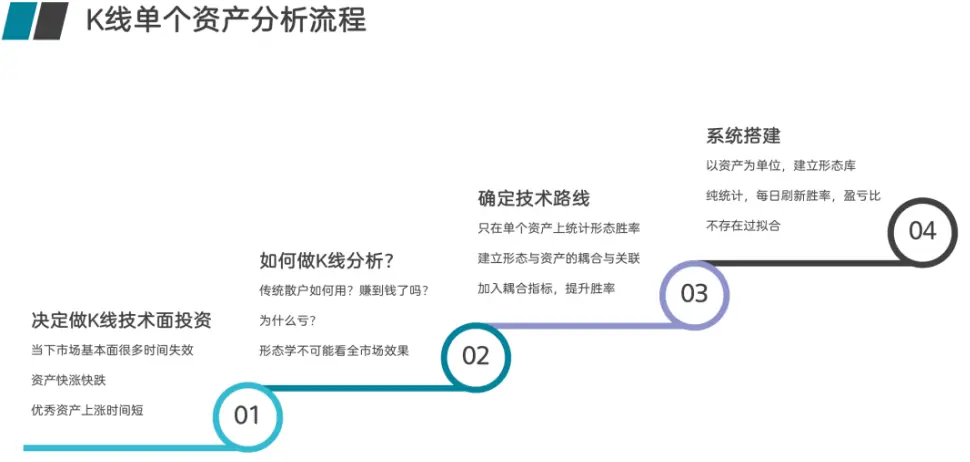
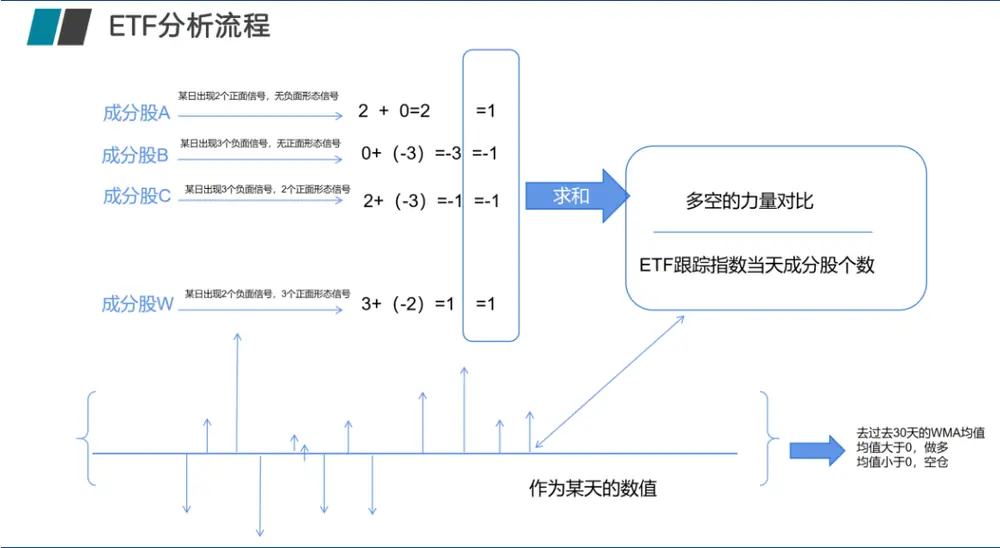
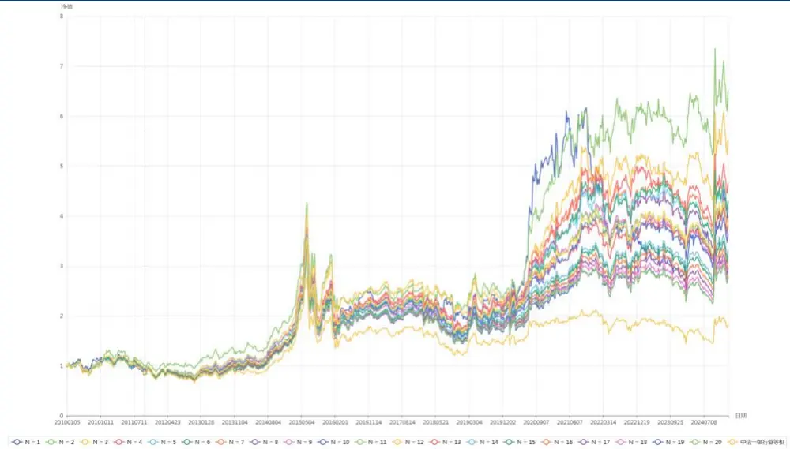
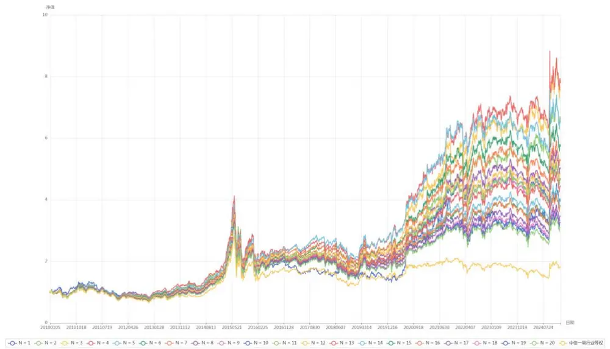
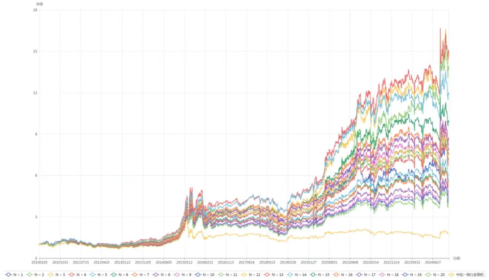
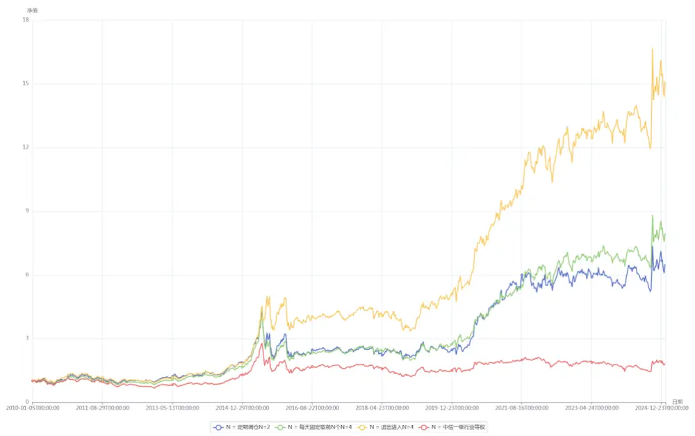

【点评报告】

# 形态学研究之十四：形态学在行业轮动上的研究

## 摘要

行业轮动策略是一种基于行业轮动现象的投资策略，通过在不同经济周期或市场环境下，选择表现较好的行业进行投资，以获取超额收益。

随着市场的发展，行业轮动的频率逐渐加快，市场上基于各种逻辑的行业轮动策略较多，但很难把握行业涨跌脉搏，紧跟市场步伐。

本篇，我们提出了使用形态作为原始数据，将行业成分股合成行业信号的方式来做行业轮动。在先前报告中，我们已经成功基于成分股的形态构建了指数、ETF 的择时策略，现在就是设计指标将同一截面下的各个行业指数数据可比，就可以构建行业轮动策略。

当我们把行业指数每天的多空个股个数求和后，除以当时该行业指数的成分股个数，在进行 30 天的 HMA 均线求解后，该指标就表征了该指数从结构上形态学的看多或者看空力量的变化与对比，由于都除以了成分股个数，也消除了不同行业因为成分股个数不同不可比的情况。

基于历史数据回测，不管是固定时间点调仓、每日调仓、或者是买入持有信号消失退出策略等，都跑赢行业等权策略。固定时间点调仓策略优势在于计算量少，交易次数低，手续费少，但收益率也一般；每日调仓策略优势在于紧跟行业成分股变化，但计算量较大，交易次数也较多，对手续费敏感；而买入持有信号消失退出策略则兼顾了前两种策略的优势，充分利用了信号的特性也尊重了低频换手的规则。从目前数据来看，买入持有信号消失退出策略是更佳行业轮动信号。

## 风险提示：

模型结果基于历史数据测算，不保证未来数据的有效性

## 华创证券研究所

证券分析师：王小川

电话：021-20572528

邮箱：wangxiaochuan@hcyjs.com

执业编号：S0360517100001

联系人：黄河

邮箱：huanghe@hcyjs.com

## 相关研究报告

《形态学研究之十二：期货形态和技术分析》

2024-09-13

## 一、行业轮动策略介绍

行业轮动策略是一种基于行业轮动现象的投资策略，通过在不同经济周期或市场环境下，选择表现较好的行业进行投资，以获取超额收益。

A 股历史上确实存在行业轮动现象，主要形成轮动的原因有：

1. 经济周期影响：不同行业在经济周期的不同阶段表现各异。例如，经济复苏时，周期性行业（如金融、地产、原材料）表现较好；经济衰退时，防御性行业（如消费、医药）更具优势。

2. 政策驱动：政策变化（如产业政策、货币政策）会对特定行业产生显著影响。

3. 市场情绪：市场情绪和资金流向也会导致行业轮动。

按照轮动形成的原因，A股目前的行业轮动做法有以下几种：

1. 基于经济周期的行业轮动策略，常见的经济周期模型包括美林时钟和增长-通胀框架。

2. 动量轮动策略动量策略，基于“强者恒强”的逻辑，选择近期表现强势的行业进行配置。该策略优点：简单易行，适合趋势性市场。但缺点也非常明显：在震荡市中可能频繁调仓，增加交易成本。

3. 反转轮动策略，反转策略基于“均值回归”的逻辑，选择近期表现较差的行业进行配置，期待其反弹。其优点为：适合震荡市或均值回归明显的市场。其缺点：在趋势性市场中可能表现不佳。

4.估值轮动策略，基于行业估值水平（如市盈率PE、市净率 PB）进行轮动，选择估值较低的行业进行配置。优点：风险较低，适合价值投资者。缺点：低估值行业可能长期表现不佳，需结合基本面分析。

5. 资金流向轮动策略，基于资金流向数据，选择资金流入较多的行业进行配置。优点：资金流向是市场情绪的直接反映，适合短期操作。缺点：资金流向波动较大，需结合其他指标验证。

6. 多因子轮动策略，结合多个因子（如动量、估值、盈利、成长性等）进行行业选择，构建多因子模型，对各行业进行打分。选择综合得分较高的行业进行配置。优点：综合考虑多种因素，策略稳定性较高。缺点：模型构建复杂，需定期优化。

7. 政策驱动轮动策略，基于政策变化（如产业政策、货币政策）选择受益行业。优点：政策驱动行业往往有较强的上涨动力。缺点：政策变化不确定性较高，需及时跟踪。

8. 季节性轮动策略，基于行业季节性规律进行轮动。例如，消费行业在节假日前后表现较好，能源行业在冬季需求旺盛。优点：规律性较强，适合短期操作。缺点：季节性规律可能被市场提前反应。

9. 事件驱动轮动策略，基于重大事件（如财报季、行业展会、突发事件）选择受益行业。优点：事件驱动行业往往有短期爆发力。缺点：事件不确定性较高，需快速反应。

行业轮动策略的核心在于根据市场环境、经济周期、资金流向等因素，灵活调整行业配置。不同策略各有优缺点，投资者可根据自身风险偏好和市场判断选择合适的策略，或结合多种策略进行优化。

## 二、基于成分股的形态学行业择时算法

在前面系列报告《K线形态研究开篇：形态学初识与应用》、《形态学研究之八：如何利用形态信号进行行业择时》中，我们提出股票后期形态必然是先期形态的结果。万事有因必有果，股票也不能例外。没有前期的积累，便没有后面的拉升。相反，没有前期的抛售，也没有后期的下跌。从这个意义上说，股票的 线形态与波浪理论、均线、箱体理论等其他形态学理论是暗合的。为此我们提出了形态与资产绑定分析的理论，并在形态学的指数择时上也是采用个股形态信号合成的方法对指数进行择时研究。

图表 1 形态学在单个资产上的分析流程

资料来源：华创证券整理

同时因为ETF 的跟踪标的也是指数，因此我们在ETF 上继续尝试使用跟踪指数成分股形态合成指数信号来对 ETF进行择时：

图表 2 形态学在ETF上的分析流程

资料来源：华创证券整理

这是单个指数的择时算法，但并非是轮动，我们可以针对某个标的做一个择时策略，稳定跑赢买入持有，但是同一截面下一起看多的标的很多，而标的间如何比较看多的强度，成为了能否将指数择时转变为轮动的关键。

## 三、基于成分股形态的行业指数轮动策略

在先前报告中，我们已经成功基于成分股的形态构建了指数、ETF 的择时策略，现在就是设计指标将同一截面下的各个行业指数数据可比，就可以构建行业轮动策略。

当我们把行业指数每天的多空个股个数求和后，除以当时该行业指数的成分股个数，在进行 30天的HMA 均线求解后，该指标就表征了该指数从结构上形态学的看多或者看空力量的变化与对比，由于都除以了成分股个数，也消除了不同行业因为成分股个数不同不可比的情况:

图表 3 指数形态学结果强弱比较的分析流程
行业轮动策略构建

| HMA(30) | HMA(30) | HMA(30) | HMA(30) | HMA(30) | HMA(30) | HMA(30) | HMA(30) |
| --- | --- | --- | --- | --- | --- | --- | --- |
| HMA(30) | HMA(30) | HMA(30) | HMA(30) | HMA(30) | HMA(30) | HMA(30) | HMA(30) |
| HMA(30) | HMA(30) | HMA(30) | HMA(30) | HMA(30) | HMA(30) | HMA(30) | HMA(30) |
| HMA(30) | HMA(30) | HMA(30) | HMA(30) | HMA(30) | HMA(30) | HMA(30) | HMA(30) |
| HMA(30) | HMA(30) | HMA(30) | HMA(30) | HMA(30) | HMA(30) | HMA(30) | HMA(30) |

资料来源：华创证券整理

这样每个交易日都会有 30个行业的数值，基于这些形态数据衍生的数值，我们可以采取三种交易策略：

1. 固定时间点调仓策略：每周一可以根据上周五选择的前N个行业开盘价买入，等下个周一继续重复该动作。优点：计算量较少，容易实现，缺点：只做 5 天持有，而形态学行业信号并非仅持有五天，未充分发挥信号作用；

2. 每日调仓策略：每日根据前一天晚上的信号进行操作，优点：快速抓住行业热点，缺点：换手率较高，操作起来繁琐，交易成本较高；

3. 买入持有信号消失退出策略：以最开始某天作为起点，买入持有，直到某行业不再看多，选择剩下尚未选入的行业中强度最大的作为新行业买入。优点：我们的形态信号并非只是看五天，该交易方法充分尊重了形态学信号的特性，也更符合交易逻辑，可实现性最高。缺点：需要每日计算，时刻关注信号变化。

## （一）固定时间点调仓策略

该策略为：每周一可以根据上周五选择的前N 个行业开盘价买入，等下个周一继续重复该动作。优点：计算量较少，容易实现，缺点：只做 5 天持有，而形态学行业信号并非仅持有五天，未充分发挥信号作用；

图表 4 固定时间点调仓策略表现

| N | 年化收益率 | 最大回撤 | 夏普 |
| --- | --- | --- | --- |
| 1 | 10.137 | -54.53 | 1.018 |
| 2 | 13.485 | -51.62 | 1.306 |
| 3 | 12.226 | -50.39 | 1.256 |
| 4 | 10.943 | -53.75 | 1.176 |
| 5 | 10.217 | -56.40 | 1.124 |
| 6 | 10.311 | -55.82 | 1.134 |
| 7 | 10.348 | -53.97 | 1.144 |
| 8 | 9.816 | -53.77 | 1.101 |
| 9 | 9.071 | -55.66 | 1.042 |
| 10 | 9.135 | -56.95 | 1.050 |
| 11 | 9.673 | -55.09 | 1.094 |
| 12 | 9.743 | -53.92 | 1.098 |
| 13 | 9.485 | -53.09 | 1.077 |
| 14 | 8.448 | -54.23 | 0.993 |
| 15 | 8.185 | -55.82 | 0.970 |
| 16 | 7.906 | -55.22 | 0.947 |
| 17 | 7.620 | -55.38 | 0.923 |
| 18 | 7.394 | -55.23 | 0.904 |
| 19 | 7.155 | -56.31 | 0.884 |
| 20 | 7.197 | -55.47 | 0.888 |
| 行业等权 | 4.44 | -58.69 | 0.30 |

资料来源：wind，华创证券

图表 5 固定时间点调仓策略净值

资料来源：wind，华创证券

可见固定时间点调仓策略每周选 2个行业效果最好。可能是因为该调仓方法换手率较低，信号强度较高的原因。

## （二）每日调仓策略

每日根据前一天晚上的信号选取N 个进行买入操作，第二天重复操作，优点：快速抓住行业热点，缺点：换手率较高，操作起来繁琐，交易成本较高；

图表 6 每日调仓策略

| N | 年化收益率 | 最大回撤 | 夏普 |
| --- | --- | --- | --- |
| 1 | 9.896 - | 65.58 | 0.453 |
| 2 | 13.826 | -53.63 | 0.589 |
| 3 | 14.922 | -54.66 | 0.634 |
| 4 | 15.183 | -54.55 | 0.649 |
| 5 | 13.740 | -53.87 | 0.608 |
| 6 | 12.765 | -53.86 | 0.578 |
| 7 | 12.106 | -53.20 | 0.557 |
| 8 | 11.696 | -53.82 | 0.543 |
| 9 | 11.125 | -54.84 | 0.525 |
| 10 | 11.172 | -55.69 | 0.526 |
| 11 | 11.140 | -55.04 | 0.526 |
| 12 | 11.456 | -52.79 | 0.536 |
| 13 | 10.761 | -54.56 | 0.513 |
| 14 | 9.958 - | 55.54 | 0.486 |
| 15 | 9.614 | -56.52 | 0.474 |
| 16 | 9.566 | -55.63 | 0.472 |
| 17 | 8.911 | -55.89 | 0.450 |
| 18 | 8.610 | -56.98 | 0.440 |
| 19 | 8.452 | -57.39 | 0.435 |
| 20 | 8.093 - | 57.08 | 0.423 |
| 行业等权 | 4.44 | -58.69 | 0.30 |

资料来源：wind，华创证券

图表 7 每日调仓策略净值

资料来源：wind，华创证券

每日调仓策略选 4 个行业效果最好。同预想大概一致。如果选择行业过少，分散不了风险，选择行业过多，会导致产生了大量的手续费对冲掉收益。

## （三）买入持有信号消失退出策略

以最开始某天作为起点，买入持有，直到某行业不再看多，选择剩下尚未选入的行业中强度最大的作为新行业买入。优点：我们的形态信号并非只是看五天，该交易方法充分尊重了形态学信号的特性，也更符合交易逻辑，可实现性最高。缺点：需要每日计算，时刻关注信号变化。

图表 8 买入持有信号消失退出策略

| N | 年化收益率 | 最大回撤 | 夏普 |
| --- | --- | --- | --- |
| 1 | 14.892 | -51.79 | 0.604 |
| 2 | 19.731 | -43.17 | 0.793 |
| 3 | 20.281 | -39.28 | 0.829 |
| 4 | 20.403 | -36.77 | 0.847 |
| 5 | 18.567 | -39.05 | 0.794 |
| 6 | 17.062 | -40.62 | 0.745 |
| 7 | 16.034 | -42.20 | 0.711 |
| 8 | 15.939 | -41.93 | 0.706 |
| 9 | 15.600 | -43.79 | 0.693 |
| 10 | 15.271 | -44.50 | 0.681 |
| 11 | 14.872 | -44.33 | 0.666 |
| 12 | 15.196 | -45.32 | 0.677 |
| 13 | 14.530 | -46.43 | 0.653 |
| 14 | 13.272 | -47.71 | 0.610 |
| 15 | 12.690 | -48.29 | 0.588 |
| 16 | 12.476 | -48.66 | 0.579 |
| 17 | 11.573 | -49.57 | 0.546 |
| 18 | 11.052 | -51.03 | 0.527 |
| 19 | 10.807 | -52.17 | 0.517 |
| 20 | 10.165 | -53.56 | 0.495 |
| 行业等权 | 4.44 | -58.69 | 0.30 |

资料来源：wind，华创证券

买入持有信号消失退出策略最佳的行业数为 4 个，由此我们也看出，行业轮动并非选择行业越多越好。

图表 9 买入持有信号消失退出策略净值

资料来源：wind，华创证券

## （四）总结

从上述策略中可以看到，基于历史数据回测，不管是固定时间点调仓、每日调仓、或者是买入持有信号消失退出策略等，都跑赢行业等权策略。固定时间点调仓策略优势在于计算量少，交易次数低，手续费少，但收益率也一般；每日调仓策略优势在于紧跟行业成分股变化，但计算量较大，交易次数也较多，对手续费敏感；而买入持有信号消失退出策略则兼顾了前两种策略的优势，充分利用了信号的特性也尊重了低频换手的规则。从目前数据来看，买入持有信号消失退出策略是更佳的行业轮动信号。

下图为各种策略最佳参数的结果：

图表 10 三种策略最佳参数净值

资料来源：wind，华创证券

## 四、形态学信号的获取

华创金工为了更方便大家使用形态信号，我们直接将形态信号API化，可以直接通过API获取形态信号，网址 https://xingtai.pro。

可以通过 Python的接口直接获取形态学系统中全部的形态介绍、形态定义与每日出现的信号，可以获取历史的与最新的信号。

通过接口也可以完全复现我们的指数择时策略与本篇的行业轮动策略。

## 五、风险提示

策略基于历史数据的回测，不保证策略未来的有效性。

## 金融工程组团队介绍

组长、首席分析师：王小川

同济大学管理学博士。2017年加入华创证券研究所。

助理研究员：杨宸祎

美国伊利诺伊大学香槟分校会计学、金融工程学硕士，CFA。2021年加入华创证券研究所。

助理研究员：黄河

东华大学工学博士，FRM。2023年加入华创证券研究所。

助理研究员：洪远

华南理工大学金融硕士。2023年加入华创证券研究所。

助理研究员：刘依凡

上海财经大学金融统计博士。2024年加入华创证券研究所。

## 华创证券机构销售通讯录

| 地区 | 姓名 | 职务 | 办公电话 | 企业邮箱 |
| --- | --- | --- | --- | --- |
| 北京机构销售部 | 张昱洁 | 副总经理、北京机构销售总监 010 | -63214682 | zhangyujie@hcyjs.com |
|  | 张菲菲 | 北京机构副总监 | 010-63214682 | zhangfeifei@hcyjs.com |
|  | 张婷 | 华北机构销售副总监 |  | zhangting3@hcyjs.com |
|  | 刘懿 | 副总监 | 010-63214682 | liuyi@hcyjs.com |
|  | 侯春钰 | 资深销售经理 | 010-63214682 | houchunyu@hcyjs.com |
|  | 顾翎蓝 | 资深销售经理 | 010-63214682 | gulinglan@hcyjs.com |
|  | 蔡依林 | 资深销售经理 | 010-66500808 | caiyilin@hcyjs.com |
|  | 刘颖 | 资深销售经理 | 010-66500821 | liuying5@hcyjs.com |
|  | 阎星宇 | 销售经理 |  | yanxingyu@hcyjs.com |
|  | 张效源 | 销售经理 |  | zhangxiaoyuan@hcyjs.com |
|  | 车一哲 | 销售经理 |  | cheyizhe@hcyjs.com |
|  | 郑珺丹 | 销售经理 |  | zhengjundan@hcyjs.com |
| 深圳机构销售部 | 张娟 | 副总经理、深圳机构销售总监 0755 | -82828570 | zhangjuan@hcyjs.com |
|  | 汪丽燕 | 高级销售经理 | 0755-83715428 | wangliyan@hcyjs.com |
|  | 张嘉慧 | 高级销售经理 | 0755-82756804 | zhangjiahui1@hcyjs.com |
|  | 王春丽 | 高级销售经理 | 0755-82871425 | wangchunli@hcyjs.com |
|  | 王越 | 高级销售经理 |  | wangyue5@hcyjs.com |
|  | 温雅迪 | 销售经理 |  | wenyadi@hcyjs.com |
| 上海机构销售部 | 许彩霞 | 总经理助理、上海机构销售总监0 | 21-20572536 | xucaixia@hcyjs.com |
|  | 官逸超 | 上海机构销售副总监 | 021-20572555 | guanyichao@hcyjs.com |
|  | 黄畅 | 上海机构销售副总监 | 021-20572257-2552 | huangchang@hcyjs.com |
|  | 吴俊 | 资深销售经理 | 021-20572506 | wujun1@hcyjs.com |
|  | 张佳妮 | 资深销售经理 | 021-20572585 | zhangjiani@hcyjs.com |
|  | 郭静怡 | 高级销售经理 |  | guojingyi@hcyjs.com |
|  | 蒋瑜 | 高级销售经理 | 021-20572509 | jiangyu@hcyjs.com |
|  | 吴菲阳 | 高级销售经理 |  | wufeiyang@hcyjs.com |
|  | 朱涨雨 | 高级销售经理 | 021-20572573 | zhuzhangyu@hcyjs.com |
|  | 李凯月 | 高级销售经理 |  | likaiyue@hcyjs.com |
|  | 张豫蜀 | 销售经理 | 15301633144 | zhangyushu@hcyjs.com |
|  | 张玉恒 | 销售经理 |  | zhangyuheng@hcyjs.com |
|  | 张晨奂 | 销售经理 |  | zhangchenhuan@hcyjs.com |
| 广州机构销售部 | 段佳音 | 广州机构销售总监 | 0755-82756805 | duanjiayin@hcyjs.com |
|  | 周玮 | 销售经理 |  | zhouwei@hcyjs.com |
|  | 王世韬 | 销售经理 |  | wangshitao1@hcyjs.com |
| 私募销售组 | 潘亚琪 | 总监 | 021-20572559 | panyaqi@hcyjs.com |
|  | 汪子阳 | 副总监 | 021-20572559 | wangziyang@hcyjs.com |
|  | 江赛专 | 副总监 0755 | -82756805 | jiangsaizhuan@hcyjs.com |
|  | 汪戈 | 高级销售经理 | 021-20572559 | wangge@hcyjs.com |
|  | 宋丹玙 | 销售经理 | 021-25072549 | songdanyu@hcyjs.com |
|  | 赵毅 | 销售经理 |  | zhaoyi@hcyjs.com |
|  | 胡玉青 | 销售经理 |  | huyuqing@hcyjs.com |

## 华创行业公司投资评级体系

基准指数说明：

A 股市场基准为沪深 300 指数，香港市场基准为恒生指数，美国市场基准为标普 500/纳斯达克指数。

公司投资评级说明：

强推：预期未来 6 个月内超越基准指数 20%以上；

推荐：预期未来 6 个月内超越基准指数 10%－20%；

中性：预期未来 6 个月内相对基准指数变动幅度在-10%－10%之间；

回避：预期未来 6 个月内相对基准指数跌幅在 10%－20%之间。

## 行业投资评级说明：

推荐：预期未来 3-6 个月内该行业指数涨幅超过基准指数 5%以上；

中性：预期未来 3-6 个月内该行业指数变动幅度相对基准指数-5%－5%；

回避：预期未来 3-6 个月内该行业指数跌幅超过基准指数 5%以上。

## 分析师声明

每位负责撰写本研究报告全部或部分内容的分析师在此作以下声明：

分析师在本报告中对所提及的证券或发行人发表的任何建议和观点均准确地反映了其个人对该证券或发行人的看法和判断；分析师对任何其他券商发布的所有可能存在雷同的研究报告不负有任何直接或者间接的可能责任。

## 免责声明

本报告仅供华创证券有限责任公司（以下简称“本公司”）的客户使用。本公司不会因接收人收到本报告而视其为客户。

本报告所载资料的来源被认为是可靠的，但本公司不保证其准确性或完整性。本报告所载的资料、意见及推测仅反映本公司于发布本报告当日的判断。在不同时期，本公司可发出与本报告所载资料、意见及推测不一致的报告。本公司在知晓范围内履行披露义务。

报告中的内容和意见仅供参考，并不构成本公司对具体证券买卖的出价或询价。本报告所载信息不构成对所涉及证券的个人投资建议，也未考虑到个别客户特殊的投资目标、财务状况或需求。客户应考虑本报告中的任何意见或建议是否符合其特定状况，自主作出投资决策并自行承担投资风险，任何形式的分享证券投资收益或者分担证券投资损失的书面或口头承诺均为无效。本报告中提及的投资价格和价值以及这些投资带来的预期收入可能会波动。

本报告版权仅为本公司所有，本公司对本报告保留一切权利。未经本公司事先书面许可，任何机构和个人不得以任何形式翻版、复制、发表、转发或引用本报告的任何部分。如征得本公司许可进行引用、刊发的，需在允许的范围内使用，并注明出处为“华创证券研究”，且不得对本报告进行任何有悖原意的引用、删节和修改。

证券市场是一个风险无时不在的市场，请您务必对盈亏风险有清醒的认识，认真考虑是否进行证券交易。市场有风险，投资需谨慎。

## 华创证券研究所

| 北京总部 | 广深分部 | 上海分部 |
| --- | --- | --- |
| 地址：北京市西城区锦什坊街26号 恒奥中心 C 座 3A | 地址：深圳市福田区香梅路1061号中投国 际商务中心A 座19楼 | 地址：上海市浦东新区花园石桥路33号 花旗大厦 12 层 |
| 邮编：100033 | 邮编：518034 | 邮编：200120 |
| 传真：010-66500801 会议室：010-66500900 | 传真：0755-82027731 | 传真：021-20572500 |
|  | 会议室：0755-82828562 | 会议室：021-20572522 |